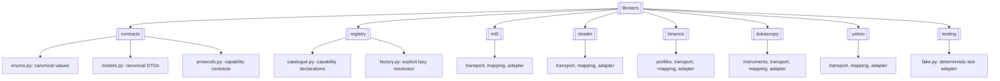
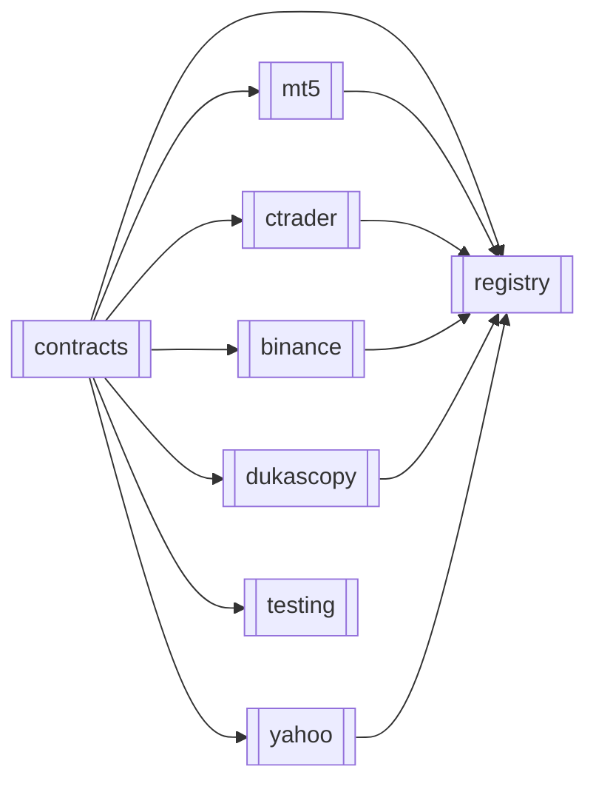
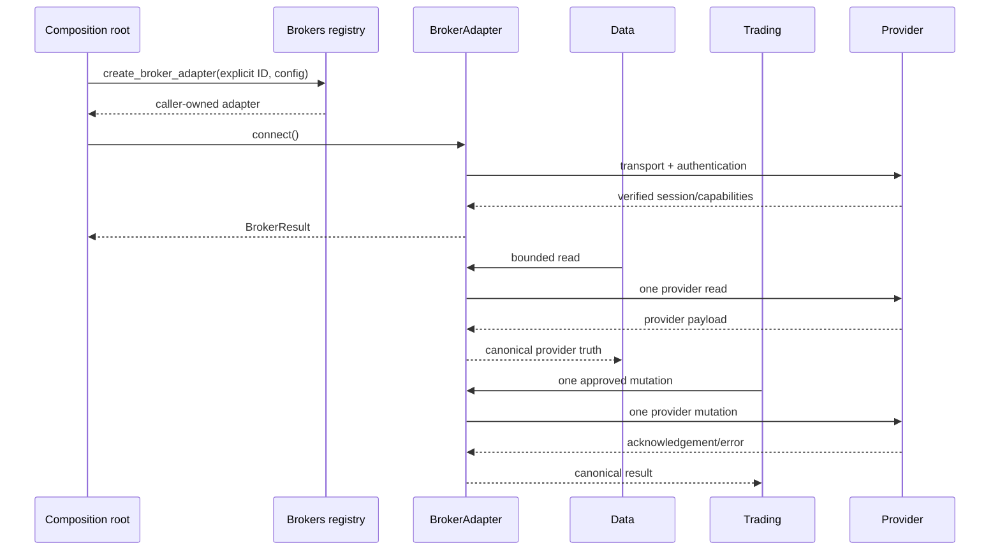

# Brokers

> **Package:** `app/services/brokers`
> **Status:** `Partial`
> **Last updated:** `2026-07-13`

> This README is the package's **single source of truth** for requirements, final structure, implementation sequence, progress, usage examples, and tests.
> Update this file before changing the code.

---

## 1. Purpose and Boundary

### Purpose

The Brokers domain is HaruQuantAI's only direct integration boundary to real broker and market-data provider platforms. It creates caller-owned provider sessions, translates canonical requests into one provider operation, and returns structurally mapped provider truth through canonical results without business policy, persistence, enrichment, or fabricated values. Data may consume read capabilities; only Trading may consume mutation capabilities.

### Owns

- Provider adapters for MT5, cTrader, Binance Spot and registered Binance Futures profiles, Dukascopy, and Yahoo Finance.
- Explicit lazy adapter factories and a generated capability catalogue.
- Provider connection, authentication, session, keep-alive, transport recovery, and subscription lifecycle.
- Canonical broker results, errors, DTOs, enums, pages, connection events, and capability traits.
- Provider request construction, response decoding, structural mapping, and provider-native pagination.
- Transport-level throttling, bounded stream backpressure, latency measurement, and redacted technical logging.
- Direct provider reads and single-target mutations requested by an allowed caller.

### Does not own

- Data-source or execution-route selection, cross-provider fallback, normalization, resampling, enrichment, caching, persistence, or snapshot freshness decisions.
- Strategy evaluation, risk approval, authorization, kill-switch policy, business idempotency, execution retry policy, reconciliation, incident handling, or execution persistence.
- Credential persistence, user/database lookup, secret-vault ownership, or implicit configuration discovery.
- Synthetic prices, ticks, spreads, fills, identifiers, account state, paper fills, or simulation.
- Bulk cancellation, bulk closure, liquidation, averaging, multi-leg orchestration, portfolio allocation, drift detection, or rebalance planning.
- HTTP/UI DTOs, performance analytics, or any import from a higher business domain.

### Shared contracts

Contract definitions match `docs/PROJECT.md`. Commands/requests received and results/channels produced by Brokers are owned here at contract version `v1`.

**Owned by this domain** — defined authoritatively here:

| Status | Contract | Version | Counterparty | Purpose |
|---|---|---|---|---|
| Missing | `BrokerAdapter` and capability traits | `v1` | Data; Trading | Canonical async provider session and operation boundary. |
| Missing | `BrokerConnectionConfig` | `v1` | Composition root; Data; Trading | Immutable provider, account, environment, secret reference, timeout, reconnect, and stream-buffer input. |
| Missing | `BrokerResult` / `BrokerError` | `v1` | Data; Trading | Truth-preserving result envelope and stable error taxonomy for every public operation. |
| Missing | Canonical broker DTO family | `v1` | Data; Trading | Provider-neutral structural schemas for accepted reads, mutations, calculations, and events. |
| Missing | `BrokerFeatureFlags` / capability catalogue | `v1` | Data; Trading | Complete generated runtime capability and verification report. |
| Missing | `BrokerConnectionEvent` / subscription event DTOs | `v1` | Data; Trading | Bounded connection and provider-event channels without SDK-object leakage. |

Every registered Brokers contract or concrete DTO carries `contract_version="v1"`
separately from a stable namespaced `schema_id` (`brokers.adapter.v1`,
`brokers.connection_config.v1`, `brokers.result.v1`, `brokers.error.v1`, or the
concrete DTO/event schema ID). Consumers never parse `schema_id` for compatibility.

**Consumed from other domains** — referenced only:

| Contract | Version | Owner | Used for |
|---|---|---|---|
| Correlation/request ID format | `v1` | Utils | Trace every adapter operation and technical event. |
| UTC-first time policy | `v1` | Utils | Canonical UTC completion, event, and provider timestamps. |
| Secret redaction policy | `v1` | Utils | Redact credentials, tokens, private keys, and full account identifiers. |
| Structured logging | `v1` | Utils | Emit lifecycle, call, error, subscription, and acknowledgement logs. |

### Persisted state

None. Brokers owns no tables, artifacts, migration definitions, credential store, reusable data cache, order store, or durable connection state. Provider-required technical state is bounded, in-memory, adapter-instance scoped, and discarded at disconnect.

### Four-level structure

| Code level | Represents |
|---|---|
| **Package** | Brokers domain |
| **Module folder** | One broker capability or provider integration |
| **File** | One focused contract, factory, transport, mapping, or adapter responsibility |
| **Class / function / method** | One observable broker requirement |

```text
Package
└── Module folder
    └── File
        └── Class / Function / Method
```

### Package capability map



---

## 2. Final Package Structure

Folders and files are ordered from lowest dependency to highest dependency. This is the implementation order.

```text
brokers/
├── __init__.py                         # Canonical domain exports only
├── README.md
├── contracts/                          # Canonical provider-neutral boundary
│   ├── __init__.py
│   ├── enums.py                        # Broker IDs, environments, states, errors
│   ├── models.py                       # Results, pages, requests, DTOs, events
│   ├── protocols.py                    # Focused capability protocols and composite adapter
│   └── unsupported.py                  # Private deterministic unsupported-result helper
├── registry/                           # Explicit lazy factories and capabilities
│   ├── __init__.py
│   ├── catalogue.py                    # Single generated capability declaration source
│   └── factory.py                      # Explicit adapter creation and listing
├── mt5/                                # MT5 provider integration
│   ├── __init__.py
│   ├── transport.py                    # Blocking terminal/session isolation
│   ├── mapping.py                      # MT5 object to canonical DTO mapping
│   └── adapter.py                      # MT5BrokerAdapter
├── ctrader/                            # cTrader provider integration
│   ├── __init__.py
│   ├── transport.py                    # Reactor, authentication, request correlation
│   ├── mapping.py                      # Protobuf to canonical DTO mapping
│   └── adapter.py                      # CTraderBrokerAdapter
├── binance/                            # Immutable Binance product profiles
│   ├── __init__.py
│   ├── profiles.py                     # Spot and registered Futures declarations
│   ├── transport.py                    # REST/WebSocket provider calls
│   ├── mapping.py                      # Binance payload to canonical DTO mapping
│   └── adapter.py                      # BinanceBrokerAdapter
├── dukascopy/                          # Read-only Dukascopy integration
│   ├── __init__.py
│   ├── instruments.py                  # Private approved/resolvable alias mapping
│   ├── transport.py                    # Bounded provider HTTP retrieval
│   ├── mapping.py                      # Provider payload to canonical DTO mapping
│   └── adapter.py                      # DukascopyBrokerAdapter
├── yahoo/                              # Read-only Yahoo historical bars
│   ├── __init__.py
│   ├── transport.py                    # Yahoo provider retrieval
│   ├── mapping.py                      # Provider bars to canonical DTO mapping
│   └── adapter.py                      # YahooBrokerAdapter
└── testing/                            # Public caller-test utilities
    ├── __init__.py
    └── fake.py                         # FakeBrokerAdapter
```

### Module dependency diagram

Arrows point from the required module to its consumer.



Registry imports provider factories lazily; provider modules never import Registry. No provider module imports another provider.

### Structure rules

- The package root contains only `README.md`, `__init__.py`, and approved feature folders.
- Public consumers import from `app.services.brokers` or a documented capability contract, never provider implementation modules.
- `contracts` depends only on the standard library and Utils-owned shared policies; it imports no provider SDK.
- Each provider exposes one adapter class and keeps transport/mapping helpers private.
- Provider SDK objects, protobuf messages, terminal handles, sockets, and exceptions never cross the package boundary.
- Usage examples live under `tests/brokers/usage/`.
- No synchronous or strict-exception façade, manager, repository, service layer, or provider extension API is part of the initial package.

### Package root public API

`app/services/brokers/__init__.py` contains only explicit imports and `__all__` for:

- FR-BRK-001–005 enums;
- FR-BRK-006–042 canonical models/results;
- FR-BRK-043–047 capability protocols;
- FR-BRK-101–103 registry functions;
- FR-BRK-104–108 approved adapter types.

`FakeBrokerAdapter` is imported from `app.services.brokers.testing` only. Provider classes are exposed for typing and provider-specific integration tests, but normal consumers obtain instances exclusively through `create_broker_adapter()`. Root initialization performs no provider import until a lazy factory or approved adapter type is accessed, and performs no selection, connection, mapping, or business logic.

### Explicit exclusions

- Removed V1 surfaces: implicit active-broker routing, unknown-to-MT5 fallback, broken broker-owned simulator routing, credential/database helpers, broker-owned data envelopes, Yahoo synthetic ticks, cTrader fabricated values/success, raw SDK delegation, `MT5Api`, private cross-domain loaders, and singleton-only lifecycle.
- Rejected/simplified V2 surfaces: strict exception façade, universal ten-state lifecycle, version fields on every nested DTO, per-bar timezone evidence duplication, and an unverified universal p99 mapping target below 100 microseconds.

---

## 3. Workflows

### Status values

| Status | Meaning |
|---|---|
| **Missing** | Canonical workflow is absent, blocked, or unverified. |
| **Partial** | Useful V1 behavior exists but canonical migration, validation, or tests remain. |
| **Completed** | Final behavior is implemented and verified. |

### Workflow scope values

| Scope | Meaning |
|---|---|
| **Internal** | Entire workflow occurs in Brokers. |
| **Cross-domain** | Brokers receives an input or produces an output at a documented domain boundary. |

| Status | Workflow ID | Scope | Workflow | Trigger / Input boundary | Final outcome / Output boundary | Requirement sequence |
|---|---|---|---|---|---|---|
| Partial | `WF-BRK-001` | Internal | Resolve explicit adapter | Explicit broker/profile ID and config | Independent adapter or `BROKER_UNKNOWN` / `BROKER_DEPENDENCY_MISSING` | `FR-BRK-101 → FR-BRK-102` |
| Partial | `WF-BRK-002` | Internal | Connect and authenticate | Caller-owned adapter and immutable config | Verified session, capability report, and lifecycle events | `FR-BRK-048 → FR-BRK-052 → FR-BRK-073` |
| Partial | `WF-BRK-003` | Cross-domain | Acquire provider market data | Data supplies an explicit adapter read | Direct canonical provider page/stream returned to Data | `FR-BRK-058 → FR-BRK-067` |
| Partial | `WF-BRK-004` | Cross-domain (`SYS-WF-002`, `SYS-WF-008`) | Submit one mutation | Trading supplies a complete approved mutation request | Provider acknowledgement/error returned to Trading | `FR-BRK-091 → FR-BRK-097` |
| Partial | `WF-BRK-005` | Cross-domain | Read account and execution state | Data or Trading requests bounded provider truth | Canonical account/order/position/deal page | `FR-BRK-079 → FR-BRK-090` |
| Missing | `WF-BRK-006` | Cross-domain | Stream provider and connection events | Data or Trading subscribes | Bounded canonical stream with explicit loss/resync state | `FR-BRK-057 → FR-BRK-068 → FR-BRK-072` |
| Missing | `WF-BRK-007` | Internal | Correlate cTrader response | cTrader transport submits one request | Only the native-ID match, or serialized same-type fallback match, is mapped | `FR-BRK-105` |
| Missing | `WF-BRK-008` | Internal | Handle unsupported operation | Caller invokes unavailable capability | No SDK call; deterministic unsupported result | `FR-BRK-010 → FR-BRK-074` |
| Partial | `WF-BRK-009` | Cross-domain | Inject canonical broker into execution | Composition root creates adapter for Trading | Trading receives a capability-scoped adapter, not MT5/cTrader concrete APIs | `FR-BRK-101 → FR-BRK-046` |

### `WF-BRK-001` — Resolve Explicit Adapter

**Scope:** `Internal`
**System workflow:** `SYS-WF-001`, `SYS-WF-002`

**Input boundary:** Exact `BrokerId`/product profile and `BrokerConnectionConfig` from the caller.
**Output boundary:** New caller-owned `BrokerAdapter` in a `BrokerResult`.

1. `create_broker_adapter()` validates exact ID/config correspondence without selecting policy.
2. The registry lazily imports only the selected factory.
3. The factory returns a new independent, disconnected adapter.
4. Unknown IDs and missing optional dependencies remain distinct canonical errors.

**Failure behaviour:**

- Unknown ID → `BROKER_UNKNOWN`; no provider import fallback.
- Missing provider package → `BROKER_DEPENDENCY_MISSING` with package/version metadata.
- Environment/profile mismatch → `BROKER_CONFIGURATION_INVALID`.

**Integration test:**
`tests/brokers/integration/test_adapter_resolution.py::test_adapter_resolution_is_explicit_and_isolated()`

### `WF-BRK-002` — Connect and Authenticate Provider Session

**Scope:** `Internal`
**System workflows:** `SYS-WF-002`, `SYS-WF-008`

**Input boundary:** A caller-owned adapter containing immutable provider/account/environment configuration.
**Output boundary:** Verified `READY` status, refreshed capabilities, and connection events.

1. `BrokerAdapter.connect()` validates connection-only configuration.
2. The adapter establishes transport and provider-required authentication.
3. It verifies account/environment identity instead of trusting a local flag.
4. It refreshes feature flags and emits each validated state transition.
5. `disconnect()` deterministically releases all owned resources and subscriptions.

**Failure behaviour:**

- Authentication or environment mismatch → failed result and `FAILED` state.
- Cancellation → provider cancellation attempted; `asyncio.CancelledError` propagates.
- Connection loss → affected operations fail; mutations are never replayed.

**Integration test:**
`tests/brokers/integration/test_session_lifecycle.py::test_session_lifecycle_verifies_and_cleans_up()`

### `WF-BRK-003` — Acquire Provider Market Data

**Scope:** `Cross-domain`
**System workflow:** `SYS-WF-002`; `SYS-WF-001` only upstream — historical acquisition/backfill by Data that later serves the backtest loop. Brokers is not part of the backtest execution path itself.

**Input boundary:** Data selects an explicit provider and submits one bounded market-data request.
**Output boundary:** Brokers returns direct canonical provider observations; Data owns all subsequent validation, normalization, caching, and persistence.

**Failure behaviour:**

- Unsupported observation type → `BROKER_CAPABILITY_UNSUPPORTED` without provider call.
- Malformed mandatory price/time → `BROKER_RESPONSE_INVALID`.
- Valid empty provider page → successful empty `BrokerPage`, not an error.

**Integration test:**
`tests/brokers/integration/test_data_boundary.py::test_data_receives_provider_truth_without_normalization()`

### `WF-BRK-004` — Submit One Broker Mutation

**Scope:** `Cross-domain`
**System workflow:** `SYS-WF-002`, `SYS-WF-008`

**Input boundary:** Trading supplies a complete, approved, single-target request and caller-owned correlation/idempotency fields.
**Output boundary:** Direct provider acknowledgement, rejection, or unknown outcome returned to Trading for reconciliation and persistence.

**Failure behaviour:**

- Structurally invalid provider request → `BROKER_REQUEST_INVALID` before mutation.
- Provider rejection → `BROKER_REQUEST_REJECTED` with redacted provider evidence.
- Possible transmission without acknowledgement → `BROKER_UNKNOWN_OUTCOME`; no retry.

**Integration test:**
`tests/brokers/integration/test_trading_mutation_boundary.py::test_mutation_returns_provider_acknowledgement_without_retry()`

### `WF-BRK-005` — Read Account and Execution State

**Scope:** `Cross-domain`
**System workflow:** `SYS-WF-002`

**Input boundary:** Data or Trading submits a bounded account, position, order, deal, or transaction read.
**Output boundary:** Canonical provider truth with provider and retrieval timestamps; caller owns freshness and reconciliation.

**Failure behaviour:**

- Missing target → the exact `BROKER_*_NOT_FOUND` result.
- Truncated provider response → successful page with explicit truncation/cursor metadata.
- Provider ID absent from a mandatory response → `BROKER_RESPONSE_INVALID`, never a fabricated ID.

**Integration test:**
`tests/brokers/integration/test_account_state_boundary.py::test_account_state_preserves_provider_ids_and_bounds()`

### `WF-BRK-006` — Stream Provider and Connection Events

**Scope:** `Cross-domain`
**System workflow:** `SYS-WF-002`

**Input boundary:** Data or Trading requests a supported adapter-scoped subscription.
**Output boundary:** FIFO canonical events through a bounded async stream plus explicit disconnect/backpressure/resync events.

**Failure behaviour:**

- Buffer overflow → `BROKER_BACKPRESSURE`, `DEGRADED` state, and resync required.
- Unknown subscription → `BROKER_SUBSCRIPTION_NOT_FOUND` without affecting others.
- Disconnect → every owned subscription terminates; silent data loss is forbidden.

**Integration test:**
`tests/brokers/integration/test_streaming.py::test_streaming_reports_backpressure_and_resync()`

### `WF-BRK-007` — Correlate cTrader Response

**Scope:** `Internal`
**System workflow:** `None`

**Input boundary:** Internal cTrader request, expected response type, request token, and session generation.
**Output boundary:** Matching decoded response or canonical error; correlation details stay private.

**Failure behaviour:**

- Stale generation or mismatched native correlation token → response discarded with `BROKER_SESSION_CHANGED`.
- When a cTrader operation lacks a reliable native request ID, requests expecting the same response type are serialized per adapter/session generation; they are never matched by payload type alone.

**Integration test:**
`tests/brokers/integration/test_ctrader_correlation.py::test_ctrader_does_not_cross_correlate_concurrent_requests()`

### `WF-BRK-008` — Handle Unsupported Operation

**Scope:** `Internal`
**System workflow:** `None`

**Input boundary:** Any canonical operation unavailable for the connected provider/profile/account.
**Output boundary:** `BrokerResult` error identifying broker, operation, and capability.

**Failure behaviour:**

- Provider capability unavailable → `BROKER_CAPABILITY_UNSUPPORTED` and zero SDK calls.
- Capability declaration and runtime report disagree → fail closed and report unavailable.

**Integration test:**
`tests/brokers/integration/test_unsupported_capabilities.py::test_unsupported_operation_never_calls_provider()`

### `WF-BRK-009` — Inject Canonical Broker into Execution

**Scope:** `Cross-domain`
**System workflow:** `SYS-WF-002`

**Input boundary:** The composition root resolves secrets through Utils, creates an explicit adapter, and injects only the capability Trading requires.
**Output boundary:** Trading receives `BrokerAdapter`/`TradeExecutionProvider` rather than a concrete MT5/cTrader client or raw SDK.

**Failure behaviour:**

- Direct provider import or native delegated method remains → the import-boundary test fails.
- A caller requests an MT5-native operation absent from the canonical contract → deterministic `BROKER_CAPABILITY_UNSUPPORTED`; raw delegation is never restored.

**Integration test:**
`tests/brokers/integration/test_execution_injection.py::test_trading_uses_only_canonical_broker_capability()`

#### End-to-end workflow diagram



---

## 4. Module and Requirement Specifications

Modules, files, and requirements are listed in implementation order.

### Approved capability traceability

This table proves that every retained reconciliation capability has one final destination; it is not an additional architecture layer.

| Reconciliation capability | Final destination |
|---|---|
| `CAP-BRK-001` Explicit registry/public API | `registry/`; FR-BRK-101–103 |
| `CAP-BRK-002` Session lifecycle | `contracts/protocols.py`; FR-BRK-047–057; provider transports |
| `CAP-BRK-003` Canonical results/errors/DTOs | `contracts/enums.py` and `models.py`; FR-BRK-001–042 |
| `CAP-BRK-004` Capabilities/unsupported outcomes | `contracts` and `registry/catalogue.py`; FR-BRK-005, 010–011, 073–074, 103 |
| `CAP-BRK-005` Symbols/metadata | FR-BRK-019, 058–062 and provider adapters |
| `CAP-BRK-006` Quotes/ticks/bars/order books | FR-BRK-022–025, 063–067 and provider adapters |
| `CAP-BRK-007` Streaming | FR-BRK-026, 057, 068–072 and provider transports |
| `CAP-BRK-008` Account/platform/permissions | FR-BRK-012, 014–018, 073–082 |
| `CAP-BRK-009` Positions/orders/deals/activity | FR-BRK-027–032, 083–090 |
| `CAP-BRK-010` Single-target mutations | FR-BRK-033–038, 091–097 |
| `CAP-BRK-011` Provider-native calculations | FR-BRK-039–041, 098–100 |
| `CAP-BRK-012` MT5 adapter | `mt5/`; FR-BRK-104 |
| `CAP-BRK-013` cTrader adapter | `ctrader/`; FR-BRK-105 |
| `CAP-BRK-014` Binance profiles | `binance/`; FR-BRK-106 |
| `CAP-BRK-015` Dukascopy read-only adapter | `dukascopy/`; FR-BRK-107 |
| `CAP-BRK-016` Yahoo historical bars | `yahoo/`; FR-BRK-108 |
| `CAP-BRK-017` Session/account isolation | FR-BRK-006, 047–052, 101; NFR-BRK-005 |
| `CAP-BRK-018` Redacted observability | `BrokerResult` metadata; NFR-BRK-007–010 |
| `CAP-BRK-019` Contract/boundary/fake tests | `testing/`; FR-BRK-109; NFR-BRK-012 |

### 4.1 `contracts/` — Canonical Provider-Neutral Boundary

**Purpose:** Define the versioned result, error, DTO, enum, page, event, and focused async capability contracts shared by every adapter.

**Module flow:**

```text
caller/provider value
  → enums.py canonical interpretation
  → models.py immutable structural DTO
  → protocols.py typed operation boundary
  → BrokerResult
```

### Files

| Status | File | Responsibility | Key exports | Dependencies |
|---|---|---|---|---|
| Missing | `enums.py` | Define stable provider IDs, environment, lifecycle, error, and capability values. | `BrokerId`, `BrokerEnvironment`, `BrokerConnectionState`, `BrokerErrorCode`, `BrokerCapabilityId` | **Standard library:** `enum`<br>**Required third-party:** None<br>**Local:** None |
| Missing | `models.py` | Define immutable canonical inputs, outputs, pages, results, and events for accepted capabilities. | All `Broker*` DTOs in FR-BRK-006–042 | **Standard library:** `dataclasses, datetime, decimal, typing`<br>**Required third-party:** None<br>**Local:** `enums.py → canonical enums` |
| Missing | `protocols.py` | Define focused async capability protocols and the composite adapter contract. | `MarketDataProvider`, `AccountProvider`, `TradeExecutionProvider`, `CalculationProvider`, `BrokerAdapter` | **Standard library:** `collections.abc, typing`<br>**Required third-party:** None<br>**Local:** `models.py → canonical DTOs/results`; `enums.py → capability values` |
| Missing | `unsupported.py` | Build deterministic unsupported results for protocol default implementations. | None (private helpers only) | **Standard library:** `datetime`<br>**Required third-party:** None<br>**Local:** `models.py → BrokerError, BrokerResult`; `enums.py → BrokerErrorCode` |
| Missing | `__init__.py` | Expose the approved public contract API only. | FR-BRK-001–100 symbols | **Standard library:** None<br>**Required third-party:** None<br>**Local:** `enums.py, models.py, protocols.py → approved exports` |

### Configuration and Limits Manifest

Shared connection settings are defined in Section 5. Contract-specific limits are:

| Status | Setting / Limit | Type | Default | Required | Used by | Description |
|---|---|---|---|---|---|---|
| Missing | Contract version | `str` | `v1` | Yes | `BrokerResult`, `BrokerFeatureFlags`, `BrokerAdapter` | Versions the result/capability/adapter boundary; nested DTOs inherit it. |
| Missing | Decimal conversion | policy | `Decimal(str(value))` | Yes | Canonical numeric DTOs | NaN/Infinity becomes null only for optional fields; a mandatory invalid number returns `BROKER_RESPONSE_INVALID`. |
| Missing | Timestamp policy | policy | UTC-aware | Yes | All timestamped DTOs | Unverified provider timezones are never assumed to be UTC. |
| Missing | Page bound | provider-derived/configured positive limit | No global numeric default approved | Yes | `BrokerPage` and list/history methods | Unbounded whole-history retrieval is forbidden; truncation and next cursor are explicit. |

### Owned contract field manifest

All DTOs are immutable. `datetime` values are timezone-aware UTC; monetary/price/quantity fields are `Decimal`; mappings and sequences are immutable views/tuples.

| Contract | Required fields |
|---|---|
| `BrokerConnectionConfig` | `broker_id: BrokerId`; `environment: BrokerEnvironment`; `account_reference: str | None`; exactly one of `credentials: Mapping[str, SecretValue] | None` or `secret_reference: str | None` when authentication is required; `endpoint: str | None`; `connect_timeout_sec: float`; `request_timeout_sec: float`; `transport_reconnect_max_attempts: int`; `stream_buffer_size: int`; `auto_connect: bool = False` |
| `BrokerError` | `code: BrokerErrorCode`; `message: str`; `retryable: bool`; `provider_code: str | None`; `provider_message: str | None`; `capability: BrokerCapabilityId | None`; `details: Mapping[str, object]` (redacted) |
| `BrokerResult[T]` | `status: Literal["success", "error"]`; `broker: BrokerId`; `operation: BrokerCapabilityId`; `request_id: str`; `timestamp: datetime`; exactly one of `data: T | None` / `error: BrokerError | None`; `provider_metadata: Mapping[str, object]` (redacted/bounded); `latency_ms: float`; `provider_latency_ms: float | None`; `adapter_overhead_ms: float`; `environment: BrokerEnvironment`; `contract_version: str = "v1"`; `schema_id: str = "brokers.result.v1"`; `adapter_version: str`; `provider_api_version: str | None` |
| `BrokerPage[T]` | `items: tuple[T, ...]`; `next_cursor: str | None`; `limit: int`; `returned_count: int`; `truncated: bool`; `provider_metadata: Mapping[str, object]` including page/timezone evidence when applicable |
| `BrokerCapability` | `capability: BrokerCapabilityId`; `implementation_status: Literal["IMPLEMENTED", "NOT_IMPLEMENTED"]`; `availability: Literal["AVAILABLE", "UNAVAILABLE", "DEGRADED"]`; `access_mode: Literal["READ", "WRITE", "READ_WRITE"]`; `requirement: Literal["NONE", "AUTHENTICATION", "CONFIGURATION", "PERMISSION"]`; `verification_status: Literal["TESTED_SANDBOX", "TESTED_LIVE", "NOT_TESTED"]`; `verification_evidence: tuple[str, ...]`; `release_approval_reference: str | None`; `reason: str | None`; `execution_model: str` |
| `BrokerFeatureFlags` | `broker_id: BrokerId`; `environment: BrokerEnvironment`; `account_reference_redacted: str | None`; `generated_at: datetime`; `capabilities: Mapping[BrokerCapabilityId, BrokerCapability]`; `contract_version`; `adapter_version`; `provider_api_version` |
| `BrokerConnectionStatus` | `state: BrokerConnectionState`; `transport_connected: bool`; `application_authenticated: bool | None`; `account_authenticated: bool | None`; `trading_permitted: bool | None`; `subscriptions_ready: bool | None`; `maintenance: bool`; `environment: BrokerEnvironment`; `account_reference_redacted: str | None`; `session_generation: int`; `observed_at: datetime` |
| `BrokerConnectionEvent` | `previous_state`; `new_state`; `reason: str | None`; `timestamp: datetime`; `session_generation: int`; `reconnect_attempt: int | None`; `resynchronization_required: bool` |
| `BrokerPlatformInfo` | `broker_id`; `provider_name`; `product_profile`; `environment`; `api_or_terminal_version: str | None`; `endpoint_metadata: Mapping[str, object]` (redacted); `observed_at` |
| `BrokerPermissions` | `market_data_read: bool | None`; `account_read: bool | None`; `trade_write: bool | None`; `subscription: bool | None`; `provider_permissions: Mapping[str, bool | None]`; `observed_at` |
| `BrokerAccountInfo` | `account_id: str`; `account_reference_redacted`; `currency: str | None`; `balance/equity/margin/free_margin: Decimal | None`; `status: str | None`; `provider_timestamp: datetime | None`; `retrieved_at: datetime` |
| `BrokerBalance` | `asset: str`; `total/available/locked: Decimal | None`; `unit: str`; `provider_timestamp: datetime | None`; `retrieved_at` |
| `BrokerAssetInfo` | `asset_id: str`; `provider_name: str | None`; `precision: int | None`; `unit: str | None`; `provider_metadata` |
| `BrokerSymbolInfo` | `symbol: str`; `provider_symbol: str`; `aliases: tuple[str, ...]`; `base_asset/quote_asset: str | None`; `product_profile`; `price/quantity units and precision`; `min/max/step values: Decimal | None`; `trading_flags: Mapping[str, bool | None]`; `provider_metadata` |
| `BrokerMarketStatus` | `symbol`; `status: Literal["OPEN", "CLOSED", "HALTED", "UNKNOWN"]`; `provider_timestamp: datetime | None`; `retrieved_at`; `reason: str | None` |
| `BrokerTradingSession` | `symbol`; `opens_at: datetime`; `closes_at: datetime`; `provider_timezone: str | None`; `provider_metadata` |
| `BrokerQuote` | `symbol`; `bid/ask/last_price: Decimal | None`; `bid/ask_quantity: Decimal | None`; `price_unit/quantity_unit: str`; `provider_sequence_id: str | int | None`; `provider_timestamp: datetime | None`; `retrieved_at` |
| `BrokerTick` | `symbol`; `provider_sequence_id: str | int | None`; `event_timestamp`; `provider_receipt_timestamp`; `bid/ask/last_price and bid/ask quantity: Decimal | None`; `tick_type: Literal["TRADE", "QUOTE", "BLOCK", "UNKNOWN"]`; explicit units |
| `BrokerBar` | `symbol`; `opening_timestamp`; `closing_timestamp`; `is_closed`; `open/high/low/close: Decimal`; `trade_volume/tick_volume: Decimal | None`; `provider_timeframe`; `requested_timeframe`; explicit units |
| `BrokerOrderBook` | `symbol`; `bids/asks: tuple[(Decimal price, Decimal quantity), ...]`; `is_snapshot`; `first/last_sequence_id: int | None`; `checksum: str | None`; `depth_truncation: int | None`; `resnapshot_required`; `event_timestamp`; explicit units |
| `BrokerSubscription` | `subscription_id`; `capability`; `symbols`; `created_at`; `buffer_size`; `delivery_sequence`; `resynchronization_required`; `active` |
| `BrokerPosition` | `position_id`; `symbol`; `side`; `quantity`; `quantity_unit`; `open/current_price: Decimal | None`; `profit/swap: Decimal | None`; `currency: str | None`; `stop_loss/take_profit: Decimal | None`; `state`; provider/retrieval timestamps |
| `BrokerOrderFilter` | Optional `symbol`, `status`, `side`, `start`, `end`, `account_reference` structural fields only |
| `BrokerPositionFilter` | Optional `symbol`, `side`, `account_reference` structural fields only |
| `BrokerOrder` | `order_id`; `client_request_id/client_order_id: str | None`; `symbol`; `side`; `order_type`; `state`; `quantity/filled/remaining: Decimal` and unit; applicable price/stop/TIF/product fields; provider/retrieval timestamps; `provider_metadata` |
| `BrokerDeal` | `deal_id`; `order_id/position_id: str | None`; `symbol`; `side`; `quantity` and unit; `price`; `fee: Decimal | None`; `fee_currency: str | None`; `partial: bool`; provider/retrieval timestamps |
| `BrokerAccountTransaction` | `transaction_id`; `transaction_type`; `asset/currency`; `amount: Decimal`; `provider_timestamp`; `retrieved_at`; `provider_metadata` |
| `BrokerOrderRequest` | `symbol`; `side`; `order_type`; exact `quantity` and `quantity_unit`; applicable `limit/stop/stop_loss/take_profit`; `time_in_force/expiration/deviation`; caller `client_request_id/client_order_id/label/magic/comment`; `account_reference`; `environment`; profile-applicable reduce/post/position/margin/trigger/trailing/self-trade/close-on-trigger/base-or-quote quantity/contract multiplier/leverage fields |
| `BrokerOrderModificationRequest` | `order_id`; `client_request_id: str | None`; only caller-supplied mutable price/quantity/stop/TIF/expiration fields |
| `BrokerOrderCheck` | `accepted_for_submission: bool`; `provider_code/message: str | None`; `estimated_margin: Decimal | None`; `warnings: tuple[str, ...]`; explicit `is_final_acceptance: Literal[False]` |
| `BrokerOrderResult` | `acknowledged: bool`; `outcome: Literal["ACCEPTED", "REJECTED", "UNKNOWN", "PARTIAL"]`; provider `order_id/deal_ids: str/tuple | None`; `filled/remaining quantity: Decimal | None`; `average_price: Decimal | None`; `provider_code/message`; `provider_timestamp/retrieved_at` |
| `BrokerPositionModificationRequest` | `position_id`; `client_request_id: str | None`; caller-supplied `stop_loss/take_profit: Decimal | None` with at least one modification |
| `BrokerPositionCloseRequest` | `position_id`; `quantity: Decimal`; `quantity_unit`; `client_request_id: str | None` |
| `BrokerMarginRequest` | Provider-required `symbol`, `side`, `quantity`, `quantity_unit`, `price: Decimal | None`, `account_reference`, `product_profile` |
| `BrokerProfitRequest` | `symbol`; `side`; `quantity`; `quantity_unit`; `open_price`; `close_price`; `account_reference`; `product_profile` |
| `BrokerFeeEstimate` | `amount: Decimal`; `currency_or_unit`; `provider_code: str | None`; `provider_metadata` |
| `BrokerServerTime` | `provider_time`; `local_send_time`; `local_receive_time`; `estimated_clock_offset_ms: float`; `round_trip_latency_ms: float` |

### Canonical error conditions

These are returned in `BrokerResult.error`, never raised as expected domain exceptions.

| Error code | Exact condition |
|---|---|
| `BROKER_UNKNOWN` | Explicit broker/profile ID is not registered. |
| `BROKER_CONFIGURATION_INVALID` | Required connection field is absent/invalid, or requested environment/profile conflicts with endpoint/account evidence. |
| `BROKER_AUTHENTICATION_FAILED` | Provider rejects or cannot verify application/account credentials or refresh. |
| `BROKER_AUTHORIZATION_FAILED` | Authenticated session lacks the provider-reported permission required by the operation. |
| `BROKER_NOT_CONNECTED` | A session-required operation is invoked while the adapter is not `READY` and explicit auto-connect is disabled. |
| `BROKER_CONNECTION_FAILED` | Transport/provider session cannot be established before any operation is transmitted. |
| `BROKER_CONNECTION_LOST` | Established transport is lost and the interrupted operation is known not to have a mutation outcome. |
| `BROKER_TIMEOUT` | A read/connect/provider operation exceeds its bound and no mutation may have been transmitted. |
| `BROKER_RATE_LIMITED` | Provider explicitly rejects/throttles the operation and supplies rate-limit evidence. |
| `BROKER_BACKPRESSURE` | A bounded request/event queue has no capacity within the allowed fail-fast behavior; stream overflow also requires resync. |
| `BROKER_CAPABILITY_UNSUPPORTED` | The complete capability report marks the operation unavailable; no SDK call is made. |
| `BROKER_SYMBOL_NOT_FOUND` | Provider explicitly reports the requested symbol absent. |
| `BROKER_ACCOUNT_NOT_FOUND` | Provider explicitly reports the requested account absent. |
| `BROKER_ORDER_NOT_FOUND` | Provider explicitly reports the requested order absent. |
| `BROKER_POSITION_NOT_FOUND` | Provider explicitly reports the requested position absent. |
| `BROKER_DEAL_NOT_FOUND` | Provider explicitly reports the requested deal/fill absent. |
| `BROKER_REQUEST_INVALID` | Canonical request lacks/conflicts with provider-required structural fields before transmission. |
| `BROKER_REQUEST_REJECTED` | Provider explicitly rejects a valid transmitted request; redacted provider code/message are preserved. |
| `BROKER_MARKET_CLOSED` | Provider explicitly rejects/reports the operation because its market/session is closed. |
| `BROKER_INSUFFICIENT_MARGIN` | Provider explicitly rejects a mutation/check for insufficient margin. |
| `BROKER_INSUFFICIENT_FUNDS` | Provider explicitly rejects an operation for insufficient funds/balance. |
| `BROKER_UNKNOWN_OUTCOME` | Timeout/connection loss occurs after a mutation may have reached the provider without reliable acknowledgement. |
| `BROKER_PROVIDER_ERROR` | Provider reports an operational error not represented by a more specific accepted code. |
| `BROKER_RESPONSE_INVALID` | Provider response is malformed, leaks an unmappable raw type, or contains invalid mandatory time/number/identifier evidence. |
| `BROKER_SUBSCRIPTION_FAILED` | Provider rejects or cannot establish a supported subscription. |
| `BROKER_MAINTENANCE_MODE` | Provider supplies scheduled/active maintenance evidence that blocks the operation. |
| `BROKER_SUBSCRIPTION_RESYNC_REQUIRED` | Disconnect, gap, checksum failure, or overflow prevents guaranteed lossless continuation. |
| `BROKER_SUBSCRIPTION_NOT_FOUND` | The adapter does not own the supplied subscription ID. |
| `BROKER_DEPENDENCY_MISSING` | Selected registered provider's required optional package is absent; dependency metadata is returned. |
| `BROKER_SESSION_CHANGED` | A response/callback belongs to an earlier session generation and cannot be safely applied. |

`asyncio.CancelledError` propagates when the caller cancels. `KeyboardInterrupt`, `SystemExit`, and other fatal process exceptions also propagate. `BROKER_OPERATION_CANCELLED`, account-switch-in-progress, strict-exception façade codes, and a policy-heavy circuit-open error are excluded from the initial canonical taxonomy.

#### `enums.py` — Stable Canonical Values

**File responsibility:** Provide versioned values that prevent provider constants from crossing the domain boundary.

| Status | Requirement ID | Responsibility | Class / Function / Method | Side Effects | Raises | Usage / Test |
|---|---|---|---|---|---|---|
| Missing | `FR-BRK-001` | The system shall identify MT5, cTrader, Binance Spot, Binance USD-M Futures, Binance Coin-M Futures, Dukascopy, and Yahoo without aliases or implicit fallback. | `class BrokerId(str, Enum)` | None | `ValueError`: identifier is not registered. | **Usage:** `tests/brokers/usage/test_usage_contracts.py::test_usage_enums_broker_id()`<br>**Unit:** `tests/brokers/unit/test_enums.py::test_broker_id_has_exact_profiles()` |
| Missing | `FR-BRK-002` | The system shall require an explicit `LIVE`, `DEMO`, `TESTNET`, or `SANDBOX` environment and shall define no implicit live default. | `class BrokerEnvironment(str, Enum)` | None | `ValueError`: environment is unknown. | **Usage:** `tests/brokers/usage/test_usage_contracts.py::test_usage_enums_environment()`<br>**Unit:** `tests/brokers/unit/test_enums.py::test_environment_has_no_live_default()` |
| Missing | `FR-BRK-003` | The system shall expose the minimal validated lifecycle states `DISCONNECTED`, `CONNECTING`, `READY`, `DEGRADED`, `CLOSING`, and `FAILED`. | `class BrokerConnectionState(str, Enum)` | None | `ValueError`: state is unknown. | **Usage:** `tests/brokers/usage/test_usage_contracts.py::test_usage_enums_connection_state()`<br>**Unit:** `tests/brokers/unit/test_enums.py::test_connection_states_match_reconciliation()` |
| Missing | `FR-BRK-004` | The system shall expose the stable accepted `BROKER_*` error taxonomy and shall add codes only with an accepted operation. | `class BrokerErrorCode(str, Enum)` | None | `ValueError`: code is not registered. | **Usage:** `tests/brokers/usage/test_usage_contracts.py::test_usage_enums_error_code()`<br>**Unit:** `tests/brokers/unit/test_enums.py::test_error_codes_cover_accepted_failures()` |
| Missing | `FR-BRK-005` | The system shall provide one identifier for every accepted canonical adapter operation so capability reports cannot omit unsupported entries. | `class BrokerCapabilityId(str, Enum)` | None | `ValueError`: capability is unknown. | **Usage:** `tests/brokers/usage/test_usage_contracts.py::test_usage_enums_capability_id()`<br>**Unit:** `tests/brokers/unit/test_enums.py::test_capabilities_match_protocol_methods()` |

**Rules:**

- Unknown provider values are errors, never MT5 aliases.
- Provider-native constants remain private mapping inputs.
- Enum expansion must fail closed when an older consumer cannot interpret it.

#### `models.py` — Canonical DTOs and Results

**File responsibility:** Represent accepted provider inputs and truth-preserving outputs without SDK objects, guessed values, or business transformations.

All model constructors have side effect `None`. Each raises `ValueError` only when a documented structural invariant is violated; provider operational failures are represented by `BrokerError` in `BrokerResult`.

| Status | Requirement ID | Responsibility | Class / Function / Method | Side Effects | Raises | Usage / Test |
|---|---|---|---|---|---|---|
| Missing | `FR-BRK-006` | The system shall carry immutable provider/profile, environment, account reference, secret reference, timeout, reconnect, buffer, and auto-connect configuration without persisting secrets. | `class BrokerConnectionConfig` | None | `ValueError`: required identity/environment is absent or a numeric limit is invalid. | **Usage:** `tests/brokers/usage/test_usage_contracts.py::test_usage_models_connection_config()`<br>**Unit:** `tests/brokers/unit/test_models.py::test_connection_config_is_immutable_and_explicit()` |
| Missing | `FR-BRK-007` | The system shall represent code, message, retryability, redacted provider evidence, capability, and diagnostic details for an operational failure. | `class BrokerError` | None | `ValueError`: code/message is absent or details contain forbidden secrets. | **Usage:** `tests/brokers/usage/test_usage_contracts.py::test_usage_models_error()`<br>**Unit:** `tests/brokers/unit/test_models.py::test_error_is_redacted_and_structured()` |
| Missing | `FR-BRK-008` | Every public operation shall return exactly one versioned status/broker/operation/request/time/data-or-error/provider-metadata/latency envelope. | `class BrokerResult[T]` | None | `ValueError`: success/error invariants are inconsistent. | **Usage:** `tests/brokers/usage/test_usage_contracts.py::test_usage_models_result()`<br>**Unit:** `tests/brokers/unit/test_models.py::test_result_requires_exactly_data_or_error()` |
| Missing | `FR-BRK-009` | List and history operations shall return bounded records with provider cursor and explicit truncation metadata. | `class BrokerPage[T]` | None | `ValueError`: page limit/count is negative or truncation metadata conflicts. | **Usage:** `tests/brokers/usage/test_usage_contracts.py::test_usage_models_page()`<br>**Unit:** `tests/brokers/unit/test_models.py::test_page_exposes_cursor_and_truncation()` |
| Missing | `FR-BRK-010` | Each capability shall report implementation, availability, access, requirement, verification, evidence references, release approval, reason, and execution model from one declaration source; a write capability is `AVAILABLE` only after the shared contract suite, provider sandbox/testnet execution, rejection and unknown-outcome tests, authenticated permission verification, and explicit Owner approval all pass. | `class BrokerCapability` | None | `ValueError`: capability dimensions are incomplete, evidence/approval is missing for an available write, or fields are inconsistent. | **Usage:** `tests/brokers/usage/test_usage_contracts.py::test_usage_models_capability()`<br>**Unit:** `tests/brokers/unit/test_models.py::test_capability_requires_write_release_evidence()` |
| Missing | `FR-BRK-011` | The system shall return every catalogue entry for one provider/profile/account, including unsupported and untested operations, and shall keep every unapproved write capability unavailable. | `class BrokerFeatureFlags` | None | `ValueError`: catalogue entries are missing/duplicated or an unapproved write is available. | **Usage:** `tests/brokers/usage/test_usage_contracts.py::test_usage_models_feature_flags()`<br>**Unit:** `tests/brokers/unit/test_models.py::test_feature_flags_fail_closed_for_unapproved_writes()` |
| Missing | `FR-BRK-012` | The system shall distinguish transport, authentication, account authorization, trading permission, subscription readiness, environment, and lifecycle state. | `class BrokerConnectionStatus` | None | `ValueError`: status dimensions conflict with lifecycle state. | **Usage:** `tests/brokers/usage/test_usage_contracts.py::test_usage_models_connection_status()`<br>**Unit:** `tests/brokers/unit/test_models.py::test_connection_status_is_not_boolean_only()` |
| Missing | `FR-BRK-013` | Every lifecycle transition shall expose previous/new state, reason, UTC time, session generation, optional reconnect attempt, and resync requirement. | `class BrokerConnectionEvent` | None | `ValueError`: transition or UTC/session evidence is invalid. | **Usage:** `tests/brokers/usage/test_usage_contracts.py::test_usage_models_connection_event()`<br>**Unit:** `tests/brokers/unit/test_models.py::test_connection_event_records_transition()` |
| Missing | `FR-BRK-014` | The system shall expose provider, API/terminal version, endpoint metadata, immutable profile, and environment without secrets. | `class BrokerPlatformInfo` | None | `ValueError`: provider/environment identity is absent. | **Usage:** `tests/brokers/usage/test_usage_contracts.py::test_usage_models_platform_info()`<br>**Unit:** `tests/brokers/unit/test_models.py::test_platform_info_is_redacted()` |
| Missing | `FR-BRK-015` | The system shall expose only permissions reported for the authenticated provider session. | `class BrokerPermissions` | None | `ValueError`: an unknown permission is represented as granted. | **Usage:** `tests/brokers/usage/test_usage_contracts.py::test_usage_models_permissions()`<br>**Unit:** `tests/brokers/unit/test_models.py::test_permissions_preserve_unknown()` |
| Missing | `FR-BRK-016` | The system shall preserve provider account identity, currency, balances, equity, margin, status, and provider/retrieval timestamps without certifying freshness. | `class BrokerAccountInfo` | None | `ValueError`: mandatory provider identity/time or decimal is invalid. | **Usage:** `tests/brokers/usage/test_usage_contracts.py::test_usage_models_account_info()`<br>**Unit:** `tests/brokers/unit/test_models.py::test_account_info_preserves_provider_truth()` |
| Missing | `FR-BRK-017` | The system shall represent provider-reported asset/currency balance values with exact decimals and explicit units. | `class BrokerBalance` | None | `ValueError`: asset/unit is absent or mandatory value is invalid. | **Usage:** `tests/brokers/usage/test_usage_contracts.py::test_usage_models_balance()`<br>**Unit:** `tests/brokers/unit/test_models.py::test_balance_uses_decimal_and_unit()` |
| Missing | `FR-BRK-018` | The system shall represent provider asset/currency metadata without canonical identity policy or currency conversion. | `class BrokerAssetInfo` | None | `ValueError`: provider asset identifier is absent. | **Usage:** `tests/brokers/usage/test_usage_contracts.py::test_usage_models_asset_info()`<br>**Unit:** `tests/brokers/unit/test_models.py::test_asset_info_is_structural_only()` |
| Missing | `FR-BRK-019` | The system shall preserve provider symbol identifiers, explicit aliases, specifications, sessions, units, and trading flags without Data-owned identity normalization. | `class BrokerSymbolInfo` | None | `ValueError`: provider symbol or required unit metadata is absent. | **Usage:** `tests/brokers/usage/test_usage_contracts.py::test_usage_models_symbol_info()`<br>**Unit:** `tests/brokers/unit/test_models.py::test_symbol_info_preserves_aliases()` |
| Missing | `FR-BRK-020` | The system shall represent provider-reported open, closed, halted, or unknown market state. | `class BrokerMarketStatus` | None | `ValueError`: status lacks provider symbol/time evidence. | **Usage:** `tests/brokers/usage/test_usage_contracts.py::test_usage_models_market_status()`<br>**Unit:** `tests/brokers/unit/test_models.py::test_market_status_allows_unknown()` |
| Missing | `FR-BRK-021` | The system shall represent provider-supplied trading windows as timezone-aware UTC intervals with native metadata retained. | `class BrokerTradingSession` | None | `ValueError`: interval is unordered or timezone-naive. | **Usage:** `tests/brokers/usage/test_usage_contracts.py::test_usage_models_trading_session()`<br>**Unit:** `tests/brokers/unit/test_models.py::test_trading_session_is_utc()` |
| Missing | `FR-BRK-022` | The system shall expose only genuine bid/ask/last values with exact decimals, nullable missing fields, explicit units, and provider/retrieval times. | `class BrokerQuote` | None | `ValueError`: no genuine price exists or mandatory price/time is invalid. | **Usage:** `tests/brokers/usage/test_usage_contracts.py::test_usage_models_quote()`<br>**Unit:** `tests/brokers/unit/test_models.py::test_quote_never_fabricates_price()` |
| Missing | `FR-BRK-023` | The system shall preserve provider sequence, event/receipt time, nullable bid/ask/last and quantities, and tick type without invented sequence evidence. | `class BrokerTick` | None | `ValueError`: mandatory event/receipt evidence is invalid. | **Usage:** `tests/brokers/usage/test_usage_contracts.py::test_usage_models_tick()`<br>**Unit:** `tests/brokers/unit/test_models.py::test_tick_preserves_optional_values()` |
| Missing | `FR-BRK-024` | The system shall preserve UTC open/close time, closed state, trade/tick volume distinctions, and native/requested timeframe while storing conversion evidence once in page metadata. | `class BrokerBar` | None | `ValueError`: OHLC/time ordering or mandatory decimals are invalid. | **Usage:** `tests/brokers/usage/test_usage_contracts.py::test_usage_models_bar()`<br>**Unit:** `tests/brokers/unit/test_models.py::test_bar_has_explicit_time_and_volume_semantics()` |
| Missing | `FR-BRK-025` | The system shall represent order-book snapshot/delta state, levels, provider sequence/checksum, depth truncation, and resnapshot requirement without invented sequence IDs. | `class BrokerOrderBook` | None | `ValueError`: levels or supplied sequence range is invalid. | **Usage:** `tests/brokers/usage/test_usage_contracts.py::test_usage_models_order_book()`<br>**Unit:** `tests/brokers/unit/test_models.py::test_order_book_exposes_resnapshot_state()` |
| Missing | `FR-BRK-026` | The system shall identify one adapter-scoped bounded subscription, its capability, symbols, creation time, and resync state. | `class BrokerSubscription` | None | `ValueError`: subscription ID or bounded-buffer evidence is invalid. | **Usage:** `tests/brokers/usage/test_usage_contracts.py::test_usage_models_subscription()`<br>**Unit:** `tests/brokers/unit/test_models.py::test_subscription_is_adapter_scoped()` |
| Missing | `FR-BRK-027` | The system shall preserve provider position ID, symbol, side, exact quantities/prices/P&L fields, partial state, and timestamps. | `class BrokerPosition` | None | `ValueError`: mandatory provider identity/quantity/time is invalid. | **Usage:** `tests/brokers/usage/test_usage_contracts.py::test_usage_models_position()`<br>**Unit:** `tests/brokers/unit/test_models.py::test_position_preserves_provider_profit()` |
| Missing | `FR-BRK-028` | The system shall express structural order filters only, without selection policy or unbounded history. | `class BrokerOrderFilter` | None | `ValueError`: date interval is invalid. | **Usage:** `tests/brokers/usage/test_usage_contracts.py::test_usage_models_order_filter()`<br>**Unit:** `tests/brokers/unit/test_models.py::test_order_filter_is_structural()` |
| Missing | `FR-BRK-029` | The system shall express structural position filters only. | `class BrokerPositionFilter` | None | `ValueError`: supplied filter value is structurally invalid. | **Usage:** `tests/brokers/usage/test_usage_contracts.py::test_usage_models_position_filter()`<br>**Unit:** `tests/brokers/unit/test_models.py::test_position_filter_is_structural()` |
| Missing | `FR-BRK-030` | The system shall preserve provider order IDs, caller IDs, product-applicable fields, exact quantity/unit, partial state, prices, and timestamps without fabricating acceptance. | `class BrokerOrder` | None | `ValueError`: mandatory identity/state/quantity evidence is invalid. | **Usage:** `tests/brokers/usage/test_usage_contracts.py::test_usage_models_order()`<br>**Unit:** `tests/brokers/unit/test_models.py::test_order_preserves_partial_state_and_ids()` |
| Missing | `FR-BRK-031` | The system shall preserve provider deal/fill ID, order reference, exact quantity/price/fee, partial state, and timestamps. | `class BrokerDeal` | None | `ValueError`: mandatory provider deal evidence is invalid. | **Usage:** `tests/brokers/usage/test_usage_contracts.py::test_usage_models_deal()`<br>**Unit:** `tests/brokers/unit/test_models.py::test_deal_never_invents_fill()` |
| Missing | `FR-BRK-032` | The system shall represent provider-reported deposits, withdrawals, fees, swaps, and account transactions with exact values and units. | `class BrokerAccountTransaction` | None | `ValueError`: transaction identity/value/time is invalid. | **Usage:** `tests/brokers/usage/test_usage_contracts.py::test_usage_models_account_transaction()`<br>**Unit:** `tests/brokers/unit/test_models.py::test_account_transaction_preserves_type()` |
| Missing | `FR-BRK-033` | The system shall require a complete single-order request with caller intent fields, exact quantity/unit, optional product-profile fields, account/environment binding, and caller IDs; it shall infer nothing. | `class BrokerOrderRequest` | None | `ValueError`: provider-required structural fields conflict or are absent. | **Usage:** `tests/brokers/usage/test_usage_contracts.py::test_usage_models_order_request()`<br>**Unit:** `tests/brokers/unit/test_models.py::test_order_request_does_not_infer_fields()` |
| Missing | `FR-BRK-034` | The system shall identify exactly one provider order and only caller-supplied modifications. | `class BrokerOrderModificationRequest` | None | `ValueError`: target ID is absent or no modification is supplied. | **Usage:** `tests/brokers/usage/test_usage_contracts.py::test_usage_models_order_modification()`<br>**Unit:** `tests/brokers/unit/test_models.py::test_order_modification_has_one_target()` |
| Missing | `FR-BRK-035` | The system shall distinguish provider validation/preview from final order acceptance. | `class BrokerOrderCheck` | None | `ValueError`: provider check evidence is inconsistent. | **Usage:** `tests/brokers/usage/test_usage_contracts.py::test_usage_models_order_check()`<br>**Unit:** `tests/brokers/unit/test_models.py::test_order_check_is_not_acceptance()` |
| Missing | `FR-BRK-036` | The system shall represent explicit provider acknowledgement, rejection, unknown outcome, partial fill, and provider identifiers without synthetic success. | `class BrokerOrderResult` | None | `ValueError`: success lacks acknowledgement or identifiers are fabricated/inconsistent. | **Usage:** `tests/brokers/usage/test_usage_contracts.py::test_usage_models_order_result()`<br>**Unit:** `tests/brokers/unit/test_models.py::test_order_result_requires_acknowledgement()` |
| Missing | `FR-BRK-037` | The system shall identify one position and only provider-supported caller-supplied stop/take-profit modifications. | `class BrokerPositionModificationRequest` | None | `ValueError`: target ID is absent or fields are structurally invalid. | **Usage:** `tests/brokers/usage/test_usage_contracts.py::test_usage_models_position_modification()`<br>**Unit:** `tests/brokers/unit/test_models.py::test_position_modification_has_one_target()` |
| Missing | `FR-BRK-038` | The system shall identify one position and exact caller-supplied close/reduce quantity and unit. | `class BrokerPositionCloseRequest` | None | `ValueError`: target or positive quantity/unit is absent. | **Usage:** `tests/brokers/usage/test_usage_contracts.py::test_usage_models_position_close()`<br>**Unit:** `tests/brokers/unit/test_models.py::test_position_close_has_one_target()` |
| Missing | `FR-BRK-039` | The system shall carry only fields required for a provider-native margin request. | `class BrokerMarginRequest` | None | `ValueError`: provider-required structural input is absent. | **Usage:** `tests/brokers/usage/test_usage_contracts.py::test_usage_models_margin_request()`<br>**Unit:** `tests/brokers/unit/test_models.py::test_margin_request_is_provider_native()` |
| Missing | `FR-BRK-040` | The system shall carry only fields required for a provider-native profit request, including explicit open/close prices and units. | `class BrokerProfitRequest` | None | `ValueError`: provider-required structural input is absent. | **Usage:** `tests/brokers/usage/test_usage_contracts.py::test_usage_models_profit_request()`<br>**Unit:** `tests/brokers/unit/test_models.py::test_profit_request_has_explicit_prices()` |
| Missing | `FR-BRK-041` | The system shall represent a provider-native fee/commission estimate with exact value, currency/unit, and provider evidence. | `class BrokerFeeEstimate` | None | `ValueError`: amount or unit evidence is invalid. | **Usage:** `tests/brokers/usage/test_usage_contracts.py::test_usage_models_fee_estimate()`<br>**Unit:** `tests/brokers/unit/test_models.py::test_fee_estimate_is_not_local_formula()` |
| Missing | `FR-BRK-042` | The system shall expose provider time, local send/receive UTC times, estimated offset, and round-trip latency without silently correcting business timestamps. | `class BrokerServerTime` | None | `ValueError`: timestamps are timezone-naive/unordered or latency is negative. | **Usage:** `tests/brokers/usage/test_usage_contracts.py::test_usage_models_server_time()`<br>**Unit:** `tests/brokers/unit/test_models.py::test_server_time_exposes_clock_evidence()` |

**Rules:**

- Missing provider fields remain `None` or explicit `UNKNOWN`; zero and guessed values are forbidden.
- Prices, money, quantity, margin, fees, and P&L use `Decimal` created from provider string representations.
- Raw payload snippets in metadata are optional, redacted, bounded, and never SDK objects.
- DTOs perform structural validation only; they do not clean, enrich, convert currencies, calculate risk, or decide freshness.

#### `protocols.py` — Capability Protocols and Operations

**File responsibility:** Define one async method for each accepted direct provider operation and compose narrow read/write capabilities into `BrokerAdapter`.

| Status | Requirement ID | Responsibility | Class / Function / Method | Side Effects | Raises | Usage / Test |
|---|---|---|---|---|---|---|
| Missing | `FR-BRK-043` | The system shall define the genuine market-data and subscription read surface independently of execution capabilities. | `class MarketDataProvider(Protocol)` | None | None | **Usage:** `tests/brokers/usage/test_usage_contracts.py::test_usage_protocols_market_data_provider()`<br>**Unit:** `tests/brokers/unit/test_protocols.py::test_market_data_protocol_is_runtime_checkable()` |
| Missing | `FR-BRK-044` | The system shall define account/platform/state reads independently of mutation capabilities. | `class AccountProvider(Protocol)` | None | None | **Usage:** `tests/brokers/usage/test_usage_contracts.py::test_usage_protocols_account_provider()`<br>**Unit:** `tests/brokers/unit/test_protocols.py::test_account_protocol_is_runtime_checkable()` |
| Missing | `FR-BRK-045` | The system shall define only single-target provider mutation primitives. | `class TradeExecutionProvider(Protocol)` | None | None | **Usage:** `tests/brokers/usage/test_usage_contracts.py::test_usage_protocols_trade_execution_provider()`<br>**Unit:** `tests/brokers/unit/test_protocols.py::test_execution_protocol_excludes_bulk_methods()` |
| Missing | `FR-BRK-046` | The system shall define provider-native calculation requests without local fallback formulas. | `class CalculationProvider(Protocol)` | None | None | **Usage:** `tests/brokers/usage/test_usage_contracts.py::test_usage_protocols_calculation_provider()`<br>**Unit:** `tests/brokers/unit/test_protocols.py::test_calculation_protocol_is_provider_native()` |
| Missing | `FR-BRK-047` | The system shall compose lifecycle and focused capabilities into one async adapter, support deterministic `async with` cleanup, and expose no sync/strict façade initially. | `class BrokerAdapter(MarketDataProvider, AccountProvider, TradeExecutionProvider, CalculationProvider, Protocol)`; `BrokerAdapter.__aenter__() -> BrokerAdapter`; `BrokerAdapter.__aexit__(exc_type: type[BaseException] | None, exc: BaseException | None, traceback: TracebackType | None) -> None` | External API call; local state mutation | `asyncio.CancelledError`: caller cancels connect/disconnect; consumer exception still propagates after cleanup. | **Usage:** `tests/brokers/usage/test_usage_contracts.py::test_usage_protocols_async_context()`<br>**Unit:** `tests/brokers/unit/test_protocols.py::test_adapter_context_always_disconnects()` |

Operational failures below are returned as `BrokerResult.error`. The only expected raised exception is `asyncio.CancelledError` when the caller cancels an async operation.

| Status | Requirement ID | Responsibility | Class / Function / Method | Side Effects | Raises | Usage / Test |
|---|---|---|---|---|---|---|
| Partial | `FR-BRK-048` | The system shall explicitly establish and verify the configured transport, authentication, account, and environment before returning success. | `async BrokerAdapter.connect() -> BrokerResult[None]` | External API call; local state mutation | `asyncio.CancelledError`: caller cancels connection. | **Usage:** `tests/brokers/usage/test_usage_contracts.py::test_usage_protocols_connect()`<br>**Unit:** `tests/brokers/unit/test_protocols.py::test_connect_requires_verified_provider_state()` |
| Partial | `FR-BRK-049` | The system shall idempotently close every session, task, terminal handle, reactor, and subscription owned by the adapter. | `async BrokerAdapter.disconnect() -> BrokerResult[None]` | External API call; local state mutation | `asyncio.CancelledError`: caller cancels cleanup; adapter remains fail-closed. | **Usage:** `tests/brokers/usage/test_usage_contracts.py::test_usage_protocols_disconnect()`<br>**Unit:** `tests/brokers/unit/test_protocols.py::test_disconnect_is_idempotent()` |
| Missing | `FR-BRK-050` | The system shall recover only the same transport/session up to the configured bound and shall never replay interrupted reads or mutations. | `async BrokerAdapter.reconnect() -> BrokerResult[None]` | External API call; local state mutation | `asyncio.CancelledError`: caller cancels recovery. | **Usage:** `tests/brokers/usage/test_usage_contracts.py::test_usage_protocols_reconnect()`<br>**Unit:** `tests/brokers/unit/test_protocols.py::test_reconnect_never_replays_operation()` |
| Partial | `FR-BRK-051` | The system shall return verified current connectivity rather than a caller-local Boolean flag. | `async BrokerAdapter.is_connected() -> BrokerResult[bool]` | Read-only; external API call where required | `asyncio.CancelledError`: caller cancels verification. | **Usage:** `tests/brokers/usage/test_usage_contracts.py::test_usage_protocols_is_connected()`<br>**Unit:** `tests/brokers/unit/test_protocols.py::test_is_connected_is_provider_verified()` |
| Missing | `FR-BRK-052` | The system shall return detailed lifecycle, authentication, account, permission, subscription, environment, and maintenance state. | `async BrokerAdapter.get_connection_status() -> BrokerResult[BrokerConnectionStatus]` | Read-only | `asyncio.CancelledError`: caller cancels provider status read. | **Usage:** `tests/brokers/usage/test_usage_contracts.py::test_usage_protocols_connection_status()`<br>**Unit:** `tests/brokers/unit/test_protocols.py::test_connection_status_is_detailed()` |
| Partial | `FR-BRK-053` | The system shall perform only a provider-supported liveness probe and return unsupported otherwise. | `async BrokerAdapter.ping() -> BrokerResult[None]` | External API call | `asyncio.CancelledError`: caller cancels probe. | **Usage:** `tests/brokers/usage/test_usage_contracts.py::test_usage_protocols_ping()`<br>**Unit:** `tests/brokers/unit/test_protocols.py::test_ping_has_no_synthetic_success()` |
| Partial | `FR-BRK-054` | The system shall use only provider-supported token/session refresh and shall fail the session closed when refresh fails. | `async BrokerAdapter.refresh_session() -> BrokerResult[None]` | External API call; local state mutation | `asyncio.CancelledError`: caller cancels refresh. | **Usage:** `tests/brokers/usage/test_usage_contracts.py::test_usage_protocols_refresh_session()`<br>**Unit:** `tests/brokers/unit/test_protocols.py::test_refresh_failure_invalidates_session()` |
| Missing | `FR-BRK-055` | The system shall return provider time and local clock/latency evidence when available, otherwise unsupported. | `async BrokerAdapter.get_server_time() -> BrokerResult[BrokerServerTime]` | Read-only; external API call | `asyncio.CancelledError`: caller cancels time request. | **Usage:** `tests/brokers/usage/test_usage_contracts.py::test_usage_protocols_server_time()`<br>**Unit:** `tests/brokers/unit/test_protocols.py::test_server_time_exposes_offset_evidence()` |
| Partial | `FR-BRK-056` | The system shall expose the adapter instance's latest redacted diagnostic error as non-authoritative state. | `async BrokerAdapter.get_last_error() -> BrokerResult[BrokerError | None]` | Read-only | `asyncio.CancelledError`: caller cancels provider diagnostic read. | **Usage:** `tests/brokers/usage/test_usage_contracts.py::test_usage_protocols_last_error()`<br>**Unit:** `tests/brokers/unit/test_protocols.py::test_last_error_is_redacted_and_non_authoritative()` |
| Missing | `FR-BRK-057` | The system shall yield one canonical event per validated lifecycle transition through a bounded async iterator. | `BrokerAdapter.connection_events() -> AsyncIterator[BrokerConnectionEvent]` | Read-only; consumes in-memory event stream | `asyncio.CancelledError`: consumer cancels iteration. | **Usage:** `tests/brokers/usage/test_usage_contracts.py::test_usage_protocols_connection_events()`<br>**Unit:** `tests/brokers/unit/test_protocols.py::test_connection_events_cover_every_transition()` |
| Partial | `FR-BRK-058` | The system shall return a bounded provider symbol page using explicit adapter alias mappings only. | `async MarketDataProvider.get_symbols(query: str | None = None, cursor: str | None = None, limit: int | None = None) -> BrokerResult[BrokerPage[BrokerSymbolInfo]]` | External API call | `asyncio.CancelledError`: caller cancels read. | **Usage:** `tests/brokers/usage/test_usage_contracts.py::test_usage_protocols_get_symbols()`<br>**Unit:** `tests/brokers/unit/test_protocols.py::test_get_symbols_is_bounded()` |
| Partial | `FR-BRK-059` | The system shall return direct provider specifications and trading flags for one symbol without canonical identity policy. | `async MarketDataProvider.get_symbol_info(symbol: str) -> BrokerResult[BrokerSymbolInfo]` | External API call | `asyncio.CancelledError`: caller cancels read. | **Usage:** `tests/brokers/usage/test_usage_contracts.py::test_usage_protocols_get_symbol_info()`<br>**Unit:** `tests/brokers/unit/test_protocols.py::test_symbol_info_has_no_guessed_fields()` |
| Partial | `FR-BRK-060` | The system shall perform only a provider watch-list selection and return unsupported when unavailable. | `async MarketDataProvider.select_symbol(symbol: str, enabled: bool = True) -> BrokerResult[None]` | External API call; provider session mutation | `asyncio.CancelledError`: caller cancels selection. | **Usage:** `tests/brokers/usage/test_usage_contracts.py::test_usage_protocols_select_symbol()`<br>**Unit:** `tests/brokers/unit/test_protocols.py::test_select_symbol_is_transport_only()` |
| Missing | `FR-BRK-061` | The system shall return provider-reported market state without deriving calendars. | `async MarketDataProvider.get_market_status(symbol: str) -> BrokerResult[BrokerMarketStatus]` | External API call | `asyncio.CancelledError`: caller cancels read. | **Usage:** `tests/brokers/usage/test_usage_contracts.py::test_usage_protocols_market_status()`<br>**Unit:** `tests/brokers/unit/test_protocols.py::test_market_status_is_provider_reported()` |
| Missing | `FR-BRK-062` | The system shall return provider-supplied trading windows within optional bounds without generating sessions. | `async MarketDataProvider.get_trading_sessions(symbol: str, start: datetime | None = None, end: datetime | None = None) -> BrokerResult[tuple[BrokerTradingSession, ...]]` | External API call | `asyncio.CancelledError`: caller cancels read. | **Usage:** `tests/brokers/usage/test_usage_contracts.py::test_usage_protocols_trading_sessions()`<br>**Unit:** `tests/brokers/unit/test_protocols.py::test_sessions_are_not_generated()` |
| Partial | `FR-BRK-063` | The system shall return the latest genuine provider quote and shall return unsupported or invalid-response instead of fallback prices. | `async MarketDataProvider.get_quote(symbol: str) -> BrokerResult[BrokerQuote]` | External API call | `asyncio.CancelledError`: caller cancels read. | **Usage:** `tests/brokers/usage/test_usage_contracts.py::test_usage_protocols_quote()`<br>**Unit:** `tests/brokers/unit/test_protocols.py::test_quote_never_uses_fallback_price()` |
| Partial | `FR-BRK-064` | The system shall return bounded genuine provider ticks with explicit sequence/provenance or unsupported when genuine ticks do not exist. | `async MarketDataProvider.get_ticks(symbol: str, start: datetime | None = None, end: datetime | None = None, cursor: str | None = None, limit: int | None = None) -> BrokerResult[BrokerPage[BrokerTick]]` | External API call | `asyncio.CancelledError`: caller cancels read. | **Usage:** `tests/brokers/usage/test_usage_contracts.py::test_usage_protocols_ticks()`<br>**Unit:** `tests/brokers/unit/test_protocols.py::test_ticks_are_genuine_and_bounded()` |
| Partial | `FR-BRK-065` | The system shall return bounded provider bars using structural timeframe translation only, with no resampling or hidden default timeframe. | `async MarketDataProvider.get_historical_bars(symbol: str, timeframe: str, start: datetime | None = None, end: datetime | None = None, cursor: str | None = None, limit: int | None = None) -> BrokerResult[BrokerPage[BrokerBar]]` | External API call | `asyncio.CancelledError`: caller cancels read. | **Usage:** `tests/brokers/usage/test_usage_contracts.py::test_usage_protocols_historical_bars()`<br>**Unit:** `tests/brokers/unit/test_protocols.py::test_bars_do_not_silently_change_timeframe()` |
| Missing | `FR-BRK-066` | The system shall return provider order-book truth with explicit depth/sequence/resnapshot evidence or deterministic unsupported. | `async MarketDataProvider.get_order_book(symbol: str, depth: int | None = None) -> BrokerResult[BrokerOrderBook]` | External API call | `asyncio.CancelledError`: caller cancels read. | **Usage:** `tests/brokers/usage/test_usage_contracts.py::test_usage_protocols_order_book()`<br>**Unit:** `tests/brokers/unit/test_protocols.py::test_order_book_has_sequence_evidence()` |
| Partial | `FR-BRK-067` | The system shall return a provider-reported spread only and shall never insert fixed or zero placeholder spread. | `async MarketDataProvider.get_spread(symbol: str) -> BrokerResult[Decimal]` | External API call | `asyncio.CancelledError`: caller cancels read. | **Usage:** `tests/brokers/usage/test_usage_contracts.py::test_usage_protocols_spread()`<br>**Unit:** `tests/brokers/unit/test_protocols.py::test_spread_is_provider_reported()` |
| Missing | `FR-BRK-068` | The system shall create one adapter-scoped bounded genuine quote stream and return its subscription ID. | `async MarketDataProvider.subscribe_quotes(symbols: tuple[str, ...]) -> BrokerResult[BrokerSubscription]` | External API call; local state mutation | `asyncio.CancelledError`: caller cancels subscription. | **Usage:** `tests/brokers/usage/test_usage_contracts.py::test_usage_protocols_subscribe_quotes()`<br>**Unit:** `tests/brokers/unit/test_protocols.py::test_quote_subscription_is_bounded()` |
| Missing | `FR-BRK-069` | The system shall create a provider bar stream only where genuine provider events are supported. | `async MarketDataProvider.subscribe_bars(symbols: tuple[str, ...], timeframe: str) -> BrokerResult[BrokerSubscription]` | External API call; local state mutation | `asyncio.CancelledError`: caller cancels subscription. | **Usage:** `tests/brokers/usage/test_usage_contracts.py::test_usage_protocols_subscribe_bars()`<br>**Unit:** `tests/brokers/unit/test_protocols.py::test_bar_subscription_is_capability_gated()` |
| Missing | `FR-BRK-070` | The system shall create a provider order-book stream only where sequence-safe events are supported. | `async MarketDataProvider.subscribe_order_book(symbols: tuple[str, ...], depth: int | None = None) -> BrokerResult[BrokerSubscription]` | External API call; local state mutation | `asyncio.CancelledError`: caller cancels subscription. | **Usage:** `tests/brokers/usage/test_usage_contracts.py::test_usage_protocols_subscribe_order_book()`<br>**Unit:** `tests/brokers/unit/test_protocols.py::test_order_book_subscription_requires_sequence_safety()` |
| Partial | `FR-BRK-071` | The system shall terminate exactly one owned subscription and report an unknown ID without affecting any other stream. | `async MarketDataProvider.unsubscribe(subscription_id: str) -> BrokerResult[None]` | External API call; local state mutation | `asyncio.CancelledError`: caller cancels unsubscribe. | **Usage:** `tests/brokers/usage/test_usage_contracts.py::test_usage_protocols_unsubscribe()`<br>**Unit:** `tests/brokers/unit/test_protocols.py::test_unknown_unsubscribe_is_isolated()` |
| Missing | `FR-BRK-072` | The system shall list only subscriptions owned by the current adapter instance. | `async MarketDataProvider.list_subscriptions() -> BrokerResult[tuple[BrokerSubscription, ...]]` | Read-only | `asyncio.CancelledError`: caller cancels read. | **Usage:** `tests/brokers/usage/test_usage_contracts.py::test_usage_protocols_list_subscriptions()`<br>**Unit:** `tests/brokers/unit/test_protocols.py::test_subscriptions_do_not_leak_between_adapters()` |
| Missing | `FR-BRK-073` | The system shall return the complete refreshed capability report for the connected profile/account, with untested or unapproved mutations unavailable regardless of SDK method presence. | `async AccountProvider.get_feature_flags() -> BrokerResult[BrokerFeatureFlags]` | Read-only; provider discovery call where needed | `asyncio.CancelledError`: caller cancels discovery. | **Usage:** `tests/brokers/usage/test_usage_contracts.py::test_usage_protocols_feature_flags()`<br>**Unit:** `tests/brokers/unit/test_protocols.py::test_feature_flags_include_unsupported_and_unapproved_entries()` |
| Missing | `FR-BRK-074` | The system shall answer one capability from the complete report without probing a missing SDK attribute. | `async AccountProvider.supports(capability: BrokerCapabilityId) -> BrokerResult[bool]` | Read-only | `asyncio.CancelledError`: caller cancels discovery. | **Usage:** `tests/brokers/usage/test_usage_contracts.py::test_usage_protocols_supports()`<br>**Unit:** `tests/brokers/unit/test_protocols.py::test_supports_uses_declaration_not_attribute_catch()` |
| Partial | `FR-BRK-075` | The system shall return direct provider platform/version/endpoint/environment metadata without secrets. | `async AccountProvider.get_platform_info() -> BrokerResult[BrokerPlatformInfo]` | External API call | `asyncio.CancelledError`: caller cancels read. | **Usage:** `tests/brokers/usage/test_usage_contracts.py::test_usage_protocols_platform_info()`<br>**Unit:** `tests/brokers/unit/test_protocols.py::test_platform_info_is_redacted()` |
| Partial | `FR-BRK-076` | The system shall return provider-reported current permissions and shall not infer trade access from SDK method presence. | `async AccountProvider.get_permissions() -> BrokerResult[BrokerPermissions]` | External API call | `asyncio.CancelledError`: caller cancels read. | **Usage:** `tests/brokers/usage/test_usage_contracts.py::test_usage_protocols_permissions()`<br>**Unit:** `tests/brokers/unit/test_protocols.py::test_permissions_are_authenticated_and_tested()` |
| Partial | `FR-BRK-077` | The system shall return a bounded page of provider-visible accounts where supported. | `async AccountProvider.list_accounts(cursor: str | None = None, limit: int | None = None) -> BrokerResult[BrokerPage[BrokerAccountInfo]]` | External API call | `asyncio.CancelledError`: caller cancels read. | **Usage:** `tests/brokers/usage/test_usage_contracts.py::test_usage_protocols_list_accounts()`<br>**Unit:** `tests/brokers/unit/test_protocols.py::test_list_accounts_is_bounded()` |
| Missing | `FR-BRK-078` | The initial system shall reject in-place account switching as unsupported; callers create a new immutable adapter instance. | `async AccountProvider.select_account(account_id: str) -> BrokerResult[None]` | None | `asyncio.CancelledError`: caller cancellation; operational result is always unsupported initially. | **Usage:** `tests/brokers/usage/test_usage_contracts.py::test_usage_protocols_select_account_unsupported()`<br>**Unit:** `tests/brokers/unit/test_protocols.py::test_select_account_is_initially_unsupported()` |
| Partial | `FR-BRK-079` | The system shall return direct provider account identity and financial state without persisting or certifying freshness. | `async AccountProvider.get_account_info() -> BrokerResult[BrokerAccountInfo]` | External API call | `asyncio.CancelledError`: caller cancels read. | **Usage:** `tests/brokers/usage/test_usage_contracts.py::test_usage_protocols_account_info()`<br>**Unit:** `tests/brokers/unit/test_protocols.py::test_account_info_has_provider_and_retrieval_time()` |
| Partial | `FR-BRK-080` | The system shall return exact provider-reported balances without currency conversion. | `async AccountProvider.get_balances() -> BrokerResult[tuple[BrokerBalance, ...]]` | External API call | `asyncio.CancelledError`: caller cancels read. | **Usage:** `tests/brokers/usage/test_usage_contracts.py::test_usage_protocols_balances()`<br>**Unit:** `tests/brokers/unit/test_protocols.py::test_balances_have_explicit_units()` |
| Partial | `FR-BRK-081` | The system shall return provider-known account/assets without constructing a canonical asset universe. | `async AccountProvider.list_assets(cursor: str | None = None, limit: int | None = None) -> BrokerResult[BrokerPage[BrokerAssetInfo]]` | External API call | `asyncio.CancelledError`: caller cancels read. | **Usage:** `tests/brokers/usage/test_usage_contracts.py::test_usage_protocols_list_assets()`<br>**Unit:** `tests/brokers/unit/test_protocols.py::test_assets_are_provider_native()` |
| Partial | `FR-BRK-082` | The system shall return direct provider metadata for one asset or an exact not-found result. | `async AccountProvider.get_asset_info(asset: str) -> BrokerResult[BrokerAssetInfo]` | External API call | `asyncio.CancelledError`: caller cancels read. | **Usage:** `tests/brokers/usage/test_usage_contracts.py::test_usage_protocols_asset_info()`<br>**Unit:** `tests/brokers/unit/test_protocols.py::test_asset_not_found_is_explicit()` |
| Partial | `FR-BRK-083` | The system shall return a bounded canonical page of current positions matching structural filters. | `async AccountProvider.get_positions(filter: BrokerPositionFilter | None = None, cursor: str | None = None, limit: int | None = None) -> BrokerResult[BrokerPage[BrokerPosition]]` | External API call | `asyncio.CancelledError`: caller cancels read. | **Usage:** `tests/brokers/usage/test_usage_contracts.py::test_usage_protocols_positions()`<br>**Unit:** `tests/brokers/unit/test_protocols.py::test_positions_preserve_ids_and_partial_state()` |
| Partial | `FR-BRK-084` | The system shall return one provider position or `BROKER_POSITION_NOT_FOUND`. | `async AccountProvider.get_position(position_id: str) -> BrokerResult[BrokerPosition]` | External API call | `asyncio.CancelledError`: caller cancels read. | **Usage:** `tests/brokers/usage/test_usage_contracts.py::test_usage_protocols_position()`<br>**Unit:** `tests/brokers/unit/test_protocols.py::test_position_not_found_is_distinct()` |
| Partial | `FR-BRK-085` | The system shall return a bounded page of provider orders matching structural filters. | `async AccountProvider.get_orders(filter: BrokerOrderFilter | None = None, cursor: str | None = None, limit: int | None = None) -> BrokerResult[BrokerPage[BrokerOrder]]` | External API call | `asyncio.CancelledError`: caller cancels read. | **Usage:** `tests/brokers/usage/test_usage_contracts.py::test_usage_protocols_orders()`<br>**Unit:** `tests/brokers/unit/test_protocols.py::test_orders_preserve_provider_states()` |
| Partial | `FR-BRK-086` | The system shall return one provider order or `BROKER_ORDER_NOT_FOUND`. | `async AccountProvider.get_order(order_id: str) -> BrokerResult[BrokerOrder]` | External API call | `asyncio.CancelledError`: caller cancels read. | **Usage:** `tests/brokers/usage/test_usage_contracts.py::test_usage_protocols_order()`<br>**Unit:** `tests/brokers/unit/test_protocols.py::test_order_not_found_is_distinct()` |
| Partial | `FR-BRK-087` | The system shall return bounded provider order history with explicit page limits/cursors. | `async AccountProvider.list_order_history(start: datetime | None = None, end: datetime | None = None, symbol: str | None = None, cursor: str | None = None, limit: int | None = None) -> BrokerResult[BrokerPage[BrokerOrder]]` | External API call | `asyncio.CancelledError`: caller cancels read. | **Usage:** `tests/brokers/usage/test_usage_contracts.py::test_usage_protocols_order_history()`<br>**Unit:** `tests/brokers/unit/test_protocols.py::test_order_history_is_bounded()` |
| Partial | `FR-BRK-088` | The system shall return bounded provider deal/fill history preserving exact provider IDs and partial state. | `async AccountProvider.list_deal_history(start: datetime | None = None, end: datetime | None = None, symbol: str | None = None, cursor: str | None = None, limit: int | None = None) -> BrokerResult[BrokerPage[BrokerDeal]]` | External API call | `asyncio.CancelledError`: caller cancels read. | **Usage:** `tests/brokers/usage/test_usage_contracts.py::test_usage_protocols_deal_history()`<br>**Unit:** `tests/brokers/unit/test_protocols.py::test_deal_history_is_bounded()` |
| Partial | `FR-BRK-089` | The system shall return one provider deal/fill or `BROKER_DEAL_NOT_FOUND`. | `async AccountProvider.get_deal(deal_id: str) -> BrokerResult[BrokerDeal]` | External API call | `asyncio.CancelledError`: caller cancels read. | **Usage:** `tests/brokers/usage/test_usage_contracts.py::test_usage_protocols_deal()`<br>**Unit:** `tests/brokers/unit/test_protocols.py::test_deal_not_found_is_distinct()` |
| Missing | `FR-BRK-090` | The system shall return bounded direct provider account transactions where supported and deterministic unsupported otherwise. | `async AccountProvider.list_account_transactions(start: datetime | None = None, end: datetime | None = None, cursor: str | None = None, limit: int | None = None) -> BrokerResult[BrokerPage[BrokerAccountTransaction]]` | External API call | `asyncio.CancelledError`: caller cancels read. | **Usage:** `tests/brokers/usage/test_usage_contracts.py::test_usage_protocols_account_transactions()`<br>**Unit:** `tests/brokers/unit/test_protocols.py::test_transactions_are_bounded_or_unsupported()` |
| Partial | `FR-BRK-091` | The system shall request provider validation/preview for one order and shall not present the result as acceptance. | `async TradeExecutionProvider.check_order(request: BrokerOrderRequest) -> BrokerResult[BrokerOrderCheck]` | External API call | `asyncio.CancelledError`: caller cancels before known outcome. | **Usage:** `tests/brokers/usage/test_usage_contracts.py::test_usage_protocols_check_order()`<br>**Unit:** `tests/brokers/unit/test_protocols.py::test_order_check_is_not_acceptance()` |
| Partial | `FR-BRK-092` | The system shall submit exactly one complete caller-defined order and report success only on explicit provider acknowledgement. | `async TradeExecutionProvider.place_order(request: BrokerOrderRequest) -> BrokerResult[BrokerOrderResult]` | Broker mutation | `asyncio.CancelledError`: caller cancels; uncertain transmission still records unknown outcome. | **Usage:** `tests/brokers/usage/test_usage_contracts.py::test_usage_protocols_place_order()`<br>**Unit:** `tests/brokers/unit/test_protocols.py::test_place_order_requires_acknowledgement()` |
| Partial | `FR-BRK-093` | The system shall modify exactly one order using only supplied fields. | `async TradeExecutionProvider.modify_order(request: BrokerOrderModificationRequest) -> BrokerResult[BrokerOrderResult]` | Broker mutation | `asyncio.CancelledError`: caller cancels; possible transmission is unknown outcome. | **Usage:** `tests/brokers/usage/test_usage_contracts.py::test_usage_protocols_modify_order()`<br>**Unit:** `tests/brokers/unit/test_protocols.py::test_modify_order_has_one_target()` |
| Partial | `FR-BRK-094` | The system shall cancel exactly one provider order and transmit the caller request ID where supported. | `async TradeExecutionProvider.cancel_order(order_id: str, client_request_id: str | None = None) -> BrokerResult[BrokerOrderResult]` | Broker mutation | `asyncio.CancelledError`: caller cancels; possible transmission is unknown outcome. | **Usage:** `tests/brokers/usage/test_usage_contracts.py::test_usage_protocols_cancel_order()`<br>**Unit:** `tests/brokers/unit/test_protocols.py::test_cancel_order_has_one_target()` |
| Partial | `FR-BRK-095` | The system shall modify provider-supported fields on exactly one position. | `async TradeExecutionProvider.modify_position(request: BrokerPositionModificationRequest) -> BrokerResult[BrokerPosition]` | Broker mutation | `asyncio.CancelledError`: caller cancels; possible transmission is unknown outcome. | **Usage:** `tests/brokers/usage/test_usage_contracts.py::test_usage_protocols_modify_position()`<br>**Unit:** `tests/brokers/unit/test_protocols.py::test_modify_position_has_one_target()` |
| Partial | `FR-BRK-096` | The system shall close or reduce exactly one position and preserve partial-close acknowledgement. | `async TradeExecutionProvider.close_position(request: BrokerPositionCloseRequest) -> BrokerResult[BrokerOrderResult]` | Broker mutation | `asyncio.CancelledError`: caller cancels; possible transmission is unknown outcome. | **Usage:** `tests/brokers/usage/test_usage_contracts.py::test_usage_protocols_close_position()`<br>**Unit:** `tests/brokers/unit/test_protocols.py::test_close_position_preserves_partial_result()` |
| Missing | `FR-BRK-097` | The system shall request one provider-atomic replacement only where verified; it shall not emulate cancel-then-place. | `async TradeExecutionProvider.replace_order(request: BrokerOrderModificationRequest) -> BrokerResult[BrokerOrderResult]` | Broker mutation | `asyncio.CancelledError`: caller cancels; possible transmission is unknown outcome. | **Usage:** `tests/brokers/usage/test_usage_contracts.py::test_usage_protocols_replace_order()`<br>**Unit:** `tests/brokers/unit/test_protocols.py::test_replace_order_is_never_emulated()` |
| Partial | `FR-BRK-098` | The system shall return a provider-native margin estimate or unsupported, never a local risk formula. | `async CalculationProvider.calculate_margin(request: BrokerMarginRequest) -> BrokerResult[Decimal]` | External API call | `asyncio.CancelledError`: caller cancels calculation. | **Usage:** `tests/brokers/usage/test_usage_contracts.py::test_usage_protocols_calculate_margin()`<br>**Unit:** `tests/brokers/unit/test_protocols.py::test_margin_is_provider_native()` |
| Partial | `FR-BRK-099` | The system shall return a provider-native profit estimate or unsupported, never a locally approximated value. | `async CalculationProvider.calculate_profit(request: BrokerProfitRequest) -> BrokerResult[Decimal]` | External API call | `asyncio.CancelledError`: caller cancels calculation. | **Usage:** `tests/brokers/usage/test_usage_contracts.py::test_usage_protocols_calculate_profit()`<br>**Unit:** `tests/brokers/unit/test_protocols.py::test_profit_is_provider_native()` |
| Missing | `FR-BRK-100` | The system shall return a provider-native commission/fee estimate or deterministic unsupported. | `async CalculationProvider.get_commission_estimate(request: BrokerOrderRequest) -> BrokerResult[BrokerFeeEstimate]` | External API call | `asyncio.CancelledError`: caller cancels calculation. | **Usage:** `tests/brokers/usage/test_usage_contracts.py::test_usage_protocols_commission_estimate()`<br>**Unit:** `tests/brokers/unit/test_protocols.py::test_commission_is_provider_native_or_unsupported()` |

**Rules:**

- Every operation exists on every adapter through the composite protocol; unavailable operations return `BROKER_CAPABILITY_UNSUPPORTED` without an SDK call.
- Expected connection, provider, validation, unsupported, timeout, rate-limit, rejection, and unknown-outcome failures are values, not raised domain exceptions.
- Blocking SDK work is isolated from the event loop.
- Provider transport recovery may reconnect; it never replays the interrupted operation.
- Mutation methods never perform risk, approval, authorization, kill-switch, idempotency, retry, reconciliation, or bulk policy.

**Implementation notes:**

- Reuse proven V1 provider calls only behind these contracts.
- Use shared private unsupported implementations to prevent method omission and provider attribute probing.
- Async iterators are the primary stream API; no callback façade is required initially.
- A universal weighted priority queue and numerical mapping latency target are not part of the initial implementation.

### Feature usage examples

All contract examples live in `tests/brokers/usage/test_usage_contracts.py`. The exact `test_usage_*` function for every export appears in its requirement row and must import only the documented contract API.

---

### 4.2 `registry/` — Explicit Adapter Resolution and Capability Catalogue

**Purpose:** Resolve only the exact provider/profile requested by the caller, preserve lazy optional imports, create independent adapters, and generate the complete capability catalogue from one declaration source.

**Module flow:**

```text
BrokerId + BrokerConnectionConfig
  → factory.create_broker_adapter()
  → lazy provider factory import
  → independent disconnected BrokerAdapter

provider declarations
  → catalogue.get_broker_capability_catalogue()
  → complete BrokerFeatureFlags
```

### Files

| Status | File | Responsibility | Key exports | Dependencies |
|---|---|---|---|---|
| Missing | `catalogue.py` | Define one complete capability declaration source and generate catalogue/report entries. | `get_broker_capability_catalogue` | **Standard library:** `collections.abc`<br>**Required third-party:** None<br>**Local:** `contracts → BrokerId, BrokerCapability, BrokerCapabilityId` |
| Partial | `factory.py` | Lazily resolve the exact registered provider and create a new adapter without connecting it. | `create_broker_adapter`, `get_registered_brokers` | **Standard library:** `importlib, importlib.metadata`<br>**Required third-party:** None<br>**Local:** `contracts → BrokerAdapter, BrokerConnectionConfig, BrokerId, BrokerResult`; provider modules → adapter factories (lazy only) |
| Missing | `__init__.py` | Expose registry functions without policy or connection logic. | `create_broker_adapter`, `get_registered_brokers`, `get_broker_capability_catalogue` | **Standard library:** None<br>**Required third-party:** None<br>**Local:** `catalogue.py, factory.py → approved functions` |

### Configuration and Limits Manifest

No registry-specific setting exists. Registry availability is derived from the package-wide enable flags and the explicit `BrokerConnectionConfig`; provider selection policy remains in Data or Trading.

#### `factory.py` and `catalogue.py` — Public Registry API

| Status | Requirement ID | Responsibility | Class / Function / Method | Side Effects | Raises | Usage / Test |
|---|---|---|---|---|---|---|
| Partial | `FR-BRK-101` | The system shall require an exact provider/profile ID and immutable config, lazily import only that provider, and return a new disconnected adapter or canonical error without fallback. | `create_broker_adapter(broker_id: BrokerId, config: BrokerConnectionConfig) -> BrokerResult[BrokerAdapter]` | Local state mutation; lazy import | None; `BROKER_UNKNOWN`, `BROKER_CONFIGURATION_INVALID`, or `BROKER_DEPENDENCY_MISSING` returned. | **Usage:** `tests/brokers/usage/test_usage_registry.py::test_usage_factory_create_adapter()`<br>**Unit:** `tests/brokers/unit/test_factory.py::test_create_adapter_never_falls_back()` |
| Missing | `FR-BRK-102` | The system shall list every canonical registered provider/profile, including profiles whose optional SDK is absent, without importing provider SDKs. | `get_registered_brokers() -> tuple[BrokerId, ...]` | Read-only | None | **Usage:** `tests/brokers/usage/test_usage_registry.py::test_usage_factory_registered_brokers()`<br>**Unit:** `tests/brokers/unit/test_factory.py::test_listing_does_not_import_optional_sdks()` |
| Missing | `FR-BRK-103` | The system shall generate one complete capability catalogue covering every protocol operation and registered profile from provider declarations, never hand-maintained duplicates. | `get_broker_capability_catalogue() -> Mapping[BrokerId, tuple[BrokerCapability, ...]]` | Read-only | None | **Usage:** `tests/brokers/usage/test_usage_registry.py::test_usage_catalogue_complete()`<br>**Unit:** `tests/brokers/unit/test_catalogue.py::test_catalogue_matches_protocol_and_profiles()` |

**Rules:**

- Data selects data providers; Trading selects execution providers; Registry performs no selection policy.
- Every factory call creates an independent adapter. Sharing is allowed only through explicit dependency injection by the caller.
- Missing dependencies keep the provider registered and produce dependency metadata: package, required version, installed version, and installation extra.
- A read capability is available only when implemented, provider-permitted, and covered by the required provider-response contract tests.
- A write capability is available only when implemented, authenticated permission is verified, the shared contract suite and provider sandbox/testnet suite pass, rejection and unknown-outcome paths pass, evidence references are recorded, and explicit Owner approval is recorded. A real-money canary is not required.

**Implementation notes:**

- Refactor the useful V1 `__getattr__` lazy-import behavior; remove the active-broker router and unconditional MT5 fallback after caller migration.
- Never cache adapter instances in Registry.
- Generate runtime `BrokerFeatureFlags` from the same declarations used by the package catalogue.

### Feature usage examples

`tests/brokers/usage/test_usage_registry.py` contains one `test_usage_*` function for FR-BRK-101–103.

---

### 4.3 `mt5/` — MetaTrader 5 Provider Integration

**Purpose:** Preserve proven MT5 terminal calls, reads, calculations, and single mutations behind the canonical async contract while removing singleton-only state, stored-credential lookup, auto-connect, raw SDK delegation, and parallel data wrappers.

**Module flow:**

```text
canonical request
  → MT5BrokerAdapter
  → isolated blocking terminal transport
  → one MT5 call
  → private canonical mapping
  → BrokerResult
```

### Files

| Status | File | Responsibility | Key exports | Dependencies |
|---|---|---|---|---|
| Partial | `transport.py` | Own one MT5 terminal/account session and isolate blocking calls from the event loop. | None | **Standard library:** `asyncio, threading`<br>**Required third-party:** `MetaTrader5>=5.0.5735`<br>**Local:** `contracts → BrokerConnectionConfig, BrokerErrorCode`; `app.utils → logging/redaction` |
| Missing | `mapping.py` | Structurally map MT5 values to canonical DTOs/errors without raw object leakage. | None | **Standard library:** `datetime, decimal`<br>**Required third-party:** `MetaTrader5>=5.0.5735`<br>**Local:** `contracts → canonical enums/models` |
| Missing | `adapter.py` | Implement every accepted canonical operation using one explicit MT5 session. | `MT5BrokerAdapter` | **Standard library:** `asyncio, collections.abc`<br>**Required third-party:** `MetaTrader5>=5.0.5735`<br>**Local:** `contracts → BrokerAdapter and DTOs`; `transport.py → private transport`; `mapping.py → private mappers` |
| Missing | `__init__.py` | Expose the approved adapter type for registry integration tests and package re-export. | `MT5BrokerAdapter` | **Standard library:** None<br>**Required third-party:** None<br>**Local:** `adapter.py → MT5BrokerAdapter` |

### Configuration and Limits Manifest

| Status | Setting / Limit | Type | Default | Required | Used by | Description |
|---|---|---|---|---|---|---|
| Missing | MT5 terminal path/account/server secret fields | `BrokerConnectionConfig` fields | None | Yes for authenticated MT5 | `MT5BrokerAdapter.connect()` | Caller-injected only; invalid or environment-mismatched values return `BROKER_CONFIGURATION_INVALID`. |
| Missing | MT5 blocking-call serialization | capability declaration | Single dedicated serialized access per terminal session | Yes | All MT5 provider calls | Prevents SDK state corruption; exceeding configured request timeout returns `BROKER_TIMEOUT` or mutation `BROKER_UNKNOWN_OUTCOME`. |

#### `adapter.py` — Canonical MT5 Adapter

| Status | Requirement ID | Responsibility | Class / Function / Method | Side Effects | Raises | Usage / Test |
|---|---|---|---|---|---|---|
| Missing | `FR-BRK-104` | The system shall expose all accepted MT5 lifecycle, genuine market-data, account/order/position/deal reads, supported provider calculations, and single mutations only through `BrokerAdapter` while preserving provider truth and isolating terminal calls; native SDK delegation and uncatalogued methods shall be unavailable. | `class MT5BrokerAdapter(BrokerAdapter)` | External API call; broker mutation for mutation methods; local session mutation | `asyncio.CancelledError`: caller cancels; operational failures are canonical results. | **Usage:** `tests/brokers/usage/test_usage_mt5.py::test_usage_mt5_adapter()`<br>**Unit:** `tests/brokers/unit/test_mt5_adapter.py::test_mt5_adapter_exposes_only_canonical_operations()` |

**Rules:**

- No `MT5Client.__getattr__`, raw MT5 constants, `MT5Api`, singleton-only client, hidden auto-connect, user database read, `load_mt5`, or `mt5_data_*` public surface remains after migration.
- `order_send` success requires an accepted provider acknowledgement; uncertain transmission is `BROKER_UNKNOWN_OUTCOME`.
- Market Watch selection is a provider session action, not Data normalization.
- Every system caller shall use the canonical public package API. Uncatalogued native MT5 methods remain unavailable even if the SDK exposes them.

**Implementation notes:**

- Reuse validated V1 terminal initialization, rates/ticks, account/order/position/deal calls, order submission, and provider calculation semantics.
- Replace DataFrame/provider-object returns with canonical pages/DTOs.
- Remove all compatibility surfaces from the final package; no deprecation shim is part of the final public API.

### Feature usage examples

`tests/brokers/usage/test_usage_mt5.py::test_usage_mt5_adapter()` demonstrates FR-BRK-104 through the public package API.

---

### 4.4 `ctrader/` — cTrader Provider Integration

**Purpose:** Preserve cTrader authentication, protobuf request/response decoding, genuine reads, supported streams, calculations, and single mutations while correcting correlation, lifecycle, fabricated values, and MT5-shaped compatibility objects.

**Module flow:**

```text
canonical request + session generation
  → CTraderBrokerAdapter
  → correlated protobuf transport
  → matching provider response
  → private canonical mapping
  → BrokerResult
```

### Files

| Status | File | Responsibility | Key exports | Dependencies |
|---|---|---|---|---|
| Partial | `transport.py` | Own cTrader reactor/socket/authentication and safely correlate requests to one session generation. | None | **Standard library:** `asyncio, threading`<br>**Required third-party:** `ctrader-open-api>=0.9.2, service-identity>=24.2.0`<br>**Local:** `contracts → BrokerConnectionConfig, BrokerErrorCode`; `app.utils → logging/redaction` |
| Missing | `mapping.py` | Decode protobuf payloads to canonical DTOs without MT5-shaped defaults or fabricated fields. | None | **Standard library:** `datetime, decimal`<br>**Required third-party:** `ctrader-open-api>=0.9.2`<br>**Local:** `contracts → canonical enums/models` |
| Missing | `adapter.py` | Implement accepted canonical cTrader operations and bounded event streams. | `CTraderBrokerAdapter` | **Standard library:** `asyncio, collections.abc`<br>**Required third-party:** `ctrader-open-api>=0.9.2`<br>**Local:** `contracts → BrokerAdapter and DTOs`; `transport.py → private transport`; `mapping.py → private mappers` |
| Missing | `__init__.py` | Expose the approved adapter type only. | `CTraderBrokerAdapter` | **Standard library:** None<br>**Required third-party:** None<br>**Local:** `adapter.py → CTraderBrokerAdapter` |

### Configuration and Limits Manifest

| Status | Setting / Limit | Type | Default | Required | Used by | Description |
|---|---|---|---|---|---|---|
| Missing | cTrader application/account/endpoint secret fields | `BrokerConnectionConfig` fields | None | Yes for authenticated cTrader | `CTraderBrokerAdapter.connect()` | Caller-injected only; auth/environment mismatch fails closed. |
| Missing | Same-response-type correlation | provider transport rule | Native provider request ID; otherwise serialize by expected response type and session generation | Yes | cTrader request transport | Native IDs are preferred. If unavailable for an operation, an adapter-instance lock serializes that response type; payload-type-only concurrent matching is forbidden. |

#### `adapter.py` — Canonical cTrader Adapter

| Status | Requirement ID | Responsibility | Class / Function / Method | Side Effects | Raises | Usage / Test |
|---|---|---|---|---|---|---|
| Missing | `FR-BRK-105` | The system shall expose verified cTrader lifecycle, genuine reads/streams, account and execution state, supported provider calculations, and single mutations through `BrokerAdapter`; each response shall match a reliable native request ID, or the adapter shall serialize operations with the same response type by session generation, while never fabricating prices, profit, IDs, or success. | `class CTraderBrokerAdapter(BrokerAdapter)` | External API call; broker mutation for mutation methods; local session/subscription mutation | `asyncio.CancelledError`: caller cancels; operational failures are canonical results. | **Usage:** `tests/brokers/usage/test_usage_ctrader.py::test_usage_ctrader_adapter()`<br>**Unit:** `tests/brokers/unit/test_ctrader_adapter.py::test_ctrader_correlation_is_native_or_serialized()` |

**Rules:**

- No payload-type-only request matching, MT5 compatibility constants/classes, fallback quote prices, fallback order IDs, fixed success retcodes, or `swap`-as-profit mapping.
- Stale callbacks are discarded using provider correlation evidence plus session generation.
- Stream disconnect, backpressure, ordering, unsubscribe, and resync behavior follows FR-BRK-057 and FR-BRK-068–072.
- If safe correlation cannot be proved, conflicting concurrent operations are unavailable rather than guessed.

**Implementation notes:**

- Reuse V1 authentication, protobuf translation/decoding, genuine data reads, and mutation translation.
- Keep reactor and correlation helpers private.
- Replace the private cross-domain data loader with the public adapter contract.

### Feature usage examples

`tests/brokers/usage/test_usage_ctrader.py::test_usage_ctrader_adapter()` demonstrates FR-BRK-105.

---

### 4.5 `binance/` — Immutable Binance Product Profiles

**Purpose:** Preserve genuine public Spot klines/trades, add an explicit Binance Spot adapter, and register separate immutable USD-M/Coin-M Futures profiles. Futures mutation capabilities remain unavailable until they satisfy the final write-capability release requirement in FR-BRK-010.

**Module flow:**

```text
explicit Binance BrokerId/profile
  → immutable profile declaration
  → BinanceBrokerAdapter
  → one REST/WebSocket call
  → private canonical mapping
  → BrokerResult
```

### Files

| Status | File | Responsibility | Key exports | Dependencies |
|---|---|---|---|---|
| Missing | `profiles.py` | Privately declare immutable endpoints, product semantics, and initial capability evidence for three Binance profiles. | None | **Standard library:** `dataclasses`<br>**Required third-party:** None<br>**Local:** `contracts → BrokerId, BrokerCapability` |
| Partial | `transport.py` | Perform bounded Binance REST/WebSocket calls and respect provider weight headers. | None | **Standard library:** `asyncio`<br>**Required third-party:** `python-binance>=1.0.37`<br>**Local:** `contracts → BrokerConnectionConfig, BrokerErrorCode`; `app.utils → logging/redaction` |
| Missing | `mapping.py` | Map Binance payloads and product-specific units to canonical DTOs. | None | **Standard library:** `datetime, decimal`<br>**Required third-party:** `python-binance>=1.0.37`<br>**Local:** `contracts → canonical enums/models` |
| Partial | `adapter.py` | Implement Spot reads and capability-gated operations for one immutable Binance profile. | `BinanceBrokerAdapter` | **Standard library:** `asyncio, collections.abc`<br>**Required third-party:** `python-binance>=1.0.37`<br>**Local:** `contracts → BrokerAdapter and DTOs`; private profile/transport/mapping modules |
| Missing | `__init__.py` | Expose the approved adapter type only. | `BinanceBrokerAdapter` | **Standard library:** None<br>**Required third-party:** None<br>**Local:** `adapter.py → BinanceBrokerAdapter` |

### Configuration and Limits Manifest

| Status | Setting / Limit | Type | Default | Required | Used by | Description |
|---|---|---|---|---|---|---|
| Missing | Binance profile | `BrokerId` | None | Yes | `BinanceBrokerAdapter` | One of Spot, USD-M Futures, or Coin-M Futures; immutable after creation. |
| Missing | Provider request weight/capacity | provider metadata | Provider supplied | Yes where supplied | Binance transport | Header-aware bounded throttling; insufficient capacity fails fast with `BROKER_BACKPRESSURE`/`BROKER_RATE_LIMITED`. |

#### `adapter.py` — Canonical Binance Adapter

| Status | Requirement ID | Responsibility | Class / Function / Method | Side Effects | Raises | Usage / Test |
|---|---|---|---|---|---|---|
| Partial | `FR-BRK-106` | The system shall expose genuine Binance Spot market data through the canonical adapter, keep the selected product profile immutable, and keep every Futures/account/mutation capability unavailable until authenticated permission, shared contract tests, provider sandbox/testnet tests, rejection/unknown-outcome tests, recorded evidence, and explicit Owner approval satisfy FR-BRK-010. | `class BinanceBrokerAdapter(BrokerAdapter)` | External API call; broker mutation only for separately verified supported methods; local session/subscription mutation | `asyncio.CancelledError`: caller cancels; operational failures are canonical results. | **Usage:** `tests/brokers/usage/test_usage_binance.py::test_usage_binance_spot_adapter()`<br>**Unit:** `tests/brokers/unit/test_binance_adapter.py::test_binance_profiles_are_immutable_and_release_gated()` |

**Rules:**

- Unsupported timeframes never silently become H1.
- Trade-derived ticks preserve their actual type and do not invent bid/ask or spread.
- SDK order-method presence is not evidence of authenticated trading capability.
- Binance Futures profiles are registered, but mutations remain unavailable until the deterministic FR-BRK-010 release gate is complete.

**Implementation notes:**

- Reuse V1 genuine public klines and public-trade retrieval.
- Add authenticated operations only after contract tests plus the approved provider release gate.

### Feature usage examples

`tests/brokers/usage/test_usage_binance.py::test_usage_binance_spot_adapter()` demonstrates FR-BRK-106.

---

### 4.6 `dukascopy/` — Research-Only Dukascopy Integration

**Purpose:** Provide genuine bounded Dukascopy provider observations for research/development use only. The adapter advertises no production/live availability, and every account, trading, calculation, and unsupported stream method returns a deterministic unsupported result.

**Module flow:**

```text
explicit resolvable provider symbol + bounded request
  → DukascopyBrokerAdapter
  → approved HTTP transport
  → private canonical mapping
  → BrokerResult
```

### Files

| Status | File | Responsibility | Key exports | Dependencies |
|---|---|---|---|---|
| Missing | `instruments.py` | Hold only provider-native symbols and aliases proven by contract tests to resolve to actual provider requests. | None | **Standard library:** None<br>**Required third-party:** None<br>**Local:** None |
| Partial | `transport.py` | Perform bounded Dukascopy HTTP retrieval with explicit transport failures. | None | **Standard library:** `asyncio, json`<br>**Required third-party:** `requests` (must be made an explicit pinned project dependency before implementation)<br>**Local:** `contracts → BrokerConnectionConfig, BrokerErrorCode`; `app.utils → logging/redaction` |
| Missing | `mapping.py` | Map genuine provider bars/ticks to canonical DTOs without fixed spread. | None | **Standard library:** `datetime, decimal`<br>**Required third-party:** None<br>**Local:** `contracts → canonical enums/models` |
| Missing | `adapter.py` | Implement approved read-only operations and deterministic unsupported defaults. | `DukascopyBrokerAdapter` | **Standard library:** `asyncio, collections.abc`<br>**Required third-party:** `requests`<br>**Local:** `contracts → BrokerAdapter and DTOs`; private instruments/transport/mapping modules |
| Missing | `__init__.py` | Expose the approved adapter type only. | `DukascopyBrokerAdapter` | **Standard library:** None<br>**Required third-party:** None<br>**Local:** `adapter.py → DukascopyBrokerAdapter` |

### Configuration and Limits Manifest

| Status | Setting / Limit | Type | Default | Required | Used by | Description |
|---|---|---|---|---|---|---|
| Missing | Dukascopy usage scope | `Literal["RESEARCH_ONLY"]` | `RESEARCH_ONLY` | Yes | Capability declaration; `DukascopyBrokerAdapter` | The adapter is never advertised as available for production/live workflows. Data owns enforcement of its caller/runtime usage policy. |
| Missing | Symbol alias set | explicit tested mapping | Provider-native symbols plus proven resolvable aliases only | Yes | `get_symbols()`, `get_historical_bars()`, `get_ticks()` | Every advertised alias must pass the same provider-request contract test; canonical/friendly market identity belongs to Data. |
| Missing | Provider page/request limit | positive integer | Provider-derived; no approved global default | Yes | Dukascopy read methods | Excess/unbounded requests return `BROKER_REQUEST_INVALID` or explicit truncation; no hidden whole-history loop. |

#### `adapter.py` — Canonical Dukascopy Adapter

| Status | Requirement ID | Responsibility | Class / Function / Method | Side Effects | Raises | Usage / Test |
|---|---|---|---|---|---|---|
| Missing | `FR-BRK-107` | The system shall expose only genuine bounded Dukascopy market data for research/development use, advertise only provider-native symbols and aliases proven to resolve through provider requests, report production/live availability as unavailable, and return deterministic unsupported for account, calculation, subscription, and mutation operations not backed by a verified provider API. | `class DukascopyBrokerAdapter(BrokerAdapter)` | External API call; local session mutation | `asyncio.CancelledError`: caller cancels; operational failures are canonical results. | **Usage:** `tests/brokers/usage/test_usage_dukascopy.py::test_usage_dukascopy_research_only_adapter()`<br>**Unit:** `tests/brokers/unit/test_dukascopy_adapter.py::test_dukascopy_is_research_only_truthful_and_alias_safe()` |

**Rules:**

- Local Boolean connection flags are not verified connectivity.
- Fixed/assumed spreads are forbidden.
- Instrument discovery and fetch accept the same contract-tested resolvable symbol set; unverified aliases are absent.
- No trading/account claim is made from a read-only scraper.

**Implementation notes:**

- Reuse genuine V1 provider retrieval/decoding while enforcing the research-only capability declaration and explicit transport failures.
- Keep retries limited to protocol/transport behavior; no hidden business read retry or unbounded pagination.

### Feature usage examples

`tests/brokers/usage/test_usage_dukascopy.py::test_usage_dukascopy_research_only_adapter()` demonstrates FR-BRK-107.

---

### 4.7 `yahoo/` — Research-Only Yahoo Historical Bars

**Purpose:** Provide genuine bounded Yahoo historical bars for research/development use only. The adapter advertises no production/live availability; genuine ticks, quotes, account, streaming, calculation, and mutation capabilities remain unsupported.

**Module flow:**

```text
explicit Yahoo symbol + bounded bar request
  → YahooBrokerAdapter
  → provider history call
  → private canonical bar mapping
  → BrokerResult
```

### Files

| Status | File | Responsibility | Key exports | Dependencies |
|---|---|---|---|---|
| Partial | `transport.py` | Perform bounded Yahoo historical-bar retrieval and verified provider probe. | None | **Standard library:** `asyncio`<br>**Required third-party:** `yfinance>=1.4.1, pandas` (pandas must be made an explicit pinned project dependency if imported directly)<br>**Local:** `contracts → BrokerConnectionConfig, BrokerErrorCode`; `app.utils → logging/redaction` |
| Missing | `mapping.py` | Map genuine Yahoo bars to canonical DTOs without zero spread or synthetic observations. | None | **Standard library:** `datetime, decimal`<br>**Required third-party:** `pandas` if required by yfinance payloads<br>**Local:** `contracts → BrokerBar, BrokerPage` |
| Missing | `adapter.py` | Implement approved historical bars and deterministic unsupported defaults. | `YahooBrokerAdapter` | **Standard library:** `asyncio, collections.abc`<br>**Required third-party:** `yfinance>=1.4.1`<br>**Local:** `contracts → BrokerAdapter and DTOs`; private transport/mapping modules |
| Missing | `__init__.py` | Expose the approved adapter type only. | `YahooBrokerAdapter` | **Standard library:** None<br>**Required third-party:** None<br>**Local:** `adapter.py → YahooBrokerAdapter` |

### Configuration and Limits Manifest

| Status | Setting / Limit | Type | Default | Required | Used by | Description |
|---|---|---|---|---|---|---|
| Missing | Yahoo usage scope | `Literal["RESEARCH_ONLY"]` | `RESEARCH_ONLY` | Yes | Capability declaration; `YahooBrokerAdapter` | The adapter is never advertised as available for production/live workflows. Data owns enforcement of its caller/runtime usage policy. |
| Missing | Yahoo provider interval mapping | explicit mapping | No silent fallback | Yes | `get_historical_bars()` | Unsupported timeframe returns `BROKER_CAPABILITY_UNSUPPORTED` or `BROKER_REQUEST_INVALID`; never H1 fallback. |

#### `adapter.py` — Canonical Yahoo Adapter

| Status | Requirement ID | Responsibility | Class / Function / Method | Side Effects | Raises | Usage / Test |
|---|---|---|---|---|---|---|
| Missing | `FR-BRK-108` | The system shall expose genuine bounded Yahoo historical bars for research/development use, report production/live availability as unavailable, attach explicit provider provenance, and return deterministic unsupported for ticks, quotes, account, subscriptions, calculations, and mutations rather than generating substitutes. | `class YahooBrokerAdapter(BrokerAdapter)` | External API call; local session mutation | `asyncio.CancelledError`: caller cancels; operational failures are canonical results. | **Usage:** `tests/brokers/usage/test_usage_yahoo.py::test_usage_yahoo_research_only_historical_bars()`<br>**Unit:** `tests/brokers/unit/test_yahoo_adapter.py::test_yahoo_is_research_only_and_never_generates_ticks()` |

**Rules:**

- Yahoo synthetic ticks and Data synthetic-transform imports are removed from Brokers.
- Zero spread is not provider evidence and is not returned as an observation.
- Connection success requires a verified provider interaction, not a local flag.

**Implementation notes:**

- Reuse V1 historical-bar retrieval only.
- Do not restore `get_ticks()` behavior from V1; the canonical inherited method returns unsupported.

### Feature usage examples

`tests/brokers/usage/test_usage_yahoo.py::test_usage_yahoo_research_only_historical_bars()` demonstrates FR-BRK-108.

---

### 4.8 `testing/` — Deterministic Contract Test Adapter

**Purpose:** Provide a complete non-networked adapter for Brokers contract tests and calling-domain tests, including deterministic data, event, latency, and error injection.

**Module flow:**

```text
test scenario/configured outcome
  → FakeBrokerAdapter canonical method
  → deterministic BrokerResult or propagated cancellation
```

### Files

| Status | File | Responsibility | Key exports | Dependencies |
|---|---|---|---|---|
| Missing | `fake.py` | Implement every adapter method with deterministic fixtures and per-operation result/error injection. | `FakeBrokerAdapter` | **Standard library:** `asyncio, collections.abc, datetime, decimal`<br>**Required third-party:** None<br>**Local:** `contracts → BrokerAdapter and canonical DTOs` |
| Missing | `__init__.py` | Expose the fake adapter only as a documented test utility. | `FakeBrokerAdapter` | **Standard library:** None<br>**Required third-party:** None<br>**Local:** `fake.py → FakeBrokerAdapter` |

### Configuration and Limits Manifest

| Status | Setting / Limit | Type | Default | Required | Used by | Description |
|---|---|---|---|---|---|---|
| Missing | Per-operation outcome injection | mapping of `BrokerCapabilityId` to deterministic result/error | Success fixture | No | `FakeBrokerAdapter` | Tests may force one selected result, delay, cancellation, or canonical error without network calls. |
| Missing | Fake stream buffer | positive integer | Inherited from `BrokerConnectionConfig.stream_buffer_size` | Yes | Fake subscription methods | Enforces the same backpressure/resync semantics as real adapters. |

#### `fake.py` — Complete Fake Adapter

| Status | Requirement ID | Responsibility | Class / Function / Method | Side Effects | Raises | Usage / Test |
|---|---|---|---|---|---|---|
| Missing | `FR-BRK-109` | The system shall provide a complete deterministic `BrokerAdapter` test double whose operations return canonical DTOs, support bounded streams, preserve isolation, and allow a selected operation to return a chosen canonical failure without network access. | `class FakeBrokerAdapter(BrokerAdapter)` | Local state mutation | `asyncio.CancelledError`: explicitly injected or caller cancellation. | **Usage:** `tests/brokers/usage/test_usage_testing.py::test_usage_fake_adapter_error_injection()`<br>**Unit:** `tests/brokers/unit/test_fake_adapter.py::test_fake_adapter_implements_complete_protocol()` |

**Rules:**

- Fake provider behavior is clearly test-only and is never registered as a production provider.
- Fake outputs use the same DTO validation and result/error invariants as real adapters.
- Error injection cannot bypass the unsupported-capability rule or leak state between instances.

### Feature usage examples

`tests/brokers/usage/test_usage_testing.py::test_usage_fake_adapter_error_injection()` demonstrates FR-BRK-109.

---

## 5. Package-Wide Requirements and Shared Configuration

### Shared Configuration and Limits Manifest

These values apply across provider modules. Secrets are resolved by Utils at the composition root and injected; Brokers never reads environment variables, user tables, or a vault directly.

| Status | Setting / Limit | Type | Default | Required | Used by | Description |
|---|---|---|---|---|---|---|
| Missing | `MT5_ENABLED` | `bool` | `false` | Yes | `create_broker_adapter()` | Disabled registration use returns fail-closed configuration/unavailable result before connection. |
| Missing | `CTRADER_ENABLED` | `bool` | `false` | Yes | `create_broker_adapter()` | Same fail-closed provider enablement. |
| Missing | `BINANCE_ENABLED` | `bool` | `false` | Yes | `create_broker_adapter()` | Governs all explicit Binance profiles; it does not grant mutation capability. |
| Missing | `DUKASCOPY_ENABLED` | `bool` | `false` | Yes | `create_broker_adapter()` | Enables the research-only provider integration; its capability declaration always reports production/live availability as unavailable. |
| Missing | `YAHOO_ENABLED` | `bool` | `false` | Yes | `create_broker_adapter()` | Enables research-only historical bars; its capability declaration always reports production/live availability as unavailable. |
| Missing | `broker_id` / product profile | `BrokerId` | None | Yes | `create_broker_adapter()`, every adapter | Exact immutable provider/profile; unknown values return `BROKER_UNKNOWN`. |
| Missing | `environment` | `BrokerEnvironment` | None; no implicit `LIVE` | Yes | Every adapter | Endpoint/account mismatch returns `BROKER_CONFIGURATION_INVALID`; immutable after connection. |
| Missing | `account_reference` | `str | None` | Provider-dependent | Authenticated adapters | Redacted/fingerprinted in logs; immutable for the adapter lifetime. |
| Missing | `credentials` / `secret_reference` | injected secret mapping/reference | None | Provider-dependent | `connect()` | In memory only; missing required secrets return `BROKER_CONFIGURATION_INVALID` and never appear in logs/errors. |
| Missing | `connect_timeout_sec` | positive `float` | No numeric default approved | Yes | `connect()`, `reconnect()` | Exceeded before session verification returns `BROKER_TIMEOUT`. |
| Missing | `request_timeout_sec` | positive `float` | No numeric default approved | Yes | Provider operations | Read timeout returns `BROKER_TIMEOUT`; mutation possible-transmission timeout returns `BROKER_UNKNOWN_OUTCOME`. |
| Missing | `transport_reconnect_max_attempts` | non-negative `int` | No numeric default approved | Yes | Transport recovery | Bounds connection recovery only; zero disables automatic reconnect; operations are never replayed. |
| Missing | `stream_buffer_size` | positive `int` | No numeric default approved | Yes for streaming | Subscription/event queues | Overflow returns/ emits `BROKER_BACKPRESSURE`, marks `DEGRADED`, and requires resync; silent drops are forbidden. |
| Missing | `auto_connect` | `bool` | `false` | No | Operations requiring a session | When false, disconnected calls return `BROKER_NOT_CONNECTED`; no hidden connection. |
| Missing | Provider operation/page limit | positive provider/config-derived `int` | No universal numeric default | Yes for list/history | All bounded reads | Exceeding a provider maximum returns explicit truncation or `BROKER_REQUEST_INVALID`; no unbounded fan-out. |

### Non-Functional Requirements

| Status | Requirement ID | Type | Responsibility | Verification |
|---|---|---|---|---|
| Missing | `NFR-BRK-001` | Architecture | Brokers shall contain only direct provider protocol integration and structural mapping, with no business logic or higher-domain imports. | Import/ownership boundary tests |
| Partial | `NFR-BRK-002` | Provider truth | No operation shall fabricate, assume, synthesize, or silently substitute price, spread, tick, fill, identifier, balance, permission, success, or connection state. | Shared contract and provider mapping tests |
| Missing | `NFR-BRK-003` | API boundary | Consumers shall use only package exports or documented capability protocols; provider modules are private except provider integration tests, and final code shall contain no `load_mt5`, `mt5_data_*`, `load_dukascopy`, old provider export, raw SDK delegation, or compatibility shim surface. | Import and public-symbol audit |
| Missing | `NFR-BRK-004` | Reliability | Unverifiable provider, permission, environment, response, or mutation state shall fail closed with a canonical result. | Failure-path tests |
| Missing | `NFR-BRK-005` | Concurrency | Independent adapters shall not share mutable account/session/subscription state; single-threaded SDK access shall be internally serialized. | Concurrent isolation tests |
| Missing | `NFR-BRK-006` | Async safety | Blocking SDK calls and callback work shall not block the caller event loop; cancellation shall propagate without corrupting state. | Event-loop/cancellation tests |
| Missing | `NFR-BRK-007` | Security | Secrets and full private account identifiers shall never appear in logs, errors, results, events, or metadata. | Redaction tests |
| Missing | `NFR-BRK-008` | Observability | Lifecycle, auth, calls, errors, subscriptions, acknowledgements, and unknown outcomes shall emit redacted structured logs with provider, operation, request ID, environment, result, provider code, and measured latency. | Log-capture tests |
| Missing | `NFR-BRK-009` | Determinism | Unsupported operations shall fail immediately and identically without any provider SDK call or consumer provider branch. | Shared unsupported contract suite |
| Missing | `NFR-BRK-010` | Performance | Local mapping/copying shall be bounded and provider-network latency shall be measured separately from local adapter overhead; no unsupported numeric latency gate is imposed. | Representative benchmarks |
| Partial | `NFR-BRK-011` | Independence | Brokers shall compile/test independently of Data, Trading, Risk, Strategy, Indicators, Simulation, Analytics, Optimization, Research, and UI/API. | Dependency audit |
| Missing | `NFR-BRK-012` | Testing | Every FR shall have one runnable usage example and unit coverage; each provider shall pass the shared contract suite and the package shall maintain at least 80% coverage. | Test/coverage audit |
| Partial | `NFR-BRK-013` | Dependencies | Provider library versions shall match `pyproject.toml`; directly imported transitive packages must be pinned before implementation. | Dependency manifest audit |
| Missing | `NFR-BRK-014` | Persistence | Brokers shall own no database access, credential persistence, reusable market/account cache, business snapshot, order store, or migration. | Static and runtime side-effect tests |
| Missing | `NFR-BRK-015` | Provider scope | Dukascopy and Yahoo shall be declared research-only and unavailable to production/live workflows; their provider results shall carry explicit provenance for Data. | Capability and consumer-boundary tests |

---

## 6. Open Decisions

No open decisions.

---

## 7. Tests and Definition of Done

### Test and usage locations

```text
tests/brokers/
├── unit/                         # Contract, registry, adapter, mapping, and boundary behavior
├── integration/                  # WF-BRK-* collaboration and credential-gated provider suites
└── usage/                        # One runnable test_usage_* example per FR-BRK-*
```

Provider sandbox/testnet suites are credential-gated and scheduled or release-gated. Ordinary CI always runs deterministic contract, boundary, fake-adapter, and unit tests.

### Commands

```bash
uv run ruff check app/services/brokers tests/brokers
uv run ruff format --check app/services/brokers tests/brokers
uv run mypy app/services/brokers

uv run pytest tests/brokers/unit
uv run pytest tests/brokers/integration
uv run pytest tests/brokers/usage

uv run pytest tests/brokers --cov=app/services/brokers --cov-fail-under=80
```

During implementation, run only the targeted test file for the changed code before the broader domain verification commands.

### Required test levels

- **Unit:** Every FR-BRK row, model invariant, error mapping, side effect, provider mapping, and failure path.
- **Shared contract:** Every adapter method/signature; canonical success/error; unsupported no-call behavior; UTC/Decimal/null semantics; no SDK leakage.
- **Connection:** Verified connectivity/auth, environment mismatch, idempotent disconnect, state events, cancellation, isolation, and redaction.
- **Mutation:** Explicit acknowledgement, rejection, unknown outcome, no replay, one target, partial result preservation, and caller ID mapping.
- **Boundary:** No business-domain import, database/persistence, synthetic data, policy, fallback, raw SDK object, or concrete-provider dependency in callers.
- **Integration:** Every `WF-BRK-*` plus Data/Trading consumer compatibility for `SYS-WF-001`, `SYS-WF-002`, and the Trading-owned mutation leg of `SYS-WF-008`.
- **Provider:** Credential-gated sandbox/testnet evidence for every capability marked available.
- **Usage:** Every documented `test_usage_*` function executes through public imports.

### Package completion checklist

- [ ] The actual package tree matches Section 2.
- [x] Module sections and file rows are arranged in dependency/implementation order.
- [x] Every module folder represents one coherent approved capability.
- [x] Every planned file has one focused responsibility.
- [ ] Every requirement table has a status of `Completed`.
- [ ] Every workflow has a status of `Completed` and a passing integration test.
- [ ] Every package-wide requirement has a status of `Completed`.
- [x] Every planned public export is listed under `Key exports` and appears in exactly one FR row.
- [x] Contracts owned by Brokers match `docs/PROJECT.md` in name, version, owner, and counterparty.
- [x] Persisted state matches the system ownership table: Brokers persists nothing.
- [x] Every planned dependency is documented in standard-library, third-party, local order.
- [x] Every FR maps to one exact usage example and at least one exact unit test.
- [x] Removed, rejected, and excluded behavior is absent from the public surface.
- [x] Every retained V1 behavior has a final destination or explicit removal condition.
- [x] No open decision remains; every final choice is specified by a `Missing` or `Partial` requirement and affected availability remains fail-closed.
- [x] No unnecessary service/manager/repository/factory layer beyond the approved technical registry was introduced.
- [ ] All targeted tests and quality checks pass.
- [ ] Package coverage is at least 80%.
- [ ] Credential-gated provider evidence supports every capability advertised as available.

---

## 8. Change Process

For every future change:

```text
1. Update this README first.
2. Add or change the workflow when domain behavior changes.
3. Resolve or record any decision that would otherwise require guessing.
4. Add or change exactly one functional requirement row per public symbol, including typed signature, Side Effects, errors, usage, and unit test.
5. Update file exports, dependencies, configuration, limits, and capability declarations.
6. Reorder modules or files if dependency order changes.
7. Implement the smallest code change.
8. Add or update the runnable usage example.
9. Run targeted unit/integration tests, then domain quality and coverage checks.
10. Change Status to Completed only after implementation and verification evidence exists.
```

This keeps requirements, dependency order, implementation, provider truth, usage examples, tests, and completion status aligned in one file.
