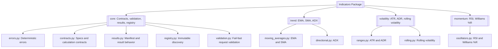
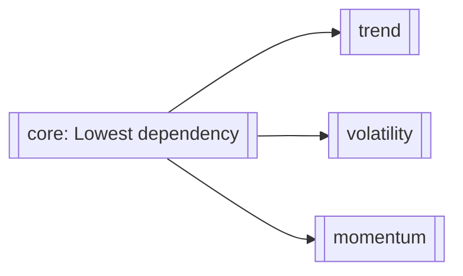
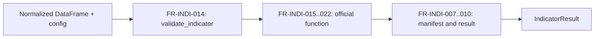
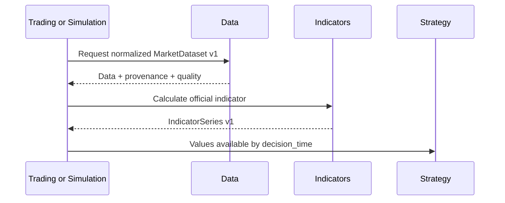
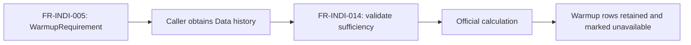
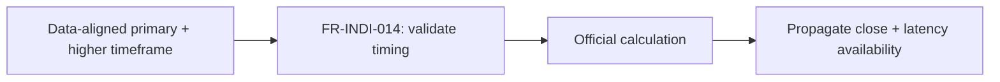
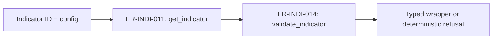

# Indicators

> **Package:** `app/services/indicators`
> **Status:** `Partial`
> **Last updated:** `2026-07-13`

> This README is the package's **single source of truth** for requirements, final structure, implementation sequence, progress, usage examples, and tests.
> Update this file before changing the code.

---

## 1. Purpose and Boundary

### Purpose

Indicators converts normalized market datasets into deterministic, vectorized decision-support series. It owns pure formula evaluation, input and parameter validation, no-lookahead availability metadata, deterministic result manifests, and discovery of the reviewed official indicator set. It performs no I/O and cannot make strategy, risk, simulation, or execution decisions.

### Owns

- Pure, stateless batch calculations for the approved official indicators.
- Exact formula, seed, warmup, null, degenerate-window, dtype, and tolerance specifications.
- Indicator parameter and calculation-input validation after Data has normalized the dataset.
- The `IndicatorSeries v1` contract, represented by `IndicatorResult` and `IndicatorManifest`.
- Deterministic output naming, row/symbol alignment, availability metadata, provenance/quality propagation, and copied joins.
- The immutable official indicator registry and machine-readable capability matrix.
- Indicator-specific deterministic error codes and basic calculation resource-limit enforcement.

### Does not own

- Data acquisition, provider adapters, source readiness, provider normalization, symbol mapping, calendar/session normalization, quote-quality policy, or multi-timeframe orchestration; Data owns these.
- Signal interpretation, crossover decisions, trade proposals, strategy lifecycle, or final position sizing.
- Risk approval, orders, fills, journals, broker/account state, execution, or broker mutation.
- Persistence, cache storage, audit sinks, telemetry export, tracing backends, SLO enforcement, or alert routing.
- Runtime custom registration, incremental/streaming state, chunking, out-of-core execution, acceleration, composition graphs, proprietary controls, or release engineering.
- Retrospective SMC/FVG/swing/BOS/CHoCH labels in the production indicator surface.

### Shared contracts

Contract definitions must match the name, version, and owner recorded in `docs/PROJECT.md`.

**Owned by this domain** — defined authoritatively here:

| Status | Contract | Version | Counterparty | Purpose |
|---|---|---|---|---|
| Missing | `IndicatorSeries` (`IndicatorResult`) | `v1` | Strategy; Trading and Simulation as orchestrators | Return deterministic indicator values and their earliest safe consumption time without exposing raw provider objects or mutable internal state. |

#### `IndicatorSeries v1` field contract

| Field | Type | Required | Contract |
|---|---|---|---|
| `contract_version` | `Literal["v1"]` | Yes | Compatibility version; consumers never parse `schema_id` to infer it. |
| `schema_id` | `Literal["indicators.indicator_series.v1"]` | Yes | Stable namespaced schema identity. |
| `indicator_id` | `str` | Yes | Stable lowercase official registry identifier. |
| `indicator_version` | `str` | Yes | Public implementation version. |
| `formula_version` | `str` | Yes | Version of the approved mathematical convention. |
| `parameter_hash` | `str` | Yes | SHA-256 digest of the approved canonical parameter representation. |
| `values` | `pandas.DataFrame` | Yes | Timestamp/symbol-aligned indicator columns plus availability and quality columns; a validated, immutable, schema-documented tabular payload permitted by the `docs/PROJECT.md` boundary rule for owner-registered contracts — never a raw or mutable provider object. The column contract is long-format with a UTC `DatetimeIndex`, a `symbol` column, and records-oriented canonical JSON serialization. |
| `output_columns` | `tuple[str, ...]` | Yes | Deterministic lowercase snake_case indicator columns in canonical order. |
| `available_at` | column/series in `values` | Yes | UTC timestamp identifying the earliest safe decision time for each output row. |
| `computed_from_start` / `computed_from_end` | columns/series in `values` | Yes | Inclusive source-window bounds used for each output row. |
| `source_timeframe` | column/series in `values` | Yes | Timeframe of the normalized source observations. |
| `quality` | columns/metadata | Yes | Data-owned row quality propagated under the approved inclusion policy; Indicators does not redefine source quality. |
| `manifest` | `IndicatorManifest` | Yes | Deterministic identity, checksum, output-contract, availability, precision, provenance, and quality summary. |
| `errors` | `tuple[IndicatorError, ...]` | Conditional | Unused in v1 because public failures raise deterministic exceptions; no partial official result may be presented as success. |

**Failure contract:** invalid input raises one deterministic `IND_*` exception. Calculation failure is atomic; no partial `IndicatorSeries` is published.

**Consumed from other domains** — referenced only, never redefined:

| Contract | Version | Owner | Used for |
|---|---|---|---|
| `MarketDataset` | `v1` | Data | Supply normalized OHLCV/tick data, UTC timestamp/symbol keys, timeframe/alignment metadata, provenance, and quality flags. |

### Persisted state

Indicators persists no tables, artifacts, cache entries, registry mutations, or incremental state. All public calculations have side effect `None`.

### Four-level structure

| Code level | Represents |
|---|---|
| **Package** | Indicators domain |
| **Module folder** | One approved feature/capability |
| **File** | One use case or focused responsibility |
| **Class / function / method** | Observable functional requirement behavior |

```text
Package
└── Module folder
    └── File
        └── Class / Function / Method
```

### Package capability map



---

## 2. Final Package Structure

The following is the intended end state, not the current V1 tree.

```text
indicators/
├── __init__.py                         # Approved domain-level exports only
├── README.md
├── core/                               # Feature: contracts and deterministic execution boundary
│   ├── __init__.py
│   ├── errors.py                       # Deterministic Core MVP error contract
│   ├── contracts.py                    # Immutable config/spec/warmup/protocol contracts
│   ├── results.py                      # IndicatorSeries manifest, values-only, and copied join
│   ├── registry.py                     # Immutable official specs and capability matrix
│   └── validation.py                   # Full fail-fast request validation
├── trend/                              # Feature: trend indicators
│   ├── __init__.py
│   ├── moving_averages.py              # EMA and SMA
│   └── directional.py                  # ADX
├── volatility/                         # Feature: volatility indicators
│   ├── __init__.py
│   ├── ranges.py                       # ATR and ADR
│   └── rolling.py                      # Return-based rolling volatility
└── momentum/                           # Feature: momentum indicators
    ├── __init__.py
    └── oscillators.py                  # RSI and Williams %R
```

Excluded from the initial structure: `base.py`, `batch/`, `incremental/`, `adapters/`, `custom/`, `candles/`, `volume/`, caching, composition, audit/telemetry, acceleration, and proprietary-access modules. WMA, Bollinger Bands, MACD, OBV, CMF, candlestick patterns, and HMA are excluded. MFI, rolling price-volume POC, current SMC labels, crossover helpers, pip conversion, balance-scaled volume, and generic averaging helpers have no final destination in this package.

### Module dependency diagram



`trend`, `volatility`, and `momentum` do not depend on one another. `core/registry.py` stores immutable metadata and import-path identity without importing feature implementations, preventing a registry/built-in cycle.

### Structure rules

- The root contains only `README.md`, `__init__.py`, and the four approved module folders.
- Built-ins are stateless functions. Classes are limited to immutable data contracts, the structural protocol, and the domain exception.
- Public callers import only from `app.services.indicators` or an approved feature `__init__.py`; leaf-file imports are not stable API.
- Every public symbol appears exactly once in Section 4.
- Private vectorization, hashing, naming, and formula helpers remain in the focused owning file and receive no separate requirement IDs.
- The immutable registry stores no runtime registrations and performs no plugin discovery.
- Usage examples live under `tests/indicators/usage/`, never in the production package.

### Public import and API contract

The package root `app.services.indicators` is the canonical public import surface. Its intended `__all__` is exactly:

```text
IndicatorErrorCode, IndicatorError,
IndicatorConfig, IndicatorSpec, WarmupRequirement, IndicatorProtocol,
IndicatorManifest, IndicatorResult,
get_indicator, list_indicators, get_capability_matrix, validate_indicator,
ema, sma, adx, atr, adr, rolling_volatility, rsi, williams_r
```

| Public symbols | Classification | Official workflow eligibility | Cache behavior | Public side effects |
|---|---|---|---|---|
| `IndicatorErrorCode`, `IndicatorError` | Stable | `WF-INDI-001..005` | Not applicable | None |
| `IndicatorConfig`, `IndicatorSpec`, `WarmupRequirement`, `IndicatorProtocol` | Stable | `WF-INDI-001..005` | Carries no cache configuration | None |
| `IndicatorManifest`, `IndicatorResult`, `IndicatorResult.values_only`, `IndicatorResult.join_to` | Stable | `WF-INDI-001..004` | Exposes identity/checksum material only; no reads or writes | None |
| `get_indicator`, `list_indicators`, `get_capability_matrix` | Stable | `WF-INDI-005` | None; immutable in-memory metadata | None |
| `validate_indicator` | Stable | `WF-INDI-001..005` | No cache access | None |
| `ema`, `sma`, `adx`, `atr`, `adr`, `rolling_volatility`, `rsi`, `williams_r` | Stable | `WF-INDI-001..004`; official in `SYS-WF-001` and `SYS-WF-002` | No cache access; returns canonical checksum material | None |

No experimental, optional, or future callable is exported in the initial package. Excluded capabilities appear only in the capability matrix as unsupported modes, not as callable stubs.

---

## 3. Workflows

### Status values

| Status | Meaning |
|---|---|
| **Missing** | Not implemented or not verified against the final contract. |
| **Partial** | Useful V1 behavior exists, but final contracts, relocation, or tests remain incomplete. |
| **Completed** | Implemented, tested, and verified against this README. |

### Workflow register

| Status | Workflow ID | Scope | Workflow | Trigger / Input boundary | Final outcome / Output boundary | Requirement sequence |
|---|---|---|---|---|---|---|
| Partial | `WF-INDI-001` | Internal | Core batch indicator calculation | Normalized `MarketDataset` values plus approved config | Atomic `IndicatorResult` with values, availability, quality, and manifest | `FR-INDI-014 → FR-INDI-015..022 → FR-INDI-007..010` |
| Missing | `WF-INDI-002` | Cross-domain | Decision-time consumption | Trading or Simulation supplies Data-owned normalized input | `IndicatorSeries v1` returned for Strategy consumption | `FR-INDI-014 → FR-INDI-015..022 → FR-INDI-008` |
| Missing | `WF-INDI-003` | Cross-domain | Warmup coordination | Caller queries an official `WarmupRequirement` and supplies sufficient history | Warmup rows retained and explicitly unavailable until safe | `FR-INDI-005 → FR-INDI-014 → FR-INDI-015..022` |
| Missing | `WF-INDI-004` | Cross-domain | Availability-aware multi-timeframe calculation | Data supplies normalized/aligned primary and higher-timeframe observations | Result propagates closed-bar plus latency availability | `FR-INDI-014 → FR-INDI-015..022 → FR-INDI-007` |
| Missing | `WF-INDI-005` | Internal | Static registry discovery and validation | Caller supplies official indicator ID/config | Validated spec/capability record or deterministic refusal | `FR-INDI-011..014` |

### `WF-INDI-001` — Core Batch Indicator Calculation

**Scope:** `Internal`
**System workflow:** `None`

**Input boundary:** A pandas view of `MarketDataset v1` and calculation-relevant `IndicatorConfig`.
**Output boundary:** An atomic `IndicatorResult`; the input DataFrame remains unchanged.

1. `validate_indicator()` resolves the immutable `IndicatorSpec` and validates the entire config and input before formula work.
2. One official convenience function executes its approved vectorized formula by symbol in canonical row order.
3. The function retains warmup/unavailable rows and derives `available_at` and source-window bounds.
4. Data-owned provenance and quality are propagated without redefining upstream policy.
5. The function returns deterministic values, output names, checksums, and manifest metadata.

**Failure behavior:** validation or limit failure produces one Core MVP `IND_*` error before calculation; formula failure is atomic; output collision or detected input mutation fails rather than overwriting data.

**Integration test:**
`tests/indicators/integration/test_batch_calculation.py::test_batch_calculation_returns_atomic_available_result()`



### `WF-INDI-002` — Decision-Time Consumption

**Scope:** `Cross-domain`
**System workflow:** `SYS-WF-001`, `SYS-WF-002`

**Input boundary:** Trading (live/paper) or Simulation (historical) supplies Data-owned normalized market data.
**Output boundary:** Indicators returns `IndicatorSeries v1`; Strategy consumes only rows whose `available_at <= decision_time`.

Indicators calculates and describes availability only. Trading/Simulation owns orchestration, and Strategy/Simulation owns enforcement of the decision-time filter and any resulting action.

**Failure behavior:** invalid normalized input or unverifiable availability fails closed with no partial series; a downstream lookahead violation remains a downstream policy error, informed by `IND_LOOKAHEAD_RISK` metadata/error evidence.

**Integration test:**
`tests/indicators/integration/test_decision_time_consumption.py::test_strategy_receives_only_availability_qualified_series()`



### `WF-INDI-003` — Warmup Coordination

**Scope:** `Cross-domain`
**System workflow:** `SYS-WF-001`, `SYS-WF-002`

**Input boundary:** The caller resolves `WarmupRequirement`, then Data supplies the requested normalized history.
**Output boundary:** Indicators retains all rows and marks warmup/unavailable values explicitly.

Indicators never fetches history. Insufficient history retains the aligned rows, marks affected values unavailable with a declared reason, and never fetches additional history.

**Integration test:**
`tests/indicators/integration/test_warmup_coordination.py::test_warmup_requirement_preserves_unavailable_rows()`



### `WF-INDI-004` — Availability-Aware Multi-Timeframe Calculation

**Scope:** `Cross-domain`
**System workflow:** `SYS-WF-001`, `SYS-WF-002`

**Input boundary:** Data supplies already normalized and aligned primary plus at most one higher-timeframe source, including close and latency metadata.
**Output boundary:** Indicators calculates without fetching or realigning provider data and propagates the earliest close-plus-latency `available_at`.

This boundary follows `docs/PROJECT.md`, where Data owns multi-timeframe alignment. Multiple simultaneous higher-timeframe sources are excluded.

**Failure behavior:** missing/ambiguous timing, non-monotonic or duplicate timestamps, or consumption before higher-timeframe close fails deterministically.

**Integration test:**
`tests/indicators/integration/test_multi_timeframe.py::test_higher_timeframe_result_is_available_after_close_and_latency()`



### `WF-INDI-005` — Static Registry Discovery and Validation

**Scope:** `Internal`
**System workflow:** `None`

**Input boundary:** Official indicator ID and candidate config.
**Output boundary:** Immutable `IndicatorSpec`/capability metadata or deterministic `IND_UNSUPPORTED_INDICATOR` / validation error.

The registry exposes only eight reviewed built-ins and cannot register or unregister at runtime.

**Integration test:**
`tests/indicators/integration/test_registry_workflow.py::test_registry_discovers_and_validates_only_official_batch_indicators()`



---

## 4. Module and Requirement Specifications

Modules and files are arranged in implementation order.

### 4.1 `core/` — Contracts, Results, Validation, and Discovery

**Purpose:** Define the complete pure calculation boundary shared by every official built-in.

**Module flow:**

```text
indicator id + normalized data + config
  → registry.py
  → validation.py
  → feature calculation
  → results.py
  → IndicatorResult
```

### Files

| Status | File | Responsibility | Key exports | Dependencies |
|---|---|---|---|---|
| Partial | `errors.py` | Define the compact Core MVP error catalogue and one structured domain exception. | `IndicatorErrorCode`, `IndicatorError` | **Standard library:** `enum`, `typing`<br>**Required third-party:** None<br>**Local:** None |
| Missing | `contracts.py` | Define immutable calculation config, spec, warmup, and structural callable contracts. | `IndicatorConfig`, `IndicatorSpec`, `WarmupRequirement`, `IndicatorProtocol` | **Standard library:** `collections.abc`, `dataclasses`, `datetime`, `typing`<br>**Required third-party:** `pandas` (typing)<br>**Local:** `errors.py → IndicatorError` |
| Missing | `results.py` | Define deterministic manifest/result fields and safe result projection/join behavior. | `IndicatorManifest`, `IndicatorResult` | **Standard library:** `dataclasses`, `typing`<br>**Required third-party:** `pandas`<br>**Local:** `contracts.py → IndicatorConfig`; `errors.py → IndicatorError` |
| Missing | `registry.py` | Expose immutable official specs and capability metadata without importing feature implementations. | `get_indicator`, `list_indicators`, `get_capability_matrix` | **Standard library:** `collections.abc`<br>**Required third-party:** None<br>**Local:** `contracts.py → IndicatorSpec`; `errors.py → IndicatorError, IndicatorErrorCode` |
| Missing | `validation.py` | Resolve and fully validate one batch request before any formula work. | `validate_indicator` | **Standard library:** None<br>**Required third-party:** `pandas`<br>**Local:** `contracts.py → IndicatorConfig, IndicatorSpec`; `errors.py → IndicatorError, IndicatorErrorCode`; `registry.py → get_indicator` |
| Missing | `__init__.py` | Expose only the approved public Core API. | All Core exports above | **Standard library:** None<br>**Required third-party:** None<br>**Local:** Approved exports from the five files above |

### Configuration and Limits Manifest

| Status | Setting / Limit | Type | Default | Required | Used by | Description |
|---|---|---|---|---|---|---|
| Missing | `IndicatorConfig.source` | `str` | `"close"` when the formula has a price source | Conditional | Official wrappers | Selects a validated lowercase source column; non-default sources appear in output names. |
| Missing | `IndicatorConfig.output_mode` | `Literal["values"]` | `"values"` | Yes | Public calculations, `IndicatorResult` | Core returns aligned values; copied enrichment is requested explicitly through `join_to()`. Additional modes are excluded. |
| Missing | `IndicatorConfig.column_conflict_policy` | `Literal["error"]` | `"error"` | Yes | `IndicatorResult.join_to()` | Any collision fails with `IND_OUTPUT_COLUMN_CONFLICT`; overwrite/suffix/prefix policies are excluded. |
| Missing | `IndicatorConfig.precision_dtype` | `Literal["float64"]` | `"float64"` | Yes | All calculations | Core numerical output uses float64 under the approved formula tolerance; unsupported dtypes fail. |
| Missing | `IndicatorConfig.availability_policy` | `Literal["bar_close"]` | `"bar_close"` | Yes | Official wrappers | Values are available only after the contributing bar closes; insufficient history raises `IND_INSUFFICIENT_DATA`. |
| Missing | `IndicatorConfig.quality_policy` | `Literal["require_and_propagate"]` | `"require_and_propagate"` | Yes | `validate_indicator`, official wrappers | Requires Data-owned quality flags and propagates them unchanged; Indicators never reclassifies Data quality. |
| Missing | `IndicatorConfig.error_mode` | `Literal["raise"]` | `"raise"` | Yes | All public callables | Every public failure raises one deterministic exception; result-error and partial-success modes are unsupported in v1. |
| Missing | `MAX_INPUT_ROWS` | Positive `int` | `1000000` | Yes | `validate_indicator` | Rejects oversized input with `IND_RESOURCE_LIMIT_EXCEEDED`. |
| Missing | `MAX_SYMBOLS` | Positive `int` | `50` | Yes | `validate_indicator` | Rejects excessive symbol cardinality before calculation. |
| Missing | `INDICATOR_TIMEOUT_SECONDS` | Positive `float` | `60` | Yes | Official wrappers | Aborts atomically with `IND_TIMEOUT`; no partial result is published. |
| Missing | `IndicatorManifest.manifest_version` | `str` | `"v1"` | Yes | `IndicatorManifest` | Versions the deterministic manifest contract. |
| Missing | `IndicatorManifest.output_schema_version` | `str` | `"v1"` | Yes | `IndicatorManifest` | Versions the `IndicatorSeries` values schema. |

#### `errors.py` — Deterministic Error Contract

**File responsibility:** Represent only the 24 approved Core MVP codes and their redacted structured exception.

| Status | Requirement ID | Responsibility | Class / Function / Method | Side Effects | Raises | Usage / Test |
|---|---|---|---|---|---|---|
| Partial | `FR-INDI-001` | The system shall expose exactly the approved Core MVP codes: `IND_INVALID_CONFIG`, `IND_INVALID_PARAMETER`, `IND_UNSUPPORTED_INDICATOR`, `IND_UNSUPPORTED_TIMEFRAME`, `IND_UNSUPPORTED_DTYPE`, `IND_INVALID_INPUT_SCHEMA`, `IND_MISSING_REQUIRED_COLUMN`, `IND_INVALID_OUTPUT_COLUMN`, `IND_OUTPUT_COLUMN_CONFLICT`, `IND_INVALID_OUTPUT_MODE`, `IND_INPUT_MUTATION_DETECTED`, `IND_DUPLICATE_TIMESTAMP`, `IND_NON_MONOTONIC_TIME`, `IND_AMBIGUOUS_TIMESTAMP`, `IND_INVALID_TIMEZONE`, `IND_INVALID_OHLC`, `IND_INSUFFICIENT_DATA`, `IND_LOOKAHEAD_RISK`, `IND_FORMULA_VERSION_MISMATCH`, `IND_RESOURCE_LIMIT_EXCEEDED`, `IND_TIMEOUT`, `IND_CANCELLED`, `IND_PARTIAL_RESULT`, and `IND_INTERNAL_ERROR`. | `IndicatorErrorCode: StrEnum` | None | None | **Usage:** `tests/indicators/usage/test_usage_core.py::test_usage_errors_error_codes()`<br>**Unit:** `tests/indicators/unit/test_errors.py::test_error_code_catalog_contains_only_core_codes()` |
| Partial | `FR-INDI-002` | The system shall represent a deterministic, redacted failure with code, safe message, and structured details without exposing raw exceptions or sensitive input data. | `IndicatorError(code: IndicatorErrorCode, message: str, details: Mapping[str, object] | None = None)` | None | None | **Usage:** `tests/indicators/usage/test_usage_core.py::test_usage_errors_indicator_error()`<br>**Unit:** `tests/indicators/unit/test_errors.py::test_indicator_error_serializes_redacted_details()` |

**Rules:**

- Codes rejected as Data-owned and codes tied to excluded features are not public Core members.
- Raw pandas/NumPy/provider exceptions never cross the public boundary.
- `IND_PARTIAL_RESULT` is a failure code; partial data is never returned as successful official output.

**Implementation notes:** Refactor useful code/message mapping from the existing root `errors.py`, remove rejected or excluded public classes, and relocate the approved contract under `core/`. Existing local code is evidence only, not the final API.

#### `contracts.py` — Immutable Calculation Contracts

**File responsibility:** Define calculation-relevant immutable contracts without platform, cache, audit, or incremental state.

| Status | Requirement ID | Responsibility | Class / Function / Method | Side Effects | Raises | Usage / Test |
|---|---|---|---|---|---|---|
| Missing | `FR-INDI-003` | The system shall represent indicator ID, canonical parameters, source, output/precision/availability/quality policy, error mode, and basic limits in one immutable batch config, excluding cache, calendar, backend, actor, tracing, SLO, and entitlement context. | `IndicatorConfig` | None | None | **Usage:** `tests/indicators/usage/test_usage_core.py::test_usage_contracts_indicator_config()`<br>**Unit:** `tests/indicators/unit/test_contracts.py::test_indicator_config_is_immutable_and_core_only()` |
| Missing | `FR-INDI-004` | The system shall describe each official indicator's ID, name, versions, tier, required columns, parameter/output schemas, warmup policy, supported batch capabilities, import path, stability, and workflow eligibility. | `IndicatorSpec` | None | None | **Usage:** `tests/indicators/usage/test_usage_core.py::test_usage_contracts_indicator_spec()`<br>**Unit:** `tests/indicators/unit/test_contracts.py::test_indicator_spec_contains_required_public_metadata()` |
| Missing | `FR-INDI-005` | The system shall expose the exact normalized history requirement for an indicator/config without fetching data, including minimum observations, source timeframe, required columns, and availability basis. | `WarmupRequirement` | None | None | **Usage:** `tests/indicators/usage/test_usage_core.py::test_usage_contracts_warmup_requirement()`<br>**Unit:** `tests/indicators/unit/test_contracts.py::test_warmup_requirement_is_deterministic()` |
| Missing | `FR-INDI-006` | The system shall expose a minimal structural batch protocol whose approved calculation accepts normalized pandas data plus `IndicatorConfig` and returns `IndicatorResult`; no inheritance, context, or state lifecycle is required. | `IndicatorProtocol.calculate(data: pd.DataFrame, config: IndicatorConfig) -> IndicatorResult` | None | `IndicatorError`: deterministic request/calculation failure under the approved error mode | **Usage:** `tests/indicators/usage/test_usage_core.py::test_usage_contracts_indicator_protocol()`<br>**Unit:** `tests/indicators/unit/test_contracts.py::test_official_calculator_satisfies_indicator_protocol()` |

**Rules:** Contracts are frozen, typed, JSON-compatible where serialized, and contain only calculation-relevant metadata. Serialized field types are exactly those declared by the contract requirements.

#### `results.py` — Manifest and Result Behavior

**File responsibility:** Build and expose the deterministic `IndicatorSeries v1` result without mutating source data.

| Status | Requirement ID | Responsibility | Class / Function / Method | Side Effects | Raises | Usage / Test |
|---|---|---|---|---|---|---|
| Missing | `FR-INDI-007` | The system shall expose a standalone serializable deterministic manifest containing manifest/indicator/formula/output-schema versions, canonical parameter hash, input/output checksums, output contract and shape, precision, availability policy, Data-provided provenance, and quality summary; volatile runtime/host data is excluded from identity. | `IndicatorManifest` | None | None | **Usage:** `tests/indicators/usage/test_usage_core.py::test_usage_results_manifest()`<br>**Unit:** `tests/indicators/unit/test_results.py::test_manifest_is_stable_for_equivalent_inputs()` |
| Missing | `FR-INDI-008` | The system shall return timestamp/symbol-aligned values, canonical output columns, availability, quality, errors, and manifest as `IndicatorSeries v1`, preserving warmup and unavailable rows and exposing no incremental state or metrics. | `IndicatorResult` | None | None | **Usage:** `tests/indicators/usage/test_usage_core.py::test_usage_results_indicator_result()`<br>**Unit:** `tests/indicators/unit/test_results.py::test_indicator_result_matches_v1_contract()` |
| Missing | `FR-INDI-009` | The system shall expose a copy-safe projection containing generated indicator, availability, and quality columns without original OHLCV columns. | `IndicatorResult.values_only: pd.DataFrame` | None | None | **Usage:** `tests/indicators/usage/test_usage_core.py::test_usage_results_values_only()`<br>**Unit:** `tests/indicators/unit/test_results.py::test_values_only_excludes_source_columns()` |
| Missing | `FR-INDI-010` | The system shall append generated columns to a copy of aligned source data while preserving original columns, row count/order, timestamp/symbol layout, warmup rows, and input identity; collisions fail. | `IndicatorResult.join_to(data: pd.DataFrame, mode: Literal["copy"] = "copy") -> pd.DataFrame` | None | `IndicatorError`: invalid mode, misalignment, output collision, or detected mutation | **Usage:** `tests/indicators/usage/test_usage_core.py::test_usage_results_join_to()`<br>**Unit:** `tests/indicators/unit/test_results.py::test_join_to_preserves_input_and_alignment()` |

**Rules:** Canonical hashing must define key/row/symbol order, timestamp normalization, numeric/null representation, included fields, and version material before implementation. `join_to()` never overwrites.

#### `registry.py` — Immutable Official Discovery

**File responsibility:** Describe the eight official built-ins and supported Core modes without runtime mutation or implementation imports.

| Status | Requirement ID | Responsibility | Class / Function / Method | Side Effects | Raises | Usage / Test |
|---|---|---|---|---|---|---|
| Missing | `FR-INDI-011` | The system shall resolve one official ID (`ema`, `sma`, `adx`, `atr`, `adr`, `rolling_volatility`, `rsi`, `williams_r`) to its immutable spec and reject all unknown IDs before calculation. | `get_indicator(indicator_id: str) -> IndicatorSpec` | None | `IndicatorError`: `IND_UNSUPPORTED_INDICATOR` | **Usage:** `tests/indicators/usage/test_usage_core.py::test_usage_registry_get_indicator()`<br>**Unit:** `tests/indicators/unit/test_registry.py::test_get_indicator_rejects_unknown_id()` |
| Missing | `FR-INDI-012` | The system shall list official specs in stable indicator-ID order with no mutable registry handle. | `list_indicators() -> tuple[IndicatorSpec, ...]` | None | None | **Usage:** `tests/indicators/usage/test_usage_core.py::test_usage_registry_list_indicators()`<br>**Unit:** `tests/indicators/unit/test_registry.py::test_list_indicators_is_stable_and_immutable()` |
| Missing | `FR-INDI-013` | The system shall expose a JSON/YAML-compatible matrix containing ID, versions, tier, batch/vectorized/multi-symbol/multi-timeframe support, unsupported optional modes, dependencies, deterministic unsupported codes, and official-workflow eligibility. | `get_capability_matrix() -> tuple[Mapping[str, object], ...]` | None | None | **Usage:** `tests/indicators/usage/test_usage_core.py::test_usage_registry_capability_matrix()`<br>**Unit:** `tests/indicators/unit/test_registry.py::test_capability_matrix_matches_registry()` |

**Rules:** Batch/vectorized is the only execution mode. Incremental, streaming, cache, composition, out-of-core, acceleration, audit/observability, custom registration, and proprietary modes are reported unsupported and expose no unused APIs.

#### `validation.py` — Fail-Fast Request Validation

**File responsibility:** Validate all domain-owned request conditions before formula execution.

| Status | Requirement ID | Responsibility | Class / Function / Method | Side Effects | Raises | Usage / Test |
|---|---|---|---|---|---|---|
| Missing | `FR-INDI-014` | The system shall resolve the spec and atomically validate config, parameters, resource limits, lowercase/unique required columns, supported dtype/timeframe, explicit UTC symbol/timestamp keys, monotonicity/duplicates, finite OHLC consistency, data sufficiency, output names/collisions, and formula version before calculation; upstream source-quality rules remain Data-owned. | `validate_indicator(indicator_id: str, data: pd.DataFrame, config: IndicatorConfig) -> IndicatorSpec` | None | `IndicatorError`: first deterministic Core validation failure | **Usage:** `tests/indicators/usage/test_usage_core.py::test_usage_validation_validate_indicator()`<br>**Unit:** `tests/indicators/unit/test_validation.py::test_validate_indicator_fails_before_formula_execution()` |

**Rules:** Validation is whole-request and precedes formula work. Duplicate/ambiguous columns, naive timestamps, impossible `high < low`, non-finite values not permitted by the approved formula, and unsupported modes fail deterministically. Provider-specific adjustment, symbol-mapping, stub-quote, inverted-market, and spread rules are never duplicated here.

### Feature usage examples

```text
tests/indicators/usage/
└── test_usage_core.py
```

One independently runnable `test_usage_*` function is defined for each `FR-INDI-001` through `FR-INDI-014`, using only `app.services.indicators.core` exports.

---

### 4.2 `trend/` — EMA, SMA, and ADX

**Purpose:** Compute the approved trend indicators through stateless vectorized batch functions.

**Module flow:**

```text
normalized values + config → Core validation → approved trend formula → IndicatorResult
```

### Files

| Status | File | Responsibility | Key exports | Dependencies |
|---|---|---|---|---|
| Partial | `moving_averages.py` | Compute EMA and SMA under approved formula contracts. | `ema`, `sma` | **Standard library:** None<br>**Required third-party:** `pandas`<br>**Local:** `core → IndicatorConfig, IndicatorResult, validate_indicator` |
| Missing | `directional.py` | Compute ADX and its directional components. | `adx` | **Standard library:** None<br>**Required third-party:** `numpy`, `pandas`<br>**Local:** `core → IndicatorConfig, IndicatorResult, validate_indicator` |
| Missing | `__init__.py` | Expose the approved trend API. | `ema`, `sma`, `adx` | **Standard library:** None<br>**Required third-party:** None<br>**Local:** Approved exports from files above |

### Configuration and Limits Manifest

The following formula conventions are authoritative for implementation.

| Status | Setting / Limit | Type | Default | Required | Used by | Description |
|---|---|---|---|---|---|---|
| Missing | EMA period/range/seed/warmup/tolerance | Formula-spec fields | Explicit period ≥2; SMA seed; warmup=period; `1e-9` | Yes | `ema()` | Uses α=`2/(period+1)` after the first-window SMA seed. |
| Missing | SMA period/range/window/warmup/tolerance | Formula-spec fields | Explicit period ≥2; inclusive window; warmup=period; `1e-9` | Yes | `sma()` | Uses the current row and previous `period-1` complete values. |
| Missing | ADX period/range/Wilder seed/warmup/tolerance | Formula-spec fields | Period `14`; Wilder smoothing; warmup=`2×period`; `1e-9` | Yes | `adx()` | Uses standard TR, +DM, -DM, +DI, -DI, DX, and ADX calculations; zero TR produces zero directional values. |

#### Formula specification gate

| Field | EMA | SMA | ADX |
|---|---|---|---|
| Indicator ID / tier | `ema` / Core MVP | `sma` / Core MVP | `adx` / Core MVP |
| Required columns | Source column | Source column | `high`, `low`, `close` |
| Default source | `close` | `close` | Fixed OHLC |
| Parameters/defaults/ranges | Required period ≥2; no hidden default | Required period ≥2; no hidden default | Period `14`, integer ≥2 |
| Exact formula | α=`2/(period+1)` recursive EMA after seed | Arithmetic mean of inclusive `period` window | Wilder TR/+DM/-DM → smoothed DI → DX → ADX |
| Smoothing/seed | SMA of first complete window | Not applicable | Wilder smoothing; first ADX is mean of first `period` DX values |
| Warmup/null/degenerate | First value after `period` complete rows; NaN rejected | First value after `period` complete rows; constant window is valid | `2×period`; zero TR yields zero DI/DX; NaN rejected |
| Outputs | `ema_{period}`; non-default source included | `sma_{period}`; non-default source included | `adx_{period}`, `plus_di_{period}`, `minus_di_{period}` |
| Tolerance/reference | `1e-9`; golden fixtures + pinned `pandas-ta` | `1e-9`; golden fixtures + pinned `pandas-ta` | `1e-9`; golden fixtures + pinned `pandas-ta` |

#### `moving_averages.py` — EMA and SMA

| Status | Requirement ID | Responsibility | Class / Function / Method | Side Effects | Raises | Usage / Test |
|---|---|---|---|---|---|---|
| Partial | `FR-INDI-015` | The system shall calculate EMA per symbol from a validated source using the approved seed/smoothing contract, return `ema_{period}` (or source-qualified name), preserve warmup rows, and expose causal availability and a deterministic manifest without mutating input. | `ema(data: pd.DataFrame, *, period: int, source: str = "close", config: IndicatorConfig | None = None) -> IndicatorResult` | None | `IndicatorError`: validation, formula-version, limit, timeout, or atomic calculation failure | **Usage:** `tests/indicators/usage/test_usage_trend.py::test_usage_moving_averages_ema()`<br>**Unit:** `tests/indicators/unit/test_moving_averages.py::test_ema_matches_approved_golden_fixture()` |
| Partial | `FR-INDI-016` | The system shall calculate SMA per symbol over the approved inclusive window, return deterministic source-qualified output, preserve warmup rows, and expose causal availability and a deterministic manifest without mutating input. | `sma(data: pd.DataFrame, *, period: int, source: str = "close", config: IndicatorConfig | None = None) -> IndicatorResult` | None | `IndicatorError`: validation, formula-version, limit, timeout, or atomic calculation failure | **Usage:** `tests/indicators/usage/test_usage_trend.py::test_usage_moving_averages_sma()`<br>**Unit:** `tests/indicators/unit/test_moving_averages.py::test_sma_matches_approved_golden_fixture()` |

**Implementation notes:** Refactor only the understandable V1 EMA/SMA kernels to these formulas. Do not preserve `BaseIndicator`, ignored `**kwargs`, raw Series returns, or duplicate singular/plural implementations.

#### `directional.py` — ADX

| Status | Requirement ID | Responsibility | Class / Function / Method | Side Effects | Raises | Usage / Test |
|---|---|---|---|---|---|---|
| Missing | `FR-INDI-017` | The system shall calculate approved ADX, +DI, and -DI values per symbol from validated OHLC, return the three canonical columns with warmup/availability metadata, and handle zero range deterministically. | `adx(data: pd.DataFrame, *, period: int, config: IndicatorConfig | None = None) -> IndicatorResult` | None | `IndicatorError`: validation, formula-version, limit, timeout, or atomic calculation failure | **Usage:** `tests/indicators/usage/test_usage_trend.py::test_usage_directional_adx()`<br>**Unit:** `tests/indicators/unit/test_directional.py::test_adx_matches_approved_golden_fixture()` |

### Feature usage examples

`tests/indicators/usage/test_usage_trend.py` contains one pytest-collected example per trend requirement.

---

### 4.3 `volatility/` — ATR, ADR, and Rolling Volatility

**Purpose:** Compute approved range- and return-based volatility measures.

**Module flow:**

```text
normalized OHLC/source values → Core validation → approved volatility formula → IndicatorResult
```

### Files

| Status | File | Responsibility | Key exports | Dependencies |
|---|---|---|---|---|
| Partial | `ranges.py` | Compute ATR and ADR with explicit range conventions. | `atr`, `adr` | **Standard library:** None<br>**Required third-party:** `numpy`, `pandas`<br>**Local:** `core → IndicatorConfig, IndicatorResult, validate_indicator` |
| Missing | `rolling.py` | Compute explicitly specified return-based rolling volatility. | `rolling_volatility` | **Standard library:** None<br>**Required third-party:** `numpy`, `pandas`<br>**Local:** `core → IndicatorConfig, IndicatorResult, validate_indicator` |
| Missing | `__init__.py` | Expose the approved volatility API. | `atr`, `adr`, `rolling_volatility` | **Standard library:** None<br>**Required third-party:** None<br>**Local:** Approved exports from files above |

### Configuration and Limits Manifest

| Status | Setting / Limit | Type | Default | Required | Used by | Description |
|---|---|---|---|---|---|---|
| Missing | ATR period/TR/smoothing/seed/warmup/tolerance | Formula-spec fields | Period `14`; standard TR; Wilder seed/smoothing; warmup=period; `1e-9` | Yes | `atr()` | Uses max(high−low, |high−prior close|, |low−prior close|). |
| Missing | ADR period/range/session basis/warmup/tolerance | Formula-spec fields | `14` UTC daily bars; high−low; warmup=14; `1e-9` | Yes | `adr()` | Uses the arithmetic mean of complete UTC daily high−low ranges. |
| Missing | Rolling-volatility period/return/ddof/annualization/tolerance | Formula-spec fields | Explicit period ≥2; log returns; ddof=1; annualization=252; `1e-9` | Yes | `rolling_volatility()` | Replaces—not renames—the V1 price-level standard deviation. |

#### Formula specification gate

| Field | ATR | ADR | Rolling volatility |
|---|---|---|---|
| Indicator ID / tier | `atr` / Core MVP | `adr` / Core MVP | `rolling_volatility` / Core MVP |
| Required columns | `high`, `low`, `close` | `high`, `low` plus any approved basis | Source column |
| Default source | Fixed OHLC | UTC daily high−low | `close` |
| Parameters/defaults/ranges | Period `14`, integer ≥2 | Period `14`, integer ≥2 | Required period ≥2; log return; ddof=1; annualization=252 |
| Exact formula | Standard true range | Mean of daily `(high−low)` | Sample stdev of log returns ×√252 |
| Smoothing/seed/window | Wilder; first ATR is mean of first complete TR window | Inclusive complete-day rolling window | Inclusive rolling return window |
| Warmup/null/degenerate | `period`; NaN rejected; non-negative output | `period`; NaN rejected; zero range is valid | `period` returns (`period+1` prices); constant returns produce zero |
| Outputs | `atr_{period}` | `adr_{period}` | `rolling_volatility_{period}` |
| Tolerance/reference | `1e-9`; golden fixtures + pinned `pandas-ta` | `1e-9`; golden fixtures + pinned `pandas-ta` where available | `1e-9`; golden fixtures + pinned `pandas-ta` where available |

#### `ranges.py` — ATR and ADR

| Status | Requirement ID | Responsibility | Class / Function / Method | Side Effects | Raises | Usage / Test |
|---|---|---|---|---|---|---|
| Partial | `FR-INDI-018` | The system shall calculate non-negative ATR per symbol from validated OHLC using the approved true-range/smoothing/seed contract, preserve gap and warmup semantics, and return causal metadata without input mutation. | `atr(data: pd.DataFrame, *, period: int, config: IndicatorConfig | None = None) -> IndicatorResult` | None | `IndicatorError`: validation, formula-version, limit, timeout, or atomic calculation failure | **Usage:** `tests/indicators/usage/test_usage_volatility.py::test_usage_ranges_atr()`<br>**Unit:** `tests/indicators/unit/test_ranges.py::test_atr_matches_approved_gap_fixture()` |
| Missing | `FR-INDI-019` | The system shall calculate ADR per symbol using the owner-approved range and session/day convention, preserve warmup rows, and return deterministic availability and manifest metadata. | `adr(data: pd.DataFrame, *, period: int, config: IndicatorConfig | None = None) -> IndicatorResult` | None | `IndicatorError`: validation, formula-version, limit, timeout, or atomic calculation failure | **Usage:** `tests/indicators/usage/test_usage_volatility.py::test_usage_ranges_adr()`<br>**Unit:** `tests/indicators/unit/test_ranges.py::test_adr_matches_approved_golden_fixture()` |

**Implementation notes:** V1 ATR is a refactor reference only. ADR is new. Formula approval precedes code reuse.

#### `rolling.py` — Rolling Volatility

| Status | Requirement ID | Responsibility | Class / Function / Method | Side Effects | Raises | Usage / Test |
|---|---|---|---|---|---|---|
| Missing | `FR-INDI-020` | The system shall calculate rolling volatility per symbol from the approved simple/log-return, ddof, window, and annualization convention, handling constant/all-null windows deterministically and returning causal metadata. | `rolling_volatility(data: pd.DataFrame, *, period: int, source: str = "close", config: IndicatorConfig | None = None) -> IndicatorResult` | None | `IndicatorError`: validation, formula-version, limit, timeout, or atomic calculation failure | **Usage:** `tests/indicators/usage/test_usage_volatility.py::test_usage_rolling_rolling_volatility()`<br>**Unit:** `tests/indicators/unit/test_rolling.py::test_rolling_volatility_matches_approved_return_fixture()` |

**Implementation notes:** The V1 `StandardDeviation` price-level formula conflicts with the approved target and must be replaced, not copied or marked complete.

### Feature usage examples

`tests/indicators/usage/test_usage_volatility.py` contains one pytest-collected example per volatility requirement.

---

### 4.4 `momentum/` — RSI and Williams %R

**Purpose:** Compute the approved bounded momentum oscillators.

**Module flow:**

```text
normalized OHLC/source values → Core validation → approved oscillator formula → IndicatorResult
```

### Files

| Status | File | Responsibility | Key exports | Dependencies |
|---|---|---|---|---|
| Partial | `oscillators.py` | Compute RSI and Williams %R under approved conventions. | `rsi`, `williams_r` | **Standard library:** None<br>**Required third-party:** `numpy`, `pandas`<br>**Local:** `core → IndicatorConfig, IndicatorResult, validate_indicator` |
| Missing | `__init__.py` | Expose the approved momentum API. | `rsi`, `williams_r` | **Standard library:** None<br>**Required third-party:** None<br>**Local:** `oscillators.py → rsi, williams_r` |

### Configuration and Limits Manifest

| Status | Setting / Limit | Type | Default | Required | Used by | Description |
|---|---|---|---|---|---|---|
| Missing | RSI period/smoothing/seed/zero-gain-loss/warmup/tolerance | Formula-spec fields | Period `14`; Wilder; warmup=14; `1e-9`; flat=50 | Yes | `rsi()` | Zero loss returns 100; zero gain returns 0; both zero returns 50. |
| Missing | Williams %R period/window/zero-range/warmup/tolerance | Formula-spec fields | Period `14`; inclusive window; warmup=14; `1e-9` | Yes | `williams_r()` | Highest-high equal to lowest-low raises `IND_INVALID_OHLC`; output is bounded to [-100, 0]. |

#### Formula specification gate

| Field | RSI | Williams %R |
|---|---|---|
| Indicator ID / tier | `rsi` / Core MVP | `williams_r` / Core MVP |
| Required columns | Source column | `high`, `low`, `close` |
| Default source | `close` | Fixed OHLC |
| Parameters/defaults/ranges | Period `14`, integer ≥2 | Period `14`, integer ≥2 |
| Exact formula | `100 - 100/(1+RS)` | `-100 × (highest_high-close)/(highest_high-lowest_low)` |
| Smoothing/seed/window | Wilder average gains/losses seeded from first complete period | Inclusive rolling high/low window |
| Warmup/null/degenerate | `period`; zero loss=100, zero gain=0, both zero=50; NaN rejected | `period`; zero range raises `IND_INVALID_OHLC`; NaN rejected |
| Outputs | `rsi_{period}` | `williams_r_{period}` |
| Tolerance/reference | `1e-9`; golden fixtures + pinned `pandas-ta` | `1e-9`; golden fixtures + pinned `pandas-ta` |

#### `oscillators.py` — RSI and Williams %R

| Status | Requirement ID | Responsibility | Class / Function / Method | Side Effects | Raises | Usage / Test |
|---|---|---|---|---|---|---|
| Partial | `FR-INDI-021` | The system shall calculate RSI per symbol using the approved gain/loss smoothing and seed contract, keep values within approved bounds, handle flat/zero-gain/zero-loss windows deterministically, and expose causal metadata. | `rsi(data: pd.DataFrame, *, period: int, source: str = "close", config: IndicatorConfig | None = None) -> IndicatorResult` | None | `IndicatorError`: validation, formula-version, limit, timeout, or atomic calculation failure | **Usage:** `tests/indicators/usage/test_usage_momentum.py::test_usage_oscillators_rsi()`<br>**Unit:** `tests/indicators/unit/test_oscillators.py::test_rsi_matches_approved_flat_and_golden_fixtures()` |
| Partial | `FR-INDI-022` | The system shall calculate Williams %R per symbol over the approved inclusive high/low window, enforce approved bounds and zero-range behavior, preserve warmup rows, and expose causal metadata. | `williams_r(data: pd.DataFrame, *, period: int, config: IndicatorConfig | None = None) -> IndicatorResult` | None | `IndicatorError`: validation, formula-version, limit, timeout, or atomic calculation failure | **Usage:** `tests/indicators/usage/test_usage_momentum.py::test_usage_oscillators_williams_r()`<br>**Unit:** `tests/indicators/unit/test_oscillators.py::test_williams_r_matches_approved_zero_range_fixture()` |

**Implementation notes:** Refactor V1 RSI and Williams %R to these formulas. Do not retain MACD in the initial module.

### Feature usage examples

`tests/indicators/usage/test_usage_momentum.py` contains one pytest-collected example per momentum requirement.

---

## 5. Package-Wide Requirements and Shared Configuration

| Status | Requirement ID | Type | Responsibility | Verification |
|---|---|---|---|---|
| Missing | `NFR-INDI-001` | Architecture | The package shall remain a pure, persistence-free calculation domain with no broker, network, filesystem, cache, audit-sink, telemetry-export, or mutable registry I/O. | Side-effect/dependency audit |
| Missing | `NFR-INDI-002` | Determinism | Equivalent canonical inputs, parameters, versions, and policy shall produce byte-equivalent canonical values/checksums/manifests independent of call order. | Replay and checksum tests |
| Missing | `NFR-INDI-003` | API boundary | Consumers shall use only documented root/feature exports; leaf modules, private helpers, DataFrames internal to other domains, and provider SDK objects are not cross-domain contracts. | Import contract tests |
| Partial | `NFR-INDI-004` | Maintainability | Python shall follow Google style, explicit signature typing, Google docstrings, absolute imports, logging rules, and one focused responsibility per file. | Ruff, mypy, structure review |
| Missing | `NFR-INDI-005` | Vectorization | Official batch formulas shall use vectorized pandas/NumPy operations except a documented mathematically stateful dependency that cannot be vectorized safely. | Implementation review and benchmark |
| Missing | `NFR-INDI-006` | Numeric policy | Indicator values shall use float64 and approved absolute/relative tolerances; NaN, infinity, overflow, underflow, negative zero, null, and degenerate windows shall follow each approved formula table. | Golden/property/edge tests |
| Missing | `NFR-INDI-007` | No-lookahead | Every row shall expose earliest-safe UTC `available_at` and source-window bounds; current/future data cannot be represented as already available. | Causality tests |
| Missing | `NFR-INDI-008` | Data boundary | The package shall consume and propagate Data-owned provenance/quality/alignment evidence without implementing provider normalization, calendar, symbol-mapping, or quote-quality policy. | Producer-consumer contract tests |
| Missing | `NFR-INDI-009` | Reliability | Validation and resource/timeout failures shall be atomic, deterministic, and fail closed; no partial official result is published. | Failure-injection tests |
| Missing | `NFR-INDI-010` | Concurrency | Public calculations and registry reads shall be thread-safe through immutability and absence of shared mutable state. | Concurrency tests |
| Missing | `NFR-INDI-011` | Testing | Every `FR-INDI-*` shall have usage and unit coverage; formulas require approved golden fixtures, invariants/property tests, retained-V1 characterization where applicable, and the approved independent cross-validation policy. | Traceability and coverage audit |
| Missing | `NFR-INDI-012` | Coverage | The package shall maintain at least 80% statement and branch coverage, with all documented error paths exercised. | `pytest --cov` |
| Missing | `NFR-INDI-013` | Dependencies | Runtime dependencies shall be direct project dependencies and locked; current lock evidence is Python 3.14.3, pandas 3.0.3, and NumPy 2.4.6, but pandas/NumPy are not yet direct `pyproject.toml` dependencies. | Dependency/lock audit |
| Missing | `NFR-INDI-014` | Security | Errors, manifests, and quality/provenance metadata shall exclude secrets and raw full input payloads; safe details are redacted before crossing the boundary. | Security/redaction tests |

Shared settings are defined once in the Core Configuration and Limits Manifest. Feature modules own only their formula-specific parameters.

---

## 6. Open Decisions

No open decisions. WMA, Bollinger Bands, MACD, volume and candlestick indicators, HMA, custom registration, incremental or streaming calculation, caching, chunking, out-of-core processing, acceleration, composition, audit telemetry, canary/SLO controls, proprietary indicators, and rich notebook rendering are explicitly outside the initial scope.

---

## 7. Tests and Definition of Done

### Test and usage locations

```text
tests/indicators/
├── unit/
│   ├── test_errors.py
│   ├── test_contracts.py
│   ├── test_results.py
│   ├── test_registry.py
│   ├── test_validation.py
│   ├── test_moving_averages.py
│   ├── test_directional.py
│   ├── test_ranges.py
│   ├── test_rolling.py
│   └── test_oscillators.py
├── integration/
│   ├── test_batch_calculation.py
│   ├── test_decision_time_consumption.py
│   ├── test_warmup_coordination.py
│   ├── test_multi_timeframe.py
│   └── test_registry_workflow.py
└── usage/
    ├── test_usage_core.py
    ├── test_usage_trend.py
    ├── test_usage_volatility.py
    └── test_usage_momentum.py
```

### Commands

```bash
uv run ruff check app/services/indicators
uv run ruff format --check app/services/indicators
uv run mypy app/services/indicators

uv run pytest tests/indicators/unit
uv run pytest tests/indicators/integration
uv run pytest tests/indicators/usage

uv run pytest tests/indicators --cov=app/services/indicators --cov-branch --cov-fail-under=80
```

During iterative implementation, run only the changed file's unit/usage/integration tests. Run the complete Indicators set at the domain completion gate, not the repository-wide suite.

### Required test levels

- **Unit:** Each `FR-INDI-*`, documented error, boundary, invariant, and side-effect guarantee.
- **Golden/reference:** Every approved formula, seed, warmup, null, and tolerance convention.
- **Property/edge:** Constant/flat/all-null/short/duplicate/non-monotonic/multi-symbol data, impossible OHLC, gaps, zero range, non-default source, collision, and input immutability.
- **Integration:** Every `WF-INDI-*`, including producer-consumer compatibility for `MarketDataset v1` and `IndicatorSeries v1`.
- **Usage:** One independently runnable pytest example for every public requirement using documented public imports only.

### Current verification evidence

| Date | Command | Result | Meaning |
|---|---|---|---|
| 2026-07-13 | `uv run pytest tests/indicators/unit/test_indicators.py -q` | 9 tests passed; command failed because repository-wide coverage measured 3.45% against the global 80% gate | Existing V1 behavior has local tests, but neither coverage configuration nor those class-based tests validate the final API. No requirement is `Completed` from this evidence. |

### Package completion checklist

- [ ] The actual package tree matches Section 2.
- [x] Module sections and planned files are arranged in dependency order with no circular dependency.
- [x] Every planned module folder represents one coherent approved capability.
- [x] Every planned file has one focused responsibility.
- [ ] Every requirement table has status `Completed`.
- [ ] Every workflow has status `Completed` and its integration test passes.
- [ ] Every package-wide requirement has status `Completed`.
- [x] Every planned public export is listed under Key exports and exactly one functional requirement.
- [x] The owned `IndicatorSeries v1` and consumed `MarketDataset v1` contracts follow the current top-level ownership table; open field conflicts are not guessed.
- [x] The package declares no persisted state.
- [x] Every planned dependency is documented in standard-library, third-party, local order.
- [x] Every public requirement maps to a usage example and unit test location.
- [ ] No undocumented public symbol exists in the implemented package.
- [ ] No planned file or public export is missing.
- [ ] All Open Decisions affecting implementation are resolved.
- [x] Excluded, rejected, and removed behavior is absent from the final initial structure.
- [x] No unnecessary manager/service/adapter/repository layer is proposed.
- [ ] All targeted tests and quality checks pass with at least 80% statement and branch coverage.

---

## 8. Change Process

For every future change:

```text
1. Update this README first.
2. Add or change the workflow when system behavior changes.
3. Resolve or record any decision that would otherwise require guessing.
4. Add or change the functional requirement row, including Side Effects.
5. Update the file's key exports and dependencies.
6. Reorder modules or files if dependency order changes.
7. Implement the smallest code change.
8. Add or update the usage example.
9. Add or update targeted tests.
10. Change Status to Completed only after verification passes.
```

Formula, public-contract, or schema changes also require a version update, golden-fixture review, consumer compatibility verification, and the applicable specification and changelog updates. This keeps requirements, dependency order, implementation, usage examples, tests, and documentation aligned.
