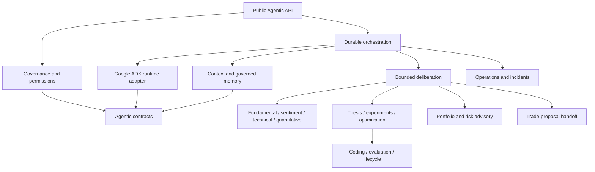
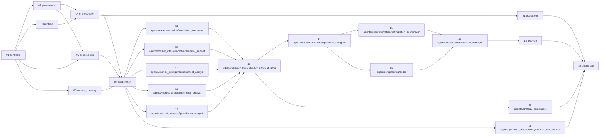

# Agentic Firm

> **Package:** `app/agentic`
> **Domain ID:** `AGENTIC`
> **Status:** `Missing`
> **Last updated:** `2026-07-28`
> **System workflows:** `SYS-WF-009`, `SYS-WF-010`, `SYS-WF-011`, `SYS-WF-012`

> This README is the package's single source of truth for the Agentic domain's
> requirements, final structure, implementation sequence, progress, usage
> examples, and tests. Update this file before changing Agentic code.
>
> Supporting documents under `docs/dev/agentic_firm/` elaborate this
> specification without creating a second Feature Registry or requirement
> namespace.

---

## 1. Purpose and Boundary

### Purpose

Agentic is HaruQuantAI's governed multi-agent firm. It uses specialized
LLM-powered roles to research markets, interpret deterministic evidence, form and
challenge hypotheses, design experiments, coordinate simulation and optimization,
author sandboxed code, advise on portfolios and risk, and submit typed trade
proposals into the deterministic trading pipeline.

The firm may do every analytical and creative activity needed to discover,
evaluate, explain, and propose a trading decision. It never becomes the authority
that approves or executes that decision.

### Authority hierarchy

1. The human Owner defines the mandate and grants explicit approvals.
2. Deterministic Python services enforce identity, data quality, strategy,
   simulation, optimization, portfolio, risk, trading, and broker policy.
3. Agentic coordinates reasoning and submits typed proposals through public domain
   contracts.
4. Google Agent Development Kit (ADK) runs the agent and workflow graph behind
   HaruQuantAI-owned adapters.
5. Model output is untrusted evidence until validated by deterministic code.

### Non-negotiable invariants

1. An agent may propose; only the owning deterministic domain may decide.
2. No agent holds broker credentials or imports a broker mutation capability.
3. No agent can approve its own proposal, alter a mandate, bypass an approval,
   clear a kill switch, or enlarge exposure outside deterministic policy.
4. Every model, tool, handoff, approval, artefact, and state transition is typed,
   versioned, budgeted, attributable, and auditable.
5. Retrieved content and peer messages are data, never instructions.
6. Missing, stale, poisoned, incompatible, or unverifiable evidence fails closed.
7. Generated code is isolated, never hot-loaded, and cannot reach production
   without deterministic gates and authenticated human approval.
8. Discussion consensus is not authorization and is never converted directly into
   position size.
9. Agentic may submit a `TradeProposal`; receiver-owned Strategy, Portfolio, Risk,
   Trading, and Broker controls remain mandatory and non-bypassable.
10. Disabling Agentic stops new Agentic work but leaves already-approved
    deterministic trading behaviour and all safety controls intact.

### Owns

- Agent manifests, prompts, role catalog, capability assignments, and evaluations.
- HaruQuantAI contracts for tasks, messages, evidence, deliberation, proposals,
  artefacts, provenance, budgets, and Agentic workflow state.
- ADK composition, provider-neutral model adapters, model routing policy, and
  regression gates.
- Dynamic but bounded firm deliberation and synthesis.
- Agent-callable tool wrappers, capability policy, and enforcement points.
- Agentic context assembly, working memory, evidence memory, and retention.
- Sandboxed code generation and Agentic-owned promotion evidence.
- Agentic evaluation, observability, incidents, replay, cancellation, and recovery.

### Does not own

- Market or document acquisition, source licensing, canonical market records, or
  point-in-time source truth: Data owns these.
- Deterministic indicators, analytics, simulation, optimization, strategy
  validation, portfolio construction, risk approval, order construction, trading
  state, execution, or broker transport.
- Human authentication and external presentation: UI/API owns these.
- A second policy engine for any owning domain.

### Approved attachment rule

Agentic consumes only documented public operations. A proposal is submitted through
the receiver's request contract and is treated exactly like an untrusted human or
external proposal. Receiver-owned validation, authorization, idempotency,
freshness, risk, and execution rules always run in full.

### Shared contracts

Contract definitions match the name, version, and owner recorded in
`docs/PROJECT.md`. Receiver-owned request and result contracts remain authoritative
after handoff.

#### Owned by Agentic

| Status  | Contract                                                       | Version | Counterparty         | Purpose and minimum rule                                                                                                   |
| ------- | -------------------------------------------------------------- | ------- | -------------------- | -------------------------------------------------------------------------------------------------------------------------- |
| Missing | `AgentTask`                                                  | `v1`  | Agentic              | Task ID, workflow/version, objective, typed input references, principal, scope, deadline, idempotency key, and budgets     |
| Missing | `AgentMessage`                                               | `v1`  | Agentic              | Message ID, task, sender role/version, recipient, message type, typed content, evidence references, created time, and hash |
| Missing | `AgentArtifact`                                              | `v1`  | Agentic              | Typed immutable artifact identity, content reference, schema, provenance, and canonical hash                               |
| Missing | `AgentResult[T]`                                             | `v1`  | Agentic, UI/API      | `ok`, `refused`, or `failed`; typed payload, reasons, provenance, and budget usage                                   |
| Missing | `AgentProvenance` / `BudgetUsage` / `WorkflowCheckpoint` | `v1`  | Agentic, UI/API      | Reproducible model/prompt/tool/data/policy lineage, bounded usage, and crash-safe workflow position                        |
| Missing | `DeliberationRecord`                                         | `v1`  | Research, UI/API     | Plan, independent briefs, claims, counterclaims, dissent, synthesis, budgets, and terminal reason                          |
| Missing | `Hypothesis`                                                 | `v1`  | Research, Simulation | Statement, asset scope, rationale, evidence, falsifier, and data/leakage constraints                                       |
| Missing | `ExperimentSpec`                                             | `v1`  | Simulation           | Protocol, immutable inputs, splits, costs, seeds, metrics, and stop criteria                                               |
| Missing | `SweepPlan`                                                  | `v1`  | Optimization         | Bounded space, objective, trial/search budget, stop criteria, and holdout policy                                           |
| Missing | `CodeArtifact`                                               | `v1`  | Agentic lifecycle    | Files, specification, tests, dependency manifest, hashes, and provenance                                                   |
| Missing | `PromotionEvidencePacket`                                    | `v1`  | Strategy, Indicators | Gate results, evaluation, lineage, search history, critic memo, and authenticated human approval                           |
| Missing | `AllocationProposal`                                         | `v1`  | Portfolio            | Non-binding weights/ranges, evidence, uncertainty, constraints, and expiry                                                 |
| Missing | `RiskAdvisory`                                               | `v1`  | Risk, UI/API         | Identified risks and questions; explicitly not a decision or approval                                                      |
| Missing | `TradeProposal`                                              | `v1`  | Strategy, Portfolio  | Instrument, direction, thesis, horizon, invalidation, evidence, requested evaluation scope, and expiry; no broker fields   |
| Missing | `TradeProposalReceipt`                                       | `v1`  | UI/API               | Receiver, status, deterministic request reference, and rejection reasons; never represents execution                       |

#### Consumed from other domains

| Contract                                                                     | Version | Owner      | Used for                                                                          |
| ---------------------------------------------------------------------------- | ------- | ---------- | --------------------------------------------------------------------------------- |
| `AuthContext` / `StandardResponse[T]` / `AuditEvent`                   | `v1`  | Utils      | Authenticated public operations, stable envelopes, and redacted audit publication |
| `MarketDataset`                                                            | `v1`  | Data       | Canonical point-in-time market evidence                                           |
| `AccountStateSnapshot`                                                     | `v1`  | Data       | Read-only account and position evidence                                           |
| `ResearchSourceDocument` / `ResearchSourcePage`                          | `v1`  | Data       | Licensed point-in-time source evidence through eligible bounded projections       |
| `FundamentalSourceEvidence` / `SentimentSourceEvidence`                  | `v1`  | Research   | Deterministic bounded fundamental and sentiment source evidence                   |
| `PortfolioSimulationResult`                                                | `v1`  | Simulation | Deterministic portfolio and experiment validation evidence                        |
| `ActivePortfolioAllocation`                                                | `v1`  | Portfolio  | Current immutable allocation evidence                                             |
| `AllocationRiskDecision`                                                   | `v1`  | Risk       | Current authoritative risk decision evidence                                      |
| `StrategyProposalEvaluationRequest` / `StrategyProposalEvaluationResult` | `v1`  | Strategy   | Receiver-owned deterministic evaluation of an untrusted Agentic thesis            |

Agentic also consumes documented public evidence operations from Indicators,
Analytics, Simulation, Optimization, Research, Portfolio, Risk, Strategy, and
Trading. It never imports their private implementation objects and has no Brokers
dependency.

### Persisted state

Only Agentic writes Agentic-owned state. Persistent stores use the repository
migration ledger, checksum, explicit write lock, transaction, retention, and
recovery rules. Other domains read through Agentic public contracts.

| Status  | State / Store                                                                     | Read access                                     | Migration definitions                                     |
| ------- | --------------------------------------------------------------------------------- | ----------------------------------------------- | --------------------------------------------------------- |
| Missing | Workflow store: task state, checkpoints, leases, idempotency, retry/cancel state  | Agentic and UI/API through task/run operations  | `orchestration/migrations.py`                           |
| Missing | Evidence store: immutable claims, source references, availability times, hashes   | Agentic and bounded UI/API evidence views       | `context_memory/migrations.py`                          |
| Missing | Experiment store: hypotheses, protocols, trials, holdout consumption, results     | Agentic lifecycle and bounded operator views    | `agents/experimentation/experiment_designer/migrations.py` |
| Missing | Artefact store: generated files, SBOM, signatures, promotion packets              | Agentic lifecycle and approved receiver handoff | `agents/engineering/coder/artifact_store.py`; no direct table requirement |
| Missing | Operational audit store: model/tool calls, policy decisions, approvals, incidents | Protected Agentic/UI/API audit operations       | `operations/migrations.py`                              |
| Missing | Working-memory store: bounded task summaries and temporary coordination state     | Current task only                               | `context_memory/migrations.py`                          |

Evidence, experiment, and audit facts are append-only. Corrections create new
versions. Artefacts are content-addressed and immutable. Working memory is
task-scoped, disposable, and TTL-bound. Memory is retrieved only after scope,
provenance, freshness, trust, injection, and retention filters. Model-generated
reflection cannot modify mandates, permissions, evaluation thresholds, or
production policy.

### Four-level structure

| Code level                | Represents                              |
| ------------------------- | --------------------------------------- |
| Package                   | Agentic domain                          |
| Module folder             | One registered`FEAT-AGT-*` capability |
| File                      | One use case or focused responsibility  |
| Class / function / method | One functional-requirement behaviour    |

```text
app/agentic/
└── module/
    └── focused_file.py
        └── Class / function / method
```

### Package capability map



### Firm organization

The organization mirrors a professional firm for responsibility, review, and
operator comprehension. Titles do not grant technical authority.

| Department                  | Roles                                                                 | Responsibility                                                                      | Prohibited authority                                          |
| --------------------------- | --------------------------------------------------------------------- | ----------------------------------------------------------------------------------- | ------------------------------------------------------------- |
| Executive coordination      | Firm Coordinator (CEO/CIO), Research Planner                          | Classify requests, select capabilities, allocate bounded budgets, synthesize status | Mandate changes, risk approval, promotion approval, execution |
| Market intelligence         | Fundamental Analyst, News/Sentiment Analyst                           | Point-in-time business, macro, news, and sentiment evidence                         | Acquiring unlicensed data, treating text as instruction       |
| Market analysis             | Technical Analyst, Market-Structure Analyst, Quantitative Analyst     | Indicator, structure, statistical, and regime evidence                              | Recomputing canonical upstream results silently               |
| Strategy desk               | Researcher, Strategy Thesis Analyst, Trader                           | Falsifiable hypotheses and simulated trade/strategy proposals                       | Orders, position-sizing authority, live execution             |
| Experimentation             | Experiment Designer, Optimization Coordinator, Simulation Interpreter | Reproducible tests, bounded sweeps, evidence interpretation                         | Changing deterministic engines or hiding failed trials        |
| Engineering                 | Coder, Code Reviewer, Robustness Critic                               | Sandboxed implementation and adversarial review                                     | Repository or runtime mutation outside staging                |
| Portfolio and risk advisory | Portfolio Advisor, Risk Critic, Compliance Critic                     | Challenge concentration, mandate fit, operational and tail risks                    | Risk decisions, approvals, kill-switch control                |
| Operations                  | Evaluation Manager, Incident Coordinator, Evidence Synthesizer        | Quality gates, traces, incidents, final evidence assembly                           | Editing evidence or suppressing dissent                       |

Roles activate only when the request, asset class, governed data, permissions, and
evaluation status support them. Unsupported roles return `refused`; they never
invent substitute evidence.

---

## 2. Final Package Structure

Define the complete intended end state before implementation. Feature and module
order below is the binding implementation order.

### Feature Registry

| Status  | Feature                                                           | Owning module        | Planned public API                                                                                                                | Requirements                | Usage evidence                                |
| ------- | ----------------------------------------------------------------- | -------------------- | --------------------------------------------------------------------------------------------------------------------------------- | --------------------------- | --------------------------------------------- |
| Missing | `FEAT-AGT-01` Canonical Agentic Contracts and Provenance        | `contracts/`       | `AgentTask`, `AgentMessage`, `AgentArtifact`, `AgentResult`, `AgentProvenance`, `BudgetUsage`, `WorkflowCheckpoint` | `FR-AGENTIC-001`–`003` | `tests/agentic/usage/01_contracts.py`       |
| Missing | `FEAT-AGT-02` Firm Governance, Roster, and Authority            | `governance/`      | `FirmMandate`, `RoleManifest`, `RoleRegistry`, `validate_firm_mandate`, `get_role_registry`                             | `FR-AGENTIC-004`–`006` | `tests/agentic/usage/02_governance.py`      |
| Missing | `FEAT-AGT-03` Google ADK Runtime and Provider-Neutral Models    | `runtime/`         | `ModelProfile`, `ModelGateway`, `AdkRuntime`, `invoke_model`, `validate_model_upgrade`                                  | `FR-AGENTIC-007`–`009` | `tests/agentic/usage/03_runtime.py`         |
| Missing | `FEAT-AGT-04` Durable Task and Workflow Orchestration           | `orchestration/`   | `WorkflowDefinition`, `WorkflowRun`, `submit_task`, `resume_task`, `cancel_task`, `expire_task`                       | `FR-AGENTIC-010`–`012` | `tests/agentic/usage/04_orchestration.py`   |
| Missing | `FEAT-AGT-05` Tool Registry, Permissions, and Approvals         | `permissions/`     | `ToolPolicy`, `AgentPolicy`, `PermissionDecision`, `authorize_tool_call`, `validate_policy_registry`                    | `FR-AGENTIC-013`–`015` | `tests/agentic/usage/05_permissions.py`     |
| Missing | `FEAT-AGT-06` Evidence Context and Governed Memory              | `context_memory/`  | `EvidenceClaim`, `ContextBundle`, `MemoryRecord`, `assemble_context`, `store_memory`, `retrieve_memory`               | `FR-AGENTIC-016`–`018` | `tests/agentic/usage/06_context_memory.py`  |
| Missing | `FEAT-AGT-07` Dynamic Deliberation and Synthesis                | `deliberation/`    | `DeliberationPlan`, `Counterclaim`, `DissentRecord`, `DeliberationRecord`, `run_deliberation`                           | `FR-AGENTIC-019`–`021` | `tests/agentic/usage/07_deliberation.py`    |
| Missing | `FEAT-AGT-08` Analytics Interpretation                          | `agents/experimentation/simulation_interpreter/`       | `RunInterpretation`, `interpret_analytics_evidence`                                                         | `FR-AGENTIC-022`–`024` | `tests/agentic/usage/08_interpretation.py`  |
| Missing | `FEAT-AGT-09` Fundamental Research                              | `agents/market_intelligence/fundamental_analyst/`      | `FundamentalEvidencePack`, `analyze_fundamentals`                                                           | `FR-AGENTIC-025`–`027` | `tests/agentic/usage/09_fundamental.py`     |
| Missing | `FEAT-AGT-10` News and Sentiment Research                       | `agents/market_intelligence/sentiment_analyst/`        | `SentimentEvidencePack`, `analyze_sentiment`                                                                | `FR-AGENTIC-028`–`030` | `tests/agentic/usage/10_sentiment.py`       |
| Missing | `FEAT-AGT-11` Technical and Market-Structure Research           | `agents/market_analysis/technical_analyst/`            | `TechnicalEvidencePack`, `analyze_technical_context`                                                        | `FR-AGENTIC-031`–`033` | `tests/agentic/usage/11_technical.py`       |
| Missing | `FEAT-AGT-12` Quantitative Research                             | `agents/market_analysis/quantitative_analyst/`         | `QuantitativeEvidencePack`, `analyze_quantitative_evidence`                                                 | `FR-AGENTIC-034`–`036` | `tests/agentic/usage/12_quantitative.py`    |
| Missing | `FEAT-AGT-13` Hypothesis and Strategy Thesis Development        | `agents/strategy_desk/strategy_thesis_analyst/`        | `Hypothesis`, `StrategyThesis`, `develop_hypothesis`, `develop_strategy_thesis`                             | `FR-AGENTIC-037`–`039` | `tests/agentic/usage/13_thesis.py`          |
| Missing | `FEAT-AGT-14` Experiment and Simulation Coordination            | `agents/experimentation/experiment_designer/`          | `ExperimentSpec`, `ExperimentVerdict`, `design_experiment`, `coordinate_simulation`                         | `FR-AGENTIC-040`–`042` | `tests/agentic/usage/14_experiments.py`     |
| Missing | `FEAT-AGT-15` Optimization Coordination                         | `agents/experimentation/optimization_coordinator/`     | `SweepPlan`, `SweepVerdict`, `design_sweep`, `coordinate_optimization`                                      | `FR-AGENTIC-043`–`045` | `tests/agentic/usage/15_optimization.py`    |
| Missing | `FEAT-AGT-16` Governed Code Generation and Sandbox              | `agents/engineering/coder/`                            | `CodeSpecification`, `CodeArtifact`, `SandboxResult`, `author_code_artifact`                                | `FR-AGENTIC-046`–`048` | `tests/agentic/usage/16_coding.py`          |
| Missing | `FEAT-AGT-17` Evaluation, Critique, and Economic Acceptance     | `agents/operations/evaluation_manager/`                | `EvaluationPlan`, `CritiqueMemo`, `EconomicAcceptanceVerdict`, `evaluate_agent`, `critique_candidate`       | `FR-AGENTIC-049`–`051` | `tests/agentic/usage/17_evaluation.py`      |
| Missing | `FEAT-AGT-18` Artefact Promotion and Lifecycle                  | `lifecycle/`       | `PromotionEvidencePacket`, `LifecycleRecord`, `assess_promotion`, `transition_artifact`                                   | `FR-AGENTIC-052`–`054` | `tests/agentic/usage/18_lifecycle.py`       |
| Missing | `FEAT-AGT-19` Portfolio and Risk Advisory                       | `agents/portfolio_risk_advisory/portfolio_risk_advisor/` | `AllocationProposal`, `RiskAdvisory`, `advise_portfolio`, `critique_risk`                                   | `FR-AGENTIC-055`–`057` | `tests/agentic/usage/19_advisory.py`        |
| Missing | `FEAT-AGT-20` Trade Proposal Handoff                            | `agents/strategy_desk/trader/`                           | `TradeProposal`, `TradeProposalReceipt`, `submit_trade_proposal`                                            | `FR-AGENTIC-058`–`060` | `tests/agentic/usage/20_trade_proposals.py` |
| Missing | `FEAT-AGT-21` Observability, Incidents, and Operational Control | `operations/`      | `AgenticTrace`, `IncidentRecord`, `ReplayRequest`, `get_run_trace`, `quarantine_agent`, `replay_run`                  | `FR-AGENTIC-061`–`063` | `tests/agentic/usage/21_operations.py`      |
| Missing | `FEAT-AGT-22` Public Agentic API and Operator Control           | `public_api/`      | `AgenticDependencies`, `submit_firm_request`, `get_firm_run`, `approve_agentic_handoff`                                   | `FR-AGENTIC-064`–`066` | `tests/agentic/usage/22_public_api.py`      |

```text
app/agentic/
├── README.md
├── __init__.py
├── _settings.py
├── _limits.py
├── contracts/
│   ├── __init__.py
│   └── models.py
├── governance/
│   ├── __init__.py
│   ├── models.py
│   └── registry.py
├── runtime/
│   ├── __init__.py
│   ├── models.py
│   ├── gateway.py
│   ├── adk.py
│   └── upgrades.py
├── orchestration/
│   ├── __init__.py
│   ├── models.py
│   ├── repository.py
│   ├── migrations.py
│   └── service.py
├── permissions/
│   ├── __init__.py
│   ├── models.py
│   ├── authorization.py
│   └── registry.py
├── context_memory/
│   ├── __init__.py
│   ├── models.py
│   ├── context.py
│   ├── repository.py
│   └── migrations.py
├── deliberation/
│   ├── __init__.py
│   ├── models.py
│   └── service.py
├── lifecycle/
│   ├── __init__.py
│   ├── models.py
│   └── service.py
├── operations/
│   ├── __init__.py
│   ├── models.py
│   ├── repository.py
│   ├── migrations.py
│   └── service.py
├── public_api/
│   ├── __init__.py
│   ├── dependencies.py
│   └── service.py
└── agents/
    ├── __init__.py
    ├── experimentation/
    │   ├── __init__.py
    │   ├── simulation_interpreter/
    │   │   ├── __init__.py
    │   │   ├── agent.py
    │   │   ├── prompt.md
    │   │   ├── schemas.py
    │   │   └── README.md
    │   ├── experiment_designer/
    │   │   ├── __init__.py
    │   │   ├── agent.py
    │   │   ├── prompt.md
    │   │   ├── schemas.py
    │   │   ├── tools.py
    │   │   ├── repository.py
    │   │   ├── migrations.py
    │   │   └── README.md
    │   └── optimization_coordinator/
    │       ├── __init__.py
    │       ├── agent.py
    │       ├── prompt.md
    │       ├── schemas.py
    │       ├── tools.py
    │       └── README.md
    ├── market_intelligence/
    │   ├── __init__.py
    │   ├── fundamental_analyst/
    │   │   ├── __init__.py
    │   │   ├── agent.py
    │   │   ├── prompt.md
    │   │   ├── schemas.py
    │   │   ├── tools.py
    │   │   └── README.md
    │   └── sentiment_analyst/
    │       ├── __init__.py
    │       ├── agent.py
    │       ├── prompt.md
    │       ├── schemas.py
    │       ├── tools.py
    │       └── README.md
    ├── market_analysis/
    │   ├── __init__.py
    │   ├── technical_analyst/
    │   │   ├── __init__.py
    │   │   ├── agent.py
    │   │   ├── prompt.md
    │   │   ├── schemas.py
    │   │   ├── tools.py
    │   │   └── README.md
    │   └── quantitative_analyst/
    │       ├── __init__.py
    │       ├── agent.py
    │       ├── prompt.md
    │       ├── schemas.py
    │       ├── tools.py
    │       └── README.md
    ├── strategy_desk/
    │   ├── __init__.py
    │   ├── strategy_thesis_analyst/
    │   │   ├── __init__.py
    │   │   ├── agent.py
    │   │   ├── prompt.md
    │   │   ├── schemas.py
    │   │   └── README.md
    │   └── trader/
    │       ├── __init__.py
    │       ├── agent.py
    │       ├── prompt.md
    │       ├── schemas.py
    │       ├── handoff.py
    │       └── README.md
    ├── engineering/
    │   ├── __init__.py
    │   └── coder/
    │       ├── __init__.py
    │       ├── agent.py
    │       ├── prompt.md
    │       ├── schemas.py
    │       ├── sandbox.py
    │       ├── artifact_store.py
    │       └── README.md
    ├── portfolio_risk_advisory/
    │   ├── __init__.py
    │   └── portfolio_risk_advisor/
    │       ├── __init__.py
    │       ├── agent.py
    │       ├── prompt.md
    │       ├── schemas.py
    │       ├── tools.py
    │       └── README.md
    └── operations/
        ├── __init__.py
        └── evaluation_manager/
            ├── __init__.py
            ├── agent.py
            ├── prompt.md
            ├── schemas.py
            ├── tools.py
            ├── evaluator.py
            └── README.md
```

`agents/` and its department directories are namespace/grouping packages only:
they contain no feature behaviour beyond `__init__.py`. Every leaf agent package is
the single owning module for one registered role-bearing feature. A leaf package
contains `agent.py`, `prompt.md`, `README.md`, and `__init__.py`; `schemas.py` is
required when the feature owns typed inputs or outputs. `tools.py`, `evaluator.py`,
repositories, migrations, sandboxes, stores, and handoff adapters exist only where
the feature specification below requires them.

### Module dependency diagram

Dependencies point from a required lower-level module to the consuming module.
The numerical feature order remains the binding complete-domain build order.



`orchestration/` defines injected policy/context ports using Agentic contracts so it
can be implemented before the concrete `permissions/` and `context_memory/`
features without a circular import. Runtime/provider objects never cross those
ports.

### Structure rules

- The package root contains only `README.md`, `__init__.py`, `_settings.py`,
  `_limits.py`, the ten registered infrastructure feature folders, and the
  namespace-only `agents/` hierarchy.
- Every registered infrastructure folder or leaf agent package owns exactly one
  feature. `agents/` and department packages contain no production behaviour.
- Every role-bearing feature package contains `agent.py`, an integrity-checked
  `prompt.md`, `README.md`, and `__init__.py`; it adds only the optional files
  declared by its feature specification.
- `agent.py` exposes the registered feature operation through provider-neutral
  Agentic contracts. Direct ADK/provider imports remain confined to `runtime/adk.py`.
- Each file owns one use case or focused responsibility.
- Cross-domain imports use documented public APIs or owner contracts.
- No ADK or provider object becomes a public or canonical persisted contract.
- No broker SDK, broker credential, broker mutation, risk approval, or kill-switch
  clearing capability may enter the package.
- Usage evidence consists of one numbered standalone program per feature under
  `tests/agentic/usage/`.
- Feature status changes from `Missing` only after implementation, tests, usage
  evidence, integration evidence, and active documentation agree.

### Agent package contract

`agent.py` is the focused provider-neutral definition and public use-case entry
point for its registered feature. It resolves an enabled `RoleManifest`, loads the
package-local `prompt.md`, verifies its content hash, binds only declared schemas
and tool identifiers, and delegates execution to the injected `AdkRuntime`. It
contains no embedded prompt, provider credential, provider SDK import, direct ADK
import, deterministic approval policy, or owner-domain implementation.

`prompt.md` contains the immutable base role instructions: objective, expertise
boundary, evidence and citation rules, uncertainty, falsifiers, dissent, refusal
conditions, and typed-output protocol. Trusted context, untrusted evidence, peer
messages, and task input are supplied separately at runtime. A manifest may add a
bounded role-specific instruction for a role sharing the feature capability; the
base-prompt hash, manifest hash, and resulting composite-instruction hash are all
recorded in provenance.

`schemas.py` contains only feature-owned typed inputs and outputs. It performs no
model invocation, orchestration, persistence, or owner-domain calculation. Every
current role-bearing feature owns typed output and therefore includes this file.

`README.md` follows `docs/templates/README.md` and is created with the feature
implementation. `tools.py`, `evaluator.py`, persistence, sandbox, store, and
handoff files are optional globally but mandatory wherever the module
specification lists them. Namespace `__init__.py` files contain no behaviour; a
leaf `__init__.py` exposes only the Feature Registry public API.

---

## 3. Workflows

Workflows describe collaboration; they do not create a second structural or
requirement authority.

### Status values

| Status    | Meaning                                    |
| --------- | ------------------------------------------ |
| Missing   | Not implemented or not verified            |
| Partial   | Partly implemented or tests are incomplete |
| Completed | Implemented, tested, and verified          |

### Workflow scope values

| Scope        | Meaning                                                         |
| ------------ | --------------------------------------------------------------- |
| Internal     | The complete workflow occurs inside Agentic                     |
| Cross-domain | Agentic participates through documented input/output boundaries |

| Status  | Workflow ID        | Scope        | System workflow | Workflow                         | Trigger / Input boundary                                              | Final outcome / Output boundary                            | Requirement sequence                                                                                                                                                                 |
| ------- | ------------------ | ------------ | --------------- | -------------------------------- | --------------------------------------------------------------------- | ---------------------------------------------------------- | ------------------------------------------------------------------------------------------------------------------------------------------------------------------------------------ |
| Missing | `WF-AGENTIC-001` | Cross-domain | `SYS-WF-009`  | Firm research council            | Authenticated operator research request                               | `DeliberationRecord` and typed research output to UI/API | `FR-AGENTIC-004 → FR-AGENTIC-005 → FR-AGENTIC-010 → FR-AGENTIC-013 → FR-AGENTIC-016 → FR-AGENTIC-019 → FR-AGENTIC-020 → FR-AGENTIC-021 → FR-AGENTIC-064 → FR-AGENTIC-065` |
| Missing | `WF-AGENTIC-002` | Cross-domain | `SYS-WF-009`  | Interpret deterministic evidence | Completed Analytics/Simulation/Optimization evidence                  | `RunInterpretation` or typed refusal                     | `FR-AGENTIC-022 → FR-AGENTIC-023 → FR-AGENTIC-024`                                                                                                                               |
| Missing | `WF-AGENTIC-003` | Cross-domain | `SYS-WF-009`  | Hypothesis to experiment         | Approved research objective                                           | `ExperimentVerdict` bound to Simulation run evidence     | `FR-AGENTIC-025 → FR-AGENTIC-039 → FR-AGENTIC-040 → FR-AGENTIC-041 → FR-AGENTIC-042`                                                                                           |
| Missing | `WF-AGENTIC-004` | Cross-domain | `SYS-WF-009`  | Bounded optimization             | Approved`ExperimentSpec`                                            | `SweepVerdict` bound to Optimization trials              | `FR-AGENTIC-043 → FR-AGENTIC-044 → FR-AGENTIC-045`                                                                                                                               |
| Missing | `WF-AGENTIC-005` | Internal     | `SYS-WF-010`  | Author code artefact             | Authenticated human code specification                                | Staged`CodeArtifact`                                     | `FR-AGENTIC-046 → FR-AGENTIC-047 → FR-AGENTIC-048 → FR-AGENTIC-050`                                                                                                             |
| Missing | `WF-AGENTIC-006` | Cross-domain | `SYS-WF-010`  | Promote artefact                 | Staged artefact                                                       | Receiver registration or terminal`research_only`         | `FR-AGENTIC-049 → FR-AGENTIC-050 → FR-AGENTIC-051 → FR-AGENTIC-052 → FR-AGENTIC-053 → FR-AGENTIC-054`                                                                         |
| Missing | `WF-AGENTIC-007` | Cross-domain | `SYS-WF-011`  | Portfolio and risk council       | Operator or scheduled advisory request                                | Non-binding`AllocationProposal` and `RiskAdvisory`     | `FR-AGENTIC-055 → FR-AGENTIC-056 → FR-AGENTIC-057`                                                                                                                               |
| Missing | `WF-AGENTIC-008` | Cross-domain | `SYS-WF-012`  | Submit trade proposal            | Approved Agentic thesis outcome                                       | Receiver receipt, rejection, or expiry; never a fill       | `FR-AGENTIC-058 → FR-AGENTIC-059 → FR-AGENTIC-060`                                                                                                                               |
| Missing | `WF-AGENTIC-009` | Internal     | None            | Model upgrade                    | Owner requests a model-profile change                                 | Activated evaluated pin or refusal                         | `FR-AGENTIC-007 → FR-AGENTIC-008 → FR-AGENTIC-009`                                                                                                                               |
| Missing | `WF-AGENTIC-010` | Internal     | None            | Incident and recovery            | Timeout, injection, policy, schema, drift, provider, or sandbox event | Contained incident and safe resume or termination          | `FR-AGENTIC-061 → FR-AGENTIC-062 → FR-AGENTIC-063 → FR-AGENTIC-066`                                                                                                             |

Every workflow supports idempotent submission, persisted checkpoints, cancellation,
expiration, bounded retry, backpressure, and crash-safe resume. A repeated request
with the same idempotency key returns the original run or receipt.

### `WF-AGENTIC-001` — Firm Research Council

**Input boundary:** UI/API supplies an authenticated bounded research objective.

**Output boundary:** Agentic returns a `DeliberationRecord` and typed research result
to UI/API; it submits no trade or approval.

1. Validate mandate, data readiness, identity, budgets, idempotency, and deadline.
2. Deterministically select enabled participants, model profiles, tools, maximum
   rounds, fan-out, and stop conditions.
3. Collect independent first-pass briefs before exposing peer conclusions.
4. Normalize material statements into evidence claims with source, availability
   time, content hash, confidence basis, and falsifier.
5. Assigned challengers create typed counterclaims; configured rebuttal rounds run.
6. Deterministic tools calculate or simulate every calculable claim.
7. Synthesis preserves supported conclusions, uncertainty, and dissent without
   majority-vote authority.
8. Publish an immutable record or return `refused` for insufficient evidence.

**Failure behaviour:** Missing/ineligible evidence, policy denial, unresolved
material conflict, budget/deadline exhaustion, or schema failure refuses the run.
Provider/tool failure follows bounded retry and checkpoint recovery.

**Integration test:** `tests/agentic/integration/test_research_council.py`

### `WF-AGENTIC-002` — Interpret Deterministic Evidence

Agentic validates completed versioned evidence, identifies facts, uncertainty,
limitations, and unanswered questions, and returns a cited `RunInterpretation`.
Missing or incompatible evidence refuses without recomputation or invention.

**Integration test:** `tests/agentic/integration/test_interpretation.py`

### `WF-AGENTIC-003` — Hypothesis to Experiment

Independent analysts produce evidence packs; thesis synthesis preserves conflict;
the experiment feature emits an immutable protocol to Simulation and binds every
verdict to returned run IDs. Receiver validation failure or unsafe evidence ends
the workflow without a result claim.

**Integration test:** `tests/agentic/integration/test_hypothesis_experiment.py`

### `WF-AGENTIC-004` — Bounded Optimization

An approved experiment creates a predeclared bounded `SweepPlan`; Optimization runs
the receiver-owned request; every trial and failure remains visible; Agentic returns
a robustness-focused `SweepVerdict`. Exhausted search budget or holdout misuse is
terminal.

**Integration test:** `tests/agentic/integration/test_bounded_optimization.py`

### `WF-AGENTIC-005` — Author Code Artefact

An authenticated specification enters an ephemeral credential-free,
network-denied sandbox. Generated files, dependencies, tests, hashes, provenance,
and search history become a staged `CodeArtifact`; no code is hot-loaded.

**Integration test:** `tests/agentic/integration/test_code_artifact.py`

### `WF-AGENTIC-006` — Promote Artefact

Evaluation, deterministic gates, Simulation evidence, lifetime-search accounting,
critic review, and authenticated human approval form a complete evidence packet.
Leakage, holdout reuse, exhausted search budget, missing evidence, or absent
approval produces terminal `research_only`; receiver registration remains
authoritative.

**Integration test:** `tests/agentic/integration/test_artifact_promotion.py`

### `WF-AGENTIC-007` — Portfolio and Risk Council

Agentic reads current allocation, analytics, account, mandate, and Risk evidence;
advisers assess independently and preserve dissent; Agentic emits non-binding
advice. Portfolio and Risk apply their complete normal controls to any submitted
receiver-owned request.

**Integration test:** `tests/agentic/integration/test_advisory_council.py`

### `WF-AGENTIC-008` — Submit Trade Proposal

Agentic emits a proposal with evidence, uncertainty, horizon, invalidation, scope,
and expiry but no broker fields. Strategy and Portfolio treat it as untrusted,
Risk and Trading remain mandatory, and Agentic receives a proposal receipt rather
than order/fill truth.

**Integration test:** `tests/agentic/integration/test_trade_proposal.py`

### `WF-AGENTIC-009` — Model Upgrade

An Owner-requested profile change passes contract, schema, tool, safety, privacy,
latency, cost, regression, shadow, and economic acceptance gates before activation.
Failed compatibility or silent/floating substitution is refused.

**Integration test:** `tests/agentic/integration/test_model_upgrade.py`

### `WF-AGENTIC-010` — Incident and Recovery

Deterministic containment cancels or quarantines affected work, preserves
checkpoint and evidence, and permits only isolated side-effect-free replay.
Terminal work cannot resume under the same task identity.

**Integration test:** `tests/agentic/integration/test_incident_recovery.py`

#### End-to-end workflow diagram

```mermaid
flowchart LR
    IN["Authenticated input"] --> GOV["Mandate / permission / readiness"]
    GOV --> ORCH["Persisted bounded workflow"]
    ORCH --> AGENTS["Independent specialist work"]
    AGENTS --> TOOLS["Deterministic public tools"]
    TOOLS --> CRITIC["Critique and dissent"]
    CRITIC --> RESULT["Typed Agentic result"]
    RESULT --> HANDOFF["Optional receiver-owned handoff"]
    HANDOFF --> RECEIVER["Deterministic receiver validation"]
```



---

## 4. Module and Requirement Specifications

This section is the implementation plan. Modules, files, and requirements are
ordered from the lowest dependency to the highest dependency. Each module also
contains an `__init__.py` exposing only the listed public feature API.

Dependency entries use this order: standard library, required third-party, local.
`pydantic` is already available for strict contracts. Google ADK is planned only
for `runtime/adk.py`; its exact compatible pin is reverified when implementation
begins.

### 4.1 `contracts/` — Canonical Agentic Contracts and Provenance

**Purpose:** Define immutable provider-neutral boundary contracts.

**Module flow:** untrusted typed data → strict validation and canonical hashing →
immutable contract.

| Status  | File            | Responsibility                                                                           | Key exports                                                                                                                       | Dependencies                                                                                                                                                         |
| ------- | --------------- | ---------------------------------------------------------------------------------------- | --------------------------------------------------------------------------------------------------------------------------------- | -------------------------------------------------------------------------------------------------------------------------------------------------------------------- |
| Missing | `models.py`   | Define canonical tasks, messages, artifacts, results, provenance, usage, and checkpoints | `AgentTask`, `AgentMessage`, `AgentArtifact`, `AgentResult`, `AgentProvenance`, `BudgetUsage`, `WorkflowCheckpoint` | **Standard library:** `datetime`, `typing`; **Required third-party:** `pydantic`; **Local:** Utils identifiers, UTC, canonical serialization |
| Missing | `__init__.py` | Expose the supported contract API                                                        | All exports above                                                                                                                 | **Standard library:** None; **Required third-party:** None; **Local:** `models.py`                                                               |

| Status  | Requirement ID     | Responsibility                                                                                                                                                               | Side effects | Failure / Verification                      |
| ------- | ------------------ | ---------------------------------------------------------------------------------------------------------------------------------------------------------------------------- | ------------ | ------------------------------------------- |
| Missing | `FR-AGENTIC-001` | All public task, message, result, artefact, proposal, provenance, budget, and checkpoint contracts shall be immutable, versioned, finite, strictly validated, and JSON-safe. | None         | Contract validation and serialization tests |
| Missing | `FR-AGENTIC-002` | `AgentResult` shall distinguish `ok`, `refused`, and `failed`, and no free text shall populate a deterministic execution field.                                      | None         | Status and prohibited-field tests           |
| Missing | `FR-AGENTIC-003` | Every contract instance shall carry stable identity, UTC time, schema/version, correlation lineage, and canonical content hash.                                              | None         | Identity, time, lineage, and hash tests     |

### 4.2 `governance/` — Firm Governance, Roster, and Authority

**Purpose:** Validate the signed firm mandate and evaluated role roster.

| Status  | File            | Responsibility                                           | Key exports                                                        | Dependencies                                                                                                           |
| ------- | --------------- | -------------------------------------------------------- | ------------------------------------------------------------------ | ---------------------------------------------------------------------------------------------------------------------- |
| Missing | `models.py`   | Define mandate and role manifests                        | `FirmMandate`, `RoleManifest`                                  | **Standard library:** `datetime`; **Required third-party:** `pydantic`; **Local:** `contracts` |
| Missing | `registry.py` | Validate mandates and expose the immutable role registry | `RoleRegistry`, `validate_firm_mandate`, `get_role_registry` | **Standard library:** `collections.abc`; **Required third-party:** None; **Local:** `models.py`  |
| Missing | `__init__.py` | Expose the governance API                                | All exports above                                                  | **Standard library:** None; **Required third-party:** None; **Local:** governance files              |

| Status  | Requirement ID     | Responsibility                                                                                                                                                   | Side effects               | Failure / Verification                   |
| ------- | ------------------ | ---------------------------------------------------------------------------------------------------------------------------------------------------------------- | -------------------------- | ---------------------------------------- |
| Missing | `FR-AGENTIC-004` | The firm mandate shall define objectives, prohibited authority, assets, environments, budgets, approval boundaries, and enabled capability roles.                | Read-only mandate load     | Mandate completeness and signature tests |
| Missing | `FR-AGENTIC-005` | The role registry shall validate unique roles, versions, owning features, agent-package paths, prompt artefact and composite-instruction hashes, model profiles, tools, input/output schemas, refusal conditions, and evaluations at startup. | Local state initialization | Agent-package parity, prompt-integrity, and registry validation tests |
| Missing | `FR-AGENTIC-006` | Leadership and department titles shall coordinate work but shall grant no implicit tool, approval, risk, promotion, or execution authority.                      | None                       | Privilege-escalation negative tests      |

### 4.3 `runtime/` — Google ADK Runtime and Provider-Neutral Models

**Purpose:** Run evaluated models and ADK graphs behind HaruQuantAI interfaces.

| Status  | File            | Responsibility                                     | Key exports                        | Dependencies                                                                                                                                                          |
| ------- | --------------- | -------------------------------------------------- | ---------------------------------- | --------------------------------------------------------------------------------------------------------------------------------------------------------------------- |
| Missing | `models.py`   | Define provider-neutral evaluated model profiles   | `ModelProfile`                   | **Standard library:** None; **Required third-party:** `pydantic`; **Local:** `contracts`                                                        |
| Missing | `gateway.py`  | Route one governed structured model invocation     | `ModelGateway`, `invoke_model` | **Standard library:** `collections.abc`; **Required third-party:** provider adapters selected by profile; **Local:** `models.py`, `contracts` |
| Missing | `adk.py`      | Adapt Google ADK graph/session/artifact operations | `AdkRuntime`                     | **Standard library:** None; **Required third-party:** planned compatible `google-adk 2.x`; **Local:** `gateway.py`, Agentic contracts           |
| Missing | `upgrades.py` | Evaluate and gate model-profile changes            | `validate_model_upgrade`         | **Standard library:** None; **Required third-party:** None; **Local:** `models.py`, evaluation-manager public contracts                           |
| Missing | `__init__.py` | Expose the runtime API                             | All exports above                  | **Standard library:** None; **Required third-party:** None; **Local:** runtime files                                                                |

Google ADK 2.x is the selected runtime. The reference version verified during
design is `google-adk 2.1.0`; dependency addition and lockfile selection occur only
when implementation begins and must reverify the current stable release and Python
3.14 compatibility. ADK provides graph, dynamic/collaborative workflow, task,
session, artifact, evaluation, callback, and telemetry capabilities behind
`AdkRuntime`.

```text
Agentic public API
  → HaruQuantAI workflow / contract / policy layer
    → AdkRuntime adapter
      → ADK workflow and agent nodes
        → ModelGateway
          → configured Gemini, Claude, OpenAI-compatible, local, or future adapter
```

A one-line model-profile change is permitted only after the target passes schema,
tool, safety, privacy, latency, cost, and regression compatibility gates. Floating
aliases such as `latest` are prohibited. Silent provider substitution is prohibited
for promotion, portfolio, risk-advisory, and trade-proposal workflows.

| Status  | Requirement ID     | Responsibility                                                                                                                               | Side effects                        | Failure / Verification    |
| ------- | ------------------ | -------------------------------------------------------------------------------------------------------------------------------------------- | ----------------------------------- | ------------------------- |
| Missing | `FR-AGENTIC-007` | Agent execution shall use an ADK 2.x adapter behind HaruQuantAI-owned interfaces and shall expose no ADK/provider object publicly.           | External model call through adapter | Boundary and import tests |
| Missing | `FR-AGENTIC-008` | Model profiles shall pin provider/model capability and enforce schema, tool, privacy, latency, cost, region, retention, and fallback policy. | None                                | Profile validation tests  |
| Missing | `FR-AGENTIC-009` | A model change shall remain disabled until versioned regression, shadow, safety, and economic acceptance gates pass.                         | Evaluated profile-state change      | Upgrade-gate tests        |

### 4.4 `orchestration/` — Durable Task and Workflow Orchestration

**Purpose:** Persist and execute bounded crash-safe Agentic workflows.

| Status  | File              | Responsibility                                      | Key exports                                                        | Dependencies                                                                                                                                                        |
| ------- | ----------------- | --------------------------------------------------- | ------------------------------------------------------------------ | ------------------------------------------------------------------------------------------------------------------------------------------------------------------- |
| Missing | `models.py`     | Define workflow declarations and run states         | `WorkflowDefinition`, `WorkflowRun`                            | **Standard library:** `datetime`; **Required third-party:** `pydantic`; **Local:** `contracts`                                              |
| Missing | `migrations.py` | Define immutable Agentic workflow-store migrations  | Internal only; no public export                                    | **Standard library:** None; **Required third-party:** None; **Local:** Data migration protocol                                                    |
| Missing | `repository.py` | Persist tasks, checkpoints, leases, and idempotency | Internal only; no public export                                    | **Standard library:** `collections.abc`; **Required third-party:** None; **Local:** `models.py`, `migrations.py`                            |
| Missing | `service.py`    | Submit, resume, cancel, and expire workflows        | `submit_task`, `resume_task`, `cancel_task`, `expire_task` | **Standard library:** `datetime`; **Required third-party:** None; **Local:** governance, runtime, repository, injected permission/context ports |
| Missing | `__init__.py`   | Expose the orchestration API                        | Feature Registry exports only                                      | **Standard library:** None; **Required third-party:** None; **Local:** orchestration files                                                        |

| Status  | Requirement ID     | Responsibility                                                                                                                                                | Side effects                                             | Failure / Verification                    |
| ------- | ------------------ | ------------------------------------------------------------------------------------------------------------------------------------------------------------- | -------------------------------------------------------- | ----------------------------------------- |
| Missing | `FR-AGENTIC-010` | Task submission shall be idempotent and persist declared workflow, principal, inputs, budgets, deadline, and initial checkpoint before execution.             | Persistence write                                        | Idempotency and initial-transaction tests |
| Missing | `FR-AGENTIC-011` | Workflow runs shall support deterministic routing, bounded fan-out/loops/retries, backpressure, cancellation, expiration, human waits, and crash-safe resume. | Persistence write; external calls through injected ports | Recovery, bound, and lifecycle tests      |
| Missing | `FR-AGENTIC-012` | Terminal task states shall be`succeeded`, `refused`, `failed`, `cancelled`, or `expired`; no terminal run may resume without a new task identity.   | Persistence write                                        | State-machine negative tests              |

### 4.5 `permissions/` — Tool Registry, Permissions, and Approvals

**Purpose:** Enforce deny-by-default capability and approval policy.

| Status  | File                 | Responsibility                                        | Key exports                                             | Dependencies                                                                                                                   |
| ------- | -------------------- | ----------------------------------------------------- | ------------------------------------------------------- | ------------------------------------------------------------------------------------------------------------------------------ |
| Missing | `models.py`        | Define tool, agent, and permission-decision contracts | `ToolPolicy`, `AgentPolicy`, `PermissionDecision` | **Standard library:** `datetime`; **Required third-party:** `pydantic`; **Local:** contracts, governance |
| Missing | `authorization.py` | Authorize one scoped tool call                        | `authorize_tool_call`                                 | **Standard library:** None; **Required third-party:** None; **Local:** `models.py`                         |
| Missing | `registry.py`      | Validate complete policy/tool registration            | `validate_policy_registry`                            | **Standard library:** `collections.abc`; **Required third-party:** None; **Local:** `models.py`          |
| Missing | `__init__.py`      | Expose the permissions API                            | All exports above                                       | **Standard library:** None; **Required third-party:** None; **Local:** permissions files                     |

| Status  | Requirement ID     | Responsibility                                                                                                                                                       | Side effects              | Failure / Verification               |
| ------- | ------------------ | -------------------------------------------------------------------------------------------------------------------------------------------------------------------- | ------------------------- | ------------------------------------ |
| Missing | `FR-AGENTIC-013` | Tool and agent authorization shall be deny-by-default and require registered principal, role, tool/version, scope, environment, budget, and trusted runtime context. | Audit event publication   | Authorization matrix tests           |
| Missing | `FR-AGENTIC-014` | Approval attestations shall be authenticated, single-purpose, scoped, expiring, non-replayable, and impossible for an agent message to manufacture.                  | Approval reservation/read | Forgery, replay, and expiry tests    |
| Missing | `FR-AGENTIC-015` | Agentic shall expose no broker mutation, mandate override, kill-switch clear, production deployment, or direct order tool.                                           | None                      | Export and capability-negative tests |

### 4.6 `context_memory/` — Evidence Context and Governed Memory

**Purpose:** Assemble point-in-time evidence and maintain separated governed memory.

| Status  | File              | Responsibility                                     | Key exports                                            | Dependencies                                                                                                                             |
| ------- | ----------------- | -------------------------------------------------- | ------------------------------------------------------ | ---------------------------------------------------------------------------------------------------------------------------------------- |
| Missing | `models.py`     | Define claims, context bundles, and memory records | `EvidenceClaim`, `ContextBundle`, `MemoryRecord` | **Standard library:** `datetime`; **Required third-party:** `pydantic`; **Local:** contracts                       |
| Missing | `context.py`    | Assemble bounded eligible model context            | `assemble_context`                                   | **Standard library:** None; **Required third-party:** None; **Local:** `models.py`, owner-public evidence contracts  |
| Missing | `migrations.py` | Define evidence and memory-store migrations        | Internal only; no public export                        | **Standard library:** None; **Required third-party:** None; **Local:** Data migration protocol                         |
| Missing | `repository.py` | Store and retrieve scoped memory                   | `store_memory`, `retrieve_memory`                  | **Standard library:** `collections.abc`; **Required third-party:** None; **Local:** `models.py`, `migrations.py` |
| Missing | `__init__.py`   | Expose the context/memory API                      | Feature Registry exports only                          | **Standard library:** None; **Required third-party:** None; **Local:** context-memory files                            |

| Status  | Requirement ID     | Responsibility                                                                                                                                                             | Side effects              | Failure / Verification               |
| ------- | ------------------ | -------------------------------------------------------------------------------------------------------------------------------------------------------------------------- | ------------------------- | ------------------------------------ |
| Missing | `FR-AGENTIC-016` | Context assembly shall enforce point-in-time availability, provenance, freshness, licensing, deduplication, trust, injection, and asset-scope filters before model access. | Read-only owner API calls | Eligibility and poisoning tests      |
| Missing | `FR-AGENTIC-017` | Memory shall be separated into immutable evidence, experiment, operational audit, and bounded TTL working stores with declared retention and deletion.                     | Persistence write/read    | Store separation and retention tests |
| Missing | `FR-AGENTIC-018` | Memory or peer content shall never alter system instruction, permissions, mandate, evaluation policy, or deterministic thresholds.                                         | None                      | Prompt-injection and privilege tests |

### 4.7 `deliberation/` — Dynamic Deliberation and Synthesis

**Purpose:** Run evidence-backed bounded discussion while preserving dissent.

| Status  | File            | Responsibility                                           | Key exports                                                                       | Dependencies                                                                                                                                 |
| ------- | --------------- | -------------------------------------------------------- | --------------------------------------------------------------------------------- | -------------------------------------------------------------------------------------------------------------------------------------------- |
| Missing | `models.py`   | Define plans, counterclaims, dissent, and records        | `DeliberationPlan`, `Counterclaim`, `DissentRecord`, `DeliberationRecord` | **Standard library:** `datetime`; **Required third-party:** `pydantic`; **Local:** contracts, context-memory           |
| Missing | `service.py`  | Select enabled participants and run bounded deliberation | `run_deliberation`                                                              | **Standard library:** None; **Required third-party:** None; **Local:** orchestration, permissions, context-memory, runtime |
| Missing | `__init__.py` | Expose the deliberation API                              | All exports above                                                                 | **Standard library:** None; **Required third-party:** None; **Local:** deliberation files                                  |

The default rebuttal allowance is one round. Every mandate and limits profile may
reduce or explicitly replace it; agents cannot raise participant, fan-out, round,
deadline, tool, token, or cost limits.

| Status  | Requirement ID     | Responsibility                                                                                                                                                         | Side effects                        | Failure / Verification                |
| ------- | ------------------ | ---------------------------------------------------------------------------------------------------------------------------------------------------------------------- | ----------------------------------- | ------------------------------------- |
| Missing | `FR-AGENTIC-019` | Deliberation shall begin with independent briefs and record participants, topology, rounds, deadlines, budgets, claims, counterclaims, tool evidence, and stop reason. | Model/tool calls; persistence write | Independent-brief and record tests    |
| Missing | `FR-AGENTIC-020` | Discussion shall preserve minority dissent and allow`insufficient_evidence`; voting or consensus shall not produce authorization or position size.                   | None                                | Dissent and authority-negative tests  |
| Missing | `FR-AGENTIC-021` | Dynamic participant selection shall be limited to enabled roles and deterministic caps; maximum rounds and fan-out shall never be model-overridable.                   | None                                | Limit and adversarial-selection tests |

### 4.8 `agents/experimentation/simulation_interpreter/` — Analytics Interpretation

| Status  | File            | Responsibility                                                   | Key exports                      | Dependencies                                                                                                                                              |
| ------- | --------------- | ---------------------------------------------------------------- | -------------------------------- | --------------------------------------------------------------------------------------------------------------------------------------------------------- |
| Missing | `agent.py`    | Define the provider-neutral interpreter and interpret completed deterministic evidence without recomputation | `interpret_analytics_evidence` | **Standard library:** `pathlib`; **Required third-party:** None; **Local:** governance, runtime, deliberation, Analytics/Simulation/Optimization public contracts |
| Missing | `prompt.md`   | Define immutable interpretation, citation, uncertainty, and refusal instructions | Internal prompt artefact | **Standard library:** None; **Required third-party:** None; **Local:** None |
| Missing | `schemas.py`  | Define cited interpretation output                               | `RunInterpretation`            | **Standard library:** None; **Required third-party:** `pydantic`; **Local:** contracts |
| Missing | `README.md`   | Document the feature boundary, API, prompt, dependencies, and evidence | None | **Standard library:** None; **Required third-party:** None; **Local:** package README template |
| Missing | `__init__.py` | Expose the Feature Registry API                                  | Feature Registry exports only    | **Standard library:** None; **Required third-party:** None; **Local:** `agent.py`, `schemas.py` |

| Status  | Requirement ID     | Responsibility                                                                                                                                                        | Side effects | Failure / Verification              |
| ------- | ------------------ | --------------------------------------------------------------------------------------------------------------------------------------------------------------------- | ------------ | ----------------------------------- |
| Missing | `FR-AGENTIC-022` | Interpretation shall consume completed versioned deterministic evidence and identify facts, uncertainty, limitations, and unanswered questions without recomputation. | Model call   | Evidence and no-recomputation tests |
| Missing | `FR-AGENTIC-023` | Interpretations shall cite exact source references and distinguish measured facts, deterministic derivations, model inferences, and recommendations.                  | None         | Citation/classification tests       |
| Missing | `FR-AGENTIC-024` | Missing or incompatible evidence shall produce`refused` rather than invented metrics, fills, performance, or explanations.                                          | None         | Missing-evidence negative tests     |

### 4.9 `agents/market_intelligence/fundamental_analyst/` — Fundamental Research

| Status  | File            | Responsibility                                      | Key exports                 | Dependencies                                                                                                                     |
| ------- | --------------- | --------------------------------------------------- | --------------------------- | -------------------------------------------------------------------------------------------------------------------------------- |
| Missing | `agent.py`    | Define the provider-neutral analyst and analyze eligible point-in-time fundamental evidence | `analyze_fundamentals` | **Standard library:** `pathlib`; **Required third-party:** None; **Local:** governance, runtime, deliberation, Research public contracts |
| Missing | `prompt.md`   | Define immutable fundamental-analysis, evidence, uncertainty, falsifier, and refusal instructions | Internal prompt artefact | **Standard library:** None; **Required third-party:** None; **Local:** None |
| Missing | `schemas.py`  | Define bounded fundamental evidence output          | `FundamentalEvidencePack` | **Standard library:** None; **Required third-party:** `pydantic`; **Local:** contracts |
| Missing | `tools.py`    | Bind only governed point-in-time fundamental evidence tools | Internal only; no public export | **Standard library:** None; **Required third-party:** None; **Local:** permissions, Research public contracts |
| Missing | `README.md`   | Document the feature boundary, API, prompt, dependencies, and evidence | None | **Standard library:** None; **Required third-party:** None; **Local:** package README template |
| Missing | `__init__.py` | Expose the Feature Registry API                     | Feature Registry exports only | **Standard library:** None; **Required third-party:** None; **Local:** `agent.py`, `schemas.py` |

| Status  | Requirement ID     | Responsibility                                                                                                                                    | Side effects | Failure / Verification            |
| ------- | ------------------ | ------------------------------------------------------------------------------------------------------------------------------------------------- | ------------ | --------------------------------- |
| Missing | `FR-AGENTIC-025` | Fundamental analysis shall use licensed point-in-time filings, transcripts, macro, and issuer evidence with publication and availability lineage. | Model call   | Point-in-time and licensing tests |
| Missing | `FR-AGENTIC-026` | Fundamental outputs shall be asset-class aware and refuse when required issuer or macro evidence is unavailable or inapplicable.                  | None         | Applicability/refusal tests       |
| Missing | `FR-AGENTIC-027` | Fundamental claims shall include evidence, assumptions, horizon, uncertainty, and falsifiers and shall remain advisory.                           | None         | Schema and authority tests        |

### 4.10 `agents/market_intelligence/sentiment_analyst/` — News and Sentiment Research

| Status  | File            | Responsibility                           | Key exports               | Dependencies                                                                                                                     |
| ------- | --------------- | ---------------------------------------- | ------------------------- | -------------------------------------------------------------------------------------------------------------------------------- |
| Missing | `agent.py`    | Define the provider-neutral analyst and analyze eligible governed text evidence | `analyze_sentiment` | **Standard library:** `pathlib`; **Required third-party:** None; **Local:** governance, runtime, deliberation, Research public contracts |
| Missing | `prompt.md`   | Define immutable sentiment, manipulation, uncertainty, unsupported-narrative, and refusal instructions | Internal prompt artefact | **Standard library:** None; **Required third-party:** None; **Local:** None |
| Missing | `schemas.py`  | Define bounded sentiment evidence output | `SentimentEvidencePack` | **Standard library:** None; **Required third-party:** `pydantic`; **Local:** contracts |
| Missing | `tools.py`    | Bind only governed, injection-filtered text-evidence tools | Internal only; no public export | **Standard library:** None; **Required third-party:** None; **Local:** permissions, Research public contracts |
| Missing | `README.md`   | Document the feature boundary, API, prompt, dependencies, and evidence | None | **Standard library:** None; **Required third-party:** None; **Local:** package README template |
| Missing | `__init__.py` | Expose the Feature Registry API          | Feature Registry exports only | **Standard library:** None; **Required third-party:** None; **Local:** `agent.py`, `schemas.py` |

| Status  | Requirement ID     | Responsibility                                                                                                                                 | Side effects                | Failure / Verification         |
| ------- | ------------------ | ---------------------------------------------------------------------------------------------------------------------------------------------- | --------------------------- | ------------------------------ |
| Missing | `FR-AGENTIC-028` | Sentiment analysis shall use governed news/social sources with source trust, deduplication, revision, manipulation, and availability metadata. | Model call                  | Source-governance tests        |
| Missing | `FR-AGENTIC-029` | Retrieved text shall pass instruction stripping and structured fact extraction before sentiment reasoning.                                     | Deterministic preprocessing | Injection and extraction tests |
| Missing | `FR-AGENTIC-030` | Sentiment output shall separate source coverage, measured polarity, event classification, uncertainty, and unsupported narrative.              | None                        | Output separation tests        |

### 4.11 `agents/market_analysis/technical_analyst/` — Technical and Market-Structure Research

| Status  | File            | Responsibility                                   | Key exports                   | Dependencies                                                                                                                            |
| ------- | --------------- | ------------------------------------------------ | ----------------------------- | --------------------------------------------------------------------------------------------------------------------------------------- |
| Missing | `agent.py`    | Define the provider-neutral analyst and interpret canonical Data and Indicators evidence | `analyze_technical_context` | **Standard library:** `pathlib`; **Required third-party:** None; **Local:** governance, runtime, deliberation, Data/Indicators public contracts |
| Missing | `prompt.md`   | Define immutable technical, market-structure, confirmation, invalidation, and refusal instructions | Internal prompt artefact | **Standard library:** None; **Required third-party:** None; **Local:** None |
| Missing | `schemas.py`  | Define technical evidence output                 | `TechnicalEvidencePack` | **Standard library:** None; **Required third-party:** `pydantic`; **Local:** contracts |
| Missing | `tools.py`    | Bind canonical Data and Indicators evidence tools without alternate calculations | Internal only; no public export | **Standard library:** None; **Required third-party:** None; **Local:** permissions, Data/Indicators public contracts |
| Missing | `README.md`   | Document the feature boundary, API, prompt, dependencies, and evidence | None | **Standard library:** None; **Required third-party:** None; **Local:** package README template |
| Missing | `__init__.py` | Expose the Feature Registry API                  | Feature Registry exports only | **Standard library:** None; **Required third-party:** None; **Local:** `agent.py`, `schemas.py` |

| Status  | Requirement ID     | Responsibility                                                                                                                           | Side effects | Failure / Verification      |
| ------- | ------------------ | ---------------------------------------------------------------------------------------------------------------------------------------- | ------------ | --------------------------- |
| Missing | `FR-AGENTIC-031` | Technical analysis shall consume canonical Data and Indicators outputs and shall not silently compute an alternate indicator definition. | Model call   | Canonical-definition tests  |
| Missing | `FR-AGENTIC-032` | Technical outputs shall bind instrument, venue, timeframe, session, observation window, indicator versions, and data-quality evidence.   | None         | Binding and freshness tests |
| Missing | `FR-AGENTIC-033` | Pattern or regime claims shall state confirmation, invalidation, and leakage-safe evaluation requirements.                               | None         | Claim-schema tests          |

### 4.12 `agents/market_analysis/quantitative_analyst/` — Quantitative Research

| Status  | File            | Responsibility                                    | Key exports                       | Dependencies                                                                                                                               |
| ------- | --------------- | ------------------------------------------------- | --------------------------------- | ------------------------------------------------------------------------------------------------------------------------------------------ |
| Missing | `agent.py`    | Define the provider-neutral analyst and analyze deterministic Research/Analytics evidence | `analyze_quantitative_evidence` | **Standard library:** `pathlib`; **Required third-party:** None; **Local:** governance, runtime, deliberation, Research/Analytics public contracts |
| Missing | `prompt.md`   | Define immutable quantitative, statistical-disclosure, calculation-grounding, and refusal instructions | Internal prompt artefact | **Standard library:** None; **Required third-party:** None; **Local:** None |
| Missing | `schemas.py`  | Define quantitative evidence output               | `QuantitativeEvidencePack` | **Standard library:** None; **Required third-party:** `pydantic`; **Local:** contracts |
| Missing | `tools.py`    | Bind deterministic calculation and eligible evidence tools | Internal only; no public export | **Standard library:** None; **Required third-party:** None; **Local:** permissions, Research/Analytics public contracts |
| Missing | `README.md`   | Document the feature boundary, API, prompt, dependencies, and evidence | None | **Standard library:** None; **Required third-party:** None; **Local:** package README template |
| Missing | `__init__.py` | Expose the Feature Registry API                   | Feature Registry exports only | **Standard library:** None; **Required third-party:** None; **Local:** `agent.py`, `schemas.py` |

| Status  | Requirement ID     | Responsibility                                                                                                               | Side effects                       | Failure / Verification       |
| ------- | ------------------ | ---------------------------------------------------------------------------------------------------------------------------- | ---------------------------------- | ---------------------------- |
| Missing | `FR-AGENTIC-034` | Quantitative analysis shall consume versioned Research/Analytics evidence and use deterministic tools for every calculation. | Model and deterministic tool calls | Calculation-grounding tests  |
| Missing | `FR-AGENTIC-035` | Quantitative outputs shall report sample, estimator, uncertainty, multiple-testing exposure, assumptions, and limitations.   | None                               | Statistical disclosure tests |
| Missing | `FR-AGENTIC-036` | Non-finite, insufficient, non-aligned, or leakage-unsafe data shall be refused without imputation by the model.              | None                               | Invalid-data negative tests  |

### 4.13 `agents/strategy_desk/strategy_thesis_analyst/` — Hypothesis and Strategy Thesis Development

| Status  | File            | Responsibility                                          | Key exports                                         | Dependencies                                                                                                                          |
| ------- | --------------- | ------------------------------------------------------- | --------------------------------------------------- | ------------------------------------------------------------------------------------------------------------------------------------- |
| Missing | `agent.py`    | Define the provider-neutral analyst and develop and synthesize hypotheses/theses | `develop_hypothesis`, `develop_strategy_thesis` | **Standard library:** `pathlib`; **Required third-party:** None; **Local:** governance, runtime, deliberation, interpretation and specialist evidence packs |
| Missing | `prompt.md`   | Define immutable falsifiability, conflict-preservation, advisory-boundary, and refusal instructions | Internal prompt artefact | **Standard library:** None; **Required third-party:** None; **Local:** None |
| Missing | `schemas.py`  | Define falsifiable hypotheses and non-executable theses | `Hypothesis`, `StrategyThesis` | **Standard library:** None; **Required third-party:** `pydantic`; **Local:** contracts |
| Missing | `README.md`   | Document the feature boundary, API, prompt, dependencies, and evidence | None | **Standard library:** None; **Required third-party:** None; **Local:** package README template |
| Missing | `__init__.py` | Expose the Feature Registry API                        | Feature Registry exports only | **Standard library:** None; **Required third-party:** None; **Local:** `agent.py`, `schemas.py` |

| Status  | Requirement ID     | Responsibility                                                                                                                                         | Side effects | Failure / Verification      |
| ------- | ------------------ | ------------------------------------------------------------------------------------------------------------------------------------------------------ | ------------ | --------------------------- |
| Missing | `FR-AGENTIC-037` | A hypothesis shall be falsifiable and bind asset scope, horizon, evidence, mechanism, prerequisites, confounders, and rejection criterion.             | None         | Hypothesis validation tests |
| Missing | `FR-AGENTIC-038` | A strategy thesis shall describe signals and intended behaviour but shall contain no executable code, broker command, approval, or authoritative size. | None         | Prohibited-field tests      |
| Missing | `FR-AGENTIC-039` | Thesis synthesis shall retain conflicting evidence and shall not promote a proposal solely because agents agree.                                       | Model call   | Conflict/dissent tests      |

### 4.14 `agents/experimentation/experiment_designer/` — Experiment and Simulation Coordination

| Status  | File              | Responsibility                                                 | Key exports                                      | Dependencies                                                                                                                             |
| ------- | ----------------- | -------------------------------------------------------------- | ------------------------------------------------ | ---------------------------------------------------------------------------------------------------------------------------------------- |
| Missing | `agent.py`      | Define the provider-neutral designer, design experiments, and coordinate Simulation | `design_experiment`, `coordinate_simulation` | **Standard library:** `pathlib`; **Required third-party:** None; **Local:** governance, runtime, deliberation, repository, Simulation public contracts |
| Missing | `prompt.md`     | Define immutable experiment-design, falsification, holdout, lineage, and refusal instructions | Internal prompt artefact | **Standard library:** None; **Required third-party:** None; **Local:** None |
| Missing | `schemas.py`    | Define immutable experiment protocols and verdicts             | `ExperimentSpec`, `ExperimentVerdict` | **Standard library:** `datetime`; **Required third-party:** `pydantic`; **Local:** contracts, strategy-thesis analyst |
| Missing | `tools.py`      | Bind only governed Simulation request/result operations         | Internal only; no public export | **Standard library:** None; **Required third-party:** None; **Local:** permissions, Simulation public contracts |
| Missing | `migrations.py` | Define experiment-ledger migrations                            | Internal only; no public export                  | **Standard library:** None; **Required third-party:** None; **Local:** Data migration protocol                         |
| Missing | `repository.py` | Persist hypotheses, protocols, runs, holdout use, and verdicts | Internal only; no public export                  | **Standard library:** `collections.abc`; **Required third-party:** None; **Local:** `schemas.py`, `migrations.py` |
| Missing | `README.md`     | Document the feature boundary, API, prompt, dependencies, persistence, and evidence | None | **Standard library:** None; **Required third-party:** None; **Local:** package README template |
| Missing | `__init__.py`   | Expose the Feature Registry API                                | Feature Registry exports only                    | **Standard library:** None; **Required third-party:** None; **Local:** `agent.py`, `schemas.py` |

| Status  | Requirement ID     | Responsibility                                                                                                                                    | Side effects        | Failure / Verification             |
| ------- | ------------------ | ------------------------------------------------------------------------------------------------------------------------------------------------- | ------------------- | ---------------------------------- |
| Missing | `FR-AGENTIC-040` | Experiment design shall specify immutable inputs, time splits, embargo, costs, seeds, baselines, metrics, stop rules, and falsification outcomes. | Persistence write   | Protocol-completeness tests        |
| Missing | `FR-AGENTIC-041` | Simulation coordination shall use only the public Simulation request and result contracts and shall never invent or alter a result.               | Simulation API call | Receiver-boundary and tamper tests |
| Missing | `FR-AGENTIC-042` | Experiment verdicts shall bind every conclusion to run IDs and distinguish discovery, validation, holdout, and null-data evidence.                | Persistence write   | Evidence-lineage tests             |

### 4.15 `agents/experimentation/optimization_coordinator/` — Optimization Coordination

| Status  | File            | Responsibility                            | Key exports                                   | Dependencies                                                                                                                          |
| ------- | --------------- | ----------------------------------------- | --------------------------------------------- | ------------------------------------------------------------------------------------------------------------------------------------- |
| Missing | `agent.py`    | Define the provider-neutral coordinator, design sweeps, and coordinate Optimization | `design_sweep`, `coordinate_optimization` | **Standard library:** `pathlib`; **Required third-party:** None; **Local:** governance, runtime, deliberation, experiment designer, Optimization public contracts |
| Missing | `prompt.md`   | Define immutable bounded-search, robustness, failed-trial, overfit, and refusal instructions | Internal prompt artefact | **Standard library:** None; **Required third-party:** None; **Local:** None |
| Missing | `schemas.py`  | Define bounded sweep plans and verdicts   | `SweepPlan`, `SweepVerdict` | **Standard library:** None; **Required third-party:** `pydantic`; **Local:** contracts, experiment designer |
| Missing | `tools.py`    | Bind only governed Optimization request/result operations | Internal only; no public export | **Standard library:** None; **Required third-party:** None; **Local:** permissions, Optimization public contracts |
| Missing | `README.md`   | Document the feature boundary, API, prompt, dependencies, and evidence | None | **Standard library:** None; **Required third-party:** None; **Local:** package README template |
| Missing | `__init__.py` | Expose the Feature Registry API          | Feature Registry exports only | **Standard library:** None; **Required third-party:** None; **Local:** `agent.py`, `schemas.py` |

| Status  | Requirement ID     | Responsibility                                                                                                                                   | Side effects                             | Failure / Verification     |
| ------- | ------------------ | ------------------------------------------------------------------------------------------------------------------------------------------------ | ---------------------------------------- | -------------------------- |
| Missing | `FR-AGENTIC-043` | Sweep plans shall declare bounded spaces, objectives, trial budgets, early-stop policy, search method, and holdout consumption before execution. | None                                     | Plan-bound tests           |
| Missing | `FR-AGENTIC-044` | Optimization coordination shall invoke only public Optimization operations and preserve every attempted trial and failure.                       | Optimization API call; persistence write | Trial-ledger tests         |
| Missing | `FR-AGENTIC-045` | Sweep verdicts shall report robustness, instability, overfit evidence, economic effect, and unresolved risk, not only the winning parameters.    | None                                     | Verdict completeness tests |

### 4.16 `agents/engineering/coder/` — Governed Code Generation and Sandbox

| Status  | File                  | Responsibility                                             | Key exports                                                | Dependencies                                                                                                                                   |
| ------- | --------------------- | ---------------------------------------------------------- | ---------------------------------------------------------- | ---------------------------------------------------------------------------------------------------------------------------------------------- |
| Missing | `agent.py`          | Define the provider-neutral coder and author staged code artefacts | `author_code_artifact` | **Standard library:** `pathlib`; **Required third-party:** None; **Local:** governance, runtime, permissions, sandbox, artifact store |
| Missing | `prompt.md`         | Define immutable specification, secure-coding, provenance, staging-only, and refusal instructions | Internal prompt artefact | **Standard library:** None; **Required third-party:** None; **Local:** None |
| Missing | `schemas.py`        | Define code specifications, artifacts, and sandbox results | `CodeSpecification`, `CodeArtifact`, `SandboxResult` | **Standard library:** None; **Required third-party:** `pydantic`; **Local:** contracts |
| Missing | `sandbox.py`        | Generate and test code in an isolated staging sandbox      | Internal only; no public export | **Standard library:** `pathlib`; **Required third-party:** approved sandbox runtime; **Local:** `schemas.py`, permissions |
| Missing | `artifact_store.py` | Store content-addressed staged artifacts and provenance    | Internal only; no public export | **Standard library:** `hashlib`, `pathlib`; **Required third-party:** None; **Local:** `schemas.py` |
| Missing | `README.md`         | Document the feature boundary, API, prompt, sandbox, dependencies, and evidence | None | **Standard library:** None; **Required third-party:** None; **Local:** package README template |
| Missing | `__init__.py`       | Expose the Feature Registry API                            | Feature Registry exports only | **Standard library:** None; **Required third-party:** None; **Local:** `agent.py`, `schemas.py` |

| Status  | Requirement ID     | Responsibility                                                                                                                                   | Side effects                           | Failure / Verification                |
| ------- | ------------------ | ------------------------------------------------------------------------------------------------------------------------------------------------ | -------------------------------------- | ------------------------------------- |
| Missing | `FR-AGENTIC-046` | Code generation shall require an authenticated specification and run in an ephemeral, resource-bounded, credential-free, network-denied sandbox. | Isolated subprocess and staging writes | Sandbox and egress tests              |
| Missing | `FR-AGENTIC-047` | Generated artefacts shall record files, dependency/SBOM data, tests, hashes, model/prompt/tool provenance, and complete search history.          | Artefact-store write                   | Manifest and reproducibility tests    |
| Missing | `FR-AGENTIC-048` | The coder may write only to staging; generated code shall never be imported, executed, registered, or deployed in a production runtime directly. | Staging write only                     | Path/import/deployment negative tests |

### 4.17 `agents/operations/evaluation_manager/` — Evaluation, Critique, and Economic Acceptance

| Status  | File            | Responsibility                                              | Key exports                                                         | Dependencies                                                                                                               |
| ------- | --------------- | ----------------------------------------------------------- | ------------------------------------------------------------------- | -------------------------------------------------------------------------------------------------------------------------- |
| Missing | `agent.py`    | Define the provider-neutral manager, evaluate roles, and critique candidate artefacts | `evaluate_agent`, `critique_candidate` | **Standard library:** `pathlib`; **Required third-party:** None; **Local:** governance, runtime, deliberation, experiment designer, optimization coordinator, coder |
| Missing | `prompt.md`   | Define immutable adversarial-critique, baseline, uncertainty, economic-acceptance, and refusal instructions | Internal prompt artefact | **Standard library:** None; **Required third-party:** None; **Local:** None |
| Missing | `schemas.py`  | Define evaluation plans, critiques, and acceptance verdicts | `EvaluationPlan`, `CritiqueMemo`, `EconomicAcceptanceVerdict` | **Standard library:** None; **Required third-party:** `pydantic`; **Local:** contracts |
| Missing | `tools.py`    | Bind governed evidence, test, and grader operations | Internal only; no public export | **Standard library:** None; **Required third-party:** None; **Local:** permissions, owner-public evaluation evidence |
| Missing | `evaluator.py` | Apply feature-specific evaluation-set and calibrated-grader definitions | Internal only; no public export | **Standard library:** None; **Required third-party:** None; **Local:** `schemas.py`, shared evaluation contracts |
| Missing | `README.md`   | Document the feature boundary, API, prompt, dependencies, and evidence | None | **Standard library:** None; **Required third-party:** None; **Local:** package README template |
| Missing | `__init__.py` | Expose the Feature Registry API                             | Feature Registry exports only | **Standard library:** None; **Required third-party:** None; **Local:** `agent.py`, `schemas.py` |

| Status  | Requirement ID     | Responsibility                                                                                                                               | Side effects                     | Failure / Verification         |
| ------- | ------------------ | -------------------------------------------------------------------------------------------------------------------------------------------- | -------------------------------- | ------------------------------ |
| Missing | `FR-AGENTIC-049` | Agent evaluation shall use versioned gold, adversarial, poisoning, refusal, regression, and economic-ablation sets with calibrated graders.  | Model/tool calls; evidence write | Evaluation-suite tests         |
| Missing | `FR-AGENTIC-050` | Candidate critique shall include leakage, causality, robustness, cost, operational, security, and counterfactual challenges.                 | Model/tool calls                 | Critique-coverage tests        |
| Missing | `FR-AGENTIC-051` | A role shall be disabled or retired when it fails safety/reliability gates or does not beat its simpler baseline after uncertainty and cost. | Governed role-state change       | Baseline and disablement tests |

### 4.18 `lifecycle/` — Artefact Promotion and Lifecycle

| Status  | File            | Responsibility                                             | Key exports                                      | Dependencies                                                                                                                           |
| ------- | --------------- | ---------------------------------------------------------- | ------------------------------------------------ | -------------------------------------------------------------------------------------------------------------------------------------- |
| Missing | `models.py`   | Define promotion packets and append-only lifecycle records | `PromotionEvidencePacket`, `LifecycleRecord` | **Standard library:** `datetime`; **Required third-party:** `pydantic`; **Local:** contracts, coder, evaluation manager |
| Missing | `service.py`  | Assess promotion and perform governed transitions          | `assess_promotion`, `transition_artifact`    | **Standard library:** None; **Required third-party:** None; **Local:** `models.py`, experiment designer, evaluation manager |
| Missing | `__init__.py` | Expose the lifecycle API                                   | All exports above                                | **Standard library:** None; **Required third-party:** None; **Local:** lifecycle files                               |

| Status  | Requirement ID     | Responsibility                                                                                                                                    | Side effects                            | Failure / Verification |
| ------- | ------------------ | ------------------------------------------------------------------------------------------------------------------------------------------------- | --------------------------------------- | ---------------------- |
| Missing | `FR-AGENTIC-052` | Promotion shall require the complete ordered evidence packet, deterministic receiver gates, and authenticated human approval.                     | Lifecycle persistence; receiver handoff | Complete-packet tests  |
| Missing | `FR-AGENTIC-053` | Leakage, holdout reuse, search-budget exhaustion, missing provenance, or absent approval shall terminate promotion as`research_only`.           | Lifecycle persistence                   | Terminal-gate tests    |
| Missing | `FR-AGENTIC-054` | Artefact transitions shall be append-only, version-specific, non-skippable, automatically demotable, and never inherited across material changes. | Lifecycle persistence                   | Transition-state tests |

### 4.19 `agents/portfolio_risk_advisory/portfolio_risk_advisor/` — Portfolio and Risk Advisory

| Status  | File            | Responsibility                                         | Key exports                              | Dependencies                                                                                                                                     |
| ------- | --------------- | ------------------------------------------------------ | ---------------------------------------- | ------------------------------------------------------------------------------------------------------------------------------------------------ |
| Missing | `agent.py`    | Define the provider-neutral advisor, produce portfolio advice, and run independent risk critique | `advise_portfolio`, `critique_risk` | **Standard library:** `pathlib`; **Required third-party:** None; **Local:** governance, runtime, deliberation, Analytics/Portfolio/Risk public contracts |
| Missing | `prompt.md`   | Define immutable non-binding portfolio, independent-risk, dissent, expiry, and refusal instructions | Internal prompt artefact | **Standard library:** None; **Required third-party:** None; **Local:** None |
| Missing | `schemas.py`  | Define non-binding allocation and risk advice          | `AllocationProposal`, `RiskAdvisory` | **Standard library:** `datetime`; **Required third-party:** `pydantic`; **Local:** contracts |
| Missing | `tools.py`    | Bind read-only Analytics, Portfolio, Risk, and account-evidence operations | Internal only; no public export | **Standard library:** None; **Required third-party:** None; **Local:** permissions, Analytics/Portfolio/Risk public contracts |
| Missing | `README.md`   | Document the feature boundary, API, prompt, dependencies, and evidence | None | **Standard library:** None; **Required third-party:** None; **Local:** package README template |
| Missing | `__init__.py` | Expose the Feature Registry API                        | Feature Registry exports only | **Standard library:** None; **Required third-party:** None; **Local:** `agent.py`, `schemas.py` |

| Status  | Requirement ID     | Responsibility                                                                                                                                      | Side effects                          | Failure / Verification            |
| ------- | ------------------ | --------------------------------------------------------------------------------------------------------------------------------------------------- | ------------------------------------- | --------------------------------- |
| Missing | `FR-AGENTIC-055` | Portfolio advice shall use current Analytics, Portfolio, Risk, and account-scope evidence and return non-binding proposals with expiry.             | Read-only owner API calls; model call | Freshness and non-binding tests   |
| Missing | `FR-AGENTIC-056` | Risk critics shall identify mandate, barrier, tail, concentration, liquidity, correlation, operational, and model risks but shall emit no approval. | Model call                            | Risk-coverage and authority tests |
| Missing | `FR-AGENTIC-057` | Portfolio or risk advice shall be rejected by the receiver when evidence, identity, scope, authorization, or freshness is invalid.                  | Receiver-owned request call           | Receiver-rejection tests          |

### 4.20 `agents/strategy_desk/trader/` — Trade Proposal Handoff

| Status  | File            | Responsibility                                                | Key exports                                 | Dependencies                                                                                                                                |
| ------- | --------------- | ------------------------------------------------------------- | ------------------------------------------- | ------------------------------------------------------------------------------------------------------------------------------------------- |
| Missing | `agent.py`    | Define the provider-neutral trader and compose non-executable trade proposals | Internal only; no additional public export | **Standard library:** `pathlib`; **Required third-party:** None; **Local:** governance, runtime, deliberation, strategy-thesis analyst |
| Missing | `prompt.md`   | Define immutable thesis, uncertainty, invalidation, non-execution, and refusal instructions | Internal prompt artefact | **Standard library:** None; **Required third-party:** None; **Local:** None |
| Missing | `schemas.py`  | Define proposal and receipt contracts                         | `TradeProposal`, `TradeProposalReceipt` | **Standard library:** `datetime`; **Required third-party:** `pydantic`; **Local:** contracts, strategy-thesis analyst |
| Missing | `handoff.py`  | Map and submit an untrusted proposal to receiver-owned intake | `submit_trade_proposal` | **Standard library:** None; **Required third-party:** None; **Local:** `schemas.py`, Strategy/Portfolio public contracts |
| Missing | `README.md`   | Document the feature boundary, API, prompt, handoff, dependencies, and evidence | None | **Standard library:** None; **Required third-party:** None; **Local:** package README template |
| Missing | `__init__.py` | Expose the Feature Registry API                               | Feature Registry exports only | **Standard library:** None; **Required third-party:** None; **Local:** `agent.py`, `schemas.py`, `handoff.py` |

| Status  | Requirement ID     | Responsibility                                                                                                                                                          | Side effects                | Failure / Verification              |
| ------- | ------------------ | ----------------------------------------------------------------------------------------------------------------------------------------------------------------------- | --------------------------- | ----------------------------------- |
| Missing | `FR-AGENTIC-058` | A trade proposal shall carry thesis, instrument, direction, horizon, invalidation, evidence, uncertainty, evaluation request, and expiry, with no broker-native fields. | None                        | Contract and prohibited-field tests |
| Missing | `FR-AGENTIC-059` | Trade proposals shall enter the normal deterministic Strategy/Portfolio/Risk/Trading pipeline and shall receive no privileged route or reduced validation.              | Receiver-owned request call | End-to-end boundary tests           |
| Missing | `FR-AGENTIC-060` | Agentic shall treat receiver rejection, expiry, or acceptance as the outcome; it shall never represent a proposal receipt as an order or fill.                          | Receipt persistence         | Outcome-truth tests                 |

### 4.21 `operations/` — Observability, Incidents, and Operational Control

| Status  | File              | Responsibility                                            | Key exports                                             | Dependencies                                                                                                                             |
| ------- | ----------------- | --------------------------------------------------------- | ------------------------------------------------------- | ---------------------------------------------------------------------------------------------------------------------------------------- |
| Missing | `models.py`     | Define traces, incidents, and replay requests             | `AgenticTrace`, `IncidentRecord`, `ReplayRequest` | **Standard library:** `datetime`; **Required third-party:** `pydantic`; **Local:** contracts                       |
| Missing | `migrations.py` | Define operations/audit-store migrations                  | Internal only; no public export                         | **Standard library:** None; **Required third-party:** None; **Local:** Data migration protocol                         |
| Missing | `repository.py` | Persist redacted operational and incident evidence        | Internal only; no public export                         | **Standard library:** `collections.abc`; **Required third-party:** None; **Local:** `models.py`, `migrations.py` |
| Missing | `service.py`    | Inspect traces, quarantine roles, and run isolated replay | `get_run_trace`, `quarantine_agent`, `replay_run` | **Standard library:** None; **Required third-party:** None; **Local:** orchestration, repository, governance           |
| Missing | `__init__.py`   | Expose the operations API                                 | Registered exports above                                | **Standard library:** None; **Required third-party:** None; **Local:** operations files                                |

| Status  | Requirement ID     | Responsibility                                                                                                                                                             | Side effects                               | Failure / Verification                 |
| ------- | ------------------ | -------------------------------------------------------------------------------------------------------------------------------------------------------------------------- | ------------------------------------------ | -------------------------------------- |
| Missing | `FR-AGENTIC-061` | Every workflow, agent, model, tool, handoff, guardrail, approval, state transition, cost, and failure shall emit correlated redacted telemetry.                            | Audit/telemetry publication                | Trace-completeness and redaction tests |
| Missing | `FR-AGENTIC-062` | Injection, privilege, data-poisoning, schema, drift, cost, runaway-loop, provider, or sandbox incidents shall trigger deterministic containment and evidence preservation. | Cancellation/quarantine; persistence write | Incident-containment tests             |
| Missing | `FR-AGENTIC-063` | Replay shall use immutable references and an isolated environment and shall never repeat external side effects.                                                            | Isolated replay task                       | Side-effect and reference tests        |

### 4.22 `public_api/` — Public Agentic API and Operator Control

| Status  | File                | Responsibility                                            | Key exports                                                            | Dependencies                                                                                                                                                                                         |
| ------- | ------------------- | --------------------------------------------------------- | ---------------------------------------------------------------------- | ---------------------------------------------------------------------------------------------------------------------------------------------------------------------------------------------------- |
| Missing | `dependencies.py` | Define explicit typed composition dependencies            | `AgenticDependencies`                                                | **Standard library:** `collections.abc`; **Required third-party:** None; **Local:** all Agentic public feature APIs                                                              |
| Missing | `service.py`      | Expose authenticated typed Agentic application operations | `submit_firm_request`, `get_firm_run`, `approve_agentic_handoff` | **Standard library:** None; **Required third-party:** None; **Local:** dependencies, orchestration, permissions, operations, lifecycle, portfolio-risk advisor, trader, Utils contracts |
| Missing | `__init__.py`     | Expose the supported package API only                     | Registered Agentic public API                                          | **Standard library:** None; **Required third-party:** None; **Local:** `service.py`, public contracts                                                                            |

| Status  | Requirement ID     | Responsibility                                                                                                                                                              | Side effects                       | Failure / Verification                   |
| ------- | ------------------ | --------------------------------------------------------------------------------------------------------------------------------------------------------------------------- | ---------------------------------- | ---------------------------------------- |
| Missing | `FR-AGENTIC-064` | Public operations shall require`AuthContext`, explicit dependencies, request/correlation IDs, bounded inputs, and stable mapped failures.                                 | Depends on operation               | Signature and envelope tests             |
| Missing | `FR-AGENTIC-065` | Operator APIs shall expose submit, inspect, cancel, approve-handoff, replay, quarantine, and audit operations without exposing prompts, credentials, or provider internals. | Governed state change/read         | Public API and redaction tests           |
| Missing | `FR-AGENTIC-066` | Package disablement shall reject new work, cancel or safely drain active work by policy, preserve audit evidence, and leave deterministic safety controls available.        | Cancellation/drain and persistence | Disablement and safety-equivalence tests |

### Feature usage examples

Each registered feature has exactly one numbered standalone program under
`tests/agentic/usage/`, as recorded in the Feature Registry. Every program will
define `main()`, use an `if __name__ == "__main__"` guard, call every public
constructor and operation for its feature through the documented API, and use
realistic bounded secret-safe data. These programs are excluded from pytest
collection and executed directly.

---

## 5. Package-Wide Requirements and Shared Configuration

### Configuration and Limits Manifest

`_settings.py` owns the package-wide typed settings and inherits the central Utils
settings boundary. `_limits.py` validates the versioned limits profile. No module
reads environment files or process environment directly, and no hidden numerical
default may widen authority.

| Status  | Setting / Limit            | Type                | Default   | Required         | Used by                            | Description                                                                                                               |
| ------- | -------------------------- | ------------------- | --------- | ---------------- | ---------------------------------- | ------------------------------------------------------------------------------------------------------------------------- |
| Missing | `AGENTIC_ENABLED`        | `bool`            | `False` | Yes              | Public API and worker lifecycle    | Master enablement;`False` rejects new work and safely drains/cancels active work without weakening deterministic safety |
| Missing | `AGENTIC_MANDATE_PATH`   | `Path`            | `None`  | Conditional      | Governance                         | Required when enabled; missing, expired, hash-mismatched, or incompatible mandate blocks startup                          |
| Missing | `AGENTIC_MODEL_PROFILES` | `tuple[str, ...]` | `()`    | Conditional      | Runtime                            | Evaluated provider-neutral profile IDs; floating aliases and silent fallback prohibited                                   |
| Missing | `AGENTIC_LIMITS_PROFILE` | `str`             | `None`  | Conditional      | Orchestration and every capability | Required versioned profile; absence blocks enabled startup                                                                |
| Missing | `workflow_limits`        | Mandate section     | None      | Yes when enabled | Orchestration/deliberation         | Participants, active runs, fan-out, rounds, loops, retries, deadlines, queues, and provider/tool concurrency              |
| Missing | `budgets`                | Mandate section     | None      | Yes when enabled | Runtime/tools/experiments          | Context/output size, tokens, calls, tools, cost, compute, storage, and lifetime search limits                             |
| Missing | `retention_policy`       | Mandate section     | None      | Yes when enabled | Context-memory/operations          | Evidence, experiment, audit, working-memory TTL, incident retention, and deletion                                         |

Limits are deterministic and model-non-overridable. Policy, evidence, injection,
approval, and budget failures are not retried.

### Non-functional requirements

| Status  | Requirement ID      | Type               | Responsibility                                                                                                                                                     | Verification                 |
| ------- | ------------------- | ------------------ | ------------------------------------------------------------------------------------------------------------------------------------------------------------------ | ---------------------------- |
| Missing | `NFR-AGENTIC-001` | Security           | Security: OWASP agentic threats, least privilege, secret isolation, sandboxing, signed approvals, egress controls, and fail-closed behaviour are acceptance gates. | Security/adversarial suite   |
| Missing | `NFR-AGENTIC-002` | Reliability        | Reliability: durable state, idempotency, deadlines, bounded retries, recovery, and deterministic terminal states are mandatory.                                    | Failure/recovery suite       |
| Missing | `NFR-AGENTIC-003` | Reproducibility    | Reproducibility: model, prompt, tool, data, policy, dependency, seed, and configuration versions are recorded for every result.                                    | Replay/lineage tests         |
| Missing | `NFR-AGENTIC-004` | Observability      | Observability: traces, metrics, logs, audit, cost, and incident evidence are correlated without storing secrets or unrestricted sensitive content.                 | Telemetry/redaction tests    |
| Missing | `NFR-AGENTIC-005` | Performance        | Performance: each workflow declares latency, concurrency, fan-out, token, tool, and cost budgets; overload applies backpressure.                                   | Load/budget tests            |
| Missing | `NFR-AGENTIC-006` | Data governance    | Data governance: point-in-time lineage, licensing, retention, deletion, availability, revision, and poisoning controls are enforced.                               | Data-governance tests        |
| Missing | `NFR-AGENTIC-007` | Model governance   | Model governance: provider changes are explicit, versioned, evaluated, reversible, and never silently substituted in governed workflows.                           | Model-upgrade tests          |
| Missing | `NFR-AGENTIC-008` | Evaluation         | Evaluation: safety, schema, tool, adversarial, regression, economic, ablation, and null-data gates use versioned evidence.                                         | Evaluation suite             |
| Missing | `NFR-AGENTIC-009` | Compatibility      | Compatibility: public contracts are provider- and ADK-neutral and follow additive versioning and explicit migration policy.                                        | Contract-compatibility tests |
| Missing | `NFR-AGENTIC-010` | Test quality       | Test quality: unit tests are isolated and normally below 100 ms; network, provider, clock, and database interactions are controlled.                               | Test-duration/warning audit  |
| Missing | `NFR-AGENTIC-011` | Coverage           | Coverage: implemented Agentic code maintains at least 80% coverage and every registered feature has exactly one standalone usage program.                          | Coverage and usage audit     |
| Missing | `NFR-AGENTIC-012` | Safety equivalence | Safety equivalence: disabling Agentic cannot disable or weaken deterministic risk, trading, broker, approval, or kill-switch behaviour.                            | Disablement integration test |

---

## 6. Open Decisions

None.

---

## 7. Tests and Definition of Done

### Test and usage locations

```text
tests/agentic/
├── unit/          # Individual functions, methods, classes, files, and failures
├── integration/   # Module and cross-domain boundary collaboration
└── usage/         # One numbered standalone program per registered feature
```

### Commands

```bash
uv run ruff check app/agentic tests/agentic
uv run ruff format --check app/agentic tests/agentic
uv run mypy app/agentic tests/agentic

uv run pytest tests/agentic/unit
uv run pytest tests/agentic/integration
uv run pytest tests/agentic --cov=app/agentic --cov-fail-under=80

uv run python tests/agentic/usage/01_contracts.py
# Continue in Feature Registry order through:
uv run python tests/agentic/usage/22_public_api.py
```

### Required test levels

- **Unit:** Verify every `FR-AGENTIC-*` requirement and file failure path using
  controlled clocks, providers, tools, network, and persistence.
- **Integration:** Verify all ten `WF-AGENTIC-*` workflows and the four
  `SYS-WF-009`–`012` boundaries without bypassing receiver authority.
- **Usage:** Directly run each numbered program; each demonstrates every public
  constructor and operation of one feature.
- **Security and evaluation:** Exercise injection, poisoning, privilege, leakage,
  holdout, budget, provider, sandbox, replay, and disablement failures.

### Implementation documentation order

All twenty-two feature specifications, contracts, workflows, acceptance gates, and
cross-domain seams must be complete before `FEAT-AGT-01` implementation begins.
Documentation order is not permission to implement incrementally before the end
state is approved.

After document approval, code follows Feature Registry and Section 4 order unless a
later approved plan changes dependency sequencing. A feature changes from `Missing`
only after its module, tests, usage program, integration evidence, and active
documentation agree.

### Package completion checklist

- [ ] The actual package tree matches Section 2.
- [ ] Module sections and files remain in dependency order.
- [ ] Every infrastructure folder or leaf agent package owns exactly one registered
      feature; namespace packages contain no behaviour.
- [ ] Every role-bearing feature has an integrity-checked `prompt.md`, focused
      `agent.py`, template-conformant `README.md`, declared schemas, and exact
      registry/manifest parity.
- [ ] Prompt, manifest, and composite-instruction hashes are recorded and verified
      before agent construction and in every result provenance record.
- [ ] Every file has one focused responsibility.
- [ ] Every feature, workflow, FR, and NFR status is `Completed`.
- [ ] Every public export is listed in its owning module.
- [ ] Agentic-owned contracts match `docs/PROJECT.md`; consumed contracts are not redefined.
- [ ] Persisted state matches the system data-ownership table.
- [ ] Every dependency is documented in standard-library, third-party, local order.
- [ ] Every feature has exactly one standalone numbered usage program.
- [ ] Every public operation and constructor is covered by usage and unit evidence.
- [ ] Every multi-file and cross-domain workflow has integration evidence.
- [ ] No ADK/provider object crosses the public boundary or becomes canonical state.
- [ ] Firm discussion is bounded, evidence-backed, dissent-preserving, and incapable of authorization.
- [ ] No Agentic path reaches Brokers or bypasses Strategy, Portfolio, Risk, Trading, or human controls.
- [ ] Data-dependent roles refuse until governed sources exist.
- [ ] Security, evaluation, operations, incident, recovery, and rollback requirements are tested.
- [ ] No undocumented public class, function, method, constant, file, or dependency exists.
- [ ] No unresolved decision affects implementation.
- [ ] Quality checks pass, tests are warning-free, and coverage is at least 80%.

---

## 8. Change Process

For every future change:

```text
1. Update this README first.
2. Update the workflow when system behaviour changes.
3. Resolve or record any decision that would otherwise require guessing.
4. Add or change the owning module's functional requirement and side effect.
5. Update the file responsibility, public exports, configuration, and dependencies.
6. Reorder modules or files if dependency direction changes.
7. Obtain approval for the complete documentation change.
8. Implement the smallest code change.
9. Add or update the numbered usage program and tests.
10. Change status only after all verification passes.
```

### Supporting documents

- `docs/dev/agentic_firm/01_constitution.md`
- `docs/dev/agentic_firm/02_firm_mandate_spec.md`
- `docs/dev/agentic_firm/03_risk_policy.md`
- `docs/dev/agentic_firm/04_evaluation_standard.md`
- `docs/dev/agentic_firm/05_implementation_plan.md`
- `docs/dev/agentic_firm/06_acceptance_criteria.md`
- `docs/dev/agentic_firm/07_agent_permissions.md`
- `docs/dev/agentic_firm/08_strategy_lifecycle.md`
- `docs/dev/agentic_firm/09_coder_agent_governance.md`
- `docs/dev/agentic_firm/10_agent_standard.md`
- `docs/dev/agentic_firm/11_tool_standard.md`
- `docs/dev/agentic_firm/12_orchestration_runtime.md`
- `docs/dev/agentic_firm/13_firm_organization_and_deliberation.md`
- `docs/dev/agentic_firm/14_google_adk_and_model_providers.md`
- `docs/dev/agentic_firm/15_memory_context_and_evidence.md`
- `docs/dev/agentic_firm/16_security_threat_model.md`
- `docs/dev/agentic_firm/17_observability_and_operations.md`
- `docs/dev/agentic_firm/18_data_readiness_standard.md`
- `docs/dev/agentic_firm/research/01_research_report.md`

Current features, statuses, public APIs, contracts, requirements, planned files,
dependencies, configuration, workflows, usage evidence, and tests remain
authoritative only in this README. System relationships live in
`docs/PROJECT.md`; cross-domain architecture lives in `docs/ARCHITECTURE.md`;
release-visible history lives in `docs/CHANGELOG.md`.
