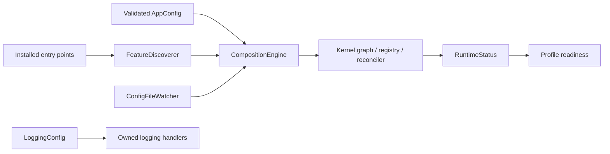
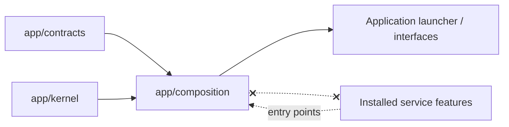

# Composition Runtime

> **Package:** `app/composition/`
> **Category:** Non-domain application substrate
> **Status:** `Completed`
> **Last updated:** `2026-09-02`

> This README is the package's source of truth for application composition policy, configuration, discovery, readiness, runtime mutation, diagnostics, and logging ownership. System scope remains in [`docs/PROJECT.md`](../../docs/PROJECT.md); universal architecture remains in [`docs/ARCHITECTURE.md`](../../docs/ARCHITECTURE.md).

---

## Code-Aligned Implementation Convention

`app/composition/` applies application policy to the business-neutral primitives in `app/kernel/`. It is not a service domain or feature registry, so the service-feature portions of [`docs/templates/README.md`](../../docs/templates/README.md) are represented here as composition-component specifications.

Installed Python features declare immutable specs and are discovered independently. Composition parses desired state, selects providers, invokes Kernel reconciliation, and exposes runtime diagnostics; it never imports service implementations or invents a second domain capability catalogue. `__init__.py` remains empty or docstring-only, and importing this package must not configure logging, discover plugins, create tasks, read configuration, or mutate runtime state.

For focused work, load §1 for the boundary, the affected §4 component, §5 invariants, and §7 validation. Feature authors should also follow the [Feature Implementation Pipeline](../../docs/dev/feature_implementation_pipeline.md).

## 1. Purpose and Boundary

### Purpose

Composition turns installed feature declarations and validated application configuration into one deterministic runtime state. It owns application-level discovery, profile readiness, provider selection, serialized reconciliation/replacement, configuration watching, diagnostics, and explicitly installed logging infrastructure.

### Owns

- Discovery of installed `haruquantai.features` entry points and explicit embedded/test registrations.
- Strict application configuration, feature enablement/configuration, selected providers, deployment profiles, and logging settings.
- `CompositionEngine` orchestration over Kernel registry, graph, context, scope, event, reconciliation, and replacement primitives.
- Serialized configuration reload, runtime-failure response, provider replacement, and file-watcher coordination.
- Runtime status/readiness projections, capability leasing at the composition boundary, and typed composition events.
- Structured logging configuration, deterministic redaction/fingerprints, correlation context, bounded diagnostic capture, rotation, flushing, and shutdown.

### Does not own

- Capability registry internals, dependency-graph algorithms, feature contexts/scopes, event-bus primitives, lifecycle states, or replacement truth models; those belong to Kernel.
- Domain DTOs, capability protocols/constants, domain events, or wire schemas; those belong to Contracts.
- Service implementations, domain policy, provider SDK calls, persistence schemas, HTTP/CLI/UI behavior, or feature-local configuration semantics.
- Untrusted plugin isolation. Installed in-process Python features are trusted code; sandboxed tools/connectors are a separate boundary.

### Shared Contracts

Composition consumes Kernel and Contracts but exposes only application-runtime surfaces:

| Status | Surface | Primary symbols | Purpose |
|---|---|---|---|
| Completed | Desired configuration | `AppConfig`, `FeatureConfig`, `LoggingConfig` | Parse strict application state and logging policy. |
| Completed | Discovery | `FeatureDiscoverer`, `DiscoveryResult` | Load independent installed feature factories and isolate discovery failures. |
| Completed | Runtime orchestration | `CompositionEngine`, `CompositionRuntime`, `RuntimeStatus` | Reconcile, inspect, replace, and close the runtime. |
| Completed | Readiness | `DeploymentProfile`, `check_profile_readiness` | Compare active capabilities with profile requirements. |
| Completed | Capability access | `lease_capability`, `CapabilityLease` | Resolve a bounded capability lease from the active runtime. |
| Completed | Observability | `configure_logging`, `bind_correlation`, `DiagnosticCaptureHandler` | Install and own application logging effects explicitly. |

### Persisted State Ownership

Composition owns no domain database records. Configuration files and log files are deployment/runtime artifacts, not domain state partitions. Applied migration data, credentials, business records, and feature-owned state remain with their documented owners; feature removal never authorizes Composition to purge them.

### Four-Level Structural Hierarchy

| Code level | Represents | Example |
|---|---|---|
| Package | Application composition policy | `app/composition/` |
| Module | One composition responsibility | `discovery.py` |
| Type | One runtime adapter/model | `FeatureDiscoverer` |
| Method/function | One explicit orchestration action | `CompositionEngine.reload()` |

### Composition Map



## 2. Final Package Structure and Independence

```text
app/composition/
├── __init__.py    # Pure package marker; no runtime exports
├── README.md      # Package boundary, workflows, and acceptance evidence
├── config.py      # Strict TOML/settings parsing and validated configuration
├── discovery.py   # Installed entry-point and explicit feature discovery
├── engine.py      # High-level reconciliation, replacement, and status orchestration
├── runtime.py     # Runtime lifecycle wrapper and active-engine ownership
├── readiness.py   # Deployment-profile requirements and readiness evaluation
├── events.py      # Typed configuration/runtime composition events
├── watcher.py     # Configuration-file change observation
├── facade.py      # Bounded capability lease access to the active runtime
└── logging.py     # Structured logging, redaction, capture, rotation, and lifecycle
```

Independence rules:

1. Composition may import `app.kernel` and `app.contracts`; it must not import `app.services` implementations.
2. Features arrive through entry points or explicit registrations, never domain registries, eager package scans, or YAML feature manifests.
3. Composition chooses providers and desired state but does not change domain contract meaning.
4. All high-level mutations share serialized ownership; overlapping reload/replacement mounts are forbidden.
5. Importing a Composition module performs no configuration loading, discovery, logging installation, task creation, or global runtime mutation.
6. D-UI has its own TypeScript manifest/composition model and does not masquerade as a Python `FeatureSpec` provider.

### Dependency Direction



The dashed discovery edge is metadata/runtime loading, not permission for source-level service imports.

## 3. Workflows

### Workflow Scope Values

| Scope | Meaning |
|---|---|
| Internal | Composition completes the operation using Kernel/public contract surfaces. |
| Application | Triggered by launcher, operator configuration, watcher, or runtime failure. |

| Status | Workflow ID | Scope | Workflow | Input boundary | Output boundary |
|---|---|---|---|---|---|
| Completed | `WF-COMP-START` | Application | Discover and start desired features | Installed entry points plus `AppConfig` | Active runtime status/readiness |
| Completed | `WF-COMP-RELOAD` | Application | Reload desired configuration | Changed validated configuration | Reconciled affected closure plus event |
| Completed | `WF-COMP-FAILURE` | Internal | Handle supervised runtime failure | Kernel owner-attributed task failure | Withdrawn capability and reconciled dependents |
| Completed | `WF-COMP-REPLACE` | Application | Replace a compatible feature generation | Candidate factory/configuration | Exact replacement report |
| Completed | `WF-COMP-SHUTDOWN` | Application | Dispose runtime and logging effects | Shutdown request | Closed scopes/handlers and diagnostics |

### `WF-COMP-START` — Discover and Start Desired Features

1. Parse strict TOML into `AppConfig`; reject unknown sections, profiles, feature keys, provider selections, or logging values.
2. `FeatureDiscoverer` loads each installed `haruquantai.features` entry point independently and records package/import errors without hiding them.
3. `CompositionEngine` supplies discovered specs, desired feature state, and selected providers to Kernel resolution/reconciliation.
4. Kernel stages mounts and publishes only exact successful provider bundles.
5. Composition evaluates the selected deployment profile and exposes `RuntimeStatus` with feature, capability, error, cleanup, and readiness evidence.

**Failure behaviour:** invalid application configuration fails before mutation. One broken entry point is reported without crashing unrelated discovery. Missing/ambiguous capabilities block affected consumers rather than selecting silently.

### `WF-COMP-RELOAD` — Reload Configuration

1. A caller or `ConfigFileWatcher` observes a stable configuration change.
2. Composition parses and validates the complete candidate document before entering the mutation lock.
3. The engine calculates changed enablement, config, profile, logging, and provider selection.
4. Kernel reconciles the exact affected closure; optional dependency changes remount consumers.
5. Composition publishes a typed configuration/reconfiguration event and refreshes diagnostics.

### `WF-COMP-REPLACE` — Replace a Provider Generation

1. Serialize the request with configuration reloads under the same mutation lock.
2. Require the replacement to provide the same capability set.
3. Ask Kernel to stage, health-check, optionally quiesce/drain, and atomically swap the generation.
4. Report pre-commit failure as rolled back and post-commit consumer/cleanup failure as committed but degraded.

### `WF-COMP-SHUTDOWN` — Close Owned Effects

1. Stop configuration watching and prevent new runtime mutations.
2. Close feature scopes through the runtime/engine in dependency-safe order.
3. Emit bounded cleanup diagnostics without exposing secrets.
4. Flush and close only handlers owned by the installed `LoggingHandle`.

## 4. Package Component Specifications

### 4.1 Configuration and Settings

| Status | Module | Responsibility | Key symbols |
|---|---|---|---|
| Completed | `config.py` | Parse strict application TOML, feature/provider selection, logging configuration, and validated injected settings | `AppConfig`, `FeatureConfig`, `load_config_from_file`, `load_settings` |

Application TOML accepts the documented `[application]`, `[features]`, `[providers]`, and optional `[logging]` tables. Feature entries choose `enabled` plus either inline feature keys or a nested `.config` table, never both. Domain feature code remains responsible for validating its declared `config_keys` values during mount.

### 4.2 Discovery and Runtime Ownership

| Status | Module | Responsibility | Key symbols |
|---|---|---|---|
| Completed | `discovery.py` | Load installed and explicit feature factories, returning isolated errors | `FeatureDiscoverer`, `DiscoveryResult` |
| Completed | `engine.py` | Own Kernel orchestration, serialized mutations, status, failure response, and replacement | `CompositionEngine`, `RuntimeStatus` |
| Completed | `runtime.py` | Wrap startup, active runtime access, reload, and shutdown | `CompositionRuntime` |

Discovery must not import service packages merely to populate a registry. Each installed feature distribution owns its entry-point declaration and returns its validated `FeatureSpec`/factory surface.

### 4.3 Readiness, Events, Watching, and Capability Access

| Status | Module | Responsibility | Key symbols |
|---|---|---|---|
| Completed | `readiness.py` | Evaluate `offline`, `research`, `backtest`, and `live` profile requirements | `DeploymentProfile`, `check_profile_readiness` |
| Completed | `events.py` | Carry configuration reload, feature reconfiguration, and runtime-failure facts | `ConfigurationReloadedEvent`, `FeatureReconfiguredEvent`, `FeatureRuntimeFailedEvent` |
| Completed | `watcher.py` | Observe configuration-file changes and trigger bounded reload work | `ConfigFileWatcher` |
| Completed | `facade.py` | Lease an active capability with bounded lifetime/identity | `CapabilityLease`, `lease_capability` |

Profile readiness reports capability presence; it does not grant business authorization, live-trading permission, credential validity, or kill-switch clearance.

### 4.4 Structured Logging and Diagnostics

| Status | Module | Responsibility | Key symbols |
|---|---|---|---|
| Completed | `logging.py` | Deterministic JSON/text formatting, redaction, correlation, capture, rotation, configuration, and cleanup | `LoggingConfig`, `LoggingHandle`, `configure_logging`, `bind_correlation`, `DiagnosticCaptureHandler` |

Logging installation is explicit and returns an owned handle. Sensitive values are redacted/fingerprinted and bounded before encoding. Correlation context uses context-local state, and cleanup closes only the handlers created by that handle. Service packages obtain named loggers and never configure global logging.

### 4.5 Runtime Effects and Disposal

| Effect | Owner | Disposal mechanism |
|---|---|---|
| Feature scopes and bindings | Kernel, invoked by `CompositionEngine` | Dependency-safe reconciliation/runtime close |
| Configuration watcher task/resource | Composition runtime | Explicit watcher stop/close |
| Logging handlers | `LoggingHandle` | Flush and close owned handlers only |
| Diagnostic capture entries | `DiagnosticCaptureHandler` | Bounded capacity/expiry and handler close |

Composition owns no implicit process-lifetime effect. Every installed runtime or logging effect must have an explicit close path.

## 5. Package-Wide Requirements, Configuration, and Architecture Invariants

| Status | Requirement ID | Category | Rule | Verification |
|---|---|---|---|---|
| Completed | `FR-COMP-DISCOVER` | Discovery | Installed features load independently through `haruquantai.features`; one failure is isolated. | `tests/composition/test_discovery.py`, `test_plugin_packaging.py` |
| Completed | `FR-COMP-VALIDATE-CONFIG` | Configuration | Unknown/invalid configuration fails before runtime mutation. | `tests/composition/test_config.py` |
| Completed | `FR-COMP-RECONCILE` | Runtime | Desired-state mutations use Kernel reconciliation and preserve unrelated branches. | `tests/composition/test_engine.py`, `test_hot_reconfiguration.py` |
| Completed | `FR-COMP-SERIALIZE-MUTATION` | Concurrency | Reload and replacement share one mutation lock. | `tests/composition/test_hot_reconfiguration.py` |
| Completed | `FR-COMP-REPORT-READINESS` | Diagnostics | Status distinguishes profile gaps, blocked features, package errors, runtime failures, and cleanup errors. | `tests/composition/test_readiness.py`, `test_engine.py` |
| Completed | `FR-COMP-OWN-LOGGING` | Observability | Logging setup/redaction/correlation/rotation/cleanup is explicit and secret-safe. | `tests/composition/test_logging.py` |
| Completed | `ARCH-001` | Init purity | `app/composition/__init__.py` contains no runtime imports or effects. | Architecture checks |
| Completed | `ARCH-004` | Boundary purity | Composition imports Kernel/Contracts but not service implementations. | Import/AST checks |
| Completed | `NFR-COMP-001` | Leak safety | Repeated start/reload/close leaves no owned task, subscription, binding, or handler leak. | `tests/composition/test_lifecycle_leak.py` |
| Completed | `NFR-COMP-002` | Type safety | Public/module code is explicitly typed under repository mypy policy. | Scoped mypy/CI |

Composition configuration is strict and fail-closed. A profile or capability becoming present does not bypass domain policy, credentials, risk approval, or operator authorization.

## 6. Open Decisions

| Status | Decision ID | Decision | Outcome |
|---|---|---|---|
| Closed | `DEC-COMP-001` | Discovery mechanism | Installed Python features use entry points; explicit registration is reserved for embedded/test composition. |
| Closed | `DEC-COMP-002` | Mutation concurrency | Reload and replacement are serialized by one engine-owned lock. |
| Closed | `DEC-COMP-003` | In-process trust | Installed Python distributions are trusted code; untrusted plugins require a separate supervised boundary. |

No unresolved Composition decision is recorded here. Add one only when implementation would otherwise require guessing.

## 7. Tests and Definition of Done

### Test Suite Structure

```text
tests/composition/
├── test_config.py                 # Strict desired-state/settings parsing
├── test_discovery.py              # Entry-point isolation and explicit registration
├── test_engine.py                 # Orchestration, status, and failure handling
├── test_runtime.py                # Runtime lifecycle wrapper
├── test_readiness.py              # Deployment-profile evaluation
├── test_hot_reconfiguration.py    # Reload/replacement serialization
├── test_lifecycle_leak.py         # Repeated lifecycle cleanup
├── test_logging.py                # Redaction, correlation, formatting, rotation, cleanup
├── test_facade.py                 # Capability leasing
├── test_plugin_packaging.py       # Installed feature packaging/discovery
└── test_vertical_feature_pair.py  # Cross-feature composition through contracts
```

### Commands

```powershell
uv run pytest --no-cov tests/composition
uv run ruff check app/composition tests/composition
uv run mypy app/composition
uv run python scripts/architecture_check.py
```

### Definition of Done Checklist

- [ ] Configuration is validated completely before mutation.
- [ ] Discovery remains independent and failure-isolated.
- [ ] Provider selection is explicit when multiple candidates exist.
- [ ] Reload, runtime failure, and replacement reconcile only affected closures.
- [ ] Runtime/profile status reports exact degraded or blocked truth.
- [ ] All tasks, watchers, scopes, leases, and handlers close without leaks.
- [ ] No service implementation import or import-time side effect is introduced.
- [ ] Bounded Composition tests, lint, typing, and architecture checks pass.

## 8. Change Process

1. Update this README when application composition ownership, configuration grammar, discovery, readiness, mutation, diagnostics, or logging behavior changes.
2. Plan the smallest coherent change through the repository Task workflow.
3. Change one focused Composition responsibility and its matching `tests/composition/` evidence.
4. Update Kernel, Contracts, or service READMEs only when their separately owned behavior changes.
5. Verify startup, failure, reload, replacement, shutdown, and leak behavior before acceptance.

Do not add service-specific branches to Composition. New domain behavior belongs in an independently registered service feature behind a public contract.

## 9. Normative References

### §6.3 — Feature specifications, capabilities, discovery, and configuration

Features provide immutable `FeatureSpec` declarations; Composition discovers them independently, validates strict desired state, and supplies explicit provider selection. Capability-key and lifecycle primitives remain Kernel-owned.

### §6.5 — Dependency resolution, activation, reconciliation, removal, and replacement

Composition invokes Kernel resolution/reconciliation under serialized mutation ownership. Activation is staged, publication is exact and atomic, optional dependency changes remount consumers, and replacement reports pre- versus post-commit truth.

### §6.6 — Interfaces, readiness, plugins, and diagnostics

`RuntimeStatus` and readiness projections expose runtime facts. Product-facing HTTP, SSE, CLI, MCP, automation, and UI projections remain removable Interfaces features. Trusted in-process features and untrusted sandboxed tools are distinct security boundaries.

### §6.7 — Structured logging, correlation, redaction, and retention substrate

`app/composition/logging.py` owns explicit application logging installation, deterministic structured records, context-local correlation, bounded redaction/capture, handler rotation, and exact cleanup. It owns no domain event meaning or audit-retention policy.

Cross-cutting canonical rules are owned by:

- [`AGENTS.md`](../../AGENTS.md) for contributor, lifecycle, safety, and verification law.
- [`docs/ARCHITECTURE.md`](../../docs/ARCHITECTURE.md) for universal dependency and runtime structure.
- [`docs/PROJECT.md`](../../docs/PROJECT.md) for product scope and cross-domain relationships.
- [`app/kernel/README.md`](../kernel/README.md) for business-neutral runtime primitives.
- [`app/contracts/README.md`](../contracts/README.md) for public contract ownership.
