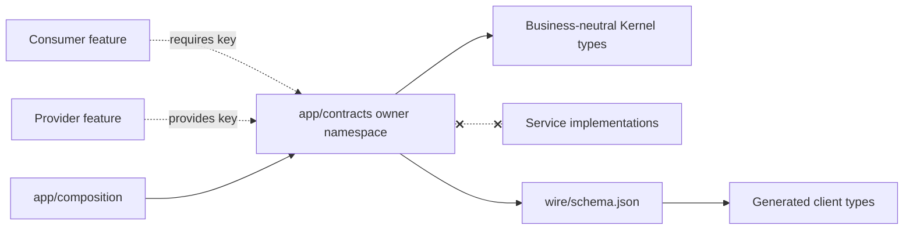
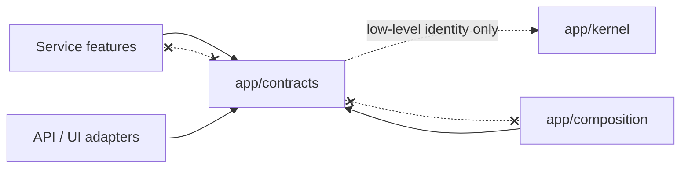

# Shared Contracts

> **Package:** `app/contracts/`
> **Category:** Cross-boundary public contracts
> **Status:** `Completed`
> **Last updated:** `2026-09-02`

> This README is the package's source of truth for shared contract boundaries, namespace ownership, public record and capability inventories, evolution rules, wire-schema expectations, and verification. Domain behavior remains in owning package READMEs; universal architecture remains in [`docs/ARCHITECTURE.md`](../../docs/ARCHITECTURE.md).

---

## Code-Aligned Implementation Convention

`app/contracts/` contains the stable types through which independently removable features and domains collaborate. It owns DTOs, value objects, protocols, capability keys, public events, stable failures, and wire schemas; it owns no provider implementation, orchestration, authorization policy, persistence access, or side effects.

The service-domain template in [`docs/templates/README.md`](../../docs/templates/README.md) is adapted here into namespace specifications. A contract namespace is an ownership boundary, not a registered feature. Feature and FR IDs remain documentation/acceptance identities; runtime dependencies use exact versioned capability keys. `__init__.py` files remain empty or docstring-only, so callers import from the defining contract module rather than relying on package-root re-exports.

For focused work, load §1 for the boundary, the affected §4 namespace inventory, §5 invariants, and §7 validation. The `4.1`–`4.15` headings, `Public records` lists, and `Capability bundles (N)` declarations are machine-reconciled by `tests/contracts/test_contract_inventory.py` and must change atomically with code, schemas, generated types, and owning documentation.

## 1. Purpose and Boundary

### Purpose

Shared Contracts make cross-boundary collaboration explicit, typed, versioned, and independent of replaceable implementations. They let consumers declare what they need and let providers satisfy those needs without either side importing the other's service code.

### Owns

- Versioned capability identifiers and runtime-checkable ports.
- Public request, success, failure, event, reference, value-object, and projection models.
- Common wire-model behavior and business-neutral response/event primitives.
- Per-owner JSON wire schemas and deterministic generated-client input surfaces.
- Compatibility and evolution rules for public contract majors.

### Does not own

- Service implementations, feature manifests, provider selection, lifecycle orchestration, or runtime registration.
- Domain business policy, authorization, persistence, SDK objects, database rows, secrets, or deployment configuration.
- UI rendering, API routing, retries, background work, logging setup, or any other side effect.
- Proof that an owning service feature is implemented merely because its contract is defined.

### Shared Contract Shape

Most owner namespaces use this shape when the corresponding artifact exists:

| File | Responsibility |
|---|---|
| `capabilities.py` | Typed `CapabilityKey` constants with exact major versions. |
| `models.py` | Public immutable/strict request, result, value, reference, and projection models. |
| `ports.py` | Runtime-checkable provider protocols. |
| `events.py` | Typed public observation/event payloads. |
| `errors.py` | Stable public failure models and reason codes. |
| `wire/schema.json` | Deterministic transport schema for the public namespace. |

Small versioned capability slices may instead use `<capability>/v1.py` when that is the owning, code-aligned shape. Provider SDK objects and implementation classes never cross this boundary.

### Persisted State Ownership

Contracts own no persisted tables, files, queues, or caches. They may declare typed state references, manifests, retention values, or operation receipts, but the corresponding service feature owns the meaning and lifecycle of persisted data. External domains access that state only through the public capability contract.

### Four-Level Structural Hierarchy

| Code level | Represents | Example |
|---|---|---|
| Package | Cross-boundary contract layer | `app/contracts/` |
| Namespace | Semantic contract owner | `app/contracts/data/` |
| Module/schema | One public artifact kind | `ports.py`, `wire/schema.json` |
| Symbol/field | Versioned public behavior or datum | `IngestHistoryCapability`, `DataSeriesRef` |

### Contract Dependency Map



## 2. Final Package Structure and Independence

```text
app/contracts/
├── __init__.py
├── README.md
├── common/                 # Business-neutral shared wire records/errors/events
├── workspace/              # Workspace/runtime/access/diagnostic contracts
├── catalogue/              # Instrument, venue, calendar, rules, and universe contracts
├── data/                   # Market-data, quality, retention, replay, and evidence contracts
├── strategy/               # Strategy definition, editing, exchange, and codegen contracts
├── simulator/              # Simulation engine, result, cost, and profile contracts
├── analytics/              # Result query, metric, report, and qualification contracts
├── research/               # Research, robustness, optimization, and acceptance contracts
├── portfolio/              # Portfolio construction, simulation, and risk-view contracts
├── orchestration/          # Project/task/run and notification orchestration contracts
├── interfaces/             # API/event/automation/operator boundary contracts
├── ui/                     # Presentation contribution and workstation contracts
├── plugins/                # Plugin lifecycle, permission, and contribution contracts
├── broker/                 # Broker session, provider-state, and order-transport contracts
├── risk/                   # Risk decisions, approvals, limits, and kill-switch contracts
├── trading/                # Trading sessions, plans, dispatch, reconciliation, and journal contracts
├── indicator/              # Focused versioned indicator capability slices
└── notification/           # Focused versioned notification-delivery slices
```

Independence rules:

1. Contract modules import no `app.services` or `app.composition` implementation.
2. Cross-namespace types import the semantic owner's public type rather than duplicating it.
3. Package initializers contain no re-exports, registration, I/O, or side effects.
4. Ports describe provider behavior; they do not select, instantiate, retry, authorize, or persist providers.
5. Wire schemas and generated clients are deterministic derivatives of canonical Python contract definitions and are checked for freshness.
6. Domain-specific semantics stay with their owner; `common/` accepts only genuinely business-neutral records used across boundaries.

### Contract Dependency Direction



## 3. Workflows

### Workflow Scope Values

| Scope | Meaning |
|---|---|
| Internal | Contract definition, validation, generation, or compatibility work inside this package. |
| Cross-domain | A consumer invokes a provider through a public capability or observes a typed event. |

| Status | Workflow ID | Scope | Workflow | Input boundary | Output boundary |
|---|---|---|---|---|---|
| Completed | `WF-CONTRACT-DEFINE` | Internal | Define a contract slice | Owning README semantics | Typed models, port, keys, failures, and schema |
| Completed | `WF-CONTRACT-INVOKE` | Cross-domain | Invoke a capability | Strict request through resolved port | Typed success/failure union |
| Completed | `WF-CONTRACT-EVENT` | Cross-domain | Deliver an observation | Typed owner event | Ordered typed consumer observation |
| Completed | `WF-CONTRACT-GENERATE` | Internal | Reconcile wire artifacts | Canonical Python contract inventory | JSON schemas and generated client types |
| Completed | `WF-CONTRACT-EVOLVE` | Internal | Evolve a public major | Compatibility analysis and migration plan | Additive compatible change or new major |

### `WF-CONTRACT-DEFINE` — Define a Contract Slice

1. Confirm semantic ownership and exact behavior in the owning package README.
2. Define strict request/result/value/event/failure models in the owner namespace.
3. Declare exact capability keys and runtime-checkable protocols without implementation logic.
4. Generate or update the owner wire schema and generated client types deterministically.
5. Add round-trip, boundary, registry, schema, and consumer/provider compatibility evidence.

### `WF-CONTRACT-INVOKE` — Invoke a Public Capability

1. A feature declares an exact required or optional capability key in its `FeatureSpec`.
2. Composition resolves one provider and Kernel supplies the committed binding through `FeatureContext`.
3. The consumer sends one strict request to the typed port.
4. The provider returns the declared success/failure result; it does not leak SDK objects, database rows, or private exceptions.
5. Missing, stale, ambiguous, incompatible, or unsupported capability state fails explicitly at the consuming boundary.

### `WF-CONTRACT-EVOLVE` — Change a Public Contract

1. Classify the proposed change as compatible/additive or breaking.
2. Prove producer and consumer compatibility for additive changes in the same Task.
3. Introduce a new capability major for breaking behavior, with an explicit adapter/migration window where required.
4. Update the inventory, schemas, generated types, owner documentation, and tests atomically.
5. Remove the old major only after all consumers and providers migrate and removal policy permits it.

## 4. Package Component Specifications

The following inventory is machine-readable acceptance data. Defined contracts do not imply that every owning runtime feature is implemented.

### 4.1 `app/contracts/workspace/`

**Status:** `ManageWorkspacesCapability`, `ConfigureRuntimeCapability`, `SecureLocalAccessCapability`, and `BuildDiagnosticsCapability` implemented; remaining domain capability surfaces planned.

**Public records:** `WorkspaceRef`, `WorkspaceVersion`, `WorkspaceConfiguration`, `RuntimeConfiguration`, `StorageGuardPolicy`, `WorkspaceWriterLease`, `WorkspaceWriterFence`, `WorkspaceBackupManifest`, `WorkspaceRestorePlan`, `SecretRef`, `PrincipalRef`, `LocalSession`, `SystemHealth`, `SystemReadiness`, `DiagnosticBundleRef`, `DiagnosticBundleManifest`, `WorkerCapabilityDescriptor`, `WorkerRegistration`, `WorkerLease`, `WorkerTaskEnvelope`, `ArtifactManifest`, `HostedWorkspaceContext`, `WorkspaceAuthorizationDecision`, `WatchlistItemRecord`, `WatchlistRecord`, `ManageWatchlistsRequest`, and `ManageWatchlistsSuccess`.

**Capability bundles (7):** `ManageWorkspacesCapability` (implemented), `ConfigureRuntimeCapability` (implemented), `SecureLocalAccessCapability` (implemented), `BuildDiagnosticsCapability` (implemented), `DistributeWorkersCapability`, `HostWorkspacesCapability`, and `ManageWatchlistsCapability`.

### 4.2 `app/contracts/catalogue/`

**Status:** wire definitions, schemas, and generated types implemented; runtime providers and acceptance evidence remain separately owned. Exact public shapes are authoritative in this namespace's modules and wire schema; runtime status remains with the owning provider documentation and evidence.

**Public records:** `InstrumentRef`, `InstrumentVersion`, `AssetClass`, `ProviderRef`, `BrokerRef`, `ProviderSymbolMapping`, `TradingSessionDefinition`, `MarketCalendarVersion`, `TradingInterval`, `TradingRuleSet`, `OrderConstraints`, `CostModelRef`, `UniverseRef`, `UniverseVersion`, `UniverseMembership`, `FxRateObservation`, `CurrencyConversionPath`, and `CatalogueExchangePackage`.

**Capability bundles (7):** `CatalogInstrumentsCapability`, `MapProvidersCapability`, `DefineSessionsCapability`, `DefineTradingRulesCapability`, `ManageUniversesCapability`, `ConvertCurrenciesCapability`, and `ExchangeCatalogueCapability`.

### 4.3 `app/contracts/data/`

**Public records:** `DataSeriesRef`, `DataSeriesVersion`, `DataConnectionRef`, `DataImportPlan`, `DataImportReceipt`, `Bar`, `Tick`, `SeriesCoverage`, `DataQualityFinding`, `DataQualityDecision`, `AggregationSpec`, `RetentionPolicy`, `RunDataBinding`, `AlignedSeries`, `ConnectorProfile`, `ConnectorSyncPlan`, `ConnectorSyncReceipt`, `VolumeProfileSource`, `ExternalIndicatorSeriesVersion`, `SyntheticModelSpec`, `ScenarioSeriesVersion`, `MarketNewsObservation`, `MarketNewsRevision`, `MarketEvent`, `MarketFeedState`, `MarketReplayRef`, and `QuantDataImportSpec`.

**Capability bundles (15):** `IngestHistoryCapability`, `SyncConnectorsCapability`, `ImportQuantdataCapability`, `NormalizeTicksCapability`, `ResolveQualityCapability`, `AggregateBarsCapability`, `ManageRetentionCapability`, `AlignSeriesCapability`, `PrepareProfilesCapability`, `ImportIndicatorsCapability`, `BindRunDataCapability`, `GenerateScenariosCapability`, `TrackMarketNewsCapability`, `StreamMarketEventsCapability`, and `MarketDataStoreCapability`.

### 4.4 `app/contracts/strategy/`

**Public records:** `StrategyRef`, `StrategyVersion`, `StrategyAst`, `StrategyNode`, `ExpressionNode`, `BlockDefinition`, `ParameterDefinition`, `ChartDefinition`, `DirectionPolicy`, `VisibilityPolicy`, `StrategyValidationReport`, `StrategyTemplate`, `StrategyExchangePackage`, `AtmExitDefinition`, `PartialExitDefinition`, `PluginNodeRef`, `StrategyArchitecture`, `RandomGroupVersion`, `OppositeMapVersion`, `IndicatorDefinition`, `ExternalIndicatorDefinitionVersion`, `CodeTargetDescriptor`, `CodegenRequest`, `CodegenResult`, `CodeManifest`, and `DeploymentPackage`.

**Capability bundles (13):** `DefineAstCapability`, `CatalogBlocksCapability`, `ConfigureChartsCapability`, `VersionStrategiesCapability`, `EditTemplatesCapability`, `ExchangeStrategiesCapability`, `DefineArchitecturesCapability`, `DefineIndicatorsCapability`, `ModelAtmExitsCapability`, `ExtendPluginNodesCapability`, `GenerateCodeCapability`, `GenerateMql5Capability`, and `GenerateTargetsCapability`.

### 4.5 `app/contracts/simulator/`

**Public records:** `RunManifest`, `EngineProfileVersion`, `PrecisionModel`, `SimulationRequest`, `SimulationRunRef`, `SimulationEvent`, `SimOrder`, `SimFill`, `SimPosition`, `SimTrade`, `SizingDecision`, `CostBreakdown`, `ExitSchedule`, `ResultSegment`, `IndicatorRuntimeSpec`, `SimulationResult`, `ResultCommitReceipt`, `EvaluationCacheKey`, `PerturbationSpec`, `DistributedEvaluationPlan`, `StockpickerSimulationSpec`, `VolumeProfileResult`, and `TpoProfileResult`.

**Capability bundles (12):** `ConfigureEngineCapability`, `ModelPrecisionCapability`, `SimulateOrdersCapability`, `CalculateCostsCapability`, `ManageExitsCapability`, `RunIndicatorsCapability`, `CommitResultsCapability`, `CacheEvaluationsCapability`, `CalculateProfilesCapability`, `PerturbInputsCapability`, `DistributeEvaluationsCapability`, and `SimulateStockpickersCapability`.

### 4.6 `app/contracts/analytics/`

**Public records:** `DatabankRef`, `DatabankVersion`, `DatabankItem`, `DatabankDecision`, `ResultQuery`, `SavedResultView`, `ResultPage`, `MetricDefinition`, `MetricValue`, `ResultComparison`, `ChartSpec`, `TradeAnalysis`, `BenchmarkComparison`, `ResultExchangePackage`, `BulkSelectionToken`, `BulkDatabankCommand`, `AnalysisPanelDescriptor`, `SimilarityQuery`, `SimilarityMatch`, `OperationalJournalArtifact`, `QualificationProfileVersion`, and `OperatorQualification`.

**Capability bundles (9):** `DatabankMembershipCapability`, `QueryResultsCapability`, `InterpretResultsCapability`, `AnalyzeTradesCapability`, `ExchangeResultsCapability`, `BulkDatabankCapability`, `MatchResultsCapability`, `CustomPanelsCapability`, and `QualifyOperationsCapability`.

### 4.7 `app/contracts/research/`

**Public records:** `ResearchRunRef`, `ResearchManifest`, `ResearchStatus`, `RobustnessPlan`, `RobustnessResult`, `ParameterSpace`, `OptimizationPlan`, `OptimizationVariant`, `OptimizationResult`, `WalkForwardPlan`, `WalkForwardWindow`, `WalkForwardResult`, `BuilderPlan`, `StrategyCandidate`, `EvolutionPlan`, `AcceptancePipeline`, `AcceptanceDecision`, `ResearchBudget`, `PromotionDecision`, `StockpickerResearchPlan`, `AiResearchDraft`, `AiImprovementProposal`, `NeuralResearchPlan`, `PortfolioFitnessScore`, `MarketIntelligenceObservation`, `DriftState`, and `DriftReport`.

**Capability bundles (13):** `RunResearchCapability`, `TestRobustnessCapability`, `OptimizeParametersCapability`, `ValidateWalkForwardCapability`, `GenerateStrategiesCapability`, `EvolveStrategiesCapability`, `AcceptResearchCapability`, `GovernResearchBudgetsCapability`, `ResearchStockpickersCapability`, `AssistResearchAiCapability`, `ResearchNeuralModelsCapability`, `ScorePortfolioFitnessCapability`, and `MonitorMarketDriftCapability`.

### 4.8 `app/contracts/portfolio/`

**Public records:** `PortfolioRef`, `PortfolioVersion`, `PortfolioMember`, `Allocation`, `PortfolioConstraintSet`, `CorrelationRequest`, `CorrelationMatrix`, `PortfolioSimulationRequest`, `PortfolioResult`, `PortfolioSearchPlan`, `PortfolioCandidate`, `PortfolioRiskReport`, `PortfolioMetricDefinition`, `MarkowitzOptimizationRequest`, `EfficientFrontier`, `PortfolioMergePlan`, `PortfolioSplitPlan`, and `PortfolioMethodDescriptor`.

**Capability bundles (8):** `ComposePortfoliosCapability`, `AnalyzeCorrelationCapability`, `SimulatePortfoliosCapability`, `SearchPortfoliosCapability`, `AnalyzePortfolioRiskCapability`, `OptimizeMarkowitzCapability`, `MergePortfoliosCapability`, and `ExtendPortfolioMethodsCapability`.

### 4.9 `app/contracts/orchestration/`

**Public records:** `ProjectRef`, `ProjectVersion`, `ProjectGraph`, `TaskDefinition`, `TaskContract`, `TaskState`, `ProjectRunRef`, `TaskRunRef`, `TaskAttemptRef`, `TaskLease`, `TaskCheckpoint`, `TaskOutputCommit`, `ProjectVariable`, `ProjectExpression`, `DomainTaskRequest`, `UtilityTaskRequest`, `ExecutableAllowlistEntry`, `NotificationChannelConfig`, `NotificationTemplate`, `NotificationSession`, `NotificationReceipt`, `ProjectProgress`, `ProjectHistoryEntry`, `NetworkTrainingPlan`, and `NetworkTrainingResult`.

**Capability bundles (7):** `DefineProjectsCapability`, `RunTasksCapability`, `EvaluateConditionsCapability`, `RunDomainTasksCapability`, `RunUtilityTasksCapability`, `TrackRunHistoryCapability`, and `TrainNetworksCapability`.

### 4.10 `app/contracts/interfaces/`

**Public records:** `ApiVersion`, `ConcurrencyToken`, `EventCursor`, `EventReplayBatch`, `AsyncJobRef`, `ArtifactDownloadRequest`, `BulkRequestToken`, `AutomationCommand`, `AutomationSchema`, `McpOperation`, `ResearchPreview`, `ProjectGraphProjection`, `PortfolioBuilderProjection`, `CapabilityAdministrationProjection`, `TradingActionPreview`, `TradingReadinessProjection`, `MarketTickQuote`, `MarketTickSnapshot`, `ObserveMarketDataRequest`, `ObserveMarketDataSuccess`, `ObserveMarketDataEventSubscription`, `StreamEvent`, `ApiMetadata`, `ApiError`, `ApiResponse`, `MarketCatalogueEntry`, `ObserveMarketCatalogueRequest`, `ObserveMarketCatalogueSuccess`, `OperateWatchlistsRequest`, and `OperateWatchlistsSuccess`.

**Capability bundles (10):** `ServeApiEventsCapability`, `ObserveMarketDataCapability`, `ObserveMarketCatalogueCapability`, `OperateWatchlistsCapability`, `AutomateCommandsCapability`, `OperateResearchCapability`, `EditProjectsCapability`, `OperatePortfoliosCapability`, `AdministerCapabilitiesCapability`, and `OperateTradingCapability`.

### 4.11 `app/contracts/ui/`

**Public records:** existing `UiFeatureDescriptor`, `NavigationContribution`, `RouteTarget`, `UiCommandDescriptor`, `KeyboardBinding`, `ViewProjection`, `FieldDescriptor`, `ClientSelection`, `ClientPageState`, `ChartAlternative`, `DraftEnvelope`, `DraftConflict`, `ConfirmationPlan`, `UiNotification`, `ProgressPresentation`, `ErrorPresentation`, `LayoutSnapshot`, `PanelContribution`, `TabContribution`, `ViewPreference`, and `AccessibilityPreference`; planned widget-workstation records `WidgetTypeDescriptor`, `WidgetInstanceRef`, `WidgetPlacement`, `WidgetConfigurationEnvelope`, `WidgetStateEnvelope`, `WorkspaceLayoutSnapshot`, `WorkspaceTemplate`, `LayoutMigrationResult`, `TemporalContext`, `TemporalSourceRef`, `TemporalFreshness`, `TemporalCursor`, `TemporalGap`, `TemporalResynchronization`, `WidgetLifecycleEvent`, and `WidgetRemovalResult`.

**Capability bundles (17):** one presentation capability for each `FEAT-UI-*` feature registered in `app/ui/README.md`. Feature IDs remain capability/acceptance/removal identities; widget type and instance IDs are owned contributions and do not increase the feature count. Layout records are actor/workspace/capability/schema scoped. Temporal records preserve source/clock identity, authoritative timestamp, monotonic sequence or cursor where supplied, freshness/gap/resynchronization state, and explicit incompatibility; they never make presentation state authoritative. Generated TypeScript clients consume the corresponding wire schemas; React source and Dockview-native JSON never become the authoritative cross-boundary contract definition.

### 4.12 `app/contracts/plugins/`

**Public records:** `PluginRef`, `PluginVersion`, `PluginManifest`, `PluginCompatibility`, `PluginPermissionSet`, `PluginActivation`, `PluginLifecycleState`, `PluginContribution`, `PluginAnalysisRequest`, `PluginAnalysisResult`, `ResultPanelDescriptor`, `PluginValidationReport`, and `PluginPackageReceipt`.

**Capability bundles (7):** `DeclareManifestsCapability`, `ManageLifecycleCapability`, `SandboxPermissionsCapability`, `RegisterContributionsCapability`, `IsolateAnalysisCapability`, `RenderResultPanelsCapability`, and `MaintainCompatibilityCapability`.

### 4.13 `app/contracts/broker/`

**Public records:** `BrokerProviderProfile`, `BrokerSessionRef`, `BrokerSessionState`, `BrokerSessionReadiness`, `BrokerAccountSnapshot`, `BrokerTradingState`, `BrokerMarketState`, `ProviderEvent`, `BrokerOperationRequest`, `BrokerOperationReceipt`, `BrokerOperationOutcome`, `ProviderCorrelation`, and `BrokerHistoryPage`.

**Capability bundles (10):** `BrokerResolverCapability`, `BrokerOperationsCapability`, `ManageSessionsCapability`, `ReadProviderStateCapability`, `TransportOrdersCapability`, plus one `ProviderBackend` binding each for `broker.provider.metatrader@1`, `broker.provider.ctrader@1`, `broker.provider.binance@1`, `broker.provider.dukascopy@1`, and `broker.provider.yahoo@1`.

### 4.14 `app/contracts/risk/`

**Public records:** `RiskDecisionState`, `RiskProfileRef`, `RiskProfileVersion`, `FirmMandateVersion`, `RiskEvidenceRef`, `RiskSnapshot`, `PositionSizeRecommendation`, `StopLossAssessment`, `ProposedAction`, `RiskDecision`, `NoTradeDecision`, `RiskLimitResult`, `RiskApprovalRequest`, `RiskApprovalToken`, `RiskCapacityReservation`, `KillSwitchScope`, `KillSwitchState`, `KillSwitchTransition`, `StrategyEligibilityDecision`, `PortfolioAllocationReview`, `AllocationBudget`, `RiskScenarioRequest`, `RiskScenarioResult`, and `RiskAuditRecord`.

**Capability bundles (7):** `DefineRiskContractsCapability`, `CalculateRiskCapability`, `ControlKillSwitchCapability`, `GovernAdmissionCapability`, `ManageApprovalsCapability`, `GovernAllocationsCapability`, and `AuditRiskDecisionsCapability`.

### 4.15 `app/contracts/trading/`

**Public records:** `TradingMode`, `TradingSessionRef`, `TradingSession`, `TradingSessionState`, `TradingOperationRef`, `TradingOperation`, `TradingOperationState`, `TradeIntentRef`, `TradePlan`, `TradingReadiness`, `ExecutionAuthorityRef`, `DispatchEvidence`, `DispatchReceipt`, `TradingOrder`, `TradingDeal`, `TradingPositionProjection`, `ReconciliationRequest`, `ReconciliationFinding`, `ProtectionSet`, `ProtectionChange`, `TradingJournalRecord`, `ExecutionProvenance`, `OperationalAccount`, `OperationalLedgerEntry`, `OperationalValuation`, `PublicTradingAction`, `TradingStateQuery`, and `TradingEvent`.

**Capability bundles (8):** `ManageTradingSessionsCapability`, `ValidateTradePlansCapability`, `AccountOperationsCapability`, `DispatchOrdersCapability`, `ReconcileTradingCapability`, `ManageProtectionsCapability`, `JournalExecutionCapability`, and `ExecutePublicActionsCapability`.

### 4.16 Common and Focused Versioned Slices

| Status | Namespace | Responsibility |
|---|---|---|
| Completed | `app/contracts/common/` | Shared wire base, response metadata/envelopes, authentication/audit/event helpers, validation, health, and idempotency records. |
| Completed | `app/contracts/indicator/` | Focused versioned indicator contract slices such as RSI and Williams %R. |
| Completed | `app/contracts/notification/` | Focused versioned notification-delivery records and port. |

These packages follow the same purity and evolution rules. They are listed separately because the machine-reconciled owner inventory remains fixed at sections 4.1–4.15.

### Runtime Effects, Failures, and Removal

- Contract modules create no runtime effects and require no lifecycle disposal.
- Validation rejects malformed or unsupported public values before provider work.
- Missing or incompatible capabilities surface typed unavailability/failure truth; no empty success or silent provider substitution is allowed.
- Removing a contract major is prohibited while a provider, consumer, schema, generated client, persisted artifact, or supported compatibility window still references it.
- Removing a provider implementation does not remove its public contract automatically; contract retirement is a separately reviewed compatibility change.

## 5. Package-Wide Requirements, Configuration, and Architecture Invariants

| Status | Requirement ID | Category | Rule | Verification |
|---|---|---|---|---|
| Completed | `FR-CONTRACT-OWN-SEMANTICS` | Ownership | Every public record/capability has one semantic owner and is not duplicated across namespaces. | Inventory and architecture review |
| Completed | `FR-CONTRACT-STRICT-MODELS` | Validation | Public models reject invalid/unknown values according to their declared schema. | `tests/contracts/test_contract_roundtrip.py`, model tests |
| Completed | `FR-CONTRACT-TYPED-PORTS` | Capability | Ports are typed protocols with exact request/result behavior and versioned keys. | `tests/contracts/test_contract_versions.py` |
| Completed | `FR-CONTRACT-WIRE-PARITY` | Generation | Python definitions, JSON schemas, registries, and generated clients remain deterministic and current. | `test_contract_generation.py`, `test_contract_inventory.py` |
| Completed | `FR-CONTRACT-FAIL-CLOSED` | Failure | Missing, unsupported, incompatible, or malformed interactions return typed failure truth. | Owner error and boundary tests |
| Completed | `ARCH-001` | Init purity | Contract `__init__.py` files contain no runtime exports or side effects. | `test_contract_boundaries.py` |
| Completed | `ARCH-004` | Contract purity | Contracts import no service/composition implementation. | `test_contract_boundaries.py` |
| Completed | `NFR-CONTRACT-001` | Compatibility | Breaking changes introduce a new major and an explicit consumer/provider migration. | Review plus version tests |
| Completed | `NFR-CONTRACT-002` | Type safety | Public contract code is explicitly typed and schema-compatible. | Scoped mypy/CI |
| Completed | `NFR-CONTRACT-003` | Determinism | Serialization/schema generation produces stable output from identical definitions. | Generation check and round-trip tests |

Contracts accept no application configuration and perform no I/O. Configuration belongs to the provider/consumer feature or Composition; wire defaults must be explicit in the defining schema.

## 6. Open Decisions

| Status | Decision ID | Decision | Outcome |
|---|---|---|---|
| Closed | `DEC-CONTRACT-001` | Package-root API | Initializers remain empty/docstring-only; symbols are imported from defining modules. |
| Closed | `DEC-CONTRACT-002` | Breaking evolution | Introduce a new capability major and migrate explicitly; never mutate a frozen major silently. |
| Closed | `DEC-CONTRACT-003` | Implementation status | A defined contract does not imply an implemented provider feature. |

No unresolved Contracts decision is recorded here. Add one only when contract implementation would otherwise require guessing.

## 7. Tests and Definition of Done

### Test Suite Structure

```text
tests/contracts/
├── test_contract_boundaries.py        # Import and package purity
├── test_contract_inventory.py         # README/registry capability and record parity
├── test_contract_generation.py        # Deterministic schema/generated-client freshness
├── test_contract_roundtrip.py         # Wire serialization and parsing
├── test_contract_versions.py          # Capability/version compatibility
├── test_contract_models_coverage.py   # Public model coverage
├── test_common_models_coverage.py     # Common envelope/helper coverage
├── test_legacy_v1_contracts.py        # Supported v1 compatibility window
└── test_*_errors.py                    # Stable owner failure behavior
```

### Commands

```powershell
uv run pytest --no-cov tests/contracts
uv run ruff check app/contracts tests/contracts
uv run mypy app/contracts
uv run python scripts/generate_contracts.py --check
uv run python scripts/architecture_check.py
```

### Definition of Done Checklist

- [ ] Semantic owner and capability major are explicit.
- [ ] Models, port, keys, events, and failures agree with the owning README.
- [ ] No service/composition implementation import or package-init export is introduced.
- [ ] README inventory, registries, wire schemas, and generated client types agree.
- [ ] Additive compatibility is proved or a new major/migration is supplied.
- [ ] Provider and consumer contract tests cover the changed behavior.
- [ ] Bounded Contracts tests, lint, typing, generation, and architecture checks pass.

## 8. Change Process

1. Establish semantic ownership and update the owning package README before changing a public contract.
2. Plan one coherent contract slice through the repository Task workflow, including every affected provider and consumer.
3. Change canonical Python definitions, inventory, schemas, generated types, and tests atomically.
4. Run deterministic generation checks and bounded contract/provider/consumer compatibility tests.
5. Retire an older major only after repository-wide reference evidence and the documented compatibility window permit removal.

Never use a shared contract change to relocate business policy into `app/contracts/`. Contracts describe valid interaction; providers and consumers retain authorization, orchestration, persistence, and domain decisions.

## 9. Normative References

### §4 — Common Technical Contracts

Business-neutral envelopes, identifiers, timestamps, validation, health, audit, idempotency, and event primitives are defined by the canonical modules and wire schemas under `app/contracts/common/`. Exact field behavior is code/schema-owned and verified by round-trip and model-coverage tests.

### §5 — Lifecycle Specifications

Domain lifecycle records describe observable state transitions but do not execute transitions. Kernel owns generic lifecycle machinery; owning services enforce business transition policy.

### §8 — Typed Data Dictionary

The canonical data dictionary is the set of typed owner models and generated schemas referenced by the §4 inventory. Duplicate prose field catalogues must not override code/schema truth.

### §15 — Normative Implementation Constants and Resolution Rules

Universal serialization, numeric, time, randomness, failure, and operational defaults are owned by [`docs/ARCHITECTURE.md`](../../docs/ARCHITECTURE.md) and the applicable business-neutral implementation modules. Contract models encode those rules at their public boundaries without maintaining a divergent copy here.

### §21.6 — Connector and Distributed-Worker Protocols

Connector, plugin, hosted-workspace, and worker messages remain versioned public contracts. Process isolation, credentials, leases/fencing, retries, and execution policy belong to their runtime owners and must fail closed when evidence is missing.

Canonical authority links:

- [`AGENTS.md`](../../AGENTS.md) — contributor, safety, lifecycle, and verification law.
- [`docs/PROJECT.md`](../../docs/PROJECT.md) — system scope and cross-domain relationships.
- [`docs/ARCHITECTURE.md`](../../docs/ARCHITECTURE.md) — universal structure, dependency direction, and runtime constraints.
- [`app/kernel/README.md`](../kernel/README.md) — business-neutral runtime primitives.
- [`app/composition/README.md`](../composition/README.md) — application discovery, configuration, and orchestration policy.
