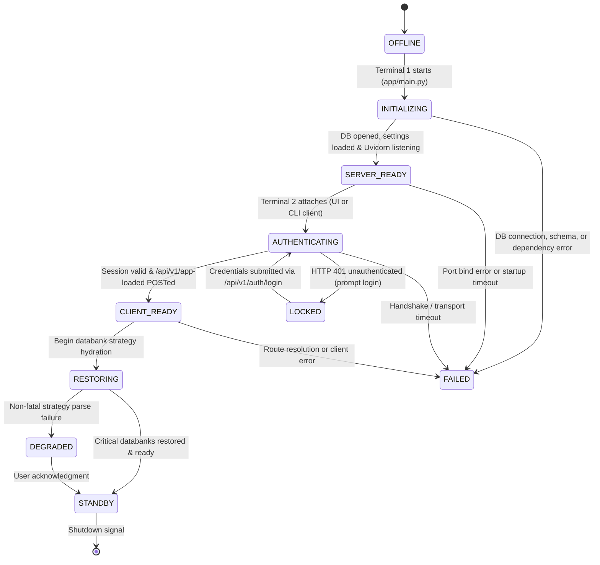

# Host boot-sequence reference and target Python specification

This document establishes the exhaustive StrategyQuant X (SQX) build **144.2953**
startup sequence discovered through clean-room reverse engineering and specifies the
equivalent architecture for HaruQuantAI.
**Donor informs; specification owns.** SQX behavior informs required quantitative
capabilities and lifecycle boundaries; the HaruQuantAI specification owns target
architecture, contracts, and implementation.

The backend host implementation was reset at commit
`a6245a4430b0a341f2c4e838fb7f9647d564c59c`. This document serves as the authoritative
structural specification for rebuilding the Python host bootstrapper and lifecycle
coordinator.

---

## 1. Architectural principles and target technology stack

### Target technology stack

- **Backend:** Python 3.13+ + FastAPI + Pydantic + Uvicorn (`app/host/`, `app/workspace/`, `app/plugins/`, `app/kernel/`).
- **Frontend:** React 19 + TypeScript + Vite + Tailwind CSS (`app/ui/src/app/`, `app/ui/src/workspace/`, `app/ui/src/plugins/`, `app/ui/src/components/`).
- **State & Layout:** Zustand store (`app/ui/src/app/store/layoutStore.ts`), React Router (`app/ui/src/app/router.tsx`), Dockview panel layout.
- **Charts & Presentation:** Lightweight Charts (`lightweight-charts`), TanStack Table (`@tanstack/react-table`), Lucide icons (`lucide-react`).
- **Communication:** Unified ASGI HTTP REST (`/api/v1/...`) and WebSocket channels (`/ws/updates`, `/ws/control`) served by Uvicorn on a single configured port.
- **Unified Persistence Engine:** Exactly one SQLite database at `data/database/haruquantai.db`.
  All host, session, and workspace tables reside in this single database under host-managed
  schemas. No auxiliary databases (`data.db`, `license.db`, H2 stores) exist.
- **Settings & Presets Architecture:**
  - *Global application settings:* Stored directly in `data/database/haruquantai.db` in table
    `host_settings` (`app/persistence/host.py`), eliminating external XML config files.
  - *Workspace-specific configurations & presets:* Stored strictly as JSON documents (never XML)
    under `data/presets/` (`data/presets/<Workspace>/...json`), replacing SQX's scattered XML configs.

### Two-terminal operational model (100% UI and CLI parity)

HaruQuantAI guarantees 100% parity between UI and non-UI (CLI) workflows by decoupling
the universal backend host from the client consumer using a standardized two-terminal setup:

1. **Terminal 1 — Universal Backend Host (identical for UI and CLI):**

   ```bash
   uv run python app/main.py --port 8000
   ```

   Opens the single database `data/database/haruquantai.db`, loads global settings from
   table `host_settings`, scans `data/presets/` for JSON presets, initializes plugins and
   simulation engines, and starts the FastAPI/Uvicorn server. Emits the exact same lifecycle
   states regardless of how the client connects.
2. **Terminal 2 — Client Consumer (UI or CLI):**

   - **UI Mode (React Web Shell):**
     ```bash
     npm --prefix app/ui run dev
     ```

     Runs the Vite dev server at `http://localhost:3000`. The browser navigates to UI
     routes (e.g. `http://localhost:3000/login`, `http://localhost:3000/builder`).
   - **CLI Mode (Direct Script / Command Runner):**
     ```bash
     uv run python -m app.cli --page=login --username=operator --password=secret
     uv run python -m app.cli --page=builder --config=strategy_config.json
     uv run python -m app.cli --page=datamanager --action=sync --symbol=EURUSD
     ```

     The CLI client consumes the **exact same backend REST routes and WebSocket streams**,
     using a `--page=<route>` flag that directly mirrors the UI URL routes.
   - **Parity Guarantee:** Input payloads, Pydantic validation rules, output structures,
     error shapes (`ApiClientError`), and business logic are 100% identical between UI
     and CLI.

### Structured telemetry, logging, and security redaction (app/host/telemetry.py)

HaruQuantAI replaces SQX's unmanaged Log4j configuration, arbitrary console prints, and
fragmented log files (`StrategyQuant.log`, `derby.log`) with an explicit, secure telemetry
subsystem in `app/host/telemetry.py`:

1. **Standard library logging engine:** Uses Python's standard `logging` library configured
   during initial host assembly in `app/host/bootstrap.py`. Unifies root host logging,
   FastAPI HTTP access logging, Uvicorn server diagnostics, and background task worker logs.
2. **Dual-destination dispatch:**
   - *Terminal 1 Console (stdout/stderr):* Formatted, level-coded diagnostic output for
     interactive operator monitoring.
   - *Bounded File Log (`data/logs/haruquantai.log`):* Rotating file handler with strict
     size limits (e.g. 10 MB per file, 5 rotated backups), eliminating unbounded disk growth.
3. **AGENTS.md compliance and security redaction:**
   - *No hidden setup:* Logging is configured once during explicit bootstrap; modules
     never configure loggers on import.
   - *Sensitive credential redaction:* A custom `SensitiveDataFilter` intercepts all log
     records, masking authorization headers, bearer tokens, session identifiers, and
     database passwords before writes occur.
   - *No application `print`:* Disallows `print()` statements across all production modules;
     all lifecycle and execution events flow through typed logger channels.

### Zero-coupling dynamic filesystem plugin discovery (app/host/catalog.py)

In SQX, `SQPluginManager` dynamically discovers plugins at startup (Stage `I06`) by scanning
`internal/plugins/`, `user/extend/Plugins/`, and `user/snippets/`. While SQX avoids editing a central
Java source list, it introduces runtime ambient coupling: plugins access global static singletons
(`SQApplication.get()`, `Settings.get()`), metadata is fragmented across `plugin.xml` and
`snippets.txt`, and loading triggers unconstrained bytecode execution.

HaruQuantAI implements **100% zero-coupling dynamic filesystem plugin discovery** governed by
the Five Laws of Spatial Composability:

1. **Locality of behavior & filesystem organization (SC-01):**
   - Plugins live on disk under `app/plugins/<Category>/<Concept>/<concept>.py` (core plugins)
     and `data/plugins/<Category>/<Concept>/<concept>.py` (user-authored custom extensions).
   - **One concrete plugin, one cohesive Python file:** Math calculation, Pydantic parameter
     schema, defaults, optimization bounds, typed port declarations, and presentation hints
     reside together in that single Python file.
   - All `__init__.py` files in `app/plugins/` are **strictly empty or docstring-only**. No central
     `__init__.py` imports or lists plugins.
2. **Sandboxed discovery scanner at boot stage I06 (SC-05):**
   - During boot stage `I06` (`INITIALIZING` state), `app/host/catalog.py` walks the filesystem
     discovering all concept modules.
   - **Sandboxed inspection:** To enforce the rule *"no import-time registration, I/O, tasks,
     threads, environment reads, or global mutation"*, `catalog.py` inspects the module descriptor
     using `importlib.util` in an isolated namespace or via AST parsing.
   - **Pydantic schema validation:** Validates the declared `PluginDescriptor`:
     - Stable namespaced ID (e.g. `haru.indicators.rsi`, `haru.blocks.stop_loss`).
     - Explicit semantic version and compatibility bounds.
     - Declared capability slots (e.g. `IndicatorCapability`, `RuleBlockCapability`, `SimulationEngineCapability`).
     - Introspectable parameter schema with data types, constraints, defaults, min/max bounds,
       step sizes, and presentation metadata.
     - Strongly typed input/output algebraic port declarations (SC-04).
3. **Pure orthogonality and failure isolation (SC-02 & SC-03):**
   - **Zero central edits:** Adding a new plugin requires only dropping `<concept>.py` into the
     plugins directory. Zero lines in `app/host/`, `app/workspace/`, or any master list are touched.
   - **Orthogonal failure:** If a plugin contains syntax errors or invalid schemas, the host logs
     a structured diagnostic issue and isolates it. All healthy plugins load and function normally.
   - **Orthogonal removal:** Deleting a plugin file cleanly removes it from the catalog on next
     reload. If an existing strategy references a deleted plugin, execution emits a typed
     `MissingDependencyError(id="haru.indicators.rsi")` placeholder rather than crashing the engine.
   - **No ambient coupling:** Plugins cannot import host singletons or sibling plugins. They
     collaborate strictly through declared capability slots and immutable documents.
4. **Wire-contract consumption by UI and CLI:**
   - The compiled catalog is served via `GET /api/v1/catalog` (and `/ws/updates` on hot reload).
   - **React UI Host:** React workspace views use generic, bounded schema renderers. A newly
     discovered plugin's parameter inputs, sliders, and validation constraints are rendered
     dynamically with **zero custom React code required**.
   - **CLI Client:** The CLI runner parses the catalog dynamically, enabling CLI parameter
     validation and auto-completion for newly dropped plugins.

### Clean-room principles

1. **Single unified database:** SQX's scattered multi-database layout (`user/data/data.db`,
   `internal/license.db`, `data_stock.h2.db`, `data_futures.h2.db`) is replaced by a single,
   authoritative SQLite database `data/database/haruquantai.db`. Subsystems and workspaces
   define their tables within this shared relational store under host-managed migrations.
   Global application settings live in table `host_settings`, while workspace configurations
   and presets are stored strictly as JSON files in `data/presets/`.
2. **Elimination of proprietary launcher layers:** HaruQuantAI eliminates Go runtime
   wrappers (`sqlauncher`), embedded JNI loaders, and in-memory bytecode decryption.
   Application entry is driven directly via `app/main.py` into `app/host/bootstrap.py`.
3. **Session authentication over proprietary DRM:** SQX's proprietary license verification
   dialog (`licenseDialog.html`), remote licensing queries, and hardware-ID anti-tamper
   mechanisms are adapted into an explicit user authentication and session security
   boundary (`app/host/security.py`, `app/host/sessions.py`, `app/ui/src/app/HostConnection.tsx`).
   Credentials and sessions are persisted in `data/database/haruquantai.db`. Local
   single-operator usage defaults to an active session, while password protection is
   enforced for remote access or shared multi-user workstations.
4. **Web workstation topology:** The client interface is a high-performance React SPA
   built with Vite and Tailwind CSS. The desktop experience runs in the user's browser
   or via CLI terminal scripts, eliminating legacy Electron shell wrappers
   (`StrategyQuantX_ui.exe`) and custom browser tokens.
5. **Five Spatial Composability laws:**
   - *Locality of behavior:* calculation, parameter schema, bounds, and outputs for
     each concept stay together in cohesive plugins.
   - *Orthogonality:* modules interact strictly through declared interfaces; no side
     effects or hidden couplings.
   - *Explicit typed capability slots:* collaboration between host, workspaces, and
     plugins is declared via typed Pydantic models and protocol contracts.
   - *Hierarchical/algebraic composition:* strategy trees, indicators, and rules
     compose hierarchically with deterministic evaluation.
   - *Schema-driven self-description:* all parameters, constraints, and metadata are
     exposed through introspectable Pydantic schemas.
6. **Standard-library kernel:** `app/kernel/` uses only Python standard library modules
   and contains no product, plugin, UI, persistence, or integration logic.
7. **Host isolation:** `app/host/` coordinates universal lifecycle, networking,
   persistence, and catalog discovery without importing concrete `app.workspace`,
   `app.plugins`, `app.services`, or `app.ui` modules directly.
8. **No ambient coupling:** Dynamic discovery operates via the host catalog
   (`app/host/catalog.py`) scanning declared capability descriptors without global
   registries or import-time side effects.
9. **Managed async supervision:** Unmonitored background threads from SQX are replaced
   with an explicit, async-supervised task manager (`app/host/startup.py`).
10. **Structured telemetry and secret redaction:** SQX's fragmented loggers (Log4j +
    `StrategyQuant.log` + console stdout) are unified into `app/host/telemetry.py`, emitting
    to stdout and rotated files in `data/logs/haruquantai.log` with active sensitive credential
    redaction, no application `print`, and zero hidden setup.
11. **Zero-coupling dynamic filesystem discovery:** Plugins live on disk as self-contained
    files under `app/plugins/` (and user-authored plugins in `data/plugins/`) with empty `__init__.py`.
    Discovery via `app/host/catalog.py` uses sandboxed inspection at boot stage `I06` without
    central list edits, import-time execution, or ambient runtime globals.

---

## 2. Proposed repository folder structure

The complete HaruQuantAI repository layout organizes components into clean, paired
boundaries governed by the Five Spatial Composability Laws:

```text
HARUQUANTAI_ROOT/
├── app/                                  # Application source code
│   ├── main.py                           # Terminal 1: Universal backend host entrypoint
│   ├── cli.py                            # Terminal 2: CLI client consumer entrypoint (--page=<route>)
│   │
│   ├── kernel/                           # Standard-library-only math/runtime (no external dependencies)
│   │   ├── __init__.py
│   │   ├── timeseries.py                 # Core bar structures and timestamp alignment
│   │   └── math_utils.py                 # Deterministic math, rounding, and precision primitives
│   │
│   ├── host/                             # Universal host lifecycle & coordination (no domain imports)
│   │   ├── __init__.py
│   │   ├── bootstrap.py                  # Sequential startup assembly coordinator
│   │   ├── startup.py                    # Async lifecycle state machine & task supervisor
│   │   ├── telemetry.py                  # Structured logging, log rotation (data/logs/), and secret redaction
│   │   ├── http_server.py                # FastAPI ASGI server mounting APIRouters & WebSockets
│   │   ├── events.py                     # In-memory async pub/sub event bus & channel hub
│   │   ├── config.py                     # Single HostSettings model, settings singleton, ensure_directories
│   │   ├── security.py                   # Authentication guards, password hashing, and token issuance
│   │   ├── sessions.py                   # Active operator session state management
│   │   ├── resources.py                  # CPU core profiling and ProcessPoolExecutor sizing
│   │   ├── catalog.py                    # Schema-driven plugin and capability discovery
│   │   ├── browser.py                    # Optional system browser launcher
│   │   └── README.md                     # Host boot sequence and architecture specification (this file)
│   │
│   ├── persistence/                      # Single home for all database CRUD (ratified host capability)
│   │   ├── __init__.py
│   │   └── host.py                       # CRUD for host_* tables in data/database/haruquantai.db
│   │
│   ├── workspace/                        # Backend workspace domain owners (workflow & task coordination)
│   │   ├── AlgoWizard/                   # Strategy visual rule authoring & code generation
│   │   ├── Builder/                      # Genetic / random search candidate generation
│   │   ├── Business/                     # Business workflow orchestration & task graphs
│   │   ├── CodeEditor/                   # User snippet/plugin AST validation & compiler
│   │   ├── CustomProjects/               # Multi-step project task queue engine
│   │   ├── DataManager/                  # Instrument catalog, session templates & data validation
│   │   ├── DebugConsole/                 # Diagnostics and internal event tracing
│   │   ├── Optimizer/                    # Parameter studies, walk-forward & matrix optimization
│   │   ├── PortfolioComposer/            # Correlation, risk allocation & portfolio assembly
│   │   ├── PortfolioMaster/              # Multi-strategy portfolio analysis
│   │   ├── Results/                      # Trade analysis, equity curves & drawdown calculations
│   │   ├── Retester/                     # Out-of-sample backtest validation
│   │   └── Trading/                      # Operational trading & execution engine
│   │
│   ├── plugins/                          # One cohesive Python file per quantitative concept
│   │   ├── building_block/               # Indicators, comparisons, candle patterns, order conditions
│   │   ├── data_source/                  # Market data providers (Dukascopy, MT5, Yahoo, etc.)
│   │   ├── engine/                       # Simulation engines (MT4, MT5, TradeStation, Native SQ)
│   │   ├── exporter/                     # Code exporters (MQL4, MQL5, EasyLanguage, Python)
│   │   └── statistic/                    # Performance metrics (Sharpe, SQN, MaxDD, Profit Factor)
│   │
│   └── ui/                               # Frontend React SPA (Terminal 2 UI path)
│       ├── package.json                  # React 19 + TypeScript + Vite + Tailwind CSS dependencies
│       ├── vite.config.ts                # Vite dev server (port 3000) & proxy configuration
│       └── src/
│           ├── main.tsx                  # React DOM mount
│           ├── app/                      # UI host shell
│           │   ├── App.tsx               # Root component & navigation shell
│           │   ├── router.tsx            # React Router dynamic route definitions
│           │   ├── transport.ts          # Universal API client, WebSocket & ApiClientError
│           │   ├── HostConnection.tsx    # Session authentication, login modal, and app-loaded ACK
│           │   ├── BootScreen.tsx        # Initialization progress bar listener
│           │   ├── FirstRunDialog.tsx    # First-run onboarding modal
│           │   └── store/                # Zustand global layout & view stores
│           ├── workspace/                # UI counterparts to backend workspaces
│           ├── plugins/                  # UI counterparts to backend plugins
│           └── components/ui/            # Shared presentation primitives (Dockview, charts, tables)
│
├── data/                                 # Runtime data and persistence
│   ├── database/
│   │   └── haruquantai.db                # Single unified SQLite database (host, auth, workspaces)
│   ├── logs/                             # Application runtime logs
│   │   └── haruquantai.log               # Bounded rotating application log file
│   ├── plugins/                          # Optional custom/user-authored plugin drop-in directory
│   ├── presets/                          # Workspace-specific JSON presets (strictly no XML)
│   │   ├── AlgoWizard/                   # Strategy templates (*.json)
│   │   ├── Builder/                      # Builder search space presets (*.json)
│   │   ├── CustomProjects/               # Saved project task workflows (*.json)
│   │   ├── DataManager/                  # Session and instrument configurations (*.json)
│   │   └── Optimizer/                    # Optimization parameter presets (*.json)
│   └── history/                          # Timeseries market price files
│
├── docs/                                 # Architectural specifications and evidence ledger
│   ├── PROJECT.md                        # Product charter and requirements
│   ├── ARCHITECTURE.md                   # Spatial composability laws and structural rules
│   └── dev/evidence/                     # Clean-room donor evidence ledger
│       ├── reimplementation.json         # Machine-readable donor evidence ledger
│       └── reimplementation.schema.json  # Ledger JSON schema
│
└── scripts/                              # Verification and quality assurance tooling
    ├── architecture_check.py             # Enforces import boundaries and composability laws
    └── ci_check.py                       # Automated verification runner (Ruff, Mypy, pytest)
```

---

## 3. Host lifecycle state machine

HaruQuantAI coordinates application boot through a formal, deterministic state machine
incorporating universal client parity, database validation, and session authentication:



### Lifecycle states and transition guards

| State                    | Entry condition                                 | Exit guard / Verification                                                                                                                                                         | Failure policy                                            |
| :----------------------- | :---------------------------------------------- | :-------------------------------------------------------------------------------------------------------------------------------------------------------------------------------- | :-------------------------------------------------------- |
| **OFFLINE**        | Process unstarted.                              | Valid CLI arguments and environment verified.                                                                                                                                     | Terminate with error code.                                |
| **INITIALIZING**   | Bootstrap invoked in Terminal 1.                | Single database`data/database/haruquantai.db` opened; table `host_settings` loaded; `data/presets/*.json` scanned; all 13 core subsystems initialized in topological order. | Fail closed: abort process with diagnostic log.           |
| **SERVER_READY**   | Subsystems ready; Uvicorn binds ASGI app.       | FastAPI application listening on configured port; WebSocket endpoints active. Ready for Terminal 2 client attachment.                                                             | Port conflict / bind failure raises diagnostic error.     |
| **AUTHENTICATING** | Terminal 2 client connects (UI or CLI).         | Session token validated against`users` and `sessions` tables in `data/database/haruquantai.db`. If unauthenticated or expired, transitions to `LOCKED`.                   | HTTP 401 unauthorized prompts user credential submission. |
| **LOCKED**         | Unauthenticated access or remote access locked. | Client submits credentials via`POST /api/v1/auth/login`; transitions back to `AUTHENTICATING`.                                                                                | Rate-limited credential retry; fail closed.               |
| **CLIENT_READY**   | Authenticated client ready (UI or CLI).         | Client verifies connection and sends`POST /api/v1/app-loaded`. Identical trigger for UI SPA and CLI runner.                                                                     | Timeout after 30s; display diagnostic error.              |
| **RESTORING**      | Client acknowledgment received.                 | Deserialization of saved strategies into databanks; stock group/broker sync jobs active.                                                                                          | Isolate corrupt strategies; mark databank degraded.       |
| **STANDBY**        | Minimum required restoration done.              | Host admits interactive backtesting, optimization, and strategy building commands (UI clicks or CLI args).                                                                        | Enter degraded state if resource limits exceeded.         |

---

## 4. Exhaustive two-tier boot sequence reference

The tables below map every discovered SQX operation (build 144.2953) to its target
HaruQuantAI Python + FastAPI and React + CLI owner and clean-room implementation
contract, demonstrating **100% UI and CLI parity**.

- **B01–B11:** Pre-initialization, runtime configuration, authentication, and client launch.
- **I01–I13:** Core subsystem initialization (announcements and verified internals).
- **A01–A13:** Application serving, client handshake, and deferred background tasks.

### B — Pre-initialization, authentication, and client launch

For B02, `config.py` owns only the validated boot-time `HostSettings` projection
and its read-only load from `host_settings`. The later `app/persistence/host.py`
owns general settings writes and schema creation for the host tables.

| Step          | SQX build 144.2953 discovered behavior                                                                                                                                                                                                                                                   | Target HaruQuantAI owner                                                                                  | Clean-room Python + React + CLI implementation contract                                                                                                                                                                                                                                                                                                                                                                                                                               | Evidence                      |
| :------------ | :--------------------------------------------------------------------------------------------------------------------------------------------------------------------------------------------------------------------------------------------------------------------------------------- | :-------------------------------------------------------------------------------------------------------- | :------------------------------------------------------------------------------------------------------------------------------------------------------------------------------------------------------------------------------------------------------------------------------------------------------------------------------------------------------------------------------------------------------------------------------------------------------------------------------------ | :---------------------------- |
| **B01** | **Native process launch:** Windows executes `StrategyQuantX.exe`. Go launcher (`sqlauncher.go`) initializes runtime and memory allocator.                                                                                                                                      | `app/main.py`                                                                                           | Terminal 1 CLI entrypoint driven by standard Python 3.13+. Supports universal arguments (`--host`, `--port`, `--data-dir`). No Go wrapper or binary launcher.                                                                                                                                                                                                                                                                                                                   | Observed; S1, S11             |
| **B02** | **Runtime configuration:** Reads `StrategyQuantX.config` (`-XX:+UseParallelGC`, `-Xms4g`, `-Djava.net.preferIPv4Stack=true`, `--enable-native-access=ALL-UNNAMED`).                                                                                                      | `app/host/config.py`                                                                                    | Pydantic typed configuration model (`HostSettings`) reading global settings from table `host_settings` in `data/database/haruquantai.db` with environment variable overrides.                                                                                                                                                                                                                                                                                                   | Observed; S1, S12             |
| **B03** | **Runtime bootstrap:** `sqlauncher` uses `github.com/timob/jnigi` to load `j64/bin/server/jvm.dll`; dynamically decrypts core classes via `dynresources.decrypt` and injects custom classloader `embedclassloader.go`. Empty standard classpath (`java.class.path=,`). | `app/host/bootstrap.py`                                                                                 | Native Python runtime startup. Modules loaded via standard Python import machinery; zero proprietary decryption or obfuscation.                                                                                                                                                                                                                                                                                                                                                       | Observed symbols; S1, S2, S11 |
| **B04** | **Application main entry:** Invokes `SQStarter.main` → `SQApp.main` → `MainAppStandardImpl.startApp`. Instantiates application context.                                                                                                                                    | `app/host/bootstrap.py`                                                                                 | Async bootstrapper`BootstrapCoordinator.initialize()` orchestrates sequential service assembly.                                                                                                                                                                                                                                                                                                                                                                                     | Observed stack; S2            |
| **B05** | **Control server initialization:** Starts Jetty `MainAppWebServer` on port 5051 (`internal/AppSettings.txt`). Serves `/websocket/app` for desktop control.                                                                                                                   | `app/host/http_server.py`                                                                               | Unified FastAPI ASGI application served by Uvicorn on a single configured port. WebSocket channels (`/ws/updates`, `/ws/control`) and REST routes share one server.                                                                                                                                                                                                                                                                                                               | Observed; S1, S2, S13         |
| **B06** | **Client launch:** Executes `cmd /c start "" C:/SQX/internal/electron/StrategyQuantX_ui.exe SQUANT StrategyQuantX sq.ico 5051 <browserToken>`.                                                                                                                                   | `app/host/browser.py`, `app/ui/`, `app/cli.py`                                                      | **Two-Terminal client launch:**- *UI Mode:* Terminal 2 runs `npm --prefix app/ui run dev` (Vite dev server on port 3000).- *CLI Mode:* Terminal 2 runs `uv run python -m app.cli --page=<route>`. No Electron wrapper.                                                                                                                                                                                                                                                  | Observed; S2, S4              |
| **B07** | **Client layout and window state:** Electron parses CLI args, configures `userData` directory, restores window geometry from `main-window-state.json`, and sets default headers.                                                                                               | `app/ui/src/app/store/layoutStore.ts`, `app/cli.py`                                                   | -*UI:* React frontend manages layout, Dockview docking panels, and active workspaces via Zustand; persists state to browser `localStorage` and syncs with `/api/v1/settings`.- *CLI:* CLI flags configure execution context, output formatting (`--json`, `--table`), and target workspace.                                                                                                                                                                               | Observed; S3, S5              |
| **B08** | **Client connection handshake:** Electron connects to `ws://127.0.0.1:5051/websocket/app`. Java backend checks readiness up to 15 times with 1-second sleeps.                                                                                                                    | `app/ui/src/app/transport.ts`, `app/host/events.py`, `app/cli.py`                                   | Client connects via WebSocket to`/ws/updates`. Both React SPA and CLI client stream live progress events. Host transitions to `SERVER_READY`.                                                                                                                                                                                                                                                                                                                                     | Observed; S2, S3, S5          |
| **B09** | **Hardware diagnostics:** Gathers OS, CPU model/cores, RAM, display EDID via OSHI library. Generates Hardware ID `C47DB16BC139`.                                                                                                                                                 | `app/host/resources.py`                                                                                 | Pure Python system inspection using`os.cpu_count()`, `platform`, and `psutil` to configure compute pools. Diagnostic telemetry only; no hardware-locked DRM.                                                                                                                                                                                                                                                                                                                    | Observed; S2                  |
| **B10** | **Session authentication & User login** *(SQX: License verification)*: Loads `internal/web/app/licenseDialog.html`, reads `internal/license.db`, checks Hardware ID, validates license key against remote license server. Transitions to initialization screen.              | `app/host/security.py`, `app/host/sessions.py`, `app/ui/src/app/HostConnection.tsx`, `app/cli.py` | **100% Authentication Parity:**- *UI:* `HostConnection.tsx` requests `POST /api/v1/auth/login` (defaulting to operator or showing modal at `http://localhost:3000/login`).- *CLI:* `app.cli` executes `--page=login --username=... --password=...` (or auto-login for local operator session).Sessions validated against `users`/`sessions` tables in `data/database/haruquantai.db`. Cryptographically signed Bearer token issued for subsequent requests. | Observed; S2, S3, S17         |
| **B11** | **Initialization progress display:** Electron navigates to `internal/web/app/layout/views/loadingScreen.html`. Backend sends `loadingInfo` commands with progress text.                                                                                                        | `app/ui/src/app/BootScreen.tsx`, `app/host/startup.py`, `app/cli.py`                                | -*UI:* React `BootScreen` component renders while host is in `INITIALIZING` state, listening to `/ws/updates`.- *CLI:* Terminal 1 or Terminal 2 renders an ANSI progress bar or structured JSON log stream with exact stage labels.                                                                                                                                                                                                                                         | Observed; S2, S3, S5          |

---

### I — Core subsystem initialization milestones (I01–I13)

The 13 stages below represent the exact UI milestone messages emitted by SQX build
144.2953, expanded to document their verified internal operations (**100% identical for UI and CLI**):

| Step          | Exact SQX stage name                       | Verified SQX build 144.2953 internal operations                                                                                                                                                                                                                           | Target HaruQuantAI owner                                           | Clean-room Python + React + CLI implementation contract                                                                                                                                                                                                                                                                                                                                                                                                                                                                                                                                                                                                        |
| :------------ | :----------------------------------------- | :------------------------------------------------------------------------------------------------------------------------------------------------------------------------------------------------------------------------------------------------------------------------ | :----------------------------------------------------------------- | :------------------------------------------------------------------------------------------------------------------------------------------------------------------------------------------------------------------------------------------------------------------------------------------------------------------------------------------------------------------------------------------------------------------------------------------------------------------------------------------------------------------------------------------------------------------------------------------------------------------------------------------------------------- |
| **I01** | `Initializing database & settings...`    | - Opens SQLite database`user/data/data.db` and H2 stores (`data_stock.h2.db`, `data_futures.h2.db`).- Deserializes `user/settings/settings.xml` (paths, skins, ports, compute flags).- Reads `internal/AppSettings.txt` (port 5051).                            | `app/persistence/host.py`                                       | **Unified Database & Settings Bootstrap:**- Opens single SQLite database `HARUQUANTAI_ROOT/data/database/haruquantai.db`.- Verifies and migrates relational schemas for host, auth, and all domain tables.- Deserializes global settings from table `host_settings` into Pydantic models.- Discovers workspace configurations and presets from `HARUQUANTAI_ROOT/data/presets/*.json` (no XML).                                                                                                                                                                                                                                                    |
| **I02** | `Loading customizations...`              | -`com.strategyquant.lib.customization.Customization` discovers user overrides in `user/settings/` and `user/extend/`.- Counts and validates custom configurations.                                                                                                  | `app/host/customizations.py`                                     | - Discovers user-defined workspace layouts, themes, and configuration overrides from`data/presets/`.                                                                                                                                                                                                                                                                                                                                                                                                                                                                                                                                                         |
| **I03** | `Compiling snippets...`                  | -`SnippetsHash` checks MD5 hashes in `user/settings/snippets.txt` across 931 Java files.- `AutoCompiler.compileSQFiles` / `SnippetsCompiler` compiles changed files in `user/extend/Snippets/SQ/` (Blocks, Columns, Utils) into `internal/libs/Snippets.jar`. | `app/workspace/CodeEditor/compiler.py`                           | - In Python, snippets are native modules. Change detection via SHA-256 hash ledger.- Dynamic syntax & AST verification (`ast.parse`); static type/schema checking before registration.                                                                                                                                                                                                                                                                                                                                                                                                                                                                       |
| **I04** | `Loading performance settings...`        | - Detects CPU topology via OSHI (`CpuInfo`).- Configures `MultithreadComputePerformer` and `ThreadPool` (e.g. 11 executors for 12 logical cores under config `'-1'`).                                                                                             | `app/host/resources.py`                                          | - Profiles host CPU cores (`os.cpu_count()`) and RAM.- Initializes asynchronous I/O event loop and `concurrent.futures.ProcessPoolExecutor` sized for compute-bound backtesting.                                                                                                                                                                                                                                                                                                                                                                                                                                                                           |
| **I05** | `Initializing building blocks...`        | - Reads/unpacks`internal/internal.dat` (`Code/EasyLanguage/blocks/*.tpl`, `Blocks.inc`).- Registers trading blocks (indicators, candle patterns, comparisons, order rules) into the strategy generator rule grammar.                                                | `app/plugins/<BuildingBlock>/plugin.py`, `app/host/catalog.py` | - Declarative building block plugins defining typed input/output ports, parameters, and vectorized calculations.- Algebraic grammar tree registration for strategy generation.                                                                                                                                                                                                                                                                                                                                                                                                                                                                                 |
| **I06** | `Loading plugins...`                     | -`SQPluginManager` scans 190+ plugin directories in `internal/plugins` and `user/extend/Plugins`.- Parses `plugin.xml`, filters for product `SQUANT`, calls `initPlugin()`.                                                                                   | `app/host/catalog.py`                                            | **Zero-Coupling Dynamic Filesystem Discovery:**- Dynamically scans `app/plugins/` (and custom plugins in `data/plugins/`) with empty `__init__.py` files (zero central list edits).- Sandboxed AST / `importlib.util` inspection validates Pydantic `PluginDescriptor` (namespaced ID, semantic version, capability slots, parameter schemas with min/max bounds, algebraic I/O ports).- Orthogonal failure isolation: single plugin defects fail closed without breaking host boot or healthy plugins.- Serves catalog over `GET /api/v1/catalog` and `/ws/updates`, feeding React generic schema renderers and CLI parameter validation. |
| **I07** | `Initializing stats computer...`         | - Registers statistical calculation blocks, fitness metrics (Sharpe, SQN, Drawdown, Profit Factor), and Monte Carlo simulation routines.                                                                                                                                  | `app/plugins/<Statistic>/plugin.py`                              | - Modular statistic plugins implementing standard calculation interfaces on backtest equity/trade series.                                                                                                                                                                                                                                                                                                                                                                                                                                                                                                                                                      |
| **I08** | `Initializing engines...`                | - Instantiates and registers simulation engines: MetaTrader 4, MetaTrader 5, TradeStation, MultiCharts, and SQ native engine.- Registers execution models and tick resolution policies.                                                                                   | `app/plugins/<Engine>/plugin.py`                                 | - Simulation engine plugins implementing execution protocol: order matching, slippage, spread, and commission modeling.                                                                                                                                                                                                                                                                                                                                                                                                                                                                                                                                        |
| **I09** | `Loading data...`                        | -`HistoryDataManager` loads exchange definitions (`DataDb`), timeframes (`TimeframeManager`).- Starts background thread for benchmark history download (`SPY_benchmark.D` from `cdn.strategyquantcdn.com`).                                                     | `app/workspace/DataManager/`                                     | - Timeseries data catalog initialization: metadata indexing, exchange calendars, and session definitions.- Managed background downloader for benchmark symbols.                                                                                                                                                                                                                                                                                                                                                                                                                                                                                                |
| **I10** | `Loading projects...`                    | - Enumerates`user/projects/`.- Deserializes project task XML graphs and initializes queue executors (`ProjectEngine.initTasks`).                                                                                                                                      | `app/workspace/CustomProjects/`                                  | - Scans project repositories; deserializes project workflow definitions (Builder, Retester, Optimizer) and task queues into Pydantic models.                                                                                                                                                                                                                                                                                                                                                                                                                                                                                                                   |
| **I11** | `Initializing communication channels...` | -`SQWebSocketManager` initializes internal update hub, topic routers, and client session registries.                                                                                                                                                                    | `app/host/events.py`                                             | - In-memory async pub/sub event bus supporting typed event envelopes and channel subscriptions.                                                                                                                                                                                                                                                                                                                                                                                                                                                                                                                                                                |
| **I12** | `Checking data...`                       | - Runs bar integrity validation: checking for duplicate timestamps, session boundary gaps, inverted OHLC values, and missing bars.                                                                                                                                        | `app/workspace/DataManager/validation.py`                        | - Data hygiene service validating price series integrity, gap detection, and bar alignment rules.                                                                                                                                                                                                                                                                                                                                                                                                                                                                                                                                                              |
| **I13** | `Loading GUI...`                         | - Verifies static web bundles (`internal/web/common/Batch1/libs.js`, `SQUANT/index.html`).- Prepares HTTP servlet mappings.                                                                                                                                           | `app/host/http_server.py`                                        | - FastAPI application routes mounted: Vite SPA static asset delivery, REST API endpoints (`/api/v1/...`), and WebSocket channels (`/ws/...`).                                                                                                                                                                                                                                                                                                                                                                                                                                                                                                              |

---

### A — Application serving, client handshake, and deferred execution

| Step          | SQX build 144.2953 discovered behavior                                                                                                                                                   | Target HaruQuantAI owner                                                           | Clean-room Python + React + CLI implementation contract                                                                                                                                                                                                                                              | Evidence         |
| :------------ | :--------------------------------------------------------------------------------------------------------------------------------------------------------------------------------------- | :--------------------------------------------------------------------------------- | :--------------------------------------------------------------------------------------------------------------------------------------------------------------------------------------------------------------------------------------------------------------------------------------------------- | :--------------- |
| **A01** | **Assemble application handlers:** Mounts servlets for core commands, plugin assets, file transfers, and `/mcp` HTTP endpoint.                                                   | `app/host/http_server.py`                                                        | Registers FastAPI APIRouters (`/api/v1/...`), WebSocket transports, and optional Model Context Protocol (MCP) agent endpoints.                                                                                                                                                                     | Observed; S2, S4 |
| **A02** | **Bind application server:** Attempts port 8080 (fallback 8081–8090 if occupied). Saves chosen port to `settings.xml` (`WebServerPortUsed`).                                  | `app/host/http_server.py`, `app/persistence/host.py`                           | Uvicorn binds ASGI app on configured port (e.g. 8000/8080) with dynamic port fallback and conflict reporting. Persists port in table`host_settings`.                                                                                                                                               | Observed; S2, S4 |
| **A03** | **Navigate client:** Backend sends URL directive to Electron; Electron navigates to `http://localhost:<port>/?nocache=<timestamp>`.                                              | `app/host/browser.py`, `app/cli.py`                                            | -*UI:* Terminal 2 Vite dev server opens `http://localhost:3000/`.- *CLI:* Terminal 2 CLI runner dispatches to target endpoint via `--page=<route>`.                                                                                                                                          | Observed; S3, S5 |
| **A04** | **Initialize client session:** `SQUANT/index.html` loads bundled scripts (`Batch1/libs.js`), styles, and bootstraps AngularJS app.                                             | `app/ui/src/main.tsx`, `app/cli.py`                                            | -*UI:* React 19 + TypeScript + Vite SPA mounts root component with Tailwind CSS styles.- *CLI:* CLI command runner loads session token and prepares HTTP/WebSocket client.                                                                                                                       | Observed; S9     |
| **A05** | **Connect live updates:** Frontend fetches WebSocket port via `/main/getWebSocketPort` and connects to `/websocket/updates`.                                                   | `app/ui/src/app/transport.ts`, `app/host/events.py`, `app/cli.py`            | Both UI and CLI connect to`/ws/updates` with heartbeat and topic subscriptions.                                                                                                                                                                                                                    | Observed; S8     |
| **A06** | **Load initial state:** Frontend invokes `/main/loadInitializationData` retrieving constants, settings, languages, columns, views, and data configs.                             | `app/ui/src/app/HostConnection.tsx`, `app/host/http_server.py`, `app/cli.py` | HTTP endpoint`GET /api/v1/init-data` delivers identical Pydantic-serialized configuration from table `host_settings`, catalog descriptors, and metadata to UI and CLI.                                                                                                                           | Observed; S4, S8 |
| **A07** | **Assemble navigation and workspaces:** Registers UI routes from plugins (Builder, Retester, Optimizer, Portfolio Master, Data Manager, AlgoWizard).                               | `app/ui/src/app/router.tsx`, `app/cli.py`                                      | **Route Parity:**- *UI:* React Router dispatches URLs (`/builder`, `/retester`, `/optimizer`, `/datamanager`).- *CLI:* CLI parses `--page=builder`, `--page=retester`, `--page=optimizer`, `--page=datamanager`, dispatching to the exact same backend workspace handlers. | Observed; S8, S9 |
| **A08** | **Introductory checks:** Evaluates first-run settings, display warnings, and setup wizard triggers.                                                                                | `app/ui/src/app/FirstRunDialog.tsx`, `app/cli.py`                              | -*UI:* Renders setup or onboarding modals if unconfigured.- *CLI:* Checks configuration; emits warning or prompts for missing required parameters.                                                                                                                                               | Observed; S9     |
| **A09** | **Client readiness acknowledgment:** After workspace preload checks pass, client delays 3 seconds, fades loading overlay, and posts to `/main/appLoaded`.                        | `app/ui/src/app/HostConnection.tsx`, `app/cli.py`                              | **Universal Readiness Trigger:**Both React frontend and CLI runner send `POST /api/v1/app-loaded`, signaling that client initialization is complete and triggering the host state transition to `RESTORING`.                                                                               | Observed; S8     |
| **A10** | **Record client-ready milestone:** Server marks `MainApp.AppLoaded = true`, triggers post-GUI listeners, logs total loading time, and announces `APP LOADED`.                  | `app/host/startup.py`                                                            | Host state machine transitions from`CLIENT_READY` to `RESTORING`. Logs boot timing diagnostics.                                                                                                                                                                                                  | Observed; S2, S4 |
| **A11** | **Restore saved strategies:** Asynchronous thread `ProjectEngine.loadStrategies()` deserializes `.sqx` files into databanks (e.g. `Strategies to optimize`, `Results`).    | `app/plugins/Databank/plugin.py`, `app/host/startup.py`                        | Managed async task hydrations: read persisted strategy models via Pydantic schemas into active databanks with progress events. In CLI mode, completes hydration before executing batch research commands.                                                                                            | Observed; S2, S7 |
| **A12** | **After-load synchronization:** Spawns asynchronous tasks: `BasketOfStocksManager` syncing stock baskets, `BrokerManager` syncing broker definitions, update checks.           | `app/host/startup.py`, `app/plugins/`                                          | Managed background supervisor executes registered post-load hooks (asset syncing, broker profile checks).                                                                                                                                                                                            | Observed; S2, S4 |
| **A13** | **Interactive standby and execution:** Host enters standby. Background sweeper (`DataFolderSweeper`) and periodic auto-savers (`StrategiesSaver`) run at configured intervals. | `app/host/startup.py`, `app/cli.py`                                            | State machine enters`STANDBY`.- *UI Mode:* Accepts interactive user clicks and chart requests.- *CLI Mode:* Supports interactive REPL/TUI or executes finite batch tasks (`haru project run ...`), exiting with a standard process exit code (`0` for success).                            | Observed; S2     |

---

## 5. Discovered donor data formats and configuration specifications

Clean-room reimplementation requires understanding the exact data formats used by
SQX build 144.2953 and how HaruQuantAI unifies and modernizes them:

### 1. `StrategyQuantX.config` (Runtime Flags)

- Plaintext, line-delimited key-value options prefixed with `option`:
  ```
  option -Djava.net.useSystemProxies=true
  option -Djava.net.preferIPv4Stack=true
  option -XX:+UseParallelGC
  option -Djdk.tls.trustNameService=true
  option --enable-native-access=ALL-UNNAMED
  option -Xms4g
  ```
- *HaruQuantAI replacement:* Typed Pydantic model `HostSettings` stored in table `host_settings`
  in `HARUQUANTAI_ROOT/data/database/haruquantai.db` with environment variable overrides.

### 2. `internal/AppSettings.txt` (Control Server Ports)

- XML fragment specifying internal control ports:
  ```xml
  <Settings>
    <AppWebServerPortSQUANT>5051</AppWebServerPortSQUANT>
    <AppWebServerPortSQEDITOR>5051</AppWebServerPortSQEDITOR>
  </Settings>
  ```
- *HaruQuantAI replacement:* Single unified port configured via CLI `--port` or read from table `host_settings`.

### 3. `user/settings/settings.xml` (Application State & Configuration)

- XML document containing 21 core configuration parameters:
  - Directory paths: `userPath`, `projectsPath`, `strategiesPath`, `configsPath`, `templatesPath`.
  - Presentation: `skin` (`Dark skin`), `language` (`English`).
  - Web server: `WebServerPortUsed` (`8080`), `BrowserToken` (`1395804673`).
  - Performance: `gpuAccelerated` (`true`), `BenchmarkTimePerTick` (`1.718794886147208E-5`).
  - Metric filters: `ComputePipsMetrics`, `ComputePctsMetrics`, `ComputeSeparateMetrics`.
- *HaruQuantAI replacement:*
  - **Global application settings:** Stored directly in table `host_settings` in `HARUQUANTAI_ROOT/data/database/haruquantai.db`.
  - **Workspace-specific settings & configurations:** Stored strictly as JSON documents (never XML)
    under `HARUQUANTAI_ROOT/data/presets/` (e.g. `data/presets/Builder/*.json`, `data/presets/DataManager/*.json`).

### 4. `user/settings/snippets.txt` (Snippet Change Detection Ledger)

- Pipe-delimited text file storing relative path and MD5 hash across 931 snippets:
  ```
  $SNIPPETS_BUILTIN_DIR$/SQ/Blocks/BarAndTime/AlwaysFalse.java|ed97cbc4a51256c3fdf72dfb25ce0305
  $SNIPPETS_BUILTIN_DIR$/SQ/Blocks/CandlePatterns/Hammer.java|9ff8b642c34f340135328e779d8f8f0e
  ```
- *HaruQuantAI replacement:* SHA-256 hash manifest in `app/workspace/CodeEditor/` for custom user plugins.

### 5. `internal/internal.dat` (Building Block Templates Archive)

- Standard ZIP archive containing EasyLanguage and Java trading block templates:
  - `Code/EasyLanguage/blocks/*.tpl` (e.g. `ADX.tpl`, `Aroon.tpl`, `AssignVariable.tpl`).
  - Grammar declarations in `Blocks.inc` and `ATM.inc`.
- *HaruQuantAI replacement:* Declarative Python classes in `app/plugins/<BuildingBlock>/` exporting typed ports and vectorized calculation functions.

### 6. Multiple Database Consolidation (`license.db`, `data.db`, H2 Stores)

- SQX splits persistence across multiple SQLite and H2 databases (`user/data/data.db`, `internal/license.db`,
  `data_stock.h2.db`, `data_futures.h2.db`).
- *HaruQuantAI replacement:* Consolidated into **one unified SQLite database** at
  `HARUQUANTAI_ROOT/data/database/haruquantai.db`. All subsystems (host auth, sessions, data catalog metadata,
  databank index records, broker profiles) maintain their schema in this single database.

---

## 6. Evidence provenance and cryptographic fingerprints

Inspected on **2026-09-25** against `SQX_REFERENCE_ROOT` (build 144.2953). No proprietary
source text, credentials, or machine-specific paths are included.

| Source ID     | Logical artifact locator                                            | Narrow location / Inspection method                                        | SHA-256 fingerprint                                                  |
| :------------ | :------------------------------------------------------------------ | :------------------------------------------------------------------------- | :------------------------------------------------------------------- |
| **S1**  | `SQX_REFERENCE_ROOT/StrategyQuantX.exe`                           | Executable symbols, Go runtime, JNI entrypoints                            | `95a4edb8c743a2603c388153991ddd4c666fc81ba311053fbfaf221689f3d33b` |
| **S2**  | `SQX_REFERENCE_ROOT/user/log/StrategyQuant/log_2026_09_24.log`    | Complete backend lifecycle trace (lines 1–155)                            | `8fc92629fa59a0ce2d20f5256663d8fd0944f745865932a5bed37cee1c4ce000` |
| **S3**  | `SQX_REFERENCE_ROOT/user/log/StrategyQuantX_ui/log_2026_9_24.log` | UI startup log: milestone progress messages (lines 23–79)                 | `0d35edbbc60548c83fe699162d736a85c8ae995a1c7fbf25f8606e89d922e5ff` |
| **S4**  | `SQX_REFERENCE_ROOT/internal/libs/SQWebGUILib.jar`                | Bytecode inspection:`AbstractUIWebServer`, `MainServlet`, `Electron` | `3a319dc358d46207a0e4520c6dacb694039a3d5c35b0069c08a7e869aa6fd0af` |
| **S5**  | `SQX_REFERENCE_ROOT/internal/electron/resources/app.asar`         | Electron`main.js`: IPC connection, window state, recovery                | `a463a5e64ba5686bdbb6cb96cc74642b8f924d2104d8745afc3239a5ccf97a84` |
| **S6**  | `SQX_REFERENCE_ROOT/internal/libs/SQPluginLib.jar`                | Bytecode inspection:`SQPluginManager.initForProduct`                     | `40c962d2087d68aadb4bc4a3b9bb2363a453cb57830fd672c50716d502e771c3` |
| **S7**  | `SQX_REFERENCE_ROOT/internal/libs/SQTradingLib.jar`               | Bytecode inspection:`ProjectEngine`, `Databanks`, `initTasks`        | `9796578273f36ced388b977bf08ff67c149a8897805b0bce00f7b8d3de6241f3` |
| **S8**  | `SQX_REFERENCE_ROOT/internal/web/app/sq-tools/`                   | Static inspection:`AppService.js`, `SQWebSocketService.js`             | Directory reference                                                  |
| **S9**  | `SQX_REFERENCE_ROOT/internal/web/SQUANT/index.html`               | Frontend entrypoint and bundle scripts                                     | Directory reference                                                  |
| **S10** | Running SQX processes                                               | Dynamic process verification: ports 5051 and 8080/8081                     | Process telemetry                                                    |
| **S11** | `SQX_REFERENCE_ROOT/StrategyQuantX.exe` strings                   | Go package symbols (`sqlauncher`, `classloader`, `dynresources`)     | `95a4edb8c743a2603c388153991ddd4c666fc81ba311053fbfaf221689f3d33b` |
| **S12** | `SQX_REFERENCE_ROOT/StrategyQuantX.config`                        | JVM options and memory sizing                                              | `42c9e96e97aade575de132ecc80721477385668db0794edabc7ea5df177dc0c0` |
| **S13** | `SQX_REFERENCE_ROOT/internal/AppSettings.txt`                     | Desktop control webserver port (`5051`)                                  | `495cd5e463bf33fccdf1f0ed915bb7bc942ff3a78a809a8847ac3b0126acfe48` |
| **S14** | `SQX_REFERENCE_ROOT/user/settings/settings.xml`                   | Application configuration & directory paths                                | `b0cebbbb7e9dd6eb721d5e53551ab4635a3ea1c6eb1a34a7285d2de66f93ef55` |
| **S15** | `SQX_REFERENCE_ROOT/user/settings/snippets.txt`                   | Snippet MD5 change detection manifest                                      | `7a2ef5f37bd0c0d55ba19a0d1aadb151a036a66d5453606f62a3c37563425502` |
| **S16** | `SQX_REFERENCE_ROOT/internal/internal.dat`                        | Building block templates ZIP archive                                       | `cfaa240dbac24efd658f02c25caa5908e1f61bce377d4c403c68945480195250` |
| **S17** | `SQX_REFERENCE_ROOT/internal/license.db`                          | Donor encrypted license database file                                      | `6eb4ddf5425323cf843144b6c602b785cf6692e544c39410cc9a6b293ee74e33` |
| **S18** | `SQX_REFERENCE_ROOT/sqcli.exe` strings                            | CLI launcher symbol`com.strategyquant.strategyquant.SQConsoleStarter`    | `42f52683898311db2b2a9c79a485138065d9ba36b56b437214de603b9f83f2f2` |

The [evidence ledger](../../docs/dev/evidence/reimplementation.json) remains the
machine-readable donor authority. This reference establishes the verified behavioral
ground truth and target architecture for the Python + FastAPI and React + CLI host
implementation.
