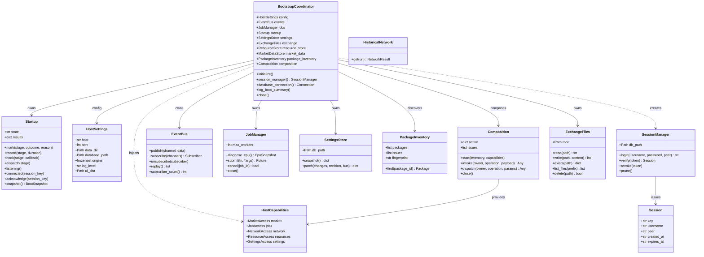

# HaruQuantAI Host System

## Error diagnostics candidate (2026-10-02)

The existing host logging/correlation and transport features now record API error
envelopes at warning/error level with server request ID, route template, HTTP
status and error code. Downstream request execution binds the same correlation
ID. Expected operation rejections use the shared bounded safe-message contract;
validation failures are distinct from malformed JSON. Unexpected request/job
failures include bounded module/function/line locations, omitting exception
messages, input values, source text, locals, raw URLs and absolute paths.
Frontend ApiClientError preserves the server requestId for operator lookup in
the existing host log. This candidate does not change log custody or restart the
running host. Verification and remaining release blockers belong to
`.agents/logs/20261002_082829_mt5_error_diagnostics/walkthrough.md`.

> **Authority:** This document owns the backend host runtime contracts, boot lifecycle, and host features.
> [ARCHITECTURE.md](../../docs/ARCHITECTURE.md) owns spatial and structural composability rules;
> [PROJECT.md](../../docs/PROJECT.md) owns system scope and traced requirements;
> [AGENTS.md](../../AGENTS.md) owns verification and engineering guidelines.

---

## 1. System Pair Overview

The HaruQuantAI Host is a decoupled, paired system providing universal runtime infrastructure:

```text
Backend Host (app/host/)                 Frontend Host (app/ui/app/host/)
========================================================================================
- Five-phase startup lifecycle            - SPA router and navigation chrome
- Process state and health monitoring      - WebSocket transport & event hub
- Session auth & token verification        - Session store & authentication UI
- Dynamic catalog discovery (AST/JSON)    - Catalog cache & dynamic schema renderers
- JSON-RPC / REST envelope handling        - Notification hub & error diagnostics
- Rotating JSON logging & secret redaction - Zero domain algorithms or market formulas
- Host database persistence (SQLite)
- Resource custody & background jobs
```

The host owns universal operational infrastructure. It contains **zero** quantitative domain algorithms, strategy meanings, or workspace workflow policies.

---

## 2. Boot Contract: Schema Version 2

The host implements boot snapshot **schema_version 2**, executing a clean five-phase lifecycle:

```text
[runtime]  -->  [services]  -->  [packages]  -->  [transport]  -->  [serving]
   |                |                 |                |                 |
Config, logs,   Storage verify,   Discovery &      ASGI routes,      Listening gate,
lease & port    sessions, jobs,   composition,     static assets,    server ready
reservation     event bus, db     slot bindings    WebSockets        published
```

### 2.1 Boot Phases

| Phase | Identifier | Responsibilities | Failure Policy |
| :--- | :--- | :--- | :--- |
| **1. Runtime** | `runtime` | CLI argument parsing, immutable `HostSettings` resolution, early log buffering, installation lease lock, and candidate port reservation. | Fail-closed (process exits with non-zero exit code). |
| **2. Services** | `services` | Relational SQLite database connection (`data/database/haruquantai.db`), schema verification, user/session repository, pub/sub event bus, job queue, and thread pool initialization. | Fail-closed for required services; optional services degrade gracefully. |
| **3. Packages** | `packages` | AST/JSON manifest discovery of workspaces and plugins, slot compatibility validation, composition graph creation. | Missing optional plugins reported as unavailable; workspace discovery succeeds. |
| **4. Transport** | `transport` | FastAPI router assembly, REST endpoints, WebSocket `/ws/updates` and `/ws/control` channels, and static SPA delivery configuration. | Fail-closed if core routes cannot mount; missing built UI reports transport warning. |
| **5. Serving** | `serving` | Uvicorn server socket binding, confirmed TCP listening gate, and final process state transition to `SERVER_READY`. | Fail-closed if port cannot be bound. |

### 2.2 Process States

The host process transitions through the following lifecycle states:

- `OFFLINE`: Process initialized but startup not yet started.
- `INITIALIZING`: Currently executing boot phases 1 through 5.
- `SERVER_READY`: Successfully bound to port and actively serving API/WebSocket requests.
- `DEGRADED`: Server is listening, but an optional background service encountered a non-fatal error.
- `FAILED`: Fatal error encountered during boot; server halts.
- `STOPPED`: Clean graceful shutdown completed.

### 2.3 Client Initialization Boundary

- **Decoupled Readiness:** Server readiness (`SERVER_READY`) is published as soon as the listening socket gate passes, completely independent of whether a frontend client or CLI connects.
- **Client Handshake:** Connected clients authenticate, attach to WebSocket updates, read initial state via `GET /api/v1/init-data`, and send an idempotent `/app-loaded` acknowledgment.
- **No Side-Effects:** Client acknowledgments never trigger backend strategy restoration, data acquisition, or global state mutation.

---

## 3. Host Logical Architecture & Class Diagram

The host system is organized into decoupled, specialized components coordinated by the `BootstrapCoordinator`:



---

## 4. Host File Roles, Feature Registry & Traceability

In accordance with the Five-Level Structural Hierarchy, each cohesive file in `app/host/` represents a traced feature (`FEAT-HOST-*`) with explicit operational responsibilities and verification boundaries:

| Feature Identifier | Implementation File | Role & Primary Responsibilities | Key Classes & Functions | Traced Operations (`FR-*`) | Verification Test Suite |
| :--- | :--- | :--- | :--- | :--- | :--- |
| `FEAT-HOST-BOOT` | `bootstrap.py` | Lifecycle Coordinator & Boot Engine; 5 boot phases, monotonic timing, graceful shutdown. | `BootstrapCoordinator`, `Startup`, `StageResult`, `BootSnapshot` | 5 boot phases, graceful SIGINT/SIGTERM handling, process state reporting. | `tests/host/test_lifecycle.py`<br>`tests/host/test_bootstrapper.py` |
| `FEAT-HOST-SESSION` | `sessions.py` | Operator Auth & Session Tokens; PBKDF2 hashing, HMAC bearer tokens, revocation. | `SessionManager`, `Session`, `hash_password()`, `verify_credentials()`, `sign()` | Loopback auto-login, session expiry, token verification, brute-force rate limits. | `tests/host/test_sessions.py` |
| `FEAT-HOST-TRANSPORT` | `transport.py` | Wire Protocol & ASGI Application; uniform API envelope, WebSockets, mediated commands/files. | `create_app()`, `request_guard()`, `ExchangeFiles`, `ValidationIssue`, `ErrorBody` | Request ID tracing, structured error responses, connection heartbeat, command mediation. | `tests/host/test_webserver.py`<br>`tests/host/test_envelope.py`<br>`tests/host/test_commands.py` |
| `FEAT-HOST-DISCOVERY` | `discovery.py` | AST & Manifest Inspection; non-executing descriptor and preset discovery without importing code. | `read_descriptor()`, `scan_presets()` | Dynamic package discovery, slot matching, contract version checks. | `tests/host/test_discovery.py` |
| `FEAT-HOST-PACKAGES` | `packages.py` | Package Inventory & Composition Graph; slot bindings, installation leases, cascading removal. | `PackageInventory`, `Composition`, `InstallationLease`, `RemovalPlan`, `scan_packages()`, `plan_removal()` | Path containment verification, runtime slot bindings, atomic quarantine moves, rollback. | `tests/host/test_packages.py`<br>`tests/host/test_composition.py`<br>`tests/host/test_removal.py` |
| `FEAT-HOST-CAPABILITIES` | `capabilities.py` | Capability Slot Facades; sandboxed, typed capability facades injected into workspaces. | `HostCapabilities`, `MarketAccess`, `JobAccess`, `NetworkAccess`, `ResourceAccess`, `SettingsAccess` | Typed workspace capability injection, capability isolation. | `tests/host/test_capabilities.py` |
| `FEAT-HOST-SETTINGS` | `settings.py` | Typed Configuration & CAS Store; compare-and-set updates, change event broadcast. | `HostSettings`, `load_settings()`, `SettingsStore`, `SettingsError`, `SettingsConflictError` | Transactional updates, schema validation, secret masking. | `tests/host/test_settings.py` |
| `FEAT-HOST-LOGGING` | `logging.py` | Structured JSON Logging & Redaction; rotating JSON log file, early buffer replay, secret masking. | `configure_boot_logging()`, `get_logger()`, `RedactingFilter` | Secret masking, structured log format, log level filtering. | `tests/host/test_telemetry.py` |
| `FEAT-HOST-JOBS` | `jobs.py` | Hardware Diagnostics & Compute Pool; CPU topology detection, background job admission/cancellation. | `JobManager`, `JobRecord`, `CpuSnapshot` | Compute pool construction, task enqueue, task cancellation, progress reporting. | `tests/host/test_jobs.py` |
| `FEAT-HOST-EVENTS` | `events.py` | In-Process Pub/Sub Event Bus; sequence numbering, topic filtering, replay buffer. | `EventBus`, `Event`, `Subscriber`, `ChannelError` | Event publishing, subscription dispatch, buffer replay. | `tests/host/test_events.py` |
| `FEAT-HOST-NETWORK` | `network.py` | Allowlisted Historical HTTPS Retrieval; bounded, rate-limited downloads for data providers. | `HistoricalNetwork`, `NetworkResult` | Bounded HTTPS retrieval, origin allowlist enforcement, retry policy. | `tests/plugin/DataSource/test_dukascopy.py` |
| `FEAT-HOST-CONTRACTS` | `contracts.py` | Host Structural Metamodels; shared lifecycle protocols and algebraic strategy node ports. | `LifecycleHook`, `ContributionDescriptor`, `HostSnapshot`, `Port`, `Node` | Structural descriptor schema, algebraic port validation. | `tests/host/test_lifecycle.py` |
| `—` | `__init__.py` | Architectural Package Boundary; empty/docstring-only package marker. | Docstring only | Zero runtime imports or side effects. | `scripts/architecture_check.py` |

### 4.1 Detailed File Roles and Responsibilities

1. **`app/host/__init__.py`**
   - **Role:** Declares `app.host` as an architectural boundary.
   - **Functions:** Contains docstring documentation only. In accordance with the Spatial Composability laws, it performs zero runtime imports, side effects, or central registrations.

2. **`app/host/bootstrap.py`**
   - **Role:** Owns system startup, 5-phase lifecycle execution, and graceful host shutdown.
   - **Key Components:**
     - `BootstrapCoordinator`: The single composition root for the backend host runtime. Owns service initialization, database connections, and coordinating shutdown hooks across all resources.
     - `Startup`: Tracks monotonic boot progression through the 5 stages (`runtime`, `services`, `packages`, `transport`, `serving`), records execution durations, invokes registered `LifecycleHook` callbacks, and tracks client acknowledgment deadlines (30-second window).
     - `StageResult` & `BootSnapshot`: Immutable telemetry DTOs capturing startup stage outcomes and elapsed timing.

3. **`app/host/capabilities.py`**
   - **Role:** Constructs typed, isolated capability slots exposed to workspaces during composition.
   - **Key Components:**
     - `HostCapabilities`: Aggregate bundle injected into active workspace plugins.
     - `MarketAccess`: Sandboxed access to historical market datasets (`datasets`, `range`, `scan`) without exposing database handles.
     - `JobAccess`: Bounded compute task offloading interface (`enqueue`, `cancel`).
     - `NetworkAccess`: Allowlisted HTTPS retrieval facade (`get`).
     - `ResourceAccess`: Custody artifact storage facade (`publish`, `read`, `list`).
     - `SettingsAccess`: Scoped configuration snapshot and transactional patch facade (`snapshot`, `patch`).

4. **`app/host/contracts.py`**
   - **Role:** Defines structural metamodels, algebraic ports, and lifecycle protocols shared across the host boundary.
   - **Key Components:**
     - `LifecycleHook`: Protocol for asynchronous stage listeners.
     - `ContributionDescriptor`: Structural manifest model for discovered plugins and workspaces.
     - `Port` & `Node`: Algebraic input/output declarations for composable strategy tree execution graphs.
     - `HostSnapshot`: System status representation.

5. **`app/host/discovery.py`**
   - **Role:** Inspects file trees and discovers contribution descriptors and presets without executing third-party code.
   - **Key Components:**
     - `read_descriptor(path)`: Static AST/JSON parser that extracts metadata and capabilities from package manifests without importing modules.
     - `scan_presets(root)`: Non-executing directory scanner indexing workspace configuration documents.

6. **`app/host/events.py`**
   - **Role:** In-process publish/subscribe message bus.
   - **Key Components:**
     - `EventBus`: High-throughput async message distributor supporting channel filtering (`boot.progress`, `settings.changed`, `*`), bounded queues, and historical event replay buffers.
     - `Subscriber`: Queue-backed subscriber instance with overflow detection.
     - `Event`: Immutable sequence-numbered event envelope.

7. **`app/host/jobs.py`**
   - **Role:** Hardware capacity detection and worker pool lifecycle.
   - **Key Components:**
     - `JobManager`: Manages process/thread worker pools, admits background compute jobs, tracks task progress, and enforces cancellations.
     - `diagnose_cpu()`: Inspects system hardware topology (physical cores, logical threads, clock frequencies, available RAM).
     - `JobRecord` & `CpuSnapshot`: Diagnostic data structures for job and hardware states.

8. **`app/host/logging.py`**
   - **Role:** Universal host logging, formatting, and security redaction.
   - **Key Components:**
     - `configure_boot_logging()`: Initializes rotating JSON structured logs (`data/logs/haruquantai.log`) with early memory buffer replay.
     - `RedactingFilter`: Sanitizes log streams by automatically masking tokens, passwords, private endpoints, and sensitive credentials.
     - `get_logger()`: Standardized logger factory.

9. **`app/host/network.py`**
   - **Role:** Sandboxed, allowlisted outbound HTTP/HTTPS retrieval for data plugins.
   - **Key Components:**
     - `HistoricalNetwork`: HTTP client enforcing an explicit host allowlist (`datafeed.dukascopy.com`, `cdn.strategyquantcdn.com`), strict timeouts, size limits (16 MB), and exponential backoff retry.
     - `NetworkResult`: Uniform status and byte payload response.

10. **`app/host/packages.py`**
    - **Role:** Package inventory management, slot composition graph, and reversible uninstallation cascade.
    - **Key Components:**
      - `scan_packages()`: Reads and validates `package.json` manifests across workspace and plugin roots.
      - `PackageInventory`: In-memory index of discovered packages with path confinement and validation issue tracking.
      - `Composition`: Evaluates slot compatibility, binds plugins to workspace slots, and provides typed operation dispatch (`invoke`, `dispatch`).
      - `InstallationLease`: File lock preventing concurrent package modifications.
      - `RemovalPlan`, `apply_removal()`, `restore_removal()`: Calculates dependency cascade closures and executes atomic, journaled uninstallation into quarantine.

11. **`app/host/sessions.py`**
    - **Role:** Operator identity, authentication, password verification, and session tokens.
    - **Key Components:**
      - `SessionManager`: Manages bearer token issuance, verification, revocation, and automated expired session pruning.
      - `is_loopback()`: Validates whether a network interface represents a local loopback address (`127.0.0.1`, `::1`).
      - `hash_password()` & `verify_password()`: Secure PBKDF2-HMAC-SHA256 password hashing.
      - `sign()` & `token_hash()`: HMAC-SHA256 cryptographic signatures and search hashes for bearer tokens.

12. **`app/host/settings.py`**
    - **Role:** Immutable runtime configuration and transactional compare-and-set settings store.
    - **Key Components:**
      - `HostSettings`: Frozen model holding parsed command-line flags and environment overrides.
      - `load_settings()`: Resolves CLI arguments and environment variables with safe defaults.
      - `SettingsStore`: Provides atomic compare-and-set updates against `host_settings` in SQLite, enforcing revision monotonicity and firing change events.

13. **`app/host/transport.py`**
    - **Role:** Wire protocol serialization, API envelopes, mediated shell commands, jailed file exchange, and ASGI/WebSocket application assembly.
    - **Key Components:**
      - `create_app()`: Assembles the FastAPI application with lifespan management, CORS, and trusted-host middleware.
      - `request_guard()`: Middleware assigning diagnostic request IDs and enforcing authentication on protected `/api/v1/` routes.
      - `ExchangeFiles`: Confined filesystem sandbox (`data/exchange/`) for safe text file exchange.
      - API Envelopes: `success_payload()`, `error_payload()`, `ValidationIssue`, `ErrorBody`.
      - Route Handlers: `status_endpoint`, `login_endpoint`, `settings_endpoint`, `resources_endpoint`, `contributions_endpoint`, `contribution_operation_endpoint`, `init_endpoint`, `catalog_endpoint`, `command_endpoint`, `file_endpoint`, `sse_endpoint`, `socket_endpoint`, `spa_endpoint`.

### 4.2 Host Capabilities

The host exposes explicitly typed capability slots to attached workspaces:

- `host.market_data@1.0.0` (`app/persistence/market.py`): Typed access to historical dataset registries and timeseries partition reading without exposing raw database handles.
- `host.resources@1.0.0` (`app/persistence/resources.py`): Shared Host Resource Custody, digest verification, retention, and uncoupled artifact reads.
- `host.network@1.0.0` (`network.py`): Bounded, rate-limited HTTP/HTTPS requests with retry policies, timeouts, and credential redaction for data-source plugins.

---

## 5. Multi-Level Persistence: Host Level

Host-level persistence is managed exclusively via `app/persistence/host.py` in the unified relational database:

```text
data/database/
`-- haruquantai.db             # Relational SQLite database
    |-- host_settings          # Scoped key-value store (scope, key, value, updated_at)
    |-- users                  # Operator accounts, password hashes (PBKDF2)
    |-- sessions               # Active bearer tokens, token hashes, expiry
    `-- audit_log              # Security events, administrative modifications
```

### 5.1 Host Persistence Invariants

1. **Transactional Field Updates:** Settings updates perform atomic compare-and-set operations with post-commit event broadcasts (`settings.changed`).
2. **Secret Redaction:** Fields marked sensitive are redacted from diagnostic logs, export dumps, and API responses.
3. **Database Migrations:** Schema migrations require explicit operator commands. Startup never performs destructive or silent automatic schema upgrades on existing stores.
4. **Backup on Upgrade:** The `--migrate-auth-schema` command produces an exclusive SQLite recovery snapshot under `data/database/backups/` before applying modifications.

---

## 6. Deployment and Execution

### 6.1 Starting the System

```bash
# Start Backend Host
uv run python app/main.py --port 8000 --data-dir data/

# Start Frontend UI Shell (Development)
npm --prefix app/ui run dev

# Run Headless CLI Client
uv run python -m app.cli --url http://127.0.0.1:8000 --page=login --json
```

### 6.2 Environment Configuration Overrides

| Environment Variable | Description | Default |
| :--- | :--- | :--- |
| `HARU_PORT` | Listening TCP port for ASGI server | `8000` |
| `HARU_HOST` | Listening interface binding | `127.0.0.1` |
| `HARU_DATA_DIR` | Absolute or relative path to application data root | `data/` |
| `HARU_PASSWORD` | Operator password for non-loopback authentication | (Empty / loopback-only) |
| `HARU_LOG_LEVEL` | Logging verbosity (`DEBUG`, `INFO`, `WARNING`, `ERROR`) | `INFO` |

---

## 7. Verification and Acceptance Matrix

| Verification Scope | Requirement | Command |
| :--- | :--- | :--- |
| **Host Lifecycle & Boot** | 5-phase boot execution and state transitions | `uv run pytest tests/host/test_lifecycle.py tests/host/test_bootstrapper.py` |
| **Authentication & Sessions** | Token hashing, session expiration, loopback login | `uv run pytest tests/host/test_sessions.py` |
| **Transport & Endpoints** | REST API envelope, WebSockets, error schemas | `uv run pytest tests/host/test_webserver.py tests/host/test_envelope.py` |
| **Catalog & Discovery** | AST parsing, manifest inspection, slot composition | `uv run pytest tests/host/test_discovery.py tests/host/test_packages.py tests/host/test_composition.py` |
| **Settings & Persistence** | Host SQLite settings, migrations, transactional updates | `uv run pytest tests/host/test_settings.py tests/persistence/test_host.py` |
| **Telemetry & Redaction** | Rotating JSON log, secret filtering, early buffering | `uv run pytest tests/host/test_telemetry.py` |
| **Resource Custody** | Shared artifact storage, digest verification | `uv run pytest tests/host/test_resource_store.py` |
| **Full Host CI Suite** | Complete host test suite with coverage | `uv run pytest tests/host/ tests/persistence/` |


## Data Manager integration candidate (2026-09-30)

The approved script integration adds candidate extensions to `FEAT-HOST-JOBS`,
`FEAT-HOST-NETWORK`, host composition and market custody. This is not full release
qualification. Shared operational schema activation is not performed.

- `JobAccess.close()` cancels and awaits only its owner's jobs. Terminal job states
  release capacity before another job can observe completion; cleanup is idempotent.
- `NetworkAccess.source_session(origins)` supplies a private cookie session with
  declared HTTPS origins, checked redirects, finite timeouts and bounded responses.
  Provider modules own retry algorithms. Query strings are redacted from HTTP logs.
- Prepared workspaces publish operations after child attachment; the host freezes
  their combined operation catalog and rejects duplicate routes.
- Source custody registers owner-scoped immutable identities and opaque options,
  publishes versioned SHA-256 Parquet bytes, checks optimistic revisions, and reads
  retained resources independently of their producer. Source schemas are created
  only for explicitly isolated stores in this candidate. Publication stages and
  flushes bytes before exposing a final content-addressed path.
- Legacy market interval replacement accepts exact received intervals, retaining
  rows outside them and leaving unavailable chunks eligible for acquisition.

Focused evidence lives in the affected host/persistence tests and
`.agents/logs/20260930_datamanager_script_integration/`. Candidate CI and frontend
checks passed. Isolated cohort removal/rebuilds and fresh independent retained
reads passed; complete browser and final source-bound release qualification remain
outstanding. An explicit backup-first source-schema migration function is tested
against temporary legacy databases; it has not been invoked on the shared database.

### Data Manager integration additions (candidate)

`host.terminal` binds a historical-only subprocess API (`connect`, `symbols`,
`symbol`, `history`) with a 90-second call deadline. Cancellation/failure kills
and reaps its worker; no order API is exposed. The optional `mt5` dependency extra
pins the locally verified MetaTrader5 library version. No terminal opens at import
or package discovery. A bounded real connection, catalog and historical-bar read
passed; this does not establish every account, instrument or terminal configuration.

Data Manager's empty connection path resolves through a typed configuration reader
injected by host composition. SettingsStore reads the current `application` record
`config.metatrader5` through persistence custody, projecting only `enabled`,
`terminal_path` and `portable` (absent portable defaults to false). The saved
terminal is used only when enabled is exactly true. Disabled, missing, malformed
or invalid configuration errors without searching other installations. Explicit
manual paths override this default and must also identify an existing
`terminal64.exe` file. The native worker receives one path and uses a 30-second
initialization timeout; it never falls back to library discovery or other paths.
Connection selection does not read account credentials or change persisted settings.
This target contract is covered by isolated settings, worker and composition tests;
it does not establish live connection or full release qualification for this change.

Prepared contributions may request `invocation_seconds` within (0,120]; the
existing default and activation deadline remain five seconds. Data Manager uses
120 seconds for connection/catalog requests; bulk work stays in host jobs.

Source sessions support scoped streamed ZIP archives: up to 4 GiB compressed,
128 MiB per expanded member and 100,000 members. Temporary spooling is host-owned,
closed on exit/cancellation, and never extracts member paths. Composition shutdown
also closes residual network sessions. These are candidate contracts awaiting
complete cohort qualification; focused tests cover disposal and origin bounds.

## Broker clock custody candidate

`MarketAccess` exposes revision-checked broker clock policy reads/writes and
producer-independent raw timestamp/provenance reads. The workspace alone may
append policies; a provider reads only the broker of its owned dataset. Policy
history is authoritative in `datamgr_broker.clock_policy_json` and
`clock_policy_revision`, not duplicated in host settings. Partition provenance
pins policy snapshots and immutable, hashed raw timestamp sidecars.

`migrate_broker_clock_schema` is an explicit persistence operation with a consistent,
verified SQLite backup and transactional column additions. It never runs on host
startup. Operational activation on 2026-10-02 added the three approved columns
after graceful writer shutdown, a verified SQLite backup and complete original-row
preservation checks. All nine retained partition files survived unchanged. See
`.agents/logs/20261002_090258_clock_activation/observations.json` and its walkthrough.
Broker 6 policy reads now return revision zero; no historical policy was written.
Missing columns in other stores still fail policy operations explicitly.

The historical terminal worker additionally permits timestamp-only `tick` reads.
No prices, account data or order APIs are returned by this operation. MT5 owns
clock estimation and normalization; the host validates custody, policy authority,
row correspondence and publication integrity.

## Original broker-time custody candidate

`BrokerTimeProvenance` is distinct from policy-backed `ClockProvenance`.
`MarketAccess.publish_broker_time_source` admits only owned MT5 Exchange/Broker
identities with broker_reported options and matching naive timestamps. Immutable
Parquet and hashed raw timestamp sidecars live under market/broker_time;
publication uses existing provenance columns, without an implicit migration.
Canonical publish_source and UTC readers retain their stricter contracts.
Retained readers expose original broker coordinates and provenance independently
of producer availability. No policy read/write occurs during raw publication.
