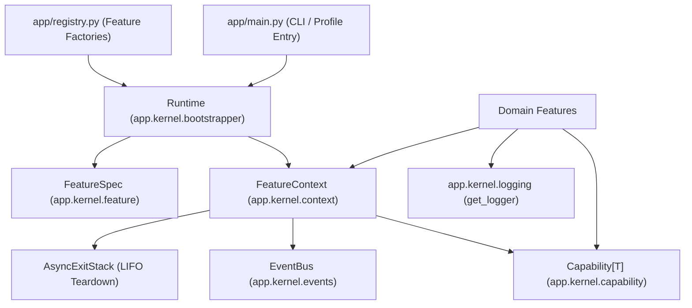

# Runtime Kernel

> **Package:** `app/kernel/`
> **Status:** Completed
> **Last updated:** 2026-09-18
> **Domain ID:** KERNEL

This README is the domain's single source of truth for its boundary, module registry,
lifecycle workflows, semantic contract ownership, invariants, acceptance evidence,
and extension behavior. Update it before changing the affected implementation.

`PROJECT.md` owns system scope and cross-domain behavior. `ARCHITECTURE.md` owns universal
structure and runtime constraints. `AGENTS.md` owns contributor workflow.

---

## Code-aligned implementation convention

The kernel supplies the minimal, business-neutral primitives used to compose standalone
modular monolith applications:

```text
app/kernel/
|-- README.md
|-- __init__.py           # Strictly docstring-only; no imports or runtime effects
|-- capability.py         # Strongly typed Capability[T] tokens & LookupError
|-- feature.py            # FeatureSpec manifests & @runtime_checkable Feature protocol
|-- context.py            # Per-feature FeatureContext, dependency injection & LIFO effects
|-- bootstrapper.py       # Kahn's topological sort, dynamic subsets & Runtime engine
|-- events.py             # Exact-type in-process EventBus & disposable subscriptions
`-- logging.py            # Bounded asynchronous logging, secret redaction & ZIP rotation

tests/kernel/
|-- test_context.py       # FeatureContext lifecycle, injection & error group tests
|-- test_events.py        # EventBus exact-type dispatch, snapshot isolation tests
|-- test_logging.py       # Logging sinks, queue saturation, rotation & redaction tests
`-- test_runtime.py       # Topological sort, cycle avoidance, dynamic subsets & runtime tests

tests/architecture/
`-- test_boundaries.py    # Zero third-party imports & docstring-only __init__.py tests

tests/examples/
|-- composition.py        # Realistic full composition & dynamic subset walkthrough
`-- logging_usage.py      # Interactive structured logging & file routing demonstration
```

---

## 1. Purpose and boundary

### Purpose

The Runtime Kernel provides a lightweight, zero-dependency microkernel for modular
applications. It decouples feature implementations behind typed capability tokens,
validates dependency closure, resolves deterministic startup order via topological sorting,
manages asynchronous effect lifecycles with guaranteed LIFO teardown, and supplies
structured asynchronous logging with automated secret redaction.

### Owns

- **Typed Capability Tokens (`capability.py`):** Immutable, versioned contract tokens (`Capability[T]`) providing compile-time static type inference without coupling consumers to concrete provider implementations.
- **Declarative Manifests & Protocols (`feature.py`):** The immutable `FeatureSpec` schema declaring published (`provides`), mandatory (`requires`), and optional (`optional`) dependencies, plus the structural `@runtime_checkable` `Feature` protocol.
- **Scoped Execution Environments (`context.py`):** The `FeatureContext` supplied to each feature during `start()`, governing dependency resolution, transactional export staging, background task tracking (`spawn`), and reverse-order resource cleanup.
- **Topological Bootstrapper & Lifecycle Engine (`bootstrapper.py`):** Cycle-safe dependency resolution using Kahn's algorithm with DFS reachability, dynamic subset filtering (`enabled` flags and named profiles), fail-fast validation, and unified exception aggregation via `BaseExceptionGroup`.
- **In-Process Observation Bus (`events.py`):** Synchronous and asynchronous event pub/sub (`EventBus`) with exact-type matching, snapshot isolation, and token-based idempotent unsubscription.
- **System-Wide Structured Logging (`logging.py`):** Thread-safe, non-blocking asynchronous logging facade with zero import-time side effects, memory queue buffering, automatic credential masking, and crash-resilient ZIP archive rotation.

### Does not own

- Domain, business, or operational product logic (e.g., authentication, order routing, billing).
- Database connections, parameterized SQL queries, migrations, or persistent schemas.
- External network transports, HTTP servers, RPC endpoints, or provider SDKs.
- Feature factories or concrete registration (owned exclusively by `app/registry.py`).
- Application entry point configuration and CLI parsing (owned by `app/main.py`).

### Shared contracts

The kernel exports foundational primitives consumed by all domain features and composition roots:

| Status | Symbol | Module | Purpose |
| --- | --- | --- | --- |
| Completed | `Capability[T]` | `app.kernel.capability` | Typed, versioned capability token. |
| Completed | `CapabilityUnavailableError` | `app.kernel.capability` | Attributed lookup error when a capability is missing. |
| Completed | `FeatureSpec` | `app.kernel.feature` | Immutable manifest of dependencies and exports. |
| Completed | `Feature` | `app.kernel.feature` | Structural duck-typing protocol (`spec`, `async def start`). |
| Completed | `FeatureContext` | `app.kernel.context` | Scoped injection, effect tracking, and LIFO teardown. |
| Completed | `Runtime` | `app.kernel.bootstrapper` | Lifecycle manager and feature dependency orchestrator. |
| Completed | `EventBus` | `app.kernel.events` | In-process exact-type pub/sub observation channel. |
| Completed | `BoundLogger` | `app.kernel.logging` | Immutable contextual logging facade. |
| Completed | `LoggingConfig` | `app.kernel.logging` | Finite budget, sink, and redaction configuration. |
| Completed | `configure_logging()` | `app.kernel.logging` | Context manager for activating logging generations. |
| Completed | `get_logger()` | `app.kernel.logging` | Inert logger factory with zero import-time side effects. |

### Persisted-state ownership

The kernel is strictly in-memory and stateless. It owns no database schemas, tables,
or persistent files, except for transient local disk logs in `data/logs/` managed by
`app.kernel.logging._FileSink`.

---

## 2. Feature registry and dependency direction

| Module | Delivered value | Owner module | Exports | Status |
| --- | --- | --- | --- | --- |
| `capability.py` | Typed decoupling tokens | `app/kernel/capability.py` | `Capability`, `CapabilityUnavailableError` | Completed |
| `feature.py` | Declarative manifests | `app/kernel/feature.py` | `FeatureSpec`, `Feature` | Completed |
| `context.py` | Scoped injection & LIFO effects | `app/kernel/context.py` | `FeatureContext` | Completed |
| `bootstrapper.py` | Dependency ordering & boot | `app/kernel/bootstrapper.py` | `Runtime`, `FeatureFactory` | Completed |
| `events.py` | Exact-type pub/sub dispatch | `app/kernel/events.py` | `EventBus`, `Handler` | Completed |
| `logging.py` | Sanitized non-blocking logging | `app/kernel/logging.py` | `BoundLogger`, `LoggingConfig`, `configure_logging`, `get_logger` | Completed |

Dependencies flow strictly inward toward business-neutral contracts:



---

## 3. Domain workflows

### `WF-KERNEL-BOOT` — Dependency Graph Resolution and Bootstrapping

- **Lead owner:** `app.kernel.bootstrapper.Runtime`
- **Input boundary:** Tuple of feature factory callables, optional profile name, optional `enabled` names set.
- **Resolution sequence:**
  1. Instantiate feature instances via factories; validate feature protocol compliance.
  2. Snapshot immutable `FeatureSpec` manifests. Reject empty names, duplicate names, and duplicate capability providers.
  3. Filter active subset according to profile/enabled declarations.
  4. Perform cycle-safe Kahn's topological sort: evaluate mandatory `requires` edges, and incorporate optional `spec.optional` dependencies only if active and reachable without introducing cycles.
  5. Fail fast if any active feature has unsatisfied mandatory dependencies (`CapabilityUnavailableError`).
  6. Execute `await feature.start(ctx)` sequentially in topological order.
  7. Validate that each feature staged exactly its declared `provides` bundle via `ctx.commit_exports()`.
  8. Publish committed capabilities to dependent features.
- **Output boundary:** Fully booted `Runtime` ready to service application requests.
- **Failure boundary:** If startup fails or is cancelled, previously started features are torn down immediately in reverse acquisition order; exceptions are aggregated into `BaseExceptionGroup`.

### `WF-KERNEL-SHUTDOWN` — Orderly Reverse-Order (LIFO) Teardown

- **Lead owner:** `app.kernel.bootstrapper.Runtime.close()` / `FeatureContext.close()`
- **Input boundary:** Application shutdown signal, context manager exit, or startup failure.
- **Execution sequence:**
  1. Revoke public lookup access on `Runtime` to prevent new dependency resolutions.
  2. Iterate active features in strict reverse startup order (dependents closed before providers).
  3. For each feature, close its `FeatureContext`:
     - Cancel and await all background tasks registered via `ctx.spawn()`.
     - Execute all synchronous and asynchronous `on_close` callbacks in LIFO order.
     - Unwind entered context managers (`enter`, `enter_context`).
     - Detach event bus subscriptions.
  4. Collect any cleanup failures across all callbacks into a list.
  5. Clear staged exports and reset state.
- **Failure boundary:** Cleanup never aborts prematurely; every registered teardown callback is attempted. All accumulated errors are raised together as a `BaseExceptionGroup`.

### `WF-KERNEL-PUBSUB` — Exact-Type Event Observation

- **Lead owner:** `app.kernel.events.EventBus`
- **Input boundary:** Event object instance (`publish`) or event class type (`subscribe`).
- **Execution sequence:**
  1. Handler registers for exact class type `T` via `bus.subscribe(event_type, handler)`.
  2. Returns a token-based idempotent disposer callable.
  3. On `bus.publish(event)`, the bus snapshots registered handlers for `type(event)`.
  4. Invokes handlers sequentially in registration order, awaiting any awaitable returns.
  5. Handlers unsubscribing during dispatch do not corrupt active iteration (snapshot isolation).
- **Failure boundary:** Handler exceptions propagate immediately to the publisher, halting subsequent handler execution for that event.

### `WF-KERNEL-LOGGING` — Sanitized Asynchronous Structured Logging

- **Lead owner:** `app.kernel.logging`
- **Input boundary:** Call to `logger.info()`, `bind()`, or `bind_correlation()`.
- **Execution sequence:**
  1. Format log event into structured dictionary (timestamp, level, module, caller frame, context).
  2. Sanitize and bound payload nodes, depths, and string lengths; mask sensitive regex patterns.
  3. Enqueue record into memory buffer (`queue.Queue`). If saturated, record drop count and discard newest.
  4. Background daemon thread drains queue, writes single-line colored text to console, and appends JSONL to channel files (`application.jsonl`, `errors.jsonl`).
  5. When a log file exceeds `max_bytes`, synchronously archive to `.zip` with timestamp/UUID before truncating active log.
  6. Prune aged archives exceeding `retention_days` or `backup_count`.

---

## 4. Module specifications

### `capability.py` — Typed Contract Tokens

- **Module:** `app/kernel/capability.py`
- **Symbols:** `Capability[T]`, `CapabilityUnavailableError`
- **Purpose:** Provide strongly typed, immutable identifiers for service contracts without importing implementations.
- **Key Invariants:**
  - Generic type parameter `T` enables static type checkers to verify that `ctx.require(TOKEN)` returns `T`.
  - Equality and hashing depend strictly on `(name, major)`.
  - The optional `description` string is excluded from equality and hash checks.
  - Formatted identifier string available via `token.identifier` (e.g., `auth.service@1`).

### `feature.py` — Declarative Manifests & Protocol

- **Module:** `app/kernel/feature.py`
- **Symbols:** `FeatureSpec`, `Feature`
- **Purpose:** Define boundary contracts and duck-typing interfaces for domain features.
- **Key Invariants:**
  - `FeatureSpec` is frozen, slotted, and immutable.
  - Rejects empty feature names, duplicate capability declarations, and self-dependencies (`provides & (requires | optional)`).
  - Enforces `frozenset` type constraints on capability sets.
  - `dependencies` property returns `requires | optional`.
  - `@runtime_checkable` `Feature` protocol defines `spec: FeatureSpec` and `async def start(context: FeatureContext) -> None`.

### `context.py` — Per-Feature Context & Managed Effects

- **Module:** `app/kernel/context.py`
- **Symbols:** `FeatureContext`
- **Purpose:** Provide per-feature execution boundaries, dependency lookup, task tracking, and LIFO resource unwinding.
- **Key Invariants:**
  - Rejects all operations (`require`, `optional`, `provide`, `spawn`, `subscribe`) after context is closed (`RuntimeError`).
  - `require(key)` enforces that `key in spec.requires`; missing providers raise `CapabilityUnavailableError`.
  - `optional(key, default=None)` enforces that `key in spec.optional`; returns `default` if absent.
  - `provide(key, service)` stages declared exports; duplicate staging or undeclared exports raise `ValueError`.
  - `commit_exports()` ensures exact match with `spec.provides` before publication.
  - `on_close(callback)` supports both synchronous and asynchronous cleanup callables.
  - `spawn(coroutine, *, name=None)` tracks background tasks, automatically cancelling and awaiting them on close.
  - `enter(async_cm)` and `enter_context(sync_cm)` manage resource context lifecycles.
  - Collects all teardown failures into `BaseExceptionGroup("Feature cleanup failed", errors)`.

### `bootstrapper.py` — Topological Resolver & Runtime Engine

- **Module:** `app/kernel/bootstrapper.py`
- **Symbols:** `Runtime`, `FeatureFactory`
- **Purpose:** Orchestrate feature instantiation, dependency sorting, dynamic profile filtering, startup, and shutdown.
- **Key Invariants:**
  - Rejects duplicate feature names, duplicate capability providers, and dependency cycles before calling `start()`.
  - Kahn's algorithm with DFS reachability safely incorporates optional dependencies without cycle hazards.
  - Missing mandatory dependencies fail fast before booting (`CapabilityUnavailableError`).
  - Dynamic subsets (`enabled` set or profile mapping) filter active features; missing dependencies within the selected subset fail fast.
  - Inspection helpers `runtime.has(key)`, `runtime.get(key, default=None)`, `runtime.require(key)`, and `runtime.active_features`.
  - Transactional publication: capabilities of a feature become visible only after its `start()` returns and exports are committed.

### `events.py` — In-Process Observation Bus

- **Module:** `app/kernel/events.py`
- **Symbols:** `EventBus`, `Handler[E]`
- **Purpose:** Decoupled in-process publish/subscribe observation on a single event loop.
- **Key Invariants:**
  - Exact-type matching: dispatches only to subscribers registered for `type(event)` (no subclass inheritance leak).
  - Snapshot isolation: handlers iterating during `publish()` are unaffected by concurrent subscribe/unsubscribe calls.
  - Idempotent disposers: `subscribe()` returns a zero-argument function that unregisters cleanly.
  - Sequential execution: synchronously awaits coroutines and future returns.
  - Introspection API: `listener_count()`, `active_listener_count`, `subscribed_event_types`, `clear()`.

### `logging.py` — Sanitized Asynchronous Logging

- **Module:** `app/kernel/logging.py`
- **Symbols:** `BoundLogger`, `LoggingConfig`, `LoggingHandle`, `configure_logging`, `get_logger`, `bind_correlation`
- **Purpose:** Production-grade structured JSONL logging with automatic credential masking and zero import side effects.
- **Key Invariants:**
  - Inert imports: `get_logger()` allocates an immutable facade without opening files, spawning threads, or touching stdlib logging.
  - Dedicated background writer thread drains bounded queue to console and filesystem sinks.
  - Auto-redaction of Bearer tokens, passwords, API keys, private keys, and caller-configured secret strings.
  - Archive-before-truncate ZIP rotation: log data is never lost if compression encounters disk errors.
  - Bounded string lengths, node limits, and recursion depth protections prevent log-based denial-of-service.

---

## 5. Domain-wide requirements and invariants

| Requirement ID | Rule | Verification |
| --- | --- | --- |
| `ARCH-KERNEL-001` | `app/kernel/__init__.py` is strictly docstring-only with zero imports or side effects. | `tests/architecture/test_boundaries.py` |
| `ARCH-KERNEL-002` | Kernel modules import only Python standard library and sibling kernel modules. | `tests/architecture/test_boundaries.py` |
| `ARCH-KERNEL-003` | Missing required dependencies fail fast at bootstrap; no silent degradation. | `tests/kernel/test_runtime.py` |
| `ARCH-KERNEL-004` | Optional dependencies use cycle-safe reachability analysis and never cause topological deadlock. | `tests/kernel/test_runtime.py` |
| `ARCH-KERNEL-005` | Context resources, tasks, and callbacks unwind in strict reverse acquisition (LIFO) order. | `tests/kernel/test_context.py` |
| `ARCH-KERNEL-006` | Cleanup failures accumulate into `BaseExceptionGroup`; no teardown callback is skipped. | `tests/kernel/test_context.py` |
| `ARCH-KERNEL-007` | Event delivery matches exact types; disposers are idempotent. | `tests/kernel/test_events.py` |
| `ARCH-KERNEL-008` | Secret and credential patterns are masked as `[REDACTED]` before writing to any sink. | `tests/kernel/test_logging.py` |

---

## 6. Architectural decisions

| Decision ID | Decision | Rationale |
| --- | --- | --- |
| `DEC-KERNEL-001` | Use Python 3.12+ PEP 695 generics (`Capability[T]`, `Handler[E]`). | Provides first-class static typing in IDEs and Mypy without legacy `TypeVar` boilerplate. |
| `DEC-KERNEL-002` | Cycle-safe optional dependency resolution via DFS reachability. | Prevents optional dependency edges from creating cycles with required dependencies. |
| `DEC-KERNEL-003` | Fail-fast validation for dynamic subsets and profiles. | Prevents applications from booting into a corrupted, partially functional state. |
| `DEC-KERNEL-004` | Token-based subscription management in `EventBus`. | Guarantees O(1) unsubscription and prevents accidental removal of duplicate handler closures. |
| `DEC-KERNEL-005` | Unified sync and async callback support in `FeatureContext.on_close()`. | Enables clean teardown of both synchronous locks/files and async network/database resources. |
| `DEC-KERNEL-006` | Non-blocking queued logging with crash-resilient ZIP rotation. | Shields high-throughput application threads from disk I/O latency and prevents log truncation loss. |

---

## 7. Tests and definition of done

```text
tests/kernel/
|-- test_context.py       # 11 tests (100% coverage)
|-- test_events.py        # 11 tests (100% coverage)
|-- test_logging.py       # 21 tests (97% coverage)
`-- test_runtime.py       # 27 tests (99% coverage)

tests/architecture/
`-- test_boundaries.py    # 2 tests (100% coverage)

tests/examples/
|-- composition.py        # End-to-end full composition & dynamic subset demonstration
`-- logging_usage.py      # Interactive structured logging & file routing demonstration
```

### Definition of Done Checklist

- [x] Stable module boundaries with zero business or third-party dependencies.
- [x] Pure docstring-only `app/kernel/__init__.py`.
- [x] Full static type checking compliance (Mypy Strict: 0 issues).
- [x] Pyright / Pylance: 0 errors, 0 warnings.
- [x] Ruff check & format: 100% clean across all 28 project files.
- [x] Minimum 80% test coverage enforced by pytest-cov (actual: **98.30%**).
- [x] All 82 kernel, boundary, and architecture unit tests passing.
- [x] Executable offline usage examples verified in `scripts/ci_check.py`.

---

## 8. Change process

1. Update this kernel README to reflect proposed architectural additions or behavioral changes.
2. If changing public tokens or protocols, update `capability.py` or `feature.py` first.
3. If changing dependency ordering or dynamic subset selection, update `bootstrapper.py`.
4. If modifying lifecycle management or task tracking, update `context.py`.
5. Maintain 100% docstring completeness and Google Python Style Guide standards.
6. Add targeted unit tests to the corresponding test file in `tests/kernel/`.
7. Validate with the project test runner:
   ```bash
   uv run ruff format .
   uv run python scripts/ci_check.py
   ```
