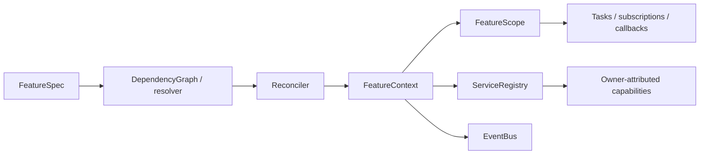
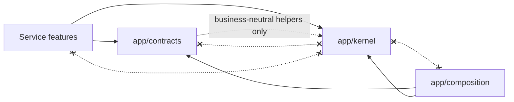

# Runtime Kernel

> **Package:** `app/kernel/`
> **Category:** Non-domain shared substrate
> **Status:** `Completed`
> **Last updated:** `2026-09-02`

> This README is the package's source of truth for Kernel boundaries, runtime primitives, lifecycle workflows, module ownership, invariants, and verification. System scope remains in [`docs/PROJECT.md`](../../docs/PROJECT.md); universal architecture remains in [`docs/ARCHITECTURE.md`](../../docs/ARCHITECTURE.md).

---

## Code-Aligned Implementation Convention

`app/kernel/` contains business-neutral runtime machinery. It is not a service domain, feature catalogue, composition root, or public wire-contract package, so the service-feature portions of [`docs/templates/README.md`](../../docs/templates/README.md) are adapted here into Kernel component specifications.

Repository code is the implementation evidence. Each module has one focused responsibility, `__init__.py` stays empty or docstring-only, and runtime collaboration occurs through typed primitives rather than import-time registration. Cross-domain feature IDs and functional requirements remain owned by service READMEs; the `FR-KERN-*` labels below describe shared substrate behavior and do not create independently registered features.

For focused work, load §1 for the boundary, the affected §4 component, §5 invariants, and §7 validation. Use the [Feature Implementation Pipeline](../../docs/dev/feature_implementation_pipeline.md) for feature-authoring procedures that consume Kernel APIs.

## 1. Purpose and Boundary

### Purpose

The Kernel supplies the deterministic, business-neutral primitives that make independently installed providers composable. It models capability identity, feature declarations, dependency resolution, lifecycle state, effect ownership, event delivery, reconciliation, and replacement without knowing any trading or product policy.

### Owns

- Capability keys, provider bindings, dependency graphs, provider selection, and registry atomicity.
- `FeatureSpec`, lifecycle protocols, feature state, `FeatureContext`, and lifecycle-owned `FeatureScope` effects.
- Reconciliation, affected-closure calculation, staged activation, teardown, and transactional replacement result models.
- Typed events, exact contributor disposal, supervised tasks, cleanup diagnostics, and state-retention declarations.
- Business-neutral identifiers, time, canonical serialization, deterministic random streams, redaction, manifests, and readiness primitives.

### Does not own

- Application configuration, installed-distribution discovery policy, deployment profiles, file watching, logging setup, or application orchestration; those belong to `app/composition/`.
- Domain DTOs, protocols, events, errors, or capability constants; those belong to `app/contracts/`.
- Business policy, provider implementations, persistence adapters, HTTP/CLI/UI transports, credentials, or service feature registries.
- Automatic purge of durable state. `StateDeclaration` records ownership and retention intent; storage owners enforce it.

### Shared Contracts

Kernel types are in-process foundation APIs, not cross-domain wire contracts:

| Status | Surface | Primary symbols | Purpose |
|---|---|---|---|
| Completed | Capability identity | `CapabilityKey`, `CapabilityId`, `ProviderId`, `SemanticVersion` | Validate stable capability/provider identifiers. |
| Completed | Feature lifecycle | `FeatureSpec`, `Feature`, `FeatureState`, `FeatureContext`, `FeatureScope` | Declare, mount, supervise, and dispose one feature generation. |
| Completed | Resolution and registry | `DependencyGraph`, `resolve_providers`, `ServiceRegistry` | Select providers and publish exact owner-attributed bindings. |
| Completed | Events and effects | `EventBus`, `ContributorRegistry`, `EffectScope` | Deliver typed contributions and remove only the owning contribution. |
| Completed | Reconciliation/replacement | `Reconciler`, `ReconciliationReport`, `ReplacementReport` | Converge desired state and report exact outcomes. |

### Persisted State Ownership

Kernel owns no database tables or files. `StateDeclaration(namespace, schema_version, retention, description)` is metadata consumed by storage and lifecycle policy. Removing a feature never authorizes Kernel to delete durable state.

### Four-Level Structural Hierarchy

| Code level | Represents | Example |
|---|---|---|
| Package | Business-neutral runtime substrate | `app/kernel/` |
| Module | One Kernel responsibility | `scope.py` |
| Type | One runtime abstraction | `FeatureScope` |
| Method/function | One deterministic operation | `FeatureScope.close()` |

### Kernel Capability Map



## 2. Final Package Structure and Independence

```text
app/kernel/
├── __init__.py       # Pure package marker; no runtime exports
├── README.md         # Package boundary, workflows, and acceptance evidence
├── capability.py     # Versioned capability keys and lookup failures
├── identifiers.py    # Capability/provider/semantic-version value objects
├── feature.py        # FeatureSpec, lifecycle protocols, and states
├── context.py        # Declared dependency access and staged effect acquisition
├── scope.py          # LIFO lifecycle effect ownership and cleanup
├── effects.py        # Generic effect-scope compatibility abstraction
├── registry.py       # Atomic owner/generation capability bindings
├── graph.py          # Required/optional dependency graph and closures
├── resolver.py       # Deterministic provider selection reports
├── reconciler.py     # Desired-state convergence and failure isolation
├── replacement.py    # Transactional replacement outcome model
├── events.py         # Typed event modes, subscriptions, and contributors
├── state.py          # Retention declarations and transition helpers
├── profiles.py       # Business-neutral readiness evaluation
├── discovery.py      # Filesystem manifest discovery primitive
├── manifests.py      # Provider manifest vocabulary and loader
├── errors.py         # Foundation error vocabulary and payload mapping
├── identity.py       # Compatibility identity helpers
├── serialization.py  # Canonical JSON-safe conversion and digesting
├── time.py           # UTC, freshness, venue-local, and sequence helpers
├── random.py         # Named deterministic random-stream helpers
└── redaction.py      # Deterministic secret-sensitive redaction
```

Independence rules:

1. Kernel imports no `app.contracts`, `app.composition`, `app.services`, API, or UI implementation.
2. `__init__.py` performs no registration, I/O, logging configuration, or re-export work.
3. Kernel modules contain no broker, trading, risk, portfolio, strategy, or other domain semantics.
4. Callers compose Kernel primitives explicitly; import-time global registries are forbidden.
5. Long-lived resources are acquired through a scope and receive an exact idempotent disposer.

### Dependency Direction



## 3. Workflows

### Workflow Scope Values

| Scope | Meaning |
|---|---|
| Internal | Entire operation is implemented by Kernel primitives. |
| Composition-driven | Composition supplies desired state/configuration and invokes Kernel operations. |

| Status | Workflow ID | Scope | Workflow | Input boundary | Output boundary |
|---|---|---|---|---|---|
| Completed | `WF-KERN-RESOLVE` | Composition-driven | Resolve a provider graph | Feature specs and provider selection | Resolution report or typed dependency error |
| Completed | `WF-KERN-ACTIVATE` | Composition-driven | Stage and publish a feature | Resolved dependencies and validated config | Active owner/generation bindings or `FAILED_START` |
| Completed | `WF-KERN-RECONCILE` | Composition-driven | Converge an affected closure | Desired-state change or runtime failure | Deterministic feature states and diagnostics |
| Completed | `WF-KERN-REPLACE` | Composition-driven | Replace a provider generation | Compatible replacement candidate | Committed/rolled-back/degraded replacement report |
| Completed | `WF-KERN-DISPOSE` | Internal | Close feature-owned effects | Feature scope | Idempotent LIFO cleanup diagnostics |

### `WF-KERN-ACTIVATE` — Stage and Publish a Feature

1. Dependency resolution produces one provider per required capability and explicit values for optional dependencies.
2. Reconciliation creates a private `FeatureScope` and a `DefaultFeatureContext` limited to declared requirements and provisions.
3. `Feature.mount(context, config)` acquires tasks, subscriptions, context managers, callbacks, and proposed capabilities through the context.
4. Kernel verifies that the staged provider bundle exactly matches `FeatureSpec.provides`.
5. The registry publishes the complete owner/generation bundle atomically; any earlier failure closes the scope and publishes nothing.

**Failure behaviour:** undeclared lookup/provision, dependency ambiguity, invalid bundles, or mount failure is explicit. Partial publication is forbidden and cleanup continues through independent disposer failures.

### `WF-KERN-RECONCILE` — Converge Desired State

1. Compute the exact transitive closure affected by enablement, configuration, provider, or runtime-health change.
2. Stop dependents in reverse dependency order and close their scopes.
3. Re-resolve providers and remount eligible features in dependency order.
4. Mark missing, blocked, failed, stopped, or active states with owner-local diagnostics.
5. Preserve unrelated graph branches.

### `WF-KERN-REPLACE` — Transactional Replacement

1. Require an identical provided-capability set for the candidate generation.
2. Mount and health-check the shadow generation before publication.
3. Optionally quiesce/drain the old generation, then atomically swap registry bindings.
4. Roll back only before commit. Consumer-remount or old-scope cleanup failure after commit is reported as committed but degraded.

## 4. Package Component Specifications

### 4.1 Capability Identity and Binding

| Status | Modules | Responsibility | Key symbols |
|---|---|---|---|
| Completed | `capability.py`, `identifiers.py` | Validate capability/provider identities and versions | `CapabilityKey`, `CapabilityId`, `ProviderId`, `SemanticVersion` |
| Completed | `registry.py` | Bind and atomically swap owner/generation provider bundles | `ServiceRegistry`, `ProviderBinding`, `BindingToken` |
| Completed | `resolver.py` | Select configured or unambiguous providers | `resolve_providers`, `ResolutionReport` |

Capability identifiers use `<lowercase-name>@<positive-major>` and normally include the owning domain. A key does not embed implementation hashes, permissions, or full semantic versions.

### 4.2 Feature Lifecycle and Effects

| Status | Modules | Responsibility | Key symbols |
|---|---|---|---|
| Completed | `feature.py` | Declare feature identity, dependencies, provisions, conflicts, config keys, state, and optional hooks | `FeatureSpec`, `Feature`, `FeatureState` |
| Completed | `context.py` | Enforce declared dependency access and staged acquisition | `FeatureContext`, `DefaultFeatureContext` |
| Completed | `scope.py`, `effects.py` | Own reversible effects and close them exactly once in LIFO order | `FeatureScope`, `EffectRecord`, `EffectScope` |
| Completed | `state.py` | Declare state retention and evaluate generic transitions | `StateDeclaration`, `RetentionPolicy` |

`Feature.mount(context, config)` is the only mandatory lifecycle method. `health_check`, `quiesce`, and `drain` are optional protocols used only by workflows that explicitly support them.

### 4.3 Graph, Reconciliation, and Replacement

| Status | Modules | Responsibility | Key symbols |
|---|---|---|---|
| Completed | `graph.py` | Validate required cycles, calculate ordering and affected closures | `DependencyGraph`, `GraphResolution` |
| Completed | `reconciler.py` | Converge desired state and isolate owner-local failures | `Reconciler`, `ReconciliationReport` |
| Completed | `replacement.py` | Report transactional replacement truth | `ReplacementReport` |
| Completed | `profiles.py` | Evaluate business-neutral capability readiness | `RuntimeProfile`, `ProfileReadiness` |

### 4.4 Events, Discovery, and Manifests

| Status | Modules | Responsibility | Key symbols |
|---|---|---|---|
| Completed | `events.py` | Publish, serialize, parallelize, or pipeline typed events | `EventBus`, `EventMode`, `ContributorRegistry` |
| Completed | `discovery.py`, `manifests.py` | Parse and report filesystem provider manifests without application policy | `discover_manifests`, `ProviderManifest` |

Event modes are `PUBLISH` (failure-isolated observation), `SERIAL`, `PARALLEL`, and `PIPELINE`. Every subscription or contribution returns an exact disposer; one owner cannot remove another owner's item.

### 4.5 Business-Neutral Foundation Utilities

| Status | Modules | Responsibility |
|---|---|---|
| Completed | `serialization.py` | JSON-safe conversion, canonical JSON, and SHA-256 digests |
| Completed | `time.py` | UTC validation/formatting, freshness, venue-local conversion, and sequences |
| Completed | `random.py` | Deterministic named random streams and bounded draws |
| Completed | `redaction.py` | Key-aware bounded redaction without secret disclosure |
| Completed | `errors.py`, `identity.py` | Foundation failures and compatibility identity helpers |

These utilities are business-neutral. Domain-specific validation, units, calendars, errors, and policy remain with their contract or service owner.

## 5. Package-Wide Requirements, Configuration, and Architecture Invariants

| Status | Requirement ID | Category | Rule | Verification |
|---|---|---|---|---|
| Completed | `FR-KERN-DECLARE-DEPENDENCIES` | Dependencies | Required and optional capability needs are explicit; undeclared access fails. | `tests/kernel/test_context.py`, `test_graph.py`, `test_resolver.py` |
| Completed | `FR-KERN-STAGE-ACTIVATION` | Lifecycle | Mount occurs in a private scope and provider publication is atomic. | `tests/kernel/test_reconciler.py`, `test_registry_atomicity.py` |
| Completed | `FR-KERN-OWN-EFFECTS` | Lifecycle | Tasks, subscriptions, callbacks, and context managers have owner-attributed disposal. | `tests/kernel/test_scope.py`, `test_context_events.py` |
| Completed | `FR-KERN-RECONCILE-CLOSURE` | Reconciliation | Only the transitive affected closure is stopped/remounted/blocked. | `tests/kernel/test_reconciler.py` |
| Completed | `FR-KERN-REJECT-CYCLES` | Dependencies | Required dependency cycles fail; optional-only cycles do not gate activation. | `tests/kernel/test_graph.py` |
| Completed | `FR-KERN-REPORT-TRUTH` | Diagnostics | Lifecycle, cleanup, and replacement outcomes retain exact failure truth. | `tests/kernel/test_feature.py`, `test_reconciler.py` |
| Completed | `ARCH-001` | Init purity | `app/kernel/__init__.py` has no runtime imports or side effects. | Architecture checks |
| Completed | `ARCH-004` | Boundary purity | Kernel imports no Contracts, Composition, or Services implementation. | Import/AST checks |
| Completed | `NFR-KERN-001` | Type safety | Public/module code is explicitly typed under repository mypy policy. | Scoped mypy/CI |
| Completed | `NFR-KERN-002` | Determinism | Ordering, serialization, time validation, and random streams are reproducible from explicit inputs. | `tests/kernel/test_kernel_*`, `test_identifiers.py` |

Configuration is caller-supplied and typed. Kernel does not read application TOML, process environment, credentials, or global settings.

## 6. Open Decisions

| Status | Decision ID | Decision | Outcome |
|---|---|---|---|
| Closed | `DEC-KERN-001` | Mandatory teardown method | Scope-owned cleanup is authoritative; feature-owned `unmount()` is not mandatory. |
| Closed | `DEC-KERN-002` | Optional-provider changes | Consumers remount so a running dependency view never mutates in place. |
| Closed | `DEC-KERN-003` | Durable-state removal | Declaration is metadata only; purge requires separate storage-owner policy and authorization. |

No unresolved Kernel decision is recorded here. Add one only when implementation would otherwise require guessing.

## 7. Tests and Definition of Done

### Test Suite Structure

```text
tests/kernel/
├── test_capability*.py       # Keys and capability failures
├── test_context*.py          # Dependency access, provisions, tasks, and events
├── test_scope.py             # LIFO and idempotent cleanup
├── test_registry*.py         # Binding ownership and atomicity
├── test_graph.py             # Dependency ordering, cycles, and closures
├── test_resolver.py          # Provider selection
├── test_reconciler.py        # Lifecycle convergence and failure isolation
├── test_events.py            # Event modes and disposal
└── test_kernel_*.py          # Foundation utility behavior
```

### Commands

```powershell
uv run pytest --no-cov tests/kernel
uv run ruff check app/kernel tests/kernel
uv run mypy app/kernel
uv run python scripts/architecture_check.py
```

### Definition of Done Checklist

- [ ] Package boundary and dependency direction remain intact.
- [ ] New effects are acquired with exact scope-owned cleanup.
- [ ] Provider publication and replacement retain atomic truth.
- [ ] Failure paths are typed, owner-local, and covered.
- [ ] `__init__.py` remains pure.
- [ ] Bounded Kernel tests, lint, typing, and architecture checks pass.
- [ ] This README and affected canonical architecture references agree.

## 8. Change Process

1. Update this README when Kernel ownership, lifecycle semantics, or public primitives change.
2. Plan the smallest coherent change through the repository Task workflow.
3. Modify focused Kernel modules and matching `tests/kernel/` evidence only within approved scope.
4. Update Composition, Contracts, or service documentation only when their separately owned boundary actually changes.
5. Verify import direction, cleanup behavior, deterministic outcomes, and removal/replacement semantics before acceptance.

Breaking changes to an in-process Kernel API require an explicit consumer migration plan. Do not add domain-specific exceptions to Kernel to avoid a public contract or Composition decision.

## 9. Normative References

### §6.4 — Feature context, effects, events, state, and lifecycle

The normative package contract is the lifecycle model in §§1–5: mandatory `mount`, declared dependency access, staged exact capability publication, scope-owned LIFO cleanup, typed event modes, explicit state declarations, and truthful lifecycle/replacement states.

### §6.7 — Shared-foundation functional requirements

The stable `FR-KERN-*` family identifies Kernel acceptance behavior. Current code-aligned requirements and evidence are catalogued in §5; they do not imply one runtime module or registration per FR.

Cross-cutting canonical rules are owned by:

- [`AGENTS.md`](../../AGENTS.md) for contributor, lifecycle, safety, and verification law.
- [`docs/ARCHITECTURE.md`](../../docs/ARCHITECTURE.md) for universal dependency and runtime structure.
- [`docs/PROJECT.md`](../../docs/PROJECT.md) for product scope and cross-domain relationships.
- [`app/contracts/README.md`](../contracts/README.md) for public contract ownership.
- [`app/composition/README.md`](../composition/README.md) for application composition policy.
