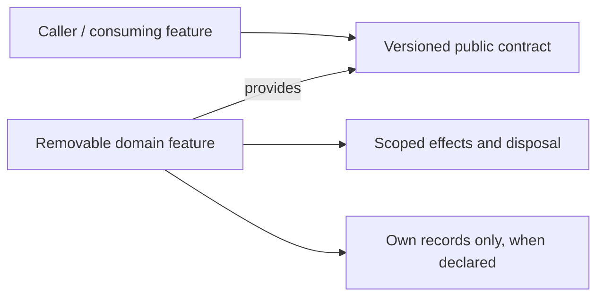

# Agentic

> **Package:** `app/services/agentic/`
> **Status:** `Partial` — documentary target; runtime acceptance is **NOT_REVALIDATED**.
> **Last updated:** `2026-09-06`
> **Domain ID:** `D-AGT`

> This README is the domain target registry for boundaries, composable feature capabilities, requirements, ownership, workflows, acceptance, and removal. Update it before changing the affected implementation. It does not certify that a target package, contract, test, usage demonstration or provider is already implemented.

**Selected scope:** 20 features · 81 owned functional requirements · 41 feature-local non-functional requirements. All original feature and requirement IDs are retained. These selected workbench obligations do **not** delete unrelated existing domain behavior. This document must be merged with current evidence and any out-of-scope entries before replacing an existing domain registry.

**Sources:** [Unified Specification](../../../docs/dev/evidence/specification-drift.md) · [Feature–Requirement Traceability Register](../../../docs/dev/Feature_Requirement_Traceability_Register.md) · [Phased Feature Implementation Plan](../../../docs/dev/Phased_Feature_Implementation_Plan.md) · [README template](../../../docs/templates/README.md). Source fingerprints and Phase 0 bindings are recorded in §6 and §9. The feature cards below reproduce owned requirements and acceptance oracles; their scoped shared-NFR, catalogue, original-ID and operation-gate tables remain binding through the linked source card.

---

## Code-Aligned Implementation Convention

This domain README defines target behavior; `PROJECT.md` retains system scope, cross-domain policy, system NFRs and release gates, and `ARCHITECTURE.md` retains universal package/runtime constraints. Feature-local READMEs, manifests, contracts, migrations and evidence mirror rather than silently redefine this target. For focused work, load §1, the affected §4 card, applicable §5 and §9 rules, and §7. Follow the [Feature Implementation Pipeline](../../../docs/dev/feature_implementation_pipeline.md).

Implement one feature directly in its selected owner folder and discover it through the `haruquantai.features` Python entry-point group. Declare one immutable `SPEC = FeatureSpec(...)` in `manifest.py`; do not introduce a domain registry or YAML manifest. The feature contains pure `__init__.py`, a runtime-validated `README.md`, strict `config.py` with `.from_dict()`, lifecycle `feature.py`, focused logic modules and required `_usage.py`. Add `_persistence.py` only when the feature performs database operations. Effects and dependencies flow through `FeatureContext` and `FeatureScope`; durable state is declared by `FeatureSpec.state`. Existing compatible public contracts and owners are reused, not copied into a parallel implementation.

Each core logic module documents its public API. Every service feature has one required `_usage.py` containing its bounded offline `if __name__ == "__main__":` scenarios; production logic modules do not contain demonstrations. Optional `_persistence.py` owns all feature-local database operations when durable state is required. The paths below are documentary targets pending current-code reconciliation, not claims of executable files. Tests verify the scenarios independently.

FR and acceptance IDs are trace identities, not runtime registrations. Required-provider keys below reproduce the register’s required graph. Optional providers are operation-gated: they must be declared and tested without making an absent future extension a universal startup dependency. The plan’s P1–P16 execution phases are distinct from specification U0–U13 release milestones; a U label is not proof of readiness or a new feature task.

## 1. Purpose and Boundary

### Purpose

Provide governed research assistance and bounded specialist workflows while keeping deterministic domain owners authoritative. The operator-facing assistant is named Chat Bot; roles create attributed evidence, claims and reviewable proposals rather than trading authority.

### Owns

Mandate enforcement; trace/incident operations; role contributions; tool governance and leases; structured model invocation; durable Agentic workflows; context and memory; profile evaluation; Chat Bot assistance; claims, deliberation and synthesis; governed research design/search; HSL/spec and proposal composition; portfolio advice; sandbox fallback; outcome calibration.

### Does not own

Broker credentials, order construction, Risk approval, kill-switch clearing, live deployment, deterministic metric recomputation, independent holdout allowances or self-granted model/role eligibility. Twenty features and twenty-two role profiles are different inventories.

### Shared Contracts

**Owned by this domain.** Status is an evidence state. Contract modules are selected public boundaries; an unbound symbol/DTO must be reconciled before implementing its production consumer. Do not infer a callable signature from the English title.

| Evidence | Capability | Protocol / DTO / contract target | Major | Purpose |
| --- | --- | --- | --- | --- |
| ACCEPTED | `agentic.mandate@1` | `enforce_mandate(request)`<br>[`app/contracts/agentic/mandate.py`](../../contracts/agentic/mandate.py) | 1 | Mandate Enforcement |
| DOCUMENTARY_BOUND | `agentic.operations@1` | `operate_agentic_runs(request)`<br>[`app/contracts/agentic/operations.py`](../../contracts/agentic/operations.py) | 1 | Operations, Incidents and Replay Validation |
| DOCUMENTARY_BOUND | `agentic.roles@1` | `manage_role_contributions(request)`<br>[`app/contracts/agentic/roles.py`](../../contracts/agentic/roles.py) | 1 | Role Contribution Registry |
| DOCUMENTARY_BOUND | `agentic.tool-governance@1` | `govern_tool_calls(request)`<br>[`app/contracts/agentic/tool_governance.py`](../../contracts/agentic/tool_governance.py) | 1 | Tool Governance and Human Actions |
| DOCUMENTARY_BOUND | `agentic.model-inference@1` | `invoke_model(request)`<br>[`app/contracts/agentic/model_inference.py`](../../contracts/agentic/model_inference.py) | 1 | Provider-Neutral Model Invocation |
| DOCUMENTARY_BOUND | `agentic.workflows@1` | `run_agentic_workflows(request)`<br>[`app/contracts/agentic/workflows.py`](../../contracts/agentic/workflows.py) | 1 | Durable Agentic Workflow Runtime |
| DOCUMENTARY_BOUND | `agentic.context@1` | `assemble_agentic_context(request)`<br>[`app/contracts/agentic/context.py`](../../contracts/agentic/context.py) | 1 | Point-in-Time Context Assembly |
| DOCUMENTARY_BOUND | `agentic.memory@1` | `manage_agentic_memory(request)`<br>[`app/contracts/agentic/memory.py`](../../contracts/agentic/memory.py) | 1 | Governed Memory |
| DOCUMENTARY_BOUND | `agentic.profile-evaluation@1` | `evaluate_agentic_profiles(request)`<br>[`app/contracts/agentic/profile_evaluation.py`](../../contracts/agentic/profile_evaluation.py) | 1 | Profile and Topology Evaluation |
| DOCUMENTARY_BOUND | `agentic.operator-assistance@1` | `assist_operator(request)`<br>[`app/contracts/agentic/operator_assistance.py`](../../contracts/agentic/operator_assistance.py) | 1 | Chat Bot and Specialist Delegation |
| DOCUMENTARY_BOUND | `agentic.claims@1` | `manage_claim_graphs(request)`<br>[`app/contracts/agentic/claims.py`](../../contracts/agentic/claims.py) | 1 | Claim-and-Evidence Graph |
| DOCUMENTARY_BOUND | `agentic.deliberation@1` | `deliberate_research(request)`<br>[`app/contracts/agentic/deliberation.py`](../../contracts/agentic/deliberation.py) | 1 | Independent Challenge and Deliberation |
| DOCUMENTARY_BOUND | `agentic.synthesis@1` | `synthesize_research(request)`<br>[`app/contracts/agentic/synthesis.py`](../../contracts/agentic/synthesis.py) | 1 | Evidence-Preserving Research Synthesis |
| DOCUMENTARY_BOUND | `agentic.research-search@1` | `govern_research_search(request)`<br>[`app/contracts/agentic/research_search.py`](../../contracts/agentic/research_search.py) | 1 | Agentic Research Request Accounting |
| DOCUMENTARY_BOUND | `agentic.research-design@1` | `design_research(request)`<br>[`app/contracts/agentic/research_design.py`](../../contracts/agentic/research_design.py) | 1 | Falsifiable Research Design |
| DOCUMENTARY_BOUND | `agentic.strategy-specs@1` | `compose_strategy_specs(request)`<br>[`app/contracts/agentic/strategy_specs.py`](../../contracts/agentic/strategy_specs.py) | 1 | HSL Strategy and Indicator Composition |
| DOCUMENTARY_BOUND | `agentic.portfolio-advisory@1` | `advise_portfolio(request)`<br>[`app/contracts/agentic/portfolio_advisory.py`](../../contracts/agentic/portfolio_advisory.py) | 1 | Expiring Portfolio and Risk Advisory |
| DOCUMENTARY_BOUND | `agentic.strategy-proposals@1` | `compose_strategy_proposals(request)`<br>[`app/contracts/agentic/strategy_proposals.py`](../../contracts/agentic/strategy_proposals.py) | 1 | Strategy Proposal Composition and Handoff |
| DOCUMENTARY_BOUND | `agentic.sandbox-artifacts@1` | `author_sandbox_artifacts(request)`<br>[`app/contracts/agentic/sandbox_artifacts.py`](../../contracts/agentic/sandbox_artifacts.py) | 1 | Sandboxed Source Artifact Fallback |
| DOCUMENTARY_BOUND | `agentic.outcome-calibration@1` | `calibrate_agentic_outcomes(request)`<br>[`app/contracts/agentic/outcome_calibration.py`](../../contracts/agentic/outcome_calibration.py) | 1 | Post-Horizon Outcome Calibration |

**Consumed from other domains — required providers.** Runtime resolution is through the exact key; the provider’s implementation folder is not an import target. Same-domain edges are listed in the owning feature card.

| Capability | Owner | Binding | Consuming feature | Used for |
| --- | --- | --- | --- | --- |
| `workspace.manage-accounts@1` | Workspace | Required | [`FEAT-AGT-ENFORCE_MANDATE`](#feat-agt-enforce-mandate) | Verify accounts, principals and sessions |
| `workspace.administer-settings@1` | Workspace | Required | [`FEAT-AGT-ENFORCE_MANDATE`](#feat-agt-enforce-mandate) | Version user-visible system settings |
| `workspace.persistence@1` | Workspace | Required | [`FEAT-AGT-OPERATE_RUNS`](#feat-agt-operate-runs) | Execute bounded feature-owned transactions |
| `workspace.manage-accounts@1` | Workspace | Required | [`FEAT-AGT-GOVERN_TOOL_CALLS`](#feat-agt-govern-tool-calls) | Verify accounts, principals and sessions |
| `workspace.persistence@1` | Workspace | Required | [`FEAT-AGT-GOVERN_TOOL_CALLS`](#feat-agt-govern-tool-calls) | Execute bounded feature-owned transactions |
| `orchestration.resource-admission@1` | Orchestration | Required | [`FEAT-AGT-GOVERN_TOOL_CALLS`](#feat-agt-govern-tool-calls) | Admit finite work under one resource ledger |
| `orchestration.resource-admission@1` | Orchestration | Required | [`FEAT-AGT-INVOKE_MODELS`](#feat-agt-invoke-models) | Admit finite work under one resource ledger |
| `workspace.persistence@1` | Workspace | Required | [`FEAT-AGT-RUN_WORKFLOWS`](#feat-agt-run-workflows) | Execute bounded feature-owned transactions |
| `orchestration.manage-jobs@1` | Orchestration | Required | [`FEAT-AGT-RUN_WORKFLOWS`](#feat-agt-run-workflows) | Persist and control shared jobs and attempts |
| `workspace.persistence@1` | Workspace | Required | [`FEAT-AGT-MANAGE_MEMORY`](#feat-agt-manage-memory) | Execute bounded feature-owned transactions |
| `workspace.persistence@1` | Workspace | Required | [`FEAT-AGT-EVALUATE_PROFILES`](#feat-agt-evaluate-profiles) | Execute bounded feature-owned transactions |
| `workspace.manage-accounts@1` | Workspace | Required | [`FEAT-AGT-ASSIST_OPERATOR`](#feat-agt-assist-operator) | Verify accounts, principals and sessions |
| `workspace.conversations@1` | Workspace | Required | [`FEAT-AGT-ASSIST_OPERATOR`](#feat-agt-assist-operator) | Retain scoped conversations without losing canonical evidence |
| `workspace.persistence@1` | Workspace | Required | [`FEAT-AGT-MANAGE_CLAIMS`](#feat-agt-manage-claims) | Execute bounded feature-owned transactions |
| `research.campaigns@1` | Research | Required | [`FEAT-AGT-GOVERN_RESEARCH_SEARCH`](#feat-agt-govern-research-search) | Account for research campaigns and hypothesis families |
| `research.holdout@1` | Research | Required | [`FEAT-AGT-GOVERN_RESEARCH_SEARCH`](#feat-agt-govern-research-search) | Reserve scarce holdout access atomically |
| `workspace.persistence@1` | Workspace | Required | [`FEAT-AGT-GOVERN_RESEARCH_SEARCH`](#feat-agt-govern-research-search) | Execute bounded feature-owned transactions |
| `research.protocols@1` | Research | Required | [`FEAT-AGT-DESIGN_RESEARCH`](#feat-agt-design-research) | Preregister research samples and evaluation protocols |
| `strategy.version-strategies@1` | Strategy | Required | [`FEAT-AGT-COMPOSE_STRATEGY_SPECS`](#feat-agt-compose-strategy-specs) | Accept immutable strategy revisions and reviewed patches |
| `strategy.define-indicators@1` | Strategy | Required | [`FEAT-AGT-COMPOSE_STRATEGY_SPECS`](#feat-agt-compose-strategy-specs) | Accept declarative custom indicator definitions |
| `portfolio.compose-portfolios@1` | Portfolio | Required | [`FEAT-AGT-ADVISE_PORTFOLIO`](#feat-agt-advise-portfolio) | Version portfolio composition and capital policy |
| `portfolio.analyze-portfolio-risk@1` | Portfolio | Required | [`FEAT-AGT-ADVISE_PORTFOLIO`](#feat-agt-advise-portfolio) | Explain diversification, exposure and portfolio scenarios |
| `risk.research-evidence@1` | Risk | Required | [`FEAT-AGT-ADVISE_PORTFOLIO`](#feat-agt-advise-portfolio) | Expose risk evidence and owner-controlled review |
| `strategy.proposal-intake@1` | Strategy | Required | [`FEAT-AGT-COMPOSE_STRATEGY_PROPOSALS`](#feat-agt-compose-strategy-proposals) | Receive non-executable strategy proposals |
| `plugins.sandbox-permissions@1` | Plugins | Required | [`FEAT-AGT-AUTHOR_SANDBOX_ARTIFACTS`](#feat-agt-author-sandbox-artifacts) | Attest bounded plugin permissions and sandbox leases |
| `plugins.isolate-analysis@1` | Plugins | Required | [`FEAT-AGT-AUTHOR_SANDBOX_ARTIFACTS`](#feat-agt-author-sandbox-artifacts) | Build and test untrusted code in isolation |
| `workspace.artifacts@1` | Workspace | Required | [`FEAT-AGT-AUTHOR_SANDBOX_ARTIFACTS`](#feat-agt-author-sandbox-artifacts) | Publish and retain immutable artifact bytes |
| `workspace.persistence@1` | Workspace | Required | [`FEAT-AGT-AUTHOR_SANDBOX_ARTIFACTS`](#feat-agt-author-sandbox-artifacts) | Execute bounded feature-owned transactions |
| `workspace.persistence@1` | Workspace | Required | [`FEAT-AGT-CALIBRATE_OUTCOMES`](#feat-agt-calibrate-outcomes) | Execute bounded feature-owned transactions |
| `analytics.compute-metrics@1` | Analytics | Required | [`FEAT-AGT-CALIBRATE_OUTCOMES`](#feat-agt-calibrate-outcomes) | Compute versioned canonical performance and risk metrics |

**Operation-gated providers.** For each §4 feature, its linked source card’s complete “Operation-gated providers” table defines applicability, exact provider identity and absence behavior. This is scoped incorporation, not permission to treat all 233 register-wide operation edges as optional for every feature. Resolve those provider IDs to their primary capability keys in the corresponding domain README; bind actual operations in the acceptance record. An omitted local duplicate table does not waive a source dependency.

### Persisted State Ownership

Immutable mandates and pinned policy references; run/checkpoint/claim/lease/human-action state; append-only audit/incident and outcome records; profile eligibility; scoped memory; proposal and staging receipts. Conversations remain Workspace-owned.

| Evidence | Owning feature | Partition / ownership class | Driver binding | Retention / read boundary |
| --- | --- | --- | --- | --- |
| PHASE0_BOUND | [`FEAT-AGT-ENFORCE_MANDATE`](#feat-agt-enforce-mandate) | None | No private durable namespace | Stateless mandate verification; no feature-owned SQL tables. |
| PHASE0_BOUND | [`FEAT-AGT-OPERATE_RUNS`](#feat-agt-operate-runs) | Feature-owned semantic state | Existing declared driver; no new database selected. | Retain committed evidence across deactivate/reactivate; purge only through explicit authorization, dependency/reference checks and recorded disposition. |
| PHASE0_BOUND | [`FEAT-AGT-REGISTER_ROLES`](#feat-agt-register-roles) | Feature-owned semantic state | Existing declared driver; no new database selected. | Retain committed evidence across deactivate/reactivate; purge only through explicit authorization, dependency/reference checks and recorded disposition. |
| PHASE0_BOUND | [`FEAT-AGT-GOVERN_TOOL_CALLS`](#feat-agt-govern-tool-calls) | Feature-owned semantic state | Existing declared driver; no new database selected. | Retain committed evidence across deactivate/reactivate; purge only through explicit authorization, dependency/reference checks and recorded disposition. |
| PHASE0_BOUND | [`FEAT-AGT-INVOKE_MODELS`](#feat-agt-invoke-models) | Feature-owned semantic state | Existing declared driver; no new database selected. | Retain committed evidence across deactivate/reactivate; purge only through explicit authorization, dependency/reference checks and recorded disposition. |
| PHASE0_BOUND | [`FEAT-AGT-RUN_WORKFLOWS`](#feat-agt-run-workflows) | Feature-owned semantic state | Existing declared driver; no new database selected. | Retain committed evidence across deactivate/reactivate; purge only through explicit authorization, dependency/reference checks and recorded disposition. |
| PHASE0_BOUND | [`FEAT-AGT-ASSEMBLE_CONTEXT`](#feat-agt-assemble-context) | Feature-owned semantic state | Existing declared driver; no new database selected. | Retain committed evidence across deactivate/reactivate; purge only through explicit authorization, dependency/reference checks and recorded disposition. |
| PHASE0_BOUND | [`FEAT-AGT-MANAGE_MEMORY`](#feat-agt-manage-memory) | Feature-owned semantic state | Existing declared driver; no new database selected. | Retain committed evidence across deactivate/reactivate; purge only through explicit authorization, dependency/reference checks and recorded disposition. |
| PHASE0_BOUND | [`FEAT-AGT-EVALUATE_PROFILES`](#feat-agt-evaluate-profiles) | Feature-owned semantic state | Existing declared driver; no new database selected. | Retain committed evidence across deactivate/reactivate; purge only through explicit authorization, dependency/reference checks and recorded disposition. |
| PHASE0_BOUND | [`FEAT-AGT-ASSIST_OPERATOR`](#feat-agt-assist-operator) | Feature-owned semantic state | Existing declared driver; no new database selected. | Retain committed evidence across deactivate/reactivate; purge only through explicit authorization, dependency/reference checks and recorded disposition. |
| PHASE0_BOUND | [`FEAT-AGT-MANAGE_CLAIMS`](#feat-agt-manage-claims) | Feature-owned semantic state | Existing declared driver; no new database selected. | Retain committed evidence across deactivate/reactivate; purge only through explicit authorization, dependency/reference checks and recorded disposition. |
| PHASE0_BOUND | [`FEAT-AGT-DELIBERATE_RESEARCH`](#feat-agt-deliberate-research) | Feature-owned semantic state | Existing declared driver; no new database selected. | Retain committed evidence across deactivate/reactivate; purge only through explicit authorization, dependency/reference checks and recorded disposition. |
| PHASE0_BOUND | [`FEAT-AGT-SYNTHESIZE_RESEARCH`](#feat-agt-synthesize-research) | Feature-owned semantic state | Existing declared driver; no new database selected. | Retain committed evidence across deactivate/reactivate; purge only through explicit authorization, dependency/reference checks and recorded disposition. |
| PHASE0_BOUND | [`FEAT-AGT-GOVERN_RESEARCH_SEARCH`](#feat-agt-govern-research-search) | Feature-owned semantic state | Existing declared driver; no new database selected. | Retain committed evidence across deactivate/reactivate; purge only through explicit authorization, dependency/reference checks and recorded disposition. |
| PHASE0_BOUND | [`FEAT-AGT-DESIGN_RESEARCH`](#feat-agt-design-research) | Feature-owned semantic state | Existing declared driver; no new database selected. | Retain committed evidence across deactivate/reactivate; purge only through explicit authorization, dependency/reference checks and recorded disposition. |
| PHASE0_BOUND | [`FEAT-AGT-COMPOSE_STRATEGY_SPECS`](#feat-agt-compose-strategy-specs) | Feature-owned semantic state | Existing declared driver; no new database selected. | Retain committed evidence across deactivate/reactivate; purge only through explicit authorization, dependency/reference checks and recorded disposition. |
| PHASE0_BOUND | [`FEAT-AGT-ADVISE_PORTFOLIO`](#feat-agt-advise-portfolio) | Feature-owned semantic state | Existing declared driver; no new database selected. | Retain committed evidence across deactivate/reactivate; purge only through explicit authorization, dependency/reference checks and recorded disposition. |
| PHASE0_BOUND | [`FEAT-AGT-COMPOSE_STRATEGY_PROPOSALS`](#feat-agt-compose-strategy-proposals) | Feature-owned semantic state | Existing declared driver; no new database selected. | Retain committed evidence across deactivate/reactivate; purge only through explicit authorization, dependency/reference checks and recorded disposition. |
| PHASE0_BOUND | [`FEAT-AGT-AUTHOR_SANDBOX_ARTIFACTS`](#feat-agt-author-sandbox-artifacts) | Feature-owned semantic state | Existing declared driver; no new database selected. | Retain committed evidence across deactivate/reactivate; purge only through explicit authorization, dependency/reference checks and recorded disposition. |
| PHASE0_BOUND | [`FEAT-AGT-CALIBRATE_OUTCOMES`](#feat-agt-calibrate-outcomes) | Feature-owned semantic state | Existing declared driver; no new database selected. | Retain committed evidence across deactivate/reactivate; purge only through explicit authorization, dependency/reference checks and recorded disposition. |

A feature’s exact durable namespace, schema version and migrations are taken from its reconciled manifest and contract, not guessed from its folder name. External consumers access semantic state only through the owner capability. Workspace persistence/artifact custody never acquires that semantic ownership.

### Four-Level Structural Hierarchy

| Code level | Represents | Domain example |
| --- | --- | --- |
| Package | Domain boundary | `app/services/agentic/` |
| Module folder | Composable feature owner | `app/services/agentic/enforce_mandate/` — [`FEAT-AGT-ENFORCE_MANDATE`](#feat-agt-enforce-mandate) |
| File | Manifest, strict configuration, lifecycle or focused use case | `manifest.py`, `config.py`, `feature.py`, focused logic module |
| Class / function / method | One or more traced requirement behaviors | `FR-AGT-VALIDATE_MANDATE` and its acceptance oracle |

### Domain Capability Map

The table in §2 is the complete domain capability map. Edges below illustrate dependency direction, not a new orchestrator or private import relationship.



## 2. Final Package Structure and Feature Independence

Feature owners are independent and physically removable. The selected package is a target binding: reconcile known current aliases and preserve compatible existing identities before creating a folder. Folder absence does not prove behavior absence. Removing a feature withdraws its contributions; it does not delete another feature’s source or retained evidence.

| Feature | Delivered value | Selected owner package | First U gate | FRs | Local NFRs | Evidence |
| --- | --- | --- | --- | --- | --- | --- |
| [`FEAT-AGT-ENFORCE_MANDATE`](#feat-agt-enforce-mandate) | Mandate Enforcement | `app/services/agentic/enforce_mandate/` | U1 | 3 | 2 | ACCEPTED |
| [`FEAT-AGT-OPERATE_RUNS`](#feat-agt-operate-runs) | Operations, Incidents and Replay Validation | `app/services/agentic/operate_runs/` | U1 | 4 | 2 | NOT_REVALIDATED |
| [`FEAT-AGT-REGISTER_ROLES`](#feat-agt-register-roles) | Role Contribution Registry | `app/services/agentic/register_roles/` | U1 | 3 | 2 | NOT_REVALIDATED |
| [`FEAT-AGT-GOVERN_TOOL_CALLS`](#feat-agt-govern-tool-calls) | Tool Governance and Human Actions | `app/services/agentic/govern_tool_calls/` | U1 | 5 | 2 | NOT_REVALIDATED |
| [`FEAT-AGT-INVOKE_MODELS`](#feat-agt-invoke-models) | Provider-Neutral Model Invocation | `app/services/agentic/invoke_models/` | U1 | 4 | 2 | NOT_REVALIDATED |
| [`FEAT-AGT-RUN_WORKFLOWS`](#feat-agt-run-workflows) | Durable Agentic Workflow Runtime | `app/services/agentic/run_workflows/` | U2 | 5 | 2 | NOT_REVALIDATED |
| [`FEAT-AGT-ASSEMBLE_CONTEXT`](#feat-agt-assemble-context) | Point-in-Time Context Assembly | `app/services/agentic/assemble_context/` | U2 | 4 | 2 | NOT_REVALIDATED |
| [`FEAT-AGT-MANAGE_MEMORY`](#feat-agt-manage-memory) | Governed Memory | `app/services/agentic/manage_memory/` | U8 | 4 | 2 | NOT_REVALIDATED |
| [`FEAT-AGT-EVALUATE_PROFILES`](#feat-agt-evaluate-profiles) | Profile and Topology Evaluation | `app/services/agentic/evaluate_profiles/` | U2 | 4 | 2 | NOT_REVALIDATED |
| [`FEAT-AGT-ASSIST_OPERATOR`](#feat-agt-assist-operator) | Chat Bot and Specialist Delegation | `app/services/agentic/assist_operator/` | U2 | 5 | 3 | NOT_REVALIDATED |
| [`FEAT-AGT-MANAGE_CLAIMS`](#feat-agt-manage-claims) | Claim-and-Evidence Graph | `app/services/agentic/manage_claims/` | U2 | 4 | 2 | NOT_REVALIDATED |
| [`FEAT-AGT-DELIBERATE_RESEARCH`](#feat-agt-deliberate-research) | Independent Challenge and Deliberation | `app/services/agentic/deliberate_research/` | U4 | 4 | 2 | NOT_REVALIDATED |
| [`FEAT-AGT-SYNTHESIZE_RESEARCH`](#feat-agt-synthesize-research) | Evidence-Preserving Research Synthesis | `app/services/agentic/synthesize_research/` | U2 | 3 | 2 | NOT_REVALIDATED |
| [`FEAT-AGT-GOVERN_RESEARCH_SEARCH`](#feat-agt-govern-research-search) | Agentic Research Request Accounting | `app/services/agentic/govern_research_search/` | U3 | 4 | 2 | NOT_REVALIDATED |
| [`FEAT-AGT-DESIGN_RESEARCH`](#feat-agt-design-research) | Falsifiable Research Design | `app/services/agentic/design_research/` | U3 | 4 | 2 | NOT_REVALIDATED |
| [`FEAT-AGT-COMPOSE_STRATEGY_SPECS`](#feat-agt-compose-strategy-specs) | HSL Strategy and Indicator Composition | `app/services/agentic/compose_strategy_specs/` | U3 | 4 | 2 | NOT_REVALIDATED |
| [`FEAT-AGT-ADVISE_PORTFOLIO`](#feat-agt-advise-portfolio) | Expiring Portfolio and Risk Advisory | `app/services/agentic/advise_portfolio/` | U7 | 4 | 2 | NOT_REVALIDATED |
| [`FEAT-AGT-COMPOSE_STRATEGY_PROPOSALS`](#feat-agt-compose-strategy-proposals) | Strategy Proposal Composition and Handoff | `app/services/agentic/compose_strategy_proposals/` | U3 | 4 | 2 | NOT_REVALIDATED |
| [`FEAT-AGT-AUTHOR_SANDBOX_ARTIFACTS`](#feat-agt-author-sandbox-artifacts) | Sandboxed Source Artifact Fallback | `app/services/agentic/author_sandbox_artifacts/` | U9 | 5 | 2 | NOT_REVALIDATED |
| [`FEAT-AGT-CALIBRATE_OUTCOMES`](#feat-agt-calibrate-outcomes) | Post-Horizon Outcome Calibration | `app/services/agentic/calibrate_outcomes/` | U8 | 4 | 2 | NOT_REVALIDATED |

```text
app/services/agentic/
├── README.md  # this domain target registry
├── __init__.py  # docstring only
├── enforce_mandate/  # FEAT-AGT-ENFORCE_MANDATE
├── operate_runs/  # FEAT-AGT-OPERATE_RUNS
├── register_roles/  # FEAT-AGT-REGISTER_ROLES
├── govern_tool_calls/  # FEAT-AGT-GOVERN_TOOL_CALLS
├── invoke_models/  # FEAT-AGT-INVOKE_MODELS
├── run_workflows/  # FEAT-AGT-RUN_WORKFLOWS
├── assemble_context/  # FEAT-AGT-ASSEMBLE_CONTEXT
├── manage_memory/  # FEAT-AGT-MANAGE_MEMORY
├── evaluate_profiles/  # FEAT-AGT-EVALUATE_PROFILES
├── assist_operator/  # FEAT-AGT-ASSIST_OPERATOR
├── manage_claims/  # FEAT-AGT-MANAGE_CLAIMS
├── deliberate_research/  # FEAT-AGT-DELIBERATE_RESEARCH
├── synthesize_research/  # FEAT-AGT-SYNTHESIZE_RESEARCH
├── govern_research_search/  # FEAT-AGT-GOVERN_RESEARCH_SEARCH
├── design_research/  # FEAT-AGT-DESIGN_RESEARCH
├── compose_strategy_specs/  # FEAT-AGT-COMPOSE_STRATEGY_SPECS
├── advise_portfolio/  # FEAT-AGT-ADVISE_PORTFOLIO
├── compose_strategy_proposals/  # FEAT-AGT-COMPOSE_STRATEGY_PROPOSALS
├── author_sandbox_artifacts/  # FEAT-AGT-AUTHOR_SANDBOX_ARTIFACTS
└── calibrate_outcomes/  # FEAT-AGT-CALIBRATE_OUTCOMES
```

Every feature folder contains `README.md`, docstring-only `__init__.py`, `manifest.py`, `config.py`, `feature.py` and its focused logic modules. Shared contract definitions live outside those removable packages. The primary logic-module designation in §4 is a target for usage ownership; adapt a compatible existing module rather than duplicate its service.

### Feature Capability Dependency Direction

A required edge means “consumer requires the provider’s public capability.” It never means “import the provider package.” Optional operation closure is resolved by the composition/runtime boundary and rechecked at invocation. Physical removal must cause the declared unavailable or blocked state while unrelated capabilities remain usable.

## 3. Workflows

Workflows connect existing features; they do not create additional feature owners. “Internal” means all participating behavior is domain-local. “Cross-Domain” means collaboration through public contracts. Participant lists below are **not** a substitute for the plan’s execution schedule or the workflow’s validated operation graph.

### Domain-local reading sequence — Answer with owner evidence

**Input boundary:** Authenticated current context, mandate and an explicit bounded operator request.

**Output boundary:** Attributed evidence-backed answer, reviewable draft or typed refusal/unavailable outcome with no implied mutation.

**Capabilities to inspect:** [`FEAT-AGT-ENFORCE_MANDATE`](#feat-agt-enforce-mandate) → [`FEAT-AGT-REGISTER_ROLES`](#feat-agt-register-roles) → [`FEAT-AGT-RUN_WORKFLOWS`](#feat-agt-run-workflows) → [`FEAT-AGT-ASSEMBLE_CONTEXT`](#feat-agt-assemble-context) → [`FEAT-AGT-MANAGE_CLAIMS`](#feat-agt-manage-claims) → [`FEAT-AGT-SYNTHESIZE_RESEARCH`](#feat-agt-synthesize-research) → [`FEAT-AGT-ASSIST_OPERATOR`](#feat-agt-assist-operator).

This is a domain-oriented explanation, not an additional canonical `WF-*` identity. Apply every FR of the participating operation, not only its first validation step. Validate scope and immutable references, resolve admitted providers, perform owner work, verify the owner receipt, and then expose the result. Invalid input, provider absence, stale revision and cancellation retain separate typed outcomes.

| Evidence | Workflow | Scope | Lead | First U gate | Acceptance |
| --- | --- | --- | --- | --- | --- |
| PENDING | [`WF-WB-CHAT_REVIEW`](#wf-wb-chat-review) | Cross-Domain | [`FEAT-AGT-ASSIST_OPERATOR`](#feat-agt-assist-operator) | U2 | `ATW-WB-CHAT_REVIEW` |
| PENDING | [`WF-WB-IDEA_TO_STRATEGY`](#wf-wb-idea-to-strategy) | Cross-Domain | [`FEAT-AGT-COMPOSE_STRATEGY_SPECS`](#feat-agt-compose-strategy-specs) | U3 | `ATW-WB-IDEA_TO_STRATEGY` |
| PENDING | [`WF-AGT-ASSIST_OPERATOR`](#wf-agt-assist-operator) | Cross-Domain | [`FEAT-AGT-ASSIST_OPERATOR`](#feat-agt-assist-operator) | U2 | `ATW-AGT-ASSIST_OPERATOR` |
| PENDING | [`WF-AGT-REVIEW_EVIDENCE`](#wf-agt-review-evidence) | Cross-Domain | [`FEAT-AGT-RUN_WORKFLOWS`](#feat-agt-run-workflows) | U2 | `ATW-AGT-REVIEW_EVIDENCE` |
| PENDING | [`WF-AGT-RESEARCH_OBJECTIVE`](#wf-agt-research-objective) | Cross-Domain | [`FEAT-AGT-RUN_WORKFLOWS`](#feat-agt-run-workflows) | U4 | `ATW-AGT-RESEARCH_OBJECTIVE` |
| PENDING | [`WF-AGT-DESIGN_RESEARCH`](#wf-agt-design-research) | Cross-Domain | [`FEAT-AGT-DESIGN_RESEARCH`](#feat-agt-design-research) | U3 | `ATW-AGT-DESIGN_RESEARCH` |
| PENDING | [`WF-AGT-GOVERNED_SEARCH`](#wf-agt-governed-search) | Cross-Domain | [`FEAT-AGT-GOVERN_RESEARCH_SEARCH`](#feat-agt-govern-research-search) | U6 | `ATW-AGT-GOVERNED_SEARCH` |
| PENDING | [`WF-AGT-COMPOSE_STRATEGY_SPEC`](#wf-agt-compose-strategy-spec) | Cross-Domain | [`FEAT-AGT-COMPOSE_STRATEGY_SPECS`](#feat-agt-compose-strategy-specs) | U3 | `ATW-AGT-COMPOSE_STRATEGY_SPEC` |
| PENDING | [`WF-AGT-ADVISE_PORTFOLIO`](#wf-agt-advise-portfolio) | Cross-Domain | [`FEAT-AGT-ADVISE_PORTFOLIO`](#feat-agt-advise-portfolio) | U7 | `ATW-AGT-ADVISE_PORTFOLIO` |
| PENDING | [`WF-AGT-COMPOSE_STRATEGY_PROPOSAL`](#wf-agt-compose-strategy-proposal) | Cross-Domain | [`FEAT-AGT-COMPOSE_STRATEGY_PROPOSALS`](#feat-agt-compose-strategy-proposals) | U3 | `ATW-AGT-COMPOSE_STRATEGY_PROPOSAL` |
| PENDING | [`WF-AGT-AUTHOR_SANDBOX_ARTIFACT`](#wf-agt-author-sandbox-artifact) | Cross-Domain | [`FEAT-AGT-AUTHOR_SANDBOX_ARTIFACTS`](#feat-agt-author-sandbox-artifacts) | U9 | `ATW-AGT-AUTHOR_SANDBOX_ARTIFACT` |
| PENDING | [`WF-AGT-EVALUATE_PROFILE`](#wf-agt-evaluate-profile) | Cross-Domain | [`FEAT-AGT-EVALUATE_PROFILES`](#feat-agt-evaluate-profiles) | U2 | `ATW-AGT-EVALUATE_PROFILE` |
| PENDING | [`WF-AGT-CALIBRATE_OUTCOME`](#wf-agt-calibrate-outcome) | Cross-Domain | [`FEAT-AGT-CALIBRATE_OUTCOMES`](#feat-agt-calibrate-outcomes) | U8 | `ATW-AGT-CALIBRATE_OUTCOME` |
| PENDING | [`WF-AGT-RESPOND_INCIDENT`](#wf-agt-respond-incident) | Cross-Domain | [`FEAT-AGT-OPERATE_RUNS`](#feat-agt-operate-runs) | U1 | `ATW-AGT-RESPOND_INCIDENT` |

<a id="wf-wb-chat-review"></a>
### `WF-WB-CHAT_REVIEW` — Review a real result through Chat Bot

**Lead owner:** [`FEAT-AGT-ASSIST_OPERATOR`](#feat-agt-assist-operator). **Release gate:** U2. **State:** PENDING.

**Participants:** [`FEAT-AGT-ASSIST_OPERATOR`](#feat-agt-assist-operator), [`FEAT-UI-RESEARCH_WORKBENCH`](../../ui/README.md#feat-ui-research-workbench), [`FEAT-UI-SESSION_CONTEXT`](../../ui/README.md#feat-ui-session-context), [`FEAT-UI-CHAT_BOT`](../../ui/README.md#feat-ui-chat-bot), [`FEAT-IFACE-AGENTIC_GATEWAY`](../interfaces/README.md#feat-iface-agentic-gateway), [`FEAT-AGT-ASSEMBLE_CONTEXT`](#feat-agt-assemble-context), [`FEAT-AGT-MANAGE_CLAIMS`](#feat-agt-manage-claims), [`FEAT-AGT-SYNTHESIZE_RESEARCH`](#feat-agt-synthesize-research), [`FEAT-ANA-QUERY_RESULTS`](../analytics/README.md#feat-ana-query-results), [`FEAT-WS-MANAGE_CONVERSATIONS`](../workspace/README.md#feat-ws-manage-conversations).

**This domain contributes:** [`FEAT-AGT-ASSIST_OPERATOR`](#feat-agt-assist-operator), [`FEAT-AGT-ASSEMBLE_CONTEXT`](#feat-agt-assemble-context), [`FEAT-AGT-MANAGE_CLAIMS`](#feat-agt-manage-claims), [`FEAT-AGT-SYNTHESIZE_RESEARCH`](#feat-agt-synthesize-research). Every participating feature’s scoped FR/local-NFR obligations remain binding.

**Input/output and acceptance contract:** `ATW-WB-CHAT_REVIEW` — Change the browser-displayed metric to an incorrect value: answer refreshes owner truth and cites exact evidence, same-conversation specialist attribution; stale or denied evidence cannot produce a claimed fact.

**Failure boundary:** required evidence or provider absence yields the declared refusal/unavailable/partial result; it never implies a pass, silently substitutes a provider or grants live authority. [Canonical workflow definition](../../../docs/dev/Feature_Requirement_Traceability_Register.md#wf-wb-chat-review).

<a id="wf-wb-idea-to-strategy"></a>
### `WF-WB-IDEA_TO_STRATEGY` — Research idea to reviewed strategy

**Lead owner:** [`FEAT-AGT-COMPOSE_STRATEGY_SPECS`](#feat-agt-compose-strategy-specs). **Release gate:** U3. **State:** PENDING.

**Participants:** [`FEAT-AGT-COMPOSE_STRATEGY_SPECS`](#feat-agt-compose-strategy-specs), [`FEAT-AGT-ASSIST_OPERATOR`](#feat-agt-assist-operator), [`FEAT-AGT-DESIGN_RESEARCH`](#feat-agt-design-research), [`FEAT-RES-GOVERN_CAMPAIGNS`](../research/README.md#feat-res-govern-campaigns), [`FEAT-RES-DEFINE_PROTOCOLS`](../research/README.md#feat-res-define-protocols), [`FEAT-STRAT-DEFINE_AST`](../strategy/README.md#feat-strat-define-ast), [`FEAT-STRAT-CATALOG_BLOCKS`](../strategy/README.md#feat-strat-catalog-blocks), [`FEAT-STRAT-VERSION_STRATEGIES`](../strategy/README.md#feat-strat-version-strategies), [`FEAT-IFACE-AGENTIC_GATEWAY`](../interfaces/README.md#feat-iface-agentic-gateway), [`FEAT-UI-CHAT_BOT`](../../ui/README.md#feat-ui-chat-bot), [`FEAT-UI-STRATEGY_STUDIO`](../../ui/README.md#feat-ui-strategy-studio), [`FEAT-SIM-EXECUTE_TICKS`](../simulator/README.md#feat-sim-execute-ticks).

**This domain contributes:** [`FEAT-AGT-COMPOSE_STRATEGY_SPECS`](#feat-agt-compose-strategy-specs), [`FEAT-AGT-ASSIST_OPERATOR`](#feat-agt-assist-operator), [`FEAT-AGT-DESIGN_RESEARCH`](#feat-agt-design-research). Every participating feature’s scoped FR/local-NFR obligations remain binding.

**Input/output and acceptance contract:** `ATW-WB-IDEA_TO_STRATEGY` — Draft with explicit unvalidated assumptions; validate, bounded repair, exact patch closure review and CAS acceptance; separately authorize a bounded tick backtest; no save/holdout/live authority implied by prose.

**Failure boundary:** required evidence or provider absence yields the declared refusal/unavailable/partial result; it never implies a pass, silently substitutes a provider or grants live authority. [Canonical workflow definition](../../../docs/dev/Feature_Requirement_Traceability_Register.md#wf-wb-idea-to-strategy).

<a id="wf-agt-assist-operator"></a>
### `WF-AGT-ASSIST_OPERATOR` — Context-Aware Chat Bot

**Lead owner:** [`FEAT-AGT-ASSIST_OPERATOR`](#feat-agt-assist-operator). **Release gate:** U2. **State:** PENDING.

**Participants:** [`FEAT-AGT-ASSIST_OPERATOR`](#feat-agt-assist-operator), [`FEAT-AGT-ENFORCE_MANDATE`](#feat-agt-enforce-mandate), [`FEAT-AGT-RUN_WORKFLOWS`](#feat-agt-run-workflows), [`FEAT-AGT-ASSEMBLE_CONTEXT`](#feat-agt-assemble-context), [`FEAT-AGT-REGISTER_ROLES`](#feat-agt-register-roles), [`FEAT-AGT-INVOKE_MODELS`](#feat-agt-invoke-models), [`FEAT-UI-SESSION_CONTEXT`](../../ui/README.md#feat-ui-session-context), [`FEAT-IFACE-AGENTIC_GATEWAY`](../interfaces/README.md#feat-iface-agentic-gateway), [`FEAT-WS-MANAGE_CONVERSATIONS`](../workspace/README.md#feat-ws-manage-conversations).

**This domain contributes:** [`FEAT-AGT-ASSIST_OPERATOR`](#feat-agt-assist-operator), [`FEAT-AGT-ENFORCE_MANDATE`](#feat-agt-enforce-mandate), [`FEAT-AGT-RUN_WORKFLOWS`](#feat-agt-run-workflows), [`FEAT-AGT-ASSEMBLE_CONTEXT`](#feat-agt-assemble-context), [`FEAT-AGT-REGISTER_ROLES`](#feat-agt-register-roles), [`FEAT-AGT-INVOKE_MODELS`](#feat-agt-invoke-models). Every participating feature’s scoped FR/local-NFR obligations remain binding.

**Input/output and acceptance contract:** `ATW-AGT-ASSIST_OPERATOR` — Fresh verified scope and deterministic direct/specialist route; reply preserves attribution, refusals and evidence; no prose-triggered mutation.

**Failure boundary:** required evidence or provider absence yields the declared refusal/unavailable/partial result; it never implies a pass, silently substitutes a provider or grants live authority. [Canonical workflow definition](../../../docs/dev/Feature_Requirement_Traceability_Register.md#wf-agt-assist-operator).

<a id="wf-agt-review-evidence"></a>
### `WF-AGT-REVIEW_EVIDENCE` — Deterministic Evidence Review

**Lead owner:** [`FEAT-AGT-RUN_WORKFLOWS`](#feat-agt-run-workflows). **Release gate:** U2. **State:** PENDING.

**Participants:** [`FEAT-AGT-RUN_WORKFLOWS`](#feat-agt-run-workflows), [`FEAT-AGT-ASSEMBLE_CONTEXT`](#feat-agt-assemble-context), [`FEAT-AGT-MANAGE_CLAIMS`](#feat-agt-manage-claims), [`FEAT-AGT-SYNTHESIZE_RESEARCH`](#feat-agt-synthesize-research), [`FEAT-ANA-QUERY_RESULTS`](../analytics/README.md#feat-ana-query-results).

**This domain contributes:** [`FEAT-AGT-RUN_WORKFLOWS`](#feat-agt-run-workflows), [`FEAT-AGT-ASSEMBLE_CONTEXT`](#feat-agt-assemble-context), [`FEAT-AGT-MANAGE_CLAIMS`](#feat-agt-manage-claims), [`FEAT-AGT-SYNTHESIZE_RESEARCH`](#feat-agt-synthesize-research). Every participating feature’s scoped FR/local-NFR obligations remain binding.

**Input/output and acceptance contract:** `ATW-AGT-REVIEW_EVIDENCE` — Owner-authored immutable evidence → typed claims → cited synthesis; absent mandatory evidence yields refusal, not recomputation.

**Failure boundary:** required evidence or provider absence yields the declared refusal/unavailable/partial result; it never implies a pass, silently substitutes a provider or grants live authority. [Canonical workflow definition](../../../docs/dev/Feature_Requirement_Traceability_Register.md#wf-agt-review-evidence).

<a id="wf-agt-research-objective"></a>
### `WF-AGT-RESEARCH_OBJECTIVE` — Adaptive Research Council

**Lead owner:** [`FEAT-AGT-RUN_WORKFLOWS`](#feat-agt-run-workflows). **Release gate:** U4. **State:** PENDING.

**Participants:** [`FEAT-AGT-RUN_WORKFLOWS`](#feat-agt-run-workflows), [`FEAT-AGT-ASSEMBLE_CONTEXT`](#feat-agt-assemble-context), [`FEAT-AGT-MANAGE_CLAIMS`](#feat-agt-manage-claims), [`FEAT-AGT-DELIBERATE_RESEARCH`](#feat-agt-deliberate-research), [`FEAT-AGT-SYNTHESIZE_RESEARCH`](#feat-agt-synthesize-research), [`FEAT-AGT-EVALUATE_PROFILES`](#feat-agt-evaluate-profiles).

**This domain contributes:** [`FEAT-AGT-RUN_WORKFLOWS`](#feat-agt-run-workflows), [`FEAT-AGT-ASSEMBLE_CONTEXT`](#feat-agt-assemble-context), [`FEAT-AGT-MANAGE_CLAIMS`](#feat-agt-manage-claims), [`FEAT-AGT-DELIBERATE_RESEARCH`](#feat-agt-deliberate-research), [`FEAT-AGT-SYNTHESIZE_RESEARCH`](#feat-agt-synthesize-research), [`FEAT-AGT-EVALUATE_PROFILES`](#feat-agt-evaluate-profiles). Every participating feature’s scoped FR/local-NFR obligations remain binding.

**Input/output and acceptance contract:** `ATW-AGT-RESEARCH_OBJECTIVE` — Deterministic-only/specialist/challenge/council policies, blind first pass, correlation disclosure, bounded budget and preserved dissent; no council enablement without positive evaluated utility.

**Failure boundary:** required evidence or provider absence yields the declared refusal/unavailable/partial result; it never implies a pass, silently substitutes a provider or grants live authority. [Canonical workflow definition](../../../docs/dev/Feature_Requirement_Traceability_Register.md#wf-agt-research-objective).

<a id="wf-agt-design-research"></a>
### `WF-AGT-DESIGN_RESEARCH` — Hypothesis to Receiver Request

**Lead owner:** [`FEAT-AGT-DESIGN_RESEARCH`](#feat-agt-design-research). **Release gate:** U3. **State:** PENDING.

**Participants:** [`FEAT-AGT-DESIGN_RESEARCH`](#feat-agt-design-research), [`FEAT-RES-GOVERN_CAMPAIGNS`](../research/README.md#feat-res-govern-campaigns), [`FEAT-RES-DEFINE_PROTOCOLS`](../research/README.md#feat-res-define-protocols), [`FEAT-AGT-GOVERN_RESEARCH_SEARCH`](#feat-agt-govern-research-search), [`FEAT-AGT-SYNTHESIZE_RESEARCH`](#feat-agt-synthesize-research), [`FEAT-AGT-GOVERN_TOOL_CALLS`](#feat-agt-govern-tool-calls).

**This domain contributes:** [`FEAT-AGT-DESIGN_RESEARCH`](#feat-agt-design-research), [`FEAT-AGT-GOVERN_RESEARCH_SEARCH`](#feat-agt-govern-research-search), [`FEAT-AGT-SYNTHESIZE_RESEARCH`](#feat-agt-synthesize-research), [`FEAT-AGT-GOVERN_TOOL_CALLS`](#feat-agt-govern-tool-calls). Every participating feature’s scoped FR/local-NFR obligations remain binding.

**Input/output and acceptance contract:** `ATW-AGT-DESIGN_RESEARCH` — Falsifiable hypothesis, explicit sample/cost/seed/baseline, strict owner schema and separate execution authority.

**Failure boundary:** required evidence or provider absence yields the declared refusal/unavailable/partial result; it never implies a pass, silently substitutes a provider or grants live authority. [Canonical workflow definition](../../../docs/dev/Feature_Requirement_Traceability_Register.md#wf-agt-design-research).

<a id="wf-agt-governed-search"></a>
### `WF-AGT-GOVERNED_SEARCH` — Bounded Optimization Design

**Lead owner:** [`FEAT-AGT-GOVERN_RESEARCH_SEARCH`](#feat-agt-govern-research-search). **Release gate:** U6. **State:** PENDING.

**Participants:** [`FEAT-AGT-GOVERN_RESEARCH_SEARCH`](#feat-agt-govern-research-search), [`FEAT-AGT-DESIGN_RESEARCH`](#feat-agt-design-research), [`FEAT-RES-GOVERN_CAMPAIGNS`](../research/README.md#feat-res-govern-campaigns), [`FEAT-RES-GOVERN_HOLDOUTS`](../research/README.md#feat-res-govern-holdouts), [`FEAT-OPT-SEARCH_PARAMETERS`](../optimization/README.md#feat-opt-search-parameters), [`FEAT-AGT-GOVERN_TOOL_CALLS`](#feat-agt-govern-tool-calls), [`FEAT-AGT-SYNTHESIZE_RESEARCH`](#feat-agt-synthesize-research).

**This domain contributes:** [`FEAT-AGT-GOVERN_RESEARCH_SEARCH`](#feat-agt-govern-research-search), [`FEAT-AGT-DESIGN_RESEARCH`](#feat-agt-design-research), [`FEAT-AGT-GOVERN_TOOL_CALLS`](#feat-agt-govern-tool-calls), [`FEAT-AGT-SYNTHESIZE_RESEARCH`](#feat-agt-synthesize-research). Every participating feature’s scoped FR/local-NFR obligations remain binding.

**Input/output and acceptance contract:** `ATW-AGT-GOVERNED_SEARCH` — Same-family variants and receiver retries reconcile accepted attempts/actual costs; authoritative holdout receipt and all outcomes retained.

**Failure boundary:** required evidence or provider absence yields the declared refusal/unavailable/partial result; it never implies a pass, silently substitutes a provider or grants live authority. [Canonical workflow definition](../../../docs/dev/Feature_Requirement_Traceability_Register.md#wf-agt-governed-search).

<a id="wf-agt-compose-strategy-spec"></a>
### `WF-AGT-COMPOSE_STRATEGY_SPEC` — JSON DSL Candidate

**Lead owner:** [`FEAT-AGT-COMPOSE_STRATEGY_SPECS`](#feat-agt-compose-strategy-specs). **Release gate:** U3. **State:** PENDING.

**Participants:** [`FEAT-AGT-COMPOSE_STRATEGY_SPECS`](#feat-agt-compose-strategy-specs), [`FEAT-STRAT-DEFINE_AST`](../strategy/README.md#feat-strat-define-ast), [`FEAT-STRAT-CATALOG_BLOCKS`](../strategy/README.md#feat-strat-catalog-blocks), [`FEAT-STRAT-VERSION_STRATEGIES`](../strategy/README.md#feat-strat-version-strategies), [`FEAT-AGT-GOVERN_RESEARCH_SEARCH`](#feat-agt-govern-research-search), [`FEAT-AGT-GOVERN_TOOL_CALLS`](#feat-agt-govern-tool-calls).

**This domain contributes:** [`FEAT-AGT-COMPOSE_STRATEGY_SPECS`](#feat-agt-compose-strategy-specs), [`FEAT-AGT-GOVERN_RESEARCH_SEARCH`](#feat-agt-govern-research-search), [`FEAT-AGT-GOVERN_TOOL_CALLS`](#feat-agt-govern-tool-calls). Every participating feature’s scoped FR/local-NFR obligations remain binding.

**Input/output and acceptance contract:** `ATW-AGT-COMPOSE_STRATEGY_SPEC` — HSL research_draft versus supported evidence is explicit; no arbitrary source fallback; valid intake receipt or structured DSL gap.

**Failure boundary:** required evidence or provider absence yields the declared refusal/unavailable/partial result; it never implies a pass, silently substitutes a provider or grants live authority. [Canonical workflow definition](../../../docs/dev/Feature_Requirement_Traceability_Register.md#wf-agt-compose-strategy-spec).

<a id="wf-agt-advise-portfolio"></a>
### `WF-AGT-ADVISE_PORTFOLIO` — Portfolio and Risk Advisory

**Lead owner:** [`FEAT-AGT-ADVISE_PORTFOLIO`](#feat-agt-advise-portfolio). **Release gate:** U7. **State:** PENDING.

**Participants:** [`FEAT-AGT-ADVISE_PORTFOLIO`](#feat-agt-advise-portfolio), [`FEAT-POR-COMPOSE_PORTFOLIOS`](../portfolio/README.md#feat-por-compose-portfolios), [`FEAT-POR-ANALYZE_PORTFOLIO_RISK`](../portfolio/README.md#feat-por-analyze-portfolio-risk), [`FEAT-RSK-ASSESS_RESEARCH_RISK`](../risk/README.md#feat-rsk-assess-research-risk), [`FEAT-AGT-DELIBERATE_RESEARCH`](#feat-agt-deliberate-research), [`FEAT-AGT-GOVERN_TOOL_CALLS`](#feat-agt-govern-tool-calls).

**This domain contributes:** [`FEAT-AGT-ADVISE_PORTFOLIO`](#feat-agt-advise-portfolio), [`FEAT-AGT-DELIBERATE_RESEARCH`](#feat-agt-deliberate-research), [`FEAT-AGT-GOVERN_TOOL_CALLS`](#feat-agt-govern-tool-calls). Every participating feature’s scoped FR/local-NFR obligations remain binding.

**Input/output and acceptance contract:** `ATW-AGT-ADVISE_PORTFOLIO` — Fresh account/portfolio evidence and independent risk challenge; strictly expiring non-binding output cannot encode executable quantities or Risk approval.

**Failure boundary:** required evidence or provider absence yields the declared refusal/unavailable/partial result; it never implies a pass, silently substitutes a provider or grants live authority. [Canonical workflow definition](../../../docs/dev/Feature_Requirement_Traceability_Register.md#wf-agt-advise-portfolio).

<a id="wf-agt-compose-strategy-proposal"></a>
### `WF-AGT-COMPOSE_STRATEGY_PROPOSAL` — Strategy Proposal Handoff

**Lead owner:** [`FEAT-AGT-COMPOSE_STRATEGY_PROPOSALS`](#feat-agt-compose-strategy-proposals). **Release gate:** U3. **State:** PENDING.

**Participants:** [`FEAT-AGT-COMPOSE_STRATEGY_PROPOSALS`](#feat-agt-compose-strategy-proposals), [`FEAT-STRAT-ACCEPT_PROPOSALS`](../strategy/README.md#feat-strat-accept-proposals), [`FEAT-AGT-SYNTHESIZE_RESEARCH`](#feat-agt-synthesize-research), [`FEAT-AGT-GOVERN_TOOL_CALLS`](#feat-agt-govern-tool-calls).

**This domain contributes:** [`FEAT-AGT-COMPOSE_STRATEGY_PROPOSALS`](#feat-agt-compose-strategy-proposals), [`FEAT-AGT-SYNTHESIZE_RESEARCH`](#feat-agt-synthesize-research), [`FEAT-AGT-GOVERN_TOOL_CALLS`](#feat-agt-govern-tool-calls). Every participating feature’s scoped FR/local-NFR obligations remain binding.

**Input/output and acceptance contract:** `ATW-AGT-COMPOSE_STRATEGY_PROPOSAL` — One exact authorized proposal intake/rejection/expiry receipt; accepted intake is not accepted strategy, TradeIntent, order or fill.

**Failure boundary:** required evidence or provider absence yields the declared refusal/unavailable/partial result; it never implies a pass, silently substitutes a provider or grants live authority. [Canonical workflow definition](../../../docs/dev/Feature_Requirement_Traceability_Register.md#wf-agt-compose-strategy-proposal).

<a id="wf-agt-author-sandbox-artifact"></a>
### `WF-AGT-AUTHOR_SANDBOX_ARTIFACT` — Sandbox Code Fallback

**Lead owner:** [`FEAT-AGT-AUTHOR_SANDBOX_ARTIFACTS`](#feat-agt-author-sandbox-artifacts). **Release gate:** U9. **State:** PENDING.

**Participants:** [`FEAT-AGT-AUTHOR_SANDBOX_ARTIFACTS`](#feat-agt-author-sandbox-artifacts), [`FEAT-AGT-COMPOSE_STRATEGY_SPECS`](#feat-agt-compose-strategy-specs), [`FEAT-AGT-GOVERN_TOOL_CALLS`](#feat-agt-govern-tool-calls), [`FEAT-PLUG-SANDBOX_PERMISSIONS`](../plugins/README.md#feat-plug-sandbox-permissions), [`FEAT-PLUG-ISOLATE_ANALYSIS`](../plugins/README.md#feat-plug-isolate-analysis), [`FEAT-WS-MANAGE_ARTIFACTS`](../workspace/README.md#feat-ws-manage-artifacts).

**This domain contributes:** [`FEAT-AGT-AUTHOR_SANDBOX_ARTIFACTS`](#feat-agt-author-sandbox-artifacts), [`FEAT-AGT-COMPOSE_STRATEGY_SPECS`](#feat-agt-compose-strategy-specs), [`FEAT-AGT-GOVERN_TOOL_CALLS`](#feat-agt-govern-tool-calls). Every participating feature’s scoped FR/local-NFR obligations remain binding.

**Input/output and acceptance contract:** `ATW-AGT-AUTHOR_SANDBOX_ARTIFACT` — Receiver-validated DSL gap plus exact specification/authorization precedes bounded model/write/build; staging manifest and cleanup receipt; no host import/deployment.

**Failure boundary:** required evidence or provider absence yields the declared refusal/unavailable/partial result; it never implies a pass, silently substitutes a provider or grants live authority. [Canonical workflow definition](../../../docs/dev/Feature_Requirement_Traceability_Register.md#wf-agt-author-sandbox-artifact).

<a id="wf-agt-evaluate-profile"></a>
### `WF-AGT-EVALUATE_PROFILE` — Profile and Topology Evaluation

**Lead owner:** [`FEAT-AGT-EVALUATE_PROFILES`](#feat-agt-evaluate-profiles). **Release gate:** U2. **State:** PENDING.

**Participants:** [`FEAT-AGT-EVALUATE_PROFILES`](#feat-agt-evaluate-profiles), [`FEAT-AGT-REGISTER_ROLES`](#feat-agt-register-roles), [`FEAT-AGT-INVOKE_MODELS`](#feat-agt-invoke-models), [`FEAT-AGT-GOVERN_TOOL_CALLS`](#feat-agt-govern-tool-calls), [`FEAT-AGT-RUN_WORKFLOWS`](#feat-agt-run-workflows).

**This domain contributes:** [`FEAT-AGT-EVALUATE_PROFILES`](#feat-agt-evaluate-profiles), [`FEAT-AGT-REGISTER_ROLES`](#feat-agt-register-roles), [`FEAT-AGT-INVOKE_MODELS`](#feat-agt-invoke-models), [`FEAT-AGT-GOVERN_TOOL_CALLS`](#feat-agt-govern-tool-calls), [`FEAT-AGT-RUN_WORKFLOWS`](#feat-agt-run-workflows). Every participating feature’s scoped FR/local-NFR obligations remain binding.

**Input/output and acceptance contract:** `ATW-AGT-EVALUATE_PROFILE` — Separate evaluation-only bootstrap; deterministic/human-calibrated graders and baselines/ablations; subject cannot self-promote; eligibility pins every version.

**Failure boundary:** required evidence or provider absence yields the declared refusal/unavailable/partial result; it never implies a pass, silently substitutes a provider or grants live authority. [Canonical workflow definition](../../../docs/dev/Feature_Requirement_Traceability_Register.md#wf-agt-evaluate-profile).

<a id="wf-agt-calibrate-outcome"></a>
### `WF-AGT-CALIBRATE_OUTCOME` — Post-Horizon Calibration

**Lead owner:** [`FEAT-AGT-CALIBRATE_OUTCOMES`](#feat-agt-calibrate-outcomes). **Release gate:** U8. **State:** PENDING.

**Participants:** [`FEAT-AGT-CALIBRATE_OUTCOMES`](#feat-agt-calibrate-outcomes), [`FEAT-TRD-OBSERVE_OUTCOMES`](../trading/README.md#feat-trd-observe-outcomes), [`FEAT-ANA-COMPUTE_METRICS`](../analytics/README.md#feat-ana-compute-metrics), [`FEAT-AGT-MANAGE_CLAIMS`](#feat-agt-manage-claims), [`FEAT-AGT-EVALUATE_PROFILES`](#feat-agt-evaluate-profiles), [`FEAT-AGT-GOVERN_TOOL_CALLS`](#feat-agt-govern-tool-calls).

**This domain contributes:** [`FEAT-AGT-CALIBRATE_OUTCOMES`](#feat-agt-calibrate-outcomes), [`FEAT-AGT-MANAGE_CLAIMS`](#feat-agt-manage-claims), [`FEAT-AGT-EVALUATE_PROFILES`](#feat-agt-evaluate-profiles), [`FEAT-AGT-GOVERN_TOOL_CALLS`](#feat-agt-govern-tool-calls). Every participating feature’s scoped FR/local-NFR obligations remain binding.

**Input/output and acceptance contract:** `ATW-AGT-CALIBRATE_OUTCOME` — Only matured immutable observation rules/outcomes are matched; deterministic scores and baselines, sample uncertainty; change candidate never self-applies.

**Failure boundary:** required evidence or provider absence yields the declared refusal/unavailable/partial result; it never implies a pass, silently substitutes a provider or grants live authority. [Canonical workflow definition](../../../docs/dev/Feature_Requirement_Traceability_Register.md#wf-agt-calibrate-outcome).

<a id="wf-agt-respond-incident"></a>
### `WF-AGT-RESPOND_INCIDENT` — Incident and Safe Recovery

**Lead owner:** [`FEAT-AGT-OPERATE_RUNS`](#feat-agt-operate-runs). **Release gate:** U1. **State:** PENDING.

**Participants:** [`FEAT-AGT-OPERATE_RUNS`](#feat-agt-operate-runs), [`FEAT-AGT-GOVERN_TOOL_CALLS`](#feat-agt-govern-tool-calls), [`FEAT-AGT-INVOKE_MODELS`](#feat-agt-invoke-models), [`FEAT-AGT-RUN_WORKFLOWS`](#feat-agt-run-workflows), [`FEAT-AGT-REGISTER_ROLES`](#feat-agt-register-roles).

**This domain contributes:** [`FEAT-AGT-OPERATE_RUNS`](#feat-agt-operate-runs), [`FEAT-AGT-GOVERN_TOOL_CALLS`](#feat-agt-govern-tool-calls), [`FEAT-AGT-INVOKE_MODELS`](#feat-agt-invoke-models), [`FEAT-AGT-RUN_WORKFLOWS`](#feat-agt-run-workflows), [`FEAT-AGT-REGISTER_ROLES`](#feat-agt-register-roles). Every participating feature’s scoped FR/local-NFR obligations remain binding.

**Input/output and acceptance contract:** `ATW-AGT-RESPOND_INCIDENT` — Use the incident containment, revocation and recovery oracle in the canonical workflow card; recovery cannot replay consequential receiver actions without renewed authorization.

**Failure boundary:** required evidence or provider absence yields the declared refusal/unavailable/partial result; it never implies a pass, silently substitutes a provider or grants live authority. [Canonical workflow definition](../../../docs/dev/Feature_Requirement_Traceability_Register.md#wf-agt-respond-incident).

## 4. Composable Feature Specifications

Each card is one permanent feature/task slot. Its owned FRs, local NFRs and expected acceptance outcomes are reproduced below. All acceptance states are PENDING / NOT_REVALIDATED. Contract targets and intended tests do not prove runtime support. `Binding pending` prohibits executor invention: resolve the exact compatible contract, configuration, state and fixture before production use. The plan’s one-feature task rule includes all registered variants; future-provider qualification is not permission to leave owned adapter behavior unimplemented.

<a id="feat-agt-enforce-mandate"></a>
### 4.1 `enforce_mandate/` — `FEAT-AGT-ENFORCE_MANDATE`

> **Feature ID:** `FEAT-AGT-ENFORCE_MANDATE`
> **Domain:** `agentic`
> **Status:** `Complete` — implementation verified; evidence recorded in acceptance manifest.
> **Selected owner:** `app/services/agentic/enforce_mandate/`
> **First release milestone:** `U1`; execution order remains in the [Phased Feature Implementation Plan](../../../docs/dev/Phased_Feature_Implementation_Plan.md).

#### Purpose

Mandate Enforcement. Deliver the bounded behaviors in the FR table through this feature’s declared public capability; retain the domain boundary in §1.

#### Capability Declarations

**Provides:** `agentic.mandate@1`.

**Required capabilities:**

`workspace.manage-accounts@1` — [`FEAT-WS-MANAGE_ACCOUNTS`](../workspace/README.md#feat-ws-manage-accounts)<br>`workspace.administer-settings@1` — [`FEAT-WS-ADMINISTER_SETTINGS`](../workspace/README.md#feat-ws-administer-settings).

**Optional / operation-gated capabilities:** the complete scoped provider table in the [source feature card](../../../docs/dev/Feature_Requirement_Traceability_Register.md#feat-agt-enforce-mandate) is normative. Declare each applicable key separately from required startup dependencies. Absence must affect only the operations requiring it, with the exact recorded denial/unavailable behavior.

**Public contract target:** [`app/contracts/agentic/mandate.py`](../../contracts/agentic/mandate.py). **Specified primary method:** `enforce_mandate(request)`.

**Input boundary:** validated typed operation data, current authenticated scope where applicable, and immutable owner references; numerical operations accept validated bounded buffers. **Output boundary:** the owned FRs and acceptance oracles below. Preserve typed invalid, denied, unavailable, stale/conflict, partial, cancelled and failed outcomes wherever the selected contract defines them; do not create a second generic error vocabulary.

#### Feature Configuration & Limits Manifest

| Binding state | Setting / limit source | Type / default | Required | Validation / ownership |
| --- | --- | --- | --- | --- |
| PHASE0_BOUND | Existing registered `FeatureSpec.config_keys`, or no feature configuration for a planned owner unless this card explicitly declares a key. | Exact selected types/defaults only; request and profile fields are not implicit feature configuration. | As declared by the owner card. | Unknown keys and invalid values fail closed; implementation records manifest/config/README parity before COMPLETE. |
| NORMATIVE | Operation parameters, immutable profile references and policy limits in the FRs below | Use the selected request/profile schema; no implicit coercion or default substitution. | All prerequisites of the selected operation. | Do not confuse a request parameter, historical profile value or user-visible setting with a new feature config key. |
| NORMATIVE | Resource, security, retention and version requirements in local/shared NFRs | Finite admitted values; stricter applicable owner policy wins. | Before the affected operation. | Pin effective values/revisions in evidence; never alter a historical run by editing current settings. |

**Feature-specific parameter/limit obligations:** `FR-AGT-VALIDATE_MANDATE`, `NFR-TRC-AGT-ENFORCE_MANDATE-001`, `NFR-TRC-AGT-ENFORCE_MANDATE-002`. Their full text and test oracles below are binding; this list is an index, not a reduced schema.

#### Runtime Effects & Scope Disposal

| Effect | Owner | Disposal mechanism |
| --- | --- | --- |
| Capability binding `agentic.mandate@1` | FEAT-AGT-ENFORCE_MANDATE | Unregister when the reconciler closes the feature scope. |
| Tasks, listeners, requests, workers, leases or buffers actually created by this feature | FEAT-AGT-ENFORCE_MANDATE | Register exact disposers; cancel/await/release on failure or removal. A pure provider must not create unnecessary effects. |
| Accepted owner work and committed records | Their declared semantic owner | Observation cleanup does not secretly cancel accepted work or purge committed evidence; use explicit owner commands. |

Teardown is idempotent. Failed mount unwinds partial effects. Dependency replacement/removal must not leave stale registrations, jobs, subscriptions, source buffers or credential references usable by the removed scope.

#### Persistent State Ownership

**Ownership class:** None.

**Records:** Stateless authority evaluation; no private durable namespace. Immutable outputs use workflow artifact operations/calling owner and Workspace custody.

**Retention and deletion:** Pure capability provider; unmounting or removing leaves no retained durable state.

**Namespace / schema / driver binding:** `FeatureSpec.state = None`; no database tables or migrations owned.

#### Feature Package Structure & Files

| Target file within owner package | Responsibility | Exports / dependency boundary |
| --- | --- | --- |
| __init__.py | Pure package description | Docstring only. |
| README.md | Runtime-validated mirror of this feature scope | Document exact keys, paths and evidence. |
| manifest.py | Immutable identity, capabilities, config keys and optional state declaration | SPEC : FeatureSpec; metadata only. |
| config.py | Strict typed configuration with unknown-key validation | Compatible FeatureConfig.from_dict() binding; no invented accepted keys. |
| feature.py | Scoped mount adapter and zero-argument factory | create_feature(); mount through FeatureContext/FeatureScope. |
| enforce_mandate.py | Focused production domain-logic module | enforce_mandate. |
| _persistence.py | Omitted (stateless feature; no database operations) | Not implemented. |
| _usage.py | Required bounded offline usage scenarios and executable __main__ harness | _run_usage_example(); scenarios map to every applicable FR without owning business logic. |

These are documentary ownership targets, not a claim that files or symbols already exist. Reconcile a compatible existing filename/symbol once in the feature’s path-binding receipt rather than creating duplicate logic. Public contract files remain outside the removable backend owner.

#### Functional Requirements (FR)

| Status | Requirement ID | Responsibility / required behavior | Acceptance ID | Expected result |
| --- | --- | --- | --- | --- |
| PENDING | `FR-AGT-VALIDATE_MANDATE` | Validate immutable mandate identity/integrity, effective interval, objectives, enabled roles/features, environment/account/asset scope and finite budgets. | `AT-AGT-ENFORCE_MANDATE-001` | Tampered, absent, future or expired mandate fails; the narrowest applicable owner/system rule wins. |
| PENDING | `FR-AGT-ENFORCE_AUTHORITY_BOUNDARY` | Reject any Agentic grant of broker credentials, order construction, Risk approval, kill-switch clearing, deployment or receiver authority. | `AT-AGT-ENFORCE_MANDATE-002` | Forbidden fields are unrepresentable/rejected and no prohibited receiver is invoked. |
| PENDING | `FR-AGT-FAIL_CLOSED_ON_MANDATE` | Publish unavailable/refusal when mandate validity or scope cannot be proven. | `AT-AGT-ENFORCE_MANDATE-003` | Missing configuration never selects a permissive default; removing mandate stops Agentic only. |

**Implementing-symbol and side-effect binding:** the public contract operation is implemented within the focused primary module and any necessary single-responsibility siblings; use `enforce_mandate(request)` as the specified entry point. For each FR, the acceptance receipt records actual symbol, side effects, typed error/exception branch, usage scenario and test location. Do not replace a specified typed failure with a guessed `ValueError`, or treat its absence from this summary as success.

#### Non-Functional Requirements (Local)

| Status | Requirement ID | Quality / removal constraint | Acceptance ID | Expected result |
| --- | --- | --- | --- | --- |
| PENDING | `NFR-TRC-AGT-ENFORCE_MANDATE-001` | All direct tool/model/receiver work obeys the feature’s exact configuration, mandate, current readiness/generation and unspent parent budgets. | `ATN-AGT-ENFORCE_MANDATE-001` | Denied/expired/over-budget/resumed/removed-provider fixtures prove fail-closed behavior with no unauthorized receiver invocation. |
| PENDING | `NFR-TRC-AGT-ENFORCE_MANDATE-002` | Prove exact scope cleanup, strict contract/config compatibility and executable offline usage without paid providers or live credentials. | `ATN-AGT-ENFORCE_MANDATE-002` | 100 enable/disable cycles plus physical removal leave no leaked task/listener/lease/role/client/staging resource; implemented code meets the source coverage/quality gate. |

#### Applicable Shared NFRs, Catalogue and Source Bindings

[source feature card](../../../docs/dev/Feature_Requirement_Traceability_Register.md#feat-agt-enforce-mandate): the exact “Applicable shared NFRs,” “Detailed catalogue families,” “Catalogue entries, algorithms and controls delivered,” “Source scope / Original source IDs,” and operation-gated provider sections are incorporated for **this feature only**. These sections remain normative; an acceptance manifest must enumerate the actual linked IDs/entries and evidence, not just cite this paragraph. No source algorithm, control, permission or release condition is weakened by this domain projection.

#### Acceptance Tests and Evidence

| Acceptance family | Intended test owner | Required evidence state |
| --- | --- | --- |
| Every AT ID in this card | `tests/services/agentic/enforce_mandate/test_traceability.py` | PENDING: bind an actual named test and assertion to each oracle. |
| Every ATN ID in this card | `tests/services/agentic/enforce_mandate/test_lifecycle.py` | PENDING: lifecycle/resource/numerical evidence as applicable. |
| Contract → provider → composition → Interfaces → UI → end-to-end | `docs/dev/SQX/evidence/features/FEAT-AGT-ENFORCE_MANDATE/acceptance.json` | All six stages NOT_REVALIDATED; justify each genuinely inapplicable stage. |

Intended test paths may be mapped to a compatible current test owner; they are not assertions of existing files. Full oracle coverage, shared requirements, catalogue entries, original source mappings and actual-provider operation qualification must be included in the final acceptance record. A contract fixture cannot certify actual provider integration.

#### Feature Usage Examples

**Required `_usage.py` command - planned, not executed:**

```powershell
uv run --frozen python -m app.services.agentic.enforce_mandate._usage
```

`_usage.py` uses bounded deterministic offline inputs and composes production behavior through public contracts or this feature's focused modules. It demonstrates a useful accepted operation, the appropriate invalid/unavailable/refusal case, and exact cleanup without owning business logic. Map each FR above to a named scenario; the expected observations are its acceptance oracles, not invented console output. Do not import sibling implementations, require live credentials/network by default, or put the public example under tests. Before marking it runnable, bind concrete fixture values and record its actual command, output and exit code.

#### Removal Behaviour

Disable and physically remove the actual reconciled owner of `FEAT-AGT-ENFORCE_MANDATE`. Withdraw `agentic.mandate@1` and all its scoped contributions. Required dependents become BLOCKED/unavailable through their declared contract; operation-gated consumers disable only affected operations. Retain committed source objects and evidence; no cross-provider substitute or implicit purge is permitted. Exercise the local ATN oracles and §7 gates before restoring the feature.

---

<a id="feat-agt-operate-runs"></a>
### 4.2 `operate_runs/` — `FEAT-AGT-OPERATE_RUNS`

> **Feature ID:** `FEAT-AGT-OPERATE_RUNS`
> **Domain:** `agentic`
> **Status:** `Partial` — target documented; full-scope implementation evidence **NOT_REVALIDATED**.
> **Selected owner:** `app/services/agentic/operate_runs/`
> **First release milestone:** `U1`; execution order remains in the [Phased Feature Implementation Plan](../../../docs/dev/Phased_Feature_Implementation_Plan.md).

#### Purpose

Operations, Incidents and Replay Validation. Deliver the bounded behaviors in the FR table through this feature’s declared public capability; retain the domain boundary in §1.

#### Capability Declarations

**Provides:** `agentic.operations@1`.

**Required capabilities:**

`agentic.mandate@1` — [`FEAT-AGT-ENFORCE_MANDATE`](#feat-agt-enforce-mandate)<br>`workspace.persistence@1` — [`FEAT-WS-EXECUTE_PERSISTENCE`](../workspace/README.md#feat-ws-execute-persistence).

**Optional / operation-gated capabilities:** the complete scoped provider table in the [source feature card](../../../docs/dev/Feature_Requirement_Traceability_Register.md#feat-agt-operate-runs) is normative. Declare each applicable key separately from required startup dependencies. Absence must affect only the operations requiring it, with the exact recorded denial/unavailable behavior.

**Public contract target:** [`app/contracts/agentic/operations.py`](../../contracts/agentic/operations.py). **Specified primary method:** `operate_agentic_runs(request)`.

**Input boundary:** validated typed operation data, current authenticated scope where applicable, and immutable owner references; numerical operations accept validated bounded buffers. **Output boundary:** the owned FRs and acceptance oracles below. Preserve typed invalid, denied, unavailable, stale/conflict, partial, cancelled and failed outcomes wherever the selected contract defines them; do not create a second generic error vocabulary.

#### Feature Configuration & Limits Manifest

| Binding state | Setting / limit source | Type / default | Required | Validation / ownership |
| --- | --- | --- | --- | --- |
| PHASE0_BOUND | Existing registered `FeatureSpec.config_keys`, or no feature configuration for a planned owner unless this card explicitly declares a key. | Exact selected types/defaults only; request and profile fields are not implicit feature configuration. | As declared by the owner card. | Unknown keys and invalid values fail closed; implementation records manifest/config/README parity before COMPLETE. |
| NORMATIVE | Operation parameters, immutable profile references and policy limits in the FRs below | Use the selected request/profile schema; no implicit coercion or default substitution. | All prerequisites of the selected operation. | Do not confuse a request parameter, historical profile value or user-visible setting with a new feature config key. |
| NORMATIVE | Resource, security, retention and version requirements in local/shared NFRs | Finite admitted values; stricter applicable owner policy wins. | Before the affected operation. | Pin effective values/revisions in evidence; never alter a historical run by editing current settings. |

**Feature-specific parameter/limit obligations:** `FR-AGT-RECORD_OPERATIONS`, `FR-AGT-VALIDATE_REPLAY`, `NFR-TRC-AGT-OPERATE_RUNS-001`, `NFR-TRC-AGT-OPERATE_RUNS-002`. Their full text and test oracles below are binding; this list is an index, not a reduced schema.

#### Runtime Effects & Scope Disposal

| Effect | Owner | Disposal mechanism |
| --- | --- | --- |
| Capability binding `agentic.operations@1` | FEAT-AGT-OPERATE_RUNS | Unregister when the reconciler closes the feature scope. |
| Tasks, listeners, requests, workers, leases or buffers actually created by this feature | FEAT-AGT-OPERATE_RUNS | Register exact disposers; cancel/await/release on failure or removal. A pure provider must not create unnecessary effects. |
| Accepted owner work and committed records | Their declared semantic owner | Observation cleanup does not secretly cancel accepted work or purge committed evidence; use explicit owner commands. |

Teardown is idempotent. Failed mount unwinds partial effects. Dependency replacement/removal must not leave stale registrations, jobs, subscriptions, source buffers or credential references usable by the removed scope.

#### Persistent State Ownership

**Ownership class:** Feature-owned semantic state.

**Records:** Only records/artifact references required by the functional requirements below; Immutable mandates and pinned policy references; run/checkpoint/claim/lease/human-action state; append-only audit/incident and outcome records; profile eligibility; scoped memory; proposal and staging receipts. Conversations remain Workspace-owned.

**Retention and deletion:** Retain committed evidence across deactivate/reactivate; purge only through explicit authorization, dependency/reference checks and recorded disposition.

**Namespace / schema / driver binding:** Literal namespace, existing schema version, migrations and driver binding must be reconciled with the current feature manifest. No table ownership is transferred to Workspace merely because it executes persistence. A missing literal binding is an explicit §6 precondition, not permission to choose a schema version or table name during execution.

#### Feature Package Structure & Files

| Target file within owner package | Responsibility | Exports / dependency boundary |
| --- | --- | --- |
| __init__.py | Pure package description | Docstring only. |
| README.md | Runtime-validated mirror of this feature scope | Document exact keys, paths and evidence. |
| manifest.py | Immutable identity, capabilities, config keys and optional state declaration | SPEC : FeatureSpec; metadata only. |
| config.py | Strict typed configuration with unknown-key validation | Compatible FeatureConfig.from_dict() binding; no invented accepted keys. |
| feature.py | Scoped mount adapter and zero-argument factory | create_feature(); mount through FeatureContext/FeatureScope. |
| operate_agentic_runs.py | Focused production domain-logic module | operate_agentic_runs. |
| _persistence.py | Optional owner of all feature-local database operations when durable state is required | Declared storage operations through public Workspace persistence contracts; no raw connection, policy, authorization or orchestration. |
| _usage.py | Required bounded offline usage scenarios and executable __main__ harness | _run_usage_example(); scenarios map to every applicable FR without owning business logic. |

These are documentary ownership targets, not a claim that files or symbols already exist. Reconcile a compatible existing filename/symbol once in the feature’s path-binding receipt rather than creating duplicate logic. Public contract files remain outside the removable backend owner.

#### Functional Requirements (FR)

| Status | Requirement ID | Responsibility / required behavior | Acceptance ID | Expected result |
| --- | --- | --- | --- | --- |
| PENDING | `FR-AGT-RECORD_OPERATIONS` | Append correlated redacted role/model/tool/lease/handoff/policy/state/cost/refusal/failure/cleanup records. | `AT-AGT-OPERATE_RUNS-001` | Secrets/unrestricted private text are redacted before persistence; bounded export preserves sequence and immutable artifact references. |
| PENDING | `FR-AGT-CONTAIN_INCIDENTS` | Classify incidents and publish durable containment/readiness decisions for owning consumers to revoke/cancel/quarantine. | `AT-AGT-OPERATE_RUNS-002` | Kill the event consumer between decision and acknowledgement: restart cannot lose containment or reauthorize revoked work. |
| PENDING | `FR-AGT-VALIDATE_REPLAY` | Validate exact references, versions, generations and side-effect prohibition for historical replay eligibility. | `AT-AGT-OPERATE_RUNS-003` | Tampered/missing/drifted references fail; replay validation invokes no external side effect. |
| PENDING | `FR-AGT-PUBLISH_AGENTIC_READINESS` | Expose feature-level readiness/degradation and containment reasons without private provider internals. | `AT-AGT-OPERATE_RUNS-004` | A missed event cannot bypass the mandatory current readiness check before invocation. |

**Implementing-symbol and side-effect binding:** the public contract operation is implemented within the focused primary module and any necessary single-responsibility siblings; use `operate_agentic_runs(request)` as the specified entry point. For each FR, the acceptance receipt records actual symbol, side effects, typed error/exception branch, usage scenario and test location. Do not replace a specified typed failure with a guessed `ValueError`, or treat its absence from this summary as success.

#### Non-Functional Requirements (Local)

| Status | Requirement ID | Quality / removal constraint | Acceptance ID | Expected result |
| --- | --- | --- | --- | --- |
| PENDING | `NFR-TRC-AGT-OPERATE_RUNS-001` | All direct tool/model/receiver work obeys the feature’s exact configuration, mandate, current readiness/generation and unspent parent budgets. | `ATN-AGT-OPERATE_RUNS-001` | Denied/expired/over-budget/resumed/removed-provider fixtures prove fail-closed behavior with no unauthorized receiver invocation. |
| PENDING | `NFR-TRC-AGT-OPERATE_RUNS-002` | Prove exact scope cleanup, strict contract/config compatibility and executable offline usage without paid providers or live credentials. | `ATN-AGT-OPERATE_RUNS-002` | 100 enable/disable cycles plus physical removal leave no leaked task/listener/lease/role/client/staging resource; implemented code meets the source coverage/quality gate. |

#### Applicable Shared NFRs, Catalogue and Source Bindings

[source feature card](../../../docs/dev/Feature_Requirement_Traceability_Register.md#feat-agt-operate-runs): the exact “Applicable shared NFRs,” “Detailed catalogue families,” “Catalogue entries, algorithms and controls delivered,” “Source scope / Original source IDs,” and operation-gated provider sections are incorporated for **this feature only**. These sections remain normative; an acceptance manifest must enumerate the actual linked IDs/entries and evidence, not just cite this paragraph. No source algorithm, control, permission or release condition is weakened by this domain projection.

#### Acceptance Tests and Evidence

| Acceptance family | Intended test owner | Required evidence state |
| --- | --- | --- |
| Every AT ID in this card | `tests/services/agentic/operate_runs/test_traceability.py` | PENDING: bind an actual named test and assertion to each oracle. |
| Every ATN ID in this card | `tests/services/agentic/operate_runs/test_lifecycle.py` | PENDING: lifecycle/resource/numerical evidence as applicable. |
| Contract → provider → composition → Interfaces → UI → end-to-end | `docs/dev/SQX/evidence/features/FEAT-AGT-OPERATE_RUNS/acceptance.json` | All six stages NOT_REVALIDATED; justify each genuinely inapplicable stage. |

Intended test paths may be mapped to a compatible current test owner; they are not assertions of existing files. Full oracle coverage, shared requirements, catalogue entries, original source mappings and actual-provider operation qualification must be included in the final acceptance record. A contract fixture cannot certify actual provider integration.

#### Feature Usage Examples

**Required `_usage.py` command - planned, not executed:**

```powershell
uv run --frozen python -m app.services.agentic.operate_runs._usage
```

`_usage.py` uses bounded deterministic offline inputs and composes production behavior through public contracts or this feature's focused modules. It demonstrates a useful accepted operation, the appropriate invalid/unavailable/refusal case, and exact cleanup without owning business logic. Map each FR above to a named scenario; the expected observations are its acceptance oracles, not invented console output. Do not import sibling implementations, require live credentials/network by default, or put the public example under tests. Before marking it runnable, bind concrete fixture values and record its actual command, output and exit code.

#### Removal Behaviour

Disable and physically remove the actual reconciled owner of `FEAT-AGT-OPERATE_RUNS`. Withdraw `agentic.operations@1` and all its scoped contributions. Required dependents become BLOCKED/unavailable through their declared contract; operation-gated consumers disable only affected operations. Retain committed source objects and evidence; no cross-provider substitute or implicit purge is permitted. Exercise the local ATN oracles and §7 gates before restoring the feature.

---

<a id="feat-agt-register-roles"></a>
### 4.3 `register_roles/` — `FEAT-AGT-REGISTER_ROLES`

> **Feature ID:** `FEAT-AGT-REGISTER_ROLES`
> **Domain:** `agentic`
> **Status:** `Partial` — target documented; full-scope implementation evidence **NOT_REVALIDATED**.
> **Selected owner:** `app/services/agentic/register_roles/`
> **First release milestone:** `U1`; execution order remains in the [Phased Feature Implementation Plan](../../../docs/dev/Phased_Feature_Implementation_Plan.md).

#### Purpose

Role Contribution Registry. Deliver the bounded behaviors in the FR table through this feature’s declared public capability; retain the domain boundary in §1.

#### Capability Declarations

**Provides:** `agentic.roles@1`.

**Required capabilities:**

`agentic.mandate@1` — [`FEAT-AGT-ENFORCE_MANDATE`](#feat-agt-enforce-mandate).

**Optional / operation-gated capabilities:** the complete scoped provider table in the [source feature card](../../../docs/dev/Feature_Requirement_Traceability_Register.md#feat-agt-register-roles) is normative. Declare each applicable key separately from required startup dependencies. Absence must affect only the operations requiring it, with the exact recorded denial/unavailable behavior.

**Public contract target:** [`app/contracts/agentic/roles.py`](../../contracts/agentic/roles.py). **Specified primary method:** `manage_role_contributions(request)`.

**Input boundary:** validated typed operation data, current authenticated scope where applicable, and immutable owner references; numerical operations accept validated bounded buffers. **Output boundary:** the owned FRs and acceptance oracles below. Preserve typed invalid, denied, unavailable, stale/conflict, partial, cancelled and failed outcomes wherever the selected contract defines them; do not create a second generic error vocabulary.

#### Feature Configuration & Limits Manifest

| Binding state | Setting / limit source | Type / default | Required | Validation / ownership |
| --- | --- | --- | --- | --- |
| PHASE0_BOUND | Existing registered `FeatureSpec.config_keys`, or no feature configuration for a planned owner unless this card explicitly declares a key. | Exact selected types/defaults only; request and profile fields are not implicit feature configuration. | As declared by the owner card. | Unknown keys and invalid values fail closed; implementation records manifest/config/README parity before COMPLETE. |
| NORMATIVE | Operation parameters, immutable profile references and policy limits in the FRs below | Use the selected request/profile schema; no implicit coercion or default substitution. | All prerequisites of the selected operation. | Do not confuse a request parameter, historical profile value or user-visible setting with a new feature config key. |
| NORMATIVE | Resource, security, retention and version requirements in local/shared NFRs | Finite admitted values; stricter applicable owner policy wins. | Before the affected operation. | Pin effective values/revisions in evidence; never alter a historical run by editing current settings. |

**Feature-specific parameter/limit obligations:** `FR-AGT-REGISTER_ROLE_CONTRIBUTIONS`, `NFR-TRC-AGT-REGISTER_ROLES-001`, `NFR-TRC-AGT-REGISTER_ROLES-002`. Their full text and test oracles below are binding; this list is an index, not a reduced schema.

#### Runtime Effects & Scope Disposal

| Effect | Owner | Disposal mechanism |
| --- | --- | --- |
| Capability binding `agentic.roles@1` | FEAT-AGT-REGISTER_ROLES | Unregister when the reconciler closes the feature scope. |
| Tasks, listeners, requests, workers, leases or buffers actually created by this feature | FEAT-AGT-REGISTER_ROLES | Register exact disposers; cancel/await/release on failure or removal. A pure provider must not create unnecessary effects. |
| Accepted owner work and committed records | Their declared semantic owner | Observation cleanup does not secretly cancel accepted work or purge committed evidence; use explicit owner commands. |

Teardown is idempotent. Failed mount unwinds partial effects. Dependency replacement/removal must not leave stale registrations, jobs, subscriptions, source buffers or credential references usable by the removed scope.

#### Persistent State Ownership

**Ownership class:** Feature-owned semantic state.

**Records:** Only records/artifact references required by the functional requirements below; Immutable mandates and pinned policy references; run/checkpoint/claim/lease/human-action state; append-only audit/incident and outcome records; profile eligibility; scoped memory; proposal and staging receipts. Conversations remain Workspace-owned.

**Retention and deletion:** Retain committed evidence across deactivate/reactivate; purge only through explicit authorization, dependency/reference checks and recorded disposition.

**Namespace / schema / driver binding:** Literal namespace, existing schema version, migrations and driver binding must be reconciled with the current feature manifest. No table ownership is transferred to Workspace merely because it executes persistence. A missing literal binding is an explicit §6 precondition, not permission to choose a schema version or table name during execution.

#### Feature Package Structure & Files

| Target file within owner package | Responsibility | Exports / dependency boundary |
| --- | --- | --- |
| __init__.py | Pure package description | Docstring only. |
| README.md | Runtime-validated mirror of this feature scope | Document exact keys, paths and evidence. |
| manifest.py | Immutable identity, capabilities, config keys and optional state declaration | SPEC : FeatureSpec; metadata only. |
| config.py | Strict typed configuration with unknown-key validation | Compatible FeatureConfig.from_dict() binding; no invented accepted keys. |
| feature.py | Scoped mount adapter and zero-argument factory | create_feature(); mount through FeatureContext/FeatureScope. |
| manage_role_contributions.py | Focused production domain-logic module | manage_role_contributions. |
| _persistence.py | Optional owner of all feature-local database operations when durable state is required | Declared storage operations through public Workspace persistence contracts; no raw connection, policy, authorization or orchestration. |
| _usage.py | Required bounded offline usage scenarios and executable __main__ harness | _run_usage_example(); scenarios map to every applicable FR without owning business logic. |

These are documentary ownership targets, not a claim that files or symbols already exist. Reconcile a compatible existing filename/symbol once in the feature’s path-binding receipt rather than creating duplicate logic. Public contract files remain outside the removable backend owner.

#### Functional Requirements (FR)

| Status | Requirement ID | Responsibility / required behavior | Acceptance ID | Expected result |
| --- | --- | --- | --- | --- |
| PENDING | `FR-AGT-REGISTER_ROLE_CONTRIBUTIONS` | Register immutable role/version, prompt, schemas, tools, model policy, limits, conflicts, refusals and evaluation references. | `AT-AGT-REGISTER_ROLES-001` | Duplicate identity/version or unknown fields fail; registration returns one exact disposer handle. |
| PENDING | `FR-AGT-VERIFY_ROLE_ARTIFACTS` | Normalize prompt encoding/line endings and recompute manifest/prompt/composite hashes; reject floating model identity and undeclared tools. | `AT-AGT-REGISTER_ROLES-002` | Tamper fails before model construction; role title grants no authority. |
| PENDING | `FR-AGT-RESOLVE_ELIGIBLE_ROLES` | Resolve only enabled, permitted, in-scope, nonconflicted roles with current independent eligibility. | `AT-AGT-REGISTER_ROLES-003` | Expired/revoked/missing eligibility or wrong-account scope denies invocation; evaluation-only is not user research. |

**Implementing-symbol and side-effect binding:** the public contract operation is implemented within the focused primary module and any necessary single-responsibility siblings; use `manage_role_contributions(request)` as the specified entry point. For each FR, the acceptance receipt records actual symbol, side effects, typed error/exception branch, usage scenario and test location. Do not replace a specified typed failure with a guessed `ValueError`, or treat its absence from this summary as success.

#### Non-Functional Requirements (Local)

| Status | Requirement ID | Quality / removal constraint | Acceptance ID | Expected result |
| --- | --- | --- | --- | --- |
| PENDING | `NFR-TRC-AGT-REGISTER_ROLES-001` | All direct tool/model/receiver work obeys the feature’s exact configuration, mandate, current readiness/generation and unspent parent budgets. | `ATN-AGT-REGISTER_ROLES-001` | Denied/expired/over-budget/resumed/removed-provider fixtures prove fail-closed behavior with no unauthorized receiver invocation. |
| PENDING | `NFR-TRC-AGT-REGISTER_ROLES-002` | Prove exact scope cleanup, strict contract/config compatibility and executable offline usage without paid providers or live credentials. | `ATN-AGT-REGISTER_ROLES-002` | 100 enable/disable cycles plus physical removal leave no leaked task/listener/lease/role/client/staging resource; implemented code meets the source coverage/quality gate. |

#### Applicable Shared NFRs, Catalogue and Source Bindings

[source feature card](../../../docs/dev/Feature_Requirement_Traceability_Register.md#feat-agt-register-roles): the exact “Applicable shared NFRs,” “Detailed catalogue families,” “Catalogue entries, algorithms and controls delivered,” “Source scope / Original source IDs,” and operation-gated provider sections are incorporated for **this feature only**. These sections remain normative; an acceptance manifest must enumerate the actual linked IDs/entries and evidence, not just cite this paragraph. No source algorithm, control, permission or release condition is weakened by this domain projection.

#### Acceptance Tests and Evidence

| Acceptance family | Intended test owner | Required evidence state |
| --- | --- | --- |
| Every AT ID in this card | `tests/services/agentic/register_roles/test_traceability.py` | PENDING: bind an actual named test and assertion to each oracle. |
| Every ATN ID in this card | `tests/services/agentic/register_roles/test_lifecycle.py` | PENDING: lifecycle/resource/numerical evidence as applicable. |
| Contract → provider → composition → Interfaces → UI → end-to-end | `docs/dev/SQX/evidence/features/FEAT-AGT-REGISTER_ROLES/acceptance.json` | All six stages NOT_REVALIDATED; justify each genuinely inapplicable stage. |

Intended test paths may be mapped to a compatible current test owner; they are not assertions of existing files. Full oracle coverage, shared requirements, catalogue entries, original source mappings and actual-provider operation qualification must be included in the final acceptance record. A contract fixture cannot certify actual provider integration.

#### Feature Usage Examples

**Required `_usage.py` command - planned, not executed:**

```powershell
uv run --frozen python -m app.services.agentic.register_roles._usage
```

`_usage.py` uses bounded deterministic offline inputs and composes production behavior through public contracts or this feature's focused modules. It demonstrates a useful accepted operation, the appropriate invalid/unavailable/refusal case, and exact cleanup without owning business logic. Map each FR above to a named scenario; the expected observations are its acceptance oracles, not invented console output. Do not import sibling implementations, require live credentials/network by default, or put the public example under tests. Before marking it runnable, bind concrete fixture values and record its actual command, output and exit code.

#### Removal Behaviour

Disable and physically remove the actual reconciled owner of `FEAT-AGT-REGISTER_ROLES`. Withdraw `agentic.roles@1` and all its scoped contributions. Required dependents become BLOCKED/unavailable through their declared contract; operation-gated consumers disable only affected operations. Retain committed source objects and evidence; no cross-provider substitute or implicit purge is permitted. Exercise the local ATN oracles and §7 gates before restoring the feature.

---

<a id="feat-agt-govern-tool-calls"></a>
### 4.4 `govern_tool_calls/` — `FEAT-AGT-GOVERN_TOOL_CALLS`

> **Feature ID:** `FEAT-AGT-GOVERN_TOOL_CALLS`
> **Domain:** `agentic`
> **Status:** `Partial` — target documented; full-scope implementation evidence **NOT_REVALIDATED**.
> **Selected owner:** `app/services/agentic/govern_tool_calls/`
> **First release milestone:** `U1`; execution order remains in the [Phased Feature Implementation Plan](../../../docs/dev/Phased_Feature_Implementation_Plan.md).

#### Purpose

Tool Governance and Human Actions. Deliver the bounded behaviors in the FR table through this feature’s declared public capability; retain the domain boundary in §1.

#### Capability Declarations

**Provides:** `agentic.tool-governance@1`.

**Required capabilities:**

`agentic.mandate@1` — [`FEAT-AGT-ENFORCE_MANDATE`](#feat-agt-enforce-mandate)<br>`agentic.roles@1` — [`FEAT-AGT-REGISTER_ROLES`](#feat-agt-register-roles)<br>`agentic.operations@1` — [`FEAT-AGT-OPERATE_RUNS`](#feat-agt-operate-runs)<br>`workspace.manage-accounts@1` — [`FEAT-WS-MANAGE_ACCOUNTS`](../workspace/README.md#feat-ws-manage-accounts)<br>`workspace.persistence@1` — [`FEAT-WS-EXECUTE_PERSISTENCE`](../workspace/README.md#feat-ws-execute-persistence)<br>`orchestration.resource-admission@1` — [`FEAT-ORCH-RESERVE_RESOURCES`](../orchestration/README.md#feat-orch-reserve-resources).

**Optional / operation-gated capabilities:** the complete scoped provider table in the [source feature card](../../../docs/dev/Feature_Requirement_Traceability_Register.md#feat-agt-govern-tool-calls) is normative. Declare each applicable key separately from required startup dependencies. Absence must affect only the operations requiring it, with the exact recorded denial/unavailable behavior.

**Public contract target:** [`app/contracts/agentic/tool_governance.py`](../../contracts/agentic/tool_governance.py). **Specified primary method:** `govern_tool_calls(request)`.

**Input boundary:** validated typed operation data, current authenticated scope where applicable, and immutable owner references; numerical operations accept validated bounded buffers. **Output boundary:** the owned FRs and acceptance oracles below. Preserve typed invalid, denied, unavailable, stale/conflict, partial, cancelled and failed outcomes wherever the selected contract defines them; do not create a second generic error vocabulary.

#### Feature Configuration & Limits Manifest

| Binding state | Setting / limit source | Type / default | Required | Validation / ownership |
| --- | --- | --- | --- | --- |
| PHASE0_BOUND | Existing registered `FeatureSpec.config_keys`, or no feature configuration for a planned owner unless this card explicitly declares a key. | Exact selected types/defaults only; request and profile fields are not implicit feature configuration. | As declared by the owner card. | Unknown keys and invalid values fail closed; implementation records manifest/config/README parity before COMPLETE. |
| NORMATIVE | Operation parameters, immutable profile references and policy limits in the FRs below | Use the selected request/profile schema; no implicit coercion or default substitution. | All prerequisites of the selected operation. | Do not confuse a request parameter, historical profile value or user-visible setting with a new feature config key. |
| NORMATIVE | Resource, security, retention and version requirements in local/shared NFRs | Finite admitted values; stricter applicable owner policy wins. | Before the affected operation. | Pin effective values/revisions in evidence; never alter a historical run by editing current settings. |

**Feature-specific parameter/limit obligations:** `FR-AGT-REGISTER_AGENTIC_TOOLS`, `FR-AGT-ISSUE_CAPABILITY_LEASES`, `FR-AGT-FILTER_TOOL_RESULTS`, `NFR-TRC-AGT-GOVERN_TOOL_CALLS-001`, `NFR-TRC-AGT-GOVERN_TOOL_CALLS-002`. Their full text and test oracles below are binding; this list is an index, not a reduced schema.

#### Runtime Effects & Scope Disposal

| Effect | Owner | Disposal mechanism |
| --- | --- | --- |
| Capability binding `agentic.tool-governance@1` | FEAT-AGT-GOVERN_TOOL_CALLS | Unregister when the reconciler closes the feature scope. |
| Tasks, listeners, requests, workers, leases or buffers actually created by this feature | FEAT-AGT-GOVERN_TOOL_CALLS | Register exact disposers; cancel/await/release on failure or removal. A pure provider must not create unnecessary effects. |
| Accepted owner work and committed records | Their declared semantic owner | Observation cleanup does not secretly cancel accepted work or purge committed evidence; use explicit owner commands. |

Teardown is idempotent. Failed mount unwinds partial effects. Dependency replacement/removal must not leave stale registrations, jobs, subscriptions, source buffers or credential references usable by the removed scope.

#### Persistent State Ownership

**Ownership class:** Feature-owned semantic state.

**Records:** Only records/artifact references required by the functional requirements below; Immutable mandates and pinned policy references; run/checkpoint/claim/lease/human-action state; append-only audit/incident and outcome records; profile eligibility; scoped memory; proposal and staging receipts. Conversations remain Workspace-owned.

**Retention and deletion:** Retain committed evidence across deactivate/reactivate; purge only through explicit authorization, dependency/reference checks and recorded disposition.

**Namespace / schema / driver binding:** Literal namespace, existing schema version, migrations and driver binding must be reconciled with the current feature manifest. No table ownership is transferred to Workspace merely because it executes persistence. A missing literal binding is an explicit §6 precondition, not permission to choose a schema version or table name during execution.

#### Feature Package Structure & Files

| Target file within owner package | Responsibility | Exports / dependency boundary |
| --- | --- | --- |
| __init__.py | Pure package description | Docstring only. |
| README.md | Runtime-validated mirror of this feature scope | Document exact keys, paths and evidence. |
| manifest.py | Immutable identity, capabilities, config keys and optional state declaration | SPEC : FeatureSpec; metadata only. |
| config.py | Strict typed configuration with unknown-key validation | Compatible FeatureConfig.from_dict() binding; no invented accepted keys. |
| feature.py | Scoped mount adapter and zero-argument factory | create_feature(); mount through FeatureContext/FeatureScope. |
| govern_tool_calls.py | Focused production domain-logic module | govern_tool_calls. |
| _persistence.py | Optional owner of all feature-local database operations when durable state is required | Declared storage operations through public Workspace persistence contracts; no raw connection, policy, authorization or orchestration. |
| _usage.py | Required bounded offline usage scenarios and executable __main__ harness | _run_usage_example(); scenarios map to every applicable FR without owning business logic. |

These are documentary ownership targets, not a claim that files or symbols already exist. Reconcile a compatible existing filename/symbol once in the feature’s path-binding receipt rather than creating duplicate logic. Public contract files remain outside the removable backend owner.

#### Functional Requirements (FR)

| Status | Requirement ID | Responsibility / required behavior | Acceptance ID | Expected result |
| --- | --- | --- | --- | --- |
| PENDING | `FR-AGT-REGISTER_AGENTIC_TOOLS` | Register declared receiver capability/schema/permission/side-effect/environment/idempotency/cost/timeout/result-trust descriptors. | `AT-AGT-GOVERN_TOOL_CALLS-001` | Broker/order/approval/unrestricted shell/deployment tools are structurally unregistrable. |
| PENDING | `FR-AGT-ISSUE_CAPABILITY_LEASES` | Issue immutable invocation-bound leases with principal/role/run/request hash/receiver generation/scope/egress/ceiling/expiry/nonce/policy/action identity. | `AT-AGT-GOVERN_TOOL_CALLS-002` | Forgery, replay, mutation, wrong scope and budget exhaustion deny authorization. |
| PENDING | `FR-AGT-ENFORCE_TOOL_INVOCATIONS` | Reauthorize immediately before every invocation, retry and resume and reconcile uncertain owner effects by the original idempotency key. | `AT-AGT-GOVERN_TOOL_CALLS-003` | A denied call never reaches the receiver; a crash after receiver commit does not duplicate the logical effect. |
| PENDING | `FR-AGT-FILTER_TOOL_RESULTS` | Validate and bound schema, scope, provenance, redaction, injection classification and observed cost before model exposure. | `AT-AGT-GOVERN_TOOL_CALLS-004` | Wrong-account, secret-bearing, oversized or malformed results never enter trusted context. |
| PENDING | `FR-AGT-BIND_TYPED_HUMAN_ACTIONS` | Bind clarification, scope, tool/compute/holdout/staging/handoff approval, rejection and cancellation to exact expiring objects. | `AT-AGT-GOVERN_TOOL_CALLS-005` | Changing the candidate or action invalidates approval; a used nonce cannot approve another request. |

**Implementing-symbol and side-effect binding:** the public contract operation is implemented within the focused primary module and any necessary single-responsibility siblings; use `govern_tool_calls(request)` as the specified entry point. For each FR, the acceptance receipt records actual symbol, side effects, typed error/exception branch, usage scenario and test location. Do not replace a specified typed failure with a guessed `ValueError`, or treat its absence from this summary as success.

#### Non-Functional Requirements (Local)

| Status | Requirement ID | Quality / removal constraint | Acceptance ID | Expected result |
| --- | --- | --- | --- | --- |
| PENDING | `NFR-TRC-AGT-GOVERN_TOOL_CALLS-001` | All direct tool/model/receiver work obeys the feature’s exact configuration, mandate, current readiness/generation and unspent parent budgets. | `ATN-AGT-GOVERN_TOOL_CALLS-001` | Denied/expired/over-budget/resumed/removed-provider fixtures prove fail-closed behavior with no unauthorized receiver invocation. |
| PENDING | `NFR-TRC-AGT-GOVERN_TOOL_CALLS-002` | Prove exact scope cleanup, strict contract/config compatibility and executable offline usage without paid providers or live credentials. | `ATN-AGT-GOVERN_TOOL_CALLS-002` | 100 enable/disable cycles plus physical removal leave no leaked task/listener/lease/role/client/staging resource; implemented code meets the source coverage/quality gate. |

#### Applicable Shared NFRs, Catalogue and Source Bindings

[source feature card](../../../docs/dev/Feature_Requirement_Traceability_Register.md#feat-agt-govern-tool-calls): the exact “Applicable shared NFRs,” “Detailed catalogue families,” “Catalogue entries, algorithms and controls delivered,” “Source scope / Original source IDs,” and operation-gated provider sections are incorporated for **this feature only**. These sections remain normative; an acceptance manifest must enumerate the actual linked IDs/entries and evidence, not just cite this paragraph. No source algorithm, control, permission or release condition is weakened by this domain projection.

#### Acceptance Tests and Evidence

| Acceptance family | Intended test owner | Required evidence state |
| --- | --- | --- |
| Every AT ID in this card | `tests/services/agentic/govern_tool_calls/test_traceability.py` | PENDING: bind an actual named test and assertion to each oracle. |
| Every ATN ID in this card | `tests/services/agentic/govern_tool_calls/test_lifecycle.py` | PENDING: lifecycle/resource/numerical evidence as applicable. |
| Contract → provider → composition → Interfaces → UI → end-to-end | `docs/dev/SQX/evidence/features/FEAT-AGT-GOVERN_TOOL_CALLS/acceptance.json` | All six stages NOT_REVALIDATED; justify each genuinely inapplicable stage. |

Intended test paths may be mapped to a compatible current test owner; they are not assertions of existing files. Full oracle coverage, shared requirements, catalogue entries, original source mappings and actual-provider operation qualification must be included in the final acceptance record. A contract fixture cannot certify actual provider integration.

#### Feature Usage Examples

**Required `_usage.py` command - planned, not executed:**

```powershell
uv run --frozen python -m app.services.agentic.govern_tool_calls._usage
```

`_usage.py` uses bounded deterministic offline inputs and composes production behavior through public contracts or this feature's focused modules. It demonstrates a useful accepted operation, the appropriate invalid/unavailable/refusal case, and exact cleanup without owning business logic. Map each FR above to a named scenario; the expected observations are its acceptance oracles, not invented console output. Do not import sibling implementations, require live credentials/network by default, or put the public example under tests. Before marking it runnable, bind concrete fixture values and record its actual command, output and exit code.

#### Removal Behaviour

Disable and physically remove the actual reconciled owner of `FEAT-AGT-GOVERN_TOOL_CALLS`. Withdraw `agentic.tool-governance@1` and all its scoped contributions. Required dependents become BLOCKED/unavailable through their declared contract; operation-gated consumers disable only affected operations. Retain committed source objects and evidence; no cross-provider substitute or implicit purge is permitted. Exercise the local ATN oracles and §7 gates before restoring the feature.

---

<a id="feat-agt-invoke-models"></a>
### 4.5 `invoke_models/` — `FEAT-AGT-INVOKE_MODELS`

> **Feature ID:** `FEAT-AGT-INVOKE_MODELS`
> **Domain:** `agentic`
> **Status:** `Partial` — target documented; full-scope implementation evidence **NOT_REVALIDATED**.
> **Selected owner:** `app/services/agentic/invoke_models/`
> **First release milestone:** `U1`; execution order remains in the [Phased Feature Implementation Plan](../../../docs/dev/Phased_Feature_Implementation_Plan.md).

#### Purpose

Provider-Neutral Model Invocation. Deliver the bounded behaviors in the FR table through this feature’s declared public capability; retain the domain boundary in §1.

#### Capability Declarations

**Provides:** `agentic.model-inference@1`.

**Required capabilities:**

`agentic.mandate@1` — [`FEAT-AGT-ENFORCE_MANDATE`](#feat-agt-enforce-mandate)<br>`agentic.roles@1` — [`FEAT-AGT-REGISTER_ROLES`](#feat-agt-register-roles)<br>`agentic.operations@1` — [`FEAT-AGT-OPERATE_RUNS`](#feat-agt-operate-runs)<br>`orchestration.resource-admission@1` — [`FEAT-ORCH-RESERVE_RESOURCES`](../orchestration/README.md#feat-orch-reserve-resources).

**Optional / operation-gated capabilities:** the complete scoped provider table in the [source feature card](../../../docs/dev/Feature_Requirement_Traceability_Register.md#feat-agt-invoke-models) is normative. Declare each applicable key separately from required startup dependencies. Absence must affect only the operations requiring it, with the exact recorded denial/unavailable behavior.

**Public contract target:** [`app/contracts/agentic/model_inference.py`](../../contracts/agentic/model_inference.py). **Specified primary method:** `invoke_model(request)`.

**Input boundary:** validated typed operation data, current authenticated scope where applicable, and immutable owner references; numerical operations accept validated bounded buffers. **Output boundary:** the owned FRs and acceptance oracles below. Preserve typed invalid, denied, unavailable, stale/conflict, partial, cancelled and failed outcomes wherever the selected contract defines them; do not create a second generic error vocabulary.

#### Feature Configuration & Limits Manifest

| Binding state | Setting / limit source | Type / default | Required | Validation / ownership |
| --- | --- | --- | --- | --- |
| PHASE0_BOUND | Existing registered `FeatureSpec.config_keys`, or no feature configuration for a planned owner unless this card explicitly declares a key. | Exact selected types/defaults only; request and profile fields are not implicit feature configuration. | As declared by the owner card. | Unknown keys and invalid values fail closed; implementation records manifest/config/README parity before COMPLETE. |
| NORMATIVE | Operation parameters, immutable profile references and policy limits in the FRs below | Use the selected request/profile schema; no implicit coercion or default substitution. | All prerequisites of the selected operation. | Do not confuse a request parameter, historical profile value or user-visible setting with a new feature config key. |
| NORMATIVE | Resource, security, retention and version requirements in local/shared NFRs | Finite admitted values; stricter applicable owner policy wins. | Before the affected operation. | Pin effective values/revisions in evidence; never alter a historical run by editing current settings. |

**Feature-specific parameter/limit obligations:** `FR-AGT-PIN_MODEL_INVOCATIONS`, `FR-AGT-ENFORCE_MODEL_BUDGETS`, `NFR-TRC-AGT-INVOKE_MODELS-001`, `NFR-TRC-AGT-INVOKE_MODELS-002`. Their full text and test oracles below are binding; this list is an index, not a reduced schema.

#### Runtime Effects & Scope Disposal

| Effect | Owner | Disposal mechanism |
| --- | --- | --- |
| Capability binding `agentic.model-inference@1` | FEAT-AGT-INVOKE_MODELS | Unregister when the reconciler closes the feature scope. |
| Tasks, listeners, requests, workers, leases or buffers actually created by this feature | FEAT-AGT-INVOKE_MODELS | Register exact disposers; cancel/await/release on failure or removal. A pure provider must not create unnecessary effects. |
| Accepted owner work and committed records | Their declared semantic owner | Observation cleanup does not secretly cancel accepted work or purge committed evidence; use explicit owner commands. |

Teardown is idempotent. Failed mount unwinds partial effects. Dependency replacement/removal must not leave stale registrations, jobs, subscriptions, source buffers or credential references usable by the removed scope.

#### Persistent State Ownership

**Ownership class:** Feature-owned semantic state.

**Records:** Only records/artifact references required by the functional requirements below; Immutable mandates and pinned policy references; run/checkpoint/claim/lease/human-action state; append-only audit/incident and outcome records; profile eligibility; scoped memory; proposal and staging receipts. Conversations remain Workspace-owned.

**Retention and deletion:** Retain committed evidence across deactivate/reactivate; purge only through explicit authorization, dependency/reference checks and recorded disposition.

**Namespace / schema / driver binding:** Literal namespace, existing schema version, migrations and driver binding must be reconciled with the current feature manifest. No table ownership is transferred to Workspace merely because it executes persistence. A missing literal binding is an explicit §6 precondition, not permission to choose a schema version or table name during execution.

#### Feature Package Structure & Files

| Target file within owner package | Responsibility | Exports / dependency boundary |
| --- | --- | --- |
| __init__.py | Pure package description | Docstring only. |
| README.md | Runtime-validated mirror of this feature scope | Document exact keys, paths and evidence. |
| manifest.py | Immutable identity, capabilities, config keys and optional state declaration | SPEC : FeatureSpec; metadata only. |
| config.py | Strict typed configuration with unknown-key validation | Compatible FeatureConfig.from_dict() binding; no invented accepted keys. |
| feature.py | Scoped mount adapter and zero-argument factory | create_feature(); mount through FeatureContext/FeatureScope. |
| invoke_model.py | Focused production domain-logic module | invoke_model. |
| _persistence.py | Optional owner of all feature-local database operations when durable state is required | Declared storage operations through public Workspace persistence contracts; no raw connection, policy, authorization or orchestration. |
| _usage.py | Required bounded offline usage scenarios and executable __main__ harness | _run_usage_example(); scenarios map to every applicable FR without owning business logic. |

These are documentary ownership targets, not a claim that files or symbols already exist. Reconcile a compatible existing filename/symbol once in the feature’s path-binding receipt rather than creating duplicate logic. Public contract files remain outside the removable backend owner.

#### Functional Requirements (FR)

| Status | Requirement ID | Responsibility / required behavior | Acceptance ID | Expected result |
| --- | --- | --- | --- | --- |
| PENDING | `FR-AGT-PIN_MODEL_INVOCATIONS` | Pin provider/model/profile/role/prompt/composite/schema/context/tools/privacy/region/retention before a structured call. | `AT-AGT-INVOKE_MODELS-001` | The returned provider/model identity must match the selected eligible profile; private SDK objects never cross the boundary. |
| PENDING | `FR-AGT-ENFORCE_MODEL_BUDGETS` | Enforce input/output tokens, time, retries and finite cost before and after each call and reconcile missing usage conservatively. | `AT-AGT-INVOKE_MODELS-002` | Overrun/nonfinite/missing usage cannot be reported as zero cost or enlarge the caller’s ceiling. |
| PENDING | `FR-AGT-REFUSE_SILENT_MODEL_SUBSTITUTION` | Allow fallback only to explicitly declared independently eligible profiles for the same task/risk scope. | `AT-AGT-INVOKE_MODELS-003` | A floating alias, changed provider or unevaluated fallback fails closed. |
| PENDING | `FR-AGT-CONTAIN_MODEL_OUTPUT` | Parse only the strict declared output union and map malformed/truncated/unsafe content to typed refusal/failure. | `AT-AGT-INVOKE_MODELS-004` | Extraneous fields, provider objects and hidden reasoning are excluded from canonical output. |

**Implementing-symbol and side-effect binding:** the public contract operation is implemented within the focused primary module and any necessary single-responsibility siblings; use `invoke_model(request)` as the specified entry point. For each FR, the acceptance receipt records actual symbol, side effects, typed error/exception branch, usage scenario and test location. Do not replace a specified typed failure with a guessed `ValueError`, or treat its absence from this summary as success.

#### Non-Functional Requirements (Local)

| Status | Requirement ID | Quality / removal constraint | Acceptance ID | Expected result |
| --- | --- | --- | --- | --- |
| PENDING | `NFR-TRC-AGT-INVOKE_MODELS-001` | All direct tool/model/receiver work obeys the feature’s exact configuration, mandate, current readiness/generation and unspent parent budgets. | `ATN-AGT-INVOKE_MODELS-001` | Denied/expired/over-budget/resumed/removed-provider fixtures prove fail-closed behavior with no unauthorized receiver invocation. |
| PENDING | `NFR-TRC-AGT-INVOKE_MODELS-002` | Prove exact scope cleanup, strict contract/config compatibility and executable offline usage without paid providers or live credentials. | `ATN-AGT-INVOKE_MODELS-002` | 100 enable/disable cycles plus physical removal leave no leaked task/listener/lease/role/client/staging resource; implemented code meets the source coverage/quality gate. |

#### Applicable Shared NFRs, Catalogue and Source Bindings

[source feature card](../../../docs/dev/Feature_Requirement_Traceability_Register.md#feat-agt-invoke-models): the exact “Applicable shared NFRs,” “Detailed catalogue families,” “Catalogue entries, algorithms and controls delivered,” “Source scope / Original source IDs,” and operation-gated provider sections are incorporated for **this feature only**. These sections remain normative; an acceptance manifest must enumerate the actual linked IDs/entries and evidence, not just cite this paragraph. No source algorithm, control, permission or release condition is weakened by this domain projection.

#### Acceptance Tests and Evidence

| Acceptance family | Intended test owner | Required evidence state |
| --- | --- | --- |
| Every AT ID in this card | `tests/services/agentic/invoke_models/test_traceability.py` | PENDING: bind an actual named test and assertion to each oracle. |
| Every ATN ID in this card | `tests/services/agentic/invoke_models/test_lifecycle.py` | PENDING: lifecycle/resource/numerical evidence as applicable. |
| Contract → provider → composition → Interfaces → UI → end-to-end | `docs/dev/SQX/evidence/features/FEAT-AGT-INVOKE_MODELS/acceptance.json` | All six stages NOT_REVALIDATED; justify each genuinely inapplicable stage. |

Intended test paths may be mapped to a compatible current test owner; they are not assertions of existing files. Full oracle coverage, shared requirements, catalogue entries, original source mappings and actual-provider operation qualification must be included in the final acceptance record. A contract fixture cannot certify actual provider integration.

#### Feature Usage Examples

**Required `_usage.py` command - planned, not executed:**

```powershell
uv run --frozen python -m app.services.agentic.invoke_models._usage
```

`_usage.py` uses bounded deterministic offline inputs and composes production behavior through public contracts or this feature's focused modules. It demonstrates a useful accepted operation, the appropriate invalid/unavailable/refusal case, and exact cleanup without owning business logic. Map each FR above to a named scenario; the expected observations are its acceptance oracles, not invented console output. Do not import sibling implementations, require live credentials/network by default, or put the public example under tests. Before marking it runnable, bind concrete fixture values and record its actual command, output and exit code.

#### Removal Behaviour

Disable and physically remove the actual reconciled owner of `FEAT-AGT-INVOKE_MODELS`. Withdraw `agentic.model-inference@1` and all its scoped contributions. Required dependents become BLOCKED/unavailable through their declared contract; operation-gated consumers disable only affected operations. Retain committed source objects and evidence; no cross-provider substitute or implicit purge is permitted. Exercise the local ATN oracles and §7 gates before restoring the feature.

---

<a id="feat-agt-run-workflows"></a>
### 4.6 `run_workflows/` — `FEAT-AGT-RUN_WORKFLOWS`

> **Feature ID:** `FEAT-AGT-RUN_WORKFLOWS`
> **Domain:** `agentic`
> **Status:** `Partial` — target documented; full-scope implementation evidence **NOT_REVALIDATED**.
> **Selected owner:** `app/services/agentic/run_workflows/`
> **First release milestone:** `U2`; execution order remains in the [Phased Feature Implementation Plan](../../../docs/dev/Phased_Feature_Implementation_Plan.md).

#### Purpose

Durable Agentic Workflow Runtime. Deliver the bounded behaviors in the FR table through this feature’s declared public capability; retain the domain boundary in §1.

#### Capability Declarations

**Provides:** `agentic.workflows@1`.

**Required capabilities:**

`agentic.mandate@1` — [`FEAT-AGT-ENFORCE_MANDATE`](#feat-agt-enforce-mandate)<br>`agentic.roles@1` — [`FEAT-AGT-REGISTER_ROLES`](#feat-agt-register-roles)<br>`agentic.operations@1` — [`FEAT-AGT-OPERATE_RUNS`](#feat-agt-operate-runs)<br>`workspace.persistence@1` — [`FEAT-WS-EXECUTE_PERSISTENCE`](../workspace/README.md#feat-ws-execute-persistence)<br>`orchestration.manage-jobs@1` — [`FEAT-ORCH-MANAGE_JOBS`](../orchestration/README.md#feat-orch-manage-jobs).

**Optional / operation-gated capabilities:** the complete scoped provider table in the [source feature card](../../../docs/dev/Feature_Requirement_Traceability_Register.md#feat-agt-run-workflows) is normative. Declare each applicable key separately from required startup dependencies. Absence must affect only the operations requiring it, with the exact recorded denial/unavailable behavior.

**Public contract target:** [`app/contracts/agentic/workflows.py`](../../contracts/agentic/workflows.py). **Specified primary method:** `run_agentic_workflows(request)`.

**Input boundary:** validated typed operation data, current authenticated scope where applicable, and immutable owner references; numerical operations accept validated bounded buffers. **Output boundary:** the owned FRs and acceptance oracles below. Preserve typed invalid, denied, unavailable, stale/conflict, partial, cancelled and failed outcomes wherever the selected contract defines them; do not create a second generic error vocabulary.

#### Feature Configuration & Limits Manifest

| Binding state | Setting / limit source | Type / default | Required | Validation / ownership |
| --- | --- | --- | --- | --- |
| PHASE0_BOUND | Existing registered `FeatureSpec.config_keys`, or no feature configuration for a planned owner unless this card explicitly declares a key. | Exact selected types/defaults only; request and profile fields are not implicit feature configuration. | As declared by the owner card. | Unknown keys and invalid values fail closed; implementation records manifest/config/README parity before COMPLETE. |
| NORMATIVE | Operation parameters, immutable profile references and policy limits in the FRs below | Use the selected request/profile schema; no implicit coercion or default substitution. | All prerequisites of the selected operation. | Do not confuse a request parameter, historical profile value or user-visible setting with a new feature config key. |
| NORMATIVE | Resource, security, retention and version requirements in local/shared NFRs | Finite admitted values; stricter applicable owner policy wins. | Before the affected operation. | Pin effective values/revisions in evidence; never alter a historical run by editing current settings. |

**Feature-specific parameter/limit obligations:** `FR-AGT-SUBMIT_WORKFLOWS`, `FR-AGT-CHECKPOINT_WORKFLOWS`, `FR-AGT-APPLY_BACKPRESSURE`, `NFR-TRC-AGT-RUN_WORKFLOWS-001`, `NFR-TRC-AGT-RUN_WORKFLOWS-002`. Their full text and test oracles below are binding; this list is an index, not a reduced schema.

#### Runtime Effects & Scope Disposal

| Effect | Owner | Disposal mechanism |
| --- | --- | --- |
| Capability binding `agentic.workflows@1` | FEAT-AGT-RUN_WORKFLOWS | Unregister when the reconciler closes the feature scope. |
| Tasks, listeners, requests, workers, leases or buffers actually created by this feature | FEAT-AGT-RUN_WORKFLOWS | Register exact disposers; cancel/await/release on failure or removal. A pure provider must not create unnecessary effects. |
| Accepted owner work and committed records | Their declared semantic owner | Observation cleanup does not secretly cancel accepted work or purge committed evidence; use explicit owner commands. |

Teardown is idempotent. Failed mount unwinds partial effects. Dependency replacement/removal must not leave stale registrations, jobs, subscriptions, source buffers or credential references usable by the removed scope.

#### Persistent State Ownership

**Ownership class:** Feature-owned semantic state.

**Records:** Only records/artifact references required by the functional requirements below; Immutable mandates and pinned policy references; run/checkpoint/claim/lease/human-action state; append-only audit/incident and outcome records; profile eligibility; scoped memory; proposal and staging receipts. Conversations remain Workspace-owned.

**Retention and deletion:** Retain committed evidence across deactivate/reactivate; purge only through explicit authorization, dependency/reference checks and recorded disposition.

**Namespace / schema / driver binding:** Literal namespace, existing schema version, migrations and driver binding must be reconciled with the current feature manifest. No table ownership is transferred to Workspace merely because it executes persistence. A missing literal binding is an explicit §6 precondition, not permission to choose a schema version or table name during execution.

#### Feature Package Structure & Files

| Target file within owner package | Responsibility | Exports / dependency boundary |
| --- | --- | --- |
| __init__.py | Pure package description | Docstring only. |
| README.md | Runtime-validated mirror of this feature scope | Document exact keys, paths and evidence. |
| manifest.py | Immutable identity, capabilities, config keys and optional state declaration | SPEC : FeatureSpec; metadata only. |
| config.py | Strict typed configuration with unknown-key validation | Compatible FeatureConfig.from_dict() binding; no invented accepted keys. |
| feature.py | Scoped mount adapter and zero-argument factory | create_feature(); mount through FeatureContext/FeatureScope. |
| run_agentic_workflows.py | Focused production domain-logic module | run_agentic_workflows. |
| _persistence.py | Optional owner of all feature-local database operations when durable state is required | Declared storage operations through public Workspace persistence contracts; no raw connection, policy, authorization or orchestration. |
| _usage.py | Required bounded offline usage scenarios and executable __main__ harness | _run_usage_example(); scenarios map to every applicable FR without owning business logic. |

These are documentary ownership targets, not a claim that files or symbols already exist. Reconcile a compatible existing filename/symbol once in the feature’s path-binding receipt rather than creating duplicate logic. Public contract files remain outside the removable backend owner.

#### Functional Requirements (FR)

| Status | Requirement ID | Responsibility / required behavior | Acceptance ID | Expected result |
| --- | --- | --- | --- | --- |
| PENDING | `FR-AGT-SUBMIT_WORKFLOWS` | Validate identity/mandate/idempotency/definition/input/readiness/budget and persist the initial run/checkpoint before shared-job execution. | `AT-AGT-RUN_WORKFLOWS-001` | Duplicate submit returns one run; a missing required operation capability yields a typed refusal. |
| PENDING | `FR-AGT-CHECKPOINT_WORKFLOWS` | Persist expected-version checkpoints, pause/waits and immutable outputs; resume only compatible workflow/node/provider/input versions with reconciled reservations. | `AT-AGT-RUN_WORKFLOWS-002` | Stale CAS, terminal resume and incompatible checkpoint fail; a human wait holds no worker slot and retains its deadline. |
| PENDING | `FR-AGT-BOUND_ADAPTIVE_ESCALATION` | Use deterministic evidence first, one specialist when needed, independent challenge for material uncertainty and councils only when policy/value justify them. | `AT-AGT-RUN_WORKFLOWS-003` | Model suggestions cannot select an undeclared topology or enlarge fanout/budget; simpler eligible routes remain usable. |
| PENDING | `FR-AGT-TERMINATE_WORKFLOWS` | Record one SUCCEEDED/REFUSED/FAILED/CANCELLED/EXPIRED semantic outcome with separate shared-job projection. | `AT-AGT-RUN_WORKFLOWS-004` | Terminal identities never resume; successful refusal is not displayed as successful research. |
| PENDING | `FR-AGT-APPLY_BACKPRESSURE` | Bound queues, active runs, node steps, loops, fanout, retries, waits and child budgets using shared admission. | `AT-AGT-RUN_WORKFLOWS-005` | Overload is visible and no child can mint an additional parent budget; cancellation propagates and reconciles accepted child receipts. |

**Implementing-symbol and side-effect binding:** the public contract operation is implemented within the focused primary module and any necessary single-responsibility siblings; use `run_agentic_workflows(request)` as the specified entry point. For each FR, the acceptance receipt records actual symbol, side effects, typed error/exception branch, usage scenario and test location. Do not replace a specified typed failure with a guessed `ValueError`, or treat its absence from this summary as success.

#### Non-Functional Requirements (Local)

| Status | Requirement ID | Quality / removal constraint | Acceptance ID | Expected result |
| --- | --- | --- | --- | --- |
| PENDING | `NFR-TRC-AGT-RUN_WORKFLOWS-001` | All direct tool/model/receiver work obeys the feature’s exact configuration, mandate, current readiness/generation and unspent parent budgets. | `ATN-AGT-RUN_WORKFLOWS-001` | Denied/expired/over-budget/resumed/removed-provider fixtures prove fail-closed behavior with no unauthorized receiver invocation. |
| PENDING | `NFR-TRC-AGT-RUN_WORKFLOWS-002` | Prove exact scope cleanup, strict contract/config compatibility and executable offline usage without paid providers or live credentials. | `ATN-AGT-RUN_WORKFLOWS-002` | 100 enable/disable cycles plus physical removal leave no leaked task/listener/lease/role/client/staging resource; implemented code meets the source coverage/quality gate. |

#### Applicable Shared NFRs, Catalogue and Source Bindings

[source feature card](../../../docs/dev/Feature_Requirement_Traceability_Register.md#feat-agt-run-workflows): the exact “Applicable shared NFRs,” “Detailed catalogue families,” “Catalogue entries, algorithms and controls delivered,” “Source scope / Original source IDs,” and operation-gated provider sections are incorporated for **this feature only**. These sections remain normative; an acceptance manifest must enumerate the actual linked IDs/entries and evidence, not just cite this paragraph. No source algorithm, control, permission or release condition is weakened by this domain projection.

#### Acceptance Tests and Evidence

| Acceptance family | Intended test owner | Required evidence state |
| --- | --- | --- |
| Every AT ID in this card | `tests/services/agentic/run_workflows/test_traceability.py` | PENDING: bind an actual named test and assertion to each oracle. |
| Every ATN ID in this card | `tests/services/agentic/run_workflows/test_lifecycle.py` | PENDING: lifecycle/resource/numerical evidence as applicable. |
| Contract → provider → composition → Interfaces → UI → end-to-end | `docs/dev/SQX/evidence/features/FEAT-AGT-RUN_WORKFLOWS/acceptance.json` | All six stages NOT_REVALIDATED; justify each genuinely inapplicable stage. |

Intended test paths may be mapped to a compatible current test owner; they are not assertions of existing files. Full oracle coverage, shared requirements, catalogue entries, original source mappings and actual-provider operation qualification must be included in the final acceptance record. A contract fixture cannot certify actual provider integration.

#### Feature Usage Examples

**Required `_usage.py` command - planned, not executed:**

```powershell
uv run --frozen python -m app.services.agentic.run_workflows._usage
```

`_usage.py` uses bounded deterministic offline inputs and composes production behavior through public contracts or this feature's focused modules. It demonstrates a useful accepted operation, the appropriate invalid/unavailable/refusal case, and exact cleanup without owning business logic. Map each FR above to a named scenario; the expected observations are its acceptance oracles, not invented console output. Do not import sibling implementations, require live credentials/network by default, or put the public example under tests. Before marking it runnable, bind concrete fixture values and record its actual command, output and exit code.

#### Removal Behaviour

Disable and physically remove the actual reconciled owner of `FEAT-AGT-RUN_WORKFLOWS`. Withdraw `agentic.workflows@1` and all its scoped contributions. Required dependents become BLOCKED/unavailable through their declared contract; operation-gated consumers disable only affected operations. Retain committed source objects and evidence; no cross-provider substitute or implicit purge is permitted. Exercise the local ATN oracles and §7 gates before restoring the feature.

---

<a id="feat-agt-assemble-context"></a>
### 4.7 `assemble_context/` — `FEAT-AGT-ASSEMBLE_CONTEXT`

> **Feature ID:** `FEAT-AGT-ASSEMBLE_CONTEXT`
> **Domain:** `agentic`
> **Status:** `Partial` — target documented; full-scope implementation evidence **NOT_REVALIDATED**.
> **Selected owner:** `app/services/agentic/assemble_context/`
> **First release milestone:** `U2`; execution order remains in the [Phased Feature Implementation Plan](../../../docs/dev/Phased_Feature_Implementation_Plan.md).

#### Purpose

Point-in-Time Context Assembly. Deliver the bounded behaviors in the FR table through this feature’s declared public capability; retain the domain boundary in §1.

#### Capability Declarations

**Provides:** `agentic.context@1`.

**Required capabilities:**

`agentic.mandate@1` — [`FEAT-AGT-ENFORCE_MANDATE`](#feat-agt-enforce-mandate)<br>`agentic.tool-governance@1` — [`FEAT-AGT-GOVERN_TOOL_CALLS`](#feat-agt-govern-tool-calls)<br>`agentic.operations@1` — [`FEAT-AGT-OPERATE_RUNS`](#feat-agt-operate-runs).

**Optional / operation-gated capabilities:** the complete scoped provider table in the [source feature card](../../../docs/dev/Feature_Requirement_Traceability_Register.md#feat-agt-assemble-context) is normative. Declare each applicable key separately from required startup dependencies. Absence must affect only the operations requiring it, with the exact recorded denial/unavailable behavior.

**Public contract target:** [`app/contracts/agentic/context.py`](../../contracts/agentic/context.py). **Specified primary method:** `assemble_agentic_context(request)`.

**Input boundary:** validated typed operation data, current authenticated scope where applicable, and immutable owner references; numerical operations accept validated bounded buffers. **Output boundary:** the owned FRs and acceptance oracles below. Preserve typed invalid, denied, unavailable, stale/conflict, partial, cancelled and failed outcomes wherever the selected contract defines them; do not create a second generic error vocabulary.

#### Feature Configuration & Limits Manifest

| Binding state | Setting / limit source | Type / default | Required | Validation / ownership |
| --- | --- | --- | --- | --- |
| PHASE0_BOUND | Existing registered `FeatureSpec.config_keys`, or no feature configuration for a planned owner unless this card explicitly declares a key. | Exact selected types/defaults only; request and profile fields are not implicit feature configuration. | As declared by the owner card. | Unknown keys and invalid values fail closed; implementation records manifest/config/README parity before COMPLETE. |
| NORMATIVE | Operation parameters, immutable profile references and policy limits in the FRs below | Use the selected request/profile schema; no implicit coercion or default substitution. | All prerequisites of the selected operation. | Do not confuse a request parameter, historical profile value or user-visible setting with a new feature config key. |
| NORMATIVE | Resource, security, retention and version requirements in local/shared NFRs | Finite admitted values; stricter applicable owner policy wins. | Before the affected operation. | Pin effective values/revisions in evidence; never alter a historical run by editing current settings. |

**Feature-specific parameter/limit obligations:** `FR-AGT-ASSEMBLE_POINT_IN_TIME_CONTEXT`, `FR-AGT-REPORT_CONTEXT_EXCLUSIONS`, `FR-AGT-BOUND_CONTEXT_SIZE`, `NFR-TRC-AGT-ASSEMBLE_CONTEXT-001`, `NFR-TRC-AGT-ASSEMBLE_CONTEXT-002`. Their full text and test oracles below are binding; this list is an index, not a reduced schema.

#### Runtime Effects & Scope Disposal

| Effect | Owner | Disposal mechanism |
| --- | --- | --- |
| Capability binding `agentic.context@1` | FEAT-AGT-ASSEMBLE_CONTEXT | Unregister when the reconciler closes the feature scope. |
| Tasks, listeners, requests, workers, leases or buffers actually created by this feature | FEAT-AGT-ASSEMBLE_CONTEXT | Register exact disposers; cancel/await/release on failure or removal. A pure provider must not create unnecessary effects. |
| Accepted owner work and committed records | Their declared semantic owner | Observation cleanup does not secretly cancel accepted work or purge committed evidence; use explicit owner commands. |

Teardown is idempotent. Failed mount unwinds partial effects. Dependency replacement/removal must not leave stale registrations, jobs, subscriptions, source buffers or credential references usable by the removed scope.

#### Persistent State Ownership

**Ownership class:** Feature-owned semantic state.

**Records:** Only records/artifact references required by the functional requirements below; Immutable mandates and pinned policy references; run/checkpoint/claim/lease/human-action state; append-only audit/incident and outcome records; profile eligibility; scoped memory; proposal and staging receipts. Conversations remain Workspace-owned.

**Retention and deletion:** Retain committed evidence across deactivate/reactivate; purge only through explicit authorization, dependency/reference checks and recorded disposition.

**Namespace / schema / driver binding:** Literal namespace, existing schema version, migrations and driver binding must be reconciled with the current feature manifest. No table ownership is transferred to Workspace merely because it executes persistence. A missing literal binding is an explicit §6 precondition, not permission to choose a schema version or table name during execution.

#### Feature Package Structure & Files

| Target file within owner package | Responsibility | Exports / dependency boundary |
| --- | --- | --- |
| __init__.py | Pure package description | Docstring only. |
| README.md | Runtime-validated mirror of this feature scope | Document exact keys, paths and evidence. |
| manifest.py | Immutable identity, capabilities, config keys and optional state declaration | SPEC : FeatureSpec; metadata only. |
| config.py | Strict typed configuration with unknown-key validation | Compatible FeatureConfig.from_dict() binding; no invented accepted keys. |
| feature.py | Scoped mount adapter and zero-argument factory | create_feature(); mount through FeatureContext/FeatureScope. |
| assemble_agentic_context.py | Focused production domain-logic module | assemble_agentic_context. |
| _persistence.py | Optional owner of all feature-local database operations when durable state is required | Declared storage operations through public Workspace persistence contracts; no raw connection, policy, authorization or orchestration. |
| _usage.py | Required bounded offline usage scenarios and executable __main__ harness | _run_usage_example(); scenarios map to every applicable FR without owning business logic. |

These are documentary ownership targets, not a claim that files or symbols already exist. Reconcile a compatible existing filename/symbol once in the feature’s path-binding receipt rather than creating duplicate logic. Public contract files remain outside the removable backend owner.

#### Functional Requirements (FR)

| Status | Requirement ID | Responsibility / required behavior | Acceptance ID | Expected result |
| --- | --- | --- | --- | --- |
| PENDING | `FR-AGT-ASSEMBLE_POINT_IN_TIME_CONTEXT` | Select owner evidence by scope, schema, availability cutoff, licensing, trust, freshness, revision and integrity. | `AT-AGT-ASSEMBLE_CONTEXT-001` | Future/revised/unlicensed/wrong-scope evidence is excluded with a reason; required missing evidence refuses. |
| PENDING | `FR-AGT-SEPARATE_EVIDENCE_FROM_INSTRUCTIONS` | Keep system/role instructions, trusted task input, retrieved evidence, peers and memory in distinct fields. | `AT-AGT-ASSEMBLE_CONTEXT-002` | Page/tool/memory/peer injection cannot occupy an instruction slot. |
| PENDING | `FR-AGT-REPORT_CONTEXT_EXCLUSIONS` | Report ordered deterministic exclusions for stale, incompatible, duplicate, irrelevant, poisoned and over-budget items with explicit optional partial coverage. | `AT-AGT-ASSEMBLE_CONTEXT-003` | Same inputs yield same ordering/reasons; a partial result does not claim complete support. |
| PENDING | `FR-AGT-BOUND_CONTEXT_SIZE` | Enforce stable item/byte/token/per-source/priority budgets and refresh material UI-projected facts from their owners. | `AT-AGT-ASSEMBLE_CONTEXT-004` | A large or high-priority injected item cannot widen limits; stale browser values never override actual result evidence. |

**Implementing-symbol and side-effect binding:** the public contract operation is implemented within the focused primary module and any necessary single-responsibility siblings; use `assemble_agentic_context(request)` as the specified entry point. For each FR, the acceptance receipt records actual symbol, side effects, typed error/exception branch, usage scenario and test location. Do not replace a specified typed failure with a guessed `ValueError`, or treat its absence from this summary as success.

#### Non-Functional Requirements (Local)

| Status | Requirement ID | Quality / removal constraint | Acceptance ID | Expected result |
| --- | --- | --- | --- | --- |
| PENDING | `NFR-TRC-AGT-ASSEMBLE_CONTEXT-001` | All direct tool/model/receiver work obeys the feature’s exact configuration, mandate, current readiness/generation and unspent parent budgets. | `ATN-AGT-ASSEMBLE_CONTEXT-001` | Denied/expired/over-budget/resumed/removed-provider fixtures prove fail-closed behavior with no unauthorized receiver invocation. |
| PENDING | `NFR-TRC-AGT-ASSEMBLE_CONTEXT-002` | Prove exact scope cleanup, strict contract/config compatibility and executable offline usage without paid providers or live credentials. | `ATN-AGT-ASSEMBLE_CONTEXT-002` | 100 enable/disable cycles plus physical removal leave no leaked task/listener/lease/role/client/staging resource; implemented code meets the source coverage/quality gate. |

#### Applicable Shared NFRs, Catalogue and Source Bindings

[source feature card](../../../docs/dev/Feature_Requirement_Traceability_Register.md#feat-agt-assemble-context): the exact “Applicable shared NFRs,” “Detailed catalogue families,” “Catalogue entries, algorithms and controls delivered,” “Source scope / Original source IDs,” and operation-gated provider sections are incorporated for **this feature only**. These sections remain normative; an acceptance manifest must enumerate the actual linked IDs/entries and evidence, not just cite this paragraph. No source algorithm, control, permission or release condition is weakened by this domain projection.

#### Acceptance Tests and Evidence

| Acceptance family | Intended test owner | Required evidence state |
| --- | --- | --- |
| Every AT ID in this card | `tests/services/agentic/assemble_context/test_traceability.py` | PENDING: bind an actual named test and assertion to each oracle. |
| Every ATN ID in this card | `tests/services/agentic/assemble_context/test_lifecycle.py` | PENDING: lifecycle/resource/numerical evidence as applicable. |
| Contract → provider → composition → Interfaces → UI → end-to-end | `docs/dev/SQX/evidence/features/FEAT-AGT-ASSEMBLE_CONTEXT/acceptance.json` | All six stages NOT_REVALIDATED; justify each genuinely inapplicable stage. |

Intended test paths may be mapped to a compatible current test owner; they are not assertions of existing files. Full oracle coverage, shared requirements, catalogue entries, original source mappings and actual-provider operation qualification must be included in the final acceptance record. A contract fixture cannot certify actual provider integration.

#### Feature Usage Examples

**Required `_usage.py` command - planned, not executed:**

```powershell
uv run --frozen python -m app.services.agentic.assemble_context._usage
```

`_usage.py` uses bounded deterministic offline inputs and composes production behavior through public contracts or this feature's focused modules. It demonstrates a useful accepted operation, the appropriate invalid/unavailable/refusal case, and exact cleanup without owning business logic. Map each FR above to a named scenario; the expected observations are its acceptance oracles, not invented console output. Do not import sibling implementations, require live credentials/network by default, or put the public example under tests. Before marking it runnable, bind concrete fixture values and record its actual command, output and exit code.

#### Removal Behaviour

Disable and physically remove the actual reconciled owner of `FEAT-AGT-ASSEMBLE_CONTEXT`. Withdraw `agentic.context@1` and all its scoped contributions. Required dependents become BLOCKED/unavailable through their declared contract; operation-gated consumers disable only affected operations. Retain committed source objects and evidence; no cross-provider substitute or implicit purge is permitted. Exercise the local ATN oracles and §7 gates before restoring the feature.

---

<a id="feat-agt-manage-memory"></a>
### 4.8 `manage_memory/` — `FEAT-AGT-MANAGE_MEMORY`

> **Feature ID:** `FEAT-AGT-MANAGE_MEMORY`
> **Domain:** `agentic`
> **Status:** `Partial` — target documented; full-scope implementation evidence **NOT_REVALIDATED**.
> **Selected owner:** `app/services/agentic/manage_memory/`
> **First release milestone:** `U8`; execution order remains in the [Phased Feature Implementation Plan](../../../docs/dev/Phased_Feature_Implementation_Plan.md).

#### Purpose

Governed Memory. Deliver the bounded behaviors in the FR table through this feature’s declared public capability; retain the domain boundary in §1.

#### Capability Declarations

**Provides:** `agentic.memory@1`.

**Required capabilities:**

`agentic.mandate@1` — [`FEAT-AGT-ENFORCE_MANDATE`](#feat-agt-enforce-mandate)<br>`agentic.operations@1` — [`FEAT-AGT-OPERATE_RUNS`](#feat-agt-operate-runs)<br>`workspace.persistence@1` — [`FEAT-WS-EXECUTE_PERSISTENCE`](../workspace/README.md#feat-ws-execute-persistence).

**Optional / operation-gated capabilities:** the complete scoped provider table in the [source feature card](../../../docs/dev/Feature_Requirement_Traceability_Register.md#feat-agt-manage-memory) is normative. Declare each applicable key separately from required startup dependencies. Absence must affect only the operations requiring it, with the exact recorded denial/unavailable behavior.

**Public contract target:** [`app/contracts/agentic/memory.py`](../../contracts/agentic/memory.py). **Specified primary method:** `manage_agentic_memory(request)`.

**Input boundary:** validated typed operation data, current authenticated scope where applicable, and immutable owner references; numerical operations accept validated bounded buffers. **Output boundary:** the owned FRs and acceptance oracles below. Preserve typed invalid, denied, unavailable, stale/conflict, partial, cancelled and failed outcomes wherever the selected contract defines them; do not create a second generic error vocabulary.

#### Feature Configuration & Limits Manifest

| Binding state | Setting / limit source | Type / default | Required | Validation / ownership |
| --- | --- | --- | --- | --- |
| PHASE0_BOUND | Existing registered `FeatureSpec.config_keys`, or no feature configuration for a planned owner unless this card explicitly declares a key. | Exact selected types/defaults only; request and profile fields are not implicit feature configuration. | As declared by the owner card. | Unknown keys and invalid values fail closed; implementation records manifest/config/README parity before COMPLETE. |
| NORMATIVE | Operation parameters, immutable profile references and policy limits in the FRs below | Use the selected request/profile schema; no implicit coercion or default substitution. | All prerequisites of the selected operation. | Do not confuse a request parameter, historical profile value or user-visible setting with a new feature config key. |
| NORMATIVE | Resource, security, retention and version requirements in local/shared NFRs | Finite admitted values; stricter applicable owner policy wins. | Before the affected operation. | Pin effective values/revisions in evidence; never alter a historical run by editing current settings. |

**Feature-specific parameter/limit obligations:** `FR-AGT-CLASSIFY_MEMORY`, `FR-AGT-PROMOTE_MEMORY`, `FR-AGT-RETRIEVE_MEMORY`, `FR-AGT-RETAIN_AND_PURGE_MEMORY`, `NFR-TRC-AGT-MANAGE_MEMORY-001`, `NFR-TRC-AGT-MANAGE_MEMORY-002`. Their full text and test oracles below are binding; this list is an index, not a reduced schema.

#### Runtime Effects & Scope Disposal

| Effect | Owner | Disposal mechanism |
| --- | --- | --- |
| Capability binding `agentic.memory@1` | FEAT-AGT-MANAGE_MEMORY | Unregister when the reconciler closes the feature scope. |
| Tasks, listeners, requests, workers, leases or buffers actually created by this feature | FEAT-AGT-MANAGE_MEMORY | Register exact disposers; cancel/await/release on failure or removal. A pure provider must not create unnecessary effects. |
| Accepted owner work and committed records | Their declared semantic owner | Observation cleanup does not secretly cancel accepted work or purge committed evidence; use explicit owner commands. |

Teardown is idempotent. Failed mount unwinds partial effects. Dependency replacement/removal must not leave stale registrations, jobs, subscriptions, source buffers or credential references usable by the removed scope.

#### Persistent State Ownership

**Ownership class:** Feature-owned semantic state.

**Records:** Only records/artifact references required by the functional requirements below; Immutable mandates and pinned policy references; run/checkpoint/claim/lease/human-action state; append-only audit/incident and outcome records; profile eligibility; scoped memory; proposal and staging receipts. Conversations remain Workspace-owned.

**Retention and deletion:** Retain committed evidence across deactivate/reactivate; purge only through explicit authorization, dependency/reference checks and recorded disposition.

**Namespace / schema / driver binding:** Literal namespace, existing schema version, migrations and driver binding must be reconciled with the current feature manifest. No table ownership is transferred to Workspace merely because it executes persistence. A missing literal binding is an explicit §6 precondition, not permission to choose a schema version or table name during execution.

#### Feature Package Structure & Files

| Target file within owner package | Responsibility | Exports / dependency boundary |
| --- | --- | --- |
| __init__.py | Pure package description | Docstring only. |
| README.md | Runtime-validated mirror of this feature scope | Document exact keys, paths and evidence. |
| manifest.py | Immutable identity, capabilities, config keys and optional state declaration | SPEC : FeatureSpec; metadata only. |
| config.py | Strict typed configuration with unknown-key validation | Compatible FeatureConfig.from_dict() binding; no invented accepted keys. |
| feature.py | Scoped mount adapter and zero-argument factory | create_feature(); mount through FeatureContext/FeatureScope. |
| manage_agentic_memory.py | Focused production domain-logic module | manage_agentic_memory. |
| _persistence.py | Optional owner of all feature-local database operations when durable state is required | Declared storage operations through public Workspace persistence contracts; no raw connection, policy, authorization or orchestration. |
| _usage.py | Required bounded offline usage scenarios and executable __main__ harness | _run_usage_example(); scenarios map to every applicable FR without owning business logic. |

These are documentary ownership targets, not a claim that files or symbols already exist. Reconcile a compatible existing filename/symbol once in the feature’s path-binding receipt rather than creating duplicate logic. Public contract files remain outside the removable backend owner.

#### Functional Requirements (FR)

| Status | Requirement ID | Responsibility / required behavior | Acceptance ID | Expected result |
| --- | --- | --- | --- | --- |
| PENDING | `FR-AGT-CLASSIFY_MEMORY` | Separate task working context, episodic outcomes, validated semantic memory and audit classes with explicit scope/retention. | `AT-AGT-MANAGE_MEMORY-001` | Unknown/cross-class operations fail and workflow progress remains the workflow owner’s truth. |
| PENDING | `FR-AGT-PROMOTE_MEMORY` | Validate provenance, evidence, trust, redaction, sensitivity, freshness, poisoning, dedup/supersession, retention and required approval before promotion. | `AT-AGT-MANAGE_MEMORY-002` | Secret, stale, forged, duplicate or poisoned content cannot become reusable semantic memory. |
| PENDING | `FR-AGT-RETRIEVE_MEMORY` | Retrieve only bounded authorized task/user/account records and revalidate freshness at use time. | `AT-AGT-MANAGE_MEMORY-003` | Memory cannot substitute for a material current owner fact or grant permission/approval. |
| PENDING | `FR-AGT-RETAIN_AND_PURGE_MEMORY` | Apply class TTL/export/legal hold and append-only correction/supersession within a supported RETAIN namespace. | `AT-AGT-MANAGE_MEMORY-004` | TTL cleanup respects holds; corrections preserve historical records; removal deletes only eligible ephemeral content. |

**Implementing-symbol and side-effect binding:** the public contract operation is implemented within the focused primary module and any necessary single-responsibility siblings; use `manage_agentic_memory(request)` as the specified entry point. For each FR, the acceptance receipt records actual symbol, side effects, typed error/exception branch, usage scenario and test location. Do not replace a specified typed failure with a guessed `ValueError`, or treat its absence from this summary as success.

#### Non-Functional Requirements (Local)

| Status | Requirement ID | Quality / removal constraint | Acceptance ID | Expected result |
| --- | --- | --- | --- | --- |
| PENDING | `NFR-TRC-AGT-MANAGE_MEMORY-001` | All direct tool/model/receiver work obeys the feature’s exact configuration, mandate, current readiness/generation and unspent parent budgets. | `ATN-AGT-MANAGE_MEMORY-001` | Denied/expired/over-budget/resumed/removed-provider fixtures prove fail-closed behavior with no unauthorized receiver invocation. |
| PENDING | `NFR-TRC-AGT-MANAGE_MEMORY-002` | Prove exact scope cleanup, strict contract/config compatibility and executable offline usage without paid providers or live credentials. | `ATN-AGT-MANAGE_MEMORY-002` | 100 enable/disable cycles plus physical removal leave no leaked task/listener/lease/role/client/staging resource; implemented code meets the source coverage/quality gate. |

#### Applicable Shared NFRs, Catalogue and Source Bindings

[source feature card](../../../docs/dev/Feature_Requirement_Traceability_Register.md#feat-agt-manage-memory): the exact “Applicable shared NFRs,” “Detailed catalogue families,” “Catalogue entries, algorithms and controls delivered,” “Source scope / Original source IDs,” and operation-gated provider sections are incorporated for **this feature only**. These sections remain normative; an acceptance manifest must enumerate the actual linked IDs/entries and evidence, not just cite this paragraph. No source algorithm, control, permission or release condition is weakened by this domain projection.

#### Acceptance Tests and Evidence

| Acceptance family | Intended test owner | Required evidence state |
| --- | --- | --- |
| Every AT ID in this card | `tests/services/agentic/manage_memory/test_traceability.py` | PENDING: bind an actual named test and assertion to each oracle. |
| Every ATN ID in this card | `tests/services/agentic/manage_memory/test_lifecycle.py` | PENDING: lifecycle/resource/numerical evidence as applicable. |
| Contract → provider → composition → Interfaces → UI → end-to-end | `docs/dev/SQX/evidence/features/FEAT-AGT-MANAGE_MEMORY/acceptance.json` | All six stages NOT_REVALIDATED; justify each genuinely inapplicable stage. |

Intended test paths may be mapped to a compatible current test owner; they are not assertions of existing files. Full oracle coverage, shared requirements, catalogue entries, original source mappings and actual-provider operation qualification must be included in the final acceptance record. A contract fixture cannot certify actual provider integration.

#### Feature Usage Examples

**Required `_usage.py` command - planned, not executed:**

```powershell
uv run --frozen python -m app.services.agentic.manage_memory._usage
```

`_usage.py` uses bounded deterministic offline inputs and composes production behavior through public contracts or this feature's focused modules. It demonstrates a useful accepted operation, the appropriate invalid/unavailable/refusal case, and exact cleanup without owning business logic. Map each FR above to a named scenario; the expected observations are its acceptance oracles, not invented console output. Do not import sibling implementations, require live credentials/network by default, or put the public example under tests. Before marking it runnable, bind concrete fixture values and record its actual command, output and exit code.

#### Removal Behaviour

Disable and physically remove the actual reconciled owner of `FEAT-AGT-MANAGE_MEMORY`. Withdraw `agentic.memory@1` and all its scoped contributions. Required dependents become BLOCKED/unavailable through their declared contract; operation-gated consumers disable only affected operations. Retain committed source objects and evidence; no cross-provider substitute or implicit purge is permitted. Exercise the local ATN oracles and §7 gates before restoring the feature.

---

<a id="feat-agt-evaluate-profiles"></a>
### 4.9 `evaluate_profiles/` — `FEAT-AGT-EVALUATE_PROFILES`

> **Feature ID:** `FEAT-AGT-EVALUATE_PROFILES`
> **Domain:** `agentic`
> **Status:** `Partial` — target documented; full-scope implementation evidence **NOT_REVALIDATED**.
> **Selected owner:** `app/services/agentic/evaluate_profiles/`
> **First release milestone:** `U2`; execution order remains in the [Phased Feature Implementation Plan](../../../docs/dev/Phased_Feature_Implementation_Plan.md).

#### Purpose

Profile and Topology Evaluation. Deliver the bounded behaviors in the FR table through this feature’s declared public capability; retain the domain boundary in §1.

#### Capability Declarations

**Provides:** `agentic.profile-evaluation@1`.

**Required capabilities:**

`agentic.mandate@1` — [`FEAT-AGT-ENFORCE_MANDATE`](#feat-agt-enforce-mandate)<br>`agentic.roles@1` — [`FEAT-AGT-REGISTER_ROLES`](#feat-agt-register-roles)<br>`agentic.model-inference@1` — [`FEAT-AGT-INVOKE_MODELS`](#feat-agt-invoke-models)<br>`agentic.tool-governance@1` — [`FEAT-AGT-GOVERN_TOOL_CALLS`](#feat-agt-govern-tool-calls)<br>`agentic.workflows@1` — [`FEAT-AGT-RUN_WORKFLOWS`](#feat-agt-run-workflows)<br>`agentic.operations@1` — [`FEAT-AGT-OPERATE_RUNS`](#feat-agt-operate-runs)<br>`workspace.persistence@1` — [`FEAT-WS-EXECUTE_PERSISTENCE`](../workspace/README.md#feat-ws-execute-persistence).

**Optional / operation-gated capabilities:** the complete scoped provider table in the [source feature card](../../../docs/dev/Feature_Requirement_Traceability_Register.md#feat-agt-evaluate-profiles) is normative. Declare each applicable key separately from required startup dependencies. Absence must affect only the operations requiring it, with the exact recorded denial/unavailable behavior.

**Public contract target:** [`app/contracts/agentic/profile_evaluation.py`](../../contracts/agentic/profile_evaluation.py). **Specified primary method:** `evaluate_agentic_profiles(request)`.

**Input boundary:** validated typed operation data, current authenticated scope where applicable, and immutable owner references; numerical operations accept validated bounded buffers. **Output boundary:** the owned FRs and acceptance oracles below. Preserve typed invalid, denied, unavailable, stale/conflict, partial, cancelled and failed outcomes wherever the selected contract defines them; do not create a second generic error vocabulary.

#### Feature Configuration & Limits Manifest

| Binding state | Setting / limit source | Type / default | Required | Validation / ownership |
| --- | --- | --- | --- | --- |
| PHASE0_BOUND | Existing registered `FeatureSpec.config_keys`, or no feature configuration for a planned owner unless this card explicitly declares a key. | Exact selected types/defaults only; request and profile fields are not implicit feature configuration. | As declared by the owner card. | Unknown keys and invalid values fail closed; implementation records manifest/config/README parity before COMPLETE. |
| NORMATIVE | Operation parameters, immutable profile references and policy limits in the FRs below | Use the selected request/profile schema; no implicit coercion or default substitution. | All prerequisites of the selected operation. | Do not confuse a request parameter, historical profile value or user-visible setting with a new feature config key. |
| NORMATIVE | Resource, security, retention and version requirements in local/shared NFRs | Finite admitted values; stricter applicable owner policy wins. | Before the affected operation. | Pin effective values/revisions in evidence; never alter a historical run by editing current settings. |

**Feature-specific parameter/limit obligations:** `FR-AGT-EVALUATE_PROFILES`, `FR-AGT-ABLATE_TOPOLOGIES`, `FR-AGT-CALIBRATE_GRADERS`, `NFR-TRC-AGT-EVALUATE_PROFILES-001`, `NFR-TRC-AGT-EVALUATE_PROFILES-002`. Their full text and test oracles below are binding; this list is an index, not a reduced schema.

#### Runtime Effects & Scope Disposal

| Effect | Owner | Disposal mechanism |
| --- | --- | --- |
| Capability binding `agentic.profile-evaluation@1` | FEAT-AGT-EVALUATE_PROFILES | Unregister when the reconciler closes the feature scope. |
| Tasks, listeners, requests, workers, leases or buffers actually created by this feature | FEAT-AGT-EVALUATE_PROFILES | Register exact disposers; cancel/await/release on failure or removal. A pure provider must not create unnecessary effects. |
| Accepted owner work and committed records | Their declared semantic owner | Observation cleanup does not secretly cancel accepted work or purge committed evidence; use explicit owner commands. |

Teardown is idempotent. Failed mount unwinds partial effects. Dependency replacement/removal must not leave stale registrations, jobs, subscriptions, source buffers or credential references usable by the removed scope.

#### Persistent State Ownership

**Ownership class:** Feature-owned semantic state.

**Records:** Only records/artifact references required by the functional requirements below; Immutable mandates and pinned policy references; run/checkpoint/claim/lease/human-action state; append-only audit/incident and outcome records; profile eligibility; scoped memory; proposal and staging receipts. Conversations remain Workspace-owned.

**Retention and deletion:** Retain committed evidence across deactivate/reactivate; purge only through explicit authorization, dependency/reference checks and recorded disposition.

**Namespace / schema / driver binding:** Literal namespace, existing schema version, migrations and driver binding must be reconciled with the current feature manifest. No table ownership is transferred to Workspace merely because it executes persistence. A missing literal binding is an explicit §6 precondition, not permission to choose a schema version or table name during execution.

#### Feature Package Structure & Files

| Target file within owner package | Responsibility | Exports / dependency boundary |
| --- | --- | --- |
| __init__.py | Pure package description | Docstring only. |
| README.md | Runtime-validated mirror of this feature scope | Document exact keys, paths and evidence. |
| manifest.py | Immutable identity, capabilities, config keys and optional state declaration | SPEC : FeatureSpec; metadata only. |
| config.py | Strict typed configuration with unknown-key validation | Compatible FeatureConfig.from_dict() binding; no invented accepted keys. |
| feature.py | Scoped mount adapter and zero-argument factory | create_feature(); mount through FeatureContext/FeatureScope. |
| evaluate_agentic_profiles.py | Focused production domain-logic module | evaluate_agentic_profiles. |
| _persistence.py | Optional owner of all feature-local database operations when durable state is required | Declared storage operations through public Workspace persistence contracts; no raw connection, policy, authorization or orchestration. |
| _usage.py | Required bounded offline usage scenarios and executable __main__ harness | _run_usage_example(); scenarios map to every applicable FR without owning business logic. |

These are documentary ownership targets, not a claim that files or symbols already exist. Reconcile a compatible existing filename/symbol once in the feature’s path-binding receipt rather than creating duplicate logic. Public contract files remain outside the removable backend owner.

#### Functional Requirements (FR)

| Status | Requirement ID | Responsibility / required behavior | Acceptance ID | Expected result |
| --- | --- | --- | --- | --- |
| PENDING | `FR-AGT-EVALUATE_PROFILES` | Evaluate version-pinned roles/prompts/models/tools/workflows on strict output, grounding, safety, tool, reproducibility, economic and operational evidence. | `AT-AGT-EVALUATE_PROFILES-001` | Golden/ambiguous/refusal/leakage/injection/null/stress/OOD corpus is retained; zero forbidden calls/leaks/promotion is a hard corpus gate. |
| PENDING | `FR-AGT-ABLATE_TOPOLOGIES` | Compare deterministic-only, best-single-agent, full council, each-role-removed and no-peer-visibility under the same inputs/budgets. | `AT-AGT-EVALUATE_PROFILES-002` | Council remains disabled unless uncertainty-adjusted utility exceeds cost/latency/failure surface; distinct titles alone are not independence. |
| PENDING | `FR-AGT-DETERMINE_PROFILE_ELIGIBILITY` | Compute enable/continue/restrict/disable/retire decisions deterministically from explicit thresholds, evidence, expiry and safety vetoes. | `AT-AGT-EVALUATE_PROFILES-003` | Missing evidence or material subject change invalidates eligibility; a model cannot approve itself or edit thresholds. |
| PENDING | `FR-AGT-CALIBRATE_GRADERS` | Bind deterministic/human graders and calibrated model graders to independent versions/rubrics. | `AT-AGT-EVALUATE_PROFILES-004` | Self-grading alone cannot promote the subject; deterministic evaluation-only bootstrap cannot serve user research. |

**Implementing-symbol and side-effect binding:** the public contract operation is implemented within the focused primary module and any necessary single-responsibility siblings; use `evaluate_agentic_profiles(request)` as the specified entry point. For each FR, the acceptance receipt records actual symbol, side effects, typed error/exception branch, usage scenario and test location. Do not replace a specified typed failure with a guessed `ValueError`, or treat its absence from this summary as success.

#### Non-Functional Requirements (Local)

| Status | Requirement ID | Quality / removal constraint | Acceptance ID | Expected result |
| --- | --- | --- | --- | --- |
| PENDING | `NFR-TRC-AGT-EVALUATE_PROFILES-001` | All direct tool/model/receiver work obeys the feature’s exact configuration, mandate, current readiness/generation and unspent parent budgets. | `ATN-AGT-EVALUATE_PROFILES-001` | Denied/expired/over-budget/resumed/removed-provider fixtures prove fail-closed behavior with no unauthorized receiver invocation. |
| PENDING | `NFR-TRC-AGT-EVALUATE_PROFILES-002` | Prove exact scope cleanup, strict contract/config compatibility and executable offline usage without paid providers or live credentials. | `ATN-AGT-EVALUATE_PROFILES-002` | 100 enable/disable cycles plus physical removal leave no leaked task/listener/lease/role/client/staging resource; implemented code meets the source coverage/quality gate. |

#### Applicable Shared NFRs, Catalogue and Source Bindings

[source feature card](../../../docs/dev/Feature_Requirement_Traceability_Register.md#feat-agt-evaluate-profiles): the exact “Applicable shared NFRs,” “Detailed catalogue families,” “Catalogue entries, algorithms and controls delivered,” “Source scope / Original source IDs,” and operation-gated provider sections are incorporated for **this feature only**. These sections remain normative; an acceptance manifest must enumerate the actual linked IDs/entries and evidence, not just cite this paragraph. No source algorithm, control, permission or release condition is weakened by this domain projection.

#### Acceptance Tests and Evidence

| Acceptance family | Intended test owner | Required evidence state |
| --- | --- | --- |
| Every AT ID in this card | `tests/services/agentic/evaluate_profiles/test_traceability.py` | PENDING: bind an actual named test and assertion to each oracle. |
| Every ATN ID in this card | `tests/services/agentic/evaluate_profiles/test_lifecycle.py` | PENDING: lifecycle/resource/numerical evidence as applicable. |
| Contract → provider → composition → Interfaces → UI → end-to-end | `docs/dev/SQX/evidence/features/FEAT-AGT-EVALUATE_PROFILES/acceptance.json` | All six stages NOT_REVALIDATED; justify each genuinely inapplicable stage. |

Intended test paths may be mapped to a compatible current test owner; they are not assertions of existing files. Full oracle coverage, shared requirements, catalogue entries, original source mappings and actual-provider operation qualification must be included in the final acceptance record. A contract fixture cannot certify actual provider integration.

#### Feature Usage Examples

**Required `_usage.py` command - planned, not executed:**

```powershell
uv run --frozen python -m app.services.agentic.evaluate_profiles._usage
```

`_usage.py` uses bounded deterministic offline inputs and composes production behavior through public contracts or this feature's focused modules. It demonstrates a useful accepted operation, the appropriate invalid/unavailable/refusal case, and exact cleanup without owning business logic. Map each FR above to a named scenario; the expected observations are its acceptance oracles, not invented console output. Do not import sibling implementations, require live credentials/network by default, or put the public example under tests. Before marking it runnable, bind concrete fixture values and record its actual command, output and exit code.

#### Removal Behaviour

Disable and physically remove the actual reconciled owner of `FEAT-AGT-EVALUATE_PROFILES`. Withdraw `agentic.profile-evaluation@1` and all its scoped contributions. Required dependents become BLOCKED/unavailable through their declared contract; operation-gated consumers disable only affected operations. Retain committed source objects and evidence; no cross-provider substitute or implicit purge is permitted. Exercise the local ATN oracles and §7 gates before restoring the feature.

---

<a id="feat-agt-assist-operator"></a>
### 4.10 `assist_operator/` — `FEAT-AGT-ASSIST_OPERATOR`

> **Feature ID:** `FEAT-AGT-ASSIST_OPERATOR`
> **Domain:** `agentic`
> **Status:** `Partial` — target documented; full-scope implementation evidence **NOT_REVALIDATED**.
> **Selected owner:** `app/services/agentic/assist_operator/`
> **First release milestone:** `U2`; execution order remains in the [Phased Feature Implementation Plan](../../../docs/dev/Phased_Feature_Implementation_Plan.md).

#### Purpose

Chat Bot and Specialist Delegation. Deliver the bounded behaviors in the FR table through this feature’s declared public capability; retain the domain boundary in §1.

#### Capability Declarations

**Provides:** `agentic.operator-assistance@1`.

**Required capabilities:**

`agentic.mandate@1` — [`FEAT-AGT-ENFORCE_MANDATE`](#feat-agt-enforce-mandate)<br>`agentic.roles@1` — [`FEAT-AGT-REGISTER_ROLES`](#feat-agt-register-roles)<br>`agentic.model-inference@1` — [`FEAT-AGT-INVOKE_MODELS`](#feat-agt-invoke-models)<br>`agentic.workflows@1` — [`FEAT-AGT-RUN_WORKFLOWS`](#feat-agt-run-workflows)<br>`agentic.operations@1` — [`FEAT-AGT-OPERATE_RUNS`](#feat-agt-operate-runs)<br>`workspace.manage-accounts@1` — [`FEAT-WS-MANAGE_ACCOUNTS`](../workspace/README.md#feat-ws-manage-accounts)<br>`workspace.conversations@1` — [`FEAT-WS-MANAGE_CONVERSATIONS`](../workspace/README.md#feat-ws-manage-conversations).

**Optional / operation-gated capabilities:** the complete scoped provider table in the [source feature card](../../../docs/dev/Feature_Requirement_Traceability_Register.md#feat-agt-assist-operator) is normative. Declare each applicable key separately from required startup dependencies. Absence must affect only the operations requiring it, with the exact recorded denial/unavailable behavior.

**Public contract target:** [`app/contracts/agentic/operator_assistance.py`](../../contracts/agentic/operator_assistance.py). **Specified primary method:** `assist_operator(request)`.

**Input boundary:** validated typed operation data, current authenticated scope where applicable, and immutable owner references; numerical operations accept validated bounded buffers. **Output boundary:** the owned FRs and acceptance oracles below. Preserve typed invalid, denied, unavailable, stale/conflict, partial, cancelled and failed outcomes wherever the selected contract defines them; do not create a second generic error vocabulary.

#### Feature Configuration & Limits Manifest

| Binding state | Setting / limit source | Type / default | Required | Validation / ownership |
| --- | --- | --- | --- | --- |
| PHASE0_BOUND | Existing registered `FeatureSpec.config_keys`, or no feature configuration for a planned owner unless this card explicitly declares a key. | Exact selected types/defaults only; request and profile fields are not implicit feature configuration. | As declared by the owner card. | Unknown keys and invalid values fail closed; implementation records manifest/config/README parity before COMPLETE. |
| NORMATIVE | Operation parameters, immutable profile references and policy limits in the FRs below | Use the selected request/profile schema; no implicit coercion or default substitution. | All prerequisites of the selected operation. | Do not confuse a request parameter, historical profile value or user-visible setting with a new feature config key. |
| NORMATIVE | Resource, security, retention and version requirements in local/shared NFRs | Finite admitted values; stricter applicable owner policy wins. | Before the affected operation. | Pin effective values/revisions in evidence; never alter a historical run by editing current settings. |

**Feature-specific parameter/limit obligations:** `FR-AGT-READ_WORKSPACE_CONTEXT`, `FR-AGT-ROUTE_SPECIALIST_QUESTIONS`, `FR-AGT-PRESERVE_CHAT_HANDOFF_LINEAGE`, `FR-AGT-RESTRICT_CHAT_ACTIONS`, `NFR-TRC-AGT-ASSIST_OPERATOR-001`, `NFR-TRC-AGT-ASSIST_OPERATOR-002`, `NFR-TRC-AGT-ASSIST_OPERATOR-003`. Their full text and test oracles below are binding; this list is an index, not a reduced schema.

#### Runtime Effects & Scope Disposal

| Effect | Owner | Disposal mechanism |
| --- | --- | --- |
| Capability binding `agentic.operator-assistance@1` | FEAT-AGT-ASSIST_OPERATOR | Unregister when the reconciler closes the feature scope. |
| Tasks, listeners, requests, workers, leases or buffers actually created by this feature | FEAT-AGT-ASSIST_OPERATOR | Register exact disposers; cancel/await/release on failure or removal. A pure provider must not create unnecessary effects. |
| Accepted owner work and committed records | Their declared semantic owner | Observation cleanup does not secretly cancel accepted work or purge committed evidence; use explicit owner commands. |

Teardown is idempotent. Failed mount unwinds partial effects. Dependency replacement/removal must not leave stale registrations, jobs, subscriptions, source buffers or credential references usable by the removed scope.

#### Persistent State Ownership

**Ownership class:** Feature-owned semantic state.

**Records:** Only records/artifact references required by the functional requirements below; Immutable mandates and pinned policy references; run/checkpoint/claim/lease/human-action state; append-only audit/incident and outcome records; profile eligibility; scoped memory; proposal and staging receipts. Conversations remain Workspace-owned.

**Retention and deletion:** Retain committed evidence across deactivate/reactivate; purge only through explicit authorization, dependency/reference checks and recorded disposition.

**Namespace / schema / driver binding:** Literal namespace, existing schema version, migrations and driver binding must be reconciled with the current feature manifest. No table ownership is transferred to Workspace merely because it executes persistence. A missing literal binding is an explicit §6 precondition, not permission to choose a schema version or table name during execution.

#### Feature Package Structure & Files

| Target file within owner package | Responsibility | Exports / dependency boundary |
| --- | --- | --- |
| __init__.py | Pure package description | Docstring only. |
| README.md | Runtime-validated mirror of this feature scope | Document exact keys, paths and evidence. |
| manifest.py | Immutable identity, capabilities, config keys and optional state declaration | SPEC : FeatureSpec; metadata only. |
| config.py | Strict typed configuration with unknown-key validation | Compatible FeatureConfig.from_dict() binding; no invented accepted keys. |
| feature.py | Scoped mount adapter and zero-argument factory | create_feature(); mount through FeatureContext/FeatureScope. |
| assist_operator.py | Focused production domain-logic module | assist_operator. |
| _persistence.py | Optional owner of all feature-local database operations when durable state is required | Declared storage operations through public Workspace persistence contracts; no raw connection, policy, authorization or orchestration. |
| _usage.py | Required bounded offline usage scenarios and executable __main__ harness | _run_usage_example(); scenarios map to every applicable FR without owning business logic. |

These are documentary ownership targets, not a claim that files or symbols already exist. Reconcile a compatible existing filename/symbol once in the feature’s path-binding receipt rather than creating duplicate logic. Public contract files remain outside the removable backend owner.

#### Functional Requirements (FR)

| Status | Requirement ID | Responsibility / required behavior | Acceptance ID | Expected result |
| --- | --- | --- | --- | --- |
| PENDING | `FR-AGT-READ_WORKSPACE_CONTEXT` | Accept a fresh bounded Interfaces-validated workspace snapshot and verify principal/account/widget/generation/time/hash/redaction. | `AT-AGT-ASSIST_OPERATOR-001` | Cross-user/account, expired, unknown/removed widget, oversized or secret-bearing context fails; every message gets a new snapshot. |
| PENDING | `FR-AGT-ANSWER_CONTEXTUAL_QUESTIONS` | Answer safe UI meaning, definitions, navigation and already grounded summaries without domain mutation. | `AT-AGT-ASSIST_OPERATOR-002` | A material price/metric/run claim requires owner refresh and a suitable specialist, not browser text or model invention. |
| PENDING | `FR-AGT-ROUTE_SPECIALIST_QUESTIONS` | Let the model propose routing but deterministically verify registration/eligibility/scope/conflict/readiness/permission/budget. | `AT-AGT-ASSIST_OPERATOR-003` | A denied/unavailable specialist is named; no silent substitution or generic mutation tool is invoked. |
| PENDING | `FR-AGT-PRESERVE_CHAT_HANDOFF_LINEAGE` | Return specialist output in the same conversation with role/version, claims/evidence, uncertainty/refusal/dissent and causation. | `AT-AGT-ASSIST_OPERATOR-004` | Cancellation, stream reconnect and specialist failure preserve one turn identity and actual outcome attribution. |
| PENDING | `FR-AGT-RESTRICT_CHAT_ACTIONS` | Limit direct verbs to read, answer, explain, delegate, summarize and suggest navigation; reviewed DSL changes are specialist/owner operations. | `AT-AGT-ASSIST_OPERATOR-005` | Prose cannot mutate widgets, settings, strategies, runs, holdouts, portfolios, Risk, Trading, Brokers or deployment. |

**Implementing-symbol and side-effect binding:** the public contract operation is implemented within the focused primary module and any necessary single-responsibility siblings; use `assist_operator(request)` as the specified entry point. For each FR, the acceptance receipt records actual symbol, side effects, typed error/exception branch, usage scenario and test location. Do not replace a specified typed failure with a guessed `ValueError`, or treat its absence from this summary as success.

#### Non-Functional Requirements (Local)

| Status | Requirement ID | Quality / removal constraint | Acceptance ID | Expected result |
| --- | --- | --- | --- | --- |
| PENDING | `NFR-TRC-AGT-ASSIST_OPERATOR-001` | All direct tool/model/receiver work obeys the feature’s exact configuration, mandate, current readiness/generation and unspent parent budgets. | `ATN-AGT-ASSIST_OPERATOR-001` | Denied/expired/over-budget/resumed/removed-provider fixtures prove fail-closed behavior with no unauthorized receiver invocation. |
| PENDING | `NFR-TRC-AGT-ASSIST_OPERATOR-002` | Prove exact scope cleanup, strict contract/config compatibility and executable offline usage without paid providers or live credentials. | `ATN-AGT-ASSIST_OPERATOR-002` | 100 enable/disable cycles plus physical removal leave no leaked task/listener/lease/role/client/staging resource; implemented code meets the source coverage/quality gate. |
| PENDING | `NFR-TRC-AGT-ASSIST_OPERATOR-003` | Initial local profile bounds: 16,000 message characters, 32 contributions, 128 KiB snapshot, 30 s TTL, four delegations and two DSL repair attempts; stricter provider/mandate limits win. | `ATN-AGT-ASSIST_OPERATOR-003` | Boundary +1 input/byte/contribution/delegation/repair cases refuse; expired or changed context never authorizes stale actions. |

#### Applicable Shared NFRs, Catalogue and Source Bindings

[source feature card](../../../docs/dev/Feature_Requirement_Traceability_Register.md#feat-agt-assist-operator): the exact “Applicable shared NFRs,” “Detailed catalogue families,” “Catalogue entries, algorithms and controls delivered,” “Source scope / Original source IDs,” and operation-gated provider sections are incorporated for **this feature only**. These sections remain normative; an acceptance manifest must enumerate the actual linked IDs/entries and evidence, not just cite this paragraph. No source algorithm, control, permission or release condition is weakened by this domain projection.

#### Acceptance Tests and Evidence

| Acceptance family | Intended test owner | Required evidence state |
| --- | --- | --- |
| Every AT ID in this card | `tests/services/agentic/assist_operator/test_traceability.py` | PENDING: bind an actual named test and assertion to each oracle. |
| Every ATN ID in this card | `tests/services/agentic/assist_operator/test_lifecycle.py` | PENDING: lifecycle/resource/numerical evidence as applicable. |
| Contract → provider → composition → Interfaces → UI → end-to-end | `docs/dev/SQX/evidence/features/FEAT-AGT-ASSIST_OPERATOR/acceptance.json` | All six stages NOT_REVALIDATED; justify each genuinely inapplicable stage. |

Intended test paths may be mapped to a compatible current test owner; they are not assertions of existing files. Full oracle coverage, shared requirements, catalogue entries, original source mappings and actual-provider operation qualification must be included in the final acceptance record. A contract fixture cannot certify actual provider integration.

#### Feature Usage Examples

**Required `_usage.py` command - planned, not executed:**

```powershell
uv run --frozen python -m app.services.agentic.assist_operator._usage
```

`_usage.py` uses bounded deterministic offline inputs and composes production behavior through public contracts or this feature's focused modules. It demonstrates a useful accepted operation, the appropriate invalid/unavailable/refusal case, and exact cleanup without owning business logic. Map each FR above to a named scenario; the expected observations are its acceptance oracles, not invented console output. Do not import sibling implementations, require live credentials/network by default, or put the public example under tests. Before marking it runnable, bind concrete fixture values and record its actual command, output and exit code.

#### Removal Behaviour

Disable and physically remove the actual reconciled owner of `FEAT-AGT-ASSIST_OPERATOR`. Withdraw `agentic.operator-assistance@1` and all its scoped contributions. Required dependents become BLOCKED/unavailable through their declared contract; operation-gated consumers disable only affected operations. Retain committed source objects and evidence; no cross-provider substitute or implicit purge is permitted. Exercise the local ATN oracles and §7 gates before restoring the feature.

---

<a id="feat-agt-manage-claims"></a>
### 4.11 `manage_claims/` — `FEAT-AGT-MANAGE_CLAIMS`

> **Feature ID:** `FEAT-AGT-MANAGE_CLAIMS`
> **Domain:** `agentic`
> **Status:** `Partial` — target documented; full-scope implementation evidence **NOT_REVALIDATED**.
> **Selected owner:** `app/services/agentic/manage_claims/`
> **First release milestone:** `U2`; execution order remains in the [Phased Feature Implementation Plan](../../../docs/dev/Phased_Feature_Implementation_Plan.md).

#### Purpose

Claim-and-Evidence Graph. Deliver the bounded behaviors in the FR table through this feature’s declared public capability; retain the domain boundary in §1.

#### Capability Declarations

**Provides:** `agentic.claims@1`.

**Required capabilities:**

`agentic.mandate@1` — [`FEAT-AGT-ENFORCE_MANDATE`](#feat-agt-enforce-mandate)<br>`agentic.roles@1` — [`FEAT-AGT-REGISTER_ROLES`](#feat-agt-register-roles)<br>`agentic.model-inference@1` — [`FEAT-AGT-INVOKE_MODELS`](#feat-agt-invoke-models)<br>`agentic.context@1` — [`FEAT-AGT-ASSEMBLE_CONTEXT`](#feat-agt-assemble-context)<br>`agentic.workflows@1` — [`FEAT-AGT-RUN_WORKFLOWS`](#feat-agt-run-workflows)<br>`agentic.operations@1` — [`FEAT-AGT-OPERATE_RUNS`](#feat-agt-operate-runs)<br>`workspace.persistence@1` — [`FEAT-WS-EXECUTE_PERSISTENCE`](../workspace/README.md#feat-ws-execute-persistence).

**Optional / operation-gated capabilities:** the complete scoped provider table in the [source feature card](../../../docs/dev/Feature_Requirement_Traceability_Register.md#feat-agt-manage-claims) is normative. Declare each applicable key separately from required startup dependencies. Absence must affect only the operations requiring it, with the exact recorded denial/unavailable behavior.

**Public contract target:** [`app/contracts/agentic/claims.py`](../../contracts/agentic/claims.py). **Specified primary method:** `manage_claim_graphs(request)`.

**Input boundary:** validated typed operation data, current authenticated scope where applicable, and immutable owner references; numerical operations accept validated bounded buffers. **Output boundary:** the owned FRs and acceptance oracles below. Preserve typed invalid, denied, unavailable, stale/conflict, partial, cancelled and failed outcomes wherever the selected contract defines them; do not create a second generic error vocabulary.

#### Feature Configuration & Limits Manifest

| Binding state | Setting / limit source | Type / default | Required | Validation / ownership |
| --- | --- | --- | --- | --- |
| PHASE0_BOUND | Existing registered `FeatureSpec.config_keys`, or no feature configuration for a planned owner unless this card explicitly declares a key. | Exact selected types/defaults only; request and profile fields are not implicit feature configuration. | As declared by the owner card. | Unknown keys and invalid values fail closed; implementation records manifest/config/README parity before COMPLETE. |
| NORMATIVE | Operation parameters, immutable profile references and policy limits in the FRs below | Use the selected request/profile schema; no implicit coercion or default substitution. | All prerequisites of the selected operation. | Do not confuse a request parameter, historical profile value or user-visible setting with a new feature config key. |
| NORMATIVE | Resource, security, retention and version requirements in local/shared NFRs | Finite admitted values; stricter applicable owner policy wins. | Before the affected operation. | Pin effective values/revisions in evidence; never alter a historical run by editing current settings. |

**Feature-specific parameter/limit obligations:** `NFR-TRC-AGT-MANAGE_CLAIMS-001`, `NFR-TRC-AGT-MANAGE_CLAIMS-002`. Their full text and test oracles below are binding; this list is an index, not a reduced schema.

#### Runtime Effects & Scope Disposal

| Effect | Owner | Disposal mechanism |
| --- | --- | --- |
| Capability binding `agentic.claims@1` | FEAT-AGT-MANAGE_CLAIMS | Unregister when the reconciler closes the feature scope. |
| Tasks, listeners, requests, workers, leases or buffers actually created by this feature | FEAT-AGT-MANAGE_CLAIMS | Register exact disposers; cancel/await/release on failure or removal. A pure provider must not create unnecessary effects. |
| Accepted owner work and committed records | Their declared semantic owner | Observation cleanup does not secretly cancel accepted work or purge committed evidence; use explicit owner commands. |

Teardown is idempotent. Failed mount unwinds partial effects. Dependency replacement/removal must not leave stale registrations, jobs, subscriptions, source buffers or credential references usable by the removed scope.

#### Persistent State Ownership

**Ownership class:** Feature-owned semantic state.

**Records:** Only records/artifact references required by the functional requirements below; Immutable mandates and pinned policy references; run/checkpoint/claim/lease/human-action state; append-only audit/incident and outcome records; profile eligibility; scoped memory; proposal and staging receipts. Conversations remain Workspace-owned.

**Retention and deletion:** Retain committed evidence across deactivate/reactivate; purge only through explicit authorization, dependency/reference checks and recorded disposition.

**Namespace / schema / driver binding:** Literal namespace, existing schema version, migrations and driver binding must be reconciled with the current feature manifest. No table ownership is transferred to Workspace merely because it executes persistence. A missing literal binding is an explicit §6 precondition, not permission to choose a schema version or table name during execution.

#### Feature Package Structure & Files

| Target file within owner package | Responsibility | Exports / dependency boundary |
| --- | --- | --- |
| __init__.py | Pure package description | Docstring only. |
| README.md | Runtime-validated mirror of this feature scope | Document exact keys, paths and evidence. |
| manifest.py | Immutable identity, capabilities, config keys and optional state declaration | SPEC : FeatureSpec; metadata only. |
| config.py | Strict typed configuration with unknown-key validation | Compatible FeatureConfig.from_dict() binding; no invented accepted keys. |
| feature.py | Scoped mount adapter and zero-argument factory | create_feature(); mount through FeatureContext/FeatureScope. |
| manage_claim_graphs.py | Focused production domain-logic module | manage_claim_graphs. |
| _persistence.py | Optional owner of all feature-local database operations when durable state is required | Declared storage operations through public Workspace persistence contracts; no raw connection, policy, authorization or orchestration. |
| _usage.py | Required bounded offline usage scenarios and executable __main__ harness | _run_usage_example(); scenarios map to every applicable FR without owning business logic. |

These are documentary ownership targets, not a claim that files or symbols already exist. Reconcile a compatible existing filename/symbol once in the feature’s path-binding receipt rather than creating duplicate logic. Public contract files remain outside the removable backend owner.

#### Functional Requirements (FR)

| Status | Requirement ID | Responsibility / required behavior | Acceptance ID | Expected result |
| --- | --- | --- | --- | --- |
| PENDING | `FR-AGT-CREATE_TYPED_CLAIMS` | Create separately typed observed fact, deterministic derivation, model inference, forecast and recommendation with scope/horizon/assumptions/falsifier/uncertainty/provenance. | `AT-AGT-MANAGE_CLAIMS-001` | A model cannot promote its narrative into an observed fact by choosing a label; unsupported empirical claims remain UNKNOWN. |
| PENDING | `FR-AGT-LINK_CLAIM_EVIDENCE` | Bind material claims and relations to exact owner records/revisions/digests and immutable graph revisions. | `AT-AGT-MANAGE_CLAIMS-002` | Wrong-owner, missing/tampered/future evidence fails or remains explicitly unsupported; no invented citation is accepted. |
| PENDING | `FR-AGT-PROPAGATE_CLAIM_STATUS` | Append SUPPORTED/CONTESTED/REFUTED/UNKNOWN/EXPIRED status transitions and propagate evidence expiry/revision/invalidation through dependencies. | `AT-AGT-MANAGE_CLAIMS-003` | History is not overwritten; content hashes exclude mutable status; cycles violating dependency semantics fail. |
| PENDING | `FR-AGT-ASSESS_CLAIM_RELIABILITY` | Compute evidence/statistical/epistemic/operational/calibrated dimensions from deterministic evidence rules. | `AT-AGT-MANAGE_CLAIMS-004` | Model self-confidence is not authority; missing/conflicting dimensions remain explicit and repeated calculation is deterministic. |

**Implementing-symbol and side-effect binding:** the public contract operation is implemented within the focused primary module and any necessary single-responsibility siblings; use `manage_claim_graphs(request)` as the specified entry point. For each FR, the acceptance receipt records actual symbol, side effects, typed error/exception branch, usage scenario and test location. Do not replace a specified typed failure with a guessed `ValueError`, or treat its absence from this summary as success.

#### Non-Functional Requirements (Local)

| Status | Requirement ID | Quality / removal constraint | Acceptance ID | Expected result |
| --- | --- | --- | --- | --- |
| PENDING | `NFR-TRC-AGT-MANAGE_CLAIMS-001` | All direct tool/model/receiver work obeys the feature’s exact configuration, mandate, current readiness/generation and unspent parent budgets. | `ATN-AGT-MANAGE_CLAIMS-001` | Denied/expired/over-budget/resumed/removed-provider fixtures prove fail-closed behavior with no unauthorized receiver invocation. |
| PENDING | `NFR-TRC-AGT-MANAGE_CLAIMS-002` | Prove exact scope cleanup, strict contract/config compatibility and executable offline usage without paid providers or live credentials. | `ATN-AGT-MANAGE_CLAIMS-002` | 100 enable/disable cycles plus physical removal leave no leaked task/listener/lease/role/client/staging resource; implemented code meets the source coverage/quality gate. |

#### Applicable Shared NFRs, Catalogue and Source Bindings

[source feature card](../../../docs/dev/Feature_Requirement_Traceability_Register.md#feat-agt-manage-claims): the exact “Applicable shared NFRs,” “Detailed catalogue families,” “Catalogue entries, algorithms and controls delivered,” “Source scope / Original source IDs,” and operation-gated provider sections are incorporated for **this feature only**. These sections remain normative; an acceptance manifest must enumerate the actual linked IDs/entries and evidence, not just cite this paragraph. No source algorithm, control, permission or release condition is weakened by this domain projection.

#### Acceptance Tests and Evidence

| Acceptance family | Intended test owner | Required evidence state |
| --- | --- | --- |
| Every AT ID in this card | `tests/services/agentic/manage_claims/test_traceability.py` | PENDING: bind an actual named test and assertion to each oracle. |
| Every ATN ID in this card | `tests/services/agentic/manage_claims/test_lifecycle.py` | PENDING: lifecycle/resource/numerical evidence as applicable. |
| Contract → provider → composition → Interfaces → UI → end-to-end | `docs/dev/SQX/evidence/features/FEAT-AGT-MANAGE_CLAIMS/acceptance.json` | All six stages NOT_REVALIDATED; justify each genuinely inapplicable stage. |

Intended test paths may be mapped to a compatible current test owner; they are not assertions of existing files. Full oracle coverage, shared requirements, catalogue entries, original source mappings and actual-provider operation qualification must be included in the final acceptance record. A contract fixture cannot certify actual provider integration.

#### Feature Usage Examples

**Required `_usage.py` command - planned, not executed:**

```powershell
uv run --frozen python -m app.services.agentic.manage_claims._usage
```

`_usage.py` uses bounded deterministic offline inputs and composes production behavior through public contracts or this feature's focused modules. It demonstrates a useful accepted operation, the appropriate invalid/unavailable/refusal case, and exact cleanup without owning business logic. Map each FR above to a named scenario; the expected observations are its acceptance oracles, not invented console output. Do not import sibling implementations, require live credentials/network by default, or put the public example under tests. Before marking it runnable, bind concrete fixture values and record its actual command, output and exit code.

#### Removal Behaviour

Disable and physically remove the actual reconciled owner of `FEAT-AGT-MANAGE_CLAIMS`. Withdraw `agentic.claims@1` and all its scoped contributions. Required dependents become BLOCKED/unavailable through their declared contract; operation-gated consumers disable only affected operations. Retain committed source objects and evidence; no cross-provider substitute or implicit purge is permitted. Exercise the local ATN oracles and §7 gates before restoring the feature.

---

<a id="feat-agt-deliberate-research"></a>
### 4.12 `deliberate_research/` — `FEAT-AGT-DELIBERATE_RESEARCH`

> **Feature ID:** `FEAT-AGT-DELIBERATE_RESEARCH`
> **Domain:** `agentic`
> **Status:** `Partial` — target documented; full-scope implementation evidence **NOT_REVALIDATED**.
> **Selected owner:** `app/services/agentic/deliberate_research/`
> **First release milestone:** `U4`; execution order remains in the [Phased Feature Implementation Plan](../../../docs/dev/Phased_Feature_Implementation_Plan.md).

#### Purpose

Independent Challenge and Deliberation. Deliver the bounded behaviors in the FR table through this feature’s declared public capability; retain the domain boundary in §1.

#### Capability Declarations

**Provides:** `agentic.deliberation@1`.

**Required capabilities:**

`agentic.mandate@1` — [`FEAT-AGT-ENFORCE_MANDATE`](#feat-agt-enforce-mandate)<br>`agentic.roles@1` — [`FEAT-AGT-REGISTER_ROLES`](#feat-agt-register-roles)<br>`agentic.model-inference@1` — [`FEAT-AGT-INVOKE_MODELS`](#feat-agt-invoke-models)<br>`agentic.tool-governance@1` — [`FEAT-AGT-GOVERN_TOOL_CALLS`](#feat-agt-govern-tool-calls)<br>`agentic.workflows@1` — [`FEAT-AGT-RUN_WORKFLOWS`](#feat-agt-run-workflows)<br>`agentic.claims@1` — [`FEAT-AGT-MANAGE_CLAIMS`](#feat-agt-manage-claims)<br>`agentic.operations@1` — [`FEAT-AGT-OPERATE_RUNS`](#feat-agt-operate-runs).

**Optional / operation-gated capabilities:** the complete scoped provider table in the [source feature card](../../../docs/dev/Feature_Requirement_Traceability_Register.md#feat-agt-deliberate-research) is normative. Declare each applicable key separately from required startup dependencies. Absence must affect only the operations requiring it, with the exact recorded denial/unavailable behavior.

**Public contract target:** [`app/contracts/agentic/deliberation.py`](../../contracts/agentic/deliberation.py). **Specified primary method:** `deliberate_research(request)`.

**Input boundary:** validated typed operation data, current authenticated scope where applicable, and immutable owner references; numerical operations accept validated bounded buffers. **Output boundary:** the owned FRs and acceptance oracles below. Preserve typed invalid, denied, unavailable, stale/conflict, partial, cancelled and failed outcomes wherever the selected contract defines them; do not create a second generic error vocabulary.

#### Feature Configuration & Limits Manifest

| Binding state | Setting / limit source | Type / default | Required | Validation / ownership |
| --- | --- | --- | --- | --- |
| PHASE0_BOUND | Existing registered `FeatureSpec.config_keys`, or no feature configuration for a planned owner unless this card explicitly declares a key. | Exact selected types/defaults only; request and profile fields are not implicit feature configuration. | As declared by the owner card. | Unknown keys and invalid values fail closed; implementation records manifest/config/README parity before COMPLETE. |
| NORMATIVE | Operation parameters, immutable profile references and policy limits in the FRs below | Use the selected request/profile schema; no implicit coercion or default substitution. | All prerequisites of the selected operation. | Do not confuse a request parameter, historical profile value or user-visible setting with a new feature config key. |
| NORMATIVE | Resource, security, retention and version requirements in local/shared NFRs | Finite admitted values; stricter applicable owner policy wins. | Before the affected operation. | Pin effective values/revisions in evidence; never alter a historical run by editing current settings. |

**Feature-specific parameter/limit obligations:** `FR-AGT-BOUND_DELIBERATION`, `FR-AGT-STOP_LOW_VALUE_DELIBERATION`, `NFR-TRC-AGT-DELIBERATE_RESEARCH-001`, `NFR-TRC-AGT-DELIBERATE_RESEARCH-002`. Their full text and test oracles below are binding; this list is an index, not a reduced schema.

#### Runtime Effects & Scope Disposal

| Effect | Owner | Disposal mechanism |
| --- | --- | --- |
| Capability binding `agentic.deliberation@1` | FEAT-AGT-DELIBERATE_RESEARCH | Unregister when the reconciler closes the feature scope. |
| Tasks, listeners, requests, workers, leases or buffers actually created by this feature | FEAT-AGT-DELIBERATE_RESEARCH | Register exact disposers; cancel/await/release on failure or removal. A pure provider must not create unnecessary effects. |
| Accepted owner work and committed records | Their declared semantic owner | Observation cleanup does not secretly cancel accepted work or purge committed evidence; use explicit owner commands. |

Teardown is idempotent. Failed mount unwinds partial effects. Dependency replacement/removal must not leave stale registrations, jobs, subscriptions, source buffers or credential references usable by the removed scope.

#### Persistent State Ownership

**Ownership class:** Feature-owned semantic state.

**Records:** Only records/artifact references required by the functional requirements below; Immutable mandates and pinned policy references; run/checkpoint/claim/lease/human-action state; append-only audit/incident and outcome records; profile eligibility; scoped memory; proposal and staging receipts. Conversations remain Workspace-owned.

**Retention and deletion:** Retain committed evidence across deactivate/reactivate; purge only through explicit authorization, dependency/reference checks and recorded disposition.

**Namespace / schema / driver binding:** Literal namespace, existing schema version, migrations and driver binding must be reconciled with the current feature manifest. No table ownership is transferred to Workspace merely because it executes persistence. A missing literal binding is an explicit §6 precondition, not permission to choose a schema version or table name during execution.

#### Feature Package Structure & Files

| Target file within owner package | Responsibility | Exports / dependency boundary |
| --- | --- | --- |
| __init__.py | Pure package description | Docstring only. |
| README.md | Runtime-validated mirror of this feature scope | Document exact keys, paths and evidence. |
| manifest.py | Immutable identity, capabilities, config keys and optional state declaration | SPEC : FeatureSpec; metadata only. |
| config.py | Strict typed configuration with unknown-key validation | Compatible FeatureConfig.from_dict() binding; no invented accepted keys. |
| feature.py | Scoped mount adapter and zero-argument factory | create_feature(); mount through FeatureContext/FeatureScope. |
| deliberate_research.py | Focused production domain-logic module | deliberate_research. |
| _persistence.py | Optional owner of all feature-local database operations when durable state is required | Declared storage operations through public Workspace persistence contracts; no raw connection, policy, authorization or orchestration. |
| _usage.py | Required bounded offline usage scenarios and executable __main__ harness | _run_usage_example(); scenarios map to every applicable FR without owning business logic. |

These are documentary ownership targets, not a claim that files or symbols already exist. Reconcile a compatible existing filename/symbol once in the feature’s path-binding receipt rather than creating duplicate logic. Public contract files remain outside the removable backend owner.

#### Functional Requirements (FR)

| Status | Requirement ID | Responsibility / required behavior | Acceptance ID | Expected result |
| --- | --- | --- | --- | --- |
| PENDING | `FR-AGT-COLLECT_INDEPENDENT_CHALLENGES` | Commit challenger first-pass assessments before proposer narrative and record provider/model/prompt/evidence/context correlation. | `AT-AGT-DELIBERATE_RESEARCH-001` | Blind-first-pass ordering is provable; weak independence is disclosed or refused under policy. |
| PENDING | `FR-AGT-PRESERVE_DELIBERATION_DISSENT` | Retain counterclaims, insufficient evidence, minority dissent and unresolved material disagreement. | `AT-AGT-DELIBERATE_RESEARCH-002` | Majority agreement cannot erase dissent, authorize risk or select executable size. |
| PENDING | `FR-AGT-BOUND_DELIBERATION` | Enforce participant/role/round/fanout/time/token/tool/cost limits from deterministic profiles. | `AT-AGT-DELIBERATE_RESEARCH-003` | A caller/model cannot enlarge limits; no unbounded debate/retry survives budget exhaustion. |
| PENDING | `FR-AGT-STOP_LOW_VALUE_DELIBERATION` | Stop on completion, inadequate evidence, material conflict, low incremental value, limits, incident, removal or cancellation. | `AT-AGT-DELIBERATE_RESEARCH-004` | Each stop produces a typed reason and preserves committed evidence; more discussion is not automatic escalation. |

**Implementing-symbol and side-effect binding:** the public contract operation is implemented within the focused primary module and any necessary single-responsibility siblings; use `deliberate_research(request)` as the specified entry point. For each FR, the acceptance receipt records actual symbol, side effects, typed error/exception branch, usage scenario and test location. Do not replace a specified typed failure with a guessed `ValueError`, or treat its absence from this summary as success.

#### Non-Functional Requirements (Local)

| Status | Requirement ID | Quality / removal constraint | Acceptance ID | Expected result |
| --- | --- | --- | --- | --- |
| PENDING | `NFR-TRC-AGT-DELIBERATE_RESEARCH-001` | All direct tool/model/receiver work obeys the feature’s exact configuration, mandate, current readiness/generation and unspent parent budgets. | `ATN-AGT-DELIBERATE_RESEARCH-001` | Denied/expired/over-budget/resumed/removed-provider fixtures prove fail-closed behavior with no unauthorized receiver invocation. |
| PENDING | `NFR-TRC-AGT-DELIBERATE_RESEARCH-002` | Prove exact scope cleanup, strict contract/config compatibility and executable offline usage without paid providers or live credentials. | `ATN-AGT-DELIBERATE_RESEARCH-002` | 100 enable/disable cycles plus physical removal leave no leaked task/listener/lease/role/client/staging resource; implemented code meets the source coverage/quality gate. |

#### Applicable Shared NFRs, Catalogue and Source Bindings

[source feature card](../../../docs/dev/Feature_Requirement_Traceability_Register.md#feat-agt-deliberate-research): the exact “Applicable shared NFRs,” “Detailed catalogue families,” “Catalogue entries, algorithms and controls delivered,” “Source scope / Original source IDs,” and operation-gated provider sections are incorporated for **this feature only**. These sections remain normative; an acceptance manifest must enumerate the actual linked IDs/entries and evidence, not just cite this paragraph. No source algorithm, control, permission or release condition is weakened by this domain projection.

#### Acceptance Tests and Evidence

| Acceptance family | Intended test owner | Required evidence state |
| --- | --- | --- |
| Every AT ID in this card | `tests/services/agentic/deliberate_research/test_traceability.py` | PENDING: bind an actual named test and assertion to each oracle. |
| Every ATN ID in this card | `tests/services/agentic/deliberate_research/test_lifecycle.py` | PENDING: lifecycle/resource/numerical evidence as applicable. |
| Contract → provider → composition → Interfaces → UI → end-to-end | `docs/dev/SQX/evidence/features/FEAT-AGT-DELIBERATE_RESEARCH/acceptance.json` | All six stages NOT_REVALIDATED; justify each genuinely inapplicable stage. |

Intended test paths may be mapped to a compatible current test owner; they are not assertions of existing files. Full oracle coverage, shared requirements, catalogue entries, original source mappings and actual-provider operation qualification must be included in the final acceptance record. A contract fixture cannot certify actual provider integration.

#### Feature Usage Examples

**Required `_usage.py` command - planned, not executed:**

```powershell
uv run --frozen python -m app.services.agentic.deliberate_research._usage
```

`_usage.py` uses bounded deterministic offline inputs and composes production behavior through public contracts or this feature's focused modules. It demonstrates a useful accepted operation, the appropriate invalid/unavailable/refusal case, and exact cleanup without owning business logic. Map each FR above to a named scenario; the expected observations are its acceptance oracles, not invented console output. Do not import sibling implementations, require live credentials/network by default, or put the public example under tests. Before marking it runnable, bind concrete fixture values and record its actual command, output and exit code.

#### Removal Behaviour

Disable and physically remove the actual reconciled owner of `FEAT-AGT-DELIBERATE_RESEARCH`. Withdraw `agentic.deliberation@1` and all its scoped contributions. Required dependents become BLOCKED/unavailable through their declared contract; operation-gated consumers disable only affected operations. Retain committed source objects and evidence; no cross-provider substitute or implicit purge is permitted. Exercise the local ATN oracles and §7 gates before restoring the feature.

---

<a id="feat-agt-synthesize-research"></a>
### 4.13 `synthesize_research/` — `FEAT-AGT-SYNTHESIZE_RESEARCH`

> **Feature ID:** `FEAT-AGT-SYNTHESIZE_RESEARCH`
> **Domain:** `agentic`
> **Status:** `Partial` — target documented; full-scope implementation evidence **NOT_REVALIDATED**.
> **Selected owner:** `app/services/agentic/synthesize_research/`
> **First release milestone:** `U2`; execution order remains in the [Phased Feature Implementation Plan](../../../docs/dev/Phased_Feature_Implementation_Plan.md).

#### Purpose

Evidence-Preserving Research Synthesis. Deliver the bounded behaviors in the FR table through this feature’s declared public capability; retain the domain boundary in §1.

#### Capability Declarations

**Provides:** `agentic.synthesis@1`.

**Required capabilities:**

`agentic.mandate@1` — [`FEAT-AGT-ENFORCE_MANDATE`](#feat-agt-enforce-mandate)<br>`agentic.roles@1` — [`FEAT-AGT-REGISTER_ROLES`](#feat-agt-register-roles)<br>`agentic.model-inference@1` — [`FEAT-AGT-INVOKE_MODELS`](#feat-agt-invoke-models)<br>`agentic.claims@1` — [`FEAT-AGT-MANAGE_CLAIMS`](#feat-agt-manage-claims)<br>`agentic.operations@1` — [`FEAT-AGT-OPERATE_RUNS`](#feat-agt-operate-runs).

**Optional / operation-gated capabilities:** the complete scoped provider table in the [source feature card](../../../docs/dev/Feature_Requirement_Traceability_Register.md#feat-agt-synthesize-research) is normative. Declare each applicable key separately from required startup dependencies. Absence must affect only the operations requiring it, with the exact recorded denial/unavailable behavior.

**Public contract target:** [`app/contracts/agentic/synthesis.py`](../../contracts/agentic/synthesis.py). **Specified primary method:** `synthesize_research(request)`.

**Input boundary:** validated typed operation data, current authenticated scope where applicable, and immutable owner references; numerical operations accept validated bounded buffers. **Output boundary:** the owned FRs and acceptance oracles below. Preserve typed invalid, denied, unavailable, stale/conflict, partial, cancelled and failed outcomes wherever the selected contract defines them; do not create a second generic error vocabulary.

#### Feature Configuration & Limits Manifest

| Binding state | Setting / limit source | Type / default | Required | Validation / ownership |
| --- | --- | --- | --- | --- |
| PHASE0_BOUND | Existing registered `FeatureSpec.config_keys`, or no feature configuration for a planned owner unless this card explicitly declares a key. | Exact selected types/defaults only; request and profile fields are not implicit feature configuration. | As declared by the owner card. | Unknown keys and invalid values fail closed; implementation records manifest/config/README parity before COMPLETE. |
| NORMATIVE | Operation parameters, immutable profile references and policy limits in the FRs below | Use the selected request/profile schema; no implicit coercion or default substitution. | All prerequisites of the selected operation. | Do not confuse a request parameter, historical profile value or user-visible setting with a new feature config key. |
| NORMATIVE | Resource, security, retention and version requirements in local/shared NFRs | Finite admitted values; stricter applicable owner policy wins. | Before the affected operation. | Pin effective values/revisions in evidence; never alter a historical run by editing current settings. |

**Feature-specific parameter/limit obligations:** `FR-AGT-SYNTHESIZE_CLAIM_GRAPHS`, `FR-AGT-PRESERVE_SYNTHESIS_UNCERTAINTY`, `NFR-TRC-AGT-SYNTHESIZE_RESEARCH-001`, `NFR-TRC-AGT-SYNTHESIZE_RESEARCH-002`. Their full text and test oracles below are binding; this list is an index, not a reduced schema.

#### Runtime Effects & Scope Disposal

| Effect | Owner | Disposal mechanism |
| --- | --- | --- |
| Capability binding `agentic.synthesis@1` | FEAT-AGT-SYNTHESIZE_RESEARCH | Unregister when the reconciler closes the feature scope. |
| Tasks, listeners, requests, workers, leases or buffers actually created by this feature | FEAT-AGT-SYNTHESIZE_RESEARCH | Register exact disposers; cancel/await/release on failure or removal. A pure provider must not create unnecessary effects. |
| Accepted owner work and committed records | Their declared semantic owner | Observation cleanup does not secretly cancel accepted work or purge committed evidence; use explicit owner commands. |

Teardown is idempotent. Failed mount unwinds partial effects. Dependency replacement/removal must not leave stale registrations, jobs, subscriptions, source buffers or credential references usable by the removed scope.

#### Persistent State Ownership

**Ownership class:** Feature-owned semantic state.

**Records:** Only records/artifact references required by the functional requirements below; Immutable mandates and pinned policy references; run/checkpoint/claim/lease/human-action state; append-only audit/incident and outcome records; profile eligibility; scoped memory; proposal and staging receipts. Conversations remain Workspace-owned.

**Retention and deletion:** Retain committed evidence across deactivate/reactivate; purge only through explicit authorization, dependency/reference checks and recorded disposition.

**Namespace / schema / driver binding:** Literal namespace, existing schema version, migrations and driver binding must be reconciled with the current feature manifest. No table ownership is transferred to Workspace merely because it executes persistence. A missing literal binding is an explicit §6 precondition, not permission to choose a schema version or table name during execution.

#### Feature Package Structure & Files

| Target file within owner package | Responsibility | Exports / dependency boundary |
| --- | --- | --- |
| __init__.py | Pure package description | Docstring only. |
| README.md | Runtime-validated mirror of this feature scope | Document exact keys, paths and evidence. |
| manifest.py | Immutable identity, capabilities, config keys and optional state declaration | SPEC : FeatureSpec; metadata only. |
| config.py | Strict typed configuration with unknown-key validation | Compatible FeatureConfig.from_dict() binding; no invented accepted keys. |
| feature.py | Scoped mount adapter and zero-argument factory | create_feature(); mount through FeatureContext/FeatureScope. |
| synthesize_research.py | Focused production domain-logic module | synthesize_research. |
| _persistence.py | Optional owner of all feature-local database operations when durable state is required | Declared storage operations through public Workspace persistence contracts; no raw connection, policy, authorization or orchestration. |
| _usage.py | Required bounded offline usage scenarios and executable __main__ harness | _run_usage_example(); scenarios map to every applicable FR without owning business logic. |

These are documentary ownership targets, not a claim that files or symbols already exist. Reconcile a compatible existing filename/symbol once in the feature’s path-binding receipt rather than creating duplicate logic. Public contract files remain outside the removable backend owner.

#### Functional Requirements (FR)

| Status | Requirement ID | Responsibility / required behavior | Acceptance ID | Expected result |
| --- | --- | --- | --- | --- |
| PENDING | `FR-AGT-SYNTHESIZE_CLAIM_GRAPHS` | Produce a typed summary only from supplied version-pinned claims/evidence and optional deliberation records. | `AT-AGT-SYNTHESIZE_RESEARCH-001` | Invented/omitted material evidence and recomputed receiver results fail validation. |
| PENDING | `FR-AGT-PRESERVE_SYNTHESIS_UNCERTAINTY` | Preserve supported/contested/refuted/unknown/expired distinctions, dissent, limitations, questions and uncertainty dimensions. | `AT-AGT-SYNTHESIZE_RESEARCH-002` | A material unresolved dissent forces contested/insufficient disposition and cannot disappear from the final summary. |
| PENDING | `FR-AGT-REFUSE_UNSUPPORTED_SYNTHESIS` | Refuse or return insufficient evidence when minimum support/freshness/trust or required challenge is missing. | `AT-AGT-SYNTHESIZE_RESEARCH-003` | No deliberation is needed for a policy that does not require it; absence never satisfies a challenge-required policy. |

**Implementing-symbol and side-effect binding:** the public contract operation is implemented within the focused primary module and any necessary single-responsibility siblings; use `synthesize_research(request)` as the specified entry point. For each FR, the acceptance receipt records actual symbol, side effects, typed error/exception branch, usage scenario and test location. Do not replace a specified typed failure with a guessed `ValueError`, or treat its absence from this summary as success.

#### Non-Functional Requirements (Local)

| Status | Requirement ID | Quality / removal constraint | Acceptance ID | Expected result |
| --- | --- | --- | --- | --- |
| PENDING | `NFR-TRC-AGT-SYNTHESIZE_RESEARCH-001` | All direct tool/model/receiver work obeys the feature’s exact configuration, mandate, current readiness/generation and unspent parent budgets. | `ATN-AGT-SYNTHESIZE_RESEARCH-001` | Denied/expired/over-budget/resumed/removed-provider fixtures prove fail-closed behavior with no unauthorized receiver invocation. |
| PENDING | `NFR-TRC-AGT-SYNTHESIZE_RESEARCH-002` | Prove exact scope cleanup, strict contract/config compatibility and executable offline usage without paid providers or live credentials. | `ATN-AGT-SYNTHESIZE_RESEARCH-002` | 100 enable/disable cycles plus physical removal leave no leaked task/listener/lease/role/client/staging resource; implemented code meets the source coverage/quality gate. |

#### Applicable Shared NFRs, Catalogue and Source Bindings

[source feature card](../../../docs/dev/Feature_Requirement_Traceability_Register.md#feat-agt-synthesize-research): the exact “Applicable shared NFRs,” “Detailed catalogue families,” “Catalogue entries, algorithms and controls delivered,” “Source scope / Original source IDs,” and operation-gated provider sections are incorporated for **this feature only**. These sections remain normative; an acceptance manifest must enumerate the actual linked IDs/entries and evidence, not just cite this paragraph. No source algorithm, control, permission or release condition is weakened by this domain projection.

#### Acceptance Tests and Evidence

| Acceptance family | Intended test owner | Required evidence state |
| --- | --- | --- |
| Every AT ID in this card | `tests/services/agentic/synthesize_research/test_traceability.py` | PENDING: bind an actual named test and assertion to each oracle. |
| Every ATN ID in this card | `tests/services/agentic/synthesize_research/test_lifecycle.py` | PENDING: lifecycle/resource/numerical evidence as applicable. |
| Contract → provider → composition → Interfaces → UI → end-to-end | `docs/dev/SQX/evidence/features/FEAT-AGT-SYNTHESIZE_RESEARCH/acceptance.json` | All six stages NOT_REVALIDATED; justify each genuinely inapplicable stage. |

Intended test paths may be mapped to a compatible current test owner; they are not assertions of existing files. Full oracle coverage, shared requirements, catalogue entries, original source mappings and actual-provider operation qualification must be included in the final acceptance record. A contract fixture cannot certify actual provider integration.

#### Feature Usage Examples

**Required `_usage.py` command - planned, not executed:**

```powershell
uv run --frozen python -m app.services.agentic.synthesize_research._usage
```

`_usage.py` uses bounded deterministic offline inputs and composes production behavior through public contracts or this feature's focused modules. It demonstrates a useful accepted operation, the appropriate invalid/unavailable/refusal case, and exact cleanup without owning business logic. Map each FR above to a named scenario; the expected observations are its acceptance oracles, not invented console output. Do not import sibling implementations, require live credentials/network by default, or put the public example under tests. Before marking it runnable, bind concrete fixture values and record its actual command, output and exit code.

#### Removal Behaviour

Disable and physically remove the actual reconciled owner of `FEAT-AGT-SYNTHESIZE_RESEARCH`. Withdraw `agentic.synthesis@1` and all its scoped contributions. Required dependents become BLOCKED/unavailable through their declared contract; operation-gated consumers disable only affected operations. Retain committed source objects and evidence; no cross-provider substitute or implicit purge is permitted. Exercise the local ATN oracles and §7 gates before restoring the feature.

---

<a id="feat-agt-govern-research-search"></a>
### 4.14 `govern_research_search/` — `FEAT-AGT-GOVERN_RESEARCH_SEARCH`

> **Feature ID:** `FEAT-AGT-GOVERN_RESEARCH_SEARCH`
> **Domain:** `agentic`
> **Status:** `Partial` — target documented; full-scope implementation evidence **NOT_REVALIDATED**.
> **Selected owner:** `app/services/agentic/govern_research_search/`
> **First release milestone:** `U3`; execution order remains in the [Phased Feature Implementation Plan](../../../docs/dev/Phased_Feature_Implementation_Plan.md).

#### Purpose

Agentic Research Request Accounting. Deliver the bounded behaviors in the FR table through this feature’s declared public capability; retain the domain boundary in §1.

#### Capability Declarations

**Provides:** `agentic.research-search@1`.

**Required capabilities:**

`agentic.mandate@1` — [`FEAT-AGT-ENFORCE_MANDATE`](#feat-agt-enforce-mandate)<br>`agentic.workflows@1` — [`FEAT-AGT-RUN_WORKFLOWS`](#feat-agt-run-workflows)<br>`agentic.operations@1` — [`FEAT-AGT-OPERATE_RUNS`](#feat-agt-operate-runs)<br>`agentic.tool-governance@1` — [`FEAT-AGT-GOVERN_TOOL_CALLS`](#feat-agt-govern-tool-calls)<br>`research.campaigns@1` — [`FEAT-RES-GOVERN_CAMPAIGNS`](../research/README.md#feat-res-govern-campaigns)<br>`research.holdout@1` — [`FEAT-RES-GOVERN_HOLDOUTS`](../research/README.md#feat-res-govern-holdouts)<br>`workspace.persistence@1` — [`FEAT-WS-EXECUTE_PERSISTENCE`](../workspace/README.md#feat-ws-execute-persistence).

**Optional / operation-gated capabilities:** the complete scoped provider table in the [source feature card](../../../docs/dev/Feature_Requirement_Traceability_Register.md#feat-agt-govern-research-search) is normative. Declare each applicable key separately from required startup dependencies. Absence must affect only the operations requiring it, with the exact recorded denial/unavailable behavior.

**Public contract target:** [`app/contracts/agentic/research_search.py`](../../contracts/agentic/research_search.py). **Specified primary method:** `govern_research_search(request)`.

**Input boundary:** validated typed operation data, current authenticated scope where applicable, and immutable owner references; numerical operations accept validated bounded buffers. **Output boundary:** the owned FRs and acceptance oracles below. Preserve typed invalid, denied, unavailable, stale/conflict, partial, cancelled and failed outcomes wherever the selected contract defines them; do not create a second generic error vocabulary.

#### Feature Configuration & Limits Manifest

| Binding state | Setting / limit source | Type / default | Required | Validation / ownership |
| --- | --- | --- | --- | --- |
| PHASE0_BOUND | Existing registered `FeatureSpec.config_keys`, or no feature configuration for a planned owner unless this card explicitly declares a key. | Exact selected types/defaults only; request and profile fields are not implicit feature configuration. | As declared by the owner card. | Unknown keys and invalid values fail closed; implementation records manifest/config/README parity before COMPLETE. |
| NORMATIVE | Operation parameters, immutable profile references and policy limits in the FRs below | Use the selected request/profile schema; no implicit coercion or default substitution. | All prerequisites of the selected operation. | Do not confuse a request parameter, historical profile value or user-visible setting with a new feature config key. |
| NORMATIVE | Resource, security, retention and version requirements in local/shared NFRs | Finite admitted values; stricter applicable owner policy wins. | Before the affected operation. | Pin effective values/revisions in evidence; never alter a historical run by editing current settings. |

**Feature-specific parameter/limit obligations:** `FR-AGT-ACCOUNT_RESEARCH_VARIANTS`, `NFR-TRC-AGT-GOVERN_RESEARCH_SEARCH-001`, `NFR-TRC-AGT-GOVERN_RESEARCH_SEARCH-002`. Their full text and test oracles below are binding; this list is an index, not a reduced schema.

#### Runtime Effects & Scope Disposal

| Effect | Owner | Disposal mechanism |
| --- | --- | --- |
| Capability binding `agentic.research-search@1` | FEAT-AGT-GOVERN_RESEARCH_SEARCH | Unregister when the reconciler closes the feature scope. |
| Tasks, listeners, requests, workers, leases or buffers actually created by this feature | FEAT-AGT-GOVERN_RESEARCH_SEARCH | Register exact disposers; cancel/await/release on failure or removal. A pure provider must not create unnecessary effects. |
| Accepted owner work and committed records | Their declared semantic owner | Observation cleanup does not secretly cancel accepted work or purge committed evidence; use explicit owner commands. |

Teardown is idempotent. Failed mount unwinds partial effects. Dependency replacement/removal must not leave stale registrations, jobs, subscriptions, source buffers or credential references usable by the removed scope.

#### Persistent State Ownership

**Ownership class:** Feature-owned semantic state.

**Records:** Only records/artifact references required by the functional requirements below; Immutable mandates and pinned policy references; run/checkpoint/claim/lease/human-action state; append-only audit/incident and outcome records; profile eligibility; scoped memory; proposal and staging receipts. Conversations remain Workspace-owned.

**Retention and deletion:** Retain committed evidence across deactivate/reactivate; purge only through explicit authorization, dependency/reference checks and recorded disposition.

**Namespace / schema / driver binding:** Literal namespace, existing schema version, migrations and driver binding must be reconciled with the current feature manifest. No table ownership is transferred to Workspace merely because it executes persistence. A missing literal binding is an explicit §6 precondition, not permission to choose a schema version or table name during execution.

#### Feature Package Structure & Files

| Target file within owner package | Responsibility | Exports / dependency boundary |
| --- | --- | --- |
| __init__.py | Pure package description | Docstring only. |
| README.md | Runtime-validated mirror of this feature scope | Document exact keys, paths and evidence. |
| manifest.py | Immutable identity, capabilities, config keys and optional state declaration | SPEC : FeatureSpec; metadata only. |
| config.py | Strict typed configuration with unknown-key validation | Compatible FeatureConfig.from_dict() binding; no invented accepted keys. |
| feature.py | Scoped mount adapter and zero-argument factory | create_feature(); mount through FeatureContext/FeatureScope. |
| govern_research_search.py | Focused production domain-logic module | govern_research_search. |
| _persistence.py | Optional owner of all feature-local database operations when durable state is required | Declared storage operations through public Workspace persistence contracts; no raw connection, policy, authorization or orchestration. |
| _usage.py | Required bounded offline usage scenarios and executable __main__ harness | _run_usage_example(); scenarios map to every applicable FR without owning business logic. |

These are documentary ownership targets, not a claim that files or symbols already exist. Reconcile a compatible existing filename/symbol once in the feature’s path-binding receipt rather than creating duplicate logic. Public contract files remain outside the removable backend owner.

#### Functional Requirements (FR)

| Status | Requirement ID | Responsibility / required behavior | Acceptance ID | Expected result |
| --- | --- | --- | --- | --- |
| PENDING | `FR-AGT-REGISTER_RESEARCH_CAMPAIGNS` | Obtain canonical Research campaign/family/dataset/search identities before generated research and retain mandatory owner references/receipts. | `AT-AGT-GOVERN_RESEARCH_SEARCH-001` | Local authored strings cannot create an independent Research campaign or holdout allocation. |
| PENDING | `FR-AGT-ACCOUNT_RESEARCH_VARIANTS` | Record parameter/feature/prompt/model variants, amendments and degrees of freedom against owner-classified families and actual budgets. | `AT-AGT-GOVERN_RESEARCH_SEARCH-002` | Trivial renaming/rehashing cannot reset consumed scarcity; similarity advice never overrides Research classification. |
| PENDING | `FR-AGT-PRESERVE_FAILED_ATTEMPTS` | Retain every accepted active and terminal attempt plus pre-admission denials and linked retries/repairs. | `AT-AGT-GOVERN_RESEARCH_SEARCH-003` | Accepted = active+completed+failed+cancelled+invalid+refused, with active zero at closure; null/negative results stay completed. |
| PENDING | `FR-AGT-GOVERN_HOLDOUT_REQUESTS` | Request owner-authoritative reservations/consumption through governed leases and reconcile unknown receiver effects. | `AT-AGT-GOVERN_RESEARCH_SEARCH-004` | Concurrency/expiry/cancellation cannot refund exposed information or allocate a second look via a new local hash. |

**Implementing-symbol and side-effect binding:** the public contract operation is implemented within the focused primary module and any necessary single-responsibility siblings; use `govern_research_search(request)` as the specified entry point. For each FR, the acceptance receipt records actual symbol, side effects, typed error/exception branch, usage scenario and test location. Do not replace a specified typed failure with a guessed `ValueError`, or treat its absence from this summary as success.

#### Non-Functional Requirements (Local)

| Status | Requirement ID | Quality / removal constraint | Acceptance ID | Expected result |
| --- | --- | --- | --- | --- |
| PENDING | `NFR-TRC-AGT-GOVERN_RESEARCH_SEARCH-001` | All direct tool/model/receiver work obeys the feature’s exact configuration, mandate, current readiness/generation and unspent parent budgets. | `ATN-AGT-GOVERN_RESEARCH_SEARCH-001` | Denied/expired/over-budget/resumed/removed-provider fixtures prove fail-closed behavior with no unauthorized receiver invocation. |
| PENDING | `NFR-TRC-AGT-GOVERN_RESEARCH_SEARCH-002` | Prove exact scope cleanup, strict contract/config compatibility and executable offline usage without paid providers or live credentials. | `ATN-AGT-GOVERN_RESEARCH_SEARCH-002` | 100 enable/disable cycles plus physical removal leave no leaked task/listener/lease/role/client/staging resource; implemented code meets the source coverage/quality gate. |

#### Applicable Shared NFRs, Catalogue and Source Bindings

[source feature card](../../../docs/dev/Feature_Requirement_Traceability_Register.md#feat-agt-govern-research-search): the exact “Applicable shared NFRs,” “Detailed catalogue families,” “Catalogue entries, algorithms and controls delivered,” “Source scope / Original source IDs,” and operation-gated provider sections are incorporated for **this feature only**. These sections remain normative; an acceptance manifest must enumerate the actual linked IDs/entries and evidence, not just cite this paragraph. No source algorithm, control, permission or release condition is weakened by this domain projection.

#### Acceptance Tests and Evidence

| Acceptance family | Intended test owner | Required evidence state |
| --- | --- | --- |
| Every AT ID in this card | `tests/services/agentic/govern_research_search/test_traceability.py` | PENDING: bind an actual named test and assertion to each oracle. |
| Every ATN ID in this card | `tests/services/agentic/govern_research_search/test_lifecycle.py` | PENDING: lifecycle/resource/numerical evidence as applicable. |
| Contract → provider → composition → Interfaces → UI → end-to-end | `docs/dev/SQX/evidence/features/FEAT-AGT-GOVERN_RESEARCH_SEARCH/acceptance.json` | All six stages NOT_REVALIDATED; justify each genuinely inapplicable stage. |

Intended test paths may be mapped to a compatible current test owner; they are not assertions of existing files. Full oracle coverage, shared requirements, catalogue entries, original source mappings and actual-provider operation qualification must be included in the final acceptance record. A contract fixture cannot certify actual provider integration.

#### Feature Usage Examples

**Required `_usage.py` command - planned, not executed:**

```powershell
uv run --frozen python -m app.services.agentic.govern_research_search._usage
```

`_usage.py` uses bounded deterministic offline inputs and composes production behavior through public contracts or this feature's focused modules. It demonstrates a useful accepted operation, the appropriate invalid/unavailable/refusal case, and exact cleanup without owning business logic. Map each FR above to a named scenario; the expected observations are its acceptance oracles, not invented console output. Do not import sibling implementations, require live credentials/network by default, or put the public example under tests. Before marking it runnable, bind concrete fixture values and record its actual command, output and exit code.

#### Removal Behaviour

Disable and physically remove the actual reconciled owner of `FEAT-AGT-GOVERN_RESEARCH_SEARCH`. Withdraw `agentic.research-search@1` and all its scoped contributions. Required dependents become BLOCKED/unavailable through their declared contract; operation-gated consumers disable only affected operations. Retain committed source objects and evidence; no cross-provider substitute or implicit purge is permitted. Exercise the local ATN oracles and §7 gates before restoring the feature.

---

<a id="feat-agt-design-research"></a>
### 4.15 `design_research/` — `FEAT-AGT-DESIGN_RESEARCH`

> **Feature ID:** `FEAT-AGT-DESIGN_RESEARCH`
> **Domain:** `agentic`
> **Status:** `Partial` — target documented; full-scope implementation evidence **NOT_REVALIDATED**.
> **Selected owner:** `app/services/agentic/design_research/`
> **First release milestone:** `U3`; execution order remains in the [Phased Feature Implementation Plan](../../../docs/dev/Phased_Feature_Implementation_Plan.md).

#### Purpose

Falsifiable Research Design. Deliver the bounded behaviors in the FR table through this feature’s declared public capability; retain the domain boundary in §1.

#### Capability Declarations

**Provides:** `agentic.research-design@1`.

**Required capabilities:**

`agentic.mandate@1` — [`FEAT-AGT-ENFORCE_MANDATE`](#feat-agt-enforce-mandate)<br>`agentic.roles@1` — [`FEAT-AGT-REGISTER_ROLES`](#feat-agt-register-roles)<br>`agentic.model-inference@1` — [`FEAT-AGT-INVOKE_MODELS`](#feat-agt-invoke-models)<br>`agentic.tool-governance@1` — [`FEAT-AGT-GOVERN_TOOL_CALLS`](#feat-agt-govern-tool-calls)<br>`agentic.claims@1` — [`FEAT-AGT-MANAGE_CLAIMS`](#feat-agt-manage-claims)<br>`agentic.synthesis@1` — [`FEAT-AGT-SYNTHESIZE_RESEARCH`](#feat-agt-synthesize-research)<br>`agentic.research-search@1` — [`FEAT-AGT-GOVERN_RESEARCH_SEARCH`](#feat-agt-govern-research-search)<br>`agentic.workflows@1` — [`FEAT-AGT-RUN_WORKFLOWS`](#feat-agt-run-workflows)<br>`agentic.operations@1` — [`FEAT-AGT-OPERATE_RUNS`](#feat-agt-operate-runs)<br>`research.protocols@1` — [`FEAT-RES-DEFINE_PROTOCOLS`](../research/README.md#feat-res-define-protocols).

**Optional / operation-gated capabilities:** the complete scoped provider table in the [source feature card](../../../docs/dev/Feature_Requirement_Traceability_Register.md#feat-agt-design-research) is normative. Declare each applicable key separately from required startup dependencies. Absence must affect only the operations requiring it, with the exact recorded denial/unavailable behavior.

**Public contract target:** [`app/contracts/agentic/research_design.py`](../../contracts/agentic/research_design.py). **Specified primary method:** `design_research(request)`.

**Input boundary:** validated typed operation data, current authenticated scope where applicable, and immutable owner references; numerical operations accept validated bounded buffers. **Output boundary:** the owned FRs and acceptance oracles below. Preserve typed invalid, denied, unavailable, stale/conflict, partial, cancelled and failed outcomes wherever the selected contract defines them; do not create a second generic error vocabulary.

#### Feature Configuration & Limits Manifest

| Binding state | Setting / limit source | Type / default | Required | Validation / ownership |
| --- | --- | --- | --- | --- |
| PHASE0_BOUND | Existing registered `FeatureSpec.config_keys`, or no feature configuration for a planned owner unless this card explicitly declares a key. | Exact selected types/defaults only; request and profile fields are not implicit feature configuration. | As declared by the owner card. | Unknown keys and invalid values fail closed; implementation records manifest/config/README parity before COMPLETE. |
| NORMATIVE | Operation parameters, immutable profile references and policy limits in the FRs below | Use the selected request/profile schema; no implicit coercion or default substitution. | All prerequisites of the selected operation. | Do not confuse a request parameter, historical profile value or user-visible setting with a new feature config key. |
| NORMATIVE | Resource, security, retention and version requirements in local/shared NFRs | Finite admitted values; stricter applicable owner policy wins. | Before the affected operation. | Pin effective values/revisions in evidence; never alter a historical run by editing current settings. |

**Feature-specific parameter/limit obligations:** `FR-AGT-COMPOSE_EXPERIMENT_REQUESTS`, `FR-AGT-COMPOSE_SEARCH_REQUESTS`, `FR-AGT-BIND_RESEARCH_PROTOCOLS`, `NFR-TRC-AGT-DESIGN_RESEARCH-001`, `NFR-TRC-AGT-DESIGN_RESEARCH-002`. Their full text and test oracles below are binding; this list is an index, not a reduced schema.

#### Runtime Effects & Scope Disposal

| Effect | Owner | Disposal mechanism |
| --- | --- | --- |
| Capability binding `agentic.research-design@1` | FEAT-AGT-DESIGN_RESEARCH | Unregister when the reconciler closes the feature scope. |
| Tasks, listeners, requests, workers, leases or buffers actually created by this feature | FEAT-AGT-DESIGN_RESEARCH | Register exact disposers; cancel/await/release on failure or removal. A pure provider must not create unnecessary effects. |
| Accepted owner work and committed records | Their declared semantic owner | Observation cleanup does not secretly cancel accepted work or purge committed evidence; use explicit owner commands. |

Teardown is idempotent. Failed mount unwinds partial effects. Dependency replacement/removal must not leave stale registrations, jobs, subscriptions, source buffers or credential references usable by the removed scope.

#### Persistent State Ownership

**Ownership class:** Feature-owned semantic state.

**Records:** Only records/artifact references required by the functional requirements below; Immutable mandates and pinned policy references; run/checkpoint/claim/lease/human-action state; append-only audit/incident and outcome records; profile eligibility; scoped memory; proposal and staging receipts. Conversations remain Workspace-owned.

**Retention and deletion:** Retain committed evidence across deactivate/reactivate; purge only through explicit authorization, dependency/reference checks and recorded disposition.

**Namespace / schema / driver binding:** Literal namespace, existing schema version, migrations and driver binding must be reconciled with the current feature manifest. No table ownership is transferred to Workspace merely because it executes persistence. A missing literal binding is an explicit §6 precondition, not permission to choose a schema version or table name during execution.

#### Feature Package Structure & Files

| Target file within owner package | Responsibility | Exports / dependency boundary |
| --- | --- | --- |
| __init__.py | Pure package description | Docstring only. |
| README.md | Runtime-validated mirror of this feature scope | Document exact keys, paths and evidence. |
| manifest.py | Immutable identity, capabilities, config keys and optional state declaration | SPEC : FeatureSpec; metadata only. |
| config.py | Strict typed configuration with unknown-key validation | Compatible FeatureConfig.from_dict() binding; no invented accepted keys. |
| feature.py | Scoped mount adapter and zero-argument factory | create_feature(); mount through FeatureContext/FeatureScope. |
| design_research.py | Focused production domain-logic module | design_research. |
| _persistence.py | Optional owner of all feature-local database operations when durable state is required | Declared storage operations through public Workspace persistence contracts; no raw connection, policy, authorization or orchestration. |
| _usage.py | Required bounded offline usage scenarios and executable __main__ harness | _run_usage_example(); scenarios map to every applicable FR without owning business logic. |

These are documentary ownership targets, not a claim that files or symbols already exist. Reconcile a compatible existing filename/symbol once in the feature’s path-binding receipt rather than creating duplicate logic. Public contract files remain outside the removable backend owner.

#### Functional Requirements (FR)

| Status | Requirement ID | Responsibility / required behavior | Acceptance ID | Expected result |
| --- | --- | --- | --- | --- |
| PENDING | `FR-AGT-DESIGN_FALSIFIABLE_HYPOTHESES` | Compose scope/horizon/mechanism/evidence/prerequisites/confounders/falsifier/rejection criterion under explicit research-draft or supported classification. | `AT-AGT-DESIGN_RESEARCH-001` | A draft may encode unvalidated assumptions but cannot claim empirical support or qualification. |
| PENDING | `FR-AGT-COMPOSE_EXPERIMENT_REQUESTS` | Map reviewed hypotheses into the exact owner protocol with immutable inputs/splits/embargo/cost/seed/baseline/metrics/stop/evidence fields. | `AT-AGT-DESIGN_RESEARCH-002` | Missing or invented receiver fields fail schema validation; composing a candidate does not start computation. |
| PENDING | `FR-AGT-COMPOSE_SEARCH_REQUESTS` | Compose finite Optimization method/space/objective/trial/early-stop/robustness/holdout candidates only when that operation is ready. | `AT-AGT-DESIGN_RESEARCH-003` | U3 hypothesis/experiment works without Optimization; DESIGN_SEARCH refuses until U6 receiver readiness. |
| PENDING | `FR-AGT-BIND_RESEARCH_PROTOCOLS` | Retain claim/synthesis/campaign/family/data/policy/config/role/model/prompt and receiver-schema lineage. | `AT-AGT-DESIGN_RESEARCH-004` | Changing inputs requires a new candidate/review identity; unchanged owner rejection/result remains authoritative. |

**Implementing-symbol and side-effect binding:** the public contract operation is implemented within the focused primary module and any necessary single-responsibility siblings; use `design_research(request)` as the specified entry point. For each FR, the acceptance receipt records actual symbol, side effects, typed error/exception branch, usage scenario and test location. Do not replace a specified typed failure with a guessed `ValueError`, or treat its absence from this summary as success.

#### Non-Functional Requirements (Local)

| Status | Requirement ID | Quality / removal constraint | Acceptance ID | Expected result |
| --- | --- | --- | --- | --- |
| PENDING | `NFR-TRC-AGT-DESIGN_RESEARCH-001` | All direct tool/model/receiver work obeys the feature’s exact configuration, mandate, current readiness/generation and unspent parent budgets. | `ATN-AGT-DESIGN_RESEARCH-001` | Denied/expired/over-budget/resumed/removed-provider fixtures prove fail-closed behavior with no unauthorized receiver invocation. |
| PENDING | `NFR-TRC-AGT-DESIGN_RESEARCH-002` | Prove exact scope cleanup, strict contract/config compatibility and executable offline usage without paid providers or live credentials. | `ATN-AGT-DESIGN_RESEARCH-002` | 100 enable/disable cycles plus physical removal leave no leaked task/listener/lease/role/client/staging resource; implemented code meets the source coverage/quality gate. |

#### Applicable Shared NFRs, Catalogue and Source Bindings

[source feature card](../../../docs/dev/Feature_Requirement_Traceability_Register.md#feat-agt-design-research): the exact “Applicable shared NFRs,” “Detailed catalogue families,” “Catalogue entries, algorithms and controls delivered,” “Source scope / Original source IDs,” and operation-gated provider sections are incorporated for **this feature only**. These sections remain normative; an acceptance manifest must enumerate the actual linked IDs/entries and evidence, not just cite this paragraph. No source algorithm, control, permission or release condition is weakened by this domain projection.

#### Acceptance Tests and Evidence

| Acceptance family | Intended test owner | Required evidence state |
| --- | --- | --- |
| Every AT ID in this card | `tests/services/agentic/design_research/test_traceability.py` | PENDING: bind an actual named test and assertion to each oracle. |
| Every ATN ID in this card | `tests/services/agentic/design_research/test_lifecycle.py` | PENDING: lifecycle/resource/numerical evidence as applicable. |
| Contract → provider → composition → Interfaces → UI → end-to-end | `docs/dev/SQX/evidence/features/FEAT-AGT-DESIGN_RESEARCH/acceptance.json` | All six stages NOT_REVALIDATED; justify each genuinely inapplicable stage. |

Intended test paths may be mapped to a compatible current test owner; they are not assertions of existing files. Full oracle coverage, shared requirements, catalogue entries, original source mappings and actual-provider operation qualification must be included in the final acceptance record. A contract fixture cannot certify actual provider integration.

#### Feature Usage Examples

**Required `_usage.py` command - planned, not executed:**

```powershell
uv run --frozen python -m app.services.agentic.design_research._usage
```

`_usage.py` uses bounded deterministic offline inputs and composes production behavior through public contracts or this feature's focused modules. It demonstrates a useful accepted operation, the appropriate invalid/unavailable/refusal case, and exact cleanup without owning business logic. Map each FR above to a named scenario; the expected observations are its acceptance oracles, not invented console output. Do not import sibling implementations, require live credentials/network by default, or put the public example under tests. Before marking it runnable, bind concrete fixture values and record its actual command, output and exit code.

#### Removal Behaviour

Disable and physically remove the actual reconciled owner of `FEAT-AGT-DESIGN_RESEARCH`. Withdraw `agentic.research-design@1` and all its scoped contributions. Required dependents become BLOCKED/unavailable through their declared contract; operation-gated consumers disable only affected operations. Retain committed source objects and evidence; no cross-provider substitute or implicit purge is permitted. Exercise the local ATN oracles and §7 gates before restoring the feature.

---

<a id="feat-agt-compose-strategy-specs"></a>
### 4.16 `compose_strategy_specs/` — `FEAT-AGT-COMPOSE_STRATEGY_SPECS`

> **Feature ID:** `FEAT-AGT-COMPOSE_STRATEGY_SPECS`
> **Domain:** `agentic`
> **Status:** `Partial` — target documented; full-scope implementation evidence **NOT_REVALIDATED**.
> **Selected owner:** `app/services/agentic/compose_strategy_specs/`
> **First release milestone:** `U3`; execution order remains in the [Phased Feature Implementation Plan](../../../docs/dev/Phased_Feature_Implementation_Plan.md).

#### Purpose

HSL Strategy and Indicator Composition. Deliver the bounded behaviors in the FR table through this feature’s declared public capability; retain the domain boundary in §1.

#### Capability Declarations

**Provides:** `agentic.strategy-specs@1`.

**Required capabilities:**

`agentic.mandate@1` — [`FEAT-AGT-ENFORCE_MANDATE`](#feat-agt-enforce-mandate)<br>`agentic.roles@1` — [`FEAT-AGT-REGISTER_ROLES`](#feat-agt-register-roles)<br>`agentic.model-inference@1` — [`FEAT-AGT-INVOKE_MODELS`](#feat-agt-invoke-models)<br>`agentic.claims@1` — [`FEAT-AGT-MANAGE_CLAIMS`](#feat-agt-manage-claims)<br>`agentic.synthesis@1` — [`FEAT-AGT-SYNTHESIZE_RESEARCH`](#feat-agt-synthesize-research)<br>`agentic.research-search@1` — [`FEAT-AGT-GOVERN_RESEARCH_SEARCH`](#feat-agt-govern-research-search)<br>`agentic.operations@1` — [`FEAT-AGT-OPERATE_RUNS`](#feat-agt-operate-runs)<br>`agentic.tool-governance@1` — [`FEAT-AGT-GOVERN_TOOL_CALLS`](#feat-agt-govern-tool-calls)<br>`strategy.version-strategies@1` — [`FEAT-STRAT-VERSION_STRATEGIES`](../strategy/README.md#feat-strat-version-strategies)<br>`strategy.define-indicators@1` — [`FEAT-STRAT-DEFINE_INDICATORS`](../strategy/README.md#feat-strat-define-indicators).

**Optional / operation-gated capabilities:** the complete scoped provider table in the [source feature card](../../../docs/dev/Feature_Requirement_Traceability_Register.md#feat-agt-compose-strategy-specs) is normative. Declare each applicable key separately from required startup dependencies. Absence must affect only the operations requiring it, with the exact recorded denial/unavailable behavior.

**Public contract target:** [`app/contracts/agentic/strategy_specs.py`](../../contracts/agentic/strategy_specs.py). **Specified primary method:** `compose_strategy_specs(request)`.

**Input boundary:** validated typed operation data, current authenticated scope where applicable, and immutable owner references; numerical operations accept validated bounded buffers. **Output boundary:** the owned FRs and acceptance oracles below. Preserve typed invalid, denied, unavailable, stale/conflict, partial, cancelled and failed outcomes wherever the selected contract defines them; do not create a second generic error vocabulary.

#### Feature Configuration & Limits Manifest

| Binding state | Setting / limit source | Type / default | Required | Validation / ownership |
| --- | --- | --- | --- | --- |
| PHASE0_BOUND | Existing registered `FeatureSpec.config_keys`, or no feature configuration for a planned owner unless this card explicitly declares a key. | Exact selected types/defaults only; request and profile fields are not implicit feature configuration. | As declared by the owner card. | Unknown keys and invalid values fail closed; implementation records manifest/config/README parity before COMPLETE. |
| NORMATIVE | Operation parameters, immutable profile references and policy limits in the FRs below | Use the selected request/profile schema; no implicit coercion or default substitution. | All prerequisites of the selected operation. | Do not confuse a request parameter, historical profile value or user-visible setting with a new feature config key. |
| NORMATIVE | Resource, security, retention and version requirements in local/shared NFRs | Finite admitted values; stricter applicable owner policy wins. | Before the affected operation. | Pin effective values/revisions in evidence; never alter a historical run by editing current settings. |

**Feature-specific parameter/limit obligations:** `FR-AGT-COMPOSE_STRATEGY_DSL`, `FR-AGT-PRESERVE_DSL_PROVENANCE`, `NFR-TRC-AGT-COMPOSE_STRATEGY_SPECS-001`, `NFR-TRC-AGT-COMPOSE_STRATEGY_SPECS-002`. Their full text and test oracles below are binding; this list is an index, not a reduced schema.

#### Runtime Effects & Scope Disposal

| Effect | Owner | Disposal mechanism |
| --- | --- | --- |
| Capability binding `agentic.strategy-specs@1` | FEAT-AGT-COMPOSE_STRATEGY_SPECS | Unregister when the reconciler closes the feature scope. |
| Tasks, listeners, requests, workers, leases or buffers actually created by this feature | FEAT-AGT-COMPOSE_STRATEGY_SPECS | Register exact disposers; cancel/await/release on failure or removal. A pure provider must not create unnecessary effects. |
| Accepted owner work and committed records | Their declared semantic owner | Observation cleanup does not secretly cancel accepted work or purge committed evidence; use explicit owner commands. |

Teardown is idempotent. Failed mount unwinds partial effects. Dependency replacement/removal must not leave stale registrations, jobs, subscriptions, source buffers or credential references usable by the removed scope.

#### Persistent State Ownership

**Ownership class:** Feature-owned semantic state.

**Records:** Only records/artifact references required by the functional requirements below; Immutable mandates and pinned policy references; run/checkpoint/claim/lease/human-action state; append-only audit/incident and outcome records; profile eligibility; scoped memory; proposal and staging receipts. Conversations remain Workspace-owned.

**Retention and deletion:** Retain committed evidence across deactivate/reactivate; purge only through explicit authorization, dependency/reference checks and recorded disposition.

**Namespace / schema / driver binding:** Literal namespace, existing schema version, migrations and driver binding must be reconciled with the current feature manifest. No table ownership is transferred to Workspace merely because it executes persistence. A missing literal binding is an explicit §6 precondition, not permission to choose a schema version or table name during execution.

#### Feature Package Structure & Files

| Target file within owner package | Responsibility | Exports / dependency boundary |
| --- | --- | --- |
| __init__.py | Pure package description | Docstring only. |
| README.md | Runtime-validated mirror of this feature scope | Document exact keys, paths and evidence. |
| manifest.py | Immutable identity, capabilities, config keys and optional state declaration | SPEC : FeatureSpec; metadata only. |
| config.py | Strict typed configuration with unknown-key validation | Compatible FeatureConfig.from_dict() binding; no invented accepted keys. |
| feature.py | Scoped mount adapter and zero-argument factory | create_feature(); mount through FeatureContext/FeatureScope. |
| compose_strategy_specs.py | Focused production domain-logic module | compose_strategy_specs. |
| _persistence.py | Optional owner of all feature-local database operations when durable state is required | Declared storage operations through public Workspace persistence contracts; no raw connection, policy, authorization or orchestration. |
| _usage.py | Required bounded offline usage scenarios and executable __main__ harness | _run_usage_example(); scenarios map to every applicable FR without owning business logic. |

These are documentary ownership targets, not a claim that files or symbols already exist. Reconcile a compatible existing filename/symbol once in the feature’s path-binding receipt rather than creating duplicate logic. Public contract files remain outside the removable backend owner.

#### Functional Requirements (FR)

| Status | Requirement ID | Responsibility / required behavior | Acceptance ID | Expected result |
| --- | --- | --- | --- | --- |
| PENDING | `FR-AGT-COMPOSE_STRATEGY_DSL` | Generate canonical HSL drafts or base-revision-bound typed patches using registered blocks, units, parameters, clocks, tests and displayed assumptions. | `AT-AGT-COMPOSE_STRATEGY_SPECS-001` | Unknown blocks/arbitrary source fail; new drafts need not claim prior profitability; repairs stop after the permitted limit. |
| PENDING | `FR-AGT-VALIDATE_DSL_HANDOFF` | Preview dependency-safe granular edits and invoke Strategy/Indicators intake only for the exact user-reviewed candidate. | `AT-AGT-COMPOSE_STRATEGY_SPECS-002` | A changed base/selection/hash conflicts or requires new review; saving never starts a backtest or grants live authority. |
| PENDING | `FR-AGT-REPORT_UNSUPPORTED_EXPRESSIONS` | Return a receiver-validated structured gap when current DSL cannot express the approved behavior. | `AT-AGT-COMPOSE_STRATEGY_SPECS-003` | No silent custom semantics or switch to source generation occurs. |
| PENDING | `FR-AGT-PRESERVE_DSL_PROVENANCE` | Bind candidate to hypothesis/claims/campaign/search/role/model/prompt/schema/compiler/config/test vectors and receiver receipts. | `AT-AGT-COMPOSE_STRATEGY_SPECS-004` | A new revision reports the real owner outcome; supplied canonical hashes are not trusted without recomputation. |

**Implementing-symbol and side-effect binding:** the public contract operation is implemented within the focused primary module and any necessary single-responsibility siblings; use `compose_strategy_specs(request)` as the specified entry point. For each FR, the acceptance receipt records actual symbol, side effects, typed error/exception branch, usage scenario and test location. Do not replace a specified typed failure with a guessed `ValueError`, or treat its absence from this summary as success.

#### Non-Functional Requirements (Local)

| Status | Requirement ID | Quality / removal constraint | Acceptance ID | Expected result |
| --- | --- | --- | --- | --- |
| PENDING | `NFR-TRC-AGT-COMPOSE_STRATEGY_SPECS-001` | All direct tool/model/receiver work obeys the feature’s exact configuration, mandate, current readiness/generation and unspent parent budgets. | `ATN-AGT-COMPOSE_STRATEGY_SPECS-001` | Denied/expired/over-budget/resumed/removed-provider fixtures prove fail-closed behavior with no unauthorized receiver invocation. |
| PENDING | `NFR-TRC-AGT-COMPOSE_STRATEGY_SPECS-002` | Prove exact scope cleanup, strict contract/config compatibility and executable offline usage without paid providers or live credentials. | `ATN-AGT-COMPOSE_STRATEGY_SPECS-002` | 100 enable/disable cycles plus physical removal leave no leaked task/listener/lease/role/client/staging resource; implemented code meets the source coverage/quality gate. |

#### Applicable Shared NFRs, Catalogue and Source Bindings

[source feature card](../../../docs/dev/Feature_Requirement_Traceability_Register.md#feat-agt-compose-strategy-specs): the exact “Applicable shared NFRs,” “Detailed catalogue families,” “Catalogue entries, algorithms and controls delivered,” “Source scope / Original source IDs,” and operation-gated provider sections are incorporated for **this feature only**. These sections remain normative; an acceptance manifest must enumerate the actual linked IDs/entries and evidence, not just cite this paragraph. No source algorithm, control, permission or release condition is weakened by this domain projection.

#### Acceptance Tests and Evidence

| Acceptance family | Intended test owner | Required evidence state |
| --- | --- | --- |
| Every AT ID in this card | `tests/services/agentic/compose_strategy_specs/test_traceability.py` | PENDING: bind an actual named test and assertion to each oracle. |
| Every ATN ID in this card | `tests/services/agentic/compose_strategy_specs/test_lifecycle.py` | PENDING: lifecycle/resource/numerical evidence as applicable. |
| Contract → provider → composition → Interfaces → UI → end-to-end | `docs/dev/SQX/evidence/features/FEAT-AGT-COMPOSE_STRATEGY_SPECS/acceptance.json` | All six stages NOT_REVALIDATED; justify each genuinely inapplicable stage. |

Intended test paths may be mapped to a compatible current test owner; they are not assertions of existing files. Full oracle coverage, shared requirements, catalogue entries, original source mappings and actual-provider operation qualification must be included in the final acceptance record. A contract fixture cannot certify actual provider integration.

#### Feature Usage Examples

**Required `_usage.py` command - planned, not executed:**

```powershell
uv run --frozen python -m app.services.agentic.compose_strategy_specs._usage
```

`_usage.py` uses bounded deterministic offline inputs and composes production behavior through public contracts or this feature's focused modules. It demonstrates a useful accepted operation, the appropriate invalid/unavailable/refusal case, and exact cleanup without owning business logic. Map each FR above to a named scenario; the expected observations are its acceptance oracles, not invented console output. Do not import sibling implementations, require live credentials/network by default, or put the public example under tests. Before marking it runnable, bind concrete fixture values and record its actual command, output and exit code.

#### Removal Behaviour

Disable and physically remove the actual reconciled owner of `FEAT-AGT-COMPOSE_STRATEGY_SPECS`. Withdraw `agentic.strategy-specs@1` and all its scoped contributions. Required dependents become BLOCKED/unavailable through their declared contract; operation-gated consumers disable only affected operations. Retain committed source objects and evidence; no cross-provider substitute or implicit purge is permitted. Exercise the local ATN oracles and §7 gates before restoring the feature.

---

<a id="feat-agt-advise-portfolio"></a>
### 4.17 `advise_portfolio/` — `FEAT-AGT-ADVISE_PORTFOLIO`

> **Feature ID:** `FEAT-AGT-ADVISE_PORTFOLIO`
> **Domain:** `agentic`
> **Status:** `Partial` — target documented; full-scope implementation evidence **NOT_REVALIDATED**.
> **Selected owner:** `app/services/agentic/advise_portfolio/`
> **First release milestone:** `U7`; execution order remains in the [Phased Feature Implementation Plan](../../../docs/dev/Phased_Feature_Implementation_Plan.md).

#### Purpose

Expiring Portfolio and Risk Advisory. Deliver the bounded behaviors in the FR table through this feature’s declared public capability; retain the domain boundary in §1.

#### Capability Declarations

**Provides:** `agentic.portfolio-advisory@1`.

**Required capabilities:**

`agentic.mandate@1` — [`FEAT-AGT-ENFORCE_MANDATE`](#feat-agt-enforce-mandate)<br>`agentic.roles@1` — [`FEAT-AGT-REGISTER_ROLES`](#feat-agt-register-roles)<br>`agentic.model-inference@1` — [`FEAT-AGT-INVOKE_MODELS`](#feat-agt-invoke-models)<br>`agentic.tool-governance@1` — [`FEAT-AGT-GOVERN_TOOL_CALLS`](#feat-agt-govern-tool-calls)<br>`agentic.context@1` — [`FEAT-AGT-ASSEMBLE_CONTEXT`](#feat-agt-assemble-context)<br>`agentic.claims@1` — [`FEAT-AGT-MANAGE_CLAIMS`](#feat-agt-manage-claims)<br>`agentic.deliberation@1` — [`FEAT-AGT-DELIBERATE_RESEARCH`](#feat-agt-deliberate-research)<br>`agentic.synthesis@1` — [`FEAT-AGT-SYNTHESIZE_RESEARCH`](#feat-agt-synthesize-research)<br>`agentic.operations@1` — [`FEAT-AGT-OPERATE_RUNS`](#feat-agt-operate-runs)<br>`portfolio.compose-portfolios@1` — [`FEAT-POR-COMPOSE_PORTFOLIOS`](../portfolio/README.md#feat-por-compose-portfolios)<br>`portfolio.analyze-portfolio-risk@1` — [`FEAT-POR-ANALYZE_PORTFOLIO_RISK`](../portfolio/README.md#feat-por-analyze-portfolio-risk)<br>`risk.research-evidence@1` — [`FEAT-RSK-ASSESS_RESEARCH_RISK`](../risk/README.md#feat-rsk-assess-research-risk).

**Optional / operation-gated capabilities:** the complete scoped provider table in the [source feature card](../../../docs/dev/Feature_Requirement_Traceability_Register.md#feat-agt-advise-portfolio) is normative. Declare each applicable key separately from required startup dependencies. Absence must affect only the operations requiring it, with the exact recorded denial/unavailable behavior.

**Public contract target:** [`app/contracts/agentic/portfolio_advisory.py`](../../contracts/agentic/portfolio_advisory.py). **Specified primary method:** `advise_portfolio(request)`.

**Input boundary:** validated typed operation data, current authenticated scope where applicable, and immutable owner references; numerical operations accept validated bounded buffers. **Output boundary:** the owned FRs and acceptance oracles below. Preserve typed invalid, denied, unavailable, stale/conflict, partial, cancelled and failed outcomes wherever the selected contract defines them; do not create a second generic error vocabulary.

#### Feature Configuration & Limits Manifest

| Binding state | Setting / limit source | Type / default | Required | Validation / ownership |
| --- | --- | --- | --- | --- |
| PHASE0_BOUND | Existing registered `FeatureSpec.config_keys`, or no feature configuration for a planned owner unless this card explicitly declares a key. | Exact selected types/defaults only; request and profile fields are not implicit feature configuration. | As declared by the owner card. | Unknown keys and invalid values fail closed; implementation records manifest/config/README parity before COMPLETE. |
| NORMATIVE | Operation parameters, immutable profile references and policy limits in the FRs below | Use the selected request/profile schema; no implicit coercion or default substitution. | All prerequisites of the selected operation. | Do not confuse a request parameter, historical profile value or user-visible setting with a new feature config key. |
| NORMATIVE | Resource, security, retention and version requirements in local/shared NFRs | Finite admitted values; stricter applicable owner policy wins. | Before the affected operation. | Pin effective values/revisions in evidence; never alter a historical run by editing current settings. |

**Feature-specific parameter/limit obligations:** `NFR-TRC-AGT-ADVISE_PORTFOLIO-001`, `NFR-TRC-AGT-ADVISE_PORTFOLIO-002`. Their full text and test oracles below are binding; this list is an index, not a reduced schema.

#### Runtime Effects & Scope Disposal

| Effect | Owner | Disposal mechanism |
| --- | --- | --- |
| Capability binding `agentic.portfolio-advisory@1` | FEAT-AGT-ADVISE_PORTFOLIO | Unregister when the reconciler closes the feature scope. |
| Tasks, listeners, requests, workers, leases or buffers actually created by this feature | FEAT-AGT-ADVISE_PORTFOLIO | Register exact disposers; cancel/await/release on failure or removal. A pure provider must not create unnecessary effects. |
| Accepted owner work and committed records | Their declared semantic owner | Observation cleanup does not secretly cancel accepted work or purge committed evidence; use explicit owner commands. |

Teardown is idempotent. Failed mount unwinds partial effects. Dependency replacement/removal must not leave stale registrations, jobs, subscriptions, source buffers or credential references usable by the removed scope.

#### Persistent State Ownership

**Ownership class:** Feature-owned semantic state.

**Records:** Only records/artifact references required by the functional requirements below; Immutable mandates and pinned policy references; run/checkpoint/claim/lease/human-action state; append-only audit/incident and outcome records; profile eligibility; scoped memory; proposal and staging receipts. Conversations remain Workspace-owned.

**Retention and deletion:** Retain committed evidence across deactivate/reactivate; purge only through explicit authorization, dependency/reference checks and recorded disposition.

**Namespace / schema / driver binding:** Literal namespace, existing schema version, migrations and driver binding must be reconciled with the current feature manifest. No table ownership is transferred to Workspace merely because it executes persistence. A missing literal binding is an explicit §6 precondition, not permission to choose a schema version or table name during execution.

#### Feature Package Structure & Files

| Target file within owner package | Responsibility | Exports / dependency boundary |
| --- | --- | --- |
| __init__.py | Pure package description | Docstring only. |
| README.md | Runtime-validated mirror of this feature scope | Document exact keys, paths and evidence. |
| manifest.py | Immutable identity, capabilities, config keys and optional state declaration | SPEC : FeatureSpec; metadata only. |
| config.py | Strict typed configuration with unknown-key validation | Compatible FeatureConfig.from_dict() binding; no invented accepted keys. |
| feature.py | Scoped mount adapter and zero-argument factory | create_feature(); mount through FeatureContext/FeatureScope. |
| advise_portfolio.py | Focused production domain-logic module | advise_portfolio. |
| _persistence.py | Optional owner of all feature-local database operations when durable state is required | Declared storage operations through public Workspace persistence contracts; no raw connection, policy, authorization or orchestration. |
| _usage.py | Required bounded offline usage scenarios and executable __main__ harness | _run_usage_example(); scenarios map to every applicable FR without owning business logic. |

These are documentary ownership targets, not a claim that files or symbols already exist. Reconcile a compatible existing filename/symbol once in the feature’s path-binding receipt rather than creating duplicate logic. Public contract files remain outside the removable backend owner.

#### Functional Requirements (FR)

| Status | Requirement ID | Responsibility / required behavior | Acceptance ID | Expected result |
| --- | --- | --- | --- | --- |
| PENDING | `FR-AGT-ADVISE_PORTFOLIO_ALLOCATION` | Use current account/allocation/analytics/mandate/risk evidence for nonbinding weights/ranges/questions/uncertainty and strict expiry. | `AT-AGT-ADVISE_PORTFOLIO-001` | No lot/quantity/notional/order/approval field is accepted; wrong or stale account evidence refuses. |
| PENDING | `FR-AGT-CHALLENGE_PORTFOLIO_RISK` | Require independent review of mandate/barrier/tail/concentration/liquidity/correlation/leverage/operations/model/compliance/data concerns. | `AT-AGT-ADVISE_PORTFOLIO-002` | Required risk-kind set and dissent remain visible; absence of objection is not consent. |
| PENDING | `FR-AGT-EXPIRE_PORTFOLIO_ADVICE` | Prevent reuse/submission when advisory expiry or source freshness has elapsed. | `AT-AGT-ADVISE_PORTFOLIO-003` | At the exact expiry boundary the advice is unavailable for handoff; an already-expired input is rejected. |
| PENDING | `FR-AGT-PRESERVE_PORTFOLIO_AUTHORITY` | Use normal Portfolio/Risk review contracts and respect their independent denial/decision. | `AT-AGT-ADVISE_PORTFOLIO-004` | No direct Portfolio mutation, live allocation or Risk approval can originate from the advisory. |

**Implementing-symbol and side-effect binding:** the public contract operation is implemented within the focused primary module and any necessary single-responsibility siblings; use `advise_portfolio(request)` as the specified entry point. For each FR, the acceptance receipt records actual symbol, side effects, typed error/exception branch, usage scenario and test location. Do not replace a specified typed failure with a guessed `ValueError`, or treat its absence from this summary as success.

#### Non-Functional Requirements (Local)

| Status | Requirement ID | Quality / removal constraint | Acceptance ID | Expected result |
| --- | --- | --- | --- | --- |
| PENDING | `NFR-TRC-AGT-ADVISE_PORTFOLIO-001` | All direct tool/model/receiver work obeys the feature’s exact configuration, mandate, current readiness/generation and unspent parent budgets. | `ATN-AGT-ADVISE_PORTFOLIO-001` | Denied/expired/over-budget/resumed/removed-provider fixtures prove fail-closed behavior with no unauthorized receiver invocation. |
| PENDING | `NFR-TRC-AGT-ADVISE_PORTFOLIO-002` | Prove exact scope cleanup, strict contract/config compatibility and executable offline usage without paid providers or live credentials. | `ATN-AGT-ADVISE_PORTFOLIO-002` | 100 enable/disable cycles plus physical removal leave no leaked task/listener/lease/role/client/staging resource; implemented code meets the source coverage/quality gate. |

#### Applicable Shared NFRs, Catalogue and Source Bindings

[source feature card](../../../docs/dev/Feature_Requirement_Traceability_Register.md#feat-agt-advise-portfolio): the exact “Applicable shared NFRs,” “Detailed catalogue families,” “Catalogue entries, algorithms and controls delivered,” “Source scope / Original source IDs,” and operation-gated provider sections are incorporated for **this feature only**. These sections remain normative; an acceptance manifest must enumerate the actual linked IDs/entries and evidence, not just cite this paragraph. No source algorithm, control, permission or release condition is weakened by this domain projection.

#### Acceptance Tests and Evidence

| Acceptance family | Intended test owner | Required evidence state |
| --- | --- | --- |
| Every AT ID in this card | `tests/services/agentic/advise_portfolio/test_traceability.py` | PENDING: bind an actual named test and assertion to each oracle. |
| Every ATN ID in this card | `tests/services/agentic/advise_portfolio/test_lifecycle.py` | PENDING: lifecycle/resource/numerical evidence as applicable. |
| Contract → provider → composition → Interfaces → UI → end-to-end | `docs/dev/SQX/evidence/features/FEAT-AGT-ADVISE_PORTFOLIO/acceptance.json` | All six stages NOT_REVALIDATED; justify each genuinely inapplicable stage. |

Intended test paths may be mapped to a compatible current test owner; they are not assertions of existing files. Full oracle coverage, shared requirements, catalogue entries, original source mappings and actual-provider operation qualification must be included in the final acceptance record. A contract fixture cannot certify actual provider integration.

#### Feature Usage Examples

**Required `_usage.py` command - planned, not executed:**

```powershell
uv run --frozen python -m app.services.agentic.advise_portfolio._usage
```

`_usage.py` uses bounded deterministic offline inputs and composes production behavior through public contracts or this feature's focused modules. It demonstrates a useful accepted operation, the appropriate invalid/unavailable/refusal case, and exact cleanup without owning business logic. Map each FR above to a named scenario; the expected observations are its acceptance oracles, not invented console output. Do not import sibling implementations, require live credentials/network by default, or put the public example under tests. Before marking it runnable, bind concrete fixture values and record its actual command, output and exit code.

#### Removal Behaviour

Disable and physically remove the actual reconciled owner of `FEAT-AGT-ADVISE_PORTFOLIO`. Withdraw `agentic.portfolio-advisory@1` and all its scoped contributions. Required dependents become BLOCKED/unavailable through their declared contract; operation-gated consumers disable only affected operations. Retain committed source objects and evidence; no cross-provider substitute or implicit purge is permitted. Exercise the local ATN oracles and §7 gates before restoring the feature.

---

<a id="feat-agt-compose-strategy-proposals"></a>
### 4.18 `compose_strategy_proposals/` — `FEAT-AGT-COMPOSE_STRATEGY_PROPOSALS`

> **Feature ID:** `FEAT-AGT-COMPOSE_STRATEGY_PROPOSALS`
> **Domain:** `agentic`
> **Status:** `Partial` — target documented; full-scope implementation evidence **NOT_REVALIDATED**.
> **Selected owner:** `app/services/agentic/compose_strategy_proposals/`
> **First release milestone:** `U3`; execution order remains in the [Phased Feature Implementation Plan](../../../docs/dev/Phased_Feature_Implementation_Plan.md).

#### Purpose

Strategy Proposal Composition and Handoff. Deliver the bounded behaviors in the FR table through this feature’s declared public capability; retain the domain boundary in §1.

#### Capability Declarations

**Provides:** `agentic.strategy-proposals@1`.

**Required capabilities:**

`agentic.mandate@1` — [`FEAT-AGT-ENFORCE_MANDATE`](#feat-agt-enforce-mandate)<br>`agentic.roles@1` — [`FEAT-AGT-REGISTER_ROLES`](#feat-agt-register-roles)<br>`agentic.model-inference@1` — [`FEAT-AGT-INVOKE_MODELS`](#feat-agt-invoke-models)<br>`agentic.tool-governance@1` — [`FEAT-AGT-GOVERN_TOOL_CALLS`](#feat-agt-govern-tool-calls)<br>`agentic.context@1` — [`FEAT-AGT-ASSEMBLE_CONTEXT`](#feat-agt-assemble-context)<br>`agentic.claims@1` — [`FEAT-AGT-MANAGE_CLAIMS`](#feat-agt-manage-claims)<br>`agentic.synthesis@1` — [`FEAT-AGT-SYNTHESIZE_RESEARCH`](#feat-agt-synthesize-research)<br>`agentic.operations@1` — [`FEAT-AGT-OPERATE_RUNS`](#feat-agt-operate-runs)<br>`strategy.proposal-intake@1` — [`FEAT-STRAT-ACCEPT_PROPOSALS`](../strategy/README.md#feat-strat-accept-proposals).

**Optional / operation-gated capabilities:** the complete scoped provider table in the [source feature card](../../../docs/dev/Feature_Requirement_Traceability_Register.md#feat-agt-compose-strategy-proposals) is normative. Declare each applicable key separately from required startup dependencies. Absence must affect only the operations requiring it, with the exact recorded denial/unavailable behavior.

**Public contract target:** [`app/contracts/agentic/strategy_proposals.py`](../../contracts/agentic/strategy_proposals.py). **Specified primary method:** `compose_strategy_proposals(request)`.

**Input boundary:** validated typed operation data, current authenticated scope where applicable, and immutable owner references; numerical operations accept validated bounded buffers. **Output boundary:** the owned FRs and acceptance oracles below. Preserve typed invalid, denied, unavailable, stale/conflict, partial, cancelled and failed outcomes wherever the selected contract defines them; do not create a second generic error vocabulary.

#### Feature Configuration & Limits Manifest

| Binding state | Setting / limit source | Type / default | Required | Validation / ownership |
| --- | --- | --- | --- | --- |
| PHASE0_BOUND | Existing registered `FeatureSpec.config_keys`, or no feature configuration for a planned owner unless this card explicitly declares a key. | Exact selected types/defaults only; request and profile fields are not implicit feature configuration. | As declared by the owner card. | Unknown keys and invalid values fail closed; implementation records manifest/config/README parity before COMPLETE. |
| NORMATIVE | Operation parameters, immutable profile references and policy limits in the FRs below | Use the selected request/profile schema; no implicit coercion or default substitution. | All prerequisites of the selected operation. | Do not confuse a request parameter, historical profile value or user-visible setting with a new feature config key. |
| NORMATIVE | Resource, security, retention and version requirements in local/shared NFRs | Finite admitted values; stricter applicable owner policy wins. | Before the affected operation. | Pin effective values/revisions in evidence; never alter a historical run by editing current settings. |

**Feature-specific parameter/limit obligations:** `NFR-TRC-AGT-COMPOSE_STRATEGY_PROPOSALS-001`, `NFR-TRC-AGT-COMPOSE_STRATEGY_PROPOSALS-002`. Their full text and test oracles below are binding; this list is an index, not a reduced schema.

#### Runtime Effects & Scope Disposal

| Effect | Owner | Disposal mechanism |
| --- | --- | --- |
| Capability binding `agentic.strategy-proposals@1` | FEAT-AGT-COMPOSE_STRATEGY_PROPOSALS | Unregister when the reconciler closes the feature scope. |
| Tasks, listeners, requests, workers, leases or buffers actually created by this feature | FEAT-AGT-COMPOSE_STRATEGY_PROPOSALS | Register exact disposers; cancel/await/release on failure or removal. A pure provider must not create unnecessary effects. |
| Accepted owner work and committed records | Their declared semantic owner | Observation cleanup does not secretly cancel accepted work or purge committed evidence; use explicit owner commands. |

Teardown is idempotent. Failed mount unwinds partial effects. Dependency replacement/removal must not leave stale registrations, jobs, subscriptions, source buffers or credential references usable by the removed scope.

#### Persistent State Ownership

**Ownership class:** Feature-owned semantic state.

**Records:** Only records/artifact references required by the functional requirements below; Immutable mandates and pinned policy references; run/checkpoint/claim/lease/human-action state; append-only audit/incident and outcome records; profile eligibility; scoped memory; proposal and staging receipts. Conversations remain Workspace-owned.

**Retention and deletion:** Retain committed evidence across deactivate/reactivate; purge only through explicit authorization, dependency/reference checks and recorded disposition.

**Namespace / schema / driver binding:** Literal namespace, existing schema version, migrations and driver binding must be reconciled with the current feature manifest. No table ownership is transferred to Workspace merely because it executes persistence. A missing literal binding is an explicit §6 precondition, not permission to choose a schema version or table name during execution.

#### Feature Package Structure & Files

| Target file within owner package | Responsibility | Exports / dependency boundary |
| --- | --- | --- |
| __init__.py | Pure package description | Docstring only. |
| README.md | Runtime-validated mirror of this feature scope | Document exact keys, paths and evidence. |
| manifest.py | Immutable identity, capabilities, config keys and optional state declaration | SPEC : FeatureSpec; metadata only. |
| config.py | Strict typed configuration with unknown-key validation | Compatible FeatureConfig.from_dict() binding; no invented accepted keys. |
| feature.py | Scoped mount adapter and zero-argument factory | create_feature(); mount through FeatureContext/FeatureScope. |
| compose_strategy_proposals.py | Focused production domain-logic module | compose_strategy_proposals. |
| _persistence.py | Optional owner of all feature-local database operations when durable state is required | Declared storage operations through public Workspace persistence contracts; no raw connection, policy, authorization or orchestration. |
| _usage.py | Required bounded offline usage scenarios and executable __main__ harness | _run_usage_example(); scenarios map to every applicable FR without owning business logic. |

These are documentary ownership targets, not a claim that files or symbols already exist. Reconcile a compatible existing filename/symbol once in the feature’s path-binding receipt rather than creating duplicate logic. Public contract files remain outside the removable backend owner.

#### Functional Requirements (FR)

| Status | Requirement ID | Responsibility / required behavior | Acceptance ID | Expected result |
| --- | --- | --- | --- | --- |
| PENDING | `FR-AGT-COMPOSE_STRATEGY_PROPOSALS` | Compose expiring thesis/scope/direction-or-behavior/horizon/invalidation/evidence/uncertainty/evaluation candidates. | `AT-AGT-COMPOSE_STRATEGY_PROPOSALS-001` | Broker/order/fill/approval/price/quantity/lot/notional/size fields are rejected. |
| PENDING | `FR-AGT-SUBMIT_STRATEGY_PROPOSALS` | Submit unchanged through Strategy proposal intake with current identity/scope/freshness/idempotency and exact capability lease. | `AT-AGT-COMPOSE_STRATEGY_PROPOSALS-002` | A denied lease reaches no receiver; retry after uncertain commit reconciles the original key. |
| PENDING | `FR-AGT-RECORD_STRATEGY_RECEIPTS` | Retain exact accepted/rejected/expired/pending intake receipts and resulting lifecycle state. | `AT-AGT-COMPOSE_STRATEGY_PROPOSALS-003` | Accepted intake cannot be displayed as accepted strategy, TradeIntent, order or fill. |
| PENDING | `FR-AGT-PRESERVE_STRATEGY_AUTHORITY` | Keep evaluation into intents, registration, Risk approval and Trading/Brokers commands outside Agentic. | `AT-AGT-COMPOSE_STRATEGY_PROPOSALS-004` | Import/capability/schema negative tests prove no privileged route. |

**Implementing-symbol and side-effect binding:** the public contract operation is implemented within the focused primary module and any necessary single-responsibility siblings; use `compose_strategy_proposals(request)` as the specified entry point. For each FR, the acceptance receipt records actual symbol, side effects, typed error/exception branch, usage scenario and test location. Do not replace a specified typed failure with a guessed `ValueError`, or treat its absence from this summary as success.

#### Non-Functional Requirements (Local)

| Status | Requirement ID | Quality / removal constraint | Acceptance ID | Expected result |
| --- | --- | --- | --- | --- |
| PENDING | `NFR-TRC-AGT-COMPOSE_STRATEGY_PROPOSALS-001` | All direct tool/model/receiver work obeys the feature’s exact configuration, mandate, current readiness/generation and unspent parent budgets. | `ATN-AGT-COMPOSE_STRATEGY_PROPOSALS-001` | Denied/expired/over-budget/resumed/removed-provider fixtures prove fail-closed behavior with no unauthorized receiver invocation. |
| PENDING | `NFR-TRC-AGT-COMPOSE_STRATEGY_PROPOSALS-002` | Prove exact scope cleanup, strict contract/config compatibility and executable offline usage without paid providers or live credentials. | `ATN-AGT-COMPOSE_STRATEGY_PROPOSALS-002` | 100 enable/disable cycles plus physical removal leave no leaked task/listener/lease/role/client/staging resource; implemented code meets the source coverage/quality gate. |

#### Applicable Shared NFRs, Catalogue and Source Bindings

[source feature card](../../../docs/dev/Feature_Requirement_Traceability_Register.md#feat-agt-compose-strategy-proposals): the exact “Applicable shared NFRs,” “Detailed catalogue families,” “Catalogue entries, algorithms and controls delivered,” “Source scope / Original source IDs,” and operation-gated provider sections are incorporated for **this feature only**. These sections remain normative; an acceptance manifest must enumerate the actual linked IDs/entries and evidence, not just cite this paragraph. No source algorithm, control, permission or release condition is weakened by this domain projection.

#### Acceptance Tests and Evidence

| Acceptance family | Intended test owner | Required evidence state |
| --- | --- | --- |
| Every AT ID in this card | `tests/services/agentic/compose_strategy_proposals/test_traceability.py` | PENDING: bind an actual named test and assertion to each oracle. |
| Every ATN ID in this card | `tests/services/agentic/compose_strategy_proposals/test_lifecycle.py` | PENDING: lifecycle/resource/numerical evidence as applicable. |
| Contract → provider → composition → Interfaces → UI → end-to-end | `docs/dev/SQX/evidence/features/FEAT-AGT-COMPOSE_STRATEGY_PROPOSALS/acceptance.json` | All six stages NOT_REVALIDATED; justify each genuinely inapplicable stage. |

Intended test paths may be mapped to a compatible current test owner; they are not assertions of existing files. Full oracle coverage, shared requirements, catalogue entries, original source mappings and actual-provider operation qualification must be included in the final acceptance record. A contract fixture cannot certify actual provider integration.

#### Feature Usage Examples

**Required `_usage.py` command - planned, not executed:**

```powershell
uv run --frozen python -m app.services.agentic.compose_strategy_proposals._usage
```

`_usage.py` uses bounded deterministic offline inputs and composes production behavior through public contracts or this feature's focused modules. It demonstrates a useful accepted operation, the appropriate invalid/unavailable/refusal case, and exact cleanup without owning business logic. Map each FR above to a named scenario; the expected observations are its acceptance oracles, not invented console output. Do not import sibling implementations, require live credentials/network by default, or put the public example under tests. Before marking it runnable, bind concrete fixture values and record its actual command, output and exit code.

#### Removal Behaviour

Disable and physically remove the actual reconciled owner of `FEAT-AGT-COMPOSE_STRATEGY_PROPOSALS`. Withdraw `agentic.strategy-proposals@1` and all its scoped contributions. Required dependents become BLOCKED/unavailable through their declared contract; operation-gated consumers disable only affected operations. Retain committed source objects and evidence; no cross-provider substitute or implicit purge is permitted. Exercise the local ATN oracles and §7 gates before restoring the feature.

---

<a id="feat-agt-author-sandbox-artifacts"></a>
### 4.19 `author_sandbox_artifacts/` — `FEAT-AGT-AUTHOR_SANDBOX_ARTIFACTS`

> **Feature ID:** `FEAT-AGT-AUTHOR_SANDBOX_ARTIFACTS`
> **Domain:** `agentic`
> **Status:** `Partial` — target documented; full-scope implementation evidence **NOT_REVALIDATED**.
> **Selected owner:** `app/services/agentic/author_sandbox_artifacts/`
> **First release milestone:** `U9`; execution order remains in the [Phased Feature Implementation Plan](../../../docs/dev/Phased_Feature_Implementation_Plan.md).

#### Purpose

Sandboxed Source Artifact Fallback. Deliver the bounded behaviors in the FR table through this feature’s declared public capability; retain the domain boundary in §1.

#### Capability Declarations

**Provides:** `agentic.sandbox-artifacts@1`.

**Required capabilities:**

`agentic.mandate@1` — [`FEAT-AGT-ENFORCE_MANDATE`](#feat-agt-enforce-mandate)<br>`agentic.roles@1` — [`FEAT-AGT-REGISTER_ROLES`](#feat-agt-register-roles)<br>`agentic.model-inference@1` — [`FEAT-AGT-INVOKE_MODELS`](#feat-agt-invoke-models)<br>`agentic.tool-governance@1` — [`FEAT-AGT-GOVERN_TOOL_CALLS`](#feat-agt-govern-tool-calls)<br>`agentic.workflows@1` — [`FEAT-AGT-RUN_WORKFLOWS`](#feat-agt-run-workflows)<br>`agentic.operations@1` — [`FEAT-AGT-OPERATE_RUNS`](#feat-agt-operate-runs)<br>`agentic.strategy-specs@1` — [`FEAT-AGT-COMPOSE_STRATEGY_SPECS`](#feat-agt-compose-strategy-specs)<br>`plugins.sandbox-permissions@1` — [`FEAT-PLUG-SANDBOX_PERMISSIONS`](../plugins/README.md#feat-plug-sandbox-permissions)<br>`plugins.isolate-analysis@1` — [`FEAT-PLUG-ISOLATE_ANALYSIS`](../plugins/README.md#feat-plug-isolate-analysis)<br>`workspace.artifacts@1` — [`FEAT-WS-MANAGE_ARTIFACTS`](../workspace/README.md#feat-ws-manage-artifacts)<br>`workspace.persistence@1` — [`FEAT-WS-EXECUTE_PERSISTENCE`](../workspace/README.md#feat-ws-execute-persistence).

**Optional / operation-gated capabilities:** the complete scoped provider table in the [source feature card](../../../docs/dev/Feature_Requirement_Traceability_Register.md#feat-agt-author-sandbox-artifacts) is normative. Declare each applicable key separately from required startup dependencies. Absence must affect only the operations requiring it, with the exact recorded denial/unavailable behavior.

**Public contract target:** [`app/contracts/agentic/sandbox_artifacts.py`](../../contracts/agentic/sandbox_artifacts.py). **Specified primary method:** `author_sandbox_artifacts(request)`.

**Input boundary:** validated typed operation data, current authenticated scope where applicable, and immutable owner references; numerical operations accept validated bounded buffers. **Output boundary:** the owned FRs and acceptance oracles below. Preserve typed invalid, denied, unavailable, stale/conflict, partial, cancelled and failed outcomes wherever the selected contract defines them; do not create a second generic error vocabulary.

#### Feature Configuration & Limits Manifest

| Binding state | Setting / limit source | Type / default | Required | Validation / ownership |
| --- | --- | --- | --- | --- |
| PHASE0_BOUND | Existing registered `FeatureSpec.config_keys`, or no feature configuration for a planned owner unless this card explicitly declares a key. | Exact selected types/defaults only; request and profile fields are not implicit feature configuration. | As declared by the owner card. | Unknown keys and invalid values fail closed; implementation records manifest/config/README parity before COMPLETE. |
| NORMATIVE | Operation parameters, immutable profile references and policy limits in the FRs below | Use the selected request/profile schema; no implicit coercion or default substitution. | All prerequisites of the selected operation. | Do not confuse a request parameter, historical profile value or user-visible setting with a new feature config key. |
| NORMATIVE | Resource, security, retention and version requirements in local/shared NFRs | Finite admitted values; stricter applicable owner policy wins. | Before the affected operation. | Pin effective values/revisions in evidence; never alter a historical run by editing current settings. |

**Feature-specific parameter/limit obligations:** `FR-AGT-AUTHOR_SANDBOX_ARTIFACTS`, `NFR-TRC-AGT-AUTHOR_SANDBOX_ARTIFACTS-001`, `NFR-TRC-AGT-AUTHOR_SANDBOX_ARTIFACTS-002`. Their full text and test oracles below are binding; this list is an index, not a reduced schema.

#### Runtime Effects & Scope Disposal

| Effect | Owner | Disposal mechanism |
| --- | --- | --- |
| Capability binding `agentic.sandbox-artifacts@1` | FEAT-AGT-AUTHOR_SANDBOX_ARTIFACTS | Unregister when the reconciler closes the feature scope. |
| Tasks, listeners, requests, workers, leases or buffers actually created by this feature | FEAT-AGT-AUTHOR_SANDBOX_ARTIFACTS | Register exact disposers; cancel/await/release on failure or removal. A pure provider must not create unnecessary effects. |
| Accepted owner work and committed records | Their declared semantic owner | Observation cleanup does not secretly cancel accepted work or purge committed evidence; use explicit owner commands. |

Teardown is idempotent. Failed mount unwinds partial effects. Dependency replacement/removal must not leave stale registrations, jobs, subscriptions, source buffers or credential references usable by the removed scope.

#### Persistent State Ownership

**Ownership class:** Feature-owned semantic state.

**Records:** Only records/artifact references required by the functional requirements below; Immutable mandates and pinned policy references; run/checkpoint/claim/lease/human-action state; append-only audit/incident and outcome records; profile eligibility; scoped memory; proposal and staging receipts. Conversations remain Workspace-owned.

**Retention and deletion:** Retain committed evidence across deactivate/reactivate; purge only through explicit authorization, dependency/reference checks and recorded disposition.

**Namespace / schema / driver binding:** Literal namespace, existing schema version, migrations and driver binding must be reconciled with the current feature manifest. No table ownership is transferred to Workspace merely because it executes persistence. A missing literal binding is an explicit §6 precondition, not permission to choose a schema version or table name during execution.

#### Feature Package Structure & Files

| Target file within owner package | Responsibility | Exports / dependency boundary |
| --- | --- | --- |
| __init__.py | Pure package description | Docstring only. |
| README.md | Runtime-validated mirror of this feature scope | Document exact keys, paths and evidence. |
| manifest.py | Immutable identity, capabilities, config keys and optional state declaration | SPEC : FeatureSpec; metadata only. |
| config.py | Strict typed configuration with unknown-key validation | Compatible FeatureConfig.from_dict() binding; no invented accepted keys. |
| feature.py | Scoped mount adapter and zero-argument factory | create_feature(); mount through FeatureContext/FeatureScope. |
| author_sandbox_artifacts.py | Focused production domain-logic module | author_sandbox_artifacts. |
| _persistence.py | Optional owner of all feature-local database operations when durable state is required | Declared storage operations through public Workspace persistence contracts; no raw connection, policy, authorization or orchestration. |
| _usage.py | Required bounded offline usage scenarios and executable __main__ harness | _run_usage_example(); scenarios map to every applicable FR without owning business logic. |

These are documentary ownership targets, not a claim that files or symbols already exist. Reconcile a compatible existing filename/symbol once in the feature’s path-binding receipt rather than creating duplicate logic. Public contract files remain outside the removable backend owner.

#### Functional Requirements (FR)

| Status | Requirement ID | Responsibility / required behavior | Acceptance ID | Expected result |
| --- | --- | --- | --- | --- |
| PENDING | `FR-AGT-PROVE_DSL_GAP` | Require the exact approved requirement and receiver-validated unsupported-expression report before source generation. | `AT-AGT-AUTHOR_SANDBOX_ARTIFACTS-001` | Missing/changed/forged/expired/overbroad gap refuses before model call or file write. |
| PENDING | `FR-AGT-AUTHOR_SANDBOX_ARTIFACTS` | Require authenticated specification and attested isolated credential-free staging lease with finite resource and egress policy. | `AT-AGT-AUTHOR_SANDBOX_ARTIFACTS-002` | No valid lease means no generation/write; traversal/symlink/device paths and inherited credentials are denied. |
| PENDING | `FR-AGT-RECORD_ARTIFACT_MANIFEST` | Capture every path/hash/size, dependency/source/SBOM, test/static-analysis result, provenance and full search history. | `AT-AGT-AUTHOR_SANDBOX_ARTIFACTS-003` | Unlisted files/dependencies or mutated hashes fail aggregate validation. |
| PENDING | `FR-AGT-ENFORCE_STAGING_ONLY` | Never import generated code in the application, hot-load/register/deploy it or mutate the production repository directly. | `AT-AGT-AUTHOR_SANDBOX_ARTIFACTS-004` | Only sandbox execution and staged receiver intake are possible; own tests do not grant acceptance. |
| PENDING | `FR-AGT-CLEANUP_SANDBOX_ARTIFACTS` | Revoke leases and clean eligible staged/ephemeral bytes while retaining required metadata and cleanup receipts. | `AT-AGT-AUTHOR_SANDBOX_ARTIFACTS-005` | Failure/cancel/removal/replacement produce idempotent cleanup and no surviving unauthorized resources. |

**Implementing-symbol and side-effect binding:** the public contract operation is implemented within the focused primary module and any necessary single-responsibility siblings; use `author_sandbox_artifacts(request)` as the specified entry point. For each FR, the acceptance receipt records actual symbol, side effects, typed error/exception branch, usage scenario and test location. Do not replace a specified typed failure with a guessed `ValueError`, or treat its absence from this summary as success.

#### Non-Functional Requirements (Local)

| Status | Requirement ID | Quality / removal constraint | Acceptance ID | Expected result |
| --- | --- | --- | --- | --- |
| PENDING | `NFR-TRC-AGT-AUTHOR_SANDBOX_ARTIFACTS-001` | All direct tool/model/receiver work obeys the feature’s exact configuration, mandate, current readiness/generation and unspent parent budgets. | `ATN-AGT-AUTHOR_SANDBOX_ARTIFACTS-001` | Denied/expired/over-budget/resumed/removed-provider fixtures prove fail-closed behavior with no unauthorized receiver invocation. |
| PENDING | `NFR-TRC-AGT-AUTHOR_SANDBOX_ARTIFACTS-002` | Prove exact scope cleanup, strict contract/config compatibility and executable offline usage without paid providers or live credentials. | `ATN-AGT-AUTHOR_SANDBOX_ARTIFACTS-002` | 100 enable/disable cycles plus physical removal leave no leaked task/listener/lease/role/client/staging resource; implemented code meets the source coverage/quality gate. |

#### Applicable Shared NFRs, Catalogue and Source Bindings

[source feature card](../../../docs/dev/Feature_Requirement_Traceability_Register.md#feat-agt-author-sandbox-artifacts): the exact “Applicable shared NFRs,” “Detailed catalogue families,” “Catalogue entries, algorithms and controls delivered,” “Source scope / Original source IDs,” and operation-gated provider sections are incorporated for **this feature only**. These sections remain normative; an acceptance manifest must enumerate the actual linked IDs/entries and evidence, not just cite this paragraph. No source algorithm, control, permission or release condition is weakened by this domain projection.

#### Acceptance Tests and Evidence

| Acceptance family | Intended test owner | Required evidence state |
| --- | --- | --- |
| Every AT ID in this card | `tests/services/agentic/author_sandbox_artifacts/test_traceability.py` | PENDING: bind an actual named test and assertion to each oracle. |
| Every ATN ID in this card | `tests/services/agentic/author_sandbox_artifacts/test_lifecycle.py` | PENDING: lifecycle/resource/numerical evidence as applicable. |
| Contract → provider → composition → Interfaces → UI → end-to-end | `docs/dev/SQX/evidence/features/FEAT-AGT-AUTHOR_SANDBOX_ARTIFACTS/acceptance.json` | All six stages NOT_REVALIDATED; justify each genuinely inapplicable stage. |

Intended test paths may be mapped to a compatible current test owner; they are not assertions of existing files. Full oracle coverage, shared requirements, catalogue entries, original source mappings and actual-provider operation qualification must be included in the final acceptance record. A contract fixture cannot certify actual provider integration.

#### Feature Usage Examples

**Required `_usage.py` command - planned, not executed:**

```powershell
uv run --frozen python -m app.services.agentic.author_sandbox_artifacts._usage
```

`_usage.py` uses bounded deterministic offline inputs and composes production behavior through public contracts or this feature's focused modules. It demonstrates a useful accepted operation, the appropriate invalid/unavailable/refusal case, and exact cleanup without owning business logic. Map each FR above to a named scenario; the expected observations are its acceptance oracles, not invented console output. Do not import sibling implementations, require live credentials/network by default, or put the public example under tests. Before marking it runnable, bind concrete fixture values and record its actual command, output and exit code.

#### Removal Behaviour

Disable and physically remove the actual reconciled owner of `FEAT-AGT-AUTHOR_SANDBOX_ARTIFACTS`. Withdraw `agentic.sandbox-artifacts@1` and all its scoped contributions. Required dependents become BLOCKED/unavailable through their declared contract; operation-gated consumers disable only affected operations. Retain committed source objects and evidence; no cross-provider substitute or implicit purge is permitted. Exercise the local ATN oracles and §7 gates before restoring the feature.

---

<a id="feat-agt-calibrate-outcomes"></a>
### 4.20 `calibrate_outcomes/` — `FEAT-AGT-CALIBRATE_OUTCOMES`

> **Feature ID:** `FEAT-AGT-CALIBRATE_OUTCOMES`
> **Domain:** `agentic`
> **Status:** `Partial` — target documented; full-scope implementation evidence **NOT_REVALIDATED**.
> **Selected owner:** `app/services/agentic/calibrate_outcomes/`
> **First release milestone:** `U8`; execution order remains in the [Phased Feature Implementation Plan](../../../docs/dev/Phased_Feature_Implementation_Plan.md).

#### Purpose

Post-Horizon Outcome Calibration. Deliver the bounded behaviors in the FR table through this feature’s declared public capability; retain the domain boundary in §1.

#### Capability Declarations

**Provides:** `agentic.outcome-calibration@1`.

**Required capabilities:**

`agentic.mandate@1` — [`FEAT-AGT-ENFORCE_MANDATE`](#feat-agt-enforce-mandate)<br>`agentic.claims@1` — [`FEAT-AGT-MANAGE_CLAIMS`](#feat-agt-manage-claims)<br>`agentic.operations@1` — [`FEAT-AGT-OPERATE_RUNS`](#feat-agt-operate-runs)<br>`agentic.profile-evaluation@1` — [`FEAT-AGT-EVALUATE_PROFILES`](#feat-agt-evaluate-profiles)<br>`agentic.tool-governance@1` — [`FEAT-AGT-GOVERN_TOOL_CALLS`](#feat-agt-govern-tool-calls)<br>`workspace.persistence@1` — [`FEAT-WS-EXECUTE_PERSISTENCE`](../workspace/README.md#feat-ws-execute-persistence)<br>`analytics.compute-metrics@1` — [`FEAT-ANA-COMPUTE_METRICS`](../analytics/README.md#feat-ana-compute-metrics).

**Optional / operation-gated capabilities:** the complete scoped provider table in the [source feature card](../../../docs/dev/Feature_Requirement_Traceability_Register.md#feat-agt-calibrate-outcomes) is normative. Declare each applicable key separately from required startup dependencies. Absence must affect only the operations requiring it, with the exact recorded denial/unavailable behavior.

**Public contract target:** [`app/contracts/agentic/outcome_calibration.py`](../../contracts/agentic/outcome_calibration.py). **Specified primary method:** `calibrate_agentic_outcomes(request)`.

**Input boundary:** validated typed operation data, current authenticated scope where applicable, and immutable owner references; numerical operations accept validated bounded buffers. **Output boundary:** the owned FRs and acceptance oracles below. Preserve typed invalid, denied, unavailable, stale/conflict, partial, cancelled and failed outcomes wherever the selected contract defines them; do not create a second generic error vocabulary.

#### Feature Configuration & Limits Manifest

| Binding state | Setting / limit source | Type / default | Required | Validation / ownership |
| --- | --- | --- | --- | --- |
| PHASE0_BOUND | Existing registered `FeatureSpec.config_keys`, or no feature configuration for a planned owner unless this card explicitly declares a key. | Exact selected types/defaults only; request and profile fields are not implicit feature configuration. | As declared by the owner card. | Unknown keys and invalid values fail closed; implementation records manifest/config/README parity before COMPLETE. |
| NORMATIVE | Operation parameters, immutable profile references and policy limits in the FRs below | Use the selected request/profile schema; no implicit coercion or default substitution. | All prerequisites of the selected operation. | Do not confuse a request parameter, historical profile value or user-visible setting with a new feature config key. |
| NORMATIVE | Resource, security, retention and version requirements in local/shared NFRs | Finite admitted values; stricter applicable owner policy wins. | Before the affected operation. | Pin effective values/revisions in evidence; never alter a historical run by editing current settings. |

**Feature-specific parameter/limit obligations:** `FR-AGT-SCORE_CALIBRATION`, `FR-AGT-ATTRIBUTE_INCREMENTAL_VALUE`, `NFR-TRC-AGT-CALIBRATE_OUTCOMES-001`, `NFR-TRC-AGT-CALIBRATE_OUTCOMES-002`. Their full text and test oracles below are binding; this list is an index, not a reduced schema.

#### Runtime Effects & Scope Disposal

| Effect | Owner | Disposal mechanism |
| --- | --- | --- |
| Capability binding `agentic.outcome-calibration@1` | FEAT-AGT-CALIBRATE_OUTCOMES | Unregister when the reconciler closes the feature scope. |
| Tasks, listeners, requests, workers, leases or buffers actually created by this feature | FEAT-AGT-CALIBRATE_OUTCOMES | Register exact disposers; cancel/await/release on failure or removal. A pure provider must not create unnecessary effects. |
| Accepted owner work and committed records | Their declared semantic owner | Observation cleanup does not secretly cancel accepted work or purge committed evidence; use explicit owner commands. |

Teardown is idempotent. Failed mount unwinds partial effects. Dependency replacement/removal must not leave stale registrations, jobs, subscriptions, source buffers or credential references usable by the removed scope.

#### Persistent State Ownership

**Ownership class:** Feature-owned semantic state.

**Records:** Only records/artifact references required by the functional requirements below; Immutable mandates and pinned policy references; run/checkpoint/claim/lease/human-action state; append-only audit/incident and outcome records; profile eligibility; scoped memory; proposal and staging receipts. Conversations remain Workspace-owned.

**Retention and deletion:** Retain committed evidence across deactivate/reactivate; purge only through explicit authorization, dependency/reference checks and recorded disposition.

**Namespace / schema / driver binding:** Literal namespace, existing schema version, migrations and driver binding must be reconciled with the current feature manifest. No table ownership is transferred to Workspace merely because it executes persistence. A missing literal binding is an explicit §6 precondition, not permission to choose a schema version or table name during execution.

#### Feature Package Structure & Files

| Target file within owner package | Responsibility | Exports / dependency boundary |
| --- | --- | --- |
| __init__.py | Pure package description | Docstring only. |
| README.md | Runtime-validated mirror of this feature scope | Document exact keys, paths and evidence. |
| manifest.py | Immutable identity, capabilities, config keys and optional state declaration | SPEC : FeatureSpec; metadata only. |
| config.py | Strict typed configuration with unknown-key validation | Compatible FeatureConfig.from_dict() binding; no invented accepted keys. |
| feature.py | Scoped mount adapter and zero-argument factory | create_feature(); mount through FeatureContext/FeatureScope. |
| calibrate_agentic_outcomes.py | Focused production domain-logic module | calibrate_agentic_outcomes. |
| _persistence.py | Optional owner of all feature-local database operations when durable state is required | Declared storage operations through public Workspace persistence contracts; no raw connection, policy, authorization or orchestration. |
| _usage.py | Required bounded offline usage scenarios and executable __main__ harness | _run_usage_example(); scenarios map to every applicable FR without owning business logic. |

These are documentary ownership targets, not a claim that files or symbols already exist. Reconcile a compatible existing filename/symbol once in the feature’s path-binding receipt rather than creating duplicate logic. Public contract files remain outside the removable backend owner.

#### Functional Requirements (FR)

| Status | Requirement ID | Responsibility / required behavior | Acceptance ID | Expected result |
| --- | --- | --- | --- | --- |
| PENDING | `FR-AGT-MATCH_OUTCOMES` | Match immutable forecast/recommendation target/horizon/observation rules to later authoritative outcomes without rewriting the original. | `AT-AGT-CALIBRATE_OUTCOMES-001` | Open/ambiguous/revised/unmatched horizons remain unavailable or explicitly amended; no hindsight mutation occurs. |
| PENDING | `FR-AGT-SCORE_CALIBRATION` | Compute declared probability/direction/magnitude/invalidation/rejection/latency/cost scores with finite deterministic arithmetic. | `AT-AGT-CALIBRATE_OUTCOMES-002` | Brier/log-loss/other selected scoring fixtures handle missing/nonfinite outcomes explicitly and repeat deterministically. |
| PENDING | `FR-AGT-ATTRIBUTE_INCREMENTAL_VALUE` | Compare deterministic/single-agent baselines and role/round/prompt/model/tool/topology value after cost and uncertainty. | `AT-AGT-CALIBRATE_OUTCOMES-003` | Raw P&L alone cannot establish value; ablation and luck/cost counterexamples prevent unsupported attribution. |
| PENDING | `FR-AGT-PROPOSE_PROFILE_CHANGES` | Emit an immutable candidate change with evidence and required independent review/evaluation. | `AT-AGT-CALIBRATE_OUTCOMES-004` | No prompt/mandate/permission/threshold/model/eligibility can change directly from calibration output. |

**Implementing-symbol and side-effect binding:** the public contract operation is implemented within the focused primary module and any necessary single-responsibility siblings; use `calibrate_agentic_outcomes(request)` as the specified entry point. For each FR, the acceptance receipt records actual symbol, side effects, typed error/exception branch, usage scenario and test location. Do not replace a specified typed failure with a guessed `ValueError`, or treat its absence from this summary as success.

#### Non-Functional Requirements (Local)

| Status | Requirement ID | Quality / removal constraint | Acceptance ID | Expected result |
| --- | --- | --- | --- | --- |
| PENDING | `NFR-TRC-AGT-CALIBRATE_OUTCOMES-001` | All direct tool/model/receiver work obeys the feature’s exact configuration, mandate, current readiness/generation and unspent parent budgets. | `ATN-AGT-CALIBRATE_OUTCOMES-001` | Denied/expired/over-budget/resumed/removed-provider fixtures prove fail-closed behavior with no unauthorized receiver invocation. |
| PENDING | `NFR-TRC-AGT-CALIBRATE_OUTCOMES-002` | Prove exact scope cleanup, strict contract/config compatibility and executable offline usage without paid providers or live credentials. | `ATN-AGT-CALIBRATE_OUTCOMES-002` | 100 enable/disable cycles plus physical removal leave no leaked task/listener/lease/role/client/staging resource; implemented code meets the source coverage/quality gate. |

#### Applicable Shared NFRs, Catalogue and Source Bindings

[source feature card](../../../docs/dev/Feature_Requirement_Traceability_Register.md#feat-agt-calibrate-outcomes): the exact “Applicable shared NFRs,” “Detailed catalogue families,” “Catalogue entries, algorithms and controls delivered,” “Source scope / Original source IDs,” and operation-gated provider sections are incorporated for **this feature only**. These sections remain normative; an acceptance manifest must enumerate the actual linked IDs/entries and evidence, not just cite this paragraph. No source algorithm, control, permission or release condition is weakened by this domain projection.

#### Acceptance Tests and Evidence

| Acceptance family | Intended test owner | Required evidence state |
| --- | --- | --- |
| Every AT ID in this card | `tests/services/agentic/calibrate_outcomes/test_traceability.py` | PENDING: bind an actual named test and assertion to each oracle. |
| Every ATN ID in this card | `tests/services/agentic/calibrate_outcomes/test_lifecycle.py` | PENDING: lifecycle/resource/numerical evidence as applicable. |
| Contract → provider → composition → Interfaces → UI → end-to-end | `docs/dev/SQX/evidence/features/FEAT-AGT-CALIBRATE_OUTCOMES/acceptance.json` | All six stages NOT_REVALIDATED; justify each genuinely inapplicable stage. |

Intended test paths may be mapped to a compatible current test owner; they are not assertions of existing files. Full oracle coverage, shared requirements, catalogue entries, original source mappings and actual-provider operation qualification must be included in the final acceptance record. A contract fixture cannot certify actual provider integration.

#### Feature Usage Examples

**Required `_usage.py` command - planned, not executed:**

```powershell
uv run --frozen python -m app.services.agentic.calibrate_outcomes._usage
```

`_usage.py` uses bounded deterministic offline inputs and composes production behavior through public contracts or this feature's focused modules. It demonstrates a useful accepted operation, the appropriate invalid/unavailable/refusal case, and exact cleanup without owning business logic. Map each FR above to a named scenario; the expected observations are its acceptance oracles, not invented console output. Do not import sibling implementations, require live credentials/network by default, or put the public example under tests. Before marking it runnable, bind concrete fixture values and record its actual command, output and exit code.

#### Removal Behaviour

Disable and physically remove the actual reconciled owner of `FEAT-AGT-CALIBRATE_OUTCOMES`. Withdraw `agentic.outcome-calibration@1` and all its scoped contributions. Required dependents become BLOCKED/unavailable through their declared contract; operation-gated consumers disable only affected operations. Retain committed source objects and evidence; no cross-provider substitute or implicit purge is permitted. Exercise the local ATN oracles and §7 gates before restoring the feature.

---

## 5. Package-Wide Requirements, Configuration, and Architecture Invariants

| ID | Category | Rule / architectural constraint | Verification |
| --- | --- | --- | --- |
| ARCH-001 | Init purity | All backend __init__.py files contain only docstrings; no imports, registration or I/O. | Architecture check and AST review. |
| ARCH-002 | Managed tasks | Spawn asynchronous service work through FeatureContext.spawn(); own all effects in FeatureScope. | Architecture check; lifecycle, failure and cancellation tests. |
| ARCH-003 | Logging hygiene | No root logging.basicConfig() in service packages; preserve scoped structured redaction. | Static checks and secret/redaction fixtures. |
| ARCH-004 | Contract purity | Public backend contracts live in app/contracts/ and depend on no removable service implementation. | The repository AST architecture check. |
| ARCH-005 | Interfaces purity | Gateways use contracts and declared capabilities; no service imports, business computations or business persistence. | Import/architecture checks and real-owner parity tests. |
| ARCH-006 | Feature independence | A feature never imports another feature’s implementation, including siblings in the same domain. | The repository AST architecture check, physical removal and startup tests. |

| Policy | Binding requirement | Verification |
| --- | --- | --- |
| Focused responsibility | Each file has one focused responsibility; feature identity is not split by algorithm variant, workflow, role or test. | Review and module/ownership checks. |
| Type safety | Follow the template’s Python 3.14 strict-typing target and reconcile the actual repository/lockfile runtime in Phase 0; no type-ignore bypasses. UI follows the existing strict TypeScript build. | mypy / TypeScript checks against the ratified environment. |
| Coverage | At least 80% line and branch coverage, retaining any stronger applicable repository or owner floor. | Actual coverage reports at the approved quality boundary. |
| Configuration parity | Exact accepted keys agree between strict config, manifest and feature-local README; request/profile controls do not become implicit feature settings. | Positive/negative parsing and parity fixtures. |
| Numerical / resource truth | Use the domain-specific §9 rules, exact source algorithms, finite admission and explicit measurement fixtures. Targets are not measurements. | Golden, causal, overflow, bounded-memory and native/reference evidence where applicable. |
| Scope and authority | Identity, environment, account, dataset, approval and receiver boundaries are rechecked by their actual owners. | Wrong-scope, stale, refusal, idempotency and removal tests. |
| Shared NFR applicability | Apply only the exact shared-NFR bindings of each source feature card; all applicable requirements remain mandatory. | Expanded per-feature acceptance mapping, not a blanket global pass. |

## 6. Open Decisions

The following are explicit documentary/implementation-entry gaps, not deferred permission to invent a design. Resolve the affected binding before production use. This documentation delivery does not close Preparation 0.03 or certify Phase 1 entry.

| State | Decision / evidence label | Required resolution | Constraints | Impact |
| --- | --- | --- | --- | --- |
| OPEN | SOURCE-RECONCILIATION | Reconcile clause-level differences among the register’s source specification, the plan’s inspected specification and the current fetched specification. | Retain the supplied 205-feature identity set unless explicitly changed; differing hashes are not a semantic diff. | All source-dependent behavior. |
| OPEN | EVD-CONTRACT-01 | Bind exact current protocol/DTO symbols, callable signatures, error branches, accepted config keys/defaults and literal state namespace/schema/driver. | Reuse compatible existing public contracts; no duplicate owner or invented field. Source-selected capability keys and target modules are retained here. | Each affected feature before its production consumer. |
| OPEN | CURRENT-OWNER-BINDING | Reconcile selected target paths, compatible existing aliases, unrelated domain scope and actual implementation progress. | No automatic rename, overwrite of unrelated README entries or assumption that a missing target folder means missing behavior. | All target owners; especially legacy semantic folders and permanent UI IDs. |
| OPEN | FIXTURE-AND-USAGE-BINDING | Pin concrete deterministic request/response fixtures, intended test symbols and runnable `_usage.py` or UI examples. | Use every existing acceptance oracle; a planned command or path is not a passing example. | Every feature acceptance bundle. |
| OPEN | OPERATION-QUALIFICATION | Expand applicable shared-NFR/catalogue/source/operation tables into the actual per-feature evidence manifest and qualify real providers. | Complete registered adapter behavior once; an absent later provider gates only affected operations. Contract stubs are not real-provider evidence. | Applicable later-operation and release claims. |
| CLOSED — documentary scope | IDENTITY-AND-BOUNDARY | Use the register feature/FR/local-NFR identities and exact primary-capability / required-provider bindings. | No additional feature for roles, algorithms, workflows, tests, performance or later UI integration. | The selected features in §2. |

## 7. Tests and Definition of Done

### Test Suite Structure

Focused feature tests live at the intended owners named in §4. Add config, manifest, lifecycle, failure, boundary, numerical and replay coverage where applicable. Cross-feature contract, composition, Interfaces, browser, accessibility, physical-removal and leak evidence remains independent of feature unit tests. Do not mislabel an offline fixture as production integration.

### Commands

The following are target verification recipes. Bind actual paths and runner scripts before use; none is reported as executed by this documentation delivery.

```powershell
uv run --frozen pytest --no-cov tests/services/agentic/enforce_mandate
uv run --frozen ruff format --check .
uv run --frozen ruff check .
uv run --frozen mypy
uv run --frozen python scripts/architecture_check.py
uv run --frozen python scripts/validate_feature_docs.py
uv run --frozen python scripts/verify_feature_removal.py --feature FEAT-AGT-ENFORCE_MANDATE --report removal-report.json
```

The first test/removal command illustrates this domain’s first feature; use the affected feature’s exact owner path and ID for other cards. The full `scripts/ci_check.py` and coverage gate run at the approved pre-commit/CI/release boundary, not as a substitute for focused iterative checks.

### Acceptance evidence model

For each feature, retain `docs/dev/SQX/evidence/features/<FEAT-ID>/acceptance.json` with source/README hashes, actual tested tree/commit, paths and symbols, FR/local/shared-NFR/catalogue/source/acceptance mappings, fixture hashes, environment, exact commands and exit codes, reports, usage transcript or browser trace, operation-qualification state, lifecycle/removal results and independent review. No credentials or private raw data enter this evidence. The final accepted commit is recorded after creation to avoid a self-referential hash.

| Stage | Current README evidence state | What closes it |
| --- | --- | --- |
| Contract | NOT_REVALIDATED | Exact compatible schema, operation, config and error bindings plus contract tests. |
| Provider | NOT_REVALIDATED | Actual implementation satisfies every owned FR/local NFR and applicable numerical/resource rule. |
| Composition | NOT_REVALIDATED | Real registration, dependency closure, mount rollback and physical removal. |
| Interfaces | NOT_REVALIDATED | Typed authenticated owner routing and parity; justify genuine nonapplicability. |
| UI | NOT_REVALIDATED | Reachable truthful interaction, accessibility, cleanup and owner outcome. |
| End-to-end | NOT_REVALIDATED | Real-provider workflow with canonical receipts and complete acceptance oracles. |

### Feature Definition of Done Checklist

- [ ] 1. Stable feature ID: retain the registered identity, including permanent numeric UI IDs.
- [ ] 2. Single domain ownership: each feature has exactly one semantic owner and one implementation task.
- [ ] 3. Cohesive capability: implement the complete registered behavior, not merely an adapter-shaped stub.
- [ ] 4. External contracts: reuse compatible public contracts outside removable implementation packages; UI contribution contracts consume the generated wire boundary.
- [ ] 5. Declared dependencies: manifest provides/requires/optional keys agree with the resolved public contracts and operation gates.
- [ ] 6. Zero private feature imports: use public contracts and context-resolved capabilities only.
- [ ] 7. Zero import-time I/O or registration: initialization remains pure.
- [ ] 8. Scoped runtime effects: bindings, tasks, listeners, requests, workers and buffers have exact owners and disposers.
- [ ] 9. Mount rollback: injected mount failure releases every partial contribution.
- [ ] 10. Idempotent teardown: repeated scope closure is safe and leaves no orphan runtime effect.
- [ ] 11. Required-dependency loss: absent/removed required providers block only dependent behavior and yield the declared failure state.
- [ ] 12. Optional-dependency loss: affected operations fail explicitly; no substitute provider, fabricated data or silently reduced semantics.
- [ ] 13. Persistent state: literal namespace/schema/driver/retention/purge and migrations are bound where state is owned; otherwise explicitly none.
- [ ] 14. Irreversible-action safety: exact scope, idempotency, receiver reconciliation and retained audit are tested.
- [ ] 15. Starts feature-absent: deleting the feature physically does not break unrelated startup and capabilities.
- [ ] 16. Interfaces/UI degradation: typed unavailable/denied/partial states remain usable and truthful.
- [ ] 17. README parity: feature-local documentation, this domain entry, manifests, configuration and contracts agree.
- [ ] 18. Module usage: focused capability modules document public Python/API or interactive UI use and failure cases.
- [ ] 19. Usage evidence: every backend feature has one required `_usage.py` with the bounded offline `__main__` scenarios; UI has real interaction evidence instead.
- [ ] 20. Quality and acceptance: mapped FR/local/shared NFR, catalogue, source, workflow, removal and actual-provider evidence passes all applicable gates; no target is reported as a measurement.

The ordinary ≥80% coverage floor is not proof of semantic completeness. Repeated enable/disable, failed mount, dependency loss/replacement and physical removal must demonstrate exact cleanup; use 100-cycle tests where specified. Stronger owner-specific limits and evaluation thresholds take precedence. Missing mandatory evidence prevents acceptance; a future optional provider must remain explicitly OPERATION_NOT_QUALIFIED.

## 8. Change Process

Update this domain card first, then reconcile the contract and source scope. A breaking public change bumps the capability major rather than shadowing an existing contract. Keep manifest declarations, strict configuration, feature-local README and state migrations aligned. Implement only the selected feature’s cohesive behavior, update its required `_usage.py` scenarios or UI workflow, and add the exact acceptance and failure assertions. Verify dependency/removal behavior and actual provider integration, then run the approved quality gates and independent review.

Maintain one feature task and its accepted implementation commit in the existing Planner → Executor → Reviewer workflow. A verified existing feature keeps its slot and evidence; do not force a rewrite or empty commit. The phase’s last feature owns its cross-feature checkpoint, not a new feature. Later providers add real integration evidence to the already complete consumer adapter; they do not authorize unnoticed extra implementation scope. Record progress in the tracker and receipts, never by declaring all targets Implemented in this README. Preserve unrelated current domain entries when merging this selected scope.

## 9. Normative Domain Specification

The following domain-specific rules explain the source requirements and ownership boundaries. Stable labels here are navigation labels, **not newly counted FR/NFR or feature IDs**. The feature FR/local-NFR tables and exact linked source semantics remain binding; these explanations never replace an algorithm definition, contract schema, catalogue entry or release qualification gate.

<a id="agt-authority"></a>
### 9.1 AGT-AUTHORITY

Enforce the narrowest applicable system/owner/mandate rule. Missing, tampered, future or expired mandates fail closed. LLM text, confidence, a workflow label or a human’s broad objective cannot grant a forbidden receiver capability.

<a id="agt-pinning"></a>
### 9.2 AGT-PINNING

Pin provider/model/profile/role/prompt/composite/schema/context/tool/privacy/region/retention identities before invocation. Use strict structured outputs and finite parent budgets. Never silently substitute another model/provider or erase a failed/refused attempt.

<a id="agt-leases"></a>
### 9.3 AGT-LEASES

Consequential tools require the exact authorized descriptor, arguments/hash, principal/scope, generation, nonce, expiry, cost and receiver idempotency rules. Revalidate on invocation, retry and resume. Persist containment and human-action state before proceeding; uncertain receiver outcomes reconcile receipts rather than repeat effects.

<a id="agt-evidence"></a>
### 9.4 AGT-EVIDENCE

Refresh material facts from authorized owners. Separate observed facts, deterministic derivations, model inferences, forecasts and recommendations. Preserve immutable content and append status transitions. Missing evidence yields a limitation or refusal, never an invented citation, recalculated metric or fabricated owner receipt.

<a id="agt-workflows"></a>
### 9.5 AGT-WORKFLOWS

Persist the initial run/checkpoint before shared-job execution. Keep semantic outcome distinct from infrastructure status. Waiting for a human does not hold a fabricated worker slot; accepted owner work survives observer closure. Stale or changed approval payloads require renewed exact review.

<a id="agt-council"></a>
### 9.6 AGT-COUNCIL

Use the evaluated direct/specialist/challenge/council policy, not an always-on committee. Blind first-pass challenge precedes proposer narrative; disclose correlated models/prompts/evidence, preserve dissent and bound cost. No role or topology self-promotes without independent eligibility evidence and measured utility.

<a id="agt-context-memory"></a>
### 9.7 AGT-CONTEXT-MEMORY

Capture fresh typed context for every Chat Bot turn. Retain the specified 16,000-character message, 32-contribution, 128 KiB snapshot, 30 s freshness, four-delegation and two-DSL-repair bounds in the operations to which they apply. Memory classes have explicit scope/TTL; retrieved memory is not automatically canonical truth.

<a id="agt-drafts"></a>
### 9.8 AGT-DRAFTS

Return HSL drafts or base-bound patches using registered deterministic semantics. Distinguish Draft ready, Draft saved, Backtest queued and Backtest completed using actual owner receipts. Saving and running are separate actions; neither grants holdout or live authority.

<a id="agt-sandbox"></a>
### 9.9 AGT-SANDBOX

Source generation is a separately authorized fallback only after an approved requirement and receiver-validated unsupported-expression/DSL-gap report. Govern model, write, build and cleanup steps; publish staging and cleanup receipts. Do not import generated code into the host or deploy it.

<a id="agt-privacy-calibration"></a>
### 9.10 AGT-PRIVACY-CALIBRATION

Retain auditable public rationale and evidence, not hidden chain-of-thought or secrets. Calibrate only after the declared horizon closes using authoritative outcomes and pinned observation rules. Report sample uncertainty; a calibration candidate cannot update its own policy or eligibility.

### Normative source and acceptance binding

Each §4 source-card link incorporates only that feature’s shared NFR applicability, operation-gated dependencies, detailed catalogue entries, original source-ID relationships and source clauses. Open the linked entry, not a similarly named legacy feature. The register-wide inventories contain 66 shared NFRs, 646 catalogue entries, 389 original requirement-ID mappings and 233 operation-time dependency edges. Those inventories are **retained by scoped reference**, not reproduced or independently expanded in this delivery. The actual acceptance manifest must enumerate their applicable members before scope can be signed off.

### Source fingerprint record

| Source | Git blob identity | Role |
| --- | --- | --- |
| [`docs/dev/evidence/specification-drift.md`](../../../docs/dev/evidence/specification-drift.md) | `f805dff20c0f7bb00ed897f112a73e853ccf91a3` | Product and domain semantics; current fetched identity; differences from the register baseline remain unresolved. |
| [`docs/dev/Feature_Requirement_Traceability_Register.md`](../../../docs/dev/Feature_Requirement_Traceability_Register.md) | `402c3cfa45ee77146789b6136bbe713c74773e00` | Selected feature identities, owned FRs/local NFRs, capability and dependency targets, catalogues, source mappings, and workflow scope. |
| [`docs/dev/Phased_Feature_Implementation_Plan.md`](../../../docs/dev/Phased_Feature_Implementation_Plan.md) | `03cd112418df0368003ed5fcd5f301d9fa2dd7c3` | One task per feature; execution phases, evidence states, readiness and acceptance procedure. |
| [`docs/templates/README.md`](../../../docs/templates/README.md) | `8d6fb9075784113e95857555c17f7182996f7cc3` | README structure and code-aligned conventions. |

The historical specification blobs and their clause-level disposition are reconciled in `docs/dev/evidence/specification-drift.md`; the normalized 205-feature register and complete dependency graph are hash-pinned by `docs/dev/evidence/baseline-manifest.json`. Documentary binding does not claim runtime acceptance for an unimplemented feature.

### Delivery evidence boundary

This is a documentation projection and proposed domain-registry update. Generated-document checks may establish identity/count/graph/anchor consistency; they do not establish current code parity, external-provider licensing/support, native throughput, model eligibility, browser behavior, successful live connectivity or Phase 0 completion. No application suite or live operation was executed as part of authoring this README.
