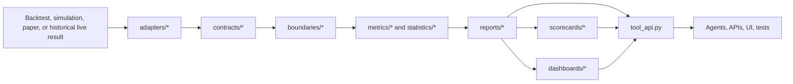

# Analytics Service Module

Analytics V2 is the read-only performance, diagnostics, reporting, scorecard,
and dashboard service for HaruQuantAI. It consumes backtest, simulation, paper
trading, and historical live-trading results, then produces deterministic
analytics evidence for humans, agents, APIs, and UI surfaces.

The service does not place trades, mutate risk state, write broker state, call
brokers, or approve live readiness. Scorecards, prop-firm compliance checks,
and dashboard outputs are non-binding analytics evidence only.

---

## 1. Service Boundaries

- **Read-only by design**: Analytics is downstream of data, strategies,
  simulator, trading, and risk services.
- **No live side effects**: No order placement, broker mutation, email, network
  sends, database writes, or risk-limit changes are performed by this module.
- **Standard envelopes**: Public tool functions return `StandardResponse`
  dictionaries with `status`, `message`, `data`, `error`, and `metadata`.
- **Deterministic outputs**: Hashing, truncation, catalog validation, schema
  checks, and examples are deterministic for reproducible audits.
- **Fail-closed validation**: Unsupported schema versions, malformed catalogs,
  invalid requests, non-finite numeric results, and configured workload-limit
  breaches fail closed.
- **Precision policy**: Money-like values use `Decimal` conversion where
  required by contracts; ratios and returns are float64-style calculations with
  documented tolerances.

---

## 2. V2 Package Layout

| Package | Purpose |
| ------- | ------- |
| `adapters/` | Protocols, canonicalization, and journal adapters that convert external result payloads into the analytics trading-result shape. |
| `benchmarks/` | Strategy-vs-benchmark alignment and relative metrics such as alpha, beta, tracking error, information ratio, batting average, and capture ratios. |
| `boundaries/` | Request validation, workload limits, response envelopes, numeric casting, request IDs, and redaction helpers. |
| `contracts/` | Versioned models, metric catalogs, official tool catalog, schema compatibility matrix, warning catalogs, quality flags, and JSON-safe serialization. |
| `dashboards/` | Overview payload builders, summary-card projections, typed dashboard payloads, and deterministic truncation/downsampling. |
| `metrics/` | Metric kernels for trades, position exposure, costs, efficiency, time analysis, PnL, curves, equity/returns, drawdown, risk, ratios, distributions, R-multiples, and aggregation. |
| `registry/` | Lightweight active-request registry helpers for traceable analytics execution. |
| `reports/` | Report orchestration, section status handling, portfolio reports, comparisons, compliance evidence, formatting, serialization, and report hashing. |
| `scorecards/` | Non-binding strategy quality labels, rules, SQN checks, warnings, and recommended action evidence. |
| `statistics/` | Distribution diagnostics, multiple-testing controls, bootstrap confidence intervals, permutation tests, and overfitting diagnostics. |
| `tool_api.py` | Architecture-approved public read-only tool facade for agents and API layers. |

The package root `app.services.analytics` re-exports the approved public
surface for convenient imports while the subpackages remain the source of truth
for implementation ownership.

---

## 3. Public Tool Facade

Use `app.services.analytics.tool_api` for the architecture-approved high-level
tool boundary:

- `get_analytics_overview(request, request_id=None)`
- `build_analytics_report(request, request_id=None)`
- `build_portfolio_analytics_report(portfolio_result, request_id=None)`
- `compare_analytics_reports(reference_report, candidate_report, request_id=None)`
- `evaluate_strategy_quality(report, request_id=None)`
- `calculate_trade_metrics(trades, request_id=None)`
- `calculate_equity_metrics(equity_curve, request_id=None)`
- `calculate_drawdown_metrics(equity_curve, request_id=None)`
- `calculate_risk_metrics(returns, request_id=None)`
- `calculate_benchmark_metrics(strategy_returns, benchmark_returns, request_id=None)`
- `calculate_statistical_validation(returns, request_id=None)`
- `calculate_prop_firm_compliance(report, request_id=None)`

The facade adds default configuration-source metadata and marks analytics
outputs as non-binding evidence. It also records forbidden claims such as final
approval, live readiness, prop-firm enforcement, and risk-limit approval.

---

## 4. Contracts and Catalogs

Analytics V2 exposes durable contracts from `app.services.analytics.contracts`.

| Contract | Description |
| -------- | ----------- |
| `MetricConfig` | Calculation configuration, metadata, annualization, risk-free rate, tolerances, and sample-size controls. |
| `MetricResult` | Standard metric result container with value, unit, warnings, confidence, and metadata. |
| `TradingResult` | Canonical trading-result model used after adapter normalization. |
| `AnalyticsReport` | Versioned analytics report contract. |
| `PortfolioAnalyticsReport` | Portfolio-level report contract. |
| `DashboardPayload` | Dashboard-ready payload contract. |
| `ToolEnvelope` | Tool-facing response envelope contract. |
| `PrecisionPolicy` | JSON-safe and decimal precision behavior. |

Important catalogs and validators:

- `METRIC_DEFINITION_CATALOG` records approved metric formulas, units, input
  requirements, undefined-result behavior, confidence metadata, aliases, and
  fixture expectations.
- `OFFICIAL_ANALYTICS_TOOL_CATALOG` records public tool contracts,
  side-effect profiles, stability labels, error codes, and test evidence paths.
- `SCHEMA_COMPATIBILITY_MATRIX` classifies accepted, deprecated,
  legacy-adapted, rejected, and future schema versions.
- `WARNING_CATALOG` and `QUALITY_FLAG_CATALOG` keep warnings separate from
  calculated facts.
- `validate_metric_catalog()` and `validate_schema_version()` are the normal
  fail-closed validation entry points.

R-multiple fallback behavior is cataloged before use. Fallback-derived
R-multiple values carry warning metadata and degraded confidence.

---

## 5. Metrics Surface

The metric kernels are intentionally split by domain so tests and audit
evidence can stay precise.

| File | Main responsibility |
| ---- | ------------------- |
| `metrics/position_exposure.py` | Position size, open PnL, time in market, slippage, commission, and swap exposure. |
| `metrics/trade_outcomes.py` | Closed-trade filtering, win/loss classification, streaks, expectancy, entropy, and outcome stability. |
| `metrics/r_multiples.py` | R-multiple extraction and R-based trade summaries. |
| `metrics/costs.py` | Spread, slippage, and commission impact. |
| `metrics/efficiency.py` | MAE/MFE capture, capital efficiency, loss containment, and return per time unit. |
| `metrics/time_analysis.py` | Period, session, duration, and long/short time analysis. |
| `metrics/pnl.py` | Net/gross PnL, return on capital, CAGR, runup, and drawdown-linked PnL selectors. |
| `metrics/curves.py` | Balance and equity curve construction from closed trades. |
| `metrics/equity.py` | Equity returns, return grouping, volatility helpers, benchmark returns, and return metrics. |
| `metrics/drawdown.py` | Drawdown series, durations, ulcer/pain metrics, recovery factors, and drawdown probabilities. |
| `metrics/risk.py` | Volatility, VaR, CVaR, expected shortfall, risk of ruin, exposure, and portfolio risk helpers. |
| `metrics/ratios.py` | Sharpe, Sortino, Omega, profit factor, SQN, Kappa, gain-to-pain, edge, and related ratios. |
| `metrics/aggregate.py` | Subset-level aggregation and report-facing trade metric composition. |
| `metrics/distribution.py` | Metric-level distribution summaries, bootstrapping, false-discovery, and tail diagnostics. |
| `metrics/exports.py` | Compatibility aliases for shared analytics metric names. |

`metrics/equity.py` is the canonical equity and returns module. V2 does not
keep a separate compatibility module for equity returns.

---

## 6. Reports, Scorecards, and Dashboards

Reports are built in `reports/sections.py` and serialized in
`reports/formatters.py`. Report hashes are produced by `reports/hashes.py` so
report evidence can be reproduced and compared.

Report builders support:

- Full analytics reports from canonical trading-result payloads.
- Portfolio analytics reports.
- Candidate-vs-baseline report comparison.
- Statistical validation evidence.
- Prop-firm compliance evidence.
- Backtest report formatting for downstream consumers.
- Markdown, JSON-safe, and row-oriented summary serialization helpers.

Scorecards in `scorecards/quality.py` evaluate strategy quality without
granting approval. They may emit labels, sample-size warnings, strengths,
warnings, and recommended actions.

Dashboards in `dashboards/overview.py` and `dashboards/truncation.py` convert
reports into UI-ready payloads with summary cards, curves, warnings, quality
flags, status metadata, and deterministic truncation metadata. Truncated series
include original count, returned count, max points, truncation flag, and method.

---

## 7. Usage Examples

The executable walkthrough lives in `tests/usage/06_analytics.py`. It uses
deterministic in-memory payloads only and demonstrates:

1. Contracts, schema compatibility, metric catalog validation, warnings,
   serialization, and registry helpers.
2. Adapter protocols, canonicalization, and journal adapters.
3. Position exposure metrics.
4. Trade outcome metrics.
5. R-multiple metrics.
6. Cost impact metrics.
7. Efficiency metrics.
8. Time analysis metrics.
9. PnL metrics.
10. Curve construction.
11. Equity and return metrics.
12. Drawdown metrics.
13. Risk metrics.
14. Ratio metrics.
15. Aggregate analytics.
16. Boundary validation, limits, redaction, and numeric casting.
17. Multiple-testing diagnostics.
18. Distribution diagnostics.
19. Resampling diagnostics.
20. Benchmark metrics.
21. Scorecards.
22. Reports, formatting, hashing, comparisons, and compliance evidence.
23. Dashboard payloads and truncation.

Run it with:

```powershell
uv run python tests\usage\06_analytics.py
```

Minimal high-level tool example:

```python
from app.services.analytics.tool_api import build_analytics_report

trading_result = {
    "schema_version": "1.3.1",
    "result_id": "bt_run_example",
    "phase": "backtest",
    "strategy_id": "strategy_example",
    "strategy_version": "v1",
    "account_base_currency": "USD",
    "symbols": ["EURUSD"],
    "timeframe": "H1",
    "trades": [
        {
            "trade_id": "t1",
            "symbol": "EURUSD",
            "direction": "long",
            "open_time": "2026-01-01T00:00:00Z",
            "close_time": "2026-01-01T04:00:00Z",
            "profit_loss": 100.0,
            "net_pnl": 100.0,
            "initial_risk": 50.0,
            "mae": -20.0,
            "mfe": 140.0,
        }
    ],
    "equity_curve": [
        {"timestamp": "2026-01-01T00:00:00Z", "equity": 10000.0},
        {"timestamp": "2026-01-01T04:00:00Z", "equity": 10100.0},
    ],
}

response = build_analytics_report(trading_result, request_id="readme-example")
if response["status"] == "success":
    report = response["data"]
    print(report["report_id"])
```

---

## 8. Architecture Flow



---

## 9. Verification

Run the analytics usage example:

```powershell
uv run python tests\usage\06_analytics.py
```

Run the analytics unit and traceability suite with per-file coverage:

```powershell
uv run pytest tests\unit\app\services\analytics tests\services\analytics --cov-reset --cov=app.services.analytics --cov-report=term-missing --no-cov-on-fail
```

Current V2 expectation: every file under `app/services/analytics` remains above
the 80% coverage gate, and the module-level analytics coverage remains above
80%.
