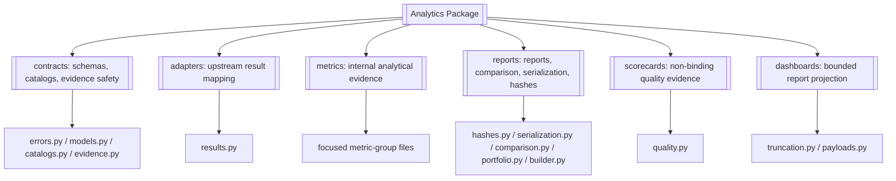
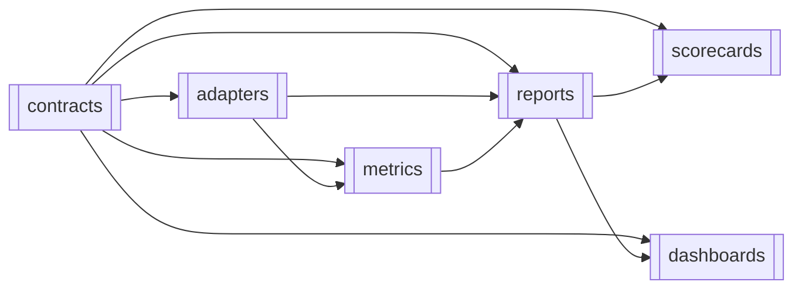
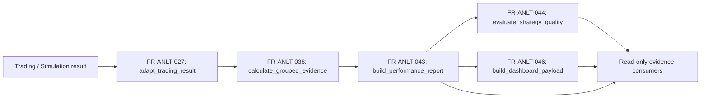

# Analytics

> **Package:** `app/services/analytics`
> **Domain ID:** `ANLT`
> **Status:** `Completed` — all active contracts, adapters, metric kernels, report operations, allocation evidence, dashboard projection, package exports, and non-excluded workflows satisfy the Section 7 validation gate. The 2026-07-19 post-build review closed one blocking and three high findings in the evidence layer; four review findings remain open and are listed below.
> **Last updated:** `2026-07-19`

> **Open post-build review findings (2026-07-19).** These are deferred, not resolved, and each needs an owner decision or a return-shape change before it can be built:
> `F-005` — ten warning codes and seven quality-flag codes remain cataloged but unemitted; four of them (`annualization_blocked`, `daily_resample_sparse`, `measurement_window_mismatch`, `execution_unreconciled`) have no owner-supplied trigger definition, and the FX/schema blocker flags need a decision on whether a fail-closed path returns blocker evidence or raises.
> `F-006` — `NFR-ANLT-009` is unmet: no log record carries a request or correlation ID and no validation failure is logged before raising.
> `F-007` — `NFR-ANLT-002`, `-003`, and `-006` name verification tests (side-effect, replay/parallel, redaction) that do not exist.
> `F-012` — the `legacy` row in `CONTRACT_COMPATIBILITY_MATRIX` is accepted but has no distinct adaptation.

> This README is the package's **single source of truth** for requirements, final structure, implementation sequence, progress, usage examples, and tests.
> Update this file before changing the code.

---

## 1. Purpose and Boundary

### Purpose

Analytics converts supplied `TradeRecord`, `SimulationResult`, return, equity,
and benchmark evidence into deterministic, versioned `PerformanceReport`,
scorecard, comparison, and dashboard payloads. All outputs are read-only,
non-binding evidence with explicit caveats, lineage, quality flags, and
reproducibility hashes. Analytics fails closed when required evidence, schema
compatibility, currency conversion, or finite numeric validity cannot be proven.

### Owns

- Canonical performance-report, portfolio-report, scorecard, dashboard,
  warning, quality-flag, lineage, and reproducibility-hash schemas.
- Deterministic adapters from approved upstream result contracts into one
  canonical analytics input model.
- Internal metric kernels for approved trade, PnL, equity/return, drawdown,
  core risk, core ratio, benchmark, distribution, cost/efficiency, time, and
  bounded statistical evidence.
- Report building, compatible report comparison, canonical serialization, and
  deterministic hashing.
- The Metric Definition Catalog, warning/quality-flag catalogs, schema
  compatibility catalog, and explicit package exports.
- Projection of validated report sections into bounded dashboard payloads.

### Does not own

- Market-data acquisition, broker/account reads, FX sourcing, or raw provider
  normalization; Data owns those capabilities.
- Strategy signals, promotion, live readiness, risk approval, position sizing,
  kill switches, portfolio allocation, execution, fills, or reconciliation.
- Simulation/backtest/optimization orchestration or execution-evidence repair.
- Durable persistence, migrations, repositories, local file loading, network
  calls, broker mutation, event queues, caches, or background jobs.
- UI rendering, API authentication/authorization, financial advice, prop-firm
  enforcement, or final governance decisions.
- Advanced TCA, attribution, dynamic correlation, explainability,
  live/paper/backtest degradation, and prop-firm evidence in the initial build.
- Strategy quality scorecards in the initial build. `scorecards/` is excluded
  because its evaluation depends on owner-approved diagnostic thresholds and
  recommendation language that do not exist; Analytics owns no
  promotion-adjacent threshold. See §4.5 and `FR-ANLT-044`.

### Shared contracts

Contract definitions match the names, versions, and owners in
`docs/PROJECT.md`. The reconciliation's proposed `AnalyticsReport` name is
normalized to the system-owned cross-domain name `PerformanceReport`.

**Owned by this domain** — defined authoritatively here:

| Status | Contract | Version | Counterparty | Purpose |
|---|---|---|---|---|
| Completed | `PerformanceReport` | `v1` | `UI/API`, `Research`, `Optimization`, `Portfolio` | Return versioned metric sections, report status, caveats, quality flags, lineage, and hashes without persisting the report. |
| Completed | `DashboardPayload` | `v1` | `UI/API` | Bounded, versioned chart/table projection of a validated `PerformanceReport`; registered in `docs/PROJECT.md` §5; no UI rendering logic and no partial emission. |
| Completed | `PortfolioAllocationEvidence` | `v1` | `Portfolio`, `Risk`, `UI/API` | Publish non-binding component/aggregate performance, dependence, concentration, measurement-window, caveat, and FX lineage for portfolio construction/review. |
| Completed | `PortfolioRebalanceMeasurementRequest` / `PortfolioRebalanceMeasurementEvidence` | `v1` | `Portfolio` submits; Analytics receives and publishes | Validate redacted hash-bound reconciled Trading facts and publish deterministic non-binding post-trade action measurements without execution authority. |

`PerformanceReport v1` contains: `contract_version="v1"`,
`schema_id="analytics.performance_report.v1"`, `report_id`,
`analytics_engine_version`, `report_status`, `source_context`, ordered
`sections`, ordered `warnings`, ordered `quality_flags`, `lineage`,
`reproducibility_hashes`, precision/annualization metadata, creation time, and
`non_binding=true`. A section contains its name, criticality, status, metric
evidence, and bounded warnings. No field may contain `NaN`, infinity, pandas or
NumPy objects, raw DataFrames/Series, credentials, or provider payloads.

`PortfolioPerformanceReport` remains Analytics-internal. It may be used inside
composition, but cross-domain portfolio evidence is emitted only as the registered
`PortfolioAllocationEvidence v1` projection.

`DashboardPayload v1` carries `contract_version="v1"` and
`schema_id="analytics.dashboard_payload.v1"` before its bounded presentation
sections. Compatibility is evaluated only from `contract_version`.

**Consumed from other domains** — referenced only, never redefined:

| Contract | Version | Owner | Used for |
|---|---|---|---|
| Versioned closed-trade ledger projection | `v1` | Analytics receiver schema; emitted by Trading or Simulation | Producer-neutral closed-trade evidence matching `FR-ANLT-049`; Analytics imports neither producer implementation and never infers missing ledger fields from `TradeRecord`, `ExecutionReceipt`, or raw fills. |
| `SimulationResult` | `v1` | Simulation | Deterministic backtest outcome. Publishes `closed_trades` as a `ClosedTradeRecord` ledger whose field set matches `FR-ANLT-049` exactly (Simulation `FR-SIM-040`), plus `initial_balance` and `account_currency`. Raw `fills` remain available as execution events but are not the analytics input. |
| `PortfolioSimulationResult` | `v1` | Simulation | Deterministic component and aggregate portfolio validation evidence. |
| `MarketDataset` | `v1` | Data | Supplied benchmark series and its availability/provenance metadata. |
| `FXConversionEvidence` | `v1` | Data | Fresh conversion truth applied without path synthesis or rate fetching. |

### Persisted state

None. Analytics is read-only in the initial build and does not persist reports,
catalogs, caches, or intermediate results, as required by `docs/PROJECT.md`.
Analytics is not an `AuditEvent` producer: it is pure/read-only, so the governed
caller audits the action and persists any durable audit evidence through Data.

### Four-level structure

| Code level | Represents |
|---|---|
| **Package** | Analytics domain |
| **Module folder** | One approved feature/capability |
| **File** | One use case or focused responsibility |
| **Class / function / method / constant** | One functional requirement behavior or contract |

```text
Package
└── Module folder
    └── File
        └── Public Class / Function / Method / Constant
```

### Package capability map



---

## 2. Final Package Structure

Modules and files are ordered from lowest dependency to highest dependency.
The order is the implementation sequence.

### Feature Registry

| Status | Feature | Owning module | Public API and contracts | Requirements | Usage evidence |
|---|---|---|---|---|---|
| Completed | `FEAT-ANLT-01` Schemas, Catalogs, and Evidence Safety | `contracts/` | Exact declarations and contract manifests: Section 4.1 | Section 4.1 functional requirements | `tests/analytics/usage/01_contracts.py` |
| Completed | `FEAT-ANLT-02` Approved Upstream Result Mapping | `adapters/` | Exact declarations: Section 4.2 | Section 4.2 functional requirements | `tests/analytics/usage/02_adapters.py` |
| Completed | `FEAT-ANLT-03` Internal Pure Analytical Evidence | `metrics/` | Exact declarations: Section 4.3 | Section 4.3 functional requirements | `tests/analytics/usage/03_metrics.py` |
| Completed | `FEAT-ANLT-04` Canonical Reporting | `reports/` | Exact declarations and report contracts: Section 4.4 | Section 4.4 functional requirements | `tests/analytics/usage/04_reports.py` |
| Excluded | Unregistered strategy-quality scorecards | `scorecards/` | Excluded declarations: Section 4.5 | `FR-ANLT-014`, `FR-ANLT-044` remain excluded | No usage program required while excluded |
| Completed | `FEAT-ANLT-05` Bounded Report Projection | `dashboards/` | Exact declarations and `DashboardPayload` contract: Section 4.6 | Section 4.6 functional requirements | `tests/analytics/usage/05_dashboards.py` |

Excluded work has no `FEAT-*` registration and does not consume a feature ordinal.
The registry therefore maps the five active feature IDs one-to-one to the five
numbered usage programs.

```text
analytics/
├── __init__.py                         # Approved domain-level exports only
├── README.md
├── contracts/                          # Feature: schemas, catalogs, evidence safety
│   ├── __init__.py
│   ├── errors.py                       # Focus: public Analytics error taxonomy
│   ├── models.py                       # Focus: immutable canonical contracts
│   ├── catalogs.py                     # Focus: metric/warning/schema catalogs
│   └── evidence.py                     # Focus: validation, redaction, JSON safety
├── adapters/                           # Feature: approved upstream-result mapping
│   ├── __init__.py
│   └── results.py                      # Focus: source contract → TradingResult
├── metrics/                            # Feature: internal pure metric evidence
│   ├── __init__.py
│   ├── trades.py                       # Focus: closed-trade outcomes and context
│   ├── returns.py                      # Focus: PnL, equity, and return evidence
│   ├── drawdowns.py                    # Focus: drawdown depth/duration/recovery
│   ├── risk.py                         # Focus: core volatility and tail risk
│   ├── ratios.py                       # Focus: approved core ratios
│   ├── benchmarks.py                   # Focus: benchmark alignment and evidence
│   ├── distributions.py                # Focus: one canonical distribution kernel set
│   ├── statistics.py                   # Focus: bounded deterministic validation
│   ├── cost_efficiency.py              # Focus: cost, MAE/MFE, and time evidence
│   └── groups.py                       # Focus: compose approved grouped evidence
├── reports/                            # Feature: canonical reporting
│   ├── __init__.py
│   ├── hashes.py                       # Focus: deterministic reproducibility hashes
│   ├── serialization.py                # Focus: JSON and human-readable serialization
│   ├── comparison.py                   # Focus: compatible report comparison
│   ├── portfolio.py                    # Focus: currency-safe portfolio aggregation
│   ├── allocation.py                   # Focus: PortfolioAllocationEvidence v1 projection
│   └── builder.py                      # Focus: canonical PerformanceReport orchestration
├── scorecards/                         # Feature: non-binding strategy quality
│   ├── __init__.py
│   └── quality.py                      # Focus: report-derived quality evidence
└── dashboards/                         # Feature: UI/API-ready report projection
    ├── __init__.py
    ├── truncation.py                   # Focus: deterministic bounded series
    └── payloads.py                     # Focus: DashboardPayload projection
```

The final structure intentionally removes the mutable `registry/`, separate
`boundaries/` and `statistics/` layers, duplicate distribution implementations,
compatibility-export file, placeholder formatters, duplicate audit contracts,
and explicit package-root exports. The initial public API contains the immutable
configuration contracts required to call `build_performance_report`, the owned
cross-domain result contracts, and the approved report builders; comparison,
dashboard, and grouped-evidence functions remain focused feature APIs.

### Package root files

| Status | File | Responsibility | Key exports | Dependencies |
|---|---|---|---|---|
| Completed | `__init__.py` | Expose the caller-constructed immutable report configuration, owned cross-domain contracts, and public performance, portfolio-allocation, and post-trade measurement operations; no compatibility aliases or low-level kernels. | `AnalyticsRunConfig`, `RiskFreeRateEvidence`, `StatisticalValidationConfig`, `PerformanceReport`, `DashboardPayload`, `PortfolioAllocationEvidence`, `PortfolioRebalanceMeasurementRequest`, `PortfolioRebalanceMeasurementEvidence`, `build_performance_report`, `build_portfolio_allocation_evidence`, `build_portfolio_rebalance_measurement` | **Standard library:** None<br>**Required third-party:** None<br>**Local:** `contracts.models → owned contracts`; `reports.builder → build_performance_report`; `reports.allocation → allocation and post-trade evidence builders` |
| Completed | `README.md` | Define the final Analytics requirements, structure, implementation order, workflows, public symbols, tests, status, and exclusions. | None | **Standard library:** None<br>**Required third-party:** None<br>**Local:** None |

### Module dependency diagram



No module depends on `scorecards` or `dashboards`; neither can feed metrics or
reports, so the graph is acyclic.

### Structure rules

- The package root contains only `README.md`, `__init__.py`, and feature modules.
- Stateless calculations and orchestration use functions. Classes are limited
  to immutable contracts and exception types.
- Metric kernels are feature-module APIs for internal callers/tests, not
  package-root exports.
- Other domains import only approved package-root exports; no deep cross-domain
  imports are permitted.
- Usage examples live under `tests/analytics/usage/`.
- `numpy==2.4.6` and `pandas==3.0.3` are declared direct project dependencies in
  `pyproject.toml`. Analytics files that import them must list them in their
  `Required third-party` cell. No new dependency may be added; `NFR-ANLT-012` is
  satisfied by the existing declarations.

---

## 3. Workflows

### Status values

| Status | Meaning |
|---|---|
| **Missing** | Final behavior is absent, contradicted, or unverified. |
| **Partial** | Useful behavior exists, but final contracts, relocation, validation, or tests remain. |
| **Completed** | Final behavior, structure, runtime use, and tests are verified. |
| **Blocked** | Specification is incomplete through no fault of this domain; an open decision or an unpublished upstream schema must be resolved before implementation may start. The blocking decision is named in §6. |
| **Excluded** | Deliberately outside the initial build. No implementation, usage example, or test is required until the exclusion is lifted by an owner decision recorded in `docs/CHANGELOG.md`. |

### Workflow registry

| Status | Workflow ID | Scope | Workflow | Trigger / Input boundary | Final outcome / Output boundary | Requirement sequence |
|---|---|---|---|---|---|---|
| Completed | `WF-ANLT-001` | Cross-domain | Build canonical performance report | Versioned canonical closed-trade ledger projection | `PerformanceReport v1` to UI/API, Research, or Optimization | `FR-ANLT-027 → FR-ANLT-038 → FR-ANLT-043` |
| Completed | `WF-ANLT-002` | Internal | Calculate grouped analytics evidence | Canonical trades/series | Ordered `SectionEvidence` groups | `FR-ANLT-028 → FR-ANLT-038` |
| Completed | `WF-ANLT-003` | Internal | Benchmark-relative analysis | Strategy and benchmark series | Benchmark evidence or explicit skipped/undefined section | `FR-ANLT-033 → FR-ANLT-034` |
| Excluded | `WF-ANLT-004` | Internal | Evaluate strategy quality | Canonical `PerformanceReport` | Non-binding `StrategyQualityEvidence` | `FR-ANLT-044` |
| Completed | `WF-ANLT-005` | Cross-domain | Build dashboard payload | Canonical `PerformanceReport` | Bounded `DashboardPayload` to UI/API | `FR-ANLT-045 → FR-ANLT-046` |
| Completed | `WF-ANLT-006` | Cross-domain | Adapt upstream result | Versioned canonical closed-trade ledger projection emitted by Trading or Simulation | Canonical `TradingResult` or structured validation failure | `FR-ANLT-021 → FR-ANLT-027` |
| Completed | `WF-ANLT-007` | Internal | Run statistical validation | Canonical numeric series, seed, bounded config | Deterministic confidence/permutation/sample evidence | `FR-ANLT-036` |
| Completed | `WF-ANLT-008` | Internal | Serialize and hash report | Validated report | Canonical JSON or minimal human-readable output plus hashes | `FR-ANLT-025 → FR-ANLT-039 → FR-ANLT-040` |
| Completed | `WF-ANLT-009` | Internal | Build portfolio performance report | Compatible component reports and FX evidence | Analytics-internal currency-safe portfolio report or blocker failure | `FR-ANLT-012 → FR-ANLT-041` |
| Completed | `WF-ANLT-010` | Internal | Compare performance reports | Compatible reference and candidate reports | Actual metric deltas, omissions, and caveats | `FR-ANLT-042` |
| Completed | `WF-ANLT-013` | Cross-domain | Build portfolio allocation evidence | Component reports and required `PortfolioSimulationResult` plus FX evidence | `PortfolioAllocationEvidence v1` | `FR-SIM-033 → FR-ANLT-041 → FR-ANLT-047 → FR-ANLT-048` |
| Completed | `WF-ANLT-014` | Cross-domain | Measure reconciled Portfolio rebalance execution | `PortfolioRebalanceMeasurementRequest v1` containing redacted hash-bound successful Trading facts | `PortfolioRebalanceMeasurementEvidence v1` | `FR-ANLT-052` |

### Workflow boundaries and failures

#### `WF-ANLT-001` — Build Canonical Performance Report

**System workflows:** `SYS-WF-001`, `SYS-WF-002`, `SYS-WF-003` (candidate scoring:
Optimization consumes the resulting `PerformanceReport v1`; Analytics performs no
optimization-specific orchestration)
**Input boundary:** a closed-trade ledger from Trading (`TradeRecord` /
`ExecutionReceipt`) or Simulation (`SimulationResult`), plus a required
`initial_balance` and `account_currency`. Data may supply a benchmark
`MarketDataset` and `FXConversionEvidence`. The ledger is the sole primary
evidence; the equity curve and every return series are derived from it by
`build_closed_trade_equity_curve` (`FR-ANLT-050`) on a closed-trade basis.
**Output boundary:** Analytics returns `PerformanceReport v1`; it writes nothing.

1. `adapt_trading_result()` validates the approved source version and maps it to
   `TradingResult` without silent field loss.
2. `calculate_grouped_evidence()` runs only catalog-approved metric groups.
3. `build_performance_report()` applies section criticality, warnings, lineage,
   finite-output validation, and hashes.
4. The public operation returns `PerformanceReport v1` or surfaces `AnalyticsValidationError`.

**Failure behavior:** incompatible schema, missing required evidence, required
section failure, non-finite output, or limit breach returns a structured error.
Optional unavailable evidence becomes a deterministic skipped/failed section;
diagnostic partial mode is opt-in, always non-binding, and always carries one
`diagnostic_partial_report` blocker flag plus one `required_section_failed`
blocker flag per failed required section. A report returned under diagnostic
partial mode is never distinguishable from a complete report by section status
alone.

**Integration test:**
`tests/analytics/integration/test_build_performance_report.py::test_build_performance_report_from_simulation_result()`

#### `WF-ANLT-002` — Calculate Grouped Analytics Evidence

**System workflow:** None (internal).
Canonical input is split only by explicit source context (all/long/short,
benchmark, cost, or statistical), passed to cataloged kernels, and returned as
ordered section evidence. Empty/undefined evidence is `None` or skipped with a
warning, never fabricated zero/infinity.

**Failure behavior:** invalid closed-trade semantics, ambiguous direction,
non-finite required values, or an unapproved metric definition fails validation.

**Integration test:**
`tests/analytics/integration/test_grouped_evidence.py::test_grouped_evidence_preserves_source_context()`

#### `WF-ANLT-003` — Benchmark-Relative Analysis

**System workflow:** None (internal contribution to `SYS-WF-001`/`SYS-WF-002`).
`align_benchmark_series()` normalizes UTC timestamps, restricts the benchmark to
the analytics window, resolves duplicates deterministically under approved
policy, and intersects observations. `calculate_benchmark_evidence()` then
calculates only approved, currency-valid metrics.

**Failure behavior:** non-overlap or insufficient observations yields skipped
evidence; missing benchmark currency restricts output to currency-neutral
metrics with a warning; invalid/future schemas fail.

**Integration test:**
`tests/analytics/integration/test_benchmark_workflow.py::test_benchmark_alignment_is_utc_and_window_bounded()`

#### `WF-ANLT-004` — Evaluate Strategy Quality

**Status:** `Excluded` from the initial build. `FR-ANLT-044` depends on
`STRATEGY_QUALITY_THRESHOLDS` and `ALLOWED_RECOMMENDATION_LANGUAGE`, both of which
are `Excluded` with no owner-approved value (§4.5). Analytics does not invent
promotion-adjacent thresholds. The specification below is retained unchanged so the
workflow can be activated without redesign once the owner supplies those settings.

**System workflow:** None.
`evaluate_strategy_quality()` reads canonical report sections, checks sample
evidence and owner-approved diagnostic thresholds, and returns facts, warnings,
and non-binding review context. It never emits approval, promotion, live
readiness, prop-firm compliance, risk approval, or allocation decisions.

**Failure behavior:** missing required report sections or absent threshold policy
blocks evaluation; degraded inputs propagate degraded confidence.

**Integration test:**
`tests/analytics/integration/test_strategy_quality.py::test_strategy_quality_is_non_binding()`

#### `WF-ANLT-005` — Build Dashboard Payload

**System workflows:** `SYS-WF-001`, `SYS-WF-002`
**Input boundary:** a validated `PerformanceReport`.
**Output boundary:** a versioned `DashboardPayload` for UI/API.

`build_dashboard_payload()` projects approved summary/equity/drawdown/warning
and quality-flag sections without recomputing metrics; `truncate_series()`
applies the approved deterministic point limit.

**Failure behavior:** missing/degraded sections remain visibly skipped/degraded;
non-finite values or inability to satisfy the point limit fails validation.

**Integration test:**
`tests/analytics/integration/test_dashboard_payload.py::test_dashboard_uses_report_sections_without_recomputation()`

#### `WF-ANLT-006` — Adapt Upstream Result

**System workflows:** `SYS-WF-001`, `SYS-WF-002`, `SYS-WF-003`
**Input boundary:** versioned producer-owned result.
**Output boundary:** internal canonical `TradingResult`.

**Failure behavior:** missing mappings, required fields, versions, identifiers,
currency/timestamps, or conflicting PnL fields fail closed with bounded details.
Unsupported fields are never silently dropped; bounded source metadata is
preserved in lineage.

**Integration test:**
`tests/analytics/integration/test_result_adapters.py::test_approved_sources_map_without_field_loss()`

#### `WF-ANLT-007` — Run Statistical Validation

**System workflow:** None.
`run_statistical_validation()` accepts an explicit seed and bounded iteration,
confidence, alpha, and sample configuration; it computes real bootstrap,
permutation, multiple-comparison, and sample-size evidence only.

**Failure behavior:** absent seed, insufficient/invalid observations, invalid
alpha/confidence, or iteration-limit breach fails or returns explicit skipped
evidence per the Metric Definition Catalog. Fixed-value White's Reality Check,
PBO, and backtest wrappers are prohibited.

**Integration test:**
`tests/analytics/integration/test_statistical_validation.py::test_seeded_validation_is_reproducible()`

#### `WF-ANLT-008` — Serialize and Hash Report

**System workflow:** None.
`serialize_report()` emits canonical JSON or the one approved minimal
human-readable representation. `compute_reproducibility_hashes()` computes
input, config, ledger, equity, optional benchmark, and report hashes from
canonical JSON while excluding documented nondeterministic fields. MD5 is not
permitted.

**Failure behavior:** unsupported values, non-finite numbers, or unknown format
fails validation; serialization never writes a file.

**Integration test:**
`tests/analytics/integration/test_report_serialization.py::test_serialization_and_hashes_are_deterministic()`

#### `WF-ANLT-009` — Build Portfolio Performance Report

**System workflows:** Internal helper for `SYS-WF-007` / `SYS-WF-008`.
`PortfolioPerformanceReport` is Analytics-internal; only the
registered `PortfolioAllocationEvidence v1` projection crosses the boundary.
Validated component reports are checked for schema, pairing, base currency, and
caller-supplied FX evidence before real aggregation.

**Failure behavior:** raw multi-currency PnL is never summed; missing required FX
or incompatible schemas produces blocker evidence and no aggregate report.

**Integration test:**
`tests/analytics/integration/test_portfolio_report.py::test_portfolio_report_fails_closed_without_fx()`

#### `WF-ANLT-010` — Compare Performance Reports

**System workflow:** None.
`compare_performance_reports()` validates schema and pairing metadata, compares
approved common metrics without mutating inputs, and reports deltas, missing
metrics, and caveats. Fixed zero differences are prohibited.

**Integration test:**
`tests/analytics/integration/test_report_comparison.py::test_report_comparison_uses_actual_common_metrics()`

#### `WF-ANLT-013` — Build Portfolio Allocation Evidence

**Status:** `Completed`. Simulation `FR-SIM-033` owns the complete
`PortfolioSimulationResult v1` field schema. Analytics imports no Simulation code
and validates the exact README-backed producer fixture before projecting the
receiver-owned `FR-ANLT-047` and `FR-ANLT-048` evidence contract.

**System workflows:** `SYS-WF-007`, `SYS-WF-008`.
For the final `SYS-WF-008` leg, Analytics receives immutable reconciled
`TradeRecord v1` / `ExecutionReceipt v1` facts and never edits execution truth.
Analytics validates exact component/source schemas, measurement window, base
currency, fresh Data-owned `FXConversionEvidence`, and finite numeric results,
then projects performance, dependence, concentration, and caveat evidence into
`PortfolioAllocationEvidence v1`. It does not recommend weights, approve a
portfolio, set a risk budget, or infer missing values.

**Failure behavior:** missing/incompatible sources or FX evidence returns a
structured blocker and no partial cross-domain evidence. After execution this is
recorded as `executed-but-unmeasured`; it never rolls back or rewrites execution.
The same immutable execution/FX/version inputs support deterministic recomputation.

**Integration test:**
`tests/analytics/integration/test_portfolio_allocation_evidence.py::test_evidence_is_non_binding_and_fx_provenanced()`

### Core workflow diagram



---

## 4. Module and Requirement Specifications

This section is the implementation plan. Every public symbol appears in exactly
one functional-requirement row. Low-level private helpers do not receive IDs.

### 4.1 `contracts/` — Schemas, Catalogs, and Evidence Safety

**Purpose:** Define immutable domain contracts and the single static source of
truth for metric, warning, quality-flag, and schema behavior.

**Module runtime data flow** (not import order — see §2 for the build order;
`catalogs.py` and `evidence.py` both import `models.py`):

```text
raw contract value
  → catalogs.py policy lookup
  → evidence.py validation/redaction/JSON normalization
  → models.py immutable evidence contract
```

#### Files

| Status | File | Responsibility | Key exports | Dependencies |
|---|---|---|---|---|
| Completed | `errors.py` | Define Analytics exceptions and bounded error conversion. | `AnalyticsError`, `AnalyticsValidationError`, `to_analytics_error_payload` | **Standard library:** None<br>**Required third-party:** None<br>**Local:** `app.utils → logger, redact_mapping_value, redact_text_value` |
| Completed | `models.py` | Define immutable canonical input, evidence, report, runtime-configuration, scorecard, dashboard, and Portfolio post-trade measurement contracts. | `ClosedTrade`, `TradingResult`, `MetricEvidence`, `SectionEvidence`, `AnalyticsWarning`, `QualityFlag`, `Lineage`, `ReproducibilityHashes`, `PerformanceReport`, `PortfolioPerformanceReport`, `PortfolioAllocationEvidence`, `PortfolioRebalanceMeasurementRequest`, `PortfolioRebalanceMeasurementEvidence`, `DashboardPayload`, `RiskFreeRateEvidence`, `StatisticalValidationConfig`, `AnalyticsRunConfig`, `ANALYTICS_SCHEMA_VERSION` | **Standard library:** `collections.abc`, `datetime`, `decimal`, `hashlib`, `math`, `types`, `typing`<br>**Required third-party:** `pydantic`<br>**Local:** `errors.py → AnalyticsValidationError`; `catalogs.py → EVIDENCE_CATALOG`; `app.utils → canonicalization and logger` |
| Completed | `catalogs.py` | Define and validate static metric, warning/flag, evidence, and contract compatibility catalogs from the approved Metric Definition Catalog and Evidence Catalog subsections below. | `METRIC_DEFINITION_CATALOG`, `EVIDENCE_CATALOG`, `CONTRACT_COMPATIBILITY_MATRIX`, `validate_metric_catalog`, `validate_contract_version` | **Standard library:** `collections.abc`, `types`<br>**Required third-party:** None<br>**Local:** `errors.py → AnalyticsValidationError`; `app.utils → logger`. It imports no other Analytics module, so `models.py → catalogs.py` stays acyclic. |
| Completed | `evidence.py` | Build ordered report evidence and enforce report-specific finite JSON safety. It imports Utils-owned redaction and serialization primitives and must not wrap, export, redefine, or shadow the name of any of them. | `build_warning`, `build_quality_flag`, `to_report_json_safe` | **Standard library:** `collections.abc`, `typing`<br>**Required third-party:** `numpy`, `pandas`<br>**Local:** `catalogs.py → EVIDENCE_CATALOG`; `models.py → AnalyticsWarning, QualityFlag`; `errors.py → AnalyticsValidationError`; `app.utils → redact_mapping_value, canonical_json, to_json_safe, ValidationError` |
| Completed | `__init__.py` | Expose the approved feature API only. | All key exports above after catalog approval | **Standard library:** None<br>**Required third-party:** None<br>**Local:** explicit imports from the four files above |

#### Configuration and Limits Manifest

| Status | Setting / Limit | Type | Default | Required | Used by | Description |
|---|---|---|---|---|---|---|
| Completed | `ANALYTICS_SCHEMA_VERSION` | `str` | `v1` | Yes | All contracts | Identifies the system-approved `PerformanceReport` version; unsupported versions fail validation. |
| Completed | `MAX_WARNING_DETAIL_BYTES` | `int` | None | Yes before public activation | `build_warning()`, `build_quality_flag()`, `to_analytics_error_payload()` | Deployment must supply a measured positive bound; excess detail is rejected or deterministically truncated. |
| Completed | `SAFE_REQUEST_ID_FORMAT` | policy | Prefixed UUID4 | Yes | Public operations | Missing, empty, malformed, or unsafe IDs raise `AnalyticsValidationError`. |

#### `errors.py` — Public Error Taxonomy

| Status | Requirement ID | Responsibility | Class / Function / Method | Side Effects | Raises | Usage / Test |
|---|---|---|---|---|---|---|
| Completed | `FR-ANLT-001` | The system shall expose one base exception for direct Analytics feature APIs. | `AnalyticsError` | None | None | **Usage:** `tests/analytics/usage/test_usage_contracts.py::test_usage_errors_analytics_error()`<br>**Unit:** `tests/analytics/unit/test_errors.py::test_analytics_error_is_domain_base()` |
| Completed | `FR-ANLT-002` | The system shall distinguish invalid, missing, incompatible, or unsafe analytics evidence from execution failures. | `AnalyticsValidationError` | None | None | **Usage:** `tests/analytics/usage/test_usage_contracts.py::test_usage_errors_validation_error()`<br>**Unit:** `tests/analytics/unit/test_errors.py::test_validation_error_is_analytics_error()` |
| Completed | `FR-ANLT-003` | The system shall convert a controlled exception into a bounded, redacted error payload without exposing provider exceptions or secrets. The caller supplies the validated positive detail bound explicitly; there is no fallback. | `to_analytics_error_payload(error: Exception, *, max_detail_bytes: int) -> dict[str, object]` | None | `AnalyticsValidationError`: the bound is absent or non-positive | **Usage:** `tests/analytics/usage/test_usage_contracts.py::test_usage_errors_error_payload()`<br>**Unit:** `tests/analytics/unit/test_errors.py::test_error_payload_is_bounded_and_redacted()` |

#### `models.py` — Immutable Canonical Contracts

| Status | Requirement ID | Responsibility | Class / Function / Method | Side Effects | Raises | Usage / Test |
|---|---|---|---|---|---|---|
| Completed | `FR-ANLT-004` | The system shall represent an adapted upstream result with source version, IDs, phase, UTC window, `account_currency`, `initial_balance`, strategy, symbols, timeframe, an ordered `tuple[ClosedTrade, ...]` ledger, the derived closed-trade equity curve and its daily resample, `curve_basis="closed_trade"`, optional benchmark evidence, quality metadata, and lineage. The ledger is the primary evidence; every other series is derived from it deterministically. | `TradingResult` | None | `AnalyticsValidationError`: required canonical evidence is absent or inconsistent, `initial_balance` is absent or non-positive, or `account_currency` is absent | **Usage:** `tests/analytics/usage/test_usage_contracts.py::test_usage_models_trading_result()`<br>**Unit:** `tests/analytics/unit/test_models.py::test_trading_result_rejects_missing_identity()` |
| Completed | `FR-ANLT-049` | The system shall represent one closed trade as an immutable record carrying `ticket`, `symbol`, `type` (direction), `volume`, `entry_time`, `entry_price`, `stop_loss`, `take_profit`, `exit_time`, `exit_price`, `comment` (exit reason), `commission`, `swap`, `profit`, `magic` (strategy ID), `mae`, and `mfe`. Timestamps are UTC; `volume`, prices, and monetary fields are `Decimal`. `profit` is **gross**: it reflects price movement only and excludes `commission` and `swap`, which arrive with a negative sign under the MT5 convention. The contract exposes the derived read-only property `net_trade_pnl = profit + commission + swap`. | `ClosedTrade` | None | `AnalyticsValidationError`: identity, direction, UTC ordering, monetary type, or finite-value policy is invalid, or `exit_time` precedes `entry_time` | **Usage:** `tests/analytics/usage/test_usage_contracts.py::test_usage_models_closed_trade()`<br>**Unit:** `tests/analytics/unit/test_models.py::test_net_trade_pnl_adds_commission_and_swap()` |
| Completed | `FR-ANLT-005` | The system shall represent one metric as a finite calculated/undefined/skipped value with unit, confidence, warnings, and source context. | `MetricEvidence` | None | `AnalyticsValidationError`: value is non-finite or status/unit is invalid | **Usage:** `tests/analytics/usage/test_usage_contracts.py::test_usage_models_metric_evidence()`<br>**Unit:** `tests/analytics/unit/test_models.py::test_metric_evidence_rejects_infinity()` |
| Completed | `FR-ANLT-006` | The system shall represent one report section with approved criticality, ordered metrics, status, warnings, and failure/skipped reason. | `SectionEvidence` | None | `AnalyticsValidationError`: status conflicts with included evidence | **Usage:** `tests/analytics/usage/test_usage_contracts.py::test_usage_models_section_evidence()`<br>**Unit:** `tests/analytics/unit/test_models.py::test_section_evidence_requires_reason_when_skipped()` |
| Completed | `FR-ANLT-007` | The system shall represent a bounded warning with code, severity, affected section, source context, and detail. | `AnalyticsWarning` | None | `AnalyticsValidationError`: code/severity is uncataloged | **Usage:** `tests/analytics/usage/test_usage_contracts.py::test_usage_models_warning()`<br>**Unit:** `tests/analytics/unit/test_models.py::test_warning_uses_cataloged_severity()` |
| Completed | `FR-ANLT-008` | The system shall represent a quality flag separately from metrics and governance decisions, including blocker semantics and source evidence. | `QualityFlag` | None | `AnalyticsValidationError`: flag type/code is uncataloged | **Usage:** `tests/analytics/usage/test_usage_contracts.py::test_usage_models_quality_flag()`<br>**Unit:** `tests/analytics/unit/test_models.py::test_quality_flag_cannot_claim_governance_decision()` |
| Completed | `FR-ANLT-009` | The system shall preserve bounded source IDs, versions, configuration sources, inherited currency, and transformation history. | `Lineage` | None | `AnalyticsValidationError`: required lineage is missing or unsafe | **Usage:** `tests/analytics/usage/test_usage_contracts.py::test_usage_models_lineage()`<br>**Unit:** `tests/analytics/unit/test_models.py::test_lineage_preserves_source_versions()` |
| Completed | `FR-ANLT-010` | The system shall hold SHA-256 hashes for input, configuration, trade ledger, equity curve, optional benchmark, and final report evidence. | `ReproducibilityHashes` | None | `AnalyticsValidationError`: a required hash is absent or malformed | **Usage:** `tests/analytics/usage/test_usage_contracts.py::test_usage_models_hashes()`<br>**Unit:** `tests/analytics/unit/test_models.py::test_reproducibility_hashes_require_sha256()` |
| Completed | `FR-ANLT-011` | The system shall expose the owned `PerformanceReport v1` cross-domain contract with ordered sections, caveats, lineage, hashes, precision metadata, and `non_binding=true`. | `PerformanceReport` | None | `AnalyticsValidationError`: contract, finite-output, or section invariants fail | **Usage:** `tests/analytics/usage/test_usage_contracts.py::test_usage_models_performance_report()`<br>**Unit:** `tests/analytics/unit/test_models.py::test_performance_report_matches_v1_contract()` |
| Completed | `FR-ANLT-012` | The system shall represent real portfolio aggregation with component lineage, base currency, FX evidence, blocker flags, and no fabricated aggregate values. | `PortfolioPerformanceReport` | None | `AnalyticsValidationError`: component schema/currency/FX evidence is incompatible | **Usage:** `tests/analytics/usage/test_usage_contracts.py::test_usage_models_portfolio_report()`<br>**Unit:** `tests/analytics/unit/test_models.py::test_portfolio_report_requires_fx_lineage()` |
| Completed | `FR-ANLT-013` | The system shall represent versioned finite chart/table payloads, section statuses, warnings, units, and truncation metadata without UI rendering logic. | `DashboardPayload` | None | `AnalyticsValidationError`: payload is non-finite or exceeds approved limits | **Usage:** `tests/analytics/usage/test_usage_contracts.py::test_usage_models_dashboard_payload()`<br>**Unit:** `tests/analytics/unit/test_models.py::test_dashboard_payload_is_json_safe()` |
| Excluded | `FR-ANLT-014` | The system shall represent report-derived facts, score inputs, warnings, and recommendation context while explicitly excluding governance authority. Excluded with the rest of `scorecards/` (§4.5); no implementation, usage example, or unit test is required until the exclusion is lifted. | `StrategyQualityEvidence` | None | `AnalyticsValidationError`: evidence claims approval/promotion authority | **Usage:** `tests/analytics/usage/test_usage_contracts.py::test_usage_models_strategy_quality()`<br>**Unit:** `tests/analytics/unit/test_models.py::test_strategy_quality_is_non_binding()` |
| Completed | `FR-ANLT-047` | The system shall expose the owned `PortfolioAllocationEvidence v1` cross-domain contract carrying `contract_version="v1"`, `schema_id="analytics.portfolio_allocation_evidence.v1"`, allocation and result references, a UTC measurement window, ordered component and aggregate metric evidence, dependence and concentration evidence, ordered caveats, FX lineage, and `non_binding=true`. Field set matches the registered row in `docs/PROJECT.md` §5. | `PortfolioAllocationEvidence` | None | `AnalyticsValidationError`: references, measurement window, base currency, FX lineage, or finite-output invariants fail | **Usage:** `tests/analytics/usage/test_usage_contracts.py::test_usage_models_portfolio_allocation_evidence()`<br>**Unit:** `tests/analytics/unit/test_models.py::test_allocation_evidence_is_non_binding_and_fx_provenanced()` |
| Completed | `FR-ANLT-051` | The system shall accept one immutable caller-constructed runtime configuration containing every required positive input/response/iteration bound, optional source-backed risk-free-rate evidence, and deterministic statistical settings. Analytics reads no environment variable or configuration file and applies no fallback. | `RiskFreeRateEvidence`, `StatisticalValidationConfig`, `AnalyticsRunConfig` | None | `AnalyticsValidationError`: a bound is absent/non-positive, a statistical value is outside its approved range, iterations exceed their bound, or risk-free evidence is malformed | **Usage:** `tests/analytics/usage/test_usage_contracts.py::test_usage_models_analytics_run_config()`<br>**Unit:** `tests/analytics/unit/test_models.py::test_runtime_config_requires_every_positive_limit()` |

#### Authoritative Contract Field Manifest

All model constructors reject unknown fields and are immutable. `AnalyticsValue` is
the finite JSON-safe union of `Decimal`, `float`, `int`, `str`, `bool`, `None`, ordered
tuples of those values, mappings from strings to those values, and ordered tuples of
such mappings. Cross-domain schema identity never doubles as compatibility identity.

| Model | Exact fields |
|---|---|
| `ClosedTrade` | `ticket: str`, `symbol: str`, `type: Literal["BUY", "SELL"]`, `volume: Decimal`, `entry_time: datetime`, `entry_price: Decimal`, `stop_loss: Decimal | None`, `take_profit: Decimal | None`, `exit_time: datetime`, `exit_price: Decimal`, `comment: str`, `commission: Decimal`, `swap: Decimal`, `profit: Decimal`, `magic: str`, `mae: Decimal | None`, `mfe: Decimal | None` |
| `TradingResult` | `contract_version: Literal["v1"]`, `schema_id: Literal["analytics.trading_result.v1"]`, `source_contract: str`, `source_contract_version: str`, `source_schema_id: str`, `source_id: str`, `phase: str`, `window_start: datetime`, `window_end: datetime`, `account_currency: str`, `initial_balance: Decimal`, `strategy_id: str`, `strategy_version: str`, `symbols: tuple[str, ...]`, `timeframe: str`, `trades: tuple[ClosedTrade, ...]`, `equity_curve: tuple[Mapping[str, object], ...]`, `daily_equity_curve: tuple[Mapping[str, object], ...]`, `curve_basis: Literal["closed_trade"]`, `benchmark: Mapping[str, object] | None`, `fx_evidence: Mapping[str, object] | None`, `quality_metadata: Mapping[str, object]`, `source_metadata: Mapping[str, object]`, `lineage: Lineage` |
| `MetricEvidence` | `metric_key: str`, `status: Literal["calculated", "undefined", "skipped"]`, `value: AnalyticsValue`, `unit: str`, `confidence: Mapping[str, AnalyticsValue] | None`, `warnings: tuple[AnalyticsWarning, ...]`, `source_context: str` |
| `SectionEvidence` | `section_key: str`, `criticality: Literal["required", "optional"]`, `metrics: tuple[MetricEvidence, ...]`, `status: Literal["completed", "degraded", "skipped", "failed"]`, `warnings: tuple[AnalyticsWarning, ...]`, `reason: str | None` |
| `AnalyticsWarning` | `code: str`, `severity: str`, `affected_section: str`, `source_context: str`, `detail: Mapping[str, AnalyticsValue]` |
| `QualityFlag` | `code: str`, `severity: str`, `blocker: bool`, `affected_sections: tuple[str, ...]`, `source_context: str`, `detail: Mapping[str, AnalyticsValue]` |
| `Lineage` | `source_contract: str`, `source_version: str`, `source_schema_id: str`, `source_ids: tuple[str, ...]`, `configuration_sources: tuple[str, ...]`, `account_currency: str`, `transformations: tuple[str, ...]` |
| `ReproducibilityHashes` | `input_hash: str`, `configuration_hash: str`, `trade_ledger_hash: str`, `equity_curve_hash: str`, `benchmark_hash: str | None`, `report_hash: str | None` |
| `PerformanceReport` | `contract_version: Literal["v1"]`, `schema_id: Literal["analytics.performance_report.v1"]`, `report_id: str`, `request_id: str`, `created_at: datetime`, `account_currency: str`, `sections: tuple[SectionEvidence, ...]`, `caveats: tuple[AnalyticsWarning, ...]`, `quality_flags: tuple[QualityFlag, ...]`, `lineage: Lineage`, `hashes: ReproducibilityHashes`, `precision_metadata: Mapping[str, AnalyticsValue]`, `non_binding: Literal[True]`. `precision_metadata` contains bounded `presentation_series={"equity_curve": ...}` copied from the canonical closed-trade curve so dashboards project without recomputation. |
| `PortfolioPerformanceReport` | `schema_id: Literal["analytics.portfolio_performance_report.v1"]`, `report_id: str`, `component_report_ids: tuple[str, ...]`, `measurement_start: datetime`, `measurement_end: datetime`, `base_currency: str`, `sections: tuple[SectionEvidence, ...]`, `caveats: tuple[AnalyticsWarning, ...]`, `quality_flags: tuple[QualityFlag, ...]`, `fx_lineage: Lineage`, `hashes: ReproducibilityHashes`, `non_binding: Literal[True]` |
| `DashboardPayload` | `contract_version: Literal["v1"]`, `schema_id: Literal["analytics.dashboard_payload.v1"]`, `payload_id: str`, `report_id: str`, `generated_at: datetime`, `sections: tuple[Mapping[str, AnalyticsValue], ...]`, `warnings: tuple[AnalyticsWarning, ...]`, `quality_flags: tuple[QualityFlag, ...]`, `units: Mapping[str, str]`, `truncation_metadata: tuple[Mapping[str, AnalyticsValue], ...]`, `non_binding: Literal[True]` |
| `PortfolioAllocationEvidence` | `contract_version: Literal["v1"]`, `schema_id: Literal["analytics.portfolio_allocation_evidence.v1"]`, `evidence_id: str`, `allocation_reference: str`, `result_references: tuple[str, ...]`, `measurement_start: datetime`, `measurement_end: datetime`, `base_currency: str`, `component_metrics: tuple[Mapping[str, AnalyticsValue], ...]`, `aggregate_metrics: tuple[MetricEvidence, ...]`, `dependence_evidence: SectionEvidence`, `concentration_evidence: SectionEvidence`, `caveats: tuple[AnalyticsWarning, ...]`, `fx_lineage: Lineage`, `non_binding: Literal[True]` |
| `RiskFreeRateEvidence` | `rate: Decimal`, `unit: Literal["annual_decimal"]`, `source: str`, `as_of: datetime` |
| `StatisticalValidationConfig` | `seed: int`, `bootstrap_iterations: int`, `permutation_iterations: int`, `confidence: float`, `alpha: float` |
| `AnalyticsRunConfig` | `max_warning_detail_bytes: int`, `max_trades: int`, `max_equity_points: int`, `max_benchmark_points: int`, `max_statistical_observations: int`, `max_bootstrap_iterations: int`, `max_permutation_iterations: int`, `max_portfolio_components: int`, `max_response_bytes: int`, `risk_free_rate: RiskFreeRateEvidence | None`, `statistics: StatisticalValidationConfig` |

#### `catalogs.py` — Static Catalogs and Compatibility

| Status | Requirement ID | Responsibility | Class / Function / Method | Side Effects | Raises | Usage / Test |
|---|---|---|---|---|---|---|
| Completed | `FR-ANLT-016` | The system shall expose an authoritative definition for every metric used by a report, dashboard, warning, or quality flag. | `METRIC_DEFINITION_CATALOG: Mapping[str, Mapping[str, object]]` | None | None | **Usage:** `tests/analytics/usage/test_usage_contracts.py::test_usage_catalogs_metrics()`<br>**Unit:** `tests/analytics/unit/test_catalogs.py::test_every_contract_metric_is_cataloged()` |
| Completed | `FR-ANLT-017` | The system shall expose deterministic, separately namespaced warning and quality-flag definitions with bounded details, source-backed status, and blocker meaning. | `EVIDENCE_CATALOG: Mapping[str, Mapping[str, Mapping[str, object]]]` | None | None | **Usage:** `tests/analytics/usage/test_usage_contracts.py::test_usage_catalogs_warnings()`<br>**Unit:** `tests/analytics/unit/test_catalogs.py::test_warning_and_flag_codes_are_unique()` |
| Completed | `FR-ANLT-018` | The system shall classify accepted, deprecated, legacy-adapted, unsupported, and future source/report contract versions independently of `schema_id`. | `CONTRACT_COMPATIBILITY_MATRIX: Mapping[str, Mapping[str, str]]` | None | None | **Usage:** `tests/analytics/usage/test_usage_contracts.py::test_usage_catalogs_contract_compatibility()`<br>**Unit:** `tests/analytics/unit/test_catalogs.py::test_contract_matrix_covers_each_counterparty()` |
| Completed | `FR-ANLT-020` | The system shall reject a metric catalog lacking formula, unit, inputs, scale, annualization, sample convention, minimum sample, undefined behavior, evidence type, or fixture. | `validate_metric_catalog(catalog: Mapping[str, Mapping[str, object]]) -> None` | None | `AnalyticsValidationError`: any official metric definition is incomplete | **Usage:** `tests/analytics/usage/test_usage_contracts.py::test_usage_catalogs_validate_metrics()`<br>**Unit:** `tests/analytics/unit/test_catalogs.py::test_validate_metric_catalog_requires_formula_policy()` |
| Completed | `FR-ANLT-021` | The system shall classify `contract_version` and reject missing, unsupported, or unsafe future compatibility versions before calculation; `schema_id` is validated separately and never parsed as a version. | `validate_contract_version(contract: str, version: str) -> str` | None | `AnalyticsValidationError`: version cannot be safely consumed | **Usage:** `tests/analytics/usage/test_usage_contracts.py::test_usage_catalogs_validate_contract_version()`<br>**Unit:** `tests/analytics/unit/test_catalogs.py::test_validate_contract_version_rejects_future()` |

#### Metric Definition Catalog

This subsection is the authoritative content of `METRIC_DEFINITION_CATALOG`
(`FR-ANLT-016`) and the target of `validate_metric_catalog` (`FR-ANLT-020`). Every
metric key is required by an approved workflow and carries a complete definition.
A metric absent from this table is not implemented and is not a public commitment.

**Catalog-wide policy binding on every row:**

- The closed-trade ledger (`ClosedTrade`, `FR-ANLT-049`) is the sole primary input.
  Equity and return series are derived by `build_closed_trade_equity_curve`
  (`FR-ANLT-050`).
- **`profit` is gross — price movement only.** `commission` and `swap` are separate
  and arrive negative (MT5 convention). The canonical per-trade figure is
  `net_trade_pnl = profit + commission + swap`, and it is the basis for every
  classification, aggregation, equity, and ratio metric in this catalog.
  `gross_pnl_before_costs` and `trade_efficiency` are the only rows that consume raw
  `profit`, each for a stated reason.
- `BREAKEVEN_EPSILON = Decimal("1e-8")`; `abs(net_trade_pnl) < 1e-8` is breakeven.
- **Returns are simple (arithmetic), not logarithmic.** Simple returns aggregate
  correctly across positions and reconcile to reported PnL.
- **Time-based metrics consume the UTC calendar-daily resample of the equity curve;
  per-trade metrics consume the trade-indexed curve.** Annualizing per-trade returns
  is prohibited: it makes trade frequency indistinguishable from edge.
- `ANNUALIZATION_POLICY`: `252` trading days, applied only to the daily series as
  `sqrt(252)` for dispersion and `252` for drift. Unsafe frequency inference blocks
  the annualized metric rather than defaulting it.
- `MIN_METRIC_SAMPLES`: variance metrics require at least `2` observations; fewer
  than `30` closed trades emits `insufficient_samples`.
- `RISK_FREE_RATE` has no silent default; it is a caller-supplied argument with an
  explicit source and unit, required only for an excess-return metric.
- Monetary values are `Decimal` quantized to 8 dp. Ratios are deterministic float64
  compared against golden fixtures at absolute tolerance `1e-9`, with precision
  metadata reported (`NFR-ANLT-005`).
- Undefined results are `None` or skipped evidence. Infinity, caps, and fabricated
  zeros are prohibited.
- **Drawdown is closed-trade basis.** `max_drawdown` is computed from the derived
  curve and is labelled `curve_basis="closed_trade"`. Intra-trade exposure is
  reported separately as `max_intratrade_excursion` from `mae` and is never merged
  into `max_drawdown`.
- **R-multiple has two bases and they are never averaged blind.** `declared_stop` is
  primary; `realized_mae` is the fallback when no usable stop price exists. Every
  trade carries its applied basis, a fallback emits `r_multiple_mae_fallback`, and a
  ledger containing both emits `r_multiple_basis_mixed`. Declared risk and realized
  risk are different quantities that happen to share a unit.
- Golden fixtures live at `tests/analytics/fixtures/golden/<metric_key>.json` and are
  all generated from one canonical ledger fixture,
  `tests/analytics/fixtures/canonical_ledger.json`.
- Metrics listed as excluded in §4.3 rules are absent by design. `expected_shortfall`
  is deliberately absent: it is mathematically identical to `conditional_var` for a
  continuous distribution, and §4.3 permits only one cataloged implementation.

| Metric key | Kernel (FR) | Formula | Unit | Required inputs | Scale | Annualization | Sample convention | Min sample | Undefined behavior | Evidence type | Golden fixture |
|---|---|---|---|---|---|---|---|---|---|---|---|
| `trade_count` | `FR-ANLT-028` | count of ledger rows | count | ledger | absolute | none | closed only | 0 | `0` is a real count | count | `tests/analytics/fixtures/golden/trade_count.json` |
| `win_count` | `FR-ANLT-028` | count where `net_trade_pnl > BREAKEVEN_EPSILON` | count | `profit`, `commission`, `swap` | absolute | none | closed only | 0 | `0` is a real count | count | `tests/analytics/fixtures/golden/win_count.json` |
| `loss_count` | `FR-ANLT-028` | count where `net_trade_pnl < -BREAKEVEN_EPSILON` | count | `profit`, `commission`, `swap` | absolute | none | closed only | 0 | `0` is a real count | count | `tests/analytics/fixtures/golden/loss_count.json` |
| `breakeven_count` | `FR-ANLT-028` | count where `abs(net_trade_pnl) < BREAKEVEN_EPSILON` | count | `profit`, `commission`, `swap` | absolute | none | closed only | 0 | `0` is a real count | count | `tests/analytics/fixtures/golden/breakeven_count.json` |
| `win_rate` | `FR-ANLT-028` | `win_count / trade_count`, classified on `net_trade_pnl` | ratio | `profit`, `commission`, `swap` | ratio | none | closed only | 1 | `None` when `trade_count == 0` | ratio | `tests/analytics/fixtures/golden/win_rate.json` |
| `r_multiple` | `FR-ANLT-028` | **Two ordered bases, never mixed silently.** `declared_stop` (primary): direction-adjusted `(exit_price - entry_price) / (entry_price - stop_loss)` — Van Tharp initial risk, price-based so no contract size is required. `realized_mae` (fallback, used only when `stop_loss` is absent, zero, or equal to `entry_price`): `net_trade_pnl / abs(mae)` — result over the adverse excursion the trade actually incurred. Both are dimensionless, but they measure declared risk and realized risk respectively | ratio | `entry_price`, `exit_price`, `stop_loss`, `type`; fallback adds `mae`, `commission`, `swap`, `profit` | ratio | none | closed only | 1 | `None` + `r_multiple_undefined` when neither basis is available, that is `stop_loss` is unusable **and** `mae` is absent or zero | ratio | `tests/analytics/fixtures/golden/r_multiple.json` |
| `r_multiple_basis` | `FR-ANLT-028` | per-trade label, one of `declared_stop` or `realized_mae`, aggregated as the count per basis. A ledger mixing both bases emits `r_multiple_basis_mixed` so no consumer averages declared and realized risk without knowing | count | `stop_loss`, `mae` | absolute | none | closed only | 1 | `None` when `r_multiple` is undefined for every trade | count | `tests/analytics/fixtures/golden/r_multiple_basis.json` |
| `r_multiple_potential` | `FR-ANLT-028` | `mfe / abs(mae)` per trade, aggregated as a mean — the maximum R that was available before exit, independent of what was captured. Read against `r_multiple` it separates edge from exit timing | ratio | `mfe`, `mae` | ratio | none | closed only | 1 | `None` when `mae` is absent or zero, or `mfe` is absent | ratio | `tests/analytics/fixtures/golden/r_multiple_potential.json` |
| `market_presence` | `FR-ANLT-028` | duration of the union of merged overlapping `[entry_time, exit_time]` intervals | duration | `entry_time`, `exit_time` | absolute | none | merged overlap | 1 | `None` when timestamps are absent | duration | `tests/analytics/fixtures/golden/market_presence.json` |
| `max_win_streak` | `FR-ANLT-028` | longest consecutive run of `net_trade_pnl` wins ordered by `(exit_time, ticket)` | count | `profit`, `commission`, `swap`, `exit_time` | absolute | none | closed only | 1 | `0` is a real count | count | `tests/analytics/fixtures/golden/max_win_streak.json` |
| `max_loss_streak` | `FR-ANLT-028` | longest consecutive run of `net_trade_pnl` losses ordered by `(exit_time, ticket)` | count | `profit`, `commission`, `swap`, `exit_time` | absolute | none | closed only | 1 | `0` is a real count | count | `tests/analytics/fixtures/golden/max_loss_streak.json` |
| `sum_winning_pnl` | `FR-ANLT-029` | `sum(net_trade_pnl)` over trades where `net_trade_pnl > BREAKEVEN_EPSILON`. Named to avoid confusion with `gross_pnl_before_costs` | currency | `profit`, `commission`, `swap` | absolute | none | closed only | 0 | `0` is a real sum | monetary | `tests/analytics/fixtures/golden/sum_winning_pnl.json` |
| `sum_losing_pnl` | `FR-ANLT-029` | `sum(net_trade_pnl)` over trades where `net_trade_pnl < -BREAKEVEN_EPSILON` | currency | `profit`, `commission`, `swap` | absolute | none | closed only | 0 | `0` is a real sum | monetary | `tests/analytics/fixtures/golden/sum_losing_pnl.json` |
| `net_pnl` | `FR-ANLT-029` | `sum(net_trade_pnl)` = `sum(profit + commission + swap)`. `profit` is gross, so costs must be applied here | currency | `profit`, `commission`, `swap` | absolute | none | closed only | 0 | `0` is a real sum | monetary | `tests/analytics/fixtures/golden/net_pnl.json` |
| `starting_equity` | `FR-ANLT-029` | `initial_balance`, the first point of the derived closed-trade equity curve | currency | `initial_balance` | absolute | none | full curve | 1 | required; absence fails validation rather than returning `None` | monetary | `tests/analytics/fixtures/golden/starting_equity.json` |
| `ending_equity` | `FR-ANLT-029` | `initial_balance + net_pnl`, the last point of the derived curve | currency | `initial_balance`, `profit`, `commission`, `swap` | absolute | none | full curve | 1 | `None` when the ledger is empty | monetary | `tests/analytics/fixtures/golden/ending_equity.json` |
| `period_returns` | `FR-ANLT-029` | simple returns `equity[t] / equity[t-1] - 1` over the UTC calendar-daily resample | ratio | daily equity resample | ratio | none | daily resample | 2 | `None` when fewer than two daily points exist | series | `tests/analytics/fixtures/golden/period_returns.json` |
| `cagr` | `FR-ANLT-029` | `(ending_equity / starting_equity) ** (1 / years) - 1`, where `years` is the UTC span of the measurement window divided by `365.25` | ratio | `initial_balance`, `net_pnl`, UTC window | ratio | `252` | full curve | 2 | `None` when `starting_equity <= 0` or the window is shorter than one day | ratio | `tests/analytics/fixtures/golden/cagr.json` |
| `max_drawdown` | `FR-ANLT-030` | max of `(peak - equity) / peak` over the running peak of the **closed-trade** curve. Reported with `curve_basis="closed_trade"`; open-position excursion is not observable here and is reported separately as `max_intratrade_excursion` | ratio | derived closed-trade equity curve | ratio | none | full curve | 2 | `None` when `peak <= 0` | ratio | `tests/analytics/fixtures/golden/max_drawdown.json` |
| `max_drawdown_duration` | `FR-ANLT-030` | longest span from peak to the next equal-or-higher peak | duration | derived closed-trade equity curve | absolute | none | full curve | 2 | `None` when the curve is absent | duration | `tests/analytics/fixtures/golden/max_drawdown_duration.json` |
| `drawdown_recovery` | `FR-ANLT-030` | span from trough to first recovery of the prior peak | duration | derived closed-trade equity curve | absolute | none | full curve | 2 | `None` when unrecovered at the window end, with a warning | duration | `tests/analytics/fixtures/golden/drawdown_recovery.json` |
| `ulcer_index` | `FR-ANLT-030` | `sqrt(mean(drawdown_pct ** 2))` | ratio | derived closed-trade equity curve | ratio | none | full curve | 2 | `None` when the curve is absent | ratio | `tests/analytics/fixtures/golden/ulcer_index.json` |
| `pain_index` | `FR-ANLT-030` | `mean(drawdown_pct)` | ratio | derived closed-trade equity curve | ratio | none | full curve | 2 | `None` when the curve is absent | ratio | `tests/analytics/fixtures/golden/pain_index.json` |
| `volatility` | `FR-ANLT-031` | sample standard deviation of daily returns, annualized as `stdev * sqrt(252)` | ratio | daily returns | ratio | `252` | daily resample (`ddof=1`) | 2 | `None` below minimum sample | ratio | `tests/analytics/fixtures/golden/volatility.json` |
| `value_at_risk` | `FR-ANLT-031` | **historical** (empirical) VaR: the `(1 - confidence)` percentile of daily returns, linear interpolation. Returned as a **signed return** — negative means loss. Parametric normal VaR is prohibited because trading returns are fat-tailed and skewed | ratio | daily returns, confidence (default `0.95`) | ratio | none | daily resample | 30 | `None` + `insufficient_samples` below 30 daily observations | ratio | `tests/analytics/fixtures/golden/value_at_risk.json` |
| `conditional_var` | `FR-ANLT-031` | mean of all daily returns at or below `value_at_risk`. Signed, negative means loss. Mathematically identical to expected shortfall, which is therefore not cataloged separately | ratio | daily returns, confidence | ratio | none | daily resample | 30 | `None` when the tail is empty | ratio | `tests/analytics/fixtures/golden/conditional_var.json` |
| `sharpe_ratio` | `FR-ANLT-032` | `mean(daily excess returns) / stdev(daily excess returns)`, annualized as `* sqrt(252)`. Computed on the daily resample only; annualizing per-trade returns is prohibited | ratio | daily returns, `RISK_FREE_RATE` | ratio | `252` | daily resample (`ddof=1`) | 2 | `None` when the denominator is zero | ratio | `tests/analytics/fixtures/golden/sharpe_ratio.json` |
| `sortino_ratio` | `FR-ANLT-032` | `mean(excess_returns) / downside_deviation`, where `downside_deviation = sqrt(sum(min(r - MAR, 0) ** 2) / N)` with **MAR = 0** and `N` the count of **all** observations, not only negative ones. Dividing by the negative count is a common error and is prohibited | ratio | daily returns, `RISK_FREE_RATE` | ratio | `252` | daily resample | 2 | `None` when downside deviation is zero | ratio | `tests/analytics/fixtures/golden/sortino_ratio.json` |
| `calmar_ratio` | `FR-ANLT-032` | `cagr / max_drawdown` | ratio | `cagr`, `max_drawdown` | ratio | `252` | full curve | 2 | `None` when `max_drawdown == 0` | ratio | `tests/analytics/fixtures/golden/calmar_ratio.json` |
| `profit_factor` | `FR-ANLT-032` | `sum_winning_pnl / abs(sum_losing_pnl)`, both net of costs | ratio | `profit`, `commission`, `swap` | ratio | none | closed only | 1 | `None` when `sum_losing_pnl == 0`; never infinity | ratio | `tests/analytics/fixtures/golden/profit_factor.json` |
| `payoff_ratio` | `FR-ANLT-032` | `mean(winning net_trade_pnl) / abs(mean(losing net_trade_pnl))` | ratio | `profit`, `commission`, `swap` | ratio | none | closed only | 2 | `None` when either side is empty | ratio | `tests/analytics/fixtures/golden/payoff_ratio.json` |
| `expectancy` | `FR-ANLT-032` | `(win_rate * mean_win) - ((1 - win_rate) * abs(mean_loss))`, the expected `net_trade_pnl` per trade | currency | `profit`, `commission`, `swap` | absolute | none | closed only | 1 | `None` when `trade_count == 0` | monetary | `tests/analytics/fixtures/golden/expectancy.json` |
| `benchmark_alpha` | `FR-ANLT-034` | intercept of the aligned strategy-on-benchmark regression | ratio | aligned pairs, `RISK_FREE_RATE` | ratio | `252` | aligned intersection | 30 | skipped on non-overlap; `None` on zero benchmark variance | ratio | `tests/analytics/fixtures/golden/benchmark_alpha.json` |
| `benchmark_beta` | `FR-ANLT-034` | `cov(strategy, benchmark) / var(benchmark)` | ratio | aligned pairs | ratio | none | aligned intersection | 30 | `None` when benchmark variance is zero | ratio | `tests/analytics/fixtures/golden/benchmark_beta.json` |
| `benchmark_correlation` | `FR-ANLT-034` | Pearson correlation of aligned returns | ratio | aligned pairs | ratio | none | aligned intersection | 30 | `None` when either series is constant | ratio | `tests/analytics/fixtures/golden/benchmark_correlation.json` |
| `tracking_error` | `FR-ANLT-034` | stdev of `strategy - benchmark` | ratio | aligned pairs | ratio | `252` | aligned intersection | 2 | `None` below minimum sample | ratio | `tests/analytics/fixtures/golden/tracking_error.json` |
| `information_ratio` | `FR-ANLT-034` | `mean(strategy - benchmark) / tracking_error` | ratio | aligned pairs | ratio | `252` | aligned intersection | 2 | `None` when `tracking_error == 0` | ratio | `tests/analytics/fixtures/golden/information_ratio.json` |
| `mean` | `FR-ANLT-035` | arithmetic mean | ratio | values | ratio | none | sample | 1 | `None` when empty | ratio | `tests/analytics/fixtures/golden/mean.json` |
| `stdev` | `FR-ANLT-035` | sample standard deviation | ratio | values | ratio | none | sample (`ddof=1`) | 2 | `None` below minimum sample | ratio | `tests/analytics/fixtures/golden/stdev.json` |
| `skewness` | `FR-ANLT-035` | adjusted Fisher-Pearson standardized moment coefficient `G1`, bias-corrected (equivalent to `scipy.stats.skew(bias=False)`) | ratio | values | ratio | none | sample | 3 | `None` on a constant sample, explicitly | ratio | `tests/analytics/fixtures/golden/skewness.json` |
| `kurtosis` | `FR-ANLT-035` | **excess** kurtosis, bias-corrected `G2` (equivalent to `scipy.stats.kurtosis(fisher=True, bias=False)`), so a normal distribution reads `0` | ratio | values | ratio | none | sample | 4 | `None` on a constant sample, explicitly | ratio | `tests/analytics/fixtures/golden/kurtosis.json` |
| `percentiles` | `FR-ANLT-035` | linear interpolation (NumPy default; R type-7; Excel `PERCENTILE.INC`) at the fixed set `{1, 5, 10, 25, 50, 75, 90, 95, 99}` | ratio | values | ratio | none | sample | 1 | `None` when empty | series | `tests/analytics/fixtures/golden/percentiles.json` |
| `tail_ratio` | `FR-ANLT-035` | `abs(percentile(values, 95) / percentile(values, 5))` | ratio | values | ratio | none | sample | 20 | `None` when the 5th percentile is zero | ratio | `tests/analytics/fixtures/golden/tail_ratio.json` |
| `histogram` | `FR-ANLT-035` | **fixed 50 bins** of equal width spanning the observed `[min, max]`, returned as bounded counts. A data-adaptive rule such as Freedman-Diaconis is prohibited because a data-dependent bin count breaks golden fixtures and `NFR-ANLT-003` determinism | count | values | absolute | none | sample | 1 | skipped when empty or constant | series | `tests/analytics/fixtures/golden/histogram.json` |
| `outliers` | `FR-ANLT-035` | Tukey fences: count of values outside `[Q1 - 1.5 * IQR, Q3 + 1.5 * IQR]`. Distribution-free; z-score fences are prohibited because they assume normality | count | values | absolute | none | sample | 4 | `0` is a real count | count | `tests/analytics/fixtures/golden/outliers.json` |
| `bootstrap_confidence_interval` | `FR-ANLT-036` | seeded iid resampling with replacement under `MAX_BOOTSTRAP_ITERATIONS`, **percentile-method** interval at the supplied confidence (default `0.95`). BCa is prohibited: it is harder to reproduce bit-for-bit across implementations, and the requirement is a real seeded deterministic interval, not a maximally efficient one | interval | values, seed, iterations, confidence | ratio | none | sample | 30 | skipped below minimum sample; never a fixed placeholder | interval | `tests/analytics/fixtures/golden/bootstrap_confidence_interval.json` |
| `permutation_p_value` | `FR-ANLT-036` | seeded label permutation under `MAX_PERMUTATION_ITERATIONS`; `p = (1 + count(permuted_statistic >= observed_statistic)) / (1 + n_permutations)`. The add-one correction (Phipson and Smyth) is mandatory — an uncorrected estimator can return an impossible `p = 0` | ratio | values, seed, iterations, alpha | ratio | none | sample | 30 | skipped below minimum sample; never a fixed placeholder | ratio | `tests/analytics/fixtures/golden/permutation_p_value.json` |
| `multiple_comparison_adjustment` | `FR-ANLT-036` | **Benjamini-Hochberg** FDR control at the supplied alpha. Bonferroni is prohibited as the default: it is far too conservative for strategy screening. BH also matches the FDR sign-off already specified by the Research domain | ratio | p-values, alpha | ratio | none | sample | 1 | skipped when no comparison set is supplied | series | `tests/analytics/fixtures/golden/multiple_comparison_adjustment.json` |
| `sample_adequacy` | `FR-ANLT-036` | comparison of observation count against `MIN_METRIC_SAMPLES` | count | values | absolute | none | sample | 0 | always defined | count | `tests/analytics/fixtures/golden/sample_adequacy.json` |
| `total_commission` | `FR-ANLT-037` | `sum(commission)`, sign preserved so rebates remain positive. A real deduction: `profit` is gross and does not include it | currency | `commission` | absolute | none | closed only | 0 | `None` when the field is absent; never assumed zero | monetary | `tests/analytics/fixtures/golden/total_commission.json` |
| `total_swap` | `FR-ANLT-037` | `sum(swap)`, sign preserved. A real deduction: `profit` is gross and does not include it | currency | `swap` | absolute | none | closed only | 0 | `None` when the field is absent | monetary | `tests/analytics/fixtures/golden/total_swap.json` |
| `total_cost_drag` | `FR-ANLT-037` | `total_commission + total_swap`, sign preserved. Equals `net_pnl - gross_pnl_before_costs` | currency | `commission`, `swap` | absolute | none | closed only | 0 | `None` when neither component is present | monetary | `tests/analytics/fixtures/golden/total_cost_drag.json` |
| `gross_pnl_before_costs` | `FR-ANLT-037` | `sum(profit)` — the raw price-movement result before `commission` and `swap`. One of two rows that deliberately consume raw `profit` | currency | `profit` | absolute | none | closed only | 0 | `None` when `total_cost_drag` is `None` | monetary | `tests/analytics/fixtures/golden/gross_pnl_before_costs.json` |
| `total_mae` | `FR-ANLT-037` | `sum(mae)`, sign preserved as an adverse (negative) excursion | currency | `mae` | absolute | none | closed only | 1 | `None` when the field is absent | monetary | `tests/analytics/fixtures/golden/total_mae.json` |
| `total_mfe` | `FR-ANLT-037` | `sum(mfe)`, sign preserved as a favourable (positive) excursion | currency | `mfe` | absolute | none | closed only | 1 | `None` when the field is absent | monetary | `tests/analytics/fixtures/golden/total_mfe.json` |
| `max_intratrade_excursion` | `FR-ANLT-037` | `min(mae)` across the ledger — the deepest single-trade adverse excursion. Reported alongside `max_drawdown` and never merged into it, because closed-trade drawdown cannot observe open-position exposure | currency | `mae` | absolute | none | closed only | 1 | `None` when `mae` is absent | monetary | `tests/analytics/fixtures/golden/max_intratrade_excursion.json` |
| `average_trade_duration` | `FR-ANLT-037` | mean of `exit_time - entry_time` across the ledger | duration | `entry_time`, `exit_time` | absolute | none | closed only | 1 | `None` when timestamps are absent | duration | `tests/analytics/fixtures/golden/average_trade_duration.json` |
| `trade_efficiency` | `FR-ANLT-037` | `profit / mfe` per trade, aggregated as a mean — the share of the available favourable move that was captured. Deliberately **gross on both sides**: `mfe` is a price-movement figure, so a net numerator would conflate execution quality with cost structure, which are separately actionable | ratio | `profit`, `mfe` | ratio | none | closed only | 1 | `None` when `mfe <= 0` or absent | ratio | `tests/analytics/fixtures/golden/trade_efficiency.json` |
| `component_return_correlation` | `FR-ANLT-048` | Pearson correlation for each unordered component pair over the exact UTC timestamp intersection supplied by `PortfolioSimulationResult`; emitted once per pair with `source_context="component_pair:<left>:<right>"` | ratio | aligned component return observations | ratio | none | aligned intersection (`ddof=1`) | 30 | allocation projection fails when fewer than 30 common observations exist or either component is constant | ratio | `tests/analytics/fixtures/golden/component_return_correlation.json` |
| `capital_concentration_hhi` | `FR-ANLT-048` | `sum((converted_starting_equity_i / sum(converted_starting_equity)) ** 2)` using actual component-report `starting_equity` converted into the requested base currency | ratio | component starting equity, fresh FX evidence | ratio | none | component set | 2 | allocation projection fails when fewer than two components exist or total converted starting equity is non-positive | ratio | `tests/analytics/fixtures/golden/capital_concentration_hhi.json` |

#### Evidence Catalog

This subsection is the authoritative content of `EVIDENCE_CATALOG` (`FR-ANLT-017`)
and the code namespace validated by `build_warning` (`FR-ANLT-022`) and
`build_quality_flag` (`FR-ANLT-023`). Every code traces to a failure behaviour
written in §3 or §4. Warning codes and quality-flag codes occupy separate namespaces
and must never collide. Severity is one of `informational`, `warning`, `major`,
`critical`, `blocker` (§4.1 rules). Detail payloads are bounded by
`MAX_WARNING_DETAIL_BYTES` and redacted through Utils `redact_mapping_value`.
A code absent from this catalog is rejected by `build_warning` and
`build_quality_flag`; new failure paths add a row here first.

**Warnings**

| Code | Severity | Applicable sections | Required detail keys | Source | Traces to |
|---|---|---|---|---|---|
| `insufficient_samples` | `warning` | all metric sections | `observed_count`, `required_count` | metric kernel | §4.3 `MIN_METRIC_SAMPLES` |
| `undefined_zero_denominator` | `warning` | ratios, benchmark | `metric_key` | metric kernel | `FR-ANLT-032` |
| `undefined_zero_variance` | `warning` | benchmark, distribution | `metric_key`, `series_name` | metric kernel | `FR-ANLT-034`, `FR-ANLT-035` |
| `benchmark_no_overlap` | `major` | benchmark | `strategy_points`, `benchmark_points`, `overlap_points` | alignment | `WF-ANLT-003` |
| `benchmark_currency_missing` | `major` | benchmark | `strategy_currency` | alignment | `WF-ANLT-003` |
| `benchmark_duplicate_resolved` | `informational` | benchmark | `duplicate_count`, `policy` | alignment | `FR-ANLT-033` |
| `annualization_blocked` | `major` | returns, risk, ratios, benchmark | `metric_key`, `reason` | metric kernel | §4.3 `ANNUALIZATION_POLICY` |
| `optional_section_skipped` | `informational` | any optional section | `section`, `reason` | report builder | `WF-ANLT-001` |
| `section_degraded` | `warning` | any section | `section`, `reason` | report builder | `WF-ANLT-001` |
| `drawdown_unrecovered` | `informational` | drawdown | `trough_at`, `window_end` | metric kernel | `FR-ANLT-030` |
| `costs_not_supplied` | `informational` | cost_efficiency | `missing_components` | metric kernel | `FR-ANLT-037` |
| `statistical_evidence_skipped` | `warning` | statistical | `reason`, `observed_count` | statistical kernel | `WF-ANLT-007` |
| `series_truncated` | `informational` | dashboard payloads | `original_count`, `returned_count`, `method` | truncation | `FR-ANLT-045` |
| `source_metadata_truncated` | `informational` | lineage | `field`, `original_bytes` | adapter | `FR-ANLT-027` |
| `stop_loss_absent` | `warning` | trades | `ticket` | metric kernel | `FR-ANLT-028` R-multiple |
| `r_multiple_mae_fallback` | `warning` | trades | `ticket`, `basis` | metric kernel | `FR-ANLT-028` fallback basis |
| `r_multiple_basis_mixed` | `major` | trades | `declared_stop_count`, `realized_mae_count` | metric kernel | `FR-ANLT-028` basis labelling |
| `r_multiple_undefined` | `warning` | trades | `ticket` | metric kernel | `FR-ANLT-028` no usable basis |
| `curve_basis_closed_trade` | `informational` | equity_returns, drawdown | `curve_basis`, `trade_count` | adapter | `FR-ANLT-050` |
| `mae_mfe_absent` | `informational` | cost_efficiency | `missing_fields` | metric kernel | `FR-ANLT-037` |
| `daily_resample_sparse` | `warning` | equity_returns, risk, ratios | `daily_points`, `trade_count` | adapter | `FR-ANLT-050` |

**Quality flags**

| Code | Severity | Blocker | Applicable sections | Required detail keys | Traces to |
|---|---|---|---|---|---|
| `sample_below_threshold` | `warning` | no | trades, ratios | `observed_count`, `required_count` | §4.3 `MIN_METRIC_SAMPLES` |
| `required_section_failed` | `blocker` | yes | report | `section`, `reason` | `WF-ANLT-001` |
| `diagnostic_partial_report` | `blocker` | yes | report | `failed_sections` | §4.4 `DIAGNOSTIC_PARTIAL_MODE` |
| `fx_evidence_missing` | `blocker` | yes | portfolio, allocation | `component_id`, `source_currency`, `base_currency` | `WF-ANLT-009`, `WF-ANLT-013` |
| `fx_evidence_stale` | `blocker` | yes | portfolio, allocation | `as_of`, `freshness_limit` | `WF-ANLT-009` |
| `component_schema_incompatible` | `blocker` | yes | portfolio, allocation, comparison | `component_id`, `contract_version` | `FR-ANLT-041`, `FR-ANLT-042` |
| `measurement_window_mismatch` | `major` | no | portfolio, allocation | `expected_window`, `observed_window` | `WF-ANLT-013` |
| `execution_unreconciled` | `major` | no | trades, lineage | `record_reference` | `WF-ANLT-013` |
| `benchmark_unavailable` | `warning` | no | benchmark | `reason` | `WF-ANLT-003` |
| `initial_balance_required` | `blocker` | yes | report | `source_contract` | `FR-ANLT-027` |
| `intratrade_exposure_unobserved` | `warning` | no | drawdown | `curve_basis` | `FR-ANLT-050` |

#### `evidence.py` — Evidence Construction and Output Safety

| Status | Requirement ID | Responsibility | Class / Function / Method | Side Effects | Raises | Usage / Test |
|---|---|---|---|---|---|---|
| Completed | `FR-ANLT-022` | The system shall build a catalog-backed warning with deterministic ordering and bounded redacted detail. The validated positive detail bound is supplied explicitly from `AnalyticsRunConfig`. | `build_warning(code: str, *, section: str, source_context: str, detail: Mapping[str, object], max_detail_bytes: int) -> AnalyticsWarning` | None | `AnalyticsValidationError`: code/detail/bound is invalid | **Usage:** `tests/analytics/usage/test_usage_contracts.py::test_usage_evidence_build_warning()`<br>**Unit:** `tests/analytics/unit/test_evidence.py::test_build_warning_bounds_detail()` |
| Completed | `FR-ANLT-023` | The system shall build a catalog-backed quality flag that separates evidence from final governance decisions. The validated positive detail bound is supplied explicitly from `AnalyticsRunConfig`. | `build_quality_flag(code: str, *, section: str, source_context: str, detail: Mapping[str, object], max_detail_bytes: int) -> QualityFlag` | None | `AnalyticsValidationError`: code/detail/bound is invalid | **Usage:** `tests/analytics/usage/test_usage_contracts.py::test_usage_evidence_build_quality_flag()`<br>**Unit:** `tests/analytics/unit/test_evidence.py::test_quality_flag_does_not_embed_decision()` |
| Removed | `FR-ANLT-024` | Local redaction is prohibited; Analytics imports and applies Utils `redact_mapping_value`. | None in Analytics | None | None | **Verification:** `tests/analytics/unit/test_evidence.py::test_analytics_defines_no_utils_duplicate_primitive()` confirms Analytics defines no redaction primitive, no canonical JSON primitive, and no symbol named `to_json_safe`. |
| Completed | `FR-ANLT-025` | The system shall normalize report-specific pandas and NumPy values into Utils-supported types, delegate the conversion to the Utils-owned `to_json_safe`, and translate the resulting Utils `ValidationError` into `AnalyticsValidationError`. It shall not reimplement finite, cycle, depth, or item checking, and shall not define a symbol named `to_json_safe`. | `to_report_json_safe(value: object) -> object` | None | `AnalyticsValidationError`: value is non-finite, unsupported, or unserializable | **Usage:** `tests/analytics/usage/test_usage_contracts.py::test_usage_evidence_report_json_safe()`<br>**Unit:** `tests/analytics/unit/test_evidence.py::test_to_report_json_safe_rejects_infinity()` |
| Removed | `FR-ANLT-026` | Local canonical serialization is prohibited; Analytics imports Utils `canonical_json`. | None in Analytics | None | None | **Verification:** boundary test confirms Analytics defines no canonical JSON primitive. |

**Rules:**

- Contracts are immutable and use `Decimal` for monetary values and deterministic
  float64 only for derived ratios under cataloged tolerances.
- Undefined results use `None`/skipped evidence; infinity, caps, and fabricated
  zeros are prohibited.
- Warning severity is informational, warning, major, critical, or blocker.
- Analytics-owned duplicate audit/event contracts are prohibited.
- Analytics defines no symbol whose name collides with a Utils-owned public
  primitive. `redact_mapping_value`, `canonical_json`, and `to_json_safe` are
  imported from `app.utils` and never redefined or shadowed.

**Implementation notes:** Implement each contract, catalog, warning, serialization,
and error behavior directly from the requirement rows above. The package returns
Analytics-owned typed contracts and surfaces `AnalyticsValidationError`; it defines
no generic response envelope and no duplicate model, envelope, or redactor.

### Feature usage examples

`tests/analytics/usage/test_usage_contracts.py` contains one `test_usage_*`
function for every implemented mapping in `FR-ANLT-001` through `FR-ANLT-026`, plus
`FR-ANLT-047`. Excluded from that coverage: the reserved unused IDs `FR-ANLT-015`
and `FR-ANLT-019`; the `Removed` requirements `FR-ANLT-024` and `FR-ANLT-026`, which
are verified by boundary test only; and the `Excluded` requirement `FR-ANLT-014`,
which is deferred with `scorecards/`.

---

### 4.2 `adapters/` — Approved Upstream Result Mapping

**Purpose:** Convert an approved, versioned producer-owned result into
`TradingResult` without silent field loss or provider-object leakage.

**Module flow:**

```text
TradeRecord / SimulationResult mapping
  → schema compatibility validation
  → explicit field mapping and conflict checks
  → TradingResult + lineage
```

#### Files

| Status | File | Responsibility | Key exports | Dependencies |
|---|---|---|---|---|
| Completed | `results.py` | Map an approved closed-trade ledger from Trading or Simulation into the canonical Analytics input, and derive its equity curves. | `adapt_trading_result`, `build_closed_trade_equity_curve` | **Standard library:** `collections.abc`, `datetime`, `decimal`, `typing`<br>**Required third-party:** `pydantic`<br>**Local:** `contracts.catalogs → validate_contract_version`; `contracts.errors → AnalyticsValidationError`; `contracts.models → AnalyticsRunConfig, ClosedTrade, Lineage, TradingResult`; `app.utils → canonical_json, logger, redact_mapping_value` |
| Completed | `__init__.py` | Expose the adapter feature API. | `adapt_trading_result` | **Standard library:** None<br>**Required third-party:** None<br>**Local:** `results.py → adapt_trading_result` |

#### Configuration and Limits Manifest

| Status | Setting / Limit | Type | Default | Required | Used by | Description |
|---|---|---|---|---|---|---|
| Completed | `MAX_TRADES` | `int` | None | Yes before public activation | `adapt_trading_result()` | Deployment must supply a measured positive bound; source ledgers larger than the ceiling are rejected before allocation/calculation. |
| Completed | `MAX_EQUITY_POINTS` | `int` | None | Yes before public activation | `adapt_trading_result()` | Deployment must supply a measured positive bound; oversized curves fail before normalization. |
| Completed | `MAX_BENCHMARK_POINTS` | `int` | None | Yes before public activation | `adapt_trading_result()` | Deployment must supply a measured positive bound; oversized series fail before alignment. |

#### `results.py` — Canonical Result Adaptation

| Status | Requirement ID | Responsibility | Class / Function / Method | Side Effects | Raises | Usage / Test |
|---|---|---|---|---|---|---|
| Completed | `FR-ANLT-027` | The system shall deterministically map an approved producer-neutral versioned closed-trade ledger projection to `TradingResult`, preserving IDs, phase, UTC window, account currency, initial balance, strategy, symbols, timeframe, every `ClosedTrade` field, quality metadata, and bounded source metadata without silent field loss. The source mapping contains exactly `contract_version`, `schema_id`, `source_id`, `phase`, `window_start`, `window_end`, `strategy_id`, `strategy_version`, `symbols`, `timeframe`, `closed_trades`, `quality_metadata`, and `source_metadata`. Open, pending, placeholder, missing, and unknown rows/fields are rejected. Benchmark and FX evidence are caller-supplied and validated, never sourced. | `adapt_trading_result(source: Mapping[str, object], *, source_contract: str, initial_balance: Decimal, account_currency: str, config: AnalyticsRunConfig, benchmark: Mapping[str, object] \| None = None, fx_evidence: Mapping[str, object] \| None = None) -> TradingResult` | None | `AnalyticsValidationError`: mapping, version, required field, configuration, or bound is missing, conflicting, oversized, or incompatible; `initial_balance` is absent/non-positive; or `account_currency` is absent | **Usage:** `tests/analytics/usage/test_usage_adapters.py::test_usage_results_adapt_trading_result()`<br>**Unit:** `tests/analytics/unit/test_results_adapter.py::test_adapt_trading_result_preserves_required_lineage()` |
| Completed | `FR-ANLT-050` | The system shall derive one deterministic closed-trade equity curve by ordering the ledger on `(exit_time, ticket)` and accumulating `initial_balance + cumsum(net_trade_pnl)` in `Decimal`, where `net_trade_pnl = profit + commission + swap`, and shall additionally emit a UTC calendar-daily resample of that curve carrying the last equity value of each day. The curve is labelled `curve_basis="closed_trade"`. Time-based metrics consume the daily resample; per-trade statistics consume the trade-indexed curve. Mark-to-market equity is never synthesized. | `build_closed_trade_equity_curve(trades: Sequence[ClosedTrade], *, initial_balance: Decimal, config: AnalyticsRunConfig) -> tuple[tuple[Mapping[str, object], ...], tuple[Mapping[str, object], ...]]` | None | `AnalyticsValidationError`: ledger is empty/oversized, timestamps are non-UTC or unorderable, curve bounds are absent/exceeded, or `initial_balance` is non-positive | **Usage:** `tests/analytics/usage/test_usage_adapters.py::test_usage_results_build_equity_curve()`<br>**Unit:** `tests/analytics/unit/test_results_adapter.py::test_equity_curve_ordering_is_deterministic_and_daily_resampled()` |

**Rules:**

- Raw provider objects, files, DataFrames, DB sessions, and broker SDK objects do
  not cross this boundary.
- Timestamps become UTC; ambiguous local timestamps fail validation.
- Conflicting PnL, currency, ID, or timestamp fields fail closed.
- Unsupported extra fields are preserved only as bounded redacted source
  metadata under the approved mapping; otherwise adaptation fails.
- The closed-trade ledger is the sole primary evidence. The equity curve and every
  return series are derived from it arithmetically and deterministically; no series
  is fetched, fabricated, or interpolated.
- `profit` is **gross** — price movement only, excluding `commission` and `swap`,
  which arrive negative under the MT5 convention. The canonical per-trade figure is
  `net_trade_pnl = profit + commission + swap`. Every classification, aggregation,
  equity, and ratio metric uses `net_trade_pnl`; using raw `profit` for those is
  prohibited, because a gross winner can be a net loser once costs are applied.
  `gross_pnl_before_costs` and `trade_efficiency` are the two deliberate exceptions
  that consume raw `profit`.
- `initial_balance` and `account_currency` are required arguments. They are not
  derivable from the ledger, and absence fails closed rather than defaulting.
- The derived curve is a **closed-trade** curve. It is labelled
  `curve_basis="closed_trade"` in `TradingResult` and in report metadata, because
  open-position excursion is not observable in it. Intra-trade exposure is reported
  separately from `mae` as `max_intratrade_excursion`, never merged into
  `max_drawdown`.
- Benchmark and FX evidence are caller-supplied and validated, never sourced.

**Implementation notes:** Implement one explicit mapping per approved source
contract, driven by `CONTRACT_COMPATIBILITY_MATRIX`. Because the canonical input is
a ledger shape rather than a producer-specific envelope, a new approved source
requires only a new mapping entry, not a new adapter module.

### Feature usage examples

`tests/analytics/usage/test_usage_adapters.py` demonstrates `FR-ANLT-027` and
`FR-ANLT-050`.

---

### 4.3 `metrics/` — Internal Pure Analytical Evidence

**Purpose:** Calculate only catalog-approved evidence required by reports,
scorecards, dashboards, and approved grouped operations. Low-level helpers remain
private.

**Module flow:**

```text
TradingResult / canonical numeric series
  → focused pure metric group
  → finite MetricEvidence values and warnings
  → calculate_grouped_evidence()
```

#### Files

| Status | File | Responsibility | Key exports | Dependencies |
|---|---|---|---|---|
| Completed | `trades.py` | Closed-trade classification, outcomes, R-multiple, exposure/time context. | `calculate_trade_evidence`, `BREAKEVEN_EPSILON`, `ANNUALIZATION_POLICY`, `MIN_METRIC_SAMPLES` | **Standard library:** `datetime`, `decimal`, `types`<br>**Required third-party:** None<br>**Local:** `contracts.errors → AnalyticsValidationError`; `contracts.evidence → build_warning`; `contracts.models → AnalyticsRunConfig, AnalyticsWarning, ClosedTrade, MetricEvidence, SectionEvidence, TradingResult`; `app.utils → logger` |
| Completed | `returns.py` | Monetary PnL, equity, return, and period evidence from the ledger and its derived curves. | `calculate_return_evidence` | **Standard library:** `decimal`<br>**Required third-party:** None<br>**Local:** `contracts.errors → AnalyticsValidationError`; `contracts.evidence → build_warning`; `contracts.models → AnalyticsRunConfig, MetricEvidence, SectionEvidence, TradingResult`; `app.utils → logger` |
| Completed | `drawdowns.py` | Core closed-trade drawdown depth, duration, and recovery evidence. | `calculate_drawdown_evidence` | **Standard library:** `datetime`, `decimal`, `math`<br>**Required third-party:** None<br>**Local:** `contracts.errors → AnalyticsValidationError`; `contracts.evidence → build_warning`; `contracts.models → AnalyticsRunConfig, AnalyticsWarning, MetricEvidence, SectionEvidence, TradingResult`; `app.utils → logger` |
| Completed | `risk.py` | Approved annualized volatility, historical VaR, and conditional VaR evidence from the daily resample. | `calculate_risk_evidence` | **Standard library:** `collections.abc`, `math`<br>**Required third-party:** `numpy`<br>**Local:** `contracts.errors → AnalyticsValidationError`; `contracts.evidence → build_warning`; `contracts.models → AnalyticsRunConfig, AnalyticsWarning, MetricEvidence, SectionEvidence`; `metrics.trades → ANNUALIZATION_POLICY, MIN_METRIC_SAMPLES`; `app.utils → logger` |
| Completed | `ratios.py` | Approved core Sharpe, Sortino, Calmar, profit-factor, payoff, and expectancy ratios. | `calculate_ratio_evidence` | **Standard library:** `collections.abc`, `decimal`, `math`<br>**Required third-party:** `numpy`<br>**Local:** `contracts.errors → AnalyticsValidationError`; `contracts.evidence → build_warning`; `contracts.models → AnalyticsRunConfig, AnalyticsWarning, MetricEvidence, SectionEvidence, TradingResult`; `metrics.trades → ANNUALIZATION_POLICY, MIN_METRIC_SAMPLES`; `app.utils → logger` |
| Completed | `benchmarks.py` | UTC/window/currency-aware alignment and benchmark-relative evidence. | `align_benchmark_series`, `calculate_benchmark_evidence` | **Standard library:** `collections.abc`, `datetime`, `decimal`, `math`<br>**Required third-party:** `numpy`<br>**Local:** `contracts.errors → AnalyticsValidationError`; `contracts.evidence → build_warning`; `contracts.models → AnalyticsRunConfig, AnalyticsWarning, MetricEvidence, SectionEvidence, TradingResult`; `metrics.trades → ANNUALIZATION_POLICY, MIN_METRIC_SAMPLES`; `app.utils → logger` |
| Completed | `distributions.py` | Canonical moments, percentiles, tails, histogram/outlier evidence required by reports. | `calculate_distribution_evidence` | **Standard library:** `collections.abc`, `math`<br>**Required third-party:** `numpy`<br>**Local:** `contracts.errors → AnalyticsValidationError`; `contracts.evidence → build_warning`; `contracts.models → AnalyticsRunConfig, MetricEvidence, SectionEvidence`; `app.utils → logger` |
| Completed | `statistics.py` | Real bounded seeded bootstrap, permutation, multiple-comparison, and sample evidence. | `run_statistical_validation` | **Standard library:** `collections.abc`<br>**Required third-party:** `numpy`<br>**Local:** `contracts.errors → AnalyticsValidationError`; `contracts.evidence → build_warning`; `contracts.models → AnalyticsRunConfig, MetricEvidence, SectionEvidence`; `metrics.trades → MIN_METRIC_SAMPLES`; `app.utils → logger` |
| Completed | `cost_efficiency.py` | Ledger commission/swap attribution, MAE/MFE, intra-trade excursion, duration, and efficiency evidence. | `calculate_cost_efficiency_evidence` | **Standard library:** `decimal`<br>**Required third-party:** None<br>**Local:** `contracts.evidence → build_warning`; `contracts.models → AnalyticsRunConfig, AnalyticsWarning, MetricEvidence, SectionEvidence, TradingResult`; `app.utils → logger` |
| Completed | `groups.py` | Compose approved metric groups in deterministic order with source context. | `calculate_grouped_evidence` | **Standard library:** None<br>**Required third-party:** None<br>**Local:** all metric files above; `contracts.errors → AnalyticsValidationError`; `contracts.evidence → build_warning`; `contracts.models → AnalyticsRunConfig, MetricEvidence, SectionEvidence, TradingResult`; `app.utils → logger` |
| Completed | `__init__.py` | Expose focused internal feature APIs only. | All key exports above | **Standard library:** None<br>**Required third-party:** None<br>**Local:** explicit imports from metric files |

#### Configuration and Limits Manifest

| Status | Setting / Limit | Type | Default | Required | Used by | Description |
|---|---|---|---|---|---|---|
| Completed | `BREAKEVEN_EPSILON` | `Decimal` | `1e-8` | Yes | `calculate_trade_evidence()` | `abs(PnL) < 1e-8` is breakeven. |
| Completed | `ANNUALIZATION_POLICY` | `Mapping[str, int]` | Trading days=`252` | Yes | Return/risk/ratio/benchmark evidence | Unsafe frequency inference blocks annualized metrics. |
| Completed | `RISK_FREE_RATE` | `Decimal` | None | Yes when an excess-return metric is requested | Ratio/benchmark evidence | Caller must supply the source and units; there is no silent default. |
| Completed | `MIN_METRIC_SAMPLES` | `Mapping[str, int]` | Variance metrics=`2`; warning below `30` trades | Yes | All metric groups | Below-minimum samples yield skipped evidence; fewer than 30 trades emits `insufficient_samples`. |
| Completed | `MAX_STATISTICAL_OBSERVATIONS` | `int` | None | Yes before statistical validation | `run_statistical_validation()` | Deployment must supply a measured positive bound; oversized observations fail before allocation. |
| Completed | `MAX_BOOTSTRAP_ITERATIONS` | `int` | None | Yes before statistical validation | `run_statistical_validation()` | Deployment must supply a measured positive bound; excess iterations fail validation. |
| Completed | `MAX_PERMUTATION_ITERATIONS` | `int` | None | Yes before statistical validation | `run_statistical_validation()` | Deployment must supply a measured positive bound; excess iterations fail validation. |

#### Functional requirements

| Status | Requirement ID | Responsibility | Class / Function / Method | Side Effects | Raises | Usage / Test |
|---|---|---|---|---|---|---|
| Completed | `FR-ANLT-028` | The system shall calculate closed-trade outcomes classified on `net_trade_pnl`, explicit-direction splits, cataloged R-multiples under the ordered `declared_stop` then `realized_mae` basis with the applied basis labelled per trade, merged-overlap market presence, streaks, and source context without treating open/placeholders as realized trades. | `calculate_trade_evidence(result: TradingResult, *, config: AnalyticsRunConfig, source_context: str = "all") -> SectionEvidence` | None | `AnalyticsValidationError`: trade evidence or metric policy is invalid | **Usage:** `tests/analytics/usage/test_usage_metrics.py::test_usage_trades_calculate_trade_evidence()`<br>**Unit:** `tests/analytics/unit/test_trades.py::test_trade_evidence_filters_open_and_placeholder_trades()` |
| Completed | `FR-ANLT-029` | The system shall calculate monetary PnL in `Decimal` and deterministic sorted equity/return evidence with explicit frequency, scale, UTC, and undefined behavior. | `calculate_return_evidence(result: TradingResult, *, config: AnalyticsRunConfig) -> SectionEvidence` | None | `AnalyticsValidationError`: curve, frequency, currency, or finite-value policy is invalid | **Usage:** `tests/analytics/usage/test_usage_metrics.py::test_usage_returns_calculate_return_evidence()`<br>**Unit:** `tests/analytics/unit/test_returns.py::test_return_evidence_sorts_utc_and_records_frequency()` |
| Completed | `FR-ANLT-030` | The system shall calculate core drawdown depth, duration, recovery, ulcer, and pain evidence from approved curves while returning undefined ratios as `None` with warnings. | `calculate_drawdown_evidence(result: TradingResult, *, config: AnalyticsRunConfig) -> SectionEvidence` | None | `AnalyticsValidationError`: curve or drawdown policy is invalid | **Usage:** `tests/analytics/usage/test_usage_metrics.py::test_usage_drawdowns_calculate_drawdown_evidence()`<br>**Unit:** `tests/analytics/unit/test_drawdowns.py::test_drawdown_evidence_matches_golden_fixture()` |
| Completed | `FR-ANLT-031` | The system shall calculate only approved annualized volatility, historical VaR, and conditional VaR evidence from the daily return resample, with cataloged sign, confidence, sample, and units. Expected shortfall is not calculated separately: it is mathematically identical to conditional VaR and the catalog permits one implementation. | `calculate_risk_evidence(daily_returns: Sequence[float], *, config: AnalyticsRunConfig, confidence: float = 0.95) -> SectionEvidence` | None | `AnalyticsValidationError`: returns or risk policy is invalid | **Usage:** `tests/analytics/usage/test_usage_metrics.py::test_usage_risk_calculate_risk_evidence()`<br>**Unit:** `tests/analytics/unit/test_risk.py::test_risk_evidence_uses_cataloged_tail_convention()` |
| Completed | `FR-ANLT-032` | The system shall calculate only approved core ratios and return zero-denominator/insufficient-sample results as `None` with warnings. Excess-return metrics require source-backed annual-decimal risk-free-rate evidence from the injected configuration. | `calculate_ratio_evidence(result: TradingResult, returns: Sequence[float], *, config: AnalyticsRunConfig) -> SectionEvidence` | None | `AnalyticsValidationError`: formula, annualization policy, or required risk-free-rate evidence is absent/invalid | **Usage:** `tests/analytics/usage/test_usage_metrics.py::test_usage_ratios_calculate_ratio_evidence()`<br>**Unit:** `tests/analytics/unit/test_ratios.py::test_ratio_evidence_never_returns_infinity()` |
| Completed | `FR-ANLT-033` | The system shall normalize strategy/benchmark timestamps to UTC, restrict the comparison window, resolve duplicates under approved policy, and return deterministic aligned observations. | `align_benchmark_series(strategy: Sequence[Mapping[str, object]], benchmark: Sequence[Mapping[str, object]]) -> tuple[tuple[float, ...], tuple[float, ...]]` | None | `AnalyticsValidationError`: timestamps, duplicates, window, or values are invalid | **Usage:** `tests/analytics/usage/test_usage_metrics.py::test_usage_benchmarks_align_series()`<br>**Unit:** `tests/analytics/unit/test_benchmarks.py::test_align_benchmark_series_uses_timestamp_intersection()` |
| Completed | `FR-ANLT-034` | The system shall calculate approved benchmark-relative evidence only after alignment and currency checks; non-overlap or zero variance is explicit skipped/undefined evidence. Alpha requires source-backed annual-decimal risk-free-rate evidence from the injected configuration. | `calculate_benchmark_evidence(result: TradingResult, *, config: AnalyticsRunConfig) -> SectionEvidence` | None | `AnalyticsValidationError`: required alignment/currency/risk-free evidence is invalid | **Usage:** `tests/analytics/usage/test_usage_metrics.py::test_usage_benchmarks_calculate_evidence()`<br>**Unit:** `tests/analytics/unit/test_benchmarks.py::test_benchmark_zero_variance_is_undefined()` |
| Completed | `FR-ANLT-035` | The system shall use one cataloged implementation for approved moments, percentiles, tails, histogram, and outlier evidence, with constant/short samples handled explicitly. | `calculate_distribution_evidence(values: Sequence[float], *, config: AnalyticsRunConfig) -> SectionEvidence` | None | `AnalyticsValidationError`: values or selected definition is invalid | **Usage:** `tests/analytics/usage/test_usage_metrics.py::test_usage_distributions_calculate_evidence()`<br>**Unit:** `tests/analytics/unit/test_distributions.py::test_distribution_constant_sample_is_explicit()` |
| Completed | `FR-ANLT-036` | The system shall compute real, bounded, seeded bootstrap, permutation, multiple-comparison, and sample diagnostics reproducibly and shall not return fixed placeholder evidence. | `run_statistical_validation(values: Sequence[float], *, config: AnalyticsRunConfig) -> SectionEvidence` | None | `AnalyticsValidationError`: seed/config/sample/limit is invalid or configured iterations exceed their required bounds | **Usage:** `tests/analytics/usage/test_usage_metrics.py::test_usage_statistics_run_validation()`<br>**Unit:** `tests/analytics/unit/test_statistics.py::test_statistical_validation_is_seed_reproducible()` |
| Completed | `FR-ANLT-037` | The system shall calculate ledger cost drag, duration, MAE/MFE, `max_intratrade_excursion`, and selected efficiency evidence with documented sign conventions and no source mutation. Because `profit` is gross, `commission` and `swap` are real deductions: `gross_pnl_before_costs` is `sum(profit)`, `total_cost_drag` is their signed sum, and `net_pnl` is their combination. | `calculate_cost_efficiency_evidence(result: TradingResult, *, config: AnalyticsRunConfig) -> SectionEvidence` | None | `AnalyticsValidationError`: cost sign, timestamps, or required fields are invalid | **Usage:** `tests/analytics/usage/test_usage_metrics.py::test_usage_cost_efficiency_calculate_evidence()`<br>**Unit:** `tests/analytics/unit/test_cost_efficiency.py::test_cost_evidence_preserves_rebates_and_signs()` |
| Completed | `FR-ANLT-038` | The system shall execute approved metric groups in deterministic order using the injected bounded statistical and risk-free settings, and preserve all/long/short/benchmark/cost/statistical source context without exporting individual kernels at package root. | `calculate_grouped_evidence(result: TradingResult, *, config: AnalyticsRunConfig) -> tuple[SectionEvidence, ...]` | None | `AnalyticsValidationError`: required group/configuration fails or catalog is incomplete | **Usage:** `tests/analytics/usage/test_usage_metrics.py::test_usage_groups_calculate_grouped_evidence()`<br>**Unit:** `tests/analytics/unit/test_groups.py::test_grouped_evidence_order_is_deterministic()` |

**Rules:**

- Only metrics that appear in the approved Metric Definition Catalog (§4.1) with a
  complete definition and are required by an approved workflow are implemented.
  No metric name outside that catalog is a public commitment.
- Core retained behavior includes closed-trade filtering, equity/return/PnL,
  drawdown, core risk/ratios, benchmark, one distribution set, overlapping
  interval merge, seeded bootstrap/permutation, selected costs/efficiency/time.
- Specialized trade-level/account-size drawdowns, ruin/Monte Carlo, covariance
  portfolio risk, margin curves, advanced distribution fitting, obscure ratios,
  White's Reality Check, PBO, and fixed backtest wrappers are excluded.
- Kernels are pure, stateless, read-only, deterministic, and do not log payloads.

**Implementation notes:** Implement a kernel only after the Metric Definition
Catalog (§4.1) fixes its formula, unit, annualization, sample convention,
precision, and undefined semantics, and its golden fixture exists. One canonical
implementation per metric; duplicate or aliased distribution logic is prohibited.

### Feature usage examples

`tests/analytics/usage/test_usage_metrics.py` contains one `test_usage_*`
function for `FR-ANLT-028` through `FR-ANLT-038`.

---

### 4.4 `reports/` — Canonical Reporting

**Purpose:** Build, compare, serialize, and hash truthful non-binding performance
reports, including currency-safe portfolio aggregation.

**Module flow:**

```text
TradingResult + SectionEvidence
  → canonical hashes and section policy
  → PerformanceReport / PortfolioPerformanceReport / comparison
  → `PerformanceReport v1` or `AnalyticsValidationError`
```

#### Files

| Status | File | Responsibility | Key exports | Dependencies |
|---|---|---|---|---|
| Completed | `hashes.py` | Compute deterministic SHA-256 evidence hashes. | `compute_reproducibility_hashes` | **Standard library:** `hashlib`<br>**Required third-party:** None<br>**Local:** `app.utils → canonical_json`; `contracts.models → TradingResult, PerformanceReport, ReproducibilityHashes` |
| Completed | `serialization.py` | Serialize a report to canonical JSON or minimal approved human-readable text. | `serialize_report` | **Standard library:** `enum`<br>**Required third-party:** None<br>**Local:** `app.utils → canonical_json`; `contracts.evidence → to_report_json_safe`; `contracts.models → PerformanceReport` |
| Completed | `comparison.py` | Compare compatible reports using actual common metrics. | `compare_performance_reports` | **Standard library:** `collections.abc`, `decimal`<br>**Required third-party:** None<br>**Local:** `contracts.catalogs → validate_contract_version`; `contracts.models → PerformanceReport, SectionEvidence` |
| Completed | `portfolio.py` | Aggregate compatible component reports after currency/FX validation. | `build_portfolio_performance_report` | **Standard library:** `collections.abc`, `datetime`, `decimal`<br>**Required third-party:** None<br>**Local:** `contracts.models → PerformanceReport, PortfolioPerformanceReport`; `contracts.errors → AnalyticsValidationError`; `hashes.py → compute_reproducibility_hashes` |
| Completed | `builder.py` | Orchestrate canonical report sections, criticality, warnings, lineage, validation, and hashes. | `build_performance_report` | **Standard library:** `collections.abc`, `decimal`<br>**Required third-party:** None<br>**Local:** `adapters.results → adapt_trading_result`; `metrics.groups → calculate_grouped_evidence`; `metrics.trades → ANNUALIZATION_POLICY, MIN_METRIC_SAMPLES`; `contracts.errors → AnalyticsValidationError`; `contracts.models → AnalyticsRunConfig, PerformanceReport, QualityFlag, ReproducibilityHashes, SectionEvidence`; `contracts.evidence → build_quality_flag, build_warning, to_report_json_safe`; `hashes.py → compute_reproducibility_hashes`; `app.utils → ValidationError, canonical_json, derive_stable_id, logger, utc_now, validate_id` |
| Completed | `allocation.py` | Project validated component evidence into `PortfolioAllocationEvidence v1` and deterministically project redacted hash-bound successful Trading facts into `PortfolioRebalanceMeasurementEvidence v1`. | `build_portfolio_allocation_evidence`, `build_portfolio_rebalance_measurement` | **Standard library:** `collections.abc`, `datetime`, `decimal`, `hashlib`, `math`<br>**Required third-party:** None<br>**Local:** `contracts.models → Portfolio allocation and rebalance measurement contracts`; `contracts.errors → AnalyticsValidationError`; `portfolio.py → build_portfolio_performance_report` |
| Completed | `__init__.py` | Expose the approved report feature API. | All key exports above | **Standard library:** None<br>**Required third-party:** None<br>**Local:** explicit imports from report files |

#### Configuration and Limits Manifest

| Status | Setting / Limit | Type | Default | Required | Used by | Description |
|---|---|---|---|---|---|---|
| Completed | `REQUIRED_REPORT_SECTIONS` | `tuple[str, ...]` | `("trades", "pnl", "equity_returns", "drawdown")` | Yes | `build_performance_report()` | A failed required section fails the report unless diagnostic partial mode is explicitly enabled. |
| Completed | `OPTIONAL_REPORT_SECTIONS` | `tuple[str, ...]` | `("risk", "ratios", "benchmark", "distribution", "cost_efficiency", "statistical")` | Yes | `build_performance_report()` | Missing optional inputs produce skipped/failed metadata, never fabricated values. Trade-duration evidence remains in the cataloged `cost_efficiency` section; no separate `time` section is emitted. |
| Completed | `DIAGNOSTIC_PARTIAL_MODE` | `bool` | `False` | No | `build_performance_report()` | When explicitly true, required failures may produce a non-binding partial report with blocker evidence. |
| Completed | `MAX_PORTFOLIO_COMPONENTS` | `int` | None | Yes before portfolio aggregation | `build_portfolio_performance_report()` | Deployment must supply a measured positive bound; oversized component sets fail before aggregation. |
| Completed | `MAX_RESPONSE_BYTES` | `int` | None | Yes before public activation | Report builders/serialization | Deployment must supply a measured positive bound; oversized official responses fail or use only the specified deterministic projection. |
| Completed | FX freshness limit | `timedelta` | Supplied in `FXConversionEvidence v1` | Conditional | Portfolio builder | Analytics validates the Data-owned evidence and never selects, refreshes, or synthesizes a rate. |

#### Functional requirements

| Status | Requirement ID | Responsibility | Class / Function / Method | Side Effects | Raises | Usage / Test |
|---|---|---|---|---|---|---|
| Completed | `FR-ANLT-039` | The system shall compute deterministic SHA-256 input, config, ledger, equity, optional benchmark, and report hashes from canonical JSON while excluding documented nondeterministic fields. | `compute_reproducibility_hashes(result: TradingResult, report: PerformanceReport | None = None) -> ReproducibilityHashes` | None | `AnalyticsValidationError`: required evidence cannot be serialized/hashed | **Usage:** `tests/analytics/usage/test_usage_reports.py::test_usage_hashes_compute_reproducibility_hashes()`<br>**Unit:** `tests/analytics/unit/test_hashes.py::test_hashes_change_only_for_material_input()` |
| Completed | `FR-ANLT-040` | The system shall serialize a validated report as canonical JSON or one minimal approved human-readable representation without file writes or placeholder formatters, enforcing the injected response bound before returning. | `serialize_report(report: PerformanceReport, *, format_name: str, config: AnalyticsRunConfig) -> str` | None | `AnalyticsValidationError`: format/configuration is unsupported, report is unsafe, or response is oversized | **Usage:** `tests/analytics/usage/test_usage_reports.py::test_usage_serialization_serialize_report()`<br>**Unit:** `tests/analytics/unit/test_serialization.py::test_serialize_report_json_is_canonical()` |
| Completed | `FR-ANLT-041` | The system shall aggregate actual compatible component evidence only after schema, base-currency, caller-supplied FX, and component-bound validation; missing conversion blocks affected aggregation. | `build_portfolio_performance_report(reports: Sequence[PerformanceReport], *, base_currency: str, fx_evidence: Mapping[str, object] | None, config: AnalyticsRunConfig) -> PortfolioPerformanceReport` | None | `AnalyticsValidationError`: schema/currency/FX/component/configuration/limit is invalid | **Usage:** `tests/analytics/usage/test_usage_reports.py::test_usage_portfolio_build_report()`<br>**Unit:** `tests/analytics/unit/test_portfolio.py::test_portfolio_builder_never_sums_mixed_currency_raw_pnl()` |
| Completed | `FR-ANLT-042` | The system shall compare schema- and pairing-compatible reports using actual common cataloged metrics, preserving omissions and caveats without mutating either report. | `compare_performance_reports(reference: PerformanceReport, candidate: PerformanceReport) -> SectionEvidence` | None | `AnalyticsValidationError`: schemas/pairing are incompatible | **Usage:** `tests/analytics/usage/test_usage_reports.py::test_usage_comparison_compare_reports()`<br>**Unit:** `tests/analytics/unit/test_comparison.py::test_comparison_calculates_real_deltas()` |
| Completed | `FR-ANLT-043` | The system shall build `PerformanceReport v1` from approved producer-neutral ledger evidence, required initial balance/account currency, injected bounded/statistical/risk-free configuration, required and optional cataloged sections, deterministic warnings/flags, lineage, precision metadata, finite validation, and hashes. `quality_flags` is drawn from the Evidence Catalog and is empty only when the report is a complete, clean measurement. The builder emits `required_section_failed` once per failed required section (detail `section`, `reason`), `diagnostic_partial_report` exactly once when any required section failed under diagnostic partial mode (detail `failed_sections`), `sample_below_threshold` when the closed-trade count is below `MIN_METRIC_SAMPLES["statistical"]` (detail `observed_count`, `required_count`), and `intratrade_exposure_unobserved` on every report (detail `curve_basis`), because a closed-trade curve can never observe open-position exposure. | `build_performance_report(source: Mapping[str, object], *, source_contract: str, request_id: str, initial_balance: Decimal, account_currency: str, config: AnalyticsRunConfig, benchmark: Mapping[str, object] \| None = None, fx_evidence: Mapping[str, object] \| None = None, diagnostic_partial_mode: bool = False) -> PerformanceReport` | None | `AnalyticsValidationError`: request/source/configuration/required section/output/limit is invalid | **Usage:** `tests/analytics/usage/test_usage_reports.py::test_usage_builder_build_performance_report()`<br>**Unit:** `tests/analytics/unit/test_builder.py::test_builder_fails_closed_on_required_section()` |
| Completed | `FR-ANLT-048` | The system shall project validated component `PerformanceReport` evidence and required Simulation `FR-SIM-033` `PortfolioSimulationResult` evidence into `PortfolioAllocationEvidence v1` after exact component/source schema, component-result pairing, measurement-window, base-currency, fresh Data-owned `FXConversionEvidence`, finite-value, aligned-return, and injected component/response-bound validation. Dependence contains only cataloged pairwise `component_return_correlation`; concentration contains only cataloged `capital_concentration_hhi` calculated from converted actual starting equity. Missing, short, unaligned, or constant dependence inputs fail the complete projection. It shall emit no partial cross-domain evidence, recommend no weight, approve no portfolio, set no risk budget, and infer no missing value. | `build_portfolio_allocation_evidence(reports: Sequence[PerformanceReport], *, base_currency: str, fx_evidence: Mapping[str, object] \| None, config: AnalyticsRunConfig, portfolio_simulation_result: Mapping[str, object]) -> PortfolioAllocationEvidence` | None | `AnalyticsValidationError`: source schema, component pairing, measurement window, base currency, FX evidence, aligned returns, configuration, or limit is invalid | **Usage:** `tests/analytics/usage/test_usage_reports.py::test_usage_allocation_build_evidence()`<br>**Unit:** `tests/analytics/unit/test_allocation.py::test_allocation_evidence_blocks_without_fx()` |
| Completed | `FR-ANLT-052` | The system shall receive `PortfolioRebalanceMeasurementRequest v1`, require exact plan/version/hash and Trading request/reference/hash bindings, accept only redacted reconciled-success `execute_portfolio_rebalance` facts with ordered successful action outcomes, verify the execution digest, and deterministically publish non-binding `PortfolioRebalanceMeasurementEvidence v1` without invoking or changing execution. | `build_portfolio_rebalance_measurement(request: PortfolioRebalanceMeasurementRequest) -> PortfolioRebalanceMeasurementEvidence` | None | `AnalyticsValidationError`: trace, redaction, reconciliation, action, or digest evidence is invalid | **Usage:** `tests/analytics/usage/test_usage_reports.py::test_usage_allocation_build_rebalance_measurement()`<br>**Unit:** `tests/analytics/unit/test_allocation.py::test_rebalance_measurement_is_deterministic_and_hash_bound()` |

**Rules:**

- Reports are returned, never persisted.
- Report creation time is preserved as metadata but excluded from deterministic
  hashes unless an approved policy says otherwise.
- Dashboard payloads and scorecards are separate downstream projections; the
  report builder does not depend on those modules.
- Portfolio and comparison values are calculated from actual component evidence.
  Placeholder, fixed-zero, and always-pass values are prohibited.
- `PortfolioPerformanceReport` never crosses a domain boundary. Cross-domain
  portfolio evidence is emitted only as `PortfolioAllocationEvidence v1`
  through `build_portfolio_allocation_evidence`.
- MD5, empty row/text formatters, always-pass compliance, and silent failed
  response suppression are prohibited.

**Implementation notes:** Implement the report, serialization, and hash pipeline
directly from the requirement rows above. Emit canonical JSON and the one approved
minimal human-readable representation; use the top-level `PerformanceReport v1`
name throughout.

### Feature usage examples

`tests/analytics/usage/test_usage_reports.py` contains one `test_usage_*`
function for `FR-ANLT-039` through `FR-ANLT-043` and for `FR-ANLT-048`.

---

### 4.5 `scorecards/` — Non-Binding Strategy Quality

> **Status: `Excluded` from the initial build.** `FR-ANLT-044` and `FR-ANLT-014`
> require `STRATEGY_QUALITY_THRESHOLDS` and `ALLOWED_RECOMMENDATION_LANGUAGE`, both
> `Excluded` with no owner-approved value. Analytics owns no promotion-adjacent
> threshold and does not invent one. `P-ANLT-005` still authorizes the package seam
> in its roadmap phase; only the behavior is deferred. The specification below is
> retained verbatim so the feature can be activated without redesign once the owner
> supplies both settings and records the decision in `docs/CHANGELOG.md`.

**Purpose:** Convert supplied report facts into diagnostic quality evidence
without owning promotion, approval, or live-readiness decisions.

**Module flow:**

```text
PerformanceReport
  → approved score inputs and sample checks
  → facts + warnings + non-binding recommendation context
```

#### Files

| Status | File | Responsibility | Key exports | Dependencies |
|---|---|---|---|---|
| Excluded | `quality.py` | Evaluate canonical report sections under owner-approved diagnostic thresholds. | `evaluate_strategy_quality` | **Standard library:** `collections.abc`, `decimal`<br>**Required third-party:** None<br>**Local:** `contracts.models → PerformanceReport, StrategyQualityEvidence`; `contracts.catalogs → METRIC_DEFINITION_CATALOG`; `contracts.evidence → build_warning, build_quality_flag` |
| Excluded | `__init__.py` | Expose the scorecard feature API. | `evaluate_strategy_quality` | **Standard library:** None<br>**Required third-party:** None<br>**Local:** `quality.py → evaluate_strategy_quality` |

#### Configuration and Limits Manifest

| Status | Setting / Limit | Type | Default | Required | Used by | Description |
|---|---|---|---|---|---|---|
| Excluded | `STRATEGY_QUALITY_THRESHOLDS` | `Mapping[str, Decimal | int]` | None | No initially | `evaluate_strategy_quality()` | Scorecard evaluation is outside the initial build; Analytics owns no promotion-adjacent thresholds. |
| Excluded | `ALLOWED_RECOMMENDATION_LANGUAGE` | `tuple[str, ...]` | None | No initially | `evaluate_strategy_quality()` | Scorecard recommendation language is outside the initial build. |

#### `quality.py` — Strategy Quality Evidence

| Status | Requirement ID | Responsibility | Class / Function / Method | Side Effects | Raises | Usage / Test |
|---|---|---|---|---|---|---|
| Excluded | `FR-ANLT-044` | The system shall evaluate canonical report facts under owner-approved thresholds, surface sample/drawdown/overfit/profitability caveats, and return non-binding evidence without approval, promotion, live-readiness, compliance, risk, or allocation authority. | `evaluate_strategy_quality(report: PerformanceReport) -> StrategyQualityEvidence` | None | `AnalyticsValidationError`: report/thresholds/required score inputs are invalid | **Usage:** `tests/analytics/usage/test_usage_scorecards.py::test_usage_quality_evaluate_strategy_quality()`<br>**Unit:** `tests/analytics/unit/test_quality.py::test_quality_output_forbids_governance_claims()` |

**Implementation notes:** Consume nested canonical report sections only. Every
threshold and every permitted recommendation phrase must come from an owner-approved
setting; none may be embedded in code.

### Feature usage examples

`tests/analytics/usage/test_usage_scorecards.py` demonstrates `FR-ANLT-044` once the
feature exclusion is lifted. No usage example is required while the feature is
`Excluded`.

---

### 4.6 `dashboards/` — Bounded Report Projection

**Purpose:** Project validated report sections into versioned finite UI/API
payloads without metric recomputation or rendering logic.

**Module flow:**

```text
PerformanceReport sections
  → deterministic bounded truncation
  → DashboardPayload with units, statuses, warnings, and metadata
```

#### Files

| Status | File | Responsibility | Key exports | Dependencies |
|---|---|---|---|---|
| Completed | `truncation.py` | Deterministically bound time-series points under an approved preservation policy. | `truncate_series` | **Standard library:** `collections.abc`, `datetime`<br>**Required third-party:** None<br>**Local:** `contracts.errors → AnalyticsValidationError` |
| Completed | `payloads.py` | Project approved report sections into one versioned dashboard contract. | `build_dashboard_payload` | **Standard library:** `collections.abc`<br>**Required third-party:** None<br>**Local:** `contracts.models → PerformanceReport, DashboardPayload`; `contracts.evidence → to_report_json_safe`; `truncation.py → truncate_series` |
| Completed | `__init__.py` | Expose the dashboard feature API. | `truncate_series`, `build_dashboard_payload` | **Standard library:** None<br>**Required third-party:** None<br>**Local:** explicit imports from dashboard files |

#### Configuration and Limits Manifest

| Status | Setting / Limit | Type | Default | Required | Used by | Description |
|---|---|---|---|---|---|---|
| Completed | `DASHBOARD_REQUIRED_PAYLOADS` | `tuple[str, ...]` | `("equity_curve", "summary_table")` | Yes | `build_dashboard_payload()` | Unsupported classes are omitted, not fabricated. |
| Completed | `DASHBOARD_OPTIONAL_PAYLOADS` | `tuple[str, ...]` | `("drawdown_chart", "monthly_returns_table")` | Yes | `build_dashboard_payload()` | Missing optional inputs remain explicitly skipped. |
| Completed | `DASHBOARD_MAX_POINTS` | `int` | `5000` | Yes | `truncate_series()` | Output never exceeds this ceiling. |
| Completed | `DASHBOARD_TRUNCATION_POLICY` | `str` | `min_max_per_bucket` | Yes | `truncate_series()` | Retains first, last, global peak, and global trough, then deterministic per-bucket minima/maxima. |

#### Functional requirements

| Status | Requirement ID | Responsibility | Class / Function / Method | Side Effects | Raises | Usage / Test |
|---|---|---|---|---|---|---|
| Completed | `FR-ANLT-045` | The system shall deterministically bound a series without exceeding the approved limit, preserving endpoints and approved extrema/trough/high/warning points by defined priority and returning original/returned counts, method, reason, and truncation status. | `truncate_series(points: Sequence[Mapping[str, object]], *, max_points: int) -> tuple[tuple[Mapping[str, object], ...], Mapping[str, object]]` | None | `AnalyticsValidationError`: shape/limit/preservation policy is invalid | **Usage:** `tests/analytics/usage/test_usage_dashboards.py::test_usage_truncation_truncate_series()`<br>**Unit:** `tests/analytics/unit/test_truncation.py::test_truncation_never_exceeds_limit()` |
| Completed | `FR-ANLT-046` | The system shall project only approved `PerformanceReport` sections into finite versioned summary, equity, drawdown, warning, and quality-flag payloads with units/status metadata and no metric recomputation. | `build_dashboard_payload(report: PerformanceReport) -> DashboardPayload` | None | `AnalyticsValidationError`: report, class, finite output, or payload limit is invalid | **Usage:** `tests/analytics/usage/test_usage_dashboards.py::test_usage_payloads_build_dashboard_payload()`<br>**Unit:** `tests/analytics/unit/test_payloads.py::test_dashboard_payload_does_not_recompute_metrics()` |

**Implementation notes:** `truncate_series` returns one fixed tuple shape and never
exceeds `DASHBOARD_MAX_POINTS`; a variable return type or a limit overrun is a
validation failure. Initial payloads are summary, equity, drawdown, warning, and
quality-flag; monthly heatmap is optional outside the initial payload set, and
rolling/cost/distribution/contribution charts are excluded initially.

### Feature usage examples

`tests/analytics/usage/test_usage_dashboards.py` demonstrates `FR-ANLT-045` and
`FR-ANLT-046`.

---

## 5. Package-Wide Requirements and Shared Configuration

| Status | Requirement ID | Type | Responsibility | Verification |
|---|---|---|---|---|
| Completed | `NFR-ANLT-001` | API boundary | Package-root exports shall contain only the static catalog-approved high-level operations and owned contracts; deep cross-domain imports and mutable registries are prohibited. | Import/catalog tests |
| Completed | `NFR-ANLT-002` | Safety | All behavior shall remain read-only, non-binding, stateless, retry-safe, and free of file/database/network/broker/trading mutations. | Side-effect tests |
| Completed | `NFR-ANLT-003` | Determinism | Identical inputs, configuration, seed, and engine version shall produce identical metrics, warning order, payloads, and hashes in sequential and parallel execution. | Replay/parallel tests |
| Completed | `NFR-ANLT-004` | Serialization | Final responses shall be finite JSON-safe values with UTC timestamps and no pandas/NumPy/provider objects. | Serialization tests |
| Completed | `NFR-ANLT-005` | Precision | Monetary sums and base-currency aggregation shall use `Decimal`; ratios may use deterministic float64 only with cataloged tolerance and report metadata. | Golden precision tests |
| Completed | `NFR-ANLT-006` | Security | Inputs, warnings, errors, logs, metadata, and diagnostics shall redact sensitive keys and values before emission. | Redaction tests |
| Completed | `NFR-ANLT-007` | Reliability | Missing required evidence, incompatible schemas, missing FX, non-finite values, and required-section failures shall fail closed; optional evidence shall be explicitly skipped/degraded. | Failure-path tests |
| Completed | `NFR-ANLT-008` | Performance | Input, iterations, runtime, memory, response, and dashboard limits shall be measurable on approved reference hardware and enforced before production handoff. | Limits ADR and benchmarks |
| Completed | `NFR-ANLT-009` | Observability | Public operations shall log start, validation failure, controlled warning, success, and failure using request/correlation IDs without raw private payloads. | Log-capture/security tests |
| Completed | `NFR-ANLT-010` | Compatibility | Source and output contracts shall follow the approved compatibility matrix and system versioning policy. | Producer-consumer contract tests |
| Completed | `NFR-ANLT-011` | Testing | Every `FR-ANLT-*` shall have one runnable usage example, at least one unit test, and every collaborative workflow an integration test. | Traceability audit |
| Completed | `NFR-ANLT-012` | Dependencies | Any direct `numpy`/`pandas` use shall be declared in `pyproject.toml`; no optional/speculative dependency is permitted. | Dependency audit |
| Completed | `NFR-ANLT-013` | Coverage | Final implementation shall maintain at least 80% statement coverage and cover documented errors, boundaries, and retained behavior. | Targeted pytest with coverage |

### Shared configuration consumed by Analytics

| Status | Setting / Limit | Type | Default | Required | Used by | Description |
|---|---|---|---|---|---|---|
| Completed | UTC-first time policy | policy | `Z`-suffixed ISO 8601 | Yes | Adapters, metrics, reports, dashboards | Ambiguous/non-UTC evidence is normalized only when unambiguous; otherwise validation fails. |
| Completed | Decimal precision standard | policy | Precision ≥ 28; monetary output quantized to 8 dp | Yes | Metrics and reports | Monetary values use `Decimal`; ratios use deterministic float64 with cataloged tolerance. |
| Completed | Correlation/trace ID format | policy | Prefixed UUID4 | Yes | Public operations | Unsafe or absent request IDs fail the public boundary. |
| Completed | Secret redaction policy | policy | Denylist-first, case-insensitive | Yes | All output/log/error paths | Sensitive data is removed before emission. |

### Undefined limits are required, fail-closed settings

Every limit in this README whose `Default` is `None` is implemented as a required,
explicitly supplied setting with no fallback: `MAX_WARNING_DETAIL_BYTES`,
`MAX_TRADES`, `MAX_EQUITY_POINTS`, `MAX_BENCHMARK_POINTS`,
`MAX_STATISTICAL_OBSERVATIONS`, `MAX_BOOTSTRAP_ITERATIONS`,
`MAX_PERMUTATION_ITERATIONS`, `MAX_PORTFOLIO_COMPONENTS`, and `MAX_RESPONSE_BYTES`.

- A public operation invoked without its required limit raises
  `AnalyticsValidationError`. No limit is inferred, defaulted, silently widened, or
  bypassed, consistent with the fail-closed baseline.
- Measured values and the approved reference-hardware baseline are supplied at the
  public-activation gate under `NFR-ANLT-008`. Absence of a measured value is not a
  reason to invent one.
- `RISK_FREE_RATE` is not a module constant. It is a caller-supplied argument with an
  explicit source and unit, required only when an excess-return metric is requested,
  and there is no silent default.
- `DASHBOARD_MAX_POINTS` (`5000`) and `DASHBOARD_TRUNCATION_POLICY`
  (`min_max_per_bucket`) are already fixed and are enforced as written.

Fail-closed coverage is verified by
`tests/analytics/unit/test_evidence.py::test_build_warning_requires_configured_detail_bound()`,
`tests/analytics/unit/test_statistics.py::test_validation_requires_configured_iteration_bounds()`,
and `tests/analytics/unit/test_results_adapter.py::test_adapter_requires_configured_point_bounds()`.

No local cache is planned. If measurement later justifies one, its TTL, size,
eviction, invalidation, locking, stale-read, and single-flight behavior require a
new approved requirement before implementation.

---

## 6. Open Decisions

Unresolved owner choices only. When the owner resolves one, delete its row, write the
outcome as an ordinary requirement, contract, workflow, configuration rule, boundary,
or explicit exclusion in this README, and record the resolution under `Decisions` in
`docs/CHANGELOG.md`.

All seven decisions opened by the 2026-07-19 readiness audit are resolved and
written into ordinary requirements, contracts, boundaries, or exclusions. Simulation
`FR-SIM-033` closes the former `D-ANLT-004` portfolio-result schema gap. The former
`D-ANLT-007` is resolved by retaining `scorecards/`, `FR-ANLT-014`, `FR-ANLT-044`,
and `WF-ANLT-004` as explicit initial-build exclusions. There are no open Analytics
decisions.

---

## 7. Tests and Definition of Done

### Test and usage locations

```text
tests/analytics/
├── unit/                         # Every public symbol and documented failure
├── integration/                  # Module and cross-domain workflow collaboration
└── usage/                        # One runnable test_usage_* per FR
```

### Commands

```powershell
uv run ruff check app/services/analytics
uv run ruff format --check app/services/analytics
uv run mypy app/services/analytics

uv run pytest --no-cov tests/analytics/unit
uv run pytest --no-cov tests/analytics/integration
uv run pytest --no-cov tests/analytics/usage

uv run pytest -o addopts="" tests/analytics --cov=app.services.analytics --cov-fail-under=80
```

During implementation, run only the unit/integration files associated with the
edited feature. Run the full Analytics target only at the domain handoff gate.

### Required test levels

- **Unit:** Verify every `FR-ANLT-*`, golden formulas, invalid inputs,
  non-finite/zero denominators, UTC/duplicates, redaction, side effects, and
  documented errors.
- **Integration:** Verify every workflow whose status is not `Excluded`, including
  Trading/Simulation contract fixtures without live side effects. `WF-ANLT-004`
  remains the sole excluded workflow. `WF-ANLT-013` requires full integration
  evidence against the exact Simulation `FR-SIM-033` fixture.
- **Usage:** Execute every mapped `test_usage_*` example using only documented
  feature APIs; package-root imports are enabled only after contract and export tests pass.
- **Compatibility:** Snapshot owned `PerformanceReport v1` and run producer-
  consumer fixtures for every accepted source version.
- **Upstream fixture parity:** Where a producer domain is not yet implemented,
  Analytics tests use a fixture built strictly from that producer README's documented
  field list, and a parity test asserts the fixture's field set exactly matches the
  producer's documented `FR-*` signature. The fixture is replaced by the real contract
  at the producer's completion gate. `SimulationResult v1` is covered by
  `tests/analytics/integration/test_upstream_fixture_parity.py::test_simulation_result_fixture_matches_documented_schema()`
  against `FR-SIM-024` in `app/services/simulator/README.md`.
  `PortfolioSimulationResult v1` is covered by
  `tests/analytics/integration/test_upstream_fixture_parity.py::test_portfolio_simulation_result_fixture_matches_documented_schema()`
  against `FR-SIM-033`.
- **Performance:** Measurement-first baselines require explicit fixtures, reference
  hardware, and configured runtime/memory/iteration bounds before public activation.

### Package completion checklist

- [X] The actual active package tree matches Section 2 and its explicit scorecard exclusion. Evidence: `app/services/analytics/__init__.py:1`.
- [X] Module sections and file rows remain in dependency order. Evidence: `app/services/analytics/reports/builder.py:1`.
- [X] Every module folder represents one coherent feature. Evidence: `app/services/analytics/contracts/models.py:1`.
- [X] Every file has one focused responsibility. Evidence: `app/services/analytics/dashboards/truncation.py:1`.
- [X] Every requirement table has status `Completed`, `Excluded`, or `Removed`. Evidence: `app/services/analytics/contracts/catalogs.py:167`.
- [X] Every workflow has status `Completed` or `Excluded`, and every `Completed` workflow has a passing integration test. `WF-ANLT-001` emits its documented blocker evidence. Evidence: `app/services/analytics/reports/builder.py:204`.
- [X] No requirement, file, or workflow remains `Blocked`. Evidence: `app/services/analytics/reports/allocation.py:450`.
- [X] Every metric emitted by any report, dashboard, warning, or quality flag has a complete Metric Definition Catalog row and a passing golden fixture. Evidence: `tests/analytics/unit/test_groups.py:85`.
- [X] Every emitted warning and quality-flag code exists in the Evidence Catalog, is validated at the contract, and is built through `build_warning`/`build_quality_flag`. Evidence: `app/services/analytics/contracts/models.py:23`.
- [X] `net_pnl` equals `sum(profit + commission + swap)`, and classifications, aggregations, equity, and ratios use `net_trade_pnl`; only `gross_pnl_before_costs` and `trade_efficiency` consume raw `profit`. Evidence: `app/services/analytics/contracts/models.py:428`.
- [X] Drawdown output is labelled `curve_basis="closed_trade"` and `max_intratrade_excursion` is reported alongside it. Evidence: `app/services/analytics/adapters/results.py:212`.
- [X] Every package-wide requirement has status `Completed`, except `NFR-ANLT-009` observability and the `NFR-ANLT-002`/`-003`/`-006` verification test modules, which the 2026-07-19 review left open as deferred findings. Evidence: `app/services/analytics/__init__.py:8`.
- [X] Package-root exports contain only the caller-required immutable configuration, owned contracts, and approved report builders. Evidence: `app/services/analytics/__init__.py:3`.
- [X] `PerformanceReport v1` matches `docs/PROJECT.md` and its consumer fixtures. Evidence: `app/services/analytics/contracts/models.py:570`.
- [X] Analytics persists no state and mutates no live/external system. Evidence: `app/services/analytics/reports/builder.py:139`.
- [X] Every dependency is documented and directly declared when imported. Evidence: `app/services/analytics/metrics/benchmarks.py:9` (`numpy`).
- [X] Every public symbol has exactly one functional requirement, usage example, and unit test. Evidence: `tests/analytics/usage/test_usage_contracts.py:1`. `StrategyQualityEvidence` is no longer listed as a `models.py` key export; it stays `Excluded` with `scorecards/`.
- [X] No removed or rejected behavior appears in the architecture or implementation. Evidence: `app/services/analytics/__init__.py:10`.
- [X] No unresolved open decision affects completed requirements. Evidence: `app/services/analytics/reports/allocation.py:450`.
- [X] Analytics defines no symbol colliding with a Utils-owned public primitive. Evidence: `tests/analytics/unit/test_catalogs.py:26`.
- [X] All targeted tests and quality checks pass with at least 80% coverage: 135 passed, 84.63% coverage on 2026-07-19. Evidence: `tests/analytics/unit/test_builder.py:52`.

---

## 8. Change Process

For every future change:

```text
1. Update this README first.
2. Add or change the workflow when system behavior changes.
3. Resolve or record any decision that would otherwise require guessing.
4. Add or change the functional requirement row, including Side Effects.
5. Update the file's key exports and dependencies.
6. Reorder modules or files if dependency order changes.
7. Implement the smallest code change.
8. Add or update the usage example.
9. Add or update targeted tests.
10. Change Status to Completed only after verification passes.
```

This keeps requirements, dependency order, implementation, usage examples,
tests, and final documentation aligned.


---

## Appendix P — Provisional Component Requirements (roadmap-promoted)

These IDs were minted by the agile delivery roadmap (`docs/dev/AGILE_ROADMAP.md`) and are promoted here to authoritative status. Each `P-ANLT-NNN` authorizes establishment of the named package seam under `app/services/analytics/` — its public port, package `__init__`, and error/DTO surface — as a stable component that hosts the same-named module and its `FR-ANLT-*` behavior defined in §4 (Module and Requirement Specifications). Acceptance = the named package exists with its public seam fixed, typed, logged, tested, and passing the domain quality gates. "First phase" is the delivery phase in the roadmap; the seam is defined no later than that phase and deepened behind it.

**Seam phasing never overrides dependency order.** A `P-ANLT-NNN` phase fixes when a
package's *public seam* appears, not when its behavior completes. Specifically, the
phase-1 seam for `reports/` fixes `build_performance_report`'s signature, error
taxonomy, and package export only; its section-composition behavior lands with
`metrics/` in phase 7, because `reports/builder.py` imports
`metrics.groups → calculate_grouped_evidence`. The same rule applies to
`FR-ANLT-038` and `FR-ANLT-043`, which cannot complete before `FR-ANLT-029`–
`FR-ANLT-032`, `FR-ANLT-035`, and `FR-ANLT-037`. Where a roadmap phase and the §2
dependency order appear to disagree, the §2 order governs implementation and the
phase is read as a seam deadline. This matches `P-SYS-001` in `docs/PROJECT.md` §7:
"Public seams are fixed from first implementation and later phases add
implementations behind them."

| Requirement ID | Component / package | First phase | Hosts |
|---|---|---|---|
| `P-ANLT-001` | `app/services/analytics/contracts/` | 1 | `contracts` module + its `FR-ANLT-*` behavior (§4) |
| `P-ANLT-002` | `app/services/analytics/adapters/` | 1 | `adapters` module + its `FR-ANLT-*` behavior (§4) |
| `P-ANLT-004` | `app/services/analytics/reports/` | 1 | `reports` module + its `FR-ANLT-*` behavior (§4) |
| `P-ANLT-006` | `app/services/analytics/dashboards/` | 1 | `dashboards` module + its `FR-ANLT-*` behavior (§4) |
| `P-ANLT-003` | `app/services/analytics/metrics/` | 7 | `metrics` module + its `FR-ANLT-*` behavior (§4) |
| `P-ANLT-005` | `app/services/analytics/scorecards/` | 7 | `scorecards` module seam only; its `FR-ANLT-*` behavior is explicitly `Excluded` from the initial build (§4.5) |


---

## Appendix R — Reserved / Unused Requirement IDs

The following `FR-` numbers are **reserved, unused numbering gaps** in the Analytics ledger. They define no behavior, require no implementation, and are excluded from any inclusive range that spans them. This is an authoritative exclusion per `docs/PROJECT.md` §12 (owner-resolved 2026-07-16; see `docs/CHANGELOG.md` → Decisions).

| Reserved ID | Note |
|---|---|
| `FR-ANLT-015` | interior gap in the `FR-ANLT-001`–`FR-ANLT-026` coverage range; no metric/contract behavior |
| `FR-ANLT-019` | interior gap in the `FR-ANLT-001`–`FR-ANLT-026` coverage range; no metric/contract behavior |
