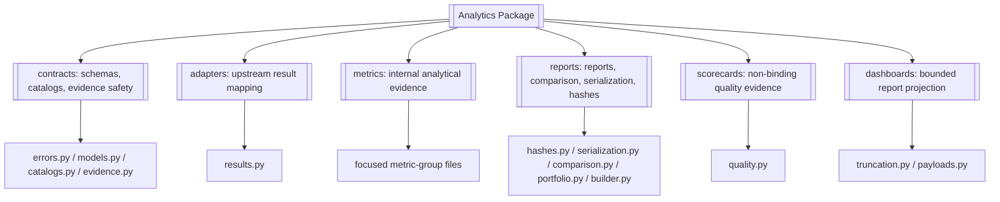
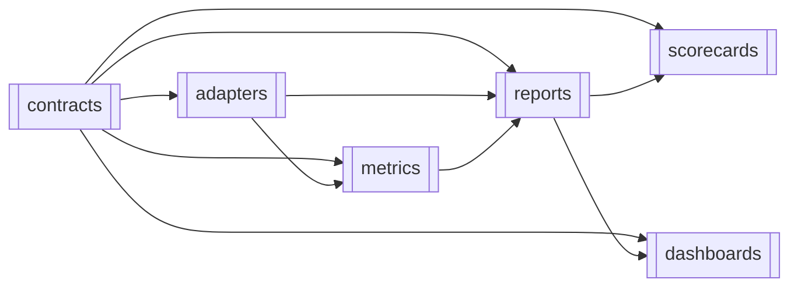
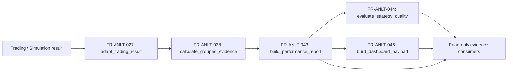

# Analytics

> **Package:** `app/services/analytics`
> **Domain ID:** `ANLT`
> **Status:** `Missing`
> **Last updated:** `2026-07-13`

> This README is the package's **single source of truth** for requirements, final structure, implementation sequence, progress, usage examples, and tests.
> Update this file before changing the code.

---

## 1. Purpose and Boundary

### Purpose

Analytics converts supplied `TradeRecord`, `SimulationResult`, return, equity,
and benchmark evidence into deterministic, versioned `PerformanceReport`,
scorecard, comparison, and dashboard payloads. All outputs are read-only,
non-binding evidence with explicit caveats, lineage, quality flags, and
reproducibility hashes. Analytics fails closed when required evidence, schema
compatibility, currency conversion, or finite numeric validity cannot be proven.

### Owns

- Canonical performance-report, portfolio-report, scorecard, dashboard,
  warning, quality-flag, lineage, and reproducibility-hash schemas.
- Deterministic adapters from approved upstream result contracts into one
  canonical analytics input model.
- Internal metric kernels for approved trade, PnL, equity/return, drawdown,
  core risk, core ratio, benchmark, distribution, cost/efficiency, time, and
  bounded statistical evidence.
- Report building, compatible report comparison, canonical serialization, and
  deterministic hashing.
- The Metric Definition Catalog, warning/quality-flag catalogs, schema
  compatibility catalog, and explicit package exports.
- Projection of validated report sections into bounded dashboard payloads.

### Does not own

- Market-data acquisition, broker/account reads, FX sourcing, or raw provider
  normalization; Data owns those capabilities.
- Strategy signals, promotion, live readiness, risk approval, position sizing,
  kill switches, portfolio allocation, execution, fills, or reconciliation.
- Simulation/backtest/optimization orchestration or execution-evidence repair.
- Durable persistence, migrations, repositories, local file loading, network
  calls, broker mutation, event queues, caches, or background jobs.
- UI rendering, API authentication/authorization, financial advice, prop-firm
  enforcement, or final governance decisions.
- Advanced TCA, attribution, dynamic correlation, explainability,
  live/paper/backtest degradation, and prop-firm evidence in the initial build.

### Shared contracts

Contract definitions match the names, versions, and owners in
`docs/PROJECT.md`. The reconciliation's proposed `AnalyticsReport` name is
normalized to the system-owned cross-domain name `PerformanceReport`.

**Owned by this domain** — defined authoritatively here:

| Status | Contract | Version | Counterparty | Purpose |
|---|---|---|---|---|
| Missing | `PerformanceReport` | `v1` | `UI/API`, `Research`, `Optimization`, `Portfolio` | Return versioned metric sections, report status, caveats, quality flags, lineage, and hashes without persisting the report. |
| Missing | `DashboardPayload` | `v1` | `UI/API` | Bounded, versioned chart/table projection of a validated `PerformanceReport`; registered in `docs/PROJECT.md` §5; no UI rendering logic and no partial emission. |
| Missing | `PortfolioAllocationEvidence` | `v1` | `Portfolio`, `Risk`, `UI/API` | Publish non-binding component/aggregate performance, dependence, concentration, measurement-window, caveat, and FX lineage for portfolio construction/review. |

`PerformanceReport v1` contains: `contract_version="v1"`,
`schema_id="analytics.performance_report.v1"`, `report_id`,
`analytics_engine_version`, `report_status`, `source_context`, ordered
`sections`, ordered `warnings`, ordered `quality_flags`, `lineage`,
`reproducibility_hashes`, precision/annualization metadata, creation time, and
`non_binding=true`. A section contains its name, criticality, status, metric
evidence, and bounded warnings. No field may contain `NaN`, infinity, pandas or
NumPy objects, raw DataFrames/Series, credentials, or provider payloads.

`PortfolioPerformanceReport` remains Analytics-internal. It may be used inside
composition, but cross-domain portfolio evidence is emitted only as the registered
`PortfolioAllocationEvidence v1` projection.

`DashboardPayload v1` carries `contract_version="v1"` and
`schema_id="analytics.dashboard_payload.v1"` before its bounded presentation
sections. Compatibility is evaluated only from `contract_version`.

**Consumed from other domains** — referenced only, never redefined:

| Contract | Version | Owner | Used for |
|---|---|---|---|
| `TradeRecord` / `ExecutionReceipt` | `v1` | Trading | Official execution and reconciliation evidence for historical/live analytics. |
| `SimulationResult` | `v1` | Simulation | Deterministic backtest outcome, fills, journals, and manifest evidence. |
| `PortfolioSimulationResult` | `v1` | Simulation | Deterministic component and aggregate portfolio validation evidence. |
| `MarketDataset` | `v1` | Data | Supplied benchmark series and its availability/provenance metadata. |
| `FXConversionEvidence` | `v1` | Data | Fresh conversion truth applied without path synthesis or rate fetching. |

### Persisted state

None. Analytics is read-only in the initial build and does not persist reports,
catalogs, caches, or intermediate results, as required by `docs/PROJECT.md`.
Analytics is not an `AuditEvent` producer: it is pure/read-only, so the governed
caller audits the action and persists any durable audit evidence through Data.

### Four-level structure

| Code level | Represents |
|---|---|
| **Package** | Analytics domain |
| **Module folder** | One approved feature/capability |
| **File** | One use case or focused responsibility |
| **Class / function / method / constant** | One functional requirement behavior or contract |

```text
Package
└── Module folder
    └── File
        └── Public Class / Function / Method / Constant
```

### Package capability map



---

## 2. Final Package Structure

Modules and files are ordered from lowest dependency to highest dependency.
The order is the implementation sequence.

```text
analytics/
├── __init__.py                         # Approved domain-level exports only
├── README.md
├── contracts/                          # Feature: schemas, catalogs, evidence safety
│   ├── __init__.py
│   ├── errors.py                       # Focus: public Analytics error taxonomy
│   ├── models.py                       # Focus: immutable canonical contracts
│   ├── catalogs.py                     # Focus: metric/warning/schema catalogs
│   └── evidence.py                     # Focus: validation, redaction, JSON safety
├── adapters/                           # Feature: approved upstream-result mapping
│   ├── __init__.py
│   └── results.py                      # Focus: source contract → TradingResult
├── metrics/                            # Feature: internal pure metric evidence
│   ├── __init__.py
│   ├── trades.py                       # Focus: closed-trade outcomes and context
│   ├── returns.py                      # Focus: PnL, equity, and return evidence
│   ├── drawdowns.py                    # Focus: drawdown depth/duration/recovery
│   ├── risk.py                         # Focus: core volatility and tail risk
│   ├── ratios.py                       # Focus: approved core ratios
│   ├── benchmarks.py                   # Focus: benchmark alignment and evidence
│   ├── distributions.py                # Focus: one canonical distribution kernel set
│   ├── statistics.py                   # Focus: bounded deterministic validation
│   ├── cost_efficiency.py              # Focus: cost, MAE/MFE, and time evidence
│   └── groups.py                       # Focus: compose approved grouped evidence
├── reports/                            # Feature: canonical reporting
│   ├── __init__.py
│   ├── hashes.py                       # Focus: deterministic reproducibility hashes
│   ├── serialization.py                # Focus: JSON and human-readable serialization
│   ├── comparison.py                   # Focus: compatible report comparison
│   ├── portfolio.py                    # Focus: currency-safe portfolio aggregation
│   └── builder.py                      # Focus: canonical PerformanceReport orchestration
├── scorecards/                         # Feature: non-binding strategy quality
│   ├── __init__.py
│   └── quality.py                      # Focus: report-derived quality evidence
└── dashboards/                         # Feature: UI/API-ready report projection
    ├── __init__.py
    ├── truncation.py                   # Focus: deterministic bounded series
    └── payloads.py                     # Focus: DashboardPayload projection
```

The final structure intentionally removes the mutable `registry/`, separate
`boundaries/` and `statistics/` layers, duplicate distribution implementations,
compatibility-export file, placeholder formatters, duplicate audit contracts,
and explicit package-root exports. The initial public API contains only
`build_performance_report`; comparison, dashboard, portfolio, and grouped-evidence
functions remain focused feature APIs.

### Package root files

| Status | File | Responsibility | Key exports | Dependencies |
|---|---|---|---|---|
| Missing | `__init__.py` | Expose owned cross-domain contracts plus the sole initial public operation, `build_performance_report`; no compatibility aliases or low-level kernels. | `PerformanceReport`, `DashboardPayload`, `PortfolioAllocationEvidence`, `build_performance_report` | **Standard library:** None<br>**Required third-party:** None<br>**Local:** `contracts.models → owned contracts`; `reports.builder → build_performance_report` |
| Missing | `README.md` | Define the final Analytics requirements, structure, implementation order, workflows, public symbols, tests, status, and exclusions. | None | **Standard library:** None<br>**Required third-party:** None<br>**Local:** None |

### Module dependency diagram



No module depends on `scorecards` or `dashboards`; neither can feed metrics or
reports, so the graph is acyclic.

### Structure rules

- The package root contains only `README.md`, `__init__.py`, and feature modules.
- Stateless calculations and orchestration use functions. Classes are limited
  to immutable contracts and exception types.
- Metric kernels are feature-module APIs for internal callers/tests, not
  package-root exports.
- Other domains import only approved package-root exports; no deep cross-domain
  imports are permitted.
- Usage examples live under `tests/analytics/usage/`.
- `numpy==2.4.6` and `pandas==3.0.3` are present in `uv.lock`, but neither is a
  direct project dependency. If the final implementation imports them, they
  must be declared directly in `pyproject.toml` before coding.

---

## 3. Workflows

### Status values

| Status | Meaning |
|---|---|
| **Missing** | Final behavior is absent, contradicted, or unverified. |
| **Partial** | Useful behavior exists, but final contracts, relocation, validation, or tests remain. |
| **Completed** | Final behavior, structure, runtime use, and tests are verified. |

### Workflow registry

| Status | Workflow ID | Scope | Workflow | Trigger / Input boundary | Final outcome / Output boundary | Requirement sequence |
|---|---|---|---|---|---|---|
| Missing | `WF-ANLT-001` | Cross-domain | Build canonical performance report | `TradeRecord` or `SimulationResult` evidence | `PerformanceReport v1` to UI/API, Research, or Optimization | `FR-ANLT-027 → FR-ANLT-038 → FR-ANLT-043` |
| Missing | `WF-ANLT-002` | Internal | Calculate grouped analytics evidence | Canonical trades/series | Ordered `SectionEvidence` groups | `FR-ANLT-028 → FR-ANLT-038` |
| Missing | `WF-ANLT-003` | Internal | Benchmark-relative analysis | Strategy and benchmark series | Benchmark evidence or explicit skipped/undefined section | `FR-ANLT-033 → FR-ANLT-034` |
| Missing | `WF-ANLT-004` | Internal | Evaluate strategy quality | Canonical `PerformanceReport` | Non-binding `StrategyQualityEvidence` | `FR-ANLT-044` |
| Missing | `WF-ANLT-005` | Cross-domain | Build dashboard payload | Canonical `PerformanceReport` | Bounded `DashboardPayload` to UI/API | `FR-ANLT-045 → FR-ANLT-046` |
| Missing | `WF-ANLT-006` | Cross-domain | Adapt upstream result | Versioned Trading/Simulation result | Canonical `TradingResult` or structured validation failure | `FR-ANLT-021 → FR-ANLT-027` |
| Missing | `WF-ANLT-007` | Internal | Run statistical validation | Canonical numeric series, seed, bounded config | Deterministic confidence/permutation/sample evidence | `FR-ANLT-036` |
| Missing | `WF-ANLT-008` | Internal | Serialize and hash report | Validated report | Canonical JSON or minimal human-readable output plus hashes | `FR-ANLT-025 → FR-ANLT-039 → FR-ANLT-040` |
| Missing | `WF-ANLT-009` | Internal | Build portfolio performance report | Compatible component reports and FX evidence | Analytics-internal currency-safe portfolio report or blocker failure | `FR-ANLT-012 → FR-ANLT-041` |
| Missing | `WF-ANLT-010` | Internal | Compare performance reports | Compatible reference and candidate reports | Actual metric deltas, omissions, and caveats | `FR-ANLT-042` |
| Missing | `WF-ANLT-013` | Cross-domain | Build portfolio allocation evidence | Component reports and/or `PortfolioSimulationResult` plus FX evidence | `PortfolioAllocationEvidence v1` | `FR-ANLT-012 → FR-ANLT-041` |

### Workflow boundaries and failures

#### `WF-ANLT-001` — Build Canonical Performance Report

**System workflows:** `SYS-WF-001`, `SYS-WF-002`, `SYS-WF-003` (candidate scoring:
Optimization consumes the resulting `PerformanceReport v1`; Analytics performs no
optimization-specific orchestration)
**Input boundary:** Trading supplies `TradeRecord`/`ExecutionReceipt`; Simulation
supplies `SimulationResult`; Data may supply benchmark `MarketDataset`.
**Output boundary:** Analytics returns `PerformanceReport v1`; it writes nothing.

1. `adapt_trading_result()` validates the approved source version and maps it to
   `TradingResult` without silent field loss.
2. `calculate_grouped_evidence()` runs only catalog-approved metric groups.
3. `build_performance_report()` applies section criticality, warnings, lineage,
   finite-output validation, and hashes.
4. The public operation returns `PerformanceReport v1` or surfaces `AnalyticsValidationError`.

**Failure behavior:** incompatible schema, missing required evidence, required
section failure, non-finite output, or limit breach returns a structured error.
Optional unavailable evidence becomes a deterministic skipped/failed section;
diagnostic partial mode is opt-in and always non-binding.

**Integration test:**
`tests/analytics/integration/test_build_performance_report.py::test_build_performance_report_from_simulation_result()`

#### `WF-ANLT-002` — Calculate Grouped Analytics Evidence

**System workflow:** None (internal).
Canonical input is split only by explicit source context (all/long/short,
benchmark, cost, or statistical), passed to cataloged kernels, and returned as
ordered section evidence. Empty/undefined evidence is `None` or skipped with a
warning, never fabricated zero/infinity.

**Failure behavior:** invalid closed-trade semantics, ambiguous direction,
non-finite required values, or an unapproved metric definition fails validation.

**Integration test:**
`tests/analytics/integration/test_grouped_evidence.py::test_grouped_evidence_preserves_source_context()`

#### `WF-ANLT-003` — Benchmark-Relative Analysis

**System workflow:** None (internal contribution to `SYS-WF-001`/`SYS-WF-002`).
`align_benchmark_series()` normalizes UTC timestamps, restricts the benchmark to
the analytics window, resolves duplicates deterministically under approved
policy, and intersects observations. `calculate_benchmark_evidence()` then
calculates only approved, currency-valid metrics.

**Failure behavior:** non-overlap or insufficient observations yields skipped
evidence; missing benchmark currency restricts output to currency-neutral
metrics with a warning; invalid/future schemas fail.

**Integration test:**
`tests/analytics/integration/test_benchmark_workflow.py::test_benchmark_alignment_is_utc_and_window_bounded()`

#### `WF-ANLT-004` — Evaluate Strategy Quality

**System workflow:** None.
`evaluate_strategy_quality()` reads canonical report sections, checks sample
evidence and owner-approved diagnostic thresholds, and returns facts, warnings,
and non-binding review context. It never emits approval, promotion, live
readiness, prop-firm compliance, risk approval, or allocation decisions.

**Failure behavior:** missing required report sections or absent threshold policy
blocks evaluation; degraded inputs propagate degraded confidence.

**Integration test:**
`tests/analytics/integration/test_strategy_quality.py::test_strategy_quality_is_non_binding()`

#### `WF-ANLT-005` — Build Dashboard Payload

**System workflows:** `SYS-WF-001`, `SYS-WF-002`
**Input boundary:** a validated `PerformanceReport`.
**Output boundary:** a versioned `DashboardPayload` for UI/API.

`build_dashboard_payload()` projects approved summary/equity/drawdown/warning
and quality-flag sections without recomputing metrics; `truncate_series()`
applies the approved deterministic point limit.

**Failure behavior:** missing/degraded sections remain visibly skipped/degraded;
non-finite values or inability to satisfy the point limit fails validation.

**Integration test:**
`tests/analytics/integration/test_dashboard_payload.py::test_dashboard_uses_report_sections_without_recomputation()`

#### `WF-ANLT-006` — Adapt Upstream Result

**System workflows:** `SYS-WF-001`, `SYS-WF-002`, `SYS-WF-003`
**Input boundary:** versioned producer-owned result.
**Output boundary:** internal canonical `TradingResult`.

**Failure behavior:** missing mappings, required fields, versions, identifiers,
currency/timestamps, or conflicting PnL fields fail closed with bounded details.
Unsupported fields are never silently dropped; bounded source metadata is
preserved in lineage.

**Integration test:**
`tests/analytics/integration/test_result_adapters.py::test_approved_sources_map_without_field_loss()`

#### `WF-ANLT-007` — Run Statistical Validation

**System workflow:** None.
`run_statistical_validation()` accepts an explicit seed and bounded iteration,
confidence, alpha, and sample configuration; it computes real bootstrap,
permutation, multiple-comparison, and sample-size evidence only.

**Failure behavior:** absent seed, insufficient/invalid observations, invalid
alpha/confidence, or iteration-limit breach fails or returns explicit skipped
evidence per the Metric Definition Catalog. Fixed-value White's Reality Check,
PBO, and backtest wrappers are prohibited.

**Integration test:**
`tests/analytics/integration/test_statistical_validation.py::test_seeded_validation_is_reproducible()`

#### `WF-ANLT-008` — Serialize and Hash Report

**System workflow:** None.
`serialize_report()` emits canonical JSON or the one approved minimal
human-readable representation. `compute_reproducibility_hashes()` computes
input, config, ledger, equity, optional benchmark, and report hashes from
canonical JSON while excluding documented nondeterministic fields. MD5 is not
permitted.

**Failure behavior:** unsupported values, non-finite numbers, or unknown format
fails validation; serialization never writes a file.

**Integration test:**
`tests/analytics/integration/test_report_serialization.py::test_serialization_and_hashes_are_deterministic()`

#### `WF-ANLT-009` — Build Portfolio Performance Report

**System workflows:** Internal helper for `SYS-WF-007` / `SYS-WF-008`.
`PortfolioPerformanceReport` is Analytics-internal; only the
registered `PortfolioAllocationEvidence v1` projection crosses the boundary.
Validated component reports are checked for schema, pairing, base currency, and
caller-supplied FX evidence before real aggregation.

**Failure behavior:** raw multi-currency PnL is never summed; missing required FX
or incompatible schemas produces blocker evidence and no aggregate report.

**Integration test:**
`tests/analytics/integration/test_portfolio_report.py::test_portfolio_report_fails_closed_without_fx()`

#### `WF-ANLT-010` — Compare Performance Reports

**System workflow:** None.
`compare_performance_reports()` validates schema and pairing metadata, compares
approved common metrics without mutating inputs, and reports deltas, missing
metrics, and caveats. Fixed zero differences are prohibited.

**Integration test:**
`tests/analytics/integration/test_report_comparison.py::test_report_comparison_uses_actual_common_metrics()`

#### `WF-ANLT-013` — Build Portfolio Allocation Evidence

**System workflows:** `SYS-WF-007`, `SYS-WF-008`.
For the final `SYS-WF-008` leg, Analytics receives immutable reconciled
`TradeRecord v1` / `ExecutionReceipt v1` facts and never edits execution truth.
Analytics validates exact component/source schemas, measurement window, base
currency, fresh Data-owned `FXConversionEvidence`, and finite numeric results,
then projects performance, dependence, concentration, and caveat evidence into
`PortfolioAllocationEvidence v1`. It does not recommend weights, approve a
portfolio, set a risk budget, or infer missing values.

**Failure behavior:** missing/incompatible sources or FX evidence returns a
structured blocker and no partial cross-domain evidence. After execution this is
recorded as `executed-but-unmeasured`; it never rolls back or rewrites execution.
The same immutable execution/FX/version inputs support deterministic recomputation.

**Integration test:**
`tests/analytics/integration/test_portfolio_allocation_evidence.py::test_evidence_is_non_binding_and_fx_provenanced()`

### Core workflow diagram



---

## 4. Module and Requirement Specifications

This section is the implementation plan. Every public symbol appears in exactly
one functional-requirement row. Low-level private helpers do not receive IDs.

### 4.1 `contracts/` — Schemas, Catalogs, and Evidence Safety

**Purpose:** Define immutable domain contracts and the single static source of
truth for metric, warning, quality-flag, and schema behavior.

**Module flow:**

```text
raw contract value
  → catalogs.py policy lookup
  → evidence.py validation/redaction/JSON normalization
  → models.py immutable evidence contract
```

#### Files

| Status | File | Responsibility | Key exports | Dependencies |
|---|---|---|---|---|
| Missing | `errors.py` | Define Analytics exceptions and bounded error conversion. | `AnalyticsError`, `AnalyticsValidationError`, `to_analytics_error_payload` | **Standard library:** `collections.abc`<br>**Required third-party:** None<br>**Local:** None |
| Missing | `models.py` | Define immutable canonical input, evidence, report, scorecard, and dashboard contracts. | `TradingResult`, `MetricEvidence`, `SectionEvidence`, `AnalyticsWarning`, `QualityFlag`, `Lineage`, `ReproducibilityHashes`, `PerformanceReport`, `PortfolioPerformanceReport`, `DashboardPayload`, `StrategyQualityEvidence` | **Standard library:** `dataclasses`, `datetime`, `decimal`, `enum`<br>**Required third-party:** `pydantic`<br>**Local:** `errors.py → AnalyticsValidationError` |
| Missing | `catalogs.py` | Define and validate static metric, warning/flag, evidence, and contract compatibility catalogs. | `METRIC_DEFINITION_CATALOG`, `EVIDENCE_CATALOG`, `CONTRACT_COMPATIBILITY_MATRIX`, `validate_metric_catalog`, `validate_contract_version` | **Standard library:** `collections.abc`<br>**Required third-party:** None<br>**Local:** `models.py → MetricEvidence`; `errors.py → AnalyticsValidationError` |
| Missing | `evidence.py` | Build ordered report evidence and enforce report-specific finite JSON safety. It imports Utils-owned redaction and canonical serialization primitives and must not wrap, export, or redefine them. | `build_warning`, `build_quality_flag`, `to_json_safe` | **Standard library:** `collections.abc`, `datetime`, `decimal`, `enum`<br>**Required third-party:** `numpy`, `pandas`<br>**Local:** `catalogs.py → EVIDENCE_CATALOG`; `models.py → AnalyticsWarning, QualityFlag`; `errors.py → AnalyticsValidationError`; `app.utils → redact_mapping_value, canonical_json` |
| Missing | `__init__.py` | Expose the approved feature API only. | All key exports above after catalog approval | **Standard library:** None<br>**Required third-party:** None<br>**Local:** explicit imports from the four files above |

#### Configuration and Limits Manifest

| Status | Setting / Limit | Type | Default | Required | Used by | Description |
|---|---|---|---|---|---|---|
| Missing | `ANALYTICS_SCHEMA_VERSION` | `str` | `v1` | Yes | All contracts | Identifies the system-approved `PerformanceReport` version; unsupported versions fail validation. |
| Missing | `MAX_WARNING_DETAIL_BYTES` | `int` | None | Yes before public activation | `build_warning()`, `build_quality_flag()`, `to_analytics_error_payload()` | Deployment must supply a measured positive bound; excess detail is rejected or deterministically truncated. |
| Missing | `SAFE_REQUEST_ID_FORMAT` | policy | Prefixed UUID4 | Yes | Public operations | Missing, empty, malformed, or unsafe IDs raise `AnalyticsValidationError`. |

#### `errors.py` — Public Error Taxonomy

| Status | Requirement ID | Responsibility | Class / Function / Method | Side Effects | Raises | Usage / Test |
|---|---|---|---|---|---|---|
| Missing | `FR-ANLT-001` | The system shall expose one base exception for direct Analytics feature APIs. | `AnalyticsError` | None | None | **Usage:** `tests/analytics/usage/test_usage_contracts.py::test_usage_errors_analytics_error()`<br>**Unit:** `tests/analytics/unit/test_errors.py::test_analytics_error_is_domain_base()` |
| Missing | `FR-ANLT-002` | The system shall distinguish invalid, missing, incompatible, or unsafe analytics evidence from execution failures. | `AnalyticsValidationError` | None | None | **Usage:** `tests/analytics/usage/test_usage_contracts.py::test_usage_errors_validation_error()`<br>**Unit:** `tests/analytics/unit/test_errors.py::test_validation_error_is_analytics_error()` |
| Missing | `FR-ANLT-003` | The system shall convert a controlled exception into a bounded, redacted error payload without exposing provider exceptions or secrets. | `to_analytics_error_payload(error: Exception) -> dict[str, object]` | None | None | **Usage:** `tests/analytics/usage/test_usage_contracts.py::test_usage_errors_error_payload()`<br>**Unit:** `tests/analytics/unit/test_errors.py::test_error_payload_is_bounded_and_redacted()` |

#### `models.py` — Immutable Canonical Contracts

| Status | Requirement ID | Responsibility | Class / Function / Method | Side Effects | Raises | Usage / Test |
|---|---|---|---|---|---|---|
| Missing | `FR-ANLT-004` | The system shall represent an adapted upstream result with source version, IDs, phase, UTC window, currency, strategy, symbols, timeframe, trades, curves, benchmark evidence, quality metadata, and lineage. | `TradingResult` | None | `AnalyticsValidationError`: required canonical evidence is absent or inconsistent | **Usage:** `tests/analytics/usage/test_usage_contracts.py::test_usage_models_trading_result()`<br>**Unit:** `tests/analytics/unit/test_models.py::test_trading_result_rejects_missing_identity()` |
| Missing | `FR-ANLT-005` | The system shall represent one metric as a finite calculated/undefined/skipped value with unit, confidence, warnings, and source context. | `MetricEvidence` | None | `AnalyticsValidationError`: value is non-finite or status/unit is invalid | **Usage:** `tests/analytics/usage/test_usage_contracts.py::test_usage_models_metric_evidence()`<br>**Unit:** `tests/analytics/unit/test_models.py::test_metric_evidence_rejects_infinity()` |
| Missing | `FR-ANLT-006` | The system shall represent one report section with approved criticality, ordered metrics, status, warnings, and failure/skipped reason. | `SectionEvidence` | None | `AnalyticsValidationError`: status conflicts with included evidence | **Usage:** `tests/analytics/usage/test_usage_contracts.py::test_usage_models_section_evidence()`<br>**Unit:** `tests/analytics/unit/test_models.py::test_section_evidence_requires_reason_when_skipped()` |
| Missing | `FR-ANLT-007` | The system shall represent a bounded warning with code, severity, affected section, source context, and detail. | `AnalyticsWarning` | None | `AnalyticsValidationError`: code/severity is uncataloged | **Usage:** `tests/analytics/usage/test_usage_contracts.py::test_usage_models_warning()`<br>**Unit:** `tests/analytics/unit/test_models.py::test_warning_uses_cataloged_severity()` |
| Missing | `FR-ANLT-008` | The system shall represent a quality flag separately from metrics and governance decisions, including blocker semantics and source evidence. | `QualityFlag` | None | `AnalyticsValidationError`: flag type/code is uncataloged | **Usage:** `tests/analytics/usage/test_usage_contracts.py::test_usage_models_quality_flag()`<br>**Unit:** `tests/analytics/unit/test_models.py::test_quality_flag_cannot_claim_governance_decision()` |
| Missing | `FR-ANLT-009` | The system shall preserve bounded source IDs, versions, configuration sources, inherited currency, and transformation history. | `Lineage` | None | `AnalyticsValidationError`: required lineage is missing or unsafe | **Usage:** `tests/analytics/usage/test_usage_contracts.py::test_usage_models_lineage()`<br>**Unit:** `tests/analytics/unit/test_models.py::test_lineage_preserves_source_versions()` |
| Missing | `FR-ANLT-010` | The system shall hold SHA-256 hashes for input, configuration, trade ledger, equity curve, optional benchmark, and final report evidence. | `ReproducibilityHashes` | None | `AnalyticsValidationError`: a required hash is absent or malformed | **Usage:** `tests/analytics/usage/test_usage_contracts.py::test_usage_models_hashes()`<br>**Unit:** `tests/analytics/unit/test_models.py::test_reproducibility_hashes_require_sha256()` |
| Missing | `FR-ANLT-011` | The system shall expose the owned `PerformanceReport v1` cross-domain contract with ordered sections, caveats, lineage, hashes, precision metadata, and `non_binding=true`. | `PerformanceReport` | None | `AnalyticsValidationError`: contract, finite-output, or section invariants fail | **Usage:** `tests/analytics/usage/test_usage_contracts.py::test_usage_models_performance_report()`<br>**Unit:** `tests/analytics/unit/test_models.py::test_performance_report_matches_v1_contract()` |
| Missing | `FR-ANLT-012` | The system shall represent real portfolio aggregation with component lineage, base currency, FX evidence, blocker flags, and no fabricated aggregate values. | `PortfolioPerformanceReport` | None | `AnalyticsValidationError`: component schema/currency/FX evidence is incompatible | **Usage:** `tests/analytics/usage/test_usage_contracts.py::test_usage_models_portfolio_report()`<br>**Unit:** `tests/analytics/unit/test_models.py::test_portfolio_report_requires_fx_lineage()` |
| Missing | `FR-ANLT-013` | The system shall represent versioned finite chart/table payloads, section statuses, warnings, units, and truncation metadata without UI rendering logic. | `DashboardPayload` | None | `AnalyticsValidationError`: payload is non-finite or exceeds approved limits | **Usage:** `tests/analytics/usage/test_usage_contracts.py::test_usage_models_dashboard_payload()`<br>**Unit:** `tests/analytics/unit/test_models.py::test_dashboard_payload_is_json_safe()` |
| Missing | `FR-ANLT-014` | The system shall represent report-derived facts, score inputs, warnings, and recommendation context while explicitly excluding governance authority. | `StrategyQualityEvidence` | None | `AnalyticsValidationError`: evidence claims approval/promotion authority | **Usage:** `tests/analytics/usage/test_usage_contracts.py::test_usage_models_strategy_quality()`<br>**Unit:** `tests/analytics/unit/test_models.py::test_strategy_quality_is_non_binding()` |

#### `catalogs.py` — Static Catalogs and Compatibility

| Status | Requirement ID | Responsibility | Class / Function / Method | Side Effects | Raises | Usage / Test |
|---|---|---|---|---|---|---|
| Missing | `FR-ANLT-016` | The system shall expose an authoritative definition for every metric used by a report, dashboard, warning, or quality flag. | `METRIC_DEFINITION_CATALOG: Mapping[str, Mapping[str, object]]` | None | None | **Usage:** `tests/analytics/usage/test_usage_contracts.py::test_usage_catalogs_metrics()`<br>**Unit:** `tests/analytics/unit/test_catalogs.py::test_every_contract_metric_is_cataloged()` |
| Missing | `FR-ANLT-017` | The system shall expose deterministic, separately namespaced warning and quality-flag definitions with bounded details, source-backed status, and blocker meaning. | `EVIDENCE_CATALOG: Mapping[str, Mapping[str, Mapping[str, object]]]` | None | None | **Usage:** `tests/analytics/usage/test_usage_contracts.py::test_usage_catalogs_warnings()`<br>**Unit:** `tests/analytics/unit/test_catalogs.py::test_warning_and_flag_codes_are_unique()` |
| Missing | `FR-ANLT-018` | The system shall classify accepted, deprecated, legacy-adapted, unsupported, and future source/report contract versions independently of `schema_id`. | `CONTRACT_COMPATIBILITY_MATRIX: Mapping[str, Mapping[str, str]]` | None | None | **Usage:** `tests/analytics/usage/test_usage_contracts.py::test_usage_catalogs_contract_compatibility()`<br>**Unit:** `tests/analytics/unit/test_catalogs.py::test_contract_matrix_covers_each_counterparty()` |
| Missing | `FR-ANLT-020` | The system shall reject a metric catalog lacking formula, unit, inputs, scale, annualization, sample convention, minimum sample, undefined behavior, evidence type, or fixture. | `validate_metric_catalog(catalog: Mapping[str, Mapping[str, object]]) -> None` | None | `AnalyticsValidationError`: any official metric definition is incomplete | **Usage:** `tests/analytics/usage/test_usage_contracts.py::test_usage_catalogs_validate_metrics()`<br>**Unit:** `tests/analytics/unit/test_catalogs.py::test_validate_metric_catalog_requires_formula_policy()` |
| Missing | `FR-ANLT-021` | The system shall classify `contract_version` and reject missing, unsupported, or unsafe future compatibility versions before calculation; `schema_id` is validated separately and never parsed as a version. | `validate_contract_version(contract: str, version: str) -> str` | None | `AnalyticsValidationError`: version cannot be safely consumed | **Usage:** `tests/analytics/usage/test_usage_contracts.py::test_usage_catalogs_validate_contract_version()`<br>**Unit:** `tests/analytics/unit/test_catalogs.py::test_validate_contract_version_rejects_future()` |

#### `evidence.py` — Evidence Construction and Output Safety

| Status | Requirement ID | Responsibility | Class / Function / Method | Side Effects | Raises | Usage / Test |
|---|---|---|---|---|---|---|
| Missing | `FR-ANLT-022` | The system shall build a catalog-backed warning with deterministic ordering and bounded redacted detail. | `build_warning(code: str, *, section: str, source_context: str, detail: Mapping[str, object]) -> AnalyticsWarning` | None | `AnalyticsValidationError`: code/detail is invalid | **Usage:** `tests/analytics/usage/test_usage_contracts.py::test_usage_evidence_build_warning()`<br>**Unit:** `tests/analytics/unit/test_evidence.py::test_build_warning_bounds_detail()` |
| Missing | `FR-ANLT-023` | The system shall build a catalog-backed quality flag that separates evidence from final governance decisions. | `build_quality_flag(code: str, *, section: str, source_context: str, detail: Mapping[str, object]) -> QualityFlag` | None | `AnalyticsValidationError`: code/detail is invalid | **Usage:** `tests/analytics/usage/test_usage_contracts.py::test_usage_evidence_build_quality_flag()`<br>**Unit:** `tests/analytics/unit/test_evidence.py::test_quality_flag_does_not_embed_decision()` |
| Removed | `FR-ANLT-024` | Local redaction is prohibited; Analytics imports and applies Utils `redact_mapping_value`. | None in Analytics | None | None | **Verification:** boundary test confirms Analytics defines no redaction primitive. |
| Missing | `FR-ANLT-025` | The system shall convert supported contracts, Decimal, datetime, pandas, and NumPy values to finite JSON-safe values and reject unsupported/non-finite values. | `to_json_safe(value: object) -> object` | None | `AnalyticsValidationError`: value is non-finite or unserializable | **Usage:** `tests/analytics/usage/test_usage_contracts.py::test_usage_evidence_json_safe()`<br>**Unit:** `tests/analytics/unit/test_evidence.py::test_to_json_safe_rejects_infinity()` |
| Removed | `FR-ANLT-026` | Local canonical serialization is prohibited; Analytics imports Utils `canonical_json`. | None in Analytics | None | None | **Verification:** boundary test confirms Analytics defines no canonical JSON primitive. |

**Rules:**

- Contracts are immutable and use `Decimal` for monetary values and deterministic
  float64 only for derived ratios under cataloged tolerances.
- Undefined results use `None`/skipped evidence; infinity, caps, and fabricated
  zeros are prohibited.
- Warning severity is informational, warning, major, critical, or blocker.
- Analytics-owned duplicate audit/event contracts are prohibited.

**Implementation notes:** Reuse the valuable V1 contract, catalog, warning,
serialization, and error logic, but merge duplicate models/envelopes/redactors.
The package returns Analytics-owned typed contracts and surfaces
`AnalyticsValidationError`; it defines no generic response envelope.

### Feature usage examples

`tests/analytics/usage/test_usage_contracts.py` contains one `test_usage_*`
function for every `FR-ANLT-001` through `FR-ANLT-026` mapping above.

---

### 4.2 `adapters/` — Approved Upstream Result Mapping

**Purpose:** Convert an approved, versioned producer-owned result into
`TradingResult` without silent field loss or provider-object leakage.

**Module flow:**

```text
TradeRecord / SimulationResult mapping
  → schema compatibility validation
  → explicit field mapping and conflict checks
  → TradingResult + lineage
```

#### Files

| Status | File | Responsibility | Key exports | Dependencies |
|---|---|---|---|---|
| Missing | `results.py` | Map approved Trading/Simulation inputs into the canonical Analytics input. | `adapt_trading_result` | **Standard library:** `collections.abc`, `datetime`, `decimal`<br>**Required third-party:** None<br>**Local:** `contracts.catalogs → validate_contract_version`; `contracts.errors → AnalyticsValidationError`; `contracts.models → TradingResult, Lineage` |
| Missing | `__init__.py` | Expose the adapter feature API. | `adapt_trading_result` | **Standard library:** None<br>**Required third-party:** None<br>**Local:** `results.py → adapt_trading_result` |

#### Configuration and Limits Manifest

| Status | Setting / Limit | Type | Default | Required | Used by | Description |
|---|---|---|---|---|---|---|
| Missing | `MAX_TRADES` | `int` | `1000000` informational baseline | Yes | `adapt_trading_result()` | Rejects source ledgers larger than the ceiling before allocation/calculation. |
| Missing | `MAX_EQUITY_POINTS` | `int` | None | Yes before public activation | `adapt_trading_result()` | Deployment must supply a measured positive bound; oversized curves fail before normalization. |
| Missing | `MAX_BENCHMARK_POINTS` | `int` | None | Yes before public activation | `adapt_trading_result()` | Deployment must supply a measured positive bound; oversized series fail before alignment. |

#### `results.py` — Canonical Result Adaptation

| Status | Requirement ID | Responsibility | Class / Function / Method | Side Effects | Raises | Usage / Test |
|---|---|---|---|---|---|---|
| Missing | `FR-ANLT-027` | The system shall deterministically map an approved versioned Trading or Simulation result to `TradingResult`, preserving IDs, phase, UTC window, currency, strategy, symbols, timeframe, trades, curves, quality metadata, and bounded source metadata without silent field loss. | `adapt_trading_result(source: Mapping[str, object], *, source_contract: str) -> TradingResult` | None | `AnalyticsValidationError`: mapping/version/required field is missing, conflicting, oversized, or incompatible | **Usage:** `tests/analytics/usage/test_usage_adapters.py::test_usage_results_adapt_trading_result()`<br>**Unit:** `tests/analytics/unit/test_results_adapter.py::test_adapt_trading_result_preserves_required_lineage()` |

**Rules:**

- Raw provider objects, files, DataFrames, DB sessions, and broker SDK objects do
  not cross this boundary.
- Timestamps become UTC; ambiguous local timestamps fail validation.
- Conflicting PnL, currency, ID, or timestamp fields fail closed.
- Unsupported extra fields are preserved only as bounded redacted source
  metadata under the approved mapping; otherwise adaptation fails.

**Implementation notes:** Refactor V1 `TradingResultAdapter.to_canonical()` and
journal mappings. Do not keep journal-specific public adapters until Trading and
Simulation approve their source schemas and compatibility versions.

### Feature usage examples

`tests/analytics/usage/test_usage_adapters.py` demonstrates `FR-ANLT-027`.

---

### 4.3 `metrics/` — Internal Pure Analytical Evidence

**Purpose:** Calculate only catalog-approved evidence required by reports,
scorecards, dashboards, and approved grouped operations. Low-level helpers remain
private.

**Module flow:**

```text
TradingResult / canonical numeric series
  → focused pure metric group
  → finite MetricEvidence values and warnings
  → calculate_grouped_evidence()
```

#### Files

| Status | File | Responsibility | Key exports | Dependencies |
|---|---|---|---|---|
| Missing | `trades.py` | Closed-trade classification, outcomes, R-multiple, exposure/time context. | `calculate_trade_evidence` | **Standard library:** `collections.abc`, `datetime`, `decimal`, `statistics`<br>**Required third-party:** None<br>**Local:** `contracts.models → TradingResult, SectionEvidence`; `contracts.catalogs → METRIC_DEFINITION_CATALOG` |
| Missing | `returns.py` | Monetary PnL, equity, return, and period evidence. | `calculate_return_evidence` | **Standard library:** `collections.abc`, `datetime`, `decimal`, `statistics`<br>**Required third-party:** `numpy`, `pandas`<br>**Local:** `contracts.models → TradingResult, SectionEvidence`; `contracts.catalogs → METRIC_DEFINITION_CATALOG` |
| Missing | `drawdowns.py` | Core drawdown depth, duration, and recovery evidence. | `calculate_drawdown_evidence` | **Standard library:** `collections.abc`, `decimal`<br>**Required third-party:** `numpy`<br>**Local:** `contracts.models → SectionEvidence`; `contracts.catalogs → METRIC_DEFINITION_CATALOG` |
| Missing | `risk.py` | Approved volatility, VaR, CVaR, and expected-shortfall evidence. | `calculate_risk_evidence` | **Standard library:** `collections.abc`, `decimal`, `statistics`<br>**Required third-party:** `numpy`<br>**Local:** `contracts.models → SectionEvidence`; `contracts.catalogs → METRIC_DEFINITION_CATALOG` |
| Missing | `ratios.py` | Approved core Sharpe, Sortino, Calmar, profit-factor, payoff, and expectancy ratios. | `calculate_ratio_evidence` | **Standard library:** `collections.abc`, `decimal`<br>**Required third-party:** `numpy`<br>**Local:** `contracts.models → SectionEvidence`; `contracts.catalogs → METRIC_DEFINITION_CATALOG` |
| Missing | `benchmarks.py` | UTC/window/currency-aware alignment and benchmark-relative evidence. | `align_benchmark_series`, `calculate_benchmark_evidence` | **Standard library:** `collections.abc`, `datetime`<br>**Required third-party:** `numpy`, `pandas`<br>**Local:** `contracts.models → SectionEvidence, AnalyticsWarning`; `contracts.catalogs → METRIC_DEFINITION_CATALOG` |
| Missing | `distributions.py` | Canonical moments, percentiles, tails, histogram/outlier evidence required by reports. | `calculate_distribution_evidence` | **Standard library:** `collections.abc`, `statistics`<br>**Required third-party:** `numpy`<br>**Local:** `contracts.models → SectionEvidence`; `contracts.catalogs → METRIC_DEFINITION_CATALOG` |
| Missing | `statistics.py` | Real bounded seeded bootstrap, permutation, multiple-comparison, and sample evidence. | `run_statistical_validation` | **Standard library:** `collections.abc`, `random`, `statistics`<br>**Required third-party:** `numpy`<br>**Local:** `contracts.models → SectionEvidence`; `contracts.catalogs → METRIC_DEFINITION_CATALOG` |
| Missing | `cost_efficiency.py` | Supplied spread/slippage/commission, MAE/MFE, duration, and efficiency evidence. | `calculate_cost_efficiency_evidence` | **Standard library:** `collections.abc`, `datetime`, `decimal`<br>**Required third-party:** None<br>**Local:** `contracts.models → TradingResult, SectionEvidence`; `contracts.catalogs → METRIC_DEFINITION_CATALOG` |
| Missing | `groups.py` | Compose approved metric groups in deterministic order with source context. | `calculate_grouped_evidence` | **Standard library:** `collections.abc`<br>**Required third-party:** None<br>**Local:** all metric files above; `contracts.models → TradingResult, SectionEvidence` |
| Missing | `__init__.py` | Expose focused internal feature APIs only. | All key exports above | **Standard library:** None<br>**Required third-party:** None<br>**Local:** explicit imports from metric files |

#### Configuration and Limits Manifest

| Status | Setting / Limit | Type | Default | Required | Used by | Description |
|---|---|---|---|---|---|---|
| Missing | `BREAKEVEN_EPSILON` | `Decimal` | `1e-8` | Yes | `calculate_trade_evidence()` | `abs(PnL) < 1e-8` is breakeven. |
| Missing | `ANNUALIZATION_POLICY` | `Mapping[str, int]` | Trading days=`252` | Yes | Return/risk/ratio/benchmark evidence | Unsafe frequency inference blocks annualized metrics. |
| Missing | `RISK_FREE_RATE` | `Decimal` | None | Yes when an excess-return metric is requested | Ratio/benchmark evidence | Caller must supply the source and units; there is no silent default. |
| Missing | `MIN_METRIC_SAMPLES` | `Mapping[str, int]` | Variance metrics=`2`; warning below `30` trades | Yes | All metric groups | Below-minimum samples yield skipped evidence; fewer than 30 trades emits `insufficient_samples`. |
| Missing | `MAX_STATISTICAL_OBSERVATIONS` | `int` | None | Yes before statistical validation | `run_statistical_validation()` | Deployment must supply a measured positive bound; oversized observations fail before allocation. |
| Missing | `MAX_BOOTSTRAP_ITERATIONS` | `int` | None | Yes before statistical validation | `run_statistical_validation()` | Deployment must supply a measured positive bound; excess iterations fail validation. |
| Missing | `MAX_PERMUTATION_ITERATIONS` | `int` | None | Yes before statistical validation | `run_statistical_validation()` | Deployment must supply a measured positive bound; excess iterations fail validation. |

#### Functional requirements

| Status | Requirement ID | Responsibility | Class / Function / Method | Side Effects | Raises | Usage / Test |
|---|---|---|---|---|---|---|
| Missing | `FR-ANLT-028` | The system shall calculate closed-trade outcomes, explicit-direction splits, cataloged R-multiples, merged-overlap market presence, streaks, and source context without treating open/placeholders as realized trades. | `calculate_trade_evidence(result: TradingResult, *, source_context: str = "all") -> SectionEvidence` | None | `AnalyticsValidationError`: trade evidence or metric policy is invalid | **Usage:** `tests/analytics/usage/test_usage_metrics.py::test_usage_trades_calculate_trade_evidence()`<br>**Unit:** `tests/analytics/unit/test_trades.py::test_trade_evidence_filters_open_and_placeholder_trades()` |
| Missing | `FR-ANLT-029` | The system shall calculate monetary PnL in `Decimal` and deterministic sorted equity/return evidence with explicit frequency, scale, UTC, and undefined behavior. | `calculate_return_evidence(result: TradingResult) -> SectionEvidence` | None | `AnalyticsValidationError`: curve, frequency, currency, or finite-value policy is invalid | **Usage:** `tests/analytics/usage/test_usage_metrics.py::test_usage_returns_calculate_return_evidence()`<br>**Unit:** `tests/analytics/unit/test_returns.py::test_return_evidence_sorts_utc_and_records_frequency()` |
| Missing | `FR-ANLT-030` | The system shall calculate core drawdown depth, duration, recovery, ulcer, and pain evidence from approved curves while returning undefined ratios as `None` with warnings. | `calculate_drawdown_evidence(result: TradingResult) -> SectionEvidence` | None | `AnalyticsValidationError`: curve or drawdown policy is invalid | **Usage:** `tests/analytics/usage/test_usage_metrics.py::test_usage_drawdowns_calculate_drawdown_evidence()`<br>**Unit:** `tests/analytics/unit/test_drawdowns.py::test_drawdown_evidence_matches_golden_fixture()` |
| Missing | `FR-ANLT-031` | The system shall calculate only approved volatility, VaR, CVaR, and expected-shortfall evidence with cataloged sign, confidence, sample, and units. | `calculate_risk_evidence(returns: Sequence[float]) -> SectionEvidence` | None | `AnalyticsValidationError`: returns or risk policy is invalid | **Usage:** `tests/analytics/usage/test_usage_metrics.py::test_usage_risk_calculate_risk_evidence()`<br>**Unit:** `tests/analytics/unit/test_risk.py::test_risk_evidence_uses_cataloged_tail_convention()` |
| Missing | `FR-ANLT-032` | The system shall calculate only approved core ratios and return zero-denominator/insufficient-sample results as `None` with warnings. | `calculate_ratio_evidence(result: TradingResult, returns: Sequence[float]) -> SectionEvidence` | None | `AnalyticsValidationError`: formula or annualization policy is absent/invalid | **Usage:** `tests/analytics/usage/test_usage_metrics.py::test_usage_ratios_calculate_ratio_evidence()`<br>**Unit:** `tests/analytics/unit/test_ratios.py::test_ratio_evidence_never_returns_infinity()` |
| Missing | `FR-ANLT-033` | The system shall normalize strategy/benchmark timestamps to UTC, restrict the comparison window, resolve duplicates under approved policy, and return deterministic aligned observations. | `align_benchmark_series(strategy: Sequence[Mapping[str, object]], benchmark: Sequence[Mapping[str, object]]) -> tuple[tuple[float, ...], tuple[float, ...]]` | None | `AnalyticsValidationError`: timestamps, duplicates, window, or values are invalid | **Usage:** `tests/analytics/usage/test_usage_metrics.py::test_usage_benchmarks_align_series()`<br>**Unit:** `tests/analytics/unit/test_benchmarks.py::test_align_benchmark_series_uses_timestamp_intersection()` |
| Missing | `FR-ANLT-034` | The system shall calculate approved benchmark-relative evidence only after alignment and currency checks; non-overlap or zero variance is explicit skipped/undefined evidence. | `calculate_benchmark_evidence(result: TradingResult) -> SectionEvidence` | None | `AnalyticsValidationError`: required alignment/currency evidence is invalid | **Usage:** `tests/analytics/usage/test_usage_metrics.py::test_usage_benchmarks_calculate_evidence()`<br>**Unit:** `tests/analytics/unit/test_benchmarks.py::test_benchmark_zero_variance_is_undefined()` |
| Missing | `FR-ANLT-035` | The system shall use one cataloged implementation for approved moments, percentiles, tails, histogram, and outlier evidence, with constant/short samples handled explicitly. | `calculate_distribution_evidence(values: Sequence[float]) -> SectionEvidence` | None | `AnalyticsValidationError`: values or selected definition is invalid | **Usage:** `tests/analytics/usage/test_usage_metrics.py::test_usage_distributions_calculate_evidence()`<br>**Unit:** `tests/analytics/unit/test_distributions.py::test_distribution_constant_sample_is_explicit()` |
| Missing | `FR-ANLT-036` | The system shall compute real, bounded, seeded bootstrap, permutation, multiple-comparison, and sample diagnostics reproducibly and shall not return fixed placeholder evidence. | `run_statistical_validation(values: Sequence[float], *, seed: int, bootstrap_iterations: int, permutation_iterations: int, confidence: float, alpha: float) -> SectionEvidence` | None | `AnalyticsValidationError`: seed/config/sample/limit is invalid | **Usage:** `tests/analytics/usage/test_usage_metrics.py::test_usage_statistics_run_validation()`<br>**Unit:** `tests/analytics/unit/test_statistics.py::test_statistical_validation_is_seed_reproducible()` |
| Missing | `FR-ANLT-037` | The system shall calculate supplied cost drag, duration, MAE/MFE, and selected efficiency evidence with documented sign conventions and no source mutation. | `calculate_cost_efficiency_evidence(result: TradingResult) -> SectionEvidence` | None | `AnalyticsValidationError`: cost sign, timestamps, or required fields are invalid | **Usage:** `tests/analytics/usage/test_usage_metrics.py::test_usage_cost_efficiency_calculate_evidence()`<br>**Unit:** `tests/analytics/unit/test_cost_efficiency.py::test_cost_evidence_preserves_rebates_and_signs()` |
| Missing | `FR-ANLT-038` | The system shall execute approved metric groups in deterministic order and preserve all/long/short/benchmark/cost/statistical source context without exporting individual kernels at package root. | `calculate_grouped_evidence(result: TradingResult) -> tuple[SectionEvidence, ...]` | None | `AnalyticsValidationError`: required group fails or catalog is incomplete | **Usage:** `tests/analytics/usage/test_usage_metrics.py::test_usage_groups_calculate_grouped_evidence()`<br>**Unit:** `tests/analytics/unit/test_groups.py::test_grouped_evidence_order_is_deterministic()` |

**Rules:**

- Low-level metric names from the V2 historical inventory are not public
  commitments. Only metrics required by an approved workflow and complete
  catalog entry are implemented.
- Core retained behavior includes closed-trade filtering, equity/return/PnL,
  drawdown, core risk/ratios, benchmark, one distribution set, overlapping
  interval merge, seeded bootstrap/permutation, selected costs/efficiency/time.
- Specialized trade-level/account-size drawdowns, ruin/Monte Carlo, covariance
  portfolio risk, margin curves, advanced distribution fitting, obscure ratios,
  White's Reality Check, PBO, and fixed backtest wrappers are excluded.
- Kernels are pure, stateless, read-only, deterministic, and do not log payloads.

**Implementation notes:** Reuse validated V1 formulas only after golden fixtures
and the Metric Definition Catalog approve formula, unit, annualization, sample,
precision, and undefined semantics. Merge duplicate distribution logic and
remove aliases only after the import/deprecation inventory.

### Feature usage examples

`tests/analytics/usage/test_usage_metrics.py` contains one `test_usage_*`
function for `FR-ANLT-028` through `FR-ANLT-038`.

---

### 4.4 `reports/` — Canonical Reporting

**Purpose:** Build, compare, serialize, and hash truthful non-binding performance
reports, including currency-safe portfolio aggregation.

**Module flow:**

```text
TradingResult + SectionEvidence
  → canonical hashes and section policy
  → PerformanceReport / PortfolioPerformanceReport / comparison
  → `PerformanceReport v1` or `AnalyticsValidationError`
```

#### Files

| Status | File | Responsibility | Key exports | Dependencies |
|---|---|---|---|---|
| Missing | `hashes.py` | Compute deterministic SHA-256 evidence hashes. | `compute_reproducibility_hashes` | **Standard library:** `hashlib`<br>**Required third-party:** None<br>**Local:** `app.utils → canonical_json`; `contracts.models → TradingResult, PerformanceReport, ReproducibilityHashes` |
| Missing | `serialization.py` | Serialize a report to canonical JSON or minimal approved human-readable text. | `serialize_report` | **Standard library:** `enum`<br>**Required third-party:** None<br>**Local:** `app.utils → canonical_json`; `contracts.evidence → to_json_safe`; `contracts.models → PerformanceReport` |
| Missing | `comparison.py` | Compare compatible reports using actual common metrics. | `compare_performance_reports` | **Standard library:** `collections.abc`, `decimal`<br>**Required third-party:** None<br>**Local:** `contracts.catalogs → validate_contract_version`; `contracts.models → PerformanceReport, SectionEvidence` |
| Missing | `portfolio.py` | Aggregate compatible component reports after currency/FX validation. | `build_portfolio_performance_report` | **Standard library:** `collections.abc`, `datetime`, `decimal`<br>**Required third-party:** None<br>**Local:** `contracts.models → PerformanceReport, PortfolioPerformanceReport`; `contracts.errors → AnalyticsValidationError`; `hashes.py → compute_reproducibility_hashes` |
| Missing | `builder.py` | Orchestrate canonical report sections, criticality, warnings, lineage, validation, and hashes. | `build_performance_report` | **Standard library:** `datetime`<br>**Required third-party:** None<br>**Local:** `adapters.results → adapt_trading_result`; `metrics.groups → calculate_grouped_evidence`; `contracts.models → PerformanceReport`; `contracts.evidence → to_json_safe`; `hashes.py → compute_reproducibility_hashes` |
| Missing | `__init__.py` | Expose the approved report feature API. | All key exports above | **Standard library:** None<br>**Required third-party:** None<br>**Local:** explicit imports from report files |

#### Configuration and Limits Manifest

| Status | Setting / Limit | Type | Default | Required | Used by | Description |
|---|---|---|---|---|---|---|
| Missing | `REQUIRED_REPORT_SECTIONS` | `tuple[str, ...]` | `("trades", "pnl", "equity_returns", "drawdown")` | Yes | `build_performance_report()` | A failed required section fails the report unless diagnostic partial mode is explicitly enabled. |
| Missing | `OPTIONAL_REPORT_SECTIONS` | `tuple[str, ...]` | `("benchmark", "distribution", "cost_efficiency", "time")` | Yes | `build_performance_report()` | Missing optional inputs produce skipped/failed metadata, never fabricated values. |
| Missing | `DIAGNOSTIC_PARTIAL_MODE` | `bool` | `False` | No | `build_performance_report()` | When explicitly true, required failures may produce a non-binding partial report with blocker evidence. |
| Missing | `MAX_PORTFOLIO_COMPONENTS` | `int` | None | Yes before portfolio aggregation | `build_portfolio_performance_report()` | Deployment must supply a measured positive bound; oversized component sets fail before aggregation. |
| Missing | `MAX_RESPONSE_BYTES` | `int` | None | Yes before public activation | Report builders/serialization | Deployment must supply a measured positive bound; oversized official responses fail or use only the specified deterministic projection. |
| Missing | FX freshness limit | `timedelta` | Supplied in `FXConversionEvidence v1` | Conditional | Portfolio builder | Analytics validates the Data-owned evidence and never selects, refreshes, or synthesizes a rate. |

#### Functional requirements

| Status | Requirement ID | Responsibility | Class / Function / Method | Side Effects | Raises | Usage / Test |
|---|---|---|---|---|---|---|
| Missing | `FR-ANLT-039` | The system shall compute deterministic SHA-256 input, config, ledger, equity, optional benchmark, and report hashes from canonical JSON while excluding documented nondeterministic fields. | `compute_reproducibility_hashes(result: TradingResult, report: PerformanceReport | None = None) -> ReproducibilityHashes` | None | `AnalyticsValidationError`: required evidence cannot be serialized/hashed | **Usage:** `tests/analytics/usage/test_usage_reports.py::test_usage_hashes_compute_reproducibility_hashes()`<br>**Unit:** `tests/analytics/unit/test_hashes.py::test_hashes_change_only_for_material_input()` |
| Missing | `FR-ANLT-040` | The system shall serialize a validated report as canonical JSON or one minimal approved human-readable representation without file writes or placeholder formatters. | `serialize_report(report: PerformanceReport, *, format_name: str) -> str` | None | `AnalyticsValidationError`: format is unsupported or report is unsafe | **Usage:** `tests/analytics/usage/test_usage_reports.py::test_usage_serialization_serialize_report()`<br>**Unit:** `tests/analytics/unit/test_serialization.py::test_serialize_report_json_is_canonical()` |
| Missing | `FR-ANLT-041` | The system shall aggregate actual compatible component evidence only after schema, base-currency, and caller-supplied FX validation; missing conversion blocks affected aggregation. | `build_portfolio_performance_report(reports: Sequence[PerformanceReport], *, base_currency: str, fx_evidence: Mapping[str, object] | None) -> PortfolioPerformanceReport` | None | `AnalyticsValidationError`: schema/currency/FX/component/limit is invalid | **Usage:** `tests/analytics/usage/test_usage_reports.py::test_usage_portfolio_build_report()`<br>**Unit:** `tests/analytics/unit/test_portfolio.py::test_portfolio_builder_never_sums_mixed_currency_raw_pnl()` |
| Missing | `FR-ANLT-042` | The system shall compare schema- and pairing-compatible reports using actual common cataloged metrics, preserving omissions and caveats without mutating either report. | `compare_performance_reports(reference: PerformanceReport, candidate: PerformanceReport) -> SectionEvidence` | None | `AnalyticsValidationError`: schemas/pairing are incompatible | **Usage:** `tests/analytics/usage/test_usage_reports.py::test_usage_comparison_compare_reports()`<br>**Unit:** `tests/analytics/unit/test_comparison.py::test_comparison_calculates_real_deltas()` |
| Missing | `FR-ANLT-043` | The system shall build `PerformanceReport v1` from approved source evidence, required and optional cataloged sections, deterministic warnings/flags, lineage, precision metadata, finite validation, and hashes. | `build_performance_report(source: Mapping[str, object], *, source_contract: str, request_id: str, diagnostic_partial_mode: bool = False) -> PerformanceReport` | None | `AnalyticsValidationError`: request/source/required section/output/limit is invalid | **Usage:** `tests/analytics/usage/test_usage_reports.py::test_usage_builder_build_performance_report()`<br>**Unit:** `tests/analytics/unit/test_builder.py::test_builder_fails_closed_on_required_section()` |

**Rules:**

- Reports are returned, never persisted.
- Report creation time is preserved as metadata but excluded from deterministic
  hashes unless an approved policy says otherwise.
- Dashboard payloads and scorecards are separate downstream projections; the
  report builder does not depend on those modules.
- Portfolio and comparison placeholder values from V1 must be replaced, not
  retained for compatibility.
- MD5, empty row/text formatters, always-pass compliance, and silent failed
  response suppression are prohibited.

**Implementation notes:** Refactor the working V1 report, serialization, and
hash pipeline. Preserve JSON/minimal Markdown value, remove placeholders, and
use the top-level `PerformanceReport v1` name.

### Feature usage examples

`tests/analytics/usage/test_usage_reports.py` contains one `test_usage_*`
function for `FR-ANLT-039` through `FR-ANLT-043`.

---

### 4.5 `scorecards/` — Non-Binding Strategy Quality

**Purpose:** Convert supplied report facts into diagnostic quality evidence
without owning promotion, approval, or live-readiness decisions.

**Module flow:**

```text
PerformanceReport
  → approved score inputs and sample checks
  → facts + warnings + non-binding recommendation context
```

#### Files

| Status | File | Responsibility | Key exports | Dependencies |
|---|---|---|---|---|
| Missing | `quality.py` | Evaluate canonical report sections under owner-approved diagnostic thresholds. | `evaluate_strategy_quality` | **Standard library:** `collections.abc`, `decimal`<br>**Required third-party:** None<br>**Local:** `contracts.models → PerformanceReport, StrategyQualityEvidence`; `contracts.catalogs → METRIC_DEFINITION_CATALOG`; `contracts.evidence → build_warning, build_quality_flag` |
| Missing | `__init__.py` | Expose the scorecard feature API. | `evaluate_strategy_quality` | **Standard library:** None<br>**Required third-party:** None<br>**Local:** `quality.py → evaluate_strategy_quality` |

#### Configuration and Limits Manifest

| Status | Setting / Limit | Type | Default | Required | Used by | Description |
|---|---|---|---|---|---|---|
| Excluded | `STRATEGY_QUALITY_THRESHOLDS` | `Mapping[str, Decimal | int]` | None | No initially | `evaluate_strategy_quality()` | Scorecard evaluation is outside the initial build; Analytics owns no promotion-adjacent thresholds. |
| Excluded | `ALLOWED_RECOMMENDATION_LANGUAGE` | `tuple[str, ...]` | None | No initially | `evaluate_strategy_quality()` | Scorecard recommendation language is outside the initial build. |

#### `quality.py` — Strategy Quality Evidence

| Status | Requirement ID | Responsibility | Class / Function / Method | Side Effects | Raises | Usage / Test |
|---|---|---|---|---|---|---|
| Missing | `FR-ANLT-044` | The system shall evaluate canonical report facts under owner-approved thresholds, surface sample/drawdown/overfit/profitability caveats, and return non-binding evidence without approval, promotion, live-readiness, compliance, risk, or allocation authority. | `evaluate_strategy_quality(report: PerformanceReport) -> StrategyQualityEvidence` | None | `AnalyticsValidationError`: report/thresholds/required score inputs are invalid | **Usage:** `tests/analytics/usage/test_usage_scorecards.py::test_usage_quality_evaluate_strategy_quality()`<br>**Unit:** `tests/analytics/unit/test_quality.py::test_quality_output_forbids_governance_claims()` |

**Implementation notes:** Refactor V1 scorecard logic to consume nested canonical
sections. Do not reuse embedded V1 thresholds or promotion language without
owner approval.

### Feature usage examples

`tests/analytics/usage/test_usage_scorecards.py` demonstrates `FR-ANLT-044`.

---

### 4.6 `dashboards/` — Bounded Report Projection

**Purpose:** Project validated report sections into versioned finite UI/API
payloads without metric recomputation or rendering logic.

**Module flow:**

```text
PerformanceReport sections
  → deterministic bounded truncation
  → DashboardPayload with units, statuses, warnings, and metadata
```

#### Files

| Status | File | Responsibility | Key exports | Dependencies |
|---|---|---|---|---|
| Missing | `truncation.py` | Deterministically bound time-series points under an approved preservation policy. | `truncate_series` | **Standard library:** `collections.abc`, `datetime`<br>**Required third-party:** None<br>**Local:** `contracts.errors → AnalyticsValidationError` |
| Missing | `payloads.py` | Project approved report sections into one versioned dashboard contract. | `build_dashboard_payload` | **Standard library:** `collections.abc`<br>**Required third-party:** None<br>**Local:** `contracts.models → PerformanceReport, DashboardPayload`; `contracts.evidence → to_json_safe`; `truncation.py → truncate_series` |
| Missing | `__init__.py` | Expose the dashboard feature API. | `truncate_series`, `build_dashboard_payload` | **Standard library:** None<br>**Required third-party:** None<br>**Local:** explicit imports from dashboard files |

#### Configuration and Limits Manifest

| Status | Setting / Limit | Type | Default | Required | Used by | Description |
|---|---|---|---|---|---|---|
| Missing | `DASHBOARD_REQUIRED_PAYLOADS` | `tuple[str, ...]` | `("equity_curve", "summary_table")` | Yes | `build_dashboard_payload()` | Unsupported classes are omitted, not fabricated. |
| Missing | `DASHBOARD_OPTIONAL_PAYLOADS` | `tuple[str, ...]` | `("drawdown_chart", "monthly_returns_table")` | Yes | `build_dashboard_payload()` | Missing optional inputs remain explicitly skipped. |
| Missing | `DASHBOARD_MAX_POINTS` | `int` | `5000` | Yes | `truncate_series()` | Output never exceeds this ceiling. |
| Missing | `DASHBOARD_TRUNCATION_POLICY` | `str` | `min_max_per_bucket` | Yes | `truncate_series()` | Retains first, last, global peak, and global trough, then deterministic per-bucket minima/maxima. |

#### Functional requirements

| Status | Requirement ID | Responsibility | Class / Function / Method | Side Effects | Raises | Usage / Test |
|---|---|---|---|---|---|---|
| Missing | `FR-ANLT-045` | The system shall deterministically bound a series without exceeding the approved limit, preserving endpoints and approved extrema/trough/high/warning points by defined priority and returning original/returned counts, method, reason, and truncation status. | `truncate_series(points: Sequence[Mapping[str, object]], *, max_points: int) -> tuple[tuple[Mapping[str, object], ...], Mapping[str, object]]` | None | `AnalyticsValidationError`: shape/limit/preservation policy is invalid | **Usage:** `tests/analytics/usage/test_usage_dashboards.py::test_usage_truncation_truncate_series()`<br>**Unit:** `tests/analytics/unit/test_truncation.py::test_truncation_never_exceeds_limit()` |
| Missing | `FR-ANLT-046` | The system shall project only approved `PerformanceReport` sections into finite versioned summary, equity, drawdown, warning, and quality-flag payloads with units/status metadata and no metric recomputation. | `build_dashboard_payload(report: PerformanceReport) -> DashboardPayload` | None | `AnalyticsValidationError`: report, class, finite output, or payload limit is invalid | **Usage:** `tests/analytics/usage/test_usage_dashboards.py::test_usage_payloads_build_dashboard_payload()`<br>**Unit:** `tests/analytics/unit/test_payloads.py::test_dashboard_payload_does_not_recompute_metrics()` |

**Implementation notes:** Reuse V1 projection/truncation intent, not its
variable return type or limit-overrun behavior. Initial candidates are summary,
equity, drawdown, warning, and quality-flag payloads; monthly heatmap is optional
outside the initial payload set, and rolling/cost/distribution/contribution charts are excluded initially.

### Feature usage examples

`tests/analytics/usage/test_usage_dashboards.py` demonstrates `FR-ANLT-045` and
`FR-ANLT-046`.

---

## 5. Package-Wide Requirements and Shared Configuration

| Status | Requirement ID | Type | Responsibility | Verification |
|---|---|---|---|---|
| Missing | `NFR-ANLT-001` | API boundary | Package-root exports shall contain only the static catalog-approved high-level operations and owned contracts; deep cross-domain imports and mutable registries are prohibited. | Import/catalog tests |
| Missing | `NFR-ANLT-002` | Safety | All behavior shall remain read-only, non-binding, stateless, retry-safe, and free of file/database/network/broker/trading mutations. | Side-effect tests |
| Missing | `NFR-ANLT-003` | Determinism | Identical inputs, configuration, seed, and engine version shall produce identical metrics, warning order, payloads, and hashes in sequential and parallel execution. | Replay/parallel tests |
| Missing | `NFR-ANLT-004` | Serialization | Final responses shall be finite JSON-safe values with UTC timestamps and no pandas/NumPy/provider objects. | Serialization tests |
| Missing | `NFR-ANLT-005` | Precision | Monetary sums and base-currency aggregation shall use `Decimal`; ratios may use deterministic float64 only with cataloged tolerance and report metadata. | Golden precision tests |
| Missing | `NFR-ANLT-006` | Security | Inputs, warnings, errors, logs, metadata, and diagnostics shall redact sensitive keys and values before emission. | Redaction tests |
| Missing | `NFR-ANLT-007` | Reliability | Missing required evidence, incompatible schemas, missing FX, non-finite values, and required-section failures shall fail closed; optional evidence shall be explicitly skipped/degraded. | Failure-path tests |
| Missing | `NFR-ANLT-008` | Performance | Input, iterations, runtime, memory, response, and dashboard limits shall be measurable on approved reference hardware and enforced before production handoff. | Limits ADR and benchmarks |
| Missing | `NFR-ANLT-009` | Observability | Public operations shall log start, validation failure, controlled warning, success, and failure using request/correlation IDs without raw private payloads. | Log-capture/security tests |
| Missing | `NFR-ANLT-010` | Compatibility | Source and output contracts shall follow the approved compatibility matrix and system versioning policy. | Producer-consumer contract tests |
| Missing | `NFR-ANLT-011` | Testing | Every `FR-ANLT-*` shall have one runnable usage example, at least one unit test, and every collaborative workflow an integration test. | Traceability audit |
| Missing | `NFR-ANLT-012` | Dependencies | Any direct `numpy`/`pandas` use shall be declared in `pyproject.toml`; no optional/speculative dependency is permitted. | Dependency audit |
| Missing | `NFR-ANLT-013` | Coverage | Final implementation shall maintain at least 80% statement coverage and cover documented errors, boundaries, and retained behavior. | Targeted pytest with coverage |

### Shared configuration consumed by Analytics

| Status | Setting / Limit | Type | Default | Required | Used by | Description |
|---|---|---|---|---|---|---|
| Missing | UTC-first time policy | policy | `Z`-suffixed ISO 8601 | Yes | Adapters, metrics, reports, dashboards | Ambiguous/non-UTC evidence is normalized only when unambiguous; otherwise validation fails. |
| Missing | Decimal precision standard | policy | Precision ≥ 28; monetary output quantized to 8 dp | Yes | Metrics and reports | Monetary values use `Decimal`; ratios use deterministic float64 with cataloged tolerance. |
| Missing | Correlation/trace ID format | policy | Prefixed UUID4 | Yes | Public operations | Unsafe or absent request IDs fail the public boundary. |
| Missing | Secret redaction policy | policy | Denylist-first, case-insensitive | Yes | All output/log/error paths | Sensitive data is removed before emission. |

No local cache is planned. If measurement later justifies one, its TTL, size,
eviction, invalidation, locking, stale-read, and single-flight behavior require a
new approved requirement before implementation.

---

## 6. Open Decisions

No open decisions.

---

## 7. Tests and Definition of Done

### Test and usage locations

```text
tests/analytics/
├── unit/                         # Every public symbol and documented failure
├── integration/                  # Module and cross-domain workflow collaboration
└── usage/                        # One runnable test_usage_* per FR
```

### Commands

```powershell
uv run ruff check app/services/analytics
uv run ruff format --check app/services/analytics
uv run mypy app/services/analytics

uv run pytest tests/analytics/unit
uv run pytest tests/analytics/integration
uv run pytest tests/analytics/usage

uv run pytest tests/analytics --cov=app.services.analytics --cov-fail-under=80
```

During implementation, run only the unit/integration files associated with the
edited feature. Run the full Analytics target only at the domain handoff gate.

### Required test levels

- **Unit:** Verify every `FR-ANLT-*`, golden formulas, invalid inputs,
  non-finite/zero denominators, UTC/duplicates, redaction, side effects, and
  documented errors.
- **Integration:** Verify `WF-ANLT-001` through `WF-ANLT-010`, including
  Trading/Simulation contract fixtures without live side effects.
- **Usage:** Execute every mapped `test_usage_*` example using only documented
  feature APIs; package-root imports are enabled only after contract and export tests pass.
- **Compatibility:** Snapshot owned `PerformanceReport v1` and run producer-
  consumer fixtures for every accepted source version.
- **Performance:** Measurement-first baselines require explicit fixtures, reference
  hardware, and configured runtime/memory/iteration bounds before public activation.

### Package completion checklist

- [ ] The actual package tree matches Section 2.
- [ ] Module sections and file rows remain in dependency order.
- [ ] Every module folder represents one coherent feature.
- [ ] Every file has one focused responsibility.
- [ ] Every requirement table has status `Completed`.
- [ ] Every workflow has status `Completed` and a passing integration test.
- [ ] Every package-wide requirement has status `Completed`.
- [ ] Package-root exports contain only owned contracts and `build_performance_report`.
- [ ] `PerformanceReport v1` matches `docs/PROJECT.md` and its consumer fixtures.
- [ ] Analytics persists no state and mutates no live/external system.
- [ ] Every dependency is documented and directly declared when imported.
- [ ] Every public symbol has exactly one functional requirement, usage example, and unit test.
- [ ] No removed or rejected behavior appears in the architecture or implementation.
- [X] No unresolved open decision affects completed requirements.
- [ ] All targeted tests and quality checks pass with at least 80% coverage.

---

## 8. Change Process

For every future change:

```text
1. Update this README first.
2. Add or change the workflow when system behavior changes.
3. Resolve or record any decision that would otherwise require guessing.
4. Add or change the functional requirement row, including Side Effects.
5. Update the file's key exports and dependencies.
6. Reorder modules or files if dependency order changes.
7. Implement the smallest code change.
8. Add or update the usage example.
9. Add or update targeted tests.
10. Change Status to Completed only after verification passes.
```

This keeps requirements, dependency order, implementation, usage examples,
tests, and final documentation aligned.
