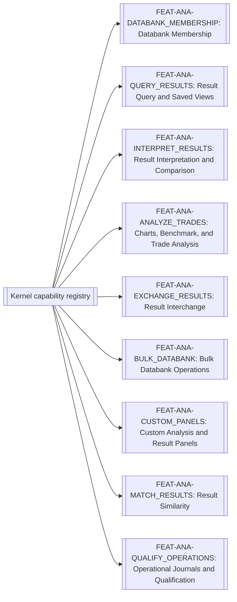
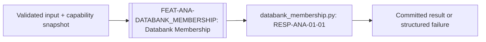

# Analytics

> **Package:** `app/services/analytics/`
> **Status:** `Missing`
> **Last updated:** `2026-08-23`
> **Domain ID:** `D-ANA`

> This README is the domain package's **single source of truth** for domain boundaries, composable feature capabilities, architecture invariants, implementation sequence, progress, usage examples, and tests.
> Update this document before modifying or adding code.

---

## Code-Aligned Implementation Convention

This README is the sole current target registry for this domain's feature IDs and statuses, functional requirements, domain-local workflows, semantic contract ownership, persisted-state model, acceptance evidence, and deletion behavior. `PROJECT.md` owns system scope, cross-domain behavior, system NFRs, and release gates; `ARCHITECTURE.md` owns universal package and runtime constraints. Feature-local READMEs, manifests, contract definitions, migrations, and tests provide current implementation evidence without silently changing this target registry.

Implementation uses the repository's existing feature substrate: each feature lives directly at `app/services/<domain>/<feature>/`, is discovered through the `haruquantai.features` Python entry-point group, and declares one immutable `FeatureSpec` in `manifest.py`. There are no domain or feature YAML manifests.

Every implemented feature also contains a mandatory runtime-validated `README.md`, pure `__init__.py`, strict `config.py`, lifecycle `feature.py`, and focused implementation modules. Dependencies and effects flow through `FeatureContext`/`FeatureScope`; cross-feature implementation imports are forbidden. Persistent state is declared by `FeatureSpec.state`; any migrations and storage adapters remain with the owning feature. Capability keys use `<domain>.<name>@<major>`. FR IDs remain product, acceptance, and test-trace identities rather than one runtime registration per FR. A requirement `Depends` cell expresses product sequencing, traceability, or acceptance evidence only; runtime dependencies are declared separately with exact keys in `FeatureSpec.requires` or `FeatureSpec.optional`.

Feature-level automated tests live at `tests/services/analytics/<feature>/`. Usage examples never live under `tests/`; they belong to each feature's designated primary domain-logic module. Broader automated verification retains its documented architecture, composition, API, integration, or system test location. The code-backed procedure is the [Feature Implementation Pipeline](../../../docs/dev/feature_implementation_pipeline.md).

## 1. Purpose and Boundary

### Purpose

The Analytics domain delivers databank membership, result queries, metrics, charts, comparison, analysis, panels, exports, and evidence-backed operational journal/qualification analysis. Its public feature capabilities are registered and remain independent of package-import order. Removing the domain produces the degradation defined below rather than preventing the shared substrate or unrelated domains from starting.

### Owns

- `FEAT-ANA-DATABANK_MEMBERSHIP` — Databank Membership.
- `FEAT-ANA-QUERY_RESULTS` — Result Query and Saved Views.
- `FEAT-ANA-INTERPRET_RESULTS` — Result Interpretation and Comparison.
- `FEAT-ANA-ANALYZE_TRADES` — Charts, Benchmark, and Trade Analysis.
- `FEAT-ANA-EXCHANGE_RESULTS` — Result Interchange.
- `FEAT-ANA-BULK_DATABANK` — Bulk Databank Operations.
- `FEAT-ANA-CUSTOM_PANELS` — Custom Analysis and Result Panels.
- `FEAT-ANA-MATCH_RESULTS` — Result Similarity.
- `FEAT-ANA-QUALIFY_OPERATIONS` — Operational Journals and Qualification.

### Does not own

- Simulation execution, strategy mutation, portfolio construction policy, or third-party package lifecycle.
- Canonical Trading execution journals, operational ledgers, or personnel/authorization decisions. Analytics owns immutable derived journal-analysis artifacts and qualification projections keyed to Trading, Runtime Risk, and Broker Connectivity evidence.
- Composition lifecycle, dependency resolution, effect reversal, and transactional replacement; those belong to the non-domain shared substrate (`app/contracts/`, `app/kernel/`, and `app/composition/`).
- **Deletion boundary:** deleting `app/services/analytics/` means result/databank browsing and analysis disappear; immutable result artifacts remain retained for reinstallation or export by infrastructure. The kernel and unrelated domains shall remain healthy.

### Shared Contracts

This domain semantically owns the contracts listed below, but their sole physical definitions live in `app/contracts/analytics/` and wire schemas in `app/contracts/analytics/wire/`. `app/services/analytics/` contains implementations only and shall not define or re-export substitute public contract types. Contract versions and semantic owners must agree with `PROJECT.md` and this README. Feature IDs and FR IDs are documentation, lifecycle, acceptance, and traceability identities; runtime bindings use exact versioned `CapabilityKey` declarations in contracts and `FeatureSpec`. The exact public records and capability bundles are listed in the [Shared Contracts README](../../contracts/README.md#46-appcontractsanalytics).

Rows labelled `FEAT-* capability surface` describe planned semantic contract bundles, not literal runtime capability keys. A listed counterparty may produce, consume, or observe the bundle and does not establish package-import or runtime dependency direction.

**Owned by this domain**

| Status | Contract | Version | Counterparty | Purpose |
|---|---|---|---|---|
| Missing | `FEAT-ANA-DATABANK_MEMBERSHIP` capability surface | `v1` | Catalogue, Data, Interfaces, Plugins, Portfolio, Research, Simulator, Strategy, Workspace | Databank Membership. |
| Missing | `FEAT-ANA-QUERY_RESULTS` capability surface | `v1` | Catalogue, Data, Interfaces, Plugins, Portfolio, Research, Simulator, Strategy, Workspace | Result Query and Saved Views. |
| Missing | `FEAT-ANA-INTERPRET_RESULTS` capability surface | `v1` | Catalogue, Data, Interfaces, Plugins, Portfolio, Research, Simulator, Strategy, Workspace | Result Interpretation and Comparison. |
| Missing | `FEAT-ANA-ANALYZE_TRADES` capability surface | `v1` | Catalogue, Data, Interfaces, Plugins, Portfolio, Research, Simulator, Strategy, Workspace | Charts, Benchmark, and Trade Analysis. |
| Missing | `FEAT-ANA-EXCHANGE_RESULTS` capability surface | `v1` | Catalogue, Data, Interfaces, Plugins, Portfolio, Research, Simulator, Strategy, Workspace | Result Interchange. |
| Missing | `FEAT-ANA-BULK_DATABANK` capability surface | `v1` | Catalogue, Data, Interfaces, Plugins, Portfolio, Research, Simulator, Strategy, Workspace | Bulk Databank Operations. |
| Missing | `FEAT-ANA-CUSTOM_PANELS` capability surface | `v1` | Catalogue, Data, Interfaces, Plugins, Portfolio, Research, Simulator, Strategy, Workspace | Custom Analysis and Result Panels. |
| Missing | `FEAT-ANA-MATCH_RESULTS` capability surface | `v1` | Catalogue, Data, Interfaces, Plugins, Portfolio, Research, Simulator, Strategy, Workspace | Result Similarity. |
| Missing | `FEAT-ANA-QUALIFY_OPERATIONS` capability surface | `v1` | Interfaces, Risk, Trading, Workspace | Operational Journals and Qualification. |

**Cross-domain requirement references (not runtime dependencies)**

The rows below summarize foreign owner tokens found in FR `Depends` cells. They express product sequencing, traceability, or acceptance-evidence relationships only. Actual runtime consumption must name an exact versioned capability key in the consuming feature's `FeatureSpec.requires` or `FeatureSpec.optional` and must follow the dependency direction in `PROJECT.md` and `ARCHITECTURE.md`.

| Referenced domain set | Documentation version | Owner | Meaning |
|---|---|---|---|
| `D-CAT` public capability set | `v1` | Catalogue | Requirements whose `Depends` cell names `CAT-*`. |
| `D-DATA` public capability set | `v1` | Data | Requirements whose `Depends` cell names `DATA-*`. |
| `D-IFACE` public capability set | `v1` | Interfaces | Requirements whose `Depends` cell names `IFACE-*`. |
| `D-PLUG` public capability set | `v1` | Plugins | Requirements whose `Depends` cell names `PLUG-*`. |
| `D-PORT` public capability set | `v1` | Portfolio | Requirements whose `Depends` cell names `PORT-*`. |
| `D-RES` public capability set | `v1` | Research | Requirements whose `Depends` cell names `RES-*`. |
| `D-SIM` public capability set | `v1` | Simulator | Requirements whose `Depends` cell names `SIM-*`. |
| `D-STRAT` public capability set | `v1` | Strategy | Requirements whose `Depends` cell names `STRAT-*`. |
| `D-WS` public capability set | `v1` | Workspace | Requirements whose `Depends` cell names `WS-*`. |
| `D-BRK` public capability set | `v1` | Broker Connectivity | Provider/authority evidence references used by operational analysis. |
| `D-RISK` public capability set | `v1` | Runtime Risk | Decisions, blocks, approvals, and emergency events used by operational analysis. |
| `D-TRD` public capability set | `v1` | Trading | Plans, operations, executions, reconciliations, and journal evidence. |

### Persisted State Ownership

| Status | State / Store | Read access (via contract) | Migration definitions |
|---|---|---|---|
| Missing | metric_definitions, metric_values, databanks, databank_items, databank_decisions, analysis_artifacts, benchmark_comparisons, operational_journal_artifacts, qualification_profile_versions | Other domains through `D-ANA` public capabilities only | The owning feature's `StateDeclaration` and migration/storage adapter |

### Four-Level Structural Hierarchy

| Code level | Represents | This package |
|---|---|---|
| **Package** | Domain | `app/services/analytics/` / `D-ANA` |
| **Module folder** | Feature / capability | One folder for each of: Databank Membership, Result Query and Saved Views, Result Interpretation and Comparison, Charts, Benchmark, and Trade Analysis, Result Interchange, Bulk Databank Operations, Custom Analysis and Result Panels, Result Similarity, Operational Journals and Qualification |
| **File** | Use case or focused responsibility | Exactly the responsibility file named in each module specification |
| **Class / function / method** | Functional requirement behavior | Exactly one registered `fr_*` behavior per `FR-*` row |

```text
Package (Domain)
└── Module folder (Feature)
    └── File (Responsibility)
        └── Registered function (Functional requirement behavior)
```

### Domain Capability Map


```mermaid
flowchart TD
    DOMAIN[[D-ANA: Analytics]]
    DOMAIN --> FEAT_ANA_DATABANK_MEMBERSHIP[[FEAT-ANA-DATABANK_MEMBERSHIP: Databank Membership]]
    FEAT_ANA_DATABANK_MEMBERSHIP --> FEAT_ANA_DATABANK_MEMBERSHIP_FILE[databank_membership.py: RESP-ANA-01-01]
    DOMAIN --> FEAT_ANA_QUERY_RESULTS[[FEAT-ANA-QUERY_RESULTS: Result Query and Saved Views]]
    FEAT_ANA_QUERY_RESULTS --> FEAT_ANA_QUERY_RESULTS_FILE[result_query_views.py: RESP-ANA-02-01]
    DOMAIN --> FEAT_ANA_INTERPRET_RESULTS[[FEAT-ANA-INTERPRET_RESULTS: Result Interpretation and Comparison]]
    FEAT_ANA_INTERPRET_RESULTS --> FEAT_ANA_INTERPRET_RESULTS_FILE[result_interpretation.py: RESP-ANA-03-01]
    DOMAIN --> FEAT_ANA_ANALYZE_TRADES[[FEAT-ANA-ANALYZE_TRADES: Charts, Benchmark, and Trade Analysis]]
    FEAT_ANA_ANALYZE_TRADES --> FEAT_ANA_ANALYZE_TRADES_FILE[result_chart_analysis.py: RESP-ANA-04-01]
    DOMAIN --> FEAT_ANA_EXCHANGE_RESULTS[[FEAT-ANA-EXCHANGE_RESULTS: Result Interchange]]
    FEAT_ANA_EXCHANGE_RESULTS --> FEAT_ANA_EXCHANGE_RESULTS_FILE[result_interchange.py: RESP-ANA-05-01]
    DOMAIN --> FEAT_ANA_BULK_DATABANK[[FEAT-ANA-BULK_DATABANK: Bulk Databank Operations]]
    FEAT_ANA_BULK_DATABANK --> FEAT_ANA_BULK_DATABANK_FILE[databank_bulk_operations.py: RESP-ANA-06-01]
    DOMAIN --> FEAT_ANA_CUSTOM_PANELS[[FEAT-ANA-CUSTOM_PANELS: Custom Analysis and Result Panels]]
    FEAT_ANA_CUSTOM_PANELS --> FEAT_ANA_CUSTOM_PANELS_FILE[custom_analysis_panels.py: RESP-ANA-07-01]
    DOMAIN --> FEAT_ANA_MATCH_RESULTS[[FEAT-ANA-MATCH_RESULTS: Result Similarity]]
    FEAT_ANA_MATCH_RESULTS --> FEAT_ANA_MATCH_RESULTS_FILE[result_similarity.py: RESP-ANA-08-01]
    DOMAIN --> FEAT_ANA_QUALIFY_OPERATIONS[[FEAT-ANA-QUALIFY_OPERATIONS: Operational Journals and Qualification]]
    FEAT_ANA_QUALIFY_OPERATIONS --> FEAT_ANA_QUALIFY_OPERATIONS_FILE[operational_journals_qualification.py: RESP-ANA-09-01]
```

---

## 2. Final Package Structure and Feature Independence

```text
analytics/
├── README.md
├── __init__.py
├── databank_membership/                    # FEAT-ANA-DATABANK_MEMBERSHIP: Databank Membership
│   ├── README.md
│   ├── __init__.py
│   ├── manifest.py
│   ├── config.py
│   ├── feature.py
│   └── databank_membership.py              # RESP-ANA-01-01
├── result_query_views/                    # FEAT-ANA-QUERY_RESULTS: Result Query and Saved Views
│   ├── README.md
│   ├── __init__.py
│   ├── manifest.py
│   ├── config.py
│   ├── feature.py
│   └── result_query_views.py              # RESP-ANA-02-01
├── result_interpretation/                    # FEAT-ANA-INTERPRET_RESULTS: Result Interpretation and Comparison
│   ├── README.md
│   ├── __init__.py
│   ├── manifest.py
│   ├── config.py
│   ├── feature.py
│   └── result_interpretation.py              # RESP-ANA-03-01
├── result_chart_analysis/                    # FEAT-ANA-ANALYZE_TRADES: Charts, Benchmark, and Trade Analysis
│   ├── README.md
│   ├── __init__.py
│   ├── manifest.py
│   ├── config.py
│   ├── feature.py
│   └── result_chart_analysis.py              # RESP-ANA-04-01
├── result_interchange/                    # FEAT-ANA-EXCHANGE_RESULTS: Result Interchange
│   ├── README.md
│   ├── __init__.py
│   ├── manifest.py
│   ├── config.py
│   ├── feature.py
│   └── result_interchange.py              # RESP-ANA-05-01
├── databank_bulk_operations/                    # FEAT-ANA-BULK_DATABANK: Bulk Databank Operations
│   ├── README.md
│   ├── __init__.py
│   ├── manifest.py
│   ├── config.py
│   ├── feature.py
│   └── databank_bulk_operations.py              # RESP-ANA-06-01
├── custom_analysis_panels/                    # FEAT-ANA-CUSTOM_PANELS: Custom Analysis and Result Panels
│   ├── README.md
│   ├── __init__.py
│   ├── manifest.py
│   ├── config.py
│   ├── feature.py
│   └── custom_analysis_panels.py              # RESP-ANA-07-01
├── result_similarity/                    # FEAT-ANA-MATCH_RESULTS: Result Similarity
│   ├── README.md
│   ├── __init__.py
│   ├── manifest.py
│   ├── config.py
│   ├── feature.py
│   └── result_similarity.py              # RESP-ANA-08-01
└── operational_journals_qualification/   # FEAT-ANA-QUALIFY_OPERATIONS
    ├── README.md
    ├── __init__.py
    ├── manifest.py
    ├── config.py
    ├── feature.py
    └── operational_journals_qualification.py
```

### Module dependency diagram

Feature modules do not import one another's private files. Runtime dependencies resolve through kernel capabilities obtained from `FeatureContext`; composition selects providers and reconciles changes, so reciprocal workflow participation cannot create a package-import cycle.


```mermaid
flowchart LR
    K[[Kernel capability registry]]
    K --> FEAT_ANA_DATABANK_MEMBERSHIP[[FEAT-ANA-DATABANK_MEMBERSHIP: Databank Membership]]
    K --> FEAT_ANA_QUERY_RESULTS[[FEAT-ANA-QUERY_RESULTS: Result Query and Saved Views]]
    K --> FEAT_ANA_INTERPRET_RESULTS[[FEAT-ANA-INTERPRET_RESULTS: Result Interpretation and Comparison]]
    K --> FEAT_ANA_ANALYZE_TRADES[[FEAT-ANA-ANALYZE_TRADES: Charts, Benchmark, and Trade Analysis]]
    K --> FEAT_ANA_EXCHANGE_RESULTS[[FEAT-ANA-EXCHANGE_RESULTS: Result Interchange]]
    K --> FEAT_ANA_BULK_DATABANK[[FEAT-ANA-BULK_DATABANK: Bulk Databank Operations]]
    K --> FEAT_ANA_CUSTOM_PANELS[[FEAT-ANA-CUSTOM_PANELS: Custom Analysis and Result Panels]]
    K --> FEAT_ANA_MATCH_RESULTS[[FEAT-ANA-MATCH_RESULTS: Result Similarity]]
    K --> FEAT_ANA_QUALIFY_OPERATIONS[[FEAT-ANA-QUALIFY_OPERATIONS: Operational Journals and Qualification]]
```

### Structure rules

- The package root contains `README.md`, import-pure `__init__.py`, and one direct folder per feature; discovery uses the `haruquantai.features` entry-point group.
- Each feature folder contains mandatory `README.md`, pure `__init__.py`, `manifest.py`, `config.py`, `feature.py`, and focused responsibility modules.
- `FR-*`/`fr_*` names provide product, implementation, and test traceability inside the feature; they are not separate runtime registrations or capability keys.
- Cross-feature and cross-domain behavior is injected by capability key. Direct private-file imports are prohibited.
- Every core capability module documents Python and CLI usage; exactly one designated primary domain-logic module owns the feature's executable `__main__` demonstration. Usage examples never live under `tests/`.

---

## 3. Workflows

| Status | Workflow ID | Scope | Workflow | Trigger / Input boundary | Final outcome / Output boundary | Requirement sequence |
|---|---|---|---|---|---|---|
| Missing | `WF-ANA-001` | Cross-domain | Databank Membership | Validated command/query and required capability bindings | Requirement-defined result, artifact, event, or degradation | `FR-ANA-CREATE_DATABANK` → `FR-ANA-LINK_STRATEGY_RESULT` → `FR-ANA-MODIFY_DATABANK_ITEMS` → `FR-ANA-VERSION_DATABANK_MUTATIONS` → `FR-ANA-DEFINE_MEMBERSHIP_POLICY` → `FR-ANA-ADMIT_DATABANK_ITEMS` |
| Missing | `WF-ANA-002` | Cross-domain | Result Query and Saved Views | Validated command/query and required capability bindings | Requirement-defined result, artifact, event, or degradation | `FR-ANA-QUERY_RESULTS_TABLE` → `FR-ANA-VERSION_SAVED_VIEWS` → `FR-ANA-EVALUATE_FORMULAS_SAFELY` → `FR-ANA-DEFINE_CORRELATION_POLICY` → `FR-ANA-BOUND_RESULT_QUERIES` |
| Missing | `WF-ANA-003` | Cross-domain | Result Interpretation and Comparison | Validated command/query and required capability bindings | Requirement-defined result, artifact, event, or degradation | `FR-ANA-APPLY_RESULT_SCOPE` → `FR-ANA-SHOW_RESULT_OVERVIEW` → `FR-ANA-LIST_RESULT_TRADES` → `FR-ANA-CALCULATE_METRICS` → `FR-ANA-CATALOG_METRICS` → `FR-ANA-ALIGN_RESULT_COMPARISONS` |
| Missing | `WF-ANA-004` | Cross-domain | Charts, Benchmark, and Trade Analysis | Validated command/query and required capability bindings | Requirement-defined result, artifact, event, or degradation | `FR-ANA-DOWNSAMPLE_EQUITY_SERIES` → `FR-ANA-SHOW_RUN_MANIFEST` → `FR-ANA-COMPARE_BENCHMARK_EQUITY` → `FR-ANA-NORMALIZE_BENCHMARK` → `FR-ANA-ANALYZE_TRADE_TIMING` → `FR-ANA-RECONSTRUCT_CHART_TRADES` |
| Missing | `WF-ANA-005` | Cross-domain | Result Interchange | Validated command/query and required capability bindings | Requirement-defined result, artifact, event, or degradation | `FR-ANA-EXPORT_RESULT_ROWS` → `FR-ANA-PACKAGE_RESULT_ARTIFACTS` → `FR-ANA-IMPORT_EXTERNAL_RESULTS` |
| Missing | `WF-ANA-006` | Cross-domain | Bulk Databank Operations | Validated command/query and required capability bindings | Requirement-defined result, artifact, event, or degradation | `FR-ANA-PIN_BULK_SELECTION` → `FR-ANA-TRANSFER_DATABANK_ITEMS` → `FR-ANA-PRESERVE_REFERENCED_ARTIFACTS` |
| Missing | `WF-ANA-007` | Cross-domain | Custom Analysis and Result Panels | Validated command/query and required capability bindings | Requirement-defined result, artifact, event, or degradation | `FR-ANA-RUN_CUSTOM_ANALYSIS` → `FR-ANA-DECLARE_RESULT_PANELS` |
| Missing | `WF-ANA-008` | Cross-domain | Result Similarity | Validated command/query and required capability bindings | Requirement-defined result, artifact, event, or degradation | `FR-ANA-MATCH_RESULT_FINGERPRINTS` |
| Missing | `WF-ANA-009` | Cross-domain | Operational Journals and Qualification | Immutable Strategy, Risk, Trading, Broker, and Interface evidence | Derived journal, adherence, emergency-response, and qualification projections | `FR-ANA-BUILD_OPERATIONAL_JOURNAL` → `FR-ANA-MEASURE_PLAN_ADHERENCE` → `FR-ANA-SUMMARIZE_BEHAVIOR` → `FR-ANA-ANALYZE_EMERGENCY_RESPONSE` → `FR-ANA-QUALIFY_OPERATORS` → `FR-ANA-EXPORT_OPERATIONAL_ANALYTICS` |

### `WF-ANA-001` — Databank Membership

**Scope:** `Cross-domain` when the request requires another domain capability; otherwise `Internal`.

**System workflow:** `SYS-WF-004, SYS-WF-006, SYS-WF-007`

**Input boundary:** A validated request/query plus an immutable capability snapshot and provider bindings.

**Output boundary:** The result/artifact/event defined by the participating `FR-*` rows, or their exact structured failure/degradation outcome.

1. `Feature.mount()` resolves its declared required capabilities through `FeatureContext`.
2. `databank_membership.py` executes `fr_ana_create_databank`, `fr_ana_link_strategy_result`, `fr_ana_modify_databank_items`, `fr_ana_version_databank_mutations`, `fr_ana_define_membership_policy`, `fr_ana_admit_databank_items` in the requirement-defined order.
3. Scoped effects are committed or reversed under `FR-KERN-DEFINE_REQUIREMENT_BEHAVIOR, FR-KERN-DEFINE_LIFECYCLE_CONTEXT, FR-KERN-DECLARE_BEHAVIOR_DEPENDENCIES, FR-KERN-REGISTER_FEATURE_MODULES, FR-KERN-DEFINE_RESPONSIBILITY_FILES, FR-KERN-IMPLEMENT_REQUIREMENT_FUNCTIONS, FR-KERN-DEPEND_PUBLIC_PORTS, FR-KERN-NAMESPACE_CAPABILITY_KEYS, FR-KERN-DECLARE_DEPENDENCY_RULES, FR-KERN-REEVALUATE_DEPENDENCIES, FR-KERN-DEFINE_SCOPE_HIERARCHY, FR-KERN-PASS_EFFECT_SCOPES, FR-KERN-REGISTER_EFFECT_REVERSALS, FR-KERN-REVERSE_EFFECTS_LIFO, FR-KERN-ROLLBACK_FAILED_ACTIVATION, FR-KERN-MANAGE_COMPONENT_LIFECYCLE, FR-KERN-COMMIT_CAPABILITY_SWAP, FR-KERN-QUIESCE_DEPENDENT_WORK, FR-KERN-REMOVE_DEPENDENT_COMPONENTS, FR-KERN-ISOLATE_DISPOSAL_FAILURES, FR-KERN-RECONCILE_DESIRED_STATE, FR-KERN-REPLACE_COMPONENTS_TRANSACTIONALLY, FR-KERN-PROVIDE_SCOPED_REGISTRARS, FR-KERN-DRAIN_REMOVED_BEHAVIORS, FR-KERN-CLASSIFY_COMPONENT_EFFECTS, FR-KERN-NAMESPACE_COMPONENT_STATE, FR-KERN-REGISTER_EXTENSION_POINTS, FR-KERN-EMIT_CAUSAL_EVENTS, FR-KERN-REJECT_DEPENDENCY_CYCLES, FR-KERN-PIN_CAPABILITY_SNAPSHOTS, FR-KERN-TEST_COMPONENT_REMOVAL, FR-KERN-VERIFY_EXACT_REMOVAL, FR-KERN-ROUTE_MULTIPLE_PROVIDERS`.
4. The feature returns or publishes only the documented output boundary.

**Failure behaviour:**

- Feature unavailable → databank mutation is unavailable; existing membership records remain. Requests requiring a removed feature capability return `CAPABILITY_UNAVAILABLE`; the domain continues loading.
- Missing/incompatible required capability → `CAPABILITY_UNAVAILABLE` or `CAPABILITY_INCOMPATIBLE`; no partial mutation.

**Integration test:**
`tests/services/analytics/integration/test_databank_membership.py::test_databank_membership_workflow()`


```mermaid
flowchart LR
    INPUT[Validated input + capability snapshot]
    FEATURE[[FEAT-ANA-DATABANK_MEMBERSHIP: Databank Membership]]
    FILE[databank_membership.py: RESP-ANA-01-01]
    OUTPUT[Committed result or structured failure]
    INPUT --> FEATURE --> FILE --> OUTPUT
```

---

## 4. Composable Feature Specifications

Implement module sections from top to bottom. Requirement `Depends` cells define product and implementation ordering; runtime capability dependencies must be declared separately in the owning `FeatureSpec`.

---

### 4.1 `databank_membership/` — Databank Membership

**Feature ID:** `FEAT-ANA-DATABANK_MEMBERSHIP`

**Purpose:** Create databanks and apply transactional admission/version rules.

**Deletion contract:** databank mutation is unavailable; existing membership records remain. Requests requiring a removed feature capability return `CAPABILITY_UNAVAILABLE`; the domain continues loading.

**Module flow:**

```text
validated input and capability bindings
  → databank_membership.py
  → fr_ana_create_databank, fr_ana_link_strategy_result, fr_ana_modify_databank_items, fr_ana_version_databank_mutations, fr_ana_define_membership_policy, fr_ana_admit_databank_items
  → requirement-defined output or structured failure
```

#### Files

| Status | File | Responsibility | Key exports | Dependencies |
|---|---|---|---|---|
| Missing | `databank_membership.py` | Create databanks and apply transactional admission/version rules | `fr_ana_create_databank`, `fr_ana_link_strategy_result`, `fr_ana_modify_databank_items`, `fr_ana_version_databank_mutations`, `fr_ana_define_membership_policy`, `fr_ana_admit_databank_items` | **Standard library:** selected per implementation and recorded before code<br>**Required third-party:** only libraries mandated by `PROJECT.md` or the requirement boundary<br>**Local:** capabilities declared by the owning `FeatureSpec`; no private cross-feature import |
| Missing | `feature.py` | Mount `FEAT-ANA-DATABANK_MEMBERSHIP` through `FeatureContext` and stage its declared providers/effects | `FEAT-ANA-DATABANK_MEMBERSHIP` `Feature.mount` | **Standard library:** None<br>**Required third-party:** None<br>**Local:** `manifest.py`, `config.py`, and focused responsibility modules |
| Missing | `manifest.py` | Define the immutable `FEAT-ANA-DATABANK_MEMBERSHIP` `FeatureSpec`: identity, domain, provided/required/optional capabilities, conflicts, state, and configuration keys | `FEAT-ANA-DATABANK_MEMBERSHIP` `FeatureSpec` | **Standard library:** None<br>**Required third-party:** None<br>**Local:** `app.kernel.feature.FeatureSpec` |

#### Configuration and Limits Manifest

| Status | Setting / Limit | Type | Default | Required | Used by | Description |
|---|---|---|---|---|---|---|
| Missing | `FEAT-ANA-DATABANK_MEMBERSHIP.configuration` | Versioned schema | No implicit defaults | Yes when referenced | `databank_membership.py` | Exact fields, defaults, limits, and failure rules are those stated by the requirements and the normative technical appendices in `PROJECT.md`; unspecified values are rejected under Project §6. |

#### `databank_membership.py` — Create databanks and apply transactional admission/version rules

**File responsibility:** Create databanks and apply transactional admission/version rules.

| Status | Requirement ID | Class | Pri | Responsibility | Class / Function / Method | Side Effects | Raises / failure | Depends | Source / confidence | Usage / Test |
|---|---|---|---|---|---|---|---|---|---|---|
| Missing | `FR-ANA-CREATE_DATABANK` | Target | P0 | The system shall create named project-scoped databanks with stable ID, unique name, optional capacity, view, and insertion policy. | `fr_ana_create_databank` implementation trace | Persistence write | Duplicate name is rejected; rename preserves membership and references. | FR-WS-INITIALIZE_WORKSPACE | Reference databanks; Verified | **Usage:** `app/services/analytics/databank_membership/databank_membership.py::__main__` scenario `FR-ANA-CREATE_DATABANK`<br>**Unit:** `tests/services/analytics/databank_membership/test_databank_membership.py::test_ana_create_databank()` |
| Missing | `FR-ANA-LINK_STRATEGY_RESULT` | Target | P0 | A databank item shall reference an immutable strategy version and optional committed result; insertion shall be transactional and idempotent. | `fr_ana_link_strategy_result` implementation trace | Persistence write | Repeating acceptance yields one membership row. | FR-STRAT-VERSION_STRATEGY_DRAFTS, FR-SIM-COMMIT_SIMULATION_RESULT | `BD-09`; Target | **Usage:** `app/services/analytics/databank_membership/databank_membership.py::__main__` scenario `FR-ANA-LINK_STRATEGY_RESULT`<br>**Unit:** `tests/services/analytics/databank_membership/test_databank_membership.py::test_ana_link_strategy_result()` |
| Missing | `FR-ANA-MODIFY_DATABANK_ITEMS` | Target | P1 | The system shall support copy, move, remove, rename strategy display name, and export for selected items without mutating strategy versions. | `fr_ana_modify_databank_items` implementation trace | Persistence write | Move across databanks is one §22.2 transaction; failure leaves source membership intact. | FR-ANA-LINK_STRATEGY_RESULT | Specified §22.2 | **Usage:** `app/services/analytics/databank_membership/databank_membership.py::__main__` scenario `FR-ANA-MODIFY_DATABANK_ITEMS`<br>**Unit:** `tests/services/analytics/databank_membership/test_databank_membership.py::test_ana_modify_databank_items()` |
| Missing | `FR-ANA-VERSION_DATABANK_MUTATIONS` | Target | P1 | Structural databank mutation shall use optimistic versioning and shall reject conflicting operations. | `fr_ana_version_databank_mutations` implementation trace | None | Concurrent rename/delete produces one success and one version conflict. | FR-ANA-CREATE_DATABANK | Target | **Usage:** `app/services/analytics/databank_membership/databank_membership.py::__main__` scenario `FR-ANA-VERSION_DATABANK_MUTATIONS`<br>**Unit:** `tests/services/analytics/databank_membership/test_databank_membership.py::test_ana_version_databank_mutations()` |
| Missing | `FR-ANA-DEFINE_MEMBERSHIP_POLICY` | Target | P0 | A named databank shall have a versioned membership policy, capacity, duplicate scope, rank policy, and replacement tie-breaker. | `fr_ana_define_membership_policy` implementation trace | None | Concurrent acceptance never exceeds capacity or produces nondeterministic survivors. | FR-ANA-CREATE_DATABANK, FR-RES-DETECT_STRATEGY_DUPLICATES | Phase 2 baseline | **Usage:** `app/services/analytics/databank_membership/databank_membership.py::__main__` scenario `FR-ANA-DEFINE_MEMBERSHIP_POLICY`<br>**Unit:** `tests/services/analytics/databank_membership/test_databank_membership.py::test_ana_define_membership_policy()` |
| Missing | `FR-ANA-ADMIT_DATABANK_ITEMS` | Target | P0 | Admission shall evaluate filters, duplicates, rank replacement, and optional correlation policy in one transactional decision. | `fr_ana_admit_databank_items` implementation trace | None | Crash/retry yields one membership outcome and one decision record. | FR-ANA-DEFINE_MEMBERSHIP_POLICY, FR-ANA-APPLY_RESULT_SCOPE | Phase 2 baseline | **Usage:** `app/services/analytics/databank_membership/databank_membership.py::__main__` scenario `FR-ANA-ADMIT_DATABANK_ITEMS`<br>**Unit:** `tests/services/analytics/databank_membership/test_databank_membership.py::test_ana_admit_databank_items()` |

**Rules:**

- databank mutation is unavailable; existing membership records remain. Requests requiring a removed feature capability return `CAPABILITY_UNAVAILABLE`; the domain continues loading.
- no business-domain dependency is resolved at package import; the owning `FeatureSpec` declares runtime dependencies once and this behavior consumes only that committed feature context.
- Each `FR-*` row maps to focused implementation and acceptance evidence inside this feature; removal occurs at feature-package granularity.
- Every effect must be scoped and classified under `FR-KERN-CLASSIFY_COMPONENT_EFFECTS`; the inferred table label must be corrected before implementation if the concrete adapter requires a narrower or additional effect class.

**Implementation notes:**

- Preserve the requirement statement, acceptance/failure behavior, dependencies, and source confidence as one indivisible implementation contract.
- Reuse public capability contracts; never copy another feature's or domain's business logic.
- Add private helpers only when needed by these public behaviors; helpers do not become new requirements.

#### Feature usage examples

The primary domain-logic module `app/services/analytics/databank_membership/databank_membership.py` owns the executable `__main__` usage harness, with one named scenario per requirement listed above.

---

### 4.2 `result_query_views/` — Result Query and Saved Views

**Feature ID:** `FEAT-ANA-QUERY_RESULTS`

**Purpose:** Page, filter, calculate formulas/correlation, and bound result views.

**Deletion contract:** advanced querying disappears; stored results remain. Requests requiring a removed feature capability return `CAPABILITY_UNAVAILABLE`; the domain continues loading.

**Module flow:**

```text
validated input and capability bindings
  → result_query_views.py
  → fr_ana_query_results_table, fr_ana_version_saved_views, fr_ana_evaluate_formulas_safely, fr_ana_define_correlation_policy, fr_ana_bound_result_queries
  → requirement-defined output or structured failure
```

#### Files

| Status | File | Responsibility | Key exports | Dependencies |
|---|---|---|---|---|
| Missing | `result_query_views.py` | Page, filter, calculate formulas/correlation, and bound result views | `fr_ana_query_results_table`, `fr_ana_version_saved_views`, `fr_ana_evaluate_formulas_safely`, `fr_ana_define_correlation_policy`, `fr_ana_bound_result_queries` | **Standard library:** selected per implementation and recorded before code<br>**Required third-party:** only libraries mandated by `PROJECT.md` or the requirement boundary<br>**Local:** capabilities declared by the owning `FeatureSpec`; no private cross-feature import |
| Missing | `feature.py` | Mount `FEAT-ANA-QUERY_RESULTS` through `FeatureContext` and stage its declared providers/effects | `FEAT-ANA-QUERY_RESULTS` `Feature.mount` | **Standard library:** None<br>**Required third-party:** None<br>**Local:** `manifest.py`, `config.py`, and focused responsibility modules |
| Missing | `manifest.py` | Define the immutable `FEAT-ANA-QUERY_RESULTS` `FeatureSpec`: identity, domain, provided/required/optional capabilities, conflicts, state, and configuration keys | `FEAT-ANA-QUERY_RESULTS` `FeatureSpec` | **Standard library:** None<br>**Required third-party:** None<br>**Local:** `app.kernel.feature.FeatureSpec` |

#### Configuration and Limits Manifest

| Status | Setting / Limit | Type | Default | Required | Used by | Description |
|---|---|---|---|---|---|---|
| Missing | `FEAT-ANA-QUERY_RESULTS.configuration` | Versioned schema | No implicit defaults | Yes when referenced | `result_query_views.py` | Exact fields, defaults, limits, and failure rules are those stated by the requirements and the normative technical appendices in `PROJECT.md`; unspecified values are rejected under Project §6. |

#### `result_query_views.py` — Page, filter, calculate formulas/correlation, and bound result views

**File responsibility:** Page, filter, calculate formulas/correlation, and bound result views.

| Status | Requirement ID | Class | Pri | Responsibility | Class / Function / Method | Side Effects | Raises / failure | Depends | Source / confidence | Usage / Test |
|---|---|---|---|---|---|---|---|---|---|---|
| Missing | `FR-ANA-QUERY_RESULTS_TABLE` | Target | P0 | The results table shall support server-side pagination, stable sorting, typed filters, selected metric columns, and saved views. | `fr_ana_query_results_table` implementation trace | Persistence write | Sort/filter across the large fixture follows §22.4 exactly. | FR-ANA-LINK_STRATEGY_RESULT, FR-ANA-CALCULATE_METRICS | Specified §§20, 22.4 | **Usage:** `app/services/analytics/result_query_views/result_query_views.py::__main__` scenario `FR-ANA-QUERY_RESULTS_TABLE`<br>**Unit:** `tests/services/analytics/result_query_views/test_result_query_views.py::test_ana_query_results_table()` |
| Missing | `FR-ANA-VERSION_SAVED_VIEWS` | Target | P1 | Saved views shall version columns, formulas, sorting, filters, grouping, pinned segments, and display units independently from membership. | `fr_ana_version_saved_views` implementation trace | Persistence write | Reopening a view reproduces the query even after default columns change. | FR-ANA-VERSION_DATABANK_MUTATIONS, FR-ANA-QUERY_RESULTS_TABLE | Phase 2 baseline | **Usage:** `app/services/analytics/result_query_views/result_query_views.py::__main__` scenario `FR-ANA-VERSION_SAVED_VIEWS`<br>**Unit:** `tests/services/analytics/result_query_views/test_result_query_views.py::test_ana_version_saved_views()` |
| Missing | `FR-ANA-EVALUATE_FORMULAS_SAFELY` | Target | P0 | Formula columns shall use a sandboxed typed expression language with versioned functions, units, null propagation, and resource limits. | `fr_ana_evaluate_formulas_safely` implementation trace | None | Invalid types, cycles, or excessive evaluation fail without affecting stored results. | FR-ANA-QUERY_RESULTS_TABLE | Phase 2 analysis | **Usage:** `app/services/analytics/result_query_views/result_query_views.py::__main__` scenario `FR-ANA-EVALUATE_FORMULAS_SAFELY`<br>**Unit:** `tests/services/analytics/result_query_views/test_result_query_views.py::test_ana_evaluate_formulas_safely()` |
| Missing | `FR-ANA-DEFINE_CORRELATION_POLICY` | Target | P1 | Correlation columns and filters shall declare return/equity series, sampling, overlap, missing-data, minimum-observation, and method policies. | `fr_ana_define_correlation_policy` implementation trace | Read-only | Independent matrix fixtures match within numeric tolerance. | FR-PORT-VERSION_CORRELATION_INPUTS | Phase 2/3 baseline | **Usage:** `app/services/analytics/result_query_views/result_query_views.py::__main__` scenario `FR-ANA-DEFINE_CORRELATION_POLICY`<br>**Unit:** `tests/services/analytics/result_query_views/test_result_query_views.py::test_ana_define_correlation_policy()` |
| Missing | `FR-ANA-BOUND_RESULT_QUERIES` | Target | P1 | Large tables and charts shall use server-side query plans, bounded points, deterministic downsampling, and downloadable full-resolution data. | `fr_ana_bound_result_queries` implementation trace | Read-only | UI memory remains bounded and exported data is not downsampled. | FR-IFACE-PAGE_INTERFACE_QUERIES, NFR-PERF-005 | Phase 2/3 performance | **Usage:** `app/services/analytics/result_query_views/result_query_views.py::__main__` scenario `FR-ANA-BOUND_RESULT_QUERIES`<br>**Unit:** `tests/services/analytics/result_query_views/test_result_query_views.py::test_ana_bound_result_queries()` |

**Rules:**

- advanced querying disappears; stored results remain. Requests requiring a removed feature capability return `CAPABILITY_UNAVAILABLE`; the domain continues loading.
- no business-domain dependency is resolved at package import; the owning `FeatureSpec` declares runtime dependencies once and this behavior consumes only that committed feature context.
- Each `FR-*` row maps to focused implementation and acceptance evidence inside this feature; removal occurs at feature-package granularity.
- Every effect must be scoped and classified under `FR-KERN-CLASSIFY_COMPONENT_EFFECTS`; the inferred table label must be corrected before implementation if the concrete adapter requires a narrower or additional effect class.

**Implementation notes:**

- Preserve the requirement statement, acceptance/failure behavior, dependencies, and source confidence as one indivisible implementation contract.
- Reuse public capability contracts; never copy another feature's or domain's business logic.
- Add private helpers only when needed by these public behaviors; helpers do not become new requirements.

#### Feature usage examples

The primary domain-logic module `app/services/analytics/result_query_views/result_query_views.py` owns the executable `__main__` usage harness, with one named scenario per requirement listed above.

---

### 4.3 `result_interpretation/` — Result Interpretation and Comparison

**Feature ID:** `FEAT-ANA-INTERPRET_RESULTS`

**Purpose:** Apply scopes, overview, trades, metrics, and aligned comparisons.

**Deletion contract:** interpretation/comparison is unavailable; raw artifacts remain. Requests requiring a removed feature capability return `CAPABILITY_UNAVAILABLE`; the domain continues loading.

**Module flow:**

```text
validated input and capability bindings
  → result_interpretation.py
  → fr_ana_apply_result_scope, fr_ana_show_result_overview, fr_ana_list_result_trades, fr_ana_calculate_metrics, fr_ana_catalog_metrics, fr_ana_align_result_comparisons
  → requirement-defined output or structured failure
```

#### Files

| Status | File | Responsibility | Key exports | Dependencies |
|---|---|---|---|---|
| Missing | `result_interpretation.py` | Apply scopes, overview, trades, metrics, and aligned comparisons | `fr_ana_apply_result_scope`, `fr_ana_show_result_overview`, `fr_ana_list_result_trades`, `fr_ana_calculate_metrics`, `fr_ana_catalog_metrics`, `fr_ana_align_result_comparisons` | **Standard library:** selected per implementation and recorded before code<br>**Required third-party:** only libraries mandated by `PROJECT.md` or the requirement boundary<br>**Local:** capabilities declared by the owning `FeatureSpec`; no private cross-feature import |
| Missing | `feature.py` | Mount `FEAT-ANA-INTERPRET_RESULTS` through `FeatureContext` and stage its declared providers/effects | `FEAT-ANA-INTERPRET_RESULTS` `Feature.mount` | **Standard library:** None<br>**Required third-party:** None<br>**Local:** `manifest.py`, `config.py`, and focused responsibility modules |
| Missing | `manifest.py` | Define the immutable `FEAT-ANA-INTERPRET_RESULTS` `FeatureSpec`: identity, domain, provided/required/optional capabilities, conflicts, state, and configuration keys | `FEAT-ANA-INTERPRET_RESULTS` `FeatureSpec` | **Standard library:** None<br>**Required third-party:** None<br>**Local:** `app.kernel.feature.FeatureSpec` |

#### Configuration and Limits Manifest

| Status | Setting / Limit | Type | Default | Required | Used by | Description |
|---|---|---|---|---|---|---|
| Missing | `FEAT-ANA-INTERPRET_RESULTS.configuration` | Versioned schema | No implicit defaults | Yes when referenced | `result_interpretation.py` | Exact fields, defaults, limits, and failure rules are those stated by the requirements and the normative technical appendices in `PROJECT.md`; unspecified values are rejected under Project §6. |

#### `result_interpretation.py` — Apply scopes, overview, trades, metrics, and aligned comparisons

**File responsibility:** Apply scopes, overview, trades, metrics, and aligned comparisons.

| Status | Requirement ID | Class | Pri | Responsibility | Class / Function / Method | Side Effects | Raises / failure | Depends | Source / confidence | Usage / Test |
|---|---|---|---|---|---|---|---|---|---|---|
| Missing | `FR-ANA-APPLY_RESULT_SCOPE` | Target | P1 | A result view shall consistently apply segment, direction, and P/L unit across overview, metrics, trades, and charts. | `fr_ana_apply_result_scope` implementation trace | None | Changing OOS→IS updates all panels to the same filter context. | FR-SIM-DEFINE_RESULT_SEGMENTS | Reference shared filters; Verified concept | **Usage:** `app/services/analytics/result_interpretation/result_interpretation.py::__main__` scenario `FR-ANA-APPLY_RESULT_SCOPE`<br>**Unit:** `tests/services/analytics/result_interpretation/test_result_interpretation.py::test_ana_apply_result_scope()` |
| Missing | `FR-ANA-SHOW_RESULT_OVERVIEW` | Target | P0 | The overview shall show strategy/result identity, manifest summary, period, charts, precision, engine, costs, trade counts, key metrics, warnings, and completion state. | `fr_ana_show_result_overview` implementation trace | Read-only | Every displayed value traces to §§8, 20, and 22.3 records. | FR-SIM-PIN_RUN_INPUTS, FR-ANA-CALCULATE_METRICS | Specified §§8, 20, 22.3 | **Usage:** `app/services/analytics/result_interpretation/result_interpretation.py::__main__` scenario `FR-ANA-SHOW_RESULT_OVERVIEW`<br>**Unit:** `tests/services/analytics/result_interpretation/test_result_interpretation.py::test_ana_show_result_overview()` |
| Missing | `FR-ANA-LIST_RESULT_TRADES` | Target | P0 | The trade list shall expose reconciled position/trade fields, costs, segment, and close reason with stable sort/filter/export. | `fr_ana_list_result_trades` implementation trace | Persistence write | Trade net P/L sums to §20 `NetProfit` within tolerance. | FR-SIM-RECONCILE_TRADING_COSTS, FR-SIM-COMMIT_SIMULATION_RESULT | Specified §§18, 20, 22.3 | **Usage:** `app/services/analytics/result_interpretation/result_interpretation.py::__main__` scenario `FR-ANA-LIST_RESULT_TRADES`<br>**Unit:** `tests/services/analytics/result_interpretation/test_result_interpretation.py::test_ana_list_result_trades()` |
| Missing | `FR-ANA-CALCULATE_METRICS` | Target | P0 | Metrics shall be computed through versioned `MetricDefinition` records and stored with segment, direction/scope, unit, value, and null reason. | `fr_ana_calculate_metrics` implementation trace | Persistence write | Changing a formula version cannot alter previously committed values. | FR-SIM-COMMIT_SIMULATION_RESULT | Metric baseline; Target | **Usage:** `app/services/analytics/result_interpretation/result_interpretation.py::__main__` scenario `FR-ANA-CALCULATE_METRICS`<br>**Unit:** `tests/services/analytics/result_interpretation/test_result_interpretation.py::test_ana_calculate_metrics()` |
| Missing | `FR-ANA-CATALOG_METRICS` | Target | P0 | Phase 1 shall implement the metric catalogue in §9 and no unspecified metric may silently alias another formula. | `fr_ana_catalog_metrics` implementation trace | None | Hand-worked fixtures pass exact/declared-tolerance values and null cases. | FR-ANA-CALCULATE_METRICS | Phase 0 harness | **Usage:** `app/services/analytics/result_interpretation/result_interpretation.py::__main__` scenario `FR-ANA-CATALOG_METRICS`<br>**Unit:** `tests/services/analytics/result_interpretation/test_result_interpretation.py::test_ana_catalog_metrics()` |
| Missing | `FR-ANA-ALIGN_RESULT_COMPARISONS` | Target | P1 | Result comparison shall align segments, currencies, metric versions, and sampling before calculating deltas. | `fr_ana_align_result_comparisons` implementation trace | None | Incompatible comparisons return a structured reason instead of misleading values. | FR-ANA-QUERY_RESULTS_TABLE, FR-CAT-CONVERT_CURRENCIES | Phase 2 analysis | **Usage:** `app/services/analytics/result_interpretation/result_interpretation.py::__main__` scenario `FR-ANA-ALIGN_RESULT_COMPARISONS`<br>**Unit:** `tests/services/analytics/result_interpretation/test_result_interpretation.py::test_ana_align_result_comparisons()` |

**Rules:**

- interpretation/comparison is unavailable; raw artifacts remain. Requests requiring a removed feature capability return `CAPABILITY_UNAVAILABLE`; the domain continues loading.
- no business-domain dependency is resolved at package import; the owning `FeatureSpec` declares runtime dependencies once and this behavior consumes only that committed feature context.
- Each `FR-*` row maps to focused implementation and acceptance evidence inside this feature; removal occurs at feature-package granularity.
- Every effect must be scoped and classified under `FR-KERN-CLASSIFY_COMPONENT_EFFECTS`; the inferred table label must be corrected before implementation if the concrete adapter requires a narrower or additional effect class.

**Implementation notes:**

- Preserve the requirement statement, acceptance/failure behavior, dependencies, and source confidence as one indivisible implementation contract.
- Reuse public capability contracts; never copy another feature's or domain's business logic.
- Add private helpers only when needed by these public behaviors; helpers do not become new requirements.

#### Feature usage examples

The primary domain-logic module `app/services/analytics/result_interpretation/result_interpretation.py` owns the executable `__main__` usage harness, with one named scenario per requirement listed above.

---

### 4.4 `result_chart_analysis/` — Charts, Benchmark, and Trade Analysis

**Feature ID:** `FEAT-ANA-ANALYZE_TRADES`

**Purpose:** Serve charts, provenance, benchmarks, temporal analysis, and trade overlays.

**Deletion contract:** visual/benchmark analysis disappears; tabular/raw artifacts remain. Requests requiring a removed feature capability return `CAPABILITY_UNAVAILABLE`; the domain continues loading.

**Module flow:**

```text
validated input and capability bindings
  → result_chart_analysis.py
  → fr_ana_downsample_equity_series, fr_ana_show_run_manifest, fr_ana_compare_benchmark_equity, fr_ana_normalize_benchmark, fr_ana_analyze_trade_timing, fr_ana_reconstruct_chart_trades
  → requirement-defined output or structured failure
```

#### Files

| Status | File | Responsibility | Key exports | Dependencies |
|---|---|---|---|---|
| Missing | `result_chart_analysis.py` | Serve charts, provenance, benchmarks, temporal analysis, and trade overlays | `fr_ana_downsample_equity_series`, `fr_ana_show_run_manifest`, `fr_ana_compare_benchmark_equity`, `fr_ana_normalize_benchmark`, `fr_ana_analyze_trade_timing`, `fr_ana_reconstruct_chart_trades` | **Standard library:** selected per implementation and recorded before code<br>**Required third-party:** only libraries mandated by `PROJECT.md` or the requirement boundary<br>**Local:** capabilities declared by the owning `FeatureSpec`; no private cross-feature import |
| Missing | `feature.py` | Mount `FEAT-ANA-ANALYZE_TRADES` through `FeatureContext` and stage its declared providers/effects | `FEAT-ANA-ANALYZE_TRADES` `Feature.mount` | **Standard library:** None<br>**Required third-party:** None<br>**Local:** `manifest.py`, `config.py`, and focused responsibility modules |
| Missing | `manifest.py` | Define the immutable `FEAT-ANA-ANALYZE_TRADES` `FeatureSpec`: identity, domain, provided/required/optional capabilities, conflicts, state, and configuration keys | `FEAT-ANA-ANALYZE_TRADES` `FeatureSpec` | **Standard library:** None<br>**Required third-party:** None<br>**Local:** `app.kernel.feature.FeatureSpec` |

#### Configuration and Limits Manifest

| Status | Setting / Limit | Type | Default | Required | Used by | Description |
|---|---|---|---|---|---|---|
| Missing | `FEAT-ANA-ANALYZE_TRADES.configuration` | Versioned schema | No implicit defaults | Yes when referenced | `result_chart_analysis.py` | Exact fields, defaults, limits, and failure rules are those stated by the requirements and the normative technical appendices in `PROJECT.md`; unspecified values are rejected under Project §6. |

#### `result_chart_analysis.py` — Serve charts, provenance, benchmarks, temporal analysis, and trade overlays

**File responsibility:** Serve charts, provenance, benchmarks, temporal analysis, and trade overlays.

| Status | Requirement ID | Class | Pri | Responsibility | Class / Function / Method | Side Effects | Raises / failure | Depends | Source / confidence | Usage / Test |
|---|---|---|---|---|---|---|---|---|---|---|
| Missing | `FR-ANA-DOWNSAMPLE_EQUITY_SERIES` | Target | P0 | Equity/balance/drawdown charts shall query bounded downsampled series while preserving extrema. | `fr_ana_downsample_equity_series` implementation trace | Read-only | Downsampled curve retains global and bucket min/max and does not load full large artifact into API memory. | FR-SIM-COMMIT_SIMULATION_RESULT | Reference charts; Target | **Usage:** `app/services/analytics/result_chart_analysis/result_chart_analysis.py::__main__` scenario `FR-ANA-DOWNSAMPLE_EQUITY_SERIES`<br>**Unit:** `tests/services/analytics/result_chart_analysis/test_result_chart_analysis.py::test_ana_downsample_equity_series()` |
| Missing | `FR-ANA-SHOW_RUN_MANIFEST` | Target | P1 | The UI shall expose run settings, strategy AST/version, data/artifact fingerprints, engine version, and diagnostics from the manifest. | `fr_ana_show_run_manifest` implementation trace | Read-only | Two results can be compared and all material input differences are listed. | FR-SIM-PIN_RUN_INPUTS | Provenance baseline | **Usage:** `app/services/analytics/result_chart_analysis/result_chart_analysis.py::__main__` scenario `FR-ANA-SHOW_RUN_MANIFEST`<br>**Unit:** `tests/services/analytics/result_chart_analysis/test_result_chart_analysis.py::test_ana_show_run_manifest()` |
| Missing | `FR-ANA-COMPARE_BENCHMARK_EQUITY` | Parity | P1 | A result may be compared with a pinned benchmark series by simulating buy-and-hold over the strategy's eligible period and initial capital; comparison shall expose aligned equity and the same versioned metrics for strategy and benchmark. | `fr_ana_compare_benchmark_equity` implementation trace | Read-only | A hand-worked benchmark fixture reconciles units, dates, initial capital, holdings, equity, metrics, and missing-data behavior. | FR-DATA-BIND_COMMITTED_DATA, FR-ANA-CALCULATE_METRICS, FR-ANA-DOWNSAMPLE_EQUITY_SERIES | [Benchmarking](https://strategyquant.com/doc/strategyquant/new-benchmarking-feature/); Verified documentation | **Usage:** `app/services/analytics/result_chart_analysis/result_chart_analysis.py::__main__` scenario `FR-ANA-COMPARE_BENCHMARK_EQUITY`<br>**Unit:** `tests/services/analytics/result_chart_analysis/test_result_chart_analysis.py::test_ana_compare_benchmark_equity()` |
| Missing | `FR-ANA-NORMALIZE_BENCHMARK` | Parity | P1 | Benchmark comparison shall support `NONE`, `ABSOLUTE_DRAWDOWN`, `PERCENT_DRAWDOWN`, `MONEY_MANAGEMENT`, and `EXPOSURE` normalization by recomputing only the benchmark initial-capital/allocation input under a versioned method. | `fr_ana_normalize_benchmark` implementation trace | Read-only | Each normalization fixture reaches the selected comparable metric within tolerance, records original and normalized capital, and never mutates strategy results. | FR-ANA-COMPARE_BENCHMARK_EQUITY, FR-SIM-CALCULATE_POSITION_SIZE | [Benchmark normalization](https://strategyquant.com/doc/strategyquant/new-benchmarking-feature/); Verified documentation | **Usage:** `app/services/analytics/result_chart_analysis/result_chart_analysis.py::__main__` scenario `FR-ANA-NORMALIZE_BENCHMARK`<br>**Unit:** `tests/services/analytics/result_chart_analysis/test_result_chart_analysis.py::test_ana_normalize_benchmark()` |
| Missing | `FR-ANA-ANALYZE_TRADE_TIMING` | Parity | P1 | Trade analysis shall aggregate the selected result by calendar year, entry/exit hour, day of week, and day of month using an explicit event basis, timezone, segment, direction, metric set, and empty-bucket policy. | `fr_ana_analyze_trade_timing` implementation trace | None | Bucket counts and metrics reconcile to the filtered trade list across DST and overnight-session fixtures; exports use the identical aggregation manifest. | FR-ANA-APPLY_RESULT_SCOPE, FR-ANA-LIST_RESULT_TRADES, FR-CAT-DEFINE_TRADING_SESSIONS | [Trade analysis](https://strategyquant.com/doc/strategyquant/results-trade-analysis/); Verified documentation | **Usage:** `app/services/analytics/result_chart_analysis/result_chart_analysis.py::__main__` scenario `FR-ANA-ANALYZE_TRADE_TIMING`<br>**Unit:** `tests/services/analytics/result_chart_analysis/test_result_chart_analysis.py::test_ana_analyze_trade_timing()` |
| Missing | `FR-ANA-RECONSTRUCT_CHART_TRADES` | Parity | P1 | Trades-on-chart shall optionally retain or reconstruct the exact bounded market/indicator window needed to display historical bars, versioned indicator values, signals, orders, fills, stop/target changes, and trade annotations; retention shall be opt-in and size-estimated before the run. | `fr_ana_reconstruct_chart_trades` implementation trace | None | Every overlay resolves to a source event and data/indicator version; absent chart data yields a clear unavailable state rather than reconstructed approximate values. | FR-SIM-JOURNAL_SIMULATION_EVENTS, FR-SIM-ISOLATE_INDICATOR_STATE, FR-ANA-LIST_RESULT_TRADES, FR-WS-ENFORCE_STORAGE_GUARDS | [Trades on chart](https://strategyquant.com/doc/strategyquant/results-trades-on-chart/); Verified documentation | **Usage:** `app/services/analytics/result_chart_analysis/result_chart_analysis.py::__main__` scenario `FR-ANA-RECONSTRUCT_CHART_TRADES`<br>**Unit:** `tests/services/analytics/result_chart_analysis/test_result_chart_analysis.py::test_ana_reconstruct_chart_trades()` |

**Rules:**

- visual/benchmark analysis disappears; tabular/raw artifacts remain. Requests requiring a removed feature capability return `CAPABILITY_UNAVAILABLE`; the domain continues loading.
- no business-domain dependency is resolved at package import; the owning `FeatureSpec` declares runtime dependencies once and this behavior consumes only that committed feature context.
- Each `FR-*` row maps to focused implementation and acceptance evidence inside this feature; removal occurs at feature-package granularity.
- Every effect must be scoped and classified under `FR-KERN-CLASSIFY_COMPONENT_EFFECTS`; the inferred table label must be corrected before implementation if the concrete adapter requires a narrower or additional effect class.

**Implementation notes:**

- Preserve the requirement statement, acceptance/failure behavior, dependencies, and source confidence as one indivisible implementation contract.
- Reuse public capability contracts; never copy another feature's or domain's business logic.
- Add private helpers only when needed by these public behaviors; helpers do not become new requirements.

#### Feature usage examples

The primary domain-logic module `app/services/analytics/result_chart_analysis/result_chart_analysis.py` owns the executable `__main__` usage harness, with one named scenario per requirement listed above.

---

### 4.5 `result_interchange/` — Result Interchange

**Feature ID:** `FEAT-ANA-EXCHANGE_RESULTS`

**Purpose:** Export views and containers and normalize legacy result imports.

**Deletion contract:** result import/export is unavailable; native committed results remain. Requests requiring a removed feature capability return `CAPABILITY_UNAVAILABLE`; the domain continues loading.

**Module flow:**

```text
validated input and capability bindings
  → result_interchange.py
  → fr_ana_export_result_rows, fr_ana_package_result_artifacts, fr_ana_import_external_results
  → requirement-defined output or structured failure
```

#### Files

| Status | File | Responsibility | Key exports | Dependencies |
|---|---|---|---|---|
| Missing | `result_interchange.py` | Export views and containers and normalize legacy result imports | `fr_ana_export_result_rows`, `fr_ana_package_result_artifacts`, `fr_ana_import_external_results` | **Standard library:** selected per implementation and recorded before code<br>**Required third-party:** only libraries mandated by `PROJECT.md` or the requirement boundary<br>**Local:** capabilities declared by the owning `FeatureSpec`; no private cross-feature import |
| Missing | `feature.py` | Mount `FEAT-ANA-EXCHANGE_RESULTS` through `FeatureContext` and stage its declared providers/effects | `FEAT-ANA-EXCHANGE_RESULTS` `Feature.mount` | **Standard library:** None<br>**Required third-party:** None<br>**Local:** `manifest.py`, `config.py`, and focused responsibility modules |
| Missing | `manifest.py` | Define the immutable `FEAT-ANA-EXCHANGE_RESULTS` `FeatureSpec`: identity, domain, provided/required/optional capabilities, conflicts, state, and configuration keys | `FEAT-ANA-EXCHANGE_RESULTS` `FeatureSpec` | **Standard library:** None<br>**Required third-party:** None<br>**Local:** `app.kernel.feature.FeatureSpec` |

#### Configuration and Limits Manifest

| Status | Setting / Limit | Type | Default | Required | Used by | Description |
|---|---|---|---|---|---|---|
| Missing | `FEAT-ANA-EXCHANGE_RESULTS.configuration` | Versioned schema | No implicit defaults | Yes when referenced | `result_interchange.py` | Exact fields, defaults, limits, and failure rules are those stated by the requirements and the normative technical appendices in `PROJECT.md`; unspecified values are rejected under Project §6. |

#### `result_interchange.py` — Export views and containers and normalize legacy result imports

**File responsibility:** Export views and containers and normalize legacy result imports.

| Status | Requirement ID | Class | Pri | Responsibility | Class / Function / Method | Side Effects | Raises / failure | Depends | Source / confidence | Usage / Test |
|---|---|---|---|---|---|---|---|---|---|---|
| Missing | `FR-ANA-EXPORT_RESULT_ROWS` | Adapter | P1 | The system shall export current result view rows to CSV and XLSX with explicit units, locale-independent machine values, and manifest metadata. | `fr_ana_export_result_rows` implementation trace | Persistence write | Reimported values match the pinned §22.4 query and preserve full precision. | FR-ANA-QUERY_RESULTS_TABLE, FR-ANA-APPLY_RESULT_SCOPE | Specified §§20, 22.4–22.5 | **Usage:** `app/services/analytics/result_interchange/result_interchange.py::__main__` scenario `FR-ANA-EXPORT_RESULT_ROWS`<br>**Unit:** `tests/services/analytics/result_interchange/test_result_interchange.py::test_ana_export_result_rows()` |
| Missing | `FR-ANA-PACKAGE_RESULT_ARTIFACTS` | Target | P1 | Native result-container export shall include checksums and only explicitly selected artifacts. | `fr_ana_package_result_artifacts` implementation trace | Persistence write | Tampering with one member causes verification failure naming that member. | FR-STRAT-EXCHANGE_NATIVE_STRATEGIES, FR-SIM-COMMIT_SIMULATION_RESULT | Target | **Usage:** `app/services/analytics/result_interchange/result_interchange.py::__main__` scenario `FR-ANA-PACKAGE_RESULT_ARTIFACTS`<br>**Unit:** `tests/services/analytics/result_interchange/test_result_interchange.py::test_ana_package_result_artifacts()` |
| Missing | `FR-ANA-IMPORT_EXTERNAL_RESULTS` | Adapter | P1 | Third-party result importers shall normalize through versioned adapters and preserve unmapped source fields in a namespaced attachment. | `fr_ana_import_external_results` implementation trace | Persistence write | An import never silently invents missing semantics, reports every compatibility gap, and creates no committed result unless the complete normalized result validates. | FR-ANA-EXPORT_RESULT_ROWS, FR-SIM-COMMIT_SIMULATION_RESULT, FR-PLUG-REGISTER_PLUGIN_CONTRIBUTIONS | Phase 4 compatibility; Analytics owns normalization while Plugins supplies isolated importer providers | **Usage:** `app/services/analytics/result_interchange/result_interchange.py::__main__` scenario `FR-ANA-IMPORT_EXTERNAL_RESULTS`<br>**Unit:** `tests/services/analytics/result_interchange/test_result_interchange.py::test_ana_import_external_results()` |

**Rules:**

- result import/export is unavailable; native committed results remain. Requests requiring a removed feature capability return `CAPABILITY_UNAVAILABLE`; the domain continues loading.
- no business-domain dependency is resolved at package import; the owning `FeatureSpec` declares runtime dependencies once and this behavior consumes only that committed feature context.
- Each `FR-*` row maps to focused implementation and acceptance evidence inside this feature; removal occurs at feature-package granularity.
- Every effect must be scoped and classified under `FR-KERN-CLASSIFY_COMPONENT_EFFECTS`; the inferred table label must be corrected before implementation if the concrete adapter requires a narrower or additional effect class.

**Implementation notes:**

- Preserve the requirement statement, acceptance/failure behavior, dependencies, and source confidence as one indivisible implementation contract.
- Reuse public capability contracts; never copy another feature's or domain's business logic.
- Add private helpers only when needed by these public behaviors; helpers do not become new requirements.

#### Feature usage examples

The primary domain-logic module `app/services/analytics/result_interchange/result_interchange.py` owns the executable `__main__` usage harness, with one named scenario per requirement listed above.

---

### 4.6 `databank_bulk_operations/` — Bulk Databank Operations

**Feature ID:** `FEAT-ANA-BULK_DATABANK`

**Purpose:** Apply pinned bulk/merge/move/eviction operations without deleting owned objects.

**Deletion contract:** bulk operations disappear; individual membership remains. Requests requiring a removed feature capability return `CAPABILITY_UNAVAILABLE`; the domain continues loading.

**Module flow:**

```text
validated input and capability bindings
  → databank_bulk_operations.py
  → fr_ana_pin_bulk_selection, fr_ana_transfer_databank_items, fr_ana_preserve_referenced_artifacts
  → requirement-defined output or structured failure
```

#### Files

| Status | File | Responsibility | Key exports | Dependencies |
|---|---|---|---|---|
| Missing | `databank_bulk_operations.py` | Apply pinned bulk/merge/move/eviction operations without deleting owned objects | `fr_ana_pin_bulk_selection`, `fr_ana_transfer_databank_items`, `fr_ana_preserve_referenced_artifacts` | **Standard library:** selected per implementation and recorded before code<br>**Required third-party:** only libraries mandated by `PROJECT.md` or the requirement boundary<br>**Local:** capabilities declared by the owning `FeatureSpec`; no private cross-feature import |
| Missing | `feature.py` | Mount `FEAT-ANA-BULK_DATABANK` through `FeatureContext` and stage its declared providers/effects | `FEAT-ANA-BULK_DATABANK` `Feature.mount` | **Standard library:** None<br>**Required third-party:** None<br>**Local:** `manifest.py`, `config.py`, and focused responsibility modules |
| Missing | `manifest.py` | Define the immutable `FEAT-ANA-BULK_DATABANK` `FeatureSpec`: identity, domain, provided/required/optional capabilities, conflicts, state, and configuration keys | `FEAT-ANA-BULK_DATABANK` `FeatureSpec` | **Standard library:** None<br>**Required third-party:** None<br>**Local:** `app.kernel.feature.FeatureSpec` |

#### Configuration and Limits Manifest

| Status | Setting / Limit | Type | Default | Required | Used by | Description |
|---|---|---|---|---|---|---|
| Missing | `FEAT-ANA-BULK_DATABANK.configuration` | Versioned schema | No implicit defaults | Yes when referenced | `databank_bulk_operations.py` | Exact fields, defaults, limits, and failure rules are those stated by the requirements and the normative technical appendices in `PROJECT.md`; unspecified values are rejected under Project §6. |

#### `databank_bulk_operations.py` — Apply pinned bulk/merge/move/eviction operations without deleting owned objects

**File responsibility:** Apply pinned bulk/merge/move/eviction operations without deleting owned objects.

| Status | Requirement ID | Class | Pri | Responsibility | Class / Function / Method | Side Effects | Raises / failure | Depends | Source / confidence | Usage / Test |
|---|---|---|---|---|---|---|---|---|---|---|
| Missing | `FR-ANA-PIN_BULK_SELECTION` | Target | P1 | Bulk operations shall operate on a pinned selection snapshot and support dry-run impact counts. | `fr_ana_pin_bulk_selection` implementation trace | Read-only | Membership changes during execution do not alter the target set. | FR-ANA-LINK_STRATEGY_RESULT, FR-RES-PIN_RETEST_INPUTS | Phase 2 baseline | **Usage:** `app/services/analytics/databank_bulk_operations/databank_bulk_operations.py::__main__` scenario `FR-ANA-PIN_BULK_SELECTION`<br>**Unit:** `tests/services/analytics/databank_bulk_operations/test_databank_bulk_operations.py::test_ana_pin_bulk_selection()` |
| Missing | `FR-ANA-TRANSFER_DATABANK_ITEMS` | Target | P1 | Databank merge/copy/move shall preserve strategy/result identity and record conflicts, deduplication, and rejected membership decisions. | `fr_ana_transfer_databank_items` implementation trace | Persistence write | Retrying an interrupted bulk transfer is idempotent. | FR-ANA-DEFINE_MEMBERSHIP_POLICY, FR-ANA-PIN_BULK_SELECTION | Phase 2 baseline | **Usage:** `app/services/analytics/databank_bulk_operations/databank_bulk_operations.py::__main__` scenario `FR-ANA-TRANSFER_DATABANK_ITEMS`<br>**Unit:** `tests/services/analytics/databank_bulk_operations/test_databank_bulk_operations.py::test_ana_transfer_databank_items()` |
| Missing | `FR-ANA-PRESERVE_REFERENCED_ARTIFACTS` | Target | P1 | Capacity eviction or explicit removal shall not delete referenced strategies, results, artifacts, or lineage. | `fr_ana_preserve_referenced_artifacts` implementation trace | Persistence write | Reachability tests retain all external references. | FR-ANA-DEFINE_MEMBERSHIP_POLICY, FR-DATA-COLLECT_REACHABLE_ARTIFACTS | Phase 2 durability | **Usage:** `app/services/analytics/databank_bulk_operations/databank_bulk_operations.py::__main__` scenario `FR-ANA-PRESERVE_REFERENCED_ARTIFACTS`<br>**Unit:** `tests/services/analytics/databank_bulk_operations/test_databank_bulk_operations.py::test_ana_preserve_referenced_artifacts()` |

**Rules:**

- bulk operations disappear; individual membership remains. Requests requiring a removed feature capability return `CAPABILITY_UNAVAILABLE`; the domain continues loading.
- no business-domain dependency is resolved at package import; the owning `FeatureSpec` declares runtime dependencies once and this behavior consumes only that committed feature context.
- Each `FR-*` row maps to focused implementation and acceptance evidence inside this feature; removal occurs at feature-package granularity.
- Every effect must be scoped and classified under `FR-KERN-CLASSIFY_COMPONENT_EFFECTS`; the inferred table label must be corrected before implementation if the concrete adapter requires a narrower or additional effect class.

**Implementation notes:**

- Preserve the requirement statement, acceptance/failure behavior, dependencies, and source confidence as one indivisible implementation contract.
- Reuse public capability contracts; never copy another feature's or domain's business logic.
- Add private helpers only when needed by these public behaviors; helpers do not become new requirements.

#### Feature usage examples

The primary domain-logic module `app/services/analytics/databank_bulk_operations/databank_bulk_operations.py` owns the executable `__main__` usage harness, with one named scenario per requirement listed above.

---

### 4.7 `custom_analysis_panels/` — Custom Analysis and Result Panels

**Feature ID:** `FEAT-ANA-CUSTOM_PANELS`

**Purpose:** Run isolated analysis and sandboxed result panels.

**Deletion contract:** custom panels/analysis disappear; built-in result views remain. Requests requiring a removed feature capability return `CAPABILITY_UNAVAILABLE`; the domain continues loading.

**Module flow:**

```text
validated input and capability bindings
  → custom_analysis_panels.py
  → fr_ana_run_custom_analysis, fr_ana_declare_result_panels
  → requirement-defined output or structured failure
```

#### Files

| Status | File | Responsibility | Key exports | Dependencies |
|---|---|---|---|---|
| Missing | `custom_analysis_panels.py` | Run isolated analysis and sandboxed result panels | `fr_ana_run_custom_analysis`, `fr_ana_declare_result_panels` | **Standard library:** selected per implementation and recorded before code<br>**Required third-party:** only libraries mandated by `PROJECT.md` or the requirement boundary<br>**Local:** capabilities declared by the owning `FeatureSpec`; no private cross-feature import |
| Missing | `feature.py` | Mount `FEAT-ANA-CUSTOM_PANELS` through `FeatureContext` and stage its declared providers/effects | `FEAT-ANA-CUSTOM_PANELS` `Feature.mount` | **Standard library:** None<br>**Required third-party:** None<br>**Local:** `manifest.py`, `config.py`, and focused responsibility modules |
| Missing | `manifest.py` | Define the immutable `FEAT-ANA-CUSTOM_PANELS` `FeatureSpec`: identity, domain, provided/required/optional capabilities, conflicts, state, and configuration keys | `FEAT-ANA-CUSTOM_PANELS` `FeatureSpec` | **Standard library:** None<br>**Required third-party:** None<br>**Local:** `app.kernel.feature.FeatureSpec` |

#### Configuration and Limits Manifest

| Status | Setting / Limit | Type | Default | Required | Used by | Description |
|---|---|---|---|---|---|---|
| Missing | `FEAT-ANA-CUSTOM_PANELS.configuration` | Versioned schema | No implicit defaults | Yes when referenced | `custom_analysis_panels.py` | Exact fields, defaults, limits, and failure rules are those stated by the requirements and the normative technical appendices in `PROJECT.md`; unspecified values are rejected under Project §6. |

#### `custom_analysis_panels.py` — Run isolated analysis and sandboxed result panels

**File responsibility:** Run isolated analysis and sandboxed result panels.

| Status | Requirement ID | Class | Pri | Responsibility | Class / Function / Method | Side Effects | Raises / failure | Depends | Source / confidence | Usage / Test |
|---|---|---|---|---|---|---|---|---|---|---|
| Missing | `FR-ANA-RUN_CUSTOM_ANALYSIS` | Target | P1 | Custom Analysis shall execute a versioned isolated analysis method against read-only artifact handles and commit outputs as new artifacts. | `fr_ana_run_custom_analysis` implementation trace | Persistence write | Timeout/crash cannot mutate source results or control-plane state. | FR-PLUG-PASS_ARTIFACT_HANDLES, NFR-ISO-003 | Phase 3 task catalogue | **Usage:** `app/services/analytics/custom_analysis_panels/custom_analysis_panels.py::__main__` scenario `FR-ANA-RUN_CUSTOM_ANALYSIS`<br>**Unit:** `tests/services/analytics/custom_analysis_panels/test_custom_analysis_panels.py::test_ana_run_custom_analysis()` |
| Missing | `FR-ANA-DECLARE_RESULT_PANELS` | Target | P1 | A Results panel shall declare supported result/artifact schemas, required permissions, frontend bundle hash, and compatibility range. | `fr_ana_declare_result_panels` implementation trace | Read-only | An incompatible panel is disabled with diagnostics while core result views remain usable. | FR-PLUG-SANDBOX_RESULT_PANELS | Phase 3 plugin baseline | **Usage:** `app/services/analytics/custom_analysis_panels/custom_analysis_panels.py::__main__` scenario `FR-ANA-DECLARE_RESULT_PANELS`<br>**Unit:** `tests/services/analytics/custom_analysis_panels/test_custom_analysis_panels.py::test_ana_declare_result_panels()` |

**Rules:**

- custom panels/analysis disappear; built-in result views remain. Requests requiring a removed feature capability return `CAPABILITY_UNAVAILABLE`; the domain continues loading.
- no business-domain dependency is resolved at package import; the owning `FeatureSpec` declares runtime dependencies once and this behavior consumes only that committed feature context.
- Each `FR-*` row maps to focused implementation and acceptance evidence inside this feature; removal occurs at feature-package granularity.
- Every effect must be scoped and classified under `FR-KERN-CLASSIFY_COMPONENT_EFFECTS`; the inferred table label must be corrected before implementation if the concrete adapter requires a narrower or additional effect class.

**Implementation notes:**

- Preserve the requirement statement, acceptance/failure behavior, dependencies, and source confidence as one indivisible implementation contract.
- Reuse public capability contracts; never copy another feature's or domain's business logic.
- Add private helpers only when needed by these public behaviors; helpers do not become new requirements.

#### Feature usage examples

The primary domain-logic module `app/services/analytics/custom_analysis_panels/custom_analysis_panels.py` owns the executable `__main__` usage harness, with one named scenario per requirement listed above.

---

### 4.8 `result_similarity/` — Result Similarity

**Feature ID:** `FEAT-ANA-MATCH_RESULTS`

**Purpose:** Apply versioned fingerprint similarity.

**Deletion contract:** similarity admission is unavailable; semantic duplicate checks remain. Requests requiring a removed feature capability return `CAPABILITY_UNAVAILABLE`; the domain continues loading.

**Module flow:**

```text
validated input and capability bindings
  → result_similarity.py
  → fr_ana_match_result_fingerprints
  → requirement-defined output or structured failure
```

#### Files

| Status | File | Responsibility | Key exports | Dependencies |
|---|---|---|---|---|
| Missing | `result_similarity.py` | Apply versioned fingerprint similarity | `fr_ana_match_result_fingerprints` | **Standard library:** selected per implementation and recorded before code<br>**Required third-party:** only libraries mandated by `PROJECT.md` or the requirement boundary<br>**Local:** capabilities declared by the owning `FeatureSpec`; no private cross-feature import |
| Missing | `feature.py` | Mount `FEAT-ANA-MATCH_RESULTS` through `FeatureContext` and stage its declared providers/effects | `FEAT-ANA-MATCH_RESULTS` `Feature.mount` | **Standard library:** None<br>**Required third-party:** None<br>**Local:** `manifest.py`, `config.py`, and focused responsibility modules |
| Missing | `manifest.py` | Define the immutable `FEAT-ANA-MATCH_RESULTS` `FeatureSpec`: identity, domain, provided/required/optional capabilities, conflicts, state, and configuration keys | `FEAT-ANA-MATCH_RESULTS` `FeatureSpec` | **Standard library:** None<br>**Required third-party:** None<br>**Local:** `app.kernel.feature.FeatureSpec` |

#### Configuration and Limits Manifest

| Status | Setting / Limit | Type | Default | Required | Used by | Description |
|---|---|---|---|---|---|---|
| Missing | `FEAT-ANA-MATCH_RESULTS.configuration` | Versioned schema | No implicit defaults | Yes when referenced | `result_similarity.py` | Exact fields, defaults, limits, and failure rules are those stated by the requirements and the normative technical appendices in `PROJECT.md`; unspecified values are rejected under Project §6. |

#### `result_similarity.py` — Apply versioned fingerprint similarity

**File responsibility:** Apply versioned fingerprint similarity.

| Status | Requirement ID | Class | Pri | Responsibility | Class / Function / Method | Side Effects | Raises / failure | Depends | Source / confidence | Usage / Test |
|---|---|---|---|---|---|---|---|---|---|---|
| Missing | `FR-ANA-MATCH_RESULT_FINGERPRINTS` | Parity | P1 | Databank admission shall optionally apply a versioned result-fingerprint similarity rule using configurable relative tolerances for number of trades, net profit, and drawdown, independent of semantic AST duplicate detection. | `fr_ana_match_result_fingerprints` implementation trace | None | The documented ±5% fixture classifies matches correctly; the decision stores compared values/tolerances and uses the databank's deterministic fitness/tie survivor rule. | FR-ANA-DEFINE_MEMBERSHIP_POLICY, FR-ANA-ADMIT_DATABANK_ITEMS, FR-RES-DETECT_STRATEGY_DUPLICATES | [Dismiss similar strategies](https://strategyquant.com/doc/strategyquant/builder-dismiss-similar-strategies-in-databank/); Verified documentation | **Usage:** `app/services/analytics/result_similarity/result_similarity.py::__main__` scenario `FR-ANA-MATCH_RESULT_FINGERPRINTS`<br>**Unit:** `tests/services/analytics/result_similarity/test_result_similarity.py::test_ana_match_result_fingerprints()` |

**Rules:**

- similarity admission is unavailable; semantic duplicate checks remain. Requests requiring a removed feature capability return `CAPABILITY_UNAVAILABLE`; the domain continues loading.
- no business-domain dependency is resolved at package import; the owning `FeatureSpec` declares runtime dependencies once and this behavior consumes only that committed feature context.
- Each `FR-*` row maps to focused implementation and acceptance evidence inside this feature; removal occurs at feature-package granularity.
- Every effect must be scoped and classified under `FR-KERN-CLASSIFY_COMPONENT_EFFECTS`; the inferred table label must be corrected before implementation if the concrete adapter requires a narrower or additional effect class.

**Implementation notes:**

- Preserve the requirement statement, acceptance/failure behavior, dependencies, and source confidence as one indivisible implementation contract.
- Reuse public capability contracts; never copy another feature's or domain's business logic.
- Add private helpers only when needed by these public behaviors; helpers do not become new requirements.

#### Feature usage examples

The primary domain-logic module `app/services/analytics/result_similarity/result_similarity.py` owns the executable `__main__` usage harness, with one named scenario per requirement listed above.

---

---

### 4.9 `operational_journals_qualification/` — Operational Journals and Qualification

**Feature ID:** `FEAT-ANA-QUALIFY_OPERATIONS`

**Purpose:** Build evidence-backed derived journal views, plan-adherence measures, emergency-response analysis, and versioned operator qualification projections.

**Deletion contract:** Operational analytics disappear; canonical Trading evidence and research result analytics continue.

`FEAT-ANA-QUALIFY_OPERATIONS` analyzes Trading, Runtime Risk, Broker Connectivity, and Interfaces evidence but does not own trading policy, personnel decisions, execution, or the canonical Trading journal/ledger. Every operational-journal artifact is a derived analytical projection with immutable source references.

| Status | Requirement ID | Class | Pri | Responsibility | Side Effects | Failure / acceptance | Depends | Source / confidence |
|---|---|---|---|---|---|---|---|---|
| Missing | `FR-ANA-BUILD_OPERATIONAL_JOURNAL` | Target | P1 | The operational journal shall join immutable Strategy intent/manual plan, Risk decision, Trading operations/orders/deals/positions, annotations, and outcome using stable identities and declared time basis. | Persistence write | Every projected row traces to source evidence; unresolved links remain explicit. | STRAT, RISK, TRD | Trade journal |
| Missing | `FR-ANA-MEASURE_PLAN_ADHERENCE` | Target | P1 | Plan-adherence analysis shall compare intended versus observed entry, size, stop, target, timing, route, modifications, exits, and required approvals using versioned tolerances and reason taxonomy. | None | Independent fixtures reproduce classifications; provider/reconciliation uncertainty is not scored as operator deviation. | FR-ANA-BUILD_OPERATIONAL_JOURNAL, CAT | Adherence analytics |
| Missing | `FR-ANA-SUMMARIZE_BEHAVIOR` | Target | P1 | Behavioral summaries shall aggregate only declared evidence-backed dimensions and expose sample size, missingness, uncertainty, filters, and comparison baseline. | None | Sparse or biased samples cannot be presented as definitive scores. | FR-ANA-BUILD_OPERATIONAL_JOURNAL, FR-ANA-MEASURE_PLAN_ADHERENCE | Behavioral analytics |
| Missing | `FR-ANA-ANALYZE_EMERGENCY_RESPONSE` | Target | P1 | Emergency-response analysis shall reconstruct alarm/block recognition, acknowledgement, action, outcome, recovery, and escalation timing from causal Risk/Trading/Interface events. | Persistence write | Event gaps or clock uncertainty remain visible and prevent unsupported conclusions. | RISK, TRD, IFACE | Emergency-response analytics |
| Missing | `FR-ANA-QUALIFY_OPERATORS` | Target | P1 | Qualification profiles shall be versioned policies over declared training/replay/live evidence, competencies, thresholds, validity, and reviewer approval and shall produce qualified, conditional, not-qualified, or insufficient-evidence states. | Persistence write | Qualification never grants Trading or Risk authority and cannot be inferred from missing evidence. | FR-ANA-BUILD_OPERATIONAL_JOURNAL, FR-ANA-MEASURE_PLAN_ADHERENCE, FR-ANA-SUMMARIZE_BEHAVIOR, FR-ANA-ANALYZE_EMERGENCY_RESPONSE, WS auth | Qualification |
| Missing | `FR-ANA-EXPORT_OPERATIONAL_ANALYTICS` | Target | P1 | Journal, adherence, emergency, and qualification exports shall preserve source IDs/hashes, policy/tolerance versions, filters, caveats, and redaction while enforcing actor-scoped access. | Persistence write | Export totals and classifications match the saved view; sensitive annotations are not exposed outside authorization. | FR-ANA-CATALOG_METRICS, IFACE | Workbench projection |

#### Feature usage examples

The primary domain-logic module `app/services/analytics/operational_journals_qualification/operational_journals_qualification.py` owns the executable `__main__` usage harness, with one named scenario per requirement listed above.

Verification requires focused automated tests and named primary-module usage scenarios for `FR-ANA-BUILD_OPERATIONAL_JOURNAL, FR-ANA-MEASURE_PLAN_ADHERENCE, FR-ANA-SUMMARIZE_BEHAVIOR, FR-ANA-ANALYZE_EMERGENCY_RESPONSE, FR-ANA-QUALIFY_OPERATORS, FR-ANA-EXPORT_OPERATIONAL_ANALYTICS`, identity-reconciliation and missing-evidence fixtures, independent adherence calculations, access/redaction tests, and proof that Analytics cannot mutate Strategy, Risk, Trading, Broker, or Workspace authentication state.

---

## 5. Package-Wide Requirements, Configuration, and Architecture Invariants

### Persistence - Database

The domain-owned table namespace is `analytics_`. The authoritative logical entities are: metric_definitions, metric_values, databanks, databank_items, databank_decisions, analysis_artifacts, benchmark_comparisons. Universal representation and persistence rules are owned by `app/contracts/README.md` §§15 and 23.12; Analytics-specific storage semantics remain here.

Migration definitions shall live in The owning feature's `StateDeclaration` and migration/storage adapter. Only this domain may write its tables; other domains use the public capability contracts in Section 1.

### Shared Configuration

| Status | Setting / Limit | Type | Default | Required | Used by | Description |
|---|---|---|---|---|---|---|
| Missing | `[features.FEAT-*].config` | Strict TOML feature configuration | Feature-owned defaults only | Per feature | The owning feature | Accepted keys match `FeatureSpec.config_keys` and `config.py`; provider choice belongs in `[providers]`. |

### Non-Functional Requirements

No domain-private NFR IDs are introduced. The following project-owned requirements apply without duplication:

| Status | Requirement ID | Type | Responsibility | Verification |
|---|---|---|---|---|
| Missing | `FR-KERN-DEFINE_REQUIREMENT_BEHAVIOR, FR-KERN-DEFINE_LIFECYCLE_CONTEXT, FR-KERN-DECLARE_BEHAVIOR_DEPENDENCIES, FR-KERN-REGISTER_FEATURE_MODULES, FR-KERN-DEFINE_RESPONSIBILITY_FILES, FR-KERN-IMPLEMENT_REQUIREMENT_FUNCTIONS, FR-KERN-DEPEND_PUBLIC_PORTS, FR-KERN-NAMESPACE_CAPABILITY_KEYS, FR-KERN-DECLARE_DEPENDENCY_RULES, FR-KERN-REEVALUATE_DEPENDENCIES, FR-KERN-DEFINE_SCOPE_HIERARCHY, FR-KERN-PASS_EFFECT_SCOPES, FR-KERN-REGISTER_EFFECT_REVERSALS, FR-KERN-REVERSE_EFFECTS_LIFO, FR-KERN-ROLLBACK_FAILED_ACTIVATION, FR-KERN-MANAGE_COMPONENT_LIFECYCLE, FR-KERN-COMMIT_CAPABILITY_SWAP, FR-KERN-QUIESCE_DEPENDENT_WORK, FR-KERN-REMOVE_DEPENDENT_COMPONENTS, FR-KERN-ISOLATE_DISPOSAL_FAILURES, FR-KERN-RECONCILE_DESIRED_STATE, FR-KERN-REPLACE_COMPONENTS_TRANSACTIONALLY, FR-KERN-PROVIDE_SCOPED_REGISTRARS, FR-KERN-DRAIN_REMOVED_BEHAVIORS, FR-KERN-CLASSIFY_COMPONENT_EFFECTS, FR-KERN-NAMESPACE_COMPONENT_STATE, FR-KERN-REGISTER_EXTENSION_POINTS, FR-KERN-EMIT_CAUSAL_EVENTS, FR-KERN-REJECT_DEPENDENCY_CYCLES, FR-KERN-PIN_CAPABILITY_SNAPSHOTS, FR-KERN-TEST_COMPONENT_REMOVAL, FR-KERN-VERIFY_EXACT_REMOVAL, FR-KERN-ROUTE_MULTIPLE_PROVIDERS` | Architecture | Spatiotemporal composition, deletion, lifecycle, dependency, HMR, effect, and fixture guarantees. | Composition/deletion matrix |
| Missing | `NFR-DET-*` | Determinism | Applicable deterministic behavior reproduces under pinned inputs and versions. | Determinism corpus |
| Missing | `NFR-DUR-*` | Durability | Committed state, recovery, leases, checkpoints, and retained metadata follow system rules. | Fault/recovery corpus |
| Missing | `NFR-PERF-*` | Performance | Applicable latency, throughput, memory, and benchmark gates pass. | Named performance corpus |
| Missing | `NFR-ISO-*` | Isolation | Processes, permissions, paths, secrets, and workspace boundaries remain isolated. | Security/isolation corpus |
| Missing | `NFR-OBS-*` | Observability | Operations emit causal, redacted logs/events/metrics/traces. | Lineage reconstruction |
| Missing | `NFR-COMP-*` | Compatibility | Public contracts, schemas, packages, and providers evolve through declared compatibility rules. | Compatibility corpus |

---

## 6. Open Decisions

None. Any behavior not specified by this README and the normative project appendices is unsupported and must fail capability validation rather than be guessed.

---

## 7. Tests and Definition of Done

### Test and usage locations

```text
tests/services/analytics/
└── <feature>/                 # feature automated verification
```

### Commands

```bash
uv run ruff check app/services/analytics
uv run ruff format --check app/services/analytics
uv run mypy app/services/analytics
uv run pytest tests/services/analytics/<feature>/
uv run pytest tests/analytics --cov=app/services/analytics --cov-fail-under=80
```

### Required test levels

- **Unit:** Verify every `FR-*` behavior and every failure path.
- **Integration:** Verify internal feature workflows, capability binding, disable/re-enable, physical removal, replacement where applicable, and leak freedom.
- **Usage:** Execute each feature's designated primary domain-logic module and verify every named FR scenario.

### Package completion checklist

- [ ] The actual package tree matches Section 2.
- [ ] Modules and files remain arranged in documented implementation order.
- [ ] Every module represents one feature and every file one focused responsibility.
- [ ] Every requirement, workflow, manifest, configuration, and test row is `Implemented`.
- [ ] Every public export, dependency, effect, error, owned state, and contract is documented.
- [ ] Every requirement maps to a named scenario in the primary module's executable usage harness and has focused automated verification; collaborating behaviors have integration tests where applicable.
- [ ] Feature disable/re-enable, physical removal, failed activation/cleanup, transactional replacement where applicable, and leak tests pass.
- [ ] No private cross-feature/domain import or duplicated business logic exists.
- [ ] No unresolved decision affects implementation.
- [ ] All quality, security, determinism, durability, performance, observability, and compatibility gates pass.

---

## 8. Change Process

```text
1. Update this README first.
2. Update owned/consumed contracts and affected project workflows.
3. Resolve or record any decision that would otherwise require guessing.
4. Add or change the functional requirement row, effect, failure behavior, and dependency.
5. Update files, exports, manifests, configuration, and implementation order.
6. Implement the smallest code change through public capability boundaries.
7. Update and execute the primary-module usage harness; add or update unit, integration, deletion, and fault tests.
8. Change status to `Implemented` only after every relevant gate passes.
```

This keeps documentation, composition boundaries, implementation, usage examples, and verification aligned.

---

---

## 9. Normative Domain Specification

The stable `§x.y` labels below are preserved for cross-document references. They are authoritative here and no longer identify sections in `docs/PROJECT.md`.

### §9 — Core metric specification

All metrics are computed independently per selected segment and direction unless marked otherwise. `net_pnl` includes all persisted costs. Daily returns use end-of-day equity in the result currency, ordered by effective trading day. Sample standard deviation uses denominator `n-1`.

| Metric ID | Formula | Unit | Null rule |
| --- | --- | --- | --- |
| `NET_PROFIT` | `Σ trade.net_pnl` | money | Never null; zero for no trades. |
| `GROSS_PROFIT` | `Σ max(trade.net_pnl, 0)` | money | Never null. |
| `GROSS_LOSS` | `Σ min(trade.net_pnl, 0)` | money, nonpositive | Never null. |
| `NUMBER_OF_TRADES` | Count of closed reconciled trades | count | Never null. |
| `WINNING_TRADES` | Count where `net_pnl > 0` | count | Never null. |
| `LOSING_TRADES` | Count where `net_pnl < 0` | count | Never null. |
| `BREAKEVEN_TRADES` | Count where `net_pnl = 0` within currency tolerance | count | Never null. |
| `WIN_RATE` | `WINNING_TRADES / NUMBER_OF_TRADES` | ratio | Null when no trades. |
| `AVERAGE_TRADE` | `NET_PROFIT / NUMBER_OF_TRADES` | money | Null when no trades. |
| `AVERAGE_WIN` | `GROSS_PROFIT / WINNING_TRADES` | money | Null when no winning trades. |
| `AVERAGE_LOSS` | `GROSS_LOSS / LOSING_TRADES` | money, nonpositive | Null when no losing trades. |
| `PROFIT_FACTOR` | `GROSS_PROFIT / abs(GROSS_LOSS)` | ratio | Null when gross loss is zero. |
| `PAYOFF_RATIO` | `AVERAGE_WIN / abs(AVERAGE_LOSS)` | ratio | Null when either operand is null or average loss is zero. |
| `MAX_BALANCE_DD` | `max_t(running_max(balance_t) - balance_t)` | money | Zero for fewer than one balance point. |
| `MAX_BALANCE_DD_PCT` | Maximum `drawdown / running_max(balance)` | ratio | Null if applicable peak is nonpositive. |
| `MAX_EQUITY_DD` | `max_t(running_max(equity_t) - equity_t)` | money | Zero for fewer than one equity point. |
| `MAX_EQUITY_DD_PCT` | Maximum `equity_drawdown / running_max(equity)` | ratio | Null if applicable peak is nonpositive. |
| `RETURN_DD_RATIO` | `NET_PROFIT / MAX_BALANCE_DD` | ratio | Null when drawdown is zero. |
| `CAGR` | `(ending_equity / starting_equity)^(365.2425 / elapsed_days) - 1` | ratio/year | Null unless start/end are positive and elapsed days > 0. |
| `SHARPE_DAILY` | `sqrt(252) * mean(daily_return) / stdev_sample(daily_return)` | ratio | Null for fewer than 2 returns or zero deviation. Risk-free rate is 0 in Phase 1. |
| `SORTINO_DAILY` | `sqrt(252) * mean(daily_return) / sqrt(mean(min(daily_return,0)^2))` | ratio | Null for fewer than 2 returns or zero downside deviation. |
| `CALMAR` | `CAGR / MAX_EQUITY_DD_PCT` | ratio | Null when either operand is null or drawdown is zero. |
| `SQN` | `sqrt(n) * mean(trade.net_pnl) / stdev_sample(trade.net_pnl)` | ratio | Null for fewer than 2 trades or zero deviation. |
| `TRADES_PER_MONTH` | `NUMBER_OF_TRADES / (elapsed_days / 30.436875)` | count/month | Null when elapsed days <= 0. |
| `EXPOSURE_PCT` | Duration with any open position / eligible simulation duration | ratio | Null when eligible duration is zero. |
| `MAX_STAGNATION_DAYS` | Longest elapsed calendar duration between successive new balance highs, including final unfinished period | days | Zero with no elapsed period. |

Metric parity with the reference product shall be recorded metric-by-metric. Where reference behavior differs, the registry shall retain this target formula under a new version rather than silently changing historical results.

Phase 2–4 research, Monte Carlo, walk-forward, portfolio, exposure, attribution, Stockpicker, and profile-analysis metrics use the same `MetricDefinition` versioning model. Their normative formulas and aggregation rules are contained in §§9.1–9.2 and 20. A new plugin metric must carry all `MetricDefinition` fields and is unsupported until its plugin package supplies and passes executable conformance vectors through §21.4; this does not leave any built-in metric unspecified.

### §9.1 — Walk-forward metric specification

For window `j`, let `I_j(m)` and `O_j(m)` be metric `m` over the IS and OOS portions, and `dI_j` and `dO_j` their positive eligible-day counts. For additive metrics, `rate_IS(m)=ΣI_j(m)/ΣdI_j` and `rate_OOS(m)=ΣO_j(m)/ΣdO_j`. For ratio metrics, the metric definition shall declare the deterministic window aggregation used instead of additive day normalization. `WF(m)` is metric `m` over the stitched walk-forward result and `ORIGINAL(m)` is the same metric/version over the original unoptimized backtest on the comparable interval.

| Metric ID | Formula | Unit | Null rule |
| --- | --- | --- | --- |
| `WF_RESULT(m)` | `WF(m)` | unit of `m` | Inherits `m` null rule. |
| `WF_STABILITY(m)` | `100 * rate_OOS(m) / rate_IS(m)` | percent | Null when either rate is undefined or IS rate is zero. |
| `WF_OOS_IS_RATIO(m)` | `rate_OOS(m) / rate_IS(m)` | ratio | Null when either rate is undefined or IS rate is zero. |
| `WF_SCORE(m)` | `100 * WF(m) / ORIGINAL(m)` | percent | Null when either value is undefined or original value is zero. |
| `WF_MAX_RUN_DD` | `max_j(MAX_BALANCE_DD(OOS_j))` | money | Null when no completed OOS run exists. |
| `WF_MAX_RUN_DD_PCT` | `max_j(MAX_BALANCE_DD_PCT(OOS_j))` | ratio | Null when all run values are null. |
| `WF_MAX_RUN_PROFIT` | `max_j(NET_PROFIT(OOS_j))` | money | Null when no completed OOS run exists. |
| `WF_MAX_RUN_PROFIT_SHARE` | `WF_MAX_RUN_PROFIT / Σ_j NET_PROFIT(OOS_j)` | ratio | Null when total OOS profit is zero or no completed run exists. |
| `WF_MAX_STAGNATION_DAYS` | `max_j(MAX_STAGNATION_DAYS(OOS_j))` | days | Null when no completed OOS run exists. |
| `WF_MIN_RUN_TRADES` | `min_j(NUMBER_OF_TRADES(OOS_j))` | count | Null when no completed OOS run exists. |
| `WF_PROFITABLE_RUNS_PCT` | `100 * count_j(NET_PROFIT(OOS_j)>0) / count_j(completed OOS_j)` | percent | Null when no completed OOS run exists. |

The registry shall distinguish percentage units from ratios and days; the legacy label “Max Stagnation in %” shall not override the documented day-based calculation. WF Matrix views shall identify which walk-forward optimization/cell supplies a displayed value rather than silently selecting an arbitrary cell.

### §9.2 — Portfolio risk and objective specification

Let `V_t` be end-of-day strategy/portfolio equity after cash flows, `r_t=V_t/V_(t-1)-1`, `μ` the vector of mean daily constituent returns, `Σ` the sample covariance matrix over aligned observations, `w` the normalized weight vector, `μ_p=wᵀμ`, and `σ_p=sqrt(wᵀΣw)`. Confidence `c` is in `(0,1)`, `z_c=Phi_inverse(c)`, horizon `h` is a positive integer trading-day count, and portfolio notional `A` is positive account currency. Inverse-normal implementation must have absolute CDF reconstruction error `<=1e-12` for `c in [1e-9,1-1e-9]`; values outside that range are rejected. Annualization factor, return convention, and risk-free rate are explicit manifest inputs.

| Metric ID | Formula | Unit | Null rule |
| --- | --- | --- | --- |
| `PORT_DAILY_EXPECTED_RETURN` | `μ_p` | ratio/day | Null with insufficient aligned returns. |
| `PORT_DAILY_VOLATILITY` | `σ_p` | ratio/day | Null with fewer than 2 aligned returns or invalid covariance. |
| `PORT_PARAMETRIC_VAR` | `A * max(0, z_c * σ_p * sqrt(h) - μ_p * h)` | money loss | Null when required inputs are unavailable; confidence/horizon are mandatory. |
| `PORT_EXPECTED_SHORTFALL` | `HISTORICAL`: construct overlapping h-day compounded returns, loss=`-A*return`, VaR by §19.7 percentile c, then mean losses `>=VaR`. `NORMAL`: `A*max(0, σ_p*sqrt(h)*phi(z_c)/(1-c)-μ_p*h)`. | money loss | Null when the historical tail is empty/insufficient or normal inputs unavailable. |
| `PORT_SHARPE` | `(annualized_portfolio_return - annual_risk_free_rate) / annualized_volatility` | ratio | Null when annualized volatility is zero or inputs are insufficient. |
| `PORT_RETURN_MAX_DD` | `NET_PROFIT / MAX_BALANCE_DD` over aggregate portfolio equity | ratio | Null when maximum drawdown is zero. |
| `PORT_CAGR_MAX_DD` | `CAGR / MAX_EQUITY_DD_PCT` | ratio | Null when either operand is null or drawdown is zero. |
| `PORT_CAGR_AVG_DD` | `CAGR / average_positive_equity_drawdown_pct` over declared daily sampling | ratio | Null when CAGR is null or no positive drawdown exists. |

Efficient-frontier dominance shall compare expected return and the selected risk axis without rounding. Display rounding cannot affect frontier membership, maximum-Sharpe selection, minimum-risk selection, or deterministic tie-breaking.


### §20 — Complete results, metric, and analysis catalogue

### §20.1 — Common metric basis

The metric names in this section are the exact built-in databank IDs. They are not implementation-dependent labels. Unless stated otherwise, money values use account currency; percent values are `100*ratio`; durations use completed or fractional bars/calendar days as stated; P/L is net of all costs; trade order is `(close_time,trade_id)`; and a division by zero or insufficient sample returns null. Display rounding is half-even and never feeds another calculation.

Let `T` be closed trades, `n=|T|`, `W={p_i>0}`, `L={p_i<0}`, `p_i=net_pnl`, `a_i=abs(p_i)`, `b_i=bars held`, `MFE_i/MAE_i` be nonnegative favorable/adverse excursion money, `D` elapsed calendar days, `Y=D/365.2425`, `M=D/30.436875`, `TD` eligible trading days, and `P` the count of optimizable strategy parameters. Let sampled balance/equity include the initial point and every ledger/valuation event. Balance drawdown episodes start at a high-water mark and end at the next strictly higher value; the unfinished final episode is included. `DD=max(peak_balance-balance)`, `DD%=100*max((peak_balance-balance)/peak_balance)`, `EDD`/`EDD%` use equity, and `OpenDD` is the maximum equity-to-prior-balance-high deficit. Daily return uses end-of-trading-day equity adjusted for external cash flows.

Regression metrics fit `balance_k = intercept + slope*k` to equally spaced closed-trade indexes `k=0..n`, including initial balance. `R²=1-SSE/SST`, with 1 when both SSE and SST are zero. `angle=atan(slope/(abs(initial_deposit)/max(n,1)))*180/pi`. Consecutive-run metrics partition zero-P/L trades as neither win nor loss and terminate the current run.

### §20.2 — Databank metrics

| Built-in ID | Normative value |
| --- | --- |
| `ActualDD` | `max(0,initial_deposit-min(balance))`. |
| `ActualDrawdownPct` | `100*ActualDD/initial_deposit`. |
| `AHPR` | `100*(mean_i(1+p_i/equity_before_i)-1)`; trade omitted when prior equity is zero. |
| `AmbiguousTrades` | Count trades whose bar-only path allowed both adverse and favorable exit before ordering was resolved by §18.2. |
| `AmbiguousTradesPct` | `100*AmbiguousTrades/n`. |
| `AnnualPctReturn` | `100*(ending_balance/initial_deposit-1)/Y`. |
| `AnnualPctReturnDDRatio` | `AnnualPctReturn/DD%`. |
| `AvgAbsTrade` | `mean(a_i)`. |
| `AvgBarsInTrade` | `mean(b_i)`. |
| `AvgBarsLoss` | Mean bars among L. |
| `AvgBarsWin` | Mean bars among W. |
| `AvgConsecLosses` | Mean length of losing runs. |
| `AvgConsecWins` | Mean length of winning runs. |
| `AvgDrawdown` | Mean money depth of all positive completed and unfinished balance drawdown episodes. |
| `AvgLoss` | `sum(L)/\|L\|` (negative). |
| `AvgParametersStability` | For all one-step neighboring tested parameter vectors, `100*count(neighbor passes declared stability filter)/count(neighbors)` averaged by parameter; null without a neighborhood. |
| `AvgPctDrawdown` | Mean percentage depth of positive balance drawdown episodes. |
| `AvgPctProfitPerYear` | `AnnualPctReturn`. |
| `AvgProfitPerDay` | `NetProfit/D`. |
| `AvgProfitPerMonth` | `NetProfit/M`. |
| `AvgProfitPerYear` | `NetProfit/Y`. |
| `AvgTrade` | `NetProfit/n`. |
| `AvgTradesPerDay` | `n/TD`. |
| `AvgTradesPerMonth` | `n/M`. |
| `AvgTradesPerYear` | `n/Y`. |
| `AvgTrStddevRatio` | `AvgTrade/StandardDev`. |
| `AvgWin` | `sum(W)/\|W\|`. |
| `BacktestDuration` | `D`. |
| `BestWF` | Highest `WF_SCORE(primary_metric)` among completed WF cells, ties by §19.9. |
| `BiggestMAE` | `max(MAE_i)`. |
| `CAGR` | `100*((ending_equity/starting_equity)^(1/Y)-1)`. |
| `CalmarRatio` | `(CAGR/100)/(EDD%/100)`. |
| `Commission` | Sum of commission debits as a nonnegative money value. |
| `Complexity` | `node_count + 2*action_count + parameter_count + chart_count`; shared subtrees count at each occurrence. |
| `DateGenerated` | Strategy-version creation UTC timestamp; metadata, not numeric. |
| `DateLastModified` | Current strategy-version creation UTC timestamp; immutable versions never change it. |
| `DegreesOfFreedom` | `max(0,n-P)`. |
| `Drawdown` | `DD`. |
| `DrawdownPct` | `DD%`. |
| `DrawdownPips` | Maximum peak-to-trough cumulative net P/L in instrument ticks; null for multi-instrument results unless a declared normalized-tick unit exists. |
| `EdgeRatioInPips` | `mean(MFE_ticks)/mean(MAE_ticks)`. |
| `Efficiency` | `100*NetProfit/sum(MFE_i)` when the denominator is positive. |
| `EntryIndicators` | Count of distinct indicator-node stable IDs reachable from entry conditions. |
| `EquityAngle` | Regression `angle` defined above. |
| `EquitySlope` | Regression `slope`. |
| `ExitIndicators` | Count of distinct indicator-node stable IDs reachable from exit conditions. |
| `ExitQuality` | `100*mean_i((p_i+MAE_i)/(MFE_i+MAE_i))`, with zero-range trades omitted. |
| `Expectancy` | `win_rate*AvgWin + loss_rate*AvgLoss`; breakevens contribute zero through rates divided by n. |
| `Exposure` | `100*(union duration with any open position)/eligible duration`. |
| `ExposurePosition` | `100*sum(position open durations)/(eligible duration*max(1,declared_position_capacity))`, capped at 100 only for display. |
| `FiltersResult` | TRUE only when every active acceptance filter is TRUE under §19.2; otherwise FALSE/UNKNOWN. |
| `Fitness` | Canonical JSON array of objective values plus scalar display value when the project defines one. |
| `GrossLoss` | `sum(L)` (nonpositive). |
| `GrossProfit` | `sum(W)`. |
| `InitialDeposit` | First ledger balance before any transaction. |
| `KellyFormula` | `win_rate - (1-win_rate)/(AvgWin/abs(AvgLoss))`, clipped to `[-1,1]`. |
| `LongestTrade` | `max(b_i)`; bars. |
| `MagicNumber` | Target identity from export manifest; metadata, null when target has no numeric identity. |
| `MaxConsecLosses` | Maximum losing-run length. |
| `MaxConsecWins` | Maximum winning-run length. |
| `MaxIntradayDrawdown` | Maximum money decline from any intraday equity high to a later equity value in the same trading date. |
| `MaxLoss` | `min(p_i)`; null without trades. |
| `MaxNewHighDuration` | `MAX_STAGNATION_DAYS` from §9. |
| `MaxProfit` | `max(p_i)`; null without trades. |
| `MaxTSIntradayDrawdown` | Maximum intraday drawdown computed from tick/every-valuation equity; null when only bar-close equity exists. |
| `MiniEquityChart` | Downsampled balance points by largest-triangle-three-buckets to at most 120 points, always retaining first/last; artifact, not a scalar. |
| `NetProfit` | `sum(p_i)` plus nontrade ledger trading P/L, excluding deposits/withdrawals. |
| `NetProfitInPct` | `100*NetProfit/InitialDeposit`. |
| `NetProfitInPips` | Sum signed price movement in ticks multiplied by closed quantity, excluding monetary costs; null for incompatible multi-instrument tick units. |
| `Note` | User text metadata, default empty UTF-8 string. |
| `NSymmetry` | `1-abs(long_count-short_count)/max(1,long_count+short_count)`. |
| `NumberOfCanceled` | Count orders terminal in CANCELLED or EXPIRED. |
| `NumberOfLosses` | `\|L\|`. |
| `NumberOfProfits` | `\|W\|`. |
| `NumberOfTrades` | `n`. |
| `OpenDrawdown` | `OpenDD`. |
| `OpenDrawdownPct` | `100*OpenDD/prior_balance_high` at the event producing OpenDD. |
| `Outlier` | TRUE if any trade P/L lies outside `[Q1-1.5*IQR,Q3+1.5*IQR]`; quartiles use §19.7 interpolation. |
| `Outlier2` | TRUE if any trade differs from mean by more than 3 population standard deviations. |
| `Parameters` | Canonical JSON object keyed by stable parameter path; metadata. |
| `PayoutRatio` | `AvgWin/abs(AvgLoss)`. |
| `PriceIndicators` | Count of distinct indicator IDs in price-producing nodes. |
| `ProfitableMonths` | Count calendar months with positive net ledger P/L. |
| `ProfitableMonthsPct` | `100*ProfitableMonths/TotalTradingMonths`. |
| `ProfitFactor` | `GrossProfit/abs(GrossLoss)`. |
| `RecoveryFactor` | `NetProfit/DD`. |
| `ResultsName` | Result display name; metadata. |
| `ReturnDDRatio` | `NetProfit/DD`. |
| `ReturnOpenDDRatio` | `NetProfit/OpenDD`. |
| `RExpectancy` | Mean `R_i`, where `R_i=p_i/initial_money_risk_i`; trades missing positive initial risk are omitted. |
| `RExpectancyScore` | `RExpectancy*sqrt(count(valid R_i))`. |
| `RSquared` | Regression `R²`. |
| `SharpeRatio` | `sqrt(252)*mean(daily_return)/sample_stddev(daily_return)`. |
| `SlippageInMoney` | Sum nonnegative adverse difference between base and final fill price converted to money. |
| `SQN` | `sqrt(n)*AvgTrade/StandardDev`. |
| `SQNScore` | SQN bucket: 0 null/<1.6; 1 `[1.6,2)`; 2 `[2,2.5)`; 3 `[2.5,3)`; 4 `[3,5)`; 5 `[5,7)`; 6 `>=7`. |
| `Stability` | `100*R²`. |
| `StabilitySQ3` | `sign(slope)*100*R²*sqrt(max(n-P,0)/max(n,1))`. |
| `Stagnation` | `MAX_STAGNATION_DAYS`. |
| `StagnationPct` | `100*Stagnation/D`. |
| `StandardDev` | Sample standard deviation of `p_i`. |
| `Symbol` | Canonical instrument ID(s), lexicographically joined by comma; metadata. |
| `Symmetry` | `100*(1-abs(long_net-short_net)/(abs(long_net)+abs(short_net)))`; null when denominator zero. |
| `TimeFrame` | Ordered chart timeframe(s); metadata. |
| `TotalDataDays` | Calendar span of loaded canonical data in days. |
| `TotalDataMonths` | `TotalDataDays/30.436875`. |
| `TotalDataYears` | `TotalDataDays/365.2425`. |
| `TotalMFE` | `sum(MFE_i)`. |
| `TotalTradingDays` | Count distinct eligible trading dates in result interval. |
| `TotalTradingMonths` | Count distinct calendar months containing at least one eligible trading date. |
| `TotalTradingYears` | Count distinct calendar years containing at least one eligible trading date. |
| `TradesSymmetry` | `100*NSymmetry`. |
| `TSIndex` | `NetProfit / MaxTSIntradayDrawdown`. |
| `TSWinLossRatio` | `sum(W)/abs(sum(L))`, using tick-precision trade reconstruction; equivalent to ProfitFactor when both exist. |
| `UlcerIndex` | `sqrt(mean_t((100*(equity_t-running_max_equity_t)/running_max_equity_t)^2))` on daily equity. |
| `UlcerPerformanceIndex` | `(annualized_arithmetic_return-risk_free_rate)/UlcerIndex`; manifest risk-free default zero. |
| `WinLossRatio` | `AvgWin/abs(AvgLoss)`. |
| `WinningPct` | `100*\|W\|/n`. |
| `WorstParametersStability` | Minimum per-parameter pass percentage used by `AvgParametersStability`. |
| `WorstYearProfit` | Minimum calendar-year net ledger P/L across years intersecting the result; partial years included. |
| `ZProbability` | Two-sided standard-normal probability `100*(2*(1-Phi(abs(ZScore))))`. |
| `ZScore` | Runs-test z for win/loss signs: with wins Wn, losses Ln, runs R, expected `1+2WnLn/(Wn+Ln)`, variance `2WnLn*(2WnLn-Wn-Ln)/((Wn+Ln)^2*(Wn+Ln-1))`; `(R-expected)/sqrt(variance)`. |

All count/sum metrics return zero on an empty set. Means, ratios, extrema, regression, and metadata return null when their stated inputs do not exist. `Phi` is the standard normal CDF computed as `0.5*(1+erf(z/sqrt(2)))`; the math-library erf is permissible only if it meets an absolute error of `1e-12` over `[-8,8]`.

### §20.3 — Trade-analysis catalogue

The built-in analysis artifacts are: `LongShortProfitLossChart`, `LongShortTradesChart`, `PLbyDayChart`, `PLbyHourChart`, `PLbyMonthChart`, `PLbyTradeDurationChart`, `PLbyWeekdayChart`, `PLbyYearChart`, `PLChart`, `PLGrowthByDurationChart`, `PLLongChart`, `PLShortChart`, `TradesByCloseTypeChart`, `TradesByDayChart`, `TradesByDurationChart`, `TradesByHourChart`, `TradesByMonthChart`, `TradesByWeekdayChart`, `TradesByYearChart`, `WinLossCountByDayChart`, `WinLossCountByHourChart`, `WinLossCountByMonthChart`, `WinLossCountByWeekdayChart`, `WinLossPLByDayChart`, `WinLossPLByHourChart`, `WinLossPLByMonthChart`, and `WinLossPLByWeekdayChart`.

`PL` artifacts sum net P/L; `Trades` artifacts count closed trades; `WinLossCount` emits separate win/loss/breakeven counts; `WinLossPL` emits separate positive/negative/zero P/L sums. Entry-local time is used for hour/weekday/day/month/year unless the chart name says close type, in which case the persisted close-reason enum is used. Day is ISO date, weekday is Monday=1..Sunday=7, month is 1..12, and hour is 0..23 in the analysis timezone. Duration buckets are `[0,1)`, `[1,2)`, `[2,4)`, `[4,8)`, `[8,16)`, `[16,32)`, `[32,64)`, and `[64,∞)` completed strategy bars. `PLGrowthByDurationChart` reports cumulative P/L sorted by duration then trade ID. `PLChart` is chronological cumulative net P/L. Long/short charts filter direction before aggregation. Empty buckets are emitted as zero when they belong to a fixed domain; date domains include every eligible date between first and last.

### §20.4 — Result views and benchmark

Every result view—overview, equity/balance chart, trade list, order list, journal, databank, analysis chart, optimization table, WF matrix, Monte Carlo distribution, portfolio attribution, and API export—reads the same immutable result/metric records. Segment selectors are `FULL`, `IS`, `OOS`, `CUSTOM`, and named data segments; direction selectors are `ALL`, `LONG`, `SHORT`. Changing a selector never reruns the engine.

Benchmark buy-and-hold purchases the maximum quantity permitted by the declared fractional/whole-unit rule at the first eligible executable ask, preserves residual cash, applies the same costs and currency conversion as §18, values at bid, and liquidates at the final eligible bid. Normalized comparison scales benchmark and strategy equity to 100 at their first common nonnull timestamp. Alignment is an as-of join with no future value and a maximum staleness declared in the manifest; a stale/missing observation is null. Alpha is strategy return minus benchmark return over the common interval; beta is sample covariance of aligned daily returns divided by benchmark variance; correlation uses §19.10.

Benchmark capital normalization modes are deterministic searches over executable initial quantity. `NONE` uses the strategy initial capital and maximum purchasable quantity. `ABSOLUTE_DRAWDOWN` selects the greatest quantity whose benchmark money drawdown does not exceed strategy DD, then breaks equal absolute error by lower quantity. `PERCENT_DRAWDOWN` searches quantity 0 through maximum and selects minimum absolute difference between benchmark and strategy DD%, ties by lower quantity. `MONEY_MANAGEMENT` applies the strategy's §18.5 sizing method to the benchmark entry using the same pre-trade account snapshot and declared benchmark stop if the method requires one. `EXPOSURE` chooses the greatest quantity whose initial benchmark notional divided by strategy initial equity does not exceed strategy `Exposure/100`. Fractional quantity search uses instrument steps; a search larger than 10 million steps uses monotonic binary search followed by exhaustive checking of the 16 steps on each side. The comparison artifact records original and selected capital/quantity, target/achieved normalization metric, and residual error.


### §23.7 — Metrics and analysis

With initial balance 1,000 and chronological trade P/L `[100,-50,50,-25]`, balance points are `[1000,1100,1050,1100,1075]`. Expected values: `NetProfit=75`, `GrossProfit=150`, `GrossLoss=-75`, `NumberOfTrades=4`, wins=2, losses=2, `WinningPct=50`, `AvgTrade=18.75`, `AvgWin=75`, `AvgLoss=-37.5`, `ProfitFactor=2`, `PayoutRatio=2`, `Drawdown=50`, `DrawdownPct=4.545454545454546`, `RecoveryFactor=1.5`, and sample `StandardDev=68.84463184107628`. Winning/losing runs are `[1,1]` and `[1,1]`; both maximums and averages are 1.

For entry weekdays Monday P/L +10, Monday -4, Tuesday +3, `PLbyWeekdayChart` emits Monday 6 and Tuesday 3 plus zero for Wednesday–Sunday; `WinLossCountByWeekdayChart` emits Monday `(win=1,loss=1,breakeven=0)` and Tuesday `(1,0,0)`. `TakeEverySecondTrade` retains +10 and +3. `ExcludeTradesWithBiggestPl(1)` removes +10; lowest removes -4. P/L ties are resolved by entry time then trade ID.
