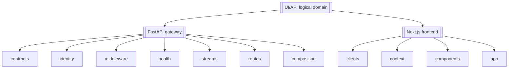
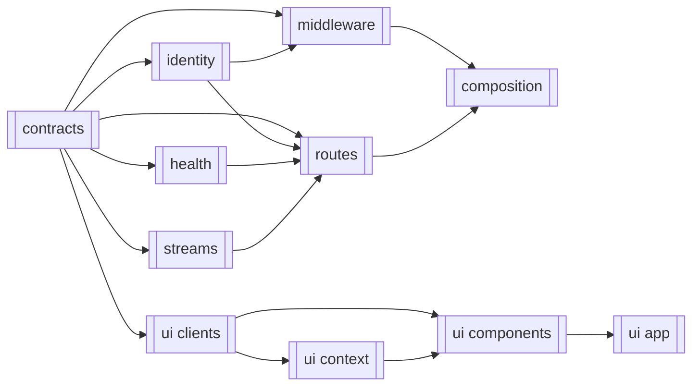
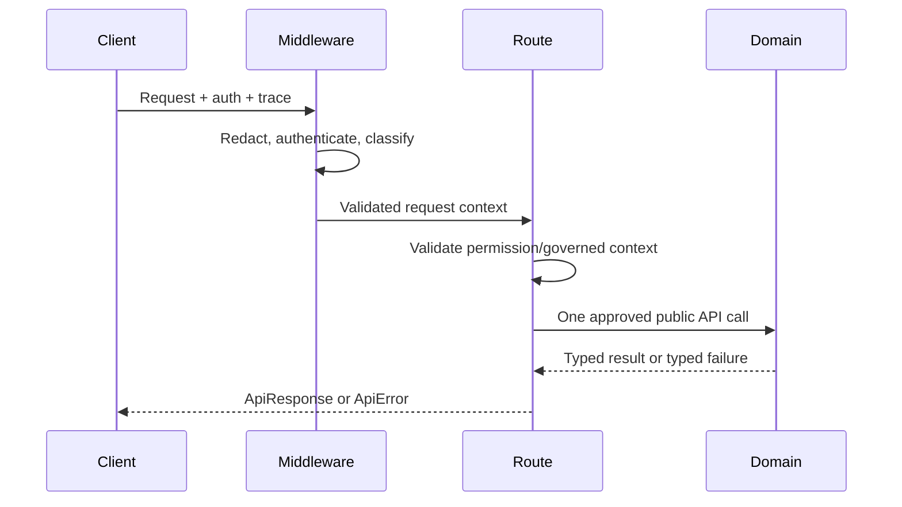
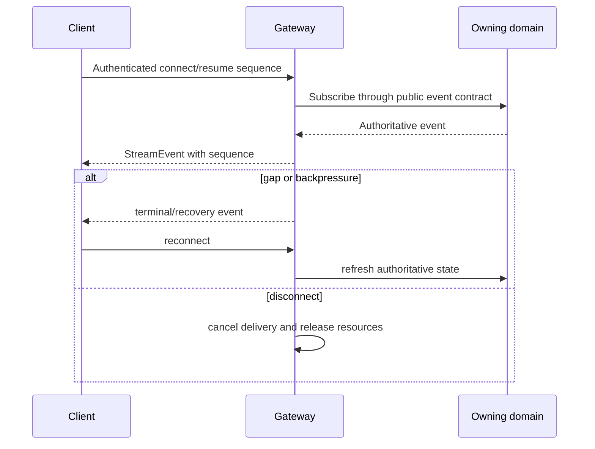

# UI/API

> **Specification location:** `app/services/api/README.md`
> **Logical runtime packages:** FastAPI gateway at `app/services/api` plus Next.js frontend at `ui/` (per the `docs/PROJECT.md` registry), with canonical ASGI target `app.services.api.main:app`; Next.js frontend at `ui/`
> **Status:** `Missing`
> **Last updated:** `2026-07-13`

> This README is the UI/API domain's **single source of truth** for final requirements,
> structure, implementation sequence, workflows, public symbols, boundary contracts,
> usage examples, and tests. Update this file before changing UI/API code.

---

## 1. Purpose and Boundary

### Purpose

UI/API is the authenticated presentation and delegation boundary for HaruQuantAI. It
exposes approved domain capabilities through typed HTTP and streaming contracts and a
separately deployable frontend, while keeping all trading, risk, data, simulation,
analytics, optimization, research, and portfolio decisions in their owning domains. It fails
closed whenever identity, permission, governed-write context, safety state, or a
required dependency cannot be verified.

### Owns

- One canonical FastAPI application, lifecycle, route registration, middleware, CORS,
  liveness, readiness, and boundary error translation.
- HTTP/WebSocket boundary DTOs, route metadata, pagination wrappers, and frontend
  validators for approved routes.
- Authentication and authorization enforcement at the boundary and production of the
  shared `AuthContext` consumed by governed domains.
- Password hashing and verification for UI/API-owned identities; Utils supplies
  redaction primitives but owns no credential-hashing API.
- Credential encryption/persistence, active-key selection from externally provisioned
  keys, credential-reference resolution, and composition-root construction of
  Brokers-owned `BrokerConnectionConfig v1` values. UI/API does not generate, store,
  or rotate encryption keys.
- Composition-root loading of the per-platform provider enablement flags
  (`MT5_ENABLED`, `CTRADER_ENABLED`, `BINANCE_ENABLED`, …) declared in
  `docs/PROJECT.md` §6. These flags determine which broker-backed provider facades
  Data may compose as read-only market-data sources; UI/API loads and supplies them
  and never decides source selection, ordering, fallback, or readiness, which remain
  Data's under `CAP-DATA-025` and `WF-DATA-011`.
- User, session, settings, and HTTP-idempotency logical schemas/tables/migrations on
  Data-owned shared persistence infrastructure.
- Authenticated human `ApprovalAttestation v1` production; Risk remains the sole
  validator and approval-token/action-policy authority under the registered Risk contracts.
- Thin route handlers that validate, authorize, delegate once through approved public
  domain APIs, and translate results.
- Frontend views, typed clients, protected navigation, bounded page context, stale-data
  presentation, and non-authoritative governed-write preflight.
- Requests to Risk for kill-switch activation or authorized clearance; UI/API never
  owns or mutates canonical kill-switch state.
- Clock-drift readiness diagnostics; the probe reports drift and never corrects a
  clock, rewrites a timestamp, or blocks a request.
- Operational telemetry transport: recording through explicitly injected sinks,
  metric-label hygiene, bounded snapshots, and the protected Prometheus exposition
  surface. UI/API computes no business, performance, or risk metric, and telemetry is
  never an input to a governed decision.

### Does not own

- Domain calculations, trading decisions, strategy evaluation, risk approval, order
  execution, broker connectivity, reconciliation, simulation state, analytics,
  optimization algorithms, research algorithms, portfolio construction, allocation
  activation, drift detection, or rebalance planning.
- Another domain's tables, artifacts, migrations, SDK objects, or internal imports;
  resolved credential material never crosses any boundary except inside the
  in-memory Brokers-owned configuration built at composition.
- Approval tokens, canonical kill-switch state, broker state, official fills, or live
  safety policy. Frontend checks are advisory; backend gates remain authoritative.
- Currency strength, advanced Edge Lab calibration/automation/exports, broad
  performance pages, a public health event stream, or a second operator FastAPI app.
- Raw strategy/SQX import, export, parsing, scoring, or artifact lifecycle; and
  documentation browsing, management, mutation, or file persistence in the initial build.

### Shared contracts

Contract names, versions, and owners must match `docs/PROJECT.md`.

**Owned by this domain** — external boundary contracts defined authoritatively here:

| Status | Contract | Version | Counterparty | Purpose |
|---|---|---|---|---|
| Missing | `ApiResponse[T]` | `v1` | HTTP clients | Five-field non-stream response envelope. |
| Missing | `ApiError` | `v1` | HTTP clients | Bounded deterministic public error with retry metadata and trace identifiers. |
| Missing | `ApiMetadata` | `v1` | HTTP clients | Request, trace, route, operation, side-effect, duration, timestamp, and stale metadata. |
| Missing | `StreamEvent[T]` | `v1` | Streaming clients | Ordered event envelope with sequence, time, trace, heartbeat, and terminal-error fields. |
| Missing | `RouteContract` | `v1` | Backend and frontend | Method/path/auth/schema/side-effect/owner/stability contract used for drift tests. |
| Missing | `GovernedRequestContext` | `v1` | Browser and gateway | Request, workflow, permission, approval, audit, and idempotency context for governed writes. |
| Missing | `PageContext` | `v1` | Frontend workflows | Bounded, redacted route and action context. |

**Consumed from other domains** — referenced, never redefined:

| Contract | Version | Owner | Used for |
|---|---|---|---|
| `AuthContext` | `v1` | Utils | Propagate the validated principal and trace context to governed domains. |
| `MarketDataset`, `AccountStateSnapshot`, `MarketContextEvidence` | `v1` | Data | Market views, prepared-dataset requests, and Risk-ready market-context evidence; never raw DataFrames or provider objects. |
| `FXConversionEvidence` | `v1` | Data | Read-only conversion provenance views where an owner contract exposes them. |
| `TradeIntent`, `StrategyRegistrationRequest`, `StrategyParameterUpdateRequest`, `StrategyMutationResult` | `v1` | Strategy | Strategy views, explicitly approved registration/update commands, and immutable mutation truth. |
| `RiskDecision`, `ActionPolicyVerdict`, `KillSwitchCommand`, `KillSwitchState`, `ApprovalAttestation`, `ScenarioResult` | `v1` | Risk | Risk views, Risk-owned action permission, governed scoped operator commands, canonical safety state/hierarchy, approval attestation, and advisory scenario results. |
| `StrategyOperationalEligibilityRequest/Decision`, `AllocationReviewRequest`, `AllocationRiskDecision`, `AllocationBudgetActivationRequest` | `v1` | Risk | Operational-eligibility and portfolio review/authorization views and commands without gateway policy. |
| `TradeRecord`, `ExecutionReceipt`, `OrderIntent`, `OperationalEvent` | `v1` | Trading | Live/paper status, governed execution outcomes, and bounded operational evidence. |
| `SimulationResult` | `v1` | Simulation | Completed synchronous backtest results; no interactive session lifecycle exists. |
| `PortfolioBacktestRequestV1` / `PortfolioSimulationResult` | `v1` | Simulation | Synchronous portfolio validation request/result views delegated through Portfolio. |
| `PerformanceReport` / `PortfolioAllocationEvidence` | `v1` | Analytics | Read-only performance, allocation-evidence, and dashboard views. |
| `OptimizationResult` | `v1` | Optimization | Terminal synchronous optimization result; no persisted-job/progress/cancellation API exists. |
| `ResearchReport` | `v1` | Research | Core Edge Lab evidence and research-to-strategy review. |
| `PortfolioConstructionRequest`, `PortfolioConstructionResult`, `ActivePortfolioAllocation`, `PortfolioRebalancePlan` | `v1` | Portfolio | Construct, inspect, activate, roll back, and review drift through Portfolio's public API. |
| `AuditEvent` | `v1` | Utils | Emit redacted audit records for governed boundary actions. |
| `AuditEventQuery` / `AuditEventPage` | `v1` | Data | Protected bounded operator audit views through Data's public query boundary. |

### Persisted state

UI/API owns its logical durable boundary state. Data supplies shared
connection, locking, and migration execution only.

| Status | State / Store | Read access (via contract) | Migration definitions |
|---|---|---|---|
| Missing | User, session, settings, and encrypted credential-reference state | UI/API identity/settings/credential contracts | `app/services/api/state/migrations.py` |
| Missing | HTTP-idempotency records | UI/API replay/conflict checks only | `app/services/api/state/migrations.py` |

Browser sessions use opaque server-side identifiers in secure HttpOnly SameSite
cookies outside local development and require CSRF validation for state changes.
Service accounts use bearer authentication. HTTP idempotency is scoped by principal,
method, canonical route, and key; terminal replay-safe records are retained at least
24 hours. Business/execution idempotency remains with each command-owning domain.

### Four-level structure

| Code level | Represents |
|---|---|
| **Logical package** | UI/API domain |
| **Module folder** | Feature or capability |
| **File** | Focused use case or resource family |
| **Class / function / method / constant** | Required public behavior or contract |

The separate gateway and frontend roots are an explicit exception already approved by
`docs/PROJECT.md`, which defines one logical domain implemented by two deployables.

### Package capability map



---

## 2. Final Package Structure

The canonical Python runtime tree remains under `app/services/api/`; there is no
top-level `api/` package and no temporary compatibility import. The frontend remains a separate
`ui/` deployable as required by `docs/PROJECT.md`.

### Feature Registry

The UI/API domain remains `Missing`. These are the approved current feature
targets; none may be marked `Completed` until its owning module, exact public
contracts, numbered usage program, and required tests satisfy Sections 4 and 7.

| Status | Feature | Owning module | Public API and contracts | Requirements | Usage evidence |
|---|---|---|---|---|---|
| Missing | `FEAT-API-01` Boundary Contracts | `contracts/` | Planned exact declarations: Section 4.1 | Section 4.1 functional requirements | Missing |
| Missing | `FEAT-API-02` Authentication and Authorization | `identity/` | Planned exact declarations: Section 4.2 | Section 4.2 functional requirements | Missing |
| Missing | `FEAT-API-03` Request Security and Context | `middleware/` | Planned exact declarations: Section 4.3 | Section 4.3 functional requirements | Missing |
| Missing | `FEAT-API-04` Liveness and Readiness | `health/` | Planned exact declarations: Section 4.4 | Section 4.4 functional requirements | Missing |
| Missing | `FEAT-API-05` Operational Telemetry and Exposition | `observability/` | Planned exact declarations: Section 4.5 | Section 4.5 functional requirements | Missing |
| Missing | `FEAT-API-06` Ordered Event Delivery | `streams/` | Planned exact declarations: Section 4.6 | Section 4.6 functional requirements | Missing |
| Missing | `FEAT-API-07` Thin HTTP and Streaming Boundaries | `routes/` | Planned exact declarations and route contracts: Section 4.7 | Section 4.7 functional requirements | Missing |
| Missing | `FEAT-API-08` Canonical Application Lifecycle | `composition/` | Planned exact declarations: Section 4.8 | Section 4.8 functional requirements | Missing |
| Missing | `FEAT-API-09` Typed Frontend Transport | `ui/clients/` | Planned exact declarations: Section 4.9 | Section 4.9 functional requirements | Missing |
| Missing | `FEAT-API-10` Frontend Session and Page Context | `ui/context/` | Planned exact declarations: Section 4.10 | Section 4.10 functional requirements | Missing |
| Missing | `FEAT-API-11` Workflow Presentation Components | `ui/components/` | Planned exact declarations: Section 4.11 | Section 4.11 functional requirements | Missing |
| Missing | `FEAT-API-12` Protected Workflow Pages | `ui/app/` | Planned exact declarations: Section 4.12 | Section 4.12 functional requirements | Missing |

```text
app/services/api/
├── __init__.py
├── README.md
├── contracts/
│   ├── __init__.py
│   ├── models.py                 # Boundary envelopes and governed/page context
│   └── catalog.py                # Route/stream classification and contract registry
├── identity/
│   ├── __init__.py
│   ├── passwords.py              # UI/API-owned password hashing and verification
│   ├── credentials.py            # Encrypted credential records and active-key selection
│   ├── sessions.py               # Authentication and session lifecycle boundary
│   └── authorization.py          # AuthContext, permission, and governed-write checks
├── middleware/
│   ├── __init__.py
│   ├── context.py                # Request, trace, actor, session, and route intent
│   └── redaction.py              # Secret-safe allowlisted request telemetry
├── observability/
│   ├── __init__.py
│   ├── sinks.py                  # Injected telemetry sink boundary
│   ├── metrics.py                # Recording and metric-label hygiene
│   └── exposition.py             # Bounded snapshot and Prometheus rendering
├── health/
│   ├── __init__.py
│   ├── probes.py                 # Public liveness and protected readiness
│   └── clock.py                  # Signed clock-drift readiness diagnostic
├── streams/
│   ├── __init__.py
│   ├── events.py                 # Stream envelope validation
│   └── lifecycle.py              # Connection, resume, backpressure, and cleanup
├── routes/
│   ├── __init__.py
│   ├── auth.py                   # Registration, login, logout
│   ├── settings.py               # User settings read/update
│   ├── data.py                   # Symbols and prepared datasets
│   ├── strategies.py             # Strategy catalogue and approved version commands
│   ├── backtests.py              # One synchronous backtest request/result boundary
│   ├── risk.py                   # Risk decision-support boundary
│   ├── trading.py                # Live/paper Trading boundary and event stream
│   ├── optimization.py           # Bounded synchronous runs and scenarios
│   ├── research.py               # Initial core Edge Lab boundary
│   ├── dashboards.py             # Read-only operational and analytics snapshots
│   └── operator.py               # Approvals, kill-switch commands, operator events
└── composition/
    ├── __init__.py
    ├── lifecycle.py              # Required/optional dependency lifecycle
    ├── broker_config.py          # Resolve references and build BrokerConnectionConfig
    └── application.py            # Canonical app and route registration

ui/
├── app/
│   ├── auth-page.tsx
│   ├── workflow-page.tsx
│   ├── (auth)/login/page.tsx
│   ├── (auth)/register/page.tsx
│   └── (protected)/
│       ├── layout.tsx
│       ├── page.tsx
│       ├── settings/page.tsx
│       ├── strategies/page.tsx
│       ├── strategies/[id]/page.tsx
│       ├── backtests/page.tsx
│       ├── simulation/page.tsx
│       ├── risk-center/page.tsx
│       ├── live/page.tsx
│       ├── optimization/page.tsx
│       └── edge-lab/page.tsx
├── clients/
│   ├── request.ts
│   ├── index.ts
│   ├── auth.ts
│   ├── settings.ts
│   ├── data.ts
│   ├── strategies.ts
│   ├── backtests.ts
│   ├── simulation.ts
│   ├── risk.ts
│   ├── trading.ts
│   ├── optimization.ts
│   ├── research.ts
│   ├── dashboards.ts
│   └── operator.ts
├── context/
│   ├── auth.tsx
│   ├── page.tsx
│   ├── governed.ts
│   └── streams.ts
└── components/
    ├── shell.tsx
    ├── dashboard.tsx
    ├── strategies.tsx
    ├── simulation.tsx
    ├── trading.tsx
    └── research.tsx
```

### Module dependency diagram



### Structure rules

- Each backend route file exports only its `router`; decorated endpoint functions remain
  private Python implementation details while their HTTP contracts remain public.
- Each module `__init__.py` re-exports only the `Key exports` listed in Section 4. The
  package root re-exports only `create_app` and the approved boundary contract types;
  the canonical ASGI `app` remains at `app.services.api.main:app`.
- Route files call documented public domain APIs, never internal modules, repositories,
  broker clients, DataFrames, DB sessions, or provider SDK objects.
- No generic service/client/orchestrator layer is added for in-process calls. A focused
  orchestrator requires a demonstrated workflow and owner approval.
- The rejected second operator app, public health stream, trade-import route,
  missing operator-strategy import, and disabled Edge scheduler are absent.
- Usage examples live under `tests/api/usage/`, not in either production deployable.

### Reconciliation coverage manifest

This table proves that every capability decision has a final destination or an explicit
higher-authority exclusion.

| Reconciliation capability | Final destination |
|---|---|
| `CAP-UI-001` canonical composition/lifecycle | `composition/`, `health/`; `FR-API-018`, `FR-API-019`, `FR-API-035`–`FR-API-037` |
| `CAP-UI-002` contracts/envelopes/errors | `contracts/`; `FR-API-001`–`FR-API-008` |
| `CAP-UI-003` canonical identity/sessions | `identity/`; `FR-API-009`–`FR-API-013`; UI/API-owned state and opaque-cookie/bearer transport |
| `CAP-UI-004` authorization/governed writes/idempotency | `identity/`; `FR-API-014`, `FR-API-015`; UI/API-owned storage policy |
| `CAP-UI-005` request security/context/observability | `middleware/`; `FR-API-016`, `FR-API-017` |
| `CAP-UI-006` health/readiness | `health/`; `FR-API-018`, `FR-API-019`, `FR-API-059` |
| `CAP-UI-024` operational telemetry and exposition | `observability/`; `FR-API-060`–`FR-API-063` |
| `CAP-UI-007` operator approvals/events | `routes/operator.py`; `FR-API-034` |
| `CAP-UI-008` settings | `routes/settings.py`; `FR-API-023` |
| `CAP-UI-009` market data/prepared datasets | `routes/data.py`; `FR-API-024` |
| `CAP-UI-010` strategy catalogue/version commands | `routes/strategies.py`; `FR-API-025`; raw import/export/SQX excluded |
| `CAP-UI-011` synchronous backtest result | `routes/backtests.py`; `FR-API-026`; no query/log/session lifecycle |
| `CAP-UI-012` interactive simulator | Excluded from the initial synchronous lifecycle; no initial route or component |
| `CAP-UI-013` risk decision support | `routes/risk.py`; `FR-API-028` |
| `CAP-UI-014` live monitoring/mutations | `routes/trading.py`; `FR-API-029`; owner corrected to Trading by system ADRs |
| `CAP-UI-015` optimization/scenarios | `routes/optimization.py`; `FR-API-030` |
| `CAP-UI-016` initial Edge Lab | `routes/research.py`; `FR-API-031`; advanced surface excluded |
| `CAP-UI-018` dashboard reads | `routes/dashboards.py`; `FR-API-032`; currency strength excluded |
| `CAP-UI-019` documentation | Excluded from the initial build; no route, state, client, or component |
| `CAP-UI-020` shared streaming | `streams/`; `FR-API-004`, `FR-API-020`, `FR-API-021` |
| `CAP-UI-021` typed frontend clients | `ui/clients/`; `FR-API-038`–`FR-API-041` |
| `CAP-UI-022` frontend auth/shell | `ui/context/`, `ui/app/`; `FR-API-042`, `FR-API-046`, `FR-API-053`, `FR-API-054` |
| `CAP-UI-023` workflow pages/components | `ui/components/`, `ui/app/`; `FR-API-047`–`FR-API-055` (excluding reserved `FR-API-052`) |
| `CAP-UI-024` contract/security/workflow tests | Section 7 and `NFR-API-001`–`NFR-API-018` |

### Source requirement traceability

The reconciliation's retained requirement ranges are merged into the smallest final
public symbols below. Unsupported ranges are absent from the target structure.

| Reconciliation requirements | Final treatment |
|---|---|
| `UIAPI-FR-001`–`016` | `FR-API-001`–`008`, `FR-API-014`–`017`, shared pagination/timeout policy |
| `UIAPI-FR-017`–`018` | `FR-API-001`–`008`; path-based `/api/v1/` versioning and compatibility rules |
| `UIAPI-FR-019`–`025` | `FR-API-006`, `FR-API-015`; principal + method + canonical route + key scope; terminal retention ≥24 h |
| `UIAPI-FR-026`–`032` | `FR-API-007`, `FR-API-008`, `FR-API-016`, `FR-API-044`, test traceability |
| `UIAPI-FR-033`–`040` | `FR-API-017`–`019`, `FR-API-035`–`037`; canonical ASGI target `app.services.api.main:app` |
| `UIAPI-FR-041`–`042` | Rejected second operator app/accessor; absent |
| `UIAPI-FR-043`–`059` | `FR-API-009`–`017`; opaque server-side sessions, bearer service accounts, and server-side role/permission authority |
| `UIAPI-FR-061`–`070` | `FR-API-019`, `FR-API-021`, `FR-API-034` |
| `UIAPI-FR-071`–`076` | `FR-API-022`, `FR-API-023`; duplicate settings path rejected |
| `UIAPI-FR-101`–`114` | Registered strategy catalogue/version commands map to `FR-API-025`; raw import/export/SQX requirements are excluded |
| `UIAPI-FR-115`–`123` | `FR-API-026` |
| `UIAPI-FR-124`–`146` | `FR-API-027` |
| `UIAPI-FR-147`–`150` | `FR-API-028` |
| `UIAPI-FR-151`–`176` | `FR-API-029`; owner corrected from Live to Trading |
| `UIAPI-FR-177`–`193` | `FR-API-030` |
| `UIAPI-FR-194`–`199`, `201` | `FR-API-032` |
| `UIAPI-FR-202`–`207` | Data reads map to `FR-API-024`; documentation-file capabilities are excluded |
| `UIAPI-FR-208`–`226`, `238`–`241` | `FR-API-031` |
| `UIAPI-FR-246`–`250`, `252`–`271`, `273`–`283`, `285` | `FR-API-038`–`055` with the reduced approved UI surface |
| `UIAPI-NFR-001`–`018`, `023`–`024`, `027`–`030`, `032`–`033` | `NFR-API-001`–`018` and Section 7 |
| `UIAPI-NFR-019`–`022`, `025`–`026`, `031` | `NFR-API-*` and Section 5; 30-second endpoint timeout and pagination limits are binding, while other values remain explicit measurement baselines |

---

## 3. Workflows

### Workflow manifest

| Status | Workflow ID | Scope | Workflow | System workflow | Trigger / input boundary | Final outcome / output boundary | Requirements | Failure behavior | Integration test |
|---|---|---|---|---|---|---|---|---|---|
| Missing | `WF-API-001` | Internal | Gateway startup and readiness | None | Process configuration | Canonical app with truthful readiness | `FR-API-014`, `FR-API-015`, `FR-API-034` | Required failure blocks startup/readiness; approved optional failure is reported degraded | `tests/api/integration/test_startup.py::test_required_failure_blocks_readiness()` |
| Missing | `WF-API-002` | Internal | Authenticated request boundary | All applicable | HTTP request | One typed response or stream event after one approved delegation | `FR-API-001`–`FR-API-020` | Validation/auth/dependency failures become redacted deterministic envelopes | `tests/api/integration/test_request_boundary.py::test_authenticated_request_delegates_once()` |
| Missing | `WF-API-003` | Cross-domain | Authentication, settings, and credential composition | None | Credentials, session, or broker credential reference | Validated `AuthContext`, UI/API-owned settings response, or Brokers-owned `BrokerConnectionConfig v1` | `FR-API-008`–`FR-API-013`, `FR-API-021`, `FR-API-022`, `FR-API-057`, `FR-API-058` | No fallback identity/key/credential; unavailable key source, state, or idempotency dependency fails closed | `tests/api/integration/test_auth_settings.py::test_login_settings_logout()` |
| Missing | `WF-API-004` | Cross-domain | Market data and dataset preparation | `SYS-WF-001`, `SYS-WF-002` | Authenticated source/range request | Bounded Data result or provider error | `FR-API-023` | Requested provider failure is surfaced; no provider or user fallback | `tests/api/integration/test_data_boundary.py::test_prepare_dataset_delegates_to_data()` |
| Missing | `WF-API-005` | Cross-domain | Strategy catalogue, registered version commands, and approved optimization adoption | `SYS-WF-003`, `SYS-WF-004` | Authenticated strategy command/query or explicitly approved Optimization selection | `StrategyMutationResult v1` or structured failure | `FR-API-025` | Missing approval blocks adoption; gateway never writes strategy state or handles raw strategy artifacts | `tests/api/integration/test_strategy_boundary.py::test_strategy_lifecycle()` |
| Missing | `WF-API-006` | Cross-domain | Synchronous backtest run and result review | `SYS-WF-001` | Exact `SimulationBacktestRequestV1` plus `AuthContext` | Completed `SimulationResult`, derived `PerformanceReport`, or structured error | `FR-API-026`, `FR-API-018`–`FR-API-020` | Incomplete runs are not published; no session/queue/log-stream state is implied | `tests/api/integration/test_backtest_boundary.py::test_synchronous_backtest_run_and_review()` |
| Excluded | `WF-API-007` | Cross-domain | Interactive Simulation session lifecycle | Outside initial scope | — | — | `FR-API-027` | No initial session, frame, replay, or queued state | Excluded |
| Excluded | `WF-API-008` | Cross-domain | Governed interactive Simulation mutation/what-if | Outside initial scope | — | — | `FR-API-027` | Excluded with the interactive session lifecycle | Excluded |
| Missing | `WF-API-009` | Cross-domain | Synchronous Optimization and scenario run | `SYS-WF-003` | Bounded optimization request | Terminal in-memory `OptimizationResult` or structured error | `FR-API-030` | No create/detail/cancel/progress/WebSocket or repository-backed job lifecycle is exposed | `tests/api/integration/test_optimization_boundary.py::test_synchronous_run_and_result()` |
| Missing | `WF-API-010` | Cross-domain | Risk decision support | `SYS-WF-002`, `SYS-WF-005` | Authorized risk request | Typed Risk-owned evaluation | `FR-API-028` | Missing evidence or stale state fails closed; gateway performs no calculation | `tests/api/integration/test_risk_boundary.py::test_risk_delegation()` |
| Missing | `WF-API-011` | Cross-domain | Core Edge Lab research | `SYS-WF-004` | Dataset/research request | Registered `ResearchReport v1` or structured error | `FR-API-031` | Leakage/provider failures block publication; internal profiles, snapshots, and unsupported endpoints are absent | `tests/api/integration/test_research_boundary.py::test_core_edge_workflow()` |
| Missing | `WF-API-012` | Cross-domain | Live/paper session and governed broker action | `SYS-WF-002`, `SYS-WF-005` | Authenticated Trading command | Trading-owned status, receipt, or rejection | `FR-API-029` | Closed live flags, Risk, approval, reconciliation, idempotency, audit, or kill-switch gate causes no broker mutation | `tests/api/integration/test_trading_boundary.py::test_live_mutation_cannot_bypass_gates()` |
| Missing | `WF-API-013` | Cross-domain | Operator approval, scoped kill switch, and event review | `SYS-WF-005` | Validated operator principal plus explicit global/portfolio/strategy/symbol scope | `ApprovalAttestation`, audited Risk/Trading command result, or protected event | `FR-API-034` | Underprivileged or malformed scope is rejected; clearance without matching current attestation is rejected; no public sample stream | `tests/api/integration/test_operator_boundary.py::test_operator_kill_switch()` |
| Missing | `WF-API-015` | Cross-domain | Frontend governed request | All applicable | User action | Typed result, warning, or client preflight block | `FR-API-035`–`FR-API-041` | Preflight never substitutes for backend authorization; stale data blocks governed use | `tests/api/integration/test_frontend_governed.py::test_backend_remains_authoritative()` |
| Missing | `WF-API-016` | Cross-domain | Frontend stream consumption | All applicable | Authenticated stream connection | Validated ordered events and authoritative refresh after gaps | `FR-API-004`, `FR-API-017`–`FR-API-020`, `FR-API-042` | Disconnect cleans resources; gap/backpressure/terminal error triggers documented recovery | `tests/api/integration/test_frontend_streams.py::test_gap_refresh_and_cleanup()` |
| Missing | `WF-API-017` | Cross-domain | Portfolio construction, eligibility, activation, history, and rebalance | `SYS-WF-006`, `SYS-WF-007`, `SYS-WF-008` | Authenticated Portfolio request/operator approval | Owner-contract result or structured fail-closed error | `FR-API-056` | Gateway delegates and presents; it never calculates weights, eligibility, Risk budget, or orders | `tests/api/integration/test_portfolio_boundary.py::test_portfolio_workflows_preserve_owner_gates()` |

### Authenticated request sequence



### Streaming sequence



---

## 4. Module and Requirement Specifications

Modules and files are ordered from lowest dependency to highest dependency.

### 4.1 `contracts/` — Boundary contracts

**Purpose:** Define typed HTTP, stream, route, governed-write, and page-context contracts
without importing any business domain.

**Module flow:** raw boundary values → validated immutable contract → route/client use.

| Status | File | Responsibility | Key exports | Dependencies |
|---|---|---|---|---|
| Missing | `models.py` | Define response, error, metadata, stream, governed, and page contracts | `ApiMetadata`, `ApiError`, `ApiResponse`, `StreamEvent`, `GovernedRequestContext`, `PageContext` | **Standard library:** `datetime`, `enum`, `typing`<br>**Required third-party:** `pydantic>=2.13.4`<br>**Local:** None |
| Missing | `catalog.py` | Define and validate public route/stream metadata | `RouteContract`, `register_route_contract` | **Standard library:** `collections.abc`<br>**Required third-party:** `pydantic>=2.13.4`<br>**Local:** `models.py` → contract types |
| Missing | `__init__.py` | Expose the supported contract API | All key exports above | **Standard library:** None<br>**Required third-party:** None<br>**Local:** `models.py`, `catalog.py` → approved exports |

| Status | Requirement ID | Responsibility | Class / Function / Method | Side Effects | Raises | Usage / Test |
|---|---|---|---|---|---|---|
| Missing | `FR-API-001` | Carry request/trace, route, operation, side-effect, timing, timestamp, stale, pagination, and idempotency-replay metadata. | `ApiMetadata(BaseModel)` | None | `ValidationError`: invalid or missing required metadata | **Usage:** `tests/api/usage/test_usage_contracts.py::test_usage_api_metadata()`<br>**Unit:** `tests/api/unit/test_contract_models.py::test_api_metadata_rejects_invalid_time()` |
| Missing | `FR-API-002` | Expose a bounded redacted error with deterministic code, message, details, request/trace IDs, and retryability. | `ApiError(BaseModel)` | None | `ValidationError`: unbounded or invalid error data | **Usage:** `tests/api/usage/test_usage_contracts.py::test_usage_api_error()`<br>**Unit:** `tests/api/unit/test_contract_models.py::test_api_error_bounds_details()` |
| Missing | `FR-API-003` | Return exactly `status`, `message`, `data`, `error`, and `metadata` for non-streaming responses; HTTP 204 has no body. | `ApiResponse[T](BaseModel)` | None | `ValidationError`: success/error fields conflict | **Usage:** `tests/api/usage/test_usage_contracts.py::test_usage_api_response()`<br>**Unit:** `tests/api/unit/test_contract_models.py::test_response_envelope_shape()` |
| Missing | `FR-API-004` | Validate ordered stream events with type, data, request/trace IDs, sequence, UTC timestamp, heartbeat, and terminal error. | `StreamEvent[T](BaseModel)` | None | `ValidationError`: invalid sequence or event shape | **Usage:** `tests/api/usage/test_usage_contracts.py::test_usage_stream_event()`<br>**Unit:** `tests/api/unit/test_contract_models.py::test_stream_event_requires_sequence()` |
| Missing | `FR-API-005` | Declare classification, stability, method/path, auth, permission, schemas, status/errors, side effects, owner, pagination, idempotency, audit, rate class, and observability for each route/stream. | `RouteContract(BaseModel)` | None | `ValidationError`: required route metadata is absent | **Usage:** `tests/api/usage/test_usage_contracts.py::test_usage_route_contract()`<br>**Unit:** `tests/api/unit/test_contract_catalog.py::test_incomplete_route_contract_rejected()` |
| Missing | `FR-API-006` | Carry validated request, workflow, permission, approval, audit, idempotency, and safety context without granting authority itself. | `GovernedRequestContext(BaseModel)` | None | `ValidationError`: governed context is incomplete | **Usage:** `tests/api/usage/test_usage_contracts.py::test_usage_governed_context()`<br>**Unit:** `tests/api/unit/test_contract_models.py::test_governed_context_requires_ids()` |
| Missing | `FR-API-007` | Bound and redact current route, visible entity IDs, and approved actions before context leaves the frontend. | `PageContext(BaseModel)` | None | `ValidationError`: context exceeds limit or contains forbidden fields | **Usage:** `tests/api/usage/test_usage_contracts.py::test_usage_page_context()`<br>**Unit:** `tests/api/unit/test_contract_models.py::test_page_context_rejects_secret()` |
| Missing | `FR-API-008` | Register each route contract exactly once and reject collisions or incomplete declarations. | `register_route_contract(contract: RouteContract) -> None` | Local state mutation | `ValueError`: duplicate or conflicting route contract | **Usage:** `tests/api/usage/test_usage_contracts.py::test_usage_register_contract()`<br>**Unit:** `tests/api/unit/test_contract_catalog.py::test_duplicate_contract_rejected()` |

**Rules:** contracts are versioned `v1`; additive optional fields may remain compatible;
breaking behavior requires `/api/v2` plus a stated deprecation window. Raw provider errors and secrets are forbidden.

**Configuration and Limits Manifest:** None. Contract version and shared boundary limits
are declared in Section 5.

**Stable common error codes:** `VALIDATION_FAILED`, `AUTHENTICATION_REQUIRED`,
`AUTHORIZATION_FAILED`, `CSRF_REQUIRED`, `CSRF_INVALID`, `RATE_LIMITED`,
`IDEMPOTENCY_KEY_REQUIRED`, `DUPLICATE_IDEMPOTENCY_KEY`, `IDEMPOTENCY_CONFLICT`,
`GOVERNANCE_REQUIRED`, `STALE_DATA`, `UPSTREAM_UNAVAILABLE`, `UPSTREAM_TIMEOUT`,
`UPSTREAM_NON_JSON_RESPONSE`, `PAYLOAD_TOO_LARGE`, `UNSUPPORTED_MEDIA_TYPE`,
`DEPENDENCY_UNAVAILABLE`, `INTERNAL_ERROR`, and `NOT_IMPLEMENTED`. A version-mismatch
code is emitted for an explicit incompatible-version failure. Route-specific codes require a registered
contract and test.

**Implementation notes:** create fresh boundary models; do not reuse inconsistent V1
route responses. `ApiResponse` must remain compatible with the Utils five-field
envelope without redefining Utils-owned `AuthContext` or `AuditEvent`.

### 4.2 `identity/` — Authentication and authorization

**Purpose:** Hash and verify UI/API identity credentials, encrypt and persist broker
credential material, select an externally provisioned active key, authenticate users,
enforce sessions and permissions, and construct the Utils-owned `AuthContext`.
UI/API owns durable credential state and browser/service authentication transport but
does not generate, store, or rotate encryption keys.

**Module flow:** credentials/session → validated principal → Utils `AuthContext` →
permission and governed-request decision.

| Status | File | Responsibility | Key exports | Dependencies |
|---|---|---|---|---|
| Missing | `passwords.py` | Hash and verify UI/API-owned passwords without secret disclosure or silent algorithm fallback | `hash_password`, `verify_password` | **Standard library:** None<br>**Required third-party:** memory-hard password-hashing adapter satisfying `FR-API-009`; the exact compatible constraint belongs in `pyproject.toml`<br>**Local:** UI/API identity errors; Utils redaction primitives |
| Missing | `credentials.py` | Encrypt/decrypt UI/API-owned credential records using an injected externally provisioned key set and explicit active key ID | `CredentialRecord`, `store_credential`, `resolve_credential_reference` | **Standard library:** `collections.abc`, `datetime`<br>**Required third-party:** authenticated-encryption adapter pinned in `pyproject.toml` before implementation<br>**Local:** UI/API state store; Utils redaction/error primitives |
| Missing | `sessions.py` | Authenticate credentials and manage a single active UI/API-owned session | `authenticate_user`, `create_session`, `validate_session`, `revoke_session` | **Standard library:** `datetime`<br>**Required third-party:** `pydantic>=2.13.4`<br>**Local:** UI/API state store; Utils auth/context API |
| Missing | `authorization.py` | Build shared auth context and enforce permissions/governed context | `build_auth_context`, `require_permission`, `validate_governed_request` | **Standard library:** `collections.abc`<br>**Required third-party:** None<br>**Local:** Utils → `AuthContext`; `contracts.models` → `GovernedRequestContext` |

| Status | Requirement ID | Responsibility | Class / Function / Method | Side Effects | Raises | Usage / Test |
|---|---|---|---|---|---|---|
| Missing | `FR-API-009` | Hash new non-empty passwords and verify stored hashes within UI/API, then authenticate valid active and verified credentials, update last-login evidence, rate-limit failures, and never log secrets. No silent hashing-algorithm fallback is allowed. | `hash_password`, `verify_password`, `authenticate_user` | Read-only; persistence write | `AuthenticationError`: credentials invalid; `AccountStateError`: inactive/unverified; `DependencyUnavailableError`: approved hashing implementation unavailable | **Usage:** `tests/api/usage/test_usage_identity.py::test_usage_authenticate_user()`<br>**Unit:** `tests/api/unit/test_passwords.py::test_hash_and_verify_remain_api_owned()` |
| Missing | `FR-API-010` | Replace the user's prior active session and create one configurable-expiry opaque server-side session in the UI/API-owned store; return it through a secure HttpOnly SameSite cookie with CSRF validation for browser state changes. | `create_session(user: AuthenticatedUser) -> SessionCredential` | Persistence write | `DependencyUnavailableError`: session state unavailable | **Usage:** `tests/api/usage/test_usage_identity.py::test_usage_create_session()`<br>**Unit:** `tests/api/unit/test_sessions.py::test_new_login_revokes_old_session()` |
| Missing | `FR-API-011` | Validate standard session credentials, expiry, revocation, and current account status and delete expired sessions. | `validate_session(credential: SessionCredential) -> AuthenticatedPrincipal` | Read-only; conditional persistence write | `AuthenticationError`: missing, malformed, expired, revoked, or inactive | **Usage:** `tests/api/usage/test_usage_identity.py::test_usage_validate_session()`<br>**Unit:** `tests/api/unit/test_sessions.py::test_deactivated_user_token_rejected()` |
| Missing | `FR-API-012` | Revoke the caller's persisted session on logout; repeated logout is deterministic. | `revoke_session(credential: SessionCredential) -> None` | Persistence write | `DependencyUnavailableError`: revocation cannot be confirmed | **Usage:** `tests/api/usage/test_usage_identity.py::test_usage_revoke_session()`<br>**Unit:** `tests/api/unit/test_sessions.py::test_logout_is_idempotent()` |
| Missing | `FR-API-013` | Produce Utils `AuthContext` from validated authority claims and trace context, never caller-controlled role headers. | `build_auth_context(principal: AuthenticatedPrincipal, trace: TraceContext) -> AuthContext` | None | `AuthenticationError`: authority claims cannot be verified | **Usage:** `tests/api/usage/test_usage_identity.py::test_usage_build_auth_context()`<br>**Unit:** `tests/api/unit/test_authorization.py::test_role_header_cannot_create_principal()` |
| Missing | `FR-API-014` | Enforce the approved permission at the backend boundary and return the standard 403 envelope on failure. | `require_permission(context: AuthContext, permission: str) -> None` | Read-only | `AuthorizationError`: permission absent | **Usage:** `tests/api/usage/test_usage_identity.py::test_usage_require_permission()`<br>**Unit:** `tests/api/unit/test_authorization.py::test_missing_permission_rejected()` |
| Missing | `FR-API-015` | Validate governed context, CSRF when applicable, approval scope, idempotency dependency, stale evidence, and audit intent before delegation. | `validate_governed_request(context: AuthContext, governed: GovernedRequestContext) -> None` | Read-only | `GovernanceError`: context missing/stale; `DependencyUnavailableError`: idempotency unavailable | **Usage:** `tests/api/usage/test_usage_identity.py::test_usage_validate_governed_request()`<br>**Unit:** `tests/api/unit/test_authorization.py::test_missing_governed_context_fails_closed()` |
| Missing | `FR-API-057` | Encrypt credential material before persistence with authenticated encryption, store key ID/version and integrity metadata but never the key, select exactly the configured active key from an injected externally provisioned key set, and decrypt only for an authorized composition request. | `store_credential`, `resolve_credential_reference` | Persistence write/read | `CredentialSecurityError`: missing/multiple active keys, tamper, unknown key ID, unauthorized access, or storage failure | **Usage:** `tests/api/usage/test_usage_identity.py::test_usage_store_and_resolve_credential()`<br>**Unit:** `tests/api/unit/test_credentials.py::test_credential_store_never_persists_key_or_plaintext()` |
| Missing | `FR-API-058` | Resolve an opaque `secret://` reference only at composition, build one immutable Brokers-owned `BrokerConnectionConfig v1` with `SecretStr` values, and discard plaintext after construction without logging, caching, or returning it through UI/API contracts. | `build_broker_connection_config` | Credential-store read | `CredentialSecurityError`, `DependencyUnavailableError`: unsafe/unresolved reference, unavailable key source, or invalid Brokers config | **Usage:** `tests/api/usage/test_usage_composition.py::test_usage_build_broker_config()`<br>**Unit:** `tests/api/unit/test_broker_config.py::test_plaintext_never_crosses_composition_boundary()` |

**Configuration and Limits Manifest**

| Status | Setting / Limit | Type | Default | Required | Used by | Description |
|---|---|---|---|---|---|---|
| Missing | `SESSION_TTL_SECONDS` | `int` | None | Yes | `create_session` | Owner-approved value; expiry is enforced by `validate_session`. |
| Missing | `AUTH_TRANSPORT` | policy | Browser cookie / service bearer | Yes | all identity exports | Browsers use opaque server-side IDs in secure HttpOnly SameSite cookies outside local development; service accounts use authenticated bearer credentials. |
| Missing | `CSRF_POLICY` | policy | Required for cookie-authenticated state changes | Conditional | `validate_governed_request` | Absence or invalidity fails the state-changing request closed. |
| Missing | `CREDENTIAL_KEY_REFS` | `tuple[str, ...]` | None | Yes before credential persistence/resolution | `store_credential`, `resolve_credential_reference` | References externally provisioned keys; the keys are injected at runtime and never stored by UI/API. |
| Missing | `ACTIVE_CREDENTIAL_KEY_ID` | `str` | None | Yes before credential persistence | `store_credential` | Must identify exactly one injected key; missing/ambiguous selection fails closed. |

**Implementation notes:** reuse V1 password/session behavior only after moving it behind
the approved state owner. Do not reuse raw-token acceptance, fallback users, development
chat identity, or caller-controlled operator headers.

### 4.3 `middleware/` — Request security and context

**Module flow:** request → secret-safe allowlist → trace/intent/auth context → route.

| Status | File | Responsibility | Key exports | Dependencies |
|---|---|---|---|---|
| Missing | `redaction.py` | Publish only allowlisted, secret-safe request telemetry | `SecretRedactionMiddleware` | **Standard library:** None<br>**Required third-party:** FastAPI/Starlette; exact compatible constraints belong in `pyproject.toml`<br>**Local:** Utils redaction/logger APIs |
| Missing | `context.py` | Attach request/trace, route intent, actor, and session context | `RequestContextMiddleware` | **Standard library:** None<br>**Required third-party:** FastAPI/Starlette; exact compatible constraints belong in `pyproject.toml`<br>**Local:** `contracts`, `identity` public APIs |

| Status | Requirement ID | Responsibility | Class / Function / Method | Side Effects | Raises | Usage / Test |
|---|---|---|---|---|---|---|
| Missing | `FR-API-016` | Redact secrets before any log/trace/metric emission and log only allowlisted method, route, identifiers, status, duration, and error code. | `SecretRedactionMiddleware` | Log publication | `TelemetryError`: safe telemetry cannot be emitted where required | **Usage:** `tests/api/usage/test_usage_middleware.py::test_usage_redacted_request()`<br>**Unit:** `tests/api/unit/test_redaction.py::test_tokens_never_logged()` |
| Missing | `FR-API-017` | Create/validate request and correlation IDs, classify registered route intent, authenticate where required, and attach canonical context. | `RequestContextMiddleware` | Local state mutation | `AuthenticationError`: protected request lacks valid authority; `ValidationError`: invalid identifiers | **Usage:** `tests/api/usage/test_usage_middleware.py::test_usage_request_context()`<br>**Unit:** `tests/api/unit/test_context.py::test_unknown_route_has_bounded_metadata()` |

**Configuration and Limits Manifest:** None. The module consumes shared redaction and
trace policy from Utils and route metadata from `contracts/`.

**Implementation notes:** retain the useful V1 redaction and prefix classification,
but remove mutable classifier APIs and never derive actor/session identity from optional
headers.

### 4.4 `health/` — Liveness and readiness

**Module flow:** process/dependency probes → coarse public liveness or protected detailed
readiness → typed response.

| Status | File | Responsibility | Key exports | Dependencies |
|---|---|---|---|---|
| Missing | `probes.py` | Report minimal public liveness and protected dependency readiness | `get_liveness`, `get_readiness` | **Standard library:** `collections.abc`<br>**Required third-party:** None<br>**Local:** approved dependency health APIs; `contracts` |
| Missing | `clock.py` | Report signed local-clock drift against an authoritative external instant as a readiness diagnostic | `check_clock_drift` | **Standard library:** `datetime`, `decimal`<br>**Required third-party:** None<br>**Local:** `app.utils` → `utc_now`; approved Brokers server-time read; `contracts` |

| Status | Requirement ID | Responsibility | Class / Function / Method | Side Effects | Raises | Usage / Test |
|---|---|---|---|---|---|---|
| Missing | `FR-API-018` | Return HTTP 200 with coarse service status only when the process accepts requests; expose no private dependency data. | `get_liveness() -> ApiResponse[Liveness]` | None | None | **Usage:** `tests/api/usage/test_usage_health.py::test_usage_liveness()`<br>**Unit:** `tests/api/unit/test_health.py::test_liveness_contains_no_private_data()` |
| Missing | `FR-API-019` | Return protected required/optional component readiness with degraded reasons and timestamps. | `get_readiness(context: AuthContext) -> ApiResponse[Readiness]` | Read-only | `AuthorizationError`: detail not permitted; `DependencyUnavailableError`: required dependency failed | **Usage:** `tests/api/usage/test_usage_health.py::test_usage_readiness()`<br>**Unit:** `tests/api/unit/test_health.py::test_required_failure_is_not_healthy()` |
| Missing | `FR-API-059` | Report signed local-clock drift against an authoritative external instant, expose it as a `readiness` detail, and mark readiness degraded when the absolute drift exceeds the configured tolerance. Drift is diagnostic only and never rewrites a timestamp or blocks execution. | `check_clock_drift(reference: datetime, *, tolerance_seconds: Decimal) -> Decimal` | Read-only | `ValidationError`: naive/non-UTC reference or non-positive tolerance | **Usage:** `tests/api/usage/test_usage_health.py::test_usage_clock_drift()`<br>**Unit:** `tests/api/unit/test_clock.py::test_drift_is_signed_and_utc_only()`, `test_drift_beyond_tolerance_degrades_readiness()` |

**Configuration and Limits Manifest**

| Status | Setting / Limit | Type | Default | Required | Used by | Description |
|---|---|---|---|---|---|---|
| Missing | `CLOCK_DRIFT_TOLERANCE_SECONDS` | `Decimal` | `2` | No | `check_clock_drift` | Absolute drift beyond this value marks readiness degraded. Diagnostic only; it never blocks a request or alters a recorded timestamp. |

Required/optional dependency classification remains owned by composition and the
configured dependency set.

**Implementation notes:** replace V1 constant health and placeholder Redis reporting;
probe only configured dependencies through public health APIs.

**Why clock drift lives here.** Utils rejects future timestamps at every freshness
boundary (`app/utils/README.md` `FR-UTL-012`), which correctly prevents skewed
timestamps from entering evidence but gives an operator no way to see *why* freshness
checks are failing. `check_clock_drift` closes that diagnostic gap without granting
telemetry or time-correction authority. Utils owns no health provider
(`app/utils/README.md` "Does not own"), so the probe belongs in UI/API. Clock
synchronisation itself remains an infrastructure responsibility (NTP/chrony); this
requirement only surfaces the condition.

### 4.5 `observability/` — Operational telemetry and exposition

**Module flow:** emitting-domain observation → injected sink → label hygiene → bounded
snapshot → Prometheus text exposition → protected scrape route.

UI/API owns the telemetry transport and exposition surface only. It records counters,
gauges, and timings supplied by emitting domains and computes no business, performance,
or risk metric — those belong to Analytics and Research. Three rules are normative:

- **Injection, never a global registry.** Emitting domains pass an explicit
  `MetricSink`, mirroring the injected-sink pattern already used by
  `route_error_event(exception, sink)` in Utils. No module-global mutable registry
  exists, so telemetry stays compatible with multi-process deployment and with
  `NFR-UTL-003` import safety.
- **Telemetry is never authoritative.** No governed decision reads a metric. Telemetry
  failure, sink unavailability, or a disabled `METRICS_ENABLED` never blocks, delays,
  or alters execution, and never changes a recorded business outcome.
- **Label hygiene before emission.** Labels are validated against the shared sensitive-key
  denylist and a cardinality bound before any value reaches a sink, reusing
  `app.utils.security.is_sensitive_key` rather than defining a second secret pattern.

| Status | File | Responsibility | Key exports | Dependencies |
|---|---|---|---|---|
| Missing | `sinks.py` | Define the injected telemetry sink boundary and a bounded in-process sink | `MetricSink`, `InProcessMetricSink` | **Standard library:** `collections.abc`, `decimal`, `threading`<br>**Required third-party:** None<br>**Local:** `contracts` |
| Missing | `metrics.py` | Validate label hygiene and record one observation through an injected sink | `record_metric`, `validate_metric_labels` | **Standard library:** `collections.abc`, `decimal`<br>**Required third-party:** None<br>**Local:** `app.utils.security` → `is_sensitive_key`; `sinks.py` |
| Missing | `exposition.py` | Collect a bounded snapshot and render Prometheus text exposition | `MetricSnapshot`, `build_metric_snapshot`, `export_prometheus_metrics` | **Standard library:** `collections.abc`, `decimal`<br>**Required third-party:** Prometheus text-format renderer; the exact compatible constraint is `Pending` and belongs in `pyproject.toml` before implementation<br>**Local:** `sinks.py` |

| Status | Requirement ID | Responsibility | Class / Function / Method | Side Effects | Raises | Usage / Test |
|---|---|---|---|---|---|---|
| Missing | `FR-API-060` | Record one counter, gauge, or timing observation through an explicitly injected sink; never through a module-global registry. Recording is a no-op when `METRICS_ENABLED` is false. | `record_metric(name: str, value: Decimal, *, labels: Mapping[str, str], sink: MetricSink) -> None` | Caller-provided sink mutation | `ValidationError`: malformed metric name or non-finite value | **Usage:** `tests/api/usage/test_usage_observability.py::test_usage_record_metric()`<br>**Unit:** `tests/api/unit/test_metrics.py::test_record_uses_injected_sink_only()`, `test_disabled_metrics_is_noop()` |
| Missing | `FR-API-061` | Reject label values that match the shared sensitive-key denylist or exceed the configured cardinality bound, before any value reaches a sink. | `validate_metric_labels(labels: Mapping[str, str]) -> None` | None | `SecurityError`: sensitive label key; `ValidationError`: cardinality bound exceeded or malformed label | **Usage:** `tests/api/usage/test_usage_observability.py::test_usage_label_hygiene()`<br>**Unit:** `tests/api/unit/test_metrics.py::test_secret_bearing_label_rejected()`, `test_high_cardinality_label_rejected()` |
| Missing | `FR-API-062` | Collect a bounded point-in-time snapshot from a sink and render it as Prometheus text exposition without mutating recorded state. | `build_metric_snapshot(sink: MetricSink) -> MetricSnapshot`, `export_prometheus_metrics(snapshot: MetricSnapshot) -> str` | None | `ValidationError`: snapshot exceeds `METRICS_MAX_SERIES` | **Usage:** `tests/api/usage/test_usage_observability.py::test_usage_exposition()`<br>**Unit:** `tests/api/unit/test_exposition.py::test_exposition_is_deterministic()`, `test_snapshot_does_not_mutate_sink()` |
| Missing | `FR-API-063` | Serve the protected scrape endpoint, returning `404` when `METRICS_ENABLED` is false so that a disabled deployment discloses no telemetry surface. | `get_metrics(context: AuthContext) -> ApiResponse[str]` | Read-only | `AuthorizationError`: scrape permission absent | **Usage:** `tests/api/usage/test_usage_observability.py::test_usage_scrape_route()`<br>**Unit:** `tests/api/unit/test_observability_routes.py::test_disabled_metrics_returns_not_found()`, `test_scrape_requires_permission()` |

**Configuration and Limits Manifest**

| Status | Setting / Limit | Type | Default | Required | Used by | Description |
|---|---|---|---|---|---|---|
| Missing | `METRICS_ENABLED` | `bool` | `false` | No | all observability exports | Master enablement. Disabled by default; a disabled deployment exposes no scrape route and records nothing. |
| Missing | `METRICS_MAX_SERIES` | `int` | `5000` | Yes when enabled | `build_metric_snapshot` | Bound on distinct name+label series retained by a sink; exceeding it fails the snapshot rather than growing unbounded. |
| Missing | `METRICS_MAX_LABEL_CARDINALITY` | `int` | `50` | Yes when enabled | `validate_metric_labels` | Per-label distinct-value bound. Exceeding it rejects the observation rather than degrading the sink. |
| Missing | `METRICS_SCRAPE_PERMISSION` | `str` | `ops:metrics:read` | Yes when enabled | `get_metrics` | Permission required for the scrape endpoint; the surface is never anonymous. |

**Explicit exclusions.** The following legacy observability behaviour is deliberately
not reproduced: a process-global mutable `MetricRegistry`; tool-call metric recording
(the agentic-tool architecture is superseded); embedded Grafana dashboard expectations
(dashboards are an operations artifact, not application code); and alert deduplication
(no alerting surface exists, and building one before an alerting requirement exists
would be speculative). Circuit-breaker behaviour is owned by Brokers
(`app/services/brokers/runtime/circuit_breaker.py`) and is not duplicated here.

**Implementation notes:** the Prometheus renderer dependency is `Pending` and must be
pinned in `pyproject.toml` under a separate approved change before this module is
implemented.

### 4.6 `streams/` — Ordered event delivery

**Module flow:** owner event → validated `StreamEvent` → bounded connection delivery →
resume, terminal recovery, or cleanup.

| Status | File | Responsibility | Key exports | Dependencies |
|---|---|---|---|---|
| Missing | `events.py` | Validate incoming owner events and build public stream envelopes | `build_stream_event` | **Standard library:** `datetime`<br>**Required third-party:** `pydantic>=2.13.4`<br>**Local:** `contracts.models` → `StreamEvent` |
| Missing | `lifecycle.py` | Own per-connection lifecycle, not authoritative domain state | `StreamConnectionManager` | **Standard library:** `asyncio`, `collections.abc`<br>**Required third-party:** FastAPI/Starlette; exact compatible constraints belong in `pyproject.toml`<br>**Local:** `events.py`; approved owner event APIs |

| Status | Requirement ID | Responsibility | Class / Function / Method | Side Effects | Raises | Usage / Test |
|---|---|---|---|---|---|---|
| Missing | `FR-API-020` | Translate a validated authoritative owner event into a redacted ordered `StreamEvent`. | `build_stream_event(event: OwnerEvent, trace: TraceContext) -> StreamEvent[Any]` | None | `ValidationError`: malformed/secret-bearing event | **Usage:** `tests/api/usage/test_usage_streams.py::test_usage_build_stream_event()`<br>**Unit:** `tests/api/unit/test_stream_events.py::test_malformed_event_rejected()` |
| Missing | `FR-API-021` | Authenticate connection, enforce quota policy, deliver ordered events, detect gaps/backpressure, resume when supported, emit terminal errors, and clean up on disconnect. | `StreamConnectionManager` | Local state mutation; event publication | `AuthenticationError`; `StreamLimitError`; `StreamGapError` | **Usage:** `tests/api/usage/test_usage_streams.py::test_usage_stream_lifecycle()`<br>**Unit:** `tests/api/unit/test_stream_lifecycle.py::test_disconnect_releases_resources()` |

**Configuration and Limits Manifest**

| Status | Setting / Limit | Type | Default | Required | Used by | Description |
|---|---|---|---|---|---|---|
| Missing | `STREAM_HEARTBEAT_SECONDS` / `STREAM_HEARTBEAT_TIMEOUT_SECONDS` | `float` | None | Yes before stream activation | `StreamConnectionManager` | Must be explicitly configured and measured; missed policy emits terminal recovery and cleans up. |
| Missing | `STREAM_MAX_CONNECTIONS_PER_ACTOR` / `STREAM_MAX_CONNECTIONS_PROCESS` | `int` | None | Yes before stream activation | `StreamConnectionManager` | Must be explicitly configured; excess connections are rejected before subscription. |
| Missing | `STREAM_RESUME_WINDOW` | `int` | None | Yes | `StreamConnectionManager` | Defines sequence replay depth; an older gap forces authoritative refresh. |

**Implementation notes:** replace three V1 process-local managers and static operator SSE
with one envelope and focused lifecycle state. Authoritative events/state remain with the
producing domain.

### 4.7 `routes/` — Thin HTTP and streaming boundaries

**Purpose:** Group external routes by approved resource family. Every file exports only
`router: APIRouter`; endpoint functions remain private and contain no domain logic.

**Module flow:** validated request/context → one approved domain API → boundary DTO or
stream subscription → standard envelope/event.

| Status | File | Responsibility | Key exports | Dependencies |
|---|---|---|---|---|
| Missing | `auth.py` | Authentication HTTP boundary | `router` | **Standard library:** None<br>**Required third-party:** FastAPI and the manifest-declared Pydantic constraint; exact compatible FastAPI constraint belongs in `pyproject.toml`<br>**Local:** `identity`, `contracts` |
| Missing | `settings.py` | Settings boundary | `router` | **Standard library:** None<br>**Required third-party:** FastAPI and the manifest-declared Pydantic constraint; exact compatible FastAPI constraint belongs in `pyproject.toml`<br>**Local:** `identity`, `contracts`; approved settings state-owner API |
| Missing | `data.py` | Market symbols and prepared datasets | `router` | **Standard library:** None<br>**Required third-party:** FastAPI and the manifest-declared Pydantic constraint; exact compatible FastAPI constraint belongs in `pyproject.toml`<br>**Local:** `identity`, `contracts`; Data public API |
| Missing | `strategies.py` | Strategy catalogue, registered versions, and approved commands | `router` | **Standard library:** None<br>**Required third-party:** FastAPI and the manifest-declared Pydantic constraint; exact compatible FastAPI constraint belongs in `pyproject.toml`<br>**Local:** `identity`, `contracts`; Strategy and Optimization public APIs |
| Missing | `backtests.py` | One bounded synchronous backtest request returning its terminal result/report | `router` | **Standard library:** None<br>**Required third-party:** FastAPI and the manifest-declared Pydantic constraint; exact compatible FastAPI constraint belongs in `pyproject.toml`<br>**Local:** `identity`, `contracts`; Simulation and Analytics public APIs |
| Excluded | `simulation.py` | No route module; interactive lifecycle and mutation are outside the specified API surface | None | None |
| Missing | `risk.py` | Risk decision support | `router` | **Standard library:** None<br>**Required third-party:** FastAPI and the manifest-declared Pydantic constraint; exact compatible FastAPI constraint belongs in `pyproject.toml`<br>**Local:** `identity`, `contracts`; Risk public API |
| Missing | `trading.py` | Live/paper Trading lifecycle, reads, mutations, and events | `router` | **Standard library:** None<br>**Required third-party:** FastAPI and the manifest-declared Pydantic constraint; exact compatible FastAPI constraint belongs in `pyproject.toml`<br>**Local:** `identity`, `contracts`, `streams`; Trading and Risk public APIs |
| Missing | `optimization.py` | Synchronous Optimization runs and scenarios | `router` | **Standard library:** None<br>**Required third-party:** FastAPI and the manifest-declared Pydantic constraint; exact compatible FastAPI constraint belongs in `pyproject.toml`<br>**Local:** `identity`, `contracts`; Optimization public API |
| Missing | `research.py` | Initial core Edge Lab research | `router` | **Standard library:** None<br>**Required third-party:** FastAPI and the manifest-declared Pydantic constraint; exact compatible FastAPI constraint belongs in `pyproject.toml`<br>**Local:** `identity`, `contracts`; Research, Data, and Analytics public APIs |
| Missing | `dashboards.py` | Read-only operational/analytics snapshots | `router` | **Standard library:** None<br>**Required third-party:** FastAPI and the manifest-declared Pydantic constraint; exact compatible FastAPI constraint belongs in `pyproject.toml`<br>**Local:** `identity`, `contracts`; Data, Trading, Analytics, and Utils public APIs |
| Missing | `operator.py` | Approvals, kill-switch commands, protected owner events, and bounded audit views | `router` | Same; Risk, Trading, Data audit query, streams |
| Missing | `portfolio.py` | Portfolio construction, eligibility/status, activation, rollback, drift/rebalance, history, and evidence views | `router` | **Local:** `identity`, `contracts`; Portfolio, Risk, Simulation, Analytics public APIs |
| Missing | `__init__.py` | Expose approved routers to composition only | named routers | **Standard library:** None<br>**Required third-party:** None<br>**Local:** route files → `router` aliases |

#### Route-family functional requirements

| Status | Requirement ID | Responsibility | Class / Function / Method | Side Effects | Raises | Usage / Test |
|---|---|---|---|---|---|---|
| Missing | `FR-API-022` | Expose typed registration, login, and logout without fallback identities. | `auth.router: APIRouter` | Persistence write | Standard 400/401/403/422/429/500/503 envelopes | **Usage:** `tests/api/usage/test_usage_auth_routes.py::test_usage_auth_routes()`<br>**Unit:** `tests/api/unit/test_auth_routes.py::test_auth_contracts()` |
| Missing | `FR-API-023` | Expose authenticated settings read/update through one canonical path. | `settings.router: APIRouter` | Read-only; persistence write | Standard 401/403/404/409/422/503 envelopes | **Usage:** `tests/api/usage/test_usage_settings_routes.py::test_usage_settings_routes()`<br>**Unit:** `tests/api/unit/test_settings_routes.py::test_settings_contracts()` |
| Missing | `FR-API-024` | Expose authenticated symbol discovery and bounded delegated dataset preparation. | `data.router: APIRouter` | Read-only; external API call | Standard 401/403/413/422/502/503 envelopes | **Usage:** `tests/api/usage/test_usage_data_routes.py::test_usage_data_routes()`<br>**Unit:** `tests/api/unit/test_data_routes.py::test_data_contracts()` |
| Missing | `FR-API-025` | Expose strategy catalogue/version reads and explicitly approved Optimization-result adoption through Strategy-owned registration/parameter commands, returning `StrategyMutationResult v1`. Raw import/export, SQX parsing/scoring, executable content, and artifact lifecycle are absent. | `strategies.router: APIRouter` | Read-only; owner-domain persistence write | Standard 401/403/404/409/422/503 envelopes | **Usage:** `tests/api/usage/test_usage_strategy_routes.py::test_usage_strategy_routes()`<br>**Unit:** `tests/api/unit/test_strategy_routes.py::test_strategy_contracts()` |
| Missing | `FR-API-026` | Expose one exact synchronous `SimulationBacktestRequestV1` run returning a terminal `SimulationResult`/report or structured error through Simulation/Analytics; no queued/query/session/log-stream lifecycle. | `backtests.router: APIRouter` | Read-only external-domain calls | Standard 401/403/409/422/503 envelopes | **Usage:** `tests/api/usage/test_usage_backtest_routes.py::test_usage_synchronous_backtest_routes()`<br>**Unit:** `tests/api/unit/test_backtest_routes.py::test_backtest_contract_matches_adr_0014()` |
| Excluded | `FR-API-027` | Interactive Simulation sessions, frames, replay, positions/orders, mutations, and what-if routes are outside the initial synchronous build. | None | None | None | Route-absence test `tests/api/unit/test_route_catalog.py::test_interactive_simulation_routes_absent()` |
| Missing | `FR-API-028` | Expose position sizing, regime, allocation, governance, and bounded advisory scenario evaluation solely through Risk; scenario responses use registered `ScenarioResult v1`. | `risk.router: APIRouter` | Read-only | Standard 401/403/409/422/503 envelopes | **Usage:** `tests/api/usage/test_usage_risk_routes.py::test_usage_risk_routes()`<br>**Unit:** `tests/api/unit/test_risk_routes.py::test_risk_contracts()` |
| Missing | `FR-API-029` | Expose live/paper session lifecycle, reads, strategy assignment, governed orders/positions, and events solely through Trading after Risk clearance. | `trading.router: APIRouter` | Read-only; broker mutation; persistence write; event publication | Standard 401/403/404/409/422/503 envelopes; unknown broker state freezes | **Usage:** `tests/api/usage/test_usage_trading_routes.py::test_usage_trading_routes()`<br>**Unit:** `tests/api/unit/test_trading_routes.py::test_live_gate_cannot_be_bypassed()` |
| Missing | `FR-API-030` | Expose bounded synchronous optimization, walk-forward, unsupervised, and Monte Carlo/scenario operations returning one terminal `OptimizationResult` or structured error; no job persistence, cancellation, progress, or job WebSocket. | `optimization.router: APIRouter` | Read-only external-domain calls; in-memory calculation | Standard 401/403/409/413/422/503 envelopes | **Usage:** `tests/api/usage/test_usage_optimization_routes.py::test_usage_synchronous_optimization_routes()`<br>**Unit:** `tests/api/unit/test_optimization_routes.py::test_async_job_routes_absent()` |
| Missing | `FR-API-031` | Submit one bounded initial Research request and return only registered `ResearchReport v1` advisory evidence; Research-internal datasets, stage profiles, scorecards, snapshots, and artifact types never cross the API boundary directly. | `research.router: APIRouter` | Read-only external-domain call | Standard 401/403/409/413/422/503 envelopes | **Usage:** `tests/api/usage/test_usage_research_routes.py::test_usage_research_routes()`<br>**Unit:** `tests/api/unit/test_research_routes.py::test_only_registered_report_crosses_boundary()` |
| Missing | `FR-API-032` | Expose broker/equity/summary/resource/market-hours/calendar snapshots with timestamps and stale/unavailable states; merge system status into readiness. | `dashboards.router: APIRouter` | Read-only; external API call | Standard 401/403/404/422/502/503 envelopes | **Usage:** `tests/api/usage/test_usage_dashboard_routes.py::test_usage_dashboard_routes()`<br>**Unit:** `tests/api/unit/test_dashboard_routes.py::test_currency_strength_absent()` |
| Missing | `FR-API-034` | Authenticate/authorize a human operator; construct `KillSwitchCommand v1` with explicit `global`/`portfolio`/`strategy`/`symbol` scope and applicable identifiers; submit activation with separate `AuthContext`; require and submit a matching current `ApprovalAttestation v1` for clearance; and expose protected readiness/`OperationalEvent v1` views plus bounded Data-owned audit pages without issuing Risk tokens, policy verdicts, or direct store access. | `operator.router: APIRouter` | UI/API persistence write; event publication; Data read | Standard 401/403/404/409/422/503 envelopes | **Usage:** `tests/api/usage/test_usage_operator_routes.py::test_usage_operator_routes()`<br>**Unit:** `tests/api/unit/test_operator_routes.py::test_kill_switch_scope_and_clearance_attestation_are_required()` |
| Missing | `FR-API-056` | Expose Portfolio construction/result/history/drift and governed activation/rollback/rebalance operations through Portfolio, with Risk eligibility/review and human approval where required; perform no gateway calculation or execution. | `portfolio.router: APIRouter` | Read-only; owner-domain persistence; governed command submission | Standard 401/403/404/409/422/503 envelopes; any stale/missing gate fails closed | **Usage:** `tests/api/usage/test_usage_portfolio_routes.py::test_usage_portfolio_routes()`<br>**Unit:** `tests/api/unit/test_portfolio_routes.py::test_gateway_cannot_bypass_risk_or_trading()` |

#### Approved route contract inventory

All HTTP routes return `ApiResponse` except HTTP 204 and streams. All list routes use
opaque cursor pagination with default 50 and maximum 200 (owned here per PROJECT §6 boundary-limit ownership). All
mutations require audit and retry policy; governed/financial mutations additionally
require permission, approval when applicable, idempotency, fresh evidence, and CSRF
when the final browser transport requires it.

| Route file | Methods and paths | Auth / owner | Side effects and idempotency |
|---|---|---|---|
| `auth.py` | `POST /api/auth/register`; `POST /api/auth/login`; `POST /api/auth/logout` | Public credentials or UI/API-owned session | UI/API account/session write; opaque secure HttpOnly SameSite cookie for browsers, bearer for services; CSRF on cookie-authenticated state changes |
| `settings.py` | `GET /api/settings`; `PUT /api/settings` | Authenticated owner; UI/API-owned state | Read/write; PUT HTTP idempotency required |
| `data.py` | `GET /api/data/symbols`; `POST /api/data/dataset/prepare` | Authenticated; Data | Read/external provider; prepare command idempotency required |
| `strategies.py` | Catalogue/version reads; explicit approved registration and parameter-update commands | Authenticated and command permission; Strategy, with Optimization evidence where approved | Reads plus Strategy-owned writes; every command idempotent and returns `StrategyMutationResult v1`; raw code/import/export/SQX routes are absent |
| `backtests.py` | `POST /api/backtest/run` | Authenticated owner; Simulation/Analytics | One synchronous request returning its terminal result/report or error; no query, queue, session, progress, or log WebSocket; HTTP idempotency required |
| `simulation.py` | No initial routes | — | Interactive session/mutation/what-if surface is outside the initial synchronous lifecycle |
| `risk.py` | `POST /api/risk/position-sizing`; `/regime-detection`; `/allocation`; `/governance` | Authenticated plus approved risk permission; Risk | Read-only evaluation; no gateway calculations |
| `trading.py` | Live session CRUD/start/stop/pause/resume/status/statistics/market-data/signals/positions/logs/strategies/orders; governed position/order create/modify/cancel/close/close-all; `WS /api/live/sessions/{id}/ws` | Authenticated owner plus live permissions/approvals; Trading and Risk | Broker mutation only after all backend gates; idempotency mandatory; no blind retry |
| `optimization.py` | `POST /api/optimization/run`; synchronous walk-forward, unsupervised, Monte Carlo, and approved scenario variants | Authenticated owner; Optimization | In-memory synchronous calculation returning one terminal result/error; no create/detail/cancel/progress/job WebSocket |
| `research.py` | `POST /api/research/run` | Authenticated researcher; Research | One bounded request returning `ResearchReport v1` or structured error; internal profile/snapshot/artifact CRUD is absent |
| `dashboards.py` | `GET /api/dashboard/broker`; `/equity-curve`; `/summary`; `/system/resources`; `/market-hours`; `/forex-calendar` | Authenticated; Data/Trading/Analytics/Utils | Read-only with snapshot/freshness; provider failure never silently substituted |
| `operator.py` | Protected readiness; `POST /api/operator/approvals`; `POST /api/operator/kill-switch`; `GET /api/operator/audit-events`; `GET /api/operator/events/stream` | Validated human operator; UI/API owns attestation, Risk owns command/state/policy, Data owns audit query/page, Trading enforces and produces operational events | Explicitly scoped activation uses `AuthContext`; clearance additionally requires matching current attestation; bounded audit reads delegate to Data; UI/API never issues Risk token/verdict or reads audit tables; public stream forbidden |
| `portfolio.py` | `POST /api/portfolio/constructions`; result/history reads; `POST /api/portfolio/eligibility-reviews`; `POST /api/portfolio/activations`; `POST /api/portfolio/rollbacks`; drift/rebalance review and submission | Authenticated role/permission; Portfolio owns construction/state, Risk owns decisions/budgets, Simulation owns validation, Trading owns execution | Reads plus governed owner-domain writes; HTTP idempotency and current approval required; no gateway weight/risk/order calculation |

**Configuration and Limits Manifest**

No route-local import or documentation-file limits exist because both capabilities are
outside the initial build.

**Implementation notes:** refactor useful V1 DTO/result mappings only. Move route-local
strategy, backtest, simulator, risk, live, optimization, and research logic to owners;
remove all direct database, provider, scheduler, and broker access.

**Route rules:** endpoint timeout is 30 seconds unless a documented async/stream contract
applies; raw exceptions never cross the boundary; 204 never has a body; partial mutation
failure rolls back, compensates, or returns an
explicit pending-reconciliation state.

**Route contract defaults:** auth registration/login and liveness are public; all other
routes are protected. Routes remain `experimental` until their implementations and
their registered contracts pass snapshots. Request schema references use focused
boundary models named for the operation (for example `StartBacktestRequest`); response
schema references use `ApiResponse[<OwnerResult>View]`, `CursorPage[<OwnerResult>View]`,
or `StreamEvent[<OwnerEvent>View]`. DTO views copy only documented owner-contract fields.
Every route declares the request/response types in `RouteContract` before its router can
register. Rate-limit class values require explicit configuration before release; absence of an approved
class blocks release, not startup-time authorization.

### 4.8 `composition/` — Canonical application lifecycle

**Module flow:** configuration → required/optional dependency lifecycle → middleware and
router registration → canonical ASGI app.

| Status | File | Responsibility | Key exports | Dependencies |
|---|---|---|---|---|
| Missing | `lifecycle.py` | Initialize required dependencies, report optional degradation, and close owned resources | `lifespan` | **Standard library:** `contextlib`<br>**Required third-party:** FastAPI; exact compatible constraint belongs in `pyproject.toml`<br>**Local:** `health`; approved dependency lifecycle APIs |
| Missing | `application.py` | Build the single app with exact-origin CORS, middleware, routes, and probes | `create_app`, `app` | **Standard library:** None<br>**Required third-party:** FastAPI/Uvicorn; exact compatible constraints belong in `pyproject.toml`<br>**Local:** `middleware`, `routes`, `health`, `lifecycle` |

| Status | Requirement ID | Responsibility | Class / Function / Method | Side Effects | Raises | Usage / Test |
|---|---|---|---|---|---|---|
| Missing | `FR-API-035` | Initialize required storage/migrations and approved cleanup/scheduler work, surface optional degradation, and close only gateway-owned resources. | `lifespan(app: FastAPI) -> AsyncIterator[None]` | Local state mutation; approved persistence setup | `StartupError`: required dependency cannot initialize | **Usage:** `tests/api/usage/test_usage_application.py::test_usage_lifespan()`<br>**Unit:** `tests/api/unit/test_lifecycle.py::test_required_startup_failure_propagates()` |
| Missing | `FR-API-036` | Construct one canonical FastAPI app with configured exact-origin CORS, redaction/context middleware, required/optional routers, liveness, and readiness. | `create_app(config: ApiConfig) -> FastAPI` | Local state mutation | `ConfigurationError`: unsafe or incomplete configuration | **Usage:** `tests/api/usage/test_usage_application.py::test_usage_create_app()`<br>**Unit:** `tests/api/unit/test_application.py::test_single_operator_and_general_app()` |
| Missing | `FR-API-037` | Expose the canonical ASGI application at `app.services.api.main:app`. | `app: FastAPI` | Multiple boundary effects | `StartupError`: required initialization fails | **Usage:** `tests/api/usage/test_usage_application.py::test_usage_asgi_app()`<br>**Unit:** `tests/api/unit/test_application.py::test_canonical_app_import()` |

**Configuration and Limits Manifest**

| Status | Setting / Limit | Type | Default | Required | Used by | Description |
|---|---|---|---|---|---|---|
| Missing | `API_HOST` / `API_PORT` | `str` / `int` | None | Yes | `create_app` / runtime | Invalid bind configuration fails startup. |
| Missing | `UI_ORIGIN` | `str` or list | local development only | Browser deployments | `create_app` | Exact-origin CORS allowlist; denied origins receive no CORS grant. |

**Implementation notes:** merge V1 `main.py` and `app.py`; preserve only an explicitly
compatibility import shim. Required imports never fail open.

### 4.9 `ui/clients/` — Typed frontend transport

**Module flow:** typed operation → shared request primitive → validated `ApiResponse` or
`StreamEvent` → typed data/error state.

| Status | File group | Responsibility | Key exports | Dependencies |
|---|---|---|---|---|
| Missing | `request.ts` | One transport primitive, typed errors, safe retry, stale metadata, governed options | `request`, `unwrapData`, `ApiClientError` | **Standard library:** browser `fetch` API<br>**Required third-party:** TypeScript/runtime validator; exact compatible constraints belong in the frontend manifest<br>**Local:** generated/maintained boundary DTOs |
| Missing | Focused domain client files plus `index.ts` | Map approved route groups to typed operations while exporting one catalog | `apiClients` | **Standard library:** None<br>**Required third-party:** approved runtime validator<br>**Local:** `request.ts`; route DTOs |

| Status | Requirement ID | Responsibility | Class / Function / Method | Side Effects | Raises | Usage / Test |
|---|---|---|---|---|---|---|
| Missing | `FR-API-038` | Send typed requests with configured base URL, approved auth transport, request/trace IDs, safe JSON/204 parsing, contract validation, one opt-in transient GET retry, and stale metadata. | `request<T>(contract: RouteContract, options: RequestOptions) => Promise<ApiResponse<T>>` | External API call; telemetry | `ApiClientError`: typed HTTP/contract/transport failure | **Usage:** `tests/api/usage/test_usage_frontend_clients.ts::testUsageRequest()`<br>**Unit:** `ui/clients/request.test.ts::parses204AndErrors()` |
| Missing | `FR-API-039` | Expose only `data` from a successful envelope without creating another transport stack. | `unwrapData<T>(response: ApiResponse<T>) => T` | None | `ApiClientError`: response is not successful | **Usage:** `tests/api/usage/test_usage_frontend_clients.ts::testUsageUnwrapData()`<br>**Unit:** `ui/clients/request.test.ts::rejectsErrorEnvelope()` |
| Missing | `FR-API-040` | Carry status, code, request/trace IDs, retryability, and bounded details for frontend failures. | `ApiClientError extends Error` | None | None | **Usage:** `tests/api/usage/test_usage_frontend_clients.ts::testUsageApiClientError()`<br>**Unit:** `ui/clients/request.test.ts::errorIsTraceable()` |
| Missing | `FR-API-041` | Provide one catalog containing typed clients only for auth, settings, data, strategies, backtests, simulation, risk, Trading, portfolio, optimization, core research, dashboards, docs, and operator contracts. | `apiClients: ApiClients` | External API call | `ApiClientError`: route contract fails | **Usage:** `tests/api/usage/test_usage_frontend_clients.ts::testUsageFocusedClients()`<br>**Unit:** `ui/clients/clients.contract.test.ts::clientsMatchRouteCatalog()` |

**Configuration and Limits Manifest**

| Status | Setting / Limit | Type | Default | Required | Used by | Description |
|---|---|---|---|---|---|---|
| Missing | `NEXT_PUBLIC_API_URL` | `str` | localhost in development only | Yes in production | `request` | Missing production URL fails build/startup. |

**Implementation notes:** one transport stack only; no parallel generic helpers.
Authentication attaches only through the opaque-cookie or bearer-service-account transport specified in Section 1.

### 4.10 `ui/context/` — Session, governed, page, and stream context

**Module flow:** authenticated UI state + page/action state → bounded request/stream
options → client call and authoritative recovery.

| Status | File | Responsibility | Key exports | Dependencies |
|---|---|---|---|---|
| Missing | `auth.tsx` | Recover and expose authenticated UI session | `AuthProvider` | **Standard library:** browser APIs<br>**Required third-party:** React/Next; exact compatible constraints belong in the frontend manifest<br>**Local:** `clients/auth.ts` |
| Missing | `page.tsx` | Register bounded redacted route context | `PageContextProvider` | **Standard library:** None<br>**Required third-party:** React; exact compatible constraint belongs in the frontend manifest<br>**Local:** boundary `PageContext` |
| Missing | `governed.ts` | Build and preflight governed request options | `buildGovernedOptions` | **Standard library:** None<br>**Required third-party:** None<br>**Local:** `GovernedRequestContext` |
| Missing | `streams.ts` | Validate streams and recover from gaps | `consumeStream` | **Standard library:** browser stream/WebSocket APIs<br>**Required third-party:** approved runtime validator<br>**Local:** boundary `StreamEvent` |

| Status | Requirement ID | Responsibility | Class / Function / Method | Side Effects | Raises | Usage / Test |
|---|---|---|---|---|---|---|
| Missing | `FR-API-042` | Recover the approved browser session, protect layouts, and clear/redirect on expiration without exposing credentials. | `AuthProvider(props: PropsWithChildren) => JSX.Element` | Local state mutation; external API call | `ApiClientError`: session recovery fails | **Usage:** `tests/api/usage/test_usage_frontend_context.tsx::testUsageAuthProvider()`<br>**Unit:** `ui/context/auth.test.tsx::expiredSessionRedirects()` |
| Missing | `FR-API-043` | Register only bounded, redacted current page entities/actions for route-aware workflows. | `PageContextProvider(props: PageContextProps) => JSX.Element` | Local state mutation | `PageContextError`: context is invalid | **Usage:** `tests/api/usage/test_usage_frontend_context.tsx::testUsagePageContext()`<br>**Unit:** `ui/context/page.test.tsx::secretsAreRejected()` |
| Missing | `FR-API-044` | Build governed options and block obviously incomplete/stale requests before fetch while treating backend checks as authoritative. | `buildGovernedOptions(input: GovernedInput) => GovernedRequestOptions` | Telemetry publication | `GovernedPreflightError`: required client context missing | **Usage:** `tests/api/usage/test_usage_frontend_context.ts::testUsageGovernedOptions()`<br>**Unit:** `ui/context/governed.test.ts::missingApprovalBlocksFetch()` |
| Missing | `FR-API-045` | Validate ordered events, heartbeat/reconnect/backpressure/terminal behavior, clean up on disconnect, and refresh authoritative state after a gap. | `consumeStream<T>(contract: StreamContract<T>, options: StreamOptions) => AsyncIterable<StreamEvent<T>>` | External API call; local state mutation | `ApiClientError`; `StreamGapError` | **Usage:** `tests/api/usage/test_usage_frontend_context.ts::testUsageConsumeStream()`<br>**Unit:** `ui/context/streams.test.ts::gapTriggersRefresh()` |

**Configuration and Limits Manifest**

| Status | Setting / Limit | Type | Default | Required | Used by | Description |
|---|---|---|---|---|---|---|
| Missing | `PREFLIGHT_WARNING_TTL_SECONDS` | `float` | `30` | Yes | `buildGovernedOptions` | Expired context warns and blocks governed submission pending refresh. |

**Implementation notes:** browser context never confers authority and never stores
domain truth.

### 4.11 `ui/components/` — Approved workflow presentation

**Module flow:** typed client/context state → accessible workflow component → user-visible
result, stale warning, or governed block.

| Status | File | Responsibility | Key exports | Dependencies |
|---|---|---|---|---|
| Missing | `shell.tsx` | Accessible protected application shell | `AppShell` | **Standard library:** None<br>**Required third-party:** React/Next versions pinned in the frontend manifest before implementation<br>**Local:** `context/auth.tsx` |
| Missing | `dashboard.tsx` | Freshness-aware dashboard presentation | `DashboardView` | **Standard library:** None<br>**Required third-party:** React version pinned in the frontend manifest before implementation<br>**Local:** dashboard client/types |
| Missing | `strategies.tsx` | Registered strategy catalogue/version workflow presentation | `StrategyWorkspace` | **Standard library:** None<br>**Required third-party:** React version pinned in the frontend manifest before implementation<br>**Local:** strategy client/types |
| Missing | `simulation.tsx` | Synchronous backtest configuration and completed-result presentation | `SimulationWorkspace` | **Standard library:** None<br>**Required third-party:** React version pinned in the frontend manifest before implementation<br>**Local:** backtest client and result types |
| Missing | `trading.tsx` | Risk and live/paper Trading presentation | `TradingWorkspace` | **Standard library:** None<br>**Required third-party:** React version pinned in the frontend manifest before implementation<br>**Local:** risk/trading clients and governed context |
| Missing | `research.tsx` | Optimization and core Edge Lab presentation | `ResearchWorkspace` | **Standard library:** None<br>**Required third-party:** React version pinned in the frontend manifest before implementation<br>**Local:** optimization/research clients |

| Status | Requirement ID | Responsibility | Class / Function / Method | Side Effects | Raises | Usage / Test |
|---|---|---|---|---|---|---|
| Missing | `FR-API-046` | Provide accessible shell/navigation/error boundary and render stale/offline/unavailable states without hiding governed controls. | `AppShell(props: AppShellProps) => JSX.Element` | Local state mutation | None | **Usage:** `tests/api/usage/test_usage_frontend_components.tsx::testUsageAppShell()`<br>**Unit:** `ui/components/shell.test.tsx::controlsRemainAccessible()` |
| Missing | `FR-API-047` | Render approved dashboard snapshots with time/freshness and without currency strength. | `DashboardView(props: DashboardProps) => JSX.Element` | None | None | **Usage:** `tests/api/usage/test_usage_frontend_components.tsx::testUsageDashboard()`<br>**Unit:** `ui/components/dashboard.test.tsx::staleSnapshotWarns()` |
| Missing | `FR-API-048` | Render registered strategy catalogue/version commands using typed clients only; raw import/export/SQX controls are absent. | `StrategyWorkspace(props: StrategyWorkspaceProps) => JSX.Element` | External API call through client | `ApiClientError` | **Usage:** `tests/api/usage/test_usage_frontend_components.tsx::testUsageStrategies()`<br>**Unit:** `ui/components/strategies.test.tsx::usesTypedClient()` |
| Missing | `FR-API-049` | Render synchronous backtest configuration, local request activity, and completed `SimulationResult`/report evidence without presenting local activity as authoritative domain progress or exposing interactive controls. | `SimulationWorkspace(props: SimulationWorkspaceProps) => JSX.Element` | External API call through client | `ApiClientError` | **Usage:** `tests/api/usage/test_usage_frontend_components.tsx::testUsageSimulation()`<br>**Unit:** `ui/components/simulation.test.tsx::interactive_controls_are_absent()` |
| Missing | `FR-API-050` | Render Risk decision support and live/paper Trading monitoring/controls only when authoritative backend gates are available. | `TradingWorkspace(props: TradingWorkspaceProps) => JSX.Element` | External API call through client | `ApiClientError` | **Usage:** `tests/api/usage/test_usage_frontend_components.tsx::testUsageTrading()`<br>**Unit:** `ui/components/trading.test.tsx::closedGateDisablesMutation()` |
| Missing | `FR-API-051` | Render terminal synchronous `OptimizationResult` and registered `ResearchReport` evidence, excluding optimization job progress/cancellation and direct Research-internal profile/scorecard/snapshot views. | `ResearchWorkspace(props: ResearchWorkspaceProps) => JSX.Element` | External API call through client | `ApiClientError` | **Usage:** `tests/api/usage/test_usage_frontend_components.tsx::testUsageResearch()`<br>**Unit:** `ui/components/research.test.tsx::unregistered_research_types_are_absent()` |

**Configuration and Limits Manifest:** None. Components consume typed client/context
policy and do not duplicate backend limits.

**Implementation notes:** build workflow-driven components only. Board, cost, audit,
currency-strength, automation/calibration, and broad performance UI are outside the
specified component surface.

### 4.12 `ui/app/` — Protected workflow pages

**Module flow:** Next.js route → protected layout → approved workflow component → typed
client/context.

| Status | File group | Responsibility | Key exports | Dependencies |
|---|---|---|---|---|
| Missing | `auth-page.tsx` | Render the approved login/register page behavior | `AuthenticationPage` | **Standard library:** None<br>**Required third-party:** React/Next versions pinned in the frontend manifest before implementation<br>**Local:** auth client/context |
| Missing | `workflow-page.tsx` | Compose the approved protected workflow selected by the framework page wrapper | `WorkflowPage` | **Standard library:** None<br>**Required third-party:** React/Next versions pinned in the frontend manifest before implementation<br>**Local:** approved workflow components |
| Missing | `(protected)/layout.tsx` | Enforce authenticated layout and compose the shell | `ProtectedLayout` | **Standard library:** None<br>**Required third-party:** React/Next versions pinned in the frontend manifest before implementation<br>**Local:** `context/auth.tsx`; `components/shell.tsx` |
| Missing | Auth/protected `page.tsx` files | Framework entry points for approved route manifests | None at domain package boundary | **Standard library:** None<br>**Required third-party:** React/Next versions pinned in the frontend manifest before implementation<br>**Local:** approved workflow components |

| Status | Requirement ID | Responsibility | Class / Function / Method | Side Effects | Raises | Usage / Test |
|---|---|---|---|---|---|---|
| Missing | `FR-API-053` | Render login/register routes and recover cleanly from invalid or expired sessions. | `AuthenticationPage(props: AuthenticationPageProps) => JSX.Element` | External API call; local state mutation | `ApiClientError` | **Usage:** `tests/api/usage/test_usage_frontend_pages.tsx::testUsageAuthenticationPages()`<br>**Unit:** `ui/app/auth.e2e.test.ts::loginLogoutRecovery()` |
| Missing | `FR-API-054` | Protect dashboard, settings, strategies, backtests, simulation, risk, live, optimization, and Edge Lab routes. | `ProtectedLayout(props: PropsWithChildren) => JSX.Element` | External API call; local state mutation | `ApiClientError` | **Usage:** `tests/api/usage/test_usage_frontend_pages.tsx::testUsageProtectedLayout()`<br>**Unit:** `ui/app/protected.e2e.test.ts::unauthenticatedAccessRedirects()` |
| Missing | `FR-API-055` | Compose an approved workflow route exclusively from public clients, context, and workflow components. | `WorkflowPage(props: WorkflowPageProps) => JSX.Element` | External API call through clients | `ApiClientError` | **Usage:** `tests/api/usage/test_usage_frontend_pages.tsx::testUsageApprovedPages()`<br>**Unit:** `ui/app/pages.contract.test.ts::everyPageHasClientContract()` |

**Configuration and Limits Manifest:** None. Routing consumes the approved auth and
client configuration.

**Implementation notes:** Next.js page default exports are framework entry points, not
additional domain-level public exports; they delegate only to `AuthenticationPage`,
`ProtectedLayout`, or `WorkflowPage`.

---

## 5. Package-Wide Requirements and Shared Configuration

### Shared configuration and limits

| Status | Setting / Limit | Type | Default | Required | Used by | Description |
|---|---|---|---|---|---|---|
| Missing | `API_DEFAULT_PAGE_SIZE` | `int` | `50` | Yes | all list routes | Owned and validated here (ratified from the former system-level default; per PROJECT §6, boundary limits are owned by the enforcing domain). |
| Missing | `API_MAX_PAGE_SIZE` | `int` | `200` | Yes | all list routes | Owned here; larger values fail validation before delegation. |
| Missing | `API_ENDPOINT_TIMEOUT_SECONDS` | `float` | `30` | Yes | non-stream routes | Owned here; an over-deadline initial Simulation/Optimization request returns a structured timeout because no initial async job contract exists. |
| Missing | `PREFLIGHT_WARNING_TTL_SECONDS` | `float` | `30` | Yes | governed-write preflight | Preflight warnings expire after 30 seconds; expired preflight context blocks the governed write until refreshed. |
| Missing | `API_VERSION` | `str` | `v1` | Yes | contracts/clients | Public routes use `/api/v1/`; breaking changes require `/api/v2` plus a stated deprecation window. |
| Missing | HTTP idempotency key/store/retention | policy | principal + method + canonical route + key; terminal records ≥24 h | Yes for governed writes | identity/routes | UI/API owns the records; changed request material conflicts, replay-safe terminal responses may replay, and unavailable storage fails governed mutations closed. |
| Missing | `RATE_LIMITS_BY_CLASS` | `Mapping[str, RateLimit]` | None | Yes before release | middleware/routes | Values require explicit measured configuration; 429 always uses `RATE_LIMITED`, and routes without required limits remain disabled. |
| Missing | `RUNTIME_PROFILE`, `EXECUTION_ROUTE`, `ALLOW_LIVE_MUTATIONS` | shared policy | From system manifest | Yes for live/paper controls | Trading routes/UI | UI/API consumes but never overrides Trading-owned route/live enablement. |
| Missing | `DATABASE_URL` / `DATA_DIR` | shared persistence configuration | From system manifest | Yes | identity, settings, HTTP idempotency | Data owns connection, locking, and migration execution infrastructure; UI/API owns its schemas and records and never exposes raw connections. |
| Missing | `CLOCK_DRIFT_TOLERANCE_SECONDS` | `Decimal` | `2` | No | `health/clock.py` | Absolute drift beyond this value marks readiness degraded; diagnostic only. |
| Missing | `METRICS_ENABLED` | `bool` | `false` | No | `observability/` | Shared enablement declared in the system manifest; disabled deployments expose no scrape route and record nothing. |
| Missing | `METRICS_MAX_SERIES` / `METRICS_MAX_LABEL_CARDINALITY` | `int` | `5000` / `50` | Yes when enabled | `observability/` | Bounds on retained series and per-label distinct values; exceeding either rejects rather than growing unbounded. |
| Missing | `METRICS_SCRAPE_PERMISSION` | `str` | `ops:metrics:read` | Yes when enabled | `observability/exposition.py` | The scrape surface is never anonymous. |

### Non-functional requirements

| Status | Requirement ID | Type | Responsibility | Verification |
|---|---|---|---|---|
| Missing | `NFR-API-001` | Architecture | UI/API shall import only documented public domain APIs and contain no domain calculations or direct persistence/broker access. | Import and thin-route tests |
| Missing | `NFR-API-002` | Security | Protected endpoints require validated user/service context; governed writes require permission, audit, idempotency, fresh evidence, and approval when applicable. | Security integration tests |
| Missing | `NFR-API-003` | Safety | Live/paper mutations cannot bypass Trading/Risk live flags, broker readiness, reconciliation, idempotency, audit, or kill-switch gates. | Live safety tests |
| Missing | `NFR-API-004` | Contracts | Non-stream responses use `ApiResponse`; streams use `StreamEvent`; API/UI drift fails CI. | OpenAPI/DTO snapshot tests |
| Missing | `NFR-API-005` | Security | Logs, errors, traces, telemetry, examples, and screenshots contain no tokens, credentials, passwords, CSRF values, raw secrets, or private broker data. | Redaction tests |
| Missing | `NFR-API-006` | Reliability | Required-route/dependency failures block startup/readiness; only explicitly optional routes degrade with a visible reason. | Startup failure tests |
| Missing | `NFR-API-007` | Streaming | Disconnect stops delivery, releases resources, preserves authoritative owner state, and emits no later client events. | Stream lifecycle tests |
| Missing | `NFR-API-008` | Freshness | UI shows stale/unavailable state and blocks governed decisions until authoritative refresh. | Frontend integration tests |
| Missing | `NFR-API-009` | Accessibility | Core workflows meet approved accessibility target (prefer WCAG 2.1 AA) and remain usable without horizontal-scroll-only critical controls. | Automated and manual accessibility tests |
| Missing | `NFR-API-010` | Observability | Boundary actions carry request/correlation IDs and emit redacted audit/telemetry with route, intent, actor when available, status, duration, and error code. Telemetry is advisory: no governed decision reads a metric, and sink failure or disabled telemetry never blocks or alters execution. | Trace inspection tests; telemetry-failure isolation test |
| Missing | `NFR-API-011` | Pagination | Every list route uses opaque cursors, stable ordering, default 50, maximum 200, and empty list plus null next cursor. | Pagination contract tests |
| Missing | `NFR-API-012` | Timeouts | Non-stream endpoints complete or return a structured timeout within 30 seconds; no initial Simulation/Optimization async contract exists. | Deadline tests |
| Missing | `NFR-API-013` | Resilience | Only opt-in idempotent reads retry once for classified transient failures; governed writes and unknown broker outcomes never retry blindly. | Retry tests |
| Missing | `NFR-API-014` | Imports | Import routes validate content type/size, duplicates, parse failure, cleanup, and compensating behavior before state publication. | Import security tests |
| Missing | `NFR-API-015` | Documentation | Docs I/O accepts safe relative Markdown paths only and rejects traversal, symlink escape, unsupported content, and disallowed environments. | Filesystem boundary tests |
| Missing | `NFR-API-016` | Testing | Every public symbol has one usage example and unit test; every collaborative workflow has an integration test; coverage is at least 80%. | Traceability and coverage audit |
| Missing | `NFR-API-017` | Quality | Backend and frontend build, lint, format, type, contract, security, and targeted tests are runnable in CI. | CI pipeline |
| Missing | `NFR-API-018` | Determinism | Contract registration, route ordering, cursor ordering, and idempotency conflict behavior are deterministic. | Replay/property tests |

---

## 6. Open Decisions

No open decisions.

---

## 7. Tests and Definition of Done

### Test and usage locations

```text
tests/api/
├── unit/
├── integration/
├── contracts/
└── usage/

ui/
├── clients/*.test.ts
├── context/*.test.tsx
├── components/*.test.tsx
└── app/*.e2e.test.ts
```

### Commands

```bash
uv run ruff check app/services/api
uv run ruff format --check app/services/api
uv run mypy app/services/api

uv run pytest tests/api/unit
uv run pytest tests/api/integration
uv run pytest tests/api/contracts
uv run pytest tests/api/usage
uv run pytest tests/api --cov=app/services/api --cov-fail-under=80

npm --prefix ui run lint
npm --prefix ui run build
npm --prefix ui run test
```

The exact frontend script names become authoritative only after the `ui/` workspace is
created. During iterative work, run only tests associated with changed files.

### Required test levels

- **Unit:** every `FR-API-*` symbol, validation rule, failure, and side effect.
- **Integration:** every `WF-API-*` workflow, domain delegation, partial failure,
  governance, and stream lifecycle.
- **Contracts:** route catalog completeness, OpenAPI snapshots, response/stream shapes,
  frontend DTO drift, pagination, idempotency, redaction, and requirement traceability.
- **Usage:** one executable example per public functional requirement.
- **E2E:** login/logout/session recovery, protected pages, stale blocking, governed-write
  rejection/success with mocked owners and stream recovery.

### Specification completion checklist

- [x] Domain boundary matches `docs/PROJECT.md`; Trading and Risk gates cannot be bypassed.
- [x] Approved reconciliation capabilities have a final destination.
- [x] Removed, rejected, and unsupported behavior is absent from the specified structure.
- [x] Every planned module has one coherent capability and every file one responsibility.
- [x] Every public symbol has one functional requirement, typed signature, side-effect
  classification, documented failures, usage example, and unit-test mapping.
- [x] Every workflow maps to an integration test and relevant `SYS-WF-*` identifiers.
- [x] Dependencies are ordered and no circular module dependency is proposed.
- [x] Configuration and numerical limits use top-level values where approved.
- [x] No unresolved specification conflict remains; behavior stays `Missing` until implementation evidence exists.
- [x] No production code, tests, secrets, live side effects, or source-document changes
  were introduced by this specification.

### Package completion checklist

- [ ] The owner has resolved every open cross-domain decision with required ADRs.
- [ ] The actual package trees match Section 2 and the runtime import path is canonical.
- [ ] Every requirement and workflow status is `Completed` with evidence.
- [ ] Every owned and consumed contract is version-compatible with its owner/consumer.
- [ ] UI/API owns no undocumented durable state and writes no other domain's state.
- [ ] Every route contract is registered and every frontend client maps to one.
- [ ] All unit, integration, contract, usage, E2E, accessibility, security, and quality
  checks pass with at least 80% backend coverage.
- [x] No unresolved decision affects completed behavior.

Current implementation status: `Missing`. V1 behavior is evidence for selective reuse,
not completion evidence for the approved final structure.

---

## 8. Change Process

For every future change:

```text
1. Update this README first.
2. Add or change the workflow when system behavior changes.
3. Resolve or record any decision that would otherwise require guessing.
4. Add or change the functional requirement row, including side effects and errors.
5. Update the file's key exports, route contract, dependencies, and configuration owner.
6. Reorder modules or files if dependency order changes.
7. Implement the smallest code change through approved public domain boundaries.
8. Add or update the usage example.
9. Add or update targeted tests and contract snapshots.
10. Change Status to Completed only after verification passes.
```

This keeps requirements, dependency order, contracts, implementation, examples, tests,
and progress aligned in one authoritative domain specification.


---

## Appendix P — Provisional Component Requirements (roadmap-promoted)

These IDs were minted by the agile delivery roadmap (`docs/dev/AGILE_ROADMAP.md`) and are promoted here to authoritative status. Each `P-API-NNN` authorizes establishment of the named package seam under `app/services/api/` — its public port, package `__init__`, and error/DTO surface — as a stable component that hosts the same-named module and its `FR-API-*` behavior defined in §4 (Module and Requirement Specifications). Acceptance = the named package exists with its public seam fixed, typed, logged, tested, and passing the domain quality gates. "First phase" is the delivery phase in the roadmap; the seam is defined no later than that phase and deepened behind it.

| Requirement ID | Component / package | First phase | Hosts |
|---|---|---|---|
| `P-API-001` | `app/services/api/contracts/` | 1 | `contracts` module + its `FR-API-*` behavior (§4) |
| `P-API-002` | `app/services/api/identity/` | 1 | `identity` module + its `FR-API-*` behavior (§4) |
| `P-API-003` | `app/services/api/middleware/` | 1 | `middleware` module + its `FR-API-*` behavior (§4) |
| `P-API-004` | `app/services/api/health/` | 1 | `health` module + its `FR-API-*` behavior (§4) |
| `P-API-006` | `app/services/api/routes/` | 1 | `routes` module + its `FR-API-*` behavior (§4) |
| `P-API-007` | `app/services/api/composition/` | 1 | `composition` module + its `FR-API-*` behavior (§4) |
| `P-API-008` | `app/services/api/ui_clients/` | 1 | `ui_clients` module + its `FR-API-*` behavior (§4) |
| `P-API-009` | `app/services/api/ui_context/` | 1 | `ui_context` module + its `FR-API-*` behavior (§4) |
| `P-API-010` | `app/services/api/ui_components/` | 1 | `ui_components` module + its `FR-API-*` behavior (§4) |
| `P-API-011` | `app/services/api/ui_app/` | 1 | `ui_app` module + its `FR-API-*` behavior (§4) |
| `P-API-005` | `app/services/api/streams/` | 11 | `streams` module + its `FR-API-*` behavior (§4) |
| `P-API-012` | `app/services/api/observability/` | 11 | `observability` module + its `FR-API-*` behavior (§4); blocked on the `Pending` Prometheus renderer dependency |


---

## Appendix R — Reserved / Unused Requirement IDs

The following `FR-` numbers are **reserved, unused numbering gaps** in the UI/API ledger. They define no behavior, require no implementation, and are excluded from any inclusive range that spans them. This is an authoritative exclusion per `docs/PROJECT.md` §12 (owner-resolved 2026-07-16; see `docs/CHANGELOG.md` → Decisions).

| Reserved ID | Note |
|---|---|
| `FR-API-052` | interior gap in the `CAP-UI-023` range `FR-API-047`–`FR-API-055`; no route/page behavior |
