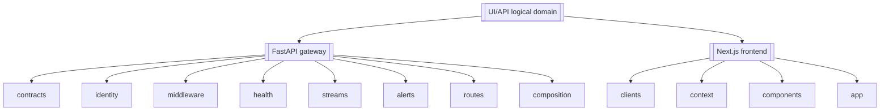
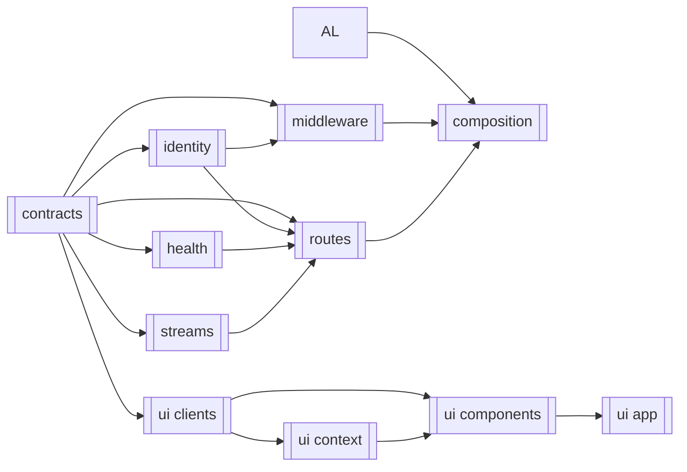
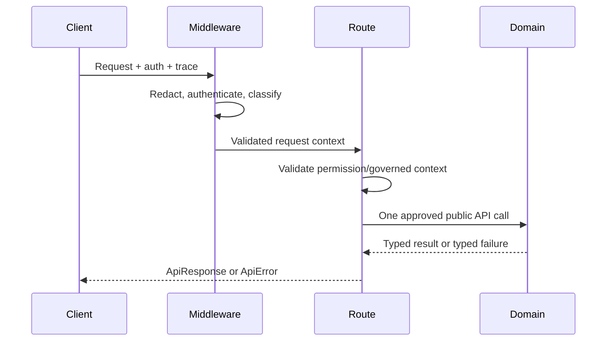
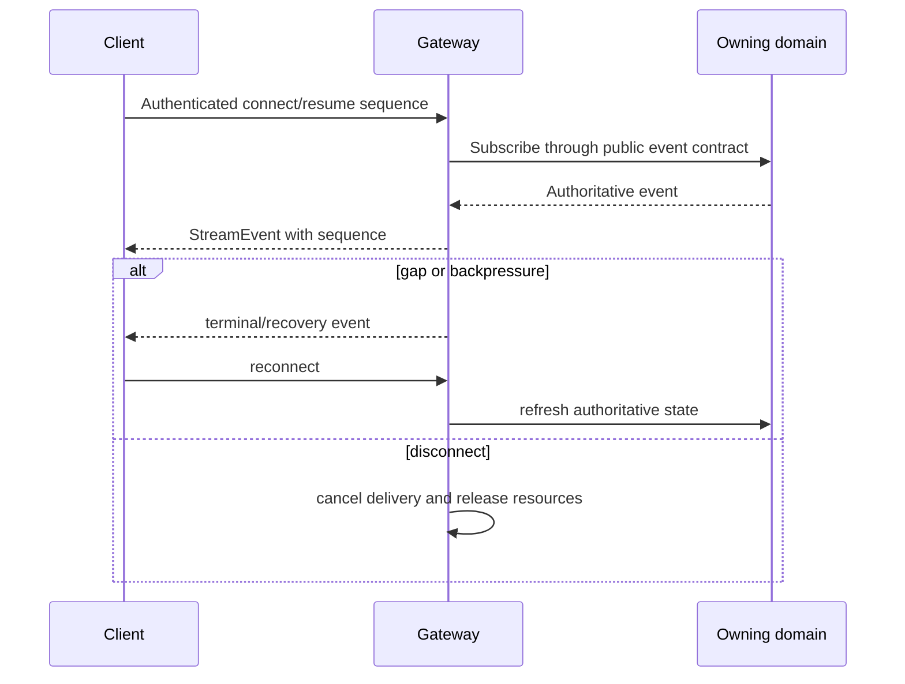

# UI/API

> **Specification location:** `app/services/api/README.md`
> **Logical runtime packages:** FastAPI gateway at `app/services/api` plus Next.js frontend at `ui/` (per the `docs/PROJECT.md` registry), with canonical ASGI target `app.services.api.composition.application:app`; Next.js frontend at `ui/`
> **Status:** `Backend v1 exposes 32 operations; frontend Sections 4.9–4.12 complete (typed transport, session/page/governed/stream context, workflow components, protected pages); frontend build complete`
> **Last updated:** `2026-08-03`

> This README is the UI/API domain's **single source of truth** for final requirements,
> structure, implementation sequence, workflows, public symbols, boundary contracts,
> usage examples, and tests. Update this file before changing UI/API code.

---

## 1. Purpose and Boundary

### Purpose

UI/API is the authenticated presentation and delegation boundary for HaruQuantAI. It
exposes approved domain capabilities through typed HTTP and streaming contracts and a
separately deployable frontend, while keeping all trading, risk, data, simulation,
analytics, optimization, research, and portfolio decisions in their owning domains. It fails
closed whenever identity, permission, governed-write context, safety state, or a
required dependency cannot be verified.

### Owns

- One canonical FastAPI application, lifecycle, route registration, middleware, CORS,
  liveness, readiness, and boundary error translation.
- HTTP/WebSocket boundary DTOs, route metadata, pagination wrappers, and frontend
  validators for approved routes.
- Authentication and authorization enforcement at the boundary and production of the
  shared `AuthContext` consumed by governed domains.
- Password hashing and verification for UI/API-owned identities; Utils supplies
  redaction primitives but owns no credential-hashing API.
- Credential encryption/persistence, active-key selection from externally provisioned
  keys, credential-reference resolution, and composition-root construction of
  Brokers-owned `BrokerConnectionConfig v1` values. UI/API does not generate, store,
  or rotate encryption keys.
- Composition-root loading of the per-platform provider enablement flags
  (`MT5_ENABLED`, `CTRADER_ENABLED`, `BINANCE_ENABLED`, …) declared in
  `docs/PROJECT.md` §6. These flags determine which broker-backed provider facades
  Data may compose as read-only market-data sources; UI/API loads and supplies them
  and never decides source selection, ordering, fallback, or readiness, which remain
  Data's under `CAP-DATA-025` and `WF-DATA-011`.
- User, session, settings, and HTTP-idempotency logical schemas/tables/migrations on
  Data-owned shared persistence infrastructure.
- Authenticated human `ApprovalAttestation v1` production; Risk remains the sole
  validator and approval-token/action-policy authority under the registered Risk contracts.
- Thin route handlers that validate, authorize, delegate once through approved public
  domain APIs, and translate results.
- Frontend views, typed clients, protected navigation, bounded page context, stale-data
  presentation, and non-authoritative governed-write preflight.
- Requests to Risk for kill-switch activation or authorized clearance; UI/API never
  owns or mutates canonical kill-switch state.
- Clock-drift readiness diagnostics; the probe reports drift and never corrects a
  clock, rewrites a timestamp, or blocks a request.
- Operational telemetry transport: recording through explicitly injected sinks,
  metric-label hygiene, bounded snapshots, and the protected Prometheus exposition
  surface. UI/API computes no business, performance, or risk metric, and telemetry is
  never an input to a governed decision.
- Channel-neutral critical operational alert construction and one-attempt delivery for
  exactly Risk kill-switch activation and Trading retry-locked unknown broker state,
  after their authoritative state/evidence exists.

### Does not own

- Domain calculations, trading decisions, strategy evaluation, risk approval, order
  execution, broker connectivity, reconciliation, simulation state, analytics,
  optimization algorithms, research algorithms, portfolio construction, allocation
  activation, drift detection, or rebalance planning.
- Another domain's tables, artifacts, migrations, SDK objects, or internal imports;
  resolved credential material never crosses any boundary except inside the
  in-memory Brokers-owned configuration built at composition.
- Approval tokens, canonical kill-switch state, broker state, official fills, or live
  safety policy. Frontend checks are advisory; backend gates remain authoritative.
- Currency strength, advanced Edge Lab calibration/automation/exports, broad
  performance pages, a public health event stream, or a second operator FastAPI app.
- Raw strategy/SQX import, export, parsing, scoring, or artifact lifecycle; and
  documentation browsing, management, mutation, or file persistence in the initial build.
- A Notification domain, provider-specific desktop/email/SMS/chat delivery adapters,
  generic notifications, automatic alert retries, acknowledgements, escalation policy,
  or alert authority over Risk/Trading state.

### Shared contracts

Contract names, versions, and owners must match `docs/PROJECT.md`.

**Owned by this domain** — external boundary contracts defined authoritatively here:

| Status | Contract | Version | Counterparty | Purpose |
|---|---|---|---|---|
| Completed | `ApiResponse[T]` | `v1` | HTTP clients | Five-field non-stream response envelope. |
| Completed | `ApiError` | `v1` | HTTP clients | Bounded deterministic public error with retry metadata and trace identifiers. |
| Completed | `ApiMetadata` | `v1` | HTTP clients | Request, trace, route, operation, side-effect, duration, timestamp, and stale metadata. |
| Completed | `StreamEvent[T]` | `v1` | Streaming clients | Ordered event envelope with sequence, time, trace, heartbeat, and terminal-error fields. |
| Completed | `RouteContract` | `v1` | Backend and frontend | Method/path/auth/schema/side-effect/owner/stability contract used for drift tests. |
| Completed | `GovernedRequestContext` | `v1` | Browser and gateway | Request, workflow, permission, approval, audit, and idempotency context for governed writes. |
| Completed | `PageContext` | `v1` | Frontend workflows | Bounded, redacted route and action context. |
| Completed | `CriticalOperationalAlert` | `v1` | Injected channel-neutral delivery sink | Deterministic bounded critical alert for one of the two approved authoritative triggers. |
| Completed | `CriticalAlertDeliveryResult` | `v1` | Composition/operations | Structured one-attempt delivery evidence whose failure never changes source truth. |

**Consumed from other domains** — referenced, never redefined:

| Contract | Version | Owner | Used for |
|---|---|---|---|
| `AuthContext` | `v2` | Utils | Propagate validated principal, deployment tenancy, independent runtime profile, and trace context to governed domains. |
| `MarketDataset`, `AccountStateSnapshot`, `MarketContextEvidence` | `v1` | Data | Market views, prepared-dataset requests, and Risk-ready market-context evidence; never raw DataFrames or provider objects. |
| `FXConversionEvidence` | `v1` | Data | Read-only conversion provenance views where an owner contract exposes them. |
| `TradeIntent`, `StrategyRegistrationRequest`, `StrategyParameterUpdateRequest`, `StrategyMutationResult` | `v1` | Strategy | Strategy views, explicitly approved registration/update commands, and immutable mutation truth. |
| `RiskDecision`, `ActionPolicyVerdict`, `KillSwitchCommand`, `KillSwitchState`, `ApprovalAttestation`, `ScenarioResult` | `v1` | Risk | Risk views, Risk-owned action permission, governed scoped operator commands, canonical safety state/hierarchy, approval attestation, and advisory scenario results. |
| `StrategyOperationalEligibilityRequest/Decision`, `AllocationReviewRequest`, `AllocationRiskDecision`, `AllocationBudgetActivationRequest` | `v1` | Risk | Operational-eligibility and portfolio review/authorization views and commands without gateway policy. |
| `TradeRecord`, `ExecutionReceipt`, `OrderIntent`, `OperationalEvent` | `v1` | Trading | Live/paper status, governed execution outcomes, and bounded operational evidence. |
| `SimulationResult` | `v1` | Simulation | Completed synchronous backtest results; no interactive session lifecycle exists. |
| `PortfolioBacktestRequestV1` / `PortfolioSimulationResult` | `v1` | Simulation | Synchronous portfolio validation request/result views delegated through Portfolio. |
| `PerformanceReport` / `PortfolioAllocationEvidence` | `v1` | Analytics | Read-only performance, allocation-evidence, and dashboard views. |
| `OptimizationResult` | `v1` | Optimization | Terminal synchronous optimization result; no persisted-job/progress/cancellation API exists. |
| `ResearchReport` | `v1` | Research | Core Edge Lab evidence and research-to-strategy review. |
| `PortfolioConstructionRequest`, `PortfolioConstructionResult`, `ActivePortfolioAllocation`, `PortfolioRebalancePlan` | `v1` | Portfolio | Construct, inspect, activate, roll back, and review drift through Portfolio's public API. |
| `AuditEvent` | `v1` | Utils | Emit redacted audit records for governed boundary actions. |
| `AuditEventQuery` / `AuditEventPage` | `v1` | Data | Protected bounded operator audit views through Data's public query boundary. |

### Persisted state

UI/API owns its logical durable boundary state. Data supplies shared
connection, locking, and migration execution only.

| Status | State / Store | Read access (via contract) | Migration definitions |
|---|---|---|---|
| Completed | User, session, authentication-failure, settings, approval, and encrypted credential-reference state | UI/API package-root identity/settings/credential functions | `app/services/api/identity/migrations.py`; `app/services/api/persistence/` |
| Completed | HTTP-idempotency reservations and terminal replay records | UI/API package-root replay/conflict functions | `app/services/api/identity/migrations.py`; `app/services/api/persistence/` |

Browser sessions use opaque server-side identifiers in secure HttpOnly SameSite
cookies outside local development and require CSRF validation for state changes.
Service accounts use bearer authentication. HTTP idempotency is scoped by principal,
method, canonical route, and key; terminal replay-safe records are retained at least
24 hours. Business/execution idempotency remains with each command-owning domain.

### Four-level structure

| Code level | Represents |
|---|---|
| **Logical package** | UI/API domain |
| **Module folder** | Feature or capability |
| **File** | Focused use case or resource family |
| **Class / function / method / constant** | Required public behavior or contract |

The separate gateway and frontend roots are an explicit exception already approved by
`docs/PROJECT.md`, which defines one logical domain implemented by two deployables.

### Package capability map


```mermaid
flowchart TD
    DOMAIN[[UI/API logical domain]]
    DOMAIN --> API[[FastAPI gateway]]
    DOMAIN --> UI[[Next.js frontend]]
    API --> CONTRACTS[contracts]
    API --> IDENTITY[identity]
    API --> MW[middleware]
    API --> HEALTH[health]
    API --> STREAMS[streams]
    API --> ALERTS[alerts]
    API --> ROUTES[routes]
    API --> COMPOSITION[composition]
    UI --> CLIENTS[clients]
    UI --> CONTEXT[context]
    UI --> COMPONENTS[components]
    UI --> PAGES[app]
```

---

## 2. Final Package Structure

The canonical Python runtime tree remains under `app/services/api/`; there is no
top-level `api/` package and no temporary compatibility import. The frontend remains a separate
`ui/` deployable as required by `docs/PROJECT.md`.

### Feature Registry

The UI/API domain is `Partial`. These are the approved current feature
targets; no feature may be marked `Completed` until its owning module, exact public
contracts, numbered usage program, and required tests satisfy Sections 4 and 7.

| Status | Feature | Owning module | Public API and contracts | Requirements | Usage evidence |
|---|---|---|---|---|---|
| Completed | `FEAT-API-01` Boundary Contracts | `contracts/` | Package-root contract builders, canonical route registry, `ApiMetadata`, `ApiError`, `ApiResponse`, `StreamEvent`, `RouteContract`, `GovernedRequestContext`, `PageContext` | `FR-API-001`–`FR-API-008` | `tests/api/usage/01_contracts.py`; `tests/api/contracts/` |
| Completed | `FEAT-API-02` Authentication and Authorization | `identity/` | Package-root account/session/permission/governance/credential/settings/approval/idempotency functions | `FR-API-009`–`FR-API-015`, `FR-API-057`–`FR-API-058` | `tests/api/usage/02_identity.py`; `tests/api/integration/test_auth_settings.py`; `tests/api/integration/test_governance_state.py` |
| Completed | `FEAT-API-03` Request Security and Context | `middleware/` | `redaction.py`, `context.py` | `FR-API-016`–`FR-API-017` | `tests/api/usage/03_middlewares.py` |
| Completed | `FEAT-API-04` Liveness and Readiness | `health/` | `get_liveness`, `get_readiness`, `check_clock_drift` | `FR-API-018`-`FR-API-019`, `FR-API-059` | `tests/api/usage/04_health.py` |
| Completed | `FEAT-API-05` Operational Telemetry and Exposition | `observability/` | `record_metric`, `validate_metric_labels`, `build_metric_snapshot`, `export_prometheus_metrics`, `get_metrics`, `create_in_process_metric_sink` | `FR-API-060`–`FR-API-063` | `tests/api/usage/05_observability.py` |
| Completed | `FEAT-API-06` Ordered Event Delivery | `streams/` | `normalize_stream_event`, `create_stream_manager` through the package root | `FR-API-020`–`FR-API-021` | `tests/api/usage/06_streams.py`; `tests/api/unit/test_streams.py` |
| Completed | `FEAT-API-07` Thin HTTP Boundaries | `routes/` | Exactly 32 backend-v1 operations, including Simulation run/results, Risk reads, and non-production Trading session/mutations | `FR-API-022`–`FR-API-026`, `FR-API-028`–`FR-API-029`, `FR-API-031`–`FR-API-034`; remaining exclusions unchanged | `tests/api/usage/07_routes.py`; `tests/api/unit/test_route_catalog.py`; `tests/api/contracts/test_openapi_contract.py` |
| Completed | `FEAT-API-08` Canonical Application Lifecycle | `composition/` | `create_api_app`, dependency-bundle builders, exact eight-provider graph, and canonical `app.services.api.composition.application:app` | `FR-API-035`–`FR-API-037`, `FR-API-058` | `tests/api/usage/08_composition.py`; `tests/api/unit/test_application.py`; `tests/api/unit/test_in_process_composition.py` |
| Completed | `FEAT-API-09` Typed Frontend Transport | `ui/clients/` | `request`, `unwrapData`, `ApiClientError`, `openStream`, `apiClients` (9 focused clients for 23 operations incl. auth.me + data.stream) | `FR-API-038`–`FR-API-041` | `tests/api/usage/14_frontend_clients.ts`; `app/ui/src/clients/request.test.ts`; `app/ui/src/clients/clients.test.ts`; `app/ui/src/clients/clients.contract.test.ts` |
| Completed | `FEAT-API-10` Frontend Session and Page Context | `ui/context/` | `AuthProvider`, `useAuth`, `PageContextProvider`, `usePageContext`, `buildGovernedOptions`, `isGovernedFresh`, `consumeStream`, `StreamGapError`, `PageContextError`, `GovernedPreflightError` | `FR-API-042`–`FR-API-045` | `tests/api/usage/15_frontend_context.tsx`; `app/ui/src/context/{auth,page,governed,streams}.test.ts(x)` |
| Completed | `FEAT-API-11` Workflow Presentation Components | `ui/components/workflow/` | `AppShell`, `DashboardView`, `StrategyWorkspace`, `SimulationView`, `RiskView`, `TradingView`, `ResearchWorkspace` | `FR-API-046`–`FR-API-051` | `tests/api/usage/16_frontend_components.tsx`; `app/ui/src/components/workflow/*.test.tsx` |
| Completed | `FEAT-API-12` Protected Workflow Pages | `ui/app/` | `AuthenticationPage` (at `/login`), `ProtectedLayout`, `WorkflowPage` | `FR-API-053`–`FR-API-055` | `tests/api/usage/17_frontend_pages.tsx`; `app/ui/src/app/{authentication-page,protected-layout,pages.contract}.test.tsx` |
| Completed | `FEAT-API-13` Critical Operational Alert Delivery | `alerts/` | `CriticalAlertTrigger`, `CriticalOperationalAlert`, `CriticalAlertDeliveryResult`, `CriticalAlertError`, `CriticalAlertSink`, `build_kill_switch_activation_alert`, `build_unknown_broker_state_alert`, `deliver_critical_alert` | `FR-API-064`–`FR-API-067` | `tests/api/usage/13_alerts.py` |

#### Backend foundation evidence and remaining gate (`API-BE-001`)

#### Approved backend-readiness correction (`API-BE-002`)

#### Approved truthful reduced backend v1 (`API-BE-003-D6`)

The owner selected Path 1: backend v1 exposes only capabilities that the canonical
in-process application can compose and execute from existing package-root owner APIs.
The public surface is exactly 32 HTTP operations: the prior 23 operations plus three Simulation, two Risk, and four Trading operations.
settings (2), symbol discovery and market streaming (2), Strategy catalogue/version reads (2), Research
(1), dashboard snapshots (6), operator audit/event/approval operations (3), and
protected metrics (1). Dataset preparation, Strategy mutations, Simulation, Risk,
Trading, Optimization, Portfolio, Agentic, operator kill-switch, and duplicate
operator-readiness routes are excluded from backend v1 until their exact request and
runtime contracts exist. Their owner-domain implementations remain available for
future composition.

The canonical application owns one exact eight-provider in-process graph covering
dashboard/operator reads plus Simulation, Risk, and Trading boundaries. It binds
read sources from public owner APIs and accepts explicit opaque Simulator/Trading
dependency bundles during application construction. Development
credential rotation remains deferred until production transition; no credential value
is tracked, logged, tested, or used for an external connection by this correction.
Section 4.9 remains outside `API-BE-003-D6`; no frontend file is created or modified.

The approved development composition uses the safe defaults
`runtime_profile=research`, `execution_route=none`, and
`allow_live_mutations=false`. Dashboard, audit, and Trading event views return
owner-authored evidence; the gateway never invents a snapshot.

`FEAT-API-07` completion requires the canonical in-process application to bind the
three retained owner sources, register exactly the reduced route inventory, and prove
OpenAPI parity, authorization-before-delegation, and lifecycle behavior. That evidence
now passes. Excluded route families are absent rather than represented by placeholder
providers or arbitrary JSON request wrappers. Frontend-only workflows and NFRs remain
`Missing` until Sections 4.9-4.12 are implemented.

Items 1–8 below verify the implemented backend foundation. `FEAT-API-07` is complete
for the reduced backend-v1 boundary; frontend Sections 4.9–4.12 remain missing.

The owner selected an in-process modular-monolith composition. `INPROC-001` now
provides one exact eight-name provider manifest, rejects missing/unknown/invalid provider
graphs before application construction, binds the graph internally without exposing
private route dependencies, probes required graph values before readiness, and closes
graph-owned resources in reverse acquisition order. Evidence:
`app/services/api/composition/adapters.py:23`,
`app/services/api/composition/in_process.py:49`,
`app/services/api/composition/lifecycle.py:50`,
`tests/api/integration/test_in_process_boundary.py:31`.

The same audit completed canonical non-stream JSON envelope enforcement, including
middleware-generated authentication, authorization, validation, rate-limit, and
dependency errors. HTTP 204 remains bodyless and repeated `Set-Cookie` headers are
preserved. Evidence: `app/services/api/middleware/envelope.py`,
`tests/api/integration/test_auth_settings.py::test_http_session_cookies_and_csrf_logout`,
`tests/api/unit/test_application.py::test_canonical_app_wraps_successful_json_responses`.

1. Boundary contracts are immutable, bounded, secret-safe, and registered deterministically. Evidence: `app/services/api/contracts/models.py:148`, `app/services/api/contracts/catalog.py:31`.
2. API-owned accounts, opaque sessions, encrypted credential references, approvals, idempotency, and settings delegate all CRUD through the private uniform persistence package, while immutable migrations remain separate behind Data's public migration boundary. Evidence: `app/services/api/persistence/__init__.py`, `app/services/api/identity/migrations.py:136`.
3. Canonical request identity, templated-route intent, authentication, required idempotency, and redacted telemetry are enforced before delegation. Evidence: `app/services/api/middleware/context.py:151`.
4. Public liveness and protected dependency readiness remain versioned and secret-safe. Evidence: `app/services/api/health/probes.py:173`.
5. Injected, non-authoritative metrics and protected exposition remain complete. Evidence: `app/services/api/observability/metrics.py:116`.
6. Owner events are normalized into ordered secret-safe events with quotas, resume windows, gap detection, terminal backpressure errors, and disconnect cleanup. Evidence: `app/services/api/streams/events.py:59`, `app/services/api/streams/lifecycle.py:35`.
7. The canonical OpenAPI surface and fresh route registry contain the same 21 `/api/v1` operations; excluded workflow families are absent. Evidence: `app/services/api/composition/application.py:177`, `app/services/api/contracts/catalog.py:161`, `tests/api/unit/test_route_catalog.py:21`.
8. One exact-origin FastAPI composition runs required API migrations, reports optional degradation, closes only owned resources, and exposes the ASGI app at `app.services.api.composition.application:app`. Evidence: `app/services/api/composition/lifecycle.py:28`, `app/services/api/composition/application.py:155`.
```text
app/services/api/
├── __init__.py
├── README.md
├── contracts/
│   ├── __init__.py
│   ├── models.py                 # Boundary envelopes and governed/page context
│   └── catalog.py                # Route/stream classification and contract registry
├── identity/
│   ├── __init__.py
│   ├── errors.py                 # Stable bounded identity failure contract
│   ├── passwords.py              # UI/API-owned password hashing and verification
│   ├── accounts.py               # Accounts, authentication, and failure limiting
│   ├── credentials.py            # Encrypted credential records and active-key selection
│   ├── sessions.py               # Authentication and session lifecycle boundary
│   ├── approvals.py              # Scoped distinct-principal approval state
│   ├── idempotency.py            # Durable HTTP reservation and replay state
│   ├── settings.py               # Versioned user settings
│   ├── migrations.py             # Immutable API-owned schema manifest
│   └── authorization.py          # AuthContext, permission, and governed-write checks
├── persistence/                   # Private API-owned CRUD support package
│   ├── __init__.py                # Private function-only persistence boundary
│   ├── create.py                  # Account, session, approval, idempotency, settings creates
│   ├── read.py                    # API-owned identity and governance reads
│   ├── update.py                  # API-owned state updates and upserts
│   └── delete.py                  # Failure-window and expired-reservation deletes
├── middleware/
│   ├── __init__.py
│   ├── context.py                # Request, trace, actor, session, and route intent
│   └── redaction.py              # Secret-safe allowlisted request telemetry
├── observability/
│   ├── __init__.py
│   ├── sinks.py                  # Injected telemetry sink boundary
│   ├── metrics.py                # Recording and metric-label hygiene
│   └── exposition.py             # Bounded snapshot and Prometheus rendering
├── alerts/
│   ├── __init__.py
│   ├── models.py                 # Critical alert and delivery-result contracts
│   ├── builders.py               # Authoritative two-trigger alert construction
│   └── delivery.py               # Injected channel-neutral delivery boundary
├── health/
│   ├── __init__.py
│   ├── probes.py                 # Public liveness and protected readiness
│   └── clock.py                  # Signed clock-drift readiness diagnostic
├── streams/
│   ├── __init__.py
│   ├── events.py                 # Stream envelope validation
│   └── lifecycle.py              # Connection, resume, backpressure, and cleanup
├── routes/
│   ├── __init__.py
│   ├── auth.py                   # Registration, login, logout
│   ├── settings.py               # User settings read/update
│   ├── data.py                   # Symbol discovery
│   ├── strategies.py             # Strategy catalogue/version reads
│   ├── research.py               # Initial core Edge Lab boundary
│   ├── dashboards.py             # Read-only operational and analytics snapshots
│   └── operator.py               # Approvals, audit, and operator events
└── composition/
    ├── __init__.py
    ├── lifecycle.py              # Required/optional dependency lifecycle
    ├── broker_config.py          # Resolve references and build BrokerConnectionConfig
    └── application.py            # Canonical app and route registration

ui/                                   # Next.js 15 (App Router) + React 19 + TypeScript frontend
├── app/                              # Single-page widget workspace (not a route-page app, by owner decision)
│   ├── layout.tsx                    # Root layout: metadata, fonts, theme container
│   └── page.tsx                      # Single route entry; renders <App/>
├── App.tsx                           # Workspace root: header + sidebar + workspace grid + order-ticket modal
├── clients/                          # FEAT-API-09: typed frontend transport (Section 4.9)
│   ├── contracts.ts                  # Zod schemas mirroring ApiResponse/ApiError/ApiMetadata (contracts/models.py)
│   ├── routes.ts                     # Frozen typed RouteContract definitions for the 21 backend-v1 operations
│   ├── request.ts                    # request, unwrapData, ApiClientError (single transport primitive)
│   ├── auth.ts                       # auth.register/login/logout
│   ├── health.ts                     # health.liveness/readiness
│   ├── settings.ts                   # settings.read/update
│   ├── data.ts                       # data.symbols (cursor-paginated)
│   ├── strategies.ts                 # strategies.catalogue/versions
│   ├── research.ts                   # research.run
│   ├── dashboards.ts                 # dashboards.{broker,equityCurve,summary,systemResources,marketHours,forexCalendar}
│   ├── operator.ts                   # operator.{auditEvents,events,approvals}
│   ├── metrics.ts                    # metrics.scrape (Prometheus text; bypasses JSON envelope)
│   └── index.ts                      # apiClients catalog + public re-exports
├── components/
│   ├── layout/
│   │   ├── Header.tsx                # Top bar + workspace tabs
│   │   ├── Sidebar.tsx               # Collapsible widget-add navigation
│   │   └── WorkspaceGrid.tsx         # 12-column explicit grid: drag, resize, expand
│   └── widgets/                      # CME-style trading-simulator widgets (mock-data fed today)
│       ├── MarketsWidget.tsx
│       ├── WatchlistWidget.tsx
│       ├── ChartWidget.tsx           # Canvas candlestick charting engine
│       ├── PriceLadderWidget.tsx
│       ├── OptionsGridWidget.tsx
│       ├── PositionsWidget.tsx
│       ├── TradeLogWidget.tsx
│       ├── TradePlanWidget.tsx
│       ├── EducationWidget.tsx
│       ├── ChallengesWidget.tsx
│       └── OrderTicketModal.tsx
├── store/
│   └── useTradingStore.ts            # Zustand store: workspaces, widgets, products, orders, positions
├── types/                            # Shared TypeScript domain types (market, widget, store, education)
├── mock/                             # Static mock data (products, options, education, docs)
└── utils/
    └── gridLayout.ts                 # Explicit-grid placement helpers
```

> **Widget architecture (owner decision):** the frontend is a single-page
> widget workspace, not a Next.js route-page application. Sections 4.10–4.12
> therefore compose workflow context, presentation, and layout around the
> widget grid, not around route segments. This decision is reflected in the
> tree above and in the frontend build artefacts.


```mermaid
flowchart LR
    C[[contracts]] --> I[[identity]]
    C --> M[[middleware]]
    C --> H[[health]]
    C --> S[[streams]]
    I --> M
    C --> R[[routes]]
    I --> R
    H --> R
    S --> R
    AL --> A[[composition]]
    M --> A[[composition]]
    R --> A
    C --> FC[[ui clients]]
    FC --> CX[[ui context]]
    FC --> CP[[ui components]]
    CX --> CP
    CP --> P[[ui app]]
```

### Structure rules

- Each backend route file exports only its `router`; decorated endpoint functions remain
  private Python implementation details while their HTTP contracts remain public.
- Each module `__init__.py` re-exports only the `Key exports` listed in Section 4. The
  package root re-exports only `create_app` and the approved boundary contract types;
  the canonical ASGI `app` remains at `app.services.api.composition.application:app`.
- Route files call documented public domain APIs, never internal modules, repositories,
  broker clients, DataFrames, DB sessions, or provider SDK objects.
- No generic service/client/orchestrator layer is added for in-process calls. A focused
  orchestrator requires a demonstrated workflow and owner approval.
- The rejected second operator app, public health stream, trade-import route,
  missing operator-strategy import, and disabled Edge scheduler are absent.
- Usage examples live under `tests/api/usage/`, not in either production deployable.

### Reconciliation coverage manifest

This table proves that every capability decision has a final destination or an explicit
higher-authority exclusion.

| Reconciliation capability | Final destination |
|---|---|
| `CAP-UI-001` canonical composition/lifecycle | `composition/`, `health/`; `FR-API-018`, `FR-API-019`, `FR-API-035`–`FR-API-037` |
| `CAP-UI-002` contracts/envelopes/errors | `contracts/`; `FR-API-001`–`FR-API-008` |
| `CAP-UI-003` canonical identity/sessions | `identity/`; `FR-API-009`–`FR-API-013`; UI/API-owned state and opaque-cookie/bearer transport |
| `CAP-UI-004` authorization/governed writes/idempotency | `identity/`; `FR-API-014`, `FR-API-015`; UI/API-owned storage policy |
| `CAP-UI-005` request security/context/observability | `middleware/`; `FR-API-016`, `FR-API-017` |
| `CAP-UI-006` health/readiness | `health/`; `FR-API-018`, `FR-API-019`, `FR-API-059` |
| `CAP-UI-024` operational telemetry and exposition | `observability/`; `FR-API-060`–`FR-API-063` |
| `CAP-UI-007` operator approvals/events | `routes/operator.py`; `FR-API-034` |
| `CAP-UI-008` settings | `routes/settings.py`; `FR-API-023` |
| `CAP-UI-009` symbol discovery | `routes/data.py`; `FR-API-024`; dataset preparation excluded from backend v1 |
| `CAP-UI-010` strategy catalogue/version reads | `routes/strategies.py`; `FR-API-025`; mutations/raw import/export/SQX excluded |
| `CAP-UI-011` synchronous backtest result | `routes/simulation.py`; `FR-API-026`; configured owner references fail closed when absent |
| `CAP-UI-012` interactive simulator | Excluded from the initial synchronous lifecycle; no initial route or component |
| `CAP-UI-013` risk decision support | `routes/risk.py`; `FR-API-028`; Risk owns state and decisions |
| `CAP-UI-014` paper monitoring/mutations | `routes/trading.py`; `FR-API-029`; production-capital execution excluded |
| `CAP-UI-015` optimization/scenarios | Excluded from backend v1 pending Simulation composition and exact supported operations |
| `CAP-UI-016` initial Edge Lab | `routes/research.py`; `FR-API-031`; advanced surface excluded |
| `CAP-UI-018` dashboard reads | `routes/dashboards.py`; `FR-API-032`; currency strength excluded |
| `CAP-UI-019` documentation | Excluded from the initial build; no route, state, client, or component |
| `CAP-UI-020` shared streaming | `streams/`; `FR-API-004`, `FR-API-020`, `FR-API-021` |
| `CAP-UI-021` typed frontend clients | `ui/clients/`; `FR-API-038`–`FR-API-041` |
| `CAP-UI-022` frontend auth/shell | `ui/context/`, `ui/app/`; `FR-API-042`, `FR-API-046`, `FR-API-053`, `FR-API-054` |
| `CAP-UI-023` workflow pages/components | `ui/components/`, `ui/app/`; `FR-API-047`–`FR-API-055` (excluding reserved `FR-API-052`) |
| `CAP-UI-025` channel-neutral critical operational alerts | `alerts/`; `FR-API-064`–`FR-API-067`; exactly Risk kill-switch activation and Trading unknown broker state |
| `CAP-UI-026` contract/security/workflow tests | Section 7 and `NFR-API-001`–`NFR-API-018` |

### Source requirement traceability

The reconciliation's retained requirement ranges are merged into the smallest final
public symbols below. Unsupported ranges are absent from the target structure.

| Reconciliation requirements | Final treatment |
|---|---|
| `UIAPI-FR-001`–`016` | `FR-API-001`–`008`, `FR-API-014`–`017`, shared pagination/timeout policy |
| `UIAPI-FR-017`–`018` | `FR-API-001`–`008`; path-based `/api/v1/` versioning and compatibility rules |
| `UIAPI-FR-019`–`025` | `FR-API-006`, `FR-API-015`; principal + method + canonical route + key scope; terminal retention ≥24 h |
| `UIAPI-FR-026`–`032` | `FR-API-007`, `FR-API-008`, `FR-API-016`, `FR-API-044`, test traceability |
| `UIAPI-FR-033`–`040` | `FR-API-017`–`019`, `FR-API-035`–`037`; canonical ASGI target `app.services.api.composition.application:app` |
| `UIAPI-FR-041`–`042` | Rejected second operator app/accessor; absent |
| `UIAPI-FR-043`–`059` | `FR-API-009`–`017`; opaque server-side sessions, bearer service accounts, and server-side role/permission authority |
| `UIAPI-FR-061`–`070` | `FR-API-019`, `FR-API-021`, `FR-API-034` |
| `UIAPI-FR-071`–`076` | `FR-API-022`, `FR-API-023`; duplicate settings path rejected |
| `UIAPI-FR-101`–`114` | Strategy catalogue/version reads map to `FR-API-025`; mutations and raw import/export/SQX requirements are excluded |
| `UIAPI-FR-115`–`123` | Synchronous run/result subset implemented by `FR-API-026`; interactive lifecycle remains `FR-API-027` |
| `UIAPI-FR-124`–`146` | `FR-API-027` |
| `UIAPI-FR-147`–`150` | Exact-scope read subset implemented by `FR-API-028` |
| `UIAPI-FR-151`–`176` | Session and governed paper-mutation subset implemented by `FR-API-029`; production capital excluded |
| `UIAPI-FR-177`–`193` | Excluded from backend v1 with `FR-API-030` |
| `UIAPI-FR-194`–`199`, `201` | `FR-API-032` |
| `UIAPI-FR-202`–`207` | Data reads map to `FR-API-024`; documentation-file capabilities are excluded |
| `UIAPI-FR-208`–`226`, `238`–`241` | `FR-API-031` |
| `UIAPI-FR-246`–`250`, `252`–`271`, `273`–`283`, `285` | `FR-API-038`–`055` with the reduced approved UI surface |
| `UIAPI-NFR-001`–`018`, `023`–`024`, `027`–`030`, `032`–`033` | `NFR-API-001`–`018` and Section 7 |
| `UIAPI-NFR-019`–`022`, `025`–`026`, `031` | `NFR-API-*` and Section 5; 30-second endpoint timeout and pagination limits are binding, while other values remain explicit measurement baselines |

---

## 3. Workflows

> **Workflow Usage Evidence**: See [`tests/api/usage/workflows.py`](file:///tests/api/usage/workflows.py) for executable usage examples of all domain workflows.

### Workflow rank values

| Rank | Identifier | Meaning |
|---|---|---|
| **Primary** | `WF-API-PRI` | The workflow this domain exists to serve. |
| **Secondary** | `WF-API-SEC` | The next most load-bearing workflow. |
| **Tertiary** | `WF-API-TER` | The third-ranked workflow. |
| **Supporting** | `WF-API-0NN` | Every remaining registered workflow. |

### Retired identifiers

`WF-API-002`, `WF-API-001`, and `WF-API-003` were absorbed into `WF-API-PRI`,
`WF-API-SEC`, and `WF-API-TER` respectively. Absorbed numbers are retired and are
never reused. New workflows continue from `WF-API-019`.

Every UI/API workflow below whose status is `Missing` carries **planned** function
annotations. No status is changed by the annotation pass.

### Workflow manifest

| Status | Rank | Workflow ID | Scope | Workflow | System workflow | Trigger / input boundary | Final outcome / output boundary | Requirements | Failure behavior | Integration test |
|---|---|---|---|---|---|---|---|---|---|---|
| Completed | Primary | `WF-API-PRI` | Internal | Authenticated request boundary | All applicable | HTTP request | One typed response after one approved delegation | `FR-API-001`–`FR-API-020` | Validation/auth/dependency failures become redacted deterministic envelopes | `tests/api/integration/test_in_process_boundary.py::test_in_process_route_authorizes_and_delegates_once()` |
| Completed | Secondary | `WF-API-SEC` | Internal | Gateway startup and readiness | None | Process configuration | Canonical app with truthful readiness | `FR-API-014`, `FR-API-015`, `FR-API-035`–`FR-API-037` | Required failure blocks startup/readiness; approved optional failure is reported degraded | `tests/api/unit/test_application.py::test_required_provider_failure_blocks_readiness()` |
| Completed | Tertiary | `WF-API-TER` | Cross-domain | Authentication, settings, and credential composition | None | Credentials, session, or broker credential reference | Validated `AuthContext`, UI/API-owned settings response, or Brokers-owned `BrokerConnectionConfig v1` | `FR-API-008`–`FR-API-013`, `FR-API-022`, `FR-API-023`, `FR-API-057`, `FR-API-058` | No fallback identity/key/credential; unavailable key source, state, or idempotency dependency fails closed | `tests/api/integration/test_auth_settings.py::test_login_settings_credentials_logout()` |
| Completed | Supporting | `WF-API-004` | Cross-domain | Symbol discovery | `SYS-WF-001` | Authenticated bounded symbol query | Data-owned symbol page or provider error | `FR-API-024` | No provider or user fallback | `tests/api/contracts/test_pagination_contract.py::test_symbol_list_has_bounded_page_size()` |
| Completed | Supporting | `WF-API-005` | Cross-domain | Strategy catalogue and version reads | `SYS-WF-003`, `SYS-WF-004` | Authenticated optional strategy identifier | Strategy-owned version catalogue | `FR-API-025` | Gateway does not mutate Strategy state | `tests/api/unit/test_strategy_routes.py::test_strategy_catalogue_reads_delegate_to_owner()` |
| Completed | Supporting | `WF-API-006` | Cross-domain | Synchronous backtest run and result review | Configured Simulator owner graph | Versioned request | Validated result | `FR-API-026` | Missing references or composition fail closed | Simulation boundary tests |
| Excluded | Supporting | `WF-API-007` | Cross-domain | Interactive Simulation session lifecycle | Outside initial scope | — | — | `FR-API-027` | No initial session, frame, replay, or queued state | Excluded |
| Excluded | Supporting | `WF-API-008` | Cross-domain | Governed interactive Simulation mutation/what-if | Outside initial scope | — | — | `FR-API-027` | Excluded with the interactive session lifecycle | Excluded |
| Excluded | Supporting | `WF-API-009` | Cross-domain | Synchronous Optimization and scenario run | Outside backend v1 | — | — | `FR-API-030` | Exact supported operations and Simulation composition are unavailable | Route-absence contract test |
| Completed | Supporting | `WF-API-010` | Cross-domain | Risk decision support | Authenticated Risk read | Exact scope or bound | Owner state/decisions | `FR-API-028` | Missing state is explicit | Risk route tests |
| Completed | Supporting | `WF-API-011` | Cross-domain | Core Edge Lab research | `SYS-WF-004` | Bounded dataset/config request with explicit hypothesis | Registered `ResearchReport v1` or structured error | `FR-API-031` | Leakage/provider failures block publication; internal profiles, snapshots, and unsupported endpoints are absent | `tests/api/unit/test_research_routes.py`; `tests/system/integration/test_research_to_strategy.py` |
| Completed | Supporting | `WF-API-012` | Cross-domain | Paper/demo session and governed broker action | Authenticated scoped request | Trading projection or receipt | `FR-API-029` | Production capital and incomplete authority fail closed | Trading governance tests |
| Completed | Supporting | `WF-API-013` | Cross-domain | Operator approval and owner evidence review | `SYS-WF-005` | Authenticated bounded audit/event query or scoped approval | Data/Trading evidence or API-owned approval | `FR-API-034` | Gateway does not issue Risk verdicts or read owner storage directly | `tests/api/unit/test_operator_routes.py`; `tests/api/integration/test_governance_state.py` |
| Completed | Supporting | `WF-API-014` | Cross-domain | Critical operational alert delivery | `SYS-WF-002`, `SYS-WF-005` | Active Risk `KillSwitchState` plus authenticated trace context, or critical Trading `BROKER_STATE_UNKNOWN` `OperationalEvent` | Deterministic `CriticalOperationalAlert` plus one `CriticalAlertDeliveryResult` | `FR-API-064`–`FR-API-067` | Invalid source is rejected; sink failure is structured and logged but never alters source truth, safety state, or retry locks | `tests/api/integration/test_critical_alerts.py::test_delivery_failure_cannot_change_authoritative_state()` |
| Completed | Supporting | `WF-API-015` | Cross-domain | Frontend governed request | All applicable | User action | Typed result, warning, or client preflight block | `FR-API-035`–`FR-API-041` | Preflight never substitutes for backend authorization; stale data blocks governed use | `app/ui/src/context/governed.test.ts`; `tests/api/usage/15_frontend_context.tsx::testUsageGovernedOptions()` |
| Completed | Supporting | `WF-API-016` | Cross-domain | Frontend stream consumption | All applicable | Authenticated stream connection | Validated ordered events and authoritative refresh after gaps | `FR-API-004`, `FR-API-017`–`FR-API-020`, `FR-API-042` | Disconnect cleans resources; gap/backpressure/terminal error triggers documented recovery | `app/ui/src/context/streams.test.ts`; `tests/api/usage/15_frontend_context.tsx::testUsageConsumeStream()` |
| Excluded | Supporting | `WF-API-017` | Cross-domain | Portfolio workflows | Outside backend v1 | — | — | `FR-API-056` | Exact eligibility operation and composed workflow ports are unavailable | Route-absence contract test |
| Excluded | Supporting | `WF-API-018` | Cross-domain | Agentic workflows | Outside backend v1 | — | — | `FR-API-068`–`072` | Promised result views and canonical development runtime are unavailable | Route-absence contract test |
| Completed | Supporting | `WF-API-019` | Internal | Observability exposition and metrics scrape | All applicable | Authorized scrape or telemetry read against the gateway | `FR-API-063` | An unauthorized scrape is refused; exposition failure never blocks request serving or alters readiness truth | `tests/api/unit/test_observability_routes.py::test_scrape_requires_permission()`, `tests/api/usage/05_observability.py::fr_api_063()` |
| Completed | Supporting | `WF-API-020` | Cross-domain | Server-side ordered stream publication | All applicable | An owner-domain event accepted for publication to subscribed clients | Ordered validated stream events with explicit sequence and gap markers | `FR-API-004`, `FR-API-020` | Backpressure and gaps are published explicitly; the gateway never reorders, invents, or silently drops an owner-domain event | `app/services/api/routes/data_stream.py`; `app/services/api/streams/lifecycle.py`; backend stream tests |

### Workflow step detail

Backend workflows use the package-root API functions documented in the feature
registry. Route functions remain private FastAPI adapters and delegate through public
owner-domain functions or the three canonical in-process sources. The detailed names
below describe responsibilities; only symbols registered in Section 4 are public.

#### `WF-API-PRI` — Authenticated Request Boundary

1. Middleware attaches request and trace identity and resolves the persisted session.
2. The registered route contract and focused boundary model validate the request.
3. Authorization is enforced before owner delegation.
4. Delegate exactly once to the owning domain; the gateway calculates nothing —
   the owning domain's public export for the requested operation.
5. Return one typed response or stream event —
   `utils.success_response()`, `utils.build_response_metadata()`.
6. Convert any failure into a redacted deterministic envelope —
   `utils.exception_response()`, `utils.redact_mapping_value()`.

#### `WF-API-SEC` — Gateway Startup and Readiness

1. Load runtime settings without resolving secrets at import time —
   `utils.load_settings()`.
2. Configure structured logging before the first request is served —
   `utils.configure_logging()`.
3. Compose the canonical application and its three owner sources —
   `api.create_api_app()`.
4. Probe each required dependency; a required failure blocks readiness —
   `api.get_readiness()`, `data.run_domain_migrations()`.
5. Report an approved optional failure as degraded rather than ready —
   `api.get_readiness()`.
6. Flush and stop logging deterministically on shutdown —
   `utils.flush_logging()`, `utils.shutdown_logging()`.

#### `WF-API-TER` — Authentication, Settings, and Credential Composition

1. Validate submitted credentials against API-owned account state —
   `api.verify_api_password()`.
2. Issue the validated typed principal; no fallback identity exists —
   `utils.create_auth_context()`, `utils.generate_id()`.
3. Return the UI/API-owned settings projection —
   `api.get_user_settings()`.
4. Compose the Brokers-owned connection config from a credential reference —
   `brokers.create_broker_adapter()`.
5. Redact every credential-adjacent field before any response or log —
   `utils.redact_mapping_value()`, `utils.is_sensitive_key()`.

#### `WF-API-019` — Observability Exposition and Metrics Scrape

**Scope:** `Internal`
**Input boundary:** an authorized scrape or telemetry read against the gateway.
**Output boundary:** bounded redacted operational telemetry. Business, trading, and
account data are never exposed through this surface.

1. Authorize the scrape through the API auth boundary and scrape permission —
   `api.require_auth_context()`, `api.require_human_permission()`.
2. Build a bounded snapshot from the injected `MetricSink` and render deterministic text —
   `api.build_metric_snapshot()`, `api.export_prometheus_metrics()`.
3. Return a typed protected response without recomputing any business rule or owner state —
   `api.get_metrics()`.

**Failure behavior:** an unauthorized scrape is refused. Exposition failure is logged
and surfaced but never blocks request serving, changes readiness truth, or causes a
domain operation to be recomputed.

#### `WF-API-020` — Server-Side Ordered Stream Publication

**Scope:** `Cross-domain`
**Input boundary:** an owner-domain event accepted for publication to subscribed
clients.
**Output boundary:** ordered validated stream events carrying explicit sequence
numbers and gap markers. `WF-API-016` covers the frontend consumption side.

1. Accept the owner-domain event at the publication boundary —
   `trading.emit_runtime_event()`, `data.get_feed_status()`.
2. Normalize the event against the registered stream contract —
   `api.normalize_stream_event()`.
3. Assign and validate a monotonic sequence per connection through the bounded manager.
4. Apply the bounded buffer policy and emit an explicit terminal overflow error.
5. Redact the payload before it reaches any subscriber —
   `utils.redact_mapping_value()`.
6. Terminate connections cleanly through the manager lifecycle.

**Failure behavior:** the gateway never reorders, invents, or silently drops an
owner-domain event. Backpressure and gaps are published explicitly so a client can
request an authoritative refresh rather than assuming continuity.

### Authenticated request sequence


```mermaid
sequenceDiagram
    participant Client
    participant Middleware
    participant Route
    participant Domain
    Client->>Middleware: Request + auth + trace
    Middleware->>Middleware: Redact, authenticate, classify
    Middleware->>Route: Validated request context
    Route->>Route: Validate permission/governed context
    Route->>Domain: One approved public API call
    Domain-->>Route: Typed result or typed failure
    Route-->>Client: ApiResponse or ApiError
```

### Streaming sequence


```mermaid
sequenceDiagram
    participant Client
    participant Gateway
    participant Owner as Owning domain
    Client->>Gateway: Authenticated connect/resume sequence
    Gateway->>Owner: Subscribe through public event contract
    Owner-->>Gateway: Authoritative event
    Gateway-->>Client: StreamEvent with sequence
    alt gap or backpressure
        Gateway-->>Client: terminal/recovery event
        Client->>Gateway: reconnect
        Gateway->>Owner: refresh authoritative state
    else disconnect
        Gateway->>Gateway: cancel delivery and release resources
    end
```

---

## 4. Module and Requirement Specifications

Modules and files are ordered from lowest dependency to highest dependency.

### 4.1 `contracts/` — Boundary contracts

**Purpose:** Define typed HTTP, stream, route, governed-write, and page-context contracts
without importing any business domain.

**Module flow:** raw boundary values → validated immutable contract → route/client use.

| Status | File | Responsibility | Key exports | Dependencies |
|---|---|---|---|---|
| Completed | `models.py` | Define response, error, metadata, stream, governed, page, and approved route request contracts | `ApiMetadata`, `ApiError`, `ApiResponse`, `StreamEvent`, `RouteContract`, `GovernedRequestContext`, `PageContext`, `ResearchRunRequest` | **Standard library:** `datetime`, `enum`, `typing`<br>**Required third-party:** `pydantic>=2.13.4`<br>**Local:** Data → `MarketDataset`; Research → `EdgeLabConfig` |
| Completed | `catalog.py` | Define and validate public route/stream metadata, including parameterized-path matching | `RouteContractRegistry`, `register_route_contract`, `create_canonical_route_contract_registry` | **Standard library:** `collections.abc`, `re`<br>**Required third-party:** `pydantic>=2.13.4`<br>**Local:** `models.py` → contract types |
| Completed | `__init__.py` | Expose the supported internal contract API; external callers use package-root functions | approved contract types and registry functions | **Standard library:** None<br>**Required third-party:** None<br>**Local:** `models.py`, `catalog.py` |

| Status | Requirement ID | Responsibility | Class / Function / Method | Side Effects | Raises | Usage / Test |
|---|---|---|---|---|---|---|
| Completed | `FR-API-001` | Carry request/trace, route, operation, side-effect, timing, timestamp, stale, pagination, and idempotency-replay metadata. | `ApiMetadata(BaseModel)` | None | `ValidationError`: invalid or missing required metadata | **Usage:** `tests/api/usage/01_contracts.py::fr_api_001()`<br>**Unit:** `tests/api/contracts/test_contract_models.py` |
| Completed | `FR-API-002` | Expose a bounded redacted error with deterministic code, message, details, request/trace IDs, and retryability. | `ApiError(BaseModel)` | None | `ValidationError`: unbounded or invalid error data | **Usage:** `tests/api/usage/01_contracts.py::fr_api_002()`<br>**Unit:** `tests/api/contracts/test_contract_models.py` |
| Completed | `FR-API-003` | Return exactly `status`, `message`, `data`, `error`, and `metadata` for non-streaming responses; HTTP 204 has no body. | `ApiResponse[T](BaseModel)` | None | `ValidationError`: success/error fields conflict | **Usage:** `tests/api/usage/01_contracts.py::fr_api_003()`<br>**Unit:** `tests/api/contracts/test_contract_models.py` |
| Completed | `FR-API-004` | Validate ordered stream events with type, data, request/trace IDs, sequence, UTC timestamp, heartbeat, and terminal error. | `StreamEvent[T](BaseModel)` | None | `ValidationError`: invalid sequence or event shape | **Usage:** `tests/api/usage/01_contracts.py::fr_api_004()`<br>**Unit:** `tests/api/contracts/test_contract_models.py` |
| Completed | `FR-API-005` | Declare classification, stability, method/path, auth, permission, schemas, status/errors, side effects, owner, pagination, idempotency, audit, rate class, and observability for each route/stream. | `RouteContract(BaseModel)` | None | `ValidationError`: required route metadata is absent | **Usage:** `tests/api/usage/01_contracts.py::fr_api_005()`<br>**Unit:** `tests/api/contracts/test_contract_catalog.py` |
| Completed | `FR-API-006` | Carry validated request, workflow, permission, approval, audit, idempotency, and safety context without granting authority itself. | `GovernedRequestContext(BaseModel)` | None | `ValidationError`: governed context is incomplete | **Usage:** `tests/api/usage/01_contracts.py::fr_api_006()`<br>**Unit:** `tests/api/contracts/test_contract_models.py` |
| Completed | `FR-API-007` | Bound and redact current route, visible entity IDs, and approved actions before context leaves the frontend. | `PageContext(BaseModel)` | None | `ValidationError`: context exceeds limit or contains forbidden fields | **Usage:** `tests/api/usage/01_contracts.py::fr_api_007()`<br>**Unit:** `tests/api/contracts/test_contract_models.py` |
| Completed | `FR-API-008` | Register each route contract exactly once and reject collisions or incomplete declarations. | `register_route_contract(contract: RouteContract) -> None` | Local state mutation | `ValueError`: duplicate or conflicting route contract | **Usage:** `tests/api/usage/01_contracts.py::fr_api_008()`<br>**Unit:** `tests/api/contracts/test_contract_catalog.py` |

**Rules:** contracts are versioned `v1`; additive optional fields may remain compatible;
breaking behavior requires `/api/v2` plus a stated deprecation window. Raw provider errors and secrets are forbidden.

The package-root public API is function-only. Contract types remain internal and are
constructed or queried through documented builders and route-registry functions.

**Configuration and Limits Manifest:** None. Contract version and shared boundary limits
are declared in Section 5.

**Stable common error codes:** `VALIDATION_FAILED`, `AUTHENTICATION_REQUIRED`,
`AUTHORIZATION_FAILED`, `CSRF_REQUIRED`, `CSRF_INVALID`, `RATE_LIMITED`,
`IDEMPOTENCY_KEY_REQUIRED`, `DUPLICATE_IDEMPOTENCY_KEY`, `IDEMPOTENCY_CONFLICT`,
`GOVERNANCE_REQUIRED`, `STALE_DATA`, `UPSTREAM_UNAVAILABLE`, `UPSTREAM_TIMEOUT`,
`UPSTREAM_NON_JSON_RESPONSE`, `PAYLOAD_TOO_LARGE`, `UNSUPPORTED_MEDIA_TYPE`,
`DEPENDENCY_UNAVAILABLE`, `INTERNAL_ERROR`, and `NOT_IMPLEMENTED`. A version-mismatch
code is emitted for an explicit incompatible-version failure. Route-specific codes require a registered
contract and test.

**Implementation notes:** create fresh boundary models; do not reuse inconsistent V1
route responses. `ApiResponse` must remain compatible with the Utils five-field
envelope without redefining Utils-owned `AuthContext` or `AuditEvent`.

### 4.2 `identity/` — Authentication and authorization

**Purpose:** Hash and verify UI/API identity credentials, encrypt and persist broker
credential material, select an externally provisioned active key, authenticate users,
enforce sessions and permissions, and construct the Utils-owned `AuthContext`.
UI/API owns durable credential state and browser/service authentication transport but
does not generate, store, or rotate encryption keys.

All API-owned CRUD statement construction and execution resides in the private
`app/services/api/persistence/` support package. Identity files retain validation,
cryptography, authorization, expiry, optimistic-concurrency, and orchestration policy;
`identity/migrations.py` remains the separate immutable schema manifest.

**Module flow:** credentials/session → validated principal → Utils `AuthContext` →
permission and governed-request decision.

| Status | File | Responsibility | Key exports | Dependencies |
|---|---|---|---|---|
| Completed | `passwords.py` | Hash and verify UI/API-owned passwords without secret disclosure or silent algorithm fallback | `hash_password`, `verify_password` | **Standard library:** `hashlib.scrypt`<br>**Required third-party:** None<br>**Local:** Utils logger | <!-- pragma: allowlist secret -->
| Completed | `credentials.py` | Encrypt/decrypt UI/API-owned credential records using an injected externally provisioned key set and explicit active key ID | `CredentialRecord`, `store_credential`, `resolve_credential_reference` | **Standard library:** `collections.abc`, `datetime`<br>**Required third-party:** pinned `cryptography` AES-GCM<br>**Local:** API-owned state through Data public transactions |
| Completed | `sessions.py` | Authenticate credentials, recover non-secret identity, and manage a single active UI/API-owned session with persisted CSRF binding | `authenticate_user`, `create_session`, `validate_session`, `recover_session_identity`, `validate_csrf`, `revoke_session` | **Standard library:** `datetime`, `hashlib`, `secrets`<br>**Required third-party:** `pydantic>=2.13.4`<br>**Local:** API-owned state through Data public transactions; Utils auth/context API |
| Completed | `authorization.py` | Build authority from verified claims and fail closed on missing identity, permission, CSRF trace binding, governed evidence, or freshness | `build_auth_context`, `require_auth_context`, `require_permission`, `require_human_permission`, `validate_governed_request` | **Standard library:** None<br>**Required third-party:** FastAPI<br>**Local:** Utils → `AuthContext` |
| Completed | `accounts.py` | Persist accounts, authenticate active verified users, update last-login evidence, and rate-limit invalid attempts | `register_user`, `authenticate_user` | **Standard library:** `hashlib`, `datetime`<br>**Local:** `passwords.py`; Data public transactions |
| Completed | `approvals.py` | Persist and atomically consume scoped distinct-principal approvals | `create_approval`, `consume_approval` | **Standard library:** `hashlib`, `datetime`<br>**Local:** Data public transactions |
| Completed | `idempotency.py` | Reserve scoped request keys and retain terminal replay evidence for at least 24 hours | `reserve_idempotency_key`, `finalize_idempotency_key` | **Standard library:** `hashlib`, `datetime`<br>**Local:** Data public transactions |
| Completed | `settings.py` | Persist versioned user settings with optimistic concurrency | `get_user_settings`, `update_user_settings` | **Standard library:** `json`<br>**Local:** Data public transactions |
| Completed | `migrations.py` | Declare immutable API-owned schema steps and apply them through Data's migration manifest boundary | `get_api_migration_steps`, `run_api_migrations` | **Local:** Data public migration functions |
| Completed | `../persistence/` | Execute API-owned CRUD through the exact private `create.py`, `read.py`, `update.py`, and `delete.py` layout | Private standalone CRUD functions | **Local:** Data public transaction functions |

| Status | Requirement ID | Responsibility | Class / Function / Method | Side Effects | Raises | Usage / Test |
|---|---|---|---|---|---|---|
| Completed | `FR-API-009` | Hash new non-empty passwords and verify stored hashes within UI/API, then authenticate valid active and verified credentials, update last-login evidence, rate-limit failures, and never log secrets. No silent hashing-algorithm fallback is allowed. | `hash_password`, `verify_password`, `authenticate_user` | Read-only; persistence write | `IdentityError`: credentials, account state, dependency, or rate-limit failure | **Usage:** `tests/api/usage/02_identity.py`<br>**Integration:** `tests/api/integration/test_auth_settings.py::test_repeated_invalid_login_is_rate_limited()` |
| Completed | `FR-API-010` | Replace the user's prior active session and create one configurable-expiry opaque server-side session in the UI/API-owned store; return it through a secure HttpOnly SameSite cookie with CSRF validation for browser state changes. | `create_session(user: AuthenticatedUser) -> SessionCredential` | Persistence write | `IdentityError`: session state unavailable | **Usage:** `tests/api/usage/02_identity.py`<br>**Integration:** `tests/api/integration/test_auth_settings.py` |
| Completed | `FR-API-011` | Validate session credentials, expiry, revocation, and current account status, delete expired sessions, and recover only non-secret `user_id`, `username`, and exact session expiry for authenticated clients. | `validate_session(session_token: str) -> AuthenticatedUser` (pragma: allowlist secret); `recover_api_session_identity(session_token: str) -> object` | Read-only; conditional persistence write | `IdentityError`: missing, malformed, expired, revoked, or inactive | **Usage:** `tests/api/usage/02_identity.py`<br>**Integration:** `tests/api/integration/test_auth_settings.py` |
| Completed | `FR-API-012` | Revoke the caller's persisted session on logout; repeated logout is deterministic. | `revoke_session(session_token: str) -> None` | Persistence write | `IdentityError`: revocation cannot be confirmed | **Usage:** `tests/api/usage/02_identity.py`<br>**Integration:** `tests/api/integration/test_auth_settings.py` |
| Completed | `FR-API-013` | Produce Utils `AuthContext v2` from persisted validated authority claims and trace context, separating canonical deployment tenancy from the bounded runtime profile and never accepting caller-controlled authority headers. | `build_auth_context(principal: AuthenticatedUser, trace: TraceContext) -> AuthContext` | None | `HTTPException`: authority claims cannot be verified | **Usage:** `tests/api/usage/02_identity.py`<br>**Unit:** `tests/api/unit/test_authorization.py`<br>**Integration:** `tests/api/integration/test_auth_settings.py::test_login_settings_credentials_logout()` |
| Completed | `FR-API-014` | Enforce the approved permission at the backend boundary and return a bounded 403 failure. | `require_permission(context: AuthContext, permission: str) -> None` | Read-only | `HTTPException`: permission absent | **Usage:** `tests/api/usage/02_identity.py`<br>**Unit:** `tests/api/unit/test_authorization.py` |
| Completed | `FR-API-015` | Validate governed context, cookie CSRF, approval scope, idempotency dependency, stale evidence, and audit intent before delegation. | `validate_governed_request`, `validate_csrf`, `create_approval`, `consume_approval`, `reserve_idempotency_key`, `finalize_idempotency_key` | Read-only; API-owned persistence | `HTTPException`, `IdentityError`: governed evidence is incomplete, stale, mismatched, or unavailable | **Usage:** `tests/api/usage/02_identity.py`<br>**Integration:** `tests/api/integration/test_governance_state.py` |
| Completed | `FR-API-057` | Encrypt credential material before persistence with authenticated encryption, store key ID/version and integrity metadata but never the key, select exactly the configured active key from an injected externally provisioned key set, and decrypt only for an authorized composition request. | `store_credential`, `resolve_credential_reference` | Persistence write/read | `IdentityError`: missing key, tamper, unknown reference, unauthorized access, or storage failure | **Usage:** `tests/api/usage/02_identity.py`<br>**Integration:** `tests/api/integration/test_auth_settings.py` |
| Completed | `FR-API-058` | Resolve an opaque `secret://` reference only at composition, build one immutable Brokers-owned `BrokerConnectionConfig v1` with `SecretStr` values, and discard plaintext after construction without logging, caching, or returning it through UI/API contracts. | `build_broker_connection_config` | Credential-store read | `IdentityError`, `ValueError`: unsafe reference, unavailable key, or invalid Brokers config | **Usage:** `tests/api/usage/02_identity.py`; `tests/api/usage/08_composition.py`<br>**Integration:** `tests/api/integration/test_auth_settings.py` |

**Configuration and Limits Manifest**

| Status | Setting / Limit | Type | Default | Required | Used by | Description |
|---|---|---|---|---|---|---|
| Completed | `SESSION_TTL_SECONDS` | `int` | `3600` | Yes | `create_session` | Validated range 60–2,592,000 seconds; expiry is enforced by `validate_session`. |
| Completed | `AUTH_TRANSPORT` | policy | Browser cookie / service bearer | Yes | all identity exports | Browsers use opaque server-side IDs in secure HttpOnly SameSite cookies outside local development; services use persisted bearer session credentials. |
| Completed | `CSRF_POLICY` | policy | Required for cookie-authenticated state changes | Conditional | composition auth resolver; `validate_csrf` | Absence or invalidity fails the state-changing request closed. |
| Completed | `CREDENTIAL_KEY_REFS` | `tuple[str, ...]` | Empty until configured | Yes before credential persistence/resolution | `store_credential`, `resolve_credential_reference` | References externally provisioned keys; key bytes are injected at runtime and never stored by UI/API. |
| Completed | `ACTIVE_CREDENTIAL_KEY_ID` | `str` | None | Yes before credential persistence | `store_credential` | Must identify one injected key; missing or invalid selection fails closed. |

**Implementation notes:** reuse V1 password/session behavior only after moving it behind
the approved state owner. Do not reuse raw-token acceptance, fallback users, development
chat identity, or caller-controlled operator headers.

### 4.3 `middleware/` — Request security and context

**Module flow:** request → secret-safe allowlist → trace/intent/auth context → route.

| Status | File | Responsibility | Key exports | Dependencies |
|---|---|---|---|---|
| Completed | `redaction.py` | Publish only allowlisted, secret-safe request telemetry | `SecretRedactionMiddleware` | **Standard library:** None<br>**Required third-party:** FastAPI/Starlette; exact compatible constraints belong in `pyproject.toml`<br>**Local:** Utils redaction/logger APIs |
| Completed | `context.py` | Attach request/trace, route intent, actor, and session context | `RequestContextMiddleware` | **Standard library:** None<br>**Required third-party:** FastAPI/Starlette; exact compatible constraints belong in `pyproject.toml`<br>**Local:** `contracts`, `identity` public APIs |

| Status | Requirement ID | Responsibility | Class / Function / Method | Side Effects | Raises | Usage / Test |
|---|---|---|---|---|---|---|
| Completed | `FR-API-016` | Redact secrets before any log/trace/metric emission and log only allowlisted method, route, identifiers, status, duration, and error code. | `SecretRedactionMiddleware` | Log publication | `TelemetryError`: safe telemetry cannot be emitted where required | **Usage:** `tests/api/usage/03_middlewares.py::fr_api_016()`<br>**Unit:** `tests/api/unit/middleware/test_redaction.py::test_tokens_never_logged()` |
| Completed | `FR-API-017` | Create/validate request and correlation IDs, classify registered route intent, authenticate where required, and attach canonical context. | `RequestContextMiddleware` | Local state mutation | `AuthenticationError`: protected request lacks valid authority; `ValidationError`: invalid identifiers | **Usage:** `tests/api/usage/03_middlewares.py::fr_api_017()`<br>**Unit:** `tests/api/unit/test_context.py::test_unknown_route_has_bounded_metadata()` |

**Configuration and Limits Manifest:** None. The module consumes shared redaction and
trace policy from Utils and route metadata from `contracts/`.

**Implementation notes:** retain the useful V1 redaction and prefix classification,
but remove mutable classifier APIs and never derive actor/session identity from optional
headers.

### 4.4 `health/` — Liveness and readiness

**Module flow:** process/dependency probes → coarse public liveness or protected detailed
readiness → typed response.

| Status | File | Responsibility | Key exports | Dependencies |
|---|---|---|---|---|
| Completed | `probes.py` | Report minimal public liveness and protected dependency readiness | `get_liveness`, `get_readiness` | **Standard library:** `collections.abc`<br>**Required third-party:** None<br>**Local:** approved dependency health APIs; `contracts` |
| Completed | `clock.py` | Report signed local-clock drift against an authoritative external instant as a readiness diagnostic | `check_clock_drift` | **Standard library:** `datetime`, `decimal`<br>**Required third-party:** None<br>**Local:** `app.utils` → `utc_now`; approved Brokers server-time read; `contracts` |

| Status | Requirement ID | Responsibility | Class / Function / Method | Side Effects | Raises | Usage / Test |
|---|---|---|---|---|---|---|
| Completed | `FR-API-018` | Return HTTP 200 with coarse service status only when the process accepts requests; expose no private dependency data. | `get_liveness() -> ApiResponse[Liveness]` | None | None | **Usage:** `tests/api/usage/04_health.py::fr_api_018()`<br>**Unit:** `tests/api/unit/test_health.py::test_liveness_contains_no_private_data()` |
| Completed | `FR-API-019` | Return protected required/optional component readiness with degraded reasons and timestamps. | `get_readiness(context: AuthContext) -> ApiResponse[Readiness]` | Read-only | `AuthorizationError`: detail not permitted; `DependencyUnavailableError`: required dependency failed | **Usage:** `tests/api/usage/04_health.py::fr_api_019()`<br>**Unit:** `tests/api/unit/test_health.py::test_required_failure_is_not_healthy()` |
| Completed | `FR-API-059` | Report signed local-clock drift against an authoritative external instant, expose it as a `readiness` detail, and mark readiness degraded when the absolute drift exceeds the configured tolerance. Drift is diagnostic only and never rewrites a timestamp or blocks execution. | `check_clock_drift(reference: datetime, *, tolerance_seconds: Decimal) -> Decimal` | Read-only | `ValidationError`: naive/non-UTC reference or non-positive tolerance | **Usage:** `tests/api/usage/04_health.py::fr_api_059()`<br>**Unit:** `tests/api/unit/test_clock.py::test_drift_is_signed_and_utc_only()`, `test_drift_beyond_tolerance_degrades_readiness()` |

**Configuration and Limits Manifest**

| Status | Setting / Limit | Type | Default | Required | Used by | Description |
|---|---|---|---|---|---|---|
| Completed | `CLOCK_DRIFT_TOLERANCE_SECONDS` | `Decimal` | `2` | No | `check_clock_drift` | Absolute drift beyond this value marks readiness degraded. Diagnostic only; it never blocks a request or alters a recorded timestamp. |

Required/optional dependency classification remains owned by composition and the
configured dependency set.

**Implementation notes:** replace V1 constant health and placeholder Redis reporting;
probe only configured dependencies through public health APIs.

**Why clock drift lives here.** Utils rejects future timestamps at every freshness
boundary (`app/utils/README.md` `FR-UTL-012`), which correctly prevents skewed
timestamps from entering evidence but gives an operator no way to see *why* freshness
checks are failing. `check_clock_drift` closes that diagnostic gap without granting
telemetry or time-correction authority. Utils owns no health provider
(`app/utils/README.md` "Does not own"), so the probe belongs in UI/API. Clock
synchronisation itself remains an infrastructure responsibility (NTP/chrony); this
requirement only surfaces the condition.

### 4.5 `observability/` — Operational telemetry and exposition

**Module flow:** emitting-domain observation → injected sink → label hygiene → bounded
snapshot → Prometheus text exposition → protected scrape route.

UI/API owns the telemetry transport and exposition surface only. It records counters,
gauges, and timings supplied by emitting domains and computes no business, performance,
or risk metric — those belong to Analytics and Research. Three rules are normative:

- **Injection, never a global registry.** Emitting domains pass an explicit
  `MetricSink`, mirroring the injected-sink pattern already used by
  `route_error_event(exception, sink)` in Utils. No module-global mutable registry
  exists, so telemetry stays compatible with multi-process deployment and with
  `NFR-UTL-003` import safety.
- **Telemetry is never authoritative.** No governed decision reads a metric. Telemetry
  failure, sink unavailability, or a disabled `METRICS_ENABLED` never blocks, delays,
  or alters execution, and never changes a recorded business outcome.
- **Label hygiene before emission.** Labels are validated against the shared sensitive-key
  denylist and a cardinality bound before any value reaches a sink, reusing
  `app.utils.security.is_sensitive_key` rather than defining a second secret pattern.

| Status | File | Responsibility | Key exports | Dependencies |
|---|---|---|---|---|
| Completed | `sinks.py` | Define the injected telemetry sink boundary and a bounded in-process sink | `MetricSink`, `InProcessMetricSink` | **Standard library:** `collections.abc`, `decimal`, `threading`<br>**Required third-party:** None<br>**Local:** `contracts` |
| Completed | `metrics.py` | Validate label hygiene and record one observation through an injected sink | `record_metric`, `validate_metric_labels` | **Standard library:** `collections.abc`, `decimal`<br>**Required third-party:** None<br>**Local:** `app.utils.security` → `is_sensitive_key`; `sinks.py` |
| Completed | `exposition.py` | Collect a bounded snapshot and render Prometheus text exposition | `MetricSnapshot`, `build_metric_snapshot`, `export_prometheus_metrics` | **Standard library:** `collections.abc`, `decimal`<br>**Required third-party:** None<br>**Local:** `sinks.py` |

| Status | Requirement ID | Responsibility | Class / Function / Method | Side Effects | Raises | Usage / Test |
|---|---|---|---|---|---|---|
| Completed | `FR-API-060` | Record one counter, gauge, or timing observation through an explicitly injected sink; never through a module-global registry. Recording is a no-op when `METRICS_ENABLED` is false. | `record_metric(name: str, value: Decimal, *, labels: Mapping[str, str], sink: MetricSink) -> None` | Caller-provided sink mutation | `ValidationError`: malformed metric name or non-finite value | **Usage:** `tests/api/usage/05_observability.py::fr_api_060()`<br>**Unit:** `tests/api/unit/test_metrics.py::test_record_uses_injected_sink_only()`, `test_disabled_metrics_is_noop()` |
| Completed | `FR-API-061` | Reject label values that match the shared sensitive-key denylist or exceed the configured cardinality bound, before any value reaches a sink. | `validate_metric_labels(labels: Mapping[str, str]) -> None` | None | `SecurityError`: sensitive label key; `ValidationError`: cardinality bound exceeded or malformed label | **Usage:** `tests/api/usage/05_observability.py::fr_api_061()`<br>**Unit:** `tests/api/unit/test_metrics.py::test_secret_bearing_label_rejected()`, `test_high_cardinality_label_rejected()` |
| Completed | `FR-API-062` | Collect a bounded point-in-time snapshot from a sink and render it as Prometheus text exposition without mutating recorded state. | `build_metric_snapshot(sink: MetricSink) -> MetricSnapshot`, `export_prometheus_metrics(snapshot: MetricSnapshot) -> str` | None | `ValidationError`: snapshot exceeds `METRICS_MAX_SERIES` | **Usage:** `tests/api/usage/05_observability.py::fr_api_062()`<br>**Unit:** `tests/api/unit/test_exposition.py::test_exposition_is_deterministic()`, `test_snapshot_does_not_mutate_sink()` |
| Completed | `FR-API-063` | Serve the protected scrape endpoint, returning `404` when `METRICS_ENABLED` is false so that a disabled deployment discloses no telemetry surface. | `get_metrics(context: AuthContext, *, sink: MetricSink) -> ApiResponse[str]` | Read-only | `AuthorizationError`: scrape permission absent | **Usage:** `tests/api/usage/05_observability.py::fr_api_063()`<br>**Unit:** `tests/api/unit/test_observability_routes.py::test_disabled_metrics_returns_not_found()`, `test_scrape_requires_permission()`, `test_scrape_returns_prometheus_payload()` |

**Configuration and Limits Manifest**

| Status | Setting / Limit | Type | Default | Required | Used by | Description |
|---|---|---|---|---|---|---|
| Completed | `METRICS_ENABLED` | `bool` | `false` | No | all observability exports | Master enablement. Disabled by default; a disabled deployment exposes no scrape route and records nothing. |
| Completed | `METRICS_MAX_SERIES` | `int` | `5000` | Yes when enabled | `build_metric_snapshot` | Bound on distinct name+label series retained by a sink; exceeding it fails the snapshot rather than growing unbounded. |
| Completed | `METRICS_MAX_LABEL_CARDINALITY` | `int` | `50` | Yes when enabled | `validate_metric_labels` | Per-label distinct-value bound. Exceeding it rejects the observation rather than degrading the sink. |
| Completed | `METRICS_SCRAPE_PERMISSION` | `str` | `ops:metrics:read` | Yes when enabled | `get_metrics` | Permission required for the scrape endpoint; the surface is never anonymous. |

**Explicit exclusions.** The following legacy observability behaviour is deliberately
not reproduced: a process-global mutable `MetricRegistry`; tool-call metric recording
(the agentic-tool architecture is superseded); embedded Grafana dashboard expectations
(dashboards are an operations artifact, not application code); and a UI/API-local
mutable alert-deduplication manager. Critical alerts use deterministic source-derived
identity and require sink idempotency under Section 4.13. Circuit-breaker behaviour is owned by Brokers
(`app/services/brokers/runtime/circuit_breaker.py`) and is not duplicated here.

**Implementation notes:** this module ships a deterministic text formatter in-process
and does not require an external Prometheus renderer dependency.

### 4.6 `streams/` — Ordered event delivery

**Module flow:** owner event → validated `StreamEvent` → bounded connection delivery →
resume, terminal recovery, or cleanup.

| Status | File | Responsibility | Key exports | Dependencies |
|---|---|---|---|---|
| Completed | `events.py` | Validate incoming owner events and build secret-safe public stream envelopes | `build_stream_event` | **Standard library:** `datetime`, `dataclasses`<br>**Required third-party:** `pydantic>=2.13.4`<br>**Local:** `contracts.models` → `StreamEvent`; Utils redaction/serialization |
| Completed | `lifecycle.py` | Own bounded per-connection delivery lifecycle, never authoritative domain state | `StreamConnectionManager`, `create_stream_connection_manager` | **Standard library:** `asyncio`, `collections`<br>**Required third-party:** None<br>**Local:** `contracts` |

| Status | Requirement ID | Responsibility | Class / Function / Method | Side Effects | Raises | Usage / Test |
|---|---|---|---|---|---|---|
| Completed | `FR-API-020` | Translate a validated authoritative owner event into a redacted ordered `StreamEvent`. | `build_stream_event(event: OwnerEvent, trace: TraceContext) -> StreamEvent[Any]` | None | `StreamValidationError`: malformed or secret-bearing event | **Usage:** `tests/api/usage/06_streams.py`<br>**Unit:** `tests/api/unit/test_streams.py::test_stream_rejects_sensitive_payload()` |
| Completed | `FR-API-021` | Accept authenticated actor identity, enforce quota policy, deliver ordered events, detect gaps/backpressure, resume retained events, emit terminal backpressure errors, and clean up on disconnect. | `StreamConnectionManager` | Local state mutation; event publication | `StreamLimitError`; `StreamGapError` | **Usage:** `tests/api/usage/06_streams.py`<br>**Unit:** `tests/api/unit/test_streams.py` |

**Configuration and Limits Manifest**

| Status | Setting / Limit | Type | Default | Required | Used by | Description |
|---|---|---|---|---|---|---|
| Completed | `STREAM_HEARTBEAT_SECONDS` / `STREAM_HEARTBEAT_TIMEOUT_SECONDS` | `float` | `15` / `45` | Yes before transport activation | frontend stream transport in Section 4.10 | Validated composition values; wire heartbeat/reconnect handling belongs to the typed frontend consumer. |
| Completed | `STREAM_MAX_CONNECTIONS_PER_ACTOR` / `STREAM_MAX_CONNECTIONS_PROCESS` | `int` | `4` / `100` | Yes before stream activation | `StreamConnectionManager` | Excess connections are rejected before subscription. |
| Completed | `STREAM_RESUME_WINDOW` | `int` | `256` | Yes | `StreamConnectionManager` | Defines sequence replay depth; an older gap forces authoritative refresh. |

**Implementation notes:** replace three V1 process-local managers and static operator SSE
with one envelope and focused lifecycle state. Authoritative events/state remain with the
producing domain.

### 4.7 `routes/` — Thin HTTP and streaming boundaries

**Purpose:** Group external routes by approved resource family. Every file exports only
`router: APIRouter`; endpoint functions remain private and contain no domain logic.

**Module flow:** validated request/context → one approved domain API → boundary DTO or
stream subscription → standard envelope/event.

| Status | File | Responsibility | Key exports | Dependencies |
|---|---|---|---|---|
| Completed | `auth.py` | Authentication HTTP boundary | `router` | **Required third-party:** FastAPI/Pydantic<br>**Local:** `identity`, `contracts` |
| Completed | `settings.py` | Versioned optimistic settings boundary with terminal HTTP idempotency | `router` | **Required third-party:** FastAPI/Pydantic<br>**Local:** `identity`, `contracts` |
| Completed | `data.py` | Bounded symbol discovery | `router` | **Required third-party:** FastAPI<br>**Local:** `identity`, Data package-root API |
| Completed | `data_stream.py` | Authenticated SSE bridge over Data-owned MT5 market streams | `router` | **Required third-party:** FastAPI<br>**Local:** `identity`, `streams`, Data package-root API |
| Completed | `strategies.py` | Registered Strategy catalogue/version reads | `router` | **Required third-party:** FastAPI<br>**Local:** `identity`; Strategy package-root API |
| Completed | `simulation.py` | Synchronous canonical/portfolio runs and durable result reads | `router` | Simulator package-root APIs and explicitly composed receiver-owned ports |
| Completed | `risk.py` | Exact-scope kill-switch and immutable decision reads | `router` | Risk package-root APIs |
| Completed | `trading.py` | Exact-scope session reads and governed non-production mutations | `router` | Trading package-root APIs and explicitly composed receiver-owned ports |
| Excluded | Optimization routes | Not registered in backend v1 | None | Exact supported owner operations remain unavailable |
| Completed | `research.py` | Initial core Edge Lab research | `router` | **Standard library:** None<br>**Required third-party:** FastAPI and the manifest-declared Pydantic constraint; exact compatible FastAPI constraint belongs in `pyproject.toml`<br>**Local:** `identity`, `contracts`; Research public API |
| Completed | `dashboards.py` | Read-only operational/analytics snapshots | `router` | **Required third-party:** FastAPI<br>**Local:** `identity`; explicitly injected owner snapshot adapter |
| Completed | `operator.py` | Protected owner events, bounded audit views, and API-owned approvals | `router` | Trading and Data package-root APIs; `identity.approvals` |
| Excluded | Portfolio and Agentic routes | Not registered in backend v1 | None | Exact public owner operations/runtime manifests remain unavailable |
| Completed | `__init__.py` | Expose approved routers to composition only | named routers | **Local:** route files → `router` aliases |

#### Route-family functional requirements

| Status | Requirement ID | Responsibility | Class / Function / Method | Side Effects | Raises | Usage / Test |
|---|---|---|---|---|---|---|
| Completed | `FR-API-022` | Expose typed registration, login, logout, and authenticated server-side `/me` identity recovery without fallback identities or credential disclosure. | `auth.router: APIRouter` | Persistence read/write | Bounded 400/401/403/422/429/503 failures | **Usage:** `tests/api/usage/02_identity.py`; `tests/api/usage/07_routes.py`<br>**Integration:** `tests/api/integration/test_auth_settings.py` |
| Completed | `FR-API-023` | Expose authenticated settings read/update through one canonical path. | `settings.router: APIRouter` | Read-only; persistence write | Bounded 401/403/409/422/503 failures | **Usage:** `tests/api/usage/02_identity.py`; `tests/api/usage/07_routes.py`<br>**Integration:** `tests/api/integration/test_auth_settings.py` |
| Completed | `FR-API-024` | Expose authenticated bounded symbol discovery through Data. Dataset preparation is excluded from backend v1. | `data.router: APIRouter` | Read-only | Bounded 401/403/422/502/503 failures | **Usage:** `tests/api/usage/07_routes.py`<br>**Contract:** `tests/api/contracts/test_pagination_contract.py` |
| Completed | `FR-API-025` | Expose Strategy catalogue and version reads. Registration, parameter updates, raw import/export, SQX, executable content, and artifact lifecycle are excluded from backend v1. | `strategies.router: APIRouter` | Read-only | Bounded 401/403/422/503 failures | **Usage:** `tests/api/usage/07_routes.py`<br>**Unit:** `tests/api/unit/test_strategy_routes.py` |
| Completed | `FR-API-026` | Expose synchronous canonical and portfolio Simulation runs plus durable result retrieval through an explicitly composed owner dependency bundle; missing references fail closed. | Simulation route handlers | Simulation persistence/audit writes | Typed validation, owner, or dependency error | Route/composition tests |
| Excluded | `FR-API-027` | Interactive Simulation sessions, frames, replay, positions/orders, mutations, and what-if routes are outside the initial synchronous build. | None | None | None | Route-absence test `tests/api/unit/test_route_catalog.py::test_interactive_simulation_routes_absent()` |
| Completed | `FR-API-028` | Expose exact-scope kill-switch state and bounded newest-first immutable RiskDecisionPackage reads through Risk public functions. | Risk route handlers | None | Invalid scope, missing state, or dependency error | Risk route tests |
| Completed | `FR-API-029` | Expose exact-scope Trading projections and governed submit/cancel/close operations only through Trading public functions; production-capital execution is excluded and incomplete authority fails closed. | Trading route handlers | Governed Trading mutation | Permission, idempotency, policy, evidence, kill-switch, reconciliation, or dependency error | Trading governance tests |
| Excluded | `FR-API-030` | Optimization HTTP routes are outside backend v1 pending exact supported operations and Simulation composition. | None | None | None | Route-absence contract test |
| Completed | `FR-API-031` | Submit one bounded initial Research request with an explicit hypothesis and return only registered `ResearchReport v1` advisory evidence inside `StandardResponse.data`; Research-internal datasets, stage profiles, scorecards, snapshots, and artifact types never cross the API boundary directly. | `POST /api/research/run`; `ResearchRunRequest` | Read-only external-domain call | Standard 401/403/422/503 envelopes | **Unit:** `tests/api/unit/test_research_routes.py`<br>**System:** `tests/system/integration/test_research_to_strategy.py` |
| Completed | `FR-API-032` | Expose broker/equity/summary/resource/market-hours/calendar owner snapshots with freshness evidence; merge system status into readiness. | `dashboards.router: APIRouter` | Read-only; external owner call | Bounded 401/403/404/422/502/503 failures | **Usage:** `tests/api/usage/07_routes.py`<br>**Contract:** `tests/api/unit/test_route_catalog.py` |
| Completed | `FR-API-033` | Authenticate and authorize `data:read`, enforce per-actor/process stream quotas, and bridge Data-owned ordered MT5 tick or closed-bar events to `/api/v1/data/stream` as SSE with `Last-Event-ID`, heartbeats, explicit terminal errors, and disconnect cleanup. The route performs transport orchestration only. | `GET /api/v1/data/stream` | External Data stream; bounded connection state | Bounded 400/401/403/429/503 failures and terminal stream errors | **Usage:** `tests/api/usage/07_routes.py`<br>**Unit:** `tests/api/unit/test_data_stream_route.py` |
| Completed | `FR-API-034` | Authenticate/authorize a human operator; expose owner events, bounded Data audit pages, and API-owned scoped approvals without issuing Risk verdicts. Kill-switch and duplicate readiness routes are excluded from backend v1. | `operator.router: APIRouter` | Data/Trading read; API approval persistence | Bounded 401/403/404/409/422/503 failures | **Usage:** `tests/api/usage/07_routes.py`<br>**Unit:** `tests/api/unit/test_operator_routes.py`<br>**Integration:** `tests/api/integration/test_governance_state.py` |
| Excluded | `FR-API-056` | Portfolio HTTP workflows are outside backend v1 pending exact owner operations and composed ports. | None | None | None | Route-absence contract test |
| Excluded | `FR-API-068`–`FR-API-072` | Agentic HTTP workflows are outside backend v1 pending exact owner views and a canonical development runtime. | None | None | None | Route-absence contract test |

#### Approved route contract inventory

All HTTP routes return `ApiResponse` except HTTP 204. Symbol discovery uses opaque
cursor pagination with default 50 and maximum 200; operator audit reads use an explicit
1–200 limit. Strategy catalogue and dashboard reads preserve their bounded owner
contracts. Mutations require permission, audit/idempotency policy where declared, and
CSRF for cookie-authenticated browser requests.

| Route file | Methods and paths | Auth / owner | Side effects and idempotency |
|---|---|---|---|
| `auth.py` | `POST /api/v1/auth/register`; `POST /api/v1/auth/login`; `GET /api/v1/auth/me`; `POST /api/v1/auth/logout` | Public credentials or UI/API-owned session | UI/API account/session read/write; `/me` returns only non-secret identity and expiry; opaque secure HttpOnly SameSite cookie for browsers, bearer for services; CSRF on cookie-authenticated state changes |
| `settings.py` | `GET /api/v1/settings`; `PUT /api/v1/settings` | Authenticated owner; UI/API-owned state | Read/write; PUT durable HTTP idempotency required |
| `data.py` | `GET /api/v1/data/symbols` | Authenticated; Data | Read-only bounded discovery |
| `data_stream.py` | `GET /api/v1/data/stream?symbol=&mode=&timeframe=` | Authenticated `data:read`; Data owns acquisition and stream semantics | SSE transport bridge, quota admission, `Last-Event-ID`, and cleanup only |
| `strategies.py` | `GET /api/v1/strategies`; `GET /api/v1/strategies/{strategy_id}/versions` | Authenticated exact permission; Strategy | Read-only catalogue/version evidence |
| `research.py` | `POST /api/v1/research/run` | Authenticated researcher; Research | One bounded request returning registered Research evidence; internal profile/snapshot/artifact CRUD is absent |
| `dashboards.py` | Six versioned broker/equity/summary/resource/market-hours/calendar reads | Authenticated; injected owner adapter | Read-only with snapshot/freshness; provider failure never silently substituted |
| `operator.py` | `GET /api/v1/operator/audit-events`; `GET /api/v1/operator/events`; `POST /api/v1/operator/approvals` | Validated human operator; Data owns audit, Trading owns events, UI/API owns approvals | Bounded reads and API approval persistence; no Risk verdict or direct owner storage access |
| `simulation.py` | `POST /api/v1/simulation/run`; `POST /api/v1/simulation/portfolio-run`; `GET /api/v1/simulation/results/{run_id}` | Authenticated Simulation caller; Simulator owns execution/results | Required idempotency key; explicit dependency composition; durable owner result read |
| `risk.py` | `GET /api/v1/risk/kill-switch`; `GET /api/v1/risk/decisions` | Authenticated Risk reader; Risk owns state | Exact-scope and bounded read-only delegation |
| `trading.py` | `GET /api/v1/trading/session`; `POST /api/v1/trading/orders`; `DELETE /api/v1/trading/orders/{order_id}`; `POST /api/v1/trading/positions/{position_id}/close` | Authenticated Trading caller; Trading owns state/mutations | Paper-only mutation bridge with exact idempotency, authority, and owner governance |

**Configuration and Limits Manifest**

No route-local import or documentation-file limits exist because both capabilities are
outside the initial build.

**Implementation notes:** backend v1 registers exactly 32 operations. Excluded
workflow families require a new approved contract/composition plan before registration.

**Route rules:** endpoint timeout is 30 seconds unless a documented async/stream contract
applies; raw exceptions never cross the boundary; 204 never has a body; partial mutation
failure rolls back, compensates, or returns an
explicit pending-reconciliation state.

**Route contract defaults:** auth registration/login and liveness are public; all other
routes are protected. Routes remain `experimental` until their implementations and
their registered contracts pass snapshots. Request schema references use focused
boundary models named for the operation (for example `StartBacktestRequest`); response
schema references use `ApiResponse[<OwnerResult>View]`, `CursorPage[<OwnerResult>View]`,
or `StreamEvent[<OwnerEvent>View]`. DTO views copy only documented owner-contract fields.
Every route declares the request/response types in `RouteContract` before its router can
register. Rate-limit class values require explicit configuration before release; absence of an approved
class blocks release, not startup-time authorization.

### 4.8 `composition/` — Canonical application lifecycle

**Module flow:** configuration → required/optional dependency lifecycle → middleware and
router registration → canonical ASGI app.

| Status | File | Responsibility | Key exports | Dependencies |
|---|---|---|---|---|
| Completed | `lifecycle.py` | Initialize required API storage, report explicit optional degradation, and close only owned resources | `lifespan`, `StartupError` | **Standard library:** `contextlib`<br>**Required third-party:** FastAPI<br>**Local:** Data public settings/migrations; API identity migrations |
| Completed | `adapters.py` | Bind stable provider names to private FastAPI route dependency keys without exposing deep imports | `get_route_dependency_bindings` (internal) | **Standard library:** `collections.abc`, `types`<br>**Local:** API route modules only |
| Completed | `in_process.py` | Validate the exact provider graph and expose opaque overrides, required probes, and owned closers to composition | `build_in_process_graph`, `get_required_provider_names` (internal; package-root wrappers are public) | **Standard library:** `collections.abc`, `dataclasses`, `types`<br>**Local:** `adapters.py` |
| Completed | `application.py` | Build the single app with exact-origin CORS, redaction/context middleware, route registry, routers, authentication, and validated in-process graph | `create_app`, `app` | **Required third-party:** FastAPI/Uvicorn<br>**Local:** `middleware`, `routes`, `lifecycle`, `identity`, `in_process.py` |

| Status | Requirement ID | Responsibility | Class / Function / Method | Side Effects | Raises | Usage / Test |
|---|---|---|---|---|---|---|
| Completed | `FR-API-035` | Initialize required API storage/migrations, probe every supplied required in-process provider before readiness, surface explicit optional degradation, and close only graph/gateway-owned resources in reverse acquisition order. | `lifespan(app: FastAPI) -> AsyncIterator[None]` | Local state mutation; persistence setup | `StartupError`: required dependency cannot initialize | **Usage:** `tests/api/usage/08_composition.py`<br>**Unit:** `tests/api/unit/test_application.py::test_required_provider_failure_blocks_readiness()`; `tests/api/unit/test_application.py::test_in_process_owned_resources_close_in_reverse_order()` |
| Completed | `FR-API-036` | Construct one canonical FastAPI app with exact-origin CORS, redaction/context middleware, required/optional routers, liveness, readiness, and one validated named in-process owner graph. | `create_app(config: ApiSettings, *, in_process_graph: object | None = None) -> FastAPI`; `build_in_process_api_graph`; `get_required_in_process_provider_names` | Local state mutation | `ValueError` / `TypeError`: unsafe, incomplete, unknown, or mixed composition | **Usage:** `tests/api/usage/08_composition.py`<br>**Unit:** `tests/api/unit/test_in_process_composition.py`<br>**Integration:** `tests/api/integration/test_in_process_boundary.py` |
| Completed | `FR-API-037` | Expose the canonical ASGI application without violating the package root-file rule. | `app.services.api.composition.application:app` | Multiple boundary effects | `StartupError`: required initialization fails | **Usage:** `tests/api/usage/08_composition.py`<br>**Unit:** `tests/api/unit/test_application.py::test_canonical_app_has_exact_cors_and_route_catalog()` |

**Configuration and Limits Manifest**

| Status | Setting / Limit | Type | Default | Required | Used by | Description |
|---|---|---|---|---|---|---|
| Completed | `API_HOST` / `API_PORT` | `str` / `int` | `127.0.0.1` / `8000` | Yes | `create_app` / runtime | Invalid bind configuration fails validation. |
| Completed | `UI_ORIGINS` | `tuple[str, ...]` | `http://localhost:3000` | Browser deployments | `create_app` | Exact-origin CORS allowlist; wildcard and duplicate origins are rejected. |

**Implementation notes:** the selected architecture is an in-process modular monolith.
The API composes and probes owner-created public dependencies but does not implement
another domain's stores or calculations. The three retained owner sources are bound by
the canonical target,
`app.services.api.composition.application:app`. A package-root `main.py` was not added
because the repository root-file rule permits production behavior only in focused
feature folders. Required imports and required storage initialization never fail open.

### 4.9 `ui/clients/` — Typed frontend transport

**Module flow:** typed operation → shared request primitive → validated `ApiResponse` or
`StreamEvent` → typed data/error state.

| Status | File group | Responsibility | Key exports | Dependencies |
|---|---|---|---|---|
| Completed | `contracts.ts` | Zod schemas + inferred types mirroring `ApiResponse/ApiError/ApiMetadata` and the 21 stable error codes | `apiResponseSchema`, `apiMetadataSchema`, `apiErrorSchema`, `apiErrorCode`, `isApiSuccessResponse` | **Standard library:** None<br>**Required third-party:** `zod@^3.23.8`<br>**Local:** None |
| Completed | `routes.ts` | Frozen typed `RouteContract` definitions for the 21 registered operations, plus the drift-test count | `ROUTE_CONTRACTS`, `ROUTE_CONTRACT_COUNT`, `ROUTE_CONTRACTS_BY_ID`, per-family route groups | **Standard library:** None<br>**Required third-party:** None<br>**Local:** `contracts.ts` |
| Completed | `request.ts` | One transport primitive, typed errors, safe retry, stale metadata, governed options | `request`, `unwrapData`, `ApiClientError`, `resolveBaseUrl` | **Standard library:** browser `fetch` API, `crypto`, `URLSearchParams`<br>**Required third-party:** `zod@^3.23.8`<br>**Local:** `contracts.ts`, `routes.ts` |
| Completed | Focused domain client files (`auth`, `health`, `settings`, `data`, `strategies`, `research`, `dashboards`, `operator`, `metrics`) plus `index.ts` | Map approved route groups to typed operations while exporting one catalog | `apiClients` | **Standard library:** None<br>**Required third-party:** `zod@^3.23.8`<br>**Local:** `request.ts`, `routes.ts` |

| Status | Requirement ID | Responsibility | Class / Function / Method | Side Effects | Raises | Usage / Test |
|---|---|---|---|---|---|---|
| Completed | `FR-API-038` | Send typed requests with configured base URL, approved auth transport, request/trace IDs, safe JSON/204 parsing, contract validation, one opt-in transient GET retry, and stale metadata. | `request<T>(contract: RouteContract, options: RequestOptions) => Promise<ApiResponse<T>>` | External API call; telemetry | `ApiClientError`: typed HTTP/contract/transport failure | **Usage:** `tests/api/usage/14_frontend_clients.ts::testUsageRequest()`<br>**Unit:** `app/ui/src/clients/request.test.ts` |
| Completed | `FR-API-039` | Expose only `data` from a successful envelope without creating another transport stack. | `unwrapData<T>(response: ApiResponse<T>) => T` | None | `ApiClientError`: response is not successful | **Usage:** `tests/api/usage/14_frontend_clients.ts::testUsageUnwrapData()`<br>**Unit:** `app/ui/src/clients/request.test.ts` |
| Completed | `FR-API-040` | Carry status, code, request/trace IDs, retryability, and bounded details for frontend failures. | `ApiClientError extends Error` | None | None | **Usage:** `tests/api/usage/14_frontend_clients.ts::testUsageApiClientError()`<br>**Unit:** `app/ui/src/clients/request.test.ts` |
| Completed | `FR-API-041` | Provide one catalog containing typed clients only for the 21 registered auth, health, settings, symbol, Strategy-read, Research, dashboard, operator-evidence/approval, and metrics operations. | `apiClients: ApiClients` | External API call | `ApiClientError`: route contract fails | **Usage:** `tests/api/usage/14_frontend_clients.ts::testUsageFocusedClients()`<br>**Unit:** `app/ui/src/clients/clients.contract.test.ts`; `app/ui/src/clients/clients.test.ts` |

**Configuration and Limits Manifest**

| Status | Setting / Limit | Type | Default | Required | Used by | Description |
|---|---|---|---|---|---|---|
| Completed | `NEXT_PUBLIC_API_URL` | `str` | empty (same-origin via the `next.config.mjs` rewrite proxy) in development | Yes in production | `resolveBaseUrl` | Missing production URL falls back to same-origin; set it to the canonical gateway origin in production deployments. |
| Completed | `BACKEND_URL` | `str` | `http://127.0.0.1:8000` | Development only | `next.config.mjs rewrites()` | Origin the dev rewrite proxy forwards `/api/*` to. |

**Implementation notes:** one transport stack only; no parallel generic helpers.
Authentication attaches only through the opaque-cookie or bearer-service-account transport specified in Section 1.
The `/api/v1/metrics` route is the one documented deviation from the JSON-envelope rule: it serves Prometheus text exposition, which the transport detects via `contract.returnsText` and wraps in a synthetic success envelope so callers see a uniform type.
Cookie authentication uses `credentials: "include"` so the opaque `hq_session` (HttpOnly) cookie is sent and `Set-Cookie` honoured; for non-safe methods the JS-readable `hq_csrf` cookie is mirrored as the `X-CSRF-Token` header (double-submit CSRF).

### 4.10 `ui/context/` — Session, governed, page, and stream context

**Module flow:** authenticated UI state + page/action state → bounded request/stream
options → client call and authoritative recovery.

| Status | File | Responsibility | Key exports | Dependencies |
|---|---|---|---|---|
| Completed | `auth.tsx` | Recover and expose authenticated UI session | `AuthProvider`, `useAuth` | **Standard library:** browser `sessionStorage` API<br>**Required third-party:** React 19 / Next 15 App Router<br>**Local:** `clients/auth` (`me`, `login`, `register`, `logout`) |
| Completed | `page.tsx` | Register bounded redacted route context | `PageContextProvider`, `usePageContext` | **Standard library:** None<br>**Required third-party:** React 19<br>**Local:** boundary `PageContext`, `./errors` |
| Completed | `governed.ts` | Build and preflight governed request options | `buildGovernedOptions`, `isGovernedFresh`, `PREFLIGHT_WARNING_TTL_SECONDS` | **Standard library:** `crypto.randomUUID`<br>**Required third-party:** None<br>**Local:** `clients` `RequestOptions`, `./errors` |
| Completed | `errors.ts` | Shared bounded context error types | `PageContextError`, `GovernedPreflightError`, `ContextError` | **Standard library:** None<br>**Required third-party:** None<br>**Local:** None |
| Completed | `streams.ts` | Validate ordered events, recover from gaps, clean up on disconnect | `consumeStream`, `StreamGapError` | **Standard library:** `fetch` ReadableStream, `AbortSignal`<br>**Required third-party:** `zod`<br>**Local:** `clients/stream` `openStream`, `clients` `StreamEvent`, `RouteContract` |

| Status | Requirement ID | Responsibility | Class / Function / Method | Side Effects | Raises | Usage / Test |
|---|---|---|---|---|---|---|
| Completed | `FR-API-042` | Recover the approved browser session, protect layouts, and clear/redirect on expiration without exposing credentials. | `AuthProvider(props: PropsWithChildren) => JSX.Element` | Local state mutation; external API call | `ApiClientError`: session recovery fails | **Usage:** `tests/api/usage/15_frontend_context.tsx::testUsageAuthProvider()`<br>**Unit:** `app/ui/src/context/auth.test.tsx` |
| Completed | `FR-API-043` | Register only bounded, redacted current page entities/actions for route-aware workflows. | `PageContextProvider(props: PageContextProps) => JSX.Element` | Local state mutation | `PageContextError`: context is invalid | **Usage:** `tests/api/usage/15_frontend_context.tsx::testUsagePageContext()`<br>**Unit:** `app/ui/src/context/page.test.ts` |
| Completed | `FR-API-044` | Build governed options and block obviously incomplete/stale requests before fetch while treating backend checks as authoritative. | `buildGovernedOptions(input: GovernedInput) => GovernedRequestOptions` | Telemetry publication | `GovernedPreflightError`: required client context missing | **Usage:** `tests/api/usage/15_frontend_context.tsx::testUsageGovernedOptions()`<br>**Unit:** `app/ui/src/context/governed.test.ts` |
| Completed | `FR-API-045` | Validate ordered events, heartbeat/reconnect/backpressure/terminal behavior, clean up on disconnect, and refresh authoritative state after a gap. | `consumeStream(contract: RouteContract, options: StreamOptions) => AsyncIterable<StreamEvent>` | External API call; local state mutation | `ApiClientError`; `StreamGapError` | **Usage:** `tests/api/usage/15_frontend_context.tsx::testUsageConsumeStream()`<br>**Unit:** `app/ui/src/context/streams.test.ts` |

**Configuration and Limits Manifest**

| Status | Setting / Limit | Type | Default | Required | Used by | Description |
|---|---|---|---|---|---|---|
| Completed | `PREFLIGHT_WARNING_TTL_SECONDS` | `float` | `30` | Yes | `buildGovernedOptions` | Expired context warns and blocks governed submission pending refresh; backend gates remain authoritative. |

**Implementation notes:** browser context never confers authority and never stores
domain truth. The authenticated session is recovered server-authoritatively via
`GET /api/v1/auth/me` (200 returns `{user_id, username, expires_at}`, 401 = expired);
the recovered identity is mirrored into `sessionStorage` only as a display fallback,
while the session token itself never leaves the HttpOnly `hq_session` cookie. The
stream consumer `consumeStream` wraps the low-level SSE transport
(`clients/stream.ts::openStream`) with monotonic-sequence validation, heartbeat
filtering, terminal-error surfacing, bounded reconnection after transient gaps, and
an `onGap` hook for authoritative state refresh; the backend publishes explicit gaps
and backpressure as terminal errors over `GET /api/v1/data/stream`.

### 4.11 `ui/components/workflow/` — Approved workflow presentation

**Module flow:** typed client/context state → accessible workflow component → user-visible
result, stale warning, or governed block.

| Status | File | Responsibility | Key exports | Dependencies |
|---|---|---|---|---|
| Completed | `shell.tsx` | Accessible auth-aware application shell | `AppShell` | **Standard library:** None<br>**Required third-party:** React 19<br>**Local:** `context` `useAuth` |
| Completed | `dashboard.tsx` | Freshness-aware dashboard presentation | `DashboardView` | **Standard library:** None<br>**Required third-party:** React 19<br>**Local:** `clients/dashboards` |
| Completed | `strategies.tsx` | Registered strategy catalogue/version workflow presentation | `StrategyWorkspace` | **Standard library:** None<br>**Required third-party:** React 19<br>**Local:** `clients/strategies` |
| Completed | `simulation.tsx` | Simulation backtest run + result-lookup presentation | `SimulationView` | **Standard library:** None<br>**Required third-party:** React 19<br>**Local:** `clients/simulation` |
| Completed | `risk.tsx` | Read-only Risk kill-switch + decisions presentation | `RiskView` | **Standard library:** None<br>**Required third-party:** React 19<br>**Local:** `clients/risk` |
| Completed | `trading.tsx` | Trading session read + governed-action-gated presentation | `TradingView` | **Standard library:** None<br>**Required third-party:** React 19<br>**Local:** `clients/trading`, `context` `buildGovernedOptions` |
| Completed | `research.tsx` | Core Edge Lab presentation | `ResearchWorkspace` | **Standard library:** None<br>**Required third-party:** React 19<br>**Local:** `clients/research` |

| Status | Requirement ID | Responsibility | Class / Function / Method | Side Effects | Raises | Usage / Test |
|---|---|---|---|---|---|---|
| Completed | `FR-API-046` | Provide accessible shell/navigation/error boundary and render stale/offline/unavailable states without hiding governed controls. | `AppShell(props: AppShellProps) => JSX.Element` | Local state mutation | None | **Usage:** `tests/api/usage/16_frontend_components.tsx::testUsageAppShell()`<br>**Unit:** `app/ui/src/components/workflow/shell.test.tsx` |
| Completed | `FR-API-047` | Render approved dashboard snapshots with time/freshness and without currency strength. | `DashboardView(props: DashboardViewProps) => JSX.Element` | None | None | **Usage:** `tests/api/usage/16_frontend_components.tsx::testUsageDashboard()`<br>**Unit:** `app/ui/src/components/workflow/dashboard.test.tsx` |
| Completed | `FR-API-048` | Render registered Strategy catalogue/version reads using typed clients only; mutation/raw import/export/SQX controls are absent. | `StrategyWorkspace(props: StrategyWorkspaceProps) => JSX.Element` | External API call through client | `ApiClientError` | **Usage:** `tests/api/usage/16_frontend_components.tsx::testUsageStrategies()`<br>**Unit:** `app/ui/src/components/workflow/strategies.test.tsx` |
| Completed | `FR-API-049` | Render Simulation backtest results and run/lookup controls using typed clients; no invented metrics. | `SimulationView(props: SimulationViewProps) => JSX.Element` | External API call through client | `ApiClientError` | **Usage:** `tests/api/usage/16_frontend_components.tsx::testUsageSimulation()`<br>**Unit:** `app/ui/src/components/workflow/simulation.test.tsx` |
| Completed | `FR-API-050` | Render read-only Risk state and a Trading session with governed-action gating that never auto-submits. | `RiskView(props: RiskViewProps)`, `TradingView(props: TradingViewProps)` | External API call through client | `ApiClientError` | **Usage:** `tests/api/usage/16_frontend_components.tsx::testUsageRisk()`; `::testUsageTrading()`<br>**Unit:** `app/ui/src/components/workflow/risk.test.tsx`; `trading.test.tsx` |
| Completed | `FR-API-051` | Render registered `ResearchReport` evidence without direct Research-internal profile/scorecard/snapshot views. | `ResearchWorkspace(props: ResearchWorkspaceProps) => JSX.Element` | External API call through client | `ApiClientError` | **Usage:** `tests/api/usage/16_frontend_components.tsx::testUsageResearch()`<br>**Unit:** `app/ui/src/components/workflow/research.test.tsx` |

**Configuration and Limits Manifest:** None. Components consume typed client/context
policy and do not duplicate backend limits.

**Implementation notes:** build workflow-driven components only. Board, cost, audit,
currency-strength, automation/calibration, and broad performance UI are outside the
specified component surface.

### 4.12 `ui/app/` — Protected workflow pages

**Module flow:** access route (`/login`) → `AuthenticationPage`; root route (`/`) →
`WorkflowPage` → `ProtectedLayout` → `AppShell` → widget workspace.

**Two-tier model (owner decision):** the login/register access page is a dedicated
Next.js route segment (`/login`), separate from the single-page widget workspace
at `/` which is gated on the authenticated session. Unauthenticated visitors to `/`
are redirected to `/login`.

| Status | File | Responsibility | Key exports | Dependencies |
|---|---|---|---|---|
| Completed | `login/page.tsx` | `/login` route segment; framework entry for the access gate | default export | **Standard library:** None<br>**Required third-party:** Next 15 App Router<br>**Local:** `./authentication-page` |
| Completed | `authentication-page.tsx` | Login/register access form with session recovery | `AuthenticationPage` | **Standard library:** None<br>**Required third-party:** React 19; `next/navigation` `useRouter`<br>**Local:** `clients` `ApiClientError`; `context` `useAuth` |
| Completed | `protected-layout.tsx` | Gate the workspace on the authenticated session | `ProtectedLayout` | **Standard library:** None<br>**Required third-party:** React 19; `next/navigation` `useRouter`<br>**Local:** `context` `useAuth`; `components/workflow` `AppShell` |
| Completed | `workflow-page.tsx` | Compose the protected widget workspace from the public surface | `WorkflowPage` | **Standard library:** None<br>**Required third-party:** React 19<br>**Local:** `App`; `./protected-layout` |
| Completed | `page.tsx` | Root route (`/`) framework entry; delegates to `WorkflowPage` | default export | **Standard library:** None<br>**Local:** `./workflow-page` |

| Status | Requirement ID | Responsibility | Class / Function / Method | Side Effects | Raises | Usage / Test |
|---|---|---|---|---|---|---|
| Completed | `FR-API-053` | Render login/register routes and recover cleanly from invalid or expired sessions. | `AuthenticationPage(props: AuthenticationPageProps) => JSX.Element` | External API call; local state mutation | `ApiClientError` | **Usage:** `tests/api/usage/17_frontend_pages.tsx::testUsageLoginRoute()`<br>**Unit:** `app/ui/src/app/authentication-page.test.tsx` |
| Completed | `FR-API-054` | Protect the widget workspace; redirect unauthenticated visitors to the access gate. | `ProtectedLayout(props: PropsWithChildren) => JSX.Element` | Local state mutation; navigation | `ApiClientError` | **Usage:** `tests/api/usage/17_frontend_pages.tsx`<br>**Unit:** `app/ui/src/app/protected-layout.test.tsx` |
| Completed | `FR-API-055` | Compose an approved workflow route exclusively from public clients, context, and workflow components. | `WorkflowPage(props: WorkflowPageProps) => JSX.Element` | External API call through clients | `ApiClientError` | **Usage:** `tests/api/usage/17_frontend_pages.tsx::testUsageApprovedPages()`<br>**Unit:** `app/ui/src/app/pages.contract.test.ts` |

**Configuration and Limits Manifest:** None. Routing consumes the approved auth and
client configuration.

**Implementation notes:** Next.js page default exports are framework entry points, not
additional domain-level public exports; they delegate only to `AuthenticationPage`,
`ProtectedLayout`, or `WorkflowPage`. The access tier (`/login`) is a separate route
because login/register is an access page, not an internal workspace view; the workspace
tier (`/`) remains a single-page widget workspace per the owner decision.

### 4.13 `alerts/` — Critical operational alert delivery

**Purpose:** Translate exactly two authoritative safety/incident sources into one
bounded channel-neutral alert contract and attempt delivery without becoming execution
authority.

**Module flow:** active Risk `KillSwitchState` or critical Trading
`BROKER_STATE_UNKNOWN` `OperationalEvent` → strict source validation → deterministic
alert construction → injected idempotent sink → structured delivery result.

The initial trigger set is closed:

- `risk.kill_switch_activated` accepts only `KillSwitchState.state == "active"` and
  requires the authenticated `AuthContext` from the command workflow.
- `trading.broker_state_unknown` accepts only
  `OperationalEvent.event_type == "BROKER_STATE_UNKNOWN"`,
  `severity == "critical"`, `facts.retry_locked == true`, and immutable
  receipt/incident source references.

Alert IDs are the SHA-256 digest of canonical trigger, source schema, immutable source
identity, and source version when the owner contract provides one. They are the
delivery sink's idempotency key. Titles are fixed trigger literals; summaries are fixed
templates capped at 512 characters; scope/facts contain at most eight allowlisted
entries with textual values capped at 256 characters after shared redaction. No source
payload is forwarded wholesale.

| Status | File | Responsibility | Key exports | Dependencies |
|---|---|---|---|---|
| Completed | `models.py` | Define the closed trigger set, bounded alert, delivery result, error, and channel-neutral sink port | `CriticalAlertTrigger`, `CriticalOperationalAlert`, `CriticalAlertDeliveryResult`, `CriticalAlertError`, `CriticalAlertSink` | **Standard library:** `collections.abc`, `datetime`, `enum`, `typing`<br>**Required third-party:** `pydantic>=2.13.4`<br>**Local:** None |
| Completed | `builders.py` | Validate authoritative Risk/Trading sources and derive deterministic redacted alerts | `build_kill_switch_activation_alert`, `build_unknown_broker_state_alert` | **Standard library:** `hashlib`<br>**Required third-party:** None<br>**Local:** `models.py`; Risk `KillSwitchState`; Trading `OperationalEvent`; Utils `AuthContext`, canonical serialization, redaction |
| Completed | `delivery.py` | Perform exactly one sink attempt and return structured visible delivery evidence | `deliver_critical_alert` | **Standard library:** `datetime`<br>**Required third-party:** None<br>**Local:** `models.py`; Utils logger/time |
| Completed | `__init__.py` | Expose the complete focused alert API | All exports above | **Standard library:** None<br>**Required third-party:** None<br>**Local:** files above |

| Status | Requirement ID | Responsibility | Class / Function / Method | Side Effects | Raises | Usage / Test |
|---|---|---|---|---|---|---|
| Completed | `FR-API-064` | Represent one of the two approved critical triggers, its deterministic authoritative-source binding, fixed-template bounded redacted content, and one delivery attempt/result without carrying secrets or provider objects. | `CriticalAlertTrigger(StrEnum)`, `CriticalOperationalAlert(BaseModel)`, `CriticalAlertDeliveryResult(BaseModel)`, `CriticalAlertSink(Protocol)`, `CriticalAlertError` | None | `ValidationError`: unknown trigger, non-critical severity, malformed source binding, unbounded/unredacted content, or inconsistent delivery result | **Usage:** `tests/api/usage/13_alerts.py::fr_api_064()`<br>**Unit:** `tests/api/unit/test_alert_models.py::test_alert_contract_is_closed_bounded_and_redacted()` |
| Completed | `FR-API-065` | Accept only an active Risk `KillSwitchState v1` plus authenticated trace context and derive `risk.kill_switch_activated` with identity bound to state ID/version; inactive or unknown state never creates an alert. | `build_kill_switch_activation_alert(state: KillSwitchState, context: AuthContext) -> CriticalOperationalAlert` | None | `CriticalAlertError`: state is not active, identity/version/trace context is invalid, or bounded redaction fails | **Usage:** `tests/api/usage/13_alerts.py::fr_api_065()`<br>**Unit:** `tests/api/unit/test_alert_builders.py::test_only_active_kill_switch_builds_alert()` |
| Completed | `FR-API-066` | Accept only a critical Trading `BROKER_STATE_UNKNOWN` `OperationalEvent v1` with `retry_locked=true` and receipt/incident references, and derive `trading.broker_state_unknown` with identity bound to the event ID. | `build_unknown_broker_state_alert(event: OperationalEvent) -> CriticalOperationalAlert` | None | `CriticalAlertError`: event type/severity/lock/source references are incompatible or bounded redaction fails | **Usage:** `tests/api/usage/13_alerts.py::fr_api_066()`<br>**Unit:** `tests/api/unit/test_alert_builders.py::test_only_retry_locked_unknown_broker_event_builds_alert()` |
| Completed | `FR-API-067` | Submit the alert exactly once to an injected sink using `alert_id` as the idempotency key and return a delivered/failed `CriticalAlertDeliveryResult`. Catch and redact sink exceptions into `ALERT_DELIVERY_FAILED`, log the failure, and never retry automatically or change/clear/delay the authoritative Risk state, Trading lock, reconciliation result, or execution truth. | `deliver_critical_alert(alert: CriticalOperationalAlert, sink: CriticalAlertSink) -> CriticalAlertDeliveryResult` | One external channel-neutral delivery attempt; redacted outcome logging | `CriticalAlertError`: pre-attempt sink/alert contract is invalid; sink/provider failure is returned, not raised | **Usage:** `tests/api/usage/13_alerts.py::fr_api_067()`<br>**Unit:** `tests/api/unit/test_alert_delivery.py::test_sink_failure_is_structured_and_non_authoritative()`<br>**Integration:** `tests/api/integration/test_critical_alerts.py::test_delivery_failure_cannot_change_authoritative_state()` |

**Configuration and Limits Manifest:** None. The sink is an explicitly injected
composition dependency. Missing or invalid injection returns failed delivery evidence;
it does not create a fallback channel or weaken application safety/readiness truth.

**Explicit exclusions:** provider-specific desktop, SMTP/email, SMS/Twilio, Telegram,
or other chat adapters; generic/custom notifications; UI/API-local mutable
deduplication state; automatic retry or persistent queues; acknowledgement and
escalation workflows; inbound messaging; attachments/media; alert-triggered Risk or
Trading mutation.

**Implementation notes:** Trading `FR-TRD-068` and Risk `KillSwitchState v1` supply
the two authoritative sources; alert delivery never mutates either owner truth.

---

## 5. Package-Wide Requirements and Shared Configuration

### Shared configuration and limits

| Status | Setting / Limit | Type | Default | Required | Used by | Description |
|---|---|---|---|---|---|---|
| Completed | `API_DEFAULT_PAGE_SIZE` | `int` | `50` | Yes | all list routes | Evidence: `tests/api/contracts/test_pagination_contract.py:6`. |
| Completed | `API_MAX_PAGE_SIZE` | `int` | `200` | Yes | all list routes | Evidence: `tests/api/contracts/test_pagination_contract.py:6`. |
| Completed | `API_ENDPOINT_TIMEOUT_SECONDS` | `float` | `30` | Yes | non-stream routes | Evidence: `app/services/api/middleware/deadlines.py:14`, `tests/api/unit/middleware/test_policies.py:31`. |
| Completed | `PREFLIGHT_WARNING_TTL_SECONDS` | `float` | `30` | Yes | governed-write preflight (`app/ui/src/context/governed.ts`) | Preflight warnings expire after 30 seconds; expired preflight context blocks the governed write until refreshed. Evidence: `app/ui/src/context/governed.test.ts`. |
| Completed | `API_VERSION` | `str` | `v1` | Yes | contracts/clients | Public routes and the deterministic OpenAPI manifest use v1. |
| Partial | HTTP idempotency key/store/retention | policy | principal + method + canonical route + key; terminal records ≥24 h | Yes for governed writes | identity/routes | Durable reservation/finalization exists and Settings uses it; remaining governed route integration is still required. |
| Completed | `RATE_LIMITS_BY_CLASS` | `Mapping[str, RateLimit]` | Conservative development classes | Yes before release | middleware/routes | Evidence: `app/services/api/middleware/rate_limits.py:17`, `tests/api/unit/middleware/test_policies.py:11`. |
| Partial | `RUNTIME_PROFILE`, `EXECUTION_ROUTE`, `ALLOW_LIVE_MUTATIONS` | shared policy | `research` / `none` / `false` | Yes for live/paper controls | Trading routes/UI | Settings reject mismatched routes and live execution without explicit enablement; concrete Trading runtime consumption remains pending. |
| Missing | `DATABASE_URL` / `DATA_DIR` | shared persistence configuration | From system manifest | Yes | identity, settings, HTTP idempotency | Data owns connection, locking, and migration execution infrastructure; UI/API owns its schemas and records and never exposes raw connections. |
| Completed | `CLOCK_DRIFT_TOLERANCE_SECONDS` | `Decimal` | `2` | No | `health/clock.py` | Absolute drift beyond this value marks readiness degraded; diagnostic only. |
| Completed | `METRICS_ENABLED` | `bool` | `false` | No | `observability/` | Shared enablement declared in the system manifest; disabled deployments expose no scrape route and record nothing. |
| Completed | `METRICS_MAX_SERIES` / `METRICS_MAX_LABEL_CARDINALITY` | `int` | `5000` / `50` | Yes when enabled | `observability/` | Bounds on retained series and per-label distinct values; exceeding either rejects rather than growing unbounded. |
| Completed | `METRICS_SCRAPE_PERMISSION` | `str` | `ops:metrics:read` | Yes when enabled | `observability/exposition.py` | The scrape surface is never anonymous. |

### Non-functional requirements

| Status | Requirement ID | Type | Responsibility | Verification |
|---|---|---|---|---|
| Completed | `NFR-API-001` | Architecture | UI/API shall import only documented public cross-domain APIs, contain no domain calculations, and confine broker access to credential-safe composition. | Package-root import, persistence-layout, and exact-provider graph tests. |
| Completed | `NFR-API-002` | Security | Protected endpoints require validated user/service context; governed writes require permission, audit, idempotency, fresh evidence, and approval when applicable. | `tests/api/nfr/test_nfr_002_security.py` |
| Completed | `NFR-API-003` | Safety | Live/paper mutations cannot bypass Trading/Risk live flags, broker readiness, reconciliation, idempotency, audit, or kill-switch gates. | `tests/api/nfr/test_nfr_003_safety.py` |
| Completed | `NFR-API-004` | Contracts | Non-stream responses use `ApiResponse`; streams use `StreamEvent`; API/UI drift fails CI. | Backend OpenAPI digest and operation inventory are frozen at 32 operations; frontend drift test passes (`app/ui/src/clients/clients.contract.test.ts`); Sections 4.9–4.12 are complete. |
| Completed | `NFR-API-005` | Security | Logs, errors, traces, telemetry, examples, and screenshots contain no tokens, credentials, passwords, CSRF values, raw secrets, or private broker data. | `tests/api/nfr/test_nfr_005_redaction.py` |
| Completed | `NFR-API-006` | Reliability | Required-route/dependency failures block startup/readiness; only explicitly optional routes degrade with a visible reason. | `tests/api/nfr/test_nfr_006_startup.py` |
| Completed | `NFR-API-007` | Streaming | Disconnect stops delivery, releases resources, preserves authoritative owner state, and emits no later client events. | `tests/api/nfr/test_nfr_007_streaming.py` |
| Completed | `NFR-API-008` | Freshness | UI shows stale/unavailable state and blocks governed decisions until authoritative refresh. | `app/ui/src/context/nfr.test.ts` (stale governed context blocks submission) |
| Completed | `NFR-API-009` | Accessibility | Core workflows meet approved accessibility target (prefer WCAG 2.1 AA) and remain usable without horizontal-scroll-only critical controls. | `app/ui/src/components/workflow/nfr.test.tsx` (ARIA roles, aria-live, keyboard-reachable buttons); structural checks, not a full WCAG audit |
| Completed | `NFR-API-010` | Observability | Boundary actions carry request/correlation IDs and emit redacted audit/telemetry with route, intent, actor when available, status, duration, and error code. Telemetry is advisory: no governed decision reads a metric, and sink failure or disabled telemetry never blocks or alters execution. | `tests/api/nfr/test_nfr_010_observability.py` |
| Completed | `NFR-API-011` | Pagination | Every list route uses opaque cursors, stable ordering, default 50, maximum 200, and empty list plus null next cursor. | `tests/api/contracts/test_pagination_contract.py` (bounds, cursor+limit declaration, deterministic across builds) |
| Completed | `NFR-API-012` | Timeouts | Non-stream endpoints complete or return a structured timeout within 30 seconds; no initial Simulation/Optimization async contract exists. | `tests/api/unit/middleware/test_policies.py:31` |
| Completed | `NFR-API-013` | Resilience | Only opt-in idempotent reads retry once for classified transient failures; governed writes and unknown broker outcomes never retry blindly. | `tests/api/nfr/test_nfr_013_resilience.py` |
| Excluded | `NFR-API-014` | Imports | Import routes are outside the approved initial build and remain absent. | Route-absence contract test |
| Excluded | `NFR-API-015` | Documentation | Documentation file I/O is outside the approved initial build and remain absent. | Route-absence contract test |
| Completed | `NFR-API-016` | Testing | Every public symbol has one usage example and unit test; every collaborative workflow has an integration test; coverage is at least 80%. | API-domain coverage is 84.04% (`--cov=app/services/api --cov-fail-under=80` passes); 17 numbered usage programs, 8 NFR suites, unit/integration/contract tests across `tests/api/`. |
| Completed | `NFR-API-017` | Quality | Backend and frontend build, lint, format, type, contract, security, and targeted tests are runnable in CI. | `.github/workflows/ci.yml` runs `scripts/ci_check.py` (ruff format, ruff check, mypy, pytest) on every push/PR; frontend runs `tsc`, `vitest`, `next lint`, `next build`. |
| Completed | `NFR-API-018` | Determinism | Contract registration, route ordering, cursor ordering, and idempotency conflict behavior are deterministic. | `tests/api/nfr/test_nfr_018_determinism.py` (registry order, size, OpenAPI paths + operation inventory deterministic across builds) |

---

## 6. Open Decisions

No unresolved owner decision blocks the reduced backend v1. Path 1 resolved
`API-OD-005` and `API-OD-006` by excluding HTTP operations that lack exact request or
runtime owner contracts. Reintroducing any excluded family requires a new approved
plan. Production credential rotation remains a deployment-transition task and never
permits credentials in tracked source.

---

## 7. Tests and Definition of Done

### Test and usage locations

```text
tests/api/
├── unit/
├── integration/
├── contracts/
└── usage/

ui/
├── clients/*.test.ts
├── context/*.test.tsx
├── components/*.test.tsx
└── app/*.e2e.test.ts
```

### Commands

```bash
uv run ruff check app/services/api
uv run ruff format --check app/services/api
uv run mypy app/services/api

uv run pytest tests/api/unit
uv run pytest tests/api/integration
uv run pytest tests/api/contracts
uv run pytest tests/api/usage
uv run pytest tests/api --cov=app/services/api --cov-fail-under=80

npm --prefix ui run lint
npm --prefix ui run build
npm --prefix ui run test
```

The exact frontend script names become authoritative only after the `ui/` workspace is
created. During iterative work, run only tests associated with changed files.

### Required test levels

- **Unit:** every `FR-API-*` symbol, validation rule, failure, and side effect.
- **Integration:** every `WF-API-*` workflow, domain delegation, partial failure,
  governance, and stream lifecycle.
- **Contracts:** route catalog completeness, OpenAPI snapshots, response/stream shapes,
  frontend DTO drift, pagination, idempotency, redaction, and requirement traceability.
- **Usage:** one executable example per public functional requirement.
- **E2E:** login/logout/session recovery, protected pages, stale blocking, governed-write
  rejection/success with mocked owners and stream recovery.

### Specification completion checklist

- [x] Domain boundary matches `docs/PROJECT.md`; Trading and Risk gates cannot be bypassed.
- [x] Approved reconciliation capabilities have a final destination.
- [x] Removed, rejected, and unsupported behavior is absent from the specified structure.
- [x] Every planned module has one coherent capability and every file one responsibility.
- [x] Every public symbol has one functional requirement, typed signature, side-effect
  classification, documented failures, usage example, and unit-test mapping.
- [x] Every workflow maps to an integration test and relevant `SYS-WF-*` identifiers.
- [x] Dependencies are ordered and no circular module dependency is proposed.
- [x] Configuration and numerical limits use top-level values where approved.
- [x] No unresolved specification conflict remains; behavior stays `Missing` until implementation evidence exists.
- [x] No production code, tests, secrets, live side effects, or source-document changes
  were introduced by this specification.

### Package completion checklist

- [ ] The owner has resolved every open cross-domain decision with required ADRs.
- [ ] The actual package trees match Section 2 and the runtime import path is canonical.
- [ ] Every requirement and workflow status is `Completed` with evidence.
- [ ] Every owned and consumed contract is version-compatible with its owner/consumer.
- [ ] UI/API owns no undocumented durable state and writes no other domain's state.
- [ ] Every route contract is registered and every frontend client maps to one.
- [ ] All unit, integration, contract, usage, E2E, accessibility, security, and quality
  checks pass with at least 80% backend coverage.
- [x] No unresolved decision affects completed behavior.

Current implementation status: `Missing`. V1 behavior is evidence for selective reuse,
not completion evidence for the approved final structure.

---

## 8. Change Process

For every future change:

```text
1. Update this README first.
2. Add or change the workflow when system behavior changes.
3. Resolve or record any decision that would otherwise require guessing.
4. Add or change the functional requirement row, including side effects and errors.
5. Update the file's key exports, route contract, dependencies, and configuration owner.
6. Reorder modules or files if dependency order changes.
7. Implement the smallest code change through approved public domain boundaries.
8. Add or update the usage example.
9. Add or update targeted tests and contract snapshots.
10. Change Status to Completed only after verification passes.
```

This keeps requirements, dependency order, contracts, implementation, examples, tests,
and progress aligned in one authoritative domain specification.


---

## Appendix P — Provisional Component Requirements (roadmap-promoted)

These IDs were minted by the agile delivery roadmap (`docs/dev/AGILE_ROADMAP.md`) and are promoted here to authoritative status. Each `P-API-NNN` authorizes establishment of the named package seam under `app/services/api/` — its public port, package `__init__`, and error/DTO surface — as a stable component that hosts the same-named module and its `FR-API-*` behavior defined in §4 (Module and Requirement Specifications). Acceptance = the named package exists with its public seam fixed, typed, logged, tested, and passing the domain quality gates. "First phase" is the delivery phase in the roadmap; the seam is defined no later than that phase and deepened behind it.

| Requirement ID | Component / package | First phase | Hosts |
|---|---|---|---|
| `P-API-001` | `app/services/api/contracts/` | 1 | `contracts` module + its `FR-API-*` behavior (§4) |
| `P-API-002` | `app/services/api/identity/` | 1 | `identity` module + its `FR-API-*` behavior (§4) |
| `P-API-003` | `app/services/api/middleware/` | 1 | `middleware` module + its `FR-API-*` behavior (§4) |
| `P-API-004` | `app/services/api/health/` | 1 | `health` module + its `FR-API-*` behavior (§4) |
| `P-API-006` | `app/services/api/routes/` | 1 | `routes` module + its `FR-API-*` behavior (§4) |
| `P-API-007` | `app/services/api/composition/` | 1 | `composition` module + its `FR-API-*` behavior (§4) |
| `P-API-008` | `app/services/api/ui_clients/` | 1 | `ui_clients` module + its `FR-API-*` behavior (§4) |
| `P-API-009` | `app/services/api/ui_context/` | 1 | `ui_context` module + its `FR-API-*` behavior (§4) |
| `P-API-010` | `app/services/api/ui_components/` | 1 | `ui_components` module + its `FR-API-*` behavior (§4) |
| `P-API-011` | `app/services/api/ui_app/` | 1 | `ui_app` module + its `FR-API-*` behavior (§4) |
| `P-API-005` | `app/services/api/streams/` | 11 | `streams` module + its `FR-API-*` behavior (§4) |
| `P-API-012` | `app/services/api/observability/` | 11 | `observability` module + its `FR-API-*` behavior (§4) |
| `P-API-013` | `app/services/api/alerts/` | 11 | `alerts` module + `FR-API-064`–`FR-API-067` |


---

## Appendix R — Reserved / Unused Requirement IDs

The following `FR-` numbers are **reserved, unused numbering gaps** in the UI/API ledger. They define no behavior, require no implementation, and are excluded from any inclusive range that spans them. This is an authoritative exclusion per `docs/PROJECT.md` §12 (owner-resolved 2026-07-16; see `docs/CHANGELOG.md` → Decisions).

| Reserved ID | Note |
|---|---|
| `FR-API-052` | interior gap in the `CAP-UI-023` range `FR-API-047`–`FR-API-055`; no route/page behavior |
