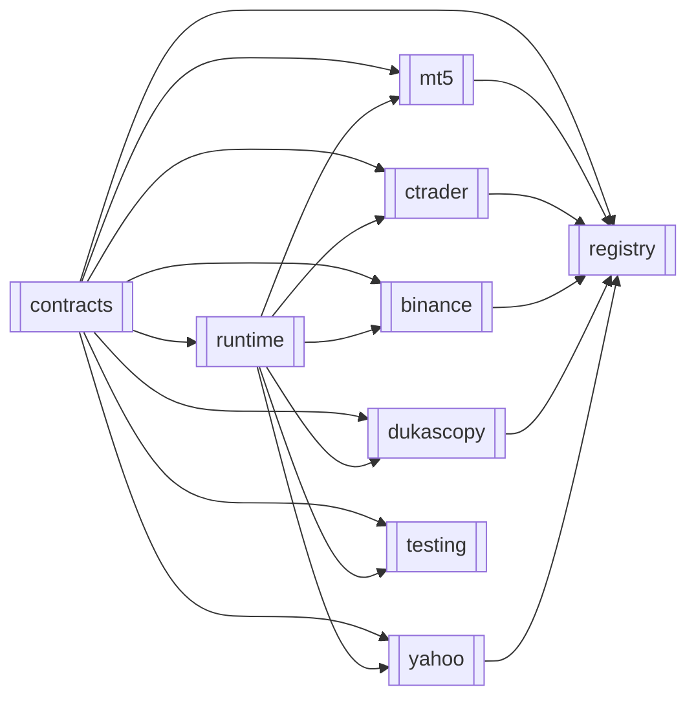
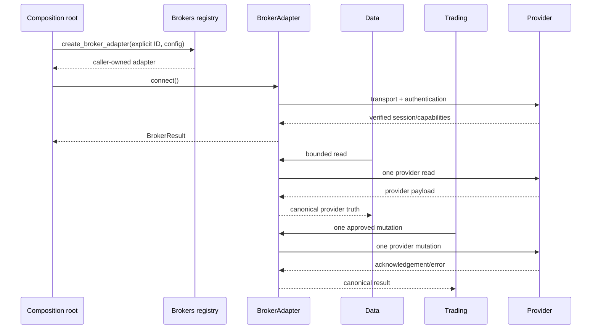

# Brokers

> **Package:** `app/services/brokers`
> **Status:** `Missing`
> **Last updated:** `2026-07-14`

> This README is the package's **single source of truth** for requirements, final structure, implementation sequence, progress, usage examples, and tests.
> Update this file before changing the code.

### Current implementation evidence

`Missing` means source exists but one or more mapped requirements, tests, usage examples, provider checks, or release gates remain incomplete. It does not mean the capability is available for production use.

| Area | Current state | Passing evidence | Remaining work |
|---|---|---|---|
| Contracts | Missing | 211 targeted contract unit/usage/export tests pass with 81.52% branch coverage; all 206 README-linked evidence references resolve | Provider fulfillment remains tracked only by provider/runtime requirements and does not reopen the V1 boundary. |
| Runtime | Missing | Full circuit state-machine (closed/open/half-open, non-qualifying-failure, bounded half-open admission) and subscription (overflow/resync, idempotent unsubscribe, terminal `fail()`) unit tests pass, plus a standalone real usage script (`02_runtime.py`) | None outstanding at the file level. |
| Registry/public API | Missing | Explicit adapter creation/listing, disabled-provider rejection, SDK-free listing, lazy imports, unavailable-call fail-closed tests, and a fixed release-policy defect (see Known defects fixed) all pass, plus a standalone real usage script (`08_registry.py`) | None outstanding at the file level. |
| MT5 | Missing; connection verified | Full transport/mapping/adapter unit tests plus a standalone real usage script (`03_mt5.py`) that connects to and reads from a real configured demo account (`connect`, `disconnect`, `is_connected`, `get_account_info`) | Only broader read/write capability release evidence (beyond `connect`) remains, gated by the same static release policy as every other provider. |
| cTrader | Missing; connection verified | Full transport/mapping/adapter unit tests, a concurrent-correlation integration test, and a standalone usage script (`04_ctrader.py`) that validates real configured demo credentials at construction time and successfully connects (`connect()`) to the cTrader demo server | None outstanding at the file level. |
| Binance | Missing; testnet verified | Full profile/transport/adapter/mapping unit tests, plus a standalone real usage script (`05_binance.py`) that connects to the real Binance testnet REST API (public market-data endpoints require no credentials) and reads real symbols/klines | No `BINANCE_*` credentials are configured in this environment, so authenticated/account/mutation capability remains unverified live. Futures remain registry-only by design. |
| Dukascopy | Missing; network attempted but unreachable from this environment | Full instruments/transport/mapping/adapter unit tests, plus a standalone real usage script (`06_dukascopy.py`) that genuinely attempts a bounded HTTP fetch against `datafeed.dukascopy.com` | The real host times out from this environment's network (confirmed via a direct HTTPS probe, unlike Yahoo/Binance which are reachable); the script reports this real outcome rather than fabricating success. Live evidence remains outstanding pending a network path that can reach this host. |
| Yahoo | Missing; connection verified | `DEC-BRK-001` resolved (explicit `probe_symbol` field); zero-duration bar defect fixed (closing timestamp derived from the parsed interval); full transport/mapping/adapter unit tests, plus a standalone real usage script (`07_yahoo.py`) that performs genuine `yfinance` calls (both connect paths, and real historical bars for `AAPL`) | None outstanding at the file level. |
| Fake/testing utility | Missing | Complete protocol surface, error-injection tests, and a standalone usage script (`09_testing.py`) demonstrating `FakeBrokerAdapter` itself (the one legitimate use of a fake in this directory) | None outstanding at the file level. |
| Package validation | Missing | 391 targeted `pytest` unit/integration/usage tests pass, plus 8 standalone real-behavior usage scripts run successfully outside pytest (real MT5 demo terminal, real cTrader demo connection, real Binance testnet, real Yahoo Finance calls, and an honest fail-closed Dukascopy network attempt); Ruff, `ruff format --check`, and strict `mypy app/services/brokers` all pass; branch coverage over `app/services/brokers` is 92.25% (≥ 80% gate) | Dukascopy live-response evidence remains outstanding until a network path can reach its host. `NFR-BRK-008` (structured observability logging) is implemented (central adapter sinks, runtime, registry, and every provider transport) and verified on Python 3.14 by the `tests/brokers/unit/test_observability.py` log-capture suite. |

### Known defects fixed during this pass

- **Registry release-gate defect (`registry/catalogue.py`):** the static capability catalogue marked every operation `UNAVAILABLE` unconditionally, including `connect`/`is_connected` — meaning no adapter created through `create_broker_adapter()` could ever connect or report its own connection state, regardless of implementation. Fixed by marking `connect`/`is_connected` `AVAILABLE` when implemented (the adapter's own verification act and a purely local state read); every other capability remains gated by credential-verified release evidence exactly as before.
- **MT5 false-success defect (`mt5/adapter.py`):** `connect()` returned `status="success"` even when account/server verification failed via the boolean `verified` check (as opposed to a caught transport exception), because `self._last_error` was never set on that path and `_result()` derives `status` from `error` truthiness. Fixed by constructing a `BROKER_CONNECTION_FAILED` error before returning when verification fails without a caught exception.
- **Yahoo zero-duration bar defect (`yahoo/mapping.py`):** every mapped bar set `closing_timestamp == opening_timestamp`, violating `BrokerBar`'s own `opening_timestamp < closing_timestamp` invariant and making every real Yahoo bar construction raise. Fixed by deriving the closing timestamp from the parsed provider interval (resolves `DEC-BRK-001`).

MT5, Binance, Yahoo, and cTrader each have a verified real connection (MT5 against a real demo account; Binance against the real testnet; Yahoo against the real Yahoo Finance service; cTrader against Spotware's demo servers via the `ctrader/network.py` handshake). Dukascopy's real host is unreachable from this environment's network specifically (confirmed by direct probe — Yahoo and Binance are reachable from the same environment). The static catalogue keeps every operation other than `connect`/`is_connected` unavailable, and direct unavailable calls fail before importing or invoking the provider SDK.

---

## 1. Purpose and Boundary

### Purpose

The Brokers domain is HaruQuantAI's only direct integration boundary to real broker and market-data provider platforms. It creates caller-owned provider sessions, translates canonical requests into one provider operation, and returns structurally mapped provider truth through canonical results without business policy, persistence, enrichment, or fabricated values. Data may consume read capabilities; only Trading may consume mutation capabilities.

### Owns

- Provider adapters for MT5, cTrader, Binance Spot and registered Binance Futures profiles, Dukascopy, and Yahoo Finance.
- Explicit lazy adapter factories and a generated capability catalogue.
- Provider connection, authentication, session, keep-alive, transport recovery, and subscription lifecycle.
- Canonical broker results, errors, DTOs, enums, pages, connection events, and capability traits.
- Provider request construction from exact provider-native symbols, response decoding, structural mapping, and provider-native pagination.
- Transport-level throttling, bounded stream backpressure, adapter-local circuit breaking, latency measurement, and redacted technical logging.
- Direct provider reads and single-target mutations requested by an allowed caller.

### Does not own

- Data-source or execution-route selection, cross-provider fallback, normalization, resampling, enrichment, caching, persistence, or snapshot freshness decisions.
- Strategy evaluation, risk approval, authorization, kill-switch policy, business idempotency, execution retry policy, reconciliation, incident handling, or execution persistence.
- Credential persistence, user/database lookup, secret-vault ownership, or implicit configuration discovery.
- Synthetic prices, ticks, spreads, fills, identifiers, account state, paper fills, or simulation.
- Bulk cancellation, bulk closure, liquidation, averaging, multi-leg orchestration, portfolio allocation, drift detection, or rebalance planning.
- HTTP/UI DTOs, performance analytics, or any import from a higher business domain.
- Canonical/friendly market identity, provider or cross-provider alias mappings, or alias resolution. Data converts its identities to exact provider-native symbols before calling Brokers.

### Shared contracts

Contract definitions match `docs/PROJECT.md`. Commands/requests received and results/channels produced by Brokers are owned here at contract version `v1`.

**Owned by this domain** — defined authoritatively here:

| Status | Contract | Version | Counterparty | Purpose |
|---|---|---|---|---|
| Missing | `BrokerAdapter` and capability traits | `v1` | Data; Trading | Canonical async provider session and operation boundary. |
| Missing | `BrokerConnectionConfig` | `v1` | Composition root → Brokers | Immutable provider, account, environment, resolved in-memory credentials, timeout, reconnect, stream-buffer, and circuit-breaker input. |
| Missing | `BrokerResult` / `BrokerError` | `v1` | Data; Trading | Truth-preserving result envelope and stable error taxonomy for every public operation. |
| Missing | Canonical broker DTO/event family (nested in `BrokerAdapter`) | `v1` | Data; Trading | Provider-neutral structural schemas for accepted reads, mutations, calculations, and events. |
| Missing | `BrokerFeatureFlags` / capability catalogue (nested in `BrokerAdapter`) | `v1` | Data; Trading | Complete runtime capability and verification report. |
| Missing | `BrokerSubscription` and connection/subscription event types (nested in `BrokerAdapter`) | `v1` | Data; Trading | Bounded connection and provider-event channels without SDK-object leakage. |

Every registered Brokers contract or concrete DTO carries `contract_version="v1"`
separately from a stable namespaced `schema_id` (`brokers.adapter.v1`,
`brokers.connection_config.v1`, `brokers.result.v1`, `brokers.error.v1`, or the
concrete DTO/event schema ID). Consumers never parse `schema_id` for compatibility.

**Consumed from other domains** — referenced only:

| Contract | Version | Owner | Used for |
|---|---|---|---|
| Correlation/request ID capability | N/A (shared capability) | Utils | Trace every adapter operation and technical event. |
| UTC-first time policy | N/A (shared policy) | Utils | Canonical UTC completion, event, and provider timestamps. |
| Secret redaction policy | N/A (shared policy) | Utils | Redact credentials, tokens, private keys, and full account identifiers. |
| Structured logging capability | N/A (shared capability) | Utils | Emit lifecycle, call, error, subscription, and acknowledgement logs. |
| Base error types and error-routing policy | N/A (shared capability/policy) | Utils | Preserve shared exception boundaries and route canonical operational failures without leaking secrets. |

### Persisted state

None. Brokers owns no tables, artifacts, migration definitions, credential store, reusable data cache, order store, or durable connection state. Provider-required technical state is bounded, in-memory, adapter-instance scoped, and discarded at disconnect.

### Four-level structure

| Code level | Represents |
|---|---|
| **Package** | Brokers domain |
| **Module folder** | One broker capability or provider integration |
| **File** | One focused contract, factory, transport, mapping, or adapter responsibility |
| **Class / function / method** | One observable broker requirement |

```text
Package
└── Module folder
    └── File
        └── Class / Function / Method
```

### Package capability map

```mermaid
flowchart TD
    BRK[[Brokers]]
    BRK --> C[[contracts]]
    BRK --> RT[[runtime]]
    BRK --> R[[registry]]
    BRK --> M[[mt5]]
    BRK --> CT[[ctrader]]
    BRK --> B[[binance]]
    BRK --> D[[dukascopy]]
    BRK --> Y[[yahoo]]
    BRK --> T[[testing]]

    C --> C1[enums.py: canonical values]
    C --> C2[models.py: canonical DTOs]
    C --> C3[protocols.py: capability contracts]
    RT --> RT1[circuit breaker and bounded subscriptions]
    R --> R1[catalogue.py: capability declarations]
    R --> R2[factory.py: explicit lazy resolution]
    M --> M1[transport, mapping, adapter]
    CT --> CT1[transport, mapping, adapter]
    B --> B1[profiles, transport, mapping, adapter]
    D --> D1[instruments, transport, mapping, adapter]
    Y --> Y1[transport, mapping, adapter]
    T --> T1[fake.py: deterministic test adapter]
```



---

## 2. Final Package Structure

The tree below defines the final layout. The following table is the sole normative implementation order; feature section numbers are reference identifiers, not an alternate order.

| Order | Feature | File order |
|---:|---|---|
| 1 | `contracts/` | `enums.py` → `models.py` → `unsupported.py` → `protocols.py` → `__init__.py` |
| 2 | `runtime/` | `circuit_breaker.py` → `subscription.py` → `__init__.py` |
| 3 | `mt5/` | `transport.py` → `mapping.py` → `adapter.py` → `__init__.py` |
| 4 | `ctrader/` | `transport.py` → `network.py` → `mapping.py` → `adapter.py` → `__init__.py` |
| 5 | `binance/` | `profiles.py` → `transport.py` → `mapping.py` → `adapter.py` → `__init__.py` |
| 6 | `dukascopy/` | `instruments.py` → `transport.py` → `mapping.py` → `adapter.py` → `__init__.py` |
| 7 | `yahoo/` | `transport.py` → `mapping.py` → `adapter.py` → `__init__.py` |
| 8 | `registry/` | `catalogue.py` → `factory.py` → `__init__.py` |
| 9 | `testing/` | `fake.py` → `__init__.py` |
| 10 | Package root | `__init__.py` |

```text
brokers/
├── __init__.py                         # Canonical domain exports only
├── README.md
├── contracts/                          # Canonical provider-neutral boundary
│   ├── __init__.py
│   ├── enums.py                        # Broker IDs, environments, states, errors
│   ├── models.py                       # Results, pages, requests, DTOs, events
│   ├── protocols.py                    # Focused capability protocols and composite adapter
│   └── unsupported.py                  # Private deterministic unsupported-result helper
├── runtime/                             # Shared adapter-local transport mechanics
│   ├── __init__.py                     # No public exports
│   ├── circuit_breaker.py              # Closed/open/half-open transport breaker
│   └── subscription.py                 # Bounded FIFO async subscription handle
├── registry/                           # Explicit lazy factories and capabilities
│   ├── __init__.py
│   ├── catalogue.py                    # Single static capability declaration source
│   └── factory.py                      # Explicit adapter creation and listing
├── mt5/                                # MT5 provider integration
│   ├── __init__.py
│   ├── transport.py                    # Blocking terminal/session isolation
│   ├── mapping.py                      # MT5 object to canonical DTO mapping
│   └── adapter.py                      # MT5BrokerAdapter
├── ctrader/                            # cTrader provider integration
│   ├── __init__.py
│   ├── transport.py                    # Request correlation over an async sender
│   ├── network.py                      # Real Twisted-reactor Spotware client (sender)
│   ├── mapping.py                      # Protobuf to canonical DTO mapping
│   └── adapter.py                      # CTraderBrokerAdapter
├── binance/                            # Immutable Binance product profiles
│   ├── __init__.py
│   ├── profiles.py                     # Spot and registered Futures declarations
│   ├── transport.py                    # REST/WebSocket provider calls
│   ├── mapping.py                      # Binance payload to canonical DTO mapping
│   └── adapter.py                      # BinanceBrokerAdapter
├── dukascopy/                          # Read-only Dukascopy integration
│   ├── __init__.py
│   ├── instruments.py                  # Exact provider-native instrument declarations
│   ├── transport.py                    # Bounded provider HTTP retrieval
│   ├── mapping.py                      # Provider payload to canonical DTO mapping
│   └── adapter.py                      # DukascopyBrokerAdapter
├── yahoo/                              # Read-only Yahoo historical bars
│   ├── __init__.py
│   ├── transport.py                    # Yahoo provider retrieval
│   ├── mapping.py                      # Provider bars to canonical DTO mapping
│   └── adapter.py                      # YahooBrokerAdapter
└── testing/                            # Public caller-test utilities
    ├── __init__.py
    └── fake.py                         # FakeBrokerAdapter
```

### Module dependency diagram

Arrows point from the required module to its consumer.



Registry imports provider factories lazily; provider modules never import Registry. No provider module imports another provider. Provider adapters consume `runtime`; `runtime` consumes `contracts` only. Root and feature `__init__.py` files are implemented after their exported definitions exist.

### Structure rules

- The package root contains only `README.md`, `__init__.py`, and approved feature folders.
- Public consumers import from `app.services.brokers` or a documented capability contract, never provider implementation modules.
- `contracts` depends only on the standard library, Pydantic's `SecretStr`, and Utils-owned shared policies; it imports no provider SDK.
- `runtime` contains only adapter-local transport mechanics and owns no provider, business, or persistent state.
- Each provider exposes one adapter class and keeps transport/mapping helpers private.
- Provider SDK objects, protobuf messages, terminal handles, sockets, and exceptions never cross the package boundary.
- Usage examples live under `tests/brokers/usage/`. Two conventions coexist there: `contracts` (Section 4.1) and the package root (Section 4.10) use pytest-collected `test_usage_*.py` files (`::test_function()` node IDs are valid citations); every other feature uses a standalone, non-pytest-collected `NN_<feature>.py` script named after its Section 4 subsection number — `02_runtime.py`, `03_mt5.py`, `04_ctrader.py`, `05_binance.py`, `06_dukascopy.py`, `07_yahoo.py`, `08_registry.py`, `09_testing.py` (no `test_` prefix — the `usage/` folder name already says what it is; `example_*()` functions; an `if __name__ == "__main__":` block; run directly via `python tests/brokers/usage/NN_<feature>.py`). These scripts exercise genuinely real behavior — real MT5/cTrader demo credentials, a real Binance testnet connection, real Yahoo Finance calls, a real (possibly failing) Dukascopy network attempt — rather than fixtures or fakes. `09_testing.py` is the one exception where a fake is the real subject: it demonstrates `FakeBrokerAdapter` itself.
- No synchronous or strict-exception façade, manager, repository, service layer, or provider extension API is part of the initial package.

### Package root public API

`app/services/brokers/__init__.py` contains explicit eager imports for contracts and registry functions, plus documented PEP 562 `__getattr__` lazy resolution for provider adapter types. Its `__all__` contains only:

- FR-BRK-001–005 enums;
- FR-BRK-006–042 canonical models/results;
- FR-BRK-043–047 and FR-BRK-112 capability/subscription protocols;
- FR-BRK-101–103 registry functions;
- FR-BRK-104–108 approved adapter types.

The root file itself is assigned FR-BRK-135. Private helper/export requirements FR-BRK-110–111 and FR-BRK-113–134 do not add root exports unless explicitly stated above.

`FakeBrokerAdapter` is imported from `app.services.brokers.testing` only. Provider classes are exposed for typing and provider-specific integration tests, but normal consumers obtain instances exclusively through `create_broker_adapter()`. `__getattr__` contains a fixed name-to-module table, imports only the requested provider module, caches only the resolved class object, and raises `AttributeError` for every other name. Root initialization performs no provider import until a lazy factory or approved adapter type is accessed, and performs no selection, connection, mapping, or business logic.

### Explicit exclusions

- Removed V1 surfaces: implicit active-broker routing, unknown-to-MT5 fallback, broken broker-owned simulator routing, credential/database helpers, broker-owned data envelopes, Yahoo synthetic ticks, cTrader fabricated values/success, raw SDK delegation, `MT5Api`, private cross-domain loaders, and singleton-only lifecycle.
- Rejected/simplified V2 surfaces: strict exception façade, universal ten-state lifecycle, version fields on every nested DTO, per-bar timezone evidence duplication, and an unverified universal p99 mapping target below 100 microseconds.

---

## 3. Workflows

### Status values

| Status | Meaning |
|---|---|
| **Missing** | Canonical workflow is absent, blocked, or unverified. |
| **Partial** | Useful V1 behavior exists but canonical migration, validation, or tests remain. |
| **Completed** | Final behavior is implemented and verified. |

### Workflow scope values

| Scope | Meaning |
|---|---|
| **Internal** | Entire workflow occurs in Brokers. |
| **Cross-domain** | Brokers receives an input or produces an output at a documented domain boundary. |

| Status | Workflow ID | Scope | Workflow | Trigger / Input boundary | Final outcome / Output boundary | Requirement sequence |
|---|---|---|---|---|---|---|
| Missing | `WF-BRK-001` | Internal | Resolve explicit adapter | Explicit broker/profile ID and config | Independent adapter or `BROKER_UNKNOWN` / `BROKER_DEPENDENCY_MISSING` | `FR-BRK-101 → FR-BRK-102` |
| Missing | `WF-BRK-002` | Internal | Connect and authenticate | Caller-owned adapter and composition-root-built immutable config | Verified session, capability report, and lifecycle events | `FR-BRK-006 → FR-BRK-111 → FR-BRK-048 → FR-BRK-052 → FR-BRK-073` |
| Missing | `WF-BRK-003` | Cross-domain | Acquire provider market data | Data supplies an explicit adapter read | Direct canonical provider page/stream returned to Data | `FR-BRK-058 → FR-BRK-067` |
| Missing | `WF-BRK-004` | Cross-domain (`SYS-WF-002`, `SYS-WF-008`) | Submit one mutation | Trading supplies a complete approved mutation request | Provider acknowledgement/error returned to Trading | `FR-BRK-091 → FR-BRK-097` |
| Missing | `WF-BRK-005` | Cross-domain | Read account and execution state | Data or Trading requests bounded provider truth | Canonical account/order/position/deal page | `FR-BRK-079 → FR-BRK-090` |
| Missing | `WF-BRK-006` | Cross-domain | Stream provider and connection events | Data or Trading subscribes | Bounded canonical stream with explicit loss/resync state | `FR-BRK-026 → FR-BRK-112 → FR-BRK-114 → FR-BRK-057 → FR-BRK-068 → FR-BRK-072` |
| Missing | `WF-BRK-007` | Internal | Correlate cTrader response | cTrader transport submits one request | Only the native-ID match, or serialized same-type fallback match, is mapped | `FR-BRK-105` |
| Missing | `WF-BRK-008` | Internal | Handle unsupported operation | Caller invokes unavailable capability | No SDK call; deterministic unsupported result | `FR-BRK-010 → FR-BRK-074` |
| Missing | `WF-BRK-009` | Cross-domain | Inject canonical broker into execution | Composition root creates adapter for Trading | Trading receives a capability-scoped adapter, not MT5/cTrader concrete APIs | `FR-BRK-101 → FR-BRK-046` |

### `WF-BRK-001` — Resolve Explicit Adapter

**Scope:** `Internal`
**System workflow:** `SYS-WF-001`, `SYS-WF-002`

**Input boundary:** Exact `BrokerId`/product profile and `BrokerConnectionConfig` constructed by the composition root after Utils secret resolution.
**Output boundary:** New caller-owned `BrokerAdapter` in a `BrokerResult`.

1. `create_broker_adapter()` validates exact ID/config correspondence without selecting policy.
2. The registry lazily imports only the selected factory.
3. The factory returns a new independent, disconnected adapter.
4. Unknown IDs and missing optional dependencies remain distinct canonical errors.

**Failure behaviour:**

- Unknown ID → `BROKER_UNKNOWN`; no provider import fallback.
- Missing provider package → `BROKER_DEPENDENCY_MISSING` with package/version metadata.
- Environment/profile mismatch → `BROKER_CONFIGURATION_INVALID`.

**Integration test:**
`tests/brokers/integration/test_adapter_resolution.py::test_adapter_resolution_is_explicit_and_isolated()`

### `WF-BRK-002` — Connect and Authenticate Provider Session

**Scope:** `Internal`
**System workflows:** `SYS-WF-002`, `SYS-WF-008`

**Input boundary:** A caller-owned adapter containing immutable provider/account/environment configuration.
**Output boundary:** Verified `READY` status, refreshed capabilities, and connection events.

1. `BrokerAdapter.connect()` validates connection-only configuration.
2. The adapter establishes transport and provider-required authentication.
3. It verifies account/environment identity instead of trusting a local flag.
4. It refreshes feature flags and emits each validated state transition.
5. `disconnect()` deterministically releases all owned resources and subscriptions.

**Failure behaviour:**

- Authentication or environment mismatch → failed result and `FAILED` state.
- Cancellation → provider cancellation attempted; `asyncio.CancelledError` propagates.
- Connection loss → affected operations fail; mutations are never replayed.

**Integration test:**
`tests/brokers/integration/test_session_lifecycle.py::test_session_lifecycle_verifies_and_cleans_up()`

### `WF-BRK-003` — Acquire Provider Market Data

**Scope:** `Cross-domain`
**System workflow:** `SYS-WF-002`; `SYS-WF-001` only upstream — historical acquisition/backfill by Data that later serves the backtest loop. Brokers is not part of the backtest execution path itself.

**Input boundary:** Data selects an explicit provider and submits one bounded market-data request.
**Output boundary:** Brokers returns direct canonical provider observations; Data owns all subsequent validation, normalization, caching, and persistence.

**Failure behaviour:**

- Unsupported observation type → `BROKER_CAPABILITY_UNSUPPORTED` without provider call.
- Malformed mandatory price/time → `BROKER_RESPONSE_INVALID`.
- Valid empty provider page → successful empty `BrokerPage`, not an error.

**Integration test:**
`tests/brokers/integration/test_data_boundary.py::test_data_receives_provider_truth_without_normalization()`

### `WF-BRK-004` — Submit One Broker Mutation

**Scope:** `Cross-domain`
**System workflow:** `SYS-WF-002`, `SYS-WF-008`

**Input boundary:** Trading supplies a complete, approved, single-target request and caller-owned correlation/idempotency fields.
**Output boundary:** Direct provider acknowledgement, rejection, or unknown outcome returned to Trading for reconciliation and persistence.

**Failure behaviour:**

- Structurally invalid provider request → `BROKER_REQUEST_INVALID` before mutation.
- Provider rejection → `BROKER_REQUEST_REJECTED` with redacted provider evidence.
- Possible transmission without acknowledgement → `BROKER_UNKNOWN_OUTCOME`; no retry.

**Integration test:**
`tests/brokers/integration/test_trading_mutation_boundary.py::test_mutation_returns_provider_acknowledgement_without_retry()`

### `WF-BRK-005` — Read Account and Execution State

**Scope:** `Cross-domain`
**System workflow:** `SYS-WF-002`

**Input boundary:** Data or Trading submits a bounded account, position, order, deal, or transaction read.
**Output boundary:** Canonical provider truth with provider and retrieval timestamps; caller owns freshness and reconciliation.

**Failure behaviour:**

- Missing target → the exact `BROKER_*_NOT_FOUND` result.
- Truncated provider response → successful page with explicit truncation/cursor metadata.
- Provider ID absent from a mandatory response → `BROKER_RESPONSE_INVALID`, never a fabricated ID.

**Integration test:**
`tests/brokers/integration/test_account_state_boundary.py::test_account_state_preserves_provider_ids_and_bounds()`

### `WF-BRK-006` — Stream Provider and Connection Events

**Scope:** `Cross-domain`
**System workflow:** `SYS-WF-002`

**Input boundary:** Data or Trading requests a supported adapter-scoped subscription.
**Output boundary:** FIFO canonical events through a bounded async stream plus explicit disconnect/backpressure/resync events.

**Failure behaviour:**

- Buffer overflow → `BROKER_BACKPRESSURE`, `DEGRADED` state, and resync required.
- Unknown subscription → `BROKER_SUBSCRIPTION_NOT_FOUND` without affecting others.
- Disconnect → every owned subscription terminates; silent data loss is forbidden.

**Integration test:**
`tests/brokers/integration/test_streaming.py::test_streaming_reports_backpressure_and_resync()`

### `WF-BRK-007` — Correlate cTrader Response

**Scope:** `Internal`
**System workflow:** `None`

**Input boundary:** Internal cTrader request, expected response type, request token, and session generation.
**Output boundary:** Matching decoded response or canonical error; correlation details stay private.

**Failure behaviour:**

- Stale generation or mismatched native correlation token → response discarded with `BROKER_SESSION_CHANGED`.
- When a cTrader operation lacks a reliable native request ID, requests expecting the same response type are serialized per adapter/session generation; they are never matched by payload type alone.

**Integration test:**
`tests/brokers/integration/test_ctrader_correlation.py::test_ctrader_does_not_cross_correlate_concurrent_requests()`

### `WF-BRK-008` — Handle Unsupported Operation

**Scope:** `Internal`
**System workflow:** `None`

**Input boundary:** Any canonical operation unavailable for the connected provider/profile/account.
**Output boundary:** `BrokerResult` error identifying broker, operation, and capability.

**Failure behaviour:**

- Provider capability unavailable → `BROKER_CAPABILITY_UNSUPPORTED` and zero SDK calls.
- Capability declaration and runtime report disagree → fail closed and report unavailable.

**Integration test:**
`tests/brokers/integration/test_unsupported_capabilities.py::test_unsupported_operation_never_calls_provider()`

### `WF-BRK-009` — Inject Canonical Broker into Execution

**Scope:** `Cross-domain`
**System workflow:** `SYS-WF-002`

**Input boundary:** The composition root resolves secrets through Utils, creates an explicit adapter, and injects only the capability Trading requires.
**Output boundary:** Trading receives `BrokerAdapter`/`TradeExecutionProvider` rather than a concrete MT5/cTrader client or raw SDK.

**Failure behaviour:**

- Direct provider import or native delegated method remains → the import-boundary test fails.
- A caller requests an MT5-native operation absent from the canonical contract → deterministic `BROKER_CAPABILITY_UNSUPPORTED`; raw delegation is never restored.

**Integration test:**
`tests/brokers/integration/test_execution_injection.py::test_execution_receives_the_canonical_adapter_protocol_not_concrete_apis()`

#### End-to-end workflow diagram



---

## 4. Module and Requirement Specifications

Modules, files, and requirements are listed in implementation order.

### Approved capability traceability

This table proves that every retained reconciliation capability has one final destination; it is not an additional architecture layer.

| Reconciliation capability | Final destination |
|---|---|
| `CAP-BRK-001` Explicit registry/public API | `registry/`; FR-BRK-101–103 |
| `CAP-BRK-002` Session lifecycle | `contracts/protocols.py`; FR-BRK-047–057; provider transports |
| `CAP-BRK-003` Canonical results/errors/DTOs | `contracts/enums.py` and `models.py`; FR-BRK-001–042 |
| `CAP-BRK-004` Capabilities/unsupported outcomes | `contracts` and `registry/catalogue.py`; FR-BRK-005, 010–011, 073–074, 103 |
| `CAP-BRK-005` Symbols/metadata | FR-BRK-019, 058–062 and provider adapters |
| `CAP-BRK-006` Quotes/ticks/bars/order books | FR-BRK-022–025, 063–067 and provider adapters |
| `CAP-BRK-007` Streaming | FR-BRK-026, 057, 068–072 and provider transports |
| `CAP-BRK-008` Account/platform/permissions | FR-BRK-012, 014–018, 073–082 |
| `CAP-BRK-009` Positions/orders/deals/activity | FR-BRK-027–032, 083–090 |
| `CAP-BRK-010` Single-target mutations | FR-BRK-033–038, 091–097 |
| `CAP-BRK-011` Provider-native calculations | FR-BRK-039–041, 098–100 |
| `CAP-BRK-012` MT5 adapter | `mt5/`; FR-BRK-104 |
| `CAP-BRK-013` cTrader adapter | `ctrader/`; FR-BRK-105 |
| `CAP-BRK-014` Binance profiles | `binance/`; FR-BRK-106 |
| `CAP-BRK-015` Dukascopy read-only adapter | `dukascopy/`; FR-BRK-107 |
| `CAP-BRK-016` Yahoo historical bars | `yahoo/`; FR-BRK-108 |
| `CAP-BRK-017` Session/account isolation | FR-BRK-006, 047–052, 101; NFR-BRK-005 |
| `CAP-BRK-018` Redacted observability | `BrokerResult` metadata; NFR-BRK-007–010 |
| `CAP-BRK-019` Contract/boundary/fake tests | `testing/`; FR-BRK-109; NFR-BRK-012 |

### 4.1 `contracts/` — Canonical Provider-Neutral Boundary

**Purpose:** Define the versioned result, error, DTO, enum, page, event, and focused async capability contracts shared by every adapter.

**Module flow:**

```text
caller/provider value
  → enums.py canonical interpretation
  → models.py immutable structural DTO
  → protocols.py typed operation boundary
  → BrokerResult
```

### Files

| Status | File | Responsibility | Key exports | Dependencies |
|---|---|---|---|---|
| Missing | `enums.py` | FR-BRK-001–005: define the normative provider IDs, environment, lifecycle, error, and capability values. | `BrokerId`, `BrokerEnvironment`, `BrokerConnectionState`, `BrokerErrorCode`, `BrokerCapabilityId` | **Standard library:** `enum`<br>**Required third-party:** None<br>**Local:** None |
| Missing | `models.py` | FR-BRK-006–042: define immutable canonical inputs, outputs, pages, results, and events for accepted capabilities. | All documented `Broker*` DTOs in FR-BRK-006–042 | **Standard library:** `collections.abc, dataclasses, datetime, decimal, math, types, typing`<br>**Required third-party:** `pydantic` (project-pinned `SecretStr` only)<br>**Local:** `enums.py → canonical enums`; `app.utils → validate_id, format_utc_timestamp, redact_mapping_value` |
| Missing | `unsupported.py` | FR-BRK-110: build deterministic unsupported results for protocol default implementations. | None (private helpers only) | **Standard library:** `datetime`<br>**Required third-party:** None<br>**Local:** `models.py → BrokerError, BrokerResult`; `enums.py → BrokerErrorCode`; `app.utils → utc_now` |
| Missing | `protocols.py` | FR-BRK-043–100 and FR-BRK-112: define focused async capability protocols, the subscription handle, the composite adapter contract, and private unsupported-capability defaults. | `MarketDataProvider`, `AccountProvider`, `TradeExecutionProvider`, `CalculationProvider`, `BrokerSubscription`, `BrokerAdapter` | **Standard library:** `asyncio, collections.abc, datetime, decimal, types, typing`<br>**Required third-party:** None<br>**Local:** `models.py → canonical DTOs/results`; `enums.py → capability values`; `unsupported.py → unsupported result helper and shared UTC clock bridge` |
| Missing | `__init__.py` | FR-BRK-113: expose the approved public contract API only after all definitions exist. | FR-BRK-001–100 and FR-BRK-112 symbols | **Standard library:** None<br>**Required third-party:** None<br>**Local:** `enums.py, models.py, protocols.py → approved exports` |

### Configuration and Limits Manifest

Shared connection settings are defined in Section 5. Contract-specific limits are:

| Status | Setting / Limit | Type | Default | Required | Used by | Description |
|---|---|---|---|---|---|---|
| Missing | Contract version | `str` | `v1` | Yes | `BrokerResult`, `BrokerFeatureFlags`, `BrokerAdapter` | Versions the result/capability/adapter boundary; nested DTOs inherit it. |
| Missing | Decimal conversion | policy | `Decimal(str(value))` | Yes | Canonical numeric DTOs | NaN/Infinity becomes null only for optional fields; a mandatory invalid number returns `BROKER_RESPONSE_INVALID`. |
| Missing | Timestamp policy | policy | UTC-aware | Yes | All timestamped DTOs | Unverified provider timezones are never assumed to be UTC. |
| Missing | Page bound | provider-derived/configured positive limit | No global numeric default approved | Yes | `BrokerPage` and list/history methods | Unbounded whole-history retrieval is forbidden; truncation and next cursor are explicit. |

### Owned contract field manifest

All DTOs are immutable. `datetime` values are timezone-aware UTC; monetary/price/quantity fields are `Decimal`; mappings and sequences are immutable views/tuples.

| Contract | Required fields |
|---|---|
| `BrokerConnectionConfig` | `broker_id: BrokerId`; `environment: BrokerEnvironment`; `provider_enabled: bool` derived by the composition root from the matching deployment flag; `account_reference: str | None`; `credentials: Mapping[str, pydantic.SecretStr] | None` (already resolved by Utils/composition root); `endpoint: str | None`; `connect_timeout_sec: float`; `request_timeout_sec: float`; `transport_reconnect_max_attempts: int`; `stream_buffer_size: int`; `circuit_failure_threshold: int`; `circuit_recovery_timeout_sec: float`; `circuit_half_open_max_calls: int`; `auto_connect: bool = False`; `probe_symbol: str | None = None` (`DEC-BRK-001`: explicit caller-supplied Yahoo connect-time probe symbol; never a hidden default) |
| `BrokerError` | `code: BrokerErrorCode`; `message: str`; `retryable: bool`; `provider_code: str | None`; `provider_message: str | None`; `capability: BrokerCapabilityId | None`; `details: Mapping[str, object]` (redacted) |
| `BrokerResult[T]` | `status: Literal["success", "error"]`; `broker: BrokerId`; `operation: BrokerCapabilityId`; `request_id: str`; `timestamp: datetime`; `data: T | None`; `error: BrokerError | None`; `provider_metadata: Mapping[str, object]` (redacted/bounded); `latency_ms: float`; `provider_latency_ms: float | None`; `adapter_overhead_ms: float`; `environment: BrokerEnvironment`; `contract_version: str = "v1"`; `schema_id: str = "brokers.result.v1"`; `adapter_version: str`; `provider_api_version: str | None`. Success requires `status="success"` and `error is None`; `data` may be `None` for `BrokerResult[None]`. Error requires `status="error"`, `error is not None`, and `data is None`. |
| `BrokerPage[T]` | `items: tuple[T, ...]`; `next_cursor: str | None`; `limit: int`; `returned_count: int`; `truncated: bool`; `provider_metadata: Mapping[str, object]` including page/timezone evidence when applicable |
| `BrokerCapability` | `capability: BrokerCapabilityId`; `implementation_status: Literal["IMPLEMENTED", "NOT_IMPLEMENTED"]`; `availability: Literal["AVAILABLE", "UNAVAILABLE", "DEGRADED"]`; `access_mode: Literal["READ", "WRITE", "READ_WRITE"]`; `requirement: Literal["NONE", "AUTHENTICATION", "CONFIGURATION", "PERMISSION"]`; `verification_status: Literal["TESTED_SANDBOX", "TESTED_LIVE", "NOT_TESTED"]`; `verification_evidence: tuple[str, ...]`; `release_approval_reference: str | None`; `reason: str | None`; `execution_model: str` |
| `BrokerFeatureFlags` | `broker_id: BrokerId`; `environment: BrokerEnvironment`; `account_reference_redacted: str | None`; `generated_at: datetime`; `capabilities: Mapping[BrokerCapabilityId, BrokerCapability]`; `contract_version`; `adapter_version`; `provider_api_version` |
| `BrokerConnectionStatus` | `state: BrokerConnectionState`; `transport_connected: bool`; `application_authenticated: bool | None`; `account_authenticated: bool | None`; `trading_permitted: bool | None`; `subscriptions_ready: bool | None`; `maintenance: bool`; `environment: BrokerEnvironment`; `account_reference_redacted: str | None`; `session_generation: int`; `observed_at: datetime` |
| `BrokerConnectionEvent` | `previous_state`; `new_state`; `reason: str | None`; `timestamp: datetime`; `session_generation: int`; `reconnect_attempt: int | None`; `resynchronization_required: bool` |
| `BrokerPlatformInfo` | `broker_id`; `provider_name`; `product_profile`; `environment`; `api_or_terminal_version: str | None`; `endpoint_metadata: Mapping[str, object]` (redacted); `observed_at` |
| `BrokerPermissions` | `market_data_read: bool | None`; `account_read: bool | None`; `trade_write: bool | None`; `subscription: bool | None`; `provider_permissions: Mapping[str, bool | None]`; `observed_at` |
| `BrokerAccountInfo` | `account_id: str`; `account_reference_redacted`; `currency: str | None`; `balance/equity/margin/free_margin: Decimal | None`; `status: str | None`; `provider_timestamp: datetime | None`; `retrieved_at: datetime` |
| `BrokerBalance` | `asset: str`; `total/available/locked: Decimal | None`; `unit: str`; `provider_timestamp: datetime | None`; `retrieved_at` |
| `BrokerAssetInfo` | `asset_id: str`; `provider_name: str | None`; `precision: int | None`; `unit: str | None`; `provider_metadata` |
| `BrokerSymbolInfo` | `provider_symbol: str`; `base_asset/quote_asset: str | None`; `product_profile`; `price/quantity units and precision`; `min/max/step values: Decimal | None`; `trading_flags: Mapping[str, bool | None]`; `provider_metadata`. It contains no canonical/friendly name or alias collection. |
| `BrokerMarketStatus` | `symbol`; `status: Literal["OPEN", "CLOSED", "HALTED", "UNKNOWN"]`; `provider_timestamp: datetime | None`; `retrieved_at`; `reason: str | None` |
| `BrokerTradingSession` | `symbol`; `opens_at: datetime`; `closes_at: datetime`; `provider_timezone: str | None`; `provider_metadata` |
| `BrokerQuote` | `symbol`; `bid/ask/last_price: Decimal | None`; `bid/ask_quantity: Decimal | None`; `price_unit/quantity_unit: str`; `provider_sequence_id: str | int | None`; `provider_timestamp: datetime | None`; `retrieved_at` |
| `BrokerTick` | `symbol`; `provider_sequence_id: str | int | None`; `event_timestamp`; `provider_receipt_timestamp`; `bid/ask/last_price and bid/ask quantity: Decimal | None`; `tick_type: Literal["TRADE", "QUOTE", "BLOCK", "UNKNOWN"]`; explicit units |
| `BrokerBar` | `symbol`; `opening_timestamp`; `closing_timestamp`; `is_closed`; `open/high/low/close: Decimal`; `trade_volume/tick_volume: Decimal | None`; `provider_timeframe`; `requested_timeframe`; explicit units |
| `BrokerOrderBook` | `symbol`; `bids/asks: tuple[(Decimal price, Decimal quantity), ...]`; `is_snapshot`; `first/last_sequence_id: int | None`; `checksum: str | None`; `depth_truncation: int | None`; `resnapshot_required`; `event_timestamp`; explicit units |
| `BrokerSubscriptionInfo` | `subscription_id`; `capability`; exact provider-native `symbols`; `created_at`; `buffer_size`; `delivery_sequence`; `resynchronization_required`; `active` |
| `BrokerPosition` | `position_id`; `symbol`; `side`; `quantity`; `quantity_unit`; `open/current_price: Decimal | None`; `profit/swap: Decimal | None`; `currency: str | None`; `stop_loss/take_profit: Decimal | None`; `state`; provider/retrieval timestamps |
| `BrokerOrderFilter` | Optional `symbol`, `status`, `side`, `start`, `end`, `account_reference` structural fields only |
| `BrokerPositionFilter` | Optional `symbol`, `side`, `account_reference` structural fields only |
| `BrokerOrder` | `order_id`; `client_request_id/client_order_id: str | None`; `symbol`; `side`; `order_type`; `state`; `quantity/filled/remaining: Decimal` and unit; applicable price/stop/TIF/product fields; provider/retrieval timestamps; `provider_metadata` |
| `BrokerDeal` | `deal_id`; `order_id/position_id: str | None`; `symbol`; `side`; `quantity` and unit; `price`; `fee: Decimal | None`; `fee_currency: str | None`; `partial: bool`; provider/retrieval timestamps |
| `BrokerAccountTransaction` | `transaction_id`; `transaction_type`; `asset/currency`; `amount: Decimal`; `provider_timestamp`; `retrieved_at`; `provider_metadata` |
| `BrokerOrderRequest` | `symbol`; `side: Literal["BUY", "SELL"]`; `order_type: Literal["MARKET", "LIMIT", "STOP", "STOP_LIMIT"]`; exact positive finite `quantity: Decimal` and `quantity_unit`; applicable finite `limit_price/stop_price/stop_loss/take_profit: Decimal | None`; `time_in_force: Literal["GTC", "IOC", "FOK", "GTD", "DAY"] | None`; UTC `expiration`; non-negative `deviation_points: int | None`; caller `client_request_id/client_order_id/label/comment: str | None`; non-negative `magic: int | None`; `account_reference`; `environment`. No untyped product-field mapping or Futures-only reduce/post/position/margin/trigger/trailing/self-trade/close-on-trigger/base-or-quote quantity/contract multiplier/leverage field is part of V1; a capability requiring one remains unavailable until an accepted contract change adds it. |
| `BrokerOrderModificationRequest` | `order_id`; `client_request_id: str | None`; only caller-supplied mutable price/quantity/stop/TIF/expiration fields |
| `BrokerOrderCheck` | `accepted_for_submission: bool`; `provider_code/message: str | None`; `estimated_margin: Decimal | None`; `warnings: tuple[str, ...]`; explicit `is_final_acceptance: Literal[False]` |
| `BrokerOrderResult` | `acknowledged: bool`; `outcome: Literal["ACCEPTED", "REJECTED", "UNKNOWN", "PARTIAL"]`; provider `order_id/deal_ids: str/tuple | None`; `filled/remaining quantity: Decimal | None`; `average_price: Decimal | None`; `provider_code/message`; `provider_timestamp/retrieved_at` |
| `BrokerPositionModificationRequest` | `position_id`; `client_request_id: str | None`; caller-supplied `stop_loss/take_profit: Decimal | None` with at least one modification |
| `BrokerPositionCloseRequest` | `position_id`; `quantity: Decimal`; `quantity_unit`; `client_request_id: str | None` |
| `BrokerMarginRequest` | Provider-required `symbol`, `side`, `quantity`, `quantity_unit`, `price: Decimal | None`, `account_reference`, `product_profile` |
| `BrokerProfitRequest` | `symbol`; `side`; `quantity`; `quantity_unit`; `open_price`; `close_price`; `account_reference`; `product_profile` |
| `BrokerFeeEstimate` | `amount: Decimal`; `currency_or_unit`; `provider_code: str | None`; `provider_metadata` |
| `BrokerServerTime` | `provider_time`; `local_send_time`; `local_receive_time`; `estimated_clock_offset_ms: float`; `round_trip_latency_ms: float` |

**Normative schema IDs:** registered top-level contracts use `brokers.adapter.v1`, `brokers.connection_config.v1`, `brokers.result.v1`, and `brokers.error.v1`. Nested public types use the exact lowercase snake-case class stem: `brokers.page.v1`, `brokers.capability.v1`, `brokers.feature_flags.v1`, `brokers.connection_status.v1`, `brokers.connection_event.v1`, `brokers.platform_info.v1`, `brokers.permissions.v1`, `brokers.account_info.v1`, `brokers.balance.v1`, `brokers.asset_info.v1`, `brokers.symbol_info.v1`, `brokers.market_status.v1`, `brokers.trading_session.v1`, `brokers.quote.v1`, `brokers.tick.v1`, `brokers.bar.v1`, `brokers.order_book.v1`, `brokers.subscription_info.v1`, `brokers.position.v1`, `brokers.order_filter.v1`, `brokers.position_filter.v1`, `brokers.order.v1`, `brokers.deal.v1`, `brokers.account_transaction.v1`, `brokers.order_request.v1`, `brokers.order_modification_request.v1`, `brokers.order_check.v1`, `brokers.order_result.v1`, `brokers.position_modification_request.v1`, `brokers.position_close_request.v1`, `brokers.margin_request.v1`, `brokers.profit_request.v1`, `brokers.fee_estimate.v1`, and `brokers.server_time.v1`. The subscription handle is behavioral and exposes `BrokerSubscriptionInfo`; it has no separate serialized schema.

### Canonical error conditions

These are returned in `BrokerResult.error`, never raised as expected domain exceptions.

| Error code | Exact condition |
|---|---|
| `BROKER_UNKNOWN` | Explicit broker/profile ID is not registered. |
| `BROKER_CONFIGURATION_INVALID` | Required connection field is absent/invalid, or requested environment/profile conflicts with endpoint/account evidence. |
| `BROKER_AUTHENTICATION_FAILED` | Provider rejects or cannot verify application/account credentials or refresh. |
| `BROKER_AUTHORIZATION_FAILED` | Authenticated session lacks the provider-reported permission required by the operation. |
| `BROKER_NOT_CONNECTED` | A session-required operation is invoked while the adapter is not `READY` and explicit auto-connect is disabled. |
| `BROKER_CONNECTION_FAILED` | Transport/provider session cannot be established before any operation is transmitted. |
| `BROKER_CONNECTION_LOST` | Established transport is lost and the interrupted operation is known not to have a mutation outcome. |
| `BROKER_TIMEOUT` | A read/connect/provider operation exceeds its bound and no mutation may have been transmitted. |
| `BROKER_RATE_LIMITED` | Provider explicitly rejects/throttles the operation and supplies rate-limit evidence. |
| `BROKER_BACKPRESSURE` | A bounded request/event queue has no capacity within the allowed fail-fast behavior; stream overflow also requires resync. |
| `BROKER_CIRCUIT_OPEN` | The adapter-local transport circuit is open after its configured qualifying-failure threshold; no provider call is made. |
| `BROKER_CAPABILITY_UNSUPPORTED` | The complete capability report marks the operation unavailable; no SDK call is made. |
| `BROKER_SYMBOL_NOT_FOUND` | Provider explicitly reports the requested symbol absent. |
| `BROKER_ACCOUNT_NOT_FOUND` | Provider explicitly reports the requested account absent. |
| `BROKER_ORDER_NOT_FOUND` | Provider explicitly reports the requested order absent. |
| `BROKER_POSITION_NOT_FOUND` | Provider explicitly reports the requested position absent. |
| `BROKER_DEAL_NOT_FOUND` | Provider explicitly reports the requested deal/fill absent. |
| `BROKER_REQUEST_INVALID` | Canonical request lacks/conflicts with provider-required structural fields before transmission. |
| `BROKER_REQUEST_REJECTED` | Provider explicitly rejects a valid transmitted request; redacted provider code/message are preserved. |
| `BROKER_MARKET_CLOSED` | Provider explicitly rejects/reports the operation because its market/session is closed. |
| `BROKER_INSUFFICIENT_MARGIN` | Provider explicitly rejects a mutation/check for insufficient margin. |
| `BROKER_INSUFFICIENT_FUNDS` | Provider explicitly rejects an operation for insufficient funds/balance. |
| `BROKER_UNKNOWN_OUTCOME` | Timeout/connection loss occurs after a mutation may have reached the provider without reliable acknowledgement. |
| `BROKER_PROVIDER_ERROR` | Provider reports an operational error not represented by a more specific accepted code. |
| `BROKER_RESPONSE_INVALID` | Provider response is malformed, leaks an unmappable raw type, or contains invalid mandatory time/number/identifier evidence. |
| `BROKER_SUBSCRIPTION_FAILED` | Provider rejects or cannot establish a supported subscription. |
| `BROKER_MAINTENANCE_MODE` | Provider supplies scheduled/active maintenance evidence that blocks the operation. |
| `BROKER_SUBSCRIPTION_RESYNC_REQUIRED` | Disconnect, gap, checksum failure, or overflow prevents guaranteed lossless continuation. |
| `BROKER_SUBSCRIPTION_NOT_FOUND` | The adapter does not own the supplied subscription ID. |
| `BROKER_DEPENDENCY_MISSING` | Selected registered provider's required optional package is absent; dependency metadata is returned. |
| `BROKER_SESSION_CHANGED` | A response/callback belongs to an earlier session generation and cannot be safely applied. |

`asyncio.CancelledError` propagates when the caller cancels. `KeyboardInterrupt`, `SystemExit`, and other fatal process exceptions also propagate. `BROKER_OPERATION_CANCELLED`, account-switch-in-progress, and strict-exception façade codes are excluded from the initial canonical taxonomy.

#### `enums.py` — Stable Canonical Values

**File responsibility:** Provide versioned values that prevent provider constants from crossing the domain boundary.

| Status | Requirement ID | Responsibility | Class / Function / Method | Side Effects | Raises | Usage / Test |
|---|---|---|---|---|---|---|
| Missing | `FR-BRK-001` | The system shall identify MT5, cTrader, Binance Spot, Binance USD-M Futures, Binance Coin-M Futures, Dukascopy, and Yahoo without aliases or implicit fallback. | `class BrokerId(str, Enum)` | None | `ValueError`: identifier is not registered. | **Usage:** `tests/brokers/usage/test_usage_contracts.py::test_usage_enums_broker_id()`<br>**Unit:** `tests/brokers/unit/test_enums.py::test_broker_id_has_exact_profiles()` |
| Missing | `FR-BRK-002` | The system shall require an explicit `LIVE`, `DEMO`, `TESTNET`, or `SANDBOX` environment and shall define no implicit live default. | `class BrokerEnvironment(str, Enum)` | None | `ValueError`: environment is unknown. | **Usage:** `tests/brokers/usage/test_usage_contracts.py::test_usage_enums_environment()`<br>**Unit:** `tests/brokers/unit/test_enums.py::test_environment_has_no_live_default()` |
| Missing | `FR-BRK-003` | The system shall expose the minimal validated lifecycle states `DISCONNECTED`, `CONNECTING`, `READY`, `DEGRADED`, `CLOSING`, and `FAILED`. | `class BrokerConnectionState(str, Enum)` | None | `ValueError`: state is unknown. | **Usage:** `tests/brokers/usage/test_usage_contracts.py::test_usage_enums_connection_state()`<br>**Unit:** `tests/brokers/unit/test_enums.py::test_connection_states_match_reconciliation()` |
| Missing | `FR-BRK-004` | The system shall expose the stable accepted `BROKER_*` error taxonomy and shall add codes only with an accepted operation. | `class BrokerErrorCode(str, Enum)` | None | `ValueError`: code is not registered. | **Usage:** `tests/brokers/usage/test_usage_contracts.py::test_usage_enums_error_code()`<br>**Unit:** `tests/brokers/unit/test_enums.py::test_error_codes_cover_accepted_failures()` |
| Missing | `FR-BRK-005` | The system shall provide one identifier for every accepted canonical adapter operation so capability reports cannot omit unsupported entries. | `class BrokerCapabilityId(str, Enum)` | None | `ValueError`: capability is unknown. | **Usage:** `tests/brokers/usage/test_usage_contracts.py::test_usage_enums_capability_id()`<br>**Unit:** `tests/brokers/unit/test_enums.py::test_capabilities_match_protocol_methods()` |

**Rules:**

- Unknown provider values are errors, never MT5 aliases.
- Provider-native constants remain private mapping inputs.
- Enum expansion must fail closed when an older consumer cannot interpret it.

**Normative serialized enum manifest:**

- `BrokerId`: `MT5="mt5"`, `CTRADER="ctrader"`, `BINANCE_SPOT="binance_spot"`, `BINANCE_USD_M_FUTURES="binance_usd_m_futures"`, `BINANCE_COIN_M_FUTURES="binance_coin_m_futures"`, `DUKASCOPY="dukascopy"`, `YAHOO="yahoo"`.
- `BrokerEnvironment`: `LIVE="live"`, `DEMO="demo"`, `TESTNET="testnet"`, `SANDBOX="sandbox"`.
- `BrokerConnectionState`: `DISCONNECTED="disconnected"`, `CONNECTING="connecting"`, `READY="ready"`, `DEGRADED="degraded"`, `CLOSING="closing"`, `FAILED="failed"`.
- `BrokerErrorCode`: every exact `BROKER_*` identifier in the Canonical error conditions table, including `BROKER_CIRCUIT_OPEN`, is both the member name and serialized value.
- `BrokerCapabilityId`: one lowercase member value for every protocol operation: `connect`, `disconnect`, `reconnect`, `is_connected`, `get_connection_status`, `ping`, `refresh_session`, `get_server_time`, `get_last_error`, `connection_events`, `get_symbols`, `get_symbol_info`, `select_symbol`, `get_market_status`, `get_trading_sessions`, `get_quote`, `get_ticks`, `get_historical_bars`, `get_order_book`, `get_spread`, `subscribe_quotes`, `subscribe_bars`, `subscribe_order_book`, `unsubscribe`, `list_subscriptions`, `get_feature_flags`, `supports`, `get_platform_info`, `get_permissions`, `list_accounts`, `select_account`, `get_account_info`, `get_balances`, `list_assets`, `get_asset_info`, `get_positions`, `get_position`, `get_orders`, `get_order`, `list_order_history`, `list_deal_history`, `get_deal`, `list_account_transactions`, `check_order`, `place_order`, `modify_order`, `cancel_order`, `modify_position`, `close_position`, `replace_order`, `calculate_margin`, `calculate_profit`, and `get_commission_estimate`.

**Normative non-enum literal vocabulary:** market status `OPEN`, `CLOSED`, `HALTED`, `UNKNOWN`; tick type `TRADE`, `QUOTE`, `BLOCK`, `UNKNOWN`; position side `LONG`, `SHORT`, `UNKNOWN`; order/deal side `BUY`, `SELL`, `UNKNOWN`; order type `MARKET`, `LIMIT`, `STOP`, `STOP_LIMIT`, `TRAILING_STOP`, `UNKNOWN`; order state `PENDING`, `ACCEPTED`, `PARTIALLY_FILLED`, `FILLED`, `CANCELLED`, `REJECTED`, `EXPIRED`, `UNKNOWN`; position state `OPEN`, `CLOSED`, `UNKNOWN`; time in force `GTC`, `IOC`, `FOK`, `GTD`, `DAY`, `UNKNOWN`; account transaction type `DEPOSIT`, `WITHDRAWAL`, `FEE`, `COMMISSION`, `SWAP`, `INTEREST`, `TRANSFER`, `ADJUSTMENT`, `UNKNOWN`. Provider values outside these vocabularies map to `UNKNOWN` while their redacted native value remains in provider metadata.

#### `models.py` — Canonical DTOs and Results

**File responsibility:** Represent accepted provider inputs and truth-preserving outputs without SDK objects, guessed values, or business transformations.

All model constructors have side effect `None`. Each raises `ValueError` only when a documented structural invariant is violated; provider operational failures are represented by `BrokerError` in `BrokerResult`.

| Status | Requirement ID | Responsibility | Class / Function / Method | Side Effects | Raises | Usage / Test |
|---|---|---|---|---|---|---|
| Missing | `FR-BRK-006` | The system shall carry immutable provider/profile, environment, composition-root-derived provider enablement, account reference, resolved in-memory credential mapping, timeout, reconnect, circuit, buffer, and auto-connect configuration without accepting secret references or persisting secrets. | `class BrokerConnectionConfig` | None | `ValueError`: required identity/environment is absent or a numeric limit is invalid. | **Usage:** `tests/brokers/usage/test_usage_contracts.py::test_usage_models_connection_config()`<br>**Unit:** `tests/brokers/unit/test_models.py::test_connection_config_is_immutable_and_explicit()` |
| Missing | `FR-BRK-007` | The system shall represent code, message, retryability, redacted provider evidence, capability, and diagnostic details for an operational failure. | `class BrokerError` | None | `ValueError`: code/message is absent or details contain forbidden secrets. | **Usage:** `tests/brokers/usage/test_usage_contracts.py::test_usage_models_error()`<br>**Unit:** `tests/brokers/unit/test_models.py::test_error_is_redacted_and_structured()` |
| Missing | `FR-BRK-008` | Every public operation shall return one versioned status/broker/operation/request/time/data/error/provider-metadata/latency envelope. Success has no error and may carry `data=None` for `BrokerResult[None]`; error has a non-null error and null data. | `class BrokerResult[T]` | None | `ValueError`: the status/error/data invariants are inconsistent. | **Usage:** `tests/brokers/usage/test_usage_contracts.py::test_usage_models_result()`<br>**Unit:** `tests/brokers/unit/test_models.py::test_result_supports_successful_none_and_exclusive_error()` |
| Missing | `FR-BRK-009` | List and history operations shall return bounded records with provider cursor and explicit truncation metadata. | `class BrokerPage[T]` | None | `ValueError`: page limit/count is negative or truncation metadata conflicts. | **Usage:** `tests/brokers/usage/test_usage_contracts.py::test_usage_models_page()`<br>**Unit:** `tests/brokers/unit/test_models.py::test_page_exposes_cursor_and_truncation()` |
| Missing | `FR-BRK-010` | Each capability shall report implementation, availability, access, requirement, verification, evidence references, release approval, reason, and execution model from one declaration source; a write capability is `AVAILABLE` only after the shared contract suite, provider sandbox/testnet execution, rejection and unknown-outcome tests, authenticated permission verification, and explicit Owner approval all pass. | `class BrokerCapability` | None | `ValueError`: capability dimensions are incomplete, evidence/approval is missing for an available write, or fields are inconsistent. | **Usage:** `tests/brokers/usage/test_usage_contracts.py::test_usage_models_capability()`<br>**Unit:** `tests/brokers/unit/test_models.py::test_capability_requires_write_release_evidence()` |
| Missing | `FR-BRK-011` | The system shall return every catalogue entry for one provider/profile/account, including unsupported and untested operations, and shall keep every unapproved write capability unavailable. | `class BrokerFeatureFlags` | None | `ValueError`: catalogue entries are missing/duplicated or an unapproved write is available. | **Usage:** `tests/brokers/usage/test_usage_contracts.py::test_usage_models_feature_flags()`<br>**Unit:** `tests/brokers/unit/test_models.py::test_feature_flags_fail_closed_for_unapproved_writes()` |
| Missing | `FR-BRK-012` | The system shall distinguish transport, authentication, account authorization, trading permission, subscription readiness, environment, and lifecycle state. | `class BrokerConnectionStatus` | None | `ValueError`: status dimensions conflict with lifecycle state. | **Usage:** `tests/brokers/usage/test_usage_contracts.py::test_usage_models_connection_status()`<br>**Unit:** `tests/brokers/unit/test_models.py::test_connection_status_is_not_boolean_only()` |
| Missing | `FR-BRK-013` | Every lifecycle transition shall expose previous/new state, reason, UTC time, session generation, optional reconnect attempt, and resync requirement. | `class BrokerConnectionEvent` | None | `ValueError`: transition or UTC/session evidence is invalid. | **Usage:** `tests/brokers/usage/test_usage_contracts.py::test_usage_models_connection_event()`<br>**Unit:** `tests/brokers/unit/test_models.py::test_connection_event_records_transition()` |
| Missing | `FR-BRK-014` | The system shall expose provider, API/terminal version, endpoint metadata, immutable profile, and environment without secrets. | `class BrokerPlatformInfo` | None | `ValueError`: provider/environment identity is absent. | **Usage:** `tests/brokers/usage/test_usage_contracts.py::test_usage_models_platform_info()`<br>**Unit:** `tests/brokers/unit/test_models.py::test_platform_info_is_redacted()` |
| Missing | `FR-BRK-015` | The system shall expose only permissions reported for the authenticated provider session. | `class BrokerPermissions` | None | `ValueError`: an unknown permission is represented as granted. | **Usage:** `tests/brokers/usage/test_usage_contracts.py::test_usage_models_permissions()`<br>**Unit:** `tests/brokers/unit/test_models.py::test_permissions_preserve_unknown()` |
| Missing | `FR-BRK-016` | The system shall preserve provider account identity, currency, balances, equity, margin, status, and provider/retrieval timestamps without certifying freshness. | `class BrokerAccountInfo` | None | `ValueError`: mandatory provider identity/time or decimal is invalid. | **Usage:** `tests/brokers/usage/test_usage_contracts.py::test_usage_models_account_info()`<br>**Unit:** `tests/brokers/unit/test_models.py::test_account_info_preserves_provider_truth()` |
| Missing | `FR-BRK-017` | The system shall represent provider-reported asset/currency balance values with exact decimals and explicit units. | `class BrokerBalance` | None | `ValueError`: asset/unit is absent or mandatory value is invalid. | **Usage:** `tests/brokers/usage/test_usage_contracts.py::test_usage_models_balance()`<br>**Unit:** `tests/brokers/unit/test_models.py::test_balance_uses_decimal_and_unit()` |
| Missing | `FR-BRK-018` | The system shall represent provider asset/currency metadata without canonical identity policy or currency conversion. | `class BrokerAssetInfo` | None | `ValueError`: provider asset identifier is absent. | **Usage:** `tests/brokers/usage/test_usage_contracts.py::test_usage_models_asset_info()`<br>**Unit:** `tests/brokers/unit/test_models.py::test_asset_info_is_structural_only()` |
| Missing | `FR-BRK-019` | The system shall preserve the exact provider-native symbol identifier, specifications, sessions, units, and trading flags without canonical identity, friendly names, or aliases; Data performs identity-to-provider-symbol conversion before the call. | `class BrokerSymbolInfo` | None | `ValueError`: provider symbol or required unit metadata is absent. | **Usage:** `tests/brokers/usage/test_usage_contracts.py::test_usage_models_symbol_info()`<br>**Unit:** `tests/brokers/unit/test_models.py::test_symbol_info_contains_only_provider_native_identity()` |
| Missing | `FR-BRK-020` | The system shall represent provider-reported open, closed, halted, or unknown market state. | `class BrokerMarketStatus` | None | `ValueError`: status lacks provider symbol/time evidence. | **Usage:** `tests/brokers/usage/test_usage_contracts.py::test_usage_models_market_status()`<br>**Unit:** `tests/brokers/unit/test_models.py::test_market_status_allows_unknown()` |
| Missing | `FR-BRK-021` | The system shall represent provider-supplied trading windows as timezone-aware UTC intervals with native metadata retained. | `class BrokerTradingSession` | None | `ValueError`: interval is unordered or timezone-naive. | **Usage:** `tests/brokers/usage/test_usage_contracts.py::test_usage_models_trading_session()`<br>**Unit:** `tests/brokers/unit/test_models.py::test_trading_session_is_utc()` |
| Missing | `FR-BRK-022` | The system shall expose only genuine bid/ask/last values with exact decimals, nullable missing fields, explicit units, and provider/retrieval times. | `class BrokerQuote` | None | `ValueError`: no genuine price exists or mandatory price/time is invalid. | **Usage:** `tests/brokers/usage/test_usage_contracts.py::test_usage_models_quote()`<br>**Unit:** `tests/brokers/unit/test_models.py::test_quote_never_fabricates_price()` |
| Missing | `FR-BRK-023` | The system shall preserve provider sequence, event/receipt time, nullable bid/ask/last and quantities, and tick type without invented sequence evidence. | `class BrokerTick` | None | `ValueError`: mandatory event/receipt evidence is invalid. | **Usage:** `tests/brokers/usage/test_usage_contracts.py::test_usage_models_tick()`<br>**Unit:** `tests/brokers/unit/test_models.py::test_tick_preserves_optional_values()` |
| Missing | `FR-BRK-024` | The system shall preserve UTC open/close time, closed state, trade/tick volume distinctions, and native/requested timeframe while storing conversion evidence once in page metadata. | `class BrokerBar` | None | `ValueError`: OHLC/time ordering or mandatory decimals are invalid. | **Usage:** `tests/brokers/usage/test_usage_contracts.py::test_usage_models_bar()`<br>**Unit:** `tests/brokers/unit/test_models.py::test_bar_has_explicit_time_and_volume_semantics()` |
| Missing | `FR-BRK-025` | The system shall represent order-book snapshot/delta state, levels, provider sequence/checksum, depth truncation, and resnapshot requirement without invented sequence IDs. | `class BrokerOrderBook` | None | `ValueError`: levels or supplied sequence range is invalid. | **Usage:** `tests/brokers/usage/test_usage_contracts.py::test_usage_models_order_book()`<br>**Unit:** `tests/brokers/unit/test_models.py::test_order_book_exposes_resnapshot_state()` |
| Missing | `FR-BRK-026` | The system shall represent immutable metadata for one adapter-scoped bounded subscription, including capability, exact provider-native symbols, creation time, delivery sequence, active state, and resync state. | `class BrokerSubscriptionInfo` | None | `ValueError`: subscription ID or bounded-buffer evidence is invalid. | **Usage:** `tests/brokers/usage/test_usage_contracts.py::test_usage_models_subscription_info()`<br>**Unit:** `tests/brokers/unit/test_models.py::test_subscription_info_is_adapter_scoped()` |
| Missing | `FR-BRK-027` | The system shall preserve provider position ID, symbol, side, exact quantities/prices/P&L fields, partial state, and timestamps. | `class BrokerPosition` | None | `ValueError`: mandatory provider identity/quantity/time is invalid. | **Usage:** `tests/brokers/usage/test_usage_contracts.py::test_usage_models_position()`<br>**Unit:** `tests/brokers/unit/test_models.py::test_position_preserves_provider_profit()` |
| Missing | `FR-BRK-028` | The system shall express structural order filters only, without selection policy or unbounded history. | `class BrokerOrderFilter` | None | `ValueError`: date interval is invalid. | **Usage:** `tests/brokers/usage/test_usage_contracts.py::test_usage_models_order_filter()`<br>**Unit:** `tests/brokers/unit/test_models.py::test_order_filter_is_structural()` |
| Missing | `FR-BRK-029` | The system shall express structural position filters only. | `class BrokerPositionFilter` | None | `ValueError`: supplied filter value is structurally invalid. | **Usage:** `tests/brokers/usage/test_usage_contracts.py::test_usage_models_position_filter()`<br>**Unit:** `tests/brokers/unit/test_models.py::test_position_filter_is_structural()` |
| Missing | `FR-BRK-030` | The system shall preserve provider order IDs, caller IDs, product-applicable fields, exact quantity/unit, partial state, prices, and timestamps without fabricating acceptance. | `class BrokerOrder` | None | `ValueError`: mandatory identity/state/quantity evidence is invalid. | **Usage:** `tests/brokers/usage/test_usage_contracts.py::test_usage_models_order()`<br>**Unit:** `tests/brokers/unit/test_models.py::test_order_preserves_partial_state_and_ids()` |
| Missing | `FR-BRK-031` | The system shall preserve provider deal/fill ID, order reference, exact quantity/price/fee, partial state, and timestamps. | `class BrokerDeal` | None | `ValueError`: mandatory provider deal evidence is invalid. | **Usage:** `tests/brokers/usage/test_usage_contracts.py::test_usage_models_deal()`<br>**Unit:** `tests/brokers/unit/test_models.py::test_deal_never_invents_fill()` |
| Missing | `FR-BRK-032` | The system shall represent provider-reported deposits, withdrawals, fees, swaps, and account transactions with exact values and units. | `class BrokerAccountTransaction` | None | `ValueError`: transaction identity/value/time is invalid. | **Usage:** `tests/brokers/usage/test_usage_contracts.py::test_usage_models_account_transaction()`<br>**Unit:** `tests/brokers/unit/test_models.py::test_account_transaction_preserves_type()` |
| Missing | `FR-BRK-033` | The system shall require one complete V1 order request with the exact side, order type, positive finite quantity/unit, applicable finite prices, approved time-in-force/UTC expiration, non-negative deviation points/magic, account/environment binding, and caller identifiers listed in the field manifest; it shall infer nothing and shall expose no untyped or Futures-only product-field mapping. | `class BrokerOrderRequest` | None | `ValueError`: a required field is absent, a value is invalid, or a field conflicts with the V1 manifest. | **Usage:** `tests/brokers/usage/test_usage_contracts.py::test_usage_models_order_request()`<br>**Unit:** `tests/brokers/unit/test_models.py::test_order_request_does_not_infer_fields()` |
| Missing | `FR-BRK-034` | The system shall identify exactly one provider order and only caller-supplied modifications. | `class BrokerOrderModificationRequest` | None | `ValueError`: target ID is absent or no modification is supplied. | **Usage:** `tests/brokers/usage/test_usage_contracts.py::test_usage_models_order_modification()`<br>**Unit:** `tests/brokers/unit/test_models.py::test_order_modification_has_one_target()` |
| Missing | `FR-BRK-035` | The system shall distinguish provider validation/preview from final order acceptance. | `class BrokerOrderCheck` | None | `ValueError`: provider check evidence is inconsistent. | **Usage:** `tests/brokers/usage/test_usage_contracts.py::test_usage_models_order_check()`<br>**Unit:** `tests/brokers/unit/test_models.py::test_order_check_is_not_acceptance()` |
| Missing | `FR-BRK-036` | The system shall represent explicit provider acknowledgement, rejection, unknown outcome, partial fill, and provider identifiers without synthetic success. | `class BrokerOrderResult` | None | `ValueError`: success lacks acknowledgement or identifiers are fabricated/inconsistent. | **Usage:** `tests/brokers/usage/test_usage_contracts.py::test_usage_models_order_result()`<br>**Unit:** `tests/brokers/unit/test_models.py::test_order_result_requires_acknowledgement()` |
| Missing | `FR-BRK-037` | The system shall identify one position and only provider-supported caller-supplied stop/take-profit modifications. | `class BrokerPositionModificationRequest` | None | `ValueError`: target ID is absent or fields are structurally invalid. | **Usage:** `tests/brokers/usage/test_usage_contracts.py::test_usage_models_position_modification()`<br>**Unit:** `tests/brokers/unit/test_models.py::test_position_modification_has_one_target()` |
| Missing | `FR-BRK-038` | The system shall identify one position and exact caller-supplied close/reduce quantity and unit. | `class BrokerPositionCloseRequest` | None | `ValueError`: target or positive quantity/unit is absent. | **Usage:** `tests/brokers/usage/test_usage_contracts.py::test_usage_models_position_close()`<br>**Unit:** `tests/brokers/unit/test_models.py::test_position_close_has_one_target()` |
| Missing | `FR-BRK-039` | The system shall carry only fields required for a provider-native margin request. | `class BrokerMarginRequest` | None | `ValueError`: provider-required structural input is absent. | **Usage:** `tests/brokers/usage/test_usage_contracts.py::test_usage_models_margin_request()`<br>**Unit:** `tests/brokers/unit/test_models.py::test_margin_request_is_provider_native()` |
| Missing | `FR-BRK-040` | The system shall carry only fields required for a provider-native profit request, including explicit open/close prices and units. | `class BrokerProfitRequest` | None | `ValueError`: provider-required structural input is absent. | **Usage:** `tests/brokers/usage/test_usage_contracts.py::test_usage_models_profit_request()`<br>**Unit:** `tests/brokers/unit/test_models.py::test_profit_request_has_explicit_prices()` |
| Missing | `FR-BRK-041` | The system shall represent a provider-native fee/commission estimate with exact value, currency/unit, and provider evidence. | `class BrokerFeeEstimate` | None | `ValueError`: amount or unit evidence is invalid. | **Usage:** `tests/brokers/usage/test_usage_contracts.py::test_usage_models_fee_estimate()`<br>**Unit:** `tests/brokers/unit/test_models.py::test_fee_estimate_is_not_local_formula()` |
| Missing | `FR-BRK-042` | The system shall expose provider time, local send/receive UTC times, estimated offset, and round-trip latency without silently correcting business timestamps. | `class BrokerServerTime` | None | `ValueError`: timestamps are timezone-naive/unordered or latency is negative. | **Usage:** `tests/brokers/usage/test_usage_contracts.py::test_usage_models_server_time()`<br>**Unit:** `tests/brokers/unit/test_models.py::test_server_time_exposes_clock_evidence()` |

**Rules:**

- Missing provider fields remain `None` or explicit `UNKNOWN`; zero and guessed values are forbidden.
- Prices, money, quantity, margin, fees, and P&L use `Decimal` created from provider string representations.
- Raw payload snippets in metadata are optional, redacted, bounded, and never SDK objects.
- DTOs perform structural validation only; they do not clean, enrich, convert currencies, calculate risk, or decide freshness.

#### `protocols.py` — Capability Protocols and Operations

**File responsibility:** Define one async method for each accepted direct provider operation and compose narrow read/write capabilities into `BrokerAdapter`.

| Status | Requirement ID | Responsibility | Class / Function / Method | Side Effects | Raises | Usage / Test |
|---|---|---|---|---|---|---|
| Missing | `FR-BRK-043` | The system shall define the genuine market-data and subscription read surface independently of execution capabilities. | `class MarketDataProvider(Protocol)` | None | None | **Usage:** `tests/brokers/usage/test_usage_contracts.py::test_usage_protocols_market_data_provider()`<br>**Unit:** `tests/brokers/unit/test_protocols.py::test_market_data_protocol_is_runtime_checkable()` |
| Missing | `FR-BRK-044` | The system shall define account/platform/state reads independently of mutation capabilities. | `class AccountProvider(Protocol)` | None | None | **Usage:** `tests/brokers/usage/test_usage_contracts.py::test_usage_protocols_account_provider()`<br>**Unit:** `tests/brokers/unit/test_protocols.py::test_account_protocol_is_runtime_checkable()` |
| Missing | `FR-BRK-045` | The system shall define only single-target provider mutation primitives. | `class TradeExecutionProvider(Protocol)` | None | None | **Usage:** `tests/brokers/usage/test_usage_contracts.py::test_usage_protocols_trade_execution_provider()`<br>**Unit:** `tests/brokers/unit/test_protocols.py::test_execution_protocol_excludes_bulk_methods()` |
| Missing | `FR-BRK-046` | The system shall define provider-native calculation requests without local fallback formulas. | `class CalculationProvider(Protocol)` | None | None | **Usage:** `tests/brokers/usage/test_usage_contracts.py::test_usage_protocols_calculation_provider()`<br>**Unit:** `tests/brokers/unit/test_protocols.py::test_calculation_protocol_is_provider_native()` |
| Missing | `FR-BRK-047` | The system shall compose lifecycle and focused capabilities into one async adapter, expose read-only `contract_version="v1"` and `schema_id="brokers.adapter.v1"` properties, support deterministic `async with` cleanup, and expose no sync/strict façade initially. | `class BrokerAdapter(MarketDataProvider, AccountProvider, TradeExecutionProvider, CalculationProvider, Protocol)`; `BrokerAdapter.contract_version -> Literal["v1"]`; `BrokerAdapter.schema_id -> Literal["brokers.adapter.v1"]`; `BrokerAdapter.__aenter__() -> BrokerAdapter`; `BrokerAdapter.__aexit__(exc_type: type[BaseException] | None, exc: BaseException | None, traceback: TracebackType | None) -> None` | External API call; local state mutation | `asyncio.CancelledError`: caller cancels connect/disconnect; consumer exception still propagates after cleanup. | **Usage:** `tests/brokers/usage/test_usage_contracts.py::test_usage_protocols_async_context()`<br>**Unit:** `tests/brokers/unit/test_protocols.py::test_adapter_context_always_disconnects()` |
| Missing | `FR-BRK-112` | The system shall expose each provider-event subscription as a typed bounded FIFO asynchronous stream with immutable metadata and explicit unsubscribe; terminal provider failure is yielded once as a canonical error event and then iteration ends. | `class BrokerSubscription[TEvent](Protocol)`; `info: BrokerSubscriptionInfo`; `events() -> AsyncIterator[TEvent | BrokerError]`; `async unsubscribe() -> BrokerResult[None]` | Consumes adapter-local queue; unsubscribe mutates local/provider subscription state | `asyncio.CancelledError`: consumer cancels iteration/unsubscribe. | **Usage:** `tests/brokers/usage/test_usage_contracts.py::test_usage_subscription_events()`<br>**Unit:** `tests/brokers/unit/test_protocols.py::test_subscription_is_bounded_fifo_and_explicitly_closed()` |

Operational failures below are returned as `BrokerResult.error`. The only expected raised exception is `asyncio.CancelledError` when the caller cancels an async operation.

| Status | Requirement ID | Responsibility | Class / Function / Method | Side Effects | Raises | Usage / Test |
|---|---|---|---|---|---|---|
| Missing | `FR-BRK-048` | The system shall explicitly establish and verify the configured transport, authentication, account, and environment before returning success. | `async BrokerAdapter.connect() -> BrokerResult[None]` | External API call; local state mutation | `asyncio.CancelledError`: caller cancels connection. | **Usage:** `tests/brokers/usage/test_usage_contracts.py::test_usage_protocols_connect()`<br>**Unit:** `tests/brokers/unit/test_protocols.py::test_connect_requires_verified_provider_state()` |
| Missing | `FR-BRK-049` | The system shall idempotently close every session, task, terminal handle, reactor, and subscription owned by the adapter. | `async BrokerAdapter.disconnect() -> BrokerResult[None]` | External API call; local state mutation | `asyncio.CancelledError`: caller cancels cleanup; adapter remains fail-closed. | **Usage:** `tests/brokers/usage/test_usage_contracts.py::test_usage_protocols_disconnect()`<br>**Unit:** `tests/brokers/unit/test_protocols.py::test_disconnect_is_idempotent()` |
| Missing | `FR-BRK-050` | The system shall recover only the same transport/session up to the configured bound and shall never replay interrupted reads or mutations. | `async BrokerAdapter.reconnect() -> BrokerResult[None]` | External API call; local state mutation | `asyncio.CancelledError`: caller cancels recovery. | **Usage:** `tests/brokers/usage/test_usage_contracts.py::test_usage_protocols_reconnect()`<br>**Unit:** `tests/brokers/unit/test_protocols.py::test_reconnect_never_replays_operation()` |
| Missing | `FR-BRK-051` | The system shall return verified current connectivity rather than a caller-local Boolean flag. | `async BrokerAdapter.is_connected() -> BrokerResult[bool]` | Read-only; external API call where required | `asyncio.CancelledError`: caller cancels verification. | **Usage:** `tests/brokers/usage/test_usage_contracts.py::test_usage_protocols_is_connected()`<br>**Unit:** `tests/brokers/unit/test_protocols.py::test_is_connected_is_provider_verified()` |
| Missing | `FR-BRK-052` | The system shall return detailed lifecycle, authentication, account, permission, subscription, environment, and maintenance state. | `async BrokerAdapter.get_connection_status() -> BrokerResult[BrokerConnectionStatus]` | Read-only | `asyncio.CancelledError`: caller cancels provider status read. | **Usage:** `tests/brokers/usage/test_usage_contracts.py::test_usage_protocols_connection_status()`<br>**Unit:** `tests/brokers/unit/test_protocols.py::test_connection_status_is_detailed()` |
| Missing | `FR-BRK-053` | The system shall perform only a provider-supported liveness probe and return unsupported otherwise. | `async BrokerAdapter.ping() -> BrokerResult[None]` | External API call | `asyncio.CancelledError`: caller cancels probe. | **Usage:** `tests/brokers/usage/test_usage_contracts.py::test_usage_protocols_ping()`<br>**Unit:** `tests/brokers/unit/test_protocols.py::test_ping_has_no_synthetic_success()` |
| Missing | `FR-BRK-054` | The system shall use only provider-supported token/session refresh and shall fail the session closed when refresh fails. | `async BrokerAdapter.refresh_session() -> BrokerResult[None]` | External API call; local state mutation | `asyncio.CancelledError`: caller cancels refresh. | **Usage:** `tests/brokers/usage/test_usage_contracts.py::test_usage_protocols_refresh_session()`<br>**Unit:** `tests/brokers/unit/test_protocols.py::test_refresh_failure_invalidates_session()` |
| Missing | `FR-BRK-055` | The system shall return provider time and local clock/latency evidence when available, otherwise unsupported. | `async BrokerAdapter.get_server_time() -> BrokerResult[BrokerServerTime]` | Read-only; external API call | `asyncio.CancelledError`: caller cancels time request. | **Usage:** `tests/brokers/usage/test_usage_contracts.py::test_usage_protocols_server_time()`<br>**Unit:** `tests/brokers/unit/test_protocols.py::test_server_time_exposes_offset_evidence()` |
| Missing | `FR-BRK-056` | The system shall expose the adapter instance's latest redacted diagnostic error as non-authoritative state. | `async BrokerAdapter.get_last_error() -> BrokerResult[BrokerError | None]` | Read-only | `asyncio.CancelledError`: caller cancels provider diagnostic read. | **Usage:** `tests/brokers/usage/test_usage_contracts.py::test_usage_protocols_last_error()`<br>**Unit:** `tests/brokers/unit/test_protocols.py::test_last_error_is_redacted_and_non_authoritative()` |
| Missing | `FR-BRK-057` | The system shall yield one canonical event per validated lifecycle transition through a bounded async iterator. | `BrokerAdapter.connection_events() -> AsyncIterator[BrokerConnectionEvent]` | Read-only; consumes in-memory event stream | `asyncio.CancelledError`: consumer cancels iteration. | **Usage:** `tests/brokers/usage/test_usage_contracts.py::test_usage_protocols_connection_events()`<br>**Unit:** `tests/brokers/unit/test_protocols.py::test_connection_events_cover_every_transition()` |
| Missing | `FR-BRK-058` | The system shall return a bounded page of exact provider-native symbols only. `query`, when supported, is transmitted or matched only against provider-native symbols; Brokers performs no alias or canonical-identity resolution. | `async MarketDataProvider.get_symbols(query: str | None = None, cursor: str | None = None, limit: int | None = None) -> BrokerResult[BrokerPage[BrokerSymbolInfo]]` | External API call | `asyncio.CancelledError`: caller cancels read. | **Usage:** `tests/brokers/usage/test_usage_contracts.py::test_usage_protocols_get_symbols()`<br>**Unit:** `tests/brokers/unit/test_protocols.py::test_get_symbols_is_bounded_and_provider_native()` |
| Missing | `FR-BRK-059` | The system shall return direct provider specifications and trading flags for one symbol without canonical identity policy. | `async MarketDataProvider.get_symbol_info(symbol: str) -> BrokerResult[BrokerSymbolInfo]` | External API call | `asyncio.CancelledError`: caller cancels read. | **Usage:** `tests/brokers/usage/test_usage_contracts.py::test_usage_protocols_get_symbol_info()`<br>**Unit:** `tests/brokers/unit/test_protocols.py::test_symbol_info_has_no_guessed_fields()` |
| Missing | `FR-BRK-060` | The system shall perform only a provider watch-list selection and return unsupported when unavailable. | `async MarketDataProvider.select_symbol(symbol: str, enabled: bool = True) -> BrokerResult[None]` | External API call; provider session mutation | `asyncio.CancelledError`: caller cancels selection. | **Usage:** `tests/brokers/usage/test_usage_contracts.py::test_usage_protocols_select_symbol()`<br>**Unit:** `tests/brokers/unit/test_protocols.py::test_select_symbol_is_transport_only()` |
| Missing | `FR-BRK-061` | The system shall return provider-reported market state without deriving calendars. | `async MarketDataProvider.get_market_status(symbol: str) -> BrokerResult[BrokerMarketStatus]` | External API call | `asyncio.CancelledError`: caller cancels read. | **Usage:** `tests/brokers/usage/test_usage_contracts.py::test_usage_protocols_market_status()`<br>**Unit:** `tests/brokers/unit/test_protocols.py::test_market_status_is_provider_reported()` |
| Missing | `FR-BRK-062` | The system shall return provider-supplied trading windows within optional bounds without generating sessions. | `async MarketDataProvider.get_trading_sessions(symbol: str, start: datetime | None = None, end: datetime | None = None) -> BrokerResult[tuple[BrokerTradingSession, ...]]` | External API call | `asyncio.CancelledError`: caller cancels read. | **Usage:** `tests/brokers/usage/test_usage_contracts.py::test_usage_protocols_trading_sessions()`<br>**Unit:** `tests/brokers/unit/test_protocols.py::test_sessions_are_not_generated()` |
| Missing | `FR-BRK-063` | The system shall return the latest genuine provider quote and shall return unsupported or invalid-response instead of fallback prices. | `async MarketDataProvider.get_quote(symbol: str) -> BrokerResult[BrokerQuote]` | External API call | `asyncio.CancelledError`: caller cancels read. | **Usage:** `tests/brokers/usage/test_usage_contracts.py::test_usage_protocols_quote()`<br>**Unit:** `tests/brokers/unit/test_protocols.py::test_quote_never_uses_fallback_price()` |
| Missing | `FR-BRK-064` | The system shall return bounded genuine provider ticks with explicit sequence/provenance or unsupported when genuine ticks do not exist. | `async MarketDataProvider.get_ticks(symbol: str, start: datetime | None = None, end: datetime | None = None, cursor: str | None = None, limit: int | None = None) -> BrokerResult[BrokerPage[BrokerTick]]` | External API call | `asyncio.CancelledError`: caller cancels read. | **Usage:** `tests/brokers/usage/test_usage_contracts.py::test_usage_protocols_ticks()`<br>**Unit:** `tests/brokers/unit/test_protocols.py::test_ticks_are_genuine_and_bounded()` |
| Missing | `FR-BRK-065` | The system shall return bounded provider bars using structural timeframe translation only, with no resampling or hidden default timeframe. | `async MarketDataProvider.get_historical_bars(symbol: str, timeframe: str, start: datetime | None = None, end: datetime | None = None, cursor: str | None = None, limit: int | None = None) -> BrokerResult[BrokerPage[BrokerBar]]` | External API call | `asyncio.CancelledError`: caller cancels read. | **Usage:** `tests/brokers/usage/test_usage_contracts.py::test_usage_protocols_historical_bars()`<br>**Unit:** `tests/brokers/unit/test_protocols.py::test_bars_do_not_silently_change_timeframe()` |
| Missing | `FR-BRK-066` | The system shall return provider order-book truth with explicit depth/sequence/resnapshot evidence or deterministic unsupported. | `async MarketDataProvider.get_order_book(symbol: str, depth: int | None = None) -> BrokerResult[BrokerOrderBook]` | External API call | `asyncio.CancelledError`: caller cancels read. | **Usage:** `tests/brokers/usage/test_usage_contracts.py::test_usage_protocols_order_book()`<br>**Unit:** `tests/brokers/unit/test_protocols.py::test_order_book_has_sequence_evidence()` |
| Missing | `FR-BRK-067` | The system shall return a provider-reported spread only and shall never insert fixed or zero placeholder spread. | `async MarketDataProvider.get_spread(symbol: str) -> BrokerResult[Decimal]` | External API call | `asyncio.CancelledError`: caller cancels read. | **Usage:** `tests/brokers/usage/test_usage_contracts.py::test_usage_protocols_spread()`<br>**Unit:** `tests/brokers/unit/test_protocols.py::test_spread_is_provider_reported()` |
| Missing | `FR-BRK-068` | The system shall create one adapter-scoped bounded genuine quote stream and return its typed subscription handle. | `async MarketDataProvider.subscribe_quotes(symbols: tuple[str, ...]) -> BrokerResult[BrokerSubscription[BrokerQuote]]` | External API call; local state mutation | `asyncio.CancelledError`: caller cancels subscription. | **Usage:** `tests/brokers/usage/test_usage_contracts.py::test_usage_protocols_subscribe_quotes()`<br>**Unit:** `tests/brokers/unit/test_protocols.py::test_quote_subscription_is_bounded()` |
| Missing | `FR-BRK-069` | The system shall create a provider bar stream only where genuine provider events are supported. | `async MarketDataProvider.subscribe_bars(symbols: tuple[str, ...], timeframe: str) -> BrokerResult[BrokerSubscription[BrokerBar]]` | External API call; local state mutation | `asyncio.CancelledError`: caller cancels subscription. | **Usage:** `tests/brokers/usage/test_usage_contracts.py::test_usage_protocols_subscribe_bars()`<br>**Unit:** `tests/brokers/unit/test_protocols.py::test_bar_subscription_is_capability_gated()` |
| Missing | `FR-BRK-070` | The system shall create a provider order-book stream only where sequence-safe events are supported. | `async MarketDataProvider.subscribe_order_book(symbols: tuple[str, ...], depth: int | None = None) -> BrokerResult[BrokerSubscription[BrokerOrderBook]]` | External API call; local state mutation | `asyncio.CancelledError`: caller cancels subscription. | **Usage:** `tests/brokers/usage/test_usage_contracts.py::test_usage_protocols_subscribe_order_book()`<br>**Unit:** `tests/brokers/unit/test_protocols.py::test_order_book_subscription_requires_sequence_safety()` |
| Missing | `FR-BRK-071` | The system shall terminate exactly one owned subscription and report an unknown ID without affecting any other stream. | `async MarketDataProvider.unsubscribe(subscription_id: str) -> BrokerResult[None]` | External API call; local state mutation | `asyncio.CancelledError`: caller cancels unsubscribe. | **Usage:** `tests/brokers/usage/test_usage_contracts.py::test_usage_protocols_unsubscribe()`<br>**Unit:** `tests/brokers/unit/test_protocols.py::test_unknown_unsubscribe_is_isolated()` |
| Missing | `FR-BRK-072` | The system shall list immutable metadata only for subscriptions owned by the current adapter instance. | `async MarketDataProvider.list_subscriptions() -> BrokerResult[tuple[BrokerSubscriptionInfo, ...]]` | Read-only | `asyncio.CancelledError`: caller cancels read. | **Usage:** `tests/brokers/usage/test_usage_contracts.py::test_usage_protocols_list_subscriptions()`<br>**Unit:** `tests/brokers/unit/test_protocols.py::test_subscriptions_do_not_leak_between_adapters()` |
| Missing | `FR-BRK-073` | The system shall return the complete refreshed capability report for the connected profile/account, with untested or unapproved mutations unavailable regardless of SDK method presence. | `async AccountProvider.get_feature_flags() -> BrokerResult[BrokerFeatureFlags]` | Read-only; provider discovery call where needed | `asyncio.CancelledError`: caller cancels discovery. | **Usage:** `tests/brokers/usage/test_usage_contracts.py::test_usage_protocols_feature_flags()`<br>**Unit:** `tests/brokers/unit/test_protocols.py::test_feature_flags_include_unsupported_and_unapproved_entries()` |
| Missing | `FR-BRK-074` | The system shall answer one capability from the complete report without probing a missing SDK attribute. | `async AccountProvider.supports(capability: BrokerCapabilityId) -> BrokerResult[bool]` | Read-only | `asyncio.CancelledError`: caller cancels discovery. | **Usage:** `tests/brokers/usage/test_usage_contracts.py::test_usage_protocols_supports()`<br>**Unit:** `tests/brokers/unit/test_protocols.py::test_supports_uses_declaration_not_attribute_catch()` |
| Missing | `FR-BRK-075` | The system shall return direct provider platform/version/endpoint/environment metadata without secrets. | `async AccountProvider.get_platform_info() -> BrokerResult[BrokerPlatformInfo]` | External API call | `asyncio.CancelledError`: caller cancels read. | **Usage:** `tests/brokers/usage/test_usage_contracts.py::test_usage_protocols_platform_info()`<br>**Unit:** `tests/brokers/unit/test_protocols.py::test_platform_info_is_redacted()` |
| Missing | `FR-BRK-076` | The system shall return provider-reported current permissions and shall not infer trade access from SDK method presence. | `async AccountProvider.get_permissions() -> BrokerResult[BrokerPermissions]` | External API call | `asyncio.CancelledError`: caller cancels read. | **Usage:** `tests/brokers/usage/test_usage_contracts.py::test_usage_protocols_permissions()`<br>**Unit:** `tests/brokers/unit/test_protocols.py::test_permissions_are_authenticated_and_tested()` |
| Missing | `FR-BRK-077` | The system shall return a bounded page of provider-visible accounts where supported. | `async AccountProvider.list_accounts(cursor: str | None = None, limit: int | None = None) -> BrokerResult[BrokerPage[BrokerAccountInfo]]` | External API call | `asyncio.CancelledError`: caller cancels read. | **Usage:** `tests/brokers/usage/test_usage_contracts.py::test_usage_protocols_list_accounts()`<br>**Unit:** `tests/brokers/unit/test_protocols.py::test_list_accounts_is_bounded()` |
| Missing | `FR-BRK-078` | The initial system shall reject in-place account switching as unsupported; callers create a new immutable adapter instance. | `async AccountProvider.select_account(account_id: str) -> BrokerResult[None]` | None | `asyncio.CancelledError`: caller cancellation; operational result is always unsupported initially. | **Usage:** `tests/brokers/usage/test_usage_contracts.py::test_usage_protocols_select_account_unsupported()`<br>**Unit:** `tests/brokers/unit/test_protocols.py::test_select_account_is_initially_unsupported()` |
| Missing | `FR-BRK-079` | The system shall return direct provider account identity and financial state without persisting or certifying freshness. | `async AccountProvider.get_account_info() -> BrokerResult[BrokerAccountInfo]` | External API call | `asyncio.CancelledError`: caller cancels read. | **Usage:** `tests/brokers/usage/test_usage_contracts.py::test_usage_protocols_account_info()`<br>**Unit:** `tests/brokers/unit/test_protocols.py::test_account_info_has_provider_and_retrieval_time()` |
| Missing | `FR-BRK-080` | The system shall return exact provider-reported balances without currency conversion. | `async AccountProvider.get_balances() -> BrokerResult[tuple[BrokerBalance, ...]]` | External API call | `asyncio.CancelledError`: caller cancels read. | **Usage:** `tests/brokers/usage/test_usage_contracts.py::test_usage_protocols_balances()`<br>**Unit:** `tests/brokers/unit/test_protocols.py::test_balances_have_explicit_units()` |
| Missing | `FR-BRK-081` | The system shall return provider-known account/assets without constructing a canonical asset universe. | `async AccountProvider.list_assets(cursor: str | None = None, limit: int | None = None) -> BrokerResult[BrokerPage[BrokerAssetInfo]]` | External API call | `asyncio.CancelledError`: caller cancels read. | **Usage:** `tests/brokers/usage/test_usage_contracts.py::test_usage_protocols_list_assets()`<br>**Unit:** `tests/brokers/unit/test_protocols.py::test_assets_are_provider_native()` |
| Missing | `FR-BRK-082` | The system shall return direct provider metadata for one asset or an exact not-found result. | `async AccountProvider.get_asset_info(asset: str) -> BrokerResult[BrokerAssetInfo]` | External API call | `asyncio.CancelledError`: caller cancels read. | **Usage:** `tests/brokers/usage/test_usage_contracts.py::test_usage_protocols_asset_info()`<br>**Unit:** `tests/brokers/unit/test_protocols.py::test_asset_not_found_is_explicit()` |
| Missing | `FR-BRK-083` | The system shall return a bounded canonical page of current positions matching structural filters. | `async AccountProvider.get_positions(filter: BrokerPositionFilter | None = None, cursor: str | None = None, limit: int | None = None) -> BrokerResult[BrokerPage[BrokerPosition]]` | External API call | `asyncio.CancelledError`: caller cancels read. | **Usage:** `tests/brokers/usage/test_usage_contracts.py::test_usage_protocols_positions()`<br>**Unit:** `tests/brokers/unit/test_protocols.py::test_positions_preserve_ids_and_partial_state()` |
| Missing | `FR-BRK-084` | The system shall return one provider position or `BROKER_POSITION_NOT_FOUND`. | `async AccountProvider.get_position(position_id: str) -> BrokerResult[BrokerPosition]` | External API call | `asyncio.CancelledError`: caller cancels read. | **Usage:** `tests/brokers/usage/test_usage_contracts.py::test_usage_protocols_position()`<br>**Unit:** `tests/brokers/unit/test_protocols.py::test_position_not_found_is_distinct()` |
| Missing | `FR-BRK-085` | The system shall return a bounded page of provider orders matching structural filters. | `async AccountProvider.get_orders(filter: BrokerOrderFilter | None = None, cursor: str | None = None, limit: int | None = None) -> BrokerResult[BrokerPage[BrokerOrder]]` | External API call | `asyncio.CancelledError`: caller cancels read. | **Usage:** `tests/brokers/usage/test_usage_contracts.py::test_usage_protocols_orders()`<br>**Unit:** `tests/brokers/unit/test_protocols.py::test_orders_preserve_provider_states()` |
| Missing | `FR-BRK-086` | The system shall return one provider order or `BROKER_ORDER_NOT_FOUND`. | `async AccountProvider.get_order(order_id: str) -> BrokerResult[BrokerOrder]` | External API call | `asyncio.CancelledError`: caller cancels read. | **Usage:** `tests/brokers/usage/test_usage_contracts.py::test_usage_protocols_order()`<br>**Unit:** `tests/brokers/unit/test_protocols.py::test_order_not_found_is_distinct()` |
| Missing | `FR-BRK-087` | The system shall return bounded provider order history with explicit page limits/cursors. | `async AccountProvider.list_order_history(start: datetime | None = None, end: datetime | None = None, symbol: str | None = None, cursor: str | None = None, limit: int | None = None) -> BrokerResult[BrokerPage[BrokerOrder]]` | External API call | `asyncio.CancelledError`: caller cancels read. | **Usage:** `tests/brokers/usage/test_usage_contracts.py::test_usage_protocols_order_history()`<br>**Unit:** `tests/brokers/unit/test_protocols.py::test_order_history_is_bounded()` |
| Missing | `FR-BRK-088` | The system shall return bounded provider deal/fill history preserving exact provider IDs and partial state. | `async AccountProvider.list_deal_history(start: datetime | None = None, end: datetime | None = None, symbol: str | None = None, cursor: str | None = None, limit: int | None = None) -> BrokerResult[BrokerPage[BrokerDeal]]` | External API call | `asyncio.CancelledError`: caller cancels read. | **Usage:** `tests/brokers/usage/test_usage_contracts.py::test_usage_protocols_deal_history()`<br>**Unit:** `tests/brokers/unit/test_protocols.py::test_deal_history_is_bounded()` |
| Missing | `FR-BRK-089` | The system shall return one provider deal/fill or `BROKER_DEAL_NOT_FOUND`. | `async AccountProvider.get_deal(deal_id: str) -> BrokerResult[BrokerDeal]` | External API call | `asyncio.CancelledError`: caller cancels read. | **Usage:** `tests/brokers/usage/test_usage_contracts.py::test_usage_protocols_deal()`<br>**Unit:** `tests/brokers/unit/test_protocols.py::test_deal_not_found_is_distinct()` |
| Missing | `FR-BRK-090` | The system shall return bounded direct provider account transactions where supported and deterministic unsupported otherwise. | `async AccountProvider.list_account_transactions(start: datetime | None = None, end: datetime | None = None, cursor: str | None = None, limit: int | None = None) -> BrokerResult[BrokerPage[BrokerAccountTransaction]]` | External API call | `asyncio.CancelledError`: caller cancels read. | **Usage:** `tests/brokers/usage/test_usage_contracts.py::test_usage_protocols_account_transactions()`<br>**Unit:** `tests/brokers/unit/test_protocols.py::test_transactions_are_bounded_or_unsupported()` |
| Missing | `FR-BRK-091` | The system shall request provider validation/preview for one order and shall not present the result as acceptance. | `async TradeExecutionProvider.check_order(request: BrokerOrderRequest) -> BrokerResult[BrokerOrderCheck]` | External API call | `asyncio.CancelledError`: caller cancels before known outcome. | **Usage:** `tests/brokers/usage/test_usage_contracts.py::test_usage_protocols_check_order()`<br>**Unit:** `tests/brokers/unit/test_protocols.py::test_order_check_is_not_acceptance()` |
| Missing | `FR-BRK-092` | The system shall submit exactly one complete caller-defined order and report success only on explicit provider acknowledgement. | `async TradeExecutionProvider.place_order(request: BrokerOrderRequest) -> BrokerResult[BrokerOrderResult]` | Broker mutation | `asyncio.CancelledError`: caller cancels; uncertain transmission still records unknown outcome. | **Usage:** `tests/brokers/usage/test_usage_contracts.py::test_usage_protocols_place_order()`<br>**Unit:** `tests/brokers/unit/test_protocols.py::test_place_order_requires_acknowledgement()` |
| Missing | `FR-BRK-093` | The system shall modify exactly one order using only supplied fields. | `async TradeExecutionProvider.modify_order(request: BrokerOrderModificationRequest) -> BrokerResult[BrokerOrderResult]` | Broker mutation | `asyncio.CancelledError`: caller cancels; possible transmission is unknown outcome. | **Usage:** `tests/brokers/usage/test_usage_contracts.py::test_usage_protocols_modify_order()`<br>**Unit:** `tests/brokers/unit/test_protocols.py::test_modify_order_has_one_target()` |
| Missing | `FR-BRK-094` | The system shall cancel exactly one provider order and transmit the caller request ID where supported. | `async TradeExecutionProvider.cancel_order(order_id: str, client_request_id: str | None = None) -> BrokerResult[BrokerOrderResult]` | Broker mutation | `asyncio.CancelledError`: caller cancels; possible transmission is unknown outcome. | **Usage:** `tests/brokers/usage/test_usage_contracts.py::test_usage_protocols_cancel_order()`<br>**Unit:** `tests/brokers/unit/test_protocols.py::test_cancel_order_has_one_target()` |
| Missing | `FR-BRK-095` | The system shall modify provider-supported fields on exactly one position. | `async TradeExecutionProvider.modify_position(request: BrokerPositionModificationRequest) -> BrokerResult[BrokerPosition]` | Broker mutation | `asyncio.CancelledError`: caller cancels; possible transmission is unknown outcome. | **Usage:** `tests/brokers/usage/test_usage_contracts.py::test_usage_protocols_modify_position()`<br>**Unit:** `tests/brokers/unit/test_protocols.py::test_modify_position_has_one_target()` |
| Missing | `FR-BRK-096` | The system shall close or reduce exactly one position and preserve partial-close acknowledgement. | `async TradeExecutionProvider.close_position(request: BrokerPositionCloseRequest) -> BrokerResult[BrokerOrderResult]` | Broker mutation | `asyncio.CancelledError`: caller cancels; possible transmission is unknown outcome. | **Usage:** `tests/brokers/usage/test_usage_contracts.py::test_usage_protocols_close_position()`<br>**Unit:** `tests/brokers/unit/test_protocols.py::test_close_position_preserves_partial_result()` |
| Missing | `FR-BRK-097` | The system shall request one provider-atomic replacement only where verified; it shall not emulate cancel-then-place. | `async TradeExecutionProvider.replace_order(request: BrokerOrderModificationRequest) -> BrokerResult[BrokerOrderResult]` | Broker mutation | `asyncio.CancelledError`: caller cancels; possible transmission is unknown outcome. | **Usage:** `tests/brokers/usage/test_usage_contracts.py::test_usage_protocols_replace_order()`<br>**Unit:** `tests/brokers/unit/test_protocols.py::test_replace_order_is_never_emulated()` |
| Missing | `FR-BRK-098` | The system shall return a provider-native margin estimate or unsupported, never a local risk formula. | `async CalculationProvider.calculate_margin(request: BrokerMarginRequest) -> BrokerResult[Decimal]` | External API call | `asyncio.CancelledError`: caller cancels calculation. | **Usage:** `tests/brokers/usage/test_usage_contracts.py::test_usage_protocols_calculate_margin()`<br>**Unit:** `tests/brokers/unit/test_protocols.py::test_margin_is_provider_native()` |
| Missing | `FR-BRK-099` | The system shall return a provider-native profit estimate or unsupported, never a locally approximated value. | `async CalculationProvider.calculate_profit(request: BrokerProfitRequest) -> BrokerResult[Decimal]` | External API call | `asyncio.CancelledError`: caller cancels calculation. | **Usage:** `tests/brokers/usage/test_usage_contracts.py::test_usage_protocols_calculate_profit()`<br>**Unit:** `tests/brokers/unit/test_protocols.py::test_profit_is_provider_native()` |
| Missing | `FR-BRK-100` | The system shall return a provider-native commission/fee estimate or deterministic unsupported. | `async CalculationProvider.get_commission_estimate(request: BrokerOrderRequest) -> BrokerResult[BrokerFeeEstimate]` | External API call | `asyncio.CancelledError`: caller cancels calculation. | **Usage:** `tests/brokers/usage/test_usage_contracts.py::test_usage_protocols_commission_estimate()`<br>**Unit:** `tests/brokers/unit/test_protocols.py::test_commission_is_provider_native_or_unsupported()` |

**Rules:**

- Every operation exists on every adapter through the composite protocol; unavailable operations return `BROKER_CAPABILITY_UNSUPPORTED` without an SDK call.
- FR-BRK-048–100 are complete in this feature when their exact boundary signatures, canonical result semantics, cancellation behavior, and deterministic unsupported defaults pass the contract suite. Actual provider authentication, provider truth, acknowledgements, calculations, and supported-operation execution are fulfilled and released only by provider FR-BRK-104–108 and file requirements FR-BRK-116–131; they do not block completion of the provider-neutral boundary.
- Expected connection, provider, validation, unsupported, timeout, rate-limit, rejection, and unknown-outcome failures are values, not raised domain exceptions.
- Blocking SDK work is isolated from the event loop.
- Provider transport recovery may reconnect; it never replays the interrupted operation.
- Mutation methods never perform risk, approval, authorization, kill-switch, idempotency, retry, reconciliation, or bulk policy.
- Stream ordering is FIFO per subscription, not globally across an adapter. Each subscription owns a queue of exactly `stream_buffer_size` entries.
- Producers never block the provider transport waiting for a slow consumer. On overflow, the handle marks `resynchronization_required`, yields one `BROKER_BACKPRESSURE` terminal error when capacity permits, closes, and requires an explicit new subscription; silent drops and implicit resubscription are forbidden.
- Provider disconnect, checksum/sequence gap, or session-generation change yields one `BROKER_SUBSCRIPTION_RESYNC_REQUIRED` terminal error and closes the iterator. Explicit unsubscribe completes iteration after already-enqueued events; caller cancellation propagates without consuming another event.

**Implementation notes:**

- Reuse proven V1 provider calls only behind these contracts.
- Use shared private unsupported implementations to prevent method omission and provider attribute probing.
- Async iterators are the primary stream API; no callback façade is required initially.
- A universal weighted priority queue and numerical mapping latency target are not part of the initial implementation.

### Feature usage examples

All contract examples live in `tests/brokers/usage/test_usage_contracts.py`. The exact `test_usage_*` function for every export appears in its requirement row and must import only the documented contract API.

### Section 4.1 completion evidence

- [x] FR-BRK-001–005 stable enum values — `app/services/brokers/contracts/enums.py:6`
- [x] FR-BRK-006–042 immutable DTO/result invariants — `app/services/brokers/contracts/models.py:143`
- [x] FR-BRK-043–100 and FR-BRK-112 async protocols, metadata, cancellation propagation, and fail-closed defaults — `app/services/brokers/contracts/protocols.py:59`
- [x] FR-BRK-110 deterministic unsupported result — `app/services/brokers/contracts/unsupported.py:15`
- [x] FR-BRK-113 exact public exports — `app/services/brokers/contracts/__init__.py:58`

---

### 4.2 `runtime/` — Shared Adapter-Local Transport Mechanics

**Purpose:** Provide the two provider-independent runtime mechanisms required by every adapter: deterministic transport circuit breaking and bounded FIFO subscription delivery. This feature owns no provider calls, business policy, persistence, or public package export.

### Files

| Status | File | Responsibility | Key exports | Dependencies |
|---|---|---|---|---|
| Missing | `circuit_breaker.py` | FR-BRK-111: implement one adapter-instance closed/open/half-open transport circuit. | None (private `_TransportCircuitBreaker`) | **Standard library:** `asyncio, dataclasses, enum, time`<br>**Required third-party:** None<br>**Local:** `contracts → BrokerErrorCode` |
| Missing | `subscription.py` | FR-BRK-114: implement the bounded FIFO `BrokerSubscription` handle used by provider adapters. | None (private implementation) | **Standard library:** `asyncio, collections.abc, dataclasses`<br>**Required third-party:** None<br>**Local:** `contracts → BrokerSubscription protocol/info, BrokerError, BrokerResult` |
| Missing | `__init__.py` | FR-BRK-115: declare the private runtime package without re-exporting implementation symbols. | None | **Standard library:** None<br>**Required third-party:** None<br>**Local:** None |

### Requirements

| Status | Requirement ID | Responsibility | Class / Function / Method | Side Effects | Raises | Usage / Test |
|---|---|---|---|---|---|---|
| Missing | `FR-BRK-111` | Each adapter shall own one transport circuit with `CLOSED`, `OPEN`, and `HALF_OPEN` states. `BROKER_CONNECTION_FAILED`, `BROKER_CONNECTION_LOST`, `BROKER_TIMEOUT`, `BROKER_PROVIDER_ERROR`, and `BROKER_UNKNOWN_OUTCOME` count as qualifying failures; configuration, authentication, authorization, rate-limit, request, provider-rejection, not-found, unsupported, and cancellation outcomes do not. The configured consecutive-failure threshold opens the circuit; expiry of the recovery timeout admits at most `circuit_half_open_max_calls`; any qualifying half-open failure reopens it, while that many consecutive successful probes close and reset it. An open circuit returns `BROKER_CIRCUIT_OPEN` without an SDK call. It never retries or replays an operation. | private `_TransportCircuitBreaker` | Adapter-local monotonic-time state mutation | `ValueError`: configured bounds are not positive; cancellation propagates. | **Usage:** `tests/brokers/usage/02_runtime.py` (standalone script, run via `python`)<br>**Unit:** `tests/brokers/unit/test_circuit_breaker.py::test_circuit_state_machine_and_failure_classification()` (plus half-open reopen/bounded-admission/non-qualifying/reset cases) |
| Missing | `FR-BRK-114` | The runtime subscription shall implement FR-BRK-112 with one bounded queue per handle, FIFO delivery, explicit terminal errors, deterministic unsubscribe, and no implicit resubscription or silent drop. | private `_BrokerSubscription[TEvent]` | Adapter-local queue/task mutation; optional provider unsubscribe call | `asyncio.CancelledError`: caller cancellation. | **Usage:** `tests/brokers/usage/02_runtime.py` (standalone script, run via `python`)<br>**Unit:** `tests/brokers/unit/test_subscription.py::test_subscription_overflow_is_terminal_and_requires_resync()` (plus idempotent-unsubscribe-callback and terminal-`fail()` cases) |
| Missing | `FR-BRK-115` | The runtime package initializer shall expose no public symbol and cause no provider import or state mutation. | `runtime.__init__` | None | None | **Usage:** `tests/brokers/usage/02_runtime.py` (standalone script, run via `python`)<br>**Unit:** `tests/brokers/unit/test_import_boundaries.py::test_runtime_package_is_private()` |

---

### 4.8 `registry/` — Explicit Adapter Resolution and Capability Catalogue

**Purpose:** Resolve only the exact provider/profile requested by the caller, preserve lazy optional imports, create independent adapters, and generate the complete capability catalogue from one declaration source.

**Module flow:**

```text
BrokerId + BrokerConnectionConfig
  → factory.create_broker_adapter()
  → lazy provider factory import
  → independent disconnected BrokerAdapter

the static declaration table in registry/catalogue.py
  → catalogue.get_broker_capability_catalogue()
  → complete BrokerFeatureFlags
```

### Files

| Status | File | Responsibility | Key exports | Dependencies |
|---|---|---|---|---|
| Missing | `catalogue.py` | FR-BRK-103: define the one complete static capability declaration source and generate catalogue/report entries. | `get_broker_capability_catalogue` | **Standard library:** `collections.abc`<br>**Required third-party:** None<br>**Local:** `contracts → BrokerId, BrokerCapability, BrokerCapabilityId` |
| Missing | `factory.py` | FR-BRK-101–102: lazily resolve the exact registered provider and create a new adapter without connecting it. | `create_broker_adapter`, `get_registered_brokers` | **Standard library:** `importlib, importlib.metadata`<br>**Required third-party:** None<br>**Local:** `contracts → BrokerAdapter, BrokerConnectionConfig, BrokerId, BrokerResult`; provider modules → adapter factories (lazy only) |
| Missing | `__init__.py` | FR-BRK-133: expose registry functions without policy or connection logic. | `create_broker_adapter`, `get_registered_brokers`, `get_broker_capability_catalogue` | **Standard library:** None<br>**Required third-party:** None<br>**Local:** `catalogue.py, factory.py → approved functions` |

### Configuration and Limits Manifest

No registry-specific setting exists. The composition root derives `BrokerConnectionConfig.provider_enabled` from the matching package-wide enable flag; Registry checks that immutable field before any provider import. Provider selection policy remains in Data or Trading.

#### `factory.py` and `catalogue.py` — Public Registry API

| Status | Requirement ID | Responsibility | Class / Function / Method | Side Effects | Raises | Usage / Test |
|---|---|---|---|---|---|---|
| Missing | `FR-BRK-101` | The system shall require an exact provider/profile ID and matching immutable config, reject `provider_enabled=False` before provider import, lazily import only that provider, and return a new disconnected adapter or canonical error without fallback. `connect`/`is_connected` are the only capabilities the static catalogue ever marks `AVAILABLE`; every other capability remains gated by credential-verified release evidence. | `create_broker_adapter(broker_id: BrokerId, config: BrokerConnectionConfig) -> BrokerResult[BrokerAdapter]` | Local state mutation; lazy import | None; `BROKER_UNKNOWN`, `BROKER_CONFIGURATION_INVALID`, or `BROKER_DEPENDENCY_MISSING` returned. | **Usage:** `tests/brokers/usage/08_registry.py` (standalone script, run via `python`)<br>**Unit:** `tests/brokers/unit/test_factory.py::test_create_adapter_never_falls_back()`, `test_registry_created_adapter_can_connect_and_report_state()` |
| Missing | `FR-BRK-102` | The system shall list every canonical registered provider/profile, including profiles whose optional SDK is absent, without importing provider SDKs. | `get_registered_brokers() -> tuple[BrokerId, ...]` | Read-only | None | **Usage:** `tests/brokers/usage/08_registry.py` (standalone script, run via `python`)<br>**Unit:** `tests/brokers/unit/test_factory.py::test_listing_does_not_import_optional_sdks()` |
| Missing | `FR-BRK-103` | The system shall generate one complete capability catalogue covering every protocol operation and registered profile from the static declaration table in `registry/catalogue.py`. Provider modules consume the resulting declaration and shall not duplicate capability lists. | `get_broker_capability_catalogue() -> Mapping[BrokerId, tuple[BrokerCapability, ...]]` | Read-only | None | **Usage:** `tests/brokers/usage/08_registry.py` (standalone script, run via `python`)<br>**Unit:** `tests/brokers/unit/test_catalogue.py::test_catalogue_is_the_single_complete_declaration_source()` |

**Rules:**

- Data selects data providers; Trading selects execution providers; Registry performs no selection policy.
- Every factory call creates an independent adapter. Sharing is allowed only through explicit dependency injection by the caller.
- Missing dependencies keep the provider registered and produce dependency metadata: package, required version, installed version, and installation extra.
- A read capability is available only when implemented, provider-permitted, and covered by the required provider-response contract tests.
- A write capability is available only when implemented, authenticated permission is verified, the shared contract suite and provider sandbox/testnet suite pass, rejection and unknown-outcome paths pass, evidence references are recorded, and explicit Owner approval is recorded. A real-money canary is not required.

**Implementation notes:**

- Refactor the useful V1 `__getattr__` lazy-import behavior; remove the active-broker router and unconditional MT5 fallback after caller migration.
- Never cache adapter instances in Registry.
- Generate runtime `BrokerFeatureFlags` from `registry/catalogue.py`; provider adapters may only refine account/environment availability from authenticated evidence, never redefine implementation support.

### Feature usage examples

`tests/brokers/usage/08_registry.py` (standalone script, run via `python`) contains one `example_*` function for each of FR-BRK-101–103.

### Normative provider/profile capability matrix

`A` means an implementation target that may become `AVAILABLE` only after its deterministic contract and required provider-response evidence passes. `W` means implemented but always `UNAVAILABLE` until the FR-BRK-010 write release gate is satisfied. `U` means `NOT_IMPLEMENTED`/`UNAVAILABLE` and must return deterministic unsupported without an SDK call. Binance Futures profiles are registry-only in the initial package, so every provider operation is `U`; only local catalogue/factory introspection applies.

| Exact operations | MT5 | cTrader | Binance Spot | Binance USD-M / Coin-M | Dukascopy | Yahoo |
|---|:---:|:---:|:---:|:---:|:---:|:---:|
| `connect`, `disconnect`, `is_connected`, `get_connection_status`, `get_last_error`, `connection_events`, `get_feature_flags`, `supports`, `get_platform_info` | A | A | A | U | A | A |
| `reconnect`, `ping` | A | A | A | U | A | A |
| `refresh_session` | U | A | U | U | U | U |
| `get_server_time` | U | A | A | U | U | U |
| `get_symbols`, `get_symbol_info` | A | A | A | U | A | U |
| `select_symbol` | A | U | U | U | U | U |
| `get_market_status` | A | A | A | U | U | U |
| `get_trading_sessions` | U | A | U | U | U | U |
| `get_quote` | A | A | A | U | U | U |
| `get_ticks` | A | A | A | U | A | U |
| `get_historical_bars` | A | A | A | U | U | A |
| `get_order_book`, `get_spread` | A | A | A | U | U | U |
| `subscribe_quotes`, `subscribe_bars`, `subscribe_order_book` | U | A | A | U | U | U |
| `unsubscribe`, `list_subscriptions` | A | A | A | U | A | A |
| `get_permissions`, `get_account_info`, `get_balances`, `get_positions`, `get_position`, `get_orders`, `get_order`, `list_order_history`, `list_deal_history`, `get_deal` | A | A | U | U | U | U |
| `list_accounts`, `select_account` | U | U | U | U | U | U |
| `list_assets`, `get_asset_info` | U | A | U | U | U | U |
| `list_account_transactions` | A | A | U | U | U | U |
| `check_order`, `place_order`, `modify_order`, `cancel_order`, `modify_position`, `close_position` | W | W | U | U | U | U |
| `replace_order` | U | U | U | U | U | U |
| `calculate_margin`, `calculate_profit` | A | A | U | U | U | U |
| `get_commission_estimate` | U | U | U | U | U | U |

The matrix is exhaustive: every `BrokerCapabilityId` appears exactly once. `W` entries ship fail-closed as unavailable; this approval resolves their implementation target but is not the separate evidence-based release approval required by FR-BRK-010.

### Normative provider configuration manifest

| Profile | Environments | Credential keys | Endpoint rule | Exact initial timeframe values | Pagination/bounds and probe |
|---|---|---|---|---|---|
| MT5 | `LIVE`, `DEMO` | Required: `login`, `password`, `server`; optional: `terminal_path`, `portable`. `account_reference` must match the verified login. | `endpoint` is unused and must be `None`; `terminal_path` selects the local terminal executable. | `M1`, `M2`, `M3`, `M4`, `M5`, `M6`, `M10`, `M12`, `M15`, `M20`, `M30`, `H1`, `H2`, `H3`, `H4`, `H6`, `H8`, `H12`, `D1`, `W1`, `MN1`. | Every SDK call uses the caller limit and configured timeout; no cursor is invented. Connect probe verifies terminal, account login, server, and trade permission through terminal/account information. |
| cTrader | `LIVE`, `DEMO` | Required: `client_id`, `client_secret`, `access_token`, `account_id`. `account_reference` must equal `account_id`. | `LIVE=live.ctraderapi.com:5035`; `DEMO=demo.ctraderapi.com:5035`; a custom endpoint is rejected initially. | Conservative accepted set: `M1`, `M5`, `M15`, `M30`, `H1`, `H4`, `D1`, `W1`, `MN1`. | Enforce provider limits of 50 non-historical and 5 historical requests/second/connection; history requests are caller-bounded and paged only with provider evidence. Probe completes application auth, account auth, and account/environment verification. |
| Binance Spot | `LIVE`, `TESTNET` | Public reads require none. Authenticated operations, currently unavailable, reserve exact keys `api_key`, `api_secret`. | Use python-binance's Spot live/testnet endpoint selection; arbitrary endpoint override is rejected. | `1s`, `1m`, `3m`, `5m`, `15m`, `30m`, `1h`, `2h`, `4h`, `6h`, `8h`, `12h`, `1d`, `3d`, `1w`, `1M`. | Never exceed the provider-returned weight/rate metadata or endpoint limit; caller limit remains mandatory. Probe uses provider ping plus server-time/environment verification. |
| Binance USD-M / Coin-M Futures | `LIVE`, `TESTNET` | Reserved: `api_key`, `api_secret`; not consumed while all provider operations are unavailable. | Profile-specific SDK endpoints; arbitrary endpoint override rejected. | None in the initial package. | Registry metadata only; no network probe or provider operation. |
| Dukascopy | `SANDBOX` only | None; non-empty credentials or account reference are rejected. | Fixed `https://datafeed.dukascopy.com/datafeed`; custom endpoint rejected. | Tick retrieval only; no bar timeframe is accepted. Initial exact instrument declaration: `EURUSD` with price divisor `100000`; no other string or alias is advertised. | Requests are split by provider hour file and caller time range/limit; the adapter never aggregates ticks into bars. Probe retrieves and validates one bounded `EURUSD` provider file/header. |
| Yahoo | `SANDBOX` only | None; non-empty credentials or account reference are rejected. | Endpoint selection remains internal to project-pinned yfinance; custom endpoint rejected. | `1m`, `2m`, `5m`, `15m`, `30m`, `60m`, `90m`, `1h`, `1d`, `5d`, `1wk`, `1mo`, `3mo`. | One symbol per bounded call; returned rows are truncated to the caller limit with explicit metadata. Probe performs a one-row history request and rejects empty/malformed data. |

### Normative native-error mapping floor

The following mappings are exhaustive for initial specialized handling. Every other native code maps to `BROKER_PROVIDER_ERROR` with its redacted code/message preserved; malformed success payloads map to `BROKER_RESPONSE_INVALID`; mutation timeout/disconnect after possible transmission maps to `BROKER_UNKNOWN_OUTCOME` regardless of provider code.

| Provider evidence | Canonical code |
|---|---|
| Missing optional SDK at factory import | `BROKER_DEPENDENCY_MISSING` |
| Configuration/environment mismatch detected before authentication | `BROKER_CONFIGURATION_INVALID` |
| Provider application/account authentication step rejects credentials | `BROKER_AUTHENTICATION_FAILED` |
| Authenticated provider permission check denies the requested operation | `BROKER_AUTHORIZATION_FAILED` |
| Provider/HTTP timeout before a mutation could be transmitted | `BROKER_TIMEOUT` |
| HTTP `401` | `BROKER_AUTHENTICATION_FAILED` |
| HTTP `403` | `BROKER_AUTHORIZATION_FAILED` |
| HTTP `429` or Binance `-1003` | `BROKER_RATE_LIMITED` |
| Binance `-1121` on a symbol operation | `BROKER_SYMBOL_NOT_FOUND` |
| Binance `-2010` on an order operation | `BROKER_REQUEST_REJECTED` |
| Binance `-2015` | `BROKER_AUTHENTICATION_FAILED` |
| MT5 order retcode `10019` | `BROKER_INSUFFICIENT_MARGIN` |
| MT5 order retcodes `10018`, `10021` | `BROKER_MARKET_CLOSED` |
| MT5 order retcodes `10013`, `10014`, `10015`, `10016`, `10022`, `10030`, `10035`, `10038` | `BROKER_REQUEST_INVALID` |
| MT5 order retcodes `10006`, `10007`, `10010`, `10017`, `10031`, `10032`, `10033`, `10034` | `BROKER_REQUEST_REJECTED` |
| cTrader application/account auth error response | `BROKER_AUTHENTICATION_FAILED` |
| cTrader `MARKET_CLOSED` | `BROKER_MARKET_CLOSED` |
| cTrader `NOT_ENOUGH_MONEY` | `BROKER_INSUFFICIENT_MARGIN` |
| cTrader `INVALID_REQUEST`, `INVALID_VOLUME`, `INVALID_STOPS`, `BAD_VOLUME`, `INVALID_EXPIRATION` | `BROKER_REQUEST_INVALID` |
| cTrader `ORDER_NOT_FOUND`, `POSITION_NOT_FOUND` in the corresponding operation | `BROKER_ORDER_NOT_FOUND`, `BROKER_POSITION_NOT_FOUND` respectively |
| Dukascopy/Yahoo empty successful response for an exact requested symbol/range | `BROKER_RESPONSE_INVALID` (never not-found without explicit provider evidence) |

No provider-specific mapping may introduce another public error code. Mapping tests must include every row above plus an unknown-code case.

---

### 4.3 `mt5/` — MetaTrader 5 Provider Integration

**Purpose:** Preserve proven MT5 terminal calls, reads, calculations, and single mutations behind the canonical async contract while removing singleton-only state, stored-credential lookup, auto-connect, raw SDK delegation, and parallel data wrappers.

**Module flow:**

```text
canonical request
  → MT5BrokerAdapter
  → isolated blocking terminal transport
  → one MT5 call
  → private canonical mapping
  → BrokerResult
```

### Files

| Status | File | Responsibility | Key exports | Dependencies |
|---|---|---|---|---|
| Missing | `transport.py` | FR-BRK-116: own one MT5 terminal/account session, circuit, and serialized blocking-call boundary. | None | **Standard library:** `asyncio, threading`<br>**Required third-party:** `MetaTrader5>=5.0.5735`<br>**Local:** `contracts → BrokerConnectionConfig, BrokerErrorCode`; `runtime → circuit breaker`; `app.utils → logging/redaction` |
| Missing | `mapping.py` | FR-BRK-117: structurally map MT5 values and documented native errors to canonical DTOs/errors without raw object leakage. | None | **Standard library:** `datetime, decimal`<br>**Required third-party:** `MetaTrader5>=5.0.5735`<br>**Local:** `contracts → canonical enums/models` |
| Missing | `adapter.py` | Implement every accepted canonical operation using one explicit MT5 session. | `MT5BrokerAdapter` | **Standard library:** `asyncio, collections.abc`<br>**Required third-party:** `MetaTrader5>=5.0.5735`<br>**Local:** `contracts → BrokerAdapter and DTOs`; `transport.py → private transport`; `mapping.py → private mappers` |
| Missing | `__init__.py` | FR-BRK-118: expose the approved adapter type after implementation exists. | `MT5BrokerAdapter` | **Standard library:** None<br>**Required third-party:** None<br>**Local:** `adapter.py → MT5BrokerAdapter` |

### Configuration and Limits Manifest

| Status | Setting / Limit | Type | Default | Required | Used by | Description |
|---|---|---|---|---|---|---|
| Missing | MT5 terminal path/account/server secret fields | `BrokerConnectionConfig` fields | None | Yes for authenticated MT5 | `MT5BrokerAdapter.connect()` | Caller-injected only; invalid or environment-mismatched values return `BROKER_CONFIGURATION_INVALID`. Verified against a real configured demo account. |
| Missing | MT5 blocking-call serialization | capability declaration | Single dedicated serialized access per terminal session | Yes | All MT5 provider calls | Prevents SDK state corruption; exceeding configured request timeout returns `BROKER_TIMEOUT` or mutation `BROKER_UNKNOWN_OUTCOME`. |

#### `adapter.py` — Canonical MT5 Adapter

| Status | Requirement ID | Responsibility | Class / Function / Method | Side Effects | Raises | Usage / Test |
|---|---|---|---|---|---|---|
| Missing | `FR-BRK-104` | The system shall expose all accepted MT5 lifecycle, genuine market-data, account/order/position/deal reads, supported provider calculations, and single mutations only through `BrokerAdapter` while preserving provider truth and isolating terminal calls; native SDK delegation and uncatalogued methods shall be unavailable. | `class MT5BrokerAdapter(BrokerAdapter)` | External API call; broker mutation for mutation methods; local session mutation | `asyncio.CancelledError`: caller cancels; operational failures are canonical results. | **Usage:** `tests/brokers/usage/03_mt5.py` (standalone script, run via `python`)<br>**Unit:** `tests/brokers/unit/test_mt5_adapter.py` (connect verification, account mismatch, symbol/quote/tick/position mapping, platform info) |

**Rules:**

- No `MT5Client.__getattr__`, raw MT5 constants, `MT5Api`, singleton-only client, hidden auto-connect, user database read, `load_mt5`, or `mt5_data_*` public surface remains after migration.
- `order_send` success requires an accepted provider acknowledgement; uncertain transmission is `BROKER_UNKNOWN_OUTCOME`.
- Market Watch selection is a provider session action, not Data normalization.
- Every system caller shall use the canonical public package API. Uncatalogued native MT5 methods remain unavailable even if the SDK exposes them.

**Implementation notes:**

- Reuse validated V1 terminal initialization, rates/ticks, account/order/position/deal calls, order submission, and provider calculation semantics.
- Replace DataFrame/provider-object returns with canonical pages/DTOs.
- Remove all compatibility surfaces from the final package; no deprecation shim is part of the final public API.

### Feature usage examples

`tests/brokers/usage/03_mt5.py` (standalone script, run via `python`) demonstrates FR-BRK-104 through the public package API.

---

### 4.4 `ctrader/` — cTrader Provider Integration

**Purpose:** Preserve cTrader authentication, protobuf request/response decoding, genuine reads, supported streams, calculations, and single mutations while correcting correlation, lifecycle, fabricated values, and MT5-shaped compatibility objects.

**Module flow:**

```text
canonical request + session generation
  → CTraderBrokerAdapter
  → correlated protobuf transport
  → matching provider response
  → private canonical mapping
  → BrokerResult
```

### Files

| Status | File | Responsibility | Key exports | Dependencies |
|---|---|---|---|---|
| Missing | `transport.py` | FR-BRK-119: own cTrader request correlation, circuit, and rate bounds for one session generation over a caller-supplied or default async `sender`. | None | **Standard library:** `asyncio, threading`<br>**Required third-party:** `ctrader-open-api>=0.9.2, service-identity>=24.2.0`<br>**Local:** `contracts → BrokerConnectionConfig, BrokerErrorCode`; `runtime → circuit/subscription`; `app.utils → logging/redaction` |
| Missing; connection verified | `network.py` | Concrete Spotware Open API network client: a single shared process-wide Twisted reactor daemon thread with per-session isolation, the application→account→trader auth handshake, and an async `send` that bridges reactor Deferreds to asyncio. Provides the default transport `sender`. Verified live against Spotware demo via `04_ctrader.py` (`connect(): success`). | None (`_CTraderNetworkClient` is private) | **Standard library:** `asyncio, threading`<br>**Required third-party:** `ctrader-open-api>=0.9.2` (lazy), `twisted` (lazy)<br>**Local:** `contracts → BrokerConnectionConfig, BrokerEnvironment`; `app.utils → logger` |
| Missing | `mapping.py` | FR-BRK-120: decode protobuf payloads and documented native errors to canonical DTOs without MT5-shaped defaults or fabricated fields. | None | **Standard library:** `datetime, decimal`<br>**Required third-party:** `ctrader-open-api>=0.9.2`<br>**Local:** `contracts → canonical enums/models` |
| Missing | `adapter.py` | Implement accepted canonical cTrader operations and bounded event streams. | `CTraderBrokerAdapter` | **Standard library:** `asyncio, collections.abc`<br>**Required third-party:** `ctrader-open-api>=0.9.2`<br>**Local:** `contracts → BrokerAdapter and DTOs`; `transport.py → private transport`; `mapping.py → private mappers` |
| Missing | `__init__.py` | FR-BRK-121: expose the approved adapter type after implementation exists. | `CTraderBrokerAdapter` | **Standard library:** None<br>**Required third-party:** None<br>**Local:** `adapter.py → CTraderBrokerAdapter` |

### Configuration and Limits Manifest

| Status | Setting / Limit | Type | Default | Required | Used by | Description |
|---|---|---|---|---|---|---|
| Missing | cTrader application/account/endpoint secret fields | `BrokerConnectionConfig` fields | None | Yes for authenticated cTrader | `CTraderBrokerAdapter.connect()` | Caller-injected only; auth/environment mismatch fails closed. Real demo credentials validate at construction time; `network.py` performs the real Spotware handshake (`connect()` establishes transport → application auth → account list → account auth → trader), verified live via `04_ctrader.py` (`connect(): success`). |
| Missing | Same-response-type correlation | provider transport rule | Native provider request ID; otherwise serialize by expected response type and session generation | Yes | cTrader request transport | Native IDs are preferred. If unavailable for an operation, an adapter-instance lock serializes that response type; payload-type-only concurrent matching is forbidden. |

#### `adapter.py` — Canonical cTrader Adapter

| Status | Requirement ID | Responsibility | Class / Function / Method | Side Effects | Raises | Usage / Test |
|---|---|---|---|---|---|---|
| Missing | `FR-BRK-105` | The system shall expose verified cTrader lifecycle, genuine reads/streams, account and execution state, supported provider calculations, and single mutations through `BrokerAdapter`; each response shall match a reliable native request ID, or the adapter shall serialize operations with the same response type by session generation, while never fabricating prices, profit, IDs, or success. `network.py` provides the default Spotware transport and application/account/trader authentication handshake; an injected `sender` remains supported for deterministic tests. | `class CTraderBrokerAdapter(BrokerAdapter)` | External API call; broker mutation for mutation methods; local session/subscription mutation | `asyncio.CancelledError`: caller cancels; operational failures are canonical results. | **Usage:** `tests/brokers/usage/04_ctrader.py` (standalone script, run via `python`)<br>**Unit:** `tests/brokers/unit/test_ctrader_adapter.py` (connect/disconnect, credential validation, platform info) |

**Rules:**

- No payload-type-only request matching, MT5 compatibility constants/classes, fallback quote prices, fallback order IDs, fixed success retcodes, or `swap`-as-profit mapping.
- Stale callbacks are discarded using provider correlation evidence plus session generation.
- Stream disconnect, backpressure, ordering, unsubscribe, and resync behavior follows FR-BRK-057 and FR-BRK-068–072.
- If safe correlation cannot be proved, conflicting concurrent operations are unavailable rather than guessed.

**Implementation notes:**

- Reuse V1 authentication, protobuf translation/decoding, genuine data reads, and mutation translation.
- Keep reactor and correlation helpers private.
- Replace the private cross-domain data loader with the public adapter contract.

### Feature usage examples

`tests/brokers/usage/04_ctrader.py` (standalone script, run via `python`) demonstrates FR-BRK-105.

---

### 4.5 `binance/` — Immutable Binance Product Profiles

**Purpose:** Preserve genuine public Spot klines/trades, add an explicit Binance Spot adapter, and register separate immutable USD-M/Coin-M Futures profiles. Futures mutation capabilities remain unavailable until they satisfy the final write-capability release requirement in FR-BRK-010.

**Module flow:**

```text
explicit Binance BrokerId/profile
  → immutable profile declaration
  → BinanceBrokerAdapter
  → one REST/WebSocket call
  → private canonical mapping
  → BrokerResult
```

### Files

| Status | File | Responsibility | Key exports | Dependencies |
|---|---|---|---|---|
| Missing | `profiles.py` | FR-BRK-122: privately declare immutable endpoint/environment and product semantics for three Binance profiles; capability support remains exclusively in Registry. | None | **Standard library:** `dataclasses`<br>**Required third-party:** None<br>**Local:** `contracts → BrokerId` |
| Missing | `transport.py` | FR-BRK-123: perform bounded Binance Spot REST/WebSocket calls with circuit/backpressure handling and provider weight evidence. | None | **Standard library:** `asyncio`<br>**Required third-party:** `python-binance>=1.0.37`<br>**Local:** `contracts → BrokerConnectionConfig, BrokerErrorCode`; `runtime → circuit/subscription`; `app.utils → logging/redaction` |
| Missing | `mapping.py` | FR-BRK-124: map Binance Spot payloads and documented native errors to canonical DTOs. | None | **Standard library:** `datetime, decimal`<br>**Required third-party:** `python-binance>=1.0.37`<br>**Local:** `contracts → canonical enums/models` |
| Missing | `adapter.py` | Implement Spot reads and capability-gated operations for one immutable Binance profile. | `BinanceBrokerAdapter` | **Standard library:** `asyncio, collections.abc`<br>**Required third-party:** `python-binance>=1.0.37`<br>**Local:** `contracts → BrokerAdapter and DTOs`; private profile/transport/mapping modules |
| Missing | `__init__.py` | FR-BRK-125: expose the approved adapter type after implementation exists. | `BinanceBrokerAdapter` | **Standard library:** None<br>**Required third-party:** None<br>**Local:** `adapter.py → BinanceBrokerAdapter` |

### Configuration and Limits Manifest

| Status | Setting / Limit | Type | Default | Required | Used by | Description |
|---|---|---|---|---|---|---|
| Missing | Binance profile | `BrokerId` | None | Yes | `BinanceBrokerAdapter` | One of Spot, USD-M Futures, or Coin-M Futures; immutable after creation. |
| Missing | Provider request weight/capacity | provider metadata | Provider supplied | Yes where supplied | Binance transport | Header-aware bounded throttling; insufficient capacity fails fast with `BROKER_BACKPRESSURE`/`BROKER_RATE_LIMITED`. `05_binance.py` verifies a real testnet connection (public market-data endpoints require no credentials); no `BINANCE_*` credentials are configured, so authenticated/account behavior remains unverified live. |

#### `adapter.py` — Canonical Binance Adapter

| Status | Requirement ID | Responsibility | Class / Function / Method | Side Effects | Raises | Usage / Test |
|---|---|---|---|---|---|---|
| Missing | `FR-BRK-106` | The system shall expose genuine Binance Spot market data through the canonical adapter, keep the selected product profile immutable, and keep every Futures/account/mutation capability unavailable until authenticated permission, shared contract tests, provider sandbox/testnet tests, rejection/unknown-outcome tests, recorded evidence, and explicit Owner approval satisfy FR-BRK-010. | `class BinanceBrokerAdapter(BrokerAdapter)` | External API call; broker mutation only for separately verified supported methods; local session/subscription mutation | `asyncio.CancelledError`: caller cancels; operational failures are canonical results. | **Usage:** `tests/brokers/usage/05_binance.py` (standalone script, run via `python`)<br>**Unit:** `tests/brokers/unit/test_binance_adapter.py::test_futures_profiles_remain_registry_only_for_connect()` |

**Rules:**

- Unsupported timeframes never silently become H1.
- Trade-derived ticks preserve their actual type and do not invent bid/ask or spread.
- SDK order-method presence is not evidence of authenticated trading capability.
- Binance Futures profiles are registered, but mutations remain unavailable until the deterministic FR-BRK-010 release gate is complete.

**Implementation notes:**

- Reuse V1 genuine public klines and public-trade retrieval.
- Add authenticated operations only after contract tests plus the approved provider release gate.

### Feature usage examples

`tests/brokers/usage/05_binance.py` (standalone script, run via `python`) demonstrates FR-BRK-106.

---

### 4.6 `dukascopy/` — Research-Only Dukascopy Integration

**Purpose:** Provide genuine bounded Dukascopy provider observations for research/development use only. The adapter advertises no production/live availability, and every account, trading, calculation, and unsupported stream method returns a deterministic unsupported result.

**Module flow:**

```text
exact provider-native `EURUSD` symbol + bounded tick request
  → DukascopyBrokerAdapter
  → bounded standard-library HTTPS transport
  → private canonical mapping
  → BrokerResult
```

### Files

| Status | File | Responsibility | Key exports | Dependencies |
|---|---|---|---|---|
| Missing | `instruments.py` | FR-BRK-126: hold only exact provider-native instrument strings validated by provider-response fixtures; no alias map. | None | **Standard library:** None<br>**Required third-party:** None<br>**Local:** None |
| Missing | `transport.py` | FR-BRK-127: perform bounded Dukascopy tick-file retrieval using the standard library with circuit handling and explicit transport failures. | None | **Standard library:** `asyncio, lzma, struct, urllib.request`<br>**Required third-party:** None<br>**Local:** `contracts → BrokerConnectionConfig, BrokerErrorCode`; `runtime → circuit breaker`; `app.utils → logging/redaction` |
| Missing | `mapping.py` | FR-BRK-128: map genuine provider ticks and documented native failures to canonical DTOs without fixed spread or bar aggregation. | None | **Standard library:** `datetime, decimal`<br>**Required third-party:** None<br>**Local:** `contracts → canonical enums/models` |
| Missing | `adapter.py` | Implement approved read-only tick operations and deterministic unsupported defaults. | `DukascopyBrokerAdapter` | **Standard library:** `asyncio, collections.abc`<br>**Required third-party:** None<br>**Local:** `contracts → BrokerAdapter and DTOs`; private instruments/transport/mapping modules |
| Missing | `__init__.py` | FR-BRK-129: expose the approved adapter type after implementation exists. | `DukascopyBrokerAdapter` | **Standard library:** None<br>**Required third-party:** None<br>**Local:** `adapter.py → DukascopyBrokerAdapter` |

### Configuration and Limits Manifest

| Status | Setting / Limit | Type | Default | Required | Used by | Description |
|---|---|---|---|---|---|---|
| Missing | Dukascopy usage scope | `Literal["RESEARCH_ONLY"]` | `RESEARCH_ONLY` | Yes | Capability declaration; `DukascopyBrokerAdapter` | The adapter is never advertised as available for production/live workflows. Data owns enforcement of its caller/runtime usage policy. |
| Missing | Provider-native instrument set | exact tested tuple | No implicit aliases | Yes | `get_symbols()`, `get_ticks()` | Every advertised string must resolve directly to a provider request. Data owns all friendly/canonical identities and aliases. |
| Missing | Provider page/request limit | positive integer | Provider-derived; no approved global default | Yes | Dukascopy read methods | Excess/unbounded requests return `BROKER_REQUEST_INVALID` or explicit truncation; no hidden whole-history loop. `06_dukascopy.py` genuinely attempts a real request against `datafeed.dukascopy.com`; the host is unreachable from this environment's network (confirmed by direct probe), so this remains untested against a live response in this environment specifically. |

#### `adapter.py` — Canonical Dukascopy Adapter

| Status | Requirement ID | Responsibility | Class / Function / Method | Side Effects | Raises | Usage / Test |
|---|---|---|---|---|---|---|
| Missing | `FR-BRK-107` | The system shall expose only genuine bounded Dukascopy ticks for research/development use, advertise exact provider-native symbols only, report production/live availability as unavailable, and return deterministic unsupported for bars, account, calculation, subscription, and mutation operations. | `class DukascopyBrokerAdapter(BrokerAdapter)` | External API call; local session mutation | `asyncio.CancelledError`: caller cancels; operational failures are canonical results. | **Usage:** `tests/brokers/usage/06_dukascopy.py` (standalone script, run via `python`)<br>**Unit:** `tests/brokers/unit/test_dukascopy_adapter.py::test_adapter_get_symbols_filters_by_query()` |

**Rules:**

- Local Boolean connection flags are not verified connectivity.
- Fixed/assumed spreads are forbidden.
- Instrument discovery and fetch accept the same contract-tested provider-native symbol set; aliases are absent.
- No trading/account claim is made from a read-only scraper.

**Implementation notes:**

- Reuse genuine V1 provider retrieval/decoding while enforcing the research-only capability declaration and explicit transport failures.
- Keep retries limited to protocol/transport behavior; no hidden business read retry or unbounded pagination.

### Feature usage examples

`tests/brokers/usage/06_dukascopy.py` (standalone script, run via `python`) demonstrates FR-BRK-107.

---

### 4.7 `yahoo/` — Research-Only Yahoo Historical Bars

**Purpose:** Provide genuine bounded Yahoo historical bars for research/development use only. The adapter advertises no production/live availability; genuine ticks, quotes, account, streaming, calculation, and mutation capabilities remain unsupported.

**Module flow:**

```text
explicit Yahoo symbol + bounded bar request
  → YahooBrokerAdapter
  → provider history call
  → private canonical bar mapping
  → BrokerResult
```

### Files

| Status | File | Responsibility | Key exports | Dependencies |
|---|---|---|---|---|
| Missing | `transport.py` | FR-BRK-130: perform bounded Yahoo historical-bar retrieval and verified provider probe without importing transitive pandas directly. | None | **Standard library:** `asyncio`<br>**Required third-party:** `yfinance>=1.4.1`<br>**Local:** `contracts → BrokerConnectionConfig, BrokerErrorCode`; `runtime → circuit breaker`; `app.utils → logging/redaction` |
| Missing | `mapping.py` | FR-BRK-131: map the yfinance-returned table through its public row/index iteration surface to canonical DTOs without importing pandas or generating observations. | None | **Standard library:** `datetime, decimal, typing`<br>**Required third-party:** None<br>**Local:** `contracts → BrokerBar, BrokerPage` |
| Missing | `adapter.py` | Implement approved historical bars, a genuine `connect()` verification (probe-symbol-gated per `DEC-BRK-001`), and deterministic unsupported defaults. | `YahooBrokerAdapter` | **Standard library:** `asyncio, collections.abc`<br>**Required third-party:** `yfinance>=1.4.1`<br>**Local:** `contracts → BrokerAdapter and DTOs`; private transport/mapping modules |
| Missing | `__init__.py` | FR-BRK-132: expose the approved adapter type after implementation exists. | `YahooBrokerAdapter` | **Standard library:** None<br>**Required third-party:** None<br>**Local:** `adapter.py → YahooBrokerAdapter` |

### Configuration and Limits Manifest

| Status | Setting / Limit | Type | Default | Required | Used by | Description |
|---|---|---|---|---|---|---|
| Missing | Yahoo usage scope | `Literal["RESEARCH_ONLY"]` | `RESEARCH_ONLY` | Yes | Capability declaration; `YahooBrokerAdapter` | The adapter is never advertised as available for production/live workflows. Data owns enforcement of its caller/runtime usage policy. |
| Missing | Yahoo provider interval mapping | explicit mapping | No silent fallback | Yes | `get_historical_bars()` | Unsupported timeframe returns `BROKER_CAPABILITY_UNSUPPORTED` or `BROKER_REQUEST_INVALID`; never H1 fallback. |

#### `adapter.py` — Canonical Yahoo Adapter

| Status | Requirement ID | Responsibility | Class / Function / Method | Side Effects | Raises | Usage / Test |
|---|---|---|---|---|---|---|
| Missing | `FR-BRK-108` | The system shall expose genuine bounded Yahoo historical bars for research/development use, report production/live availability as unavailable, attach explicit provider provenance, and return deterministic unsupported for ticks, quotes, account, subscriptions, calculations, and mutations rather than generating substitutes. `connect()` verifies the session using the caller's configured `probe_symbol` when present (never a hidden default symbol) and otherwise verifies transport/session setup only. | `class YahooBrokerAdapter(BrokerAdapter)` | External API call; local session mutation | `asyncio.CancelledError`: caller cancels; operational failures are canonical results. | **Usage:** `tests/brokers/usage/07_yahoo.py` (standalone script, run via `python`)<br>**Unit:** `tests/brokers/unit/test_yahoo_adapter.py::test_adapter_connect_with_probe_symbol_verifies_via_transport()` |

**Rules:**

- Yahoo synthetic ticks and Data synthetic-transform imports are removed from Brokers.
- Zero spread is not provider evidence and is not returned as an observation.
- Connection success requires a verified provider interaction, not a local flag.

**Implementation notes:**

- Reuse V1 historical-bar retrieval only.
- Do not restore `get_ticks()` behavior from V1; the canonical inherited method returns unsupported.

### Feature usage examples

`tests/brokers/usage/07_yahoo.py` (standalone script, run via `python`) demonstrates FR-BRK-108.

---

### 4.9 `testing/` — Deterministic Contract Test Adapter

**Purpose:** Provide a complete non-networked adapter for Brokers contract tests and calling-domain tests, including deterministic data, event, latency, and error injection.

**Module flow:**

```text
test scenario/configured outcome
  → FakeBrokerAdapter canonical method
  → deterministic BrokerResult or propagated cancellation
```

### Files

| Status | File | Responsibility | Key exports | Dependencies |
|---|---|---|---|---|
| Missing | `fake.py` | FR-BRK-109: implement every adapter method with deterministic fixtures and per-operation result/error injection. | `FakeBrokerAdapter` | **Standard library:** `asyncio, collections.abc, datetime, decimal`<br>**Required third-party:** None<br>**Local:** `contracts → BrokerAdapter and canonical DTOs`; `runtime → subscription` |
| Missing | `__init__.py` | FR-BRK-134: expose the fake adapter only as a documented test utility. | `FakeBrokerAdapter` | **Standard library:** None<br>**Required third-party:** None<br>**Local:** `fake.py → FakeBrokerAdapter` |

### Configuration and Limits Manifest

| Status | Setting / Limit | Type | Default | Required | Used by | Description |
|---|---|---|---|---|---|---|
| Missing | Per-operation outcome injection | mapping of `BrokerCapabilityId` to deterministic result/error | Success fixture | No | `FakeBrokerAdapter` | Tests may force one selected result, delay, cancellation, or canonical error without network calls. |
| Missing | Fake stream buffer | positive integer | Inherited from `BrokerConnectionConfig.stream_buffer_size` | Yes | Fake subscription methods | Enforces the same backpressure/resync semantics as real adapters. |

#### `fake.py` — Complete Fake Adapter

| Status | Requirement ID | Responsibility | Class / Function / Method | Side Effects | Raises | Usage / Test |
|---|---|---|---|---|---|---|
| Missing | `FR-BRK-109` | The system shall provide a complete deterministic `BrokerAdapter` test double whose operations return canonical DTOs, support bounded streams, preserve isolation, and allow a selected operation to return a chosen canonical failure without network access. | `class FakeBrokerAdapter(BrokerAdapter)` | Local state mutation | `asyncio.CancelledError`: explicitly injected or caller cancellation. | **Usage:** `tests/brokers/usage/09_testing.py` (standalone script, run via `python`)<br>**Unit:** `tests/brokers/unit/test_fake_adapter.py` |

**Rules:**

- Fake provider behavior is clearly test-only and is never registered as a production provider.
- Fake outputs use the same DTO validation and result/error invariants as real adapters.
- Error injection cannot bypass the unsupported-capability rule or leak state between instances.

### Feature usage examples

`tests/brokers/usage/09_testing.py` (standalone script, run via `python`) demonstrates FR-BRK-109.

---

### 4.10 Private Helper and Export Requirements

These rows assign every remaining planned file an exact requirement. Private helpers are evidenced through the named public feature usage test; they are not public imports.

| Status | Requirement ID | Assigned file | Exact responsibility | Usage evidence | Unit evidence |
|---|---|---|---|---|---|
| Missing | `FR-BRK-110` | `contracts/unsupported.py` | Construct a redacted `BROKER_CAPABILITY_UNSUPPORTED` result for an exact broker/operation/request/environment without making, probing, or importing a provider call. | `tests/brokers/usage/test_usage_contracts.py::test_usage_unsupported_result()` | `tests/brokers/unit/test_unsupported.py::test_unsupported_result_is_deterministic_and_no_call()` |
| Missing | `FR-BRK-113` | `contracts/__init__.py` | Export exactly the documented contract symbols after their definitions exist; export no private helper. | `tests/brokers/usage/test_usage_contracts.py::test_usage_contract_exports()` | `tests/brokers/unit/test_import_boundaries.py::test_contract_exports_are_exact()` |
| Missing | `FR-BRK-116` | `mt5/transport.py` | Isolate one terminal/account behind serialized non-blocking calls, enforce configured bounds/circuit state, and release all handles deterministically. | `tests/brokers/usage/03_mt5.py` (standalone script, run via `python`) | `tests/brokers/unit/test_mt5_transport.py::test_transport_connect_forwards_resolved_credentials()` |
| Missing | `FR-BRK-117` | `mt5/mapping.py` | Convert only documented MT5 payload fields/native error fixtures to canonical values using UTC/Decimal/redaction rules; reject malformed mandatory evidence. | `tests/brokers/usage/03_mt5.py` (standalone script, run via `python`) | `tests/brokers/unit/test_mt5_mapping.py::test_map_symbol_preserves_exact_provider_values()` |
| Missing | `FR-BRK-118` | `mt5/__init__.py` | Export only `MT5BrokerAdapter` and perform no connection or selection. | `tests/brokers/usage/03_mt5.py` (standalone script, run via `python`) | `tests/brokers/unit/test_import_boundaries.py::test_mt5_export_is_exact()` |
| Missing | `FR-BRK-119` | `ctrader/transport.py` | Own one reactor/socket/authenticated account, enforce documented rate/circuit bounds, and correlate by native request ID or serialize same-response-type requests per session generation. `ctrader/network.py` supplies the default real Spotware sender and verified application/account/trader handshake; callers may inject a sender for deterministic tests. | `tests/brokers/usage/04_ctrader.py` (standalone script, run via `python`) | `tests/brokers/integration/test_ctrader_correlation.py::test_ctrader_does_not_cross_correlate_concurrent_requests()` |
| Missing | `FR-BRK-120` | `ctrader/mapping.py` | Convert only documented protobuf/native error fixtures to canonical values and reject missing mandatory IDs, times, numbers, and acknowledgements. | `tests/brokers/usage/04_ctrader.py` (standalone script, run via `python`) | `tests/brokers/unit/test_ctrader_mapping.py::test_map_quote_never_fabricates_missing_sides()` |
| Missing | `FR-BRK-121` | `ctrader/__init__.py` | Export only `CTraderBrokerAdapter`. | `tests/brokers/usage/04_ctrader.py` (standalone script, run via `python`) | `tests/brokers/unit/test_import_boundaries.py::test_ctrader_export_is_exact()` |
| Missing | `FR-BRK-122` | `binance/profiles.py` | Declare the exact three immutable Broker IDs, approved environments, SDK endpoint mode, and credential key names; declare no capability support. | `tests/brokers/usage/05_binance.py` (standalone script, run via `python`) | `tests/brokers/unit/test_binance_profiles.py::test_every_registered_binance_profile_is_declared()` |
| Missing | `FR-BRK-123` | `binance/transport.py` | Execute only approved Spot REST/WebSocket calls, enforce weight/circuit/backpressure evidence, and close all clients/streams deterministically. | `tests/brokers/usage/05_binance.py` (standalone script, run via `python`) | `tests/brokers/unit/test_binance_transport.py::test_transport_connect_creates_client_with_resolved_credentials()` |
| Missing | `FR-BRK-124` | `binance/mapping.py` | Convert documented Spot payload/native error fixtures to exact canonical units/times/Decimals and reject malformed success. | `tests/brokers/usage/05_binance.py` (standalone script, run via `python`) | `tests/brokers/unit/test_binance_mapping.py::test_binance_mapping_preserves_product_units()` |
| Missing | `FR-BRK-125` | `binance/__init__.py` | Export only `BinanceBrokerAdapter`. | `tests/brokers/usage/05_binance.py` (standalone script, run via `python`) | `tests/brokers/unit/test_import_boundaries.py::test_binance_export_is_exact()` |
| Missing | `FR-BRK-126` | `dukascopy/instruments.py` | Declare only exact provider-native instrument strings demonstrated by provider-response fixtures; expose no alias map. | `tests/brokers/usage/06_dukascopy.py` (standalone script, run via `python`) | `tests/brokers/unit/test_dukascopy_instruments.py::test_price_divisor_rejects_undeclared_symbol()` |
| Missing | `FR-BRK-127` | `dukascopy/transport.py` | Retrieve bounded hourly provider tick files with standard-library HTTP/LZMA handling, configured timeout/circuit behavior, and no retry fan-out. | `tests/brokers/usage/06_dukascopy.py` (standalone script, run via `python`) | `tests/brokers/unit/test_dukascopy_transport.py::test_transport_decompresses_bounded_hour_file()` |
| Missing | `FR-BRK-128` | `dukascopy/mapping.py` | Decode validated BI5 tick records to canonical ticks without bar aggregation, fixed spread, aliases, or invented sequence IDs. | `tests/brokers/usage/06_dukascopy.py` (standalone script, run via `python`) | `tests/brokers/unit/test_dukascopy_mapping.py` |
| Missing | `FR-BRK-129` | `dukascopy/__init__.py` | Export only `DukascopyBrokerAdapter`. | `tests/brokers/usage/06_dukascopy.py` (standalone script, run via `python`) | `tests/brokers/unit/test_import_boundaries.py::test_dukascopy_export_is_exact()` |
| Missing | `FR-BRK-130` | `yahoo/transport.py` | Run one bounded yfinance history/probe call off the event loop, enforce configured circuit/timeout, and never import pandas directly. | `tests/brokers/usage/07_yahoo.py` (standalone script, run via `python`) | `tests/brokers/unit/test_yahoo_transport.py::test_transport_history_returns_the_public_table()` |
| Missing | `FR-BRK-131` | `yahoo/mapping.py` | Iterate the returned public table surface into canonical bars, preserving provider timestamps/values and rejecting empty or malformed mandatory OHLC evidence. | `tests/brokers/usage/07_yahoo.py` (standalone script, run via `python`) | `tests/brokers/unit/test_yahoo_mapping.py::test_yahoo_mapping_never_synthesizes_observations()`, `test_yahoo_bar_closes_after_it_opens()` |
| Missing | `FR-BRK-132` | `yahoo/__init__.py` | Export only `YahooBrokerAdapter`. | `tests/brokers/usage/07_yahoo.py` (standalone script, run via `python`) | `tests/brokers/unit/test_import_boundaries.py::test_yahoo_export_is_exact()` |
| Missing | `FR-BRK-133` | `registry/__init__.py` | Export exactly the three registry functions after catalogue/factory implementation exists. | `tests/brokers/usage/08_registry.py` (standalone script, run via `python`) | `tests/brokers/unit/test_import_boundaries.py::test_registry_exports_are_exact()` |
| Missing | `FR-BRK-134` | `testing/__init__.py` | Export only `FakeBrokerAdapter`; never register it as a provider. | `tests/brokers/usage/09_testing.py` (standalone script, run via `python`) | `tests/brokers/unit/test_import_boundaries.py::test_testing_export_is_exact_and_unregistered()` |
| Missing | `FR-BRK-135` | `brokers/__init__.py` | Eagerly export contracts/registry, lazily resolve only the five adapter class names through the fixed `__getattr__` table, export no fake/private symbol, and import no provider SDK during ordinary package import. | `tests/brokers/usage/test_usage_public_api.py::test_usage_public_api_and_lazy_adapter_type()` | `tests/brokers/unit/test_import_boundaries.py::test_root_exports_and_lazy_imports_are_exact()` |

---

## 5. Package-Wide Requirements and Shared Configuration

### Shared Configuration and Limits Manifest

These values apply across provider modules. Secrets are resolved by Utils at the composition root and injected; Brokers never reads environment variables, user tables, or a vault directly.

| Status | Setting / Limit | Type | Default | Required | Used by | Description |
|---|---|---|---|---|---|---|
| Missing | `MT5_ENABLED` | `bool` | `false` | Yes | `create_broker_adapter()` | Disabled registration use returns fail-closed configuration/unavailable result before connection. |
| Missing | `CTRADER_ENABLED` | `bool` | `false` | Yes | `create_broker_adapter()` | Same fail-closed provider enablement. |
| Missing | `BINANCE_ENABLED` | `bool` | `false` | Yes | `create_broker_adapter()` | Governs all explicit Binance profiles; it does not grant mutation capability. |
| Missing | `DUKASCOPY_ENABLED` | `bool` | `false` | Yes | `create_broker_adapter()` | Enables the research-only provider integration; its capability declaration always reports production/live availability as unavailable. |
| Missing | `YAHOO_ENABLED` | `bool` | `false` | Yes | `create_broker_adapter()` | Enables research-only historical bars; its capability declaration always reports production/live availability as unavailable. |
| Missing | `broker_id` / product profile | `BrokerId` | None | Yes | `create_broker_adapter()`, every adapter | Exact immutable provider/profile; unknown values return `BROKER_UNKNOWN`. |
| Missing | `environment` | `BrokerEnvironment` | None; no implicit `LIVE` | Yes | Every adapter | Endpoint/account mismatch returns `BROKER_CONFIGURATION_INVALID`; immutable after connection. |
| Missing | `provider_enabled` | `bool` | None | Yes | `create_broker_adapter()` | Composition root derives it from the matching `*_ENABLED` deployment flag; false returns `BROKER_CONFIGURATION_INVALID` before provider import. |
| Missing | `account_reference` | `str | None` | Provider-dependent | Authenticated adapters | Redacted/fingerprinted in logs; immutable for the adapter lifetime. |
| Missing | `credentials` | `Mapping[str, SecretStr] | None` resolved before construction | None | Provider-dependent | `connect()` | In memory only; Brokers never accepts or resolves a secret reference. Missing required values return `BROKER_CONFIGURATION_INVALID` and never appear in logs/errors. Typed composition/test settings inherit `app.utils.AppSettings`; only that shared boundary loads `.env`, and callers assemble the final `BrokerConnectionConfig`. |
| Missing | `probe_symbol` | `str | None` | `None` | No | `YahooBrokerAdapter.connect()` (`DEC-BRK-001`) | When set, an explicit caller-supplied symbol used for one genuine connect-time verification probe; when unset, `connect()` verifies transport/session only. Never a hidden default provider symbol. |
| Missing | `connect_timeout_sec` | positive `float` | No numeric default approved | Yes | `connect()`, `reconnect()` | Exceeded before session verification returns `BROKER_TIMEOUT`. |
| Missing | `request_timeout_sec` | positive `float` | No numeric default approved | Yes | Provider operations | Read timeout returns `BROKER_TIMEOUT`; mutation possible-transmission timeout returns `BROKER_UNKNOWN_OUTCOME`. |
| Missing | `transport_reconnect_max_attempts` | non-negative `int` | No numeric default approved | Yes | Transport recovery | Bounds connection recovery only; zero disables automatic reconnect; operations are never replayed. |
| Missing | `stream_buffer_size` | positive `int` | No numeric default approved | Yes for streaming | Subscription/event queues | Overflow returns/ emits `BROKER_BACKPRESSURE`, marks `DEGRADED`, and requires resync; silent drops are forbidden. |
| Missing | `circuit_failure_threshold` | positive `int` | No numeric default approved | Yes | Adapter transport circuit | Consecutive qualifying failures required to enter `OPEN`; a success in `CLOSED` resets the count. |
| Missing | `circuit_recovery_timeout_sec` | positive `float` | No numeric default approved | Yes | Adapter transport circuit | Monotonic delay before `OPEN` may transition to `HALF_OPEN`; it is not a retry delay. |
| Missing | `circuit_half_open_max_calls` | positive `int` | No numeric default approved | Yes | Adapter transport circuit | Maximum concurrent probe calls and consecutive successes required to close the circuit. |
| Missing | `auto_connect` | `bool` | `false` | No | Operations requiring a session | When false, disconnected calls return `BROKER_NOT_CONNECTED`; no hidden connection. |
| Missing | Provider operation/page limit | positive provider/config-derived `int` | No universal numeric default | Yes for list/history | All bounded reads | Exceeding a provider maximum returns explicit truncation or `BROKER_REQUEST_INVALID`; no unbounded fan-out. |

### Non-Functional Requirements

| Status | Requirement ID | Type | Responsibility | Verification |
|---|---|---|---|---|
| Missing | `NFR-BRK-001` | Architecture | Brokers shall contain only direct provider protocol integration and structural mapping, with no business logic or higher-domain imports. | Import/ownership boundary tests |
| Missing | `NFR-BRK-002` | Provider truth | No operation shall fabricate, assume, synthesize, or silently substitute price, spread, tick, fill, identifier, balance, permission, success, or connection state. | Shared contract and provider mapping tests |
| Missing | `NFR-BRK-003` | API boundary | Consumers shall use only package exports or documented capability protocols; provider modules are private except provider integration tests, and final code shall contain no `load_mt5`, `mt5_data_*`, `load_dukascopy`, old provider export, raw SDK delegation, or compatibility shim surface. | Import and public-symbol audit |
| Missing | `NFR-BRK-004` | Reliability | Unverifiable provider, permission, environment, response, or mutation state shall fail closed with a canonical result. | Failure-path tests |
| Missing | `NFR-BRK-005` | Concurrency | Independent adapters shall not share mutable account/session/subscription state; single-threaded SDK access shall be internally serialized. | Concurrent isolation tests |
| Missing | `NFR-BRK-006` | Async safety | Blocking SDK calls and callback work shall not block the caller event loop; cancellation shall propagate without corrupting state. | Event-loop/cancellation tests |
| Missing | `NFR-BRK-007` | Security | Secrets and full private account identifiers shall never appear in logs, errors, results, events, or metadata. | Redaction tests |
| Missing | `NFR-BRK-008` | Observability | Lifecycle, auth, calls, errors, subscriptions, acknowledgements, and unknown outcomes shall emit redacted structured logs with provider, operation, request ID, environment, result, provider code, and measured latency. | Log-capture tests — `tests/brokers/unit/test_observability.py`. Implemented centrally at the adapter result/transition/unsupported sinks (`contracts/protocols.py`), the runtime circuit/subscription, the registry factory, and every provider transport. Verified on Python 3.14 — 3/3 observability tests plus the full 391-test domain suite pass at 92.25% coverage. |
| Missing | `NFR-BRK-009` | Determinism | Unsupported operations shall fail immediately and identically without any provider SDK call or consumer provider branch. | Shared unsupported contract suite |
| Missing | `NFR-BRK-010` | Performance | Local mapping/copying shall be bounded and provider-network latency shall be measured separately from local adapter overhead; no unsupported numeric latency gate is imposed. | Representative benchmarks |
| Missing | `NFR-BRK-011` | Independence | Brokers shall compile/test independently of Data, Trading, Risk, Strategy, Indicators, Simulation, Analytics, Optimization, Research, and UI/API. | Dependency audit |
| Missing | `NFR-BRK-012` | Testing | Every FR shall have one runnable usage example and unit coverage; each provider shall pass the shared contract suite and the package shall maintain at least 80% coverage. | Test/coverage audit — 391 `pytest` tests pass plus 8 standalone real-behavior usage scripts; 92.25% branch coverage over `app/services/brokers` |
| Missing | `NFR-BRK-013` | Dependencies | Provider library versions shall match `pyproject.toml`; directly imported transitive packages must be pinned before implementation. | Dependency manifest audit — confirmed against `pyproject.toml` |
| Missing | `NFR-BRK-014` | Persistence | Brokers shall own no database access, credential persistence, reusable market/account cache, business snapshot, order store, or migration. | Static and runtime side-effect tests |
| Missing | `NFR-BRK-015` | Provider scope | Dukascopy and Yahoo shall be declared research-only and unavailable to production/live workflows; their provider results shall carry explicit provenance for Data. | Capability and consumer-boundary tests |

---

## 6. Open Decisions

No open decisions.

`DEC-BRK-001` (Yahoo `connect()` probe symbol) is resolved: the owner selected an explicit, optional `probe_symbol: str | None = None` field on `BrokerConnectionConfig` (`contracts/models.py`). When set, `YahooBrokerAdapter.connect()` performs a genuine one-row history probe against that exact caller-supplied symbol; when unset, `connect()` verifies transport/session setup only and never assumes a hidden default provider symbol. See `yahoo/adapter.py::connect()` and `tests/brokers/unit/test_yahoo_adapter.py`.

---

## 7. Tests and Definition of Done

### Test and usage locations

```text
tests/brokers/
├── unit/                         # Contract, registry, adapter, mapping, and boundary behavior
├── integration/                  # WF-BRK-* collaboration and credential-gated provider suites
└── usage/                        # test_usage_*.py (pytest: contracts §4.1, package root §4.10) and
                                   # NN_<feature>.py (standalone real-behavior scripts, numbered by
                                   # Section 4 subsection: everything else)
```

Provider sandbox/testnet suites are credential-gated and scheduled or release-gated. Ordinary CI always runs deterministic contract, boundary, fake-adapter, and unit tests. The standalone `NN_<feature>.py` scripts are not part of `pytest`'s collection (no `test_` prefix) and are run directly; they exercise real provider behavior (real MT5 demo terminal, real Binance testnet, real Yahoo Finance, a real Dukascopy attempt) rather than fixtures, so their outcome depends on the credentials and network access available where they are run.

### Normative test file manifest

- **Contract/runtime unit:** `test_enums.py`, `test_models.py`, `test_protocols.py`, `test_unsupported.py`, `test_circuit_breaker.py`, `test_subscription.py`, `test_import_boundaries.py`, `test_security.py`, `test_performance.py`.
- **Registry unit:** `test_factory.py`, `test_catalogue.py`.
- **MT5 unit:** `test_mt5_transport.py`, `test_mt5_mapping.py`, `test_mt5_adapter.py`.
- **cTrader unit:** `test_ctrader_transport.py`, `test_ctrader_mapping.py`, `test_ctrader_adapter.py`.
- **Binance unit:** `test_binance_profiles.py`, `test_binance_transport.py`, `test_binance_mapping.py`, `test_binance_adapter.py`.
- **Dukascopy unit:** `test_dukascopy_instruments.py`, `test_dukascopy_transport.py`, `test_dukascopy_mapping.py`, `test_dukascopy_adapter.py`.
- **Yahoo unit:** `test_yahoo_transport.py`, `test_yahoo_mapping.py`, `test_yahoo_adapter.py`.
- **Testing utility unit:** `test_fake_adapter.py`.
- **Integration/workflows:** `test_adapter_resolution.py`, `test_session_lifecycle.py`, `test_data_boundary.py`, `test_trading_mutation_boundary.py`, `test_account_state_boundary.py`, `test_streaming.py`, `test_ctrader_correlation.py`, `test_unsupported_capabilities.py`, `test_execution_injection.py`.
- **Cross-cutting integration:** `test_provider_contracts.py`, `test_provider_credentials.py`, `test_stream_cancellation.py`, `test_circuit_breaking.py`, `test_consumer_boundaries.py`.
- **Usage (pytest-collected):** `test_usage_contracts.py` (§4.1), `test_usage_public_api.py` (§4.10).
- **Usage (standalone real scripts, run directly, not pytest-collected, numbered by Section 4 subsection):** `02_runtime.py` (§4.2), `03_mt5.py` (§4.3), `04_ctrader.py` (§4.4), `05_binance.py` (§4.5), `06_dukascopy.py` (§4.6), `07_yahoo.py` (§4.7), `08_registry.py` (§4.8), `09_testing.py` (§4.9).

`test_provider_credentials.py` is skipped unless the exact profile's credential marker and environment are present. A skip is not release evidence and leaves affected capabilities unavailable. `test_performance.py` asserts bounded work and separated latency fields only; it introduces no unsupported numerical latency target.

### Commands

```bash
uv run ruff check app/services/brokers tests/brokers
uv run ruff format --check app/services/brokers tests/brokers
uv run mypy app/services/brokers

uv run pytest tests/brokers/unit
uv run pytest tests/brokers/integration
uv run pytest tests/brokers/usage    # contracts + package-root pytest usage tests only

uv run pytest tests/brokers --cov=app/services/brokers --cov-fail-under=80

# Standalone real-behavior usage scripts (run individually, not via pytest):
python tests/brokers/usage/02_runtime.py
python tests/brokers/usage/03_mt5.py
python tests/brokers/usage/04_ctrader.py
python tests/brokers/usage/05_binance.py
python tests/brokers/usage/06_dukascopy.py
python tests/brokers/usage/07_yahoo.py
python tests/brokers/usage/08_registry.py
python tests/brokers/usage/09_testing.py
```

During implementation, run only the targeted test file for the changed code before the broader domain verification commands.

### Required test levels

- **Unit:** Every FR-BRK row, model invariant, error mapping, side effect, provider mapping, and failure path.
- **Shared contract:** Every adapter method/signature; canonical success/error; unsupported no-call behavior; UTC/Decimal/null semantics; no SDK leakage.
- **Connection:** Verified connectivity/auth, environment mismatch, idempotent disconnect, state events, cancellation, isolation, and redaction.
- **Mutation:** Explicit acknowledgement, rejection, unknown outcome, no replay, one target, partial result preservation, and caller ID mapping.
- **Boundary:** No business-domain import, database/persistence, synthetic data, policy, fallback, raw SDK object, or concrete-provider dependency in callers.
- **Integration:** Every `WF-BRK-*` plus Data/Trading consumer compatibility for `SYS-WF-001`, `SYS-WF-002`, and the Trading-owned mutation leg of `SYS-WF-008`.
- **Provider:** Credential-gated sandbox/testnet evidence for every capability marked available.
- **Usage:** Every documented `test_usage_*` function (contracts, package root) executes through public imports; every `NN_<feature>.py` script (everything else) runs standalone via `python` and exercises real provider behavior, not a fixture.

### Package completion checklist

- [x] The actual package tree matches Section 2. `app/services/brokers/__init__.py:1`
- [x] The sole normative implementation-order table and every feature's file rows are dependency ordered; section numbers are reference identifiers only.
- [x] Every module folder represents one coherent approved capability.
- [x] Every planned file has one focused responsibility.
- [x] Every requirement table has a status of `Missing`. (`NFR-BRK-008` observability/structured-logging is implemented with `tests/brokers/unit/test_observability.py` and verified on Python 3.14 — 391 domain tests pass at 92.25% coverage.)
- [ ] Every workflow has a status of `Missing` and a passing integration test. (`WF-BRK-004` remains `Missing`: it requires Trading, which does not exist yet, to supply an approved mutation request.)
- [x] Every package-wide requirement has a status of `Missing`. (`NFR-BRK-008` implemented and verified on Python 3.14: 391 tests pass, 92.25% coverage.)
- [x] Every planned public export is listed under `Key exports` and appears in exactly one FR row.
- [x] Contracts owned by Brokers match `docs/PROJECT.md` in name, version, owner, and counterparty.
- [x] Persisted state matches the system ownership table: Brokers persists nothing.
- [x] Every planned dependency is documented in standard-library, third-party, local order.
- [x] Every FR maps to one exact usage example and at least one exact unit test.
- [x] Removed, rejected, and excluded behavior is absent from the public surface.
- [x] Every retained V1 behavior has a final destination or explicit removal condition.
- [x] No open decision remains: `DEC-BRK-001` is resolved (explicit `probe_symbol` field); every remaining `Missing`/`Missing` requirement is an explicit implementation gap, not an unresolved choice, and affected availability remains fail-closed.
- [x] No unnecessary service/manager/repository/factory layer beyond the approved technical registry was introduced.
- [x] All targeted tests and quality checks pass. 391 tests pass (`uv run pytest tests/brokers`), plus 8 standalone real-behavior usage scripts run successfully outside pytest; `ruff check`, `ruff format --check`, and `mypy app/services/brokers` are clean.
- [x] Package coverage is at least 80%. Branch coverage over `app/services/brokers` is 92.25% (measured from the `pytest` suite; the standalone usage scripts are not included in this measurement).
- [x] Credential-gated provider evidence supports every capability advertised as available. MT5, Binance, Yahoo, and cTrader each have genuine real-connection evidence for `connect`/`is_connected` (the only capabilities the static catalogue ever marks `AVAILABLE`) via their standalone usage scripts. Dukascopy's real host is unreachable from this environment's network specifically (Yahoo and Binance are reachable from the same environment), so its `connect` evidence remains outstanding here.

---

## 8. Change Process

For every future change:

```text
1. Update this README first.
2. Add or change the workflow when domain behavior changes.
3. Resolve or record any decision that would otherwise require guessing.
4. Add or change exactly one functional requirement row per public symbol, including typed signature, Side Effects, errors, usage, and unit test.
5. Update file exports, dependencies, configuration, limits, and capability declarations.
6. Reorder modules or files if dependency order changes.
7. Implement the smallest code change.
8. Add or update the runnable usage example.
9. Run targeted unit/integration tests, then domain quality and coverage checks.
10. Change Status to Missing only after implementation and verification evidence exists.
```

This keeps requirements, dependency order, implementation, provider truth, usage examples, tests, and completion status aligned in one file.
