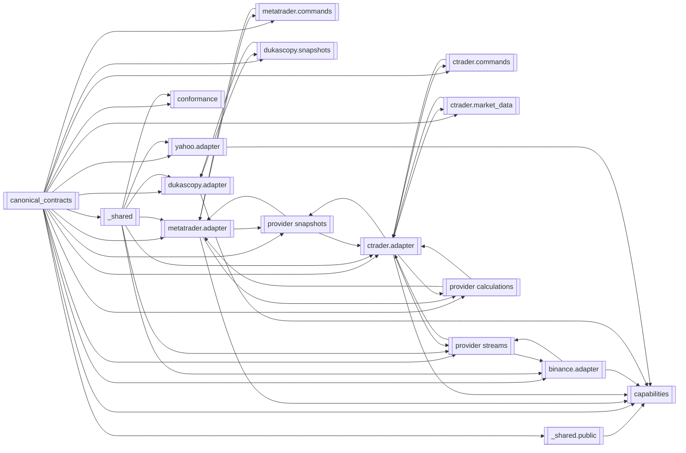
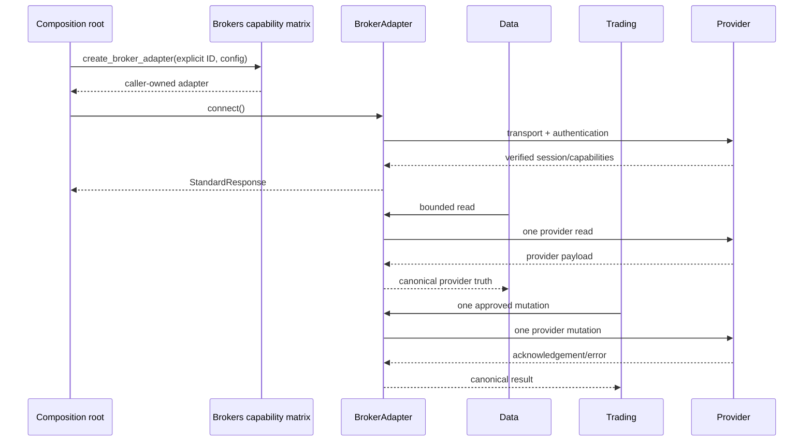

# Brokers

The immutable Broker error catalogue uses only the Utils-owned `TRANSIENT`,
`PERMANENT`, `INTEGRITY`, `POLICY`, `DATA_STALE`, and `UNKNOWN_STATE`
categories. Ambiguous mutation outcomes remain non-retryable `UNKNOWN_STATE`.

> **Package:** `app/services/brokers`
> **Status:** `Completed` — thirteen focused features (`FEAT-BRK-00`..`10`, `FEAT-BRK-17`, `FEAT-BRK-18`) are implemented with package-root APIs, tests, and numbered usage evidence. Later sim⇄live parity-programme extensions remain allocated to their owning phases.
> **Last updated:** `2026-08-15`

> This README is the package's **single source of truth** for requirements, final structure, implementation sequence, progress, usage examples, and tests.
> Update this file before changing the code.

### Current implementation evidence

The Brokers boundary and accepted provider operation groups are implemented.
Contracts enforce strict Utils request identifiers, conservative connection truth,
canonical redacted errors, and translation of provider exceptions at the public
boundary. MT5 and cTrader implement the accepted account, execution-state,
calculation, and single-target mutation operations; cTrader and Binance implement
bounded provider streams; cTrader implements market-data reads; and Dukascopy
retrieves BID candles and ticks from its keyless web-chart feed while retaining
genuine tick reads.

Every bounded public Broker operation now returns Utils-owned
`StandardResponse[T]`. The raw Broker payload remains directly in `data`; the
former Broker-specific envelope fields are retained under
`metadata.extensions`, and the former structured Broker error evidence is
retained under `error.details`. `BROKER_ERROR_CATALOG` is the single immutable
registry for all 31 `BrokerErrorCode` values.

Implementation does not imply release. `capabilities/matrix.py` requires
membership in `_RELEASED`. MT5 demo `check_order`, `place_order`, `cancel_order`,
and `close_position` are released with deterministic, provider-demo,
authenticated-permission, cleanup, reconciliation, and Owner-approval evidence.
Adapter instances downgrade those writes to `UNAVAILABLE` outside `demo`.
All other mutation operations remain unavailable, and no live-money mutation is
completion evidence.

Implementation also does not imply consumption. Data composes enabled MT5 plus the
credential-free Binance Spot, Dukascopy, and Yahoo research sources; cTrader still
requires an approved credential-aware composition path. Every source remains gated
by its Brokers-owned `*_ENABLED` flag in `docs/PROJECT.md` §6.

The completed operation groups and requirement anchors are:

| Operation group                                                                                                                                                                                                                                                                                                 | Requirement anchor                                                                | Affected providers                               | Register entry                   |
| --------------------------------------------------------------------------------------------------------------------------------------------------------------------------------------------------------------------------------------------------------------------------------------------------------------- | --------------------------------------------------------------------------------- | ------------------------------------------------ | -------------------------------- |
| Single-target mutations (`check_order`, `place_order`, `modify_order`, `cancel_order`, `modify_position`, `close_position`)                                                                                                                                                                         | `CAP-BRK-010`; `FR-BRK-033`–`038`, `FR-BRK-091`–`097`                 | MT5, cTrader                                     | `FEAT-BRK-07`, `FEAT-BRK-08` |
| Order, deal, and transaction history reads. MT5:`get_positions`, `get_position`, `get_orders`, `get_order`, `list_order_history`, `list_deal_history`, `get_deal`, `list_account_transactions`. cTrader: `get_positions`, `get_orders`, `list_order_history`, `list_deal_history` only. | `CAP-BRK-009`; `FR-BRK-027`–`032`, `FR-BRK-083`–`090`                 | MT5, cTrader                                     | `FEAT-BRK-09`                  |
| Balances and permissions reads (`get_balances`, `get_permissions`, `get_last_error`)                                                                                                                                                                                                                      | `CAP-BRK-008`; `FR-BRK-012`, `FR-BRK-014`–`018`, `FR-BRK-073`–`082` | MT5 only; peers return deterministic unsupported | `FEAT-BRK-02`                  |
| Provider-native calculations (`calculate_margin`, `calculate_profit`)                                                                                                                                                                                                                                       | `CAP-BRK-011`; `FR-BRK-039`–`041`, `FR-BRK-098`–`100`                 | MT5, cTrader                                     | `FEAT-BRK-10`                  |
| Streaming subscriptions (`subscribe_quotes`, `subscribe_bars`, `subscribe_order_book`) | `CAP-BRK-007`; `FR-BRK-026`, `FR-BRK-057`, `FR-BRK-068`–`072` | cTrader, Binance | `FEAT-BRK-03`, `FEAT-BRK-04` |
| cTrader market data (`get_symbols`, `get_symbol_info`, `get_trading_sessions`, `get_quote`, `get_spread`, `get_ticks`, `get_historical_bars`) | `CAP-BRK-005`, `CAP-BRK-006`; `FR-BRK-058`–`067` | cTrader | `FEAT-BRK-03` |
| Dukascopy historical bars (`get_historical_bars`) | `CAP-BRK-006`; `FR-BRK-063`–`067` | Dukascopy | `FEAT-BRK-05` |

The subscription runtime is exercised by Binance/cTrader adapter producers through
injected provider transports as well as by `FakeBrokerAdapter`. The catalogue
distinguishes target, implementation, and release state; capability availability
must never be inferred from SDK method presence.

| Area                 | Current state                                              | Passing evidence                                                                                                                                                                                                                                                                                                | Remaining work                                                                                                |
| -------------------- | ---------------------------------------------------------- | --------------------------------------------------------------------------------------------------------------------------------------------------------------------------------------------------------------------------------------------------------------------------------------------------------------- | ------------------------------------------------------------------------------------------------------------- |
| Contracts            | Completed                                                  | Contract, invariant, public-exception, request-ID, export, and consumer-boundary tests pass; every linked test file resolves. Result envelopes carry measured latency separated into provider and adapter components.                                                                                           | Provider fulfillment remains tracked by provider/runtime requirements and does not reopen the V1 boundary.    |
| Runtime              | Completed                                                  | Full circuit state-machine and subscription overflow/resync, idempotent unsubscribe, and terminal-failure tests pass.                                                                                                                                                                                           | None outstanding at the file level.                                                                           |
| Capability matrix/public API | Completed | Explicit immutable adapter/route traits, write-release gating, and `01_capabilities.py` pass. Adapter creation and connection composition live in `_shared/`. | None outstanding at the file level. |
| MT5                  | Completed; selected demo writes released                   | Provider-shaped tests cover lifecycle, market/account state, histories, calculations, accepted mutation outcomes, provider-reported demo classification, minimum-size placement, cancellation, and exact reconciliation.                                                                                        | Live writes and unreleased mutation operations remain excluded by release policy.                             |
| cTrader              | Completed; writes unreleased                               | Protobuf-shaped tests cover lifecycle, market data, histories, lot-size-aware calculations/mutations, bounded quotes, and correlation.                                                                                                                                                                          | Live writes are excluded by release policy.                                                                   |
| Binance              | Completed Spot baseline; public reads selectively released | REST/websocket tests cover market status, spread, snapshot-first order books, streams, ownership, cancellation, anonymous symbol reads, and canonical-to-provider kline intervals. Registry-created callers may use symbols, symbol metadata, and historical bars.                                              | Other reads, authenticated mutations, and Futures adapters remain explicitly excluded.                        |
| Dukascopy            | Completed research baseline                                | Tests cover genuine bounded web-chart ticks and BID candles with provenance.                                                                                                                                                                                                                                    | The undocumented web-chart interface may change; provider reachability remains environment-dependent.         |
| Yahoo                | Completed research baseline                                | Explicit probe-symbol configuration, non-empty probe verification, canonical interval mapping, and released historical bars with provider-shaped transport/mapping/adapter evidence pass.                                                                                                                       | None outstanding at the file level.                                                                           |
| Fake/testing utility | Completed                                                  | Complete protocol surface, deterministic fixture/error injection, bounded FIFO subscriptions with backpressure and resync, instance isolation, and the capability gate that injection cannot bypass.                                                                                                            | None outstanding at the file level.                                                                           |
| Package validation   | Completed                                                  | Contract, provider, integration, static-analysis, and 16 directly executed feature usage programs cover the accepted baseline. Each`WF-BRK-*` integration test drives a real provider adapter rather than a test double; the MT5 demo mutation suite and `SYS-WF-002` perform exact cleanup/reconciliation. | Credential-gated demo evidence remains separate from ordinary regression; non-demo writes remain fail-closed. |

### Known defects fixed during the 2026-07-21 completion review

- **Unmeasured latency (`canonical_contracts/protocols.py`, all five transports):** every
  `StandardResponse` reported `latency_ms=0.0`, `provider_latency_ms=None`, and
  `adapter_overhead_ms=0.0`, and the observability sink logged that literal zero
  as a measurement, leaving `NFR-BRK-008` and `NFR-BRK-010` unimplemented while
  marked `Completed`. Fixed by measuring total wall time at the public boundary,
  reporting provider-call time from each transport through an injected latency
  sink, and deriving adapter overhead as the remainder.
- **Mutation outcome failed open (`canonical_contracts/protocols.py`):** only `OSError`,
  `TimeoutError`, and `ConnectionError` produced `BROKER_UNKNOWN_OUTCOME` on a
  mutation path; every other exception became `BROKER_RESPONSE_INVALID` and a
  `ValueError` became `BROKER_REQUEST_INVALID`, both of which tell Trading the
  order was never sent. Fixed so only an explicit pre-transmission
  `_RequestValidationError` may claim non-transmission.
- **Provider failures misreported as caller failures (`*/mapping.py`):** an empty
  or malformed provider payload raised a plain `ValueError` and surfaced as
  `BROKER_REQUEST_INVALID`, contradicting the native-error mapping floor. Fixed
  with `_ProviderResponseError`, which maps to `BROKER_RESPONSE_INVALID`.
- **Wrong code for an unowned subscription (`binance/adapter.py`):** `unsubscribe()`
  returned `BROKER_CAPABILITY_UNSUPPORTED` instead of the specified
  `BROKER_SUBSCRIPTION_NOT_FOUND`. cTrader was already correct.
- **Test double bypassed the capability gate (`conformance/fake.py`):** the fake set
  `_ENFORCE_DECLARED_AVAILABILITY = False`, so a fixture registered against an
  `UNAVAILABLE` capability returned success — in the very double used to validate
  the gate. Removed, and the fake now opens genuine bounded FIFO subscriptions
  instead of returning raw fixtures for `subscribe_*`.
- **Capability matrix contradicted the code (`README.md`):** 18 declared targets
  were unimplemented and Dukascopy `get_historical_bars` was marked unsupported
  while the Dukascopy provider channel (`FEAT-BRK-05`) shipped it. Reconciled and locked by an executable check.

### Known defects fixed during the previous pass

- **Registry release-gate defect (`capabilities/matrix.py`):** the static capability catalogue marked every operation `UNAVAILABLE` unconditionally, including `connect`/`is_connected` — meaning no adapter created through `create_broker_adapter()` could ever connect or report its own connection state, regardless of implementation. Fixed by marking `connect`/`is_connected` `AVAILABLE` when implemented (the adapter's own verification act and a purely local state read); every other capability remains gated by credential-verified release evidence exactly as before.
- **MT5 false-success defect (`metatrader/adapter.py`):** `connect()` returned `status="success"` even when account/server verification failed via the boolean `verified` check (as opposed to a caught transport exception), because `self._last_error` was never set on that path and `_result()` derives `status` from `error` truthiness. Fixed by constructing a `BROKER_CONNECTION_FAILED` error before returning when verification fails without a caught exception.
- **MT5 released-read implementation gap (`metatrader/adapter.py`, `metatrader/mapping.py`):** the catalogue declared historical bars and spread available while MT5 inherited deterministic unsupported defaults, and mapped bars had a zero-duration window. Implemented genuine bounded latest/ranged bar reads, provider-derived bid/ask spread, optional latest-tick lookup, SDK timeframe resolution, and valid closing timestamps.
- **Yahoo zero-duration bar defect (`yahoo/mapping.py`):** every mapped bar set `closing_timestamp == opening_timestamp`, violating `BrokerBar`'s own `opening_timestamp < closing_timestamp` invariant and making every real Yahoo bar construction raise. Fixed by deriving the closing timestamp from the parsed provider interval.

Session lifecycle is the verified layer. MT5, Binance, Yahoo, cTrader, and Dukascopy have verified real connections (MT5 and cTrader against provider-confirmed demo accounts; Binance against the real testnet; Yahoo against the real Yahoo Finance service; Dukascopy against its research-only keyless web-chart endpoint). The 2026-08-10 validation returned five genuine bounded Dukascopy `EUR/USD` M1 bars and five genuine ticks, then disconnected without creating provider state. The static catalogue keeps operations without complete provider evidence unavailable, and direct unavailable calls fail before invoking the provider SDK.

---

## 1. Purpose and Boundary

### Purpose

The Brokers domain is HaruQuantAI's only direct integration boundary to real broker and market-data provider platforms. It creates caller-owned provider sessions, translates canonical requests into one provider operation, and returns structurally mapped provider truth through canonical results without business policy, persistence, enrichment, or fabricated values. Data may consume read capabilities; only Trading may consume mutation capabilities.

### Owns

- Provider adapters for MT5, cTrader, Binance Spot and registered Binance Futures profiles, Dukascopy, and Yahoo Finance.
- Explicit lazy adapter factories and a generated capability catalogue.
- Provider connection, authentication, session, keep-alive, transport recovery, and subscription lifecycle.
- Canonical broker results, errors, DTOs, enums, pages, connection events, and capability traits.
- Provider request construction from exact provider-native symbols, response decoding, structural mapping, and provider-native pagination.
- Transport-level throttling, bounded stream backpressure, adapter-local circuit breaking, latency measurement, and redacted technical logging.
- Direct provider reads and single-target mutations requested by an allowed caller.

### Does not own

- Data-source or execution-route selection, cross-provider fallback, normalization, resampling, enrichment, caching, persistence, or snapshot freshness decisions.
- Strategy evaluation, risk approval, authorization, kill-switch policy, business idempotency, execution retry policy, reconciliation, incident handling, or execution persistence.
- Credential persistence, user/database lookup, secret-vault ownership, or implicit configuration discovery.
- Synthetic prices, ticks, spreads, fills, identifiers, account state, or paper fills. Brokers also owns no simulation behavior (matching, accounting, scheduling, journals); the parity-programme simulation adapter is a pure translation layer over an injected authority port and owns no engine logic.
- Bulk cancellation, bulk closure, liquidation, averaging, multi-leg orchestration, portfolio allocation, drift detection, or rebalance planning.
- HTTP/UI DTOs, performance analytics, or any import from a higher business domain.
- Canonical/friendly market identity, provider or cross-provider alias mappings, or alias resolution. Data converts its identities to exact provider-native symbols before calling Brokers.

### Shared contracts

Contract definitions match `docs/PROJECT.md`. Commands/requests received and results/channels produced by Brokers are owned here at contract version `v1`.

**Owned by this domain** — defined authoritatively here:

| Status    | Contract                                                                                     | Version | Counterparty                | Purpose                                                                                                                                 |
| --------- | -------------------------------------------------------------------------------------------- | ------- | --------------------------- | --------------------------------------------------------------------------------------------------------------------------------------- |
| Completed | `BrokerAdapter` and capability traits                                                      | `v1`  | Data; Trading               | Canonical async provider session and operation boundary.                                                                                |
| Completed | `BrokerConnectionConfig`                                                                   | `v1`  | Composition root → Brokers | Immutable provider, account, environment, resolved in-memory credentials, timeout, reconnect, stream-buffer, and circuit-breaker input. |
| Completed | Broker response extensions and error taxonomy                                                | `v1`  | Data; Trading               | Brokers-owned extension mapping and approved error semantics carried by Utils-owned`StandardResponse[T]`.                             |
| Completed | Canonical broker DTO/event family (nested in`BrokerAdapter`)                               | `v1`  | Data; Trading               | Provider-neutral structural schemas for accepted reads, mutations, calculations, and events.                                            |
| Completed | `BrokerFeatureFlags` / capability catalogue (nested in `BrokerAdapter`)                  | `v1`  | Data; Trading               | Complete runtime capability and verification report.                                                                                    |
| Completed | `BrokerSubscription` and connection/subscription event types (nested in `BrokerAdapter`) | `v1`  | Data; Trading               | Bounded connection and provider-event channels without SDK-object leakage.                                                              |

Every registered Brokers contract or concrete DTO carries `contract_version="v1"`
separately from a stable namespaced `schema_id` (`brokers.adapter.v1`,
`brokers.connection_config.v1`, `brokers.error.v1`, or the
concrete DTO/event schema ID). Consumers never parse `schema_id` for compatibility.

**Consumed from other domains** — referenced only:

| Contract                                  | Version                        | Owner | Used for                                                                                                                 |
| ----------------------------------------- | ------------------------------ | ----- | ------------------------------------------------------------------------------------------------------------------------ |
| `StandardResponse[T]`                   | `v1`                         | Utils | Common five-field bounded-operation envelope, monotonic execution timing, side-effect metadata, and extension container. |
| Correlation/request ID capability         | N/A (shared capability)        | Utils | Trace every adapter operation and technical event.                                                                       |
| UTC-first time policy                     | N/A (shared policy)            | Utils | Canonical UTC completion, event, and provider timestamps.                                                                |
| Secret redaction policy                   | N/A (shared policy)            | Utils | Redact credentials, tokens, private keys, and full account identifiers.                                                  |
| Structured logging capability             | N/A (shared capability)        | Utils | Emit lifecycle, call, error, subscription, and acknowledgement logs.                                                     |
| Base error types and error-routing policy | N/A (shared capability/policy) | Utils | Preserve shared exception boundaries and route canonical operational failures without leaking secrets.                   |

### Persisted state

Brokers owns five durable operational/reference tables: `broker_symbol_map`, `broker_health_history`, `broker_route_recovery`, `broker_environment_permissions`, and `broker_event_checkpoints`. It persists no credential, reusable market-data payload, or invented order/fill/position state. `migrations/` and `persistence/` are the two conformant support packages of one Brokers persistence concern: the former owns immutable schema evolution, while the latter owns the exact five-file runtime CRUD boundary. The migration manifest runs through Data's verified ledger, checksum, write-lock, and transaction boundary. Package-root feature operations provide production reachability. Live session and SDK state remains bounded, in memory, adapter-instance scoped, and is discarded at disconnect.

### Sim⇄live parity programme boundaries

The approved sim⇄live parity programme (`docs/dev/sim-live-parity-implementation-plan.md`) declares the following Brokers boundaries. None is implemented in the current registry; each lands with its owning requirement in the programme's phases and is registered here as the binding design.

- **Current typed provider specification snapshot.** Brokers will own a typed, versioned current `ProviderSpecificationSnapshot` — execution/order/filling/expiration/GTC modes, stops and freeze levels, directional volume limit, calculation mode, margin and swap evidence, account permissions, and instrument scalars — carrying provider/server/environment/account identity, `observed_at`, retrieval provenance, and checksum. It states **current observation only**: it never invents historical effective bounds, dynamic commission/fee evidence stays a separate typed reference rather than a guessed static rate, and missing required fields fail closed. Immutable effective-dated history is owned by Data's `FEAT-DATA-02` extension; Simulation never interprets raw MT5 metadata.
- **Simulation adapter boundary.** Brokers will own the simulation broker channel: `BrokerId.SIM` plus `BrokerEnvironment.SIMULATION`, registered through the exact factory pair and mirroring MT5 only. The adapter is a socket-free translation layer over an injected, structurally typed Brokers-owned authority port (`SimulationAuthorityPort`) whose signatures reference no Simulation symbol; Brokers imports nothing from `app.services.simulator`. Brokers owns DTO/error mapping, capabilities, and lifecycle; matching, accounting, scheduling, and journals remain Simulation-owned, and unimplemented operations return canonical `BROKER_CAPABILITY_UNSUPPORTED`.
- **Statelessness.** The simulation adapter owns no matching, accounting, order-state, or business state. All authority values arrive through the injected port already authoritative and are mapped, never recomputed; the adapter remains invocation-local and holds no durable simulation state.
- **Demo-only fixture collection.** Provider conformance and calculation fixture collection is a write-scoped, separately approved demo-only operation (guarded to `ENVIRONMENT=dev` plus a demo account) and never runs in the default suite; the default suite replays immutable sanitized fixtures offline. Simulation receives immutable fixture artifacts and never invokes collection.
- **Connection lifecycle.** The simulation channel mirrors the admitted Brokers connection lifecycle through port-backed state — connect, disconnect, reconnect, ping/status, connection events, and session finalization — returning the same canonical lifecycle states and failures, blocking mutations while disconnected, and opening no socket or external connection.
- **Clock-injection prerequisite.** MT5 mapping timestamp sites (including `_map_quote`/`_map_tick` in `metatrader/mapping.py`) currently read the ambient UTC clock. Before the simulation adapter reuses MT5 mapping, every such site must accept an injected clock with the live aware-UTC clock as its default (programme Phase 11a); simulated reads then bind simulated observation time instead of wall-clock time.
- **Capability-intersection rule.** Parity capability is the published intersection between the provider's verified operations and the simulation adapter's admitted surface. The intersection may tighten with each envelope version; missing MT5 operations are never falsely advertised as mirrored or normalized away, and an unsupported read or mutation is never returned as an empty success.

### `SimulationAuthorityPort` — declared protocol design (programme Phase 3a; implemented as `FR-BRK-172` in Phase 10a)

Phase 10a implements this protocol and its lifecycle subset as `FR-BRK-172`;
Phase 11b extends admitted reads, Phase 12 mutations, and Phase 17b deals.

**Identity and isolation.** `SimulationAuthorityPort` is a Brokers-owned
structural `typing.Protocol` (`@runtime_checkable`) defined inside
`app/services/brokers/`. It references no Simulation symbol — no import, no
string annotation, no naming convention from `app.services.simulator` — and
Brokers imports nothing from Simulation in either direction of the contract.
Any object satisfying the structure (including test doubles) is an acceptable
port instance; Simulation constructs and injects the implementation. The port
carries an injected simulated clock; no method may read an ambient wall clock,
and no method carries matching, accounting, sizing, or any business semantics —
the port is a delegation surface only.

**Method signatures.** Names, arguments, and result envelopes mirror the
canonical `BrokerAdapter` surface in `canonical_contracts/protocols.py` verbatim
so the simulation adapter reuses the same live MT5 mapping and
standard-response classification path:

| Group | Port methods (canonical signatures) | Returns | Implemented in |
| --- | --- | --- | --- |
| Admitted reads | `get_symbols`, `get_symbol_info(symbol)`, `get_quote(symbol)`, `get_spread(symbol)`, `get_ticks(...)`, `get_historical_bars(...)`, `get_account_info()`, `get_balances()`, `get_permissions()`, `get_positions(filter, cursor, limit)`, `get_position(position_id)`, `get_orders(filter, cursor, limit)`, `get_order(order_id)`, `list_order_history(start, end, symbol, cursor, limit)` | Canonical `StandardResponse[...]` DTO values whose ledger numbers arrive **already authoritative** from the authority and are mapped, never recomputed; every read binds source sequence, provider observation time, receive/availability time, and the injected simulated clock | Phase 11b |
| Specification projection | `get_symbol_info(symbol)` is backed by the Phase 4a typed **current** provider specification snapshot, never by raw MT5 metadata | `BrokerSymbolInfo` | Phase 11b |
| Mutations | `check_order(BrokerOrderRequest)`, `place_order(BrokerOrderRequest)`, `modify_order(BrokerOrderModificationRequest)`, `cancel_order(order_id, client_request_id=None)`, `modify_position(BrokerPositionModificationRequest)`, `close_position(BrokerPositionCloseRequest)`, `reduce_position(BrokerPositionReductionRequest)` | An MT5 `OrderSendResult`-shaped internal payload that the adapter maps through the same live MT5 mapping and classification; only verified retcode/error pairs are mapped | Phase 12 |
| Deal surface | `list_deal_history(start, end, symbol, cursor, limit)`, `get_deal(deal_id)`, `list_account_transactions(start, end, cursor, limit)` | Canonical page/deal/transaction values over bounded ranges only | Phase 17b |
| Lifecycle | `connect()`, `disconnect()`, `reconnect()`, `is_connected()`, `get_connection_status()`, `ping()`, `connection_events()`, plus the one sim-specific extension `finalize_session()` for run-scoped teardown | Canonical lifecycle states, statuses, and event streams | Phase 10a |

**Explicitly not on the port.** `get_trading_sessions` (MT5 sessions come from
Data's explicit revisioned weekly definitions — programme decision D9);
`subscribe_*`/`unsubscribe` streaming operations (the simulation channel has no
provider stream); `replace_order` and `attach_protection` (outside the admitted
MT5 mirroring surface until evidenced); and every `CalculationProvider`
operation (the Phase 13b local calculation model replaces provider calls —
decision D5). Unsupported operations return canonical
`BROKER_CAPABILITY_UNSUPPORTED` and never an empty success.

**Lifecycle state contract.** Port-backed adapter states mirror the admitted
canonical lifecycle (`DISCONNECTED`, `CONNECTING`, `READY`, `DEGRADED`,
`CLOSING`, `FAILED`); mutations are blocked while disconnected; connection
events are deterministic and port-supplied; `finalize_session()` completes
run-scoped teardown without external side effects.

**Binding test specifications (created by the owning phases, not here).**
Phase 10a creates `tests/brokers/unit/simulation/test_simulation_lifecycle.py`,
`tests/brokers/unit/simulation/test_simulation_isolation.py` (containing the
standing regression `test_simulation_adapter_import_graph_is_acyclic`),
`tests/brokers/integration/test_simulation_factory.py`,
`tests/brokers/integration/test_simulation_conformance.py`, and
`tests/brokers/usage/features/17_simulation.py`; Phases 11b/12/17b add their
named read, mutation, and deal tests to the same feature.

### Four-level structure

| Code level                          | Represents                                                                   |
| ----------------------------------- | ---------------------------------------------------------------------------- |
| **Package**                   | Brokers domain                                                               |
| **Module folder**             | One broker capability or provider integration                                |
| **File**                      | One focused contract, factory, transport, mapping, or adapter responsibility |
| **Class / function / method** | One observable broker requirement                                            |

```text
Package
└── Module folder
    └── File
        └── Class / Function / Method
```

### Package capability map


```mermaid
flowchart TD
    BRK[[Brokers]]
    BRK --> C[[contracts]]
    BRK --> RT[[runtime]]
    BRK --> R[[registry]]
    BRK --> M[[mt5]]
    BRK --> CT[[ctrader]]
    BRK --> B[[binance]]
    BRK --> D[[dukascopy]]
    BRK --> Y[[yahoo]]
    BRK --> T[[testing]]

    C --> C1[enums.py: canonical values]
    C --> C2[models.py: canonical DTOs]
    C --> C3[protocols.py: capability contracts]
    RT --> RT1[circuit breaker and bounded subscriptions]
    R --> R1[catalogue.py: capability declarations]
    R --> R2[factory.py: explicit lazy resolution]
    M --> M1[transport, mapping, adapter]
    CT --> CT1[transport, mapping, adapter]
    B --> B1[profiles, transport, mapping, adapter]
    D --> D1[instruments, transport, mapping, adapter]
    Y --> Y1[transport, mapping, adapter]
    T --> T1[fake.py: deterministic test adapter]
```

---

## 2. Final Package Structure

The tree below defines the final layout. The following table is the sole normative implementation order; feature section numbers are reference identifiers, not an alternate order.

### Feature Registry

| Status    | Feature                                                   | Owning module              | Public API and contracts                                                      | Requirements                               | Usage evidence                                             |
| --------- | --------------------------------------------------------- | -------------------------- | ----------------------------------------------------------------------------- | ------------------------------------------ | ---------------------------------------------------------- |
| Completed | `FEAT-BRK-00` Instrument and Venue Profiles | `instrument_profiles/` | `build_instrument_venue_profile`, `parse_instrument_venue_profile`, and current/reverse/as-of symbol resolution | `FR-BRK-142`–`FR-BRK-144`, `FR-BRK-147` | `tests/brokers/usage/features/00_instrument_profiles.py` |
| Completed | `FEAT-BRK-01` Adapter Capability Matrix | `capabilities/` | `get_broker_capability_catalogue`; socket-free `get_broker_dashboard_snapshot` | `FR-BRK-010`, `FR-BRK-011`, `FR-BRK-103`, `FR-BRK-133` | `tests/brokers/usage/features/01_capabilities.py` |
| Completed | `FEAT-BRK-02` MetaTrader Direct Broker Channel | `metatrader/` | Direct health, snapshots, streams, calculations, commands, revisioned snapshot-symbol demand, and explicit v2 order-policy mapping through `build_broker_order_request_v2` | MetaTrader requirements in Sections 4.3 and 4.10; `FR-BRK-152`–`FR-BRK-158`, `FR-BRK-164`–`FR-BRK-166` | `tests/brokers/usage/features/02_metatrader.py` |
| Completed | `FEAT-BRK-03` cTrader Direct Broker Channel | `ctrader/` | Direct health, snapshots, streams, calculations, and commands | cTrader requirements in Sections 4.4 and 4.10 | `tests/brokers/usage/features/03_ctrader.py` |
| Completed | `FEAT-BRK-04` Binance Direct Broker Channel | `binance/` | Direct health, snapshots, streams, and explicit command exclusions | Binance requirements in Sections 4.5 and 4.10 | `tests/brokers/usage/features/04_binance.py` |
| Completed | `FEAT-BRK-05` Dukascopy Direct Broker Channel | `dukascopy/` | Direct health, tick/bar snapshots, and explicit command exclusions | Dukascopy requirements in Sections 4.6 and 4.10 | `tests/brokers/usage/features/05_dukascopy.py` |
| Completed | `FEAT-BRK-06` Yahoo Direct Broker Channel | `yahoo/` | Direct health, historical snapshots, and explicit command exclusions | Yahoo requirements in Sections 4.7 and 4.10 | `tests/brokers/usage/features/06_yahoo.py` |
| Completed | `FEAT-BRK-07` Authoritative Reads and Route Discipline | `reconciliation/` | Route plans, read/recovery fallback, unknown-outcome reconciliation, and recovery cursors | `FR-BRK-136`–`FR-BRK-138`, `FR-BRK-149` | `tests/brokers/usage/features/07_reconciliation.py` |
| Completed | `FEAT-BRK-08` Simulation and Live Isolation | `environment_guards/` | Default-deny provider/account/environment permissions | `FR-BRK-139`, `FR-BRK-150` | `tests/brokers/usage/features/08_environment_guards.py` |
| Completed | `FEAT-BRK-09` Broker Event Normalization | `events/` | Ordered, deduplicated event envelopes and source checkpoints | `FR-BRK-151` | `tests/brokers/usage/features/09_events.py` |
| Completed | `FEAT-BRK-10` Adapter Contract Test Kit | `conformance/` | Reusable conformance suite and deterministic adapter fixture | `FR-BRK-109` | `tests/brokers/usage/features/10_conformance.py` |
| Completed | `FEAT-BRK-17` Simulation Broker Channel | `simulation/` | Exact `sim`/`simulation` factory, socket-free authority injection, canonical lifecycle/finalization, and capability intersection | `FR-BRK-167`–`FR-BRK-172` | `tests/brokers/usage/features/17_simulation.py` |
| Completed | `FEAT-BRK-18` Provider Specification Snapshots | `specifications/` | `build_provider_specification_snapshot`, `parse_provider_specification_snapshot`, `dump_provider_specification_snapshot`, `get_provider_specification_snapshot_field`, `verify_provider_specification_snapshot`, `get_broker_provider_specification` | `FR-BRK-159`–`FR-BRK-163` | `tests/brokers/usage/features/18_specifications.py` |

Each registered feature owns exactly one production folder and exactly one numbered standalone usage program. Provider facade classes compose private focused files; unreleased writes remain unreachable through public release policy. The registry holds **thirteen** completed features, `FEAT-BRK-00` through `FEAT-BRK-10`, `FEAT-BRK-17`, and `FEAT-BRK-18`. IDs `FEAT-BRK-11` through `FEAT-BRK-16` are retired from current-state registration after their behavior moved into provider channels, Events, Reconciliation, and Conformance. `canonical_contracts/` and `_shared/` are documented non-feature support and own no independent feature behavior.

#### Explicit order-policy v2 requirements

Broker order request v2 preserves Trading's independent fill and lifetime dimensions and binds
them to the exact provider-specification checksum. V1 remains available during the declared
migration window. The MT5 v2 path never substitutes symbol defaults; unsupported `BOC` fails
before transport because the verified snapshot vocabulary does not admit it.

| Status | Requirement | Public contract | Evidence |
| --- | --- | --- | --- |
| Completed | `FR-BRK-164` Brokers shall accept immutable order request v2 with independent fill/time policy and conditional aware-UTC expiration. | `build_broker_order_request_v2` | `app/services/brokers/canonical_contracts/models.py`; `tests/brokers/integration/test_order_policy_v2_adapter.py`; `tests/brokers/usage/features/02_metatrader.py::fr_brk_164()` |
| Completed | `FR-BRK-165` MT5 shall map fill and time policies through independent verified constant tables and never substitute a symbol preference. | MT5 order command mapping | `app/services/brokers/metatrader/commands.py`; `tests/brokers/unit/test_order_policy_v2_mapping.py`; `tests/brokers/usage/features/02_metatrader.py::fr_brk_165()` |
| Completed | `FR-BRK-166` Unsupported/tampered combinations shall fail before transport while v1 remains available in the shared release window. | Provider-bound v2 factory | `app/services/brokers/canonical_contracts/public.py`; `tests/brokers/unit/test_order_policy_v2_mapping.py`; `tests/brokers/usage/features/02_metatrader.py::fr_brk_166()` |

#### Simulation channel requirements

| Status | Requirement | Public contract | Evidence |
| --- | --- | --- | --- |
| Completed | `FR-BRK-167` Brokers shall register stable `sim` and `simulation` identities. | `get_broker_id`, `get_broker_environment` | `app/services/brokers/canonical_contracts/enums.py`; `tests/brokers/unit/simulation/test_simulation_isolation.py`; `tests/brokers/usage/features/17_simulation.py::fr_brk_167()` |
| Completed | `FR-BRK-168` The factory shall admit only the exact simulation identity/environment pair with an injected authority. | `create_simulation_broker_adapter` | `app/services/brokers/_shared/factory.py`; `tests/brokers/integration/test_simulation_factory.py`; `tests/brokers/usage/features/17_simulation.py::fr_brk_168()` |
| Completed | `FR-BRK-169` Brokers shall publish an exhaustive, fail-closed simulation capability intersection. | `get_broker_capability_catalogue` | `app/services/brokers/capabilities/matrix.py`; `tests/brokers/integration/test_simulation_conformance.py`; `tests/brokers/usage/features/17_simulation.py::fr_brk_169()` |
| Completed | `FR-BRK-170` The simulation channel shall mirror connect, disconnect, reconnect, ping/status, ordered events, and run finalization while blocking session-required behavior when disconnected. | canonical lifecycle functions; `finalize_simulation_broker_session` | `app/services/brokers/simulation/adapter.py`; `tests/brokers/unit/simulation/test_simulation_lifecycle.py`; `tests/brokers/usage/features/17_simulation.py::fr_brk_170()` |
| Completed | `FR-BRK-171` The simulation channel shall open no socket, require no credentials, and import no Simulation symbol. | `create_simulation_broker_adapter` | `app/services/brokers/simulation/adapter.py`; `tests/brokers/unit/simulation/test_simulation_isolation.py`; `tests/brokers/usage/features/17_simulation.py::fr_brk_171()` |
| Completed | `FR-BRK-172` Brokers shall own a structural authority protocol with canonical adapter signatures and run finalization, while owning no matching or accounting. | `SimulationAuthorityPort` (private contract) | `app/services/brokers/simulation/contracts.py`; `tests/brokers/integration/test_simulation_factory.py`; `tests/brokers/usage/features/17_simulation.py::fr_brk_172()` |

The Phase-10a simulation intersection is exactly `connect`, `disconnect`,
`reconnect`, `is_connected`, `get_connection_status`, `ping`, `get_last_error`,
`connection_events`, `get_feature_flags`, and `supports`. Every other canonical
operation is declared unavailable and returns `BROKER_CAPABILITY_UNSUPPORTED`;
later phases may extend this list only with their own requirement evidence.

| Order | Feature                    | File order                                                                                                                                        |
| ----: | -------------------------- | ------------------------------------------------------------------------------------------------------------------------------------------------- |
|     1 | `instrument_profiles/` | `profiles.py` → `symbols.py` → `__init__.py` |
|     2 | `capabilities/`          | `matrix.py` → `dashboard.py` → `__init__.py` |
|     3 | `_shared/`       | `errors.py` → `circuit_breaker.py` → `subscription.py` → `base.py` → `factory.py` → `connections.py` → `public.py` → `__init__.py` |
|     3 | `metatrader/`           | `transport.py` → `mapping.py` → `adapter.py` → `__init__.py`                                                                           |
|     4 | `metatrader/` | `commands.py`, `snapshots.py`, `calculations.py` → `adapter.py` → `__init__.py` |
|     5 | `ctrader/`       | `transport.py` → `network.py` → `mapping.py` → `adapter.py` → `__init__.py`                                                         |
|     6 | `ctrader/` | `commands.py`, `snapshots.py`, `streams.py`, `market_data.py`, `calculations.py` → `adapter.py` → `__init__.py` |
|     7 | `ctrader/` | `sessions.py` → `market_data.py` → `adapter.py` → `__init__.py` |
|     8 | `binance/`       | `profiles.py` → `transport.py` → `mapping.py` → `adapter.py` → `__init__.py`                                                        |
|     9 | `dukascopy/`       | `instruments.py` → `mapping.py` → `candle_mapping.py` → `transport.py` → `candle_transport.py` → `adapter.py` → `__init__.py` |
|    10 | `dukascopy/` | `snapshots.py` → `adapter.py` → `__init__.py` |
|    11 | `yahoo/`         | `transport.py` → `mapping.py` → `adapter.py` → `__init__.py`                                                                           |
|    12 | provider channel snapshot files     | `mt5.py` → `ctrader.py` → `__init__.py`                                                                                                   |
|    13 | provider stream files and `events/`         | `binance.py` → `ctrader.py` → `__init__.py`                                                                                               |
|    14 | provider channel calculation files | `mt5.py` → `ctrader.py` → `__init__.py`                                                                                                   |
|    16 | `conformance/`               | `fake.py` → `public.py` → `__init__.py` |
|    17 | `reconciliation/`      | `plans.py` → `failover.py` → `public.py` → `__init__.py` |

Standalone public functions live with their owning feature. Contract builders and
value accessors live in `canonical_contracts/public.py`; generic adapter delegation
lives in `_shared/public.py`; fake-adapter controls live in
`conformance/public.py`; connection construction lives in
`_shared/connections.py`; and route-plan behavior lives in
`reconciliation/`. The package root only re-exports those functions.

```text
brokers/
├── __init__.py                         # Function-Only Public Surface (143 standalone functions in __all__)
├── README.md
├── canonical_contracts/                # Non-feature support — shared enums, DTOs, responses, protocols
│   ├── __init__.py
│   ├── enums.py                        # Broker IDs, environments, states, errors
│   ├── models.py                       # Results, pages, requests, DTOs, events
│   ├── error_catalog.py                # Immutable BROKER_ERROR_CATALOG registry
│   ├── responses.py                    # Lossless standard Broker response construction
│   ├── protocols.py                    # Focused capability protocols and composite adapter
│   ├── unsupported.py                  # Private deterministic unsupported-result helper
│   └── public.py                       # Function-only contract builders and accessors
├── instrument_profiles/                # FEAT-BRK-00 — instrument and venue profiles
│   ├── __init__.py                     # Internal feature boundary
│   ├── profiles.py                     # InstrumentVenueProfile v1 build/parse
│   └── symbols.py                      # Current, reverse, and as-of symbol reads
├── capabilities/                       # FEAT-BRK-01 — immutable adapter capability matrix
├── _shared/                    # Support — adapter construction, connections, and transport mechanics
│   ├── __init__.py                     # No public exports
│   ├── errors.py                       # Private canonical transport-control exceptions
│   ├── circuit_breaker.py              # Closed/open/half-open transport breaker
│   ├── subscription.py                 # Bounded FIFO async subscription handle
│   ├── base.py                         # Invocation-local lifecycle and fail-closed adapter base
│   └── public.py                       # Function-only adapter delegation
├── metatrader/                        # FEAT-BRK-02 — MT5 session lifecycle and account reads
│   ├── __init__.py
│   ├── transport.py                    # Blocking terminal/session isolation
│   ├── mapping.py                      # MT5 object to canonical DTO mapping
│   └── adapter.py                      # MT5BrokerAdapter
├── ctrader/                    # FEAT-BRK-03 — cTrader session lifecycle
│   ├── __init__.py
│   ├── transport.py                    # Request correlation over an async sender
│   ├── network.py                      # Real Twisted-reactor Spotware client (sender)
│   ├── mapping.py                      # Protobuf to canonical DTO mapping
│   └── adapter.py                      # CTraderBrokerAdapter
├── binance/                    # FEAT-BRK-04 — immutable Binance product profiles
│   ├── __init__.py
│   ├── profiles.py                     # Spot and registered Futures declarations
│   ├── transport.py                    # REST/WebSocket provider calls
│   ├── mapping.py                      # Binance payload to canonical DTO mapping
│   └── adapter.py                      # BinanceBrokerAdapter
├── dukascopy/                    # FEAT-BRK-05 — read-only Dukascopy web data
│   ├── __init__.py
│   ├── instruments.py                  # Exact provider-native instrument declarations
│   ├── transport.py                    # Bounded web-chart tick retrieval
│   ├── candle_transport.py             # Keyless web-chart BID candle pagination
│   ├── mapping.py                      # Web-chart rows to canonical ticks
│   ├── candle_mapping.py               # Web-chart rows to canonical BID bar mapping
│   └── adapter.py                      # DukascopyBrokerAdapter
├── yahoo/                      # FEAT-BRK-06 — read-only Yahoo historical bars
│   ├── __init__.py
│   ├── transport.py                    # Yahoo provider retrieval
│   ├── mapping.py                      # Provider bars to canonical DTO mapping
│   └── adapter.py                      # YahooBrokerAdapter
│   ├── __init__.py
│   ├── catalogue.py                    # Single static capability declaration source
│   ├── factory.py                      # Explicit adapter creation and listing
│   ├── connections.py                  # Broker-owned non-production connection resolution
│   └── symbol_map.py                   # Production symbol-map CRUD operations
├── conformance/                            # FEAT-BRK-10 — adapter contract test kit
│   ├── __init__.py
│   ├── conformance.py                  #  — one reusable adapter conformance suite
│   ├── fake.py                         # FakeBrokerAdapter
│   └── public.py                       # Function-only fake-adapter controls
├── reconciliation/                   # FEAT-BRK-07 — health-aware primary/backup route discipline
│   ├── __init__.py
│   ├── plans.py                        # RoutePlan v1 build/parse (FR-BRK-136)
│   ├── failover.py                     # FailoverDecision v1 build/parse (FR-BRK-137/138)
│   └── public.py                       # Function-only package-root wrappers
├── migrations/                         # Support — immutable broker_symbol_map schema (see migrations/README.md)
│   ├── __init__.py
│   ├── definitions.py                  # Single additive migration step with stable checksum
│   └── public.py                       # Lazy public migration runner
└── persistence/                        # Support — bounded symbol-map statements via Data (see persistence/README.md)
    ├── __init__.py                     # Internal export boundary
    ├── create.py                       # INSERT one bitemporal mapping
    ├── read.py                         # Forward/reverse/as-of bounded reads
    ├── update.py                       # Close/disable mappings; never rewrite history
    └── delete.py                       # Empty verb; mappings are closed, never deleted
```

### Module dependency diagram

Arrows point from the required module to its consumer.


```mermaid
flowchart LR
    C[[canonical_contracts]]
    RT[[_shared]]
    OPS[[_shared.public]]
    R[[capabilities]]
    M[[metatrader.adapter]]
    MM[[metatrader.commands]]
    CT[[ctrader.adapter]]
    CM[[ctrader.commands]]
    CMD[[ctrader.market_data]]
    B[[binance.adapter]]
    D[[dukascopy.adapter]]
    DB[[dukascopy.snapshots]]
    Y[[yahoo.adapter]]
    EH[[provider snapshots]]
    PS[[provider streams]]
    PC[[provider calculations]]
    T[[conformance]]

    C --> OPS
    C --> RT
    C --> M & MM & CT & CM & CMD
    C --> B & D & DB & Y
    C --> EH & PS & PC & T
    RT --> M & CT & B & D & Y
    RT --> PS & T
    M --> MM & EH & PC
    CT --> CM & CMD & EH & PS & PC
    B --> PS
    D --> DB
    MM & EH & PC --> M
    CM & CMD & EH & PS & PC --> CT
    PS --> B
    DB --> D
    OPS --> R
    C --> R
    M & CT & B & D & Y --> R
```

The `_shared` factory imports provider adapters lazily. No provider module imports another provider. Provider adapters consume `_shared`; `_shared` consumes `canonical_contracts` only. Each provider channel owns its health, snapshot, command, mapping, and transport requirements, and every feature package exposes no public symbols. The package root remains the sole public boundary.

### Structure rules

- The Python package root contains only the sole public boundary `__init__.py`; documentation remains in `README.md`, and all production behavior resides in feature or documented support folders.
- Public consumers import only from `app.services.brokers`; contracts, DTOs, enums, protocols, and provider implementation modules are internal.
- `canonical_contracts` is documented non-feature support. It depends only on the standard library, Pydantic's `SecretStr`, and Utils-owned shared policies; it imports no provider SDK and owns no provider or profile behavior.
- `instrument_profiles` owns profile policy and symbol identity reads; it depends on shared Broker contracts, private Brokers persistence, and Utils-owned integrity utilities.
- `_shared` contains only adapter-local transport mechanics and owns no provider, business, or persistent state.
- Each provider exposes one adapter class and keeps transport/mapping helpers private; feature folders expose no public symbols and are composed only by their owning provider adapter.
- Provider SDK objects, protobuf messages, terminal handles, sockets, and exceptions never cross the package boundary.
- Usage examples live under `tests/brokers/usage/`: exactly one standalone
  numbered program for each registered feature, `FEAT-BRK-00` through
  `FEAT-BRK-10`. Programs use a main guard and bounded secret-safe inputs. Each
  provider-backed program resolves a genuine adapter through the public factory,
  establishes only an enabled demo/testnet/sandbox session, exercises bounded
  released reads, and closes the session deterministically. Unreleased and
  unsupported operations assert their exact canonical fail-closed result instead
  of claiming false success. Usage programs reject live environments and never
  transmit broker mutations. `FEAT-BRK-10` is the sole fake-adapter exception
  because deterministic fake behavior is the capability under demonstration;
  contract and registry programs remain network-free because their requirements
  do not establish provider sessions.
- No synchronous or strict-exception façade, manager, repository, service layer, or provider extension API is part of the initial package.

### Package root public API

`app/services/brokers/__init__.py` is the sole cross-domain boundary and its `__all__` contains only standalone functions. Broker contracts, DTOs, enums, protocols, and provider classes remain internal.

The historical export enumeration below is superseded by this function-only
boundary. Cross-domain callers create opaque connection/adapter values through
root builders and factories, invoke root operations, and read required facts via
the documented connection, adapter, and feature-flag getter functions.

`build_broker_value(value_type, **fields)` is the documented function-only
constructor for the opaque contract values registered in
`canonical_contracts/public.py::_BROKER_VALUE_TYPES`; supported names are `account_info`,
`account_transaction`, `balance`, `bar`, `connection_config`,
`connection_status`, `deal`, `error`, `feature_flags`, `margin_request`,
`market_status`, `order`, `order_book`, `order_check`, `order_filter`,
`order_modification_request`, `order_request`, `order_result`, `page`,
`permissions`, `platform_info`, `position`, `position_close_request`,
`position_filter`, `position_modification_request`, `profit_request`, `quote`,
`subscription_info`, `symbol_info`, `tick`, and `trading_session`.
`get_broker_value_field(value, field_name)` is the sole documented way for an
external caller to read a non-private fact from one of those opaque values.
Constants are supplied as validated strings to the root builders and operations;
Broker enums, protocols, classes, DTOs, and provider implementations are never
public imports.
Where an opaque canonical identifier is required, callers use
`get_broker_id`, `get_broker_environment`, `get_broker_capability_id`, or
`get_broker_error_code`; no enum constant is public.

Broker credential interpretation and standalone connection are owned by Brokers;
UI/API composition reads database-backed provider enablement, resolves encrypted
system credential slots, and injects one short-lived Brokers-owned connection
configuration. Standalone usage programs use that same composition boundary and
never invoke the default-only Utils settings loader.
`resolve_provider_connection_config(broker_id, *, settings=None, ...)` resolves a
governed non-production `BrokerConnectionConfig` from the public
opaque settings value returned by `load_broker_provider_settings` (read from
database-backed composition via the Utils settings layer); it rejects disabled
providers, missing credentials, and any live environment before an adapter is
built. `create_connected_broker(broker_id, *, settings=None, connect=True)` builds
and (by default) connects that adapter, so cross-domain callers (the Data
composition root and usage examples) select a provider route only and never read
credentials or open connections directly.

- FR-BRK-001–005 enums;
- FR-BRK-006–042 canonical models/results;
- FR-BRK-043–047 and FR-BRK-112 capability/subscription protocols;
- FR-BRK-101–103 capability/runtime functions;
- FR-BRK-104–108 approved adapter types.

The registered features add the following function-only
cross-domain contract transport and safe-order extensions to the public
surface: `build_instrument_venue_profile`/`parse_instrument_venue_profile`,
`build_broker_health`/`parse_broker_health`,
`build_broker_account_snapshot`/`parse_broker_account_snapshot`,
`build_broker_reconciliation_snapshot`/`parse_broker_reconciliation_snapshot`,
`build_broker_unknown_result`/`is_broker_unknown_result`/
`enforce_no_blind_resubmission`, `attach_broker_protection`/
`reduce_broker_position` and their request builders,
`normalize_broker_event_envelope`/`classify_broker_event`,
`build_broker_route_plan`/`parse_broker_route_plan` and
`build_broker_failover_decision`/`parse_broker_failover_decision`
(`FEAT-BRK-07`), and the enum getters `get_broker_uncertainty`/
`get_broker_resubmission_policy`. Each versioned contract travels as a validated
JSON-safe mapping behind its `build_*`/`parse_*` pair (settled decision D-1).

The root file itself is assigned FR-BRK-135. Private helper/export requirements FR-BRK-110–111 and FR-BRK-113–134 do not add root exports unless explicitly stated above.

`create_fake_broker_adapter()` is the only public deterministic-test entry point.
Provider and fake-adapter classes are internal, including in Broker integration
tests; callers receive opaque values from root factories and invoke root
functions. Root initialization performs no provider import until a root factory
is called, and performs no selection, connection, mapping, or business logic.

### Explicit exclusions

- Removed V1 surfaces: implicit active-broker routing, unknown-to-MT5 fallback, broken broker-owned simulator routing, credential/database helpers, broker-owned data envelopes, Yahoo synthetic ticks, cTrader fabricated values/success, raw SDK delegation, `MT5Api`, private cross-domain loaders, and singleton-only lifecycle.
- Explicit Exclusion: Economic calendar web scraping (ForexFactory, MetalsMine, EnergyExch, CryptoCraft) is delegated to the `DATA` domain (`services.data.calendar`) and is excluded from the Brokers connection adapters.
- Rejected/simplified V2 surfaces: strict exception façade, universal ten-state lifecycle, version fields on every nested DTO, per-bar timezone evidence duplication, and an unverified universal p99 mapping target below 100 microseconds.

---

## 3. Workflows

> **Workflow Usage Evidence**: Each active workflow has one standalone executable
> program under [`tests/brokers/usage/workflows/`](../../../tests/brokers/usage/workflows/).
> Every program labels its input boundary, each documented stage in comments and
> output, and its typed output boundary. MT5 programs use a genuine enabled
> non-production session for released reads. The mutation workflow verifies the
> real session, then demonstrates every unreleased write gate without transmitting
> a broker mutation. Run all Brokers workflows with
> `uv run python tests/brokers/usage/workflows/run_all.py`.

### Workflow rank values

| Rank                 | Identifier     | Meaning                                   |
| -------------------- | -------------- | ----------------------------------------- |
| **Primary**    | `WF-BRK-PRI` | The workflow this domain exists to serve. |
| **Secondary**  | `WF-BRK-SEC` | The next most load-bearing workflow.      |
| **Tertiary**   | `WF-BRK-TER` | The third-ranked workflow.                |
| **Supporting** | `WF-BRK-0NN` | Every remaining registered workflow.      |

### Retired identifiers

`WF-BRK-001`, `WF-BRK-002`, and `WF-BRK-004` were absorbed into `WF-BRK-PRI`,
`WF-BRK-SEC`, and `WF-BRK-TER` respectively. Absorbed numbers are retired and are
never reused. New workflows continue from `WF-BRK-010`.

| Workflow ID    | Standalone program                                                                       |
| -------------- | ---------------------------------------------------------------------------------------- |
| `WF-BRK-PRI` | `tests/brokers/usage/workflows/wf_brk_pri_resolve_explicit_adapter.py`                 |
| `WF-BRK-SEC` | `tests/brokers/usage/workflows/wf_brk_sec_connect_authenticate_provider_session.py`    |
| `WF-BRK-TER` | `tests/brokers/usage/workflows/wf_brk_ter_submit_one_broker_mutation.py`               |
| `WF-BRK-003` | `tests/brokers/usage/workflows/wf_brk_003_acquire_provider_market_data.py`             |
| `WF-BRK-005` | `tests/brokers/usage/workflows/wf_brk_005_read_account_execution_state.py`             |
| `WF-BRK-006` | `tests/brokers/usage/workflows/wf_brk_006_stream_provider_connection_events.py`        |
| `WF-BRK-007` | `tests/brokers/usage/workflows/wf_brk_007_correlate_ctrader_response.py`               |
| `WF-BRK-008` | `tests/brokers/usage/workflows/wf_brk_008_handle_unsupported_operation.py`             |
| `WF-BRK-009` | `tests/brokers/usage/workflows/wf_brk_009_inject_canonical_broker_execution.py`        |
| `WF-BRK-010` | `tests/brokers/usage/workflows/wf_brk_010_discover_registered_brokers_capabilities.py` |

### Status values

| Status              | Meaning                                                                         |
| ------------------- | ------------------------------------------------------------------------------- |
| **Completed** | Final behavior is implemented and verified.                                     |

### Workflow scope values

| Scope                  | Meaning                                                                          |
| ---------------------- | -------------------------------------------------------------------------------- |
| **Internal**     | Entire workflow occurs in Brokers.                                               |
| **Cross-domain** | Brokers receives an input or produces an output at a documented domain boundary. |

| Status    | Rank       | Workflow ID    | Scope                                         | Workflow                                             | Trigger / Input boundary                                                               | Final outcome / Output boundary                                                                                                                         | Requirement sequence                                                                 |
| --------- | ---------- | -------------- | --------------------------------------------- | ---------------------------------------------------- | -------------------------------------------------------------------------------------- | ------------------------------------------------------------------------------------------------------------------------------------------------------- | ------------------------------------------------------------------------------------ |
| Completed | Primary    | `WF-BRK-PRI` | Internal                                      | Resolve explicit adapter                             | Explicit broker/profile ID and config                                                  | Independent adapter or`BROKER_UNKNOWN` / `BROKER_DEPENDENCY_MISSING`                                                                                | `FR-BRK-101 → FR-BRK-102`                                                         |
| Completed | Secondary  | `WF-BRK-SEC` | Internal                                      | Connect and authenticate                             | Caller-owned adapter and composition-root-built immutable config                       | Verified session, capability report, and lifecycle events                                                                                               | `FR-BRK-006 → FR-BRK-111 → FR-BRK-048 → FR-BRK-052 → FR-BRK-073`               |
| Completed | Tertiary   | `WF-BRK-TER` | Cross-domain (`SYS-WF-002`, `SYS-WF-008`) | Submit one mutation                                  | Trading supplies a complete approved mutation request                                  | Catalogue returns deterministic unavailable while writes are unreleased; adapter execution maps explicit acknowledgement, rejection, or unknown outcome | `FR-BRK-091 → FR-BRK-097`                                                         |
| Completed | Supporting | `WF-BRK-003` | Cross-domain                                  | Acquire provider market data                         | Data supplies an explicit adapter read                                                 | Direct canonical provider page/stream returned to Data                                                                                                  | `FR-BRK-058 → FR-BRK-067`                                                         |
| Completed | Supporting | `WF-BRK-005` | Cross-domain                                  | Read account and execution state                     | Data or Trading requests bounded provider truth                                        | Canonical account/order/position/deal page                                                                                                              | `FR-BRK-079 → FR-BRK-090`                                                         |
| Completed | Supporting | `WF-BRK-006` | Cross-domain                                  | Stream provider and connection events                | Data or Trading subscribes                                                             | Bounded canonical stream with explicit loss/resync state                                                                                                | `FR-BRK-026 → FR-BRK-112 → FR-BRK-114 → FR-BRK-057 → FR-BRK-068 → FR-BRK-072` |
| Completed | Supporting | `WF-BRK-007` | Internal                                      | Correlate cTrader response                           | cTrader transport submits one request                                                  | Only the native-ID match, or serialized same-type fallback match, is mapped                                                                             | `FR-BRK-105`                                                                       |
| Completed | Supporting | `WF-BRK-008` | Internal                                      | Handle unsupported operation                         | Caller invokes unavailable capability                                                  | No SDK call; deterministic unsupported result                                                                                                           | `FR-BRK-010 → FR-BRK-074`                                                         |
| Completed | Supporting | `WF-BRK-009` | Cross-domain                                  | Inject canonical broker into execution               | Composition root creates adapter for Trading                                           | Trading receives a capability-scoped adapter, not MT5/cTrader concrete APIs                                                                             | `FR-BRK-101 → FR-BRK-046`                                                         |
| Completed | Supporting | `WF-BRK-010` | Cross-domain                                  | Discover registered brokers and capability catalogue | A composition root or operator queries the static capability matrix before creating any adapter | The registered broker set plus its declared capability catalogue; no provider import or connection                                                      | `FR-BRK-102 → FR-BRK-103 → FR-BRK-101`                                           |

**Release scope.** MT5/cTrader account and execution-state reads are implemented,
and cTrader/Binance produce bounded market streams. Mutation execution bodies are
implemented and tested without live calls, but every registry-created write path
remains deterministically unavailable under the owner-approved release rule.

### `WF-BRK-PRI` — Resolve Explicit Adapter

**Scope:** `Internal`
**System workflow:** `SYS-WF-001`, `SYS-WF-002`

**Input boundary:** Exact `BrokerId`/product profile and `BrokerConnectionConfig` constructed by the composition root after Utils secret resolution.
**Output boundary:** New caller-owned `BrokerAdapter` in a `StandardResponse`.

1. Confirm the requested identifier is registered before any import —
   `brokers.get_registered_brokers()`.
2. Validate exact ID/config correspondence without selecting policy —
   `brokers.create_broker_adapter()`.
3. The registry lazily imports only the selected factory, which returns a new
   independent, disconnected adapter — `brokers.create_broker_adapter()`.
4. Unknown IDs and missing optional dependencies remain distinct canonical errors —
   `utils.require_error_definition()`, `utils.normalize_error_code()`.

**Failure behaviour:**

- Unknown ID → `BROKER_UNKNOWN`; no provider import fallback.
- Missing provider package → `BROKER_DEPENDENCY_MISSING` with package/version metadata.
- Environment/profile mismatch → `BROKER_CONFIGURATION_INVALID`.

**Integration test:**
`tests/brokers/integration/test_adapter_resolution.py::test_adapter_resolution_is_explicit_and_isolated()`

### `WF-BRK-SEC` — Connect and Authenticate Provider Session

**Scope:** `Internal`
**System workflows:** `SYS-WF-002`, `SYS-WF-008`

**Input boundary:** A caller-owned adapter containing immutable provider/account/environment configuration.
**Output boundary:** Verified `READY` status, refreshed capabilities, and connection events.

1. Validate connection-only configuration —
   `brokers.create_broker_adapter()`, `BrokerAdapter.connect()`.
2. Establish transport and provider-required authentication —
   `BrokerAdapter.connect()`.
3. Verify account/environment identity instead of trusting a local flag —
   `BrokerAdapter.connect()`.
4. Refresh feature flags and emit each validated state transition —
   `brokers.get_broker_capability_catalogue()`.
5. Release all owned resources and subscriptions deterministically —
   `BrokerAdapter.disconnect()`.

`BrokerAdapter` methods are documented protocol operations rather than
package-root function exports; see §4.1 for the canonical contract.

**Failure behaviour:**

- Authentication or environment mismatch → failed result and `FAILED` state.
- Cancellation → provider cancellation attempted; `asyncio.CancelledError` propagates.
- Connection loss → affected operations fail; mutations are never replayed.

**Integration test:**
`tests/brokers/integration/test_session_lifecycle.py::test_session_lifecycle_initialization_and_status()` and `::test_connect_emits_lifecycle_events()`

### `WF-BRK-003` — Acquire Provider Market Data

**Scope:** `Cross-domain`
**System workflow:** `SYS-WF-002`; `SYS-WF-001` only upstream — historical acquisition/backfill by Data that later serves the backtest loop. Brokers is not part of the backtest execution path itself.

**Input boundary:** Data selects an explicit provider from the set it has composed and submits one bounded market-data request. Which providers Data composes is a Data-side configuration decision (`DATA_PROVIDER_SOURCES`, gated by the `*_ENABLED` platform flags); Brokers neither selects nor restricts it.
**Output boundary:** Brokers returns direct canonical provider observations; Data owns all subsequent validation, normalization, caching, and persistence.

1. Data composes and selects an explicit provider —
   `data.resolve_source()`, `data.list_composable_sources()`.
2. Data creates or reuses the adapter for that provider —
   `brokers.create_broker_adapter()`.
3. Brokers confirms the observation type is supported before any provider call —
   `brokers.get_broker_capability_catalogue()`.
4. The adapter returns one direct canonical provider page or stream —
   `BrokerAdapter.get_bars()`, `BrokerAdapter.get_ticks()`.
5. Data owns all subsequent validation, normalization, caching, and persistence —
   `data.fetch_market_dataset()`, `data.inspect_dataset_quality()`.

**Failure behaviour:**

- Unsupported observation type → `BROKER_CAPABILITY_UNSUPPORTED` without provider call.
- Malformed mandatory price/time → `BROKER_RESPONSE_INVALID`.
- Valid empty provider page → successful empty `BrokerPage`, not an error.

**Integration test:**
`tests/brokers/integration/test_data_boundary.py::test_data_boundary_via_root()`

### `WF-BRK-TER` — Submit One Broker Mutation

**Scope:** `Cross-domain`
**System workflow:** `SYS-WF-002`, `SYS-WF-008`

**Input boundary:** Trading supplies a complete, approved, single-target request and caller-owned correlation/idempotency fields.
**Output boundary:** Direct provider acknowledgement, rejection, or unknown outcome returned to Trading for reconciliation and persistence.

1. Trading passes every mandatory gate before Brokers is called —
   `trading.evaluate_live_gate()`, `trading.reserve_idempotency()`.
2. Brokers confirms the mutation capability is declared and released —
   `brokers.get_broker_capability_catalogue()`.
3. The adapter transmits exactly one provider mutation —
   `trading.dispatch_order_intent()`, `BrokerAdapter.submit_order()`.
4. The raw provider outcome is returned without retry —
   `BrokerAdapter.submit_order()`.
5. Trading classifies the outcome and owns reconciliation —
   `trading.classify_authority_response()`, `trading.resolve_unknown_outcome()`.

**Failure behaviour:**

- Structurally invalid provider request → `BROKER_REQUEST_INVALID` before mutation.
- Provider rejection → `BROKER_REQUEST_REJECTED` with redacted provider evidence.
- Possible transmission without acknowledgement → `BROKER_UNKNOWN_OUTCOME`; no retry.

**Integration test:**
`tests/brokers/integration/test_trading_mutation_boundary.py::test_all_mutation_operations_fail_closed_at_public_root_boundary()`, `::test_structurally_invalid_request_is_rejected_before_transmission()`, and `::test_registry_created_real_adapter_requires_connection_for_released_write()`

### `WF-BRK-005` — Read Account and Execution State

**Scope:** `Cross-domain`
**System workflow:** `SYS-WF-002`

**Input boundary:** Data or Trading submits a bounded account, position, order, deal, or transaction read.
**Output boundary:** Canonical provider truth with provider and retrieval timestamps; caller owns freshness and reconciliation.

1. The caller submits a bounded account, position, order, deal, or transaction read —
   `data.get_account_state_snapshot()`, `trading.sync_positions()`.
2. Brokers confirms the read capability is declared —
   `brokers.get_broker_capability_catalogue()`.
3. The adapter returns canonical provider truth with both timestamps —
   `BrokerAdapter.get_account()`, `BrokerAdapter.get_positions()`.
4. The caller owns freshness and reconciliation —
   `utils.is_fresh()`, `trading.compare_authority_state()`.

**Failure behaviour:**

- Missing target → the exact `BROKER_*_NOT_FOUND` result.
- Truncated provider response → successful page with explicit truncation/cursor metadata.
- Provider ID absent from a mandatory response → `BROKER_RESPONSE_INVALID`, never a fabricated ID.

**Integration test:**
`tests/brokers/integration/test_account_state_boundary.py::test_account_and_execution_state_boundary_from_root()`

### `WF-BRK-006` — Stream Provider and Connection Events

**Scope:** `Cross-domain`
**System workflow:** `SYS-WF-002`

**Input boundary:** Data or Trading requests a supported adapter-scoped subscription.
**Output boundary:** FIFO canonical events through a bounded async stream plus explicit disconnect/backpressure/resync events.

1. The caller requests a supported adapter-scoped subscription —
   `brokers.get_broker_capability_catalogue()`, `BrokerAdapter.subscribe()`.
2. Provider events are delivered FIFO through the bounded stream —
   `data.ingest_feed_event()`.
3. Overflow, disconnect, and resync are surfaced as explicit events —
   `data.reconcile_feed_gap()`, `data.reconnect_feed()`.
4. Consumers read bounded status rather than inferring liveness —
   `data.get_feed_status()`, `trading.emit_runtime_event()`.

**Failure behaviour:**

- Buffer overflow → `BROKER_BACKPRESSURE`, `DEGRADED` state, and resync required.
- Unknown subscription → `BROKER_SUBSCRIPTION_NOT_FOUND` without affecting others.
- Disconnect → every owned subscription terminates; silent data loss is forbidden.

**Integration test:**
`tests/brokers/integration/test_streaming.py::test_streaming_boundary_via_root()`; backpressure/resync evidence: `tests/brokers/unit/test_subscription.py::test_subscription_overflow_is_terminal_and_requires_resync()`

### `WF-BRK-007` — Correlate cTrader Response

**Scope:** `Internal`
**System workflow:** `None`

**Input boundary:** Internal cTrader request, expected response type, request token, and session generation.
**Output boundary:** Matching decoded response or canonical error; correlation details stay private.

1. The transport records the request token and session generation before sending —
   `utils.generate_id()`.
2. An inbound payload is matched only against its native correlation token —
   *(adapter-internal; no package-root export)*.
3. Where no reliable native request ID exists, same-type requests are serialized per
   adapter and session generation — *(adapter-internal)*.
4. A stale generation discards the response as a canonical error —
   `utils.require_error_definition()`.

**Failure behaviour:**

- Stale generation or mismatched native correlation token → response discarded with `BROKER_SESSION_CHANGED`.
- When a cTrader operation lacks a reliable native request ID, requests expecting the same response type are serialized per adapter/session generation; they are never matched by payload type alone.

**Integration test:**
`tests/brokers/integration/test_ctrader_correlation.py::test_ctrader_correlation_integration_via_root()`

### `WF-BRK-008` — Handle Unsupported Operation

**Scope:** `Internal`
**System workflow:** `None`

**Input boundary:** Any canonical operation unavailable for the connected provider/profile/account.
**Output boundary:** `StandardResponse` error identifying broker, operation, and capability.

1. Read the declared capability for the connected provider and profile —
   `brokers.get_broker_capability_catalogue()`.
2. Compare the declaration against the runtime capability report; disagreement fails
   closed — `brokers.get_broker_capability_catalogue()`.
3. Return the canonical unsupported error with zero SDK calls —
   `utils.require_error_definition()`, `utils.error_response()`.

**Failure behaviour:**

- Provider capability unavailable → `BROKER_CAPABILITY_UNSUPPORTED` and zero SDK calls.
- Capability declaration and runtime report disagree → fail closed and report unavailable.

**Integration test:**
`tests/brokers/integration/test_unsupported_capabilities.py::test_unsupported_operation_never_calls_provider()`

### `WF-BRK-009` — Inject Canonical Broker into Execution

**Scope:** `Cross-domain`
**System workflow:** `SYS-WF-002`

**Input boundary:** The composition root resolves secrets through Utils, creates an explicit adapter, and injects only the capability Trading requires.
**Output boundary:** Trading receives `BrokerAdapter`/`TradeExecutionProvider` rather than a concrete MT5/cTrader client or raw SDK.

**Failure behaviour:**

- Direct provider import or native delegated method remains → the import-boundary test fails.
- A caller requests an MT5-native operation absent from the canonical contract → deterministic `BROKER_CAPABILITY_UNSUPPORTED`; raw delegation is never restored.

1. The composition root resolves secrets through the shared settings boundary —
   `utils.load_settings()`.
2. It confirms the intended broker is registered —
   `brokers.get_registered_brokers()`.
3. It creates one explicit adapter — `brokers.create_broker_adapter()`.
4. It injects only the capability Trading requires —
   `trading.validate_adapter_capability()`.
5. Trading receives the capability-scoped contract, never a concrete client —
   `trading.get_public_contracts()`.

**Integration test:**
`tests/brokers/integration/test_execution_injection.py::test_execution_receives_the_canonical_adapter_protocol_not_concrete_apis()`

### `WF-BRK-010` — Discover Registered Brokers and Capability Catalogue

**Scope:** `Cross-domain`
**System workflow:** `SYS-WF-002`

**Input boundary:** A composition root, Data source registry, or operator queries the
static broker registry before creating any adapter.
**Output boundary:** The registered broker set plus its declared capability
catalogue. No provider package is imported, no session is opened, and no credential
is resolved.

1. Enumerate the registered broker identifiers —
   `brokers.get_registered_brokers()`.
2. Read the declared capability catalogue for each identifier —
   `brokers.get_broker_capability_catalogue()`.
3. Data uses the result to decide which sources it can compose —
   `data.list_composable_sources()`, `data.register_source()`.
4. Trading uses the result to plan which mutations are available —
   `trading.validate_adapter_capability()`.
5. Only after selection does the caller create an adapter —
   `brokers.create_broker_adapter()`.

**Failure behaviour:** discovery is import-safe and side-effect free. An unregistered
identifier is absent from the result rather than returning an empty capability
record, and a declared-but-unreleased capability is reported unavailable so a caller
cannot plan around a write path that fails closed at execution time.

**Integration test:** `tests/brokers/integration/test_broker_discovery.py`

#### End-to-end workflow diagram


```mermaid
sequenceDiagram
    participant C as Composition root
    participant R as Brokers capability matrix
    participant A as BrokerAdapter
    participant D as Data
    participant T as Trading
    participant P as Provider

    C->>R: create_broker_adapter(explicit ID, config)
    R-->>C: caller-owned adapter
    C->>A: connect()
    A->>P: transport + authentication
    P-->>A: verified session/capabilities
    A-->>C: StandardResponse
    D->>A: bounded read
    A->>P: one provider read
    P-->>A: provider payload
    A-->>D: canonical provider truth
    T->>A: one approved mutation
    A->>P: one provider mutation
    P-->>A: acknowledgement/error
    A-->>T: canonical result
```

---

## 4. Module and Requirement Specifications

Modules, files, and requirements are listed in implementation order.

### Approved capability traceability

This table proves that every retained reconciliation capability has one final destination; it is not an additional architecture layer.

| Reconciliation capability                         | Final destination                                                                |
| ------------------------------------------------- | -------------------------------------------------------------------------------- |
| `CAP-BRK-001` Explicit capability/runtime API      | `capabilities/` and `_shared/`; FR-BRK-101–103                                                   |
| `CAP-BRK-002` Session lifecycle                 | `canonical_contracts/protocols.py`; FR-BRK-047–057; provider transports                 |
| `CAP-BRK-003` Canonical results/errors/DTOs     | `canonical_contracts/enums.py` and `models.py`; FR-BRK-001–042                        |
| `CAP-BRK-004` Capabilities/unsupported outcomes | `contracts` and `capabilities/matrix.py`; FR-BRK-005, 010–011, 073–074, 103 |
| `CAP-BRK-005` Symbols/metadata                  | FR-BRK-019, 058–062 and provider adapters                                       |
| `CAP-BRK-006` Quotes/ticks/bars/order books     | FR-BRK-022–025, 063–067 and provider adapters                                  |
| `CAP-BRK-007` Streaming                         | FR-BRK-026, 057, 068–072 and provider transports                                |
| `CAP-BRK-008` Account/platform/permissions      | FR-BRK-012, 014–018, 073–082                                                   |
| `CAP-BRK-009` Positions/orders/deals/activity   | FR-BRK-027–032, 083–090                                                        |
| `CAP-BRK-010` Single-target mutations           | FR-BRK-033–038, 091–097                                                        |
| `CAP-BRK-011` Provider-native calculations      | FR-BRK-039–041, 098–100                                                        |
| `CAP-BRK-012` MT5 adapter                       | `metatrader/`; FR-BRK-104                                                     |
| `CAP-BRK-013` cTrader adapter                   | `ctrader/`; FR-BRK-105                                                 |
| `CAP-BRK-014` Binance profiles                  | `binance/`; FR-BRK-106                                                 |
| `CAP-BRK-015` Dukascopy read-only adapter       | `dukascopy/`; FR-BRK-107                                                 |
| `CAP-BRK-016` Yahoo historical bars             | `yahoo/`; FR-BRK-108                                                   |
| `CAP-BRK-017` Session/account isolation         | FR-BRK-006, 047–052, 101; NFR-BRK-005                                           |
| `CAP-BRK-018` Redacted observability            | `StandardResponse` metadata; NFR-BRK-007–010                                  |
| `CAP-BRK-019` Contract/boundary/fake tests      | `conformance/`; FR-BRK-109; NFR-BRK-012                                            |

### 4.1 `canonical_contracts/` — Shared Contract Support

This directory is explicitly excluded from Feature Registry reconciliation. It
owns shared enums, DTOs, responses, and protocols used by multiple features; it
does not own provider behavior, profile policy, or another public boundary.

**Purpose:** Define the versioned result, error, DTO, enum, page, event, and focused async capability contracts shared by every adapter.

**Module flow:**

```text
caller/provider value
  → enums.py canonical interpretation
  → models.py immutable structural DTO
  → protocols.py typed operation boundary
  → StandardResponse
```

### Files

| Status    | File                 | Responsibility                                                                                                                                                                   | Key exports                                                                                                                                 | Dependencies                                                                                                                                                                                                                                                                                                   |
| --------- | -------------------- | -------------------------------------------------------------------------------------------------------------------------------------------------------------------------------- | ------------------------------------------------------------------------------------------------------------------------------------------- | -------------------------------------------------------------------------------------------------------------------------------------------------------------------------------------------------------------------------------------------------------------------------------------------------------------- |
| Completed | `enums.py`         | FR-BRK-001–005: define the normative provider IDs, environment, lifecycle, error, and capability values.                                                                        | `BrokerId`, `BrokerEnvironment`, `BrokerConnectionState`, `BrokerErrorCode`, `BrokerCapabilityId`                                 | **Standard library:** `enum`**Required third-party:** None**Local:** None                                                                                                                                                                                                                  |
| Completed | `models.py`        | FR-BRK-006–042: define immutable canonical inputs, outputs, pages, results, and events for accepted capabilities.                                                               | All documented`Broker*` DTOs in FR-BRK-006–042                                                                                           | **Standard library:** `collections.abc, dataclasses, datetime, decimal, math, types, typing`**Required third-party:** `pydantic` (project-pinned `SecretStr` only)**Local:** `enums.py → canonical enums`; `app.utils → validate_id, format_utc_timestamp, redact_mapping_value` |
| Completed | `unsupported.py`   | FR-BRK-110: build deterministic unsupported responses for protocol default implementations.                                                                                      | None (private helpers only)                                                                                                                 | **Standard library:** `datetime`**Required third-party:** None**Local:** `models.py → BrokerError`; `responses.py → build_broker_response`; `enums.py → BrokerErrorCode`; `app.utils → StandardResponse, utc_now`                                                              |
| Completed | `error_catalog.py` | Define the complete immutable approved catalogue for every`BrokerErrorCode`.                                                                                                   | `BROKER_ERROR_CATALOG`                                                                                                                    | **Standard library:** `types`**Required third-party:** None**Local:** `enums.py → BrokerErrorCode`; `app.utils → ErrorDefinition`                                                                                                                                                    |
| Completed | `responses.py`     | Construct lossless standard Broker responses, operation risk/side-effect traits, error details, extensions, and monotonic timing.                                                | None (private construction API)                                                                                                             | **Standard library:** `collections.abc, datetime, time, typing`**Required third-party:** None**Local:** `error_catalog.py`, `models.py`, `enums.py`; `app.utils → StandardResponse and factories`                                                                                 |
| Completed | `protocols.py`     | FR-BRK-043–100 and FR-BRK-112: define focused async capability protocols, the subscription handle, the composite adapter contract, and private unsupported-capability defaults. | `MarketDataProvider`, `AccountProvider`, `TradeExecutionProvider`, `CalculationProvider`, `BrokerSubscription`, `BrokerAdapter` | **Standard library:** `asyncio, collections.abc, datetime, decimal, types, typing`**Required third-party:** None**Local:** `models.py → canonical DTOs/results`; `enums.py → capability values`; `unsupported.py → unsupported result helper and shared UTC clock bridge`         |
| Completed | `__init__.py`      | FR-BRK-113: expose the approved public contract API only after all definitions exist.                                                                                            | FR-BRK-001–100 and FR-BRK-112 symbols                                                                                                      | **Standard library:** None**Required third-party:** None**Local:** `enums.py, models.py, protocols.py → approved exports`                                                                                                                                                                 |

### Configuration and Limits Manifest

Shared connection settings are defined in Section 5. Contract-specific limits are:

| Status    | Setting / Limit    | Type                                       | Default                            | Required | Used by                                                         | Description                                                                                                        |
| --------- | ------------------ | ------------------------------------------ | ---------------------------------- | -------- | --------------------------------------------------------------- | ------------------------------------------------------------------------------------------------------------------ |
| Completed | Contract version   | `str`                                    | `v1`                             | Yes      | `StandardResponse`, `BrokerFeatureFlags`, `BrokerAdapter` | Versions the result/capability/adapter boundary; nested DTOs inherit it.                                           |
| Completed | Decimal conversion | policy                                     | `Decimal(str(value))`            | Yes      | Canonical numeric DTOs                                          | NaN/Infinity becomes null only for optional fields; a mandatory invalid number returns`BROKER_RESPONSE_INVALID`. |
| Completed | Timestamp policy   | policy                                     | UTC-aware                          | Yes      | All timestamped DTOs                                            | Unverified provider timezones are never assumed to be UTC.                                                         |
| Completed | Page bound         | provider-derived/configured positive limit | No global numeric default approved | Yes      | `BrokerPage` and list/history methods                         | Unbounded whole-history retrieval is forbidden; truncation and next cursor are explicit.                           |

### Owned contract field manifest

All DTOs are immutable. `datetime` values are timezone-aware UTC; monetary/price/quantity fields are `Decimal`; mappings and sequences are immutable views/tuples.

| Contract                              | Required fields                                                                                                                                                                                                                                                                                                                                                                                                                                                                        |
| ------------------------------------- | -------------------------------------------------------------------------------------------------------------------------------------------------------------------------------------------------------------------------------------------------------------------------------------------------------------------------------------------------------------------------------------------------------------------------------------------------------------------------------------- |
| `BrokerConnectionConfig`            | `broker_id: BrokerId`; `environment: BrokerEnvironment`; `provider_enabled: bool` derived by the composition root from the matching deployment flag; `account_reference: str                                                                                                                                                                                                                                                                                                     |
| `BrokerError`                       | `code: BrokerErrorCode`; `message: str`; `retryable: bool`; `provider_code: str                                                                                                                                                                                                                                                                                                                                                                                                  |
| `StandardResponse[T]`               | Utils-owned top level:`status`, `message`, raw `data: T                                                                                                                                                                                                                                                                                                                                                                                                                            |
| `BrokerPage[T]`                     | `items: tuple[T, ...]`; `next_cursor: str                                                                                                                                                                                                                                                                                                                                                                                                                                            |
| `BrokerCapability`                  | `capability: BrokerCapabilityId`; `implementation_status: Literal["IMPLEMENTED", "NOT_IMPLEMENTED"]`; `availability: Literal["AVAILABLE", "UNAVAILABLE", "DEGRADED"]`; `access_mode: Literal["READ", "WRITE", "READ_WRITE"]`; `requirement: Literal["NONE", "AUTHENTICATION", "CONFIGURATION", "PERMISSION"]`; `verification_status: Literal["TESTED_SANDBOX", "TESTED_LIVE", "NOT_TESTED"]`; `verification_evidence: tuple[str, ...]`; `release_approval_reference: str |
| `BrokerFeatureFlags`                | `broker_id: BrokerId`; `environment: BrokerEnvironment`; `account_reference_redacted: str                                                                                                                                                                                                                                                                                                                                                                                          |
| `BrokerConnectionStatus`            | `state: BrokerConnectionState`; `transport_connected: bool`; `application_authenticated: bool                                                                                                                                                                                                                                                                                                                                                                                      |
| `BrokerConnectionEvent`             | `previous_state`; `new_state`; `reason: str                                                                                                                                                                                                                                                                                                                                                                                                                                        |
| `BrokerPlatformInfo`                | `broker_id`; `provider_name`; `product_profile`; `environment`; `api_or_terminal_version: str                                                                                                                                                                                                                                                                                                                                                                                  |
| `BrokerPermissions`                 | `market_data_read: bool                                                                                                                                                                                                                                                                                                                                                                                                                                                                |
| `BrokerAccountInfo`                 | `account_id: str`; `account_reference_redacted`; `currency: str                                                                                                                                                                                                                                                                                                                                                                                                                    |
| `BrokerBalance`                     | `asset: str`; `total/available/locked: Decimal                                                                                                                                                                                                                                                                                                                                                                                                                                       |
| `BrokerAssetInfo`                   | `asset_id: str`; `provider_name: str                                                                                                                                                                                                                                                                                                                                                                                                                                                 |
| `BrokerSymbolInfo`                  | `provider_symbol: str`; `base_asset/quote_asset: str                                                                                                                                                                                                                                                                                                                                                                                                                                 |
| `BrokerMarketStatus`                | `symbol`; `status: Literal["OPEN", "CLOSED", "HALTED", "UNKNOWN"]`; `provider_timestamp: datetime                                                                                                                                                                                                                                                                                                                                                                                  |
| `BrokerTradingSession`              | `symbol`; `opens_at: datetime`; `closes_at: datetime`; `provider_timezone: str                                                                                                                                                                                                                                                                                                                                                                                                   |
| `BrokerQuote`                       | `symbol`; `bid/ask/last_price: Decimal                                                                                                                                                                                                                                                                                                                                                                                                                                               |
| `BrokerTick`                        | `symbol`; `provider_sequence_id: str                                                                                                                                                                                                                                                                                                                                                                                                                                                 |
| `BrokerBar`                         | `symbol`; `opening_timestamp`; `closing_timestamp`; `is_closed`; `open/high/low/close: Decimal`; `trade_volume/tick_volume: Decimal                                                                                                                                                                                                                                                                                                                                          |
| `BrokerOrderBook`                   | `symbol`; `bids/asks: tuple[(Decimal price, Decimal quantity), ...]`; `is_snapshot`; `first/last_sequence_id: int                                                                                                                                                                                                                                                                                                                                                                |
| `BrokerSubscriptionInfo`            | `subscription_id`; `capability`; exact provider-native `symbols`; `created_at`; `buffer_size`; `delivery_sequence`; `resynchronization_required`; `active`                                                                                                                                                                                                                                                                                                             |
| `BrokerPosition`                    | `position_id`; `symbol`; `side`; `quantity`; `quantity_unit`; `open/current_price: Decimal                                                                                                                                                                                                                                                                                                                                                                                   |
| `BrokerOrderFilter`                 | Optional`symbol`, `status`, `side`, `start`, `end`, `account_reference` structural fields only                                                                                                                                                                                                                                                                                                                                                                             |
| `BrokerPositionFilter`              | Optional`symbol`, `side`, `account_reference` structural fields only                                                                                                                                                                                                                                                                                                                                                                                                             |
| `BrokerOrder`                       | `order_id`; `client_request_id/client_order_id: str                                                                                                                                                                                                                                                                                                                                                                                                                                  |
| `BrokerDeal`                        | `deal_id`; `order_id/position_id: str                                                                                                                                                                                                                                                                                                                                                                                                                                                |
| `BrokerAccountTransaction`          | `transaction_id`; `transaction_type`; `asset/currency`; `amount: Decimal`; `provider_timestamp`; `retrieved_at`; `provider_metadata`                                                                                                                                                                                                                                                                                                                                     |
| `BrokerOrderRequest`                | `symbol`; `side: Literal["BUY", "SELL"]`; `order_type: Literal["MARKET", "LIMIT", "STOP", "STOP_LIMIT"]`; exact positive finite `quantity: Decimal` and `quantity_unit`; applicable finite `limit_price/stop_price/stop_loss/take_profit: Decimal                                                                                                                                                                                                                            |
| `BrokerOrderModificationRequest`    | `order_id`; `client_request_id: str                                                                                                                                                                                                                                                                                                                                                                                                                                                  |
| `BrokerOrderCheck`                  | `accepted_for_submission: bool`; `provider_code/message: str                                                                                                                                                                                                                                                                                                                                                                                                                         |
| `BrokerOrderResult`                 | `acknowledged: bool`; `outcome: Literal["ACCEPTED", "REJECTED", "UNKNOWN", "PARTIAL"]`; provider `order_id/deal_ids: str/tuple                                                                                                                                                                                                                                                                                                                                                     |
| `BrokerPositionModificationRequest` | `position_id`; `client_request_id: str                                                                                                                                                                                                                                                                                                                                                                                                                                               |
| `BrokerPositionCloseRequest`        | `position_id`; `quantity: Decimal`; `quantity_unit`; `client_request_id: str                                                                                                                                                                                                                                                                                                                                                                                                     |
| `BrokerMarginRequest`               | Provider-required`symbol`, `side`, `quantity`, `quantity_unit`, `price: Decimal                                                                                                                                                                                                                                                                                                                                                                                                |
| `BrokerProfitRequest`               | `symbol`; `side`; `quantity`; `quantity_unit`; `open_price`; `close_price`; `account_reference`; `product_profile`                                                                                                                                                                                                                                                                                                                                                     |
| `BrokerFeeEstimate`                 | `amount: Decimal`; `currency_or_unit`; `provider_code: str                                                                                                                                                                                                                                                                                                                                                                                                                         |
| `BrokerServerTime`                  | `provider_time`; `local_send_time`; `local_receive_time`; `estimated_clock_offset_ms: float`; `round_trip_latency_ms: float`                                                                                                                                                                                                                                                                                                                                                 |

**Normative schema IDs:** registered top-level Brokers contracts use
`brokers.adapter.v1`, `brokers.connection_config.v1`, and `brokers.error.v1`.
The response envelope uses Utils-owned `utils.standard_response.v1`; the retired
`brokers.result.v1` identity is retained only as the
`metadata.extensions["legacy_schema_id"]` migration value. Nested public types use
the exact lowercase snake-case class stem: `brokers.page.v1`,
`brokers.capability.v1`, `brokers.feature_flags.v1`,
`brokers.connection_status.v1`, `brokers.connection_event.v1`,
`brokers.platform_info.v1`, `brokers.permissions.v1`,
`brokers.account_info.v1`, `brokers.balance.v1`, `brokers.asset_info.v1`,
`brokers.symbol_info.v1`, `brokers.market_status.v1`,
`brokers.trading_session.v1`, `brokers.quote.v1`, `brokers.tick.v1`,
`brokers.bar.v1`, `brokers.order_book.v1`, `brokers.subscription_info.v1`,
`brokers.position.v1`, `brokers.order_filter.v1`,
`brokers.position_filter.v1`, `brokers.order.v1`, `brokers.deal.v1`,
`brokers.account_transaction.v1`, `brokers.order_request.v1`,
`brokers.order_modification_request.v1`, `brokers.order_check.v1`,
`brokers.order_result.v1`, `brokers.position_modification_request.v1`,
`brokers.position_close_request.v1`, `brokers.margin_request.v1`,
`brokers.profit_request.v1`, `brokers.fee_estimate.v1`, and
`brokers.server_time.v1`. The subscription handle is behavioral and exposes
`BrokerSubscriptionInfo`; it has no separate serialized schema.

### Canonical error conditions

These are returned in `StandardResponse.error`, never raised as expected domain exceptions.

| Error code                              | Exact condition                                                                                                              |
| --------------------------------------- | ---------------------------------------------------------------------------------------------------------------------------- |
| `BROKER_UNKNOWN`                      | Explicit broker/profile ID is not registered.                                                                                |
| `BROKER_CONFIGURATION_INVALID`        | Required connection field is absent/invalid, or requested environment/profile conflicts with endpoint/account evidence.      |
| `BROKER_AUTHENTICATION_FAILED`        | Provider rejects or cannot verify application/account credentials or refresh.                                                |
| `BROKER_AUTHORIZATION_FAILED`         | Authenticated session lacks the provider-reported permission required by the operation.                                      |
| `BROKER_NOT_CONNECTED`                | A session-required operation is invoked while the adapter is not`READY` and explicit auto-connect is disabled.             |
| `BROKER_CONNECTION_FAILED`            | Transport/provider session cannot be established before any operation is transmitted.                                        |
| `BROKER_CONNECTION_LOST`              | Established transport is lost and the interrupted operation is known not to have a mutation outcome.                         |
| `BROKER_TIMEOUT`                      | A read/connect/provider operation exceeds its bound and no mutation may have been transmitted.                               |
| `BROKER_RATE_LIMITED`                 | Provider explicitly rejects/throttles the operation and supplies rate-limit evidence.                                        |
| `BROKER_BACKPRESSURE`                 | A bounded request/event queue has no capacity within the allowed fail-fast behavior; stream overflow also requires resync.   |
| `BROKER_CIRCUIT_OPEN`                 | The adapter-local transport circuit is open after its configured qualifying-failure threshold; no provider call is made.     |
| `BROKER_CAPABILITY_UNSUPPORTED`       | The complete capability report marks the operation unavailable; no SDK call is made.                                         |
| `BROKER_SYMBOL_NOT_FOUND`             | Provider explicitly reports the requested symbol absent.                                                                     |
| `BROKER_ACCOUNT_NOT_FOUND`            | Provider explicitly reports the requested account absent.                                                                    |
| `BROKER_ORDER_NOT_FOUND`              | Provider explicitly reports the requested order absent.                                                                      |
| `BROKER_POSITION_NOT_FOUND`           | Provider explicitly reports the requested position absent.                                                                   |
| `BROKER_DEAL_NOT_FOUND`               | Provider explicitly reports the requested deal/fill absent.                                                                  |
| `BROKER_REQUEST_INVALID`              | Canonical request lacks/conflicts with provider-required structural fields before transmission.                              |
| `BROKER_REQUEST_REJECTED`             | Provider explicitly rejects a valid transmitted request; redacted provider code/message are preserved.                       |
| `BROKER_MARKET_CLOSED`                | Provider explicitly rejects/reports the operation because its market/session is closed.                                      |
| `BROKER_INSUFFICIENT_MARGIN`          | Provider explicitly rejects a mutation/check for insufficient margin.                                                        |
| `BROKER_INSUFFICIENT_FUNDS`           | Provider explicitly rejects an operation for insufficient funds/balance.                                                     |
| `BROKER_UNKNOWN_OUTCOME`              | Timeout/connection loss occurs after a mutation may have reached the provider without reliable acknowledgement.              |
| `BROKER_PROVIDER_ERROR`               | Provider reports an operational error not represented by a more specific accepted code.                                      |
| `BROKER_RESPONSE_INVALID`             | Provider response is malformed, leaks an unmappable raw type, or contains invalid mandatory time/number/identifier evidence. |
| `BROKER_SUBSCRIPTION_FAILED`          | Provider rejects or cannot establish a supported subscription.                                                               |
| `BROKER_MAINTENANCE_MODE`             | Provider supplies scheduled/active maintenance evidence that blocks the operation.                                           |
| `BROKER_SUBSCRIPTION_RESYNC_REQUIRED` | Disconnect, gap, checksum failure, or overflow prevents guaranteed lossless continuation.                                    |
| `BROKER_SUBSCRIPTION_NOT_FOUND`       | The adapter does not own the supplied subscription ID.                                                                       |
| `BROKER_DEPENDENCY_MISSING`           | Selected registered provider's required optional package is absent; dependency metadata is returned.                         |
| `BROKER_SESSION_CHANGED`              | A response/callback belongs to an earlier session generation and cannot be safely applied.                                   |

`asyncio.CancelledError` propagates when the caller cancels. `KeyboardInterrupt`, `SystemExit`, and other fatal process exceptions also propagate. `BROKER_OPERATION_CANCELLED`, account-switch-in-progress, and strict-exception façade codes are excluded from the initial canonical taxonomy.

#### `enums.py` — Stable Canonical Values

**File responsibility:** Provide versioned values that prevent provider constants from crossing the domain boundary.

| Status    | Requirement ID | Responsibility                                                                                                                                                  | Class / Function / Method                  | Side Effects | Raises                                        | Usage / Test                                                                                                                                                        |
| --------- | -------------- | --------------------------------------------------------------------------------------------------------------------------------------------------------------- | ------------------------------------------ | ------------ | --------------------------------------------- | ------------------------------------------------------------------------------------------------------------------------------------------------------------------- |
| Completed | `FR-BRK-001` | The system shall identify MT5, cTrader, Binance Spot, Binance USD-M Futures, Binance Coin-M Futures, Dukascopy, and Yahoo without aliases or implicit fallback. | `class BrokerId(str, Enum)`              | None         | `ValueError`: identifier is not registered. | **Usage:** `tests/brokers/usage/features/01_capabilities.py`**Unit:** `tests/brokers/unit/test_enums.py::test_broker_id_has_exact_profiles()`           |
| Completed | `FR-BRK-002` | The system shall require an explicit`LIVE`, `DEMO`, `TESTNET`, or `SANDBOX` environment and shall define no implicit live default.                      | `class BrokerEnvironment(str, Enum)`     | None         | `ValueError`: environment is unknown.       | **Usage:** `tests/brokers/usage/features/01_capabilities.py`**Unit:** `tests/brokers/unit/test_enums.py::test_environment_has_no_live_default()`        |
| Completed | `FR-BRK-003` | The system shall expose the minimal validated lifecycle states`DISCONNECTED`, `CONNECTING`, `READY`, `DEGRADED`, `CLOSING`, and `FAILED`.           | `class BrokerConnectionState(str, Enum)` | None         | `ValueError`: state is unknown.             | **Usage:** `tests/brokers/usage/features/01_capabilities.py`**Unit:** `tests/brokers/unit/test_enums.py::test_connection_states_match_reconciliation()` |
| Completed | `FR-BRK-004` | The system shall expose the stable accepted`BROKER_*` error taxonomy and shall add codes only with an accepted operation.                                     | `class BrokerErrorCode(str, Enum)`       | None         | `ValueError`: code is not registered.       | **Usage:** `tests/brokers/usage/features/01_capabilities.py`**Unit:** `tests/brokers/unit/test_enums.py::test_error_codes_cover_accepted_failures()`    |
| Completed | `FR-BRK-005` | The system shall provide one identifier for every accepted canonical adapter operation so capability reports cannot omit unsupported entries.                   | `class BrokerCapabilityId(str, Enum)`    | None         | `ValueError`: capability is unknown.        | **Usage:** `tests/brokers/usage/features/01_capabilities.py`**Unit:** `tests/brokers/unit/test_enums.py::test_capabilities_match_protocol_methods()`    |

**Rules:**

- Unknown provider values are errors, never MT5 aliases.
- Provider-native constants remain private mapping inputs.
- Enum expansion must fail closed when an older consumer cannot interpret it.

**Normative serialized enum manifest:**

- `BrokerId`: `MT5="mt5"`, `CTRADER="ctrader"`, `BINANCE_SPOT="binance_spot"`, `BINANCE_USD_M_FUTURES="binance_usd_m_futures"`, `BINANCE_COIN_M_FUTURES="binance_coin_m_futures"`, `DUKASCOPY="dukascopy"`, `YAHOO="yahoo"`.
- `BrokerEnvironment`: `LIVE="live"`, `DEMO="demo"`, `TESTNET="testnet"`, `SANDBOX="sandbox"`.
- `BrokerConnectionState`: `DISCONNECTED="disconnected"`, `CONNECTING="connecting"`, `READY="ready"`, `DEGRADED="degraded"`, `CLOSING="closing"`, `FAILED="failed"`.
- `BrokerErrorCode`: every exact `BROKER_*` identifier in the Canonical error conditions table, including `BROKER_CIRCUIT_OPEN`, is both the member name and serialized value.
- `BrokerCapabilityId`: one lowercase member value for every protocol operation: `connect`, `disconnect`, `reconnect`, `is_connected`, `get_connection_status`, `ping`, `refresh_session`, `get_server_time`, `get_last_error`, `connection_events`, `get_symbols`, `get_symbol_info`, `select_symbol`, `get_market_status`, `get_trading_sessions`, `get_quote`, `get_ticks`, `get_historical_bars`, `get_order_book`, `get_spread`, `subscribe_quotes`, `subscribe_bars`, `subscribe_order_book`, `unsubscribe`, `list_subscriptions`, `get_feature_flags`, `supports`, `get_platform_info`, `get_permissions`, `list_accounts`, `select_account`, `get_account_info`, `get_balances`, `list_assets`, `get_asset_info`, `get_positions`, `get_position`, `get_orders`, `get_order`, `list_order_history`, `list_deal_history`, `get_deal`, `list_account_transactions`, `check_order`, `place_order`, `modify_order`, `cancel_order`, `modify_position`, `close_position`, `replace_order`, `calculate_margin`, `calculate_profit`, `get_commission_estimate`, and `get_provider_specification`.

**Normative non-enum literal vocabulary:** market status `OPEN`, `CLOSED`, `HALTED`, `UNKNOWN`; tick type `TRADE`, `QUOTE`, `BLOCK`, `UNKNOWN`; position side `LONG`, `SHORT`, `UNKNOWN`; order/deal side `BUY`, `SELL`, `UNKNOWN`; order type `MARKET`, `LIMIT`, `STOP`, `STOP_LIMIT`, `TRAILING_STOP`, `UNKNOWN`; order state `PENDING`, `ACCEPTED`, `PARTIALLY_FILLED`, `FILLED`, `CANCELLED`, `REJECTED`, `EXPIRED`, `UNKNOWN`; position state `OPEN`, `CLOSED`, `UNKNOWN`; time in force `GTC`, `IOC`, `FOK`, `GTD`, `DAY`, `UNKNOWN`; account transaction type `DEPOSIT`, `WITHDRAWAL`, `FEE`, `COMMISSION`, `SWAP`, `INTEREST`, `TRANSFER`, `ADJUSTMENT`, `UNKNOWN`. Provider values outside these vocabularies map to `UNKNOWN` while their redacted native value remains in provider metadata.

#### `models.py` — Canonical DTOs and Results

**File responsibility:** Represent accepted provider inputs and truth-preserving outputs without SDK objects, guessed values, or business transformations.

All model constructors have side effect `None`. Each raises `ValueError` only when a documented structural invariant is violated; provider operational failures are represented by `BrokerError` in `StandardResponse`.

| Status    | Requirement ID | Responsibility                                                                                                                                                                                                                                                                                                                                                                                                               | Class / Function / Method                                                                                 | Side Effects | Raises                                                                                                                                 | Usage / Test                                                                                                                                                                                                                                                                    |
| --------- | -------------- | ---------------------------------------------------------------------------------------------------------------------------------------------------------------------------------------------------------------------------------------------------------------------------------------------------------------------------------------------------------------------------------------------------------------------------- | --------------------------------------------------------------------------------------------------------- | ------------ | -------------------------------------------------------------------------------------------------------------------------------------- | ------------------------------------------------------------------------------------------------------------------------------------------------------------------------------------------------------------------------------------------------------------------------------- |
| Completed | `FR-BRK-006` | The system shall carry immutable provider/profile, environment, composition-root-derived provider enablement, account reference, resolved in-memory credential mapping, timeout, reconnect, circuit, buffer, and auto-connect configuration without accepting secret references or persisting secrets.                                                                                                                       | `class BrokerConnectionConfig`                                                                          | None         | `ValueError`: required identity/environment is absent or a numeric limit is invalid.                                                 | **Usage:** `tests/brokers/usage/features/01_capabilities.py`**Unit:** `tests/brokers/unit/test_models.py::test_connection_config_is_immutable_and_explicit()`                                                                                                       |
| Completed | `FR-BRK-007` | The system shall represent code, message, retryability, redacted provider evidence, capability, and diagnostic details for an operational failure.                                                                                                                                                                                                                                                                           | `class BrokerError`                                                                                     | None         | `ValueError`: code/message is absent or details contain forbidden secrets.                                                           | **Usage:** `tests/brokers/usage/features/01_capabilities.py`**Unit:** `tests/brokers/unit/test_models.py::test_error_is_redacted_and_structured()`                                                                                                                  |
| Completed | `FR-BRK-008` | Every bounded public operation shall return Utils-owned`StandardResponse[T]`. Raw payload `T` is stored directly in `data`; former Broker envelope evidence is retained in `metadata.extensions`; former Broker error evidence is retained in `error.details`; execution time uses a monotonic nanosecond clock and is expressed in milliseconds rounded to three decimal places.                                  | `StandardResponse[T]` return annotations; `BROKER_ERROR_CATALOG`; private `build_broker_response()` | None         | Validation fails closed for malformed metadata, unapproved error codes, or contradictory response branches.                            | **Usage:** `tests/brokers/usage/features/00_instrument_profiles.py`, `tests/brokers/usage/features/01_capabilities.py`**Unit:** `tests/brokers/unit/test_models.py::test_result_supports_successful_none_and_exclusive_error()`, `tests/brokers/unit/test_performance.py` |
| Completed | `FR-BRK-009` | List and history operations shall return bounded records with provider cursor and explicit truncation metadata.                                                                                                                                                                                                                                                                                                              | `class BrokerPage[T]`                                                                                   | None         | `ValueError`: page limit/count is negative or truncation metadata conflicts.                                                         | **Usage:** `tests/brokers/usage/features/01_capabilities.py`**Unit:** `tests/brokers/unit/test_models.py::test_page_exposes_cursor_and_truncation()`                                                                                                                |
| Completed | `FR-BRK-010` | Each capability shall report implementation, availability, access, requirement, verification, evidence references, release approval, reason, and execution model from one declaration source; a write capability is`AVAILABLE` only after the shared contract suite, provider sandbox/testnet execution, rejection and unknown-outcome tests, authenticated permission verification, and explicit Owner approval all pass. | `class BrokerCapability`                                                                                | None         | `ValueError`: capability dimensions are incomplete, evidence/approval is missing for an available write, or fields are inconsistent. | **Usage:** `tests/brokers/usage/features/01_capabilities.py`**Unit:** `tests/brokers/unit/test_models.py::test_capability_requires_write_release_evidence()`                                                                                                        |
| Completed | `FR-BRK-011` | The system shall return every catalogue entry for one provider/profile/account, including unsupported and untested operations, and shall keep every unapproved write capability unavailable.                                                                                                                                                                                                                                 | `class BrokerFeatureFlags`                                                                              | None         | `ValueError`: catalogue entries are missing/duplicated or an unapproved write is available.                                          | **Usage:** `tests/brokers/usage/features/01_capabilities.py`**Unit:** `tests/brokers/unit/test_models.py::test_feature_flags_fail_closed_for_unapproved_writes()`                                                                                                   |
| Completed | `FR-BRK-012` | The system shall distinguish transport, authentication, account authorization, trading permission, subscription readiness, environment, and lifecycle state.                                                                                                                                                                                                                                                                 | `class BrokerConnectionStatus`                                                                          | None         | `ValueError`: status dimensions conflict with lifecycle state.                                                                       | **Usage:** `tests/brokers/usage/features/01_capabilities.py`**Unit:** `tests/brokers/unit/test_models.py::test_connection_status_is_not_boolean_only()`                                                                                                             |
| Completed | `FR-BRK-013` | Every lifecycle transition shall expose previous/new state, reason, UTC time, session generation, optional reconnect attempt, and resync requirement.                                                                                                                                                                                                                                                                        | `class BrokerConnectionEvent`                                                                           | None         | `ValueError`: transition or UTC/session evidence is invalid.                                                                         | **Usage:** `tests/brokers/usage/features/01_capabilities.py`**Unit:** `tests/brokers/unit/test_models.py::test_connection_event_records_transition()`                                                                                                               |
| Completed | `FR-BRK-014` | The system shall expose provider, API/terminal version, endpoint metadata, immutable profile, and environment without secrets.                                                                                                                                                                                                                                                                                               | `class BrokerPlatformInfo`                                                                              | None         | `ValueError`: provider/environment identity is absent.                                                                               | **Usage:** `tests/brokers/usage/features/01_capabilities.py`**Unit:** `tests/brokers/unit/test_models.py::test_platform_info_is_redacted()`                                                                                                                         |
| Completed | `FR-BRK-015` | The system shall expose only permissions reported for the authenticated provider session.                                                                                                                                                                                                                                                                                                                                    | `class BrokerPermissions`                                                                               | None         | `ValueError`: an unknown permission is represented as granted.                                                                       | **Usage:** `tests/brokers/usage/features/01_capabilities.py`**Unit:** `tests/brokers/unit/test_models.py::test_permissions_preserve_unknown()`                                                                                                                      |
| Completed | `FR-BRK-016` | The system shall preserve provider account identity, currency, balances, equity, margin, status, and provider/retrieval timestamps without certifying freshness.                                                                                                                                                                                                                                                             | `class BrokerAccountInfo`                                                                               | None         | `ValueError`: mandatory provider identity/time or decimal is invalid.                                                                | **Usage:** `tests/brokers/usage/features/01_capabilities.py`**Unit:** `tests/brokers/unit/test_models.py::test_account_info_preserves_provider_truth()`                                                                                                             |
| Completed | `FR-BRK-017` | The system shall represent provider-reported asset/currency balance values with exact decimals and explicit units.                                                                                                                                                                                                                                                                                                           | `class BrokerBalance`                                                                                   | None         | `ValueError`: asset/unit is absent or mandatory value is invalid.                                                                    | **Usage:** `tests/brokers/usage/features/01_capabilities.py`**Unit:** `tests/brokers/unit/test_models.py::test_balance_uses_decimal_and_unit()`                                                                                                                     |
| Completed | `FR-BRK-018` | The system shall represent provider asset/currency metadata without canonical identity policy or currency conversion.                                                                                                                                                                                                                                                                                                        | `class BrokerAssetInfo`                                                                                 | None         | `ValueError`: provider asset identifier is absent.                                                                                   | **Usage:** `tests/brokers/usage/features/01_capabilities.py`**Unit:** `tests/brokers/unit/test_models.py::test_asset_info_is_structural_only()`                                                                                                                     |
| Completed | `FR-BRK-019` | The system shall preserve the exact provider-native symbol identifier, specifications, sessions, units, and trading flags without canonical identity, friendly names, or aliases; Data performs identity-to-provider-symbol conversion before the call.                                                                                                                                                                      | `class BrokerSymbolInfo`                                                                                | None         | `ValueError`: provider symbol or required unit metadata is absent.                                                                   | **Usage:** `tests/brokers/usage/features/01_capabilities.py`**Unit:** `tests/brokers/unit/test_models.py::test_symbol_info_contains_only_provider_native_identity()`                                                                                                |
| Completed | `FR-BRK-020` | The system shall represent provider-reported open, closed, halted, or unknown market state.                                                                                                                                                                                                                                                                                                                                  | `class BrokerMarketStatus`                                                                              | None         | `ValueError`: status lacks provider symbol/time evidence.                                                                            | **Usage:** `tests/brokers/usage/features/01_capabilities.py`**Unit:** `tests/brokers/unit/test_models.py::test_market_status_allows_unknown()`                                                                                                                      |
| Completed | `FR-BRK-021` | The system shall represent provider-supplied trading windows as timezone-aware UTC intervals with native metadata retained.                                                                                                                                                                                                                                                                                                  | `class BrokerTradingSession`                                                                            | None         | `ValueError`: interval is unordered or timezone-naive.                                                                               | **Usage:** `tests/brokers/usage/features/01_capabilities.py`**Unit:** `tests/brokers/unit/test_models.py::test_trading_session_is_utc()`                                                                                                                            |
| Completed | `FR-BRK-022` | The system shall expose only genuine bid/ask/last values with exact decimals, nullable missing fields, explicit units, and provider/retrieval times.                                                                                                                                                                                                                                                                         | `class BrokerQuote`                                                                                     | None         | `ValueError`: no genuine price exists or mandatory price/time is invalid.                                                            | **Usage:** `tests/brokers/usage/features/01_capabilities.py`**Unit:** `tests/brokers/unit/test_models.py::test_quote_never_fabricates_price()`                                                                                                                      |
| Completed | `FR-BRK-023` | The system shall preserve provider sequence, event/receipt time, nullable bid/ask/last and quantities, and tick type without invented sequence evidence.                                                                                                                                                                                                                                                                     | `class BrokerTick`                                                                                      | None         | `ValueError`: mandatory event/receipt evidence is invalid.                                                                           | **Usage:** `tests/brokers/usage/features/01_capabilities.py`**Unit:** `tests/brokers/unit/test_models.py::test_tick_preserves_optional_values()`                                                                                                                    |
| Completed | `FR-BRK-024` | The system shall preserve UTC open/close time, closed state, trade/tick volume distinctions, optional provider-reported spread with its native unit, and native/requested timeframe while storing conversion evidence once in page metadata.                                                                                                                                                                                 | `class BrokerBar`                                                                                       | None         | `ValueError`: OHLC/time ordering, mandatory decimals, or spread/unit pairing is invalid.                                             | **Usage:** `tests/brokers/usage/features/01_capabilities.py`**Unit:** `tests/brokers/unit/test_models.py::test_bar_has_explicit_time_volume_and_spread_semantics()`                                                                                                 |
| Completed | `FR-BRK-025` | The system shall represent order-book snapshot/delta state, levels, provider sequence/checksum, depth truncation, and resnapshot requirement without invented sequence IDs.                                                                                                                                                                                                                                                  | `class BrokerOrderBook`                                                                                 | None         | `ValueError`: levels or supplied sequence range is invalid.                                                                          | **Usage:** `tests/brokers/usage/features/01_capabilities.py`**Unit:** `tests/brokers/unit/test_models.py::test_order_book_exposes_resnapshot_state()`                                                                                                               |
| Completed | `FR-BRK-026` | The system shall represent immutable metadata for one adapter-scoped bounded subscription, including capability, exact provider-native symbols, creation time, delivery sequence, active state, and resync state.                                                                                                                                                                                                            | `class BrokerSubscriptionInfo`                                                                          | None         | `ValueError`: subscription ID or bounded-buffer evidence is invalid.                                                                 | **Usage:** `tests/brokers/usage/features/01_capabilities.py`**Unit:** `tests/brokers/unit/test_models.py::test_subscription_info_is_adapter_scoped()`                                                                                                               |
| Completed | `FR-BRK-027` | The system shall preserve provider position ID, symbol, side, exact quantities/prices/P&L fields, partial state, timestamps, and an optional genuine provider ownership reference when the provider exposes one; MT5 maps`magic` as `mt5-magic:<integer>` and cTrader maps a non-empty label as `ctrader-label:<label>`, without inventing missing ownership.                                                          | `class BrokerPosition`                                                                                  | None         | `ValueError`: mandatory provider identity/quantity/time or supplied ownership reference is invalid.                                  | **Usage:** `tests/brokers/usage/features/01_capabilities.py`**Unit:** `tests/brokers/unit/test_models.py::test_position_preserves_provider_profit()`; `tests/brokers/unit/test_mt5_mapping.py`; `tests/brokers/unit/test_ctrader_mapping.py`                    |
| Completed | `FR-BRK-028` | The system shall express structural order filters only, without selection policy or unbounded history.                                                                                                                                                                                                                                                                                                                       | `class BrokerOrderFilter`                                                                               | None         | `ValueError`: date interval is invalid.                                                                                              | **Usage:** `tests/brokers/usage/features/01_capabilities.py`**Unit:** `tests/brokers/unit/test_models.py::test_order_filter_is_structural()`                                                                                                                        |
| Completed | `FR-BRK-029` | The system shall express structural position filters only.                                                                                                                                                                                                                                                                                                                                                                   | `class BrokerPositionFilter`                                                                            | None         | `ValueError`: supplied filter value is structurally invalid.                                                                         | **Usage:** `tests/brokers/usage/features/01_capabilities.py`**Unit:** `tests/brokers/unit/test_models.py::test_position_filter_is_structural()`                                                                                                                     |
| Completed | `FR-BRK-030` | The system shall preserve provider order IDs, caller IDs, product-applicable fields, exact quantity/unit, partial state, prices, and timestamps without fabricating acceptance.                                                                                                                                                                                                                                              | `class BrokerOrder`                                                                                     | None         | `ValueError`: mandatory identity/state/quantity evidence is invalid.                                                                 | **Usage:** `tests/brokers/usage/features/01_capabilities.py`**Unit:** `tests/brokers/unit/test_models.py::test_order_preserves_partial_state_and_ids()`                                                                                                             |
| Completed | `FR-BRK-031` | The system shall preserve provider deal/fill ID, order reference, exact quantity/price/fee, partial state, and timestamps.                                                                                                                                                                                                                                                                                                   | `class BrokerDeal`                                                                                      | None         | `ValueError`: mandatory provider deal evidence is invalid.                                                                           | **Usage:** `tests/brokers/usage/features/01_capabilities.py`**Unit:** `tests/brokers/unit/test_models.py::test_deal_never_invents_fill()`                                                                                                                           |
| Completed | `FR-BRK-032` | The system shall represent provider-reported deposits, withdrawals, fees, swaps, and account transactions with exact values and units.                                                                                                                                                                                                                                                                                       | `class BrokerAccountTransaction`                                                                        | None         | `ValueError`: transaction identity/value/time is invalid.                                                                            | **Usage:** `tests/brokers/usage/features/01_capabilities.py`**Unit:** `tests/brokers/unit/test_models.py::test_account_transaction_preserves_type()`                                                                                                                |
| Completed | `FR-BRK-033` | The system shall require one complete V1 order request with the exact side, order type, positive finite quantity/unit, applicable finite prices, approved time-in-force/UTC expiration, non-negative deviation points/magic, account/environment binding, and caller identifiers listed in the field manifest; it shall infer nothing and shall expose no untyped or Futures-only product-field mapping.                     | `class BrokerOrderRequest`                                                                              | None         | `ValueError`: a required field is absent, a value is invalid, or a field conflicts with the V1 manifest.                             | **Usage:** `tests/brokers/usage/features/01_capabilities.py`**Unit:** `tests/brokers/unit/test_models.py::test_order_request_does_not_infer_fields()`                                                                                                               |
| Completed | `FR-BRK-034` | The system shall identify exactly one provider order and only caller-supplied modifications.                                                                                                                                                                                                                                                                                                                                 | `class BrokerOrderModificationRequest`                                                                  | None         | `ValueError`: target ID is absent or no modification is supplied.                                                                    | **Usage:** `tests/brokers/usage/features/01_capabilities.py`**Unit:** `tests/brokers/unit/test_models.py::test_order_modification_has_one_target()`                                                                                                                 |
| Completed | `FR-BRK-035` | The system shall distinguish provider validation/preview from final order acceptance.                                                                                                                                                                                                                                                                                                                                        | `class BrokerOrderCheck`                                                                                | None         | `ValueError`: provider check evidence is inconsistent.                                                                               | **Usage:** `tests/brokers/usage/features/01_capabilities.py`**Unit:** `tests/brokers/unit/test_models.py::test_order_check_is_not_acceptance()`                                                                                                                     |
| Completed | `FR-BRK-036` | The system shall represent explicit provider acknowledgement, rejection, unknown outcome, partial fill, and provider identifiers without synthetic success.                                                                                                                                                                                                                                                                  | `class BrokerOrderResult`                                                                               | None         | `ValueError`: success lacks acknowledgement or identifiers are fabricated/inconsistent.                                              | **Usage:** `tests/brokers/usage/features/01_capabilities.py`**Unit:** `tests/brokers/unit/test_models.py::test_order_result_requires_acknowledgement()`                                                                                                             |
| Completed | `FR-BRK-037` | The system shall identify one position and only provider-supported caller-supplied stop/take-profit modifications.                                                                                                                                                                                                                                                                                                           | `class BrokerPositionModificationRequest`                                                               | None         | `ValueError`: target ID is absent or fields are structurally invalid.                                                                | **Usage:** `tests/brokers/usage/features/01_capabilities.py`**Unit:** `tests/brokers/unit/test_models.py::test_position_modification_has_one_target()`                                                                                                              |
| Completed | `FR-BRK-038` | The system shall identify one position and exact caller-supplied close/reduce quantity and unit.                                                                                                                                                                                                                                                                                                                             | `class BrokerPositionCloseRequest`                                                                      | None         | `ValueError`: target or positive quantity/unit is absent.                                                                            | **Usage:** `tests/brokers/usage/features/01_capabilities.py`**Unit:** `tests/brokers/unit/test_models.py::test_position_close_has_one_target()`                                                                                                                     |
| Completed | `FR-BRK-039` | The system shall carry only fields required for a provider-native margin request.                                                                                                                                                                                                                                                                                                                                            | `class BrokerMarginRequest`                                                                             | None         | `ValueError`: provider-required structural input is absent.                                                                          | **Usage:** `tests/brokers/usage/features/01_capabilities.py`**Unit:** `tests/brokers/unit/test_models.py::test_margin_request_is_provider_native()`                                                                                                                 |
| Completed | `FR-BRK-040` | The system shall carry only fields required for a provider-native profit request, including explicit open/close prices and units.                                                                                                                                                                                                                                                                                            | `class BrokerProfitRequest`                                                                             | None         | `ValueError`: provider-required structural input is absent.                                                                          | **Usage:** `tests/brokers/usage/features/01_capabilities.py`**Unit:** `tests/brokers/unit/test_models.py::test_profit_request_has_explicit_prices()`                                                                                                                |
| Completed | `FR-BRK-041` | The system shall represent a provider-native fee/commission estimate with exact value, currency/unit, and provider evidence.                                                                                                                                                                                                                                                                                                 | `class BrokerFeeEstimate`                                                                               | None         | `ValueError`: amount or unit evidence is invalid.                                                                                    | **Usage:** `tests/brokers/usage/features/01_capabilities.py`**Unit:** `tests/brokers/unit/test_models.py::test_fee_estimate_is_not_local_formula()`                                                                                                                 |
| Completed | `FR-BRK-042` | The system shall expose provider time, local send/receive UTC times, estimated offset, and round-trip latency without silently correcting business timestamps.                                                                                                                                                                                                                                                               | `class BrokerServerTime`                                                                                | None         | `ValueError`: timestamps are timezone-naive/unordered or latency is negative.                                                        | **Usage:** `tests/brokers/usage/features/01_capabilities.py`**Unit:** `tests/brokers/unit/test_models.py::test_server_time_exposes_clock_evidence()`                                                                                                                |

**Rules:**

- Missing provider fields remain `None` or explicit `UNKNOWN`; zero and guessed values are forbidden.
- Prices, money, quantity, margin, fees, and P&L use `Decimal` created from provider string representations.
- Raw payload snippets in metadata are optional, redacted, bounded, and never SDK objects.
- DTOs perform structural validation only; they do not clean, enrich, convert currencies, calculate risk, or decide freshness.

#### `protocols.py` — Capability Protocols and Operations

**File responsibility:** Define one async method for each accepted direct provider operation and compose narrow read/write capabilities into `BrokerAdapter`.

| Status    | Requirement ID | Responsibility                                                                                                                                                                                                                                                              | Class / Function / Method                                                                                                                                                                                                                                                                                                                             | Side Effects                                                     | Raises                                                                              | Usage / Test                                                                                                                                                               |
| --------- | -------------- | --------------------------------------------------------------------------------------------------------------------------------------------------------------------------------------------------------------------------------------------------------------------------- | ----------------------------------------------------------------------------------------------------------------------------------------------------------------------------------------------------------------------------------------------------------------------------------------------------------------------------------------------------- | ---------------------------------------------------------------- | ----------------------------------------------------------------------------------- | -------------------------------------------------------------------------------------------------------------------------------------------------------------------------- |
| Completed | `FR-BRK-043` | The system shall define the genuine market-data and subscription read surface independently of execution capabilities.                                                                                                                                                      | `class MarketDataProvider(Protocol)`                                                                                                                                                                                                                                                                                                                | None                                                             | None                                                                                | **Usage:** `tests/brokers/usage/features/01_capabilities.py`**Unit:** `tests/brokers/unit/test_protocols.py::test_market_data_protocol_is_runtime_checkable()` |
| Completed | `FR-BRK-044` | The system shall define account/platform/state reads independently of mutation capabilities.                                                                                                                                                                                | `class AccountProvider(Protocol)`                                                                                                                                                                                                                                                                                                                   | None                                                             | None                                                                                | **Usage:** `tests/brokers/usage/features/01_capabilities.py`**Unit:** `tests/brokers/unit/test_protocols.py::test_account_protocol_is_runtime_checkable()`     |
| Completed | `FR-BRK-045` | The system shall define only single-target provider mutation primitives.                                                                                                                                                                                                    | `class TradeExecutionProvider(Protocol)`                                                                                                                                                                                                                                                                                                            | None                                                             | None                                                                                | **Usage:** `tests/brokers/usage/features/01_capabilities.py`**Unit:** `tests/brokers/unit/test_protocols.py::test_execution_protocol_excludes_bulk_methods()`  |
| Completed | `FR-BRK-046` | The system shall define provider-native calculation requests without local fallback formulas.                                                                                                                                                                               | `class CalculationProvider(Protocol)`                                                                                                                                                                                                                                                                                                               | None                                                             | None                                                                                | **Usage:** `tests/brokers/usage/features/01_capabilities.py`**Unit:** `tests/brokers/unit/test_protocols.py::test_calculation_protocol_is_provider_native()`   |
| Completed | `FR-BRK-047` | The system shall compose lifecycle and focused capabilities into one async adapter, expose read-only`contract_version="v1"` and `schema_id="brokers.adapter.v1"` properties, support deterministic `async with` cleanup, and expose no sync/strict façade initially. | `class BrokerAdapter(MarketDataProvider, AccountProvider, TradeExecutionProvider, CalculationProvider, Protocol)`; `BrokerAdapter.contract_version -> Literal["v1"]`; `BrokerAdapter.schema_id -> Literal["brokers.adapter.v1"]`; `BrokerAdapter.__aenter__() -> BrokerAdapter`; `BrokerAdapter.__aexit__(exc_type: type[BaseException] | None, exc: BaseException                                         | None, traceback: TracebackType                                                      | None) -> None`                                                                                                                                                             |
| Completed | `FR-BRK-112` | The system shall expose each provider-event subscription as a typed bounded FIFO asynchronous stream with immutable metadata and explicit unsubscribe; terminal provider failure is yielded once as a canonical error event and then iteration ends.                        | `class BrokerSubscription[TEvent](Protocol)`; `info: BrokerSubscriptionInfo`; `events() -> AsyncIterator[TEvent                                                                                                                                                                                                                                   | BrokerError]`; `async unsubscribe() -> StandardResponse[None]` | Consumes adapter-local queue; unsubscribe mutates local/provider subscription state | `asyncio.CancelledError`: consumer cancels iteration/unsubscribe.                                                                                                        |

Operational failures below are returned as `StandardResponse.error`. The only expected raised exception is `asyncio.CancelledError` when the caller cancels an async operation.

| Status    | Requirement ID | Responsibility                                                                                                                                                                                                                                                                                     | Class / Function / Method                                                                                                                | Side Effects                                                           | Raises                                                                                               | Usage / Test                                                                                                                                                                              |
| --------- | -------------- | -------------------------------------------------------------------------------------------------------------------------------------------------------------------------------------------------------------------------------------------------------------------------------------------------- | ---------------------------------------------------------------------------------------------------------------------------------------- | ---------------------------------------------------------------------- | ---------------------------------------------------------------------------------------------------- | ----------------------------------------------------------------------------------------------------------------------------------------------------------------------------------------- |
| Completed | `FR-BRK-048` | The system shall explicitly establish and verify the configured transport, authentication, account, and environment before returning success.                                                                                                                                                      | `async BrokerAdapter.connect() -> StandardResponse[None]`                                                                              | External API call; local state mutation                                | `asyncio.CancelledError`: caller cancels connection.                                               | **Usage:** `tests/brokers/usage/features/01_capabilities.py`**Unit:** `tests/brokers/unit/test_protocols.py::test_connect_requires_verified_provider_state()`                 |
| Completed | `FR-BRK-049` | The system shall idempotently close every session, task, terminal handle, reactor, and subscription owned by the adapter.                                                                                                                                                                          | `async BrokerAdapter.disconnect() -> StandardResponse[None]`                                                                           | External API call; local state mutation                                | `asyncio.CancelledError`: caller cancels cleanup; adapter remains fail-closed.                     | **Usage:** `tests/brokers/usage/features/01_capabilities.py`**Unit:** `tests/brokers/unit/test_protocols.py::test_disconnect_is_idempotent()`                                 |
| Completed | `FR-BRK-050` | The system shall recover only the same transport/session up to the configured bound and shall never replay interrupted reads or mutations.                                                                                                                                                         | `async BrokerAdapter.reconnect() -> StandardResponse[None]`                                                                            | External API call; local state mutation                                | `asyncio.CancelledError`: caller cancels recovery.                                                 | **Usage:** `tests/brokers/usage/features/01_capabilities.py`**Unit:** `tests/brokers/unit/test_protocols.py::test_reconnect_never_replays_operation()`                        |
| Completed | `FR-BRK-051` | The system shall return verified current connectivity rather than a caller-local Boolean flag.                                                                                                                                                                                                     | `async BrokerAdapter.is_connected() -> StandardResponse[bool]`                                                                         | Read-only; external API call where required                            | `asyncio.CancelledError`: caller cancels verification.                                             | **Usage:** `tests/brokers/usage/features/01_capabilities.py`**Unit:** `tests/brokers/unit/test_protocols.py::test_is_connected_is_provider_verified()`                        |
| Completed | `FR-BRK-052` | The system shall return detailed lifecycle, authentication, account, permission, subscription, environment, and maintenance state.                                                                                                                                                                 | `async BrokerAdapter.get_connection_status() -> StandardResponse[BrokerConnectionStatus]`                                              | Read-only                                                              | `asyncio.CancelledError`: caller cancels provider status read.                                     | **Usage:** `tests/brokers/usage/features/01_capabilities.py`**Unit:** `tests/brokers/unit/test_protocols.py::test_connection_status_is_detailed()`                            |
| Completed | `FR-BRK-053` | The system shall perform only a provider-supported liveness probe and return unsupported otherwise.                                                                                                                                                                                                | `async BrokerAdapter.ping() -> StandardResponse[None]`                                                                                 | External API call                                                      | `asyncio.CancelledError`: caller cancels probe.                                                    | **Usage:** `tests/brokers/usage/features/01_capabilities.py`**Unit:** `tests/brokers/unit/test_protocols.py::test_ping_has_no_synthetic_success()`                            |
| Completed | `FR-BRK-054` | The system shall use only provider-supported token/session refresh and shall fail the session closed when refresh fails.                                                                                                                                                                           | `async BrokerAdapter.refresh_session() -> StandardResponse[None]`                                                                      | External API call; local state mutation                                | `asyncio.CancelledError`: caller cancels refresh.                                                  | **Usage:** `tests/brokers/usage/features/01_capabilities.py`**Unit:** `tests/brokers/unit/test_protocols.py::test_refresh_failure_invalidates_session()`                      |
| Completed | `FR-BRK-055` | The system shall return provider time and local clock/latency evidence when available, otherwise unsupported.                                                                                                                                                                                      | `async BrokerAdapter.get_server_time() -> StandardResponse[BrokerServerTime]`                                                          | Read-only; external API call                                           | `asyncio.CancelledError`: caller cancels time request.                                             | **Usage:** `tests/brokers/usage/features/01_capabilities.py`**Unit:** `tests/brokers/unit/test_protocols.py::test_server_time_exposes_offset_evidence()`                      |
| Completed | `FR-BRK-056` | The system shall expose the adapter instance's latest redacted diagnostic error as non-authoritative state.                                                                                                                                                                                        | `async BrokerAdapter.get_last_error() -> StandardResponse[BrokerError                                                                    | None]`                                                                 | Read-only                                                                                            | `asyncio.CancelledError`: caller cancels provider diagnostic read.                                                                                                                      |
| Completed | `FR-BRK-057` | The system shall yield one canonical event per validated lifecycle transition through a bounded async iterator.                                                                                                                                                                                    | `BrokerAdapter.connection_events() -> AsyncIterator[BrokerConnectionEvent]`                                                            | Read-only; consumes in-memory event stream                             | `asyncio.CancelledError`: consumer cancels iteration.                                              | **Usage:** `tests/brokers/usage/features/01_capabilities.py`**Unit:** `tests/brokers/unit/test_protocols.py::test_connection_events_cover_every_transition()`                 |
| Completed | `FR-BRK-058` | The system shall return a bounded page of exact provider-native symbols only. `query`, when supported, is transmitted or matched only against provider-native symbols; Brokers performs no alias or canonical-identity resolution. An unfiltered MT5 read requires `symbols_total()` to be a valid non-negative integer equal to the number of records returned by `symbols_get()`; missing or mismatched evidence fails as `BROKER_RESPONSE_INVALID`. | `async MarketDataProvider.get_symbols(query: str | None = None, cursor: str | None = None, limit: int | None = None) -> StandardResponse[BrokerPage[BrokerSymbolInfo]]` |
| Completed | `FR-BRK-059` | The system shall return direct provider specifications and trading flags for one symbol without canonical identity policy; MT5's genuine `point` is preserved as canonical `price_step` and in provider metadata. | `async MarketDataProvider.get_symbol_info(symbol: str) -> StandardResponse[BrokerSymbolInfo]` | External API call | `asyncio.CancelledError`: caller cancels read. | **Usage:** `tests/brokers/usage/features/01_capabilities.py` **Unit:** `tests/brokers/unit/test_protocols.py::test_symbol_info_has_no_guessed_fields()`; `tests/brokers/unit/test_mt5_mapping.py::test_map_symbol_preserves_exact_provider_values()` |
| Completed | `FR-BRK-060` | The system shall perform only a provider watch-list selection and return unsupported when unavailable.                                                                                                                                                                                             | `async MarketDataProvider.select_symbol(symbol: str, enabled: bool = True) -> StandardResponse[None]`                                  | External API call; provider session mutation                           | `asyncio.CancelledError`: caller cancels selection.                                                | **Usage:** `tests/brokers/usage/features/01_capabilities.py`**Unit:** `tests/brokers/unit/test_protocols.py::test_select_symbol_is_transport_only()`                          |
| Completed | `FR-BRK-061` | The system shall return provider-reported market state without deriving calendars.                                                                                                                                                                                                                 | `async MarketDataProvider.get_market_status(symbol: str) -> StandardResponse[BrokerMarketStatus]`                                      | External API call                                                      | `asyncio.CancelledError`: caller cancels read.                                                     | **Usage:** `tests/brokers/usage/features/01_capabilities.py`**Unit:** `tests/brokers/unit/test_protocols.py::test_market_status_is_provider_reported()`                       |
| Completed | `FR-BRK-062` | The system shall return provider-supplied trading windows within optional bounds without generating sessions. cTrader shall read the full symbol's`schedule`, `scheduleTimeZone`, `holiday`, and `tradingMode`, normalize intervals to UTC, and subtract broker-authored holiday closures. | `async MarketDataProvider.get_trading_sessions(symbol: str, start: datetime                                                              | None = None, end: datetime                                             | None = None) -> StandardResponse[tuple[BrokerTradingSession, ...]]`                                  | External API call                                                                                                                                                                         |
| Completed | `FR-BRK-063` | The system shall return the latest genuine provider quote and shall return unsupported or invalid-response instead of fallback prices.                                                                                                                                                             | `async MarketDataProvider.get_quote(symbol: str) -> StandardResponse[BrokerQuote]`                                                     | External API call                                                      | `asyncio.CancelledError`: caller cancels read.                                                     | **Usage:** `tests/brokers/usage/features/01_capabilities.py`**Unit:** `tests/brokers/unit/test_protocols.py::test_quote_never_uses_fallback_price()`                          |
| Completed | `FR-BRK-064` | The system shall return bounded genuine provider ticks with explicit sequence/provenance or unsupported when genuine ticks do not exist.                                                                                                                                                           | `async MarketDataProvider.get_ticks(symbol: str, start: datetime                                                                         | None = None, end: datetime                                             | None = None, cursor: str                                                                             | None = None, limit: int                                                                                                                                                                   |
| Completed | `FR-BRK-065` | The system shall return bounded provider bars using structural timeframe translation only, with no resampling or hidden default timeframe.                                                                                                                                                         | `async MarketDataProvider.get_historical_bars(symbol: str, timeframe: str, start: datetime                                               | None = None, end: datetime                                             | None = None, cursor: str                                                                             | None = None, limit: int                                                                                                                                                                   |
| Completed | `FR-BRK-066` | The system shall return provider order-book truth with explicit depth/sequence/resnapshot evidence or deterministic unsupported.                                                                                                                                                                   | `async MarketDataProvider.get_order_book(symbol: str, depth: int                                                                         | None = None) -> StandardResponse[BrokerOrderBook]`                     | External API call                                                                                    | `asyncio.CancelledError`: caller cancels read.                                                                                                                                          |
| Completed | `FR-BRK-067` | The system shall return a provider-reported spread only and shall never insert fixed or zero placeholder spread.                                                                                                                                                                                   | `async MarketDataProvider.get_spread(symbol: str) -> StandardResponse[Decimal]`                                                        | External API call                                                      | `asyncio.CancelledError`: caller cancels read.                                                     | **Usage:** `tests/brokers/usage/features/01_capabilities.py`**Unit:** `tests/brokers/unit/test_protocols.py::test_spread_is_provider_reported()`                              |
| Completed | `FR-BRK-068` | The system shall create one adapter-scoped bounded genuine quote stream and return its typed subscription handle.                                                                                                                                                                                  | `async MarketDataProvider.subscribe_quotes(symbols: tuple[str, ...]) -> StandardResponse[BrokerSubscription[BrokerQuote]]`             | External API call; local state mutation                                | `asyncio.CancelledError`: caller cancels subscription.                                             | **Usage:** `tests/brokers/usage/features/01_capabilities.py`**Unit:** `tests/brokers/unit/test_protocols.py::test_quote_subscription_is_bounded()`                            |
| Completed | `FR-BRK-069` | The system shall create a provider bar stream only where genuine provider events are supported.                                                                                                                                                                                                    | `async MarketDataProvider.subscribe_bars(symbols: tuple[str, ...], timeframe: str) -> StandardResponse[BrokerSubscription[BrokerBar]]` | External API call; local state mutation                                | `asyncio.CancelledError`: caller cancels subscription.                                             | **Usage:** `tests/brokers/usage/features/01_capabilities.py`**Unit:** `tests/brokers/unit/test_protocols.py::test_bar_subscription_is_capability_gated()`                     |
| Completed | `FR-BRK-070` | The system shall create a provider order-book stream only where sequence-safe events are supported.                                                                                                                                                                                                | `async MarketDataProvider.subscribe_order_book(symbols: tuple[str, ...], depth: int                                                      | None = None) -> StandardResponse[BrokerSubscription[BrokerOrderBook]]` | External API call; local state mutation                                                              | `asyncio.CancelledError`: caller cancels subscription.                                                                                                                                  |
| Completed | `FR-BRK-071` | The system shall terminate exactly one owned subscription and report an unknown ID without affecting any other stream.                                                                                                                                                                             | `async MarketDataProvider.unsubscribe(subscription_id: str) -> StandardResponse[None]`                                                 | External API call; local state mutation                                | `asyncio.CancelledError`: caller cancels unsubscribe.                                              | **Usage:** `tests/brokers/usage/features/01_capabilities.py`**Unit:** `tests/brokers/unit/test_protocols.py::test_unknown_unsubscribe_is_isolated()`                          |
| Completed | `FR-BRK-072` | The system shall list immutable metadata only for subscriptions owned by the current adapter instance.                                                                                                                                                                                             | `async MarketDataProvider.list_subscriptions() -> StandardResponse[tuple[BrokerSubscriptionInfo, ...]]`                                | Read-only                                                              | `asyncio.CancelledError`: caller cancels read.                                                     | **Usage:** `tests/brokers/usage/features/01_capabilities.py`**Unit:** `tests/brokers/unit/test_protocols.py::test_subscriptions_do_not_leak_between_adapters()`               |
| Completed | `FR-BRK-073` | The system shall return the complete refreshed capability report for the connected profile/account, with untested or unapproved mutations unavailable regardless of SDK method presence.                                                                                                           | `async AccountProvider.get_feature_flags() -> StandardResponse[BrokerFeatureFlags]`                                                    | Read-only; provider discovery call where needed                        | `asyncio.CancelledError`: caller cancels discovery.                                                | **Usage:** `tests/brokers/usage/features/01_capabilities.py`**Unit:** `tests/brokers/unit/test_protocols.py::test_feature_flags_include_unsupported_and_unapproved_entries()` |
| Completed | `FR-BRK-074` | The system shall answer one capability from the complete report without probing a missing SDK attribute.                                                                                                                                                                                           | `async AccountProvider.supports(capability: BrokerCapabilityId) -> StandardResponse[bool]`                                             | Read-only                                                              | `asyncio.CancelledError`: caller cancels discovery.                                                | **Usage:** `tests/brokers/usage/features/01_capabilities.py`**Unit:** `tests/brokers/unit/test_protocols.py::test_supports_uses_declaration_not_attribute_catch()`            |
| Completed | `FR-BRK-075` | The system shall return direct provider platform/version/endpoint/environment metadata without secrets.                                                                                                                                                                                            | `async AccountProvider.get_platform_info() -> StandardResponse[BrokerPlatformInfo]`                                                    | External API call                                                      | `asyncio.CancelledError`: caller cancels read.                                                     | **Usage:** `tests/brokers/usage/features/01_capabilities.py`**Unit:** `tests/brokers/unit/test_protocols.py::test_platform_info_is_redacted()`                                |
| Completed | `FR-BRK-076` | The system shall return provider-reported current permissions and shall not infer trade access from SDK method presence.                                                                                                                                                                           | `async AccountProvider.get_permissions() -> StandardResponse[BrokerPermissions]`                                                       | External API call                                                      | `asyncio.CancelledError`: caller cancels read.                                                     | **Usage:** `tests/brokers/usage/features/01_capabilities.py`**Unit:** `tests/brokers/unit/test_protocols.py::test_permissions_are_authenticated_and_tested()`                 |
| Completed | `FR-BRK-077` | The system shall return a bounded page of provider-visible accounts where supported.                                                                                                                                                                                                               | `async AccountProvider.list_accounts(cursor: str                                                                                         | None = None, limit: int                                                | None = None) -> StandardResponse[BrokerPage[BrokerAccountInfo]]`                                     | External API call                                                                                                                                                                         |
| Completed | `FR-BRK-078` | The initial system shall reject in-place account switching as unsupported; callers create a new immutable adapter instance.                                                                                                                                                                        | `async AccountProvider.select_account(account_id: str) -> StandardResponse[None]`                                                      | None                                                                   | `asyncio.CancelledError`: caller cancellation; operational result is always unsupported initially. | **Usage:** `tests/brokers/usage/features/01_capabilities.py`**Unit:** `tests/brokers/unit/test_protocols.py::test_select_account_is_initially_unsupported()`                  |
| Completed | `FR-BRK-079` | The system shall return direct provider account identity and financial state without persisting or certifying freshness.                                                                                                                                                                           | `async AccountProvider.get_account_info() -> StandardResponse[BrokerAccountInfo]`                                                      | External API call                                                      | `asyncio.CancelledError`: caller cancels read.                                                     | **Usage:** `tests/brokers/usage/features/01_capabilities.py`**Unit:** `tests/brokers/unit/test_protocols.py::test_account_info_has_provider_and_retrieval_time()`             |
| Completed | `FR-BRK-080` | The system shall return exact provider-reported balances without currency conversion.                                                                                                                                                                                                              | `async AccountProvider.get_balances() -> StandardResponse[tuple[BrokerBalance, ...]]`                                                  | External API call                                                      | `asyncio.CancelledError`: caller cancels read.                                                     | **Usage:** `tests/brokers/usage/features/01_capabilities.py`**Unit:** `tests/brokers/unit/test_protocols.py::test_balances_have_explicit_units()`                             |
| Completed | `FR-BRK-081` | The system shall return provider-known account/assets without constructing a canonical asset universe.                                                                                                                                                                                             | `async AccountProvider.list_assets(cursor: str                                                                                           | None = None, limit: int                                                | None = None) -> StandardResponse[BrokerPage[BrokerAssetInfo]]`                                       | External API call                                                                                                                                                                         |
| Completed | `FR-BRK-082` | The system shall return direct provider metadata for one asset or an exact not-found result.                                                                                                                                                                                                       | `async AccountProvider.get_asset_info(asset: str) -> StandardResponse[BrokerAssetInfo]`                                                | External API call                                                      | `asyncio.CancelledError`: caller cancels read.                                                     | **Usage:** `tests/brokers/usage/features/01_capabilities.py`**Unit:** `tests/brokers/unit/test_protocols.py::test_asset_not_found_is_explicit()`                              |
| Completed | `FR-BRK-083` | The system shall return a bounded canonical page of current positions matching structural filters.                                                                                                                                                                                                 | `async AccountProvider.get_positions(filter: BrokerPositionFilter                                                                        | None = None, cursor: str                                               | None = None, limit: int                                                                              | None = None) -> StandardResponse[BrokerPage[BrokerPosition]]`                                                                                                                             |
| Completed | `FR-BRK-084` | The system shall return one provider position or`BROKER_POSITION_NOT_FOUND`.                                                                                                                                                                                                                     | `async AccountProvider.get_position(position_id: str) -> StandardResponse[BrokerPosition]`                                             | External API call                                                      | `asyncio.CancelledError`: caller cancels read.                                                     | **Usage:** `tests/brokers/usage/features/01_capabilities.py`**Unit:** `tests/brokers/unit/test_protocols.py::test_position_not_found_is_distinct()`                           |
| Completed | `FR-BRK-085` | The system shall return a bounded page of provider orders matching structural filters.                                                                                                                                                                                                             | `async AccountProvider.get_orders(filter: BrokerOrderFilter                                                                              | None = None, cursor: str                                               | None = None, limit: int                                                                              | None = None) -> StandardResponse[BrokerPage[BrokerOrder]]`                                                                                                                                |
| Completed | `FR-BRK-086` | The system shall return one provider order or`BROKER_ORDER_NOT_FOUND`.                                                                                                                                                                                                                           | `async AccountProvider.get_order(order_id: str) -> StandardResponse[BrokerOrder]`                                                      | External API call                                                      | `asyncio.CancelledError`: caller cancels read.                                                     | **Usage:** `tests/brokers/usage/features/01_capabilities.py`**Unit:** `tests/brokers/unit/test_protocols.py::test_order_not_found_is_distinct()`                              |
| Completed | `FR-BRK-087` | The system shall return bounded provider order history with explicit page limits/cursors.                                                                                                                                                                                                          | `async AccountProvider.list_order_history(start: datetime                                                                                | None = None, end: datetime                                             | None = None, symbol: str                                                                             | None = None, cursor: str                                                                                                                                                                  |
| Completed | `FR-BRK-088` | The system shall return bounded provider deal/fill history preserving exact provider IDs and partial state.                                                                                                                                                                                        | `async AccountProvider.list_deal_history(start: datetime                                                                                 | None = None, end: datetime                                             | None = None, symbol: str                                                                             | None = None, cursor: str                                                                                                                                                                  |
| Completed | `FR-BRK-089` | The system shall return one provider deal/fill or`BROKER_DEAL_NOT_FOUND`.                                                                                                                                                                                                                        | `async AccountProvider.get_deal(deal_id: str) -> StandardResponse[BrokerDeal]`                                                         | External API call                                                      | `asyncio.CancelledError`: caller cancels read.                                                     | **Usage:** `tests/brokers/usage/features/01_capabilities.py`**Unit:** `tests/brokers/unit/test_protocols.py::test_deal_not_found_is_distinct()`                               |
| Completed | `FR-BRK-090` | The system shall return bounded direct provider account transactions where supported and deterministic unsupported otherwise.                                                                                                                                                                      | `async AccountProvider.list_account_transactions(start: datetime                                                                         | None = None, end: datetime                                             | None = None, cursor: str                                                                             | None = None, limit: int                                                                                                                                                                   |
| Completed | `FR-BRK-091` | The system shall request provider validation/preview for one order and shall not present the result as acceptance.                                                                                                                                                                                 | `async TradeExecutionProvider.check_order(request: BrokerOrderRequest) -> StandardResponse[BrokerOrderCheck]`                          | External API call                                                      | `asyncio.CancelledError`: caller cancels before known outcome.                                     | **Usage:** `tests/brokers/usage/features/01_capabilities.py`**Unit:** `tests/brokers/unit/test_protocols.py::test_order_check_is_not_acceptance()`                            |
| Completed | `FR-BRK-092` | The system shall submit exactly one complete caller-defined order and report success only on explicit provider acknowledgement.                                                                                                                                                                    | `async TradeExecutionProvider.place_order(request: BrokerOrderRequest) -> StandardResponse[BrokerOrderResult]`                         | Broker mutation                                                        | `asyncio.CancelledError`: caller cancels; uncertain transmission still records unknown outcome.    | **Usage:** `tests/brokers/usage/features/01_capabilities.py`**Unit:** `tests/brokers/unit/test_protocols.py::test_place_order_requires_acknowledgement()`                     |
| Completed | `FR-BRK-093` | The system shall modify exactly one order using only supplied fields.                                                                                                                                                                                                                              | `async TradeExecutionProvider.modify_order(request: BrokerOrderModificationRequest) -> StandardResponse[BrokerOrderResult]`            | Broker mutation                                                        | `asyncio.CancelledError`: caller cancels; possible transmission is unknown outcome.                | **Usage:** `tests/brokers/usage/features/01_capabilities.py`**Unit:** `tests/brokers/unit/test_protocols.py::test_modify_order_has_one_target()`                              |
| Completed | `FR-BRK-094` | The system shall cancel exactly one provider order and transmit the caller request ID where supported.                                                                                                                                                                                             | `async TradeExecutionProvider.cancel_order(order_id: str, client_request_id: str                                                         | None = None) -> StandardResponse[BrokerOrderResult]`                   | Broker mutation                                                                                      | `asyncio.CancelledError`: caller cancels; possible transmission is unknown outcome.                                                                                                     |
| Completed | `FR-BRK-095` | The system shall modify provider-supported fields on exactly one position.                                                                                                                                                                                                                         | `async TradeExecutionProvider.modify_position(request: BrokerPositionModificationRequest) -> StandardResponse[BrokerPosition]`         | Broker mutation                                                        | `asyncio.CancelledError`: caller cancels; possible transmission is unknown outcome.                | **Usage:** `tests/brokers/usage/features/01_capabilities.py`**Unit:** `tests/brokers/unit/test_protocols.py::test_modify_position_has_one_target()`                           |
| Completed | `FR-BRK-096` | The system shall close or reduce exactly one position and preserve partial-close acknowledgement.                                                                                                                                                                                                  | `async TradeExecutionProvider.close_position(request: BrokerPositionCloseRequest) -> StandardResponse[BrokerOrderResult]`              | Broker mutation                                                        | `asyncio.CancelledError`: caller cancels; possible transmission is unknown outcome.                | **Usage:** `tests/brokers/usage/features/01_capabilities.py`**Unit:** `tests/brokers/unit/test_protocols.py::test_close_position_preserves_partial_result()`                  |
| Completed | `FR-BRK-097` | The system shall request one provider-atomic replacement only where verified; it shall not emulate cancel-then-place.                                                                                                                                                                              | `async TradeExecutionProvider.replace_order(request: BrokerOrderModificationRequest) -> StandardResponse[BrokerOrderResult]`           | Broker mutation                                                        | `asyncio.CancelledError`: caller cancels; possible transmission is unknown outcome.                | **Usage:** `tests/brokers/usage/features/01_capabilities.py`**Unit:** `tests/brokers/unit/test_protocols.py::test_replace_order_is_never_emulated()`                          |
| Completed | `FR-BRK-098` | The system shall return a provider-native margin estimate or unsupported, never a local risk formula.                                                                                                                                                                                              | `async CalculationProvider.calculate_margin(request: BrokerMarginRequest) -> StandardResponse[Decimal]`                                | External API call                                                      | `asyncio.CancelledError`: caller cancels calculation.                                              | **Usage:** `tests/brokers/usage/features/01_capabilities.py`**Unit:** `tests/brokers/unit/test_protocols.py::test_margin_is_provider_native()`                                |
| Completed | `FR-BRK-099` | The system shall return a provider-native profit estimate or unsupported, never a locally approximated value.                                                                                                                                                                                      | `async CalculationProvider.calculate_profit(request: BrokerProfitRequest) -> StandardResponse[Decimal]`                                | External API call                                                      | `asyncio.CancelledError`: caller cancels calculation.                                              | **Usage:** `tests/brokers/usage/features/01_capabilities.py`**Unit:** `tests/brokers/unit/test_protocols.py::test_profit_is_provider_native()`                                |
| Completed | `FR-BRK-100` | The system shall return a provider-native commission/fee estimate or deterministic unsupported.                                                                                                                                                                                                    | `async CalculationProvider.get_commission_estimate(request: BrokerOrderRequest) -> StandardResponse[BrokerFeeEstimate]`                | External API call                                                      | `asyncio.CancelledError`: caller cancels calculation.                                              | **Usage:** `tests/brokers/usage/features/01_capabilities.py`**Unit:** `tests/brokers/unit/test_protocols.py::test_commission_is_provider_native_or_unsupported()`             |

**Rules:**

- Every operation exists on every adapter through the composite protocol; unavailable operations return `BROKER_CAPABILITY_UNSUPPORTED` without an SDK call.
- FR-BRK-048–100 are complete in this feature when their exact boundary signatures, canonical result semantics, cancellation behavior, and deterministic unsupported defaults pass the contract suite. Actual provider authentication, provider truth, acknowledgements, calculations, and supported-operation execution are fulfilled and released only by provider FR-BRK-104–108 and file requirements FR-BRK-116–131; they do not block completion of the provider-neutral boundary.
- Expected connection, provider, validation, unsupported, timeout, rate-limit, rejection, and unknown-outcome failures are values, not raised domain exceptions.
- Blocking SDK work is isolated from the event loop.
- Provider transport recovery may reconnect; it never replays the interrupted operation.
- Mutation methods never perform risk, approval, authorization, kill-switch, idempotency, retry, reconciliation, or bulk policy.
- Stream ordering is FIFO per subscription, not globally across an adapter. Each subscription owns a queue of exactly `stream_buffer_size` entries.
- Producers never block the provider transport waiting for a slow consumer. On overflow, the handle marks `resynchronization_required`, yields one `BROKER_BACKPRESSURE` terminal error when capacity permits, closes, and requires an explicit new subscription; silent drops and implicit resubscription are forbidden.
- Provider disconnect, checksum/sequence gap, or session-generation change yields one `BROKER_SUBSCRIPTION_RESYNC_REQUIRED` terminal error and closes the iterator. Explicit unsubscribe completes iteration after already-enqueued events; caller cancellation propagates without consuming another event.

**Implementation notes:**

- Reuse proven V1 provider calls only behind these contracts.
- Use shared private unsupported implementations to prevent method omission and provider attribute probing.
- Async iterators are the primary stream API; no callback façade is required initially.
- A universal weighted priority queue and numerical mapping latency target are not part of the initial implementation.

### Feature usage examples

Contract construction and operation signatures are exercised across the thirteen
feature programs in `tests/brokers/usage/`; focused constructor and invariant
evidence remains in `tests/brokers/unit/test_models.py` and `test_protocols.py`.

### Section 4.1 completion evidence

- [X] FR-BRK-001–005 stable enum values — `app/services/brokers/canonical_contracts/enums.py:6`
- [X] FR-BRK-006–042 immutable DTO/result invariants — `app/services/brokers/canonical_contracts/models.py:143`
- [X] FR-BRK-043–100 and FR-BRK-112 async protocols, metadata, cancellation propagation, and fail-closed defaults — `app/services/brokers/canonical_contracts/protocols.py:59`
- [X] FR-BRK-110 deterministic unsupported result — `app/services/brokers/canonical_contracts/unsupported.py:15`
- [X] FR-BRK-113 exact public exports — `app/services/brokers/canonical_contracts/__init__.py:58`

---

### 4.2 `_shared/` — Shared Adapter-Local Transport Mechanics

**Purpose:** Provide the provider-independent runtime mechanisms required by every adapter: deterministic transport circuit breaking, bounded FIFO subscription delivery, and the invocation-local fail-closed adapter base with its private transport-control exceptions. This feature owns no provider calls, business policy, persistence, or public package export.

### Files

| Status    | File                   | Responsibility                                                                                                                                                                                           | Key exports                                | Dependencies                                                                                                                                                                                                                                                                                                                     |
| --------- | ---------------------- | -------------------------------------------------------------------------------------------------------------------------------------------------------------------------------------------------------- | ------------------------------------------ | -------------------------------------------------------------------------------------------------------------------------------------------------------------------------------------------------------------------------------------------------------------------------------------------------------------------------------- |
| Completed | `errors.py`          | Define the private canonical transport-control exceptions (request validation, provider response, circuit open, rate limited) shared by the adapter runtime.                                             | None (private exception classes)           | **Standard library:** None**Required third-party:** None**Local:** None                                                                                                                                                                                                                                        |
| Completed | `circuit_breaker.py` | FR-BRK-111: implement one adapter-instance closed/open/half-open transport circuit.                                                                                                                      | None (private`_TransportCircuitBreaker`) | **Standard library:** `asyncio, dataclasses, enum, time`**Required third-party:** None**Local:** `canonical_contracts → BrokerErrorCode`                                                                                                                                                                            |
| Completed | `subscription.py`    | FR-BRK-114: implement the bounded FIFO`BrokerSubscription` handle used by provider adapters.                                                                                                           | None (private implementation)              | **Standard library:** `asyncio, collections.abc, dataclasses`**Required third-party:** None**Local:** `canonical_contracts → BrokerSubscription protocol/info, BrokerError`; `contracts.responses → build_broker_response`; `app.utils → StandardResponse`                                                    |
| Completed | `base.py`            | Implement`_UnsupportedAdapterBase`: invocation-local lifecycle, declared-availability enforcement, mutation/local fail-safe classification, and fail-closed defaults shared by every concrete adapter. | None (private`_UnsupportedAdapterBase`)  | **Standard library:** `asyncio, contextvars, functools, collections.abc, dataclasses, typing`**Required third-party:** None**Local:** `errors.py → private transport-control exceptions`; `canonical_contracts → enums/models/responses/unsupported`; `app.utils → generate_id, get_execution_ms, get_logger` |
| Completed | `__init__.py` | FR-BRK-115: declare the private `_shared` support package without re-exporting implementation symbols. | None | **Standard library:** None **Required third-party:** None **Local:** None |

### Requirements

| Status    | Requirement ID | Responsibility                                                                                                                                                                                                                                                                                                                                                                                                                                                                                                                                                                                                                                                                                                                                                                                       | Class / Function / Method              | Side Effects                                                          | Raises                                                                       | Usage / Test                                                                                                                                                                                                                                                                                                |
| --------- | -------------- | ---------------------------------------------------------------------------------------------------------------------------------------------------------------------------------------------------------------------------------------------------------------------------------------------------------------------------------------------------------------------------------------------------------------------------------------------------------------------------------------------------------------------------------------------------------------------------------------------------------------------------------------------------------------------------------------------------------------------------------------------------------------------------------------------------- | -------------------------------------- | --------------------------------------------------------------------- | ---------------------------------------------------------------------------- | ----------------------------------------------------------------------------------------------------------------------------------------------------------------------------------------------------------------------------------------------------------------------------------------------------------- |
| Completed | `FR-BRK-111` | Each adapter shall own one transport circuit with`CLOSED`, `OPEN`, and `HALF_OPEN` states. `BROKER_CONNECTION_FAILED`, `BROKER_CONNECTION_LOST`, `BROKER_TIMEOUT`, `BROKER_PROVIDER_ERROR`, and `BROKER_UNKNOWN_OUTCOME` count as qualifying failures; configuration, authentication, authorization, rate-limit, request, provider-rejection, not-found, unsupported, and cancellation outcomes do not. The configured consecutive-failure threshold opens the circuit; expiry of the recovery timeout admits at most `circuit_half_open_max_calls`; any qualifying half-open failure reopens it, while that many consecutive successful probes close and reset it. An open circuit returns `BROKER_CIRCUIT_OPEN` without an SDK call. It never retries or replays an operation. | private`_TransportCircuitBreaker`    | Adapter-local monotonic-time state mutation                           | `ValueError`: configured bounds are not positive; cancellation propagates. | **Usage:** `tests/brokers/usage/features/09_events.py` (standalone script, run via `python`)**Unit:** `tests/brokers/unit/test_circuit_breaker.py::test_circuit_state_machine_and_failure_classification()` (plus half-open reopen/bounded-admission/non-qualifying/reset cases)   |
| Completed | `FR-BRK-114` | The runtime subscription shall implement FR-BRK-112 with one bounded queue per handle, FIFO delivery, explicit terminal errors, deterministic unsubscribe, and no implicit resubscription or silent drop.                                                                                                                                                                                                                                                                                                                                                                                                                                                                                                                                                                                            | private`_BrokerSubscription[TEvent]` | Adapter-local queue/task mutation; optional provider unsubscribe call | `asyncio.CancelledError`: caller cancellation.                             | **Usage:** `tests/brokers/usage/features/09_events.py` (standalone script, run via `python`)**Unit:** `tests/brokers/unit/test_subscription.py::test_subscription_overflow_is_terminal_and_requires_resync()` (plus idempotent-unsubscribe-callback and terminal-`fail()` cases) |
| Completed | `FR-BRK-115` | The `_shared` package initializer shall expose no public symbol and cause no provider import or state mutation. | `_shared.__init__` | None | None | **Usage:** `tests/brokers/usage/features/09_events.py` **Unit:** `tests/brokers/unit/test_import_boundaries.py::test_runtime_package_is_private()` |

---

### 4.8 `capabilities/` — Adapter Capability Matrix

**Purpose:** Declare the complete immutable adapter and route capability matrix from one source. Adapter construction and provider connection composition belong to `_shared/`.

**Module flow:**

```text
BrokerId + BrokerConnectionConfig
  → factory.create_broker_adapter()
  → lazy provider factory import
  → independent disconnected BrokerAdapter

the static declaration table in capabilities/matrix.py
  → matrix.get_broker_capability_catalogue()
  → complete operation and route traits
```

### Files

| Status    | File                        | Responsibility                                                                                                                                                                                                                                                                                                 | Key exports                                                                                | Dependencies                                                                                                                                                                                                                                                                                                                                                           |
| --------- | --------------------------- | -------------------------------------------------------------------------------------------------------------------------------------------------------------------------------------------------------------------------------------------------------------------------------------------------------------- | ------------------------------------------------------------------------------------------ | ---------------------------------------------------------------------------------------------------------------------------------------------------------------------------------------------------------------------------------------------------------------------------------------------------------------------------------------------------------------------- |
| Completed | `matrix.py`               | FR-BRK-103: define the one complete static capability declaration source and generate catalogue/report entries.                                                                                                                                                                                                | `get_broker_capability_catalogue`                                                        | **Standard library:** `collections.abc, time, types`**Required third-party:** None**Local:** `canonical_contracts → BrokerId, BrokerCapability, BrokerCapabilityId`; `app.utils → StandardResponse, response metadata/factory, trace IDs`                                                                                                              |
| Completed | `factory.py`              | FR-BRK-101–102: lazily resolve the exact registered provider and create a new adapter without connecting it.                                                                                                                                                                                                  | `create_broker_adapter`, `get_registered_brokers`                                      | **Standard library:** `importlib, importlib.metadata, time`**Required third-party:** None**Local:** `canonical_contracts → BrokerAdapter, BrokerConnectionConfig, BrokerId`; `contracts.responses → build_broker_response`; `app.utils → StandardResponse, response metadata/factory, trace IDs`; provider modules → adapter factories (lazy only) |
| Completed | `connections.py` | Resolve non-production provider settings, reject live configuration, build the immutable connection config, and optionally connect an adapter. | `resolve_provider_connection_config`, `create_connected_broker` | **Local:** `canonical_contracts`; `_shared/public.py`; `_shared/factory.py`; `app.utils` |
| Completed | `__init__.py`             | FR-BRK-133: preserve the function-only package-root boundary while feature packages remain private.                                                                                                                                                                                                                                      | `create_broker_adapter`, `get_registered_brokers`, `get_broker_capability_catalogue` | **Standard library:** None**Required third-party:** None**Local:** `catalogue.py, factory.py → approved functions`                                                                                                                                                                                                                                |

### Configuration and Limits Manifest

No capability-matrix-specific setting exists. The composition root derives `BrokerConnectionConfig.provider_enabled` from the matching package-wide enable flag; The adapter runtime checks that immutable field before any provider import. Provider selection policy remains in Data or Trading.

#### `matrix.py` and adapter-runtime factory — Public Capability and Runtime API

| Status    | Requirement ID | Responsibility                                                                                                                                                                                                                                                                                                                                                                                                                                                                                                                                                                                                                            | Class / Function / Method                                                                                         | Side Effects                                                                         | Raises                                                                                                | Usage / Test                                                                                                                                                                                                                                                                                                                                             |
| --------- | -------------- | ----------------------------------------------------------------------------------------------------------------------------------------------------------------------------------------------------------------------------------------------------------------------------------------------------------------------------------------------------------------------------------------------------------------------------------------------------------------------------------------------------------------------------------------------------------------------------------------------------------------------------------------- | ----------------------------------------------------------------------------------------------------------------- | ------------------------------------------------------------------------------------ | ----------------------------------------------------------------------------------------------------- | -------------------------------------------------------------------------------------------------------------------------------------------------------------------------------------------------------------------------------------------------------------------------------------------------------------------------------------------------------- |
| Completed | `FR-BRK-101` | The system shall require an exact provider/profile ID and matching immutable config, reject`provider_enabled=False` before provider import, lazily import only that provider, and return a new disconnected adapter or canonical error without fallback. The static catalogue marks implemented `connect`/`is_connected` operations available; other provider operations require explicit membership in `_RELEASED`. Released operations currently include verified reads plus MT5 demo `check_order`, `place_order`, `cancel_order`, and `close_position`; adapter instances downgrade released writes outside `demo`. | `create_broker_adapter(broker_id: BrokerId, config: BrokerConnectionConfig) -> StandardResponse[BrokerAdapter]` | Local state mutation; lazy import                                                    | None;`BROKER_UNKNOWN`, `BROKER_CONFIGURATION_INVALID`, or `BROKER_DEPENDENCY_MISSING` returned. | **Usage:** `tests/brokers/usage/features/01_capabilities.py` (standalone script, run via `python`)**Unit:** `tests/brokers/unit/test_factory.py::test_create_adapter_never_falls_back()`, `test_registry_created_adapter_can_connect_and_report_state()`                                                                                 |
| Completed | `FR-BRK-102` | The system shall list every canonical registered provider/profile, including profiles whose optional SDK is absent, without importing provider SDKs. The stable tuple remains the raw`data` value in a successful standard response with generated request identity, monotonic duration, `risk_level="none"`, and read-only/no-network side-effect metadata.                                                                                                                                                                                                                                                                          | `get_registered_brokers() -> StandardResponse[tuple[BrokerId, ...]]`                                            | Monotonic clock read and request-ID generation; no provider import or network access | Response-contract validation failure propagates                                                       | **Usage:** `tests/brokers/usage/features/01_capabilities.py` (standalone script, run via `python`)**Unit:** `tests/brokers/unit/test_factory.py::test_listing_does_not_import_optional_sdks()`**Integration:** `tests/brokers/integration/test_provider_contracts.py::test_every_registered_broker_resolves_a_canonical_adapter()` |
| Completed | `FR-BRK-103` | The system shall generate one complete immutable capability matrix covering every protocol operation and registered profile from `capabilities/matrix.py`. The matrix declares read/write access, supported order types and time-in-force values, OCO/bracket behavior, position mode, partial fills, modification, cancellation, and sandbox availability. Missing evidence fails closed and provider modules shall not duplicate declarations. | `get_broker_capability_catalogue() -> StandardResponse[Mapping[BrokerId, tuple[BrokerCapability, ...]]]` | Monotonic clock read and request-ID generation; no provider import, database mutation, or network access | Response-contract or bounded JSON-serialization failure propagates | **Usage:** `tests/brokers/usage/features/01_capabilities.py` **Unit:** `tests/brokers/unit/test_catalogue.py::test_catalogue_response_preserves_immutable_raw_data_and_metadata()`, `test_catalogue_is_the_single_complete_declaration_source()`, `test_adapter_and_route_traits_are_explicit_and_fail_closed()` |

**Rules:**

- Data selects data providers; Trading selects execution providers; Registry performs no selection policy.
- Every factory call creates an independent adapter. Sharing is allowed only through explicit dependency injection by the caller.
- Missing dependencies keep the provider registered and produce dependency metadata: package, required version, installed version, and installation extra.
- A read capability is available only when implemented, provider-permitted, and covered by the required provider-response contract tests.
- A write capability is available only when implemented, authenticated permission is verified, the shared contract suite and provider sandbox/testnet suite pass, rejection and unknown-outcome paths pass, evidence references are recorded, and explicit Owner approval is recorded. A real-money canary is not required.

**Implementation notes:**

- Refactor the useful V1 `__getattr__` lazy-import behavior; remove the active-broker router and unconditional MT5 fallback after caller migration.
- Never cache adapter instances in the adapter runtime.
- Generate runtime `BrokerFeatureFlags` from `capabilities/matrix.py`; provider adapters may only refine account/environment availability from authenticated evidence, never redefine implementation support.

### Feature usage examples

`tests/brokers/usage/features/01_capabilities.py` directly exercises both public FEAT-BRK-01 operations and prints one success message plus actual bounded matrix data. `tests/brokers/unit/test_dashboard.py::test_dashboard_snapshot_reports_unavailable_without_socket()` covers the socket-free dashboard requirement.

### Normative provider/profile capability matrix

`A` means implemented and eligible for catalogue availability after its required evidence passes. `D` means released only for an authenticated demo profile and downgraded to `UNAVAILABLE` in every other environment. `W` means implemented but `UNAVAILABLE` until the FR-BRK-010 write release gate is satisfied. `U` means `NOT_IMPLEMENTED`/`UNAVAILABLE` and must return deterministic unsupported without an SDK call. Binance Futures profiles are registry-only in the initial package, so every provider operation is `U`; only local catalogue/factory introspection applies.

| Exact operations                                                                                                                                                                                                                                                           | MT5 | cTrader | Binance Spot | Binance USD-M / Coin-M | Dukascopy | Yahoo |
| -------------------------------------------------------------------------------------------------------------------------------------------------------------------------------------------------------------------------------------------------------------------------- | :-: | :-----: | :----------: | :--------------------: | :-------: | :---: |
| `connect`, `disconnect`, `reconnect`, `is_connected`, `get_connection_status`, `ping`, `get_last_error`, `connection_events`, `get_feature_flags`, `supports`, `get_platform_info`, `unsubscribe`, `list_subscriptions`, `get_historical_bars` |  A  |    A    |      A      |           U           |     A     |   A   |
| `get_symbols`, `get_symbol_info`, `get_ticks`                                                                                                                                                                                                                        |  A  |    A    |      A      |           U           |     A     |   U   |
| `get_quote`, `get_spread`                                                                                                                                                                                                                                              |  A  |    A    |      A      |           U           |     U     |   U   |
| `get_positions`, `get_orders`, `list_order_history`, `list_deal_history`, `calculate_margin`, `calculate_profit`                                                                                                                                               |  A  |    A    |      U      |           U           |     U     |   U   |
| `get_provider_specification`                                                                                                                                                                                                                                             |  A  |    U    |      U      |           U           |     U     |   U   |
| `select_symbol`, `get_permissions`, `get_account_info`, `get_balances`, `get_position`, `get_order`, `get_deal`, `list_account_transactions`                                                                                                               |  A  |    U    |      U      |           U           |     U     |   U   |
| `subscribe_quotes`                                                                                                                                                                                                                                                       |  U  |    A    |      A      |           U           |     U     |   U   |
| `get_server_time`, `get_market_status`, `get_order_book`, `subscribe_bars`, `subscribe_order_book`                                                                                                                                                               |  U  |    U    |      A      |           U           |     U     |   U   |
| `check_order`, `place_order`, `cancel_order`, `close_position`                                                                                                                                                                                                     |  D  |    W    |      U      |           U           |     U     |   U   |
| `modify_order`, `modify_position`                                                                                                                                                                                                                                      |  W  |    W    |      U      |           U           |     U     |   U   |
| `get_trading_sessions`                                                                                                                                                                                                                                                   |  U  |    A    |      U      |           U           |     U     |   U   |
| `refresh_session`, `list_accounts`, `select_account`, `list_assets`, `get_asset_info`, `replace_order`, `get_commission_estimate`                                                                                                                            |  U  |    U    |      U      |           U           |     U     |   U   |

The matrix is exhaustive: every `BrokerCapabilityId` appears exactly once per profile. `D` entries are available only on verified demo adapter instances. `W` entries ship fail-closed as unavailable until separate evidence-based release approval under FR-BRK-010.

cTrader `get_trading_sessions` is catalogue `AVAILABLE` after the 2026-07-24
Spotware demo validation authenticated the configured provider-confirmed demo
account, read the full `EURUSD` symbol schedule, mapped broker holiday evidence,
returned six bounded ordered positive UTC intervals, and disconnected without
creating provider state. Every other cTrader read without equivalent release
evidence and every cTrader write remains `UNAVAILABLE`.

This table is the normative source and is locked to `capabilities/matrix.py` by
`tests/brokers/unit/test_catalogue.py::test_catalogue_matches_the_normative_matrix()`,
which fails if either side changes without the other. Capabilities absent from a
profile's row set — notably cTrader account/balance/permission reads, per-target
`get_order`/`get_deal`/`get_position` lookups, `get_market_status`, `get_order_book`,
`refresh_session`, `get_server_time`, `list_assets`,
`get_asset_info`, `list_account_transactions`, `subscribe_bars`, and
`subscribe_order_book` — are deferred scope, not implementation gaps against this
baseline. They return deterministic unsupported without a provider call.

### Normative provider configuration manifest

| Profile                        | Environments          | Credential keys                                                                                                                               | Endpoint rule                                                                                                                                  | Exact initial timeframe values                                                                                                                                                                                                                                                                                                                          | Pagination/bounds and probe                                                                                                                                                                                                                                |
| ------------------------------ | --------------------- | --------------------------------------------------------------------------------------------------------------------------------------------- | ---------------------------------------------------------------------------------------------------------------------------------------------- | ------------------------------------------------------------------------------------------------------------------------------------------------------------------------------------------------------------------------------------------------------------------------------------------------------------------------------------------------------- | ---------------------------------------------------------------------------------------------------------------------------------------------------------------------------------------------------------------------------------------------------------- |
| MT5                            | `LIVE`, `DEMO`    | Required:`login`, `auth-pass`, `server`; optional: `terminal_path`, `portable`. `account_reference` must match the verified login. | `endpoint` is unused and must be `None`; `terminal_path` selects the local terminal executable.                                          | `M1`, `M2`, `M3`, `M4`, `M5`, `M6`, `M10`, `M12`, `M15`, `M20`, `M30`, `H1`, `H2`, `H3`, `H4`, `H6`, `H8`, `H12`, `D1`, `W1`, `MN1`.                                                                                                                                                                          | Every SDK call uses the caller limit and configured timeout; no cursor is invented. Connect probe verifies terminal, account login, server, and trade permission through terminal/account information.                                                     |
| cTrader                        | `LIVE`, `DEMO`    | Required:`client_id`, `client_secret`, `access_token`, `account_id`. `account_reference` must equal `account_id`.                 | `LIVE=live.ctraderapi.com:5035`; `DEMO=demo.ctraderapi.com:5035`; a custom endpoint is rejected initially.                                 | Conservative accepted set:`M1`, `M5`, `M15`, `M30`, `H1`, `H4`, `D1`, `W1`, `MN1`.                                                                                                                                                                                                                                                    | Enforce provider limits of 50 non-historical and 5 historical requests/second/connection; history requests are caller-bounded and paged only with provider evidence. Probe completes application auth, account auth, and account/environment verification. |
| Binance Spot                   | `LIVE`, `TESTNET` | Public reads require none. Authenticated operations, currently unavailable, reserve exact keys`api-key`, `api-secret`.                    | Use python-binance's Spot live/testnet endpoint selection; arbitrary endpoint override is rejected.                                            | Canonical`S1`, `M1`, `M3`, `M5`, `M15`, `M30`, `H1`, `H2`, `H4`, `H6`, `H8`, `H12`, `D1`, `D3`, `W1`, and `MN1` map exactly to provider `1s`, `1m`, `3m`, `5m`, `15m`, `30m`, `1h`, `2h`, `4h`, `6h`, `8h`, `12h`, `1d`, `3d`, `1w`, and `1M`; exact provider values are also accepted. | Never exceed the provider-returned weight/rate metadata or endpoint limit; caller limit remains mandatory. Probe uses provider ping plus server-time/environment verification.                                                                             |
| Binance USD-M / Coin-M Futures | `LIVE`, `TESTNET` | Reserved:`api-key`, `api-secret`; not consumed while all provider operations are unavailable.                                             | Profile-specific SDK endpoints; arbitrary endpoint override rejected.                                                                          | None in the initial package.                                                                                                                                                                                                                                                                                                                            | Registry metadata only; no network probe or provider operation.                                                                                                                                                                                            |
| Dukascopy                      | `SANDBOX` only      | None; non-empty credentials or account reference are rejected.                                                                                | Fixed web-chart `https://freeserv.dukascopy.com/2.0/index.php`; custom endpoint rejected. | Bounded web-chart tick retrieval plus BID candles at explicitly supported timeframes. Initial canonical instrument declaration:`EURUSD`, mapped to web-chart `EUR/USD`; no other symbol is advertised.                                                                                                                                                  | Tick requests use one bounded `chart/json3` `TICK` page; bar requests use bounded forward cursor pages with duplicate-boundary removal and configured retries. Readiness requires one validated nonempty `EUR/USD` H1 candle.                       |
| Yahoo                          | `SANDBOX` only      | None; non-empty credentials or account reference are rejected.                                                                                | Endpoint selection remains internal to project-pinned yfinance; custom endpoint rejected.                                                      | Canonical`M1`, `M2`, `M5`, `M15`, `M30`, `H1`, `D1`, `D5`, `W1`, `MN1`, and `MN3` map exactly to yfinance `1m`, `2m`, `5m`, `15m`, `30m`, `1h`, `1d`, `5d`, `1wk`, `1mo`, and `3mo`; exact provider intervals are also accepted.                                                                            | One symbol per bounded call; returned rows are truncated to the caller limit with explicit metadata. Probe performs a non-empty daily history request for the caller-configured symbol.                                                                    |

### Normative native-error mapping floor

The following mappings are exhaustive for initial specialized handling. Every other native code maps to `BROKER_PROVIDER_ERROR` with its redacted code/message preserved; malformed success payloads map to `BROKER_RESPONSE_INVALID`; mutation timeout/disconnect after possible transmission maps to `BROKER_UNKNOWN_OUTCOME` regardless of provider code.

| Provider evidence                                                                                         | Canonical code                                                                   |
| --------------------------------------------------------------------------------------------------------- | -------------------------------------------------------------------------------- |
| Missing optional SDK at factory import                                                                    | `BROKER_DEPENDENCY_MISSING`                                                    |
| Configuration/environment mismatch detected before authentication                                         | `BROKER_CONFIGURATION_INVALID`                                                 |
| Provider application/account authentication step rejects credentials                                      | `BROKER_AUTHENTICATION_FAILED`                                                 |
| Authenticated provider permission check denies the requested operation                                    | `BROKER_AUTHORIZATION_FAILED`                                                  |
| Provider/HTTP timeout before a mutation could be transmitted                                              | `BROKER_TIMEOUT`                                                               |
| HTTP`401`                                                                                               | `BROKER_AUTHENTICATION_FAILED`                                                 |
| HTTP`403`                                                                                               | `BROKER_AUTHORIZATION_FAILED`                                                  |
| HTTP`429` or Binance `-1003`                                                                          | `BROKER_RATE_LIMITED`                                                          |
| Binance`-1121` on a symbol operation                                                                    | `BROKER_SYMBOL_NOT_FOUND`                                                      |
| Binance`-2010` on an order operation                                                                    | `BROKER_REQUEST_REJECTED`                                                      |
| Binance`-2015`                                                                                          | `BROKER_AUTHENTICATION_FAILED`                                                 |
| MT5 order retcode`10019`                                                                                | `BROKER_INSUFFICIENT_MARGIN`                                                   |
| MT5 order retcodes`10018`, `10021`                                                                    | `BROKER_MARKET_CLOSED`                                                         |
| MT5 order retcodes`10013`, `10014`, `10015`, `10016`, `10022`, `10030`, `10035`, `10038`  | `BROKER_REQUEST_INVALID`                                                       |
| MT5 order retcodes`10006`, `10007`, `10010`, `10017`, `10031`, `10032`, `10033`, `10034`  | `BROKER_REQUEST_REJECTED`                                                      |
| cTrader application/account auth error response                                                           | `BROKER_AUTHENTICATION_FAILED`                                                 |
| cTrader`MARKET_CLOSED`                                                                                  | `BROKER_MARKET_CLOSED`                                                         |
| cTrader`NOT_ENOUGH_MONEY`                                                                               | `BROKER_INSUFFICIENT_MARGIN`                                                   |
| cTrader`INVALID_REQUEST`, `INVALID_VOLUME`, `INVALID_STOPS`, `BAD_VOLUME`, `INVALID_EXPIRATION` | `BROKER_REQUEST_INVALID`                                                       |
| cTrader`ORDER_NOT_FOUND`, `POSITION_NOT_FOUND` in the corresponding operation                         | `BROKER_ORDER_NOT_FOUND`, `BROKER_POSITION_NOT_FOUND` respectively           |
| Dukascopy/Yahoo empty successful response for an exact requested symbol/range                             | `BROKER_RESPONSE_INVALID` (never not-found without explicit provider evidence) |

No provider-specific mapping may introduce another public error code. Mapping tests must include every row above plus an unknown-code case.

---

### 4.3 `metatrader/` — MetaTrader 5 Provider Integration

**Purpose:** Preserve proven MT5 terminal calls, reads, calculations, and single mutations behind the canonical async contract while removing singleton-only state, stored-credential lookup, auto-connect, raw SDK delegation, and parallel data wrappers.

**Module flow:**

```text
canonical request
  → MT5BrokerAdapter
  → isolated blocking terminal transport
  → one MT5 call
  → private canonical mapping
  → StandardResponse
```

### Files

| Status    | File                                  | Responsibility                                                                                                                                                                                                                                                                                                      | Key exports          | Dependencies                                                                                                                                                                                                                                                                           |
| --------- | ------------------------------------- | ------------------------------------------------------------------------------------------------------------------------------------------------------------------------------------------------------------------------------------------------------------------------------------------------------------------- | -------------------- | -------------------------------------------------------------------------------------------------------------------------------------------------------------------------------------------------------------------------------------------------------------------------------------- |
| Completed | `transport.py` | FR-BRK-116: own one MT5 terminal/account session, circuit, and serialized blocking-call boundary. | None | **Required third-party:** `MetaTrader5>=5.0.5735` **Local:** `canonical_contracts`; `_shared/circuit_breaker.py`; `app.utils` |
| Completed | `snapshot_protocol.py` | Validate versioned, bounded newline-delimited multi-symbol quote frames from the bridge EA while preserving exact symbols, UTC times, and Decimal prices. | None (private parser) | **Standard library:** `json`, `datetime`, `decimal` |
| Completed | `snapshot_gateway.py` | Own one local TCP listener, admit one MT5 producer, reject invalid/oversized/out-of-order frames, fan out through bounded queues, and expose function-only lifecycle and health operations. | Package-root lifecycle, stream, and health functions | **Standard library:** `asyncio` **Local:** `snapshot_protocol.py`; `app.utils` |
| Completed | `mapping.py`                        | FR-BRK-117: structurally map MT5 values, including the native historical bar spread in points, and documented native errors to canonical DTOs/errors without raw object leakage.                                                                                                                                    | None                 | **Standard library:** `datetime, decimal`**Required third-party:** `MetaTrader5>=5.0.5735`**Local:** `canonical_contracts → canonical enums/models`                                                                                                                     |
| Completed | `adapter.py`                        | Implement every accepted canonical operation using one explicit MT5 session, including count-verified exact-symbol pagination; selected single-target writes are released only for verified demo instances and all other writes remain unavailable. Composes the private `metatrader/commands.py`, `metatrader/snapshots.py`, and `metatrader/calculations.py` mixins. | `MT5BrokerAdapter` | **Standard library:** `asyncio, collections.abc` **Required third-party:** `MetaTrader5>=5.0.5735` **Local:** `canonical_contracts → BrokerAdapter and DTOs`; `transport.py → private transport`; `mapping.py → private mappers`; feature folders → private mixins |
| Completed | `__init__.py`                       | FR-BRK-118: expose the approved adapter type after implementation exists.                                                                                                                                                                                                                                           | `MT5BrokerAdapter` | **Standard library:** None**Required third-party:** None**Local:** `adapter.py → MT5BrokerAdapter`                                                                                                                                                                |
| Completed | `metatrader/commands.py` | FEAT-BRK-02 (FR-BRK-033–038, FR-BRK-091–097): private MT5 single-target commands behind release and environment policy. | None (private mixin) | **Local:** `canonical_contracts`; `metatrader/mapping.py` |
| Completed | `metatrader/__init__.py`         | Declare the private MT5 mutations feature package without exports.                                                                                                                                                                                                                                                  | None                 | **Standard library:** None**Required third-party:** None**Local:** None                                                                                                                                                                                              |
| Completed | `metatrader/snapshots.py`          | FEAT-BRK-09 (FR-BRK-027–032, FR-BRK-083–090 anchors): private`_MT5ExecutionHistoryMixin` implementing MT5 position/order/deal reads and order/deal/transaction history pages.                                                                                                                                   | None (private mixin) | **Standard library:** `typing`**Required third-party:** None**Local:** `canonical_contracts → execution DTOs`; `metatrader/mapping.py → private mappers`                                                                                                              |
| Completed | `execution_history/__init__.py`     | Declare the private execution history feature package without exports.                                                                                                                                                                                                                                              | None                 | **Standard library:** None**Required third-party:** None**Local:** None                                                                                                                                                                                              |
| Completed | `metatrader/calculations.py`      | FEAT-BRK-10 (FR-BRK-039–041, FR-BRK-098–100 anchors): private`_MT5CalculationsMixin` implementing MT5 provider-native margin/profit calculations.                                                                                                                                                               | None (private mixin) | **Standard library:** `decimal`**Required third-party:** None**Local:** `canonical_contracts → calculation DTOs`                                                                                                                                                          |
| Completed | `provider_calculations/__init__.py` | Declare the private provider calculations feature package without exports.                                                                                                                                                                                                                                          | None                 | **Standard library:** None**Required third-party:** None**Local:** None                                                                                                                                                                                              |

### Configuration and Limits Manifest

| Status    | Setting / Limit                                | Type                              | Default                                                 | Required                  | Used by                        | Description                                                                                                                                             |
| --------- | ---------------------------------------------- | --------------------------------- | ------------------------------------------------------- | ------------------------- | ------------------------------ | ------------------------------------------------------------------------------------------------------------------------------------------------------- |
| Completed | MT5 terminal path/account/server secret fields | `BrokerConnectionConfig` fields | None                                                    | Yes for authenticated MT5 | `MT5BrokerAdapter.connect()` | Caller-injected only; invalid or environment-mismatched values return`BROKER_CONFIGURATION_INVALID`. Verified against a real configured demo account. |
| Completed | MT5 blocking-call serialization                | capability declaration            | Single dedicated serialized access per terminal session | Yes                       | All MT5 provider calls         | Prevents SDK state corruption; exceeding configured request timeout returns`BROKER_TIMEOUT` or mutation `BROKER_UNKNOWN_OUTCOME`.                   |

#### `adapter.py` — Canonical MT5 Adapter

| Status    | Requirement ID | Responsibility                                                                                                                                                                                                                                                                                                                     | Class / Function / Method                 | Side Effects                                                                    | Raises                                                                                  | Usage / Test                                                                                                                                                                                            |
| --------- | -------------- | ---------------------------------------------------------------------------------------------------------------------------------------------------------------------------------------------------------------------------------------------------------------------------------------------------------------------------------- | ----------------------------------------- | ------------------------------------------------------------------------------- | --------------------------------------------------------------------------------------- | ------------------------------------------------------------------------------------------------------------------------------------------------------------------------------------------------------- |
| Completed | `FR-BRK-104` | The system shall expose all accepted MT5 lifecycle, genuine market-data, account/order/position/deal reads, supported provider calculations, and single mutations only through `BrokerAdapter` while preserving provider truth and isolating terminal calls. Exact-symbol discovery uses `symbols_get()` for records and `symbols_total()` for completeness evidence. Historical reads first select the exact symbol into terminal-local Market Watch and fail closed when selection is rejected. Bounded latest-bar reads then use `copy_rates_from_pos()` from position zero so the current provider bar is included; native SDK delegation and uncatalogued methods shall be unavailable. | `class MT5BrokerAdapter(BrokerAdapter)` | External API call; broker mutation for mutation methods; local session mutation | `asyncio.CancelledError`: caller cancels; operational failures are canonical results. | **Usage:** `tests/brokers/usage/features/02_metatrader.py`, `02_metatrader.py`, `07_reconciliation.py`, `10_conformance.py` **Unit:** `tests/brokers/unit/test_mt5_adapter.py` |

**Rules:**

- No `MT5Client.__getattr__`, raw MT5 constants, `MT5Api`, singleton-only client, hidden auto-connect, user database read, `load_mt5`, or `mt5_data_*` public surface remains after migration.
- `order_send` success requires an accepted provider acknowledgement; uncertain transmission is `BROKER_UNKNOWN_OUTCOME`.
- Market Watch selection is a provider session action, not Data normalization.
- Every system caller shall use the canonical public package API. Uncatalogued native MT5 methods remain unavailable even if the SDK exposes them.

**Implementation notes:**

- Reuse validated V1 terminal initialization, rates/ticks, account/order/position/deal calls, order submission, and provider calculation semantics.
- Replace DataFrame/provider-object returns with canonical pages/DTOs.
- Remove all compatibility surfaces from the final package; no deprecation shim is part of the final public API.

### Feature usage examples

The MT5 feature programs `02`, `07`, `09`, and `10` demonstrate FR-BRK-104
through the canonical public operation surface without live mutation.

---

### 4.4 `ctrader/` — cTrader Provider Integration

**Purpose:** Preserve cTrader authentication, protobuf request/response decoding, genuine reads, supported streams, calculations, and single mutations while correcting correlation, lifecycle, fabricated values, and MT5-shaped compatibility objects.

**Module flow:**

```text
canonical request + session generation
  → CTraderBrokerAdapter
  → correlated protobuf transport
  → matching provider response
  → private canonical mapping
  → StandardResponse
```

### Files

| Status    | File                                  | Responsibility                                                                                                                                                                                                                                                                                                                                                   | Key exports                                 | Dependencies                                                                                                                                                                                                                                                                                         |
| --------- | ------------------------------------- | ---------------------------------------------------------------------------------------------------------------------------------------------------------------------------------------------------------------------------------------------------------------------------------------------------------------------------------------------------------------- | ------------------------------------------- | ---------------------------------------------------------------------------------------------------------------------------------------------------------------------------------------------------------------------------------------------------------------------------------------------------- |
| Completed | `transport.py` | FR-BRK-119: own cTrader request correlation, circuit, and rate bounds for one session generation over an async sender. | None | **Required third-party:** `ctrader-open-api>=0.9.2, service-identity>=24.2.0` **Local:** `canonical_contracts`; `_shared/circuit_breaker.py`; `app.utils` |
| Completed | `network.py`                        | Concrete Spotware Open API network client: a single shared process-wide Twisted reactor daemon thread with per-session isolation, exact response-type/provider-error/account-environment validation for the application→account→trader handshake, failed-handshake cleanup, provider event routing, and an async`send` bridge.                               | None (`_CTraderNetworkClient` is private) | **Standard library:** `asyncio, threading`**Required third-party:** `ctrader-open-api>=0.9.2` (lazy), `twisted==24.3.0` (lazy)**Local:** `canonical_contracts → BrokerConnectionConfig, BrokerEnvironment`; `app.utils → logger`                                                 |
| Completed | `mapping.py`                        | FR-BRK-120: decode protobuf payloads and documented native errors to canonical DTOs without MT5-shaped defaults or fabricated fields.                                                                                                                                                                                                                            | None                                        | **Standard library:** `datetime, decimal`**Required third-party:** `ctrader-open-api>=0.9.2`**Local:** `canonical_contracts → canonical enums/models`                                                                                                                                 |
| Completed | `adapter.py`                        | Implement accepted canonical cTrader operations and bounded event streams with symbol`lotSize`-aware native-volume conversion; catalogue-gated writes remain unreleased. Composes the private `ctrader_mutations`, `ctrader_market_data`, `ctrader/snapshots.py`, `ctrader/streams.py`, and `ctrader/calculations.py` mixins. | `CTraderBrokerAdapter`                    | **Standard library:** `asyncio, collections.abc`**Required third-party:** `ctrader-open-api>=0.9.2`**Local:** `canonical_contracts → BrokerAdapter and DTOs`; `transport.py → private transport`; `mapping.py → private mappers`; feature folders → private mixins             |
| Completed | `__init__.py`                       | FR-BRK-121: expose the approved adapter type after implementation exists.                                                                                                                                                                                                                                                                                        | `CTraderBrokerAdapter`                    | **Standard library:** None**Required third-party:** None**Local:** `adapter.py → CTraderBrokerAdapter`                                                                                                                                                                          |
| Completed | `ctrader/commands.py` | FEAT-BRK-03 (FR-BRK-033–038, FR-BRK-091–097): private cTrader single-target commands behind release policy. | None (private mixin) | **Local:** `canonical_contracts`; `ctrader/mapping.py` |
| Completed | `ctrader/__init__.py`     | Declare the private cTrader mutations feature package without exports.                                                                                                                                                                                                                                                                                           | None                                        | **Standard library:** None**Required third-party:** None**Local:** None                                                                                                                                                                                                            |
| Completed | `ctrader/sessions.py` | FEAT-BRK-03 (FR-BRK-062): map broker-authored cTrader weekly schedules and holiday closures into canonical UTC trading sessions. | None (private helpers) | **Local:** `canonical_contracts` |
| Completed | `ctrader/market_data.py` | FEAT-BRK-03 (FR-BRK-058–067): private cTrader symbols, metadata, quotes, ticks, historical bars, and trading-session reads. | None (private mixin) | **Local:** `canonical_contracts`; `ctrader/sessions.py`; `ctrader/mapping.py` |
| Completed | `ctrader/__init__.py`   | Declare the private cTrader market data feature package without exports.                                                                                                                                                                                                                                                                                         | None                                        | **Standard library:** None**Required third-party:** None**Local:** None                                                                                                                                                                                                            |
| Completed | `ctrader/snapshots.py`      | FEAT-BRK-09 (FR-BRK-083–090 anchors): private`_CTraderExecutionHistoryMixin` implementing cTrader position/order reads and order/deal history pages.                                                                                                                                                                                                          | None (private mixin)                        | **Standard library:** `typing`**Required third-party:** None**Local:** `canonical_contracts → execution DTOs`; `ctrader/mapping.py → private mappers`                                                                                                                        |
| Completed | `ctrader/streams.py` | FEAT-BRK-03 (FR-BRK-026, FR-BRK-057, FR-BRK-068–072): private bounded cTrader quote subscriptions. | None (private mixin) | **Local:** `_shared/subscription.py`; `canonical_contracts`; `ctrader/mapping.py`; `app.utils` |
| Completed | `price_streams/__init__.py`         | Declare the private price streams feature package without exports.                                                                                                                                                                                                                                                                                               | None                                        | **Standard library:** None**Required third-party:** None**Local:** None                                                                                                                                                                                                            |
| Completed | `ctrader/calculations.py`  | FEAT-BRK-10 (FR-BRK-098–100 anchors): private`_CTraderCalculationsMixin` implementing cTrader provider-native margin/profit calculations.                                                                                                                                                                                                                     | None (private mixin)                        | **Standard library:** `decimal`**Required third-party:** None**Local:** `canonical_contracts → calculation DTOs`; `ctrader/mapping.py → private mappers`                                                                                                                     |

### Configuration and Limits Manifest

| Status    | Setting / Limit                                    | Type                              | Default                                                                                          | Required                      | Used by                            | Description                                                                                                                                                                                                             |
| --------- | -------------------------------------------------- | --------------------------------- | ------------------------------------------------------------------------------------------------ | ----------------------------- | ---------------------------------- | ----------------------------------------------------------------------------------------------------------------------------------------------------------------------------------------------------------------------- |
| Completed | cTrader application/account/endpoint secret fields | `BrokerConnectionConfig` fields | None                                                                                             | Yes for authenticated cTrader | `CTraderBrokerAdapter.connect()` | Caller-injected only; auth/environment mismatch fails closed.`network.py` performs the Spotware application/account/trader authentication sequence; credential-gated provider execution is separate release evidence. |
| Completed | Same-response-type correlation                     | provider transport rule           | Native provider request ID; otherwise serialize by expected response type and session generation | Yes                           | cTrader request transport          | Native IDs are preferred. If unavailable for an operation, an adapter-instance lock serializes that response type; payload-type-only concurrent matching is forbidden.                                                  |

#### `adapter.py` — Canonical cTrader Adapter

| Status    | Requirement ID | Responsibility                                                                                                                                                                                                                                                                                                                                                                                                                                                                                                                                                                          | Class / Function / Method                     | Side Effects                                                                                 | Raises                                                                                  | Usage / Test                                                                                                                                                                                                                                                                  |
| --------- | -------------- | --------------------------------------------------------------------------------------------------------------------------------------------------------------------------------------------------------------------------------------------------------------------------------------------------------------------------------------------------------------------------------------------------------------------------------------------------------------------------------------------------------------------------------------------------------------------------------------- | --------------------------------------------- | -------------------------------------------------------------------------------------------- | --------------------------------------------------------------------------------------- | ----------------------------------------------------------------------------------------------------------------------------------------------------------------------------------------------------------------------------------------------------------------------------- |
| Completed | `FR-BRK-105` | The system shall expose verified cTrader lifecycle, genuine reads/streams, account and execution state, supported provider calculations, and single mutations through`BrokerAdapter`; each response shall match a reliable native request ID, or the adapter shall serialize operations with the same response type by session generation, while never fabricating prices, profit, IDs, or success. `network.py` provides the default Spotware transport and application/account/trader authentication handshake; an injected `sender` remains supported for deterministic tests. | `class CTraderBrokerAdapter(BrokerAdapter)` | External API call; broker mutation for mutation methods; local session/subscription mutation | `asyncio.CancelledError`: caller cancels; operational failures are canonical results. | **Usage:** `tests/brokers/usage/features/03_ctrader.py`, `03_ctrader.py`, `07_reconciliation.py`, `10_conformance.py`, `09_events.py`, `03_ctrader.py`**Unit:** `tests/brokers/unit/test_ctrader_adapter.py` |

**Rules:**

- No payload-type-only request matching, MT5 compatibility constants/classes, fallback quote prices, fallback order IDs, fixed success retcodes, or `swap`-as-profit mapping.
- Stale callbacks are discarded using provider correlation evidence plus session generation.
- Stream disconnect, backpressure, ordering, unsubscribe, and resync behavior follows FR-BRK-057 and FR-BRK-068–072.
- If safe correlation cannot be proved, conflicting concurrent operations are unavailable rather than guessed.

**Implementation notes:**

- Reuse V1 authentication, protobuf translation/decoding, genuine data reads, and mutation translation.
- Keep reactor and correlation helpers private.
- Replace the private cross-domain data loader with the public adapter contract.

### Feature usage examples

The cTrader feature programs `03`, `08`–`12` demonstrate FR-BRK-105 without
opening a live mutation path.

---

### 4.5 `binance/` — Immutable Binance Product Profiles

**Purpose:** Preserve genuine public Spot klines/trades, add an explicit Binance Spot adapter, and register separate immutable USD-M/Coin-M Futures profiles. Futures mutation capabilities remain unavailable until they satisfy the final write-capability release requirement in FR-BRK-010.

**Module flow:**

```text
explicit Binance BrokerId/profile
  → immutable profile declaration
  → BinanceBrokerAdapter
  → one REST/WebSocket call
  → private canonical mapping
  → StandardResponse
```

### Files

| Status    | File                         | Responsibility                                                                                                                                                                         | Key exports              | Dependencies                                                                                                                                                                                                                                                                                                |
| --------- | ---------------------------- | -------------------------------------------------------------------------------------------------------------------------------------------------------------------------------------- | ------------------------ | ----------------------------------------------------------------------------------------------------------------------------------------------------------------------------------------------------------------------------------------------------------------------------------------------------------- |
| Completed | `profiles.py`              | FR-BRK-122: privately declare immutable endpoint/environment and product semantics for three Binance profiles; capability support remains exclusively in the Capability Matrix.                     | None                     | **Standard library:** `dataclasses`**Required third-party:** None**Local:** `canonical_contracts → BrokerId`                                                                                                                                                                                   |
| Completed | `transport.py` | FR-BRK-123: perform bounded Binance Spot REST/WebSocket calls with circuit/backpressure handling and provider weight evidence. | None | **Required third-party:** `python-binance>=1.0.37` **Local:** `canonical_contracts`; `_shared/circuit_breaker.py`; `_shared/subscription.py`; `app.utils` |
| Completed | `mapping.py`               | FR-BRK-124: map Binance Spot payloads and documented native errors to canonical DTOs.                                                                                                  | None                     | **Standard library:** `datetime, decimal`**Required third-party:** `python-binance>=1.0.37`**Local:** `canonical_contracts → canonical enums/models`                                                                                                                                         |
| Completed | `adapter.py`               | Implement Spot reads and capability-gated operations for one immutable Binance profile.                                                                                                | `BinanceBrokerAdapter` | **Standard library:** `asyncio, collections.abc`**Required third-party:** `python-binance>=1.0.37`**Local:** `canonical_contracts → BrokerAdapter and DTOs`; private profile/transport/mapping modules                                                                                       |
| Completed | `__init__.py`              | FR-BRK-125: expose the approved adapter type after implementation exists.                                                                                                              | `BinanceBrokerAdapter` | **Standard library:** None**Required third-party:** None**Local:** `adapter.py → BinanceBrokerAdapter`                                                                                                                                                                                 |
| Completed | `binance/streams.py` | FEAT-BRK-04 (FR-BRK-026, FR-BRK-068–072): private bounded Binance quote, bar, and order-book subscriptions. | None (private mixin) | **Local:** `_shared/subscription.py`; `binance/mapping.py`; `canonical_contracts`; `app.utils` |

### Configuration and Limits Manifest

| Status    | Setting / Limit                  | Type              | Default           | Required           | Used by                  | Description                                                                                                                                                                              |
| --------- | -------------------------------- | ----------------- | ----------------- | ------------------ | ------------------------ | ---------------------------------------------------------------------------------------------------------------------------------------------------------------------------------------- |
| Completed | Binance profile                  | `BrokerId`      | None              | Yes                | `BinanceBrokerAdapter` | One of Spot, USD-M Futures, or Coin-M Futures; immutable after creation.                                                                                                                 |
| Completed | Provider request weight/capacity | provider metadata | Provider supplied | Yes where supplied | Binance transport        | Header-aware bounded throttling; insufficient capacity fails fast with`BROKER_BACKPRESSURE`/`BROKER_RATE_LIMITED`. Credential-gated provider execution is separate release evidence. |

#### `adapter.py` — Canonical Binance Adapter

| Status    | Requirement ID | Responsibility                                                                                                                                                                                                                                                                                                                                                                                                                                                          | Class / Function / Method                     | Side Effects                                                                                                           | Raises                                                                                  | Usage / Test                                                                                                                                                                                                                                                                                                                                   |
| --------- | -------------- | ----------------------------------------------------------------------------------------------------------------------------------------------------------------------------------------------------------------------------------------------------------------------------------------------------------------------------------------------------------------------------------------------------------------------------------------------------------------------- | --------------------------------------------- | ---------------------------------------------------------------------------------------------------------------------- | --------------------------------------------------------------------------------------- | ---------------------------------------------------------------------------------------------------------------------------------------------------------------------------------------------------------------------------------------------------------------------------------------------------------------------------------------------- |
| Completed | `FR-BRK-106` | The system shall expose genuine Binance Spot market data through the canonical adapter, preserve canonical timeframe provenance while mapping to exact case-sensitive provider intervals, and keep the selected product profile immutable. Anonymous public symbols, symbol metadata, and historical bars are released; every other Spot read plus every Futures/account/mutation capability remains unavailable until its own evidence and approval gate is satisfied. | `class BinanceBrokerAdapter(BrokerAdapter)` | External API call; broker mutation only for separately verified supported methods; local session/subscription mutation | `asyncio.CancelledError`: caller cancels; operational failures are canonical results. | **Usage:** `tests/brokers/usage/features/04_binance.py` (standalone script, run via `python`)**Unit:** `tests/brokers/unit/test_binance_adapter.py::test_adapter_maps_canonical_h1_to_binance_interval()`, `tests/brokers/unit/test_catalogue.py::test_binance_data_reads_are_released_with_provider_evidence()` |

**Rules:**

- Unsupported timeframes never silently become H1; canonical values map to exact
  case-sensitive provider intervals before transport execution.
- Trade-derived ticks preserve their actual type and do not invent bid/ask or spread.
- SDK order-method presence is not evidence of authenticated trading capability.
- Binance Futures profiles are registered, but mutations remain unavailable until the deterministic FR-BRK-010 release gate is complete.

**Implementation notes:**

- Reuse V1 genuine public klines and public-trade retrieval.
- Add authenticated operations only after contract tests plus the approved provider release gate.

### Feature usage examples

`tests/brokers/usage/features/04_binance.py` (standalone script, run via `python`) demonstrates FR-BRK-106.

---

### 4.6 `dukascopy/` — Research-Only Dukascopy Integration

**Purpose:** Provide genuine bounded Dukascopy provider observations for research/development use only. The adapter advertises no production/live availability, and every account, trading, calculation, and unsupported stream method returns a deterministic unsupported result.

**Module flow:**

```text
canonical `EURUSD` request
  → DukascopyBrokerAdapter
  → exact web symbol `EUR/USD` + chart/json3 tick or candle retrieval
  → private canonical mapping
  → StandardResponse
```

### Files

| Status    | File                             | Responsibility                                                                                                                                                                                           | Key exports                | Dependencies                                                                                                                                                                                                                                                   |
| --------- | -------------------------------- | -------------------------------------------------------------------------------------------------------------------------------------------------------------------------------------------------------- | -------------------------- | -------------------------------------------------------------------------------------------------------------------------------------------------------------------------------------------------------------------------------------------------------------- |
| Completed | `instruments.py`               | FR-BRK-126: hold exact canonical symbols and verified web-chart instrument strings, including`EURUSD` → `EUR/USD`.                                                                       | None                       | **Standard library:** None**Required third-party:** None**Local:** None                                                                                                                                                                      |
| Completed | `transport.py` | FR-BRK-127: perform bounded Dukascopy web-chart tick retrieval with circuit handling and explicit transport failures. | None | **Local:** `canonical_contracts`; `_shared/circuit_breaker.py`; `app.utils` |
| Completed | `candle_transport.py` | FR-BRK-127: retrieve forward cursor-paginated BID candles with bounded retries, circuit handling, deduplication, and explicit failures. | None | **Local:** `canonical_contracts`; `_shared/circuit_breaker.py`; `instruments.py`; `candle_mapping.py`; `app.utils` |
| Completed | `mapping.py`                   | FR-BRK-128: map genuine web-chart tick rows to canonical ticks without invented values.                                                                                                                  | None                       | **Standard library:** `datetime, decimal`**Required third-party:** None**Local:** `canonical_contracts → canonical enums/models`                                                                                                                  |
| Completed | `candle_mapping.py`            | FR-BRK-128: validate provider candle rows and map genuine BID OHLC/provider volume into deterministic UTC bars without inventing spread.                                                                 | None                       | **Standard library:** `datetime, decimal`**Required third-party:** None**Local:** `canonical_contracts → BrokerBar`                                                                                                                               |
| Completed | `adapter.py`                   | Implement approved read-only tick and historical-bar operations plus deterministic unsupported defaults.                                                                                                 | `DukascopyBrokerAdapter` | **Standard library:** `asyncio, collections.abc`**Required third-party:** None**Local:** `canonical_contracts → BrokerAdapter and DTOs`; private instruments/transport/mapping modules                                                            |
| Completed | `__init__.py`                  | FR-BRK-129: expose the approved adapter type after implementation exists.                                                                                                                                | `DukascopyBrokerAdapter` | **Standard library:** None**Required third-party:** None**Local:** `adapter.py → DukascopyBrokerAdapter`                                                                                                                                  |
| Completed | `dukascopy/snapshots.py` | FEAT-BRK-05 (FR-BRK-063): private direct web-chart BID historical-bar reads with provenance. | None (private mixin) | **Local:** `canonical_contracts`; `dukascopy/candle_mapping.py` |
| Completed | `dukascopy/__init__.py`   | Declare the private Dukascopy bars feature package without exports.                                                                                                                                      | None                       | **Standard library:** None**Required third-party:** None**Local:** None                                                                                                                                                                      |

### Configuration and Limits Manifest

| Status    | Setting / Limit             | Type                         | Default                                             | Required | Used by                                           | Description                                                                                                                                                                                                                                       |
| --------- | --------------------------- | ---------------------------- | --------------------------------------------------- | -------- | ------------------------------------------------- | ------------------------------------------------------------------------------------------------------------------------------------------------------------------------------------------------------------------------------------------------- |
| Completed | Dukascopy usage scope       | `Literal["RESEARCH_ONLY"]` | `RESEARCH_ONLY`                                   | Yes      | Capability declaration;`DukascopyBrokerAdapter` | The adapter is never advertised as available for production/live workflows. Data owns enforcement of its caller/runtime usage policy.                                                                                                             |
| Completed | Provider symbol mapping     | exact tested mapping         | `EURUSD` → web chart `EUR/USD` | Yes      | Dukascopy reads                                   | The adapter maps each canonical exact symbol to the syntax required by the selected Dukascopy interface. No heuristic slash insertion is performed.                                                                                               |
| Completed | Historical bar output limit | positive integer             | Caller-supplied                                     | Yes      | `get_historical_bars()`                         | The limit bounds returned bars and explicit truncation metadata. The transport retrieves bounded`chart/json3` pages and deduplicates inclusive cursor boundaries; multi-million-row ingestion remains Data's resumable backfill responsibility. |
| Completed | Web-chart retry bound       | non-negative integer         | `transport_reconnect_max_attempts`                | Yes      | `candle_transport.py`                           | Each idempotent candle page GET receives one initial attempt plus the configured reconnect attempts with bounded exponential delay.                                                                                                               |

#### `adapter.py` — Canonical Dukascopy Adapter

| Status    | Requirement ID | Responsibility                                                                                                                                                                                                                                                                                                                           | Class / Function / Method                       | Side Effects                              | Raises                                                                                  | Usage / Test                                                                                                                                                                                                                                        |
| --------- | -------------- | ---------------------------------------------------------------------------------------------------------------------------------------------------------------------------------------------------------------------------------------------------------------------------------------------------------------------------------------- | ----------------------------------------------- | ----------------------------------------- | --------------------------------------------------------------------------------------- | --------------------------------------------------------------------------------------------------------------------------------------------------------------------------------------------------------------------------------------------------- |
| Completed | `FR-BRK-107` | The system shall expose genuine bounded Dukascopy web-chart ticks and BID candles for research/development use, map canonical symbols to exact interface-specific symbols, report production/live availability as unavailable, and return deterministic unsupported for account, calculation, subscription, and mutation operations. | `class DukascopyBrokerAdapter(BrokerAdapter)` | External API call; local session mutation | `asyncio.CancelledError`: caller cancels; operational failures are canonical results. | **Usage:** `tests/brokers/usage/features/05_dukascopy.py`, `05_dukascopy.py`**Unit:** `tests/brokers/unit/test_dukascopy_adapter.py`, `test_dukascopy_candle_transport.py`, `test_dukascopy_candle_mapping.py` |

**Rules:**

- Local Boolean connection flags are not verified connectivity.
- Fixed/assumed spreads are forbidden.
- Instrument discovery and fetch accept the same contract-tested canonical symbol set; the adapter owns exact syntax mapping for each provider interface.
- No trading/account claim is made from a read-only scraper.

**Implementation notes:**

- Ticks and historical bars use Dukascopy's keyless
  `freeserv.dukascopy.com/2.0/index.php?path=chart/json3` web-chart interface,
  which is undocumented and therefore research-only and compatibility-sensitive.
- Keep retries limited to protocol/transport behavior; no hidden business read retry or unbounded pagination.

### Feature usage examples

`tests/brokers/usage/features/05_dukascopy.py` and
`05_dukascopy.py` demonstrate FR-BRK-107 through genuine bounded
research-only provider reads.

---

### 4.7 `yahoo/` — Research-Only Yahoo Historical Bars

**Purpose:** Provide genuine bounded Yahoo historical bars for research/development use only. The adapter advertises no production/live availability; genuine ticks, quotes, account, streaming, calculation, and mutation capabilities remain unsupported.

**Module flow:**

```text
explicit Yahoo symbol + bounded bar request
  → YahooBrokerAdapter
  → provider history call
  → private canonical bar mapping
  → StandardResponse
```

### Files

| Status    | File             | Responsibility                                                                                                                                                    | Key exports            | Dependencies                                                                                                                                                                                                                                    |
| --------- | ---------------- | ----------------------------------------------------------------------------------------------------------------------------------------------------------------- | ---------------------- | ----------------------------------------------------------------------------------------------------------------------------------------------------------------------------------------------------------------------------------------------- |
| Completed | `transport.py` | FR-BRK-130: perform bounded Yahoo historical-bar retrieval and verified provider probe without importing transitive pandas directly. | None | **Required third-party:** `yfinance>=1.4.1` **Local:** `canonical_contracts`; `_shared/circuit_breaker.py`; `app.utils` |
| Completed | `mapping.py`   | FR-BRK-131: map the yfinance-returned table through its public row/index iteration surface to canonical DTOs without importing pandas or generating observations. | None                   | **Standard library:** `datetime, decimal, typing`**Required third-party:** None**Local:** `canonical_contracts → BrokerBar, BrokerPage`                                                                                            |
| Completed | `adapter.py`   | Implement approved historical bars, a genuine`connect()` verification (probe-symbol-gated), and deterministic unsupported defaults.         | `YahooBrokerAdapter` | **Standard library:** `asyncio, collections.abc`**Required third-party:** `yfinance>=1.4.1`**Local:** `canonical_contracts → BrokerAdapter and DTOs`; private transport/mapping modules                                          |
| Completed | `__init__.py`  | FR-BRK-132: expose the approved adapter type after implementation exists.                                                                                         | `YahooBrokerAdapter` | **Standard library:** None**Required third-party:** None**Local:** `adapter.py → YahooBrokerAdapter`                                                                                                                       |

### Configuration and Limits Manifest

| Status    | Setting / Limit                 | Type                         | Default            | Required | Used by                                       | Description                                                                                                                                                                                         |
| --------- | ------------------------------- | ---------------------------- | ------------------ | -------- | --------------------------------------------- | --------------------------------------------------------------------------------------------------------------------------------------------------------------------------------------------------- |
| Completed | Yahoo usage scope               | `Literal["RESEARCH_ONLY"]` | `RESEARCH_ONLY`  | Yes      | Capability declaration;`YahooBrokerAdapter` | The adapter is never advertised as available for production/live workflows. Data owns enforcement of its caller/runtime usage policy.                                                               |
| Completed | Yahoo provider interval mapping | explicit mapping             | No silent fallback | Yes      | `get_historical_bars()`                     | Canonical timeframes map to documented yfinance intervals while canonical request provenance is retained. Unsupported timeframes return`BROKER_REQUEST_INVALID`; no fallback interval is guessed. |

#### `adapter.py` — Canonical Yahoo Adapter

| Status    | Requirement ID | Responsibility                                                                                                                                                                                                                                                                                                                                                                                                                                                                                                          | Class / Function / Method                   | Side Effects                              | Raises                                                                                  | Usage / Test                                                                                                                        |
| --------- | -------------- | ----------------------------------------------------------------------------------------------------------------------------------------------------------------------------------------------------------------------------------------------------------------------------------------------------------------------------------------------------------------------------------------------------------------------------------------------------------------------------------------------------------------------- | ------------------------------------------- | ----------------------------------------- | --------------------------------------------------------------------------------------- | ----------------------------------------------------------------------------------------------------------------------------------- |
| Completed | `FR-BRK-108` | The system shall expose genuine bounded Yahoo historical bars for research/development use, report production/live availability as unavailable, attach explicit provider provenance, and return deterministic unsupported for ticks, quotes, account, subscriptions, calculations, and mutations rather than generating substitutes.`connect()` requires the caller's configured `probe_symbol`, performs one genuine non-empty provider probe, and fails closed when configuration or provider evidence is absent. | `class YahooBrokerAdapter(BrokerAdapter)` | External API call; local session mutation | `asyncio.CancelledError`: caller cancels; operational failures are canonical results. | **Usage:** `tests/brokers/usage/features/06_yahoo.py`**Unit:** `tests/brokers/unit/test_yahoo_adapter.py` |

**Rules:**

- Yahoo synthetic ticks and Data synthetic-transform imports are removed from Brokers.
- Zero spread is not provider evidence and is not returned as an observation.
- Connection success requires a verified provider interaction, not a local flag.

**Implementation notes:**

- Reuse V1 historical-bar retrieval only.
- Do not restore `get_ticks()` behavior from V1; the canonical inherited method returns unsupported.

### Feature usage examples

`tests/brokers/usage/features/06_yahoo.py` demonstrates FR-BRK-108.

---

### 4.9 `conformance/` — Deterministic Contract Test Adapter

**Purpose:** Provide a complete non-networked adapter for Brokers contract tests and calling-domain tests, including deterministic data, event, latency, and error injection.

**Module flow:**

```text
test scenario/configured outcome
  → FakeBrokerAdapter canonical method
  → deterministic StandardResponse or propagated cancellation
```

### Files

| Status    | File            | Responsibility                                                                                                                           | Key exports           | Dependencies                                                                                                                                                                                                                                                                        |
| --------- | --------------- | ---------------------------------------------------------------------------------------------------------------------------------------- | --------------------- | ----------------------------------------------------------------------------------------------------------------------------------------------------------------------------------------------------------------------------------------------------------------------------------- |
| Completed | `fake.py` | FR-BRK-109: implement every adapter method with deterministic fixtures, per-operation result/error injection, and bounded subscriptions. | `FakeBrokerAdapter` | **Local:** `canonical_contracts`; `_shared/base.py`; `_shared/subscription.py`; `app.utils` |
| Completed | `__init__.py` | FR-BRK-134: expose the fake adapter only as a documented test utility.                                                                   | `FakeBrokerAdapter` | **Standard library:** None**Required third-party:** None**Local:** `fake.py → FakeBrokerAdapter`                                                                                                                                                               |

### Configuration and Limits Manifest

| Status    | Setting / Limit                 | Type                                                           | Default                                                     | Required | Used by                   | Description                                                                                         |
| --------- | ------------------------------- | -------------------------------------------------------------- | ----------------------------------------------------------- | -------- | ------------------------- | --------------------------------------------------------------------------------------------------- |
| Completed | Per-operation outcome injection | mapping of`BrokerCapabilityId` to deterministic result/error | Success fixture                                             | No       | `FakeBrokerAdapter`     | Tests may force one selected result, delay, cancellation, or canonical error without network calls. |
| Completed | Fake stream buffer              | positive integer                                               | Inherited from`BrokerConnectionConfig.stream_buffer_size` | Yes      | Fake subscription methods | Enforces the same backpressure/resync semantics as real adapters.                                   |

#### `fake.py` — Complete Fake Adapter

| Status    | Requirement ID | Responsibility                                                                                                                                                                                                                                                  | Class / Function / Method                                                                                                                                                                                                          | Side Effects         | Raises                                                                  | Usage / Test                                                                                                                                                            |
| --------- | -------------- | --------------------------------------------------------------------------------------------------------------------------------------------------------------------------------------------------------------------------------------------------------------- | ---------------------------------------------------------------------------------------------------------------------------------------------------------------------------------------------------------------------------------- | -------------------- | ----------------------------------------------------------------------- | ----------------------------------------------------------------------------------------------------------------------------------------------------------------------- |
| Completed | `FR-BRK-109` | The system shall provide a complete deterministic`BrokerAdapter` test double whose operations return canonical DTOs, support bounded streams, preserve isolation, and allow a selected operation to return a chosen canonical failure without network access. | `class FakeBrokerAdapter(BrokerAdapter)`; `FakeBrokerAdapter.inject_error(operation: BrokerCapabilityId, error: BrokerError \| None) -> None`; `async FakeBrokerAdapter.publish(subscription_id: str, event: object) -> bool` | Local state mutation | `asyncio.CancelledError`: explicitly injected or caller cancellation. | **Usage:** `tests/brokers/usage/features/10_conformance.py` (standalone script, run via `python`)**Unit:** `tests/brokers/unit/test_fake_adapter.py` |

**Rules:**

- Fake provider behavior is clearly test-only and is never registered as a production provider.
- Fake outputs use the same DTO validation and result/error invariants as real adapters.
- Error injection cannot bypass the unsupported-capability rule or leak state between instances.

### Feature usage examples

`tests/brokers/usage/features/10_conformance.py` (standalone script, run via `python`) demonstrates FR-BRK-109.

---

### 4.10 Private Helper and Export Requirements

These rows assign every remaining planned file an exact requirement. Private helpers are evidenced through the named public feature usage test; they are not public imports.

| Status    | Requirement ID | Assigned file                                                             | Exact responsibility                                                                                                                                                                                                                                                                                                                                              | Usage evidence                                                                                                                | Unit evidence                                                                                                                                                                                                                                  |
| --------- | -------------- | ------------------------------------------------------------------------- | ----------------------------------------------------------------------------------------------------------------------------------------------------------------------------------------------------------------------------------------------------------------------------------------------------------------------------------------------------------------- | ----------------------------------------------------------------------------------------------------------------------------- | ---------------------------------------------------------------------------------------------------------------------------------------------------------------------------------------------------------------------------------------------- |
| Completed | `FR-BRK-110` | `canonical_contracts/unsupported.py`                                              | Construct a redacted`BROKER_CAPABILITY_UNSUPPORTED` result for an exact broker/operation/request/environment without making, probing, or importing a provider call.                                                                                                                                                                                             | `tests/brokers/usage/features/01_capabilities.py`                                                                               | `tests/brokers/unit/test_unsupported.py::test_unsupported_result_is_deterministic_and_no_call()`                                                                                                                                             |
| Completed | `FR-BRK-113` | `canonical_contracts/__init__.py`                                                 | Export exactly the documented contract symbols after their definitions exist; export no private helper.                                                                                                                                                                                                                                                           | `tests/brokers/usage/features/01_capabilities.py`                                                                               | `tests/brokers/unit/test_import_boundaries.py::test_contract_exports_are_exact()`                                                                                                                                                            |
| Completed | `FR-BRK-116` | `metatrader/transport.py`                                              | Isolate one terminal/account behind serialized non-blocking calls, enforce configured bounds/circuit state, and release all handles deterministically.                                                                                                                                                                                                            | `tests/brokers/usage/features/02_metatrader.py` (standalone script, run via `python`)                                    | `tests/brokers/unit/test_mt5_transport.py::test_transport_connect_forwards_resolved_credentials()`                                                                                                                                           |
| Completed | `FR-BRK-117` | `metatrader/mapping.py`                                                | Convert only documented MT5 payload fields/native error fixtures to canonical values using UTC/Decimal/redaction rules; reject malformed mandatory evidence.                                                                                                                                                                                                      | `tests/brokers/usage/features/02_metatrader.py` (standalone script, run via `python`)                                    | `tests/brokers/unit/test_mt5_mapping.py::test_map_symbol_preserves_exact_provider_values()`                                                                                                                                                  |
| Completed | `FR-BRK-118` | `metatrader/__init__.py`                                               | Export only`MT5BrokerAdapter` and perform no connection or selection.                                                                                                                                                                                                                                                                                           | `tests/brokers/usage/features/02_metatrader.py` (standalone script, run via `python`)                                    | `tests/brokers/unit/test_import_boundaries.py::test_mt5_export_is_exact()`                                                                                                                                                                   |
| Completed | `FR-BRK-119` | `ctrader/transport.py`                                          | Own one reactor/socket/authenticated account, enforce documented rate/circuit bounds, and correlate by native request ID or serialize same-response-type requests per session generation.`ctrader/network.py` supplies the default real Spotware sender and verified application/account/trader handshake; callers may inject a sender for deterministic tests. | `tests/brokers/usage/features/03_ctrader.py` (standalone script, run via `python`)                              | `tests/brokers/integration/test_ctrader_correlation.py::test_ctrader_correlation_integration_via_root()`                                                                                                                                     |
| Completed | `FR-BRK-120` | `ctrader/mapping.py`                                            | Convert only documented protobuf/native error fixtures to canonical values and reject missing mandatory IDs, times, numbers, and acknowledgements.                                                                                                                                                                                                                | `tests/brokers/usage/features/03_ctrader.py` (standalone script, run via `python`)                              | `tests/brokers/unit/test_ctrader_mapping.py::test_map_quote_never_fabricates_missing_sides()`                                                                                                                                                |
| Completed | `FR-BRK-121` | `ctrader/__init__.py`                                           | Export only`CTraderBrokerAdapter`.                                                                                                                                                                                                                                                                                                                              | `tests/brokers/usage/features/03_ctrader.py` (standalone script, run via `python`)                              | `tests/brokers/unit/test_import_boundaries.py::test_ctrader_export_is_exact()`                                                                                                                                                               |
| Completed | `FR-BRK-122` | `binance/profiles.py`                                           | Declare the exact three immutable Broker IDs, approved environments, SDK endpoint mode, and credential key names; declare no capability support.                                                                                                                                                                                                                  | `tests/brokers/usage/features/04_binance.py` (standalone script, run via `python`)                              | `tests/brokers/unit/test_binance_profiles.py::test_every_registered_binance_profile_is_declared()`                                                                                                                                           |
| Completed | `FR-BRK-123` | `binance/transport.py`                                          | Execute only approved Spot REST/WebSocket calls, enforce weight/circuit/backpressure evidence, and close all clients/streams deterministically.                                                                                                                                                                                                                   | `tests/brokers/usage/features/04_binance.py` (standalone script, run via `python`)                              | `tests/brokers/unit/test_binance_transport.py::test_transport_connect_creates_client_with_resolved_credentials()`                                                                                                                            |
| Completed | `FR-BRK-124` | `binance/mapping.py`                                            | Convert documented Spot payload/native error fixtures to exact canonical units/times/Decimals and reject malformed success.                                                                                                                                                                                                                                       | `tests/brokers/usage/features/04_binance.py` (standalone script, run via `python`)                              | `tests/brokers/unit/test_binance_mapping.py::test_binance_mapping_preserves_product_units()`                                                                                                                                                 |
| Completed | `FR-BRK-125` | `binance/__init__.py`                                           | Export only`BinanceBrokerAdapter`.                                                                                                                                                                                                                                                                                                                              | `tests/brokers/usage/features/04_binance.py` (standalone script, run via `python`)                              | `tests/brokers/unit/test_import_boundaries.py::test_binance_export_is_exact()`                                                                                                                                                               |
| Completed | `FR-BRK-126` | `dukascopy/instruments.py`                                        | Declare exact canonical symbols and exact web-chart mappings demonstrated by provider-response fixtures;`EURUSD` maps to `EUR/USD`.                                                                                                                                                                                     | `tests/brokers/usage/features/05_dukascopy.py`, `05_dukascopy.py` (standalone scripts, run via `python`) | `tests/brokers/unit/test_dukascopy_instruments.py`, `test_dukascopy_candle_transport.py::test_transport_maps_web_symbol_and_paginates_without_duplicates()`                                                                                |
| Completed | `FR-BRK-127` | `dukascopy/transport.py`, `dukascopy/candle_transport.py` | Retrieve bounded keyless web-chart tick and cursor-paginated candle pages using standard-library HTTP, configured timeout/circuit behavior, and bounded retries.                                                                                                                                                                                 | `tests/brokers/usage/features/05_dukascopy.py`, `05_dukascopy.py` (standalone scripts, run via `python`) | `tests/brokers/unit/test_dukascopy_transport.py`, `test_dukascopy_candle_transport.py`                                                                                                                                                     |
| Completed | `FR-BRK-128` | `dukascopy/mapping.py`, `dukascopy/candle_mapping.py`     | Map validated web-chart ticks and BID candles to canonical values without fixed spread, invented sequence IDs, or synthetic OHLC.                                                                                                                                                                                                            | `tests/brokers/usage/features/05_dukascopy.py`, `05_dukascopy.py` (standalone scripts, run via `python`) | `tests/brokers/unit/test_dukascopy_mapping.py`, `test_dukascopy_candle_mapping.py`, `test_dukascopy_adapter.py`                                                                                                                          |
| Completed | `FR-BRK-129` | `dukascopy/__init__.py`                                           | Export only`DukascopyBrokerAdapter`.                                                                                                                                                                                                                                                                                                                            | `tests/brokers/usage/features/05_dukascopy.py` (standalone script, run via `python`)                            | `tests/brokers/unit/test_import_boundaries.py::test_dukascopy_export_is_exact()`                                                                                                                                                             |
| Completed | `FR-BRK-130` | `yahoo/transport.py`                                            | Run one bounded yfinance history/probe call off the event loop, enforce configured circuit/timeout, and never import pandas directly.                                                                                                                                                                                                                             | `tests/brokers/usage/features/06_yahoo.py` (standalone script, run via `python`)                                | `tests/brokers/unit/test_yahoo_transport.py::test_transport_history_returns_the_public_table()`                                                                                                                                              |
| Completed | `FR-BRK-131` | `yahoo/mapping.py`                                              | Translate accepted canonical timeframes to documented yfinance intervals, iterate the returned public table into canonical bars, preserve requested/provider timeframe provenance and provider values, and reject empty or malformed mandatory OHLC evidence.                                                                                                     | `tests/brokers/usage/features/06_yahoo.py` (standalone script, run via `python`)                                | `tests/brokers/unit/test_yahoo_mapping.py::test_yahoo_mapping_never_synthesizes_observations()`, `test_yahoo_canonical_intervals_map_without_fallback()`; `test_yahoo_adapter.py::test_adapter_maps_canonical_h1_to_yfinance_interval()` |
| Completed | `FR-BRK-132` | `yahoo/__init__.py`                                             | Export only`YahooBrokerAdapter`.                                                                                                                                                                                                                                                                                                                                | `tests/brokers/usage/features/06_yahoo.py` (standalone script, run via `python`)                                | `tests/brokers/unit/test_import_boundaries.py::test_yahoo_export_is_exact()`                                                                                                                                                                 |
| Completed | `FR-BRK-133` | `capabilities/__init__.py`                                                  | Keep the feature initializer private and expose capability functions only through the package-root function boundary.                                                                                                                                                                                                                                                                        | `tests/brokers/usage/features/01_capabilities.py` (standalone script, run via `python`)                                       | `tests/brokers/unit/test_import_boundaries.py::test_capabilities_is_an_internal_feature_boundary()`                                                                                                                                                            |
| Completed | `FR-BRK-134` | `conformance/__init__.py`                                                   | Export only`FakeBrokerAdapter`; never register it as a provider.                                                                                                                                                                                                                                                                                                | `tests/brokers/usage/features/01_capabilities.py` (standalone script, run via `python`)                                       | `tests/brokers/unit/test_import_boundaries.py::test_testing_export_is_exact_and_unregistered()`                                                                                                                                              |
| Completed | `FR-BRK-135` | `brokers/__init__.py`                                                   | Eagerly export contracts/registry, lazily resolve only the five adapter class names through the fixed`__getattr__` table, export no fake/private symbol, and import no provider SDK during ordinary package import.                                                                                                                                             | `tests/brokers/usage/features/01_capabilities.py`                                                                               | `tests/brokers/unit/test_import_boundaries.py::test_root_exports_and_lazy_imports_are_exact()`                                                                                                                                               |


### 4.11 `reconciliation/` — Health-Aware Primary/Backup Route Discipline

**Feature:** `FEAT-BRK-07`. This feature provides fail-closed health-aware primary/backup route discipline that never submits a duplicate order and never silently reroutes a write across brokers.

#### Files

| Status | File       | Purpose (FR)                                                                                                                                            | Public symbols                                                  |
| ------ | ---------- | ------------------------------------------------------------------------------------------------------------------------------------------------------- | --------------------------------------------------------------- |
| Completed | `plans.py`     | `FR-BRK-136`: build/parse one redacted `RoutePlan v1` (`brokers.route_plan.v1`) naming an explicit primary and optional backup with health verdicts. | `build_route_plan`, `parse_route_plan`                          |
| Completed | `failover.py`  | `FR-BRK-137`/`FR-BRK-138`: build/parse one redacted `FailoverDecision v1` (`brokers.failover_decision.v1`); fail-closed, no silent cross-broker write reroute. | `build_failover_decision`, `parse_failover_decision`            |
| Completed | `__init__.py`  | Re-export the four route-discipline functions.                                                                                                          | `build_route_plan`, `parse_route_plan`, `build_failover_decision`, `parse_failover_decision` |

The package-root public API exposes these as `build_broker_route_plan`/`parse_broker_route_plan` and `build_broker_failover_decision`/`parse_broker_failover_decision` so the entire Brokers public surface shares one prefix while the function-only rule is preserved.

#### Requirements

| Status | ID | Requirement | Implementation | Test |
| --- | --- | --- | --- | --- |
| Completed | `FR-BRK-136` | The system shall build and parse a versioned `RoutePlan v1` naming one explicit primary route and an optional backup route, with the health verdicts that admitted them and a caller-declared write-failover policy. The plan is fail-closed: when no route is health-ready, `selected_route` is `None` and `route_state` reports `UNAVAILABLE`/`FAILOVER_REQUIRED`; a non-ready primary may never yield a ready aggregate verdict. | `build_route_plan`/`parse_route_plan` (`reconciliation/plans.py`) | `tests/brokers/unit/test_route_discipline_contracts.py::test_route_plan_round_trip`, `test_route_plan_fail_closed_when_no_ready_route` |
| Completed | `FR-BRK-137` | The system shall build and parse a versioned `FailoverDecision v1` recording the deterministic outcome of evaluating a route plan against current health: hold primary, fail over to backup for reads/recovery only, or block. The decision is fail-closed and never silently reroutes a write across brokers: `FAILOVER_READ_ONLY` and `FAILOVER_RECOVERY` force `write_permitted=False`; `BLOCK` permits neither reads nor writes. | `build_failover_decision`/`parse_failover_decision` (`reconciliation/failover.py`) | `tests/brokers/unit/test_route_discipline_contracts.py::test_failover_decision_round_trip`, `test_failover_decision_blocks_writes_on_failover`, `test_failover_decision_block_permits_neither` |
| Completed | `FR-BRK-138` | The system shall prohibit duplicate order submission and blind resubmission across brokers: an execution resubmission policy of `PROHIBITED` raises on an `UNKNOWN` prior outcome, and no failover decision may admit a write to the backup. | `reconciliation/failover.py` + `canonical_contracts/unknown_outcome.py` | `tests/brokers/unit/test_route_discipline_contracts.py::test_broker_unknown_result_prohibits_blind_resubmission`; usage `tests/brokers/usage/features/07_reconciliation.py::fr_brokers_138_no_silent_write_reroute` |

`tests/brokers/usage/features/07_reconciliation.py` (standalone script, run via `python`) demonstrates `FR-BRK-136`..`FR-BRK-138` through the public API without a live provider connection.

### 4.12 `instrument_profiles/` — Instrument and Venue Profiles

**Feature:** `FEAT-BRK-00`. This feature is the authoritative owner of immutable
instrument and venue evidence: provider and canonical symbols, venue, asset
class, price precision, tick size, quantity step, contract multiplier, trading
sessions, supported order types and time-in-force policies, margin and shorting
eligibility, settlement, halt state, lifecycle state, and trading eligibility.

| Status | File | Responsibility | Public package-root functions |
| --- | --- | --- | --- |
| Completed | `profiles.py` | Build and parse integrity-protected `InstrumentVenueProfile v1` evidence (`FR-BRK-147`). | `build_instrument_venue_profile`, `parse_instrument_venue_profile` |
| Completed | `symbols.py` | Read current, reverse, and historical identity mappings from `broker_symbol_map` (`FR-BRK-142`–`FR-BRK-144`). | `resolve_broker_provider_symbol`, `resolve_broker_canonical_symbol`, `resolve_broker_provider_symbol_as_of` |
| Completed | `__init__.py` | Internal feature boundary; creates no second cross-domain API. | None |

The feature owns no additional table. Profile evidence remains immutable and
in memory. Mapping administration remains in `instrument_profiles/mappings.py`, while
the identity reads used by profiles are owned here.

### 4.13 `specifications/` — Provider Specification Snapshots

**Feature:** `FEAT-BRK-18` (parity-programme Phase 4a). The module README
(`app/services/brokers/specifications/README.md`) is authoritative for the
contract surface; requirement evidence:

| Status | Requirement ID | Responsibility | Verification |
| --- | --- | --- | --- |
| Completed | `FR-BRK-159` | Typed current snapshot covering execution/order/filling/expiration/GTC modes, stops/freeze, directional volume limit, calculation mode, margin/swap evidence, instrument scalars, and account permission evidence. | **Usage:** `tests/brokers/usage/features/18_specifications.py::fr_brokers_159()` **Unit:** `tests/brokers/unit/test_provider_specifications.py` |
| Completed | `FR-BRK-160` | Snapshot binds broker/server/redacted account digest/environment/terminal build/source revision, aware-UTC `observed_at`, retrieval provenance, and a canonical SHA-256 checksum. | **Usage:** `::fr_brokers_160()` **Unit:** `::test_fr_brokers_160_binds_source_and_observation_identity` |
| Completed | `FR-BRK-161` | Every required provider field fails closed when absent, non-finite, or outside the verified vocabulary; unverified account permissions stay explicit exclusions. | **Usage:** `::fr_brokers_161()` **Unit:** `::test_fr_brokers_161_missing_required_field_fails_closed`, `::test_fr_brokers_161_non_finite_numeric_fails_closed` |
| Completed | `FR-BRK-162` | Dynamic commission/fee evidence stays a separate typed evidence reference; no static symbol rate is guessed. | **Usage:** `::fr_brokers_162()` **Unit:** `::test_fr_brokers_162_keeps_cost_evidence_separate_and_typed` |
| Completed | `FR-BRK-163` | The snapshot states current observation only; no effective bounds exist and parse rejects them. | **Usage:** `::fr_brokers_163()` **Unit:** `::test_fr_brokers_163_snapshot_is_current_observation_only` **Integration:** `tests/brokers/integration/test_provider_specification_contract.py` |

The adapter read (`BrokerCapabilityId.GET_PROVIDER_SPECIFICATION`) is
implemented and released for MT5; the deterministic conformance fake carries
the capability automatically. Evidence fields the upstream Python contract
does not expose (stop-out mode, FIFO) are recorded as `unverified` and fail
closed on canonical paths rather than being invented.


---

## 5. Package-Wide Requirements and Shared Configuration

### Persistence - Database

This section is the canonical current-state and target database specification for this domain. Executable schema remains owned by the domain migration manifest; applied migration-ledger steps describe the live database when they differ from this target. The domain-owned table namespace is `broker_`.

> Prefix `broker_` is ratified (D1) and recorded in `docs/ARCHITECTURE.md`.

#### Bounded operational persistence

Brokers remains a direct provider boundary rather than a business-state store.
Migration `002_broker_channel_state_v1` adds only redacted health evidence,
authoritative recovery cursors, default-deny environment/account permissions,
and accepted event deduplication checkpoints. Connection objects, circuit state,
credentials, balances, orders, fills, positions, and raw provider payloads are
not persisted. A health row never authorizes a trade, a missing permission row
means deny, and an uncertain command is never resubmitted from a checkpoint.

The target manifest is schema version `v2`: immutable step
`001_broker_symbol_map_v1` owns the symbol identity table and immutable step
`002_broker_channel_state_v1` owns the four operational tables below. Runtime
startup applies and verifies the complete manifest through Data's migration
ledger. A deployed database whose ledger does not contain both exact checksums
is divergent from this target and fails readiness; the repository does not
claim an uninspected deployment as current.

| Table | Owner and production reach | Durable contents |
| --- | --- | --- |
| `broker_symbol_map` | `instrument_profiles/` registration, close, disable, current/reverse/as-of resolution | Bitemporal canonical/provider symbol identity and bounded contract overrides |
| `broker_health_history` | Provider `health.py` through `_shared/health.py` | Append-only redacted health, latency, maintenance, and route-readiness evidence |
| `broker_route_recovery` | `reconciliation/checkpoints.py` | Authoritative route reference, recovery cursor, and uncertainty state |
| `broker_environment_permissions` | `environment_guards/permissions.py` | Default-deny provider/account-digest/environment read and mutation permissions |
| `broker_event_checkpoints` | `events/checkpoints.py` | Accepted source cursor, optional provider sequence, and event digest |

The exact columns and constraints are immutable in
`migrations/definitions.py`; runtime CRUD statements are confined to the
five-file `persistence/` support package. No table stores credentials, raw
provider payloads, or invented account/order/fill/position state.

#### `broker_symbol_map`

The bitemporal identity table generated by migration step
`001_broker_symbol_map_v1`.


```sql
CREATE TABLE broker_symbol_map (
    map_id TEXT PRIMARY KEY,
    provider_code TEXT NOT NULL,
    symbol_id TEXT NOT NULL,
    provider_symbol TEXT NOT NULL,
    contract_size_decimal TEXT NOT NULL DEFAULT '1',
    digits_override INTEGER,
    enabled INTEGER NOT NULL DEFAULT 1 CHECK (enabled IN (0, 1)),
    effective_from TEXT NOT NULL,
    effective_to TEXT,
    request_id TEXT NOT NULL DEFAULT '',
    correlation_id TEXT NOT NULL DEFAULT '',
    created_at TEXT NOT NULL,
    updated_at TEXT NOT NULL,
    UNIQUE (provider_code, provider_symbol, effective_from),
    UNIQUE (provider_code, symbol_id, effective_from)
) STRICT;

CREATE UNIQUE INDEX IF NOT EXISTS idx_broker_symbol_active ON broker_symbol_map(provider_code, symbol_id) WHERE enabled = 1 AND effective_to IS NULL;

CREATE UNIQUE INDEX IF NOT EXISTS idx_broker_symbol_reverse ON broker_symbol_map(provider_code, provider_symbol) WHERE enabled = 1 AND effective_to IS NULL;
```

`effective_from` / `effective_to` make the mapping **bitemporal**. A broker that renames an instrument mid-history must not retroactively rewrite what an earlier backtest traded, so a rename closes the old row and opens a new one.

Both partial unique indexes are enforcement, not optimisation: at most one active mapping per instrument, and at most one per provider symbol. A duplicate active mapping is how an order reaches the wrong instrument.

`provider_code` and `symbol_id` are plain values, not foreign keys. Brokers reaches Data through `app.services.data`, never through its schema.

#### Migration and production-reachability requirements

| Status | ID | Requirement | Implementation | Test |
| --- | --- | --- | --- | --- |
| Completed | `FR-BRK-139` | Broker mutations fail closed unless the provider is explicitly enabled in a verified demo/sandbox environment; production-capital admission remains exclusively behind Trading's non-bypassable kill-switch and approval gates. | `_shared/base.py`; `_shared/connections.py`; Trading execution gate | `tests/brokers/unit/test_capability_policy.py`; `tests/trading/unit/live/test_gates.py` |
| Completed | `FR-BRK-140` | Apply and verify the authoritative Brokers migration manifest through Data's ledger, checksum, write-lock, and transactional executor before API readiness. | `migrations/definitions.py`; `migrations/public.py`; `app/services/api/composition/lifecycle.py` | `tests/brokers/unit/test_symbol_map_persistence.py`; `tests/api/unit/test_application.py` |
| Completed | `FR-BRK-141` | Register one validated bitemporal provider-symbol mapping through the package-root function boundary. | `instrument_profiles/mappings.py::register_broker_symbol_mapping` | `tests/brokers/unit/test_symbol_map_operations.py` |
| Completed | `FR-BRK-142` | Resolve the current provider symbol for a canonical symbol without inventing a fallback. | `instrument_profiles/symbols.py::resolve_broker_provider_symbol` | `tests/brokers/unit/test_instrument_profiles.py` |
| Completed | `FR-BRK-143` | Resolve the current canonical symbol for a provider symbol without inventing a fallback. | `instrument_profiles/symbols.py::resolve_broker_canonical_symbol` | `tests/brokers/unit/test_instrument_profiles.py` |
| Completed | `FR-BRK-144` | Resolve the provider symbol as of an explicit timestamp for reproducible historical execution and backtests. | `instrument_profiles/symbols.py::resolve_broker_provider_symbol_as_of` | `tests/brokers/unit/test_instrument_profiles.py` |
| Completed | `FR-BRK-145` | Close an active mapping at an explicit effective timestamp without rewriting history. | `instrument_profiles/mappings.py::close_broker_symbol_mapping` | `tests/brokers/unit/test_symbol_map_operations.py` |
| Completed | `FR-BRK-146` | Disable an active mapping without deleting historical evidence. | `instrument_profiles/mappings.py::disable_broker_symbol_mapping` | `tests/brokers/unit/test_symbol_map_operations.py` |
| Completed | `FR-BRK-147` | Build and parse immutable `InstrumentVenueProfile v1` evidence covering authoritative symbol, venue, asset class, precision, quantity, contract, session, order, margin, shorting, settlement, halt, lifecycle, and trading-eligibility rules; reject malformed, undeclared, contradictory, or integrity-invalid evidence. | `instrument_profiles/profiles.py` | `tests/brokers/unit/test_instrument_profiles.py`; `tests/brokers/integration/test_operational_contract_transport.py`; `tests/brokers/usage/features/00_instrument_profiles.py` |
| Completed | `FR-BRK-148` | Persist redacted provider health history without storing credentials, full account references, raw payloads, or treating health as authorization. | Provider `health.py`; `_shared/health.py`; `broker_health_history` | `tests/brokers/unit/test_broker_channel_state.py` |
| Completed | `FR-BRK-149` | Atomically create or advance an authoritative route reference and recovery cursor without enabling duplicate submission or silent write fallback. | `reconciliation/checkpoints.py`; `broker_route_recovery` | `tests/brokers/unit/test_broker_channel_state.py` |
| Completed | `FR-BRK-150` | Persist default-deny provider/account/environment permissions and reject direct live mutation admission; Trading remains the live-capital authority. | `environment_guards/permissions.py`; `broker_environment_permissions` | `tests/brokers/unit/test_broker_channel_state.py`; `tests/trading/unit/live/test_gates.py` |
| Completed | `FR-BRK-151` | Atomically advance source cursors and event digests only for accepted provider events; missing provider sequence remains explicit rather than invented. | `events/checkpoints.py`; `broker_event_checkpoints` | `tests/brokers/unit/test_broker_channel_state.py` |
| Completed | `FR-BRK-152` | Maintain a reference-counted union of active MT5 snapshot symbol demands, bounded to 200 exact unique provider symbols. | `acquire_metatrader_snapshot_symbols`; `release_metatrader_snapshot_symbols` | `tests/brokers/unit/test_metatrader_snapshot_gateway.py` |
| Completed | `FR-BRK-153` | Send revisioned complete symbol sets over the authenticated EA connection and admit snapshots only for the latest acknowledged revision. | `metatrader/snapshot_gateway.py`; `metatrader/snapshot_protocol.py` | `tests/brokers/unit/test_metatrader_snapshot_gateway.py`; `tests/brokers/unit/test_metatrader_snapshot_protocol.py` |
| Completed | `FR-BRK-154` | Restore current desired symbols after EA reconnect and ignore stale acknowledgments while rejecting acknowledgments ahead of backend demand. | `metatrader/snapshot_gateway.py` | `tests/brokers/unit/test_metatrader_snapshot_gateway.py` |
| Completed | `FR-BRK-155` | Release partially unused symbol demand after a 30-second anti-churn grace period, but reconcile immediately to empty when the final active consumer releases; expose bounded non-secret desired/applied counts, revisions, and paused state. | `release_metatrader_snapshot_symbols`; `get_metatrader_snapshot_gateway_status` | `tests/brokers/unit/test_metatrader_snapshot_gateway.py` |
| Completed | `FR-BRK-156` | Treat an acknowledged empty aggregate demand as a paused EA state that performs no quote reads and emits no market snapshot payloads while retaining the authenticated control connection. | `metatrader/snapshot_gateway.py`; `integrations/mt5/TickBridge.mq5` | `tests/brokers/unit/test_metatrader_snapshot_gateway.py` |
| Completed | `FR-BRK-157` | Admit bounded idle heartbeats only for the latest acknowledged empty revision and never fan them out as market snapshots. | `metatrader/snapshot_protocol.py`; `metatrader/snapshot_gateway.py` | `tests/brokers/unit/test_metatrader_snapshot_protocol.py`; `tests/brokers/unit/test_metatrader_snapshot_gateway.py` |
| Completed | `FR-BRK-158` | Resume quote reads and snapshot emission only after a later non-empty complete-set revision is acknowledged, preserving multi-consumer union semantics. | `metatrader/snapshot_gateway.py`; `integrations/mt5/TickBridge.mq5` | `tests/brokers/unit/test_metatrader_snapshot_gateway.py` |

### Shared Configuration and Limits Manifest

These values apply across provider modules. Secrets are resolved by Utils at the composition root and injected; Brokers never reads environment variables, user tables, or a vault directly.

| Status    | Setting / Limit       | Type     | Default   | Required | Used by                     | Description                                                                                                                            |
| --------- | --------------------- | -------- | --------- | -------- | --------------------------- | -------------------------------------------------------------------------------------------------------------------------------------- |
| Completed | `MT5_ENABLED`       | `bool` | `false` | Yes      | `create_broker_adapter()` | Disabled registration use returns fail-closed configuration/unavailable result before connection.                                      |
| Completed | `CTRADER_ENABLED`   | `bool` | `false` | Yes      | `create_broker_adapter()` | Same fail-closed provider enablement.                                                                                                  |
| Completed | `BINANCE_ENABLED`   | `bool` | `false` | Yes      | `create_broker_adapter()` | Governs all explicit Binance profiles; it does not grant mutation capability.                                                          |
| Completed | `DUKASCOPY_ENABLED` | `bool` | `false` | Yes      | `create_broker_adapter()` | Enables the research-only provider integration; its capability declaration always reports production/live availability as unavailable. |
| Completed | `YAHOO_ENABLED`     | `bool` | `false` | Yes      | `create_broker_adapter()` | Enables research-only historical bars; its capability declaration always reports production/live availability as unavailable.          |

The `*_ENABLED` rows are `Completed` in Brokers scope: the domain consumes the
resolved `BrokerConnectionConfig.provider_enabled` field and fails closed before
any provider import. Composition-root loading of these deployment flags is owned
by UI/API through its completed persisted settings and credential composition boundary.
| Completed | `broker_id` / product profile | `BrokerId` | None | Yes | `create_broker_adapter()`, every adapter | Exact immutable provider/profile; unknown values return `BROKER_UNKNOWN`. |
| Completed | `environment` | `BrokerEnvironment` | None; no implicit `LIVE` | Yes | Every adapter | Endpoint/account mismatch returns `BROKER_CONFIGURATION_INVALID`; immutable after connection. |
| Completed | `provider_enabled` | `bool` | None | Yes | `create_broker_adapter()` | Composition root derives it from the matching `*_ENABLED` deployment flag; false returns `BROKER_CONFIGURATION_INVALID` before provider import. |
| Completed | `account_reference` | `str | None` | Provider-dependent | Authenticated adapters | Redacted/fingerprinted in logs; immutable for the adapter lifetime. |
| Completed | `credentials` | `Mapping[str, SecretStr] | None` resolved before construction | None | Provider-dependent | `connect()` | In memory only; Brokers never accepts or resolves a secret reference. Missing required values return `BROKER_CONFIGURATION_INVALID` and never appear in logs/errors. Typed composition/test settings inherit `app.utils.AppSettings`; only that shared boundary loads `.env`, and callers assemble the final `BrokerConnectionConfig`. |
| Completed | `probe_symbol` | `str | None` | `None` | No | `YahooBrokerAdapter.connect()` | When set, an explicit caller-supplied symbol used for one genuine connect-time verification probe; when unset, `connect()` verifies transport/session only. Never a hidden default provider symbol. |
| Completed | `connect_timeout_sec` | positive `float` | No numeric default approved | Yes | `connect()`, `reconnect()` | Exceeded before session verification returns `BROKER_TIMEOUT`. |
| Completed | `request_timeout_sec` | positive `float` | No numeric default approved | Yes | Provider operations | Read timeout returns `BROKER_TIMEOUT`; mutation possible-transmission timeout returns `BROKER_UNKNOWN_OUTCOME`. |
| Completed | `transport_reconnect_max_attempts` | non-negative `int` | No numeric default approved | Yes | Transport recovery | Bounds connection recovery only; zero disables automatic reconnect; operations are never replayed. |
| Completed | `stream_buffer_size` | positive `int` | No numeric default approved | Yes for streaming | Subscription/event queues | Overflow returns/ emits `BROKER_BACKPRESSURE`, marks `DEGRADED`, and requires resync; silent drops are forbidden. |
| Completed | `circuit_failure_threshold` | positive `int` | No numeric default approved | Yes | Adapter transport circuit | Consecutive qualifying failures required to enter `OPEN`; a success in `CLOSED` resets the count. |
| Completed | `circuit_recovery_timeout_sec` | positive `float` | No numeric default approved | Yes | Adapter transport circuit | Monotonic delay before `OPEN` may transition to `HALF_OPEN`; it is not a retry delay. |
| Completed | `circuit_half_open_max_calls` | positive `int` | No numeric default approved | Yes | Adapter transport circuit | Maximum concurrent probe calls and consecutive successes required to close the circuit. |
| Completed | `auto_connect` | `bool` | `false` | No | Operations requiring a session | When false, disconnected calls return `BROKER_NOT_CONNECTED`; no hidden connection. |
| Completed | Provider operation/page limit | positive provider/config-derived `int` | No universal numeric default | Yes for list/history | All bounded reads | The caller limit bounds returned pages. Provider-specific request fan-out follows the explicit request range and must not be confused with the returned-page bound; large historical spans belong to a bounded, resumable Data backfill. |

### Non-Functional Requirements

| Status    | Requirement ID  | Type           | Responsibility                                                                                                                                                                                                                                                                                        | Verification                                                                                                                                                                                                                                                                                                                                                                                                                                                      |
| --------- | --------------- | -------------- | ----------------------------------------------------------------------------------------------------------------------------------------------------------------------------------------------------------------------------------------------------------------------------------------------------- | ----------------------------------------------------------------------------------------------------------------------------------------------------------------------------------------------------------------------------------------------------------------------------------------------------------------------------------------------------------------------------------------------------------------------------------------------------------------- |
| Completed | `NFR-BRK-001` | Architecture   | Brokers shall contain only direct provider protocol integration and structural mapping, with no business logic or higher-domain imports.                                                                                                                                                              | Import/ownership boundary tests                                                                                                                                                                                                                                                                                                                                                                                                                                   |
| Completed | `NFR-BRK-002` | Provider truth | No operation shall fabricate, assume, synthesize, or silently substitute price, spread, tick, fill, identifier, balance, permission, success, or connection state.                                                                                                                                    | Shared contract and provider mapping tests                                                                                                                                                                                                                                                                                                                                                                                                                        |
| Completed | `NFR-BRK-003` | API boundary   | Consumers shall use only package exports or documented capability protocols; provider modules are private except provider integration tests, and final code shall contain no`load_mt5`, `mt5_data_*`, `load_dukascopy`, old provider export, raw SDK delegation, or compatibility shim surface. | Import and public-symbol audit                                                                                                                                                                                                                                                                                                                                                                                                                                    |
| Completed | `NFR-BRK-004` | Reliability    | Unverifiable provider, permission, environment, response, or mutation state shall fail closed with a canonical result.                                                                                                                                                                                | Failure-path tests                                                                                                                                                                                                                                                                                                                                                                                                                                                |
| Completed | `NFR-BRK-005` | Concurrency    | Independent adapters shall not share mutable account/session/subscription state; single-threaded SDK access shall be internally serialized.                                                                                                                                                           | Concurrent isolation tests                                                                                                                                                                                                                                                                                                                                                                                                                                        |
| Completed | `NFR-BRK-006` | Async safety   | Blocking SDK calls and callback work shall not block the caller event loop; cancellation shall propagate without corrupting state.                                                                                                                                                                    | Event-loop/cancellation tests                                                                                                                                                                                                                                                                                                                                                                                                                                     |
| Completed | `NFR-BRK-007` | Security       | Secrets and full private account identifiers shall never appear in logs, errors, results, events, or metadata.                                                                                                                                                                                        | Redaction tests                                                                                                                                                                                                                                                                                                                                                                                                                                                   |
| Completed | `NFR-BRK-008` | Observability  | Lifecycle, auth, calls, errors, subscriptions, acknowledgements, and unknown outcomes shall emit redacted structured logs with provider, operation, request ID, environment, result, provider code, and measured latency.                                                                             | Log-capture tests —`tests/brokers/unit/test_observability.py`, which asserts a non-zero measured `latency_ms`. Implemented centrally at the adapter result/transition/unsupported sinks, runtime circuit/subscription, registry factory, and provider transports.                                                                                                                                                                                            |
| Completed | `NFR-BRK-009` | Determinism    | Unsupported operations shall fail immediately and identically without any provider SDK call or consumer provider branch.                                                                                                                                                                              | Shared unsupported contract suite                                                                                                                                                                                                                                                                                                                                                                                                                                 |
| Completed | `NFR-BRK-010` | Performance    | Local mapping/copying shall be bounded and provider-network latency shall be measured separately from local adapter overhead; no unsupported numeric latency gate is imposed.                                                                                                                         | `tests/brokers/unit/test_performance.py`. `__getattribute__` measures total wall time at the public boundary; each transport reports provider-call time through an injected latency sink; `_result` derives `adapter_overhead_ms` as the remainder.                                                                                                                                                                                                       |
| Completed | `NFR-BRK-011` | Independence   | Brokers shall compile/test independently of Data, Trading, Risk, Strategy, Indicators, Simulation, Analytics, Optimization, Research, and UI/API.                                                                                                                                                     | Dependency audit                                                                                                                                                                                                                                                                                                                                                                                                                                                  |
| Completed | `NFR-BRK-012` | Testing | Every FR shall have runnable usage evidence and unit coverage; every active workflow shall have one directly executable, stage-labelled workflow program; each provider shall pass the shared contract suite and every domain file shall maintain at least 80% coverage. | Eleven standalone programs cover `FEAT-BRK-00` through `FEAT-BRK-10`; ten workflow programs cover the active workflow registry. Provider-backed programs use genuine enabled non-production sessions, close caller-owned resources, and never transmit a broker mutation. |
| Completed | `NFR-BRK-013` | Dependencies   | Provider library versions shall match`pyproject.toml`; directly imported transitive packages must be pinned before implementation.                                                                                                                                                                  | Dependency manifest audit — confirmed against`pyproject.toml`, including the explicit `twisted==24.3.0` pin required by the direct import in `ctrader/network.py`. The exact-version pin matches the constraint `ctrader-open-api==0.9.2` already imposes.                                                                                                                                                                                               |
| Completed | `NFR-BRK-014` | Persistence | Brokers shall own no database connections, credential persistence, reusable market/account cache, business snapshot, or order store. Its five bounded operational/reference tables are `broker_symbol_map`, `broker_health_history`, `broker_route_recovery`, `broker_environment_permissions`, and `broker_event_checkpoints`; Brokers owns their immutable migration manifest and CRUD statements and executes them exclusively through Data's migration and transaction infrastructure. | Schema, persistence, reachability, and runtime side-effect tests. |
| Completed | `NFR-BRK-015` | Provider scope | Dukascopy and Yahoo shall be declared research-only and unavailable to production/live workflows; their provider results shall carry explicit provenance for Data.                                                                                                                                    | Capability and consumer-boundary tests                                                                                                                                                                                                                                                                                                                                                                                                                            |

---

## 6. Open Decisions

These are unresolved owner choices raised by the approved capability audit. They are recorded here, not resolved by this documentation task.

- **OD-BRK-01 — Normalized account snapshot ownership.** Brokers publishes the distinct `BrokerAccountSnapshot v1` contract while Data owns `AccountStateSnapshot`. The owner must decide whether to retain both names permanently or migrate the normalized account snapshot name and its consumers to Brokers.
- **OD-BRK-02 — Simulation isolation integration timing.** Broker-side non-production guards are implemented. The owner must decide when to add the cross-domain proof that a Simulator mode cannot obtain a live broker route after `FEAT-SIM-10` is implemented.

---

## 7. Tests and Definition of Done

### Test and usage locations

```text
tests/brokers/
├── unit/                         # Contract, registry, adapter, mapping, and boundary behavior
├── integration/                  # WF-BRK-* collaboration and credential-gated provider suites
└── usage/                        # 00_*.py through 10_*.py standalone feature programs
```

Provider sandbox/testnet suites are credential-gated and scheduled or
release-gated. Ordinary CI always runs deterministic contract, boundary,
fake-adapter, and unit tests. The standalone `NN_<feature>.py` scripts are not
part of `pytest`'s collection (no `test_` prefix) and are run directly with
bounded secret-safe inputs. Contract, registry, and fake-adapter programs remain
deterministic; provider-backed programs supply separate genuine non-production
connection/read evidence.

Provider-backed standalone usage programs are explicit credential-gated
non-production evidence and therefore do require genuine provider reachability.
They reject live configuration before adapter creation, fail when required
credentials or enablement are absent, and always disconnect in a `finally`
boundary. A successful usage run means the genuine connection and every released
operation succeeded while unavailable operations returned the documented
canonical error; it does not mean every provider capability is released.

### Normative test file manifest

- **Contract/runtime unit:** `test_enums.py`, `test_models.py`, `test_protocols.py`, `test_unsupported.py`, `test_circuit_breaker.py`, `test_subscription.py`, `test_import_boundaries.py`, `test_security.py`, `test_performance.py`, `test_concurrent_result_timing.py`, `test_transport_controls.py`, `test_observability.py`, `test_public_operations.py`, `test_capability_policy.py`.
- **Instrument-profile unit:** `test_instrument_profiles.py` covers immutable profile rules and current/reverse/as-of identity reads; `test_symbol_map_operations.py` covers Registry mapping administration.
- **Documentation/usage parity unit:** `test_documentation_parity.py`, `test_usage_parity.py`, `test_workflow_usage_parity.py`, `test_usage_real_connection_contract.py`.
- **Registry unit:** `test_factory.py`, `test_catalogue.py`.
- **MT5 unit:** `test_mt5_transport.py`, `test_mt5_mapping.py`, `test_mt5_adapter.py`, `test_mt5_mutations_coverage.py`.
- **cTrader unit:** `test_ctrader_transport.py`, `test_ctrader_network.py`, `test_ctrader_network_coverage.py`, `test_ctrader_mapping.py`, `test_ctrader_sessions.py`, `test_ctrader_adapter.py`, `test_ctrader_mutations_coverage.py`.
- **Binance unit:** `test_binance_profiles.py`, `test_binance_transport.py`, `test_binance_transport_coverage.py`, `test_binance_mapping.py`, `test_binance_adapter.py`.
- **Dukascopy unit:** `test_dukascopy_instruments.py`, `test_dukascopy_transport.py`, `test_dukascopy_candle_transport.py`, `test_dukascopy_mapping.py`, `test_dukascopy_candle_mapping.py`, `test_dukascopy_ticks_mapping_coverage.py`, `test_dukascopy_adapter.py`.
- **Yahoo unit:** `test_yahoo_transport.py`, `test_yahoo_mapping.py`, `test_yahoo_adapter.py`.
- **Testing utility unit:** `test_fake_adapter.py`, `test_fake_payload_contracts.py`.
- **Integration/workflows:** `test_adapter_resolution.py`, `test_broker_discovery.py`, `test_session_lifecycle.py`, `test_data_boundary.py`, `test_trading_mutation_boundary.py`, `test_account_state_boundary.py`, `test_streaming.py`, `test_ctrader_correlation.py`, `test_unsupported_capabilities.py`, `test_execution_injection.py`.
- **Cross-cutting integration:** `test_provider_contracts.py`, `test_provider_credentials.py`, `test_stream_cancellation.py`, `test_circuit_breaking.py`, `test_consumer_boundaries.py`, `test_mt5_demo_mutations.py`.
- **Usage (standalone, not pytest-collected):** exactly one numbered program per
  registered feature: `00_instrument_profiles.py` through `07_reconciliation.py`. Each has
  a `main()` guard and calls the feature's public operations with bounded
  secret-safe inputs. Provider-backed programs verify genuine non-production
  sessions and released reads; capability-gated operations demonstrate the exact
  fail-closed result without provider mutation.
- **Support modules (not pytest-collected as tests):** `tests/brokers/response_factory.py`
  (shared StandardResponse fixture construction for consumer tests),
  `tests/brokers/usage/_support.py` (the workflow usage programs' shared re-export
  boundary for the feature support helpers),
  `tests/brokers/usage/features/_support.py`
  (non-production environment validation, genuine session lifecycle, and bounded display/result
  assertion helpers), and
  `tests/brokers/usage/features/conftest.py` (collection exclusion).

`test_provider_credentials.py` is skipped unless the exact profile's credential marker and environment are present. A skip is not release evidence and leaves affected capabilities unavailable. `test_performance.py` asserts bounded work and separated latency fields only; it introduces no unsupported numerical latency target.

### Commands

```bash
uv run ruff check app/services/brokers tests/brokers
uv run ruff format --check app/services/brokers tests/brokers
uv run mypy app/services/brokers

uv run pytest tests/brokers/unit
uv run pytest tests/brokers/integration

# COVERAGE_CORE=pytrace is required on the pinned Python 3.14 toolchain: coverage.py
# 7.14.2's default sysmon collector races the C-accelerated asyncio task machinery
# (running-loop TLS) on the real-provider blocking paths and flakes the suite.
COVERAGE_CORE=pytrace uv run coverage run --branch --source=app.services.brokers -m pytest tests/brokers --no-cov -q
uv run coverage report --include="app/services/brokers/*" --fail-under=80

# Run each NN_*.py file under tests/brokers/usage directly.
python tests/brokers/usage/features/00_instrument_profiles.py
python tests/brokers/usage/features/08_environment_guards.py
```

During implementation, run only the targeted test file for the changed code before the broader domain verification commands.

### Required test levels

- **Unit:** Every FR-BRK row, model invariant, error mapping, side effect, provider mapping, and failure path.
- **Shared contract:** Every adapter method/signature; canonical success/error; unsupported no-call behavior; UTC/Decimal/null semantics; no SDK leakage.
- **Connection:** Verified connectivity/auth, environment mismatch, idempotent disconnect, state events, cancellation, isolation, and redaction.
- **Mutation:** Explicit acknowledgement, rejection, unknown outcome, no replay, one target, partial result preservation, and caller ID mapping.
- **Boundary:** No business-domain import, database/persistence, synthetic data, policy, fallback, raw SDK object, or concrete-provider dependency in callers.
- **Integration:** Every `WF-BRK-*` plus Data/Trading consumer compatibility for `SYS-WF-001`, `SYS-WF-002`, and the Trading-owned mutation leg of `SYS-WF-008`.
- **Provider:** Credential-gated sandbox/testnet evidence for every capability marked available.
- **MT5 demo mutation:** `tests/brokers/integration/test_mt5_demo_mutations.py`
  and `tests/system/integration/test_signal_to_live.py` verify provider-reported
  demo classification, authenticated write permission, provider-minimum order
  size, unique identities, exact cleanup, and reconciliation.
- **Usage:** Every registered `FEAT-BRK-*` owns exactly one `NN_<feature>.py`
  standalone program. Provider-backed programs use genuine non-production
  sessions and released reads while preserving fail-closed release behavior;
  live environments and broker mutations remain excluded.

### Package completion checklist

- [X] The actual package tree matches Section 2. `app/services/brokers/__init__.py:1`
- [X] The sole normative implementation-order table and every feature's file rows are dependency ordered; section numbers are reference identifiers only. `app/services/brokers/canonical_contracts/protocols.py:275`
- [X] Every module folder represents one coherent approved capability. `app/services/brokers/capabilities/matrix.py:23`
- [X] Every planned file has one focused responsibility. `app/services/brokers/_shared/factory.py:78`
- [X] Every requirement table has a status of `Completed`; the domain gate passes
  439 unit and integration tests. `tests/brokers/unit/test_protocols.py:1`
- [X] Every workflow has a status of `Completed` and integration evidence. Each
  `WF-BRK-*` test drives a real provider adapter over an injected transport, so
  session verification, provider mapping, subscription bounding, and
  pre-transmission validation genuinely execute. `tests/brokers/integration/test_trading_mutation_boundary.py:229`
- [X] Every package-wide requirement has a status of `Completed`. `app/services/brokers/canonical_contracts/protocols.py:275`
- [X] Every planned public export is listed under `Key exports` and appears in exactly one FR row. `app/services/brokers/__init__.py:24`
- [X] Contracts owned by Brokers match `docs/PROJECT.md` in name, version, owner, and counterparty. `app/services/brokers/canonical_contracts/models.py:930`
- [X] Persisted state matches the system ownership table: Brokers persists only the
  bitemporal `broker_symbol_map` reference table through Data-owned infrastructure.
  `app/services/brokers/migrations/definitions.py:24`
- [X] Every planned dependency is documented in standard-library, third-party, local order. `app/services/brokers/metatrader/adapter.py:1`
- [X] Every FR maps to one exact usage example and at least one exact unit test.
  Eleven programs cover `FEAT-BRK-00`–`FEAT-BRK-10`, one each. `tests/brokers/usage/features/00_instrument_profiles.py:1`
- [X] Removed, rejected, and excluded behavior is absent from the public surface. `app/services/brokers/canonical_contracts/unsupported.py:1`
- [X] Every retained V1 behavior has a final destination or explicit removal condition. `app/services/brokers/capabilities/matrix.py:148`
- [X] No Brokers open decisions remain. Dukascopy candle mapping is adapter-local;
  selected MT5 demo writes are released and every other write remains unavailable; Yahoo connect
  requires an explicit probe symbol. `app/services/brokers/dukascopy/candle_mapping.py:29`
- [X] No unnecessary service/manager/repository/factory layer beyond the approved technical registry was introduced. `app/services/brokers/_shared/factory.py:78`
- [X] Ruff, format, and strict `mypy` gates are clean over production and tests,
  verified on the pinned Windows toolchain via `uv run mypy app/services/brokers tests/brokers`. `pyproject.toml:34`
- [X] Package coverage is at least 80%, verified on the pinned Windows toolchain via
  `COVERAGE_CORE=pytrace uv run coverage run --branch --source=app.services.brokers -m pytest tests/brokers --no-cov -q`
  followed by
  `uv run coverage report --include="app/services/brokers/*" --fail-under=80`;
  standalone usage programs remain excluded from measurement. `COVERAGE_CORE=pytrace`
  is required because coverage.py 7.14.2's default `sysmon` collector races the
  C-accelerated asyncio task machinery (running-loop TLS) on the real-provider
  blocking paths under Python 3.14. `tests/brokers/usage/features/conftest.py:3`
- [X] The dependency manifest resolves. `twisted` is pinned to the exact version
  `ctrader-open-api==0.9.2` requires, and `uv lock` succeeds. `pyproject.toml:30`
- [X] Deterministic provider-shaped evidence supports every advertised operation.
  Released MT5 demo writes record sandbox evidence and approval; non-demo and
  unreleased writes remain unavailable. No live-money mutation evidence is claimed.
  `app/services/brokers/capabilities/matrix.py:166`
- [X] The normative capability matrix and the static catalogue are locked together
  by an executable check. `tests/brokers/unit/test_catalogue.py:169`
- [X] Every public export is documented in this README's Section 2 Feature
  Registry and Section 4 exact declarations, including
  `BROKER_ERROR_CATALOG`, `FakeBrokerAdapter.inject_error`, and
  `FakeBrokerAdapter.publish`; the fake controls also return
  `StandardResponse[T]`.

Current implementation status: `Completed`. The canonical contracts, registry,
provider adapters, runtime safety behavior, deterministic test utility, and the
one-feature/one-folder structure are implemented and verified. Selected MT5 demo
writes are released; live-money write release remains excluded and would require
a new owner decision.

Every checklist item above is verified. The strict `mypy` gate, the coverage
threshold, and the dependency resolution were confirmed on the pinned Windows
toolchain, where the `MetaTrader5` SDK and the project `uv` virtual environment
are available:

```bash
uv lock
COVERAGE_CORE=pytrace uv run coverage run --branch --source=app.services.brokers -m pytest tests/brokers --no-cov -q
uv run coverage report --include="app/services/brokers/*" --fail-under=80
uv run mypy app/services/brokers tests/brokers
```

`tests/brokers/integration/test_provider_credentials.py::test_mt5_demo_credential_gated_connection`
remains credential-gated and Windows-only by design; a skip is never release
evidence and leaves the affected capabilities unavailable.

---

## 8. Change Process

For every future change:

```text
1. Update this README first.
2. Add or change the workflow when domain behavior changes.
3. Resolve or record any decision that would otherwise require guessing.
4. Add or change exactly one functional requirement row per public symbol, including typed signature, Side Effects, errors, usage, and unit test.
5. Update file exports, dependencies, configuration, limits, and capability declarations.
6. Reorder modules or files if dependency order changes.
7. Implement the smallest code change.
8. Add or update the runnable usage example.
9. Run targeted unit/integration tests, then domain quality and coverage checks.
10. Change Status to Completed only after implementation and verification evidence exists.
```

This keeps requirements, dependency order, implementation, provider truth, usage examples, tests, and completion status aligned in one file.

---

## 9. Usage Examples

### Full-domain pipeline (`tests/brokers/usage/features/features.py`)

The eleven standalone programs under `tests/brokers/usage/features/` provide one bounded execution example for each Brokers feature (`FEAT-BRK-00` through `FEAT-BRK-10`).
`Registry & Capability Discovery -> Connection Config & Adapter Creation -> Session Lifecycle & Health -> Account State & Balances -> Market Data Reads -> Margin & Profit Calculations -> Real-Time Streaming Subscriptions -> Order Mutation Validation & Controlled Session Teardown`. Run it directly with `uv run .\tests\brokers\usage\features\features.py`.
