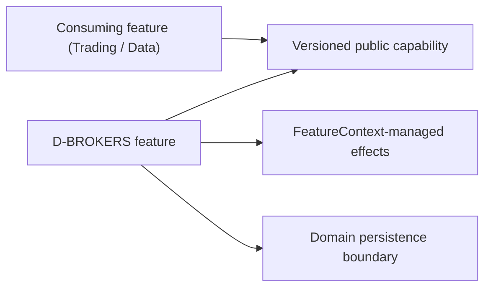

# Brokers

> **Package:** `app/services/brokers/`
> **Status:** `Missing`
> **Last updated:** `2026-09-20`
> **Domain ID:** `D-BROKERS`

This README is the domain's single source of truth for its boundary, feature and FR registry,
domain-local workflows, semantic contract ownership, persisted-state model, acceptance evidence,
and deletion behavior. Reference-product evidence is a requirement source, never implementation
evidence.

`PROJECT.md` owns system scope and cross-domain behavior. `ARCHITECTURE.md` owns universal
structure and runtime constraints. `AGENTS.md` owns contributor workflow. The
[Feature Implementation Pipeline](../../../docs/dev/feature_implementation_pipeline.md) owns the
complete single-file feature delivery checklist.

## Code-aligned implementation convention

Backend features use the simplified modular-monolith layout:

```text
app/services/brokers/
|-- README.md
|-- __init__.py
|-- catalog.py
|-- mt5_adapter.py
|-- ctrader_adapter.py
|-- dukascopy.py
|-- sq_equity.py
|-- sq_futures.py
|-- darwinex.py
|-- crypto_adapter.py
|-- yahoo.py
|-- reconciliation.py
`-- isolation_fencing.py

app/contracts/brokers.py
app/services/persistence/brokers.py
tests/services/brokers/<feature>/
tests/examples/03_brokers.py
```

Each feature module is one cohesive physical removal unit. It contains typed configuration,
service behavior, lifecycle wiring, immutable `SPEC`, and a zero-argument factory. Registration
is explicit in `app/registry.py`; import-time discovery and ambient singletons are forbidden.
Cross-boundary DTOs, protocols, events, errors, and capability keys live in
`app/contracts/brokers.py`. Features resolve dependencies through `FeatureContext` and
never import sibling implementations.

All schema, parameterized SQL, and transactions for this domain live in
`app/services/persistence/brokers.py`. A feature may be stateless, but it never accepts an
unrestricted database connection. Every completed feature contributes a deterministic, offline,
secret-safe example to `tests/examples/03_brokers.py`.

---

## 1. Purpose and boundary

### Purpose

Own external broker and market data provider connectivity, remote transport sessions, authentication,
capability discovery, platform normalization, connection health, and reconciliation observations.
Exclusively handles transport connection and streaming raw payloads with zero data manipulation,
saving, compression, or transformation (strictly owned by `D-DATA`).

### Owns

- Adapter profiles, transport sessions, capability discovery, symbol/account normalization, connection health, and rate limits.
- Translation between normalized trading/data intents and provider SDK/protocol objects.
- Transport stream acquisition of raw external chunks and provider events.
- Provider-identity and connection-state reconciliation after disconnect or uncertain acknowledgement.

### Does not own

- Market data persistence, compression, storage schemas, local caching, tick-to-bar aggregation, or resampling (strictly owned by `D-DATA`).
- Trade intent generation, strategy logic, sizing, or live authorization policy (strictly owned by `D-TRADING`).
- Simulation matching or normalized backtest data semantics (strictly owned by `D-SIMULATOR`).
- Provider credential storage mechanics in plaintext (strictly owned by kernel OS secret facility).

### Shared contracts

The public boundary is `app/contracts/brokers.py`. Counterparty status never authorizes a
private implementation import.

| Status | Capability or event | Protocol / DTO symbol | Version | Purpose |
| --- | --- | --- | --- | --- |
| Missing | `brokers.catalog@1` | `BrokerCatalog` | `1` | Provider profiles, capability discovery, postfix/timezone mapping |
| Missing | `brokers.mt5@1` | `Mt5Adapter` | `1` | MT5 session, quote streaming, and translation |
| Missing | `brokers.ctrader@1` | `CTraderAdapter` | `1` | cTrader Open API session and translation |
| Missing | `brokers.dukascopy@1` | `DukascopyFeedService` | `1` | Direct Dukascopy binary tick transport connector |
| Missing | `brokers.equity@1` | `SQEquityFeedService` | `1` | StrategyQuant Equity data feed transport connector |
| Missing | `brokers.futures@1` | `SQFuturesFeedService` | `1` | StrategyQuant Futures data feed transport connector |
| Missing | `brokers.darwinex@1` | `DarwinexFeedService` | `1` | Direct Darwinex tick feed transport connector |
| Missing | `brokers.crypto@1` | `CryptoBrokerService` | `1` | Unified crypto exchange REST/WS transport connector |
| Missing | `brokers.yahoo@1` | `YahooFeedService` | `1` | Yahoo Finance daily data transport connector |
| Missing | `brokers.reconciliation@1` | `BrokerReconciler` | `1` | Session, order/position, and account reconciliation |
| Missing | `brokers.fencing@1` | `BrokerFencingService` | `1` | Fail-closed uncertainty and disconnect order fencing |

### Persisted-state ownership

Semantic state remains feature-owned although database mechanics are centralized.

| Status | Namespace | Owning feature | Driver | Retention | Public read boundary |
| --- | --- | --- | --- | --- | --- |
| Missing | `brokers.v1` | `FEAT-BROKERS-CATALOG` and registry peers | `sqlite` | Retain versioned records until explicit policy permits purge | `brokers.catalog@1` |

---

## 2. Feature registry and dependency direction

| Feature | Delivered value | Owner module | Provides | Required capabilities | Status |
| --- | --- | --- | --- | --- | --- |
| `FEAT-BROKERS-CATALOG` | Provider profiles, postfix mapping, server timezones | `app/services/brokers/catalog.py` | `brokers.catalog@1` | None | Missing |
| `FEAT-BROKERS-MT5` | MT5 session, quote streaming, and translation | `app/services/brokers/mt5_adapter.py` | `brokers.mt5@1` | `trading.execution_intents@1` | Missing |
| `FEAT-BROKERS-CTRADER` | cTrader Open API session and translation | `app/services/brokers/ctrader_adapter.py` | `brokers.ctrader@1` | `trading.execution_intents@1` | Missing |
| `FEAT-BROKERS-DUKASCOPY` | Direct Dukascopy binary tick transport connector | `app/services/brokers/dukascopy.py` | `brokers.dukascopy@1` | None | Missing |
| `FEAT-BROKERS-EQUITY` | StrategyQuant Equity data feed transport connector | `app/services/brokers/sq_equity.py` | `brokers.equity@1` | None | Missing |
| `FEAT-BROKERS-FUTURES` | StrategyQuant Futures data feed transport connector | `app/services/brokers/sq_futures.py` | `brokers.futures@1` | None | Missing |
| `FEAT-BROKERS-DARWINEX` | Direct Darwinex tick feed transport connector | `app/services/brokers/darwinex.py` | `brokers.darwinex@1` | None | Missing |
| `FEAT-BROKERS-CRYPTO` | Unified crypto exchange connector (Binance/CCXT) | `app/services/brokers/crypto_adapter.py` | `brokers.crypto@1` | `trading.execution_intents@1` | Missing |
| `FEAT-BROKERS-YAHOO` | Yahoo Finance daily feed transport connector | `app/services/brokers/yahoo.py` | `brokers.yahoo@1` | None | Missing |
| `FEAT-BROKERS-RECONCILIATION` | Session, order/position, and account reconciliation | `app/services/brokers/reconciliation.py` | `brokers.reconciliation@1` | `trading.reconciliation@1` | Missing |
| `FEAT-BROKERS-FENCING` | Uncertainty and disconnect fail-closed fencing | `app/services/brokers/isolation_fencing.py` | `brokers.fencing@1` | None | Missing |

Dependencies point to public contracts, never implementation modules:


```mermaid
flowchart LR
    Consumer["Consuming feature (Trading / Data)"] --> Contract["Versioned public capability"]
    Provider["D-BROKERS feature"] --> Contract
    Provider --> Context["FeatureContext-managed effects"]
    Provider --> Persistence["Domain persistence boundary"]
```

Removing one module and registry entry withdraws only its capability. Required consumers become
attributed `BLOCKED`; operation-gated consumers refuse only the affected operation. Retained
state is never purged implicitly.

---

## 3. Domain workflows

### `WF-BROKERS-COMMAND` — Submit and reconcile an external trading command

- **Lead owner:** `FEAT-BROKERS-MT5` / `FEAT-BROKERS-CTRADER`
- **Participants:** Trading intent capability, selected adapter, secret provider, and reconciler.
- **Input boundary:** Authorized environment/account, idempotent intent ID, normalized instrument/order fields.
- **Output boundary:** Normalized acknowledgement/event or explicit unknown state followed by reconciliation.
- **Failure boundary:** Unsupported capability fails before send; timeout after send is unknown, never rejected; reconnect blocks new commands until reconciled.
- **Acceptance:** `ATW-BROKERS-COMMAND-001`

### `WF-BROKERS-STREAM` — Connect and stream raw transport chunks to data ingestion

- **Lead owner:** Data source connectors (`FEAT-BROKERS-DUKASCOPY`, `FEAT-BROKERS-DARWINEX`, `FEAT-BROKERS-EQUITY`, etc.)
- **Participants:** Transport connector, remote provider endpoint, `data.imports@1`.
- **Input boundary:** Provider profile, symbol, date/time span, connection credentials.
- **Output boundary:** Raw byte chunks or immutable transport records streamed directly to consumer; zero local persistence or transformation within `brokers`.
- **Failure boundary:** Transport timeout, authentication failure, or HTTP/socket disconnect emits typed connection error and halts streaming.
- **Acceptance:** `ATW-BROKERS-STREAM-001`

---

## 4. Feature specifications

The following contract applies to every registered feature; domain-specific semantics are in
Section 9.

### `catalog.py` — `FEAT-BROKERS-CATALOG`

> **Feature ID:** `FEAT-BROKERS-CATALOG` (representative registry entry)
> **Status:** `Missing`
> **Owner module:** `app/services/brokers/catalog.py`

#### Purpose

Provide provider profiles, symbol postfix mapping, server timezones, and capability discovery.
Other registry entries follow the same lifecycle and evidence obligations without merging their
responsibilities into this module.

#### Capability declarations

- **Provides:** `brokers.catalog@1`
- **Requires:** None
- **Optional / operation-gated:** only capabilities explicitly declared by the feature; absence
  returns a typed unavailable result and does not silently substitute behavior.

#### Configuration and limits

Each owner module defines a slotted immutable `<Feature>Config`. No reference sample value is
promoted to a default without product approval.

| Status | Setting | Type / unit | Default | Validation and failure |
| --- | --- | --- | --- | --- |
| Missing | `schema_version` | positive integer | `1` | Reject unknown/incompatible versions |
| Missing | `operation_timeout_s` | finite seconds | operation-specific | Must be positive and bounded |
| Missing | `resource_limit` | positive integer | deployment-specific | Reject nonpositive/unbounded values |

#### Runtime effects and cleanup

| Effect | Acquisition | Cleanup / failure behavior |
| --- | --- | --- |
| Capability publication | `FeatureContext.provide(...)` | Withdrawn with feature scope |
| Tasks/subscriptions/resources | Managed `FeatureContext` API | Cancel/close in reverse order; failed start unwinds all effects |
| Durable mutation | Focused persistence protocol | Transaction rollback; partial output remains unpublished |

#### Persistent state

- **Domain persistence module:** `app/services/persistence/brokers.py`
- **Namespace:** `brokers.v1`
- **Schema version:** `1` initially; forward migrations only
- **Retention and purge:** retain lineage-bearing records; purge only by explicit, reference-safe policy

#### Single-file structure and symbols

| Status | Owner | Responsibility | Symbols |
| --- | --- | --- | --- |
| Missing | `catalog.py` | Provider profiles, postfix mapping, server timezones; config, service, lifecycle, `SPEC`, factory | `BrokerCatalog` |
| Missing | `mt5_adapter.py` | MT5 session, quote streaming, and translation; config, service, lifecycle, `SPEC`, factory | `Mt5Adapter` |
| Missing | `ctrader_adapter.py` | cTrader session and translation; config, service, lifecycle, `SPEC`, factory | `CTraderAdapter` |
| Missing | `dukascopy.py` | Direct Dukascopy binary tick transport connector; config, service, lifecycle, `SPEC`, factory | `DukascopyFeedService` |
| Missing | `sq_equity.py` | StrategyQuant Equity data feed transport connector; config, service, lifecycle, `SPEC`, factory | `SQEquityFeedService` |
| Missing | `sq_futures.py` | StrategyQuant Futures data feed transport connector; config, service, lifecycle, `SPEC`, factory | `SQFuturesFeedService` |
| Missing | `darwinex.py` | Direct Darwinex tick feed transport connector; config, service, lifecycle, `SPEC`, factory | `DarwinexFeedService` |
| Missing | `crypto_adapter.py` | Unified crypto exchange connector (Binance/CCXT); config, service, lifecycle, `SPEC`, factory | `CryptoBrokerService` |
| Missing | `yahoo.py` | Yahoo Finance daily feed transport connector; config, service, lifecycle, `SPEC`, factory | `YahooFeedService` |
| Missing | `reconciliation.py` | Order/position/account reconciliation; config, service, lifecycle, `SPEC`, factory | `BrokerReconciler` |
| Missing | `isolation_fencing.py` | Fail-closed uncertainty and disconnect fencing; config, service, lifecycle, `SPEC`, factory | `BrokerFencingService` |
| Missing | `tests/examples/03_brokers.py` | Offline primary-purpose evidence | one `example_<NN>_<feature_slug>()` per completed feature |

#### Functional requirements

| Status | Requirement ID | Observable behavior | Evidence |
| --- | --- | --- | --- |
| Missing | `FR-BROKERS-001` | Capability discovery prevents unsupported order or stream semantics from transmission. | Provider matrix test |
| Missing | `FR-BROKERS-002` | Symbol, price, and quantity conversion is reversible within declared precision and accounts for broker-specific prefix/postfix rules. | Golden mapping fixtures |
| Missing | `FR-BROKERS-003` | Duplicate intent IDs cannot create duplicate submissions. | Retry/timeout test |
| Missing | `FR-BROKERS-004` | Research, UI mocks, and agentic tools cannot enable or address live profiles. | Negative authorization test |
| Missing | `FR-BROKERS-005` | Pure transport connection boundary: connectors emit raw chunks/events with zero internal data compression, bar aggregation, storage, or resampling. | Stream isolation test |
| Missing | `FR-BROKERS-006` | Zero-plaintext credential persistence: all secrets are resolved via OS secret provider and never committed to SQLite, files, logs, or UI reads. | Security audit test |
| Missing | `FR-BROKERS-007` | Broker server timezone (`server_timezone`) and rollover offset are explicitly tracked to ensure consistent quote timing translation. | Timezone alignment test |

#### Removal behavior

Physical removal withdraws the feature's capability and cancels its managed effects. Stored
artifacts remain readable by schema-aware tooling; operations requiring the missing capability
return an attributed unavailable result. Reinstall may resume only after schema and version checks.

---

## 5. Domain-wide requirements and invariants

| Status | Requirement ID | Rule | Verification |
| --- | --- | --- | --- |
| Missing | `ARCH-001` | `__init__.py` is docstring-only. | `scripts/architecture_check.py` |
| Missing | `ARCH-002` | Tasks and resources are managed through `FeatureContext`. | Lifecycle tests |
| Missing | `ARCH-003` | Logging uses `app.kernel.logging`; no service configures handlers. | Architecture/logging tests |
| Missing | `ARCH-004` | Public contracts live in `app/contracts/brokers.py`. | Import/contract checks |
| Missing | `ARCH-005` | Feature modules never import sibling implementations. | Import checks |
| Missing | `ARCH-006` | SQL/schema operations live in `app/services/persistence/brokers.py`. | Architecture/schema checks |

---

## 6. Decisions and open evidence

| Status | Decision ID | Decision or missing evidence | Scope | Required closure |
| --- | --- | --- | --- | --- |
| Accepted | `DEC-BROKERS-001` | MT5 and cTrader are target execution adapters; live profiles are disabled by default. | Provider scope | Owner-ratified E-T01 |
| Open | `DEC-BROKERS-002` | SDK versions, authentication, and execution matrices are unverified. | Adapters | Primary vendor docs plus sandboxes |
| Accepted | `DEC-BROKERS-003` | Strict pure transport connection boundary: broker connectors stream raw payloads with zero local storage, compression, or bar aggregation. | Domain boundary | Owner-ratified rule |

Evidence IDs resolve through `docs/PROJECT.md`. Unknowns remain explicit; a filename, bundled
sample value, or third-party function name is not proof of runtime semantics.

---

## 7. Tests and definition of done

```text
tests/services/brokers/<feature>/
|-- test_config.py
|-- test_<feature>.py
|-- test_lifecycle.py
|-- test_removal.py
`-- test_persistence.py       # when applicable

tests/examples/03_brokers.py
```

Editing uses explicit affected paths with `--no-cov`; the full candidate gate remains
`uv run python scripts/ci_check.py`.

- [ ] Stable feature and requirement IDs have one owner.
- [ ] Public contracts and exact `FeatureSpec` dependencies exist.
- [ ] Registration is explicit; imports have no runtime effects.
- [ ] Happy, invalid, boundary, unavailable, lifecycle, persistence, and removal tests pass.
- [ ] Numerical or stateful behavior has deterministic golden/fault fixtures.
- [ ] One real-world usage example exists per completed feature.
- [ ] Domain status reflects repository evidence, not reference-product evidence.
- [ ] Architecture and full qualification gates pass.

---

## 8. Change process

1. Update this README and identify the exact feature/requirement scope.
2. Update `app/contracts/brokers.py` first when the public boundary changes.
3. Implement one cohesive owner module and immutable `SPEC`.
4. Change `app/services/persistence/brokers.py` only for database mechanics.
5. Update explicit registry, consolidated examples, and focused tests.
6. Verify feature removal and affected consumers.
7. Run the repository-prescribed candidate gate and record actual results.

---

## 9. Normative domain specification

Profiles declare provider, demo/live environment, endpoint, account and credential references, timeouts, rate limits, enabled operations, symbol postfix rules, and server timezone. Credentials use an OS secret facility and never enter projects, artifacts, UI reads, logs, or errors. Connection state is disabled/connecting/ready/degraded/reconnecting/failed/closed. Retrying submissions is allowed only with proven provider idempotency. On reconnect, reconcile account, orders, positions, and fills before accepting commands. All broker and feed connectors adhere strictly to a pure transport boundary: they stream raw chunks or events directly to consumer pipelines (`data.imports@1`), performing zero data persistence, compression, bar aggregation, resampling, or transformation inside `brokers`.
