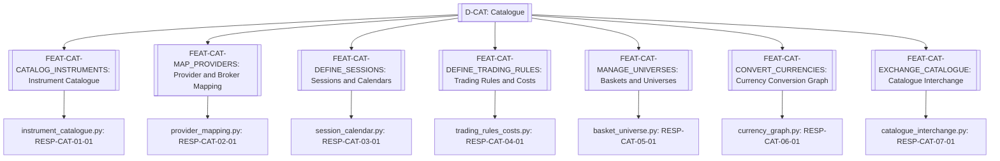
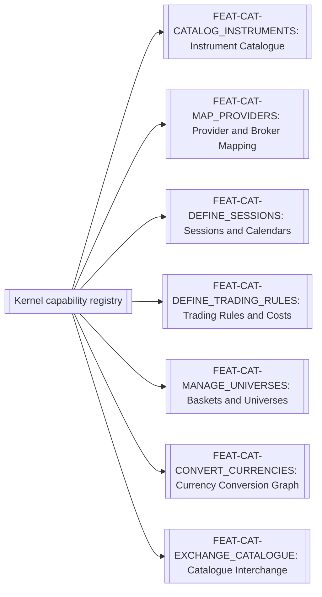

# Catalogue

> **Package:** `app/services/catalogue/`
> **Status:** `Partial — identity, provider mapping, and sessions complete`
> **Last updated:** `2026-09-01`
> **Domain ID:** `D-CAT`

> This README is the domain package's **single source of truth** for domain boundaries, composable feature capabilities, architecture invariants, implementation sequence, progress, usage examples, and tests.
> Update this document before modifying or adding code.

---

## Code-Aligned Implementation Convention

This README is the sole current target registry for this domain's feature IDs and statuses, functional requirements, domain-local workflows, semantic contract ownership, persisted-state model, acceptance evidence, and deletion behavior. `PROJECT.md` owns system scope, cross-domain behavior, system NFRs, and release gates; `ARCHITECTURE.md` owns universal package and runtime constraints. Feature-local READMEs, manifests, contract definitions, migrations, and tests provide current implementation evidence without silently changing this target registry.

Implementation uses the repository's existing feature substrate: each feature lives directly at `app/services/<domain>/<feature>/`, is discovered through the `haruquantai.features` Python entry-point group, and declares one immutable `FeatureSpec` in `manifest.py`. There are no domain or feature YAML manifests.

Every implemented feature also contains a mandatory runtime-validated `README.md`, pure `__init__.py`, strict `config.py`, lifecycle `feature.py`, and focused implementation modules. Dependencies and effects flow through `FeatureContext`/`FeatureScope`; cross-feature implementation imports are forbidden. Persistent state is declared by `FeatureSpec.state`; any migrations and storage adapters remain with the owning feature. Capability keys use `<domain>.<name>@<major>`. FR IDs remain product, acceptance, and test-trace identities rather than one runtime registration per FR. A requirement `Depends` cell expresses product sequencing, traceability, or acceptance evidence only; runtime dependencies are declared separately with exact keys in `FeatureSpec.requires` or `FeatureSpec.optional`.

Feature-level automated tests live at `tests/services/catalogue/<feature>/`. Usage examples never live under `tests/`; they belong to each feature's designated primary domain-logic module. Broader automated verification retains its documented architecture, composition, API, integration, or system test location. The code-backed procedure is the [Feature Implementation Pipeline](../../../docs/dev/feature_implementation_pipeline.md).

## 1. Purpose and Boundary

### Purpose

The Catalogue domain delivers instruments, broker mappings, sessions, calendars, universes, trading constraints, costs, and currency topology. Its public feature capabilities are registered and remain independent of package-import order. Removing the domain produces the degradation defined below rather than preventing the shared substrate or unrelated domains from starting.

Task 1.02 makes the three completed features the authoritative destination for
the former Broker instrument-profile and symbol-map behavior. They are registered
as `catalogue.catalog-instruments@1`, `catalogue.map-providers@1`, and
`catalogue.define-sessions@1`. Provider mappings preserve the exact configured
`provider_symbol`; Data resolves that value before a Broker call and Brokers
receives it unchanged.

### Owns

- `FEAT-CAT-CATALOG_INSTRUMENTS` — Instrument Catalogue.
- `FEAT-CAT-MAP_PROVIDERS` — Provider and Broker Mapping.
- `FEAT-CAT-DEFINE_SESSIONS` — Sessions and Calendars.
- `FEAT-CAT-DEFINE_TRADING_RULES` — Trading Rules and Costs.
- `FEAT-CAT-MANAGE_UNIVERSES` — Baskets and Universes.
- `FEAT-CAT-CONVERT_CURRENCIES` — Currency Conversion Graph.
- `FEAT-CAT-EXCHANGE_CATALOGUE` — Catalogue Interchange.

### Does not own

- Historical-series storage, strategy logic, execution, or analytics; it owns market identity and trading-rule semantics only.
- Composition lifecycle, dependency resolution, effect reversal, and transactional replacement; those belong to the non-domain shared substrate (`app/contracts/`, `app/kernel/`, and `app/composition/`).
- **Deletion boundary:** deleting `app/services/catalogue/` means catalogue editing and resolution disappear; persisted catalogue versions remain opaque and workflows requiring instrument semantics are disabled. The kernel and unrelated domains shall remain healthy.

### Shared Contracts

This domain semantically owns the contracts listed below, but their sole physical definitions live in `app/contracts/catalogue/` and wire schemas in `app/contracts/catalogue/wire/`. `app/services/catalogue/` contains implementations only and shall not define or re-export substitute public contract types. Contract versions and semantic owners must agree with `PROJECT.md` and this README. Feature IDs and FR IDs are documentation, lifecycle, acceptance, and traceability identities; runtime bindings use exact versioned `CapabilityKey` declarations in contracts and `FeatureSpec`. The exact public records and capability bundles are listed in the [Shared Contracts README](../../contracts/README.md#42-appcontractscatalogue).

Rows labelled `FEAT-* capability surface` describe planned semantic contract bundles, not literal runtime capability keys. A listed counterparty may produce, consume, or observe the bundle and does not establish package-import or runtime dependency direction.

**Owned by this domain**

| Status | Contract | Version | Counterparty | Purpose |
|---|---|---|---|---|
| Complete | `FEAT-CAT-CATALOG_INSTRUMENTS` capability surface | `v1` | Workspace | Instrument Catalogue. |
| Complete | `FEAT-CAT-MAP_PROVIDERS` capability surface | `v1` | Workspace | Provider and Broker Mapping. |
| Complete | `FEAT-CAT-DEFINE_SESSIONS` capability surface | `v1` | Workspace | Sessions and Calendars. |
| Missing | `FEAT-CAT-DEFINE_TRADING_RULES` capability surface | `v1` | Workspace | Trading Rules and Costs. |
| Missing | `FEAT-CAT-MANAGE_UNIVERSES` capability surface | `v1` | Workspace | Baskets and Universes. |
| Missing | `FEAT-CAT-CONVERT_CURRENCIES` capability surface | `v1` | Workspace | Currency Conversion Graph. |
| Missing | `FEAT-CAT-EXCHANGE_CATALOGUE` capability surface | `v1` | Workspace | Catalogue Interchange. |

#### Ratified v1 public records

These target wire records are strict frozen Pydantic v2 models with unknown fields forbidden. They use the common aliases and envelopes in the [Shared Contracts README](../../contracts/README.md#public-wire-model-boundary). UUID fields are UUIDv7, versions are positive, and effective intervals are half-open with `effective_to > effective_from` when present.

| Record | Exact fields and constraints | Requirement authority |
| --- | --- | --- |
| `AssetClass` | Closed enum `FOREX`, `EQUITY`, `ETF`, `INDEX`, `FUTURE`, `OPTION`, `BOND`, `COMMODITY`, `CRYPTO`. | `FR-CAT-DEFINE_INSTRUMENTS` |
| `InstrumentRef` | `instrument_id: Uuid7`. | `FR-CAT-DEFINE_INSTRUMENTS` |
| `ProviderRef` | `provider_id: Uuid7`; `provider_name: nonempty str`. | `FR-CAT-MAP_PROVIDER_IDENTITIES` |
| `BrokerRef` | `broker_id: Uuid7`; `broker_name: nonempty str`. | `FR-CAT-MAP_BROKER_SYMBOLS` |
| `CostModelRef` | `cost_model_id: Uuid7`; `version: int >= 1`. | `FR-CAT-RESOLVE_TRADING_COSTS` |
| `UniverseRef` | `universe_id: Uuid7`. | `FR-CAT-VERSION_UNIVERSES` |
| `TradingInterval` | ISO `day_of_week` 1–7; `open_local` and `close_local` as `HH:MM:SS`; `spans_next_day: bool = false`; equal open/close is invalid. | `FR-CAT-DEFINE_TRADING_SESSIONS` |
| `CalendarEarlyClose` | `date: date`; `close_local: HH:MM:SS`. | `FR-CAT-DEFINE_MARKET_CALENDARS` |
| `MarketCalendarVersion` | `calendar_id: Uuid7`; `version: int >= 1`; `timezone: IANA timezone`; `holiday_dates: sorted unique tuple[date, ...] = ()`; `early_closes: sorted unique tuple[CalendarEarlyClose, ...] = ()`; `content_hash: ContentHash`. | `FR-CAT-DEFINE_MARKET_CALENDARS` |
| `TradingSessionDefinition` | `session_id: Uuid7`; `version: int >= 1`; `name: nonempty str`; `timezone: IANA timezone`; `intervals: nonempty tuple[TradingInterval, ...]`; `calendar: MarketCalendarVersion`; `end_of_day_policy: Literal["SESSION_CLOSE", "UTC_MIDNIGHT"]`; `content_hash: ContentHash`. Intervals may not overlap. | `FR-CAT-DEFINE_TRADING_SESSIONS`, `FR-CAT-PREVIEW_TRADING_INTERVALS` |
| `OrderConstraints` | `min_quantity: DecimalValue > 0`; `max_quantity: DecimalValue >= min_quantity`; `quantity_step: DecimalValue > 0`; `min_order_distance: DecimalValue >= 0`; `supported_order_types: nonempty tuple[OrderType, ...]`; `supported_time_in_force: nonempty tuple[TimeInForce, ...]`. | `FR-CAT-DEFINE_INSTRUMENTS`, `FR-CAT-ROUND_ORDER_VALUES` |
| `InstrumentVersion` | `instrument_id: Uuid7`; `version: int >= 1`; `symbol: nonempty str`; `display_name: nonempty str`; `asset_class: AssetClass`; `base_currency: CurrencyCode`; `quote_currency: CurrencyCode`; `settlement_currency: CurrencyCode`; `point_value: DecimalValue > 0`; `tick_size: DecimalValue > 0`; `price_decimals: int` 0–18; `quantity_multiplier: DecimalValue > 0`; `order_constraints: OrderConstraints`; `default_spread: DecimalValue >= 0`; `default_commission: Money | None`; `default_swap_long: Money | None`; `default_swap_short: Money | None`; `exchange: nonempty str`; `timezone: IANA timezone`; `session_id: Uuid7`; `effective_from: UtcTimestamp`; `effective_to: UtcTimestamp | None = None`; `content_hash: ContentHash`; `schema_version: Literal[1] = 1`. Tick size must be representable at the declared decimals; equal base/quote is allowed only for a non-traded reference index. | `FR-CAT-DEFINE_INSTRUMENTS`, `FR-CAT-VERSION_INSTRUMENTS`, `FR-CAT-PROTECT_REFERENCED_VERSIONS` |
| `ProviderSymbolMapping` | `mapping_id: Uuid7`; `instrument: InstrumentRef`; `instrument_version: int >= 1`; `provider: ProviderRef`; `broker: BrokerRef | None`; `provider_symbol: nonempty str`; `effective_from: UtcTimestamp`; `effective_to: UtcTimestamp | None = None`; `content_hash: ContentHash`; `schema_version: Literal[1] = 1`. Provider/broker/symbol/effective interval is unique and mappings may not overlap. | `FR-CAT-MAP_BROKER_SYMBOLS`, `FR-CAT-MAP_PROVIDER_IDENTITIES` |
| `TradingRuleSet` | `rule_set_id: Uuid7`; `instrument: InstrumentRef`; `instrument_version: int >= 1`; `order_constraints: OrderConstraints`; `price_rounding: Rounding`; `quantity_rounding: Literal["TOWARD_ZERO"]`; `cost_model: CostModelRef`; `effective_from: UtcTimestamp`; `effective_to: UtcTimestamp | None = None`; `content_hash: ContentHash`; `schema_version: Literal[1] = 1`. | `FR-CAT-ROUND_ORDER_VALUES`, `FR-CAT-RESOLVE_TRADING_COSTS` |
| `UniverseMembership` | `instrument: InstrumentRef`; `instrument_version: int >= 1`; `effective_from: UtcTimestamp`; `effective_to: UtcTimestamp | None = None`; `weight_hint: DecimalValue >= 0 | None = None`; `tags: sorted unique tuple[str, ...] = ()`. | `FR-CAT-TIMEBOUND_UNIVERSE_MEMBERS` |
| `UniverseVersion` | `universe_id: Uuid7`; `version: int >= 1`; `name: nonempty str`; `memberships: tuple[UniverseMembership, ...]`; `effective_from: UtcTimestamp`; `effective_to: UtcTimestamp | None = None`; `content_hash: ContentHash`; `schema_version: Literal[1] = 1`. Member intervals intersect the universe interval and duplicate instrument/version intervals are invalid. | `FR-CAT-VERSION_UNIVERSES`, `FR-CAT-TIMEBOUND_UNIVERSE_MEMBERS` |
| `FxRateObservation` | `observation_id: Uuid7`; `base_currency: CurrencyCode`; `quote_currency: CurrencyCode`; `rate: DecimalValue > 0`; `observed_at: UtcTimestamp`; `source_provider: ProviderRef`; `source_instrument: InstrumentRef | None = None`; `freshness_expires_at: UtcTimestamp`; `content_hash: ContentHash`; `schema_version: Literal[1] = 1`. Currencies differ and expiry follows observation. | `FR-CAT-CONVERT_CURRENCIES` |
| `CurrencyConversionPath` | `from_currency: CurrencyCode`; `to_currency: CurrencyCode`; `as_of: UtcTimestamp`; `observations: nonempty ordered tuple[FxRateObservation, ...]`; `converted_rate: DecimalValue > 0`; `hop_count: int >= 1`; `path_hash: ContentHash`; `schema_version: Literal[1] = 1`. Observations form a continuous directed path, hop count equals tuple length, and canonical multiplication equals the rate. | `FR-CAT-CONVERT_CURRENCIES` |
| `CatalogueExchangePackage` | `package_id: Uuid7`; `exported_at: UtcTimestamp`; `catalogue_schema_version: Literal[1]`; `instrument_versions: tuple[InstrumentVersion, ...]`; `provider_mappings: tuple[ProviderSymbolMapping, ...]`; `sessions: tuple[TradingSessionDefinition, ...]`; `calendars: tuple[MarketCalendarVersion, ...]`; `trading_rules: tuple[TradingRuleSet, ...]`; `universes: tuple[UniverseVersion, ...]`; `external_refs: sorted unique tuple[Uuid7, ...] = ()`; `content_hash: ContentHash`; `schema_version: Literal[1] = 1`. Every reference resolves internally or appears in `external_refs`. | `FR-CAT-EXCHANGE_CATALOGUE_DEFINITIONS` |

#### Ratified v1 capabilities and operation envelopes

All ports are runtime-checkable async protocols. Every request has `request_id: Uuid7`, `capability_snapshot_id: Uuid7`, and `schema_version: Literal[1] = 1`. Every success has `outcome: Literal["SUCCESS"] = "SUCCESS"`, `request_id: Uuid7`, `result_version: Literal[1] = 1`, and `schema_version: Literal[1] = 1`. `CatalogueFailure` has `outcome: Literal["FAILURE"] = "FAILURE"`, `request_id: Uuid7`, `code` as the closed literal union `CATALOGUE_VALIDATION_FAILED | CATALOGUE_NOT_FOUND | CATALOGUE_VERSION_CONFLICT | CATALOGUE_REFERENCE_PROTECTED | CATALOGUE_MAPPING_OVERLAP | CATALOGUE_SESSION_INVALID | CATALOGUE_RULE_UNSUPPORTED | CATALOGUE_UNIVERSE_INVALID | CATALOGUE_FX_PATH_UNAVAILABLE | CATALOGUE_EXCHANGE_INCOMPATIBLE | CAPABILITY_UNAVAILABLE`, `problem: ProblemDetails`, `conflicting_refs: tuple[Uuid7, ...] = ()`, and `schema_version: Literal[1] = 1`.

| Key / exact port signature | Exact request fields after the common request fields | Exact success fields after the common success fields | Typed events |
| --- | --- | --- | --- |
| `catalogue.catalog-instruments@1`; `CatalogInstrumentsCapability.catalog_instruments(request: CatalogInstrumentsRequest) -> CatalogInstrumentsSuccess | CatalogueFailure` | `operation: Literal["GET", "LIST", "UPSERT_VERSION", "DELETE_VERSION"]`; `instrument_ref: InstrumentRef | None = None`; `instrument_version: InstrumentVersion | None = None`; `expected_version: int >= 1 | None = None`; `page_size: int` 1–500 `= 100`; `page_cursor: str | None = None`. GET requires only ref; LIST permits only paging; UPSERT requires only version plus optional expected version; DELETE requires ref and expected version. | `instruments: tuple[InstrumentVersion, ...] = ()`; `next_cursor: str | None = None`; `deleted: bool = false`. | `InstrumentVersionCreated | InstrumentVersionDeleted`. |
| `catalogue.map-providers@1`; `MapProvidersCapability.map_providers(request: MapProvidersRequest) -> MapProvidersSuccess | CatalogueFailure` | `operation: Literal["RESOLVE", "UPSERT", "DELETE"]`; `mapping: ProviderSymbolMapping | None = None`; `provider: ProviderRef | None = None`; `broker: BrokerRef | None = None`; `provider_symbol: str | None = None`; `as_of: UtcTimestamp | None = None`. UPSERT/DELETE require mapping and forbid resolution fields; RESOLVE requires provider, provider symbol, and time and forbids mapping. | `mappings: tuple[ProviderSymbolMapping, ...] = ()`; `deleted: bool = false`. | `ProviderSymbolMappingChanged | ProviderSymbolMappingDeleted`. |
| `catalogue.define-sessions@1`; `DefineSessionsCapability.define_sessions(request: DefineSessionsRequest) -> DefineSessionsSuccess | CatalogueFailure` | `operation: Literal["GET", "UPSERT_SESSION", "UPSERT_CALENDAR", "PREVIEW"]`; `session: TradingSessionDefinition | None = None`; `calendar: MarketCalendarVersion | None = None`; `session_id: Uuid7 | None = None`; `from_at: UtcTimestamp | None = None`; `to_at: UtcTimestamp | None = None`. GET requires only ID; each UPSERT requires only its record; PREVIEW requires ID and `to_at > from_at`. | `session: TradingSessionDefinition | None = None`; `calendar: MarketCalendarVersion | None = None`; `effective_intervals: tuple[{from_at: UtcTimestamp, to_at: UtcTimestamp}, ...] = ()`, each with `to_at > from_at`. | `TradingSessionChanged | MarketCalendarChanged`. |
| `catalogue.define-trading-rules@1`; `DefineTradingRulesCapability.define_trading_rules(request: DefineTradingRulesRequest) -> DefineTradingRulesSuccess | CatalogueFailure` | `operation: Literal["GET", "UPSERT", "NORMALIZE"]`; `rule_set: TradingRuleSet | None = None`; `instrument: InstrumentRef | None = None`; `instrument_version: int >= 1 | None = None`; `as_of: UtcTimestamp | None = None`; `price: DecimalValue | None = None`; `quantity: DecimalValue | None = None`. UPSERT requires only rule set; GET requires identity/time; NORMALIZE requires identity/time and at least price or quantity. | `rule_set: TradingRuleSet | None = None`; `normalized_price: DecimalValue | None = None`; `normalized_quantity: DecimalValue | None = None`; `cost_model: CostModelRef | None = None`. | `TradingRuleSetChanged`. |
| `catalogue.manage-universes@1`; `ManageUniversesCapability.manage_universes(request: ManageUniversesRequest) -> ManageUniversesSuccess | CatalogueFailure` | `operation: Literal["GET", "UPSERT_VERSION", "RESOLVE_MEMBERS"]`; `universe_ref: UniverseRef | None = None`; `universe_version: UniverseVersion | None = None`; `as_of: UtcTimestamp | None = None`. UPSERT requires only version; GET requires only ref; RESOLVE_MEMBERS requires ref and time. | `universe: UniverseVersion | None = None`; `members: tuple[UniverseMembership, ...] = ()`. | `UniverseVersionCreated`. |
| `catalogue.convert-currencies@1`; `ConvertCurrenciesCapability.convert_currencies(request: ConvertCurrenciesRequest) -> ConvertCurrenciesSuccess | CatalogueFailure` | `amount: Money`; `to_currency: CurrencyCode`; `as_of: UtcTimestamp`; `max_hops: int` 1–4 `= 3`; `freshness_limit_seconds: int >= 1`. | `converted: Money`; `path: CurrencyConversionPath`. | Empty union; pure query. |
| `catalogue.exchange-catalogue@1`; `ExchangeCatalogueCapability.exchange_catalogue(request: ExchangeCatalogueRequest) -> ExchangeCatalogueSuccess | CatalogueFailure` | `operation: Literal["EXPORT", "VALIDATE_IMPORT", "IMPORT"]`; `package: CatalogueExchangePackage | None = None`; `selected_instrument_ids: tuple[Uuid7, ...] = ()`; `conflict_policy: Literal["REJECT", "KEEP_EXISTING", "CREATE_NEW_VERSION"] = "REJECT"`. EXPORT forbids package; validate/import require package. | `package: CatalogueExchangePackage | None = None`; `imported_refs: tuple[Uuid7, ...] = ()`; `warnings: tuple[ValidationIssue, ...] = ()`. | `CataloguePackageImported`; export/validation emit none. |

#### Ratified v1 event payloads

Every member uses the common `DomainEvent` envelope. Its strict payload includes `schema_version: Literal[1] = 1` plus the fields below; `event_type` is the closed discriminator.

| Event | `event_type` | Exact payload fields |
| --- | --- | --- |
| `InstrumentVersionCreated` | `catalogue.instrument-version-created` | `instrument: InstrumentRef`; `instrument_version: int >= 1`; `content_hash: ContentHash`. |
| `InstrumentVersionDeleted` | `catalogue.instrument-version-deleted` | `instrument: InstrumentRef`; `instrument_version: int >= 1`; `prior_content_hash: ContentHash`. |
| `ProviderSymbolMappingChanged` | `catalogue.provider-symbol-mapping-changed` | `mapping_id: Uuid7`; `instrument: InstrumentRef`; `instrument_version: int >= 1`; `provider: ProviderRef`; `broker: BrokerRef | None`; `provider_symbol: nonempty str`; `content_hash: ContentHash`. |
| `ProviderSymbolMappingDeleted` | `catalogue.provider-symbol-mapping-deleted` | `mapping_id: Uuid7`; `instrument: InstrumentRef`; `instrument_version: int >= 1`; `provider: ProviderRef`; `broker: BrokerRef | None`; `provider_symbol: nonempty str`; `prior_content_hash: ContentHash`. |
| `TradingSessionChanged` | `catalogue.trading-session-changed` | `session_id: Uuid7`; `version: int >= 1`; `content_hash: ContentHash`. |
| `MarketCalendarChanged` | `catalogue.market-calendar-changed` | `calendar_id: Uuid7`; `version: int >= 1`; `content_hash: ContentHash`. |
| `TradingRuleSetChanged` | `catalogue.trading-rule-set-changed` | `rule_set_id: Uuid7`; `instrument: InstrumentRef`; `instrument_version: int >= 1`; `content_hash: ContentHash`. |
| `UniverseVersionCreated` | `catalogue.universe-version-created` | `universe: UniverseRef`; `version: int >= 1`; `content_hash: ContentHash`. |
| `CataloguePackageImported` | `catalogue.package-imported` | `package_id: Uuid7`; `content_hash: ContentHash`; `imported_refs: tuple[Uuid7, ...]`. |

Capability absence and every validation/version/reference failure are deterministic and side-effect free. Conversion's event union is empty; export and validation emit no event.

**Cross-domain requirement references (not runtime dependencies)**

The rows below summarize foreign owner tokens found in FR `Depends` cells. They express product sequencing, traceability, or acceptance-evidence relationships only. Actual runtime consumption must name an exact versioned capability key in the consuming feature's `FeatureSpec.requires` or `FeatureSpec.optional` and must follow the dependency direction in `PROJECT.md` and `ARCHITECTURE.md`.

| Referenced domain set | Documentation version | Owner | Meaning |
|---|---|---|---|
| `D-WS` public capability set | `v1` | Workspace | Requirements whose `Depends` cell names `WS-*`. |

### Persisted State Ownership

| Status | State / Store | Read access (via contract) | Migration definitions |
|---|---|---|---|
| Missing | instruments, instrument_versions, brokers, broker_versions, sessions, session_versions, calendars, calendar_versions | Other domains through `D-CAT` public capabilities only | The owning feature's `StateDeclaration` and migration/storage adapter |

### Four-Level Structural Hierarchy

| Code level | Represents | This package |
|---|---|---|
| **Package** | Domain | `app/services/catalogue/` / `D-CAT` |
| **Module folder** | Feature / capability | One folder for each of: Instrument Catalogue, Provider and Broker Mapping, Sessions and Calendars, Trading Rules and Costs, Baskets and Universes, Currency Conversion Graph, Catalogue Interchange |
| **File** | Use case or focused responsibility | Exactly the responsibility file named in each module specification |
| **Class / function / method** | Functional requirement behavior | Exactly one registered `fr_*` behavior per `FR-*` row |

```text
Package (Domain)
└── Module folder (Feature)
    └── File (Responsibility)
        └── Registered function (Functional requirement behavior)
```

### Domain Capability Map



---

## 2. Final Package Structure and Feature Independence

```text
catalogue/
├── README.md
├── __init__.py
├── instrument_catalogue/                    # FEAT-CAT-CATALOG_INSTRUMENTS: Instrument Catalogue
│   ├── README.md
│   ├── __init__.py
│   ├── manifest.py
│   ├── config.py
│   ├── feature.py
│   └── instrument_catalogue.py              # RESP-CAT-01-01
├── provider_mapping/                    # FEAT-CAT-MAP_PROVIDERS: Provider and Broker Mapping
│   ├── README.md
│   ├── __init__.py
│   ├── manifest.py
│   ├── config.py
│   ├── feature.py
│   └── provider_mapping.py              # RESP-CAT-02-01
├── session_calendar/                    # FEAT-CAT-DEFINE_SESSIONS: Sessions and Calendars
│   ├── README.md
│   ├── __init__.py
│   ├── manifest.py
│   ├── config.py
│   ├── feature.py
│   └── session_calendar.py              # RESP-CAT-03-01
├── trading_rules_costs/                    # FEAT-CAT-DEFINE_TRADING_RULES: Trading Rules and Costs
│   ├── README.md
│   ├── __init__.py
│   ├── manifest.py
│   ├── config.py
│   ├── feature.py
│   └── trading_rules_costs.py              # RESP-CAT-04-01
├── basket_universe/                    # FEAT-CAT-MANAGE_UNIVERSES: Baskets and Universes
│   ├── README.md
│   ├── __init__.py
│   ├── manifest.py
│   ├── config.py
│   ├── feature.py
│   └── basket_universe.py              # RESP-CAT-05-01
├── currency_graph/                    # FEAT-CAT-CONVERT_CURRENCIES: Currency Conversion Graph
│   ├── README.md
│   ├── __init__.py
│   ├── manifest.py
│   ├── config.py
│   ├── feature.py
│   └── currency_graph.py              # RESP-CAT-06-01
└── catalogue_interchange/                    # FEAT-CAT-EXCHANGE_CATALOGUE: Catalogue Interchange
    ├── README.md
    ├── __init__.py
    ├── manifest.py
    ├── config.py
    ├── feature.py
    └── catalogue_interchange.py              # RESP-CAT-07-01
```

### Module dependency diagram

Feature modules do not import one another's private files. Runtime dependencies resolve through kernel capabilities obtained from `FeatureContext`; composition selects providers and reconciles changes, so reciprocal workflow participation cannot create a package-import cycle.



### Structure rules

- The package root contains `README.md`, import-pure `__init__.py`, and one direct folder per feature; discovery uses the `haruquantai.features` entry-point group.
- Each feature folder contains mandatory `README.md`, pure `__init__.py`, `manifest.py`, `config.py`, `feature.py`, and focused responsibility modules.
- `FR-*`/`fr_*` names provide product, implementation, and test traceability inside the feature; they are not separate runtime registrations or capability keys.
- Cross-feature and cross-domain behavior is injected by capability key. Direct private-file imports are prohibited.
- Every core capability module documents Python and CLI usage; exactly one designated primary domain-logic module owns the feature's executable `__main__` demonstration. Usage examples never live under `tests/`.

---

## 3. Workflows

| Status | Workflow ID | Scope | Workflow | Trigger / Input boundary | Final outcome / Output boundary | Requirement sequence |
|---|---|---|---|---|---|---|
| Complete | `WF-CAT-001` | Cross-domain | Instrument Catalogue | Validated command/query and required capability bindings | Requirement-defined result, artifact, event, or degradation | `FR-CAT-DEFINE_INSTRUMENTS` → `FR-CAT-VERSION_INSTRUMENTS` → `FR-CAT-PROTECT_REFERENCED_VERSIONS` |
| Complete | `WF-CAT-002` | Internal | Provider and Broker Mapping | Validated command/query and required capability bindings | Requirement-defined result, artifact, event, or degradation | `FR-CAT-MAP_BROKER_SYMBOLS` → `FR-CAT-MAP_PROVIDER_IDENTITIES` |
| Complete | `WF-CAT-003` | Internal | Sessions and Calendars | Validated command/query and required capability bindings | Requirement-defined result, artifact, event, or degradation | `FR-CAT-DEFINE_TRADING_SESSIONS` → `FR-CAT-DEFINE_MARKET_CALENDARS` → `FR-CAT-PREVIEW_TRADING_INTERVALS` |
| Missing | `WF-CAT-004` | Internal | Trading Rules and Costs | Validated command/query and required capability bindings | Requirement-defined result, artifact, event, or degradation | `FR-CAT-ROUND_ORDER_VALUES` → `FR-CAT-RESOLVE_TRADING_COSTS` |
| Missing | `WF-CAT-005` | Internal | Baskets and Universes | Validated command/query and required capability bindings | Requirement-defined result, artifact, event, or degradation | `FR-CAT-VERSION_UNIVERSES` → `FR-CAT-TIMEBOUND_UNIVERSE_MEMBERS` |
| Missing | `WF-CAT-006` | Internal | Currency Conversion Graph | Validated command/query and required capability bindings | Requirement-defined result, artifact, event, or degradation | `FR-CAT-CONVERT_CURRENCIES` |
| Missing | `WF-CAT-007` | Internal | Catalogue Interchange | Validated command/query and required capability bindings | Requirement-defined result, artifact, event, or degradation | `FR-CAT-EXCHANGE_CATALOGUE_DEFINITIONS` |

### `WF-CAT-001` — Instrument Catalogue

**Scope:** `Cross-domain` when the request requires another domain capability; otherwise `Internal`.

**System workflow:** `SYS-WF-002`

**Input boundary:** A validated request/query plus an immutable capability snapshot and provider bindings.

**Output boundary:** The result/artifact/event defined by the participating `FR-*` rows, or their exact structured failure/degradation outcome.

1. `Feature.mount()` resolves its declared required capabilities through `FeatureContext`.
2. `instrument_catalogue.py` executes `fr_cat_define_instruments`, `fr_cat_version_instruments`, `fr_cat_protect_referenced_versions` in the requirement-defined order.
3. Scoped effects are committed or reversed under `FR-KERN-DEFINE_REQUIREMENT_BEHAVIOR, FR-KERN-DEFINE_LIFECYCLE_CONTEXT, FR-KERN-DECLARE_BEHAVIOR_DEPENDENCIES, FR-KERN-REGISTER_FEATURE_MODULES, FR-KERN-DEFINE_RESPONSIBILITY_FILES, FR-KERN-IMPLEMENT_REQUIREMENT_FUNCTIONS, FR-KERN-DEPEND_PUBLIC_PORTS, FR-KERN-NAMESPACE_CAPABILITY_KEYS, FR-KERN-DECLARE_DEPENDENCY_RULES, FR-KERN-REEVALUATE_DEPENDENCIES, FR-KERN-DEFINE_SCOPE_HIERARCHY, FR-KERN-PASS_EFFECT_SCOPES, FR-KERN-REGISTER_EFFECT_REVERSALS, FR-KERN-REVERSE_EFFECTS_LIFO, FR-KERN-ROLLBACK_FAILED_ACTIVATION, FR-KERN-MANAGE_COMPONENT_LIFECYCLE, FR-KERN-COMMIT_CAPABILITY_SWAP, FR-KERN-QUIESCE_DEPENDENT_WORK, FR-KERN-REMOVE_DEPENDENT_COMPONENTS, FR-KERN-ISOLATE_DISPOSAL_FAILURES, FR-KERN-RECONCILE_DESIRED_STATE, FR-KERN-REPLACE_COMPONENTS_TRANSACTIONALLY, FR-KERN-PROVIDE_SCOPED_REGISTRARS, FR-KERN-DRAIN_REMOVED_BEHAVIORS, FR-KERN-CLASSIFY_COMPONENT_EFFECTS, FR-KERN-NAMESPACE_COMPONENT_STATE, FR-KERN-REGISTER_EXTENSION_POINTS, FR-KERN-EMIT_CAUSAL_EVENTS, FR-KERN-REJECT_DEPENDENCY_CYCLES, FR-KERN-PIN_CAPABILITY_SNAPSHOTS, FR-KERN-TEST_COMPONENT_REMOVAL, FR-KERN-VERIFY_EXACT_REMOVAL, FR-KERN-ROUTE_MULTIPLE_PROVIDERS`.
4. The feature returns or publishes only the documented output boundary.

**Failure behaviour:**

- Feature unavailable → instrument creation/edit/delete is unavailable; pinned versions remain stored. Requests requiring a removed feature capability return `CAPABILITY_UNAVAILABLE`; the domain continues loading.
- Missing/incompatible required capability → `CAPABILITY_UNAVAILABLE` or `CAPABILITY_INCOMPATIBLE`; no partial mutation.

**Integration test:**
`tests/services/catalogue/integration/test_instrument_catalogue.py::test_instrument_catalogue_workflow()`


---

## 4. Composable Feature Specifications

Implement module sections from top to bottom. Requirement `Depends` cells define product and implementation ordering; runtime capability dependencies must be declared separately in the owning `FeatureSpec`.

---

### 4.1 `instrument_catalogue/` — Instrument Catalogue

**Feature ID:** `FEAT-CAT-CATALOG_INSTRUMENTS`

**Purpose:** Manage, version, retain, and protect canonical instruments.

**Deletion contract:** instrument creation/edit/delete is unavailable; pinned versions remain stored. Requests requiring a removed feature capability return `CAPABILITY_UNAVAILABLE`; the domain continues loading.

**Module flow:**

```text
validated input and capability bindings
  → instrument_catalogue.py
  → fr_cat_define_instruments, fr_cat_version_instruments, fr_cat_protect_referenced_versions
  → requirement-defined output or structured failure
```

#### Files

| Status | File | Responsibility | Key exports | Dependencies |
|---|---|---|---|---|
| Complete | `instrument_catalogue.py` | Manage, version, retain, and protect canonical instruments | `fr_cat_define_instruments`, `fr_cat_version_instruments`, `fr_cat_protect_referenced_versions` | **Standard library:** selected per implementation and recorded before code<br>**Required third-party:** only libraries mandated by `PROJECT.md` or the requirement boundary<br>**Local:** capabilities declared by the owning `FeatureSpec`; no private cross-feature import |
| Complete | `feature.py` | Mount `FEAT-CAT-CATALOG_INSTRUMENTS` through `FeatureContext` and stage its declared providers/effects | `FEAT-CAT-CATALOG_INSTRUMENTS` `Feature.mount` | **Standard library:** None<br>**Required third-party:** None<br>**Local:** `manifest.py`, `config.py`, and focused responsibility modules |
| Complete | `manifest.py` | Define the immutable `FEAT-CAT-CATALOG_INSTRUMENTS` `FeatureSpec`: identity, domain, provided/required/optional capabilities, conflicts, state, and configuration keys | `FEAT-CAT-CATALOG_INSTRUMENTS` `FeatureSpec` | **Standard library:** None<br>**Required third-party:** None<br>**Local:** `app.kernel.feature.FeatureSpec` |

#### Configuration and Limits Manifest

| Status | Setting / Limit | Type | Default | Required | Used by | Description |
|---|---|---|---|---|---|---|
| Complete | `FEAT-CAT-CATALOG_INSTRUMENTS.configuration` | Versioned schema | No implicit defaults | Yes when referenced | `instrument_catalogue.py` | Exact fields, defaults, limits, and failure rules are those stated by the requirements and the normative technical appendices in `PROJECT.md`; unspecified values are rejected under Project §6. |

#### `instrument_catalogue.py` — Manage, version, retain, and protect canonical instruments

**File responsibility:** Manage, version, retain, and protect canonical instruments.

| Status | Requirement ID | Class | Pri | Responsibility | Class / Function / Method | Side Effects | Raises / failure | Depends | Source / confidence | Usage / Test |
|---|---|---|---|---|---|---|---|---|---|---|
| Complete | `FR-CAT-DEFINE_INSTRUMENTS` | Parity | P0 | The system shall manage canonical instruments with symbol, asset type, point value, tick size, price decimals, size multiplier/step/min/max, minimum order distance, default spread, commission, swap, currency, exchange, and timezone. | `fr_cat_define_instruments` implementation trace | Event publication | Invalid nonpositive increments or inconsistent decimal/tick settings are rejected. | FR-WS-INITIALIZE_WORKSPACE | Installed metadata model; Verified | **Usage:** `app/services/catalogue/instrument_catalogue/instrument_catalogue.py::__main__` scenario `FR-CAT-DEFINE_INSTRUMENTS`<br>**Unit:** `tests/services/catalogue/instrument_catalogue/test_instrument_catalogue.py::test_cat_define_instruments()` |
| Complete | `FR-CAT-VERSION_INSTRUMENTS` | Target | P1 | Edits to an instrument used by a committed data or result manifest shall create a new instrument version. | `fr_cat_version_instruments` implementation trace | Persistence write; Local state mutation | Old result manifests continue resolving the prior version after an edit. | FR-CAT-DEFINE_INSTRUMENTS | `BD-08`; Target | **Usage:** `app/services/catalogue/instrument_catalogue/instrument_catalogue.py::__main__` scenario `FR-CAT-VERSION_INSTRUMENTS`<br>**Unit:** `tests/services/catalogue/instrument_catalogue/test_instrument_catalogue.py::test_cat_version_instruments()` |
| Complete | `FR-CAT-PROTECT_REFERENCED_VERSIONS` | Target | P1 | The system shall reject deletion of a catalogue version referenced by a committed manifest. | `fr_cat_protect_referenced_versions` implementation trace | Persistence write | Deletion returns dependencies and leaves all records unchanged. | FR-CAT-VERSION_INSTRUMENTS | Referential integrity; Verified concept | **Usage:** `app/services/catalogue/instrument_catalogue/instrument_catalogue.py::__main__` scenario `FR-CAT-PROTECT_REFERENCED_VERSIONS`<br>**Unit:** `tests/services/catalogue/instrument_catalogue/test_instrument_catalogue.py::test_cat_protect_referenced_versions()` |

**Rules:**

- instrument creation/edit/delete is unavailable; pinned versions remain stored. Requests requiring a removed feature capability return `CAPABILITY_UNAVAILABLE`; the domain continues loading.
- no business-domain dependency is resolved at package import; the owning `FeatureSpec` declares runtime dependencies once and this behavior consumes only that committed feature context.
- Each `FR-*` row maps to focused implementation and acceptance evidence inside this feature; removal occurs at feature-package granularity.
- Every effect must be scoped and classified under `FR-KERN-CLASSIFY_COMPONENT_EFFECTS`; the inferred table label must be corrected before implementation if the concrete adapter requires a narrower or additional effect class.

**Implementation notes:**

- Preserve the requirement statement, acceptance/failure behavior, dependencies, and source confidence as one indivisible implementation contract.
- Reuse public capability contracts; never copy another feature's or domain's business logic.
- Add private helpers only when needed by these public behaviors; helpers do not become new requirements.

#### Feature usage examples

The primary domain-logic module `app/services/catalogue/instrument_catalogue/instrument_catalogue.py` owns the executable `__main__` usage harness, with one named scenario per requirement listed above.

---

### 4.2 `provider_mapping/` — Provider and Broker Mapping

**Feature ID:** `FEAT-CAT-MAP_PROVIDERS`

**Purpose:** Map broker/provider identities to canonical instruments.

**Deletion contract:** provider symbol translation is unavailable; canonical instruments remain. Requests requiring a removed feature capability return `CAPABILITY_UNAVAILABLE`; the domain continues loading.

**Module flow:**

```text
validated input and capability bindings
  → provider_mapping.py
  → fr_cat_map_broker_symbols, fr_cat_map_provider_identities
  → requirement-defined output or structured failure
```

#### Files

| Status | File | Responsibility | Key exports | Dependencies |
|---|---|---|---|---|
| Complete | `provider_mapping.py` | Map broker/provider identities to canonical instruments | `fr_cat_map_broker_symbols`, `fr_cat_map_provider_identities` | **Standard library:** selected per implementation and recorded before code<br>**Required third-party:** only libraries mandated by `PROJECT.md` or the requirement boundary<br>**Local:** capabilities declared by the owning `FeatureSpec`; no private cross-feature import |
| Complete | `feature.py` | Mount `FEAT-CAT-MAP_PROVIDERS` through `FeatureContext` and stage its declared providers/effects | `FEAT-CAT-MAP_PROVIDERS` `Feature.mount` | **Standard library:** None<br>**Required third-party:** None<br>**Local:** `manifest.py`, `config.py`, and focused responsibility modules |
| Complete | `manifest.py` | Define the immutable `FEAT-CAT-MAP_PROVIDERS` `FeatureSpec`: identity, domain, provided/required/optional capabilities, conflicts, state, and configuration keys | `FEAT-CAT-MAP_PROVIDERS` `FeatureSpec` | **Standard library:** None<br>**Required third-party:** None<br>**Local:** `app.kernel.feature.FeatureSpec` |

#### Configuration and Limits Manifest

| Status | Setting / Limit | Type | Default | Required | Used by | Description |
|---|---|---|---|---|---|---|
| Complete | `FEAT-CAT-MAP_PROVIDERS.configuration` | Versioned schema | No implicit defaults | Yes when referenced | `provider_mapping.py` | Exact fields, defaults, limits, and failure rules are those stated by the requirements and the normative technical appendices in `PROJECT.md`; unspecified values are rejected under Project §6. |

#### `provider_mapping.py` — Map broker/provider identities to canonical instruments

**File responsibility:** Map broker/provider identities to canonical instruments.

| Status | Requirement ID | Class | Pri | Responsibility | Class / Function / Method | Side Effects | Raises / failure | Depends | Source / confidence | Usage / Test |
|---|---|---|---|---|---|---|---|---|---|---|
| Complete | `FR-CAT-MAP_BROKER_SYMBOLS` | Parity | P1 | The system shall manage broker profiles and map canonical instruments to external symbols and broker-specific properties. | `fr_cat_map_broker_symbols` implementation trace | None | Two broker profiles may map the same instrument to different symbols/cost defaults without conflict. | FR-CAT-DEFINE_INSTRUMENTS | Reference Data Manager; Verified | **Usage:** `app/services/catalogue/provider_mapping/provider_mapping.py::__main__` scenario `FR-CAT-MAP_BROKER_SYMBOLS`<br>**Unit:** `tests/services/catalogue/provider_mapping/test_provider_mapping.py::test_cat_map_broker_symbols()` |
| Complete | `FR-CAT-MAP_PROVIDER_IDENTITIES` | Adapter | P1 | Provider-specific symbols, time zones, units, and corporate-action identifiers shall map to canonical instruments through versioned adapter records. | `fr_cat_map_provider_identities` implementation trace | External API call; Persistence write | Ambiguous or incomplete mappings block synchronization. | FR-CAT-VERSION_INSTRUMENTS | Phase 4 connectors | **Usage:** `app/services/catalogue/provider_mapping/provider_mapping.py::__main__` scenario `FR-CAT-MAP_PROVIDER_IDENTITIES`<br>**Unit:** `tests/services/catalogue/provider_mapping/test_provider_mapping.py::test_cat_map_provider_identities()` |

**Rules:**

- provider symbol translation is unavailable; canonical instruments remain. Requests requiring a removed feature capability return `CAPABILITY_UNAVAILABLE`; the domain continues loading.
- no business-domain dependency is resolved at package import; the owning `FeatureSpec` declares runtime dependencies once and this behavior consumes only that committed feature context.
- Each `FR-*` row maps to focused implementation and acceptance evidence inside this feature; removal occurs at feature-package granularity.
- Every effect must be scoped and classified under `FR-KERN-CLASSIFY_COMPONENT_EFFECTS`; the inferred table label must be corrected before implementation if the concrete adapter requires a narrower or additional effect class.

**Implementation notes:**

- Preserve the requirement statement, acceptance/failure behavior, dependencies, and source confidence as one indivisible implementation contract.
- Reuse public capability contracts; never copy another feature's or domain's business logic.
- Add private helpers only when needed by these public behaviors; helpers do not become new requirements.

#### Feature usage examples

The primary domain-logic module `app/services/catalogue/provider_mapping/provider_mapping.py` owns the executable `__main__` usage harness, with one named scenario per requirement listed above.

---

### 4.3 `session_calendar/` — Sessions and Calendars

**Feature ID:** `FEAT-CAT-DEFINE_SESSIONS`

**Purpose:** Manage and preview effective trading intervals.

**Deletion contract:** session-aware workflows are disabled; raw data remains readable. Requests requiring a removed feature capability return `CAPABILITY_UNAVAILABLE`; the domain continues loading.

**Module flow:**

```text
validated input and capability bindings
  → session_calendar.py
  → fr_cat_define_trading_sessions, fr_cat_define_market_calendars, fr_cat_preview_trading_intervals
  → requirement-defined output or structured failure
```

#### Files

| Status | File | Responsibility | Key exports | Dependencies |
|---|---|---|---|---|
| Complete | `session_calendar.py` | Manage and preview effective trading intervals | `fr_cat_define_trading_sessions`, `fr_cat_define_market_calendars`, `fr_cat_preview_trading_intervals` | **Standard library:** selected per implementation and recorded before code<br>**Required third-party:** only libraries mandated by `PROJECT.md` or the requirement boundary<br>**Local:** capabilities declared by the owning `FeatureSpec`; no private cross-feature import |
| Complete | `feature.py` | Mount `FEAT-CAT-DEFINE_SESSIONS` through `FeatureContext` and stage its declared providers/effects | `FEAT-CAT-DEFINE_SESSIONS` `Feature.mount` | **Standard library:** None<br>**Required third-party:** None<br>**Local:** `manifest.py`, `config.py`, and focused responsibility modules |
| Complete | `manifest.py` | Define the immutable `FEAT-CAT-DEFINE_SESSIONS` `FeatureSpec`: identity, domain, provided/required/optional capabilities, conflicts, state, and configuration keys | `FEAT-CAT-DEFINE_SESSIONS` `FeatureSpec` | **Standard library:** None<br>**Required third-party:** None<br>**Local:** `app.kernel.feature.FeatureSpec` |

#### Configuration and Limits Manifest

| Status | Setting / Limit | Type | Default | Required | Used by | Description |
|---|---|---|---|---|---|---|
| Complete | `FEAT-CAT-DEFINE_SESSIONS.configuration` | Versioned schema | No implicit defaults | Yes when referenced | `session_calendar.py` | Exact fields, defaults, limits, and failure rules are those stated by the requirements and the normative technical appendices in `PROJECT.md`; unspecified values are rejected under Project §6. |

#### `session_calendar.py` — Manage and preview effective trading intervals

**File responsibility:** Manage and preview effective trading intervals.

| Status | Requirement ID | Class | Pri | Responsibility | Class / Function / Method | Side Effects | Raises / failure | Depends | Source / confidence | Usage / Test |
|---|---|---|---|---|---|---|---|---|---|---|
| Complete | `FR-CAT-DEFINE_TRADING_SESSIONS` | Parity | P0 | The system shall manage reusable timezone-aware sessions containing ordered weekday/time intervals and an end-of-day boundary. | `fr_cat_define_trading_sessions` implementation trace | None | Overnight and week-crossing sessions normalize deterministically; invalid overlaps are reported. | FR-CAT-DEFINE_INSTRUMENTS | Reference sessions; Verified | **Usage:** `app/services/catalogue/session_calendar/session_calendar.py::__main__` scenario `FR-CAT-DEFINE_TRADING_SESSIONS`<br>**Unit:** `tests/services/catalogue/session_calendar/test_session_calendar.py::test_cat_define_trading_sessions()` |
| Complete | `FR-CAT-DEFINE_MARKET_CALENDARS` | Target | P0 | The system shall manage versioned calendars containing holidays, early closes, late opens, and exceptional full sessions. | `fr_cat_define_market_calendars` implementation trace | None | A calendar exception overrides the normal session only for its declared date and version. | FR-CAT-DEFINE_TRADING_SESSIONS | Baseline time rules; Target | **Usage:** `app/services/catalogue/session_calendar/session_calendar.py::__main__` scenario `FR-CAT-DEFINE_MARKET_CALENDARS`<br>**Unit:** `tests/services/catalogue/session_calendar/test_session_calendar.py::test_cat_define_market_calendars()` |
| Complete | `FR-CAT-PREVIEW_TRADING_INTERVALS` | Target | P1 | The system shall preview the effective tradable intervals for a date range after session/calendar/timezone composition. | `fr_cat_preview_trading_intervals` implementation trace | None | DST transition fixtures show unambiguous UTC intervals and both repeated local-hour offsets. | FR-CAT-DEFINE_TRADING_SESSIONS, FR-CAT-DEFINE_MARKET_CALENDARS | Test backlog P0; Target | **Usage:** `app/services/catalogue/session_calendar/session_calendar.py::__main__` scenario `FR-CAT-PREVIEW_TRADING_INTERVALS`<br>**Unit:** `tests/services/catalogue/session_calendar/test_session_calendar.py::test_cat_preview_trading_intervals()` |

**Rules:**

- session-aware workflows are disabled; raw data remains readable. Requests requiring a removed feature capability return `CAPABILITY_UNAVAILABLE`; the domain continues loading.
- no business-domain dependency is resolved at package import; the owning `FeatureSpec` declares runtime dependencies once and this behavior consumes only that committed feature context.
- Each `FR-*` row maps to focused implementation and acceptance evidence inside this feature; removal occurs at feature-package granularity.
- Every effect must be scoped and classified under `FR-KERN-CLASSIFY_COMPONENT_EFFECTS`; the inferred table label must be corrected before implementation if the concrete adapter requires a narrower or additional effect class.

**Implementation notes:**

- Preserve the requirement statement, acceptance/failure behavior, dependencies, and source confidence as one indivisible implementation contract.
- Reuse public capability contracts; never copy another feature's or domain's business logic.
- Add private helpers only when needed by these public behaviors; helpers do not become new requirements.

#### Feature usage examples

The primary domain-logic module `app/services/catalogue/session_calendar/session_calendar.py` owns the executable `__main__` usage harness, with one named scenario per requirement listed above.

---

### 4.4 `trading_rules_costs/` — Trading Rules and Costs

**Feature ID:** `FEAT-CAT-DEFINE_TRADING_RULES`

**Purpose:** Resolve rounding, distance, and default cost rules.

**Deletion contract:** orders requiring the removed rules fail capability validation rather than guessing. Requests requiring a removed feature capability return `CAPABILITY_UNAVAILABLE`; the domain continues loading.

**Module flow:**

```text
validated input and capability bindings
  → trading_rules_costs.py
  → fr_cat_round_order_values, fr_cat_resolve_trading_costs
  → requirement-defined output or structured failure
```

#### Files

| Status | File | Responsibility | Key exports | Dependencies |
|---|---|---|---|---|
| Missing | `trading_rules_costs.py` | Resolve rounding, distance, and default cost rules | `fr_cat_round_order_values`, `fr_cat_resolve_trading_costs` | **Standard library:** selected per implementation and recorded before code<br>**Required third-party:** only libraries mandated by `PROJECT.md` or the requirement boundary<br>**Local:** capabilities declared by the owning `FeatureSpec`; no private cross-feature import |
| Missing | `feature.py` | Mount `FEAT-CAT-DEFINE_TRADING_RULES` through `FeatureContext` and stage its declared providers/effects | `FEAT-CAT-DEFINE_TRADING_RULES` `Feature.mount` | **Standard library:** None<br>**Required third-party:** None<br>**Local:** `manifest.py`, `config.py`, and focused responsibility modules |
| Missing | `manifest.py` | Define the immutable `FEAT-CAT-DEFINE_TRADING_RULES` `FeatureSpec`: identity, domain, provided/required/optional capabilities, conflicts, state, and configuration keys | `FEAT-CAT-DEFINE_TRADING_RULES` `FeatureSpec` | **Standard library:** None<br>**Required third-party:** None<br>**Local:** `app.kernel.feature.FeatureSpec` |

#### Configuration and Limits Manifest

| Status | Setting / Limit | Type | Default | Required | Used by | Description |
|---|---|---|---|---|---|---|
| Missing | `FEAT-CAT-DEFINE_TRADING_RULES.configuration` | Versioned schema | No implicit defaults | Yes when referenced | `trading_rules_costs.py` | Exact fields, defaults, limits, and failure rules are those stated by the requirements and the normative technical appendices in `PROJECT.md`; unspecified values are rejected under Project §6. |

#### `trading_rules_costs.py` — Resolve rounding, distance, and default cost rules

**File responsibility:** Resolve rounding, distance, and default cost rules.

| Status | Requirement ID | Class | Pri | Responsibility | Class / Function / Method | Side Effects | Raises / failure | Depends | Source / confidence | Usage / Test |
|---|---|---|---|---|---|---|---|---|---|---|
| Missing | `FR-CAT-ROUND_ORDER_VALUES` | Target | P1 | The system shall calculate and expose valid price and quantity rounding for an instrument before order creation. | `fr_cat_round_order_values` implementation trace | Read-only | Boundary fixtures at half-step, minimum, and maximum match the selected rounding policy. | FR-CAT-DEFINE_INSTRUMENTS | Numeric baseline; Target | **Usage:** `app/services/catalogue/trading_rules_costs/trading_rules_costs.py::__main__` scenario `FR-CAT-ROUND_ORDER_VALUES`<br>**Unit:** `tests/services/catalogue/trading_rules_costs/test_trading_rules_costs.py::test_cat_round_order_values()` |
| Missing | `FR-CAT-RESOLVE_TRADING_COSTS` | Target | P1 | The system shall store cost defaults separately from per-run overrides and expose final effective values in the run manifest. | `fr_cat_resolve_trading_costs` implementation trace | Persistence write | A run override changes only the run and records both default source and override. | FR-CAT-DEFINE_INSTRUMENTS | Specified §§18.4, 22.2 | **Usage:** `app/services/catalogue/trading_rules_costs/trading_rules_costs.py::__main__` scenario `FR-CAT-RESOLVE_TRADING_COSTS`<br>**Unit:** `tests/services/catalogue/trading_rules_costs/test_trading_rules_costs.py::test_cat_resolve_trading_costs()` |

**Rules:**

- orders requiring the removed rules fail capability validation rather than guessing. Requests requiring a removed feature capability return `CAPABILITY_UNAVAILABLE`; the domain continues loading.
- no business-domain dependency is resolved at package import; the owning `FeatureSpec` declares runtime dependencies once and this behavior consumes only that committed feature context.
- Each `FR-*` row maps to focused implementation and acceptance evidence inside this feature; removal occurs at feature-package granularity.
- Every effect must be scoped and classified under `FR-KERN-CLASSIFY_COMPONENT_EFFECTS`; the inferred table label must be corrected before implementation if the concrete adapter requires a narrower or additional effect class.

**Implementation notes:**

- Preserve the requirement statement, acceptance/failure behavior, dependencies, and source confidence as one indivisible implementation contract.
- Reuse public capability contracts; never copy another feature's or domain's business logic.
- Add private helpers only when needed by these public behaviors; helpers do not become new requirements.

#### Feature usage examples

The primary domain-logic module `app/services/catalogue/trading_rules_costs/trading_rules_costs.py` owns the executable `__main__` usage harness, with one named scenario per requirement listed above.

---

### 4.5 `basket_universe/` — Baskets and Universes

**Feature ID:** `FEAT-CAT-MANAGE_UNIVERSES`

**Purpose:** Version instrument sets and historical membership.

**Deletion contract:** universe-based research is unavailable; single-instrument capabilities remain. Requests requiring a removed feature capability return `CAPABILITY_UNAVAILABLE`; the domain continues loading.

**Module flow:**

```text
validated input and capability bindings
  → basket_universe.py
  → fr_cat_version_universes, fr_cat_timebound_universe_members
  → requirement-defined output or structured failure
```

#### Files

| Status | File | Responsibility | Key exports | Dependencies |
|---|---|---|---|---|
| Missing | `basket_universe.py` | Version instrument sets and historical membership | `fr_cat_version_universes`, `fr_cat_timebound_universe_members` | **Standard library:** selected per implementation and recorded before code<br>**Required third-party:** only libraries mandated by `PROJECT.md` or the requirement boundary<br>**Local:** capabilities declared by the owning `FeatureSpec`; no private cross-feature import |
| Missing | `feature.py` | Mount `FEAT-CAT-MANAGE_UNIVERSES` through `FeatureContext` and stage its declared providers/effects | `FEAT-CAT-MANAGE_UNIVERSES` `Feature.mount` | **Standard library:** None<br>**Required third-party:** None<br>**Local:** `manifest.py`, `config.py`, and focused responsibility modules |
| Missing | `manifest.py` | Define the immutable `FEAT-CAT-MANAGE_UNIVERSES` `FeatureSpec`: identity, domain, provided/required/optional capabilities, conflicts, state, and configuration keys | `FEAT-CAT-MANAGE_UNIVERSES` `FeatureSpec` | **Standard library:** None<br>**Required third-party:** None<br>**Local:** `app.kernel.feature.FeatureSpec` |

#### Configuration and Limits Manifest

| Status | Setting / Limit | Type | Default | Required | Used by | Description |
|---|---|---|---|---|---|---|
| Missing | `FEAT-CAT-MANAGE_UNIVERSES.configuration` | Versioned schema | No implicit defaults | Yes when referenced | `basket_universe.py` | Exact fields, defaults, limits, and failure rules are those stated by the requirements and the normative technical appendices in `PROJECT.md`; unspecified values are rejected under Project §6. |

#### `basket_universe.py` — Version instrument sets and historical membership

**File responsibility:** Version instrument sets and historical membership.

| Status | Requirement ID | Class | Pri | Responsibility | Class / Function / Method | Side Effects | Raises / failure | Depends | Source / confidence | Usage / Test |
|---|---|---|---|---|---|---|---|---|---|---|
| Missing | `FR-CAT-VERSION_UNIVERSES` | Target | P0 | The catalogue shall version named baskets and universes as ordered or rule-derived instrument sets. | `fr_cat_version_universes` implementation trace | None | A run resolves one immutable constituent snapshot; missing constituents fail admission or follow an explicit policy. | FR-CAT-MAP_BROKER_SYMBOLS, FR-CAT-EXCHANGE_CATALOGUE_DEFINITIONS | Phase 2 baseline | **Usage:** `app/services/catalogue/basket_universe/basket_universe.py::__main__` scenario `FR-CAT-VERSION_UNIVERSES`<br>**Unit:** `tests/services/catalogue/basket_universe/test_basket_universe.py::test_cat_version_universes()` |
| Missing | `FR-CAT-TIMEBOUND_UNIVERSE_MEMBERS` | Target | P1 | Universe membership shall support effective-from/effective-to validity and provenance. | `fr_cat_timebound_universe_members` implementation trace | Read-only | A historical rotation fixture cannot observe future membership. | FR-CAT-VERSION_UNIVERSES | Phase 4 Stockpicker baseline | **Usage:** `app/services/catalogue/basket_universe/basket_universe.py::__main__` scenario `FR-CAT-TIMEBOUND_UNIVERSE_MEMBERS`<br>**Unit:** `tests/services/catalogue/basket_universe/test_basket_universe.py::test_cat_timebound_universe_members()` |

**Rules:**

- universe-based research is unavailable; single-instrument capabilities remain. Requests requiring a removed feature capability return `CAPABILITY_UNAVAILABLE`; the domain continues loading.
- no business-domain dependency is resolved at package import; the owning `FeatureSpec` declares runtime dependencies once and this behavior consumes only that committed feature context.
- Each `FR-*` row maps to focused implementation and acceptance evidence inside this feature; removal occurs at feature-package granularity.
- Every effect must be scoped and classified under `FR-KERN-CLASSIFY_COMPONENT_EFFECTS`; the inferred table label must be corrected before implementation if the concrete adapter requires a narrower or additional effect class.

**Implementation notes:**

- Preserve the requirement statement, acceptance/failure behavior, dependencies, and source confidence as one indivisible implementation contract.
- Reuse public capability contracts; never copy another feature's or domain's business logic.
- Add private helpers only when needed by these public behaviors; helpers do not become new requirements.

#### Feature usage examples

The primary domain-logic module `app/services/catalogue/basket_universe/basket_universe.py` owns the executable `__main__` usage harness, with one named scenario per requirement listed above.

---

### 4.6 `currency_graph/` — Currency Conversion Graph

**Feature ID:** `FEAT-CAT-CONVERT_CURRENCIES`

**Purpose:** Resolve deterministic currency conversion paths.

**Deletion contract:** cross-currency workflows are disabled; same-currency workflows remain. Requests requiring a removed feature capability return `CAPABILITY_UNAVAILABLE`; the domain continues loading.

**Module flow:**

```text
validated input and capability bindings
  → currency_graph.py
  → fr_cat_convert_currencies
  → requirement-defined output or structured failure
```

#### Files

| Status | File | Responsibility | Key exports | Dependencies |
|---|---|---|---|---|
| Missing | `currency_graph.py` | Resolve deterministic currency conversion paths | `fr_cat_convert_currencies` | **Standard library:** selected per implementation and recorded before code<br>**Required third-party:** only libraries mandated by `PROJECT.md` or the requirement boundary<br>**Local:** capabilities declared by the owning `FeatureSpec`; no private cross-feature import |
| Missing | `feature.py` | Mount `FEAT-CAT-CONVERT_CURRENCIES` through `FeatureContext` and stage its declared providers/effects | `FEAT-CAT-CONVERT_CURRENCIES` `Feature.mount` | **Standard library:** None<br>**Required third-party:** None<br>**Local:** `manifest.py`, `config.py`, and focused responsibility modules |
| Missing | `manifest.py` | Define the immutable `FEAT-CAT-CONVERT_CURRENCIES` `FeatureSpec`: identity, domain, provided/required/optional capabilities, conflicts, state, and configuration keys | `FEAT-CAT-CONVERT_CURRENCIES` `FeatureSpec` | **Standard library:** None<br>**Required third-party:** None<br>**Local:** `app.kernel.feature.FeatureSpec` |

#### Configuration and Limits Manifest

| Status | Setting / Limit | Type | Default | Required | Used by | Description |
|---|---|---|---|---|---|---|
| Missing | `FEAT-CAT-CONVERT_CURRENCIES.configuration` | Versioned schema | No implicit defaults | Yes when referenced | `currency_graph.py` | Exact fields, defaults, limits, and failure rules are those stated by the requirements and the normative technical appendices in `PROJECT.md`; unspecified values are rejected under Project §6. |

#### `currency_graph.py` — Resolve deterministic currency conversion paths

**File responsibility:** Resolve deterministic currency conversion paths.

| Status | Requirement ID | Class | Pri | Responsibility | Class / Function / Method | Side Effects | Raises / failure | Depends | Source / confidence | Usage / Test |
|---|---|---|---|---|---|---|---|---|---|---|
| Missing | `FR-CAT-CONVERT_CURRENCIES` | Target | P0 | The catalogue shall expose a versioned currency-conversion graph with explicit direct, inverse, triangulated, and missing-rate policies. | `fr_cat_convert_currencies` implementation trace | Read-only | Cross-currency cost and portfolio fixtures record the exact conversion path. | FR-CAT-DEFINE_INSTRUMENTS | Portfolio baseline | **Usage:** `app/services/catalogue/currency_graph/currency_graph.py::__main__` scenario `FR-CAT-CONVERT_CURRENCIES`<br>**Unit:** `tests/services/catalogue/currency_graph/test_currency_graph.py::test_cat_convert_currencies()` |

**Rules:**

- cross-currency workflows are disabled; same-currency workflows remain. Requests requiring a removed feature capability return `CAPABILITY_UNAVAILABLE`; the domain continues loading.
- no business-domain dependency is resolved at package import; the owning `FeatureSpec` declares runtime dependencies once and this behavior consumes only that committed feature context.
- Each `FR-*` row maps to focused implementation and acceptance evidence inside this feature; removal occurs at feature-package granularity.
- Every effect must be scoped and classified under `FR-KERN-CLASSIFY_COMPONENT_EFFECTS`; the inferred table label must be corrected before implementation if the concrete adapter requires a narrower or additional effect class.

**Implementation notes:**

- Preserve the requirement statement, acceptance/failure behavior, dependencies, and source confidence as one indivisible implementation contract.
- Reuse public capability contracts; never copy another feature's or domain's business logic.
- Add private helpers only when needed by these public behaviors; helpers do not become new requirements.

#### Feature usage examples

The primary domain-logic module `app/services/catalogue/currency_graph/currency_graph.py` owns the executable `__main__` usage harness, with one named scenario per requirement listed above.

---

### 4.7 `catalogue_interchange/` — Catalogue Interchange

**Feature ID:** `FEAT-CAT-EXCHANGE_CATALOGUE`

**Purpose:** Import and export versioned catalogue definitions.

**Deletion contract:** catalogue interchange is unavailable; catalogue editing and resolution remain. Requests requiring a removed feature capability return `CAPABILITY_UNAVAILABLE`; the domain continues loading.

**Module flow:**

```text
validated input and capability bindings
  → catalogue_interchange.py
  → fr_cat_exchange_catalogue_definitions
  → requirement-defined output or structured failure
```

#### Files

| Status | File | Responsibility | Key exports | Dependencies |
|---|---|---|---|---|
| Missing | `catalogue_interchange.py` | Import and export versioned catalogue definitions | `fr_cat_exchange_catalogue_definitions` | **Standard library:** selected per implementation and recorded before code<br>**Required third-party:** only libraries mandated by `PROJECT.md` or the requirement boundary<br>**Local:** capabilities declared by the owning `FeatureSpec`; no private cross-feature import |
| Missing | `feature.py` | Mount `FEAT-CAT-EXCHANGE_CATALOGUE` through `FeatureContext` and stage its declared providers/effects | `FEAT-CAT-EXCHANGE_CATALOGUE` `Feature.mount` | **Standard library:** None<br>**Required third-party:** None<br>**Local:** `manifest.py`, `config.py`, and focused responsibility modules |
| Missing | `manifest.py` | Define the immutable `FEAT-CAT-EXCHANGE_CATALOGUE` `FeatureSpec`: identity, domain, provided/required/optional capabilities, conflicts, state, and configuration keys | `FEAT-CAT-EXCHANGE_CATALOGUE` `FeatureSpec` | **Standard library:** None<br>**Required third-party:** None<br>**Local:** `app.kernel.feature.FeatureSpec` |

#### Configuration and Limits Manifest

| Status | Setting / Limit | Type | Default | Required | Used by | Description |
|---|---|---|---|---|---|---|
| Missing | `FEAT-CAT-EXCHANGE_CATALOGUE.configuration` | Versioned schema | No implicit defaults | Yes when referenced | `catalogue_interchange.py` | Exact fields, defaults, limits, and failure rules are those stated by the requirements and the normative technical appendices in `PROJECT.md`; unspecified values are rejected under Project §6. |

#### `catalogue_interchange.py` — Import and export versioned catalogue definitions

**File responsibility:** Import and export versioned catalogue definitions.

| Status | Requirement ID | Class | Pri | Responsibility | Class / Function / Method | Side Effects | Raises / failure | Depends | Source / confidence | Usage / Test |
|---|---|---|---|---|---|---|---|---|---|---|
| Missing | `FR-CAT-EXCHANGE_CATALOGUE_DEFINITIONS` | Target | P1 | The system shall support import/export of catalogue definitions through a versioned JSON format with stable IDs and conflict policy. | `fr_cat_exchange_catalogue_definitions` implementation trace | Persistence write | Export→import into an empty workspace preserves normalized hashes; conflicts require `reject`, `map`, or `create_new`. | FR-CAT-DEFINE_INSTRUMENTS, FR-CAT-VERSION_INSTRUMENTS, FR-CAT-MAP_BROKER_SYMBOLS, FR-CAT-DEFINE_TRADING_SESSIONS, FR-CAT-DEFINE_MARKET_CALENDARS | Adapter decision; Target | **Usage:** `app/services/catalogue/catalogue_interchange/catalogue_interchange.py::__main__` scenario `FR-CAT-EXCHANGE_CATALOGUE_DEFINITIONS`<br>**Unit:** `tests/services/catalogue/catalogue_interchange/test_catalogue_interchange.py::test_cat_exchange_catalogue_definitions()` |

**Rules:**

- catalogue interchange is unavailable; catalogue editing and resolution remain. Requests requiring a removed feature capability return `CAPABILITY_UNAVAILABLE`; the domain continues loading.
- no business-domain dependency is resolved at package import; the owning `FeatureSpec` declares runtime dependencies once and this behavior consumes only that committed feature context.
- Each `FR-*` row maps to focused implementation and acceptance evidence inside this feature; removal occurs at feature-package granularity.
- Every effect must be scoped and classified under `FR-KERN-CLASSIFY_COMPONENT_EFFECTS`; the inferred table label must be corrected before implementation if the concrete adapter requires a narrower or additional effect class.

**Implementation notes:**

- Preserve the requirement statement, acceptance/failure behavior, dependencies, and source confidence as one indivisible implementation contract.
- Reuse public capability contracts; never copy another feature's or domain's business logic.
- Add private helpers only when needed by these public behaviors; helpers do not become new requirements.

#### Feature usage examples

The primary domain-logic module `app/services/catalogue/catalogue_interchange/catalogue_interchange.py` owns the executable `__main__` usage harness, with one named scenario per requirement listed above.

---

## 5. Package-Wide Requirements, Configuration, and Architecture Invariants

### Persistence - Database

The domain-owned table namespace is `catalogue_`. The authoritative logical entities are: instruments, instrument_versions, brokers, broker_versions, sessions, session_versions, calendars, calendar_versions. Universal representation and persistence rules are owned by `app/contracts/README.md` §§15 and 23.12; Catalogue-specific storage semantics remain here.

Migration definitions shall live in The owning feature's `StateDeclaration` and migration/storage adapter. Only this domain may write its tables; other domains use the public capability contracts in Section 1.

### Shared Configuration

| Status | Setting / Limit | Type | Default | Required | Used by | Description |
|---|---|---|---|---|---|---|
| Missing | `[features.FEAT-*].config` | Strict TOML feature configuration | Feature-owned defaults only | Per feature | The owning feature | Accepted keys match `FeatureSpec.config_keys` and `config.py`; provider choice belongs in `[providers]`. |

### Non-Functional Requirements

No domain-private NFR IDs are introduced. The following project-owned requirements apply without duplication:

| Status | Requirement ID | Type | Responsibility | Verification |
|---|---|---|---|---|
| Missing | `FR-KERN-DEFINE_REQUIREMENT_BEHAVIOR, FR-KERN-DEFINE_LIFECYCLE_CONTEXT, FR-KERN-DECLARE_BEHAVIOR_DEPENDENCIES, FR-KERN-REGISTER_FEATURE_MODULES, FR-KERN-DEFINE_RESPONSIBILITY_FILES, FR-KERN-IMPLEMENT_REQUIREMENT_FUNCTIONS, FR-KERN-DEPEND_PUBLIC_PORTS, FR-KERN-NAMESPACE_CAPABILITY_KEYS, FR-KERN-DECLARE_DEPENDENCY_RULES, FR-KERN-REEVALUATE_DEPENDENCIES, FR-KERN-DEFINE_SCOPE_HIERARCHY, FR-KERN-PASS_EFFECT_SCOPES, FR-KERN-REGISTER_EFFECT_REVERSALS, FR-KERN-REVERSE_EFFECTS_LIFO, FR-KERN-ROLLBACK_FAILED_ACTIVATION, FR-KERN-MANAGE_COMPONENT_LIFECYCLE, FR-KERN-COMMIT_CAPABILITY_SWAP, FR-KERN-QUIESCE_DEPENDENT_WORK, FR-KERN-REMOVE_DEPENDENT_COMPONENTS, FR-KERN-ISOLATE_DISPOSAL_FAILURES, FR-KERN-RECONCILE_DESIRED_STATE, FR-KERN-REPLACE_COMPONENTS_TRANSACTIONALLY, FR-KERN-PROVIDE_SCOPED_REGISTRARS, FR-KERN-DRAIN_REMOVED_BEHAVIORS, FR-KERN-CLASSIFY_COMPONENT_EFFECTS, FR-KERN-NAMESPACE_COMPONENT_STATE, FR-KERN-REGISTER_EXTENSION_POINTS, FR-KERN-EMIT_CAUSAL_EVENTS, FR-KERN-REJECT_DEPENDENCY_CYCLES, FR-KERN-PIN_CAPABILITY_SNAPSHOTS, FR-KERN-TEST_COMPONENT_REMOVAL, FR-KERN-VERIFY_EXACT_REMOVAL, FR-KERN-ROUTE_MULTIPLE_PROVIDERS` | Architecture | Spatiotemporal composition, deletion, lifecycle, dependency, HMR, effect, and fixture guarantees. | Composition/deletion matrix |
| Missing | `NFR-DET-*` | Determinism | Applicable deterministic behavior reproduces under pinned inputs and versions. | Determinism corpus |
| Missing | `NFR-DUR-*` | Durability | Committed state, recovery, leases, checkpoints, and retained metadata follow system rules. | Fault/recovery corpus |
| Missing | `NFR-PERF-*` | Performance | Applicable latency, throughput, memory, and benchmark gates pass. | Named performance corpus |
| Missing | `NFR-ISO-*` | Isolation | Processes, permissions, paths, secrets, and workspace boundaries remain isolated. | Security/isolation corpus |
| Missing | `NFR-OBS-*` | Observability | Operations emit causal, redacted logs/events/metrics/traces. | Lineage reconstruction |
| Missing | `NFR-COMP-*` | Compatibility | Public contracts, schemas, packages, and providers evolve through declared compatibility rules. | Compatibility corpus |

---

## 6. Open Decisions

None. Any behavior not specified by this README and the normative project appendices is unsupported and must fail capability validation rather than be guessed.

---

## 7. Tests and Definition of Done

### Test and usage locations

```text
tests/services/catalogue/
└── <feature>/                 # feature automated verification
```

### Commands

```bash
uv run ruff check app/services/catalogue
uv run ruff format --check app/services/catalogue
uv run mypy app/services/catalogue
uv run pytest tests/services/catalogue/<feature>/
uv run pytest tests/catalogue --cov=app/services/catalogue --cov-fail-under=80
```

### Required test levels

- **Unit:** Verify every `FR-*` behavior and every failure path.
- **Integration:** Verify internal feature workflows, capability binding, disable/re-enable, physical removal, replacement where applicable, and leak freedom.
- **Usage:** Execute each feature's designated primary domain-logic module and verify every named FR scenario.

### Package completion checklist

- [ ] The actual package tree matches Section 2.
- [ ] Modules and files remain arranged in documented implementation order.
- [ ] Every module represents one feature and every file one focused responsibility.
- [ ] Every requirement, workflow, manifest, configuration, and test row is `Implemented`.
- [ ] Every public export, dependency, effect, error, owned state, and contract is documented.
- [ ] Every requirement maps to a named scenario in the primary module's executable usage harness and has focused automated verification; collaborating behaviors have integration tests where applicable.
- [ ] Feature disable/re-enable, physical removal, failed activation/cleanup, transactional replacement where applicable, and leak tests pass.
- [ ] No private cross-feature/domain import or duplicated business logic exists.
- [ ] No unresolved decision affects implementation.
- [ ] All quality, security, determinism, durability, performance, observability, and compatibility gates pass.

---

## 8. Change Process

```text
1. Update this README first.
2. Update owned/consumed contracts and affected project workflows.
3. Resolve or record any decision that would otherwise require guessing.
4. Add or change the functional requirement row, effect, failure behavior, and dependency.
5. Update files, exports, manifests, configuration, and implementation order.
6. Implement the smallest code change through public capability boundaries.
7. Update and execute the primary-module usage harness; add or update unit, integration, deletion, and fault tests.
8. Change status to `Implemented` only after every relevant gate passes.
```

This keeps documentation, composition boundaries, implementation, usage examples, and verification aligned.

---

## 9. Normative Domain Specification

The stable `§x.y` labels below are preserved for cross-document references. They are authoritative here and no longer identify sections in `docs/PROJECT.md`.

### §16 — Complete market-data and catalogue specification

### §16.1 — Instrument schema and validation

An `InstrumentVersion` payload contains exactly these fields:

| Field | Type/default | Normative rule |
| --- | --- | --- |
| `symbol` | string 1–64 | Case-sensitive canonical symbol; trimmed; `/`, `\\`, control characters, and leading/trailing whitespace forbidden. |
| `asset_type` | enum | `FOREX`, `CFD`, `FUTURE`, `STOCK`, `ETF`, `INDEX`, `CRYPTO`, or `OTHER`. |
| `base_currency` | ISO-4217/crypto code | 3–12 uppercase ASCII; required for FOREX/CRYPTO. |
| `quote_currency` | ISO-4217/crypto code | Result currency for one price unit; required. |
| `settlement_currency` | code/default quote | Currency used for realized P/L and costs. |
| `exchange` | string/default empty | Informational venue identifier. |
| `timezone` | IANA zone | Required and resolvable in pinned tzdb. |
| `tick_size` | decimal > 0 | Smallest executable price increment. |
| `point_value` | decimal > 0 | Money in settlement currency per one whole price-unit move for quantity 1. |
| `contract_multiplier` | decimal > 0/default 1 | Multiplies price P/L before currency conversion. |
| `price_decimals` | integer 0–12 | Display only; cannot imply a finer increment than tick size. |
| `quantity_unit` | enum/default `UNIT` | `UNIT`, `LOT`, `CONTRACT`, `SHARE`, or `COIN`; determines labels and per-lot conversion. |
| `units_per_lot` | decimal >0/default 1 | `lots=quantity` when quantity unit is LOT, otherwise `quantity/units_per_lot`. |
| `size_step` | decimal > 0 | Smallest executable quantity increment. |
| `size_min` | decimal >= 0 | Must be an exact multiple of size step. |
| `size_max` | decimal >= size_min | Must be an exact multiple of size step. |
| `minimum_order_distance` | decimal >= 0 | Distance in price units from current bid/ask. |
| `default_spread` | decimal >= 0 | Full bid/ask difference in price units. |
| `commission_profile_id` | UUID nullable | Pinned version is resolved into each run manifest. |
| `swap_long`, `swap_short` | decimal/default 0 | Daily financing per quantity unit in settlement currency unless profile selects points/percent. |
| `triple_swap_day` | ISO weekday/default Wednesday | Day multiplier 3; other rollover days multiplier 1. |
| `session_version_id` | UUID | Required trading session/calendar version. |

Price P/L before costs is `(exit_price-entry_price) * direction_sign * quantity * point_value * contract_multiplier`. `direction_sign` is `+1` long and `-1` short.

### §16.2 — Session/calendar composition

- A session contains zero or more nonoverlapping local intervals per ISO weekday. An interval with `close <= open` continues into the next local day. Intervals are normalized to UTC for each date using §15.4.
- A holiday may close the whole trading day. An early close truncates matching intervals; a late open advances their start; an exceptional full session replaces rather than merges the normal weekday intervals.
- Precedence is exceptional full session, full holiday close, late/early overrides, then weekly template.
- Orders may be submitted only while the instrument is open unless their type/profile explicitly supports off-session staging. Fills occur only in an open session. A pending order crossing a closed interval remains pending unless DAY expiry or a trading option cancels it.
- Session day identity is the local date of the session's configured end-of-day boundary. Trade-count-per-day, EOD exits, daily bars, and swaps use that identity.


### §16.7 — Universes, currencies, and market transformations

A basket is an immutable ordered list of instrument-version IDs. A rule-derived universe stores its eligible catalogue query and materializes immutable membership rows `{instrument_version_id,effective_from,effective_to,provenance}` with half-open validity; a historical decision at t may see only rows whose effective-from and publication timestamps are `<=t` and whose effective-to is `>t`. Missing constituents follow exactly `FAIL`, `EXCLUDE_AND_REPORT`, or `KEEP_UNAVAILABLE`; there is no implicit symbol substitution.

The currency graph at time t contains the most recent nonstale directed quote edges at or before t. A base/terms quote at rate r creates direct multiplier r and inverse `1/r`. Policy is `DIRECT_ONLY`, `DIRECT_THEN_INVERSE`, or `TRIANGULATE`. Triangulation chooses the fewest edges, then lowest maximum edge age, then lexicographically smallest currency sequence; maximum hops defaults 3. Conversion multiplies without intermediate rounding and rounds only the final amount. Missing policies are `FAIL`, `CARRY_LAST_WITH_MAX_AGE`, and explicit fixed fallback. The path and rates are persisted per valuation/fill.

Corporate actions are immutable events effective at a session boundary. `SPLIT(r)` means r new units per old unit; for samples before the event, backward split adjustment divides OHLC by cumulative r and multiplies volume by r. `CASH_DIVIDEND(d)` in `TOTAL_RETURN_BACK_ADJUSTED` multiplies every prior OHLC by `(P-d)/P`, where P is the last unadjusted close before ex-date; nonpositive P/factor rejects the transform, and volume is unchanged. `SYMBOL_CHANGE` links identities without altering values. Tick/size rounding occurs after all factors. Raw source is never modified, and the transformed version records every event/factor.

Continuous futures select one contract per session using `CALENDAR`, `VOLUME`, or `OPEN_INTEREST`. Calendar selection uses declared roll dates. Volume/open-interest compares the prior completed session only and rolls when the next contract exceeds the current for the declared consecutive-session count. At roll, `NONE` leaves a gap, `BACKWARD_DIFFERENCE` adds `old_close-new_close` to all newer-contract values when creating the backward-continuous history, and `BACKWARD_RATIO` multiplies by `old_close/new_close`; factors compose from newest to oldest. Decisions, source contracts, raw prices, factors, and transformed prices are retained, and no future session statistic is visible.
