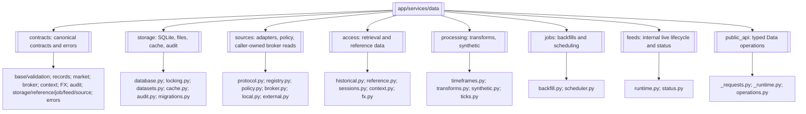
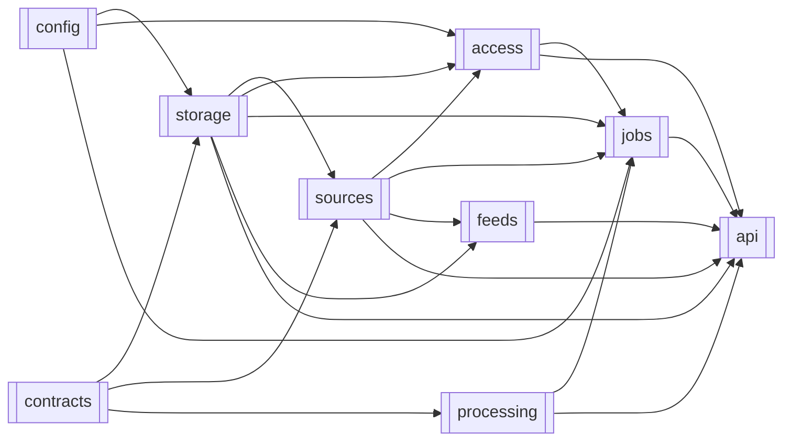
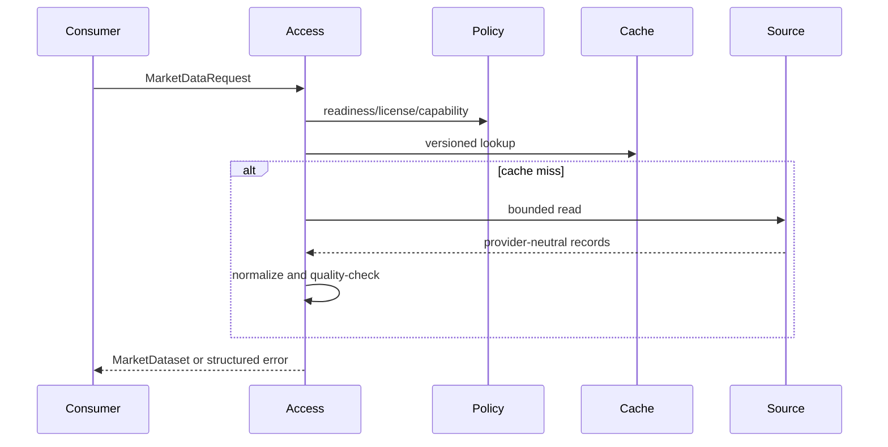

# Data

> **Package:** `app/services/data`
> **Status:** `Completed implementation baseline`
> **Last updated:** `2026-07-19`

> This README is the package's **single source of truth** for requirements,
> final structure, implementation sequence, progress, usage examples, and tests.
> Update this file before changing the code.

---

## 1. Purpose and Boundary

### Purpose

Data acquires, normalizes, stores, and serves trusted market data and read-only
broker/account state. It owns the shared SQLite connection, locking, and migration
execution infrastructure. All broker/provider access is strictly read-only and flows
exclusively through the Brokers domain's canonical `BrokerAdapter` read capability
traits (`MarketDataProvider`, `AccountProvider`, `CalculationProvider`) under the
registered Brokers boundary. Data is a foundation domain: it provides
evidence and controlled resources but makes no strategy, risk, simulation, or
execution decision.

### Owns

- Historical and real-time market-data acquisition, normalization, provenance,
  quality validation, availability inspection, and multi-timeframe alignment.
- Historical market/account data tables, local CSV/Parquet datasets, cache state,
  source policy, job/checkpoint state, feed status, and durable audit storage.
- Shared SQLite connections, path-scoped write locking, and migration execution;
  each persistent domain still owns its own tables and migration definitions.
- Normalization of raw broker/provider reads (obtained through Brokers' `BrokerAdapter`
  read traits) into `MarketDataset`, `AccountStateSnapshot`,
  `MarketContextEvidence`, and `FXConversionEvidence`.
- Source capability, readiness, licensing, explicit-fallback, rate-limit, timeout,
  circuit-breaker, and promotion policy.
- Deterministic resampling, alignment, tick aggregation, and synthetic generation
  (Research owns historical labeling).
- Bounded update jobs/backfills, idempotency, leases, checkpoints, crash recovery,
  and minimum internal feed lifecycle/status.

### Does not own

- Strategy evaluation, indicators, risk policy, position sizing, order formulation,
  broker dispatch decisions, reconciliation authority, or simulated fills/state.
- Broker/provider adapter implementations, connection/session mechanics, or
  credentials: Brokers owns adapters and lifecycle behavior; secrets are resolved
  through the Utils settings layer. The Data package-root retrieval facade may
  privately and lazily compose a read-only adapter through the Brokers factory for
  standalone calls. Data never exposes the adapter or invokes `BrokerAdapter`
  mutation operations.
- Another domain's tables, artifact schemas, or migration definitions.
- Public streaming subscriptions, automatic feed-gap backfill, historical calendar
  reconstruction, TSDB selection, or unapproved external-source promotion.
- Raw provider DataFrames, provider SDK objects, sockets, streams, credentials, or
  database sessions crossing the public API or a cross-domain boundary. The
  package-root `to_ohlcv_dataframe` and `to_tick_dataframe` helpers may return new
  validated analytical projections containing only canonical market values and UTC
  timestamps.
- Silent source fallback, stale-cache use, gap repair, interpolation, schema migration,
  or precision coercion in governed workflows.

### Shared contracts

Contract definitions must match the name, version, and owner recorded in
`docs/PROJECT.md`.

**Owned by this domain** — defined authoritatively here:

| Status | Contract | Version | Counterparty | Purpose |
|---|---|---|---|---|
| Completed | `MarketDataset` | `v1` | Indicators, Strategy, Trading, Simulation, Analytics, Optimization, Research, Portfolio, UI/API (Risk consumes `MarketContextEvidence` / `AccountStateSnapshot` instead) | Normalized bars/ticks with `available_at`, quality, precision, provenance, schema, and normalization metadata. |
| Completed | `AccountStateSnapshot` | `v1` | Strategy, Risk, Trading, Portfolio | Immutable read-only account, balance, position, margin, broker-state, and UTC snapshot evidence. |
| Completed | `MarketContextEvidence` | `v1` | Risk; Trading (orchestrator carrier only), UI/API (views) | Immutable normalized session, calendar, spread, liquidity, volatility, correlation, crisis, timezone, freshness, provenance, and explicit-missingness evidence for fail-closed Risk evaluation. Only Risk interprets it. |
| Completed | `FXConversionEvidence` | `v1` | Risk, Simulation, Analytics, Portfolio | Immutable ordered direct or synthesized conversion path, composite rate, freshness, path-policy version, and source provenance. Consumers apply but never synthesize it. |
| Completed | `AuditEventQuery` / `AuditEventPage` | `v1` | UI/API, Risk | Governed bounded filters and a cursor page over Utils-owned `AuditEvent` envelopes; Data owns query semantics and durable access, not event payload meaning. |

`MarketDataset v1` contains: `contract_version="v1"`,
`schema_id="data.market_dataset.v1"`, `normalization_version`,
`data_kind`, `symbol`, optional `timeframe`, immutable canonical `records`, UTC
`start`/`end`, per-record or dataset `available_at`, `record_count`,
`DataQualityReport`, source/provenance/license metadata, cache status, workflow
context, and precision policy. Records never contain raw provider objects.

`AccountStateSnapshot v1` contains: `contract_version="v1"`,
`schema_id="data.account_state_snapshot.v1"`, account identifier,
currency, balances/equity/margin values as exact decimal strings, normalized open
positions and orders, broker connectivity/trading-allowance evidence, source,
`snapshot_at` UTC, expiry/staleness metadata, and trace identifiers. Missing, stale,
or unverifiable governed evidence fails closed.

`MarketContextEvidence v1` carries separate `contract_version="v1"` and
`schema_id="data.market_context_evidence.v1"`, bounded session/calendar state,
spread/liquidity/volatility/correlation/crisis evidence, timezone, UTC `as_of`,
freshness, provenance, and explicit missingness. Data owns normalization and
freshness truth; Risk owns interpretation and policy decisions.

`FXConversionEvidence v1` carries separate `contract_version="v1"` and
`schema_id="data.fx_conversion_evidence.v1"`, source and target currencies,
an ordered acyclic sequence of rate legs, exact decimal leg/composite rates, UTC
`as_of`, request-supplied freshness limit, path-policy identifier/version,
source provenance, and trace identifiers. Missing, stale, cyclic, disallowed, or
unverifiable paths fail closed; consumers never synthesize or silently refresh it.

`AuditEventQuery v1` contains separate contract version/schema ID, an ordered UTC
range, optional domain/action/principal/correlation filters, an opaque cursor, and a
positive bounded limit. `AuditEventPage v1` contains separate identifiers, an ordered
tuple of Utils-owned `AuditEvent v1` values, and an opaque optional next cursor. The
caller supplies `AuthContext` separately; unauthorized or unbounded queries fail closed.

**Consumed from other domains** — referenced only, never redefined:

| Contract | Version | Owner | Used for |
|---|---|---|---|
| `AuthContext` | `v1` | Utils | Authenticate and trace governed reads, source promotion, audit persistence, and audit queries. |
| `AuditEvent` | `v1` | Utils | Persist redacted governed events in Data's durable audit store. |
| `BrokerAdapter` (read traits) | `v1` | Brokers | Read-only market data, account state, and calculation reads via `MarketDataProvider`, `AccountProvider`, and `CalculationProvider`; Data never invokes mutation operations. |
| `BrokerResult` / `BrokerError` | `v1` | Brokers | Canonical result envelope and error taxonomy for every provider read consumed by Data. |
| `BrokerConnectionEvent` / subscription event DTOs | `v1` | Brokers | Bounded connection lifecycle and provider-event channels feeding Data's internal feed handling. |

### Persisted state

Only Data writes Data-owned state. Other domains read it through documented
contracts. Other domains submit their own migrations to Data's execution framework
but retain schema ownership.

| Status | State / Store | Read access (via contract) | Migration definitions |
|---|---|---|---|
| Completed | Market/account data tables, range indexes, source revisions, and historical datasets | Consumers via `MarketDataset` / `AccountStateSnapshot` | `app/services/data/storage/migrations.py` |
| Completed | Durable audit event store | UI/API audit views and Risk verification through approved queries | `app/services/data/storage/migrations.py` |
| Completed | Versioned cache entries and manifests | Data APIs only; consumers receive cache metadata, never direct rows | `app/services/data/storage/migrations.py` |
| Completed | Source readiness, capabilities, license policy, rate limits, and breaker state | Data source policy APIs | `app/services/data/storage/migrations.py` |
| Completed | Update jobs, leases, idempotency keys, checkpoints, and recovery state | Data job APIs | `app/services/data/storage/migrations.py` |
| Completed | Internal feed heartbeat, gap, buffer, reconnect, and circuit state | `get_feed_status` | `app/services/data/storage/migrations.py` |
| Completed | Shared migration ledger and path-scoped lock records | Persistent domains through migration results; no direct table access | `app/services/data/storage/migrations.py` |

### Four-level structure

| Code level | Represents |
|---|---|
| **Package** | Data domain |
| **Module folder** | Feature / capability |
| **File** | Use case or focused responsibility |
| **Class / function / method / constant** | Functional requirement behaviour |

```text
Package
└── Module folder
    └── File
        └── Class / Function / Method / Constant
```

### Package capability map



---

## 2. Final Package Structure

Modules and files are ordered from lowest dependency to highest dependency.

```text
app/services/data/
├── __init__.py                         # Exactly 25 approved public operations
├── README.md
├── config.py                           # Typed Data-owned settings via Utils
├── contracts/                          # Immutable Data-owned contracts
│   ├── __init__.py
│   ├── _base.py                        # Frozen model and error mapping
│   ├── _validation.py                  # Shared validation helpers
│   ├── audit.py                        # Audit query/page contracts
│   ├── records.py                      # Bar, tick, and spread records
│   ├── market.py                       # Request, dataset, quality, availability
│   ├── broker.py                       # Account snapshot evidence
│   ├── market_context.py               # Risk-ready market-context evidence
│   ├── fx.py                           # FX conversion request/path evidence
│   ├── sources.py                      # Source/readiness/license contracts
│   ├── feeds.py                        # Feed request/result contracts
│   ├── jobs.py                         # Job/backfill request/result contracts
│   ├── reference.py                    # Symbol/schedule/volume contracts
│   ├── storage.py                      # Handle-free storage contracts
│   └── errors.py                       # DataError and deterministic manifest
├── storage/                            # Shared persistence infrastructure
│   ├── __init__.py
│   ├── database.py                     # Bounded SQLite transaction execution
│   ├── locking.py                      # Exclusive path-scoped write locks
│   ├── datasets.py                     # Atomic CSV/Parquet load/save
│   ├── cache.py                        # One versioned TTL/revision cache
│   ├── audit.py                        # Durable AuditEvent persistence and governed query
│   └── migrations.py                   # Data migrations and shared runner
├── sources/                            # Read-only source boundary
│   ├── __init__.py
│   ├── protocol.py                     # Small typed read-only source Protocol
│   ├── registry.py                     # Lazy source registration/resolution
│   ├── policy.py                       # Readiness, license, fallback, promotion
│   ├── broker.py                       # Caller-owned BrokerAdapter reads
│   ├── local.py                        # Explicit local-file adapter
│   └── external.py                     # Injected external read adapter
├── access/                             # Read orchestration
│   ├── __init__.py
│   ├── historical.py                   # Bars, ticks, and spreads
│   ├── reference.py                    # Symbols, metadata, availability
│   ├── sessions.py                     # Current hours/sessions and volume
│   ├── context.py                      # Injected market-context evidence
│   └── fx.py                           # Injected FX evidence
├── processing/                         # Deterministic market-data processing
│   ├── __init__.py
│   ├── timeframes.py                   # One timeframe source of truth
│   ├── transforms.py                   # Resample, align, aggregate
│   ├── tabular.py                      # Canonical analytical projections and comparison
│   ├── synthetic.py                    # Seeded bounded GBM bars/ticks (fixtures only)
│   └── ticks.py                        # Real-evidence tick-series generation
├── jobs/                               # Update/backfill lifecycle
│   ├── __init__.py
│   ├── backfill.py                     # Bounded idempotent ingestion chunks
│   └── scheduler.py                    # Create/start/stop/run/status/recovery
├── feeds/                              # Internal real-time lifecycle
│   ├── __init__.py
│   ├── runtime.py                      # Buffer, heartbeat, reconnect, gaps
│   └── status.py                       # Read-only status inspection
└── public_api/
    ├── __init__.py
    ├── _requests.py                    # Direct-call request construction
    ├── _runtime.py                     # Private lazy read-only composition
    └── operations.py                   # Typed/direct package facade
```

Standalone usage examples live only under `tests/data/usage/`. Files `01` through
`05` cover retrieval/reference, storage, processing, jobs, and feeds. Provider-backed
examples fail honestly with a typed `DataError` when their settings, credentials,
dependency, connectivity, or capability evidence is unavailable.

### Module dependency diagram



### Structure rules

- `app/services/data/__init__.py` contains imports and `__all__` only.
- Package-root `__all__` contains exactly the approved typed public operations.
- Efficient internal APIs remain in focused submodules and do not appear in the
  package-root export list.
- Every source adapter is read-only. Synthetic generation is a processing capability,
  not an external source adapter.
- `external.py` lazy-loads optional dependencies; import never opens a connection,
  creates a database, runs recovery, or performs network I/O.
- No class named `DataGateway`, generic manager/service/repository layer, SQLite
  connection pool, or TSDB abstraction is part of the initial design.
- Simulation-specific trading-bar/M1/real tick reconstruction is absent; Simulation
  owns it and consumes canonical Data output.

### Reconciliation capability coverage

This table proves that every reconciliation capability has one final destination or
an explicit exclusion.

| Capability | Decision | Final destination / treatment |
|---|---|---|
| `CAP-DATA-001` Typed public and internal API boundary | Modify | `contracts/`, focused typed submodules, and thin `public_api/operations.py` facade over the owning `FR-DATA-*` operations |
| `CAP-DATA-002` Historical OHLCV/tick/spread retrieval | Modify | `access/historical.py`, typed retrieval operations, `WF-DATA-001/002` |
| `CAP-DATA-003` Source protocol/registry/readiness/adapters | Modify | `sources/`, `FR-DATA-022–029` |
| `CAP-DATA-004` Canonical records/UTC/versioning | Modify | `contracts/records.py`, `contracts/market.py` |
| `CAP-DATA-005` Quality/gaps/availability/revision | Modify/Replace | `DataQualityReport`, `DataAvailability`, `inspect_availability`, `get_data_availability` |
| `CAP-DATA-006` Versioned cache and safe clear | Modify | `storage/cache.py`, `clear_data_cache` |
| `CAP-DATA-007` Local CSV/Parquet and atomic storage | Modify | `storage/datasets.py`, `save_market_data`, `load_local_dataset` |
| `CAP-DATA-008` SQLite state and transactional infrastructure | Modify | `storage/database.py`, `locking.py`, `migrations.py`, `audit.py` |
| `CAP-DATA-009` Jobs and resumable backfills | Modify/Replace | `jobs/`, typed job operations, `WF-DATA-007` |
| `CAP-DATA-010` Internal real-time feed lifecycle | Add/Replace | `feeds/`, `get_feed_status`, `WF-DATA-008`; initial deterministic fake harness and specified informational limits |
| `CAP-DATA-011` Timeframes/resampling/alignment/aggregation | Merge/Modify | `processing/timeframes.py`, `transforms.py`, typed transform operations |
| `CAP-DATA-012` Deterministic synthetic generation | Modify | `processing/synthetic.py`, typed synthetic operations, `WF-DATA-005` |
| `CAP-DATA-022` Real-evidence tick-series generation | Add | `processing/ticks.py`, `FR-DATA-087`–`FR-DATA-090`, `WF-DATA-016` |
| `CAP-DATA-013` Historical labeling | Retired | Owned by Research; no Data implementation |
| `CAP-DATA-014` Market hours/sessions/volume | Modify/Add | `access/sessions.py`, three typed retrieval operations, `WF-DATA-010` |
| `CAP-DATA-015` License/fallback/rate/breaker/source safety | Modify | `sources/policy.py`, source manifests, `WF-DATA-011` |
| `CAP-DATA-016` Symbol discovery and metadata | Modify | `access/reference.py`, typed metadata/discovery operations, `WF-DATA-009` |
| `CAP-DATA-017` Errors/request correlation/audit/side effects | Add | `contracts/errors.py`, `storage/audit.py`, typed API rules, NFRs |
| `CAP-DATA-018` Workflow-aware precision/serialization | Modify | Contract/API precision policy and `NFR-DATA-002–004` |
| `CAP-DATA-019` Simulation tick-model boundary | Split | Data retains canonical/generic generation; Simulation owns model reconstruction; `WF-DATA-012` |
| `CAP-DATA-020` Legacy implementation/facade cleanup | Remove | No legacy facade, aliases, duplicate cache, `_common.py`, or simulation tick model exists in the final tree. |
| `CAP-DATA-021` Tests and validation evidence | Add | Section 7 and `NFR-DATA-009/012`; hard allocation/response bounds are tested, while benchmark results remain explicitly informational |

### Explicit exclusions

| Treatment | Behavior |
|---|---|
| Remove | `_common.py`, broken/unbound exports, legacy aliases, duplicate caches/file savers/label entry points, superseded record-list gateway, mock production feed registration, status-only scheduler execution, and Data-owned simulation tick modelling after migration. |
| Reject | Mandatory `DataGateway`, SQLite pool/leak detector, named TimescaleDB/InfluxDB direction, composite feed health score, hidden on-read migration, and mandatory multiprocessing. |

---

## 3. Workflows

### Status values

| Status | Meaning |
|---|---|
| **Missing** | Not implemented or not verified |
| **Partial** | Useful V1 behavior exists but final contracts, placement, or tests differ |
| **Completed** | Implemented in the final structure, tested, and verified |

### Workflow scope values

| Scope | Meaning |
|---|---|
| **Internal** | The complete workflow occurs within Data. |
| **Cross-domain** | Data receives input from or returns output to another domain. |

| Status | Workflow ID | Scope | Workflow | Trigger / Input boundary | Final outcome / Output boundary | Requirement sequence |
|---|---|---|---|---|---|---|
| Completed | `WF-DATA-001` | Cross-domain | Historical bars/ticks/spreads retrieval | Consumer submits bounded source/range request | `MarketDataset v1` | `FR-DATA-006 → 026 → 030` |
| Completed | `WF-DATA-002` | Cross-domain | Internal analytical data access | Approved Python consumer submits `MarketDataRequest` | Typed `MarketDataset`, never raw provider state | `FR-DATA-006 → 030 → 005` |
| Completed | `WF-DATA-003` | Internal | Local dataset load/save | Approved CSV/Parquet path and normalized data | Validated dataset or atomic committed artifact/manifest | `FR-DATA-016 → 017/018` |
| Completed | `WF-DATA-004` | Internal | Resample, align, and aggregate | Normalized datasets/ticks | Deterministic no-lookahead dataset | `FR-DATA-036 → 037/038` |
| Completed | `WF-DATA-005` | Cross-domain | Synthetic generation | Bounded parameters and optional seed | Deterministic canonical bars/ticks for fixtures only | `FR-DATA-039` |
| Completed | `WF-DATA-016` | Cross-domain | Tick-series generation from real evidence | Real bar or tick `MarketDataset`, approved model, spread model, and seed when variable | Canonical tick `MarketDataset` with intra-bar phase metadata, or a bounded Parquet artifact | `FR-DATA-087 → FR-DATA-088 → FR-DATA-089 → FR-DATA-090` |
| Retired | `WF-DATA-006` | — | Historical labeling | Owned by Research; no Data workflow | — | — |
| Completed | `WF-DATA-007` | Internal | Update job and historical backfill | Job definition or run-once command | Committed chunks and resumable checkpoint | `FR-DATA-041 → 042 → 043/044/045` |
| Completed | `WF-DATA-008` | Cross-domain | Internal real-time feed and status | Staging feed source emits event | Normalized bounded state and `get_feed_status` output | `FR-DATA-046 → 047 → 048` |
| Completed | `WF-DATA-009` | Cross-domain | Symbol discovery, metadata, availability | Bounded source/symbol query | Provenanced metadata/page/availability result | `FR-DATA-023/024 → 031/032/033` |
| Completed | `WF-DATA-010` | Cross-domain | Current hours, sessions, and volume | Current configured market request | UTC windows or bounded volume result | `FR-DATA-034/035` |
| Completed | `WF-DATA-011` | Internal | Source readiness and promotion | Operator evidence package and `AuthContext` | Reversible readiness state | `FR-DATA-026 → 027` |
| Completed | `WF-DATA-012` | Cross-domain | Simulation data-modelling boundary | Simulation requests canonical history | Data supplies canonical bars/ticks; Simulation reconstructs model-specific ticks | `FR-DATA-030 → 005` |
| Completed | `WF-DATA-013` | Cross-domain | Account snapshot service | Strategy/Risk/Trading read-only account evidence request | `AccountStateSnapshot v1` (read-only; no mutation capability) | `FR-DATA-028 → 008` |
| Completed | `WF-DATA-014` | Cross-domain | Risk market-context evidence | Risk requests current normalized context | `MarketContextEvidence v1` or explicit stale/missing failure | `FR-DATA-075 → 076` |
| Completed | `WF-DATA-015` | Cross-domain | FX conversion evidence | Risk, Simulation, Analytics, or Portfolio requests a bounded conversion | `FXConversionEvidence v1` or explicit stale/path failure | `FR-DATA-078 → FR-DATA-079` |

### `WF-DATA-001` — Historical Bars, Ticks, and Spreads

**Scope:** `Cross-domain`
**System workflow:** `SYS-WF-001`, `SYS-WF-002`, `SYS-WF-003`, `SYS-WF-004`
**Input boundary:** A consumer supplies a JSON request payload or typed
`MarketDataRequest`; live/current reads used by `SYS-WF-002` use the same boundary.
**Output boundary:** Data returns its documented typed result or `DataError`.

1. Validate request bounds, UTC range, workflow context, precision, and fallback list.
2. Enforce readiness, capability, license, rate, timeout, and breaker policy for the
   requested source and each explicitly supplied fallback.
3. Resolve cache identity from source revision, schema/normalization versions, raw
   hash when known, request dimensions, and policy.
4. Fetch from one lazy read adapter on cache miss, normalize UTC records, and create a
   bounded quality report.
5. Fail closed for blocking quality/precision violations; otherwise return the typed
   dataset or JSON-safe envelope with attempted-source metadata.

**Failure behaviour:** invalid input → `VALIDATION_FAILED`; undeclared fallback → no
fallback; unavailable/staging-disallowed source → `SOURCE_UNAVAILABLE`; missing
license → `LICENSE_RESTRICTION`; strict quality failure → `DATA_QUALITY_FAILED`;
external timeout → `TIMEOUT`; empty valid range → `EMPTY_RESULT`. Cache-write failure
is disclosed as a warning for read workflows and never changes returned records.

**Integration test:**
`tests/data/integration/test_historical_retrieval.py::test_historical_retrieval_explicit_fallback()`



### `WF-DATA-003` — Local Dataset Load and Save

**Scope:** `Internal`
**System workflow:** `None`
**Input boundary:** Approved relative path, `csv|parquet`, normalized dataset, and
overwrite/manifest options.
**Output boundary:** Loaded `MarketDataset` or committed artifact plus manifest.

1. Resolve the path under configured approved roots and reject traversal, absolute
   escape, and unapproved hidden/system paths.
2. Acquire the exclusive path-scoped writer lock for writes.
3. Validate/normalize records and license/export policy.
4. Write a temporary artifact and versioned manifest, fsync as supported, then commit
   atomically; quarantine failed temporary output.
5. Verify file hash/schema on load and never perform hidden on-read migration.

**Failure behaviour:** unsafe path → `PERMISSION_DENIED`; lock conflict →
`CONCURRENT_WRITE_LOCKED`; corrupt artifact → `FILE_CORRUPTED`; invalid data →
`DATA_QUALITY_FAILED`; write failure → `DB_WRITE_FAILED` or mapped filesystem error.

**Integration test:**
`tests/data/integration/test_local_dataset.py::test_local_dataset_atomic_round_trip()`

### `WF-DATA-004` — Resample, Align, and Aggregate

**Scope:** `Internal`
**System workflow:** `SYS-WF-001`, `SYS-WF-003`
**Input boundary:** Canonical datasets and declared source/target timeframes.
**Output boundary:** Deterministic `MarketDataset` with updated provenance and
`available_at`.

The single timeframe manifest validates ordering. Resampling permits only supported
higher-timeframe conversion; alignment selects only values available at each target
timestamp; tick aggregation requires sorted canonical ticks and explicit spread
policy. Any lookahead, disorder, overlap-policy, or unsupported-timeframe violation
fails the operation atomically.

**Integration test:**
`tests/data/integration/test_processing.py::test_multitimeframe_alignment_has_no_lookahead()`

### `WF-DATA-007` — Update Job and Historical Backfill

**Scope:** `Internal`
**System workflow:** `None`
**Input boundary:** Persisted job definition or one-time bounded backfill request.
**Output boundary:** Atomic chunk commits, checkpoints, and observable job state.

1. Validate source/license/destination and derive an idempotency key from source,
   symbol, kind, timeframe, range, schema, and normalization version.
2. Acquire one active lease and divide the range into chunks no larger than 10,000
   records or one source calendar day, whichever is smaller.
3. For each chunk run retrieval → normalization → quality → persistence.
4. Commit artifact/data, idempotency record, and checkpoint in one recoverable unit.
5. On restart, validate the checkpoint and resume after the last committed chunk.

**Failure behaviour:** duplicate active worker → `CONCURRENT_WRITE_LOCKED`; corrupt
checkpoint → `CHECKPOINT_CORRUPTED`; failed chunk leaves no published partial chunk;
recovery failure → `STATE_RECOVERY_FAILED`. A job never reports success without data
movement or an explicit no-change result.

**Integration test:**
`tests/data/integration/test_backfill.py::test_backfill_resumes_after_last_committed_chunk()`

### `WF-DATA-008` — Internal Real-Time Feed and Status

**Scope:** `Cross-domain`
**System workflow:** `SYS-WF-002`
**Input boundary:** A configured staging/production source emits provider events to
the internal runtime; no public subscription API exists.
**Output boundary:** Consumers receive normalized internal events and operators receive
bounded read-only `FeedStatus` data.

The runtime normalizes events into a bounded buffer, updates heartbeats/counters,
records gap windows and dropped-data evidence, and reconnects with bounded exponential
backoff plus jitter. Overflow follows `halt`, `drop_and_reconcile`, or `backpressure`;
no automatic historical reconciliation capability exists, so Phase 1 records and exposes the
gap only. The initial source is the deterministic fake contract harness. Promotion to one MT5 demo feed for the Trading live/paper runtime occurs only after Trading exists and the promotion evidence passes.

**Integration test:**
`tests/data/integration/test_feed_runtime.py::test_feed_overflow_records_gap_without_hidden_backfill()`

### `WF-DATA-011` — Source Readiness and Promotion

**Scope:** `Internal`
**System workflow:** `None`
**Input boundary:** Authenticated operator submits mocked/live, normalization, quality,
timeout, rate-limit, license, redaction, and sign-off evidence.
**Output boundary:** Audited, reversible source readiness transition.

CSV and Parquet begin `production`; synthetic generation is production processing.
MT5, cTrader, Dukascopy, Binance discovery, and the real-time feed gateway begin
`staging`. Promotion is rejected until every declared criterion is linked and valid;
demotion is always allowed when evidence degrades.

**Integration test:**
`tests/data/integration/test_source_promotion.py::test_source_promotion_requires_complete_evidence()`

### `WF-DATA-012` — Simulation Data-Modelling Boundary

**Scope:** `Cross-domain`
**System workflow:** `SYS-WF-001`
**Input boundary:** Simulation requests canonical historical bars/ticks.
**Output boundary:** Data returns `MarketDataset`; Simulation owns trading-bar, M1,
generated/real tick reconstruction, fill models, and simulated state.

**Failure behaviour:** Data-quality or no-lookahead violation aborts the dataset
boundary; Data never returns a partially modeled simulation stream.

**Integration test:**
`tests/data/integration/test_simulation_boundary.py::test_data_excludes_simulation_tick_models()`

### `WF-DATA-013` — Account Snapshot Service

**Scope:** `Cross-domain`
**System workflow:** `SYS-WF-002`
**Input boundary:** Strategy/Risk/Trading request read-only account evidence.
**Output boundary:** `AccountStateSnapshot v1`.

Data reads raw account/broker state through Brokers' `BrokerAdapter` read traits
(`AccountProvider`), then normalizes provider state, connectivity/trading-allowance
evidence, and staleness metadata into an immutable snapshot. Data holds no mutation
capability and issues none: broker mutations are dispatched by Trading directly
through Brokers' `BrokerAdapter` mutation operations.

**Integration test:**
`tests/data/integration/test_broker_boundary.py::test_data_broker_access_is_read_only()`

### `WF-DATA-014` — Risk Market-Context Evidence

**Scope:** `Cross-domain`
**System workflow:** `SYS-WF-001`, `SYS-WF-002`
**Input boundary:** Risk requests current session, calendar, spread, liquidity,
volatility, correlation, and crisis evidence for a declared symbol/account scope.
**Output boundary:** `MarketContextEvidence v1` or a structured missing/stale error.

Data obtains provider facts through Brokers read traits and Data-owned sources,
normalizes timezones and freshness, preserves provenance and explicit missingness,
and publishes no policy verdict. Risk alone decides whether the evidence permits an
action. Missing mandatory evidence is never replaced with a fabricated default.

**Integration test:**
`tests/data/integration/test_market_context_boundary.py::test_risk_receives_owned_market_context_evidence()`

---

### `WF-DATA-015` — FX Conversion Evidence

**Scope:** `Cross-domain`
**System workflow:** `SYS-WF-001`, `SYS-WF-007`, `SYS-WF-008`
**Input boundary:** a bounded source/target currency request, UTC `as_of`,
explicit maximum age, and explicit allowed-path policy.
**Output boundary:** `FXConversionEvidence v1` or a structured failure.

Data resolves provider truth through read-only sources, selects an allowed acyclic
path deterministically, preserves every leg and provenance reference, calculates
the exact composite rate, and validates freshness. Consumers may multiply by the
published rate but may not reconstruct a different path. No synthetic/default rate
is emitted.

**Integration test:**
`tests/data/integration/test_fx_conversion_evidence.py::test_portfolio_receives_fresh_owned_fx_evidence()`

---

## 4. Module and Requirement Specifications

Modules, files, and requirements below are the implementation order. Public and
internal operations return typed Data contracts or raise `DataError` with a code
from `DATA_ERROR_MANIFEST`. UI/API owns external transport mapping.

### 4.1 `contracts/` — Canonical Contracts and Errors

**Purpose:** Define the complete typed, versioned, provider-neutral Data vocabulary.

**Module flow:**

```text
untrusted source or request
  → canonical record/request validation
  → dataset/quality/source/broker contract
  → internal or cross-domain consumer
```

### Files

| Status | File | Responsibility | Key exports | Dependencies |
|---|---|---|---|---|
| Completed | `_base.py` | Enforce frozen, forbidden-extra Data contracts and map validation to `DataError`. | `DataContractModel` (private) | **Standard library:** None<br>**Required third-party:** `pydantic`<br>**Local:** `errors.py` |
| Completed | `_validation.py` | Validate request and trace identifiers through Utils policy. | Private validation helpers | **Standard library:** None<br>**Required third-party:** None<br>**Local:** `app.utils` |
| Completed | `records.py` | Validate immutable canonical market records. | `OHLCVRecord`, `TickRecord`, `SpreadRecord` | **Standard library:** `datetime`, `decimal`<br>**Required third-party:** `pydantic`<br>**Local:** None |
| Completed | `market.py` | Define bounded requests, datasets, quality, and availability. | `DataQualityReport`, `MarketDataset`, `MarketDataRequest`, `DataAvailability` | **Standard library:** `datetime`, `decimal`, `collections.abc`<br>**Required third-party:** `pydantic`<br>**Local:** `records.py` → record contracts |
| Completed | `broker.py` | Define read-only normalized account evidence. | `AccountStateSnapshot` | **Standard library:** `datetime`, `decimal`, `typing`<br>**Required third-party:** `pydantic`<br>**Local:** None; raw reads arrive via Brokers' `BrokerAdapter` read traits |
| Completed | `market_context.py` | Define Risk-ready normalized market-context evidence without policy interpretation. | `MarketContextEvidence`, `MarketContextRequest` | **Standard library:** `datetime`, `decimal`, `collections.abc`<br>**Required third-party:** `pydantic`<br>**Local:** `sources.py`, `records.py` |
| Completed | `fx.py` | Define bounded FX conversion requests and immutable conversion-path evidence. | `FXConversionRequest`, `FXRateLeg`, `FXConversionEvidence` | **Standard library:** `datetime`, `decimal`<br>**Required third-party:** `pydantic`<br>**Local:** `sources.py` |
| Completed | `sources.py` | Define source readiness, capability, provenance, and license policy. | `SourceDescriptor`, `SourceLicensePolicy` | **Standard library:** `collections.abc`<br>**Required third-party:** `pydantic`<br>**Local:** None |
| Completed | `audit.py` | Define receiver-owned bounded audit query/page contracts. | `AuditEventQuery`, `AuditEventPage` | **Standard library:** `datetime`<br>**Required third-party:** `pydantic`<br>**Local:** `app.utils.AuditEvent` |
| Completed | `feeds.py` | Define feed configuration, events, results, and status. | `FeedConfig`, `RawFeedEvent`, `FeedStatus` | **Standard library:** `datetime`<br>**Required third-party:** `pydantic`<br>**Local:** base/validation helpers |
| Completed | `jobs.py` | Define job, backfill, recovery, and scheduler contracts. | `BackfillChunkRequest`, `JobDefinition`, `JobStatus` | **Standard library:** `datetime`<br>**Required third-party:** `pydantic`<br>**Local:** base/validation helpers |
| Completed | `reference.py` | Define symbol, availability, schedule, and volume contracts. | `SymbolPage`, `MarketSchedule`, `VolumeResult` | **Standard library:** `datetime`, `decimal`<br>**Required third-party:** `pydantic`<br>**Local:** base/validation helpers |
| Completed | `storage.py` | Define handle-free transaction, migration, dataset, cache, lock, and audit persistence contracts. | `TransactionRequest`, `StorageManifest`, `CacheEntry` | **Standard library:** `datetime`, `pathlib`<br>**Required third-party:** `pydantic`<br>**Local:** market/base/validation helpers |
| Completed | `errors.py` | Define the only Data exception and deterministic code catalog. | `DataError`, `DATA_ERROR_MANIFEST` | **Standard library:** `dataclasses`, `collections.abc`<br>**Required third-party:** None<br>**Local:** None |
| Completed | `__init__.py` | Expose the supported typed contract API. | All exports above | **Standard library:** None<br>**Required third-party:** None<br>**Local:** files above |

### Configuration and Limits Manifest

| Status | Setting / Limit | Type | Default | Required | Used by | Description |
|---|---|---|---|---|---|---|
| Completed | `MARKET_DATASET_SCHEMA` | `str` | `data.market_dataset.v1` | Yes | `MarketDataset` | Stable contract identifier; breaking semantics require a new major version. |
| Completed | `ACCOUNT_SNAPSHOT_SCHEMA` | `str` | `data.account_state_snapshot.v1` | Yes | `AccountStateSnapshot` | Stable read-only account-evidence identifier. |
| Completed | `MARKET_CONTEXT_SCHEMA` | `str` | `data.market_context_evidence.v1` | Yes | `MarketContextEvidence` | Stable schema identifier; compatibility is carried separately as `contract_version="v1"`. |
| Completed | `FX_CONVERSION_EVIDENCE_SCHEMA` | `str` | `data.fx_conversion_evidence.v1` | Yes | `FXConversionEvidence` | Stable schema identifier; request supplies all freshness/path policy values. |
| Completed | `NORMALIZATION_VERSION` | `str` | `v1` | Yes | all record/dataset contracts | Included in cache identity, manifests, and responses. |
| Completed | `WORKFLOW_CONTEXTS` | `tuple[str, ...]` | `research, backtest, validation, risk, execution_bound` | Yes | `MarketDataRequest` | Unsupported values fail with `INVALID_INPUT`. |
| Completed | `PRECISION_POLICIES` | `tuple[str, ...]` | `decimal_string, float_research_only, source_native_decimal, reject_on_missing_metadata` | Yes | `MarketDataset` | Official/persisted governed boundaries default to decimal strings; research float use is disclosed. |
| Completed | `QUALITY_SAMPLE_LIMIT` | `int` | Configurable bounded value | Yes | `DataQualityReport` | Caps issue samples; exceeding it sets `truncated=true` rather than expanding payloads. |

#### `records.py` — Canonical Records

| Status | Requirement ID | Responsibility | Class / Function / Method | Side Effects | Raises | Usage / Test |
|---|---|---|---|---|---|---|
| Completed | `FR-DATA-001` | Validate UTC OHLCV with finite exact numerics, `low ≤ open/close ≤ high`, non-negative volume, optional non-negative provider-reported spread with its native unit, provenance, and `available_at`. | `OHLCVRecord` | None | `DataError[VALIDATION_FAILED]`: field, UTC, order, OHLC, or spread/unit invariant fails | **Usage:** `tests/data/usage/01_contracts.py::example_fr_data_001_ohlcv_record()`<br>**Unit:** `tests/data/unit/test_records.py::test_ohlcv_record_rejects_invalid_range()` |
| Completed | `FR-DATA-002` | Validate UTC ticks with finite bid/ask/last, `ask ≥ bid` when both exist, volume metadata, provenance, and `available_at`. | `TickRecord` | None | `DataError[VALIDATION_FAILED]`: invalid timestamp, numeric field, or bid/ask relation | **Usage:** `tests/data/usage/01_contracts.py::example_fr_data_002_tick_record()`<br>**Unit:** `tests/data/unit/test_records.py::test_tick_record_rejects_crossed_quote()` |
| Completed | `FR-DATA-003` | Validate spread records with declared unit/scale, non-negative exact spread, UTC timestamp, provenance, and `available_at`. | `SpreadRecord` | None | `DataError[VALIDATION_FAILED]`: missing unit/scale or invalid spread | **Usage:** `tests/data/usage/01_contracts.py::example_fr_data_003_spread_record()`<br>**Unit:** `tests/data/unit/test_records.py::test_spread_record_requires_unit()` |

**Rules:** Canonical timestamps are timezone-aware UTC. Broker-critical numerics use
`Decimal` internally or lossless source-native values and serialize as decimal strings
at official/persisted governed boundaries.

**Implementation notes:** Canonical contracts do not copy provider defaults or expose
mutable DataFrames.

#### `market.py` — Requests, Datasets, Quality, and Availability

| Status | Requirement ID | Responsibility | Class / Function / Method | Side Effects | Raises | Usage / Test |
|---|---|---|---|---|---|---|
| Completed | `FR-DATA-004` | Represent bounded quality evidence with status, score, issues, warnings, counts, truncation, schema version, UTC generation time, and governed blocking behavior. | `DataQualityReport` | None | `DataError[VALIDATION_FAILED]`: malformed or unbounded diagnostics | **Usage:** `tests/data/usage/01_contracts.py::example_fr_data_004_quality_report()`<br>**Unit:** `tests/data/unit/test_market_contracts.py::test_quality_report_bounds_samples()` |
| Completed | `FR-DATA-005` | Expose immutable normalized records with availability, quality, provenance, license, cache, workflow, schema, normalization, and precision metadata. | `MarketDataset` | None | `DataError[DATA_QUALITY_FAILED]`: dataset violates blocking contract | **Usage:** `tests/data/usage/01_contracts.py::example_fr_data_005_market_dataset()`<br>**Unit:** `tests/data/unit/test_market_contracts.py::test_market_dataset_never_contains_provider_objects()` |
| Completed | `FR-DATA-006` | Validate one typed internal request containing source, symbol, kind, optional timeframe/range/limit, cache/quality policies, UTC/IANA inputs, workflow, precision, explicit fallbacks, and request ID. | `MarketDataRequest` | None | `DataError[INVALID_INPUT]`: invalid enum/range/limit/timezone/fallback | **Usage:** `tests/data/usage/01_contracts.py::example_fr_data_006_market_request()`<br>**Unit:** `tests/data/unit/test_market_contracts.py::test_market_data_request_rejects_implicit_fallback()` |
| Completed | `FR-DATA-007` | Represent indexed ranges, gaps, overlap/completeness evidence, record count, source revision/readiness, and provenance without materializing the full dataset. | `DataAvailability` | None | `DataError[VALIDATION_FAILED]`: inconsistent range or count evidence | **Usage:** `tests/data/usage/01_contracts.py::example_fr_data_007_availability()`<br>**Unit:** `tests/data/unit/test_market_contracts.py::test_availability_requires_measured_gaps()` |

#### `broker.py` — Broker Boundary Contracts

| Status | Requirement ID | Responsibility | Class / Function / Method | Side Effects | Raises | Usage / Test |
|---|---|---|---|---|---|---|
| Completed | `FR-DATA-008` | Expose immutable normalized account, balance, margin, position, order, connectivity, and staleness evidence with exact decimals and UTC snapshot time. | `AccountStateSnapshot` | None | `DataError[STALE_EVIDENCE]`: snapshot expired; `DataError[VALIDATION_FAILED]`: evidence incomplete | **Usage:** `tests/data/usage/01_contracts.py::example_fr_data_008_account_snapshot()`<br>**Unit:** `tests/data/unit/test_broker_contracts.py::test_account_snapshot_rejects_stale_evidence()` |
| Removed | `FR-DATA-009` | *(The restricted broker-execution channel is outside the architecture. Trading dispatches mutations directly through Brokers' `BrokerAdapter`; Data holds and issues no mutation capability.)* | — | None | — | — |

#### `market_context.py` — Market-Context Evidence

| Status | Requirement ID | Responsibility | Class / Function / Method | Side Effects | Raises | Usage / Test |
|---|---|---|---|---|---|---|
| Completed | `FR-DATA-075` | Validate a bounded request for session, calendar, spread, liquidity, volatility, correlation, and crisis evidence for one declared scope. | `MarketContextRequest` | None | `DataError[INVALID_INPUT]`: invalid scope, timezone, or evidence request | **Usage:** `tests/data/usage/01_contracts.py::example_fr_data_075_market_context_request()`<br>**Unit:** `tests/data/unit/test_market_context.py::test_request_rejects_unknown_scope()` |
| Completed | `FR-DATA-076` | Produce immutable `MarketContextEvidence v1` with separate contract version/schema ID, UTC freshness, provenance, and explicit missingness; never produce a Risk verdict. | `get_market_context_evidence(request: MarketContextRequest, provider: MarketContextProvider) -> MarketContextEvidence` | Read-only provider/source calls | `DataError[STALE_EVIDENCE|SOURCE_UNAVAILABLE|VALIDATION_FAILED]`: mandatory evidence unavailable, stale, or malformed | **Usage:** `tests/data/usage/04_market_account_read.py::example_fr_data_076_market_context_evidence()`<br>**Unit:** `tests/data/unit/test_market_context.py::test_missing_evidence_is_explicit()` |

#### `fx.py` — FX Conversion Evidence

| Status | Requirement ID | Responsibility | Class / Function / Method | Side Effects | Raises | Usage / Test |
|---|---|---|---|---|---|---|
| Completed | `FR-DATA-078` | Validate source/target currencies, UTC `as_of`, explicit maximum age, and explicit allowed-path policy; reject same-leg cycles and unbounded discovery. | `FXConversionRequest` | None | `DataError[INVALID_INPUT, LIMIT_EXCEEDED]` | **Usage:** `tests/data/usage/01_contracts.py::example_fr_data_078_fx_request()`<br>**Unit:** `tests/data/unit/test_fx_contracts.py::test_request_requires_explicit_policy_and_freshness()` |
| Completed | `FR-DATA-079` | Deterministically select an allowed acyclic direct/synthesized path and publish exact rates, UTC freshness, policy version, and source provenance as `FXConversionEvidence v1`; never fabricate a rate. | `get_fx_conversion_evidence(request: FXConversionRequest, provider: FXRateProvider) -> FXConversionEvidence` | Read-only provider/source calls | `DataError[DATA_NOT_FOUND, STALE_EVIDENCE, SOURCE_UNAVAILABLE, VALIDATION_FAILED]` | **Usage:** `tests/data/usage/04_market_account_read.py::example_fr_data_079_fx_evidence()`<br>**Unit:** `tests/data/unit/test_fx_contracts.py::test_path_is_acyclic_exact_and_provenanced()` |

#### `sources.py` — Source Contracts

| Status | Requirement ID | Responsibility | Class / Function / Method | Side Effects | Raises | Usage / Test |
|---|---|---|---|---|---|---|
| Completed | `FR-DATA-010` | Declare source readiness, capabilities, credential/network/write requirements, schema/timezone/version metadata, promotion criteria, and sign-off evidence. | `SourceDescriptor` | None | `DataError[VALIDATION_FAILED]`: declaration incomplete or contradictory | **Usage:** `tests/data/usage/01_contracts.py::example_fr_data_010_source_descriptor()`<br>**Unit:** `tests/data/unit/test_source_contracts.py::test_source_descriptor_requires_capabilities()` |
| Completed | `FR-DATA-011` | Declare permitted workflow contexts, export/retention/attribution restrictions, enforcement behavior, and license status for each source. | `SourceLicensePolicy` | None | `DataError[LICENSE_RESTRICTION]`: metadata missing or use forbidden | **Usage:** `tests/data/usage/01_contracts.py::example_fr_data_011_license_policy()`<br>**Unit:** `tests/data/unit/test_source_contracts.py::test_license_policy_fails_closed_for_validation()` |

#### `errors.py` — Deterministic Errors

| Status | Requirement ID | Responsibility | Class / Function / Method | Side Effects | Raises | Usage / Test |
|---|---|---|---|---|---|---|
| Completed | `FR-DATA-012` | Expose one redacted domain exception carrying a manifest code, safe details, retryability, severity, request ID, and operator action without raw exceptions. | `DataError` | None | None | **Usage:** `tests/data/usage/01_contracts.py::example_fr_data_012_data_error()`<br>**Unit:** `tests/data/unit/test_errors.py::test_data_error_redacts_sensitive_details()` |
| Completed | `FR-DATA-013` | Expose one immutable manifest for active deterministic codes and reserve `UNKNOWN_ERROR` for failures not otherwise mapped. | `DATA_ERROR_MANIFEST: Mapping[str, ErrorDefinition]` | None | None | **Usage:** `tests/data/usage/01_contracts.py::example_fr_data_013_error_manifest()`<br>**Unit:** `tests/data/unit/test_errors.py::test_error_manifest_is_complete_and_unique()` |

```text
INVALID_INPUT, VALIDATION_FAILED, DATA_QUALITY_FAILED, DATA_NOT_FOUND,
EMPTY_RESULT, LIMIT_EXCEEDED, UNSUPPORTED_SOURCE, UNSUPPORTED_TIMEFRAME,
UNSUPPORTED_OPERATION, SOURCE_UNAVAILABLE, SERVICE_UNAVAILABLE, NETWORK_ERROR,
TIMEOUT, LICENSE_RESTRICTION, CREDENTIALS_MISSING, AUTHENTICATION_FAILED,
PERMISSION_DENIED, POLICY_BLOCKED, STALE_EVIDENCE, CIRCUIT_BREAKER_OPEN, PRECISION_MISMATCH,
MISSING_ASSET_METADATA, DATABASE_ERROR, DB_CONNECTION_ERROR, DB_WRITE_FAILED,
CONCURRENT_WRITE_LOCKED, FILE_CORRUPTED, SCHEMA_MIGRATION_FAILED, JOB_NOT_FOUND,
SCHEDULER_ERROR, CHECKPOINT_CORRUPTED, STATE_RECOVERY_FAILED, BUFFER_OVERFLOW,
DATA_DROPPED, FEED_HEARTBEAT_TIMEOUT, UNKNOWN_ERROR
```

| Code | Exact condition |
|---|---|
| `INVALID_INPUT` | Required field missing, unknown field present, wrong JSON type, unsupported enum, malformed timestamp, or invalid range relation. |
| `VALIDATION_FAILED` | Typed request/contract invariant fails after JSON shape validation. |
| `DATA_QUALITY_FAILED` | Normalized content contains a quality issue marked blocking for the workflow. |
| `DATA_NOT_FOUND` | Requested approved local/provider entity or indexed range does not exist. |
| `EMPTY_RESULT` | A valid bounded request completes with no records and the contract requires non-empty output. |
| `LIMIT_EXCEEDED` | Count/range/TTL/symbol/timeframe/chunk/payload exceeds its active manifest bound. |
| `UNSUPPORTED_SOURCE` | Source name is not declared in the registry. |
| `UNSUPPORTED_TIMEFRAME` | Timeframe is absent from the canonical manifest or conversion direction is invalid. |
| `UNSUPPORTED_OPERATION` | Capability is explicitly out of Phase 1, including historical calendar reconstruction or public streaming. |
| `SOURCE_UNAVAILABLE` | Declared source is disabled, not ready for the workflow, disconnected, or missing an optional dependency. |
| `SERVICE_UNAVAILABLE` | Required shared infrastructure cannot serve a bounded request. |
| `NETWORK_ERROR` | Classified provider transport failure occurs before a definitive response. |
| `TIMEOUT` | Configured bounded provider/operation deadline expires. |
| `LICENSE_RESTRICTION` | License metadata is missing where required or requested use/export/retention is forbidden. |
| `CREDENTIALS_MISSING` | Enabled external source lacks a required secret reference. |
| `AUTHENTICATION_FAILED` | Credential resolution or broker authentication fails without exposing secrets. |
| `PERMISSION_DENIED` | Principal/scope/path is not authorized, including a non-Trading channel request. |
| `POLICY_BLOCKED` | A deterministic safety policy forbids the requested operation. |
| `STALE_EVIDENCE` | Snapshot/heartbeat/evidence is older than the governing freshness limit. |
| `CIRCUIT_BREAKER_OPEN` | Persisted source breaker is open and cooldown/probe policy does not permit a call. |
| `PRECISION_MISMATCH` | Value cannot satisfy declared digits/step/rounding policy without forbidden truncation or ambiguity. |
| `MISSING_ASSET_METADATA` | Strict workflow needs symbol digits, step, unit, or scale that the source did not prove. |
| `DATABASE_ERROR` | Classified SQLite operation fails outside more specific connection/write codes. |
| `DB_CONNECTION_ERROR` | SQLite path/open/configuration prevents creation of a short-lived connection. |
| `DB_WRITE_FAILED` | Transaction/artifact/cache/audit write cannot commit durably. |
| `CONCURRENT_WRITE_LOCKED` | Another verified writer/worker holds the same path, migration, job, or chunk lease. |
| `FILE_CORRUPTED` | Artifact cannot be decoded or its hash/manifest/schema evidence does not match. |
| `SCHEMA_MIGRATION_FAILED` | Migration ownership/order/checksum/precondition/apply/rollback validation fails. |
| `JOB_NOT_FOUND` | Requested persisted job identifier does not exist. |
| `SCHEDULER_ERROR` | Valid job cannot make the requested lifecycle transition or scheduler mechanism fails. |
| `CHECKPOINT_CORRUPTED` | Checkpoint identity/order/hash does not match committed chunk state. |
| `STATE_RECOVERY_FAILED` | Interrupted job/feed/lock state cannot be proven safe for recovery. |
| `BUFFER_OVERFLOW` | Feed buffer reaches capacity under `halt` or cannot apply configured backpressure. |
| `DATA_DROPPED` | Feed overflow policy intentionally drops one or more events and records a gap. |
| `FEED_HEARTBEAT_TIMEOUT` | No verified feed heartbeat/event arrives before the configured deadline. |
| `UNKNOWN_ERROR` | An unexpected failure remains after deterministic classification; safe details only and not retryable by default. |

### Feature usage examples

`tests/data/usage/01_contracts.py` contains one `example_*` function for
each active contract requirement (`FR-DATA-001`–`008`, `010`–`013`, `075`, and
`078`) and imports only `app.services.data.contracts` plus local test-data builders.

---

### 4.2 `storage/` — Shared Persistence Infrastructure

**Purpose:** Provide the single safe SQLite, file, cache, lock, migration, and audit
infrastructure while preserving each domain's schema ownership.

**Module flow:**

```text
validated command or dataset
  → path/transaction lock
  → atomic operation
  → committed result or complete rollback
```

### Files

| Status | File | Responsibility | Key exports | Dependencies |
|---|---|---|---|---|
| Completed | `database.py` | Execute bounded SQLite transactions without leaking connections. | `execute_transaction` | **Standard library:** `sqlite3`, `pathlib`, `collections.abc`<br>**Required third-party:** None<br>**Local:** `contracts.errors` |
| Completed | `locking.py` | Enforce exclusive path-scoped write ownership. | `acquire_write_lock` | **Standard library:** `contextlib`, `pathlib`, `threading`, `time`<br>**Required third-party:** None<br>**Local:** `contracts.errors` |
| Completed | `migrations.py` | Execute ordered domain-owned migrations and maintain the shared ledger. | `run_domain_migrations` | **Standard library:** `dataclasses`, `collections.abc`<br>**Required third-party:** None<br>**Local:** `database.py`, `locking.py`, `contracts.errors` |
| Completed | `datasets.py` | Load and atomically save normalized CSV/Parquet artifacts and manifests. | `load_dataset`, `save_dataset` | **Standard library:** `hashlib`, `pathlib`<br>**Required third-party:** `pandas`, `pyarrow`<br>**Local:** `contracts`, `locking.py` |
| Completed | `cache.py` | Read/write one versioned TTL/revision-aware cache. | `get_cache_entry`, `put_cache_entry` | **Standard library:** `datetime`, `hashlib`<br>**Required third-party:** None<br>**Local:** `database.py`, `contracts` |
| Completed | `audit.py` | Persist Utils-owned redacted `AuditEvent` envelopes durably and expose a governed bounded query. | `persist_audit_event`, `query_audit_events` | **Standard library:** None<br>**Required third-party:** None<br>**Local:** `database.py`; Data audit query/page contracts; `app.utils` → `AuditEvent`, `AuthContext` |
| Completed | `__init__.py` | Expose the supported persistence-infrastructure API. | All exports above | **Standard library:** None<br>**Required third-party:** None<br>**Local:** files above |

### Configuration and Limits Manifest

| Status | Setting / Limit | Type | Default | Required | Used by | Description |
|---|---|---|---|---|---|---|
| Completed | `DATABASE_URL` | `str` | None | Yes | database, migrations, cache, audit | SQLite URL; missing/unusable configuration fails initialization closed. |
| Completed | `DATA_DIR` | `Path` | None | Yes | datasets, database | Owner-configured data root; never inferred from caller input. |
| Completed | `APPROVED_STORAGE_ROOTS` | `tuple[Path, ...]` | `data/raw`, `data/processed`, `data/cache`, `artifacts/data` | Yes | `load_dataset`, `save_dataset` | Escaping, traversal, and unapproved hidden/system paths are rejected. |
| Completed | `SQLITE_BUSY_TIMEOUT_SECONDS` | `float` | Configurable | Yes | `execute_transaction` | Bounds lock wait; expiry returns `CONCURRENT_WRITE_LOCKED`. |
| Completed | `CACHE_TTL_MAX_SECONDS` | `int` | `604800` | Yes | cache operations | Explicit request TTL ceiling; zero means no time expiry and source revision/hash still govern validity. |
| Completed | `CACHE_CLEAR_MAX_ENTRIES` | `int` | `10000` | Yes | cache clear | Bounds both the scan and mutation set before persistence access. |

#### `database.py`, `locking.py`, and `migrations.py`

| Status | Requirement ID | Responsibility | Class / Function / Method | Side Effects | Raises | Usage / Test |
|---|---|---|---|---|---|---|
| Completed | `FR-DATA-014` | Execute a bounded caller-owned statement plan in one short-lived SQLite transaction, return normalized results without a connection/session, and roll back atomically on failure. | `execute_transaction(request: TransactionRequest) -> TransactionResult` | Persistence write | `DataError[DB_CONNECTION_ERROR|DATABASE_ERROR|DB_WRITE_FAILED]` | **Usage:** `tests/data/usage/02_storage.py::example_fr_data_014_transaction()`<br>**Unit:** `tests/data/unit/test_database.py::test_execute_transaction_rolls_back_atomically()` |
| Completed | `FR-DATA-015` | Validate ownership/order/checksums, acquire the shared lock, and execute domain-owned migration definitions exactly once while preserving an immutable ledger. | `run_domain_migrations(request: MigrationRequest) -> MigrationResult` | Persistence write | `DataError[SCHEMA_MIGRATION_FAILED|CONCURRENT_WRITE_LOCKED]` | **Usage:** `tests/data/usage/02_storage.py::example_fr_data_015_migration()`<br>**Unit:** `tests/data/unit/test_migrations.py::test_run_domain_migrations_rejects_modified_applied_step()`<br>**Evidence:** `app/services/data/storage/migrations.py:246` |
| Completed | `FR-DATA-016` | Grant at most one writer lease per resolved path, reject conflicts deterministically, and release it on exit or verified stale recovery. | `acquire_write_lock(path: Path, request_id: str) -> WriteLock` | Local state mutation; persistence write | `DataError[CONCURRENT_WRITE_LOCKED]` | **Usage:** `tests/data/usage/02_storage.py::example_fr_data_016_write_lock()`<br>**Unit:** `tests/data/unit/test_locking.py::test_write_lock_is_path_scoped_and_exclusive()` |

#### `datasets.py`, `cache.py`, and `audit.py`

| Status | Requirement ID | Responsibility | Class / Function / Method | Side Effects | Raises | Usage / Test |
|---|---|---|---|---|---|---|
| Completed | `FR-DATA-017` | Load CSV/Parquet plus manifest only from an approved root, verify hash/schema/normalization metadata, normalize records, and reject corruption without hidden migration. | `load_dataset(request: DatasetLoadRequest) -> MarketDataset` | Read-only | `DataError[PERMISSION_DENIED|FILE_CORRUPTED|DATA_QUALITY_FAILED]` | **Usage:** `tests/data/usage/02_storage.py::example_fr_data_017_load_dataset()`<br>**Unit:** `tests/data/unit/test_datasets.py::test_load_dataset_rejects_hash_mismatch()` |
| Completed | `FR-DATA-018` | Validate license/quality/path, lock the target, write artifact and manifest through a temporary file, and atomically commit or quarantine failure. | `save_dataset(request: DatasetSaveRequest) -> StorageManifest` | Persistence write | `DataError[PERMISSION_DENIED|CONCURRENT_WRITE_LOCKED|DATA_QUALITY_FAILED|DB_WRITE_FAILED]` | **Usage:** `tests/data/usage/02_storage.py::example_fr_data_018_save_dataset()`<br>**Unit:** `tests/data/unit/test_datasets.py::test_save_dataset_commits_artifact_and_manifest_atomically()` |
| Completed | `FR-DATA-019` | Return a cache entry only when request dimensions, schema/normalization, source revision/raw hash, and stale policy match; stale data is never silent. | `get_cache_entry(request: CacheReadRequest) -> CacheEntry | None` | Read-only | `DataError[DATABASE_ERROR]`; stale policy may yield warning metadata or miss | **Usage:** `tests/data/usage/02_storage.py::example_fr_data_019_read_cache()`<br>**Unit:** `tests/data/unit/test_cache.py::test_cache_invalidates_on_source_revision()` |
| Completed | `FR-DATA-020` | Write a bounded cache entry with complete identity/TTL metadata and surface an optional cache-write failure without corrupting a successful retrieval result. | `put_cache_entry(request: CacheWriteRequest) -> CacheWriteResult` | Persistence write | `DataError[DB_WRITE_FAILED]` | **Usage:** `tests/data/usage/02_storage.py::example_fr_data_020_write_cache()`<br>**Unit:** `tests/data/unit/test_cache.py::test_cache_write_failure_is_not_silent()` |
| Completed | `FR-DATA-021` | Persist a redacted `AuditEvent v1` idempotently with trace identifiers and surface every persistence failure. | `persist_audit_event(event: AuditEvent) -> AuditPersistenceResult` | Persistence write | `DataError[DATABASE_ERROR|DB_WRITE_FAILED]` | **Usage:** `tests/data/usage/02_storage.py::example_fr_data_021_persist_audit()`<br>**Unit:** `tests/data/unit/test_audit_storage.py::test_persist_audit_event_is_idempotent()` |
| Completed | `FR-DATA-077` | Authorize and execute a bounded, deterministically ordered audit query without exposing storage handles or unredacted payloads. | `query_audit_events(request: AuditEventQuery, auth_context: AuthContext) -> AuditEventPage` | Read-only | `DataError[PERMISSION_DENIED|INVALID_INPUT|LIMIT_EXCEEDED|DATABASE_ERROR]` | **Usage:** `tests/data/usage/02_storage.py::example_fr_data_077_query_audit()`<br>**Unit:** `tests/data/unit/test_audit_storage.py::test_query_is_authorized_bounded_and_cursor_ordered()` |

**Implementation notes:** Reuse V1 transaction, cache-key, approved-root, temporary
write, and quarantine logic. Remove import-time schema creation, swallowed durability
failures, duplicate cache semantics, and connection leakage. No pool or automatic
on-read migration is allowed.

### Feature usage examples

`tests/data/usage/02_storage.py` contains one example for each
`FR-DATA-014` through `FR-DATA-021`.

---

### 4.3 `sources/` — Source Policy and Caller-Owned Reads

**Purpose:** Isolate provider-specific reads behind a small typed protocol and enforce
readiness, license, fallback, and read-only broker capability policy.

**Module flow:**

```text
typed request
  → source policy
  → lazy registry resolution
  → caller-owned read-only adapter
  → provider-neutral result
```

### Files

| Status | File | Responsibility | Key exports | Dependencies |
|---|---|---|---|---|
| Completed | `protocol.py` | Define the minimum read-only source behavior. | `MarketDataSource.fetch`, `.list_symbols`, `.get_symbol_metadata` | **Standard library:** `typing`<br>**Required third-party:** None<br>**Local:** `contracts` |
| Completed | `registry.py` | Register and lazily resolve declared sources without side effects. | `register_source`, `resolve_source`, `get_source_descriptor` | **Standard library:** `collections.abc`, `threading`<br>**Required third-party:** None<br>**Local:** `contracts`, `protocol.py`, `app.utils` |
| Completed | `policy.py` | Enforce durable readiness/license/fallback/rate/breaker policy and evidence-based promotion. | `SourcePolicyConfig`, `evaluate_source_policy`, `promote_source` | **Standard library:** `dataclasses`, `json`, `time`<br>**Required third-party:** None<br>**Local:** `contracts`, `registry.py`, `storage`, `app.utils` |
| Completed | `broker.py` | Normalize account snapshots from a caller-owned `BrokerAdapter`; Data owns no connection, credential, or mutation behavior. | `get_account_state_snapshot` | **Standard library:** `asyncio`, `datetime`, `decimal`, `typing`<br>**Required third-party:** None<br>**Local:** `contracts`, `app.utils`; Brokers types are type-check-only |
| Completed | `local.py` | Implement an explicitly composed local CSV source. | `LocalMarketDataSource` | **Standard library:** `json`, `pathlib`, `typing`<br>**Required third-party:** `pydantic`<br>**Local:** `contracts`, `protocol.py`, `storage.datasets`, `app.utils` |
| Completed | `external.py` | Adapt a caller-owned Brokers read adapter to provider-neutral Data batches. | `ExternalMarketDataSource` | **Standard library:** `asyncio`, `collections.abc`, `typing`<br>**Required third-party:** None<br>**Local:** `contracts`, `protocol.py`, `app.utils`; Brokers types are type-check-only |
| Completed | `__init__.py` | Expose only the typed source/policy/broker API. | Public exports above | **Standard library:** None<br>**Required third-party:** None<br>**Local:** files above |

### Configuration and Limits Manifest

| Status | Setting / Limit | Type | Default | Required | Used by | Description |
|---|---|---|---|---|---|---|
| Completed | `SOURCE_READINESS` | `SourceDescriptor.readiness` | No shared default | Yes | policy/registry | Composition explicitly declares every source; synthetic generation is not an adapter. |
| Completed | `SOURCE_RATE_LIMITS` | `SourcePolicyConfig` | Default permissive config | Yes | policy/adapters | Fallback to a permissive policy (rate limit: 10,000 attempts/60s, breaker: 5 consecutive failures, recovery: 30s) if missing. |
| Completed | `CIRCUIT_BREAKER_POLICY` | `SourcePolicyConfig` | Default permissive config | Yes | policy/adapters | Fallback to a permissive policy (rate limit: 10,000 attempts/60s, breaker: 5 consecutive failures, recovery: 30s) if missing. |

#### Public source API

| Status | Requirement ID | Responsibility | Class / Function / Method | Side Effects | Raises | Usage / Test |
|---|---|---|---|---|---|---|
| Completed | `FR-DATA-022` | Require every adapter to perform one bounded read and return provider-neutral raw records plus source metadata without broker mutation. | `MarketDataSource.fetch(request: SourceReadRequest) -> RawSourceBatch` | External API call or Read-only | `DataError[SOURCE_UNAVAILABLE|NETWORK_ERROR|TIMEOUT]` | **Usage:** `tests/data/usage/03_sources.py::example_fr_data_022_bounded_fetch()`<br>**Unit:** `tests/data/unit/test_source_protocol.py::test_source_fetch_contract_is_read_only()` |
| Completed | `FR-DATA-023` | Require bounded, deterministically ordered symbol discovery with cursor pagination and declared discovery capability. | `MarketDataSource.list_symbols(request: SymbolListRequest) -> SymbolPage` | External API call or Read-only | `DataError[UNSUPPORTED_OPERATION|LIMIT_EXCEEDED]` | **Usage:** `tests/data/usage/03_sources.py::example_fr_data_023_symbol_discovery()`<br>**Unit:** `tests/data/unit/test_source_protocol.py::test_list_symbols_is_bounded_and_ordered()` |
| Completed | `FR-DATA-024` | Require normalized symbol metadata with provenance and explicit missing fields rather than optimistic defaults. | `MarketDataSource.get_symbol_metadata(request: SymbolMetadataRequest) -> SymbolMetadata` | External API call or Read-only | `DataError[DATA_NOT_FOUND|MISSING_ASSET_METADATA]` | **Usage:** `tests/data/usage/03_sources.py::example_fr_data_024_symbol_metadata()`<br>**Unit:** `tests/data/unit/test_source_protocol.py::test_symbol_metadata_does_not_invent_fields()` |
| Completed | `FR-DATA-025` | Register a source descriptor and lazy factory atomically, reject duplicate/conflicting declarations, and perform no I/O during registration/import. | `register_source(descriptor: SourceDescriptor, factory: SourceFactory) -> None` | Local state mutation | `DataError[VALIDATION_FAILED]` | **Usage:** `tests/data/usage/03_sources.py::example_fr_data_025_lazy_registration()`<br>**Unit:** `tests/data/unit/test_source_registry.py::test_registry_is_lazy_and_duplicate_safe()` |
| Completed | `FR-DATA-026` | Validate requested and explicit fallback sources in order against capability, readiness, license, context, timeout/rate, and breaker state and record every attempt. | `evaluate_source_policy(request: MarketDataRequest) -> SourcePlan` | Read-only | `DataError[LICENSE_RESTRICTION|SOURCE_UNAVAILABLE|CIRCUIT_BREAKER_OPEN]` | **Usage:** `tests/data/usage/03_sources.py::example_fr_data_026_source_policy()`<br>**Unit:** `tests/data/unit/test_source_policy.py::test_policy_never_invents_fallback()` |
| Completed | `FR-DATA-027` | Change readiness only from a complete authenticated evidence package, record an audit event, and permit immediate reversible demotion. | `promote_source(request: SourcePromotionRequest, auth: AuthContext) -> SourceDescriptor` | Persistence write; Event publication | `DataError[PERMISSION_DENIED|VALIDATION_FAILED]` | **Usage:** `tests/data/usage/03_sources.py::example_fr_data_027_source_promotion()`<br>**Unit:** `tests/data/unit/test_source_policy.py::test_promotion_requires_all_evidence()` |
| Completed | `FR-DATA-028` | Return a fresh normalized `AccountStateSnapshot v1` from read-only Brokers `BrokerAdapter` account reads without exposing credentials/provider objects. | `get_account_state_snapshot(request: AccountSnapshotRequest, adapter: BrokerAdapter) -> AccountStateSnapshot` | External API call (read-only, via Brokers) | `DataError[SOURCE_UNAVAILABLE|STALE_EVIDENCE|VALIDATION_FAILED]` | **Usage:** `tests/data/usage/03_sources.py::example_fr_data_028_read_only_account_snapshot()`<br>**Unit:** `tests/data/unit/test_broker_source.py::test_account_snapshot_fails_closed_when_incomplete()` |
| Removed | `FR-DATA-029` | *(Channel issuance is outside Data; Trading obtains mutation capability directly from Brokers' `BrokerAdapter`.)* | — | None | — | — |

**Implementation notes:** Refactor V1 adapter routing, license gates, rate-limit intent,
and persisted breakers. External adapters stay staging and lazy. Brokers owns broker
clients and connection lifecycle; Data consumes only `BrokerAdapter`
read traits, and no Data file imports `MetaTrader5` or any provider SDK directly.

### Feature usage examples

`tests/data/usage/03_sources.py` contains one example for each
`FR-DATA-022` through `FR-DATA-028`.

---

### 4.4 `access/` — Market Evidence Read Orchestration

**Purpose:** Produce typed canonical datasets and reference evidence from policy,
cache, source, normalization, and quality collaboration.

**Module flow:**

```text
MarketDataRequest
  → source plan and cache
  → source read
  → normalization and quality
  → typed result
```

### Files

| Status | File | Responsibility | Key exports | Dependencies |
|---|---|---|---|---|
| Completed | `historical.py` | Retrieve canonical bars, ticks, and spreads. | `fetch_market_dataset` | **Standard library:** `datetime`, `decimal`, `hashlib`, `json`, `typing`<br>**Required third-party:** `pydantic`<br>**Local:** `contracts`, `sources`, `storage`, `app.utils` |
| Completed | `reference.py` | Discover symbols, normalize metadata, and inspect real availability. | `discover_symbols`, `fetch_symbol_metadata`, `inspect_availability` | **Standard library:** `datetime`, `decimal`, `json`, `pathlib`, `typing`<br>**Required third-party:** `pydantic`<br>**Local:** `contracts`, `sources`, `app.utils` |
| Completed | `sessions.py` | Return current configured hours/sessions and bounded historical volume. | `MarketCalendar`, `get_current_schedule`, `fetch_historical_volume` | **Standard library:** `datetime`, `decimal`, `typing`, `zoneinfo`<br>**Required third-party:** None<br>**Local:** `contracts`, `historical.py`, `sources`, `app.utils` |
| Completed | `context.py` | Acquire and validate injected market-context evidence without Risk interpretation. | `MarketContextProvider`, `get_market_context_evidence` | **Standard library:** `typing`<br>**Required third-party:** None<br>**Local:** `contracts.market_context`, `app.utils` |
| Completed | `fx.py` | Select an exact bounded path from injected FX-rate evidence. | `get_fx_conversion_evidence` | **Standard library:** `decimal`<br>**Required third-party:** None<br>**Local:** `contracts.fx` |
| Completed | `__init__.py` | Expose the typed read API. | Public exports above | **Standard library:** None<br>**Required third-party:** None<br>**Local:** files above |

### Configuration and Limits Manifest

| Status | Setting / Limit | Type | Default | Required | Used by | Description |
|---|---|---|---|---|---|---|
| Completed | `OHLCV_MAX_LIMIT` | `int` | `50000` | Yes | historical/API | Caller supplies a positive limit; excess returns `LIMIT_EXCEEDED`. |
| Completed | `TICK_MAX_LIMIT` | `int` | `250000` | Yes | historical/API | Caller supplies a positive limit; excess returns `LIMIT_EXCEEDED`. |
| Completed | `SPREAD_MAX_LIMIT` | `int` | `250000` | Yes | historical/API | Caller supplies a positive limit; excess returns `LIMIT_EXCEEDED`. |
| Completed | `SYMBOL_LIST_DEFAULT_LIMIT` / `SYMBOL_LIST_MAX_LIMIT` | `int` | `1000` / `10000` | Yes | `discover_symbols` | Enforces deterministic bounded pagination. |
| Completed | `AVAILABILITY_SCAN_MAX_RECORDS` | `int` | `1000000` | Yes | `inspect_availability` | Uses indexes/manifests first; excess audit materialization returns `LIMIT_EXCEEDED`. |
| Completed | `VOLUME_RESPONSE_MODES` | `tuple[str, ...]` | `records, buckets, summary` | Yes | volume access | Unsupported values return `INVALID_INPUT`. |

#### Public access API

| Status | Requirement ID | Responsibility | Class / Function / Method | Side Effects | Raises | Usage / Test |
|---|---|---|---|---|---|---|
| Completed | `FR-DATA-030` | Execute bounded bars/ticks/spreads retrieval through explicit source policy, versioned cache, normalization, quality, and precision, returning `MarketDataset`. | `fetch_market_dataset(request: MarketDataRequest) -> MarketDataset` | Read-only; optional External API call and cache write | `DataError`: mapped retrieval/quality/policy code | **Usage:** `tests/data/usage/04_market_account_read.py::example_fr_data_030_historical_market_read()`<br>**Unit:** `tests/data/unit/test_historical_access.py::test_fetch_market_dataset_reports_actual_source()` <br>**Evidence:** [historical.py:L51](file:///c:/Users/rharu/AppDev/HaruquantAI/app/services/data/access/historical.py#L51) |
| Completed | `FR-DATA-031` | Return a bounded deterministic symbol page with cursor, source readiness, and provenance. | `discover_symbols(request: SymbolListRequest) -> SymbolPage` | Read-only or External API call | `DataError[LIMIT_EXCEEDED|UNSUPPORTED_OPERATION|SOURCE_UNAVAILABLE]` | **Usage:** `tests/data/usage/04_market_account_read.py::example_fr_data_031_symbol_discovery()`<br>**Unit:** `tests/data/unit/test_reference_access.py::test_discover_symbols_cursor_is_stable()` <br>**Evidence:** [reference.py:L28](file:///c:/Users/rharu/AppDev/HaruquantAI/app/services/data/access/reference.py#L28) |
| Completed | `FR-DATA-032` | Return normalized asset-aware metadata and explicitly mark unknown optional fields without provider-derived optimistic defaults. | `fetch_symbol_metadata(request: SymbolMetadataRequest) -> SymbolMetadata` | Read-only or External API call | `DataError[DATA_NOT_FOUND|MISSING_ASSET_METADATA]` | **Usage:** `tests/data/usage/04_market_account_read.py::example_fr_data_032_symbol_metadata()`<br>**Unit:** `tests/data/unit/test_reference_access.py::test_fetch_metadata_preserves_unknown_fields()` <br>**Evidence:** [reference.py:L67](file:///c:/Users/rharu/AppDev/HaruquantAI/app/services/data/access/reference.py#L67) |
| Completed | `FR-DATA-033` | Compute ranges, gaps, overlaps, completeness, count, revision, and readiness from manifests/indexes and bounded probing, never hard-code certainty. | `inspect_availability(request: AvailabilityRequest) -> DataAvailability` | Read-only; optional External API call | `DataError[LIMIT_EXCEEDED|SOURCE_UNAVAILABLE|DATABASE_ERROR]` | **Usage:** `tests/data/usage/04_market_account_read.py::example_fr_data_033_availability()`<br>**Unit:** `tests/data/unit/test_reference_access.py::test_availability_never_hardcodes_ready()` <br>**Evidence:** [reference.py:L198](file:///c:/Users/rharu/AppDev/HaruquantAI/app/services/data/access/reference.py#L198) |
| Completed | `FR-DATA-034` | Return current configured hours and normalized UTC sessions, advance cross-midnight windows correctly, and reject historical reconstruction. | `get_current_schedule(request: ScheduleRequest, calendar: MarketCalendar) -> MarketSchedule` | Read-only provider call | `DataError[UNSUPPORTED_OPERATION|VALIDATION_FAILED]` | **Usage:** `tests/data/usage/04_market_account_read.py::example_fr_data_034_current_schedule()`<br>**Unit:** `tests/data/unit/test_sessions.py::test_current_schedule_advances_midnight_end()` |
| Completed | `FR-DATA-035` | Return bounded source-native or derived volume as records, buckets, or summary with explicit volume kind/unit and provenance. | `fetch_historical_volume(request: VolumeRequest) -> VolumeResult` | Read-only; optional External API call/cache write | `DataError[INVALID_INPUT|LIMIT_EXCEEDED|DATA_QUALITY_FAILED]` | **Usage:** `tests/data/usage/04_market_account_read.py::example_fr_data_035_historical_volume()`<br>**Unit:** `tests/data/unit/test_sessions.py::test_volume_modes_have_stable_contracts()` <br>**Evidence:** [sessions.py:L191](file:///c:/Users/rharu/AppDev/HaruquantAI/app/services/data/access/sessions.py#L191) |

**Implementation notes:** Split and refactor V1 `gateway.get_data`; retain vectorized
internal frame processing but return only typed contracts. Replace the misleading V1
availability stub and static/default-heavy discovery metadata.

### Feature usage examples

`tests/data/usage/04_market_account_read.py` contains one example for each
`FR-DATA-030` through `FR-DATA-035`, plus acquisition examples for `FR-DATA-076`
and `FR-DATA-079`.

---

### 4.5 `processing/` — Deterministic Market-Data Processing

**Purpose:** Transform canonical datasets deterministically without I/O, lookahead,
or simulation-specific behavior.

**Module flow:**

```text
MarketDataset
  → timeframe/order validation
  → resample, align, aggregate, generate, or label
  → MarketDataset with updated provenance/quality
```

### Files

| Status | File | Responsibility | Key exports | Dependencies |
|---|---|---|---|---|
| Completed | `timeframes.py` | Provide one private canonical timeframe manifest and conversion rules. | `TIMEFRAME_MANIFEST`, `get_timeframe_spec`, `validate_resample_target` | **Standard library:** `datetime`<br>**Required third-party:** None<br>**Local:** `contracts.errors` |
| Completed | `transforms.py` | Resample bars, align datasets, and aggregate ticks. | `resample_dataset`, `align_datasets`, `aggregate_ticks` | **Standard library:** `collections.abc`, `datetime`, `decimal`<br>**Required third-party:** None<br>**Local:** `contracts`, `timeframes.py` |
| Completed | `tabular.py` | Project canonical OHLCV/spread or tick evidence to public analytical DataFrames; align and serialize private DataFrames; compare bounded OHLC/OHLCV evidence. | `to_ohlcv_dataframe`, `to_tick_dataframe`; private tabular helpers | **Standard library:** `collections.abc`, `datetime`, `decimal`<br>**Required third-party:** `numpy`, `pandas`<br>**Local:** `contracts` |
| Completed | `synthetic.py` | Generate bounded deterministic Decimal-only GBM bars/ticks for fixtures and tests only; never an input to an official Simulation run. | `generate_synthetic_dataset` | **Standard library:** `datetime`, `decimal`, `random`<br>**Required third-party:** None<br>**Local:** `contracts`, `timeframes.py` |
| Completed | `ticks.py` | Derive canonical tick series from real bar or tick evidence under four approved models and three spread models. Carries no strategy, signal, or order concept. | `generate_tick_series`, `generate_tick_series_to_parquet`, `TICK_GENERATION_MODELS`, `SPREAD_MODELS` | **Standard library:** `collections.abc`, `datetime`, `decimal`, `pathlib`, `random`<br>**Required third-party:** `numpy`, `pandas`, `pyarrow`<br>**Local:** `contracts`, `timeframes.py`, `tabular.py` |
| Retired | `labeling.py` | Removed: Research owns historical labeling. | — | — |
| Completed | `__init__.py` | Expose the supported typed processing API. | Public exports above | **Standard library:** None<br>**Required third-party:** None<br>**Local:** files above |

### Configuration and Limits Manifest

| Status | Setting / Limit | Type | Default | Required | Used by | Description |
|---|---|---|---|---|---|---|
| Completed | `TIMEFRAME_MANIFEST` | `Mapping[str, TimeframeSpec]` | Approved M/H/D/W/MN values | Yes | transforms/synthetic | One accepted set, duration, frequency, and ordering source of truth. |
| Completed | `SYNTHETIC_BAR_MAX_RECORDS` | `int` | `100000` | Yes | synthetic/API | Direct-response bound; excess returns `LIMIT_EXCEEDED`. |
| Completed | `SYNTHETIC_TICK_MAX_RECORDS` | `int` | `250000` | Yes | synthetic/API | Direct-response bound; excess returns `LIMIT_EXCEEDED`. |
| Completed | `SYNTHETIC_METHODS` | `tuple[str, ...]` | `gbm` | Yes | synthetic | No other stochastic process is part of the Data design. Fixtures and tests only. |
| Completed | `TICK_GENERATION_MODELS` | `tuple[str, ...]` | `("real", "trading_bar", "ohlc_m1", "generated")` | Yes | `generate_tick_series()` | Closed set derived from real evidence; an unrecognized model fails rather than falling back. |
| Completed | `SPREAD_MODELS` | `tuple[str, ...]` | `("native_spread", "fixed_spread", "variable_spread")` | Yes | `generate_tick_series()` | `variable_spread` is the only stochastic option and requires an explicit seed. |
| Completed | `GENERATED_TICKS_MIN_PER_BAR` | `int` | `4` | Yes | `generate_tick_series()` | Guarantees the four canonical waypoints exist when real `tick_volume` is lower. |
| Completed | `TICK_SERIES_MAX_RECORDS` | `int` | None | Yes before public activation | `generate_tick_series()` | Deployment must supply a measured positive bound; oversized direct responses return `LIMIT_EXCEEDED`. Streaming to Parquet is the bounded alternative. |
| Completed | `TICK_PARQUET_MAX_OUTPUT_ROWS_PER_CHUNK` | `int` | `2000000` | Yes | `generate_tick_series_to_parquet()` | Output-aware chunking ceiling; input slices are sized from estimated output rows, not input rows. |

#### Tabular market-data implementation

Data owns all tabular market-data behavior. The `processing/tabular.py` module
contains public canonical bar and tick analytical projections plus private UTC
alignment, record conversion, deterministic DataFrame comparison, and OHLC/OHLCV
comparison. No raw provider DataFrame crosses the boundary. Both projections are
new mutable copies with UTC `timestamp` indexes. The bar projection has exactly
`open`, `high`, `low`, `close`, `volume`, and `spread`; the tick projection has
exactly `bid`, `ask`, `last`, and `volume`, retaining optional missing fields as
`NaN`. The source `MarketDataset` remains the authoritative precision, quality,
provenance, and availability evidence.

| Status | Requirement ID | Responsibility | Class / Function / Method | Side Effects | Raises | Usage / Test |
|---|---|---|---|---|---|---|
| Completed | `FR-DATA-080` | Align a private tabular market-data copy to an aware UTC datetime field/index without mutating caller input. | `align_dataframe_datetime` | None | `DataError[VALIDATION_FAILED]` | **Usage:** `tests/data/usage/03_processing.py::example_fr_data_080_align_private_tabular_copy()`<br>**Unit:** `tests/data/unit/test_tabular.py::test_align_dataframe_datetime_success()` |
| Completed | `FR-DATA-081` | Convert bar rows or private DataFrames to deterministic JSON-safe records with canonical UTC timestamps. | `bars_to_records`, `serialize_dataframe_records` | None | `DataError[VALIDATION_FAILED\|PRECISION_MISMATCH]` | **Usage:** `tests/data/usage/03_processing.py::example_fr_data_081_json_safe_records()`<br>**Unit:** `tests/data/unit/test_tabular.py::test_serialize_dataframe_rejects_unsafe_values()` |
| Completed | `FR-DATA-082` | Compare aligned private DataFrames using explicit finite tolerance and bounded diagnostics. | `compare_dataframes` | None | `DataError[VALIDATION_FAILED\|LIMIT_EXCEEDED\|PRECISION_MISMATCH]` | **Usage:** `tests/data/usage/03_processing.py::example_fr_data_082_compare_dataframes()`<br>**Unit:** `tests/data/unit/test_tabular.py::test_compare_dataframes_mismatch()` |
| Completed | `FR-DATA-083` | Compare OHLC or OHLCV columns only after schema and alignment validation. | `compare_ohlc`, `compare_ohlcv` | None | `DataError[VALIDATION_FAILED]` | **Usage:** `tests/data/usage/03_processing.py::example_fr_data_083_compare_ohlcv()`<br>**Unit:** `tests/data/unit/test_tabular.py::test_compare_ohlcv_success()` |
| Completed | `FR-DATA-084` | Keep ingestion chunking private to the bounded backfill workflow; expose no generic sequence helper. | `execute_backfill_chunk` | Persistence write | Existing job errors | **Usage:** `tests/data/usage/06_update_jobs.py::example_fr_data_084_private_chunking_boundary()`<br>**Unit:** `tests/data/unit/test_backfill.py::test_backfill_key_is_canonical()` |
| Completed | `FR-DATA-085` | Project one canonical bar `MarketDataset` to a detached analytical DataFrame with a UTC timestamp index and exactly six finite float64 columns: `open`, `high`, `low`, `close`, `volume`, and provider-reported `spread`; expose the common native spread unit in `DataFrame.attrs["spread_unit"]` and fail if spread evidence is missing or inconsistent. | `to_ohlcv_dataframe(dataset: MarketDataset) -> pandas.DataFrame` | None | `DataError[VALIDATION_FAILED\|DATA_QUALITY_FAILED\|PRECISION_MISMATCH]` | **Usage:** `tests/data/usage/01_retrieval_referance.py`<br>**Unit:** `tests/data/unit/test_tabular.py::test_to_ohlcv_dataframe_returns_float64_analytical_copy()` |
| Completed | `FR-DATA-086` | Project one canonical tick `MarketDataset` to a detached analytical DataFrame with a UTC timestamp index and exactly four float64 columns: `bid`, `ask`, `last`, and `volume`; represent genuine missing optional values as `NaN`, expose common price/volume units in `DataFrame.attrs`, and fail on inconsistent units or unsafe float64 conversion. | `to_tick_dataframe(dataset: MarketDataset) -> pandas.DataFrame` | None | `DataError[VALIDATION_FAILED\|DATA_QUALITY_FAILED\|PRECISION_MISMATCH]` | **Usage:** `tests/data/usage/01_retrieval_referance.py`<br>**Unit:** `tests/data/unit/test_tabular.py::test_to_tick_dataframe_returns_float64_analytical_copy()` |

#### Public processing API

| Status | Requirement ID | Responsibility | Class / Function / Method | Side Effects | Raises | Usage / Test |
|---|---|---|---|---|---|---|
| Completed | `FR-DATA-036` | Resample ordered canonical OHLCV only to a supported higher timeframe using deterministic OHLCV/spread aggregation and updated `available_at`. | `resample_dataset(dataset: MarketDataset, target_timeframe: str) -> MarketDataset` | None | `DataError[UNSUPPORTED_TIMEFRAME|VALIDATION_FAILED|DATA_QUALITY_FAILED]` | **Usage:** `tests/data/usage/03_processing.py::example_fr_data_036_resample_ohlcv()`<br>**Unit:** `tests/data/unit/test_transforms.py::test_resample_dataset_is_deterministic()` |
| Completed | `FR-DATA-037` | Backward-align multiple datasets using only values available by each target timestamp, preserving source availability metadata and failing atomically on lookahead. | `align_datasets(datasets: Mapping[str, MarketDataset], target: Sequence[datetime]) -> Mapping[str, MarketDataset]` | None | `DataError[VALIDATION_FAILED|DATA_QUALITY_FAILED]` | **Usage:** `tests/data/usage/03_processing.py::example_fr_data_037_no_lookahead_alignment()`<br>**Unit:** `tests/data/unit/test_transforms.py::test_align_datasets_prevents_lookahead()` |
| Completed | `FR-DATA-038` | Aggregate sorted canonical ticks into OHLCV bars with explicit timeframe and price-side policy, preserving the closing tick's genuine bid/ask spread when both sides exist and rejecting disorder or ambiguous units. | `aggregate_ticks(dataset: MarketDataset, timeframe: str, spread_policy: str) -> MarketDataset` | None | `DataError[VALIDATION_FAILED|UNSUPPORTED_TIMEFRAME]` | **Usage:** `tests/data/usage/03_processing.py::example_fr_data_038_ticks_to_bars()`<br>**Unit:** `tests/data/unit/test_transforms.py::test_aggregate_ticks_preserves_closing_quote_spread()` |
| Completed | `FR-DATA-039` | Generate bounded canonical bars or ticks with GBM, exact parameters, and deterministic output when a seed is supplied; generation is not a source adapter. | `generate_synthetic_dataset(request: SyntheticRequest) -> MarketDataset` | None | `DataError[INVALID_INPUT|LIMIT_EXCEEDED|PRECISION_MISMATCH]` | **Usage:** `tests/data/usage/03_processing.py::example_fr_data_039_synthetic_bars()`<br>**Unit:** `tests/data/unit/test_synthetic.py::test_synthetic_dataset_replays_from_seed()` |
| Retired | `FR-DATA-040` | Research owns historical labeling; no Data implementation. | — | — | — | — |

#### Tick-series generation from real market evidence

> **Owner decision, 2026-07-19.** This subsection supersedes the previous exclusion
> "Do not retain `TicksGenerator` or any trading-bar/M1/real backtest model in Data."
> Tick-series generation is a deterministic `MarketDataset → MarketDataset` transform
> and belongs beside resampling, alignment, and aggregation. Simulation consumes it
> through the public Data API exactly as it consumes any other Data output.

**This is not synthetic generation and must never be confused with it.**
`generate_synthetic_dataset` (`FR-DATA-039`) fabricates prices from a GBM random
walk and exists only for fixtures and tests. Tick-series generation derives ticks
from **real** bars or **real** ticks: every price comes from an actual OHLC bound or
an actual quote, and every tick count comes from actual `tick_volume`. Only the
intra-bar path shape is constructed, and it is fully deterministic. No output of
`generate_synthetic_dataset` may reach an official Simulation run.

**Data owns no trading concepts here.** The generated tick stream carries prices,
spread, and intra-bar position only. Entry, exit, pending, cancel, stop-loss, and
take-profit fields are Strategy-owned and must not appear in any Data tick record;
the consuming domain joins its own decisions to the stream by timestamp.

**Canonical record extension.** `TickRecord` gained three optional fields —
`source_bar_time`, `tick_index_in_bar`, and `bar_phase` — all defaulting to `None`
for provider-sourced ticks. This is an additive change under the `docs/PROJECT.md` §5
versioning policy and requires no version bump: existing producers and consumers are
unaffected. `bar_phase` is a 4-bit mask of open (1), high (2), low (4), and close (8)
observations within the source bar and carries no trading meaning.

| Model | Source evidence | Ticks per bar | Intra-bar path |
|---|---|---|---|
| `real` | real tick dataset | actual | actual quotes, unchanged |
| `trading_bar` | real trading-timeframe OHLC | exactly 4 | open → first extreme → second extreme → close, ordered by bar direction |
| `ohlc_m1` | real M1 OHLC | exactly 4 per M1 bar | same shape at M1 granularity |
| `generated` | real bars plus real `tick_volume` | `tick_volume`, minimum 4 | piecewise-linear interpolation across the same four waypoints |

For `trading_bar`, `ohlc_m1`, and `generated`, a bullish bar (`close >= open`) visits
the low before the high and a bearish bar visits the high before the low. This
ordering is deterministic, not stochastic, and it is the evidence a consumer needs to
resolve same-bar protective-order precedence.

| Status | Requirement ID | Responsibility | Class / Function / Method | Side Effects | Raises | Usage / Test |
|---|---|---|---|---|---|---|
| Completed | `FR-DATA-087` | Derive a canonical tick `MarketDataset` from real bar or tick evidence using exactly one approved model, preserving real prices and real tick counts, ordering ticks strictly by UTC timestamp then intra-bar index, and quantizing every price to `Decimal` at the contract boundary. Vectorized float64 may be used internally; no float value crosses the boundary. | `generate_tick_series(dataset: MarketDataset, *, model: str, trading_timeframe: str, m1_dataset: MarketDataset \| None = None, real_tick_dataset: MarketDataset \| None = None, spread_model: str, point_value: Decimal, fixed_spread_points: Decimal \| None = None, min_spread_points: Decimal \| None = None, max_spread_points: Decimal \| None = None, seed: int \| None = None, request_id: str \| None = None) -> MarketDataset` | None | `DataError[INVALID_INPUT\|UNSUPPORTED_TIMEFRAME\|VALIDATION_FAILED\|LIMIT_EXCEEDED\|PRECISION_MISMATCH]` | **Usage:** `tests/data/usage/03_processing.py::example_fr_data_087_generate_tick_series()`<br>**Unit:** `tests/data/unit/test_ticks.py::test_generate_tick_series_preserves_real_prices_and_volume()` |
| Completed | `FR-DATA-088` | Apply exactly one approved spread model to every generated tick: `native_spread` uses the provider-reported spread, `fixed_spread` applies one configured point value, and `variable_spread` draws bounded points from a seeded generator. A `variable_spread` request without a seed fails; identical seed and inputs reproduce identical spreads. | `apply_spread_model` (private helper surfaced through `generate_tick_series`) | None | `DataError[INVALID_INPUT\|VALIDATION_FAILED]` | **Usage:** `tests/data/usage/03_processing.py::example_fr_data_088_spread_models()`<br>**Unit:** `tests/data/unit/test_ticks.py::test_variable_spread_requires_seed_and_replays()` |
| Completed | `FR-DATA-089` | Attach deterministic intra-bar position evidence to every generated tick: `source_bar_time`, `tick_index_in_bar`, and a phase bitmask marking the bar open, high, low, and close observations. The bitmask carries no trading meaning and never encodes an order, signal, or decision. | Intra-bar metadata fields on the returned `MarketDataset` | None | `DataError[VALIDATION_FAILED]` | **Usage:** `tests/data/usage/03_processing.py::example_fr_data_089_intrabar_phase_metadata()`<br>**Unit:** `tests/data/unit/test_ticks.py::test_phase_bitmask_marks_open_high_low_close()` |
| Completed | `FR-DATA-090` | Stream a generated tick series to a bounded Parquet artifact under an approved root with output-aware chunking, returning path, row count, and column names without holding the full series in memory. | `generate_tick_series_to_parquet(dataset: MarketDataset, *, path: Path, max_output_rows_per_chunk: int, **generation_arguments: object) -> Mapping[str, object]` | Persistence write | `DataError[INVALID_INPUT\|LIMIT_EXCEEDED\|STORAGE_FAILED]` | **Usage:** `tests/data/usage/03_processing.py::example_fr_data_090_stream_ticks_to_parquet()`<br>**Unit:** `tests/data/unit/test_ticks.py::test_parquet_streaming_is_chunk_bounded()` |

**Rules:**

- Every price originates from real evidence. Interpolation constructs an intra-bar
  path between real waypoints; it never invents a waypoint.
- `generated` clamps `tick_volume` to a minimum of four so the four canonical
  waypoints always exist.
- The four models and three spread models are closed sets; an unrecognized value
  fails rather than falling back.
- Output ordering is total and reproducible: UTC timestamp, then intra-bar index.
- No signal, order, position, stop-loss, or take-profit field appears in any output.

**Implementation notes:** Merge V1 timeframe maps, resampling, aggregation, alignment,
and seeded algorithms into one source of truth. Historical labeling is not implemented in Data because Research owns it. Tick-series generation replaces the V1 `TicksGenerator` class with module-level functions and drops its signal-column merging entirely, since the consuming domain owns those concepts.

### Feature usage examples

`tests/data/usage/03_processing.py` contains one example for each
`FR-DATA-036` through `FR-DATA-039` and each `FR-DATA-087` through `FR-DATA-090`.

---

### 4.6 `jobs/` — Update Jobs and Historical Backfills

**Purpose:** Execute real bounded ingestion work with deterministic identity, one
active lease, atomic checkpoints, and crash recovery.

**Module flow:**

```text
job definition
  → idempotency and lease
  → bounded retrieval/quality/persistence chunks
  → checkpoint and status
```

### Files

| Status | File | Responsibility | Key exports | Dependencies |
|---|---|---|---|---|
| Completed | `backfill.py` | Derive identity, execute one chunk, publish it, and recover committed progress. | `derive_backfill_key`, `execute_backfill_chunk`, `recover_update_jobs` | **Standard library:** `collections.abc`, `datetime`, `hashlib`, `os`, `pathlib`<br>**Required third-party:** None<br>**Local:** `access`, `contracts`, `storage`, `app.utils` |
| Completed | `scheduler.py` | Coordinate persisted create/start/stop/run-once/status lifecycle. | `schedule_update_job`, `read_update_job_status` | **Standard library:** `asyncio`, `datetime`, `hashlib`, `json`<br>**Required third-party:** None<br>**Local:** `backfill.py`, `contracts`, `storage`, `sources`, `app.utils` |
| Completed | `__init__.py` | Expose only the typed job runtime API. | Public exports above | **Standard library:** None<br>**Required third-party:** None<br>**Local:** files above |

### Configuration and Limits Manifest

| Status | Setting / Limit | Type | Default | Required | Used by | Description |
|---|---|---|---|---|---|---|
| Completed | `BACKFILL_MAX_RECORDS_PER_CHUNK` | `int` | `10000` | Yes | `execute_backfill_chunk` | Chunk stops at this value or one source day, whichever is smaller. |
| Completed | `BACKFILL_MAX_SOURCE_SPAN` | `timedelta` | `1 day` | Yes | `execute_backfill_chunk` | Applies to bars, ticks, spreads, and derived volume; stricter source limits win. |
| Completed | `JOB_MAX_SYMBOLS` | `int` | `500` | Yes | scheduler | Initial configurable safety bound; excess returns `LIMIT_EXCEEDED`. |
| Completed | `JOB_MAX_TIMEFRAMES` | `int` | `20` | Yes | scheduler | Initial configurable safety bound. |
| Completed | `JOB_MIN_INTERVAL_SECONDS` | `int` | `60` | Yes | recurring scheduler | More frequent ingestion belongs to feeds and is rejected. |
| Completed | `JOB_LEASE_TIMEOUT_SECONDS` | `int` | `300` | Yes | backfill/scheduler | Stale recovery requires proof; an active lease returns `CONCURRENT_WRITE_LOCKED`. |

#### Public job runtime API

| Status | Requirement ID | Responsibility | Class / Function / Method | Side Effects | Raises | Usage / Test |
|---|---|---|---|---|---|---|
| Completed | `FR-DATA-041` | Derive the stable SHA-256 idempotency key from source, symbol, kind, timeframe, start/end, schema version, and normalization version. | `derive_backfill_key(request: BackfillChunkRequest) -> str` | None | `DataError[INVALID_INPUT]` | **Usage:** `tests/data/usage/06_update_jobs.py::example_fr_data_041_backfill_key()`<br>**Unit:** `tests/data/unit/test_backfill.py::test_backfill_key_is_canonical()` |
| Completed | `FR-DATA-042` | Execute retrieval, normalization, quality, persistence, and checkpoint for one bounded chunk as one recoverable unit, deduplicating a committed key. | `execute_backfill_chunk(request: BackfillChunkRequest) -> BackfillChunkResult` | External API call; persistence write | `DataError[CONCURRENT_WRITE_LOCKED|DATA_QUALITY_FAILED|DB_WRITE_FAILED]` | **Usage:** `tests/data/usage/06_update_jobs.py::example_fr_data_042_execute_chunk()`<br>**Unit:** `tests/data/unit/test_backfill.py::test_chunk_commit_and_checkpoint_are_atomic()` |
| Completed | `FR-DATA-043` | Validate interrupted job leases/checkpoints at startup and resume only after the last committed chunk without publishing partial work. | `recover_update_jobs(request_id: str | None = None) -> RecoveryReport` | Persistence write | `DataError[CHECKPOINT_CORRUPTED|STATE_RECOVERY_FAILED]` | **Usage:** `tests/data/usage/06_update_jobs.py::example_fr_data_043_recovery()`<br>**Unit:** `tests/data/unit/test_backfill.py::test_recovery_resumes_after_committed_chunk()` |
| Completed | `FR-DATA-044` | Start or stop a persisted job only after state-transition, lease, source-policy, and schedule validation; recurring execution uses the single-node in-process asyncio loop, while `run_data_update_job_once` remains independently invokable by an OS scheduler. | `schedule_update_job(request: ScheduleJobRequest) -> JobStatus` | Local state mutation; persistence write | `DataError[JOB_NOT_FOUND|SCHEDULER_ERROR|POLICY_BLOCKED]` | **Usage:** `tests/data/usage/06_update_jobs.py::example_fr_data_044_start_stop_worker()`<br>**Unit:** `tests/data/unit/test_scheduler.py::test_scheduler_cannot_report_false_success()` |
| Completed | `FR-DATA-045` | Return persisted job definition/state, enabled flag, run/checkpoint/error/next-run evidence, lease and recovery state, and request ID without mutation. | `read_update_job_status(request: JobStatusRequest) -> JobStatus` | Read-only | `DataError[JOB_NOT_FOUND|DATABASE_ERROR]` | **Usage:** `tests/data/usage/06_update_jobs.py::example_fr_data_045_status_query()`<br>**Unit:** `tests/data/unit/test_scheduler.py::test_job_status_reflects_committed_work()` |

**Implementation notes:** Retain V1 job-definition/status persistence concepts but
replace the status-only execution loop. Never mark a run successful merely because a
timer completed. `run_data_update_job_once` remains independently invokable by an OS scheduler.

### Feature usage examples

`tests/data/usage/06_update_jobs.py` contains one example for each `FR-DATA-041`
through `FR-DATA-045`.

---

### 4.7 `feeds/` — Internal Real-Time Feed Lifecycle

**Purpose:** Normalize internal live events through bounded buffers and expose honest
heartbeat, overflow, gap, reconnect, and breaker status without public streaming.

**Module flow:**

```text
staging/production source event
  → normalize and buffer
  → heartbeat/gap/reconnect state
  → internal consumer and read-only status
```

### Files

| Status | File | Responsibility | Key exports | Dependencies |
|---|---|---|---|---|
| Completed | `runtime.py` | Start internal ingestion and normalize/buffer events. | `start_internal_feed`, `ingest_feed_event` | **Standard library:** `collections`, `datetime`, `hashlib`<br>**Required third-party:** None<br>**Local:** `contracts`, `storage`, `app.utils` |
| Completed | `status.py` | Derive persisted/in-memory feed evidence without mutation. | `read_feed_status` | **Standard library:** `datetime`<br>**Required third-party:** None<br>**Local:** `contracts`, `storage`, `app.utils` |
| Completed | `__init__.py` | Expose only the internal lifecycle/status API. | Public exports above | **Standard library:** None<br>**Required third-party:** None<br>**Local:** files above |

### Configuration and Limits Manifest

| Status | Setting / Limit | Type | Default | Required | Used by | Description |
|---|---|---|---|---|---|---|
| Completed | `FEED_BUFFER_CAPACITY` | `int` | No shared default | Yes | runtime | Each `FeedConfig` supplies a positive hard memory bound before allocation. |
| Completed | `FEED_OVERFLOW_POLICIES` | `tuple[str, ...]` | `halt, drop_and_reconcile, backpressure` | Yes | runtime | `drop_and_reconcile` records a gap only; no automatic backfill capability exists. |
| Completed | `FEED_HEARTBEAT_TIMEOUT_SECONDS` | `int` | No shared default | Yes | runtime/status | Each feed supplies its positive timeout; status derives expiry without mutating state. |
| Completed | `FEED_RECONNECT_POLICY` | `ReconnectPolicy` | No shared default | Yes | runtime | Each feed supplies bounded retry/backoff/cooldown values; exhaustion opens the circuit. |

#### Public feed runtime API

| Status | Requirement ID | Responsibility | Class / Function / Method | Side Effects | Raises | Usage / Test |
|---|---|---|---|---|---|---|
| Completed | `FR-DATA-046` | Start one internal feed only for a declared live-capable staging/production source, persist initial state, and expose no public subscription handle. | `start_internal_feed(config: FeedConfig) -> FeedStatus` | Local state mutation; persistence write; External API call | `DataError[SOURCE_UNAVAILABLE|POLICY_BLOCKED|VALIDATION_FAILED]` | **Usage:** `tests/data/usage/07_realtime_feeds.py::example_fr_data_046_start_internal_feed()`<br>**Unit:** `tests/data/unit/test_feed_runtime.py::test_start_feed_requires_declared_capability()` |
| Completed | `FR-DATA-047` | Normalize each event, update heartbeat/counters, enforce bounded overflow, record gap windows/drops, and reconnect with bounded backoff without hidden historical repair. | `ingest_feed_event(feed_id: str, event: RawFeedEvent) -> FeedEventResult` | Local state mutation; persistence write | `DataError[BUFFER_OVERFLOW|DATA_DROPPED|FEED_HEARTBEAT_TIMEOUT]` | **Usage:** `tests/data/usage/07_realtime_feeds.py::example_fr_data_047_ingest_event()`<br>**Unit:** `tests/data/unit/test_feed_runtime.py::test_overflow_records_gap_without_backfill()` |
| Completed | `FR-DATA-048` | Return bounded feed ID/state, heartbeat/event times, depth/capacity, dropped/gap/reconnect counts, breaker state, drift, and last safe error from real runtime state. | `read_feed_status(request: FeedStatusRequest) -> FeedStatus` | Read-only | `DataError[DATA_NOT_FOUND|DATABASE_ERROR]` | **Usage:** `tests/data/usage/07_realtime_feeds.py::example_fr_data_048_read_status()`<br>**Unit:** `tests/data/unit/test_feed_status.py::test_status_is_backed_by_real_runtime_state()` |

**Implementation notes:** Replace V1 mock registration/counters. Do not add a
composite health score or public subscription surface. Minimum source/consumer and numeric
buffer, heartbeat, and reconnect values are informational baselines until measured evidence supports binding gates.

### Feature usage examples

`tests/data/usage/07_realtime_feeds.py` contains one example for each `FR-DATA-046`
through `FR-DATA-048`.

---

### 4.8 `public_api/` — Typed Domain Boundary

**Purpose:** Expose the approved Data operations through Data-owned requests,
results, and errors. Retrieval/reference functions accept either an existing typed
request or direct keyword arguments and construct the same request internally. This
layer defines no parallel business logic.

**Boundary rules:**

- Retrieval/reference operations accept either one typed Data request or explicit
  keyword arguments; mixing both styles fails validation.
- Direct calls generate a request ID and apply documented safe defaults. For market
  bars, `source_id`, `symbol`, and `timeframe` are required; `start`/`end` may both
  be omitted to request the latest bounded records.
- Source registration, provider adapter creation/connection, provider-confirmed
  identity mapping, Data migrations, and calendar resolution are private lazy
  composition details. They never become caller parameters.
- The facade never invents trading hours. If a configured provider does not expose
  authoritative session windows (including MT5's current Python integration),
  `get_market_hours` and `get_trading_sessions` fail with a typed Data error.
- Success returns the typed Data-owned result documented by the underlying feature.
- Failure raises or returns the documented `DataError`; UI/API alone maps it to an
  external HTTP response.
- Every typed request carries a validated Utils-prefixed UUID4 request ID. Direct
  retrieval/reference calls accept an explicit ID or generate one at the facade
  boundary before any governed work begins.
- Package-root exports are explicit and contain no registry, metadata catalog, or
  wrapper-only aliases.
- `to_ohlcv_dataframe` and `to_tick_dataframe` are the only public DataFrame
  convenience boundaries. Each accepts only its matching canonical `MarketDataset`
  kind, returns a detached analytical copy, and never replaces the canonical dataset
  contract. Bar spread requires complete unit-bearing evidence; tick fields preserve
  genuine optional missingness as `NaN`. A genuine provider-reported zero remains
  zero, and missing evidence is never replaced with zero or a repeated current quote.

| Capability group | Public operations | Typed outcomes |
|---|---|---|
| Retrieval and reference | `get_market_data`, `get_tick_data`, `get_spread_data`, `get_symbol_metadata`, `list_symbols`, `get_data_availability`, `get_market_hours`, `get_trading_sessions`, `get_historical_volume` | `MarketDataset`, `DataAvailability`, source/reference result contracts |
| Storage | `save_market_data`, `load_local_dataset`, `clear_data_cache` | `StorageManifest`, `MarketDataset`, `CacheClearResult` |
| Processing | `resample_ohlcv`, `align_multitimeframe_data`, `generate_synthetic_ticks`, `generate_synthetic_bars`, `aggregate_ticks_to_bars`, `generate_tick_series`, `generate_tick_series_to_parquet`, `to_ohlcv_dataframe`, `to_tick_dataframe` | `MarketDataset`; detached OHLCV/spread or tick `pandas.DataFrame`; bounded Parquet artifact reference |
| Jobs | `create_data_update_job`, `start_data_update_job`, `stop_data_update_job`, `run_data_update_job_once`, `get_data_update_job_status` | Data-owned job definition, run, and status contracts |
| Feeds | `get_feed_status` | Data-owned feed status contract |

No labeling operation exists in Data; Research owns historical labeling.

### Feature usage examples

`tests/data/usage/01_retrieval_referance.py` demonstrates all nine package-root
Retrieval and Reference functions without manual registry, adapter, identity,
migration, or calendar assembly, then projects the retrieved bar and tick datasets
with `to_ohlcv_dataframe` and `to_tick_dataframe`.
---

## 5. Package-Wide Requirements and Shared Configuration

| Status | Requirement ID | Type | Responsibility | Verification |
|---|---|---|---|---|
| Completed | `NFR-DATA-001` | Architecture | Other domains shall consume only documented Data contracts or focused public APIs; no provider, storage, cache, registry, or private-file imports cross the boundary. | Dependency/import audit |
| Completed | `NFR-DATA-002` | Determinism | Given identical inputs, versions, source revision, and seed, normalization, quality, transforms, synthetic generation, cache identity, and historical processing shall be reproducible. | Replay/golden tests |
| Completed | `NFR-DATA-003` | Time safety | All official/cross-domain timestamps shall be UTC and every aligned value shall expose `available_at`; lookahead or ambiguous timezone evidence fails atomically. | Boundary and no-lookahead tests |
| Completed | `NFR-DATA-004` | Reliability | Missing safety/context/source/license/precision/account evidence shall fail closed; no partial dataset, chunk, migration, or audit write is published as successful. | Fault-injection tests |
| Completed | `NFR-DATA-005` | Security | Sensitive values handled by Data shall be redacted before logs, errors, events, metrics, manifests, or responses; broker credentials are resolved by the Utils settings layer, never by Data. | Secret/redaction tests |
| Completed | `NFR-DATA-006` | Broker safety | All Data broker/provider access shall be read-only through Brokers' `BrokerAdapter` read traits; Data shall never invoke a mutation operation or place a trade. | Capability/dependency audit |
| Completed | `NFR-DATA-007` | Persistence | SQLite operations shall be transactional, bounded, idempotent where required, use one lock/migration framework, and never expose connections to another domain. | Concurrency/recovery tests |
| Completed | `NFR-DATA-008` | Observability | Every governed operation shall propagate request/correlation IDs and emit bounded redacted source/cache/storage/job/feed evidence; failures are never swallowed. | Event/trace inspection |
| Completed | `NFR-DATA-009` | Performance | Official responses obey hard inline/allocation limits and reject excess work before expensive operations; no unmeasured latency, throughput, or memory claim is a binding gate. | Direct limit and pre-side-effect tests |
| Completed | `NFR-DATA-010` | Compatibility | Schema changes shall be additive within v1 or use a new major identifier; incompatible persisted data is explicitly migrated offline or invalidated/re-ingested. | Contract/migration tests |
| Completed | `NFR-DATA-011` | Maintainability | Every file shall retain one focused responsibility, imports shall be absolute, and package/submodule `__all__` values shall list only approved public symbols. | Structure/import review |
| Completed | `NFR-DATA-012` | Testing | Every `FR-DATA-*` shall have one runnable usage example and at least one unit test; every collaborative workflow shall have an integration test; coverage shall be at least 80%. | Traceability and coverage audit |

### Shared Configuration and Limits Manifest

`app/services/data/config.py` owns immutable `DataSettings`, loads it only through
`app.utils.AppSettings`, and provides a context-local explicit profile for isolated
tests and usage scripts. DATA production modules never parse `.env` files or read
`os.environ` directly. Missing or invalid required settings are translated to the
documented fail-closed `DataError` at the feature boundary.

These settings apply across several feature modules; module-specific values remain in
their owning manifests.

| Status | Setting / Limit | Type | Default | Required | Used by | Description |
|---|---|---|---|---|---|---|
| Completed | `DATABASE_URL` / `DATA_DIR` | `str` / `Path` | None | Yes | storage, sources, access, jobs, feeds | Shared connection/artifact-root configuration owned by `DataSettings`, loaded through Utils, and validated by Data. |
| Completed | `NORMALIZATION_VERSION` | `str` | `v1` | Yes | all data-producing modules | Change invalidates cache and incompatible persisted artifacts. |
| Completed | Feature-owned bounds | typed constants/request fields | Values in Section 4 manifests | Yes | access, processing, jobs, feeds, API | Bounds are validated by their owning feature before allocation, provider access, or mutation. |
| Completed | Precision policy | contract metadata plus exact `Decimal` | `decimal_string` at governed boundaries | Yes | contracts, access, processing, storage, API | Non-finite and unsafe values fail; deterministic synthetic quantization uses `ROUND_HALF_EVEN`. |
| Completed | `REQUEST_ID_POLICY` | policy | Utils prefixed UUID4 | Yes | all modules | Caller value is propagated; generated value is returned when absent. |

### Package-wide rules

- Public operations return Data-owned typed contracts and documented `DataError` failures.
- Official and persisted governed numeric boundaries use decimal strings. Internal
  analytical frames may remain numeric; research-only float use is explicit in
  metadata. Missing precision metadata fails validation/risk/execution-bound work.
- Public source fallback occurs only through the caller-supplied ordered list, which
  defaults empty. Response metadata records requested/actual source, fallback reason,
  and every attempted source.
- Live/stream data cache TTL defaults to zero. Immutable local data has no time expiry
  while hash and modified time remain unchanged. Stale cache is never silent.
- Blind retries are forbidden. Only classified transient transport failures may use a
  bounded retry policy; unknown broker state blocks mutation and is Trading's concern.
- Historical calendar, public subscription, automatic feed-gap repair, and generic
  TSDB capabilities are absent from the architecture.

---

## 6. Open Decisions

No open decisions.

---

## 7. Tests and Definition of Done

### Test and usage locations

```text
tests/data/
├── unit/                              # Every public symbol and failure path
├── integration/                       # WF-DATA-* collaboration and boundaries
└── usage/
    ├── 01_contracts.py                # Section 4.1 contracts
    ├── 02_storage.py                  # Section 4.2 persistence
    ├── 03_sources.py                  # Section 4.3 source policy and reads
    ├── 04_market_account_read.py      # Section 4.4 access orchestration
    ├── 03_processing.py               # Section 4.5 deterministic processing
    ├── 06_update_jobs.py              # Section 4.6 update jobs
    ├── 07_realtime_feeds.py           # Section 4.7 internal feed lifecycle
    ├── 08_public_api.py               # Section 4.8 typed package boundary
    └── usecases.py                    # Cross-feature real-world recipes
```

### Commands

```bash
uv run ruff check app/services/data tests/data
uv run ruff format --check app/services/data tests/data
uv run mypy app/services/data tests/data

uv run pytest tests/data/unit
uv run pytest tests/data/integration
for script in tests/data/usage/[0-9][0-9]_*.py tests/data/usage/usecases.py; do uv run python "$script"; done

uv run pytest tests/data --cov=app.services.data --cov-report=term-missing \
  --cov-fail-under=80 -o addopts=""
```

During implementation, run only the targeted file(s) for the feature being changed;
run the complete Data set at the feature/slice completion gate.

### Required test levels

- **Contract:** producer/consumer compatibility for `MarketDataset` and
  `AccountStateSnapshot`, plus consumer compatibility against Brokers'
  `BrokerAdapter` read traits and `BrokerResult`/`BrokerError`.
- **Unit:** success, validation, exact errors, side effects, bounds, retained V1
  behavior, and modified/new behavior for every `FR-DATA-*`.
- **Integration:** every `WF-DATA-*`, including fake source/broker contracts,
  transaction/lock/recovery faults, and no-lookahead/source-policy boundaries.
- **Usage:** every documented `example_*` function runs through the supported public
  or feature API. Provider examples are honest opt-in reads and never fabricate a
  successful external response when credentials, connectivity, or SDK support are
  unavailable.
- **Security:** secret/redaction, path escape, read-only broker-access enforcement,
  provider-object leakage, and dependency-boundary tests.
- **Performance:** direct limit and pre-side-effect tests are binding; local/synthetic
  benchmarks and feed soak measurements remain informational until recorded evidence
  supports a new explicit gate.

### README specification checklist

- [x] Domain boundary matches `docs/PROJECT.md` and resolved ADRs.
- [x] Every approved reconciliation capability has a destination.
- [x] Removed or rejected behavior is absent from the architecture.
- [x] All 15 reconciled workflows, including the required broker boundary, are represented.
- [x] Every intended public symbol maps to an owning functional requirement row.
- [x] Every requirement has a typed signature, side-effect classification, errors,
  usage example location, and unit-test location.
- [x] Configuration ownership, persisted state, and dependency direction are explicit.
- [x] Every architecture choice is an explicit requirement or exclusion; missing evidence fails closed.

### Package completion checklist

- [x] The actual package tree matches Section 2.
- [x] Module sections and files remain in dependency order without cycles.
- [x] Every requirement, workflow, and package-wide requirement is `Completed`.
- [x] Package root exports exactly the approved typed public operations and nothing else.
- [x] Contracts match `docs/PROJECT.md` name, version, owner, and consumers.
- [x] Data writes only Data-owned state; other domain migrations preserve ownership.
- [x] Every dependency is documented in standard/third-party/local order.
- [x] Every public requirement has a passing usage example and unit test.
- [x] Every collaborative workflow has a passing integration test.
- [X] No unresolved Open Decision affects a completed requirement.
- [x] No raw provider/database object, secret, live trade path, or silent failure exists.
- [ ] The post-baseline semantic-docstring and formatting gates are clean. The
  functional baseline remains verified by 196 passing tests and strict mypy;
  current Ruff rules report documentation-only findings and four usage files
  require formatting.
- [x] Source promotion and production evidence are approved for every enabled source.

Current implementation status: `Completed implementation baseline`. The final
package, contracts, workflows, and domain-scoped functional tests satisfy this
specification and are reused by later agile phases. Repository-wide
semantic-docstring/format cleanup remains a separate quality gate and does not
authorize rebuilding Data.

---

## 8. Change Process

For every future change:

```text
1. Update this README first.
2. Add or change the workflow when system behavior changes.
3. Resolve or record any decision that would otherwise require guessing.
4. Add or change the functional requirement row, including Side Effects.
5. Update file exports, dependencies, configuration, and persisted-state ownership.
6. Reorder modules or files if dependency order changes.
7. Implement the smallest approved code change.
8. Add or update the usage example and targeted tests.
9. Run targeted validation, then the Data completion gate for the finished slice.
10. Change Status to Completed only after implementation and verification exist.
```

Architecture/API/model changes also update `docs/ARCHITECTURE.md`; sprint state and
decisions update `docs/CHANGELOG.md`.

This keeps requirements, dependency order, implementation, usage examples, tests,
and documentation aligned.

---

## Appendix P — Provisional Component Requirements (roadmap-promoted)

These IDs were minted by the agile delivery roadmap
(`docs/dev/AGILE_ROADMAP.md`) and are promoted here to authoritative status. Each
`P-DATA-NNN` authorizes establishment of the named package seam under
`app/services/data/`; its public port, package `__init__`, and error/DTO surface host
the corresponding `FR-DATA-*` behavior in Section 4. Existing completed seams are
reused rather than rebuilt.

| Requirement ID | Component / package | First phase | Hosts |
|---|---|---|---|
| `P-DATA-001` | `app/services/data/contracts/` | 1 | `contracts` module + its `FR-DATA-*` behavior |
| `P-DATA-004` | `app/services/data/access/` | 1 | `access` module + its `FR-DATA-*` behavior |
| `P-DATA-008` | `app/services/data/public_api/` | 1 | `public_api` module + its `FR-DATA-*` behavior |
| `P-DATA-002` | `app/services/data/storage/` | 2 | `storage` module + its `FR-DATA-*` behavior |
| `P-DATA-003` | `app/services/data/sources/` | 2 | `sources` module + its `FR-DATA-*` behavior |
| `P-DATA-005` | `app/services/data/processing/` | 2 | `processing` module + its `FR-DATA-*` behavior |
| `P-DATA-006` | `app/services/data/jobs/` | 11 | `jobs` module + its `FR-DATA-*` behavior |
| `P-DATA-007` | `app/services/data/feeds/` | 11 | `feeds` module + its `FR-DATA-*` behavior |
