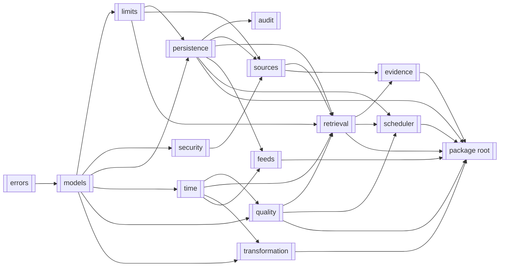
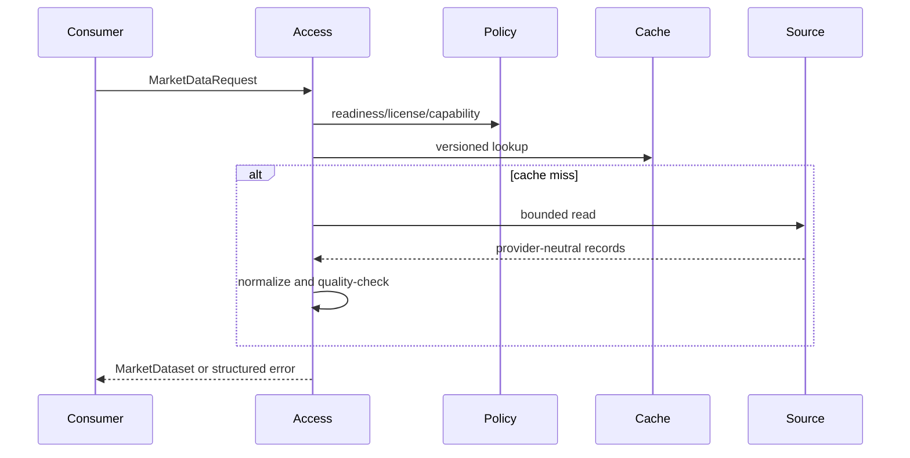

# Data

> **Package:** `app/services/data`
> **Status:** `Completed` — `CAP-DATA-028` implements the owner-approved focused
> architecture: one registered capability equals one module folder and one standalone
> usage program. Behaviour, the 35 public operations, active requirement IDs,
> contract versions, schema identifiers, and error codes remain compatible.
> Provider facades compose on the Data side; their reads remain gated by Brokers
> read-release evidence (`_RELEASED`).
> **Last updated:** `2026-07-22`
> **Continuation handoff:** `docs/dev/DATA_FOCUSED_RESTRUCTURE_HANDOFF.md`

> This README is the package's **single source of truth** for requirements,
> final structure, implementation sequence, progress, usage examples, and tests.
> Update this file before changing the code.

---

## 1. Purpose and Boundary

### Purpose

Data acquires, normalizes, stores, and serves trusted market data and read-only
broker/account state. It owns the shared SQLite connection, locking, and migration
execution infrastructure. All broker/provider access is strictly read-only and flows
exclusively through the Brokers domain's canonical `BrokerAdapter` read capability
traits (`MarketDataProvider`, `AccountProvider`, `CalculationProvider`) under the
registered Brokers boundary. Data is a foundation domain: it provides
evidence and controlled resources but makes no strategy, risk, simulation, or
execution decision.

### Owns

- Historical and real-time market-data acquisition, normalization, provenance,
  quality validation, availability inspection, and multi-timeframe alignment.
- Series-level market-data quality inspection: gap, spike, flat-line, zero-volume,
  duplicate-bar, and spread-breach detection, deterministic quality scoring, and
  recommended remediation evidence. Quality evidence is always computed from the
  records examined.
- Historical market/account data tables, local CSV/Parquet datasets, cache state,
  source policy, job/checkpoint state, feed status, and durable audit storage.
- Shared SQLite connections, path-scoped write locking, and migration execution;
  each persistent domain still owns its own tables and migration definitions.
- Normalization of raw broker/provider reads (obtained through Brokers' `BrokerAdapter`
  read traits) into `MarketDataset`, `AccountStateSnapshot`,
  `MarketContextEvidence`, and `FXConversionEvidence`.
- Source capability, readiness, licensing, explicit-fallback, rate-limit, timeout,
  circuit-breaker, and promotion policy.
- Composition of every source Data can read: configured local artifact sources and
  configured read-only broker provider facades. Local sources require no credentials,
  network, or promotion evidence; provider sources are gated by their platform
  enablement flag and enter at `staging` readiness.
- Explicit, audited admission of externally produced CSV/Parquet artifacts into
  canonical manifest-backed form under a caller-declared column mapping. Import is
  always an explicit operation, never an implicit on-read conversion.
- Deterministic resampling, alignment, tick aggregation, and synthetic generation
  (Research owns historical labeling).
- Bounded update jobs/backfills, idempotency, leases, checkpoints, crash recovery,
  and minimum internal feed lifecycle/status.

### Does not own

- Strategy evaluation, indicators, risk policy, position sizing, order formulation,
  broker dispatch decisions, reconciliation authority, or simulated fills/state.
- Broker/provider adapter implementations, connection/session mechanics, or
  credentials: Brokers owns adapters and lifecycle behavior; secrets are resolved
  through the Utils settings layer. The Data package-root retrieval facade may
  privately and lazily compose a read-only adapter through the Brokers factory for
  standalone calls. Data never exposes the adapter or invokes `BrokerAdapter`
  mutation operations.
- Another domain's tables, artifact schemas, or migration definitions.
- Public streaming subscriptions, automatic feed-gap backfill, historical calendar
  reconstruction, TSDB selection, or unapproved external-source promotion.
- Raw provider DataFrames, provider SDK objects, sockets, streams, credentials, or
  database sessions crossing the public API or a cross-domain boundary. The
  package-root `to_ohlcv_dataframe` and `to_tick_dataframe` helpers may return new
  validated analytical projections containing only canonical market values and UTC
  timestamps.
- Silent source fallback, gap repair, interpolation, schema migration, or precision
  coercion in governed workflows.
- Silent or undisclosed stale-cache use in any workflow. An expired cache entry is
  served only when the caller explicitly requests `serve_stale`, only in the
  `research` workflow context, and only with `cache_status="stale_warning"` on the
  returned dataset. Governed contexts (`backtest`, `validation`, `risk`,
  `execution_bound`) never serve expired entries.
- Symbol-level licence overrides. `SourceLicensePolicy` is declared per source and is
  the complete licence model; see `Explicit exclusions`.
- Implicit conversion of foreign file formats on read. `load_dataset` requires a
  Data-written manifest; foreign artifacts enter only through explicit import.

### Shared contracts

Contract definitions must match the name, version, and owner recorded in
`docs/PROJECT.md`.

**Owned by this domain** — defined authoritatively here:

| Status | Contract | Version | Counterparty | Purpose |
|---|---|---|---|---|
| Completed | `MarketDataset` | `v1` | Indicators, Strategy, Trading, Simulation, Analytics, Optimization, Research, Portfolio, UI/API (Risk consumes `MarketContextEvidence` / `AccountStateSnapshot` instead) | Normalized bars/ticks with `available_at`, quality, precision, provenance, schema, and normalization metadata. |
| Completed | `AccountStateSnapshot` | `v1` | Strategy, Risk, Trading, Portfolio | Immutable read-only account, balance, position, margin, broker-state, and UTC snapshot evidence. |
| Completed | `MarketContextEvidence` | `v1` | Risk; Trading (orchestrator carrier only), UI/API (views) | Immutable normalized session, calendar, spread, liquidity, volatility, correlation, crisis, timezone, freshness, provenance, and explicit-missingness evidence for fail-closed Risk evaluation. Only Risk interprets it. |
| Completed | `FXConversionEvidence` | `v1` | Risk, Simulation, Analytics, Portfolio | Immutable ordered direct or synthesized conversion path, composite rate, freshness, path-policy version, and source provenance. Consumers apply but never synthesize it. |
| Completed | `AuditEventQuery` / `AuditEventPage` | `v1` | UI/API, Risk | Governed bounded filters and a cursor page over Utils-owned `AuditEvent` envelopes; Data owns query semantics and durable access, not event payload meaning. |

`MarketDataset v1` contains: `contract_version="v1"`,
`schema_id="data.market_dataset.v1"`, `normalization_version`,
`data_kind`, `symbol`, optional `timeframe`, immutable canonical `records`, UTC
`start`/`end`, per-record or dataset `available_at`, `record_count`,
`DataQualityReport`, source/provenance/license metadata, cache status, workflow
context, and precision policy. Records never contain raw provider objects.

`AccountStateSnapshot v1` contains: `contract_version="v1"`,
`schema_id="data.account_state_snapshot.v1"`, account identifier,
currency, balances/equity/margin values as exact decimal strings, normalized open
positions and orders, broker connectivity/trading-allowance evidence, source,
`snapshot_at` UTC, expiry/staleness metadata, and trace identifiers. Missing, stale,
or unverifiable governed evidence fails closed.

`MarketContextEvidence v1` carries separate `contract_version="v1"` and
`schema_id="data.market_context_evidence.v1"`, bounded session/calendar state,
spread/liquidity/volatility/correlation/crisis evidence, timezone, UTC `as_of`,
freshness, provenance, and explicit missingness. Data owns normalization and
freshness truth; Risk owns interpretation and policy decisions.

`FXConversionEvidence v1` carries separate `contract_version="v1"` and
`schema_id="data.fx_conversion_evidence.v1"`, source and target currencies,
an ordered acyclic sequence of rate legs, exact decimal leg/composite rates, UTC
`as_of`, request-supplied freshness limit, path-policy identifier/version,
source provenance, and trace identifiers. Missing, stale, cyclic, disallowed, or
unverifiable paths fail closed; consumers never synthesize or silently refresh it.

`AuditEventQuery v1` contains separate contract version/schema ID, an ordered UTC
range, optional domain/action/principal/correlation filters, an opaque cursor, and a
positive bounded limit. `AuditEventPage v1` contains separate identifiers, an ordered
tuple of Utils-owned `AuditEvent v1` values, and an opaque optional next cursor. The
caller supplies `AuthContext` separately; unauthorized or unbounded queries fail closed.

**Consumed from other domains** — referenced only, never redefined:

| Contract | Version | Owner | Used for |
|---|---|---|---|
| `AuthContext` | `v1` | Utils | Authenticate and trace governed reads, source promotion, audit persistence, and audit queries. |
| `AuditEvent` | `v1` | Utils | Persist redacted governed events in Data's durable audit store. |
| `BrokerAdapter` (read traits) | `v1` | Brokers | Read-only market data, account state, and calculation reads via `MarketDataProvider`, `AccountProvider`, and `CalculationProvider`; Data never invokes mutation operations. |
| `BrokerResult` / `BrokerError` | `v1` | Brokers | Canonical result envelope and error taxonomy for every provider read consumed by Data. |
| `BrokerConnectionEvent` / subscription event DTOs | `v1` | Brokers | Bounded connection lifecycle and provider-event channels feeding Data's internal feed handling. |

### Persisted state

Only Data writes Data-owned state. Other domains read it through documented
contracts. Other domains submit their own migrations to Data's execution framework
but retain schema ownership.

| Status | State / Store | Read access (via contract) | Migration definitions |
|---|---|---|---|
| Completed | Market/account data tables, range indexes, source revisions, and historical datasets | Consumers via `MarketDataset` / `AccountStateSnapshot` | `app/services/data/persistence/migrations.py` |
| Completed | Durable audit event store | UI/API audit views and Risk verification through approved queries | `app/services/data/persistence/migrations.py` |
| Completed | Versioned cache entries and manifests | Data APIs only; consumers receive cache metadata, never direct rows | `app/services/data/persistence/migrations.py` |
| Completed | Source readiness, capabilities, license policy, rate limits, and breaker state | Data source policy APIs | `app/services/data/persistence/migrations.py` |
| Completed | Update jobs, leases, idempotency keys, checkpoints, and recovery state | Data job APIs | `app/services/data/persistence/migrations.py` |
| Completed | Internal feed heartbeat, gap, buffer, reconnect, and circuit state | `get_feed_status` | `app/services/data/persistence/migrations.py` |
| Completed | Shared migration ledger and path-scoped lock records | Persistent domains through migration results; no direct table access | `app/services/data/persistence/migrations.py` |

### Four-level structure

In `app/services/data`, everything must be focused:
- A **Module folder** inside the data domain is for **one Feature / capability only** (e.g. `FEAT-DATA-01: Retrieve historical data` has its own module folder focused solely on that feature).
- A **File** inside a module folder is for **one Use case or focused responsibility only**.
- A **Class / function / method** inside a file is for **one Functional requirement behaviour only**.

| Code level | Represents | Focused Scoping Rule |
|---|---|---|
| **Package** | Data domain | Domain ownership root (`app/services/data`) |
| **Module folder** | Feature / capability | Dedicated to one Feature / capability only (e.g., `FEAT-DATA-01` retrieval) |
| **File** | Use case or focused responsibility | Dedicated to one Use case or focused responsibility only |
| **Class / function / method / constant** | Functional requirement behaviour | Dedicated to one Functional requirement behaviour at a time |

```text
Package (Data domain)
└── Module folder (One Feature / capability, e.g. FEAT-DATA-01)
    └── File (One Use case / focused responsibility)
        └── Class / Function / Method / Constant (One Functional requirement behavior)
```

### Feature Registry

The following registry is the owner-approved target. It treats a feature as one
cohesive capability, not as one public function. A feature may expose multiple
operations when they serve the same actor outcome; each operation still implements
one focused functional-requirement behaviour. The target contains fifteen registered
capabilities: fourteen business features and one foundational contract capability.

| Status | Feature | Owning module | Public API and contracts | Requirements | Usage evidence |
|---|---|---|---|---|---|
| Completed | `FEAT-DATA-01` Canonical Data Contracts | `contracts/` | Contract bases, canonical records, dataset/range/quality vocabulary, stable errors, and request validation | Section 4 contract and requirement ledger, allocated to this owner | `tests/data/usage/01_contracts.py` |
| Completed | `FEAT-DATA-02` Market Data Retrieval | `market_data/` | Retrieval request/result contracts and the market, tick, spread, symbol, metadata, availability, and volume operations | Section 4 retrieval requirements, allocated to this owner | `tests/data/usage/02_market_data.py` |
| Completed | `FEAT-DATA-03` Local Dataset Loading | `local_datasets/` | `DatasetLoadRequest`, manifest verification, CSV/Parquet loaders, and `load_local_dataset` | Section 4 local-loading requirements, allocated to this owner | `tests/data/usage/03_local_datasets.py` |
| Completed | `FEAT-DATA-04` Synthetic Data Generation | `synthetic_data/` | `SyntheticRequest`, seeded randomness, synthetic bar/tick generation, and provenance | Section 4 synthetic-generation requirements, allocated to this owner | `tests/data/usage/04_synthetic_data.py` |
| Completed | `FEAT-DATA-05` Tick-Series Derivation | `tick_derivation/` | `TickSeriesRequest`, fixed-point kernels, derived tick/Parquet operations, and provenance | Section 4 tick-derivation requirements, allocated to this owner | `tests/data/usage/05_tick_derivation.py` |
| Completed | `FEAT-DATA-06` Data Persistence and Storage | `persistence/` | Transaction, migration, locking, dataset, cache, import, backup, restore, retention, and path contracts/operations | Section 4 persistence requirements, allocated to this owner | `tests/data/usage/06_persistence.py` |
| Completed | `FEAT-DATA-07` Data Quality and Validation | `quality/` | Quality contracts, series/anomaly inspection, symbol metadata validation, policy, scoring, and remediation | Section 4 quality requirements, allocated to this owner | `tests/data/usage/07_quality.py` |
| Completed | `FEAT-DATA-08` Data Transformation and Resampling | `transformation/` | Resampling, tick aggregation, multi-timeframe alignment, and detached tabular projections | Section 4 transformation requirements, allocated to this owner | `tests/data/usage/08_transformation.py` |
| Completed | `FEAT-DATA-09` Time and Session Handling | `time_sessions/` | Timeframe/schedule contracts, UTC policy, market hours, sessions, current schedule, and gap classification | Section 4 time/session requirements, allocated to this owner | `tests/data/usage/09_time_sessions.py` |
| Completed | `FEAT-DATA-10` Data Source Governance | `sources/` | Source contracts/protocol, registry/composition, policy/promotion, adapters, licensing, and read-only proxy | Section 4 source-governance requirements, allocated to this owner | `tests/data/usage/10_sources.py` |
| Completed | `FEAT-DATA-11` Economic Calendar | `economic_calendar/` | Calendar transport/options/event/result contracts and `scrape_economic_calendar` | Section 4 calendar requirements, allocated to this owner | `tests/data/usage/11_economic_calendar.py` |
| Completed | `FEAT-DATA-12` Real-Time Feed Lifecycle and Observability | `realtime_feeds/` | Feed contracts/state, buffer, heartbeat, reconnection, reconciliation, and status operations | Section 4 feed requirements, allocated to this owner | `tests/data/usage/12_realtime_feeds.py` |
| Completed | `FEAT-DATA-13` Scheduler and Job Management | `data_jobs/` | Job/backfill/recovery contracts and create/start/stop/run/status/recovery operations | Section 4 job requirements, allocated to this owner | `tests/data/usage/13_data_jobs.py` |
| Completed | `FEAT-DATA-14` Cross-Domain Evidence | `evidence/` | Market-context, FX-conversion, account-state, freshness contracts/providers, and public evidence operations | Section 4 normalized-evidence requirements, allocated to this owner | `tests/data/usage/14_evidence.py` |
| Completed | `FEAT-DATA-15` Audit Evidence | `audit/` | Audit query/page/persistence contracts and authorized persist/query operations | Section 4 audit requirements, allocated to this owner | `tests/data/usage/15_audit.py` |

Private root files such as `_settings.py` and `_limits.py` may remain only for
genuinely domain-wide infrastructure. They are not feature modules, expose no public
feature API, and receive direct unit coverage plus indirect coverage through the
feature usages that consume them.

#### Current-to-target module disposition

| Current module folder | Approved disposition |
|---|---|
| `models/` | Remove. Cross-feature canonical vocabulary moves to `contracts/`; feature-specific contracts move to their owning feature. |
| `errors/` | Remove as a module folder; stable boundary errors move to `contracts/errors.py`. |
| `limits/` | Remove as a module folder; feature limits move to owners and genuinely shared private configuration moves to root `_settings.py` / `_limits.py`. |
| `retrieval/` | Split into `market_data/`, `local_datasets/`, `synthetic_data/`, `tick_derivation/`, and `economic_calendar/`. |
| `security/` | Remove as a module folder; licensing and read-only broker enforcement move to `sources/`. |
| `time/` | Replace with the explicit `time_sessions/` feature. |
| `feeds/` | Replace with `realtime_feeds/`, reflecting lifecycle and observability responsibilities. |
| `scheduler/` | Replace with the approved `data_jobs/` feature name. |
| `persistence/`, `quality/`, `transformation/`, `sources/`, `evidence/`, `audit/` | Retain as feature folders, relocate their owned contracts into them, and split overloaded files by use case. |

#### `CAP-DATA-028` implementation-slice progress

| Status | Slice | Scope |
|---|---|---|
| Completed | `FEAT-DATA-01` Canonical Data Contracts | Canonical contract bases, request-boundary validation, records, dataset envelope, and stable errors now live in `contracts/`; all direct consumers were migrated without compatibility re-exports; `01_contracts.py` directly exercises the complete public feature surface. Evidence: `app/services/data/contracts/__init__.py:24`, `app/services/data/contracts/records.py:77`, `app/services/data/contracts/dataset.py:135`, `app/services/data/contracts/errors.py:341`, `tests/data/unit/test_import_graph.py:71`, `tests/data/usage/01_contracts.py:30`. |
| Completed | `FEAT-DATA-02`–`FEAT-DATA-15` | Focused owners, consumers, tests, and all fourteen remaining usage programs are migrated; forbidden horizontal folders are absent and the complete Data gate passes. |

The completed migration preserves the exact 35-operation package-root API, contract
versions, schema identifiers, error codes, validation behavior, and golden JSON
schemas. Feature contracts live with their owners; no compatibility package recreates
a removed path.

### Pre-migration capability map (historical evidence)

The following map records the superseded intermediate package after the first
`CAP-DATA-028` slice. The implemented boundary is the approved target in Section 2;
the map is retained only as migration evidence.

```mermaid
flowchart TD
    DATA[[app/services/data]]
    DATA --> CONTRACTS[[contracts: canonical records, dataset envelope, errors, validation]]
    DATA --> MODELS[[models: pending feature-specific contracts]]
    DATA --> LIMITS[[limits: settings and bounded limits manifest]]
    DATA --> SOURCES[[sources: protocol, registry, policy, composition]]
    DATA --> RETRIEVAL[[retrieval: bars, ticks, local, synthetic, discovery, calendar]]
    DATA --> PERSISTENCE[[persistence: SQLite, files, cache, import, backup]]
    DATA --> AUDIT[[audit: durable event store and governed query]]
    DATA --> EVIDENCE[[evidence: market context, FX, account state]]
    DATA --> QUALITY[[quality: validators, flags, adversarial detection]]
    DATA --> TRANSFORMATION[[transformation: resample, aggregate, align, tabular]]
    DATA --> TIME[[time: timezone, market hours, gaps]]
    DATA --> FEEDS[[feeds: status, buffer, reconnection, heartbeat]]
    DATA --> SCHEDULER[[scheduler: job, backfill, recovery]]
    DATA --> SECURITY[[security: credentials, licensing, broker contract]]

    CONTRACTS --> CFILES[_base.py; validation.py; records.py; dataset.py; errors.py]
    MODELS --> MFILES[requests.py; metadata.py; sources.py; storage.py; jobs.py; feeds.py; account.py; market_context.py; fx.py; audit.py; datasets.py availability only]
    LIMITS --> LFILES[manifest.py; config.py]
    SOURCES --> SOFILES[protocol.py; registry.py; policy.py; composition.py]
    RETRIEVAL --> RFILES[sources.py; local_loader.py; synthetic.py; discovery.py; calendar.py]
    PERSISTENCE --> PFILES[sqlite.py; migrations.py; locking.py; file_io.py; cache.py; import_artifacts.py; backup.py]
    AUDIT --> AUFILES[store.py; query.py]
    EVIDENCE --> EVFILES[market_context.py; fx.py; account_state.py]
    QUALITY --> QFILES[ohlcv_validator.py; asset_validator.py; flags.py; adversarial.py; policy.py]
    TRANSFORMATION --> TFILES[resample.py; tick_aggregation.py; alignment.py; tabular.py]
    TIME --> TIFILES[timezone.py; market_hours.py; gaps.py]
    FEEDS --> FFILES[status.py; buffer.py; reconnection.py; heartbeat.py]
    SCHEDULER --> JFILES[job.py; backfill.py; recovery.py]
    SECURITY --> SEFILES[credentials.py; licensing.py; broker_contract.py]
```



---

## 2. Current Package Structure and Approved Target

The existing tree below is functionally implemented but does not satisfy the approved
one-feature/one-folder/one-usage invariant. It remains authoritative only as an
inventory of code that must be relocated. The approved target is:

```text
app/services/data/
├── __init__.py
├── README.md
├── _settings.py
├── _limits.py
├── contracts/
├── market_data/
├── local_datasets/
├── synthetic_data/
├── tick_derivation/
├── persistence/
├── quality/
├── transformation/
├── time_sessions/
├── sources/
├── economic_calendar/
├── realtime_feeds/
├── data_jobs/
├── evidence/
└── audit/
```

The current files are ordered from lowest dependency to highest dependency:

```text
app/services/data/
├── __init__.py                         # Approved public operations only (imports + __all__)
├── README.md
├── contracts/                          # FEAT-DATA-01 canonical shared vocabulary
│   ├── __init__.py                     # Supported canonical contract surface
│   ├── _base.py                        # Three frozen private contract bases
│   ├── validation.py                   # Request-boundary validation and facade helpers
│   ├── records.py                      # OHLCVRecord, TickRecord, SpreadRecord
│   ├── dataset.py                      # MarketDataset, quality evidence, ranges, schema IDs
│   └── errors.py                       # DataError and DATA_ERROR_MANIFEST
├── models/                             # Temporary pending feature-specific contracts only
│   ├── __init__.py
│   ├── datasets.py                     # DataAvailability pending FEAT-DATA-02 ownership
│   ├── requests.py                     # Market, synthetic, availability, schedule, volume requests
│   ├── metadata.py                     # Symbol, schedule, session, and volume descriptors
│   ├── sources.py                      # Source descriptor, licence policy, plan, identity
│   ├── storage.py                      # Transaction, migration, dataset, cache, import contracts
│   ├── jobs.py                         # Job, backfill, schedule, run, status, recovery contracts
│   ├── feeds.py                        # Feed config, event, result, status, reconnect policy
│   ├── account.py                      # AccountStateSnapshot and its component contracts
│   ├── market_context.py               # MarketContextEvidence and request
│   ├── fx.py                           # FXConversionEvidence, request, rate leg
│   └── audit.py                        # AuditEventQuery, AuditEventPage
├── limits/                             # Configuration and bounded limits
│   ├── __init__.py
│   ├── config.py                       # Immutable DataSettings loaded through Utils
│   └── manifest.py                     # get_limit, apply_workflow_override
├── sources/                            # Source governance: which sources exist and may be read
│   ├── __init__.py
│   ├── protocol.py                     # Minimum typed read-only source Protocol
│   ├── registry.py                     # Lazy registration and resolution, no I/O at import
│   ├── policy.py                       # Readiness, license, fallback, rate, breaker, promotion
│   ├── composition.py                  # Authoritative lazy composition and migration trigger
│   ├── local.py                        # Local CSV/Parquet source adapter
│   └── external.py                     # Read-only broker provider adapter
├── retrieval/                          # Acquire market data from a governed source
│   ├── __init__.py
│   ├── sources.py                      # Bars, ticks, spreads through policy/cache/normalization
│   ├── local_loader.py                 # Public local-artifact read facade (the
│   │                                   #   manifest-verifying reader stays in persistence/)
│   ├── synthetic.py                    # Seeded GBM fixtures and real-evidence tick-series generation
│   ├── discovery.py                    # Symbols, metadata, availability, historical volume
│   └── calendar.py                     # Multi-site economic calendar scraping
├── persistence/                        # Durable state and artifacts
│   ├── __init__.py
│   ├── sqlite.py                       # Bounded short-lived SQLite transaction execution
│   ├── locking.py                      # Exclusive path-scoped write locks
│   ├── migrations.py                   # Ordered domain-owned migrations and shared ledger
│   ├── file_io.py                      # Atomic CSV/Parquet artifact and manifest writes
│   ├── cache.py                        # One versioned TTL/revision cache
│   ├── import_artifacts.py             # Explicit audited external artifact admission
│   └── backup.py                       # Snapshot, restore, and retention enforcement
├── audit/                              # Durable governed audit evidence
│   ├── __init__.py
│   ├── store.py                        # Idempotent redacted AuditEvent persistence
│   └── query.py                        # Authorized bounded cursor query
├── evidence/                           # Normalized cross-domain evidence contracts
│   ├── __init__.py
│   ├── market_context.py               # MarketContextEvidence for Risk
│   ├── fx.py                           # FXConversionEvidence path selection
│   └── account_state.py               # AccountStateSnapshot from read-only broker reads
├── quality/                            # Is this series trustworthy?
│   ├── __init__.py
│   ├── ohlcv_validator.py              # Series inspection, gaps, integrity, order
│   ├── asset_validator.py              # Symbol precision and canonical symbol mapping
│   ├── flags.py                        # Quality flag aggregation and enumeration
│   ├── adversarial.py                  # Spikes, flat-lines, zero volume, spread breaches
│   └── policy.py                       # Quality profiles and remediation mapping
├── transformation/                     # Deterministic dataset reshaping, no I/O, no lookahead
│   ├── __init__.py
│   ├── resample.py                     # Higher-timeframe aggregation and volume-kind disclosure
│   ├── tick_aggregation.py             # Ticks to bars with explicit spread policy
│   ├── alignment.py                    # Backward-only multi-timeframe alignment
│   └── tabular.py                      # Canonical analytical DataFrame projections and comparison
├── time/                               # Temporal truth
│   ├── __init__.py
│   ├── timezone.py                     # UTC normalization and canonical timeframe manifest
│   ├── market_hours.py                 # Current configured hours and sessions
│   └── gaps.py                         # Gap classification and real-time reconciliation
├── feeds/                              # Internal real-time lifecycle and observability
│   ├── __init__.py
│   ├── status.py                       # Registration and read-only status inspection
│   ├── buffer.py                       # Bounded buffer with explicit overflow policy
│   ├── reconnection.py                 # Backoff and persisted circuit breaker state
│   └── heartbeat.py                    # Heartbeat touch and timeout evaluation
├── scheduler/                          # Bounded update jobs and backfills
│   ├── __init__.py
│   ├── job.py                          # Create, start, stop, run-once, status
│   ├── backfill.py                     # Idempotent resumable chunk execution
│   └── recovery.py                     # Explicit startup crash recovery
└── security/                           # Fail-closed access governance
    ├── __init__.py
    ├── licensing.py                    # License enforcement and attribution text
    └── broker_contract.py              # Runtime read-only broker capability enforcement
```

Standalone usage examples live only under `tests/data/usage/`, one numbered program
per registered `FEAT-DATA-NN` (see Section 7). Provider-backed examples fail honestly
with a typed `DataError` when their settings, credentials, dependency, connectivity,
or capability evidence is unavailable.

### Module dependency diagram

Dependencies flow strictly downward. `models/` and `errors/` depend on nothing inside
the domain, which is what removes the current `contracts` ↔ `validation` import cycle
and the PEP 562 lazy-export workaround it forced.



### Structure rules

- **Focused Domain Architecture**: In `app/services/data`, every module folder inside the domain is dedicated to one Feature / capability only, every file inside a module folder is for one use case or focused responsibility only, and every class/function/method inside a file addresses one functional requirement behaviour at a time.
- **Module folder names state the capability, not the mechanism.** A folder answers
  "what can Data do", not "what technology does it use". `retrieval/`, `quality/`,
  and `transformation/` are capabilities; a folder named for a library, a layer, or a
  generic orchestration role is not.
- `models/` and `errors/` are the shared core. They import nothing else inside the
  domain, so no capability folder can create an import cycle through them.
- `app/services/data/__init__.py` contains imports and `__all__` only.
- Package-root `__all__` contains exactly the approved typed public operations.
- Efficient internal APIs remain in focused submodules and do not appear in the
  package-root export list.
- Every source adapter is read-only. Synthetic generation is a retrieval capability
  for fixtures, not an external source adapter.
- Source composition lazy-loads optional dependencies; import never opens a
  connection, creates a database, runs recovery, or performs network I/O.
- No class named `DataGateway`, generic manager/service/repository layer, SQLite
  connection pool, or TSDB abstraction is part of the design. The retrieval pipeline
  (policy → cache → source → normalize → quality) is an internal function sequence
  shared by `retrieval/`, not a class hierarchy or a folder.
- Simulation-specific trading-bar/M1/real tick reconstruction is absent; Simulation
  owns it and consumes canonical Data output.
- Historical labeling is absent; Research owns it.

### Reconciliation capability coverage

This table proves that every reconciliation capability has one final destination or
an explicit exclusion.

| Capability | Decision | Final destination / treatment |
|---|---|---|
| `CAP-DATA-001` Typed public and internal API boundary | Modify | `models/`, focused typed submodules, and the package-root `__init__.py` export gate over the owning `FR-DATA-*` operations |
| `CAP-DATA-002` Historical OHLCV/tick/spread retrieval | Modify | `retrieval/sources.py`, typed retrieval operations, `WF-DATA-001/002` |
| `CAP-DATA-003` Source protocol/registry/readiness/adapters | Modify | `sources/`, `FR-DATA-022–029` |
| `CAP-DATA-004` Canonical records/UTC/versioning | Modify | `models/records.py`, `models/datasets.py` |
| `CAP-DATA-005` Quality/gaps/availability/revision | Modify/Replace | `DataQualityReport`, `DataAvailability`, `retrieval/discovery.py`; series-level detection and scoring in `quality/` (`CAP-DATA-023`) |
| `CAP-DATA-006` Versioned cache and safe clear | Modify | `persistence/cache.py`, `clear_data_cache` |
| `CAP-DATA-007` Local CSV/Parquet and atomic storage | Modify | `persistence/file_io.py` (save), `retrieval/local_loader.py` (load) |
| `CAP-DATA-008` SQLite state and transactional infrastructure | Modify | `persistence/sqlite.py`, `locking.py`, `migrations.py`; `audit/` |
| `CAP-DATA-009` Jobs and resumable backfills | Modify/Replace | `scheduler/`, typed job operations, `WF-DATA-007` |
| `CAP-DATA-010` Internal real-time feed lifecycle | Add/Replace | `feeds/`, `get_feed_status`, `WF-DATA-008`; initial deterministic fake harness and specified informational limits |
| `CAP-DATA-011` Timeframes/resampling/alignment/aggregation | Merge/Modify | `time/timezone.py`, `transformation/`, typed transform operations |
| `CAP-DATA-012` Deterministic synthetic generation | Modify | `retrieval/synthetic.py`, typed synthetic operations, `WF-DATA-005` |
| `CAP-DATA-022` Real-evidence tick-series generation | Add | `retrieval/synthetic.py`, `FR-DATA-087`–`FR-DATA-090`, `WF-DATA-016` |
| `CAP-DATA-023` Series-level quality detection, scoring, and remediation evidence | Add | `quality/`, `FR-DATA-091`–`FR-DATA-094`, `WF-DATA-001` step 4 |
| `CAP-DATA-024` Multi-site economic calendar scraping | Add | `retrieval/calendar.py`, `FR-DATA-095`–`FR-DATA-100` |
| `CAP-DATA-025` Source composition and external artifact import | Add | `sources/composition.py` local/provider descriptor composition, `retrieval/local_loader.py` addressing and filtering, `persistence/import_artifacts.py`, `FR-DATA-101`–`FR-DATA-107`, `WF-DATA-017` |
| `CAP-DATA-026` Feature-oriented module restructure | Add | Section 2 target structure and the phased sequence below; `docs/dev/DATA_RESTRUCTURE_PLAN.md` |
| `CAP-DATA-027` Backup, restore, and retention enforcement | Add | `persistence/backup.py`, `FR-DATA-108`–`FR-DATA-110` |
| `CAP-DATA-013` Historical labeling | Retired | Owned by Research; no Data implementation |
| `CAP-DATA-014` Market hours/sessions/volume | Modify/Add | `time/market_hours.py` (hours/sessions), `retrieval/discovery.py` (volume), `WF-DATA-010` |
| `CAP-DATA-015` License/fallback/rate/breaker/source safety | Modify | `sources/policy.py`, `security/licensing.py`, source manifests, `WF-DATA-011` |
| `CAP-DATA-016` Symbol discovery and metadata | Modify | `retrieval/discovery.py`, typed metadata/discovery operations, `WF-DATA-009` |
| `CAP-DATA-017` Errors/request correlation/audit/side effects | Add | `errors/catalog.py`, `audit/`, typed API rules, NFRs |
| `CAP-DATA-018` Workflow-aware precision/serialization | Modify | Contract/API precision policy and `NFR-DATA-002–004` |
| `CAP-DATA-019` Simulation tick-model boundary | Split | Data retains canonical/generic generation; Simulation owns model reconstruction; `WF-DATA-012` |
| `CAP-DATA-020` Legacy implementation/facade cleanup | Remove | No legacy facade, aliases, duplicate cache, `_common.py`, or simulation tick model exists in the final tree. |
| `CAP-DATA-021` Tests and validation evidence | Add | Section 7 and `NFR-DATA-009/012`; hard allocation/response bounds are tested, while benchmark results remain explicitly informational |

### Explicit exclusions

| Treatment | Behavior |
|---|---|
| Remove | `_common.py`, broken/unbound exports, legacy aliases, duplicate caches/file savers/label entry points, superseded record-list gateway, mock production feed registration, status-only scheduler execution, and Data-owned simulation tick modelling after migration. |
| Reject | Mandatory `DataGateway`, SQLite pool/leak detector, named TimescaleDB/InfluxDB direction, composite feed health score, hidden on-read migration, and mandatory multiprocessing. |
| Reject | Symbol-level licence overrides. Source-level `SourceLicensePolicy` with `permitted_workflows`, `export_allowed`, and attribution/retention terms is the complete licence model. V1's `(source, symbol)` licence table had no call site in the archive and its own defaults were source-keyed. Reopen only for a concrete instrument whose terms are narrower than its source; that would require a schema migration and a governed write operation, so it is not carried speculatively. |
| Defer | Incremental (streaming) bar construction from live feed events. Data owns this capability when it is needed, so batch and incremental aggregation stay in one domain, but no consumer exists: `WF-DATA-008` scopes the feed runtime to buffering, heartbeat, gap recording, and status against a deterministic fake harness, and V1's `BarAggregator` had no call site. Revisit only when feed promotion to a real MT5 demo feed is scheduled; the first requirement will be that incremental output is bit-identical to `aggregate_ticks` over the same ticks. |

### Historical implementation sequence — `CAP-DATA-026`

This sequence records the implemented migration that preserved the functional
baseline. Its claim to satisfy focused feature architecture was withdrawn by the
owner on 2026-07-22. It is not the implementation plan for `CAP-DATA-028`.

Ordered lowest dependency first. Each phase is independently verifiable, carries its
own dry-run and `APPROVED: EXECUTE` gate, and leaves the package importable and the
targeted test suite green. A legacy folder is deleted only at the end of the phase
that replaces it, after the replacing module's tests pass.

Behaviour is preserved. Every `FR-DATA-*` requirement, error code, contract version,
and schema identifier survives unchanged; only module and file ownership moves. The
five owned cross-domain contracts are frozen in Phase 1 and asserted against a
pre-restructure golden snapshot.

**Legacy-package freeze.** From the end of the phase that replaces it, a legacy module
is frozen: no later phase may edit `contracts/`, `validation/`, `config.py`,
`storage/`, `gateway/`, `sources/`, `transforms/`, `generators/`, or `feeds/` once its
replacement exists. Phase 1 could prove parity automatically because contracts are
data — JSON-schema equality is a complete check. Phase 2 onward duplicates *functions*,
where no equivalent automated check exists, so divergence is prevented procedurally
instead. Phase 11 deletes the frozen packages.

**Cross-package contract instances do not interchange.** While `contracts/` and
`models/` both exist, they define distinct Python classes with identical schemas.
Pydantic validates by type identity, so a legacy-built `MarketDataset` is rejected by a
new-package request. Tests targeting new packages build fixtures from
`tests/data/helpers_models.py`; legacy tests keep using `tests/data/helpers.py`. The
two merge in Phase 11.

| Status | Phase | Work | Requirements | Verification | Depends on |
|---|---|---|---|---|---|
| Completed | 0 | Rewrite this README's structure, capability map, dependency diagram, module specifications, and test layout to the target structure. Update `docs/PROJECT.md`, `docs/ARCHITECTURE.md`, and `docs/CHANGELOG.md`. No code changes. | `CAP-DATA-026` | Docs cross-check: every capability has a destination; no stale module path remains in the four authoritative documents | — |
| Completed | 1 | Build `models/`, `errors/`, `limits/`. Move `_validation.py` into `models/`, eliminating the `contracts` ↔ `validation` cycle and the PEP 562 lazy-export workaround. Freeze contract shapes. | `FR-DATA-001`–`013`, `075`, `078` | Golden-schema equality test against the pre-restructure snapshot; import-order test proves `models/` has no intra-domain dependency | 0 |
| Completed | 2 | Build `persistence/` (excluding `backup.py`) and `audit/`. Split `storage/audit.py` into independent write and read halves. | `FR-DATA-014`–`021`, `077`, `105`, `106` | `test_migration_parity.py`, `test_persistence_isolation.py`, `test_import_graph.py`, plus `test_sqlite.py`, `test_persistence_locking.py`, `test_persistence_migrations.py`, `test_file_io.py`, `test_persistence_cache.py`, `test_audit.py`, `test_persistence_import_artifacts.py` | 1 |
| Completed | 3 | Migrate `sources/` **in place** — its name is both the legacy and the target name, so there is no parallel copy. Collapse `config.py` to a re-export of `limits/config.py`. | `FR-DATA-022`–`027`, `101`, `102` | `test_source_contract_identity.py`, `test_import_graph.py`, `test_source_protocol.py`, `test_source_registry.py`, `test_source_policy.py`, `test_public_retrieval_runtime.py` | 1, 2 |
| Completed | 4 | Build `retrieval/` and `time/timezone.py`: bars/ticks/spreads, local loader, synthetic and tick-series generation, discovery, calendar. | `FR-DATA-030`–`035`, `039`, `087`–`090`, `095`–`099`, `103`, `104`, `107` | `test_historical_access.py`, `test_reference_access.py`, `test_local_source.py`, `test_synthetic.py`, `test_ticks.py`, `test_calendar_scraper.py` | 1, 2, 3 |
| Completed | 5 | Build `quality/`: series inspection, adversarial detection, flags, asset validation, profiles. | `FR-DATA-091`–`094` | `test_quality.py`; score is never constant across differing inputs | 1 |
| Completed | 6 | Build `transformation/` and the rest of `time/`. | `FR-DATA-036`–`038`, `080`–`086` | `test_transforms.py`, `test_tabular.py`, `test_sessions.py` | 1, 5 |
| Completed | 7 | Build `evidence/`: market context, FX, account state. | `FR-DATA-008`, `028`, `076`, `079` | `test_market_context.py`, `test_fx_contracts.py`, `test_broker_source.py` | 1, 3, 4 |
| Completed | 8 | Split `feeds/` and `scheduler/` **in place**, splitting `runtime.py` into buffer, reconnection, and heartbeat, and `backfill.py` into backfill and recovery. | `FR-DATA-041`–`048` | `test_feed_runtime.py`, `test_feed_status.py`, `test_backfill.py`, `test_scheduler.py` | 1, 2 |
| Completed | 9 | Build `security/`: licensing enforcement, runtime read-only broker contract. Credentials pass-through withdrawn (`NFR-DATA-005`). | `FR-DATA-113`–`116`, `NFR-DATA-006` | `test_broker_contract.py`, `test_licensing.py`, `test_import_graph.py` | 1, 3 |
| Completed | 10 | Build `persistence/backup.py` — snapshot, restore, and retention enforcement. Genuinely new capability. | `CAP-DATA-027`, `FR-DATA-108`–`110` | `test_backup.py`, `test_backfill.py`; restore round trip; atomic hash-mismatch rejection; dry-run/purge/licence retention cases | 2 |
| Completed | 11 | Freeze the package-root `__init__.py` export list and migrate every cross-domain consumer import. | `NFR-DATA-001`, `NFR-DATA-011` | `test_api.py` asserts the exact 35-operation root surface; import-graph and boundary tests reject bypass paths | 1–10 |
| Completed | 12 | Verification sweep: full suite, coverage ≥ 80%, `ruff`, `mypy`, and every usage program executed directly. | `NFR-DATA-012` | Section 7 commands pass; branch coverage meets the configured 80% gate | 11 |

**Consumer boundary.** Cross-domain consumers use the frozen package-root operations
or explicitly approved owned contracts. The import-graph, package API, and full Data
suite verify that deleted compatibility paths do not remain in the Data boundary.

**Out of scope for `CAP-DATA-026`:** any behaviour change to an existing
`FR-DATA-*`, symbol-level licensing, incremental aggregation, and historical
labeling (see `Explicit exclusions`).

---

## 3. Workflows

### Status values

| Status | Meaning |
|---|---|
| **Missing** | Not implemented or not verified |
| **Partial** | Useful V1 behavior exists but final contracts, placement, or tests differ |
| **Completed** | Implemented in the final structure, tested, and verified |

### Workflow scope values

| Scope | Meaning |
|---|---|
| **Internal** | The complete workflow occurs within Data. |
| **Cross-domain** | Data receives input from or returns output to another domain. |

| Status | Workflow ID | Scope | Workflow | Trigger / Input boundary | Final outcome / Output boundary | Requirement sequence |
|---|---|---|---|---|---|---|
| Completed | `WF-DATA-001` | Cross-domain | Historical bars/ticks/spreads retrieval | Consumer submits bounded source/range request | `MarketDataset v1` | `FR-DATA-006 → 026 → 030` |
| Completed | `WF-DATA-002` | Cross-domain | Internal analytical data access | Approved Python consumer submits `MarketDataRequest` | Typed `MarketDataset`, never raw provider state | `FR-DATA-006 → 030 → 005` |
| Completed | `WF-DATA-003` | Internal | Local dataset load/save | Approved CSV/Parquet path and normalized data | Validated dataset or atomic committed artifact/manifest | `FR-DATA-016 → 017/018` |
| Completed | `WF-DATA-004` | Internal | Resample, align, and aggregate | Normalized datasets/ticks | Deterministic no-lookahead dataset | `FR-DATA-036 → 037/038` |
| Completed | `WF-DATA-005` | Cross-domain | Synthetic generation | Bounded parameters and optional seed | Deterministic canonical bars/ticks for fixtures only | `FR-DATA-039` |
| Completed | `WF-DATA-016` | Cross-domain | Tick-series generation from real evidence | Real bar or tick `MarketDataset`, approved model, spread model, and seed when variable | Canonical tick `MarketDataset` with intra-bar phase metadata, or a bounded Parquet artifact | `FR-DATA-087 → FR-DATA-088 → FR-DATA-089 → FR-DATA-090` |
| Retired | `WF-DATA-006` | — | Historical labeling | Owned by Research; no Data workflow | — | — |
| Completed | `WF-DATA-007` | Internal | Update job and historical backfill | Job definition or run-once command | Committed chunks and resumable checkpoint | `FR-DATA-041 → 042 → 043/044/045` |
| Completed | `WF-DATA-008` | Cross-domain | Internal real-time feed and status | Staging feed source emits event | Normalized bounded state and `get_feed_status` output | `FR-DATA-046 → 047 → 048` |
| Completed | `WF-DATA-009` | Cross-domain | Symbol discovery, metadata, availability | Bounded source/symbol query | Provenanced metadata/page/availability result | `FR-DATA-023/024 → 031/032/033` |
| Completed | `WF-DATA-010` | Cross-domain | Current hours, sessions, and volume | Current configured market request | UTC windows or bounded volume result | `FR-DATA-034/035` |
| Completed | `WF-DATA-011` | Internal | Source readiness and promotion | Operator evidence package and `AuthContext` | Reversible readiness state | `FR-DATA-026 → 027` |
| Completed | `WF-DATA-012` | Cross-domain | Simulation data-modelling boundary | Simulation requests canonical history | Data supplies canonical bars/ticks; Simulation reconstructs model-specific ticks | `FR-DATA-030 → 005` |
| Completed | `WF-DATA-013` | Cross-domain | Account snapshot service | Strategy/Risk/Trading read-only account evidence request | `AccountStateSnapshot v1` (read-only; no mutation capability) | `FR-DATA-028 → 008` |
| Completed | `WF-DATA-014` | Cross-domain | Risk market-context evidence | Risk requests current normalized context | `MarketContextEvidence v1` or explicit stale/missing failure | `FR-DATA-075 → 076` |
| Completed | `WF-DATA-015` | Cross-domain | FX conversion evidence | Risk, Simulation, Analytics, or Portfolio requests a bounded conversion | `FXConversionEvidence v1` or explicit stale/path failure | `FR-DATA-078 → FR-DATA-079` |
| Completed | `WF-DATA-017` | Internal | External artifact import | Operator supplies an approved path, declared dialect, and explicit column mapping | Committed canonical artifact, manifest, and audit event | `FR-DATA-105 → FR-DATA-106 → FR-DATA-018` |

### `WF-DATA-001` — Historical Bars, Ticks, and Spreads

**Scope:** `Cross-domain`
**System workflow:** `SYS-WF-001`, `SYS-WF-002`, `SYS-WF-003`, `SYS-WF-004`
**Input boundary:** A consumer supplies a JSON request payload or typed
`MarketDataRequest`; live/current reads used by `SYS-WF-002` use the same boundary.
**Output boundary:** Data returns its documented typed result or `DataError`.

1. Validate request bounds, UTC range, workflow context, precision, stale-cache
   policy, and fallback list. Reject `serve_stale` outside the `research` context.
2. Compose the requested source and each explicitly supplied fallback, then enforce
   readiness, capability, license, rate, timeout, and breaker policy for each. A
   source identifier that is neither a configured local source nor an enabled
   provider source fails closed as `UNSUPPORTED_SOURCE` before any policy evaluation.
3. Resolve cache identity from source revision, schema/normalization versions, raw
   hash when known, request dimensions, and policy. Apply the stale-cache policy:
   `refresh` treats an expired entry as a miss; `fail_closed` returns `EMPTY_RESULT`
   without contacting any source; `serve_stale` returns the expired entry with
   `cache_status="stale_warning"`.
4. Fetch from one lazy read adapter on cache miss, normalize UTC records to the
   requested UTC range and record limit, and create a
   bounded quality report by running `inspect_dataset_quality` over the normalized
   records under the active `QUALITY_PROFILE`. The report always reflects the actual
   records examined; a constant or unexamined score is never emitted.
5. Apply `quality_failure_behavior` to failed reports identically for fresh and
   cached data: `reject` raises `DATA_QUALITY_FAILED`, while `warn` emits a bounded
   warning and returns the unchanged typed dataset with its failed report intact.
   Precision violations still fail closed. Advisory issues reduce `quality_score`
   and populate `issues`/`warnings` without blocking.

**Failure behaviour:** invalid input → `VALIDATION_FAILED`; undeclared fallback → no
fallback; unavailable/staging-disallowed source → `SOURCE_UNAVAILABLE`; missing
license → `LICENSE_RESTRICTION`; failed quality under `reject` → `DATA_QUALITY_FAILED`;
external timeout → `TIMEOUT`; empty valid range → `EMPTY_RESULT`; uncomposable source
identifier → `UNSUPPORTED_SOURCE`; `fail_closed` policy with no live cache entry →
`EMPTY_RESULT`; `serve_stale` requested outside `research` → `VALIDATION_FAILED`.
Cache-write failure is disclosed as a warning for read workflows and never changes
returned records.

**Integration test:**
`tests/data/integration/test_historical_retrieval.py::test_historical_retrieval_explicit_fallback()`



### `WF-DATA-003` — Local Dataset Load and Save

**Scope:** `Internal`
**System workflow:** `None`
**Input boundary:** Approved relative path, `csv|parquet`, normalized dataset, and
overwrite/manifest options.
**Output boundary:** Loaded `MarketDataset` or committed artifact plus manifest.

1. Resolve the path under configured approved roots and reject traversal, absolute
   escape, and unapproved hidden/system paths.
2. Acquire the exclusive path-scoped writer lock for writes.
3. Validate/normalize records and license/export policy.
4. Write a temporary artifact and versioned manifest, fsync as supported, then commit
   atomically; quarantine failed temporary output.
5. Verify file hash/schema on load and never perform hidden on-read migration.

**Failure behaviour:** unsafe path → `PERMISSION_DENIED`; lock conflict →
`CONCURRENT_WRITE_LOCKED`; corrupt artifact → `FILE_CORRUPTED`; invalid data →
`DATA_QUALITY_FAILED`; write failure → `DB_WRITE_FAILED` or mapped filesystem error.

**Integration test:**
`tests/data/integration/test_local_dataset.py::test_local_dataset_atomic_round_trip()`

### `WF-DATA-017` — External Artifact Import

**Scope:** `Internal`
**System workflow:** `None`
**Input boundary:** An operator supplies an approved relative path, `csv|parquet`, a
named dialect, an explicit `ColumnMapping`, and the governed fields that a foreign
artifact cannot supply: `symbol`, `data_kind`, optional `timeframe`, `source_id`,
`workflow_context`, and `precision_policy`.
**Output boundary:** A committed canonical artifact, its versioned manifest, and a
persisted audit event recording external origin.

1. Resolve the path under configured approved roots using the same validation as
   `WF-DATA-003`; reject traversal, absolute escape, and unapproved hidden paths.
2. Read the artifact under the declared dialect, which fixes header style and
   delimiter. No governed field is inferred: an artifact whose columns do not satisfy
   the declared mapping fails rather than being guessed at.
3. Map source columns to canonical fields, normalize timestamps to UTC, and validate
   every record through the canonical record contracts.
4. Run the same quality pass as retrieval under the active `QUALITY_PROFILE` and fail
   closed on blocking issues.
5. Commit through `save_dataset`, so the result is an ordinary manifest-backed
   artifact indistinguishable from Data-authored output, and record provenance
   marking the artifact as externally originated.
6. Persist one `AuditEvent` naming the operator, source path, dialect, and mapping.

Import never mutates the source artifact and never runs implicitly. `load_dataset`
continues to require a Data-written manifest; this workflow is the only admission
path, which keeps on-read behaviour free of hidden conversion.

**Failure behaviour:** unsafe path → `PERMISSION_DENIED`; unknown dialect or
incomplete mapping → `VALIDATION_FAILED`; unreadable or malformed artifact →
`FILE_CORRUPTED`; blocking quality issues → `DATA_QUALITY_FAILED`; lock conflict →
`CONCURRENT_WRITE_LOCKED`; commit failure → `DB_WRITE_FAILED`.

**Integration test:**
`tests/data/integration/test_external_import.py::test_import_admits_foreign_csv_with_declared_mapping()`

### `WF-DATA-004` — Resample, Align, and Aggregate

**Scope:** `Internal`
**System workflow:** `SYS-WF-001`, `SYS-WF-003`
**Input boundary:** Canonical datasets and declared source/target timeframes.
**Output boundary:** Deterministic `MarketDataset` with updated provenance and
`available_at`.

The single timeframe manifest validates ordering. Resampling permits only supported
higher-timeframe conversion; alignment selects only values available at each target
timestamp; tick aggregation requires sorted canonical ticks and explicit spread
policy. Any lookahead, disorder, overlap-policy, or unsupported-timeframe violation
fails the operation atomically.

**Integration test:**
`tests/data/integration/test_processing.py::test_multitimeframe_alignment_has_no_lookahead()`

### `WF-DATA-007` — Update Job and Historical Backfill

**Scope:** `Internal`
**System workflow:** `None`
**Input boundary:** Persisted job definition or one-time bounded backfill request.
**Output boundary:** Atomic chunk commits, checkpoints, and observable job state.

1. Validate source/license/destination and derive an idempotency key from source,
   symbol, kind, timeframe, range, schema, and normalization version.
2. Acquire one active lease and divide the range into chunks no larger than 10,000
   records or one source calendar day, whichever is smaller.
3. For each chunk run retrieval → normalization → quality → persistence.
4. Commit artifact/data, idempotency record, and checkpoint in one recoverable unit.
5. On restart, validate the checkpoint and resume after the last committed chunk.

**Failure behaviour:** duplicate active worker → `CONCURRENT_WRITE_LOCKED`; corrupt
checkpoint → `CHECKPOINT_CORRUPTED`; failed chunk leaves no published partial chunk;
recovery failure → `STATE_RECOVERY_FAILED`. A job never reports success without data
movement or an explicit no-change result.

**Integration test:**
`tests/data/integration/test_backfill.py::test_backfill_resumes_after_last_committed_chunk()`

### `WF-DATA-008` — Internal Real-Time Feed and Status

**Scope:** `Cross-domain`
**System workflow:** `SYS-WF-002`
**Input boundary:** A configured staging/production source emits provider events to
the internal runtime; no public subscription API exists.
**Output boundary:** Consumers receive normalized internal events and operators receive
bounded read-only `FeedStatus` data.

The runtime normalizes events into a bounded buffer, updates heartbeats/counters,
records gap windows and dropped-data evidence, and reconnects with bounded exponential
backoff plus jitter. Overflow follows `halt`, `drop_and_reconcile`, or `backpressure`;
no automatic historical reconciliation capability exists, so Phase 1 records and exposes the
gap only. The initial source is the deterministic fake contract harness. Promotion to one MT5 demo feed for the Trading live/paper runtime occurs only after Trading exists and the promotion evidence passes.

**Integration test:**
`tests/data/integration/test_feed_runtime.py::test_feed_overflow_records_gap_without_hidden_backfill()`

### `WF-DATA-011` — Source Readiness and Promotion

**Scope:** `Internal`
**System workflow:** `None`
**Input boundary:** Authenticated operator submits mocked/live, normalization, quality,
timeout, rate-limit, license, redaction, and sign-off evidence.
**Output boundary:** Audited, reversible source readiness transition.

CSV and Parquet begin `production`; synthetic generation is production processing.
MT5, cTrader, Dukascopy, Binance discovery, and the real-time feed gateway begin
`staging`. Promotion is rejected until every declared criterion is linked and valid;
demotion is always allowed when evidence degrades.

**Integration test:**
`tests/data/integration/test_source_promotion.py::test_source_promotion_requires_complete_evidence()`

### `WF-DATA-012` — Simulation Data-Modelling Boundary

**Scope:** `Cross-domain`
**System workflow:** `SYS-WF-001`
**Input boundary:** Simulation requests canonical historical bars/ticks.
**Output boundary:** Data returns `MarketDataset`; Simulation owns trading-bar, M1,
generated/real tick reconstruction, fill models, and simulated state.

**Failure behaviour:** Data-quality or no-lookahead violation aborts the dataset
boundary; Data never returns a partially modeled simulation stream.

**Integration test:**
`tests/data/integration/test_simulation_boundary.py::test_data_excludes_simulation_tick_models()`

### `WF-DATA-013` — Account Snapshot Service

**Scope:** `Cross-domain`
**System workflow:** `SYS-WF-002`
**Input boundary:** Strategy/Risk/Trading request read-only account evidence.
**Output boundary:** `AccountStateSnapshot v1`.

Data reads raw account/broker state through Brokers' `BrokerAdapter` read traits
(`AccountProvider`), then normalizes provider state, connectivity/trading-allowance
evidence, and staleness metadata into an immutable snapshot. Data holds no mutation
capability and issues none: broker mutations are dispatched by Trading directly
through Brokers' `BrokerAdapter` mutation operations.

**Integration test:**
`tests/data/integration/test_broker_boundary.py::test_data_broker_access_is_read_only()`

### `WF-DATA-014` — Risk Market-Context Evidence

**Scope:** `Cross-domain`
**System workflow:** `SYS-WF-001`, `SYS-WF-002`
**Input boundary:** Risk requests current session, calendar, spread, liquidity,
volatility, correlation, and crisis evidence for a declared symbol/account scope.
**Output boundary:** `MarketContextEvidence v1` or a structured missing/stale error.

Data obtains provider facts through Brokers read traits and Data-owned sources,
normalizes timezones and freshness, preserves provenance and explicit missingness,
and publishes no policy verdict. Risk alone decides whether the evidence permits an
action. Missing mandatory evidence is never replaced with a fabricated default.

**Integration test:**
`tests/data/integration/test_market_context_boundary.py::test_risk_receives_owned_market_context_evidence()`

---

### `WF-DATA-015` — FX Conversion Evidence

**Scope:** `Cross-domain`
**System workflow:** `SYS-WF-001`, `SYS-WF-007`, `SYS-WF-008`
**Input boundary:** a bounded source/target currency request, UTC `as_of`,
explicit maximum age, and explicit allowed-path policy.
**Output boundary:** `FXConversionEvidence v1` or a structured failure.

Data resolves provider truth through read-only sources, selects an allowed acyclic
path deterministically, preserves every leg and provenance reference, calculates
the exact composite rate, and validates freshness. Consumers may multiply by the
published rate but may not reconstruct a different path. No synthetic/default rate
is emitted.

**Integration test:**
`tests/data/integration/test_fx_conversion_evidence.py::test_portfolio_receives_fresh_owned_fx_evidence()`

---

## 4. Module and Requirement Specifications

The following file tables and requirement evidence describe the current implemented
locations. They remain authoritative for existing behaviour until each focused
feature slice migrates. The approved ownership target in Section 1 overrides their
pre-`CAP-DATA-028` module grouping; no row may be marked structurally complete merely
because its current implementation passes functional tests.

Modules, files, and requirements below are the implementation order. Public and
internal operations return typed Data contracts or raise `DataError` with a code
from `DATA_ERROR_MANIFEST`. UI/API owns external transport mapping.

### 4.1 `contracts/`, `models/`, `limits/` — Canonical and Pending Vocabulary

**Purpose:** `contracts/` owns the canonical typed, versioned, provider-neutral Data
vocabulary and deterministic error catalog. `models/` temporarily owns only contracts
whose approved feature folders have not migrated; `limits/` remains pending its
approved root-private or feature-owned disposition.

**Module flow:**

```text
untrusted source or request
  → canonical record/request validation
  → dataset/quality/source/broker contract
  → internal or cross-domain consumer
```

### Files

| Status | File | Responsibility | Key exports | Dependencies |
|---|---|---|---|---|
| Completed | `contracts/errors.py` | Define the only Data exception and deterministic code catalog. Holds no module-level Data dependency. | `DataError`, `DATA_ERROR_MANIFEST`, `ErrorDefinition` | **Standard library:** `dataclasses`, `collections.abc`<br>**Required third-party:** None<br>**Local:** `validation.py`, imported lazily inside `DataError.__init__` only |
| Completed | `contracts/_base.py` | Publish the three immutable contract bases that reproduce the pre-restructure validation behaviour exactly and map Pydantic failures to `DataError`. | `DataContractModel`, `FrozenContract`, `TracedContract`, `TracedOpenContract` (all private to the domain) | **Standard library:** None<br>**Required third-party:** `pydantic`<br>**Local:** `errors.py`, `validation.py` |
| Completed | `contracts/validation.py` | Validate request and trace identifiers through Utils policy and own shared direct-call facade validation. | Private validation helpers | **Standard library:** None<br>**Required third-party:** None<br>**Local:** `app.utils` |
| Completed | `contracts/records.py` | Validate immutable canonical market records. | `OHLCVRecord`, `TickRecord`, `SpreadRecord` | **Standard library:** `datetime`, `decimal`<br>**Required third-party:** `pydantic`<br>**Local:** `_base.py` |
| Completed | `contracts/dataset.py` | Define the canonical `MarketDataset` envelope, quality evidence, ranges, and schema identifiers. | `MarketDataset`, `DataQualityReport`, `QualityIssue`, `DataGap`, `DataRange`, `MARKET_DATASET_SCHEMA`, `NORMALIZATION_VERSION`, `PRECISION_POLICIES`, `WORKFLOW_CONTEXTS`, `QUALITY_SAMPLE_LIMIT` | **Standard library:** `datetime`, `decimal`, `collections.abc`<br>**Required third-party:** `pydantic`<br>**Local:** `_base.py`, `records.py` |
| Pending migration | `models/datasets.py` | Temporarily define `DataAvailability` until the Market Data Retrieval slice moves it to its approved owner. | `DataAvailability` | **Standard library:** None<br>**Required third-party:** `pydantic`<br>**Local:** `contracts/` |
| Completed | `models/requests.py` | Define the bounded market, synthetic, availability, schedule, and volume requests. | `MarketDataRequest`, `SyntheticRequest`, `AvailabilityRequest`, `ScheduleRequest`, `VolumeRequest` | **Standard library:** `datetime`, `decimal`, `collections.abc`<br>**Required third-party:** `pydantic`<br>**Local:** `contracts/`, `datasets.py` |
| Completed | `models/metadata.py` | Define symbol, schedule, session, and volume descriptors. Hosts two bases because its contracts came from two modules with different validation behaviour. | `SymbolMetadata`, `SymbolPage`, `SymbolListRequest`, `SymbolMetadataRequest`, `MarketSchedule`, `SessionWindow`, `VolumeRecord`, `VolumeSummary`, `VolumeResult` | **Standard library:** `datetime`, `decimal`, `collections.abc`<br>**Required third-party:** `pydantic`<br>**Local:** `contracts/` |
| Completed | `models/sources.py` | Define source readiness, capability, provenance, licence policy, and plan contracts. | `SourceDescriptor`, `SourceLicensePolicy`, `SourceReadRequest`, `RawSourceBatch`, `SourceIdentity`, `SourceIdentityRequest`, `SourcePlan`, `SourcePromotionRequest` | **Standard library:** `datetime`, `decimal`, `collections.abc`<br>**Required third-party:** `pydantic`<br>**Local:** `contracts/` |
| Completed | `models/storage.py` | Define handle-free transaction, migration, dataset, cache, import, and audit-persistence contracts. | `TransactionRequest`, `StorageManifest`, `CacheEntry`, `MigrationRequest`, `ExternalImportRequest`, `ColumnMapping`, `IMPORT_DIALECTS`, `CACHE_TTL_MAX_SECONDS`, `CACHE_CLEAR_MAX_ENTRIES` | **Standard library:** `datetime`, `pathlib`, `collections.abc`<br>**Required third-party:** `pydantic`<br>**Local:** `contracts/` |
| Completed | `models/jobs.py` | Define job, backfill, recovery, and scheduler contracts. | `BackfillChunkRequest`, `BackfillChunkResult`, `JobDefinition`, `JobStatus`, `JobRunResult`, `RecoveryReport`, `ScheduleJobRequest` | **Standard library:** `datetime`<br>**Required third-party:** `pydantic`<br>**Local:** `contracts/` |
| Completed | `models/feeds.py` | Define feed configuration, events, results, and status. | `FeedConfig`, `RawFeedEvent`, `FeedEventResult`, `FeedStatus`, `FeedStatusRequest`, `ReconnectPolicy` | **Standard library:** `datetime`, `collections.abc`<br>**Required third-party:** `pydantic`<br>**Local:** `contracts/` |
| Completed | `models/account.py` | Define read-only normalized account evidence. | `AccountStateSnapshot`, `AccountBalance`, `AccountPosition`, `AccountOrder`, `AccountSnapshotRequest`, `ACCOUNT_SNAPSHOT_SCHEMA` | **Standard library:** `datetime`, `decimal`<br>**Required third-party:** `pydantic`<br>**Local:** `contracts/` |
| Completed | `models/market_context.py` | Define Risk-ready normalized market-context evidence without policy interpretation. | `MarketContextEvidence`, `MarketContextRequest`, `MARKET_CONTEXT_SCHEMA` | **Standard library:** `datetime`, `decimal`, `collections.abc`<br>**Required third-party:** `pydantic`<br>**Local:** `contracts/` |
| Completed | `models/fx.py` | Define bounded FX conversion requests and immutable conversion-path evidence. | `FXConversionEvidence`, `FXConversionRequest`, `FXRateLeg`, `FX_CONVERSION_EVIDENCE_SCHEMA` | **Standard library:** `datetime`, `decimal`<br>**Required third-party:** `pydantic`<br>**Local:** `contracts/` |
| Completed | `models/audit.py` | Define receiver-owned bounded audit query/page contracts. | `AuditEventQuery`, `AuditEventPage`, `AUDIT_QUERY_HARD_MAX_LIMIT` | **Standard library:** `datetime`<br>**Required third-party:** `pydantic`<br>**Local:** `contracts/`; `app.utils.AuditEvent` |
| Completed | `limits/config.py` | Own immutable `DataSettings`, loaded only through `app.utils.AppSettings`, with a context-local explicit profile for isolated tests. | `DataSettings`, `get_data_settings`, `data_settings_context` | **Standard library:** `pathlib`, `contextvars`, `contextlib`<br>**Required third-party:** `pydantic`, `pydantic-settings`<br>**Local:** `app.utils` |
| Completed | `limits/manifest.py` | Resolve one centralised bounded limit and apply workflow-context overrides, replacing per-module constant duplication. Declares values rather than importing them, to preserve layering. | `get_limit`, `apply_workflow_override`, `DEFAULT_LIMITS`, `WORKFLOW_CONTEXTS` | **Standard library:** `collections.abc`, `types`<br>**Required third-party:** None<br>**Local:** `contracts` |
| Completed | `__init__.py` (each folder) | Expose the supported typed API for that folder. | All exports above | **Standard library:** None<br>**Required third-party:** None<br>**Local:** files above |

#### The three contract bases

The pre-restructure package declared nine `_Contract` bases, one per contract module.
They were **not** identical. They varied along two independent axes, and collapsing
them into one base would have loosened validation for three contract groups:

| Base | Frozen / extra-forbid | Arbitrary types | Request-id validation | Reproduces |
|---|---|---|---|---|
| `FrozenContract` | yes | no | no | `contracts/sources.py` |
| `TracedContract` | yes | no | yes | `contracts/jobs.py`, `contracts/broker.py` |
| `TracedOpenContract` | yes | yes | yes | `contracts/market.py`, `storage.py`, `feeds.py`, `reference.py`, `market_context.py`, `fx.py` |

`models/metadata.py` is the one module that hosts contracts from two of these groups,
so it imports two bases under explicit names. `tests/data/unit/test_base.py` pins both
axes for every base.

### Configuration and Limits Manifest

| Status | Setting / Limit | Type | Default | Required | Used by | Description |
|---|---|---|---|---|---|---|
| Completed | `MARKET_DATASET_SCHEMA` | `str` | `data.market_dataset.v1` | Yes | `MarketDataset` | Stable contract identifier; breaking semantics require a new major version. |
| Completed | `ACCOUNT_SNAPSHOT_SCHEMA` | `str` | `data.account_state_snapshot.v1` | Yes | `AccountStateSnapshot` | Stable read-only account-evidence identifier. |
| Completed | `MARKET_CONTEXT_SCHEMA` | `str` | `data.market_context_evidence.v1` | Yes | `MarketContextEvidence` | Stable schema identifier; compatibility is carried separately as `contract_version="v1"`. |
| Completed | `FX_CONVERSION_EVIDENCE_SCHEMA` | `str` | `data.fx_conversion_evidence.v1` | Yes | `FXConversionEvidence` | Stable schema identifier; request supplies all freshness/path policy values. |
| Completed | `NORMALIZATION_VERSION` | `str` | `v1` | Yes | all record/dataset contracts | Included in cache identity, manifests, and responses. |
| Completed | `WORKFLOW_CONTEXTS` | `tuple[str, ...]` | `research, backtest, validation, risk, execution_bound` | Yes | `MarketDataRequest` | Unsupported values fail with `INVALID_INPUT`. |
| Completed | `PRECISION_POLICIES` | `tuple[str, ...]` | `decimal_string, float_research_only, source_native_decimal, reject_on_missing_metadata` | Yes | `MarketDataset` | Official/persisted governed boundaries default to decimal strings; research float use is disclosed. |
| Completed | `QUALITY_SAMPLE_LIMIT` | `int` | Configurable bounded value | Yes | `DataQualityReport` | Caps issue samples; exceeding it sets `truncated=true` rather than expanding payloads. |

#### `contracts/records.py` — Canonical Records

| Status | Requirement ID | Responsibility | Class / Function / Method | Side Effects | Raises | Usage / Test |
|---|---|---|---|---|---|---|
| Completed | `FR-DATA-001` | Validate UTC OHLCV with finite exact numerics, `low ≤ open/close ≤ high`, non-negative volume, optional non-negative provider-reported spread with its native unit, provenance, and `available_at`. | `OHLCVRecord` | None | `DataError[VALIDATION_FAILED]`: field, UTC, order, OHLC, or spread/unit invariant fails | **Usage:** `tests/data/usage/01_contracts.py`<br>**Unit:** `tests/data/unit/test_records.py::test_ohlcv_record_rejects_invalid_range()` |
| Completed | `FR-DATA-002` | Validate UTC ticks with finite bid/ask/last, `ask ≥ bid` when both exist, volume metadata, provenance, and `available_at`. | `TickRecord` | None | `DataError[VALIDATION_FAILED]`: invalid timestamp, numeric field, or bid/ask relation | **Usage:** `tests/data/usage/01_contracts.py`<br>**Unit:** `tests/data/unit/test_records.py::test_tick_record_rejects_crossed_quote()` |
| Completed | `FR-DATA-003` | Validate spread records with declared unit/scale, non-negative exact spread, UTC timestamp, provenance, and `available_at`. | `SpreadRecord` | None | `DataError[VALIDATION_FAILED]`: missing unit/scale or invalid spread | **Usage:** `tests/data/usage/01_contracts.py`<br>**Unit:** `tests/data/unit/test_records.py::test_spread_record_requires_unit()` |

**Rules:** Canonical timestamps are timezone-aware UTC. Broker-critical numerics use
`Decimal` internally or lossless source-native values and serialize as decimal strings
at official/persisted governed boundaries.

**Implementation notes:** Canonical contracts do not copy provider defaults or expose
mutable DataFrames.

#### `contracts/dataset.py` and pending feature contracts — Datasets, Quality, and Requests

| Status | Requirement ID | Responsibility | Class / Function / Method | Side Effects | Raises | Usage / Test |
|---|---|---|---|---|---|---|
| Completed | `FR-DATA-004` | Represent bounded quality evidence with status, score, issues, warnings, counts, truncation, schema version, UTC generation time, and governed blocking behavior. | `DataQualityReport` | None | `DataError[VALIDATION_FAILED]`: malformed or unbounded diagnostics | **Usage:** `tests/data/usage/01_contracts.py`<br>**Unit:** `tests/data/unit/test_dataset.py::test_quality_report_bounds_samples()` |
| Completed | `FR-DATA-005` | Expose immutable normalized records with availability, quality, provenance, license, cache, workflow, schema, normalization, and precision metadata, including failed quality evidence when the caller selected `warn`. | `MarketDataset` | None | `DataError[VALIDATION_FAILED]`: malformed dataset contract | **Usage:** `tests/data/usage/01_contracts.py`<br>**Unit:** `tests/data/unit/test_dataset.py::test_market_dataset_rejects_provider_objects()` |
| Completed | `FR-DATA-006` | Validate one typed internal request containing source, symbol, kind, optional timeframe/range/limit, cache policy, the closed quality-failure enum `reject` or `warn`, UTC/IANA inputs, workflow, precision, explicit fallbacks, and request ID. The default is `reject`; the removed `fail` literal is invalid. | `MarketDataRequest` | None | `DataError[INVALID_INPUT]`: invalid enum/range/limit/timezone/fallback | **Usage:** See the owning numbered program in `tests/data/usage/`.<br>**Unit:** `tests/data/unit/test_market_data_facade.py::test_market_data_request_rejects_removed_fail_behavior()` |
| Completed | `FR-DATA-007` | Represent indexed ranges, gaps, overlap/completeness evidence, record count, source revision/readiness, and provenance without materializing the full dataset. | `DataAvailability` | None | `DataError[VALIDATION_FAILED]`: inconsistent range or count evidence | **Usage:** See the owning numbered program in `tests/data/usage/`.<br>**Unit:** `tests/data/unit/test_market_contracts.py::test_availability_requires_measured_gaps()` |

#### `models/contracts.py` — Broker Boundary Contracts

| Status | Requirement ID | Responsibility | Class / Function / Method | Side Effects | Raises | Usage / Test |
|---|---|---|---|---|---|---|
| Completed | `FR-DATA-008` | Expose immutable normalized account, balance, margin, position, order, connectivity, and staleness evidence with exact decimals and UTC snapshot time. | `AccountStateSnapshot` | None | `DataError[STALE_EVIDENCE]`: snapshot expired; `DataError[VALIDATION_FAILED]`: evidence incomplete | **Usage:** See the owning numbered program in `tests/data/usage/`.<br>**Unit:** `tests/data/unit/test_broker_contracts.py::test_account_snapshot_rejects_stale_evidence()` |
| Removed | `FR-DATA-009` | *(The restricted broker-execution channel is outside the architecture. Trading dispatches mutations directly through Brokers' `BrokerAdapter`; Data holds and issues no mutation capability.)* | — | None | — | — |

#### `models/contracts.py` and `evidence/market_context.py` — Market-Context Evidence

| Status | Requirement ID | Responsibility | Class / Function / Method | Side Effects | Raises | Usage / Test |
|---|---|---|---|---|---|---|
| Completed | `FR-DATA-075` | Validate a bounded request for session, calendar, spread, liquidity, volatility, correlation, and crisis evidence for one declared scope. | `MarketContextRequest` | None | `DataError[INVALID_INPUT]`: invalid scope, timezone, or evidence request | **Usage:** See the owning numbered program in `tests/data/usage/`.<br>**Unit:** `tests/data/unit/test_market_context.py::test_request_rejects_unknown_scope()` |
| Completed | `FR-DATA-076` | Produce immutable `MarketContextEvidence v1` with separate contract version/schema ID, UTC freshness, provenance, and explicit missingness; never produce a Risk verdict. | `get_market_context_evidence(request: MarketContextRequest, provider: MarketContextProvider) -> MarketContextEvidence` | Read-only provider/source calls | `DataError[STALE_EVIDENCE|SOURCE_UNAVAILABLE|VALIDATION_FAILED]`: mandatory evidence unavailable, stale, or malformed | **Usage:** See the owning numbered program in `tests/data/usage/`.<br>**Unit:** `tests/data/unit/test_market_context.py::test_missing_evidence_is_explicit()` |

#### `models/contracts.py` and `evidence/fx.py` — FX Conversion Evidence

| Status | Requirement ID | Responsibility | Class / Function / Method | Side Effects | Raises | Usage / Test |
|---|---|---|---|---|---|---|
| Completed | `FR-DATA-078` | Validate source/target currencies, UTC `as_of`, explicit maximum age, and explicit allowed-path policy; reject same-leg cycles and unbounded discovery. | `FXConversionRequest` | None | `DataError[INVALID_INPUT, LIMIT_EXCEEDED]` | **Usage:** See the owning numbered program in `tests/data/usage/`.<br>**Unit:** `tests/data/unit/test_fx_contracts.py::test_request_requires_explicit_policy_and_freshness()` |
| Completed | `FR-DATA-079` | Deterministically select an allowed acyclic direct/synthesized path and publish exact rates, UTC freshness, policy version, and source provenance as `FXConversionEvidence v1`; never fabricate a rate. | `get_fx_conversion_evidence(request: FXConversionRequest, provider: FXRateProvider) -> FXConversionEvidence` | Read-only provider/source calls | `DataError[DATA_NOT_FOUND, STALE_EVIDENCE, SOURCE_UNAVAILABLE, VALIDATION_FAILED]` | **Usage:** See the owning numbered program in `tests/data/usage/`.<br>**Unit:** `tests/data/unit/test_fx_contracts.py::test_path_is_acyclic_exact_and_provenanced()` |

#### `models/contracts.py` — Source Contracts

| Status | Requirement ID | Responsibility | Class / Function / Method | Side Effects | Raises | Usage / Test |
|---|---|---|---|---|---|---|
| Completed | `FR-DATA-010` | Declare source readiness, capabilities, credential/network/write requirements, schema/timezone/version metadata, promotion criteria, and sign-off evidence. | `SourceDescriptor` | None | `DataError[VALIDATION_FAILED]`: declaration incomplete or contradictory | **Usage:** See the owning numbered program in `tests/data/usage/`.<br>**Unit:** `tests/data/unit/test_source_contracts.py::test_source_descriptor_requires_capabilities()` |
| Completed | `FR-DATA-011` | Declare permitted workflow contexts, export/retention/attribution restrictions, enforcement behavior, and license status for each source. | `SourceLicensePolicy` | None | `DataError[LICENSE_RESTRICTION]`: metadata missing or use forbidden | **Usage:** See the owning numbered program in `tests/data/usage/`.<br>**Unit:** `tests/data/unit/test_source_contracts.py::test_license_policy_fails_closed_for_validation()` |

#### `contracts/errors.py` — Deterministic Errors

| Status | Requirement ID | Responsibility | Class / Function / Method | Side Effects | Raises | Usage / Test |
|---|---|---|---|---|---|---|
| Completed | `FR-DATA-012` | Expose one redacted domain exception carrying a manifest code, safe details, retryability, severity, request ID, and operator action without raw exceptions. | `DataError` | None | None | **Usage:** `tests/data/usage/01_contracts.py`<br>**Unit:** `tests/data/unit/test_errors.py::test_data_error_redacts_sensitive_details()` |
| Completed | `FR-DATA-013` | Expose one immutable manifest for active deterministic codes and reserve `UNKNOWN_ERROR` for failures not otherwise mapped. | `DATA_ERROR_MANIFEST: Mapping[str, ErrorDefinition]` | None | None | **Usage:** `tests/data/usage/01_contracts.py`<br>**Unit:** `tests/data/unit/test_errors.py::test_error_manifest_is_complete_and_unique()` |

```text
INVALID_INPUT, VALIDATION_FAILED, DATA_QUALITY_FAILED, DATA_NOT_FOUND,
EMPTY_RESULT, LIMIT_EXCEEDED, UNSUPPORTED_SOURCE, UNSUPPORTED_TIMEFRAME,
UNSUPPORTED_OPERATION, SOURCE_UNAVAILABLE, SERVICE_UNAVAILABLE, NETWORK_ERROR,
TIMEOUT, LICENSE_RESTRICTION, CREDENTIALS_MISSING, AUTHENTICATION_FAILED,
PERMISSION_DENIED, POLICY_BLOCKED, STALE_EVIDENCE, CIRCUIT_BREAKER_OPEN, PRECISION_MISMATCH,
MISSING_ASSET_METADATA, DATABASE_ERROR, DB_CONNECTION_ERROR, DB_WRITE_FAILED,
CONCURRENT_WRITE_LOCKED, FILE_CORRUPTED, SCHEMA_MIGRATION_FAILED, JOB_NOT_FOUND,
SCHEDULER_ERROR, CHECKPOINT_CORRUPTED, STATE_RECOVERY_FAILED, BUFFER_OVERFLOW,
DATA_DROPPED, FEED_HEARTBEAT_TIMEOUT, UNKNOWN_ERROR
```

| Code | Exact condition |
|---|---|
| `INVALID_INPUT` | Required field missing, unknown field present, wrong JSON type, unsupported enum, malformed timestamp, or invalid range relation. |
| `VALIDATION_FAILED` | Typed request/contract invariant fails after JSON shape validation. |
| `DATA_QUALITY_FAILED` | Normalized content contains a quality issue marked blocking for the workflow. |
| `DATA_NOT_FOUND` | Requested approved local/provider entity or indexed range does not exist. |
| `EMPTY_RESULT` | A valid bounded request completes with no records and the contract requires non-empty output. |
| `LIMIT_EXCEEDED` | Count/range/TTL/symbol/timeframe/chunk/payload exceeds its active manifest bound. |
| `UNSUPPORTED_SOURCE` | Source name is not declared in the registry. |
| `UNSUPPORTED_TIMEFRAME` | Timeframe is absent from the canonical manifest or conversion direction is invalid. |
| `UNSUPPORTED_OPERATION` | Capability is explicitly out of Phase 1, including historical calendar reconstruction or public streaming. |
| `SOURCE_UNAVAILABLE` | Declared source is disabled, not ready for the workflow, disconnected, or missing an optional dependency. |
| `SERVICE_UNAVAILABLE` | Required shared infrastructure cannot serve a bounded request. |
| `NETWORK_ERROR` | Classified provider transport failure occurs before a definitive response. |
| `TIMEOUT` | Configured bounded provider/operation deadline expires. |
| `LICENSE_RESTRICTION` | License metadata is missing where required or requested use/export/retention is forbidden. |
| `CREDENTIALS_MISSING` | Enabled external source lacks a required secret reference. |
| `AUTHENTICATION_FAILED` | Credential resolution or broker authentication fails without exposing secrets. |
| `PERMISSION_DENIED` | Principal/scope/path is not authorized, including a non-Trading channel request. |
| `POLICY_BLOCKED` | A deterministic safety policy forbids the requested operation. |
| `STALE_EVIDENCE` | Snapshot/heartbeat/evidence is older than the governing freshness limit. |
| `CIRCUIT_BREAKER_OPEN` | Persisted source breaker is open and cooldown/probe policy does not permit a call. |
| `PRECISION_MISMATCH` | Value cannot satisfy declared digits/step/rounding policy without forbidden truncation or ambiguity. |
| `MISSING_ASSET_METADATA` | Strict workflow needs symbol digits, step, unit, or scale that the source did not prove. |
| `DATABASE_ERROR` | Classified SQLite operation fails outside more specific connection/write codes. |
| `DB_CONNECTION_ERROR` | SQLite path/open/configuration prevents creation of a short-lived connection. |
| `DB_WRITE_FAILED` | Transaction/artifact/cache/audit write cannot commit durably. |
| `CONCURRENT_WRITE_LOCKED` | Another verified writer/worker holds the same path, migration, job, or chunk lease. |
| `FILE_CORRUPTED` | Artifact cannot be decoded or its hash/manifest/schema evidence does not match. |
| `SCHEMA_MIGRATION_FAILED` | Migration ownership/order/checksum/precondition/apply/rollback validation fails. |
| `JOB_NOT_FOUND` | Requested persisted job identifier does not exist. |
| `SCHEDULER_ERROR` | Valid job cannot make the requested lifecycle transition or scheduler mechanism fails. |
| `CHECKPOINT_CORRUPTED` | Checkpoint identity/order/hash does not match committed chunk state. |
| `STATE_RECOVERY_FAILED` | Interrupted job/feed/lock state cannot be proven safe for recovery. |
| `BUFFER_OVERFLOW` | Feed buffer reaches capacity under `halt` or cannot apply configured backpressure. |
| `DATA_DROPPED` | Feed overflow policy intentionally drops one or more events and records a gap. |
| `FEED_HEARTBEAT_TIMEOUT` | No verified feed heartbeat/event arrives before the configured deadline. |
| `UNKNOWN_ERROR` | An unexpected failure remains after deterministic classification; safe details only and not retryable by default. |

### Feature usage examples

`tests/data/usage/01_contracts.py` constructs every public `FEAT-DATA-01` contract
through `app.services.data.contracts`. Feature-specific request and evidence contracts
remain pending their owning slices and must be demonstrated by those features' target
usage programs.

---

### 4.2 `persistence/` and `audit/` — Durable State, Artifacts, and Audit Evidence

**Purpose:** Provide the single safe SQLite, file, cache, lock, migration, import,
and backup infrastructure while preserving each domain's schema ownership, and hold
durable governed audit evidence behind an authorized bounded query.

`audit/` is a separate folder rather than a `persistence/` file because it owns a
cross-domain contract (`AuditEventQuery` / `AuditEventPage`) with its own
authorization semantics, consumed by UI/API and Risk. `persistence/` owns storage
mechanics; `audit/` owns query meaning.

**Module flow:**

```text
validated command or dataset
  → path/transaction lock
  → atomic operation
  → committed result or complete rollback
```

### Files

| Status | File | Responsibility | Key exports | Dependencies |
|---|---|---|---|---|
| Completed | `persistence/sqlite.py` | Execute bounded SQLite transactions without leaking connections; persist job, feed, and circuit-breaker state. | `execute_transaction`, `ingest_records` | **Standard library:** `sqlite3`, `pathlib`, `collections.abc`<br>**Required third-party:** None<br>**Local:** `errors`, `models`, `limits` |
| Completed | `persistence/locking.py` | Enforce exclusive path-scoped write ownership. | `acquire_write_lock` | **Standard library:** `contextlib`, `pathlib`, `threading`, `time`<br>**Required third-party:** None<br>**Local:** `errors` |
| Completed | `persistence/migrations.py` | Execute ordered domain-owned migrations and maintain the shared ledger. | `run_domain_migrations`, `execute_migration` | **Standard library:** `dataclasses`, `collections.abc`<br>**Required third-party:** None<br>**Local:** `sqlite.py`, `locking.py`, `errors` |
| Completed | `persistence/file_io.py` | Atomically save normalized CSV/Parquet artifacts and manifests through a temporary file and rename, under an explicit overwrite guard. | `save_dataset`, `save_to_parquet`, `save_to_csv` | **Standard library:** `hashlib`, `pathlib`<br>**Required third-party:** `pandas`, `pyarrow`<br>**Local:** `models`, `locking.py`, `limits` |
| Completed | `persistence/cache.py` | Read/write one versioned TTL/revision-aware cache and resolve stale policy. | `get_cache_entry`, `put_cache_entry`, `create_cache_key`, `is_stale`, `clear_cache` | **Standard library:** `datetime`, `hashlib`<br>**Required third-party:** None<br>**Local:** `sqlite.py`, `models`, `limits` |
| Completed | `persistence/import_artifacts.py` | Admit externally produced CSV/Parquet into canonical manifest-backed form under an explicit declared mapping and dialect. | `import_external_dataset`, `describe_import_dialects` | **Standard library:** `pathlib`<br>**Required third-party:** `pandas`, `pyarrow`<br>**Local:** `file_io.py`, `locking.py`, `models`, `audit/store.py` |
| Completed | `persistence/backup.py` | Snapshot approved roots to an immutable manifest, restore a prior state, and enforce dataset retention. | `create_backup`, `restore_from_backup`, `enforce_retention_policy` | **Standard library:** `hashlib`, `pathlib`, `shutil`, `datetime`<br>**Required third-party:** None<br>**Local:** `file_io.py`, `locking.py`, `models`, `audit/store.py`, `limits` |
| Completed | `audit/store.py` | Persist Utils-owned redacted `AuditEvent` envelopes durably and idempotently. | `persist_audit_event` | **Standard library:** None<br>**Required third-party:** None<br>**Local:** `persistence/sqlite.py`; `app.utils` → `AuditEvent` |
| Completed | `audit/query.py` | Authorize and execute a bounded, deterministically ordered audit query without exposing storage handles. | `query_audit_events` | **Standard library:** None<br>**Required third-party:** None<br>**Local:** `persistence/sqlite.py`, `models`; `app.utils` → `AuthContext` |
| Completed | `__init__.py` (each folder) | Expose the supported persistence and audit API. | All exports above | **Standard library:** None<br>**Required third-party:** None<br>**Local:** files above |

### Configuration and Limits Manifest

| Status | Setting / Limit | Type | Default | Required | Used by | Description |
|---|---|---|---|---|---|---|
| Completed | `DATABASE_URL` | `str` | None | Yes | database, migrations, cache, audit | SQLite URL; missing/unusable configuration fails initialization closed. |
| Completed | `DATA_DIR` | `Path` | None | Yes | datasets, database | Owner-configured data root; never inferred from caller input. |
| Completed | `APPROVED_STORAGE_ROOTS` | `tuple[Path, ...]` | `data/raw`, `data/processed`, `data/cache`, `artifacts/data` | Yes | `load_dataset`, `save_dataset` | Escaping, traversal, and unapproved hidden/system paths are rejected. |
| Completed | `SQLITE_BUSY_TIMEOUT_SECONDS` | `float` | Configurable | Yes | `execute_transaction` | Bounds lock wait; expiry returns `CONCURRENT_WRITE_LOCKED`. |
| Completed | `CACHE_TTL_MAX_SECONDS` | `int` | `604800` | Yes | cache operations | Explicit request TTL ceiling; zero means no time expiry and source revision/hash still govern validity. |
| Completed | `CACHE_CLEAR_MAX_ENTRIES` | `int` | `10000` | Yes | cache clear | Bounds both the scan and mutation set before persistence access. |

#### `persistence/sqlite.py`, `locking.py`, and `migrations.py`

| Status | Requirement ID | Responsibility | Class / Function / Method | Side Effects | Raises | Usage / Test |
|---|---|---|---|---|---|---|
| Completed | `FR-DATA-014` | Execute a bounded caller-owned statement plan in one short-lived SQLite transaction, return normalized results without a connection/session, and roll back atomically on failure. | `execute_transaction(request: TransactionRequest) -> TransactionResult` | Persistence write | `DataError[DB_CONNECTION_ERROR|DATABASE_ERROR|DB_WRITE_FAILED]` | **Usage:** `tests/data/usage/02_storage.py::example_fr_data_014_transaction()`<br>**Unit:** `tests/data/unit/test_database.py::test_execute_transaction_rolls_back_atomically()` |
| Completed | `FR-DATA-015` | Validate ownership/order/checksums, acquire the shared lock, and execute domain-owned migration definitions exactly once while preserving an immutable ledger. | `run_domain_migrations(request: MigrationRequest) -> MigrationResult` | Persistence write | `DataError[SCHEMA_MIGRATION_FAILED|CONCURRENT_WRITE_LOCKED]` | **Usage:** `tests/data/usage/02_storage.py::example_fr_data_015_migration()`<br>**Unit:** `tests/data/unit/test_migrations.py::test_run_domain_migrations_rejects_modified_applied_step()`<br>**Evidence:** `app/services/data/storage/migrations.py:246` |
| Completed | `FR-DATA-016` | Grant at most one writer lease per resolved path, reject conflicts deterministically, and release it on exit or verified stale recovery. | `acquire_write_lock(path: Path, request_id: str) -> WriteLock` | Local state mutation; persistence write | `DataError[CONCURRENT_WRITE_LOCKED]` | **Usage:** `tests/data/usage/02_storage.py::example_fr_data_016_write_lock()`<br>**Unit:** `tests/data/unit/test_locking.py::test_write_lock_is_path_scoped_and_exclusive()` |

#### `persistence/file_io.py`, `cache.py`, `import_artifacts.py`, and `audit/`

| Status | Requirement ID | Responsibility | Class / Function / Method | Side Effects | Raises | Usage / Test |
|---|---|---|---|---|---|---|
| Completed | `FR-DATA-017` | Load CSV/Parquet plus manifest only from an approved root, verify hash/schema/normalization metadata, normalize records, and reject corruption without hidden migration. | `load_dataset(request: DatasetLoadRequest) -> MarketDataset` | Read-only | `DataError[PERMISSION_DENIED|FILE_CORRUPTED|DATA_QUALITY_FAILED]` | **Usage:** `tests/data/usage/02_storage.py::example_fr_data_017_load_dataset()`<br>**Unit:** `tests/data/unit/test_datasets.py::test_load_dataset_rejects_hash_mismatch()` |
| Completed | `FR-DATA-018` | Validate license/quality/path, lock the target, write artifact and manifest through a temporary file, and atomically commit or quarantine failure. | `save_dataset(request: DatasetSaveRequest) -> StorageManifest` | Persistence write | `DataError[PERMISSION_DENIED|CONCURRENT_WRITE_LOCKED|DATA_QUALITY_FAILED|DB_WRITE_FAILED]` | **Usage:** `tests/data/usage/02_storage.py::example_fr_data_018_save_dataset()`<br>**Unit:** `tests/data/unit/test_datasets.py::test_save_dataset_commits_artifact_and_manifest_atomically()` |
| Completed | `FR-DATA-019` | Return a cache entry only when request dimensions, schema/normalization, source revision/raw hash, and stale policy match; stale data is never silent. | `get_cache_entry(request: CacheReadRequest) -> CacheEntry | None` | Read-only | `DataError[DATABASE_ERROR]`; stale policy may yield warning metadata or miss | **Usage:** `tests/data/usage/02_storage.py::example_fr_data_019_read_cache()`<br>**Unit:** `tests/data/unit/test_cache.py::test_cache_invalidates_on_source_revision()` |
| Completed | `FR-DATA-020` | Write a bounded cache entry with complete identity/TTL metadata and surface an optional cache-write failure without corrupting a successful retrieval result. | `put_cache_entry(request: CacheWriteRequest) -> CacheWriteResult` | Persistence write | `DataError[DB_WRITE_FAILED]` | **Usage:** `tests/data/usage/02_storage.py::example_fr_data_020_write_cache()`<br>**Unit:** `tests/data/unit/test_cache.py::test_cache_write_failure_is_not_silent()` |
| Completed | `FR-DATA-021` | Persist a redacted `AuditEvent v1` idempotently with trace identifiers and surface every persistence failure. | `persist_audit_event(event: AuditEvent) -> AuditPersistenceResult` | Persistence write | `DataError[DATABASE_ERROR|DB_WRITE_FAILED]` | **Usage:** `tests/data/usage/02_storage.py::example_fr_data_021_persist_audit()`<br>**Unit:** `tests/data/unit/test_audit_storage.py::test_persist_audit_event_is_idempotent()` |
| Completed | `FR-DATA-077` | Authorize and execute a bounded, deterministically ordered audit query without exposing storage handles or unredacted payloads. | `query_audit_events(request: AuditEventQuery, auth_context: AuthContext) -> AuditEventPage` | Read-only | `DataError[PERMISSION_DENIED|INVALID_INPUT|LIMIT_EXCEEDED|DATABASE_ERROR]` | **Usage:** `tests/data/usage/02_storage.py::example_fr_data_077_query_audit()`<br>**Unit:** `tests/data/unit/test_audit_storage.py::test_query_is_authorized_bounded_and_cursor_ordered()` |
| Completed | `FR-DATA-105` | Admit one externally produced artifact under a declared dialect and explicit column mapping, infer no governed field, validate and quality-check every record, commit through `save_dataset`, and persist an audit event marking external origin. | `import_external_dataset(request: ExternalImportRequest) -> StorageManifest` | Persistence write; Event publication | `DataError[PERMISSION_DENIED|VALIDATION_FAILED|FILE_CORRUPTED|DATA_QUALITY_FAILED|CONCURRENT_WRITE_LOCKED|DB_WRITE_FAILED]` | **Usage:** `tests/data/usage/02_storage.py::example_fr_data_105_import_external_dataset()`<br>**Unit:** `tests/data/unit/test_import_artifacts.py::test_import_never_infers_a_governed_field()` |
| Completed | `FR-DATA-106` | Expose the supported deterministic header and delimiter dialects so a caller can select one without trial and error; an unlisted dialect is rejected. | `describe_import_dialects() -> Mapping[str, str]` | Read-only | None | **Usage:** `tests/data/usage/02_storage.py::example_fr_data_106_import_dialects()`<br>**Unit:** `tests/data/unit/test_import_artifacts.py::test_unknown_dialect_is_rejected()` |
| Completed | `FR-DATA-108` | Snapshot a declared set of backup targets (raw artifacts, processed artifacts, cache state, manifests, and the migration ledger) into one immutable manifest carrying per-target hashes, byte counts, UTC creation time, and schema/normalization versions. Persist one audit event. A target outside `APPROVED_STORAGE_ROOTS` is rejected before any read. | `create_backup(targets: Sequence[BackupTarget]) -> BackupManifest` | Persistence write; Event publication | `DataError[PERMISSION_DENIED\|CONCURRENT_WRITE_LOCKED\|DB_WRITE_FAILED]` | **Usage:** `tests/data/usage/02_storage.py`<br>**Unit:** `tests/data/unit/test_backup.py` |
| Completed | `FR-DATA-109` | Restore every target in a named manifest to its recorded state, verifying each hash before writing and failing atomically without partial restoration when any verification fails. Restore is always explicit and never automatic. | `restore_from_backup(manifest_id: str) -> RestoreReport` | Persistence write; Event publication | `DataError[DATA_NOT_FOUND\|FILE_CORRUPTED\|CONCURRENT_WRITE_LOCKED\|DB_WRITE_FAILED]` | **Usage:** `tests/data/usage/02_storage.py`<br>**Unit:** `tests/data/unit/test_backup.py` |
| Completed | `FR-DATA-110` | Purge raw payloads for one dataset older than an explicit maximum age and return the purged count. Operates only on raw payloads; the canonical retention terms carried by `SourceLicensePolicy` are separate and are never overridden. Defaults to a dry run. | `enforce_retention_policy(dataset: str, max_age_days: int, *, dry_run: bool = True) -> int` | Persistence write; Event publication | `DataError[PERMISSION_DENIED\|LICENSE_RESTRICTION\|DB_WRITE_FAILED]` | **Usage:** `tests/data/usage/02_storage.py`<br>**Unit:** `tests/data/unit/test_backup.py` |

`FR-DATA-017` (`load_dataset`) moves to `retrieval/local_loader.py` in Phase 4: it is
a read, and reads belong to `retrieval/`. Its contract, errors, and tests are
unchanged.

**Implementation notes:** Reuse V1 transaction, cache-key, approved-root, temporary
write, and quarantine logic. Remove import-time schema creation, swallowed durability
failures, duplicate cache semantics, and connection leakage. No pool or automatic
on-read migration is allowed. Backup writes through the same lock and atomic-rename
path as `save_dataset`; it introduces no second write mechanism.

### Feature usage examples

`tests/data/usage/02_storage.py` contains one example for each
`FR-DATA-014` through `FR-DATA-021`, `FR-DATA-077`, `FR-DATA-105`, `FR-DATA-106`, and
`FR-DATA-108` through `FR-DATA-110`.

---

### 4.3 `sources/` — Source Governance

**Purpose:** Decide which sources exist, whether one may be read for a given workflow,
and under what readiness, license, rate, timeout, breaker, and fallback policy. This
folder answers "may we read this"; `retrieval/` answers "read it".

The adapter implementations move out: the local artifact adapter becomes
`retrieval/local_loader.py`, the external provider adapter becomes part of
`retrieval/sources.py`, and account-snapshot normalization becomes
`evidence/account_state.py`. What stays here is governance.

**Module flow:**

```text
typed request
  → source policy
  → lazy registry resolution
  → caller-owned read-only adapter
  → provider-neutral result
```

### Files

| Status | File | Responsibility | Key exports | Dependencies |
|---|---|---|---|---|
| Completed | `protocol.py` | Define the minimum read-only source behavior. | `MarketDataSource.fetch`, `.list_symbols`, `.get_symbol_metadata` | **Standard library:** `typing`<br>**Required third-party:** None<br>**Local:** `models` |
| Completed | `registry.py` | Register and lazily resolve declared sources without side effects. | `register_source`, `resolve_source`, `get_source_descriptor`, `list_registered_sources` | **Standard library:** `collections.abc`, `threading`<br>**Required third-party:** None<br>**Local:** `models`, `protocol.py`, `app.utils` |
| Completed | `policy.py` | Enforce durable readiness/license/fallback/rate/breaker policy and evidence-based promotion. | `SourcePolicyConfig`, `evaluate_source_policy`, `promote_source`, `is_source_ready` | **Standard library:** `dataclasses`, `json`, `time`<br>**Required third-party:** None<br>**Local:** `models`, `registry.py`, `persistence`, `security/licensing.py`, `app.utils` |
| Completed | `composition.py` | Compose and register descriptors and lazy factories for every configured local and provider source; trigger Data migrations once. | `ensure_source`, `ensure_source_access`, `list_composable_sources` | **Standard library:** `typing`<br>**Required third-party:** None<br>**Local:** `models`, `registry.py`, `policy.py`, `limits`, `persistence`, `app.utils`; Brokers types are type-check-only |
| Missing | `__init__.py` | Expose only the typed source governance API. | Public exports above | **Standard library:** None<br>**Required third-party:** None<br>**Local:** files above |

### Configuration and Limits Manifest

| Status | Setting / Limit | Type | Default | Required | Used by | Description |
|---|---|---|---|---|---|---|
| Completed | `SOURCE_READINESS` | `SourceDescriptor.readiness` | No shared default | Yes | policy/registry | Composition explicitly declares every source; synthetic generation is not an adapter. |
| Completed | `DATA_LOCAL_SOURCES` | `tuple[str, ...]` | `("csv", "parquet")` | No | `sources.composition.ensure_source` | Local artifact source identifiers composed at `production` readiness; no credentials, network, or promotion evidence required. An empty configured value explicitly composes no local source. |
| Completed | `DATA_PROVIDER_SOURCES` | `tuple[str, ...]` | `()` | No | `sources.composition.ensure_source` | Broker-backed provider identifiers Data may compose, each additionally gated by its Brokers-owned `*_ENABLED` flag. Entries compose at `staging` readiness only. Parsed and reported today; facade construction lands with step 5. |
| Completed | `DATA_RAW_ROOT` | `Path` | `data/raw` | No | local sources, import | Root for local artifacts named `{symbol}[_{timeframe}].{csv\|parquet}`; resolved under `APPROVED_STORAGE_ROOTS`. Absolute or traversing values are rejected at the settings boundary. |
| Completed | `symbols.json` | local manifest | absent | No | `runtime._load_local_symbol_metadata` | Operator-declared symbol metadata in `DATA_RAW_ROOT`. `asset_class` cannot be derived from an artifact, so an absent manifest composes zero symbols and a malformed one is `FILE_CORRUPTED`; neither fabricates metadata. |
| Completed | `SOURCE_RATE_LIMITS` | `SourcePolicyConfig` | Default permissive config | Yes | policy/adapters | Fallback to a permissive policy (rate limit: 10,000 attempts/60s, breaker: 5 consecutive failures, recovery: 30s) if missing. |
| Completed | `CIRCUIT_BREAKER_POLICY` | `SourcePolicyConfig` | Default permissive config | Yes | policy/adapters | Fallback to a permissive policy (rate limit: 10,000 attempts/60s, breaker: 5 consecutive failures, recovery: 30s) if missing. |

#### Public source API

| Status | Requirement ID | Responsibility | Class / Function / Method | Side Effects | Raises | Usage / Test |
|---|---|---|---|---|---|---|
| Completed | `FR-DATA-022` | Require every adapter to perform one bounded read and return provider-neutral raw records plus source metadata without broker mutation. | `MarketDataSource.fetch(request: SourceReadRequest) -> RawSourceBatch` | External API call or Read-only | `DataError[SOURCE_UNAVAILABLE|NETWORK_ERROR|TIMEOUT]` | **Usage:** `tests/data/usage/04_sources.py::example_fr_data_022_bounded_fetch()`<br>**Unit:** `tests/data/unit/test_source_protocol.py::test_source_fetch_contract_is_read_only()` |
| Completed | `FR-DATA-023` | Require bounded, deterministically ordered symbol discovery with cursor pagination and declared discovery capability. | `MarketDataSource.list_symbols(request: SymbolListRequest) -> SymbolPage` | External API call or Read-only | `DataError[UNSUPPORTED_OPERATION|LIMIT_EXCEEDED]` | **Usage:** `tests/data/usage/04_sources.py::example_fr_data_023_symbol_discovery()`<br>**Unit:** `tests/data/unit/test_source_protocol.py::test_list_symbols_is_bounded_and_ordered()` |
| Completed | `FR-DATA-024` | Require normalized symbol metadata with provenance and explicit missing fields rather than optimistic defaults. | `MarketDataSource.get_symbol_metadata(request: SymbolMetadataRequest) -> SymbolMetadata` | External API call or Read-only | `DataError[DATA_NOT_FOUND|MISSING_ASSET_METADATA]` | **Usage:** `tests/data/usage/04_sources.py::example_fr_data_024_symbol_metadata()`<br>**Unit:** `tests/data/unit/test_source_protocol.py::test_symbol_metadata_does_not_invent_fields()` |
| Completed | `FR-DATA-025` | Register a source descriptor and lazy factory atomically, reject duplicate/conflicting declarations, and perform no I/O during registration/import. | `register_source(descriptor: SourceDescriptor, factory: SourceFactory) -> None` | Local state mutation | `DataError[VALIDATION_FAILED]` | **Usage:** `tests/data/usage/04_sources.py::example_fr_data_025_lazy_registration()`<br>**Unit:** `tests/data/unit/test_source_registry.py::test_registry_is_lazy_and_duplicate_safe()` |
| Completed | `FR-DATA-026` | Validate requested and explicit fallback sources in order against capability, readiness, license, context, timeout/rate, and breaker state and record every attempt. | `evaluate_source_policy(request: MarketDataRequest) -> SourcePlan` | Read-only | `DataError[LICENSE_RESTRICTION|SOURCE_UNAVAILABLE|CIRCUIT_BREAKER_OPEN]` | **Usage:** `tests/data/usage/04_sources.py::example_fr_data_026_source_policy()`<br>**Unit:** `tests/data/unit/test_source_policy.py::test_policy_never_invents_fallback()` |
| Completed | `FR-DATA-027` | Change readiness only from a complete authenticated evidence package, record an audit event, and permit immediate reversible demotion. | `promote_source(request: SourcePromotionRequest, auth: AuthContext) -> SourceDescriptor` | Persistence write; Event publication | `DataError[PERMISSION_DENIED|VALIDATION_FAILED]` | **Usage:** `tests/data/usage/04_sources.py::example_fr_data_027_source_promotion()`<br>**Unit:** `tests/data/unit/test_source_policy.py::test_promotion_requires_all_evidence()` |
| Completed | `FR-DATA-028` | Return a fresh normalized `AccountStateSnapshot v1` from read-only Brokers `BrokerAdapter` account reads without exposing credentials/provider objects. | `get_account_state_snapshot(request: AccountSnapshotRequest, adapter: BrokerAdapter) -> AccountStateSnapshot` | External API call (read-only, via Brokers) | `DataError[SOURCE_UNAVAILABLE|STALE_EVIDENCE|VALIDATION_FAILED]` | **Usage:** `tests/data/usage/04_sources.py::example_fr_data_028_read_only_account_snapshot()`<br>**Unit:** `tests/data/unit/test_broker_source.py::test_account_snapshot_fails_closed_when_incomplete()` |
| Removed | `FR-DATA-029` | *(Channel issuance is outside Data; Trading obtains mutation capability directly from Brokers' `BrokerAdapter`.)* | — | None | — | — |
| Completed | `FR-DATA-101` | Compose and register the descriptor and lazy factory for every configured source — local artifact sources at `production` readiness and enabled provider facades at `staging` — dispatching on source kind rather than accepting a single hardcoded provider. Credential-free Binance Spot, Dukascopy, and Yahoo public reads compose without account secrets; an unconfigured identifier fails closed. | `ensure_source(source_id: str, request_id: str) -> None` | Local state mutation | `DataError[UNSUPPORTED_SOURCE|VALIDATION_FAILED]` | **Usage:** See the owning numbered program in `tests/data/usage/`.<br>**Unit:** `tests/data/unit/test_source_composition.py::test_lazy_binance_session_uses_one_loop_and_anonymous_live_profile()`<br>**Evidence:** `app/services/data/sources/composition.py` |
| Completed | `FR-DATA-102` | Report which source identifiers the current configuration can compose so callers and operators discover valid `source_id` values without trial and error. | `list_composable_sources() -> tuple[str, ...]` | Read-only | None | **Usage:** See the owning numbered program in `tests/data/usage/`.<br>**Unit:** `tests/data/unit/test_public_retrieval_runtime.py::test_composable_sources_reflects_configuration()`<br>**Evidence:** `app/services/data/sources/composition.py:447` |
| Completed | `FR-DATA-103` | Resolve local artifacts as `{symbol}_{timeframe}` first and fall back to `{symbol}` only for kinds without a timeframe, so multiple timeframes per symbol are individually addressable. | `LocalMarketDataSource._artifact(symbol: str, timeframe: str \| None) -> tuple[Path, Literal["csv", "parquet"]]` | Read-only | `DataError[DATA_NOT_FOUND]` | **Usage:** See the owning numbered program in `tests/data/usage/`.<br>**Unit:** `tests/data/unit/test_local_source.py::test_timeframes_are_individually_addressable()`<br>**Evidence:** `app/services/data/retrieval/local_loader.py:62`; `app/services/data/retrieval/discovery.py:158` |
| Completed | `FR-DATA-104` | Apply the requested UTC range and record limit at the local source boundary rather than returning the whole artifact, and fail closed when the window selects nothing. | `LocalMarketDataSource.fetch(request: SourceReadRequest) -> RawSourceBatch` | Read-only | `DataError[EMPTY_RESULT|FILE_CORRUPTED]` | **Usage:** See the owning numbered program in `tests/data/usage/`.<br>**Unit:** `tests/data/unit/test_local_source.py::test_fetch_honours_range_and_limit()`<br>**Evidence:** `app/services/data/retrieval/local_loader.py:147` |

**Implementation notes:** Refactor V1 adapter routing, license gates, rate-limit intent,
and persisted breakers. External adapters stay staging and lazy. Brokers owns broker
clients and connection lifecycle; Data consumes only `BrokerAdapter`
read traits, and no Data file imports `MetaTrader5` or any provider SDK directly.

Composition (`FR-DATA-101`) is the single gate for source availability. Local sources
need no credentials, network, or promotion evidence and therefore do not wait on
provider work; provider facades compose only when their Brokers-owned `*_ENABLED`
flag is set and reach `production` solely through `WF-DATA-011`. Provider licence
defaults derive from each platform's published redistribution terms and are declared
per source in the descriptor, never inferred at read time. Standalone Binance Spot
composition uses the public `LIVE` profile with no account credentials and releases
only symbol discovery, symbol metadata, and historical bars. Its asynchronous client
connects, performs one bounded read, and disconnects on the same event loop behind
Data's synchronous facade. Standalone Yahoo uses the adapter-required `SANDBOX`
profile, an explicit `AAPL` connectivity probe, and an application-declared exact
`AAPL` to `AAPL` identity; it does not call unsupported Yahoo symbol-metadata
operations.

### Feature usage examples

`tests/data/usage/04_sources.py` contains one example for each
`FR-DATA-022` through `FR-DATA-028`.

---

### 4.4 `retrieval/`, `evidence/`, and `time/` — Acquisition and Normalized Evidence

**Purpose:** Produce typed canonical datasets, reference evidence, temporal truth, and
normalized cross-domain evidence from policy, cache, source, normalization, and
quality collaboration.

The former `gateway/` folder is dissolved. Its orchestration role — policy → cache →
source read → normalize → quality — becomes an internal function sequence shared by
the `retrieval/` modules, not a folder, a class, or a layer.

**Module flow:**

```text
MarketDataRequest
  → source plan and cache
  → source read
  → normalization and quality
  → typed result
```

### Files

| Status | File | Responsibility | Key exports | Dependencies |
|---|---|---|---|---|
| Completed | `time/timezone.py` | Normalize any input timestamp to UTC preserving the source zone in metadata, and own the one canonical timeframe manifest and conversion rules. | `normalize_to_utc`, `parse_timeframe`, `TIMEFRAME_MANIFEST`, `get_timeframe_spec`, `validate_resample_target` | **Standard library:** `datetime`, `zoneinfo`<br>**Required third-party:** None<br>**Local:** `errors` |
| Completed | `time/market_hours.py` | Return current configured hours and normalized UTC session segments; reject historical reconstruction. | `MarketCalendar`, `get_market_hours`, `get_trading_sessions`, `get_current_schedule` | **Standard library:** `datetime`, `typing`, `zoneinfo`<br>**Required third-party:** None<br>**Local:** `models`, `timezone.py`, `app.utils` |
| Completed | `time/gaps.py` | Classify a gap as expected or unexpected against session rules, and reconcile real-time feed gaps without silently filling research data. | `classify_gap`, `reconcile_real_time_gaps` | **Standard library:** `datetime`<br>**Required third-party:** None<br>**Local:** `models`, `market_hours.py`, `errors` |
| Completed | `retrieval/sources.py` | Retrieve canonical bars, ticks, and spreads through policy, cache, source read, normalization, and quality. Adapts a caller-owned Brokers read adapter to provider-neutral batches. | `fetch_market_dataset`, `get_bars`, `get_ticks`, `get_source_license` | **Standard library:** `asyncio`, `datetime`, `decimal`, `hashlib`, `json`, `typing`<br>**Required third-party:** `pydantic`<br>**Local:** `models`, `sources`, `persistence`, `quality`, `security`, `app.utils`; Brokers types are type-check-only |
| Completed | `retrieval/local_loader.py` | Load local CSV/Parquet datasets and artifacts from an approved root with timeframe-scoped addressing and source-boundary range/limit filtering. | `load_dataset`, `load_local_dataset`, `load_csv`, `load_parquet`, `LocalMarketDataSource` | **Standard library:** `hashlib`, `json`, `pathlib`, `typing`<br>**Required third-party:** `pandas`, `pyarrow`, `pydantic`<br>**Local:** `models`, `sources/protocol.py`, `limits`, `app.utils` |
| Completed | `retrieval/discovery.py` | Discover symbols, normalize metadata, inspect real availability, and return bounded historical volume. | `discover_symbols`, `list_symbols`, `fetch_symbol_metadata`, `inspect_availability`, `fetch_historical_volume` | **Standard library:** `datetime`, `decimal`, `json`, `pathlib`, `typing`<br>**Required third-party:** `pydantic`<br>**Local:** `models`, `sources`, `app.utils` |
| Completed | `retrieval/synthetic.py` | Generate seeded bounded GBM fixture bars/ticks, and derive canonical tick series from real bar or tick evidence under the approved generation and spread models. | `generate_synthetic_dataset`, `generate_synthetic_bars`, `generate_synthetic_ticks`, `generate_tick_series`, `generate_tick_series_to_parquet`, `TICK_GENERATION_MODELS`, `SPREAD_MODELS` | **Standard library:** `collections.abc`, `datetime`, `decimal`, `pathlib`, `random`<br>**Required third-party:** `numpy`, `pandas`, `pyarrow`<br>**Local:** `models`, `time/timezone.py`, `transformation/tabular.py`, `limits` |
| Completed | `retrieval/calendar.py` | Scrape economic calendar events from multiple financial portals concurrently, clean and validate results, and persist them with metadata. | `scrape_economic_calendar`, `ScrapeOptions`, `ScrapeResult` | **Standard library:** `asyncio`, `datetime`, `pickle`<br>**Required third-party:** `pandas`, `pydantic`<br>**Local:** `models`, `limits`, `app.utils` |
| Completed | `evidence/market_context.py` | Acquire and validate injected market-context evidence without Risk interpretation. | `MarketContextProvider`, `get_market_context_evidence` | **Standard library:** `typing`<br>**Required third-party:** None<br>**Local:** `models`, `app.utils` |
| Completed | `evidence/fx.py` | Select an exact bounded acyclic path from injected FX-rate evidence. | `FXRateProvider`, `get_fx_conversion_evidence` | **Standard library:** `decimal`<br>**Required third-party:** None<br>**Local:** `models` |
| Completed | `evidence/account_state.py` | Normalize account snapshots from a caller-owned `BrokerAdapter`; Data owns no connection, credential, or mutation behavior. | `get_account_state_snapshot` | **Standard library:** `asyncio`, `datetime`, `decimal`, `typing`<br>**Required third-party:** None<br>**Local:** `models`, `security/broker_contract.py`, `app.utils`; Brokers types are type-check-only |
| Missing | `__init__.py` (each folder) | Expose the typed read and evidence API. | Public exports above | **Standard library:** None<br>**Required third-party:** None<br>**Local:** files above |
| Completed | `__init__.py` | Expose the typed read API. | Public exports above | **Standard library:** None<br>**Required third-party:** None<br>**Local:** files above |

### Configuration and Limits Manifest

| Status | Setting / Limit | Type | Default | Required | Used by | Description |
|---|---|---|---|---|---|---|
| Removed | `OHLCV_MAX_LIMIT` | — | None | No | historical/API | No app-wide OHLCV record-count ceiling. `MarketDataRequest.limit` must still be positive; use the bounded resumable backfill workflow for multi-million-record history. |
| Completed | `TICK_MAX_LIMIT` | `int` | `250000` | Yes | historical/API | Caller supplies a positive limit; excess returns `LIMIT_EXCEEDED`. |
| Completed | `SPREAD_MAX_LIMIT` | `int` | `250000` | Yes | historical/API | Caller supplies a positive limit; excess returns `LIMIT_EXCEEDED`. |
| Completed | `SYMBOL_LIST_DEFAULT_LIMIT` / `SYMBOL_LIST_MAX_LIMIT` | `int` | `1000` / `10000` | Yes | `discover_symbols` | Enforces deterministic bounded pagination. |
| Completed | `AVAILABILITY_SCAN_MAX_RECORDS` | `int` | `1000000` | Yes | `inspect_availability` | Uses indexes/manifests first; excess audit materialization returns `LIMIT_EXCEEDED`. |
| Completed | `VOLUME_RESPONSE_MODES` | `tuple[str, ...]` | `records, buckets, summary` | Yes | volume access | Unsupported values return `INVALID_INPUT`. |

#### Public access API

| Status | Requirement ID | Responsibility | Class / Function / Method | Side Effects | Raises | Usage / Test |
|---|---|---|---|---|---|---|
| Completed | `FR-DATA-030` | Execute bounded bars/ticks/spreads retrieval through explicit source policy, versioned cache, normalization, quality, and precision, returning `MarketDataset`. A failed quality report raises `DATA_QUALITY_FAILED` under `reject`; under `warn`, fresh and cached paths log and return the unchanged data and failed report. | `fetch_market_dataset(request: MarketDataRequest) -> MarketDataset` | Read-only; optional External API call and cache write | `DataError`: mapped retrieval/quality/policy code | **Usage:** `tests/data/usage/02_market_data.py`<br>**Unit:** `tests/data/unit/test_retrieval_sources.py::test_fetch_market_dataset_warns_and_returns_blocking_quality()` |
| Completed | `FR-DATA-107` | Honour a caller-declared stale-cache policy on `MarketDataRequest`: `refresh` treats an expired entry as a miss, `fail_closed` returns `EMPTY_RESULT` without contacting any source, and `serve_stale` returns the expired entry with `cache_status="stale_warning"`. `serve_stale` is valid only in the `research` workflow context and is rejected elsewhere at contract validation. | `MarketDataRequest.stale_cache_policy: Literal["refresh", "fail_closed", "serve_stale"]` | Read-only | `DataError[VALIDATION_FAILED|EMPTY_RESULT]` | **Usage:** See the owning numbered program in `tests/data/usage/`.<br>**Unit:** `tests/data/unit/test_historical_access.py::test_serve_stale_is_rejected_outside_research()` |
| Completed | `FR-DATA-031` | Return a bounded deterministic symbol page with cursor, source readiness, and provenance. | `discover_symbols(request: SymbolListRequest) -> SymbolPage` | Read-only or External API call | `DataError[LIMIT_EXCEEDED|UNSUPPORTED_OPERATION|SOURCE_UNAVAILABLE]` | **Usage:** See the owning numbered program in `tests/data/usage/`.<br>**Unit:** `tests/data/unit/test_reference_access.py::test_discover_symbols_cursor_is_stable()` <br>**Evidence:** [reference.py:L28](file:///c:/Users/rharu/AppDev/HaruquantAI/app/services/data/retrieval/discovery.py#L28) |
| Completed | `FR-DATA-032` | Return normalized asset-aware metadata and explicitly mark unknown optional fields without provider-derived optimistic defaults. | `fetch_symbol_metadata(request: SymbolMetadataRequest) -> SymbolMetadata` | Read-only or External API call | `DataError[DATA_NOT_FOUND|MISSING_ASSET_METADATA]` | **Usage:** See the owning numbered program in `tests/data/usage/`.<br>**Unit:** `tests/data/unit/test_reference_access.py::test_fetch_metadata_preserves_unknown_fields()` <br>**Evidence:** [reference.py:L67](file:///c:/Users/rharu/AppDev/HaruquantAI/app/services/data/retrieval/discovery.py#L67) |
| Completed | `FR-DATA-033` | Compute ranges, gaps, overlaps, completeness, count, revision, and readiness from local manifests/indexes or one bounded provider retrieval, never hard-code certainty. Provider results describe only the observed probe window and record whether the probe limit was reached. | `inspect_availability(request: AvailabilityRequest) -> DataAvailability` | Read-only; optional External API call | `DataError[LIMIT_EXCEEDED|SOURCE_UNAVAILABLE|DATABASE_ERROR]` | **Usage:** See the owning numbered program in `tests/data/usage/`.<br>**Unit:** `tests/data/unit/test_reference_access.py::test_provider_availability_uses_bounded_observed_probe()`, `test_availability_never_hardcodes_ready()`<br>**Evidence:** `app/services/data/market_data/symbol_discovery.py` |
| Completed | `FR-DATA-034` | Return current configured hours and normalized UTC sessions, advance cross-midnight windows correctly, and reject historical reconstruction. | `get_current_schedule(request: ScheduleRequest, calendar: MarketCalendar) -> MarketSchedule` | Read-only provider call | `DataError[UNSUPPORTED_OPERATION|VALIDATION_FAILED]` | **Usage:** See the owning numbered program in `tests/data/usage/`.<br>**Unit:** `tests/data/unit/test_sessions.py::test_current_schedule_advances_midnight_end()` |
| Completed | `FR-DATA-035` | Return bounded source-native or derived volume as records, buckets, or summary with explicit volume kind/unit and provenance. | `fetch_historical_volume(request: VolumeRequest) -> VolumeResult` | Read-only; optional External API call/cache write | `DataError[INVALID_INPUT|LIMIT_EXCEEDED|DATA_QUALITY_FAILED]` | **Usage:** See the owning numbered program in `tests/data/usage/`.<br>**Unit:** `tests/data/unit/test_sessions.py::test_volume_modes_have_stable_contracts()` <br>**Evidence:** [sessions.py:L191](file:///c:/Users/rharu/AppDev/HaruquantAI/app/services/data/time/market_hours.py#L191) |

**Implementation notes:** Split and refactor V1 `gateway.get_data`; retain vectorized
internal frame processing but return only typed contracts. Replace the misleading V1
availability stub and static/default-heavy discovery metadata. Availability uses
local persisted evidence for artifact sources and a bounded canonical market-data
probe for network providers; it never presents an unobserved provider range as
complete.

### Feature usage examples

The former broad retrieval/reference program was removed when `01_contracts.py`
became the focused FEAT-DATA-01 evidence. Retrieval examples are pending the
independently approved `market_data/` and related owning-feature slices.

---

### 4.5 `transformation/` and `quality/` — Deterministic Processing and Trust Evidence

**Purpose:** Reshape canonical datasets deterministically without I/O, lookahead, or
simulation-specific behavior (`transformation/`), and decide whether a series is
trustworthy without ever mutating it (`quality/`).

Synthetic and tick-series generation moved to `retrieval/synthetic.py`: generating a
dataset is acquiring one, not reshaping one. The timeframe manifest moved to
`time/timezone.py` as the single temporal source of truth.

**Module flow:**

```text
MarketDataset
  → timeframe/order validation
  → resample, align, aggregate, generate, or label
  → MarketDataset with updated provenance/quality
```

### Files

| Status | File | Responsibility | Key exports | Dependencies |
|---|---|---|---|---|
| Completed | `transformation/resample.py` | Aggregate ordered canonical OHLCV to a supported higher timeframe and disclose the volume kind carried by the result. | `resample_dataset`, `resample_ohlcv`, `disclose_volume_kind` | **Standard library:** `collections.abc`, `datetime`, `decimal`<br>**Required third-party:** None<br>**Local:** `models`, `time/timezone.py` |
| Completed | `transformation/tick_aggregation.py` | Aggregate sorted canonical ticks into OHLCV bars under an explicit spread policy, and enforce strict tick ordering. | `aggregate_ticks`, `aggregate_ticks_to_bars`, `enforce_tick_order` | **Standard library:** `collections.abc`, `datetime`, `decimal`<br>**Required third-party:** None<br>**Local:** `models`, `time/timezone.py`, `errors` |
| Completed | `transformation/alignment.py` | Backward-align multiple datasets using only values available by each target timestamp. | `align_datasets`, `align_multitimeframe_data` | **Standard library:** `collections.abc`, `datetime`<br>**Required third-party:** None<br>**Local:** `models`, `time/timezone.py` |
| Completed | `transformation/tabular.py` | Project canonical OHLCV/spread or tick evidence to public analytical DataFrames; align and serialize private DataFrames; compare bounded OHLC/OHLCV evidence. | `to_ohlcv_dataframe`, `to_tick_dataframe`; private tabular helpers | **Standard library:** `collections.abc`, `datetime`, `decimal`<br>**Required third-party:** `numpy`, `pandas`<br>**Local:** `models` |
| Completed | `quality/ohlcv_validator.py` | Inspect an already-normalized series for temporal anomalies and produce bounded scored quality evidence. Mutates nothing and decides no workflow outcome. Record-level invariants are **not** repeated here; `contracts/records.py` enforces them at construction. | `inspect_dataset_quality`, `inspect_records_quality`, `detect_timestamp_gaps`, `validate_tick_order` | **Standard library:** `collections.abc`, `datetime`, `decimal`<br>**Required third-party:** None<br>**Local:** `contracts`, `time/timezone.py` → expected frequency, `time/market_hours.py` → optional `MarketCalendar` |
| Completed | `quality/adversarial.py` | Detect statistical anomalies no single record can reveal: price spikes, flat-line runs, zero-volume runs, extreme spread widening, and unexpected gaps. | `detect_price_jumps`, `detect_flatline_periods`, `detect_zero_volume_bars`, `detect_extreme_spread_widening`, `detect_unexpected_gaps` | **Standard library:** `collections.abc`, `datetime`, `decimal`<br>**Required third-party:** None<br>**Local:** `models`, `time/gaps.py` |
| Completed | `quality/flags.py` | Compile detected issues into the closed quality-flag enumeration over the six codes the detectors actually emit. | `QualityFlag`, `aggregate_flags` | **Standard library:** `enum`<br>**Required third-party:** None<br>**Local:** `models` |
| Completed | `quality/asset_validator.py` | Verify symbol precision and lot/tick step consistency on a supplied `SymbolMetadata`. Symbol mapping stays in `sources/registry`, its existing owner. | `validate_symbol_metadata` | **Standard library:** `decimal`<br>**Required third-party:** None<br>**Local:** `models`, `errors` |
| Completed | `quality/policy.py` | Own the frozen quality profiles and map each issue code to one deterministic remediation action. | `QualityPolicy`, `get_quality_policy`, `summarize_quality_remediation` | **Standard library:** `collections.abc`, `decimal`<br>**Required third-party:** None<br>**Local:** `models`, `limits` |
| Retired | `labeling.py` | Not implemented: Research owns historical labeling. | — | — |
| Missing | `__init__.py` (each folder) | Expose the supported typed processing and quality API. | Public exports above | **Standard library:** None<br>**Required third-party:** None<br>**Local:** files above |

### Configuration and Limits Manifest

| Status | Setting / Limit | Type | Default | Required | Used by | Description |
|---|---|---|---|---|---|---|
| Completed | `TIMEFRAME_MANIFEST` | `Mapping[str, TimeframeSpec]` | Approved M/H/D/W/MN values | Yes | `time/timezone.py`; consumed by transformation, quality, retrieval | One accepted set, duration, frequency, and ordering source of truth. |
| Completed | `SYNTHETIC_BAR_MAX_RECORDS` | `int` | `100000` | Yes | synthetic/API | Direct-response bound; excess returns `LIMIT_EXCEEDED`. |
| Completed | `SYNTHETIC_TICK_MAX_RECORDS` | `int` | `250000` | Yes | synthetic/API | Direct-response bound; excess returns `LIMIT_EXCEEDED`. |
| Completed | `SYNTHETIC_METHODS` | `tuple[str, ...]` | `gbm` | Yes | synthetic | No other stochastic process is part of the Data design. Fixtures and tests only. |
| Completed | `TICK_GENERATION_MODELS` | `tuple[str, ...]` | `("real", "trading_bar", "ohlc_m1", "generated")` | Yes | `generate_tick_series()` | Closed set derived from real evidence; an unrecognized model fails rather than falling back. |
| Completed | `SPREAD_MODELS` | `tuple[str, ...]` | `("native_spread", "fixed_spread", "variable_spread")` | Yes | `generate_tick_series()` | `variable_spread` is the only stochastic option and requires an explicit seed. |
| Completed | `GENERATED_TICKS_MIN_PER_BAR` | `int` | `4` | Yes | `generate_tick_series()` | Guarantees the four canonical waypoints exist when real `tick_volume` is lower. |
| Completed | `TICK_SERIES_MAX_RECORDS` | `int` | None | Yes before public activation | `generate_tick_series()` | Deployment must supply a measured positive bound; oversized direct responses return `LIMIT_EXCEEDED`. Streaming to Parquet is the bounded alternative. |
| Completed | `TICK_PARQUET_MAX_OUTPUT_ROWS_PER_CHUNK` | `int` | `2000000` | Yes | `generate_tick_series_to_parquet()` | Output-aware chunking ceiling; input slices are sized from estimated output rows, not input rows. |
| Completed | `QUALITY_PROFILE` | `str` | `standard` | Yes | `inspect_dataset_quality()` | Exactly `strict`, `standard`, or `lenient`. Selects one frozen `QualityPolicy` threshold set; individual thresholds are not separately tunable configuration. An unrecognized value fails rather than falling back. |
| Completed | `QUALITY_PROFILE_THRESHOLDS` | `Mapping[str, QualityPolicy]` | Frozen built-in set | Yes | `inspect_dataset_quality()` | Immutable module-level mapping defining spike sigma, flat-line run length, zero-volume run length, spread ceiling, and gap tolerance per profile. Not environment-configurable. |
| Completed | `QUALITY_BLOCKING_ISSUES` | `frozenset[str]` | `{"MISSING_BARS", "DUPLICATE_BARS"}` | Yes | `inspect_dataset_quality()` | Closed set of issue codes that set `quality_status="failed"`. Every other detected issue is advisory: it reduces `quality_score` and appears in `issues` without blocking. |
| Completed | `QUALITY_MIN_SCORE` | `Decimal` | `0.90` | Yes | `WF-DATA-001` | Score below this value sets `quality_status="failed"` under the `strict` profile only; `standard` and `lenient` treat it as advisory. |
| Completed | `QUALITY_SEVERITY_WEIGHTS` | `Mapping[str, Decimal]` | `info=0`, `warning=0.25`, `error=0.5`, `critical=1.0` | Yes | `inspect_dataset_quality()` | Deterministic weights used by the score formula in `FR-DATA-093`. |

#### Tabular market-data implementation

Data owns all tabular market-data behavior. The `transformation/tabular.py` module
contains public canonical bar and tick analytical projections plus private UTC
alignment, record conversion, deterministic DataFrame comparison, and OHLC/OHLCV
comparison. No raw provider DataFrame crosses the boundary. Both projections are
new mutable copies with UTC `timestamp` indexes. The bar projection has exactly
`open`, `high`, `low`, `close`, `volume`, and `spread`; the tick projection has
exactly `bid`, `ask`, `last`, and `volume`, retaining optional missing fields as
`NaN`. The bar projection likewise retains genuinely unavailable spread as `NaN`
and sets `DataFrame.attrs["spread_unit"]` to `None` when no spread evidence exists.
The source `MarketDataset` remains the authoritative precision, quality, provenance,
and availability evidence.

| Status | Requirement ID | Responsibility | Class / Function / Method | Side Effects | Raises | Usage / Test |
|---|---|---|---|---|---|---|
| Completed | `FR-DATA-080` | Align a private tabular market-data copy to an aware UTC datetime field/index without mutating caller input. | `align_dataframe_datetime` | None | `DataError[VALIDATION_FAILED]` | **Usage:** `tests/data/usage/03_processing.py::example_fr_data_080_align_private_tabular_copy()`<br>**Unit:** `tests/data/unit/test_tabular.py::test_align_dataframe_datetime_success()` |
| Completed | `FR-DATA-081` | Convert bar rows or private DataFrames to deterministic JSON-safe records with canonical UTC timestamps. | `bars_to_records`, `serialize_dataframe_records` | None | `DataError[VALIDATION_FAILED\|PRECISION_MISMATCH]` | **Usage:** `tests/data/usage/03_processing.py::example_fr_data_081_json_safe_records()`<br>**Unit:** `tests/data/unit/test_tabular.py::test_serialize_dataframe_rejects_unsafe_values()` |
| Completed | `FR-DATA-082` | Compare aligned private DataFrames using explicit finite tolerance and bounded diagnostics. | `compare_dataframes` | None | `DataError[VALIDATION_FAILED\|LIMIT_EXCEEDED\|PRECISION_MISMATCH]` | **Usage:** `tests/data/usage/03_processing.py::example_fr_data_082_compare_dataframes()`<br>**Unit:** `tests/data/unit/test_tabular.py::test_compare_dataframes_mismatch()` |
| Completed | `FR-DATA-083` | Compare OHLC or OHLCV columns only after schema and alignment validation. | `compare_ohlc`, `compare_ohlcv` | None | `DataError[VALIDATION_FAILED]` | **Usage:** `tests/data/usage/03_processing.py::example_fr_data_083_compare_ohlcv()`<br>**Unit:** `tests/data/unit/test_tabular.py::test_compare_ohlcv_success()` |
| Completed | `FR-DATA-084` | Keep ingestion chunking private to the bounded backfill workflow; expose no generic sequence helper. | `execute_backfill_chunk` | Persistence write | Existing job errors | **Usage:** `tests/data/usage/05_update_jobs.py::example_fr_data_084_private_chunking_boundary()`<br>**Unit:** `tests/data/unit/test_backfill.py::test_backfill_key_is_canonical()` |
| Completed | `FR-DATA-085` | Project one canonical bar `MarketDataset` to a detached analytical DataFrame with a UTC timestamp index and exactly six float64 columns: finite `open`, `high`, `low`, `close`, and `volume`, plus provider-reported `spread`; preserve genuinely missing spread as `NaN`, expose the common supplied spread unit in `DataFrame.attrs["spread_unit"]` or `None` when absent, and fail on inconsistent supplied units or unsafe conversion. | `to_ohlcv_dataframe(dataset: MarketDataset) -> pandas.DataFrame` | None | `DataError[VALIDATION_FAILED\|DATA_QUALITY_FAILED\|PRECISION_MISMATCH]` | **Usage:** `tests/data/usage/08_transformation.py`<br>**Unit:** `tests/data/unit/test_tabular.py::test_to_ohlcv_dataframe_returns_float64_analytical_copy()`, `::test_to_ohlcv_dataframe_preserves_missing_spread_as_nan()` |
| Completed | `FR-DATA-086` | Project one canonical tick `MarketDataset` to a detached analytical DataFrame with a UTC timestamp index and exactly four float64 columns: `bid`, `ask`, `last`, and `volume`; represent genuine missing optional values as `NaN`, expose common price/volume units in `DataFrame.attrs`, and fail on inconsistent units or unsafe float64 conversion. | `to_tick_dataframe(dataset: MarketDataset) -> pandas.DataFrame` | None | `DataError[VALIDATION_FAILED\|DATA_QUALITY_FAILED\|PRECISION_MISMATCH]` | **Usage:** See the owning numbered program in `tests/data/usage/`.<br>**Unit:** `tests/data/unit/test_tabular.py::test_to_tick_dataframe_returns_float64_analytical_copy()` |

#### Series-level quality inspection

Record-level invariants (finite prices, non-negative volume and spread, `low <= high`,
open/close inside the bar range, aware UTC timestamps) are enforced fail-closed at
contract construction in `contracts/records.py` and are not repeated here. Ordering and
uniqueness are enforced during normalization in `retrieval/sources.py`.

`quality/` owns the remaining question: whether a *series* is trustworthy.
It examines already-normalized records for temporal and statistical anomalies that no
single record can reveal, and returns evidence only. It never mutates, repairs, drops,
or interpolates records, and it never decides the workflow outcome — the calling
workflow owns the fail-closed decision.

Two rules are normative:

- **No invented evidence.** Every field of a returned `DataQualityReport` is derived
  from the records actually examined. A constant score, an unexamined report, or a
  score produced without running detection is prohibited (`docs/PROJECT.md` §2.1.3
  Key Limits; `AGENTS.md` §5).
- **Deterministic and clock-free.** Detection is a pure function. `generated_at` is
  supplied by the caller from existing retrieval evidence; the module reads no clock,
  performs no I/O, and satisfies `NFR-DATA-002`.

Session awareness is optional. When `SessionWindow` evidence is supplied, declared
non-trading intervals are discounted from gap detection. Without session evidence,
exact half-open weekend closures remain expected, while other gaps are reported and
the report includes `calendar_unverified`. Raw `detect_timestamp_gaps` remains
session-agnostic and reports gaps solely against timeframe frequency.

| Status | Requirement ID | Responsibility | Class / Function / Method | Side Effects | Raises | Usage / Test |
|---|---|---|---|---|---|---|
| Completed | `FR-DATA-091` | Detect missing bars against expected timeframe frequency, discounting exact weekend closures and supplied `SessionWindow` closures. Emit critical `MISSING_BARS` only for unexplained gaps beyond tolerance, with affected count and bounded samples; add `calendar_unverified` when no sessions were supplied. | `inspect_dataset_quality(dataset: MarketDataset, *, policy: QualityPolicy \| None = None, sessions: Sequence[SessionWindow] \| None = None, generated_at: datetime) -> DataQualityReport` | None | `DataError[VALIDATION_FAILED\|UNSUPPORTED_TIMEFRAME]`: malformed policy or unsupported timeframe | **Usage:** `tests/data/usage/07_quality.py`<br>**Unit:** `tests/data/unit/test_quality.py::test_weekend_closure_is_not_reported_as_missing()`, `test_declared_session_break_is_not_reported_as_missing()` |
| Completed | `FR-DATA-092` | Detect price spikes beyond the profile sigma bound, flat-line runs, zero-volume runs, duplicate OHLCV bar timestamps, and comparable price-unit spread-threshold breaches. Tick timestamps may repeat; provider-point spreads are disclosed as `spread_unit_unverified` instead of being compared to a price-unit ceiling. Each issue carries bounded evidence. | `inspect_dataset_quality` | None | `DataError[VALIDATION_FAILED]`: malformed policy | **Usage:** `tests/data/usage/07_quality.py`<br>**Unit:** `tests/data/unit/test_quality.py::test_duplicate_tick_timestamps_are_not_duplicate_bars()`, `test_incomparable_spread_units_are_not_threshold_breaches()` |
| Completed | `FR-DATA-093` | Compute `quality_score` as `1 − Σ(severity_weight × affected_count / checked_count)` clamped to `[0, 1]` in `Decimal`, and derive `quality_status`: `failed` when any `QUALITY_BLOCKING_ISSUES` code is present (or, under `strict`, when the score is below `QUALITY_MIN_SCORE`), otherwise `passed_with_warnings` when any issue or warning exists, otherwise `passed`. A constant or unexamined score is never emitted. | `inspect_dataset_quality` | None | `DataError[VALIDATION_FAILED]`: non-finite or out-of-range computed score | **Usage:** `tests/data/usage/03_processing.py::example_fr_data_093_quality_score()`<br>**Unit:** `tests/data/unit/test_quality.py::test_score_reflects_issue_severity()`, `test_clean_series_scores_one()`, `test_score_is_never_constant_across_differing_inputs()` |
| Completed | `FR-DATA-094` | Map each detected issue code to one deterministic recommended remediation action without mutating the dataset or performing the remediation. | `summarize_quality_remediation(report: DataQualityReport) -> Mapping[str, str]` | None | `DataError[VALIDATION_FAILED]`: unknown issue code | **Usage:** `tests/data/usage/03_processing.py::example_fr_data_094_remediation()`<br>**Unit:** `tests/data/unit/test_quality.py::test_remediation_is_deterministic()`, `test_remediation_does_not_mutate_report()` |

**Quality evidence propagation.** Only `retrieval/sources.py` computes a fresh report,
at `WF-DATA-001` step 4. The `transformation/` modules and `retrieval/synthetic.py`
propagate the source dataset's report with updated
provenance rather than manufacturing new evidence — a transform changes the shape of a
series, not the trustworthiness of the observations it was derived from. A caller that
needs post-transform evidence calls `inspect_dataset_quality` explicitly.

#### Public processing API

| Status | Requirement ID | Responsibility | Class / Function / Method | Side Effects | Raises | Usage / Test |
|---|---|---|---|---|---|---|
| Completed | `FR-DATA-036` | Resample ordered canonical OHLCV only to a supported higher timeframe using deterministic OHLCV/spread aggregation and updated `available_at`. | `resample_dataset(dataset: MarketDataset, target_timeframe: str) -> MarketDataset` | None | `DataError[UNSUPPORTED_TIMEFRAME|VALIDATION_FAILED|DATA_QUALITY_FAILED]` | **Usage:** `tests/data/usage/03_processing.py::example_fr_data_036_resample_ohlcv()`<br>**Unit:** `tests/data/unit/test_transforms.py::test_resample_dataset_is_deterministic()` |
| Completed | `FR-DATA-037` | Backward-align multiple datasets using only values available by each target timestamp, preserving source availability metadata and failing atomically on lookahead. | `align_datasets(datasets: Mapping[str, MarketDataset], target: Sequence[datetime]) -> Mapping[str, MarketDataset]` | None | `DataError[VALIDATION_FAILED|DATA_QUALITY_FAILED]` | **Usage:** `tests/data/usage/03_processing.py::example_fr_data_037_no_lookahead_alignment()`<br>**Unit:** `tests/data/unit/test_transforms.py::test_align_datasets_prevents_lookahead()` |
| Completed | `FR-DATA-038` | Aggregate sorted canonical ticks into OHLCV bars with explicit timeframe and price-side policy, preserving the closing tick's genuine bid/ask spread when both sides exist and rejecting disorder or ambiguous units. | `aggregate_ticks(dataset: MarketDataset, timeframe: str, spread_policy: str) -> MarketDataset` | None | `DataError[VALIDATION_FAILED|UNSUPPORTED_TIMEFRAME]` | **Usage:** `tests/data/usage/03_processing.py::example_fr_data_038_ticks_to_bars()`<br>**Unit:** `tests/data/unit/test_transforms.py::test_aggregate_ticks_preserves_closing_quote_spread()` |
| Completed | `FR-DATA-039` | Generate bounded canonical bars or ticks with GBM, exact parameters, and deterministic output when a seed is supplied; generation is not a source adapter. | `generate_synthetic_dataset(request: SyntheticRequest) -> MarketDataset` | None | `DataError[INVALID_INPUT|LIMIT_EXCEEDED|PRECISION_MISMATCH]` | **Usage:** `tests/data/usage/03_processing.py::example_fr_data_039_synthetic_bars()`<br>**Unit:** `tests/data/unit/test_synthetic.py::test_synthetic_dataset_replays_from_seed()` |
| Retired | `FR-DATA-040` | Research owns historical labeling; no Data implementation. | — | — | — | — |

#### Tick-series generation from real market evidence

> **Owner decision, 2026-07-19.** This subsection supersedes the previous exclusion
> "Do not retain `TicksGenerator` or any trading-bar/M1/real backtest model in Data."
> Tick-series generation is a deterministic `MarketDataset → MarketDataset` transform
> and belongs beside resampling, alignment, and aggregation. Simulation consumes it
> through the public Data API exactly as it consumes any other Data output.

**This is not synthetic generation and must never be confused with it.**
`generate_synthetic_dataset` (`FR-DATA-039`) fabricates prices from a GBM random
walk and exists only for fixtures and tests. Tick-series generation derives ticks
from **real** bars or **real** ticks: every price comes from an actual OHLC bound or
an actual quote, and every tick count comes from actual `tick_volume`. Only the
intra-bar path shape is constructed, and it is fully deterministic. No output of
`generate_synthetic_dataset` may reach an official Simulation run.

**Data owns no trading concepts here.** The generated tick stream carries prices,
spread, and intra-bar position only. Entry, exit, pending, cancel, stop-loss, and
take-profit fields are Strategy-owned and must not appear in any Data tick record;
the consuming domain joins its own decisions to the stream by timestamp.

**Canonical record extension.** `TickRecord` gained three optional fields —
`source_bar_time`, `tick_index_in_bar`, and `bar_phase` — all defaulting to `None`
for provider-sourced ticks. This is an additive change under the `docs/PROJECT.md` §5
versioning policy and requires no version bump: existing producers and consumers are
unaffected. `bar_phase` is a 4-bit mask of open (1), high (2), low (4), and close (8)
observations within the source bar and carries no trading meaning.

| Model | Source evidence | Ticks per bar | Intra-bar path |
|---|---|---|---|
| `real` | real tick dataset | actual | actual quotes, unchanged |
| `trading_bar` | real trading-timeframe OHLC | exactly 4 | open → first extreme → second extreme → close, ordered by bar direction |
| `ohlc_m1` | real M1 OHLC | exactly 4 per M1 bar | same shape at M1 granularity |
| `generated` | real bars plus real `tick_volume` | `tick_volume`, minimum 4 | piecewise-linear interpolation across the same four waypoints |

For `trading_bar`, `ohlc_m1`, and `generated`, a bullish bar (`close >= open`) visits
the low before the high and a bearish bar visits the high before the low. This
ordering is deterministic, not stochastic, and it is the evidence a consumer needs to
resolve same-bar protective-order precedence.

**Performance contract.** Eligible `trading_bar`, `ohlc_m1`, and `generated`
batches use private Numba kernels over signed 64-bit fixed-point arrays. The kernel
performs exact integer ties-to-even interpolation, writes independent bar partitions,
and constructs canonical `Decimal` records only after validating the completed
columns. A safe common internal scale preserves higher-precision provider Decimals
and rounds only at the requested output quantum. Small batches, real ticks, seeded
variable spreads, and unsafe precision or integer ranges retain the exact Decimal
path. The seed and public output are therefore unchanged. Parquet generation consumes
eligible bounded columns directly and does not first materialize a full
`MarketDataset`; Simulation integration with those columnar batches remains a
Simulation-owned follow-up, not a second generation implementation.

| Status | Requirement ID | Responsibility | Class / Function / Method | Side Effects | Raises | Usage / Test |
|---|---|---|---|---|---|---|
| Completed | `FR-DATA-087` | Derive a canonical tick `MarketDataset` from real bar or tick evidence using exactly one approved model, preserving real prices and real tick counts, ordering ticks strictly by UTC timestamp then intra-bar index, and quantizing every price to `Decimal` at the contract boundary. Exact fixed-point arrays may be used internally; no array value crosses the canonical boundary. | `generate_tick_series(dataset: MarketDataset, *, model: str, trading_timeframe: str, m1_dataset: MarketDataset \| None = None, real_tick_dataset: MarketDataset \| None = None, spread_model: str, point_value: Decimal, fixed_spread_points: Decimal \| None = None, min_spread_points: Decimal \| None = None, max_spread_points: Decimal \| None = None, seed: int \| None = None, request_id: str \| None = None) -> MarketDataset` | None | `DataError[INVALID_INPUT\|UNSUPPORTED_TIMEFRAME\|VALIDATION_FAILED\|LIMIT_EXCEEDED\|PRECISION_MISMATCH]` | **Usage:** `tests/data/usage/05_tick_derivation.py`<br>**Unit:** `tests/data/unit/test_ticks.py::test_compiled_generated_path_matches_decimal_fallback_exactly()` |
| Completed | `FR-DATA-088` | Apply exactly one approved spread model to every generated tick: `native_spread` uses the provider-reported spread, `fixed_spread` applies one configured point value, and `variable_spread` draws bounded points from a seeded generator. A `variable_spread` request without a seed fails; identical seed and inputs reproduce identical spreads. | `apply_spread_model` (private helper surfaced through `generate_tick_series`) | None | `DataError[INVALID_INPUT\|VALIDATION_FAILED]` | **Usage:** `tests/data/usage/05_tick_derivation.py`<br>**Unit:** `tests/data/unit/test_ticks.py::test_variable_spread_requires_seed_and_replays()` |
| Completed | `FR-DATA-089` | Attach deterministic intra-bar position evidence to every generated tick: `source_bar_time`, `tick_index_in_bar`, and a phase bitmask marking the bar open, high, low, and close observations. The bitmask carries no trading meaning and never encodes an order, signal, or decision. | Intra-bar metadata fields on the returned `MarketDataset` | None | `DataError[VALIDATION_FAILED]` | **Usage:** `tests/data/usage/05_tick_derivation.py`<br>**Unit:** `tests/data/unit/test_ticks.py::test_phase_bitmask_marks_open_high_low_close()` |
| Completed | `FR-DATA-090` | Stream a generated tick series to a bounded Parquet artifact under an approved root with output-aware chunking, returning path, row count, and column names without holding the full series in memory. Eligible fixed-point chunks bypass canonical in-memory record materialization. | `generate_tick_series_to_parquet(dataset: MarketDataset, *, path: Path, max_output_rows_per_chunk: int, **generation_arguments: object) -> Mapping[str, object]` | Persistence write | `DataError[INVALID_INPUT\|LIMIT_EXCEEDED\|STORAGE_FAILED]` | **Usage:** `tests/data/usage/05_tick_derivation.py`<br>**Unit:** `tests/data/unit/test_ticks.py::test_parquet_uses_bounded_compiled_columns_without_materializing_dataset()` |

**Rules:**

- Every price originates from real evidence. Interpolation constructs an intra-bar
  path between real waypoints; it never invents a waypoint.
- `generated` clamps `tick_volume` to a minimum of four so the four canonical
  waypoints always exist.
- The four models and three spread models are closed sets; an unrecognized value
  fails rather than falling back.
- Output ordering is total and reproducible: UTC timestamp, then intra-bar index.
- No signal, order, position, stop-loss, or take-profit field appears in any output.

**Implementation notes:** Merge V1 timeframe maps, resampling, aggregation, alignment,
and seeded algorithms into one source of truth. Historical labeling is not implemented in Data because Research owns it. Tick-series generation replaces the V1 `TicksGenerator` class with module-level functions and drops its signal-column merging entirely, since the consuming domain owns those concepts.

### Feature usage examples

`tests/data/usage/05_tick_derivation.py` demonstrates every public FEAT-DATA-05
constructor and operation, including bounded generated output and direct Parquet
streaming with elapsed time and ticks-per-second evidence.

---

### 4.6 `scheduler/` — Update Jobs and Historical Backfills

**Purpose:** Execute real bounded ingestion work with deterministic identity, one
active lease, atomic checkpoints, and crash recovery.

**Module flow:**

```text
job definition
  → idempotency and lease
  → bounded retrieval/quality/persistence chunks
  → checkpoint and status
```

### Files

| Status | File | Responsibility | Key exports | Dependencies |
|---|---|---|---|---|
| Completed | `job.py` | Coordinate persisted create/start/stop/run-once/status lifecycle. | `schedule_update_job`, `read_update_job_status`, `run_data_update_job_once` | **Standard library:** `asyncio`, `datetime`, `hashlib`, `json`<br>**Required third-party:** None<br>**Local:** `backfill.py`, `models`, `persistence`, `sources`, `limits`, `app.utils` |
| Completed | `backfill.py` | Derive chunk identity, execute one bounded chunk, and publish it atomically with its checkpoint. | `derive_backfill_key`, `execute_backfill_chunk`, `get_last_checkpoint` | **Standard library:** `collections.abc`, `datetime`, `hashlib`, `os`, `pathlib`<br>**Required third-party:** None<br>**Local:** `retrieval`, `models`, `persistence`, `quality`, `limits`, `app.utils` |
| Completed | `recovery.py` | Validate interrupted leases and checkpoints at an explicit startup call and resume only after the last committed chunk. Never runs at import time. | `recover_update_jobs`, `recover_data_jobs_on_startup` | **Standard library:** `datetime`<br>**Required third-party:** None<br>**Local:** `backfill.py`, `models`, `persistence`, `app.utils` |
| Missing | `__init__.py` | Expose only the typed job runtime API. | Public exports above | **Standard library:** None<br>**Required third-party:** None<br>**Local:** files above |

### Configuration and Limits Manifest

| Status | Setting / Limit | Type | Default | Required | Used by | Description |
|---|---|---|---|---|---|---|
| Completed | `BACKFILL_MAX_RECORDS_PER_CHUNK` | `int` | `10000` | Yes | `execute_backfill_chunk` | Chunk stops at this value or one source day, whichever is smaller. |
| Completed | `BACKFILL_MAX_SOURCE_SPAN` | `timedelta` | `1 day` | Yes | `execute_backfill_chunk` | Applies to bars, ticks, spreads, and derived volume; stricter source limits win. |
| Completed | `JOB_MAX_SYMBOLS` | `int` | `500` | Yes | scheduler | Initial configurable safety bound; excess returns `LIMIT_EXCEEDED`. |
| Completed | `JOB_MAX_TIMEFRAMES` | `int` | `20` | Yes | scheduler | Initial configurable safety bound. |
| Completed | `JOB_MIN_INTERVAL_SECONDS` | `int` | `60` | Yes | recurring scheduler | More frequent ingestion belongs to feeds and is rejected. |
| Completed | `JOB_LEASE_TIMEOUT_SECONDS` | `int` | `300` | Yes | backfill/scheduler | Stale recovery requires proof; an active lease returns `CONCURRENT_WRITE_LOCKED`. |

#### Public job runtime API

| Status | Requirement ID | Responsibility | Class / Function / Method | Side Effects | Raises | Usage / Test |
|---|---|---|---|---|---|---|
| Completed | `FR-DATA-041` | Derive the stable SHA-256 idempotency key from source, symbol, kind, timeframe, start/end, schema version, and normalization version. | `derive_backfill_key(request: BackfillChunkRequest) -> str` | None | `DataError[INVALID_INPUT]` | **Usage:** `tests/data/usage/05_update_jobs.py::example_fr_data_041_backfill_key()`<br>**Unit:** `tests/data/unit/test_backfill.py::test_backfill_key_is_canonical()` |
| Completed | `FR-DATA-042` | Execute retrieval, normalization, quality, persistence, and checkpoint for one bounded chunk as one recoverable unit, deduplicating a committed key. | `execute_backfill_chunk(request: BackfillChunkRequest) -> BackfillChunkResult` | External API call; persistence write | `DataError[CONCURRENT_WRITE_LOCKED|DATA_QUALITY_FAILED|DB_WRITE_FAILED]` | **Usage:** `tests/data/usage/05_update_jobs.py::example_fr_data_042_execute_chunk()`<br>**Unit:** `tests/data/unit/test_backfill.py::test_chunk_commit_and_checkpoint_are_atomic()` |
| Completed | `FR-DATA-043` | Validate interrupted job leases/checkpoints at startup and resume only after the last committed chunk without publishing partial work. | `recover_update_jobs(request_id: str | None = None) -> RecoveryReport` | Persistence write | `DataError[CHECKPOINT_CORRUPTED|STATE_RECOVERY_FAILED]` | **Usage:** `tests/data/usage/05_update_jobs.py::example_fr_data_043_recovery()`<br>**Unit:** `tests/data/unit/test_backfill.py::test_recovery_resumes_after_committed_chunk()` |
| Completed | `FR-DATA-044` | Start or stop a persisted job only after state-transition, lease, source-policy, and schedule validation; recurring execution uses the single-node in-process asyncio loop, while `run_data_update_job_once` remains independently invokable by an OS scheduler. | `schedule_update_job(request: ScheduleJobRequest) -> JobStatus` | Local state mutation; persistence write | `DataError[JOB_NOT_FOUND|SCHEDULER_ERROR|POLICY_BLOCKED]` | **Usage:** `tests/data/usage/05_update_jobs.py::example_fr_data_044_start_stop_worker()`<br>**Unit:** `tests/data/unit/test_scheduler.py::test_scheduler_cannot_report_false_success()` |
| Completed | `FR-DATA-045` | Return persisted job definition/state, enabled flag, run/checkpoint/error/next-run evidence, lease and recovery state, and request ID without mutation. | `read_update_job_status(request: JobStatusRequest) -> JobStatus` | Read-only | `DataError[JOB_NOT_FOUND|DATABASE_ERROR]` | **Usage:** `tests/data/usage/05_update_jobs.py::example_fr_data_045_status_query()`<br>**Unit:** `tests/data/unit/test_scheduler.py::test_job_status_reflects_committed_work()` |

**Implementation notes:** Retain V1 job-definition/status persistence concepts but
replace the status-only execution loop. Never mark a run successful merely because a
timer completed. `run_data_update_job_once` remains independently invokable by an OS scheduler.

### Feature usage examples

`tests/data/usage/05_update_jobs.py` contains one example for each `FR-DATA-041`
through `FR-DATA-045`.

---

### 4.7 `feeds/` — Internal Real-Time Feed Lifecycle

**Purpose:** Normalize internal live events through bounded buffers and expose honest
heartbeat, overflow, gap, reconnect, and breaker status without public streaming.

**Module flow:**

```text
staging/production source event
  → normalize and buffer
  → heartbeat/gap/reconnect state
  → internal consumer and read-only status
```

### Files

| Status | File | Responsibility | Key exports | Dependencies |
|---|---|---|---|---|
| Completed | `status.py` | Register a feed on startup and derive persisted/in-memory feed evidence without mutation. | `register_feed`, `start_internal_feed`, `read_feed_status`, `get_feed_status` | **Standard library:** `datetime`<br>**Required third-party:** None<br>**Local:** `models`, `persistence`, `limits`, `app.utils` |
| Completed | `buffer.py` | Normalize and buffer each event under a bounded capacity and an explicit overflow policy; expose depth and drop counters. | `push_event`, `ingest_feed_event`, `get_buffer_depth`, `get_dropped_event_count` | **Standard library:** `collections`, `datetime`, `hashlib`<br>**Required third-party:** None<br>**Local:** `models`, `persistence`, `heartbeat.py`, `time/gaps.py`, `limits`, `app.utils` |
| Completed | `reconnection.py` | Compute bounded exponential backoff with jitter and own the restart-survivable circuit breaker state. | `apply_backoff`, `reconnect_feed`, `circuit_breaker_state`, `reset_circuit_breaker` | **Standard library:** `datetime`, `random`<br>**Required third-party:** None<br>**Local:** `models`, `persistence`, `errors`, `app.utils` |
| Completed | `heartbeat.py` | Touch the heartbeat timestamp on each received message and evaluate timeout against the configured deadline. | `update_heartbeat`, `check_timeout` | **Standard library:** `datetime`<br>**Required third-party:** None<br>**Local:** `models`, `persistence`, `errors` |
| Missing | `__init__.py` | Expose only the internal lifecycle/status API. | Public exports above | **Standard library:** None<br>**Required third-party:** None<br>**Local:** files above |

### Configuration and Limits Manifest

| Status | Setting / Limit | Type | Default | Required | Used by | Description |
|---|---|---|---|---|---|---|
| Completed | `FEED_BUFFER_CAPACITY` | `int` | No shared default | Yes | runtime | Each `FeedConfig` supplies a positive hard memory bound before allocation. |
| Completed | `FEED_OVERFLOW_POLICIES` | `tuple[str, ...]` | `halt, drop_and_reconcile, backpressure` | Yes | runtime | `drop_and_reconcile` records a gap only; no automatic backfill capability exists. |
| Completed | `FEED_HEARTBEAT_TIMEOUT_SECONDS` | `int` | No shared default | Yes | runtime/status | Each feed supplies its positive timeout; status derives expiry without mutating state. |
| Completed | `FEED_RECONNECT_POLICY` | `ReconnectPolicy` | No shared default | Yes | runtime | Each feed supplies bounded retry/backoff/cooldown values; exhaustion opens the circuit. |

#### Public feed runtime API

| Status | Requirement ID | Responsibility | Class / Function / Method | Side Effects | Raises | Usage / Test |
|---|---|---|---|---|---|---|
| Completed | `FR-DATA-046` | Start one internal feed only for a declared live-capable staging/production source, persist initial state, and expose no public subscription handle. | `start_internal_feed(config: FeedConfig) -> FeedStatus` | Local state mutation; persistence write; External API call | `DataError[SOURCE_UNAVAILABLE|POLICY_BLOCKED|VALIDATION_FAILED]` | **Usage:** `tests/data/usage/06_realtime_feeds.py::example_fr_data_046_start_internal_feed()`<br>**Unit:** `tests/data/unit/test_feed_runtime.py::test_start_feed_requires_declared_capability()` |
| Completed | `FR-DATA-047` | Normalize each event, update heartbeat/counters, enforce bounded overflow, record gap windows/drops, and reconnect with bounded backoff without hidden historical repair. | `ingest_feed_event(feed_id: str, event: RawFeedEvent) -> FeedEventResult` | Local state mutation; persistence write | `DataError[BUFFER_OVERFLOW|DATA_DROPPED|FEED_HEARTBEAT_TIMEOUT]` | **Usage:** `tests/data/usage/06_realtime_feeds.py::example_fr_data_047_ingest_event()`<br>**Unit:** `tests/data/unit/test_feed_runtime.py::test_overflow_records_gap_without_backfill()` |
| Completed | `FR-DATA-048` | Return bounded feed ID/state, heartbeat/event times, depth/capacity, dropped/gap/reconnect counts, breaker state, drift, and last safe error from real runtime state. | `read_feed_status(request: FeedStatusRequest) -> FeedStatus` | Read-only | `DataError[DATA_NOT_FOUND|DATABASE_ERROR]` | **Usage:** `tests/data/usage/06_realtime_feeds.py::example_fr_data_048_read_status()`<br>**Unit:** `tests/data/unit/test_feed_status.py::test_status_is_backed_by_real_runtime_state()` |

**Implementation notes:** Replace V1 mock registration/counters. Do not add a
composite health score or public subscription surface. Minimum source/consumer and numeric
buffer, heartbeat, and reconnect values are informational baselines until measured evidence supports binding gates.

### Feature usage examples

`tests/data/usage/06_realtime_feeds.py` contains one example for each `FR-DATA-046`
through `FR-DATA-048`.

---

### 4.8 `retrieval/calendar.py` — Multi-Site Economic Calendar Scraping

**Purpose:** Scrape economic calendar events from multiple financial portals concurrently, clean and validate the results, and persist them with metadata.

Calendar scraping is a retrieval capability: it acquires a different data kind from a
different transport, but it is still acquisition. It is not a source adapter and is
not registered in `sources/`.

### Files

| Status | File | Responsibility | Key exports | Dependencies |
|---|---|---|---|---|
| Completed | `retrieval/calendar.py` | Coordinate multi-site concurrent scrapers using asyncio. | `scrape_economic_calendar`, `ScrapeOptions`, `ScrapeResult` | **Standard library:** `asyncio`, `datetime`, `pickle`<br>**Required third-party:** `pandas`, `pydantic`<br>**Local:** `models`, `limits`, `app.utils` |

#### Public calendar scraper API

| Status | Requirement ID | Responsibility | Class / Function / Method | Side Effects | Raises | Usage / Test |
|---|---|---|---|---|---|---|
| Completed | `FR-DATA-095` | Scrape economic calendar events from multiple sites (ForexFactory, MetalsMine, EnergyExch, CryptoCraft) concurrently, using configurable concurrency (`max_parallel_tasks`) in `ScrapeOptions`. | `scrape_economic_calendar(options: ScrapeOptions) -> ScrapeResult` | External network calls | `DataError[NETWORK_ERROR\|TIMEOUT]` | **Usage:** `tests/data/usage/07_calendar.py::example_fr_data_095_scrape_calendar()`<br>**Unit:** `tests/data/unit/test_calendar_scraper.py::test_concurrency_limit_is_respected()` |
| Completed | `FR-DATA-096` | Clean and validate raw calendar data into structured records (representing title, country, impact, actual, forecast, previous, and timestamp), filtering duplicates and bad values. | `scrape_economic_calendar` | None | `DataError[VALIDATION_FAILED]` | **Usage:** `tests/data/usage/07_calendar.py::example_fr_data_096_data_cleaning()`<br>**Unit:** `tests/data/unit/test_calendar_scraper.py::test_invalid_records_are_filtered()` |
| Completed | `FR-DATA-097` | Return scraped datasets as a pandas DataFrame via a clean encapsulation `ScrapeResult`. | `ScrapeResult.to_dataframe() -> DataFrame` | None | None | **Usage:** `tests/data/usage/07_calendar.py::example_fr_data_097_dataframe_output()`<br>**Unit:** `tests/data/unit/test_calendar_scraper.py::test_to_dataframe_returns_valid_structure()` |
| Completed | `FR-DATA-098` | Automatically save non-empty calendar dataframes using descriptive file names that include the site name, date range, and scrape timestamp; empty dataframes are skipped. | `ScrapeResult.save(directory: Path, format: str) -> None` | Local file write | `DataError[STORAGE_FAILED]` | **Usage:** `tests/data/usage/07_calendar.py::example_fr_data_098_saving_with_metadata()`<br>**Unit:** `tests/data/unit/test_calendar_scraper.py::test_save_skips_empty_dataframes()` |
| Completed | `FR-DATA-099` | Support serialization and deserialization of `ScrapeResult` using python's `pickle` module for easy persistence and transport. | `ScrapeResult.serialize() -> bytes` | None | None | **Usage:** `tests/data/usage/07_calendar.py::example_fr_data_099_serialization()`<br>**Unit:** `tests/data/unit/test_calendar_scraper.py::test_pickle_roundtrip()` |

---

### 4.9 `security/` — Fail-Closed Access Governance

**Purpose:** Enforce, at runtime, the access rules the rest of the domain
depends on: a licence-restricted source is never read or exported, and a broker client
can never be asked to mutate anything.

**Boundary note.** Data does **not** own secrets. `credentials.py` was withdrawn during
Phase 9 because `app.utils.security` and `app.utils.settings` already own redaction and
credential resolution. This preserves `NFR-DATA-005` without creating a duplicate
implementation in Data. `FR-DATA-111` and `FR-DATA-112` were withdrawn accordingly.

### Files

| Status | File | Responsibility | Key exports | Dependencies |
|---|---|---|---|---|
| Withdrawn | `credentials.py` | Withdrawn — `app.utils` owns credential loading and redaction. | — | — |
| Completed | `licensing.py` | Block retrieval, storage, or export when the source licence disallows it for the declared workflow, and return the attribution text a publication requires. | `enforce_license`, `get_attribution_text` | **Standard library:** None<br>**Required third-party:** None<br>**Local:** `models`, `errors`, `app.utils` |
| Completed | `broker_contract.py` | Permit only permitted read methods; reject mutations. Wrap a caller-owned client in a proxy that enforces the contract at call time, not by convention. | `verify_read_only_call`, `wrap_broker_client`, `ReadOnlyBrokerProxy` | **Standard library:** `typing`<br>**Required third-party:** None<br>**Local:** `errors`; Brokers types are type-check-only |
| Completed | `__init__.py` | Expose only the typed security API. | Public exports above | **Standard library:** None<br>**Required third-party:** None<br>**Local:** files above |

#### Public security API

| Status | Requirement ID | Responsibility | Class / Function / Method | Side Effects | Raises | Usage / Test |
|---|---|---|---|---|---|---|
| Withdrawn | `FR-DATA-111` | Withdrawn — credential resolution is owned by Utils settings layer (`NFR-DATA-005`). | — | — | — | — |
| Withdrawn | `FR-DATA-112` | Withdrawn — redaction is owned by `app.utils.security`. | — | — | — | — |
| Completed | `FR-DATA-113` | Block a retrieval, storage, or export workflow when the source `SourceLicensePolicy` does not permit it, failing closed when licence metadata is absent. | `enforce_license(descriptor: SourceDescriptor, workflow_context: str, request_id: str \| None = None)` | Read-only | `DataError[LICENSE_RESTRICTION]` | **Usage:** `tests/data/usage/10_security.py`<br>**Unit:** `tests/data/unit/test_licensing.py` |
| Completed | `FR-DATA-114` | Return the attribution text a source requires for publication, and fail rather than return an empty string when attribution is required but undeclared. | `get_attribution_text(descriptor: SourceDescriptor, request_id: str \| None = None) -> str` | Read-only | `DataError[LICENSE_RESTRICTION]` | **Usage:** `tests/data/usage/10_security.py`<br>**Unit:** `tests/data/unit/test_licensing.py` |
| Completed | `FR-DATA-115` | Allow only the declared read method names and reject every mutation name deterministically, independent of the adapter's actual surface. | `verify_read_only_call(method_name: str) -> bool` | None | `DataError[PERMISSION_DENIED]` | **Usage:** `tests/data/usage/10_security.py`<br>**Unit:** `tests/data/unit/test_broker_contract.py` |
| Completed | `FR-DATA-116` | Wrap a caller-owned broker client in a proxy that enforces the read-only contract on every attribute access at runtime, so a mutation call fails even when the underlying client exposes it. | `wrap_broker_client(client: object) -> ReadOnlyBrokerProxy` | None | `DataError[PERMISSION_DENIED]` | **Usage:** `tests/data/usage/10_security.py`<br>**Unit:** `tests/data/unit/test_broker_contract.py` |

**Implementation notes:** These requirements formalise enforcement that today is
distributed across source policy and the Utils logging layer. The final structure gives
each rule one owner and one test file; it grants Data no
new authority over secrets, adapters, or licence terms.

### Feature usage examples

`tests/data/usage/10_security.py` demonstrates active `FR-DATA-113` through
`FR-DATA-116`; the withdrawn Utils-owned `FR-DATA-111` and `FR-DATA-112` have no
duplicate Data operation.

---

### 4.10 Package-Root Facade — Consolidated Typed Domain Boundary

**Purpose:** Expose the approved Data operations consolidated directly at the package root (`app/services/data/__init__.py`) through Data-owned requests, results, and errors. Capability folders (`retrieval/`, `persistence/`, `audit/`, `evidence/`, `quality/`, `transformation/`, `time/`, `scheduler/`, `feeds/`, `sources/`, `security/`) own the functional operations, which are exported directly by the root `__init__.py` without an intermediate facade module. Retrieval/reference functions accept either an existing typed request or direct keyword arguments and construct the same request internally. This facade layer defines no parallel business logic.

**Boundary rules:**

- Retrieval/reference operations accept either one typed Data request or explicit
  keyword arguments; mixing both styles fails validation.
- Direct calls generate a request ID and apply documented safe defaults. For market
  bars, `source_id`, `symbol`, and `timeframe` are required; `start`/`end` may both
  be omitted to request the latest bounded records.
- Source registration, provider adapter creation/connection, provider-confirmed
  identity mapping, Data migrations, and calendar resolution are private lazy
  composition details. They never become caller parameters.
- The facade never invents trading hours. If a configured provider does not expose
  authoritative session windows (including MT5's current Python integration),
  `get_market_hours` and `get_trading_sessions` fail with a typed Data error.
- Success returns the typed Data-owned result documented by the underlying feature.
- Failure raises or returns the documented `DataError`; UI/API alone maps it to an
  external HTTP response.
- Every typed request carries a validated Utils-prefixed UUID4 request ID. Direct
  retrieval/reference calls accept an explicit ID or generate one at the facade
  boundary before any governed work begins.
- Package-root exports are explicit and contain no registry, metadata catalog, or
  wrapper-only aliases.
- `to_ohlcv_dataframe` and `to_tick_dataframe` are the only public DataFrame
  convenience boundaries. Each accepts only its matching canonical `MarketDataset`
  kind, returns a detached analytical copy, and never replaces the canonical dataset
  contract. Bar spread and optional tick fields preserve genuine missingness as
  `NaN`; the bar projection exposes `spread_unit=None` when no spread evidence exists.
  A genuine provider-reported zero remains zero, and missing evidence is never
  replaced with zero or a repeated current quote.

| Capability group | Public operations | Typed outcomes |
|---|---|---|
| Retrieval and reference | `get_market_data`, `get_tick_data`, `get_spread_data`, `get_symbol_metadata`, `list_symbols`, `get_data_availability`, `get_market_hours`, `get_trading_sessions`, `get_historical_volume` | `MarketDataset`, `DataAvailability`, source/reference result contracts |
| Storage | `save_market_data`, `load_local_dataset`, `clear_data_cache`, `import_external_dataset`, `describe_import_dialects`, `create_backup`, `restore_from_backup`, `enforce_retention_policy` | `StorageManifest`, `MarketDataset`, `CacheClearResult`, `BackupManifest`, `RestoreReport` |
| Processing | `resample_ohlcv`, `align_multitimeframe_data`, `generate_synthetic_ticks`, `generate_synthetic_bars`, `aggregate_ticks_to_bars`, `generate_tick_series`, `generate_tick_series_to_parquet`, `to_ohlcv_dataframe`, `to_tick_dataframe` | `MarketDataset`; detached OHLCV/spread or tick `pandas.DataFrame`; bounded Parquet artifact reference |
| Quality | `inspect_data_quality`, `get_quality_policy`, `summarize_quality_remediation` | `DataQualityReport`, `QualityPolicy`, deterministic remediation mapping |
| Jobs | `create_data_update_job`, `start_data_update_job`, `stop_data_update_job`, `run_data_update_job_once`, `get_data_update_job_status` | Data-owned job definition, run, and status contracts |
| Feeds | `get_feed_status` | Data-owned feed status contract |

No labeling operation exists in Data; Research owns historical labeling.

### Feature usage examples

Feature-owned usage evidence for the package-root Retrieval and Reference functions
is implemented by the corresponding numbered programs in `tests/data/usage/` and by
the focused unit and integration suites.
---

## 5. Package-Wide Requirements and Shared Configuration

| Status | Requirement ID | Type | Responsibility | Verification |
|---|---|---|---|---|
| Completed | `NFR-DATA-001` | Architecture | Other domains shall consume only documented Data contracts or focused public APIs; no provider, storage, cache, registry, or private-file imports cross the boundary. | Dependency/import audit |
| Completed | `NFR-DATA-002` | Determinism | Given identical inputs, versions, source revision, and seed, normalization, quality, transforms, synthetic generation, cache identity, and historical processing shall be reproducible. | Replay/golden tests |
| Completed | `NFR-DATA-003` | Time safety | All official/cross-domain timestamps shall be UTC and every aligned value shall expose `available_at`; lookahead or ambiguous timezone evidence fails atomically. | Boundary and no-lookahead tests |
| Completed | `NFR-DATA-004` | Reliability | Missing safety/context/source/license/precision/account evidence shall fail closed; no partial dataset, chunk, migration, or audit write is published as successful. | Fault-injection tests |
| Completed | `NFR-DATA-005` | Security | Sensitive values handled by Data shall be redacted before logs, errors, events, metrics, manifests, or responses; broker credentials are resolved by the Utils settings layer, never by Data. | Secret/redaction tests |
| Completed | `NFR-DATA-006` | Broker safety | All Data broker/provider access shall be read-only through Brokers' `BrokerAdapter` read traits; Data shall never invoke a mutation operation or place a trade. | Capability/dependency audit |
| Completed | `NFR-DATA-007` | Persistence | SQLite operations shall be transactional, bounded, idempotent where required, use one lock/migration framework, and never expose connections to another domain. | Concurrency/recovery tests |
| Completed | `NFR-DATA-008` | Observability | Every governed operation shall propagate request/correlation IDs and emit bounded redacted source/cache/storage/job/feed evidence; failures are never swallowed. | Event/trace inspection |
| Completed | `NFR-DATA-009` | Performance | Official responses obey applicable hard inline/allocation limits and reject excess work before expensive operations where a governed bound exists. Direct OHLCV retrieval has no app-wide record-count ceiling; backfill chunks, payloads, diagnostics, and non-OHLCV retrieval remain bounded. | Direct limit and pre-side-effect tests |
| Completed | `NFR-DATA-010` | Compatibility | Schema changes shall be additive within v1 or use a new major identifier; incompatible persisted data is explicitly migrated offline or invalidated/re-ingested. | Contract/migration tests |
| Completed | `NFR-DATA-011` | Maintainability | Every file shall retain one focused responsibility, imports shall be absolute, and package/submodule `__all__` values shall list only approved public symbols. | Structure/import review |
| Completed | `NFR-DATA-012` | Testing | Every `FR-DATA-*` shall have one runnable usage example and at least one unit test; every collaborative workflow shall have an integration test; coverage shall be at least 80%. | Traceability and coverage audit |

### Shared Configuration and Limits Manifest

`app/services/data/limits/config.py` owns immutable `DataSettings`, loads it only
through `app.utils.AppSettings`, and provides a context-local explicit profile for
isolated tests and usage scripts. DATA production modules never parse `.env` files or
read `os.environ` directly. Missing or invalid required settings are translated to the
documented fail-closed `DataError` at the feature boundary.

`app/services/data/limits/manifest.py` is the single resolution point for every
bounded numeric limit. A module reads a limit through `get_limit` rather than
declaring its own constant, and `apply_workflow_override` adjusts defaults per
workflow context (`research`, `backtest`, `validation`, `risk`, `execution_bound`).
The per-module manifests in Section 4 remain the authoritative documentation of each
limit's meaning, default, and owner; `limits/` is where the value is resolved.

These settings apply across several feature modules; module-specific values remain in
their owning manifests.

| Status | Setting / Limit | Type | Default | Required | Used by | Description |
|---|---|---|---|---|---|---|
| Completed | `DATABASE_URL` / `DATA_DIR` | `str` / `Path` | None | Yes | persistence, sources, retrieval, scheduler, feeds | Shared connection/artifact-root configuration owned by `DataSettings`, loaded through Utils, and validated by Data. |
| Completed | `NORMALIZATION_VERSION` | `str` | `v1` | Yes | all data-producing modules | Change invalidates cache and incompatible persisted artifacts. |
| Completed | Feature-owned bounds | typed constants/request fields | Values in Section 4 manifests | Yes | access, processing, jobs, feeds, API | Bounds are validated by their owning feature before allocation, provider access, or mutation. |
| Completed | Precision policy | contract metadata plus exact `Decimal` | `decimal_string` at governed boundaries | Yes | contracts, access, processing, storage, API | Non-finite and unsafe values fail; deterministic synthetic quantization uses `ROUND_HALF_EVEN`. |
| Completed | `REQUEST_ID_POLICY` | policy | Utils prefixed UUID4 | Yes | all modules | Caller value is propagated; generated value is returned when absent. |

### Package-wide rules

- Public operations return Data-owned typed contracts and documented `DataError` failures.
- Official and persisted governed numeric boundaries use decimal strings. Internal
  analytical frames may remain numeric; research-only float use is explicit in
  metadata. Missing precision metadata fails validation/risk/execution-bound work.
- Public source fallback occurs only through the caller-supplied ordered list, which
  defaults empty. Response metadata records requested/actual source, fallback reason,
  and every attempted source.
- Live/stream data cache TTL defaults to zero. Immutable local data has no time expiry
  while hash and modified time remain unchanged. Stale cache is never silent.
- Blind retries are forbidden. Only classified transient transport failures may use a
  bounded retry policy; unknown broker state blocks mutation and is Trading's concern.
- Historical calendar, public subscription, automatic feed-gap repair, and generic
  TSDB capabilities are absent from the architecture.

---

## 6. Open Decisions

No unresolved owner decision blocks `CAP-DATA-028`. The owner approved the fifteen
capabilities, their target module names, the current-to-target disposition, and the
one-feature/one-folder/one-usage invariant on 2026-07-22. Implementation inventory
must still determine whether subpackage comparison helpers are retained as supported
feature operations or made private; that is an evidence check, not permission to add
new behaviour.

---

## 7. Tests and Definition of Done

### Test and usage locations

The tree below records the pre-`CAP-DATA-028` test inventory. It is not the approved
final layout. During the restructure, unit tests must move with their owning feature,
and a test named for a removed module is a migration defect rather than a naming
preference.

```text
tests/data/
├── unit/                              # One file per module file; every public symbol and failure path
│   ├── test_records.py                # contracts/records.py
│   ├── test_dataset.py                # contracts/dataset.py focused invariants
│   ├── test_metadata.py               # models/metadata.py
│   ├── test_datasets.py               # models/datasets.py
│   ├── test_contracts.py              # models/contracts.py
│   ├── test_errors.py                 # contracts/errors.py
│   ├── test_config.py                 # limits/config.py
│   ├── test_limits.py                 # limits/manifest.py
│   ├── test_sqlite.py                 # persistence/sqlite.py
│   ├── test_locking.py                # persistence/locking.py
│   ├── test_migrations.py             # persistence/migrations.py
│   ├── test_file_io.py                # persistence/file_io.py
│   ├── test_cache.py                  # persistence/cache.py
│   ├── test_import_artifacts.py       # persistence/import_artifacts.py
│   ├── test_backup.py                 # persistence/backup.py
│   ├── test_audit.py                  # audit/store.py, audit/query.py
│   ├── test_source_protocol.py        # sources/protocol.py
│   ├── test_source_registry.py        # sources/registry.py
│   ├── test_source_policy.py          # sources/policy.py
│   ├── test_source_composition.py     # sources/composition.py
│   ├── test_retrieval_sources.py      # retrieval/sources.py
│   ├── test_local_loader.py           # retrieval/local_loader.py
│   ├── test_synthetic.py              # retrieval/synthetic.py
│   ├── test_discovery.py              # retrieval/discovery.py
│   ├── test_calendar.py               # retrieval/calendar.py
│   ├── test_market_context.py         # evidence/market_context.py
│   ├── test_fx.py                     # evidence/fx.py
│   ├── test_account_state.py          # evidence/account_state.py
│   ├── test_ohlcv_validator.py        # quality/ohlcv_validator.py
│   ├── test_adversarial.py            # quality/adversarial.py
│   ├── test_flags.py                  # quality/flags.py
│   ├── test_asset_validator.py        # quality/asset_validator.py
│   ├── test_quality_policy.py         # quality/policy.py
│   ├── test_resample.py               # transformation/resample.py
│   ├── test_tick_aggregation.py       # transformation/tick_aggregation.py
│   ├── test_alignment.py              # transformation/alignment.py
│   ├── test_tabular.py                # transformation/tabular.py
│   ├── test_timezone.py               # time/timezone.py
│   ├── test_market_hours.py           # time/market_hours.py
│   ├── test_gaps.py                   # time/gaps.py
│   ├── test_feed_status.py            # feeds/status.py
│   ├── test_feed_buffer.py            # feeds/buffer.py
│   ├── test_reconnection.py           # feeds/reconnection.py
│   ├── test_heartbeat.py              # feeds/heartbeat.py
│   ├── test_job.py                    # scheduler/job.py
│   ├── test_backfill.py               # scheduler/backfill.py
│   ├── test_recovery.py               # scheduler/recovery.py
│   ├── test_security.py               # security/
│   └── test_api.py                    # package-root export gate
├── integration/                       # WF-DATA-* collaboration and boundaries
└── usage/
    ├── 01_contracts.py                # FEAT-DATA-01 canonical contracts
    ├── 02_storage.py                  # FEAT-DATA-03 persistence, import, backup
    ├── 03_processing.py               # FEAT-DATA-04 transformation and quality
    ├── 04_sources.py                  # FEAT-DATA-08 source governance and composition
    ├── 05_update_jobs.py              # FEAT-DATA-05 update jobs and recovery
    ├── 06_realtime_feeds.py           # FEAT-DATA-06 internal feed lifecycle
    ├── 07_calendar.py                 # FEAT-DATA-02 economic calendar
    ├── 08_tabular.py                  # FEAT-DATA-07 analytical projections
    ├── 09_evidence.py                 # FEAT-DATA-09 market context, FX, account state
    ├── 10_security.py                 # FEAT-DATA-10 credentials, licensing, broker contract
    └── __init__.py
```

**Current usage evidence.** Ten standalone programs exist. `01_contracts.py` is the
completed focused evidence for FEAT-DATA-01; the other nine are pre-target broad
programs. The package does not yet satisfy the approved feature invariant because
the target has fifteen registered capabilities.

**Required target usage evidence.** `CAP-DATA-028` is complete only when the following
programs exist, execute directly, and collectively exercise every public constructor
and operation owned by their corresponding feature:

```text
tests/data/usage/
├── 01_contracts.py
├── 02_market_data.py
├── 03_local_datasets.py
├── 04_synthetic_data.py
├── 05_tick_derivation.py
├── 06_persistence.py
├── 07_quality.py
├── 08_transformation.py
├── 09_time_sessions.py
├── 10_sources.py
├── 11_economic_calendar.py
├── 12_realtime_feeds.py
├── 13_data_jobs.py
├── 14_evidence.py
└── 15_audit.py
```

**Unit-test and evidence citations.** Consolidated behavioral coverage is located in
the current files listed above, including `test_transformation.py`, `test_feeds.py`,
`test_scheduler.py`, `test_backfill.py`, and the module-specific persistence,
retrieval, quality, security, calendar, and integration tests. The executable usage
program is the durable requirement-level citation; helper function names inside a
program are not part of the public evidence contract.

### Commands

```bash
uv run ruff check app/services/data tests/data
uv run ruff format --check app/services/data tests/data
uv run mypy app/services/data tests/data

uv run pytest tests/data/unit
uv run pytest tests/data/integration
for script in tests/data/usage/[0-9][0-9]_*.py; do uv run python "$script"; done

uv run coverage erase
uv run coverage run --parallel-mode --branch --source=app.services.data \
  -m pytest tests/data --no-cov -q
for script in tests/data/usage/[0-9][0-9]_*.py; do
  uv run coverage run --parallel-mode --branch --source=app.services.data "$script"
done
uv run coverage combine
uv run coverage report --fail-under=80
```

During implementation, run only the targeted file(s) for the feature being changed;
run the complete Data set at the feature/slice completion gate.

### Required test levels

- **Contract:** producer/consumer compatibility for `MarketDataset` and
  `AccountStateSnapshot`, plus consumer compatibility against Brokers'
  `BrokerAdapter` read traits and `BrokerResult`/`BrokerError`.
- **Unit:** success, validation, exact errors, side effects, bounds, retained V1
  behavior, and modified/new behavior for every `FR-DATA-*`.
- **Integration:** every `WF-DATA-*`, including fake source/broker contracts,
  transaction/lock/recovery faults, and no-lookahead/source-policy boundaries.
- **Usage:** every documented `example_*` function runs through the supported public
  or feature API. Provider examples are honest opt-in reads and never fabricate a
  successful external response when credentials, connectivity, or SDK support are
  unavailable.
- **Security:** secret/redaction, path escape, read-only broker-access enforcement,
  provider-object leakage, and dependency-boundary tests.
- **Performance:** direct limit and pre-side-effect tests are binding; local/synthetic
  benchmarks and feed soak measurements remain informational until recorded evidence
  supports a new explicit gate.

### README specification checklist

- [x] Domain boundary matches `docs/PROJECT.md` and resolved ADRs.
- [x] Every approved reconciliation capability has a destination.
- [x] Removed or rejected behavior is absent from the architecture.
- [x] All 15 reconciled workflows, including the required broker boundary, are represented.
- [x] Every intended public symbol maps to an owning functional requirement row.
- [x] Every requirement has a typed signature, side-effect classification, errors,
  usage example location, and unit-test location.
- [x] Configuration ownership, persisted state, and dependency direction are explicit.
- [x] Every architecture choice is an explicit requirement or exclusion; missing evidence fails closed.

### Package completion checklist

- [x] The actual package tree matches the approved target in Section 2.
- [x] Every registered feature owns exactly one module folder and no horizontal
  `models/`, `errors/`, `limits/`, `retrieval/`, or `security/` package remains.
- [ ] Module sections and files remain in dependency order without cycles after
  feature-specific contracts move to their owners.
- [x] Every active requirement, workflow, and package-wide requirement is `Completed`.
- [x] Package root exports exactly the approved 35 typed public operations and nothing else.
- [x] Contracts match `docs/PROJECT.md` name, version, owner, and consumers, and each
  owned contract is byte-identical to its pre-restructure golden snapshot.
- [x] Data writes only Data-owned state; other domain migrations preserve ownership.
- [x] Every dependency is documented in standard/third-party/local order.
- [x] Every public requirement has a passing feature-owned usage example and unit test.
- [x] Every collaborative workflow has a passing integration test.
- [x] No unresolved Open Decision affects a completed requirement (`O-DATA-01`).
- [x] No raw provider/database object, secret, live trade path, or silent failure exists.
- [x] No consumer outside `app/services/data/` imports a removed Data path after migration.
- [x] FEAT-DATA-01 consumers import canonical contracts directly; no removed
  `errors/` or canonical `models/` path is re-exported.
- [x] Every unit test file corresponds to an approved feature or boundary.
- [x] The semantic-docstring and formatting gates are clean.
- [x] Source promotion and production evidence are approved for every enabled source.
- [x] Every emitted `DataQualityReport` is computed from the records examined.

Current implementation status: `Completed`. The package implements the approved
fifteen focused feature folders and exactly fifteen numbered standalone usage
programs. Removed horizontal packages have no compatibility shims, the frozen
35-operation package-root API remains intact, and the complete focused validation
gate passes with 80% whole-domain branch coverage.

---

## 8. Change Process

For every future change:

```text
1. Update this README first.
2. Add or change the workflow when system behavior changes.
3. Resolve or record any decision that would otherwise require guessing.
4. Add or change the functional requirement row, including Side Effects.
5. Update file exports, dependencies, configuration, and persisted-state ownership.
6. Reorder modules or files if dependency order changes.
7. Implement the smallest approved code change.
8. Add or update the usage example and targeted tests.
9. Run targeted validation, then the Data completion gate for the finished slice.
10. Change Status to Completed only after implementation and verification exist.
```

Architecture/API/model changes also update `docs/ARCHITECTURE.md`; sprint state and
decisions update `docs/CHANGELOG.md`.

This keeps requirements, dependency order, implementation, usage examples, tests,
and documentation aligned.

---

## Appendix P — Provisional Component Requirements (roadmap-promoted)

These IDs were minted by the agile delivery roadmap
(`docs/dev/AGILE_ROADMAP.md`) and are promoted here to authoritative status. Each
`P-DATA-NNN` authorizes establishment of the named package seam under
`app/services/data/`; its public port, package `__init__`, and error/DTO surface host
the corresponding `FR-DATA-*` behavior in Section 4. Existing completed seams are
reused rather than rebuilt.

Seam paths are restated below against the `CAP-DATA-026` target structure. The
requirement IDs, their first roadmap phase, and the `FR-DATA-*` behavior each hosts
are unchanged; only the package path moves.

| Requirement ID | Component / package | First phase | Hosts |
|---|---|---|---|
| `P-DATA-001` | `app/services/data/models/`, `app/services/data/errors/` | 1 | Shared core contracts and errors + their `FR-DATA-*` behavior |
| `P-DATA-004` | `app/services/data/retrieval/`, `app/services/data/evidence/`, `app/services/data/time/` | 1 | Retrieval, evidence, and temporal modules + their `FR-DATA-*` behavior |
| `P-DATA-008` | `app/services/data/__init__.py` | 1 | Package-root export gate + its `FR-DATA-*` behavior |
| `P-DATA-002` | `app/services/data/persistence/`, `app/services/data/audit/` | 2 | Persistence and audit modules + their `FR-DATA-*` behavior |
| `P-DATA-003` | `app/services/data/sources/`, `app/services/data/security/` | 2 | Source governance and access enforcement + their `FR-DATA-*` behavior |
| `P-DATA-005` | `app/services/data/transformation/`, `app/services/data/quality/` | 2 | Transformation and quality modules + their `FR-DATA-*` behavior |
| `P-DATA-006` | `app/services/data/scheduler/` | 11 | `scheduler` module + its `FR-DATA-*` behavior |
| `P-DATA-007` | `app/services/data/feeds/` | 11 | `feeds` module + its `FR-DATA-*` behavior |
| `P-DATA-009` | `app/services/data/limits/` | 1 | Configuration and limits manifest + their `FR-DATA-*` behavior |
