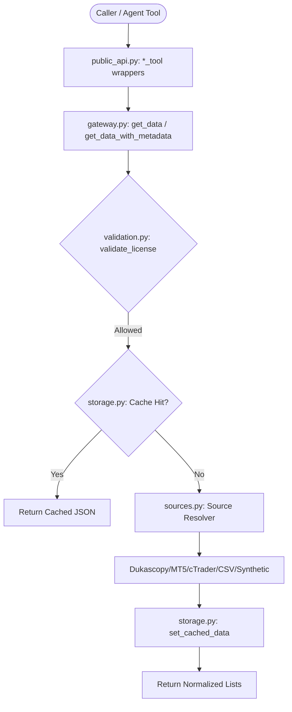

# Market Data Service

`app/services/data` is the **Layer 5 (Service Layer)** module responsible for market data
retrieval, normalization, caching, persistence, transformation, scheduling, and real-time
feed observability. It returns plain Python primitives (`dict`, `list`) and raises typed
`app.utils.errors` exceptions from its native functions; JSON-safe standard tool envelopes
are layered on top in `public_api.py`.

This module is a **brownfield upgrade** of the pre-existing Data service, not a
clean-room rebuild. See `docs/dev/phase-implementation-plan/02-data.md` for the
authoritative upgrade plan and requirement traceability.

---

## 1. Module Boundary & Ownership

**Data owns:**
market data request validation; source selection; read-only market-data calls;
normalization into canonical records; data-quality flags; caching and persistence of
data artifacts; feed observability and source status; local file ingestion.

**Data does not own:**
broker SDK imports, terminal/client connection lifecycle, authentication, account/session
handling, or any order/position/account mutation. Those remain in `app/services/brokers/`
(read connectivity) and `app/services/trading/` (mutation, live-readiness gates,
reconciliation).

### Broker/Data boundary

Broker SDK ownership stays in `app/services/brokers/`. Data adapters depend on the
read-only `BrokerMarketDataPort` protocol from `contracts.py`, which exposes only
connection-readiness plus `get_bars` and `get_ticks` reads. Order submission,
modification, cancellation, position close, account mutation, and live-execution
policy are intentionally absent from the port; `BrokerBackedAdapter` in `sources.py`
never calls broker mutation methods.

Broker-backed adapters may use pandas DataFrames from broker clients internally, but
adapter methods only ever return normalized `list[dict[str, Any]]` records. Read
timeouts, authentication/credential failures, broker unavailability, and unsupported
provider payload shapes are mapped to deterministic error codes
(`TIMEOUT`, `CREDENTIALS_MISSING`, `AUTHENTICATION_FAILED`, `BROKER_UNAVAILABLE`,
`DATA_SCHEMA_DRIFT`) before crossing the Data boundary.

---

## 2. System Architecture & Flow



---

## 3. Core Modules

1. **`__init__.py`**: Compatibility public gate. Preserves the 23 original native
   exports (`__all__`), plus `PUBLIC_API_CLASSIFICATION`, `OFFICIAL_DATA_TOOL_NAMES`,
   and the `OFFICIAL_DATA_TOOLS` wrapper catalog (not part of `__all__`, to avoid
   breaking the existing export-count characterization test).
2. **`public_api.py`**: Official AI-tool wrappers (`get_data_tool`, `list_symbols_tool`,
   `get_market_hours_tool`, `get_feed_status_tool`) returning the shared HaruQuant
   standard envelope (`app.utils.standard.StandardResponse`).
3. **`contracts.py`**: The read-only `BrokerMarketDataPort` and `SourceAdapterPort`
   protocols (the genuinely load-bearing contracts, used as real type annotations in
   `sources.py`), plus `JsonValue`/`DataRecords`/etc. JSON-safety type aliases. Does
   *not* define request DTOs or envelope aliases — `public_api.py` takes kwargs
   directly and imports `StandardResponse` from `app.utils.standard` (see note below).
4. **`errors.py`**: `DATA_ERROR_CODES` (documented subset of
   `app.utils.errors.APPROVED_ERROR_CODES`) and `to_data_error_payload` — the single
   redacted exception-to-payload mapping helper used by `public_api.py`.
5. **`gateway.py`**: Request validation, licensing, rate limiting, cache routing,
   source dispatch, and schema validation. `get_data` is the native compatibility
   function; `get_data_with_metadata` wraps it (without changing its behavior) to add
   source/schema/cache/quality/lineage metadata for `get_data_tool`.
6. **`sources.py`**: Source adapter registry (`csv`, `parquet`, `synthetic`, `mt5`,
   `ctrader`, `dukascopy`, `binance`, `yahoo`) and the read-only `BrokerBackedAdapter`.
7. **`normalization.py`**: Provider/file record normalization, plus quality-flag
   (`build_data_quality_flags`, `summarize_data_quality`) and volume-kind
   (`resolve_volume_kind`) helpers.
8. **`models.py`**: Pydantic record models (`OHLCVRecord`, `TickRecord`,
   `SpreadRecord`, `SymbolMetadata`, `DataAvailability`) plus quality/lineage models
   (`DataQualitySummary`, `DataLineage`).
9. **`storage.py`**: Lazy SQLite helper (`DatabaseHelper`, `db_helper`,
   `get_db_helper()`), cache read/write with insert/update/no-op/conflict detection
   (`PersistenceResult`), atomic local file I/O, and approved storage-root enforcement.
10. **`scheduler.py`**: Job lifecycle (`create_data_update_job`, `start_data_update_job`,
    `stop_data_update_job`, `run_data_update_job_once`, `get_data_update_job_status`),
    crash recovery (now explicit via `recover_data_jobs_on_startup`), and re-exports of
    `feeds.py` observability functions for compatibility.
11. **`feeds.py`**: Extracted real-time feed state: bounded buffer checks
    (`check_feed_buffer_capacity`), heartbeat timeout detection
    (`check_feed_heartbeat_timeout`), overflow policies (`handle_feed_overflow`), and
    the `ReconnectPolicy` backoff model (`compute_reconnect_delay`).
12. **`transforms.py`**: Resampling, tick aggregation, lookahead-free multi-timeframe
    alignment, deterministic synthetic generation (GBM), and historical labeling.
13. **`validation.py`**: Limits, precision/step-alignment, timeframe, timezone,
    `workflow_context`, `stale_data_behavior`, licensing, and bar-order validation.

---

## 4. Public Boundary Policy

### Compatibility exports (native)

The original 23 native functions remain importable from `app.services.data` and keep
returning native Python values — no envelope, no breaking changes:

```python
from app.services.data import get_data, list_symbols, get_market_hours, get_feed_status
```

`PUBLIC_API_CLASSIFICATION` documents every root export as one of:
`official_tool`, `public_support_api`, `legacy_public_compatibility`, or
`internal_only`.

### Official AI-tool wrappers

`OFFICIAL_DATA_TOOLS` maps each official tool name to its standard-envelope wrapper in
`public_api.py`:

```python
from app.services.data import OFFICIAL_DATA_TOOLS

response = OFFICIAL_DATA_TOOLS["get_data"](
    symbol="EURUSD", start_time="2026-06-01T00:00:00Z",
    end_time="2026-06-02T00:00:00Z", data_kind="ohlcv",
    timeframe="H1", source="synthetic",
)
# response == {"status": "success"|"error", "message": ..., "data": ..., "error": ..., "metadata": {...}}
```

No raw exception ever reaches this boundary: failures are mapped through
`errors.to_data_error_payload` into a deterministic `{"code": ..., "details": ...}`
error payload with secrets redacted.

---

## 5. Import Safety & Lazy Initialization

`import app.services.data` performs **no** database file writes, no schema migrations,
no broker connections, and no background task creation:

* `storage.DatabaseHelper` only stores its configured `db_path` at construction;
  the database directory and schema migrations are created lazily on the first
  `get_connection()` call (`get_db_helper()` returns the shared lazy singleton).
* `validation._ensure_licensing_table()` runs lazily on first
  `register_license`/`validate_license` call, not at import time.
* `scheduler.py` no longer calls crash recovery at import time. Application startup
  code must call `recover_data_jobs_on_startup()` (alias:
  `initialize_data_scheduler()`) explicitly.
* `sources.ADAPTER_REGISTRY` constructs adapter *objects* eagerly, but broker-backed
  adapters only store a lazy client factory — no broker connection happens until a
  read method (`get_market_data`/`get_tick_data`) is actually called.

---

## 6. Source Adapter Lifecycle

Every adapter implements `SourceAdapterProtocol` (`is_ready`, `get_market_data`,
`get_tick_data`, `list_symbols`, `get_symbol_metadata`) and returns
`list[dict[str, Any]]` only — never a raw pandas DataFrame or broker SDK object.

`BrokerBackedAdapter` resolves its client lazily via a `BrokerMarketDataFactory`
callable, checks the per-source circuit breaker before every call
(`check_circuit_breaker_barrier`), and records connection failures
(`_record_connection_failure`) to trip the breaker after repeated failures.

---

## 7. Persistence Lifecycle

`storage.set_cached_data` returns a `PersistenceResult(operation, table, key)` where
`operation` is one of `insert`, `update`, `no_op` (identical payload already cached —
skips the write), or `conflict` (write failed; the read path is never corrupted).
`storage.compute_raw_hash` produces a deterministic SHA256 hash of the raw
pre-normalization payload, propagated through `set_cached_data`/`get_cached_data` as
`raw_hash`. Schema migrations are tracked in `sys_migrations` with `migration_id`,
`source_version`, `target_version`, `applied_at`, and `rollback_notes`.

---

## 8. Feed Status Behavior

`get_feed_status` (native, and `get_feed_status_tool` wrapper) is the single read-only
feed observability surface. It never returns raw sockets, SDK objects, clients, or
credential-bearing connection strings — only bounded, JSON-safe diagnostic fields,
including `within_buffer_capacity` and `heartbeat_timed_out` (see `feeds.py`).
Overflow is handled through one of three explicit policies: `halt`,
`drop_and_reconcile`, or `backpressure` (`handle_feed_overflow`). Reconnect backoff
follows `feeds.ReconnectPolicy` (max retries, base/max backoff, jitter, circuit-breaker
cooldown), computed via `feeds.compute_reconnect_delay`.

---

## 9. Data Quality & Lineage Metadata

`gateway.get_data_with_metadata` (used by `get_data_tool`) returns
`(records, result_metadata)` without changing `get_data`'s native return shape.
`result_metadata` includes: `source`, `symbol`, `timeframe`, `data_kind`,
`record_count`, `volume_kind` (`normalization.resolve_volume_kind`), `schema_version`,
`normalization_version`, `raw_hash`, `cache_status` (`hit`/`miss`), `data_quality`
(`normalization.summarize_data_quality` — flag counts for duplicate/non-monotonic
timestamps, non-finite/negative/zero prices, out-of-range OHLC, inverted bid/ask),
`retrieval_timestamp`, `license`, and `warnings`. These diagnostics never repair,
interpolate, or silently drop data; they only report. `models.DataLineage` and
`models.DataQualitySummary` document the shape for downstream consumers.

`get_data_availability` computes real internal gap windows
(`gateway._detect_gap_windows`) from committed cache records instead of always
reporting zero gaps.

---

## 10. Migration Notes (Future Stricter Boundary)

Current broad root exports (`__all__`, 23 names) are **compatibility exports**. The
official AI-tool surface is deliberately narrow (`get_data`, `list_symbols`,
`get_market_hours`, `get_feed_status`) and cataloged separately in
`OFFICIAL_DATA_TOOLS`/`OFFICIAL_DATA_TOOL_NAMES`. Downstream modules should migrate to
`OFFICIAL_DATA_TOOLS[...]` wrappers (or stable native support APIs) incrementally;
root-export removal is an explicit future deprecation sprint, not part of this
brownfield upgrade.

---

## 11. Usage Examples

See `tests/usage/02_data.py` for runnable, numbered examples covering discovery,
retrieval per source, caching, labeling, sessions, transformations, synthetic
generation, scheduler jobs, cleanup, contracts/boundary classification, Phase 2.0
characterization, official tool wrappers (`public_api.py`), feed observability
(`feeds.py`), and data-quality/lineage metadata. All examples run without live broker
credentials by default (broker-backed sources fail closed with a deterministic error
when unavailable).

---

## 12. Testing & Static Quality

All files under `app/services/data` enforce **strict static type annotations** checked
with Mypy, and Ruff formatting/lint guidelines. Coverage for `app/services/data` is
kept at or above 80%.

```bash
# Run data-service unit tests with coverage
uv run pytest tests/unit/app/services/data -q

# Run Ruff check + format
uv run ruff check app/services/data
uv run ruff format app/services/data

# Run Mypy checks
uv run mypy app/services/data
```

---

## 13. Central Limits Manifest

All response-size, retention, and cadence limits are defined once, in code, and
documented here so they cannot silently drift. Tests in
`tests/unit/app/services/data/test_supplemental_hardening.py` assert these values
against their source constants.

| Limit | Default | Maximum | Source |
| --- | --- | --- | --- |
| OHLCV records per `get_data` call | 5,000 | 50,000 | `validation.DEFAULT_OHLCV_LIMIT` / `MAX_OHLCV_LIMIT` |
| Tick records per `get_data` call | 10,000 | 250,000 | `validation.DEFAULT_TICK_LIMIT` / `MAX_TICK_LIMIT` |
| Spread records per `get_data` call | 10,000 | 250,000 | `validation.DEFAULT_SPREAD_LIMIT` / `MAX_SPREAD_LIMIT` |
| Synthetic bars per direct-response call | — | 100,000 | `validation.MAX_SYNTHETIC_BARS` |
| Synthetic ticks per direct-response call | — | 250,000 | `validation.MAX_SYNTHETIC_TICKS` |
| Persisted synthetic dataset size | — | 1,000,000 | `validation.MAX_PERSISTED_SYNTHETIC_SIZE` |
| OHLCV backfill chunk | 100,000 records / 30 days | — | `validation.DEFAULT_BACKFILL_OHLCV_CHUNK_RECORDS` / `_DAYS` |
| Tick backfill chunk | 1,000,000 records / 1 day | — | `validation.DEFAULT_BACKFILL_TICK_CHUNK_RECORDS` / `_DAYS` |
| Cache TTL — daily bars | 86,400s (1 day) | — | `validation.DEFAULT_CACHE_TTL_DAILY` |
| Cache TTL — intraday bars | 3,600s (1 hour) | — | `validation.DEFAULT_CACHE_TTL_INTRADAY` |
| Cache TTL — ticks | 900s (15 min) | — | `validation.DEFAULT_CACHE_TTL_TICK` |
| Cache TTL — live/real-time | 0s (no cache) | — | `validation.DEFAULT_CACHE_TTL_LIVE` |
| Cache TTL override cap | — | 7 days | `validation.MAX_CACHE_TTL_OVERRIDE_DAYS` |
| Symbols per scheduler job | — | 500 | `validation.MAX_SYMBOLS_PER_JOB` |
| Timeframes per scheduler job | — | 20 | `validation.MAX_TIMEFRAMES_PER_JOB` |
| Minimum scheduler frequency | 60s | — | `validation.MIN_SCHEDULER_FREQUENCY_SECONDS` |
| Resampling performance benchmark | 100,000 M1 bars → H1 | < 3.0s | `validation.RESAMPLE_PERFORMANCE_BENCHMARK_BARS` / `_THRESHOLD_SECONDS` |
| Feed buffer capacity | — | 10,000 events | `feeds.DEFAULT_FEED_BUFFER_CAPACITY` |
| Feed heartbeat timeout | 30.0s | — | `feeds.DEFAULT_HEARTBEAT_TIMEOUT_SECONDS` |
| Reconnect policy | 5 retries, 0.5s base / 30s max backoff, 0.2 jitter, 60s cooldown | — | `feeds.DEFAULT_RECONNECT_POLICY` |

Per-workflow overrides: `validation.normalize_numeric` returns decimal-string
precision for `backtest`/`validation`/`risk`/`execution_bound` contexts and native
floats for `research`; no workflow may exceed the maximums above.

---

## 14. Source Readiness and License Manifest

`validation.SOURCE_READINESS_REGISTRY` declares one of `production`, `staging`,
`experimental`, or `not_available` per source. `validation.validate_source_readiness`
enforces it before every gateway retrieval: `not_available` sources are always
rejected (`UNSUPPORTED_OPERATION`), and non-`production` sources are rejected under
`risk`/`execution_bound` workflow contexts (`LICENSE_RESTRICTION`).

| Source | Readiness | License | Redistribution restricted |
| --- | --- | --- | --- |
| `csv` | production | Open | No |
| `parquet` | production | Open | No |
| `synthetic` | production | Permissive | No |
| `mt5` | staging | Proprietary | Yes |
| `ctrader` | staging | Proprietary | Yes |
| `dukascopy` | staging | Restricted | Yes |
| `binance` | staging | Restricted | Yes |
| `yahoo` | staging | Restricted | Yes |

License/attribution defaults live in `validation.DEFAULT_LICENSE_REGISTRY` and are
enforced by `validation.validate_license` (already wired into
`gateway.execute_gateway_request` alongside readiness). Both checks run before any
cache read/write, source download, or scheduler export.

---

## 15. Credential and Secret Handling

Data never accepts a raw password, token, or API key as a function parameter —
broker credentials are resolved exclusively inside `app.services.brokers.*` client
factories (`sources._get_mt5_client`, `_get_ctrader_client`, etc.), which Data only
calls lazily through `BrokerMarketDataFactory`. When a broker call fails, the raw
provider exception text is passed through `app.utils.security.redact_text` before
it is embedded in the `ExternalServiceError` message
(`sources.BrokerBackedAdapter._connected_client`, `_read_bars`, `_read_ticks`), and
`errors.to_data_error_payload` redacts a second time at the official tool boundary.
Examples and README snippets never hardcode credentials.

---

## 16. Path Safety and Approved Storage Roots

`storage.validate_storage_path` is the single gate for every local file read/write.
Approved roots are `data/raw/`, `data/processed/`, `data/cache/`, and
`artifacts/data/` (`storage.APPROVED_STORAGE_ROOTS`). It rejects empty paths, `..`
parent traversal, hidden/dotfile path segments, paths that resolve outside the
approved roots (including absolute paths), and unsupported extensions (only `.csv`
and `.parquet` are allowed).

---

## 17. Retention and Backup Policy

- **Raw provider payloads** (pre-normalization, hashed via `storage.compute_raw_hash`)
  are retained only as long as their owning cache row (`data_cache.raw_hash`); they
  are not separately archived in this phase.
- **Normalized canonical datasets** written via `save_market_data` under the approved
  storage roots are retained indefinitely by the caller; Data does not auto-delete
  them. `clear_data_cache` only ever targets the `data_cache` SQLite table (dry-run by
  default) and never touches on-disk datasets.
- **Migrations** (`sys_migrations`) are forward-only and auditable (see
  `storage._apply_migrations`); rollback requires the documented manual steps in each
  migration's `rollback_notes` column.
- **Backup**: the SQLite file at `storage.DB_FILE_PATH` (`data/data_service.db`) and
  the approved storage-root directories are the full state surface; standard
  filesystem/DB backup tooling applies. No Data-owned backup automation exists in
  this phase.

---

## 18. Operational Runbook

**Environment variables**: broker credentials are resolved by
`app.services.brokers.*`, not by Data; see that package's documentation for required
variables.

**Crash recovery**: `import app.services.data` performs no recovery. Application
startup code must call `scheduler.recover_data_jobs_on_startup()` (alias
`initialize_data_scheduler()`) explicitly to transition any job left in `running`
state after a crash into `recovering`.

**Circuit breaker recovery**: `sources.get_circuit_breaker(source)` reports
`state`/`failures_count`/`cooldown_expires`; a source trips to `open` after
`sources.CIRCUIT_OPEN_FAILURE_THRESHOLD` (4) consecutive connection failures and
transitions to `half-open` automatically once `cooldown_expires` has passed
(`sources.check_circuit_breaker_barrier`).

**Troubleshooting**:
- `LICENSE_RESTRICTION` on a broker source under `risk`/`execution_bound` — expected;
  those workflows require `production`-ready, non-restricted sources.
- `UNSUPPORTED_OPERATION` from `get_market_hours` callers attempting historical
  reconstruction — expected; only current configured hours are supported in this
  phase (`historical_hours_supported: false`).
- `CIRCUIT_OPEN` / `BROKER_UNAVAILABLE` — check `sources.get_circuit_breaker` and
  broker-layer connectivity before retrying.

**Rollback path**: this upgrade is additive (new files: `contracts.py` additions,
`errors.py`, `public_api.py`, `feeds.py`; existing files hardened in place). Reverting
the corresponding commit(s) fully restores prior behavior; no destructive migration
was applied (schema migration `mig_002_migration_audit` only adds nullable columns —
see its `rollback_notes` in `sys_migrations` for the manual down-step).

**Release sign-off**: `uv run ruff check app/services/data`, `uv run ruff format
--check app/services/data`, `uv run mypy app/services/data`, and `uv run pytest
tests/unit/app/services/data --cov=app.services.data` (≥80%) must all pass before
handoff.

---

## 19. Downstream Contract Alignment and Golden Fixtures

`models.OHLCVRecord`/`TickRecord`/`SpreadRecord`/`SymbolMetadata`/`DataAvailability`/
`DataLineage`/`DataQualitySummary` are the canonical contracts downstream Strategy,
Simulation, Optimization, Analytics, Risk, Portfolio, Execution, and Agent workflows
should consume. Deterministic golden fixtures generated from the seeded synthetic
adapter live under `tests/fixtures/data/golden/` and are reused by
`tests/unit/app/services/data/test_supplemental_hardening.py` so downstream modules
can regression-test against the same canonical records.
