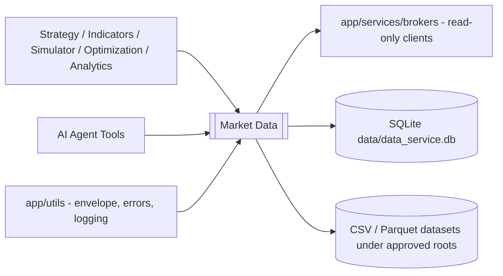
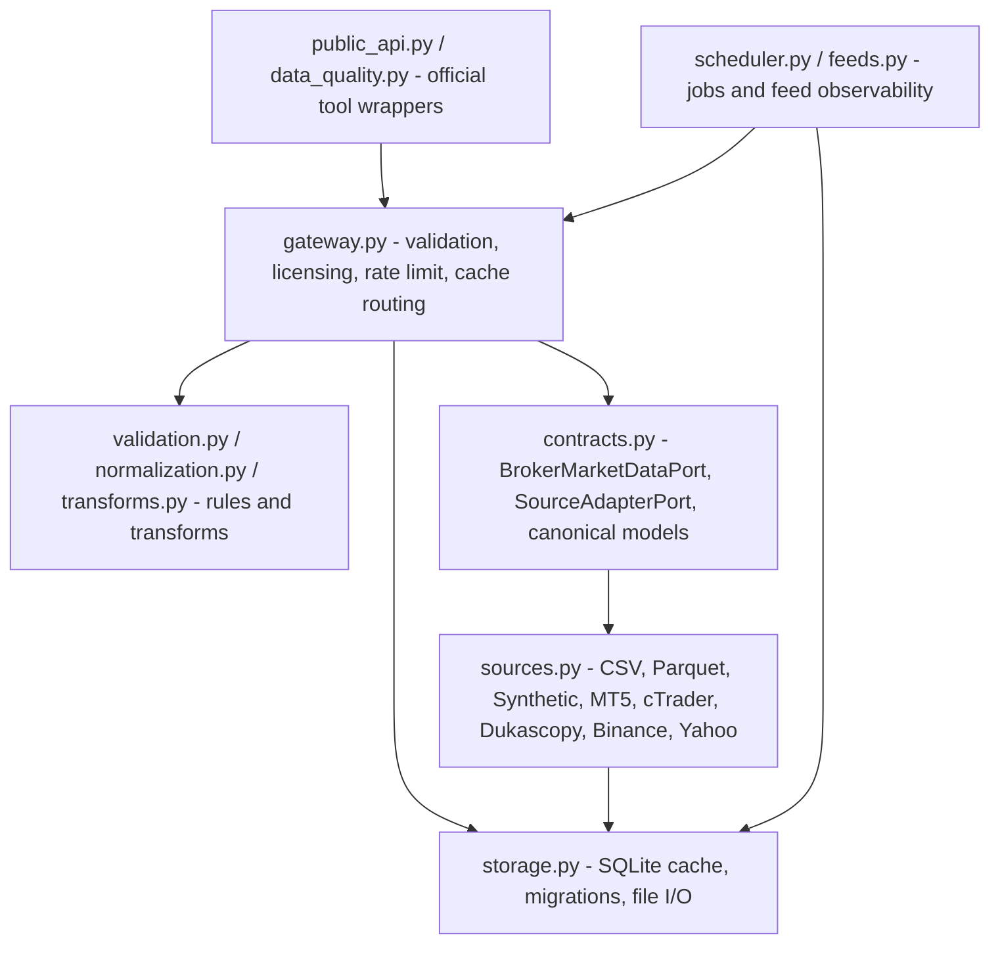
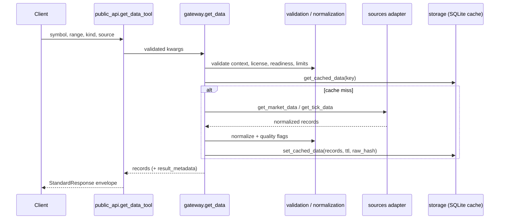
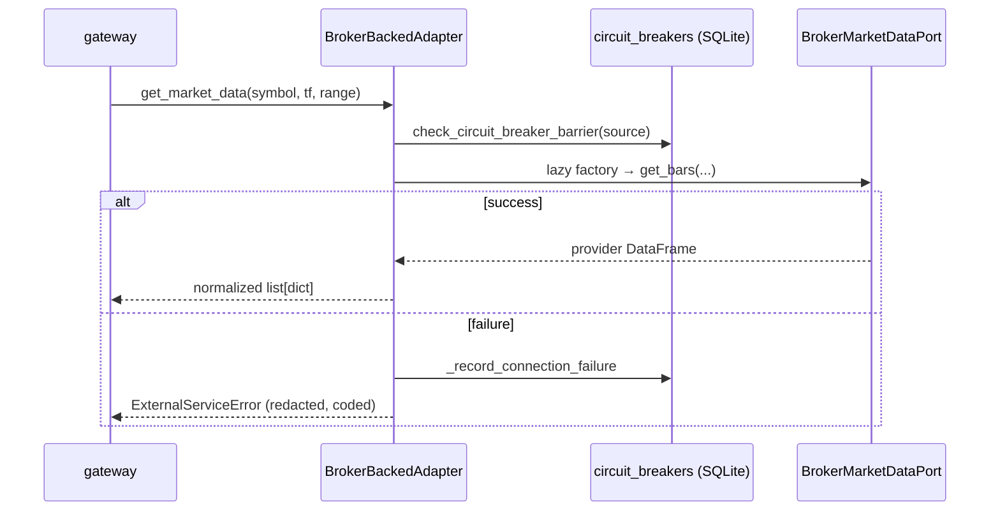
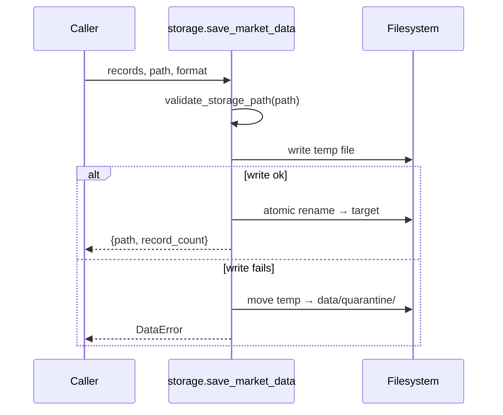
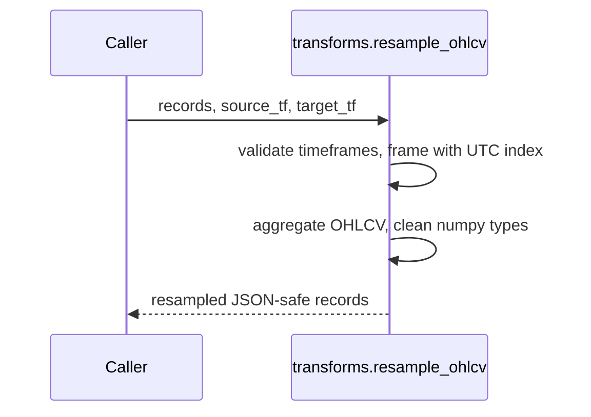
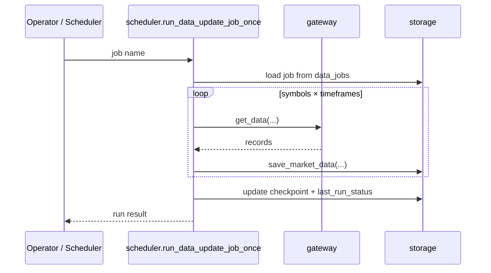
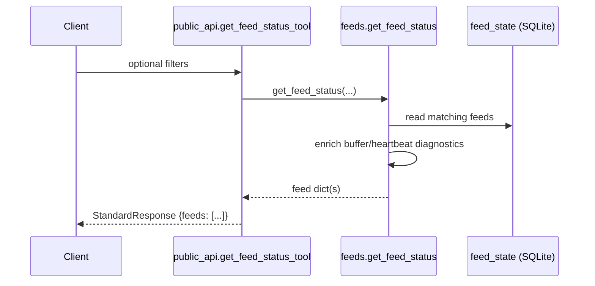
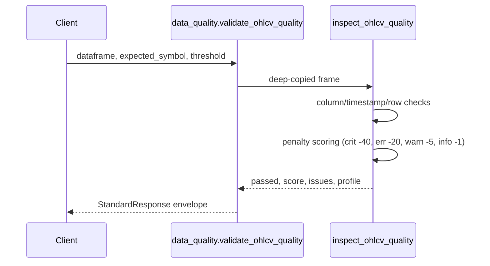
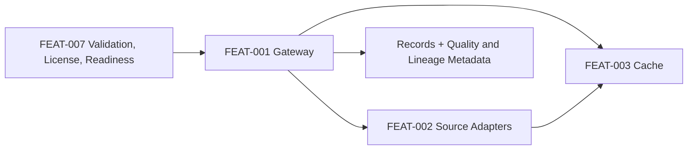

# Market Data

> **Package:** `app/services/data`
> **Domain ID:** `DOM-002`
> **Status:** `In Development`
> **Owner:** `HaruQuant Core (Haruperi)`
> **Last updated:** `2026-07-10`

---

# Part I — Orientation

## 1. What This Domain Does

The Market Data domain is the single retrieval, normalization, caching, and
observability boundary for all historical and real-time market data consumed by
HaruQuant. It hides provider-specific SDKs and payload shapes behind a uniform
gateway that returns JSON-safe Python primitives (`list[dict]`), enforces
licensing/readiness/limit policies before any download, and discloses data
quality and lineage instead of silently repairing data. The one rule every
consumer must know: only normalized JSON-safe records ever cross this boundary —
never raw DataFrames, SDK objects, or unredacted provider errors.

## 2. Quick Start

```python
from datetime import datetime, timezone
from app.services.data import get_data

records = get_data(
    symbol="EURUSD",
    start_time=datetime(2026, 1, 1, tzinfo=timezone.utc),
    end_time=datetime(2026, 2, 1, tzinfo=timezone.utc),
    data_kind="ohlcv",
    timeframe="H1",
    source="synthetic",   # csv | parquet | synthetic | mt5 | ctrader | dukascopy | binance | yahoo
)
```

```bash
uv add pandas pyarrow pydantic
```

The call returns validated, cached, normalized OHLCV records as
`list[dict[str, Any]]`. Use `get_data_with_metadata` for quality/lineage
metadata, or the `get_data_tool` wrapper for the standard AI-tool envelope.
See §6 for the full API surface and §9.1 for the retrieval workflow in detail.

## 3. Capability Map

One row per feature — the index for the whole document. Deep dives in Part IV.

| ID         | Capability                          | One-line purpose                                                              | Primary entry points                                | Status | Details |
| ---------- | ----------------------------------- | ----------------------------------------------------------------------------- | --------------------------------------------------- | ------ | ------- |
| `FEAT-001` | Market Data Retrieval Gateway       | Validated, cached, source-agnostic retrieval with quality/lineage disclosure   | `get_data`, `get_data_with_metadata`, `list_symbols` | In Dev | §9.1    |
| `FEAT-002` | Source Adapters and Broker Boundary | Interchangeable source adapters behind a read-only broker port, fail-closed    | `get_data_source`, `BrokerMarketDataPort`            | In Dev | §9.2    |
| `FEAT-003` | Caching, Persistence, Local Datasets| SQLite cache, migrations, atomic path-safe CSV/Parquet I/O with quarantine     | `save_market_data`, `load_local_dataset`             | In Dev | §9.3    |
| `FEAT-004` | Transformations and Synthetic Data  | Deterministic, lookahead-free resampling, alignment, and seeded generation     | `resample_ohlcv`, `generate_synthetic_bars`          | In Dev | §9.4    |
| `FEAT-005` | Scheduled Data Update Jobs          | Persistent lease-based job lifecycle with explicit startup crash recovery      | `create_data_update_job`, `run_data_update_job_once` | In Dev | §9.5    |
| `FEAT-006` | Real-Time Feed Observability        | Read-only feed health: buffers, heartbeats, overflow policies, backoff         | `get_feed_status`, `ReconnectPolicy`                 | In Dev | §9.6    |
| `FEAT-007` | Validation, Sessions, Data Quality  | Central limits/rules, licensing, sessions, and report-only quality diagnostics | `validate_ohlcv_quality`, `get_trading_sessions`     | In Dev | §9.7    |

---

# Part II — Domain View

## 4. Boundaries and System Position

### 4.1 Scope

**Owns**

- Market data request validation (timeframes, limits, timezones, workflow contexts, stale-cache policies)
- Source selection, adapter registry, per-source circuit breakers, and rate limiting
- Read-only market-data calls to broker clients via the `BrokerMarketDataPort` protocol
- Normalization into canonical records, data-quality diagnostics, and volume-kind disclosure
- Caching (`data_cache` SQLite table), atomic local file I/O under approved storage roots, schema migrations
- Scheduled data-update job lifecycle and crash recovery
- Real-time feed status, buffer/heartbeat checks, overflow policies, and reconnect backoff
- Licensing and source-readiness enforcement before retrieval, storage, or export

**Does not own**

- Broker SDK imports, terminal/client connection lifecycle, authentication, and credential resolution — owned by `app/services/brokers`
- Order/position/account mutation, live-readiness gates, and reconciliation — owned by `app/services/trading`
- Data repair, interpolation, or silent dropping of records — quality diagnostics are report-only
- Strategy, indicator, simulation, and analytics computations — they consume Data outputs

### 4.2 System Position

Strategy, Indicators, Risk, Simulator, Optimization, Analytics, and agent-tool
callers retrieve data through this domain. Data depends on `app/services/brokers`
for read-only broker clients, on `app/utils` for the standard tool envelope,
error taxonomy, logging, normalization, and path helpers, and on
`app/services/strategy/contracts` for the canonical `Bar` used by
`validate_bars`/`load_ohlcv_csv`.



## 5. Architecture

### 5.1 Layer Diagram



Official AI-tool wrappers (`public_api.py`, `data_quality.validate_ohlcv_quality`)
sit on top of native service functions; the gateway coordinates validation,
licensing, rate limiting, cache routing, and adapter dispatch; adapters implement
the `SourceAdapterPort`/`SourceAdapterProtocol` contracts and talk to local files,
the synthetic generator, or broker clients through the read-only
`BrokerMarketDataPort`; persistence owns the lazy SQLite helper and file I/O.
Dependencies point strictly downward.

### 5.2 Design Rules (Invariants)

| ID         | Rule                                                                                                                                     |
| ---------- | ----------------------------------------------------------------------------------------------------------------------------------------- |
| `RULE-001` | Import safety: `import app.services.data` performs **no** database writes, schema migrations, broker connections, or background task creation. DB init, the licensing table, and scheduler recovery run lazily or on explicit startup calls. |
| `RULE-002` | Boundary: only normalized JSON-safe primitives (`list[dict]`, native numeric types) cross the public boundary — never raw pandas DataFrames or provider SDK objects. |
| `RULE-003` | Errors: native functions raise typed `app.utils.standard` exceptions; official tool wrappers map every failure through `errors.to_data_error_payload` to a deterministic, secret-redacted error envelope — no raw exception escapes. |
| `RULE-004` | Broker isolation: nothing in the domain imports a broker SDK directly; broker access happens only through the read-only `BrokerMarketDataPort` (no mutation methods exist on the port by design). |
| `RULE-005` | Quality is report-only: no repair, interpolation, or silent dropping of records anywhere in the domain — issues are flagged and disclosed. |
| `RULE-006` | Path safety: every local file read/write passes `validate_storage_path` — approved roots only, no traversal or hidden paths, `.csv`/`.parquet` only. |
| `RULE-007` | Governance first: license and source-readiness rules are enforced before any cache read/write, source download, or export.               |
| `RULE-008` | Downward dependencies only: adapters never call the gateway; layers depend strictly on the layer below.                                   |

---

# Part III — Reference Tables

> Single source of truth for lookups. Feature deep dives (Part IV) cite these tables by row and never repeat them.

## 6. Public API Surface

The complete importable surface of the domain, in one table.

```python
# Native functions
from app.services.data import (
    get_data, get_data_with_metadata, list_symbols, get_symbol_metadata, get_data_availability,
    save_market_data, load_local_dataset, load_ohlcv_csv, clear_data_cache,
    resample_ohlcv, aggregate_ticks_to_bars, align_multitimeframe_data,
    generate_synthetic_bars, generate_synthetic_ticks, label_market_data,
    create_data_update_job, start_data_update_job, stop_data_update_job,
    run_data_update_job_once, get_data_update_job_status,
    get_feed_status, get_market_hours, get_trading_sessions, validate_bars,
)
from app.services.data import OFFICIAL_DATA_TOOLS  # envelope wrappers catalog

# Official tool wrappers, contracts, and support modules
from app.services.data.public_api import get_data_tool, list_symbols_tool, get_feed_status_tool
from app.services.data.contracts import BrokerMarketDataPort, SourceAdapterPort
from app.services.data.sources import get_data_source, get_circuit_breaker
from app.services.data.storage import get_db_helper, PersistenceResult
from app.services.data.scheduler import recover_data_jobs_on_startup
from app.services.data.feeds import ReconnectPolicy, compute_reconnect_delay, handle_feed_overflow
from app.services.data.data_quality import validate_ohlcv_quality, inspect_ohlcv_quality
from app.services.data.dataframe_tools import serialize_dataframe_records, compare_ohlcv
```

| Feature    | Module               | Type     | Class / Function                 | Params                                                        | Returns                       | Raises                                                | Responsibility                                  |
| ---------- | -------------------- | -------- | -------------------------------- | -------------------------------------------------------------- | ----------------------------- | ------------------------------------------------------ | ------------------------------------------------ |
| `FEAT-001` | `gateway.py`         | Function | `get_data`                       | `symbol, start_time, end_time, data_kind, timeframe, source, limit, stale_data_behavior, workflow_context, request_id` | `list[dict[str, Any]]` | `ValidationError`, `DataError`, `ExternalServiceError` | Validated cached retrieval (cache read/write, logging) |
| `FEAT-001` | `gateway.py`         | Function | `get_data_with_metadata`         | same as `get_data`                                              | `(records, result_metadata)`  | same as `get_data`                                      | Retrieval + quality/lineage metadata             |
| `FEAT-001` | `gateway.py`         | Function | `list_symbols`                   | `source, request_id`                                            | `list[str]`                   | `ValidationError`, `DataError`                          | Symbol discovery per source                      |
| `FEAT-001` | `gateway.py`         | Function | `get_symbol_metadata`            | `symbol, source, request_id`                                    | `dict[str, Any]`              | `ValidationError`, `DataError`                          | Normalized symbol specification                  |
| `FEAT-001` | `gateway.py`         | Function | `get_data_availability`          | `symbol, timeframe, source, request_id`                         | `dict[str, Any]`              | `DataError`                                             | Coverage + gap-window report (cache read)        |
| `FEAT-001` | `gateway.py`         | Class    | `TokenBucketLimiter`             | `rate, capacity`                                                |                               |                                                         | Thread-safe per-source rate limiting             |
| `FEAT-001` | `public_api.py`      | Function | `get_data_tool`                  | `get_data` kwargs `+ request_id`                                | `StandardResponse`            | Never raises                                            | Official envelope wrapper                        |
| `FEAT-001` | `public_api.py`      | Function | `list_symbols_tool`              | `source, request_id`                                            | `StandardResponse`            | Never raises                                            | Official envelope wrapper                        |
| `FEAT-001` | `errors.py`          | Function | `to_data_error_payload`          | `exception, request_id`                                         | `ErrorPayload` (`{code, details}`) | Never raises                                       | Redacted deterministic error mapping             |
| `FEAT-002` | `contracts.py`       | Protocol | `BrokerMarketDataPort`           |                                                                 |                               |                                                         | Read-only broker client contract                 |
| `FEAT-002` | `contracts.py`       | Protocol | `SourceAdapterPort`              |                                                                 |                               |                                                         | Normalized source adapter contract               |
| `FEAT-002` | `sources.py`         | Function | `get_data_source`                | `source: str`                                                   | `SourceAdapterProtocol`       | `ValidationError`: unknown source                       | Adapter resolution                               |
| `FEAT-002` | `sources.py`         | Function | `get_source_adapter`             | `source: str`                                                   | `SourceAdapterProtocol`       | same as above                                           | Backward-compatible alias                        |
| `FEAT-002` | `sources.py`         | Class    | `BrokerBackedAdapter`            | protocol methods: `get_market_data`, `get_tick_data`, `list_symbols`, `get_symbol_metadata` | `DataRecords` | `ExternalServiceError`: broker/read failure | Lazy broker reads, normalization (breaker updates) |
| `FEAT-002` | `sources.py`         | Function | `get_circuit_breaker`            | `source: str`                                                   | `dict[str, Any]`              |                                                         | Breaker state report (DB read)                   |
| `FEAT-002` | `sources.py`         | Function | `check_circuit_breaker_barrier`  | `source: str`                                                   | `None`                        | `ExternalServiceError`: breaker open                    | Fail-closed gate (DB read)                       |
| `FEAT-003` | `storage.py`         | Class    | `DatabaseHelper.get_connection`  |                                                                 | ctx-managed `Connection`      | `DataError`: transaction failure                        | Lazy DB init, WAL, migrations                    |
| `FEAT-003` | `storage.py`         | Function | `get_db_helper`                  |                                                                 | `DatabaseHelper`              |                                                         | Shared lazy singleton accessor                   |
| `FEAT-003` | `storage.py`         | Function | `validate_storage_path`          | `path_str: str`                                                 | `Path`                        | `ValidationError`: unsafe path                          | Single path-safety gate                          |
| `FEAT-003` | `storage.py`         | Function | `set_cached_data`                | `key, source, symbol, timeframe, times, records, ttl_seconds, …`| `PersistenceResult`           | Never raises (returns `conflict`)                       | Disclosing cache upsert (DB write)               |
| `FEAT-003` | `storage.py`         | Function | `get_cached_data`                | `key, stale_data_behavior, request_id`                          | `dict \| None`                |                                                         | TTL-aware cache read                             |
| `FEAT-003` | `storage.py`         | Function | `compute_raw_hash`               | `records`                                                       | `str` (SHA256 hex)            |                                                         | Raw payload lineage hash                         |
| `FEAT-003` | `storage.py`         | Function | `save_market_data`               | `records, path_str, format_str, overwrite, …`                   | `{path, record_count}`        | `ValidationError`, `DataError`                          | Atomic dataset write + quarantine (file write)   |
| `FEAT-003` | `storage.py`         | Function | `load_local_dataset`             | `path_str, request_id`                                          | `list[dict]`                  | `ValidationError`, `DataError`                          | CSV/Parquet load under approved roots            |
| `FEAT-003` | `storage.py`         | Function | `load_ohlcv_csv`                 | `path`                                                          | `tuple[Bar, ...]`             | `ValueError`: bad rows/timestamps                       | Canonical bar loading + validation               |
| `FEAT-003` | `storage.py`         | Function | `clear_data_cache`               | `namespace, source_filter, symbol_filter, dry_run`              | `dict[str, Any]`              | `ValidationError`                                       | Cache inspection/clearing (dry-run default)      |
| `FEAT-004` | `transforms.py`      | Function | `resample_ohlcv`                 | `records, source_tf, target_tf, …`                              | `list[dict]`                  | `ValidationError`                                       | Deterministic timeframe conversion               |
| `FEAT-004` | `transforms.py`      | Function | `aggregate_ticks_to_bars`        | `ticks, timeframe, …`                                           | `list[dict]`                  | `ValidationError`                                       | Tick → bar aggregation                           |
| `FEAT-004` | `transforms.py`      | Function | `align_multitimeframe_data`      | `datasets: dict[str, list[dict]], …`                            | `dict[str, list]`             | `ValidationError`                                       | Lookahead-free alignment                         |
| `FEAT-004` | `transforms.py`      | Function | `generate_synthetic_bars`        | `symbol, timeframe, count/range, seed, …`                       | `list[dict]`                  | `ValidationError`                                       | Seeded GBM bar generation                        |
| `FEAT-004` | `transforms.py`      | Function | `generate_synthetic_ticks`       | `symbol, range, seed, …`                                        | `list[dict]`                  | `ValidationError`                                       | Seeded synthetic tick generation                 |
| `FEAT-004` | `transforms.py`      | Function | `label_market_data`              | `records, labeling params`                                      | `list[dict]`                  | `ValidationError`                                       | Historical labeling                              |
| `FEAT-005` | `scheduler.py`       | Function | `create_data_update_job`         | `name, source, symbols, timeframes, data_kind, storage, schedule, …` | `dict[str, Any]`         | `ValidationError`                                       | Validated job creation (DB write)                |
| `FEAT-005` | `scheduler.py`       | Function | `start_data_update_job`          | `name, request_id`                                              | `dict[str, Any]`              | `ValidationError`                                       | Transition job to running                        |
| `FEAT-005` | `scheduler.py`       | Function | `stop_data_update_job`           | `name, request_id`                                              | `dict[str, Any]`              | `ValidationError`                                       | Stop and release lease                           |
| `FEAT-005` | `scheduler.py`       | Function | `run_data_update_job_once`       | `name, request_id`                                              | `dict[str, Any]`              | `ValidationError`, `DataError`                          | Single synchronous run (retrieval + writes)      |
| `FEAT-005` | `scheduler.py`       | Function | `get_data_update_job_status`     | `name, request_id`                                              | `dict[str, Any]`              | `ValidationError`                                       | Job status report                                |
| `FEAT-005` | `scheduler.py`       | Function | `recover_data_jobs_on_startup`   |                                                                 | `int` (recovered count)       |                                                         | Explicit crash recovery (alias `initialize_data_scheduler`) |
| `FEAT-006` | `feeds.py`           | Function | `get_feed_status`                | `feed_id, source, symbol, data_kind, request_id`                | `dict \| list[dict]`          | `ValidationError`                                       | Read-only enriched feed diagnostics              |
| `FEAT-006` | `feeds.py`           | Function | `check_feed_buffer_capacity`     | `feed, capacity`                                                | `bool`                        |                                                         | Bounded-buffer check                             |
| `FEAT-006` | `feeds.py`           | Function | `check_feed_heartbeat_timeout`   | `feed, timeout_seconds`                                         | `bool`                        |                                                         | Heartbeat staleness check                        |
| `FEAT-006` | `feeds.py`           | Function | `record_feed_heartbeat`          | `feed_id, request_id`                                           | `dict[str, Any]`              | `ValidationError`                                       | Heartbeat update                                 |
| `FEAT-006` | `feeds.py`           | Function | `handle_feed_overflow`           | `feed_id, policy, …`                                            | `dict[str, Any]`              | `ValidationError`                                       | Explicit overflow policy application             |
| `FEAT-006` | `feeds.py`           | Class    | `ReconnectPolicy`                | `max_retries, base/max backoff, jitter, cooldown`               |                               |                                                         | Deterministic backoff model                      |
| `FEAT-006` | `feeds.py`           | Function | `compute_reconnect_delay`        | `attempt, policy`                                               | `float` seconds               | `ValidationError`                                       | Backoff computation                              |
| `FEAT-006` | `public_api.py`      | Function | `get_feed_status_tool`           | filters `+ request_id`                                          | `StandardResponse`            | Never raises                                            | Official envelope wrapper                        |
| `FEAT-007` | `validation.py`      | Function | `get_market_hours`               | `symbol, request_id`                                            | `dict[str, Any]`              |                                                         | Current configured hours (24/5 UTC)              |
| `FEAT-007` | `validation.py`      | Function | `get_trading_sessions`           | `start_time, end_time, request_id`                              | `list[dict]`                  |                                                         | Session window labeling (Sydney/Tokyo/London/NY) |
| `FEAT-007` | `validation.py`      | Function | `normalize_numeric`              | `value, digits, workflow_context`                               | `str \| float`                | `ValidationError`                                       | Per-workflow precision policy                    |
| `FEAT-007` | `validation.py`      | Function | `validate_step_alignment`        | `value, step_size, workflow_context`                            | `None`                        | `ValidationError`: misaligned in risk contexts          | Fail-closed step check                           |
| `FEAT-007` | `validation.py`      | Function | `validate_bars`                  | `bars: Iterable[Bar]`                                           | `tuple[Bar, ...]`             | `ValueError`: empty/non-increasing                      | Canonical bar-order validation                   |
| `FEAT-007` | `validation.py`      | Function | `validate_license`               | `source, symbol, workflow_context, request_id`                  | `dict[str, Any]`              | `ValidationError`: `LICENSE_RESTRICTION`                | License enforcement (lazy DB read)               |
| `FEAT-007` | `validation.py`      | Function | `validate_source_readiness`      | `source, workflow_context, request_id`                          | `str` (readiness)             | `ValidationError`                                       | Readiness gate                                   |
| `FEAT-007` | `normalization.py`   | Function | `build_data_quality_flags`       | `record, previous_timestamp`                                    | `list[str]`                   |                                                         | Per-record quality flags (report-only)           |
| `FEAT-007` | `normalization.py`   | Function | `summarize_data_quality`         | `records`                                                       | `dict[str, Any]`              |                                                         | Batch flag counts                                |
| `FEAT-007` | `normalization.py`   | Function | `resolve_volume_kind`            | `source, data_kind`                                             | `str`                         |                                                         | Volume-kind disclosure                           |
| `FEAT-007` | `data_quality.py`    | Function | `inspect_ohlcv_quality`          | `dataframe, expected_symbol, timestamp_column, issue_limit, sample_limit, quality_pass_threshold` | `dict[str, object]` | `ValidationError`                          | Deterministic scored diagnostics                 |
| `FEAT-007` | `data_quality.py`    | Function | `validate_ohlcv_quality`         | same `+ timeframe, request_id`                                  | `StandardResponse`            | Never raises                                            | Official tool wrapper                            |
| `FEAT-007` | `dataframe_tools.py` | Function | `serialize_dataframe_records`    | `dataframe, timestamp_columns, include_index, index_name`       | `list[dict]`                  | `ValidationError`                                       | JSON-safe serialization                          |
| `FEAT-007` | `dataframe_tools.py` | Function | `compare_dataframes` / `compare_ohlc` / `compare_ohlcv` | `left, right, columns, tolerance`        | `dict[str, object]`           | `ValidationError`                                       | Deterministic frame comparison                   |
| `FEAT-007` | `contracts.py`       | Model    | `Symbol`, `Timeframe`, `Bar`, `Tick`, `Spread`, `DataSlice` |                                      |                               | `ValueError`: constraint violations                     | Canonical validated market-data contracts        |
| `FEAT-007` | `models.py`          | Model    | `OHLCVRecord`, `TickRecord`, `SpreadRecord`, `SymbolMetadata`, `DataQualitySummary`, `DataLineage`, `DataAvailability` | | | `ValueError`: constraint violations | Downstream record schemas                        |

The official tool surface is the narrow `OFFICIAL_DATA_TOOLS` catalog
(`get_data`, `list_symbols`, `get_market_hours`, `get_feed_status`); the broad
root `__all__` (23 names) is legacy compatibility (see §12).

## 7. Configuration, Dependencies, and Limits

### 7.1 Prerequisites

- Python `>=3.14`, `uv`
- SQLite (bundled with Python); writable `data/` directory
- Optional: MetaTrader 5 terminal, cTrader OpenAPI access, or network access for Dukascopy/Binance/Yahoo (broker-backed sources only)

### 7.2 Dependencies

| Dependency                        | Type        | Used by                    | Purpose                                          | Required? |
| --------------------------------- | ----------- | -------------------------- | ------------------------------------------------ | --------- |
| `pandas`                          | Third-party | `FEAT-001…004, 007`        | Adapter-internal frames, file I/O, resampling (lazy import in `dataframe_tools`) | Yes |
| `pyarrow`                         | Third-party | `FEAT-001, 003`            | Parquet read/write                               | Yes       |
| `pydantic>=2`                     | Third-party | `FEAT-001, 007`            | Record models and canonical contracts            | Yes       |
| `numpy`                           | Third-party | `FEAT-004`                 | Synthetic generation (GBM)                       | Yes       |
| `app/utils`                       | Internal    | all                        | Envelope, error taxonomy, logging, `redact_text` | Yes       |
| `app/services/brokers`            | Internal    | `FEAT-001, 002`            | Read-only broker market-data clients             | Optional  |
| `app/services/strategy/contracts` | Internal    | `FEAT-001, 003, 007`       | Canonical `Bar` for `validate_bars`/CSV loader   | Yes       |

### 7.3 Configuration and Limits Manifest

All settings and hard limits, defined once in code; hardening tests assert
these values against their source constants.

| Setting / Limit                                       | Feature    | Required | Default                                            | Description                                        |
| ----------------------------------------------------- | ---------- | -------: | -------------------------------------------------- | -------------------------------------------------- |
| `storage.DB_FILE_PATH`                                 | `FEAT-003` |       No | `data/data_service.db`                             | SQLite database file (lazy-created on first use).  |
| `storage.APPROVED_STORAGE_ROOTS`                       | `FEAT-003` |       No | `data/raw`, `data/processed`, `data/cache`, `artifacts/data` | Only writable/readable dataset roots.    |
| `storage.QUARANTINE_DIR`                               | `FEAT-003` |       No | `data/quarantine`                                  | Destination for failed partial writes.             |
| `storage.DEFAULT_SCHEMA_VERSION`                       | `FEAT-003` |       No | `v1`                                               | Cache row schema tag.                              |
| `sources.CIRCUIT_OPEN_FAILURE_THRESHOLD`               | `FEAT-002` |       No | `4`                                                | Consecutive failures before a breaker opens.       |
| `validation.SOURCE_READINESS_REGISTRY`                 | `FEAT-007` |       No | csv/parquet/synthetic=production; brokers=staging  | Per-source readiness gate (see §7.4).              |
| `validation.DEFAULT_LICENSE_REGISTRY`                  | `FEAT-007` |       No | Per-source license defaults                        | License metadata used when no DB row exists.       |
| `validation.DEFAULT_OHLCV_LIMIT` / `MAX_OHLCV_LIMIT`   | `FEAT-007` |       No | `5000` / `50000`                                   | OHLCV records per `get_data` call.                 |
| `validation.DEFAULT_TICK_LIMIT` / `MAX_TICK_LIMIT`     | `FEAT-007` |       No | `10000` / `250000`                                 | Tick records per `get_data` call.                  |
| `validation.DEFAULT_SPREAD_LIMIT` / `MAX_SPREAD_LIMIT` | `FEAT-007` |       No | `10000` / `250000`                                 | Spread records per `get_data` call.                |
| `validation.DEFAULT_BACKFILL_OHLCV_CHUNK_RECORDS` / `_DAYS` | `FEAT-007` |  No | `100000` / `30`                                    | OHLCV backfill chunking.                           |
| `validation.DEFAULT_BACKFILL_TICK_CHUNK_RECORDS` / `_DAYS`  | `FEAT-007` |  No | `1000000` / `1`                                    | Tick backfill chunking.                            |
| `validation.DEFAULT_CACHE_TTL_DAILY` / `_INTRADAY` / `_TICK` / `_LIVE` | `FEAT-007` | No | `86400` / `3600` / `900` / `0` s     | Cache TTLs by data kind.                           |
| `validation.MAX_CACHE_TTL_OVERRIDE_DAYS`               | `FEAT-007` |       No | `7`                                                | Cache TTL override cap.                            |
| `validation.RESAMPLE_PERFORMANCE_BENCHMARK_BARS` / `_THRESHOLD_SECONDS` | `FEAT-007` | No | `100000` / `3.0`                    | Resampling benchmark.                              |
| `validation.MAX_SYNTHETIC_BARS`                        | `FEAT-004` |       No | `100000`                                           | Direct-response synthetic bar cap.                 |
| `validation.MAX_SYNTHETIC_TICKS`                       | `FEAT-004` |       No | `250000`                                           | Direct-response synthetic tick cap.                |
| `validation.MAX_PERSISTED_SYNTHETIC_SIZE`              | `FEAT-004` |       No | `1000000`                                          | Persisted synthetic dataset cap.                   |
| `validation.MAX_SYMBOLS_PER_JOB`                       | `FEAT-005` |       No | `500`                                              | Symbol cap per job.                                |
| `validation.MAX_TIMEFRAMES_PER_JOB`                    | `FEAT-005` |       No | `20`                                               | Timeframe cap per job.                             |
| `validation.MIN_SCHEDULER_FREQUENCY_SECONDS`           | `FEAT-005` |       No | `60`                                               | Minimum job frequency.                             |
| `feeds.DEFAULT_FEED_BUFFER_CAPACITY`                   | `FEAT-006` |       No | `10000`                                            | Max in-flight events before overflow.              |
| `feeds.DEFAULT_HEARTBEAT_TIMEOUT_SECONDS`              | `FEAT-006` |       No | `30.0`                                             | Heartbeat staleness threshold.                     |
| `feeds.DEFAULT_RECONNECT_POLICY`                       | `FEAT-006` |       No | 5 retries, 0.5s/30s backoff, 0.2 jitter, 60s cooldown | Reconnect backoff.                              |
| Broker credentials                                     | —          |       No | —                                                  | Resolved inside `app/services/brokers`, never here.|

### 7.4 Source Readiness and License Manifest

| Source      | Readiness  | License     | Redistribution restricted |
| ----------- | ---------- | ----------- | ------------------------- |
| `csv`       | production | Open        | No                        |
| `parquet`   | production | Open        | No                        |
| `synthetic` | production | Permissive  | No                        |
| `mt5`       | staging    | Proprietary | Yes                       |
| `ctrader`   | staging    | Proprietary | Yes                       |
| `dukascopy` | staging    | Restricted  | Yes                       |
| `binance`   | staging    | Restricted  | Yes                       |
| `yahoo`     | staging    | Restricted  | Yes                       |

`not_available` sources are always rejected (`UNSUPPORTED_OPERATION`);
non-`production` sources are rejected under `risk`/`execution_bound` contexts
(`LICENSE_RESTRICTION`). Both checks run before any cache read/write, download,
or scheduler export (`RULE-007`).

## 8. Package and File Structure

Each file maps to the feature(s) it implements — tying the code tree back to the capability map (§3).

```text
data/
├── __init__.py           # Public gate: native exports, OFFICIAL_DATA_TOOLS, PUBLIC_API_CLASSIFICATION   (all)
├── public_api.py         # Official AI-tool wrappers returning the standard envelope                     (FEAT-001, FEAT-006)
├── contracts.py          # Broker/adapter ports, JSON aliases, canonical Symbol/Timeframe/Bar/Tick/Spread/DataSlice (FEAT-002, FEAT-007)
├── errors.py             # DATA_ERROR_CODES subset + to_data_error_payload redacted mapping              (FEAT-001)
├── gateway.py            # Request validation, licensing, rate limiting, cache routing, source dispatch  (FEAT-001)
├── sources.py            # Adapter registry (csv/parquet/synthetic/mt5/ctrader/dukascopy/binance/yahoo) + circuit breakers (FEAT-002)
├── normalization.py      # Provider/file record normalization, quality flags, volume-kind disclosure     (FEAT-007)
├── models.py             # Pydantic record schemas (OHLCV/Tick/Spread/SymbolMetadata/quality/lineage)     (FEAT-007)
├── storage.py            # Lazy SQLite helper, migrations, cache ops, atomic file I/O, path safety        (FEAT-003)
├── scheduler.py          # Data-update job lifecycle + explicit crash recovery                            (FEAT-005)
├── feeds.py              # Feed state, buffer/heartbeat checks, overflow policies, reconnect backoff      (FEAT-006)
├── transforms.py         # Resampling, tick aggregation, MTF alignment, synthetic generation, labeling    (FEAT-004)
├── validation.py         # Limits manifest, precision/step rules, timeframes, sessions, licensing         (FEAT-007)
├── data_quality.py       # Standalone OHLCV quality inspection + official tool wrapper                    (FEAT-007)
├── dataframe_tools.py    # Lazy-pandas JSON-safe helpers (serialize, compare, chunk, param grids)         (FEAT-007)
└── README.md
```

---

# Part IV — Feature Deep Dives

> Only what is unique to each feature: purpose, scope, requirements, workflows. API rows → §6, config → §7.3, files → §8.

## 9. Feature Reference

Every requirement and workflow row carries a **Status**: **Completed** (implemented and verified), **Partial** (implemented with a known gap), or **Missing** (specified but not yet implemented). The non-completed items, carried over from the Phase 2 traceability audit, are: `FR-DATA-009` (opt-in `fallback_sources` — Missing), `FR-DATA-043` / `WF-DATA-041` (job runs execute but record a simulated outcome, no real chunked download loop — Partial), `FR-DATA-044` / `WF-DATA-043` (chunked, checkpointed backfill — Missing; the `DEFAULT_BACKFILL_*` constants in §7.3 exist but nothing consumes them yet), and `FR-DATA-054` / `WF-DATA-052` (automatic gap-reconciliation backfill from `drop_and_reconcile` — Missing).

### 9.1 `FEAT-001` — Market Data Retrieval Gateway

**Purpose:** One validated, cached, source-agnostic entry point (`get_data` /
`get_data_with_metadata`, plus the `get_data_tool` / `list_symbols_tool`
official wrappers) for retrieving normalized OHLCV, tick, spread, and volume
records with data-quality and lineage metadata.

**Scope:** Includes request validation (data kind, timeframe, time ordering,
limits, `workflow_context`, `stale_data_behavior`), license and
source-readiness enforcement before any cache read/write or download,
per-source token-bucket rate limiting, cache-first routing with TTL policy
(intraday 3600s, daily 86400s, ticks 900s, empty results 60s), record
normalization and result metadata (`source`, `schema_version`, `raw_hash`,
`cache_status`, `data_quality`, `volume_kind`, `license`, `warnings`), symbol
discovery, symbol metadata, and availability/gap reporting. Excludes
multi-source failover in a single call (one source per request), data repair
or interpolation (diagnostics only — `FEAT-007`), and broker credential
resolution (owned by `app/services/brokers`).

#### Requirements

| ID             | Type            | Requirement                                                                                                                                     | Verification      | Status |
| -------------- | --------------- | ------------------------------------------------------------------------------------------------------------------------------------------------ | ----------------- | --------- |
| `FR-DATA-001`  | Functional      | The system shall reject requests with unsupported `data_kind`, timeframe, non-positive/over-limit `limit`, or `start_time >= end_time`.           | Unit test         | Completed |
| `FR-DATA-002`  | Functional      | The system shall validate `workflow_context` and `stale_data_behavior` against the approved registries before executing any retrieval.            | Unit test         | Completed |
| `FR-DATA-003`  | Functional      | The system shall enforce license and source-readiness rules before every cache read/write, source download, or export.                            | Integration test  | Completed |
| `FR-DATA-004`  | Functional      | The system shall serve cached records when a fresh cache row exists, and honor `refresh_and_return` / `return_stale` / `fail` on expiry.          | Integration test  | Completed |
| `FR-DATA-005`  | Functional      | The system shall return only normalized JSON-safe records — never raw pandas DataFrames or provider SDK objects — from the domain boundary.       | Unit test         | Completed |
| `FR-DATA-006`  | Functional      | The system shall expose `get_data_with_metadata` returning `(records, result_metadata)` including quality, lineage, and cache-status disclosure.  | Unit test         | Completed |
| `FR-DATA-007`  | Functional      | The system shall compute real internal gap windows from committed cache records for `get_data_availability`.                                      | Integration test  | Completed |
| `FR-DATA-008`  | Functional      | Official tool wrappers shall map every failure through `errors.to_data_error_payload` to a deterministic, redacted error envelope.                | Unit test         | Completed |
| `FR-DATA-009`  | Functional      | The system shall support explicit, opt-in multi-source fallback via an optional `fallback_sources` list on retrieval requests (V1 `DATA-FR-053`).           | Unit test         | Missing |
| `NFR-DATA-001` | Performance     | Per-source token-bucket rate limiting bounds outbound request rates.                                                                              | Unit test         | Completed |
| `NFR-DATA-002` | Reliability     | Cache write failures return `PersistenceResult(operation="conflict")` and never corrupt the read path.                                            | Unit test         | Completed |
| `NFR-DATA-003` | Security        | No raw password, token, or API key is accepted as a function parameter; error text is redacted twice.                                             | Security test     | Completed |
| `NFR-DATA-004` | Observability   | All gateway calls log with optional `request_id` correlation; tool wrappers emit envelope metadata.                                               | Inspection / test | Completed |
| `NFR-DATA-005` | Maintainability | Strict Mypy typing and Ruff lint/format across the package; unit coverage ≥ 80%.                                                                  | Static analysis   | Completed |

#### Workflows

| Workflow ID   | Workflow                 | Trigger                                 | Outcome                                     | Requirements                                 | Status |
| ------------- | ------------------------ | --------------------------------------- | -------------------------------------------- | --------------------------------------------- | --------- |
| `WF-DATA-001` | Retrieve market data     | Caller invokes `get_data(_tool)`        | Normalized records (+ metadata) returned     | `FR-DATA-001`…`FR-DATA-006`, `FR-DATA-008`    | Completed |
| `WF-DATA-002` | Discover symbols         | Caller invokes `list_symbols(_tool)`    | Symbol list for the source returned          | `FR-DATA-005`, `FR-DATA-008`                  | Completed |
| `WF-DATA-003` | Report data availability | Caller invokes `get_data_availability`  | Coverage window, record count, gap windows   | `FR-DATA-007`                                 | Completed |

##### `WF-DATA-001` — Retrieve Market Data

**Purpose:** Return validated, normalized, cached market data records for one symbol/source.
**Actor / Trigger:** Downstream service or AI agent tool; call to `get_data`, `get_data_with_metadata`, or `get_data_tool`.
**Preconditions:** Requested source exists in `sources.ADAPTER_REGISTRY`; source readiness and license rules permit the requested `workflow_context`.

**Main flow**

1. Caller submits symbol, time range, `data_kind`, `timeframe`, `source`, `limit`, `stale_data_behavior`, `workflow_context`.
2. `gateway.get_data` validates the workflow context, stale-data policy, time ordering, data kind, timeframe, and limit.
3. `gateway.execute_gateway_request` validates license (`validation.validate_license`) and source readiness (`validation.validate_source_readiness`), then consumes a rate-limit token.
4. The gateway checks the cache (`storage.get_cached_data`) using a deterministic SHA256 key; a fresh hit returns immediately.
5. On a miss, the resolved adapter (`sources.get_data_source`) downloads and returns normalized records.
6. Records are normalized/validated (`_normalize_and_validate_records`) and written back to cache with a kind-appropriate TTL and `raw_hash`.
7. The gateway returns the record list; `get_data_with_metadata` additionally returns quality/lineage `result_metadata`, and `get_data_tool` wraps everything in the standard envelope.

**Alternative and failure flows**

| ID | Condition                       | Behaviour                                                                                                                                          |
| -- | ------------------------------- | --------------------------------------------------------------------------------------------------------------------------------------------------- |
| A1 | Fresh cache hit                 | Steps 5–6 skipped; cached records returned with `cache_status="hit"`.                                                                                |
| A2 | `return_stale` on expired cache | Stale records returned with a staleness warning in metadata.                                                                                         |
| A3 | Empty provider result           | An empty list is cached for 60 seconds and returned.                                                                                                 |
| F1 | Invalid input                   | `ValidationError` (`INVALID_INPUT` / `UNSUPPORTED_TIMEFRAME` / `UNSUPPORTED_OPERATION`) raised before any I/O.                                       |
| F2 | Dependency failure              | Broker/read failures surface as `ExternalServiceError` with deterministic codes (`TIMEOUT`, `CREDENTIALS_MISSING`, `AUTHENTICATION_FAILED`, `BROKER_UNAVAILABLE`, `DATA_SCHEMA_DRIFT`); other failures map to `DataError`. |
| F3 | Unknown outcome                 | At the official tool boundary, any exception is mapped by `to_data_error_payload` to a redacted `{code, details}` error envelope — no raw exception escapes. |

**Postconditions:** Cache row inserted/updated (or `no_op`/`conflict` recorded) with schema and normalization versions; structured logs with `request_id` correlation emitted.



---

### 9.2 `FEAT-002` — Source Adapters and Broker Boundary

**Purpose:** A registry of interchangeable source adapters (`csv`, `parquet`,
`synthetic`, `mt5`, `ctrader`, `dukascopy`, `binance`, `yahoo`) that normalize
every provider/file payload into canonical records, isolate broker SDK
ownership behind the read-only `BrokerMarketDataPort`, and fail closed through
per-source circuit breakers.

**Scope:** Includes `SourceAdapterProtocol` (`is_ready`, `get_market_data`,
`get_tick_data`, `list_symbols`, `get_symbol_metadata`); the
`LocalFileAdapter` (CSV/Parquet), `SyntheticAdapter`, and `BrokerBackedAdapter`
families; lazy broker-client resolution via `BrokerMarketDataFactory` callables
(`_get_mt5_client`, `_get_ctrader_client`, …); persisted per-source circuit
breakers (`get_circuit_breaker`, `update_circuit_breaker`,
`check_circuit_breaker_barrier`); and mapping of provider failures to
deterministic error codes with redacted messages. Excludes broker
connection/session lifecycle and credentials (owned by `app/services/brokers`),
any broker mutation method (absent from `BrokerMarketDataPort` by design —
`RULE-004`), and returning raw DataFrames or SDK objects across the boundary.

#### Requirements

| ID             | Type            | Requirement                                                                                                                                    | Verification     | Status |
| -------------- | --------------- | ------------------------------------------------------------------------------------------------------------------------------------------------ | ---------------- | --------- |
| `FR-DATA-010`  | Functional      | Every adapter shall implement `SourceAdapterProtocol` and return only `list[dict[str, Any]]` records.                                             | Unit test        | Completed |
| `FR-DATA-011`  | Functional      | Broker-backed adapters shall resolve clients lazily; no broker connection occurs at import or registry-construction time.                         | Unit test        | Completed |
| `FR-DATA-012`  | Functional      | Broker read failures shall map to deterministic codes (`TIMEOUT`, `CREDENTIALS_MISSING`, `AUTHENTICATION_FAILED`, `BROKER_UNAVAILABLE`, `DATA_SCHEMA_DRIFT`) with provider text redacted. | Unit test | Completed |
| `FR-DATA-013`  | Functional      | A source shall trip to `open` after `CIRCUIT_OPEN_FAILURE_THRESHOLD` (4) consecutive connection failures and auto-transition to `half-open` after its cooldown expires. | Integration test | Completed |
| `FR-DATA-014`  | Functional      | `check_circuit_breaker_barrier` shall block adapter calls while a source breaker is `open`.                                                       | Unit test        | Completed |
| `NFR-DATA-010` | Reliability     | Circuit-breaker state persists in SQLite and survives process restarts.                                                                           | Integration test | Completed |
| `NFR-DATA-011` | Security        | Provider exception text passes `redact_text` before embedding in error messages.                                                                  | Security test    | Completed |
| `NFR-DATA-012` | Maintainability | Adapters are registered in one `ADAPTER_REGISTRY`; adding a source touches one file.                                                              | Static analysis  | Completed |

#### Workflows

| Workflow ID   | Workflow                     | Trigger                              | Outcome                                    | Requirements                   | Status |
| ------------- | ---------------------------- | ------------------------------------ | ------------------------------------------- | ------------------------------- | --------- |
| `WF-DATA-010` | Broker-backed read           | Gateway dispatches to broker adapter | Normalized records or deterministic error   | `FR-DATA-010`…`FR-DATA-012`    | Completed |
| `WF-DATA-011` | Circuit-breaker trip/recover | Repeated connection failures         | Source blocked, then half-open retry        | `FR-DATA-013`, `FR-DATA-014`   | Completed |

##### `WF-DATA-010` — Broker-Backed Read

**Purpose:** Fetch bars/ticks from a broker source without leaking SDK objects or credentials.
**Actor / Trigger:** `gateway.execute_gateway_request`; cache miss on a broker-backed source.
**Preconditions:** Source circuit breaker is not `open`; broker client factory can resolve a connected client.

**Main flow**

1. Gateway resolves the adapter via `get_data_source(source)`.
2. `BrokerBackedAdapter` calls `check_circuit_breaker_barrier(source)`.
3. The adapter resolves its client lazily through its `BrokerMarketDataFactory`.
4. The client's read-only `get_bars`/`get_ticks` is invoked with UTC datetimes.
5. The provider DataFrame is normalized (`normalization.bars_dataframe_to_records` / `ticks_dataframe_to_records`) into JSON-safe records.
6. Records are returned to the gateway for validation and caching.

**Alternative and failure flows**

| ID | Condition                    | Behaviour                                                                                                          |
| -- | ---------------------------- | ------------------------------------------------------------------------------------------------------------------- |
| A1 | Local file source            | `LocalFileAdapter` reads under approved roots and normalizes file records (steps 2–4 replaced by file I/O).          |
| A2 | Synthetic source             | `SyntheticAdapter` deterministically generates records; no I/O.                                                      |
| F1 | Invalid input                | Unknown source raises `ValidationError` at adapter resolution.                                                       |
| F2 | Dependency failure           | Connection/read failure records `_record_connection_failure`, increments breaker state, and raises `ExternalServiceError` with a redacted, coded message. |
| F3 | Unknown payload shape        | Unrecognized provider payload raises `DATA_SCHEMA_DRIFT` rather than returning partial data.                         |

**Postconditions:** Circuit-breaker failure count reset on success or incremented on failure; no SDK object, socket, or credential crosses the boundary.



---

### 9.3 `FEAT-003` — Caching, Persistence, and Local Datasets

**Purpose:** Own all Data-domain state: the lazily-initialized SQLite database
(cache, jobs, feed state, circuit breakers, migrations),
write-outcome-disclosing cache operations, and atomic, path-safe CSV/Parquet
dataset I/O with quarantine of failed writes.

**Scope:** Includes `DatabaseHelper` with lazy init, WAL mode, and forward-only
audited migrations (`sys_migrations`); cache read/write with TTL and
`insert`/`update`/`no_op`/`conflict` disclosure (`PersistenceResult`);
deterministic cache keys and raw-payload hashing (`generate_cache_key`,
`compute_raw_hash`); atomic `save_market_data` (temp file + rename, quarantine
on failure), `load_local_dataset`, `load_ohlcv_csv`; the path safety gate
`validate_storage_path` (`RULE-006`); and cache inspection/clearing
(`clear_data_cache`, dry-run by default). Excludes backup automation (standard
filesystem/DB tooling applies), deleting on-disk datasets (`clear_data_cache`
targets the `data_cache` table only), and retention of raw provider payloads
beyond their owning cache row.

#### Requirements

| ID             | Type          | Requirement                                                                                                             | Verification     | Status |
| -------------- | ------------- | -------------------------------------------------------------------------------------------------------------------------- | ---------------- | --------- |
| `FR-DATA-020`  | Functional    | Constructing `DatabaseHelper` (and importing the package) shall perform no filesystem or database I/O.                      | Unit test        | Completed |
| `FR-DATA-021`  | Functional    | `set_cached_data` shall report `insert`, `update`, `no_op` (identical payload), or `conflict` (failed write) outcomes.      | Unit test        | Completed |
| `FR-DATA-022`  | Functional    | Every local file read/write shall pass `validate_storage_path`; paths outside approved roots shall be rejected.             | Security test    | Completed |
| `FR-DATA-023`  | Functional    | `save_market_data` shall write atomically and quarantine partial files under `data/quarantine/` on failure.                 | Integration test | Completed |
| `FR-DATA-024`  | Functional    | Schema migrations shall be forward-only and audited with `source_version`, `target_version`, and `rollback_notes`.          | Integration test | Completed |
| `FR-DATA-025`  | Functional    | `load_ohlcv_csv` shall reject rows without timezone-aware timestamps and return strictly-increasing validated `Bar`s.       | Unit test        | Completed |
| `FR-DATA-026`  | Functional    | Cache entries shall be invalidated automatically when `schema_version` or `normalization_version` changes (migration-driven eviction).       | Integration test | Completed |
| `NFR-DATA-020` | Reliability   | SQLite runs in WAL mode with rollback on any transaction failure.                                                           | Integration test | Completed |
| `NFR-DATA-021` | Security      | Parent traversal (`..`), hidden segments, and absolute escapes are rejected.                                                | Security test    | Completed |
| `NFR-DATA-022` | Observability | Every persistence operation logs its outcome with optional `request_id`.                                                    | Inspection       | Completed |

#### Workflows

| Workflow ID   | Workflow             | Trigger                                              | Outcome                                | Requirements                  | Status |
| ------------- | -------------------- | ---------------------------------------------------- | --------------------------------------- | ------------------------------ | --------- |
| `WF-DATA-020` | Cache write          | Gateway caches retrieval results                     | Row upserted with disclosed operation   | `FR-DATA-020`, `FR-DATA-021`  | Completed |
| `WF-DATA-021` | Save dataset to file | Caller invokes `save_market_data`                    | Atomic CSV/Parquet write or quarantine  | `FR-DATA-022`, `FR-DATA-023`  | Completed |
| `WF-DATA-022` | Load local dataset   | Caller invokes `load_local_dataset`/`load_ohlcv_csv` | Records / validated bars                | `FR-DATA-022`, `FR-DATA-025`  | Completed |
| `WF-DATA-023` | Cache maintenance & invalidation | Operator invokes `clear_data_cache`; migration detects version change | Scoped clearing (dry-run default) / automatic eviction | `FR-DATA-021`, `FR-DATA-026` | Completed |

##### `WF-DATA-021` — Save Dataset to File

**Purpose:** Persist normalized records without ever leaving a corrupt file at the target path.
**Actor / Trigger:** Downstream service or scheduler job; call to `save_market_data(records, path, format)`.
**Preconditions:** Non-empty record list; target path inside an approved storage root; target file absent, or `overwrite=True`.

**Main flow**

1. `validate_storage_path` resolves and gates the target path.
2. Records are framed with pandas and written to a temp file in the target directory.
3. The temp file is atomically renamed/replaced onto the target path.
4. `{path, record_count}` is returned.

**Alternative and failure flows**

| ID | Condition                          | Behaviour                                                                                                             |
| -- | ---------------------------------- | ------------------------------------------------------------------------------------------------------------------------ |
| A1 | Existing file with `overwrite=True`| `replace` swaps atomically.                                                                                                |
| F1 | Invalid input                      | Empty records, bad extension, unapproved root, or existing file without overwrite → `ValidationError`.                     |
| F2 | Dependency failure                 | Write failure moves the temp file to `data/quarantine/` and raises `DataError`; the target path is never left partially written. |

**Postconditions:** Target file complete and readable, or quarantined artifact plus raised error.



---

### 9.4 `FEAT-004` — Transformations and Synthetic Data

**Purpose:** Deterministic, lookahead-free record transformations: OHLCV
resampling, tick aggregation, multi-timeframe alignment, historical labeling,
and seeded synthetic bar/tick generation (GBM) for tests and research.

**Scope:** Includes `resample_ohlcv` (timeframe up-conversion),
`aggregate_ticks_to_bars`, `align_multitimeframe_data` without lookahead
leakage, `generate_synthetic_bars` / `generate_synthetic_ticks` (seeded,
size-capped), and `label_market_data` for historical labeling. Excludes data
repair/interpolation of quality issues (`RULE-005`) and indicator computation
(owned by `app/services/indicators`).

#### Requirements

| ID             | Type        | Requirement                                                                                                  | Verification | Status |
| -------------- | ----------- | ------------------------------------------------------------------------------------------------------------ | ------------ | --------- |
| `FR-DATA-030`  | Functional  | Resampling and aggregation shall be deterministic for identical inputs.                                        | Unit test    | Completed |
| `FR-DATA-031`  | Functional  | Multi-timeframe alignment shall never expose future (lookahead) values to lower-timeframe rows.                | Unit test    | Completed |
| `FR-DATA-032`  | Functional  | Synthetic generation shall be seed-reproducible and enforce `MAX_SYNTHETIC_BARS`/`MAX_SYNTHETIC_TICKS` caps.   | Unit test    | Completed |
| `FR-DATA-033`  | Functional  | Transform outputs shall be JSON-safe records with native Python numeric types.                                 | Unit test    | Completed |
| `NFR-DATA-030` | Performance | Resampling 100,000 M1 bars to H1 completes in under 3.0 seconds.                                               | Benchmark    | Completed |
| `NFR-DATA-031` | Reliability | Invalid timeframe conversions fail with `ValidationError`, not silently.                                       | Unit test    | Completed |

#### Workflows

| Workflow ID   | Workflow                   | Trigger                            | Outcome                         | Requirements                  | Status |
| ------------- | -------------------------- | ---------------------------------- | -------------------------------- | ------------------------------ | --------- |
| `WF-DATA-030` | Resample OHLCV             | Caller invokes `resample_ohlcv`    | Higher-timeframe bars            | `FR-DATA-030`, `FR-DATA-033`  | Completed |
| `WF-DATA-031` | Generate synthetic data    | Caller invokes generator functions | Seeded synthetic records         | `FR-DATA-032`, `FR-DATA-033`  | Completed |
| `WF-DATA-032` | Align multi-timeframe data | Caller invokes alignment           | Lookahead-free aligned datasets  | `FR-DATA-031`                 | Completed |

##### `WF-DATA-030` — Resample OHLCV

**Purpose:** Convert bars to a higher timeframe deterministically.
**Actor / Trigger:** Research/backtest workflow; call to `resample_ohlcv(records, source_tf, target_tf)`.
**Preconditions:** Records are valid canonical OHLCV; target timeframe is a supported multiple of the source.

**Main flow**

1. Timeframes convert to pandas frequencies (`timeframe_to_pandas_freq`).
2. Records frame with UTC index; OHLCV columns aggregate (first/max/min/last/sum).
3. Numpy scalar types clean to native Python (`_clean_numpy_types`).
4. Resampled JSON-safe records are returned.

**Alternative and failure flows**

| ID | Condition       | Behaviour                                                                              |
| -- | --------------- | --------------------------------------------------------------------------------------- |
| A1 | Tick input      | `aggregate_ticks_to_bars` builds bars from ticks with the same guarantees.               |
| F1 | Invalid input   | Unsupported timeframe or malformed records raise `ValidationError`.                      |
| F2 | Dependency failure | Not applicable — pure in-memory transform, deterministic function of its inputs.      |

**Postconditions:** Output record count and boundaries consistent with the target timeframe; input untouched.



---

### 9.5 `FEAT-005` — Scheduled Data Update Jobs

**Purpose:** A persistent, lease-based job lifecycle (`data_jobs` table) for
recurring or one-shot data updates — create, start, stop, run-once, status —
with explicit crash recovery invoked at application startup, never at import
time (`RULE-001`).

**Scope:** Includes job creation with validated symbols/timeframes/frequency
bounds (`_validate_job_creation_args`); start/stop, single-run execution, and
status reporting; crash recovery (`recover_crashed_jobs` /
`recover_data_jobs_on_startup`, alias `initialize_data_scheduler`) transitioning
orphaned `running` jobs to `recovering`; and re-export of `feeds.py`
observability functions for compatibility. Excludes implicit import-time
recovery or background task creation, and cross-process distributed scheduling
(single-node leases only).

#### Requirements

| ID             | Type          | Requirement                                                                                                | Verification     | Status |
| -------------- | ------------- | ------------------------------------------------------------------------------------------------------------ | ---------------- | --------- |
| `FR-DATA-040`  | Functional    | Job creation shall reject more than 500 symbols, more than 20 timeframes, or frequency below 60 seconds.      | Unit test        | Completed |
| `FR-DATA-041`  | Functional    | Job state, checkpoints, leases, and errors shall persist in the `data_jobs` table.                            | Integration test | Completed |
| `FR-DATA-042`  | Functional    | Startup recovery shall transition jobs left in `running` state to `recovering` only when explicitly invoked.  | Integration test | Completed |
| `FR-DATA-043`  | Functional    | `run_data_update_job_once` shall execute a full job cycle synchronously and record its outcome.               | Integration test | Partial |
| `FR-DATA-044`  | Functional    | Historical backfill shall run in chunks with per-chunk committed checkpoints, consuming the `DEFAULT_BACKFILL_*` constants (§7.3) and resuming from the last checkpoint (V1 `DATA-FR-037`/`038`). | Integration test | Missing |
| `NFR-DATA-040` | Reliability   | Job state transitions are transactional; leases prevent double-runs.                                          | Integration test | Completed |
| `NFR-DATA-041` | Observability | `get_data_update_job_status` reports state, checkpoint, last error.                                           | Unit test        | Completed |

#### Workflows

| Workflow ID   | Workflow         | Trigger                                   | Outcome                               | Requirements                  | Status |
| ------------- | ---------------- | ----------------------------------------- | -------------------------------------- | ------------------------------ | --------- |
| `WF-DATA-040` | Job lifecycle    | Caller creates/starts/stops a job         | Persisted job state transitions        | `FR-DATA-040`, `FR-DATA-041`  | Completed |
| `WF-DATA-041` | Run job once     | Caller invokes `run_data_update_job_once` | One retrieval+persist cycle executed   | `FR-DATA-043`                 | Partial |
| `WF-DATA-042` | Startup recovery | App startup calls recovery                | Orphaned jobs moved to `recovering`    | `FR-DATA-042`                 | Completed |
| `WF-DATA-043` | Chunked historical backfill | Job cycle over a large historical range   | Chunked downloads with committed per-chunk checkpoints | `FR-DATA-044`                 | Missing |

##### `WF-DATA-041` — Run Job Once

**Purpose:** Execute one data-update cycle for a named job.
**Actor / Trigger:** Scheduler caller or operator; `run_data_update_job_once(name)`.
**Preconditions:** Job exists and is enabled; lease is available.

**Main flow**

1. Job definition loads from `data_jobs`.
2. For each symbol × timeframe, the gateway retrieves fresh data (`WF-DATA-001`).
3. Results persist to the job's configured storage path/format (`WF-DATA-021`).
4. Checkpoint, `last_run_status`, and timestamps update transactionally.

**Alternative and failure flows**

| ID | Condition               | Behaviour                                                                                        |
| -- | ----------------------- | --------------------------------------------------------------------------------------------------- |
| A1 | No new data             | Cycle completes with a no-op checkpoint update.                                                       |
| F1 | Invalid input           | Unknown job name raises `ValidationError`.                                                            |
| F2 | Dependency failure      | Retrieval/persist errors record `last_error` and mark the run failed without corrupting job state.    |
| F3 | Unknown outcome (crash) | Next explicit startup recovery moves the job from `running` to `recovering`.                          |

**Postconditions:** Job row reflects the run outcome; datasets persisted under approved roots.



---

### 9.6 `FEAT-006` — Real-Time Feed Observability

**Purpose:** A read-only, JSON-safe view of real-time feed health
(`get_feed_status` native and `get_feed_status_tool` wrapper): buffer capacity,
heartbeat freshness, overflow policy handling, and deterministic reconnect
backoff — without ever exposing sockets, SDK objects, or credential-bearing
connection strings.

**Scope:** Includes feed state persistence (`feed_state` table) plus in-memory
mock feed registration (`register_mock_feed`) for tests; bounded buffer checks
(`check_feed_buffer_capacity`, default capacity 10,000 events); heartbeat
timeout detection (`check_feed_heartbeat_timeout`, default 30.0s) and
`record_feed_heartbeat`; overflow policies `halt`, `drop_and_reconcile`,
`backpressure` (`handle_feed_overflow`); and the `ReconnectPolicy` backoff
model with `compute_reconnect_delay` (5 retries, 0.5s base / 30s max, 0.2
jitter, 60s cooldown). Excludes actual streaming ingestion loops (no live
subscription exists in this phase) and returning raw connection objects or
credentials.

#### Requirements

| ID             | Type          | Requirement                                                                                                     | Verification  | Status |
| -------------- | ------------- | ------------------------------------------------------------------------------------------------------------------ | ------------- | --------- |
| `FR-DATA-050`  | Functional    | `get_feed_status` shall return only bounded, JSON-safe diagnostic fields, filterable by feed/source/symbol/kind.    | Unit test     | Completed |
| `FR-DATA-051`  | Functional    | Feed status shall include `within_buffer_capacity` and `heartbeat_timed_out` derived diagnostics.                   | Unit test     | Completed |
| `FR-DATA-052`  | Functional    | Buffer overflow shall be handled by exactly one of the three explicit policies, never silently.                     | Unit test     | Completed |
| `FR-DATA-053`  | Functional    | Reconnect delays shall follow the deterministic `ReconnectPolicy` backoff with jitter and cooldown.                 | Unit test     | Completed |
| `FR-DATA-054`  | Functional    | `drop_and_reconcile` overflow shall trigger automatic historical-backfill reconciliation of the dropped gap window (V1 `DATA-FR-039`).                | Integration test | Missing |
| `NFR-DATA-050` | Security      | No sockets, SDK objects, or connection strings cross the boundary.                                                  | Security test | Completed |
| `NFR-DATA-051` | Observability | Overflow and heartbeat events increment persisted counters.                                                         | Unit test     | Completed |

#### Workflows

| Workflow ID   | Workflow             | Trigger                                 | Outcome                          | Requirements                  | Status |
| ------------- | -------------------- | --------------------------------------- | --------------------------------- | ------------------------------ | --------- |
| `WF-DATA-050` | Query feed status    | Caller invokes `get_feed_status(_tool)` | Enriched read-only diagnostics    | `FR-DATA-050`, `FR-DATA-051`  | Completed |
| `WF-DATA-051` | Handle feed overflow | Buffer depth exceeds capacity           | Policy applied, counters updated  | `FR-DATA-052`, `FR-DATA-053`  | Completed |
| `WF-DATA-052` | Gap reconciliation backfill | Feed enters `reconciling` after drop overflow | Backfill job dispatched for the dropped gap window | `FR-DATA-054`             | Missing |

##### `WF-DATA-050` — Query Feed Status

**Purpose:** Report the health of registered feeds.
**Actor / Trigger:** Monitoring caller or AI agent tool; `get_feed_status(feed_id=None, source=None, symbol=None, data_kind=None)`.
**Preconditions:** Zero or more feeds registered (in-memory mocks or `feed_state` rows).

**Main flow**

1. Filters apply to in-memory feeds and `feed_state` rows.
2. Each feed enriches with `within_buffer_capacity` and `heartbeat_timed_out` (`_enrich_feed_observability`).
3. A single feed dict (by `feed_id`) or list of feed dicts is returned; the tool wrapper always envelopes a `feeds` list.

**Alternative and failure flows**

| ID | Condition          | Behaviour                                                            |
| -- | ------------------ | ----------------------------------------------------------------------- |
| A1 | No matching feeds  | An empty list is returned (success, not an error).                       |
| F1 | Invalid input      | Malformed filters raise `ValidationError`.                               |
| F2 | Dependency failure | DB read failure maps to a deterministic error at the tool boundary.      |

**Postconditions:** No state changed; diagnostics logged.



---

### 9.7 `FEAT-007` — Validation Rules, Sessions, and Data-Quality Diagnostics

**Purpose:** The domain's rulebook and diagnostics: central limits,
precision/step-alignment policies, timeframe/timezone/context validation,
market hours and trading sessions, license/readiness registries, per-record
quality flags, and the standalone OHLCV quality inspection tool
(`data_quality.py`) with its lazy-pandas support helpers
(`dataframe_tools.py`).

**Scope:** Includes the central limits manifest (§7.3) and `validate_limit`;
`normalize_numeric` per-workflow precision (decimal strings for
`backtest`/`validation`/`risk`/`execution_bound`; floats for `research`) and
`validate_step_alignment` (fail-closed for `risk`/`execution_bound`);
`validate_timeframe`, `validate_timezone`, `validate_workflow_context`,
`validate_stale_data_behavior`, `validate_bars`; `get_market_hours` (current
configured hours only) and `get_trading_sessions` (Sydney/Tokyo/London/New York
windows); license registration/validation and source readiness enforcement
(§7.4); per-record quality flags (`normalization.build_data_quality_flags`,
`summarize_data_quality`) and volume-kind disclosure (`resolve_volume_kind`);
standalone OHLCV quality inspection (`inspect_ohlcv_quality` with
severity-scored issues and bounded samples, `validate_ohlcv_quality` official
wrapper); and JSON-safe dataframe helpers (`serialize_dataframe_records`,
`bars_to_records`, `compare_dataframes`/`compare_ohlc`/`compare_ohlcv`,
`chunked`, `parameter_combinations`, `align_dataframe_datetime`). Excludes any
repair, interpolation, or dropping of flagged data (`RULE-005` — all
diagnostics are report-only) and historical market-hours reconstruction
(disclosed via `historical_hours_supported=False`).

#### Requirements

| ID             | Type            | Requirement                                                                                                                 | Verification    | Status |
| -------------- | --------------- | ------------------------------------------------------------------------------------------------------------------------------ | --------------- | --------- |
| `FR-DATA-060`  | Functional      | The system shall enforce the central limits manifest on every request; no workflow may exceed the documented maximums.          | Unit test       | Completed |
| `FR-DATA-061`  | Functional      | Precision normalization shall return decimal strings for `backtest`/`validation`/`risk`/`execution_bound` contexts and floats for `research`. | Unit test | Completed |
| `FR-DATA-062`  | Functional      | Step misalignment shall fail closed (raise) under `risk`/`execution_bound` and warn otherwise.                                   | Unit test       | Completed |
| `FR-DATA-063`  | Functional      | Quality diagnostics shall flag duplicate/non-monotonic timestamps, non-finite/negative/zero prices, out-of-range OHLC, and inverted bid/ask — without modifying records. | Unit test | Completed |
| `FR-DATA-064`  | Functional      | `inspect_ohlcv_quality` shall score datasets deterministically (critical −40, error −20, warning −5, info −1) with bounded issue/sample lists. | Unit test | Completed |
| `FR-DATA-065`  | Functional      | Redistribution-restricted sources shall be rejected under `risk`/`execution_bound` workflow contexts (`LICENSE_RESTRICTION`).    | Unit test       | Completed |
| `NFR-DATA-060` | Maintainability | All limits are defined once in code and asserted by hardening tests.                                                             | Static analysis | Completed |
| `NFR-DATA-061` | Reliability     | Quality inspection never mutates caller-owned dataframes (deep copies only).                                                     | Unit test       | Completed |
| `NFR-DATA-062` | Performance     | Issue and sample lists are bounded (`issue_limit`, `sample_limit`).                                                              | Unit test       | Completed |

#### Workflows

| Workflow ID   | Workflow                  | Trigger                                 | Outcome                                | Requirements                  | Status |
| ------------- | ------------------------- | --------------------------------------- | --------------------------------------- | ------------------------------ | --------- |
| `WF-DATA-060` | Inspect OHLCV quality     | Caller invokes `validate_ohlcv_quality` | Scored pass/fail diagnostics envelope   | `FR-DATA-063`, `FR-DATA-064`  | Completed |
| `WF-DATA-061` | Enforce license/readiness | Gateway pre-retrieval checks            | Request allowed or rejected with code   | `FR-DATA-065`                 | Completed |
| `WF-DATA-062` | Report sessions/hours     | Caller invokes hours/sessions helpers   | UTC session windows / current hours     | `FR-DATA-060`                 | Completed |

##### `WF-DATA-060` — Inspect OHLCV Quality

**Purpose:** Score an OHLCV dataset and report bounded, deterministic issues.
**Actor / Trigger:** Research workflow or AI agent tool; `validate_ohlcv_quality(dataframe, expected_symbol=..., quality_pass_threshold=90.0)`.
**Preconditions:** Input is a pandas DataFrame (deep-copied internally; never mutated).

**Main flow**

1. Input and limits validate (`issue_limit > 0`, `sample_limit >= 0`, threshold in [0, 100]).
2. Missing OHLCV columns, empty datasets, duplicate and non-monotonic timestamps flag first.
3. Each row checks symbol mismatch, non-numeric/NaN/infinite values, non-positive prices, negative/zero volume, low>high, OHLC outside range, and flatline candles.
4. The penalty model computes the score; `passed` requires zero critical/error issues and score ≥ threshold.
5. The tool wrapper returns a standard envelope with issues, profile, and remediation notes.

**Alternative and failure flows**

| ID | Condition           | Behaviour                                                                              |
| -- | ------------------- | ---------------------------------------------------------------------------------------- |
| A1 | Issue limit reached | Iteration stops early and `summary.issues_truncated=True` is disclosed.                   |
| F1 | Invalid input       | Non-DataFrame or bad limits → `ValidationError` mapped to an error envelope.              |
| F2 | Dependency failure  | Missing pandas raises `ConfigurationError` with a clear message.                          |
| F3 | Unknown outcome     | Any other exception maps to a standard error envelope; nothing escapes raw.               |

**Postconditions:** Caller-owned dataframe unchanged; structured logs emitted.



---

# Part V — Cross-Feature Workflows

## 10. Cross-Feature Workflows

### 10.1 `WF-DATA-100` — Governed Retrieval with Quality and Lineage Disclosure

**Features involved:** `FEAT-001` (gateway), `FEAT-002` (adapters), `FEAT-003` (cache), `FEAT-007` (validation and quality)
**Requirements covered:** `FR-DATA-001`…`FR-DATA-006`, `FR-DATA-010`, `FR-DATA-021`, `FR-DATA-060`, `FR-DATA-063`, `FR-DATA-065`
**Status:** Completed

A single `get_data_tool` call exercises the whole domain: validation rules and
the limits manifest gate the request; license and readiness registries reject
restricted source/context combinations; the cache serves or the adapter
downloads through the broker port; normalization flags quality issues without
repairing them; and the response envelope discloses lineage (`raw_hash`,
`schema_version`, `cache_status`, `volume_kind`, `license`, `data_quality`) so
downstream Strategy/Simulator/Risk consumers can decide whether the batch is
safe for their workflow.



### 10.2 `WF-DATA-101` — Scheduled Backfill to Local Datasets

**Features involved:** `FEAT-005` (scheduler), `FEAT-001` (gateway), `FEAT-003` (persistence)
**Requirements covered:** `FR-DATA-040`…`FR-DATA-044`, `FR-DATA-022`, `FR-DATA-023`
**Status:** Partial — retrieval and atomic dataset writes work, but the backfill loop is simulated and not chunk-checkpointed (`FR-DATA-044`)

A data-update job repeatedly retrieves fresh data through the governed gateway
and persists it atomically as CSV/Parquet under approved storage roots, with
checkpoints and lease state recorded per run and crash recovery available at
explicit application startup.


---

# Part VI — Verification and Operations

## 11. Tests

```bash
# Unit tests (with coverage; keep >= 80%)
uv run pytest tests/data/unit --cov=app.services.data

# Usage examples (runnable, numbered; no live broker credentials required)
uv run pytest tests/data/usage

# Static quality
uv run ruff check app/services/data
uv run ruff format --check app/services/data
uv run mypy app/services/data
```

Golden fixtures generated from the seeded synthetic adapter live under
`tests/data/fixtures/` so downstream modules can regression-test against the
same canonical records. Broker-backed sources fail closed with deterministic
errors when credentials are unavailable, so all examples run offline.

## 12. Known Limitations

- `get_market_hours` returns only the current configured schedule (24/5 UTC placeholder); historical market-hour reconstruction is unsupported (`historical_hours_supported=False`, callers attempting it receive `UNSUPPORTED_OPERATION`).
- Broker-backed sources (`mt5`, `ctrader`, `dukascopy`, `binance`, `yahoo`) remain `staging` until a live-credential validation pass promotes them; they are rejected under `risk`/`execution_bound` contexts.
- Feed observability covers registered feed state only — there is no live streaming ingestion loop in this phase (`register_mock_feed` exists for tests).
- Quality diagnostics are report-only by design; no repair, interpolation, or dropping is performed anywhere in the domain.
- Gap detection in `get_data_availability` derives from committed cache records, not from provider-side coverage queries.
- The broad root exports in `__all__` (23 name