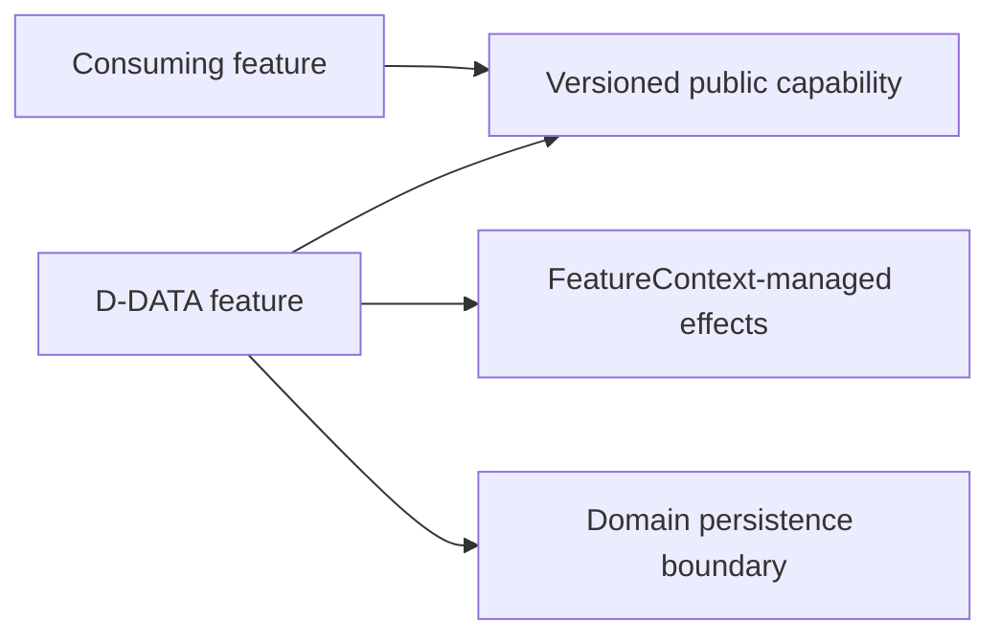

# Data

> **Package:** `app/services/data/`
> **Status:** `Missing`
> **Last updated:** `2026-09-18`
> **Domain ID:** `D-DATA`

This README is the domain's single source of truth for its boundary, feature and FR registry,
domain-local workflows, semantic contract ownership, persisted-state model, acceptance evidence,
and deletion behavior. Reference-product evidence is a requirement source, never implementation
evidence.

`PROJECT.md` owns system scope and cross-domain behavior. `ARCHITECTURE.md` owns universal
structure and runtime constraints. `AGENTS.md` owns contributor workflow. The
[Feature Implementation Pipeline](../../../docs/dev/feature_implementation_pipeline.md) owns the
complete single-file feature delivery checklist.

## Code-aligned implementation convention

Backend features use the simplified modular-monolith layout:

```text
app/services/data/
|-- README.md
|-- __init__.py
|-- instruments.py
|-- calendars.py
|-- imports.py
|-- datasets.py
|-- quality.py
`-- resampling.py

app/contracts/data.py
app/services/persistence/data.py
tests/services/data/<feature>/
tests/examples/04_data.py
```

Each feature module is one cohesive physical removal unit. It contains typed configuration,
service behavior, lifecycle wiring, immutable `SPEC`, and a zero-argument factory. Registration
is explicit in `app/registry.py`; import-time discovery and ambient singletons are forbidden.
Cross-boundary DTOs, protocols, events, errors, and capability keys live in
`app/contracts/data.py`. Features resolve dependencies through `FeatureContext` and
never import sibling implementations.

All schema, parameterized SQL, and transactions for this domain live in
`app/services/persistence/data.py`. A feature may be stateless, but it never accepts an
unrestricted database connection. Every completed feature contributes a deterministic, offline,
secret-safe example to `tests/examples/04_data.py`.

---

## 1. Purpose and boundary

### Purpose

Own instruments, calendars/sessions, normalized ticks and bars, imports/providers, deterministic transformations, quality findings, and immutable datasets.

### Owns

- Versioned instrument metadata, aliases, timezones, calendars, sessions, and quantity/price constraints.
- Strict import and provider acquisition, normalized tick/OHLCV schemas, resampling, and provenance.
- Dataset manifests, coverage and quality reports, and explicit repair lineage.

### Does not own

- Simulation event/fill ordering or strategy indicators.
- Provider credential mechanics and artifact storage mechanics.

### Shared contracts

The public boundary is `app/contracts/data.py`. Counterparty status never authorizes a
private implementation import.

| Status | Capability or event | Protocol / DTO symbol | Version | Purpose |
| --- | --- | --- | --- | --- |
| Missing | `data.instruments@1` | `InstrumentCatalog` | `1` | Versioned instruments and market constraints |
| Missing | `data.calendars@1` | `CalendarService` | `1` | Calendars, sessions, and timezone resolution |
| Missing | `data.imports@1` | `ImportService` | `1` | Strict tabular market-data import |
| Missing | `data.datasets@1` | `DatasetService` | `1` | Immutable normalized dataset versions |
| Missing | `data.quality@1` | `QualityService` | `1` | Data validation and repair reports |
| Missing | `data.resampling@1` | `ResamplingService` | `1` | Session-aware deterministic resampling |

### Persisted-state ownership

Semantic state remains feature-owned although database mechanics are centralized.

| Status | Namespace | Owning feature | Driver | Retention | Public read boundary |
| --- | --- | --- | --- | --- | --- |
| Missing | `data.v1` | `FEAT-DATA-INSTRUMENTS` and registry peers | `sqlite` | Retain versioned records until explicit policy permits purge | `data.instruments@1` |

---

## 2. Feature registry and dependency direction

| Feature | Delivered value | Owner module | Provides | Required capabilities | Status |
| --- | --- | --- | --- | --- | --- |
| `FEAT-DATA-INSTRUMENTS` | Versioned instruments and market constraints | `app/services/data/instruments.py` | `data.instruments@1` | `persistence.artifacts@1` | Missing |
| `FEAT-DATA-CALENDARS` | Calendars, sessions, and timezone resolution | `app/services/data/calendars.py` | `data.calendars@1` | None | Missing |
| `FEAT-DATA-IMPORTS` | Strict tabular market-data import | `app/services/data/imports.py` | `data.imports@1` | `persistence.artifacts@1` | Missing |
| `FEAT-DATA-DATASETS` | Immutable normalized dataset versions | `app/services/data/datasets.py` | `data.datasets@1` | `persistence.artifacts@1` | Missing |
| `FEAT-DATA-QUALITY` | Data validation and repair reports | `app/services/data/quality.py` | `data.quality@1` | `data.datasets@1` | Missing |
| `FEAT-DATA-RESAMPLING` | Session-aware deterministic resampling | `app/services/data/resampling.py` | `data.resampling@1` | `data.calendars@1` | Missing |

Dependencies point to public contracts, never implementation modules:


```mermaid
flowchart LR
    Consumer["Consuming feature"] --> Contract["Versioned public capability"]
    Provider["D-DATA feature"] --> Contract
    Provider --> Context["FeatureContext-managed effects"]
    Provider --> Persistence["Domain persistence boundary"]
```

Removing one module and registry entry withdraws only its capability. Required consumers become
attributed `BLOCKED`; operation-gated consumers refuse only the affected operation. Retained
state is never purged implicitly.

---

## 3. Domain workflows

### `WF-DATA-IMPORT` — Import, validate, and publish market data

- **Lead owner:** `FEAT-DATA-IMPORTS`
- **Participants:** Instrument/calendar, quality, dataset, and artifact capabilities.
- **Input boundary:** Contained source, explicit mapping/encoding/decimal/timezone, instrument, and repair policy.
- **Output boundary:** Immutable dataset manifest plus row/range quality findings and transformation lineage.
- **Failure boundary:** Parse/quality/cancel failure publishes nothing; row diagnostics are bounded and staged bytes are quarantined or safely cleaned.
- **Acceptance:** `ATW-DATA-IMPORT-001`

---

## 4. Feature specifications

The following contract applies to every registered feature; domain-specific semantics are in
Section 9.

### `instruments.py` — `FEAT-DATA-INSTRUMENTS`

> **Feature ID:** `FEAT-DATA-INSTRUMENTS` (representative registry entry)
> **Status:** `Missing`
> **Owner module:** `app/services/data/instruments.py`

#### Purpose

Provide versioned instruments and market constraints. Other registry entries follow the same lifecycle and
evidence obligations without merging their responsibilities into this module.

#### Capability declarations

- **Provides:** `data.instruments@1`
- **Requires:** `persistence.artifacts@1`
- **Optional / operation-gated:** only capabilities explicitly declared by the feature; absence
  returns a typed unavailable result and does not silently substitute behavior.

#### Configuration and limits

Each owner module defines a slotted immutable `<Feature>Config`. No reference sample value is
promoted to a default without product approval.

| Status | Setting | Type / unit | Default | Validation and failure |
| --- | --- | --- | --- | --- |
| Missing | `schema_version` | positive integer | `1` | Reject unknown/incompatible versions |
| Missing | `operation_timeout_s` | finite seconds | operation-specific | Must be positive and bounded |
| Missing | `resource_limit` | positive integer | deployment-specific | Reject nonpositive/unbounded values |

#### Runtime effects and cleanup

| Effect | Acquisition | Cleanup / failure behavior |
| --- | --- | --- |
| Capability publication | `FeatureContext.provide(...)` | Withdrawn with feature scope |
| Tasks/subscriptions/resources | Managed `FeatureContext` API | Cancel/close in reverse order; failed start unwinds all effects |
| Durable mutation | Focused persistence protocol | Transaction rollback; partial output remains unpublished |

#### Persistent state

- **Domain persistence module:** `app/services/persistence/data.py`
- **Namespace:** `data.v1`
- **Schema version:** `1` initially; forward migrations only
- **Retention and purge:** retain lineage-bearing records; purge only by explicit, reference-safe policy

#### Single-file structure and symbols

| Status | Owner | Responsibility | Symbols |
| --- | --- | --- | --- |
| Missing | `instruments.py` | Versioned instruments and market constraints; config, service, lifecycle, `SPEC`, factory | `InstrumentCatalog` |
| Missing | `calendars.py` | Calendars, sessions, and timezone resolution; config, service, lifecycle, `SPEC`, factory | `CalendarService` |
| Missing | `imports.py` | Strict tabular market-data import; config, service, lifecycle, `SPEC`, factory | `ImportService` |
| Missing | `datasets.py` | Immutable normalized dataset versions; config, service, lifecycle, `SPEC`, factory | `DatasetService` |
| Missing | `quality.py` | Data validation and repair reports; config, service, lifecycle, `SPEC`, factory | `QualityService` |
| Missing | `resampling.py` | Session-aware deterministic resampling; config, service, lifecycle, `SPEC`, factory | `ResamplingService` |
| Missing | `tests/examples/04_data.py` | Offline primary-purpose evidence | one `example_<NN>_<feature_slug>()` per completed feature |

#### Functional requirements

| Status | Requirement ID | Observable behavior | Evidence |
| --- | --- | --- | --- |
| Missing | `FR-DATA-001` | Identical bytes and normalized configuration produce the same dataset identity. | Round-trip fixture |
| Missing | `FR-DATA-002` | DST ambiguity/nonexistence requires explicit policy and never silently shifts time. | DST fixtures |
| Missing | `FR-DATA-003` | Resampling is stable across chunk and session boundaries. | Chunk equivalence |
| Missing | `FR-DATA-004` | Cancellation/provider failure cannot publish a partial dataset. | Faulted acquisition test |

#### Removal behavior

Physical removal withdraws the feature's capability and cancels its managed effects. Stored
artifacts remain readable by schema-aware tooling; operations requiring the missing capability
return an attributed unavailable result. Reinstall may resume only after schema and version checks.

---

## 5. Domain-wide requirements and invariants

| Status | Requirement ID | Rule | Verification |
| --- | --- | --- | --- |
| Missing | `ARCH-001` | `__init__.py` is docstring-only. | `scripts/architecture_check.py` |
| Missing | `ARCH-002` | Tasks and resources are managed through `FeatureContext`. | Lifecycle tests |
| Missing | `ARCH-003` | Logging uses `app.kernel.logging`; no service configures handlers. | Architecture/logging tests |
| Missing | `ARCH-004` | Public contracts live in `app/contracts/data.py`. | Import/contract checks |
| Missing | `ARCH-005` | Feature modules never import sibling implementations. | Import checks |
| Missing | `ARCH-006` | SQL/schema operations live in `app/services/persistence/data.py`. | Architecture/schema checks |

---

## 6. Decisions and open evidence

| Status | Decision ID | Decision or missing evidence | Scope | Required closure |
| --- | --- | --- | --- | --- |
| Accepted | `DEC-DATA-001` | Large normalized datasets use versioned Parquet/Zstd manifests. | Storage format | E-T01 |
| Open | `DEC-DATA-002` | Proprietary binary formats and repair heuristics are unverified. | Interop/quality | Public specs and golden fixtures |

Evidence IDs resolve through `docs/PROJECT.md`. Unknowns remain explicit; a filename, bundled
sample value, or third-party function name is not proof of runtime semantics.

---

## 7. Tests and definition of done

```text
tests/services/data/<feature>/
|-- test_config.py
|-- test_<feature>.py
|-- test_lifecycle.py
|-- test_removal.py
`-- test_persistence.py       # when applicable

tests/examples/04_data.py
```

Editing uses explicit affected paths with `--no-cov`; the full candidate gate remains
`uv run python scripts/ci_check.py`.

- [ ] Stable feature and requirement IDs have one owner.
- [ ] Public contracts and exact `FeatureSpec` dependencies exist.
- [ ] Registration is explicit; imports have no runtime effects.
- [ ] Happy, invalid, boundary, unavailable, lifecycle, persistence, and removal tests pass.
- [ ] Numerical or stateful behavior has deterministic golden/fault fixtures.
- [ ] One offline usage example exists per completed feature.
- [ ] Domain status reflects repository evidence, not reference-product evidence.
- [ ] Architecture and full qualification gates pass.

---

## 8. Change process

1. Update this README and identify the exact feature/requirement scope.
2. Update `app/contracts/data.py` first when the public boundary changes.
3. Implement one cohesive owner module and immutable `SPEC`.
4. Change `app/services/persistence/data.py` only for database mechanics.
5. Update explicit registry, consolidated examples, and focused tests.
6. Verify feature removal and affected consumers.
7. Run the repository-prescribed candidate gate and record actual results.

---

## 9. Normative domain specification

Bars carry instrument/timeframe/UTC open, OHLC, volumes, source and flags; enforce high >= open/close/low and low <= open/close/high. Ticks carry UTC timestamp, deterministic sequence, bid/ask and optional sizes/trade fields. Import stages, fingerprints, maps explicitly, parses with row diagnostics, normalizes, detects duplicates/gaps/inversions/nonmonotonic/crossed quotes/outliers/session violations, applies only selected repairs, then publishes a manifest. Reference precision exposes four price events per selected bar or minute, recorded bid plus configured ask, or recorded bid/ask (E-O03); Simulator owns their ordering. Local libraries/plugins corroborate IO, mapping, sessions, timeframes, and provider families (E-L01, E-L04).
