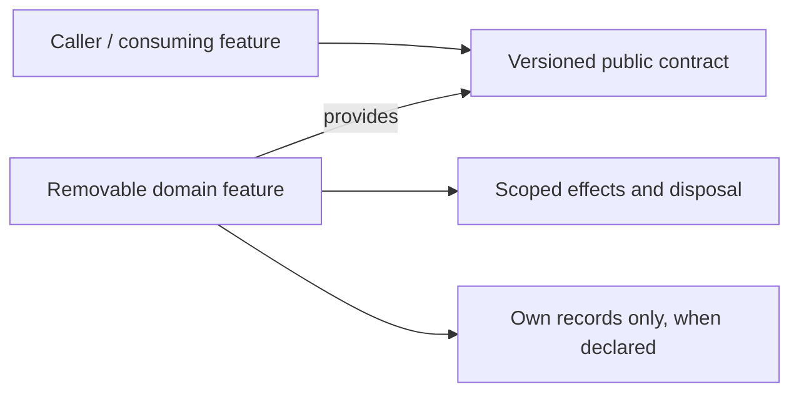

# Data

> **Package:** `app/services/data/`
> **Status:** `Partial` — documentary target; runtime acceptance is **NOT_REVALIDATED**.
> **Last updated:** `2026-09-06`
> **Domain ID:** `D-DATA`

> This README is the domain target registry for boundaries, composable feature capabilities, requirements, ownership, workflows, acceptance, and removal. Update it before changing the affected implementation. It does not certify that a target package, contract, test, usage demonstration or provider is already implemented.

**Selected scope:** 16 features · 36 owned functional requirements · 16 feature-local non-functional requirements. All original feature and requirement IDs are retained. These selected workbench obligations do **not** delete unrelated existing domain behavior. This document must be merged with current evidence and any out-of-scope entries before replacing an existing domain registry.

**Sources:** [Unified Specification](../../../docs/dev/evidence/specification-drift.md) · [Feature–Requirement Traceability Register](../../../docs/dev/Feature_Requirement_Traceability_Register.md) · [Phased Feature Implementation Plan](../../../docs/dev/Phased_Feature_Implementation_Plan.md) · [README template](../../../docs/templates/README.md). Source fingerprints and Phase 0 bindings are recorded in §6 and §9. The feature cards below reproduce owned requirements and acceptance oracles; their scoped shared-NFR, catalogue, original-ID and operation-gate tables remain binding through the linked source card.

---

## Code-Aligned Implementation Convention

This domain README defines target behavior; `PROJECT.md` retains system scope, cross-domain policy, system NFRs and release gates, and `ARCHITECTURE.md` retains universal package/runtime constraints. Feature-local READMEs, manifests, contracts, migrations and evidence mirror rather than silently redefine this target. For focused work, load §1, the affected §4 card, applicable §5 and §9 rules, and §7. Follow the [Feature Implementation Pipeline](../../../docs/dev/feature_implementation_pipeline.md).

Implement one feature directly in its selected owner folder and discover it through the `haruquantai.features` Python entry-point group. Declare one immutable `SPEC = FeatureSpec(...)` in `manifest.py`; do not introduce a domain registry or YAML manifest. The feature contains pure `__init__.py`, a runtime-validated `README.md`, strict `config.py` with `.from_dict()`, lifecycle `feature.py`, focused logic modules and required `_usage.py`. Add `_persistence.py` only when the feature performs database operations. Effects and dependencies flow through `FeatureContext` and `FeatureScope`; durable state is declared by `FeatureSpec.state`. Existing compatible public contracts and owners are reused, not copied into a parallel implementation.

Each core logic module documents its public API. Every service feature has one required `_usage.py` containing its bounded offline `if __name__ == "__main__":` scenarios; production logic modules do not contain demonstrations. Optional `_persistence.py` owns all feature-local database operations when durable state is required. The paths below are documentary targets pending current-code reconciliation, not claims of executable files. Tests verify the scenarios independently.

FR and acceptance IDs are trace identities, not runtime registrations. Required-provider keys below reproduce the register’s required graph. Optional providers are operation-gated: they must be declared and tested without making an absent future extension a universal startup dependency. The plan’s P1–P16 execution phases are distinct from specification U0–U13 release milestones; a U label is not proof of readiness or a new feature task.

## 1. Purpose and Boundary

### Purpose

Create reproducible, causal and inspectable market-data inputs for the whole research workbench. Retain raw provenance while allowing large histories to grow through immutable appended parts and bounded reads.

### Owns

Historical ingestion and receipts; partitioned market-data storage; quality inspection and versioned repairs; bar aggregation; inspection/retention; exact run-data bindings; external-series alignment; connector synchronization; tick normalization; profile-source preparation; external indicator imports; scenarios; governed news evidence; real-time streams; QDM imports; coherent browse projections.

### Does not own

Instrument and session definitions; broker transport internals; indicator mathematics; synthetic tick execution methods owned by Simulator; trading policy; research qualification; browser presentation. Data browsing is not a second storage authority.

### Shared Contracts

**Owned by this domain.** Status is an evidence state. Contract modules are selected public boundaries; an unbound symbol/DTO must be reconciled before implementing its production consumer. Do not infer a callable signature from the English title.

| Evidence | Capability | Protocol / DTO / contract target | Major | Purpose |
| --- | --- | --- | --- | --- |
| DOCUMENTARY_BOUND | `data.ingest-history@1` | Selected public operation/DTO surface; exact existing symbols are inventoried in the Phase 0 contract-binding projection.<br>[`app/contracts/data/capabilities.py`](../../contracts/data/capabilities.py) | 1 | Import historical observations with a conserved receipt |
| DOCUMENTARY_BOUND | `data.market-data-store@1` | Selected public operation/DTO surface; exact existing symbols are inventoried in the Phase 0 contract-binding projection.<br>[`app/contracts/data/market_data_store.py`](../../contracts/data/market_data_store.py) | 1 | Append and query immutable partitioned market data |
| DOCUMENTARY_BOUND | `data.resolve-quality@1` | Selected public operation/DTO surface; exact existing symbols are inventoried in the Phase 0 contract-binding projection.<br>[`app/contracts/data/capabilities.py`](../../contracts/data/capabilities.py) | 1 | Inspect and repair data through new versions |
| DOCUMENTARY_BOUND | `data.aggregate-bars@1` | Selected public operation/DTO surface; exact existing symbols are inventoried in the Phase 0 contract-binding projection.<br>[`app/contracts/data/capabilities.py`](../../contracts/data/capabilities.py) | 1 | Aggregate causal bars on declared clocks |
| DOCUMENTARY_BOUND | `data.manage-retention@1` | Selected public operation/DTO surface; exact existing symbols are inventoried in the Phase 0 contract-binding projection.<br>[`app/contracts/data/capabilities.py`](../../contracts/data/capabilities.py) | 1 | Inspect, export and retire market data safely |
| DOCUMENTARY_BOUND | `data.bind-run-data@1` | Selected public operation/DTO surface; exact existing symbols are inventoried in the Phase 0 contract-binding projection.<br>[`app/contracts/data/capabilities.py`](../../contracts/data/capabilities.py) | 1 | Bind exact eligible inputs to a run |
| DOCUMENTARY_BOUND | `data.align-series@1` | Selected public operation/DTO surface; exact existing symbols are inventoried in the Phase 0 contract-binding projection.<br>[`app/contracts/data/capabilities.py`](../../contracts/data/capabilities.py) | 1 | Align external series without look-ahead |
| DOCUMENTARY_BOUND | `data.sync-connectors@1` | Selected public operation/DTO surface; exact existing symbols are inventoried in the Phase 0 contract-binding projection.<br>[`app/contracts/data/capabilities.py`](../../contracts/data/capabilities.py) | 1 | Resume bounded source synchronization |
| DOCUMENTARY_BOUND | `data.normalize-ticks@1` | Selected public operation/DTO surface; exact existing symbols are inventoried in the Phase 0 contract-binding projection.<br>[`app/contracts/data/capabilities.py`](../../contracts/data/capabilities.py) | 1 | Normalize recorded ticks while retaining source evidence |
| DOCUMENTARY_BOUND | `data.prepare-profiles@1` | Selected public operation/DTO surface; exact existing symbols are inventoried in the Phase 0 contract-binding projection.<br>[`app/contracts/data/capabilities.py`](../../contracts/data/capabilities.py) | 1 | Prepare eligible inputs for market profiles |
| DOCUMENTARY_BOUND | `data.import-indicators@1` | Selected public operation/DTO surface; exact existing symbols are inventoried in the Phase 0 contract-binding projection.<br>[`app/contracts/data/capabilities.py`](../../contracts/data/capabilities.py) | 1 | Import non-executable external indicator series |
| DOCUMENTARY_BOUND | `data.generate-scenarios@1` | Selected public operation/DTO surface; exact existing symbols are inventoried in the Phase 0 contract-binding projection.<br>[`app/contracts/data/capabilities.py`](../../contracts/data/capabilities.py) | 1 | Publish synthetic market-data scenarios |
| DOCUMENTARY_BOUND | `data.track-market-news@1` | Selected public operation/DTO surface; exact existing symbols are inventoried in the Phase 0 contract-binding projection.<br>[`app/contracts/data/capabilities.py`](../../contracts/data/capabilities.py) | 1 | Supply governed point-in-time document evidence |
| DOCUMENTARY_BOUND | `data.stream-market-events@1` | Selected public operation/DTO surface; exact existing symbols are inventoried in the Phase 0 contract-binding projection.<br>[`app/contracts/data/capabilities.py`](../../contracts/data/capabilities.py) | 1 | Expose bounded normalized real-time observations |
| DOCUMENTARY_BOUND | `data.import-quantdata@1` | Selected public operation/DTO surface; exact existing symbols are inventoried in the Phase 0 contract-binding projection.<br>[`app/contracts/data/capabilities.py`](../../contracts/data/capabilities.py) | 1 | Import QuantDataManager source artifacts |
| DOCUMENTARY_BOUND | `data.browse-reference@1` | Selected public operation/DTO surface; exact existing symbols are inventoried in the Phase 0 contract-binding projection.<br>[`app/contracts/data/browse_reference.py`](../../contracts/data/browse_reference.py) | 1 | Browse one coherent data/reference projection |

**Consumed from other domains — required providers.** Runtime resolution is through the exact key; the provider’s implementation folder is not an import target. Same-domain edges are listed in the owning feature card.

| Capability | Owner | Binding | Consuming feature | Used for |
| --- | --- | --- | --- | --- |
| `workspace.artifacts@1` | Workspace | Required | [`FEAT-DATA-MARKET_DATA_STORE`](#feat-data-market-data-store) | Publish and retain immutable artifact bytes |
| `orchestration.resource-admission@1` | Orchestration | Required | [`FEAT-DATA-MARKET_DATA_STORE`](#feat-data-market-data-store) | Admit finite work under one resource ledger |
| `catalogue.define-sessions@1` | Catalogue | Required | [`FEAT-DATA-RESOLVE_QUALITY`](#feat-data-resolve-quality) | Define market sessions and calendar availability |
| `catalogue.define-sessions@1` | Catalogue | Required | [`FEAT-DATA-AGGREGATE_BARS`](#feat-data-aggregate-bars) | Define market sessions and calendar availability |
| `catalogue.catalog-instruments@1` | Catalogue | Required | [`FEAT-DATA-BIND_RUN_DATA`](#feat-data-bind-run-data) | Version instrument identities and tradable units |
| `catalogue.map-providers@1` | Catalogue | Required | [`FEAT-DATA-BIND_RUN_DATA`](#feat-data-bind-run-data) | Resolve provider symbols and broker profiles |
| `catalogue.define-sessions@1` | Catalogue | Required | [`FEAT-DATA-BIND_RUN_DATA`](#feat-data-bind-run-data) | Define market sessions and calendar availability |
| `catalogue.define-sessions@1` | Catalogue | Required | [`FEAT-DATA-ALIGN_SERIES`](#feat-data-align-series) | Define market sessions and calendar availability |
| `orchestration.manage-jobs@1` | Orchestration | Required | [`FEAT-DATA-SYNC_CONNECTORS`](#feat-data-sync-connectors) | Persist and control shared jobs and attempts |
| `broker.resolver@1` | Brokers | Required | [`FEAT-DATA-SYNC_CONNECTORS`](#feat-data-sync-connectors) | Resolve an explicitly selected broker/data provider |
| `catalogue.catalog-instruments@1` | Catalogue | Required | [`FEAT-DATA-NORMALIZE_TICKS`](#feat-data-normalize-ticks) | Version instrument identities and tradable units |
| `catalogue.define-sessions@1` | Catalogue | Required | [`FEAT-DATA-PREPARE_PROFILES`](#feat-data-prepare-profiles) | Define market sessions and calendar availability |
| `broker.resolver@1` | Brokers | Required | [`FEAT-DATA-STREAM_MARKET_EVENTS`](#feat-data-stream-market-events) | Resolve an explicitly selected broker/data provider |
| `catalogue.catalog-instruments@1` | Catalogue | Required | [`FEAT-DATA-BROWSE_REFERENCE`](#feat-data-browse-reference) | Version instrument identities and tradable units |
| `catalogue.map-providers@1` | Catalogue | Required | [`FEAT-DATA-BROWSE_REFERENCE`](#feat-data-browse-reference) | Resolve provider symbols and broker profiles |
| `catalogue.define-sessions@1` | Catalogue | Required | [`FEAT-DATA-BROWSE_REFERENCE`](#feat-data-browse-reference) | Define market sessions and calendar availability |

**Operation-gated providers.** For each §4 feature, its linked source card’s complete “Operation-gated providers” table defines applicability, exact provider identity and absence behavior. This is scoped incorporation, not permission to treat all 233 register-wide operation edges as optional for every feature. Resolve those provider IDs to their primary capability keys in the corresponding domain README; bind actual operations in the acceptance record. An omitted local duplicate table does not waive a source dependency.

### Persisted State Ownership

Immutable raw and derived dataset versions and manifests; conserved ingestion/quality/synchronization receipts; exact run bindings; synthetic/evidence provenance; retention and reference metadata. Workspace provides byte custody without interpreting market semantics.

| Evidence | Owning feature | Partition / ownership class | Driver binding | Retention / read boundary |
| --- | --- | --- | --- | --- |
| PHASE0_BOUND | [`FEAT-DATA-INGEST_HISTORY`](#feat-data-ingest-history) | Feature-owned semantic state | Existing declared driver; no new database selected. | Retain committed evidence across deactivate/reactivate; purge only through explicit authorization, dependency/reference checks and recorded disposition. |
| PHASE0_BOUND | [`FEAT-DATA-MARKET_DATA_STORE`](#feat-data-market-data-store) | Feature-owned semantic state | Existing declared driver; no new database selected. | Retain committed evidence across deactivate/reactivate; purge only through explicit authorization, dependency/reference checks and recorded disposition. |
| PHASE0_BOUND | [`FEAT-DATA-RESOLVE_QUALITY`](#feat-data-resolve-quality) | Feature-owned semantic state | Existing declared driver; no new database selected. | Retain committed evidence across deactivate/reactivate; purge only through explicit authorization, dependency/reference checks and recorded disposition. |
| PHASE0_BOUND | [`FEAT-DATA-AGGREGATE_BARS`](#feat-data-aggregate-bars) | Feature-owned semantic state | Existing declared driver; no new database selected. | Retain committed evidence across deactivate/reactivate; purge only through explicit authorization, dependency/reference checks and recorded disposition. |
| PHASE0_BOUND | [`FEAT-DATA-MANAGE_RETENTION`](#feat-data-manage-retention) | Feature-owned semantic state | Existing declared driver; no new database selected. | Retain committed evidence across deactivate/reactivate; purge only through explicit authorization, dependency/reference checks and recorded disposition. |
| PHASE0_BOUND | [`FEAT-DATA-BIND_RUN_DATA`](#feat-data-bind-run-data) | Feature-owned semantic state | Existing declared driver; no new database selected. | Retain committed evidence across deactivate/reactivate; purge only through explicit authorization, dependency/reference checks and recorded disposition. |
| PHASE0_BOUND | [`FEAT-DATA-ALIGN_SERIES`](#feat-data-align-series) | Feature-owned semantic state | Existing declared driver; no new database selected. | Retain committed evidence across deactivate/reactivate; purge only through explicit authorization, dependency/reference checks and recorded disposition. |
| PHASE0_BOUND | [`FEAT-DATA-SYNC_CONNECTORS`](#feat-data-sync-connectors) | Feature-owned semantic state | Existing declared driver; no new database selected. | Retain committed evidence across deactivate/reactivate; purge only through explicit authorization, dependency/reference checks and recorded disposition. |
| PHASE0_BOUND | [`FEAT-DATA-NORMALIZE_TICKS`](#feat-data-normalize-ticks) | Feature-owned semantic state | Existing declared driver; no new database selected. | Retain committed evidence across deactivate/reactivate; purge only through explicit authorization, dependency/reference checks and recorded disposition. |
| PHASE0_BOUND | [`FEAT-DATA-PREPARE_PROFILES`](#feat-data-prepare-profiles) | Feature-owned semantic state | Existing declared driver; no new database selected. | Retain committed evidence across deactivate/reactivate; purge only through explicit authorization, dependency/reference checks and recorded disposition. |
| PHASE0_BOUND | [`FEAT-DATA-IMPORT_INDICATORS`](#feat-data-import-indicators) | Feature-owned semantic state | Existing declared driver; no new database selected. | Retain committed evidence across deactivate/reactivate; purge only through explicit authorization, dependency/reference checks and recorded disposition. |
| PHASE0_BOUND | [`FEAT-DATA-GENERATE_SCENARIOS`](#feat-data-generate-scenarios) | Feature-owned semantic state | Existing declared driver; no new database selected. | Retain committed evidence across deactivate/reactivate; purge only through explicit authorization, dependency/reference checks and recorded disposition. |
| PHASE0_BOUND | [`FEAT-DATA-TRACK_MARKET_NEWS`](#feat-data-track-market-news) | Feature-owned semantic state | Existing declared driver; no new database selected. | Retain committed evidence across deactivate/reactivate; purge only through explicit authorization, dependency/reference checks and recorded disposition. |
| PHASE0_BOUND | [`FEAT-DATA-STREAM_MARKET_EVENTS`](#feat-data-stream-market-events) | Feature-owned semantic state | Existing declared driver; no new database selected. | Retain committed evidence across deactivate/reactivate; purge only through explicit authorization, dependency/reference checks and recorded disposition. |
| PHASE0_BOUND | [`FEAT-DATA-IMPORT_QUANTDATA`](#feat-data-import-quantdata) | Feature-owned semantic state | Existing declared driver; no new database selected. | Retain committed evidence across deactivate/reactivate; purge only through explicit authorization, dependency/reference checks and recorded disposition. |
| PHASE0_BOUND | [`FEAT-DATA-BROWSE_REFERENCE`](#feat-data-browse-reference) | Feature-owned semantic state | Existing declared driver; no new database selected. | Retain committed evidence across deactivate/reactivate; purge only through explicit authorization, dependency/reference checks and recorded disposition. |

A feature’s exact durable namespace, schema version and migrations are taken from its reconciled manifest and contract, not guessed from its folder name. External consumers access semantic state only through the owner capability. Workspace persistence/artifact custody never acquires that semantic ownership.

### Four-Level Structural Hierarchy

| Code level | Represents | Domain example |
| --- | --- | --- |
| Package | Domain boundary | `app/services/data/` |
| Module folder | Composable feature owner | `app/services/data/historical_data_ingestion/` — [`FEAT-DATA-INGEST_HISTORY`](#feat-data-ingest-history) |
| File | Manifest, strict configuration, lifecycle or focused use case | `manifest.py`, `config.py`, `feature.py`, focused logic module |
| Class / function / method | One or more traced requirement behaviors | `FR-TRC-DATA-INGEST_HISTORY-001` and its acceptance oracle |

### Domain Capability Map

The table in §2 is the complete domain capability map. Edges below illustrate dependency direction, not a new orchestrator or private import relationship.


```mermaid
flowchart LR
    Caller["Caller / consuming feature"] --> Contract["Versioned public contract"]
    Provider["Removable domain feature"] -->|provides| Contract
    Provider --> Scope["Scoped effects and disposal"]
    Provider --> State["Own records only, when declared"]
```

## 2. Final Package Structure and Feature Independence

Feature owners are independent and physically removable. The selected package is a target binding: reconcile known current aliases and preserve compatible existing identities before creating a folder. Folder absence does not prove behavior absence. Removing a feature withdraws its contributions; it does not delete another feature’s source or retained evidence.

| Feature | Delivered value | Selected owner package | First U gate | FRs | Local NFRs | Evidence |
| --- | --- | --- | --- | --- | --- | --- |
| [`FEAT-DATA-INGEST_HISTORY`](#feat-data-ingest-history) | Import historical observations with a conserved receipt | `app/services/data/historical_data_ingestion/` | U1 | 3 | 1 | NOT_REVALIDATED |
| [`FEAT-DATA-MARKET_DATA_STORE`](#feat-data-market-data-store) | Append and query immutable partitioned market data | `app/services/data/market_data_store/` | U1 | 3 | 1 | NOT_REVALIDATED |
| [`FEAT-DATA-RESOLVE_QUALITY`](#feat-data-resolve-quality) | Inspect and repair data through new versions | `app/services/data/data_quality_resolution/` | U1 | 3 | 1 | NOT_REVALIDATED |
| [`FEAT-DATA-AGGREGATE_BARS`](#feat-data-aggregate-bars) | Aggregate causal bars on declared clocks | `app/services/data/bar_aggregation/` | U1 | 2 | 1 | NOT_REVALIDATED |
| [`FEAT-DATA-MANAGE_RETENTION`](#feat-data-manage-retention) | Inspect, export and retire market data safely | `app/services/data/data_inspection_retention/` | U1 | 3 | 1 | NOT_REVALIDATED |
| [`FEAT-DATA-BIND_RUN_DATA`](#feat-data-bind-run-data) | Bind exact eligible inputs to a run | `app/services/data/run_data_binding/` | U1 | 2 | 1 | NOT_REVALIDATED |
| [`FEAT-DATA-ALIGN_SERIES`](#feat-data-align-series) | Align external series without look-ahead | `app/services/data/external_series_alignment/` | U1 | 2 | 1 | NOT_REVALIDATED |
| [`FEAT-DATA-SYNC_CONNECTORS`](#feat-data-sync-connectors) | Resume bounded source synchronization | `app/services/data/connector_synchronization/` | U1 | 2 | 1 | NOT_REVALIDATED |
| [`FEAT-DATA-NORMALIZE_TICKS`](#feat-data-normalize-ticks) | Normalize recorded ticks while retaining source evidence | `app/services/data/tick_normalization/` | U1 | 2 | 1 | NOT_REVALIDATED |
| [`FEAT-DATA-PREPARE_PROFILES`](#feat-data-prepare-profiles) | Prepare eligible inputs for market profiles | `app/services/data/profile_source_preparation/` | U10 | 2 | 1 | NOT_REVALIDATED |
| [`FEAT-DATA-IMPORT_INDICATORS`](#feat-data-import-indicators) | Import non-executable external indicator series | `app/services/data/external_indicator_series/` | U1 | 2 | 1 | NOT_REVALIDATED |
| [`FEAT-DATA-GENERATE_SCENARIOS`](#feat-data-generate-scenarios) | Publish synthetic market-data scenarios | `app/services/data/synthetic_scenario_series/` | U4 | 2 | 1 | NOT_REVALIDATED |
| [`FEAT-DATA-TRACK_MARKET_NEWS`](#feat-data-track-market-news) | Supply governed point-in-time document evidence | `app/services/data/economic_news_evidence/` | U4 | 2 | 1 | NOT_REVALIDATED |
| [`FEAT-DATA-STREAM_MARKET_EVENTS`](#feat-data-stream-market-events) | Expose bounded normalized real-time observations | `app/services/data/realtime_market_events/` | U1 | 2 | 1 | NOT_REVALIDATED |
| [`FEAT-DATA-IMPORT_QUANTDATA`](#feat-data-import-quantdata) | Import QuantDataManager source artifacts | `app/services/data/quantdata_manager_source/` | U1 | 2 | 1 | NOT_REVALIDATED |
| [`FEAT-DATA-BROWSE_REFERENCE`](#feat-data-browse-reference) | Browse one coherent data/reference projection | `app/services/data/browse_reference/` | U1 | 2 | 1 | NOT_REVALIDATED |

```text
app/services/data/
├── README.md  # this domain target registry
├── __init__.py  # docstring only
├── historical_data_ingestion/  # FEAT-DATA-INGEST_HISTORY
├── market_data_store/  # FEAT-DATA-MARKET_DATA_STORE
├── data_quality_resolution/  # FEAT-DATA-RESOLVE_QUALITY
├── bar_aggregation/  # FEAT-DATA-AGGREGATE_BARS
├── data_inspection_retention/  # FEAT-DATA-MANAGE_RETENTION
├── run_data_binding/  # FEAT-DATA-BIND_RUN_DATA
├── external_series_alignment/  # FEAT-DATA-ALIGN_SERIES
├── connector_synchronization/  # FEAT-DATA-SYNC_CONNECTORS
├── tick_normalization/  # FEAT-DATA-NORMALIZE_TICKS
├── profile_source_preparation/  # FEAT-DATA-PREPARE_PROFILES
├── external_indicator_series/  # FEAT-DATA-IMPORT_INDICATORS
├── synthetic_scenario_series/  # FEAT-DATA-GENERATE_SCENARIOS
├── economic_news_evidence/  # FEAT-DATA-TRACK_MARKET_NEWS
├── realtime_market_events/  # FEAT-DATA-STREAM_MARKET_EVENTS
├── quantdata_manager_source/  # FEAT-DATA-IMPORT_QUANTDATA
└── browse_reference/  # FEAT-DATA-BROWSE_REFERENCE
```

Every feature folder contains `README.md`, docstring-only `__init__.py`, `manifest.py`, `config.py`, `feature.py` and its focused logic modules. Shared contract definitions live outside those removable packages. The primary logic-module designation in §4 is a target for usage ownership; adapt a compatible existing module rather than duplicate its service.

### Feature Capability Dependency Direction

A required edge means “consumer requires the provider’s public capability.” It never means “import the provider package.” Optional operation closure is resolved by the composition/runtime boundary and rechecked at invocation. Physical removal must cause the declared unavailable or blocked state while unrelated capabilities remain usable.

## 3. Workflows

Workflows connect existing features; they do not create additional feature owners. “Internal” means all participating behavior is domain-local. “Cross-Domain” means collaboration through public contracts. Participant lists below are **not** a substitute for the plan’s execution schedule or the workflow’s validated operation graph.

### Domain-local reading sequence — Import, inspect and bind data

**Input boundary:** Authorized file/source and explicit instrument, profile, clock and range.

**Output boundary:** A conserved publication receipt and exact eligible immutable inputs, or a typed diagnostic/refusal.

**Capabilities to inspect:** [`FEAT-DATA-INGEST_HISTORY`](#feat-data-ingest-history) → [`FEAT-DATA-MARKET_DATA_STORE`](#feat-data-market-data-store) → [`FEAT-DATA-RESOLVE_QUALITY`](#feat-data-resolve-quality) → [`FEAT-DATA-BIND_RUN_DATA`](#feat-data-bind-run-data) → [`FEAT-DATA-ALIGN_SERIES`](#feat-data-align-series).

This is a domain-oriented explanation, not an additional canonical `WF-*` identity. Apply every FR of the participating operation, not only its first validation step. Validate scope and immutable references, resolve admitted providers, perform owner work, verify the owner receipt, and then expose the result. Invalid input, provider absence, stale revision and cancellation retain separate typed outcomes.

| Evidence | Workflow | Scope | Lead | First U gate | Acceptance |
| --- | --- | --- | --- | --- | --- |
| PENDING | [`WF-WB-GENERATE_QUALIFY`](#wf-wb-generate-qualify) | Cross-Domain | [`FEAT-RES-RUN_RESEARCH`](../research/README.md#feat-res-run-research) | U5 | `ATW-WB-GENERATE_QUALIFY` |

<a id="wf-wb-generate-qualify"></a>
### `WF-WB-GENERATE_QUALIFY` — Generate and qualify strategies

**Lead owner:** [`FEAT-RES-RUN_RESEARCH`](../research/README.md#feat-res-run-research). **Release gate:** U5. **State:** PENDING.

**Participants:** [`FEAT-RES-RUN_RESEARCH`](../research/README.md#feat-res-run-research), [`FEAT-UI-01`](../../ui/README.md#feat-ui-01), [`FEAT-DATA-BIND_RUN_DATA`](#feat-data-bind-run-data), [`FEAT-STRAT-DEFINE_SEARCH_SPACES`](../strategy/README.md#feat-strat-define-search-spaces), [`FEAT-RES-GENERATE_STRATEGIES`](../research/README.md#feat-res-generate-strategies), [`FEAT-RES-EVOLVE_STRATEGIES`](../research/README.md#feat-res-evolve-strategies), [`FEAT-SIM-EXECUTE_TICKS`](../simulator/README.md#feat-sim-execute-ticks), [`FEAT-ANA-COMPUTE_METRICS`](../analytics/README.md#feat-ana-compute-metrics), [`FEAT-RES-TEST_ROBUSTNESS`](../research/README.md#feat-res-test-robustness), [`FEAT-RES-QUALIFY_RESEARCH`](../research/README.md#feat-res-qualify-research), [`FEAT-ANA-DATABANK_MEMBERSHIP`](../analytics/README.md#feat-ana-databank-membership), [`FEAT-UI-32`](../../ui/README.md#feat-ui-32).

**This domain contributes:** [`FEAT-DATA-BIND_RUN_DATA`](#feat-data-bind-run-data). Every participating feature’s scoped FR/local-NFR obligations remain binding.

**Input/output and acceptance contract:** `ATW-WB-GENERATE_QUALIFY` — Pinned source/space/seed; one accepted research run; each candidate has actual simulation, filters and stage history; only qualified committed result references enter the destination databank.

**Failure boundary:** required evidence or provider absence yields the declared refusal/unavailable/partial result; it never implies a pass, silently substitutes a provider or grants live authority. [Canonical workflow definition](../../../docs/dev/Feature_Requirement_Traceability_Register.md#wf-wb-generate-qualify).

## 4. Composable Feature Specifications

Each card is one permanent feature/task slot. Its owned FRs, local NFRs and expected acceptance outcomes are reproduced below. All acceptance states are PENDING / NOT_REVALIDATED. Contract targets and intended tests do not prove runtime support. `Binding pending` prohibits executor invention: resolve the exact compatible contract, configuration, state and fixture before production use. The plan’s one-feature task rule includes all registered variants; future-provider qualification is not permission to leave owned adapter behavior unimplemented.

<a id="feat-data-ingest-history"></a>
### 4.1 `historical_data_ingestion/` — `FEAT-DATA-INGEST_HISTORY`

> **Feature ID:** `FEAT-DATA-INGEST_HISTORY`
> **Domain:** `data`
> **Status:** `Partial` — target documented; full-scope implementation evidence **NOT_REVALIDATED**.
> **Selected owner:** `app/services/data/historical_data_ingestion/`
> **First release milestone:** `U1`; execution order remains in the [Phased Feature Implementation Plan](../../../docs/dev/Phased_Feature_Implementation_Plan.md).

#### Purpose

Import historical observations with a conserved receipt. Deliver the bounded behaviors in the FR table through this feature’s declared public capability; retain the domain boundary in §1.

#### Capability Declarations

**Provides:** `data.ingest-history@1`.

**Required capabilities:**

`data.market-data-store@1` — [`FEAT-DATA-MARKET_DATA_STORE`](#feat-data-market-data-store).

**Optional / operation-gated capabilities:** the complete scoped provider table in the [source feature card](../../../docs/dev/Feature_Requirement_Traceability_Register.md#feat-data-ingest-history) is normative. Declare each applicable key separately from required startup dependencies. Absence must affect only the operations requiring it, with the exact recorded denial/unavailable behavior.

**Public contract target:** [`app/contracts/data/capabilities.py`](../../contracts/data/capabilities.py). **Literal protocol/DTO/operation symbols:** the selected target, operation scope, request/result union and typed failure semantics in this card are frozen; exact existing symbols are inventoried in `docs/dev/evidence/contract-bindings.json`, and a planned contract retains this binding without claiming runtime certification.

**Input boundary:** validated typed operation data, current authenticated scope where applicable, and immutable owner references; numerical operations accept validated bounded buffers. **Output boundary:** the owned FRs and acceptance oracles below. Preserve typed invalid, denied, unavailable, stale/conflict, partial, cancelled and failed outcomes wherever the selected contract defines them; do not create a second generic error vocabulary.

#### Feature Configuration & Limits Manifest

| Binding state | Setting / limit source | Type / default | Required | Validation / ownership |
| --- | --- | --- | --- | --- |
| PHASE0_BOUND | Existing registered `FeatureSpec.config_keys`, or no feature configuration for a planned owner unless this card explicitly declares a key. | Exact selected types/defaults only; request and profile fields are not implicit feature configuration. | As declared by the owner card. | Unknown keys and invalid values fail closed; implementation records manifest/config/README parity before COMPLETE. |
| NORMATIVE | Operation parameters, immutable profile references and policy limits in the FRs below | Use the selected request/profile schema; no implicit coercion or default substitution. | All prerequisites of the selected operation. | Do not confuse a request parameter, historical profile value or user-visible setting with a new feature config key. |
| NORMATIVE | Resource, security, retention and version requirements in local/shared NFRs | Finite admitted values; stricter applicable owner policy wins. | Before the affected operation. | Pin effective values/revisions in evidence; never alter a historical run by editing current settings. |

**Feature-specific parameter/limit obligations:** `FR-TRC-DATA-INGEST_HISTORY-001`, `FR-TRC-DATA-INGEST_HISTORY-003`. Their full text and test oracles below are binding; this list is an index, not a reduced schema.

#### Runtime Effects & Scope Disposal

| Effect | Owner | Disposal mechanism |
| --- | --- | --- |
| Capability binding `data.ingest-history@1` | FEAT-DATA-INGEST_HISTORY | Unregister when the reconciler closes the feature scope. |
| Tasks, listeners, requests, workers, leases or buffers actually created by this feature | FEAT-DATA-INGEST_HISTORY | Register exact disposers; cancel/await/release on failure or removal. A pure provider must not create unnecessary effects. |
| Accepted owner work and committed records | Their declared semantic owner | Observation cleanup does not secretly cancel accepted work or purge committed evidence; use explicit owner commands. |

Teardown is idempotent. Failed mount unwinds partial effects. Dependency replacement/removal must not leave stale registrations, jobs, subscriptions, source buffers or credential references usable by the removed scope.

#### Persistent State Ownership

**Ownership class:** Feature-owned semantic state.

**Records:** Only records/artifact references required by the functional requirements below; Immutable raw and derived dataset versions and manifests; conserved ingestion/quality/synchronization receipts; exact run bindings; synthetic/evidence provenance; retention and reference metadata. Workspace provides byte custody without interpreting market semantics.

**Retention and deletion:** Retain committed evidence across deactivate/reactivate; purge only through explicit authorization, dependency/reference checks and recorded disposition.

**Namespace / schema / driver binding:** Literal namespace, existing schema version, migrations and driver binding must be reconciled with the current feature manifest. No table ownership is transferred to Workspace merely because it executes persistence. A missing literal binding is an explicit §6 precondition, not permission to choose a schema version or table name during execution.

#### Feature Package Structure & Files

| Target file within owner package | Responsibility | Exports / dependency boundary |
| --- | --- | --- |
| __init__.py | Pure package description | Docstring only. |
| README.md | Runtime-validated mirror of this feature scope | Document exact keys, paths and evidence. |
| manifest.py | Immutable identity, capabilities, config keys and optional state declaration | SPEC : FeatureSpec; metadata only. |
| config.py | Strict typed configuration with unknown-key validation | Compatible FeatureConfig.from_dict() binding; no invented accepted keys. |
| feature.py | Scoped mount adapter and zero-argument factory | create_feature(); mount through FeatureContext/FeatureScope. |
| ingest_history.py | Focused production domain-logic module | Compatible contract operation binding. |
| _persistence.py | Optional owner of all feature-local database operations when durable state is required | Declared storage operations through public Workspace persistence contracts; no raw connection, policy, authorization or orchestration. |
| _usage.py | Required bounded offline usage scenarios and executable __main__ harness | _run_usage_example(); scenarios map to every applicable FR without owning business logic. |

These are documentary ownership targets, not a claim that files or symbols already exist. Reconcile a compatible existing filename/symbol once in the feature’s path-binding receipt rather than creating duplicate logic. Public contract files remain outside the removable backend owner.

#### Functional Requirements (FR)

| Status | Requirement ID | Responsibility / required behavior | Acceptance ID | Expected result |
| --- | --- | --- | --- | --- |
| PENDING | `FR-TRC-DATA-INGEST_HISTORY-001` | Import bounded delimited/CSV, Arrow/Parquet and registered tick/bar formats using an explicit column, encoding, timezone and malformed-row policy. | `AT-DATA-INGEST_HISTORY-001` | Wrong type/version or timestamp mapping fails with row/path reasons; no format is inferred solely from its extension. |
| PENDING | `FR-TRC-DATA-INGEST_HISTORY-002` | Conserve input, accepted, rejected, duplicate, transformed and published observation accounting with immutable source and output hashes. | `AT-DATA-INGEST_HISTORY-002` | Reimport an identical fixture: the receipt is idempotent and the selected dedup policy produces the same ordering/count/hash. |
| PENDING | `FR-TRC-DATA-INGEST_HISTORY-003` | Publish a new dataset version only after validation and verified storage publication; expose cancel/partial inspection separately from committed data. | `AT-DATA-INGEST_HISTORY-003` | A crash before commit leaves no available partial series; cancellation retains a truthful incomplete receipt. |

**Implementing-symbol and side-effect binding:** bind each requirement to the actual operation in the selected public contract and its focused implementation module before acceptance. For each FR, the acceptance receipt records actual symbol, side effects, typed error/exception branch, usage scenario and test location. Do not replace a specified typed failure with a guessed `ValueError`, or treat its absence from this summary as success.

#### Non-Functional Requirements (Local)

| Status | Requirement ID | Quality / removal constraint | Acceptance ID | Expected result |
| --- | --- | --- | --- | --- |
| PENDING | `NFR-TRC-DATA-INGEST_HISTORY-001` | Removing FEAT-DATA-INGEST_HISTORY withdraws only its declared contribution; no dependent operation may silently select a substitute provider. | `ATN-DATA-INGEST_HISTORY-001` | Disable and physically remove historical_data_ingestion; its operation is unavailable, unrelated capabilities remain usable, and retained source objects are unchanged. |

#### Applicable Shared NFRs, Catalogue and Source Bindings

[source feature card](../../../docs/dev/Feature_Requirement_Traceability_Register.md#feat-data-ingest-history): the exact “Applicable shared NFRs,” “Detailed catalogue families,” “Catalogue entries, algorithms and controls delivered,” “Source scope / Original source IDs,” and operation-gated provider sections are incorporated for **this feature only**. These sections remain normative; an acceptance manifest must enumerate the actual linked IDs/entries and evidence, not just cite this paragraph. No source algorithm, control, permission or release condition is weakened by this domain projection.

#### Acceptance Tests and Evidence

| Acceptance family | Intended test owner | Required evidence state |
| --- | --- | --- |
| Every AT ID in this card | `tests/services/data/historical_data_ingestion/test_traceability.py` | PENDING: bind an actual named test and assertion to each oracle. |
| Every ATN ID in this card | `tests/services/data/historical_data_ingestion/test_lifecycle.py` | PENDING: lifecycle/resource/numerical evidence as applicable. |
| Contract → provider → composition → Interfaces → UI → end-to-end | `docs/dev/SQX/evidence/features/FEAT-DATA-INGEST_HISTORY/acceptance.json` | All six stages NOT_REVALIDATED; justify each genuinely inapplicable stage. |

Intended test paths may be mapped to a compatible current test owner; they are not assertions of existing files. Full oracle coverage, shared requirements, catalogue entries, original source mappings and actual-provider operation qualification must be included in the final acceptance record. A contract fixture cannot certify actual provider integration.

#### Feature Usage Examples

**Required `_usage.py` command - planned, not executed:**

```powershell
uv run --frozen python -m app.services.data.historical_data_ingestion._usage
```

`_usage.py` uses bounded deterministic offline inputs and composes production behavior through public contracts or this feature's focused modules. It demonstrates a useful accepted operation, the appropriate invalid/unavailable/refusal case, and exact cleanup without owning business logic. Map each FR above to a named scenario; the expected observations are its acceptance oracles, not invented console output. Do not import sibling implementations, require live credentials/network by default, or put the public example under tests. Before marking it runnable, bind concrete fixture values and record its actual command, output and exit code.

#### Removal Behaviour

Disable and physically remove the actual reconciled owner of `FEAT-DATA-INGEST_HISTORY`. Withdraw `data.ingest-history@1` and all its scoped contributions. Required dependents become BLOCKED/unavailable through their declared contract; operation-gated consumers disable only affected operations. Retain committed source objects and evidence; no cross-provider substitute or implicit purge is permitted. Exercise the local ATN oracles and §7 gates before restoring the feature.

---

<a id="feat-data-market-data-store"></a>
### 4.2 `market_data_store/` — `FEAT-DATA-MARKET_DATA_STORE`

> **Feature ID:** `FEAT-DATA-MARKET_DATA_STORE`
> **Domain:** `data`
> **Status:** `Partial` — target documented; full-scope implementation evidence **NOT_REVALIDATED**.
> **Selected owner:** `app/services/data/market_data_store/`
> **First release milestone:** `U1`; execution order remains in the [Phased Feature Implementation Plan](../../../docs/dev/Phased_Feature_Implementation_Plan.md).

#### Purpose

Append and query immutable partitioned market data. Deliver the bounded behaviors in the FR table through this feature’s declared public capability; retain the domain boundary in §1.

#### Capability Declarations

**Provides:** `data.market-data-store@1`.

**Required capabilities:**

`workspace.artifacts@1` — [`FEAT-WS-MANAGE_ARTIFACTS`](../workspace/README.md#feat-ws-manage-artifacts)<br>`orchestration.resource-admission@1` — [`FEAT-ORCH-RESERVE_RESOURCES`](../orchestration/README.md#feat-orch-reserve-resources).

**Optional / operation-gated capabilities:** the complete scoped provider table in the [source feature card](../../../docs/dev/Feature_Requirement_Traceability_Register.md#feat-data-market-data-store) is normative. Declare each applicable key separately from required startup dependencies. Absence must affect only the operations requiring it, with the exact recorded denial/unavailable behavior.

**Public contract target:** [`app/contracts/data/market_data_store.py`](../../contracts/data/market_data_store.py). **Literal protocol/DTO/operation symbols:** the selected target, operation scope, request/result union and typed failure semantics in this card are frozen; exact existing symbols are inventoried in `docs/dev/evidence/contract-bindings.json`, and a planned contract retains this binding without claiming runtime certification.

**Input boundary:** validated typed operation data, current authenticated scope where applicable, and immutable owner references; numerical operations accept validated bounded buffers. **Output boundary:** the owned FRs and acceptance oracles below. Preserve typed invalid, denied, unavailable, stale/conflict, partial, cancelled and failed outcomes wherever the selected contract defines them; do not create a second generic error vocabulary.

#### Feature Configuration & Limits Manifest

| Binding state | Setting / limit source | Type / default | Required | Validation / ownership |
| --- | --- | --- | --- | --- |
| PHASE0_BOUND | Existing registered `FeatureSpec.config_keys`, or no feature configuration for a planned owner unless this card explicitly declares a key. | Exact selected types/defaults only; request and profile fields are not implicit feature configuration. | As declared by the owner card. | Unknown keys and invalid values fail closed; implementation records manifest/config/README parity before COMPLETE. |
| NORMATIVE | Operation parameters, immutable profile references and policy limits in the FRs below | Use the selected request/profile schema; no implicit coercion or default substitution. | All prerequisites of the selected operation. | Do not confuse a request parameter, historical profile value or user-visible setting with a new feature config key. |
| NORMATIVE | Resource, security, retention and version requirements in local/shared NFRs | Finite admitted values; stricter applicable owner policy wins. | Before the affected operation. | Pin effective values/revisions in evidence; never alter a historical run by editing current settings. |

**Feature-specific parameter/limit obligations:** `FR-TRC-DATA-MARKET_DATA_STORE-001`, `FR-TRC-DATA-MARKET_DATA_STORE-002`, `FR-TRC-DATA-MARKET_DATA_STORE-003`. Their full text and test oracles below are binding; this list is an index, not a reduced schema.

#### Runtime Effects & Scope Disposal

| Effect | Owner | Disposal mechanism |
| --- | --- | --- |
| Capability binding `data.market-data-store@1` | FEAT-DATA-MARKET_DATA_STORE | Unregister when the reconciler closes the feature scope. |
| Tasks, listeners, requests, workers, leases or buffers actually created by this feature | FEAT-DATA-MARKET_DATA_STORE | Register exact disposers; cancel/await/release on failure or removal. A pure provider must not create unnecessary effects. |
| Accepted owner work and committed records | Their declared semantic owner | Observation cleanup does not secretly cancel accepted work or purge committed evidence; use explicit owner commands. |

Teardown is idempotent. Failed mount unwinds partial effects. Dependency replacement/removal must not leave stale registrations, jobs, subscriptions, source buffers or credential references usable by the removed scope.

#### Persistent State Ownership

**Ownership class:** Feature-owned semantic state.

**Records:** Only records/artifact references required by the functional requirements below; Immutable raw and derived dataset versions and manifests; conserved ingestion/quality/synchronization receipts; exact run bindings; synthetic/evidence provenance; retention and reference metadata. Workspace provides byte custody without interpreting market semantics.

**Retention and deletion:** Retain committed evidence across deactivate/reactivate; purge only through explicit authorization, dependency/reference checks and recorded disposition.

**Namespace / schema / driver binding:** Literal namespace, existing schema version, migrations and driver binding must be reconciled with the current feature manifest. No table ownership is transferred to Workspace merely because it executes persistence. A missing literal binding is an explicit §6 precondition, not permission to choose a schema version or table name during execution.

#### Feature Package Structure & Files

| Target file within owner package | Responsibility | Exports / dependency boundary |
| --- | --- | --- |
| __init__.py | Pure package description | Docstring only. |
| README.md | Runtime-validated mirror of this feature scope | Document exact keys, paths and evidence. |
| manifest.py | Immutable identity, capabilities, config keys and optional state declaration | SPEC : FeatureSpec; metadata only. |
| config.py | Strict typed configuration with unknown-key validation | Compatible FeatureConfig.from_dict() binding; no invented accepted keys. |
| feature.py | Scoped mount adapter and zero-argument factory | create_feature(); mount through FeatureContext/FeatureScope. |
| market_data_store.py | Focused production domain-logic module | Compatible contract operation binding. |
| _persistence.py | Optional owner of all feature-local database operations when durable state is required | Declared storage operations through public Workspace persistence contracts; no raw connection, policy, authorization or orchestration. |
| _usage.py | Required bounded offline usage scenarios and executable __main__ harness | _run_usage_example(); scenarios map to every applicable FR without owning business logic. |

These are documentary ownership targets, not a claim that files or symbols already exist. Reconcile a compatible existing filename/symbol once in the feature’s path-binding receipt rather than creating duplicate logic. Public contract files remain outside the removable backend owner.

#### Functional Requirements (FR)

| Status | Requirement ID | Responsibility / required behavior | Acceptance ID | Expected result |
| --- | --- | --- | --- | --- |
| PENDING | `FR-TRC-DATA-MARKET_DATA_STORE-001` | Write closed Parquet parts using the initial Zstandard level 3 and approximately 128 MiB uncompressed row-group profile, bounded by admission. | `AT-DATA-MARKET_DATA_STORE-001` | Appending a new period leaves all prior part hashes unchanged; no file-per-row/tick write path exists. |
| PENDING | `FR-TRC-DATA-MARKET_DATA_STORE-002` | Project columns and prune by symbol/time/row-group statistics into bounded decode buffers. | `AT-DATA-MARKET_DATA_STORE-002` | A one-symbol interval query does not materialize all symbols/years; data larger than RAM completes within its reservation. |
| PENDING | `FR-TRC-DATA-MARKET_DATA_STORE-003` | Compact or correct through new manifests and atomic publication, preserving active readers of old versions. | `AT-DATA-MARKET_DATA_STORE-003` | Interrupt compaction: old readers remain valid; successful publication has complete count/hash reconciliation. |

**Implementing-symbol and side-effect binding:** bind each requirement to the actual operation in the selected public contract and its focused implementation module before acceptance. For each FR, the acceptance receipt records actual symbol, side effects, typed error/exception branch, usage scenario and test location. Do not replace a specified typed failure with a guessed `ValueError`, or treat its absence from this summary as success.

#### Non-Functional Requirements (Local)

| Status | Requirement ID | Quality / removal constraint | Acceptance ID | Expected result |
| --- | --- | --- | --- | --- |
| PENDING | `NFR-TRC-DATA-MARKET_DATA_STORE-001` | Removing FEAT-DATA-MARKET_DATA_STORE withdraws only its declared contribution; no dependent operation may silently select a substitute provider. | `ATN-DATA-MARKET_DATA_STORE-001` | Disable and physically remove market_data_store; its operation is unavailable, unrelated capabilities remain usable, and retained source objects are unchanged. |

#### Applicable Shared NFRs, Catalogue and Source Bindings

[source feature card](../../../docs/dev/Feature_Requirement_Traceability_Register.md#feat-data-market-data-store): the exact “Applicable shared NFRs,” “Detailed catalogue families,” “Catalogue entries, algorithms and controls delivered,” “Source scope / Original source IDs,” and operation-gated provider sections are incorporated for **this feature only**. These sections remain normative; an acceptance manifest must enumerate the actual linked IDs/entries and evidence, not just cite this paragraph. No source algorithm, control, permission or release condition is weakened by this domain projection.

#### Acceptance Tests and Evidence

| Acceptance family | Intended test owner | Required evidence state |
| --- | --- | --- |
| Every AT ID in this card | `tests/services/data/market_data_store/test_traceability.py` | PENDING: bind an actual named test and assertion to each oracle. |
| Every ATN ID in this card | `tests/services/data/market_data_store/test_lifecycle.py` | PENDING: lifecycle/resource/numerical evidence as applicable. |
| Contract → provider → composition → Interfaces → UI → end-to-end | `docs/dev/SQX/evidence/features/FEAT-DATA-MARKET_DATA_STORE/acceptance.json` | All six stages NOT_REVALIDATED; justify each genuinely inapplicable stage. |

Intended test paths may be mapped to a compatible current test owner; they are not assertions of existing files. Full oracle coverage, shared requirements, catalogue entries, original source mappings and actual-provider operation qualification must be included in the final acceptance record. A contract fixture cannot certify actual provider integration.

#### Feature Usage Examples

**Required `_usage.py` command - planned, not executed:**

```powershell
uv run --frozen python -m app.services.data.market_data_store._usage
```

`_usage.py` uses bounded deterministic offline inputs and composes production behavior through public contracts or this feature's focused modules. It demonstrates a useful accepted operation, the appropriate invalid/unavailable/refusal case, and exact cleanup without owning business logic. Map each FR above to a named scenario; the expected observations are its acceptance oracles, not invented console output. Do not import sibling implementations, require live credentials/network by default, or put the public example under tests. Before marking it runnable, bind concrete fixture values and record its actual command, output and exit code.

#### Removal Behaviour

Disable and physically remove the actual reconciled owner of `FEAT-DATA-MARKET_DATA_STORE`. Withdraw `data.market-data-store@1` and all its scoped contributions. Required dependents become BLOCKED/unavailable through their declared contract; operation-gated consumers disable only affected operations. Retain committed source objects and evidence; no cross-provider substitute or implicit purge is permitted. Exercise the local ATN oracles and §7 gates before restoring the feature.

---

<a id="feat-data-resolve-quality"></a>
### 4.3 `data_quality_resolution/` — `FEAT-DATA-RESOLVE_QUALITY`

> **Feature ID:** `FEAT-DATA-RESOLVE_QUALITY`
> **Domain:** `data`
> **Status:** `Partial` — target documented; full-scope implementation evidence **NOT_REVALIDATED**.
> **Selected owner:** `app/services/data/data_quality_resolution/`
> **First release milestone:** `U1`; execution order remains in the [Phased Feature Implementation Plan](../../../docs/dev/Phased_Feature_Implementation_Plan.md).

#### Purpose

Inspect and repair data through new versions. Deliver the bounded behaviors in the FR table through this feature’s declared public capability; retain the domain boundary in §1.

#### Capability Declarations

**Provides:** `data.resolve-quality@1`.

**Required capabilities:**

`data.market-data-store@1` — [`FEAT-DATA-MARKET_DATA_STORE`](#feat-data-market-data-store)<br>`catalogue.define-sessions@1` — [`FEAT-CAT-DEFINE_SESSIONS`](../catalogue/README.md#feat-cat-define-sessions).

**Optional / operation-gated capabilities:** the complete scoped provider table in the [source feature card](../../../docs/dev/Feature_Requirement_Traceability_Register.md#feat-data-resolve-quality) is normative. Declare each applicable key separately from required startup dependencies. Absence must affect only the operations requiring it, with the exact recorded denial/unavailable behavior.

**Public contract target:** [`app/contracts/data/capabilities.py`](../../contracts/data/capabilities.py). **Literal protocol/DTO/operation symbols:** the selected target, operation scope, request/result union and typed failure semantics in this card are frozen; exact existing symbols are inventoried in `docs/dev/evidence/contract-bindings.json`, and a planned contract retains this binding without claiming runtime certification.

**Input boundary:** validated typed operation data, current authenticated scope where applicable, and immutable owner references; numerical operations accept validated bounded buffers. **Output boundary:** the owned FRs and acceptance oracles below. Preserve typed invalid, denied, unavailable, stale/conflict, partial, cancelled and failed outcomes wherever the selected contract defines them; do not create a second generic error vocabulary.

#### Feature Configuration & Limits Manifest

| Binding state | Setting / limit source | Type / default | Required | Validation / ownership |
| --- | --- | --- | --- | --- |
| PHASE0_BOUND | Existing registered `FeatureSpec.config_keys`, or no feature configuration for a planned owner unless this card explicitly declares a key. | Exact selected types/defaults only; request and profile fields are not implicit feature configuration. | As declared by the owner card. | Unknown keys and invalid values fail closed; implementation records manifest/config/README parity before COMPLETE. |
| NORMATIVE | Operation parameters, immutable profile references and policy limits in the FRs below | Use the selected request/profile schema; no implicit coercion or default substitution. | All prerequisites of the selected operation. | Do not confuse a request parameter, historical profile value or user-visible setting with a new feature config key. |
| NORMATIVE | Resource, security, retention and version requirements in local/shared NFRs | Finite admitted values; stricter applicable owner policy wins. | Before the affected operation. | Pin effective values/revisions in evidence; never alter a historical run by editing current settings. |

**Feature-specific parameter/limit obligations:** `FR-TRC-DATA-RESOLVE_QUALITY-001`, `FR-TRC-DATA-RESOLVE_QUALITY-002`, `FR-TRC-DATA-RESOLVE_QUALITY-003`. Their full text and test oracles below are binding; this list is an index, not a reduced schema.

#### Runtime Effects & Scope Disposal

| Effect | Owner | Disposal mechanism |
| --- | --- | --- |
| Capability binding `data.resolve-quality@1` | FEAT-DATA-RESOLVE_QUALITY | Unregister when the reconciler closes the feature scope. |
| Tasks, listeners, requests, workers, leases or buffers actually created by this feature | FEAT-DATA-RESOLVE_QUALITY | Register exact disposers; cancel/await/release on failure or removal. A pure provider must not create unnecessary effects. |
| Accepted owner work and committed records | Their declared semantic owner | Observation cleanup does not secretly cancel accepted work or purge committed evidence; use explicit owner commands. |

Teardown is idempotent. Failed mount unwinds partial effects. Dependency replacement/removal must not leave stale registrations, jobs, subscriptions, source buffers or credential references usable by the removed scope.

#### Persistent State Ownership

**Ownership class:** Feature-owned semantic state.

**Records:** Only records/artifact references required by the functional requirements below; Immutable raw and derived dataset versions and manifests; conserved ingestion/quality/synchronization receipts; exact run bindings; synthetic/evidence provenance; retention and reference metadata. Workspace provides byte custody without interpreting market semantics.

**Retention and deletion:** Retain committed evidence across deactivate/reactivate; purge only through explicit authorization, dependency/reference checks and recorded disposition.

**Namespace / schema / driver binding:** Literal namespace, existing schema version, migrations and driver binding must be reconciled with the current feature manifest. No table ownership is transferred to Workspace merely because it executes persistence. A missing literal binding is an explicit §6 precondition, not permission to choose a schema version or table name during execution.

#### Feature Package Structure & Files

| Target file within owner package | Responsibility | Exports / dependency boundary |
| --- | --- | --- |
| __init__.py | Pure package description | Docstring only. |
| README.md | Runtime-validated mirror of this feature scope | Document exact keys, paths and evidence. |
| manifest.py | Immutable identity, capabilities, config keys and optional state declaration | SPEC : FeatureSpec; metadata only. |
| config.py | Strict typed configuration with unknown-key validation | Compatible FeatureConfig.from_dict() binding; no invented accepted keys. |
| feature.py | Scoped mount adapter and zero-argument factory | create_feature(); mount through FeatureContext/FeatureScope. |
| resolve_quality.py | Focused production domain-logic module | Compatible contract operation binding. |
| _persistence.py | Optional owner of all feature-local database operations when durable state is required | Declared storage operations through public Workspace persistence contracts; no raw connection, policy, authorization or orchestration. |
| _usage.py | Required bounded offline usage scenarios and executable __main__ harness | _run_usage_example(); scenarios map to every applicable FR without owning business logic. |

These are documentary ownership targets, not a claim that files or symbols already exist. Reconcile a compatible existing filename/symbol once in the feature’s path-binding receipt rather than creating duplicate logic. Public contract files remain outside the removable backend owner.

#### Functional Requirements (FR)

| Status | Requirement ID | Responsibility / required behavior | Acceptance ID | Expected result |
| --- | --- | --- | --- | --- |
| PENDING | `FR-TRC-DATA-RESOLVE_QUALITY-001` | Detect gaps, duplicates, ordering faults, spikes, nonfinite/negative/zero-volume concerns, invalid OHLC and out-of-session observations under versioned thresholds. | `AT-DATA-RESOLVE_QUALITY-001` | Boundary fixtures produce stable rule IDs, observation IDs and severity; zero volume is flagged by its feed policy, not universally fabricated or dropped. |
| PENDING | `FR-TRC-DATA-RESOLVE_QUALITY-002` | Preview and accept/reject findings or create a derived repaired version with exact source-to-output lineage. | `AT-DATA-RESOLVE_QUALITY-002` | Repair preserves the original hash and records each transformed observation; concurrent stale decisions conflict. |
| PENDING | `FR-TRC-DATA-RESOLVE_QUALITY-003` | Page findings and timeline summaries with bounded diagnostics and explicit partial analysis. | `AT-DATA-RESOLVE_QUALITY-003` | A million findings never become one browser payload; incomplete scans cannot claim a clean dataset. |

**Implementing-symbol and side-effect binding:** bind each requirement to the actual operation in the selected public contract and its focused implementation module before acceptance. For each FR, the acceptance receipt records actual symbol, side effects, typed error/exception branch, usage scenario and test location. Do not replace a specified typed failure with a guessed `ValueError`, or treat its absence from this summary as success.

#### Non-Functional Requirements (Local)

| Status | Requirement ID | Quality / removal constraint | Acceptance ID | Expected result |
| --- | --- | --- | --- | --- |
| PENDING | `NFR-TRC-DATA-RESOLVE_QUALITY-001` | Removing FEAT-DATA-RESOLVE_QUALITY withdraws only its declared contribution; no dependent operation may silently select a substitute provider. | `ATN-DATA-RESOLVE_QUALITY-001` | Disable and physically remove data_quality_resolution; its operation is unavailable, unrelated capabilities remain usable, and retained source objects are unchanged. |

#### Applicable Shared NFRs, Catalogue and Source Bindings

[source feature card](../../../docs/dev/Feature_Requirement_Traceability_Register.md#feat-data-resolve-quality): the exact “Applicable shared NFRs,” “Detailed catalogue families,” “Catalogue entries, algorithms and controls delivered,” “Source scope / Original source IDs,” and operation-gated provider sections are incorporated for **this feature only**. These sections remain normative; an acceptance manifest must enumerate the actual linked IDs/entries and evidence, not just cite this paragraph. No source algorithm, control, permission or release condition is weakened by this domain projection.

#### Acceptance Tests and Evidence

| Acceptance family | Intended test owner | Required evidence state |
| --- | --- | --- |
| Every AT ID in this card | `tests/services/data/data_quality_resolution/test_traceability.py` | PENDING: bind an actual named test and assertion to each oracle. |
| Every ATN ID in this card | `tests/services/data/data_quality_resolution/test_lifecycle.py` | PENDING: lifecycle/resource/numerical evidence as applicable. |
| Contract → provider → composition → Interfaces → UI → end-to-end | `docs/dev/SQX/evidence/features/FEAT-DATA-RESOLVE_QUALITY/acceptance.json` | All six stages NOT_REVALIDATED; justify each genuinely inapplicable stage. |

Intended test paths may be mapped to a compatible current test owner; they are not assertions of existing files. Full oracle coverage, shared requirements, catalogue entries, original source mappings and actual-provider operation qualification must be included in the final acceptance record. A contract fixture cannot certify actual provider integration.

#### Feature Usage Examples

**Required `_usage.py` command - planned, not executed:**

```powershell
uv run --frozen python -m app.services.data.data_quality_resolution._usage
```

`_usage.py` uses bounded deterministic offline inputs and composes production behavior through public contracts or this feature's focused modules. It demonstrates a useful accepted operation, the appropriate invalid/unavailable/refusal case, and exact cleanup without owning business logic. Map each FR above to a named scenario; the expected observations are its acceptance oracles, not invented console output. Do not import sibling implementations, require live credentials/network by default, or put the public example under tests. Before marking it runnable, bind concrete fixture values and record its actual command, output and exit code.

#### Removal Behaviour

Disable and physically remove the actual reconciled owner of `FEAT-DATA-RESOLVE_QUALITY`. Withdraw `data.resolve-quality@1` and all its scoped contributions. Required dependents become BLOCKED/unavailable through their declared contract; operation-gated consumers disable only affected operations. Retain committed source objects and evidence; no cross-provider substitute or implicit purge is permitted. Exercise the local ATN oracles and §7 gates before restoring the feature.

---

<a id="feat-data-aggregate-bars"></a>
### 4.4 `bar_aggregation/` — `FEAT-DATA-AGGREGATE_BARS`

> **Feature ID:** `FEAT-DATA-AGGREGATE_BARS`
> **Domain:** `data`
> **Status:** `Partial` — target documented; full-scope implementation evidence **NOT_REVALIDATED**.
> **Selected owner:** `app/services/data/bar_aggregation/`
> **First release milestone:** `U1`; execution order remains in the [Phased Feature Implementation Plan](../../../docs/dev/Phased_Feature_Implementation_Plan.md).

#### Purpose

Aggregate causal bars on declared clocks. Deliver the bounded behaviors in the FR table through this feature’s declared public capability; retain the domain boundary in §1.

#### Capability Declarations

**Provides:** `data.aggregate-bars@1`.

**Required capabilities:**

`data.market-data-store@1` — [`FEAT-DATA-MARKET_DATA_STORE`](#feat-data-market-data-store)<br>`catalogue.define-sessions@1` — [`FEAT-CAT-DEFINE_SESSIONS`](../catalogue/README.md#feat-cat-define-sessions).

**Optional / operation-gated capabilities:** the complete scoped provider table in the [source feature card](../../../docs/dev/Feature_Requirement_Traceability_Register.md#feat-data-aggregate-bars) is normative. Declare each applicable key separately from required startup dependencies. Absence must affect only the operations requiring it, with the exact recorded denial/unavailable behavior.

**Public contract target:** [`app/contracts/data/capabilities.py`](../../contracts/data/capabilities.py). **Literal protocol/DTO/operation symbols:** the selected target, operation scope, request/result union and typed failure semantics in this card are frozen; exact existing symbols are inventoried in `docs/dev/evidence/contract-bindings.json`, and a planned contract retains this binding without claiming runtime certification.

**Input boundary:** validated typed operation data, current authenticated scope where applicable, and immutable owner references; numerical operations accept validated bounded buffers. **Output boundary:** the owned FRs and acceptance oracles below. Preserve typed invalid, denied, unavailable, stale/conflict, partial, cancelled and failed outcomes wherever the selected contract defines them; do not create a second generic error vocabulary.

#### Feature Configuration & Limits Manifest

| Binding state | Setting / limit source | Type / default | Required | Validation / ownership |
| --- | --- | --- | --- | --- |
| PHASE0_BOUND | Existing registered `FeatureSpec.config_keys`, or no feature configuration for a planned owner unless this card explicitly declares a key. | Exact selected types/defaults only; request and profile fields are not implicit feature configuration. | As declared by the owner card. | Unknown keys and invalid values fail closed; implementation records manifest/config/README parity before COMPLETE. |
| NORMATIVE | Operation parameters, immutable profile references and policy limits in the FRs below | Use the selected request/profile schema; no implicit coercion or default substitution. | All prerequisites of the selected operation. | Do not confuse a request parameter, historical profile value or user-visible setting with a new feature config key. |
| NORMATIVE | Resource, security, retention and version requirements in local/shared NFRs | Finite admitted values; stricter applicable owner policy wins. | Before the affected operation. | Pin effective values/revisions in evidence; never alter a historical run by editing current settings. |

#### Runtime Effects & Scope Disposal

| Effect | Owner | Disposal mechanism |
| --- | --- | --- |
| Capability binding `data.aggregate-bars@1` | FEAT-DATA-AGGREGATE_BARS | Unregister when the reconciler closes the feature scope. |
| Tasks, listeners, requests, workers, leases or buffers actually created by this feature | FEAT-DATA-AGGREGATE_BARS | Register exact disposers; cancel/await/release on failure or removal. A pure provider must not create unnecessary effects. |
| Accepted owner work and committed records | Their declared semantic owner | Observation cleanup does not secretly cancel accepted work or purge committed evidence; use explicit owner commands. |

Teardown is idempotent. Failed mount unwinds partial effects. Dependency replacement/removal must not leave stale registrations, jobs, subscriptions, source buffers or credential references usable by the removed scope.

#### Persistent State Ownership

**Ownership class:** Feature-owned semantic state.

**Records:** Only records/artifact references required by the functional requirements below; Immutable raw and derived dataset versions and manifests; conserved ingestion/quality/synchronization receipts; exact run bindings; synthetic/evidence provenance; retention and reference metadata. Workspace provides byte custody without interpreting market semantics.

**Retention and deletion:** Retain committed evidence across deactivate/reactivate; purge only through explicit authorization, dependency/reference checks and recorded disposition.

**Namespace / schema / driver binding:** Literal namespace, existing schema version, migrations and driver binding must be reconciled with the current feature manifest. No table ownership is transferred to Workspace merely because it executes persistence. A missing literal binding is an explicit §6 precondition, not permission to choose a schema version or table name during execution.

#### Feature Package Structure & Files

| Target file within owner package | Responsibility | Exports / dependency boundary |
| --- | --- | --- |
| __init__.py | Pure package description | Docstring only. |
| README.md | Runtime-validated mirror of this feature scope | Document exact keys, paths and evidence. |
| manifest.py | Immutable identity, capabilities, config keys and optional state declaration | SPEC : FeatureSpec; metadata only. |
| config.py | Strict typed configuration with unknown-key validation | Compatible FeatureConfig.from_dict() binding; no invented accepted keys. |
| feature.py | Scoped mount adapter and zero-argument factory | create_feature(); mount through FeatureContext/FeatureScope. |
| aggregate_bars.py | Focused production domain-logic module | Compatible contract operation binding. |
| _persistence.py | Optional owner of all feature-local database operations when durable state is required | Declared storage operations through public Workspace persistence contracts; no raw connection, policy, authorization or orchestration. |
| _usage.py | Required bounded offline usage scenarios and executable __main__ harness | _run_usage_example(); scenarios map to every applicable FR without owning business logic. |

These are documentary ownership targets, not a claim that files or symbols already exist. Reconcile a compatible existing filename/symbol once in the feature’s path-binding receipt rather than creating duplicate logic. Public contract files remain outside the removable backend owner.

#### Functional Requirements (FR)

| Status | Requirement ID | Responsibility / required behavior | Acceptance ID | Expected result |
| --- | --- | --- | --- | --- |
| PENDING | `FR-TRC-DATA-AGGREGATE_BARS-001` | Aggregate observations into half-open intervals with pinned origin, timezone/session/calendar and gap policy. | `AT-DATA-AGGREGATE_BARS-001` | An event exactly on the boundary enters the next interval; DST fixtures preserve the declared interval semantics. |
| PENDING | `FR-TRC-DATA-AGGREGATE_BARS-002` | Publish only complete/available bars and carry partial aggregation state across source partitions. | `AT-DATA-AGGREGATE_BARS-002` | Changing chunk size yields identical completed bars; future high/low values are not exposed before bar closure. |

**Implementing-symbol and side-effect binding:** bind each requirement to the actual operation in the selected public contract and its focused implementation module before acceptance. For each FR, the acceptance receipt records actual symbol, side effects, typed error/exception branch, usage scenario and test location. Do not replace a specified typed failure with a guessed `ValueError`, or treat its absence from this summary as success.

#### Non-Functional Requirements (Local)

| Status | Requirement ID | Quality / removal constraint | Acceptance ID | Expected result |
| --- | --- | --- | --- | --- |
| PENDING | `NFR-TRC-DATA-AGGREGATE_BARS-001` | Removing FEAT-DATA-AGGREGATE_BARS withdraws only its declared contribution; no dependent operation may silently select a substitute provider. | `ATN-DATA-AGGREGATE_BARS-001` | Disable and physically remove bar_aggregation; its operation is unavailable, unrelated capabilities remain usable, and retained source objects are unchanged. |

#### Applicable Shared NFRs, Catalogue and Source Bindings

[source feature card](../../../docs/dev/Feature_Requirement_Traceability_Register.md#feat-data-aggregate-bars): the exact “Applicable shared NFRs,” “Detailed catalogue families,” “Catalogue entries, algorithms and controls delivered,” “Source scope / Original source IDs,” and operation-gated provider sections are incorporated for **this feature only**. These sections remain normative; an acceptance manifest must enumerate the actual linked IDs/entries and evidence, not just cite this paragraph. No source algorithm, control, permission or release condition is weakened by this domain projection.

#### Acceptance Tests and Evidence

| Acceptance family | Intended test owner | Required evidence state |
| --- | --- | --- |
| Every AT ID in this card | `tests/services/data/bar_aggregation/test_traceability.py` | PENDING: bind an actual named test and assertion to each oracle. |
| Every ATN ID in this card | `tests/services/data/bar_aggregation/test_lifecycle.py` | PENDING: lifecycle/resource/numerical evidence as applicable. |
| Contract → provider → composition → Interfaces → UI → end-to-end | `docs/dev/SQX/evidence/features/FEAT-DATA-AGGREGATE_BARS/acceptance.json` | All six stages NOT_REVALIDATED; justify each genuinely inapplicable stage. |

Intended test paths may be mapped to a compatible current test owner; they are not assertions of existing files. Full oracle coverage, shared requirements, catalogue entries, original source mappings and actual-provider operation qualification must be included in the final acceptance record. A contract fixture cannot certify actual provider integration.

#### Feature Usage Examples

**Required `_usage.py` command - planned, not executed:**

```powershell
uv run --frozen python -m app.services.data.bar_aggregation._usage
```

`_usage.py` uses bounded deterministic offline inputs and composes production behavior through public contracts or this feature's focused modules. It demonstrates a useful accepted operation, the appropriate invalid/unavailable/refusal case, and exact cleanup without owning business logic. Map each FR above to a named scenario; the expected observations are its acceptance oracles, not invented console output. Do not import sibling implementations, require live credentials/network by default, or put the public example under tests. Before marking it runnable, bind concrete fixture values and record its actual command, output and exit code.

#### Removal Behaviour

Disable and physically remove the actual reconciled owner of `FEAT-DATA-AGGREGATE_BARS`. Withdraw `data.aggregate-bars@1` and all its scoped contributions. Required dependents become BLOCKED/unavailable through their declared contract; operation-gated consumers disable only affected operations. Retain committed source objects and evidence; no cross-provider substitute or implicit purge is permitted. Exercise the local ATN oracles and §7 gates before restoring the feature.

---

<a id="feat-data-manage-retention"></a>
### 4.5 `data_inspection_retention/` — `FEAT-DATA-MANAGE_RETENTION`

> **Feature ID:** `FEAT-DATA-MANAGE_RETENTION`
> **Domain:** `data`
> **Status:** `Partial` — target documented; full-scope implementation evidence **NOT_REVALIDATED**.
> **Selected owner:** `app/services/data/data_inspection_retention/`
> **First release milestone:** `U1`; execution order remains in the [Phased Feature Implementation Plan](../../../docs/dev/Phased_Feature_Implementation_Plan.md).

#### Purpose

Inspect, export and retire market data safely. Deliver the bounded behaviors in the FR table through this feature’s declared public capability; retain the domain boundary in §1.

#### Capability Declarations

**Provides:** `data.manage-retention@1`.

**Required capabilities:**

`data.market-data-store@1` — [`FEAT-DATA-MARKET_DATA_STORE`](#feat-data-market-data-store).

**Optional / operation-gated capabilities:** the complete scoped provider table in the [source feature card](../../../docs/dev/Feature_Requirement_Traceability_Register.md#feat-data-manage-retention) is normative. Declare each applicable key separately from required startup dependencies. Absence must affect only the operations requiring it, with the exact recorded denial/unavailable behavior.

**Public contract target:** [`app/contracts/data/capabilities.py`](../../contracts/data/capabilities.py). **Literal protocol/DTO/operation symbols:** the selected target, operation scope, request/result union and typed failure semantics in this card are frozen; exact existing symbols are inventoried in `docs/dev/evidence/contract-bindings.json`, and a planned contract retains this binding without claiming runtime certification.

**Input boundary:** validated typed operation data, current authenticated scope where applicable, and immutable owner references; numerical operations accept validated bounded buffers. **Output boundary:** the owned FRs and acceptance oracles below. Preserve typed invalid, denied, unavailable, stale/conflict, partial, cancelled and failed outcomes wherever the selected contract defines them; do not create a second generic error vocabulary.

#### Feature Configuration & Limits Manifest

| Binding state | Setting / limit source | Type / default | Required | Validation / ownership |
| --- | --- | --- | --- | --- |
| PHASE0_BOUND | Existing registered `FeatureSpec.config_keys`, or no feature configuration for a planned owner unless this card explicitly declares a key. | Exact selected types/defaults only; request and profile fields are not implicit feature configuration. | As declared by the owner card. | Unknown keys and invalid values fail closed; implementation records manifest/config/README parity before COMPLETE. |
| NORMATIVE | Operation parameters, immutable profile references and policy limits in the FRs below | Use the selected request/profile schema; no implicit coercion or default substitution. | All prerequisites of the selected operation. | Do not confuse a request parameter, historical profile value or user-visible setting with a new feature config key. |
| NORMATIVE | Resource, security, retention and version requirements in local/shared NFRs | Finite admitted values; stricter applicable owner policy wins. | Before the affected operation. | Pin effective values/revisions in evidence; never alter a historical run by editing current settings. |

**Feature-specific parameter/limit obligations:** `FR-TRC-DATA-MANAGE_RETENTION-001`, `FR-TRC-DATA-MANAGE_RETENTION-002`, `FR-TRC-DATA-MANAGE_RETENTION-003`. Their full text and test oracles below are binding; this list is an index, not a reduced schema.

#### Runtime Effects & Scope Disposal

| Effect | Owner | Disposal mechanism |
| --- | --- | --- |
| Capability binding `data.manage-retention@1` | FEAT-DATA-MANAGE_RETENTION | Unregister when the reconciler closes the feature scope. |
| Tasks, listeners, requests, workers, leases or buffers actually created by this feature | FEAT-DATA-MANAGE_RETENTION | Register exact disposers; cancel/await/release on failure or removal. A pure provider must not create unnecessary effects. |
| Accepted owner work and committed records | Their declared semantic owner | Observation cleanup does not secretly cancel accepted work or purge committed evidence; use explicit owner commands. |

Teardown is idempotent. Failed mount unwinds partial effects. Dependency replacement/removal must not leave stale registrations, jobs, subscriptions, source buffers or credential references usable by the removed scope.

#### Persistent State Ownership

**Ownership class:** Feature-owned semantic state.

**Records:** Only records/artifact references required by the functional requirements below; Immutable raw and derived dataset versions and manifests; conserved ingestion/quality/synchronization receipts; exact run bindings; synthetic/evidence provenance; retention and reference metadata. Workspace provides byte custody without interpreting market semantics.

**Retention and deletion:** Retain committed evidence across deactivate/reactivate; purge only through explicit authorization, dependency/reference checks and recorded disposition.

**Namespace / schema / driver binding:** Literal namespace, existing schema version, migrations and driver binding must be reconciled with the current feature manifest. No table ownership is transferred to Workspace merely because it executes persistence. A missing literal binding is an explicit §6 precondition, not permission to choose a schema version or table name during execution.

#### Feature Package Structure & Files

| Target file within owner package | Responsibility | Exports / dependency boundary |
| --- | --- | --- |
| __init__.py | Pure package description | Docstring only. |
| README.md | Runtime-validated mirror of this feature scope | Document exact keys, paths and evidence. |
| manifest.py | Immutable identity, capabilities, config keys and optional state declaration | SPEC : FeatureSpec; metadata only. |
| config.py | Strict typed configuration with unknown-key validation | Compatible FeatureConfig.from_dict() binding; no invented accepted keys. |
| feature.py | Scoped mount adapter and zero-argument factory | create_feature(); mount through FeatureContext/FeatureScope. |
| manage_retention.py | Focused production domain-logic module | Compatible contract operation binding. |
| _persistence.py | Optional owner of all feature-local database operations when durable state is required | Declared storage operations through public Workspace persistence contracts; no raw connection, policy, authorization or orchestration. |
| _usage.py | Required bounded offline usage scenarios and executable __main__ harness | _run_usage_example(); scenarios map to every applicable FR without owning business logic. |

These are documentary ownership targets, not a claim that files or symbols already exist. Reconcile a compatible existing filename/symbol once in the feature’s path-binding receipt rather than creating duplicate logic. Public contract files remain outside the removable backend owner.

#### Functional Requirements (FR)

| Status | Requirement ID | Responsibility / required behavior | Acceptance ID | Expected result |
| --- | --- | --- | --- | --- |
| PENDING | `FR-TRC-DATA-MANAGE_RETENTION-001` | Return paged observation previews, statistics, coverage and explicit chart LOD with version and sample. | `AT-DATA-MANAGE_RETENTION-001` | Preview respects requested projection and limits; missing series is unavailable rather than substituted. |
| PENDING | `FR-TRC-DATA-MANAGE_RETENTION-002` | Export selected data to supported CSV/Arrow/Parquet formats with schema, timezone, filter, counts, checksum and warnings. | `AT-DATA-MANAGE_RETENTION-002` | Export includes the server-resolved population beyond visible rows and matches its manifest counts. |
| PENDING | `FR-TRC-DATA-MANAGE_RETENTION-003` | Preview dependencies before clone-timezone, lineage-aware merge, guarded deletion or retirement; create new versions for transformations. | `AT-DATA-MANAGE_RETENTION-003` | A referenced series cannot be destructively removed; timezone cloning preserves source bytes and pins the transformation. |

**Implementing-symbol and side-effect binding:** bind each requirement to the actual operation in the selected public contract and its focused implementation module before acceptance. For each FR, the acceptance receipt records actual symbol, side effects, typed error/exception branch, usage scenario and test location. Do not replace a specified typed failure with a guessed `ValueError`, or treat its absence from this summary as success.

#### Non-Functional Requirements (Local)

| Status | Requirement ID | Quality / removal constraint | Acceptance ID | Expected result |
| --- | --- | --- | --- | --- |
| PENDING | `NFR-TRC-DATA-MANAGE_RETENTION-001` | Removing FEAT-DATA-MANAGE_RETENTION withdraws only its declared contribution; no dependent operation may silently select a substitute provider. | `ATN-DATA-MANAGE_RETENTION-001` | Disable and physically remove data_inspection_retention; its operation is unavailable, unrelated capabilities remain usable, and retained source objects are unchanged. |

#### Applicable Shared NFRs, Catalogue and Source Bindings

[source feature card](../../../docs/dev/Feature_Requirement_Traceability_Register.md#feat-data-manage-retention): the exact “Applicable shared NFRs,” “Detailed catalogue families,” “Catalogue entries, algorithms and controls delivered,” “Source scope / Original source IDs,” and operation-gated provider sections are incorporated for **this feature only**. These sections remain normative; an acceptance manifest must enumerate the actual linked IDs/entries and evidence, not just cite this paragraph. No source algorithm, control, permission or release condition is weakened by this domain projection.

#### Acceptance Tests and Evidence

| Acceptance family | Intended test owner | Required evidence state |
| --- | --- | --- |
| Every AT ID in this card | `tests/services/data/data_inspection_retention/test_traceability.py` | PENDING: bind an actual named test and assertion to each oracle. |
| Every ATN ID in this card | `tests/services/data/data_inspection_retention/test_lifecycle.py` | PENDING: lifecycle/resource/numerical evidence as applicable. |
| Contract → provider → composition → Interfaces → UI → end-to-end | `docs/dev/SQX/evidence/features/FEAT-DATA-MANAGE_RETENTION/acceptance.json` | All six stages NOT_REVALIDATED; justify each genuinely inapplicable stage. |

Intended test paths may be mapped to a compatible current test owner; they are not assertions of existing files. Full oracle coverage, shared requirements, catalogue entries, original source mappings and actual-provider operation qualification must be included in the final acceptance record. A contract fixture cannot certify actual provider integration.

#### Feature Usage Examples

**Required `_usage.py` command - planned, not executed:**

```powershell
uv run --frozen python -m app.services.data.data_inspection_retention._usage
```

`_usage.py` uses bounded deterministic offline inputs and composes production behavior through public contracts or this feature's focused modules. It demonstrates a useful accepted operation, the appropriate invalid/unavailable/refusal case, and exact cleanup without owning business logic. Map each FR above to a named scenario; the expected observations are its acceptance oracles, not invented console output. Do not import sibling implementations, require live credentials/network by default, or put the public example under tests. Before marking it runnable, bind concrete fixture values and record its actual command, output and exit code.

#### Removal Behaviour

Disable and physically remove the actual reconciled owner of `FEAT-DATA-MANAGE_RETENTION`. Withdraw `data.manage-retention@1` and all its scoped contributions. Required dependents become BLOCKED/unavailable through their declared contract; operation-gated consumers disable only affected operations. Retain committed source objects and evidence; no cross-provider substitute or implicit purge is permitted. Exercise the local ATN oracles and §7 gates before restoring the feature.

---

<a id="feat-data-bind-run-data"></a>
### 4.6 `run_data_binding/` — `FEAT-DATA-BIND_RUN_DATA`

> **Feature ID:** `FEAT-DATA-BIND_RUN_DATA`
> **Domain:** `data`
> **Status:** `Partial` — target documented; full-scope implementation evidence **NOT_REVALIDATED**.
> **Selected owner:** `app/services/data/run_data_binding/`
> **First release milestone:** `U1`; execution order remains in the [Phased Feature Implementation Plan](../../../docs/dev/Phased_Feature_Implementation_Plan.md).

#### Purpose

Bind exact eligible inputs to a run. Deliver the bounded behaviors in the FR table through this feature’s declared public capability; retain the domain boundary in §1.

#### Capability Declarations

**Provides:** `data.bind-run-data@1`.

**Required capabilities:**

`data.market-data-store@1` — [`FEAT-DATA-MARKET_DATA_STORE`](#feat-data-market-data-store)<br>`catalogue.catalog-instruments@1` — [`FEAT-CAT-CATALOG_INSTRUMENTS`](../catalogue/README.md#feat-cat-catalog-instruments)<br>`catalogue.map-providers@1` — [`FEAT-CAT-MAP_PROVIDERS`](../catalogue/README.md#feat-cat-map-providers)<br>`catalogue.define-sessions@1` — [`FEAT-CAT-DEFINE_SESSIONS`](../catalogue/README.md#feat-cat-define-sessions).

**Optional / operation-gated capabilities:** the complete scoped provider table in the [source feature card](../../../docs/dev/Feature_Requirement_Traceability_Register.md#feat-data-bind-run-data) is normative. Declare each applicable key separately from required startup dependencies. Absence must affect only the operations requiring it, with the exact recorded denial/unavailable behavior.

**Public contract target:** [`app/contracts/data/capabilities.py`](../../contracts/data/capabilities.py). **Literal protocol/DTO/operation symbols:** the selected target, operation scope, request/result union and typed failure semantics in this card are frozen; exact existing symbols are inventoried in `docs/dev/evidence/contract-bindings.json`, and a planned contract retains this binding without claiming runtime certification.

**Input boundary:** validated typed operation data, current authenticated scope where applicable, and immutable owner references; numerical operations accept validated bounded buffers. **Output boundary:** the owned FRs and acceptance oracles below. Preserve typed invalid, denied, unavailable, stale/conflict, partial, cancelled and failed outcomes wherever the selected contract defines them; do not create a second generic error vocabulary.

#### Feature Configuration & Limits Manifest

| Binding state | Setting / limit source | Type / default | Required | Validation / ownership |
| --- | --- | --- | --- | --- |
| PHASE0_BOUND | Existing registered `FeatureSpec.config_keys`, or no feature configuration for a planned owner unless this card explicitly declares a key. | Exact selected types/defaults only; request and profile fields are not implicit feature configuration. | As declared by the owner card. | Unknown keys and invalid values fail closed; implementation records manifest/config/README parity before COMPLETE. |
| NORMATIVE | Operation parameters, immutable profile references and policy limits in the FRs below | Use the selected request/profile schema; no implicit coercion or default substitution. | All prerequisites of the selected operation. | Do not confuse a request parameter, historical profile value or user-visible setting with a new feature config key. |
| NORMATIVE | Resource, security, retention and version requirements in local/shared NFRs | Finite admitted values; stricter applicable owner policy wins. | Before the affected operation. | Pin effective values/revisions in evidence; never alter a historical run by editing current settings. |

**Feature-specific parameter/limit obligations:** `FR-TRC-DATA-BIND_RUN_DATA-002`. Their full text and test oracles below are binding; this list is an index, not a reduced schema.

#### Runtime Effects & Scope Disposal

| Effect | Owner | Disposal mechanism |
| --- | --- | --- |
| Capability binding `data.bind-run-data@1` | FEAT-DATA-BIND_RUN_DATA | Unregister when the reconciler closes the feature scope. |
| Tasks, listeners, requests, workers, leases or buffers actually created by this feature | FEAT-DATA-BIND_RUN_DATA | Register exact disposers; cancel/await/release on failure or removal. A pure provider must not create unnecessary effects. |
| Accepted owner work and committed records | Their declared semantic owner | Observation cleanup does not secretly cancel accepted work or purge committed evidence; use explicit owner commands. |

Teardown is idempotent. Failed mount unwinds partial effects. Dependency replacement/removal must not leave stale registrations, jobs, subscriptions, source buffers or credential references usable by the removed scope.

#### Persistent State Ownership

**Ownership class:** Feature-owned semantic state.

**Records:** Only records/artifact references required by the functional requirements below; Immutable raw and derived dataset versions and manifests; conserved ingestion/quality/synchronization receipts; exact run bindings; synthetic/evidence provenance; retention and reference metadata. Workspace provides byte custody without interpreting market semantics.

**Retention and deletion:** Retain committed evidence across deactivate/reactivate; purge only through explicit authorization, dependency/reference checks and recorded disposition.

**Namespace / schema / driver binding:** Literal namespace, existing schema version, migrations and driver binding must be reconciled with the current feature manifest. No table ownership is transferred to Workspace merely because it executes persistence. A missing literal binding is an explicit §6 precondition, not permission to choose a schema version or table name during execution.

#### Feature Package Structure & Files

| Target file within owner package | Responsibility | Exports / dependency boundary |
| --- | --- | --- |
| __init__.py | Pure package description | Docstring only. |
| README.md | Runtime-validated mirror of this feature scope | Document exact keys, paths and evidence. |
| manifest.py | Immutable identity, capabilities, config keys and optional state declaration | SPEC : FeatureSpec; metadata only. |
| config.py | Strict typed configuration with unknown-key validation | Compatible FeatureConfig.from_dict() binding; no invented accepted keys. |
| feature.py | Scoped mount adapter and zero-argument factory | create_feature(); mount through FeatureContext/FeatureScope. |
| bind_run_data.py | Focused production domain-logic module | Compatible contract operation binding. |
| _persistence.py | Optional owner of all feature-local database operations when durable state is required | Declared storage operations through public Workspace persistence contracts; no raw connection, policy, authorization or orchestration. |
| _usage.py | Required bounded offline usage scenarios and executable __main__ harness | _run_usage_example(); scenarios map to every applicable FR without owning business logic. |

These are documentary ownership targets, not a claim that files or symbols already exist. Reconcile a compatible existing filename/symbol once in the feature’s path-binding receipt rather than creating duplicate logic. Public contract files remain outside the removable backend owner.

#### Functional Requirements (FR)

| Status | Requirement ID | Responsibility / required behavior | Acceptance ID | Expected result |
| --- | --- | --- | --- | --- |
| PENDING | `FR-TRC-DATA-BIND_RUN_DATA-001` | Resolve all primary/additional chart requirements into immutable observation/profile/calendar hashes and explicit coverage. | `AT-DATA-BIND_RUN_DATA-001` | Removing a required partition blocks admission; a current profile cannot silently replace the pinned historical version. |
| PENDING | `FR-TRC-DATA-BIND_RUN_DATA-002` | Enforce observation/availability cutoff, warm-up and sample boundaries and report eligible recorded/generated source inputs. | `AT-DATA-BIND_RUN_DATA-002` | A later source correction or future observation is excluded; lack of warm-up/coverage is a typed failure. |

**Implementing-symbol and side-effect binding:** bind each requirement to the actual operation in the selected public contract and its focused implementation module before acceptance. For each FR, the acceptance receipt records actual symbol, side effects, typed error/exception branch, usage scenario and test location. Do not replace a specified typed failure with a guessed `ValueError`, or treat its absence from this summary as success.

#### Non-Functional Requirements (Local)

| Status | Requirement ID | Quality / removal constraint | Acceptance ID | Expected result |
| --- | --- | --- | --- | --- |
| PENDING | `NFR-TRC-DATA-BIND_RUN_DATA-001` | Removing FEAT-DATA-BIND_RUN_DATA withdraws only its declared contribution; no dependent operation may silently select a substitute provider. | `ATN-DATA-BIND_RUN_DATA-001` | Disable and physically remove run_data_binding; its operation is unavailable, unrelated capabilities remain usable, and retained source objects are unchanged. |

#### Applicable Shared NFRs, Catalogue and Source Bindings

[source feature card](../../../docs/dev/Feature_Requirement_Traceability_Register.md#feat-data-bind-run-data): the exact “Applicable shared NFRs,” “Detailed catalogue families,” “Catalogue entries, algorithms and controls delivered,” “Source scope / Original source IDs,” and operation-gated provider sections are incorporated for **this feature only**. These sections remain normative; an acceptance manifest must enumerate the actual linked IDs/entries and evidence, not just cite this paragraph. No source algorithm, control, permission or release condition is weakened by this domain projection.

#### Acceptance Tests and Evidence

| Acceptance family | Intended test owner | Required evidence state |
| --- | --- | --- |
| Every AT ID in this card | `tests/services/data/run_data_binding/test_traceability.py` | PENDING: bind an actual named test and assertion to each oracle. |
| Every ATN ID in this card | `tests/services/data/run_data_binding/test_lifecycle.py` | PENDING: lifecycle/resource/numerical evidence as applicable. |
| Contract → provider → composition → Interfaces → UI → end-to-end | `docs/dev/SQX/evidence/features/FEAT-DATA-BIND_RUN_DATA/acceptance.json` | All six stages NOT_REVALIDATED; justify each genuinely inapplicable stage. |

Intended test paths may be mapped to a compatible current test owner; they are not assertions of existing files. Full oracle coverage, shared requirements, catalogue entries, original source mappings and actual-provider operation qualification must be included in the final acceptance record. A contract fixture cannot certify actual provider integration.

#### Feature Usage Examples

**Required `_usage.py` command - planned, not executed:**

```powershell
uv run --frozen python -m app.services.data.run_data_binding._usage
```

`_usage.py` uses bounded deterministic offline inputs and composes production behavior through public contracts or this feature's focused modules. It demonstrates a useful accepted operation, the appropriate invalid/unavailable/refusal case, and exact cleanup without owning business logic. Map each FR above to a named scenario; the expected observations are its acceptance oracles, not invented console output. Do not import sibling implementations, require live credentials/network by default, or put the public example under tests. Before marking it runnable, bind concrete fixture values and record its actual command, output and exit code.

#### Removal Behaviour

Disable and physically remove the actual reconciled owner of `FEAT-DATA-BIND_RUN_DATA`. Withdraw `data.bind-run-data@1` and all its scoped contributions. Required dependents become BLOCKED/unavailable through their declared contract; operation-gated consumers disable only affected operations. Retain committed source objects and evidence; no cross-provider substitute or implicit purge is permitted. Exercise the local ATN oracles and §7 gates before restoring the feature.

---

<a id="feat-data-align-series"></a>
### 4.7 `external_series_alignment/` — `FEAT-DATA-ALIGN_SERIES`

> **Feature ID:** `FEAT-DATA-ALIGN_SERIES`
> **Domain:** `data`
> **Status:** `Partial` — target documented; full-scope implementation evidence **NOT_REVALIDATED**.
> **Selected owner:** `app/services/data/external_series_alignment/`
> **First release milestone:** `U1`; execution order remains in the [Phased Feature Implementation Plan](../../../docs/dev/Phased_Feature_Implementation_Plan.md).

#### Purpose

Align external series without look-ahead. Deliver the bounded behaviors in the FR table through this feature’s declared public capability; retain the domain boundary in §1.

#### Capability Declarations

**Provides:** `data.align-series@1`.

**Required capabilities:**

`data.bind-run-data@1` — [`FEAT-DATA-BIND_RUN_DATA`](#feat-data-bind-run-data)<br>`catalogue.define-sessions@1` — [`FEAT-CAT-DEFINE_SESSIONS`](../catalogue/README.md#feat-cat-define-sessions).

**Optional / operation-gated capabilities:** the complete scoped provider table in the [source feature card](../../../docs/dev/Feature_Requirement_Traceability_Register.md#feat-data-align-series) is normative. Declare each applicable key separately from required startup dependencies. Absence must affect only the operations requiring it, with the exact recorded denial/unavailable behavior.

**Public contract target:** [`app/contracts/data/capabilities.py`](../../contracts/data/capabilities.py). **Literal protocol/DTO/operation symbols:** the selected target, operation scope, request/result union and typed failure semantics in this card are frozen; exact existing symbols are inventoried in `docs/dev/evidence/contract-bindings.json`, and a planned contract retains this binding without claiming runtime certification.

**Input boundary:** validated typed operation data, current authenticated scope where applicable, and immutable owner references; numerical operations accept validated bounded buffers. **Output boundary:** the owned FRs and acceptance oracles below. Preserve typed invalid, denied, unavailable, stale/conflict, partial, cancelled and failed outcomes wherever the selected contract defines them; do not create a second generic error vocabulary.

#### Feature Configuration & Limits Manifest

| Binding state | Setting / limit source | Type / default | Required | Validation / ownership |
| --- | --- | --- | --- | --- |
| PHASE0_BOUND | Existing registered `FeatureSpec.config_keys`, or no feature configuration for a planned owner unless this card explicitly declares a key. | Exact selected types/defaults only; request and profile fields are not implicit feature configuration. | As declared by the owner card. | Unknown keys and invalid values fail closed; implementation records manifest/config/README parity before COMPLETE. |
| NORMATIVE | Operation parameters, immutable profile references and policy limits in the FRs below | Use the selected request/profile schema; no implicit coercion or default substitution. | All prerequisites of the selected operation. | Do not confuse a request parameter, historical profile value or user-visible setting with a new feature config key. |
| NORMATIVE | Resource, security, retention and version requirements in local/shared NFRs | Finite admitted values; stricter applicable owner policy wins. | Before the affected operation. | Pin effective values/revisions in evidence; never alter a historical run by editing current settings. |

**Feature-specific parameter/limit obligations:** `FR-TRC-DATA-ALIGN_SERIES-002`. Their full text and test oracles below are binding; this list is an index, not a reduced schema.

#### Runtime Effects & Scope Disposal

| Effect | Owner | Disposal mechanism |
| --- | --- | --- |
| Capability binding `data.align-series@1` | FEAT-DATA-ALIGN_SERIES | Unregister when the reconciler closes the feature scope. |
| Tasks, listeners, requests, workers, leases or buffers actually created by this feature | FEAT-DATA-ALIGN_SERIES | Register exact disposers; cancel/await/release on failure or removal. A pure provider must not create unnecessary effects. |
| Accepted owner work and committed records | Their declared semantic owner | Observation cleanup does not secretly cancel accepted work or purge committed evidence; use explicit owner commands. |

Teardown is idempotent. Failed mount unwinds partial effects. Dependency replacement/removal must not leave stale registrations, jobs, subscriptions, source buffers or credential references usable by the removed scope.

#### Persistent State Ownership

**Ownership class:** Feature-owned semantic state.

**Records:** Only records/artifact references required by the functional requirements below; Immutable raw and derived dataset versions and manifests; conserved ingestion/quality/synchronization receipts; exact run bindings; synthetic/evidence provenance; retention and reference metadata. Workspace provides byte custody without interpreting market semantics.

**Retention and deletion:** Retain committed evidence across deactivate/reactivate; purge only through explicit authorization, dependency/reference checks and recorded disposition.

**Namespace / schema / driver binding:** Literal namespace, existing schema version, migrations and driver binding must be reconciled with the current feature manifest. No table ownership is transferred to Workspace merely because it executes persistence. A missing literal binding is an explicit §6 precondition, not permission to choose a schema version or table name during execution.

#### Feature Package Structure & Files

| Target file within owner package | Responsibility | Exports / dependency boundary |
| --- | --- | --- |
| __init__.py | Pure package description | Docstring only. |
| README.md | Runtime-validated mirror of this feature scope | Document exact keys, paths and evidence. |
| manifest.py | Immutable identity, capabilities, config keys and optional state declaration | SPEC : FeatureSpec; metadata only. |
| config.py | Strict typed configuration with unknown-key validation | Compatible FeatureConfig.from_dict() binding; no invented accepted keys. |
| feature.py | Scoped mount adapter and zero-argument factory | create_feature(); mount through FeatureContext/FeatureScope. |
| align_series.py | Focused production domain-logic module | Compatible contract operation binding. |
| _persistence.py | Optional owner of all feature-local database operations when durable state is required | Declared storage operations through public Workspace persistence contracts; no raw connection, policy, authorization or orchestration. |
| _usage.py | Required bounded offline usage scenarios and executable __main__ harness | _run_usage_example(); scenarios map to every applicable FR without owning business logic. |

These are documentary ownership targets, not a claim that files or symbols already exist. Reconcile a compatible existing filename/symbol once in the feature’s path-binding receipt rather than creating duplicate logic. Public contract files remain outside the removable backend owner.

#### Functional Requirements (FR)

| Status | Requirement ID | Responsibility / required behavior | Acceptance ID | Expected result |
| --- | --- | --- | --- | --- |
| PENDING | `FR-TRC-DATA-ALIGN_SERIES-001` | Align by declared observation/availability timestamps, calendar, units and as-of join policy. | `AT-DATA-ALIGN_SERIES-001` | A higher-timeframe bar that has not closed cannot be joined into a lower-timeframe decision. |
| PENDING | `FR-TRC-DATA-ALIGN_SERIES-002` | Preserve missing/stale/unsupported values and version every resampling or fill convention. | `AT-DATA-ALIGN_SERIES-002` | Gap fixtures never become valid zeroes; different alignment policies produce distinct artifact identities. |

**Implementing-symbol and side-effect binding:** bind each requirement to the actual operation in the selected public contract and its focused implementation module before acceptance. For each FR, the acceptance receipt records actual symbol, side effects, typed error/exception branch, usage scenario and test location. Do not replace a specified typed failure with a guessed `ValueError`, or treat its absence from this summary as success.

#### Non-Functional Requirements (Local)

| Status | Requirement ID | Quality / removal constraint | Acceptance ID | Expected result |
| --- | --- | --- | --- | --- |
| PENDING | `NFR-TRC-DATA-ALIGN_SERIES-001` | Removing FEAT-DATA-ALIGN_SERIES withdraws only its declared contribution; no dependent operation may silently select a substitute provider. | `ATN-DATA-ALIGN_SERIES-001` | Disable and physically remove external_series_alignment; its operation is unavailable, unrelated capabilities remain usable, and retained source objects are unchanged. |

#### Applicable Shared NFRs, Catalogue and Source Bindings

[source feature card](../../../docs/dev/Feature_Requirement_Traceability_Register.md#feat-data-align-series): the exact “Applicable shared NFRs,” “Detailed catalogue families,” “Catalogue entries, algorithms and controls delivered,” “Source scope / Original source IDs,” and operation-gated provider sections are incorporated for **this feature only**. These sections remain normative; an acceptance manifest must enumerate the actual linked IDs/entries and evidence, not just cite this paragraph. No source algorithm, control, permission or release condition is weakened by this domain projection.

#### Acceptance Tests and Evidence

| Acceptance family | Intended test owner | Required evidence state |
| --- | --- | --- |
| Every AT ID in this card | `tests/services/data/external_series_alignment/test_traceability.py` | PENDING: bind an actual named test and assertion to each oracle. |
| Every ATN ID in this card | `tests/services/data/external_series_alignment/test_lifecycle.py` | PENDING: lifecycle/resource/numerical evidence as applicable. |
| Contract → provider → composition → Interfaces → UI → end-to-end | `docs/dev/SQX/evidence/features/FEAT-DATA-ALIGN_SERIES/acceptance.json` | All six stages NOT_REVALIDATED; justify each genuinely inapplicable stage. |

Intended test paths may be mapped to a compatible current test owner; they are not assertions of existing files. Full oracle coverage, shared requirements, catalogue entries, original source mappings and actual-provider operation qualification must be included in the final acceptance record. A contract fixture cannot certify actual provider integration.

#### Feature Usage Examples

**Required `_usage.py` command - planned, not executed:**

```powershell
uv run --frozen python -m app.services.data.external_series_alignment._usage
```

`_usage.py` uses bounded deterministic offline inputs and composes production behavior through public contracts or this feature's focused modules. It demonstrates a useful accepted operation, the appropriate invalid/unavailable/refusal case, and exact cleanup without owning business logic. Map each FR above to a named scenario; the expected observations are its acceptance oracles, not invented console output. Do not import sibling implementations, require live credentials/network by default, or put the public example under tests. Before marking it runnable, bind concrete fixture values and record its actual command, output and exit code.

#### Removal Behaviour

Disable and physically remove the actual reconciled owner of `FEAT-DATA-ALIGN_SERIES`. Withdraw `data.align-series@1` and all its scoped contributions. Required dependents become BLOCKED/unavailable through their declared contract; operation-gated consumers disable only affected operations. Retain committed source objects and evidence; no cross-provider substitute or implicit purge is permitted. Exercise the local ATN oracles and §7 gates before restoring the feature.

---

<a id="feat-data-sync-connectors"></a>
### 4.8 `connector_synchronization/` — `FEAT-DATA-SYNC_CONNECTORS`

> **Feature ID:** `FEAT-DATA-SYNC_CONNECTORS`
> **Domain:** `data`
> **Status:** `Partial` — target documented; full-scope implementation evidence **NOT_REVALIDATED**.
> **Selected owner:** `app/services/data/connector_synchronization/`
> **First release milestone:** `U1`; execution order remains in the [Phased Feature Implementation Plan](../../../docs/dev/Phased_Feature_Implementation_Plan.md).

#### Purpose

Resume bounded source synchronization. Deliver the bounded behaviors in the FR table through this feature’s declared public capability; retain the domain boundary in §1.

#### Capability Declarations

**Provides:** `data.sync-connectors@1`.

**Required capabilities:**

`data.ingest-history@1` — [`FEAT-DATA-INGEST_HISTORY`](#feat-data-ingest-history)<br>`orchestration.manage-jobs@1` — [`FEAT-ORCH-MANAGE_JOBS`](../orchestration/README.md#feat-orch-manage-jobs)<br>`broker.resolver@1` — [`FEAT-BRK-RESOLVE`](../brokers/README.md#feat-brk-resolve).

**Optional / operation-gated capabilities:** the complete scoped provider table in the [source feature card](../../../docs/dev/Feature_Requirement_Traceability_Register.md#feat-data-sync-connectors) is normative. Declare each applicable key separately from required startup dependencies. Absence must affect only the operations requiring it, with the exact recorded denial/unavailable behavior.

**Public contract target:** [`app/contracts/data/capabilities.py`](../../contracts/data/capabilities.py). **Literal protocol/DTO/operation symbols:** the selected target, operation scope, request/result union and typed failure semantics in this card are frozen; exact existing symbols are inventoried in `docs/dev/evidence/contract-bindings.json`, and a planned contract retains this binding without claiming runtime certification.

**Input boundary:** validated typed operation data, current authenticated scope where applicable, and immutable owner references; numerical operations accept validated bounded buffers. **Output boundary:** the owned FRs and acceptance oracles below. Preserve typed invalid, denied, unavailable, stale/conflict, partial, cancelled and failed outcomes wherever the selected contract defines them; do not create a second generic error vocabulary.

#### Feature Configuration & Limits Manifest

| Binding state | Setting / limit source | Type / default | Required | Validation / ownership |
| --- | --- | --- | --- | --- |
| PHASE0_BOUND | Existing registered `FeatureSpec.config_keys`, or no feature configuration for a planned owner unless this card explicitly declares a key. | Exact selected types/defaults only; request and profile fields are not implicit feature configuration. | As declared by the owner card. | Unknown keys and invalid values fail closed; implementation records manifest/config/README parity before COMPLETE. |
| NORMATIVE | Operation parameters, immutable profile references and policy limits in the FRs below | Use the selected request/profile schema; no implicit coercion or default substitution. | All prerequisites of the selected operation. | Do not confuse a request parameter, historical profile value or user-visible setting with a new feature config key. |
| NORMATIVE | Resource, security, retention and version requirements in local/shared NFRs | Finite admitted values; stricter applicable owner policy wins. | Before the affected operation. | Pin effective values/revisions in evidence; never alter a historical run by editing current settings. |

**Feature-specific parameter/limit obligations:** `FR-TRC-DATA-SYNC_CONNECTORS-001`, `FR-TRC-DATA-SYNC_CONNECTORS-002`. Their full text and test oracles below are binding; this list is an index, not a reduced schema.

#### Runtime Effects & Scope Disposal

| Effect | Owner | Disposal mechanism |
| --- | --- | --- |
| Capability binding `data.sync-connectors@1` | FEAT-DATA-SYNC_CONNECTORS | Unregister when the reconciler closes the feature scope. |
| Tasks, listeners, requests, workers, leases or buffers actually created by this feature | FEAT-DATA-SYNC_CONNECTORS | Register exact disposers; cancel/await/release on failure or removal. A pure provider must not create unnecessary effects. |
| Accepted owner work and committed records | Their declared semantic owner | Observation cleanup does not secretly cancel accepted work or purge committed evidence; use explicit owner commands. |

Teardown is idempotent. Failed mount unwinds partial effects. Dependency replacement/removal must not leave stale registrations, jobs, subscriptions, source buffers or credential references usable by the removed scope.

#### Persistent State Ownership

**Ownership class:** Feature-owned semantic state.

**Records:** Only records/artifact references required by the functional requirements below; Immutable raw and derived dataset versions and manifests; conserved ingestion/quality/synchronization receipts; exact run bindings; synthetic/evidence provenance; retention and reference metadata. Workspace provides byte custody without interpreting market semantics.

**Retention and deletion:** Retain committed evidence across deactivate/reactivate; purge only through explicit authorization, dependency/reference checks and recorded disposition.

**Namespace / schema / driver binding:** Literal namespace, existing schema version, migrations and driver binding must be reconciled with the current feature manifest. No table ownership is transferred to Workspace merely because it executes persistence. A missing literal binding is an explicit §6 precondition, not permission to choose a schema version or table name during execution.

#### Feature Package Structure & Files

| Target file within owner package | Responsibility | Exports / dependency boundary |
| --- | --- | --- |
| __init__.py | Pure package description | Docstring only. |
| README.md | Runtime-validated mirror of this feature scope | Document exact keys, paths and evidence. |
| manifest.py | Immutable identity, capabilities, config keys and optional state declaration | SPEC : FeatureSpec; metadata only. |
| config.py | Strict typed configuration with unknown-key validation | Compatible FeatureConfig.from_dict() binding; no invented accepted keys. |
| feature.py | Scoped mount adapter and zero-argument factory | create_feature(); mount through FeatureContext/FeatureScope. |
| sync_connectors.py | Focused production domain-logic module | Compatible contract operation binding. |
| _persistence.py | Optional owner of all feature-local database operations when durable state is required | Declared storage operations through public Workspace persistence contracts; no raw connection, policy, authorization or orchestration. |
| _usage.py | Required bounded offline usage scenarios and executable __main__ harness | _run_usage_example(); scenarios map to every applicable FR without owning business logic. |

These are documentary ownership targets, not a claim that files or symbols already exist. Reconcile a compatible existing filename/symbol once in the feature’s path-binding receipt rather than creating duplicate logic. Public contract files remain outside the removable backend owner.

#### Functional Requirements (FR)

| Status | Requirement ID | Responsibility / required behavior | Acceptance ID | Expected result |
| --- | --- | --- | --- | --- |
| PENDING | `FR-TRC-DATA-SYNC_CONNECTORS-001` | Plan source-specific date/instrument updates using exact provider support and finite resource/rate budgets. | `AT-DATA-SYNC_CONNECTORS-001` | An unsupported pause or range returns a per-item outcome; bulk commands resolve the authorized job set. |
| PENDING | `FR-TRC-DATA-SYNC_CONNECTORS-002` | Checkpoint at declared provider boundaries and reconcile already published partitions before retry. | `AT-DATA-SYNC_CONNECTORS-002` | Disconnect after publication then resume: no partition or accepted observation is published twice. |

**Implementing-symbol and side-effect binding:** bind each requirement to the actual operation in the selected public contract and its focused implementation module before acceptance. For each FR, the acceptance receipt records actual symbol, side effects, typed error/exception branch, usage scenario and test location. Do not replace a specified typed failure with a guessed `ValueError`, or treat its absence from this summary as success.

#### Non-Functional Requirements (Local)

| Status | Requirement ID | Quality / removal constraint | Acceptance ID | Expected result |
| --- | --- | --- | --- | --- |
| PENDING | `NFR-TRC-DATA-SYNC_CONNECTORS-001` | Removing FEAT-DATA-SYNC_CONNECTORS withdraws only its declared contribution; no dependent operation may silently select a substitute provider. | `ATN-DATA-SYNC_CONNECTORS-001` | Disable and physically remove connector_synchronization; its operation is unavailable, unrelated capabilities remain usable, and retained source objects are unchanged. |

#### Applicable Shared NFRs, Catalogue and Source Bindings

[source feature card](../../../docs/dev/Feature_Requirement_Traceability_Register.md#feat-data-sync-connectors): the exact “Applicable shared NFRs,” “Detailed catalogue families,” “Catalogue entries, algorithms and controls delivered,” “Source scope / Original source IDs,” and operation-gated provider sections are incorporated for **this feature only**. These sections remain normative; an acceptance manifest must enumerate the actual linked IDs/entries and evidence, not just cite this paragraph. No source algorithm, control, permission or release condition is weakened by this domain projection.

#### Acceptance Tests and Evidence

| Acceptance family | Intended test owner | Required evidence state |
| --- | --- | --- |
| Every AT ID in this card | `tests/services/data/connector_synchronization/test_traceability.py` | PENDING: bind an actual named test and assertion to each oracle. |
| Every ATN ID in this card | `tests/services/data/connector_synchronization/test_lifecycle.py` | PENDING: lifecycle/resource/numerical evidence as applicable. |
| Contract → provider → composition → Interfaces → UI → end-to-end | `docs/dev/SQX/evidence/features/FEAT-DATA-SYNC_CONNECTORS/acceptance.json` | All six stages NOT_REVALIDATED; justify each genuinely inapplicable stage. |

Intended test paths may be mapped to a compatible current test owner; they are not assertions of existing files. Full oracle coverage, shared requirements, catalogue entries, original source mappings and actual-provider operation qualification must be included in the final acceptance record. A contract fixture cannot certify actual provider integration.

#### Feature Usage Examples

**Required `_usage.py` command - planned, not executed:**

```powershell
uv run --frozen python -m app.services.data.connector_synchronization._usage
```

`_usage.py` uses bounded deterministic offline inputs and composes production behavior through public contracts or this feature's focused modules. It demonstrates a useful accepted operation, the appropriate invalid/unavailable/refusal case, and exact cleanup without owning business logic. Map each FR above to a named scenario; the expected observations are its acceptance oracles, not invented console output. Do not import sibling implementations, require live credentials/network by default, or put the public example under tests. Before marking it runnable, bind concrete fixture values and record its actual command, output and exit code.

#### Removal Behaviour

Disable and physically remove the actual reconciled owner of `FEAT-DATA-SYNC_CONNECTORS`. Withdraw `data.sync-connectors@1` and all its scoped contributions. Required dependents become BLOCKED/unavailable through their declared contract; operation-gated consumers disable only affected operations. Retain committed source objects and evidence; no cross-provider substitute or implicit purge is permitted. Exercise the local ATN oracles and §7 gates before restoring the feature.

---

<a id="feat-data-normalize-ticks"></a>
### 4.9 `tick_normalization/` — `FEAT-DATA-NORMALIZE_TICKS`

> **Feature ID:** `FEAT-DATA-NORMALIZE_TICKS`
> **Domain:** `data`
> **Status:** `Partial` — target documented; full-scope implementation evidence **NOT_REVALIDATED**.
> **Selected owner:** `app/services/data/tick_normalization/`
> **First release milestone:** `U1`; execution order remains in the [Phased Feature Implementation Plan](../../../docs/dev/Phased_Feature_Implementation_Plan.md).

#### Purpose

Normalize recorded ticks while retaining source evidence. Deliver the bounded behaviors in the FR table through this feature’s declared public capability; retain the domain boundary in §1.

#### Capability Declarations

**Provides:** `data.normalize-ticks@1`.

**Required capabilities:**

`catalogue.catalog-instruments@1` — [`FEAT-CAT-CATALOG_INSTRUMENTS`](../catalogue/README.md#feat-cat-catalog-instruments).

**Optional / operation-gated capabilities:** the complete scoped provider table in the [source feature card](../../../docs/dev/Feature_Requirement_Traceability_Register.md#feat-data-normalize-ticks) is normative. Declare each applicable key separately from required startup dependencies. Absence must affect only the operations requiring it, with the exact recorded denial/unavailable behavior.

**Public contract target:** [`app/contracts/data/capabilities.py`](../../contracts/data/capabilities.py). **Literal protocol/DTO/operation symbols:** the selected target, operation scope, request/result union and typed failure semantics in this card are frozen; exact existing symbols are inventoried in `docs/dev/evidence/contract-bindings.json`, and a planned contract retains this binding without claiming runtime certification.

**Input boundary:** validated typed operation data, current authenticated scope where applicable, and immutable owner references; numerical operations accept validated bounded buffers. **Output boundary:** the owned FRs and acceptance oracles below. Preserve typed invalid, denied, unavailable, stale/conflict, partial, cancelled and failed outcomes wherever the selected contract defines them; do not create a second generic error vocabulary.

#### Feature Configuration & Limits Manifest

| Binding state | Setting / limit source | Type / default | Required | Validation / ownership |
| --- | --- | --- | --- | --- |
| PHASE0_BOUND | Existing registered `FeatureSpec.config_keys`, or no feature configuration for a planned owner unless this card explicitly declares a key. | Exact selected types/defaults only; request and profile fields are not implicit feature configuration. | As declared by the owner card. | Unknown keys and invalid values fail closed; implementation records manifest/config/README parity before COMPLETE. |
| NORMATIVE | Operation parameters, immutable profile references and policy limits in the FRs below | Use the selected request/profile schema; no implicit coercion or default substitution. | All prerequisites of the selected operation. | Do not confuse a request parameter, historical profile value or user-visible setting with a new feature config key. |
| NORMATIVE | Resource, security, retention and version requirements in local/shared NFRs | Finite admitted values; stricter applicable owner policy wins. | Before the affected operation. | Pin effective values/revisions in evidence; never alter a historical run by editing current settings. |

#### Runtime Effects & Scope Disposal

| Effect | Owner | Disposal mechanism |
| --- | --- | --- |
| Capability binding `data.normalize-ticks@1` | FEAT-DATA-NORMALIZE_TICKS | Unregister when the reconciler closes the feature scope. |
| Tasks, listeners, requests, workers, leases or buffers actually created by this feature | FEAT-DATA-NORMALIZE_TICKS | Register exact disposers; cancel/await/release on failure or removal. A pure provider must not create unnecessary effects. |
| Accepted owner work and committed records | Their declared semantic owner | Observation cleanup does not secretly cancel accepted work or purge committed evidence; use explicit owner commands. |

Teardown is idempotent. Failed mount unwinds partial effects. Dependency replacement/removal must not leave stale registrations, jobs, subscriptions, source buffers or credential references usable by the removed scope.

#### Persistent State Ownership

**Ownership class:** Feature-owned semantic state.

**Records:** Only records/artifact references required by the functional requirements below; Immutable raw and derived dataset versions and manifests; conserved ingestion/quality/synchronization receipts; exact run bindings; synthetic/evidence provenance; retention and reference metadata. Workspace provides byte custody without interpreting market semantics.

**Retention and deletion:** Retain committed evidence across deactivate/reactivate; purge only through explicit authorization, dependency/reference checks and recorded disposition.

**Namespace / schema / driver binding:** Literal namespace, existing schema version, migrations and driver binding must be reconciled with the current feature manifest. No table ownership is transferred to Workspace merely because it executes persistence. A missing literal binding is an explicit §6 precondition, not permission to choose a schema version or table name during execution.

#### Feature Package Structure & Files

| Target file within owner package | Responsibility | Exports / dependency boundary |
| --- | --- | --- |
| __init__.py | Pure package description | Docstring only. |
| README.md | Runtime-validated mirror of this feature scope | Document exact keys, paths and evidence. |
| manifest.py | Immutable identity, capabilities, config keys and optional state declaration | SPEC : FeatureSpec; metadata only. |
| config.py | Strict typed configuration with unknown-key validation | Compatible FeatureConfig.from_dict() binding; no invented accepted keys. |
| feature.py | Scoped mount adapter and zero-argument factory | create_feature(); mount through FeatureContext/FeatureScope. |
| normalize_ticks.py | Focused production domain-logic module | Compatible contract operation binding. |
| _persistence.py | Optional owner of all feature-local database operations when durable state is required | Declared storage operations through public Workspace persistence contracts; no raw connection, policy, authorization or orchestration. |
| _usage.py | Required bounded offline usage scenarios and executable __main__ harness | _run_usage_example(); scenarios map to every applicable FR without owning business logic. |

These are documentary ownership targets, not a claim that files or symbols already exist. Reconcile a compatible existing filename/symbol once in the feature’s path-binding receipt rather than creating duplicate logic. Public contract files remain outside the removable backend owner.

#### Functional Requirements (FR)

| Status | Requirement ID | Responsibility / required behavior | Acceptance ID | Expected result |
| --- | --- | --- | --- | --- |
| PENDING | `FR-TRC-DATA-NORMALIZE_TICKS-001` | Normalize timestamp resolution, source sequence, bid/ask/last atoms, volume meaning and masks without deduplicating equal-time updates. | `AT-DATA-NORMALIZE_TICKS-001` | Equal-time quote changes remain in source order; last-only data never gains fabricated bid/ask quotes. |
| PENDING | `FR-TRC-DATA-NORMALIZE_TICKS-002` | Reject nonfinite/invalid prices and report source gaps and normalization policy in the immutable manifest. | `AT-DATA-NORMALIZE_TICKS-002` | Two runs over the same fixture and policy yield equal count/hash/order, including across chunk boundaries. |

**Implementing-symbol and side-effect binding:** bind each requirement to the actual operation in the selected public contract and its focused implementation module before acceptance. For each FR, the acceptance receipt records actual symbol, side effects, typed error/exception branch, usage scenario and test location. Do not replace a specified typed failure with a guessed `ValueError`, or treat its absence from this summary as success.

#### Non-Functional Requirements (Local)

| Status | Requirement ID | Quality / removal constraint | Acceptance ID | Expected result |
| --- | --- | --- | --- | --- |
| PENDING | `NFR-TRC-DATA-NORMALIZE_TICKS-001` | Removing FEAT-DATA-NORMALIZE_TICKS withdraws only its declared contribution; no dependent operation may silently select a substitute provider. | `ATN-DATA-NORMALIZE_TICKS-001` | Disable and physically remove tick_normalization; its operation is unavailable, unrelated capabilities remain usable, and retained source objects are unchanged. |

#### Applicable Shared NFRs, Catalogue and Source Bindings

[source feature card](../../../docs/dev/Feature_Requirement_Traceability_Register.md#feat-data-normalize-ticks): the exact “Applicable shared NFRs,” “Detailed catalogue families,” “Catalogue entries, algorithms and controls delivered,” “Source scope / Original source IDs,” and operation-gated provider sections are incorporated for **this feature only**. These sections remain normative; an acceptance manifest must enumerate the actual linked IDs/entries and evidence, not just cite this paragraph. No source algorithm, control, permission or release condition is weakened by this domain projection.

#### Acceptance Tests and Evidence

| Acceptance family | Intended test owner | Required evidence state |
| --- | --- | --- |
| Every AT ID in this card | `tests/services/data/tick_normalization/test_traceability.py` | PENDING: bind an actual named test and assertion to each oracle. |
| Every ATN ID in this card | `tests/services/data/tick_normalization/test_lifecycle.py` | PENDING: lifecycle/resource/numerical evidence as applicable. |
| Contract → provider → composition → Interfaces → UI → end-to-end | `docs/dev/SQX/evidence/features/FEAT-DATA-NORMALIZE_TICKS/acceptance.json` | All six stages NOT_REVALIDATED; justify each genuinely inapplicable stage. |

Intended test paths may be mapped to a compatible current test owner; they are not assertions of existing files. Full oracle coverage, shared requirements, catalogue entries, original source mappings and actual-provider operation qualification must be included in the final acceptance record. A contract fixture cannot certify actual provider integration.

#### Feature Usage Examples

**Required `_usage.py` command - planned, not executed:**

```powershell
uv run --frozen python -m app.services.data.tick_normalization._usage
```

`_usage.py` uses bounded deterministic offline inputs and composes production behavior through public contracts or this feature's focused modules. It demonstrates a useful accepted operation, the appropriate invalid/unavailable/refusal case, and exact cleanup without owning business logic. Map each FR above to a named scenario; the expected observations are its acceptance oracles, not invented console output. Do not import sibling implementations, require live credentials/network by default, or put the public example under tests. Before marking it runnable, bind concrete fixture values and record its actual command, output and exit code.

#### Removal Behaviour

Disable and physically remove the actual reconciled owner of `FEAT-DATA-NORMALIZE_TICKS`. Withdraw `data.normalize-ticks@1` and all its scoped contributions. Required dependents become BLOCKED/unavailable through their declared contract; operation-gated consumers disable only affected operations. Retain committed source objects and evidence; no cross-provider substitute or implicit purge is permitted. Exercise the local ATN oracles and §7 gates before restoring the feature.

---

<a id="feat-data-prepare-profiles"></a>
### 4.10 `profile_source_preparation/` — `FEAT-DATA-PREPARE_PROFILES`

> **Feature ID:** `FEAT-DATA-PREPARE_PROFILES`
> **Domain:** `data`
> **Status:** `Partial` — target documented; full-scope implementation evidence **NOT_REVALIDATED**.
> **Selected owner:** `app/services/data/profile_source_preparation/`
> **First release milestone:** `U10`; execution order remains in the [Phased Feature Implementation Plan](../../../docs/dev/Phased_Feature_Implementation_Plan.md).

#### Purpose

Prepare eligible inputs for market profiles. Deliver the bounded behaviors in the FR table through this feature’s declared public capability; retain the domain boundary in §1.

#### Capability Declarations

**Provides:** `data.prepare-profiles@1`.

**Required capabilities:**

`data.bind-run-data@1` — [`FEAT-DATA-BIND_RUN_DATA`](#feat-data-bind-run-data)<br>`catalogue.define-sessions@1` — [`FEAT-CAT-DEFINE_SESSIONS`](../catalogue/README.md#feat-cat-define-sessions).

**Optional / operation-gated capabilities:** the complete scoped provider table in the [source feature card](../../../docs/dev/Feature_Requirement_Traceability_Register.md#feat-data-prepare-profiles) is normative. Declare each applicable key separately from required startup dependencies. Absence must affect only the operations requiring it, with the exact recorded denial/unavailable behavior.

**Public contract target:** [`app/contracts/data/capabilities.py`](../../contracts/data/capabilities.py). **Literal protocol/DTO/operation symbols:** the selected target, operation scope, request/result union and typed failure semantics in this card are frozen; exact existing symbols are inventoried in `docs/dev/evidence/contract-bindings.json`, and a planned contract retains this binding without claiming runtime certification.

**Input boundary:** validated typed operation data, current authenticated scope where applicable, and immutable owner references; numerical operations accept validated bounded buffers. **Output boundary:** the owned FRs and acceptance oracles below. Preserve typed invalid, denied, unavailable, stale/conflict, partial, cancelled and failed outcomes wherever the selected contract defines them; do not create a second generic error vocabulary.

#### Feature Configuration & Limits Manifest

| Binding state | Setting / limit source | Type / default | Required | Validation / ownership |
| --- | --- | --- | --- | --- |
| PHASE0_BOUND | Existing registered `FeatureSpec.config_keys`, or no feature configuration for a planned owner unless this card explicitly declares a key. | Exact selected types/defaults only; request and profile fields are not implicit feature configuration. | As declared by the owner card. | Unknown keys and invalid values fail closed; implementation records manifest/config/README parity before COMPLETE. |
| NORMATIVE | Operation parameters, immutable profile references and policy limits in the FRs below | Use the selected request/profile schema; no implicit coercion or default substitution. | All prerequisites of the selected operation. | Do not confuse a request parameter, historical profile value or user-visible setting with a new feature config key. |
| NORMATIVE | Resource, security, retention and version requirements in local/shared NFRs | Finite admitted values; stricter applicable owner policy wins. | Before the affected operation. | Pin effective values/revisions in evidence; never alter a historical run by editing current settings. |

**Feature-specific parameter/limit obligations:** `FR-TRC-DATA-PREPARE_PROFILES-002`. Their full text and test oracles below are binding; this list is an index, not a reduced schema.

#### Runtime Effects & Scope Disposal

| Effect | Owner | Disposal mechanism |
| --- | --- | --- |
| Capability binding `data.prepare-profiles@1` | FEAT-DATA-PREPARE_PROFILES | Unregister when the reconciler closes the feature scope. |
| Tasks, listeners, requests, workers, leases or buffers actually created by this feature | FEAT-DATA-PREPARE_PROFILES | Register exact disposers; cancel/await/release on failure or removal. A pure provider must not create unnecessary effects. |
| Accepted owner work and committed records | Their declared semantic owner | Observation cleanup does not secretly cancel accepted work or purge committed evidence; use explicit owner commands. |

Teardown is idempotent. Failed mount unwinds partial effects. Dependency replacement/removal must not leave stale registrations, jobs, subscriptions, source buffers or credential references usable by the removed scope.

#### Persistent State Ownership

**Ownership class:** Feature-owned semantic state.

**Records:** Only records/artifact references required by the functional requirements below; Immutable raw and derived dataset versions and manifests; conserved ingestion/quality/synchronization receipts; exact run bindings; synthetic/evidence provenance; retention and reference metadata. Workspace provides byte custody without interpreting market semantics.

**Retention and deletion:** Retain committed evidence across deactivate/reactivate; purge only through explicit authorization, dependency/reference checks and recorded disposition.

**Namespace / schema / driver binding:** Literal namespace, existing schema version, migrations and driver binding must be reconciled with the current feature manifest. No table ownership is transferred to Workspace merely because it executes persistence. A missing literal binding is an explicit §6 precondition, not permission to choose a schema version or table name during execution.

#### Feature Package Structure & Files

| Target file within owner package | Responsibility | Exports / dependency boundary |
| --- | --- | --- |
| __init__.py | Pure package description | Docstring only. |
| README.md | Runtime-validated mirror of this feature scope | Document exact keys, paths and evidence. |
| manifest.py | Immutable identity, capabilities, config keys and optional state declaration | SPEC : FeatureSpec; metadata only. |
| config.py | Strict typed configuration with unknown-key validation | Compatible FeatureConfig.from_dict() binding; no invented accepted keys. |
| feature.py | Scoped mount adapter and zero-argument factory | create_feature(); mount through FeatureContext/FeatureScope. |
| prepare_profiles.py | Focused production domain-logic module | Compatible contract operation binding. |
| _persistence.py | Optional owner of all feature-local database operations when durable state is required | Declared storage operations through public Workspace persistence contracts; no raw connection, policy, authorization or orchestration. |
| _usage.py | Required bounded offline usage scenarios and executable __main__ harness | _run_usage_example(); scenarios map to every applicable FR without owning business logic. |

These are documentary ownership targets, not a claim that files or symbols already exist. Reconcile a compatible existing filename/symbol once in the feature’s path-binding receipt rather than creating duplicate logic. Public contract files remain outside the removable backend owner.

#### Functional Requirements (FR)

| Status | Requirement ID | Responsibility / required behavior | Acceptance ID | Expected result |
| --- | --- | --- | --- | --- |
| PENDING | `FR-TRC-DATA-PREPARE_PROFILES-001` | Bind source type, quantity/volume meaning, sessions, price scale and bin-input coverage. | `AT-DATA-PREPARE_PROFILES-001` | Tick-volume and exchange-volume fixtures remain differently labelled and cannot be compared as identical evidence. |
| PENDING | `FR-TRC-DATA-PREPARE_PROFILES-002` | Prepare bounded eligible session slices and identify gaps or incomplete support. | `AT-DATA-PREPARE_PROFILES-002` | Empty or partial sessions are reported explicitly; no invented volume enters the downstream calculation. |

**Implementing-symbol and side-effect binding:** bind each requirement to the actual operation in the selected public contract and its focused implementation module before acceptance. For each FR, the acceptance receipt records actual symbol, side effects, typed error/exception branch, usage scenario and test location. Do not replace a specified typed failure with a guessed `ValueError`, or treat its absence from this summary as success.

#### Non-Functional Requirements (Local)

| Status | Requirement ID | Quality / removal constraint | Acceptance ID | Expected result |
| --- | --- | --- | --- | --- |
| PENDING | `NFR-TRC-DATA-PREPARE_PROFILES-001` | Removing FEAT-DATA-PREPARE_PROFILES withdraws only its declared contribution; no dependent operation may silently select a substitute provider. | `ATN-DATA-PREPARE_PROFILES-001` | Disable and physically remove profile_source_preparation; its operation is unavailable, unrelated capabilities remain usable, and retained source objects are unchanged. |

#### Applicable Shared NFRs, Catalogue and Source Bindings

[source feature card](../../../docs/dev/Feature_Requirement_Traceability_Register.md#feat-data-prepare-profiles): the exact “Applicable shared NFRs,” “Detailed catalogue families,” “Catalogue entries, algorithms and controls delivered,” “Source scope / Original source IDs,” and operation-gated provider sections are incorporated for **this feature only**. These sections remain normative; an acceptance manifest must enumerate the actual linked IDs/entries and evidence, not just cite this paragraph. No source algorithm, control, permission or release condition is weakened by this domain projection.

#### Acceptance Tests and Evidence

| Acceptance family | Intended test owner | Required evidence state |
| --- | --- | --- |
| Every AT ID in this card | `tests/services/data/profile_source_preparation/test_traceability.py` | PENDING: bind an actual named test and assertion to each oracle. |
| Every ATN ID in this card | `tests/services/data/profile_source_preparation/test_lifecycle.py` | PENDING: lifecycle/resource/numerical evidence as applicable. |
| Contract → provider → composition → Interfaces → UI → end-to-end | `docs/dev/SQX/evidence/features/FEAT-DATA-PREPARE_PROFILES/acceptance.json` | All six stages NOT_REVALIDATED; justify each genuinely inapplicable stage. |

Intended test paths may be mapped to a compatible current test owner; they are not assertions of existing files. Full oracle coverage, shared requirements, catalogue entries, original source mappings and actual-provider operation qualification must be included in the final acceptance record. A contract fixture cannot certify actual provider integration.

#### Feature Usage Examples

**Required `_usage.py` command - planned, not executed:**

```powershell
uv run --frozen python -m app.services.data.profile_source_preparation._usage
```

`_usage.py` uses bounded deterministic offline inputs and composes production behavior through public contracts or this feature's focused modules. It demonstrates a useful accepted operation, the appropriate invalid/unavailable/refusal case, and exact cleanup without owning business logic. Map each FR above to a named scenario; the expected observations are its acceptance oracles, not invented console output. Do not import sibling implementations, require live credentials/network by default, or put the public example under tests. Before marking it runnable, bind concrete fixture values and record its actual command, output and exit code.

#### Removal Behaviour

Disable and physically remove the actual reconciled owner of `FEAT-DATA-PREPARE_PROFILES`. Withdraw `data.prepare-profiles@1` and all its scoped contributions. Required dependents become BLOCKED/unavailable through their declared contract; operation-gated consumers disable only affected operations. Retain committed source objects and evidence; no cross-provider substitute or implicit purge is permitted. Exercise the local ATN oracles and §7 gates before restoring the feature.

---

<a id="feat-data-import-indicators"></a>
### 4.11 `external_indicator_series/` — `FEAT-DATA-IMPORT_INDICATORS`

> **Feature ID:** `FEAT-DATA-IMPORT_INDICATORS`
> **Domain:** `data`
> **Status:** `Partial` — target documented; full-scope implementation evidence **NOT_REVALIDATED**.
> **Selected owner:** `app/services/data/external_indicator_series/`
> **First release milestone:** `U1`; execution order remains in the [Phased Feature Implementation Plan](../../../docs/dev/Phased_Feature_Implementation_Plan.md).

#### Purpose

Import non-executable external indicator series. Deliver the bounded behaviors in the FR table through this feature’s declared public capability; retain the domain boundary in §1.

#### Capability Declarations

**Provides:** `data.import-indicators@1`.

**Required capabilities:**

`data.ingest-history@1` — [`FEAT-DATA-INGEST_HISTORY`](#feat-data-ingest-history)<br>`data.align-series@1` — [`FEAT-DATA-ALIGN_SERIES`](#feat-data-align-series).

**Optional / operation-gated capabilities:** the complete scoped provider table in the [source feature card](../../../docs/dev/Feature_Requirement_Traceability_Register.md#feat-data-import-indicators) is normative. Declare each applicable key separately from required startup dependencies. Absence must affect only the operations requiring it, with the exact recorded denial/unavailable behavior.

**Public contract target:** [`app/contracts/data/capabilities.py`](../../contracts/data/capabilities.py). **Literal protocol/DTO/operation symbols:** the selected target, operation scope, request/result union and typed failure semantics in this card are frozen; exact existing symbols are inventoried in `docs/dev/evidence/contract-bindings.json`, and a planned contract retains this binding without claiming runtime certification.

**Input boundary:** validated typed operation data, current authenticated scope where applicable, and immutable owner references; numerical operations accept validated bounded buffers. **Output boundary:** the owned FRs and acceptance oracles below. Preserve typed invalid, denied, unavailable, stale/conflict, partial, cancelled and failed outcomes wherever the selected contract defines them; do not create a second generic error vocabulary.

#### Feature Configuration & Limits Manifest

| Binding state | Setting / limit source | Type / default | Required | Validation / ownership |
| --- | --- | --- | --- | --- |
| PHASE0_BOUND | Existing registered `FeatureSpec.config_keys`, or no feature configuration for a planned owner unless this card explicitly declares a key. | Exact selected types/defaults only; request and profile fields are not implicit feature configuration. | As declared by the owner card. | Unknown keys and invalid values fail closed; implementation records manifest/config/README parity before COMPLETE. |
| NORMATIVE | Operation parameters, immutable profile references and policy limits in the FRs below | Use the selected request/profile schema; no implicit coercion or default substitution. | All prerequisites of the selected operation. | Do not confuse a request parameter, historical profile value or user-visible setting with a new feature config key. |
| NORMATIVE | Resource, security, retention and version requirements in local/shared NFRs | Finite admitted values; stricter applicable owner policy wins. | Before the affected operation. | Pin effective values/revisions in evidence; never alter a historical run by editing current settings. |

**Feature-specific parameter/limit obligations:** `FR-TRC-DATA-IMPORT_INDICATORS-001`, `FR-TRC-DATA-IMPORT_INDICATORS-002`. Their full text and test oracles below are binding; this list is an index, not a reduced schema.

#### Runtime Effects & Scope Disposal

| Effect | Owner | Disposal mechanism |
| --- | --- | --- |
| Capability binding `data.import-indicators@1` | FEAT-DATA-IMPORT_INDICATORS | Unregister when the reconciler closes the feature scope. |
| Tasks, listeners, requests, workers, leases or buffers actually created by this feature | FEAT-DATA-IMPORT_INDICATORS | Register exact disposers; cancel/await/release on failure or removal. A pure provider must not create unnecessary effects. |
| Accepted owner work and committed records | Their declared semantic owner | Observation cleanup does not secretly cancel accepted work or purge committed evidence; use explicit owner commands. |

Teardown is idempotent. Failed mount unwinds partial effects. Dependency replacement/removal must not leave stale registrations, jobs, subscriptions, source buffers or credential references usable by the removed scope.

#### Persistent State Ownership

**Ownership class:** Feature-owned semantic state.

**Records:** Only records/artifact references required by the functional requirements below; Immutable raw and derived dataset versions and manifests; conserved ingestion/quality/synchronization receipts; exact run bindings; synthetic/evidence provenance; retention and reference metadata. Workspace provides byte custody without interpreting market semantics.

**Retention and deletion:** Retain committed evidence across deactivate/reactivate; purge only through explicit authorization, dependency/reference checks and recorded disposition.

**Namespace / schema / driver binding:** Literal namespace, existing schema version, migrations and driver binding must be reconciled with the current feature manifest. No table ownership is transferred to Workspace merely because it executes persistence. A missing literal binding is an explicit §6 precondition, not permission to choose a schema version or table name during execution.

#### Feature Package Structure & Files

| Target file within owner package | Responsibility | Exports / dependency boundary |
| --- | --- | --- |
| __init__.py | Pure package description | Docstring only. |
| README.md | Runtime-validated mirror of this feature scope | Document exact keys, paths and evidence. |
| manifest.py | Immutable identity, capabilities, config keys and optional state declaration | SPEC : FeatureSpec; metadata only. |
| config.py | Strict typed configuration with unknown-key validation | Compatible FeatureConfig.from_dict() binding; no invented accepted keys. |
| feature.py | Scoped mount adapter and zero-argument factory | create_feature(); mount through FeatureContext/FeatureScope. |
| import_indicators.py | Focused production domain-logic module | Compatible contract operation binding. |
| _persistence.py | Optional owner of all feature-local database operations when durable state is required | Declared storage operations through public Workspace persistence contracts; no raw connection, policy, authorization or orchestration. |
| _usage.py | Required bounded offline usage scenarios and executable __main__ harness | _run_usage_example(); scenarios map to every applicable FR without owning business logic. |

These are documentary ownership targets, not a claim that files or symbols already exist. Reconcile a compatible existing filename/symbol once in the feature’s path-binding receipt rather than creating duplicate logic. Public contract files remain outside the removable backend owner.

#### Functional Requirements (FR)

| Status | Requirement ID | Responsibility / required behavior | Acceptance ID | Expected result |
| --- | --- | --- | --- | --- |
| PENDING | `FR-TRC-DATA-IMPORT_INDICATORS-001` | Define/recognize a bounded external-series format and preview timestamp/value/unit/schema mappings. | `AT-DATA-IMPORT_INDICATORS-001` | Malformed or incompatible formats return diagnostic rows before publication; recognition does not execute embedded content. |
| PENDING | `FR-TRC-DATA-IMPORT_INDICATORS-002` | Import/edit-by-new-version/view/delete through Data policy and retain the original artifact and conversion report. | `AT-DATA-IMPORT_INDICATORS-002` | An imported script payload stays opaque/rejected; source/version references and missing values survive round trip. |

**Implementing-symbol and side-effect binding:** bind each requirement to the actual operation in the selected public contract and its focused implementation module before acceptance. For each FR, the acceptance receipt records actual symbol, side effects, typed error/exception branch, usage scenario and test location. Do not replace a specified typed failure with a guessed `ValueError`, or treat its absence from this summary as success.

#### Non-Functional Requirements (Local)

| Status | Requirement ID | Quality / removal constraint | Acceptance ID | Expected result |
| --- | --- | --- | --- | --- |
| PENDING | `NFR-TRC-DATA-IMPORT_INDICATORS-001` | Removing FEAT-DATA-IMPORT_INDICATORS withdraws only its declared contribution; no dependent operation may silently select a substitute provider. | `ATN-DATA-IMPORT_INDICATORS-001` | Disable and physically remove external_indicator_series; its operation is unavailable, unrelated capabilities remain usable, and retained source objects are unchanged. |

#### Applicable Shared NFRs, Catalogue and Source Bindings

[source feature card](../../../docs/dev/Feature_Requirement_Traceability_Register.md#feat-data-import-indicators): the exact “Applicable shared NFRs,” “Detailed catalogue families,” “Catalogue entries, algorithms and controls delivered,” “Source scope / Original source IDs,” and operation-gated provider sections are incorporated for **this feature only**. These sections remain normative; an acceptance manifest must enumerate the actual linked IDs/entries and evidence, not just cite this paragraph. No source algorithm, control, permission or release condition is weakened by this domain projection.

#### Acceptance Tests and Evidence

| Acceptance family | Intended test owner | Required evidence state |
| --- | --- | --- |
| Every AT ID in this card | `tests/services/data/external_indicator_series/test_traceability.py` | PENDING: bind an actual named test and assertion to each oracle. |
| Every ATN ID in this card | `tests/services/data/external_indicator_series/test_lifecycle.py` | PENDING: lifecycle/resource/numerical evidence as applicable. |
| Contract → provider → composition → Interfaces → UI → end-to-end | `docs/dev/SQX/evidence/features/FEAT-DATA-IMPORT_INDICATORS/acceptance.json` | All six stages NOT_REVALIDATED; justify each genuinely inapplicable stage. |

Intended test paths may be mapped to a compatible current test owner; they are not assertions of existing files. Full oracle coverage, shared requirements, catalogue entries, original source mappings and actual-provider operation qualification must be included in the final acceptance record. A contract fixture cannot certify actual provider integration.

#### Feature Usage Examples

**Required `_usage.py` command - planned, not executed:**

```powershell
uv run --frozen python -m app.services.data.external_indicator_series._usage
```

`_usage.py` uses bounded deterministic offline inputs and composes production behavior through public contracts or this feature's focused modules. It demonstrates a useful accepted operation, the appropriate invalid/unavailable/refusal case, and exact cleanup without owning business logic. Map each FR above to a named scenario; the expected observations are its acceptance oracles, not invented console output. Do not import sibling implementations, require live credentials/network by default, or put the public example under tests. Before marking it runnable, bind concrete fixture values and record its actual command, output and exit code.

#### Removal Behaviour

Disable and physically remove the actual reconciled owner of `FEAT-DATA-IMPORT_INDICATORS`. Withdraw `data.import-indicators@1` and all its scoped contributions. Required dependents become BLOCKED/unavailable through their declared contract; operation-gated consumers disable only affected operations. Retain committed source objects and evidence; no cross-provider substitute or implicit purge is permitted. Exercise the local ATN oracles and §7 gates before restoring the feature.

---

<a id="feat-data-generate-scenarios"></a>
### 4.12 `synthetic_scenario_series/` — `FEAT-DATA-GENERATE_SCENARIOS`

> **Feature ID:** `FEAT-DATA-GENERATE_SCENARIOS`
> **Domain:** `data`
> **Status:** `Partial` — target documented; full-scope implementation evidence **NOT_REVALIDATED**.
> **Selected owner:** `app/services/data/synthetic_scenario_series/`
> **First release milestone:** `U4`; execution order remains in the [Phased Feature Implementation Plan](../../../docs/dev/Phased_Feature_Implementation_Plan.md).

#### Purpose

Publish synthetic market-data scenarios. Deliver the bounded behaviors in the FR table through this feature’s declared public capability; retain the domain boundary in §1.

#### Capability Declarations

**Provides:** `data.generate-scenarios@1`.

**Required capabilities:**

`data.market-data-store@1` — [`FEAT-DATA-MARKET_DATA_STORE`](#feat-data-market-data-store).

**Optional / operation-gated capabilities:** the complete scoped provider table in the [source feature card](../../../docs/dev/Feature_Requirement_Traceability_Register.md#feat-data-generate-scenarios) is normative. Declare each applicable key separately from required startup dependencies. Absence must affect only the operations requiring it, with the exact recorded denial/unavailable behavior.

**Public contract target:** [`app/contracts/data/capabilities.py`](../../contracts/data/capabilities.py). **Literal protocol/DTO/operation symbols:** the selected target, operation scope, request/result union and typed failure semantics in this card are frozen; exact existing symbols are inventoried in `docs/dev/evidence/contract-bindings.json`, and a planned contract retains this binding without claiming runtime certification.

**Input boundary:** validated typed operation data, current authenticated scope where applicable, and immutable owner references; numerical operations accept validated bounded buffers. **Output boundary:** the owned FRs and acceptance oracles below. Preserve typed invalid, denied, unavailable, stale/conflict, partial, cancelled and failed outcomes wherever the selected contract defines them; do not create a second generic error vocabulary.

#### Feature Configuration & Limits Manifest

| Binding state | Setting / limit source | Type / default | Required | Validation / ownership |
| --- | --- | --- | --- | --- |
| PHASE0_BOUND | Existing registered `FeatureSpec.config_keys`, or no feature configuration for a planned owner unless this card explicitly declares a key. | Exact selected types/defaults only; request and profile fields are not implicit feature configuration. | As declared by the owner card. | Unknown keys and invalid values fail closed; implementation records manifest/config/README parity before COMPLETE. |
| NORMATIVE | Operation parameters, immutable profile references and policy limits in the FRs below | Use the selected request/profile schema; no implicit coercion or default substitution. | All prerequisites of the selected operation. | Do not confuse a request parameter, historical profile value or user-visible setting with a new feature config key. |
| NORMATIVE | Resource, security, retention and version requirements in local/shared NFRs | Finite admitted values; stricter applicable owner policy wins. | Before the affected operation. | Pin effective values/revisions in evidence; never alter a historical run by editing current settings. |

**Feature-specific parameter/limit obligations:** `FR-TRC-DATA-GENERATE_SCENARIOS-001`. Their full text and test oracles below are binding; this list is an index, not a reduced schema.

#### Runtime Effects & Scope Disposal

| Effect | Owner | Disposal mechanism |
| --- | --- | --- |
| Capability binding `data.generate-scenarios@1` | FEAT-DATA-GENERATE_SCENARIOS | Unregister when the reconciler closes the feature scope. |
| Tasks, listeners, requests, workers, leases or buffers actually created by this feature | FEAT-DATA-GENERATE_SCENARIOS | Register exact disposers; cancel/await/release on failure or removal. A pure provider must not create unnecessary effects. |
| Accepted owner work and committed records | Their declared semantic owner | Observation cleanup does not secretly cancel accepted work or purge committed evidence; use explicit owner commands. |

Teardown is idempotent. Failed mount unwinds partial effects. Dependency replacement/removal must not leave stale registrations, jobs, subscriptions, source buffers or credential references usable by the removed scope.

#### Persistent State Ownership

**Ownership class:** Feature-owned semantic state.

**Records:** Only records/artifact references required by the functional requirements below; Immutable raw and derived dataset versions and manifests; conserved ingestion/quality/synchronization receipts; exact run bindings; synthetic/evidence provenance; retention and reference metadata. Workspace provides byte custody without interpreting market semantics.

**Retention and deletion:** Retain committed evidence across deactivate/reactivate; purge only through explicit authorization, dependency/reference checks and recorded disposition.

**Namespace / schema / driver binding:** Literal namespace, existing schema version, migrations and driver binding must be reconciled with the current feature manifest. No table ownership is transferred to Workspace merely because it executes persistence. A missing literal binding is an explicit §6 precondition, not permission to choose a schema version or table name during execution.

#### Feature Package Structure & Files

| Target file within owner package | Responsibility | Exports / dependency boundary |
| --- | --- | --- |
| __init__.py | Pure package description | Docstring only. |
| README.md | Runtime-validated mirror of this feature scope | Document exact keys, paths and evidence. |
| manifest.py | Immutable identity, capabilities, config keys and optional state declaration | SPEC : FeatureSpec; metadata only. |
| config.py | Strict typed configuration with unknown-key validation | Compatible FeatureConfig.from_dict() binding; no invented accepted keys. |
| feature.py | Scoped mount adapter and zero-argument factory | create_feature(); mount through FeatureContext/FeatureScope. |
| generate_scenarios.py | Focused production domain-logic module | Compatible contract operation binding. |
| _persistence.py | Optional owner of all feature-local database operations when durable state is required | Declared storage operations through public Workspace persistence contracts; no raw connection, policy, authorization or orchestration. |
| _usage.py | Required bounded offline usage scenarios and executable __main__ harness | _run_usage_example(); scenarios map to every applicable FR without owning business logic. |

These are documentary ownership targets, not a claim that files or symbols already exist. Reconcile a compatible existing filename/symbol once in the feature’s path-binding receipt rather than creating duplicate logic. Public contract files remain outside the removable backend owner.

#### Functional Requirements (FR)

| Status | Requirement ID | Responsibility / required behavior | Acceptance ID | Expected result |
| --- | --- | --- | --- | --- |
| PENDING | `FR-TRC-DATA-GENERATE_SCENARIOS-001` | Generate bounded scenario series from explicit method/version/seed/units/gap parameters. | `AT-DATA-GENERATE_SCENARIOS-001` | The same seed/configuration yields the same series hash; changing a parameter creates a new version. |
| PENDING | `FR-TRC-DATA-GENERATE_SCENARIOS-002` | Mark source/evidence class as synthetic and preserve full construction metadata through Data binding and exports. | `AT-DATA-GENERATE_SCENARIOS-002` | A synthetic fixture cannot be displayed or qualified as recorded market history. |

**Implementing-symbol and side-effect binding:** bind each requirement to the actual operation in the selected public contract and its focused implementation module before acceptance. For each FR, the acceptance receipt records actual symbol, side effects, typed error/exception branch, usage scenario and test location. Do not replace a specified typed failure with a guessed `ValueError`, or treat its absence from this summary as success.

#### Non-Functional Requirements (Local)

| Status | Requirement ID | Quality / removal constraint | Acceptance ID | Expected result |
| --- | --- | --- | --- | --- |
| PENDING | `NFR-TRC-DATA-GENERATE_SCENARIOS-001` | Removing FEAT-DATA-GENERATE_SCENARIOS withdraws only its declared contribution; no dependent operation may silently select a substitute provider. | `ATN-DATA-GENERATE_SCENARIOS-001` | Disable and physically remove synthetic_scenario_series; its operation is unavailable, unrelated capabilities remain usable, and retained source objects are unchanged. |

#### Applicable Shared NFRs, Catalogue and Source Bindings

[source feature card](../../../docs/dev/Feature_Requirement_Traceability_Register.md#feat-data-generate-scenarios): the exact “Applicable shared NFRs,” “Detailed catalogue families,” “Catalogue entries, algorithms and controls delivered,” “Source scope / Original source IDs,” and operation-gated provider sections are incorporated for **this feature only**. These sections remain normative; an acceptance manifest must enumerate the actual linked IDs/entries and evidence, not just cite this paragraph. No source algorithm, control, permission or release condition is weakened by this domain projection.

#### Acceptance Tests and Evidence

| Acceptance family | Intended test owner | Required evidence state |
| --- | --- | --- |
| Every AT ID in this card | `tests/services/data/synthetic_scenario_series/test_traceability.py` | PENDING: bind an actual named test and assertion to each oracle. |
| Every ATN ID in this card | `tests/services/data/synthetic_scenario_series/test_lifecycle.py` | PENDING: lifecycle/resource/numerical evidence as applicable. |
| Contract → provider → composition → Interfaces → UI → end-to-end | `docs/dev/SQX/evidence/features/FEAT-DATA-GENERATE_SCENARIOS/acceptance.json` | All six stages NOT_REVALIDATED; justify each genuinely inapplicable stage. |

Intended test paths may be mapped to a compatible current test owner; they are not assertions of existing files. Full oracle coverage, shared requirements, catalogue entries, original source mappings and actual-provider operation qualification must be included in the final acceptance record. A contract fixture cannot certify actual provider integration.

#### Feature Usage Examples

**Required `_usage.py` command - planned, not executed:**

```powershell
uv run --frozen python -m app.services.data.synthetic_scenario_series._usage
```

`_usage.py` uses bounded deterministic offline inputs and composes production behavior through public contracts or this feature's focused modules. It demonstrates a useful accepted operation, the appropriate invalid/unavailable/refusal case, and exact cleanup without owning business logic. Map each FR above to a named scenario; the expected observations are its acceptance oracles, not invented console output. Do not import sibling implementations, require live credentials/network by default, or put the public example under tests. Before marking it runnable, bind concrete fixture values and record its actual command, output and exit code.

#### Removal Behaviour

Disable and physically remove the actual reconciled owner of `FEAT-DATA-GENERATE_SCENARIOS`. Withdraw `data.generate-scenarios@1` and all its scoped contributions. Required dependents become BLOCKED/unavailable through their declared contract; operation-gated consumers disable only affected operations. Retain committed source objects and evidence; no cross-provider substitute or implicit purge is permitted. Exercise the local ATN oracles and §7 gates before restoring the feature.

---

<a id="feat-data-track-market-news"></a>
### 4.13 `economic_news_evidence/` — `FEAT-DATA-TRACK_MARKET_NEWS`

> **Feature ID:** `FEAT-DATA-TRACK_MARKET_NEWS`
> **Domain:** `data`
> **Status:** `Partial` — target documented; full-scope implementation evidence **NOT_REVALIDATED**.
> **Selected owner:** `app/services/data/economic_news_evidence/`
> **First release milestone:** `U4`; execution order remains in the [Phased Feature Implementation Plan](../../../docs/dev/Phased_Feature_Implementation_Plan.md).

#### Purpose

Supply governed point-in-time document evidence. Deliver the bounded behaviors in the FR table through this feature’s declared public capability; retain the domain boundary in §1.

#### Capability Declarations

**Provides:** `data.track-market-news@1`.

**Required capabilities:**

`data.market-data-store@1` — [`FEAT-DATA-MARKET_DATA_STORE`](#feat-data-market-data-store).

**Optional / operation-gated capabilities:** the complete scoped provider table in the [source feature card](../../../docs/dev/Feature_Requirement_Traceability_Register.md#feat-data-track-market-news) is normative. Declare each applicable key separately from required startup dependencies. Absence must affect only the operations requiring it, with the exact recorded denial/unavailable behavior.

**Public contract target:** [`app/contracts/data/capabilities.py`](../../contracts/data/capabilities.py). **Literal protocol/DTO/operation symbols:** the selected target, operation scope, request/result union and typed failure semantics in this card are frozen; exact existing symbols are inventoried in `docs/dev/evidence/contract-bindings.json`, and a planned contract retains this binding without claiming runtime certification.

**Input boundary:** validated typed operation data, current authenticated scope where applicable, and immutable owner references; numerical operations accept validated bounded buffers. **Output boundary:** the owned FRs and acceptance oracles below. Preserve typed invalid, denied, unavailable, stale/conflict, partial, cancelled and failed outcomes wherever the selected contract defines them; do not create a second generic error vocabulary.

#### Feature Configuration & Limits Manifest

| Binding state | Setting / limit source | Type / default | Required | Validation / ownership |
| --- | --- | --- | --- | --- |
| PHASE0_BOUND | Existing registered `FeatureSpec.config_keys`, or no feature configuration for a planned owner unless this card explicitly declares a key. | Exact selected types/defaults only; request and profile fields are not implicit feature configuration. | As declared by the owner card. | Unknown keys and invalid values fail closed; implementation records manifest/config/README parity before COMPLETE. |
| NORMATIVE | Operation parameters, immutable profile references and policy limits in the FRs below | Use the selected request/profile schema; no implicit coercion or default substitution. | All prerequisites of the selected operation. | Do not confuse a request parameter, historical profile value or user-visible setting with a new feature config key. |
| NORMATIVE | Resource, security, retention and version requirements in local/shared NFRs | Finite admitted values; stricter applicable owner policy wins. | Before the affected operation. | Pin effective values/revisions in evidence; never alter a historical run by editing current settings. |

**Feature-specific parameter/limit obligations:** `FR-TRC-DATA-TRACK_MARKET_NEWS-002`. Their full text and test oracles below are binding; this list is an index, not a reduced schema.

#### Runtime Effects & Scope Disposal

| Effect | Owner | Disposal mechanism |
| --- | --- | --- |
| Capability binding `data.track-market-news@1` | FEAT-DATA-TRACK_MARKET_NEWS | Unregister when the reconciler closes the feature scope. |
| Tasks, listeners, requests, workers, leases or buffers actually created by this feature | FEAT-DATA-TRACK_MARKET_NEWS | Register exact disposers; cancel/await/release on failure or removal. A pure provider must not create unnecessary effects. |
| Accepted owner work and committed records | Their declared semantic owner | Observation cleanup does not secretly cancel accepted work or purge committed evidence; use explicit owner commands. |

Teardown is idempotent. Failed mount unwinds partial effects. Dependency replacement/removal must not leave stale registrations, jobs, subscriptions, source buffers or credential references usable by the removed scope.

#### Persistent State Ownership

**Ownership class:** Feature-owned semantic state.

**Records:** Only records/artifact references required by the functional requirements below; Immutable raw and derived dataset versions and manifests; conserved ingestion/quality/synchronization receipts; exact run bindings; synthetic/evidence provenance; retention and reference metadata. Workspace provides byte custody without interpreting market semantics.

**Retention and deletion:** Retain committed evidence across deactivate/reactivate; purge only through explicit authorization, dependency/reference checks and recorded disposition.

**Namespace / schema / driver binding:** Literal namespace, existing schema version, migrations and driver binding must be reconciled with the current feature manifest. No table ownership is transferred to Workspace merely because it executes persistence. A missing literal binding is an explicit §6 precondition, not permission to choose a schema version or table name during execution.

#### Feature Package Structure & Files

| Target file within owner package | Responsibility | Exports / dependency boundary |
| --- | --- | --- |
| __init__.py | Pure package description | Docstring only. |
| README.md | Runtime-validated mirror of this feature scope | Document exact keys, paths and evidence. |
| manifest.py | Immutable identity, capabilities, config keys and optional state declaration | SPEC : FeatureSpec; metadata only. |
| config.py | Strict typed configuration with unknown-key validation | Compatible FeatureConfig.from_dict() binding; no invented accepted keys. |
| feature.py | Scoped mount adapter and zero-argument factory | create_feature(); mount through FeatureContext/FeatureScope. |
| track_market_news.py | Focused production domain-logic module | Compatible contract operation binding. |
| _persistence.py | Optional owner of all feature-local database operations when durable state is required | Declared storage operations through public Workspace persistence contracts; no raw connection, policy, authorization or orchestration. |
| _usage.py | Required bounded offline usage scenarios and executable __main__ harness | _run_usage_example(); scenarios map to every applicable FR without owning business logic. |

These are documentary ownership targets, not a claim that files or symbols already exist. Reconcile a compatible existing filename/symbol once in the feature’s path-binding receipt rather than creating duplicate logic. Public contract files remain outside the removable backend owner.

#### Functional Requirements (FR)

| Status | Requirement ID | Responsibility / required behavior | Acceptance ID | Expected result |
| --- | --- | --- | --- | --- |
| PENDING | `FR-TRC-DATA-TRACK_MARKET_NEWS-001` | Register allowed source classes and retain observation, publication/availability, revision, licensing, trust, asset applicability and content hashes. | `AT-DATA-TRACK_MARKET_NEWS-001` | A revised document unavailable at the requested cutoff is excluded; absent/inapplicable evidence returns typed coverage reasons. |
| PENDING | `FR-TRC-DATA-TRACK_MARKET_NEWS-002` | Return bounded authorized evidence projections without secrets, executable instructions or cross-account material. | `AT-DATA-TRACK_MARKET_NEWS-002` | Injected source text stays untrusted evidence; unauthorized sources cannot be fetched by a role naming a URL. |

**Implementing-symbol and side-effect binding:** bind each requirement to the actual operation in the selected public contract and its focused implementation module before acceptance. For each FR, the acceptance receipt records actual symbol, side effects, typed error/exception branch, usage scenario and test location. Do not replace a specified typed failure with a guessed `ValueError`, or treat its absence from this summary as success.

#### Non-Functional Requirements (Local)

| Status | Requirement ID | Quality / removal constraint | Acceptance ID | Expected result |
| --- | --- | --- | --- | --- |
| PENDING | `NFR-TRC-DATA-TRACK_MARKET_NEWS-001` | Removing FEAT-DATA-TRACK_MARKET_NEWS withdraws only its declared contribution; no dependent operation may silently select a substitute provider. | `ATN-DATA-TRACK_MARKET_NEWS-001` | Disable and physically remove economic_news_evidence; its operation is unavailable, unrelated capabilities remain usable, and retained source objects are unchanged. |

#### Applicable Shared NFRs, Catalogue and Source Bindings

[source feature card](../../../docs/dev/Feature_Requirement_Traceability_Register.md#feat-data-track-market-news): the exact “Applicable shared NFRs,” “Detailed catalogue families,” “Catalogue entries, algorithms and controls delivered,” “Source scope / Original source IDs,” and operation-gated provider sections are incorporated for **this feature only**. These sections remain normative; an acceptance manifest must enumerate the actual linked IDs/entries and evidence, not just cite this paragraph. No source algorithm, control, permission or release condition is weakened by this domain projection.

#### Acceptance Tests and Evidence

| Acceptance family | Intended test owner | Required evidence state |
| --- | --- | --- |
| Every AT ID in this card | `tests/services/data/economic_news_evidence/test_traceability.py` | PENDING: bind an actual named test and assertion to each oracle. |
| Every ATN ID in this card | `tests/services/data/economic_news_evidence/test_lifecycle.py` | PENDING: lifecycle/resource/numerical evidence as applicable. |
| Contract → provider → composition → Interfaces → UI → end-to-end | `docs/dev/SQX/evidence/features/FEAT-DATA-TRACK_MARKET_NEWS/acceptance.json` | All six stages NOT_REVALIDATED; justify each genuinely inapplicable stage. |

Intended test paths may be mapped to a compatible current test owner; they are not assertions of existing files. Full oracle coverage, shared requirements, catalogue entries, original source mappings and actual-provider operation qualification must be included in the final acceptance record. A contract fixture cannot certify actual provider integration.

#### Feature Usage Examples

**Required `_usage.py` command - planned, not executed:**

```powershell
uv run --frozen python -m app.services.data.economic_news_evidence._usage
```

`_usage.py` uses bounded deterministic offline inputs and composes production behavior through public contracts or this feature's focused modules. It demonstrates a useful accepted operation, the appropriate invalid/unavailable/refusal case, and exact cleanup without owning business logic. Map each FR above to a named scenario; the expected observations are its acceptance oracles, not invented console output. Do not import sibling implementations, require live credentials/network by default, or put the public example under tests. Before marking it runnable, bind concrete fixture values and record its actual command, output and exit code.

#### Removal Behaviour

Disable and physically remove the actual reconciled owner of `FEAT-DATA-TRACK_MARKET_NEWS`. Withdraw `data.track-market-news@1` and all its scoped contributions. Required dependents become BLOCKED/unavailable through their declared contract; operation-gated consumers disable only affected operations. Retain committed source objects and evidence; no cross-provider substitute or implicit purge is permitted. Exercise the local ATN oracles and §7 gates before restoring the feature.

---

<a id="feat-data-stream-market-events"></a>
### 4.14 `realtime_market_events/` — `FEAT-DATA-STREAM_MARKET_EVENTS`

> **Feature ID:** `FEAT-DATA-STREAM_MARKET_EVENTS`
> **Domain:** `data`
> **Status:** `Partial` — target documented; full-scope implementation evidence **NOT_REVALIDATED**.
> **Selected owner:** `app/services/data/realtime_market_events/`
> **First release milestone:** `U1`; execution order remains in the [Phased Feature Implementation Plan](../../../docs/dev/Phased_Feature_Implementation_Plan.md).

#### Purpose

Expose bounded normalized real-time observations. Deliver the bounded behaviors in the FR table through this feature’s declared public capability; retain the domain boundary in §1.

#### Capability Declarations

**Provides:** `data.stream-market-events@1`.

**Required capabilities:**

`broker.resolver@1` — [`FEAT-BRK-RESOLVE`](../brokers/README.md#feat-brk-resolve)<br>`data.normalize-ticks@1` — [`FEAT-DATA-NORMALIZE_TICKS`](#feat-data-normalize-ticks).

**Optional / operation-gated capabilities:** the complete scoped provider table in the [source feature card](../../../docs/dev/Feature_Requirement_Traceability_Register.md#feat-data-stream-market-events) is normative. Declare each applicable key separately from required startup dependencies. Absence must affect only the operations requiring it, with the exact recorded denial/unavailable behavior.

**Public contract target:** [`app/contracts/data/capabilities.py`](../../contracts/data/capabilities.py). **Literal protocol/DTO/operation symbols:** the selected target, operation scope, request/result union and typed failure semantics in this card are frozen; exact existing symbols are inventoried in `docs/dev/evidence/contract-bindings.json`, and a planned contract retains this binding without claiming runtime certification.

**Input boundary:** validated typed operation data, current authenticated scope where applicable, and immutable owner references; numerical operations accept validated bounded buffers. **Output boundary:** the owned FRs and acceptance oracles below. Preserve typed invalid, denied, unavailable, stale/conflict, partial, cancelled and failed outcomes wherever the selected contract defines them; do not create a second generic error vocabulary.

#### Feature Configuration & Limits Manifest

| Binding state | Setting / limit source | Type / default | Required | Validation / ownership |
| --- | --- | --- | --- | --- |
| PHASE0_BOUND | Existing registered `FeatureSpec.config_keys`, or no feature configuration for a planned owner unless this card explicitly declares a key. | Exact selected types/defaults only; request and profile fields are not implicit feature configuration. | As declared by the owner card. | Unknown keys and invalid values fail closed; implementation records manifest/config/README parity before COMPLETE. |
| NORMATIVE | Operation parameters, immutable profile references and policy limits in the FRs below | Use the selected request/profile schema; no implicit coercion or default substitution. | All prerequisites of the selected operation. | Do not confuse a request parameter, historical profile value or user-visible setting with a new feature config key. |
| NORMATIVE | Resource, security, retention and version requirements in local/shared NFRs | Finite admitted values; stricter applicable owner policy wins. | Before the affected operation. | Pin effective values/revisions in evidence; never alter a historical run by editing current settings. |

**Feature-specific parameter/limit obligations:** `FR-TRC-DATA-STREAM_MARKET_EVENTS-002`. Their full text and test oracles below are binding; this list is an index, not a reduced schema.

#### Runtime Effects & Scope Disposal

| Effect | Owner | Disposal mechanism |
| --- | --- | --- |
| Capability binding `data.stream-market-events@1` | FEAT-DATA-STREAM_MARKET_EVENTS | Unregister when the reconciler closes the feature scope. |
| Tasks, listeners, requests, workers, leases or buffers actually created by this feature | FEAT-DATA-STREAM_MARKET_EVENTS | Register exact disposers; cancel/await/release on failure or removal. A pure provider must not create unnecessary effects. |
| Accepted owner work and committed records | Their declared semantic owner | Observation cleanup does not secretly cancel accepted work or purge committed evidence; use explicit owner commands. |

Teardown is idempotent. Failed mount unwinds partial effects. Dependency replacement/removal must not leave stale registrations, jobs, subscriptions, source buffers or credential references usable by the removed scope.

#### Persistent State Ownership

**Ownership class:** Feature-owned semantic state.

**Records:** Only records/artifact references required by the functional requirements below; Immutable raw and derived dataset versions and manifests; conserved ingestion/quality/synchronization receipts; exact run bindings; synthetic/evidence provenance; retention and reference metadata. Workspace provides byte custody without interpreting market semantics.

**Retention and deletion:** Retain committed evidence across deactivate/reactivate; purge only through explicit authorization, dependency/reference checks and recorded disposition.

**Namespace / schema / driver binding:** Literal namespace, existing schema version, migrations and driver binding must be reconciled with the current feature manifest. No table ownership is transferred to Workspace merely because it executes persistence. A missing literal binding is an explicit §6 precondition, not permission to choose a schema version or table name during execution.

#### Feature Package Structure & Files

| Target file within owner package | Responsibility | Exports / dependency boundary |
| --- | --- | --- |
| __init__.py | Pure package description | Docstring only. |
| README.md | Runtime-validated mirror of this feature scope | Document exact keys, paths and evidence. |
| manifest.py | Immutable identity, capabilities, config keys and optional state declaration | SPEC : FeatureSpec; metadata only. |
| config.py | Strict typed configuration with unknown-key validation | Compatible FeatureConfig.from_dict() binding; no invented accepted keys. |
| feature.py | Scoped mount adapter and zero-argument factory | create_feature(); mount through FeatureContext/FeatureScope. |
| stream_market_events.py | Focused production domain-logic module | Compatible contract operation binding. |
| _persistence.py | Optional owner of all feature-local database operations when durable state is required | Declared storage operations through public Workspace persistence contracts; no raw connection, policy, authorization or orchestration. |
| _usage.py | Required bounded offline usage scenarios and executable __main__ harness | _run_usage_example(); scenarios map to every applicable FR without owning business logic. |

These are documentary ownership targets, not a claim that files or symbols already exist. Reconcile a compatible existing filename/symbol once in the feature’s path-binding receipt rather than creating duplicate logic. Public contract files remain outside the removable backend owner.

#### Functional Requirements (FR)

| Status | Requirement ID | Responsibility / required behavior | Acceptance ID | Expected result |
| --- | --- | --- | --- | --- |
| PENDING | `FR-TRC-DATA-STREAM_MARKET_EVENTS-001` | Stream normalized source events with stable identity/sequence, observed time, source and freshness status. | `AT-DATA-STREAM_MARKET_EVENTS-001` | Out-of-order/gap/reconnect fixtures preserve ordering diagnostics; a disconnected source becomes stale/unavailable, not frozen-live. |
| PENDING | `FR-TRC-DATA-STREAM_MARKET_EVENTS-002` | Bound subscribers and coalesce presentation updates without thinning the authoritative execution stream. | `AT-DATA-STREAM_MARKET_EVENTS-002` | A slow widget receives bounded updates; removing it disposes its subscription without stopping other consumers. |

**Implementing-symbol and side-effect binding:** bind each requirement to the actual operation in the selected public contract and its focused implementation module before acceptance. For each FR, the acceptance receipt records actual symbol, side effects, typed error/exception branch, usage scenario and test location. Do not replace a specified typed failure with a guessed `ValueError`, or treat its absence from this summary as success.

#### Non-Functional Requirements (Local)

| Status | Requirement ID | Quality / removal constraint | Acceptance ID | Expected result |
| --- | --- | --- | --- | --- |
| PENDING | `NFR-TRC-DATA-STREAM_MARKET_EVENTS-001` | Removing FEAT-DATA-STREAM_MARKET_EVENTS withdraws only its declared contribution; no dependent operation may silently select a substitute provider. | `ATN-DATA-STREAM_MARKET_EVENTS-001` | Disable and physically remove realtime_market_events; its operation is unavailable, unrelated capabilities remain usable, and retained source objects are unchanged. |

#### Applicable Shared NFRs, Catalogue and Source Bindings

[source feature card](../../../docs/dev/Feature_Requirement_Traceability_Register.md#feat-data-stream-market-events): the exact “Applicable shared NFRs,” “Detailed catalogue families,” “Catalogue entries, algorithms and controls delivered,” “Source scope / Original source IDs,” and operation-gated provider sections are incorporated for **this feature only**. These sections remain normative; an acceptance manifest must enumerate the actual linked IDs/entries and evidence, not just cite this paragraph. No source algorithm, control, permission or release condition is weakened by this domain projection.

#### Acceptance Tests and Evidence

| Acceptance family | Intended test owner | Required evidence state |
| --- | --- | --- |
| Every AT ID in this card | `tests/services/data/realtime_market_events/test_traceability.py` | PENDING: bind an actual named test and assertion to each oracle. |
| Every ATN ID in this card | `tests/services/data/realtime_market_events/test_lifecycle.py` | PENDING: lifecycle/resource/numerical evidence as applicable. |
| Contract → provider → composition → Interfaces → UI → end-to-end | `docs/dev/SQX/evidence/features/FEAT-DATA-STREAM_MARKET_EVENTS/acceptance.json` | All six stages NOT_REVALIDATED; justify each genuinely inapplicable stage. |

Intended test paths may be mapped to a compatible current test owner; they are not assertions of existing files. Full oracle coverage, shared requirements, catalogue entries, original source mappings and actual-provider operation qualification must be included in the final acceptance record. A contract fixture cannot certify actual provider integration.

#### Feature Usage Examples

**Required `_usage.py` command - planned, not executed:**

```powershell
uv run --frozen python -m app.services.data.realtime_market_events._usage
```

`_usage.py` uses bounded deterministic offline inputs and composes production behavior through public contracts or this feature's focused modules. It demonstrates a useful accepted operation, the appropriate invalid/unavailable/refusal case, and exact cleanup without owning business logic. Map each FR above to a named scenario; the expected observations are its acceptance oracles, not invented console output. Do not import sibling implementations, require live credentials/network by default, or put the public example under tests. Before marking it runnable, bind concrete fixture values and record its actual command, output and exit code.

#### Removal Behaviour

Disable and physically remove the actual reconciled owner of `FEAT-DATA-STREAM_MARKET_EVENTS`. Withdraw `data.stream-market-events@1` and all its scoped contributions. Required dependents become BLOCKED/unavailable through their declared contract; operation-gated consumers disable only affected operations. Retain committed source objects and evidence; no cross-provider substitute or implicit purge is permitted. Exercise the local ATN oracles and §7 gates before restoring the feature.

---

<a id="feat-data-import-quantdata"></a>
### 4.15 `quantdata_manager_source/` — `FEAT-DATA-IMPORT_QUANTDATA`

> **Feature ID:** `FEAT-DATA-IMPORT_QUANTDATA`
> **Domain:** `data`
> **Status:** `Partial` — target documented; full-scope implementation evidence **NOT_REVALIDATED**.
> **Selected owner:** `app/services/data/quantdata_manager_source/`
> **First release milestone:** `U1`; execution order remains in the [Phased Feature Implementation Plan](../../../docs/dev/Phased_Feature_Implementation_Plan.md).

#### Purpose

Import QuantDataManager source artifacts. Deliver the bounded behaviors in the FR table through this feature’s declared public capability; retain the domain boundary in §1.

#### Capability Declarations

**Provides:** `data.import-quantdata@1`.

**Required capabilities:**

`data.ingest-history@1` — [`FEAT-DATA-INGEST_HISTORY`](#feat-data-ingest-history)<br>`data.normalize-ticks@1` — [`FEAT-DATA-NORMALIZE_TICKS`](#feat-data-normalize-ticks).

**Optional / operation-gated capabilities:** the complete scoped provider table in the [source feature card](../../../docs/dev/Feature_Requirement_Traceability_Register.md#feat-data-import-quantdata) is normative. Declare each applicable key separately from required startup dependencies. Absence must affect only the operations requiring it, with the exact recorded denial/unavailable behavior.

**Public contract target:** [`app/contracts/data/capabilities.py`](../../contracts/data/capabilities.py). **Literal protocol/DTO/operation symbols:** the selected target, operation scope, request/result union and typed failure semantics in this card are frozen; exact existing symbols are inventoried in `docs/dev/evidence/contract-bindings.json`, and a planned contract retains this binding without claiming runtime certification.

**Input boundary:** validated typed operation data, current authenticated scope where applicable, and immutable owner references; numerical operations accept validated bounded buffers. **Output boundary:** the owned FRs and acceptance oracles below. Preserve typed invalid, denied, unavailable, stale/conflict, partial, cancelled and failed outcomes wherever the selected contract defines them; do not create a second generic error vocabulary.

#### Feature Configuration & Limits Manifest

| Binding state | Setting / limit source | Type / default | Required | Validation / ownership |
| --- | --- | --- | --- | --- |
| PHASE0_BOUND | Existing registered `FeatureSpec.config_keys`, or no feature configuration for a planned owner unless this card explicitly declares a key. | Exact selected types/defaults only; request and profile fields are not implicit feature configuration. | As declared by the owner card. | Unknown keys and invalid values fail closed; implementation records manifest/config/README parity before COMPLETE. |
| NORMATIVE | Operation parameters, immutable profile references and policy limits in the FRs below | Use the selected request/profile schema; no implicit coercion or default substitution. | All prerequisites of the selected operation. | Do not confuse a request parameter, historical profile value or user-visible setting with a new feature config key. |
| NORMATIVE | Resource, security, retention and version requirements in local/shared NFRs | Finite admitted values; stricter applicable owner policy wins. | Before the affected operation. | Pin effective values/revisions in evidence; never alter a historical run by editing current settings. |

**Feature-specific parameter/limit obligations:** `FR-TRC-DATA-IMPORT_QUANTDATA-001`. Their full text and test oracles below are binding; this list is an index, not a reduced schema.

#### Runtime Effects & Scope Disposal

| Effect | Owner | Disposal mechanism |
| --- | --- | --- |
| Capability binding `data.import-quantdata@1` | FEAT-DATA-IMPORT_QUANTDATA | Unregister when the reconciler closes the feature scope. |
| Tasks, listeners, requests, workers, leases or buffers actually created by this feature | FEAT-DATA-IMPORT_QUANTDATA | Register exact disposers; cancel/await/release on failure or removal. A pure provider must not create unnecessary effects. |
| Accepted owner work and committed records | Their declared semantic owner | Observation cleanup does not secretly cancel accepted work or purge committed evidence; use explicit owner commands. |

Teardown is idempotent. Failed mount unwinds partial effects. Dependency replacement/removal must not leave stale registrations, jobs, subscriptions, source buffers or credential references usable by the removed scope.

#### Persistent State Ownership

**Ownership class:** Feature-owned semantic state.

**Records:** Only records/artifact references required by the functional requirements below; Immutable raw and derived dataset versions and manifests; conserved ingestion/quality/synchronization receipts; exact run bindings; synthetic/evidence provenance; retention and reference metadata. Workspace provides byte custody without interpreting market semantics.

**Retention and deletion:** Retain committed evidence across deactivate/reactivate; purge only through explicit authorization, dependency/reference checks and recorded disposition.

**Namespace / schema / driver binding:** Literal namespace, existing schema version, migrations and driver binding must be reconciled with the current feature manifest. No table ownership is transferred to Workspace merely because it executes persistence. A missing literal binding is an explicit §6 precondition, not permission to choose a schema version or table name during execution.

#### Feature Package Structure & Files

| Target file within owner package | Responsibility | Exports / dependency boundary |
| --- | --- | --- |
| __init__.py | Pure package description | Docstring only. |
| README.md | Runtime-validated mirror of this feature scope | Document exact keys, paths and evidence. |
| manifest.py | Immutable identity, capabilities, config keys and optional state declaration | SPEC : FeatureSpec; metadata only. |
| config.py | Strict typed configuration with unknown-key validation | Compatible FeatureConfig.from_dict() binding; no invented accepted keys. |
| feature.py | Scoped mount adapter and zero-argument factory | create_feature(); mount through FeatureContext/FeatureScope. |
| import_quantdata.py | Focused production domain-logic module | Compatible contract operation binding. |
| _persistence.py | Optional owner of all feature-local database operations when durable state is required | Declared storage operations through public Workspace persistence contracts; no raw connection, policy, authorization or orchestration. |
| _usage.py | Required bounded offline usage scenarios and executable __main__ harness | _run_usage_example(); scenarios map to every applicable FR without owning business logic. |

These are documentary ownership targets, not a claim that files or symbols already exist. Reconcile a compatible existing filename/symbol once in the feature’s path-binding receipt rather than creating duplicate logic. Public contract files remain outside the removable backend owner.

#### Functional Requirements (FR)

| Status | Requirement ID | Responsibility / required behavior | Acceptance ID | Expected result |
| --- | --- | --- | --- | --- |
| PENDING | `FR-TRC-DATA-IMPORT_QUANTDATA-001` | Inspect supported QDM tick/bar artifacts with explicit version, symbol, timezone, precision and coverage mapping. | `AT-DATA-IMPORT_QUANTDATA-001` | Unknown layouts are unavailable/opaque; a supported fixture preserves count, timestamp and price/volume semantics. |
| PENDING | `FR-TRC-DATA-IMPORT_QUANTDATA-002` | Delegate normalized publication to Data ingestion/store and retain a complete conversion receipt. | `AT-DATA-IMPORT_QUANTDATA-002` | Reimport is idempotent; cancellation/corruption produces no partially available dataset. |

**Implementing-symbol and side-effect binding:** bind each requirement to the actual operation in the selected public contract and its focused implementation module before acceptance. For each FR, the acceptance receipt records actual symbol, side effects, typed error/exception branch, usage scenario and test location. Do not replace a specified typed failure with a guessed `ValueError`, or treat its absence from this summary as success.

#### Non-Functional Requirements (Local)

| Status | Requirement ID | Quality / removal constraint | Acceptance ID | Expected result |
| --- | --- | --- | --- | --- |
| PENDING | `NFR-TRC-DATA-IMPORT_QUANTDATA-001` | Removing FEAT-DATA-IMPORT_QUANTDATA withdraws only its declared contribution; no dependent operation may silently select a substitute provider. | `ATN-DATA-IMPORT_QUANTDATA-001` | Disable and physically remove quantdata_manager_source; its operation is unavailable, unrelated capabilities remain usable, and retained source objects are unchanged. |

#### Applicable Shared NFRs, Catalogue and Source Bindings

[source feature card](../../../docs/dev/Feature_Requirement_Traceability_Register.md#feat-data-import-quantdata): the exact “Applicable shared NFRs,” “Detailed catalogue families,” “Catalogue entries, algorithms and controls delivered,” “Source scope / Original source IDs,” and operation-gated provider sections are incorporated for **this feature only**. These sections remain normative; an acceptance manifest must enumerate the actual linked IDs/entries and evidence, not just cite this paragraph. No source algorithm, control, permission or release condition is weakened by this domain projection.

#### Acceptance Tests and Evidence

| Acceptance family | Intended test owner | Required evidence state |
| --- | --- | --- |
| Every AT ID in this card | `tests/services/data/quantdata_manager_source/test_traceability.py` | PENDING: bind an actual named test and assertion to each oracle. |
| Every ATN ID in this card | `tests/services/data/quantdata_manager_source/test_lifecycle.py` | PENDING: lifecycle/resource/numerical evidence as applicable. |
| Contract → provider → composition → Interfaces → UI → end-to-end | `docs/dev/SQX/evidence/features/FEAT-DATA-IMPORT_QUANTDATA/acceptance.json` | All six stages NOT_REVALIDATED; justify each genuinely inapplicable stage. |

Intended test paths may be mapped to a compatible current test owner; they are not assertions of existing files. Full oracle coverage, shared requirements, catalogue entries, original source mappings and actual-provider operation qualification must be included in the final acceptance record. A contract fixture cannot certify actual provider integration.

#### Feature Usage Examples

**Required `_usage.py` command - planned, not executed:**

```powershell
uv run --frozen python -m app.services.data.quantdata_manager_source._usage
```

`_usage.py` uses bounded deterministic offline inputs and composes production behavior through public contracts or this feature's focused modules. It demonstrates a useful accepted operation, the appropriate invalid/unavailable/refusal case, and exact cleanup without owning business logic. Map each FR above to a named scenario; the expected observations are its acceptance oracles, not invented console output. Do not import sibling implementations, require live credentials/network by default, or put the public example under tests. Before marking it runnable, bind concrete fixture values and record its actual command, output and exit code.

#### Removal Behaviour

Disable and physically remove the actual reconciled owner of `FEAT-DATA-IMPORT_QUANTDATA`. Withdraw `data.import-quantdata@1` and all its scoped contributions. Required dependents become BLOCKED/unavailable through their declared contract; operation-gated consumers disable only affected operations. Retain committed source objects and evidence; no cross-provider substitute or implicit purge is permitted. Exercise the local ATN oracles and §7 gates before restoring the feature.

---

<a id="feat-data-browse-reference"></a>
### 4.16 `browse_reference/` — `FEAT-DATA-BROWSE_REFERENCE`

> **Feature ID:** `FEAT-DATA-BROWSE_REFERENCE`
> **Domain:** `data`
> **Status:** `Partial` — target documented; full-scope implementation evidence **NOT_REVALIDATED**.
> **Selected owner:** `app/services/data/browse_reference/`
> **First release milestone:** `U1`; execution order remains in the [Phased Feature Implementation Plan](../../../docs/dev/Phased_Feature_Implementation_Plan.md).

#### Purpose

Browse one coherent data/reference projection. Deliver the bounded behaviors in the FR table through this feature’s declared public capability; retain the domain boundary in §1.

#### Capability Declarations

**Provides:** `data.browse-reference@1`.

**Required capabilities:**

`data.market-data-store@1` — [`FEAT-DATA-MARKET_DATA_STORE`](#feat-data-market-data-store)<br>`catalogue.catalog-instruments@1` — [`FEAT-CAT-CATALOG_INSTRUMENTS`](../catalogue/README.md#feat-cat-catalog-instruments)<br>`catalogue.map-providers@1` — [`FEAT-CAT-MAP_PROVIDERS`](../catalogue/README.md#feat-cat-map-providers)<br>`catalogue.define-sessions@1` — [`FEAT-CAT-DEFINE_SESSIONS`](../catalogue/README.md#feat-cat-define-sessions).

**Optional / operation-gated capabilities:** the complete scoped provider table in the [source feature card](../../../docs/dev/Feature_Requirement_Traceability_Register.md#feat-data-browse-reference) is normative. Declare each applicable key separately from required startup dependencies. Absence must affect only the operations requiring it, with the exact recorded denial/unavailable behavior.

**Public contract target:** [`app/contracts/data/browse_reference.py`](../../contracts/data/browse_reference.py). **Literal protocol/DTO/operation symbols:** the selected target, operation scope, request/result union and typed failure semantics in this card are frozen; exact existing symbols are inventoried in `docs/dev/evidence/contract-bindings.json`, and a planned contract retains this binding without claiming runtime certification.

**Input boundary:** validated typed operation data, current authenticated scope where applicable, and immutable owner references; numerical operations accept validated bounded buffers. **Output boundary:** the owned FRs and acceptance oracles below. Preserve typed invalid, denied, unavailable, stale/conflict, partial, cancelled and failed outcomes wherever the selected contract defines them; do not create a second generic error vocabulary.

#### Feature Configuration & Limits Manifest

| Binding state | Setting / limit source | Type / default | Required | Validation / ownership |
| --- | --- | --- | --- | --- |
| PHASE0_BOUND | Existing registered `FeatureSpec.config_keys`, or no feature configuration for a planned owner unless this card explicitly declares a key. | Exact selected types/defaults only; request and profile fields are not implicit feature configuration. | As declared by the owner card. | Unknown keys and invalid values fail closed; implementation records manifest/config/README parity before COMPLETE. |
| NORMATIVE | Operation parameters, immutable profile references and policy limits in the FRs below | Use the selected request/profile schema; no implicit coercion or default substitution. | All prerequisites of the selected operation. | Do not confuse a request parameter, historical profile value or user-visible setting with a new feature config key. |
| NORMATIVE | Resource, security, retention and version requirements in local/shared NFRs | Finite admitted values; stricter applicable owner policy wins. | Before the affected operation. | Pin effective values/revisions in evidence; never alter a historical run by editing current settings. |

**Feature-specific parameter/limit obligations:** `FR-TRC-DATA-BROWSE_REFERENCE-002`. Their full text and test oracles below are binding; this list is an index, not a reduced schema.

#### Runtime Effects & Scope Disposal

| Effect | Owner | Disposal mechanism |
| --- | --- | --- |
| Capability binding `data.browse-reference@1` | FEAT-DATA-BROWSE_REFERENCE | Unregister when the reconciler closes the feature scope. |
| Tasks, listeners, requests, workers, leases or buffers actually created by this feature | FEAT-DATA-BROWSE_REFERENCE | Register exact disposers; cancel/await/release on failure or removal. A pure provider must not create unnecessary effects. |
| Accepted owner work and committed records | Their declared semantic owner | Observation cleanup does not secretly cancel accepted work or purge committed evidence; use explicit owner commands. |

Teardown is idempotent. Failed mount unwinds partial effects. Dependency replacement/removal must not leave stale registrations, jobs, subscriptions, source buffers or credential references usable by the removed scope.

#### Persistent State Ownership

**Ownership class:** Feature-owned semantic state.

**Records:** Only records/artifact references required by the functional requirements below; Immutable raw and derived dataset versions and manifests; conserved ingestion/quality/synchronization receipts; exact run bindings; synthetic/evidence provenance; retention and reference metadata. Workspace provides byte custody without interpreting market semantics.

**Retention and deletion:** Retain committed evidence across deactivate/reactivate; purge only through explicit authorization, dependency/reference checks and recorded disposition.

**Namespace / schema / driver binding:** Literal namespace, existing schema version, migrations and driver binding must be reconciled with the current feature manifest. No table ownership is transferred to Workspace merely because it executes persistence. A missing literal binding is an explicit §6 precondition, not permission to choose a schema version or table name during execution.

#### Feature Package Structure & Files

| Target file within owner package | Responsibility | Exports / dependency boundary |
| --- | --- | --- |
| __init__.py | Pure package description | Docstring only. |
| README.md | Runtime-validated mirror of this feature scope | Document exact keys, paths and evidence. |
| manifest.py | Immutable identity, capabilities, config keys and optional state declaration | SPEC : FeatureSpec; metadata only. |
| config.py | Strict typed configuration with unknown-key validation | Compatible FeatureConfig.from_dict() binding; no invented accepted keys. |
| feature.py | Scoped mount adapter and zero-argument factory | create_feature(); mount through FeatureContext/FeatureScope. |
| browse_reference.py | Focused production domain-logic module | Compatible contract operation binding. |
| _persistence.py | Optional owner of all feature-local database operations when durable state is required | Declared storage operations through public Workspace persistence contracts; no raw connection, policy, authorization or orchestration. |
| _usage.py | Required bounded offline usage scenarios and executable __main__ harness | _run_usage_example(); scenarios map to every applicable FR without owning business logic. |

These are documentary ownership targets, not a claim that files or symbols already exist. Reconcile a compatible existing filename/symbol once in the feature’s path-binding receipt rather than creating duplicate logic. Public contract files remain outside the removable backend owner.

#### Functional Requirements (FR)

| Status | Requirement ID | Responsibility / required behavior | Acceptance ID | Expected result |
| --- | --- | --- | --- | --- |
| PENDING | `FR-TRC-DATA-BROWSE_REFERENCE-001` | Return cursor-paged series metadata and Catalogue references with all §12.2 grid fields and explicit unavailable/partial states. | `AT-DATA-BROWSE_REFERENCE-001` | Changing page/sort preserves row identity and snapshot; missing downstream providers are named. |
| PENDING | `FR-TRC-DATA-BROWSE_REFERENCE-002` | Expose only supported import/download/quality/clone/export/batch operations and their owner schemas. | `AT-DATA-BROWSE_REFERENCE-002` | No offered action bypasses owner validation or manufactures a successful receipt when the provider is absent. |

**Implementing-symbol and side-effect binding:** bind each requirement to the actual operation in the selected public contract and its focused implementation module before acceptance. For each FR, the acceptance receipt records actual symbol, side effects, typed error/exception branch, usage scenario and test location. Do not replace a specified typed failure with a guessed `ValueError`, or treat its absence from this summary as success.

#### Non-Functional Requirements (Local)

| Status | Requirement ID | Quality / removal constraint | Acceptance ID | Expected result |
| --- | --- | --- | --- | --- |
| PENDING | `NFR-TRC-DATA-BROWSE_REFERENCE-001` | Removing FEAT-DATA-BROWSE_REFERENCE withdraws only its declared contribution; no dependent operation may silently select a substitute provider. | `ATN-DATA-BROWSE_REFERENCE-001` | Disable and physically remove browse_reference; its operation is unavailable, unrelated capabilities remain usable, and retained source objects are unchanged. |

#### Applicable Shared NFRs, Catalogue and Source Bindings

[source feature card](../../../docs/dev/Feature_Requirement_Traceability_Register.md#feat-data-browse-reference): the exact “Applicable shared NFRs,” “Detailed catalogue families,” “Catalogue entries, algorithms and controls delivered,” “Source scope / Original source IDs,” and operation-gated provider sections are incorporated for **this feature only**. These sections remain normative; an acceptance manifest must enumerate the actual linked IDs/entries and evidence, not just cite this paragraph. No source algorithm, control, permission or release condition is weakened by this domain projection.

#### Acceptance Tests and Evidence

| Acceptance family | Intended test owner | Required evidence state |
| --- | --- | --- |
| Every AT ID in this card | `tests/services/data/browse_reference/test_traceability.py` | PENDING: bind an actual named test and assertion to each oracle. |
| Every ATN ID in this card | `tests/services/data/browse_reference/test_lifecycle.py` | PENDING: lifecycle/resource/numerical evidence as applicable. |
| Contract → provider → composition → Interfaces → UI → end-to-end | `docs/dev/SQX/evidence/features/FEAT-DATA-BROWSE_REFERENCE/acceptance.json` | All six stages NOT_REVALIDATED; justify each genuinely inapplicable stage. |

Intended test paths may be mapped to a compatible current test owner; they are not assertions of existing files. Full oracle coverage, shared requirements, catalogue entries, original source mappings and actual-provider operation qualification must be included in the final acceptance record. A contract fixture cannot certify actual provider integration.

#### Feature Usage Examples

**Required `_usage.py` command - planned, not executed:**

```powershell
uv run --frozen python -m app.services.data.browse_reference._usage
```

`_usage.py` uses bounded deterministic offline inputs and composes production behavior through public contracts or this feature's focused modules. It demonstrates a useful accepted operation, the appropriate invalid/unavailable/refusal case, and exact cleanup without owning business logic. Map each FR above to a named scenario; the expected observations are its acceptance oracles, not invented console output. Do not import sibling implementations, require live credentials/network by default, or put the public example under tests. Before marking it runnable, bind concrete fixture values and record its actual command, output and exit code.

#### Removal Behaviour

Disable and physically remove the actual reconciled owner of `FEAT-DATA-BROWSE_REFERENCE`. Withdraw `data.browse-reference@1` and all its scoped contributions. Required dependents become BLOCKED/unavailable through their declared contract; operation-gated consumers disable only affected operations. Retain committed source objects and evidence; no cross-provider substitute or implicit purge is permitted. Exercise the local ATN oracles and §7 gates before restoring the feature.

---

## 5. Package-Wide Requirements, Configuration, and Architecture Invariants

| ID | Category | Rule / architectural constraint | Verification |
| --- | --- | --- | --- |
| ARCH-001 | Init purity | All backend __init__.py files contain only docstrings; no imports, registration or I/O. | Architecture check and AST review. |
| ARCH-002 | Managed tasks | Spawn asynchronous service work through FeatureContext.spawn(); own all effects in FeatureScope. | Architecture check; lifecycle, failure and cancellation tests. |
| ARCH-003 | Logging hygiene | No root logging.basicConfig() in service packages; preserve scoped structured redaction. | Static checks and secret/redaction fixtures. |
| ARCH-004 | Contract purity | Public backend contracts live in app/contracts/ and depend on no removable service implementation. | The repository AST architecture check. |
| ARCH-005 | Interfaces purity | Gateways use contracts and declared capabilities; no service imports, business computations or business persistence. | Import/architecture checks and real-owner parity tests. |
| ARCH-006 | Feature independence | A feature never imports another feature’s implementation, including siblings in the same domain. | The repository AST architecture check, physical removal and startup tests. |

| Policy | Binding requirement | Verification |
| --- | --- | --- |
| Focused responsibility | Each file has one focused responsibility; feature identity is not split by algorithm variant, workflow, role or test. | Review and module/ownership checks. |
| Type safety | Follow the template’s Python 3.14 strict-typing target and reconcile the actual repository/lockfile runtime in Phase 0; no type-ignore bypasses. UI follows the existing strict TypeScript build. | mypy / TypeScript checks against the ratified environment. |
| Coverage | At least 80% line and branch coverage, retaining any stronger applicable repository or owner floor. | Actual coverage reports at the approved quality boundary. |
| Configuration parity | Exact accepted keys agree between strict config, manifest and feature-local README; request/profile controls do not become implicit feature settings. | Positive/negative parsing and parity fixtures. |
| Numerical / resource truth | Use the domain-specific §9 rules, exact source algorithms, finite admission and explicit measurement fixtures. Targets are not measurements. | Golden, causal, overflow, bounded-memory and native/reference evidence where applicable. |
| Scope and authority | Identity, environment, account, dataset, approval and receiver boundaries are rechecked by their actual owners. | Wrong-scope, stale, refusal, idempotency and removal tests. |
| Shared NFR applicability | Apply only the exact shared-NFR bindings of each source feature card; all applicable requirements remain mandatory. | Expanded per-feature acceptance mapping, not a blanket global pass. |

## 6. Open Decisions

The following are explicit documentary/implementation-entry gaps, not deferred permission to invent a design. Resolve the affected binding before production use. This documentation delivery does not close Preparation 0.03 or certify Phase 1 entry.

| State | Decision / evidence label | Required resolution | Constraints | Impact |
| --- | --- | --- | --- | --- |
| OPEN | SOURCE-RECONCILIATION | Reconcile clause-level differences among the register’s source specification, the plan’s inspected specification and the current fetched specification. | Retain the supplied 205-feature identity set unless explicitly changed; differing hashes are not a semantic diff. | All source-dependent behavior. |
| OPEN | EVD-CONTRACT-01 | Bind exact current protocol/DTO symbols, callable signatures, error branches, accepted config keys/defaults and literal state namespace/schema/driver. | Reuse compatible existing public contracts; no duplicate owner or invented field. Source-selected capability keys and target modules are retained here. | Each affected feature before its production consumer. |
| OPEN | CURRENT-OWNER-BINDING | Reconcile selected target paths, compatible existing aliases, unrelated domain scope and actual implementation progress. | No automatic rename, overwrite of unrelated README entries or assumption that a missing target folder means missing behavior. | All target owners; especially legacy semantic folders and permanent UI IDs. |
| OPEN | FIXTURE-AND-USAGE-BINDING | Pin concrete deterministic request/response fixtures, intended test symbols and runnable `_usage.py` or UI examples. | Use every existing acceptance oracle; a planned command or path is not a passing example. | Every feature acceptance bundle. |
| OPEN | NUMERICAL-AND-EXTERNAL-EVIDENCE | Ratify exact algorithm/version, golden fixture, supported format/provider/target and runtime/toolchain evidence for the affected operation. | Do not invent production generated-tick paths, donor binary formats, licenses, toolchain results or numerical pass measurements. | Only the affected numerical/external operation; retain release gates. |
| OPEN | OPERATION-QUALIFICATION | Expand applicable shared-NFR/catalogue/source/operation tables into the actual per-feature evidence manifest and qualify real providers. | Complete registered adapter behavior once; an absent later provider gates only affected operations. Contract stubs are not real-provider evidence. | Applicable later-operation and release claims. |
| CLOSED — documentary scope | IDENTITY-AND-BOUNDARY | Use the register feature/FR/local-NFR identities and exact primary-capability / required-provider bindings. | No additional feature for roles, algorithms, workflows, tests, performance or later UI integration. | The selected features in §2. |

## 7. Tests and Definition of Done

### Test Suite Structure

Focused feature tests live at the intended owners named in §4. Add config, manifest, lifecycle, failure, boundary, numerical and replay coverage where applicable. Cross-feature contract, composition, Interfaces, browser, accessibility, physical-removal and leak evidence remains independent of feature unit tests. Do not mislabel an offline fixture as production integration.

### Commands

The following are target verification recipes. Bind actual paths and runner scripts before use; none is reported as executed by this documentation delivery.

```powershell
uv run --frozen pytest --no-cov tests/services/data/historical_data_ingestion
uv run --frozen ruff format --check .
uv run --frozen ruff check .
uv run --frozen mypy
uv run --frozen python scripts/architecture_check.py
uv run --frozen python scripts/validate_feature_docs.py
uv run --frozen python scripts/verify_feature_removal.py --feature FEAT-DATA-INGEST_HISTORY --report removal-report.json
```

The first test/removal command illustrates this domain’s first feature; use the affected feature’s exact owner path and ID for other cards. The full `scripts/ci_check.py` and coverage gate run at the approved pre-commit/CI/release boundary, not as a substitute for focused iterative checks.

### Acceptance evidence model

For each feature, retain `docs/dev/SQX/evidence/features/<FEAT-ID>/acceptance.json` with source/README hashes, actual tested tree/commit, paths and symbols, FR/local/shared-NFR/catalogue/source/acceptance mappings, fixture hashes, environment, exact commands and exit codes, reports, usage transcript or browser trace, operation-qualification state, lifecycle/removal results and independent review. No credentials or private raw data enter this evidence. The final accepted commit is recorded after creation to avoid a self-referential hash.

| Stage | Current README evidence state | What closes it |
| --- | --- | --- |
| Contract | NOT_REVALIDATED | Exact compatible schema, operation, config and error bindings plus contract tests. |
| Provider | NOT_REVALIDATED | Actual implementation satisfies every owned FR/local NFR and applicable numerical/resource rule. |
| Composition | NOT_REVALIDATED | Real registration, dependency closure, mount rollback and physical removal. |
| Interfaces | NOT_REVALIDATED | Typed authenticated owner routing and parity; justify genuine nonapplicability. |
| UI | NOT_REVALIDATED | Reachable truthful interaction, accessibility, cleanup and owner outcome. |
| End-to-end | NOT_REVALIDATED | Real-provider workflow with canonical receipts and complete acceptance oracles. |

### Feature Definition of Done Checklist

- [ ] 1. Stable feature ID: retain the registered identity, including permanent numeric UI IDs.
- [ ] 2. Single domain ownership: each feature has exactly one semantic owner and one implementation task.
- [ ] 3. Cohesive capability: implement the complete registered behavior, not merely an adapter-shaped stub.
- [ ] 4. External contracts: reuse compatible public contracts outside removable implementation packages; UI contribution contracts consume the generated wire boundary.
- [ ] 5. Declared dependencies: manifest provides/requires/optional keys agree with the resolved public contracts and operation gates.
- [ ] 6. Zero private feature imports: use public contracts and context-resolved capabilities only.
- [ ] 7. Zero import-time I/O or registration: initialization remains pure.
- [ ] 8. Scoped runtime effects: bindings, tasks, listeners, requests, workers and buffers have exact owners and disposers.
- [ ] 9. Mount rollback: injected mount failure releases every partial contribution.
- [ ] 10. Idempotent teardown: repeated scope closure is safe and leaves no orphan runtime effect.
- [ ] 11. Required-dependency loss: absent/removed required providers block only dependent behavior and yield the declared failure state.
- [ ] 12. Optional-dependency loss: affected operations fail explicitly; no substitute provider, fabricated data or silently reduced semantics.
- [ ] 13. Persistent state: literal namespace/schema/driver/retention/purge and migrations are bound where state is owned; otherwise explicitly none.
- [ ] 14. Irreversible-action safety: exact scope, idempotency, receiver reconciliation and retained audit are tested.
- [ ] 15. Starts feature-absent: deleting the feature physically does not break unrelated startup and capabilities.
- [ ] 16. Interfaces/UI degradation: typed unavailable/denied/partial states remain usable and truthful.
- [ ] 17. README parity: feature-local documentation, this domain entry, manifests, configuration and contracts agree.
- [ ] 18. Module usage: focused capability modules document public Python/API or interactive UI use and failure cases.
- [ ] 19. Usage evidence: every backend feature has one required `_usage.py` with the bounded offline `__main__` scenarios; UI has real interaction evidence instead.
- [ ] 20. Quality and acceptance: mapped FR/local/shared NFR, catalogue, source, workflow, removal and actual-provider evidence passes all applicable gates; no target is reported as a measurement.

The ordinary ≥80% coverage floor is not proof of semantic completeness. Repeated enable/disable, failed mount, dependency loss/replacement and physical removal must demonstrate exact cleanup; use 100-cycle tests where specified. Stronger owner-specific limits and evaluation thresholds take precedence. Missing mandatory evidence prevents acceptance; a future optional provider must remain explicitly OPERATION_NOT_QUALIFIED.

## 8. Change Process

Update this domain card first, then reconcile the contract and source scope. A breaking public change bumps the capability major rather than shadowing an existing contract. Keep manifest declarations, strict configuration, feature-local README and state migrations aligned. Implement only the selected feature’s cohesive behavior, update its required `_usage.py` scenarios or UI workflow, and add the exact acceptance and failure assertions. Verify dependency/removal behavior and actual provider integration, then run the approved quality gates and independent review.

Maintain one feature task and its accepted implementation commit in the existing Planner → Executor → Reviewer workflow. A verified existing feature keeps its slot and evidence; do not force a rewrite or empty commit. The phase’s last feature owns its cross-feature checkpoint, not a new feature. Later providers add real integration evidence to the already complete consumer adapter; they do not authorize unnoticed extra implementation scope. Record progress in the tracker and receipts, never by declaring all targets Implemented in this README. Preserve unrelated current domain entries when merging this selected scope.

## 9. Normative Domain Specification

The following domain-specific rules explain the source requirements and ownership boundaries. Stable labels here are navigation labels, **not newly counted FR/NFR or feature IDs**. The feature FR/local-NFR tables and exact linked source semantics remain binding; these explanations never replace an algorithm definition, contract schema, catalogue entry or release qualification gate.

<a id="data-append"></a>
### 9.1 DATA-APPEND

Append immutable partitions and manifests rather than rewrite the full history. Reads select only the required time ranges and columns under admitted memory/I/O budgets. Repair and compaction publish new versions; accepted historical references remain resolvable.

<a id="data-conservation"></a>
### 9.2 DATA-CONSERVATION

Retain source identity, format/version, hashes, import choices and reconciled row counts. Invalid, rejected, duplicate and accepted observations must be explainable. A partial ingestion is not a complete dataset and cannot silently enter a run.

<a id="data-causality"></a>
### 9.3 DATA-CAUSALITY

Align by the value’s actual availability time, not merely its nominal event timestamp. A higher-timeframe bar becomes eligible only when closed under the pinned clock/session. As-of selection observes explicit maximum staleness and missingness; backfilling with future data is forbidden.

<a id="data-ticks"></a>
### 9.4 DATA-TICKS

Retain recorded tick ordering, bid/ask or other executable sides, timestamps, flags and gaps. Source tick counts are not exchange volume. Real-time reconnects preserve order/deduplication semantics and expose stale/unavailable states.

<a id="data-evidence"></a>
### 9.5 DATA-EVIDENCE

External indicator imports are typed non-executable series. News/document evidence preserves revisions, licensing and point-in-time availability. Synthetic scenarios are explicitly labelled with their generator and seed; they never masquerade as recorded-market evidence.

<a id="data-boundaries"></a>
### 9.6 DATA-BOUNDARIES

Catalogue owns instrument/profile/session revisions; Brokers owns authorized source access; Data owns normalization, eligibility and publication. browse_reference queries those public owners and the canonical store rather than maintain a conflicting catalogue. QDM reuse requires verified format/version adapters and the same conserved publication path.

<a id="data-retirement"></a>
### 9.7 DATA-RETIREMENT

Export or retirement reports dependencies on accepted research and shared artifacts. Removing a source connector or UI observer does not delete stored datasets. Reference-aware purge requires separate authority and may not invalidate retained experiment evidence.

### Normative source and acceptance binding

Each §4 source-card link incorporates only that feature’s shared NFR applicability, operation-gated dependencies, detailed catalogue entries, original source-ID relationships and source clauses. Open the linked entry, not a similarly named legacy feature. The register-wide inventories contain 66 shared NFRs, 646 catalogue entries, 389 original requirement-ID mappings and 233 operation-time dependency edges. Those inventories are **retained by scoped reference**, not reproduced or independently expanded in this delivery. The actual acceptance manifest must enumerate their applicable members before scope can be signed off.

### Source fingerprint record

| Source | Git blob identity | Role |
| --- | --- | --- |
| [`docs/dev/evidence/specification-drift.md`](../../../docs/dev/evidence/specification-drift.md) | `f805dff20c0f7bb00ed897f112a73e853ccf91a3` | Product and domain semantics; current fetched identity; differences from the register baseline remain unresolved. |
| [`docs/dev/Feature_Requirement_Traceability_Register.md`](../../../docs/dev/Feature_Requirement_Traceability_Register.md) | `402c3cfa45ee77146789b6136bbe713c74773e00` | Selected feature identities, owned FRs/local NFRs, capability and dependency targets, catalogues, source mappings, and workflow scope. |
| [`docs/dev/Phased_Feature_Implementation_Plan.md`](../../../docs/dev/Phased_Feature_Implementation_Plan.md) | `03cd112418df0368003ed5fcd5f301d9fa2dd7c3` | One task per feature; execution phases, evidence states, readiness and acceptance procedure. |
| [`docs/templates/README.md`](../../../docs/templates/README.md) | `8d6fb9075784113e95857555c17f7182996f7cc3` | README structure and code-aligned conventions. |

The historical specification blobs and their clause-level disposition are reconciled in `docs/dev/evidence/specification-drift.md`; the normalized 205-feature register and complete dependency graph are hash-pinned by `docs/dev/evidence/baseline-manifest.json`. Documentary binding does not claim runtime acceptance for an unimplemented feature.

### Delivery evidence boundary

This is a documentation projection and proposed domain-registry update. Generated-document checks may establish identity/count/graph/anchor consistency; they do not establish current code parity, external-provider licensing/support, native throughput, model eligibility, browser behavior, successful live connectivity or Phase 0 completion. No application suite or live operation was executed as part of authoring this README.
