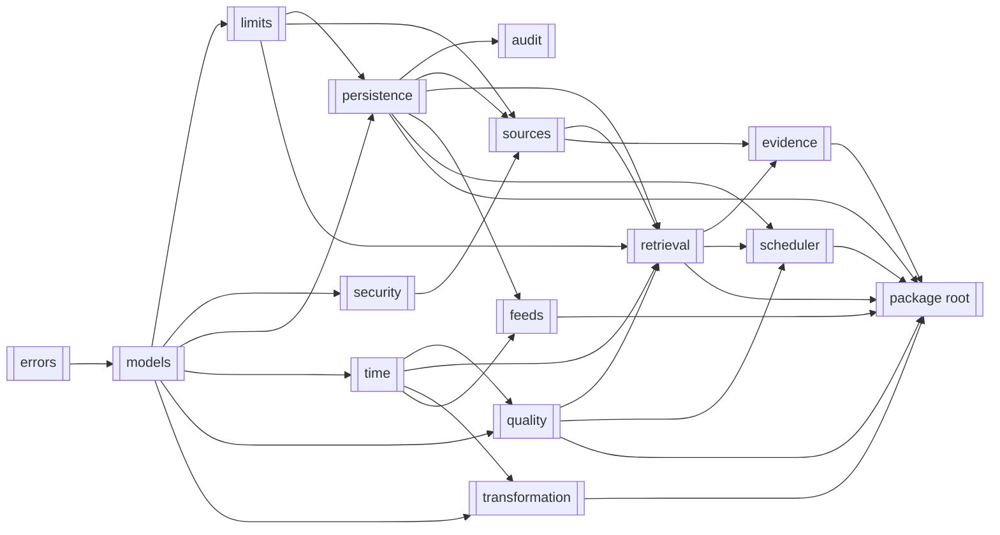
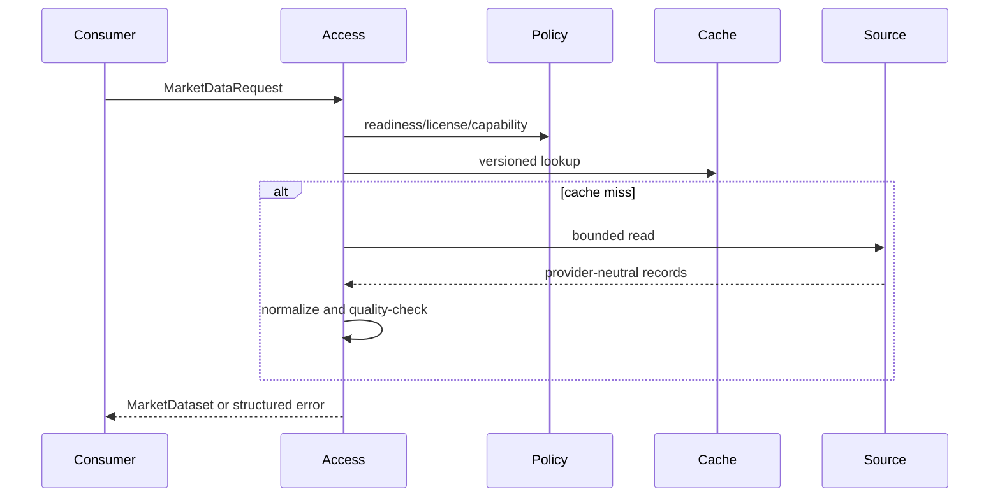

# Data

> **Package:** `app/services/data`
> **Status:** `Completed` — the sixteen-feature `CAP-DATA-028` baseline,
> including `FEAT-DATA-16` point-in-time research-source evidence, is implemented
> and verified. The baseline retains the owner-approved focused
> architecture: one registered capability equals one module folder and one standalone
> usage program. Behaviour, the explicitly declared package-root public functions,
> active requirement IDs,
> contract versions, schema identifiers, and error codes remain compatible.
> Provider facades compose on the Data side; their reads remain gated by Brokers
> read-release evidence (`_RELEASED`).
> The package-local implementation, validation, and repository-wide public-boundary
> migration are complete; production consumers outside this domain use only the
> documented `app.services.data` package-root boundary. Specification parity,
> standalone usage evidence, and the approved MT5 demo-provider validation pass.
> **Last updated:** `2026-07-30`

> This README is the package's **single source of truth** for requirements,
> final structure, implementation sequence, progress, usage examples, and tests.
> Update this file before changing the code.

---

## 1. Purpose and Boundary

### Purpose

Data acquires, normalizes, stores, and serves trusted market data and read-only
broker/account state. It owns the shared SQLite connection, locking, and migration
execution infrastructure. All broker/provider access is strictly read-only and flows
exclusively through the Brokers domain's canonical `BrokerAdapter` read capability
traits (`MarketDataProvider`, `AccountProvider`, `CalculationProvider`) under the
registered Brokers boundary. Data is a foundation domain: it provides
evidence and controlled resources but makes no strategy, risk, simulation, or
execution decision.

### Owns

- Historical and real-time market-data acquisition, normalization, provenance,
  quality validation, availability inspection, and multi-timeframe alignment.
- Series-level market-data quality inspection: gap, spike, flat-line, zero-volume,
  duplicate-bar, and spread-breach detection, deterministic quality scoring, and
  recommended remediation evidence. Quality evidence is always computed from the
  records examined.
- Historical market/account data tables, local CSV/Parquet datasets, cache state,
  source policy, job/checkpoint state, feed status, and durable audit storage.
- Shared SQLite connections, path-scoped write locking, and migration execution;
  each persistent domain still owns its own tables and migration definitions.
- Normalization of raw broker/provider reads (obtained through Brokers' `BrokerAdapter`
  read traits) into `MarketDataset`, `AccountStateSnapshot`,
  `MarketContextEvidence`, and `FXConversionEvidence`.
- Source capability, readiness, licensing, explicit-fallback, rate-limit, timeout,
  circuit-breaker, and promotion policy.
- Composition of every source Data can read: configured local artifact sources and
  configured read-only broker provider facades. Local sources require no credentials,
  network, or promotion evidence; provider sources are gated by their platform
  enablement flag and enter at `staging` readiness.
- Explicit, audited admission of externally produced CSV/Parquet artifacts into
  canonical manifest-backed form under a caller-declared column mapping. Import is
  always an explicit operation, never an implicit on-read conversion.
- Deterministic resampling, alignment, tick aggregation, and synthetic generation
  (Research owns historical labeling).
- Bounded update jobs/backfills, idempotency, leases, checkpoints, crash recovery,
  and minimum internal feed lifecycle/status.

### Does not own

- Strategy evaluation, indicators, risk policy, position sizing, order formulation,
  broker dispatch decisions, reconciliation authority, or simulated fills/state.
- Broker/provider adapter implementations, connection/session mechanics, or
  credentials: Brokers owns adapters, credentials, and lifecycle behavior; secrets
  are resolved through the opaque value returned by the Utils package-root
  `load_broker_provider_settings` function. The Data composition root selects a
  provider route only and resolves the connection configuration through the
  Brokers public resolver
  (`resolve_provider_connection_config`); it never reads credentials or builds
  `BrokerConnectionConfig` itself. Data never exposes the adapter or invokes
  `BrokerAdapter` mutation operations.
- Another domain's tables, artifact schemas, or migration definitions.
- Public streaming subscriptions, automatic feed-gap backfill, historical calendar
  reconstruction, TSDB selection, or unapproved external-source promotion.
- Raw provider DataFrames, provider SDK objects, sockets, streams, credentials, or
  database sessions crossing the public API or a cross-domain boundary. The
  package-root `to_ohlcv_dataframe` and `to_tick_dataframe` helpers may return new
  validated analytical projections containing only canonical market values and UTC
  timestamps.
- Silent source fallback, gap repair, interpolation, schema migration, or precision
  coercion in governed workflows.
- Silent or undisclosed stale-cache use in any workflow. An expired cache entry is
  served only when the caller explicitly requests `serve_stale`, only in the
  `research` workflow context, and only with `cache_status="stale_warning"` on the
  returned dataset. Governed contexts (`backtest`, `validation`, `risk`,
  `execution_bound`) never serve expired entries.
- Symbol-level licence overrides. `SourceLicensePolicy` is declared per source and is
  the complete licence model; see `Explicit exclusions`.
- Implicit conversion of foreign file formats on read. `load_dataset` requires a
  Data-written manifest; foreign artifacts enter only through explicit import.

### Shared contracts

Contract definitions must match the name, version, and owner recorded in
`docs/PROJECT.md`.

**Owned by this domain** — defined authoritatively here:

| Status | Contract | Version | Counterparty | Purpose |
|---|---|---|---|---|
| Completed | `MarketDataset` | `v1` | Indicators, Strategy, Trading, Simulation, Analytics, Optimization, Research, Portfolio, UI/API (Risk consumes `MarketContextEvidence` / `AccountStateSnapshot` instead) | Normalized bars/ticks with `available_at`, quality, precision, provenance, schema, and normalization metadata. |
| Completed | `AccountStateSnapshot` | `v1` | Strategy, Risk, Trading, Portfolio | Immutable read-only account, balance, position, margin, broker-state, and UTC snapshot evidence. |
| Completed | `MarketContextEvidence` | `v1` | Risk; Trading (orchestrator carrier only), UI/API (views) | Immutable normalized session, calendar, spread, liquidity, volatility, correlation, crisis, timezone, freshness, provenance, and explicit-missingness evidence for fail-closed Risk evaluation. Only Risk interprets it. |
| Completed | `FXConversionEvidence` | `v1` | Risk, Simulation, Analytics, Portfolio | Immutable ordered direct or synthesized conversion path, composite rate, freshness, path-policy version, and source provenance. Consumers apply but never synthesize it. |
| Completed | `AuditEventQuery` / `AuditEventPage` | `v1` | UI/API, Risk | Governed bounded filters and a cursor page over Utils-owned `AuditEvent` envelopes; Data owns query semantics and durable access, not event payload meaning. |

`MarketDataset v1` contains: `contract_version="v1"`,
`schema_id="data.market_dataset.v1"`, `normalization_version`,
`data_kind`, `symbol`, optional `timeframe`, immutable canonical `records`, UTC
`start`/`end`, per-record or dataset `available_at`, `record_count`,
`DataQualityReport`, source/provenance/license metadata, cache status, workflow
context, and precision policy. Records never contain raw provider objects.

For broker historical bars, each record's `available_at` is its provider-reported
closing timestamp. `RawSourceBatch.retrieved_at` and dataset-level `available_at`
retain the later retrieval/assembly instant, so point-in-time consumers can test
record causality without erasing when the dataset was fetched.

`AccountStateSnapshot v1` contains: `contract_version="v1"`,
`schema_id="data.account_state_snapshot.v1"`, account identifier,
currency, balances/equity/margin values as exact decimal strings, normalized open
positions (including an optional provider-derived `ownership_ref`) and orders,
broker connectivity/trading-allowance evidence, source,
`snapshot_at` UTC, expiry/staleness metadata, and trace identifiers. Missing, stale,
or unverifiable governed evidence fails closed.

`MarketContextEvidence v1` carries separate `contract_version="v1"` and
`schema_id="data.market_context_evidence.v1"`, bounded session/calendar state,
spread/liquidity/volatility/correlation/crisis evidence, timezone, UTC `as_of`,
freshness, provenance, and explicit missingness. Data owns normalization and
freshness truth; Risk owns interpretation and policy decisions.

`FXConversionEvidence v1` carries separate `contract_version="v1"` and
`schema_id="data.fx_conversion_evidence.v1"`, source and target currencies,
an ordered acyclic sequence of rate legs, exact decimal leg/composite rates, UTC
`as_of`, request-supplied freshness limit, path-policy identifier/version,
source provenance, and trace identifiers. Missing, stale, cyclic, disallowed, or
unverifiable paths fail closed; consumers never synthesize or silently refresh it.

`AuditEventQuery v1` contains separate contract version/schema ID, an ordered UTC
range, optional domain/action/principal/correlation filters, an opaque cursor, and a
positive bounded limit. `AuditEventPage v1` contains separate identifiers, an ordered
tuple of Utils-owned `AuditEvent v1` values, and an opaque optional next cursor. The
caller supplies `AuthContext` separately; unauthorized or unbounded queries fail closed.

**Consumed from other domains** — referenced only, never redefined:

| Contract | Version | Owner | Used for |
|---|---|---|---|
| `AuthContext` | `v1` | Utils | Authenticate and trace governed reads, source promotion, audit persistence, and audit queries. |
| `AuditEvent` | `v1` | Utils | Persist redacted governed events in Data's durable audit store. |
| `BrokerAdapter` (read traits) | `v1` | Brokers | Read-only market data, account state, and calculation reads via `MarketDataProvider`, `AccountProvider`, and `CalculationProvider`; Data never invokes mutation operations. |
| `StandardResponse[T]` | `v1` | Utils | Shared bounded-operation envelope for Broker reads; Data consumes raw Broker DTOs from `data` and validates required Broker evidence in `metadata.extensions`. |
| Broker response extensions and error codes | `v1` | Brokers | Provider identity, environment, completion timestamp, adapter version, and structured failure semantics for every Broker read consumed by Data. |
| `BrokerConnectionEvent` / subscription event DTOs | `v1` | Brokers | Bounded connection lifecycle and provider-event channels feeding Data's internal feed handling. |

### Persisted state

Only Data writes Data-owned state. Other domains read it through documented
contracts. Other domains submit their own migrations to Data's execution framework
but retain schema ownership.

| Status | State / Store | Read access (via contract) | Migration definitions |
|---|---|---|---|
| Completed | Market/account data tables, range indexes, source revisions, and historical datasets | Consumers via `MarketDataset` / `AccountStateSnapshot` | `app/services/data/persistence/migrations.py` |
| Completed | Durable audit event store | UI/API audit views and Risk verification through approved queries | `app/services/data/persistence/migrations.py` |
| Completed | Versioned cache entries and manifests | Data APIs only; consumers receive cache metadata, never direct rows | `app/services/data/persistence/migrations.py` |
| Completed | Source readiness, capabilities, license policy, rate limits, and breaker state | Data source policy APIs | `app/services/data/persistence/migrations.py` |
| Completed | Update jobs, leases, idempotency keys, checkpoints, and recovery state | Data job APIs | `app/services/data/persistence/migrations.py` |
| Completed | Internal feed heartbeat, gap, buffer, reconnect, and circuit state | `get_feed_status` | `app/services/data/persistence/migrations.py` |
| Completed | Shared migration ledger and path-scoped lock records | Persistent domains through migration results; no direct table access | `app/services/data/persistence/migrations.py` |

### Four-level structure

In `app/services/data`, everything must be focused:
- A **Module folder** inside the data domain is for **one Feature / capability only** (e.g. `FEAT-DATA-01: Retrieve historical data` has its own module folder focused solely on that feature).
- A **File** inside a module folder is for **one Use case or focused responsibility only**.
- A **Class / function / method** inside a file is for **one Functional requirement behaviour only**.

| Code level | Represents | Focused Scoping Rule |
|---|---|---|
| **Package** | Data domain | Domain ownership root (`app/services/data`) |
| **Module folder** | Feature / capability | Dedicated to one Feature / capability only (e.g., `FEAT-DATA-01` retrieval) |
| **File** | Use case or focused responsibility | Dedicated to one Use case or focused responsibility only |
| **Class / function / method / constant** | Functional requirement behaviour | Dedicated to one Functional requirement behaviour at a time |

```text
Package (Data domain)
└── Module folder (One Feature / capability, e.g. FEAT-DATA-01)
    └── File (One Use case / focused responsibility)
        └── Class / Function / Method / Constant (One Functional requirement behavior)
```

### Feature Registry

The following registry is the owner-approved target. It treats a feature as one
cohesive capability, not as one public function. A feature may expose multiple
operations when they serve the same actor outcome; each operation still implements
one focused functional-requirement behaviour. The target contains seventeen registered
capabilities: sixteen business features and one foundational contract capability.

| Status | Feature | Owning module | Public API and contracts | Requirements | Usage evidence |
|---|---|---|---|---|---|
| Completed | `FEAT-DATA-01` Canonical Data Contracts | `contracts/` | Contract bases, canonical records, dataset/range/quality vocabulary, stable errors, and request validation | Section 4 contract and requirement ledger, allocated to this owner | `tests/data/usage/features/01_contracts.py` |
| Completed | `FEAT-DATA-02` Market Data Retrieval | `market_data/` | Retrieval request/result contracts and the market, tick, spread, symbol, metadata, availability, and volume operations | Section 4 retrieval requirements, allocated to this owner | `tests/data/usage/features/02_market_data.py` |
| Completed | `FEAT-DATA-03` Local Dataset Loading | `local_datasets/` | `DatasetLoadRequest`, manifest verification, CSV/Parquet loaders, and `load_local_dataset` | Section 4 local-loading requirements, allocated to this owner | `tests/data/usage/features/03_local_datasets.py` |
| Completed | `FEAT-DATA-04` Synthetic Data Generation | `synthetic_data/` | `SyntheticRequest`, seeded randomness, synthetic bar/tick generation, and provenance | Section 4 synthetic-generation requirements, allocated to this owner | `tests/data/usage/features/04_synthetic_data.py` |
| Completed | `FEAT-DATA-05` Tick-Series Derivation | `tick_derivation/` | `TickSeriesRequest`, fixed-point kernels, derived tick/Parquet operations, and provenance | Section 4 tick-derivation requirements, allocated to this owner | `tests/data/usage/features/05_tick_derivation.py` |
| Completed | `FEAT-DATA-06` Data Persistence and Storage | `persistence/` | Transaction, migration, locking, dataset, cache, import, backup, restore, retention, and path contracts/operations | Section 4 persistence requirements, allocated to this owner | `tests/data/usage/features/06_persistence.py` |
| Completed | `FEAT-DATA-07` Data Quality and Validation | `quality/` | Quality contracts, series/anomaly inspection, symbol metadata validation, policy, scoring, and remediation | Section 4 quality requirements, allocated to this owner | `tests/data/usage/features/07_quality.py` |
| Completed | `FEAT-DATA-08` Data Transformation and Resampling | `transformation/` | Resampling, tick aggregation, multi-timeframe alignment, and detached tabular projections | Section 4 transformation requirements, allocated to this owner | `tests/data/usage/features/08_transformation.py` |
| Completed | `FEAT-DATA-09` Time and Session Handling | `time_sessions/` | Timeframe/schedule contracts, UTC policy, venue market hours, exchange/configured schedules, analytical named sessions, gap classification, and explicit context-required dashboard snapshot | `FR-DATA-034`, `FR-DATA-117`–`FR-DATA-122` | `tests/data/usage/features/09_time_sessions.py` |
| Completed | `FEAT-DATA-10` Data Source Governance | `sources/` | Source contracts/protocol, registry/composition, policy/promotion, adapters, licensing, and read-only proxy | Section 4 source-governance requirements, allocated to this owner | `tests/data/usage/features/10_sources.py` |
| Completed | `FEAT-DATA-11` Economic Calendar | `economic_calendar/` | Licensed Firecrawl acquisition, raw scraper contracts, exact-value normalization, approved persistence, symbol queries, restriction/state evidence, and explicit context-required dashboard snapshot through function-only package-root operations | `FR-DATA-095`–`099`, `FR-DATA-123`–`129` | `tests/data/usage/features/11_economic_calendar.py`; opt-in `tests/data/integration/test_economic_calendar_live.py` |
| Completed | `FEAT-DATA-12` Real-Time Feed Lifecycle and Observability | `realtime_feeds/` | Feed contracts/state, buffer, heartbeat, reconnection, reconciliation, and status operations | Section 4 feed requirements, allocated to this owner | `tests/data/usage/features/12_realtime_feeds.py` |
| Completed | `FEAT-DATA-13` Scheduler and Job Management | `data_jobs/` | Job/backfill/recovery contracts and create/start/stop/run/status/recovery operations | Section 4 job requirements, allocated to this owner | `tests/data/usage/features/13_data_jobs.py` |
| Completed | `FEAT-DATA-14` Cross-Domain Evidence | `evidence/` | Market-context, FX-conversion, account-state, freshness contracts/providers, and public evidence operations | Section 4 normalized-evidence requirements, allocated to this owner | `tests/data/usage/features/14_evidence.py` |
| Completed | `FEAT-DATA-15` Audit Evidence | `audit/` | Audit query/page/persistence contracts and authorized persist/query operations | Section 4 audit requirements, allocated to this owner | `tests/data/usage/features/15_audit.py` |
| Completed | `FEAT-DATA-16` Point-in-Time Research Source Evidence | `research_sources/` | Function-only root operations retrieve, normalize, persist, query, assess, inspect, and project opaque source documents, observations, and verification manifests; exact declarations: Section 9 | `FR-DATA-130`–`145` | `tests/data/usage/features/16_research_sources.py` |
| Completed | `FEAT-DATA-17` Cross-Domain Runtime Persistence Adapters | `runtime_stores/` | Opaque namespaced durable-state handles, allowlisted codecs, atomic record/transition operations, deterministic bounded cross-partition reads, and owner-specific construction functions | `FR-DATA-146`–`150` | `tests/data/usage/features/17_runtime_stores.py`; `tests/data/unit/test_runtime_store_codecs.py`; `tests/data/integration/test_runtime_store_persistence.py` |

Private root files such as `_settings.py` and `_limits.py` may remain only for
genuinely domain-wide infrastructure. They are not feature modules, expose no public
feature API, and receive direct unit coverage plus indirect coverage through the
feature usages that consume them.

#### Current-to-target module disposition

| Current module folder | Approved disposition |
|---|---|
| `models/` | Remove. Cross-feature canonical vocabulary moves to `contracts/`; feature-specific contracts move to their owning feature. |
| `errors/` | Remove as a module folder; stable boundary errors move to `contracts/errors.py`. |
| `limits/` | Remove as a module folder; feature limits move to owners and genuinely shared private configuration moves to root `_settings.py` / `_limits.py`. |
| `retrieval/` | Split into `market_data/`, `local_datasets/`, `synthetic_data/`, `tick_derivation/`, and `economic_calendar/`. |
| `security/` | Remove as a module folder; licensing and read-only broker enforcement move to `sources/`. |
| `time/` | Replace with the explicit `time_sessions/` feature. |
| `feeds/` | Replace with `realtime_feeds/`, reflecting lifecycle and observability responsibilities. |
| `scheduler/` | Replace with the approved `data_jobs/` feature name. |
| `persistence/`, `quality/`, `transformation/`, `sources/`, `evidence/`, `audit/` | Retain as feature folders, relocate their owned contracts into them, and split overloaded files by use case. |

#### `CAP-DATA-028` implementation-slice progress

| Status | Slice | Scope |
|---|---|---|
| Completed | `FEAT-DATA-01` Canonical Data Contracts | Canonical contract bases, request-boundary validation, records, dataset envelope, and stable errors now live in `contracts/`; all direct consumers were migrated without compatibility re-exports; `01_contracts.py` directly exercises the complete public feature surface. Evidence: `app/services/data/contracts/__init__.py:24`, `app/services/data/contracts/records.py:77`, `app/services/data/contracts/dataset.py:135`, `app/services/data/contracts/errors.py:341`, `tests/data/unit/test_import_graph.py:71`, `tests/data/usage/features/01_contracts.py:30`. |
| Completed | `FEAT-DATA-02`–`FEAT-DATA-15` | Focused owners, consumers, tests, and all fourteen remaining usage programs are migrated; forbidden horizontal folders are absent and the complete Data gate passes. `FEAT-DATA-11` uses the owner-authorized licensed Firecrawl transport and was verified against all four declared calendar portals on 2026-07-30. |
| Completed | `FEAT-DATA-16` | Point-in-time research-source evidence performs governed bounded HTTPS acquisition, immutable SQLite revision persistence, decision-time filtering, eligibility assessment, and detached projection through the Data package root. |

The completed migration preserves contract versions, schema identifiers, error codes,
validation behavior, and golden JSON schemas. The package root explicitly exports the
The package-root function-only API is assigned across the fifteen registered features. Feature contracts
live with their owners; no compatibility package recreates a removed path.

#### Function-only construction boundary

Data contract classes, enums, protocols, and constants are internal implementation
details. Consumers construct a required Data value only through the corresponding
package-root `build_...` function below; they must never import or alias an internal
Data class. The remaining package-root exports are feature operations, predicates,
getters, and response helpers documented by their owning feature rows above.

```text
build_account_order                 build_account_snapshot_request
build_account_state_snapshot        build_active_market_sessions_request
build_audit_event_page              build_audit_event_query
build_availability_request          build_backup_target
build_cache_read_request            build_cache_write_request
build_calendar_scrape_provider      build_column_mapping
build_data_gap                      build_data_quality_report
build_data_range                    build_dataset_load_request
build_dataset_save_request          build_data_settings
build_economic_event               build_economic_event_store
build_error_definition             build_event_impact
build_exchange_session_request     build_external_import_request
build_feed_config                  build_feed_status_request
build_fx_conversion_evidence       build_fx_conversion_request
build_fx_rate_leg                  build_job_definition
build_job_status_request           build_local_market_data_source
build_market_context_evidence      build_market_context_request
build_market_data_request          build_market_dataset
build_market_hours_request         build_market_schedule
build_migration_request
build_migration_step                build_ohlcv_record
build_quality_issue                 build_raw_feed_event
build_read_only_broker_proxy        build_reconnect_policy
build_schedule_request              build_scrape_options
build_scrape_result                 build_session_window
build_source_descriptor             build_source_identity
build_source_license_policy         build_source_policy_config
build_source_promotion_request      build_source_read_request
build_spread_record                 build_statement_plan
build_symbol_list_request           build_symbol_metadata_request
build_synthetic_request             build_tick_record
build_transaction_request           build_weekly_holiday
build_weekly_schedule_definition    build_weekly_schedule_provider
build_data_response                 build_data_error
build_exception_response            build_symbol_metadata
```

### Pre-migration capability map (historical evidence)

The following map records the superseded intermediate package after the first
`CAP-DATA-028` slice. The implemented boundary is the approved target in Section 2;
the map is retained only as migration evidence.


```mermaid
flowchart TD
    DATA[[app/services/data]]
    DATA --> CONTRACTS[[contracts: canonical records, dataset envelope, errors, validation]]
    DATA --> MODELS[[models: pending feature-specific contracts]]
    DATA --> LIMITS[[limits: settings and bounded limits manifest]]
    DATA --> SOURCES[[sources: protocol, registry, policy, composition]]
    DATA --> RETRIEVAL[[retrieval: bars, ticks, local, synthetic, discovery, calendar]]
    DATA --> PERSISTENCE[[persistence: SQLite, files, cache, import, backup]]
    DATA --> AUDIT[[audit: durable event store and governed query]]
    DATA --> EVIDENCE[[evidence: market context, FX, account state]]
    DATA --> QUALITY[[quality: validators, flags, adversarial detection]]
    DATA --> TRANSFORMATION[[transformation: resample, aggregate, align, tabular]]
    DATA --> TIME[[time: timezone, market hours, gaps]]
    DATA --> FEEDS[[feeds: status, buffer, reconnection, heartbeat]]
    DATA --> SCHEDULER[[scheduler: job, backfill, recovery]]
    DATA --> SECURITY[[security: credentials, licensing, broker contract]]

    CONTRACTS --> CFILES[_base.py; validation.py; records.py; dataset.py; errors.py]
    MODELS --> MFILES[requests.py; metadata.py; sources.py; storage.py; jobs.py; feeds.py; account.py; market_context.py; fx.py; audit.py; datasets.py availability only]
    LIMITS --> LFILES[manifest.py; config.py]
    SOURCES --> SOFILES[protocol.py; registry.py; policy.py; composition.py]
    RETRIEVAL --> RFILES[sources.py; local_loader.py; synthetic.py; discovery.py; calendar.py]
    PERSISTENCE --> PFILES[sqlite.py; migrations.py; locking.py; file_io.py; cache.py; import_artifacts.py; backup.py]
    AUDIT --> AUFILES[store.py; query.py]
    EVIDENCE --> EVFILES[market_context.py; fx.py; account_state.py]
    QUALITY --> QFILES[ohlcv_validator.py; asset_validator.py; flags.py; adversarial.py; policy.py]
    TRANSFORMATION --> TFILES[resample.py; tick_aggregation.py; alignment.py; tabular.py]
    TIME --> TIFILES[timezone.py; market_hours.py; gaps.py]
    FEEDS --> FFILES[status.py; buffer.py; reconnection.py; heartbeat.py]
    SCHEDULER --> JFILES[job.py; backfill.py; recovery.py]
    SECURITY --> SEFILES[credentials.py; licensing.py; broker_contract.py]
```

---

## 2. Current Package Structure and Approved Target

The current tree below satisfies the approved
one-feature/one-folder/one-usage invariant and is the authoritative package inventory:

```text
app/services/data/
├── __init__.py
├── README.md
├── _settings.py
├── _limits.py
├── contracts/
├── market_data/
├── local_datasets/
├── synthetic_data/
├── tick_derivation/
├── persistence/
├── quality/
├── transformation/
├── time_sessions/
├── sources/
├── economic_calendar/
├── realtime_feeds/
├── data_jobs/
├── evidence/
└── audit/
```

The current files are ordered from lowest dependency to highest dependency:

```text
app/services/data/
├── __init__.py                         # Approved public operations only (imports + __all__)
├── README.md
├── contracts/                          # FEAT-DATA-01 canonical shared vocabulary
│   ├── __init__.py                     # Supported canonical contract surface
│   ├── _base.py                        # Three frozen private contract bases
│   ├── validation.py                   # Request-boundary validation and facade helpers
│   ├── records.py                      # OHLCVRecord, TickRecord, SpreadRecord
│   ├── dataset.py                      # MarketDataset, quality evidence, ranges, schema IDs
│   └── errors.py                       # DataError and DATA_ERROR_MANIFEST
├── models/                             # Temporary pending feature-specific contracts only
│   ├── __init__.py
│   ├── datasets.py                     # DataAvailability pending FEAT-DATA-02 ownership
│   ├── requests.py                     # Market, synthetic, availability, schedule, volume requests
│   ├── metadata.py                     # Symbol, schedule, session, and volume descriptors
│   ├── sources.py                      # Source descriptor, licence policy, plan, identity
│   ├── storage.py                      # Transaction, migration, dataset, cache, import contracts
│   ├── jobs.py                         # Job, backfill, schedule, run, status, recovery contracts
│   ├── feeds.py                        # Feed config, event, result, status, reconnect policy
│   ├── account.py                      # AccountStateSnapshot and its component contracts
│   ├── market_context.py               # MarketContextEvidence and request
│   ├── fx.py                           # FXConversionEvidence, request, rate leg
│   └── audit.py                        # AuditEventQuery, AuditEventPage
├── limits/                             # Configuration and bounded limits
│   ├── __init__.py
│   ├── config.py                       # Immutable DataSettings loaded through Utils
│   └── manifest.py                     # get_limit, apply_workflow_override
├── sources/                            # Source governance: which sources exist and may be read
│   ├── __init__.py
│   ├── protocol.py                     # Minimum typed read-only source Protocol
│   ├── registry.py                     # Lazy registration and resolution, no I/O at import
│   ├── policy.py                       # Readiness, license, fallback, rate, breaker, promotion
│   ├── composition.py                  # Authoritative lazy composition and migration trigger
│   ├── local.py                        # Local CSV/Parquet source adapter
│   └── external.py                     # Read-only broker provider adapter
├── retrieval/                          # Acquire market data from a governed source
│   ├── __init__.py
│   ├── sources.py                      # Bars, ticks, spreads through policy/cache/normalization
│   ├── local_loader.py                 # Public local-artifact read facade (the
│   │                                   #   manifest-verifying reader stays in persistence/)
│   ├── synthetic.py                    # Seeded GBM fixtures and real-evidence tick-series generation
│   ├── discovery.py                    # Symbols, metadata, availability, historical volume
│   └── calendar.py                     # Multi-site economic calendar scraping
├── persistence/                        # Durable state and artifacts
│   ├── __init__.py
│   ├── sqlite.py                       # Bounded short-lived SQLite transaction execution
│   ├── locking.py                      # Exclusive path-scoped write locks
│   ├── migrations.py                   # Ordered domain-owned migrations and shared ledger
│   ├── file_io.py                      # Atomic CSV/Parquet artifact and manifest writes
│   ├── cache.py                        # One versioned TTL/revision cache
│   ├── import_artifacts.py             # Explicit audited external artifact admission
│   └── backup.py                       # Snapshot, restore, and retention enforcement
├── audit/                              # Durable governed audit evidence
│   ├── __init__.py
│   ├── store.py                        # Idempotent redacted AuditEvent persistence
│   └── query.py                        # Authorized bounded cursor query
├── research_sources/                   # FEAT-DATA-16 point-in-time research documents
│   ├── __init__.py
│   ├── contracts.py
│   ├── policy.py
│   ├── ingestion.py
│   └── queries.py
├── evidence/                           # Normalized cross-domain evidence contracts
│   ├── __init__.py
│   ├── market_context.py               # MarketContextEvidence for Risk
│   ├── fx.py                           # FXConversionEvidence path selection
│   └── account_state.py               # AccountStateSnapshot from read-only broker reads
├── quality/                            # Is this series trustworthy?
│   ├── __init__.py
│   ├── ohlcv_validator.py              # Series inspection, gaps, integrity, order
│   ├── asset_validator.py              # Symbol precision and canonical symbol mapping
│   ├── flags.py                        # Quality flag aggregation and enumeration
│   ├── adversarial.py                  # Spikes, flat-lines, zero volume, spread breaches
│   └── policy.py                       # Quality profiles and remediation mapping
├── transformation/                     # Deterministic dataset reshaping, no I/O, no lookahead
│   ├── __init__.py
│   ├── resample.py                     # Higher-timeframe aggregation and volume-kind disclosure
│   ├── tick_aggregation.py             # Ticks to bars with explicit spread policy
│   ├── alignment.py                    # Backward-only multi-timeframe alignment
│   └── tabular.py                      # Canonical analytical DataFrame projections and comparison
├── time/                               # Temporal truth
│   ├── __init__.py
│   ├── timezone.py                     # UTC normalization and canonical timeframe manifest
│   ├── market_hours.py                 # Current configured hours and sessions
│   └── gaps.py                         # Gap classification and real-time reconciliation
├── feeds/                              # Internal real-time lifecycle and observability
│   ├── __init__.py
│   ├── status.py                       # Registration and read-only status inspection
│   ├── buffer.py                       # Bounded buffer with explicit overflow policy
│   ├── reconnection.py                 # Backoff and persisted circuit breaker state
│   └── heartbeat.py                    # Heartbeat touch and timeout evaluation
├── scheduler/                          # Bounded update jobs and backfills
│   ├── __init__.py
│   ├── job.py                          # Create, start, stop, run-once, status
│   ├── backfill.py                     # Idempotent resumable chunk execution
│   └── recovery.py                     # Explicit startup crash recovery
└── security/                           # Fail-closed access governance
    ├── __init__.py
    ├── licensing.py                    # License enforcement and attribution text
    └── broker_contract.py              # Runtime read-only broker capability enforcement
```

Standalone usage examples live only under `tests/data/usage/`, one numbered program
per registered `FEAT-DATA-NN` (see Section 7). Provider-backed examples fail honestly
with a typed `DataError` when their settings, credentials, dependency, connectivity,
or capability evidence is unavailable.

### Module dependency diagram

Dependencies flow strictly downward. `models/` and `errors/` depend on nothing inside
the domain, which is what removes the current `contracts` ↔ `validation` import cycle
and the PEP 562 lazy-export workaround it forced.


```mermaid
flowchart LR
    E[[errors]]
    M[[models]]
    L[[limits]]
    SEC[[security]]
    P[[persistence]]
    AU[[audit]]
    SRC[[sources]]
    T[[time]]
    Q[[quality]]
    RET[[retrieval]]
    TR[[transformation]]
    EV[[evidence]]
    F[[feeds]]
    J[[scheduler]]
    API[[package root]]

    E --> M
    M --> L
    M --> SEC
    M --> P
    M --> T
    M --> Q
    L --> P
    L --> SRC
    L --> RET
    P --> AU
    P --> SRC
    SEC --> SRC
    SRC --> RET
    P --> RET
    Q --> RET
    T --> Q
    T --> RET
    M --> TR
    T --> TR
    SRC --> EV
    RET --> EV
    P --> F
    T --> F
    P --> J
    RET --> J
    Q --> J
    RET --> API
    TR --> API
    Q --> API
    P --> API
    EV --> API
    J --> API
    F --> API
```

### Structure rules

- **Focused Domain Architecture**: In `app/services/data`, every module folder inside the domain is dedicated to one Feature / capability only, every file inside a module folder is for one use case or focused responsibility only, and every class/function/method inside a file addresses one functional requirement behaviour at a time.
- **Module folder names state the capability, not the mechanism.** A folder answers
  "what can Data do", not "what technology does it use". The sixteen names in the
  Feature Registry are the only production feature folders.
- `contracts/` is the canonical shared contract core. Feature-owned contracts remain
  in their owning feature folders; removed horizontal `models/`, `errors/`, `limits/`,
  `retrieval/`, and `security/` packages must not return.
- `app/services/data/__init__.py` contains imports and `__all__` only.
- Package-root `__all__` contains exactly the approved typed public operations.
- Efficient internal APIs remain in focused submodules and do not appear in the
  package-root export list.
- Every source adapter is read-only. Synthetic generation is a retrieval capability
  for fixtures, not an external source adapter.
- Source composition lazy-loads optional dependencies; import never opens a
  connection, creates a database, runs recovery, or performs network I/O.
- No class named `DataGateway`, generic manager/service/repository layer, SQLite
  connection pool, or TSDB abstraction is part of the design. The retrieval pipeline
  (policy → cache → source → normalize → quality) is an internal function sequence
  owned by `market_data/`, not a class hierarchy or a generic layer folder.
- Simulation-specific trading-bar/M1/real tick reconstruction is absent; Simulation
  owns it and consumes canonical Data output.
- Historical labeling is absent; Research owns it.

### Reconciliation capability coverage

This table proves that every reconciliation capability has one final destination or
an explicit exclusion.

| Capability | Decision | Final destination / treatment |
|---|---|---|
| `CAP-DATA-001` Typed public and internal API boundary | Modify | `contracts/`, feature-owned contracts, and the package-root `__init__.py` export gate over the owning `FR-DATA-*` operations |
| `CAP-DATA-002` Historical OHLCV/tick/spread retrieval | Modify | `market_data/`, typed retrieval operations, `WF-DATA-001/002` |
| `CAP-DATA-003` Source protocol/registry/readiness/adapters | Modify | `sources/`, `FR-DATA-022–029` |
| `CAP-DATA-004` Canonical records/UTC/versioning | Modify | `contracts/records.py`, `contracts/dataset.py` |
| `CAP-DATA-005` Quality/gaps/availability/revision | Modify/Replace | `DataQualityReport`, `DataAvailability`, `market_data/symbol_discovery.py`; series-level detection and scoring in `quality/` (`CAP-DATA-023`) |
| `CAP-DATA-006` Versioned cache and safe clear | Modify | `persistence/cache.py`, `clear_data_cache` |
| `CAP-DATA-007` Local CSV/Parquet and atomic storage | Modify | `persistence/dataset_writer.py` (save), `local_datasets/` (load) |
| `CAP-DATA-008` SQLite state and transactional infrastructure | Modify | `persistence/sqlite.py`, `locking.py`, `migrations.py`; `audit/` |
| `CAP-DATA-009` Jobs and resumable backfills | Modify/Replace | `data_jobs/`, typed job operations, `WF-DATA-007` |
| `CAP-DATA-010` Internal real-time feed lifecycle | Add/Replace | `realtime_feeds/`, `get_feed_status`, `WF-DATA-008`; deterministic fake harness and specified informational limits |
| `CAP-DATA-011` Timeframes/resampling/alignment/aggregation | Merge/Modify | `time_sessions/`, `transformation/`, typed transform operations |
| `CAP-DATA-012` Deterministic synthetic generation | Modify | `synthetic_data/`, typed synthetic operations, `WF-DATA-005` |
| `CAP-DATA-022` Real-evidence tick-series generation | Add | `tick_derivation/`, `FR-DATA-087`–`FR-DATA-090`, `WF-DATA-016` |
| `CAP-DATA-023` Series-level quality detection, scoring, and remediation evidence | Add | `quality/`, `FR-DATA-091`–`FR-DATA-094`, `WF-DATA-001` step 4 |
| `CAP-DATA-024` Multi-site economic calendar acquisition and Risk-ready normalization | Add | `economic_calendar/`, `FR-DATA-095`–`FR-DATA-099`, `FR-DATA-123`–`FR-DATA-129` |
| `CAP-DATA-025` Source composition and external artifact import | Add | `sources/composition.py` local/provider descriptor composition, `local_datasets/` addressing and filtering, `persistence/external_import.py`, `FR-DATA-101`–`FR-DATA-107`, `WF-DATA-017` |
| `CAP-DATA-026` Feature-oriented module restructure | Superseded | Historical migration summarized below; current ownership is defined exclusively by `CAP-DATA-028`, Section 2, and the Feature Registry |
| `CAP-DATA-027` Backup, restore, and retention enforcement | Add | `persistence/backup.py`, `FR-DATA-108`–`FR-DATA-110` |
| `CAP-DATA-013` Historical labeling | Retired | Owned by Research; no Data implementation |
| `CAP-DATA-014` Market hours/sessions/volume | Modify/Add | `time_sessions/schedule.py` (hours/sessions), `market_data/symbol_discovery.py` (volume), `WF-DATA-010` |
| `CAP-DATA-015` License/fallback/rate/breaker/source safety | Modify | `sources/policy.py`, `sources/licensing.py`, source manifests, `WF-DATA-011` |
| `CAP-DATA-016` Symbol discovery and metadata | Modify | `market_data/symbol_discovery.py`, typed metadata/discovery operations, `WF-DATA-009` |
| `CAP-DATA-017` Errors/request correlation/audit/side effects | Add | `contracts/errors.py`, `audit/`, typed API rules, NFRs |
| `CAP-DATA-018` Workflow-aware precision/serialization | Modify | Contract/API precision policy and `NFR-DATA-002–004` |
| `CAP-DATA-019` Simulation tick-model boundary | Split | Data retains canonical/generic generation; Simulation owns model reconstruction; `WF-DATA-012` |
| `CAP-DATA-020` Legacy implementation/facade cleanup | Remove | No legacy facade, aliases, duplicate cache, `_common.py`, or simulation tick model exists in the final tree. |
| `CAP-DATA-021` Tests and validation evidence | Add | Section 7 and `NFR-DATA-009/012`; hard allocation/response bounds are tested, while benchmark results remain explicitly informational |

### Explicit exclusions

| Treatment | Behavior |
|---|---|
| Remove | `_common.py`, broken/unbound exports, legacy aliases, duplicate caches/file savers/label entry points, superseded record-list gateway, mock production feed registration, status-only scheduler execution, and Data-owned simulation tick modelling after migration. |
| Reject | Mandatory `DataGateway`, SQLite pool/leak detector, named TimescaleDB/InfluxDB direction, composite feed health score, hidden on-read migration, and mandatory multiprocessing. |
| Reject | Symbol-level licence overrides. Source-level `SourceLicensePolicy` with `permitted_workflows`, `export_allowed`, and attribution/retention terms is the complete licence model. V1's `(source, symbol)` licence table had no call site in the archive and its own defaults were source-keyed. Reopen only for a concrete instrument whose terms are narrower than its source; that would require a schema migration and a governed write operation, so it is not carried speculatively. |
| Defer | Incremental (streaming) bar construction from live feed events. Data owns this capability when it is needed, so batch and incremental aggregation stay in one domain, but no consumer exists: `WF-DATA-008` scopes the feed runtime to buffering, heartbeat, gap recording, and status against a deterministic fake harness, and V1's `BarAggregator` had no call site. Revisit only when feed promotion to a real MT5 demo feed is scheduled; the first requirement will be that incremental output is bit-identical to `aggregate_ticks` over the same ticks. |

### Historical implementation sequence — `CAP-DATA-026`

This sequence records the implemented migration that preserved the functional
baseline. Its claim to satisfy focused feature architecture was withdrawn by the
owner on 2026-07-22. It is not the implementation plan for `CAP-DATA-028`.

All paths named in this historical sequence that are absent from the Section 2
inventory are intentionally removed historical paths, not required production
artifacts or alternative ownership locations.

Ordered lowest dependency first. Each phase is independently verifiable, carries its
own dry-run and `APPROVED: EXECUTE` gate, and leaves the package importable and the
targeted test suite green. A legacy folder is deleted only at the end of the phase
that replaces it, after the replacing module's tests pass.

Behaviour is preserved. Every `FR-DATA-*` requirement, error code, contract version,
and schema identifier survives unchanged; only module and file ownership moves. The
five owned cross-domain contracts are frozen in Phase 1 and asserted against a
pre-restructure golden snapshot.

**Legacy-package freeze.** From the end of the phase that replaces it, a legacy module
is frozen: no later phase may edit `contracts/`, `validation/`, `config.py`,
`storage/`, `gateway/`, `sources/`, `transforms/`, `generators/`, or `feeds/` once its
replacement exists. Phase 1 could prove parity automatically because contracts are
data — JSON-schema equality is a complete check. Phase 2 onward duplicates *functions*,
where no equivalent automated check exists, so divergence is prevented procedurally
instead. Phase 11 deletes the frozen packages.

**Historical contract migration.** During `CAP-DATA-026`, temporary legacy and target
contract instances did not interchange. `CAP-DATA-028` completed the merge: only the
Section 2 owners remain, and no removed contract path is public or required.

| Status | Phase | Work | Requirements | Verification | Depends on |
|---|---|---|---|---|---|
| Completed | 0 | Rewrite this README's structure, capability map, dependency diagram, module specifications, and test layout to the target structure. Update `docs/PROJECT.md`, `docs/ARCHITECTURE.md`, and `docs/CHANGELOG.md`. No code changes. | `CAP-DATA-026` | Docs cross-check: every capability has a destination; no stale module path remains in the four authoritative documents | — |
| Completed | 1 | Build `models/`, `errors/`, `limits/`. Move `_validation.py` into `models/`, eliminating the `contracts` ↔ `validation` cycle and the PEP 562 lazy-export workaround. Freeze contract shapes. | `FR-DATA-001`–`013`, `075`, `078` | Golden-schema equality test against the pre-restructure snapshot; import-order test proves `models/` has no intra-domain dependency | 0 |
| Completed | 2 | Build `persistence/` (excluding `backup.py`) and `audit/`. Split `storage/audit.py` into independent write and read halves. | `FR-DATA-014`–`021`, `077`, `105`, `106` | `test_migration_parity.py`, `test_persistence_isolation.py`, `test_import_graph.py`, plus `test_sqlite.py`, `test_persistence_locking.py`, `test_persistence_migrations.py`, `test_file_io.py`, `test_persistence_cache.py`, `test_audit.py`, `test_persistence_import_artifacts.py` | 1 |
| Completed | 3 | Migrate `sources/` **in place** — its name is both the legacy and the target name, so there is no parallel copy. Collapse `config.py` to a re-export of `limits/config.py`. | `FR-DATA-022`–`027`, `101`, `102` | `test_source_contract_identity.py`, `test_import_graph.py`, `test_source_protocol.py`, `test_source_registry.py`, `test_source_policy.py`, `test_public_retrieval_runtime.py` | 1, 2 |
| Completed | 4 | Build `retrieval/` and `time/timezone.py`: bars/ticks/spreads, local loader, synthetic and tick-series generation, discovery, calendar. | `FR-DATA-030`–`035`, `039`, `087`–`090`, `095`–`099`, `103`, `104`, `107` | `test_historical_access.py`, `test_reference_access.py`, `test_local_source.py`, `test_synthetic.py`, `test_ticks.py`, `test_calendar_scraper.py` | 1, 2, 3 |
| Completed | 5 | Build `quality/`: series inspection, adversarial detection, flags, asset validation, profiles. | `FR-DATA-091`–`094` | `test_quality.py`; score is never constant across differing inputs | 1 |
| Completed | 6 | Build `transformation/` and the rest of `time/`. | `FR-DATA-036`–`038`, `080`–`086` | `test_transforms.py`, `test_tabular.py`, `test_sessions.py` | 1, 5 |
| Completed | 7 | Build `evidence/`: market context, FX, account state. | `FR-DATA-008`, `028`, `076`, `079` | `test_market_context.py`, `test_fx_contracts.py`, `test_broker_source.py` | 1, 3, 4 |
| Completed | 8 | Split `feeds/` and `scheduler/` **in place**, splitting `runtime.py` into buffer, reconnection, and heartbeat, and `backfill.py` into backfill and recovery. | `FR-DATA-041`–`048` | `test_feed_runtime.py`, `test_feed_status.py`, `test_backfill.py`, `test_scheduler.py` | 1, 2 |
| Completed | 9 | Build `security/`: licensing enforcement, runtime read-only broker contract. Credentials pass-through withdrawn (`NFR-DATA-005`). | `FR-DATA-113`–`116`, `NFR-DATA-006` | `test_broker_contract.py`, `test_licensing.py`, `test_import_graph.py` | 1, 3 |
| Completed | 10 | Build `persistence/backup.py` — snapshot, restore, and retention enforcement. Genuinely new capability. | `CAP-DATA-027`, `FR-DATA-108`–`110` | `test_backup.py`, `test_backfill.py`; restore round trip; atomic hash-mismatch rejection; dry-run/purge/licence retention cases | 2 |
| Completed | 11 | Freeze the package-root `__init__.py` export list and migrate every cross-domain consumer import. | `NFR-DATA-001`, `NFR-DATA-011` | `test_api.py` asserts the function-only root surface. Data-owned usage and integration imports use the root boundary, and the repository production scan contains no prohibited `app.services.data.*` deep import outside Data. | 1–10 |
| Completed | 12 | Verification sweep: full suite, coverage ≥ 80%, `ruff`, `mypy`, and every usage program executed directly. | `NFR-DATA-012` | 436 Data tests pass with 81.65% branch-aware coverage; all fifteen usage programs exit zero; changed-file Ruff and full-repository Mypy pass. | 1–11 |

**Consumer boundary.** Cross-domain consumers are required to use package-root
exports. Data-owned usage and integration evidence complies, and repository-wide
production consumers contain no prohibited `app.services.data.*` deep imports.

**Out of scope for `CAP-DATA-026`:** any behaviour change to an existing
`FR-DATA-*`, symbol-level licensing, incremental aggregation, and historical
labeling (see `Explicit exclusions`).

---

## 3. Workflows

> **Workflow Usage Evidence**: Each active workflow has one standalone executable
> program under [`tests/data/usage/workflows/`](../../../tests/data/usage/workflows/).
> Every program labels the documented input boundary, each workflow stage in
> comments and output, invokes the public operations that implement those stages,
> passes their typed results forward, and labels the typed result or `DataError`
> output boundary. Provider-backed examples use genuine MT5 demo evidence. Run all
> active Data workflows with
> `uv run python tests/data/usage/workflows/run_all.py`.

### Workflow rank values

| Rank | Identifier | Meaning |
|---|---|---|
| **Primary** | `WF-DATA-PRI` | The workflow this domain exists to serve. |
| **Secondary** | `WF-DATA-SEC` | The next most load-bearing workflow. |
| **Tertiary** | `WF-DATA-TER` | The third-ranked workflow. |
| **Supporting** | `WF-DATA-0NN` | Every remaining registered workflow. |

### Retired identifiers

`WF-DATA-001`, `WF-DATA-002`, and `WF-DATA-007` were absorbed into `WF-DATA-PRI`,
`WF-DATA-SEC`, and `WF-DATA-TER` respectively. Absorbed numbers are retired and are
never reused. `WF-DATA-006` remains retired to Research. New workflows continue from
`WF-DATA-020`.

| Workflow ID | Standalone program |
|---|---|
| `WF-DATA-PRI` | `tests/data/usage/workflows/wf_data_pri_historical_bars_ticks_spreads.py` |
| `WF-DATA-SEC` | `tests/data/usage/workflows/wf_data_sec_internal_analytical_data_access.py` |
| `WF-DATA-TER` | `tests/data/usage/workflows/wf_data_ter_update_job_historical_backfill.py` |
| `WF-DATA-003` | `tests/data/usage/workflows/wf_data_003_local_dataset_load_save.py` |
| `WF-DATA-004` | `tests/data/usage/workflows/wf_data_004_resample_align_aggregate.py` |
| `WF-DATA-005` | `tests/data/usage/workflows/wf_data_005_synthetic_generation.py` |
| `WF-DATA-008` | `tests/data/usage/workflows/wf_data_008_internal_realtime_feed_status.py` |
| `WF-DATA-009` | `tests/data/usage/workflows/wf_data_009_symbol_discovery_metadata_availability.py` |
| `WF-DATA-010` | `tests/data/usage/workflows/wf_data_010_current_hours_sessions_volume.py` |
| `WF-DATA-011` | `tests/data/usage/workflows/wf_data_011_source_readiness_promotion.py` |
| `WF-DATA-012` | `tests/data/usage/workflows/wf_data_012_simulation_data_modelling_boundary.py` |
| `WF-DATA-013` | `tests/data/usage/workflows/wf_data_013_account_snapshot_service.py` |
| `WF-DATA-014` | `tests/data/usage/workflows/wf_data_014_risk_market_context_evidence.py` |
| `WF-DATA-015` | `tests/data/usage/workflows/wf_data_015_fx_conversion_evidence.py` |
| `WF-DATA-016` | `tests/data/usage/workflows/wf_data_016_tick_series_generation_real_evidence.py` |
| `WF-DATA-017` | `tests/data/usage/workflows/wf_data_017_external_artifact_import.py` |
| `WF-DATA-018` | `tests/data/usage/workflows/wf_data_018_venue_authoritative_market_hours.py` |
| `WF-DATA-019` | `tests/data/usage/workflows/wf_data_019_analytical_named_session_classification.py` |
| `WF-DATA-020` | `tests/data/usage/workflows/wf_data_020_economic_calendar_news_restriction.py` *(pending)* |
| `WF-DATA-021` | `tests/data/usage/workflows/wf_data_021_persistence_lifecycle.py` *(pending)* |
| `WF-DATA-022` | `tests/data/usage/workflows/wf_data_022_data_audit_trail.py` |
| `WF-DATA-023` | `tests/data/usage/workflows/wf_data_023_versioned_cache_lifecycle.py` |
| `WF-DATA-024` | `tests/data/usage/workflows/wf_data_024_quality_inspection_remediation.py` |

`WF-DATA-006` is retired to Research and therefore intentionally has no Data
workflow program. Entries marked *(pending)* are registered workflows whose
standalone program is not yet written.

### Status values

| Status | Meaning |
|---|---|
| **Missing** | Not implemented or not verified |
| **Partial** | Useful V1 behavior exists but final contracts, placement, or tests differ |
| **Completed** | Implemented in the final structure, tested, and verified |

### Workflow scope values

| Scope | Meaning |
|---|---|
| **Internal** | The complete workflow occurs within Data. |
| **Cross-domain** | Data receives input from or returns output to another domain. |

| Status | Rank | Workflow ID | Scope | Workflow | Trigger / Input boundary | Final outcome / Output boundary | Requirement sequence |
|---|---|---|---|---|---|---|---|
| Completed | Primary | `WF-DATA-PRI` | Cross-domain | Historical bars/ticks/spreads retrieval | Consumer submits bounded source/range request | `MarketDataset v1` | `FR-DATA-006 → 026 → 030` |
| Completed | Secondary | `WF-DATA-SEC` | Cross-domain | Internal analytical data access | Approved Python consumer submits `MarketDataRequest` | Typed `MarketDataset`, never raw provider state | `FR-DATA-006 → 030 → 005` |
| Completed | Tertiary | `WF-DATA-TER` | Internal | Update job and historical backfill | Job definition or run-once command | Committed chunks and resumable checkpoint | `FR-DATA-041 → 042 → 043/044/045` |
| Completed | Supporting | `WF-DATA-003` | Internal | Local dataset load/save | Approved CSV/Parquet path and normalized data | Validated dataset or atomic committed artifact/manifest | `FR-DATA-016 → 017/018` |
| Completed | Supporting | `WF-DATA-004` | Internal | Resample, align, and aggregate | Normalized datasets/ticks | Deterministic no-lookahead dataset | `FR-DATA-036 → 037/038` |
| Completed | Supporting | `WF-DATA-005` | Cross-domain | Synthetic generation | Bounded parameters and optional seed | Deterministic canonical bars/ticks for fixtures only | `FR-DATA-039` |
| Retired | — | `WF-DATA-006` | — | Historical labeling | Owned by Research; no Data workflow | — | — |
| Completed | Supporting | `WF-DATA-008` | Cross-domain | Internal real-time feed and status | Staging feed source emits event | Normalized bounded state and `get_feed_status` output | `FR-DATA-046 → 047 → 048` |
| Completed | Supporting | `WF-DATA-009` | Cross-domain | Symbol discovery, metadata, availability | Bounded source/symbol query | Provenanced metadata/page/availability result | `FR-DATA-023/024 → 031/032/033` |
| Completed | Supporting | `WF-DATA-010` | Cross-domain | Current hours, sessions, and volume | Current configured market request | UTC windows or bounded volume result | `FR-DATA-034/035` |
| Completed | Supporting | `WF-DATA-011` | Internal | Source readiness and promotion | Operator evidence package and `AuthContext` | Reversible readiness state | `FR-DATA-026 → 027` |
| Completed | Supporting | `WF-DATA-012` | Cross-domain | Simulation data-modelling boundary | Simulation requests canonical history | Data supplies canonical bars/ticks; Simulation reconstructs model-specific ticks | `FR-DATA-030 → 005` |
| Completed | Supporting | `WF-DATA-013` | Cross-domain | Account snapshot service | Strategy/Risk/Trading read-only account evidence request | `AccountStateSnapshot v1` (read-only; no mutation capability) | `FR-DATA-028 → 008` |
| Completed | Supporting | `WF-DATA-014` | Cross-domain | Risk market-context evidence | Risk requests current normalized context | `MarketContextEvidence v1` or explicit stale/missing failure | `FR-DATA-075 → 076` |
| Completed | Supporting | `WF-DATA-015` | Cross-domain | FX conversion evidence | Risk, Simulation, Analytics, or Portfolio requests a bounded conversion | `FXConversionEvidence v1` or explicit stale/path failure | `FR-DATA-078 → FR-DATA-079` |
| Completed | Supporting | `WF-DATA-016` | Cross-domain | Tick-series generation from real evidence | Real bar or tick `MarketDataset`, approved model, spread model, and seed when variable | Canonical tick `MarketDataset` with intra-bar phase metadata, or a bounded Parquet artifact | `FR-DATA-087 → FR-DATA-088 → FR-DATA-089 → FR-DATA-090` |
| Completed | Supporting | `WF-DATA-017` | Internal | External artifact import | Operator supplies an approved path, declared dialect, and explicit column mapping | Committed canonical artifact, manifest, and audit event | `FR-DATA-105 → FR-DATA-106 → FR-DATA-018` |
| Completed | Supporting | `WF-DATA-018` | Cross-domain | Venue-authoritative market hours | Explicit broker source or exchange calendar code and exact symbol | UTC sessions plus deterministic open/current/next state | `FR-DATA-117 → FR-DATA-118 → FR-DATA-119/120` |
| Completed | Supporting | `WF-DATA-019` | Cross-domain | Analytical named-session classification | Exact symbol, aware UTC instant, and configured regional definitions | DST-aware liquidity labels that confer no trading authority | `FR-DATA-121 → FR-DATA-122` |
| Completed | Supporting | `WF-DATA-020` | Internal | Economic calendar and news-restriction evidence | Bounded symbol/date-range calendar query | Provenanced economic events, symbol event profile, and restriction verdict | `Pending` |
| Completed | Supporting | `WF-DATA-021` | Internal | Persistence lifecycle: migration, backup, restore, retention | Operator maintenance command against the Data-owned store | Verified schema ledger, committed backup, restored store, or enforced retention result | `Pending` |
| Completed | Supporting | `WF-DATA-022` | Cross-domain | Data audit trail | Domain-supplied redacted `AuditEvent v1` or bounded audit query | Durably persisted event or bounded ordered audit page | `Pending` |
| Completed | Supporting | `WF-DATA-023` | Internal | Versioned cache lifecycle | Cache identity derived from source revision, schema version, and request dimensions | Cache hit, miss, or explicit invalidation with no stale record served outside policy | `Pending` |
| Completed | Supporting | `WF-DATA-024` | Internal | Standalone quality inspection and remediation | Normalized records or an existing dataset plus the active quality profile | Bounded `QualityReport` with classified issues and a remediation summary | `Pending` |

### `WF-DATA-PRI` — Historical Bars, Ticks, and Spreads

**Scope:** `Cross-domain`
**System workflow:** `SYS-WF-001`, `SYS-WF-002`, `SYS-WF-003`, `SYS-WF-004`
**Input boundary:** A consumer supplies a JSON request payload or typed
`MarketDataRequest`; live/current reads used by `SYS-WF-002` use the same boundary.
**Output boundary:** Data returns its documented typed result or `DataError`.

1. Validate request bounds, UTC range, workflow context, precision, stale-cache
   policy, and fallback list. Reject `serve_stale` outside the `research` context —
   `data.get_market_data()`, `data.require_utc()`.
2. Compose the requested source and each explicitly supplied fallback, then enforce
   readiness, capability, license, rate, timeout, and breaker policy for each. A
   source identifier that is neither a configured local source nor an enabled
   provider source fails closed as `UNSUPPORTED_SOURCE` before any policy evaluation —
   `data.resolve_source()`, `data.list_composable_sources()`,
   `data.ensure_source_access()`, `data.evaluate_source_policy()`.
3. Resolve cache identity from source revision, schema/normalization versions, raw
   hash when known, request dimensions, and policy. Apply the stale-cache policy:
   `refresh` treats an expired entry as a miss; `fail_closed` returns `EMPTY_RESULT`
   without contacting any source; `serve_stale` returns the expired entry with
   `cache_status="stale_warning"` — `data.get_cache_entry()`, `data.put_cache_entry()`.
4. Fetch from one lazy read adapter on cache miss, normalize UTC records to the
   requested UTC range and record limit, and create a
   bounded quality report over the normalized records under the active
   `QUALITY_PROFILE`. The report always reflects the actual records examined; a
   constant or unexamined score is never emitted — `data.fetch_market_dataset()`,
   `data.inspect_dataset_quality()`, `data.get_quality_policy()`.
5. Apply `quality_failure_behavior` to failed reports identically for fresh and
   cached data: `reject` raises `DATA_QUALITY_FAILED`, while `warn` emits a bounded
   warning and returns the unchanged typed dataset with its failed report intact.
   Precision violations still fail closed. Advisory issues reduce `quality_score`
   and populate `issues`/`warnings` without blocking — `data.build_data_response()`,
   `data.unwrap_data_response()`.

**Failure behaviour:** invalid input → `VALIDATION_FAILED`; undeclared fallback → no
fallback; unavailable/staging-disallowed source → `SOURCE_UNAVAILABLE`; missing
license → `LICENSE_RESTRICTION`; failed quality under `reject` → `DATA_QUALITY_FAILED`;
external timeout → `TIMEOUT`; empty valid range → `EMPTY_RESULT`; uncomposable source
identifier → `UNSUPPORTED_SOURCE`; `fail_closed` policy with no live cache entry →
`EMPTY_RESULT`; `serve_stale` requested outside `research` → `VALIDATION_FAILED`.
Cache-write failure is disclosed as a warning for read workflows and never changes
returned records.

**Integration test:**
`tests/data/integration/test_workflow_runtime.py::test_wf_data_009_discovers_metadata_and_measures_local_availability()`


```mermaid
sequenceDiagram
    participant Consumer
    participant Access
    participant Policy
    participant Cache
    participant Source
    Consumer->>Access: MarketDataRequest
    Access->>Policy: readiness/license/capability
    Access->>Cache: versioned lookup
    alt cache miss
        Access->>Source: bounded read
        Source-->>Access: provider-neutral records
        Access->>Access: normalize and quality-check
    end
    Access-->>Consumer: MarketDataset or structured error
```

### `WF-DATA-SEC` — Internal Analytical Data Access

**Scope:** `Cross-domain`
**System workflow:** `SYS-WF-001`, `SYS-WF-003`, `SYS-WF-004`
**Input boundary:** An approved Python consumer supplies a typed
`MarketDataRequest`.
**Output boundary:** Data returns the canonical `MarketDataset` and, when requested,
a detached analytical projection that exposes no provider-owned state.

1. Construct and validate the same bounded `MarketDataRequest` accepted by
   `WF-DATA-PRI` — `data.require_utc()`, `data.get_timeframe_spec()`.
2. Retrieve through the canonical path so source policy, normalization, quality,
   cache, and provenance remain governed — `data.get_market_data()`,
   `data.get_tick_data()`, `data.get_spread_data()`.
3. Project to a detached analytical frame only after retrieval succeeds; the typed
   `MarketDataset` remains unchanged — `data.to_ohlcv_dataframe()`,
   `data.to_tick_dataframe()`.
4. Run the projection under the shared operation wrapper when a uniform response
   envelope is required — `data.run_data_operation()`,
   `data.run_data_operation_async()`.

**Failure behaviour:** retrieval failures remain typed `DataError` values; an
incompatible dataset cannot be projected and no raw adapter/provider object crosses
the boundary.

**Integration test:**
`tests/data/integration/test_workflow_runtime.py::test_wf_data_009_discovers_metadata_and_measures_local_availability()`

### `WF-DATA-003` — Local Dataset Load and Save

**Scope:** `Internal`
**System workflow:** `None`
**Input boundary:** Approved relative path, `csv|parquet`, normalized dataset, and
overwrite/manifest options.
**Output boundary:** Loaded `MarketDataset` or committed artifact plus manifest.

1. Resolve the path under configured approved roots and reject traversal, absolute
   escape, and unapproved hidden/system paths — `data.load_local_dataset()`,
   `data.save_dataset()`.
2. Acquire the exclusive path-scoped writer lock for writes —
   `data.acquire_write_lock()`.
3. Validate/normalize records and license/export policy —
   `data.inspect_records_quality()`, `data.ensure_source_access()`.
4. Write a temporary artifact and versioned manifest, fsync as supported, then commit
   atomically; quarantine failed temporary output — `data.save_dataset()`,
   `data.execute_transaction()`.
5. Verify file hash/schema on load and never perform hidden on-read migration —
   `data.load_dataset()`, `data.load_csv()`, `data.load_parquet()`.

**Failure behaviour:** unsafe path → `PERMISSION_DENIED`; lock conflict →
`CONCURRENT_WRITE_LOCKED`; corrupt artifact → `FILE_CORRUPTED`; invalid data →
`DATA_QUALITY_FAILED`; write failure → `DB_WRITE_FAILED` or mapped filesystem error.

**Integration test:**
`tests/data/integration/test_local_source_retrieval.py`

### `WF-DATA-017` — External Artifact Import

**Scope:** `Internal`
**System workflow:** `None`
**Input boundary:** An operator supplies an approved relative path, `csv|parquet`, a
named dialect, an explicit `ColumnMapping`, and the governed fields that a foreign
artifact cannot supply: `symbol`, `data_kind`, optional `timeframe`, `source_id`,
`workflow_context`, and `precision_policy`.
**Output boundary:** A committed canonical artifact, its versioned manifest, and a
persisted audit event recording external origin.

1. Resolve the path under configured approved roots using the same validation as
   `WF-DATA-003`; reject traversal, absolute escape, and unapproved hidden paths —
   `data.import_external_dataset()`.
2. Read the artifact under the declared dialect, which fixes header style and
   delimiter. No governed field is inferred: an artifact whose columns do not satisfy
   the declared mapping fails rather than being guessed at —
   `data.describe_import_dialects()`, `data.load_csv()`, `data.load_parquet()`.
3. Map source columns to canonical fields, normalize timestamps to UTC, and validate
   every record through the canonical record contracts — `data.from_row()`,
   `data.require_utc()`.
4. Run the same quality pass as retrieval under the active `QUALITY_PROFILE` and fail
   closed on blocking issues — `data.inspect_records_quality()`,
   `data.get_quality_policy()`.
5. Commit so the result is an ordinary manifest-backed artifact indistinguishable
   from Data-authored output, and record provenance marking the artifact as
   externally originated — `data.save_dataset()`.
6. Persist one `AuditEvent` naming the operator, source path, dialect, and mapping —
   `utils.create_audit_event()`, `data.persist_audit_event()`.

Import never mutates the source artifact and never runs implicitly. `load_dataset`
continues to require a Data-written manifest; this workflow is the only admission
path, which keeps on-read behaviour free of hidden conversion.

**Failure behaviour:** unsafe path → `PERMISSION_DENIED`; unknown dialect or
incomplete mapping → `VALIDATION_FAILED`; unreadable or malformed artifact →
`FILE_CORRUPTED`; blocking quality issues → `DATA_QUALITY_FAILED`; lock conflict →
`CONCURRENT_WRITE_LOCKED`; commit failure → `DB_WRITE_FAILED`.

**Integration test:**
`tests/data/integration/test_external_import.py::test_external_import_measures_commits_and_reloads()`

### `WF-DATA-004` — Resample, Align, and Aggregate

**Scope:** `Internal`
**System workflow:** `SYS-WF-001`, `SYS-WF-003`
**Input boundary:** Canonical datasets and declared source/target timeframes.
**Output boundary:** Deterministic `MarketDataset` with updated provenance and
`available_at`.

1. Validate the declared source and target timeframes against the single timeframe
   manifest — `data.get_timeframe_spec()`, `data.validate_resample_target()`.
2. Resample only to a supported higher timeframe, preserving canonical OHLCV
   semantics — `data.resample_dataset()`, `data.resample_ohlcv()`.
3. Align multiple datasets so each target timestamp selects only values already
   available at that instant — `data.align_datasets()`,
   `data.align_multitimeframe_data()`.
4. Aggregate sorted canonical ticks under an explicit spread policy —
   `data.aggregate_ticks()`, `data.aggregate_ticks_to_bars()`.
5. Merge per-record quality flags into the result provenance and stamp
   `available_at` — `data.aggregate_flags()`, `data.data_start_time()`.

Any lookahead, disorder, overlap-policy, or unsupported-timeframe violation fails the
operation atomically.

**Integration test:**
`tests/data/integration/test_workflow_runtime.py::test_wf_data_004_005_and_016_transform_generate_and_derive()`

### `WF-DATA-005` — Synthetic Generation

**Scope:** `Cross-domain`
**System workflow:** test/fixture support only
**Input boundary:** A consumer supplies bounded `SyntheticRequest` parameters,
including an explicit seed when deterministic replay is required.
**Output boundary:** Data returns canonical fixture-only bars or ticks with synthetic
provenance; the result carries no claim of observed market truth.

1. Validate the symbol, data kind, range/count, approved model parameters, precision
   policy, and seed through `SyntheticRequest` — `data.generate_synthetic_dataset()`.
2. Generate canonical bars for an approved bar request —
   `data.generate_synthetic_bars()`.
3. Generate canonical ticks for an approved tick request —
   `data.generate_synthetic_ticks()`.
4. Repeat the seeded operation and compare canonical records to demonstrate
   deterministic replay — `data.generate_synthetic_dataset()`,
   `utils.canonical_digest()`.

**Failure behaviour:** invalid or unbounded parameters fail as `VALIDATION_FAILED`;
unsupported models fail closed; synthetic output is never substituted for real
market evidence in a live/current workflow.

**Integration test:**
`tests/data/integration/test_workflow_runtime.py::test_wf_data_004_005_and_016_transform_generate_and_derive()`

### `WF-DATA-TER` — Update Job and Historical Backfill

**Scope:** `Internal`
**System workflow:** `None`
**Input boundary:** Persisted job definition or one-time bounded backfill request.
**Output boundary:** Atomic chunk commits, checkpoints, and observable job state.

1. Validate source/license/destination and derive an idempotency key from source,
   symbol, kind, timeframe, range, schema, and normalization version —
   `data.create_data_update_job()`, `data.derive_backfill_key()`,
   `data.ensure_source_access()`.
2. Acquire one active lease and divide the range into chunks no larger than 10,000
   records or one source calendar day, whichever is smaller —
   `data.acquire_write_lock()`, `data.schedule_update_job()`.
3. For each chunk run retrieval → normalization → quality → persistence —
   `data.execute_backfill_chunk()`, `data.get_market_data()`,
   `data.inspect_dataset_quality()`, `data.save_market_data()`.
4. Commit artifact/data, idempotency record, and checkpoint in one recoverable unit —
   `data.execute_transaction()`.
5. Start, observe, and stop the job through its owned lifecycle operations —
   `data.start_data_update_job()`, `data.run_data_update_job_once()`,
   `data.get_data_update_job_status()`, `data.read_update_job_status()`,
   `data.stop_data_update_job()`.
6. On restart, validate the checkpoint and resume after the last committed chunk —
   `data.recover_update_jobs()`.

**Failure behaviour:** duplicate active worker → `CONCURRENT_WRITE_LOCKED`; corrupt
checkpoint → `CHECKPOINT_CORRUPTED`; failed chunk leaves no published partial chunk;
recovery failure → `STATE_RECOVERY_FAILED`. A job never reports success without data
movement or an explicit no-change result.

**Integration test:**
`tests/data/integration/test_historical_retrieval.py::test_wf_data_007_commits_data_and_resumable_checkpoint()`

### `WF-DATA-008` — Internal Real-Time Feed and Status

**Scope:** `Cross-domain`
**System workflow:** `SYS-WF-002`
**Input boundary:** A configured staging/production source emits provider events to
the internal runtime; no public subscription API exists.
**Output boundary:** Consumers receive normalized internal events and operators receive
bounded read-only `FeedStatus` data.

1. Start the internal runtime against a configured staging/production source —
   `data.start_internal_feed()`.
2. Normalize each provider event into the bounded buffer and update heartbeats and
   counters — `data.ingest_feed_event()`.
3. Expose bounded read-only operator status without granting a subscription API —
   `data.get_feed_status()`, `data.read_feed_status()`.
4. Record gap windows and dropped-data evidence when overflow policy engages —
   `data.reconcile_feed_gap()`.
5. Reconnect with bounded exponential backoff plus jitter — `data.reconnect_feed()`.

Overflow follows `halt`, `drop_and_reconcile`, or `backpressure`; no automatic
historical reconciliation capability exists, so Phase 1 records and exposes the gap
only. The initial source is the deterministic fake contract harness. Promotion to one
MT5 demo feed for the Trading live/paper runtime occurs only after Trading exists and
the promotion evidence passes.

**Integration test:**
`tests/data/integration/test_workflow_runtime.py::test_wf_data_008_persists_ingests_and_reads_feed_status()`

### `WF-DATA-009` — Symbol Discovery, Metadata, and Availability

**Scope:** `Cross-domain`
**System workflow:** `SYS-WF-002`
**Input boundary:** A consumer supplies bounded source, symbol/query, timeframe, and
UTC probe-range requests.
**Output boundary:** Data returns a provenanced `SymbolPage`, `SymbolMetadata`, and
`DataAvailability`, or a typed `DataError`.

1. Page the bounded symbol universe for the requested source —
   `data.list_symbols()`, `data.discover_symbols()`.
2. Resolve metadata for the exact selected provider symbol and validate it before
   publication — `data.get_symbol_metadata()`, `data.fetch_symbol_metadata()`,
   `data.validate_symbol_metadata()`.
3. Measure coverage over an explicit UTC interval and maximum probe count —
   `data.get_data_availability()`, `data.inspect_availability()`.

**Failure behaviour:** disabled/unavailable sources, unknown symbols, stale metadata,
or malformed ranges fail closed; availability is measured and is never hard-coded
ready.

**Integration test:**
`tests/data/integration/test_workflow_runtime.py::test_wf_data_009_discovers_metadata_and_measures_local_availability()`

### `WF-DATA-010` — Current Hours, Sessions, and Volume

**Scope:** `Cross-domain`
**System workflow:** `SYS-WF-002`
**Input boundary:** An explicit revisioned schedule source and a bounded current
market-volume request.
**Output boundary:** Data returns normalized UTC `MarketHours` plus a separately
provenanced bounded `VolumeResult`.

1. Resolve the current revisioned schedule from an explicit
   `WeeklyScheduleDefinition`; schedule truth is never inferred from ticker text —
   `data.get_current_schedule()`.
2. Normalize the configured sessions to UTC — `data.get_market_hours()`,
   `data.get_trading_sessions()`.
3. Read bounded market volume for the exact provider symbol and UTC range —
   `data.get_historical_volume()`, `data.fetch_historical_volume()`.
4. Return schedule and volume as separate evidence so analytical volume cannot grant
   venue-tradability authority — `data.get_active_market_sessions()`.

**Failure behaviour:** missing schedule revisions, invalid timezone/session windows,
unsupported symbols, or unavailable volume evidence fail closed without fabricated
hours or volume.

**Integration tests:** `tests/data/unit/test_market_hours.py` and
`tests/data/unit/test_market_data_facade.py`.

### `WF-DATA-011` — Source Readiness and Promotion

**Scope:** `Internal`
**System workflow:** `None`
**Input boundary:** Authenticated operator submits mocked/live, normalization, quality,
timeout, rate-limit, license, redaction, and sign-off evidence.
**Output boundary:** Audited, reversible source readiness transition.

1. Register or confirm the source descriptor and its declared capabilities —
   `data.register_source()`, `data.ensure_source()`, `data.get_source_descriptor()`,
   `data.list_registered_sources()`.
2. Evaluate the operator evidence package against the declared readiness policy —
   `data.evaluate_source_policy()`.
3. Apply the audited reversible readiness transition — `data.promote_source()`.
4. Persist one audit event naming the operator and the linked evidence —
   `utils.create_audit_event()`, `data.persist_audit_event()`.

CSV and Parquet begin `production`; synthetic generation is production processing.
MT5, cTrader, Dukascopy, Binance discovery, and the real-time feed gateway begin
`staging`. Promotion is rejected until every declared criterion is linked and valid;
demotion is always allowed when evidence degrades.

**Integration test:**
`tests/data/integration/test_workflow_runtime.py::test_wf_data_011_persists_audited_reversible_promotion()`

### `WF-DATA-012` — Simulation Data-Modelling Boundary

**Scope:** `Cross-domain`
**System workflow:** `SYS-WF-001`
**Input boundary:** Simulation requests canonical historical bars/ticks.
**Output boundary:** Data returns `MarketDataset`; Simulation owns trading-bar, M1,
generated/real tick reconstruction, fill models, and simulated state.

1. Simulation requests canonical history through the ordinary retrieval boundary —
   `data.get_market_data()`, `data.get_tick_data()`.
2. Data returns canonical bars or ticks with provenance and stops there —
   `data.build_data_response()`.
3. Simulation reconstructs its own model-specific tick stream from that canonical
   evidence — `simulator.build_tick_timeline()`.
4. Simulation applies its own fill and cost models; Data holds no simulation state —
   `simulator.price_order()`, `simulator.match_order()`.

**Failure behaviour:** Data-quality or no-lookahead violation aborts the dataset
boundary; Data never returns a partially modeled simulation stream.

**Integration test:**
`tests/data/integration/test_workflow_runtime.py::test_wf_data_009_discovers_metadata_and_measures_local_availability()`

### `WF-DATA-013` — Account Snapshot Service

**Scope:** `Cross-domain`
**System workflow:** `SYS-WF-002`
**Input boundary:** Strategy/Risk/Trading request read-only account evidence.
**Output boundary:** `AccountStateSnapshot v1`.

1. Resolve the read-only broker client for the requested account scope —
   `brokers.create_broker_adapter()`, `data.wrap_broker_client()`.
2. Assert the wrapper exposes no mutation capability before any call is issued —
   `data.verify_read_only_call()`.
3. Read raw account state through the Brokers read traits and normalize provider
   state, connectivity/trading-allowance evidence, and staleness metadata —
   `data.get_account_state_snapshot()`.
4. Return an immutable snapshot carrying explicit freshness —
   `utils.is_fresh()`, `utils.age_seconds()`.

Data holds no mutation capability and issues none: broker mutations are dispatched by
Trading directly through Brokers' `BrokerAdapter` mutation operations.

**Integration test:**
`tests/data/integration/test_broker_boundary.py::test_account_evidence_wraps_every_injected_broker()`

### `WF-DATA-014` — Risk Market-Context Evidence

**Scope:** `Cross-domain`
**System workflow:** `SYS-WF-001`, `SYS-WF-002`
**Input boundary:** Risk requests current session, calendar, spread, liquidity,
volatility, correlation, and crisis evidence for a declared symbol/account scope.
**Output boundary:** `MarketContextEvidence v1` or a structured missing/stale error.

1. Populate the calendar component of market context for the declared scope —
   `data.populate_market_context_calendar()`.
2. Obtain provider facts through Brokers read traits and Data-owned sources, then
   normalize timezones, spreads, liquidity, volatility, and correlation —
   `data.get_market_context_evidence()`.
3. Derive and provenance the venue calendar state used by the evidence —
   `data.derive_calendar_state()`, `data.evaluate_calendar_state()`,
   `data.calendar_state_provenance()`.
4. Preserve provenance and explicit missingness, and publish no policy verdict; the
   receiving domain validates the evidence for its own use —
   `risk.validate_market_context_evidence()`.

Risk alone decides whether the evidence permits an action. Missing mandatory evidence
is never replaced with a fabricated default.

**Integration test:**
`tests/data/integration/test_workflow_runtime.py::test_wf_data_014_and_015_return_fresh_provider_evidence()`

---

### `WF-DATA-015` — FX Conversion Evidence

**Scope:** `Cross-domain`
**System workflow:** `SYS-WF-001`, `SYS-WF-007`, `SYS-WF-008`
**Input boundary:** a bounded source/target currency request, UTC `as_of`,
explicit maximum age, and explicit allowed-path policy.
**Output boundary:** `FXConversionEvidence v1` or a structured failure.

1. Resolve provider truth for each candidate leg through read-only sources —
   `data.resolve_source()`, `data.get_market_data()`.
2. Select an allowed acyclic conversion path deterministically and calculate the
   exact composite rate — `data.get_fx_conversion_evidence()`.
3. Validate freshness against the explicit maximum age — `utils.is_fresh()`,
   `utils.age_seconds()`.
4. Publish every leg and provenance reference so the receiver can audit but not
   re-derive the path — `data.build_data_response()`.

Consumers may multiply by the published rate but may not reconstruct a different
path. No synthetic/default rate is emitted.

**Integration test:**
`tests/data/integration/test_workflow_runtime.py::test_wf_data_014_and_015_return_fresh_provider_evidence()`

---

### `WF-DATA-016` — Tick-Series Generation from Real Evidence

**Scope:** `Cross-domain`
**System workflow:** `SYS-WF-001`, `SYS-WF-003`
**Input boundary:** A real canonical bar/tick `MarketDataset`, an approved generation
model, explicit spread policy, and a seed whenever the model is variable.
**Output boundary:** Data returns a canonical ordered tick `MarketDataset` with
source-bar phase metadata, or a bounded Parquet artifact describing the same
generated evidence.

1. Obtain bounded real source evidence — `data.get_market_data()`,
   `data.get_tick_data()`.
2. Select an approved generation model, trading timeframe, spread model, and exact
   point/spread parameters — `data.get_timeframe_spec()`.
3. Generate the tick series, retaining ordering, source-bar timestamps, intra-bar
   phase, precision, and lineage — `data.generate_tick_series()`.
4. Write a durable artifact with an approved path and explicit chunk bound when one
   is required — `data.generate_tick_series_to_parquet()`.

**Failure behaviour:** missing real evidence, incompatible timeframe/model,
unbounded output, invalid spread parameters, or unsafe destination path fails closed;
the generator never invents a claim of broker-observed ticks.

**Integration tests:**
`tests/data/integration/test_workflow_runtime.py::test_wf_data_004_005_and_016_transform_generate_and_derive()`
and `tests/data/unit/test_ticks.py`.

---

### `WF-DATA-018` — Venue-Authoritative Market Hours

**Scope:** `Cross-domain`
**Input boundary:** an exact provider symbol plus either a configured broker source,
an explicit exchange calendar code, or an explicit revisioned weekly definition.
**Output boundary:** ordered UTC sessions and deterministic `MarketHours`.

1. Read broker sessions through the Brokers public contract when a configured broker
   source is supplied — `brokers.create_broker_adapter()`,
   `data.get_trading_sessions()`.
2. Read exchange sessions only from an explicit calendar identifier —
   `data.get_exchange_sessions()`.
3. Expand an operator-owned revisioned definition when no provider API is available —
   `data.get_current_schedule()`.
4. Apply authoritative holiday closures, then select current and next sessions —
   `data.derive_calendar_state()`, `data.evaluate_calendar_state()`,
   `data.get_market_hours()`.
5. Record which authority produced the published state —
   `data.calendar_state_provenance()`.

Missing or conflicting evidence fails closed; ticker text and recent ticks are never
schedule evidence.

**Integration tests:** `tests/data/integration/test_workflow_runtime.py`,
`tests/data/unit/test_exchange_calendar.py`, and
`tests/brokers/unit/test_ctrader_adapter.py`.

---

### `WF-DATA-019` — Analytical Named-Session Classification

**Scope:** `Cross-domain`
**Input boundary:** exact symbol, aware UTC instant, and configurable regional
session definitions.
**Output boundary:** ordered analytical liquidity labels only.

1. Validate the exact symbol and aware UTC instant — `data.require_utc()`.
2. Classify the instant against configured regional definitions using DST-aware
   `zoneinfo` timezones — `data.get_active_market_sessions()`.
3. Return ordered analytical liquidity labels only —
   `data.build_data_response()`.

Regional `zoneinfo` timezones provide DST-aware classification and definitions may
cross midnight. The result has no `is_open` field and cannot authorize order
validation; venue tradability remains exclusively in `MarketHours`.

**Integration tests:** `tests/data/unit/test_named_sessions.py` and
`tests/data/unit/test_market_hours.py`.

---

### `WF-DATA-020` — Economic Calendar and News-Restriction Evidence

**Scope:** `Internal`
**System workflow:** `SYS-WF-002`
**Input boundary:** a bounded UTC date range plus either an explicit event query or
an exact symbol whose event profile is required.
**Output boundary:** provenanced economic events, a symbol event profile, and an
explicit restriction verdict; never a trading authorization.

1. Acquire calendar evidence from the configured read-only source —
   `data.scrape_economic_calendar()`.
2. Persist the acquired events so later reads are reproducible —
   `data.get_persisted_events()`.
3. Read bounded events for the requested range — `data.get_economic_events()`.
4. Resolve the events attached to an exact symbol —
   `data.get_symbol_economic_events()`, `data.get_symbol_event_profile()`.
5. Evaluate the configured restriction window around each qualifying event —
   `data.is_news_restricted()`, `data.is_news_restricted_events()`.

**Failure behaviour:** an unavailable calendar source, an unbounded range, or an
unknown symbol fails closed. A restriction verdict is evidence only; Risk and Trading
remain the sole authorities on whether an action may proceed.

**Integration test:** `Pending`

---

### `WF-DATA-021` — Persistence Lifecycle: Migration, Backup, Restore, Retention

**Scope:** `Internal`
**System workflow:** `None`
**Input boundary:** an operator maintenance command against the Data-owned store.
**Output boundary:** a verified schema ledger, a committed backup, a restored store,
or an enforced retention result.

1. Acquire the explicit database write lock before any schema or bulk operation —
   `data.acquire_write_lock()`.
2. Apply the authoritative migration manifest with ledger verification and checksum
   validation — `data.run_data_migrations()`, `data.run_domain_migrations()`.
3. Perform every step transactionally under the busy-timeout policy —
   `data.execute_transaction()`.
4. Commit a backup of the current store — `data.create_backup()`.
5. Restore from a verified backup when recovery is required —
   `data.restore_from_backup()`.
6. Enforce the configured retention policy over aged partitions —
   `data.enforce_retention_policy()`.

**Failure behaviour:** a step checksum mismatch blocks database access rather than
being repaired in place; applied migration steps are immutable; a failed restore
never leaves a partially overwritten store.

**Integration test:** `Pending`

---

### `WF-DATA-022` — Data Audit Trail

**Scope:** `Cross-domain`
**System workflow:** `SYS-WF-005`
**Input boundary:** a redacted `AuditEvent v1` constructed by the emitting domain, or
a bounded audit query.
**Output boundary:** a durably persisted event, or one bounded ordered audit page.

1. The emitting domain constructs and redacts its event at the shared boundary —
   `utils.create_audit_event()`.
2. Data validates the envelope and persists it under the write lock —
   `data.persist_audit_event()`, `data.acquire_write_lock()`.
3. The write commits transactionally with the action it records —
   `data.execute_transaction()`.
4. Operators read bounded ordered pages of recorded events —
   `data.query_audit_events()`.
5. Every read resolves its originating request identity for correlation —
   `data.resolve_operation_request_id()`.

**Failure behaviour:** an unredacted or malformed envelope is rejected; Data never
authors audit content on another domain's behalf, and a failed persist surfaces
rather than silently dropping the event.

**Integration test:** `Pending`

---

### `WF-DATA-023` — Versioned Cache Lifecycle

**Scope:** `Internal`
**System workflow:** `SYS-WF-001`
**Input boundary:** a cache identity derived from source revision, schema and
normalization versions, raw hash when known, request dimensions, and policy.
**Output boundary:** a cache hit, a miss, or an explicit invalidation; no stale
record is served outside declared policy.

1. Derive cache identity from the resolved source descriptor and request dimensions —
   `data.get_source_descriptor()`, `data.derive_backfill_key()`.
2. Look up the versioned entry — `data.get_cache_entry()`.
3. Store a normalized result after a successful retrieval —
   `data.put_cache_entry()`.
4. Invalidate one entry when its source revision or schema version changes —
   `data.clear_cache_entry()`.
5. Clear the whole cache during maintenance or schema migration —
   `data.clear_data_cache()`.

**Failure behaviour:** a cache-write failure is disclosed as a warning and never
changes returned records; an entry whose identity components disagree is treated as a
miss rather than served.

**Integration test:** `Pending`

---

### `WF-DATA-024` — Standalone Quality Inspection and Remediation

**Scope:** `Internal`
**System workflow:** `SYS-WF-001`
**Input boundary:** normalized records or an existing dataset, plus the active
quality profile.
**Output boundary:** a bounded `QualityReport` with classified issues and a
remediation summary.

1. Resolve the active quality policy and its thresholds —
   `data.get_quality_policy()`.
2. Inspect an existing dataset or a bare record sequence —
   `data.inspect_data_quality()`, `data.inspect_dataset_quality()`,
   `data.inspect_records_quality()`.
3. Run the individual detectors that populate the report —
   `data.detect_timestamp_gaps()`, `data.detect_price_jumps()`,
   `data.detect_flatline_periods()`, `data.detect_zero_volume_bars()`,
   `data.detect_extreme_spread_widening()`.
4. Classify each detected gap against the venue calendar so an expected closure is
   not reported as a defect — `data.classify_gap()`.
5. Merge per-record flags into one bounded report — `data.aggregate_flags()`.
6. Summarize what a caller would need to remediate —
   `data.summarize_quality_remediation()`.

**Failure behaviour:** a report always reflects the records actually examined; a
constant or unexamined score is never emitted, and a precision violation fails closed
regardless of the configured failure behaviour.

**Integration test:** `Pending`

---

## 4. Module and Requirement Specifications

The authoritative inventory below describes the current implemented locations. The
feature subsections retain the canonical requirement ledgers and configuration
manifests. Public and internal operations return typed Data contracts or raise
`DataError` with a code from `DATA_ERROR_MANIFEST`. UI/API owns external transport
mapping.

### Authoritative current production-file inventory

This table is generated from the current source AST and is the single current file
inventory for Section 4. A name is cross-domain public only when it also appears in
the package-root `__all__`; subpackage `__all__` declarations organize internal
feature imports and do not create a second public boundary.

For `FEAT-DATA-09`, the package-root row is supplemented by the registered exports
`FOREX_NAMED_SESSIONS`, `ActiveMarketSessions`, `ActiveMarketSessionsRequest`,
`ExchangeSessionRequest`, `MarketHours`, `MarketHoursRequest`,
`NamedSessionDefinition`, `TradingSession`, `WeeklyHoliday`,
`WeeklyScheduleDefinition`, `WeeklyScheduleProvider`,
`get_active_market_sessions`, and `get_exchange_sessions`.

| File | Focused responsibility | Explicit module exports | Dependencies |
|---|---|---|---|
| `__init__.py` | Approved Data-domain package-root public API. | `ACCOUNT_SNAPSHOT_SCHEMA`, `AUDIT_QUERY_HARD_MAX_LIMIT`, `CALENDAR_SITES`, `DATA_ERROR_MANIFEST`, `DATA_MIGRATION_STEPS`, `FX_CONVERSION_EVIDENCE_SCHEMA`, `MARKET_CONTEXT_SCHEMA`, `MARKET_DATASET_SCHEMA`, `NORMALIZATION_VERSION`, `PRECISION_POLICIES`, `QUALITY_SAMPLE_LIMIT`, `READ_ONLY_BROKER_METHODS`, `TIMEFRAME_MANIFEST`, `WORKFLOW_CONTEXTS`, `AccountBalance`, `AccountOrder`, `AccountPosition`, `AccountSnapshotRequest`, `AccountStateSnapshot`, `AuditEventPage`, `AuditEventQuery`, `AuditPersistenceResult`, `AvailabilityRequest`, `BackfillChunkRequest`, `BackfillChunkResult`, `BackupManifest`, `BackupTarget`, `CacheClearRequest`, `CacheClearResult`, `CacheEntry`, `CacheReadRequest`, `CacheWriteRequest`, `CacheWriteResult`, `CalendarEvent`, `CalendarTransport`, `ColumnMapping`, `DataAvailability`, `DataError`, `DataGap`, `DataQualityReport`, `DataRange`, `DataSettings`, `DatasetLoadRequest`, `DatasetSaveRequest`, `ErrorDefinition`, `ExternalImportRequest`, `FXConversionEvidence`, `FXConversionRequest`, `FXRateLeg`, `FXRateProvider`, `FeedConfig`, `FeedEventResult`, `FeedStatus`, `FeedStatusRequest`, `GapType`, `JobDefinition`, `JobRunResult`, `JobStatus`, `JobStatusRequest`, `LocalMarketDataSource`, `MarketCalendar`, `MarketContextEvidence`, `MarketContextProvider`, `MarketContextRequest`, `MarketDataRequest`, `MarketDataSource`, `MarketDataset`, `MarketSchedule`, `MigrationRequest`, `MigrationResult`, `MigrationStep`, `OHLCVRecord`, `QualityFlag`, `QualityIssue`, `QualityPolicy`, `RawFeedEvent`, `RawSourceBatch`, `ReadOnlyBrokerProxy`, `ReconnectPolicy`, `RecoveryReport`, `RestoreReport`, `ScheduleJobRequest`, `ScheduleRequest`, `ScrapeOptions`, `ScrapeResult`, `SessionWindow`, `SourceDescriptor`, `SourceIdentity`, `SourceIdentityRequest`, `SourceLicensePolicy`, `SourcePlan`, `SourcePromotionRequest`, `SourceReadRequest`, `SpreadRecord`, `StatementPlan`, `StorageManifest`, `SymbolListRequest`, `SymbolMetadata`, `SymbolMetadataRequest`, `SymbolPage`, `SyntheticRequest`, `TickRecord`, `TimeframeSpec`, `TransactionRequest`, `TransactionResult`, `VolumeRecord`, `VolumeRequest`, `VolumeResult`, `VolumeSummary`, `WriteLock`, `acquire_write_lock`, `aggregate_flags`, `aggregate_ticks`, `aggregate_ticks_to_bars`, `align_datasets`, `align_multitimeframe_data`, `classify_gap`, `clear_cache_entry`, `clear_data_cache`, `create_backup`, `create_data_update_job`, `data_settings_context`, `derive_backfill_key`, `describe_import_dialects`, `detect_extreme_spread_widening`, `detect_flatline_periods`, `detect_price_jumps`, `detect_timestamp_gaps`, `detect_zero_volume_bars`, `discover_symbols`, `enforce_retention_policy`, `ensure_source`, `ensure_source_access`, `evaluate_source_policy`, `execute_backfill_chunk`, `execute_transaction`, `fetch_historical_volume`, `fetch_market_dataset`, `fetch_symbol_metadata`, `generate_synthetic_bars`, `generate_synthetic_dataset`, `generate_synthetic_ticks`, `generate_tick_series`, `generate_tick_series_to_parquet`, `get_account_state_snapshot`, `get_cache_entry`, `get_current_schedule`, `get_data_availability`, `get_data_update_job_status`, `get_feed_status`, `get_fx_conversion_evidence`, `get_historical_volume`, `get_market_context_evidence`, `get_market_data`, `get_market_hours`, `get_quality_policy`, `get_source_descriptor`, `get_spread_data`, `get_symbol_metadata`, `get_tick_data`, `get_timeframe_spec`, `get_trading_sessions`, `import_external_dataset`, `ingest_feed_event`, `inspect_availability`, `inspect_data_quality`, `inspect_dataset_quality`, `inspect_records_quality`, `list_composable_sources`, `list_registered_sources`, `list_symbols`, `load_csv`, `load_dataset`, `load_local_dataset`, `load_parquet`, `persist_audit_event`, `promote_source`, `put_cache_entry`, `query_audit_events`, `read_feed_status`, `read_update_job_status`, `reconcile_feed_gap`, `reconnect_feed`, `recover_update_jobs`, `register_source`, `require_utc`, `resample_dataset`, `resample_ohlcv`, `resolve_source`, `restore_from_backup`, `run_data_migrations`, `run_data_update_job_once`, `run_domain_migrations`, `save_dataset`, `save_market_data`, `schedule_update_job`, `scrape_economic_calendar`, `start_data_update_job`, `start_internal_feed`, `stop_data_update_job`, `summarize_quality_remediation`, `to_ohlcv_dataframe`, `to_tick_dataframe`, `validate_resample_target`, `validate_symbol_metadata`, `verify_read_only_call`, `wrap_broker_client` | local: `app.services.data._settings`, `app.services.data.audit`, `app.services.data.audit.contracts`, `app.services.data.contracts`, `app.services.data.data_jobs`, `app.services.data.data_jobs.contracts`, `app.services.data.data_jobs.job`, `app.services.data.economic_calendar`, `app.services.data.economic_calendar.scraper`, `app.services.data.evidence`, `app.services.data.evidence.account_contracts`, `app.services.data.evidence.fx_contracts`, `app.services.data.evidence.market_context_contracts`, `app.services.data.local_datasets`, `app.services.data.market_data`, `app.services.data.persistence`, `app.services.data.persistence.contracts`, `app.services.data.quality`, `app.services.data.realtime_feeds`, `app.services.data.realtime_feeds.contracts`, `app.services.data.realtime_feeds.status`, `app.services.data.sources`, `app.services.data.sources.contracts`, `app.services.data.sources.local_adapter`, `app.services.data.sources.read_only`, `app.services.data.synthetic_data`, `app.services.data.tick_derivation`, `app.services.data.time_sessions`, `app.services.data.transformation` |
| `_limits.py` | Private central resolution point for every bounded DATA limit. | `DEFAULT_LIMITS`, `WORKFLOW_CONTEXTS`, `apply_workflow_override`, `get_limit` | stdlib: __future__, collections, types, typing<br>local: `app.services.data.contracts`, `app.utils` |
| `_settings.py` | Private DATA-domain configuration loaded through the shared settings boundary. | `LOCAL_SYMBOL_MANIFEST_NAME`, `DataSettings`, `data_settings_context`, `get_data_settings` | stdlib: __future__, collections, contextlib, contextvars, pathlib, typing<br>third-party: pydantic, pydantic_settings<br>local: `app.utils` |
| `audit/__init__.py` | Durable governed audit evidence: persistence and authorized query. | `persist_audit_event`, `query_audit_events` | local: `app.services.data.audit.query`, `app.services.data.audit.store` |
| `audit/authorization.py` | Audit-query authorization boundary. | `may_query_audit` | stdlib: typing<br>local: `app.utils` |
| `audit/contracts.py` | DATA-owned bounded audit query and page contracts. | `AUDIT_QUERY_HARD_MAX_LIMIT`, `AuditEventPage`, `AuditEventQuery`, `AuditPersistenceResult` | stdlib: __future__, datetime, typing<br>third-party: pydantic<br>local: `app.services.data.contracts._base`, `app.services.data.contracts.validation`, `app.utils` |
| `audit/query.py` | Authorized, bounded, deterministically ordered audit event queries. | `query_audit_events` | stdlib: __future__, collections, datetime, json, typing<br>local: `app.services.data.audit.contracts`, `app.services.data.contracts`, `app.services.data.persistence.contracts`, `app.services.data.persistence.transactions`, `app.utils` |
| `audit/store.py` | Durable, idempotent persistence of Utils-owned redacted audit events. | `persist_audit_event` | stdlib: __future__, json, typing<br>local: `app.services.data.audit.contracts`, `app.services.data.contracts`, `app.services.data.persistence.contracts`, `app.services.data.persistence.transactions`, `app.utils` |
| `contracts/__init__.py` | Canonical, provider-neutral DATA contract vocabulary. | `DATA_ERROR_MANIFEST`, `ERROR_SAFE_DETAILS_MAX_BYTES`, `ERROR_SAFE_DETAILS_MAX_ITEMS`, `MARKET_DATASET_SCHEMA`, `NORMALIZATION_VERSION`, `PRECISION_POLICIES`, `QUALITY_SAMPLE_LIMIT`, `WORKFLOW_CONTEXTS`, `DataError`, `DataGap`, `DataQualityReport`, `DataRange`, `ErrorDefinition`, `MarketDataset`, `OHLCVRecord`, `QualityIssue`, `SpreadRecord`, `TickRecord` | local: `app.services.data.contracts.dataset`, `app.services.data.contracts.errors`, `app.services.data.contracts.records` |
| `contracts/_base.py` | Private immutable bases for canonical DATA contracts. | Internal only | stdlib: __future__<br>third-party: pydantic<br>local: `app.services.data.contracts.errors`, `app.services.data.contracts.validation`, `app.utils` |
| `contracts/dataset.py` | Canonical dataset envelope and schema-identifier contracts. | Internal only | stdlib: __future__, collections, datetime, decimal, types, typing<br>third-party: pydantic<br>local: `app.services.data.contracts._base`, `app.services.data.contracts.records`, `app.utils` |
| `contracts/errors.py` | Deterministic Data-domain errors and immutable error metadata. | `DATA_ERROR_MANIFEST`, `ERROR_SAFE_DETAILS_MAX_BYTES`, `ERROR_SAFE_DETAILS_MAX_ITEMS`, `DataError`, `ErrorDefinition` | stdlib: __future__, collections, dataclasses, json, math, types, typing<br>local: `app.services.data.contracts.validation`, `app.utils` |
| `contracts/records.py` | Immutable canonical market-record contracts owned by FEAT-DATA-01. | `OHLCVRecord`, `SpreadRecord`, `TickRecord` | stdlib: __future__, datetime, decimal<br>third-party: pydantic<br>local: `app.utils` |
| `contracts/validation.py` | Private validation helpers shared by canonical DATA request boundaries. | Internal only | local: `app.services.data.contracts.errors`, `app.utils` |
| `data_jobs/__init__.py` | Bounded update jobs, resumable backfills, and explicit crash recovery. | `derive_backfill_key`, `execute_backfill_chunk`, `read_update_job_status`, `recover_update_jobs`, `run_data_update_job_once`, `schedule_update_job` | local: `app.services.data.data_jobs.backfill`, `app.services.data.data_jobs.job`, `app.services.data.data_jobs.recovery` |
| `data_jobs/backfill.py` | Recoverably atomic historical backfill orchestration. | Internal only | stdlib: __future__, collections, datetime, hashlib, pathlib, typing<br>local: `app.services.data._settings`, `app.services.data.contracts`, `app.services.data.contracts.dataset`, `app.services.data.data_jobs.contracts`, `app.services.data.market_data.pipeline`, `app.services.data.market_data.requests`, `app.services.data.persistence.contracts`, `app.services.data.persistence.dataset_writer`, `app.services.data.persistence.transactions`, `app.utils` |
| `data_jobs/contracts.py` | Public bounded backfill and scheduler contracts. | `BackfillChunkRequest`, `BackfillChunkResult`, `JobDefinition`, `JobRunResult`, `JobStatus`, `JobStatusRequest`, `RecoveryReport`, `ScheduleJobRequest` | stdlib: __future__, datetime, typing<br>third-party: pydantic<br>local: `app.services.data.contracts._base`, `app.utils` |
| `data_jobs/job.py` | Persisted update-job lifecycle: create, start, stop, run once, and report. | `create_data_update_job`, `get_data_update_job_status`, `read_update_job_status`, `run_data_update_job_once`, `schedule_update_job`, `start_data_update_job`, `stop_data_update_job` | stdlib: __future__, asyncio, datetime, hashlib, json, typing<br>local: `app.services.data.contracts`, `app.services.data.data_jobs.backfill`, `app.services.data.data_jobs.contracts`, `app.services.data.market_data.requests`, `app.services.data.persistence.contracts`, `app.services.data.persistence.transactions`, `app.services.data.sources.policy`, `app.utils` |
| `data_jobs/recovery.py` | Explicit crash recovery for interrupted update jobs. | `recover_update_jobs` | stdlib: __future__, datetime, typing<br>local: `app.services.data.contracts`, `app.services.data.data_jobs.backfill`, `app.services.data.data_jobs.contracts`, `app.services.data.persistence.contracts`, `app.services.data.persistence.transactions`, `app.utils` |
| `economic_calendar/__init__.py` | Focused economic-calendar acquisition, normalization, storage, and Risk-evidence API. | Raw and normalized calendar public API | local: economic-calendar feature files |
| `economic_calendar/events.py` | Immutable normalized economic-event contract. | `EconomicEvent`, `EventImpact` | stdlib: dataclasses, datetime, decimal, enum |
| `economic_calendar/profiling.py` | Immutable symbol-to-event relevance registry. | `SymbolEventProfile`, `SYMBOL_EVENT_PROFILES`, `get_symbol_event_profile` | local: Data contracts |
| `economic_calendar/providers.py` | Provider-neutral retrieval protocol and scrape adapter. | `EconomicCalendarProvider`, `CalendarScrapeProvider` | stdlib: asyncio, collections, datetime, typing; local: scraper/events |
| `economic_calendar/restriction.py` | Pure blackout-state evaluation. | `evaluate_calendar_state`, `is_news_restricted_events` | stdlib: datetime; local: events |
| `economic_calendar/calendar_state.py` | Market-context calendar-state composition. | `derive_calendar_state`, `populate_market_context_calendar` | local: Data evidence/events/profiles |
| `economic_calendar/service.py` | Public normalized event queries and restriction check. | `get_economic_events`, `get_symbol_economic_events`, `is_news_restricted`, `get_persisted_events` | local: providers/store |
| `economic_calendar/store.py` | Idempotent economic-event persistence and refresh windows. | `EconomicEventStore` | local: Data persistence |
| `economic_calendar/normalization.py` | Economic-calendar numeric normalization boundary. | `normalize_calendar_number` | stdlib: decimal<br>local: `app.services.data.economic_calendar.scraper` |
| `economic_calendar/parsing.py` | Economic-calendar parsing boundary. | `parse_calendar_row` | stdlib: collections<br>local: `app.services.data.economic_calendar.scraper` |
| `economic_calendar/scraper.py` | Concurrent multi-site economic calendar scraping, cleaning, and persistence. | `CALENDAR_SITES`, `CalendarEvent`, `CalendarTransport`, `ScrapeOptions`, `ScrapeResult`, `scrape_economic_calendar` | stdlib: __future__, asyncio, collections, dataclasses, datetime, decimal, pathlib, pickle, typing<br>third-party: pandas<br>local: `app.services.data.contracts`, `app.services.data.persistence.paths`, `app.utils` |
| `evidence/__init__.py` | Normalized cross-domain evidence. | `FXRateProvider`, `MarketContextProvider`, `get_account_state_snapshot`, `get_fx_conversion_evidence`, `get_market_context_evidence` | local: `app.services.data.evidence.account_state`, `app.services.data.evidence.fx_conversion`, `app.services.data.evidence.market_context` |
| `evidence/account_contracts.py` | Read-only normalized broker-account evidence contracts. | `ACCOUNT_SNAPSHOT_SCHEMA`, `AccountBalance`, `AccountOrder`, `AccountPosition`, `AccountSnapshotRequest`, `AccountStateSnapshot` | stdlib: __future__, datetime, decimal, typing<br>third-party: pydantic<br>local: `app.services.data.contracts._base`, `app.utils` |
| `evidence/account_state.py` | Read-only account state normalized from a caller-owned broker adapter. | `get_account_state_snapshot` | stdlib: __future__, asyncio, datetime, decimal, typing<br>local: `app.services.brokers`, `app.services.data.contracts`, `app.services.data.evidence.account_contracts`, `app.services.data.sources.read_only`, `app.utils` |
| `evidence/freshness.py` | Cross-domain evidence freshness validation. | `is_fresh` | stdlib: datetime |
| `evidence/fx_contracts.py` | Exact FX conversion request, leg, and evidence contracts. | `CURRENCY_CODE_LENGTH`, `FX_CONVERSION_EVIDENCE_SCHEMA`, `FXConversionEvidence`, `FXConversionRequest`, `FXRateLeg` | stdlib: __future__, collections, datetime, decimal, types, typing<br>third-party: pydantic<br>local: `app.services.data.contracts._base`, `app.utils` |
| `evidence/fx_conversion.py` | FX conversion evidence over an injected rate provider. | `FXRateProvider`, `get_fx_conversion_evidence` | stdlib: __future__, datetime, decimal, typing<br>local: `app.services.data.contracts`, `app.services.data.evidence.fx_contracts`, `app.utils` |
| `evidence/market_context.py` | Normalized market-context evidence for Risk. | `MarketContextProvider`, `get_market_context_evidence` | stdlib: __future__, typing<br>local: `app.services.data.contracts`, `app.services.data.evidence.market_context_contracts`, `app.utils` |
| `evidence/market_context_contracts.py` | Risk-ready market-context request and evidence contracts. | `MARKET_CONTEXT_SCHEMA`, `MarketContextEvidence`, `MarketContextRequest` | stdlib: __future__, collections, datetime, decimal, types, typing<br>third-party: pydantic<br>local: `app.services.data.contracts._base`, `app.utils` |
| `local_datasets/__init__.py` | Focused loading of approved local DATA artifacts. | `DatasetLoadRequest`, `load_csv`, `load_dataset`, `load_local_dataset`, `load_parquet` | local: `app.services.data.local_datasets.contracts`, `app.services.data.local_datasets.csv_loader`, `app.services.data.local_datasets.parquet_loader`, `app.services.data.persistence.dataset_writer` |
| `local_datasets/contracts.py` | Contracts for loading an approved local CSV or Parquet dataset. | `DatasetLoadRequest` | stdlib: pathlib, typing<br>third-party: pydantic<br>local: `app.services.data.contracts._base` |
| `local_datasets/csv_loader.py` | Focused CSV dataset loading through the governed local loader. | `load_csv` | stdlib: pathlib, typing<br>local: `app.services.data.contracts`, `app.services.data.local_datasets.contracts`, `app.services.data.persistence.dataset_writer`, `app.utils` |
| `local_datasets/manifest.py` | Dataset-manifest verification boundary. | `verify_dataset_manifest` | stdlib: typing<br>local: `app.services.data.contracts`, `app.services.data.local_datasets.contracts`, `app.services.data.persistence.dataset_writer` |
| `local_datasets/parquet_loader.py` | Focused Parquet dataset loading through the governed local loader. | `load_parquet` | stdlib: pathlib, typing<br>local: `app.services.data.contracts`, `app.services.data.local_datasets.contracts`, `app.services.data.persistence.dataset_writer`, `app.utils` |
| `market_data/__init__.py` | Focused governed market-data retrieval and reference operations. | `AvailabilityRequest`, `DataAvailability`, `MarketDataRequest`, `SymbolListRequest`, `SymbolMetadata`, `SymbolMetadataRequest`, `SymbolPage`, `VolumeRecord`, `VolumeRequest`, `VolumeResult`, `VolumeSummary`, `discover_symbols`, `fetch_historical_volume`, `fetch_market_dataset`, `fetch_symbol_metadata`, `get_data_availability`, `get_historical_volume`, `get_market_data`, `get_spread_data`, `get_symbol_metadata`, `get_tick_data`, `inspect_availability`, `list_symbols` | local: `app.services.data.market_data.pipeline`, `app.services.data.market_data.requests`, `app.services.data.market_data.results`, `app.services.data.market_data.symbol_discovery`, `app.services.data.market_data.symbol_metadata` |
| `market_data/pipeline.py` | Fail-closed historical market-data retrieval orchestration. | Internal only | stdlib: __future__, datetime, hashlib, typing<br>third-party: pydantic<br>local: `app.services.data.contracts`, `app.services.data.contracts.dataset`, `app.services.data.contracts.records`, `app.services.data.market_data.requests`, `app.services.data.persistence.cache`, `app.services.data.persistence.contracts`, `app.services.data.quality`, `app.services.data.sources.composition`, `app.services.data.sources.contracts`, `app.services.data.sources.policy`, `app.services.data.sources.registry`, `app.utils` |
| `market_data/requests.py` | Bounded market, synthetic, availability, schedule, and volume requests. | `AvailabilityRequest`, `MarketDataRequest`, `VolumeRequest` | stdlib: __future__, datetime, typing<br>third-party: pydantic<br>local: `app.services.data.contracts._base`, `app.services.data.contracts.records`, `app.utils` |
| `market_data/results.py` | Temporary market-data result contracts pending FEAT-DATA-02 migration. | `DataAvailability` | stdlib: __future__, collections, decimal, types, typing<br>third-party: pydantic<br>local: `app.services.data.contracts._base`, `app.services.data.contracts.dataset`, `app.utils` |
| `market_data/symbol_discovery.py` | Reference data and availability orchestration. | `VOLUME_RESPONSE_MODES`, `discover_symbols`, `fetch_historical_volume`, `fetch_symbol_metadata`, `get_data_availability`, `get_historical_volume`, `get_symbol_metadata`, `inspect_availability`, `list_symbols`, `symbol_list_request`, `symbol_metadata_request` | stdlib: __future__, datetime, decimal, json, typing<br>local: `app.services.data._settings`, `app.services.data.contracts`, `app.services.data.contracts.records`, `app.services.data.market_data.pipeline`, `app.services.data.market_data.requests`, `app.services.data.market_data.results`, `app.services.data.market_data.symbol_metadata`, `app.services.data.persistence.contracts`, `app.services.data.sources.composition`, `app.services.data.sources.contracts`, `app.services.data.sources.registry`, `app.utils` |
| `market_data/symbol_metadata.py` | Symbol, schedule, session, and volume descriptor contracts. | `SymbolListRequest`, `SymbolMetadata`, `SymbolMetadataRequest`, `SymbolPage`, `VolumeRecord`, `VolumeResult`, `VolumeSummary` | stdlib: __future__, collections, datetime, decimal, types, typing<br>third-party: pydantic<br>local: `app.services.data.contracts._base`, `app.utils` |
| `persistence/__init__.py` | Shared DATA persistence infrastructure: SQLite, locks, migrations, files, cache. | `DATA_MIGRATION_STEPS`, `WriteLock`, `acquire_write_lock`, `clear_cache_entry`, `clear_data_cache`, `create_backup`, `describe_import_dialects`, `enforce_retention_policy`, `execute_transaction`, `get_cache_entry`, `import_external_dataset`, `load_dataset`, `load_local_dataset`, `put_cache_entry`, `restore_from_backup`, `run_data_migrations`, `run_domain_migrations`, `save_dataset`, `save_market_data` | local: `app.services.data.persistence.backup`, `app.services.data.persistence.cache`, `app.services.data.persistence.dataset_writer`, `app.services.data.persistence.external_import`, `app.services.data.persistence.locking`, `app.services.data.persistence.migrations`, `app.services.data.persistence.transactions` |
| `persistence/backup.py` | Immutable approved-root backups, atomic restore, and raw-data retention. | `create_backup`, `enforce_retention_policy`, `restore_from_backup` | stdlib: __future__, collections, contextlib, datetime, hashlib, json, pathlib, shutil, time, typing<br>third-party: pydantic<br>local: `app.services.data.audit.store`, `app.services.data.contracts`, `app.services.data.persistence.contracts`, `app.services.data.persistence.dataset_writer`, `app.services.data.persistence.locking`, `app.utils` |
| `persistence/cache.py` | Versioned, TTL-aware local SQLite caching. | `clear_cache_entry`, `clear_data_cache`, `get_cache_entry`, `put_cache_entry` | stdlib: __future__, collections, datetime, json, typing<br>third-party: pydantic<br>local: `app.services.data.contracts`, `app.services.data.contracts.validation`, `app.services.data.persistence.contracts`, `app.services.data.persistence.transactions`, `app.utils` |
| `persistence/contracts.py` | Typed storage, transaction, migration, cache, and manifest contracts. | `CACHE_CLEAR_MAX_ENTRIES`, `CACHE_TTL_MAX_SECONDS`, `IMPORT_DIALECTS`, `_OHLC_COLUMN_COUNT`, `BackupManifest`, `BackupTarget`, `CacheClearRequest`, `CacheClearResult`, `CacheEntry`, `CacheReadRequest`, `CacheWriteRequest`, `CacheWriteResult`, `ColumnMapping`, `DatasetSaveRequest`, `ExternalImportRequest`, `MigrationRequest`, `MigrationResult`, `MigrationStep`, `RestoreReport`, `StatementPlan`, `StorageManifest`, `TransactionRequest`, `TransactionResult` | stdlib: __future__, collections, datetime, pathlib, types, typing<br>third-party: pydantic<br>local: `app.services.data.contracts._base`, `app.services.data.contracts.dataset`, `app.utils` |
| `persistence/dataset_writer.py` | Local dataset loading and atomic persistent storage. | `compute_file_hash`, `load_dataset`, `load_local_dataset`, `resolve_approved_storage_path`, `resolve_data_root`, `save_dataset`, `save_market_data` | stdlib: __future__, datetime, decimal, hashlib, json, math, pathlib, typing<br>third-party: pandas, pydantic<br>local: `app.services.data._settings`, `app.services.data.contracts`, `app.services.data.contracts.dataset`, `app.services.data.local_datasets.contracts`, `app.services.data.persistence.contracts`, `app.services.data.persistence.locking`, `app.utils` |
| `persistence/external_import.py` | Explicit audited admission of externally produced market-data artifacts. | `describe_import_dialects`, `import_external_dataset` | stdlib: __future__, collections, datetime, decimal, pathlib, typing<br>third-party: pandas, pydantic<br>local: `app.services.data._settings`, `app.services.data.audit.store`, `app.services.data.contracts`, `app.services.data.contracts.dataset`, `app.services.data.persistence.contracts`, `app.services.data.persistence.dataset_writer`, `app.services.data.quality`, `app.utils` |
| `persistence/locking.py` | Persistent exclusive write leases for resolved filesystem paths. | `WriteLock`, `acquire_write_lock` | stdlib: __future__, dataclasses, math, pathlib, time, types, typing<br>local: `app.services.data._settings`, `app.services.data.contracts`, `app.services.data.persistence.contracts`, `app.services.data.persistence.transactions`, `app.utils` |
| `persistence/migrations.py` | Module for executing domain migrations and maintaining migration ledger. | `DATA_MIGRATION_STEPS`, `run_data_migrations`, `run_domain_migrations` | stdlib: __future__, hashlib, pathlib, time<br>local: `app.services.data._settings`, `app.services.data.contracts`, `app.services.data.persistence.contracts`, `app.services.data.persistence.locking`, `app.services.data.persistence.transactions`, `app.utils` |
| `persistence/paths.py` | Validate Data-owned persistence paths before filesystem access. | `APPROVED_STORAGE_ROOTS_SETTING`, `resolve_approved_storage_path` | stdlib: __future__, pathlib<br>local: `app.services.data._settings`, `app.services.data.contracts` |
| `persistence/transactions.py` | Bounded short-lived SQLite transaction execution. | `execute_transaction` | stdlib: __future__, collections, dataclasses, math, pathlib, sqlite3, typing<br>local: `app.services.data._settings`, `app.services.data.contracts`, `app.services.data.persistence.contracts`, `app.utils` |
| `quality/__init__.py` | Is this series trustworthy? | `QualityFlag`, `QualityPolicy`, `aggregate_flags`, `detect_extreme_spread_widening`, `detect_flatline_periods`, `detect_price_jumps`, `detect_timestamp_gaps`, `detect_zero_volume_bars`, `get_quality_policy`, `inspect_data_quality`, `inspect_dataset_quality`, `inspect_records_quality`, `summarize_quality_remediation`, `validate_symbol_metadata` | stdlib: __future__, typing<br>local: `app.services.data.contracts`, `app.services.data.quality.anomalies`, `app.services.data.quality.asset_metadata`, `app.services.data.quality.contracts`, `app.services.data.quality.policy`, `app.services.data.quality.series` |
| `quality/anomalies.py` | Statistical anomaly detection over an already-normalized series. | `detect_extreme_spread_widening`, `detect_flatline_periods`, `detect_price_jumps`, `detect_unexpected_gaps`, `detect_zero_volume_bars` | stdlib: __future__, collections, decimal, itertools, typing<br>local: `app.services.data.contracts.dataset`, `app.services.data.quality.policy`, `app.services.data.quality.scoring`, `app.services.data.time_sessions.contracts`, `app.services.data.time_sessions.gaps`, `app.services.data.time_sessions.timeframes`, `app.utils` |
| `quality/asset_metadata.py` | Precision and instrument-metadata validation for a supplied symbol. | `validate_symbol_metadata` | stdlib: __future__, decimal, typing<br>local: `app.services.data.contracts`, `app.services.data.market_data.symbol_metadata`, `app.utils` |
| `quality/contracts.py` | Typed vocabulary for the quality issues the detectors actually emit. | `QualityFlag`, `aggregate_flags` | stdlib: __future__, enum, typing<br>local: `app.services.data.contracts`, `app.services.data.contracts.dataset`, `app.utils` |
| `quality/policy.py` | Quality profiles, thresholds, and deterministic remediation mapping. | `QUALITY_BLOCKING_ISSUES`, `QUALITY_MIN_SCORE`, `QUALITY_PROFILE_THRESHOLDS`, `QUALITY_REMEDIATION`, `QUALITY_SEVERITY_WEIGHTS`, `QualityPolicy`, `get_quality_policy`, `summarize_quality_remediation` | stdlib: __future__, collections, decimal, typing<br>local: `app.services.data._settings`, `app.services.data.contracts`, `app.services.data.contracts.dataset`, `app.utils` |
| `quality/scoring.py` | Private helpers shared by the quality detectors. | Internal only | stdlib: __future__, collections, typing<br>local: `app.services.data.contracts.dataset` |
| `quality/series.py` | Series-level quality inspection, scoring, and status derivation. | `detect_timestamp_gaps`, `inspect_dataset_quality`, `inspect_records_quality`, `validate_tick_order` | stdlib: __future__, collections, datetime, decimal, itertools, typing<br>local: `app.services.data.contracts`, `app.services.data.contracts.dataset`, `app.services.data.contracts.records`, `app.services.data.quality.anomalies`, `app.services.data.quality.policy`, `app.services.data.quality.scoring`, `app.services.data.time_sessions.contracts`, `app.services.data.time_sessions.timeframes`, `app.utils` |
| `realtime_feeds/__init__.py` | Internal feed runtime lifecycle and status API. | `ingest_feed_event`, `read_feed_status`, `reconcile_feed_gap`, `reconnect_feed`, `start_internal_feed` | stdlib: __future__<br>local: `app.services.data.realtime_feeds.buffer`, `app.services.data.realtime_feeds.reconnection`, `app.services.data.realtime_feeds.status` |
| `realtime_feeds/buffer.py` | Bounded event buffering and gap reconciliation for internal feeds. | `ingest_feed_event`, `reconcile_feed_gap`, `start_internal_feed` | stdlib: __future__, collections, datetime, json, typing<br>local: `app.services.data.contracts`, `app.services.data.persistence.contracts`, `app.services.data.persistence.transactions`, `app.services.data.realtime_feeds.contracts`, `app.services.data.realtime_feeds.state`, `app.services.data.sources.registry`, `app.utils` |
| `realtime_feeds/contracts.py` | Public bounded live-feed configuration, event, and status contracts. | `FeedConfig`, `FeedEventResult`, `FeedStatus`, `FeedStatusRequest`, `RawFeedEvent`, `ReconnectPolicy` | stdlib: __future__, collections, datetime, types, typing<br>third-party: pydantic<br>local: `app.services.data.contracts._base`, `app.utils` |
| `realtime_feeds/heartbeat.py` | Heartbeat observation for internal feeds. | Internal only | stdlib: __future__, datetime, typing<br>local: `app.services.data.realtime_feeds.state`, `app.utils` |
| `realtime_feeds/reconnection.py` | Bounded reconnection with exponential backoff for internal feeds. | `reconnect_feed` | stdlib: __future__, collections, datetime, hashlib<br>local: `app.services.data.contracts`, `app.services.data.realtime_feeds.state`, `app.utils` |
| `realtime_feeds/state.py` | The single registry of live internal feed state. | `ActiveFeed` | stdlib: __future__, collections, datetime, typing<br>local: `app.services.data.contracts`, `app.services.data.persistence.contracts`, `app.services.data.persistence.transactions`, `app.services.data.realtime_feeds.contracts`, `app.utils` |
| `realtime_feeds/status.py` | Read persisted/in-memory feed status information. | `get_feed_status`, `read_feed_status` | stdlib: __future__, datetime<br>local: `app.services.data.contracts`, `app.services.data.persistence.contracts`, `app.services.data.persistence.transactions`, `app.services.data.realtime_feeds.contracts`, `app.services.data.realtime_feeds.state`, `app.utils` |
| `sources/__init__.py` | Canonical Data domain sources surface exports. | `MarketDataSource`, `ensure_source`, `ensure_source_access`, `evaluate_source_policy`, `get_source_descriptor`, `list_composable_sources`, `list_registered_sources`, `promote_source`, `register_source`, `resolve_source` | stdlib: __future__<br>local: `app.services.data.sources.composition`, `app.services.data.sources.policy`, `app.services.data.sources.protocol`, `app.services.data.sources.registry` |
| `sources/broker_adapter.py` | Adapter for caller-owned canonical Brokers read capabilities. | `ExternalMarketDataSource` | stdlib: __future__, asyncio, collections, typing<br>local: `app.services.brokers`, `app.services.data.contracts`, `app.services.data.market_data.symbol_metadata`, `app.services.data.sources.contracts`, `app.services.data.sources.protocol`, `app.utils` |
| `sources/composition.py` | Lazy composition and migrations execution trigger for standalone Data operations. | `ensure_identity`, `ensure_source`, `ensure_source_access`, `ensure_storage`, `list_composable_sources`, `resolve_calendar` | stdlib: __future__, asyncio, collections, datetime, json, pathlib, threading, typing<br>third-party: pydantic<br>local: `app.services.brokers`, `app.services.data._settings`, `app.services.data.contracts`, `app.services.data.market_data.symbol_metadata`, `app.services.data.persistence.migrations`, `app.services.data.sources.broker_adapter`, `app.services.data.sources.contracts`, `app.services.data.sources.local_adapter`, `app.services.data.sources.registry`, `app.services.data.time_sessions.contracts`, `app.services.data.time_sessions.schedule`, `app.utils` |
| `sources/contracts.py` | Source readiness, capability, provenance, licence, and plan contracts. | `RawSourceBatch`, `SourceDescriptor`, `SourceIdentity`, `SourceIdentityRequest`, `SourceLicensePolicy`, `SourcePlan`, `SourcePromotionRequest`, `SourceReadRequest` | stdlib: __future__, collections, datetime, types, typing<br>third-party: pydantic<br>local: `app.services.data.contracts._base`, `app.utils` |
| `sources/licensing.py` | Licence enforcement and attribution for governed source use. | `enforce_license`, `get_attribution_text` | stdlib: __future__, typing<br>local: `app.services.data.contracts`, `app.services.data.sources.contracts`, `app.utils` |
| `sources/local_adapter.py` | Explicitly configured local CSV/Parquet market-data source. | `LocalMarketDataSource` | stdlib: __future__, collections, pathlib, typing<br>local: `app.services.data.contracts`, `app.services.data.contracts.dataset`, `app.services.data.local_datasets.contracts`, `app.services.data.market_data.symbol_metadata`, `app.services.data.persistence.dataset_writer`, `app.services.data.sources.contracts`, `app.services.data.sources.protocol`, `app.utils` |
| `sources/policy.py` | Durable fail-closed source policy and promotion enforcement. | `SourcePolicyConfig`, `evaluate_source_policy`, `promote_source`, `record_source_attempt`, `register_source_policy` | stdlib: __future__, dataclasses, json, time, typing<br>local: `app.services.data.contracts`, `app.services.data.market_data.requests`, `app.services.data.persistence.contracts`, `app.services.data.persistence.transactions`, `app.services.data.sources.contracts`, `app.services.data.sources.licensing`, `app.services.data.sources.registry`, `app.utils` |
| `sources/protocol.py` | Base market data source protocol definitions. | Internal only | stdlib: __future__, abc, typing<br>local: `app.services.data.market_data.symbol_metadata`, `app.services.data.sources.contracts` |
| `sources/read_only.py` | Runtime enforcement of Data's read-only broker contract. | `READ_ONLY_BROKER_METHODS`, `ReadOnlyBrokerProxy`, `verify_read_only_call`, `wrap_broker_client` | stdlib: __future__, typing<br>local: `app.services.data.contracts`, `app.utils` |
| `sources/registry.py` | Thread-safe registry for registering and lazy resolving data sources. | `get_source_descriptor`, `list_registered_sources`, `register_source`, `register_source_identity`, `resolve_source`, `resolve_source_identity`, `update_source_descriptor_readiness` | stdlib: __future__, collections, threading, typing<br>local: `app.services.data.contracts`, `app.services.data.sources.contracts`, `app.services.data.sources.protocol`, `app.utils` |
| `synthetic_data/__init__.py` | Focused deterministic synthetic market-data generation. | `SyntheticRequest`, `generate_synthetic_bars`, `generate_synthetic_dataset`, `generate_synthetic_ticks` | local: `app.services.data.synthetic_data.contracts`, `app.services.data.synthetic_data.gbm` |
| `synthetic_data/contracts.py` | Contracts for deterministic bounded synthetic market-data generation. | `SyntheticRequest` | stdlib: __future__, collections, datetime, decimal, types, typing<br>third-party: pydantic<br>local: `app.services.data.contracts._base`, `app.services.data.time_sessions.utc` |
| `synthetic_data/gbm.py` | Generate deterministic seeded geometric-Brownian market-data fixtures. | `generate_synthetic_bars`, `generate_synthetic_dataset`, `generate_synthetic_ticks` | stdlib: __future__, datetime, decimal, random, typing<br>local: `app.services.data.contracts`, `app.services.data.contracts.dataset`, `app.services.data.contracts.records`, `app.services.data.synthetic_data.contracts`, `app.services.data.time_sessions.timeframes`, `app.utils` |
| `synthetic_data/provenance.py` | Stable provenance identifier for explicitly synthetic datasets. | `SYNTHETIC_SOURCE` | None |
| `synthetic_data/randomness.py` | Seed requirement for deterministic synthetic generation. | `require_seed` | stdlib: typing<br>local: `app.services.data.synthetic_data.contracts` |
| `tick_derivation/__init__.py` | Focused tick-series derivation from real market evidence. | `generate_tick_series`, `generate_tick_series_to_parquet` | local: `app.services.data.tick_derivation.generator` |
| `tick_derivation/_kernel.py` | Compiled fixed-point kernels for deterministic tick derivation. | `generate_four_tick_arrays`, `generate_volume_tick_arrays` | stdlib: __future__<br>third-party: numba, numpy |
| `tick_derivation/contracts.py` | Tick-derivation closed-set contract vocabulary. | `SpreadModel`, `TickDerivationModel` | stdlib: typing |
| `tick_derivation/generator.py` | Derive deterministic tick series from real market evidence. | `GENERATED_TICKS_MIN_PER_BAR`, `PHASE_CLOSE`, `PHASE_HIGH`, `PHASE_LOW`, `PHASE_OPEN`, `SPREAD_MODELS`, `TICK_GENERATION_MODELS`, `generate_tick_series`, `generate_tick_series_to_parquet` | stdlib: __future__, collections, datetime, decimal, pathlib, random, typing<br>third-party: numpy, pandas, pyarrow<br>local: `app.services.data._limits`, `app.services.data.contracts`, `app.services.data.contracts.dataset`, `app.services.data.contracts.records`, `app.services.data.persistence.paths`, `app.services.data.tick_derivation._kernel`, `app.services.data.time_sessions.timeframes`, `app.utils` |
| `tick_derivation/provenance.py` | Stable provenance identifier for real-evidence tick derivation. | `DERIVED_TICK_SOURCE` | None |
| `time_sessions/__init__.py` | Focused timeframes, venue schedules, named sessions, UTC validation, and gap classification. | `FOREX_NAMED_SESSIONS`, `TIMEFRAME_MANIFEST`, time/session request-result contracts, `WeeklyScheduleProvider`, `classify_gap`, `get_active_market_sessions`, `get_current_schedule`, `get_exchange_sessions`, `get_market_hours`, `get_timeframe_spec`, `get_trading_sessions`, `require_utc`, `validate_resample_target` | local: all focused `app.services.data.time_sessions` implementation modules |
| `time_sessions/contracts.py` | Immutable contracts for venue schedules, market-hour evaluation, named sessions, and configured weekly schedules. | `ActiveMarketSessions`, `ActiveMarketSessionsRequest`, `ExchangeSessionRequest`, `MarketHours`, `MarketHoursRequest`, `MarketSchedule`, `NamedSessionDefinition`, `ScheduleRequest`, `SessionWindow`, `TradingSession`, `WeeklyHoliday`, `WeeklyScheduleDefinition` | stdlib: __future__, collections, datetime, typing<br>third-party: pydantic<br>local: `app.services.data.contracts._base`, `app.services.data.time_sessions.utc` |
| `time_sessions/exchange_calendar.py` | Bounded exchange sessions from an explicit venue calendar code. | `get_exchange_sessions` | stdlib: datetime<br>third-party: exchange-calendars<br>local: `app.services.data._limits`, `app.services.data.contracts`, `app.services.data.time_sessions.contracts`, `app.utils` |
| `time_sessions/gaps.py` | Classification of a temporal gap as expected or anomalous. | `GapType`, `classify_gap` | stdlib: __future__, collections, datetime, enum, typing<br>local: `app.services.data.time_sessions.contracts`, `app.utils` |
| `time_sessions/market_hours.py` | Deterministic open/current/next evaluation over authoritative sessions. | Internal `evaluate_market_hours` | stdlib: datetime<br>local: `app.services.data.time_sessions.contracts`, `app.services.data.time_sessions.utc` |
| `time_sessions/named_sessions.py` | DST-aware analytical named-session classification. | `FOREX_NAMED_SESSIONS`, `get_active_market_sessions` | stdlib: datetime, zoneinfo<br>local: `app.services.data.contracts`, `app.services.data.time_sessions.contracts`, `app.utils` |
| `time_sessions/schedule.py` | Current configured market hours and normalized session windows. | `MarketCalendar`, `get_current_schedule`, `get_market_hours`, `get_trading_sessions`, `schedule_request` | stdlib: __future__, datetime, typing<br>local: `app.services.data.contracts`, `app.services.data.contracts.validation`, `app.services.data.sources.composition`, `app.services.data.sources.registry`, `app.services.data.time_sessions.contracts`, `app.utils` |
| `time_sessions/timeframes.py` | Temporal truth for the DATA domain: timeframes and UTC normalization. | Internal only | stdlib: collections, datetime, typing<br>local: `app.services.data.contracts`, `app.utils` |
| `time_sessions/utc.py` | Focused UTC validation for DATA time and session contracts. | `require_utc` | stdlib: datetime |
| `time_sessions/weekly_schedule.py` | Revisioned explicit weekly schedule and holiday expansion. | `WeeklyScheduleProvider` | stdlib: datetime, zoneinfo<br>local: `app.services.data.contracts`, `app.services.data.time_sessions.contracts` |
| `transformation/__init__.py` | Deterministic reshaping of canonical datasets. | `aggregate_ticks`, `aggregate_ticks_to_bars`, `align_datasets`, `align_multitimeframe_data`, `resample_dataset`, `resample_ohlcv`, `to_ohlcv_dataframe`, `to_tick_dataframe` | local: `app.services.data.transformation.alignment`, `app.services.data.transformation.resampling`, `app.services.data.transformation.tabular`, `app.services.data.transformation.tick_aggregation` |
| `transformation/alignment.py` | Backward-only multi-timeframe alignment. | `align_datasets`, `align_multitimeframe_data` | stdlib: __future__, collections, datetime, decimal<br>local: `app.services.data.contracts`, `app.services.data.contracts.dataset`, `app.services.data.contracts.records`, `app.utils` |
| `transformation/resampling.py` | Deterministic higher-timeframe aggregation of canonical bars. | `resample_dataset`, `resample_ohlcv` | stdlib: __future__, datetime, decimal<br>local: `app.services.data.contracts`, `app.services.data.contracts.dataset`, `app.services.data.contracts.records`, `app.services.data.time_sessions.timeframes`, `app.utils` |
| `transformation/tabular.py` | Canonical market evidence projected into detached analytical DataFrames. | Internal only | stdlib: __future__, collections, datetime, decimal, typing<br>third-party: numpy, pandas<br>local: `app.services.data.contracts`, `app.services.data.contracts.dataset`, `app.services.data.contracts.records`, `app.utils` |
| `transformation/tick_aggregation.py` | Aggregation of canonical ticks into OHLCV bars. | `aggregate_ticks`, `aggregate_ticks_to_bars` | stdlib: __future__, collections, datetime, decimal<br>local: `app.services.data.contracts`, `app.services.data.contracts.dataset`, `app.services.data.contracts.records`, `app.services.data.time_sessions.timeframes`, `app.utils` |

Every registered feature folder also contains a `README.md` documenting its ownership,
requirements, usage program, side effects, and failure boundary.

### 4.1 `contracts/`, `_settings.py`, `_limits.py` — Canonical Vocabulary and Domain Infrastructure

**Purpose:** `contracts/` owns the canonical typed, versioned, provider-neutral Data
vocabulary and deterministic error catalog. Feature-specific contracts live inside
their registered owners. `_settings.py` and `_limits.py` are the only root-private
domain-wide configuration infrastructure.

**Module flow:**

```text
untrusted source or request
  → canonical record/request validation
  → dataset/quality/source/broker contract
  → internal or cross-domain consumer
```

### Current inventory reference

See the authoritative current production-file inventory at the start of Section 4.

#### The three contract bases

The pre-restructure package declared nine `_Contract` bases, one per contract module.
They were **not** identical. They varied along two independent axes, and collapsing
them into one base would have loosened validation for three contract groups:

| Base | Frozen / extra-forbid | Arbitrary types | Request-id validation | Reproduces |
|---|---|---|---|---|
| `FrozenContract` | yes | no | no | `contracts/sources.py` |
| `TracedContract` | yes | no | yes | `contracts/jobs.py`, `contracts/broker.py` |
| `TracedOpenContract` | yes | yes | yes | `contracts/market.py`, `storage.py`, `feeds.py`, `reference.py`, `market_context.py`, `fx.py` |

Feature-owned contract modules select the narrowest applicable base explicitly.
`tests/data/unit/test_base.py` pins both axes for every base.

### Configuration and Limits Manifest

| Status | Setting / Limit | Type | Default | Required | Used by | Description |
|---|---|---|---|---|---|---|
| Completed | `MARKET_DATASET_SCHEMA` | `str` | `data.market_dataset.v1` | Yes | `MarketDataset` | Stable contract identifier; breaking semantics require a new major version. |
| Completed | `ACCOUNT_SNAPSHOT_SCHEMA` | `str` | `data.account_state_snapshot.v1` | Yes | `AccountStateSnapshot` | Stable read-only account-evidence identifier. |
| Completed | `MARKET_CONTEXT_SCHEMA` | `str` | `data.market_context_evidence.v1` | Yes | `MarketContextEvidence` | Stable schema identifier; compatibility is carried separately as `contract_version="v1"`. |
| Completed | `FX_CONVERSION_EVIDENCE_SCHEMA` | `str` | `data.fx_conversion_evidence.v1` | Yes | `FXConversionEvidence` | Stable schema identifier; request supplies all freshness/path policy values. |
| Completed | `NORMALIZATION_VERSION` | `str` | `v1` | Yes | all record/dataset contracts | Included in cache identity, manifests, and responses. |
| Completed | `WORKFLOW_CONTEXTS` | `tuple[str, ...]` | `research, backtest, validation, risk, execution_bound` | Yes | `MarketDataRequest` | Unsupported values fail with `INVALID_INPUT`. |
| Completed | `PRECISION_POLICIES` | `tuple[str, ...]` | `decimal_string, float_research_only, source_native_decimal, reject_on_missing_metadata` | Yes | `MarketDataset` | Official/persisted governed boundaries default to decimal strings; research float use is disclosed. |
| Completed | `QUALITY_SAMPLE_LIMIT` | `int` | Configurable bounded value | Yes | `DataQualityReport` | Caps issue samples; exceeding it sets `truncated=true` rather than expanding payloads. |

#### `contracts/records.py` — Canonical Records

| Status | Requirement ID | Responsibility | Class / Function / Method | Side Effects | Raises | Usage / Test |
|---|---|---|---|---|---|---|
| Completed | `FR-DATA-001` | Validate UTC OHLCV with finite exact numerics, `low ≤ open/close ≤ high`, non-negative volume, optional non-negative provider-reported spread with its native unit, provenance, and `available_at`. | `OHLCVRecord` | None | `DataError[VALIDATION_FAILED]`: field, UTC, order, OHLC, or spread/unit invariant fails | **Usage:** `tests/data/usage/01_contracts.py::fr_data_001()`<br>**Unit:** `tests/data/unit/test_records.py::test_ohlcv_record_rejects_invalid_range()` |
| Completed | `FR-DATA-002` | Validate UTC ticks with finite bid/ask/last, `ask ≥ bid` when both exist, volume metadata, provenance, and `available_at`. | `TickRecord` | None | `DataError[VALIDATION_FAILED]`: invalid timestamp, numeric field, or bid/ask relation | **Usage:** `tests/data/usage/01_contracts.py::fr_data_002()`<br>**Unit:** `tests/data/unit/test_records.py::test_tick_record_rejects_crossed_quote()` |
| Completed | `FR-DATA-003` | Validate spread records with declared unit/scale, non-negative exact spread, UTC timestamp, provenance, and `available_at`. | `SpreadRecord` | None | `DataError[VALIDATION_FAILED]`: missing unit/scale or invalid spread | **Usage:** `tests/data/usage/01_contracts.py::fr_data_003()`<br>**Unit:** `tests/data/unit/test_records.py::test_spread_record_requires_unit()` |

**Rules:** Canonical timestamps are timezone-aware UTC. Broker-critical numerics use
`Decimal` internally or lossless source-native values and serialize as decimal strings
at official/persisted governed boundaries.

**Implementation notes:** Canonical contracts do not copy provider defaults or expose
mutable DataFrames.

#### `contracts/dataset.py` and feature-owned contracts — Datasets, Quality, and Requests

| Status | Requirement ID | Responsibility | Class / Function / Method | Side Effects | Raises | Usage / Test |
|---|---|---|---|---|---|---|
| Completed | `FR-DATA-004` | Represent bounded quality evidence with status, score, issues, warnings, counts, truncation, schema version, UTC generation time, and governed blocking behavior. | `DataQualityReport` | None | `DataError[VALIDATION_FAILED]`: malformed or unbounded diagnostics | **Usage:** `tests/data/usage/01_contracts.py::fr_data_004()`<br>**Unit:** `tests/data/unit/test_dataset.py::test_quality_report_bounds_samples()` |
| Completed | `FR-DATA-005` | Expose immutable normalized records with availability, quality, provenance, license, cache, workflow, schema, normalization, and precision metadata, including failed quality evidence when the caller selected `warn`. | `MarketDataset` | None | `DataError[VALIDATION_FAILED]`: malformed dataset contract | **Usage:** `tests/data/usage/01_contracts.py::fr_data_005()`<br>**Unit:** `tests/data/unit/test_dataset.py::test_market_dataset_rejects_provider_objects()` |
| Completed | `FR-DATA-006` | Validate one typed internal request containing source, symbol, kind, optional timeframe/range/limit, cache policy, the closed quality-failure enum `reject` or `warn`, UTC/IANA inputs, workflow, precision, explicit fallbacks, and request ID. The default is `reject`; the removed `fail` literal is invalid. | `MarketDataRequest` | None | `DataError[INVALID_INPUT]`: invalid enum/range/limit/timezone/fallback | **Usage:** `tests/data/usage/02_market_data.py::fr_data_006()`<br>**Unit:** `tests/data/unit/test_market_data_facade.py::test_market_data_request_rejects_removed_fail_behavior()` |
| Completed | `FR-DATA-007` | Represent indexed ranges, gaps, overlap/completeness evidence, record count, source revision/readiness, and provenance without materializing the full dataset. | `DataAvailability` | None | `DataError[VALIDATION_FAILED]`: inconsistent range or count evidence | **Usage:** `tests/data/usage/02_market_data.py::fr_data_007()`<br>**Unit:** `tests/data/unit/test_reference_access.py` |

#### `evidence/account_contracts.py` — Broker Boundary Contracts

| Status | Requirement ID | Responsibility | Class / Function / Method | Side Effects | Raises | Usage / Test |
|---|---|---|---|---|---|---|
| Completed | `FR-DATA-008` | Expose immutable normalized account, balance, margin, position, order, connectivity, and staleness evidence with exact decimals and UTC snapshot time; each position preserves an optional genuine Brokers-owned `ownership_ref` without synthesizing one. | `AccountStateSnapshot` | None | `DataError[STALE_EVIDENCE]`: snapshot expired; `DataError[VALIDATION_FAILED]`: evidence incomplete | **Usage:** `tests/data/usage/14_evidence.py::fr_data_008()`<br>**Unit:** `tests/data/unit/test_broker_contract.py`; `tests/data/unit/test_account_state.py` |
| Removed | `FR-DATA-009` | *(The restricted broker-execution channel is outside the architecture. Trading dispatches mutations directly through Brokers' `BrokerAdapter`; Data holds and issues no mutation capability.)* | — | None | — | — |

#### `evidence/market_context_contracts.py` and `evidence/market_context.py` — Market-Context Evidence

| Status | Requirement ID | Responsibility | Class / Function / Method | Side Effects | Raises | Usage / Test |
|---|---|---|---|---|---|---|
| Completed | `FR-DATA-075` | Validate a bounded request for session, calendar, spread, liquidity, volatility, correlation, and crisis evidence for one declared scope. | `MarketContextRequest` | None | `DataError[INVALID_INPUT]`: invalid scope, timezone, or evidence request | **Usage:** `tests/data/usage/14_evidence.py::fr_data_075()`<br>**Unit:** `tests/data/unit/test_evidence_market_context.py` |
| Completed | `FR-DATA-076` | Produce immutable `MarketContextEvidence v1` with separate contract version/schema ID, UTC freshness, provenance, and explicit missingness; never produce a Risk verdict. | `get_market_context_evidence(request: MarketContextRequest, provider: MarketContextProvider) -> MarketContextEvidence` | Read-only provider/source calls | `DataError[STALE_EVIDENCE|SOURCE_UNAVAILABLE|VALIDATION_FAILED]`: mandatory evidence unavailable, stale, or malformed | **Usage:** `tests/data/usage/14_evidence.py::fr_data_076()`<br>**Unit:** `tests/data/unit/test_evidence_market_context.py` |

#### `evidence/fx_contracts.py` and `evidence/fx_conversion.py` — FX Conversion Evidence

| Status | Requirement ID | Responsibility | Class / Function / Method | Side Effects | Raises | Usage / Test |
|---|---|---|---|---|---|---|
| Completed | `FR-DATA-078` | Validate source/target currencies, UTC `as_of`, explicit maximum age, and explicit allowed-path policy; reject same-leg cycles and unbounded discovery. | `FXConversionRequest` | None | `DataError[INVALID_INPUT, LIMIT_EXCEEDED]` | **Usage:** `tests/data/usage/14_evidence.py::fr_data_078()`<br>**Unit:** `tests/data/unit/test_evidence_fx.py` |
| Completed | `FR-DATA-079` | Deterministically select an allowed acyclic direct/synthesized path and publish exact rates, UTC freshness, policy version, and source provenance as `FXConversionEvidence v1`; never fabricate a rate. | `get_fx_conversion_evidence(request: FXConversionRequest, provider: FXRateProvider) -> FXConversionEvidence` | Read-only provider/source calls | `DataError[DATA_NOT_FOUND, STALE_EVIDENCE, SOURCE_UNAVAILABLE, VALIDATION_FAILED]` | **Usage:** `tests/data/usage/14_evidence.py::fr_data_079()`<br>**Unit:** `tests/data/unit/test_evidence_fx.py` |

#### `sources/contracts.py` — Source Contracts

| Status | Requirement ID | Responsibility | Class / Function / Method | Side Effects | Raises | Usage / Test |
|---|---|---|---|---|---|---|
| Completed | `FR-DATA-010` | Declare source readiness, capabilities, credential/network/write requirements, schema/timezone/version metadata, promotion criteria, and sign-off evidence. | `SourceDescriptor` | None | `DataError[VALIDATION_FAILED]`: declaration incomplete or contradictory | **Usage:** `tests/data/usage/10_sources.py::fr_data_010()`<br>**Unit:** `tests/data/unit/test_source_contract_identity.py` |
| Completed | `FR-DATA-011` | Declare permitted workflow contexts, export/retention/attribution restrictions, enforcement behavior, and license status for each source. | `SourceLicensePolicy` | None | `DataError[LICENSE_RESTRICTION]`: metadata missing or use forbidden | **Usage:** `tests/data/usage/10_sources.py::fr_data_011()`<br>**Unit:** `tests/data/unit/test_source_contract_identity.py` |

#### `contracts/errors.py` — Deterministic Errors

| Status | Requirement ID | Responsibility | Class / Function / Method | Side Effects | Raises | Usage / Test |
|---|---|---|---|---|---|---|
| Completed | `FR-DATA-012` | Expose one redacted domain exception carrying a manifest code, safe details, retryability, severity, request ID, and operator action without raw exceptions. | `DataError` | None | None | **Usage:** `tests/data/usage/01_contracts.py::fr_data_012()`<br>**Unit:** `tests/data/unit/test_errors.py::test_data_error_redacts_sensitive_details()` |
| Completed | `FR-DATA-013` | Expose one immutable manifest for active deterministic codes and reserve `UNKNOWN_ERROR` for failures not otherwise mapped. | `DATA_ERROR_MANIFEST: Mapping[str, ErrorDefinition]` | None | None | **Usage:** `tests/data/usage/01_contracts.py::fr_data_013()`<br>**Unit:** `tests/data/unit/test_errors.py::test_error_manifest_is_complete_and_unique()` |

```text
INVALID_INPUT, VALIDATION_FAILED, DATA_QUALITY_FAILED, DATA_NOT_FOUND,
EMPTY_RESULT, LIMIT_EXCEEDED, UNSUPPORTED_SOURCE, UNSUPPORTED_TIMEFRAME,
UNSUPPORTED_OPERATION, SOURCE_UNAVAILABLE, SERVICE_UNAVAILABLE, NETWORK_ERROR,
TIMEOUT, LICENSE_RESTRICTION, CREDENTIALS_MISSING, AUTHENTICATION_FAILED,
PERMISSION_DENIED, POLICY_BLOCKED, STALE_EVIDENCE, CIRCUIT_BREAKER_OPEN, PRECISION_MISMATCH,
MISSING_ASSET_METADATA, DATABASE_ERROR, DB_CONNECTION_ERROR, DB_WRITE_FAILED,
CONCURRENT_WRITE_LOCKED, FILE_CORRUPTED, SCHEMA_MIGRATION_FAILED, JOB_NOT_FOUND,
SCHEDULER_ERROR, CHECKPOINT_CORRUPTED, STATE_RECOVERY_FAILED, BUFFER_OVERFLOW,
DATA_DROPPED, FEED_HEARTBEAT_TIMEOUT, UNKNOWN_ERROR
```

| Code | Exact condition |
|---|---|
| `INVALID_INPUT` | Required field missing, unknown field present, wrong JSON type, unsupported enum, malformed timestamp, or invalid range relation. |
| `VALIDATION_FAILED` | Typed request/contract invariant fails after JSON shape validation. |
| `DATA_QUALITY_FAILED` | Normalized content contains a quality issue marked blocking for the workflow. |
| `DATA_NOT_FOUND` | Requested approved local/provider entity or indexed range does not exist. |
| `EMPTY_RESULT` | A valid bounded request completes with no records and the contract requires non-empty output. |
| `LIMIT_EXCEEDED` | Count/range/TTL/symbol/timeframe/chunk/payload exceeds its active manifest bound. |
| `UNSUPPORTED_SOURCE` | Source name is not declared in the registry. |
| `UNSUPPORTED_TIMEFRAME` | Timeframe is absent from the canonical manifest or conversion direction is invalid. |
| `UNSUPPORTED_OPERATION` | Capability is explicitly out of Phase 1, including historical calendar reconstruction or public streaming. |
| `SOURCE_UNAVAILABLE` | Declared source is disabled, not ready for the workflow, disconnected, or missing an optional dependency. |
| `SERVICE_UNAVAILABLE` | Required shared infrastructure cannot serve a bounded request. |
| `NETWORK_ERROR` | Classified provider transport failure occurs before a definitive response. |
| `TIMEOUT` | Configured bounded provider/operation deadline expires. |
| `LICENSE_RESTRICTION` | License metadata is missing where required or requested use/export/retention is forbidden. |
| `CREDENTIALS_MISSING` | Enabled external source lacks a required secret reference. |
| `AUTHENTICATION_FAILED` | Credential resolution or broker authentication fails without exposing secrets. |
| `PERMISSION_DENIED` | Principal/scope/path is not authorized, including a non-Trading channel request. |
| `POLICY_BLOCKED` | A deterministic safety policy forbids the requested operation. |
| `STALE_EVIDENCE` | Snapshot/heartbeat/evidence is older than the governing freshness limit. |
| `CIRCUIT_BREAKER_OPEN` | Persisted source breaker is open and cooldown/probe policy does not permit a call. |
| `PRECISION_MISMATCH` | Value cannot satisfy declared digits/step/rounding policy without forbidden truncation or ambiguity. |
| `MISSING_ASSET_METADATA` | Strict workflow needs symbol digits, step, unit, or scale that the source did not prove. |
| `DATABASE_ERROR` | Classified SQLite operation fails outside more specific connection/write codes. |
| `DB_CONNECTION_ERROR` | SQLite path/open/configuration prevents creation of a short-lived connection. |
| `DB_WRITE_FAILED` | Transaction/artifact/cache/audit write cannot commit durably. |
| `CONCURRENT_WRITE_LOCKED` | Another verified writer/worker holds the same path, migration, job, or chunk lease. |
| `FILE_CORRUPTED` | Artifact cannot be decoded or its hash/manifest/schema evidence does not match. |
| `SCHEMA_MIGRATION_FAILED` | Migration ownership/order/checksum/precondition/apply/rollback validation fails. |
| `JOB_NOT_FOUND` | Requested persisted job identifier does not exist. |
| `SCHEDULER_ERROR` | Valid job cannot make the requested lifecycle transition or scheduler mechanism fails. |
| `CHECKPOINT_CORRUPTED` | Checkpoint identity/order/hash does not match committed chunk state. |
| `STATE_RECOVERY_FAILED` | Interrupted job/feed/lock state cannot be proven safe for recovery. |
| `BUFFER_OVERFLOW` | Feed buffer reaches capacity under `halt` or cannot apply configured backpressure. |
| `DATA_DROPPED` | Feed overflow policy intentionally drops one or more events and records a gap. |
| `FEED_HEARTBEAT_TIMEOUT` | No verified feed heartbeat/event arrives before the configured deadline. |
| `UNKNOWN_ERROR` | An unexpected failure remains after deterministic classification; safe details only and not retryable by default. |

### Feature usage examples

`tests/data/usage/01_contracts.py` constructs every public `FEAT-DATA-01` contract
through `app.services.data.contracts`. Feature-specific request and evidence contracts
remain pending their owning slices and must be demonstrated by those features' target
usage programs.

---

### 4.2 `persistence/` and `audit/` — Durable State, Artifacts, and Audit Evidence

**Purpose:** Provide the single safe SQLite, file, cache, lock, migration, import,
and backup infrastructure while preserving each domain's schema ownership, and hold
durable governed audit evidence behind an authorized bounded query.

`audit/` is a separate folder rather than a `persistence/` file because it owns a
cross-domain contract (`AuditEventQuery` / `AuditEventPage`) with its own
authorization semantics, consumed by UI/API and Risk. `persistence/` owns storage
mechanics; `audit/` owns query meaning.

**Module flow:**

```text
validated command or dataset
  → path/transaction lock
  → atomic operation
  → committed result or complete rollback
```

### Current inventory reference

See the authoritative current production-file inventory at the start of Section 4.

### Configuration and Limits Manifest

| Status | Setting / Limit | Type | Default | Required | Used by | Description |
|---|---|---|---|---|---|---|
| Completed | `DATABASE_URL` | `str` | None | Yes | database, migrations, cache, audit | SQLite URL; missing/unusable configuration fails initialization closed. |
| Completed | `DATA_DIR` | `Path` | None | Yes | datasets, database | Owner-configured data root; never inferred from caller input. |
| Completed | `APPROVED_STORAGE_ROOTS` | `tuple[Path, ...]` | `data/raw`, `data/processed`, `data/cache`, `artifacts/data` | Yes | `load_dataset`, `save_dataset` | Escaping, traversal, and unapproved hidden/system paths are rejected. |
| Completed | `SQLITE_BUSY_TIMEOUT_SECONDS` | `float` | Configurable | Yes | `execute_transaction` | Bounds lock wait; expiry returns `CONCURRENT_WRITE_LOCKED`. |
| Completed | `CACHE_TTL_MAX_SECONDS` | `int` | `604800` | Yes | cache operations | Explicit request TTL ceiling; zero means no time expiry and source revision/hash still govern validity. |
| Completed | `CACHE_CLEAR_MAX_ENTRIES` | `int` | `10000` | Yes | cache clear | Bounds both the scan and mutation set before persistence access. |

#### `persistence/sqlite.py`, `locking.py`, and `migrations.py`

| Status | Requirement ID | Responsibility | Class / Function / Method | Side Effects | Raises | Usage / Test |
|---|---|---|---|---|---|---|
| Completed | `FR-DATA-014` | Execute a bounded caller-owned statement plan in one short-lived SQLite transaction, return normalized results without a connection/session, and roll back atomically on failure. | `execute_transaction(request: TransactionRequest) -> TransactionResult` | Persistence write | `DataError[DB_CONNECTION_ERROR|DATABASE_ERROR|DB_WRITE_FAILED]` | **Usage:** `tests/data/usage/06_persistence.py::fr_data_014()`<br>**Unit:** `tests/data/unit/test_sqlite.py` |
| Completed | `FR-DATA-015` | Validate ownership/order/checksums, acquire the shared lock, and execute domain-owned migration definitions exactly once while preserving an immutable ledger. | `run_domain_migrations(request: MigrationRequest) -> MigrationResult` | Persistence write | `DataError[SCHEMA_MIGRATION_FAILED|CONCURRENT_WRITE_LOCKED]` | **Usage:** `tests/data/usage/06_persistence.py::fr_data_015()`<br>**Unit:** `tests/data/unit/test_persistence_migrations.py`<br>**Evidence:** `app/services/data/persistence/migrations.py:246` |
| Completed | `FR-DATA-016` | Grant at most one writer lease per resolved path, reject conflicts deterministically, and release it on exit or verified stale recovery. | `acquire_write_lock(path: Path, request_id: str) -> WriteLock` | Local state mutation; persistence write | `DataError[CONCURRENT_WRITE_LOCKED]` | **Usage:** `tests/data/usage/06_persistence.py::fr_data_016()`<br>**Unit:** `tests/data/unit/test_persistence_locking.py` |

#### `persistence/file_io.py`, `cache.py`, `import_artifacts.py`, and `audit/`

| Status | Requirement ID | Responsibility | Class / Function / Method | Side Effects | Raises | Usage / Test |
|---|---|---|---|---|---|---|
| Completed | `FR-DATA-017` | Load CSV/Parquet plus manifest only from an approved root, verify hash/schema/normalization metadata, normalize records, and reject corruption without hidden migration. | `load_dataset(request: DatasetLoadRequest) -> MarketDataset` | Read-only | `DataError[PERMISSION_DENIED|FILE_CORRUPTED|DATA_QUALITY_FAILED]` | **Usage:** `tests/data/usage/03_local_datasets.py::fr_data_017()`<br>**Unit:** `tests/data/unit/test_file_io.py` |
| Completed | `FR-DATA-018` | Validate license/quality/path, lock the target, write artifact and manifest through a temporary file, and atomically commit or quarantine failure. | `save_dataset(request: DatasetSaveRequest) -> StorageManifest` | Persistence write | `DataError[PERMISSION_DENIED|CONCURRENT_WRITE_LOCKED|DATA_QUALITY_FAILED|DB_WRITE_FAILED]` | **Usage:** `tests/data/usage/06_persistence.py::fr_data_018()`<br>**Unit:** `tests/data/unit/test_file_io.py` |
| Completed | `FR-DATA-019` | Return a cache entry only when request dimensions, schema/normalization, source revision/raw hash, and stale policy match; stale data is never silent. | `get_cache_entry(request: CacheReadRequest) -> CacheEntry | None` | Read-only | `DataError[DATABASE_ERROR]`; stale policy may yield warning metadata or miss | **Usage:** `tests/data/usage/06_persistence.py::fr_data_019()`<br>**Unit:** `tests/data/unit/test_persistence_cache.py` |
| Completed | `FR-DATA-020` | Write a bounded cache entry with complete identity/TTL metadata and surface an optional cache-write failure without corrupting a successful retrieval result. | `put_cache_entry(request: CacheWriteRequest) -> CacheWriteResult` | Persistence write | `DataError[DB_WRITE_FAILED]` | **Usage:** `tests/data/usage/06_persistence.py::fr_data_020()`<br>**Unit:** `tests/data/unit/test_persistence_cache.py` |
| Completed | `FR-DATA-021` | Persist a redacted `AuditEvent v1` idempotently with trace identifiers and surface every persistence failure. | `persist_audit_event(event: AuditEvent) -> AuditPersistenceResult` | Persistence write | `DataError[DATABASE_ERROR|DB_WRITE_FAILED]` | **Usage:** `tests/data/usage/15_audit.py::fr_data_021()`<br>**Unit:** `tests/data/unit/test_audit.py` |
| Completed | `FR-DATA-077` | Authorize and execute a bounded, deterministically ordered audit query without exposing storage handles or unredacted payloads. | `query_audit_events(request: AuditEventQuery, auth_context: AuthContext) -> AuditEventPage` | Read-only | `DataError[PERMISSION_DENIED|INVALID_INPUT|LIMIT_EXCEEDED|DATABASE_ERROR]` | **Usage:** `tests/data/usage/15_audit.py::fr_data_077()`<br>**Unit:** `tests/data/unit/test_audit.py` |
| Completed | `FR-DATA-105` | Admit one externally produced artifact under a declared dialect and explicit column mapping, infer no governed field, validate and quality-check every record, commit through `save_dataset`, and persist an audit event marking external origin. | `import_external_dataset(request: ExternalImportRequest) -> StorageManifest` | Persistence write; Event publication | `DataError[PERMISSION_DENIED|VALIDATION_FAILED|FILE_CORRUPTED|DATA_QUALITY_FAILED|CONCURRENT_WRITE_LOCKED|DB_WRITE_FAILED]` | **Usage:** `tests/data/usage/06_persistence.py::fr_data_105()`<br>**Unit:** `tests/data/unit/test_persistence_import_artifacts.py` |
| Completed | `FR-DATA-106` | Expose the supported deterministic header and delimiter dialects so a caller can select one without trial and error; an unlisted dialect is rejected. | `describe_import_dialects() -> Mapping[str, str]` | Read-only | None | **Usage:** `tests/data/usage/06_persistence.py::fr_data_106()`<br>**Unit:** `tests/data/unit/test_persistence_import_artifacts.py` |
| Completed | `FR-DATA-108` | Snapshot a declared set of backup targets (raw artifacts, processed artifacts, cache state, manifests, and the migration ledger) into one immutable manifest carrying per-target hashes, byte counts, UTC creation time, and schema/normalization versions. Persist one audit event. A target outside `APPROVED_STORAGE_ROOTS` is rejected before any read. | `create_backup(targets: Sequence[BackupTarget]) -> BackupManifest` | Persistence write; Event publication | `DataError[PERMISSION_DENIED\|CONCURRENT_WRITE_LOCKED\|DB_WRITE_FAILED]` | **Usage:** `tests/data/usage/06_persistence.py::fr_data_108()`<br>**Unit:** `tests/data/unit/test_backup.py` |
| Completed | `FR-DATA-109` | Restore every target in a named manifest to its recorded state, verifying each hash before writing and failing atomically without partial restoration when any verification fails. Restore is always explicit and never automatic. | `restore_from_backup(manifest_id: str) -> RestoreReport` | Persistence write; Event publication | `DataError[DATA_NOT_FOUND\|FILE_CORRUPTED\|CONCURRENT_WRITE_LOCKED\|DB_WRITE_FAILED]` | **Usage:** `tests/data/usage/06_persistence.py::fr_data_109()`<br>**Unit:** `tests/data/unit/test_backup.py` |
| Completed | `FR-DATA-110` | Purge raw payloads for one dataset older than an explicit maximum age and return the purged count. Operates only on raw payloads; the canonical retention terms carried by `SourceLicensePolicy` are separate and are never overridden. Defaults to a dry run. | `enforce_retention_policy(dataset: str, max_age_days: int, *, dry_run: bool = True) -> int` | Persistence write; Event publication | `DataError[PERMISSION_DENIED\|LICENSE_RESTRICTION\|DB_WRITE_FAILED]` | **Usage:** `tests/data/usage/06_persistence.py::fr_data_110()`<br>**Unit:** `tests/data/unit/test_backup.py` |

`FR-DATA-017` (`load_dataset`) moves to `retrieval/local_loader.py` in Phase 4: it is
a read, and reads belong to `retrieval/`. Its contract, errors, and tests are
unchanged.

**Implementation notes:** Reuse V1 transaction, cache-key, approved-root, temporary
write, and quarantine logic. Remove import-time schema creation, swallowed durability
failures, duplicate cache semantics, and connection leakage. No pool or automatic
on-read migration is allowed. Backup writes through the same lock and atomic-rename
path as `save_dataset`; it introduces no second write mechanism.

### Feature usage examples

`tests/data/usage/06_persistence.py` contains one demonstration for each
`FR-DATA-014` through `FR-DATA-021`, `FR-DATA-077`, `FR-DATA-105`, `FR-DATA-106`, and
`FR-DATA-108` through `FR-DATA-110`.

---

### 4.3 `sources/` — Source Governance

**Purpose:** Decide which sources exist, whether one may be read for a given workflow,
and under what readiness, license, rate, timeout, breaker, and fallback policy. This
folder answers "may we read this"; `retrieval/` answers "read it".

The adapter implementations move out: the local artifact adapter becomes
`retrieval/local_loader.py`, the external provider adapter becomes part of
`retrieval/sources.py`, and account-snapshot normalization becomes
`evidence/account_state.py`. What stays here is governance.

**Module flow:**

```text
typed request
  → source policy
  → lazy registry resolution
  → caller-owned read-only adapter
  → provider-neutral result
```

### Current inventory reference

See the authoritative current production-file inventory at the start of Section 4.

### Configuration and Limits Manifest

| Status | Setting / Limit | Type | Default | Required | Used by | Description |
|---|---|---|---|---|---|---|
| Completed | `SOURCE_READINESS` | `SourceDescriptor.readiness` | No shared default | Yes | policy/registry | Composition explicitly declares every source; synthetic generation is not an adapter. |
| Completed | `DATA_LOCAL_SOURCES` | `tuple[str, ...]` | `("csv", "parquet")` | No | `sources.composition.ensure_source` | Local artifact source identifiers composed at `production` readiness; no credentials, network, or promotion evidence required. An empty configured value explicitly composes no local source. |
| Completed | `DATA_PROVIDER_SOURCES` | `tuple[str, ...]` | `()` | No | `sources.composition.ensure_source` | Broker-backed provider identifiers Data may compose, each additionally gated by its Brokers-owned `*_ENABLED` flag. Entries compose at `staging` readiness only. Parsed and reported today; facade construction lands with step 5. |
| Completed | `DATA_RAW_ROOT` | `Path` | `data/raw` | No | local sources, import | Root for local artifacts named `{symbol}[_{timeframe}].{csv\|parquet}`; resolved under `APPROVED_STORAGE_ROOTS`. Absolute or traversing values are rejected at the settings boundary. |
| Completed | `symbols.json` | local manifest | absent | No | `runtime._load_local_symbol_metadata` | Operator-declared symbol metadata in `DATA_RAW_ROOT`. `asset_class` cannot be derived from an artifact, so an absent manifest composes zero symbols and a malformed one is `FILE_CORRUPTED`; neither fabricates metadata. |
| Completed | `SOURCE_RATE_LIMITS` | `SourcePolicyConfig` | Default permissive config | Yes | policy/adapters | Fallback to a permissive policy (rate limit: 10,000 attempts/60s, breaker: 5 consecutive failures, recovery: 30s) if missing. |
| Completed | `CIRCUIT_BREAKER_POLICY` | `SourcePolicyConfig` | Default permissive config | Yes | policy/adapters | Fallback to a permissive policy (rate limit: 10,000 attempts/60s, breaker: 5 consecutive failures, recovery: 30s) if missing. |

#### Public source API

| Status | Requirement ID | Responsibility | Class / Function / Method | Side Effects | Raises | Usage / Test |
|---|---|---|---|---|---|---|
| Completed | `FR-DATA-022` | Require every adapter to perform one bounded read and return provider-neutral raw records plus source metadata without broker mutation. | `MarketDataSource.fetch(request: SourceReadRequest) -> RawSourceBatch` | External API call or Read-only | `DataError[SOURCE_UNAVAILABLE|NETWORK_ERROR|TIMEOUT]` | **Usage:** `tests/data/usage/10_sources.py::fr_data_022()`<br>**Unit:** `tests/data/unit/test_source_contract_identity.py` |
| Completed | `FR-DATA-023` | Require bounded, deterministically ordered symbol discovery with cursor pagination and declared discovery capability. | `MarketDataSource.list_symbols(request: SymbolListRequest) -> SymbolPage` | External API call or Read-only | `DataError[UNSUPPORTED_OPERATION|LIMIT_EXCEEDED]` | **Usage:** `tests/data/usage/10_sources.py::fr_data_023()`<br>**Unit:** `tests/data/unit/test_source_contract_identity.py` |
| Completed | `FR-DATA-024` | Require normalized symbol metadata with provenance and explicit missing fields rather than optimistic defaults. | `MarketDataSource.get_symbol_metadata(request: SymbolMetadataRequest) -> SymbolMetadata` | External API call or Read-only | `DataError[DATA_NOT_FOUND|MISSING_ASSET_METADATA]` | **Usage:** `tests/data/usage/10_sources.py::fr_data_024()`<br>**Unit:** `tests/data/unit/test_source_contract_identity.py` |
| Completed | `FR-DATA-025` | Register a source descriptor and lazy factory atomically, reject duplicate/conflicting declarations, and perform no I/O during registration/import. | `register_source(descriptor: SourceDescriptor, factory: SourceFactory) -> None` | Local state mutation | `DataError[VALIDATION_FAILED]` | **Usage:** `tests/data/usage/10_sources.py::fr_data_025()`<br>**Unit:** `tests/data/unit/test_source_registry.py::test_registry_lazy_resolution()` |
| Completed | `FR-DATA-026` | Validate requested and explicit fallback sources in order against capability, readiness, license, context, timeout/rate, and breaker state and record every attempt. | `evaluate_source_policy(request: MarketDataRequest) -> SourcePlan` | Read-only | `DataError[LICENSE_RESTRICTION|SOURCE_UNAVAILABLE|CIRCUIT_BREAKER_OPEN]` | **Usage:** `tests/data/usage/10_sources.py::fr_data_026()`<br>**Unit:** `tests/data/unit/test_source_policy.py::test_evaluate_source_policy_unregistered()` |
| Completed | `FR-DATA-027` | Change readiness only from a complete authenticated evidence package, record an audit event, and permit immediate reversible demotion. | `promote_source(request: SourcePromotionRequest, auth: AuthContext) -> SourceDescriptor` | Persistence write; Event publication | `DataError[PERMISSION_DENIED|VALIDATION_FAILED]` | **Usage:** `tests/data/usage/10_sources.py::fr_data_027()`<br>**Unit:** `tests/data/unit/test_source_policy.py::test_promote_source_production_missing_evidence()` |
| Completed | `FR-DATA-028` | Return a fresh normalized `AccountStateSnapshot v1` from bounded complete read-only Brokers account reads without exposing provider objects, preserving each supplied position `ownership_ref`. Exact account-currency `free_margin` supplies required available-balance evidence when the provider balance tuple omits it; truncated exposure pages fail closed. | `get_account_state_snapshot(request: AccountSnapshotRequest, adapter: BrokerAdapter) -> AccountStateSnapshot` | External API call (read-only, via Brokers) | `DataError[SOURCE_UNAVAILABLE|STALE_EVIDENCE|VALIDATION_FAILED|LIMIT_EXCEEDED]` | **Usage:** `tests/data/usage/14_evidence.py::fr_data_028()`<br>**Unit:** `tests/data/unit/test_account_state.py` |
| Removed | `FR-DATA-029` | *(Channel issuance is outside Data; Trading obtains mutation capability directly from Brokers' `BrokerAdapter`.)* | — | None | — | — |
| Completed | `FR-DATA-101` | Compose and register the descriptor and lazy factory for every configured source — local artifact sources at `production` readiness and enabled provider facades at `staging` — dispatching on source kind rather than accepting a single hardcoded provider. Credential-free Binance Spot, Dukascopy, and Yahoo public reads compose without account secrets; an unconfigured identifier fails closed. | `ensure_source(source_id: str, request_id: str) -> None` | Local state mutation | `DataError[UNSUPPORTED_SOURCE|VALIDATION_FAILED]` | **Usage:** `tests/data/usage/10_sources.py::fr_data_101()`<br>**Unit:** `tests/data/unit/test_source_composition.py::test_lazy_binance_session_uses_one_loop_and_anonymous_live_profile()`<br>**Evidence:** `app/services/data/sources/composition.py` |
| Completed | `FR-DATA-102` | Report which source identifiers the current configuration can compose so callers and operators discover valid `source_id` values without trial and error. | `list_composable_sources() -> tuple[str, ...]` | Read-only | None | **Usage:** `tests/data/usage/10_sources.py::fr_data_102()`<br>**Unit:** `tests/data/unit/test_historical_access.py`<br>**Evidence:** `app/services/data/sources/composition.py:447` |
| Completed | `FR-DATA-103` | Resolve local artifacts as `{symbol}_{timeframe}` first and fall back to `{symbol}` only for kinds without a timeframe, so multiple timeframes per symbol are individually addressable. | `LocalMarketDataSource._artifact(symbol: str, timeframe: str \| None) -> tuple[Path, Literal["csv", "parquet"]]` | Read-only | `DataError[DATA_NOT_FOUND]` | **Usage:** `tests/data/usage/10_sources.py::fr_data_103()`<br>**Unit:** `tests/data/unit/test_local_source.py::test_timeframes_are_individually_addressable()`<br>**Evidence:** `app/services/data/local_datasets/csv_loader.py:62`; `app/services/data/market_data/symbol_discovery.py:158` |
| Completed | `FR-DATA-104` | Apply the requested UTC range and record limit at the local source boundary rather than returning the whole artifact, and fail closed when the window selects nothing. | `LocalMarketDataSource.fetch(request: SourceReadRequest) -> RawSourceBatch` | Read-only | `DataError[EMPTY_RESULT|FILE_CORRUPTED]` | **Usage:** `tests/data/usage/10_sources.py::fr_data_104()`<br>**Unit:** `tests/data/unit/test_local_source.py::test_fetch_honours_range_and_limit()`<br>**Evidence:** `app/services/data/local_datasets/csv_loader.py:147` |

**Implementation notes:** Refactor V1 adapter routing, license gates, rate-limit intent,
and persisted breakers. External adapters stay staging and lazy. Brokers owns broker
clients and connection lifecycle; Data consumes only `BrokerAdapter`
read traits, and no Data file imports `MetaTrader5` or any provider SDK directly.

Composition (`FR-DATA-101`) is the single gate for source availability. Local sources
need no credentials, network, or promotion evidence and therefore do not wait on
provider work; provider facades compose only when their Brokers-owned `*_ENABLED`
flag is set and reach `production` solely through `WF-DATA-011`. Provider licence
defaults derive from each platform's published redistribution terms and are declared
per source in the descriptor, never inferred at read time. Standalone Binance Spot
composition uses the public `LIVE` profile with no account credentials and releases
only symbol discovery, symbol metadata, and historical bars. Its asynchronous client
connects, performs one bounded read, and disconnects on the same event loop behind
Data's synchronous facade. Standalone Yahoo uses the adapter-required `SANDBOX`
profile, an explicit `AAPL` connectivity probe, and an application-declared exact
`AAPL` to `AAPL` identity; it does not call unsupported Yahoo symbol-metadata
operations.

### Feature usage examples

`tests/data/usage/10_sources.py` contains one demonstration for each
`FR-DATA-022` through `FR-DATA-028`.

---

### 4.4 Acquisition and Normalized Evidence Features

**Purpose:** Produce typed canonical datasets, reference evidence, temporal truth, and
normalized cross-domain evidence from policy, cache, source, normalization, and
quality collaboration.

The former `gateway/` folder is dissolved. Its orchestration role — policy → cache →
source read → normalize → quality — is an internal function sequence owned by
`market_data/` and its collaborating focused features, not a generic layer.

**Module flow:**

```text
MarketDataRequest
  → source plan and cache
  → source read
  → normalization and quality
  → typed result
```

### Current inventory reference

See the authoritative current production-file inventory at the start of Section 4.

### Configuration and Limits Manifest

| Status | Setting / Limit | Type | Default | Required | Used by | Description |
|---|---|---|---|---|---|---|
| Removed | `OHLCV_MAX_LIMIT` | — | None | No | historical/API | No app-wide OHLCV record-count ceiling. `MarketDataRequest.limit` must still be positive; use the bounded resumable backfill workflow for multi-million-record history. |
| Completed | `TICK_MAX_LIMIT` | `int` | `250000` | Yes | historical/API | Caller supplies a positive limit; excess returns `LIMIT_EXCEEDED`. |
| Completed | `SPREAD_MAX_LIMIT` | `int` | `250000` | Yes | historical/API | Caller supplies a positive limit; excess returns `LIMIT_EXCEEDED`. |
| Completed | `SYMBOL_LIST_DEFAULT_LIMIT` / `SYMBOL_LIST_MAX_LIMIT` | `int` | `1000` / `10000` | Yes | `discover_symbols` | Enforces deterministic bounded pagination. |
| Completed | `AVAILABILITY_SCAN_MAX_RECORDS` | `int` | `1000000` | Yes | `inspect_availability` | Uses indexes/manifests first; excess audit materialization returns `LIMIT_EXCEEDED`. |
| Completed | `ACCOUNT_SNAPSHOT_MAX_RECORDS` | `int` | `10000` | Yes | `get_account_state_snapshot` | Bounds position and order reads; truncated exposure evidence fails closed with `LIMIT_EXCEEDED`. |
| Completed | `VOLUME_RESPONSE_MODES` | `tuple[str, ...]` | `records, buckets, summary` | Yes | volume access | Unsupported values return `INVALID_INPUT`. |

#### Public access API

| Status | Requirement ID | Responsibility | Class / Function / Method | Side Effects | Raises | Usage / Test |
|---|---|---|---|---|---|---|
| Completed | `FR-DATA-030` | Execute bounded bars/ticks/spreads retrieval through explicit source policy, versioned cache, normalization, quality, and precision, returning `MarketDataset`. A failed quality report raises `DATA_QUALITY_FAILED` under `reject`; under `warn`, fresh and cached paths log and return the unchanged data and failed report. | `fetch_market_dataset(request: MarketDataRequest) -> MarketDataset` | Read-only; optional External API call and cache write | `DataError`: mapped retrieval/quality/policy code | **Usage:** `tests/data/usage/02_market_data.py::fr_data_030()`<br>**Unit:** `tests/data/unit/test_retrieval_sources.py::test_fetch_market_dataset_warns_and_returns_blocking_quality()` |
| Completed | `FR-DATA-107` | Honour a caller-declared stale-cache policy on `MarketDataRequest`: `refresh` treats an expired entry as a miss, `fail_closed` returns `EMPTY_RESULT` without contacting any source, and `serve_stale` returns the expired entry with `cache_status="stale_warning"`. `serve_stale` is valid only in the `research` workflow context and is rejected elsewhere at contract validation. | `MarketDataRequest.stale_cache_policy: Literal["refresh", "fail_closed", "serve_stale"]` | Read-only | `DataError[VALIDATION_FAILED|EMPTY_RESULT]` | **Usage:** `tests/data/usage/02_market_data.py::fr_data_107()`<br>**Unit:** `tests/data/unit/test_historical_access.py::test_serve_stale_is_rejected_outside_research()` |
| Completed | `FR-DATA-031` | Return a bounded deterministic symbol page with cursor, source readiness, and provenance. | `discover_symbols(request: SymbolListRequest) -> SymbolPage` | Read-only or External API call | `DataError[LIMIT_EXCEEDED|UNSUPPORTED_OPERATION|SOURCE_UNAVAILABLE]` | **Usage:** `tests/data/usage/02_market_data.py::fr_data_031()`<br>**Unit:** `tests/data/unit/test_reference_access.py::test_discover_symbols_cursor_is_stable()`<br>**Evidence:** `app/services/data/market_data/symbol_discovery.py` |
| Completed | `FR-DATA-032` | Return normalized asset-aware metadata and explicitly mark unknown optional fields without provider-derived optimistic defaults. | `fetch_symbol_metadata(request: SymbolMetadataRequest) -> SymbolMetadata` | Read-only or External API call | `DataError[DATA_NOT_FOUND|MISSING_ASSET_METADATA]` | **Usage:** `tests/data/usage/02_market_data.py::fr_data_032()`<br>**Unit:** `tests/data/unit/test_reference_access.py::test_fetch_metadata_preserves_unknown_fields()`<br>**Evidence:** `app/services/data/market_data/symbol_discovery.py` |
| Completed | `FR-DATA-033` | Compute ranges, gaps, overlaps, completeness, count, revision, and readiness from local manifests/indexes or one bounded provider retrieval, never hard-code certainty. Provider results describe only the observed probe window and record whether the probe limit was reached. | `inspect_availability(request: AvailabilityRequest) -> DataAvailability` | Read-only; optional External API call | `DataError[LIMIT_EXCEEDED|SOURCE_UNAVAILABLE|DATABASE_ERROR]` | **Usage:** `tests/data/usage/02_market_data.py::fr_data_033()`<br>**Unit:** `tests/data/unit/test_reference_access.py::test_provider_availability_uses_bounded_observed_probe()`, `test_availability_never_hardcodes_ready()`<br>**Evidence:** `app/services/data/market_data/symbol_discovery.py` |
| Completed | `FR-DATA-034` | Return current configured hours and normalized UTC sessions, advance cross-midnight windows correctly, and reject historical reconstruction. | `get_current_schedule(request: ScheduleRequest, calendar: MarketCalendar) -> MarketSchedule` | Read-only provider call | `DataError[UNSUPPORTED_OPERATION|VALIDATION_FAILED]` | **Usage:** `tests/data/usage/09_time_sessions.py::fr_data_034()`<br>**Unit:** `tests/data/unit/test_focused_boundaries.py` |
| Completed | `FR-DATA-117` | Return provider- or venue-authoritative symbol trading windows as ordered timezone-aware UTC intervals without inferring a venue from ticker text. | `get_exchange_sessions(request: ExchangeSessionRequest) -> tuple[TradingSession, ...]`; broker-backed `get_trading_sessions(...)` | Read-only provider/calendar call | `DataError[LIMIT_EXCEEDED|SOURCE_UNAVAILABLE|INVALID_INPUT]` | **Usage:** `tests/data/usage/09_time_sessions.py::fr_data_117()`<br>**Unit:** `tests/data/unit/test_exchange_calendar.py`, `tests/brokers/unit/test_ctrader_sessions.py`<br>**Provider:** 2026-07-24 Spotware demo `EURUSD` session validation. |
| Completed | `FR-DATA-118` | Derive `is_open`, `current_session`, and `next_session` deterministically from authoritative ordered windows at the checked UTC instant. | `get_market_hours(...) -> MarketHours` | Read-only provider call | `DataError[SOURCE_UNAVAILABLE|STALE_EVIDENCE|INVALID_INPUT]` | **Usage:** `tests/data/usage/09_time_sessions.py::fr_data_118()`<br>**Unit:** `tests/data/unit/test_market_hours.py` |
| Completed | `FR-DATA-119` | Require an explicit registered exchange-calendar code for exchange-traded symbols and return bounded holiday-, break-, and shortened-session-aware UTC windows. | `get_exchange_sessions(request: ExchangeSessionRequest) -> tuple[TradingSession, ...]` | Read-only calendar call | `DataError[LIMIT_EXCEEDED|SOURCE_UNAVAILABLE]` | **Usage:** `tests/data/usage/09_time_sessions.py::fr_data_119()`<br>**Unit:** `tests/data/unit/test_exchange_calendar.py` |
| Completed | `FR-DATA-120` | Expand an explicit timezone, effective range, revision, weekly interval map, and date holiday overrides for providers that expose no session API; never label configured evidence as provider evidence. | `WeeklyScheduleProvider`; `WeeklyScheduleDefinition`; `WeeklyHoliday` | None | `DataError[INVALID_INPUT]` | **Usage:** `tests/data/usage/09_time_sessions.py::fr_data_120()`<br>**Unit:** `tests/data/unit/test_weekly_schedule.py` |
| Completed | `FR-DATA-121` | Classify configurable named sessions in regional timezones with DST handling, including cross-midnight definitions. | `get_active_market_sessions(request: ActiveMarketSessionsRequest, *, definitions=...) -> ActiveMarketSessions` | None | `DataError[INVALID_INPUT]` | **Usage:** `tests/data/usage/09_time_sessions.py::fr_data_121()`<br>**Unit:** `tests/data/unit/test_named_sessions.py` |
| Completed | `FR-DATA-122` | Keep analytical named-session labels structurally separate from symbol tradability so labels never authorize or validate an order. | `ActiveMarketSessions`; `MarketHours` | None | Contract validation failure | **Usage:** `tests/data/usage/09_time_sessions.py::fr_data_122()`<br>**Unit:** `tests/data/unit/test_named_sessions.py`, `tests/data/unit/test_market_hours.py` |
| Completed | `FR-DATA-035` | Return bounded source-native or derived volume as records, buckets, or summary with explicit volume kind/unit and provenance. | `fetch_historical_volume(request: VolumeRequest) -> VolumeResult` | Read-only; optional External API call/cache write | `DataError[INVALID_INPUT|LIMIT_EXCEEDED|DATA_QUALITY_FAILED]` | **Usage:** `tests/data/usage/02_market_data.py::fr_data_035()`<br>**Unit:** `tests/data/unit/test_focused_boundaries.py`<br>**Evidence:** `app/services/data/market_data/symbol_discovery.py` |

**Implementation notes:** Split and refactor V1 `gateway.get_data`; retain vectorized
internal frame processing but return only typed contracts. Replace the misleading V1
availability stub and static/default-heavy discovery metadata. Availability uses
local persisted evidence for artifact sources and a bounded canonical market-data
probe for network providers; it never presents an unobserved provider range as
complete.

### Feature usage examples

Current focused evidence is split across `02_market_data.py`,
`03_local_datasets.py`, `04_synthetic_data.py`, `05_tick_derivation.py`,
`09_time_sessions.py`, and `14_evidence.py`.

---

### 4.5 `transformation/` and `quality/` — Deterministic Processing and Trust Evidence

**Purpose:** Reshape canonical datasets deterministically without I/O, lookahead, or
simulation-specific behavior (`transformation/`), and decide whether a series is
trustworthy without ever mutating it (`quality/`).

Synthetic and tick-series generation moved to `retrieval/synthetic.py`: generating a
dataset is acquiring one, not reshaping one. The timeframe manifest moved to
`time/timezone.py` as the single temporal source of truth.

**Module flow:**

```text
MarketDataset
  → timeframe/order validation
  → resample, align, aggregate, generate, or label
  → MarketDataset with updated provenance/quality
```

### Current inventory reference

See the authoritative current production-file inventory at the start of Section 4.

### Configuration and Limits Manifest

| Status | Setting / Limit | Type | Default | Required | Used by | Description |
|---|---|---|---|---|---|---|
| Completed | `TIMEFRAME_MANIFEST` | `Mapping[str, TimeframeSpec]` | Approved M/H/D/W/MN values | Yes | `time/timezone.py`; consumed by transformation, quality, retrieval | One accepted set, duration, frequency, and ordering source of truth. |
| Completed | `SYNTHETIC_BAR_MAX_RECORDS` | `int` | `100000` | Yes | synthetic/API | Direct-response bound; excess returns `LIMIT_EXCEEDED`. |
| Completed | `SYNTHETIC_TICK_MAX_RECORDS` | `int` | `250000` | Yes | synthetic/API | Direct-response bound; excess returns `LIMIT_EXCEEDED`. |
| Completed | `SYNTHETIC_METHODS` | `tuple[str, ...]` | `gbm` | Yes | synthetic | No other stochastic process is part of the Data design. Fixtures and tests only. |
| Completed | `TICK_GENERATION_MODELS` | `tuple[str, ...]` | `("real", "trading_bar", "ohlc_m1", "generated")` | Yes | `generate_tick_series()` | Closed set derived from real evidence; an unrecognized model fails rather than falling back. |
| Completed | `SPREAD_MODELS` | `tuple[str, ...]` | `("native_spread", "fixed_spread", "variable_spread")` | Yes | `generate_tick_series()` | `variable_spread` is the only stochastic option and requires an explicit seed. |
| Completed | `GENERATED_TICKS_MIN_PER_BAR` | `int` | `4` | Yes | `generate_tick_series()` | Guarantees the four canonical waypoints exist when real `tick_volume` is lower. |
| Completed | `TICK_SERIES_MAX_RECORDS` | `int` | `250000` | Yes | `generate_tick_series()` | Domain ceiling enforced before returning a direct series. Callers may tighten but cannot loosen it; oversized responses return `LIMIT_EXCEEDED`. Streaming to Parquet is the bounded alternative. |
| Completed | `TICK_PARQUET_MAX_OUTPUT_ROWS_PER_CHUNK` | `int` | `2000000` | Yes | `generate_tick_series_to_parquet()` | Output-aware chunking ceiling; input slices are sized from estimated output rows, not input rows. |
| Completed | `QUALITY_PROFILE` | `str` | `standard` | Yes | `inspect_dataset_quality()` | Exactly `strict`, `standard`, or `lenient`. Selects one frozen `QualityPolicy` threshold set; individual thresholds are not separately tunable configuration. An unrecognized value fails rather than falling back. |
| Completed | `QUALITY_PROFILE_THRESHOLDS` | `Mapping[str, QualityPolicy]` | Frozen built-in set | Yes | `inspect_dataset_quality()` | Immutable module-level mapping defining spike sigma, flat-line run length, zero-volume run length, spread ceiling, and gap tolerance per profile. Not environment-configurable. |
| Completed | `QUALITY_BLOCKING_ISSUES` | `frozenset[str]` | `{"MISSING_BARS", "DUPLICATE_BARS"}` | Yes | `inspect_dataset_quality()` | Closed set of issue codes that set `quality_status="failed"`. Every other detected issue is advisory: it reduces `quality_score` and appears in `issues` without blocking. |
| Completed | `QUALITY_MIN_SCORE` | `Decimal` | `0.90` | Yes | `WF-DATA-001` | Score below this value sets `quality_status="failed"` under the `strict` profile only; `standard` and `lenient` treat it as advisory. |
| Completed | `QUALITY_SEVERITY_WEIGHTS` | `Mapping[str, Decimal]` | `info=0`, `warning=0.25`, `error=0.5`, `critical=1.0` | Yes | `inspect_dataset_quality()` | Deterministic weights used by the score formula in `FR-DATA-093`. |

#### Tabular market-data implementation

Data owns all tabular market-data behavior. The `transformation/tabular.py` module
contains public canonical bar and tick analytical projections plus private UTC
alignment, record conversion, deterministic DataFrame comparison, and OHLC/OHLCV
comparison. No raw provider DataFrame crosses the boundary. Both projections are
new mutable copies with UTC `timestamp` indexes. The bar projection has exactly
`open`, `high`, `low`, `close`, `volume`, and `spread`; the tick projection has
exactly `bid`, `ask`, `last`, and `volume`, retaining optional missing fields as
`NaN`. The bar projection likewise retains genuinely unavailable spread as `NaN`
and sets `DataFrame.attrs["spread_unit"]` to `None` when no spread evidence exists.
The source `MarketDataset` remains the authoritative precision, quality, provenance,
and availability evidence.

| Status | Requirement ID | Responsibility | Class / Function / Method | Side Effects | Raises | Usage / Test |
|---|---|---|---|---|---|---|
| Completed | `FR-DATA-080` | Align a private tabular market-data copy to an aware UTC datetime field/index without mutating caller input. | `align_dataframe_datetime` | None | `DataError[VALIDATION_FAILED]` | **Usage:** `tests/data/usage/08_transformation.py::fr_data_080()`<br>**Unit:** `tests/data/unit/test_tabular.py::test_align_dataframe_datetime_success()` |
| Completed | `FR-DATA-081` | Convert bar rows or private DataFrames to deterministic JSON-safe records with canonical UTC timestamps. | `bars_to_records`, `serialize_dataframe_records` | None | `DataError[VALIDATION_FAILED\|PRECISION_MISMATCH]` | **Usage:** `tests/data/usage/08_transformation.py::fr_data_081()`<br>**Unit:** `tests/data/unit/test_tabular.py::test_serialize_dataframe_rejects_unsafe_values()` |
| Completed | `FR-DATA-082` | Compare aligned private DataFrames using explicit finite tolerance and bounded diagnostics. | `compare_dataframes` | None | `DataError[VALIDATION_FAILED\|LIMIT_EXCEEDED\|PRECISION_MISMATCH]` | **Usage:** `tests/data/usage/08_transformation.py::fr_data_082()`<br>**Unit:** `tests/data/unit/test_tabular.py::test_compare_dataframes_mismatch()` |
| Completed | `FR-DATA-083` | Compare OHLC or OHLCV columns only after schema and alignment validation. | `compare_ohlc`, `compare_ohlcv` | None | `DataError[VALIDATION_FAILED]` | **Usage:** `tests/data/usage/08_transformation.py::fr_data_083()`<br>**Unit:** `tests/data/unit/test_tabular.py::test_compare_ohlcv_success()` |
| Completed | `FR-DATA-084` | Keep ingestion chunking private to the bounded backfill workflow; expose no generic sequence helper. | `execute_backfill_chunk` | Persistence write | Existing job errors | **Usage:** `tests/data/usage/13_data_jobs.py::fr_data_084()`<br>**Unit:** `tests/data/unit/test_backfill.py::test_key_limits_and_result_mapping()` |
| Completed | `FR-DATA-085` | Project one canonical bar `MarketDataset` to a detached analytical DataFrame with a UTC timestamp index and exactly six float64 columns: finite `open`, `high`, `low`, `close`, and `volume`, plus provider-reported `spread`; preserve genuinely missing spread as `NaN`, expose the common supplied spread unit in `DataFrame.attrs["spread_unit"]` or `None` when absent, and fail on inconsistent supplied units or unsafe conversion. | `to_ohlcv_dataframe(dataset: MarketDataset) -> pandas.DataFrame` | None | `DataError[VALIDATION_FAILED\|DATA_QUALITY_FAILED\|PRECISION_MISMATCH]` | **Usage:** `tests/data/usage/08_transformation.py::fr_data_085()`<br>**Unit:** `tests/data/unit/test_tabular.py::test_to_ohlcv_dataframe_returns_float64_analytical_copy()`, `::test_to_ohlcv_dataframe_preserves_missing_spread_as_nan()` |
| Completed | `FR-DATA-086` | Project one canonical tick `MarketDataset` to a detached analytical DataFrame with a UTC timestamp index and exactly four float64 columns: `bid`, `ask`, `last`, and `volume`; represent genuine missing optional values as `NaN`, expose common price/volume units in `DataFrame.attrs`, and fail on inconsistent units or unsafe float64 conversion. | `to_tick_dataframe(dataset: MarketDataset) -> pandas.DataFrame` | None | `DataError[VALIDATION_FAILED\|DATA_QUALITY_FAILED\|PRECISION_MISMATCH]` | **Usage:** `tests/data/usage/08_transformation.py::fr_data_086()`<br>**Unit:** `tests/data/unit/test_tabular.py::test_to_tick_dataframe_returns_float64_analytical_copy()` |

#### Series-level quality inspection

Record-level invariants (finite prices, non-negative volume and spread, `low <= high`,
open/close inside the bar range, aware UTC timestamps) are enforced fail-closed at
contract construction in `contracts/records.py` and are not repeated here. Ordering and
uniqueness are enforced during normalization in `retrieval/sources.py`.

`quality/` owns the remaining question: whether a *series* is trustworthy.
It examines already-normalized records for temporal and statistical anomalies that no
single record can reveal, and returns evidence only. It never mutates, repairs, drops,
or interpolates records, and it never decides the workflow outcome — the calling
workflow owns the fail-closed decision.

Two rules are normative:

- **No invented evidence.** Every field of a returned `DataQualityReport` is derived
  from the records actually examined. A constant score, an unexamined report, or a
  score produced without running detection is prohibited (`docs/PROJECT.md` §2.1.3
  Key Limits; `AGENTS.md` §5).
- **Deterministic and clock-free.** Detection is a pure function. `generated_at` is
  supplied by the caller from existing retrieval evidence; the module reads no clock,
  performs no I/O, and satisfies `NFR-DATA-002`.

Session awareness is optional. When `SessionWindow` evidence is supplied, declared
non-trading intervals are discounted from gap detection. Without session evidence,
exact half-open weekend closures remain expected, while other gaps are reported and
the report includes `calendar_unverified`. Raw `detect_timestamp_gaps` remains
session-agnostic and reports gaps solely against timeframe frequency.

| Status | Requirement ID | Responsibility | Class / Function / Method | Side Effects | Raises | Usage / Test |
|---|---|---|---|---|---|---|
| Completed | `FR-DATA-091` | Detect missing bars against expected timeframe frequency, discounting exact weekend closures and supplied `SessionWindow` closures. Emit critical `MISSING_BARS` only for unexplained gaps beyond tolerance, with affected count and bounded samples; add `calendar_unverified` when no sessions were supplied. | `inspect_dataset_quality(dataset: MarketDataset, *, policy: QualityPolicy \| None = None, sessions: Sequence[SessionWindow] \| None = None, generated_at: datetime) -> DataQualityReport` | None | `DataError[VALIDATION_FAILED\|UNSUPPORTED_TIMEFRAME]`: malformed policy or unsupported timeframe | **Usage:** `tests/data/usage/07_quality.py::fr_data_091()`<br>**Unit:** `tests/data/unit/test_quality.py::test_gap_detection_discounts_weekend_closure()`, `test_declared_session_break_is_not_reported_as_missing()` |
| Completed | `FR-DATA-092` | Detect price spikes beyond the profile sigma bound, flat-line runs, zero-volume runs, duplicate OHLCV bar timestamps, and comparable price-unit spread-threshold breaches. Tick timestamps may repeat; provider-point spreads are disclosed as `spread_unit_unverified` instead of being compared to a price-unit ceiling. Each issue carries bounded evidence. | `inspect_dataset_quality` | None | `DataError[VALIDATION_FAILED]`: malformed policy | **Usage:** `tests/data/usage/07_quality.py::fr_data_092()`<br>**Unit:** `tests/data/unit/test_quality.py::test_duplicate_tick_timestamps_are_not_duplicate_bars()`, `test_incomparable_spread_units_are_not_threshold_breaches()` |
| Completed | `FR-DATA-093` | Compute `quality_score` as `1 − Σ(severity_weight × affected_count / checked_count)` clamped to `[0, 1]` in `Decimal`, and derive `quality_status`: `failed` when any `QUALITY_BLOCKING_ISSUES` code is present (or, under `strict`, when the score is below `QUALITY_MIN_SCORE`), otherwise `passed_with_warnings` when any issue or warning exists, otherwise `passed`. A constant or unexamined score is never emitted. | `inspect_dataset_quality` | None | `DataError[VALIDATION_FAILED]`: non-finite or out-of-range computed score | **Usage:** `tests/data/usage/07_quality.py::fr_data_093()`<br>**Unit:** `tests/data/unit/test_quality.py::test_score_reflects_issue_severity()`, `test_clean_series_scores_one()`, `test_score_is_never_constant_across_differing_inputs()` |
| Completed | `FR-DATA-094` | Map each detected issue code to one deterministic recommended remediation action without mutating the dataset or performing the remediation. | `summarize_quality_remediation(report: DataQualityReport) -> Mapping[str, str]` | None | `DataError[VALIDATION_FAILED]`: unknown issue code | **Usage:** `tests/data/usage/07_quality.py::fr_data_094()`<br>**Unit:** `tests/data/unit/test_quality.py::test_remediation_is_deterministic()`, `test_remediation_does_not_mutate_report()` |

**Quality evidence propagation.** Only `retrieval/sources.py` computes a fresh report,
at `WF-DATA-001` step 4. The `transformation/` modules and `retrieval/synthetic.py`
propagate the source dataset's report with updated
provenance rather than manufacturing new evidence — a transform changes the shape of a
series, not the trustworthiness of the observations it was derived from. A caller that
needs post-transform evidence calls `inspect_dataset_quality` explicitly.

#### Public processing API

| Status | Requirement ID | Responsibility | Class / Function / Method | Side Effects | Raises | Usage / Test |
|---|---|---|---|---|---|---|
| Completed | `FR-DATA-036` | Resample ordered canonical OHLCV only to a supported higher timeframe using deterministic OHLCV/spread aggregation and updated `available_at`. | `resample_dataset(dataset: MarketDataset, target_timeframe: str) -> MarketDataset` | None | `DataError[UNSUPPORTED_TIMEFRAME|VALIDATION_FAILED|DATA_QUALITY_FAILED]` | **Usage:** `tests/data/usage/08_transformation.py::fr_data_036()`<br>**Unit:** `tests/data/unit/test_transformation.py` |
| Completed | `FR-DATA-037` | Backward-align multiple datasets using only values available by each target timestamp, preserving source availability metadata and failing atomically on lookahead. | `align_datasets(datasets: Mapping[str, MarketDataset], target: Sequence[datetime]) -> Mapping[str, MarketDataset]` | None | `DataError[VALIDATION_FAILED|DATA_QUALITY_FAILED]` | **Usage:** `tests/data/usage/08_transformation.py::fr_data_037()`<br>**Unit:** `tests/data/unit/test_transformation.py` |
| Completed | `FR-DATA-038` | Aggregate sorted canonical ticks into OHLCV bars with explicit timeframe and price-side policy, preserving the closing tick's genuine bid/ask spread when both sides exist and rejecting disorder or ambiguous units. | `aggregate_ticks(dataset: MarketDataset, timeframe: str, spread_policy: str) -> MarketDataset` | None | `DataError[VALIDATION_FAILED|UNSUPPORTED_TIMEFRAME]` | **Usage:** `tests/data/usage/08_transformation.py::fr_data_038()`<br>**Unit:** `tests/data/unit/test_transformation.py` |
| Completed | `FR-DATA-039` | Generate bounded canonical bars or ticks with GBM, exact parameters, and deterministic output when a seed is supplied; generation is not a source adapter. | `generate_synthetic_dataset(request: SyntheticRequest) -> MarketDataset` | None | `DataError[INVALID_INPUT|LIMIT_EXCEEDED|PRECISION_MISMATCH]` | **Usage:** `tests/data/usage/04_synthetic_data.py::fr_data_039()`<br>**Unit:** `tests/data/unit/test_synthetic.py::test_synthetic_dataset_replays_from_seed()` |
| Retired | `FR-DATA-040` | Research owns historical labeling; no Data implementation. | — | — | — | — |

#### Tick-series generation from real market evidence

> **Owner decision, 2026-07-19.** This subsection supersedes the previous exclusion
> "Do not retain `TicksGenerator` or any trading-bar/M1/real backtest model in Data."
> Tick-series generation is a deterministic `MarketDataset → MarketDataset` transform
> and belongs beside resampling, alignment, and aggregation. Simulation consumes it
> through the public Data API exactly as it consumes any other Data output.

**This is not synthetic generation and must never be confused with it.**
`generate_synthetic_dataset` (`FR-DATA-039`) fabricates prices from a GBM random
walk and exists only for fixtures and tests. Tick-series generation derives ticks
from **real** bars or **real** ticks: every price comes from an actual OHLC bound or
an actual quote, and every tick count comes from actual `tick_volume`. Only the
intra-bar path shape is constructed, and it is fully deterministic. No output of
`generate_synthetic_dataset` may reach an official Simulation run.

**Data owns no trading concepts here.** The generated tick stream carries prices,
spread, and intra-bar position only. Entry, exit, pending, cancel, stop-loss, and
take-profit fields are Strategy-owned and must not appear in any Data tick record;
the consuming domain joins its own decisions to the stream by timestamp.

**Canonical record extension.** `TickRecord` gained three optional fields —
`source_bar_time`, `tick_index_in_bar`, and `bar_phase` — all defaulting to `None`
for provider-sourced ticks. This is an additive change under the `docs/PROJECT.md` §5
versioning policy and requires no version bump: existing producers and consumers are
unaffected. `bar_phase` is a 4-bit mask of open (1), high (2), low (4), and close (8)
observations within the source bar and carries no trading meaning.

| Model | Source evidence | Ticks per bar | Intra-bar path |
|---|---|---|---|
| `real` | real tick dataset | actual | actual quotes, unchanged |
| `trading_bar` | real trading-timeframe OHLC | exactly 4 | open → first extreme → second extreme → close, ordered by bar direction |
| `ohlc_m1` | real M1 OHLC | exactly 4 per M1 bar | same shape at M1 granularity |
| `generated` | real bars plus real `tick_volume` | `tick_volume`, minimum 4 | piecewise-linear interpolation across the same four waypoints |

For `trading_bar`, `ohlc_m1`, and `generated`, a bullish bar (`close >= open`) visits
the low before the high and a bearish bar visits the high before the low. This
ordering is deterministic, not stochastic, and it is the evidence a consumer needs to
resolve same-bar protective-order precedence.

**Performance contract.** Eligible `trading_bar`, `ohlc_m1`, and `generated`
batches use private Numba kernels over signed 64-bit fixed-point arrays. The kernel
performs exact integer ties-to-even interpolation, writes independent bar partitions,
and constructs canonical `Decimal` records only after validating the completed
columns. A safe common internal scale preserves higher-precision provider Decimals
and rounds only at the requested output quantum. Small batches, real ticks, seeded
variable spreads, and unsafe precision or integer ranges retain the exact Decimal
path. The seed and public output are therefore unchanged. Parquet generation consumes
eligible bounded columns directly and does not first materialize a full
`MarketDataset`; Simulation integration with those columnar batches remains a
Simulation-owned follow-up, not a second generation implementation.

| Status | Requirement ID | Responsibility | Class / Function / Method | Side Effects | Raises | Usage / Test |
|---|---|---|---|---|---|---|
| Completed | `FR-DATA-087` | Derive a canonical tick `MarketDataset` from real bar or tick evidence using exactly one approved model, preserving real prices and real tick counts, ordering ticks strictly by UTC timestamp then intra-bar index, and quantizing every price to `Decimal` at the contract boundary. Exact fixed-point arrays may be used internally; no array value crosses the canonical boundary. | `generate_tick_series(dataset: MarketDataset, *, model: str, trading_timeframe: str, m1_dataset: MarketDataset \| None = None, real_tick_dataset: MarketDataset \| None = None, spread_model: str, point_value: Decimal, fixed_spread_points: Decimal \| None = None, min_spread_points: Decimal \| None = None, max_spread_points: Decimal \| None = None, seed: int \| None = None, request_id: str \| None = None) -> MarketDataset` | None | `DataError[INVALID_INPUT\|UNSUPPORTED_TIMEFRAME\|VALIDATION_FAILED\|LIMIT_EXCEEDED\|PRECISION_MISMATCH]` | **Usage:** `tests/data/usage/05_tick_derivation.py::fr_data_087()`<br>**Unit:** `tests/data/unit/test_ticks.py::test_compiled_generated_path_matches_decimal_fallback_exactly()` |
| Completed | `FR-DATA-088` | Apply exactly one approved spread model to every generated tick: `native_spread` uses the provider-reported spread, `fixed_spread` applies one configured point value, and `variable_spread` draws bounded points from a seeded generator. A `variable_spread` request without a seed fails; identical seed and inputs reproduce identical spreads. | `apply_spread_model` (private helper surfaced through `generate_tick_series`) | None | `DataError[INVALID_INPUT\|VALIDATION_FAILED]` | **Usage:** `tests/data/usage/05_tick_derivation.py::fr_data_088()`<br>**Unit:** `tests/data/unit/test_ticks.py::test_variable_spread_requires_seed_and_replays()` |
| Completed | `FR-DATA-089` | Attach deterministic intra-bar position evidence to every generated tick: `source_bar_time`, `tick_index_in_bar`, and a phase bitmask marking the bar open, high, low, and close observations. The bitmask carries no trading meaning and never encodes an order, signal, or decision. | Intra-bar metadata fields on the returned `MarketDataset` | None | `DataError[VALIDATION_FAILED]` | **Usage:** `tests/data/usage/05_tick_derivation.py::fr_data_089()`<br>**Unit:** `tests/data/unit/test_ticks.py::test_phase_bitmask_marks_open_high_low_close()` |
| Completed | `FR-DATA-090` | Stream a generated tick series to a bounded Parquet artifact under an approved root with output-aware chunking, returning path, row count, and column names without holding the full series in memory. Eligible fixed-point chunks bypass canonical in-memory record materialization. | `generate_tick_series_to_parquet(dataset: MarketDataset, *, path: Path, max_output_rows_per_chunk: int, **generation_arguments: object) -> Mapping[str, object]` | Persistence write | `DataError[INVALID_INPUT\|LIMIT_EXCEEDED\|PERMISSION_DENIED\|DB_WRITE_FAILED]` | **Usage:** `tests/data/usage/05_tick_derivation.py::fr_data_090()`<br>**Unit:** `tests/data/unit/test_ticks.py::test_parquet_uses_bounded_compiled_columns_without_materializing_dataset()` |

**Rules:**

- Every price originates from real evidence. Interpolation constructs an intra-bar
  path between real waypoints; it never invents a waypoint.
- `generated` clamps `tick_volume` to a minimum of four so the four canonical
  waypoints always exist.
- The four models and three spread models are closed sets; an unrecognized value
  fails rather than falling back.
- Output ordering is total and reproducible: UTC timestamp, then intra-bar index.
- No signal, order, position, stop-loss, or take-profit field appears in any output.

**Implementation notes:** Merge V1 timeframe maps, resampling, aggregation, alignment,
and seeded algorithms into one source of truth. Historical labeling is not implemented in Data because Research owns it. Tick-series generation replaces the V1 `TicksGenerator` class with module-level functions and drops its signal-column merging entirely, since the consuming domain owns those concepts.

### Feature usage examples

`tests/data/usage/05_tick_derivation.py` demonstrates every public FEAT-DATA-05
constructor and operation, including bounded generated output and direct Parquet
streaming with elapsed time and ticks-per-second evidence.

---

### 4.6 `data_jobs/` — Update Jobs and Historical Backfills

**Purpose:** Execute real bounded ingestion work with deterministic identity, one
active lease, atomic checkpoints, and crash recovery.

**Module flow:**

```text
job definition
  → idempotency and lease
  → bounded retrieval/quality/persistence chunks
  → checkpoint and status
```

### Current inventory reference

See the authoritative current production-file inventory at the start of Section 4.

### Configuration and Limits Manifest

| Status | Setting / Limit | Type | Default | Required | Used by | Description |
|---|---|---|---|---|---|---|
| Completed | `BACKFILL_MAX_RECORDS_PER_CHUNK` | `int` | `10000` | Yes | `execute_backfill_chunk` | Chunk stops at this value or one source day, whichever is smaller. |
| Completed | `BACKFILL_MAX_SOURCE_SPAN` | `timedelta` | `1 day` | Yes | `execute_backfill_chunk` | Applies to bars, ticks, spreads, and derived volume; stricter source limits win. |
| Completed | `JOB_MAX_SYMBOLS` | `int` | `500` | Yes | scheduler | Initial configurable safety bound; excess returns `LIMIT_EXCEEDED`. |
| Completed | `JOB_MAX_TIMEFRAMES` | `int` | `20` | Yes | scheduler | Initial configurable safety bound. |
| Completed | `JOB_MIN_INTERVAL_SECONDS` | `int` | `60` | Yes | recurring scheduler | More frequent ingestion belongs to feeds and is rejected. |
| Completed | `JOB_LEASE_TIMEOUT_SECONDS` | `int` | `300` | Yes | backfill/scheduler | Stale recovery requires proof; an active lease returns `CONCURRENT_WRITE_LOCKED`. |

#### Public job runtime API

| Status | Requirement ID | Responsibility | Class / Function / Method | Side Effects | Raises | Usage / Test |
|---|---|---|---|---|---|---|
| Completed | `FR-DATA-041` | Derive the stable SHA-256 idempotency key from source, symbol, kind, timeframe, start/end, schema version, and normalization version. | `derive_backfill_key(request: BackfillChunkRequest) -> str` | None | `DataError[INVALID_INPUT]` | **Usage:** `tests/data/usage/13_data_jobs.py::fr_data_041()`<br>**Unit:** `tests/data/unit/test_backfill.py::test_key_limits_and_result_mapping()` |
| Completed | `FR-DATA-042` | Execute retrieval, normalization, quality, persistence, and checkpoint for one bounded chunk as one recoverable unit, deduplicating a committed key. | `execute_backfill_chunk(request: BackfillChunkRequest) -> BackfillChunkResult` | External API call; persistence write | `DataError[CONCURRENT_WRITE_LOCKED|DATA_QUALITY_FAILED|DB_WRITE_FAILED]` | **Usage:** `tests/data/usage/13_data_jobs.py::fr_data_042()`<br>**Unit:** `tests/data/unit/test_backfill.py::test_prepare_finalize_and_execute_protocol()` |
| Completed | `FR-DATA-043` | Validate interrupted job leases/checkpoints at startup and resume only after the last committed chunk without publishing partial work. | `recover_update_jobs(request_id: str | None = None) -> RecoveryReport` | Persistence write | `DataError[CHECKPOINT_CORRUPTED|STATE_RECOVERY_FAILED]` | **Usage:** `tests/data/usage/13_data_jobs.py::fr_data_043()`<br>**Unit:** `tests/data/unit/test_backfill.py::test_recovery_classifies_recovered_and_blocked()` |
| Completed | `FR-DATA-044` | Start or stop a persisted job only after state-transition, lease, source-policy, and schedule validation; recurring execution uses the single-node in-process asyncio loop, while `run_data_update_job_once` remains independently invokable by an OS scheduler. | `schedule_update_job(request: ScheduleJobRequest) -> JobStatus` | Local state mutation; persistence write | `DataError[JOB_NOT_FOUND|SCHEDULER_ERROR|POLICY_BLOCKED]` | **Usage:** `tests/data/usage/13_data_jobs.py::fr_data_044()`<br>**Unit:** `tests/data/unit/test_scheduler.py::test_run_once_success_and_failure()` |
| Completed | `FR-DATA-045` | Return persisted job definition/state, enabled flag, run/checkpoint/error/next-run evidence, lease and recovery state, and request ID without mutation. | `read_update_job_status(request: JobStatusRequest) -> JobStatus` | Read-only | `DataError[JOB_NOT_FOUND|DATABASE_ERROR]` | **Usage:** `tests/data/usage/13_data_jobs.py::fr_data_045()`<br>**Unit:** `tests/data/unit/test_scheduler.py::test_read_status_maps_persisted_evidence()` |

**Implementation notes:** Retain V1 job-definition/status persistence concepts but
replace the status-only execution loop. Never mark a run successful merely because a
timer completed. `run_data_update_job_once` remains independently invokable by an OS scheduler.

### Feature usage examples

`tests/data/usage/13_data_jobs.py` contains one demonstration for each `FR-DATA-041`
through `FR-DATA-045`.

---

### 4.7 `realtime_feeds/` — Internal Real-Time Feed Lifecycle

**Purpose:** Normalize internal live events through bounded buffers and expose honest
heartbeat, overflow, gap, reconnect, and breaker status without public streaming.

**Module flow:**

```text
staging/production source event
  → normalize and buffer
  → heartbeat/gap/reconnect state
  → internal consumer and read-only status
```

### Current inventory reference

See the authoritative current production-file inventory at the start of Section 4.

### Configuration and Limits Manifest

| Status | Setting / Limit | Type | Default | Required | Used by | Description |
|---|---|---|---|---|---|---|
| Completed | `FEED_BUFFER_CAPACITY` | `int` | No shared default | Yes | runtime | Each `FeedConfig` supplies a positive hard memory bound before allocation. |
| Completed | `FEED_OVERFLOW_POLICIES` | `tuple[str, ...]` | `halt, drop_and_reconcile, backpressure` | Yes | runtime | `drop_and_reconcile` records a gap only; no automatic backfill capability exists. |
| Completed | `FEED_HEARTBEAT_TIMEOUT_SECONDS` | `int` | No shared default | Yes | runtime/status | Each feed supplies its positive timeout; status derives expiry without mutating state. |
| Completed | `FEED_RECONNECT_POLICY` | `ReconnectPolicy` | No shared default | Yes | runtime | Each feed supplies bounded retry/backoff/cooldown values; exhaustion opens the circuit. |

#### Public feed runtime API

| Status | Requirement ID | Responsibility | Class / Function / Method | Side Effects | Raises | Usage / Test |
|---|---|---|---|---|---|---|
| Completed | `FR-DATA-046` | Start one internal feed only for a declared live-capable staging/production source, persist initial state, and expose no public subscription handle. | `start_internal_feed(config: FeedConfig) -> FeedStatus` | Local state mutation; persistence write; External API call | `DataError[SOURCE_UNAVAILABLE|POLICY_BLOCKED|VALIDATION_FAILED]` | **Usage:** `tests/data/usage/12_realtime_feeds.py::fr_data_046()`<br>**Unit:** `tests/data/unit/test_feeds.py` |
| Completed | `FR-DATA-047` | Normalize each event, update heartbeat/counters, enforce bounded overflow, record gap windows/drops, and reconnect with bounded backoff without hidden historical repair. | `ingest_feed_event(feed_id: str, event: RawFeedEvent) -> FeedEventResult` | Local state mutation; persistence write | `DataError[BUFFER_OVERFLOW|DATA_DROPPED|FEED_HEARTBEAT_TIMEOUT]` | **Usage:** `tests/data/usage/12_realtime_feeds.py::fr_data_047()`<br>**Unit:** `tests/data/unit/test_feeds.py` |
| Completed | `FR-DATA-048` | Return bounded feed ID/state, heartbeat/event times, depth/capacity, dropped/gap/reconnect counts, breaker state, drift, and last safe error from real runtime state. | `read_feed_status(request: FeedStatusRequest) -> FeedStatus` | Read-only | `DataError[DATA_NOT_FOUND|DATABASE_ERROR]` | **Usage:** `tests/data/usage/12_realtime_feeds.py::fr_data_048()`<br>**Unit:** `tests/data/unit/test_feeds.py` |

**Implementation notes:** Replace V1 mock registration/counters. Do not add a
composite health score or public subscription surface. Minimum source/consumer and numeric
buffer, heartbeat, and reconnect values are informational baselines until measured evidence supports binding gates.

### Feature usage examples

`tests/data/usage/12_realtime_feeds.py` contains one demonstration for each `FR-DATA-046`
through `FR-DATA-048`.

---

### 4.8 `economic_calendar/` — Multi-Site Economic Calendar Scraping

**Purpose:** Acquire economic calendar events, preserve provider text beside exact
numeric values, expose provider-neutral and symbol-scoped queries, persist stable
event identities across schedule changes, and populate Risk-ready calendar evidence.

Calendar scraping is a retrieval capability: it acquires a different data kind from a
different transport, but it is still acquisition. It is not a source adapter and is
not registered in `sources/`.

The production transport sends bounded, uncached HTTPS requests through Firecrawl
using the owner-confirmed written Fair Economy permission. It verifies the Firecrawl
response host and JSON media type, enforces response and concurrency limits, and
fails closed without configured credentials. Deterministic tests use injected
fixtures; the standalone usage and opt-in live integration test provide real-source
evidence without making default CI depend on external availability.

### Current inventory reference

See the authoritative current production-file inventory at the start of Section 4.

#### Public calendar scraper API

| Status | Requirement ID | Responsibility | Class / Function / Method | Side Effects | Raises | Usage / Test |
|---|---|---|---|---|---|---|
| Completed | `FR-DATA-095` | Scrape economic calendar events from multiple sites (ForexFactory, MetalsMine, EnergyExch, CryptoCraft) concurrently, using configurable concurrency (`max_parallel_tasks`) in `ScrapeOptions`. | `build_firecrawl_calendar_transport`, `scrape_economic_calendar` | External network calls | `DataError[SOURCE_UNAVAILABLE\|NETWORK_ERROR\|TIMEOUT\|LIMIT_EXCEEDED]` | **Usage:** `tests/data/usage/11_economic_calendar.py` acquired all four sources<br>**Unit:** `tests/data/unit/test_calendar_scraper.py`, `tests/data/unit/test_firecrawl_transport.py`<br>**Live:** `tests/data/integration/test_economic_calendar_live.py` |
| Completed | `FR-DATA-096` | Clean and validate real raw calendar data into structured records, filtering duplicates and bad values. | `scrape_economic_calendar` | None | `DataError[VALIDATION_FAILED]` | Usage projected bounded genuine provider rows with exact values and no duplicate source identity |
| Completed | `FR-DATA-097` | Return a real scraped dataset as a pandas DataFrame. | `scrape_result_to_dataframe` | None | None | Usage displayed the fixed eight-column DataFrame populated from current provider data |
| Completed | `FR-DATA-098` | Save non-empty real calendar dataframes using descriptive file names; skip empty frames. | `save_scrape_result` | Local file write | `DataError[INVALID_INPUT\|PERMISSION_DENIED\|DB_WRITE_FAILED]` | Usage wrote one non-empty approved-root CSV artifact per responding source |
| Completed | `FR-DATA-099` | Serialize and deserialize a real `ScrapeResult` for persistence and transport. | `serialize_scrape_result`, `deserialize_scrape_result` | None | None | Usage verified the genuine row count after a trusted local round trip |
| Completed | `FR-DATA-123` | Normalize real provider events into immutable validated UTC event values while preserving exact decimals and source strings. | `build_economic_event`, `build_event_impact`, `project_economic_event` | None | `ValueError`: invalid identity, UTC timestamp, code, or numeric value | Usage displayed exact normalized and raw values copied from genuine ForexFactory rows |
| Completed | `FR-DATA-124` | Retrieve normalized calendar events through a provider-neutral protocol while preserving raw values and stable provider IDs. | `build_calendar_scrape_provider` | Licensed read-only transport | `DataError[VALIDATION_FAILED\|SOURCE_UNAVAILABLE\|NETWORK_ERROR]` | Usage retrieved normalized genuine rows through the provider-neutral API |
| Completed | `FR-DATA-125` | Resolve currency/country relevance profiles against real acquired events. | `get_symbol_event_profile` | None | `DataError[VALIDATION_FAILED]` | Usage resolved EURUSD to EUR/USD and EU/US relevance and applied it to real rows |
| Completed | `FR-DATA-126` | Return real general or symbol-relevant normalized events under UTC and impact filters. | `get_economic_events`, `get_symbol_economic_events` | Provider read | `DataError[VALIDATION_FAILED\|SOURCE_UNAVAILABLE]` | Usage returned both general and EURUSD-scoped genuine events |
| Completed | `FR-DATA-127` | Evaluate event blackout windows from real acquired events. | `evaluate_calendar_state`, `is_news_restricted`, `is_news_restricted_events` | Optional provider read | `DataError[VALIDATION_FAILED]`, `ValueError`: non-UTC instant | Usage proved matching pure and provider-backed restriction verdicts at a genuine high-impact release |
| Completed | `FR-DATA-128` | Persist and query real acquired events with stable provider identity and refresh windows. | `build_economic_event_store`, `persist_economic_events`, `get_persisted_events` | Bounded SQLite reads/writes | `DataError[VALIDATION_FAILED\|DB_READ_FAILED\|DB_WRITE_FAILED]` | Usage upserted genuine normalized rows and displayed the EURUSD-relevant read-back count |
| Completed | `FR-DATA-129` | Populate market-context calendar state and blackout provenance from real symbol-relevant events. | `derive_calendar_state`, `project_calendar_state`, `populate_market_context_calendar` | None | `DataError[VALIDATION_FAILED]` | Usage displayed `event` state, blackout provenance, and a populated market context with no missing calendar field |

---

### 4.9 `sources/` — Fail-Closed Read-Only Access Governance

**Purpose:** Enforce, at runtime, the access rules the rest of the domain
depends on: a licence-restricted source is never read or exported, and a broker client
can never be asked to mutate anything.

**Boundary note.** Data does **not** own secrets. `credentials.py` was withdrawn during
Phase 9 because `app.utils.security` and `app.utils.settings` already own redaction and
credential resolution. This preserves `NFR-DATA-005` without creating a duplicate
implementation in Data. `FR-DATA-111` and `FR-DATA-112` were withdrawn accordingly.

### Current inventory reference

See the authoritative current production-file inventory at the start of Section 4.

#### Public source-safety API

| Status | Requirement ID | Responsibility | Class / Function / Method | Side Effects | Raises | Usage / Test |
|---|---|---|---|---|---|---|
| Withdrawn | `FR-DATA-111` | Withdrawn — credential resolution is owned by Utils settings layer (`NFR-DATA-005`). | — | — | — | — |
| Withdrawn | `FR-DATA-112` | Withdrawn — redaction is owned by `app.utils.security`. | — | — | — | — |
| Completed | `FR-DATA-113` | Block a retrieval, storage, or export workflow when the source `SourceLicensePolicy` does not permit it, failing closed when licence metadata is absent. | `enforce_license(descriptor: SourceDescriptor, workflow_context: str, request_id: str \| None = None)` | Read-only | `DataError[LICENSE_RESTRICTION]` | **Usage:** `tests/data/usage/10_sources.py::fr_data_113()`<br>**Unit:** `tests/data/unit/test_licensing.py` |
| Completed | `FR-DATA-114` | Return the attribution text a source requires for publication, and fail rather than return an empty string when attribution is required but undeclared. | `get_attribution_text(descriptor: SourceDescriptor, request_id: str \| None = None) -> str` | Read-only | `DataError[LICENSE_RESTRICTION]` | **Usage:** `tests/data/usage/10_sources.py::fr_data_114()`<br>**Unit:** `tests/data/unit/test_licensing.py` |
| Completed | `FR-DATA-115` | Allow only the declared read method names and reject every mutation name deterministically, independent of the adapter's actual surface. | `verify_read_only_call(method_name: str) -> bool` | None | `DataError[PERMISSION_DENIED]` | **Usage:** `tests/data/usage/10_sources.py::fr_data_115()`<br>**Unit:** `tests/data/unit/test_broker_contract.py` |
| Completed | `FR-DATA-116` | Wrap a caller-owned broker client in a proxy that enforces the read-only contract on every attribute access at runtime, so a mutation call fails even when the underlying client exposes it. | `wrap_broker_client(client: object) -> ReadOnlyBrokerProxy` | None | `DataError[PERMISSION_DENIED]` | **Usage:** `tests/data/usage/10_sources.py::fr_data_116()`<br>**Unit:** `tests/data/unit/test_broker_contract.py` |

**Implementation notes:** These requirements formalise enforcement that today is
distributed across source policy and the Utils logging layer. The final structure gives
each rule one owner and one test file; it grants Data no
new authority over secrets, adapters, or licence terms.

### Feature usage examples

`tests/data/usage/10_sources.py` demonstrates active `FR-DATA-113` through
`FR-DATA-116`; the withdrawn Utils-owned `FR-DATA-111` and `FR-DATA-112` have no
duplicate Data operation.

---

### 4.10 Package-Root Facade — Consolidated Typed Domain Boundary

**Purpose:** Expose the approved Data operations consolidated directly at the package root (`app/services/data/__init__.py`) through Data-owned requests, results, and errors. Capability folders (`retrieval/`, `persistence/`, `audit/`, `evidence/`, `quality/`, `transformation/`, `time/`, `scheduler/`, `feeds/`, `sources/`, `security/`) own the functional operations, which are exported directly by the root `__init__.py` without an intermediate facade module. Retrieval/reference functions accept either an existing typed request or direct keyword arguments and construct the same request internally. This facade layer defines no parallel business logic.

**Boundary rules:**

- Retrieval/reference operations accept either one typed Data request or explicit
  keyword arguments; mixing both styles fails validation.
- Direct calls generate a request ID and apply documented safe defaults. For market
  bars, `source_id`, `symbol`, and `timeframe` are required; `start`/`end` may both
  be omitted to request the latest bounded records.
- Source registration, provider adapter creation/connection, provider-confirmed
  identity mapping, Data migrations, and calendar resolution are private lazy
  composition details. They never become caller parameters.
- The facade never invents trading hours. If a configured provider does not expose
  authoritative session windows (including MT5's current Python integration),
  `get_market_hours` and `get_trading_sessions` fail with a typed Data error.
- Success returns the typed Data-owned result documented by the underlying feature.
- Failure raises or returns the documented `DataError`; UI/API alone maps it to an
  external HTTP response.
- Every typed request carries a validated Utils-prefixed UUID4 request ID. Direct
  retrieval/reference calls accept an explicit ID or generate one at the facade
  boundary before any governed work begins.
- Package-root exports are explicit and contain no registry, metadata catalog, or
  wrapper-only aliases.
- `to_ohlcv_dataframe` and `to_tick_dataframe` are the only public DataFrame
  convenience boundaries. Each accepts only its matching canonical `MarketDataset`
  kind, returns a detached analytical copy, and never replaces the canonical dataset
  contract. Bar spread and optional tick fields preserve genuine missingness as
  `NaN`; the bar projection exposes `spread_unit=None` when no spread evidence exists.
  A genuine provider-reported zero remains zero, and missing evidence is never
  replaced with zero or a repeated current quote.

| Capability group | Public operations | Typed outcomes |
|---|---|---|
| Retrieval and reference | `get_market_data`, `get_tick_data`, `get_spread_data`, `get_symbol_metadata`, `list_symbols`, `get_data_availability`, `get_market_hours`, `get_trading_sessions`, `get_historical_volume` | `MarketDataset`, `DataAvailability`, source/reference result contracts |
| Storage | `save_market_data`, `load_local_dataset`, `clear_data_cache`, `import_external_dataset`, `describe_import_dialects`, `create_backup`, `restore_from_backup`, `enforce_retention_policy` | `StorageManifest`, `MarketDataset`, `CacheClearResult`, `BackupManifest`, `RestoreReport` |
| Processing | `resample_ohlcv`, `align_multitimeframe_data`, `generate_synthetic_ticks`, `generate_synthetic_bars`, `aggregate_ticks_to_bars`, `generate_tick_series`, `generate_tick_series_to_parquet`, `to_ohlcv_dataframe`, `to_tick_dataframe` | `MarketDataset`; detached OHLCV/spread or tick `pandas.DataFrame`; bounded Parquet artifact reference |
| Quality | `inspect_data_quality`, `get_quality_policy`, `summarize_quality_remediation` | `DataQualityReport`, `QualityPolicy`, deterministic remediation mapping |
| Jobs | `create_data_update_job`, `start_data_update_job`, `stop_data_update_job`, `run_data_update_job_once`, `get_data_update_job_status` | Data-owned job definition, run, and status contracts |
| Feeds | `get_feed_status` | Data-owned feed status contract |

No labeling operation exists in Data; Research owns historical labeling.

### Feature usage examples

Feature-owned usage evidence for the package-root Retrieval and Reference functions
is implemented by the corresponding numbered programs in `tests/data/usage/` and by
the focused unit and integration suites.
---

## 5. Package-Wide Requirements and Shared Configuration

| Status | Requirement ID | Type | Responsibility | Verification |
|---|---|---|---|---|
| Completed | `NFR-DATA-001` | Architecture | Other domains shall consume only documented Data contracts or focused public APIs; no provider, storage, cache, registry, or private-file imports cross the boundary. | Dependency/import audit |
| Completed | `NFR-DATA-002` | Determinism | Given identical inputs, versions, source revision, and seed, normalization, quality, transforms, synthetic generation, cache identity, and historical processing shall be reproducible. | Replay/golden tests |
| Completed | `NFR-DATA-003` | Time safety | All official/cross-domain timestamps shall be UTC and every aligned value shall expose `available_at`; lookahead or ambiguous timezone evidence fails atomically. | Boundary and no-lookahead tests |
| Completed | `NFR-DATA-004` | Reliability | Missing safety/context/source/license/precision/account evidence shall fail closed; no partial dataset, chunk, migration, or audit write is published as successful. | Fault-injection tests |
| Completed | `NFR-DATA-005` | Security | Sensitive values handled by Data shall be redacted before logs, errors, events, metrics, manifests, or responses; broker credentials are resolved by the Utils settings layer, never by Data. | Secret/redaction tests |
| Completed | `NFR-DATA-006` | Broker safety | All Data broker/provider access shall be read-only through Brokers' `BrokerAdapter` read traits; Data shall never invoke a mutation operation or place a trade. | Capability/dependency audit |
| Completed | `NFR-DATA-007` | Persistence | SQLite operations shall be transactional, bounded, idempotent where required, use one lock/migration framework, and never expose connections to another domain. | Concurrency/recovery tests |
| Completed | `NFR-DATA-008` | Observability | Every governed operation shall propagate request/correlation IDs and emit bounded redacted source/cache/storage/job/feed evidence; failures are never swallowed. | Event/trace inspection |
| Completed | `NFR-DATA-009` | Performance | Official responses obey applicable hard inline/allocation limits and reject excess work before expensive operations where a governed bound exists. Direct OHLCV retrieval has no app-wide record-count ceiling; backfill chunks, payloads, diagnostics, and non-OHLCV retrieval remain bounded. | Direct limit and pre-side-effect tests |
| Completed | `NFR-DATA-010` | Compatibility | Schema changes shall be additive within v1 or use a new major identifier; incompatible persisted data is explicitly migrated offline or invalidated/re-ingested. | Contract/migration tests |
| Completed | `NFR-DATA-011` | Maintainability | Every file shall retain one focused responsibility, imports shall be absolute, and package/submodule `__all__` values shall list only approved public symbols. | Structure/import review |
| Completed | `NFR-DATA-012` | Testing | Every `FR-DATA-*` shall have one runnable usage example and at least one unit test; every active Data workflow shall have one directly executable, stage-labelled workflow program; every collaborative workflow shall have an integration test; coverage shall be at least 80%. | Traceability and coverage audit; eighteen active workflow programs and `tests/data/usage/workflows/run_all.py` |

### Shared Configuration and Limits Manifest

`app/services/data/_settings.py` owns immutable `DataSettings`, loads it only
through `app.utils.AppSettings`, and provides a context-local explicit profile for
isolated tests and usage scripts. DATA production modules never parse `.env` files or
read `os.environ` directly. Missing or invalid required settings are translated to the
documented fail-closed `DataError` at the feature boundary.

`app/services/data/_limits.py` is the single resolution point for every
bounded numeric limit. A module reads a limit through `get_limit` rather than
declaring its own constant, and `apply_workflow_override` adjusts defaults per
workflow context (`research`, `backtest`, `validation`, `risk`, `execution_bound`).
The per-module manifests in Section 4 remain the authoritative documentation of each
limit's meaning, default, and owner; `limits/` is where the value is resolved.

These settings apply across several feature modules; module-specific values remain in
their owning manifests.

| Status | Setting / Limit | Type | Default | Required | Used by | Description |
|---|---|---|---|---|---|---|
| Completed | `DATABASE_URL` / `DATA_DIR` | `str` / `Path` | None | Yes | persistence, sources, retrieval, scheduler, feeds | Shared connection/artifact-root configuration owned by `DataSettings`, loaded through Utils, and validated by Data. |
| Completed | `NORMALIZATION_VERSION` | `str` | `v1` | Yes | all data-producing modules | Change invalidates cache and incompatible persisted artifacts. |
| Completed | Feature-owned bounds | typed constants/request fields | Values in Section 4 manifests | Yes | access, processing, jobs, feeds, API | Bounds are validated by their owning feature before allocation, provider access, or mutation. |
| Completed | Precision policy | contract metadata plus exact `Decimal` | `decimal_string` at governed boundaries | Yes | contracts, access, processing, storage, API | Non-finite and unsafe values fail; deterministic synthetic quantization uses `ROUND_HALF_EVEN`. |
| Completed | `REQUEST_ID_POLICY` | policy | Utils prefixed UUID4 | Yes | all modules | Caller value is propagated; generated value is returned when absent. |

### Package-wide rules

- Public operations return Data-owned typed contracts and documented `DataError` failures.
- Official and persisted governed numeric boundaries use decimal strings. Internal
  analytical frames may remain numeric; research-only float use is explicit in
  metadata. Missing precision metadata fails validation/risk/execution-bound work.
- Public source fallback occurs only through the caller-supplied ordered list, which
  defaults empty. Response metadata records requested/actual source, fallback reason,
  and every attempted source.
- Live/stream data cache TTL defaults to zero. Immutable local data has no time expiry
  while hash and modified time remain unchanged. Stale cache is never silent.
- Blind retries are forbidden. Only classified transient transport failures may use a
  bounded retry policy; unknown broker state blocks mutation and is Trading's concern.
- Historical calendar, public subscription, automatic feed-gap repair, and generic
  TSDB capabilities are absent from the architecture.

---

## 6. Open Decisions

No unresolved owner decision blocks `CAP-DATA-028`. The owner approved the sixteen
capabilities, their target module names, the current-to-target disposition, and the
one-feature/one-folder/one-usage invariant on 2026-07-22. The package-root `__all__`
is the sole public-boundary decision; submodule-only helpers remain internal.

---

## 7. Tests and Definition of Done

### Test and usage locations

The focused inventory includes unit, integration/workflow, and exactly 16 directly
executable feature usage programs. Unit tests may import internals;
integration and usage evidence imports the Data domain through `app.services.data` only.

- **Unit:** `test_account_state.py`, `test_api.py`, `test_audit.py`, `test_backfill.py`, `test_backup.py`, `test_base.py`, `test_broker_contract.py`, `test_calendar_scraper.py`, `test_contract_snapshot.py`, `test_dataset.py`, `test_errors.py`, `test_evidence_fx.py`, `test_evidence_market_context.py`, `test_external_source.py`, `test_feed_state_single_owner.py`, `test_feeds.py`, `test_file_io.py`, `test_focused_boundaries.py`, `test_gaps.py`, `test_historical_access.py`, `test_import_graph.py`, `test_licensing.py`, `test_limits.py`, `test_local_source.py`, `test_market_data_facade.py`, `test_persistence_cache.py`, `test_persistence_import_artifacts.py`, `test_persistence_isolation.py`, `test_persistence_locking.py`, `test_persistence_migrations.py`, `test_quality.py`, `test_records.py`, `test_reference_access.py`, `test_retrieval_sources.py`, `test_scheduler.py`, `test_source_composition.py`, `test_source_contract_identity.py`, `test_source_policy.py`, `test_source_registry.py`, `test_sqlite.py`, `test_synthetic.py`, `test_tabular.py`, `test_ticks.py`, `test_transformation.py`
- **Integration/workflow:** `test_audit_event_handoff.py`, `test_broker_boundary.py`, `test_calendar.py`, `test_contract_boundaries.py`, `test_database_boundary.py`, `test_external_import.py`, `test_historical_retrieval.py`, `test_local_source_retrieval.py`, `test_locking_boundary.py`, `test_research_source_persistence.py`, `test_usage_scripts.py`, `test_workflow_runtime.py`
- **Usage:** `01_contracts.py`, `02_market_data.py`, `03_local_datasets.py`, `04_synthetic_data.py`, `05_tick_derivation.py`, `06_persistence.py`, `07_quality.py`, `08_transformation.py`, `09_time_sessions.py`, `10_sources.py`, `11_economic_calendar.py`, `12_realtime_feeds.py`, `13_data_jobs.py`, `14_evidence.py`, `15_audit.py`, `16_research_sources.py`

Every canonical `FR-DATA-*` row maps to direct usage and focused test evidence; the
legacy feature programs retain their individual `fr_data_NNN()` demonstrations and
FEAT-DATA-16 demonstrates its complete function-only surface as one genuine-source
demonstration in its owning feature program. Every program defines `main()` and an
`if __name__ == "__main__"` guard.

### Commands

```bash
uv run ruff check app/services/data tests/data
uv run ruff format --check app/services/data tests/data
uv run mypy app/services/data tests/data

uv run pytest tests/data/unit
uv run pytest tests/data/integration
for script in tests/data/usage/[0-9][0-9]_*.py; do uv run python "$script"; done

uv run coverage erase
uv run coverage run --parallel-mode --branch --source=app.services.data \
  -m pytest tests/data --no-cov -q
for script in tests/data/usage/[0-9][0-9]_*.py; do
  uv run coverage run --parallel-mode --branch --source=app.services.data "$script"
done
uv run coverage combine
uv run coverage report --fail-under=80
```

During implementation, run only the targeted file(s) for the feature being changed;
run the complete Data set at the feature/slice completion gate.

### Required test levels

- **Contract:** producer/consumer compatibility for `MarketDataset` and
  `AccountStateSnapshot`, plus consumer compatibility against Brokers'
  `BrokerAdapter` read traits, Utils-owned `StandardResponse[T]`, and
  Brokers-owned response extensions/error codes.
- **Unit:** success, validation, exact errors, side effects, bounds, retained V1
  behavior, and modified/new behavior for every `FR-DATA-*`.
- **Integration:** every `WF-DATA-*`, including fake source/broker contracts,
  transaction/lock/recovery faults, and no-lookahead/source-policy boundaries.
- **Usage:** every documented `example_*` function runs through the supported public
  or feature API. Provider examples are honest opt-in reads and never fabricate a
  successful external response when credentials, connectivity, or SDK support are
  unavailable.
- **Security:** secret/redaction, path escape, read-only broker-access enforcement,
  provider-object leakage, and dependency-boundary tests.
- **Performance:** direct limit and pre-side-effect tests are binding; local/synthetic
  benchmarks and feed soak measurements remain informational until recorded evidence
  supports a new explicit gate.

### README specification checklist

- [x] Domain boundary matches `docs/PROJECT.md` and resolved ADRs.
- [x] Every approved reconciliation capability has a destination.
- [x] Removed or rejected behavior is absent from the architecture.
- [x] All 18 active workflows, plus retired `WF-DATA-006`, including the required broker boundary, are represented.
- [x] Every intended public symbol maps to an owning functional requirement row.
- [x] Every requirement has a typed signature, side-effect classification, errors,
  usage example location, and unit-test location.
- [x] Configuration ownership, persisted state, and dependency direction are explicit.
- [x] Every architecture choice is an explicit requirement or exclusion; missing evidence fails closed.

### Package completion checklist

- [x] The actual package tree matches the approved target in Section 2.
- [x] Every registered feature owns exactly one module folder and no horizontal
  `models/`, `errors/`, `limits/`, `retrieval/`, or `security/` package remains.
- [x] Module sections and files remain in dependency order after feature-specific
  contracts moved to their owners; current architecture guards inspect the actual
  feature folders.
- [x] Every active requirement, workflow, and package-wide requirement is `Completed`.
- [x] Package root explicitly imports and declares exactly the approved public
  functions in `__all__`; the API golden/union test rejects missing or extra exposure.
- [x] Contracts match `docs/PROJECT.md` name, version, owner, and consumers, and each
  owned contract is byte-identical to its pre-restructure golden snapshot.
- [x] Data writes only Data-owned state; other domain migrations preserve ownership.
- [x] Every dependency is documented in standard/third-party/local order.
- [x] Every public requirement has a passing feature-owned usage example and unit test.
- [x] Every collaborative workflow has a passing integration test.
- [x] No unresolved Open Decision affects a completed requirement (`O-DATA-01`).
- [x] No raw provider/database object, secret, live trade path, or silent failure exists.
- [x] No consumer outside `app/services/data/` deep-imports a Data submodule.
- [x] FEAT-DATA-01 consumers import canonical contracts directly; no removed
  `errors/` or canonical `models/` path is re-exported.
- [x] Every unit test file corresponds to an approved feature or boundary.
- [x] The semantic-docstring and formatting gates are clean.
- [x] Enabled sources remain fail-closed at staging without promotion evidence; the
  approved MT5 demo-provider read and cleanup validation pass.
- [x] Every emitted `DataQualityReport` is computed from the records examined.

Current implementation status: `Completed`. The package implements the approved
fifteen focused feature folders and exactly fifteen numbered standalone usage
programs. Removed horizontal packages have no compatibility shims, the explicit
Function-only package-root API is validated, and the complete focused validation gate
passes with 81.65% branch-aware whole-domain coverage. All fifteen standalone usage
programs pass, and the approved MT5 demo-provider read confirms genuine bounded
provider evidence without a broker mutation.

---

## 8. Change Process

For every future change:

```text
1. Update this README first.
2. Add or change the workflow when system behavior changes.
3. Resolve or record any decision that would otherwise require guessing.
4. Add or change the functional requirement row, including Side Effects.
5. Update file exports, dependencies, configuration, and persisted-state ownership.
6. Reorder modules or files if dependency order changes.
7. Implement the smallest approved code change.
8. Add or update the usage example and targeted tests.
9. Run targeted validation, then the Data completion gate for the finished slice.
10. Change Status to Completed only after implementation and verification exist.
```

Architecture/API/model changes also update `docs/ARCHITECTURE.md`; sprint state and
decisions update `docs/CHANGELOG.md`.

This keeps requirements, dependency order, implementation, usage examples, tests,
and documentation aligned.
## 9. `research_sources/` — Point-in-Time Research Source Evidence

**Status:** `Completed`

This feature is the governed acquisition and persistence boundary required before
Agentic fundamental or sentiment roles may activate. It owns licensed filing,
transcript, issuer, macro-document, news, and approved social/alternative source
records. It does not interpret sentiment, fundamentals, strategy, or trading value.

| Status | Requirement ID | Responsibility | Class / Function / Method | Side Effects | Raises | Usage / Test |
|---|---|---|---|---|---|---|
| Completed | `FR-DATA-130` | Represent immutable research-source documents and revisions with source/license, asset/issuer/language scope, event/published/first-seen/available/retrieved UTC times, revision chain, original/normalized hashes, trust/manipulation/injection labels, retention, and provenance. | Internal source values constructed and inspected through `build_research_source_*`, `get_research_source_value_field`, and `is_research_source_value` | None | `DataError[INVALID_INPUT]` | **Usage:** `tests/data/usage/16_research_sources.py`<br>**Unit:** `tests/data/unit/test_research_source_contracts.py` |
| Completed | `FR-DATA-131` | Validate a source policy covering licensing, permitted environments/uses, retention, geography, training use, rate limits, and source trust before acquisition. | `validate_research_source_policy(...)` | None | `DataError[LICENSE_RESTRICTION\|INVALID_INPUT]` | **Usage:** `tests/data/usage/16_research_sources.py`<br>**Unit:** `tests/data/unit/test_research_source_policy.py` |
| Completed | `FR-DATA-132` | Ingest one source document idempotently, preserve original content outside Agentic context, normalize deterministically, create revision/deduplication evidence, and commit under the migration-ledger/write-lock transaction rules. | `ingest_research_source(...)` | Bounded HTTPS read and transactional persistence | `DataError[SOURCE_UNAVAILABLE\|LIMIT_EXCEEDED\|PERSISTENCE_FAILED]` | **Usage:** `tests/data/usage/16_research_sources.py`<br>**Integration:** `tests/data/integration/test_research_source_persistence.py` |
| Completed | `FR-DATA-133` | Query only records available at or before a supplied decision time with asset, issuer, source-kind, source-ID, language, trust, retention, and injection filters and deterministic pagination. | `query_research_sources(...)` | Database read | `DataError[INVALID_INPUT]` | **Usage:** `tests/data/usage/16_research_sources.py`<br>**Unit:** `tests/data/unit/test_research_source_queries.py` |
| Completed | `FR-DATA-134` | Preserve later corrections as distinct immutable versions linked by `previous_document_id`; never overwrite or silently merge revisions. | `ingest_research_source(...)` | Transactional persistence | `DataError[PERSISTENCE_FAILED]` | **Usage:** `tests/data/usage/16_research_sources.py`<br>**Integration:** `tests/data/integration/test_research_source_persistence.py` |
| Completed | `FR-DATA-135` | Mark not-yet-available, expired-retention, untrusted, unresolved-manipulation, or unsafe-injection evidence ineligible for historical or Agentic consumption. | `assess_research_source_eligibility(...)` | None | None; returns explicit ineligibility reasons | **Usage:** `tests/data/usage/16_research_sources.py`<br>**Integration:** `tests/data/integration/test_research_source_persistence.py` |
| Completed | `FR-DATA-136` | Return bounded detached evidence references to consumers; never expose provider credentials, unrestricted source payloads, or mutable provider objects. | `project_research_source_evidence(...)` | None | `DataError[INVALID_INPUT]` | **Usage:** `tests/data/usage/16_research_sources.py`<br>**Integration:** `tests/data/integration/test_research_source_persistence.py` |
| Completed | `FR-DATA-137` | Normalize bounded provider responses into governed source documents and structured observations without performing network access inside parsers. | `normalize_research_provider_payload(...)` | None | `DataError[INVALID_INPUT\|EMPTY_RESULT\|LIMIT_EXCEEDED]` | **Usage:** `tests/data/usage/16_research_sources.py`<br>**Unit:** `tests/data/unit/test_research_source_providers.py` |
| Completed | `FR-DATA-138` | Enforce exact HTTPS host allowlists, bounded response sizes, declared rate windows, and deterministic transport-circuit opening before provider normalization. | `retrieve_research_provider_payload(...)` | Bounded HTTPS read | `DataError[INVALID_INPUT\|SOURCE_UNAVAILABLE\|CIRCUIT_BREAKER_OPEN\|LIMIT_EXCEEDED]` | **Usage:** `tests/data/usage/16_research_sources.py`<br>**Unit:** `tests/data/unit/test_research_source_transport.py` |
| Completed | `FR-DATA-139` | Normalize SEC submissions, Companyfacts, and filing-directory metadata with filing accession, acceptance or conservative publication time, XBRL concept, period, unit, document locator, EX-99 classification, and amendment-lineage inputs. Transcript classification is metadata-only and remains partial. | `normalize_research_provider_payload("sec-edgar", ...)`; `normalize_research_provider_payload("sec-edgar-filing-index", ...)` | None | `DataError[INVALID_INPUT\|EMPTY_RESULT]` | **Unit:** `tests/data/unit/test_research_source_providers.py` |
| Completed | `FR-DATA-140` | Normalize official BLS, BEA, EIA, Treasury Fiscal Data, and CFTC COT observations conservatively at provider publication time when verified or first observation time otherwise. | `normalize_research_provider_payload(...)` | None | `DataError[INVALID_INPUT\|EMPTY_RESULT]` | **Usage:** `tests/data/usage/16_research_sources.py`<br>**Unit:** `tests/data/unit/test_research_source_providers.py` |
| Completed | `FR-DATA-141` | Normalize GDELT article discovery as headline and publisher metadata only; do not retrieve or persist publisher article bodies. | `normalize_research_provider_payload("gdelt", ...)` | None | `DataError[INVALID_INPUT\|EMPTY_RESULT]` | **Unit:** `tests/data/unit/test_research_source_providers.py` |
| Completed | `FR-DATA-142` | Normalize official USDA NASS agricultural estimates without inferring unsupported commodity conclusions. | `normalize_research_provider_payload("usda-nass", ...)` | None | `DataError[INVALID_INPUT\|EMPTY_RESULT]` | **Unit:** `tests/data/unit/test_research_source_providers.py` |
| Completed | `FR-DATA-143` | Persist verified-source manifests with provider identity, parser version, verification time, external record identity, fixture hash, environments, and license policy. | `build_verified_research_source(...)`, `persist_verified_research_source(...)` | Transactional persistence | `DataError[PERSISTENCE_FAILED\|INVALID_INPUT]` | **Usage:** `tests/data/usage/16_research_sources.py` |
| Completed | `FR-DATA-144` | Persist normalized provider documents and structured values as immutable point-in-time revisions; corrections create linked revisions and historical queries admit only evidence available by decision time. | `persist_research_provider_records(...)`, `persist_research_source_observations(...)`, `query_research_source_observations(...)` | Transactional persistence/read | `DataError[PERSISTENCE_FAILED\|INVALID_INPUT\|LIMIT_EXCEEDED]` | **Usage:** `tests/data/usage/16_research_sources.py`<br>**Integration:** `tests/data/integration/test_research_source_observations.py` |
| Completed | `FR-DATA-145` | Project bounded structured observation evidence without unrestricted provider payloads, credentials, or mutable provider objects. | `project_research_source_observation(...)` | None | `DataError[INVALID_INPUT]` | **Usage:** `tests/data/usage/16_research_sources.py`<br>**Integration:** `tests/data/integration/test_research_source_observations.py` |

### 10. `runtime_stores/` — Cross-domain runtime persistence adapters

This Data-owned feature provides opaque namespaced durable record handles to runtime
composition. It owns SQL, connection use, migration execution, transaction bounds,
and storage failure mapping. Consuming domains retain their schemas and semantics and
adapt these primitive operations behind their existing narrow state protocols. Codec
registration is explicit and allowlisted; arbitrary imports and pickle are prohibited.

| Status | Requirement ID | Responsibility | Class / Function / Method | Side Effects | Raises | Usage / Test |
|---|---|---|---|---|---|---|
| Completed | `FR-DATA-146` | Construct opaque durable runtime-store handles for Simulation, Risk, Trading, Portfolio, and Agentic namespaces without exposing a connection or session. | `build_*_runtime_store(...) -> object` | None | `ValueError`: invalid namespace or codecs | `tests/data/usage/features/17_runtime_stores.py` |
| Completed | `FR-DATA-147` | Provide atomic put-once, upsert, compare-and-swap, append, get, ordered-list, and guarded state-plus-event transition operations through Data transactions. | `execute_runtime_store_operation(...) -> object`; `execute_runtime_store_transition(...) -> bool` | Transactional read/write | `DataError`: storage or concurrency failure | `tests/data/integration/test_runtime_store_persistence.py` |
| Completed | `FR-DATA-148` | Encode and decode only explicitly registered runtime value kinds; prohibit pickle, arbitrary imports, and silent type substitution. | codec registry validation | None | `TypeError`, `ValueError`: unsafe or unknown codec/value | `tests/data/unit/test_runtime_store_codecs.py` |
| Completed | `FR-DATA-149` | Bound namespaces, keys, collections, list sizes, and serialized payloads while preventing secret-bearing field names from persistence or errors. | runtime-store validation | None | `ValueError`: unsafe or unbounded input | `tests/data/unit/test_runtime_store_codecs.py` |
| Completed | `FR-DATA-150` | Apply the immutable runtime-store schema through Data's migration ledger, checksum verification, write lock, and transaction rules. | `run_runtime_store_migrations(request_id: str) -> object` | Schema migration | `DataError`: migration failure | `tests/data/integration/test_runtime_store_persistence.py` |

Provider coverage is deliberately governed rather than inferred from public
availability. SEC EDGAR, BLS, BEA, EIA, Treasury Fiscal Data, CFTC COT, GDELT
headline metadata, and USDA NASS have deterministic parsers. Live access remains
opt-in and may require a compliant identifying user agent or provider-issued free
key. FRED/ALFRED and Reddit are prohibited. FINRA short-sale volume is blocked
pending commercial-use rights confirmation. Bluesky Jetstream is excluded because
its events are not self-authenticating and its operator documentation does not
recommend it for research evidence. Transcript coverage remains limited to
official SEC or explicitly approved issuer-hosted material.
