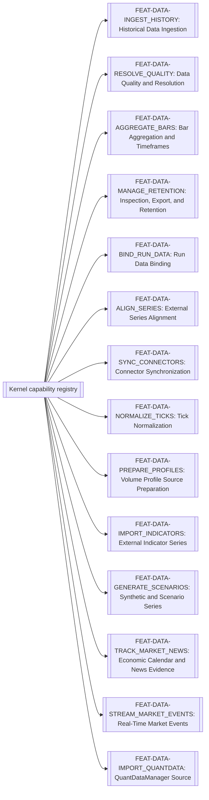

# Data

> **Package:** `app/services/data/`
> **Status:** `Missing`
> **Last updated:** `2026-08-23`
> **Domain ID:** `D-DATA`

> This README is the domain package's **single source of truth** for domain boundaries, composable feature capabilities, architecture invariants, implementation sequence, progress, usage examples, and tests.
> Update this document before modifying or adding code.

---

## Code-Aligned Implementation Convention

This README is the sole current target registry for this domain's feature IDs and statuses, functional requirements, domain-local workflows, semantic contract ownership, persisted-state model, acceptance evidence, and deletion behavior. `PROJECT.md` owns system scope, cross-domain behavior, system NFRs, and release gates; `ARCHITECTURE.md` owns universal package and runtime constraints. Feature-local READMEs, manifests, contract definitions, migrations, and tests provide current implementation evidence without silently changing this target registry.

Implementation uses the repository's existing feature substrate: each feature lives directly at `app/services/<domain>/<feature>/`, is discovered through the `haruquantai.features` Python entry-point group, and declares one immutable `FeatureSpec` in `manifest.py`. There are no domain or feature YAML manifests.

Every implemented feature also contains a mandatory runtime-validated `README.md`, pure `__init__.py`, strict `config.py`, lifecycle `feature.py`, and focused implementation modules. Dependencies and effects flow through `FeatureContext`/`FeatureScope`; cross-feature implementation imports are forbidden. Persistent state is declared by `FeatureSpec.state`; any migrations and storage adapters remain with the owning feature. Capability keys use `<domain>.<name>@<major>`. FR IDs remain product, acceptance, and test-trace identities rather than one runtime registration per FR. A requirement `Depends` cell expresses product sequencing, traceability, or acceptance evidence only; runtime dependencies are declared separately with exact keys in `FeatureSpec.requires` or `FeatureSpec.optional`.

Feature-level automated tests live at `tests/services/data/<feature>/`. Usage examples never live under `tests/`; they belong to each feature's designated primary domain-logic module. Broader automated verification retains its documented architecture, composition, API, integration, or system test location. The code-backed procedure is the [Feature Implementation Pipeline](../../../docs/dev/feature_implementation_pipeline.md).

## 1. Purpose and Boundary

### Purpose

The Data domain delivers historical data ingestion, immutable series versions, quality, normalization, aggregation, alignment, connectors, derived inputs, synthetic/scenario series, point-in-time economic/news evidence, normalized real-time market events, and governed QuantDataManager ingestion. Its public feature capabilities are registered and remain independent of package-import order. Removing the domain produces the degradation defined below rather than preventing the shared substrate or unrelated domains from starting.

### Owns

- `FEAT-DATA-INGEST_HISTORY` — Historical Data Ingestion.
- `FEAT-DATA-RESOLVE_QUALITY` — Data Quality and Resolution.
- `FEAT-DATA-AGGREGATE_BARS` — Bar Aggregation and Timeframes.
- `FEAT-DATA-MANAGE_RETENTION` — Inspection, Export, and Retention.
- `FEAT-DATA-BIND_RUN_DATA` — Run Data Binding.
- `FEAT-DATA-ALIGN_SERIES` — External Series Alignment.
- `FEAT-DATA-SYNC_CONNECTORS` — Connector Synchronization.
- `FEAT-DATA-NORMALIZE_TICKS` — Tick Normalization.
- `FEAT-DATA-PREPARE_PROFILES` — Volume Profile Source Preparation.
- `FEAT-DATA-IMPORT_INDICATORS` — External Indicator Series.
- `FEAT-DATA-GENERATE_SCENARIOS` — Synthetic and Scenario Series.
- `FEAT-DATA-TRACK_MARKET_NEWS` — Economic Calendar and News Evidence.
- `FEAT-DATA-STREAM_MARKET_EVENTS` — Real-Time Market Events.
- `FEAT-DATA-IMPORT_QUANTDATA` — QuantDataManager Source.

### Does not own

- Instrument semantics, strategy definitions, runtime indicator state, or result analysis; it owns immutable market and external-series data.
- Volume Profile/TPO indicator definitions and calculations; Data owns only the validated, versioned source rows, sessions, bins, and coverage diagnostics consumed by Strategy/Simulator capabilities.
- Composition lifecycle, dependency resolution, effect reversal, and transactional replacement; those belong to the non-domain shared substrate (`app/contracts/`, `app/kernel/`, and `app/composition/`).
- **Deletion boundary:** deleting `app/services/data/` means data management and retrieval disappear; immutable artifacts remain retained and other domains expose capability-unavailable states rather than failing startup. The kernel and unrelated domains shall remain healthy.

### Shared Contracts

This domain semantically owns the contracts listed below, but their sole physical definitions live in `app/contracts/data/` and wire schemas in `app/contracts/data/wire/`. `app/services/data/` contains implementations only and shall not define or re-export substitute public contract types. Contract versions and semantic owners must agree with `PROJECT.md` and this README. Feature IDs and FR IDs are documentation, lifecycle, acceptance, and traceability identities; runtime bindings use exact versioned `CapabilityKey` declarations in contracts and `FeatureSpec`. The exact public records and capability bundles are listed in the [Shared Contracts README](../../contracts/README.md#43-appcontractsdata).

Rows labelled `FEAT-* capability surface` describe planned semantic contract bundles, not literal runtime capability keys. A listed counterparty may produce, consume, or observe the bundle and does not establish package-import or runtime dependency direction.

**Owned by this domain**

| Status | Contract | Version | Counterparty | Purpose |
|---|---|---|---|---|
| Missing | `FEAT-DATA-INGEST_HISTORY` capability surface | `v1` | Catalogue, Plugins, Simulator, Strategy, Workspace | Historical Data Ingestion. |
| Missing | `FEAT-DATA-RESOLVE_QUALITY` capability surface | `v1` | Catalogue, Plugins, Simulator, Strategy, Workspace | Data Quality and Resolution. |
| Missing | `FEAT-DATA-AGGREGATE_BARS` capability surface | `v1` | Catalogue, Plugins, Simulator, Strategy, Workspace | Bar Aggregation and Timeframes. |
| Missing | `FEAT-DATA-MANAGE_RETENTION` capability surface | `v1` | Catalogue, Plugins, Simulator, Strategy, Workspace | Inspection, Export, and Retention. |
| Missing | `FEAT-DATA-BIND_RUN_DATA` capability surface | `v1` | Catalogue, Plugins, Simulator, Strategy, Workspace | Run Data Binding. |
| Missing | `FEAT-DATA-ALIGN_SERIES` capability surface | `v1` | Catalogue, Plugins, Simulator, Strategy, Workspace | External Series Alignment. |
| Missing | `FEAT-DATA-SYNC_CONNECTORS` capability surface | `v1` | Catalogue, Plugins, Simulator, Strategy, Workspace | Connector Synchronization. |
| Missing | `FEAT-DATA-NORMALIZE_TICKS` capability surface | `v1` | Catalogue, Plugins, Simulator, Strategy, Workspace | Tick Normalization. |
| Missing | `FEAT-DATA-PREPARE_PROFILES` capability surface | `v1` | Catalogue, Plugins, Simulator, Strategy, Workspace | Volume Profile Source Preparation. |
| Missing | `FEAT-DATA-IMPORT_INDICATORS` capability surface | `v1` | Catalogue, Plugins, Simulator, Strategy, Workspace | External Indicator Series. |
| Missing | `FEAT-DATA-GENERATE_SCENARIOS` capability surface | `v1` | Simulator, Research, Workspace | Synthetic and Scenario Series. |
| Missing | `FEAT-DATA-TRACK_MARKET_NEWS` capability surface | `v1` | Research, Risk, Trading, Interfaces | Economic Calendar and News Evidence. |
| Missing | `FEAT-DATA-STREAM_MARKET_EVENTS` capability surface | `v1` | Strategy, Risk, Trading, Interfaces | Real-Time Market Events. |
| Missing | `FEAT-DATA-IMPORT_QUANTDATA` capability surface | `v1` | Catalogue, Workspace | QuantDataManager Source. |

**Cross-domain requirement references (not runtime dependencies)**

The rows below summarize foreign owner tokens found in FR `Depends` cells. They express product sequencing, traceability, or acceptance-evidence relationships only. Actual runtime consumption must name an exact versioned capability key in the consuming feature's `FeatureSpec.requires` or `FeatureSpec.optional` and must follow the dependency direction in `PROJECT.md` and `ARCHITECTURE.md`.

| Referenced domain set | Documentation version | Owner | Meaning |
|---|---|---|---|
| `D-CAT` public capability set | `v1` | Catalogue | Requirements whose `Depends` cell names `CAT-*`. |
| `D-PLUG` public capability set | `v1` | Plugins | Requirements whose `Depends` cell names `PLUG-*`. |
| `D-SIM` public capability set | `v1` | Simulator | Requirements whose `Depends` cell names `SIM-*`. |
| `D-STRAT` public capability set | `v1` | Strategy | Requirements whose `Depends` cell names `STRAT-*`. |
| `D-WS` public capability set | `v1` | Workspace | Requirements whose `Depends` cell names `WS-*`. |
| `D-BRK` public capability set | `v1` | Broker Connectivity | Provider-native real-time events and authority generation used by `FEAT-DATA-STREAM_MARKET_EVENTS`. |

#### Ratified v1 public records (27)

All 27 records (24 absent + 3 incomplete) and 14 capabilities resolved; nothing removed. All records are wire-native strict frozen Pydantic v1; `*Version` records are immutable with `content_hash`; series identity uniqueness is `(instrument_id,broker_id,timeframe,tick_type)` (`data_series`).

| # | Record | Exact wire fields | Producer → consumers | FRs |
|---|---|---|---|---|
| R1 | `DataSeriesRef` | `series_id: Uuid7`; `schema_version: Literal[1] = 1`. | Data → Simulator, Analytics, Research, Strategy | FR-DATA-PUBLISH_DATA_VERSIONS. |
| R2 | `DataSeriesVersion` (incomplete → complete) | `series_version_id: Uuid7`; `series_id: Uuid7`; `version: int >= 1`; `instrument: InstrumentRef`; `instrument_version_id: Uuid7`; `session_version_id: Uuid7 | None`; `calendar_version_id: Uuid7 | None`; `broker: BrokerRef | None`; `timeframe: Timeframe | None`; `tick_type: Literal[BID_ASK,LAST] | None`; `timezone: IANA name`; `precision: Literal[SELECTED_TIMEFRAME,M1_SIMULATION,REAL_TICK_CUSTOM_SPREAD,REAL_TICK_RECORDED_SPREAD]`; `coverage: SeriesCoverage`; `row_count: int >= 0`; `source_artifact_id: Uuid7`; `canonical_artifact_id: Uuid7`; `import_policy: DataImportPlan ref (Uuid7) | None`; `aggregation_lineage: AggregationSpec ref (Uuid7) | None`; `findings_summary: tuple[ValidationIssue, ...] = ()`; `content_hash: ContentHash`; `schema_version: Literal[1] = 1`. Exactly one of `timeframe`/`tick_type` is set. Pinned provenance per FR-DATA-PIN_DATA_PROVENANCE; publication is atomic (staged → findings/checksum → commit). | Data → Simulator, Analytics, Research, Strategy, Interfaces | FR-DATA-PUBLISH_DATA_VERSIONS, PIN_DATA_PROVENANCE, LOCK_DATA_PUBLICATION. |
| R3 | `DataConnectionRef` | `connection_id: Uuid7`; `connection_type: Literal[CSV,PARQUET,CONNECTOR,QUANTDATA]`; `declared_capabilities: tuple[CapabilityIdentifier, ...] = ()`; `schema_version: Literal[1] = 1`. | Data → UI, Interfaces | FR-DATA-REGISTER_DATA_CONNECTIONS; UI/API shows only supported operations. |
| R4 | `DataImportPlan` | `plan_id: Uuid7`; `connection: DataConnectionRef`; `source_artifact_id: Uuid7`; `delimiter: str = ","`; `has_header: bool = True`; `encoding: nonempty str = "utf-8"`; `timestamp_format: str | None = None`; `timezone: IANA name`; `column_mapping: dict[nonempty str, nonempty str]`; `decimal_separator: str = "."`; `malformed_row_policy: Literal[REJECT_ROW,ABORT_IMPORT]`; `deduplication_policy: Literal[KEEP_FIRST,KEEP_LAST,REJECT] = "KEEP_FIRST"`; `schema_version: Literal[1] = 1`. | Data → import executor | FR-DATA-IMPORT_CSV_DATA; identical UI/CLI fixture behavior. |
| R5 | `DataImportReceipt` | `receipt_id: Uuid7`; `series_version_id: Uuid7`; `input_rows: int >= 0`; `accepted_rows: int >= 0`; `rejected_rows: int >= 0`; `duplicate_rows: int >= 0`; `transformed_rows: int >= 0`; `published_rows: int >= 0`; `findings: tuple[ValidationIssue, ...] = ()`; `schema_version: Literal[1] = 1`. Constraint: the six counters reconcile exactly to input rows in every malformed-row mode. | Data → UI, Interfaces | FR-DATA-REPORT_IMPORT_COUNTS. |
| R6 | `Bar` (incomplete → complete) | `timestamp: UtcTimestamp` (bar open, `[open_time,close_time)` §15.4); `open/high/low/close: DecimalValue`; `volume: DecimalValue >= 0`; `spread_ticks: DecimalValue >= 0 | None = None`; `source_sequence: int >= 0`; `flags: int >= 0` (u32 §22.3 bits 0–5); `schema_version: Literal[1] = 1`. Constraints: `low <= min(open,close)`; `high >= max(open,close)`; `low <= high`; nonfinite values rejected (FR-DATA-VALIDATE_OHLC_BARS). | Data → Simulator, Analytics, Interfaces | FR-DATA-VALIDATE_OHLC_BARS, ORDER_MARKET_ROWS, AGGREGATE_TIMEFRAMES. |
| R7 | `Tick` (incomplete → complete) | `timestamp: UtcTimestamp`; `bid: DecimalValue`; `ask: DecimalValue`; `last: DecimalValue | None = None`; `volume: DecimalValue >= 0 | None = None`; `source_sequence: int >= 0` (duplicate timestamps preserved deterministically); `flags: int >= 0`; `schema_version: Literal[1] = 1`. Constraint: reimporting the same fixture yields the same canonical order and hash. | Data → Simulator, Analytics, Interfaces | FR-DATA-PRESERVE_TICK_FIELDS, ORDER_MARKET_ROWS. |
| R8 | `SeriesCoverage` | `from_at: UtcTimestamp`; `to_at: UtcTimestamp` (`>` `from_at`, half-open); `gap_intervals: tuple[SeriesInterval, ...] = ()` where `SeriesInterval(from_at: UtcTimestamp, to_at: UtcTimestamp)`; `schema_version: Literal[1] = 1`. | Data → Simulator, Analytics, UI | FR-DATA-PREVIEW_DATA_COVERAGE. |
| R9 | `DataQualityFinding` | `finding_id: Uuid7`; `data_version_id: Uuid7`; `rule_code: nonempty uppercase str`; `severity: Literal[INFO,WARNING,ERROR]`; `point: SeriesPointKey | None = None`; `range_from: UtcTimestamp | None = None`; `range_to: UtcTimestamp | None = None`; `observed: JsonValue = None`; `expected: JsonValue = None`; `resolution_state: Literal[OPEN,ACCEPTED,REJECTED,TRANSFORMED] = "OPEN"`; `derived_version_id: Uuid7 | None = None`; `schema_version: Literal[1] = 1`. | Data → UI, Simulator | FR-DATA-DETECT_DATA_QUALITY (rule list fixed: invalid OHLC, unsorted time, duplicates, gaps, out-of-session, nonfinite, negative volume, timestamp parse/offset). |
| R10 | `DataQualityDecision` | `decision_id: Uuid7`; `finding_ids: nonempty tuple[Uuid7, ...]`; `action: Literal[ACCEPT,REJECT,TRANSFORM]`; `policy_version: int >= 1`; `derived_version_id: Uuid7 | None = None`; `decided_at: UtcTimestamp`; `schema_version: Literal[1] = 1`. Never mutates the source version; records source→derived lineage. | Data → UI | FR-DATA-RESOLVE_QUALITY_FINDINGS. |
| R11 | `AggregationSpec` | `spec_id: Uuid7`; `source_version_id: Uuid7`; `target_timeframe: Timeframe`; `session_version_id: Uuid7 | None`; `calendar_version_id: Uuid7 | None`; `timezone: IANA name`; `alignment_origin: Literal[SESSION_BOUNDARY,UTC_MIDNIGHT]`; `gap_policy: Literal[ABSENT_EMPTY,SYNTHETIC_GAP] = "ABSENT_EMPTY"`; `algorithm_version: nonempty str`; `schema_version: Literal[1] = 1`. Custom intervals are positive multiples (M10/H2 valid; zero/mixed/overflow rejected); OHLCV aggregation is `open=first, high=max, low=min, close=last, volume=sum` without crossing session boundaries; any policy change changes the derived-version hash. | Data → Simulator, Analytics | FR-DATA-AGGREGATE_TIMEFRAMES, RECORD_AGGREGATION_LINEAGE, DEFINE_CUSTOM_TIMEFRAMES. |
| R12 | `RetentionPolicy` | `policy_id: Uuid7`; `retention_days: int >= 1 | None = None`; `quarantine_days: int >= 1 = 30`; `schema_version: Literal[1] = 1`. Reachability from committed manifests; referenced data never collected; interrupted collection recoverable. | Data → Workspace GC | FR-DATA-COLLECT_REACHABLE_ARTIFACTS. |
| R13 | `RunDataBinding` | `binding_id: Uuid7`; `run_manifest_id: Uuid7`; `series_version_ids: nonempty tuple[Uuid7, ...]`; `precision: Literal[SELECTED_TIMEFRAME,M1_SIMULATION,REAL_TICK_CUSTOM_SPREAD,REAL_TICK_RECORDED_SPREAD]`; `validated_at: UtcTimestamp`; `schema_version: Literal[1] = 1`. Only committed versions bind; later imports never change a bound manifest; missing prerequisites fail `DATA_PRECISION_UNAVAILABLE` before queueing. | Data → Simulator, Orchestration | FR-DATA-BIND_COMMITTED_DATA, VALIDATE_PRECISION_INPUTS. |
| R14 | `AlignedSeries` | `alignment_id: Uuid7`; `source_version_id: Uuid7`; `policy: AlignmentPolicy`; `aligned_version_id: Uuid7`; `schema_version: Literal[1] = 1`, where `AlignmentPolicy(direction: Literal[EXACT,LAST_KNOWN,AGGREGATE], max_age_seconds: int >= 1, missing_policy: Literal[NULL,CARRY_FORWARD,FAIL], timezone: IANA name, look_ahead_prohibited: Literal[True] = True)`. No value timestamped after a decision event can affect that event. | Data → Simulator, Strategy | FR-DATA-ALIGN_EXTERNAL_SERIES, DEFINE_ALIGNMENT_POLICY. |
| R15 | `ConnectorProfile` | `profile_id: Uuid7`; `connector_kind: nonempty str`; `declared_capabilities: tuple[CapabilityIdentifier, ...]`; `credential_refs: tuple[Uuid7, ...] = ()` (Workspace `SecretRef` IDs, opaque); `rate_limit: int >= 1 | None = None`; `rate_window_seconds: int >= 1 | None = None`; `content_hash: ContentHash`; `schema_version: Literal[1] = 1`. Credentials unavailable to strategy/result-panel/research processes. | Data → Broker-adjacent connectors, Interfaces | FR-DATA-IMPLEMENT_CONNECTOR_LIFECYCLE, PROTECT_CONNECTOR_SECRETS, CONNECT_DATA_PROVIDERS. |
| R16 | `ConnectorSyncPlan` | `plan_id: Uuid7`; `profile_id: Uuid7`; `connector_version: nonempty str`; `requested_from: UtcTimestamp`; `requested_to: UtcTimestamp`; `overlap_window_seconds: int >= 0 = 0`; `deduplication: Literal[KEEP_FIRST,KEEP_LAST,REJECT] = "KEEP_FIRST"`; `revision_policy: Literal[COMPARE_OVERLAP,FULL_RESCAN] = "COMPARE_OVERLAP"`; `cursor: str | None = None`; `checkpoint: str | None = None`; `max_records: int >= 1`; `schema_version: Literal[1] = 1`. Repeating the same synchronization is idempotent with the same committed hash. | Data → connector executors | FR-DATA-PLAN_INCREMENTAL_SYNC, §21.6. |
| R17 | `ConnectorSyncReceipt` | `receipt_id: Uuid7`; `records: int >= 0`; `provider_revision_ids: tuple[Uuid7, ...] = ()`; `next_cursor: str | None = None`; `is_complete: bool`; `content_hash: ContentHash`; `committed_version_id: Uuid7 | None = None`; `schema_version: Literal[1] = 1`. Interruption resumes without duplicate publication. | Data → UI, Interfaces | §21.6 page contract; FR-DATA-IMPLEMENT_CONNECTOR_LIFECYCLE. |
| R18 | `VolumeProfileSource` | `source_id: Uuid7`; `data_version_id: Uuid7`; `source_kind: Literal[TICK,LOWER_GRANULARITY]`; `session_version_id: Uuid7`; `price_step: DecimalValue > 0`; `bin_count: int >= 1 | None = None`; `coverage_diagnostics: tuple[ValidationIssue, ...] = ()`; `is_sufficient: bool`; `schema_version: Literal[1] = 1`. Insufficient precision or incomplete sessions fail or are explicitly flagged. | Data → Simulator | FR-DATA-VALIDATE_PROFILE_SOURCE. |
| R19 | `ExternalIndicatorSeriesVersion` | `series_id: Uuid7`; `version: int >= 1`; `definition_id: Uuid7`; `definition_version: int >= 1` (Strategy-owned definition ref); `instrument: InstrumentRef`; `timeframe: Timeframe | None`; `timezone: IANA name`; `source_artifact_id: Uuid7`; `source_hash: ContentHash`; `canonical_artifact_id: Uuid7`; `coverage: SeriesCoverage`; `alignment_policy: AlignmentPolicy`; `synchronization_findings: tuple[ValidationIssue, ...] = ()`; `content_hash: ContentHash`; `schema_version: Literal[1] = 1`. Immutable. | Data → Simulator, Strategy | FR-DATA-IMPORT_INDICATOR_VALUES. |
| R20 | `SyntheticModelSpec` | `spec_id: Uuid7`; `model_type: nonempty str`; `model_version: nonempty str`; `parameters: JsonObject` (bounded by the declared model invariants); `timeframe: Timeframe`; `from_at: UtcTimestamp`; `to_at: UtcTimestamp`; `instrument: InstrumentRef`; `seed_streams: tuple[nonempty str, ...] = ()` (§15.5 stream names); `content_hash: ContentHash`; `schema_version: Literal[1] = 1`. Same manifest produces byte-identical canonical output. | Data → Simulator, Research | FR-DATA-CONFIGURE_SYNTHETIC_MODEL, GENERATE_SYNTHETIC_SERIES. |
| R21 | `ScenarioSeriesVersion` | `series_id: Uuid7`; `version: int >= 1`; `source_version_id: Uuid7`; `source_hash: ContentHash`; `transforms: tuple[ScenarioTransform, ...] = ()` where `ScenarioTransform(kind: Literal[SHOCK,GAP,VOLATILITY,LIQUIDITY,OUTAGE,MISSINGNESS], parameters: JsonObject)`; `classification: Literal[SYNTHETIC,SCENARIO]`; `content_hash: ContentHash`; `schema_version: Literal[1] = 1`. Source version never mutated; transform order pinned; synthetic data cannot masquerade as observed provider evidence unless the consumer explicitly permits. | Data → Simulator, Research | FR-DATA-TRANSFORM_SCENARIO_DATA, CLASSIFY_SYNTHETIC_DATA. |
| R22 | `MarketNewsObservation` | `observation_id: Uuid7`; `source_id: nonempty str`; `provider_item_id: nonempty str`; `first_seen_at: UtcTimestamp`; `retrieved_at: UtcTimestamp`; `scheduled_at: UtcTimestamp | None = None`; `published_at: UtcTimestamp | None = None`; `scope_currencies: tuple[CurrencyCode, ...] = ()`; `scope_instruments: tuple[InstrumentRef, ...] = ()`; `category: nonempty str`; `impact: Literal[NONE,LOW,MEDIUM,HIGH]`; `language: nonempty str`; `payload_hash: ContentHash`; `schema_version: Literal[1] = 1`. Uniqueness `(source_id,provider_item_id,observed_at,revision)` (`economic_news_observation_versions`). | Data → Research, Risk, Trading, Strategy | FR-DATA-RECORD_NEWS_OBSERVATIONS. |
| R23 | `MarketNewsRevision` | `revision_id: Uuid7`; `observation_id: Uuid7`; `revision: int >= 1`; `kind: Literal[REVISION,CANCELLATION,RESCHEDULE,VALUES]`; `actual: DecimalValue | None = None`; `forecast: DecimalValue | None = None`; `previous: DecimalValue | None = None`; `visible_from: UtcTimestamp`; `content_hash: ContentHash`; `schema_version: Literal[1] = 1`. Point-in-time queries never expose information before it was observed. | Data → Research, Risk | FR-DATA-VERSION_NEWS_REVISIONS, QUERY_MARKET_NEWS. |
| R24 | `MarketEvent` | `event_id: Uuid7`; `provider: ProviderRef`; `event_kind: Literal[QUOTE,TICK,DEPTH_UPDATE,MARKET_STATUS,HEARTBEAT]`; `event_time: UtcTimestamp`; `receipt_time: UtcTimestamp`; `provider_sequence: int >= 0 | None = None`; `ordering_mode: Literal[PROVIDER_SEQUENCE,RECEIPT_ORDER]`; `instrument: InstrumentRef | None = None`; `values: JsonObject` (kind-declared bounded fields with exact values/units); `raw_hash: ContentHash`; `schema_version: Literal[1] = 1`. Duplicates, late events, and gaps remain observable; repeated ingestion yields the same accepted order. | Data → Simulator, Interfaces, Trading | FR-DATA-NORMALIZE_LIVE_EVENTS, ORDER_LIVE_EVENTS. |
| R25 | `MarketFeedState` | `feed_id: Uuid7`; `provider: ProviderRef`; `generation: int >= 1`; `state: Literal[CONNECTING,LIVE,DELAYED,STALE,GAP,RECONNECTING,FAILED,STOPPED]`; `last_event_at: UtcTimestamp | None = None`; `observed_at: UtcTimestamp`; `uncovered_intervals: tuple[SeriesInterval, ...] = ()`; `schema_version: Literal[1] = 1`. A boolean connected flag cannot satisfy readiness. | Data → Interfaces, UI, Trading | FR-DATA-TRACK_FEED_STATE, RECONNECT_MARKET_FEEDS, BOUND_EVENT_BUFFERS. |
| R26 | `MarketReplayRef` | `replay_id: Uuid7`; `feed_id: Uuid7`; `generation: int >= 1`; `partition_artifact_ids: tuple[Uuid7, ...] = ()`; `from_at: UtcTimestamp`; `to_at: UtcTimestamp`; `event_count: int >= 0`; `content_hash: ContentHash`; `schema_version: Literal[1] = 1`. Replay reproduces normalized events and never claims current live evidence. | Data → Simulator, Interfaces | FR-DATA-RECORD_MARKET_REPLAYS. |
| R27 | `QuantDataImportSpec` | `spec_id: Uuid7`; `allowed_root: nonempty str`; `series_selection: tuple[nonempty str, ...] = ()`; `decoder_version: nonempty str`; `mapping_version_ids: tuple[Uuid7, ...] = ()`; `schema_version: Literal[1] = 1`. Paths outside the allowed root are rejected; every imported version retains source root identity, relative paths, file size/mtime/hash, decoder version, mapping versions, and import manifest; changed input or decoder produces a distinct version. | Data → Interfaces (QuantDataManager source) | FR-DATA-DISCOVER_QUANTDATA_SERIES, DECODE_QUANTDATA_FILES, SYNC_QUANTDATA_CATALOGUE, RECORD_QUANTDATA_LINEAGE. |

#### Ratified v1 capabilities and operation envelopes

All new (universal new-port rule; shared `DataFailure` with `code: Literal[DATA_VALIDATION_FAILED,DATA_NOT_FOUND,DATA_VERSION_CONFLICT,DATA_CONNECTION_UNSUPPORTED,DATA_TIMEFRAME_UNSUPPORTED,DATA_PRECISION_UNAVAILABLE,DATA_COVERAGE_INCOMPLETE,DATA_ALIGNMENT_INCOMPATIBLE,DATA_FEED_UNAVAILABLE,DATA_QUANTDATA_INVALID,CAPABILITY_UNAVAILABLE]`, `problem: ProblemDetails`; common request/success envelope fields as ratified):

1. `data.ingest-history@1` / `IngestHistoryCapability` / `ingest_history` — operations `REGISTER_CONNECTION, IMPORT, EXPORT`. EXPORT writes CSV/Parquet with explicit timezone/schema metadata (reimport yields an equivalent canonical hash). Success: `connection: DataConnectionRef | None`; `receipt: DataImportReceipt | None`; `version: DataSeriesVersion | None`. Event `data.series-version-published` observational. FRs: REGISTER_DATA_CONNECTIONS, IMPORT_CSV_DATA, PUBLISH_DATA_VERSIONS, PIN_DATA_PROVENANCE, REPORT_IMPORT_COUNTS, EXPORT_DATA_SERIES.
2. `data.sync-connectors@1` / `SyncConnectorsCapability` / `sync_connectors` — operations `PLAN, FETCH, COMMIT`. Success: `plan: ConnectorSyncPlan | None`; `receipt: ConnectorSyncReceipt | None`. FRs: IMPLEMENT_CONNECTOR_LIFECYCLE, PLAN_INCREMENTAL_SYNC, CONNECT_DATA_PROVIDERS, PROTECT_CONNECTOR_SECRETS.
3. `data.import-quantdata@1` / `ImportQuantdataCapability` / `import_quantdata` — operations `DISCOVER, DECODE, SYNC`. Success: `spec: QuantDataImportSpec | None`; `committed_version_ids: tuple[Uuid7, ...] = ()`. FRs: the four QUANTDATA rows.
4. `data.normalize-ticks@1` / `NormalizeTicksCapability` / `normalize_ticks` — operations `NORMALIZE`. Success: `version_id: Uuid7 | None`; `findings: tuple[ValidationIssue, ...] = ()`. FR: PRESERVE_TICK_FIELDS.
5. `data.resolve-quality@1` / `ResolveQualityCapability` / `resolve_quality` — operations `DETECT, RESOLVE`. Success: `findings: tuple[DataQualityFinding, ...] = ()`; `decision: DataQualityDecision | None`. FRs: DETECT_DATA_QUALITY, RESOLVE_QUALITY_FINDINGS, VALIDATE_OHLC_BARS, ORDER_MARKET_ROWS.
6. `data.aggregate-bars@1` / `AggregateBarsCapability` / `aggregate_bars` — operations `AGGREGATE, VALIDATE_TIMEFRAME`. Success: `spec: AggregationSpec | None`; `derived_version_id: Uuid7 | None`. FRs: AGGREGATE_TIMEFRAMES, RECORD_AGGREGATION_LINEAGE, DEFINE_CUSTOM_TIMEFRAMES, VERSION_DATA_TRANSFORMS.
7. `data.manage-retention@1` / `ManageRetentionCapability` / `manage_retention` — operations `DEFINE_POLICY, COLLECT`. Success: `policy: RetentionPolicy | None`; `collected_count: int >= 0 = 0`. FR: COLLECT_REACHABLE_ARTIFACTS.
8. `data.align-series@1` / `AlignSeriesCapability` / `align_series` — operations `ALIGN, DEFINE_POLICY`. Success: `aligned: AlignedSeries | None`. FRs: ALIGN_EXTERNAL_SERIES, DEFINE_ALIGNMENT_POLICY.
9. `data.prepare-profiles@1` / `PrepareProfilesCapability` / `prepare_profiles` — operations `VALIDATE_SOURCE`. Success: `source: VolumeProfileSource | None`. FR: VALIDATE_PROFILE_SOURCE.
10. `data.import-indicators@1` / `ImportIndicatorsCapability` / `import_indicators` — operations `IMPORT`. Success: `version_id: Uuid7 | None`; `findings: tuple[ValidationIssue, ...] = ()`. FR: IMPORT_INDICATOR_VALUES.
11. `data.bind-run-data@1` / `BindRunDataCapability` / `bind_run_data` — operations `BIND, VALIDATE_PRECISION`. Success: `binding: RunDataBinding | None`. FRs: BIND_COMMITTED_DATA, VALIDATE_PRECISION_INPUTS.
12. `data.generate-scenarios@1` / `GenerateScenariosCapability` / `generate_scenarios` — operations `CONFIGURE_MODEL, GENERATE, TRANSFORM`. Success: `spec: SyntheticModelSpec | None`; `scenario_version_id: Uuid7 | None`. FRs: CONFIGURE_SYNTHETIC_MODEL, GENERATE_SYNTHETIC_SERIES, TRANSFORM_SCENARIO_DATA, CLASSIFY_SYNTHETIC_DATA.
13. `data.track-market-news@1` / `TrackMarketNewsCapability` / `track_market_news` — operations `RECORD, REVISE, QUERY` (QUERY carries `as_of`, interval, source/category/language/impact filters, coverage/freshness policy; incomplete coverage is explicit and may fail closed). Success: `observation: MarketNewsObservation | None`; `revision: MarketNewsRevision | None`; `observations: tuple[MarketNewsObservation, ...] = ()`. Also produces the non-authorizing `data.trade-restriction` projection evidence for Strategy/Research/Risk/Trading (FR-DATA-PROJECT_TRADE_RESTRICTIONS). FRs: RECORD_NEWS_OBSERVATIONS, VERSION_NEWS_REVISIONS, QUERY_MARKET_NEWS, PROJECT_TRADE_RESTRICTIONS, GOVERN_NETWORK_IMPORTS.
14. `data.stream-market-events@1` / `StreamMarketEventsCapability` / `stream_market_events` — operations `BIND_FEED, FEED_STATE, REPLAY`. Success: `feed_state: MarketFeedState | None`; `replay: MarketReplayRef | None`. **Subscription (owner-required by FR-DATA-NORMALIZE_LIVE_EVENTS/RECONNECT_MARKET_FEEDS live delivery):** `subscribe_stream_market_events_events(request)` with `provider_id: Uuid7 | None`, `feed_id: Uuid7 | None`, `instruments: tuple[InstrumentRef, ...] = ()`, `resume_event_id: Uuid7 | None`, `replay_limit: int 0..10000 = 0`, `schema_version`; yields `DomainEvent`. FRs: NORMALIZE_LIVE_EVENTS, TRACK_FEED_STATE, ORDER_LIVE_EVENTS, BOUND_EVENT_BUFFERS, RECONNECT_MARKET_FEEDS, RECORD_MARKET_REPLAYS.

Cross-owner references: `InstrumentRef`, `ProviderRef`, `BrokerRef` (Catalogue); `SecretRef` IDs (Workspace); `ExternalIndicatorDefinitionVersion` ref (Strategy). One owner-required subscription (`stream-market-events`).

### Persisted State Ownership

| Status | State / Store | Read access (via contract) | Migration definitions |
|---|---|---|---|
| Missing | data_series, data_series_versions, quality_findings, external_indicator_series_versions, economic_news_observation_versions, recorded_market_event_versions | Other domains through `D-DATA` public capabilities only | The owning feature's `StateDeclaration` and migration/storage adapter |

### Four-Level Structural Hierarchy

| Code level | Represents | This package |
|---|---|---|
| **Package** | Domain | `app/services/data/` / `D-DATA` |
| **Module folder** | Feature / capability | One folder for each of: Historical Data Ingestion, Data Quality and Resolution, Bar Aggregation and Timeframes, Inspection, Export, and Retention, Run Data Binding, External Series Alignment, Connector Synchronization, Tick Normalization, Volume Profile Source Preparation, External Indicator Series, Synthetic and Scenario Series, Economic Calendar and News Evidence, Real-Time Market Events, QuantDataManager Source |
| **File** | Use case or focused responsibility | Exactly the responsibility file named in each module specification |
| **Class / function / method** | Functional requirement behavior | Exactly one registered `fr_*` behavior per `FR-*` row |

```text
Package (Domain)
└── Module folder (Feature)
    └── File (Responsibility)
        └── Registered function (Functional requirement behavior)
```

### Domain Capability Map


```mermaid
flowchart TD
    DOMAIN[[D-DATA: Data]]
    DOMAIN --> FEAT_DATA_INGEST_HISTORY[[FEAT-DATA-INGEST_HISTORY: Historical Data Ingestion]]
    FEAT_DATA_INGEST_HISTORY --> FEAT_DATA_INGEST_HISTORY_FILE[historical_data_ingestion.py: RESP-DATA-01-01]
    DOMAIN --> FEAT_DATA_RESOLVE_QUALITY[[FEAT-DATA-RESOLVE_QUALITY: Data Quality and Resolution]]
    FEAT_DATA_RESOLVE_QUALITY --> FEAT_DATA_RESOLVE_QUALITY_FILE[data_quality_resolution.py: RESP-DATA-02-01]
    DOMAIN --> FEAT_DATA_AGGREGATE_BARS[[FEAT-DATA-AGGREGATE_BARS: Bar Aggregation and Timeframes]]
    FEAT_DATA_AGGREGATE_BARS --> FEAT_DATA_AGGREGATE_BARS_FILE[bar_aggregation.py: RESP-DATA-03-01]
    DOMAIN --> FEAT_DATA_MANAGE_RETENTION[[FEAT-DATA-MANAGE_RETENTION: Inspection, Export, and Retention]]
    FEAT_DATA_MANAGE_RETENTION --> FEAT_DATA_MANAGE_RETENTION_FILE[data_inspection_retention.py: RESP-DATA-04-01]
    DOMAIN --> FEAT_DATA_BIND_RUN_DATA[[FEAT-DATA-BIND_RUN_DATA: Run Data Binding]]
    FEAT_DATA_BIND_RUN_DATA --> FEAT_DATA_BIND_RUN_DATA_FILE[run_data_binding.py: RESP-DATA-05-01]
    DOMAIN --> FEAT_DATA_ALIGN_SERIES[[FEAT-DATA-ALIGN_SERIES: External Series Alignment]]
    FEAT_DATA_ALIGN_SERIES --> FEAT_DATA_ALIGN_SERIES_FILE[external_series_alignment.py: RESP-DATA-06-01]
    DOMAIN --> FEAT_DATA_SYNC_CONNECTORS[[FEAT-DATA-SYNC_CONNECTORS: Connector Synchronization]]
    FEAT_DATA_SYNC_CONNECTORS --> FEAT_DATA_SYNC_CONNECTORS_FILE[connector_synchronization.py: RESP-DATA-07-01]
    DOMAIN --> FEAT_DATA_NORMALIZE_TICKS[[FEAT-DATA-NORMALIZE_TICKS: Tick Normalization]]
    FEAT_DATA_NORMALIZE_TICKS --> FEAT_DATA_NORMALIZE_TICKS_FILE[tick_normalization.py: RESP-DATA-08-01]
    DOMAIN --> FEAT_DATA_PREPARE_PROFILES[[FEAT-DATA-PREPARE_PROFILES: Volume Profile Source Preparation]]
    FEAT_DATA_PREPARE_PROFILES --> FEAT_DATA_PREPARE_PROFILES_FILE[profile_source_preparation.py: RESP-DATA-09-01]
    DOMAIN --> FEAT_DATA_IMPORT_INDICATORS[[FEAT-DATA-IMPORT_INDICATORS: External Indicator Series]]
    FEAT_DATA_IMPORT_INDICATORS --> FEAT_DATA_IMPORT_INDICATORS_FILE[external_indicator_series.py: RESP-DATA-10-01]
    DOMAIN --> FEAT_DATA_GENERATE_SCENARIOS[[FEAT-DATA-GENERATE_SCENARIOS: Synthetic and Scenario Series]]
    FEAT_DATA_GENERATE_SCENARIOS --> FEAT_DATA_GENERATE_SCENARIOS_FILE[synthetic_scenario_series.py: RESP-DATA-11-01]
    DOMAIN --> FEAT_DATA_TRACK_MARKET_NEWS[[FEAT-DATA-TRACK_MARKET_NEWS: Economic Calendar and News Evidence]]
    FEAT_DATA_TRACK_MARKET_NEWS --> FEAT_DATA_TRACK_MARKET_NEWS_FILE[economic_news_evidence.py: RESP-DATA-12-01]
    DOMAIN --> FEAT_DATA_STREAM_MARKET_EVENTS[[FEAT-DATA-STREAM_MARKET_EVENTS: Real-Time Market Events]]
    FEAT_DATA_STREAM_MARKET_EVENTS --> FEAT_DATA_STREAM_MARKET_EVENTS_FILE[realtime_market_events.py: RESP-DATA-13-01]
    DOMAIN --> FEAT_DATA_IMPORT_QUANTDATA[[FEAT-DATA-IMPORT_QUANTDATA: QuantDataManager Source]]
    FEAT_DATA_IMPORT_QUANTDATA --> FEAT_DATA_IMPORT_QUANTDATA_FILE[quantdata_manager_source.py: RESP-DATA-14-01]
```

---

## 2. Final Package Structure and Feature Independence

```text
data/
├── README.md
├── __init__.py
├── historical_data_ingestion/                    # FEAT-DATA-INGEST_HISTORY: Historical Data Ingestion
│   ├── README.md
│   ├── __init__.py
│   ├── manifest.py
│   ├── config.py
│   ├── feature.py
│   └── historical_data_ingestion.py              # RESP-DATA-01-01
├── data_quality_resolution/                    # FEAT-DATA-RESOLVE_QUALITY: Data Quality and Resolution
│   ├── README.md
│   ├── __init__.py
│   ├── manifest.py
│   ├── config.py
│   ├── feature.py
│   └── data_quality_resolution.py              # RESP-DATA-02-01
├── bar_aggregation/                    # FEAT-DATA-AGGREGATE_BARS: Bar Aggregation and Timeframes
│   ├── README.md
│   ├── __init__.py
│   ├── manifest.py
│   ├── config.py
│   ├── feature.py
│   └── bar_aggregation.py              # RESP-DATA-03-01
├── data_inspection_retention/                    # FEAT-DATA-MANAGE_RETENTION: Inspection, Export, and Retention
│   ├── README.md
│   ├── __init__.py
│   ├── manifest.py
│   ├── config.py
│   ├── feature.py
│   └── data_inspection_retention.py              # RESP-DATA-04-01
├── run_data_binding/                    # FEAT-DATA-BIND_RUN_DATA: Run Data Binding
│   ├── README.md
│   ├── __init__.py
│   ├── manifest.py
│   ├── config.py
│   ├── feature.py
│   └── run_data_binding.py              # RESP-DATA-05-01
├── external_series_alignment/                    # FEAT-DATA-ALIGN_SERIES: External Series Alignment
│   ├── README.md
│   ├── __init__.py
│   ├── manifest.py
│   ├── config.py
│   ├── feature.py
│   └── external_series_alignment.py              # RESP-DATA-06-01
├── connector_synchronization/                    # FEAT-DATA-SYNC_CONNECTORS: Connector Synchronization
│   ├── README.md
│   ├── __init__.py
│   ├── manifest.py
│   ├── config.py
│   ├── feature.py
│   └── connector_synchronization.py              # RESP-DATA-07-01
├── tick_normalization/                    # FEAT-DATA-NORMALIZE_TICKS: Tick Normalization
│   ├── README.md
│   ├── __init__.py
│   ├── manifest.py
│   ├── config.py
│   ├── feature.py
│   └── tick_normalization.py              # RESP-DATA-08-01
├── profile_source_preparation/                    # FEAT-DATA-PREPARE_PROFILES: Volume Profile Source Preparation
│   ├── README.md
│   ├── __init__.py
│   ├── manifest.py
│   ├── config.py
│   ├── feature.py
│   └── profile_source_preparation.py              # RESP-DATA-09-01
├── external_indicator_series/                    # FEAT-DATA-IMPORT_INDICATORS: External Indicator Series
│   ├── README.md
│   ├── __init__.py
│   ├── manifest.py
│   ├── config.py
│   ├── feature.py
│   └── external_indicator_series.py              # RESP-DATA-10-01
├── synthetic_scenario_series/                    # FEAT-DATA-GENERATE_SCENARIOS
├── economic_news_evidence/                       # FEAT-DATA-TRACK_MARKET_NEWS
├── realtime_market_events/                       # FEAT-DATA-STREAM_MARKET_EVENTS
└── quantdata_manager_source/                     # FEAT-DATA-IMPORT_QUANTDATA
```

### Module dependency diagram

Feature modules do not import one another's private files. Runtime dependencies resolve through kernel capabilities obtained from `FeatureContext`; composition selects providers and reconciles changes, so reciprocal workflow participation cannot create a package-import cycle.


```mermaid
flowchart LR
    K[[Kernel capability registry]]
    K --> FEAT_DATA_INGEST_HISTORY[[FEAT-DATA-INGEST_HISTORY: Historical Data Ingestion]]
    K --> FEAT_DATA_RESOLVE_QUALITY[[FEAT-DATA-RESOLVE_QUALITY: Data Quality and Resolution]]
    K --> FEAT_DATA_AGGREGATE_BARS[[FEAT-DATA-AGGREGATE_BARS: Bar Aggregation and Timeframes]]
    K --> FEAT_DATA_MANAGE_RETENTION[[FEAT-DATA-MANAGE_RETENTION: Inspection, Export, and Retention]]
    K --> FEAT_DATA_BIND_RUN_DATA[[FEAT-DATA-BIND_RUN_DATA: Run Data Binding]]
    K --> FEAT_DATA_ALIGN_SERIES[[FEAT-DATA-ALIGN_SERIES: External Series Alignment]]
    K --> FEAT_DATA_SYNC_CONNECTORS[[FEAT-DATA-SYNC_CONNECTORS: Connector Synchronization]]
    K --> FEAT_DATA_NORMALIZE_TICKS[[FEAT-DATA-NORMALIZE_TICKS: Tick Normalization]]
    K --> FEAT_DATA_PREPARE_PROFILES[[FEAT-DATA-PREPARE_PROFILES: Volume Profile Source Preparation]]
    K --> FEAT_DATA_IMPORT_INDICATORS[[FEAT-DATA-IMPORT_INDICATORS: External Indicator Series]]
    K --> FEAT_DATA_GENERATE_SCENARIOS[[FEAT-DATA-GENERATE_SCENARIOS: Synthetic and Scenario Series]]
    K --> FEAT_DATA_TRACK_MARKET_NEWS[[FEAT-DATA-TRACK_MARKET_NEWS: Economic Calendar and News Evidence]]
    K --> FEAT_DATA_STREAM_MARKET_EVENTS[[FEAT-DATA-STREAM_MARKET_EVENTS: Real-Time Market Events]]
    K --> FEAT_DATA_IMPORT_QUANTDATA[[FEAT-DATA-IMPORT_QUANTDATA: QuantDataManager Source]]
```

### Structure rules

- The package root contains `README.md`, import-pure `__init__.py`, and one direct folder per feature; discovery uses the `haruquantai.features` entry-point group.
- Each feature folder contains mandatory `README.md`, pure `__init__.py`, `manifest.py`, `config.py`, `feature.py`, and focused responsibility modules.
- `FR-*`/`fr_*` names provide product, implementation, and test traceability inside the feature; they are not separate runtime registrations or capability keys.
- Cross-feature and cross-domain behavior is injected by capability key. Direct private-file imports are prohibited.
- Every core capability module documents Python and CLI usage; exactly one designated primary domain-logic module owns the feature's executable `__main__` demonstration. Usage examples never live under `tests/`.

---

## 3. Workflows

| Status | Workflow ID | Scope | Workflow | Trigger / Input boundary | Final outcome / Output boundary | Requirement sequence |
|---|---|---|---|---|---|---|
| Missing | `WF-DATA-001` | Cross-domain | Historical Data Ingestion | Validated command/query and required capability bindings | Requirement-defined result, artifact, event, or degradation | `FR-DATA-REGISTER_DATA_CONNECTIONS` → `FR-DATA-IMPORT_CSV_DATA` → `FR-DATA-PUBLISH_DATA_VERSIONS` → `FR-DATA-PIN_DATA_PROVENANCE` → `FR-DATA-REPORT_IMPORT_COUNTS` |
| Missing | `WF-DATA-002` | Cross-domain | Data Quality and Resolution | Validated command/query and required capability bindings | Requirement-defined result, artifact, event, or degradation | `FR-DATA-DETECT_DATA_QUALITY` → `FR-DATA-RESOLVE_QUALITY_FINDINGS` → `FR-DATA-VALIDATE_OHLC_BARS` → `FR-DATA-ORDER_MARKET_ROWS` → `FR-DATA-LOCK_DATA_PUBLICATION` |
| Missing | `WF-DATA-003` | Cross-domain | Bar Aggregation and Timeframes | Validated command/query and required capability bindings | Requirement-defined result, artifact, event, or degradation | `FR-DATA-AGGREGATE_TIMEFRAMES` → `FR-DATA-RECORD_AGGREGATION_LINEAGE` → `FR-DATA-DEFINE_CUSTOM_TIMEFRAMES` |
| Missing | `WF-DATA-004` | Cross-domain | Inspection, Export, and Retention | Validated command/query and required capability bindings | Requirement-defined result, artifact, event, or degradation | `FR-DATA-PREVIEW_DATA_COVERAGE` → `FR-DATA-EXPORT_DATA_SERIES` → `FR-DATA-COLLECT_REACHABLE_ARTIFACTS` |
| Missing | `WF-DATA-005` | Cross-domain | Run Data Binding | Validated command/query and required capability bindings | Requirement-defined result, artifact, event, or degradation | `FR-DATA-BIND_COMMITTED_DATA` → `FR-DATA-VALIDATE_PRECISION_INPUTS` |
| Missing | `WF-DATA-006` | Cross-domain | External Series Alignment | Validated command/query and required capability bindings | Requirement-defined result, artifact, event, or degradation | `FR-DATA-ALIGN_EXTERNAL_SERIES` → `FR-DATA-DEFINE_ALIGNMENT_POLICY` |
| Missing | `WF-DATA-007` | Cross-domain | Connector Synchronization | Validated command/query and required capability bindings | Requirement-defined result, artifact, event, or degradation | `FR-DATA-IMPLEMENT_CONNECTOR_LIFECYCLE` → `FR-DATA-PLAN_INCREMENTAL_SYNC` → `FR-DATA-VERSION_DATA_TRANSFORMS` → `FR-DATA-CONNECT_DATA_PROVIDERS` → `FR-DATA-PROTECT_CONNECTOR_SECRETS` |
| Missing | `WF-DATA-008` | Internal | Tick Normalization | Validated command/query and required capability bindings | Requirement-defined result, artifact, event, or degradation | `FR-DATA-PRESERVE_TICK_FIELDS` |
| Missing | `WF-DATA-009` | Cross-domain | Volume Profile Source Preparation | Validated command/query and required capability bindings | Requirement-defined result, artifact, event, or degradation | `FR-DATA-VALIDATE_PROFILE_SOURCE` |
| Missing | `WF-DATA-010` | Cross-domain | External Indicator Series | Validated command/query and required capability bindings | Requirement-defined result, artifact, event, or degradation | `FR-DATA-IMPORT_INDICATOR_VALUES` |
| Missing | `WF-DATA-011` | Internal | Synthetic and Scenario Series | Versioned model or immutable source plus explicit seed/transform | Classified immutable scenario version | `FR-DATA-CONFIGURE_SYNTHETIC_MODEL` → `FR-DATA-GENERATE_SYNTHETIC_SERIES` → `FR-DATA-TRANSFORM_SCENARIO_DATA` → `FR-DATA-CLASSIFY_SYNTHETIC_DATA` |
| Missing | `WF-DATA-012` | Cross-domain | Economic Calendar and News Evidence | Governed source observation or point-in-time query | Versioned observation/revision/restriction evidence | `FR-DATA-RECORD_NEWS_OBSERVATIONS` → `FR-DATA-VERSION_NEWS_REVISIONS` → `FR-DATA-QUERY_MARKET_NEWS` → `FR-DATA-PROJECT_TRADE_RESTRICTIONS` → `FR-DATA-GOVERN_NETWORK_IMPORTS` |
| Missing | `WF-DATA-013` | Cross-domain | Real-Time Market Events | Explicit provider feed/session binding | Ordered bounded events plus feed-state/replay evidence | `FR-DATA-NORMALIZE_LIVE_EVENTS` → `FR-DATA-TRACK_FEED_STATE` → `FR-DATA-ORDER_LIVE_EVENTS` → `FR-DATA-BOUND_EVENT_BUFFERS` → `FR-DATA-RECONNECT_MARKET_FEEDS` → `FR-DATA-RECORD_MARKET_REPLAYS` |
| Missing | `WF-DATA-014` | Cross-domain | QuantDataManager Source | Allowed source root plus Catalogue mapping capabilities | Validated immutable Data versions with complete lineage | `FR-DATA-DISCOVER_QUANTDATA_SERIES` → `FR-DATA-DECODE_QUANTDATA_FILES` → `FR-DATA-SYNC_QUANTDATA_CATALOGUE` → `FR-DATA-RECORD_QUANTDATA_LINEAGE` |

### `WF-DATA-001` — Historical Data Ingestion

**Scope:** `Cross-domain` when the request requires another domain capability; otherwise `Internal`.

**System workflow:** `SYS-WF-002`

**Input boundary:** A validated request/query plus an immutable capability snapshot and provider bindings.

**Output boundary:** The result/artifact/event defined by the participating `FR-*` rows, or their exact structured failure/degradation outcome.

1. `Feature.mount()` resolves its declared required capabilities through `FeatureContext`.
2. `historical_data_ingestion.py` executes `fr_data_register_data_connections`, `fr_data_import_csv_data`, `fr_data_publish_data_versions`, `fr_data_pin_data_provenance`, `fr_data_report_import_counts` in the requirement-defined order.
3. Scoped effects are committed or reversed under `FR-KERN-DEFINE_REQUIREMENT_BEHAVIOR, FR-KERN-DEFINE_LIFECYCLE_CONTEXT, FR-KERN-DECLARE_BEHAVIOR_DEPENDENCIES, FR-KERN-REGISTER_FEATURE_MODULES, FR-KERN-DEFINE_RESPONSIBILITY_FILES, FR-KERN-IMPLEMENT_REQUIREMENT_FUNCTIONS, FR-KERN-DEPEND_PUBLIC_PORTS, FR-KERN-NAMESPACE_CAPABILITY_KEYS, FR-KERN-DECLARE_DEPENDENCY_RULES, FR-KERN-REEVALUATE_DEPENDENCIES, FR-KERN-DEFINE_SCOPE_HIERARCHY, FR-KERN-PASS_EFFECT_SCOPES, FR-KERN-REGISTER_EFFECT_REVERSALS, FR-KERN-REVERSE_EFFECTS_LIFO, FR-KERN-ROLLBACK_FAILED_ACTIVATION, FR-KERN-MANAGE_COMPONENT_LIFECYCLE, FR-KERN-COMMIT_CAPABILITY_SWAP, FR-KERN-QUIESCE_DEPENDENT_WORK, FR-KERN-REMOVE_DEPENDENT_COMPONENTS, FR-KERN-ISOLATE_DISPOSAL_FAILURES, FR-KERN-RECONCILE_DESIRED_STATE, FR-KERN-REPLACE_COMPONENTS_TRANSACTIONALLY, FR-KERN-PROVIDE_SCOPED_REGISTRARS, FR-KERN-DRAIN_REMOVED_BEHAVIORS, FR-KERN-CLASSIFY_COMPONENT_EFFECTS, FR-KERN-NAMESPACE_COMPONENT_STATE, FR-KERN-REGISTER_EXTENSION_POINTS, FR-KERN-EMIT_CAUSAL_EVENTS, FR-KERN-REJECT_DEPENDENCY_CYCLES, FR-KERN-PIN_CAPABILITY_SNAPSHOTS, FR-KERN-TEST_COMPONENT_REMOVAL, FR-KERN-VERIFY_EXACT_REMOVAL, FR-KERN-ROUTE_MULTIPLE_PROVIDERS`.
4. The feature returns or publishes only the documented output boundary.

**Failure behaviour:**

- Feature unavailable → new imports are unavailable; committed series remain opaque artifacts. Requests requiring a removed feature capability return `CAPABILITY_UNAVAILABLE`; the domain continues loading.
- Missing/incompatible required capability → `CAPABILITY_UNAVAILABLE` or `CAPABILITY_INCOMPATIBLE`; no partial mutation.

**Integration test:**
`tests/services/data/integration/test_historical_data_ingestion.py::test_historical_data_ingestion_workflow()`


```mermaid
flowchart LR
    INPUT[Validated input + capability snapshot]
    FEATURE[[FEAT-DATA-INGEST_HISTORY: Historical Data Ingestion]]
    FILE[historical_data_ingestion.py: RESP-DATA-01-01]
    OUTPUT[Committed result or structured failure]
    INPUT --> FEATURE --> FILE --> OUTPUT
```

---

## 4. Composable Feature Specifications

Implement module sections from top to bottom. Requirement `Depends` cells define product and implementation ordering; runtime capability dependencies must be declared separately in the owning `FeatureSpec`.

---

### 4.1 `historical_data_ingestion/` — Historical Data Ingestion

**Feature ID:** `FEAT-DATA-INGEST_HISTORY`

**Purpose:** Register sources, import files, stage, publish, describe, and account for data.

**Deletion contract:** new imports are unavailable; committed series remain opaque artifacts. Requests requiring a removed feature capability return `CAPABILITY_UNAVAILABLE`; the domain continues loading.

**Module flow:**

```text
validated input and capability bindings
  → historical_data_ingestion.py
  → fr_data_register_data_connections, fr_data_import_csv_data, fr_data_publish_data_versions, fr_data_pin_data_provenance, fr_data_report_import_counts
  → requirement-defined output or structured failure
```

#### Files

| Status | File | Responsibility | Key exports | Dependencies |
|---|---|---|---|---|
| Missing | `historical_data_ingestion.py` | Register sources, import files, stage, publish, describe, and account for data | `fr_data_register_data_connections`, `fr_data_import_csv_data`, `fr_data_publish_data_versions`, `fr_data_pin_data_provenance`, `fr_data_report_import_counts` | **Standard library:** selected per implementation and recorded before code<br>**Required third-party:** only libraries mandated by `PROJECT.md` or the requirement boundary<br>**Local:** capabilities declared by the owning `FeatureSpec`; no private cross-feature import |
| Missing | `feature.py` | Mount `FEAT-DATA-INGEST_HISTORY` through `FeatureContext` and stage its declared providers/effects | `FEAT-DATA-INGEST_HISTORY` `Feature.mount` | **Standard library:** None<br>**Required third-party:** None<br>**Local:** `manifest.py`, `config.py`, and focused responsibility modules |
| Missing | `manifest.py` | Define the immutable `FEAT-DATA-INGEST_HISTORY` `FeatureSpec`: identity, domain, provided/required/optional capabilities, conflicts, state, and configuration keys | `FEAT-DATA-INGEST_HISTORY` `FeatureSpec` | **Standard library:** None<br>**Required third-party:** None<br>**Local:** `app.kernel.feature.FeatureSpec` |

#### Configuration and Limits Manifest

| Status | Setting / Limit | Type | Default | Required | Used by | Description |
|---|---|---|---|---|---|---|
| Missing | `FEAT-DATA-INGEST_HISTORY.configuration` | Versioned schema | No implicit defaults | Yes when referenced | `historical_data_ingestion.py` | Exact fields, defaults, limits, and failure rules are those stated by the requirements and the normative technical appendices in `PROJECT.md`; unspecified values are rejected under Project §6. |

#### `historical_data_ingestion.py` — Register sources, import files, stage, publish, describe, and account for data

**File responsibility:** Register sources, import files, stage, publish, describe, and account for data.

| Status | Requirement ID | Class | Pri | Responsibility | Class / Function / Method | Side Effects | Raises / failure | Depends | Source / confidence | Usage / Test |
|---|---|---|---|---|---|---|---|---|---|---|
| Missing | `FR-DATA-REGISTER_DATA_CONNECTIONS` | Target | P0 | The system shall register data connections by type and declared capabilities; Phase 1 shall provide local CSV and Parquet connections. | `fr_data_register_data_connections` implementation trace | Read-only | The UI/API shows only operations supported by the selected connection. | FR-WS-INITIALIZE_WORKSPACE | Baseline `DATA`; Target | **Usage:** `app/services/data/historical_data_ingestion/historical_data_ingestion.py::__main__` scenario `FR-DATA-REGISTER_DATA_CONNECTIONS`<br>**Unit:** `tests/services/data/historical_data_ingestion/test_historical_data_ingestion.py::test_data_register_data_connections()` |
| Missing | `FR-DATA-IMPORT_CSV_DATA` | Adapter | P0 | The CSV importer shall support user-defined delimiter, header, encoding, timestamp format, timezone, OHLCV/tick mappings, decimal separator, and malformed-row policy. | `fr_data_import_csv_data` implementation trace | Persistence write | A fixture imports identically through UI and CLI; `stop` publishes nothing and `skip` publishes valid rows plus a reject report. | FR-DATA-REGISTER_DATA_CONNECTIONS, FR-CAT-DEFINE_INSTRUMENTS | Reference import; Verified concept | **Usage:** `app/services/data/historical_data_ingestion/historical_data_ingestion.py::__main__` scenario `FR-DATA-IMPORT_CSV_DATA`<br>**Unit:** `tests/services/data/historical_data_ingestion/test_historical_data_ingestion.py::test_data_import_csv_data()` |
| Missing | `FR-DATA-PUBLISH_DATA_VERSIONS` | Target | P0 | Import shall write a staged artifact, compute quality findings and checksum, then atomically publish a new `DataSeriesVersion`. | `fr_data_publish_data_versions` implementation trace | Event publication; Persistence write | Termination before commit leaves no selectable version; termination after acknowledgement leaves exactly one. | FR-WS-RECOVER_WORKSPACE_STATE, FR-DATA-IMPORT_CSV_DATA | `BD-06`, `BD-09`; Target | **Usage:** `app/services/data/historical_data_ingestion/historical_data_ingestion.py::__main__` scenario `FR-DATA-PUBLISH_DATA_VERSIONS`<br>**Unit:** `tests/services/data/historical_data_ingestion/test_historical_data_ingestion.py::test_data_publish_data_versions()` |
| Missing | `FR-DATA-PIN_DATA_PROVENANCE` | Target | P0 | Each series version shall pin instrument version, timeframe or tick type, timezone, precision, coverage, row count, source metadata, import policy, and content hash. | `fr_data_pin_data_provenance` implementation trace | Persistence write | Manifest comparison identifies any differing field. | FR-CAT-VERSION_INSTRUMENTS, FR-DATA-PUBLISH_DATA_VERSIONS | `BD-08`; Target | **Usage:** `app/services/data/historical_data_ingestion/historical_data_ingestion.py::__main__` scenario `FR-DATA-PIN_DATA_PROVENANCE`<br>**Unit:** `tests/services/data/historical_data_ingestion/test_historical_data_ingestion.py::test_data_pin_data_provenance()` |
| Missing | `FR-DATA-REPORT_IMPORT_COUNTS` | Target | P1 | The importer shall report deterministic counters for input, accepted, rejected, duplicate, transformed, and published rows. | `fr_data_report_import_counts` implementation trace | Event publication; Persistence write | Counters reconcile exactly to input rows in every malformed-row mode. | FR-DATA-IMPORT_CSV_DATA | Target | **Usage:** `app/services/data/historical_data_ingestion/historical_data_ingestion.py::__main__` scenario `FR-DATA-REPORT_IMPORT_COUNTS`<br>**Unit:** `tests/services/data/historical_data_ingestion/test_historical_data_ingestion.py::test_data_report_import_counts()` |

**Rules:**

- new imports are unavailable; committed series remain opaque artifacts. Requests requiring a removed feature capability return `CAPABILITY_UNAVAILABLE`; the domain continues loading.
- no business-domain dependency is resolved at package import; the owning `FeatureSpec` declares runtime dependencies once and this behavior consumes only that committed feature context.
- Each `FR-*` row maps to focused implementation and acceptance evidence inside this feature; removal occurs at feature-package granularity.
- Every effect must be scoped and classified under `FR-KERN-CLASSIFY_COMPONENT_EFFECTS`; the inferred table label must be corrected before implementation if the concrete adapter requires a narrower or additional effect class.

**Implementation notes:**

- Preserve the requirement statement, acceptance/failure behavior, dependencies, and source confidence as one indivisible implementation contract.
- Reuse public capability contracts; never copy another feature's or domain's business logic.
- Add private helpers only when needed by these public behaviors; helpers do not become new requirements.

#### Feature usage examples

The primary domain-logic module `app/services/data/historical_data_ingestion/historical_data_ingestion.py` owns the executable `__main__` usage harness, with one named scenario per requirement listed above.

---

### 4.2 `data_quality_resolution/` — Data Quality and Resolution

**Feature ID:** `FEAT-DATA-RESOLVE_QUALITY`

**Purpose:** Detect, resolve, normalize, and serialize conflicting quality operations.

**Deletion contract:** quality-dependent publication is disabled; no unvalidated data is silently admitted. Requests requiring a removed feature capability return `CAPABILITY_UNAVAILABLE`; the domain continues loading.

**Module flow:**

```text
validated input and capability bindings
  → data_quality_resolution.py
  → fr_data_detect_data_quality, fr_data_resolve_quality_findings, fr_data_validate_ohlc_bars, fr_data_order_market_rows, fr_data_lock_data_publication
  → requirement-defined output or structured failure
```

#### Files

| Status | File | Responsibility | Key exports | Dependencies |
|---|---|---|---|---|
| Missing | `data_quality_resolution.py` | Detect, resolve, normalize, and serialize conflicting quality operations | `fr_data_detect_data_quality`, `fr_data_resolve_quality_findings`, `fr_data_validate_ohlc_bars`, `fr_data_order_market_rows`, `fr_data_lock_data_publication` | **Standard library:** selected per implementation and recorded before code<br>**Required third-party:** only libraries mandated by `PROJECT.md` or the requirement boundary<br>**Local:** capabilities declared by the owning `FeatureSpec`; no private cross-feature import |
| Missing | `feature.py` | Mount `FEAT-DATA-RESOLVE_QUALITY` through `FeatureContext` and stage its declared providers/effects | `FEAT-DATA-RESOLVE_QUALITY` `Feature.mount` | **Standard library:** None<br>**Required third-party:** None<br>**Local:** `manifest.py`, `config.py`, and focused responsibility modules |
| Missing | `manifest.py` | Define the immutable `FEAT-DATA-RESOLVE_QUALITY` `FeatureSpec`: identity, domain, provided/required/optional capabilities, conflicts, state, and configuration keys | `FEAT-DATA-RESOLVE_QUALITY` `FeatureSpec` | **Standard library:** None<br>**Required third-party:** None<br>**Local:** `app.kernel.feature.FeatureSpec` |

#### Configuration and Limits Manifest

| Status | Setting / Limit | Type | Default | Required | Used by | Description |
|---|---|---|---|---|---|---|
| Missing | `FEAT-DATA-RESOLVE_QUALITY.configuration` | Versioned schema | No implicit defaults | Yes when referenced | `data_quality_resolution.py` | Exact fields, defaults, limits, and failure rules are those stated by the requirements and the normative technical appendices in `PROJECT.md`; unspecified values are rejected under Project §6. |

#### `data_quality_resolution.py` — Detect, resolve, normalize, and serialize conflicting quality operations

**File responsibility:** Detect, resolve, normalize, and serialize conflicting quality operations.

| Status | Requirement ID | Class | Pri | Responsibility | Class / Function / Method | Side Effects | Raises / failure | Depends | Source / confidence | Usage / Test |
|---|---|---|---|---|---|---|---|---|---|---|
| Missing | `FR-DATA-DETECT_DATA_QUALITY` | Target | P0 | The quality engine shall detect invalid OHLC, unsorted time, duplicates, gaps, out-of-session rows, nonfinite/invalid numbers, negative volume, and timestamp parse/offset failures. | `fr_data_detect_data_quality` implementation trace | None | Each fixture produces a finding with rule, severity, row/range, observed value, and resolution state. | FR-DATA-PUBLISH_DATA_VERSIONS, FR-CAT-DEFINE_TRADING_SESSIONS | Specified §16.4 | **Usage:** `app/services/data/data_quality_resolution/data_quality_resolution.py::__main__` scenario `FR-DATA-DETECT_DATA_QUALITY`<br>**Unit:** `tests/services/data/data_quality_resolution/test_data_quality_resolution.py::test_data_detect_data_quality()` |
| Missing | `FR-DATA-RESOLVE_QUALITY_FINDINGS` | Target | P1 | The user shall be able to accept, reject, or transform findings through an explicit version-producing resolution policy. | `fr_data_resolve_quality_findings` implementation trace | None | Resolving a finding never mutates the source version and records source→derived lineage. | FR-DATA-DETECT_DATA_QUALITY | Data versioning; Target | **Usage:** `app/services/data/data_quality_resolution/data_quality_resolution.py::__main__` scenario `FR-DATA-RESOLVE_QUALITY_FINDINGS`<br>**Unit:** `tests/services/data/data_quality_resolution/test_data_quality_resolution.py::test_data_resolve_quality_findings()` |
| Missing | `FR-DATA-VALIDATE_OHLC_BARS` | Target | P0 | The system shall reject a published bar where `low > min(open, close)`, `high < max(open, close)`, `low > high`, or a required field is nonfinite. | `fr_data_validate_ohlc_bars` implementation trace | Event publication | Property tests across generated bars cannot commit an invalid record. | FR-DATA-DETECT_DATA_QUALITY | Verified invariant | **Usage:** `app/services/data/data_quality_resolution/data_quality_resolution.py::__main__` scenario `FR-DATA-VALIDATE_OHLC_BARS`<br>**Unit:** `tests/services/data/data_quality_resolution/test_data_quality_resolution.py::test_data_validate_ohlc_bars()` |
| Missing | `FR-DATA-ORDER_MARKET_ROWS` | Target | P0 | The system shall sort by UTC timestamp and source sequence and shall preserve duplicate tick timestamps using a deterministic sequence. | `fr_data_order_market_rows` implementation trace | None | Reimporting the same tick fixture produces the same canonical order and hash. | FR-DATA-IMPORT_CSV_DATA | Time baseline; Target | **Usage:** `app/services/data/data_quality_resolution/data_quality_resolution.py::__main__` scenario `FR-DATA-ORDER_MARKET_ROWS`<br>**Unit:** `tests/services/data/data_quality_resolution/test_data_quality_resolution.py::test_data_order_market_rows()` |
| Missing | `FR-DATA-LOCK_DATA_PUBLICATION` | Target | P1 | Conflicting import, aggregation, delete, and resolution operations on the same logical series shall use optimistic version checks and exclusive publication locks. | `fr_data_lock_data_publication` implementation trace | Persistence write | Two concurrent publishes produce ordered versions or one version conflict, never mixed payload. | FR-DATA-PUBLISH_DATA_VERSIONS | Baseline invariant; Target | **Usage:** `app/services/data/data_quality_resolution/data_quality_resolution.py::__main__` scenario `FR-DATA-LOCK_DATA_PUBLICATION`<br>**Unit:** `tests/services/data/data_quality_resolution/test_data_quality_resolution.py::test_data_lock_data_publication()` |

**Rules:**

- quality-dependent publication is disabled; no unvalidated data is silently admitted. Requests requiring a removed feature capability return `CAPABILITY_UNAVAILABLE`; the domain continues loading.
- no business-domain dependency is resolved at package import; the owning `FeatureSpec` declares runtime dependencies once and this behavior consumes only that committed feature context.
- Each `FR-*` row maps to focused implementation and acceptance evidence inside this feature; removal occurs at feature-package granularity.
- Every effect must be scoped and classified under `FR-KERN-CLASSIFY_COMPONENT_EFFECTS`; the inferred table label must be corrected before implementation if the concrete adapter requires a narrower or additional effect class.

**Implementation notes:**

- Preserve the requirement statement, acceptance/failure behavior, dependencies, and source confidence as one indivisible implementation contract.
- Reuse public capability contracts; never copy another feature's or domain's business logic.
- Add private helpers only when needed by these public behaviors; helpers do not become new requirements.

#### Feature usage examples

The primary domain-logic module `app/services/data/data_quality_resolution/data_quality_resolution.py` owns the executable `__main__` usage harness, with one named scenario per requirement listed above.

---

### 4.3 `bar_aggregation/` — Bar Aggregation and Timeframes

**Feature ID:** `FEAT-DATA-AGGREGATE_BARS`

**Purpose:** Aggregate series and define timeframe semantics.

**Deletion contract:** derived timeframe creation is unavailable; existing versions remain. Requests requiring a removed feature capability return `CAPABILITY_UNAVAILABLE`; the domain continues loading.

**Module flow:**

```text
validated input and capability bindings
  → bar_aggregation.py
  → fr_data_aggregate_timeframes, fr_data_record_aggregation_lineage, fr_data_define_custom_timeframes
  → requirement-defined output or structured failure
```

#### Files

| Status | File | Responsibility | Key exports | Dependencies |
|---|---|---|---|---|
| Missing | `bar_aggregation.py` | Aggregate series and define timeframe semantics | `fr_data_aggregate_timeframes`, `fr_data_record_aggregation_lineage`, `fr_data_define_custom_timeframes` | **Standard library:** selected per implementation and recorded before code<br>**Required third-party:** only libraries mandated by `PROJECT.md` or the requirement boundary<br>**Local:** capabilities declared by the owning `FeatureSpec`; no private cross-feature import |
| Missing | `feature.py` | Mount `FEAT-DATA-AGGREGATE_BARS` through `FeatureContext` and stage its declared providers/effects | `FEAT-DATA-AGGREGATE_BARS` `Feature.mount` | **Standard library:** None<br>**Required third-party:** None<br>**Local:** `manifest.py`, `config.py`, and focused responsibility modules |
| Missing | `manifest.py` | Define the immutable `FEAT-DATA-AGGREGATE_BARS` `FeatureSpec`: identity, domain, provided/required/optional capabilities, conflicts, state, and configuration keys | `FEAT-DATA-AGGREGATE_BARS` `FeatureSpec` | **Standard library:** None<br>**Required third-party:** None<br>**Local:** `app.kernel.feature.FeatureSpec` |

#### Configuration and Limits Manifest

| Status | Setting / Limit | Type | Default | Required | Used by | Description |
|---|---|---|---|---|---|---|
| Missing | `FEAT-DATA-AGGREGATE_BARS.configuration` | Versioned schema | No implicit defaults | Yes when referenced | `bar_aggregation.py` | Exact fields, defaults, limits, and failure rules are those stated by the requirements and the normative technical appendices in `PROJECT.md`; unspecified values are rejected under Project §6. |

#### `bar_aggregation.py` — Aggregate series and define timeframe semantics

**File responsibility:** Aggregate series and define timeframe semantics.

| Status | Requirement ID | Class | Pri | Responsibility | Class / Function / Method | Side Effects | Raises / failure | Depends | Source / confidence | Usage / Test |
|---|---|---|---|---|---|---|---|---|---|---|
| Missing | `FR-DATA-AGGREGATE_TIMEFRAMES` | Parity | P0 | The system shall aggregate lower-resolution source data into requested minute/day/week/month bars without crossing effective session boundaries. | `fr_data_aggregate_timeframes` implementation trace | None | M1→M5 and M1→H1 fixtures reconcile OHLCV and produce no cross-session bar. | FR-CAT-DEFINE_TRADING_SESSIONS, FR-CAT-DEFINE_MARKET_CALENDARS, FR-CAT-PREVIEW_TRADING_INTERVALS, FR-DATA-PIN_DATA_PROVENANCE | Specified §§15.4, 16.5 | **Usage:** `app/services/data/bar_aggregation/bar_aggregation.py::__main__` scenario `FR-DATA-AGGREGATE_TIMEFRAMES`<br>**Unit:** `tests/services/data/bar_aggregation/test_bar_aggregation.py::test_data_aggregate_timeframes()` |
| Missing | `FR-DATA-RECORD_AGGREGATION_LINEAGE` | Target | P0 | Aggregation shall record source version, session/calendar versions, timezone, alignment origin, gap policy, and algorithm version. | `fr_data_record_aggregation_lineage` implementation trace | Persistence write | Changing any policy produces a different derived-version hash. | FR-DATA-AGGREGATE_TIMEFRAMES | `BD-08`; Target | **Usage:** `app/services/data/bar_aggregation/bar_aggregation.py::__main__` scenario `FR-DATA-RECORD_AGGREGATION_LINEAGE`<br>**Unit:** `tests/services/data/bar_aggregation/test_bar_aggregation.py::test_data_record_aggregation_lineage()` |
| Missing | `FR-DATA-DEFINE_CUSTOM_TIMEFRAMES` | Target | P1 | The target timeframe model shall support positive custom intervals while retaining reference presets M1, M5, M15, M30, H1, H4, D1, W1, and MN. | `fr_data_define_custom_timeframes` implementation trace | Read-only | Valid M10 and H2 intervals aggregate; zero, mixed invalid, or overflow values fail. | FR-DATA-AGGREGATE_TIMEFRAMES | Baseline §10.2; Target | **Usage:** `app/services/data/bar_aggregation/bar_aggregation.py::__main__` scenario `FR-DATA-DEFINE_CUSTOM_TIMEFRAMES`<br>**Unit:** `tests/services/data/bar_aggregation/test_bar_aggregation.py::test_data_define_custom_timeframes()` |

**Rules:**

- derived timeframe creation is unavailable; existing versions remain. Requests requiring a removed feature capability return `CAPABILITY_UNAVAILABLE`; the domain continues loading.
- no business-domain dependency is resolved at package import; the owning `FeatureSpec` declares runtime dependencies once and this behavior consumes only that committed feature context.
- Each `FR-*` row maps to focused implementation and acceptance evidence inside this feature; removal occurs at feature-package granularity.
- Every effect must be scoped and classified under `FR-KERN-CLASSIFY_COMPONENT_EFFECTS`; the inferred table label must be corrected before implementation if the concrete adapter requires a narrower or additional effect class.

**Implementation notes:**

- Preserve the requirement statement, acceptance/failure behavior, dependencies, and source confidence as one indivisible implementation contract.
- Reuse public capability contracts; never copy another feature's or domain's business logic.
- Add private helpers only when needed by these public behaviors; helpers do not become new requirements.

#### Feature usage examples

The primary domain-logic module `app/services/data/bar_aggregation/bar_aggregation.py` owns the executable `__main__` usage harness, with one named scenario per requirement listed above.

---

### 4.4 `data_inspection_retention/` — Inspection, Export, and Retention

**Feature ID:** `FEAT-DATA-MANAGE_RETENTION`

**Purpose:** Preview, export, and garbage-collect data versions safely.

**Deletion contract:** preview/export/collection is unavailable without deleting committed versions. Requests requiring a removed feature capability return `CAPABILITY_UNAVAILABLE`; the domain continues loading.

**Module flow:**

```text
validated input and capability bindings
  → data_inspection_retention.py
  → fr_data_preview_data_coverage, fr_data_export_data_series, fr_data_collect_reachable_artifacts
  → requirement-defined output or structured failure
```

#### Files

| Status | File | Responsibility | Key exports | Dependencies |
|---|---|---|---|---|
| Missing | `data_inspection_retention.py` | Preview, export, and garbage-collect data versions safely | `fr_data_preview_data_coverage`, `fr_data_export_data_series`, `fr_data_collect_reachable_artifacts` | **Standard library:** selected per implementation and recorded before code<br>**Required third-party:** only libraries mandated by `PROJECT.md` or the requirement boundary<br>**Local:** capabilities declared by the owning `FeatureSpec`; no private cross-feature import |
| Missing | `feature.py` | Mount `FEAT-DATA-MANAGE_RETENTION` through `FeatureContext` and stage its declared providers/effects | `FEAT-DATA-MANAGE_RETENTION` `Feature.mount` | **Standard library:** None<br>**Required third-party:** None<br>**Local:** `manifest.py`, `config.py`, and focused responsibility modules |
| Missing | `manifest.py` | Define the immutable `FEAT-DATA-MANAGE_RETENTION` `FeatureSpec`: identity, domain, provided/required/optional capabilities, conflicts, state, and configuration keys | `FEAT-DATA-MANAGE_RETENTION` `FeatureSpec` | **Standard library:** None<br>**Required third-party:** None<br>**Local:** `app.kernel.feature.FeatureSpec` |

#### Configuration and Limits Manifest

| Status | Setting / Limit | Type | Default | Required | Used by | Description |
|---|---|---|---|---|---|---|
| Missing | `FEAT-DATA-MANAGE_RETENTION.configuration` | Versioned schema | No implicit defaults | Yes when referenced | `data_inspection_retention.py` | Exact fields, defaults, limits, and failure rules are those stated by the requirements and the normative technical appendices in `PROJECT.md`; unspecified values are rejected under Project §6. |

#### `data_inspection_retention.py` — Preview, export, and garbage-collect data versions safely

**File responsibility:** Preview, export, and garbage-collect data versions safely.

| Status | Requirement ID | Class | Pri | Responsibility | Class / Function / Method | Side Effects | Raises / failure | Depends | Source / confidence | Usage / Test |
|---|---|---|---|---|---|---|---|---|---|---|
| Missing | `FR-DATA-PREVIEW_DATA_COVERAGE` | Target | P0 | The system shall expose coverage, row count, precision, findings, gaps, and a bounded preview without decoding the complete dataset into API memory. | `fr_data_preview_data_coverage` implementation trace | Read-only | Previewing the large fixture keeps API memory within the performance budget. | FR-DATA-PIN_DATA_PROVENANCE, FR-DATA-DETECT_DATA_QUALITY | Specified §§16.4, 22.3–22.5 | **Usage:** `app/services/data/data_inspection_retention/data_inspection_retention.py::__main__` scenario `FR-DATA-PREVIEW_DATA_COVERAGE`<br>**Unit:** `tests/services/data/data_inspection_retention/test_data_inspection_retention.py::test_data_preview_data_coverage()` |
| Missing | `FR-DATA-EXPORT_DATA_SERIES` | Target | P1 | The system shall export a selected series version to CSV or Parquet with explicit timezone and schema metadata. | `fr_data_export_data_series` implementation trace | Persistence write | Export→reimport produces an equivalent canonical content hash after normalization. | FR-DATA-PIN_DATA_PROVENANCE | Specified §§16.3, 22.3 | **Usage:** `app/services/data/data_inspection_retention/data_inspection_retention.py::__main__` scenario `FR-DATA-EXPORT_DATA_SERIES`<br>**Unit:** `tests/services/data/data_inspection_retention/test_data_inspection_retention.py::test_data_export_data_series()` |
| Missing | `FR-DATA-COLLECT_REACHABLE_ARTIFACTS` | Target | P1 | Retention and garbage collection shall operate on reachability from committed manifests and maintain a quarantine interval. | `fr_data_collect_reachable_artifacts` implementation trace | Persistence write | Referenced data is never collected; interrupted collection is recoverable. | FR-WS-REPORT_SYSTEM_READINESS, FR-DATA-EXPORT_DATA_SERIES | Storage baseline | **Usage:** `app/services/data/data_inspection_retention/data_inspection_retention.py::__main__` scenario `FR-DATA-COLLECT_REACHABLE_ARTIFACTS`<br>**Unit:** `tests/services/data/data_inspection_retention/test_data_inspection_retention.py::test_data_collect_reachable_artifacts()` |

**Rules:**

- preview/export/collection is unavailable without deleting committed versions. Requests requiring a removed feature capability return `CAPABILITY_UNAVAILABLE`; the domain continues loading.
- no business-domain dependency is resolved at package import; the owning `FeatureSpec` declares runtime dependencies once and this behavior consumes only that committed feature context.
- Each `FR-*` row maps to focused implementation and acceptance evidence inside this feature; removal occurs at feature-package granularity.
- Every effect must be scoped and classified under `FR-KERN-CLASSIFY_COMPONENT_EFFECTS`; the inferred table label must be corrected before implementation if the concrete adapter requires a narrower or additional effect class.

**Implementation notes:**

- Preserve the requirement statement, acceptance/failure behavior, dependencies, and source confidence as one indivisible implementation contract.
- Reuse public capability contracts; never copy another feature's or domain's business logic.
- Add private helpers only when needed by these public behaviors; helpers do not become new requirements.

#### Feature usage examples

The primary domain-logic module `app/services/data/data_inspection_retention/data_inspection_retention.py` owns the executable `__main__` usage harness, with one named scenario per requirement listed above.

---

### 4.5 `run_data_binding/` — Run Data Binding

**Feature ID:** `FEAT-DATA-BIND_RUN_DATA`

**Purpose:** Pin committed input data and validate precision prerequisites.

**Deletion contract:** new runs needing data cannot be admitted; existing manifests remain readable. Requests requiring a removed feature capability return `CAPABILITY_UNAVAILABLE`; the domain continues loading.

**Module flow:**

```text
validated input and capability bindings
  → run_data_binding.py
  → fr_data_bind_committed_data, fr_data_validate_precision_inputs
  → requirement-defined output or structured failure
```

#### Files

| Status | File | Responsibility | Key exports | Dependencies |
|---|---|---|---|---|
| Missing | `run_data_binding.py` | Pin committed input data and validate precision prerequisites | `fr_data_bind_committed_data`, `fr_data_validate_precision_inputs` | **Standard library:** selected per implementation and recorded before code<br>**Required third-party:** only libraries mandated by `PROJECT.md` or the requirement boundary<br>**Local:** capabilities declared by the owning `FeatureSpec`; no private cross-feature import |
| Missing | `feature.py` | Mount `FEAT-DATA-BIND_RUN_DATA` through `FeatureContext` and stage its declared providers/effects | `FEAT-DATA-BIND_RUN_DATA` `Feature.mount` | **Standard library:** None<br>**Required third-party:** None<br>**Local:** `manifest.py`, `config.py`, and focused responsibility modules |
| Missing | `manifest.py` | Define the immutable `FEAT-DATA-BIND_RUN_DATA` `FeatureSpec`: identity, domain, provided/required/optional capabilities, conflicts, state, and configuration keys | `FEAT-DATA-BIND_RUN_DATA` `FeatureSpec` | **Standard library:** None<br>**Required third-party:** None<br>**Local:** `app.kernel.feature.FeatureSpec` |

#### Configuration and Limits Manifest

| Status | Setting / Limit | Type | Default | Required | Used by | Description |
|---|---|---|---|---|---|---|
| Missing | `FEAT-DATA-BIND_RUN_DATA.configuration` | Versioned schema | No implicit defaults | Yes when referenced | `run_data_binding.py` | Exact fields, defaults, limits, and failure rules are those stated by the requirements and the normative technical appendices in `PROJECT.md`; unspecified values are rejected under Project §6. |

#### `run_data_binding.py` — Pin committed input data and validate precision prerequisites

**File responsibility:** Pin committed input data and validate precision prerequisites.

| Status | Requirement ID | Class | Pri | Responsibility | Class / Function / Method | Side Effects | Raises / failure | Depends | Source / confidence | Usage / Test |
|---|---|---|---|---|---|---|---|---|---|---|
| Missing | `FR-DATA-BIND_COMMITTED_DATA` | Target | P0 | A run shall bind only committed data versions and shall retain those bindings after later imports or updates. | `fr_data_bind_committed_data` implementation trace | Persistence write | Updating a series does not change an already queued run manifest. | FR-DATA-PUBLISH_DATA_VERSIONS, FR-SIM-BUILD_RUN_MANIFEST | `BD-08`; Target | **Usage:** `app/services/data/run_data_binding/run_data_binding.py::__main__` scenario `FR-DATA-BIND_COMMITTED_DATA`<br>**Unit:** `tests/services/data/run_data_binding/test_run_data_binding.py::test_data_bind_committed_data()` |
| Missing | `FR-DATA-VALIDATE_PRECISION_INPUTS` | Target | P0 | Selecting a precision whose source prerequisites are absent shall fail before a backtest job is queued. | `fr_data_validate_precision_inputs` implementation trace | Persistence write | Real-tick mode with only H1 data returns `DATA_PRECISION_UNAVAILABLE`; no fallback occurs. | FR-DATA-PIN_DATA_PROVENANCE | Baseline §10.2; Target | **Usage:** `app/services/data/run_data_binding/run_data_binding.py::__main__` scenario `FR-DATA-VALIDATE_PRECISION_INPUTS`<br>**Unit:** `tests/services/data/run_data_binding/test_run_data_binding.py::test_data_validate_precision_inputs()` |

**Rules:**

- new runs needing data cannot be admitted; existing manifests remain readable. Requests requiring a removed feature capability return `CAPABILITY_UNAVAILABLE`; the domain continues loading.
- no business-domain dependency is resolved at package import; the owning `FeatureSpec` declares runtime dependencies once and this behavior consumes only that committed feature context.
- Each `FR-*` row maps to focused implementation and acceptance evidence inside this feature; removal occurs at feature-package granularity.
- Every effect must be scoped and classified under `FR-KERN-CLASSIFY_COMPONENT_EFFECTS`; the inferred table label must be corrected before implementation if the concrete adapter requires a narrower or additional effect class.

**Implementation notes:**

- Preserve the requirement statement, acceptance/failure behavior, dependencies, and source confidence as one indivisible implementation contract.
- Reuse public capability contracts; never copy another feature's or domain's business logic.
- Add private helpers only when needed by these public behaviors; helpers do not become new requirements.

#### Feature usage examples

The primary domain-logic module `app/services/data/run_data_binding/run_data_binding.py` owns the executable `__main__` usage harness, with one named scenario per requirement listed above.

---

### 4.6 `external_series_alignment/` — External Series Alignment

**Feature ID:** `FEAT-DATA-ALIGN_SERIES`

**Purpose:** Align external numeric series without future visibility.

**Deletion contract:** strategies requiring external series are inactive; native price series remain. Requests requiring a removed feature capability return `CAPABILITY_UNAVAILABLE`; the domain continues loading.

**Module flow:**

```text
validated input and capability bindings
  → external_series_alignment.py
  → fr_data_align_external_series, fr_data_define_alignment_policy
  → requirement-defined output or structured failure
```

#### Files

| Status | File | Responsibility | Key exports | Dependencies |
|---|---|---|---|---|
| Missing | `external_series_alignment.py` | Align external numeric series without future visibility | `fr_data_align_external_series`, `fr_data_define_alignment_policy` | **Standard library:** selected per implementation and recorded before code<br>**Required third-party:** only libraries mandated by `PROJECT.md` or the requirement boundary<br>**Local:** capabilities declared by the owning `FeatureSpec`; no private cross-feature import |
| Missing | `feature.py` | Mount `FEAT-DATA-ALIGN_SERIES` through `FeatureContext` and stage its declared providers/effects | `FEAT-DATA-ALIGN_SERIES` `Feature.mount` | **Standard library:** None<br>**Required third-party:** None<br>**Local:** `manifest.py`, `config.py`, and focused responsibility modules |
| Missing | `manifest.py` | Define the immutable `FEAT-DATA-ALIGN_SERIES` `FeatureSpec`: identity, domain, provided/required/optional capabilities, conflicts, state, and configuration keys | `FEAT-DATA-ALIGN_SERIES` `FeatureSpec` | **Standard library:** None<br>**Required third-party:** None<br>**Local:** `app.kernel.feature.FeatureSpec` |

#### Configuration and Limits Manifest

| Status | Setting / Limit | Type | Default | Required | Used by | Description |
|---|---|---|---|---|---|---|
| Missing | `FEAT-DATA-ALIGN_SERIES.configuration` | Versioned schema | No implicit defaults | Yes when referenced | `external_series_alignment.py` | Exact fields, defaults, limits, and failure rules are those stated by the requirements and the normative technical appendices in `PROJECT.md`; unspecified values are rejected under Project §6. |

#### `external_series_alignment.py` — Align external numeric series without future visibility

**File responsibility:** Align external numeric series without future visibility.

| Status | Requirement ID | Class | Pri | Responsibility | Class / Function / Method | Side Effects | Raises / failure | Depends | Source / confidence | Usage / Test |
|---|---|---|---|---|---|---|---|---|---|---|
| Missing | `FR-DATA-ALIGN_EXTERNAL_SERIES` | Target | P1 | The system shall support external numeric series aligned by `exact`, `last_known`, or declared aggregation policy without future visibility. | `fr_data_align_external_series` implementation trace | Read-only | A value timestamped after a decision event cannot affect that event under any policy. | FR-DATA-PIN_DATA_PROVENANCE, FR-STRAT-DEFINE_SERIES_SHIFTS | Specified §§16.5–16.6 | **Usage:** `app/services/data/external_series_alignment/external_series_alignment.py::__main__` scenario `FR-DATA-ALIGN_EXTERNAL_SERIES`<br>**Unit:** `tests/services/data/external_series_alignment/test_external_series_alignment.py::test_data_align_external_series()` |
| Missing | `FR-DATA-DEFINE_ALIGNMENT_POLICY` | Target | P0 | External aligned series shall declare alignment direction, maximum age, missing-value policy, timezone, and look-ahead prohibition. | `fr_data_define_alignment_policy` implementation trace | Read-only | A fixture proves no value later than the decision timestamp becomes visible. | FR-DATA-RECORD_AGGREGATION_LINEAGE, FR-SIM-APPLY_SPREAD | Phase 2 baseline | **Usage:** `app/services/data/external_series_alignment/external_series_alignment.py::__main__` scenario `FR-DATA-DEFINE_ALIGNMENT_POLICY`<br>**Unit:** `tests/services/data/external_series_alignment/test_external_series_alignment.py::test_data_define_alignment_policy()` |

**Rules:**

- strategies requiring external series are inactive; native price series remain. Requests requiring a removed feature capability return `CAPABILITY_UNAVAILABLE`; the domain continues loading.
- no business-domain dependency is resolved at package import; the owning `FeatureSpec` declares runtime dependencies once and this behavior consumes only that committed feature context.
- Each `FR-*` row maps to focused implementation and acceptance evidence inside this feature; removal occurs at feature-package granularity.
- Every effect must be scoped and classified under `FR-KERN-CLASSIFY_COMPONENT_EFFECTS`; the inferred table label must be corrected before implementation if the concrete adapter requires a narrower or additional effect class.

**Implementation notes:**

- Preserve the requirement statement, acceptance/failure behavior, dependencies, and source confidence as one indivisible implementation contract.
- Reuse public capability contracts; never copy another feature's or domain's business logic.
- Add private helpers only when needed by these public behaviors; helpers do not become new requirements.

#### Feature usage examples

The primary domain-logic module `app/services/data/external_series_alignment/external_series_alignment.py` owns the executable `__main__` usage harness, with one named scenario per requirement listed above.

---

### 4.7 `connector_synchronization/` — Connector Synchronization

**Feature ID:** `FEAT-DATA-SYNC_CONNECTORS`

**Purpose:** Plan, fetch, checkpoint, normalize, revise, and secure provider synchronization.

**Deletion contract:** automatic synchronization is unavailable; file import remains if installed. Requests requiring a removed feature capability return `CAPABILITY_UNAVAILABLE`; the domain continues loading.

**Module flow:**

```text
validated input and capability bindings
  → connector_synchronization.py
  → fr_data_implement_connector_lifecycle, fr_data_plan_incremental_sync, fr_data_version_data_transforms, fr_data_connect_data_providers, fr_data_protect_connector_secrets
  → requirement-defined output or structured failure
```

#### Files

| Status | File | Responsibility | Key exports | Dependencies |
|---|---|---|---|---|
| Missing | `connector_synchronization.py` | Plan, fetch, checkpoint, normalize, revise, and secure provider synchronization | `fr_data_implement_connector_lifecycle`, `fr_data_plan_incremental_sync`, `fr_data_version_data_transforms`, `fr_data_connect_data_providers`, `fr_data_protect_connector_secrets` | **Standard library:** selected per implementation and recorded before code<br>**Required third-party:** only libraries mandated by `PROJECT.md` or the requirement boundary<br>**Local:** capabilities declared by the owning `FeatureSpec`; no private cross-feature import |
| Missing | `feature.py` | Mount `FEAT-DATA-SYNC_CONNECTORS` through `FeatureContext` and stage its declared providers/effects | `FEAT-DATA-SYNC_CONNECTORS` `Feature.mount` | **Standard library:** None<br>**Required third-party:** None<br>**Local:** `manifest.py`, `config.py`, and focused responsibility modules |
| Missing | `manifest.py` | Define the immutable `FEAT-DATA-SYNC_CONNECTORS` `FeatureSpec`: identity, domain, provided/required/optional capabilities, conflicts, state, and configuration keys | `FEAT-DATA-SYNC_CONNECTORS` `FeatureSpec` | **Standard library:** None<br>**Required third-party:** None<br>**Local:** `app.kernel.feature.FeatureSpec` |

#### Configuration and Limits Manifest

| Status | Setting / Limit | Type | Default | Required | Used by | Description |
|---|---|---|---|---|---|---|
| Missing | `FEAT-DATA-SYNC_CONNECTORS.configuration` | Versioned schema | No implicit defaults | Yes when referenced | `connector_synchronization.py` | Exact fields, defaults, limits, and failure rules are those stated by the requirements and the normative technical appendices in `PROJECT.md`; unspecified values are rejected under Project §6. |

#### `connector_synchronization.py` — Plan, fetch, checkpoint, normalize, revise, and secure provider synchronization

**File responsibility:** Plan, fetch, checkpoint, normalize, revise, and secure provider synchronization.

| Status | Requirement ID | Class | Pri | Responsibility | Class / Function / Method | Side Effects | Raises / failure | Depends | Source / confidence | Usage / Test |
|---|---|---|---|---|---|---|---|---|---|---|
| Missing | `FR-DATA-IMPLEMENT_CONNECTOR_LIFECYCLE` | Target | P0 | Data connectors shall implement discover, describe, plan, fetch, checkpoint, normalize, and commit operations without bypassing the data-version lifecycle. | `fr_data_implement_connector_lifecycle` implementation trace | Persistence write | A connector interruption resumes without duplicate rows or partial publication. | FR-DATA-PUBLISH_DATA_VERSIONS, FR-DATA-EXPORT_DATA_SERIES | Phase 2/4 baseline | **Usage:** `app/services/data/connector_synchronization/connector_synchronization.py::__main__` scenario `FR-DATA-IMPLEMENT_CONNECTOR_LIFECYCLE`<br>**Unit:** `tests/services/data/connector_synchronization/test_connector_synchronization.py::test_data_implement_connector_lifecycle()` |
| Missing | `FR-DATA-PLAN_INCREMENTAL_SYNC` | Target | P0 | Incremental synchronization shall calculate an explicit requested range, overlap window, deduplication key, and revision policy. | `fr_data_plan_incremental_sync` implementation trace | Read-only | Repeating the same synchronization is idempotent and yields the same committed hash when the source is unchanged. | FR-DATA-IMPLEMENT_CONNECTOR_LIFECYCLE | Phase 4 connectors | **Usage:** `app/services/data/connector_synchronization/connector_synchronization.py::__main__` scenario `FR-DATA-PLAN_INCREMENTAL_SYNC`<br>**Unit:** `tests/services/data/connector_synchronization/test_connector_synchronization.py::test_data_plan_incremental_sync()` |
| Missing | `FR-DATA-VERSION_DATA_TRANSFORMS` | Target | P1 | Corporate actions and continuous-contract transformations shall be separate versioned transformations, never silent mutations of source data. | `fr_data_version_data_transforms` implementation trace | None | Raw and transformed series remain independently reproducible and traceable. | FR-DATA-EXPORT_DATA_SERIES, FR-CAT-MAP_PROVIDER_IDENTITIES | Phase 4 specialized data | **Usage:** `app/services/data/connector_synchronization/connector_synchronization.py::__main__` scenario `FR-DATA-VERSION_DATA_TRANSFORMS`<br>**Unit:** `tests/services/data/connector_synchronization/test_connector_synchronization.py::test_data_version_data_transforms()` |
| Missing | `FR-DATA-CONNECT_DATA_PROVIDERS` | Adapter | P1 | Direct MT5 and additional provider connectors shall implement the connector contract, provider throttling, resumable cursors, revision detection, and canonical mapping. | `fr_data_connect_data_providers` implementation trace | External API call | Provider outages or partial pages cannot publish incomplete data versions. | FR-DATA-IMPLEMENT_CONNECTOR_LIFECYCLE, FR-CAT-MAP_PROVIDER_IDENTITIES | Phase 4 connectors | **Usage:** `app/services/data/connector_synchronization/connector_synchronization.py::__main__` scenario `FR-DATA-CONNECT_DATA_PROVIDERS`<br>**Unit:** `tests/services/data/connector_synchronization/test_connector_synchronization.py::test_data_connect_data_providers()` |
| Missing | `FR-DATA-PROTECT_CONNECTOR_SECRETS` | Target | P1 | Connector credentials shall be workspace secrets referenced by opaque IDs and unavailable to strategy, result-panel, and research-method processes. | `fr_data_protect_connector_secrets` implementation trace | Event publication | Permission and log-leak tests pass. | FR-WS-CONFIGURE_WORKSPACE, FR-PLUG-RESTRICT_PLUGIN_SECRETS | Connector safety | **Usage:** `app/services/data/connector_synchronization/connector_synchronization.py::__main__` scenario `FR-DATA-PROTECT_CONNECTOR_SECRETS`<br>**Unit:** `tests/services/data/connector_synchronization/test_connector_synchronization.py::test_data_protect_connector_secrets()` |

**Rules:**

- automatic synchronization is unavailable; file import remains if installed. Requests requiring a removed feature capability return `CAPABILITY_UNAVAILABLE`; the domain continues loading.
- no business-domain dependency is resolved at package import; the owning `FeatureSpec` declares runtime dependencies once and this behavior consumes only that committed feature context.
- Each `FR-*` row maps to focused implementation and acceptance evidence inside this feature; removal occurs at feature-package granularity.
- Every effect must be scoped and classified under `FR-KERN-CLASSIFY_COMPONENT_EFFECTS`; the inferred table label must be corrected before implementation if the concrete adapter requires a narrower or additional effect class.

**Implementation notes:**

- Preserve the requirement statement, acceptance/failure behavior, dependencies, and source confidence as one indivisible implementation contract.
- Reuse public capability contracts; never copy another feature's or domain's business logic.
- Add private helpers only when needed by these public behaviors; helpers do not become new requirements.

#### Feature usage examples

The primary domain-logic module `app/services/data/connector_synchronization/connector_synchronization.py` owns the executable `__main__` usage harness, with one named scenario per requirement listed above.

---

### 4.8 `tick_normalization/` — Tick Normalization

**Feature ID:** `FEAT-DATA-NORMALIZE_TICKS`

**Purpose:** Preserve and normalize complete tick semantics.

**Deletion contract:** tick precision modes are unavailable; bar modes remain if installed. Requests requiring a removed feature capability return `CAPABILITY_UNAVAILABLE`; the domain continues loading.

**Module flow:**

```text
validated input and capability bindings
  → tick_normalization.py
  → fr_data_preserve_tick_fields
  → requirement-defined output or structured failure
```

#### Files

| Status | File | Responsibility | Key exports | Dependencies |
|---|---|---|---|---|
| Missing | `tick_normalization.py` | Preserve and normalize complete tick semantics | `fr_data_preserve_tick_fields` | **Standard library:** selected per implementation and recorded before code<br>**Required third-party:** only libraries mandated by `PROJECT.md` or the requirement boundary<br>**Local:** capabilities declared by the owning `FeatureSpec`; no private cross-feature import |
| Missing | `feature.py` | Mount `FEAT-DATA-NORMALIZE_TICKS` through `FeatureContext` and stage its declared providers/effects | `FEAT-DATA-NORMALIZE_TICKS` `Feature.mount` | **Standard library:** None<br>**Required third-party:** None<br>**Local:** `manifest.py`, `config.py`, and focused responsibility modules |
| Missing | `manifest.py` | Define the immutable `FEAT-DATA-NORMALIZE_TICKS` `FeatureSpec`: identity, domain, provided/required/optional capabilities, conflicts, state, and configuration keys | `FEAT-DATA-NORMALIZE_TICKS` `FeatureSpec` | **Standard library:** None<br>**Required third-party:** None<br>**Local:** `app.kernel.feature.FeatureSpec` |

#### Configuration and Limits Manifest

| Status | Setting / Limit | Type | Default | Required | Used by | Description |
|---|---|---|---|---|---|---|
| Missing | `FEAT-DATA-NORMALIZE_TICKS.configuration` | Versioned schema | No implicit defaults | Yes when referenced | `tick_normalization.py` | Exact fields, defaults, limits, and failure rules are those stated by the requirements and the normative technical appendices in `PROJECT.md`; unspecified values are rejected under Project §6. |

#### `tick_normalization.py` — Preserve and normalize complete tick semantics

**File responsibility:** Preserve and normalize complete tick semantics.

| Status | Requirement ID | Class | Pri | Responsibility | Class / Function / Method | Side Effects | Raises / failure | Depends | Source / confidence | Usage / Test |
|---|---|---|---|---|---|---|---|---|---|---|
| Missing | `FR-DATA-PRESERVE_TICK_FIELDS` | Parity | P0 | Tick normalization shall preserve bid, ask, last, volume, flags, source sequence, and duplicate timestamps where supplied. | `fr_data_preserve_tick_fields` implementation trace | None | Tick fixtures round-trip without reordering equal timestamps. | FR-DATA-RESOLVE_QUALITY_FINDINGS | Priority-0 parity backlog | **Usage:** `app/services/data/tick_normalization/tick_normalization.py::__main__` scenario `FR-DATA-PRESERVE_TICK_FIELDS`<br>**Unit:** `tests/services/data/tick_normalization/test_tick_normalization.py::test_data_preserve_tick_fields()` |

**Rules:**

- tick precision modes are unavailable; bar modes remain if installed. Requests requiring a removed feature capability return `CAPABILITY_UNAVAILABLE`; the domain continues loading.
- no business-domain dependency is resolved at package import; the owning `FeatureSpec` declares runtime dependencies once and this behavior consumes only that committed feature context.
- Each `FR-*` row maps to focused implementation and acceptance evidence inside this feature; removal occurs at feature-package granularity.
- Every effect must be scoped and classified under `FR-KERN-CLASSIFY_COMPONENT_EFFECTS`; the inferred table label must be corrected before implementation if the concrete adapter requires a narrower or additional effect class.

**Implementation notes:**

- Preserve the requirement statement, acceptance/failure behavior, dependencies, and source confidence as one indivisible implementation contract.
- Reuse public capability contracts; never copy another feature's or domain's business logic.
- Add private helpers only when needed by these public behaviors; helpers do not become new requirements.

#### Feature usage examples

The primary domain-logic module `app/services/data/tick_normalization/tick_normalization.py` owns the executable `__main__` usage harness, with one named scenario per requirement listed above.

---

### 4.9 `profile_source_preparation/` — Volume Profile Source Preparation

**Feature ID:** `FEAT-DATA-PREPARE_PROFILES`

**Purpose:** Prepare validated session/bin inputs for volume profile and tpo.

**Deletion contract:** profile indicators are unavailable; unrelated indicators remain. Requests requiring a removed feature capability return `CAPABILITY_UNAVAILABLE`; the domain continues loading.

**Module flow:**

```text
validated input and capability bindings
  → profile_source_preparation.py
  → fr_data_validate_profile_source
  → requirement-defined output or structured failure
```

#### Files

| Status | File | Responsibility | Key exports | Dependencies |
|---|---|---|---|---|
| Missing | `profile_source_preparation.py` | Prepare validated session/bin inputs for volume profile and tpo | `fr_data_validate_profile_source` | **Standard library:** selected per implementation and recorded before code<br>**Required third-party:** only libraries mandated by `PROJECT.md` or the requirement boundary<br>**Local:** capabilities declared by the owning `FeatureSpec`; no private cross-feature import |
| Missing | `feature.py` | Mount `FEAT-DATA-PREPARE_PROFILES` through `FeatureContext` and stage its declared providers/effects | `FEAT-DATA-PREPARE_PROFILES` `Feature.mount` | **Standard library:** None<br>**Required third-party:** None<br>**Local:** `manifest.py`, `config.py`, and focused responsibility modules |
| Missing | `manifest.py` | Define the immutable `FEAT-DATA-PREPARE_PROFILES` `FeatureSpec`: identity, domain, provided/required/optional capabilities, conflicts, state, and configuration keys | `FEAT-DATA-PREPARE_PROFILES` `FeatureSpec` | **Standard library:** None<br>**Required third-party:** None<br>**Local:** `app.kernel.feature.FeatureSpec` |

#### Configuration and Limits Manifest

| Status | Setting / Limit | Type | Default | Required | Used by | Description |
|---|---|---|---|---|---|---|
| Missing | `FEAT-DATA-PREPARE_PROFILES.configuration` | Versioned schema | No implicit defaults | Yes when referenced | `profile_source_preparation.py` | Exact fields, defaults, limits, and failure rules are those stated by the requirements and the normative technical appendices in `PROJECT.md`; unspecified values are rejected under Project §6. |

#### `profile_source_preparation.py` — Prepare validated session/bin inputs for volume profile and tpo

**File responsibility:** Prepare validated session/bin inputs for volume profile and tpo.

| Status | Requirement ID | Class | Pri | Responsibility | Class / Function / Method | Side Effects | Raises / failure | Depends | Source / confidence | Usage / Test |
|---|---|---|---|---|---|---|---|---|---|---|
| Missing | `FR-DATA-VALIDATE_PROFILE_SOURCE` | Target | P0 | Volume Profile/TPO source preparation shall require tick or declared lower-granularity data, session boundaries, price-step/bin policy, and coverage diagnostics. | `fr_data_validate_profile_source` implementation trace | Read-only | Insufficient precision or incomplete sessions fail or are explicitly marked according to policy. | FR-DATA-ORDER_MARKET_ROWS, FR-CAT-DEFINE_TRADING_SESSIONS | Phase 4 specialized data | **Usage:** `app/services/data/profile_source_preparation/profile_source_preparation.py::__main__` scenario `FR-DATA-VALIDATE_PROFILE_SOURCE`<br>**Unit:** `tests/services/data/profile_source_preparation/test_profile_source_preparation.py::test_data_validate_profile_source()` |

**Rules:**

- profile indicators are unavailable; unrelated indicators remain. Requests requiring a removed feature capability return `CAPABILITY_UNAVAILABLE`; the domain continues loading.
- no business-domain dependency is resolved at package import; the owning `FeatureSpec` declares runtime dependencies once and this behavior consumes only that committed feature context.
- Each `FR-*` row maps to focused implementation and acceptance evidence inside this feature; removal occurs at feature-package granularity.
- Every effect must be scoped and classified under `FR-KERN-CLASSIFY_COMPONENT_EFFECTS`; the inferred table label must be corrected before implementation if the concrete adapter requires a narrower or additional effect class.

**Implementation notes:**

- Preserve the requirement statement, acceptance/failure behavior, dependencies, and source confidence as one indivisible implementation contract.
- Reuse public capability contracts; never copy another feature's or domain's business logic.
- Add private helpers only when needed by these public behaviors; helpers do not become new requirements.

#### Feature usage examples

The primary domain-logic module `app/services/data/profile_source_preparation/profile_source_preparation.py` owns the executable `__main__` usage harness, with one named scenario per requirement listed above.

---

### 4.10 `external_indicator_series/` — External Indicator Series

**Feature ID:** `FEAT-DATA-IMPORT_INDICATORS`

**Purpose:** Import and align immutable external-indicator values.

**Deletion contract:** imported/precomputed external-indicator values and their alignment are unavailable; indicator definitions and built-in indicators remain. Requests requiring a removed feature capability return `CAPABILITY_UNAVAILABLE`; the domain continues loading.

**Module flow:**

```text
validated input and capability bindings
  → external_indicator_series.py
  → fr_data_import_indicator_values
  → requirement-defined output or structured failure
```

#### Files

| Status | File | Responsibility | Key exports | Dependencies |
|---|---|---|---|---|
| Missing | `external_indicator_series.py` | Import and align immutable external-indicator values | `fr_data_import_indicator_values` | **Standard library:** selected per implementation and recorded before code<br>**Required third-party:** only libraries mandated by `PROJECT.md` or the requirement boundary<br>**Local:** capabilities declared by the owning `FeatureSpec`; no private cross-feature import |
| Missing | `feature.py` | Mount `FEAT-DATA-IMPORT_INDICATORS` through `FeatureContext` and stage its declared providers/effects | `FEAT-DATA-IMPORT_INDICATORS` `Feature.mount` | **Standard library:** None<br>**Required third-party:** None<br>**Local:** `manifest.py`, `config.py`, and focused responsibility modules |
| Missing | `manifest.py` | Define the immutable `FEAT-DATA-IMPORT_INDICATORS` `FeatureSpec`: identity, domain, provided/required/optional capabilities, conflicts, state, and configuration keys | `FEAT-DATA-IMPORT_INDICATORS` `FeatureSpec` | **Standard library:** None<br>**Required third-party:** None<br>**Local:** `app.kernel.feature.FeatureSpec` |

#### Configuration and Limits Manifest

| Status | Setting / Limit | Type | Default | Required | Used by | Description |
|---|---|---|---|---|---|---|
| Missing | `FEAT-DATA-IMPORT_INDICATORS.configuration` | Versioned schema | No implicit defaults | Yes when referenced | `external_indicator_series.py` | Exact fields, defaults, limits, and failure rules are those stated by the requirements and the normative technical appendices in `PROJECT.md`; unspecified values are rejected under Project §6. |

#### `external_indicator_series.py` — Import and align immutable external-indicator values

**File responsibility:** Import and align immutable external-indicator values.

| Status | Requirement ID | Class | Pri | Responsibility | Class / Function / Method | Side Effects | Raises / failure | Depends | Source / confidence | Usage / Test |
|---|---|---|---|---|---|---|---|---|---|---|
| Missing | `FR-DATA-IMPORT_INDICATOR_VALUES` | Adapter | P0 | Imported external-indicator values shall become immutable aligned data versions that record source artifact/hash, definition version, chart binding, coverage, alignment/missing-value policies, and synchronization diagnostics. | `fr_data_import_indicator_values` implementation trace | Persistence write | Reimport is deterministic; gaps and timestamp mismatches are reported; no value calculated after a decision event is visible to that event. | FR-DATA-ALIGN_EXTERNAL_SERIES, FR-DATA-DEFINE_ALIGNMENT_POLICY, FR-STRAT-DEFINE_EXTERNAL_INDICATORS | [External indicators](https://strategyquant.com/doc/strategyquant/external-indicators/); Verified documentation | **Usage:** `app/services/data/external_indicator_series/external_indicator_series.py::__main__` scenario `FR-DATA-IMPORT_INDICATOR_VALUES`<br>**Unit:** `tests/services/data/external_indicator_series/test_external_indicator_series.py::test_data_import_indicator_values()` |

**Rules:**

- imported/precomputed external-indicator values and their alignment are unavailable; indicator definitions and built-in indicators remain. Requests requiring a removed feature capability return `CAPABILITY_UNAVAILABLE`; the domain continues loading.
- no business-domain dependency is resolved at package import; the owning `FeatureSpec` declares runtime dependencies once and this behavior consumes only that committed feature context.
- Each `FR-*` row maps to focused implementation and acceptance evidence inside this feature; removal occurs at feature-package granularity.
- Every effect must be scoped and classified under `FR-KERN-CLASSIFY_COMPONENT_EFFECTS`; the inferred table label must be corrected before implementation if the concrete adapter requires a narrower or additional effect class.

**Implementation notes:**

- Preserve the requirement statement, acceptance/failure behavior, dependencies, and source confidence as one indivisible implementation contract.
- Reuse public capability contracts; never copy another feature's or domain's business logic.
- Add private helpers only when needed by these public behaviors; helpers do not become new requirements.

#### Feature usage examples

The primary domain-logic module `app/services/data/external_indicator_series/external_indicator_series.py` owns the executable `__main__` usage harness, with one named scenario per requirement listed above.

---

---

### 4.11 `synthetic_scenario_series/` — Synthetic and Scenario Series

**Feature ID:** `FEAT-DATA-GENERATE_SCENARIOS`

**Purpose:** Create seeded synthetic bars, ticks, and bounded scenario series with complete provenance.

**Deletion contract:** Synthetic/scenario inputs become unavailable; real data remains unaffected.

| Status | Requirement ID | Class | Pri | Responsibility | Side Effects | Failure / acceptance | Depends | Source / confidence |
|---|---|---|---|---|---|---|---|---|
| Missing | `FR-DATA-CONFIGURE_SYNTHETIC_MODEL` | Target | P1 | Synthetic generation shall accept an explicit versioned model, exact parameters, time grid, instrument/unit metadata, and named seed/RNG streams. | None | Same manifest produces byte-identical canonical output and lineage. | WS, CAT | Data synthetic feature |
| Missing | `FR-DATA-GENERATE_SYNTHETIC_SERIES` | Target | P1 | The feature shall generate internally consistent OHLCV bars and/or ordered ticks only for model types whose invariants and limits are declared. | None | Price/volume/time invariants and independent statistical fixtures pass; invalid parameters reject. | FR-DATA-CONFIGURE_SYNTHETIC_MODEL | Data synthetic feature |
| Missing | `FR-DATA-TRANSFORM_SCENARIO_DATA` | Target | P1 | Scenario transforms shall apply bounded declared shocks, gaps, volatility/liquidity changes, outages, or missingness to an immutable source version without mutating it. | Persistence write | The output pins source hash, transform order, parameters, seed, and algorithm version. | FR-DATA-IMPORT_CSV_DATA, FR-DATA-CONFIGURE_SYNTHETIC_MODEL | Scenario/replay evidence |
| Missing | `FR-DATA-CLASSIFY_SYNTHETIC_DATA` | Target | P1 | Synthetic/scenario versions shall be visibly classified and cannot satisfy a requirement for observed provider evidence unless that consumer explicitly permits them. | None | Admission tests prevent synthetic data from masquerading as live/historical authority. | FR-DATA-PUBLISH_DATA_VERSIONS, FR-DATA-DETECT_DATA_QUALITY | Provenance rule |

#### Feature usage examples

The primary domain-logic module `app/services/data/synthetic_scenario_series/synthetic_scenario_series.py` owns the executable `__main__` usage harness, with one named scenario per requirement listed above.

### 4.12 `economic_news_evidence/` — Economic Calendar and News Evidence

**Feature ID:** `FEAT-DATA-TRACK_MARKET_NEWS`

**Purpose:** Preserve point-in-time economic/news observations, revisions, coverage, freshness, and restriction evidence.

**Deletion contract:** Research, Trading, or Risk features requiring this evidence fail closed; other data remains available.

| Status | Requirement ID | Class | Pri | Responsibility | Side Effects | Failure / acceptance | Depends | Source / confidence |
|---|---|---|---|---|---|---|---|---|
| Missing | `FR-DATA-RECORD_NEWS_OBSERVATIONS` | Target | P1 | Economic/news observations shall preserve source, provider event/article ID, first-seen and retrieved UTC times, scheduled/published time, currency/instrument scope, category, impact, language, and exact source payload hash. | Persistence write | Missing or unsupported fields remain explicit; duplicates preserve source identity. | WS, CAT | Economic calendar/news |
| Missing | `FR-DATA-VERSION_NEWS_REVISIONS` | Target | P1 | Revisions, cancellations, reschedules, actual/forecast/previous values, and visibility times shall be versioned so point-in-time queries never expose information before it was observed. | Persistence write | Lookahead fixtures across revisions return only then-visible fields. | FR-DATA-RECORD_NEWS_OBSERVATIONS | Calendar revision semantics |
| Missing | `FR-DATA-QUERY_MARKET_NEWS` | Target | P1 | Queries shall declare `as_of`, event interval, source/category/language/impact filters, timezone projection, coverage, and freshness policy. | Read-only | Incomplete coverage or stale evidence is returned explicitly and can fail closed by policy. | FR-DATA-RECORD_NEWS_OBSERVATIONS, FR-DATA-VERSION_NEWS_REVISIONS | Point-in-time evidence |
| Missing | `FR-DATA-PROJECT_TRADE_RESTRICTIONS` | Target | P1 | Data shall produce a versioned non-authorizing restriction-evidence projection for Strategy/Research/Risk/Trading, including applicable windows, cause, evidence refs, and uncertainty. | None | The projection never places, cancels, or approves an order. | FR-DATA-QUERY_MARKET_NEWS, FR-CAT-DEFINE_TRADING_SESSIONS, FR-CAT-DEFINE_MARKET_CALENDARS, FR-CAT-PREVIEW_TRADING_INTERVALS | News-restriction evidence |
| Missing | `FR-DATA-GOVERN_NETWORK_IMPORTS` | Adapter | P1 | Network acquisition shall be bounded, licensed, rate-limited, checkpointed, redacted, and publish no committed revision until schema, timestamp, and provenance validation pass. | External API call; Persistence write | Partial pages or source failure preserve prior versions and emit findings. | FR-DATA-REPORT_IMPORT_COUNTS, FR-DATA-IMPLEMENT_CONNECTOR_LIFECYCLE, FR-DATA-PLAN_INCREMENTAL_SYNC, PLUG | Source governance |

#### Feature usage examples

The primary domain-logic module `app/services/data/economic_news_evidence/economic_news_evidence.py` owns the executable `__main__` usage harness, with one named scenario per requirement listed above.

### 4.13 `realtime_market_events/` — Real-Time Market Events

**Feature ID:** `FEAT-DATA-STREAM_MARKET_EVENTS`

**Purpose:** Normalize genuine live quotes, ticks, depth, status events, feed lifecycle, bounded buffering, gaps, and reconnect evidence.

**Deletion contract:** Live monitoring and operational consumers degrade; historical data remains available.

| Status | Requirement ID | Class | Pri | Responsibility | Side Effects | Failure / acceptance | Depends | Source / confidence |
|---|---|---|---|---|---|---|---|---|
| Missing | `FR-DATA-NORMALIZE_LIVE_EVENTS` | Target | P0 | Real-time events shall normalize genuine provider quotes, ticks, depth updates, market status, and heartbeats while preserving provider identity, sequence where supplied, event time, receipt time, exact values/units, and raw hash. | Event publication | No bid/ask/last/depth/sequence is invented; missingness remains explicit. | CAT, BRK | Market events |
| Missing | `FR-DATA-TRACK_FEED_STATE` | Target | P0 | Feed state shall distinguish connecting, live, delayed, stale, gap, reconnecting, failed, and stopped with generation and freshness evidence. | Event publication; Local state mutation | A boolean connected flag cannot satisfy readiness. | FR-DATA-NORMALIZE_LIVE_EVENTS | Feed lifecycle |
| Missing | `FR-DATA-ORDER_LIVE_EVENTS` | Target | P0 | Event ordering shall use provider sequence when trustworthy and otherwise a declared deterministic receipt ordering; duplicates, late events, and gaps remain observable. | None | Repeated ingestion yields the same accepted order and finding set for the same input trace. | FR-DATA-NORMALIZE_LIVE_EVENTS | Event normalization |
| Missing | `FR-DATA-BOUND_EVENT_BUFFERS` | Target | P0 | Buffers, subscriptions, symbols, depth, throughput, and retention shall be explicitly bounded with backpressure policy. | Local state mutation | Overflow emits a gap/resync finding and never silently drops critical state. | WS limits | Bounded streaming |
| Missing | `FR-DATA-RECONNECT_MARKET_FEEDS` | Target | P0 | Reconnect shall create a new generation, restore declared subscriptions, reconcile snapshot/cursor state, and expose any uncovered interval. | External API call; Event publication | Consumers cannot treat the feed as live until resynchronization succeeds. | FR-DATA-TRACK_FEED_STATE, FR-BRK-RECONNECT_SESSIONS | Reconnection |
| Missing | `FR-DATA-RECORD_MARKET_REPLAYS` | Target | P1 | Optional event recording/replay shall write immutable bounded partitions with sequence/time/hash metadata and replay them without claiming they are current live evidence. | Persistence write | Replay reproduces normalized events and findings; identity remains `RECORDED_REPLAY`. | FR-DATA-NORMALIZE_LIVE_EVENTS, FR-DATA-TRACK_FEED_STATE, FR-DATA-ORDER_LIVE_EVENTS, FR-DATA-BOUND_EVENT_BUFFERS, FR-DATA-RECONNECT_MARKET_FEEDS | Replay |

#### Feature usage examples

The primary domain-logic module `app/services/data/realtime_market_events/realtime_market_events.py` owns the executable `__main__` usage harness, with one named scenario per requirement listed above.

### 4.14 `quantdata_manager_source/` — QuantDataManager Source

**Feature ID:** `FEAT-DATA-IMPORT_QUANTDATA`

**Purpose:** Discover and decode governed StrategyQuant QuantDataManager M1/tick files and synchronize reference metadata.

**Deletion contract:** This source disappears independently; all other connectors continue.

| Status | Requirement ID | Class | Pri | Responsibility | Side Effects | Failure / acceptance | Depends | Source / confidence |
|---|---|---|---|---|---|---|---|---|
| Missing | `FR-DATA-DISCOVER_QUANTDATA_SERIES` | Adapter | P1 | The source shall discover QuantDataManager instruments/series from an explicit allowed root and preserve source-relative identity, broker, symbol, timeframe, date coverage, and file metadata. | Filesystem read | Paths outside the allowed root, ambiguous layouts, and unsupported versions reject. | WS paths, CAT | Feature evidence |
| Missing | `FR-DATA-DECODE_QUANTDATA_FILES` | Adapter | P1 | Versioned decoders shall read supported QuantDataManager M1 and tick `.dat` records into exact normalized candidate records without using undocumented-field guesses. | Filesystem read | Malformed/truncated/unsupported records produce bounded offset diagnostics and no committed version. | FR-DATA-REGISTER_DATA_CONNECTIONS, FR-DATA-IMPORT_CSV_DATA, FR-DATA-PUBLISH_DATA_VERSIONS, FR-DATA-PIN_DATA_PROVENANCE | QuantDataManager decoder |
| Missing | `FR-DATA-SYNC_QUANTDATA_CATALOGUE` | Adapter | P1 | Synchronization shall map discovered series and broker metadata through Catalogue public capabilities and commit Data versions only after quality, unit, timezone, ordering, coverage, and checksum gates pass. | Persistence write | Catalogue/Data commits are staged and reconciled; partial cross-domain state is not visible. | FR-CAT-DEFINE_INSTRUMENTS, FR-CAT-VERSION_INSTRUMENTS, FR-CAT-MAP_BROKER_SYMBOLS, FR-DATA-REGISTER_DATA_CONNECTIONS, FR-DATA-IMPORT_CSV_DATA, FR-DATA-PUBLISH_DATA_VERSIONS, FR-DATA-PIN_DATA_PROVENANCE, FR-DATA-DETECT_DATA_QUALITY, FR-DATA-RESOLVE_QUALITY_FINDINGS, FR-DATA-VALIDATE_OHLC_BARS, FR-DATA-ORDER_MARKET_ROWS | Reference synchronization |
| Missing | `FR-DATA-RECORD_QUANTDATA_LINEAGE` | Adapter | P1 | Every imported version shall retain source root identity, relative paths, file size/mtime/content hash, decoder version, mapping versions, and import manifest. | Persistence write | Any changed input or decoder produces a distinct version hash and reproducible diagnostic. | FR-DATA-DISCOVER_QUANTDATA_SERIES, FR-DATA-DECODE_QUANTDATA_FILES, FR-DATA-SYNC_QUANTDATA_CATALOGUE | Provenance |

#### Feature usage examples

The primary domain-logic module `app/services/data/quantdata_manager_source/quantdata_manager_source.py` owns the executable `__main__` usage harness, with one named scenario per requirement listed above.

### Specialized capability verification

- Focused automated tests and named executable-usage scenarios cover `FR-DATA-CONFIGURE_SYNTHETIC_MODEL, FR-DATA-GENERATE_SYNTHETIC_SERIES, FR-DATA-TRANSFORM_SCENARIO_DATA, FR-DATA-CLASSIFY_SYNTHETIC_DATA, FR-DATA-RECORD_NEWS_OBSERVATIONS, FR-DATA-VERSION_NEWS_REVISIONS, FR-DATA-QUERY_MARKET_NEWS, FR-DATA-PROJECT_TRADE_RESTRICTIONS, FR-DATA-GOVERN_NETWORK_IMPORTS, FR-DATA-NORMALIZE_LIVE_EVENTS, FR-DATA-TRACK_FEED_STATE, FR-DATA-ORDER_LIVE_EVENTS, FR-DATA-BOUND_EVENT_BUFFERS, FR-DATA-RECONNECT_MARKET_FEEDS, FR-DATA-RECORD_MARKET_REPLAYS, FR-DATA-DISCOVER_QUANTDATA_SERIES, FR-DATA-DECODE_QUANTDATA_FILES, FR-DATA-SYNC_QUANTDATA_CATALOGUE, FR-DATA-RECORD_QUANTDATA_LINEAGE`.
- Synthetic and replay fixtures prove determinism and classification.
- Economic/news fixtures prove revision-time visibility and coverage behavior.
- Streaming fixtures cover duplicates, late events, gaps, overflow, reconnect, and stale feed state.
- QuantDataManager fixtures cover supported versions plus malformed, truncated, path-escape, timezone, ordering, and checksum cases.

---

## 5. Package-Wide Requirements, Configuration, and Architecture Invariants

### Persistence - Database

The domain-owned table namespace is `data_`. The authoritative logical entities are: data_series, data_series_versions, quality_findings, external_indicator_series_versions. Universal representation and persistence rules are owned by `app/contracts/README.md` §§15 and 23.12; Data-specific storage semantics remain here.

Migration definitions shall live in The owning feature's `StateDeclaration` and migration/storage adapter. Only this domain may write its tables; other domains use the public capability contracts in Section 1.

### Shared Configuration

| Status | Setting / Limit | Type | Default | Required | Used by | Description |
|---|---|---|---|---|---|---|
| Missing | `[features.FEAT-*].config` | Strict TOML feature configuration | Feature-owned defaults only | Per feature | The owning feature | Accepted keys match `FeatureSpec.config_keys` and `config.py`; provider choice belongs in `[providers]`. |

### Non-Functional Requirements

No domain-private NFR IDs are introduced. The following project-owned requirements apply without duplication:

| Status | Requirement ID | Type | Responsibility | Verification |
|---|---|---|---|---|
| Missing | `FR-KERN-DEFINE_REQUIREMENT_BEHAVIOR, FR-KERN-DEFINE_LIFECYCLE_CONTEXT, FR-KERN-DECLARE_BEHAVIOR_DEPENDENCIES, FR-KERN-REGISTER_FEATURE_MODULES, FR-KERN-DEFINE_RESPONSIBILITY_FILES, FR-KERN-IMPLEMENT_REQUIREMENT_FUNCTIONS, FR-KERN-DEPEND_PUBLIC_PORTS, FR-KERN-NAMESPACE_CAPABILITY_KEYS, FR-KERN-DECLARE_DEPENDENCY_RULES, FR-KERN-REEVALUATE_DEPENDENCIES, FR-KERN-DEFINE_SCOPE_HIERARCHY, FR-KERN-PASS_EFFECT_SCOPES, FR-KERN-REGISTER_EFFECT_REVERSALS, FR-KERN-REVERSE_EFFECTS_LIFO, FR-KERN-ROLLBACK_FAILED_ACTIVATION, FR-KERN-MANAGE_COMPONENT_LIFECYCLE, FR-KERN-COMMIT_CAPABILITY_SWAP, FR-KERN-QUIESCE_DEPENDENT_WORK, FR-KERN-REMOVE_DEPENDENT_COMPONENTS, FR-KERN-ISOLATE_DISPOSAL_FAILURES, FR-KERN-RECONCILE_DESIRED_STATE, FR-KERN-REPLACE_COMPONENTS_TRANSACTIONALLY, FR-KERN-PROVIDE_SCOPED_REGISTRARS, FR-KERN-DRAIN_REMOVED_BEHAVIORS, FR-KERN-CLASSIFY_COMPONENT_EFFECTS, FR-KERN-NAMESPACE_COMPONENT_STATE, FR-KERN-REGISTER_EXTENSION_POINTS, FR-KERN-EMIT_CAUSAL_EVENTS, FR-KERN-REJECT_DEPENDENCY_CYCLES, FR-KERN-PIN_CAPABILITY_SNAPSHOTS, FR-KERN-TEST_COMPONENT_REMOVAL, FR-KERN-VERIFY_EXACT_REMOVAL, FR-KERN-ROUTE_MULTIPLE_PROVIDERS` | Architecture | Spatiotemporal composition, deletion, lifecycle, dependency, HMR, effect, and fixture guarantees. | Composition/deletion matrix |
| Missing | `NFR-DET-*` | Determinism | Applicable deterministic behavior reproduces under pinned inputs and versions. | Determinism corpus |
| Missing | `NFR-DUR-*` | Durability | Committed state, recovery, leases, checkpoints, and retained metadata follow system rules. | Fault/recovery corpus |
| Missing | `NFR-PERF-*` | Performance | Applicable latency, throughput, memory, and benchmark gates pass. | Named performance corpus |
| Missing | `NFR-ISO-*` | Isolation | Processes, permissions, paths, secrets, and workspace boundaries remain isolated. | Security/isolation corpus |
| Missing | `NFR-OBS-*` | Observability | Operations emit causal, redacted logs/events/metrics/traces. | Lineage reconstruction |
| Missing | `NFR-COMP-*` | Compatibility | Public contracts, schemas, packages, and providers evolve through declared compatibility rules. | Compatibility corpus |

---

## 6. Open Decisions

None. Any behavior not specified by this README and the normative project appendices is unsupported and must fail capability validation rather than be guessed.

---

## 7. Tests and Definition of Done

### Test and usage locations

```text
tests/services/data/
└── <feature>/                 # feature automated verification
```

### Commands

```bash
uv run ruff check app/services/data
uv run ruff format --check app/services/data
uv run mypy app/services/data
uv run pytest tests/services/data/<feature>/
uv run pytest tests/data --cov=app/services/data --cov-fail-under=80
```

### Required test levels

- **Unit:** Verify every `FR-*` behavior and every failure path.
- **Integration:** Verify internal feature workflows, capability binding, disable/re-enable, physical removal, replacement where applicable, and leak freedom.
- **Usage:** Execute each feature's designated primary domain-logic module and verify every named FR scenario.

### Package completion checklist

- [ ] The actual package tree matches Section 2.
- [ ] Modules and files remain arranged in documented implementation order.
- [ ] Every module represents one feature and every file one focused responsibility.
- [ ] Every requirement, workflow, manifest, configuration, and test row is `Implemented`.
- [ ] Every public export, dependency, effect, error, owned state, and contract is documented.
- [ ] Every requirement maps to a named scenario in the primary module's executable usage harness and has focused automated verification; collaborating behaviors have integration tests where applicable.
- [ ] Feature disable/re-enable, physical removal, failed activation/cleanup, transactional replacement where applicable, and leak tests pass.
- [ ] No private cross-feature/domain import or duplicated business logic exists.
- [ ] No unresolved decision affects implementation.
- [ ] All quality, security, determinism, durability, performance, observability, and compatibility gates pass.

---

## 8. Change Process

```text
1. Update this README first.
2. Update owned/consumed contracts and affected project workflows.
3. Resolve or record any decision that would otherwise require guessing.
4. Add or change the functional requirement row, effect, failure behavior, and dependency.
5. Update files, exports, manifests, configuration, and implementation order.
6. Implement the smallest code change through public capability boundaries.
7. Update and execute the primary-module usage harness; add or update unit, integration, deletion, and fault tests.
8. Change status to `Implemented` only after every relevant gate passes.
```

This keeps documentation, composition boundaries, implementation, usage examples, and verification aligned.

---

---

## 9. Normative Domain Specification

The stable `§x.y` labels below are preserved for cross-document references. They are authoritative here and no longer identify sections in `docs/PROJECT.md`.

### §16.3 — CSV import grammar

- Encoding defaults UTF-8; UTF-8 BOM is accepted. Configurable encodings are UTF-8, UTF-16LE/BE, Windows-1252, and ISO-8859-1.
- Delimiter is one Unicode scalar other than quote, CR, LF, or a decimal separator. Quote is `"`; a quote inside a quoted field is doubled. CRLF and LF record endings are accepted.
- Required bar fields are timestamp, open, high, low, close. Optional fields are volume, bid_volume, ask_volume, trade_count, spread. Required tick fields are timestamp and at least bid, ask, or last; recorded-spread mode requires both bid and ask.
- Decimal syntax is optional sign, digits, optional separator and fractional digits. Thousands separators are forbidden. Empty required fields fail the row.
- Timestamp parsing uses the configured exact pattern and timezone. An explicit numeric offset in the input overrides configured timezone for that row. Leap seconds normalize to the final microsecond of the preceding minute and emit warning `LEAP_SECOND_NORMALIZED`.
- `STOP` policy aborts and publishes nothing on the first invalid row. `SKIP` publishes valid rows and an immutable reject file. `QUARANTINE` publishes nothing until every rejected row is accepted, corrected, or excluded through a versioned resolution.
- Canonical row order is timestamp ascending then source sequence ascending. Bars with duplicate timestamps are rejected unless deduplication is explicitly `KEEP_FIRST`, `KEEP_LAST`, or `AGGREGATE`; ticks preserve duplicates by sequence.

### §16.4 — Data-quality rules

Severity `ERROR` blocks publication under all policies except explicit row exclusion; `WARNING` permits publication; `INFO` records transformation. Rules are:

| Code | Severity | Condition |
| --- | --- | --- |
| `OHLC_NONFINITE` | ERROR | Any required numeric field is nonfinite or unparsable. |
| `OHLC_LOW_ABOVE_BODY` | ERROR | `low > min(open,close)`. |
| `OHLC_HIGH_BELOW_BODY` | ERROR | `high < max(open,close)`. |
| `OHLC_LOW_ABOVE_HIGH` | ERROR | `low > high`. |
| `NEGATIVE_VOLUME` | ERROR | Any volume/count field is negative. |
| `UNSORTED_TIME` | WARNING | Source timestamp is earlier than previous source row. Canonical sort is recorded. |
| `DUPLICATE_BAR` | ERROR | Duplicate bar timestamp without deduplication policy. |
| `DUPLICATE_TICK` | INFO | Equal tick timestamps; preserved with sequence. |
| `OUT_OF_SESSION` | WARNING | Timestamp is outside effective session. |
| `EXPECTED_BAR_GAP` | INFO | Gap is wholly explained by session/calendar closure. |
| `UNEXPLAINED_BAR_GAP` | WARNING | One or more expected source intervals are absent. |
| `BID_ABOVE_ASK` | ERROR | Recorded bid is greater than ask. |
| `NEGATIVE_SPREAD` | ERROR | Spread is negative. |
| `TIME_PARSE` | ERROR | Timestamp cannot be mapped to one UTC instant. |
| `DST_NORMALIZED` | INFO | §15.4 nonexistent/ambiguous-time rule was applied. |

### §16.5 — Aggregation and alignment

- Fixed intervals are positive whole microseconds. A bucket index is `floor((event_time-origin)/interval)` after restricting events to one effective session. Origin is session open unless explicitly `UTC_EPOCH`.
- Weekly buckets start Monday at the first effective session boundary; monthly buckets start on the first effective trading session of the calendar month.
- A derived bar is emitted only if it contains at least one source record. Coverage contains expected count, observed count, first/last time, gaps, and completeness ratio.
- `EXACT` external alignment requires equal timestamps. `LAST_KNOWN` selects the greatest source timestamp `<= decision_time` whose age does not exceed `max_age`. `AGGREGATE` applies the declared `FIRST`, `LAST`, `MIN`, `MAX`, `SUM`, or `MEAN` reducer over source values inside the target half-open bucket.
- Missing-value policy is `FAIL`, `NULL`, `FORWARD_FILL(max_age)`, or `SKIP_DECISION`. Backfill from a later value is forbidden.

### §16.6 — External-indicator schema

An external indicator contains one definition and one or more immutable value versions. Each output line has `line_id`, display name, value kind (`NUMBER`, `PRICE`, `PRICE_RANGE`, `SIGNAL`), decimal scale, and nullable policy. `PRICE_RANGE` is a pair `{lower,upper}` with `lower<=upper`; `SIGNAL` is `-1`, `0`, `1`, or null. Each value row contains timestamp plus every required line. Definition parameters are typed using §17.2. Target fragments are keyed by exact target/profile version and declare buffer/line mapping and a `${SHIFT}` placeholder. Missing placeholders, lines, or target versions are validation errors.


### §21.7 — Volume Profile and TPO Profile

A profile declares session/range, price `bin_size` as an integer tick multiple, value-area percent default 70, source `TICK|LOWER_BAR`, and lower-bar allocation `CLOSE|TYPICAL|UNIFORM_RANGE`. Tick volume is assigned to the tick-price bin. `CLOSE` and `TYPICAL` assign the whole bar volume to one bin; `UNIFORM_RANGE` divides volume equally over every touched bin and assigns the decimal residual to the lowest bin. Bin index is `floor((price-origin)/bin_size)`, where origin is the session minimum rounded down to bin size.

POC is the bin with maximum volume/TPO; ties choose the bin closest to the volume-weighted mean price, then the lower price. Value area starts at POC and repeatedly adds the adjacent upper or lower bin with greater value; ties add lower first, until accumulated value is at least the requested percentage of total. VAH/VAL are the outer included bin boundaries. TPO counts one occurrence per `(time_bracket,bin)` touched; bracket duration is mandatory and divides the session from its open. Incomplete source precision yields a diagnostic and fails when `precision_policy=REQUIRE_EXACT`.


### §23.2 — CSV, quality, session, and aggregation

Use instrument tick size `0.01`, UTC 24-hour session, and the exact file:

```csv
timestamp,open,high,low,close,volume
2024-01-02T00:00:00Z,100.00,101.00,99.00,100.50,10
2024-01-02T00:01:00Z,100.50,102.00,100.25,101.75,20
2024-01-02T00:02:00Z,101.75,101.70,101.00,101.25,30
2024-01-02T00:02:00Z,101.75,102.00,101.00,101.25,30
2024-01-02T00:04:00Z,101.25,101.50,100.50,101.00,-1
```

Strict import rejects publication with ordered findings: row 4 `HIGH_BELOW_BODY`; rows 3–4 `DUPLICATE_TIMESTAMP`; missing 00:03 `GAP`; row 5 `NEGATIVE_VOLUME`. With explicit policies `duplicate=KEEP_LAST`, `negative_volume=SET_NULL`, `gaps=ALLOW_AND_FLAG`, output has four rows, the 00:02 high is 102.00, last volume is null, no synthetic 00:03 row exists, and flags identify corrections/gap adjacency.

Given the first three corrected one-minute rows only, aggregating to a three-minute `[00:00,00:03)` bar yields `O=100.00,H=102.00,L=99.00,C=101.25,V=60`. Aggregating the first two rows to two minutes yields `O=100.00,H=102.00,L=99.00,C=101.75,V=30`. A decision at 00:02 bar open may read that bar's open 101.75 at shift 0 but gets `NULL_NOT_CLOSED` for its high/low/close/volume; shift 1 returns the completed 00:01 row.


### §23.11 — Volume/TPO profile

With origin 100, bin size 1, per-bin volumes `{100:10,101:30,102:20,103:5}`, POC is 101. For value area 70%, target is 45.5 of total 65: begin 30 at 101, add upper 20 at 102, stop at 50, so VAL=101 lower boundary and VAH=103 upper boundary. If bins 100 and 102 both have 20 around POC 101, a tie expansion adds lower 100 first. TPO records count a bin only once within each time bracket regardless of ticks.
