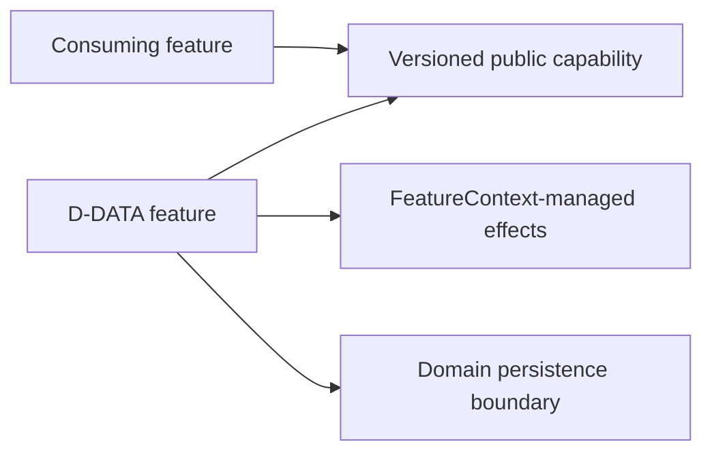

# Data

> **Package:** `app/services/data/`
> **Status:** `Missing`
> **Last updated:** `2026-09-20`
> **Domain ID:** `D-DATA`

This README is the domain's single source of truth for its boundary, feature and FR registry,
domain-local workflows, semantic contract ownership, persisted-state model, acceptance evidence,
and deletion behavior. Reference-product evidence is a requirement source, never implementation
evidence.

`PROJECT.md` owns system scope and cross-domain behavior. `ARCHITECTURE.md` owns universal
structure and runtime constraints. `AGENTS.md` owns contributor workflow. The
[Feature Implementation Pipeline](../../../docs/dev/feature_implementation_pipeline.md) owns the
complete single-file feature delivery checklist.

## Code-aligned implementation convention

Backend features use the simplified modular-monolith layout:

```text
app/services/data/
|-- README.md
|-- __init__.py
|-- instruments.py
|-- sessions.py
|-- imports_exports.py
|-- market_data.py
|-- datasets.py
|-- quality.py
|-- resampling.py
`-- universes.py

app/contracts/data.py
app/services/persistence/data.py
tests/services/data/<feature>/
tests/examples/04_data.py
```

Each feature module is one cohesive physical removal unit. It contains typed configuration,
service behavior, lifecycle wiring, immutable `SPEC`, and a zero-argument factory. Registration
is explicit in `app/registry.py`; import-time discovery and ambient singletons are forbidden.
Cross-boundary DTOs, protocols, events, errors, and capability keys live in
`app/contracts/data.py`. Features resolve dependencies through `FeatureContext` and
never import sibling implementations.

All schema, parameterized SQL, and transactions for this domain live in
`app/services/persistence/data.py`. A feature may be stateless, but it never accepts an
unrestricted database connection. Every completed feature contributes a deterministic, offline,
secret-safe example to `tests/examples/04_data.py`.

---

## 1. Purpose and boundary

### Purpose

Own instruments, trading sessions/timezones, normalized ticks and bars, tabular imports and exports,
market data retrieval and connector synchronization, deterministic transformations, quality anomaly
detection and repair, immutable datasets, and dynamic universe constituents.

### Owns

- Versioned instrument specifications, contract constraints, pips, points, lot steps, margins, swaps, commissions, and broker symbol aliases.
- Trading sessions, daily/weekly market open/close windows, holiday exclusions, timezone conversions, and Daylight Saving Time (DST) rules.
- Tabular market data parsing (CSV/TXT auto-detection, delimiter inference, header mapping), and configurable data export (CSV, MT4 HST/FXT, MT5).
- Unified, governed market data retrieval (`MarketDataRequest`), transparent caching, stream ingestion normalization, and connector synchronization across providers.
- Immutable normalized dataset versions, tick/bar storage schemas, Parquet/Zstd manifests, and acquisition provenance.
- Data quality validation, SQX-aligned anomaly detection (Gaps, Low Problems, High Problems, Spikes, Crossed Quotes), and deterministic repair lineage.
- Session-aware deterministic tick/bar resampling, intrabar 4-price tick generation, and whole-dataset timezone projection / cloning (`CloneToTimezoneJob`).
- Dynamic asset baskets, stock groups, and point-in-time constituent membership tracking (`date_from`, `date_to`) eliminating survivorship bias.

### Does not own

- Remote transport connections, raw HTTP/TCP streaming, exchange authentication, or connection health (strictly owned by `D-BROKERS`).
- Simulation event/fill matching, order routing, or indicator calculations (strictly owned by `D-SIMULATOR` and `D-INDICATOR`).
- Trade intent generation, position sizing, or live risk rules (strictly owned by `D-TRADING` and `D-RISK`).
- Provider credential storage mechanics in plaintext (strictly owned by kernel OS secret facility).

### Shared contracts

The public boundary is `app/contracts/data.py`. Counterparty status never authorizes a
private implementation import.

| Status | Capability or event | Protocol / DTO symbol | Version | Purpose |
| --- | --- | --- | --- | --- |
| Missing | `data.instruments@1` | `InstrumentCatalog` | `1` | Versioned instruments, contract constraints, and broker aliases |
| Missing | `data.sessions@1` | `SessionService` | `1` | Trading sessions, daily/weekly windows, and timezone/DST resolution |
| Missing | `data.imports_exports@1` | `ImportExportService` | `1` | Tabular market data import and configurable export (CSV, MT4, MT5) |
| Missing | `data.market_data@1` | `MarketDataClient` | `1` | Governed market data retrieval, request dispatching, and transparent caching |
| Missing | `data.sync@1` | `SyncConnectorsCapability` | `1` | Idempotent, resumable connector synchronization |
| Missing | `data.datasets@1` | `DatasetService` | `1` | Immutable normalized dataset versions and Parquet manifests |
| Missing | `data.quality@1` | `QualityService` | `1` | Data validation, anomaly detection (gaps, spikes, bad OHLC), and repair |
| Missing | `data.resampling@1` | `ResamplingService` | `1` | Session-aware deterministic resampling, 4-price ticks, and timezone cloning |
| Missing | `data.universes@1` | `UniverseManagerService` | `1` | Dynamic asset baskets and point-in-time constituent lifecycle |

### Persisted-state ownership

Semantic state remains feature-owned although database mechanics are centralized.

| Status | Namespace | Owning feature | Driver | Retention | Public read boundary |
| --- | --- | --- | --- | --- | --- |
| Missing | `data.v1` | `FEAT-DATA-INSTRUMENTS` and registry peers | `sqlite` | Retain versioned records until explicit policy permits purge | `data.instruments@1` |

---

## 2. Feature registry and dependency direction

| Feature | Delivered value | Owner module | Provides | Required capabilities | Status |
| --- | --- | --- | --- | --- | --- |
| `FEAT-DATA-INSTRUMENTS` | Versioned instruments, market constraints, and broker aliases | `app/services/data/instruments.py` | `data.instruments@1` | `persistence.artifacts@1` | Missing |
| `FEAT-DATA-SESSIONS` | Trading sessions, daily/weekly windows, and timezone/DST resolution | `app/services/data/sessions.py` | `data.sessions@1` | None | Missing |
| `FEAT-DATA-IMPORTS-EXPORTS` | Strict tabular market data import and export (CSV, MT4, MT5) | `app/services/data/imports_exports.py` | `data.imports_exports@1` | `data.instruments@1`, `data.sessions@1`, `persistence.artifacts@1` | Missing |
| `FEAT-DATA-MARKET_DATA` | Governed market data retrieval, transparent caching, and connector synchronization | `app/services/data/market_data.py` | `data.market_data@1`, `data.sync@1` | `data.instruments@1`, `data.sessions@1`, `data.quality@1`, `data.datasets@1`, `brokers.catalog@1`, `persistence.artifacts@1` | Missing |
| `FEAT-DATA-DATASETS` | Immutable normalized dataset versions and Parquet manifests | `app/services/data/datasets.py` | `data.datasets@1` | `persistence.artifacts@1` | Missing |
| `FEAT-DATA-QUALITY` | Data validation, anomaly detection (gaps, spikes, bad OHLC), and repair reports | `app/services/data/quality.py` | `data.quality@1` | `data.datasets@1`, `data.sessions@1` | Missing |
| `FEAT-DATA-RESAMPLING` | Session-aware deterministic resampling, 4-price ticks, and timezone cloning | `app/services/data/resampling.py` | `data.resampling@1` | `data.sessions@1`, `data.datasets@1` | Missing |
| `FEAT-DATA-UNIVERSES` | Dynamic asset baskets and point-in-time constituent membership | `app/services/data/universes.py` | `data.universes@1` | `data.instruments@1` | Missing |

Dependencies point to public contracts, never implementation modules:


```mermaid
flowchart LR
    Consumer["Consuming feature"] --> Contract["Versioned public capability"]
    Provider["D-DATA feature"] --> Contract
    Provider --> Context["FeatureContext-managed effects"]
    Provider --> Persistence["Domain persistence boundary"]
```

Removing one module and registry entry withdraws only its capability. Required consumers become
attributed `BLOCKED`; operation-gated consumers refuse only the affected operation. Retained
state is never purged implicitly.

---

## 3. Domain workflows

### `WF-DATA-FETCH` — Programmatic Market Data Retrieval

- **Lead owner:** `FEAT-DATA-MARKET_DATA`
- **Participants:** Target provider connector from `D-BROKERS` (`brokers.*@1`), `FEAT-DATA-INSTRUMENTS`, `FEAT-DATA-SESSIONS`, `FEAT-DATA-QUALITY`, `FEAT-DATA-DATASETS`.
- **Input boundary:** `MarketDataRequest` (`source_id`, `symbol`, `data_kind`, `timeframe`, `start`, `end`, `store_data`).
- **Output boundary:** Normalized, deduplicated, sorted, and quality-audited time-series bars or ticks; optionally published dataset version.
- **Failure boundary:** Provider transport failure surfaces typed unavailable result; cache serves valid historical ranges if available; partial payloads are quarantined and cleaned.

### `WF-DATA-SYNC` — Connector Synchronization

- **Lead owner:** `FEAT-DATA-MARKET_DATA`
- **Participants:** Registered broker connectors (`brokers.*@1`), `brokers.catalog@1`, `FEAT-DATA-DATASETS`.
- **Input boundary:** Sync scope (provider IDs, symbol set, date range), concurrency bounds.
- **Output boundary:** Synchronization audit receipt recording fetched intervals, deduplicated records, and new dataset manifests.
- **Failure boundary:** Fail-closed per provider; failing connectors do not interrupt independent provider synchronizations.

### `WF-DATA-IMPORT` — Tabular Import, Validate, and Publish Market Data

- **Lead owner:** `FEAT-DATA-IMPORTS-EXPORTS`
- **Participants:** `FEAT-DATA-INSTRUMENTS`, `FEAT-DATA-SESSIONS`, `FEAT-DATA-QUALITY`, `FEAT-DATA-DATASETS`, and `persistence.artifacts@1`.
- **Input boundary:** File path or byte stream, delimiter/encoding/format config, instrument ID, target session, repair policy.
- **Output boundary:** Immutable dataset manifest, quality anomaly audit report, and row-level ingestion lineage.
- **Failure boundary:** Parsing or schema failures reject publish; bad rows bounded and staged files quarantined or removed safely.

### `WF-DATA-EXPORT` — Configurable Dataset Export

- **Lead owner:** `FEAT-DATA-IMPORTS-EXPORTS`
- **Participants:** `FEAT-DATA-DATASETS`, `FEAT-DATA-SESSIONS`.
- **Input boundary:** Dataset version ID, export format (CSV with custom columns/delimiter, MT4 HST/FXT, MT5 binary), destination path.
- **Output boundary:** Deterministic exported files verified against source dataset hashes.
- **Failure boundary:** Write errors clean incomplete output files; no partial files published.

### `WF-DATA-RESAMPLE` — Deterministic Resampling & Timezone Projection

- **Lead owner:** `FEAT-DATA-RESAMPLING`
- **Participants:** `FEAT-DATA-DATASETS`, `FEAT-DATA-SESSIONS`, `persistence.artifacts@1`.
- **Input boundary:** Source dataset ID (ticks or M1), target timeframe (e.g. M5, H1, D1) or target timezone (e.g. GMT+2/+3 with US DST), session schedule.
- **Output boundary:** Newly published immutable dataset manifest linked by transformation lineage to parent source.
- **Failure boundary:** Discontinuous or out-of-order records raise typed validation error; intermediate chunks cleaned.

---

## 4. Feature specifications

### Configuration and limits

Each owner module defines a slotted immutable `<Feature>Config`. No reference sample value is
promoted to a default without product approval.

| Status | Feature | Slotted Config Class | Key Fields & Defaults | Validation & Limits |
| --- | --- | --- | --- | --- |
| Missing | `FEAT-DATA-INSTRUMENTS` | `InstrumentCatalogConfig` | `schema_version=1`, `cache_size=1000`, `default_margin_rate=0.05` | Positive schema, positive cache, margin $\in (0, 1]$ |
| Missing | `FEAT-DATA-SESSIONS` | `SessionServiceConfig` | `schema_version=1`, `default_timezone="UTC"` | Valid IANA timezone name |
| Missing | `FEAT-DATA-IMPORTS-EXPORTS` | `ImportExportConfig` | `schema_version=1`, `max_row_errors=1000`, `batch_size=50000`, `staging_timeout_s=30.0` | Positive limits, timeout > 0 |
| Missing | `FEAT-DATA-MARKET_DATA` | `MarketDataConfig` | `schema_version=1`, `cache_enabled=True`, `max_cache_entries=1000`, `request_timeout_s=30.0`, `sync_batch_size=50000` | Positive cache size, timeout > 0, batch size > 0 |
| Missing | `FEAT-DATA-DATASETS` | `DatasetServiceConfig` | `schema_version=1`, `compression_codec="zstd"`, `row_group_size=100000` | Known compression codec, row group $\ge 1000$ |
| Missing | `FEAT-DATA-QUALITY` | `QualityServiceConfig` | `schema_version=1`, `spike_multiplier=3.5`, `max_gap_bars=5` | Positive multiplier, non-negative gap bars |
| Missing | `FEAT-DATA-RESAMPLING` | `ResamplingServiceConfig` | `schema_version=1`, `chunk_size=50000`, `intrabar_precision="minute"` | Known precision mode, positive chunk size |
| Missing | `FEAT-DATA-UNIVERSES` | `UniverseManagerConfig` | `schema_version=1`, `max_basket_size=5000` | Positive capacity bound |

### Runtime effects and cleanup

| Effect | Acquisition | Cleanup / failure behavior |
| --- | --- | --- |
| Capability publication | `FeatureContext.provide(...)` | Withdrawn with feature scope |
| Tasks/subscriptions/resources | Managed `FeatureContext` API | Cancel/close in reverse order; failed start unwinds all effects |
| Durable mutation | Focused persistence protocol | Transaction rollback; partial output remains unpublished |

### Persistent state

- **Domain persistence module:** `app/services/persistence/data.py`
- **Namespace:** `data.v1`
- **Schema version:** `1` initially; forward migrations only
- **Retention and purge:** retain lineage-bearing records; purge only by explicit, reference-safe policy

### Single-file structure and symbols

| Status | Owner | Responsibility | Symbols |
| --- | --- | --- | --- |
| Missing | `instruments.py` | Versioned instruments, market constraints, and broker aliases; config, service, lifecycle, `SPEC`, factory | `InstrumentCatalog` |
| Missing | `sessions.py` | Trading sessions, daily/weekly windows, and timezone/DST resolution; config, service, lifecycle, `SPEC`, factory | `SessionService` |
| Missing | `imports_exports.py` | Tabular market data import and export (CSV, MT4, MT5); config, service, lifecycle, `SPEC`, factory | `ImportExportService` |
| Missing | `market_data.py` | Governed market data retrieval, transparent caching, and connector synchronization; config, service, lifecycle, `SPEC`, factory | `MarketDataClient`, `MarketDataService`, `MarketDataRequest`, `build_market_data_request` |
| Missing | `datasets.py` | Immutable normalized dataset versions and Parquet manifests; config, service, lifecycle, `SPEC`, factory | `DatasetService` |
| Missing | `quality.py` | Data validation, anomaly detection (gaps, spikes, bad OHLC), and repair reports; config, service, lifecycle, `SPEC`, factory | `QualityService` |
| Missing | `resampling.py` | Session-aware deterministic resampling, 4-price ticks, and timezone cloning; config, service, lifecycle, `SPEC`, factory | `ResamplingService` |
| Missing | `universes.py` | Dynamic asset baskets and point-in-time constituent membership; config, service, lifecycle, `SPEC`, factory | `UniverseManagerService` |
| Missing | `tests/examples/04_data.py` | Offline primary-purpose evidence | `example_04_*()` |

### Functional requirements

| Status | Requirement ID | Observable behavior | Evidence |
| --- | --- | --- | --- |
| Missing | `FR-DATA-INSTRUMENT_SPECS` | Validates instrument specifications: pip size, point value, tick size, tick step, lot step, min/max volume, commissions, and margin rates. | Unit specification fixtures |
| Missing | `FR-DATA-BROKER_ALIASES` | Resolves and translates broker-specific symbol variants (e.g. `EURUSD.m`, `GOLD`) to canonical symbols and vice-versa. | Alias round-trip fixtures |
| Missing | `FR-DATA-SESSION_WINDOWS` | Filters out-of-session quotes and marks open/close transitions per configured daily and weekly schedule. | Weekly session fixtures |
| Missing | `FR-DATA-TIMEZONE_DST` | Applies timezone offsets and Daylight Saving Time (DST) transitions deterministically without ambiguous time shifts. | DST transition fixtures |
| Missing | `FR-DATA-IMPORT_DELIMITERS` | Auto-detects delimiters (comma, semicolon, tab), datetime patterns, and header structures, enforcing bounded row diagnostics on parse errors. | Delimiter auto-detect fixtures |
| Missing | `FR-DATA-EXPORT_FORMATS` | Exports normalized datasets to custom tabular CSV and platform formats (MT4 HST/FXT, MT5) matching binary/text schemas. | Export round-trip fixtures |
| Missing | `FR-DATA-MARKET_REQUEST` | Dispatches structured `MarketDataRequest` specifications across configured provider feed connectors with parameter validation. | Mock provider request fixtures |
| Missing | `FR-DATA-CACHE_TRANSPARENCY` | Serves identical requested ranges from local point-in-time cache without redundant provider transport calls. | Cache hit/miss test fixtures |
| Missing | `FR-DATA-CONNECTOR_SYNC` | Coordinates idempotent, resumable connector synchronization, recording progress and avoiding duplicated fetches. | Sync idempotency fixtures |
| Missing | `FR-DATA-INGESTION_NORMALIZATION` | Automatically deduplicates, sorts timestamps monotonically, and executes quality anomaly evaluation during stream ingestion. | Stream ingestion pipeline tests |
| Missing | `FR-DATA-DATASET_IMMUTABILITY` | Identical source bytes and normalization parameters generate identical content-addressed dataset identities. | Content hash round-trip |
| Missing | `FR-DATA-PROVENANCE_LINEAGE` | Every published dataset manifest records source provider, parser config, hashes, and transformation parents; partial outputs are never published. | Provenance lineage audit |
| Missing | `FR-DATA-QUALITY_ANOMALIES` | Exhaustively flags data anomalies: Gaps (missing session bars), Low Problems ($Low > Open/Close/High$), High Problems ($High < Open/Close/Low$), Spikes (ATR multiplier), and Crossed Quotes ($Bid > Ask$). | Synthetic anomaly injection tests |
| Missing | `FR-DATA-DATA_REPAIR` | Applies explicit user repair policies (drop bad records, interpolate, clamp spikes) with verifiable repair audit logs without mutating raw sources. | Repair audit ledger tests |
| Missing | `FR-DATA-DETERMINISTIC_RESAMPLING` | Resampling M1/ticks to higher timeframes is deterministic and invariant across batch and chunk boundaries. | Chunk equivalence fixtures |
| Missing | `FR-DATA-TIMEZONE_CLONING` | Clones and projects historical bar series from UTC to specified target timezones (e.g. US/Eastern, Broker Server GMT+2/+3) aligning session opens. | Timezone cloning verification |
| Missing | `FR-DATA-UNIVERSE_CONSTITUENTS` | Maintains point-in-time constituent membership with `date_from` and `date_to` timestamps, eliminating survivorship bias in historical baskets. | Survivorship bias boundary tests |

### Removal behavior

Physical removal withdraws the feature's capability and cancels its managed effects. Stored
artifacts remain readable by schema-aware tooling; operations requiring the missing capability
return an attributed unavailable result. Reinstall may resume only after schema and version checks.

---

## 5. Domain-wide requirements and invariants

| Status | Requirement ID | Rule | Verification |
| --- | --- | --- | --- |
| Missing | `ARCH-001` | `__init__.py` is docstring-only. | `scripts/architecture_check.py` |
| Missing | `ARCH-002` | Tasks and resources are managed through `FeatureContext`. | Lifecycle tests |
| Missing | `ARCH-003` | Logging uses `app.kernel.logging`; no service configures handlers. | Architecture/logging tests |
| Missing | `ARCH-004` | Public contracts live in `app/contracts/data.py`. | Import/contract checks |
| Missing | `ARCH-005` | Feature modules never import sibling implementations. | Import checks |
| Missing | `ARCH-006` | SQL/schema operations live in `app/services/persistence/data.py`. | Architecture/schema checks |

---

## 6. Decisions and open evidence

| Status | Decision ID | Decision or missing evidence | Scope | Required closure |
| --- | --- | --- | --- | --- |
| Accepted | `DEC-DATA-001` | Large normalized datasets use versioned Parquet/Zstd manifests. | Storage format | `E-T01` |
| Accepted | `DEC-DATA-002` | StrategyQuant X binary and CSV formats are reverse-engineered to clean-room specifications; proprietary binary blobs are not copied. | Interop/quality | Clean-room parsers & golden fixtures |

---

## 7. Tests and definition of done

```text
tests/services/data/<feature>/
|-- test_config.py
|-- test_<feature>.py
|-- test_lifecycle.py
|-- test_removal.py
`-- test_persistence.py       # when applicable

tests/examples/04_data.py
```

Editing uses explicit affected paths with `--no-cov`; the full candidate gate remains
`uv run python scripts/ci_check.py`.

- [ ] Stable feature and requirement IDs have one owner.
- [ ] Public contracts and exact `FeatureSpec` dependencies exist.
- [ ] Registration is explicit; imports have no runtime effects.
- [ ] Happy, invalid, boundary, unavailable, lifecycle, persistence, and removal tests pass.
- [ ] Numerical or stateful behavior has deterministic golden/fault fixtures.
- [ ] One real-world usage example exists per completed feature.
- [ ] Domain status reflects repository evidence, not reference-product evidence.
- [ ] Architecture and full qualification gates pass.

---

## 8. Change process

1. Update this README and identify the exact feature/requirement scope.
2. Update `app/contracts/data.py` first when the public boundary changes.
3. Implement one cohesive owner module and immutable `SPEC`.
4. Change `app/services/persistence/data.py` only for database mechanics.
5. Update explicit registry, consolidated examples, and focused tests.
6. Verify feature removal and affected consumers.
7. Run the repository-prescribed candidate gate and record actual results.

---

## 9. Normative domain specification

Bars carry instrument, timeframe, UTC open timestamp, open, high, low, close, volume, source provider, and anomaly flags; enforce $High \ge \max(Open, Close, Low)$ and $Low \le \min(Open, Close, High)$. Ticks carry UTC timestamp, sequence integer, bid, ask, and optional trade sizes/flags. Market data retrieval dispatches structured `MarketDataRequest` objects to target broker feed connectors, applies transparent caching, performs stream deduplication and monotonic sorting, and validates quality anomalies prior to publishing. Tabular imports auto-detect delimiters, map columns explicitly, isolate row errors with bounded diagnostic limits, detect duplicates, gaps, inversions, and session violations, and publish immutable Parquet manifests with SHA-256 fingerprints. Data exports provide customizable CSV formatting and binary platform compatibility (MT4 HST/FXT, MT5). Resampling deterministically rolls ticks or minute bars into higher timeframes, generates intrabar 4-price trajectories for backtest simulations, and projects bar series across target timezones without data corruption. Dynamic universes maintain constituent date ranges (`date_from`, `date_to`) preventing survivorship bias in equity and multi-market portfolio analyses.
