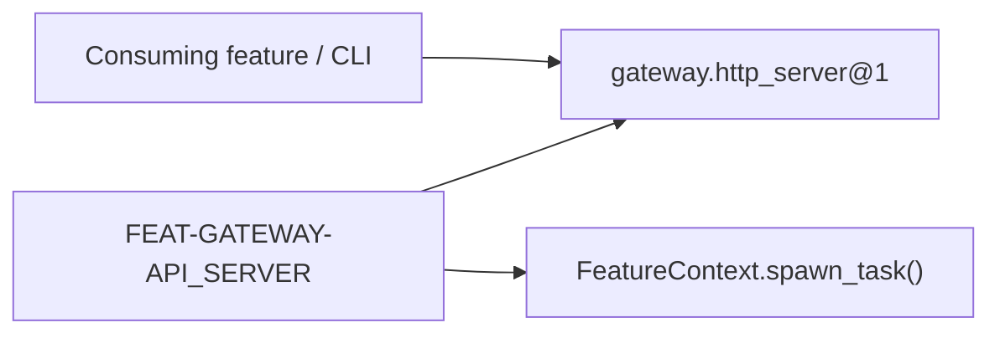

# Gateway

> **Package:** `app/services/gateway/`
> **Status:** `Completed`
> **Last updated:** `2026-09-18`
> **Domain ID:** `D-GATEWAY`

This README is the domain's single source of truth for its boundary, feature and FR registry,
domain-local workflows, semantic contract ownership, persisted-state model, acceptance evidence,
and deletion behavior. Update it before changing the affected implementation.

`PROJECT.md` owns system scope and cross-domain behavior. `ARCHITECTURE.md` owns universal
structure and runtime constraints. `AGENTS.md` owns contributor workflow. The
[Feature Implementation Pipeline](../../../docs/dev/feature_implementation_pipeline.md) owns the complete
single-file feature delivery checklist.

## Code-aligned implementation convention

Backend features use the simplified modular-monolith layout:

```text
app/services/gateway/
|-- README.md
|-- __init__.py
`-- api_server.py

app/contracts/gateway.py
tests/services/gateway/api_server/
tests/examples/gateway_usage.py
```

Each `app/services/gateway/[feature].py` module is one cohesive feature and physical removal unit.
It follows the pipeline's single-file configuration, service, lifecycle, immutable `SPEC`, factory,
documentation, and logging standards. Features are registered explicitly in `app/registry.py`; no
entry-point discovery, directory scanning, YAML manifest, package-local manifest, or import-time
registration is used.

Cross-boundary DTOs, protocols, events, errors, and capability keys live in the domain's single
`app/contracts/gateway.py` module. Feature modules never import sibling implementations. They
declare exact dependencies and resolve providers through `FeatureContext`.

All schema, parameterized SQL, and transactional database operations for this domain are
consolidated in `app/services/persistence/gateway.py` (when state persistence is needed; currently stateless).

Every completed feature contributes one `example_<NN>_<feature_slug>` function to
`tests/examples/gateway_usage.py`. Examples are realistic, offline, deterministic,
secret-safe, and directly executable. Production feature modules contain no usage harness.

---

## 1. Purpose and boundary

### Purpose

The API bridge between all backend domains and the frontend UI. No business logic (such as calculations or quantitative algorithms) lives here; only gateway routing, protocol bridging, and UI orchestrations. Real business logic stays in its respective domain.

### Owns

- FastAPI application instantiation, middleware, and route mounting.
- Lifecycle supervision and graceful shutdown of the Uvicorn ASGI server.
- Standard system diagnostics and health endpoints (`/health`, `/api/v1/status`).
- Public gateway capability token `gateway.http_server@1`.

### Does not own

- Domain business policies, strategy generation, backtesting algorithms, or market execution.
- Direct persistence schemas or database transaction management.
- Web client presentation (owned by `D-UI` in `app/ui/`).

### Shared contracts

The domain's public boundary is `app/contracts/gateway.py`.

| Status | Capability or event | Protocol / DTO symbol | Version | Purpose |
| --- | --- | --- | --- | --- |
| Completed | `gateway.http_server@1` | `HttpServerService` | `1` | Asynchronous HTTP server and ASGI application supervisor |

### Persisted-state ownership

State persistence is not required for the gateway boundary.

| Status | Namespace | Owning feature | Driver | Retention | Public read boundary |
| --- | --- | --- | --- | --- | --- |
| None | None | None | None | None | None |

---

## 2. Feature registry and dependency direction

| Feature | Delivered value | Owner module | Provides | Required capabilities | Status |
| --- | --- | --- | --- | --- | --- |
| `FEAT-GATEWAY-API_SERVER` | Asynchronous FastAPI + Uvicorn server supervisor | `app/services/gateway/api_server.py` | `gateway.http_server@1` | None | Completed |

Dependencies point to public contracts, never implementation modules:



Removal of `api_server.py` withdraws the HTTP listener capability without altering core business domains.

---

## 3. Domain workflows

### `WF-GATEWAY-HEALTH` — Health and Status Probe

- **Lead owner:** `FEAT-GATEWAY-API_SERVER`
- **Participants:** `HttpServerService`
- **Input boundary:** `GET /health` or `GET /api/v1/status` HTTP requests
- **Output boundary:** `{"status": "ok", "timestamp": "...", "version": "..."}`
- **Failure boundary:** HTTP 500 error response with structured JSON payload
- **Acceptance:** `tests/services/gateway/api_server/test_api_server.py`

---

## 4. Feature specifications

### `api_server.py` — `FEAT-GATEWAY-API_SERVER`

> **Feature ID:** `gateway.api_server`
> **Status:** `Completed`
> **Owner module:** `app/services/gateway/api_server.py`

#### Purpose

Manage the lifecycle of the FastAPI application and Uvicorn server, hosting standard health/status routes and exposing an ASGI mount point for downstream routes.

#### Capability declarations

- **Provides:** `gateway.http_server@1`
- **Requires:** None
- **Optional / operation-gated:** None

#### Configuration and limits

Configuration is represented by `ApiServerConfig` in the owner module.

| Status | Setting | Type / unit | Default | Validation and failure |
| --- | --- | --- | --- | --- |
| Completed | `host` | `str` | `"127.0.0.1"` | Valid IP or hostname string |
| Completed | `port` | `int` | `8000` | `1 <= port <= 65535` |
| Completed | `log_level` | `str` | `"INFO"` | Valid severity level |
| Completed | `enable_docs` | `bool` | `True` | Boolean |

#### Runtime effects and cleanup

| Effect | Acquisition | Cleanup / failure behavior |
| --- | --- | --- |
| Capability publication | `FeatureContext.provide(HTTP_SERVER, service)` | Withdrawn upon scope teardown |
| Background ASGI Server | `FeatureContext.spawn_task(server.serve())` | `server.should_exit = True` then task cancelled cleanly |

#### Persistent state

- **Domain persistence module:** None
- **Namespace:** None
- **Schema version:** None
- **Retention and purge:** None

#### Single-file structure and symbols

| Status | Owner | Responsibility | Symbols |
| --- | --- | --- | --- |
| Completed | `api_server.py` | Configuration, service behavior, lifecycle wiring, immutable spec, and factory | `ApiServerConfig`, `ApiServerService`, `SPEC`, `ApiServerFeature`, `feature()` |
| Completed | `app/contracts/gateway.py` | Public DTOs, protocols, capability tokens | `HTTP_SERVER`, `HttpServerService`, `ServerInfo`, `GatewayError` |
| Completed | `tests/examples/gateway_usage.py` | Realistic offline primary-purpose example | `example_gateway_api_server()` |

#### Functional requirements

| Status | Requirement ID | Observable behavior | Implementing symbol | Side effects | Failure | Evidence |
| --- | --- | --- | --- | --- | --- | --- |
| Completed | `FR-GATEWAY-001` | Return health probe payload on `GET /health` | `ApiServerService.get_app` | None | HTTP 500 error | `test_api_server.py` |
| Completed | `FR-GATEWAY-002` | Return runtime status payload on `GET /api/v1/status` | `ApiServerService.get_app` | None | HTTP 500 error | `test_api_server.py` |
| Completed | `FR-GATEWAY-003` | Lifecycle-managed background task running Uvicorn | `ApiServerFeature.start` | Background task | Task cancellation | `test_lifecycle.py` |

#### Removal behavior

Withdrawing `api_server.py` and its entry in `app/registry.py` removes HTTP listening capabilities. The application continues running in headless/worker modes.

---

## 5. Domain-wide requirements and invariants

| Status | Requirement ID | Rule | Verification |
| --- | --- | --- | --- |
| Completed | `ARCH-001` | `__init__.py` is docstring-only. | `scripts/architecture_check.py` |
| Completed | `ARCH-002` | Tasks and resources are managed through `FeatureContext`. | Architecture and lifecycle tests |
| Completed | `ARCH-003` | Logging uses `app.kernel.logging`; services configure no handlers. | Architecture check and logging tests |
| Completed | `ARCH-004` | Public contracts live in `app/contracts/gateway.py`. | Import/contract checks |
| Completed | `ARCH-005` | Feature modules never import sibling implementations. | Import checks |

---

## 6. Decisions and open evidence

| Status | Decision ID | Decision or missing evidence | Scope | Required closure |
| --- | --- | --- | --- | --- |
| Closed | `DEC-GATEWAY-001` | In-memory ASGI testing via `httpx.ASGITransport` avoids port collisions | Testing | `test_api_server.py` passes without real socket binding |

---

## 7. Tests and definition of done

```text
tests/services/gateway/api_server/
|-- test_config.py
|-- test_api_server.py
`-- test_lifecycle.py

tests/examples/gateway_usage.py
```

- [x] Stable feature ID (`gateway.api_server`) and one domain owner (`D-GATEWAY`).
- [x] One cohesive `app/services/gateway/api_server.py` implementation.
- [x] Public contracts in `app/contracts/gateway.py`.
- [x] Exact `FeatureSpec` dependencies and providers.
- [x] Explicit `app/registry.py` registration.
- [x] Zero sibling-feature imports and zero import-time effects.
- [x] Lifecycle-managed tasks, resources, and capability publications.
- [x] Required happy, invalid, boundary, and lifecycle tests.
- [x] One passing example function in `tests/examples/gateway_usage.py`.
- [x] Domain README status and evidence mappings reflect observed truth.
- [x] Applicable quality and independent-review gates pass.

---

## 8. Change process

1. Update this domain README and identify the exact feature/FR scope.
2. Update `app/contracts/gateway.py` first when the public boundary changes.
3. Update the cohesive feature module and its immutable `SPEC`.
4. Update explicit registration in `app/registry.py`.
5. Update the consolidated domain example function.
6. Add or update focused owner and affected-consumer tests.
7. Validate according to `AGENTS.md` and the Feature Implementation Pipeline.

---

## 9. Normative domain specification

Default configuration port: `8000`. Default binding host: `127.0.0.1`.
Standard endpoints:
- `GET /health` -> `{"status": "ok", "timestamp": str, "version": str}`
- `GET /api/v1/status` -> `{"status": "ready", "server": ServerInfo}`
