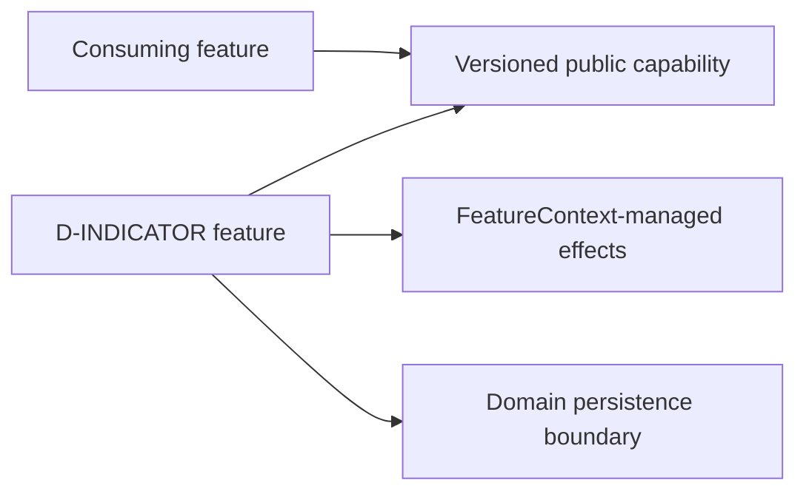

# Indicator

> **Package:** `app/services/indicator/`
> **Status:** `Missing`
> **Last updated:** `2026-09-18`
> **Domain ID:** `D-INDICATOR`

This README is the domain's single source of truth for its boundary, feature and FR registry,
domain-local workflows, semantic contract ownership, persisted-state model, acceptance evidence,
and deletion behavior. Reference-product evidence is a requirement source, never implementation
evidence.

`PROJECT.md` owns system scope and cross-domain behavior. `ARCHITECTURE.md` owns universal
structure and runtime constraints. `AGENTS.md` owns contributor workflow. The
[Feature Implementation Pipeline](../../../docs/dev/feature_implementation_pipeline.md) owns the
complete single-file feature delivery checklist.

## Code-aligned implementation convention

Backend features use the simplified modular-monolith layout:

```text
app/services/indicator/
|-- README.md
|-- __init__.py
|-- series.py
|-- averages.py
|-- volatility.py
|-- oscillators.py
`-- custom.py

app/contracts/indicator.py
app/services/persistence/indicator.py
tests/services/indicator/<feature>/
tests/examples/05_indicator.py
```

Each feature module is one cohesive physical removal unit. It contains typed configuration,
service behavior, lifecycle wiring, immutable `SPEC`, and a zero-argument factory. Registration
is explicit in `app/registry.py`; import-time discovery and ambient singletons are forbidden.
Cross-boundary DTOs, protocols, events, errors, and capability keys live in
`app/contracts/indicator.py`. Features resolve dependencies through `FeatureContext` and
never import sibling implementations.

All schema, parameterized SQL, and transactions for this domain live in
`app/services/persistence/indicator.py`. A feature may be stateless, but it never accepts an
unrestricted database connection. Every completed feature contributes a deterministic, offline,
secret-safe example to `tests/examples/05_indicator.py`.

---

## 1. Purpose and boundary

### Purpose

Own deterministic series calculations, reusable calculators, warm-up/validity semantics, caching, block metadata, and custom-indicator contracts.

### Owns

- Typed series/buffer and visibility contracts with batch/incremental equivalence.
- Indicator parameters, warm-up, missing-value, rounding, caching, and acceleration profiles.
- Isolated custom-indicator registration and deterministic outputs.

### Does not own

- Trading decisions, strategy action trees, or future market visibility.
- Dataset storage or report metric definitions.

### Shared contracts

The public boundary is `app/contracts/indicator.py`. Counterparty status never authorizes a
private implementation import.

| Status | Capability or event | Protocol / DTO symbol | Version | Purpose |
| --- | --- | --- | --- | --- |
| Missing | `indicator.series@1` | `SeriesEngine` | `1` | Series views, visibility, buffers, and cache identity |
| Missing | `indicator.averages@1` | `AverageRegistry` | `1` | Moving-average calculators and profiles |
| Missing | `indicator.volatility@1` | `VolatilityRegistry` | `1` | True range, ATR, and volatility indicators |
| Missing | `indicator.oscillators@1` | `OscillatorRegistry` | `1` | CCI, RSI, and oscillator indicators |
| Missing | `indicator.extensions@1` | `IndicatorExtensionRegistry` | `1` | Versioned custom-indicator contract |

### Persisted-state ownership

Semantic state remains feature-owned although database mechanics are centralized.

| Status | Namespace | Owning feature | Driver | Retention | Public read boundary |
| --- | --- | --- | --- | --- | --- |
| Missing | `indicator.v1` | `FEAT-INDICATOR-SERIES` and registry peers | `sqlite` | Retain versioned records until explicit policy permits purge | `indicator.series@1` |

---

## 2. Feature registry and dependency direction

| Feature | Delivered value | Owner module | Provides | Required capabilities | Status |
| --- | --- | --- | --- | --- | --- |
| `FEAT-INDICATOR-SERIES` | Series views, visibility, buffers, and cache identity | `app/services/indicator/series.py` | `indicator.series@1` | `data.datasets@1` | Missing |
| `FEAT-INDICATOR-AVERAGES` | Moving-average calculators and profiles | `app/services/indicator/averages.py` | `indicator.averages@1` | `indicator.series@1` | Missing |
| `FEAT-INDICATOR-VOLATILITY` | True range, ATR, and volatility indicators | `app/services/indicator/volatility.py` | `indicator.volatility@1` | `indicator.series@1` | Missing |
| `FEAT-INDICATOR-OSCILLATORS` | CCI, RSI, and oscillator indicators | `app/services/indicator/oscillators.py` | `indicator.oscillators@1` | `indicator.series@1` | Missing |
| `FEAT-INDICATOR-EXTENSIONS` | Versioned custom-indicator contract | `app/services/indicator/custom.py` | `indicator.extensions@1` | `indicator.series@1` | Missing |

Dependencies point to public contracts, never implementation modules:



Removing one module and registry entry withdraws only its capability. Required consumers become
attributed `BLOCKED`; operation-gated consumers refuse only the affected operation. Retained
state is never purged implicitly.

---

## 3. Domain workflows

### `WF-INDICATOR-CALCULATE` — Calculate a visible indicator series

- **Lead owner:** `FEAT-INDICATOR-SERIES`
- **Participants:** Dataset capability and selected registered indicator.
- **Input boundary:** Immutable input identity/view, visible end index, validated parameters, numeric profile.
- **Output boundary:** Equal-length output buffers with explicit validity/warm-up and provenance.
- **Failure boundary:** Invalid parameters or future access fail before publication; extension faults are isolated.
- **Acceptance:** `ATW-INDICATOR-CALCULATE-001`

---

## 4. Feature specifications

The following contract applies to every registered feature; domain-specific semantics are in
Section 9.

### `series.py` — `FEAT-INDICATOR-SERIES`

> **Feature ID:** `FEAT-INDICATOR-SERIES` (representative registry entry)
> **Status:** `Missing`
> **Owner module:** `app/services/indicator/series.py`

#### Purpose

Provide series views, visibility, buffers, and cache identity. Other registry entries follow the same lifecycle and
evidence obligations without merging their responsibilities into this module.

#### Capability declarations

- **Provides:** `indicator.series@1`
- **Requires:** `data.datasets@1`
- **Optional / operation-gated:** only capabilities explicitly declared by the feature; absence
  returns a typed unavailable result and does not silently substitute behavior.

#### Configuration and limits

Each owner module defines a slotted immutable `<Feature>Config`. No reference sample value is
promoted to a default without product approval.

| Status | Setting | Type / unit | Default | Validation and failure |
| --- | --- | --- | --- | --- |
| Missing | `schema_version` | positive integer | `1` | Reject unknown/incompatible versions |
| Missing | `operation_timeout_s` | finite seconds | operation-specific | Must be positive and bounded |
| Missing | `resource_limit` | positive integer | deployment-specific | Reject nonpositive/unbounded values |

#### Runtime effects and cleanup

| Effect | Acquisition | Cleanup / failure behavior |
| --- | --- | --- |
| Capability publication | `FeatureContext.provide(...)` | Withdrawn with feature scope |
| Tasks/subscriptions/resources | Managed `FeatureContext` API | Cancel/close in reverse order; failed start unwinds all effects |
| Durable mutation | Focused persistence protocol | Transaction rollback; partial output remains unpublished |

#### Persistent state

- **Domain persistence module:** `app/services/persistence/indicator.py`
- **Namespace:** `indicator.v1`
- **Schema version:** `1` initially; forward migrations only
- **Retention and purge:** retain lineage-bearing records; purge only by explicit, reference-safe policy

#### Single-file structure and symbols

| Status | Owner | Responsibility | Symbols |
| --- | --- | --- | --- |
| Missing | `series.py` | Series views, visibility, buffers, and cache identity; config, service, lifecycle, `SPEC`, factory | `SeriesEngine` |
| Missing | `averages.py` | Moving-average calculators and profiles; config, service, lifecycle, `SPEC`, factory | `AverageRegistry` |
| Missing | `volatility.py` | True range, ATR, and volatility indicators; config, service, lifecycle, `SPEC`, factory | `VolatilityRegistry` |
| Missing | `oscillators.py` | CCI, RSI, and oscillator indicators; config, service, lifecycle, `SPEC`, factory | `OscillatorRegistry` |
| Missing | `custom.py` | Versioned custom-indicator contract; config, service, lifecycle, `SPEC`, factory | `IndicatorExtensionRegistry` |
| Missing | `tests/examples/05_indicator.py` | Offline primary-purpose evidence | one `example_<NN>_<feature_slug>()` per completed feature |

#### Functional requirements

| Status | Requirement ID | Observable behavior | Evidence |
| --- | --- | --- | --- |
| Missing | `FR-INDICATOR-001` | Batch, chunked, and incremental outputs agree. | Golden/property tests |
| Missing | `FR-INDICATOR-002` | Visibility guards prevent future-index reads. | Look-ahead negative test |
| Missing | `FR-INDICATOR-003` | Scalar and NumPy/Numba profiles match within declared tolerance. | Acceleration equivalence |
| Missing | `FR-INDICATOR-004` | Rounding feeds comparison only where a named block contract requires it. | Threshold-neighbor test |

#### Removal behavior

Physical removal withdraws the feature's capability and cancels its managed effects. Stored
artifacts remain readable by schema-aware tooling; operations requiring the missing capability
return an attributed unavailable result. Reinstall may resume only after schema and version checks.

---

## 5. Domain-wide requirements and invariants

| Status | Requirement ID | Rule | Verification |
| --- | --- | --- | --- |
| Missing | `ARCH-001` | `__init__.py` is docstring-only. | `scripts/architecture_check.py` |
| Missing | `ARCH-002` | Tasks and resources are managed through `FeatureContext`. | Lifecycle tests |
| Missing | `ARCH-003` | Logging uses `app.kernel.logging`; no service configures handlers. | Architecture/logging tests |
| Missing | `ARCH-004` | Public contracts live in `app/contracts/indicator.py`. | Import/contract checks |
| Missing | `ARCH-005` | Feature modules never import sibling implementations. | Import checks |
| Missing | `ARCH-006` | SQL/schema operations live in `app/services/persistence/indicator.py`. | Architecture/schema checks |

---

## 6. Decisions and open evidence

| Status | Decision ID | Decision or missing evidence | Scope | Required closure |
| --- | --- | --- | --- | --- |
| Accepted | `DEC-INDICATOR-001` | Numba is optional acceleration, never a semantic fork. | Numeric profile | E-T01 |
| Open | `DEC-INDICATOR-002` | RSI and all moving-average initialization details are unverified. | Parity formulas | Short/constant/impulse golden series |

Evidence IDs resolve through `docs/PROJECT.md`. Unknowns remain explicit; a filename, bundled
sample value, or third-party function name is not proof of runtime semantics.

---

## 7. Tests and definition of done

```text
tests/services/indicator/<feature>/
|-- test_config.py
|-- test_<feature>.py
|-- test_lifecycle.py
|-- test_removal.py
`-- test_persistence.py       # when applicable

tests/examples/05_indicator.py
```

Editing uses explicit affected paths with `--no-cov`; the full candidate gate remains
`uv run python scripts/ci_check.py`.

- [ ] Stable feature and requirement IDs have one owner.
- [ ] Public contracts and exact `FeatureSpec` dependencies exist.
- [ ] Registration is explicit; imports have no runtime effects.
- [ ] Happy, invalid, boundary, unavailable, lifecycle, persistence, and removal tests pass.
- [ ] Numerical or stateful behavior has deterministic golden/fault fixtures.
- [ ] One offline usage example exists per completed feature.
- [ ] Domain status reflects repository evidence, not reference-product evidence.
- [ ] Architecture and full qualification gates pass.

---

## 8. Change process

1. Update this README and identify the exact feature/requirement scope.
2. Update `app/contracts/indicator.py` first when the public boundary changes.
3. Implement one cohesive owner module and immutable `SPEC`.
4. Change `app/services/persistence/indicator.py` only for database mechanics.
5. Update explicit registry, consolidated examples, and focused tests.
6. Verify feature removal and affected consumers.
7. Run the repository-prescribed candidate gate and record actual results.

---

## 9. Normative domain specification

Inputs are immutable oldest-to-newest views; calculation at index i may read only visible values through i. Missing/invalid is not numeric zero. Observed true range is high-low on the first bar, then max(high-low, abs(low-prev close), abs(high-prev close)); observed ATR uses a progressive Wilder-style effective period min(i+1, period). Observed CCI yields zero at bar zero and when mean deviation < 1e-10; otherwise (price-simple mean)/(0.015*mean deviation). The official signal example rounds compared values to four decimals before strict greater-than (E-L04 and the official guide under E-O02). Third-party same-name functions are not parity evidence.
