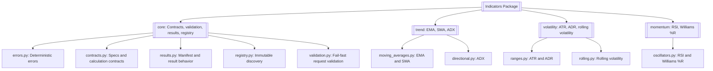
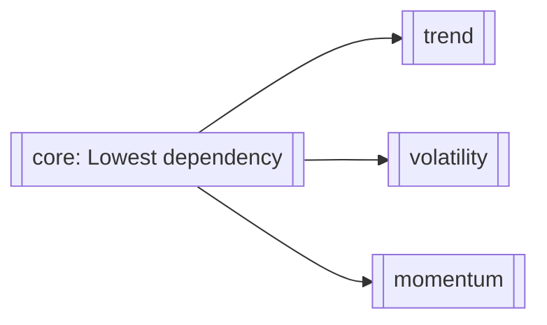
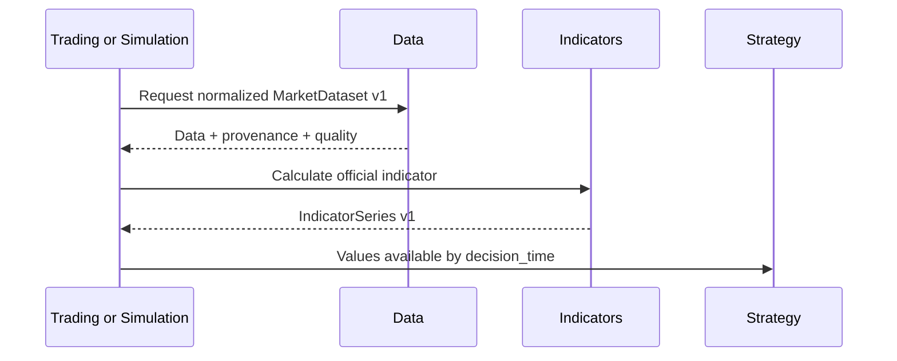
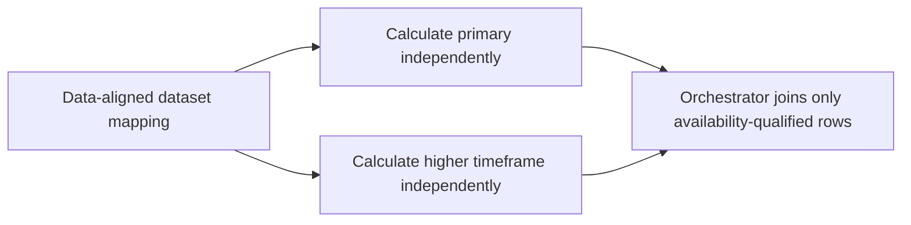
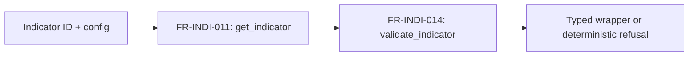

# Indicators

> **Package:** `app/services/indicators`
> **Status:** `Missing`
> **Last updated:** `2026-07-16`

> This README is the package's **single source of truth** for requirements, final structure, implementation sequence, progress, usage examples, and tests.
> Update this file before changing the code.

---

## 1. Purpose and Boundary

### Purpose

Indicators converts normalized market datasets into deterministic, vectorized decision-support series. It owns pure formula evaluation, input and parameter validation, no-lookahead availability metadata, deterministic result manifests, and discovery of the reviewed official indicator set. It performs no I/O and cannot make strategy, risk, simulation, or execution decisions.

### Owns

- Pure, stateless batch calculations for the approved official indicators.
- Exact formula, seed, warmup, null, degenerate-window, dtype, and tolerance specifications.
- Indicator parameter and calculation-input validation after Data has normalized the dataset.
- The `IndicatorSeries v1` contract, represented by `IndicatorResult` and `IndicatorManifest`.
- Deterministic output naming, row/symbol alignment, availability metadata, provenance/quality propagation, and copied joins.
- The immutable official indicator registry and machine-readable capability matrix.
- Indicator-specific deterministic error codes and basic calculation resource-limit enforcement.

### Does not own

- Data acquisition, provider adapters, source readiness, provider normalization, symbol mapping, calendar/session normalization, quote-quality policy, or multi-timeframe orchestration; Data owns these.
- Signal interpretation, crossover decisions, trade proposals, strategy lifecycle, or final position sizing.
- Risk approval, orders, fills, journals, broker/account state, execution, or broker mutation.
- Persistence, cache storage, audit sinks, telemetry export, tracing backends, SLO enforcement, or alert routing.
- Runtime custom registration, incremental/streaming state, chunking, out-of-core execution, acceleration, composition graphs, proprietary controls, or release engineering.
- Retrospective SMC/FVG/swing/BOS/CHoCH labels in the production indicator surface.

### Shared contracts

Contract definitions must match the name, version, and owner recorded in `docs/PROJECT.md`.

**Owned by this domain** — defined authoritatively here:

| Status | Contract | Version | Counterparty | Purpose |
|---|---|---|---|---|
| Missing | `IndicatorSeries` (`IndicatorResult`) | `v1` | Strategy; Trading and Simulation as orchestrators | Return deterministic indicator values and their earliest safe consumption time without exposing raw provider objects or mutable internal state. |

#### `IndicatorSeries v1` field contract

| Field | Type | Required | Contract |
|---|---|---|---|
| `contract_version` | `Literal["v1"]` | Yes | Compatibility version; consumers never parse `schema_id` to infer it. |
| `schema_id` | `Literal["indicators.indicator_series.v1"]` | Yes | Stable namespaced schema identity. |
| `indicator_id` | `str` | Yes | Stable lowercase official registry identifier. |
| `indicator_version` | `str` | Yes | Public implementation version. |
| `formula_version` | `str` | Yes | Version of the approved mathematical convention. |
| `parameter_hash` | `str` | Yes | SHA-256 digest of the approved canonical parameter representation. |
| `values` | `pandas.DataFrame` | Yes | Indicator-owned tabular result built from a private projection of one `MarketDataset v1`. Defensive deep copies protect stored result/checksum identity from caller mutation. It is never a Data-owned internal DataFrame or raw provider object. |
| `output_columns` | `tuple[str, ...]` | Yes | Deterministic lowercase snake_case indicator columns in canonical order. |
| `available_at` | column/series in `values` | Yes | UTC timestamp identifying the earliest safe decision time for each output row. |
| `computed_from_start` / `computed_from_end` | columns/series in `values` | Yes | Inclusive source-window bounds used for each output row. |
| `source_timeframe` | column/series in `values` | Yes | Timeframe of the normalized source observations. |
| `quality` | columns/metadata | Yes | Data-owned dataset quality status/score repeated without reclassification; the manifest carries canonical status/score/schema evidence plus source/license provenance. |
| `manifest` | `IndicatorManifest` | Yes | Deterministic identity, checksum, output-contract, availability, precision, provenance, and quality summary. |
| `errors` | `tuple[IndicatorError, ...]` | Conditional | Unused in v1 because public failures raise deterministic exceptions; no partial official result may be presented as success. |

**Failure contract:** invalid input raises one deterministic `IND_*` exception. Calculation failure is atomic; no partial `IndicatorSeries` is published.

#### `IndicatorSeries v1` values-column contract

Rows preserve the input record order. The index is a UTC `DatetimeIndex` named
`timestamp`. Columns appear in this exact order:

| Column | Dtype | Contract |
|---|---|---|
| `symbol` | pandas string | Exact `MarketDataset.symbol`, repeated for every row. |
| Official output columns | `float64` | Registry-declared canonical order. Warmup values are `NaN`; valid values are finite and normalize negative zero to positive zero. |
| `available_at` | `datetime64[ns, UTC]` | For valid output, the maximum `available_at` of all contributing records; for warmup output, the current source record's `available_at`. |
| `computed_from_start` | `datetime64[ns, UTC]` | Inclusive first contributing timestamp; `NaT` while the complete formula window is unavailable. |
| `computed_from_end` | `datetime64[ns, UTC]` | Inclusive last contributing timestamp; `NaT` while the complete formula window is unavailable. |
| `source_timeframe` | pandas string | Exact non-empty input timeframe. |
| `data_quality_status` | pandas string | Exact `MarketDataset.quality_report.quality_status`. |
| `data_quality_score` | `float64` | Exact finite decimal score converted to float64 for display; the manifest retains canonical decimal-string evidence. |
| `unavailable_reason` | pandas string | `"warmup"` before the first valid value and `NA` afterward. No other v1 reason is emitted for a successful result. |

An empty dataset or one with no usable bar observations raises
`IND_INSUFFICIENT_DATA`. A non-empty dataset shorter than the required warmup does
not raise: all rows are returned with warmup output and
`unavailable_reason="warmup"`.

For every valid output, `computed_from_end` is the current source timestamp.
`computed_from_start` is the earliest record on which that exact value causally
depends: the first dataset record for EMA, ATR, ADX, and RSI; the first record in
the current `period`-observation window for SMA, ADR, and Williams %R; and the first
price in the current `period+1`-price window for rolling volatility. `available_at`
is the maximum record `available_at` across that exact inclusive dependency range.

**Consumed from other domains** — referenced only, never redefined:

| Contract | Version | Owner | Used for |
|---|---|---|---|
| `MarketDataset` | `v1` | Data | Supply one normalized, immutable bar dataset for one symbol/timeframe with exact records, availability, provenance, and dataset-quality evidence. |

Every official calculation accepts exactly one `MarketDataset v1`. Indicators
validates that `data_kind == "bars"` and privately projects the canonical records to
pandas/NumPy for vectorized calculation. Public callers never supply a Data-owned
internal DataFrame. Multi-symbol batching is caller orchestration over independent
datasets; no official v1 calculation accepts more than one symbol.

### Persisted state

Indicators persists no tables, artifacts, cache entries, registry mutations, or incremental state. All public calculations have side effect `None`.
Indicators is not an `AuditEvent` producer: its API is pure and deterministic, so
the governed caller audits any surrounding action.

### Four-level structure

| Code level | Represents |
|---|---|
| **Package** | Indicators domain |
| **Module folder** | One approved feature/capability |
| **File** | One use case or focused responsibility |
| **Class / function / method** | Observable functional requirement behavior |

```text
Package
└── Module folder
    └── File
        └── Class / Function / Method
```

### Package capability map



---

## 2. Final Package Structure

The following is the intended end state, not the current V1 tree.

```text
indicators/
├── __init__.py                         # Approved domain-level exports only
├── README.md
├── core/                               # Feature: contracts and deterministic execution boundary
│   ├── __init__.py
│   ├── errors.py                       # Deterministic Core MVP error contract
│   ├── contracts.py                    # Immutable config/spec/warmup/protocol contracts
│   ├── results.py                      # IndicatorSeries manifest, values-only, and copied join
│   ├── registry.py                     # Immutable official specs and capability matrix
│   └── validation.py                   # Full fail-fast request validation
├── trend/                              # Feature: trend indicators
│   ├── __init__.py
│   ├── moving_averages.py              # EMA and SMA
│   └── directional.py                  # ADX
├── volatility/                         # Feature: volatility indicators
│   ├── __init__.py
│   ├── ranges.py                       # ATR and ADR
│   └── rolling.py                      # Return-based rolling volatility
└── momentum/                           # Feature: momentum indicators
    ├── __init__.py
    └── oscillators.py                  # RSI and Williams %R
```

Excluded from the initial structure: `base.py`, `batch/`, `incremental/`, `adapters/`, `custom/`, `candles/`, `volume/`, caching, composition, audit/telemetry, acceleration, and proprietary-access modules. WMA, Bollinger Bands, MACD, OBV, CMF, candlestick patterns, and HMA are excluded. MFI, rolling price-volume POC, current SMC labels, crossover helpers, pip conversion, balance-scaled volume, and generic averaging helpers have no final destination in this package.

### Module dependency diagram



`trend`, `volatility`, and `momentum` do not depend on one another. `core/registry.py` stores immutable metadata and import-path identity without importing feature implementations, preventing a registry/built-in cycle.

### Structure rules

- The root contains only `README.md`, `__init__.py`, and the four approved module folders.
- Built-ins are stateless functions. Classes are limited to immutable data contracts, the structural protocol, and the domain exception.
- Public callers import only from `app.services.indicators` or an approved feature `__init__.py`; leaf-file imports are not stable API.
- Every public symbol appears exactly once in Section 4.
- Private vectorization, hashing, naming, and formula helpers remain in the focused owning file and receive no separate requirement IDs.
- The immutable registry stores no runtime registrations and performs no plugin discovery.
- Usage examples live under `tests/indicators/usage/`, never in the production package.

### Current file disposition

The current workspace contains only `README.md` and the root `__init__.py`.

| Existing path | Classification | Build treatment |
|---|---|---|
| `README.md` | Reusable authoritative specification after this reconciliation | Keep synchronized with implementation evidence. |
| `__init__.py` | Non-conforming scaffold: it contains only the port docstring and `__all__ = ()` | Populate last, after all feature exports exist and import-contract tests pass. |
| Historical V1 formula/error files described by older text | Obsolete/absent from the current workspace | Do not assume or import them. If separately supplied later, use only as non-authoritative characterization evidence. |
| All files and folders in the final tree below the root port | Missing | Create in the exact dependency order defined below. |

### Exact implementation and file order

1. `core/errors.py` → `core/contracts.py` → `core/results.py` →
   `core/registry.py` → `core/validation.py` → `core/__init__.py`.
2. `trend/moving_averages.py` → `trend/directional.py` → `trend/__init__.py`.
3. `volatility/ranges.py` → `volatility/rolling.py` →
   `volatility/__init__.py`.
4. `momentum/oscillators.py` → `momentum/__init__.py`.
5. Root `__init__.py` is populated only after all feature tests and imports pass.

`trend`, `volatility`, and `momentum` are dependency peers, but their delivery order
is authoritative as listed above so review and handoff remain deterministic.

### Exact file-to-requirement allocation

| File | Assigned functional requirements |
|---|---|
| `core/errors.py` | `FR-INDI-001`, `FR-INDI-002` |
| `core/contracts.py` | `FR-INDI-003` through `FR-INDI-006` |
| `core/results.py` | `FR-INDI-007` through `FR-INDI-010` |
| `core/registry.py` | `FR-INDI-011` through `FR-INDI-013` |
| `core/validation.py` | `FR-INDI-014` |
| `trend/moving_averages.py` | `FR-INDI-015`, `FR-INDI-016` |
| `trend/directional.py` | `FR-INDI-017` |
| `volatility/ranges.py` | `FR-INDI-018`, `FR-INDI-019` |
| `volatility/rolling.py` | `FR-INDI-020` |
| `momentum/oscillators.py` | `FR-INDI-021`, `FR-INDI-022` |
| Feature `__init__.py` files | No independent `FR-*`; re-export only their feature's assigned symbols. |
| Root `__init__.py` | No independent `FR-*`; re-export only the approved `FR-INDI-001` through `FR-INDI-022` public symbols. |
| `README.md` | No implementation requirement; authoritative specification and evidence ledger. |

### Public import and API contract

The package root `app.services.indicators` is the canonical public import surface. Its intended `__all__` is exactly:

```text
IndicatorErrorCode, IndicatorError,
IndicatorConfig, IndicatorSpec, WarmupRequirement, IndicatorProtocol,
IndicatorManifest, IndicatorResult,
get_indicator, list_indicators, get_capability_matrix, validate_indicator,
ema, sma, adx, atr, adr, rolling_volatility, rsi, williams_r
```

| Public symbols | Classification | Official workflow eligibility | Cache behavior | Public side effects |
|---|---|---|---|---|
| `IndicatorErrorCode`, `IndicatorError` | Stable | `WF-INDI-001..005` | Not applicable | None |
| `IndicatorConfig`, `IndicatorSpec`, `WarmupRequirement`, `IndicatorProtocol` | Stable | `WF-INDI-001..005` | Carries no cache configuration | None |
| `IndicatorManifest`, `IndicatorResult`, `IndicatorResult.values_only`, `IndicatorResult.join_to` | Stable | `WF-INDI-001..004` | Exposes identity/checksum material only; no reads or writes | None |
| `get_indicator`, `list_indicators`, `get_capability_matrix` | Stable | `WF-INDI-005` | None; immutable in-memory metadata | None |
| `validate_indicator` | Stable | `WF-INDI-001..005` | No cache access | None |
| `ema`, `sma`, `adx`, `atr`, `adr`, `rolling_volatility`, `rsi`, `williams_r` | Stable | `WF-INDI-001..004`; official in `SYS-WF-001` and `SYS-WF-002` | No cache access; returns canonical checksum material | None |

No experimental, optional, or future callable is exported in the initial package. Excluded capabilities appear only in the capability matrix as unsupported modes, not as callable stubs.

---

## 3. Workflows

### Status values

| Status | Meaning |
|---|---|
| **Missing** | Not implemented or not verified against the final contract. |
| **Partial** | Useful V1 behavior exists, but final contracts, relocation, or tests remain incomplete. |
| **Completed** | Implemented, tested, and verified against this README. |

### Workflow register

| Status | Workflow ID | Scope | Workflow | Trigger / Input boundary | Final outcome / Output boundary | Requirement sequence |
|---|---|---|---|---|---|---|
| Missing | `WF-INDI-001` | Internal | Core batch indicator calculation | One normalized `MarketDataset v1` plus approved config | Atomic `IndicatorResult` with values, availability, quality, and manifest | `FR-INDI-014 → FR-INDI-015..022 → FR-INDI-007..010` |
| Missing | `WF-INDI-002` | Cross-domain | Decision-time consumption | Trading or Simulation supplies Data-owned normalized input | `IndicatorSeries v1` returned for Strategy consumption | `FR-INDI-014 → FR-INDI-015..022 → FR-INDI-008` |
| Missing | `WF-INDI-003` | Cross-domain | Warmup coordination | Caller queries an official `WarmupRequirement` and supplies sufficient history | Warmup rows retained and explicitly unavailable until safe | `FR-INDI-005 → FR-INDI-014 → FR-INDI-015..022` |
| Missing | `WF-INDI-004` | Cross-domain | Availability-aware multi-timeframe orchestration compatibility | Data supplies separately keyed aligned primary and higher-timeframe datasets; caller calculates each independently | Separately returned series preserve source availability and can be combined by the orchestrator without lookahead | `FR-INDI-014 → FR-INDI-015..022 → FR-INDI-007` |
| Missing | `WF-INDI-005` | Internal | Static registry discovery and validation | Caller supplies official indicator ID/config | Validated spec/capability record or deterministic refusal | `FR-INDI-011..014` |

`WF-INDI-001` through `WF-INDI-004` are multi-feature completion gates: Core plus
trend, volatility, and momentum must all be implemented and tested before those
workflow rows become `Completed`, because their requirement ranges cover the whole
official family. `WF-INDI-005` is Core-only and may complete after Section 4.1.

### `WF-INDI-001` — Core Batch Indicator Calculation

**Scope:** `Internal`
**System workflow:** `None`

**Input boundary:** One immutable `MarketDataset v1` and calculation-relevant
`IndicatorConfig`.
**Output boundary:** An atomic `IndicatorResult`; the input contract remains
unchanged.

1. `validate_indicator()` resolves the immutable `IndicatorSpec` and validates the entire config and input before formula work.
2. One official convenience function executes its approved vectorized formula for the dataset's single symbol in canonical row order.
3. The function retains warmup/unavailable rows and derives `available_at` and source-window bounds.
4. Data-owned provenance and quality are propagated without redefining upstream policy.
5. The function returns deterministic values, output names, checksums, and manifest metadata.

**Failure behavior:** validation or limit failure produces one Core MVP `IND_*` error before calculation; formula failure is atomic; output collision or detected input mutation fails rather than overwriting data.

**Integration test:**
`tests/indicators/integration/test_batch_calculation.py::test_batch_calculation_returns_atomic_available_result()`


### `WF-INDI-002` — Decision-Time Consumption

**Scope:** `Cross-domain`
**System workflow:** `SYS-WF-001`, `SYS-WF-002`

**Input boundary:** Trading (live/paper) or Simulation (historical) supplies Data-owned normalized market data.
**Output boundary:** Indicators returns `IndicatorSeries v1`; Strategy consumes only rows whose `available_at <= decision_time`.

Indicators calculates and describes availability only. Trading/Simulation owns orchestration, and Strategy/Simulation owns enforcement of the decision-time filter and any resulting action.

**Failure behavior:** invalid normalized input or unverifiable availability fails closed with no partial series; a downstream lookahead violation remains a downstream policy error, informed by `IND_LOOKAHEAD_RISK` metadata/error evidence.

**Integration test:**
`tests/indicators/integration/test_decision_time_consumption.py::test_strategy_receives_only_availability_qualified_series()`



### `WF-INDI-003` — Warmup Coordination

**Scope:** `Cross-domain`
**System workflow:** `SYS-WF-001`, `SYS-WF-002`

**Input boundary:** The caller resolves `WarmupRequirement`, then Data supplies the requested normalized history.
**Output boundary:** Indicators retains all rows and marks warmup/unavailable values explicitly.

Indicators never fetches history. A non-empty short dataset retains all aligned
rows, sets indicator values to `NaN`, sets window bounds to `NaT`, marks
`unavailable_reason="warmup"`, and never fetches additional history. An empty
dataset raises `IND_INSUFFICIENT_DATA`.

**Integration test:**
`tests/indicators/integration/test_warmup_coordination.py::test_warmup_requirement_preserves_unavailable_rows()`


### `WF-INDI-004` — Availability-Aware Multi-Timeframe Calculation

**Scope:** `Cross-domain`
**System workflow:** `SYS-WF-001`, `SYS-WF-002`

**Input boundary:** Data supplies a mapping of already normalized/aligned
`MarketDataset v1` values. The orchestrator submits the primary and at most one
higher-timeframe dataset as separate official calculations.
**Output boundary:** Indicators returns one independent series per submitted
dataset. Each result preserves the source dataset's timeframe and record
availability; Indicators neither combines nor realigns the results.

Data owns multi-timeframe resampling/alignment. Trading, Simulation, or Strategy
owns decision-time combination of the separate series. Official Indicator
calculators therefore report `multi_timeframe_support=false`; compatibility means
their separately calculated results remain causally joinable by the orchestrator.

**Failure behavior:** either individual dataset fails its normal validation
atomically. Consumption before a higher-timeframe result's `available_at` is rejected
by the consuming/orchestrating domain; Indicators does not receive a decision time.

**Integration test:**
`tests/indicators/integration/test_multi_timeframe.py::test_separate_timeframe_results_preserve_source_availability()`



### `WF-INDI-005` — Static Registry Discovery and Validation

**Scope:** `Internal`
**System workflow:** `None`

**Input boundary:** Official indicator ID and candidate config.
**Output boundary:** Immutable `IndicatorSpec`/capability metadata or deterministic `IND_UNSUPPORTED_INDICATOR` / validation error.

The registry exposes only eight reviewed built-ins and cannot register or unregister at runtime.

**Integration test:**
`tests/indicators/integration/test_registry_workflow.py::test_registry_discovers_and_validates_only_official_batch_indicators()`



---

## 4. Module and Requirement Specifications

Modules and files are arranged in implementation order.

### 4.1 `core/` — Contracts, Results, Validation, and Discovery

**Purpose:** Define the complete pure calculation boundary shared by every official built-in.

**Module flow:**

```text
indicator id + normalized data + config
  → registry.py
  → validation.py
  → feature calculation
  → results.py
  → IndicatorResult
```

### Files

| Status | File | Responsibility | Key exports | Dependencies |
|---|---|---|---|---|
| Missing | `errors.py` | Define the compact Core MVP error catalogue and one structured domain exception. | `IndicatorErrorCode`, `IndicatorError` | **Standard library:** `enum`, `typing`<br>**Required third-party:** None<br>**Local:** None |
| Missing | `contracts.py` | Define immutable calculation config, spec, warmup, and structural callable contracts. | `IndicatorConfig`, `IndicatorSpec`, `WarmupRequirement`, `IndicatorProtocol` | **Standard library:** `collections.abc`, `dataclasses`, `typing`<br>**Required third-party:** None<br>**Local:** `app.services.data → MarketDataset`; `errors.py → IndicatorError` |
| Missing | `results.py` | Define deterministic manifest/result fields and safe result projection/join behavior. | `IndicatorManifest`, `IndicatorResult` | **Standard library:** `dataclasses`, `typing`<br>**Required third-party:** `pandas`<br>**Local:** `contracts.py → IndicatorConfig`; `errors.py → IndicatorError` |
| Missing | `registry.py` | Expose immutable official specs and capability metadata without importing feature implementations. | `get_indicator`, `list_indicators`, `get_capability_matrix` | **Standard library:** `collections.abc`<br>**Required third-party:** None<br>**Local:** `contracts.py → IndicatorSpec`; `errors.py → IndicatorError, IndicatorErrorCode` |
| Missing | `validation.py` | Resolve and fully validate one batch request before any formula work. | `validate_indicator` | **Standard library:** None<br>**Required third-party:** None<br>**Local:** `app.services.data → MarketDataset, OHLCVRecord`; `contracts.py → IndicatorConfig, IndicatorSpec`; `errors.py → IndicatorError, IndicatorErrorCode`; `registry.py → get_indicator` |
| Missing | `__init__.py` | Expose only the approved public Core API. | All Core exports above | **Standard library:** None<br>**Required third-party:** None<br>**Local:** Approved exports from the five files above |

### Configuration and Limits Manifest

| Status | Setting / Limit | Type | Default | Required | Used by | Description |
|---|---|---|---|---|---|---|
| Missing | `IndicatorConfig.source` | `str` | `"close"` when the formula has a price source | Conditional | Official wrappers | Selects exactly one of `open`, `high`, `low`, or `close`; non-default sources appear in output names. Fixed-OHLC indicators use `None`. |
| Missing | `IndicatorConfig.indicator_id` | `str` | None | Yes | Registry/calculators | Exact lowercase official ID; it must match the called wrapper. |
| Missing | `IndicatorConfig.parameters` | `tuple[tuple[str, int \| float \| str], ...]` | `()` | Yes | Registry/calculators | Canonical key-sorted immutable parameters; duplicate keys are invalid. |
| Missing | `IndicatorConfig.formula_version` | `str` | Registry version | Yes | Validation | Must equal the selected official spec. |
| Missing | `IndicatorConfig.output_mode` | `Literal["values"]` | `"values"` | Yes | Public calculations, `IndicatorResult` | Core returns aligned values; copied enrichment is requested explicitly through `join_to()`. Additional modes are excluded. |
| Missing | `IndicatorConfig.column_conflict_policy` | `Literal["error"]` | `"error"` | Yes | `IndicatorResult.join_to()` | Any collision fails with `IND_OUTPUT_COLUMN_CONFLICT`; overwrite/suffix/prefix policies are excluded. |
| Missing | `IndicatorConfig.precision_dtype` | `Literal["float64"]` | `"float64"` | Yes | All calculations | Core numerical output uses float64 under the approved formula tolerance; unsupported dtypes fail. |
| Missing | `IndicatorConfig.availability_policy` | `Literal["source_available_at"]` | `"source_available_at"` | Yes | Official wrappers | Valid output is available at the maximum contributing record `available_at`; short non-empty history remains warmup output. |
| Missing | `IndicatorConfig.quality_policy` | `Literal["propagate_dataset"]` | `"propagate_dataset"` | Yes | `validate_indicator`, official wrappers | Requires Data-owned dataset quality evidence and propagates status/score without reclassification. |
| Missing | `IndicatorConfig.error_mode` | `Literal["raise"]` | `"raise"` | Yes | All public callables | Every public failure raises one deterministic exception; result-error and partial-success modes are unsupported in v1. |
| Missing | `MAX_INPUT_ROWS` | Positive `int` | `1000000` | Yes | `validate_indicator` | Rejects oversized input with `IND_RESOURCE_LIMIT_EXCEEDED`. |
| Missing | `IndicatorManifest.manifest_version` | `str` | `"v1"` | Yes | `IndicatorManifest` | Versions the deterministic manifest contract. |
| Missing | `IndicatorManifest.output_schema_version` | `str` | `"v1"` | Yes | `IndicatorManifest` | Versions the `IndicatorSeries` values schema. |

Public wrappers own convenience arguments. They construct the complete immutable
config before validation. If an explicitly supplied config disagrees with wrapper
`indicator_id`, `period`, `source`, or formula version, the wrapper raises
`IND_INVALID_CONFIG`; no precedence or silent override exists.

#### `errors.py` — Deterministic Error Contract

**File responsibility:** Represent only the 22 approved Core MVP codes and their redacted structured exception.

| Status | Requirement ID | Responsibility | Class / Function / Method | Side Effects | Raises | Usage / Test |
|---|---|---|---|---|---|---|
| Missing | `FR-INDI-001` | The system shall expose exactly the approved Core MVP codes: `IND_INVALID_CONFIG`, `IND_INVALID_PARAMETER`, `IND_UNSUPPORTED_INDICATOR`, `IND_UNSUPPORTED_TIMEFRAME`, `IND_UNSUPPORTED_DTYPE`, `IND_INVALID_INPUT_SCHEMA`, `IND_MISSING_REQUIRED_COLUMN`, `IND_INVALID_OUTPUT_COLUMN`, `IND_OUTPUT_COLUMN_CONFLICT`, `IND_INVALID_OUTPUT_MODE`, `IND_INPUT_MUTATION_DETECTED`, `IND_DUPLICATE_TIMESTAMP`, `IND_NON_MONOTONIC_TIME`, `IND_AMBIGUOUS_TIMESTAMP`, `IND_INVALID_TIMEZONE`, `IND_INVALID_OHLC`, `IND_INSUFFICIENT_DATA`, `IND_LOOKAHEAD_RISK`, `IND_FORMULA_VERSION_MISMATCH`, `IND_RESOURCE_LIMIT_EXCEEDED`, `IND_PARTIAL_RESULT`, and `IND_INTERNAL_ERROR`. | `IndicatorErrorCode: StrEnum` | None | None | **Usage:** `tests/indicators/usage/test_usage_core.py::test_usage_errors_error_codes()`<br>**Unit:** `tests/indicators/unit/test_errors.py::test_error_code_catalog_contains_only_core_codes()` |
| Missing | `FR-INDI-002` | The system shall represent a deterministic, redacted failure with code, safe message, and structured details without exposing raw exceptions or sensitive input data. | `IndicatorError(code: IndicatorErrorCode, message: str, details: Mapping[str, object] | None = None)` | None | None | **Usage:** `tests/indicators/usage/test_usage_core.py::test_usage_errors_indicator_error()`<br>**Unit:** `tests/indicators/unit/test_errors.py::test_indicator_error_serializes_redacted_details()` |

**Rules:**

- Codes rejected as Data-owned and codes tied to excluded features are not public Core members.
- Raw pandas/NumPy/provider exceptions never cross the public boundary.
- `IND_PARTIAL_RESULT` is a failure code; partial data is never returned as successful official output.
- Synchronous calculations expose no internal timeout or cancellation API.
  Trading/Simulation/UI orchestration owns external deadlines and task cancellation.
- `message` is non-empty, deterministic, and at most 256 characters.
- `details` contains at most 16 lowercase-snake-case keys, each at most 64
  characters. Values are JSON scalars or tuples of at most 20 JSON scalars;
  strings are at most 256 characters, floats must be finite, and nested mappings,
  raw records, arrays, DataFrames, tracebacks, and exception objects are rejected.
- Strings in `message` and `details` pass through the Utils redaction boundary
  before serialization. The stored details mapping is immutable.

**Implementation notes:** No existing Indicators error implementation is present in
the current workspace. Create only this approved contract under `core/`; do not
reconstruct historical public classes that are absent from the specification.

#### `contracts.py` — Immutable Calculation Contracts

**File responsibility:** Define calculation-relevant immutable contracts without platform, cache, audit, or incremental state.

| Status | Requirement ID | Responsibility | Class / Function / Method | Side Effects | Raises | Usage / Test |
|---|---|---|---|---|---|---|
| Missing | `FR-INDI-003` | The system shall represent indicator ID, canonical parameters, source, formula version, output/precision/availability/quality policy, and error mode in one immutable batch config, excluding cache, calendar, backend, actor, tracing, SLO, entitlement, timeout, cancellation, and orchestration context. | `IndicatorConfig` | None | None | **Usage:** `tests/indicators/usage/test_usage_core.py::test_usage_contracts_indicator_config()`<br>**Unit:** `tests/indicators/unit/test_contracts.py::test_indicator_config_is_immutable_and_core_only()` |
| Missing | `FR-INDI-004` | The system shall describe each official indicator's ID, name, versions, tier, required columns, parameter/output schemas, warmup policy, supported batch capabilities, import path, stability, and workflow eligibility. | `IndicatorSpec` | None | None | **Usage:** `tests/indicators/usage/test_usage_core.py::test_usage_contracts_indicator_spec()`<br>**Unit:** `tests/indicators/unit/test_contracts.py::test_indicator_spec_contains_required_public_metadata()` |
| Missing | `FR-INDI-005` | The system shall expose the exact normalized history requirement for an indicator/config without fetching data, including minimum observations, source timeframe, required columns, and availability basis. | `WarmupRequirement` | None | None | **Usage:** `tests/indicators/usage/test_usage_core.py::test_usage_contracts_warmup_requirement()`<br>**Unit:** `tests/indicators/unit/test_contracts.py::test_warmup_requirement_is_deterministic()` |
| Missing | `FR-INDI-006` | The system shall expose a minimal structural registered-calculator protocol whose approved calculation accepts one normalized `MarketDataset v1` plus a complete `IndicatorConfig` and returns `IndicatorResult`; public convenience wrappers construct the config and are not required to share this internal signature. | `IndicatorProtocol.calculate(data: MarketDataset, config: IndicatorConfig) -> IndicatorResult` | None | `IndicatorError`: deterministic request/calculation failure under the approved error mode | **Usage:** `tests/indicators/usage/test_usage_core.py::test_usage_contracts_indicator_protocol()`<br>**Unit:** `tests/indicators/unit/test_contracts.py::test_official_calculator_satisfies_indicator_protocol()` |

**Rules:** Contracts are frozen, typed, JSON-compatible where serialized, and contain only calculation-relevant metadata. Serialized field types are exactly those declared by the contract requirements.

#### Exact Core contract fields

| Contract | Exact fields |
|---|---|
| `IndicatorConfig` | `indicator_id: str`; `parameters: tuple[tuple[str, int \| float \| str], ...]`; `source: str \| None`; `formula_version: str`; `output_mode: Literal["values"]`; `column_conflict_policy: Literal["error"]`; `precision_dtype: Literal["float64"]`; `availability_policy: Literal["source_available_at"]`; `quality_policy: Literal["propagate_dataset"]`; `error_mode: Literal["raise"]` |
| `IndicatorSpec` | `indicator_id: str`; `name: str`; `indicator_version: str`; `formula_version: str`; `tier: Literal["core_mvp"]`; `required_columns: tuple[str, ...]`; `parameter_schema: Mapping[str, object]`; `output_templates: tuple[str, ...]`; `warmup_policy: Literal["period", "period_plus_one", "two_period"]`; `vectorized: Literal[True]`; `multi_symbol: Literal[False]`; `multi_timeframe: Literal[False]`; `import_path: str`; `stability: Literal["stable"]`; `workflow_eligibility: tuple[str, ...]` |
| `WarmupRequirement` | `indicator_id: str`; `formula_version: str`; `minimum_observations: int`; `source_timeframe: str \| None`; `required_columns: tuple[str, ...]`; `availability_basis: Literal["source_available_at"]` |

Mappings are frozen and serialized as ordinary JSON objects. Parameter tuples are
strictly sorted by key. Keys are lowercase snake_case and unique. Parameter values
are finite scalar JSON values only; booleans are rejected as numeric parameters.
Every official `period` is an integer satisfying
`2 <= period <= MAX_INPUT_ROWS`; booleans are rejected.

#### `results.py` — Manifest and Result Behavior

**File responsibility:** Build and expose the deterministic `IndicatorSeries v1` result without mutating source data.

| Status | Requirement ID | Responsibility | Class / Function / Method | Side Effects | Raises | Usage / Test |
|---|---|---|---|---|---|---|
| Missing | `FR-INDI-007` | The system shall expose a standalone serializable deterministic manifest containing manifest/indicator/formula/output-schema versions, canonical parameter hash, input/output checksums, output contract and shape, precision, availability policy, Data-provided provenance, and quality summary; volatile runtime/host data is excluded from identity. | `IndicatorManifest` | None | None | **Usage:** `tests/indicators/usage/test_usage_core.py::test_usage_results_manifest()`<br>**Unit:** `tests/indicators/unit/test_results.py::test_manifest_is_stable_for_equivalent_inputs()` |
| Missing | `FR-INDI-008` | The system shall return timestamp/symbol-aligned values, canonical output columns, availability, quality, errors, and manifest as `IndicatorSeries v1`, preserving warmup and unavailable rows and exposing no incremental state or metrics. | `IndicatorResult` | None | None | **Usage:** `tests/indicators/usage/test_usage_core.py::test_usage_results_indicator_result()`<br>**Unit:** `tests/indicators/unit/test_results.py::test_indicator_result_matches_v1_contract()` |
| Missing | `FR-INDI-009` | The system shall expose a copy-safe projection containing generated indicator, availability, and quality columns without original OHLCV columns. | `IndicatorResult.values_only: pd.DataFrame` | None | None | **Usage:** `tests/indicators/usage/test_usage_core.py::test_usage_results_values_only()`<br>**Unit:** `tests/indicators/unit/test_results.py::test_values_only_excludes_source_columns()` |
| Missing | `FR-INDI-010` | The system shall privately project one matching `MarketDataset v1`, append generated columns to that copied canonical tabular projection, and preserve source columns, row count/order, timestamp/symbol layout, warmup rows, and input identity; collisions fail. | `IndicatorResult.join_to(data: MarketDataset, mode: Literal["copy"] = "copy") -> pd.DataFrame` | None | `IndicatorError`: invalid mode, dataset/checksum mismatch, output collision, or detected mutation | **Usage:** `tests/indicators/usage/test_usage_core.py::test_usage_results_join_to()`<br>**Unit:** `tests/indicators/unit/test_results.py::test_join_to_preserves_input_and_alignment()` |

#### Exact manifest and result fields

`IndicatorManifest` is a frozen serializable dataclass with these exact fields:

| Field | Exact type/value |
|---|---|
| `manifest_version` | `Literal["v1"] = "v1"` |
| `contract_version` | `Literal["v1"] = "v1"` |
| `indicator_id` | `str` |
| `indicator_version` | `str` |
| `formula_version` | `str` |
| `output_schema_version` | `Literal["v1"] = "v1"` |
| `parameter_hash` | lowercase 64-character SHA-256 `str` |
| `input_checksum` | lowercase 64-character SHA-256 `str` |
| `output_checksum` | lowercase 64-character SHA-256 `str` |
| `output_columns` | `tuple[str, ...]` |
| `row_count` | non-negative `int` |
| `symbol` | non-empty `str` |
| `source_timeframe` | non-empty `str` |
| `precision_dtype` | `Literal["float64"] = "float64"` |
| `availability_policy` | `Literal["source_available_at"] = "source_available_at"` |
| `normalization_version` | exact non-empty Data-owned `str` |
| `source_metadata` | immutable `Mapping[str, str]`, copied from Data |
| `license_metadata` | immutable `Mapping[str, str]`, copied from Data |
| `quality_status` | `Literal["passed", "passed_with_warnings", "not_checked"]` |
| `quality_score` | canonical finite decimal `str`, copied from Data |
| `quality_schema_version` | exact non-empty Data-owned `str` |

Volatile host, process, thread, duration, and wall-clock calculation fields are
excluded. A Data quality status of `failed` is rejected before result construction.

`IndicatorResult` is a frozen container with these exact fields:

| Field | Exact type/value |
|---|---|
| `contract_version` | `Literal["v1"] = "v1"` |
| `schema_id` | `Literal["indicators.indicator_series.v1"] = "indicators.indicator_series.v1"` |
| `indicator_id` | `str` |
| `indicator_version` | `str` |
| `formula_version` | `str` |
| `parameter_hash` | lowercase 64-character SHA-256 `str` |
| `values` | owned `pandas.DataFrame` following the exact values-column contract |
| `output_columns` | `tuple[str, ...]` |
| `manifest` | `IndicatorManifest` |
| `errors` | `tuple[IndicatorError, ...] = ()` |

Construction deep-copies `values`; `values_only` and `join_to()` each return a new
deep copy.

#### Canonical identity rules

1. Parameter-hash material is
   `{"indicator_id", "formula_version", "parameters", "source"}`. Parameters are
   emitted as a key-sorted object. SHA-256 is calculated over
   `app.utils.canonical_json(...)` UTF-8 bytes.
2. Input-checksum material is `MarketDataset.model_dump(mode="json")` with record
   tuple order preserved and mapping keys canonicalized by
   `app.utils.canonical_json`.
3. Output-checksum material is records-oriented JSON in exact result row and column
   order. UTC timestamps use canonical `Z` strings; `NaT`, `NaN`, and pandas `NA`
   serialize as JSON null; negative zero normalizes to `0.0`; finite float64 values
   serialize through `float.hex()`.
4. Hashes are lowercase 64-character hexadecimal SHA-256 strings.
5. `join_to()` never overwrites and accepts only the exact input dataset whose
   canonical checksum matches the manifest.

#### `registry.py` — Immutable Official Discovery

**File responsibility:** Describe the eight official built-ins and supported Core modes without runtime mutation or implementation imports.

| Status | Requirement ID | Responsibility | Class / Function / Method | Side Effects | Raises | Usage / Test |
|---|---|---|---|---|---|---|
| Missing | `FR-INDI-011` | The system shall resolve one official ID (`ema`, `sma`, `adx`, `atr`, `adr`, `rolling_volatility`, `rsi`, `williams_r`) to its immutable spec and reject all unknown IDs before calculation. | `get_indicator(indicator_id: str) -> IndicatorSpec` | None | `IndicatorError`: `IND_UNSUPPORTED_INDICATOR` | **Usage:** `tests/indicators/usage/test_usage_core.py::test_usage_registry_get_indicator()`<br>**Unit:** `tests/indicators/unit/test_registry.py::test_get_indicator_rejects_unknown_id()` |
| Missing | `FR-INDI-012` | The system shall list official specs in stable indicator-ID order with no mutable registry handle. | `list_indicators() -> tuple[IndicatorSpec, ...]` | None | None | **Usage:** `tests/indicators/usage/test_usage_core.py::test_usage_registry_list_indicators()`<br>**Unit:** `tests/indicators/unit/test_registry.py::test_list_indicators_is_stable_and_immutable()` |
| Missing | `FR-INDI-013` | The system shall expose a JSON/YAML-compatible matrix containing ID, versions, tier, batch/vectorized/multi-symbol/multi-timeframe support, unsupported optional modes, dependencies, deterministic unsupported codes, and official-workflow eligibility. | `get_capability_matrix() -> tuple[Mapping[str, object], ...]` | None | None | **Usage:** `tests/indicators/usage/test_usage_core.py::test_usage_registry_capability_matrix()`<br>**Unit:** `tests/indicators/unit/test_registry.py::test_capability_matrix_matches_registry()` |

**Rules:** Batch/vectorized is the only execution mode. Incremental, streaming, cache, composition, out-of-core, acceleration, audit/observability, custom registration, and proprietary modes are reported unsupported and expose no unused APIs.

#### Official registry identity

Registry order is exactly `adx`, `adr`, `atr`, `ema`, `rolling_volatility`, `rsi`,
`sma`, `williams_r`. Every entry uses `indicator_version="1.0.0"`,
`formula_version="1.0.0"`, `tier="core_mvp"`, `vectorized=true`,
`multi_symbol=false`, `multi_timeframe=false`, and `stability="stable"`.

| ID | Import path |
|---|---|
| `adx` | `app.services.indicators.trend.directional:adx` |
| `adr` | `app.services.indicators.volatility.ranges:adr` |
| `atr` | `app.services.indicators.volatility.ranges:atr` |
| `ema` | `app.services.indicators.trend.moving_averages:ema` |
| `rolling_volatility` | `app.services.indicators.volatility.rolling:rolling_volatility` |
| `rsi` | `app.services.indicators.momentum.oscillators:rsi` |
| `sma` | `app.services.indicators.trend.moving_averages:sma` |
| `williams_r` | `app.services.indicators.momentum.oscillators:williams_r` |

`parameter_schema` is a recursively frozen JSON-compatible mapping. Every entry
uses the exact period schema
`{"type": "integer", "minimum": 2, "maximum": 1000000,
"required": <bool>, "default": <int or null>}`.

| ID | Required columns | Period required/default | Output templates in order | Warmup policy |
|---|---|---|---|---|
| `adx` | `("high", "low", "close")` | No / `14` | `("adx_{period}", "plus_di_{period}", "minus_di_{period}")` | `two_period` |
| `adr` | `("high", "low")` | No / `14` | `("adr_{period}",)` | `period` |
| `atr` | `("high", "low", "close")` | No / `14` | `("atr_{period}",)` | `period` |
| `ema` | `("source",)` | Yes / `null` | `("ema_{period}", "ema_{source}_{period}")` | `period` |
| `rolling_volatility` | `("source",)` | Yes / `null` | `("rolling_volatility_{period}", "rolling_volatility_{source}_{period}")` | `period_plus_one` |
| `rsi` | `("source",)` | No / `14` | `("rsi_{period}", "rsi_{source}_{period}")` | `period_plus_one` |
| `sma` | `("source",)` | Yes / `null` | `("sma_{period}", "sma_{source}_{period}")` | `period` |
| `williams_r` | `("high", "low", "close")` | No / `14` | `("williams_r_{period}",)` | `period` |

For source-selectable entries, `"source"` is a registry placeholder resolved to
the exact validated `IndicatorConfig.source` before calculation. Only one of the
two naming templates is emitted: the first for `close`, the second for a
non-default source.

Every registry entry has
`workflow_eligibility=("WF-INDI-001", "WF-INDI-002", "WF-INDI-003",
"WF-INDI-004")`. Every capability-matrix record has these exact keys in this order:
`indicator_id`, `indicator_version`, `formula_version`, `tier`, `batch`,
`vectorized`, `multi_symbol`, `multi_timeframe`, `unsupported_optional_modes`,
`dependencies`, `unsupported_codes`, and `official_workflow_eligibility`.
`batch` and `vectorized` are `true`; both multi flags are `false`.

`unsupported_optional_modes` is exactly
`("incremental", "streaming", "cache", "composition", "custom_registration",
"out_of_core", "acceleration", "proprietary")`. `unsupported_codes` maps each of
those names to `"IND_INVALID_CONFIG"`; the modes expose no callable stub.
Dependencies are `("pandas",)` for EMA/SMA and `("numpy", "pandas")` for every
other official indicator.

#### `validation.py` — Fail-Fast Request Validation

**File responsibility:** Validate all domain-owned request conditions before formula execution.

| Status | Requirement ID | Responsibility | Class / Function / Method | Side Effects | Raises | Usage / Test |
|---|---|---|---|---|---|---|
| Missing | `FR-INDI-014` | The system shall resolve the spec and atomically validate config, parameters, row limits, `MarketDataset v1` identity, bars-only kind, one symbol/timeframe, required OHLC fields, ordered unique UTC record timestamps, finite OHLC consistency, output names/collisions, quality evidence, and formula version before private projection/calculation; an empty dataset fails, while a non-empty short dataset remains valid warmup input. Upstream source-quality policy remains Data-owned. | `validate_indicator(indicator_id: str, data: MarketDataset, config: IndicatorConfig) -> IndicatorSpec` | None | `IndicatorError`: first deterministic Core validation failure | **Usage:** `tests/indicators/usage/test_usage_core.py::test_usage_validation_validate_indicator()`<br>**Unit:** `tests/indicators/unit/test_validation.py::test_validate_indicator_fails_before_formula_execution()` |

**Rules:** Validation is whole-request and precedes private projection/formula work.
The public Data contract already supplies immutable ordered records and UTC/exact
numeric validation; Indicators verifies the conditions its formula requires without
redefining Data policy. A failed Data quality report fails
`IND_INVALID_INPUT_SCHEMA`; `passed`, `passed_with_warnings`, and `not_checked`
statuses are propagated. Provider-specific
adjustment, symbol mapping, calendar, stub-quote, inverted-market, and spread rules
are never duplicated here.

All selected Decimal source/OHLC values must convert to finite float64 without
overflow; otherwise validation raises `IND_UNSUPPORTED_DTYPE`. Rolling-volatility
source prices must be strictly positive for logarithms; a non-positive value raises
`IND_INVALID_OHLC`.

#### Deterministic validation and finalization precedence

Validation stops at the first failing step in this exact order:

| Order | Check | Error code |
|---|---|---|
| 1 | Official indicator ID exists | `IND_UNSUPPORTED_INDICATOR` |
| 2 | Wrapper/config indicator identity and fixed policy fields agree | `IND_INVALID_CONFIG` |
| 3 | Output mode is exactly `values` | `IND_INVALID_OUTPUT_MODE` |
| 4 | Precision dtype is exactly `float64` | `IND_UNSUPPORTED_DTYPE` |
| 5 | Formula version matches the registry | `IND_FORMULA_VERSION_MISMATCH` |
| 6 | Period/source and all parameter-schema rules pass | `IND_INVALID_PARAMETER` |
| 7 | Input row count does not exceed `MAX_INPUT_ROWS` | `IND_RESOURCE_LIMIT_EXCEEDED` |
| 8 | Contract/schema identity is `MarketDataset v1`, `data_kind` is `bars`, record types match, and Data quality is not `failed` | `IND_INVALID_INPUT_SCHEMA` |
| 9 | ADR source timeframe is exactly `D1` | `IND_UNSUPPORTED_TIMEFRAME` |
| 10 | Dataset contains at least one usable record | `IND_INSUFFICIENT_DATA` |
| 11 | Required fixed/source columns are present in the private projection | `IND_MISSING_REQUIRED_COLUMN` |
| 12 | Record timestamps are UTC-aware | `IND_INVALID_TIMEZONE` |
| 13 | UTC timestamps round-trip uniquely into the pandas index | `IND_AMBIGUOUS_TIMESTAMP` |
| 14 | Timestamps are unique | `IND_DUPLICATE_TIMESTAMP` |
| 15 | Timestamps are strictly increasing | `IND_NON_MONOTONIC_TIME` |
| 16 | Selected numeric values convert to finite float64 | `IND_UNSUPPORTED_DTYPE` |
| 17 | Formula-specific OHLC/positive-price invariants pass | `IND_INVALID_OHLC` |
| 18 | Resolved output names are valid lowercase snake_case and match the spec | `IND_INVALID_OUTPUT_COLUMN` |
| 19 | Resolved outputs do not collide with source/metadata columns | `IND_OUTPUT_COLUMN_CONFLICT` |

After formula execution, finalization checks occur in this exact order:

| Order | Check | Error code |
|---|---|---|
| 1 | Input checksum still matches the pre-calculation snapshot | `IND_INPUT_MUTATION_DETECTED` |
| 2 | All expected result rows/columns and warmup markers exist atomically | `IND_PARTIAL_RESULT` |
| 3 | Availability and dependency-window bounds are causal and internally consistent | `IND_LOOKAHEAD_RISK` |
| 4 | Output values are finite wherever not warmup, columns remain valid, and the manifest/result checksums can be constructed | `IND_INTERNAL_ERROR` for an unexpected internal invariant; `IND_INVALID_OUTPUT_COLUMN` for an invalid produced name |

Unexpected pandas/NumPy/Python exceptions are caught at the public boundary and
raised as redacted `IND_INTERNAL_ERROR`; the original exception never crosses the
domain port.

### Feature usage examples

```text
tests/indicators/usage/
└── test_usage_core.py
```

One independently runnable `test_usage_*` function is defined for each `FR-INDI-001` through `FR-INDI-014`, using only `app.services.indicators.core` exports.

---

### 4.2 `trend/` — EMA, SMA, and ADX

**Purpose:** Compute the approved trend indicators through stateless vectorized batch functions.

**Module flow:**

```text
normalized values + config → Core validation → approved trend formula → IndicatorResult
```

### Files

| Status | File | Responsibility | Key exports | Dependencies |
|---|---|---|---|---|
| Missing | `moving_averages.py` | Compute EMA and SMA under approved formula contracts. | `ema`, `sma` | **Standard library:** None<br>**Required third-party:** `pandas`<br>**Local:** `core → IndicatorConfig, IndicatorResult, validate_indicator` |
| Missing | `directional.py` | Compute ADX and its directional components. | `adx` | **Standard library:** None<br>**Required third-party:** `numpy`, `pandas`<br>**Local:** `core → IndicatorConfig, IndicatorResult, validate_indicator` |
| Missing | `__init__.py` | Expose the approved trend API. | `ema`, `sma`, `adx` | **Standard library:** None<br>**Required third-party:** None<br>**Local:** Approved exports from files above |

### Configuration and Limits Manifest

The following formula conventions are authoritative for implementation.

| Status | Setting / Limit | Type | Default | Required | Used by | Description |
|---|---|---|---|---|---|---|
| Missing | EMA period/range/seed/warmup/tolerance | Formula-spec fields | Explicit period ≥2; SMA seed; warmup=period; `1e-9` | Yes | `ema()` | Uses α=`2/(period+1)` after the first-window SMA seed. |
| Missing | SMA period/range/window/warmup/tolerance | Formula-spec fields | Explicit period ≥2; inclusive window; warmup=period; `1e-9` | Yes | `sma()` | Uses the current row and previous `period-1` complete values. |
| Missing | ADX period/range/Wilder seed/warmup/tolerance | Formula-spec fields | Period `14`; Wilder smoothing; warmup=`2×period`; `1e-9` | Yes | `adx()` | Uses standard TR, +DM, -DM, +DI, -DI, DX, and ADX calculations; zero TR produces zero directional values. |

#### Formula specification gate

| Field | EMA | SMA | ADX |
|---|---|---|---|
| Indicator ID / tier | `ema` / Core MVP | `sma` / Core MVP | `adx` / Core MVP |
| Required columns | Source column | Source column | `high`, `low`, `close` |
| Default source | `close` | `close` | Fixed OHLC |
| Parameters/defaults/ranges | Required period ≥2; no hidden default | Required period ≥2; no hidden default | Period `14`, integer ≥2 |
| Exact formula | α=`2/(period+1)` recursive EMA after seed | Arithmetic mean of inclusive `period` window | Wilder TR/+DM/-DM → smoothed DI → DX → ADX |
| Smoothing/seed | SMA of first complete window | Not applicable | Wilder smoothing; first ADX is mean of first `period` DX values |
| Warmup/null/degenerate | First value on observation `period`; NaN rejected | First value on observation `period`; constant window is valid | First ADX on observation `2×period`; zero TR yields zero DI/DX; NaN rejected |
| Outputs | `ema_{period}`; non-default source included | `sma_{period}`; non-default source included | `adx_{period}`, `plus_di_{period}`, `minus_di_{period}` |
| Tolerance/reference | `1e-9`; hand-calculated golden fixtures and recurrence invariants | `1e-9`; hand-calculated golden fixtures and rolling-mean invariants | `1e-9`; hand-calculated golden fixtures and Wilder invariants |

**Exact trend conventions:**

- For SMA and EMA, the first valid output is on observation `period`; earlier
  rows remain warmup rows. SMA uses the inclusive current row plus the prior
  `period-1` observations. EMA emits the arithmetic mean of the first `period`
  source observations as its seed, then applies the recursive formula.
- For ADX, observation 1 has true range `high-low`. Directional changes begin at
  observation 2. The first smoothed TR, +DM, and -DM values use observations
  2 through `period+1`; the first ADX is the arithmetic mean of the first
  `period` DX values and is emitted on observation `2×period`.
- Source-selectable output names are `{indicator_id}_{period}` when
  `source="close"` and `{indicator_id}_{source}_{period}` otherwise. Fixed-OHLC
  indicators use only the names shown in the formula table.

#### `moving_averages.py` — EMA and SMA

| Status | Requirement ID | Responsibility | Class / Function / Method | Side Effects | Raises | Usage / Test |
|---|---|---|---|---|---|---|
| Missing | `FR-INDI-015` | The system shall calculate EMA for one validated `MarketDataset v1` using the approved seed/smoothing contract, return `ema_{period}` or the exact source-qualified name, preserve warmup rows, and expose causal availability and a deterministic manifest without mutating input. | `ema(data: MarketDataset, *, period: int, source: str = "close", config: IndicatorConfig \| None = None) -> IndicatorResult` | None | `IndicatorError`: validation, formula-version, limit, or atomic calculation failure | **Usage:** `tests/indicators/usage/test_usage_trend.py::test_usage_moving_averages_ema()`<br>**Unit:** `tests/indicators/unit/test_moving_averages.py::test_ema_matches_approved_golden_fixture()` |
| Missing | `FR-INDI-016` | The system shall calculate SMA for one validated `MarketDataset v1` over the approved inclusive window, return the exact deterministic source-qualified output, preserve warmup rows, and expose causal availability and a deterministic manifest without mutating input. | `sma(data: MarketDataset, *, period: int, source: str = "close", config: IndicatorConfig \| None = None) -> IndicatorResult` | None | `IndicatorError`: validation, formula-version, limit, or atomic calculation failure | **Usage:** `tests/indicators/usage/test_usage_trend.py::test_usage_moving_averages_sma()`<br>**Unit:** `tests/indicators/unit/test_moving_averages.py::test_sma_matches_approved_golden_fixture()` |

**Implementation notes:** No EMA/SMA implementation is present in the current
workspace. Implement these functions directly from the approved formulas. Do not
introduce `BaseIndicator`, ignored `**kwargs`, raw Series returns, or duplicate
singular/plural implementations.

#### `directional.py` — ADX

| Status | Requirement ID | Responsibility | Class / Function / Method | Side Effects | Raises | Usage / Test |
|---|---|---|---|---|---|---|
| Missing | `FR-INDI-017` | The system shall calculate approved ADX, +DI, and -DI values for one validated `MarketDataset v1`, return the three canonical columns with warmup/availability metadata, and handle zero range deterministically. | `adx(data: MarketDataset, *, period: int, config: IndicatorConfig \| None = None) -> IndicatorResult` | None | `IndicatorError`: validation, formula-version, limit, or atomic calculation failure | **Usage:** `tests/indicators/usage/test_usage_trend.py::test_usage_directional_adx()`<br>**Unit:** `tests/indicators/unit/test_directional.py::test_adx_matches_approved_golden_fixture()` |

### Feature usage examples

`tests/indicators/usage/test_usage_trend.py` contains one pytest-collected example per trend requirement.

---

### 4.3 `volatility/` — ATR, ADR, and Rolling Volatility

**Purpose:** Compute approved range- and return-based volatility measures.

**Module flow:**

```text
normalized OHLC/source values → Core validation → approved volatility formula → IndicatorResult
```

### Files

| Status | File | Responsibility | Key exports | Dependencies |
|---|---|---|---|---|
| Missing | `ranges.py` | Compute ATR and ADR with explicit range conventions. | `atr`, `adr` | **Standard library:** None<br>**Required third-party:** `numpy`, `pandas`<br>**Local:** `core → IndicatorConfig, IndicatorResult, validate_indicator` |
| Missing | `rolling.py` | Compute explicitly specified return-based rolling volatility. | `rolling_volatility` | **Standard library:** None<br>**Required third-party:** `numpy`, `pandas`<br>**Local:** `core → IndicatorConfig, IndicatorResult, validate_indicator` |
| Missing | `__init__.py` | Expose the approved volatility API. | `atr`, `adr`, `rolling_volatility` | **Standard library:** None<br>**Required third-party:** None<br>**Local:** Approved exports from files above |

### Configuration and Limits Manifest

| Status | Setting / Limit | Type | Default | Required | Used by | Description |
|---|---|---|---|---|---|---|
| Missing | ATR period/TR/smoothing/seed/warmup/tolerance | Formula-spec fields | Period `14`; standard TR; Wilder seed/smoothing; warmup=period; `1e-9` | Yes | `atr()` | Uses max(high−low, |high−prior close|, |low−prior close|). |
| Missing | ADR period/range/session basis/warmup/tolerance | Formula-spec fields | `14` UTC daily bars; high−low; warmup=14; `1e-9` | Yes | `adr()` | Uses the arithmetic mean of complete UTC daily high−low ranges. |
| Missing | Rolling-volatility period/return/ddof/annualization/tolerance | Formula-spec fields | Explicit period ≥2; log returns; ddof=1; annualization=252; `1e-9` | Yes | `rolling_volatility()` | Replaces—not renames—the V1 price-level standard deviation. |

#### Formula specification gate

| Field | ATR | ADR | Rolling volatility |
|---|---|---|---|
| Indicator ID / tier | `atr` / Core MVP | `adr` / Core MVP | `rolling_volatility` / Core MVP |
| Required columns | `high`, `low`, `close` | `high`, `low`; source timeframe must be `D1` | Source column |
| Default source | Fixed OHLC | UTC daily high−low | `close` |
| Parameters/defaults/ranges | Period `14`, integer ≥2 | Period `14`, integer ≥2 | Required period ≥2; log return; ddof=1; annualization=252 |
| Exact formula | Standard true range | Mean of daily `(high−low)` | Sample stdev of log returns ×√252 |
| Smoothing/seed/window | Wilder; first ATR is mean of the first `period` true ranges | Inclusive `period`-bar D1 rolling window | Inclusive `period`-return window |
| Warmup/null/degenerate | `period`; NaN rejected; non-negative output | `period`; NaN rejected; zero range is valid | `period` returns (`period+1` prices); constant returns produce zero |
| Outputs | `atr_{period}` | `adr_{period}` | `rolling_volatility_{period}` or exact source-qualified name |
| Tolerance/reference | `1e-9`; hand-calculated golden fixtures and Wilder invariants | `1e-9`; hand-calculated D1 fixtures and rolling-mean invariants | `1e-9`; hand-calculated return fixtures and sample-stdev invariants |

**Exact volatility conventions:**

- ATR true range on observation 1 is `high-low`. The first ATR is the arithmetic
  mean of the first `period` true ranges and is emitted on observation `period`;
  later values use Wilder smoothing.
- ADR accepts only a `D1` source dataset. It performs no intraday aggregation.
  Each range is `high-low`, and the first valid mean is emitted on observation
  `period`.
- Rolling volatility uses `period` consecutive log returns, requires
  `period+1` prices, uses sample standard deviation (`ddof=1`), multiplies by
  `sqrt(252)`, and emits its first valid value on observation `period+1`.
  Constant prices produce zero. A null in the private projection after public
  validation is `IND_INTERNAL_ERROR`, not an alternative public null policy.

#### `ranges.py` — ATR and ADR

| Status | Requirement ID | Responsibility | Class / Function / Method | Side Effects | Raises | Usage / Test |
|---|---|---|---|---|---|---|
| Missing | `FR-INDI-018` | The system shall calculate non-negative ATR for one validated `MarketDataset v1` using the approved true-range/smoothing/seed contract, preserve gap and warmup semantics, and return causal metadata without input mutation. | `atr(data: MarketDataset, *, period: int, config: IndicatorConfig \| None = None) -> IndicatorResult` | None | `IndicatorError`: validation, formula-version, limit, or atomic calculation failure | **Usage:** `tests/indicators/usage/test_usage_volatility.py::test_usage_ranges_atr()`<br>**Unit:** `tests/indicators/unit/test_ranges.py::test_atr_matches_approved_gap_fixture()` |
| Missing | `FR-INDI-019` | The system shall calculate ADR for one validated D1 `MarketDataset v1` as the inclusive rolling mean of `high-low`, perform no timeframe aggregation, preserve warmup rows, and return deterministic availability and manifest metadata. | `adr(data: MarketDataset, *, period: int, config: IndicatorConfig \| None = None) -> IndicatorResult` | None | `IndicatorError`: validation, unsupported timeframe, formula-version, limit, or atomic calculation failure | **Usage:** `tests/indicators/usage/test_usage_volatility.py::test_usage_ranges_adr()`<br>**Unit:** `tests/indicators/unit/test_ranges.py::test_adr_matches_approved_golden_fixture()` |

**Implementation notes:** No ATR/ADR implementation is present in the current
workspace. Implement directly from this specification.

#### `rolling.py` — Rolling Volatility

| Status | Requirement ID | Responsibility | Class / Function / Method | Side Effects | Raises | Usage / Test |
|---|---|---|---|---|---|---|
| Missing | `FR-INDI-020` | The system shall calculate rolling volatility for one validated `MarketDataset v1` from `period` log returns using `ddof=1` and annualization 252, return the exact source-qualified output, treat constant prices as zero volatility, and return causal metadata. | `rolling_volatility(data: MarketDataset, *, period: int, source: str = "close", config: IndicatorConfig \| None = None) -> IndicatorResult` | None | `IndicatorError`: validation, formula-version, limit, or atomic calculation failure | **Usage:** `tests/indicators/usage/test_usage_volatility.py::test_usage_rolling_rolling_volatility()`<br>**Unit:** `tests/indicators/unit/test_rolling.py::test_rolling_volatility_matches_approved_return_fixture()` |

**Implementation notes:** No rolling-volatility implementation is present in the
current workspace. Implement only the approved log-return formula; a price-level
standard deviation is non-conforming.

### Feature usage examples

`tests/indicators/usage/test_usage_volatility.py` contains one pytest-collected example per volatility requirement.

---

### 4.4 `momentum/` — RSI and Williams %R

**Purpose:** Compute the approved bounded momentum oscillators.

**Module flow:**

```text
normalized OHLC/source values → Core validation → approved oscillator formula → IndicatorResult
```

### Files

| Status | File | Responsibility | Key exports | Dependencies |
|---|---|---|---|---|
| Missing | `oscillators.py` | Compute RSI and Williams %R under approved conventions. | `rsi`, `williams_r` | **Standard library:** None<br>**Required third-party:** `numpy`, `pandas`<br>**Local:** `core → IndicatorConfig, IndicatorResult, validate_indicator` |
| Missing | `__init__.py` | Expose the approved momentum API. | `rsi`, `williams_r` | **Standard library:** None<br>**Required third-party:** None<br>**Local:** `oscillators.py → rsi, williams_r` |

### Configuration and Limits Manifest

| Status | Setting / Limit | Type | Default | Required | Used by | Description |
|---|---|---|---|---|---|---|
| Missing | RSI period/smoothing/seed/zero-gain-loss/warmup/tolerance | Formula-spec fields | Period `14`; Wilder; minimum observations=15; `1e-9`; flat=50 | Yes | `rsi()` | Zero loss returns 100; zero gain returns 0; both zero returns 50. |
| Missing | Williams %R period/window/zero-range/warmup/tolerance | Formula-spec fields | Period `14`; inclusive window; warmup=14; `1e-9` | Yes | `williams_r()` | Highest-high equal to lowest-low raises `IND_INVALID_OHLC`; output is bounded to [-100, 0]. |

#### Formula specification gate

| Field | RSI | Williams %R |
|---|---|---|
| Indicator ID / tier | `rsi` / Core MVP | `williams_r` / Core MVP |
| Required columns | Source column | `high`, `low`, `close` |
| Default source | `close` | Fixed OHLC |
| Parameters/defaults/ranges | Period `14`, integer ≥2 | Period `14`, integer ≥2 |
| Exact formula | `100 - 100/(1+RS)` | `-100 × (highest_high-close)/(highest_high-lowest_low)` |
| Smoothing/seed/window | Wilder average gains/losses seeded from first complete period | Inclusive rolling high/low window |
| Warmup/null/degenerate | `period` deltas (`period+1` prices); zero loss=100, zero gain=0, both zero=50; NaN rejected | `period` prices; zero range raises `IND_INVALID_OHLC`; NaN rejected |
| Outputs | `rsi_{period}` | `williams_r_{period}` |
| Tolerance/reference | `1e-9`; hand-calculated golden fixtures and Wilder invariants | `1e-9`; hand-calculated golden fixtures and range invariants |

**Exact momentum conventions:**

- RSI requires `period+1` prices. The first average gain and loss are arithmetic
  means of the first `period` deltas; the first RSI is emitted on observation
  `period+1`, and later averages use Wilder smoothing. Source-qualified naming
  follows the common source rule above.
- Williams %R uses the inclusive current row plus the prior `period-1` rows. Its
  first valid value is emitted on observation `period`. A zero highest-high /
  lowest-low range raises `IND_INVALID_OHLC`.

#### `oscillators.py` — RSI and Williams %R

| Status | Requirement ID | Responsibility | Class / Function / Method | Side Effects | Raises | Usage / Test |
|---|---|---|---|---|---|---|
| Missing | `FR-INDI-021` | The system shall calculate RSI for one validated `MarketDataset v1` using the approved gain/loss smoothing and seed contract, return the exact source-qualified output, keep values within approved bounds, handle flat/zero-gain/zero-loss windows deterministically, and expose causal metadata. | `rsi(data: MarketDataset, *, period: int, source: str = "close", config: IndicatorConfig \| None = None) -> IndicatorResult` | None | `IndicatorError`: validation, formula-version, limit, or atomic calculation failure | **Usage:** `tests/indicators/usage/test_usage_momentum.py::test_usage_oscillators_rsi()`<br>**Unit:** `tests/indicators/unit/test_oscillators.py::test_rsi_matches_approved_flat_and_golden_fixtures()` |
| Missing | `FR-INDI-022` | The system shall calculate Williams %R for one validated `MarketDataset v1` over the approved inclusive high/low window, enforce approved bounds and zero-range behavior, preserve warmup rows, and expose causal metadata. | `williams_r(data: MarketDataset, *, period: int, config: IndicatorConfig \| None = None) -> IndicatorResult` | None | `IndicatorError`: validation, formula-version, limit, or atomic calculation failure | **Usage:** `tests/indicators/usage/test_usage_momentum.py::test_usage_oscillators_williams_r()`<br>**Unit:** `tests/indicators/unit/test_oscillators.py::test_williams_r_matches_approved_zero_range_fixture()` |

**Implementation notes:** No oscillator implementation is present in the current
workspace. Implement directly from these formulas. Do not add MACD to the initial
module.

### Feature usage examples

`tests/indicators/usage/test_usage_momentum.py` contains one pytest-collected example per momentum requirement.

---

## 5. Package-Wide Requirements and Shared Configuration

| Status | Requirement ID | Type | Responsibility | Verification |
|---|---|---|---|---|
| Missing | `NFR-INDI-001` | Architecture | The package shall remain a pure, persistence-free calculation domain with no broker, network, filesystem, cache, audit-sink, telemetry-export, or mutable registry I/O. | Side-effect/dependency audit |
| Missing | `NFR-INDI-002` | Determinism | Equivalent canonical inputs, parameters, versions, and policy shall produce byte-equivalent canonical values/checksums/manifests independent of call order. | Replay and checksum tests |
| Missing | `NFR-INDI-003` | API boundary | Consumers shall use only documented root/feature exports; leaf modules, private helpers, DataFrames internal to other domains, and provider SDK objects are not cross-domain contracts. | Import contract tests |
| Missing | `NFR-INDI-004` | Maintainability | Python shall follow Google style, explicit signature typing, Google docstrings, absolute imports, logging rules, and one focused responsibility per file. | Ruff, mypy, structure review |
| Missing | `NFR-INDI-005` | Vectorization | Official batch formulas shall use vectorized pandas/NumPy operations except a documented mathematically stateful dependency that cannot be vectorized safely. | Implementation review and benchmark |
| Missing | `NFR-INDI-006` | Numeric policy | Indicator values shall use float64 and approved absolute/relative tolerances; NaN, infinity, overflow, underflow, negative zero, null, and degenerate windows shall follow each approved formula table. | Golden/property/edge tests |
| Missing | `NFR-INDI-007` | No-lookahead | Every row shall expose earliest-safe UTC `available_at` and source-window bounds; current/future data cannot be represented as already available. | Causality tests |
| Missing | `NFR-INDI-008` | Data boundary | The package shall consume and propagate Data-owned provenance/quality/alignment evidence without implementing provider normalization, calendar, symbol-mapping, or quote-quality policy. | Producer-consumer contract tests |
| Missing | `NFR-INDI-009` | Reliability | Validation, resource-limit, and calculation failures shall be atomic, deterministic, and fail closed; no partial official result is published. External deadlines and cancellation remain orchestrator-owned. | Failure-injection tests |
| Missing | `NFR-INDI-010` | Concurrency | Public calculations and registry reads shall be thread-safe through immutability and absence of shared mutable state. | Concurrency tests |
| Missing | `NFR-INDI-011` | Testing | Every `FR-INDI-*` shall have usage and unit coverage; formulas require approved hand-calculated golden fixtures and invariants/property tests. No absent historical implementation or third-party indicator library is normative. | Traceability and coverage audit |
| Missing | `NFR-INDI-012` | Coverage | The package shall maintain at least 80% statement and branch coverage, with all documented error paths exercised. | `pytest --cov` |
| Completed | `NFR-INDI-013` | Dependencies | Runtime dependencies shall be direct project dependencies and locked at the approved baseline: Python 3.14.3, pandas 3.0.3, and NumPy 2.4.6. | `pyproject.toml`, `uv.lock`, and dependency-version audit |
| Missing | `NFR-INDI-014` | Security | Errors, manifests, and quality/provenance metadata shall exclude secrets and raw full input payloads; safe details are redacted before crossing the boundary. | Security/redaction tests |

Shared settings are defined once in the Core Configuration and Limits Manifest. Feature modules own only their formula-specific parameters.

---

## 6. Open Decisions

No open decisions.

---

## 7. Tests and Definition of Done

### Test and usage locations

```text
tests/indicators/
├── fixtures/
│   ├── trend_golden.json
│   ├── volatility_golden.json
│   └── momentum_golden.json
├── unit/
│   ├── test_public_api.py
│   ├── test_errors.py
│   ├── test_contracts.py
│   ├── test_results.py
│   ├── test_registry.py
│   ├── test_validation.py
│   ├── test_moving_averages.py
│   ├── test_directional.py
│   ├── test_ranges.py
│   ├── test_rolling.py
│   └── test_oscillators.py
├── integration/
│   ├── test_batch_calculation.py
│   ├── test_decision_time_consumption.py
│   ├── test_warmup_coordination.py
│   ├── test_multi_timeframe.py
│   └── test_registry_workflow.py
└── usage/
    ├── test_usage_core.py
    ├── test_usage_trend.py
    ├── test_usage_volatility.py
    └── test_usage_momentum.py
```

### Commands

```bash
uv run ruff check app/services/indicators
uv run ruff format --check app/services/indicators
uv run mypy app/services/indicators

uv run pytest tests/indicators/unit
uv run pytest tests/indicators/integration
uv run pytest tests/indicators/usage

uv run pytest tests/indicators --cov=app/services/indicators --cov-branch --cov-fail-under=80
```

During iterative implementation, run only the changed file's unit/usage/integration tests. Run the complete Indicators set at the domain completion gate, not the repository-wide suite.

### Required test levels

- **Unit:** Each `FR-INDI-*`, documented error, boundary, invariant, and side-effect guarantee.
- **Golden/reference:** Every approved formula, seed, warmup, null, and tolerance convention, using committed hand-calculated fixtures whose derivation is documented in the fixture or test; third-party indicator libraries are not normative dependencies.
- **Property/edge:** Constant/flat/short/duplicate/non-monotonic datasets, malformed or unexpectedly null private projections, impossible OHLC, gaps, zero range, non-default source, output collision, independent multi-dataset orchestration, and input immutability.
- **Integration:** Every `WF-INDI-*`, including producer-consumer compatibility for `MarketDataset v1` and `IndicatorSeries v1`.
- **Usage:** One independently runnable pytest example for every public requirement using documented public imports only.
- **Import contract:** `tests/indicators/unit/test_public_api.py::test_root_and_feature_exports_are_exact()` verifies the root/feature `__all__` values, rejects leaf modules as documented stable imports, and detects undocumented public symbols.

Each golden JSON file contains `fixture_version="v1"`, `formula_version`,
`derivation`, canonical OHLCV input rows, parameters, and exact expected values.
Expected warmup values are JSON `null`; tolerance is applied only by the test, not
embedded as an alternative expected range.

### Current verification evidence

| Date | Command | Result | Meaning |
|---|---|---|---|
| 2026-07-16 | `uv lock --check`; `uv run python --version`; import/version check | Lock valid; Python 3.14.3, NumPy 2.4.6, pandas 3.0.3 | `NFR-INDI-013` dependency blocker is resolved. |
| 2026-07-16 | `rg --files app/services/indicators tests/indicators` | Production inventory contains only `README.md` and the empty root `__init__.py`; `tests/indicators/` does not exist | No production requirement or test is currently implemented. The build starts from the reconciled specification and scaffold port. |
| 2026-07-13 | Historical `uv run pytest tests/indicators/unit/test_indicators.py -q` record | The referenced test path is absent from the current workspace | Historical output is not reproducible current evidence and must not mark any requirement `Completed`. |

### Package completion checklist

- [ ] The actual package tree matches Section 2.
- [x] Module sections and planned files are arranged in dependency order with no circular dependency.
- [x] Every planned module folder represents one coherent approved capability.
- [x] Every planned file has one focused responsibility.
- [ ] Every requirement table has status `Completed`.
- [ ] Every workflow has status `Completed` and its integration test passes.
- [ ] Every package-wide requirement has status `Completed`.
- [x] Every planned public export is listed under Key exports and exactly one functional requirement.
- [x] The owned `IndicatorSeries v1` and consumed `MarketDataset v1` contracts follow the current top-level ownership table; open field conflicts are not guessed.
- [x] The package declares no persisted state.
- [x] Every planned dependency is documented in standard-library, third-party, local order.
- [x] Every public requirement maps to a usage example and unit test location.
- [ ] No undocumented public symbol exists in the implemented package.
- [ ] No planned file or public export is missing.
- [x] All Open Decisions affecting implementation are resolved.
- [x] Excluded, rejected, and removed behavior is absent from the final initial structure.
- [x] No unnecessary manager/service/adapter/repository layer is proposed.
- [ ] All targeted tests and quality checks pass with at least 80% statement and branch coverage.

---

## 8. Change Process

For every future change:

```text
1. Update this README first.
2. Add or change the workflow when system behavior changes.
3. Resolve or record any decision that would otherwise require guessing.
4. Add or change the functional requirement row, including Side Effects.
5. Update the file's key exports and dependencies.
6. Reorder modules or files if dependency order changes.
7. Implement the smallest code change.
8. Add or update the usage example.
9. Add or update targeted tests.
10. Change Status to Completed only after verification passes.
```

Formula, public-contract, or schema changes also require a version update, golden-fixture review, consumer compatibility verification, and the applicable specification and changelog updates. This keeps requirements, dependency order, implementation, usage examples, tests, and documentation aligned.


---

## Appendix P — Provisional Component Requirements (roadmap-promoted)

These IDs were minted by the agile delivery roadmap (`docs/dev/AGILE_ROADMAP.md`) and are promoted here to authoritative status. Each `P-INDI-NNN` authorizes establishment of the named package seam under `app/services/indicators/` — its public port, package `__init__`, and error/DTO surface — as a stable component that hosts the same-named module and its `FR-INDI-*` behavior defined in §4 (Module and Requirement Specifications). Acceptance = the named package exists with its public seam fixed, typed, logged, tested, and passing the domain quality gates. "First phase" is the delivery phase in the roadmap; the seam is defined no later than that phase and deepened behind it.

| Requirement ID | Component / package | First phase | Hosts |
|---|---|---|---|
| `P-INDI-001` | `app/services/indicators/core/` | 1 | `core` module + its `FR-INDI-*` behavior (§4) |
| `P-INDI-002` | `app/services/indicators/trend/` | 1 | `trend` module + its `FR-INDI-*` behavior (§4) |
| `P-INDI-003` | `app/services/indicators/volatility/` | 3 | `volatility` module + its `FR-INDI-*` behavior (§4) |
| `P-INDI-004` | `app/services/indicators/momentum/` | 3 | `momentum` module + its `FR-INDI-*` behavior (§4) |
