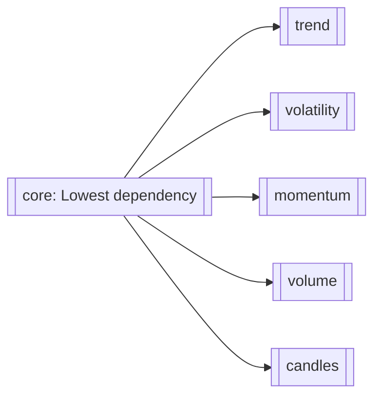
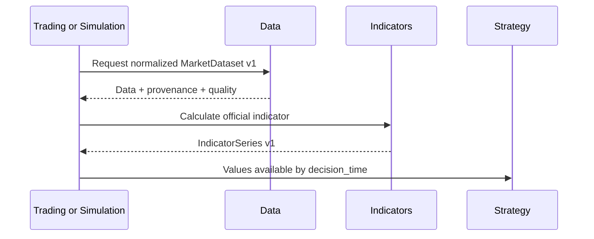
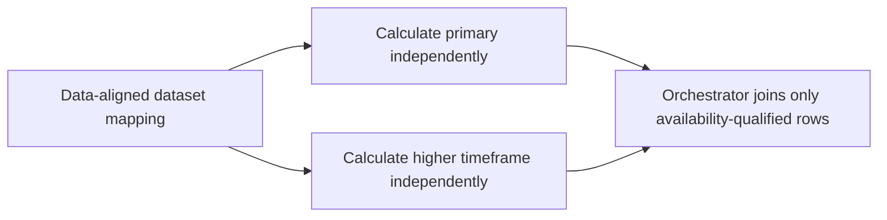
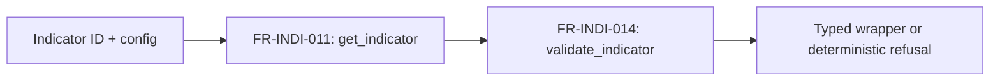

# Indicators

> **Package:** `app/services/indicators`
> **Status:** `Completed`
> **Last updated:** `2026-07-22`

> This README is the package's **single source of truth** for requirements, final structure, implementation sequence, progress, usage examples, and tests.
> Update this file before changing the code.

---

## 1. Purpose and Boundary

### Purpose

Indicators converts normalized market datasets into deterministic, vectorized decision-support series. It owns pure formula evaluation, input and parameter validation, no-lookahead availability metadata, deterministic result manifests, and discovery of the reviewed official indicator set. It performs no I/O and cannot make strategy, risk, simulation, or execution decisions.

### Owns

- Pure, stateless batch calculations for the approved official indicators.
- Exact formula, seed, warmup, null, degenerate-window, dtype, and tolerance specifications.
- Indicator parameter and calculation-input validation after Data has normalized the dataset.
- The `IndicatorSeries v1` contract, represented by `IndicatorResult` and `IndicatorManifest`.
- Deterministic output naming, row/symbol alignment, availability metadata, provenance/quality propagation, and copied joins.
- The immutable official indicator registry and machine-readable capability matrix.
- Indicator-specific deterministic error codes and basic calculation resource-limit enforcement.

### Does not own

- Data acquisition, provider adapters, source readiness, provider normalization, symbol mapping, calendar/session normalization, quote-quality policy, or multi-timeframe orchestration; Data owns these.
- Signal interpretation, crossover decisions, trade proposals, strategy lifecycle, or final position sizing.
- Risk approval, orders, fills, journals, broker/account state, execution, or broker mutation.
- Persistence, cache storage, audit sinks, telemetry export, tracing backends, SLO enforcement, or alert routing.
- Runtime custom registration, incremental/streaming state, chunking, out-of-core execution, acceleration, composition graphs, proprietary controls, or release engineering.
- Retrospective SMC/FVG/swing/BOS/CHoCH labels in the production indicator surface.

### Shared contracts

Contract definitions must match the name, version, and owner recorded in `docs/PROJECT.md`.

**Owned by this domain** — defined authoritatively here:

| Status | Contract | Version | Counterparty | Purpose |
|---|---|---|---|---|
| Completed | `IndicatorSeries` (`IndicatorResult`) | `v1` | Strategy; Trading, Simulation, Research (as runtime/backtest/research orchestrators) | Return deterministic indicator values and their earliest safe consumption time without exposing raw provider objects or mutable internal state. |

#### `IndicatorSeries v1` field contract

| Field | Type | Required | Contract |
|---|---|---|---|
| `contract_version` | `Literal["v1"]` | Yes | Compatibility version; consumers never parse `schema_id` to infer it. |
| `schema_id` | `Literal["indicators.indicator_series.v1"]` | Yes | Stable namespaced schema identity. |
| `indicator_id` | `str` | Yes | Stable lowercase official registry identifier. |
| `indicator_version` | `str` | Yes | Public implementation version. |
| `formula_version` | `str` | Yes | Version of the approved mathematical convention. |
| `parameter_hash` | `str` | Yes | SHA-256 digest of the approved canonical parameter representation. |
| `values` | `pandas.DataFrame` | Yes | Indicator-owned tabular result built from a private projection of one `MarketDataset v1`. Defensive deep copies protect stored result/checksum identity from caller mutation. It is never a Data-owned internal DataFrame or raw provider object. |
| `output_columns` | `tuple[str, ...]` | Yes | Deterministic lowercase snake_case indicator columns in canonical order. |
| `available_at` | column/series in `values` | Yes | UTC timestamp identifying the earliest safe decision time for each output row. |
| `computed_from_start` / `computed_from_end` | columns/series in `values` | Yes | Inclusive source-window bounds used for each output row. |
| `source_timeframe` | column/series in `values` | Yes | Timeframe of the normalized source observations. |
| `quality` | columns/metadata | Yes | Data-owned dataset quality status/score repeated without reclassification; the manifest carries canonical status/score/schema evidence plus source/license provenance. |
| `manifest` | `IndicatorManifest` | Yes | Deterministic identity, checksum, output-contract, availability, precision, provenance, and quality summary. |
| `errors` | `tuple[IndicatorError, ...]` | Conditional | Unused in v1 because public failures raise deterministic exceptions; no partial official result may be presented as success. |

**Failure contract:** invalid input raises one deterministic `IND_*` exception. Calculation failure is atomic; no partial `IndicatorSeries` is published.

#### `IndicatorSeries v1` values-column contract

Rows preserve the input record order. The index is a UTC `DatetimeIndex` named
`timestamp`. Columns appear in this exact order:

| Column | Dtype | Contract |
|---|---|---|
| `symbol` | pandas string | Exact `MarketDataset.symbol`, repeated for every row. |
| Official output columns | `float64` | Registry-declared canonical order. Warmup values are `NaN`; valid values are finite and normalize negative zero to positive zero. |
| `available_at` | `datetime64[ns, UTC]` | For valid output, the maximum `available_at` of all contributing records; for warmup output, the current source record's `available_at`. |
| `computed_from_start` | `datetime64[ns, UTC]` | Inclusive first contributing timestamp; `NaT` while the complete formula window is unavailable. |
| `computed_from_end` | `datetime64[ns, UTC]` | Inclusive last contributing timestamp; `NaT` while the complete formula window is unavailable. |
| `source_timeframe` | pandas string | Exact non-empty input timeframe. |
| `data_quality_status` | pandas string | Exact `MarketDataset.quality_report.quality_status`. |
| `data_quality_score` | `float64` | Exact finite decimal score converted to float64 for display; the manifest retains canonical decimal-string evidence. |
| `unavailable_reason` | pandas string | `"warmup"` before the first valid value and `NA` afterward. No other v1 reason is emitted for a successful result. |

An empty dataset or one with no usable bar observations raises
`IND_INSUFFICIENT_DATA`. A non-empty dataset shorter than the required warmup does
not raise: all rows are returned with warmup output and
`unavailable_reason="warmup"`.

For every valid output, `computed_from_end` is the current source timestamp.
`computed_from_start` is the earliest record on which that exact value causally
depends: the first dataset record for EMA, ATR, ADX, and RSI; the first record in
the current `period`-observation window for SMA, ADR, and Williams %R; and the first
price in the current `period+1`-price window for rolling volatility. `available_at`
is the maximum record `available_at` across that exact inclusive dependency range.

**Consumed from other domains** — referenced only, never redefined:

| Contract | Version | Owner | Used for |
|---|---|---|---|
| `MarketDataset` | `v1` | Data | Supply one normalized, immutable bar dataset for one symbol/timeframe with exact records, availability, provenance, and dataset-quality evidence. |

Every official calculation accepts exactly one `MarketDataset v1`. Indicators
validates that `data_kind == "bars"` and privately projects the canonical records to
pandas/NumPy for vectorized calculation. Public callers never supply a Data-owned
internal DataFrame. Multi-symbol batching is caller orchestration over independent
datasets; no official v1 calculation accepts more than one symbol.

### Persisted state

Indicators persists no tables, artifacts, cache entries, registry mutations, or incremental state. All public calculations have side effect `None`.
Indicators is not an `AuditEvent` producer: its API is pure and deterministic, so
the governed caller audits any surrounding action.

### Four-level structure

| Code level | Represents |
|---|---|
| **Package** | Indicators domain |
| **Module folder** | One approved feature/capability |
| **File** | One use case or focused responsibility |
| **Class / function / method** | Observable functional requirement behavior |

```text
Package
└── Module folder
    └── File
        └── Class / Function / Method
```

### Package capability map

```mermaid
flowchart TD
    IND[[Indicators Package]]
    IND --> CORE[[core: Contracts, validation, results, registry]]
    IND --> TREND[[trend: EMA, SMA, WMA, Hull MA, Bollinger Bands, ADX]]
    IND --> VOL[[volatility: ATR, ADR, rolling volatility, standard deviation]]
    IND --> MOM[[momentum: RSI, Williams %R]]
    IND --> VOLU[[volume: CMF, OBV, MFI, price-volume distribution]]
    IND --> CAN[[candles: Doji, Engulfing, Pinbar, Inside Bar]]

    CORE --> C1[errors.py: Deterministic errors]
    CORE --> C2[contracts.py: Specs and calculation contracts]
    CORE --> C3[results.py: Manifest and result behavior]
    CORE --> C4[registry.py: Immutable discovery]
    CORE --> C5[validation.py: Fail-fast request validation]
    TREND --> T1[ema.py]
    TREND --> T2[sma.py]
    TREND --> T3[wma.py]
    TREND --> T4[hull_ma.py]
    TREND --> T5[bollinger_bands.py]
    TREND --> T6[directional.py: ADX]
    VOL --> V1[atr.py]
    VOL --> V2[adr.py]
    VOL --> V3[rolling_volatility.py: Rolling volatility]
    VOL --> V4[standard_deviation.py]
    MOM --> M1[rsi.py]
    MOM --> M2[williams_r.py]
    VOLU --> U1[cmf.py]
    VOLU --> U2[obv.py]
    VOLU --> U3[mfi.py]
    VOLU --> U4[price_volume_distribution.py]
    CAN --> D1[doji.py]
    CAN --> D2[engulfing.py]
    CAN --> D3[pinbar.py]
    CAN --> D4[inside_bar.py]
```



---

## 2. Final Package Structure

The following is the implemented V1 package tree.

```text
indicators/
├── __init__.py                         # Approved domain-level exports only
├── README.md
├── core/                               # Feature: contracts and deterministic execution boundary
│   ├── __init__.py
│   ├── errors.py                       # Deterministic Core MVP error contract
│   ├── contracts.py                    # Immutable config/spec/warmup/protocol contracts
│   ├── results.py                      # IndicatorSeries manifest, values-only, and copied join
│   ├── registry.py                     # Immutable official specs and capability matrix
│   └── validation.py                   # Full fail-fast request validation
├── trend/                              # Feature: trend indicators
│   ├── __init__.py
│   ├── ema.py                          # Exponential Moving Average
│   ├── sma.py                          # Simple Moving Average
│   ├── wma.py                          # Weighted Moving Average
│   ├── hull_ma.py                      # Hull Moving Average
│   ├── bollinger_bands.py              # Bollinger Bands
│   └── directional.py                  # ADX
├── volatility/                         # Feature: volatility indicators
│   ├── __init__.py
│   ├── atr.py                          # Average True Range
│   ├── adr.py                          # Average Daily Range
│   ├── rolling_volatility.py           # Return-based rolling volatility
│   └── standard_deviation.py           # Rolling price standard deviation
├── momentum/                           # Feature: momentum indicators
│   ├── __init__.py
│   ├── rsi.py                          # Relative Strength Index
│   └── williams_r.py                   # Williams %R
├── volume/                             # Feature: volume indicators
│   ├── __init__.py
│   ├── cmf.py                          # Chaikin Money Flow
│   ├── obv.py                          # On-Balance Volume
│   ├── mfi.py                          # Money Flow Index
│   └── price_volume_distribution.py    # Rolling volume-by-price point of control
└── candles/                            # Feature: single/two-bar candlestick patterns
    ├── __init__.py
    ├── doji.py                         # Doji pattern
    ├── engulfing.py                    # Engulfing pattern
    ├── pinbar.py                       # Pinbar pattern
    └── inside_bar.py                   # Inside bar pattern
```

Excluded from the structure: `base.py`, `batch/`, `incremental/`, `adapters/`, `custom/`, caching, composition, audit/telemetry, acceleration, and proprietary-access modules. MACD, crossover helpers, pip conversion, balance-scaled volume, and generic averaging/base-class abstractions have no final destination in this package. Retrospective SMC/FVG/swing/BOS/CHoCH labels remain excluded from the production indicator surface (see Section 1) because swing/BOS/CHoCH structure-break tracking is inherently retroactive (a later bar can rewrite an earlier bar's already-published signal), which is fundamentally incompatible with this package's immutable, non-repainting batch output guarantee; this exclusion is revisited only as a separately scoped decision, not silently reduced to a partial port.

### Feature Registry

Each registered feature is exactly one module folder with exactly one runnable
usage program, satisfying the Focused Domain Architecture rule
(one feature = one module folder = one usage example file). This section owns the
feature IDs, and each ordinal matches its usage-program number.

| Status | Feature | Owning module | Public API and contracts | Requirements | Usage evidence |
|---|---|---|---|---|---|
| Completed | `FEAT-INDI-01` Indicator Contracts, Registry Discovery and Request Validation | `core/` | `IndicatorErrorCode`, `IndicatorError`, config/spec/warmup/protocol, result/manifest/projection, discovery, capability, and validation declarations | `FR-INDI-001`–`FR-INDI-014`; exact declarations in Section 4.1 | `tests/indicators/usage/01_core.py` |
| Completed | `FEAT-INDI-02` Candlestick Pattern Labelling | `candles/` | `doji`, `engulfing`, `pinbar`, `inside_bar` | `FR-INDI-031`–`FR-INDI-034`; exact declarations in Section 4.6 | `tests/indicators/usage/02_candles.py` |
| Completed | `FEAT-INDI-03` Trend and Moving-Average Calculation | `trend/` | `ema`, `sma`, `wma`, `hull_ma`, `bollinger_bands`, `adx` | `FR-INDI-015`–`FR-INDI-017`, `FR-INDI-023`–`FR-INDI-025`; exact declarations in Section 4.2 | `tests/indicators/usage/03_trend.py` |
| Completed | `FEAT-INDI-04` Momentum Oscillator Calculation | `momentum/` | `rsi`, `williams_r` | `FR-INDI-021`, `FR-INDI-022`; exact declarations in Section 4.4 | `tests/indicators/usage/04_momentum.py` |
| Completed | `FEAT-INDI-05` Volatility and Range Calculation | `volatility/` | `atr`, `adr`, `rolling_volatility`, `standard_deviation` | `FR-INDI-018`–`FR-INDI-020`, `FR-INDI-026`; exact declarations in Section 4.3 | `tests/indicators/usage/05_volatility.py` |
| Completed | `FEAT-INDI-06` Volume-Flow and Price-Volume Calculation | `volume/` | `cmf`, `obv`, `mfi`, `price_volume_distribution` | `FR-INDI-027`–`FR-INDI-030`; exact declarations in Section 4.5 | `tests/indicators/usage/06_volume.py` |

Module folders are named for the analytical family they calculate. Within each
folder every file implements exactly one official indicator, and every public
function implements exactly one `FR-INDI-*` behaviour, so the file and
class/function levels of the rule are enforced per indicator rather than per
folder.

### Module dependency diagram



`trend`, `volatility`, `momentum`, `volume`, and `candles` do not depend on one another. `core/registry.py` stores immutable metadata and import-path identity without importing feature implementations, preventing a registry/built-in cycle.

### Structure rules

- The root contains only `README.md`, `__init__.py`, and the six approved module folders.
- Built-ins are stateless functions. Classes are limited to immutable data contracts, the structural protocol, and the domain exception.
- Each trend/volatility/momentum/volume/candles file implements exactly one official indicator; a file is never shared by two indicators. Private vectorization helpers may be duplicated per file rather than factored into a shared base class.
- Public callers import only from `app.services.indicators` or an approved feature `__init__.py`; leaf-file imports are not stable API.
- Every public symbol appears exactly once in Section 4.
- Private vectorization, hashing, naming, and formula helpers remain in the focused owning file and receive no separate requirement IDs.
- **Common leaf set.** Every one of the 20 indicator leaf files imports exactly
  the same local surface, referenced as *(common leaf set)* in the feature
  Files tables: `core.contracts → IndicatorConfig`;
  `core.errors → IndicatorError, IndicatorErrorCode`;
  `core.errors → guard_public_boundary`;
  `core.results → build_indicator_result`;
  `core.validation → validate_indicator`; `app.utils → logger`; and, under
  `TYPE_CHECKING` only, `app.services.data.contracts → MarketDataset,
  OHLCVRecord` plus `core.results → IndicatorResult`. `build_indicator_result`
  is an internal Core helper, not public API: it appears in no `__all__` and is
  not a documented import for callers outside this package.
- The immutable registry stores no runtime registrations and performs no plugin discovery.
- Usage examples live under `tests/indicators/usage/`, never in the production package.

### Current file disposition

The final package tree above is implemented. Each approved indicator owns one leaf
file, the package and feature ports expose only the reviewed public symbols, and the
retired bundled files (`moving_averages.py`, `oscillators.py`, `ranges.py`, and
`rolling.py`) are absent.

### Exact implementation and file order

1. `core/errors.py` → `core/contracts.py` → `core/results.py` →
   `core/registry.py` → `core/validation.py` → `core/__init__.py`.
2. `trend/ema.py` → `trend/sma.py` → `trend/wma.py` → `trend/hull_ma.py` →
   `trend/bollinger_bands.py` → `trend/directional.py` → `trend/__init__.py`.
3. `volatility/atr.py` → `volatility/adr.py` → `volatility/rolling_volatility.py` →
   `volatility/standard_deviation.py` → `volatility/__init__.py`.
4. `momentum/rsi.py` → `momentum/williams_r.py` → `momentum/__init__.py`.
5. `volume/cmf.py` → `volume/obv.py` → `volume/mfi.py` →
   `volume/price_volume_distribution.py` → `volume/__init__.py`.
6. `candles/doji.py` → `candles/engulfing.py` → `candles/pinbar.py` →
   `candles/inside_bar.py` → `candles/__init__.py`.
7. Root `__init__.py` is populated only after all feature tests and imports pass.

`trend`, `volatility`, `momentum`, `volume`, and `candles` are dependency peers, but
their delivery order is authoritative as listed above so review and handoff remain
deterministic. `hull_ma.py` is ordered after `wma.py` within `trend` because it
reuses the same weighted-average convention (as an independent private helper, not
a shared import) and is easiest to verify immediately after `wma.py` is proven
correct.

### Exact file-to-requirement allocation

| File | Assigned functional requirements |
|---|---|
| `core/errors.py` | `FR-INDI-001`, `FR-INDI-002` |
| `core/contracts.py` | `FR-INDI-003` through `FR-INDI-006` |
| `core/results.py` | `FR-INDI-007` through `FR-INDI-010` |
| `core/registry.py` | `FR-INDI-011` through `FR-INDI-013` |
| `core/validation.py` | `FR-INDI-014` |
| `trend/ema.py` | `FR-INDI-015` |
| `trend/sma.py` | `FR-INDI-016` |
| `trend/directional.py` | `FR-INDI-017` |
| `volatility/atr.py` | `FR-INDI-018` |
| `volatility/adr.py` | `FR-INDI-019` |
| `volatility/rolling_volatility.py` | `FR-INDI-020` |
| `momentum/rsi.py` | `FR-INDI-021` |
| `momentum/williams_r.py` | `FR-INDI-022` |
| `trend/wma.py` | `FR-INDI-023` |
| `trend/hull_ma.py` | `FR-INDI-024` |
| `trend/bollinger_bands.py` | `FR-INDI-025` |
| `volatility/standard_deviation.py` | `FR-INDI-026` |
| `volume/cmf.py` | `FR-INDI-027` |
| `volume/obv.py` | `FR-INDI-028` |
| `volume/mfi.py` | `FR-INDI-029` |
| `volume/price_volume_distribution.py` | `FR-INDI-030` |
| `candles/doji.py` | `FR-INDI-031` |
| `candles/engulfing.py` | `FR-INDI-032` |
| `candles/pinbar.py` | `FR-INDI-033` |
| `candles/inside_bar.py` | `FR-INDI-034` |
| Feature `__init__.py` files | No independent `FR-*`; re-export only their feature's assigned symbols. |
| Root `__init__.py` | No independent `FR-*`; re-export only the approved `FR-INDI-001` through `FR-INDI-034` public symbols. |
| `README.md` | No implementation requirement; authoritative specification and evidence ledger. |

### Public import and API contract

The package root `app.services.indicators` is the canonical public import surface. Its intended `__all__` is exactly:

```text
IndicatorErrorCode, IndicatorError,
IndicatorConfig, IndicatorSpec, WarmupRequirement, IndicatorProtocol,
IndicatorManifest, IndicatorResult,
get_indicator, list_indicators, get_capability_matrix, validate_indicator,
ema, sma, wma, hull_ma, bollinger_bands, adx,
atr, adr, rolling_volatility, standard_deviation,
rsi, williams_r,
cmf, obv, mfi, price_volume_distribution,
doji, engulfing, pinbar, inside_bar
```

| Public symbols | Classification | Official workflow eligibility | Cache behavior | Public side effects |
|---|---|---|---|---|
| `IndicatorErrorCode`, `IndicatorError` | Stable | `WF-INDI-001..005` | Not applicable | None |
| `IndicatorConfig`, `IndicatorSpec`, `WarmupRequirement`, `IndicatorProtocol` | Stable | `WF-INDI-001..005` | Carries no cache configuration | None |
| `IndicatorManifest`, `IndicatorResult`, `IndicatorResult.values_only`, `IndicatorResult.join_to` | Stable | `WF-INDI-001..004` | Exposes identity/checksum material only; no reads or writes | None |
| `get_indicator`, `list_indicators`, `get_capability_matrix` | Stable | `WF-INDI-005` | None; immutable in-memory metadata | None |
| `validate_indicator` | Stable | `WF-INDI-001..005` | No cache access | None |
| `ema`, `sma`, `wma`, `hull_ma`, `bollinger_bands`, `adx`, `atr`, `adr`, `rolling_volatility`, `standard_deviation`, `rsi`, `williams_r`, `cmf`, `obv`, `mfi`, `price_volume_distribution`, `doji`, `engulfing`, `pinbar`, `inside_bar` | Stable | `WF-INDI-001..004`; official in `SYS-WF-001` and `SYS-WF-002` | No cache access; returns canonical checksum material | None |

No experimental, optional, or future callable is exported in the initial package. Excluded capabilities appear only in the capability matrix as unsupported modes, not as callable stubs.

---

## 3. Workflows

### Status values

| Status | Meaning |
|---|---|
| **Missing** | Not implemented or not verified against the final contract. |
| **Partial** | Useful V1 behavior exists, but final contracts, relocation, or tests remain incomplete. |
| **Completed** | Implemented, tested, and verified against this README. |

### Workflow register

| Status | Workflow ID | Scope | Workflow | Trigger / Input boundary | Final outcome / Output boundary | Requirement sequence |
|---|---|---|---|---|---|---|
| Completed | `WF-INDI-001` | Internal | Core batch indicator calculation | One normalized `MarketDataset v1` plus approved config | Atomic `IndicatorResult` with values, availability, quality, and manifest | `FR-INDI-014 → FR-INDI-015..034 → FR-INDI-007..010` |
| Completed | `WF-INDI-002` | Cross-domain | Decision-time consumption | Trading or Simulation supplies Data-owned normalized input | `IndicatorSeries v1` returned for Strategy consumption | `FR-INDI-014 → FR-INDI-015..034 → FR-INDI-008` |
| Completed | `WF-INDI-003` | Cross-domain | Warmup coordination | Caller queries an official `WarmupRequirement` and supplies sufficient history | Warmup rows retained and explicitly unavailable until safe | `FR-INDI-005 → FR-INDI-014 → FR-INDI-015..034` |
| Completed | `WF-INDI-004` | Cross-domain | Availability-aware multi-timeframe orchestration compatibility | Data supplies separately keyed aligned primary and higher-timeframe datasets; caller calculates each independently | Separately returned series preserve source availability and can be combined by the orchestrator without lookahead | `FR-INDI-014 → FR-INDI-015..034 → FR-INDI-007` |
| Completed | `WF-INDI-005` | Internal | Static registry discovery and validation | Caller supplies official indicator ID/config | Validated spec/capability record or deterministic refusal | `FR-INDI-011..014` |

`WF-INDI-001` through `WF-INDI-004` are multi-feature completion gates covering
Core, trend, volatility, momentum, volume, and candles. `WF-INDI-005` covers the
immutable registry and validation boundary.

### `WF-INDI-001` — Core Batch Indicator Calculation

**Scope:** `Internal`
**System workflow:** `None`

**Input boundary:** One immutable `MarketDataset v1` and calculation-relevant
`IndicatorConfig`.
**Output boundary:** An atomic `IndicatorResult`; the input contract remains
unchanged.

1. `validate_indicator()` resolves the immutable `IndicatorSpec` and validates the entire config and input before formula work.
2. One official convenience function executes its approved vectorized formula for the dataset's single symbol in canonical row order.
3. The function retains warmup/unavailable rows and derives `available_at` and source-window bounds.
4. Data-owned provenance and quality are propagated without redefining upstream policy.
5. The function returns deterministic values, output names, checksums, and manifest metadata.

**Failure behavior:** validation or limit failure produces one Core MVP `IND_*` error before calculation; formula failure is atomic; output collision or detected input mutation fails rather than overwriting data.

**Integration test:**
`tests/indicators/integration/test_batch_calculation.py::test_batch_calculation_returns_atomic_available_result()`


### `WF-INDI-002` — Decision-Time Consumption

**Scope:** `Cross-domain`
**System workflow:** `SYS-WF-001`, `SYS-WF-002`

**Input boundary:** Trading (live/paper) or Simulation (historical) supplies Data-owned normalized market data.
**Output boundary:** Indicators returns `IndicatorSeries v1`; Strategy consumes only rows whose `available_at <= decision_time`.

Indicators calculates and describes availability only. Trading/Simulation owns orchestration, and Strategy/Simulation owns enforcement of the decision-time filter and any resulting action.

**Failure behavior:** invalid normalized input or unverifiable availability fails closed with no partial series; a downstream lookahead violation remains a downstream policy error, informed by `IND_LOOKAHEAD_RISK` metadata/error evidence.

**Integration test:**
`tests/indicators/integration/test_decision_time_consumption.py::test_strategy_receives_only_availability_qualified_series()`



### `WF-INDI-003` — Warmup Coordination

**Scope:** `Cross-domain`
**System workflow:** `SYS-WF-001`, `SYS-WF-002`

**Input boundary:** The caller resolves `WarmupRequirement`, then Data supplies the requested normalized history.
**Output boundary:** Indicators retains all rows and marks warmup/unavailable values explicitly.

Indicators never fetches history. A non-empty short dataset retains all aligned
rows, sets indicator values to `NaN`, sets window bounds to `NaT`, marks
`unavailable_reason="warmup"`, and never fetches additional history. An empty
dataset raises `IND_INSUFFICIENT_DATA`.

**Integration test:**
`tests/indicators/integration/test_warmup_coordination.py::test_warmup_requirement_preserves_unavailable_rows()`


### `WF-INDI-004` — Availability-Aware Multi-Timeframe Calculation

**Scope:** `Cross-domain`
**System workflow:** `SYS-WF-001`, `SYS-WF-002`

**Input boundary:** Data supplies a mapping of already normalized/aligned
`MarketDataset v1` values. The orchestrator submits the primary and at most one
higher-timeframe dataset as separate official calculations.
**Output boundary:** Indicators returns one independent series per submitted
dataset. Each result preserves the source dataset's timeframe and record
availability; Indicators neither combines nor realigns the results.

Data owns multi-timeframe resampling/alignment. Trading, Simulation, or Strategy
owns decision-time combination of the separate series. Official Indicator
calculators therefore report `multi_timeframe_support=false`; compatibility means
their separately calculated results remain causally joinable by the orchestrator.

**Failure behavior:** either individual dataset fails its normal validation
atomically. Consumption before a higher-timeframe result's `available_at` is rejected
by the consuming/orchestrating domain; Indicators does not receive a decision time.

**Integration test:**
`tests/indicators/integration/test_multi_timeframe.py::test_separate_timeframe_results_preserve_source_availability()`



### `WF-INDI-005` — Static Registry Discovery and Validation

**Scope:** `Internal`
**System workflow:** `None`

**Input boundary:** Official indicator ID and candidate config.
**Output boundary:** Immutable `IndicatorSpec`/capability metadata or deterministic `IND_UNSUPPORTED_INDICATOR` / validation error.

The registry exposes exactly 20 reviewed built-ins and cannot register or
unregister at runtime.

**Integration test:**
`tests/indicators/integration/test_registry_workflow.py::test_registry_discovers_and_validates_only_official_batch_indicators()`



---

## 4. Module and Requirement Specifications

Modules and files are arranged in implementation order.

### 4.1 `core/` — Contracts, Results, Validation, and Discovery

**Purpose:** Define the complete pure calculation boundary shared by every official built-in.

**Module flow:**

```text
indicator id + normalized data + config
  → registry.py
  → validation.py
  → feature calculation
  → results.py
  → IndicatorResult
```

### Files

| Status | File | Responsibility | Key exports | Dependencies |
|---|---|---|---|---|
| Completed | `errors.py` | Define the compact Core MVP error catalogue, one structured domain exception, and the public-boundary exception guard. | `IndicatorErrorCode`, `IndicatorError`<br>Internal (non-public) cross-file helper: `guard_public_boundary`, applied to all twenty official convenience functions and deliberately absent from `core/__init__.py.__all__` and the package port. | **Standard library:** `collections.abc`, `enum`, `functools`, `math`, `re`, `types`, `typing`<br>**Required third-party:** None<br>**Local:** `app.utils → logger, redact_text_value` |
| Completed | `contracts.py` | Define immutable calculation config, spec, warmup, and structural callable contracts. | `IndicatorConfig`, `IndicatorSpec`, `WarmupRequirement`, `IndicatorProtocol` | **Standard library:** `collections.abc`, `dataclasses`, `typing`<br>**Required third-party:** None<br>**Local (type-checking only):** `app.services.data.contracts → MarketDataset`; `results.py → IndicatorResult` |
| Completed | `results.py` | Define deterministic manifest/result fields and safe result projection/join behavior. | `IndicatorManifest`, `IndicatorResult`<br>Internal (non-public) cross-file helper: `build_indicator_result`, used by every feature leaf file and deliberately absent from `core/__init__.py.__all__` and the package port. | **Standard library:** `collections.abc`, `dataclasses`, `hashlib`, `json`, `math`, `typing`<br>**Required third-party:** `pandas`<br>**Local:** `errors.py → IndicatorError, IndicatorErrorCode`; `app.utils → canonical_json, logger`<br>**Local (type-checking only):** `app.services.data.contracts → MarketDataset, OHLCVRecord`; `contracts.py → IndicatorConfig` |
| Completed | `registry.py` | Expose immutable official specs and capability metadata without importing feature implementations. | `get_indicator`, `list_indicators`, `get_capability_matrix` | **Standard library:** `collections.abc`, `types`<br>**Required third-party:** None<br>**Local:** `contracts.py → IndicatorSpec`; `errors.py → IndicatorError, IndicatorErrorCode`; `app.utils → logger` |
| Completed | `validation.py` | Resolve and fully validate one batch request before any formula work. | `validate_indicator` | **Standard library:** `collections.abc`, `datetime`, `math`, `re`, `typing`<br>**Required third-party:** `pandas`<br>**Local:** `app.services.data.contracts → MarketDataset, OHLCVRecord`; `errors.py → IndicatorError, IndicatorErrorCode`; `registry.py → get_indicator`; `app.utils → logger`<br>**Local (type-checking only):** `contracts.py → IndicatorConfig, IndicatorSpec` |
| Completed | `__init__.py` | Expose only the approved public Core API. | All Core exports above | **Standard library:** None<br>**Required third-party:** None<br>**Local:** Approved exports from the five files above |

### Configuration and Limits Manifest

| Status | Setting / Limit | Type | Default | Required | Used by | Description |
|---|---|---|---|---|---|---|
| Completed | `IndicatorConfig.source` | `str` | `"close"` when the formula has a price source | Conditional | Official wrappers | Selects exactly one of `open`, `high`, `low`, or `close`; non-default sources appear in output names. Fixed-OHLC indicators use `None`. |
| Completed | `IndicatorConfig.indicator_id` | `str` | None | Yes | Registry/calculators | Exact lowercase official ID; it must match the called wrapper. |
| Completed | `IndicatorConfig.parameters` | `tuple[tuple[str, int \| float \| str], ...]` | `()` | Yes | Registry/calculators | Canonical key-sorted immutable parameters; duplicate keys are invalid. |
| Completed | `IndicatorConfig.formula_version` | `str` | Registry version | Yes | Validation | Must equal the selected official spec. |
| Completed | `IndicatorConfig.output_mode` | `Literal["values"]` | `"values"` | Yes | Public calculations, `IndicatorResult` | Core returns aligned values; copied enrichment is requested explicitly through `join_to()`. Additional modes are excluded. |
| Completed | `IndicatorConfig.column_conflict_policy` | `Literal["error"]` | `"error"` | Yes | `IndicatorResult.join_to()` | Any collision fails with `IND_OUTPUT_COLUMN_CONFLICT`; overwrite/suffix/prefix policies are excluded. |
| Completed | `IndicatorConfig.precision_dtype` | `Literal["float64"]` | `"float64"` | Yes | All calculations | Core numerical output uses float64 under the approved formula tolerance; unsupported dtypes fail. |
| Completed | `IndicatorConfig.availability_policy` | `Literal["source_available_at"]` | `"source_available_at"` | Yes | Official wrappers | Valid output is available at the maximum contributing record `available_at`; short non-empty history remains warmup output. |
| Completed | `IndicatorConfig.quality_policy` | `Literal["propagate_dataset"]` | `"propagate_dataset"` | Yes | `validate_indicator`, official wrappers | Requires Data-owned dataset quality evidence and propagates status/score without reclassification. |
| Completed | `IndicatorConfig.error_mode` | `Literal["raise"]` | `"raise"` | Yes | All public callables | Every public failure raises one deterministic exception; result-error and partial-success modes are unsupported in v1. |
| Completed | `MAX_INPUT_ROWS` | Positive `int` | `1000000` | Yes | `validate_indicator` | Rejects oversized input with `IND_RESOURCE_LIMIT_EXCEEDED`. This is the only input-size ceiling; no lower serialization bound exists. Regression evidence: `tests/indicators/unit/test_large_input.py`. |
| Completed | `IndicatorManifest.manifest_version` | `str` | `"v1"` | Yes | `IndicatorManifest` | Versions the deterministic manifest contract. |
| Completed | `IndicatorManifest.output_schema_version` | `str` | `"v1"` | Yes | `IndicatorManifest` | Versions the `IndicatorSeries` values schema. |

Public wrappers own convenience arguments. They construct the complete immutable
config before validation. If an explicitly supplied config disagrees with wrapper
`indicator_id`, `period`, `source`, or formula version, the wrapper raises
`IND_INVALID_CONFIG`; no precedence or silent override exists.

#### `errors.py` — Deterministic Error Contract

**File responsibility:** Represent only the 22 approved Core MVP codes and their redacted structured exception.

| Status | Requirement ID | Responsibility | Class / Function / Method | Side Effects | Raises | Usage / Test |
|---|---|---|---|---|---|---|
| Completed | `FR-INDI-001` | The system shall expose exactly the approved Core MVP codes: `IND_INVALID_CONFIG`, `IND_INVALID_PARAMETER`, `IND_UNSUPPORTED_INDICATOR`, `IND_UNSUPPORTED_TIMEFRAME`, `IND_UNSUPPORTED_DTYPE`, `IND_INVALID_INPUT_SCHEMA`, `IND_MISSING_REQUIRED_COLUMN`, `IND_INVALID_OUTPUT_COLUMN`, `IND_OUTPUT_COLUMN_CONFLICT`, `IND_INVALID_OUTPUT_MODE`, `IND_INPUT_MUTATION_DETECTED`, `IND_DUPLICATE_TIMESTAMP`, `IND_NON_MONOTONIC_TIME`, `IND_AMBIGUOUS_TIMESTAMP`, `IND_INVALID_TIMEZONE`, `IND_INVALID_OHLC`, `IND_INSUFFICIENT_DATA`, `IND_LOOKAHEAD_RISK`, `IND_FORMULA_VERSION_MISMATCH`, `IND_RESOURCE_LIMIT_EXCEEDED`, `IND_PARTIAL_RESULT`, and `IND_INTERNAL_ERROR`. | `IndicatorErrorCode: StrEnum` | None | None | **Usage:** `tests/indicators/usage/01_core.py`<br>**Unit:** `tests/indicators/unit/test_errors.py::test_error_code_catalog_contains_only_core_codes()` |
| Completed | `FR-INDI-002` | The system shall represent a deterministic, redacted failure with code, safe message, and structured details without exposing raw exceptions or sensitive input data. | `IndicatorError(code: IndicatorErrorCode, message: str, details: Mapping[str, object] | None = None)` | None | None | **Usage:** `tests/indicators/usage/01_core.py`<br>**Unit:** `tests/indicators/unit/test_errors.py::test_indicator_error_serializes_redacted_details()` |

**Rules:**

- Codes rejected as Data-owned and codes tied to excluded features are not public Core members.
- Raw pandas/NumPy/provider exceptions never cross the public boundary.
- `IND_PARTIAL_RESULT` is a failure code; partial data is never returned as successful official output.
- Synchronous calculations expose no internal timeout or cancellation API.
  Trading/Simulation/UI orchestration owns external deadlines and task cancellation.
- `message` is non-empty, deterministic, and at most 256 characters.
- `details` contains at most 16 lowercase-snake-case keys, each at most 64
  characters. Values are JSON scalars or tuples of at most 20 JSON scalars;
  strings are at most 256 characters, floats must be finite, and nested mappings,
  raw records, arrays, DataFrames, tracebacks, and exception objects are rejected.
- Strings in `message` and `details` pass through the Utils redaction boundary
  before serialization. The stored details mapping is immutable.

**Implementation notes:** No existing Indicators error implementation is present in
the current workspace. Create only this approved contract under `core/`; do not
reconstruct historical public classes that are absent from the specification.

#### `contracts.py` — Immutable Calculation Contracts

**File responsibility:** Define calculation-relevant immutable contracts without platform, cache, audit, or incremental state.

| Status | Requirement ID | Responsibility | Class / Function / Method | Side Effects | Raises | Usage / Test |
|---|---|---|---|---|---|---|
| Completed | `FR-INDI-003` | The system shall represent indicator ID, canonical parameters, source, formula version, output/precision/availability/quality policy, and error mode in one immutable batch config, excluding cache, calendar, backend, actor, tracing, SLO, entitlement, timeout, cancellation, and orchestration context. | `IndicatorConfig` | None | None | **Usage:** `tests/indicators/usage/01_core.py`<br>**Unit:** `tests/indicators/unit/test_contracts.py::test_indicator_config_is_immutable_and_core_only()` |
| Completed | `FR-INDI-004` | The system shall describe each official indicator's ID, name, versions, tier, required columns, parameter/output schemas, warmup policy, supported batch capabilities, import path, stability, and workflow eligibility. | `IndicatorSpec` | None | None | **Usage:** `tests/indicators/usage/01_core.py`<br>**Unit:** `tests/indicators/unit/test_contracts.py::test_indicator_spec_contains_required_public_metadata()` |
| Completed | `FR-INDI-005` | The system shall expose the exact normalized history requirement for an indicator/config without fetching data, including minimum observations, source timeframe, required columns, and availability basis. | `WarmupRequirement` | None | None | **Usage:** `tests/indicators/usage/01_core.py`<br>**Unit:** `tests/indicators/unit/test_contracts.py::test_warmup_requirement_is_deterministic()` |
| Completed | `FR-INDI-006` | The system shall expose a minimal structural registered-calculator protocol whose approved calculation accepts one normalized `MarketDataset v1` plus a complete `IndicatorConfig` and returns `IndicatorResult`; public convenience wrappers construct the config and are not required to share this internal signature. | `IndicatorProtocol.calculate(data: MarketDataset, config: IndicatorConfig) -> IndicatorResult` | None | `IndicatorError`: deterministic request/calculation failure under the approved error mode | **Usage:** `tests/indicators/usage/01_core.py`<br>**Unit:** `tests/indicators/unit/test_contracts.py::test_official_calculator_satisfies_indicator_protocol()` |

**Rules:** Contracts are frozen, typed, JSON-compatible where serialized, and contain only calculation-relevant metadata. Serialized field types are exactly those declared by the contract requirements.

#### Exact Core contract fields

| Contract | Exact fields |
|---|---|
| `IndicatorConfig` | `indicator_id: str`; `parameters: tuple[tuple[str, int \| float \| str], ...]`; `source: str \| None`; `formula_version: str`; `output_mode: Literal["values"]`; `column_conflict_policy: Literal["error"]`; `precision_dtype: Literal["float64"]`; `availability_policy: Literal["source_available_at"]`; `quality_policy: Literal["propagate_dataset"]`; `error_mode: Literal["raise"]` |
| `IndicatorSpec` | `indicator_id: str`; `name: str`; `indicator_version: str`; `formula_version: str`; `tier: Literal["core_mvp"]`; `required_columns: tuple[str, ...]`; `parameter_schema: Mapping[str, object]`; `output_templates: tuple[str, ...]`; `warmup_policy: Literal["period", "period_plus_one", "two_period", "none", "custom"]`; `vectorized: Literal[True]`; `multi_symbol: Literal[False]`; `multi_timeframe: Literal[False]`; `import_path: str`; `stability: Literal["stable"]`; `workflow_eligibility: tuple[str, ...]` |
| `WarmupRequirement` | `indicator_id: str`; `formula_version: str`; `minimum_observations: int`; `source_timeframe: str \| None`; `required_columns: tuple[str, ...]`; `availability_basis: Literal["source_available_at"]` |

Mappings are frozen and serialized as ordinary JSON objects. Parameter tuples are
strictly sorted by key. Keys are lowercase snake_case and unique. Parameter values
are finite scalar JSON values only; booleans are rejected as numeric parameters.
Every official `period` is an integer satisfying
`2 <= period <= MAX_INPUT_ROWS`; booleans are rejected.

#### `results.py` — Manifest and Result Behavior

**File responsibility:** Build and expose the deterministic `IndicatorSeries v1` result without mutating source data.

| Status | Requirement ID | Responsibility | Class / Function / Method | Side Effects | Raises | Usage / Test |
|---|---|---|---|---|---|---|
| Completed | `FR-INDI-007` | The system shall expose a standalone serializable deterministic manifest containing manifest/indicator/formula/output-schema versions, canonical parameter hash, input/output checksums, output contract and shape, precision, availability policy, Data-provided provenance, and quality summary; volatile runtime/host data is excluded from identity. | `IndicatorManifest` | None | None | **Usage:** `tests/indicators/usage/01_core.py`<br>**Unit:** `tests/indicators/unit/test_results.py::test_manifest_is_stable_for_equivalent_inputs()` |
| Completed | `FR-INDI-008` | The system shall return timestamp/symbol-aligned values, canonical output columns, availability, quality, errors, and manifest as `IndicatorSeries v1`, preserving warmup and unavailable rows and exposing no incremental state or metrics. | `IndicatorResult` | None | None | **Usage:** `tests/indicators/usage/01_core.py`<br>**Unit:** `tests/indicators/unit/test_results.py::test_indicator_result_matches_v1_contract()` |
| Completed | `FR-INDI-009` | The system shall expose a copy-safe projection containing generated indicator, availability, and quality columns without original OHLCV columns. | `IndicatorResult.values_only: pd.DataFrame` | None | None | **Usage:** `tests/indicators/usage/01_core.py`<br>**Unit:** `tests/indicators/unit/test_results.py::test_values_only_excludes_source_columns()` |
| Completed | `FR-INDI-010` | The system shall privately project one matching `MarketDataset v1`, append generated columns to that copied canonical tabular projection, and preserve source columns, row count/order, timestamp/symbol layout, warmup rows, and input identity; collisions fail. | `IndicatorResult.join_to(data: MarketDataset, mode: Literal["copy"] = "copy") -> pd.DataFrame` | None | `IndicatorError`: invalid mode, dataset/checksum mismatch, output collision, or detected mutation | **Usage:** `tests/indicators/usage/01_core.py`<br>**Unit:** `tests/indicators/unit/test_results.py::test_join_to_preserves_input_and_alignment()` |

#### Exact manifest and result fields

`IndicatorManifest` is a frozen serializable dataclass with these exact fields:

| Field | Exact type/value |
|---|---|
| `manifest_version` | `Literal["v1"] = "v1"` |
| `contract_version` | `Literal["v1"] = "v1"` |
| `indicator_id` | `str` |
| `indicator_version` | `str` |
| `formula_version` | `str` |
| `output_schema_version` | `Literal["v1"] = "v1"` |
| `parameter_hash` | lowercase 64-character SHA-256 `str` |
| `input_checksum` | lowercase 64-character SHA-256 `str` |
| `output_checksum` | lowercase 64-character SHA-256 `str` |
| `output_columns` | `tuple[str, ...]` |
| `row_count` | non-negative `int` |
| `symbol` | non-empty `str` |
| `source_timeframe` | non-empty `str` |
| `precision_dtype` | `Literal["float64"] = "float64"` |
| `availability_policy` | `Literal["source_available_at"] = "source_available_at"` |
| `normalization_version` | exact non-empty Data-owned `str` |
| `source_metadata` | immutable `Mapping[str, str]`, copied from Data |
| `license_metadata` | immutable `Mapping[str, str]`, copied from Data |
| `quality_status` | `Literal["passed", "passed_with_warnings", "not_checked"]` |
| `quality_score` | canonical finite decimal `str`, copied from Data |
| `quality_schema_version` | exact non-empty Data-owned `str` |

Volatile host, process, thread, duration, and wall-clock calculation fields are
excluded. A Data quality status of `failed` is rejected before result construction.

`IndicatorResult` is a frozen container with these exact fields:

| Field | Exact type/value |
|---|---|
| `contract_version` | `Literal["v1"] = "v1"` |
| `schema_id` | `Literal["indicators.indicator_series.v1"] = "indicators.indicator_series.v1"` |
| `indicator_id` | `str` |
| `indicator_version` | `str` |
| `formula_version` | `str` |
| `parameter_hash` | lowercase 64-character SHA-256 `str` |
| `values` | owned `pandas.DataFrame` following the exact values-column contract |
| `output_columns` | `tuple[str, ...]` |
| `manifest` | `IndicatorManifest` |
| `errors` | `tuple[IndicatorError, ...] = ()` |

Construction deep-copies `values`; `values_only` and `join_to()` each return a new
deep copy.

#### Canonical identity rules

1. Parameter-hash material is
   `{"indicator_id", "formula_version", "parameters", "source"}`. Parameters are
   emitted as a key-sorted object. SHA-256 is calculated over
   `app.utils.canonical_json(...)` UTF-8 bytes.
2. Input-checksum material is `MarketDataset.model_dump(mode="json")` with record
   tuple order preserved and mapping keys canonicalized by
   `app.utils.canonical_json`. The digest is **folded**, not computed in one
   call: one `canonical_json` call covers the dataset-level fields, then one
   call per ordered chunk of at most `_CHECKSUM_CHUNK_RECORDS` (250) records,
   each chunk separated by an ASCII record separator (`0x1e`) that cannot
   appear unescaped in JSON text. `app.utils.canonical_json` enforces a
   cumulative 10,000-item traversal bound owned by Utils; a single-call
   implementation therefore failed for any dataset beyond 664 records, far
   below `MAX_INPUT_ROWS`. Folding keeps every call far under the Utils bound
   at any history length while preserving determinism and record-order
   sensitivity. Indicators must not weaken the Utils bound to work around it.
3. Output-checksum material is records-oriented JSON in exact result row and column
   order. UTC timestamps use canonical `Z` strings; `NaT`, `NaN`, and pandas `NA`
   serialize as JSON null; negative zero normalizes to `0.0`; finite float64 values
   serialize through `float.hex()`.
4. Hashes are lowercase 64-character hexadecimal SHA-256 strings.
5. `join_to()` never overwrites and accepts only the exact input dataset whose
   canonical checksum matches the manifest.

#### `registry.py` — Immutable Official Discovery

**File responsibility:** Describe the 20 official built-ins and supported Core
modes without runtime mutation or implementation imports.

| Status | Requirement ID | Responsibility | Class / Function / Method | Side Effects | Raises | Usage / Test |
|---|---|---|---|---|---|---|
| Completed | `FR-INDI-011` | The system shall resolve one of the 20 official indicator IDs in the registry identity below to its immutable spec and reject every unknown ID before calculation. | `get_indicator(indicator_id: str) -> IndicatorSpec` | None | `IndicatorError`: `IND_UNSUPPORTED_INDICATOR` | **Usage:** `tests/indicators/usage/01_core.py`<br>**Unit:** `tests/indicators/unit/test_registry.py::test_get_indicator_rejects_unknown_id()` |
| Completed | `FR-INDI-012` | The system shall list official specs in stable indicator-ID order with no mutable registry handle. | `list_indicators() -> tuple[IndicatorSpec, ...]` | None | None | **Usage:** `tests/indicators/usage/01_core.py`<br>**Unit:** `tests/indicators/unit/test_registry.py::test_list_indicators_is_stable_and_immutable()` |
| Completed | `FR-INDI-013` | The system shall expose a JSON/YAML-compatible matrix containing ID, versions, tier, batch/vectorized/multi-symbol/multi-timeframe support, unsupported optional modes, dependencies, deterministic unsupported codes, and official-workflow eligibility. | `get_capability_matrix() -> tuple[Mapping[str, object], ...]` | None | None | **Usage:** `tests/indicators/usage/01_core.py`<br>**Unit:** `tests/indicators/unit/test_registry.py::test_capability_matrix_matches_registry()` |

**Rules:** Batch/vectorized is the only execution mode. Incremental, streaming, cache, composition, out-of-core, acceleration, audit/observability, custom registration, and proprietary modes are reported unsupported and expose no unused APIs.

#### Official registry identity

Registry order is exactly `adx`, `adr`, `atr`, `bollinger_bands`, `cmf`, `doji`,
`ema`, `engulfing`, `hull_ma`, `inside_bar`, `mfi`, `obv`, `pinbar`,
`price_volume_distribution`, `rolling_volatility`, `rsi`, `sma`,
`standard_deviation`, `williams_r`, `wma`. Every entry uses `indicator_version="1.0.0"`,
`formula_version="1.0.0"`, `tier="core_mvp"`, `vectorized=true`,
`multi_symbol=false`, `multi_timeframe=false`, and `stability="stable"`.

| ID | Import path |
|---|---|
| `adx` | `app.services.indicators.trend.directional:adx` |
| `adr` | `app.services.indicators.volatility.adr:adr` |
| `atr` | `app.services.indicators.volatility.atr:atr` |
| `bollinger_bands` | `app.services.indicators.trend.bollinger_bands:bollinger_bands` |
| `cmf` | `app.services.indicators.volume.cmf:cmf` |
| `doji` | `app.services.indicators.candles.doji:doji` |
| `ema` | `app.services.indicators.trend.ema:ema` |
| `engulfing` | `app.services.indicators.candles.engulfing:engulfing` |
| `hull_ma` | `app.services.indicators.trend.hull_ma:hull_ma` |
| `inside_bar` | `app.services.indicators.candles.inside_bar:inside_bar` |
| `mfi` | `app.services.indicators.volume.mfi:mfi` |
| `obv` | `app.services.indicators.volume.obv:obv` |
| `pinbar` | `app.services.indicators.candles.pinbar:pinbar` |
| `price_volume_distribution` | `app.services.indicators.volume.price_volume_distribution:price_volume_distribution` |
| `rolling_volatility` | `app.services.indicators.volatility.rolling_volatility:rolling_volatility` |
| `rsi` | `app.services.indicators.momentum.rsi:rsi` |
| `sma` | `app.services.indicators.trend.sma:sma` |
| `standard_deviation` | `app.services.indicators.volatility.standard_deviation:standard_deviation` |
| `williams_r` | `app.services.indicators.momentum.williams_r:williams_r` |
| `wma` | `app.services.indicators.trend.wma:wma` |

`parameter_schema` is a recursively frozen JSON-compatible mapping. Indicators
with a period use the exact period schema
`{"type": "integer", "minimum": 2, "maximum": 1000000,
"required": <bool>, "default": <int or null>}`.

| ID | Required columns | Period required/default | Output templates in order | Warmup policy |
|---|---|---|---|---|
| `adx` | `("high", "low", "close")` | No / `14` | `("adx_{period}", "plus_di_{period}", "minus_di_{period}")` | `two_period` |
| `adr` | `("high", "low")` | No / `14` | `("adr_{period}",)` | `period` |
| `atr` | `("high", "low", "close")` | No / `14` | `("atr_{period}",)` | `period` |
| `bollinger_bands` | `("close",)` | `period` required; `std_dev` required | upper, middle, lower templates | `period` |
| `cmf` | `("high", "low", "close", "volume")` | Yes / `null` | `("cmf_{period}",)` | `period` |
| `doji` | `("open", "high", "low", "close")` | No period; `threshold` required | `("doji",)` | `none` |
| `ema` | `("source",)` | Yes / `null` | `("ema_{period}", "ema_{source}_{period}")` | `period` |
| `engulfing` | `("open", "close")` | No parameters | `("engulfing",)` | `custom` |
| `hull_ma` | `("source",)` | Yes / `null` | source-selectable Hull MA templates | `custom` |
| `inside_bar` | `("high", "low")` | No parameters | `("inside_bar",)` | `custom` |
| `mfi` | `("high", "low", "close", "volume")` | Yes / `null` | `("mfi_{period}",)` | `period` |
| `obv` | `("close", "volume")` | No parameters | `("obv",)` | `none` |
| `pinbar` | `("open", "high", "low", "close")` | No parameters | `("pinbar",)` | `none` |
| `price_volume_distribution` | `("high", "low", "close", "volume")` | `period` and `bins` required | `("price_volume_distribution_{period}_{bins}",)` | `period` |
| `rolling_volatility` | `("source",)` | Yes / `null` | `("rolling_volatility_{period}", "rolling_volatility_{source}_{period}")` | `period_plus_one` |
| `rsi` | `("source",)` | No / `14` | `("rsi_{period}", "rsi_{source}_{period}")` | `period_plus_one` |
| `sma` | `("source",)` | Yes / `null` | `("sma_{period}", "sma_{source}_{period}")` | `period` |
| `standard_deviation` | `("source",)` | Yes / `null` | source-selectable standard-deviation templates | `period` |
| `williams_r` | `("high", "low", "close")` | No / `14` | `("williams_r_{period}",)` | `period` |
| `wma` | `("source",)` | Yes / `null` | source-selectable WMA templates | `period` |

For source-selectable entries, `"source"` is a registry placeholder resolved to
the exact validated `IndicatorConfig.source` before calculation. Only one of the
two naming templates is emitted: the first for `close`, the second for a
non-default source.

Every registry entry has
`workflow_eligibility=("WF-INDI-001", "WF-INDI-002", "WF-INDI-003",
"WF-INDI-004")`. Every capability-matrix record has these exact keys in this order:
`indicator_id`, `indicator_version`, `formula_version`, `tier`, `batch`,
`vectorized`, `multi_symbol`, `multi_timeframe`, `unsupported_optional_modes`,
`dependencies`, `unsupported_codes`, and `official_workflow_eligibility`.
`batch` and `vectorized` are `true`; both multi flags are `false`.

`unsupported_optional_modes` is exactly
`("incremental", "streaming", "cache", "composition", "custom_registration",
"out_of_core", "acceleration", "proprietary")`. `unsupported_codes` maps each of
those names to `"IND_INVALID_CONFIG"`; the modes expose no callable stub.
Dependencies are `("numpy", "pandas")` for every official indicator, matching
each leaf file's actual imports.

#### `validation.py` — Fail-Fast Request Validation

**File responsibility:** Validate all domain-owned request conditions before formula execution.

| Status | Requirement ID | Responsibility | Class / Function / Method | Side Effects | Raises | Usage / Test |
|---|---|---|---|---|---|---|
| Completed | `FR-INDI-014` | The system shall resolve the spec and atomically validate config, parameters, row limits, `MarketDataset v1` identity, bars-only kind, one symbol/timeframe, required OHLC fields, ordered unique UTC record timestamps, finite OHLC consistency, output names/collisions, quality evidence, and formula version before private projection/calculation; an empty dataset fails, while a non-empty short dataset remains valid warmup input. Upstream source-quality policy remains Data-owned. | `validate_indicator(indicator_id: str, data: MarketDataset, config: IndicatorConfig) -> IndicatorSpec` | None | `IndicatorError`: first deterministic Core validation failure | **Usage:** `tests/indicators/usage/01_core.py`<br>**Unit:** `tests/indicators/unit/test_validation.py::test_validate_indicator_fails_before_formula_execution()` |

**Rules:** Validation is whole-request and precedes private projection/formula work.
The public Data contract already supplies immutable ordered records and UTC/exact
numeric validation; Indicators verifies the conditions its formula requires without
redefining Data policy. A failed Data quality report fails
`IND_INVALID_INPUT_SCHEMA`; `passed`, `passed_with_warnings`, and `not_checked`
statuses are propagated. Provider-specific
adjustment, symbol mapping, calendar, stub-quote, inverted-market, and spread rules
are never duplicated here.

All selected Decimal source/OHLC values must convert to finite float64 without
overflow; otherwise validation raises `IND_UNSUPPORTED_DTYPE`. Rolling-volatility
source prices must be strictly positive for logarithms; a non-positive value raises
`IND_INVALID_OHLC`.

#### Deterministic validation and finalization precedence

Validation stops at the first failing step in this exact order:

| Order | Check | Error code |
|---|---|---|
| 1 | Official indicator ID exists | `IND_UNSUPPORTED_INDICATOR` |
| 2 | Wrapper/config indicator identity and fixed policy fields agree | `IND_INVALID_CONFIG` |
| 3 | Output mode is exactly `values` | `IND_INVALID_OUTPUT_MODE` |
| 4 | Precision dtype is exactly `float64` | `IND_UNSUPPORTED_DTYPE` |
| 5 | Formula version matches the registry | `IND_FORMULA_VERSION_MISMATCH` |
| 6 | Period/source and all parameter-schema rules pass | `IND_INVALID_PARAMETER` |
| 7 | Input row count does not exceed `MAX_INPUT_ROWS` | `IND_RESOURCE_LIMIT_EXCEEDED` |
| 8 | Contract/schema identity is `MarketDataset v1`, `data_kind` is `bars`, record types match, and Data quality is not `failed` | `IND_INVALID_INPUT_SCHEMA` |
| 9 | ADR source timeframe is exactly `D1` | `IND_UNSUPPORTED_TIMEFRAME` |
| 10 | Dataset contains at least one usable record | `IND_INSUFFICIENT_DATA` |
| 11 | Required fixed/source columns are present in the private projection | `IND_MISSING_REQUIRED_COLUMN` |
| 12 | Record timestamps are UTC-aware | `IND_INVALID_TIMEZONE` |
| 13 | UTC timestamps round-trip uniquely into the pandas index | `IND_AMBIGUOUS_TIMESTAMP` |
| 14 | Timestamps are unique | `IND_DUPLICATE_TIMESTAMP` |
| 15 | Timestamps are strictly increasing | `IND_NON_MONOTONIC_TIME` |
| 16 | Selected numeric values convert to finite float64 | `IND_UNSUPPORTED_DTYPE` |
| 17 | Formula-specific OHLC/positive-price invariants pass | `IND_INVALID_OHLC` |
| 18 | Resolved output names are valid lowercase snake_case and match the spec | `IND_INVALID_OUTPUT_COLUMN` |
| 19 | Resolved outputs do not collide with source/metadata columns | `IND_OUTPUT_COLUMN_CONFLICT` |

After formula execution, finalization checks occur in this exact order:

| Order | Check | Error code |
|---|---|---|
| 1 | Input checksum still matches the pre-calculation snapshot | `IND_INPUT_MUTATION_DETECTED` |
| 2 | All expected result rows/columns and warmup markers exist atomically | `IND_PARTIAL_RESULT` |
| 3 | Availability and dependency-window bounds are causal and internally consistent | `IND_LOOKAHEAD_RISK` |
| 4 | Output values are finite wherever not warmup, columns remain valid, and the manifest/result checksums can be constructed | `IND_INTERNAL_ERROR` for an unexpected internal invariant; `IND_INVALID_OUTPUT_COLUMN` for an invalid produced name |

Unexpected pandas/NumPy/Python exceptions are caught at the public boundary and
raised as redacted `IND_INTERNAL_ERROR`; the original exception never crosses the
domain port. This is enforced by the `guard_public_boundary` decorator in
`core/errors.py`, applied to all twenty official convenience functions. A
deliberate `IndicatorError` propagates unchanged so documented deterministic
codes are never masked. The original exception is suppressed with
`raise ... from None` and only its class name is reported, because an upstream
exception message may embed caller payload data. Evidence:
`tests/indicators/unit/test_large_input.py`.

### Feature usage examples

```text
tests/indicators/usage/
└── 01_core.py
```

`tests/indicators/usage/01_core.py` is a standalone, runnable example script
(not a pytest test) that demonstrates each `FR-INDI-001` through `FR-INDI-014`
end-to-end against real market data, using only public
`app.services.indicators` exports. It is executed and its exit status verified
by `tests/indicators/integration/test_usage_scripts.py`.

---

### 4.2 `trend/` — EMA, SMA, WMA, Hull MA, Bollinger Bands, and ADX

**Purpose:** Compute the approved trend indicators through stateless vectorized batch functions.

**Module flow:**

```text
normalized values + config → Core validation → approved trend formula → IndicatorResult
```

### Files

| Status | File | Responsibility | Key exports | Dependencies |
|---|---|---|---|---|
| Completed | `ema.py` | Compute EMA under the approved formula contract. | `ema` | **Standard library:** `typing`<br>**Required third-party:** `numpy`, `pandas`<br>**Local:** *(common leaf set — see below)* |
| Completed | `sma.py` | Compute SMA under the approved formula contract. | `sma` | **Standard library:** `typing`<br>**Required third-party:** `numpy`, `pandas`, `numpy.lib.stride_tricks.sliding_window_view`<br>**Local:** *(common leaf set)* |
| Completed | `wma.py` | Compute WMA under the approved linear-weight formula contract. | `wma` | **Standard library:** `typing`<br>**Required third-party:** `numpy`, `pandas`, `numpy.lib.stride_tricks.sliding_window_view`<br>**Local:** *(common leaf set)* |
| Completed | `hull_ma.py` | Compute Hull MA from nested private WMA passes. | `hull_ma` | **Standard library:** `math`, `typing`<br>**Required third-party:** `numpy`, `pandas`, `numpy.lib.stride_tricks.sliding_window_view`<br>**Local:** *(common leaf set)* |
| Completed | `bollinger_bands.py` | Compute the SMA-basis upper/middle/lower Bollinger Bands. | `bollinger_bands` | **Standard library:** `typing`<br>**Required third-party:** `numpy`, `pandas`, `numpy.lib.stride_tricks.sliding_window_view`<br>**Local:** *(common leaf set)* |
| Completed | `directional.py` | Compute ADX and its directional components. | `adx` | **Standard library:** `datetime`, `typing`<br>**Required third-party:** `numpy`, `pandas`<br>**Local:** *(common leaf set)* |
| Completed | `__init__.py` | Expose the approved trend API. | `ema`, `sma`, `wma`, `hull_ma`, `bollinger_bands`, `adx` | **Standard library:** None<br>**Required third-party:** None<br>**Local:** Approved exports from files above |

### Configuration and Limits Manifest

The following formula conventions are authoritative for implementation.

| Status | Setting / Limit | Type | Default | Required | Used by | Description |
|---|---|---|---|---|---|---|
| Completed | EMA period/range/seed/warmup/tolerance | Formula-spec fields | Explicit period ≥2; SMA seed; warmup=period; `1e-9` | Yes | `ema()` | Uses α=`2/(period+1)` after the first-window SMA seed. |
| Completed | SMA period/range/window/warmup/tolerance | Formula-spec fields | Explicit period ≥2; inclusive window; warmup=period; `1e-9` | Yes | `sma()` | Uses the current row and previous `period-1` complete values. |
| Completed | WMA period/range/weights/warmup/tolerance | Formula-spec fields | Explicit period ≥2; linear weights `1..period`; warmup=period; `1e-9` | Yes | `wma()` | Weight `period` applies to the current row; weight `1` to the oldest row in the window. |
| Completed | Hull MA period/range/nested-WMA/warmup/tolerance | Formula-spec fields | Explicit period ≥2; nested WMA passes; warmup=custom; `1e-9` | Yes | `hull_ma()` | `HMA = WMA(2×WMA(price, ⌊period/2⌋) − WMA(price, period), ⌊√period⌋)`. |
| Completed | Bollinger Bands period/std_dev/warmup/tolerance | Formula-spec fields | Explicit period ≥2; explicit `std_dev` multiplier > 0; warmup=period; `1e-9` | Yes | `bollinger_bands()` | Upper/lower bands are the SMA basis ± `std_dev` × sample standard deviation (`ddof=1`). |
| Completed | ADX period/range/Wilder seed/warmup/tolerance | Formula-spec fields | Period `14`; Wilder smoothing; warmup=`2×period`; `1e-9` | Yes | `adx()` | Uses standard TR, +DM, -DM, +DI, -DI, DX, and ADX calculations; zero TR produces zero directional values. |

#### Formula specification gate

| Field | EMA | SMA | WMA | Hull MA | Bollinger Bands | ADX |
|---|---|---|---|---|---|---|
| Indicator ID / tier | `ema` / Core MVP | `sma` / Core MVP | `wma` / Core MVP | `hull_ma` / Core MVP | `bollinger_bands` / Core MVP | `adx` / Core MVP |
| Required columns | Source column | Source column | Source column | Source column | `close` | `high`, `low`, `close` |
| Default source | `close` | `close` | `close` | `close` | Fixed `close` | Fixed OHLC |
| Parameters/defaults/ranges | Required period ≥2; no hidden default | Required period ≥2; no hidden default | Required period ≥2; no hidden default | Required period ≥2; no hidden default | Required period ≥2; required `std_dev` > 0; no hidden defaults | Period `14`, integer ≥2 |
| Exact formula | α=`2/(period+1)` recursive EMA after seed | Arithmetic mean of inclusive `period` window | `Σ(price_i × weight_i) / Σ(weights)`, weights `1..period` oldest→newest | `WMA(2×WMA(price, ⌊period/2⌋) − WMA(price, period), ⌊√period⌋)` | Middle = SMA(`period`); Upper/Lower = middle ± `std_dev`×stdev(`period`, ddof=1) | Wilder TR/+DM/-DM → smoothed DI → DX → ADX |
| Smoothing/seed | SMA of first complete window | Not applicable | Not applicable | Two nested WMA passes, no additional seed | Not applicable | Wilder smoothing; first ADX is mean of first `period` DX values |
| Warmup/null/degenerate | First value on observation `period`; NaN rejected | First value on observation `period`; constant window is valid | First value on observation `period`; constant window is valid | First value on observation `period + ⌊√period⌋ − 1`; NaN rejected | First value on observation `period`; zero-variance window collapses all three bands to the same value | First ADX on observation `2×period`; zero TR yields zero DI/DX; NaN rejected |
| Outputs | `ema_{period}`; non-default source included | `sma_{period}`; non-default source included | `wma_{period}`; non-default source included | `hull_ma_{period}`; non-default source included | `bollinger_bands_upper_{period}`, `bollinger_bands_middle_{period}`, `bollinger_bands_lower_{period}` | `adx_{period}`, `plus_di_{period}`, `minus_di_{period}` |
| Tolerance/reference | `1e-9`; hand-calculated golden fixtures and recurrence invariants | `1e-9`; hand-calculated golden fixtures and rolling-mean invariants | `1e-9`; hand-calculated golden fixtures and weighted-mean invariants | `1e-9`; hand-calculated golden fixtures composed from the same WMA formula | `1e-9`; hand-calculated golden fixtures and rolling-mean/stdev invariants | `1e-9`; hand-calculated golden fixtures and Wilder invariants |

**Exact trend conventions:**

- For SMA and EMA, the first valid output is on observation `period`; earlier
  rows remain warmup rows. SMA uses the inclusive current row plus the prior
  `period-1` observations. EMA emits the arithmetic mean of the first `period`
  source observations as its seed, then applies the recursive formula.
- WMA uses the inclusive current row plus the prior `period-1` observations,
  weighting the current row `period` and the oldest row in the window `1`. Its
  first valid value is on observation `period`, identically to SMA.
- Hull MA composes two half/full-period WMA passes into a raw series, then
  applies one more WMA of length `⌊√period⌋` to that raw series (`⌊⌋` is
  truncating integer division, matching the reference formula exactly, not
  rounding). Its first valid value is on observation
  `period + ⌊√period⌋ − 1`; this is declared `warmup_policy="custom"` because
  it is not a simple multiple of `period`. The half/full-period and final WMA
  passes are private, file-local helpers; they are not calls to the public
  `wma()` wrapper, and the same private helper shape may be duplicated between
  `wma.py` and `hull_ma.py`.
- Bollinger Bands computes one SMA basis (the middle band) and one sample
  standard deviation (`ddof=1`, matching `standard_deviation()`) over the same
  inclusive `period` window, then reports `middle`, `middle + std_dev×stdev`,
  and `middle − std_dev×stdev` as three columns sharing one warmup mask. It
  operates only on `close` (no `source` parameter) so its three-template
  output never interacts with source-qualified naming.
- For ADX, observation 1 has true range `high-low`. Directional changes begin at
  observation 2. The first smoothed TR, +DM, and -DM values use observations
  2 through `period+1`; the first ADX is the arithmetic mean of the first
  `period` DX values and is emitted on observation `2×period`.
- Source-selectable output names are `{indicator_id}_{period}` when
  `source="close"` and `{indicator_id}_{source}_{period}` otherwise. Fixed-OHLC
  indicators use only the names shown in the formula table.

#### `ema.py` — EMA

| Status | Requirement ID | Responsibility | Class / Function / Method | Side Effects | Raises | Usage / Test |
|---|---|---|---|---|---|---|
| Completed | `FR-INDI-015` | The system shall calculate EMA for one validated `MarketDataset v1` using the approved seed/smoothing contract, return `ema_{period}` or the exact source-qualified name, preserve warmup rows, and expose causal availability and a deterministic manifest without mutating input. | `ema(data: MarketDataset, *, period: int, source: str = "close", config: IndicatorConfig \| None = None) -> IndicatorResult` | None | `IndicatorError`: validation, formula-version, limit, or atomic calculation failure | **Usage:** `tests/indicators/usage/03_trend.py`<br>**Unit:** `tests/indicators/unit/test_moving_averages.py::test_ema_matches_approved_golden_fixture()` |

#### `sma.py` — SMA

| Status | Requirement ID | Responsibility | Class / Function / Method | Side Effects | Raises | Usage / Test |
|---|---|---|---|---|---|---|
| Completed | `FR-INDI-016` | The system shall calculate SMA for one validated `MarketDataset v1` over the approved inclusive window, return the exact deterministic source-qualified output, preserve warmup rows, and expose causal availability and a deterministic manifest without mutating input. | `sma(data: MarketDataset, *, period: int, source: str = "close", config: IndicatorConfig \| None = None) -> IndicatorResult` | None | `IndicatorError`: validation, formula-version, limit, or atomic calculation failure | **Usage:** `tests/indicators/usage/03_trend.py`<br>**Unit:** `tests/indicators/unit/test_moving_averages.py::test_sma_matches_approved_golden_fixture()` |

**Implementation notes:** `ema()` and `sma()` are each a single-indicator file;
do not reintroduce a combined `moving_averages.py`, `BaseIndicator`, ignored
`**kwargs`, or raw Series returns.

#### `wma.py` — WMA

| Status | Requirement ID | Responsibility | Class / Function / Method | Side Effects | Raises | Usage / Test |
|---|---|---|---|---|---|---|
| Completed | `FR-INDI-023` | The system shall calculate WMA for one validated `MarketDataset v1` using linear weights `1..period` over the inclusive window, return the exact source-qualified output, preserve warmup rows, and expose causal metadata. | `wma(data: MarketDataset, *, period: int, source: str = "close", config: IndicatorConfig \| None = None) -> IndicatorResult` | None | `IndicatorError`: validation, formula-version, limit, or atomic calculation failure | **Usage:** `tests/indicators/usage/03_trend.py`<br>**Unit:** `tests/indicators/unit/test_wma.py::test_wma_matches_hand_calculated_fixture()` |

**Implementation notes:** Implement directly from the linear-weight formula.
The weighting loop is not vectorizable through a closed-form recursion, but is
fully vectorizable via `numpy.lib.stride_tricks.sliding_window_view` and a
weighted dot product; do not use pandas' `.rolling().apply(..., raw=True)`
(interpreted per-window Python callback, non-conforming with `NFR-INDI-005`).

#### `hull_ma.py` — Hull MA

| Status | Requirement ID | Responsibility | Class / Function / Method | Side Effects | Raises | Usage / Test |
|---|---|---|---|---|---|---|
| Completed | `FR-INDI-024` | The system shall calculate Hull MA for one validated `MarketDataset v1` from two nested half/full-period WMA passes and one `⌊√period⌋`-length WMA pass, return the exact source-qualified output, preserve warmup rows, and expose causal metadata. | `hull_ma(data: MarketDataset, *, period: int, source: str = "close", config: IndicatorConfig \| None = None) -> IndicatorResult` | None | `IndicatorError`: validation, formula-version, limit, or atomic calculation failure | **Usage:** `tests/indicators/usage/03_trend.py`<br>**Unit:** `tests/indicators/unit/test_hull_ma.py::test_hull_ma_matches_nested_wma_fixture()` |

**Implementation notes:** Implement the private weighted-average helper
locally (duplicated from `wma.py`'s approach, not imported from it) so
`hull_ma.py` never calls the public `wma()` wrapper internally.

#### `bollinger_bands.py` — Bollinger Bands

| Status | Requirement ID | Responsibility | Class / Function / Method | Side Effects | Raises | Usage / Test |
|---|---|---|---|---|---|---|
| Completed | `FR-INDI-025` | The system shall calculate Bollinger Bands for one validated `MarketDataset v1` as an SMA basis with symmetric standard-deviation bands, return the three canonical columns sharing one warmup mask, and expose causal metadata. | `bollinger_bands(data: MarketDataset, *, period: int, std_dev: float, config: IndicatorConfig \| None = None) -> IndicatorResult` | None | `IndicatorError`: validation, formula-version, limit, or atomic calculation failure | **Usage:** `tests/indicators/usage/03_trend.py`<br>**Unit:** `tests/indicators/unit/test_bollinger_bands.py::test_bollinger_bands_matches_sample_deviation_fixture()` |

**Implementation notes:** `std_dev` is declared as a non-period numeric
parameter via `_number_schema` in the registry, validated by the same generic
parameter-schema engine as `period`.

#### `directional.py` — ADX

| Status | Requirement ID | Responsibility | Class / Function / Method | Side Effects | Raises | Usage / Test |
|---|---|---|---|---|---|---|
| Completed | `FR-INDI-017` | The system shall calculate approved ADX, +DI, and -DI values for one validated `MarketDataset v1`, return the three canonical columns with warmup/availability metadata, and handle zero range deterministically. | `adx(data: MarketDataset, *, period: int, config: IndicatorConfig \| None = None) -> IndicatorResult` | None | `IndicatorError`: validation, formula-version, limit, or atomic calculation failure | **Usage:** `tests/indicators/usage/03_trend.py`<br>**Unit:** `tests/indicators/unit/test_directional.py::test_adx_matches_approved_golden_fixture()` |

### Feature usage examples

`tests/indicators/usage/03_trend.py` is a runnable example script (not a pytest
test) demonstrating each trend requirement against real market data.

---

### 4.3 `volatility/` — ATR, ADR, Rolling Volatility, and Standard Deviation

**Purpose:** Compute approved range- and return-based volatility measures.

**Module flow:**

```text
normalized OHLC/source values → Core validation → approved volatility formula → IndicatorResult
```

### Files

| Status | File | Responsibility | Key exports | Dependencies |
|---|---|---|---|---|
| Completed | `atr.py` | Compute ATR with explicit true-range/Wilder conventions. | `atr` | **Standard library:** `typing`<br>**Required third-party:** `numpy`, `pandas`<br>**Local:** *(common leaf set)* |
| Completed | `adr.py` | Compute ADR over a fixed `D1` rolling window. | `adr` | **Standard library:** `typing`<br>**Required third-party:** `numpy`, `pandas`, `numpy.lib.stride_tricks.sliding_window_view`<br>**Local:** *(common leaf set)* |
| Completed | `rolling_volatility.py` | Compute explicitly specified return-based rolling volatility. | `rolling_volatility` | **Standard library:** `typing`<br>**Required third-party:** `numpy`, `pandas`, `numpy.lib.stride_tricks.sliding_window_view`<br>**Local:** *(common leaf set)* |
| Completed | `standard_deviation.py` | Compute rolling sample standard deviation of one selected price. | `standard_deviation` | **Standard library:** `typing`<br>**Required third-party:** `numpy`, `pandas`, `numpy.lib.stride_tricks.sliding_window_view`<br>**Local:** *(common leaf set)* |
| Completed | `__init__.py` | Expose the approved volatility API. | `atr`, `adr`, `rolling_volatility`, `standard_deviation` | **Standard library:** None<br>**Required third-party:** None<br>**Local:** Approved exports from files above |

### Configuration and Limits Manifest

| Status | Setting / Limit | Type | Default | Required | Used by | Description |
|---|---|---|---|---|---|---|
| Completed | ATR period/TR/smoothing/seed/warmup/tolerance | Formula-spec fields | Period `14`; standard TR; Wilder seed/smoothing; warmup=period; `1e-9` | Yes | `atr()` | Uses max(high−low, |high−prior close|, |low−prior close|). |
| Completed | ADR period/range/session basis/warmup/tolerance | Formula-spec fields | `14` UTC daily bars; high−low; warmup=14; `1e-9` | Yes | `adr()` | Uses the arithmetic mean of complete UTC daily high−low ranges. |
| Completed | Rolling-volatility period/return/ddof/annualization/tolerance | Formula-spec fields | Explicit period ≥2; log returns; ddof=1; annualization=252; `1e-9` | Yes | `rolling_volatility()` | Replaces—not renames—the V1 price-level standard deviation. |
| Completed | Standard-deviation period/ddof/warmup/tolerance | Formula-spec fields | Explicit period ≥2; sample stdev, `ddof=1`; warmup=period; `1e-9` | Yes | `standard_deviation()` | Price-level (not return-level) rolling stdev of the selected source; the volatility-scale complement to `rolling_volatility()`. |

#### Formula specification gate

| Field | ATR | ADR | Rolling volatility | Standard deviation |
|---|---|---|---|---|
| Indicator ID / tier | `atr` / Core MVP | `adr` / Core MVP | `rolling_volatility` / Core MVP | `standard_deviation` / Core MVP |
| Required columns | `high`, `low`, `close` | `high`, `low`; source timeframe must be `D1` | Source column | Source column |
| Default source | Fixed OHLC | UTC daily high−low | `close` | `close` |
| Parameters/defaults/ranges | Period `14`, integer ≥2 | Period `14`, integer ≥2 | Required period ≥2; log return; ddof=1; annualization=252 | Required period ≥2; ddof=1 |
| Exact formula | Standard true range | Mean of daily `(high−low)` | Sample stdev of log returns ×√252 | Sample stdev (`ddof=1`) of the selected price |
| Smoothing/seed/window | Wilder; first ATR is mean of the first `period` true ranges | Inclusive `period`-bar D1 rolling window | Inclusive `period`-return window | Inclusive `period`-price window |
| Warmup/null/degenerate | `period`; NaN rejected; non-negative output | `period`; NaN rejected; zero range is valid | `period` returns (`period+1` prices); constant returns produce zero | `period`; constant prices produce zero |
| Outputs | `atr_{period}` | `adr_{period}` | `rolling_volatility_{period}` or exact source-qualified name | `standard_deviation_{period}` or exact source-qualified name |
| Tolerance/reference | `1e-9`; hand-calculated golden fixtures and Wilder invariants | `1e-9`; hand-calculated D1 fixtures and rolling-mean invariants | `1e-9`; hand-calculated return fixtures and sample-stdev invariants | `1e-9`; hand-calculated golden fixtures and sample-stdev invariants |

**Exact volatility conventions:**

- ATR true range on observation 1 is `high-low`. The first ATR is the arithmetic
  mean of the first `period` true ranges and is emitted on observation `period`;
  later values use Wilder smoothing.
- ADR accepts only a `D1` source dataset. It performs no intraday aggregation.
  Each range is `high-low`, and the first valid mean is emitted on observation
  `period`.
- Rolling volatility uses `period` consecutive log returns, requires
  `period+1` prices, uses sample standard deviation (`ddof=1`), multiplies by
  `sqrt(252)`, and emits its first valid value on observation `period+1`.
  Constant prices produce zero. A null in the private projection after public
  validation is `IND_INTERNAL_ERROR`, not an alternative public null policy.
- Standard deviation uses the inclusive current row plus the prior `period-1`
  selected-price observations, applies sample standard deviation (`ddof=1`,
  the same convention as `rolling_volatility()`), and emits its first valid
  value on observation `period`. It reports the price-level (not return-level,
  not annualized) dispersion; a constant-price window produces zero.

#### `atr.py` — ATR

| Status | Requirement ID | Responsibility | Class / Function / Method | Side Effects | Raises | Usage / Test |
|---|---|---|---|---|---|---|
| Completed | `FR-INDI-018` | The system shall calculate non-negative ATR for one validated `MarketDataset v1` using the approved true-range/smoothing/seed contract, preserve gap and warmup semantics, and return causal metadata without input mutation. | `atr(data: MarketDataset, *, period: int, config: IndicatorConfig \| None = None) -> IndicatorResult` | None | `IndicatorError`: validation, formula-version, limit, or atomic calculation failure | **Usage:** `tests/indicators/usage/05_volatility.py`<br>**Unit:** `tests/indicators/unit/test_ranges.py::test_atr_matches_approved_gap_fixture()` |

#### `adr.py` — ADR

| Status | Requirement ID | Responsibility | Class / Function / Method | Side Effects | Raises | Usage / Test |
|---|---|---|---|---|---|---|
| Completed | `FR-INDI-019` | The system shall calculate ADR for one validated D1 `MarketDataset v1` as the inclusive rolling mean of `high-low`, perform no timeframe aggregation, preserve warmup rows, and return deterministic availability and manifest metadata. | `adr(data: MarketDataset, *, period: int, config: IndicatorConfig \| None = None) -> IndicatorResult` | None | `IndicatorError`: validation, unsupported timeframe, formula-version, limit, or atomic calculation failure | **Usage:** `tests/indicators/usage/05_volatility.py`<br>**Unit:** `tests/indicators/unit/test_ranges.py::test_adr_matches_approved_golden_fixture()` |

**Implementation notes:** `atr()` and `adr()` are each a single-indicator file;
do not reintroduce a combined `ranges.py`.

#### `rolling_volatility.py` — Rolling Volatility

| Status | Requirement ID | Responsibility | Class / Function / Method | Side Effects | Raises | Usage / Test |
|---|---|---|---|---|---|---|
| Completed | `FR-INDI-020` | The system shall calculate rolling volatility for one validated `MarketDataset v1` from `period` log returns using `ddof=1` and annualization 252, return the exact source-qualified output, treat constant prices as zero volatility, and return causal metadata. | `rolling_volatility(data: MarketDataset, *, period: int, source: str = "close", config: IndicatorConfig \| None = None) -> IndicatorResult` | None | `IndicatorError`: validation, formula-version, limit, or atomic calculation failure | **Usage:** `tests/indicators/usage/05_volatility.py`<br>**Unit:** `tests/indicators/unit/test_rolling_volatility.py::test_rolling_volatility_matches_approved_return_fixture()` |

**Implementation notes:** Implement only the approved log-return formula; a
price-level standard deviation is non-conforming for this file (that formula
now lives in `standard_deviation.py`).

#### `standard_deviation.py` — Standard Deviation

| Status | Requirement ID | Responsibility | Class / Function / Method | Side Effects | Raises | Usage / Test |
|---|---|---|---|---|---|---|
| Completed | `FR-INDI-026` | The system shall calculate rolling sample standard deviation (`ddof=1`) for one validated `MarketDataset v1` over the selected price, return the exact source-qualified output, treat constant prices as zero, and expose causal metadata. | `standard_deviation(data: MarketDataset, *, period: int, source: str = "close", config: IndicatorConfig \| None = None) -> IndicatorResult` | None | `IndicatorError`: validation, formula-version, limit, or atomic calculation failure | **Usage:** `tests/indicators/usage/05_volatility.py`<br>**Unit:** `tests/indicators/unit/test_standard_deviation.py::test_standard_deviation_matches_sample_fixture()` |

**Implementation notes:** The file uses sample `ddof=1` and remains deliberately
independent of `rolling_volatility.py`, because one is price-level and the other is
annualized log-return volatility.

### Feature usage examples

`tests/indicators/usage/05_volatility.py` is a runnable example script (not a
pytest test) demonstrating each volatility requirement against real market data.

---

### 4.4 `momentum/` — RSI and Williams %R

**Purpose:** Compute the approved bounded momentum oscillators.

**Module flow:**

```text
normalized OHLC/source values → Core validation → approved oscillator formula → IndicatorResult
```

### Files

| Status | File | Responsibility | Key exports | Dependencies |
|---|---|---|---|---|
| Completed | `rsi.py` | Compute RSI under the approved Wilder convention. | `rsi` | **Standard library:** `typing`<br>**Required third-party:** `numpy`, `pandas`<br>**Local:** *(common leaf set)* |
| Completed | `williams_r.py` | Compute Williams %R under the approved rolling-range convention. | `williams_r` | **Standard library:** `typing`<br>**Required third-party:** `numpy`, `pandas`, `numpy.lib.stride_tricks.sliding_window_view`<br>**Local:** *(common leaf set)* |
| Completed | `__init__.py` | Expose the approved momentum API. | `rsi`, `williams_r` | **Standard library:** None<br>**Required third-party:** None<br>**Local:** `rsi.py → rsi`; `williams_r.py → williams_r` |

### Configuration and Limits Manifest

| Status | Setting / Limit | Type | Default | Required | Used by | Description |
|---|---|---|---|---|---|---|
| Completed | RSI period/smoothing/seed/zero-gain-loss/warmup/tolerance | Formula-spec fields | Period `14`; Wilder; minimum observations=15; `1e-9`; flat=50 | Yes | `rsi()` | Zero loss returns 100; zero gain returns 0; both zero returns 50. |
| Completed | Williams %R period/window/zero-range/warmup/tolerance | Formula-spec fields | Period `14`; inclusive window; warmup=14; `1e-9` | Yes | `williams_r()` | Highest-high equal to lowest-low raises `IND_INVALID_OHLC`; output is bounded to [-100, 0]. |

#### Formula specification gate

| Field | RSI | Williams %R |
|---|---|---|
| Indicator ID / tier | `rsi` / Core MVP | `williams_r` / Core MVP |
| Required columns | Source column | `high`, `low`, `close` |
| Default source | `close` | Fixed OHLC |
| Parameters/defaults/ranges | Period `14`, integer ≥2 | Period `14`, integer ≥2 |
| Exact formula | `100 - 100/(1+RS)` | `-100 × (highest_high-close)/(highest_high-lowest_low)` |
| Smoothing/seed/window | Wilder average gains/losses seeded from first complete period | Inclusive rolling high/low window |
| Warmup/null/degenerate | `period` deltas (`period+1` prices); zero loss=100, zero gain=0, both zero=50; NaN rejected | `period` prices; zero range raises `IND_INVALID_OHLC`; NaN rejected |
| Outputs | `rsi_{period}` | `williams_r_{period}` |
| Tolerance/reference | `1e-9`; hand-calculated golden fixtures and Wilder invariants | `1e-9`; hand-calculated golden fixtures and range invariants |

**Exact momentum conventions:**

- RSI requires `period+1` prices. The first average gain and loss are arithmetic
  means of the first `period` deltas; the first RSI is emitted on observation
  `period+1`, and later averages use Wilder smoothing. Source-qualified naming
  follows the common source rule above.
- Williams %R uses the inclusive current row plus the prior `period-1` rows. Its
  first valid value is emitted on observation `period`. A zero highest-high /
  lowest-low range raises `IND_INVALID_OHLC`.

#### `rsi.py` and `williams_r.py`

| Status | Requirement ID | Responsibility | Class / Function / Method | Side Effects | Raises | Usage / Test |
|---|---|---|---|---|---|---|
| Completed | `FR-INDI-021` | The system shall calculate RSI for one validated `MarketDataset v1` using the approved gain/loss smoothing and seed contract, return the exact source-qualified output, keep values within approved bounds, handle flat/zero-gain/zero-loss windows deterministically, and expose causal metadata. | `rsi(data: MarketDataset, *, period: int, source: str = "close", config: IndicatorConfig \| None = None) -> IndicatorResult` | None | `IndicatorError`: validation, formula-version, limit, or atomic calculation failure | **Usage:** `tests/indicators/usage/04_momentum.py`<br>**Unit:** `tests/indicators/unit/test_oscillators.py::test_rsi_matches_approved_flat_and_golden_fixtures()` |
| Completed | `FR-INDI-022` | The system shall calculate Williams %R for one validated `MarketDataset v1` over the approved inclusive high/low window, enforce approved bounds and zero-range behavior, preserve warmup rows, and expose causal metadata. | `williams_r(data: MarketDataset, *, period: int, config: IndicatorConfig \| None = None) -> IndicatorResult` | None | `IndicatorError`: validation, formula-version, limit, or atomic calculation failure | **Usage:** `tests/indicators/usage/04_momentum.py`<br>**Unit:** `tests/indicators/unit/test_oscillators.py::test_williams_r_matches_approved_zero_range_fixture()` |

**Implementation notes:** RSI and Williams %R remain independent leaf modules. The
retired combined `oscillators.py` file and MACD are not part of the public package.

### Feature usage examples

`tests/indicators/usage/04_momentum.py` is a runnable example script (not a
pytest test) demonstrating each momentum requirement against real market data.

---

### 4.5 `volume/` — CMF, OBV, MFI, and Price-Volume Distribution

**Purpose:** Compute deterministic volume-confirmation and rolling volume-by-price
features from normalized OHLCV bars.

### Files

| Status | File | Responsibility | Key export | Dependencies |
|---|---|---|---|---|
| Completed | `cmf.py` | Rolling Chaikin Money Flow with explicit zero-range and zero-volume behavior. | `cmf` | **Standard library:** `typing`<br>**Required third-party:** `numpy`, `pandas`, `numpy.lib.stride_tricks.sliding_window_view`<br>**Local:** *(common leaf set)* |
| Completed | `obv.py` | Cumulative On-Balance Volume, seeded at zero on the first row. | `obv` | **Standard library:** `typing`<br>**Required third-party:** `numpy`, `pandas`<br>**Local:** *(common leaf set)* |
| Completed | `mfi.py` | Rolling Money Flow Index from typical-price direction and volume. | `mfi` | **Standard library:** `typing`<br>**Required third-party:** `numpy`, `pandas`, `numpy.lib.stride_tricks.sliding_window_view`<br>**Local:** *(common leaf set)* |
| Completed | `price_volume_distribution.py` | Rolling equal-width close-price bins and dominant-volume point-of-control center. | `price_volume_distribution` | **Standard library:** `typing`<br>**Required third-party:** `numpy`, `pandas`, `numpy.lib.stride_tricks.sliding_window_view`<br>**Local:** *(common leaf set)* |
| Completed | `__init__.py` | Expose the approved volume API. | `cmf`, `obv`, `mfi`, `price_volume_distribution` | **Standard library:** None<br>**Required third-party:** None<br>**Local:** Approved exports from files above |

### Formula and requirement gate

| Status | Requirement ID | Responsibility | Class / Function / Method | Side Effects | Raises | Usage / Test |
|---|---|---|---|---|---|---|
| Completed | `FR-INDI-027` | The system shall sum money-flow volume over an inclusive `period` window for one validated `MarketDataset v1`; zero-range bars contribute zero and a complete zero-volume window returns zero. | `cmf(data: MarketDataset, *, period: int, config: IndicatorConfig \| None = None) -> IndicatorResult` | None | `IndicatorError`: validation, formula-version, limit, or atomic calculation failure | **Usage:** `tests/indicators/usage/06_volume.py`<br>**Unit:** `tests/indicators/unit/test_cmf.py::test_cmf_matches_money_flow_volume_fixture()` |
| Completed | `FR-INDI-028` | The system shall start at zero, add volume after a higher close, subtract it after a lower close, and carry forward after an unchanged close. | `obv(data: MarketDataset, *, config: IndicatorConfig \| None = None) -> IndicatorResult` | None | `IndicatorError`: validation, formula-version, limit, or atomic calculation failure | **Usage:** `tests/indicators/usage/06_volume.py`<br>**Unit:** `tests/indicators/unit/test_obv.py::test_obv_matches_directional_cumulative_fixture()` |
| Completed | `FR-INDI-029` | The system shall use typical price × volume over an inclusive `period` flow window; both flows zero returns 50, negative flow zero returns 100, and positive flow zero returns 0. | `mfi(data: MarketDataset, *, period: int, config: IndicatorConfig \| None = None) -> IndicatorResult` | None | `IndicatorError`: validation, formula-version, limit, or atomic calculation failure | **Usage:** `tests/indicators/usage/06_volume.py`<br>**Unit:** `tests/indicators/unit/test_mfi.py::test_mfi_rising_typical_price_reaches_upper_bound()` |
| Completed | `FR-INDI-030` | The system shall assign each close to one of `bins` equal-width rolling price bins and return the center of the highest-volume bin; ties resolve to the lowest bin. | `price_volume_distribution(data: MarketDataset, *, period: int, bins: int, config: IndicatorConfig \| None = None) -> IndicatorResult` | None | `IndicatorError`: validation, formula-version, limit, or atomic calculation failure | **Usage:** `tests/indicators/usage/06_volume.py`<br>**Unit:** `tests/indicators/unit/test_price_volume_distribution.py::test_price_volume_distribution_returns_dominant_bin_center()` |

**Implementation notes (`FR-INDI-030`):** the rolling point-of-control window
loop in `_point_of_control` is an approved `NFR-INDI-005` exception. Each
window's bin edges depend on that window's own `min(low)` and `max(high)`, so
bin assignment has no closed-form expression across windows; the per-window body
remains fully vectorized (`linspace`, `searchsorted`, `bincount`). This is the
only window-local exception in the package; the remaining loops
(`ema.py`, `atr.py`, `rsi.py`, `directional.py`) are stateful recurrences.

---

### 4.6 `candles/` — Doji, Engulfing, Pinbar, and Inside Bar

**Purpose:** Emit deterministic single- and two-bar pattern labels without
retrospective confirmation or repainting.

### Files

| Status | File | Responsibility | Key export | Dependencies |
|---|---|---|---|---|
| Completed | `doji.py` | Binary Doji label from an explicit body-to-range threshold. | `doji` | **Standard library:** `typing`<br>**Required third-party:** `numpy`, `pandas`<br>**Local:** *(common leaf set)* |
| Completed | `engulfing.py` | Bullish/bearish body-engulfing label using the current and previous candle. | `engulfing` | **Standard library:** `typing`<br>**Required third-party:** `numpy`, `pandas`<br>**Local:** *(common leaf set)* |
| Completed | `pinbar.py` | Bullish/bearish Pinbar label using fixed 60% shadow and 30% body limits. | `pinbar` | **Standard library:** `typing`<br>**Required third-party:** `numpy`, `pandas`<br>**Local:** *(common leaf set)* |
| Completed | `inside_bar.py` | Binary full-range containment label using the current and previous candle. | `inside_bar` | **Standard library:** `typing`<br>**Required third-party:** `numpy`, `pandas`<br>**Local:** *(common leaf set)* |
| Completed | `__init__.py` | Expose the approved candle-pattern API. | `doji`, `engulfing`, `pinbar`, `inside_bar` | **Standard library:** None<br>**Required third-party:** None<br>**Local:** Approved exports from files above |

### Formula and requirement gate

| Status | Requirement ID | Responsibility | Class / Function / Method | Side Effects | Raises | Usage / Test |
|---|---|---|---|---|---|---|
| Completed | `FR-INDI-031` | The system shall emit `1` when body/range is at most the explicit threshold and `0` otherwise; a zero-range candle is a Doji only when open equals close. | `doji(data: MarketDataset, *, threshold: float, config: IndicatorConfig \| None = None) -> IndicatorResult` | None | `IndicatorError`: validation, formula-version, limit, or atomic calculation failure | **Usage:** `tests/indicators/usage/02_candles.py`<br>**Unit:** `tests/indicators/unit/test_doji.py::test_doji_matches_body_to_range_fixture()` |
| Completed | `FR-INDI-032` | The system shall emit `1`, `-1`, or `0`; the first row is warmup and each later result depends only on the current and prior candle bodies. | `engulfing(data: MarketDataset, *, config: IndicatorConfig \| None = None) -> IndicatorResult` | None | `IndicatorError`: validation, formula-version, limit, or atomic calculation failure | **Usage:** `tests/indicators/usage/02_candles.py`<br>**Unit:** `tests/indicators/unit/test_engulfing.py::test_engulfing_matches_bullish_fixture_with_warmup()` |
| Completed | `FR-INDI-033` | The system shall emit `1`, `-1`, or `0` using fixed non-configurable shadow/body proportions, with bullish precedence for an otherwise ambiguous match. | `pinbar(data: MarketDataset, *, config: IndicatorConfig \| None = None) -> IndicatorResult` | None | `IndicatorError`: validation, formula-version, limit, or atomic calculation failure | **Usage:** `tests/indicators/usage/02_candles.py`<br>**Unit:** `tests/indicators/unit/test_pinbar.py::test_pinbar_matches_bullish_and_bearish_fixtures()` |
| Completed | `FR-INDI-034` | The system shall emit `1` only when the current high/low is contained within the prior high/low; the first row is warmup. | `inside_bar(data: MarketDataset, *, config: IndicatorConfig \| None = None) -> IndicatorResult` | None | `IndicatorError`: validation, formula-version, limit, or atomic calculation failure | **Usage:** `tests/indicators/usage/02_candles.py`<br>**Unit:** `tests/indicators/unit/test_inside_bar.py::test_inside_bar_matches_containment_fixture_with_warmup()` |

Retrospective SMC/FVG/swing/BOS/CHoCH labeling remains explicitly excluded from
this immutable, non-repainting production surface.

---

## 5. Package-Wide Requirements and Shared Configuration

| Status | Requirement ID | Type | Responsibility | Verification |
|---|---|---|---|---|
| Completed | `NFR-INDI-001` | Architecture | The package shall remain a pure, persistence-free calculation domain with no broker, network, filesystem, cache, audit-sink, telemetry-export, or mutable registry I/O. | `tests/indicators/unit/test_import_boundaries.py` (dependency surface, forbidden-I/O, cross-domain, registry-import, and import-side-effect guards) |
| Completed | `NFR-INDI-002` | Determinism | Equivalent canonical inputs, parameters, versions, and policy shall produce byte-equivalent canonical values/checksums/manifests independent of call order. | Replay and checksum tests |
| Completed | `NFR-INDI-003` | API boundary | Consumers shall use only documented root/feature exports; leaf modules, private helpers, DataFrames internal to other domains, and provider SDK objects are not cross-domain contracts. | Import contract tests |
| Completed | `NFR-INDI-004` | Maintainability | Python shall follow Google style, explicit signature typing, Google docstrings, absolute imports, logging rules, and one focused responsibility per file. | Ruff, mypy, structure review |
| Completed | `NFR-INDI-005` | Vectorization | Official batch formulas shall use vectorized pandas/NumPy operations except a documented mathematically stateful recurrence or window-local dependency that cannot be vectorized safely. The complete set of approved exceptions is: the Wilder/EMA recurrences in `ema.py`, `atr.py`, `rsi.py`, and `directional.py`, and the window-local bin assignment in `price_volume_distribution.py` (see `FR-INDI-030` implementation notes). No other loop is permitted. | Implementation review and benchmark |
| Completed | `NFR-INDI-006` | Numeric policy | Indicator values shall use float64 and approved absolute/relative tolerances; NaN, infinity, overflow, underflow, negative zero, null, and degenerate windows shall follow each approved formula table. | Golden/property/edge tests |
| Completed | `NFR-INDI-007` | No-lookahead | Every row shall expose earliest-safe UTC `available_at` and source-window bounds; current/future data cannot be represented as already available. | Causality tests |
| Completed | `NFR-INDI-008` | Data boundary | The package shall consume and propagate Data-owned provenance/quality/alignment evidence without implementing provider normalization, calendar, symbol-mapping, or quote-quality policy. | Producer-consumer contract tests |
| Completed | `NFR-INDI-009` | Reliability | Validation, resource-limit, and calculation failures shall be atomic, deterministic, and fail closed; no partial official result is published. No raw upstream exception crosses the public port. External deadlines and cancellation remain orchestrator-owned. | Failure-injection tests; `tests/indicators/unit/test_large_input.py` (boundary guard, guard coverage of all twenty calculators) |
| Completed | `NFR-INDI-010` | Concurrency | Public calculations and registry reads shall be thread-safe through immutability and absence of shared mutable state. | `tests/indicators/unit/test_concurrency.py` (parallel checksum equality, shared-input immutability, parallel registry reads, immutable registry storage) |
| Completed | `NFR-INDI-011` | Testing | Every `FR-INDI-*` shall have usage and unit coverage; formulas require approved hand-calculated golden fixtures and invariants/property tests. No absent historical implementation or third-party indicator library is normative. | Traceability and coverage audit |
| Completed | `NFR-INDI-012` | Coverage | The package shall maintain at least 80% statement and branch coverage, with all documented error paths exercised. | `pytest --cov`; 2026-07-22 measured branch coverage 91.84% over 1711 statements / 310 branches (111 passed, 6 usage skips) |
| Completed | `NFR-INDI-013` | Dependencies | Runtime dependencies shall be direct project dependencies and locked at the approved baseline declared in `pyproject.toml`: Python `>=3.14`, pandas `==3.0.3`, and NumPy `==2.4.6`. No patch-level Python pin is declared, so any 3.14.x interpreter satisfies the baseline. | `pyproject.toml`, `uv.lock`, and dependency-version audit |
| Completed | `NFR-INDI-014` | Security | Errors, manifests, and quality/provenance metadata shall exclude secrets and raw full input payloads; safe details are redacted before crossing the boundary. | Security/redaction tests |

Shared settings are defined once in the Core Configuration and Limits Manifest. Feature modules own only their formula-specific parameters.

---

## 6. Open Decisions

No open decisions.

---

## 7. Tests and Definition of Done

### Test and usage locations

```text
tests/indicators/
├── __init__.py
├── helpers.py                          # Shared deterministic dataset builders
├── fixtures/
│   ├── trend_golden.json
│   ├── volatility_golden.json
│   └── momentum_golden.json
├── unit/
│   ├── __init__.py
│   ├── test_public_api.py
│   ├── test_import_boundaries.py
│   ├── test_concurrency.py
│   ├── test_large_input.py
│   ├── test_errors.py
│   ├── test_contracts.py
│   ├── test_results.py
│   ├── test_registry.py
│   ├── test_validation.py
│   ├── test_moving_averages.py
│   ├── test_directional.py
│   ├── test_ranges.py
│   ├── test_rolling_volatility.py
│   ├── test_oscillators.py
│   ├── test_wma.py
│   ├── test_hull_ma.py
│   ├── test_bollinger_bands.py
│   ├── test_standard_deviation.py
│   ├── test_cmf.py
│   ├── test_obv.py
│   ├── test_mfi.py
│   ├── test_price_volume_distribution.py
│   ├── test_doji.py
│   ├── test_engulfing.py
│   ├── test_pinbar.py
│   └── test_inside_bar.py
├── integration/
│   ├── __init__.py
│   ├── test_batch_calculation.py
│   ├── test_decision_time_consumption.py
│   ├── test_warmup_coordination.py
│   ├── test_multi_timeframe.py
│   ├── test_registry_workflow.py
│   └── test_usage_scripts.py           # Executes each usage/NN_*.py program
└── usage/                              # Runnable real-data example scripts (not pytest)
    ├── conftest.py                      # Excludes NN_*.py scripts from pytest collection
    ├── 01_core.py
    ├── 02_candles.py
    ├── 03_trend.py
    ├── 04_momentum.py
    ├── 05_volatility.py
    └── 06_volume.py
```

The `usage/NN_*.py` files are standalone, runnable example scripts that
exercise the public API against real market data and real connections; they are
deliberately not `test_`-prefixed and are excluded from pytest collection by
`usage/conftest.py`. Their successful execution (or explicit skip when live data
is unavailable) is verified by
`tests/indicators/integration/test_usage_scripts.py`.

### Commands

```bash
uv run ruff check app/services/indicators
uv run ruff format --check app/services/indicators
uv run mypy app/services/indicators

uv run pytest tests/indicators/unit
uv run pytest tests/indicators/integration

# Usage examples are runnable scripts, verified (executed / skipped) by the
# integration runner below, and may also be run directly against live data:
uv run pytest tests/indicators/integration/test_usage_scripts.py
# e.g. uv run python tests/indicators/usage/01_core.py

uv run pytest -o addopts='' tests/indicators --cov=app.services.indicators --cov-branch --cov-fail-under=80
```

During iterative implementation, run only the changed file's unit/usage/integration tests. Run the complete Indicators set at the domain completion gate, not the repository-wide suite.

### Required test levels

- **Unit:** Each `FR-INDI-*`, documented error, boundary, invariant, and side-effect guarantee.
- **Golden/reference:** Every approved formula, seed, warmup, null, and tolerance convention, using committed hand-calculated fixtures whose derivation is documented in the fixture or test; third-party indicator libraries are not normative dependencies.
- **Property/edge:** Constant/flat/short/duplicate/non-monotonic datasets, malformed or unexpectedly null private projections, impossible OHLC, gaps, zero range, non-default source, output collision, independent multi-dataset orchestration, and input immutability.
- **Integration:** Every `WF-INDI-*`, including producer-consumer compatibility for `MarketDataset v1` and `IndicatorSeries v1`.
- **Usage:** One independently runnable example per public requirement, provided as standalone `usage/NN_*.py` scripts (not pytest tests) that exercise the public API end-to-end against real market data and real connections, using documented public imports only. They are excluded from pytest collection by `usage/conftest.py` and executed/verified — or explicitly skipped when live data is unavailable — by `tests/indicators/integration/test_usage_scripts.py`.
- **Import contract:** `tests/indicators/unit/test_public_api.py::test_root_and_feature_exports_are_exact()` verifies the root/feature `__all__` values, rejects leaf modules as documented stable imports, and detects undocumented public symbols.
- **Dependency boundary and purity:** `tests/indicators/unit/test_import_boundaries.py` enforces `NFR-INDI-001`/`NFR-INDI-003` by asserting the package imports only stdlib, `numpy`/`pandas`, `app.utils`, and `app.services.data.contracts`; declares no I/O, network, subprocess, environment, or randomness module; imports no peer service domain; keeps `core/registry.py` free of feature-implementation imports; and creates nothing on import.
- **Concurrency:** `tests/indicators/unit/test_concurrency.py` enforces `NFR-INDI-010` by proving parallel calculations reproduce serial checksums exactly, the shared input dataset is never mutated, and registry reads return stable immutable values.
- **Scale and boundary:** `tests/indicators/unit/test_large_input.py` enforces `NFR-INDI-009` and guards the 2026-07-22 regression in which every indicator failed above 664 records. It asserts calculation succeeds across and far beyond that ceiling for every indicator family, that the folded input checksum stays deterministic and order-sensitive, that a raw upstream exception surfaces as a redacted `IND_INTERNAL_ERROR` carrying no upstream payload, that a deliberate `IndicatorError` is never masked, and that all twenty official calculators carry the boundary guard.

Each golden JSON file contains `fixture_version="v1"`, `formula_version`,
`derivation`, canonical OHLCV input rows, parameters, and exact expected values.
Expected warmup values are JSON `null`; tolerance is applied only by the test, not
embedded in the fixture.

### Completion checklist

- [X] Core contracts, registry, validation, results, and deterministic errors are implemented. Evidence: `app/services/indicators/core/registry.py:182`.
- [X] Trend indicators use one indicator per file, including WMA, Hull MA, and Bollinger Bands. Evidence: `app/services/indicators/trend/wma.py:108`.
- [X] Volatility and momentum bundled modules are retired, and rolling volatility uses its explicit filename. Evidence: `app/services/indicators/volatility/rolling_volatility.py:111`.
- [X] Volume indicators are implemented and publicly exported. Evidence: `app/services/indicators/volume/__init__.py:1`.
- [X] Candle-pattern indicators are implemented and publicly exported. Evidence: `app/services/indicators/candles/__init__.py:1`.
- [X] Retrospective SMC remains excluded from the production surface. Evidence: `app/services/indicators/README.md:35`.
- [X] The root registry and public package port expose exactly 20 approved indicators. Evidence: `app/services/indicators/core/registry.py:437`.
- [X] Each feature is one module folder with one runnable usage program, registered with a matching `FEAT-INDI-NN` in this README's Section 2 Feature Registry.
- [X] `NFR-INDI-001` purity and dependency boundaries are proven by test, not by inspection. Evidence: `tests/indicators/unit/test_import_boundaries.py:90`.
- [X] `NFR-INDI-010` thread safety is proven by test, not by inspection. Evidence: `tests/indicators/unit/test_concurrency.py:40`.
- [X] Every public export documented in Sections 2 and 4 matches the implemented signature, verified against `inspect.signature` for all 26 public callables.
- [X] Usage programs define `main()` and an `if __name__ == "__main__"` guard per `AGENTS.md` §4. Evidence: `tests/indicators/usage/01_core.py:205`.
- [X] Datasets far beyond the former 664-record serialization ceiling calculate correctly; `MAX_INPUT_ROWS` is the only input-size limit. Evidence: `app/services/indicators/core/results.py:219`, `tests/indicators/unit/test_large_input.py:53`.
- [X] No raw upstream exception crosses the public port; all twenty calculators are boundary-guarded. Evidence: `app/services/indicators/core/errors.py:188`, `tests/indicators/unit/test_large_input.py:105`.
- [X] Unit, integration, lint, format, type, and coverage gates pass, and the runnable usage-example scripts execute (or skip on unavailable live data) via `tests/indicators/integration/test_usage_scripts.py`. Evidence: `tests/indicators/integration/test_usage_scripts.py:20`; 2026-07-22 run — `ruff check` clean, `ruff format --check` 75 files clean, `mypy` clean over 32 source files, 111 passed / 6 skipped, branch coverage 91.84%.
