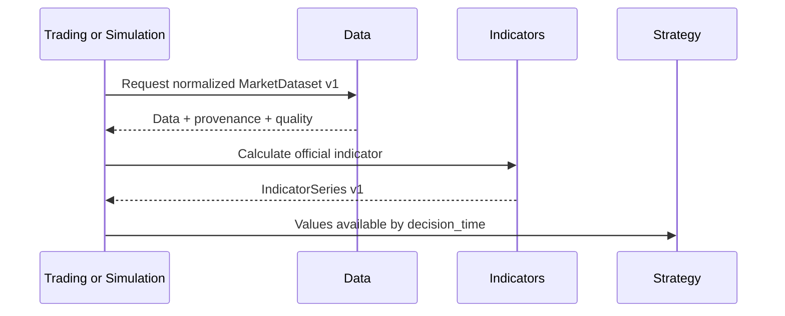
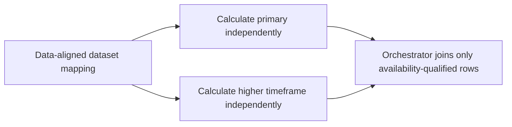
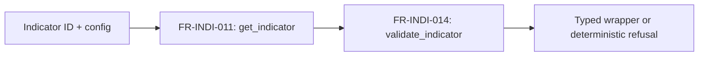

# Indicators

> **Package:** `app/services/indicators`
> **Status:** `Completed` — all 12 contiguously numbered registered features (`FEAT-INDI-01` through `FEAT-INDI-12`) implement the formula-ownership target with deterministic, stateless behavior, package-root APIs, and numbered usage evidence. The domain owns 64 registered indicator formulas and 85 function-only package-root exports.
> **Last updated:** `2026-08-10`

> This README is the package's **single source of truth** for requirements, final structure, implementation sequence, progress, usage examples, and tests.
> Update this file before changing the code.

---

## 1. Purpose and Boundary

### Purpose

Indicators converts normalized market datasets into deterministic, vectorized decision-support series. It owns pure formula evaluation, input and parameter validation, no-lookahead availability metadata, deterministic result manifests, and discovery of the reviewed official indicator set. It performs no I/O and cannot make strategy, risk, simulation, or execution decisions.

### Owns

- Pure, stateless batch calculations for the approved official indicators.
- Exact formula, seed, warmup, null, degenerate-window, dtype, and tolerance specifications.
- Indicator parameter and calculation-input validation after Data has normalized the dataset.
- The `IndicatorSeries v1` contract, represented by `IndicatorResult` and `IndicatorManifest`.
- Deterministic output naming, row/symbol alignment, availability metadata, provenance/quality propagation, and copied joins.
- The immutable official indicator registry and machine-readable capability matrix.
- Indicator-specific deterministic error codes and basic calculation resource-limit enforcement.

### Does not own

- Data acquisition, provider adapters, source readiness, provider normalization, symbol mapping, calendar/session normalization, quote-quality policy, or multi-timeframe orchestration; Data owns these.
- Signal interpretation, crossover decisions, trade proposals, strategy lifecycle, or final position sizing.
- Risk approval, orders, fills, journals, broker/account state, execution, or broker mutation.
- Persistence execution and orchestration, cache storage, audit sinks, telemetry export, tracing backends, SLO enforcement, or alert routing. Indicators has no persistence support schema or private CRUD statements; it is purely stateless and read-only.
- Runtime custom registration, incremental/streaming state, chunking, out-of-core execution, acceleration, composition graphs, proprietary controls, or release engineering.
- Retrospective SMC/FVG/swing/BOS/CHoCH labels in the production indicator surface.

### Public boundary resolution

`app/services/indicators/__init__.py` is the sole public import boundary and
stays function-only. Its 86 exports resolve lazily: `_EXPORTS` maps each public
name to the module and attribute that owns it, and a PEP 562 module
`__getattr__` imports that module on first access. Consumers still import from
the package root unchanged (for example `adr`); importing the boundary no
longer loads every Indicators feature.

An `if typing.TYPE_CHECKING:` block keeps the explicit imports so type checking
stays exact, and `__all__` is unchanged from the eager boundary.

### Shared contracts

Contract definitions must match the name, version, and owner recorded in `docs/PROJECT.md`.

### StandardResponse v1 boundary

All ten Core operations and all sixty-four official formula operations return
the Utils-owned `StandardResponse[T]` envelope. Successful responses place the
exact raw `T` directly in `data`; failures place one catalogue-approved
`IND_*` error in `error`, and no operation returns a nested response. Every
response carries the operation, Indicators domain, risk, trace identifier,
monotonic duration, and read-only/no-side-effect metadata. Internal formula
composition unwraps nested Indicators responses before constructing its outer
response. Consumers must inspect `status` and explicitly unwrap `data`.

**Owned by this domain** — defined authoritatively here:

| Status | Contract | Version | Counterparty | Purpose |
|---|---|---|---|---|
| Completed | `IndicatorSeries` (`IndicatorResult`) | `v1` | Strategy; Trading, Simulation, Research (as runtime/backtest/research orchestrators) | Return deterministic indicator values and their earliest safe consumption time without exposing raw provider objects or mutable internal state. |

#### `IndicatorSeries v1` field contract

| Field | Type | Required | Contract |
|---|---|---|---|
| `contract_version` | `Literal["v1"]` | Yes | Compatibility version; consumers never parse `schema_id` to infer it. |
| `schema_id` | `Literal["indicators.indicator_series.v1"]` | Yes | Stable namespaced schema identity. |
| `indicator_id` | `str` | Yes | Stable lowercase official registry identifier. |
| `indicator_version` | `str` | Yes | Public implementation version. |
| `formula_version` | `str` | Yes | Version of the approved mathematical convention. |
| `parameter_hash` | `str` | Yes | SHA-256 digest of the approved canonical parameter representation. |
| `values` | `pandas.DataFrame` | Yes | Indicator-owned tabular result built from a private projection of one `MarketDataset v1`. Defensive deep copies protect stored result/checksum identity from caller mutation. It is never a Data-owned internal DataFrame or raw provider object. |
| `output_columns` | `tuple[str, ...]` | Yes | Deterministic lowercase snake_case indicator columns in canonical order. |
| `available_at` | column/series in `values` | Yes | UTC timestamp identifying the earliest safe decision time for each output row. |
| `computed_from_start` / `computed_from_end` | columns/series in `values` | Yes | Inclusive source-window bounds used for each output row. |
| `source_timeframe` | column/series in `values` | Yes | Timeframe of the normalized source observations. |
| `quality` | columns/metadata | Yes | Data-owned dataset quality status/score repeated without reclassification; the manifest carries canonical status/score/schema evidence plus source/license provenance. |
| `manifest` | `IndicatorManifest` | Yes | Deterministic identity, checksum, output-contract, availability, precision, provenance, and quality summary. |
| `errors` | `tuple[IndicatorError, ...]` | Conditional | Unused in v1 because public failures are represented by the outer `StandardResponse` error branch; no partial official result may be presented as success. |

**Failure contract:** invalid input returns one deterministic `IND_*` error response. Calculation failure is atomic; no partial `IndicatorSeries` is published.

#### `IndicatorSeries v1` values-column contract

Rows preserve the input record order. The index is a UTC `DatetimeIndex` named
`timestamp`. Columns appear in this exact order:

| Column | Dtype | Contract |
|---|---|---|
| `symbol` | pandas string | Exact `MarketDataset.symbol`, repeated for every row. |
| Official output columns | `float64` | Registry-declared canonical order. Warmup values are `NaN`; valid values are finite and normalize negative zero to positive zero. |
| `available_at` | `datetime64[ns, UTC]` | For valid output, the maximum `available_at` of all contributing records; for warmup output, the current source record's `available_at`. |
| `computed_from_start` | `datetime64[ns, UTC]` | Inclusive first contributing timestamp; `NaT` while the complete formula window is unavailable. |
| `computed_from_end` | `datetime64[ns, UTC]` | Inclusive last contributing timestamp; `NaT` while the complete formula window is unavailable. |
| `source_timeframe` | pandas string | Exact non-empty input timeframe. |
| `data_quality_status` | pandas string | Exact `MarketDataset.quality_report.quality_status`. |
| `data_quality_decision` | pandas string | Exact `MarketDataset.quality_report.quality_decision`; operational gates use this field. |
| `data_quality_score` | `float64` | Exact finite decimal score converted to float64 for display; the manifest retains canonical decimal-string evidence. |
    IND --> VOLU[[volume: CMF, OBV, MFI, price-volume distribution]]
    IND --> PAT[[patterns: candle and chart-pattern evidence]]

    CORE --> C1[errors.py: Deterministic errors]
    CORE --> C2[contracts.py: Specs and calculation contracts]
    CORE --> C3[results.py: Manifest and result behavior]
    CORE --> C4[registry.py: Immutable discovery]
    CORE --> C5[validation.py: Fail-fast request validation]
    CORE[[core: Lowest dependency]]
    TREND[[trend]]
    VOL[[volatility]]
    MOM[[momentum]]
    VOLU[[volume]]
    PAT[[patterns]]

    CORE --> TREND
    CORE --> VOL
    CORE --> MOM
    CORE --> VOLU
    CORE --> PAT
```

`trend`, `volatility`, `momentum`, `volume`, and `patterns` do not depend on one another. `core/registry.py` stores immutable metadata and import-path identity without importing feature implementations, preventing a registry/built-in cycle.

### Feature Registry

This is the sole canonical current-state registry for Indicators features. Migration
infrastructure is documented support and is excluded from feature-count
reconciliation.

| Status | Feature ID | Capability | Production module | Public operations | Requirements | Usage evidence |
|---|---|---|---|---|---|---|
| Completed | `FEAT-INDI-01` | Contracts, registry discovery, result projections, request validation, and closed-input enforcement | `core/` | `build_indicator_config`, `join_indicator_result`, `get_indicator_result_values`, `get_indicator_result_metadata`, `get_indicator`, `list_indicators`, `get_capability_matrix`, `get_warmup_requirement`, `validate_indicator`, `assert_closed_input` | `FR-INDI-001`–`FR-INDI-014`, `FR-INDI-039`–`FR-INDI-041` | `tests/indicators/usage/features/01_core.py` |
| Completed | `FEAT-INDI-02` | Trend and moving-average calculation | `trend/` | `ema`, `sma`, `wma`, `hull_ma`, `bollinger_bands`, `adx`, `zigzag`, `measure_trend_strength`, `project_structural_levels` | `FR-INDI-015`–`FR-INDI-017`, `FR-INDI-023`–`FR-INDI-025`, `FR-INDI-035` | `tests/indicators/usage/features/02_trend.py` |
| Completed | `FEAT-INDI-03` | Momentum oscillator calculation | `momentum/` | `rsi`, `williams_r` | `FR-INDI-021`–`FR-INDI-022` | `tests/indicators/usage/features/03_momentum.py`<br>Providers: `indicator.rsi.default` (`app/services/indicators/momentum/rsi_default/README.md`, `tests/indicators/providers/indicator.rsi.default/test_provider.py`), `indicator.williams_r.default` (`app/services/indicators/momentum/williams_r_default/README.md`, `tests/indicators/providers/indicator.williams_r.default/test_provider.py`)<br>Capabilities: `indicator.rsi.v1`, `indicator.williams_r.v1`<br>Removability evidence: `tests/removability/test_momentum_provider_deletion.py` |
| Completed | `FEAT-INDI-04` | Volatility and range calculation (spec `IND-VOL-01`..`10` fully migrated) | `volatility/` | `atr`, `atr_percent`, `adr`, `rolling_volatility`, `ewma_volatility`, `parkinson_volatility`, `garman_klass_volatility`, `rogers_satchell_volatility`, `bollinger_bandwidth`, `volatility_percentile`, `volatility_of_volatility`, `standard_deviation`, `measure_market_speed`, `measure_volatility_envelope`, `project_market_overlay` | `FR-INDI-018`–`FR-INDI-020`, `FR-INDI-026`, `FR-INDI-042`–`FR-INDI-049`, `FR-INDI-085` | `tests/indicators/usage/features/04_volatility.py` |
| Completed | `FEAT-INDI-05` | Volume-flow and price-volume calculation | `volume/` | `cmf`, `obv`, `mfi`, `price_volume_distribution`, `build_liquidity_snapshot`, `parse_liquidity_snapshot`, `measure_order_flow` | `FR-INDI-027`–`FR-INDI-030` | `tests/indicators/usage/features/05_volume.py` |
| Completed | `FEAT-INDI-06` | Indicator snapshot contract | `snapshots/` | `build_indicator_snapshot`, `parse_indicator_snapshot` | `FR-INDI-036`–`FR-INDI-038` | `tests/indicators/usage/features/06_snapshots.py` |
| Completed | `FEAT-INDI-07` | Structural levels and confirmed pivots | `structure/` | `pivots`, `donchian_channels`, `pivot_points`, `anchored_vwap`, `volume_profile`, `gaps`, `level_clustering` | `FR-INDI-055`–`FR-INDI-061` | `tests/indicators/usage/features/07_structure.py` |
| Completed | `FEAT-INDI-08` | OHLCV-calculable order-flow proxies | `order_flow/` | `cumulative_volume_delta`, `aggressive_trade_imbalance` | `FR-INDI-062`–`FR-INDI-063` | `tests/indicators/usage/features/08_order_flow.py` |
| Completed | `FEAT-INDI-09` | Market-speed evidence | `market_speed/` | `price_velocity`, `momentum_acceleration`, `volume_acceleration`, `market_event_arrival_rate`, `volatility_expansion_rate`, `composite_market_speed_gauge` | `FR-INDI-064`–`FR-INDI-069` | `tests/indicators/usage/features/09_market_speed.py` |
| Completed | `FEAT-INDI-10` | Descriptive regime evidence | `regime/` | `adx_dmi_regime`, `choppiness_regime`, `hurst_regime`, `donchian_breakout_regime`, `volatility_liquidity_stress_regime`, `final_regime_resolver` | `FR-INDI-070`–`FR-INDI-075` | `tests/indicators/usage/features/10_regime.py` |
| Completed | `FEAT-INDI-11` | OHLCV-calculable liquidity evidence | `liquidity/` | `amihud_illiquidity` | `FR-INDI-076` | `tests/indicators/usage/features/11_liquidity.py` |
| Completed | `FEAT-INDI-12` | Deterministic candle and chart-pattern evidence | `patterns/` | `doji`, `pinbar`, `build_chart_pattern_evidence`, `double_top_bottom`, `head_and_shoulders`, `triangle`, `flag_pennant`, `inside_bar`, `engulfing`, `breakout_retest`, `wedge`, `rectangle`, `three_bar_reversal` | `FR-INDI-031`–`FR-INDI-034`, `FR-INDI-077`–`FR-INDI-084` | `tests/indicators/usage/features/12_patterns.py` |

### Structure rules

- The root contains only `README.md`, `__init__.py`, the twelve approved feature folders, and the documented non-feature support directory `migrations/`.
- Built-ins are stateless functions. Classes are limited to immutable data contracts, the structural protocol, and the domain exception.
- Each trend/volatility/momentum/volume/patterns file implements exactly one official indicator; a file is never shared by two indicators. Private vectorization helpers may be duplicated per file rather than factored into a shared base class.
- Public callers import only from `app.services.indicators`; feature and leaf modules are not stable API.
- Every public symbol appears exactly once in Section 4.
- Private vectorization, hashing, naming, and formula helpers remain in the focused owning file and receive no separate requirement IDs.
- **Common leaf set.** Every one of the 64 indicator leaf files imports exactly
  the same local surface, referenced as *(common leaf set)* in the feature
  Files tables: `core.contracts → IndicatorConfig`;
  `core.errors → IndicatorError, IndicatorErrorCode`;
  `core.errors → guard_public_boundary`;
  `core.results → build_indicator_result`;
  `core.validation → validate_indicator`; `app.utils → logger`; and, under
  `TYPE_CHECKING` only, `app.services.data → MarketDataset,
  OHLCVRecord` plus `core.results → IndicatorResult`. `build_indicator_result`
  is an internal Core helper, not public API: it appears in no `__all__` and is
  not a documented import for callers outside this package.
- The immutable registry stores no runtime registrations and performs no plugin discovery.
- Usage examples live under `tests/indicators/usage/`, never in the production package.

### Current file disposition

The final package tree above is implemented. Each approved indicator owns one leaf
file, the package and feature ports expose only the reviewed public symbols, and the
retired bundled files (`moving_averages.py`, `oscillators.py`, `ranges.py`, and
`rolling.py`) are absent.

### Exact implementation and file order

1. `core/errors.py` → `core/contracts.py` → `core/results.py` →
   `core/registry.py` → `core/validation.py` → `core/__init__.py`.
2. `trend/ema.py` → `trend/sma.py` → `trend/wma.py` → `trend/hull_ma.py` →
   `trend/bollinger_bands.py` → `trend/directional.py` → `trend/zigzag.py` →
   `trend/__init__.py`.
3. `volatility/atr.py` → `volatility/adr.py` → `volatility/rolling_volatility.py` →
   `volatility/standard_deviation.py` → `volatility/__init__.py`.
4. `momentum/rsi.py` → `momentum/williams_r.py` → `momentum/__init__.py`.
5. `volume/cmf.py` → `volume/obv.py` → `volume/mfi.py` →
   `volume/price_volume_distribution.py` → `volume/__init__.py`.
6. `patterns/doji.py` → `patterns/pinbar.py` → `patterns/__init__.py`.
7. Root `__init__.py` is populated only after all feature tests and imports pass.

`trend`, `volatility`, `momentum`, `volume`, and `patterns` are dependency peers, but
their delivery order is authoritative as listed above so review and handoff remain
deterministic. `hull_ma.py` is ordered after `wma.py` within `trend` because it
reuses the same weighted-average convention (as an independent private helper, not
a shared import) and is easiest to verify immediately after `wma.py` is proven
correct.

### Exact file-to-requirement allocation

| File | Assigned functional requirements |
|---|---|
| `core/errors.py` | `FR-INDI-001`, `FR-INDI-002` |
| `core/contracts.py` | `FR-INDI-003` through `FR-INDI-006` |
| `core/results.py` | `FR-INDI-007` through `FR-INDI-010` |
| `core/registry.py` | `FR-INDI-011` through `FR-INDI-013` |
| `core/validation.py` | `FR-INDI-014` |
| `trend/ema.py` | `FR-INDI-015` |
| `trend/sma.py` | `FR-INDI-016` |
| `trend/directional.py` | `FR-INDI-017` |
| `volatility/atr.py` | `FR-INDI-018` |
| `volatility/adr.py` | `FR-INDI-019` |
| `volatility/rolling_volatility.py` | `FR-INDI-020` |
| `volatility/market_projection.py` | `FR-INDI-085` |
| `momentum/rsi.py` | `FR-INDI-021` |
| `momentum/williams_r.py` | `FR-INDI-022` |
| `trend/wma.py` | `FR-INDI-023` |
| `trend/hull_ma.py` | `FR-INDI-024` |
| `trend/bollinger_bands.py` | `FR-INDI-025` |
| `volatility/standard_deviation.py` | `FR-INDI-026` |
| `volume/cmf.py` | `FR-INDI-027` |
| `volume/obv.py` | `FR-INDI-028` |
| `volume/mfi.py` | `FR-INDI-029` |
| `volume/price_volume_distribution.py` | `FR-INDI-030` |
| `patterns/doji.py` | `FR-INDI-031` |
| `patterns/engulfing.py` | `FR-INDI-032` |
| `patterns/pinbar.py` | `FR-INDI-033` |
| `patterns/inside_bar.py` | `FR-INDI-034` |
| `trend/zigzag.py` | `FR-INDI-035` |
| Feature `__init__.py` files | No independent `FR-*`; re-export only their feature's assigned symbols. |
| Root `__init__.py` | No independent `FR-*`; re-export only the approved `FR-INDI-001` through `FR-INDI-085` public functions and registered feature operations. |
| `README.md` | No implementation requirement; authoritative specification and evidence ledger. |

### Public import and API contract

The package root `app.services.indicators` is the canonical public import surface. It is export-only: the module contains no public implementation functions. Its `__all__` is exactly:

`IndicatorResult`, `IndicatorManifest`, `IndicatorConfig`, `IndicatorError`,
`IndicatorErrorCode`, and `IndicatorProtocol` are internal implementation
types and are never package-root exports. Cross-domain callers use
`get_indicator_result_values`, `get_indicator_result_metadata`, and
`join_indicator_result` for opaque calculation results.

```text
build_indicator_config, join_indicator_result, get_indicator_result_values,
get_indicator_result_metadata,
get_indicator, list_indicators, get_capability_matrix, get_warmup_requirement,
validate_indicator, run_indicators_migrations,
build_indicator_snapshot, parse_indicator_snapshot, assert_closed_input,
ema, sma, wma, hull_ma, bollinger_bands, adx, zigzag,
measure_trend_strength, project_structural_levels,
atr, atr_percent, adr, rolling_volatility, ewma_volatility,
parkinson_volatility, garman_klass_volatility, rogers_satchell_volatility,
bollinger_bandwidth, volatility_percentile, volatility_of_volatility,
standard_deviation,
measure_market_speed, measure_volatility_envelope,
rsi, williams_r,
cmf, obv, mfi, price_volume_distribution,
build_liquidity_snapshot, parse_liquidity_snapshot, measure_order_flow,
doji, engulfing, pinbar, inside_bar, build_chart_pattern_evidence
```

`app.services.indicators.snapshots` (the subpackage, not the package root) additionally
exposes `build_indicator_snapshot_v2`, `parse_indicator_snapshot_v2`,
`build_volatility_snapshot`, and `evaluate_publication_state` — the spec §14 v2
envelope, state machine, and first category-specific snapshot type. Root-package
export of the v2 surface is deferred to a later snapshots rollout phase per the
migration plan.

| Public symbols | Classification | Official workflow eligibility | Cache behavior | Public side effects |
|---|---|---|---|---|
| `build_indicator_config`, `join_indicator_result`, `get_indicator_result_values`, `get_indicator_result_metadata` | Stable | `WF-INDI-001..005` | None | None |
| `get_indicator`, `list_indicators`, `get_capability_matrix` | Stable | `WF-INDI-005` | None; immutable in-memory metadata | None |
| `get_warmup_requirement` | Stable | `WF-INDI-003` | None; resolves immutable registry metadata without fetching data | None |
| `validate_indicator` | Stable | `WF-INDI-001..005` | No cache access | None |
| `run_indicators_migrations` | Stable | None (startup support) | No cache access | Applies the Indicators support schema through Data's migration executor |
| `ema`, `sma`, `wma`, `hull_ma`, `bollinger_bands`, `adx`, `zigzag`, `atr`, `adr`, `rolling_volatility`, `standard_deviation`, `rsi`, `williams_r`, `cmf`, `obv`, `mfi`, `price_volume_distribution`, `doji`, `engulfing`, `pinbar`, `inside_bar` | Stable | `WF-INDI-001..004`; official in `SYS-WF-001` and `SYS-WF-002` | No cache access; returns canonical checksum material | None |
| `measure_market_speed`, `measure_volatility_envelope`, `measure_trend_strength`, `project_structural_levels`, `measure_order_flow`, `build_chart_pattern_evidence` | Stable | Operational measurement consumption | None; pure deterministic projection | None |
| `build_indicator_snapshot`, `parse_indicator_snapshot`, `build_liquidity_snapshot`, `parse_liquidity_snapshot` | Stable v1 contract transport | Producer-consumer handoff | None; detached JSON-safe mappings | None |
| `assert_closed_input` | Stable | Decision-time input admission | None; fail-closed validation | None |

No experimental callable or Risk regime classifier is exported. Excluded capabilities appear only in the capability matrix as unsupported modes, not as callable stubs.

---

## 3. Workflows

> **Workflow usage evidence:** Each completed workflow has one standalone
> input-to-output program with README-aligned stages. Market-dependent programs read
> genuine MT5 demo evidence through Data using only the enabled, encrypted system
> credential slot already stored in the configured database. Usage code never enables
> MT5, writes credentials, or substitutes a fallback account/server; unavailable or
> invalid persisted configuration fails closed. Run all programs with
> `python tests/indicators/usage/workflows/run_all.py`. The pytest execution evidence
> is deliberately opt-in with `INDICATORS_USAGE_LIVE_MT5=1` and requires
> `ENVIRONMENT=dev`; ordinary CI skips genuine subprocesses and opens no broker
> connection. Only unit tests may replace the MT5 boundary with fakes. This satisfies
> `NFR-INDI-011` and complements feature-level usage evidence.

### Workflow rank values

| Rank | Identifier | Meaning |
|---|---|---|
| **Primary** | `WF-INDI-PRI` | The workflow this domain exists to serve. |
| **Secondary** | `WF-INDI-SEC` | The next most load-bearing workflow. |
| **Tertiary** | `WF-INDI-TER` | The third-ranked workflow. |
| **Supporting** | `WF-INDI-0NN` | Every remaining registered workflow. |

### Retired identifiers

`WF-INDI-001`, `WF-INDI-002`, and `WF-INDI-004` were absorbed into `WF-INDI-PRI`,
`WF-INDI-SEC`, and `WF-INDI-TER` respectively. Absorbed numbers are retired and are
never reused. New workflows continue from `WF-INDI-006`.

| Workflow | Standalone program |
|---|---|
| `WF-INDI-PRI` | `tests/indicators/usage/workflows/wf_indi_pri_core_batch_indicator_calculation.py` |
| `WF-INDI-SEC` | `tests/indicators/usage/workflows/wf_indi_sec_decision_time_consumption.py` |
| `WF-INDI-TER` | `tests/indicators/usage/workflows/wf_indi_ter_availability_aware_multi_timeframe_calculation.py` |
| `WF-INDI-003` | `tests/indicators/usage/workflows/wf_indi_003_warmup_coordination.py` |
| `WF-INDI-005` | `tests/indicators/usage/workflows/wf_indi_005_static_registry_discovery_validation.py` |
| `WF-INDI-006` | `tests/indicators/usage/workflows/wf_indi_006_candlestick_pattern_detection.py` |
| `WF-INDI-007` | `tests/indicators/usage/workflows/wf_indi_007_volume_profile_distribution.py` |
| `WF-INDI-008` | `tests/indicators/usage/workflows/wf_indi_008_capability_matrix_introspection.py` |

### Status values

| Status | Meaning |
|---|---|
| **Missing** | Not implemented or not verified against the final contract. |
| **Partial** | Useful V1 behavior exists, but final contracts, relocation, or tests remain incomplete. |
| **Completed** | Implemented, tested, and verified against this README. |

### Workflow register

| Status | Rank | Workflow ID | Scope | Workflow | Trigger / Input boundary | Final outcome / Output boundary | Requirement sequence |
|---|---|---|---|---|---|---|---|
| Completed | Primary | `WF-INDI-PRI` | Internal | Core batch indicator calculation | One normalized `MarketDataset v1` plus approved config | Atomic `IndicatorResult` with values, availability, quality, and manifest | `FR-INDI-014 → FR-INDI-015..035 → FR-INDI-007..010` |
| Completed | Secondary | `WF-INDI-SEC` | Cross-domain | Decision-time consumption | Trading or Simulation supplies Data-owned normalized input | Eighty genuine MT5 EURUSD M1 bars produce official availability-qualified RSI values and four concrete Strategy signals through the package-root boundaries | `FR-INDI-014 → FR-INDI-015..035 → FR-INDI-008` |
| Completed | Tertiary | `WF-INDI-TER` | Cross-domain | Availability-aware multi-timeframe orchestration compatibility | Data supplies separately keyed aligned primary and higher-timeframe datasets; caller calculates each independently | Separately returned series preserve source availability and can be combined by the orchestrator without lookahead | `FR-INDI-014 → FR-INDI-015..035 → FR-INDI-007` |
| Completed | Supporting | `WF-INDI-003` | Cross-domain | Warmup coordination | Caller queries an official `WarmupRequirement` and supplies sufficient history | Warmup rows retained and explicitly unavailable until safe | `FR-INDI-005 → FR-INDI-014 → FR-INDI-015..035` |
| Completed | Supporting | `WF-INDI-005` | Internal | Static registry discovery and validation | Caller supplies official indicator ID/config | Validated spec/capability record or deterministic refusal | `FR-INDI-011..014` |
| Completed | Supporting | `WF-INDI-006` | Internal | Candlestick pattern detection | One normalized `MarketDataset v1` and an official pattern ID | Boolean pattern series with the same availability and warmup semantics as any other indicator | `FR-INDI-003..005 → FR-INDI-014 → FR-INDI-031..034` |
| Completed | Supporting | `WF-INDI-007` | Internal | Volume-profile and volume-flow distribution | One normalized `MarketDataset v1` carrying volume plus bounded bucket configuration | Distribution or flow series with explicit unavailability where volume is absent | `FR-INDI-003 → FR-INDI-014 → FR-INDI-027..030` |
| Completed | Supporting | `WF-INDI-008` | Cross-domain | Capability-matrix introspection | Caller queries the static registry for capabilities and warmup cost | Capability matrix and per-indicator `WarmupRequirement` used to plan history before any calculation | `FR-INDI-004..005 → FR-INDI-011..013` |

`WF-INDI-PRI`, `WF-INDI-SEC`, `WF-INDI-TER`, and `WF-INDI-003` are multi-feature
completion gates covering Core, trend, volatility, momentum, volume, and patterns.
`WF-INDI-005` covers the immutable registry and validation boundary.

### `WF-INDI-PRI` — Core Batch Indicator Calculation

**Scope:** `Internal`
**System workflow:** `None`

**Input boundary:** One immutable `MarketDataset v1` and calculation-relevant
`IndicatorConfig`.
**Output boundary:** An atomic `IndicatorResult`; the input contract remains
unchanged.

1. Resolve the immutable `IndicatorSpec` and validate the entire config and input
   before formula work — `indicators.get_indicator()`,
   `indicators.validate_indicator()`.
2. Execute the approved vectorized formula for the dataset's single symbol in
   canonical row order — `indicators.ema()`, `indicators.sma()`, `indicators.wma()`,
   `indicators.hull_ma()`, `indicators.bollinger_bands()`, `indicators.adx()`,
   `indicators.zigzag()`, `indicators.atr()`, `indicators.adr()`,
   `indicators.rolling_volatility()`, `indicators.standard_deviation()`,
   `indicators.rsi()`, `indicators.williams_r()`.
3. Retain warmup/unavailable rows and derive `available_at` and source-window
   bounds — `indicators.get_warmup_requirement()`.
4. Propagate Data-owned provenance and quality without redefining upstream policy —
   `data.inspect_dataset_quality()`.
5. Return deterministic values, output names, checksums, and manifest metadata —
   `utils.canonical_digest()`.

**Failure behavior:** validation or limit failure produces one Core MVP `IND_*` error before calculation; formula failure is atomic; output collision or detected input mutation fails rather than overwriting data.

**Integration test:**
`tests/indicators/integration/test_batch_calculation.py::test_batch_calculation_returns_atomic_available_result()`


```mermaid
flowchart LR
    A[MarketDataset v1 + config]
    B["FR-INDI-014: validate_indicator"]
    C["FR-INDI-015..035: official function"]
    D["FR-INDI-007..010: manifest and result"]
    E[IndicatorResult]
    A --> B --> C --> D --> E
```

### `WF-INDI-SEC` — Decision-Time Consumption

**Scope:** `Cross-domain`
**System workflow:** `SYS-WF-001`, `SYS-WF-002`

**Input boundary:** Trading (live/demo) or Simulation (historical) supplies Data-owned normalized market data.
**Output boundary:** Indicators returns `IndicatorSeries v1`; Strategy consumes only rows whose `available_at <= decision_time`.

1. The orchestrator obtains Data-owned normalized market data —
   `data.get_market_data()`.
2. The orchestrator calculates one official indicator over that dataset —
   `indicators.validate_indicator()`, then the official function for the requested
   indicator (see `WF-INDI-PRI` step 2).
3. Indicators returns `IndicatorSeries v1` describing availability per row and
   nothing more — `indicators.get_warmup_requirement()`.
4. Strategy consumes only rows whose `available_at <= decision_time` —
   `strategy.run_vectorized_strategy_signals()`,
   `strategy.run_event_strategy_hook()`.

Indicators calculates and describes availability only. Trading/Simulation owns orchestration, and Strategy/Simulation owns enforcement of the decision-time filter and any resulting action.

**Failure behavior:** invalid normalized input or unverifiable availability fails closed with no partial series; a downstream lookahead violation remains a downstream policy error, informed by `IND_LOOKAHEAD_RISK` metadata/error evidence.

**Integration test:**
`tests/indicators/integration/test_decision_time_consumption.py::test_indicator_series_is_availability_qualified_at_decision_time()`

**Known cross-domain blocker:** the standalone workflow calculates genuine MT5-backed
RSI successfully, then Strategy returns `INDICATOR_MODULE_ERROR`. Strategy's
`signals/boundary.py` checks the Indicators standard join response with an invalid
runtime `isinstance(..., StandardResponse)` test where `StandardResponse` is a type
alias. Repairing that Strategy-owned consumer is outside this Indicators-only
production scope.


```mermaid
sequenceDiagram
    participant O as Trading or Simulation
    participant D as Data
    participant I as Indicators
    participant S as Strategy
    O->>D: Request normalized MarketDataset v1
    D-->>O: Data + provenance + quality
    O->>I: Calculate official indicator
    I-->>O: IndicatorSeries v1
    O->>S: Values available by decision_time
```

### `WF-INDI-003` — Warmup Coordination

**Scope:** `Cross-domain`
**System workflow:** `SYS-WF-001`, `SYS-WF-002`

**Input boundary:** The caller resolves `WarmupRequirement`, then Data supplies the requested normalized history.
**Output boundary:** Indicators retains all rows and marks warmup/unavailable values explicitly.

1. The caller resolves the official warmup cost for the indicator and config —
   `indicators.get_warmup_requirement()`.
2. The caller obtains at least that much normalized history from Data —
   `data.get_market_data()`.
3. Validation confirms sufficiency before any formula runs —
   `indicators.validate_indicator()`.
4. Calculation retains every aligned row and marks warmup rows explicitly
   unavailable — the official function for the requested indicator.

Indicators never fetches history. A non-empty short dataset retains all aligned
rows, sets indicator values to `NaN`, sets window bounds to `NaT`, marks
`unavailable_reason="warmup"`, and never fetches additional history. An empty
dataset raises `IND_INSUFFICIENT_DATA`.

**Integration test:**
`tests/indicators/integration/test_warmup_coordination.py::test_warmup_requirement_preserves_unavailable_rows()`


```mermaid
flowchart LR
    A["FR-INDI-005: WarmupRequirement"] --> B[Caller obtains Data history]
    B --> C["FR-INDI-014: validate sufficiency"]
    C --> D[Official calculation]
    D --> E[Warmup rows retained and marked unavailable]
```

### `WF-INDI-TER` — Availability-Aware Multi-Timeframe Calculation

**Scope:** `Cross-domain`
**System workflow:** `SYS-WF-001`, `SYS-WF-002`

**Input boundary:** Data supplies a mapping of already normalized/aligned
`MarketDataset v1` values. The orchestrator submits the primary and at most one
higher-timeframe dataset as separate official calculations.
**Output boundary:** Indicators returns one independent series per submitted
dataset. Each result preserves the source dataset's timeframe and record
availability; Indicators neither combines nor realigns the results.

1. Data resamples and aligns the primary and higher-timeframe datasets —
   `data.resample_dataset()`, `data.align_multitimeframe_data()`.
2. The orchestrator calculates the primary dataset independently —
   `indicators.validate_indicator()` plus the official function.
3. The orchestrator calculates the higher-timeframe dataset independently —
   `indicators.validate_indicator()` plus the official function.
4. Each result preserves its own source timeframe and record availability;
   Indicators neither combines nor realigns them —
   `indicators.get_capability_matrix()`.
5. The orchestrator joins only availability-qualified rows —
   `strategy.run_vectorized_strategy_signals()`.

Data owns multi-timeframe resampling/alignment. Trading, Simulation, or Strategy
owns decision-time combination of the separate series. Official Indicator
calculators therefore report `multi_timeframe_support=false`; compatibility means
their separately calculated results remain causally joinable by the orchestrator.

**Failure behavior:** either individual dataset fails its normal validation
atomically. Consumption before a higher-timeframe result's `available_at` is rejected
by the consuming/orchestrating domain; Indicators does not receive a decision time.

**Integration test:**
`tests/indicators/integration/test_multi_timeframe.py::test_separate_timeframe_results_preserve_source_availability()`


```mermaid
flowchart LR
    A[Data-aligned dataset mapping]
    B[Calculate primary independently]
    C[Calculate higher timeframe independently]
    D[Orchestrator joins only availability-qualified rows]
    A --> B --> D
    A --> C --> D
```

### `WF-INDI-005` — Static Registry Discovery and Validation

**Scope:** `Internal`
**System workflow:** `None`

**Input boundary:** Official indicator ID and candidate config.
**Output boundary:** Immutable `IndicatorSpec`/capability metadata or deterministic `IND_UNSUPPORTED_INDICATOR` / validation error.

1. Enumerate the immutable set of official indicators —
   `indicators.list_indicators()`.
2. Resolve the typed wrapper for one official indicator ID —
   `indicators.get_indicator()`.
3. Validate the candidate config against the resolved spec —
   `indicators.validate_indicator()`.
4. Return the spec and capability record, or a deterministic refusal —
   `indicators.get_capability_matrix()`.

The registry exposes exactly 21 reviewed built-ins and cannot register or
unregister at runtime.

**Integration test:**
`tests/indicators/integration/test_registry_workflow.py::test_registry_discovers_and_validates_only_official_batch_indicators()`


```mermaid
flowchart LR
    A[Indicator ID + config]
    B["FR-INDI-011: get_indicator"]
    C["FR-INDI-014: validate_indicator"]
    D[Typed wrapper or deterministic refusal]
    A --> B --> C --> D
```

### `WF-INDI-006` — Candlestick Pattern Detection

**Scope:** `Internal`
**System workflow:** `SYS-WF-001`, `SYS-WF-002`

**Input boundary:** One immutable `MarketDataset v1` and an official candlestick
pattern ID with its config.
**Output boundary:** A boolean pattern series carrying the same availability,
warmup, and provenance semantics as any other official indicator.

1. Resolve the pattern spec and validate the config and input —
   `indicators.get_indicator()`, `indicators.validate_indicator()`.
2. Resolve the warmup cost, which for multi-bar patterns exceeds one row —
   `indicators.get_warmup_requirement()`.
3. Execute the approved detector over canonical row order —
   `indicators.doji()`, `indicators.engulfing()`, `indicators.pinbar()`,
   `indicators.inside_bar()`.
4. Retain warmup rows as explicitly unavailable rather than emitting `False` —
   `indicators.get_capability_matrix()`.

**Failure behavior:** a pattern is never reported on a row whose required lookback
is incomplete; a dataset missing OHLC fields fails validation before detection.

**Integration test:**
`tests/indicators/integration/test_workflow_scripts.py::test_repaired_indicator_workflow_executes[wf_indi_006_candlestick_pattern_detection.py]`

### `WF-INDI-007` — Volume-Profile and Volume-Flow Distribution

**Scope:** `Internal`
**System workflow:** `SYS-WF-001`

**Input boundary:** One immutable `MarketDataset v1` carrying volume, plus bounded
bucket or period configuration.
**Output boundary:** A distribution or flow series with explicit unavailability
wherever volume evidence is absent.

1. Validate that the dataset actually carries usable volume for the requested
   calculation — `indicators.validate_indicator()`.
2. Build the price-bucketed volume distribution over the bounded window —
   `indicators.price_volume_distribution()`.
3. Calculate cumulative and money-weighted flow series —
   `indicators.obv()`, `indicators.mfi()`, `indicators.cmf()`.
4. Mark rows whose source volume is zero or missing as unavailable rather than
   treating absence as zero flow — `data.detect_zero_volume_bars()`.

**Failure behavior:** a symbol whose venue reports no genuine volume fails closed
rather than producing a distribution over synthetic tick counts.

**Integration test:**
`tests/indicators/integration/test_workflow_scripts.py::test_repaired_indicator_workflow_executes[wf_indi_007_volume_profile_distribution.py]`

### `WF-INDI-008` — Capability-Matrix Introspection

**Scope:** `Cross-domain`
**System workflow:** `SYS-WF-001`, `SYS-WF-003`

**Input boundary:** A planning caller — Strategy, Simulation, or Optimization —
queries the static registry before requesting any history.
**Output boundary:** The capability matrix plus per-indicator `WarmupRequirement`,
used to size history requests without running a calculation.

1. Enumerate the official indicator set — `indicators.list_indicators()`.
2. Read declared capabilities, including `multi_timeframe_support` and required
   input fields — `indicators.get_capability_matrix()`.
3. Resolve the exact warmup cost for each planned indicator and config —
   `indicators.get_warmup_requirement()`.
4. Size the upstream history request from the largest resolved warmup —
   `data.get_market_data()`.

**Failure behavior:** introspection never triggers a calculation and never fetches
data; an unsupported indicator ID returns `IND_UNSUPPORTED_INDICATOR` rather than an
empty capability record.

**Integration test:**
`tests/indicators/integration/test_workflow_scripts.py::test_repaired_indicator_workflow_executes[wf_indi_008_capability_matrix_introspection.py]`

---

## 4. Module and Requirement Specifications

Modules and files are arranged in implementation order.

### 4.1 `core/` — Contracts, Results, Validation, and Discovery

**Purpose:** Define the complete pure calculation boundary shared by every official built-in.

**Module flow:**

```text
indicator id + normalized data + config
  → registry.py
  → validation.py
  → feature calculation
  → results.py
  → IndicatorResult
```

### Files

| Status | File | Responsibility | Key exports | Dependencies |
|---|---|---|---|---|
| Completed | `errors.py` | Define the compact Core MVP error catalogue, one structured domain exception, and the public-boundary exception guard. | `IndicatorErrorCode`, `IndicatorError`<br>Internal (non-public) cross-file helper: `guard_public_boundary`, applied to all sixty-four official formula functions and deliberately absent from `core/__init__.py.__all__` and the package port. | **Standard library:** `collections.abc`, `enum`, `functools`, `math`, `re`, `types`, `typing`<br>**Required third-party:** None<br>**Local:** `app.utils → logger, redact_text_value` |
| Completed | `contracts.py` | Define immutable calculation config, spec, warmup, and structural callable contracts. | `IndicatorConfig`, `IndicatorSpec`, `WarmupRequirement`, `IndicatorProtocol` | **Standard library:** `collections.abc`, `dataclasses`, `typing`<br>**Required third-party:** None<br>**Local (type-checking only):** `app.services.data → MarketDataset`; `results.py → IndicatorResult` |
| Completed | `results.py` | Define deterministic manifest/result fields and safe result projection/join behavior. | `IndicatorManifest`, `IndicatorResult`<br>Internal (non-public) cross-file helper: `build_indicator_result`, used by every feature leaf file and deliberately absent from `core/__init__.py.__all__` and the package port. | **Standard library:** `collections.abc`, `dataclasses`, `hashlib`, `json`, `math`, `typing`<br>**Required third-party:** `pandas`<br>**Local:** `errors.py → IndicatorError, IndicatorErrorCode`; `app.utils → canonical_json, logger`<br>**Local (type-checking only):** `app.services.data → MarketDataset, OHLCVRecord`; `contracts.py → IndicatorConfig` |
| Completed | `registry.py` | Expose immutable official specs and capability metadata without importing feature implementations. | `get_indicator`, `list_indicators`, `get_capability_matrix` | **Standard library:** `collections.abc`, `types`<br>**Required third-party:** None<br>**Local:** `contracts.py → IndicatorSpec`; `errors.py → IndicatorError, IndicatorErrorCode`; `app.utils → logger` |
| Completed | `validation.py` | Resolve exact warmup requirements and fully validate one batch request before any formula work. | `get_warmup_requirement`, `validate_indicator` | **Standard library:** `collections.abc`, `datetime`, `math`, `re`<br>**Required third-party:** `pandas`<br>**Local:** `app.services.data → MarketDataset, OHLCVRecord`; `contracts.py → IndicatorConfig, IndicatorSpec, WarmupRequirement`; `errors.py → IndicatorError, IndicatorErrorCode`; `registry.py → get_indicator`; `app.utils → logger` |
| Completed | `__init__.py` | Expose only the approved public Core API. | All Core exports above | **Standard library:** None<br>**Required third-party:** None<br>**Local:** Approved exports from the five files above |

### Configuration and Limits Manifest

| Status | Setting / Limit | Type | Default | Required | Used by | Description |
|---|---|---|---|---|---|---|
| Completed | `IndicatorConfig.source` | `str` | `"close"` when the formula has a price source | Conditional | Official wrappers | Selects exactly one of `open`, `high`, `low`, or `close`; non-default sources appear in output names. Fixed-OHLC indicators use `None`. |
| Completed | `IndicatorConfig.indicator_id` | `str` | None | Yes | Registry/calculators | Exact lowercase official ID; it must match the called wrapper. |
| Completed | `IndicatorConfig.parameters` | `tuple[tuple[str, int \| float \| str], ...]` | `()` | Yes | Registry/calculators | Canonical key-sorted immutable parameters; duplicate keys are invalid. |
| Completed | `IndicatorConfig.formula_version` | `str` | Registry version | Yes | Validation | Must equal the selected official spec. |
| Completed | `IndicatorConfig.output_mode` | `Literal["values"]` | `"values"` | Yes | Public calculations, `IndicatorResult` | Core returns aligned values; copied enrichment is requested explicitly through `join_to()`. Additional modes are excluded. |
| Completed | `IndicatorConfig.column_conflict_policy` | `Literal["error"]` | `"error"` | Yes | `IndicatorResult.join_to()` | Any collision fails with `IND_OUTPUT_COLUMN_CONFLICT`; overwrite/suffix/prefix policies are excluded. |
| Completed | `IndicatorConfig.precision_dtype` | `Literal["float64"]` | `"float64"` | Yes | All calculations | Core numerical output uses float64 under the approved formula tolerance; unsupported dtypes fail. |
| Completed | `IndicatorConfig.availability_policy` | `Literal["source_available_at"]` | `"source_available_at"` | Yes | Official wrappers | Valid output is available at the maximum contributing record `available_at`; short non-empty history remains warmup output. |
| Completed | `IndicatorConfig.quality_policy` | `Literal["propagate_dataset"]` | `"propagate_dataset"` | Yes | `validate_indicator`, official wrappers | Requires Data-owned dataset quality evidence and propagates status/score without reclassification. |
| Completed | `IndicatorConfig.error_mode` | `Literal["raise"]` | `"raise"` | Yes | All public callables | Every public failure raises one deterministic exception; result-error and partial-success modes are unsupported in v1. |
| Completed | `MAX_INPUT_ROWS` | Positive `int` | `1000000` | Yes | `validate_indicator` | Rejects oversized input with `IND_RESOURCE_LIMIT_EXCEEDED`. This is the only input-size ceiling; no lower serialization bound exists. Regression evidence: `tests/indicators/unit/test_large_input.py`. |
| Completed | `IndicatorManifest.manifest_version` | `str` | `"v1"` | Yes | `IndicatorManifest` | Versions the deterministic manifest contract. |
| Completed | `IndicatorManifest.output_schema_version` | `str` | `"v1"` | Yes | `IndicatorManifest` | Versions the `IndicatorSeries` values schema. |

Public wrappers own convenience arguments. They construct the complete immutable
config before validation. If an explicitly supplied config disagrees with wrapper
`indicator_id`, `period`, `source`, or formula version, the wrapper raises
`IND_INVALID_CONFIG`; no precedence or silent override exists.

#### `errors.py` — Deterministic Error Contract

**File responsibility:** Represent only the 22 approved Core MVP codes and their redacted structured exception.

| Status | Requirement ID | Responsibility | Class / Function / Method | Side Effects | Raises | Usage / Test |
|---|---|---|---|---|---|---|
| Completed | `FR-INDI-001` | The system shall expose exactly the approved Core MVP codes: `IND_INVALID_CONFIG`, `IND_INVALID_PARAMETER`, `IND_UNSUPPORTED_INDICATOR`, `IND_UNSUPPORTED_TIMEFRAME`, `IND_UNSUPPORTED_DTYPE`, `IND_INVALID_INPUT_SCHEMA`, `IND_MISSING_REQUIRED_COLUMN`, `IND_INVALID_OUTPUT_COLUMN`, `IND_OUTPUT_COLUMN_CONFLICT`, `IND_INVALID_OUTPUT_MODE`, `IND_INPUT_MUTATION_DETECTED`, `IND_DUPLICATE_TIMESTAMP`, `IND_NON_MONOTONIC_TIME`, `IND_AMBIGUOUS_TIMESTAMP`, `IND_INVALID_TIMEZONE`, `IND_INVALID_OHLC`, `IND_INSUFFICIENT_DATA`, `IND_LOOKAHEAD_RISK`, `IND_FORMULA_VERSION_MISMATCH`, `IND_RESOURCE_LIMIT_EXCEEDED`, `IND_PARTIAL_RESULT`, and `IND_INTERNAL_ERROR`. | `IndicatorErrorCode: StrEnum` | None | None | **Usage:** `tests/indicators/usage/features/01_core.py`<br>**Unit:** `tests/indicators/unit/test_errors.py::test_error_code_catalog_contains_only_core_codes()` |
| Completed | `FR-INDI-002` | The system shall represent a deterministic, redacted failure with code, safe message, and structured details without exposing raw exceptions or sensitive input data. | `IndicatorError(code: IndicatorErrorCode, message: str, details: Mapping[str, object] | None = None)` | None | None | **Usage:** `tests/indicators/usage/features/01_core.py`<br>**Unit:** `tests/indicators/unit/test_errors.py::test_indicator_error_serializes_redacted_details()` |

**Rules:**

- Codes rejected as Data-owned and codes tied to excluded features are not public Core members.
- Raw pandas/NumPy/provider exceptions never cross the public boundary.
- `IND_PARTIAL_RESULT` is a failure code; partial data is never returned as successful official output.
- Synchronous calculations expose no internal timeout or cancellation API.
  Trading/Simulation/UI orchestration owns external deadlines and task cancellation.
- `message` is non-empty, deterministic, and at most 256 characters.
- `details` contains at most 16 lowercase-snake-case keys, each at most 64
  characters. Values are JSON scalars or tuples of at most 20 JSON scalars;
  strings are at most 256 characters, floats must be finite, and nested mappings,
  raw records, arrays, DataFrames, tracebacks, and exception objects are rejected.
- Strings in `message` and `details` pass through the Utils redaction boundary
  before serialization. The stored details mapping is immutable.

**Implementation notes:** No existing Indicators error implementation is present in
the current workspace. Create only this approved contract under `core/`; do not
reconstruct historical public classes that are absent from the specification.

#### `contracts.py` — Immutable Calculation Contracts

**File responsibility:** Define calculation-relevant immutable contracts without platform, cache, audit, or incremental state.

| Status | Requirement ID | Responsibility | Class / Function / Method | Side Effects | Raises | Usage / Test |
|---|---|---|---|---|---|---|
| Completed | `FR-INDI-003` | The system shall represent indicator ID, canonical parameters, source, formula version, output/precision/availability/quality policy, and error mode in one immutable batch config, excluding cache, calendar, backend, actor, tracing, SLO, entitlement, timeout, cancellation, and orchestration context. | `IndicatorConfig` | None | None | **Usage:** `tests/indicators/usage/features/01_core.py`<br>**Unit:** `tests/indicators/unit/test_contracts.py::test_indicator_config_is_immutable_and_core_only()` |
| Completed | `FR-INDI-004` | The system shall describe each official indicator's ID, name, versions, tier, required columns, parameter/output schemas, warmup policy, supported batch capabilities, import path, stability, and workflow eligibility. | `IndicatorSpec` | None | None | **Usage:** `tests/indicators/usage/features/01_core.py`<br>**Unit:** `tests/indicators/unit/test_contracts.py::test_indicator_spec_contains_required_public_metadata()` |
| Completed | `FR-INDI-005` | The system shall expose the exact normalized history requirement for an indicator/config without fetching data, including minimum observations, source timeframe, required columns, and availability basis. | `get_warmup_requirement(indicator_id: str, config: IndicatorConfig) -> StandardResponse[WarmupRequirement]` | None | `StandardResponse.error`: unsupported indicator or invalid configuration | **Usage:** `tests/indicators/usage/features/01_core.py`<br>**Unit:** `tests/indicators/unit/test_contracts.py::test_get_warmup_requirement_resolves_every_official_policy()` |
| Completed | `FR-INDI-006` | The system shall expose a minimal structural registered-calculator protocol whose approved calculation accepts one normalized `MarketDataset v1` plus a complete `IndicatorConfig` and returns `IndicatorResult`; public convenience wrappers construct the config and are not required to share this internal signature. | `IndicatorProtocol.calculate(data: MarketDataset, config: IndicatorConfig) -> StandardResponse[IndicatorResult]` | None | `StandardResponse.error`: deterministic request/calculation failure under the approved error mode | **Usage:** `tests/indicators/usage/features/01_core.py`<br>**Unit:** `tests/indicators/unit/test_contracts.py::test_official_calculator_satisfies_indicator_protocol()` |

**Rules:** Contracts are frozen, typed, JSON-compatible where serialized, and contain only calculation-relevant metadata. Serialized field types are exactly those declared by the contract requirements.

#### Exact Core contract fields

| Contract | Exact fields |
|---|---|
| `IndicatorConfig` | `indicator_id: str`; `parameters: tuple[tuple[str, int \| float \| str], ...]`; `source: str \| None`; `formula_version: str`; `output_mode: Literal["values"]`; `column_conflict_policy: Literal["error"]`; `precision_dtype: Literal["float64"]`; `availability_policy: Literal["source_available_at"]`; `quality_policy: Literal["propagate_dataset"]`; `error_mode: Literal["raise"]` |
| `IndicatorSpec` | `indicator_id: str`; `name: str`; `indicator_version: str`; `formula_version: str`; `tier: Literal["core_mvp"]`; `required_columns: tuple[str, ...]`; `parameter_schema: Mapping[str, object]`; `output_templates: tuple[str, ...]`; `warmup_policy: Literal["period", "period_plus_one", "two_period", "none", "custom"]`; `vectorized: Literal[True]`; `multi_symbol: Literal[False]`; `multi_timeframe: Literal[False]`; `import_path: str`; `stability: Literal["stable"]`; `workflow_eligibility: tuple[str, ...]` |
| `WarmupRequirement` | `indicator_id: str`; `formula_version: str`; `minimum_observations: int`; `source_timeframe: str \| None`; `required_columns: tuple[str, ...]`; `availability_basis: Literal["source_available_at"]` |

Mappings are frozen and serialized as ordinary JSON objects. Parameter tuples are
strictly sorted by key. Keys are lowercase snake_case and unique. Parameter values
are finite scalar JSON values only; booleans are rejected as numeric parameters.
Every official `period` is an integer satisfying
`2 <= period <= MAX_INPUT_ROWS`; booleans are rejected.

#### `results.py` — Manifest and Result Behavior

**File responsibility:** Build and expose the deterministic `IndicatorSeries v1` result without mutating source data.

| Status | Requirement ID | Responsibility | Class / Function / Method | Side Effects | Raises | Usage / Test |
|---|---|---|---|---|---|---|
| Completed | `FR-INDI-007` | The system shall expose a standalone serializable deterministic manifest containing manifest/indicator/formula/output-schema versions, canonical parameter hash, input/output checksums, output contract and shape, precision, availability policy, Data-provided provenance, and quality summary; volatile runtime/host data is excluded from identity. | `IndicatorManifest` | None | None | **Usage:** `tests/indicators/usage/features/01_core.py`<br>**Unit:** `tests/indicators/unit/test_results.py::test_manifest_is_stable_for_equivalent_inputs()` |
| Completed | `FR-INDI-008` | The system shall return timestamp/symbol-aligned values, canonical output columns, availability, quality, errors, and manifest as `IndicatorSeries v1`, preserving warmup and unavailable rows and exposing no incremental state or metrics. | `IndicatorResult` | None | None | **Usage:** `tests/indicators/usage/features/01_core.py`<br>**Unit:** `tests/indicators/unit/test_results.py::test_indicator_result_matches_v1_contract()` |
| Completed | `FR-INDI-009` | The system shall expose a copy-safe projection containing generated indicator, availability, and quality columns without original OHLCV columns. | `IndicatorResult.values_only: pd.DataFrame` | None | None | **Usage:** `tests/indicators/usage/features/01_core.py`<br>**Unit:** `tests/indicators/unit/test_results.py::test_values_only_excludes_source_columns()` |
| Completed | `FR-INDI-010` | The system shall privately project one matching `MarketDataset v1`, append generated columns to that copied canonical tabular projection, and preserve source columns, row count/order, timestamp/symbol layout, warmup rows, and input identity; collisions fail. | `IndicatorResult.join_to(data: MarketDataset, mode: Literal["copy"] = "copy") -> StandardResponse[pd.DataFrame]` | None | `StandardResponse.error`: invalid mode, dataset/checksum mismatch, output collision, or detected mutation | **Usage:** `tests/indicators/usage/features/01_core.py`<br>**Unit:** `tests/indicators/unit/test_results.py::test_join_to_preserves_input_and_alignment()` |

Result assembly constructs canonical frames atomically. One lock-protected cache may
reuse the checksum and source projection of only the current immutable dataset
instance across sibling calculations and joins. A distinct dataset identity always
recomputes both values, so equivalent content cannot alias provenance and historical
rolling windows are not retained.

#### Exact manifest and result fields

`IndicatorManifest` is a frozen serializable dataclass with these exact fields:

| Field | Exact type/value |
|---|---|
| `manifest_version` | `Literal["v1"] = "v1"` |
| `contract_version` | `Literal["v1"] = "v1"` |
| `indicator_id` | `str` |
| `indicator_version` | `str` |
| `formula_version` | `str` |
| `output_schema_version` | `Literal["v1"] = "v1"` |
| `parameter_hash` | lowercase 64-character SHA-256 `str` |
| `input_checksum` | lowercase 64-character SHA-256 `str` |
| `output_checksum` | lowercase 64-character SHA-256 `str` |
| `output_columns` | `tuple[str, ...]` |
| `row_count` | non-negative `int` |
| `symbol` | non-empty `str` |
| `source_timeframe` | non-empty `str` |
| `precision_dtype` | `Literal["float64"] = "float64"` |
| `availability_policy` | `Literal["source_available_at"] = "source_available_at"` |
| `normalization_version` | exact non-empty Data-owned `str` |
| `source_metadata` | immutable `Mapping[str, str]`, copied from Data |
| `license_metadata` | immutable `Mapping[str, str]`, copied from Data |
| `quality_status` | Data-owned percentage grade: `perfect`, `excellent`, `good`, `degraded`, `poor`, `critical`, or `not_checked` |
| `quality_decision` | Data-owned operational decision: `accepted`, `accepted_with_warnings`, `review_required`, `rejected`, or `not_evaluated` |
| `quality_score` | canonical `0.00` through `100.00` decimal `str`, copied from Data |
| `quality_schema_version` | exact non-empty Data-owned `str` |

Volatile host, process, thread, duration, and wall-clock calculation fields are
excluded. A Data quality status of `failed` is rejected before result construction.

`IndicatorResult` is a frozen container with these exact fields:

| Field | Exact type/value |
|---|---|
| `contract_version` | `Literal["v1"] = "v1"` |
| `schema_id` | `Literal["indicators.indicator_series.v1"] = "indicators.indicator_series.v1"` |
| `indicator_id` | `str` |
| `indicator_version` | `str` |
| `formula_version` | `str` |
| `parameter_hash` | lowercase 64-character SHA-256 `str` |
| `values` | owned `pandas.DataFrame` following the exact values-column contract |
| `output_columns` | `tuple[str, ...]` |
| `manifest` | `IndicatorManifest` |
| `errors` | `tuple[IndicatorError, ...] = ()` |

Construction deep-copies `values`; `values_only` and `join_to()` each return a new
deep copy.

#### Canonical identity rules

1. Parameter-hash material is
   `{"indicator_id", "formula_version", "parameters", "source"}`. Parameters are
   emitted as a key-sorted object. SHA-256 is calculated over
   `app.utils.canonical_json(...)` UTF-8 bytes.
2. Input-checksum material is `MarketDataset.model_dump(mode="json")` with record
   tuple order preserved and mapping keys canonicalized by
   `app.utils.canonical_json`. The digest is **folded**, not computed in one
   call: one `canonical_json` call covers the dataset-level fields, then one
   call per ordered chunk of at most `_CHECKSUM_CHUNK_RECORDS` (250) records,
   each chunk separated by an ASCII record separator (`0x1e`) that cannot
   appear unescaped in JSON text. `app.utils.canonical_json` enforces a
   cumulative 10,000-item traversal bound owned by Utils; a single-call
   implementation therefore failed for any dataset beyond 664 records, far
   below `MAX_INPUT_ROWS`. Folding keeps every call far under the Utils bound
   at any history length while preserving determinism and record-order
   sensitivity. Indicators must not weaken the Utils bound to work around it.
3. Output-checksum material is records-oriented JSON in exact result row and column
   order. UTC timestamps use canonical `Z` strings; `NaT`, `NaN`, and pandas `NA`
   serialize as JSON null; negative zero normalizes to `0.0`; finite float64 values
   serialize through `float.hex()`.
4. Hashes are lowercase 64-character hexadecimal SHA-256 strings.
5. `join_to()` never overwrites and accepts only the exact input dataset whose
   canonical checksum matches the manifest.

#### `registry.py` — Immutable Official Discovery

**File responsibility:** Describe the 20 official built-ins and supported Core
modes without runtime mutation or implementation imports.

| Status | Requirement ID | Responsibility | Class / Function / Method | Side Effects | Raises | Usage / Test |
|---|---|---|---|---|---|---|
| Completed | `FR-INDI-011` | The system shall resolve one of the 21 official indicator IDs in the registry identity below to its immutable spec and reject every unknown ID before calculation. | `get_indicator(indicator_id: str) -> StandardResponse[IndicatorSpec]` | None | `StandardResponse.error`: `IND_UNSUPPORTED_INDICATOR` | **Usage:** `tests/indicators/usage/features/01_core.py`<br>**Unit:** `tests/indicators/unit/test_registry.py::test_get_indicator_rejects_unknown_id()` |
| Completed | `FR-INDI-012` | The system shall list official specs in stable indicator-ID order with no mutable registry handle. | `list_indicators() -> StandardResponse[tuple[IndicatorSpec, ...]]` | None | None | **Usage:** `tests/indicators/usage/features/01_core.py`<br>**Unit:** `tests/indicators/unit/test_registry.py::test_list_indicators_is_stable_and_immutable()` |
| Completed | `FR-INDI-013` | The system shall expose a JSON/YAML-compatible matrix containing ID, versions, tier, batch/vectorized/multi-symbol/multi-timeframe support, unsupported optional modes, dependencies, deterministic unsupported codes, and official-workflow eligibility. | `get_capability_matrix() -> StandardResponse[tuple[Mapping[str, object], ...]]` | None | None | **Usage:** `tests/indicators/usage/features/01_core.py`<br>**Unit:** `tests/indicators/unit/test_registry.py::test_capability_matrix_matches_registry()` |

**Rules:** Batch/vectorized is the only execution mode. Incremental, streaming, cache, composition, out-of-core, acceleration, audit/observability, custom registration, and proprietary modes are reported unsupported and expose no unused APIs.

#### Official registry identity

Registry order is exactly `adx`, `adr`, `atr`, `bollinger_bands`, `cmf`, `doji`,
`ema`, `engulfing`, `hull_ma`, `inside_bar`, `mfi`, `obv`, `pinbar`,
`price_volume_distribution`, `rolling_volatility`, `rsi`, `sma`,
`standard_deviation`, `williams_r`, `wma`, `zigzag`. Every entry uses `indicator_version="1.0.0"`,
`formula_version="1.0.0"`, `tier="core_mvp"`, `vectorized=true`,
`multi_symbol=false`, `multi_timeframe=false`, and `stability="stable"`.

| ID | Import path |
|---|---|
| `adx` | `app.services.indicators.trend.directional:adx` |
| `adr` | `app.services.indicators.volatility.adr:adr` |
| `atr` | `app.services.indicators.volatility.atr:atr` |
| `bollinger_bands` | `app.services.indicators.trend.bollinger_bands:bollinger_bands` |
| `cmf` | `app.services.indicators.volume.cmf:cmf` |
| `doji` | `app.services.indicators.patterns.doji:doji` |
| `ema` | `app.services.indicators.trend.ema:ema` |
| `engulfing` | `app.services.indicators.patterns.engulfing:engulfing` |
| `hull_ma` | `app.services.indicators.trend.hull_ma:hull_ma` |
| `inside_bar` | `app.services.indicators.patterns.inside_bar:inside_bar` |
| `mfi` | `app.services.indicators.volume.mfi:mfi` |
| `obv` | `app.services.indicators.volume.obv:obv` |
| `pinbar` | `app.services.indicators.patterns.pinbar:pinbar` |
| `price_volume_distribution` | `app.services.indicators.volume.price_volume_distribution:price_volume_distribution` |
| `rolling_volatility` | `app.services.indicators.volatility.rolling_volatility:rolling_volatility` |
| `rsi` | `app.services.indicators.momentum.rsi:rsi` |
| `sma` | `app.services.indicators.trend.sma:sma` |
| `standard_deviation` | `app.services.indicators.volatility.standard_deviation:standard_deviation` |
| `williams_r` | `app.services.indicators.momentum.williams_r:williams_r` |
| `wma` | `app.services.indicators.trend.wma:wma` |
| `zigzag` | `app.services.indicators.trend.zigzag:zigzag` |

`parameter_schema` is a recursively frozen JSON-compatible mapping. Indicators
with a period use the exact period schema
`{"type": "integer", "minimum": 2, "maximum": 1000000,
"required": <bool>, "default": <int or null>}`.

| ID | Required columns | Period required/default | Output templates in order | Warmup policy |
|---|---|---|---|---|
| `adx` | `("high", "low", "close")` | No / `14` | `("adx_{period}", "plus_di_{period}", "minus_di_{period}")` | `two_period` |
| `adr` | `("high", "low")` | No / `14` | `("adr_{period}",)` | `period` |
| `atr` | `("high", "low", "close")` | No / `14` | `("atr_{period}",)` | `period` |
| `bollinger_bands` | `("close",)` | `period` required; `std_dev` required | upper, middle, lower templates | `period` |
| `cmf` | `("high", "low", "close", "volume")` | Yes / `null` | `("cmf_{period}",)` | `period` |
| `doji` | `("open", "high", "low", "close")` | No period; `threshold` required | `("doji",)` | `none` |
| `ema` | `("source",)` | Yes / `null` | `("ema_{period}", "ema_{source}_{period}")` | `period` |
| `engulfing` | `("open", "close")` | No parameters | `("engulfing",)` | `custom` |
| `hull_ma` | `("source",)` | Yes / `null` | source-selectable Hull MA templates | `custom` |
| `inside_bar` | `("high", "low")` | No parameters | `("inside_bar",)` | `custom` |
| `mfi` | `("high", "low", "close", "volume")` | Yes / `null` | `("mfi_{period}",)` | `period` |
| `obv` | `("close", "volume")` | No parameters | `("obv",)` | `none` |
| `pinbar` | `("open", "high", "low", "close")` | No parameters | `("pinbar",)` | `none` |
| `price_volume_distribution` | `("high", "low", "close", "volume")` | `period` and `bins` required | `("price_volume_distribution_{period}_{bins}",)` | `period` |
| `rolling_volatility` | `("source",)` | Yes / `null` | `("rolling_volatility_{period}", "rolling_volatility_{source}_{period}")` | `period_plus_one` |
| `rsi` | `("source",)` | No / `14` | `("rsi_{period}", "rsi_{source}_{period}")` | `period_plus_one` |
| `sma` | `("source",)` | Yes / `null` | `("sma_{period}", "sma_{source}_{period}")` | `period` |
| `standard_deviation` | `("source",)` | Yes / `null` | source-selectable standard-deviation templates | `period` |
| `williams_r` | `("high", "low", "close")` | No / `14` | `("williams_r_{period}",)` | `period` |
| `wma` | `("source",)` | Yes / `null` | source-selectable WMA templates | `period` |
| `zigzag` | `("high", "low")` | No period; `depth` required | `("zigzag_value_{depth}", "zigzag_type_{depth}")` | `custom` |

For source-selectable entries, `"source"` is a registry placeholder resolved to
the exact validated `IndicatorConfig.source` before calculation. Only one of the
two naming templates is emitted: the first for `close`, the second for a
non-default source.

Every registry entry has
`workflow_eligibility=("WF-INDI-001", "WF-INDI-002", "WF-INDI-003",
"WF-INDI-004")`. Every capability-matrix record has these exact keys in this order:
`indicator_id`, `indicator_version`, `formula_version`, `tier`, `batch`,
`vectorized`, `multi_symbol`, `multi_timeframe`, `unsupported_optional_modes`,
`dependencies`, `unsupported_codes`, and `official_workflow_eligibility`.
`batch` and `vectorized` are `true`; both multi flags are `false`.

`unsupported_optional_modes` is exactly
`("incremental", "streaming", "cache", "composition", "custom_registration",
"out_of_core", "acceleration", "proprietary")`. `unsupported_codes` maps each of
those names to `"IND_INVALID_CONFIG"`; the modes expose no callable stub.
Dependencies are `("numpy", "pandas")` for every official indicator, matching
each leaf file's actual imports.

#### `validation.py` — Fail-Fast Request Validation

**File responsibility:** Validate all domain-owned request conditions before formula execution.

| Status | Requirement ID | Responsibility | Class / Function / Method | Side Effects | Raises | Usage / Test |
|---|---|---|---|---|---|---|
| Completed | `FR-INDI-014` | The system shall resolve the spec and atomically validate config, parameters, row limits, `MarketDataset v1` identity, bars-only kind, one symbol/timeframe, required OHLC fields, ordered unique UTC record timestamps, finite OHLC consistency, output names/collisions, quality evidence, and formula version before private projection/calculation; an empty dataset fails, while a non-empty short dataset remains valid warmup input. Upstream source-quality policy remains Data-owned. | `validate_indicator(indicator_id: str, data: MarketDataset, config: IndicatorConfig) -> StandardResponse[IndicatorSpec]` | None | `StandardResponse.error`: first deterministic Core validation failure | **Usage:** `tests/indicators/usage/features/01_core.py`<br>**Unit:** `tests/indicators/unit/test_validation.py::test_validate_indicator_fails_before_formula_execution()` |

**Rules:** Validation is whole-request and precedes private projection/formula work.
The public Data contract already supplies immutable ordered records and UTC/exact
numeric validation; Indicators verifies the conditions its formula requires without
redefining Data policy. A `rejected` or `not_evaluated` Data quality decision fails
`IND_INVALID_INPUT_SCHEMA`; accepted and review-required evidence propagates its
percentage grade, decision, and score. Provider-specific
adjustment, symbol mapping, calendar, stub-quote, inverted-market, and spread rules
are never duplicated here.

All selected Decimal source/OHLC values must convert to finite float64 without
overflow; otherwise validation raises `IND_UNSUPPORTED_DTYPE`. Rolling-volatility
source prices must be strictly positive for logarithms; a non-positive value raises
`IND_INVALID_OHLC`.

#### Deterministic validation and finalization precedence

Validation stops at the first failing step in this exact order:

| Order | Check | Error code |
|---|---|---|
| 1 | Official indicator ID exists | `IND_UNSUPPORTED_INDICATOR` |
| 2 | Wrapper/config indicator identity and fixed policy fields agree | `IND_INVALID_CONFIG` |
| 3 | Output mode is exactly `values` | `IND_INVALID_OUTPUT_MODE` |
| 4 | Precision dtype is exactly `float64` | `IND_UNSUPPORTED_DTYPE` |
| 5 | Formula version matches the registry | `IND_FORMULA_VERSION_MISMATCH` |
| 6 | Period/source and all parameter-schema rules pass | `IND_INVALID_PARAMETER` |
| 7 | Input row count does not exceed `MAX_INPUT_ROWS` | `IND_RESOURCE_LIMIT_EXCEEDED` |
| 8 | Contract/schema identity is `MarketDataset v1`, `data_kind` is `bars`, record types match, and Data quality is not `failed` | `IND_INVALID_INPUT_SCHEMA` |
| 9 | ADR source timeframe is exactly `D1` | `IND_UNSUPPORTED_TIMEFRAME` |
| 10 | Dataset contains at least one usable record | `IND_INSUFFICIENT_DATA` |
| 11 | Required fixed/source columns are present in the private projection | `IND_MISSING_REQUIRED_COLUMN` |
| 12 | Record timestamps are UTC-aware | `IND_INVALID_TIMEZONE` |
| 13 | UTC timestamps round-trip uniquely into the pandas index | `IND_AMBIGUOUS_TIMESTAMP` |
| 14 | Timestamps are unique | `IND_DUPLICATE_TIMESTAMP` |
| 15 | Timestamps are strictly increasing | `IND_NON_MONOTONIC_TIME` |
| 16 | Selected numeric values convert to finite float64 | `IND_UNSUPPORTED_DTYPE` |
| 17 | Formula-specific OHLC/positive-price invariants pass | `IND_INVALID_OHLC` |
| 18 | Resolved output names are valid lowercase snake_case and match the spec | `IND_INVALID_OUTPUT_COLUMN` |
| 19 | Resolved outputs do not collide with source/metadata columns | `IND_OUTPUT_COLUMN_CONFLICT` |

After formula execution, finalization checks occur in this exact order:

| Order | Check | Error code |
|---|---|---|
| 1 | Input checksum still matches the pre-calculation snapshot | `IND_INPUT_MUTATION_DETECTED` |
| 2 | All expected result rows/columns and warmup markers exist atomically | `IND_PARTIAL_RESULT` |
| 3 | Availability and dependency-window bounds are causal and internally consistent | `IND_LOOKAHEAD_RISK` |
| 4 | Output values are finite wherever not warmup, columns remain valid, and the manifest/result checksums can be constructed | `IND_INTERNAL_ERROR` for an unexpected internal invariant; `IND_INVALID_OUTPUT_COLUMN` for an invalid produced name |

Unexpected pandas/NumPy/Python exceptions are caught at the public boundary and
raised as redacted `IND_INTERNAL_ERROR`; the original exception never crosses the
domain port. This is enforced by the `guard_public_boundary` decorator in
`core/errors.py`, applied to all sixty-four official formula functions. A
deliberate `IndicatorError` propagates unchanged so documented deterministic
codes are never masked. The original exception is suppressed with
`raise ... from None` and only its class name is reported, because an upstream
exception message may embed caller payload data. Evidence:
`tests/indicators/unit/test_large_input.py`.

### Feature usage examples

```text
tests/indicators/usage/
└── 01_core.py
```

`tests/indicators/usage/features/01_core.py` is a standalone, runnable example script
(not a pytest test) that demonstrates each `FR-INDI-001` through `FR-INDI-014`
end-to-end against real market data, using only public
`app.services.indicators` exports. It is executed and its exit status verified
by `tests/indicators/integration/test_usage_scripts.py`.

---

### 4.2 `trend/` — EMA, SMA, WMA, Hull MA, Bollinger Bands, ADX, and ZigZag

**Purpose:** Compute the approved trend indicators through stateless vectorized batch functions.

**Module flow:**

```text
normalized values + config → Core validation → approved trend formula → IndicatorResult
```

### Files

| Status | File | Responsibility | Key exports | Dependencies |
|---|---|---|---|---|
| Completed | `ema.py` | Compute EMA under the approved formula contract. | `ema` | **Standard library:** `typing`<br>**Required third-party:** `numpy`, `pandas`<br>**Local:** *(common leaf set — see below)* |
| Completed | `sma.py` | Compute SMA under the approved formula contract. | `sma` | **Standard library:** `typing`<br>**Required third-party:** `numpy`, `pandas`, `numpy.lib.stride_tricks.sliding_window_view`<br>**Local:** *(common leaf set)* |
| Completed | `wma.py` | Compute WMA under the approved linear-weight formula contract. | `wma` | **Standard library:** `typing`<br>**Required third-party:** `numpy`, `pandas`, `numpy.lib.stride_tricks.sliding_window_view`<br>**Local:** *(common leaf set)* |
| Completed | `hull_ma.py` | Compute Hull MA from nested private WMA passes. | `hull_ma` | **Standard library:** `math`, `typing`<br>**Required third-party:** `numpy`, `pandas`, `numpy.lib.stride_tricks.sliding_window_view`<br>**Local:** *(common leaf set)* |
| Completed | `bollinger_bands.py` | Compute the SMA-basis upper/middle/lower Bollinger Bands. | `bollinger_bands` | **Standard library:** `typing`<br>**Required third-party:** `numpy`, `pandas`, `numpy.lib.stride_tricks.sliding_window_view`<br>**Local:** *(common leaf set)* |
| Completed | `directional.py` | Compute ADX and its directional components. | `adx` | **Standard library:** `datetime`, `typing`<br>**Required third-party:** `numpy`, `pandas`<br>**Local:** *(common leaf set)* |
| Completed | `zigzag.py` | Confirm unique alternating high/low pivots causally and publish them only on their confirmation rows. | `zigzag` | **Standard library:** `typing`<br>**Required third-party:** `numpy`, `pandas`<br>**Local:** *(common leaf set)* |
| Completed | `__init__.py` | Expose the approved trend API. | `ema`, `sma`, `wma`, `hull_ma`, `bollinger_bands`, `adx`, `zigzag` | **Standard library:** None<br>**Required third-party:** None<br>**Local:** Approved exports from files above |

### Configuration and Limits Manifest

The following formula conventions are authoritative for implementation.

| Status | Setting / Limit | Type | Default | Required | Used by | Description |
|---|---|---|---|---|---|---|
| Completed | EMA period/range/seed/warmup/tolerance | Formula-spec fields | Explicit period ≥2; SMA seed; warmup=period; `1e-9` | Yes | `ema()` | Uses α=`2/(period+1)` after the first-window SMA seed. |
| Completed | SMA period/range/window/warmup/tolerance | Formula-spec fields | Explicit period ≥2; inclusive window; warmup=period; `1e-9` | Yes | `sma()` | Uses the current row and previous `period-1` complete values. |
| Completed | WMA period/range/weights/warmup/tolerance | Formula-spec fields | Explicit period ≥2; linear weights `1..period`; warmup=period; `1e-9` | Yes | `wma()` | Weight `period` applies to the current row; weight `1` to the oldest row in the window. |
| Completed | Hull MA period/range/nested-WMA/warmup/tolerance | Formula-spec fields | Explicit period ≥2; nested WMA passes; warmup=custom; `1e-9` | Yes | `hull_ma()` | `HMA = WMA(2×WMA(price, ⌊period/2⌋) − WMA(price, period), ⌊√period⌋)`. |
| Completed | Bollinger Bands period/std_dev/warmup/tolerance | Formula-spec fields | Explicit period ≥2; explicit `std_dev` multiplier > 0; warmup=period; `1e-9` | Yes | `bollinger_bands()` | Upper/lower bands are the SMA basis ± `std_dev` × sample standard deviation (`ddof=1`). |
| Completed | ADX period/range/Wilder seed/warmup/tolerance | Formula-spec fields | Period `14`; Wilder smoothing; warmup=`2×period`; `1e-9` | Yes | `adx()` | Uses standard TR, +DM, -DM, +DI, -DI, DX, and ADX calculations; zero TR produces zero directional values. |
| Completed | ZigZag depth/confirmation/alternation | Formula-spec fields | Explicit integer depth ≥2; warmup=`2×depth`; exact comparison | Yes | `zigzag()` | A unique center-window high or low is emitted only at `center + depth`; tied extrema and consecutive candidates of the same type are ignored so published pivots are never revised. |

#### Formula specification gate

| Field | EMA | SMA | WMA | Hull MA | Bollinger Bands | ADX |
|---|---|---|---|---|---|---|
| Indicator ID / tier | `ema` / Core MVP | `sma` / Core MVP | `wma` / Core MVP | `hull_ma` / Core MVP | `bollinger_bands` / Core MVP | `adx` / Core MVP |
| Required columns | Source column | Source column | Source column | Source column | `close` | `high`, `low`, `close` |
| Default source | `close` | `close` | `close` | `close` | Fixed `close` | Fixed OHLC |
| Parameters/defaults/ranges | Required period ≥2; no hidden default | Required period ≥2; no hidden default | Required period ≥2; no hidden default | Required period ≥2; no hidden default | Required period ≥2; required `std_dev` > 0; no hidden defaults | Period `14`, integer ≥2 |
| Exact formula | α=`2/(period+1)` recursive EMA after seed | Arithmetic mean of inclusive `period` window | `Σ(price_i × weight_i) / Σ(weights)`, weights `1..period` oldest→newest | `WMA(2×WMA(price, ⌊period/2⌋) − WMA(price, period), ⌊√period⌋)` | Middle = SMA(`period`); Upper/Lower = middle ± `std_dev`×stdev(`period`, ddof=1) | Wilder TR/+DM/-DM → smoothed DI → DX → ADX |
| Smoothing/seed | SMA of first complete window | Not applicable | Not applicable | Two nested WMA passes, no additional seed | Not applicable | Wilder smoothing; first ADX is mean of first `period` DX values |
| Warmup/null/degenerate | First value on observation `period`; NaN rejected | First value on observation `period`; constant window is valid | First value on observation `period`; constant window is valid | First value on observation `period + ⌊√period⌋ − 1`; NaN rejected | First value on observation `period`; zero-variance window collapses all three bands to the same value | First ADX on observation `2×period`; zero TR yields zero DI/DX; NaN rejected |
| Outputs | `ema_{period}`; non-default source included | `sma_{period}`; non-default source included | `wma_{period}`; non-default source included | `hull_ma_{period}`; non-default source included | `bollinger_bands_upper_{period}`, `bollinger_bands_middle_{period}`, `bollinger_bands_lower_{period}` | `adx_{period}`, `plus_di_{period}`, `minus_di_{period}` |
| Tolerance/reference | `1e-9`; hand-calculated golden fixtures and recurrence invariants | `1e-9`; hand-calculated golden fixtures and rolling-mean invariants | `1e-9`; hand-calculated golden fixtures and weighted-mean invariants | `1e-9`; hand-calculated golden fixtures composed from the same WMA formula | `1e-9`; hand-calculated golden fixtures and rolling-mean/stdev invariants | `1e-9`; hand-calculated golden fixtures and Wilder invariants |

**Exact trend conventions:**

- For SMA and EMA, the first valid output is on observation `period`; earlier
  rows remain warmup rows. SMA uses the inclusive current row plus the prior
  `period-1` observations. EMA emits the arithmetic mean of the first `period`
  source observations as its seed, then applies the recursive formula.
- WMA uses the inclusive current row plus the prior `period-1` observations,
  weighting the current row `period` and the oldest row in the window `1`. Its
  first valid value is on observation `period`, identically to SMA.
- Hull MA composes two half/full-period WMA passes into a raw series, then
  applies one more WMA of length `⌊√period⌋` to that raw series (`⌊⌋` is
  truncating integer division, matching the reference formula exactly, not
  rounding). Its first valid value is on observation
  `period + ⌊√period⌋ − 1`; this is declared `warmup_policy="custom"` because
  it is not a simple multiple of `period`. The half/full-period and final WMA
  passes are private, file-local helpers; they are not calls to the public
  `wma()` wrapper, and the same private helper shape may be duplicated between
  `wma.py` and `hull_ma.py`.
- Bollinger Bands computes one SMA basis (the middle band) and one sample
  standard deviation (`ddof=1`, matching `standard_deviation()`) over the same
  inclusive `period` window, then reports `middle`, `middle + std_dev×stdev`,
  and `middle − std_dev×stdev` as three columns sharing one warmup mask. It
  operates only on `close` (no `source` parameter) so its three-template
  output never interacts with source-qualified naming.
- For ADX, observation 1 has true range `high-low`. Directional changes begin at
  observation 2. The first smoothed TR, +DM, and -DM values use observations
  2 through `period+1`; the first ADX is the arithmetic mean of the first
  `period` DX values and is emitted on observation `2×period`.
- Source-selectable output names are `{indicator_id}_{period}` when
  `source="close"` and `{indicator_id}_{source}_{period}` otherwise. Fixed-OHLC
  indicators use only the names shown in the formula table.

#### `ema.py` — EMA

| Status | Requirement ID | Responsibility | Class / Function / Method | Side Effects | Raises | Usage / Test |
|---|---|---|---|---|---|---|
| Completed | `FR-INDI-015` | The system shall calculate EMA for one validated `MarketDataset v1` using the approved seed/smoothing contract, return `ema_{period}` or the exact source-qualified name, preserve warmup rows, and expose causal availability and a deterministic manifest without mutating input. | `ema(data: MarketDataset, *, period: int, source: str = "close", config: IndicatorConfig \| None = None) -> StandardResponse[IndicatorResult]` | None | `StandardResponse.error`: validation, formula-version, limit, or atomic calculation failure | **Usage:** `tests/indicators/usage/features/02_trend.py`<br>**Unit:** `tests/indicators/unit/test_moving_averages.py::test_ema_matches_approved_golden_fixture()` |

#### `sma.py` — SMA

| Status | Requirement ID | Responsibility | Class / Function / Method | Side Effects | Raises | Usage / Test |
|---|---|---|---|---|---|---|
| Completed | `FR-INDI-016` | The system shall calculate SMA for one validated `MarketDataset v1` over the approved inclusive window, return the exact deterministic source-qualified output, preserve warmup rows, and expose causal availability and a deterministic manifest without mutating input. | `sma(data: MarketDataset, *, period: int, source: str = "close", config: IndicatorConfig \| None = None) -> StandardResponse[IndicatorResult]` | None | `StandardResponse.error`: validation, formula-version, limit, or atomic calculation failure | **Usage:** `tests/indicators/usage/features/02_trend.py`<br>**Unit:** `tests/indicators/unit/test_moving_averages.py::test_sma_matches_approved_golden_fixture()` |

**Implementation notes:** `ema()` and `sma()` are each a single-indicator file;
do not reintroduce a combined `moving_averages.py`, `BaseIndicator`, ignored
`**kwargs`, or raw Series returns.

#### `wma.py` — WMA

| Status | Requirement ID | Responsibility | Class / Function / Method | Side Effects | Raises | Usage / Test |
|---|---|---|---|---|---|---|
| Completed | `FR-INDI-023` | The system shall calculate WMA for one validated `MarketDataset v1` using linear weights `1..period` over the inclusive window, return the exact source-qualified output, preserve warmup rows, and expose causal metadata. | `wma(data: MarketDataset, *, period: int, source: str = "close", config: IndicatorConfig \| None = None) -> StandardResponse[IndicatorResult]` | None | `StandardResponse.error`: validation, formula-version, limit, or atomic calculation failure | **Usage:** `tests/indicators/usage/features/02_trend.py`<br>**Unit:** `tests/indicators/unit/test_wma.py::test_wma_matches_hand_calculated_fixture()` |

**Implementation notes:** Implement directly from the linear-weight formula.
The weighting loop is not vectorizable through a closed-form recursion, but is
fully vectorizable via `numpy.lib.stride_tricks.sliding_window_view` and a
weighted dot product; do not use pandas' `.rolling().apply(..., raw=True)`
(interpreted per-window Python callback, non-conforming with `NFR-INDI-005`).

#### `hull_ma.py` — Hull MA

| Status | Requirement ID | Responsibility | Class / Function / Method | Side Effects | Raises | Usage / Test |
|---|---|---|---|---|---|---|
| Completed | `FR-INDI-024` | The system shall calculate Hull MA for one validated `MarketDataset v1` from two nested half/full-period WMA passes and one floor-sqrt-period-length WMA pass, return the exact source-qualified output, preserve warmup rows, and expose causal metadata. | `hull_ma(data: MarketDataset, *, period: int, source: str = "close", config: IndicatorConfig \| None = None) -> StandardResponse[IndicatorResult]` | None | `StandardResponse.error`: validation, formula-version, limit, or atomic calculation failure | **Usage:** `tests/indicators/usage/features/02_trend.py`<br>**Unit:** `tests/indicators/unit/test_hull_ma.py::test_hull_ma_matches_nested_wma_fixture()` |

**Implementation notes:** Implement the private weighted-average helper
locally (duplicated from `wma.py`'s approach, not imported from it) so
`hull_ma.py` never calls the public `wma()` wrapper internally.

#### `bollinger_bands.py` — Bollinger Bands

| Status | Requirement ID | Responsibility | Class / Function / Method | Side Effects | Raises | Usage / Test |
|---|---|---|---|---|---|---|
| Completed | `FR-INDI-025` | The system shall calculate Bollinger Bands for one validated `MarketDataset v1` as an SMA basis with symmetric standard-deviation bands, return the three canonical columns sharing one warmup mask, and expose causal metadata. | `bollinger_bands(data: MarketDataset, *, period: int, std_dev: float, config: IndicatorConfig \| None = None) -> StandardResponse[IndicatorResult]` | None | `StandardResponse.error`: validation, formula-version, limit, or atomic calculation failure | **Usage:** `tests/indicators/usage/features/02_trend.py`<br>**Unit:** `tests/indicators/unit/test_bollinger_bands.py::test_bollinger_bands_matches_sample_deviation_fixture()` |

**Implementation notes:** `std_dev` is declared as a non-period numeric
parameter via `_number_schema` in the registry, validated by the same generic
parameter-schema engine as `period`.

#### `directional.py` — ADX

| Status | Requirement ID | Responsibility | Class / Function / Method | Side Effects | Raises | Usage / Test |
|---|---|---|---|---|---|---|
| Completed | `FR-INDI-017` | The system shall calculate approved ADX, +DI, and -DI values for one validated `MarketDataset v1`, return the three canonical columns with warmup/availability metadata, and handle zero range deterministically. | `adx(data: MarketDataset, *, period: int, config: IndicatorConfig \| None = None) -> StandardResponse[IndicatorResult]` | None | `StandardResponse.error`: validation, formula-version, limit, or atomic calculation failure | **Usage:** `tests/indicators/usage/features/02_trend.py`<br>**Unit:** `tests/indicators/unit/test_directional.py::test_adx_matches_approved_golden_fixture()` |

#### `zigzag.py` — Causal confirmed-pivot ZigZag

| Status | Requirement ID | Responsibility | Class / Function / Method | Side Effects | Raises | Usage / Test |
|---|---|---|---|---|---|---|
| Completed | `FR-INDI-035` | The system shall identify unique alternating high/low extrema over an explicit symmetric `depth` window and publish each value and type only on its causal confirmation row; tied extrema and consecutive candidates of the same type are not pivots, and a published pivot is never revised. | `zigzag(data: MarketDataset, *, depth: int, config: IndicatorConfig \| None = None) -> StandardResponse[IndicatorResult]` | None | `StandardResponse.error`: validation, formula-version, limit, or atomic calculation failure | **Usage:** `tests/indicators/usage/features/02_trend.py::fr_indi_035()`<br>**Component:** `tests/indicators/component/test_zigzag.py` |

### Feature usage examples

`tests/indicators/usage/features/02_trend.py` is a runnable example script (not a pytest
test) demonstrating each trend requirement against real market data.

---

### 4.3 `volatility/` — ATR/ATR%, Realized/Range Volatility, BandWidth, and Percentile (spec `IND-VOL-01`..`10`)

**Purpose:** Compute the approved range- and return-based volatility measures owned by spec
§12 (`Indicators_Formula_Ownership_Specification_v1.0.md`). This module is fully migrated to
the spec this session; `standard_deviation.py` and `adr.py` are extra domain value outside the
spec's 10-indicator list and stay in place unmodified.

**Module flow:**

```text
normalized OHLC/source values → Core validation → approved volatility formula → IndicatorResult
```

### Files

| Status | File | Spec ID | Responsibility | Key exports | Dependencies |
|---|---|---|---|---|---|
| Completed | `atr.py` | `IND-VOL-01` | Compute true range and ATR with explicit Wilder conventions; publishes both `true_range` and `atr_{period}` from one atomic result. | `atr` | **Standard library:** `typing`<br>**Required third-party:** `numpy`, `pandas`<br>**Local:** *(common leaf set)* |
| Completed | `atr_percent.py` | `IND-VOL-02` | Compute ATR as a percent of close (own internal ATR primitive; no sibling-file call). | `atr_percent` | **Standard library:** `typing`<br>**Required third-party:** `numpy`, `pandas`<br>**Local:** *(common leaf set)* |
| Completed | `adr.py` | — (extra) | Compute ADR over a fixed `D1` rolling window. | `adr` | **Standard library:** `typing`<br>**Required third-party:** `numpy`, `pandas`, `numpy.lib.stride_tricks.sliding_window_view`<br>**Local:** *(common leaf set)* |
| Completed | `rolling_volatility.py` | `IND-VOL-03` | Compute close-to-close realized volatility; annualization factor `A` and window `n` are declared `IndicatorConfig` parameters, never hardcoded. | `rolling_volatility` | **Standard library:** `typing`<br>**Required third-party:** `numpy`, `pandas`, `numpy.lib.stride_tricks.sliding_window_view`<br>**Local:** *(common leaf set)* |
| Completed | `ewma_volatility.py` | `IND-VOL-04` | Compute seeded RiskMetrics EWMA volatility. | `ewma_volatility` | **Standard library:** `typing`<br>**Required third-party:** `numpy`, `pandas`<br>**Local:** *(common leaf set)* |
| Completed | `parkinson_volatility.py` | `IND-VOL-05` | Compute Parkinson high-low range volatility. | `parkinson_volatility` | **Standard library:** `math`, `typing`<br>**Required third-party:** `numpy`, `pandas`, `numpy.lib.stride_tricks.sliding_window_view`<br>**Local:** *(common leaf set)* |
| Completed | `garman_klass_volatility.py` | `IND-VOL-06` | Compute Garman-Klass OHLC-range volatility; clamps only tiny-tolerance negative variance, otherwise marks the row `negative_variance`. | `garman_klass_volatility` | **Standard library:** `typing`<br>**Required third-party:** `numpy`, `pandas`, `numpy.lib.stride_tricks.sliding_window_view`<br>**Local:** *(common leaf set)* |
| Completed | `rogers_satchell_volatility.py` | `IND-VOL-07` | Compute Rogers-Satchell OHLC-range volatility with the same tiny-tolerance negative-variance rule. | `rogers_satchell_volatility` | **Standard library:** `typing`<br>**Required third-party:** `numpy`, `pandas`, `numpy.lib.stride_tricks.sliding_window_view`<br>**Local:** *(common leaf set)* |
| Completed | `bollinger_bandwidth.py` | `IND-VOL-08` | Compute Bollinger BandWidth (`upper`/`middle`/`lower`/`bandwidth_percent`) with its own internal SMA/stdev bands (no sibling-file call); ownership of the percentage metric belongs here per spec, distinct from `trend.bollinger_bands`'s untouched band levels. | `bollinger_bandwidth` | **Standard library:** `typing`<br>**Required third-party:** `numpy`, `pandas`, `numpy.lib.stride_tricks.sliding_window_view`<br>**Local:** *(common leaf set)* |
| Completed | `volatility_percentile.py` | `IND-VOL-09` | Compute the trailing percentile rank and z-score of an internally computed realized-volatility series; a constant reference window marks the whole row `zero_reference_std` (atomic-result deviation from the spec's per-field null, documented in-file). | `volatility_percentile` | **Standard library:** `math`, `typing`<br>**Required third-party:** `numpy`, `pandas`, `numpy.lib.stride_tricks.sliding_window_view`<br>**Local:** *(common leaf set)* |
| Completed | `volatility_of_volatility.py` | `IND-VOL-10` | Compute the trailing standard deviation of volatility log-changes over an internally computed realized-volatility series; annualization disabled by default. | `volatility_of_volatility` | **Standard library:** `typing`<br>**Required third-party:** `numpy`, `pandas`<br>**Local:** *(common leaf set)* |
| Completed | `standard_deviation.py` | — (extra) | Compute rolling sample standard deviation of one selected price. | `standard_deviation` | **Standard library:** `typing`<br>**Required third-party:** `numpy`, `pandas`, `numpy.lib.stride_tricks.sliding_window_view`<br>**Local:** *(common leaf set)* |
| Completed | `__init__.py` | — | Expose the approved volatility API. | `atr`, `atr_percent`, `adr`, `rolling_volatility`, `ewma_volatility`, `parkinson_volatility`, `garman_klass_volatility`, `rogers_satchell_volatility`, `bollinger_bandwidth`, `volatility_percentile`, `volatility_of_volatility`, `standard_deviation`, `measure_market_speed`, `measure_volatility_envelope` | **Standard library:** None<br>**Required third-party:** None<br>**Local:** Approved exports from files above |

**No-sibling-call convention:** `atr_percent.py`, `bollinger_bandwidth.py`,
`volatility_percentile.py`, and `volatility_of_volatility.py` each compute their own
internal ATR/SMA-stdev/realized-volatility primitive privately rather than calling
another sibling leaf file's public wrapper (for example `atr_percent` never calls
`atr()`), matching the one-indicator-per-file rule and the package's existing
`hull_ma.py`/`wma.py` precedent of duplicating a private helper instead of sharing it.

### Configuration and Limits Manifest

| Status | Setting / Limit | Type | Default | Required | Used by | Description |
|---|---|---|---|---|---|---|
| Completed | ATR period/TR/smoothing/seed/warmup/tolerance | Formula-spec fields | Period `14`; standard TR; Wilder seed/smoothing; warmup=period; `1e-9` | Yes | `atr()` | Uses max(high−low, |high−prior close|, |low−prior close|). |
| Completed | ADR period/range/session basis/warmup/tolerance | Formula-spec fields | `14` UTC daily bars; high−low; warmup=14; `1e-9` | Yes | `adr()` | Uses the arithmetic mean of complete UTC daily high−low ranges. |
| Completed | Rolling-volatility period/return/ddof/annualization/tolerance | Formula-spec fields | Explicit period ≥2; log returns; ddof=1; annualization=252; `1e-9` | Yes | `rolling_volatility()` | Replaces—not renames—the V1 price-level standard deviation. |
| Completed | Standard-deviation period/ddof/warmup/tolerance | Formula-spec fields | Explicit period ≥2; sample stdev, `ddof=1`; warmup=period; `1e-9` | Yes | `standard_deviation()` | Price-level (not return-level) rolling stdev of the selected source; the volatility-scale complement to `rolling_volatility()`. |

#### Formula specification gate

| Field | ATR | ADR | Rolling volatility | Standard deviation |
|---|---|---|---|---|
| Indicator ID / tier | `atr` / Core MVP | `adr` / Core MVP | `rolling_volatility` / Core MVP | `standard_deviation` / Core MVP |
| Required columns | `high`, `low`, `close` | `high`, `low`; source timeframe must be `D1` | Source column | Source column |
| Default source | Fixed OHLC | UTC daily high−low | `close` | `close` |
| Parameters/defaults/ranges | Period `14`, integer ≥2 | Period `14`, integer ≥2 | Required period ≥2; log return; ddof=1; annualization=252 | Required period ≥2; ddof=1 |
| Exact formula | Standard true range | Mean of daily `(high−low)` | Sample stdev of log returns ×√252 | Sample stdev (`ddof=1`) of the selected price |
| Smoothing/seed/window | Wilder; first ATR is mean of the first `period` true ranges | Inclusive `period`-bar D1 rolling window | Inclusive `period`-return window | Inclusive `period`-price window |
| Warmup/null/degenerate | `period`; NaN rejected; non-negative output | `period`; NaN rejected; zero range is valid | `period` returns (`period+1` prices); constant returns produce zero | `period`; constant prices produce zero |
| Outputs | `atr_{period}` | `adr_{period}` | `rolling_volatility_{period}` or exact source-qualified name | `standard_deviation_{period}` or exact source-qualified name |
| Tolerance/reference | `1e-9`; hand-calculated golden fixtures and Wilder invariants | `1e-9`; hand-calculated D1 fixtures and rolling-mean invariants | `1e-9`; hand-calculated return fixtures and sample-stdev invariants | `1e-9`; hand-calculated golden fixtures and sample-stdev invariants |

**Exact volatility conventions:**

- ATR true range on observation 1 is `high-low`. The first ATR is the arithmetic
  mean of the first `period` true ranges and is emitted on observation `period`;
  later values use Wilder smoothing.
- ADR accepts only a `D1` source dataset. It performs no intraday aggregation.
  Each range is `high-low`, and the first valid mean is emitted on observation
  `period`.
- Rolling volatility uses `period` consecutive log returns, requires
  `period+1` prices, uses sample standard deviation (`ddof=1`), multiplies by
  `sqrt(252)`, and emits its first valid value on observation `period+1`.
  Constant prices produce zero. A null in the private projection after public
  validation is `IND_INTERNAL_ERROR`, not an alternative public null policy.
- Standard deviation uses the inclusive current row plus the prior `period-1`
  selected-price observations, applies sample standard deviation (`ddof=1`,
  the same convention as `rolling_volatility()`), and emits its first valid
  value on observation `period`. It reports the price-level (not return-level,
  not annualized) dispersion; a constant-price window produces zero.

#### `atr.py` — ATR

| Status | Requirement ID | Responsibility | Class / Function / Method | Side Effects | Raises | Usage / Test |
|---|---|---|---|---|---|---|
| Completed | `FR-INDI-018` | The system shall calculate non-negative ATR for one validated `MarketDataset v1` using the approved true-range/smoothing/seed contract, preserve gap and warmup semantics, and return causal metadata without input mutation. | `atr(data: MarketDataset, *, period: int, config: IndicatorConfig \| None = None) -> StandardResponse[IndicatorResult]` | None | `StandardResponse.error`: validation, formula-version, limit, or atomic calculation failure | **Usage:** `tests/indicators/usage/features/04_volatility.py`<br>**Unit:** `tests/indicators/unit/test_ranges.py::test_atr_matches_approved_gap_fixture()` |

#### `adr.py` — ADR

| Status | Requirement ID | Responsibility | Class / Function / Method | Side Effects | Raises | Usage / Test |
|---|---|---|---|---|---|---|
| Completed | `FR-INDI-019` | The system shall calculate ADR for one validated D1 `MarketDataset v1` as the inclusive rolling mean of `high-low`, perform no timeframe aggregation, preserve warmup rows, and return deterministic availability and manifest metadata. | `adr(data: MarketDataset, *, period: int, config: IndicatorConfig \| None = None) -> StandardResponse[IndicatorResult]` | None | `StandardResponse.error`: validation, unsupported timeframe, formula-version, limit, or atomic calculation failure | **Usage:** `tests/indicators/usage/features/04_volatility.py`<br>**Unit:** `tests/indicators/unit/test_ranges.py::test_adr_matches_approved_golden_fixture()` |

**Implementation notes:** `atr()` and `adr()` are each a single-indicator file;
do not reintroduce a combined `ranges.py`.

#### `rolling_volatility.py` — Rolling Volatility

| Status | Requirement ID | Responsibility | Class / Function / Method | Side Effects | Raises | Usage / Test |
|---|---|---|---|---|---|---|
| Completed | `FR-INDI-020` | The system shall calculate rolling volatility for one validated `MarketDataset v1` from `period` log returns using `ddof=1` and annualization 252, return the exact source-qualified output, treat constant prices as zero volatility, and return causal metadata. | `rolling_volatility(data: MarketDataset, *, period: int, source: str = "close", config: IndicatorConfig \| None = None) -> StandardResponse[IndicatorResult]` | None | `StandardResponse.error`: validation, formula-version, limit, or atomic calculation failure | **Usage:** `tests/indicators/usage/features/04_volatility.py`<br>**Unit:** `tests/indicators/unit/test_rolling_volatility.py::test_rolling_volatility_matches_approved_return_fixture()` |

**Implementation notes:** Implement only the approved log-return formula; a
price-level standard deviation is non-conforming for this file (that formula
now lives in `standard_deviation.py`).

#### `market_projection.py` — Market Display Projection

| Status | Requirement ID | Responsibility | Class / Function / Method | Side Effects | Raises | Usage / Test |
|---|---|---|---|---|---|---|
| Completed | `FR-INDI-085` | Project prior-settled 10-day annualized volatility, prior-settled 10-day ADR in broker pips, current D1 high-low range as a percentage of that ADR, and current quote change from explicit Data-owned bars and an API-resolved broker-symbol pip size. API resolves explicit overrides before the owner-defined ten-genuine-MT5-points convention; digit and asset-class heuristics are prohibited. Missing pip size suppresses only ADR-pips and change-pips while preserving all price, percentage, and volatility evidence. | `project_market_overlay(dataset: object, *, pip_size: float \| None, last_price: float \| None) -> dict[str, float \| None]` | None | `ValueError`: invalid declared pip size or insufficient settled bars | **Usage:** `tests/api/usage/12_markets.py`; `tests/indicators/usage/features/04_volatility.py`<br>**Unit:** `tests/indicators/unit/test_market_projection.py::test_projection_matches_usage_example_with_real_dataset`, `tests/indicators/unit/test_market_projection.py::test_projection_uses_explicit_xauusd_pip_size`, `tests/indicators/unit/test_market_projection.py::test_projection_preserves_non_pip_evidence_without_pip_size` |

#### `standard_deviation.py` — Standard Deviation

| Status | Requirement ID | Responsibility | Class / Function / Method | Side Effects | Raises | Usage / Test |
|---|---|---|---|---|---|---|
| Completed | `FR-INDI-026` | The system shall calculate rolling sample standard deviation (`ddof=1`) for one validated `MarketDataset v1` over the selected price, return the exact source-qualified output, treat constant prices as zero, and expose causal metadata. | `standard_deviation(data: MarketDataset, *, period: int, source: str = "close", config: IndicatorConfig \| None = None) -> StandardResponse[IndicatorResult]` | None | `StandardResponse.error`: validation, formula-version, limit, or atomic calculation failure | **Usage:** `tests/indicators/usage/features/04_volatility.py`<br>**Unit:** `tests/indicators/unit/test_standard_deviation.py::test_standard_deviation_matches_sample_fixture()` |

**Implementation notes:** The file uses sample `ddof=1` and remains deliberately
independent of `rolling_volatility.py`, because one is price-level and the other is
annualized log-return volatility.

### Feature usage examples

`tests/indicators/usage/features/04_volatility.py` is a runnable example script (not a
pytest test) demonstrating each volatility requirement against real market data.

---

### 4.4 `momentum/` — RSI and Williams %R

**Purpose:** Compute the approved bounded momentum oscillators.

**Module flow:**

```text
normalized OHLC/source values → Core validation → approved oscillator formula → IndicatorResult
```

### Files

| Status | File | Responsibility | Key exports | Dependencies |
|---|---|---|---|---|
| Completed | `rsi.py` | Compute RSI under the approved Wilder convention. | `rsi` | **Standard library:** `typing`<br>**Required third-party:** `numpy`, `pandas`<br>**Local:** *(common leaf set)* |
| Completed | `williams_r.py` | Compute Williams %R under the approved rolling-range convention. | `williams_r` | **Standard library:** `typing`<br>**Required third-party:** `numpy`, `pandas`, `numpy.lib.stride_tricks.sliding_window_view`<br>**Local:** *(common leaf set)* |
| Completed | `__init__.py` | Expose the approved momentum API. | `rsi`, `williams_r` | **Standard library:** None<br>**Required third-party:** None<br>**Local:** `rsi.py → rsi`; `williams_r.py → williams_r` |

### Configuration and Limits Manifest

| Status | Setting / Limit | Type | Default | Required | Used by | Description |
|---|---|---|---|---|---|---|
| Completed | RSI period/smoothing/seed/zero-gain-loss/warmup/tolerance | Formula-spec fields | Period `14`; Wilder; minimum observations=15; `1e-9`; flat=50 | Yes | `rsi()` | Zero loss returns 100; zero gain returns 0; both zero returns 50. |
| Completed | Williams %R period/window/zero-range/warmup/tolerance | Formula-spec fields | Period `14`; inclusive window; warmup=14; `1e-9` | Yes | `williams_r()` | Highest-high equal to lowest-low raises `IND_INVALID_OHLC`; output is bounded to [-100, 0]. |

#### Formula specification gate

| Field | RSI | Williams %R |
|---|---|---|
| Indicator ID / tier | `rsi` / Core MVP | `williams_r` / Core MVP |
| Required columns | Source column | `high`, `low`, `close` |
| Default source | `close` | Fixed OHLC |
| Parameters/defaults/ranges | Period `14`, integer ≥2 | Period `14`, integer ≥2 |
| Exact formula | `100 - 100/(1+RS)` | `-100 × (highest_high-close)/(highest_high-lowest_low)` |
| Smoothing/seed/window | Wilder average gains/losses seeded from first complete period | Inclusive rolling high/low window |
| Warmup/null/degenerate | `period` deltas (`period+1` prices); zero loss=100, zero gain=0, both zero=50; NaN rejected | `period` prices; zero range raises `IND_INVALID_OHLC`; NaN rejected |
| Outputs | `rsi_{period}` | `williams_r_{period}` |
| Tolerance/reference | `1e-9`; hand-calculated golden fixtures and Wilder invariants | `1e-9`; hand-calculated golden fixtures and range invariants |

**Exact momentum conventions:**

- RSI requires `period+1` prices. The first average gain and loss are arithmetic
  means of the first `period` deltas; the first RSI is emitted on observation
  `period+1`, and later averages use Wilder smoothing. Source-qualified naming
  follows the common source rule above.
- Williams %R uses the inclusive current row plus the prior `period-1` rows. Its
  first valid value is emitted on observation `period`. A zero highest-high /
  lowest-low range raises `IND_INVALID_OHLC`.

#### `rsi.py` and `williams_r.py`

| Status | Requirement ID | Responsibility | Class / Function / Method | Side Effects | Raises | Usage / Test |
|---|---|---|---|---|---|---|
| Completed | `FR-INDI-021` | The system shall calculate RSI for one validated `MarketDataset v1` using the approved gain/loss smoothing and seed contract, return the exact source-qualified output, keep values within approved bounds, handle flat/zero-gain/zero-loss windows deterministically, and expose causal metadata. | `rsi(data: MarketDataset, *, period: int, source: str = "close", config: IndicatorConfig \| None = None) -> StandardResponse[IndicatorResult]` | None | `StandardResponse.error`: validation, formula-version, limit, or atomic calculation failure | **Usage:** `tests/indicators/usage/features/03_momentum.py`<br>**Unit:** `tests/indicators/unit/test_oscillators.py::test_rsi_matches_approved_flat_and_golden_fixtures()` |
| Completed | `FR-INDI-022` | The system shall calculate Williams %R for one validated `MarketDataset v1` over the approved inclusive high/low window, enforce approved bounds and zero-range behavior, preserve warmup rows, and expose causal metadata. | `williams_r(data: MarketDataset, *, period: int, config: IndicatorConfig \| None = None) -> StandardResponse[IndicatorResult]` | None | `StandardResponse.error`: validation, formula-version, limit, or atomic calculation failure | **Usage:** `tests/indicators/usage/features/03_momentum.py`<br>**Unit:** `tests/indicators/unit/test_oscillators.py::test_williams_r_matches_approved_zero_range_fixture()` |

**Implementation notes:** RSI and Williams %R remain independent leaf modules. The
retired combined `oscillators.py` file and MACD are not part of the public package.

### Feature usage examples

`tests/indicators/usage/features/03_momentum.py` is a runnable example script (not a
pytest test) demonstrating each momentum requirement against real market data.

---

### 4.5 `volume/` — CMF, OBV, MFI, and Price-Volume Distribution

**Purpose:** Compute deterministic volume-confirmation and rolling volume-by-price
features from normalized OHLCV bars.

### Files

| Status | File | Responsibility | Key export | Dependencies |
|---|---|---|---|---|
| Completed | `cmf.py` | Rolling Chaikin Money Flow with explicit zero-range and zero-volume behavior. | `cmf` | **Standard library:** `typing`<br>**Required third-party:** `numpy`, `pandas`, `numpy.lib.stride_tricks.sliding_window_view`<br>**Local:** *(common leaf set)* |
| Completed | `obv.py` | Cumulative On-Balance Volume, seeded at zero on the first row. | `obv` | **Standard library:** `typing`<br>**Required third-party:** `numpy`, `pandas`<br>**Local:** *(common leaf set)* |
| Completed | `mfi.py` | Rolling Money Flow Index from typical-price direction and volume. | `mfi` | **Standard library:** `typing`<br>**Required third-party:** `numpy`, `pandas`, `numpy.lib.stride_tricks.sliding_window_view`<br>**Local:** *(common leaf set)* |
| Completed | `price_volume_distribution.py` | Rolling equal-width close-price bins and dominant-volume point-of-control center. | `price_volume_distribution` | **Standard library:** `typing`<br>**Required third-party:** `numpy`, `pandas`, `numpy.lib.stride_tricks.sliding_window_view`<br>**Local:** *(common leaf set)* |
| Completed | `__init__.py` | Expose the approved volume API. | `cmf`, `obv`, `mfi`, `price_volume_distribution` | **Standard library:** None<br>**Required third-party:** None<br>**Local:** Approved exports from files above |

### Formula and requirement gate

| Status | Requirement ID | Responsibility | Class / Function / Method | Side Effects | Raises | Usage / Test |
|---|---|---|---|---|---|---|
| Completed | `FR-INDI-027` | The system shall sum money-flow volume over an inclusive `period` window for one validated `MarketDataset v1`; zero-range bars contribute zero and a complete zero-volume window returns zero. | `cmf(data: MarketDataset, *, period: int, config: IndicatorConfig \| None = None) -> StandardResponse[IndicatorResult]` | None | `StandardResponse.error`: validation, formula-version, limit, or atomic calculation failure | **Usage:** `tests/indicators/usage/features/05_volume.py`<br>**Unit:** `tests/indicators/unit/test_cmf.py::test_cmf_matches_money_flow_volume_fixture()` |
| Completed | `FR-INDI-027` | The system shall sum money-flow volume over an inclusive `period` window for one validated `MarketDataset v1`; zero-range bars contribute zero and a complete zero-volume window returns zero. | `cmf(data: MarketDataset, *, period: int, config: IndicatorConfig \| None = None) -> StandardResponse[IndicatorResult]` | None | `StandardResponse.error`: validation, formula-version, limit, or atomic calculation failure | **Usage:** `tests/indicators/usage/features/06_snapshots.py
| Completed | `FR-INDI-027` | The system shall sum money-flow volume over an inclusive `period` window for one validated `MarketDataset v1`; zero-range bars contribute zero and a complete zero-volume window returns zero. | `cmf(data: MarketDataset, *, period: int, config: IndicatorConfig \| None = None) -> StandardResponse[IndicatorResult]` | None | `StandardResponse.error`: validation, formula-version, limit, or atomic calculation failure | **Usage:** `tests/indicators/usage/features/07_structure.py
| Completed | `FR-INDI-027` | The system shall sum money-flow volume over an inclusive `period` window for one validated `MarketDataset v1`; zero-range bars contribute zero and a complete zero-volume window returns zero. | `cmf(data: MarketDataset, *, period: int, config: IndicatorConfig \| None = None) -> StandardResponse[IndicatorResult]` | None | `StandardResponse.error`: validation, formula-version, limit, or atomic calculation failure | **Usage:** `tests/indicators/usage/features/08_order_flow.py
| Completed | `FR-INDI-027` | The system shall sum money-flow volume over an inclusive `period` window for one validated `MarketDataset v1`; zero-range bars contribute zero and a complete zero-volume window returns zero. | `cmf(data: MarketDataset, *, period: int, config: IndicatorConfig \| None = None) -> StandardResponse[IndicatorResult]` | None | `StandardResponse.error`: validation, formula-version, limit, or atomic calculation failure | **Usage:** `tests/indicators/usage/features/09_market_speed.py
| Completed | `FR-INDI-027` | The system shall sum money-flow volume over an inclusive `period` window for one validated `MarketDataset v1`; zero-range bars contribute zero and a complete zero-volume window returns zero. | `cmf(data: MarketDataset, *, period: int, config: IndicatorConfig \| None = None) -> StandardResponse[IndicatorResult]` | None | `StandardResponse.error`: validation, formula-version, limit, or atomic calculation failure | **Usage:** `tests/indicators/usage/features/10_regime.py
| Completed | `FR-INDI-027` | The system shall sum money-flow volume over an inclusive `period` window for one validated `MarketDataset v1`; zero-range bars contribute zero and a complete zero-volume window returns zero. | `cmf(data: MarketDataset, *, period: int, config: IndicatorConfig \| None = None) -> StandardResponse[IndicatorResult]` | None | `StandardResponse.error`: validation, formula-version, limit, or atomic calculation failure | **Usage:** `tests/indicators/usage/features/11_liquidity.py
| Completed | `FR-INDI-027` | The system shall sum money-flow volume over an inclusive `period` window for one validated `MarketDataset v1`; zero-range bars contribute zero and a complete zero-volume window returns zero. | `cmf(data: MarketDataset, *, period: int, config: IndicatorConfig \| None = None) -> StandardResponse[IndicatorResult]` | None | `StandardResponse.error`: validation, formula-version, limit, or atomic calculation failure | **Usage:** `tests/indicators/usage/features/12_patterns.py
| Completed | `FR-INDI-028` | The system shall start at zero, add volume after a higher close, subtract it after a lower close, and carry forward after an unchanged close. | `obv(data: MarketDataset, *, config: IndicatorConfig \| None = None) -> StandardResponse[IndicatorResult]` | None | `StandardResponse.error`: validation, formula-version, limit, or atomic calculation failure | **Usage:** `tests/indicators/usage/features/05_volume.py`<br>**Unit:** `tests/indicators/unit/test_obv.py::test_obv_matches_directional_cumulative_fixture()` |
| Completed | `FR-INDI-028` | The system shall start at zero, add volume after a higher close, subtract it after a lower close, and carry forward after an unchanged close. | `obv(data: MarketDataset, *, config: IndicatorConfig \| None = None) -> StandardResponse[IndicatorResult]` | None | `StandardResponse.error`: validation, formula-version, limit, or atomic calculation failure | **Usage:** `tests/indicators/usage/features/06_snapshots.py
| Completed | `FR-INDI-028` | The system shall start at zero, add volume after a higher close, subtract it after a lower close, and carry forward after an unchanged close. | `obv(data: MarketDataset, *, config: IndicatorConfig \| None = None) -> StandardResponse[IndicatorResult]` | None | `StandardResponse.error`: validation, formula-version, limit, or atomic calculation failure | **Usage:** `tests/indicators/usage/features/07_structure.py
| Completed | `FR-INDI-028` | The system shall start at zero, add volume after a higher close, subtract it after a lower close, and carry forward after an unchanged close. | `obv(data: MarketDataset, *, config: IndicatorConfig \| None = None) -> StandardResponse[IndicatorResult]` | None | `StandardResponse.error`: validation, formula-version, limit, or atomic calculation failure | **Usage:** `tests/indicators/usage/features/08_order_flow.py
| Completed | `FR-INDI-028` | The system shall start at zero, add volume after a higher close, subtract it after a lower close, and carry forward after an unchanged close. | `obv(data: MarketDataset, *, config: IndicatorConfig \| None = None) -> StandardResponse[IndicatorResult]` | None | `StandardResponse.error`: validation, formula-version, limit, or atomic calculation failure | **Usage:** `tests/indicators/usage/features/09_market_speed.py
| Completed | `FR-INDI-028` | The system shall start at zero, add volume after a higher close, subtract it after a lower close, and carry forward after an unchanged close. | `obv(data: MarketDataset, *, config: IndicatorConfig \| None = None) -> StandardResponse[IndicatorResult]` | None | `StandardResponse.error`: validation, formula-version, limit, or atomic calculation failure | **Usage:** `tests/indicators/usage/features/10_regime.py
| Completed | `FR-INDI-028` | The system shall start at zero, add volume after a higher close, subtract it after a lower close, and carry forward after an unchanged close. | `obv(data: MarketDataset, *, config: IndicatorConfig \| None = None) -> StandardResponse[IndicatorResult]` | None | `StandardResponse.error`: validation, formula-version, limit, or atomic calculation failure | **Usage:** `tests/indicators/usage/features/11_liquidity.py
| Completed | `FR-INDI-028` | The system shall start at zero, add volume after a higher close, subtract it after a lower close, and carry forward after an unchanged close. | `obv(data: MarketDataset, *, config: IndicatorConfig \| None = None) -> StandardResponse[IndicatorResult]` | None | `StandardResponse.error`: validation, formula-version, limit, or atomic calculation failure | **Usage:** `tests/indicators/usage/features/12_patterns.py
| Completed | `FR-INDI-029` | The system shall use typical price x volume over an inclusive `period` flow window; both flows zero returns 50, negative flow zero returns 100, and positive flow zero returns 0. | `mfi(data: MarketDataset, *, period: int, config: IndicatorConfig \| None = None) -> StandardResponse[IndicatorResult]` | None | `StandardResponse.error`: validation, formula-version, limit, or atomic calculation failure | **Usage:** `tests/indicators/usage/features/05_volume.py`<br>**Unit:** `tests/indicators/unit/test_mfi.py::test_mfi_rising_typical_price_reaches_upper_bound()` |
| Completed | `FR-INDI-029` | The system shall use typical price x volume over an inclusive `period` flow window; both flows zero returns 50, negative flow zero returns 100, and positive flow zero returns 0. | `mfi(data: MarketDataset, *, period: int, config: IndicatorConfig \| None = None) -> StandardResponse[IndicatorResult]` | None | `StandardResponse.error`: validation, formula-version, limit, or atomic calculation failure | **Usage:** `tests/indicators/usage/features/06_snapshots.py
| Completed | `FR-INDI-029` | The system shall use typical price x volume over an inclusive `period` flow window; both flows zero returns 50, negative flow zero returns 100, and positive flow zero returns 0. | `mfi(data: MarketDataset, *, period: int, config: IndicatorConfig \| None = None) -> StandardResponse[IndicatorResult]` | None | `StandardResponse.error`: validation, formula-version, limit, or atomic calculation failure | **Usage:** `tests/indicators/usage/features/07_structure.py
| Completed | `FR-INDI-029` | The system shall use typical price x volume over an inclusive `period` flow window; both flows zero returns 50, negative flow zero returns 100, and positive flow zero returns 0. | `mfi(data: MarketDataset, *, period: int, config: IndicatorConfig \| None = None) -> StandardResponse[IndicatorResult]` | None | `StandardResponse.error`: validation, formula-version, limit, or atomic calculation failure | **Usage:** `tests/indicators/usage/features/08_order_flow.py
| Completed | `FR-INDI-029` | The system shall use typical price x volume over an inclusive `period` flow window; both flows zero returns 50, negative flow zero returns 100, and positive flow zero returns 0. | `mfi(data: MarketDataset, *, period: int, config: IndicatorConfig \| None = None) -> StandardResponse[IndicatorResult]` | None | `StandardResponse.error`: validation, formula-version, limit, or atomic calculation failure | **Usage:** `tests/indicators/usage/features/09_market_speed.py
| Completed | `FR-INDI-029` | The system shall use typical price x volume over an inclusive `period` flow window; both flows zero returns 50, negative flow zero returns 100, and positive flow zero returns 0. | `mfi(data: MarketDataset, *, period: int, config: IndicatorConfig \| None = None) -> StandardResponse[IndicatorResult]` | None | `StandardResponse.error`: validation, formula-version, limit, or atomic calculation failure | **Usage:** `tests/indicators/usage/features/10_regime.py
| Completed | `FR-INDI-029` | The system shall use typical price x volume over an inclusive `period` flow window; both flows zero returns 50, negative flow zero returns 100, and positive flow zero returns 0. | `mfi(data: MarketDataset, *, period: int, config: IndicatorConfig \| None = None) -> StandardResponse[IndicatorResult]` | None | `StandardResponse.error`: validation, formula-version, limit, or atomic calculation failure | **Usage:** `tests/indicators/usage/features/11_liquidity.py
| Completed | `FR-INDI-029` | The system shall use typical price x volume over an inclusive `period` flow window; both flows zero returns 50, negative flow zero returns 100, and positive flow zero returns 0. | `mfi(data: MarketDataset, *, period: int, config: IndicatorConfig \| None = None) -> StandardResponse[IndicatorResult]` | None | `StandardResponse.error`: validation, formula-version, limit, or atomic calculation failure | **Usage:** `tests/indicators/usage/features/12_patterns.py
| Completed | `FR-INDI-030` | The system shall assign each close to one of `bins` equal-width rolling price bins and return the center of the highest-volume bin; ties resolve to the lowest bin. | `price_volume_distribution(data: MarketDataset, *, period: int, bins: int, config: IndicatorConfig \| None = None) -> StandardResponse[IndicatorResult]` | None | `StandardResponse.error`: validation, formula-version, limit, or atomic calculation failure | **Usage:** `tests/indicators/usage/features/05_volume.py`<br>**Unit:** `tests/indicators/unit/test_price_volume_distribution.py::test_price_volume_distribution_returns_dominant_bin_center()` |
| Completed | `FR-INDI-030` | The system shall assign each close to one of `bins` equal-width rolling price bins and return the center of the highest-volume bin; ties resolve to the lowest bin. | `price_volume_distribution(data: MarketDataset, *, period: int, bins: int, config: IndicatorConfig \| None = None) -> StandardResponse[IndicatorResult]` | None | `StandardResponse.error`: validation, formula-version, limit, or atomic calculation failure | **Usage:** `tests/indicators/usage/features/06_snapshots.py
| Completed | `FR-INDI-030` | The system shall assign each close to one of `bins` equal-width rolling price bins and return the center of the highest-volume bin; ties resolve to the lowest bin. | `price_volume_distribution(data: MarketDataset, *, period: int, bins: int, config: IndicatorConfig \| None = None) -> StandardResponse[IndicatorResult]` | None | `StandardResponse.error`: validation, formula-version, limit, or atomic calculation failure | **Usage:** `tests/indicators/usage/features/07_structure.py
| Completed | `FR-INDI-030` | The system shall assign each close to one of `bins` equal-width rolling price bins and return the center of the highest-volume bin; ties resolve to the lowest bin. | `price_volume_distribution(data: MarketDataset, *, period: int, bins: int, config: IndicatorConfig \| None = None) -> StandardResponse[IndicatorResult]` | None | `StandardResponse.error`: validation, formula-version, limit, or atomic calculation failure | **Usage:** `tests/indicators/usage/features/08_order_flow.py
| Completed | `FR-INDI-030` | The system shall assign each close to one of `bins` equal-width rolling price bins and return the center of the highest-volume bin; ties resolve to the lowest bin. | `price_volume_distribution(data: MarketDataset, *, period: int, bins: int, config: IndicatorConfig \| None = None) -> StandardResponse[IndicatorResult]` | None | `StandardResponse.error`: validation, formula-version, limit, or atomic calculation failure | **Usage:** `tests/indicators/usage/features/09_market_speed.py
| Completed | `FR-INDI-030` | The system shall assign each close to one of `bins` equal-width rolling price bins and return the center of the highest-volume bin; ties resolve to the lowest bin. | `price_volume_distribution(data: MarketDataset, *, period: int, bins: int, config: IndicatorConfig \| None = None) -> StandardResponse[IndicatorResult]` | None | `StandardResponse.error`: validation, formula-version, limit, or atomic calculation failure | **Usage:** `tests/indicators/usage/features/10_regime.py
| Completed | `FR-INDI-030` | The system shall assign each close to one of `bins` equal-width rolling price bins and return the center of the highest-volume bin; ties resolve to the lowest bin. | `price_volume_distribution(data: MarketDataset, *, period: int, bins: int, config: IndicatorConfig \| None = None) -> StandardResponse[IndicatorResult]` | None | `StandardResponse.error`: validation, formula-version, limit, or atomic calculation failure | **Usage:** `tests/indicators/usage/features/11_liquidity.py
| Completed | `FR-INDI-030` | The system shall assign each close to one of `bins` equal-width rolling price bins and return the center of the highest-volume bin; ties resolve to the lowest bin. | `price_volume_distribution(data: MarketDataset, *, period: int, bins: int, config: IndicatorConfig \| None = None) -> StandardResponse[IndicatorResult]` | None | `StandardResponse.error`: validation, formula-version, limit, or atomic calculation failure | **Usage:** `tests/indicators/usage/features/12_patterns.py

**Implementation notes (`FR-INDI-030`):** the rolling point-of-control window
loop in `_point_of_control` is an approved `NFR-INDI-005` exception. Each
window's bin edges depend on that window's own `min(low)` and `max(high)`, so
bin assignment has no closed-form expression across windows; the per-window body
remains fully vectorized (`linspace`, `searchsorted`, `bincount`). This is the
only window-local exception in the package; the remaining loops
(`ema.py`, `atr.py`, `rsi.py`, `directional.py`) are stateful recurrences.

---

### 4.6 `patterns/` — Doji, Engulfing, Pinbar, and Inside Bar

**Purpose:** Emit deterministic single- and two-bar pattern labels without
retrospective confirmation or repainting.

### Files

| Status | File | Responsibility | Key export | Dependencies |
|---|---|---|---|---|
| Completed | `doji.py` | Binary Doji label from an explicit body-to-range threshold. | `doji` | **Standard library:** `typing`<br>**Required third-party:** `numpy`, `pandas`<br>**Local:** *(common leaf set)* |
| Completed | `engulfing.py` | Bullish/bearish body-engulfing label using the current and previous candle. | `engulfing` | **Standard library:** `typing`<br>**Required third-party:** `numpy`, `pandas`<br>**Local:** *(common leaf set)* |
| Completed | `pinbar.py` | Bullish/bearish Pinbar label using fixed 60% shadow and 30% body limits. | `pinbar` | **Standard library:** `typing`<br>**Required third-party:** `numpy`, `pandas`<br>**Local:** *(common leaf set)* |
| Completed | `inside_bar.py` | Binary full-range containment label using the current and previous candle. | `inside_bar` | **Standard library:** `typing`<br>**Required third-party:** `numpy`, `pandas`<br>**Local:** *(common leaf set)* |
| Completed | `__init__.py` | Expose the approved candle-pattern API. | `doji`, `engulfing`, `pinbar`, `inside_bar` | **Standard library:** None<br>**Required third-party:** None<br>**Local:** Approved exports from files above |

### Formula and requirement gate

| Status | Requirement ID | Responsibility | Class / Function / Method | Side Effects | Raises | Usage / Test |
|---|---|---|---|---|---|---|
| Completed | `FR-INDI-031` | The system shall emit `1` when body/range is at most the explicit threshold and `0` otherwise; a zero-range candle is a Doji only when open equals close. | `doji(data: MarketDataset, *, threshold: float, config: IndicatorConfig \| None = None) -> StandardResponse[IndicatorResult]` | None | `StandardResponse.error`: validation, formula-version, limit, or atomic calculation failure | **Usage:** `tests/indicators/usage/features/12_patterns.py`<br>**Unit:** `tests/indicators/unit/test_doji.py::test_doji_matches_body_to_range_fixture()` |
| Completed | `FR-INDI-032` | The system shall emit `1`, `-1`, or `0`; the first row is warmup and each later result depends only on the current and prior candle bodies. | `engulfing(data: MarketDataset, *, config: IndicatorConfig \| None = None) -> StandardResponse[IndicatorResult]` | None | `StandardResponse.error`: validation, formula-version, limit, or atomic calculation failure | **Usage:** `tests/indicators/usage/features/12_patterns.py`<br>**Unit:** `tests/indicators/unit/test_engulfing.py::test_engulfing_matches_bullish_fixture_with_warmup()` |
| Completed | `FR-INDI-033` | The system shall emit `1`, `-1`, or `0` using fixed non-configurable shadow/body proportions, with bullish precedence for an otherwise ambiguous match. | `pinbar(data: MarketDataset, *, config: IndicatorConfig \| None = None) -> StandardResponse[IndicatorResult]` | None | `StandardResponse.error`: validation, formula-version, limit, or atomic calculation failure | **Usage:** `tests/indicators/usage/features/12_patterns.py`<br>**Unit:** `tests/indicators/unit/test_pinbar.py::test_pinbar_matches_bullish_and_bearish_fixtures()` |
| Completed | `FR-INDI-034` | The system shall emit `1` only when the current high/low is contained within the prior high/low; the first row is warmup. | `inside_bar(data: MarketDataset, *, config: IndicatorConfig \| None = None) -> StandardResponse[IndicatorResult]` | None | `StandardResponse.error`: validation, formula-version, limit, or atomic calculation failure | **Usage:** `tests/indicators/usage/features/12_patterns.py`<br>**Unit:** `tests/indicators/unit/test_inside_bar.py::test_inside_bar_matches_containment_fixture_with_warmup()` |

Retrospective SMC/FVG/swing/BOS/CHoCH labeling remains explicitly excluded from
this immutable, non-repainting production surface.

---

### 4.7 `snapshots/` — IndicatorSnapshot v1

| Status | Requirement ID | Responsibility | Public operation | Verification |
|---|---|---|---|---|
| Completed | `FR-INDI-036` | Build a strictly validated detached JSON-safe `indicators.indicator_snapshot.v1` mapping through the package root. | `build_indicator_snapshot` | `tests/indicators/unit/test_indicator_snapshot.py`; `tests/indicators/usage/features/06_snapshots.py::fr_indi_036` |
| Completed | `FR-INDI-037` | Parse the exact v1 schema and reject unknown versions, missing or extra fields, invalid timestamps, non-finite values, invalid confidence, and non-causal source ranges. | `parse_indicator_snapshot` | `tests/indicators/integration/test_snapshot_contract_compatibility.py`; `tests/indicators/usage/features/06_snapshots.py::fr_indi_037` |
| Completed | `FR-INDI-038` | Preserve explicit value/unit/state, observation and source times, completeness, confidence, data-health dependency, and bounded evidence references without inventing unavailable values. | `build_indicator_snapshot`, `parse_indicator_snapshot` | `tests/indicators/unit/test_indicator_snapshot.py`; `tests/indicators/usage/features/06_snapshots.py::fr_indi_038` |

### 4.8 `core/` — Closed-Input Enforcement

| Status | Requirement ID | Responsibility | Public operation | Verification |
|---|---|---|---|---|
| Completed | `FR-INDI-039` | Reject an incomplete interval, an interval whose duration does not match its canonical source timeframe, or evidence unavailable at the decision time. | `assert_closed_input` | `tests/indicators/unit/test_closed_input.py`; `tests/indicators/usage/features/01_core.py::fr_indi_039` |
| Completed | `FR-INDI-040` | Reject unknown, future, or stale availability evidence using an explicit positive caller-supplied maximum age and no hidden default. | `assert_closed_input` | `tests/indicators/integration/test_closed_input_workflow.py`; `tests/indicators/usage/features/01_core.py::fr_indi_040` |
| Completed | `FR-INDI-041` | Reject unknown or incompatible canonical source/requested timeframes and require the source interval to be fully closed by decision time. | `assert_closed_input` | `tests/indicators/integration/test_no_lookahead_operational.py`; `tests/indicators/usage/features/01_core.py::fr_indi_041` |

### 4.3a `volatility/` — Spec `IND-VOL-02`, `04`–`10` Migration Additions

New this session, continuing from `FR-INDI-041`; owned by `FEAT-INDI-04` alongside the
`FR-INDI-018`–`FR-INDI-020`/`FR-INDI-026` rows in §4.3.

| Status | Requirement ID | Responsibility | Public operation | Verification |
|---|---|---|---|---|
| Completed | `FR-INDI-042` | Compute normalized ATR (`ATRP = 100*ATR/close`) per `IND-VOL-02`, unavailable for non-positive close. | `atr_percent` | `tests/indicators/unit/test_atr_percent.py`; `tests/indicators/usage/features/04_volatility.py::fr_indi_042` |
| Completed | `FR-INDI-043` | Compute seeded RiskMetrics EWMA volatility per `IND-VOL-04` with declared decay and annualization-factor parameters. | `ewma_volatility` | `tests/indicators/unit/test_ewma_volatility.py`; `tests/indicators/usage/features/04_volatility.py::fr_indi_043` |
| Completed | `FR-INDI-044` | Compute Parkinson high-low range volatility per `IND-VOL-05`, requiring strictly positive `high`/`low` with `high >= low`. | `parkinson_volatility` | `tests/indicators/unit/test_parkinson_volatility.py`; `tests/indicators/usage/features/04_volatility.py::fr_indi_044` |
| Completed | `FR-INDI-045` | Compute Garman-Klass OHLC-range volatility per `IND-VOL-06`, never silently square-rooting a windowed variance more negative than a tiny declared tolerance. | `garman_klass_volatility` | `tests/indicators/unit/test_garman_klass_volatility.py`; `tests/indicators/usage/features/04_volatility.py::fr_indi_045` |
| Completed | `FR-INDI-046` | Compute Rogers-Satchell OHLC-range volatility per `IND-VOL-07` with the same negative-variance tolerance rule. | `rogers_satchell_volatility` | `tests/indicators/unit/test_rogers_satchell_volatility.py`; `tests/indicators/usage/features/04_volatility.py::fr_indi_046` |
| Completed | `FR-INDI-047` | Compute Bollinger BandWidth (`upper`/`middle`/`lower`/`bandwidth_percent`) per `IND-VOL-08`, unavailable for a non-positive middle band. | `bollinger_bandwidth` | `tests/indicators/unit/test_bollinger_bandwidth.py`; `tests/indicators/usage/features/04_volatility.py::fr_indi_047` |
| Completed | `FR-INDI-048` | Compute the trailing percentile rank and z-score of realized volatility per `IND-VOL-09`. | `volatility_percentile` | `tests/indicators/unit/test_volatility_percentile.py`; `tests/indicators/usage/features/04_volatility.py::fr_indi_048` |
| Completed | `FR-INDI-049` | Compute volatility-of-volatility per `IND-VOL-10` over trailing log-changes of a realized volatility series, with no zero substitution for non-positive volatility. | `volatility_of_volatility` | `tests/indicators/unit/test_volatility_of_volatility.py`; `tests/indicators/usage/features/04_volatility.py::fr_indi_049` |

### 4.3b `trend/` — Spec `IND-TR-01`, `02`, `04`–`06` Migration Additions

New this session, continuing from `FR-INDI-049`; owned by `FEAT-INDI-02` alongside the
`FR-INDI-015`–`FR-INDI-017`/`023`–`025`/`035` rows in §4.2. `IND-TR-03` (DMI/ADX) was
verified against `trend/directional.py` and needed no new file.

| Status | Requirement ID | Responsibility | Public operation | Verification |
|---|---|---|---|---|
| Completed | `FR-INDI-050` | Compute EMA plus ATR-normalized slope (`Slope = (EMA_t-EMA_{t-k})/(k*ATR_t)`) per `IND-TR-01`, unavailable when the canonical ATR is missing or zero. | `ema_slope` | `tests/indicators/component/test_ema_slope.py`; `tests/indicators/usage/features/02_trend.py::fr_indi_050` |
| Completed | `FR-INDI-051` | Compute OLS slope/intercept/R2/fitted-end value over a declared price or log-price window per `IND-TR-02`. | `linear_regression_trend` | `tests/indicators/unit/test_linear_regression_trend.py`; `tests/indicators/usage/features/02_trend.py::fr_indi_051` |
| Completed | `FR-INDI-052` | Compute Aroon Up/Down/Oscillator over an `N+1`-bar window per `IND-TR-04`. | `aroon` | `tests/indicators/unit/test_aroon.py`; `tests/indicators/usage/features/02_trend.py::fr_indi_052` |
| Completed | `FR-INDI-053` | Compute MACD line/signal/histogram from independent fast/slow/signal EMA passes per `IND-TR-05`. | `macd` | `tests/indicators/unit/test_macd.py`; `tests/indicators/usage/features/02_trend.py::fr_indi_053` |
| Completed | `FR-INDI-054` | Compute the Supertrend line and trend direction from the canonical ATR band recurrence per `IND-TR-06`. | `supertrend` | `tests/indicators/unit/test_supertrend.py`; `tests/indicators/usage/features/02_trend.py::fr_indi_054` |

### 4.4 `structure/` — Spec `IND-ST-01`–`07` (New Module)

New module this session, `FEAT-INDI-07`, continuing from `FR-INDI-054`.

| Status | Requirement ID | Responsibility | Public operation | Verification |
|---|---|---|---|---|
| Completed | `FR-INDI-055` | Confirm swing-high/swing-low pivots only at their right-side confirmation bar per `IND-ST-01`. | `pivots` | `tests/indicators/unit/test_pivots.py`; `tests/indicators/usage/features/07_structure.py::fr_indi_055` |
| Completed | `FR-INDI-056` | Compute Donchian channel upper/lower/middle levels per `IND-ST-02`. | `donchian_channels` | `tests/indicators/unit/test_donchian_channels.py`; `tests/indicators/usage/features/07_structure.py::fr_indi_056` |
| Completed | `FR-INDI-057` | Compute Traditional pivot point/R1-R3/S1-S3 levels per `IND-ST-03` over the immediately preceding closed bar (this domain's declared "session" surrogate; see the file docstring). | `pivot_points` | `tests/indicators/unit/test_pivot_points.py`; `tests/indicators/usage/features/07_structure.py::fr_indi_057` |
| Completed | `FR-INDI-058` | Compute Anchored VWAP and its deviation from close from an explicit, already-visible anchor row per `IND-ST-04`. | `anchored_vwap` | `tests/indicators/unit/test_anchored_vwap.py`; `tests/indicators/usage/features/07_structure.py::fr_indi_058` |
| Completed | `FR-INDI-059` | Compute a rolling volume-profile POC/VAL/VAH per `IND-ST-05` using the declared bar-close binning allocation model (see the file docstring for the tick/trade-level scope note). | `volume_profile` | `tests/indicators/unit/test_volume_profile.py`; `tests/indicators/usage/features/07_structure.py::fr_indi_059` |
| Completed | `FR-INDI-060` | Compute one-bar price gaps and three-bar fair-value gaps against a declared minimum-gap threshold per `IND-ST-06`. | `gaps` | `tests/indicators/unit/test_gaps.py`; `tests/indicators/usage/features/07_structure.py::fr_indi_060` |
| Completed | `FR-INDI-061` | Compute recency-weighted structural-level clustering over confirmed pivots per `IND-ST-07`. | `level_clustering` | `tests/indicators/unit/test_level_clustering.py`; `tests/indicators/usage/features/07_structure.py::fr_indi_061` |

### 4.5 `order_flow/` — Spec `IND-OF-03`, `04` (Completed)

New module this session, `FEAT-INDI-08`, continuing from `FR-INDI-061`. Spec `IND-OF-01`
(Level-1 OFI), `02` (book imbalance), `05` (weighted midpoint), `06` (queue depletion),
`07` (sweep detector), `08` (replenishment rate), and `09` (cancel-to-trade ratio) all
require L2 order-book snapshots or per-trade aggressor-signed events; the current
`MarketDataset`/`OHLCVRecord` contract (`core/contracts.py`) carries only bar OHLCV with
no bid/ask, depth, or trade-event field. Per the session plan's judgment rule, those seven
indicators are not implemented and not registered this session (no function that can never
succeed is added to the registry) rather than fabricated from OHLCV bars — see
`order_flow/__init__.py` for the itemized reasoning. `IND-OF-03` (CVD) and `IND-OF-04`
(aggressive trade imbalance) only require signed trade volume, which this domain
approximates from OHLCV via a documented close/open bar-sign proxy (explicitly not the
canonical verified-aggressor-sign formula; see each file's module docstring).

| Status | Requirement ID | Responsibility | Public operation | Verification |
|---|---|---|---|---|
| Completed | `FR-INDI-062` | Compute a bar-sign OHLCV proxy for cumulative and rolling-window volume delta per `IND-OF-03`, explicitly labeled as an approximation of the canonical verified-aggressor-sign formula. | `cumulative_volume_delta` | `tests/indicators/unit/test_cumulative_volume_delta.py`; `tests/indicators/usage/features/08_order_flow.py::fr_indi_062` |
| Completed | `FR-INDI-063` | Compute a bar-sign OHLCV proxy for trailing-window aggressive trade imbalance per `IND-OF-04`, explicitly labeled as an approximation of the canonical verified-aggressor-side formula. | `aggressive_trade_imbalance` | `tests/indicators/component/test_aggressive_trade_imbalance.py`; `tests/indicators/usage/features/08_order_flow.py::fr_indi_063` |

### 4.6 `market_speed/` — OHLCV-Supported Market-Speed Evidence

| Status | Requirement ID | Responsibility | Public operation | Verification |
|---|---|---|---|---|
| Completed | `FR-INDI-064` | Compute causal log-price velocity over an explicit lag and time unit per `IND-MS-01`. | `price_velocity` | `tests/indicators/unit/test_price_velocity.py`; `tests/indicators/usage/features/09_market_speed.py::fr_indi_064` |
| Completed | `FR-INDI-065` | Compute causal momentum acceleration as the change in canonical price velocity per `IND-MS-02`. | `momentum_acceleration` | `tests/indicators/unit/test_momentum_acceleration.py`; `tests/indicators/usage/features/09_market_speed.py::fr_indi_065` |
| Completed | `FR-INDI-066` | Compute rolling-volume acceleration over explicit volume and lag windows per `IND-MS-03`. | `volume_acceleration` | `tests/indicators/unit/test_volume_acceleration.py`; `tests/indicators/usage/features/09_market_speed.py::fr_indi_066` |
| Completed | `FR-INDI-067` | Compute the explicitly labelled closed-bar arrival-rate proxy supported by the OHLCV contract; do not represent it as canonical quote/trade event intensity. | `market_event_arrival_rate` | `tests/indicators/unit/test_market_event_arrival_rate.py`; `tests/indicators/usage/features/09_market_speed.py::fr_indi_067` |
| Completed | `FR-INDI-068` | Compute the causal rate of expansion of canonical ATR per `IND-MS-06`. | `volatility_expansion_rate` | `tests/indicators/unit/test_volatility_expansion_rate.py`; `tests/indicators/usage/features/09_market_speed.py::fr_indi_068` |
| Completed | `FR-INDI-069` | Compose normalized price, momentum, volume, and volatility contributions into a bounded market-speed gauge whose declared weights sum to one. | `composite_market_speed_gauge` | `tests/indicators/component/test_composite_market_speed_gauge.py`; `tests/indicators/usage/features/09_market_speed.py::fr_indi_069` |

### 4.7 `regime/` — Descriptive Regime Evidence

These functions publish descriptive measurements only. Risk remains the sole
authoritative regime-policy and modifier owner.

| Status | Requirement ID | Responsibility | Public operation | Verification |
|---|---|---|---|---|
| Completed | `FR-INDI-070` | Classify descriptive trend/range evidence from canonical ADX and DMI thresholds per `IND-RG-01`. | `adx_dmi_regime` | `tests/indicators/component/test_adx_dmi_regime.py`; `tests/indicators/usage/features/10_regime.py::fr_indi_070` |
| Completed | `FR-INDI-071` | Classify descriptive choppiness evidence from the canonical Choppiness Index and explicit thresholds per `IND-RG-02`. | `choppiness_regime` | `tests/indicators/unit/test_choppiness_regime.py`; `tests/indicators/usage/features/10_regime.py::fr_indi_071` |
| Completed | `FR-INDI-072` | Estimate Hurst persistence over declared scales and publish bounded descriptive state evidence per `IND-RG-03`. | `hurst_regime` | `tests/indicators/unit/test_hurst_regime.py`; `tests/indicators/usage/features/10_regime.py::fr_indi_072` |
| Completed | `FR-INDI-073` | Classify confirmed Donchian breakout evidence using canonical Donchian and ATR primitives per `IND-RG-04`. | `donchian_breakout_regime` | `tests/indicators/component/test_donchian_breakout_regime.py`; `tests/indicators/usage/features/10_regime.py::fr_indi_073` |
| Completed | `FR-INDI-074` | Classify descriptive volatility/liquidity stress from canonical volatility percentile and Amihud evidence with explicit thresholds. | `volatility_liquidity_stress_regime` | `tests/indicators/component/test_volatility_liquidity_stress_regime.py`; `tests/indicators/usage/features/10_regime.py::fr_indi_074` |
| Completed | `FR-INDI-075` | Resolve component regime evidence with deterministic precedence and without granting Risk or trade authority. | `final_regime_resolver` | `tests/indicators/component/test_final_regime_resolver.py`; `tests/indicators/usage/features/10_regime.py::fr_indi_075` |

### 4.8 `liquidity/` — OHLCV-Supported Liquidity Evidence

| Status | Requirement ID | Responsibility | Public operation | Verification |
|---|---|---|---|---|
| Completed | `FR-INDI-076` | Compute Amihud illiquidity from absolute return divided by positive notional volume over an explicit rolling window per `IND-LQ-05`. | `amihud_illiquidity` | `tests/indicators/component/test_amihud_illiquidity.py`; `tests/indicators/usage/features/11_liquidity.py::fr_indi_076` |

### 4.9 `patterns/` — Deterministic Pattern Evidence

| Status | Requirement ID | Responsibility | Public operation | Verification |
|---|---|---|---|---|
| Completed | `FR-INDI-077` | Publish causal double-top or double-bottom evidence from confirmed pivots, prominence, tolerance, confirmation, and invalidation rules per `IND-PT-01`. | `double_top_bottom` | `tests/indicators/component/test_double_top_bottom.py`; `tests/indicators/usage/features/12_patterns.py::fr_indi_077` |
| Completed | `FR-INDI-078` | Publish causal head-and-shoulders or inverse evidence from five confirmed pivots and explicit symmetry, prominence, neckline, and confirmation rules per `IND-PT-02`. | `head_and_shoulders` | `tests/indicators/unit/test_head_and_shoulders.py`; `tests/indicators/usage/features/12_patterns.py::fr_indi_078` |
| Completed | `FR-INDI-079` | Publish triangle boundary, convergence, touch, and breakout evidence from confirmed pivots per `IND-PT-03`. | `triangle` | `tests/indicators/component/test_triangle.py`; `tests/indicators/usage/features/12_patterns.py::fr_indi_079` |
| Completed | `FR-INDI-080` | Publish flag or pennant evidence only after an ATR-qualified impulse, bounded retracement, consolidation, and directional breakout per `IND-PT-04`. | `flag_pennant` | `tests/indicators/component/test_flag_pennant.py`; `tests/indicators/usage/features/12_patterns.py::fr_indi_080` |
| Completed | `FR-INDI-081` | Publish breakout/retest evidence from a confirmed level, explicit breakout buffer, retest tolerance, deadline, and failure rule per `IND-PT-07`. | `breakout_retest` | `tests/indicators/component/test_breakout_retest.py`; `tests/indicators/usage/features/12_patterns.py::fr_indi_081` |
| Completed | `FR-INDI-082` | Publish rising/falling wedge evidence from converging confirmed-pivot boundaries and explicit breakout confirmation per `IND-PT-08`. | `wedge` | `tests/indicators/component/test_wedge.py`; `tests/indicators/usage/features/12_patterns.py::fr_indi_082` |
| Completed | `FR-INDI-083` | Publish rectangle evidence from flat confirmed-pivot boundaries, tolerance, touches, duration, and breakout rules per `IND-PT-09`. | `rectangle` | `tests/indicators/component/test_rectangle.py`; `tests/indicators/usage/features/12_patterns.py::fr_indi_083` |
| Completed | `FR-INDI-084` | Publish bullish/bearish three-bar reversal evidence from closed OHLC and canonical ATR using explicit body and confirmation thresholds per `IND-PT-10`. | `three_bar_reversal` | `tests/indicators/unit/test_three_bar_reversal.py`; `tests/indicators/usage/features/12_patterns.py::fr_indi_084` |

## 5. Package-Wide Requirements and Shared Configuration

### Persistence - Database

This section is the canonical current-state and target database specification for this domain. Executable schema remains owned by the domain migration manifest; applied migration-ledger steps describe the live database when they differ from this target. The domain-owned table namespace is `indicator_`.

> Prefix `indicator_` is ratified (D1) and recorded in `docs/ARCHITECTURE.md`.

Indicators owns no target database entities. Migration
`001_indicator_schema_v1` historically introduced three empty support tables:
`indicator_definitions`, `indicator_param_sets`, and
`indicator_materializations`. Migration
`002_remove_unused_indicator_support_schema` retired those tables transactionally
with a fail-closed non-empty-row guard.

Indicator calculations are stateless and read-only. Registry definitions,
parameters, results, manifests, availability evidence, and formula versions are
represented by the Indicators public contracts and are not persisted by this
domain.

---

| Status | Requirement ID | Type | Responsibility | Verification |
|---|---|---|---|---|
| Completed | `NFR-INDI-001` | Architecture | The package shall remain a pure, persistence-free calculation domain with no broker, network, filesystem, cache, audit-sink, telemetry-export, or mutable registry I/O. | `tests/indicators/unit/test_import_boundaries.py` (dependency surface, forbidden-I/O, cross-domain, registry-import, and import-side-effect guards) |
| Completed | `NFR-INDI-002` | Determinism | Equivalent canonical inputs, parameters, versions, and policy shall produce byte-equivalent canonical values/checksums/manifests independent of call order. | Replay and checksum tests |
| Completed | `NFR-INDI-003` | API boundary | Consumers shall use only documented package-root exports; feature modules, leaf modules, private helpers, DataFrames internal to other domains, and provider SDK objects are not cross-domain contracts. | Import contract tests |
| Completed | `NFR-INDI-004` | Maintainability | Python shall follow Google style, explicit signature typing, Google docstrings, absolute imports, logging rules, and one focused responsibility per file. | Ruff, mypy, structure review |
| Completed | `NFR-INDI-005` | Vectorization | Official batch formulas shall use vectorized pandas/NumPy operations except a documented mathematically stateful recurrence or window-local dependency that cannot be vectorized safely. The complete set of approved exceptions is: the Wilder/EMA recurrences in `ema.py`, `atr.py`, `rsi.py`, and `directional.py`; the window-local bin assignment in `price_volume_distribution.py` (see `FR-INDI-030` implementation notes); and the causal alternating-pivot state machine in `zigzag.py` (see `FR-INDI-035`). No other loop is permitted. | Implementation review and benchmark |
| Completed | `NFR-INDI-006` | Numeric policy | Indicator values shall use float64 and approved absolute/relative tolerances; NaN, infinity, overflow, underflow, negative zero, null, and degenerate windows shall follow each approved formula table. | Golden/property/edge tests |
| Completed | `NFR-INDI-007` | No-lookahead | Every row shall expose earliest-safe UTC `available_at` and source-window bounds; current/future data cannot be represented as already available. | Causality tests |
| Completed | `NFR-INDI-008` | Data boundary | The package shall consume and propagate Data-owned provenance/quality/alignment evidence without implementing provider normalization, calendar, symbol-mapping, or quote-quality policy. | Producer-consumer contract tests |
| Completed | `NFR-INDI-009` | Reliability | Validation, resource-limit, and calculation failures shall be atomic, deterministic, and fail closed; no partial official result is published. No raw upstream exception crosses the public port. External deadlines and cancellation remain orchestrator-owned. | Failure-injection tests; `tests/indicators/structural/test_large_input.py` (boundary guard coverage) and `tests/indicators/component/test_zigzag.py` |
| Completed | `NFR-INDI-010` | Concurrency | Public calculations and registry reads shall be thread-safe through immutability and absence of shared mutable state. | `tests/indicators/structural/test_concurrency.py` (parallel checksum equality, shared-input immutability, parallel registry reads, immutable registry storage) |
| Completed | `NFR-INDI-011` | Testing | Every `FR-INDI-*` shall have usage and unit coverage; formulas require approved hand-calculated golden fixtures and invariants/property tests. Provider-backed usage resolves only the enabled encrypted system credential slot from the configured database in `ENVIRONMENT=dev`, performs bounded read-only retrieval, and fails closed without mutating settings or credentials. Ordinary pytest skips genuine MT5 subprocesses unless `INDICATORS_USAGE_LIVE_MT5=1`; fake MT5 boundaries are unit-test-only. No absent historical implementation or third-party indicator library is normative. | `tests/indicators/unit/test_usage_support.py`; `tests/indicators/integration/test_usage_scripts.py`; traceability and coverage audit |
| Completed | `NFR-INDI-012` | Coverage | The package shall maintain at least 80% statement and branch coverage, with all documented error paths exercised. | `pytest --cov`; 2026-07-24 measured branch-enabled coverage 91.71% over 1770 statements / 342 branches (151 passed) |
| Completed | `NFR-INDI-013` | Dependencies | Runtime dependencies shall be direct project dependencies and locked at the approved baseline declared in `pyproject.toml`: Python `>=3.14`, pandas `==3.0.3`, and NumPy `==2.4.6`. No patch-level Python pin is declared, so any 3.14.x interpreter satisfies the baseline. | `pyproject.toml`, `uv.lock`, and dependency-version audit |
| Completed | `NFR-INDI-014` | Security | Errors, manifests, and quality/provenance metadata shall exclude secrets and raw full input payloads; safe details are redacted before crossing the boundary. | Security/redaction tests |

Shared settings are defined once in the Core Configuration and Limits Manifest. Feature modules own only their formula-specific parameters.

---

## 6. Open Decisions

No blocking Indicators owner decision remains. Derived measurements extend their
mathematical feature owners, while Risk `FEAT-RISK-07` remains the sole authoritative
regime-assessment and policy-modifier owner.

---

### 7. Tests and Definition of Done

### Test and usage locations

```text
tests/indicators/
├── __init__.py
├── helpers.py                          # Shared deterministic dataset builders
├── fixtures/
│   ├── trend_golden.json
│   ├── volatility_golden.json
│   └── momentum_golden.json
├── unit/
│   ├── __init__.py
│   ├── test_public_api.py
│   ├── test_errors.py
│   ├── test_contracts.py
│   ├── test_results.py
│   ├── test_registry.py
│   ├── test_validation.py
│   ├── test_moving_averages.py
│   ├── test_directional.py
│   ├── test_ranges.py
│   ├── test_rolling_volatility.py
│   ├── test_oscillators.py
│   ├── test_wma.py
│   ├── test_hull_ma.py
│   ├── test_bollinger_bands.py
│   ├── test_standard_deviation.py
│   ├── test_cmf.py
│   ├── test_obv.py
│   ├── test_mfi.py
│   ├── test_price_volume_distribution.py
│   ├── test_doji.py
│   ├── test_engulfing.py
│   ├── test_pinbar.py
│   ├── test_inside_bar.py
│   ├── test_concurrency.py
│   └── test_large_input.py
├── integration/
│   ├── __init__.py
│   ├── test_batch_calculation.py
│   ├── test_decision_time_consumption.py
│   ├── test_warmup_coordination.py
│   ├── test_multi_timeframe.py
│   ├── test_registry_workflow.py
│   └── test_usage_scripts.py           # Executes each usage/features/*.py program
└── usage/                              # Runnable real-data example scripts (not pytest)
    └── features/                       # Standalone per-feature and full-domain programs
        ├── conftest.py                  # Excludes *.py scripts from pytest collection
        ├── 01_core.py
        ├── 02_trend.py
        ├── 03_momentum.py
        ├── 04_volatility.py
        ├── 05_volume.py
        ├── 06_snapshots.py
        ├── 07_structure.py
        ├── 08_order_flow.py
        ├── 09_market_speed.py
        ├── 10_regime.py
        ├── 11_liquidity.py
        ├── 12_patterns.py
```

The `usage/features/*.py` files are standalone, runnable example scripts that
exercise the public API against genuine MT5 `EURUSD` H1 data from the dynamic
100-day interval ending at execution time. Calculator examples never substitute
synthetic bars when MT5 is unavailable; they print the safe failure and exit with
the documented unavailable-source code. The programs are
deliberately not `test_`-prefixed and are excluded from pytest collection by
`usage/features/conftest.py`. Their successful execution (or explicit skip when live data
is unavailable) is verified by
`tests/indicators/integration/test_usage_scripts.py`.

### Commands

```bash
uv run ruff check app/services/indicators
uv run ruff format --check app/services/indicators
uv run mypy app/services/indicators

uv run pytest tests/indicators/unit
uv run pytest tests/indicators/integration

# Usage examples are runnable scripts, verified (executed / skipped) by the
# integration runner below, and may also be run directly against live data:
uv run pytest tests/indicators/integration/test_usage_scripts.py

uv run pytest -o addopts='' tests/indicators --cov=app.services.indicators --cov-branch --cov-fail-under=80
```

During iterative implementation, run only the changed file's unit/usage/integration tests. Run the complete Indicators set at the domain completion gate, not the repository-wide suite.

### Required test levels

- **Unit:** Each `FR-INDI-*`, documented error, boundary, invariant, and side-effect guarantee.
- **Golden/reference:** Every approved formula, seed, warmup, null, and tolerance convention, using committed hand-calculated fixtures whose derivation is documented in the fixture or test; third-party indicator libraries are not normative dependencies.
- **Property/edge:** Constant/flat/short/duplicate/non-monotonic datasets, malformed or unexpectedly null private projections, impossible OHLC, gaps, zero range, non-default source, output collision, independent multi-dataset orchestration, and input immutability.
- **Integration:** Every `WF-INDI-*`, including producer-consumer compatibility for `MarketDataset v1` and `IndicatorSeries v1`.
- **Usage:** One independently runnable example per public requirement, provided as standalone `usage/NN_*.py` scripts (not pytest tests) that exercise the public API end-to-end against real market data and real connections, using documented public imports only. Data's public retrieval facade performs Data-owned migration checks, durable source-attempt recording, and runtime logging, so validation must redirect `DATA_DIR`, `DATABASE_URL`, `LOG_DIRECTORY`, and `LOG_FILE_PATH` to disposable development paths. The scripts are excluded from pytest collection by `usage/conftest.py` and executed/verified — or explicitly skipped when live data is unavailable — by `tests/indicators/integration/test_usage_scripts.py`, which creates and removes that isolated state for every program.
- **Import contract:** `tests/indicators/unit/test_public_api.py::test_root_and_feature_exports_are_exact()` verifies the root/feature `__all__` values, rejects leaf modules as documented stable imports, and detects undocumented public symbols.
- **Dependency boundary and purity:** `tests/indicators/unit/test_import_boundaries.py` enforces `NFR-INDI-001`/`NFR-INDI-003` by asserting the package imports only stdlib, `numpy`/`pandas`, `app.utils`, and the `app.services.data` package root; declares no I/O, network, subprocess, environment, or randomness module; imports no peer service domain; keeps `core/registry.py` free of feature-implementation imports; and creates nothing on import.
- **Concurrency:** `tests/indicators/unit/test_concurrency.py` enforces `NFR-INDI-010` by proving parallel calculations reproduce serial checksums exactly, the shared input dataset is never mutated, and registry reads return stable immutable values.
- **Scale and boundary:** `tests/indicators/unit/test_large_input.py` enforces `NFR-INDI-009` and guards the 2026-07-22 regression in which every indicator failed above 664 records. It asserts calculation succeeds across and far beyond that ceiling for every indicator family, that the folded input checksum stays deterministic and order-sensitive, that a raw upstream exception surfaces as a redacted `IND_INTERNAL_ERROR` carrying no upstream payload, and that a deliberate `IndicatorError` is never masked. ZigZag boundary, determinism, and causality evidence is in `tests/indicators/component/test_zigzag.py`.

Each golden JSON file contains `fixture_version="v1"`, `formula_version`,
`derivation`, canonical OHLCV input rows, parameters, and exact expected values.
Expected warmup values are JSON `null`; tolerance is applied only by the test, not
embedded in the fixture.

### Completion checklist

- [X] Core contracts, registry, validation, results, and deterministic errors are implemented. Evidence: `app/services/indicators/core/registry.py:182`.
- [X] Trend indicators use one indicator per file, including WMA, Hull MA, and Bollinger Bands. Evidence: `app/services/indicators/trend/wma.py:108`.
- [X] Volatility and momentum bundled modules are retired, and rolling volatility uses its explicit filename. Evidence: `app/services/indicators/volatility/rolling_volatility.py:111`.
- [X] Volume indicators are implemented and publicly exported. Evidence: `app/services/indicators/volume/__init__.py:1`.
- [X] Candle-pattern indicators are implemented and publicly exported. Evidence: `app/services/indicators/patterns/__init__.py:1`.
- [X] Retrospective SMC remains excluded from the production surface. Evidence: `app/services/indicators/README.md:35`.
- [X] The root registry exposes exactly 64 approved indicators. Evidence: `app/services/indicators/core/registry.py`.
- [X] Each feature is one module folder with one runnable usage program, registered with a matching `FEAT-INDI-NN` in this README's Section 2 Feature Registry.
- [X] `NFR-INDI-001` purity and dependency boundaries are proven by test, not by inspection. Evidence: `tests/indicators/unit/test_import_boundaries.py:90`.
- [X] `NFR-INDI-010` thread safety is proven by test, not by inspection. Evidence: `tests/indicators/unit/test_concurrency.py:38`.
- [X] Every public export documented in Sections 2 and 4 matches the implemented signature, verified against `inspect.signature` for all 85 package-root functions.
- [X] Usage programs define `main()` and an `if __name__ == "__main__"` guard per `AGENTS.md` §4. Evidence: `tests/indicators/usage/features/01_core.py:205`.
- [X] Datasets far beyond the former 664-record serialization ceiling calculate correctly; `MAX_INPUT_ROWS` is the only input-size limit. Evidence: `app/services/indicators/core/results.py:219`, `tests/indicators/unit/test_large_input.py:53`.
- [X] No raw upstream exception crosses the public port; all registered calculators are boundary-guarded. Evidence: `app/services/indicators/core/errors.py`, `tests/indicators/component/test_zigzag.py`.
- [X] Unit, integration, lint, format, type, and coverage gates pass, and all 12 numbered feature programs are directly executable; genuine-source unavailability is reported as `UNSUPPORTED_SOURCE`, never replaced with invented data. Evidence: `tests/indicators/integration/test_usage_scripts.py` and the current Indicators audit validation commands.
- [X] Indicators participates through its package-root API in the completed historical and genuine MT5 demo system workflows. Evidence: `tests/system/integration/test_backtest.py:1`, `tests/system/integration/test_signal_to_live.py:1`.
