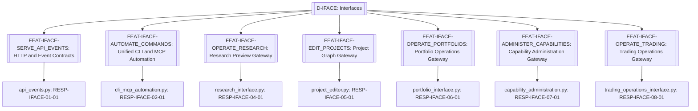
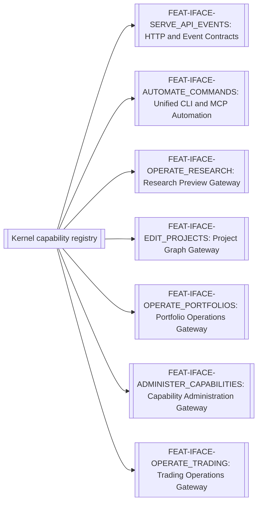

# Interfaces

> **Package:** `app/services/interfaces/`
> **Status:** `Missing`
> **Last updated:** `2026-08-23`
> **Domain ID:** `D-IFACE`

> This README is the domain package's **single source of truth** for domain boundaries, composable feature capabilities, architecture invariants, implementation sequence, progress, usage examples, and tests.
> Update this document before modifying or adding code.

---

## Code-Aligned Implementation Convention

This README is the sole current target registry for this domain's feature IDs and statuses, functional requirements, domain-local workflows, semantic contract ownership, persisted-state model, acceptance evidence, and deletion behavior. `PROJECT.md` owns system scope, cross-domain behavior, system NFRs, and release gates; `ARCHITECTURE.md` owns universal package and runtime constraints. Feature-local READMEs, manifests, contract definitions, migrations, and tests provide current implementation evidence without silently changing this target registry.

Implementation uses the repository's existing feature substrate: each feature lives directly at `app/services/<domain>/<feature>/`, is discovered through the `haruquantai.features` Python entry-point group, and declares one immutable `FeatureSpec` in `manifest.py`. There are no domain or feature YAML manifests.

Every implemented feature also contains a mandatory runtime-validated `README.md`, pure `__init__.py`, strict `config.py`, lifecycle `feature.py`, and focused implementation modules. Dependencies and effects flow through `FeatureContext`/`FeatureScope`; cross-feature implementation imports are forbidden. Persistent state is declared by `FeatureSpec.state`; any migrations and storage adapters remain with the owning feature. Capability keys use `<domain>.<name>@<major>`. FR IDs remain product, acceptance, and test-trace identities rather than one runtime registration per FR. A requirement `Depends` cell expresses product sequencing, traceability, or acceptance evidence only; runtime dependencies are declared separately with exact keys in `FeatureSpec.requires` or `FeatureSpec.optional`.

Feature-level automated tests live at `tests/services/interfaces/<feature>/`. Usage examples never live under `tests/`; they belong to each feature's designated primary domain-logic module. Broader automated verification retains its documented architecture, composition, API, integration, or system test location. The code-backed procedure is the [Feature Implementation Pipeline](../../../docs/dev/feature_implementation_pipeline.md).

## 1. Purpose and Boundary

### Purpose

The Interfaces domain delivers presentation-neutral HTTP, SSE, CLI, MCP, automation, projection, command-gateway, and transport-parity capabilities. `D-UI` owns React rendering, client-only state, accessibility behavior, and human interaction. Interface capabilities remain independent of package-import order; removing this domain withdraws its public gateways without preventing the shared substrate or unrelated domains from starting.

### Owns

- `FEAT-IFACE-SERVE_API_EVENTS` — HTTP and Event Contracts.
- `FEAT-IFACE-AUTOMATE_COMMANDS` — Unified CLI and MCP Automation.
- `FEAT-IFACE-OPERATE_RESEARCH` — Research Preview Gateway.
- `FEAT-IFACE-EDIT_PROJECTS` — Project Graph Gateway.
- `FEAT-IFACE-OPERATE_PORTFOLIOS` — Portfolio Operations Gateway.
- `FEAT-IFACE-ADMINISTER_CAPABILITIES` — Capability Administration Gateway.
- `FEAT-IFACE-OPERATE_TRADING` — Trading Operations Gateway.

### Does not own

- Business policy or direct database/filesystem/compiler access; adapters delegate every operation to application capabilities.
- Application bootstrap, composition lifecycle, or the business-neutral runtime diagnostic model. Interfaces owns product-facing transport adapters over those capabilities without duplicating their source state.
- React rendering, routes, layouts, drafts, focus, accessibility behavior, or human interaction; those belong to `D-UI` under `app/ui/`.
- Composition lifecycle, dependency resolution, effect reversal, and transactional replacement; those belong to the non-domain shared substrate (`app/contracts/`, `app/kernel/`, and `app/composition/`).
- **Deletion boundary:** deleting `app/services/interfaces/` withdraws its presentation-neutral gateways and automation/transport adapters; D-UI renders explicit capability-unavailable states, while domain/application services remain executable through tests or another installed adapter. The kernel and unrelated domains shall remain healthy.

### Shared Contracts

This domain semantically owns the contracts listed below, but their sole physical definitions live in `app/contracts/interfaces/` and wire schemas in `app/contracts/interfaces/wire/`. `app/services/interfaces/` contains implementations and transport adapters only and shall not define or re-export substitute public contract types. Contract versions and semantic owners must agree with `PROJECT.md` and this README. Feature IDs and FR IDs are documentation, lifecycle, acceptance, and traceability identities; runtime bindings use exact versioned `CapabilityKey` declarations in contracts and `FeatureSpec`. The exact public records and capability bundles are listed in the [Shared Contracts README](../../contracts/README.md#410-appcontractsinterfaces).

Rows labelled `FEAT-* capability surface` describe planned semantic contract bundles, not literal runtime capability keys. A listed counterparty may produce, consume, or observe the bundle and does not establish package-import or runtime dependency direction.

**Owned by this domain**

| Status | Contract | Version | Counterparty | Purpose |
|---|---|---|---|---|
| Missing | `FEAT-IFACE-SERVE_API_EVENTS` capability surface | `v1` | UI, Analytics, Data, Orchestration, Plugins, Portfolio, Research, Strategy, Workspace | HTTP and Event Contracts. |
| Missing | `FEAT-IFACE-AUTOMATE_COMMANDS` capability surface | `v1` | Analytics, Data, Orchestration, Plugins, Portfolio, Research, Strategy, Workspace | Unified CLI and MCP Automation. |
| Missing | `FEAT-IFACE-OPERATE_RESEARCH` capability surface | `v1` | UI, Analytics, Research | Resolve and expose research preview and admission projections. |
| Missing | `FEAT-IFACE-EDIT_PROJECTS` capability surface | `v1` | UI, Orchestration | Resolve and expose project graph validation and command contracts. |
| Missing | `FEAT-IFACE-OPERATE_PORTFOLIOS` capability surface | `v1` | UI, Analytics, Portfolio, Research | Resolve and expose portfolio projections and commands. |
| Missing | `FEAT-IFACE-ADMINISTER_CAPABILITIES` capability surface | `v1` | UI, Data, Plugins, Workspace | Resolve and expose capability-administration projections and commands. |
| Missing | `FEAT-IFACE-OPERATE_TRADING` capability surface | `v1` | UI, Analytics, Broker Connectivity, Catalogue, Data, Runtime Risk, Trading, Workspace | Resolve and expose governed operational projections and commands. |

**Cross-domain requirement references (not runtime dependencies)**

The rows below summarize foreign owner tokens found in FR `Depends` cells. They express product sequencing, traceability, or acceptance-evidence relationships only. Actual runtime consumption must name an exact versioned capability key in the consuming feature's `FeatureSpec.requires` or `FeatureSpec.optional` and must follow the dependency direction in `PROJECT.md` and `ARCHITECTURE.md`.

| Referenced domain set | Documentation version | Owner | Meaning |
|---|---|---|---|
| `D-ANA` public capability set | `v1` | Analytics | Requirements whose `Depends` cell names `ANA-*`. |
| `D-DATA` public capability set | `v1` | Data | Requirements whose `Depends` cell names `DATA-*`. |
| `D-ORCH` public capability set | `v1` | Orchestration | Requirements whose `Depends` cell names `ORCH-*`. |
| `D-PLUG` public capability set | `v1` | Plugins | Requirements whose `Depends` cell names `PLUG-*`. |
| `D-PORT` public capability set | `v1` | Portfolio | Requirements whose `Depends` cell names `PORT-*`. |
| `D-RES` public capability set | `v1` | Research | Requirements whose `Depends` cell names `RES-*`. |
| `D-STRAT` public capability set | `v1` | Strategy | Requirements whose `Depends` cell names `STRAT-*`. |
| `D-WS` public capability set | `v1` | Workspace | Requirements whose `Depends` cell names `WS-*`. |
| `D-BRK` public capability set | `v1` | Broker Connectivity | Provider session/capability/read/event projections only. |
| `D-RISK` public capability set | `v1` | Runtime Risk | Risk decisions, approvals, kill switch, and emergency controls. |
| `D-TRD` public capability set | `v1` | Trading | Operational sessions, actions, projections, and events. |

#### Ratified v1 public records (16)

Interfaces reconciliation rules (apply to every record below):

1. Frozen v1 ports stay synchronous with exact method sets; process-local callables (`execute_fn`, `runner_fn`, handler registration), `Path` inputs (`storage_root`), and binary payloads (`ArtifactDownloadResponse.data_bytes`) are process-only and never become wire commands (owner constraint).
2. The wire form of an interface-stream event is the common `DomainEvent` envelope per §4.5; the v1 `InterfaceEventEnvelope`/`ApiRouteSpec`/`OpenApiManifest`/`MutationIdempotencyRecord`/`ArtifactRangeSpec`/`ArtifactDownloadResponse`/`ApiDeprecationNotice`/`ApiCompatibilityReport`/`ApplicationCommandRequest`/`ApplicationCommandResult`/`DurableCommandRef` classes remain process contracts and are not inventory wire records; the wire names listed in §4.10 project onto them as shown below.
3. Wire progress ratios use `DecimalValue` in `[0,1]` (no binary floats at boundaries, §15.3); v1 float constructors stay unchanged.

| # | Record | Exact wire fields | Producer → consumers | FRs / lifecycle |
|---|---|---|---|---|
| R1 | `ApiVersion` (`ApiVersionWire`) | `major: int >= 1 = 1`; `minor: int >= 0 = 0`; `patch: int >= 0 = 0`; `label: ^v[1-9][0-9]*$ = "v1"`; `is_deprecated: bool = False`; `schema_version: Literal[1] = 1`. | Serve Api Events → all API clients | FR-IFACE-SERVE_VERSIONED_API, FR-IFACE-EVOLVE_API_COMPATIBLY. |
| R2 | `ConcurrencyToken` (`ConcurrencyTokenWire`) | `resource_id: Uuid7`; `version: int >= 1`; `token_hash: ContentHash`; `issued_at: UtcTimestamp`; `schema_version: Literal[1] = 1`. | Serve Api Events → mutating routes | FR-IFACE-ENFORCE_CONCURRENCY_TOKENS. Stale `If-Match` returns 412 `VERSION_CONFLICT` with no partial mutation. |
| R3 | `EventCursor` (`EventCursorWire`) | `last_event_id: Uuid7`; `sequence_number: int >= 0`; `timestamp: UtcTimestamp`; `schema_version: Literal[1] = 1`. | Serve Api Events → SSE clients | FR-IFACE-REPLAY_INTERFACE_EVENTS. `Last-Event-ID` reconnect never duplicates an externally visible transition (§4.5). |
| R4 | `EventReplayBatch` (`EventReplayBatchWire`) | `events: tuple[DomainEvent, ...] = ()` (common envelope per reconciliation rule 2); `next_cursor: Uuid7 | None = None`; `has_more: bool = False`; `is_resync_required: bool = False`; `schema_version: Literal[1] = 1`. | Serve Api Events → SSE clients | FR-IFACE-REPLAY_INTERFACE_EVENTS. Retention-expired cursors raise `EVENT_CURSOR_EXPIRED` and set `is_resync_required`. |
| R5 | `AsyncJobRef` (`AsyncJobRefWire`) | `job_id: Uuid7`; `command_type: nonempty str`; `state: Literal[QUEUED,RUNNING,COMPLETED,FAILED,CANCELLED] = "QUEUED"`; `progress: DecimalValue in [0,1] = "0"`; `stage: str = ""`; `error_message: str | None = None`; `result_ref: Uuid7 | None = None`; `created_at: UtcTimestamp`; `updated_at: UtcTimestamp`; `schema_version: Literal[1] = 1`. | Serve Api Events → UI, CLI, MCP clients | FR-IFACE-TRACK_ASYNC_JOBS. Long-running actions return a job ID immediately (§23.12 idempotency). |
| R6 | `ArtifactDownloadRequest` (`ArtifactDownloadRequestWire`) | `artifact_id: Uuid7`; `filename: nonempty str, no path separators, no traversal`; `range_start_byte: int >= 0 = 0`; `range_end_byte: int >= 0 | None = None` (`>= range_start_byte` when present); `schema_version: Literal[1] = 1`. | API clients → Serve Api Events | FR-IFACE-VALIDATE_ARTIFACT_DOWNLOADS. Uncommitted artifacts and traversal attempts are denied `ARTIFACT_ACCESS_DENIED`; response bytes are a transport body, not a record. |
| R7 | `BulkRequestToken` (wire-native) | `token_id: Uuid7`; `pinned_query_hash: ContentHash`; `estimated_impact: int >= 1`; `idempotency_key: nonempty str`; `conflict_policy: Literal[REJECT,KEEP_EXISTING,CREATE_NEW_VERSION]` (ratified repository conflict-policy triple); `created_at: UtcTimestamp`; `expires_at: UtcTimestamp`; `schema_version: Literal[1] = 1`. Constraints: `expires_at > created_at`; replay with the same token and idempotency key never broadens scope or duplicates mutations. | Serve Api Events → Analytics bulk endpoints, UI | FR-IFACE-PIN_BULK_REQUESTS (pairs with Analytics-owned `BulkSelectionToken`). |
| R8 | `AutomationCommand` (wire-native) | `command_name: nonempty str`; `payload: JsonObject = {}`; `source: Literal[CLI,UI,MCP,API,SYSTEM] = "CLI"`; `correlation_id: Uuid7 | None = None`; `session_id: str = ""`; `secret_refs: tuple[Uuid7, ...] = ()` (Workspace `SecretRef` identities resolved explicitly before execution); `schema_version: Literal[1] = 1`. | Automate Commands → CLI, MCP, API, UI export | FR-IFACE-DELEGATE_APPLICATION_CALLS, FR-IFACE-PUBLISH_AUTOMATION_SCHEMAS. UI-exported manifest dry-runs identically through CLI and API. |
| R9 | `AutomationSchema` (wire-native) | `schema_id: Uuid7`; `commands: tuple[AutomationCommandDescriptor, ...]` where `AutomationCommandDescriptor(command_name: nonempty str, input_schema: JsonObject, output_schema: JsonObject, is_durable: bool)`; `exported_at: UtcTimestamp`; `content_hash: ContentHash`; `schema_version: Literal[1] = 1`. `input_schema`/`output_schema` are bounded JSON-Schema documents, the declared extension surface of this record. | Automate Commands → CLI config, API payload consumers | FR-IFACE-PUBLISH_AUTOMATION_SCHEMAS. |
| R10 | `McpOperation` (wire-native) | `operation: Literal[LIST_PROJECTS,LIST_DATABANKS,LIST_STRATEGIES,GET_STRATEGY_STATISTICS,RUN_PROJECT,STOP_PROJECT]`; `arguments: JsonObject = {}`; `schema_version: Literal[1] = 1`. | Automate Commands → MCP clients | FR-IFACE-SUPPORT_MCP_OPERATIONS, FR-IFACE-PRESERVE_MCP_NEUTRALITY. MCP enforces identical validation, authorization, idempotency, and audit as direct API; no raw paths, database access, compilers, or plugin credentials cross the adapter. |
| R11 | `ResearchPreview` (wire-native) | `preview_id: Uuid7`; `resolved_manifest: ResearchManifest` (Research-owned); `warnings: tuple[ValidationIssue, ...] = ()`; `estimated_evaluations: int >= 0`; `unbounded_domains: tuple[nonempty str, ...] = ()`; `manifest_hash: ContentHash`; `schema_version: Literal[1] = 1`. Constraint: admission must supply the approved `manifest_hash`; mismatch blocks launch; any `unbounded_domains` member blocks launch. | Operate Research → UI, Analytics, Research | FR-IFACE-PREVIEW_RESEARCH_RUNS; §22.5 preview envelope. |
| R12 | `ProjectGraphProjection` (wire-native) | `projection_id: Uuid7`; `project_version_id: Uuid7`; `graph: ProjectGraph` (Orchestration-owned); `ordered_task_keys: nonempty tuple[nonempty str, ...]`; `validation: tuple[ValidationIssue, ...] = ()`; `has_bounded_cycles: bool`; `compared_version_id: Uuid7 | None = None`; `added_task_keys: tuple[nonempty str, ...] = ()`; `removed_task_keys: tuple[nonempty str, ...] = ()`; `changed_task_keys: tuple[nonempty str, ...] = ()`; `schema_version: Literal[1] = 1`. Constraint: a version rejected by the authoritative server validator carries its issues and cannot be published through any transport. | Edit Projects → UI, Orchestration | FR-IFACE-VISUALIZE_PROJECT_GRAPHS. |
| R13 | `PortfolioBuilderProjection` (wire-native) | `projection_id: Uuid7`; `portfolio_version_id: Uuid7`; `constituents: tuple[PortfolioMember, ...] = ()` (Portfolio-owned); `constraints: PortfolioConstraintSet | None = None`; `correlation: CorrelationMatrix | None = None`; `validation: tuple[ValidationIssue, ...] = ()`; `latest_result: PortfolioResult | None = None`; `schema_version: Literal[1] = 1`. Constraint: every transport produces the same portfolio manifests and selected results for the same versioned input. | Operate Portfolios → UI, Analytics, Portfolio, Research | FR-IFACE-OPERATE_PORTFOLIO_BUILDER. |
| R14 | `CapabilityAdministrationProjection` (wire-native) | `projection_id: Uuid7`; `capability_snapshot: CapabilitySnapshot` (common); `components: tuple[ComponentStateSummary, ...] = ()` where `ComponentStateSummary(capability_key: CapabilityIdentifier, feature_id: FeatureIdentifier, feature_state: §4.3 feature-state literal, generation: int >= 1, health: Literal[HEALTHY,DEGRADED,UNHEALTHY] | None = None, diagnostic: str = "")`; `schema_version: Literal[1] = 1`. Constraint: no secrets or credential values ever appear. | Administer Capabilities → UI, Data, Plugins, Workspace | FR-IFACE-ADMINISTER_COMPONENTS. |
| R15 | `TradingActionPreview` (wire-native) | `preview_id: Uuid7`; `action: Literal[ORDER,CANCEL,MODIFY,CLOSE,FLATTEN,HOLD,PROTECTION]`; `normalized_plan: TradePlan` (Trading-owned); `risk_result: RiskDecision | None = None` (Risk-owned, when applicable); `authority: ExecutionAuthorityRef` (Trading-owned); `environment: Literal[PAPER,DEMO,LIVE]`; `affected_orders: tuple[Uuid7, ...] = ()`; `affected_positions: tuple[Uuid7, ...] = ()`; `idempotency_key: nonempty str`; `preview_hash: ContentHash`; `schema_version: Literal[1] = 1`. Constraint: commit must supply the matching `preview_hash`; scope or preview drift requires reconfirmation and no adapter is called directly. | Operate Trading → UI, Trading, Risk | FR-IFACE-PREVIEW_TRADING_ACTIONS. |
| R16 | `TradingReadinessProjection` (wire-native) | `projection_id: Uuid7`; `session_ref: TradingSessionRef` (Trading-owned); `session_generation: int >= 1`; `session_state: Literal[CREATED,STARTING,ACTIVE,DEGRADED,STOPPING,STOPPED,ARCHIVED]`; `environment: Literal[PAPER,DEMO,LIVE]`; `authority: ExecutionAuthorityRef`; `permissions: tuple[nonempty str, ...] = ()`; `account: BrokerAccountSnapshot | None = None` (Broker-owned); `market: BrokerMarketState | None = None` (Broker-owned); `open_orders: tuple[Uuid7, ...] = ()`; `positions: tuple[Uuid7, ...] = ()`; `protections: tuple[Uuid7, ...] = ()`; `reconciliation_clean: bool`; `freshness_observed_at: UtcTimestamp | None = None`; `is_stale: bool`; `critical_findings: tuple[nonempty str, ...] = ()`; `schema_version: Literal[1] = 1`. Constraint: stale, unknown, or degraded state is explicit and machine-readable so consumers can block unsafe commands; cached state is never presented as authority. | Operate Trading → UI, Broker, Risk, Trading | FR-IFACE-SHOW_TRADING_READINESS. |

#### Ratified v1 capabilities and operation envelopes

Frozen v1 bundles (process contracts; failure codes from `errors.py` are the stable set `ARTIFACT_ACCESS_DENIED`, `COMMAND_EXECUTION_FAILED`, `COMMAND_NOT_FOUND`, `COMMAND_VALIDATION_FAILED`, `DURABLE_JOB_NOT_FOUND`, `EVENT_CURSOR_EXPIRED`, `IDEMPOTENCY_CONFLICT`, `JOB_NOT_FOUND`, `UPGRADE_REQUIRED`, `VERSION_CONFLICT`):

| Key / port | Frozen method set | Provider → consumers | FRs |
|---|---|---|---|
| `interfaces.serve-api-events@1` / `ServeApiEventsCapability` | `get_openapi_manifest`, `serve_versioned_api`, `validate_concurrency_token`, `deduplicate_mutation`, `publish_interface_event`, `replay_interface_events`, `submit_async_job`, `get_async_job`, `update_async_job`, `validate_artifact_download`, `check_api_compatibility`, `get_deprecations` (all synchronous) | FEAT-IFACE-SERVE_API_EVENTS → UI, Analytics, Data, Orchestration, Plugins, Portfolio, Research, Strategy, Workspace | FR-IFACE-SERVE_VERSIONED_API, ENFORCE_CONCURRENCY_TOKENS, DEDUPLICATE_MUTATIONS, PAGE_INTERFACE_QUERIES, REPLAY_INTERFACE_EVENTS, TRACK_ASYNC_JOBS, VALIDATE_ARTIFACT_DOWNLOADS, SERVE_PROJECT_API, QUERY_DATABANK_RESULTS, PIN_BULK_REQUESTS, EVOLVE_API_COMPATIBLY |
| `interfaces.automate-commands@1` / `AutomateCommandsCapability` | `delegate_application_call`, `register_command_handler`, `track_durable_command`, `get_durable_command_status`, `cancel_durable_command`, `update_durable_command` (all synchronous) | FEAT-IFACE-AUTOMATE_COMMANDS → Analytics, Data, Orchestration, Plugins, Portfolio, Research, Strategy, Workspace | FR-IFACE-DELEGATE_APPLICATION_CALLS, PROVIDE_NONVISUAL_CHARTS, AUTOMATE_CODE_GENERATION, SUPPORT_MCP_OPERATIONS, PRESERVE_MCP_NEUTRALITY, TRACK_DURABLE_COMMANDS, PUBLISH_AUTOMATION_SCHEMAS |

New gateway capabilities (universal new-port rule; all consume their owning domains' public contracts and add no business logic):

1. **`interfaces.operate-research@1` / `OperateResearchCapability`** — `async def operate_research(request: OperateResearchRequest) -> OperateResearchSuccess | InterfaceFailure`. Provider: FEAT-IFACE-OPERATE_RESEARCH; consumers: UI, Analytics, Research. Request: common fields + `operation: Literal[PREVIEW]`; `manifest: ResearchManifest | None = None` (required for PREVIEW). Success: `preview: ResearchPreview | None = None`. Event union empty; no subscription. FR: FR-IFACE-PREVIEW_RESEARCH_RUNS.
2. **`interfaces.edit-projects@1` / `EditProjectsCapability`** — `async def edit_projects(request: EditProjectsRequest) -> EditProjectsSuccess | InterfaceFailure`. Provider: FEAT-IFACE-EDIT_PROJECTS; consumers: UI, Orchestration. Request: common fields + `operation: Literal[PROJECT_GRAPH,VALIDATE,COMPARE]`; `project_version_id: Uuid7 | None` (all); `compared_version_id: Uuid7 | None` (COMPARE). Success: `projection: ProjectGraphProjection | None = None`. Edge/condition commands delegate to Orchestration public contracts; this gateway adds none. Event union empty. FR: FR-IFACE-VISUALIZE_PROJECT_GRAPHS.
3. **`interfaces.operate-portfolios@1` / `OperatePortfoliosCapability`** — `async def operate_portfolios(request: OperatePortfoliosRequest) -> OperatePortfoliosSuccess | InterfaceFailure`. Provider: FEAT-IFACE-OPERATE_PORTFOLIOS; consumers: UI, Analytics, Portfolio, Research. Request: common fields + `operation: Literal[VIEW,VALIDATE,COMPARE]`; `portfolio_version_id: Uuid7 | None`; `compared_result_id: Uuid7 | None` (COMPARE). Success: `projection: PortfolioBuilderProjection | None = None`; `issues: tuple[ValidationIssue, ...] = ()`. Simulation/search/attribution commands delegate to Portfolio public contracts. Event union empty. FR: FR-IFACE-OPERATE_PORTFOLIO_BUILDER.
4. **`interfaces.administer-capabilities@1` / `AdministerCapabilitiesCapability`** — `async def administer_capabilities(request: AdministerCapabilitiesRequest) -> AdministerCapabilitiesSuccess | InterfaceFailure`. Provider: FEAT-IFACE-ADMINISTER_CAPABILITIES; consumers: UI, Data, Plugins, Workspace. Request: common fields + `operation: Literal[PROJECT]`; `capability_filter: tuple[CapabilityIdentifier, ...] = ()`. Success: `projection: CapabilityAdministrationProjection | None = None`. Event union empty. FR: FR-IFACE-ADMINISTER_COMPONENTS.
5. **`interfaces.operate-trading@1` / `OperateTradingCapability`** — `async def operate_trading(request: OperateTradingRequest) -> OperateTradingSuccess | InterfaceFailure`. Provider: FEAT-IFACE-OPERATE_TRADING; consumers: UI, Broker, Risk, Trading. Request: common fields + `operation: Literal[MANAGE_SESSION,READINESS,PREVIEW_ACTION,EMERGENCY,MARKET_DATA,OPERATOR_ANALYTICS]`; operation-specific optional fields: `session: TradingSession | None = None` and `mode: Literal[PAPER,DEMO,LIVE] | None` (MANAGE_SESSION); `session_ref: TradingSessionRef | None` (READINESS/PREVIEW_ACTION); `preview: TradingActionPreview | None`-inputs for PREVIEW_ACTION reuse the delegated Trading `TradePlan` via `plan: TradePlan | None`; `reason: nonempty str | None`, `scope: nonempty str | None`, `current_version: int >= 1 | None` (EMERGENCY — authenticated role, reason, scope, state version, impact, and separate attestation are required by the delegated Risk/Trading contracts). Success: `session: TradingSession | None = None`; `readiness: TradingReadinessProjection | None = None`; `preview: TradingActionPreview | None = None`; `kill_switch: KillSwitchState | None = None` (Risk-owned; EMERGENCY); `market: BrokerMarketState | None = None` (MARKET_DATA, Broker-owned); `operational_journal: OperationalJournalArtifact | None = None` and `qualification: OperatorQualification | None = None` (OPERATOR_ANALYTICS, Analytics-owned). **Subscription (owner-required):** `subscribe_operate_trading_events(request: OperateTradingEventSubscription) -> AsyncIterator[DomainEvent]` with `scope: Literal[TRADING,RISK,BROKER,ALL] = "ALL"`, `session_ref: Uuid7 | None = None`, `resume_event_id: Uuid7 | None = None`, `replay_limit: int 0..10000 = 0`, `schema_version: Literal[1] = 1`; ordered replay/resync semantics per FR-IFACE-STREAM_TRADING_EVENTS. FRs: FR-IFACE-MANAGE_TRADING_SESSIONS, SHOW_TRADING_READINESS, PREVIEW_TRADING_ACTIONS, OPERATE_EMERGENCY_CONTROLS, STREAM_TRADING_EVENTS, DISPLAY_MARKET_DATA, DISPLAY_OPERATOR_ANALYTICS, ENFORCE_TRANSPORT_PARITY.

`InterfaceFailure` (shared by the five new capabilities): `outcome: Literal["FAILURE"] = "FAILURE"`; `request_id: Uuid7`; `code: Literal[INTERFACE_VALIDATION_FAILED,VERSION_CONFLICT,IDEMPOTENCY_CONFLICT,EVENT_CURSOR_EXPIRED,JOB_NOT_FOUND,DURABLE_JOB_NOT_FOUND,ARTIFACT_ACCESS_DENIED,API_INCOMPATIBLE,UPGRADE_REQUIRED,CAPABILITY_UNAVAILABLE]`; `problem: ProblemDetails`; `schema_version: Literal[1] = 1`. All five gateways enforce identical authentication, authorization, mode/environment gating, validation, idempotency, conflict, event, and audit semantics across HTTP, CLI, MCP, and automation adapters (transport parity).

Reconciliation closing note:

- 16/16 records and 7/7 capabilities resolved; zero removals; inventory names match `app/contracts/README.md` §4.10 exactly.
- Cross-owner references used (not copied): `DomainEvent`, `CapabilitySnapshot`, `ValidationIssue`, `ProblemDetails` (common); `ResearchManifest` (Research); `ProjectGraph` (Orchestration); `PortfolioMember`, `PortfolioConstraintSet`, `CorrelationMatrix`, `PortfolioResult` (Portfolio); `BrokerAccountSnapshot`, `BrokerMarketState` (Broker); `TradePlan`, `ExecutionAuthorityRef`, `TradingSessionRef`, `TradingSession` (Trading); `RiskDecision`, `KillSwitchState` (Risk); `OperationalJournalArtifact`, `OperatorQualification` (Analytics); `SecretRef` IDs (Workspace).
- First owner-required subscription identified: `operate-trading` event stream (explicit reconnect replay/resync requirement in FR-IFACE-STREAM_TRADING_EVENTS).

### Persisted State Ownership

| Status | State / Store | Read access (via contract) | Migration definitions |
|---|---|---|---|
| Missing | No private business or client-state tables; durable commands are written through owning-domain contracts. | Clients through `D-IFACE` public capabilities only | None; any future adapter-owned durable state requires an explicit `FeatureSpec.state` and migration/storage adapter |

### Four-Level Structural Hierarchy

| Code level | Represents | This package |
|---|---|---|
| **Package** | Domain | `app/services/interfaces/` / `D-IFACE` |
| **Module folder** | Feature / capability | One folder for each of: HTTP and Event Contracts, Unified CLI and MCP Automation, Research Preview Gateway, Project Graph Gateway, Portfolio Operations Gateway, Capability Administration Gateway, Trading Operations Gateway |
| **File** | Use case or focused responsibility | Exactly the responsibility file named in each module specification |
| **Class / function / method** | Functional requirement behavior | Exactly one registered `fr_*` behavior per `FR-*` row |

```text
Package (Domain)
└── Module folder (Feature)
    └── File (Responsibility)
        └── Registered function (Functional requirement behavior)
```

### Domain Capability Map



---

## 2. Final Package Structure and Feature Independence

```text
interfaces/
├── README.md
├── __init__.py
├── api_events/                    # FEAT-IFACE-SERVE_API_EVENTS: HTTP and Event Contracts
│   ├── README.md
│   ├── __init__.py
│   ├── manifest.py
│   ├── config.py
│   ├── feature.py
│   └── api_events.py              # RESP-IFACE-01-01
├── cli_mcp_automation/                    # FEAT-IFACE-AUTOMATE_COMMANDS: Unified CLI and MCP Automation
│   ├── README.md
│   ├── __init__.py
│   ├── manifest.py
│   ├── config.py
│   ├── feature.py
│   └── cli_mcp_automation.py              # RESP-IFACE-02-01
├── research_interface/                    # FEAT-IFACE-OPERATE_RESEARCH: Research Preview Gateway
│   ├── README.md
│   ├── __init__.py
│   ├── manifest.py
│   ├── config.py
│   ├── feature.py
│   └── research_interface.py              # RESP-IFACE-04-01
├── project_editor/                    # FEAT-IFACE-EDIT_PROJECTS: Project Graph Gateway
│   ├── README.md
│   ├── __init__.py
│   ├── manifest.py
│   ├── config.py
│   ├── feature.py
│   └── project_editor.py              # RESP-IFACE-05-01
├── portfolio_interface/                    # FEAT-IFACE-OPERATE_PORTFOLIOS: Portfolio Operations Gateway
│   ├── README.md
│   ├── __init__.py
│   ├── manifest.py
│   ├── config.py
│   ├── feature.py
│   └── portfolio_interface.py              # RESP-IFACE-06-01
├── capability_administration/                    # FEAT-IFACE-ADMINISTER_CAPABILITIES: Capability Administration
│   ├── README.md
│   ├── __init__.py
│   ├── manifest.py
│   ├── config.py
│   ├── feature.py
│   └── capability_administration.py              # RESP-IFACE-07-01
└── trading_operations_interface/                 # FEAT-IFACE-OPERATE_TRADING
    ├── README.md
    ├── __init__.py
    ├── manifest.py
    ├── config.py
    ├── feature.py
    └── trading_operations_interface.py           # RESP-IFACE-08-01
```

### Module dependency diagram

Feature modules do not import one another's private files. Runtime dependencies resolve through kernel capabilities obtained from `FeatureContext`; composition selects providers and reconciles changes, so reciprocal workflow participation cannot create a package-import cycle.



### Structure rules

- The package root contains `README.md`, import-pure `__init__.py`, and one direct folder per feature; discovery uses the `haruquantai.features` entry-point group.
- Each feature folder contains mandatory `README.md`, pure `__init__.py`, `manifest.py`, `config.py`, `feature.py`, and focused responsibility modules.
- `FR-*`/`fr_*` names provide product, implementation, and test traceability inside the feature; they are not separate runtime registrations or capability keys.
- Cross-feature and cross-domain behavior is injected by capability key. Direct private-file imports are prohibited.
- Every core capability module documents Python and CLI usage; exactly one designated primary domain-logic module owns the feature's executable `__main__` demonstration. Usage examples never live under `tests/`.

---

## 3. Workflows

| Status | Workflow ID | Scope | Workflow | Trigger / Input boundary | Final outcome / Output boundary | Requirement sequence |
|---|---|---|---|---|---|---|
| Missing | `WF-IFACE-001` | Cross-domain | HTTP and Event Contracts | Validated command/query and required capability bindings | Requirement-defined result, artifact, event, or degradation | `FR-IFACE-SERVE_VERSIONED_API` → `FR-IFACE-ENFORCE_CONCURRENCY_TOKENS` → `FR-IFACE-DEDUPLICATE_MUTATIONS` → `FR-IFACE-PAGE_INTERFACE_QUERIES` → `FR-IFACE-REPLAY_INTERFACE_EVENTS` → `FR-IFACE-TRACK_ASYNC_JOBS` → `FR-IFACE-VALIDATE_ARTIFACT_DOWNLOADS` → `FR-IFACE-SERVE_PROJECT_API` → `FR-IFACE-QUERY_DATABANK_RESULTS` → `FR-IFACE-PIN_BULK_REQUESTS` → `FR-IFACE-EVOLVE_API_COMPATIBLY` |
| Missing | `WF-IFACE-002` | Cross-domain | Unified CLI and MCP Automation | Validated command/query and required capability bindings | Requirement-defined result, artifact, event, or degradation | `FR-IFACE-DELEGATE_APPLICATION_CALLS` → `FR-IFACE-PROVIDE_NONVISUAL_CHARTS` → `FR-IFACE-AUTOMATE_CODE_GENERATION` → `FR-IFACE-SUPPORT_MCP_OPERATIONS` → `FR-IFACE-PRESERVE_MCP_NEUTRALITY` → `FR-IFACE-TRACK_DURABLE_COMMANDS` → `FR-IFACE-PUBLISH_AUTOMATION_SCHEMAS` |
| Missing | `WF-IFACE-004` | Cross-domain | Research Preview Gateway | Validated command/query and required capability bindings | Versioned preview/admission projection or structured degradation | `FR-IFACE-PREVIEW_RESEARCH_RUNS` |
| Missing | `WF-IFACE-005` | Cross-domain | Project Graph Gateway | Validated command/query and required capability bindings | Versioned graph projection/command result or structured degradation | `FR-IFACE-VISUALIZE_PROJECT_GRAPHS` |
| Missing | `WF-IFACE-006` | Cross-domain | Portfolio Operations Gateway | Validated command/query and required capability bindings | Versioned portfolio projection/command result or structured degradation | `FR-IFACE-OPERATE_PORTFOLIO_BUILDER` |
| Missing | `WF-IFACE-007` | Cross-domain | Capability Administration Gateway | Validated command/query and required capability bindings | Versioned administration projection/command result or structured degradation | `FR-IFACE-ADMINISTER_COMPONENTS` |
| Missing | `WF-IFACE-008` | Cross-domain | Trading Operations Gateway | Authenticated presentation-neutral query or command | Versioned governed projection, command result, event stream, or structured failure | `FR-IFACE-MANAGE_TRADING_SESSIONS` → `FR-IFACE-SHOW_TRADING_READINESS` → `FR-IFACE-PREVIEW_TRADING_ACTIONS` → `FR-IFACE-OPERATE_EMERGENCY_CONTROLS` → `FR-IFACE-STREAM_TRADING_EVENTS` → `FR-IFACE-DISPLAY_MARKET_DATA` → `FR-IFACE-DISPLAY_OPERATOR_ANALYTICS` → `FR-IFACE-ENFORCE_TRANSPORT_PARITY` |

### `WF-IFACE-001` — HTTP and Event Contracts

**Scope:** `Cross-domain` when the request requires another domain capability; otherwise `Internal`.

**System workflow:** `SYS-WF-001..012`

**Input boundary:** A validated request/query plus an immutable capability snapshot and provider bindings.

**Output boundary:** The result/artifact/event defined by the participating `FR-*` rows, or their exact structured failure/degradation outcome.

1. `Feature.mount()` resolves its declared required capabilities through `FeatureContext`.
2. `api_events.py` executes `fr_iface_serve_versioned_api`, `fr_iface_enforce_concurrency_tokens`, `fr_iface_deduplicate_mutations`, `fr_iface_page_interface_queries`, `fr_iface_replay_interface_events`, `fr_iface_track_async_jobs`, `fr_iface_validate_artifact_downloads`, `fr_iface_serve_project_api`, `fr_iface_query_databank_results`, `fr_iface_pin_bulk_requests`, `fr_iface_evolve_api_compatibly` in the requirement-defined order.
3. Scoped effects are committed or reversed under `FR-KERN-DEFINE_REQUIREMENT_BEHAVIOR, FR-KERN-DEFINE_LIFECYCLE_CONTEXT, FR-KERN-DECLARE_BEHAVIOR_DEPENDENCIES, FR-KERN-REGISTER_FEATURE_MODULES, FR-KERN-DEFINE_RESPONSIBILITY_FILES, FR-KERN-IMPLEMENT_REQUIREMENT_FUNCTIONS, FR-KERN-DEPEND_PUBLIC_PORTS, FR-KERN-NAMESPACE_CAPABILITY_KEYS, FR-KERN-DECLARE_DEPENDENCY_RULES, FR-KERN-REEVALUATE_DEPENDENCIES, FR-KERN-DEFINE_SCOPE_HIERARCHY, FR-KERN-PASS_EFFECT_SCOPES, FR-KERN-REGISTER_EFFECT_REVERSALS, FR-KERN-REVERSE_EFFECTS_LIFO, FR-KERN-ROLLBACK_FAILED_ACTIVATION, FR-KERN-MANAGE_COMPONENT_LIFECYCLE, FR-KERN-COMMIT_CAPABILITY_SWAP, FR-KERN-QUIESCE_DEPENDENT_WORK, FR-KERN-REMOVE_DEPENDENT_COMPONENTS, FR-KERN-ISOLATE_DISPOSAL_FAILURES, FR-KERN-RECONCILE_DESIRED_STATE, FR-KERN-REPLACE_COMPONENTS_TRANSACTIONALLY, FR-KERN-PROVIDE_SCOPED_REGISTRARS, FR-KERN-DRAIN_REMOVED_BEHAVIORS, FR-KERN-CLASSIFY_COMPONENT_EFFECTS, FR-KERN-NAMESPACE_COMPONENT_STATE, FR-KERN-REGISTER_EXTENSION_POINTS, FR-KERN-EMIT_CAUSAL_EVENTS, FR-KERN-REJECT_DEPENDENCY_CYCLES, FR-KERN-PIN_CAPABILITY_SNAPSHOTS, FR-KERN-TEST_COMPONENT_REMOVAL, FR-KERN-VERIFY_EXACT_REMOVAL, FR-KERN-ROUTE_MULTIPLE_PROVIDERS`.
4. The feature returns or publishes only the documented output boundary.

**Failure behaviour:**

- Feature unavailable → HTTP/SSE access disappears; application services remain. Requests requiring a removed feature capability return `CAPABILITY_UNAVAILABLE`; the domain continues loading.
- Missing/incompatible required capability → `CAPABILITY_UNAVAILABLE` or `CAPABILITY_INCOMPATIBLE`; no partial mutation.

**Integration test:**
`tests/services/interfaces/integration/test_api_events.py::test_api_events_workflow()`


---

## 4. Composable Feature Specifications

Implement module sections from top to bottom. Requirement `Depends` cells define product and implementation ordering; runtime capability dependencies must be declared separately in the owning `FeatureSpec`.

---

### 4.1 `api_events/` — HTTP and Event Contracts

**Feature ID:** `FEAT-IFACE-SERVE_API_EVENTS`

**Purpose:** Expose versioned, idempotent, paged, bounded http/sse resources.

**Deletion contract:** HTTP/SSE access disappears; application services remain. Requests requiring a removed feature capability return `CAPABILITY_UNAVAILABLE`; the domain continues loading.

**Module flow:**

```text
validated input and capability bindings
  → api_events.py
  → fr_iface_serve_versioned_api, fr_iface_enforce_concurrency_tokens, fr_iface_deduplicate_mutations, fr_iface_page_interface_queries, fr_iface_replay_interface_events, fr_iface_track_async_jobs, fr_iface_validate_artifact_downloads, fr_iface_serve_project_api, fr_iface_query_databank_results, fr_iface_pin_bulk_requests, fr_iface_evolve_api_compatibly
  → requirement-defined output or structured failure
```

#### Files

| Status | File | Responsibility | Key exports | Dependencies |
|---|---|---|---|---|
| Missing | `api_events.py` | Expose versioned, idempotent, paged, bounded http/sse resources | `fr_iface_serve_versioned_api`, `fr_iface_enforce_concurrency_tokens`, `fr_iface_deduplicate_mutations`, `fr_iface_page_interface_queries`, `fr_iface_replay_interface_events`, `fr_iface_track_async_jobs`, `fr_iface_validate_artifact_downloads`, `fr_iface_serve_project_api`, `fr_iface_query_databank_results`, `fr_iface_pin_bulk_requests`, `fr_iface_evolve_api_compatibly` | **Standard library:** selected per implementation and recorded before code<br>**Required third-party:** only libraries mandated by `PROJECT.md` or the requirement boundary<br>**Local:** capabilities declared by the owning `FeatureSpec`; no private cross-feature import |
| Missing | `feature.py` | Mount `FEAT-IFACE-SERVE_API_EVENTS` through `FeatureContext` and stage its declared providers/effects | `FEAT-IFACE-SERVE_API_EVENTS` `Feature.mount` | **Standard library:** None<br>**Required third-party:** None<br>**Local:** `manifest.py`, `config.py`, and focused responsibility modules |
| Missing | `manifest.py` | Define the immutable `FEAT-IFACE-SERVE_API_EVENTS` `FeatureSpec`: identity, domain, provided/required/optional capabilities, conflicts, state, and configuration keys | `FEAT-IFACE-SERVE_API_EVENTS` `FeatureSpec` | **Standard library:** None<br>**Required third-party:** None<br>**Local:** `app.kernel.feature.FeatureSpec` |

#### Configuration and Limits Manifest

| Status | Setting / Limit | Type | Default | Required | Used by | Description |
|---|---|---|---|---|---|---|
| Missing | `FEAT-IFACE-SERVE_API_EVENTS.configuration` | Versioned schema | No implicit defaults | Yes when referenced | `api_events.py` | Exact fields, defaults, limits, and failure rules are those stated by the requirements and the normative technical appendices in `PROJECT.md`; unspecified values are rejected under Project §6. |

#### `api_events.py` — Expose versioned, idempotent, paged, bounded http/sse resources

**File responsibility:** Expose versioned, idempotent, paged, bounded http/sse resources.

| Status | Requirement ID | Class | Pri | Responsibility | Class / Function / Method | Side Effects | Raises / failure | Depends | Source / confidence | Usage / Test |
|---|---|---|---|---|---|---|---|---|---|---|
| Missing | `FR-IFACE-SERVE_VERSIONED_API` | Target | P0 | The system shall expose `/api/v1` OpenAPI contracts for workspace, catalogue, data, strategies, simulations, jobs, databanks, results, artifacts, plugins, and code generation. | `fr_iface_serve_versioned_api` implementation trace | Read-only | Generated client types compile and contract tests pass against the server. | All modules | `BD-02`; Target | **Usage:** `app/services/interfaces/api_events/api_events.py::__main__` scenario `FR-IFACE-SERVE_VERSIONED_API`<br>**Unit:** `tests/services/interfaces/api_events/test_api_events.py::test_iface_serve_versioned_api()` |
| Missing | `FR-IFACE-ENFORCE_CONCURRENCY_TOKENS` | Target | P0 | Mutating routes shall require expected object version where conflicts are possible. | `fr_iface_enforce_concurrency_tokens` implementation trace | None | A stale `If-Match` returns HTTP 412 `VERSION_CONFLICT` with current version and no partial mutation. | FR-IFACE-SERVE_VERSIONED_API | Specified §22.4 | **Usage:** `app/services/interfaces/api_events/api_events.py::__main__` scenario `FR-IFACE-ENFORCE_CONCURRENCY_TOKENS`<br>**Unit:** `tests/services/interfaces/api_events/test_api_events.py::test_iface_enforce_concurrency_tokens()` |
| Missing | `FR-IFACE-DEDUPLICATE_MUTATIONS` | Target | P0 | Retryable create/action routes shall accept an idempotency key scoped to local session and command type. | `fr_iface_deduplicate_mutations` implementation trace | Persistence write | Repeating a request after connection loss returns original command/result. | FR-IFACE-SERVE_VERSIONED_API | Durability baseline | **Usage:** `app/services/interfaces/api_events/api_events.py::__main__` scenario `FR-IFACE-DEDUPLICATE_MUTATIONS`<br>**Unit:** `tests/services/interfaces/api_events/test_api_events.py::test_iface_deduplicate_mutations()` |
| Missing | `FR-IFACE-PAGE_INTERFACE_QUERIES` | Target | P1 | Collection routes shall use cursor pagination and deterministic tie-breaking. | `fr_iface_page_interface_queries` implementation trace | None | Inserts during pagination do not duplicate already returned IDs for a pinned query snapshot. | FR-IFACE-SERVE_VERSIONED_API | Target | **Usage:** `app/services/interfaces/api_events/api_events.py::__main__` scenario `FR-IFACE-PAGE_INTERFACE_QUERIES`<br>**Unit:** `tests/services/interfaces/api_events/test_api_events.py::test_iface_page_interface_queries()` |
| Missing | `FR-IFACE-REPLAY_INTERFACE_EVENTS` | Target | P0 | The SSE endpoint shall replay retained events after `Last-Event-ID` and emit a resync marker when retention no longer covers the cursor. | `fr_iface_replay_interface_events` implementation trace | Event publication | Disconnect/reconnect loses no retained terminal state event. | Event contract | Target | **Usage:** `app/services/interfaces/api_events/api_events.py::__main__` scenario `FR-IFACE-REPLAY_INTERFACE_EVENTS`<br>**Unit:** `tests/services/interfaces/api_events/test_api_events.py::test_iface_replay_interface_events()` |
| Missing | `FR-IFACE-TRACK_ASYNC_JOBS` | Target | P1 | Every long-running action shall return a job ID immediately and shall not hold the HTTP request open for computation. | `fr_iface_track_async_jobs` implementation trace | None | Import/simulation/codegen requests complete admission within the API latency gate. | Job lifecycle §5.1 | Target | **Usage:** `app/services/interfaces/api_events/api_events.py::__main__` scenario `FR-IFACE-TRACK_ASYNC_JOBS`<br>**Unit:** `tests/services/interfaces/api_events/test_api_events.py::test_iface_track_async_jobs()` |
| Missing | `FR-IFACE-VALIDATE_ARTIFACT_DOWNLOADS` | Target | P0 | Artifact downloads shall validate artifact state, requested filename, range, and path containment. | `fr_iface_validate_artifact_downloads` implementation trace | Read-only | Traversal and noncommitted artifact requests are denied. | WS artifact model | Target | **Usage:** `app/services/interfaces/api_events/api_events.py::__main__` scenario `FR-IFACE-VALIDATE_ARTIFACT_DOWNLOADS`<br>**Unit:** `tests/services/interfaces/api_events/test_api_events.py::test_iface_validate_artifact_downloads()` |
| Missing | `FR-IFACE-SERVE_PROJECT_API` | Target | P0 | Projects, tasks, search, robustness, optimization, portfolios, plugins, and connector plans shall expose versioned `/api/v1` resources/actions using the common job and error contracts. | `fr_iface_serve_project_api` implementation trace | Read-only | Generated client and contract suites cover every stable application command/query. | FR-IFACE-SERVE_VERSIONED_API, FR-ORCH-PIN_PROJECT_RUNS | Phase 3 interface baseline | **Usage:** `app/services/interfaces/api_events/api_events.py::__main__` scenario `FR-IFACE-SERVE_PROJECT_API`<br>**Unit:** `tests/services/interfaces/api_events/test_api_events.py::test_iface_serve_project_api()` |
| Missing | `FR-IFACE-QUERY_DATABANK_RESULTS` | Target | P1 | Server-side queries shall expose versioned filter/sort expressions with allowlisted fields/functions and bounded complexity. | `fr_iface_query_databank_results` implementation trace | Read-only | Malformed or expensive queries fail predictably without database-wide blocking. | FR-IFACE-PAGE_INTERFACE_QUERIES, FR-ANA-EVALUATE_FORMULAS_SAFELY | Phase 2/3 interface baseline | **Usage:** `app/services/interfaces/api_events/api_events.py::__main__` scenario `FR-IFACE-QUERY_DATABANK_RESULTS`<br>**Unit:** `tests/services/interfaces/api_events/test_api_events.py::test_iface_query_databank_results()` |
| Missing | `FR-IFACE-PIN_BULK_REQUESTS` | Target | P1 | Bulk endpoints shall require a pinned query/selection token, estimated impact, idempotency key, and explicit conflict policy. | `fr_iface_pin_bulk_requests` implementation trace | Read-only | Replaying a bulk action does not broaden scope or duplicate mutations. | FR-ANA-PIN_BULK_SELECTION, FR-IFACE-DEDUPLICATE_MUTATIONS | Phase 2/3 interface baseline | **Usage:** `app/services/interfaces/api_events/api_events.py::__main__` scenario `FR-IFACE-PIN_BULK_REQUESTS`<br>**Unit:** `tests/services/interfaces/api_events/test_api_events.py::test_iface_pin_bulk_requests()` |
| Missing | `FR-IFACE-EVOLVE_API_COMPATIBLY` | Target | P1 | API schema evolution shall preserve published compatibility within a major version and publish machine-readable deprecations. | `fr_iface_evolve_api_compatibly` implementation trace | Event publication | Old supported clients pass compatibility tests or receive a precise upgrade-required error. | FR-IFACE-SERVE_VERSIONED_API, NFR-COMP-001 | Interface maintainability | **Usage:** `app/services/interfaces/api_events/api_events.py::__main__` scenario `FR-IFACE-EVOLVE_API_COMPATIBLY`<br>**Unit:** `tests/services/interfaces/api_events/test_api_events.py::test_iface_evolve_api_compatibly()` |

**Rules:**

- HTTP/SSE access disappears; application services remain. Requests requiring a removed feature capability return `CAPABILITY_UNAVAILABLE`; the domain continues loading.
- no business-domain dependency is resolved at package import; the owning `FeatureSpec` declares runtime dependencies once and this behavior consumes only that committed feature context.
- Each `FR-*` row maps to focused implementation and acceptance evidence inside this feature; removal occurs at feature-package granularity.
- Every effect must be scoped and classified under `FR-KERN-CLASSIFY_COMPONENT_EFFECTS`; the inferred table label must be corrected before implementation if the concrete adapter requires a narrower or additional effect class.

**Implementation notes:**

- Preserve the requirement statement, acceptance/failure behavior, dependencies, and source confidence as one indivisible implementation contract.
- Reuse public capability contracts; never copy another feature's or domain's business logic.
- Add private helpers only when needed by these public behaviors; helpers do not become new requirements.

#### Feature usage examples

The primary domain-logic module `app/services/interfaces/api_events/api_events.py` owns the executable `__main__` usage harness, with one named scenario per requirement listed above.

---

### 4.2 `cli_mcp_automation/` — Unified CLI and MCP Automation

**Feature ID:** `FEAT-IFACE-AUTOMATE_COMMANDS`

**Purpose:** Wrap application services through cli/mcp and portable manifests.

**Deletion contract:** CLI/MCP disappears; HTTP/UI may remain. Requests requiring a removed feature capability return `CAPABILITY_UNAVAILABLE`; the domain continues loading.

**Module flow:**

```text
validated input and capability bindings
  → cli_mcp_automation.py
  → fr_iface_delegate_application_calls, fr_iface_provide_nonvisual_charts, fr_iface_automate_code_generation, fr_iface_support_mcp_operations, fr_iface_preserve_mcp_neutrality, fr_iface_track_durable_commands, fr_iface_publish_automation_schemas
  → requirement-defined output or structured failure
```

#### Files

| Status | File | Responsibility | Key exports | Dependencies |
|---|---|---|---|---|
| Missing | `cli_mcp_automation.py` | Wrap application services through cli/mcp and portable manifests | `fr_iface_delegate_application_calls`, `fr_iface_provide_nonvisual_charts`, `fr_iface_automate_code_generation`, `fr_iface_support_mcp_operations`, `fr_iface_preserve_mcp_neutrality`, `fr_iface_track_durable_commands`, `fr_iface_publish_automation_schemas` | **Standard library:** selected per implementation and recorded before code<br>**Required third-party:** only libraries mandated by `PROJECT.md` or the requirement boundary<br>**Local:** capabilities declared by the owning `FeatureSpec`; no private cross-feature import |
| Missing | `feature.py` | Mount `FEAT-IFACE-AUTOMATE_COMMANDS` through `FeatureContext` and stage its declared providers/effects | `FEAT-IFACE-AUTOMATE_COMMANDS` `Feature.mount` | **Standard library:** None<br>**Required third-party:** None<br>**Local:** `manifest.py`, `config.py`, and focused responsibility modules |
| Missing | `manifest.py` | Define the immutable `FEAT-IFACE-AUTOMATE_COMMANDS` `FeatureSpec`: identity, domain, provided/required/optional capabilities, conflicts, state, and configuration keys | `FEAT-IFACE-AUTOMATE_COMMANDS` `FeatureSpec` | **Standard library:** None<br>**Required third-party:** None<br>**Local:** `app.kernel.feature.FeatureSpec` |

#### Configuration and Limits Manifest

| Status | Setting / Limit | Type | Default | Required | Used by | Description |
|---|---|---|---|---|---|---|
| Missing | `FEAT-IFACE-AUTOMATE_COMMANDS.configuration` | Versioned schema | No implicit defaults | Yes when referenced | `cli_mcp_automation.py` | Exact fields, defaults, limits, and failure rules are those stated by the requirements and the normative technical appendices in `PROJECT.md`; unspecified values are rejected under Project §6. |

#### `cli_mcp_automation.py` — Wrap application services through cli/mcp and portable manifests

**File responsibility:** Wrap application services through cli/mcp and portable manifests.

| Status | Requirement ID | Class | Pri | Responsibility | Class / Function / Method | Side Effects | Raises / failure | Depends | Source / confidence | Usage / Test |
|---|---|---|---|---|---|---|---|---|---|---|
| Missing | `FR-IFACE-DELEGATE_APPLICATION_CALLS` | Target | P0 | UI and CLI shall call the same application commands and queries and receive the same validation/error codes. | `fr_iface_delegate_application_calls` implementation trace | None | Equivalent UI/CLI requests produce identical normalized manifests. | FR-IFACE-SERVE_VERSIONED_API | Interface baseline | **Usage:** `app/services/interfaces/cli_mcp_automation/cli_mcp_automation.py::__main__` scenario `FR-IFACE-DELEGATE_APPLICATION_CALLS`<br>**Unit:** `tests/services/interfaces/cli_mcp_automation/test_cli_mcp_automation.py::test_iface_delegate_application_calls()` |
| Missing | `FR-IFACE-PROVIDE_NONVISUAL_CHARTS` | Target | P1 | The local CLI shall provide structured JSON output, human output, stable exit codes, config-file inputs, and wait/follow options. | `fr_iface_provide_nonvisual_charts` implementation trace | None | Scripts can create/import/run/status/export under §22.5 without parsing prose. | FR-IFACE-SERVE_VERSIONED_API, FR-IFACE-REPLAY_INTERFACE_EVENTS | Specified §22.5 | **Usage:** `app/services/interfaces/cli_mcp_automation/cli_mcp_automation.py::__main__` scenario `FR-IFACE-PROVIDE_NONVISUAL_CHARTS`<br>**Unit:** `tests/services/interfaces/cli_mcp_automation/test_cli_mcp_automation.py::test_iface_provide_nonvisual_charts()` |
| Missing | `FR-IFACE-AUTOMATE_CODE_GENERATION` | Target | P0 | CLI commands for projects, data, databanks, strategies, searches, portfolios, and code generation shall be semantic wrappers over the same application services as HTTP/UI. | `fr_iface_automate_code_generation` implementation trace | None | Equivalent manifests produce identical command IDs, validations, and outputs. | FR-IFACE-DELEGATE_APPLICATION_CALLS, FR-IFACE-PROVIDE_NONVISUAL_CHARTS | Phase 3 CLI parity | **Usage:** `app/services/interfaces/cli_mcp_automation/cli_mcp_automation.py::__main__` scenario `FR-IFACE-AUTOMATE_CODE_GENERATION`<br>**Unit:** `tests/services/interfaces/cli_mcp_automation/test_cli_mcp_automation.py::test_iface_automate_code_generation()` |
| Missing | `FR-IFACE-SUPPORT_MCP_OPERATIONS` | Target | P0 | The MCP adapter shall initially support list projects/databanks/strategies, get strategy statistics, run project, and stop project. | `fr_iface_support_mcp_operations` implementation trace | Read-only | MCP and direct API calls enforce identical validation, authorization, idempotency, and audit records. | FR-IFACE-SERVE_PROJECT_API, FR-ORCH-RETRY_TASKS_IDEMPOTENTLY | Phase 3 MCP baseline | **Usage:** `app/services/interfaces/cli_mcp_automation/cli_mcp_automation.py::__main__` scenario `FR-IFACE-SUPPORT_MCP_OPERATIONS`<br>**Unit:** `tests/services/interfaces/cli_mcp_automation/test_cli_mcp_automation.py::test_iface_support_mcp_operations()` |
| Missing | `FR-IFACE-PRESERVE_MCP_NEUTRALITY` | Target | P0 | MCP shall contain no business logic and shall not expose raw workspace paths, database access, compiler processes, or plugin credentials. | `fr_iface_preserve_mcp_neutrality` implementation trace | External API call; Event publication | Adapter contract tests prove all operations traverse application-service boundaries. | FR-IFACE-SUPPORT_MCP_OPERATIONS, FR-IFACE-VALIDATE_ARTIFACT_DOWNLOADS | MCP safety | **Usage:** `app/services/interfaces/cli_mcp_automation/cli_mcp_automation.py::__main__` scenario `FR-IFACE-PRESERVE_MCP_NEUTRALITY`<br>**Unit:** `tests/services/interfaces/cli_mcp_automation/test_cli_mcp_automation.py::test_iface_keep_mcp_policy_free()` |
| Missing | `FR-IFACE-TRACK_DURABLE_COMMANDS` | Target | P1 | Every long-running CLI/MCP operation shall return a durable job/run reference and support status, wait/follow, stop/cancel, and reconnect. | `fr_iface_track_durable_commands` implementation trace | Read-only | Client termination does not terminate the server job unless explicitly requested. | FR-IFACE-TRACK_ASYNC_JOBS, FR-ORCH-RETRY_TASKS_IDEMPOTENTLY | Automation baseline | **Usage:** `app/services/interfaces/cli_mcp_automation/cli_mcp_automation.py::__main__` scenario `FR-IFACE-TRACK_DURABLE_COMMANDS`<br>**Unit:** `tests/services/interfaces/cli_mcp_automation/test_cli_mcp_automation.py::test_iface_track_durable_commands()` |
| Missing | `FR-IFACE-PUBLISH_AUTOMATION_SCHEMAS` | Target | P1 | Exported automation manifests shall be usable as CLI config and API payloads after secret references are resolved explicitly. | `fr_iface_publish_automation_schemas` implementation trace | Persistence write | UI-exported manifest dry-runs identically through CLI and API. | FR-IFACE-DELEGATE_APPLICATION_CALLS, FR-WS-CONFIGURE_WORKSPACE | Reproducibility baseline | **Usage:** `app/services/interfaces/cli_mcp_automation/cli_mcp_automation.py::__main__` scenario `FR-IFACE-PUBLISH_AUTOMATION_SCHEMAS`<br>**Unit:** `tests/services/interfaces/cli_mcp_automation/test_cli_mcp_automation.py::test_iface_publish_automation_schemas()` |

**Rules:**

- CLI/MCP disappears; HTTP/UI may remain. Requests requiring a removed feature capability return `CAPABILITY_UNAVAILABLE`; the domain continues loading.
- no business-domain dependency is resolved at package import; the owning `FeatureSpec` declares runtime dependencies once and this behavior consumes only that committed feature context.
- Each `FR-*` row maps to focused implementation and acceptance evidence inside this feature; removal occurs at feature-package granularity.
- Every effect must be scoped and classified under `FR-KERN-CLASSIFY_COMPONENT_EFFECTS`; the inferred table label must be corrected before implementation if the concrete adapter requires a narrower or additional effect class.

**Implementation notes:**

- Preserve the requirement statement, acceptance/failure behavior, dependencies, and source confidence as one indivisible implementation contract.
- Reuse public capability contracts; never copy another feature's or domain's business logic.
- Add private helpers only when needed by these public behaviors; helpers do not become new requirements.

#### Feature usage examples

The primary domain-logic module `app/services/interfaces/cli_mcp_automation/cli_mcp_automation.py` owns the executable `__main__` usage harness, with one named scenario per requirement listed above.

---

### 4.3 `research_interface/` — Research Preview Gateway

**Feature ID:** `FEAT-IFACE-OPERATE_RESEARCH`

**Purpose:** Preview research spaces and admission impact.

**Deletion contract:** the research preview gateway disappears; Research and UI remain independently loadable. Requests requiring the removed gateway return `CAPABILITY_UNAVAILABLE`; the domain continues loading.

**Module flow:**

```text
validated input and capability bindings
  → research_interface.py
  → fr_iface_preview_research_runs
  → requirement-defined output or structured failure
```

#### Files

| Status | File | Responsibility | Key exports | Dependencies |
|---|---|---|---|---|
| Missing | `research_interface.py` | Preview research spaces and admission impact | `fr_iface_preview_research_runs` | **Standard library:** selected per implementation and recorded before code<br>**Required third-party:** only libraries mandated by `PROJECT.md` or the requirement boundary<br>**Local:** capabilities declared by the owning `FeatureSpec`; no private cross-feature import |
| Missing | `feature.py` | Mount `FEAT-IFACE-OPERATE_RESEARCH` through `FeatureContext` and stage its declared providers/effects | `FEAT-IFACE-OPERATE_RESEARCH` `Feature.mount` | **Standard library:** None<br>**Required third-party:** None<br>**Local:** `manifest.py`, `config.py`, and focused responsibility modules |
| Missing | `manifest.py` | Define the immutable `FEAT-IFACE-OPERATE_RESEARCH` `FeatureSpec`: identity, domain, provided/required/optional capabilities, conflicts, state, and configuration keys | `FEAT-IFACE-OPERATE_RESEARCH` `FeatureSpec` | **Standard library:** None<br>**Required third-party:** None<br>**Local:** `app.kernel.feature.FeatureSpec` |

#### Configuration and Limits Manifest

| Status | Setting / Limit | Type | Default | Required | Used by | Description |
|---|---|---|---|---|---|---|
| Missing | `FEAT-IFACE-OPERATE_RESEARCH.configuration` | Versioned schema | No implicit defaults | Yes when referenced | `research_interface.py` | Exact fields, defaults, limits, and failure rules are those stated by the requirements and the normative technical appendices in `PROJECT.md`; unspecified values are rejected under Project §6. |

#### `research_interface.py` — Preview research spaces and admission impact

**File responsibility:** Preview research spaces and admission impact.

| Status | Requirement ID | Class | Pri | Responsibility | Class / Function / Method | Side Effects | Raises / failure | Depends | Source / confidence | Usage / Test |
|---|---|---|---|---|---|---|---|---|---|---|
| Missing | `FR-IFACE-PREVIEW_RESEARCH_RUNS` | Target | P1 | The gateway shall expose resolved search spaces, projected evaluations and resources, partitions, seeds, pipelines, and acceptance policies before admission. | `fr_iface_preview_research_runs` implementation trace | None | The admitted manifest hashes to the approved preview; incompatibilities and unbounded domains block launch. | FR-RES-CONTROL_RESEARCH_RUNS, FR-RES-ENFORCE_RESEARCH_BUDGETS | Research preview gateway | **Usage:** `app/services/interfaces/research_interface/research_interface.py::__main__` scenario `FR-IFACE-PREVIEW_RESEARCH_RUNS`<br>**Unit:** `tests/services/interfaces/research_interface/test_research_interface.py::test_iface_preview_research_runs()` |

**Rules:**

- the research preview gateway disappears; Research and UI remain independently loadable. Requests requiring the removed gateway return `CAPABILITY_UNAVAILABLE`; the domain continues loading.
- no business-domain dependency is resolved at package import; the owning `FeatureSpec` declares runtime dependencies once and this behavior consumes only that committed feature context.
- Each `FR-*` row maps to focused implementation and acceptance evidence inside this feature; removal occurs at feature-package granularity.
- Every effect must be scoped and classified under `FR-KERN-CLASSIFY_COMPONENT_EFFECTS`; the inferred table label must be corrected before implementation if the concrete adapter requires a narrower or additional effect class.

**Implementation notes:**

- Preserve the requirement statement, acceptance/failure behavior, dependencies, and source confidence as one indivisible implementation contract.
- Reuse public capability contracts; never copy another feature's or domain's business logic.
- Add private helpers only when needed by these public behaviors; helpers do not become new requirements.

#### Feature usage examples

The primary domain-logic module `app/services/interfaces/research_interface/research_interface.py` owns the executable `__main__` usage harness, with one named scenario per requirement listed above.

---

### 4.4 `project_editor/` — Project Graph Gateway

**Feature ID:** `FEAT-IFACE-EDIT_PROJECTS`

**Purpose:** Expose versioned project-graph projections, validation, and commands without prescribing their presentation.

**Deletion contract:** the project-graph gateway disappears; Orchestration and UI remain independently loadable. Requests requiring the removed gateway return `CAPABILITY_UNAVAILABLE`; the domain continues loading.

**Module flow:**

```text
validated input and capability bindings
  → project_editor.py
  → fr_iface_visualize_project_graphs
  → requirement-defined output or structured failure
```

#### Files

| Status | File | Responsibility | Key exports | Dependencies |
|---|---|---|---|---|
| Missing | `project_editor.py` | Expose project-graph projections, validation, and commands | `fr_iface_visualize_project_graphs` | **Standard library:** selected per implementation and recorded before code<br>**Required third-party:** only libraries mandated by `PROJECT.md` or the requirement boundary<br>**Local:** capabilities declared by the owning `FeatureSpec`; no private cross-feature import |
| Missing | `feature.py` | Mount `FEAT-IFACE-EDIT_PROJECTS` through `FeatureContext` and stage its declared providers/effects | `FEAT-IFACE-EDIT_PROJECTS` `Feature.mount` | **Standard library:** None<br>**Required third-party:** None<br>**Local:** `manifest.py`, `config.py`, and focused responsibility modules |
| Missing | `manifest.py` | Define the immutable `FEAT-IFACE-EDIT_PROJECTS` `FeatureSpec`: identity, domain, provided/required/optional capabilities, conflicts, state, and configuration keys | `FEAT-IFACE-EDIT_PROJECTS` `FeatureSpec` | **Standard library:** None<br>**Required third-party:** None<br>**Local:** `app.kernel.feature.FeatureSpec` |

#### Configuration and Limits Manifest

| Status | Setting / Limit | Type | Default | Required | Used by | Description |
|---|---|---|---|---|---|---|
| Missing | `FEAT-IFACE-EDIT_PROJECTS.configuration` | Versioned schema | No implicit defaults | Yes when referenced | `project_editor.py` | Exact fields, defaults, limits, and failure rules are those stated by the requirements and the normative technical appendices in `PROJECT.md`; unspecified values are rejected under Project §6. |

#### `project_editor.py` — Expose project-graph projections, validation, and commands

**File responsibility:** Expose project-graph projections, validation, and commands.

| Status | Requirement ID | Class | Pri | Responsibility | Class / Function / Method | Side Effects | Raises / failure | Depends | Source / confidence | Usage / Test |
|---|---|---|---|---|---|---|---|---|---|---|
| Missing | `FR-IFACE-VISUALIZE_PROJECT_GRAPHS` | Target | P1 | The gateway shall expose ordered and graph projections, typed task configuration, edge and condition commands, static validation, cycle-bound metadata, and version comparison through public Orchestration contracts. | `fr_iface_visualize_project_graphs` implementation trace | Command delegation | A project version rejected by the authoritative server validator cannot be published through any transport. | FR-ORCH-DEFINE_PROJECT_GRAPHS, FR-ORCH-DECLARE_TASK_CONTRACTS, FR-ORCH-DEFINE_TASK_TRANSITIONS | Project graph gateway | **Usage:** `app/services/interfaces/project_editor/project_editor.py::__main__` scenario `FR-IFACE-VISUALIZE_PROJECT_GRAPHS`<br>**Unit:** `tests/services/interfaces/project_editor/test_project_editor.py::test_iface_visualize_project_graphs()` |

**Rules:**

- the project-graph gateway disappears; Orchestration and UI remain independently loadable. Requests requiring the removed gateway return `CAPABILITY_UNAVAILABLE`; the domain continues loading.
- no business-domain dependency is resolved at package import; the owning `FeatureSpec` declares runtime dependencies once and this behavior consumes only that committed feature context.
- Each `FR-*` row maps to focused implementation and acceptance evidence inside this feature; removal occurs at feature-package granularity.
- Every effect must be scoped and classified under `FR-KERN-CLASSIFY_COMPONENT_EFFECTS`; the inferred table label must be corrected before implementation if the concrete adapter requires a narrower or additional effect class.

**Implementation notes:**

- Preserve the requirement statement, acceptance/failure behavior, dependencies, and source confidence as one indivisible implementation contract.
- Reuse public capability contracts; never copy another feature's or domain's business logic.
- Add private helpers only when needed by these public behaviors; helpers do not become new requirements.

#### Feature usage examples

The primary domain-logic module `app/services/interfaces/project_editor/project_editor.py` owns the executable `__main__` usage harness, with one named scenario per requirement listed above.

---

### 4.5 `portfolio_interface/` — Portfolio Operations Gateway

**Feature ID:** `FEAT-IFACE-OPERATE_PORTFOLIOS`

**Purpose:** Expose versioned portfolio projections, validation, simulation/search commands, attribution, and comparison without prescribing their presentation.

**Deletion contract:** the portfolio operations gateway disappears; Portfolio and UI remain independently loadable. Requests requiring the removed gateway return `CAPABILITY_UNAVAILABLE`; the domain continues loading.

**Module flow:**

```text
validated input and capability bindings
  → portfolio_interface.py
  → fr_iface_operate_portfolio_builder
  → requirement-defined output or structured failure
```

#### Files

| Status | File | Responsibility | Key exports | Dependencies |
|---|---|---|---|---|
| Missing | `portfolio_interface.py` | Expose portfolio projections, validation, commands, attribution, and comparison | `fr_iface_operate_portfolio_builder` | **Standard library:** selected per implementation and recorded before code<br>**Required third-party:** only libraries mandated by `PROJECT.md` or the requirement boundary<br>**Local:** capabilities declared by the owning `FeatureSpec`; no private cross-feature import |
| Missing | `feature.py` | Mount `FEAT-IFACE-OPERATE_PORTFOLIOS` through `FeatureContext` and stage its declared providers/effects | `FEAT-IFACE-OPERATE_PORTFOLIOS` `Feature.mount` | **Standard library:** None<br>**Required third-party:** None<br>**Local:** `manifest.py`, `config.py`, and focused responsibility modules |
| Missing | `manifest.py` | Define the immutable `FEAT-IFACE-OPERATE_PORTFOLIOS` `FeatureSpec`: identity, domain, provided/required/optional capabilities, conflicts, state, and configuration keys | `FEAT-IFACE-OPERATE_PORTFOLIOS` `FeatureSpec` | **Standard library:** None<br>**Required third-party:** None<br>**Local:** `app.kernel.feature.FeatureSpec` |

#### Configuration and Limits Manifest

| Status | Setting / Limit | Type | Default | Required | Used by | Description |
|---|---|---|---|---|---|---|
| Missing | `FEAT-IFACE-OPERATE_PORTFOLIOS.configuration` | Versioned schema | No implicit defaults | Yes when referenced | `portfolio_interface.py` | Exact fields, defaults, limits, and failure rules are those stated by the requirements and the normative technical appendices in `PROJECT.md`; unspecified values are rejected under Project §6. |

#### `portfolio_interface.py` — Expose portfolio projections, commands, attribution, and comparison

**File responsibility:** Expose portfolio projections, validation, simulation/search commands, attribution, and comparison.

| Status | Requirement ID | Class | Pri | Responsibility | Class / Function / Method | Side Effects | Raises / failure | Depends | Source / confidence | Usage / Test |
|---|---|---|---|---|---|---|---|---|---|---|
| Missing | `FR-IFACE-OPERATE_PORTFOLIO_BUILDER` | Target | P1 | The gateway shall expose constituent selection, correlation inspection, policy and constraint commands, validation, simulation/search control, attribution, comparison, and immutable selected results through public Portfolio contracts. | `fr_iface_operate_portfolio_builder` implementation trace | Command delegation | Every supported transport produces the same portfolio manifests and selected results for the same versioned input. | FR-PORT-VERSION_PORTFOLIOS, FR-PORT-VALIDATE_PORTFOLIO_ADMISSION, FR-PORT-VERSION_CORRELATION_INPUTS, FR-PORT-COMPUTE_CORRELATION_MATRICES, FR-PORT-SIMULATE_AGGREGATE_PORTFOLIOS, FR-PORT-CONVERT_PORTFOLIO_CURRENCIES, FR-PORT-APPLY_ALLOCATION_METHODS, FR-PORT-SCHEDULE_REBALANCING, FR-PORT-ENFORCE_EXPOSURE_LIMITS, FR-PORT-RESOLVE_SHARED_INSTRUMENTS, FR-PORT-COMPOSE_PORTFOLIOS_MANUALLY, FR-PORT-DEFINE_PORTFOLIO_SEARCH, FR-PORT-REJECT_INFEASIBLE_SEARCHES, FR-PORT-OPTIMIZE_PORTFOLIO_OBJECTIVES, FR-PORT-CHECKPOINT_PORTFOLIO_SEARCH, FR-PORT-REPORT_PORTFOLIO_RESULTS, FR-PORT-DEFINE_PORTFOLIO_METRICS, FR-PORT-VERSION_PORTFOLIO_CHANGES, FR-PORT-EXPORT_PORTFOLIO_RESULTS | Portfolio operations gateway | **Usage:** `app/services/interfaces/portfolio_interface/portfolio_interface.py::__main__` scenario `FR-IFACE-OPERATE_PORTFOLIO_BUILDER`<br>**Unit:** `tests/services/interfaces/portfolio_interface/test_portfolio_interface.py::test_iface_operate_portfolio_builder()` |

**Rules:**

- the portfolio operations gateway disappears; Portfolio and UI remain independently loadable. Requests requiring the removed gateway return `CAPABILITY_UNAVAILABLE`; the domain continues loading.
- no business-domain dependency is resolved at package import; the owning `FeatureSpec` declares runtime dependencies once and this behavior consumes only that committed feature context.
- Each `FR-*` row maps to focused implementation and acceptance evidence inside this feature; removal occurs at feature-package granularity.
- Every effect must be scoped and classified under `FR-KERN-CLASSIFY_COMPONENT_EFFECTS`; the inferred table label must be corrected before implementation if the concrete adapter requires a narrower or additional effect class.

**Implementation notes:**

- Preserve the requirement statement, acceptance/failure behavior, dependencies, and source confidence as one indivisible implementation contract.
- Reuse public capability contracts; never copy another feature's or domain's business logic.
- Add private helpers only when needed by these public behaviors; helpers do not become new requirements.

#### Feature usage examples

The primary domain-logic module `app/services/interfaces/portfolio_interface/portfolio_interface.py` owns the executable `__main__` usage harness, with one named scenario per requirement listed above.

---

### 4.6 `capability_administration/` — Capability Administration Gateway

**Feature ID:** `FEAT-IFACE-ADMINISTER_CAPABILITIES`

**Purpose:** Administer plugins, connectors, workers, and specialized modules.

**Deletion contract:** the administration gateway disappears; registered capabilities and UI remain independently loadable. Requests requiring the removed gateway return `CAPABILITY_UNAVAILABLE`; the domain continues loading.

**Module flow:**

```text
validated input and capability bindings
  → capability_administration.py
  → fr_iface_administer_components
  → requirement-defined output or structured failure
```

#### Files

| Status | File | Responsibility | Key exports | Dependencies |
|---|---|---|---|---|
| Missing | `capability_administration.py` | Administer plugins, connectors, workers, and specialized modules | `fr_iface_administer_components` | **Standard library:** selected per implementation and recorded before code<br>**Required third-party:** only libraries mandated by `PROJECT.md` or the requirement boundary<br>**Local:** capabilities declared by the owning `FeatureSpec`; no private cross-feature import |
| Missing | `feature.py` | Mount `FEAT-IFACE-ADMINISTER_CAPABILITIES` through `FeatureContext` and stage its declared providers/effects | `FEAT-IFACE-ADMINISTER_CAPABILITIES` `Feature.mount` | **Standard library:** None<br>**Required third-party:** None<br>**Local:** `manifest.py`, `config.py`, and focused responsibility modules |
| Missing | `manifest.py` | Define the immutable `FEAT-IFACE-ADMINISTER_CAPABILITIES` `FeatureSpec`: identity, domain, provided/required/optional capabilities, conflicts, state, and configuration keys | `FEAT-IFACE-ADMINISTER_CAPABILITIES` `FeatureSpec` | **Standard library:** None<br>**Required third-party:** None<br>**Local:** `app.kernel.feature.FeatureSpec` |

#### Configuration and Limits Manifest

| Status | Setting / Limit | Type | Default | Required | Used by | Description |
|---|---|---|---|---|---|---|
| Missing | `FEAT-IFACE-ADMINISTER_CAPABILITIES.configuration` | Versioned schema | No implicit defaults | Yes when referenced | `capability_administration.py` | Exact fields, defaults, limits, and failure rules are those stated by the requirements and the normative technical appendices in `PROJECT.md`; unspecified values are rejected under Project §6. |

#### `capability_administration.py` — Administer plugins, connectors, workers, and specialized modules

**File responsibility:** Administer plugins, connectors, workers, and specialized modules.

| Status | Requirement ID | Class | Pri | Responsibility | Class / Function / Method | Side Effects | Raises / failure | Depends | Source / confidence | Usage / Test |
|---|---|---|---|---|---|---|---|---|---|---|
| Missing | `FR-IFACE-ADMINISTER_COMPONENTS` | Target | P1 | Plugin, connector, worker-pool, and specialized-module administration shall expose capability, compatibility, permission, health, and diagnostic state without revealing secrets. | `fr_iface_administer_components` implementation trace | Read-only | Disabled/incompatible components remain inspectable and cannot be invoked. | FR-PLUG-DECLARE_PLUGIN_MANIFESTS, FR-WS-REGISTER_WORKER_CAPABILITIES, FR-DATA-IMPLEMENT_CONNECTOR_LIFECYCLE | Phase 3/4 UI | **Usage:** `app/services/interfaces/capability_administration/capability_administration.py::__main__` scenario `FR-IFACE-ADMINISTER_COMPONENTS`<br>**Unit:** `tests/services/interfaces/capability_administration/test_capability_administration.py::test_iface_administer_components()` |

**Rules:**

- the administration gateway disappears; registered capabilities and UI remain independently loadable. Requests requiring the removed gateway return `CAPABILITY_UNAVAILABLE`; the domain continues loading.
- no business-domain dependency is resolved at package import; the owning `FeatureSpec` declares runtime dependencies once and this behavior consumes only that committed feature context.
- Each `FR-*` row maps to focused implementation and acceptance evidence inside this feature; removal occurs at feature-package granularity.
- Every effect must be scoped and classified under `FR-KERN-CLASSIFY_COMPONENT_EFFECTS`; the inferred table label must be corrected before implementation if the concrete adapter requires a narrower or additional effect class.

**Implementation notes:**

- Preserve the requirement statement, acceptance/failure behavior, dependencies, and source confidence as one indivisible implementation contract.
- Reuse public capability contracts; never copy another feature's or domain's business logic.
- Add private helpers only when needed by these public behaviors; helpers do not become new requirements.

#### Feature usage examples

The primary domain-logic module `app/services/interfaces/capability_administration/capability_administration.py` owns the executable `__main__` usage harness, with one named scenario per requirement listed above.

---

---

### 4.7 `trading_operations_interface/` — Trading Operations Gateway

**Feature ID:** `FEAT-IFACE-OPERATE_TRADING`

**Purpose:** Expose versioned trading projections and commands for paper, demo, and live sessions, accounts, markets, orders, positions, plans, risk, reconciliation, and emergencies.

**Deletion contract:** The trading gateway disappears; Trading and UI remain independently loadable.

This feature is presentation-neutral. It exposes the same application capabilities and authorization rules through supported HTTP, SSE, CLI, MCP, and automation transports without duplicating Broker Connectivity, Runtime Risk, Trading, Data, Analytics, or UI policy.

| Status | Requirement ID | Class | Pri | Responsibility | Side Effects | Failure / acceptance | Depends | Source / confidence |
|---|---|---|---|---|---|---|---|---|
| Missing | `FR-IFACE-MANAGE_TRADING_SESSIONS` | Target | P0 | The gateway shall create, list, start, stop, and archive Trading sessions with explicit mode, account/authority, route/profile, risk profile, and paper opening-state/data binding where applicable. | Persistence write through Trading | Live is never a default; incompatible or active immutable bindings cannot be edited. | FR-TRD-DEFINE_TRADING_MODES, FR-TRD-BIND_TRADING_SESSION, FR-TRD-DEFINE_SESSION_STATES | Session registry gateway |
| Missing | `FR-IFACE-SHOW_TRADING_READINESS` | Target | P0 | The gateway shall expose provider/authority identity, environment, session generation/state, permissions, freshness, reconciliation state, account/equity/margin, market status, open orders, positions, protections, and critical findings without presenting cached state as authority. | Read-only | Stale, unknown, or degraded state is explicit and machine-readable so every consumer can block unsafe commands. | BRK, RISK, TRD | Trading readiness projection |
| Missing | `FR-IFACE-PREVIEW_TRADING_ACTIONS` | Target | P0 | Order, cancel, modify, close, flatten, hold, and protection commands shall use Trading public contracts and return an exact normalized preview, applicable Risk result, authority/environment, impact, and idempotency identity before commit. | Trading command | Scope or preview drift requires reconfirmation; no adapter is called directly. | FR-TRD-BIND_TRADE_PLAN, FR-TRD-IDENTIFY_MANUAL_ACTIONS, FR-TRD-VALIDATE_TRADING_READINESS, FR-TRD-OBTAIN_RISK_AUTHORITY, FR-TRD-RECHECK_DISPATCH_AUTHORITY, FR-TRD-SELECT_EXECUTION_AUTHORITY, FR-TRD-NORMALIZE_TRADE_PLAN, FR-TRD-STAGE_DISPATCH_EVIDENCE, FR-TRD-DISPATCH_ONCE, FR-TRD-CLASSIFY_DISPATCH_RECEIPTS, RISK | Trading action gateway |
| Missing | `FR-IFACE-OPERATE_EMERGENCY_CONTROLS` | Target | P0 | Approval, kill-switch, and emergency commands shall require authenticated role, reason, explicit scope, current state/version, impact, and any separate required attestation; clear/recovery is contractually distinct from block. | Risk/Trading command | Unknown state, missing approval, or stale version leaves the safer state active. | FR-RISK-BIND_HUMAN_APPROVAL, FR-RISK-SIGN_APPROVAL_TOKENS, FR-RISK-CONSUME_APPROVAL_ATOMICALLY, FR-RISK-RESERVE_RISK_CAPACITY, FR-RISK-BIND_CAPACITY_RESERVATION, FR-RISK-DEFINE_KILL_SCOPES, FR-RISK-CHECK_KILL_SWITCH, FR-RISK-AUTHORIZE_KILL_TRANSITIONS, FR-RISK-AUDIT_KILL_TRANSITIONS, FR-TRD-GOVERN_BULK_ACTIONS | Emergency command gateway |
| Missing | `FR-IFACE-STREAM_TRADING_EVENTS` | Target | P0 | The gateway shall expose ordered Trading/Risk/Broker events with reconnect replay/resync behavior and stable links among plan, decision, reservation, operation, order, deal, position, protection, ledger, and reconciliation records. | Event subscription | Retention gaps emit a resync marker; event loss is never hidden. | FR-IFACE-PAGE_INTERFACE_QUERIES, FR-IFACE-REPLAY_INTERFACE_EVENTS, BRK, RISK, TRD | Trading event stream |
| Missing | `FR-IFACE-DISPLAY_MARKET_DATA` | Target | P1 | The gateway shall expose Catalogue/Data/Broker market projections with source time, freshness, selected-session context, and canonical/provider symbol distinction. | Read-only | Missing or stale prices, mapping conflicts, and closed or unknown market state are explicit; no price is fabricated. | CAT, FR-DATA-NORMALIZE_LIVE_EVENTS, FR-DATA-TRACK_FEED_STATE, FR-DATA-ORDER_LIVE_EVENTS, FR-DATA-BOUND_EVENT_BUFFERS, FR-DATA-RECONNECT_MARKET_FEEDS, FR-DATA-RECORD_MARKET_REPLAYS, BRK | Market-data projection |
| Missing | `FR-IFACE-DISPLAY_OPERATOR_ANALYTICS` | Target | P1 | The gateway shall expose operational journal, adherence, emergency-response, and qualification projections from Analytics with actor-scoped redaction, source links, policy versions, caveats, and insufficient-evidence states. | Read-only | A consumer cannot alter Analytics results or grant operational permission through this projection. | FR-ANA-BUILD_OPERATIONAL_JOURNAL, FR-ANA-MEASURE_PLAN_ADHERENCE, FR-ANA-SUMMARIZE_BEHAVIOR, FR-ANA-ANALYZE_EMERGENCY_RESPONSE, FR-ANA-QUALIFY_OPERATORS, FR-ANA-EXPORT_OPERATIONAL_ANALYTICS | Operator-analytics projection |
| Missing | `FR-IFACE-ENFORCE_TRANSPORT_PARITY` | Target | P0 | HTTP, CLI, MCP, and automation adapters shall enforce identical authentication, authorization, mode/environment gating, Risk/Trading validation, idempotency, conflict, event, and audit semantics for operational commands. | Command/event delegation | Transport parity tests prove there is no privileged or bypass route; D-UI consumes the same public contracts as every other client. | FR-IFACE-SERVE_VERSIONED_API, FR-IFACE-DELEGATE_APPLICATION_CALLS, FR-IFACE-ENFORCE_CONCURRENCY_TOKENS, FR-IFACE-DEDUPLICATE_MUTATIONS, FR-IFACE-PAGE_INTERFACE_QUERIES, FR-IFACE-REPLAY_INTERFACE_EVENTS, FR-IFACE-TRACK_ASYNC_JOBS, FR-IFACE-VALIDATE_ARTIFACT_DOWNLOADS, FR-IFACE-PROVIDE_NONVISUAL_CHARTS, FR-IFACE-SERVE_PROJECT_API, FR-IFACE-AUTOMATE_CODE_GENERATION, FR-IFACE-SUPPORT_MCP_OPERATIONS, FR-IFACE-PRESERVE_MCP_NEUTRALITY, FR-IFACE-TRACK_DURABLE_COMMANDS, FR-IFACE-QUERY_DATABANK_RESULTS, FR-IFACE-PIN_BULK_REQUESTS, FR-IFACE-EVOLVE_API_COMPATIBLY, FR-IFACE-PUBLISH_AUTOMATION_SCHEMAS, FR-IFACE-PREVIEW_RESEARCH_RUNS, FR-IFACE-VISUALIZE_PROJECT_GRAPHS, FR-IFACE-OPERATE_PORTFOLIO_BUILDER, FR-IFACE-ADMINISTER_COMPONENTS, RISK, TRD | Transport parity rule |

#### Feature usage examples

The primary domain-logic module `app/services/interfaces/trading_operations_interface/trading_operations_interface.py` owns the executable `__main__` usage harness, with one named scenario per requirement listed above.

Verification requires focused automated tests and named primary-module usage scenarios for `FR-IFACE-MANAGE_TRADING_SESSIONS, FR-IFACE-SHOW_TRADING_READINESS, FR-IFACE-PREVIEW_TRADING_ACTIONS, FR-IFACE-OPERATE_EMERGENCY_CONTROLS, FR-IFACE-STREAM_TRADING_EVENTS, FR-IFACE-DISPLAY_MARKET_DATA, FR-IFACE-DISPLAY_OPERATOR_ANALYTICS, FR-IFACE-ENFORCE_TRANSPORT_PARITY`, contract parity across supported transports, replay/resync fixtures, role/scope/redaction tests, and proof that Interfaces never import private domain objects or access broker SDKs, databases, UI modules, or secrets directly. Accessibility, focus, confirmation, and safety-state presentation tests belong to `D-UI`.

---

## 5. Package-Wide Requirements, Configuration, and Architecture Invariants

### Persistence - Database

The Interfaces domain declares no private database table namespace and owns no client-state store. Durable commands and authoritative state are written only through the owning domain's public contracts. If a future transport feature genuinely requires durable adapter state, its `FeatureSpec.state`, migration/storage adapter, domain table entry, retention, export, reconciliation, and purge behavior must be added together before implementation; D-IFACE still cannot write another domain's tables.

### Shared Configuration

| Status | Setting / Limit | Type | Default | Required | Used by | Description |
|---|---|---|---|---|---|---|
| Missing | `[features.FEAT-*].config` | Strict TOML feature configuration | Feature-owned defaults only | Per feature | The owning feature | Accepted keys match `FeatureSpec.config_keys` and `config.py`; provider choice belongs in `[providers]`. |

### Non-Functional Requirements

No domain-private NFR IDs are introduced. The following project-owned requirements apply without duplication:

| Status | Requirement ID | Type | Responsibility | Verification |
|---|---|---|---|---|
| Missing | `FR-KERN-DEFINE_REQUIREMENT_BEHAVIOR, FR-KERN-DEFINE_LIFECYCLE_CONTEXT, FR-KERN-DECLARE_BEHAVIOR_DEPENDENCIES, FR-KERN-REGISTER_FEATURE_MODULES, FR-KERN-DEFINE_RESPONSIBILITY_FILES, FR-KERN-IMPLEMENT_REQUIREMENT_FUNCTIONS, FR-KERN-DEPEND_PUBLIC_PORTS, FR-KERN-NAMESPACE_CAPABILITY_KEYS, FR-KERN-DECLARE_DEPENDENCY_RULES, FR-KERN-REEVALUATE_DEPENDENCIES, FR-KERN-DEFINE_SCOPE_HIERARCHY, FR-KERN-PASS_EFFECT_SCOPES, FR-KERN-REGISTER_EFFECT_REVERSALS, FR-KERN-REVERSE_EFFECTS_LIFO, FR-KERN-ROLLBACK_FAILED_ACTIVATION, FR-KERN-MANAGE_COMPONENT_LIFECYCLE, FR-KERN-COMMIT_CAPABILITY_SWAP, FR-KERN-QUIESCE_DEPENDENT_WORK, FR-KERN-REMOVE_DEPENDENT_COMPONENTS, FR-KERN-ISOLATE_DISPOSAL_FAILURES, FR-KERN-RECONCILE_DESIRED_STATE, FR-KERN-REPLACE_COMPONENTS_TRANSACTIONALLY, FR-KERN-PROVIDE_SCOPED_REGISTRARS, FR-KERN-DRAIN_REMOVED_BEHAVIORS, FR-KERN-CLASSIFY_COMPONENT_EFFECTS, FR-KERN-NAMESPACE_COMPONENT_STATE, FR-KERN-REGISTER_EXTENSION_POINTS, FR-KERN-EMIT_CAUSAL_EVENTS, FR-KERN-REJECT_DEPENDENCY_CYCLES, FR-KERN-PIN_CAPABILITY_SNAPSHOTS, FR-KERN-TEST_COMPONENT_REMOVAL, FR-KERN-VERIFY_EXACT_REMOVAL, FR-KERN-ROUTE_MULTIPLE_PROVIDERS` | Architecture | Spatiotemporal composition, deletion, lifecycle, dependency, HMR, effect, and fixture guarantees. | Composition/deletion matrix |
| Missing | `NFR-DET-*` | Determinism | Applicable deterministic behavior reproduces under pinned inputs and versions. | Determinism corpus |
| Missing | `NFR-DUR-*` | Durability | Committed state, recovery, leases, checkpoints, and retained metadata follow system rules. | Fault/recovery corpus |
| Missing | `NFR-PERF-*` | Performance | Applicable latency, throughput, memory, and benchmark gates pass. | Named performance corpus |
| Missing | `NFR-ISO-*` | Isolation | Processes, permissions, paths, secrets, and workspace boundaries remain isolated. | Security/isolation corpus |
| Missing | `NFR-OBS-*` | Observability | Operations emit causal, redacted logs/events/metrics/traces. | Lineage reconstruction |
| Missing | `NFR-COMP-*` | Compatibility | Public contracts, schemas, packages, and providers evolve through declared compatibility rules. | Compatibility corpus |

---

## 6. Open Decisions

None. Any behavior not specified by this README and the normative project appendices is unsupported and must fail capability validation rather than be guessed.

---

## 7. Tests and Definition of Done

### Test and usage locations

```text
tests/services/interfaces/
└── <feature>/                 # feature automated verification
```

### Commands

```bash
uv run ruff check app/services/interfaces
uv run ruff format --check app/services/interfaces
uv run mypy app/services/interfaces
uv run pytest tests/services/interfaces/<feature>/
uv run pytest tests/interfaces --cov=app/services/interfaces --cov-fail-under=80
```

### Required test levels

- **Unit:** Verify every `FR-*` behavior and every failure path.
- **Integration:** Verify internal feature workflows, capability binding, disable/re-enable, physical removal, replacement where applicable, and leak freedom.
- **Usage:** Execute each feature's designated primary domain-logic module and verify every named FR scenario.

### Package completion checklist

- [ ] The actual package tree matches Section 2.
- [ ] Modules and files remain arranged in documented implementation order.
- [ ] Every module represents one feature and every file one focused responsibility.
- [ ] Every requirement, workflow, manifest, configuration, and test row is `Implemented`.
- [ ] Every public export, dependency, effect, error, owned state, and contract is documented.
- [ ] Every requirement maps to a named scenario in the primary module's executable usage harness and has focused automated verification; collaborating behaviors have integration tests where applicable.
- [ ] Feature disable/re-enable, physical removal, failed activation/cleanup, transactional replacement where applicable, and leak tests pass.
- [ ] No private cross-feature/domain import or duplicated business logic exists.
- [ ] No unresolved decision affects implementation.
- [ ] All quality, security, determinism, durability, performance, observability, and compatibility gates pass.

---

## 8. Change Process

```text
1. Update this README first.
2. Update owned/consumed contracts and affected project workflows.
3. Resolve or record any decision that would otherwise require guessing.
4. Add or change the functional requirement row, effect, failure behavior, and dependency.
5. Update files, exports, manifests, configuration, and implementation order.
6. Implement the smallest code change through public capability boundaries.
7. Update and execute the primary-module usage harness; add or update unit, integration, deletion, and fault tests.
8. Change status to `Implemented` only after every relevant gate passes.
```

This keeps documentation, composition boundaries, implementation, usage examples, and verification aligned.

---

---

## 9. Normative Domain Specification

The stable `§x.y` labels below are preserved for cross-document references. They are authoritative here and no longer identify sections in `docs/PROJECT.md`.

### §7 — Versioned API route catalogue

| Method and route | Purpose |
| --- | --- |
| `GET /system/liveness` | Missing D-IFACE lightweight runtime liveness projection. |
| `GET /system/readiness` | Missing D-IFACE selected-profile readiness and missing-capability projection. |
| `GET /system/capabilities` | Missing D-IFACE active capability availability, provider feature ID, generation, and registration-time projection. |
| `GET /system/features` | Missing D-IFACE feature-state and diagnostic projection. |
| `GET /api/v1/system/health`, `/readiness`, `/capabilities`, `/features` | Target versioned D-IFACE adapters over Composition runtime diagnostics; they may add product fields but cannot invent a second runtime model. |
| `POST /api/v1/features/{feature_id}/{enable,disable}` | Target administrative desired-state change through validated configuration/reconciliation; physical package deletion remains a deployment action. |
| `POST /api/v1/features/{feature_id}/replace` | Target administrative adapter over implemented transactional feature replacement. |
| `GET/PATCH /api/v1/workspace/settings` | Read or version-update workspace settings. |
| `POST /api/v1/workspace/backup` | Create backup job. |
| `GET/POST/PATCH/DELETE /api/v1/instruments[...]` | Instrument catalogue and versions. |
| `GET/POST/PATCH/DELETE /api/v1/brokers[...]` | Broker profiles and mappings. |
| `GET/POST/PATCH/DELETE /api/v1/sessions[...]` | Sessions, elements, calendars, and preview. |
| `POST /api/v1/data/imports` | Admit import job. |
| `GET /api/v1/data/series` | List logical series. |
| `GET /api/v1/data/series/{id}/versions` | List immutable versions. |
| `GET /api/v1/data/versions/{id}/preview` | Bounded preview and quality summary. |
| `POST /api/v1/data/versions/{id}/aggregate` | Admit aggregation job. |
| `POST /api/v1/data/versions/{id}/export` | Admit export job. |
| `GET/POST/PATCH /api/v1/external-indicators[...]` | External-indicator definitions, target fragments, imports, alignment diagnostics, and immutable value versions. |
| `GET /api/v1/blocks` | Query compatible block definitions. |
| `GET/POST/PATCH /api/v1/random-groups[...]` | Versioned typed Random Groups and validation. |
| `GET /api/v1/engine-profiles` | Advertised target-runtime semantic profiles and capability differences. |
| `GET/POST/PATCH /api/v1/strategies[...]` | Strategy identity, drafts, versions, validation, templates. |
| `POST /api/v1/simulations/preview` | Resolve and validate effective simulation input. |
| `POST /api/v1/simulations` | Admit simulation job. |
| `GET /api/v1/jobs/{id}`; `POST /api/v1/jobs/{id}/{pause,resume,stop,cancel}` | Job status and commands. |
| `GET/POST/PATCH/DELETE /api/v1/databanks[...]` | Databanks, membership, views, and operations. |
| `GET /api/v1/results/{id}` | Result overview and manifest. |
| `GET /api/v1/results/{id}/metrics` | Filtered metric values. |
| `GET /api/v1/results/{id}/trades` | Filtered/paginated trades. |
| `GET /api/v1/results/{id}/equity` | Bounded/downsampled equity data. |
| `POST /api/v1/results/{id}/benchmark` | Create a pinned benchmark comparison/normalization artifact. |
| `POST /api/v1/results/{id}/trade-analysis` | Create/query versioned temporal trade aggregations. |
| `GET /api/v1/results/{id}/chart-trace` | Query retained trades-on-chart bars, indicators, and event overlays. |
| `POST /api/v1/results/{id}/export` | Native/CSV/XLSX export job. |
| `POST /api/v1/codegen` | Emit and optionally compile target source. |
| `POST /api/v1/codegen/{id}/package` | Build and validate a target deployment/support package. |
| `POST /api/v1/codegen/{id}/compare` | Run/import target-platform parity comparison. |
| `GET /api/v1/artifacts/{id}` | Validated artifact download. |
| `GET /api/v1/events` | SSE stream with replay. |

Phase 2–4 modules add the following route groups without creating alternate business logic:

| Route group | Purpose |
| --- | --- |
| `/api/v1/research/retests`, `/robustness`, `/optimizations`, `/walk-forward`, `/builders`, `/improvers` | Preview, admit, control, inspect, compare, and promote research runs. |
| `/api/v1/databanks/{id}/selection`, `/bulk`, `/admissions`, `/rejections` | Pinned selections, transactional operations, and decision provenance. |
| `/api/v1/portfolios`, `/correlations`, `/portfolio-searches`, `/portfolio-simulations` | Portfolio definition, analysis, construction, and results. |
| `/api/v1/projects`, `/project-versions`, `/project-runs`, `/task-runs`, `/checkpoints` | Custom Project authoring, validation, execution, recovery, and history. |
| `/api/v1/connectors`, `/sync-plans`, `/data-syncs` | Connector configuration and resumable synchronization. |
| `/api/v1/plugins`, `/plugin-tests`, `/result-panels` | Plugin lifecycle, conformance, permissions, and panel descriptors. |
| `/api/v1/workers`, `/worker-pools`, `/leases` | Phase 4 distributed capability and operator state; worker protocol uses a separate authenticated internal surface. |
| `/api/v1/stockpicker`, `/profile-analysis`, `/ai/proposals` | Phase 4 specialized workflows, disabled until their feature gates pass. |
| `/api/v1/broker-adapters`, `/broker-certifications`, `/broker-sessions` | Phase 5 provider profiles, capability evidence, explicit environment/session lifecycle, health, permissions, and provider-truth reads. |
| `/api/v1/risk/profiles`, `/risk/decisions`, `/risk/approvals`, `/risk/reservations`, `/risk/kill-switches`, `/risk/eligibility`, `/risk/scenarios` | Phase 5 runtime risk configuration, review, authorization/capacity, emergency authority, eligibility/allocation, and advisory scenarios. |
| `/api/v1/trading/sessions`, `/trading/actions`, `/trading/operations`, `/trading/orders`, `/trading/deals`, `/trading/positions`, `/trading/protections`, `/trading/accounts`, `/trading/ledger`, `/trading/reconciliations` | Phase 5 governed operational lifecycle through Trading public capabilities only. |
| `/api/v1/operational-journals`, `/operator-qualification` | Phase 5 Analytics projections over immutable operational evidence; never execution authority. |


### §22.4 — HTTP wire contract

All routes are under `/api/v1`, accept/produce `application/json; charset=utf-8`, and use canonical JSON for hashed/idempotent payloads. Successful single-resource responses are `{"data":resource,"meta":{"request_id":uuid,"schema_version":1}}`. Collections add `page:{limit,next_cursor,has_more}`. Job admission returns HTTP 202 with `data:{job_id,state,manifest_hash,links}`. Creation returns 201; read/update 200; successful deletion/tombstone 204. Validation is 422, authentication 401, authorization 403, not found 404, version/idempotency conflict 409, precondition 412, rate limit 429, and unexpected failure 500.

Errors use `application/problem+json` and the exact §4.4 object. `detail`/nested `message` values are diagnostic only; clients branch on `code`. Stable codes include `VALIDATION_FAILED`, `NOT_FOUND`, `VERSION_CONFLICT`, `IDEMPOTENCY_CONFLICT`, `PRECONDITION_CHANGED`, `INVALID_STATE`, `CAPABILITY_UNSUPPORTED`, `CAPABILITY_UNAVAILABLE`, `CAPABILITY_INCOMPATIBLE`, `COMPONENT_ACTIVATION_FAILED`, `COMPONENT_REMOVAL_FAILED`, `DEPENDENCY_CYCLE`, `EFFECT_LEAK_DETECTED`, `DATA_QUALITY_FAILED`, `SEARCH_SPACE_EXHAUSTED`, `INSUFFICIENT_MARGIN`, `CHECKPOINT_INCOMPATIBLE`, `ARTIFACT_CORRUPT`, and `INTERNAL_ERROR`.

Mutating requests require `Idempotency-Key` (1–128 printable ASCII) and, for updates/deletes, `If-Match` containing the quoted row version/immutable hash. The idempotency scope is principal + method + normalized route. Reuse with the same canonical body returns the original status/body; reuse with a different body returns 409. Resource ETag is quoted content hash for immutable resources and quoted row version for mutable resources. List `limit` defaults 50, maximum 500. Cursor is base64url canonical JSON containing sort values, stable ID, query hash, and HMAC; it expires after 24 hours and cannot be reused for another query.

Filtering grammar is `and(expr,expr)`, `or`, `not`, and leaf `eq|ne|lt|le|gt|ge|in|contains|startsWith(field,value)`. Only endpoint-declared fields are accepted; nesting max 10, leaves max 50, `in` max 100. Sort is comma-separated `field:asc|desc`, max five keys; stable ID ascending is appended. Timestamps/decimals follow §15.2. PATCH is JSON Merge Patch except AST/project graphs, which use complete version-creation payloads.

### §22.5 — Resource/action payloads

All version-creation payloads are `{base_version_id nullable, value:<complete typed document>, message nullable}` and return the new immutable version. All job-producing actions accept `{input_refs,settings,seed_set,limits,priority}` after route-specific schema expansion and first support `POST .../preview`, which returns `{resolved_manifest,warnings,estimated_work,manifest_hash}` without mutation. Admission must supply `approved_manifest_hash`; mismatch is 412.

Jobs expose `{id,type,state,progress:{completed,total nullable,unit,phase},attempt,manifest_id,checkpoint_id nullable,error nullable,created_at,started_at,ended_at,links}`. Commands are POST bodies `{command_id,reason nullable}` and follow §5.1. Result list queries accept segment, direction, time range, sort, filter, limit, cursor. Artifact download supports byte ranges, supplies content hash/size/media type, and refuses staged/quarantined blobs. Export requests name format, fields, selector, timezone, decimal formatting, and compression; they never depend on UI state.

SSE `/api/v1/events` accepts `Last-Event-ID`; events are `id:<sequence>`, `event:<type>`, `data:<canonical event JSON>`. Event JSON is §4.5. Heartbeat comments occur every 15 seconds. Retention is at least 7 days or 1,000,000 events, whichever covers more time; an older cursor returns 409 `EVENT_CURSOR_EXPIRED` with a snapshot link. Slow clients are disconnected after a 10,000-event buffer without dropping persisted events.

CLI output modes are human table, canonical JSON, and JSONL event follow. Every CLI command maps one-to-one to an HTTP application command/query and supports `--config`, `--idempotency-key`, `--output`, and `--wait` where applicable. Exit codes are 0 success, 2 validation, 3 not found, 4 conflict/precondition, 5 authentication/authorization, 6 remote/job failure, 7 timeout/interrupted, and 1 unexpected client failure.

MCP methods are `list_projects`, `list_databanks`, `list_strategies`, `get_strategy_statistics`, `run_project`, `stop_project`, `get_job`, and `wait_job`. Object IDs, not paths, are exchanged. Mutating calls require an idempotency key and return durable run/job references. MCP performs schema translation only and invokes the same application services.
