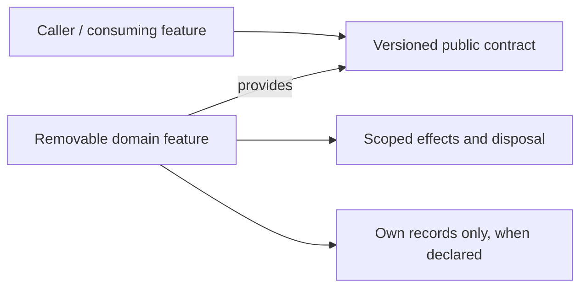

# Interfaces

> **Package:** `app/services/interfaces/`
> **Status:** `Partial` — documentary target; runtime acceptance is **NOT_REVALIDATED**.
> **Last updated:** `2026-09-06`
> **Domain ID:** `D-IFACE`

> This README is the domain target registry for boundaries, composable feature capabilities, requirements, ownership, workflows, acceptance, and removal. Update it before changing the affected implementation. It does not certify that a target package, contract, test, usage demonstration or provider is already implemented.

**Selected scope:** 15 features · 32 owned functional requirements · 30 feature-local non-functional requirements. All original feature and requirement IDs are retained. These selected workbench obligations do **not** delete unrelated existing domain behavior. This document must be merged with current evidence and any out-of-scope entries before replacing an existing domain registry.

**Sources:** [Unified Specification](../../../docs/dev/evidence/specification-drift.md) · [Feature–Requirement Traceability Register](../../../docs/dev/Feature_Requirement_Traceability_Register.md) · [Phased Feature Implementation Plan](../../../docs/dev/Phased_Feature_Implementation_Plan.md) · [README template](../../../docs/templates/README.md). Source fingerprints and Phase 0 bindings are recorded in §6 and §9. The feature cards below reproduce owned requirements and acceptance oracles; their scoped shared-NFR, catalogue, original-ID and operation-gate tables remain binding through the linked source card.

---

## Code-Aligned Implementation Convention

This domain README defines target behavior; `PROJECT.md` retains system scope, cross-domain policy, system NFRs and release gates, and `ARCHITECTURE.md` retains universal package/runtime constraints. Feature-local READMEs, manifests, contracts, migrations and evidence mirror rather than silently redefine this target. For focused work, load §1, the affected §4 card, applicable §5 and §9 rules, and §7. Follow the [Feature Implementation Pipeline](../../../docs/dev/feature_implementation_pipeline.md).

Implement one feature directly in its selected owner folder and discover it through the `haruquantai.features` Python entry-point group. Declare one immutable `SPEC = FeatureSpec(...)` in `manifest.py`; do not introduce a domain registry or YAML manifest. The feature contains pure `__init__.py`, a runtime-validated `README.md`, strict `config.py` with `.from_dict()`, lifecycle `feature.py`, focused logic modules and required `_usage.py`. Add `_persistence.py` only when the feature performs database operations. Effects and dependencies flow through `FeatureContext` and `FeatureScope`; durable state is declared by `FeatureSpec.state`. Existing compatible public contracts and owners are reused, not copied into a parallel implementation.

Each core logic module documents its public API. Every service feature has one required `_usage.py` containing its bounded offline `if __name__ == "__main__":` scenarios; production logic modules do not contain demonstrations. Optional `_persistence.py` owns all feature-local database operations when durable state is required. The paths below are documentary targets pending current-code reconciliation, not claims of executable files. Tests verify the scenarios independently.

FR and acceptance IDs are trace identities, not runtime registrations. Required-provider keys below reproduce the register’s required graph. Optional providers are operation-gated: they must be declared and tested without making an absent future extension a universal startup dependency. The plan’s P1–P16 execution phases are distinct from specification U0–U13 release milestones; a U label is not proof of readiness or a new feature task.

## 1. Purpose and Boundary

### Purpose

Expose authenticated, typed owner capabilities through the existing API/event transport without becoming another business layer. Preserve exact owner outcomes, permissions and receipts across browser, automation and Agentic clients.

### Owns

API/event transport; identity/settings/reference gateways; Strategy, Research, Simulator, Optimization, Analytics and Portfolio gateways; project/job/capability administration; operator-chat gateway; governed automation commands.

### Does not own

Business validation decisions, SQL or artifact parsing, numerical computation, authorization policy ownership, private research workflows and direct service-implementation imports.

### Shared Contracts

**Owned by this domain.** Status is an evidence state. Contract modules are selected public boundaries; an unbound symbol/DTO must be reconciled before implementing its production consumer. Do not infer a callable signature from the English title.

| Evidence | Capability | Protocol / DTO / contract target | Major | Purpose |
| --- | --- | --- | --- | --- |
| DOCUMENTARY_BOUND | `interfaces.serve-api-events@1` | Selected public operation/DTO surface; exact existing symbols are inventoried in the Phase 0 contract-binding projection.<br>[`app/contracts/interfaces/serve_api_events.py`](../../contracts/interfaces/serve_api_events.py) | 1 | Serve compatible API envelopes and resumable events |
| DOCUMENTARY_BOUND | `interfaces.operate-identity@1` | Selected public operation/DTO surface; exact existing symbols are inventoried in the Phase 0 contract-binding projection.<br>[`app/contracts/interfaces/operate_identity.py`](../../contracts/interfaces/operate_identity.py) | 1 | Translate identity and session operations |
| DOCUMENTARY_BOUND | `interfaces.operate-settings@1` | Selected public operation/DTO surface; exact existing symbols are inventoried in the Phase 0 contract-binding projection.<br>[`app/contracts/interfaces/operate_settings.py`](../../contracts/interfaces/operate_settings.py) | 1 | Translate system settings and diagnostics |
| DOCUMENTARY_BOUND | `interfaces.observe-market-reference@1` | Selected public operation/DTO surface; exact existing symbols are inventoried in the Phase 0 contract-binding projection.<br>[`app/contracts/interfaces/observe_market_reference.py`](../../contracts/interfaces/observe_market_reference.py) | 1 | Expose Data Manager and reference operations |
| DOCUMENTARY_BOUND | `interfaces.operate-strategies@1` | Selected public operation/DTO surface; exact existing symbols are inventoried in the Phase 0 contract-binding projection.<br>[`app/contracts/interfaces/operate_strategies.py`](../../contracts/interfaces/operate_strategies.py) | 1 | Expose strategy authoring and exchange |
| DOCUMENTARY_BOUND | `interfaces.operate-research@1` | Selected public operation/DTO surface; exact existing symbols are inventoried in the Phase 0 contract-binding projection.<br>[`app/contracts/interfaces/operate_research.py`](../../contracts/interfaces/operate_research.py) | 1 | Expose research protocols, campaigns and runs |
| DOCUMENTARY_BOUND | `interfaces.operate-simulations@1` | Selected public operation/DTO surface; exact existing symbols are inventoried in the Phase 0 contract-binding projection.<br>[`app/contracts/interfaces/operate_simulations.py`](../../contracts/interfaces/operate_simulations.py) | 1 | Expose explicit simulation configuration and run commands |
| DOCUMENTARY_BOUND | `interfaces.operate-optimization@1` | Selected public operation/DTO surface; exact existing symbols are inventoried in the Phase 0 contract-binding projection.<br>[`app/contracts/interfaces/operate_optimization.py`](../../contracts/interfaces/operate_optimization.py) | 1 | Expose bounded search and walk-forward operations |
| DOCUMENTARY_BOUND | `interfaces.operate-results@1` | Selected public operation/DTO surface; exact existing symbols are inventoried in the Phase 0 contract-binding projection.<br>[`app/contracts/interfaces/operate_results.py`](../../contracts/interfaces/operate_results.py) | 1 | Expose databanks, results and analysis |
| DOCUMENTARY_BOUND | `interfaces.operate-portfolios@1` | Selected public operation/DTO surface; exact existing symbols are inventoried in the Phase 0 contract-binding projection.<br>[`app/contracts/interfaces/operate_portfolios.py`](../../contracts/interfaces/operate_portfolios.py) | 1 | Expose portfolio composition, search and analysis |
| DOCUMENTARY_BOUND | `interfaces.edit-projects@1` | Selected public operation/DTO surface; exact existing symbols are inventoried in the Phase 0 contract-binding projection.<br>[`app/contracts/interfaces/edit_projects.py`](../../contracts/interfaces/edit_projects.py) | 1 | Expose project graph editing and run scopes |
| DOCUMENTARY_BOUND | `interfaces.operate-jobs@1` | Selected public operation/DTO surface; exact existing symbols are inventoried in the Phase 0 contract-binding projection.<br>[`app/contracts/interfaces/operate_jobs.py`](../../contracts/interfaces/operate_jobs.py) | 1 | Expose shared jobs and worker control |
| DOCUMENTARY_BOUND | `interfaces.administer-capabilities@1` | Selected public operation/DTO surface; exact existing symbols are inventoried in the Phase 0 contract-binding projection.<br>[`app/contracts/interfaces/administer_capabilities.py`](../../contracts/interfaces/administer_capabilities.py) | 1 | Expose extension lifecycle and development operations |
| DOCUMENTARY_BOUND | `interfaces.operator-chat@1` | Selected public operation/DTO surface; exact existing symbols are inventoried in the Phase 0 contract-binding projection.<br>[`app/contracts/interfaces/operator_chat.py`](../../contracts/interfaces/operator_chat.py) | 1 | Expose Chat Bot and governed Agentic operations |
| DOCUMENTARY_BOUND | `interfaces.automate-commands@1` | Selected public operation/DTO surface; exact existing symbols are inventoried in the Phase 0 contract-binding projection.<br>[`app/contracts/interfaces/automate_commands.py`](../../contracts/interfaces/automate_commands.py) | 1 | Expose permission-scoped CLI and MCP automation |

**Consumed from other domains — required providers.** Runtime resolution is through the exact key; the provider’s implementation folder is not an import target. Same-domain edges are listed in the owning feature card.

| Capability | Owner | Binding | Consuming feature | Used for |
| --- | --- | --- | --- | --- |
| `workspace.manage-accounts@1` | Workspace | Required | [`FEAT-IFACE-SERVE_API_EVENTS`](#feat-iface-serve-api-events) | Verify accounts, principals and sessions |
| `workspace.manage-accounts@1` | Workspace | Required | [`FEAT-IFACE-OPERATE_IDENTITY`](#feat-iface-operate-identity) | Verify accounts, principals and sessions |
| `workspace.administer-settings@1` | Workspace | Required | [`FEAT-IFACE-OPERATE_SETTINGS`](#feat-iface-operate-settings) | Version user-visible system settings |
| `data.browse-reference@1` | Data | Required | [`FEAT-IFACE-OBSERVE_MARKET_REFERENCE`](#feat-iface-observe-market-reference) | Browse one coherent data/reference projection |

**Operation-gated providers.** For each §4 feature, its linked source card’s complete “Operation-gated providers” table defines applicability, exact provider identity and absence behavior. This is scoped incorporation, not permission to treat all 233 register-wide operation edges as optional for every feature. Resolve those provider IDs to their primary capability keys in the corresponding domain README; bind actual operations in the acceptance record. An omitted local duplicate table does not waive a source dependency.

### Persisted State Ownership

Only scoped transport/session projections, bounded stream/reconnect state and permitted transport idempotency metadata. Canonical identity, jobs, commands, results and receipts remain with their declared owners.

| Evidence | Owning feature | Partition / ownership class | Driver binding | Retention / read boundary |
| --- | --- | --- | --- | --- |
| PHASE0_BOUND | [`FEAT-IFACE-SERVE_API_EVENTS`](#feat-iface-serve-api-events) | No domain-record ownership | No new business driver. | Owner records remain backend-owned. Disconnecting observation does not cancel accepted owner work. |
| PHASE0_BOUND | [`FEAT-IFACE-OPERATE_IDENTITY`](#feat-iface-operate-identity) | No domain-record ownership | No new business driver. | Owner records remain backend-owned. Disconnecting observation does not cancel accepted owner work. |
| PHASE0_BOUND | [`FEAT-IFACE-OPERATE_SETTINGS`](#feat-iface-operate-settings) | No domain-record ownership | No new business driver. | Owner records remain backend-owned. Disconnecting observation does not cancel accepted owner work. |
| PHASE0_BOUND | [`FEAT-IFACE-OBSERVE_MARKET_REFERENCE`](#feat-iface-observe-market-reference) | No domain-record ownership | No new business driver. | Owner records remain backend-owned. Disconnecting observation does not cancel accepted owner work. |
| PHASE0_BOUND | [`FEAT-IFACE-OPERATE_STRATEGIES`](#feat-iface-operate-strategies) | No domain-record ownership | No new business driver. | Owner records remain backend-owned. Disconnecting observation does not cancel accepted owner work. |
| PHASE0_BOUND | [`FEAT-IFACE-OPERATE_RESEARCH`](#feat-iface-operate-research) | No domain-record ownership | No new business driver. | Owner records remain backend-owned. Disconnecting observation does not cancel accepted owner work. |
| PHASE0_BOUND | [`FEAT-IFACE-OPERATE_SIMULATIONS`](#feat-iface-operate-simulations) | No domain-record ownership | No new business driver. | Owner records remain backend-owned. Disconnecting observation does not cancel accepted owner work. |
| PHASE0_BOUND | [`FEAT-IFACE-OPERATE_OPTIMIZATION`](#feat-iface-operate-optimization) | No domain-record ownership | No new business driver. | Owner records remain backend-owned. Disconnecting observation does not cancel accepted owner work. |
| PHASE0_BOUND | [`FEAT-IFACE-OPERATE_RESULTS`](#feat-iface-operate-results) | No domain-record ownership | No new business driver. | Owner records remain backend-owned. Disconnecting observation does not cancel accepted owner work. |
| PHASE0_BOUND | [`FEAT-IFACE-OPERATE_PORTFOLIOS`](#feat-iface-operate-portfolios) | No domain-record ownership | No new business driver. | Owner records remain backend-owned. Disconnecting observation does not cancel accepted owner work. |
| PHASE0_BOUND | [`FEAT-IFACE-EDIT_PROJECTS`](#feat-iface-edit-projects) | No domain-record ownership | No new business driver. | Owner records remain backend-owned. Disconnecting observation does not cancel accepted owner work. |
| PHASE0_BOUND | [`FEAT-IFACE-OPERATE_JOBS`](#feat-iface-operate-jobs) | No domain-record ownership | No new business driver. | Owner records remain backend-owned. Disconnecting observation does not cancel accepted owner work. |
| PHASE0_BOUND | [`FEAT-IFACE-ADMINISTER_CAPABILITIES`](#feat-iface-administer-capabilities) | No domain-record ownership | No new business driver. | Owner records remain backend-owned. Disconnecting observation does not cancel accepted owner work. |
| PHASE0_BOUND | [`FEAT-IFACE-AGENTIC_GATEWAY`](#feat-iface-agentic-gateway) | No domain-record ownership | No new business driver. | Owner records remain backend-owned. Disconnecting observation does not cancel accepted owner work. |
| PHASE0_BOUND | [`FEAT-IFACE-AUTOMATE_COMMANDS`](#feat-iface-automate-commands) | No domain-record ownership | No new business driver. | Owner records remain backend-owned. Disconnecting observation does not cancel accepted owner work. |

A feature’s exact durable namespace, schema version and migrations are taken from its reconciled manifest and contract, not guessed from its folder name. External consumers access semantic state only through the owner capability. Workspace persistence/artifact custody never acquires that semantic ownership.

### Four-Level Structural Hierarchy

| Code level | Represents | Domain example |
| --- | --- | --- |
| Package | Domain boundary | `app/services/interfaces/` |
| Module folder | Composable feature owner | `app/services/interfaces/serve_api_events/` — [`FEAT-IFACE-SERVE_API_EVENTS`](#feat-iface-serve-api-events) |
| File | Manifest, strict configuration, lifecycle or focused use case | `manifest.py`, `config.py`, `feature.py`, focused logic module |
| Class / function / method | One or more traced requirement behaviors | `FR-TRC-IFACE-SERVE_API_EVENTS-001` and its acceptance oracle |

### Domain Capability Map

The table in §2 is the complete domain capability map. Edges below illustrate dependency direction, not a new orchestrator or private import relationship.



## 2. Final Package Structure and Feature Independence

Feature owners are independent and physically removable. The selected package is a target binding: reconcile known current aliases and preserve compatible existing identities before creating a folder. Folder absence does not prove behavior absence. Removing a feature withdraws its contributions; it does not delete another feature’s source or retained evidence.

| Feature | Delivered value | Selected owner package | First U gate | FRs | Local NFRs | Evidence |
| --- | --- | --- | --- | --- | --- | --- |
| [`FEAT-IFACE-SERVE_API_EVENTS`](#feat-iface-serve-api-events) | Serve compatible API envelopes and resumable events | `app/services/interfaces/serve_api_events/` | U0 | 3 | 2 | NOT_REVALIDATED |
| [`FEAT-IFACE-OPERATE_IDENTITY`](#feat-iface-operate-identity) | Translate identity and session operations | `app/services/interfaces/operate_identity/` | U0 | 2 | 2 | NOT_REVALIDATED |
| [`FEAT-IFACE-OPERATE_SETTINGS`](#feat-iface-operate-settings) | Translate system settings and diagnostics | `app/services/interfaces/operate_settings/` | U1 | 2 | 2 | NOT_REVALIDATED |
| [`FEAT-IFACE-OBSERVE_MARKET_REFERENCE`](#feat-iface-observe-market-reference) | Expose Data Manager and reference operations | `app/services/interfaces/observe_market_reference/` | U1 | 2 | 2 | NOT_REVALIDATED |
| [`FEAT-IFACE-OPERATE_STRATEGIES`](#feat-iface-operate-strategies) | Expose strategy authoring and exchange | `app/services/interfaces/operate_strategies/` | U2 | 2 | 2 | NOT_REVALIDATED |
| [`FEAT-IFACE-OPERATE_RESEARCH`](#feat-iface-operate-research) | Expose research protocols, campaigns and runs | `app/services/interfaces/operate_research/` | U3 | 2 | 2 | NOT_REVALIDATED |
| [`FEAT-IFACE-OPERATE_SIMULATIONS`](#feat-iface-operate-simulations) | Expose explicit simulation configuration and run commands | `app/services/interfaces/operate_simulations/` | U2 | 2 | 2 | NOT_REVALIDATED |
| [`FEAT-IFACE-OPERATE_OPTIMIZATION`](#feat-iface-operate-optimization) | Expose bounded search and walk-forward operations | `app/services/interfaces/operate_optimization/` | U6 | 2 | 2 | NOT_REVALIDATED |
| [`FEAT-IFACE-OPERATE_RESULTS`](#feat-iface-operate-results) | Expose databanks, results and analysis | `app/services/interfaces/operate_results/` | U2 | 2 | 2 | NOT_REVALIDATED |
| [`FEAT-IFACE-OPERATE_PORTFOLIOS`](#feat-iface-operate-portfolios) | Expose portfolio composition, search and analysis | `app/services/interfaces/operate_portfolios/` | U7 | 2 | 2 | NOT_REVALIDATED |
| [`FEAT-IFACE-EDIT_PROJECTS`](#feat-iface-edit-projects) | Expose project graph editing and run scopes | `app/services/interfaces/edit_projects/` | U8 | 2 | 2 | NOT_REVALIDATED |
| [`FEAT-IFACE-OPERATE_JOBS`](#feat-iface-operate-jobs) | Expose shared jobs and worker control | `app/services/interfaces/operate_jobs/` | U1 | 2 | 2 | NOT_REVALIDATED |
| [`FEAT-IFACE-ADMINISTER_CAPABILITIES`](#feat-iface-administer-capabilities) | Expose extension lifecycle and development operations | `app/services/interfaces/administer_capabilities/` | U9 | 2 | 2 | NOT_REVALIDATED |
| [`FEAT-IFACE-AGENTIC_GATEWAY`](#feat-iface-agentic-gateway) | Expose Chat Bot and governed Agentic operations | `app/services/interfaces/agentic_gateway/` | U2 | 3 | 2 | NOT_REVALIDATED |
| [`FEAT-IFACE-AUTOMATE_COMMANDS`](#feat-iface-automate-commands) | Expose permission-scoped CLI and MCP automation | `app/services/interfaces/automate_commands/` | U13 | 2 | 2 | NOT_REVALIDATED |

```text
app/services/interfaces/
├── README.md  # this domain target registry
├── __init__.py  # docstring only
├── serve_api_events/  # FEAT-IFACE-SERVE_API_EVENTS
├── operate_identity/  # FEAT-IFACE-OPERATE_IDENTITY
├── operate_settings/  # FEAT-IFACE-OPERATE_SETTINGS
├── observe_market_reference/  # FEAT-IFACE-OBSERVE_MARKET_REFERENCE
├── operate_strategies/  # FEAT-IFACE-OPERATE_STRATEGIES
├── operate_research/  # FEAT-IFACE-OPERATE_RESEARCH
├── operate_simulations/  # FEAT-IFACE-OPERATE_SIMULATIONS
├── operate_optimization/  # FEAT-IFACE-OPERATE_OPTIMIZATION
├── operate_results/  # FEAT-IFACE-OPERATE_RESULTS
├── operate_portfolios/  # FEAT-IFACE-OPERATE_PORTFOLIOS
├── edit_projects/  # FEAT-IFACE-EDIT_PROJECTS
├── operate_jobs/  # FEAT-IFACE-OPERATE_JOBS
├── administer_capabilities/  # FEAT-IFACE-ADMINISTER_CAPABILITIES
├── agentic_gateway/  # FEAT-IFACE-AGENTIC_GATEWAY
└── automate_commands/  # FEAT-IFACE-AUTOMATE_COMMANDS
```

Every feature folder contains `README.md`, docstring-only `__init__.py`, `manifest.py`, `config.py`, `feature.py` and its focused logic modules. Shared contract definitions live outside those removable packages. The primary logic-module designation in §4 is a target for usage ownership; adapt a compatible existing module rather than duplicate its service.

### Feature Capability Dependency Direction

A required edge means “consumer requires the provider’s public capability.” It never means “import the provider package.” Optional operation closure is resolved by the composition/runtime boundary and rechecked at invocation. Physical removal must cause the declared unavailable or blocked state while unrelated capabilities remain usable.

## 3. Workflows

Workflows connect existing features; they do not create additional feature owners. “Internal” means all participating behavior is domain-local. “Cross-Domain” means collaboration through public contracts. Participant lists below are **not** a substitute for the plan’s execution schedule or the workflow’s validated operation graph.

### Domain-local reading sequence — Route a governed owner request

**Input boundary:** Authenticated typed request with scope, revision and idempotency fields where required.

**Output boundary:** The owner’s actual typed response/receipt and a resumable authorized event stream.

**Capabilities to inspect:** [`FEAT-IFACE-SERVE_API_EVENTS`](#feat-iface-serve-api-events) → [`FEAT-IFACE-OPERATE_SIMULATIONS`](#feat-iface-operate-simulations) → [`FEAT-IFACE-OPERATE_JOBS`](#feat-iface-operate-jobs).

This is a domain-oriented explanation, not an additional canonical `WF-*` identity. Apply every FR of the participating operation, not only its first validation step. Validate scope and immutable references, resolve admitted providers, perform owner work, verify the owner receipt, and then expose the result. Invalid input, provider absence, stale revision and cancellation retain separate typed outcomes.

| Evidence | Workflow | Scope | Lead | First U gate | Acceptance |
| --- | --- | --- | --- | --- | --- |
| PENDING | [`WF-WB-CHAT_REVIEW`](#wf-wb-chat-review) | Cross-Domain | [`FEAT-AGT-ASSIST_OPERATOR`](../agentic/README.md#feat-agt-assist-operator) | U2 | `ATW-WB-CHAT_REVIEW` |
| PENDING | [`WF-WB-IDEA_TO_STRATEGY`](#wf-wb-idea-to-strategy) | Cross-Domain | [`FEAT-AGT-COMPOSE_STRATEGY_SPECS`](../agentic/README.md#feat-agt-compose-strategy-specs) | U3 | `ATW-WB-IDEA_TO_STRATEGY` |
| PENDING | [`WF-AGT-ASSIST_OPERATOR`](#wf-agt-assist-operator) | Cross-Domain | [`FEAT-AGT-ASSIST_OPERATOR`](../agentic/README.md#feat-agt-assist-operator) | U2 | `ATW-AGT-ASSIST_OPERATOR` |

<a id="wf-wb-chat-review"></a>
### `WF-WB-CHAT_REVIEW` — Review a real result through Chat Bot

**Lead owner:** [`FEAT-AGT-ASSIST_OPERATOR`](../agentic/README.md#feat-agt-assist-operator). **Release gate:** U2. **State:** PENDING.

**Participants:** [`FEAT-AGT-ASSIST_OPERATOR`](../agentic/README.md#feat-agt-assist-operator), [`FEAT-UI-RESEARCH_WORKBENCH`](../../ui/README.md#feat-ui-research-workbench), [`FEAT-UI-SESSION_CONTEXT`](../../ui/README.md#feat-ui-session-context), [`FEAT-UI-CHAT_BOT`](../../ui/README.md#feat-ui-chat-bot), [`FEAT-IFACE-AGENTIC_GATEWAY`](#feat-iface-agentic-gateway), [`FEAT-AGT-ASSEMBLE_CONTEXT`](../agentic/README.md#feat-agt-assemble-context), [`FEAT-AGT-MANAGE_CLAIMS`](../agentic/README.md#feat-agt-manage-claims), [`FEAT-AGT-SYNTHESIZE_RESEARCH`](../agentic/README.md#feat-agt-synthesize-research), [`FEAT-ANA-QUERY_RESULTS`](../analytics/README.md#feat-ana-query-results), [`FEAT-WS-MANAGE_CONVERSATIONS`](../workspace/README.md#feat-ws-manage-conversations).

**This domain contributes:** [`FEAT-IFACE-AGENTIC_GATEWAY`](#feat-iface-agentic-gateway). Every participating feature’s scoped FR/local-NFR obligations remain binding.

**Input/output and acceptance contract:** `ATW-WB-CHAT_REVIEW` — Change the browser-displayed metric to an incorrect value: answer refreshes owner truth and cites exact evidence, same-conversation specialist attribution; stale or denied evidence cannot produce a claimed fact.

**Failure boundary:** required evidence or provider absence yields the declared refusal/unavailable/partial result; it never implies a pass, silently substitutes a provider or grants live authority. [Canonical workflow definition](../../../docs/dev/Feature_Requirement_Traceability_Register.md#wf-wb-chat-review).

<a id="wf-wb-idea-to-strategy"></a>
### `WF-WB-IDEA_TO_STRATEGY` — Research idea to reviewed strategy

**Lead owner:** [`FEAT-AGT-COMPOSE_STRATEGY_SPECS`](../agentic/README.md#feat-agt-compose-strategy-specs). **Release gate:** U3. **State:** PENDING.

**Participants:** [`FEAT-AGT-COMPOSE_STRATEGY_SPECS`](../agentic/README.md#feat-agt-compose-strategy-specs), [`FEAT-AGT-ASSIST_OPERATOR`](../agentic/README.md#feat-agt-assist-operator), [`FEAT-AGT-DESIGN_RESEARCH`](../agentic/README.md#feat-agt-design-research), [`FEAT-RES-GOVERN_CAMPAIGNS`](../research/README.md#feat-res-govern-campaigns), [`FEAT-RES-DEFINE_PROTOCOLS`](../research/README.md#feat-res-define-protocols), [`FEAT-STRAT-DEFINE_AST`](../strategy/README.md#feat-strat-define-ast), [`FEAT-STRAT-CATALOG_BLOCKS`](../strategy/README.md#feat-strat-catalog-blocks), [`FEAT-STRAT-VERSION_STRATEGIES`](../strategy/README.md#feat-strat-version-strategies), [`FEAT-IFACE-AGENTIC_GATEWAY`](#feat-iface-agentic-gateway), [`FEAT-UI-CHAT_BOT`](../../ui/README.md#feat-ui-chat-bot), [`FEAT-UI-STRATEGY_STUDIO`](../../ui/README.md#feat-ui-strategy-studio), [`FEAT-SIM-EXECUTE_TICKS`](../simulator/README.md#feat-sim-execute-ticks).

**This domain contributes:** [`FEAT-IFACE-AGENTIC_GATEWAY`](#feat-iface-agentic-gateway). Every participating feature’s scoped FR/local-NFR obligations remain binding.

**Input/output and acceptance contract:** `ATW-WB-IDEA_TO_STRATEGY` — Draft with explicit unvalidated assumptions; validate, bounded repair, exact patch closure review and CAS acceptance; separately authorize a bounded tick backtest; no save/holdout/live authority implied by prose.

**Failure boundary:** required evidence or provider absence yields the declared refusal/unavailable/partial result; it never implies a pass, silently substitutes a provider or grants live authority. [Canonical workflow definition](../../../docs/dev/Feature_Requirement_Traceability_Register.md#wf-wb-idea-to-strategy).

<a id="wf-agt-assist-operator"></a>
### `WF-AGT-ASSIST_OPERATOR` — Context-Aware Chat Bot

**Lead owner:** [`FEAT-AGT-ASSIST_OPERATOR`](../agentic/README.md#feat-agt-assist-operator). **Release gate:** U2. **State:** PENDING.

**Participants:** [`FEAT-AGT-ASSIST_OPERATOR`](../agentic/README.md#feat-agt-assist-operator), [`FEAT-AGT-ENFORCE_MANDATE`](../agentic/README.md#feat-agt-enforce-mandate), [`FEAT-AGT-RUN_WORKFLOWS`](../agentic/README.md#feat-agt-run-workflows), [`FEAT-AGT-ASSEMBLE_CONTEXT`](../agentic/README.md#feat-agt-assemble-context), [`FEAT-AGT-REGISTER_ROLES`](../agentic/README.md#feat-agt-register-roles), [`FEAT-AGT-INVOKE_MODELS`](../agentic/README.md#feat-agt-invoke-models), [`FEAT-UI-SESSION_CONTEXT`](../../ui/README.md#feat-ui-session-context), [`FEAT-IFACE-AGENTIC_GATEWAY`](#feat-iface-agentic-gateway), [`FEAT-WS-MANAGE_CONVERSATIONS`](../workspace/README.md#feat-ws-manage-conversations).

**This domain contributes:** [`FEAT-IFACE-AGENTIC_GATEWAY`](#feat-iface-agentic-gateway). Every participating feature’s scoped FR/local-NFR obligations remain binding.

**Input/output and acceptance contract:** `ATW-AGT-ASSIST_OPERATOR` — Fresh verified scope and deterministic direct/specialist route; reply preserves attribution, refusals and evidence; no prose-triggered mutation.

**Failure boundary:** required evidence or provider absence yields the declared refusal/unavailable/partial result; it never implies a pass, silently substitutes a provider or grants live authority. [Canonical workflow definition](../../../docs/dev/Feature_Requirement_Traceability_Register.md#wf-agt-assist-operator).

## 4. Composable Feature Specifications

Each card is one permanent feature/task slot. Its owned FRs, local NFRs and expected acceptance outcomes are reproduced below. All acceptance states are PENDING / NOT_REVALIDATED. Contract targets and intended tests do not prove runtime support. `Binding pending` prohibits executor invention: resolve the exact compatible contract, configuration, state and fixture before production use. The plan’s one-feature task rule includes all registered variants; future-provider qualification is not permission to leave owned adapter behavior unimplemented.

<a id="feat-iface-serve-api-events"></a>
### 4.1 `serve_api_events/` — `FEAT-IFACE-SERVE_API_EVENTS`

> **Feature ID:** `FEAT-IFACE-SERVE_API_EVENTS`
> **Domain:** `interfaces`
> **Status:** `Partial` — target documented; full-scope implementation evidence **NOT_REVALIDATED**.
> **Selected owner:** `app/services/interfaces/serve_api_events/`
> **First release milestone:** `U0`; execution order remains in the [Phased Feature Implementation Plan](../../../docs/dev/Phased_Feature_Implementation_Plan.md).

#### Purpose

Serve compatible API envelopes and resumable events. Deliver the bounded behaviors in the FR table through this feature’s declared public capability; retain the domain boundary in §1.

#### Capability Declarations

**Provides:** `interfaces.serve-api-events@1`.

**Required capabilities:**

`workspace.manage-accounts@1` — [`FEAT-WS-MANAGE_ACCOUNTS`](../workspace/README.md#feat-ws-manage-accounts).

**Optional / operation-gated capabilities:** the complete scoped provider table in the [source feature card](../../../docs/dev/Feature_Requirement_Traceability_Register.md#feat-iface-serve-api-events) is normative. Declare each applicable key separately from required startup dependencies. Absence must affect only the operations requiring it, with the exact recorded denial/unavailable behavior.

**Public contract target:** [`app/contracts/interfaces/serve_api_events.py`](../../contracts/interfaces/serve_api_events.py). **Literal protocol/DTO/operation symbols:** the selected target, operation scope, request/result union and typed failure semantics in this card are frozen; exact existing symbols are inventoried in `docs/dev/evidence/contract-bindings.json`, and a planned contract retains this binding without claiming runtime certification.

**Input boundary:** validated typed operation data, current authenticated scope where applicable, and immutable owner references; numerical operations accept validated bounded buffers. **Output boundary:** the owned FRs and acceptance oracles below. Preserve typed invalid, denied, unavailable, stale/conflict, partial, cancelled and failed outcomes wherever the selected contract defines them; do not create a second generic error vocabulary.

#### Feature Configuration & Limits Manifest

| Binding state | Setting / limit source | Type / default | Required | Validation / ownership |
| --- | --- | --- | --- | --- |
| PHASE0_BOUND | Existing registered `FeatureSpec.config_keys`, or no feature configuration for a planned owner unless this card explicitly declares a key. | Exact selected types/defaults only; request and profile fields are not implicit feature configuration. | As declared by the owner card. | Unknown keys and invalid values fail closed; implementation records manifest/config/README parity before COMPLETE. |
| NORMATIVE | Operation parameters, immutable profile references and policy limits in the FRs below | Use the selected request/profile schema; no implicit coercion or default substitution. | All prerequisites of the selected operation. | Do not confuse a request parameter, historical profile value or user-visible setting with a new feature config key. |
| NORMATIVE | Resource, security, retention and version requirements in local/shared NFRs | Finite admitted values; stricter applicable owner policy wins. | Before the affected operation. | Pin effective values/revisions in evidence; never alter a historical run by editing current settings. |

**Feature-specific parameter/limit obligations:** `FR-TRC-IFACE-SERVE_API_EVENTS-001`, `FR-TRC-IFACE-SERVE_API_EVENTS-002`, `FR-TRC-IFACE-SERVE_API_EVENTS-003`, `NFR-TRC-IFACE-SERVE_API_EVENTS-001`. Their full text and test oracles below are binding; this list is an index, not a reduced schema.

#### Runtime Effects & Scope Disposal

| Effect | Owner | Disposal mechanism |
| --- | --- | --- |
| Capability binding `interfaces.serve-api-events@1` | FEAT-IFACE-SERVE_API_EVENTS | Unregister when the reconciler closes the feature scope. |
| Tasks, listeners, requests, workers, leases or buffers actually created by this feature | FEAT-IFACE-SERVE_API_EVENTS | Register exact disposers; cancel/await/release on failure or removal. A pure provider must not create unnecessary effects. |
| Accepted owner work and committed records | Their declared semantic owner | Observation cleanup does not secretly cancel accepted work or purge committed evidence; use explicit owner commands. |

Teardown is idempotent. Failed mount unwinds partial effects. Dependency replacement/removal must not leave stale registrations, jobs, subscriptions, source buffers or credential references usable by the removed scope.

#### Persistent State Ownership

**Ownership class:** No domain-record ownership.

**Records:** Ephemeral validated request, connection, cursor and subscription state.

**Retention and deletion:** Owner records remain backend-owned. Disconnecting observation does not cancel accepted owner work.

**Namespace / schema / driver binding:** No Interfaces business tables. Do not persist copies of strategies, results, campaigns or permissions. A missing literal binding is an explicit §6 precondition, not permission to choose a schema version or table name during execution.

#### Feature Package Structure & Files

| Target file within owner package | Responsibility | Exports / dependency boundary |
| --- | --- | --- |
| __init__.py | Pure package description | Docstring only. |
| README.md | Runtime-validated mirror of this feature scope | Document exact keys, paths and evidence. |
| manifest.py | Immutable identity, capabilities, config keys and optional state declaration | SPEC : FeatureSpec; metadata only. |
| config.py | Strict typed configuration with unknown-key validation | Compatible FeatureConfig.from_dict() binding; no invented accepted keys. |
| feature.py | Scoped mount adapter and zero-argument factory | create_feature(); mount through FeatureContext/FeatureScope. |
| serve_api_events.py | Focused production domain-logic module | Compatible contract operation binding. |
| _persistence.py | Optional owner of all feature-local database operations when durable state is required | Declared storage operations through public Workspace persistence contracts; no raw connection, policy, authorization or orchestration. |
| _usage.py | Required bounded offline usage scenarios and executable __main__ harness | _run_usage_example(); scenarios map to every applicable FR without owning business logic. |

These are documentary ownership targets, not a claim that files or symbols already exist. Reconcile a compatible existing filename/symbol once in the feature’s path-binding receipt rather than creating duplicate logic. Public contract files remain outside the removable backend owner.

#### Functional Requirements (FR)

| Status | Requirement ID | Responsibility / required behavior | Acceptance ID | Expected result |
| --- | --- | --- | --- | --- |
| PENDING | `FR-TRC-IFACE-SERVE_API_EVENTS-001` | Version and validate the existing API envelope, request/trace/idempotency metadata, side-effect classification and bounded errors. | `AT-IFACE-SERVE_API_EVENTS-001` | Wire compatibility goldens pass; a long command returns its actual owner job reference, not fabricated completion. |
| PENDING | `FR-TRC-IFACE-SERVE_API_EVENTS-002` | Stream monotonic bounded owner events with heartbeat, replay cursor, deduplication/gap/expiry/resync and abort cleanup. | `AT-IFACE-SERVE_API_EVENTS-002` | Disconnect/reconnect yields no duplicated command or missed terminal outcome; expired cursors force a snapshot. |
| PENDING | `FR-TRC-IFACE-SERVE_API_EVENTS-003` | Apply cookie/session/CSRF transport, bounded query pages and artifact download validation without owning domain data. | `AT-IFACE-SERVE_API_EVENTS-003` | Unauthorized/CSRF-invalid writes and unsafe downloads fail before receiver invocation; no SQL/file parser is present. |

**Implementing-symbol and side-effect binding:** bind each requirement to the actual operation in the selected public contract and its focused implementation module before acceptance. For each FR, the acceptance receipt records actual symbol, side effects, typed error/exception branch, usage scenario and test location. Do not replace a specified typed failure with a guessed `ValueError`, or treat its absence from this summary as success.

#### Non-Functional Requirements (Local)

| Status | Requirement ID | Quality / removal constraint | Acceptance ID | Expected result |
| --- | --- | --- | --- | --- |
| PENDING | `NFR-TRC-IFACE-SERVE_API_EVENTS-001` | Heavy CPU/serialization/export work is delegated as admitted jobs; transport keeps bounded pages/events and remains responsive. | `ATN-IFACE-SERVE_API_EVENTS-001` | BM-APP-01 control/metadata p95 ≤250 ms and p99 ≤1 s; long commands return an owner job handle and no event-loop CPU blockage. |
| PENDING | `NFR-TRC-IFACE-SERVE_API_EVENTS-002` | Provider loss or scope revocation returns CAPABILITY_UNAVAILABLE/typed denial without selecting a substitute. | `ATN-IFACE-SERVE_API_EVENTS-002` | Remove each operation owner in turn; only its operations degrade and no unauthorized receiver gets invoked. |

#### Applicable Shared NFRs, Catalogue and Source Bindings

[source feature card](../../../docs/dev/Feature_Requirement_Traceability_Register.md#feat-iface-serve-api-events): the exact “Applicable shared NFRs,” “Detailed catalogue families,” “Catalogue entries, algorithms and controls delivered,” “Source scope / Original source IDs,” and operation-gated provider sections are incorporated for **this feature only**. These sections remain normative; an acceptance manifest must enumerate the actual linked IDs/entries and evidence, not just cite this paragraph. No source algorithm, control, permission or release condition is weakened by this domain projection.

#### Acceptance Tests and Evidence

| Acceptance family | Intended test owner | Required evidence state |
| --- | --- | --- |
| Every AT ID in this card | `tests/services/interfaces/serve_api_events/test_traceability.py` | PENDING: bind an actual named test and assertion to each oracle. |
| Every ATN ID in this card | `tests/services/interfaces/serve_api_events/test_lifecycle.py` | PENDING: lifecycle/resource/numerical evidence as applicable. |
| Contract → provider → composition → Interfaces → UI → end-to-end | `docs/dev/SQX/evidence/features/FEAT-IFACE-SERVE_API_EVENTS/acceptance.json` | All six stages NOT_REVALIDATED; justify each genuinely inapplicable stage. |

Intended test paths may be mapped to a compatible current test owner; they are not assertions of existing files. Full oracle coverage, shared requirements, catalogue entries, original source mappings and actual-provider operation qualification must be included in the final acceptance record. A contract fixture cannot certify actual provider integration.

#### Feature Usage Examples

**Required `_usage.py` command - planned, not executed:**

```powershell
uv run --frozen python -m app.services.interfaces.serve_api_events._usage
```

`_usage.py` uses bounded deterministic offline inputs and composes production behavior through public contracts or this feature's focused modules. It demonstrates a useful accepted operation, the appropriate invalid/unavailable/refusal case, and exact cleanup without owning business logic. Map each FR above to a named scenario; the expected observations are its acceptance oracles, not invented console output. Do not import sibling implementations, require live credentials/network by default, or put the public example under tests. Before marking it runnable, bind concrete fixture values and record its actual command, output and exit code.

**Transport example requirement:** the feature-local README additionally gives a concrete authenticated request and response using the current approved route, wire DTO, error envelope and metadata contract. The three planning sources do not establish every literal route/JSON field here; bind those to the real gateway contract before publishing a curl/HTTP example. No synthetic endpoint is advertised by this README.

#### Removal Behaviour

Disable and physically remove the actual reconciled owner of `FEAT-IFACE-SERVE_API_EVENTS`. Withdraw `interfaces.serve-api-events@1` and all its scoped contributions. Required dependents become BLOCKED/unavailable through their declared contract; operation-gated consumers disable only affected operations. Retain committed source objects and evidence; no cross-provider substitute or implicit purge is permitted. Exercise the local ATN oracles and §7 gates before restoring the feature.

---

<a id="feat-iface-operate-identity"></a>
### 4.2 `operate_identity/` — `FEAT-IFACE-OPERATE_IDENTITY`

> **Feature ID:** `FEAT-IFACE-OPERATE_IDENTITY`
> **Domain:** `interfaces`
> **Status:** `Partial` — target documented; full-scope implementation evidence **NOT_REVALIDATED**.
> **Selected owner:** `app/services/interfaces/operate_identity/`
> **First release milestone:** `U0`; execution order remains in the [Phased Feature Implementation Plan](../../../docs/dev/Phased_Feature_Implementation_Plan.md).

#### Purpose

Translate identity and session operations. Deliver the bounded behaviors in the FR table through this feature’s declared public capability; retain the domain boundary in §1.

#### Capability Declarations

**Provides:** `interfaces.operate-identity@1`.

**Required capabilities:**

`interfaces.serve-api-events@1` — [`FEAT-IFACE-SERVE_API_EVENTS`](#feat-iface-serve-api-events)<br>`workspace.manage-accounts@1` — [`FEAT-WS-MANAGE_ACCOUNTS`](../workspace/README.md#feat-ws-manage-accounts).

**Optional / operation-gated capabilities:** the complete scoped provider table in the [source feature card](../../../docs/dev/Feature_Requirement_Traceability_Register.md#feat-iface-operate-identity) is normative. Declare each applicable key separately from required startup dependencies. Absence must affect only the operations requiring it, with the exact recorded denial/unavailable behavior.

**Public contract target:** [`app/contracts/interfaces/operate_identity.py`](../../contracts/interfaces/operate_identity.py). **Literal protocol/DTO/operation symbols:** the selected target, operation scope, request/result union and typed failure semantics in this card are frozen; exact existing symbols are inventoried in `docs/dev/evidence/contract-bindings.json`, and a planned contract retains this binding without claiming runtime certification.

**Input boundary:** validated typed operation data, current authenticated scope where applicable, and immutable owner references; numerical operations accept validated bounded buffers. **Output boundary:** the owned FRs and acceptance oracles below. Preserve typed invalid, denied, unavailable, stale/conflict, partial, cancelled and failed outcomes wherever the selected contract defines them; do not create a second generic error vocabulary.

#### Feature Configuration & Limits Manifest

| Binding state | Setting / limit source | Type / default | Required | Validation / ownership |
| --- | --- | --- | --- | --- |
| PHASE0_BOUND | Existing registered `FeatureSpec.config_keys`, or no feature configuration for a planned owner unless this card explicitly declares a key. | Exact selected types/defaults only; request and profile fields are not implicit feature configuration. | As declared by the owner card. | Unknown keys and invalid values fail closed; implementation records manifest/config/README parity before COMPLETE. |
| NORMATIVE | Operation parameters, immutable profile references and policy limits in the FRs below | Use the selected request/profile schema; no implicit coercion or default substitution. | All prerequisites of the selected operation. | Do not confuse a request parameter, historical profile value or user-visible setting with a new feature config key. |
| NORMATIVE | Resource, security, retention and version requirements in local/shared NFRs | Finite admitted values; stricter applicable owner policy wins. | Before the affected operation. | Pin effective values/revisions in evidence; never alter a historical run by editing current settings. |

**Feature-specific parameter/limit obligations:** `NFR-TRC-IFACE-OPERATE_IDENTITY-001`. Their full text and test oracles below are binding; this list is an index, not a reduced schema.

#### Runtime Effects & Scope Disposal

| Effect | Owner | Disposal mechanism |
| --- | --- | --- |
| Capability binding `interfaces.operate-identity@1` | FEAT-IFACE-OPERATE_IDENTITY | Unregister when the reconciler closes the feature scope. |
| Tasks, listeners, requests, workers, leases or buffers actually created by this feature | FEAT-IFACE-OPERATE_IDENTITY | Register exact disposers; cancel/await/release on failure or removal. A pure provider must not create unnecessary effects. |
| Accepted owner work and committed records | Their declared semantic owner | Observation cleanup does not secretly cancel accepted work or purge committed evidence; use explicit owner commands. |

Teardown is idempotent. Failed mount unwinds partial effects. Dependency replacement/removal must not leave stale registrations, jobs, subscriptions, source buffers or credential references usable by the removed scope.

#### Persistent State Ownership

**Ownership class:** No domain-record ownership.

**Records:** Ephemeral validated request, connection, cursor and subscription state.

**Retention and deletion:** Owner records remain backend-owned. Disconnecting observation does not cancel accepted owner work.

**Namespace / schema / driver binding:** No Interfaces business tables. Do not persist copies of strategies, results, campaigns or permissions. A missing literal binding is an explicit §6 precondition, not permission to choose a schema version or table name during execution.

#### Feature Package Structure & Files

| Target file within owner package | Responsibility | Exports / dependency boundary |
| --- | --- | --- |
| __init__.py | Pure package description | Docstring only. |
| README.md | Runtime-validated mirror of this feature scope | Document exact keys, paths and evidence. |
| manifest.py | Immutable identity, capabilities, config keys and optional state declaration | SPEC : FeatureSpec; metadata only. |
| config.py | Strict typed configuration with unknown-key validation | Compatible FeatureConfig.from_dict() binding; no invented accepted keys. |
| feature.py | Scoped mount adapter and zero-argument factory | create_feature(); mount through FeatureContext/FeatureScope. |
| operate_identity.py | Focused production domain-logic module | Compatible contract operation binding. |
| _persistence.py | Optional owner of all feature-local database operations when durable state is required | Declared storage operations through public Workspace persistence contracts; no raw connection, policy, authorization or orchestration. |
| _usage.py | Required bounded offline usage scenarios and executable __main__ harness | _run_usage_example(); scenarios map to every applicable FR without owning business logic. |

These are documentary ownership targets, not a claim that files or symbols already exist. Reconcile a compatible existing filename/symbol once in the feature’s path-binding receipt rather than creating duplicate logic. Public contract files remain outside the removable backend owner.

#### Functional Requirements (FR)

| Status | Requirement ID | Responsibility / required behavior | Acceptance ID | Expected result |
| --- | --- | --- | --- | --- |
| PENDING | `FR-TRC-IFACE-OPERATE_IDENTITY-001` | Translate authenticated account/session operations into the Workspace identity contract with current cookie/CSRF semantics. | `AT-IFACE-OPERATE_IDENTITY-001` | Forgery/expiry/revocation/cross-account fixtures deny before mutation and never expose secret tokens. |
| PENDING | `FR-TRC-IFACE-OPERATE_IDENTITY-002` | Return truthful current identity and permission metadata for UI context and owner requests. | `AT-IFACE-OPERATE_IDENTITY-002` | A browser-supplied principal cannot replace the verified session principal. |

**Implementing-symbol and side-effect binding:** bind each requirement to the actual operation in the selected public contract and its focused implementation module before acceptance. For each FR, the acceptance receipt records actual symbol, side effects, typed error/exception branch, usage scenario and test location. Do not replace a specified typed failure with a guessed `ValueError`, or treat its absence from this summary as success.

#### Non-Functional Requirements (Local)

| Status | Requirement ID | Quality / removal constraint | Acceptance ID | Expected result |
| --- | --- | --- | --- | --- |
| PENDING | `NFR-TRC-IFACE-OPERATE_IDENTITY-001` | Heavy CPU/serialization/export work is delegated as admitted jobs; transport keeps bounded pages/events and remains responsive. | `ATN-IFACE-OPERATE_IDENTITY-001` | BM-APP-01 control/metadata p95 ≤250 ms and p99 ≤1 s; long commands return an owner job handle and no event-loop CPU blockage. |
| PENDING | `NFR-TRC-IFACE-OPERATE_IDENTITY-002` | Provider loss or scope revocation returns CAPABILITY_UNAVAILABLE/typed denial without selecting a substitute. | `ATN-IFACE-OPERATE_IDENTITY-002` | Remove each operation owner in turn; only its operations degrade and no unauthorized receiver gets invoked. |

#### Applicable Shared NFRs, Catalogue and Source Bindings

[source feature card](../../../docs/dev/Feature_Requirement_Traceability_Register.md#feat-iface-operate-identity): the exact “Applicable shared NFRs,” “Detailed catalogue families,” “Catalogue entries, algorithms and controls delivered,” “Source scope / Original source IDs,” and operation-gated provider sections are incorporated for **this feature only**. These sections remain normative; an acceptance manifest must enumerate the actual linked IDs/entries and evidence, not just cite this paragraph. No source algorithm, control, permission or release condition is weakened by this domain projection.

#### Acceptance Tests and Evidence

| Acceptance family | Intended test owner | Required evidence state |
| --- | --- | --- |
| Every AT ID in this card | `tests/services/interfaces/operate_identity/test_traceability.py` | PENDING: bind an actual named test and assertion to each oracle. |
| Every ATN ID in this card | `tests/services/interfaces/operate_identity/test_lifecycle.py` | PENDING: lifecycle/resource/numerical evidence as applicable. |
| Contract → provider → composition → Interfaces → UI → end-to-end | `docs/dev/SQX/evidence/features/FEAT-IFACE-OPERATE_IDENTITY/acceptance.json` | All six stages NOT_REVALIDATED; justify each genuinely inapplicable stage. |

Intended test paths may be mapped to a compatible current test owner; they are not assertions of existing files. Full oracle coverage, shared requirements, catalogue entries, original source mappings and actual-provider operation qualification must be included in the final acceptance record. A contract fixture cannot certify actual provider integration.

#### Feature Usage Examples

**Required `_usage.py` command - planned, not executed:**

```powershell
uv run --frozen python -m app.services.interfaces.operate_identity._usage
```

`_usage.py` uses bounded deterministic offline inputs and composes production behavior through public contracts or this feature's focused modules. It demonstrates a useful accepted operation, the appropriate invalid/unavailable/refusal case, and exact cleanup without owning business logic. Map each FR above to a named scenario; the expected observations are its acceptance oracles, not invented console output. Do not import sibling implementations, require live credentials/network by default, or put the public example under tests. Before marking it runnable, bind concrete fixture values and record its actual command, output and exit code.

**Transport example requirement:** the feature-local README additionally gives a concrete authenticated request and response using the current approved route, wire DTO, error envelope and metadata contract. The three planning sources do not establish every literal route/JSON field here; bind those to the real gateway contract before publishing a curl/HTTP example. No synthetic endpoint is advertised by this README.

#### Removal Behaviour

Disable and physically remove the actual reconciled owner of `FEAT-IFACE-OPERATE_IDENTITY`. Withdraw `interfaces.operate-identity@1` and all its scoped contributions. Required dependents become BLOCKED/unavailable through their declared contract; operation-gated consumers disable only affected operations. Retain committed source objects and evidence; no cross-provider substitute or implicit purge is permitted. Exercise the local ATN oracles and §7 gates before restoring the feature.

---

<a id="feat-iface-operate-settings"></a>
### 4.3 `operate_settings/` — `FEAT-IFACE-OPERATE_SETTINGS`

> **Feature ID:** `FEAT-IFACE-OPERATE_SETTINGS`
> **Domain:** `interfaces`
> **Status:** `Partial` — target documented; full-scope implementation evidence **NOT_REVALIDATED**.
> **Selected owner:** `app/services/interfaces/operate_settings/`
> **First release milestone:** `U1`; execution order remains in the [Phased Feature Implementation Plan](../../../docs/dev/Phased_Feature_Implementation_Plan.md).

#### Purpose

Translate system settings and diagnostics. Deliver the bounded behaviors in the FR table through this feature’s declared public capability; retain the domain boundary in §1.

#### Capability Declarations

**Provides:** `interfaces.operate-settings@1`.

**Required capabilities:**

`interfaces.serve-api-events@1` — [`FEAT-IFACE-SERVE_API_EVENTS`](#feat-iface-serve-api-events)<br>`workspace.administer-settings@1` — [`FEAT-WS-ADMINISTER_SETTINGS`](../workspace/README.md#feat-ws-administer-settings).

**Optional / operation-gated capabilities:** the complete scoped provider table in the [source feature card](../../../docs/dev/Feature_Requirement_Traceability_Register.md#feat-iface-operate-settings) is normative. Declare each applicable key separately from required startup dependencies. Absence must affect only the operations requiring it, with the exact recorded denial/unavailable behavior.

**Public contract target:** [`app/contracts/interfaces/operate_settings.py`](../../contracts/interfaces/operate_settings.py). **Literal protocol/DTO/operation symbols:** the selected target, operation scope, request/result union and typed failure semantics in this card are frozen; exact existing symbols are inventoried in `docs/dev/evidence/contract-bindings.json`, and a planned contract retains this binding without claiming runtime certification.

**Input boundary:** validated typed operation data, current authenticated scope where applicable, and immutable owner references; numerical operations accept validated bounded buffers. **Output boundary:** the owned FRs and acceptance oracles below. Preserve typed invalid, denied, unavailable, stale/conflict, partial, cancelled and failed outcomes wherever the selected contract defines them; do not create a second generic error vocabulary.

#### Feature Configuration & Limits Manifest

| Binding state | Setting / limit source | Type / default | Required | Validation / ownership |
| --- | --- | --- | --- | --- |
| PHASE0_BOUND | Existing registered `FeatureSpec.config_keys`, or no feature configuration for a planned owner unless this card explicitly declares a key. | Exact selected types/defaults only; request and profile fields are not implicit feature configuration. | As declared by the owner card. | Unknown keys and invalid values fail closed; implementation records manifest/config/README parity before COMPLETE. |
| NORMATIVE | Operation parameters, immutable profile references and policy limits in the FRs below | Use the selected request/profile schema; no implicit coercion or default substitution. | All prerequisites of the selected operation. | Do not confuse a request parameter, historical profile value or user-visible setting with a new feature config key. |
| NORMATIVE | Resource, security, retention and version requirements in local/shared NFRs | Finite admitted values; stricter applicable owner policy wins. | Before the affected operation. | Pin effective values/revisions in evidence; never alter a historical run by editing current settings. |

**Feature-specific parameter/limit obligations:** `FR-TRC-IFACE-OPERATE_SETTINGS-001`, `FR-TRC-IFACE-OPERATE_SETTINGS-002`, `NFR-TRC-IFACE-OPERATE_SETTINGS-001`. Their full text and test oracles below are binding; this list is an index, not a reduced schema.

#### Runtime Effects & Scope Disposal

| Effect | Owner | Disposal mechanism |
| --- | --- | --- |
| Capability binding `interfaces.operate-settings@1` | FEAT-IFACE-OPERATE_SETTINGS | Unregister when the reconciler closes the feature scope. |
| Tasks, listeners, requests, workers, leases or buffers actually created by this feature | FEAT-IFACE-OPERATE_SETTINGS | Register exact disposers; cancel/await/release on failure or removal. A pure provider must not create unnecessary effects. |
| Accepted owner work and committed records | Their declared semantic owner | Observation cleanup does not secretly cancel accepted work or purge committed evidence; use explicit owner commands. |

Teardown is idempotent. Failed mount unwinds partial effects. Dependency replacement/removal must not leave stale registrations, jobs, subscriptions, source buffers or credential references usable by the removed scope.

#### Persistent State Ownership

**Ownership class:** No domain-record ownership.

**Records:** Ephemeral validated request, connection, cursor and subscription state.

**Retention and deletion:** Owner records remain backend-owned. Disconnecting observation does not cancel accepted owner work.

**Namespace / schema / driver binding:** No Interfaces business tables. Do not persist copies of strategies, results, campaigns or permissions. A missing literal binding is an explicit §6 precondition, not permission to choose a schema version or table name during execution.

#### Feature Package Structure & Files

| Target file within owner package | Responsibility | Exports / dependency boundary |
| --- | --- | --- |
| __init__.py | Pure package description | Docstring only. |
| README.md | Runtime-validated mirror of this feature scope | Document exact keys, paths and evidence. |
| manifest.py | Immutable identity, capabilities, config keys and optional state declaration | SPEC : FeatureSpec; metadata only. |
| config.py | Strict typed configuration with unknown-key validation | Compatible FeatureConfig.from_dict() binding; no invented accepted keys. |
| feature.py | Scoped mount adapter and zero-argument factory | create_feature(); mount through FeatureContext/FeatureScope. |
| operate_settings.py | Focused production domain-logic module | Compatible contract operation binding. |
| _persistence.py | Optional owner of all feature-local database operations when durable state is required | Declared storage operations through public Workspace persistence contracts; no raw connection, policy, authorization or orchestration. |
| _usage.py | Required bounded offline usage scenarios and executable __main__ harness | _run_usage_example(); scenarios map to every applicable FR without owning business logic. |

These are documentary ownership targets, not a claim that files or symbols already exist. Reconcile a compatible existing filename/symbol once in the feature’s path-binding receipt rather than creating duplicate logic. Public contract files remain outside the removable backend owner.

#### Functional Requirements (FR)

| Status | Requirement ID | Responsibility / required behavior | Acceptance ID | Expected result |
| --- | --- | --- | --- | --- |
| PENDING | `FR-TRC-IFACE-OPERATE_SETTINGS-001` | Translate versioned settings queries/updates using expected revision and owner validation. | `AT-IFACE-OPERATE_SETTINGS-001` | Unknown keys/conflicts/narrower effective policy survive mapping unchanged. |
| PENDING | `FR-TRC-IFACE-OPERATE_SETTINGS-002` | Expose secret-reference slots and bounded diagnostics, never credential values or unrestricted host paths. | `AT-IFACE-OPERATE_SETTINGS-002` | Wire fixtures redact secrets and require exact scope for exports/test sends. |

**Implementing-symbol and side-effect binding:** bind each requirement to the actual operation in the selected public contract and its focused implementation module before acceptance. For each FR, the acceptance receipt records actual symbol, side effects, typed error/exception branch, usage scenario and test location. Do not replace a specified typed failure with a guessed `ValueError`, or treat its absence from this summary as success.

#### Non-Functional Requirements (Local)

| Status | Requirement ID | Quality / removal constraint | Acceptance ID | Expected result |
| --- | --- | --- | --- | --- |
| PENDING | `NFR-TRC-IFACE-OPERATE_SETTINGS-001` | Heavy CPU/serialization/export work is delegated as admitted jobs; transport keeps bounded pages/events and remains responsive. | `ATN-IFACE-OPERATE_SETTINGS-001` | BM-APP-01 control/metadata p95 ≤250 ms and p99 ≤1 s; long commands return an owner job handle and no event-loop CPU blockage. |
| PENDING | `NFR-TRC-IFACE-OPERATE_SETTINGS-002` | Provider loss or scope revocation returns CAPABILITY_UNAVAILABLE/typed denial without selecting a substitute. | `ATN-IFACE-OPERATE_SETTINGS-002` | Remove each operation owner in turn; only its operations degrade and no unauthorized receiver gets invoked. |

#### Applicable Shared NFRs, Catalogue and Source Bindings

[source feature card](../../../docs/dev/Feature_Requirement_Traceability_Register.md#feat-iface-operate-settings): the exact “Applicable shared NFRs,” “Detailed catalogue families,” “Catalogue entries, algorithms and controls delivered,” “Source scope / Original source IDs,” and operation-gated provider sections are incorporated for **this feature only**. These sections remain normative; an acceptance manifest must enumerate the actual linked IDs/entries and evidence, not just cite this paragraph. No source algorithm, control, permission or release condition is weakened by this domain projection.

#### Acceptance Tests and Evidence

| Acceptance family | Intended test owner | Required evidence state |
| --- | --- | --- |
| Every AT ID in this card | `tests/services/interfaces/operate_settings/test_traceability.py` | PENDING: bind an actual named test and assertion to each oracle. |
| Every ATN ID in this card | `tests/services/interfaces/operate_settings/test_lifecycle.py` | PENDING: lifecycle/resource/numerical evidence as applicable. |
| Contract → provider → composition → Interfaces → UI → end-to-end | `docs/dev/SQX/evidence/features/FEAT-IFACE-OPERATE_SETTINGS/acceptance.json` | All six stages NOT_REVALIDATED; justify each genuinely inapplicable stage. |

Intended test paths may be mapped to a compatible current test owner; they are not assertions of existing files. Full oracle coverage, shared requirements, catalogue entries, original source mappings and actual-provider operation qualification must be included in the final acceptance record. A contract fixture cannot certify actual provider integration.

#### Feature Usage Examples

**Required `_usage.py` command - planned, not executed:**

```powershell
uv run --frozen python -m app.services.interfaces.operate_settings._usage
```

`_usage.py` uses bounded deterministic offline inputs and composes production behavior through public contracts or this feature's focused modules. It demonstrates a useful accepted operation, the appropriate invalid/unavailable/refusal case, and exact cleanup without owning business logic. Map each FR above to a named scenario; the expected observations are its acceptance oracles, not invented console output. Do not import sibling implementations, require live credentials/network by default, or put the public example under tests. Before marking it runnable, bind concrete fixture values and record its actual command, output and exit code.

**Transport example requirement:** the feature-local README additionally gives a concrete authenticated request and response using the current approved route, wire DTO, error envelope and metadata contract. The three planning sources do not establish every literal route/JSON field here; bind those to the real gateway contract before publishing a curl/HTTP example. No synthetic endpoint is advertised by this README.

#### Removal Behaviour

Disable and physically remove the actual reconciled owner of `FEAT-IFACE-OPERATE_SETTINGS`. Withdraw `interfaces.operate-settings@1` and all its scoped contributions. Required dependents become BLOCKED/unavailable through their declared contract; operation-gated consumers disable only affected operations. Retain committed source objects and evidence; no cross-provider substitute or implicit purge is permitted. Exercise the local ATN oracles and §7 gates before restoring the feature.

---

<a id="feat-iface-observe-market-reference"></a>
### 4.4 `observe_market_reference/` — `FEAT-IFACE-OBSERVE_MARKET_REFERENCE`

> **Feature ID:** `FEAT-IFACE-OBSERVE_MARKET_REFERENCE`
> **Domain:** `interfaces`
> **Status:** `Partial` — target documented; full-scope implementation evidence **NOT_REVALIDATED**.
> **Selected owner:** `app/services/interfaces/observe_market_reference/`
> **First release milestone:** `U1`; execution order remains in the [Phased Feature Implementation Plan](../../../docs/dev/Phased_Feature_Implementation_Plan.md).

#### Purpose

Expose Data Manager and reference operations. Deliver the bounded behaviors in the FR table through this feature’s declared public capability; retain the domain boundary in §1.

#### Capability Declarations

**Provides:** `interfaces.observe-market-reference@1`.

**Required capabilities:**

`interfaces.serve-api-events@1` — [`FEAT-IFACE-SERVE_API_EVENTS`](#feat-iface-serve-api-events)<br>`data.browse-reference@1` — [`FEAT-DATA-BROWSE_REFERENCE`](../data/README.md#feat-data-browse-reference).

**Optional / operation-gated capabilities:** the complete scoped provider table in the [source feature card](../../../docs/dev/Feature_Requirement_Traceability_Register.md#feat-iface-observe-market-reference) is normative. Declare each applicable key separately from required startup dependencies. Absence must affect only the operations requiring it, with the exact recorded denial/unavailable behavior.

**Public contract target:** [`app/contracts/interfaces/observe_market_reference.py`](../../contracts/interfaces/observe_market_reference.py). **Literal protocol/DTO/operation symbols:** the selected target, operation scope, request/result union and typed failure semantics in this card are frozen; exact existing symbols are inventoried in `docs/dev/evidence/contract-bindings.json`, and a planned contract retains this binding without claiming runtime certification.

**Input boundary:** validated typed operation data, current authenticated scope where applicable, and immutable owner references; numerical operations accept validated bounded buffers. **Output boundary:** the owned FRs and acceptance oracles below. Preserve typed invalid, denied, unavailable, stale/conflict, partial, cancelled and failed outcomes wherever the selected contract defines them; do not create a second generic error vocabulary.

#### Feature Configuration & Limits Manifest

| Binding state | Setting / limit source | Type / default | Required | Validation / ownership |
| --- | --- | --- | --- | --- |
| PHASE0_BOUND | Existing registered `FeatureSpec.config_keys`, or no feature configuration for a planned owner unless this card explicitly declares a key. | Exact selected types/defaults only; request and profile fields are not implicit feature configuration. | As declared by the owner card. | Unknown keys and invalid values fail closed; implementation records manifest/config/README parity before COMPLETE. |
| NORMATIVE | Operation parameters, immutable profile references and policy limits in the FRs below | Use the selected request/profile schema; no implicit coercion or default substitution. | All prerequisites of the selected operation. | Do not confuse a request parameter, historical profile value or user-visible setting with a new feature config key. |
| NORMATIVE | Resource, security, retention and version requirements in local/shared NFRs | Finite admitted values; stricter applicable owner policy wins. | Before the affected operation. | Pin effective values/revisions in evidence; never alter a historical run by editing current settings. |

**Feature-specific parameter/limit obligations:** `FR-TRC-IFACE-OBSERVE_MARKET_REFERENCE-001`, `NFR-TRC-IFACE-OBSERVE_MARKET_REFERENCE-001`. Their full text and test oracles below are binding; this list is an index, not a reduced schema.

#### Runtime Effects & Scope Disposal

| Effect | Owner | Disposal mechanism |
| --- | --- | --- |
| Capability binding `interfaces.observe-market-reference@1` | FEAT-IFACE-OBSERVE_MARKET_REFERENCE | Unregister when the reconciler closes the feature scope. |
| Tasks, listeners, requests, workers, leases or buffers actually created by this feature | FEAT-IFACE-OBSERVE_MARKET_REFERENCE | Register exact disposers; cancel/await/release on failure or removal. A pure provider must not create unnecessary effects. |
| Accepted owner work and committed records | Their declared semantic owner | Observation cleanup does not secretly cancel accepted work or purge committed evidence; use explicit owner commands. |

Teardown is idempotent. Failed mount unwinds partial effects. Dependency replacement/removal must not leave stale registrations, jobs, subscriptions, source buffers or credential references usable by the removed scope.

#### Persistent State Ownership

**Ownership class:** No domain-record ownership.

**Records:** Ephemeral validated request, connection, cursor and subscription state.

**Retention and deletion:** Owner records remain backend-owned. Disconnecting observation does not cancel accepted owner work.

**Namespace / schema / driver binding:** No Interfaces business tables. Do not persist copies of strategies, results, campaigns or permissions. A missing literal binding is an explicit §6 precondition, not permission to choose a schema version or table name during execution.

#### Feature Package Structure & Files

| Target file within owner package | Responsibility | Exports / dependency boundary |
| --- | --- | --- |
| __init__.py | Pure package description | Docstring only. |
| README.md | Runtime-validated mirror of this feature scope | Document exact keys, paths and evidence. |
| manifest.py | Immutable identity, capabilities, config keys and optional state declaration | SPEC : FeatureSpec; metadata only. |
| config.py | Strict typed configuration with unknown-key validation | Compatible FeatureConfig.from_dict() binding; no invented accepted keys. |
| feature.py | Scoped mount adapter and zero-argument factory | create_feature(); mount through FeatureContext/FeatureScope. |
| observe_market_reference.py | Focused production domain-logic module | Compatible contract operation binding. |
| _persistence.py | Optional owner of all feature-local database operations when durable state is required | Declared storage operations through public Workspace persistence contracts; no raw connection, policy, authorization or orchestration. |
| _usage.py | Required bounded offline usage scenarios and executable __main__ harness | _run_usage_example(); scenarios map to every applicable FR without owning business logic. |

These are documentary ownership targets, not a claim that files or symbols already exist. Reconcile a compatible existing filename/symbol once in the feature’s path-binding receipt rather than creating duplicate logic. Public contract files remain outside the removable backend owner.

#### Functional Requirements (FR)

| Status | Requirement ID | Responsibility / required behavior | Acceptance ID | Expected result |
| --- | --- | --- | --- | --- |
| PENDING | `FR-TRC-IFACE-OBSERVE_MARKET_REFERENCE-001` | Reuse the current Data/reference boundary and translate supported owner schema/actions without creating another data catalogue. | `AT-IFACE-OBSERVE_MARKET_REFERENCE-001` | Page/snapshot/size/permission errors are preserved; unsupported actions return CAPABILITY_UNAVAILABLE. |
| PENDING | `FR-TRC-IFACE-OBSERVE_MARKET_REFERENCE-002` | Accept authorized artifact IDs and owner command references for imports, transformations and downloads. | `AT-IFACE-OBSERVE_MARKET_REFERENCE-002` | Interfaces never opens CSV/XML/SQX/Parquet files or writes a Data table. |

**Implementing-symbol and side-effect binding:** bind each requirement to the actual operation in the selected public contract and its focused implementation module before acceptance. For each FR, the acceptance receipt records actual symbol, side effects, typed error/exception branch, usage scenario and test location. Do not replace a specified typed failure with a guessed `ValueError`, or treat its absence from this summary as success.

#### Non-Functional Requirements (Local)

| Status | Requirement ID | Quality / removal constraint | Acceptance ID | Expected result |
| --- | --- | --- | --- | --- |
| PENDING | `NFR-TRC-IFACE-OBSERVE_MARKET_REFERENCE-001` | Heavy CPU/serialization/export work is delegated as admitted jobs; transport keeps bounded pages/events and remains responsive. | `ATN-IFACE-OBSERVE_MARKET_REFERENCE-001` | BM-APP-01 control/metadata p95 ≤250 ms and p99 ≤1 s; long commands return an owner job handle and no event-loop CPU blockage. |
| PENDING | `NFR-TRC-IFACE-OBSERVE_MARKET_REFERENCE-002` | Provider loss or scope revocation returns CAPABILITY_UNAVAILABLE/typed denial without selecting a substitute. | `ATN-IFACE-OBSERVE_MARKET_REFERENCE-002` | Remove each operation owner in turn; only its operations degrade and no unauthorized receiver gets invoked. |

#### Applicable Shared NFRs, Catalogue and Source Bindings

[source feature card](../../../docs/dev/Feature_Requirement_Traceability_Register.md#feat-iface-observe-market-reference): the exact “Applicable shared NFRs,” “Detailed catalogue families,” “Catalogue entries, algorithms and controls delivered,” “Source scope / Original source IDs,” and operation-gated provider sections are incorporated for **this feature only**. These sections remain normative; an acceptance manifest must enumerate the actual linked IDs/entries and evidence, not just cite this paragraph. No source algorithm, control, permission or release condition is weakened by this domain projection.

#### Acceptance Tests and Evidence

| Acceptance family | Intended test owner | Required evidence state |
| --- | --- | --- |
| Every AT ID in this card | `tests/services/interfaces/observe_market_reference/test_traceability.py` | PENDING: bind an actual named test and assertion to each oracle. |
| Every ATN ID in this card | `tests/services/interfaces/observe_market_reference/test_lifecycle.py` | PENDING: lifecycle/resource/numerical evidence as applicable. |
| Contract → provider → composition → Interfaces → UI → end-to-end | `docs/dev/SQX/evidence/features/FEAT-IFACE-OBSERVE_MARKET_REFERENCE/acceptance.json` | All six stages NOT_REVALIDATED; justify each genuinely inapplicable stage. |

Intended test paths may be mapped to a compatible current test owner; they are not assertions of existing files. Full oracle coverage, shared requirements, catalogue entries, original source mappings and actual-provider operation qualification must be included in the final acceptance record. A contract fixture cannot certify actual provider integration.

#### Feature Usage Examples

**Required `_usage.py` command - planned, not executed:**

```powershell
uv run --frozen python -m app.services.interfaces.observe_market_reference._usage
```

`_usage.py` uses bounded deterministic offline inputs and composes production behavior through public contracts or this feature's focused modules. It demonstrates a useful accepted operation, the appropriate invalid/unavailable/refusal case, and exact cleanup without owning business logic. Map each FR above to a named scenario; the expected observations are its acceptance oracles, not invented console output. Do not import sibling implementations, require live credentials/network by default, or put the public example under tests. Before marking it runnable, bind concrete fixture values and record its actual command, output and exit code.

**Transport example requirement:** the feature-local README additionally gives a concrete authenticated request and response using the current approved route, wire DTO, error envelope and metadata contract. The three planning sources do not establish every literal route/JSON field here; bind those to the real gateway contract before publishing a curl/HTTP example. No synthetic endpoint is advertised by this README.

#### Removal Behaviour

Disable and physically remove the actual reconciled owner of `FEAT-IFACE-OBSERVE_MARKET_REFERENCE`. Withdraw `interfaces.observe-market-reference@1` and all its scoped contributions. Required dependents become BLOCKED/unavailable through their declared contract; operation-gated consumers disable only affected operations. Retain committed source objects and evidence; no cross-provider substitute or implicit purge is permitted. Exercise the local ATN oracles and §7 gates before restoring the feature.

---

<a id="feat-iface-operate-strategies"></a>
### 4.5 `operate_strategies/` — `FEAT-IFACE-OPERATE_STRATEGIES`

> **Feature ID:** `FEAT-IFACE-OPERATE_STRATEGIES`
> **Domain:** `interfaces`
> **Status:** `Partial` — target documented; full-scope implementation evidence **NOT_REVALIDATED**.
> **Selected owner:** `app/services/interfaces/operate_strategies/`
> **First release milestone:** `U2`; execution order remains in the [Phased Feature Implementation Plan](../../../docs/dev/Phased_Feature_Implementation_Plan.md).

#### Purpose

Expose strategy authoring and exchange. Deliver the bounded behaviors in the FR table through this feature’s declared public capability; retain the domain boundary in §1.

#### Capability Declarations

**Provides:** `interfaces.operate-strategies@1`.

**Required capabilities:**

`interfaces.serve-api-events@1` — [`FEAT-IFACE-SERVE_API_EVENTS`](#feat-iface-serve-api-events).

**Optional / operation-gated capabilities:** the complete scoped provider table in the [source feature card](../../../docs/dev/Feature_Requirement_Traceability_Register.md#feat-iface-operate-strategies) is normative. Declare each applicable key separately from required startup dependencies. Absence must affect only the operations requiring it, with the exact recorded denial/unavailable behavior.

**Public contract target:** [`app/contracts/interfaces/operate_strategies.py`](../../contracts/interfaces/operate_strategies.py). **Literal protocol/DTO/operation symbols:** the selected target, operation scope, request/result union and typed failure semantics in this card are frozen; exact existing symbols are inventoried in `docs/dev/evidence/contract-bindings.json`, and a planned contract retains this binding without claiming runtime certification.

**Input boundary:** validated typed operation data, current authenticated scope where applicable, and immutable owner references; numerical operations accept validated bounded buffers. **Output boundary:** the owned FRs and acceptance oracles below. Preserve typed invalid, denied, unavailable, stale/conflict, partial, cancelled and failed outcomes wherever the selected contract defines them; do not create a second generic error vocabulary.

#### Feature Configuration & Limits Manifest

| Binding state | Setting / limit source | Type / default | Required | Validation / ownership |
| --- | --- | --- | --- | --- |
| PHASE0_BOUND | Existing registered `FeatureSpec.config_keys`, or no feature configuration for a planned owner unless this card explicitly declares a key. | Exact selected types/defaults only; request and profile fields are not implicit feature configuration. | As declared by the owner card. | Unknown keys and invalid values fail closed; implementation records manifest/config/README parity before COMPLETE. |
| NORMATIVE | Operation parameters, immutable profile references and policy limits in the FRs below | Use the selected request/profile schema; no implicit coercion or default substitution. | All prerequisites of the selected operation. | Do not confuse a request parameter, historical profile value or user-visible setting with a new feature config key. |
| NORMATIVE | Resource, security, retention and version requirements in local/shared NFRs | Finite admitted values; stricter applicable owner policy wins. | Before the affected operation. | Pin effective values/revisions in evidence; never alter a historical run by editing current settings. |

**Feature-specific parameter/limit obligations:** `NFR-TRC-IFACE-OPERATE_STRATEGIES-001`. Their full text and test oracles below are binding; this list is an index, not a reduced schema.

#### Runtime Effects & Scope Disposal

| Effect | Owner | Disposal mechanism |
| --- | --- | --- |
| Capability binding `interfaces.operate-strategies@1` | FEAT-IFACE-OPERATE_STRATEGIES | Unregister when the reconciler closes the feature scope. |
| Tasks, listeners, requests, workers, leases or buffers actually created by this feature | FEAT-IFACE-OPERATE_STRATEGIES | Register exact disposers; cancel/await/release on failure or removal. A pure provider must not create unnecessary effects. |
| Accepted owner work and committed records | Their declared semantic owner | Observation cleanup does not secretly cancel accepted work or purge committed evidence; use explicit owner commands. |

Teardown is idempotent. Failed mount unwinds partial effects. Dependency replacement/removal must not leave stale registrations, jobs, subscriptions, source buffers or credential references usable by the removed scope.

#### Persistent State Ownership

**Ownership class:** No domain-record ownership.

**Records:** Ephemeral validated request, connection, cursor and subscription state.

**Retention and deletion:** Owner records remain backend-owned. Disconnecting observation does not cancel accepted owner work.

**Namespace / schema / driver binding:** No Interfaces business tables. Do not persist copies of strategies, results, campaigns or permissions. A missing literal binding is an explicit §6 precondition, not permission to choose a schema version or table name during execution.

#### Feature Package Structure & Files

| Target file within owner package | Responsibility | Exports / dependency boundary |
| --- | --- | --- |
| __init__.py | Pure package description | Docstring only. |
| README.md | Runtime-validated mirror of this feature scope | Document exact keys, paths and evidence. |
| manifest.py | Immutable identity, capabilities, config keys and optional state declaration | SPEC : FeatureSpec; metadata only. |
| config.py | Strict typed configuration with unknown-key validation | Compatible FeatureConfig.from_dict() binding; no invented accepted keys. |
| feature.py | Scoped mount adapter and zero-argument factory | create_feature(); mount through FeatureContext/FeatureScope. |
| operate_strategies.py | Focused production domain-logic module | Compatible contract operation binding. |
| _persistence.py | Optional owner of all feature-local database operations when durable state is required | Declared storage operations through public Workspace persistence contracts; no raw connection, policy, authorization or orchestration. |
| _usage.py | Required bounded offline usage scenarios and executable __main__ harness | _run_usage_example(); scenarios map to every applicable FR without owning business logic. |

These are documentary ownership targets, not a claim that files or symbols already exist. Reconcile a compatible existing filename/symbol once in the feature’s path-binding receipt rather than creating duplicate logic. Public contract files remain outside the removable backend owner.

#### Functional Requirements (FR)

| Status | Requirement ID | Responsibility / required behavior | Acceptance ID | Expected result |
| --- | --- | --- | --- | --- |
| PENDING | `FR-TRC-IFACE-OPERATE_STRATEGIES-001` | Translate strategy authoring/revision/patch/exchange requests with exact candidate hash and expected revision. | `AT-IFACE-OPERATE_STRATEGIES-001` | Changed base/selection conflicts remain visible; a save cannot implicitly start a backtest. |
| PENDING | `FR-TRC-IFACE-OPERATE_STRATEGIES-002` | Expose compatible block/generator discovery and asynchronous owner export receipts. | `AT-IFACE-OPERATE_STRATEGIES-002` | No generator/compiler/AST mutation logic exists in the gateway; removing an owner fails closed. |

**Implementing-symbol and side-effect binding:** bind each requirement to the actual operation in the selected public contract and its focused implementation module before acceptance. For each FR, the acceptance receipt records actual symbol, side effects, typed error/exception branch, usage scenario and test location. Do not replace a specified typed failure with a guessed `ValueError`, or treat its absence from this summary as success.

#### Non-Functional Requirements (Local)

| Status | Requirement ID | Quality / removal constraint | Acceptance ID | Expected result |
| --- | --- | --- | --- | --- |
| PENDING | `NFR-TRC-IFACE-OPERATE_STRATEGIES-001` | Heavy CPU/serialization/export work is delegated as admitted jobs; transport keeps bounded pages/events and remains responsive. | `ATN-IFACE-OPERATE_STRATEGIES-001` | BM-APP-01 control/metadata p95 ≤250 ms and p99 ≤1 s; long commands return an owner job handle and no event-loop CPU blockage. |
| PENDING | `NFR-TRC-IFACE-OPERATE_STRATEGIES-002` | Provider loss or scope revocation returns CAPABILITY_UNAVAILABLE/typed denial without selecting a substitute. | `ATN-IFACE-OPERATE_STRATEGIES-002` | Remove each operation owner in turn; only its operations degrade and no unauthorized receiver gets invoked. |

#### Applicable Shared NFRs, Catalogue and Source Bindings

[source feature card](../../../docs/dev/Feature_Requirement_Traceability_Register.md#feat-iface-operate-strategies): the exact “Applicable shared NFRs,” “Detailed catalogue families,” “Catalogue entries, algorithms and controls delivered,” “Source scope / Original source IDs,” and operation-gated provider sections are incorporated for **this feature only**. These sections remain normative; an acceptance manifest must enumerate the actual linked IDs/entries and evidence, not just cite this paragraph. No source algorithm, control, permission or release condition is weakened by this domain projection.

#### Acceptance Tests and Evidence

| Acceptance family | Intended test owner | Required evidence state |
| --- | --- | --- |
| Every AT ID in this card | `tests/services/interfaces/operate_strategies/test_traceability.py` | PENDING: bind an actual named test and assertion to each oracle. |
| Every ATN ID in this card | `tests/services/interfaces/operate_strategies/test_lifecycle.py` | PENDING: lifecycle/resource/numerical evidence as applicable. |
| Contract → provider → composition → Interfaces → UI → end-to-end | `docs/dev/SQX/evidence/features/FEAT-IFACE-OPERATE_STRATEGIES/acceptance.json` | All six stages NOT_REVALIDATED; justify each genuinely inapplicable stage. |

Intended test paths may be mapped to a compatible current test owner; they are not assertions of existing files. Full oracle coverage, shared requirements, catalogue entries, original source mappings and actual-provider operation qualification must be included in the final acceptance record. A contract fixture cannot certify actual provider integration.

#### Feature Usage Examples

**Required `_usage.py` command - planned, not executed:**

```powershell
uv run --frozen python -m app.services.interfaces.operate_strategies._usage
```

`_usage.py` uses bounded deterministic offline inputs and composes production behavior through public contracts or this feature's focused modules. It demonstrates a useful accepted operation, the appropriate invalid/unavailable/refusal case, and exact cleanup without owning business logic. Map each FR above to a named scenario; the expected observations are its acceptance oracles, not invented console output. Do not import sibling implementations, require live credentials/network by default, or put the public example under tests. Before marking it runnable, bind concrete fixture values and record its actual command, output and exit code.

**Transport example requirement:** the feature-local README additionally gives a concrete authenticated request and response using the current approved route, wire DTO, error envelope and metadata contract. The three planning sources do not establish every literal route/JSON field here; bind those to the real gateway contract before publishing a curl/HTTP example. No synthetic endpoint is advertised by this README.

#### Removal Behaviour

Disable and physically remove the actual reconciled owner of `FEAT-IFACE-OPERATE_STRATEGIES`. Withdraw `interfaces.operate-strategies@1` and all its scoped contributions. Required dependents become BLOCKED/unavailable through their declared contract; operation-gated consumers disable only affected operations. Retain committed source objects and evidence; no cross-provider substitute or implicit purge is permitted. Exercise the local ATN oracles and §7 gates before restoring the feature.

---

<a id="feat-iface-operate-research"></a>
### 4.6 `operate_research/` — `FEAT-IFACE-OPERATE_RESEARCH`

> **Feature ID:** `FEAT-IFACE-OPERATE_RESEARCH`
> **Domain:** `interfaces`
> **Status:** `Partial` — target documented; full-scope implementation evidence **NOT_REVALIDATED**.
> **Selected owner:** `app/services/interfaces/operate_research/`
> **First release milestone:** `U3`; execution order remains in the [Phased Feature Implementation Plan](../../../docs/dev/Phased_Feature_Implementation_Plan.md).

#### Purpose

Expose research protocols, campaigns and runs. Deliver the bounded behaviors in the FR table through this feature’s declared public capability; retain the domain boundary in §1.

#### Capability Declarations

**Provides:** `interfaces.operate-research@1`.

**Required capabilities:**

`interfaces.serve-api-events@1` — [`FEAT-IFACE-SERVE_API_EVENTS`](#feat-iface-serve-api-events).

**Optional / operation-gated capabilities:** the complete scoped provider table in the [source feature card](../../../docs/dev/Feature_Requirement_Traceability_Register.md#feat-iface-operate-research) is normative. Declare each applicable key separately from required startup dependencies. Absence must affect only the operations requiring it, with the exact recorded denial/unavailable behavior.

**Public contract target:** [`app/contracts/interfaces/operate_research.py`](../../contracts/interfaces/operate_research.py). **Literal protocol/DTO/operation symbols:** the selected target, operation scope, request/result union and typed failure semantics in this card are frozen; exact existing symbols are inventoried in `docs/dev/evidence/contract-bindings.json`, and a planned contract retains this binding without claiming runtime certification.

**Input boundary:** validated typed operation data, current authenticated scope where applicable, and immutable owner references; numerical operations accept validated bounded buffers. **Output boundary:** the owned FRs and acceptance oracles below. Preserve typed invalid, denied, unavailable, stale/conflict, partial, cancelled and failed outcomes wherever the selected contract defines them; do not create a second generic error vocabulary.

#### Feature Configuration & Limits Manifest

| Binding state | Setting / limit source | Type / default | Required | Validation / ownership |
| --- | --- | --- | --- | --- |
| PHASE0_BOUND | Existing registered `FeatureSpec.config_keys`, or no feature configuration for a planned owner unless this card explicitly declares a key. | Exact selected types/defaults only; request and profile fields are not implicit feature configuration. | As declared by the owner card. | Unknown keys and invalid values fail closed; implementation records manifest/config/README parity before COMPLETE. |
| NORMATIVE | Operation parameters, immutable profile references and policy limits in the FRs below | Use the selected request/profile schema; no implicit coercion or default substitution. | All prerequisites of the selected operation. | Do not confuse a request parameter, historical profile value or user-visible setting with a new feature config key. |
| NORMATIVE | Resource, security, retention and version requirements in local/shared NFRs | Finite admitted values; stricter applicable owner policy wins. | Before the affected operation. | Pin effective values/revisions in evidence; never alter a historical run by editing current settings. |

**Feature-specific parameter/limit obligations:** `FR-TRC-IFACE-OPERATE_RESEARCH-001`, `NFR-TRC-IFACE-OPERATE_RESEARCH-001`. Their full text and test oracles below are binding; this list is an index, not a reduced schema.

#### Runtime Effects & Scope Disposal

| Effect | Owner | Disposal mechanism |
| --- | --- | --- |
| Capability binding `interfaces.operate-research@1` | FEAT-IFACE-OPERATE_RESEARCH | Unregister when the reconciler closes the feature scope. |
| Tasks, listeners, requests, workers, leases or buffers actually created by this feature | FEAT-IFACE-OPERATE_RESEARCH | Register exact disposers; cancel/await/release on failure or removal. A pure provider must not create unnecessary effects. |
| Accepted owner work and committed records | Their declared semantic owner | Observation cleanup does not secretly cancel accepted work or purge committed evidence; use explicit owner commands. |

Teardown is idempotent. Failed mount unwinds partial effects. Dependency replacement/removal must not leave stale registrations, jobs, subscriptions, source buffers or credential references usable by the removed scope.

#### Persistent State Ownership

**Ownership class:** No domain-record ownership.

**Records:** Ephemeral validated request, connection, cursor and subscription state.

**Retention and deletion:** Owner records remain backend-owned. Disconnecting observation does not cancel accepted owner work.

**Namespace / schema / driver binding:** No Interfaces business tables. Do not persist copies of strategies, results, campaigns or permissions. A missing literal binding is an explicit §6 precondition, not permission to choose a schema version or table name during execution.

#### Feature Package Structure & Files

| Target file within owner package | Responsibility | Exports / dependency boundary |
| --- | --- | --- |
| __init__.py | Pure package description | Docstring only. |
| README.md | Runtime-validated mirror of this feature scope | Document exact keys, paths and evidence. |
| manifest.py | Immutable identity, capabilities, config keys and optional state declaration | SPEC : FeatureSpec; metadata only. |
| config.py | Strict typed configuration with unknown-key validation | Compatible FeatureConfig.from_dict() binding; no invented accepted keys. |
| feature.py | Scoped mount adapter and zero-argument factory | create_feature(); mount through FeatureContext/FeatureScope. |
| operate_research.py | Focused production domain-logic module | Compatible contract operation binding. |
| _persistence.py | Optional owner of all feature-local database operations when durable state is required | Declared storage operations through public Workspace persistence contracts; no raw connection, policy, authorization or orchestration. |
| _usage.py | Required bounded offline usage scenarios and executable __main__ harness | _run_usage_example(); scenarios map to every applicable FR without owning business logic. |

These are documentary ownership targets, not a claim that files or symbols already exist. Reconcile a compatible existing filename/symbol once in the feature’s path-binding receipt rather than creating duplicate logic. Public contract files remain outside the removable backend owner.

#### Functional Requirements (FR)

| Status | Requirement ID | Responsibility / required behavior | Acceptance ID | Expected result |
| --- | --- | --- | --- | --- |
| PENDING | `FR-TRC-IFACE-OPERATE_RESEARCH-001` | Translate Research-owned plan/run/campaign/holdout commands and preserve identity/budgets/receipts. | `AT-IFACE-OPERATE_RESEARCH-001` | An interface retry cannot create a second accepted trial or holdout look. |
| PENDING | `FR-TRC-IFACE-OPERATE_RESEARCH-002` | Expose run rejection funnels, pause/stop desired state and immutable qualification evidence. | `AT-IFACE-OPERATE_RESEARCH-002` | A paused/qualified state is only shown when the owner attests it; no private research workflow is scheduled. |

**Implementing-symbol and side-effect binding:** bind each requirement to the actual operation in the selected public contract and its focused implementation module before acceptance. For each FR, the acceptance receipt records actual symbol, side effects, typed error/exception branch, usage scenario and test location. Do not replace a specified typed failure with a guessed `ValueError`, or treat its absence from this summary as success.

#### Non-Functional Requirements (Local)

| Status | Requirement ID | Quality / removal constraint | Acceptance ID | Expected result |
| --- | --- | --- | --- | --- |
| PENDING | `NFR-TRC-IFACE-OPERATE_RESEARCH-001` | Heavy CPU/serialization/export work is delegated as admitted jobs; transport keeps bounded pages/events and remains responsive. | `ATN-IFACE-OPERATE_RESEARCH-001` | BM-APP-01 control/metadata p95 ≤250 ms and p99 ≤1 s; long commands return an owner job handle and no event-loop CPU blockage. |
| PENDING | `NFR-TRC-IFACE-OPERATE_RESEARCH-002` | Provider loss or scope revocation returns CAPABILITY_UNAVAILABLE/typed denial without selecting a substitute. | `ATN-IFACE-OPERATE_RESEARCH-002` | Remove each operation owner in turn; only its operations degrade and no unauthorized receiver gets invoked. |

#### Applicable Shared NFRs, Catalogue and Source Bindings

[source feature card](../../../docs/dev/Feature_Requirement_Traceability_Register.md#feat-iface-operate-research): the exact “Applicable shared NFRs,” “Detailed catalogue families,” “Catalogue entries, algorithms and controls delivered,” “Source scope / Original source IDs,” and operation-gated provider sections are incorporated for **this feature only**. These sections remain normative; an acceptance manifest must enumerate the actual linked IDs/entries and evidence, not just cite this paragraph. No source algorithm, control, permission or release condition is weakened by this domain projection.

#### Acceptance Tests and Evidence

| Acceptance family | Intended test owner | Required evidence state |
| --- | --- | --- |
| Every AT ID in this card | `tests/services/interfaces/operate_research/test_traceability.py` | PENDING: bind an actual named test and assertion to each oracle. |
| Every ATN ID in this card | `tests/services/interfaces/operate_research/test_lifecycle.py` | PENDING: lifecycle/resource/numerical evidence as applicable. |
| Contract → provider → composition → Interfaces → UI → end-to-end | `docs/dev/SQX/evidence/features/FEAT-IFACE-OPERATE_RESEARCH/acceptance.json` | All six stages NOT_REVALIDATED; justify each genuinely inapplicable stage. |

Intended test paths may be mapped to a compatible current test owner; they are not assertions of existing files. Full oracle coverage, shared requirements, catalogue entries, original source mappings and actual-provider operation qualification must be included in the final acceptance record. A contract fixture cannot certify actual provider integration.

#### Feature Usage Examples

**Required `_usage.py` command - planned, not executed:**

```powershell
uv run --frozen python -m app.services.interfaces.operate_research._usage
```

`_usage.py` uses bounded deterministic offline inputs and composes production behavior through public contracts or this feature's focused modules. It demonstrates a useful accepted operation, the appropriate invalid/unavailable/refusal case, and exact cleanup without owning business logic. Map each FR above to a named scenario; the expected observations are its acceptance oracles, not invented console output. Do not import sibling implementations, require live credentials/network by default, or put the public example under tests. Before marking it runnable, bind concrete fixture values and record its actual command, output and exit code.

**Transport example requirement:** the feature-local README additionally gives a concrete authenticated request and response using the current approved route, wire DTO, error envelope and metadata contract. The three planning sources do not establish every literal route/JSON field here; bind those to the real gateway contract before publishing a curl/HTTP example. No synthetic endpoint is advertised by this README.

#### Removal Behaviour

Disable and physically remove the actual reconciled owner of `FEAT-IFACE-OPERATE_RESEARCH`. Withdraw `interfaces.operate-research@1` and all its scoped contributions. Required dependents become BLOCKED/unavailable through their declared contract; operation-gated consumers disable only affected operations. Retain committed source objects and evidence; no cross-provider substitute or implicit purge is permitted. Exercise the local ATN oracles and §7 gates before restoring the feature.

---

<a id="feat-iface-operate-simulations"></a>
### 4.7 `operate_simulations/` — `FEAT-IFACE-OPERATE_SIMULATIONS`

> **Feature ID:** `FEAT-IFACE-OPERATE_SIMULATIONS`
> **Domain:** `interfaces`
> **Status:** `Partial` — target documented; full-scope implementation evidence **NOT_REVALIDATED**.
> **Selected owner:** `app/services/interfaces/operate_simulations/`
> **First release milestone:** `U2`; execution order remains in the [Phased Feature Implementation Plan](../../../docs/dev/Phased_Feature_Implementation_Plan.md).

#### Purpose

Expose explicit simulation configuration and run commands. Deliver the bounded behaviors in the FR table through this feature’s declared public capability; retain the domain boundary in §1.

#### Capability Declarations

**Provides:** `interfaces.operate-simulations@1`.

**Required capabilities:**

`interfaces.serve-api-events@1` — [`FEAT-IFACE-SERVE_API_EVENTS`](#feat-iface-serve-api-events).

**Optional / operation-gated capabilities:** the complete scoped provider table in the [source feature card](../../../docs/dev/Feature_Requirement_Traceability_Register.md#feat-iface-operate-simulations) is normative. Declare each applicable key separately from required startup dependencies. Absence must affect only the operations requiring it, with the exact recorded denial/unavailable behavior.

**Public contract target:** [`app/contracts/interfaces/operate_simulations.py`](../../contracts/interfaces/operate_simulations.py). **Literal protocol/DTO/operation symbols:** the selected target, operation scope, request/result union and typed failure semantics in this card are frozen; exact existing symbols are inventoried in `docs/dev/evidence/contract-bindings.json`, and a planned contract retains this binding without claiming runtime certification.

**Input boundary:** validated typed operation data, current authenticated scope where applicable, and immutable owner references; numerical operations accept validated bounded buffers. **Output boundary:** the owned FRs and acceptance oracles below. Preserve typed invalid, denied, unavailable, stale/conflict, partial, cancelled and failed outcomes wherever the selected contract defines them; do not create a second generic error vocabulary.

#### Feature Configuration & Limits Manifest

| Binding state | Setting / limit source | Type / default | Required | Validation / ownership |
| --- | --- | --- | --- | --- |
| PHASE0_BOUND | Existing registered `FeatureSpec.config_keys`, or no feature configuration for a planned owner unless this card explicitly declares a key. | Exact selected types/defaults only; request and profile fields are not implicit feature configuration. | As declared by the owner card. | Unknown keys and invalid values fail closed; implementation records manifest/config/README parity before COMPLETE. |
| NORMATIVE | Operation parameters, immutable profile references and policy limits in the FRs below | Use the selected request/profile schema; no implicit coercion or default substitution. | All prerequisites of the selected operation. | Do not confuse a request parameter, historical profile value or user-visible setting with a new feature config key. |
| NORMATIVE | Resource, security, retention and version requirements in local/shared NFRs | Finite admitted values; stricter applicable owner policy wins. | Before the affected operation. | Pin effective values/revisions in evidence; never alter a historical run by editing current settings. |

**Feature-specific parameter/limit obligations:** `FR-TRC-IFACE-OPERATE_SIMULATIONS-002`, `NFR-TRC-IFACE-OPERATE_SIMULATIONS-001`. Their full text and test oracles below are binding; this list is an index, not a reduced schema.

#### Runtime Effects & Scope Disposal

| Effect | Owner | Disposal mechanism |
| --- | --- | --- |
| Capability binding `interfaces.operate-simulations@1` | FEAT-IFACE-OPERATE_SIMULATIONS | Unregister when the reconciler closes the feature scope. |
| Tasks, listeners, requests, workers, leases or buffers actually created by this feature | FEAT-IFACE-OPERATE_SIMULATIONS | Register exact disposers; cancel/await/release on failure or removal. A pure provider must not create unnecessary effects. |
| Accepted owner work and committed records | Their declared semantic owner | Observation cleanup does not secretly cancel accepted work or purge committed evidence; use explicit owner commands. |

Teardown is idempotent. Failed mount unwinds partial effects. Dependency replacement/removal must not leave stale registrations, jobs, subscriptions, source buffers or credential references usable by the removed scope.

#### Persistent State Ownership

**Ownership class:** No domain-record ownership.

**Records:** Ephemeral validated request, connection, cursor and subscription state.

**Retention and deletion:** Owner records remain backend-owned. Disconnecting observation does not cancel accepted owner work.

**Namespace / schema / driver binding:** No Interfaces business tables. Do not persist copies of strategies, results, campaigns or permissions. A missing literal binding is an explicit §6 precondition, not permission to choose a schema version or table name during execution.

#### Feature Package Structure & Files

| Target file within owner package | Responsibility | Exports / dependency boundary |
| --- | --- | --- |
| __init__.py | Pure package description | Docstring only. |
| README.md | Runtime-validated mirror of this feature scope | Document exact keys, paths and evidence. |
| manifest.py | Immutable identity, capabilities, config keys and optional state declaration | SPEC : FeatureSpec; metadata only. |
| config.py | Strict typed configuration with unknown-key validation | Compatible FeatureConfig.from_dict() binding; no invented accepted keys. |
| feature.py | Scoped mount adapter and zero-argument factory | create_feature(); mount through FeatureContext/FeatureScope. |
| operate_simulations.py | Focused production domain-logic module | Compatible contract operation binding. |
| _persistence.py | Optional owner of all feature-local database operations when durable state is required | Declared storage operations through public Workspace persistence contracts; no raw connection, policy, authorization or orchestration. |
| _usage.py | Required bounded offline usage scenarios and executable __main__ harness | _run_usage_example(); scenarios map to every applicable FR without owning business logic. |

These are documentary ownership targets, not a claim that files or symbols already exist. Reconcile a compatible existing filename/symbol once in the feature’s path-binding receipt rather than creating duplicate logic. Public contract files remain outside the removable backend owner.

#### Functional Requirements (FR)

| Status | Requirement ID | Responsibility / required behavior | Acceptance ID | Expected result |
| --- | --- | --- | --- | --- |
| PENDING | `FR-TRC-IFACE-OPERATE_SIMULATIONS-001` | Validate/translate pinned simulation inputs and return the owner’s actual job/run handle. | `AT-IFACE-OPERATE_SIMULATIONS-001` | An omitted method is rejected by the owner and not replaced by a gateway default. |
| PENDING | `FR-TRC-IFACE-OPERATE_SIMULATIONS-002` | Expose run/result/partial/cancel diagnostics and bounded progress unchanged. | `AT-IFACE-OPERATE_SIMULATIONS-002` | No fill/cost/indicator/metric calculation or hidden precision reduction occurs in transport. |

**Implementing-symbol and side-effect binding:** bind each requirement to the actual operation in the selected public contract and its focused implementation module before acceptance. For each FR, the acceptance receipt records actual symbol, side effects, typed error/exception branch, usage scenario and test location. Do not replace a specified typed failure with a guessed `ValueError`, or treat its absence from this summary as success.

#### Non-Functional Requirements (Local)

| Status | Requirement ID | Quality / removal constraint | Acceptance ID | Expected result |
| --- | --- | --- | --- | --- |
| PENDING | `NFR-TRC-IFACE-OPERATE_SIMULATIONS-001` | Heavy CPU/serialization/export work is delegated as admitted jobs; transport keeps bounded pages/events and remains responsive. | `ATN-IFACE-OPERATE_SIMULATIONS-001` | BM-APP-01 control/metadata p95 ≤250 ms and p99 ≤1 s; long commands return an owner job handle and no event-loop CPU blockage. |
| PENDING | `NFR-TRC-IFACE-OPERATE_SIMULATIONS-002` | Provider loss or scope revocation returns CAPABILITY_UNAVAILABLE/typed denial without selecting a substitute. | `ATN-IFACE-OPERATE_SIMULATIONS-002` | Remove each operation owner in turn; only its operations degrade and no unauthorized receiver gets invoked. |

#### Applicable Shared NFRs, Catalogue and Source Bindings

[source feature card](../../../docs/dev/Feature_Requirement_Traceability_Register.md#feat-iface-operate-simulations): the exact “Applicable shared NFRs,” “Detailed catalogue families,” “Catalogue entries, algorithms and controls delivered,” “Source scope / Original source IDs,” and operation-gated provider sections are incorporated for **this feature only**. These sections remain normative; an acceptance manifest must enumerate the actual linked IDs/entries and evidence, not just cite this paragraph. No source algorithm, control, permission or release condition is weakened by this domain projection.

#### Acceptance Tests and Evidence

| Acceptance family | Intended test owner | Required evidence state |
| --- | --- | --- |
| Every AT ID in this card | `tests/services/interfaces/operate_simulations/test_traceability.py` | PENDING: bind an actual named test and assertion to each oracle. |
| Every ATN ID in this card | `tests/services/interfaces/operate_simulations/test_lifecycle.py` | PENDING: lifecycle/resource/numerical evidence as applicable. |
| Contract → provider → composition → Interfaces → UI → end-to-end | `docs/dev/SQX/evidence/features/FEAT-IFACE-OPERATE_SIMULATIONS/acceptance.json` | All six stages NOT_REVALIDATED; justify each genuinely inapplicable stage. |

Intended test paths may be mapped to a compatible current test owner; they are not assertions of existing files. Full oracle coverage, shared requirements, catalogue entries, original source mappings and actual-provider operation qualification must be included in the final acceptance record. A contract fixture cannot certify actual provider integration.

#### Feature Usage Examples

**Required `_usage.py` command - planned, not executed:**

```powershell
uv run --frozen python -m app.services.interfaces.operate_simulations._usage
```

`_usage.py` uses bounded deterministic offline inputs and composes production behavior through public contracts or this feature's focused modules. It demonstrates a useful accepted operation, the appropriate invalid/unavailable/refusal case, and exact cleanup without owning business logic. Map each FR above to a named scenario; the expected observations are its acceptance oracles, not invented console output. Do not import sibling implementations, require live credentials/network by default, or put the public example under tests. Before marking it runnable, bind concrete fixture values and record its actual command, output and exit code.

**Transport example requirement:** the feature-local README additionally gives a concrete authenticated request and response using the current approved route, wire DTO, error envelope and metadata contract. The three planning sources do not establish every literal route/JSON field here; bind those to the real gateway contract before publishing a curl/HTTP example. No synthetic endpoint is advertised by this README.

#### Removal Behaviour

Disable and physically remove the actual reconciled owner of `FEAT-IFACE-OPERATE_SIMULATIONS`. Withdraw `interfaces.operate-simulations@1` and all its scoped contributions. Required dependents become BLOCKED/unavailable through their declared contract; operation-gated consumers disable only affected operations. Retain committed source objects and evidence; no cross-provider substitute or implicit purge is permitted. Exercise the local ATN oracles and §7 gates before restoring the feature.

---

<a id="feat-iface-operate-optimization"></a>
### 4.8 `operate_optimization/` — `FEAT-IFACE-OPERATE_OPTIMIZATION`

> **Feature ID:** `FEAT-IFACE-OPERATE_OPTIMIZATION`
> **Domain:** `interfaces`
> **Status:** `Partial` — target documented; full-scope implementation evidence **NOT_REVALIDATED**.
> **Selected owner:** `app/services/interfaces/operate_optimization/`
> **First release milestone:** `U6`; execution order remains in the [Phased Feature Implementation Plan](../../../docs/dev/Phased_Feature_Implementation_Plan.md).

#### Purpose

Expose bounded search and walk-forward operations. Deliver the bounded behaviors in the FR table through this feature’s declared public capability; retain the domain boundary in §1.

#### Capability Declarations

**Provides:** `interfaces.operate-optimization@1`.

**Required capabilities:**

`interfaces.serve-api-events@1` — [`FEAT-IFACE-SERVE_API_EVENTS`](#feat-iface-serve-api-events).

**Optional / operation-gated capabilities:** the complete scoped provider table in the [source feature card](../../../docs/dev/Feature_Requirement_Traceability_Register.md#feat-iface-operate-optimization) is normative. Declare each applicable key separately from required startup dependencies. Absence must affect only the operations requiring it, with the exact recorded denial/unavailable behavior.

**Public contract target:** [`app/contracts/interfaces/operate_optimization.py`](../../contracts/interfaces/operate_optimization.py). **Literal protocol/DTO/operation symbols:** the selected target, operation scope, request/result union and typed failure semantics in this card are frozen; exact existing symbols are inventoried in `docs/dev/evidence/contract-bindings.json`, and a planned contract retains this binding without claiming runtime certification.

**Input boundary:** validated typed operation data, current authenticated scope where applicable, and immutable owner references; numerical operations accept validated bounded buffers. **Output boundary:** the owned FRs and acceptance oracles below. Preserve typed invalid, denied, unavailable, stale/conflict, partial, cancelled and failed outcomes wherever the selected contract defines them; do not create a second generic error vocabulary.

#### Feature Configuration & Limits Manifest

| Binding state | Setting / limit source | Type / default | Required | Validation / ownership |
| --- | --- | --- | --- | --- |
| PHASE0_BOUND | Existing registered `FeatureSpec.config_keys`, or no feature configuration for a planned owner unless this card explicitly declares a key. | Exact selected types/defaults only; request and profile fields are not implicit feature configuration. | As declared by the owner card. | Unknown keys and invalid values fail closed; implementation records manifest/config/README parity before COMPLETE. |
| NORMATIVE | Operation parameters, immutable profile references and policy limits in the FRs below | Use the selected request/profile schema; no implicit coercion or default substitution. | All prerequisites of the selected operation. | Do not confuse a request parameter, historical profile value or user-visible setting with a new feature config key. |
| NORMATIVE | Resource, security, retention and version requirements in local/shared NFRs | Finite admitted values; stricter applicable owner policy wins. | Before the affected operation. | Pin effective values/revisions in evidence; never alter a historical run by editing current settings. |

**Feature-specific parameter/limit obligations:** `FR-TRC-IFACE-OPERATE_OPTIMIZATION-001`, `FR-TRC-IFACE-OPERATE_OPTIMIZATION-002`, `NFR-TRC-IFACE-OPERATE_OPTIMIZATION-001`. Their full text and test oracles below are binding; this list is an index, not a reduced schema.

#### Runtime Effects & Scope Disposal

| Effect | Owner | Disposal mechanism |
| --- | --- | --- |
| Capability binding `interfaces.operate-optimization@1` | FEAT-IFACE-OPERATE_OPTIMIZATION | Unregister when the reconciler closes the feature scope. |
| Tasks, listeners, requests, workers, leases or buffers actually created by this feature | FEAT-IFACE-OPERATE_OPTIMIZATION | Register exact disposers; cancel/await/release on failure or removal. A pure provider must not create unnecessary effects. |
| Accepted owner work and committed records | Their declared semantic owner | Observation cleanup does not secretly cancel accepted work or purge committed evidence; use explicit owner commands. |

Teardown is idempotent. Failed mount unwinds partial effects. Dependency replacement/removal must not leave stale registrations, jobs, subscriptions, source buffers or credential references usable by the removed scope.

#### Persistent State Ownership

**Ownership class:** No domain-record ownership.

**Records:** Ephemeral validated request, connection, cursor and subscription state.

**Retention and deletion:** Owner records remain backend-owned. Disconnecting observation does not cancel accepted owner work.

**Namespace / schema / driver binding:** No Interfaces business tables. Do not persist copies of strategies, results, campaigns or permissions. A missing literal binding is an explicit §6 precondition, not permission to choose a schema version or table name during execution.

#### Feature Package Structure & Files

| Target file within owner package | Responsibility | Exports / dependency boundary |
| --- | --- | --- |
| __init__.py | Pure package description | Docstring only. |
| README.md | Runtime-validated mirror of this feature scope | Document exact keys, paths and evidence. |
| manifest.py | Immutable identity, capabilities, config keys and optional state declaration | SPEC : FeatureSpec; metadata only. |
| config.py | Strict typed configuration with unknown-key validation | Compatible FeatureConfig.from_dict() binding; no invented accepted keys. |
| feature.py | Scoped mount adapter and zero-argument factory | create_feature(); mount through FeatureContext/FeatureScope. |
| operate_optimization.py | Focused production domain-logic module | Compatible contract operation binding. |
| _persistence.py | Optional owner of all feature-local database operations when durable state is required | Declared storage operations through public Workspace persistence contracts; no raw connection, policy, authorization or orchestration. |
| _usage.py | Required bounded offline usage scenarios and executable __main__ harness | _run_usage_example(); scenarios map to every applicable FR without owning business logic. |

These are documentary ownership targets, not a claim that files or symbols already exist. Reconcile a compatible existing filename/symbol once in the feature’s path-binding receipt rather than creating duplicate logic. Public contract files remain outside the removable backend owner.

#### Functional Requirements (FR)

| Status | Requirement ID | Responsibility / required behavior | Acceptance ID | Expected result |
| --- | --- | --- | --- | --- |
| PENDING | `FR-TRC-IFACE-OPERATE_OPTIMIZATION-001` | Translate typed parameter/WFO/WFM/SPP plans and exact output retention/method/budget choices. | `AT-IFACE-OPERATE_OPTIMIZATION-001` | An infeasible/excessive space fails visibly; the gateway never enumerates the Cartesian product. |
| PENDING | `FR-TRC-IFACE-OPERATE_OPTIMIZATION-002` | Return bounded surfaces, trial failures and selected-revision handoff references. | `AT-IFACE-OPERATE_OPTIMIZATION-002` | A displayed best point cannot silently overwrite a Strategy revision or disappear failed trials. |

**Implementing-symbol and side-effect binding:** bind each requirement to the actual operation in the selected public contract and its focused implementation module before acceptance. For each FR, the acceptance receipt records actual symbol, side effects, typed error/exception branch, usage scenario and test location. Do not replace a specified typed failure with a guessed `ValueError`, or treat its absence from this summary as success.

#### Non-Functional Requirements (Local)

| Status | Requirement ID | Quality / removal constraint | Acceptance ID | Expected result |
| --- | --- | --- | --- | --- |
| PENDING | `NFR-TRC-IFACE-OPERATE_OPTIMIZATION-001` | Heavy CPU/serialization/export work is delegated as admitted jobs; transport keeps bounded pages/events and remains responsive. | `ATN-IFACE-OPERATE_OPTIMIZATION-001` | BM-APP-01 control/metadata p95 ≤250 ms and p99 ≤1 s; long commands return an owner job handle and no event-loop CPU blockage. |
| PENDING | `NFR-TRC-IFACE-OPERATE_OPTIMIZATION-002` | Provider loss or scope revocation returns CAPABILITY_UNAVAILABLE/typed denial without selecting a substitute. | `ATN-IFACE-OPERATE_OPTIMIZATION-002` | Remove each operation owner in turn; only its operations degrade and no unauthorized receiver gets invoked. |

#### Applicable Shared NFRs, Catalogue and Source Bindings

[source feature card](../../../docs/dev/Feature_Requirement_Traceability_Register.md#feat-iface-operate-optimization): the exact “Applicable shared NFRs,” “Detailed catalogue families,” “Catalogue entries, algorithms and controls delivered,” “Source scope / Original source IDs,” and operation-gated provider sections are incorporated for **this feature only**. These sections remain normative; an acceptance manifest must enumerate the actual linked IDs/entries and evidence, not just cite this paragraph. No source algorithm, control, permission or release condition is weakened by this domain projection.

#### Acceptance Tests and Evidence

| Acceptance family | Intended test owner | Required evidence state |
| --- | --- | --- |
| Every AT ID in this card | `tests/services/interfaces/operate_optimization/test_traceability.py` | PENDING: bind an actual named test and assertion to each oracle. |
| Every ATN ID in this card | `tests/services/interfaces/operate_optimization/test_lifecycle.py` | PENDING: lifecycle/resource/numerical evidence as applicable. |
| Contract → provider → composition → Interfaces → UI → end-to-end | `docs/dev/SQX/evidence/features/FEAT-IFACE-OPERATE_OPTIMIZATION/acceptance.json` | All six stages NOT_REVALIDATED; justify each genuinely inapplicable stage. |

Intended test paths may be mapped to a compatible current test owner; they are not assertions of existing files. Full oracle coverage, shared requirements, catalogue entries, original source mappings and actual-provider operation qualification must be included in the final acceptance record. A contract fixture cannot certify actual provider integration.

#### Feature Usage Examples

**Required `_usage.py` command - planned, not executed:**

```powershell
uv run --frozen python -m app.services.interfaces.operate_optimization._usage
```

`_usage.py` uses bounded deterministic offline inputs and composes production behavior through public contracts or this feature's focused modules. It demonstrates a useful accepted operation, the appropriate invalid/unavailable/refusal case, and exact cleanup without owning business logic. Map each FR above to a named scenario; the expected observations are its acceptance oracles, not invented console output. Do not import sibling implementations, require live credentials/network by default, or put the public example under tests. Before marking it runnable, bind concrete fixture values and record its actual command, output and exit code.

**Transport example requirement:** the feature-local README additionally gives a concrete authenticated request and response using the current approved route, wire DTO, error envelope and metadata contract. The three planning sources do not establish every literal route/JSON field here; bind those to the real gateway contract before publishing a curl/HTTP example. No synthetic endpoint is advertised by this README.

#### Removal Behaviour

Disable and physically remove the actual reconciled owner of `FEAT-IFACE-OPERATE_OPTIMIZATION`. Withdraw `interfaces.operate-optimization@1` and all its scoped contributions. Required dependents become BLOCKED/unavailable through their declared contract; operation-gated consumers disable only affected operations. Retain committed source objects and evidence; no cross-provider substitute or implicit purge is permitted. Exercise the local ATN oracles and §7 gates before restoring the feature.

---

<a id="feat-iface-operate-results"></a>
### 4.9 `operate_results/` — `FEAT-IFACE-OPERATE_RESULTS`

> **Feature ID:** `FEAT-IFACE-OPERATE_RESULTS`
> **Domain:** `interfaces`
> **Status:** `Partial` — target documented; full-scope implementation evidence **NOT_REVALIDATED**.
> **Selected owner:** `app/services/interfaces/operate_results/`
> **First release milestone:** `U2`; execution order remains in the [Phased Feature Implementation Plan](../../../docs/dev/Phased_Feature_Implementation_Plan.md).

#### Purpose

Expose databanks, results and analysis. Deliver the bounded behaviors in the FR table through this feature’s declared public capability; retain the domain boundary in §1.

#### Capability Declarations

**Provides:** `interfaces.operate-results@1`.

**Required capabilities:**

`interfaces.serve-api-events@1` — [`FEAT-IFACE-SERVE_API_EVENTS`](#feat-iface-serve-api-events).

**Optional / operation-gated capabilities:** the complete scoped provider table in the [source feature card](../../../docs/dev/Feature_Requirement_Traceability_Register.md#feat-iface-operate-results) is normative. Declare each applicable key separately from required startup dependencies. Absence must affect only the operations requiring it, with the exact recorded denial/unavailable behavior.

**Public contract target:** [`app/contracts/interfaces/operate_results.py`](../../contracts/interfaces/operate_results.py). **Literal protocol/DTO/operation symbols:** the selected target, operation scope, request/result union and typed failure semantics in this card are frozen; exact existing symbols are inventoried in `docs/dev/evidence/contract-bindings.json`, and a planned contract retains this binding without claiming runtime certification.

**Input boundary:** validated typed operation data, current authenticated scope where applicable, and immutable owner references; numerical operations accept validated bounded buffers. **Output boundary:** the owned FRs and acceptance oracles below. Preserve typed invalid, denied, unavailable, stale/conflict, partial, cancelled and failed outcomes wherever the selected contract defines them; do not create a second generic error vocabulary.

#### Feature Configuration & Limits Manifest

| Binding state | Setting / limit source | Type / default | Required | Validation / ownership |
| --- | --- | --- | --- | --- |
| PHASE0_BOUND | Existing registered `FeatureSpec.config_keys`, or no feature configuration for a planned owner unless this card explicitly declares a key. | Exact selected types/defaults only; request and profile fields are not implicit feature configuration. | As declared by the owner card. | Unknown keys and invalid values fail closed; implementation records manifest/config/README parity before COMPLETE. |
| NORMATIVE | Operation parameters, immutable profile references and policy limits in the FRs below | Use the selected request/profile schema; no implicit coercion or default substitution. | All prerequisites of the selected operation. | Do not confuse a request parameter, historical profile value or user-visible setting with a new feature config key. |
| NORMATIVE | Resource, security, retention and version requirements in local/shared NFRs | Finite admitted values; stricter applicable owner policy wins. | Before the affected operation. | Pin effective values/revisions in evidence; never alter a historical run by editing current settings. |

**Feature-specific parameter/limit obligations:** `NFR-TRC-IFACE-OPERATE_RESULTS-001`. Their full text and test oracles below are binding; this list is an index, not a reduced schema.

#### Runtime Effects & Scope Disposal

| Effect | Owner | Disposal mechanism |
| --- | --- | --- |
| Capability binding `interfaces.operate-results@1` | FEAT-IFACE-OPERATE_RESULTS | Unregister when the reconciler closes the feature scope. |
| Tasks, listeners, requests, workers, leases or buffers actually created by this feature | FEAT-IFACE-OPERATE_RESULTS | Register exact disposers; cancel/await/release on failure or removal. A pure provider must not create unnecessary effects. |
| Accepted owner work and committed records | Their declared semantic owner | Observation cleanup does not secretly cancel accepted work or purge committed evidence; use explicit owner commands. |

Teardown is idempotent. Failed mount unwinds partial effects. Dependency replacement/removal must not leave stale registrations, jobs, subscriptions, source buffers or credential references usable by the removed scope.

#### Persistent State Ownership

**Ownership class:** No domain-record ownership.

**Records:** Ephemeral validated request, connection, cursor and subscription state.

**Retention and deletion:** Owner records remain backend-owned. Disconnecting observation does not cancel accepted owner work.

**Namespace / schema / driver binding:** No Interfaces business tables. Do not persist copies of strategies, results, campaigns or permissions. A missing literal binding is an explicit §6 precondition, not permission to choose a schema version or table name during execution.

#### Feature Package Structure & Files

| Target file within owner package | Responsibility | Exports / dependency boundary |
| --- | --- | --- |
| __init__.py | Pure package description | Docstring only. |
| README.md | Runtime-validated mirror of this feature scope | Document exact keys, paths and evidence. |
| manifest.py | Immutable identity, capabilities, config keys and optional state declaration | SPEC : FeatureSpec; metadata only. |
| config.py | Strict typed configuration with unknown-key validation | Compatible FeatureConfig.from_dict() binding; no invented accepted keys. |
| feature.py | Scoped mount adapter and zero-argument factory | create_feature(); mount through FeatureContext/FeatureScope. |
| operate_results.py | Focused production domain-logic module | Compatible contract operation binding. |
| _persistence.py | Optional owner of all feature-local database operations when durable state is required | Declared storage operations through public Workspace persistence contracts; no raw connection, policy, authorization or orchestration. |
| _usage.py | Required bounded offline usage scenarios and executable __main__ harness | _run_usage_example(); scenarios map to every applicable FR without owning business logic. |

These are documentary ownership targets, not a claim that files or symbols already exist. Reconcile a compatible existing filename/symbol once in the feature’s path-binding receipt rather than creating duplicate logic. Public contract files remain outside the removable backend owner.

#### Functional Requirements (FR)

| Status | Requirement ID | Responsibility / required behavior | Acceptance ID | Expected result |
| --- | --- | --- | --- | --- |
| PENDING | `FR-TRC-IFACE-OPERATE_RESULTS-001` | Translate typed snapshot/cursor/filter/projection/selection-token queries and governed bulk commands. | `AT-IFACE-OPERATE_RESULTS-001` | page_size >200 and raw SQL are denied; server selection semantics survive transport. |
| PENDING | `FR-TRC-IFACE-OPERATE_RESULTS-002` | Expose metric/series/template/compatibility descriptors, immutable exports and plugin projections. | `AT-IFACE-OPERATE_RESULTS-002` | Imported/unverified/partial/sampled provenance remains visible; no gateway metric recomputation occurs. |

**Implementing-symbol and side-effect binding:** bind each requirement to the actual operation in the selected public contract and its focused implementation module before acceptance. For each FR, the acceptance receipt records actual symbol, side effects, typed error/exception branch, usage scenario and test location. Do not replace a specified typed failure with a guessed `ValueError`, or treat its absence from this summary as success.

#### Non-Functional Requirements (Local)

| Status | Requirement ID | Quality / removal constraint | Acceptance ID | Expected result |
| --- | --- | --- | --- | --- |
| PENDING | `NFR-TRC-IFACE-OPERATE_RESULTS-001` | Heavy CPU/serialization/export work is delegated as admitted jobs; transport keeps bounded pages/events and remains responsive. | `ATN-IFACE-OPERATE_RESULTS-001` | BM-APP-01 control/metadata p95 ≤250 ms and p99 ≤1 s; long commands return an owner job handle and no event-loop CPU blockage. |
| PENDING | `NFR-TRC-IFACE-OPERATE_RESULTS-002` | Provider loss or scope revocation returns CAPABILITY_UNAVAILABLE/typed denial without selecting a substitute. | `ATN-IFACE-OPERATE_RESULTS-002` | Remove each operation owner in turn; only its operations degrade and no unauthorized receiver gets invoked. |

#### Applicable Shared NFRs, Catalogue and Source Bindings

[source feature card](../../../docs/dev/Feature_Requirement_Traceability_Register.md#feat-iface-operate-results): the exact “Applicable shared NFRs,” “Detailed catalogue families,” “Catalogue entries, algorithms and controls delivered,” “Source scope / Original source IDs,” and operation-gated provider sections are incorporated for **this feature only**. These sections remain normative; an acceptance manifest must enumerate the actual linked IDs/entries and evidence, not just cite this paragraph. No source algorithm, control, permission or release condition is weakened by this domain projection.

#### Acceptance Tests and Evidence

| Acceptance family | Intended test owner | Required evidence state |
| --- | --- | --- |
| Every AT ID in this card | `tests/services/interfaces/operate_results/test_traceability.py` | PENDING: bind an actual named test and assertion to each oracle. |
| Every ATN ID in this card | `tests/services/interfaces/operate_results/test_lifecycle.py` | PENDING: lifecycle/resource/numerical evidence as applicable. |
| Contract → provider → composition → Interfaces → UI → end-to-end | `docs/dev/SQX/evidence/features/FEAT-IFACE-OPERATE_RESULTS/acceptance.json` | All six stages NOT_REVALIDATED; justify each genuinely inapplicable stage. |

Intended test paths may be mapped to a compatible current test owner; they are not assertions of existing files. Full oracle coverage, shared requirements, catalogue entries, original source mappings and actual-provider operation qualification must be included in the final acceptance record. A contract fixture cannot certify actual provider integration.

#### Feature Usage Examples

**Required `_usage.py` command - planned, not executed:**

```powershell
uv run --frozen python -m app.services.interfaces.operate_results._usage
```

`_usage.py` uses bounded deterministic offline inputs and composes production behavior through public contracts or this feature's focused modules. It demonstrates a useful accepted operation, the appropriate invalid/unavailable/refusal case, and exact cleanup without owning business logic. Map each FR above to a named scenario; the expected observations are its acceptance oracles, not invented console output. Do not import sibling implementations, require live credentials/network by default, or put the public example under tests. Before marking it runnable, bind concrete fixture values and record its actual command, output and exit code.

**Transport example requirement:** the feature-local README additionally gives a concrete authenticated request and response using the current approved route, wire DTO, error envelope and metadata contract. The three planning sources do not establish every literal route/JSON field here; bind those to the real gateway contract before publishing a curl/HTTP example. No synthetic endpoint is advertised by this README.

#### Removal Behaviour

Disable and physically remove the actual reconciled owner of `FEAT-IFACE-OPERATE_RESULTS`. Withdraw `interfaces.operate-results@1` and all its scoped contributions. Required dependents become BLOCKED/unavailable through their declared contract; operation-gated consumers disable only affected operations. Retain committed source objects and evidence; no cross-provider substitute or implicit purge is permitted. Exercise the local ATN oracles and §7 gates before restoring the feature.

---

<a id="feat-iface-operate-portfolios"></a>
### 4.10 `operate_portfolios/` — `FEAT-IFACE-OPERATE_PORTFOLIOS`

> **Feature ID:** `FEAT-IFACE-OPERATE_PORTFOLIOS`
> **Domain:** `interfaces`
> **Status:** `Partial` — target documented; full-scope implementation evidence **NOT_REVALIDATED**.
> **Selected owner:** `app/services/interfaces/operate_portfolios/`
> **First release milestone:** `U7`; execution order remains in the [Phased Feature Implementation Plan](../../../docs/dev/Phased_Feature_Implementation_Plan.md).

#### Purpose

Expose portfolio composition, search and analysis. Deliver the bounded behaviors in the FR table through this feature’s declared public capability; retain the domain boundary in §1.

#### Capability Declarations

**Provides:** `interfaces.operate-portfolios@1`.

**Required capabilities:**

`interfaces.serve-api-events@1` — [`FEAT-IFACE-SERVE_API_EVENTS`](#feat-iface-serve-api-events).

**Optional / operation-gated capabilities:** the complete scoped provider table in the [source feature card](../../../docs/dev/Feature_Requirement_Traceability_Register.md#feat-iface-operate-portfolios) is normative. Declare each applicable key separately from required startup dependencies. Absence must affect only the operations requiring it, with the exact recorded denial/unavailable behavior.

**Public contract target:** [`app/contracts/interfaces/operate_portfolios.py`](../../contracts/interfaces/operate_portfolios.py). **Literal protocol/DTO/operation symbols:** the selected target, operation scope, request/result union and typed failure semantics in this card are frozen; exact existing symbols are inventoried in `docs/dev/evidence/contract-bindings.json`, and a planned contract retains this binding without claiming runtime certification.

**Input boundary:** validated typed operation data, current authenticated scope where applicable, and immutable owner references; numerical operations accept validated bounded buffers. **Output boundary:** the owned FRs and acceptance oracles below. Preserve typed invalid, denied, unavailable, stale/conflict, partial, cancelled and failed outcomes wherever the selected contract defines them; do not create a second generic error vocabulary.

#### Feature Configuration & Limits Manifest

| Binding state | Setting / limit source | Type / default | Required | Validation / ownership |
| --- | --- | --- | --- | --- |
| PHASE0_BOUND | Existing registered `FeatureSpec.config_keys`, or no feature configuration for a planned owner unless this card explicitly declares a key. | Exact selected types/defaults only; request and profile fields are not implicit feature configuration. | As declared by the owner card. | Unknown keys and invalid values fail closed; implementation records manifest/config/README parity before COMPLETE. |
| NORMATIVE | Operation parameters, immutable profile references and policy limits in the FRs below | Use the selected request/profile schema; no implicit coercion or default substitution. | All prerequisites of the selected operation. | Do not confuse a request parameter, historical profile value or user-visible setting with a new feature config key. |
| NORMATIVE | Resource, security, retention and version requirements in local/shared NFRs | Finite admitted values; stricter applicable owner policy wins. | Before the affected operation. | Pin effective values/revisions in evidence; never alter a historical run by editing current settings. |

**Feature-specific parameter/limit obligations:** `FR-TRC-IFACE-OPERATE_PORTFOLIOS-001`, `NFR-TRC-IFACE-OPERATE_PORTFOLIOS-001`. Their full text and test oracles below are binding; this list is an index, not a reduced schema.

#### Runtime Effects & Scope Disposal

| Effect | Owner | Disposal mechanism |
| --- | --- | --- |
| Capability binding `interfaces.operate-portfolios@1` | FEAT-IFACE-OPERATE_PORTFOLIOS | Unregister when the reconciler closes the feature scope. |
| Tasks, listeners, requests, workers, leases or buffers actually created by this feature | FEAT-IFACE-OPERATE_PORTFOLIOS | Register exact disposers; cancel/await/release on failure or removal. A pure provider must not create unnecessary effects. |
| Accepted owner work and committed records | Their declared semantic owner | Observation cleanup does not secretly cancel accepted work or purge committed evidence; use explicit owner commands. |

Teardown is idempotent. Failed mount unwinds partial effects. Dependency replacement/removal must not leave stale registrations, jobs, subscriptions, source buffers or credential references usable by the removed scope.

#### Persistent State Ownership

**Ownership class:** No domain-record ownership.

**Records:** Ephemeral validated request, connection, cursor and subscription state.

**Retention and deletion:** Owner records remain backend-owned. Disconnecting observation does not cancel accepted owner work.

**Namespace / schema / driver binding:** No Interfaces business tables. Do not persist copies of strategies, results, campaigns or permissions. A missing literal binding is an explicit §6 precondition, not permission to choose a schema version or table name during execution.

#### Feature Package Structure & Files

| Target file within owner package | Responsibility | Exports / dependency boundary |
| --- | --- | --- |
| __init__.py | Pure package description | Docstring only. |
| README.md | Runtime-validated mirror of this feature scope | Document exact keys, paths and evidence. |
| manifest.py | Immutable identity, capabilities, config keys and optional state declaration | SPEC : FeatureSpec; metadata only. |
| config.py | Strict typed configuration with unknown-key validation | Compatible FeatureConfig.from_dict() binding; no invented accepted keys. |
| feature.py | Scoped mount adapter and zero-argument factory | create_feature(); mount through FeatureContext/FeatureScope. |
| operate_portfolios.py | Focused production domain-logic module | Compatible contract operation binding. |
| _persistence.py | Optional owner of all feature-local database operations when durable state is required | Declared storage operations through public Workspace persistence contracts; no raw connection, policy, authorization or orchestration. |
| _usage.py | Required bounded offline usage scenarios and executable __main__ harness | _run_usage_example(); scenarios map to every applicable FR without owning business logic. |

These are documentary ownership targets, not a claim that files or symbols already exist. Reconcile a compatible existing filename/symbol once in the feature’s path-binding receipt rather than creating duplicate logic. Public contract files remain outside the removable backend owner.

#### Functional Requirements (FR)

| Status | Requirement ID | Responsibility / required behavior | Acceptance ID | Expected result |
| --- | --- | --- | --- | --- |
| PENDING | `FR-TRC-IFACE-OPERATE_PORTFOLIOS-001` | Translate versioned portfolio definitions, weighting/search constraints and explicit aggregation/resimulation modes. | `AT-IFACE-OPERATE_PORTFOLIOS-001` | A stale revision conflicts; live approval is never inferred from a successful research request. |
| PENDING | `FR-TRC-IFACE-OPERATE_PORTFOLIOS-002` | Page matrices/candidates/constituents and preserve null/partial/infeasible evidence. | `AT-IFACE-OPERATE_PORTFOLIOS-002` | Transport never calculates covariance, optimization or combined cashflows. |

**Implementing-symbol and side-effect binding:** bind each requirement to the actual operation in the selected public contract and its focused implementation module before acceptance. For each FR, the acceptance receipt records actual symbol, side effects, typed error/exception branch, usage scenario and test location. Do not replace a specified typed failure with a guessed `ValueError`, or treat its absence from this summary as success.

#### Non-Functional Requirements (Local)

| Status | Requirement ID | Quality / removal constraint | Acceptance ID | Expected result |
| --- | --- | --- | --- | --- |
| PENDING | `NFR-TRC-IFACE-OPERATE_PORTFOLIOS-001` | Heavy CPU/serialization/export work is delegated as admitted jobs; transport keeps bounded pages/events and remains responsive. | `ATN-IFACE-OPERATE_PORTFOLIOS-001` | BM-APP-01 control/metadata p95 ≤250 ms and p99 ≤1 s; long commands return an owner job handle and no event-loop CPU blockage. |
| PENDING | `NFR-TRC-IFACE-OPERATE_PORTFOLIOS-002` | Provider loss or scope revocation returns CAPABILITY_UNAVAILABLE/typed denial without selecting a substitute. | `ATN-IFACE-OPERATE_PORTFOLIOS-002` | Remove each operation owner in turn; only its operations degrade and no unauthorized receiver gets invoked. |

#### Applicable Shared NFRs, Catalogue and Source Bindings

[source feature card](../../../docs/dev/Feature_Requirement_Traceability_Register.md#feat-iface-operate-portfolios): the exact “Applicable shared NFRs,” “Detailed catalogue families,” “Catalogue entries, algorithms and controls delivered,” “Source scope / Original source IDs,” and operation-gated provider sections are incorporated for **this feature only**. These sections remain normative; an acceptance manifest must enumerate the actual linked IDs/entries and evidence, not just cite this paragraph. No source algorithm, control, permission or release condition is weakened by this domain projection.

#### Acceptance Tests and Evidence

| Acceptance family | Intended test owner | Required evidence state |
| --- | --- | --- |
| Every AT ID in this card | `tests/services/interfaces/operate_portfolios/test_traceability.py` | PENDING: bind an actual named test and assertion to each oracle. |
| Every ATN ID in this card | `tests/services/interfaces/operate_portfolios/test_lifecycle.py` | PENDING: lifecycle/resource/numerical evidence as applicable. |
| Contract → provider → composition → Interfaces → UI → end-to-end | `docs/dev/SQX/evidence/features/FEAT-IFACE-OPERATE_PORTFOLIOS/acceptance.json` | All six stages NOT_REVALIDATED; justify each genuinely inapplicable stage. |

Intended test paths may be mapped to a compatible current test owner; they are not assertions of existing files. Full oracle coverage, shared requirements, catalogue entries, original source mappings and actual-provider operation qualification must be included in the final acceptance record. A contract fixture cannot certify actual provider integration.

#### Feature Usage Examples

**Required `_usage.py` command - planned, not executed:**

```powershell
uv run --frozen python -m app.services.interfaces.operate_portfolios._usage
```

`_usage.py` uses bounded deterministic offline inputs and composes production behavior through public contracts or this feature's focused modules. It demonstrates a useful accepted operation, the appropriate invalid/unavailable/refusal case, and exact cleanup without owning business logic. Map each FR above to a named scenario; the expected observations are its acceptance oracles, not invented console output. Do not import sibling implementations, require live credentials/network by default, or put the public example under tests. Before marking it runnable, bind concrete fixture values and record its actual command, output and exit code.

**Transport example requirement:** the feature-local README additionally gives a concrete authenticated request and response using the current approved route, wire DTO, error envelope and metadata contract. The three planning sources do not establish every literal route/JSON field here; bind those to the real gateway contract before publishing a curl/HTTP example. No synthetic endpoint is advertised by this README.

#### Removal Behaviour

Disable and physically remove the actual reconciled owner of `FEAT-IFACE-OPERATE_PORTFOLIOS`. Withdraw `interfaces.operate-portfolios@1` and all its scoped contributions. Required dependents become BLOCKED/unavailable through their declared contract; operation-gated consumers disable only affected operations. Retain committed source objects and evidence; no cross-provider substitute or implicit purge is permitted. Exercise the local ATN oracles and §7 gates before restoring the feature.

---

<a id="feat-iface-edit-projects"></a>
### 4.11 `edit_projects/` — `FEAT-IFACE-EDIT_PROJECTS`

> **Feature ID:** `FEAT-IFACE-EDIT_PROJECTS`
> **Domain:** `interfaces`
> **Status:** `Partial` — target documented; full-scope implementation evidence **NOT_REVALIDATED**.
> **Selected owner:** `app/services/interfaces/edit_projects/`
> **First release milestone:** `U8`; execution order remains in the [Phased Feature Implementation Plan](../../../docs/dev/Phased_Feature_Implementation_Plan.md).

#### Purpose

Expose project graph editing and run scopes. Deliver the bounded behaviors in the FR table through this feature’s declared public capability; retain the domain boundary in §1.

#### Capability Declarations

**Provides:** `interfaces.edit-projects@1`.

**Required capabilities:**

`interfaces.serve-api-events@1` — [`FEAT-IFACE-SERVE_API_EVENTS`](#feat-iface-serve-api-events).

**Optional / operation-gated capabilities:** the complete scoped provider table in the [source feature card](../../../docs/dev/Feature_Requirement_Traceability_Register.md#feat-iface-edit-projects) is normative. Declare each applicable key separately from required startup dependencies. Absence must affect only the operations requiring it, with the exact recorded denial/unavailable behavior.

**Public contract target:** [`app/contracts/interfaces/edit_projects.py`](../../contracts/interfaces/edit_projects.py). **Literal protocol/DTO/operation symbols:** the selected target, operation scope, request/result union and typed failure semantics in this card are frozen; exact existing symbols are inventoried in `docs/dev/evidence/contract-bindings.json`, and a planned contract retains this binding without claiming runtime certification.

**Input boundary:** validated typed operation data, current authenticated scope where applicable, and immutable owner references; numerical operations accept validated bounded buffers. **Output boundary:** the owned FRs and acceptance oracles below. Preserve typed invalid, denied, unavailable, stale/conflict, partial, cancelled and failed outcomes wherever the selected contract defines them; do not create a second generic error vocabulary.

#### Feature Configuration & Limits Manifest

| Binding state | Setting / limit source | Type / default | Required | Validation / ownership |
| --- | --- | --- | --- | --- |
| PHASE0_BOUND | Existing registered `FeatureSpec.config_keys`, or no feature configuration for a planned owner unless this card explicitly declares a key. | Exact selected types/defaults only; request and profile fields are not implicit feature configuration. | As declared by the owner card. | Unknown keys and invalid values fail closed; implementation records manifest/config/README parity before COMPLETE. |
| NORMATIVE | Operation parameters, immutable profile references and policy limits in the FRs below | Use the selected request/profile schema; no implicit coercion or default substitution. | All prerequisites of the selected operation. | Do not confuse a request parameter, historical profile value or user-visible setting with a new feature config key. |
| NORMATIVE | Resource, security, retention and version requirements in local/shared NFRs | Finite admitted values; stricter applicable owner policy wins. | Before the affected operation. | Pin effective values/revisions in evidence; never alter a historical run by editing current settings. |

**Feature-specific parameter/limit obligations:** `NFR-TRC-IFACE-EDIT_PROJECTS-001`. Their full text and test oracles below are binding; this list is an index, not a reduced schema.

#### Runtime Effects & Scope Disposal

| Effect | Owner | Disposal mechanism |
| --- | --- | --- |
| Capability binding `interfaces.edit-projects@1` | FEAT-IFACE-EDIT_PROJECTS | Unregister when the reconciler closes the feature scope. |
| Tasks, listeners, requests, workers, leases or buffers actually created by this feature | FEAT-IFACE-EDIT_PROJECTS | Register exact disposers; cancel/await/release on failure or removal. A pure provider must not create unnecessary effects. |
| Accepted owner work and committed records | Their declared semantic owner | Observation cleanup does not secretly cancel accepted work or purge committed evidence; use explicit owner commands. |

Teardown is idempotent. Failed mount unwinds partial effects. Dependency replacement/removal must not leave stale registrations, jobs, subscriptions, source buffers or credential references usable by the removed scope.

#### Persistent State Ownership

**Ownership class:** No domain-record ownership.

**Records:** Ephemeral validated request, connection, cursor and subscription state.

**Retention and deletion:** Owner records remain backend-owned. Disconnecting observation does not cancel accepted owner work.

**Namespace / schema / driver binding:** No Interfaces business tables. Do not persist copies of strategies, results, campaigns or permissions. A missing literal binding is an explicit §6 precondition, not permission to choose a schema version or table name during execution.

#### Feature Package Structure & Files

| Target file within owner package | Responsibility | Exports / dependency boundary |
| --- | --- | --- |
| __init__.py | Pure package description | Docstring only. |
| README.md | Runtime-validated mirror of this feature scope | Document exact keys, paths and evidence. |
| manifest.py | Immutable identity, capabilities, config keys and optional state declaration | SPEC : FeatureSpec; metadata only. |
| config.py | Strict typed configuration with unknown-key validation | Compatible FeatureConfig.from_dict() binding; no invented accepted keys. |
| feature.py | Scoped mount adapter and zero-argument factory | create_feature(); mount through FeatureContext/FeatureScope. |
| edit_projects.py | Focused production domain-logic module | Compatible contract operation binding. |
| _persistence.py | Optional owner of all feature-local database operations when durable state is required | Declared storage operations through public Workspace persistence contracts; no raw connection, policy, authorization or orchestration. |
| _usage.py | Required bounded offline usage scenarios and executable __main__ harness | _run_usage_example(); scenarios map to every applicable FR without owning business logic. |

These are documentary ownership targets, not a claim that files or symbols already exist. Reconcile a compatible existing filename/symbol once in the feature’s path-binding receipt rather than creating duplicate logic. Public contract files remain outside the removable backend owner.

#### Functional Requirements (FR)

| Status | Requirement ID | Responsibility / required behavior | Acceptance ID | Expected result |
| --- | --- | --- | --- | --- |
| PENDING | `FR-TRC-IFACE-EDIT_PROJECTS-001` | Translate graph revision and whole/from-here/only commands to the Orchestration owner. | `AT-IFACE-EDIT_PROJECTS-001` | No UI coordinate or current mutable setting replaces the pinned graph/input plan. |
| PENDING | `FR-TRC-IFACE-EDIT_PROJECTS-002` | Stream/inspect node attempt, condition and receiver lineage with permission-gated controls. | `AT-IFACE-EDIT_PROJECTS-002` | Interfaces does not schedule multi-step domain work or resolve loop conditions privately. |

**Implementing-symbol and side-effect binding:** bind each requirement to the actual operation in the selected public contract and its focused implementation module before acceptance. For each FR, the acceptance receipt records actual symbol, side effects, typed error/exception branch, usage scenario and test location. Do not replace a specified typed failure with a guessed `ValueError`, or treat its absence from this summary as success.

#### Non-Functional Requirements (Local)

| Status | Requirement ID | Quality / removal constraint | Acceptance ID | Expected result |
| --- | --- | --- | --- | --- |
| PENDING | `NFR-TRC-IFACE-EDIT_PROJECTS-001` | Heavy CPU/serialization/export work is delegated as admitted jobs; transport keeps bounded pages/events and remains responsive. | `ATN-IFACE-EDIT_PROJECTS-001` | BM-APP-01 control/metadata p95 ≤250 ms and p99 ≤1 s; long commands return an owner job handle and no event-loop CPU blockage. |
| PENDING | `NFR-TRC-IFACE-EDIT_PROJECTS-002` | Provider loss or scope revocation returns CAPABILITY_UNAVAILABLE/typed denial without selecting a substitute. | `ATN-IFACE-EDIT_PROJECTS-002` | Remove each operation owner in turn; only its operations degrade and no unauthorized receiver gets invoked. |

#### Applicable Shared NFRs, Catalogue and Source Bindings

[source feature card](../../../docs/dev/Feature_Requirement_Traceability_Register.md#feat-iface-edit-projects): the exact “Applicable shared NFRs,” “Detailed catalogue families,” “Catalogue entries, algorithms and controls delivered,” “Source scope / Original source IDs,” and operation-gated provider sections are incorporated for **this feature only**. These sections remain normative; an acceptance manifest must enumerate the actual linked IDs/entries and evidence, not just cite this paragraph. No source algorithm, control, permission or release condition is weakened by this domain projection.

#### Acceptance Tests and Evidence

| Acceptance family | Intended test owner | Required evidence state |
| --- | --- | --- |
| Every AT ID in this card | `tests/services/interfaces/edit_projects/test_traceability.py` | PENDING: bind an actual named test and assertion to each oracle. |
| Every ATN ID in this card | `tests/services/interfaces/edit_projects/test_lifecycle.py` | PENDING: lifecycle/resource/numerical evidence as applicable. |
| Contract → provider → composition → Interfaces → UI → end-to-end | `docs/dev/SQX/evidence/features/FEAT-IFACE-EDIT_PROJECTS/acceptance.json` | All six stages NOT_REVALIDATED; justify each genuinely inapplicable stage. |

Intended test paths may be mapped to a compatible current test owner; they are not assertions of existing files. Full oracle coverage, shared requirements, catalogue entries, original source mappings and actual-provider operation qualification must be included in the final acceptance record. A contract fixture cannot certify actual provider integration.

#### Feature Usage Examples

**Required `_usage.py` command - planned, not executed:**

```powershell
uv run --frozen python -m app.services.interfaces.edit_projects._usage
```

`_usage.py` uses bounded deterministic offline inputs and composes production behavior through public contracts or this feature's focused modules. It demonstrates a useful accepted operation, the appropriate invalid/unavailable/refusal case, and exact cleanup without owning business logic. Map each FR above to a named scenario; the expected observations are its acceptance oracles, not invented console output. Do not import sibling implementations, require live credentials/network by default, or put the public example under tests. Before marking it runnable, bind concrete fixture values and record its actual command, output and exit code.

**Transport example requirement:** the feature-local README additionally gives a concrete authenticated request and response using the current approved route, wire DTO, error envelope and metadata contract. The three planning sources do not establish every literal route/JSON field here; bind those to the real gateway contract before publishing a curl/HTTP example. No synthetic endpoint is advertised by this README.

#### Removal Behaviour

Disable and physically remove the actual reconciled owner of `FEAT-IFACE-EDIT_PROJECTS`. Withdraw `interfaces.edit-projects@1` and all its scoped contributions. Required dependents become BLOCKED/unavailable through their declared contract; operation-gated consumers disable only affected operations. Retain committed source objects and evidence; no cross-provider substitute or implicit purge is permitted. Exercise the local ATN oracles and §7 gates before restoring the feature.

---

<a id="feat-iface-operate-jobs"></a>
### 4.12 `operate_jobs/` — `FEAT-IFACE-OPERATE_JOBS`

> **Feature ID:** `FEAT-IFACE-OPERATE_JOBS`
> **Domain:** `interfaces`
> **Status:** `Partial` — target documented; full-scope implementation evidence **NOT_REVALIDATED**.
> **Selected owner:** `app/services/interfaces/operate_jobs/`
> **First release milestone:** `U1`; execution order remains in the [Phased Feature Implementation Plan](../../../docs/dev/Phased_Feature_Implementation_Plan.md).

#### Purpose

Expose shared jobs and worker control. Deliver the bounded behaviors in the FR table through this feature’s declared public capability; retain the domain boundary in §1.

#### Capability Declarations

**Provides:** `interfaces.operate-jobs@1`.

**Required capabilities:**

`interfaces.serve-api-events@1` — [`FEAT-IFACE-SERVE_API_EVENTS`](#feat-iface-serve-api-events).

**Optional / operation-gated capabilities:** the complete scoped provider table in the [source feature card](../../../docs/dev/Feature_Requirement_Traceability_Register.md#feat-iface-operate-jobs) is normative. Declare each applicable key separately from required startup dependencies. Absence must affect only the operations requiring it, with the exact recorded denial/unavailable behavior.

**Public contract target:** [`app/contracts/interfaces/operate_jobs.py`](../../contracts/interfaces/operate_jobs.py). **Literal protocol/DTO/operation symbols:** the selected target, operation scope, request/result union and typed failure semantics in this card are frozen; exact existing symbols are inventoried in `docs/dev/evidence/contract-bindings.json`, and a planned contract retains this binding without claiming runtime certification.

**Input boundary:** validated typed operation data, current authenticated scope where applicable, and immutable owner references; numerical operations accept validated bounded buffers. **Output boundary:** the owned FRs and acceptance oracles below. Preserve typed invalid, denied, unavailable, stale/conflict, partial, cancelled and failed outcomes wherever the selected contract defines them; do not create a second generic error vocabulary.

#### Feature Configuration & Limits Manifest

| Binding state | Setting / limit source | Type / default | Required | Validation / ownership |
| --- | --- | --- | --- | --- |
| PHASE0_BOUND | Existing registered `FeatureSpec.config_keys`, or no feature configuration for a planned owner unless this card explicitly declares a key. | Exact selected types/defaults only; request and profile fields are not implicit feature configuration. | As declared by the owner card. | Unknown keys and invalid values fail closed; implementation records manifest/config/README parity before COMPLETE. |
| NORMATIVE | Operation parameters, immutable profile references and policy limits in the FRs below | Use the selected request/profile schema; no implicit coercion or default substitution. | All prerequisites of the selected operation. | Do not confuse a request parameter, historical profile value or user-visible setting with a new feature config key. |
| NORMATIVE | Resource, security, retention and version requirements in local/shared NFRs | Finite admitted values; stricter applicable owner policy wins. | Before the affected operation. | Pin effective values/revisions in evidence; never alter a historical run by editing current settings. |

**Feature-specific parameter/limit obligations:** `FR-TRC-IFACE-OPERATE_JOBS-002`, `NFR-TRC-IFACE-OPERATE_JOBS-001`. Their full text and test oracles below are binding; this list is an index, not a reduced schema.

#### Runtime Effects & Scope Disposal

| Effect | Owner | Disposal mechanism |
| --- | --- | --- |
| Capability binding `interfaces.operate-jobs@1` | FEAT-IFACE-OPERATE_JOBS | Unregister when the reconciler closes the feature scope. |
| Tasks, listeners, requests, workers, leases or buffers actually created by this feature | FEAT-IFACE-OPERATE_JOBS | Register exact disposers; cancel/await/release on failure or removal. A pure provider must not create unnecessary effects. |
| Accepted owner work and committed records | Their declared semantic owner | Observation cleanup does not secretly cancel accepted work or purge committed evidence; use explicit owner commands. |

Teardown is idempotent. Failed mount unwinds partial effects. Dependency replacement/removal must not leave stale registrations, jobs, subscriptions, source buffers or credential references usable by the removed scope.

#### Persistent State Ownership

**Ownership class:** No domain-record ownership.

**Records:** Ephemeral validated request, connection, cursor and subscription state.

**Retention and deletion:** Owner records remain backend-owned. Disconnecting observation does not cancel accepted owner work.

**Namespace / schema / driver binding:** No Interfaces business tables. Do not persist copies of strategies, results, campaigns or permissions. A missing literal binding is an explicit §6 precondition, not permission to choose a schema version or table name during execution.

#### Feature Package Structure & Files

| Target file within owner package | Responsibility | Exports / dependency boundary |
| --- | --- | --- |
| __init__.py | Pure package description | Docstring only. |
| README.md | Runtime-validated mirror of this feature scope | Document exact keys, paths and evidence. |
| manifest.py | Immutable identity, capabilities, config keys and optional state declaration | SPEC : FeatureSpec; metadata only. |
| config.py | Strict typed configuration with unknown-key validation | Compatible FeatureConfig.from_dict() binding; no invented accepted keys. |
| feature.py | Scoped mount adapter and zero-argument factory | create_feature(); mount through FeatureContext/FeatureScope. |
| operate_jobs.py | Focused production domain-logic module | Compatible contract operation binding. |
| _persistence.py | Optional owner of all feature-local database operations when durable state is required | Declared storage operations through public Workspace persistence contracts; no raw connection, policy, authorization or orchestration. |
| _usage.py | Required bounded offline usage scenarios and executable __main__ harness | _run_usage_example(); scenarios map to every applicable FR without owning business logic. |

These are documentary ownership targets, not a claim that files or symbols already exist. Reconcile a compatible existing filename/symbol once in the feature’s path-binding receipt rather than creating duplicate logic. Public contract files remain outside the removable backend owner.

#### Functional Requirements (FR)

| Status | Requirement ID | Responsibility / required behavior | Acceptance ID | Expected result |
| --- | --- | --- | --- | --- |
| PENDING | `FR-TRC-IFACE-OPERATE_JOBS-001` | Expose authenticated job/resource/worker projections and supported owner control commands. | `AT-IFACE-OPERATE_JOBS-001` | Unsupported pause, wrong scope and quarantine release without authority fail closed. |
| PENDING | `FR-TRC-IFACE-OPERATE_JOBS-002` | Translate versioned worker registration/lease/heartbeat/completion/status over HTTP and SSE/snapshots. | `AT-IFACE-OPERATE_JOBS-002` | Browser-to-worker channels and duplicate independent WebSocket job truth are absent; fencing fields are preserved. |

**Implementing-symbol and side-effect binding:** bind each requirement to the actual operation in the selected public contract and its focused implementation module before acceptance. For each FR, the acceptance receipt records actual symbol, side effects, typed error/exception branch, usage scenario and test location. Do not replace a specified typed failure with a guessed `ValueError`, or treat its absence from this summary as success.

#### Non-Functional Requirements (Local)

| Status | Requirement ID | Quality / removal constraint | Acceptance ID | Expected result |
| --- | --- | --- | --- | --- |
| PENDING | `NFR-TRC-IFACE-OPERATE_JOBS-001` | Heavy CPU/serialization/export work is delegated as admitted jobs; transport keeps bounded pages/events and remains responsive. | `ATN-IFACE-OPERATE_JOBS-001` | BM-APP-01 control/metadata p95 ≤250 ms and p99 ≤1 s; long commands return an owner job handle and no event-loop CPU blockage. |
| PENDING | `NFR-TRC-IFACE-OPERATE_JOBS-002` | Provider loss or scope revocation returns CAPABILITY_UNAVAILABLE/typed denial without selecting a substitute. | `ATN-IFACE-OPERATE_JOBS-002` | Remove each operation owner in turn; only its operations degrade and no unauthorized receiver gets invoked. |

#### Applicable Shared NFRs, Catalogue and Source Bindings

[source feature card](../../../docs/dev/Feature_Requirement_Traceability_Register.md#feat-iface-operate-jobs): the exact “Applicable shared NFRs,” “Detailed catalogue families,” “Catalogue entries, algorithms and controls delivered,” “Source scope / Original source IDs,” and operation-gated provider sections are incorporated for **this feature only**. These sections remain normative; an acceptance manifest must enumerate the actual linked IDs/entries and evidence, not just cite this paragraph. No source algorithm, control, permission or release condition is weakened by this domain projection.

#### Acceptance Tests and Evidence

| Acceptance family | Intended test owner | Required evidence state |
| --- | --- | --- |
| Every AT ID in this card | `tests/services/interfaces/operate_jobs/test_traceability.py` | PENDING: bind an actual named test and assertion to each oracle. |
| Every ATN ID in this card | `tests/services/interfaces/operate_jobs/test_lifecycle.py` | PENDING: lifecycle/resource/numerical evidence as applicable. |
| Contract → provider → composition → Interfaces → UI → end-to-end | `docs/dev/SQX/evidence/features/FEAT-IFACE-OPERATE_JOBS/acceptance.json` | All six stages NOT_REVALIDATED; justify each genuinely inapplicable stage. |

Intended test paths may be mapped to a compatible current test owner; they are not assertions of existing files. Full oracle coverage, shared requirements, catalogue entries, original source mappings and actual-provider operation qualification must be included in the final acceptance record. A contract fixture cannot certify actual provider integration.

#### Feature Usage Examples

**Required `_usage.py` command - planned, not executed:**

```powershell
uv run --frozen python -m app.services.interfaces.operate_jobs._usage
```

`_usage.py` uses bounded deterministic offline inputs and composes production behavior through public contracts or this feature's focused modules. It demonstrates a useful accepted operation, the appropriate invalid/unavailable/refusal case, and exact cleanup without owning business logic. Map each FR above to a named scenario; the expected observations are its acceptance oracles, not invented console output. Do not import sibling implementations, require live credentials/network by default, or put the public example under tests. Before marking it runnable, bind concrete fixture values and record its actual command, output and exit code.

**Transport example requirement:** the feature-local README additionally gives a concrete authenticated request and response using the current approved route, wire DTO, error envelope and metadata contract. The three planning sources do not establish every literal route/JSON field here; bind those to the real gateway contract before publishing a curl/HTTP example. No synthetic endpoint is advertised by this README.

#### Removal Behaviour

Disable and physically remove the actual reconciled owner of `FEAT-IFACE-OPERATE_JOBS`. Withdraw `interfaces.operate-jobs@1` and all its scoped contributions. Required dependents become BLOCKED/unavailable through their declared contract; operation-gated consumers disable only affected operations. Retain committed source objects and evidence; no cross-provider substitute or implicit purge is permitted. Exercise the local ATN oracles and §7 gates before restoring the feature.

---

<a id="feat-iface-administer-capabilities"></a>
### 4.13 `administer_capabilities/` — `FEAT-IFACE-ADMINISTER_CAPABILITIES`

> **Feature ID:** `FEAT-IFACE-ADMINISTER_CAPABILITIES`
> **Domain:** `interfaces`
> **Status:** `Partial` — target documented; full-scope implementation evidence **NOT_REVALIDATED**.
> **Selected owner:** `app/services/interfaces/administer_capabilities/`
> **First release milestone:** `U9`; execution order remains in the [Phased Feature Implementation Plan](../../../docs/dev/Phased_Feature_Implementation_Plan.md).

#### Purpose

Expose extension lifecycle and development operations. Deliver the bounded behaviors in the FR table through this feature’s declared public capability; retain the domain boundary in §1.

#### Capability Declarations

**Provides:** `interfaces.administer-capabilities@1`.

**Required capabilities:**

`interfaces.serve-api-events@1` — [`FEAT-IFACE-SERVE_API_EVENTS`](#feat-iface-serve-api-events).

**Optional / operation-gated capabilities:** the complete scoped provider table in the [source feature card](../../../docs/dev/Feature_Requirement_Traceability_Register.md#feat-iface-administer-capabilities) is normative. Declare each applicable key separately from required startup dependencies. Absence must affect only the operations requiring it, with the exact recorded denial/unavailable behavior.

**Public contract target:** [`app/contracts/interfaces/administer_capabilities.py`](../../contracts/interfaces/administer_capabilities.py). **Literal protocol/DTO/operation symbols:** the selected target, operation scope, request/result union and typed failure semantics in this card are frozen; exact existing symbols are inventoried in `docs/dev/evidence/contract-bindings.json`, and a planned contract retains this binding without claiming runtime certification.

**Input boundary:** validated typed operation data, current authenticated scope where applicable, and immutable owner references; numerical operations accept validated bounded buffers. **Output boundary:** the owned FRs and acceptance oracles below. Preserve typed invalid, denied, unavailable, stale/conflict, partial, cancelled and failed outcomes wherever the selected contract defines them; do not create a second generic error vocabulary.

#### Feature Configuration & Limits Manifest

| Binding state | Setting / limit source | Type / default | Required | Validation / ownership |
| --- | --- | --- | --- | --- |
| PHASE0_BOUND | Existing registered `FeatureSpec.config_keys`, or no feature configuration for a planned owner unless this card explicitly declares a key. | Exact selected types/defaults only; request and profile fields are not implicit feature configuration. | As declared by the owner card. | Unknown keys and invalid values fail closed; implementation records manifest/config/README parity before COMPLETE. |
| NORMATIVE | Operation parameters, immutable profile references and policy limits in the FRs below | Use the selected request/profile schema; no implicit coercion or default substitution. | All prerequisites of the selected operation. | Do not confuse a request parameter, historical profile value or user-visible setting with a new feature config key. |
| NORMATIVE | Resource, security, retention and version requirements in local/shared NFRs | Finite admitted values; stricter applicable owner policy wins. | Before the affected operation. | Pin effective values/revisions in evidence; never alter a historical run by editing current settings. |

**Feature-specific parameter/limit obligations:** `FR-TRC-IFACE-ADMINISTER_CAPABILITIES-002`, `NFR-TRC-IFACE-ADMINISTER_CAPABILITIES-001`. Their full text and test oracles below are binding; this list is an index, not a reduced schema.

#### Runtime Effects & Scope Disposal

| Effect | Owner | Disposal mechanism |
| --- | --- | --- |
| Capability binding `interfaces.administer-capabilities@1` | FEAT-IFACE-ADMINISTER_CAPABILITIES | Unregister when the reconciler closes the feature scope. |
| Tasks, listeners, requests, workers, leases or buffers actually created by this feature | FEAT-IFACE-ADMINISTER_CAPABILITIES | Register exact disposers; cancel/await/release on failure or removal. A pure provider must not create unnecessary effects. |
| Accepted owner work and committed records | Their declared semantic owner | Observation cleanup does not secretly cancel accepted work or purge committed evidence; use explicit owner commands. |

Teardown is idempotent. Failed mount unwinds partial effects. Dependency replacement/removal must not leave stale registrations, jobs, subscriptions, source buffers or credential references usable by the removed scope.

#### Persistent State Ownership

**Ownership class:** No domain-record ownership.

**Records:** Ephemeral validated request, connection, cursor and subscription state.

**Retention and deletion:** Owner records remain backend-owned. Disconnecting observation does not cancel accepted owner work.

**Namespace / schema / driver binding:** No Interfaces business tables. Do not persist copies of strategies, results, campaigns or permissions. A missing literal binding is an explicit §6 precondition, not permission to choose a schema version or table name during execution.

#### Feature Package Structure & Files

| Target file within owner package | Responsibility | Exports / dependency boundary |
| --- | --- | --- |
| __init__.py | Pure package description | Docstring only. |
| README.md | Runtime-validated mirror of this feature scope | Document exact keys, paths and evidence. |
| manifest.py | Immutable identity, capabilities, config keys and optional state declaration | SPEC : FeatureSpec; metadata only. |
| config.py | Strict typed configuration with unknown-key validation | Compatible FeatureConfig.from_dict() binding; no invented accepted keys. |
| feature.py | Scoped mount adapter and zero-argument factory | create_feature(); mount through FeatureContext/FeatureScope. |
| administer_capabilities.py | Focused production domain-logic module | Compatible contract operation binding. |
| _persistence.py | Optional owner of all feature-local database operations when durable state is required | Declared storage operations through public Workspace persistence contracts; no raw connection, policy, authorization or orchestration. |
| _usage.py | Required bounded offline usage scenarios and executable __main__ harness | _run_usage_example(); scenarios map to every applicable FR without owning business logic. |

These are documentary ownership targets, not a claim that files or symbols already exist. Reconcile a compatible existing filename/symbol once in the feature’s path-binding receipt rather than creating duplicate logic. Public contract files remain outside the removable backend owner.

#### Functional Requirements (FR)

| Status | Requirement ID | Responsibility / required behavior | Acceptance ID | Expected result |
| --- | --- | --- | --- | --- |
| PENDING | `FR-TRC-IFACE-ADMINISTER_CAPABILITIES-001` | Translate exact package/resource identities and scoped lifecycle/build/permission commands. | `AT-IFACE-ADMINISTER_CAPABILITIES-001` | Upload/inspection does not execute code or grant installation; all file/path parsing stays with owners. |
| PENDING | `FR-TRC-IFACE-ADMINISTER_CAPABILITIES-002` | Expose bounded diagnostics and actual generation/readiness/conformance results. | `AT-IFACE-ADMINISTER_CAPABILITIES-002` | A build success is never rewritten as deployed/eligible provider status. |

**Implementing-symbol and side-effect binding:** bind each requirement to the actual operation in the selected public contract and its focused implementation module before acceptance. For each FR, the acceptance receipt records actual symbol, side effects, typed error/exception branch, usage scenario and test location. Do not replace a specified typed failure with a guessed `ValueError`, or treat its absence from this summary as success.

#### Non-Functional Requirements (Local)

| Status | Requirement ID | Quality / removal constraint | Acceptance ID | Expected result |
| --- | --- | --- | --- | --- |
| PENDING | `NFR-TRC-IFACE-ADMINISTER_CAPABILITIES-001` | Heavy CPU/serialization/export work is delegated as admitted jobs; transport keeps bounded pages/events and remains responsive. | `ATN-IFACE-ADMINISTER_CAPABILITIES-001` | BM-APP-01 control/metadata p95 ≤250 ms and p99 ≤1 s; long commands return an owner job handle and no event-loop CPU blockage. |
| PENDING | `NFR-TRC-IFACE-ADMINISTER_CAPABILITIES-002` | Provider loss or scope revocation returns CAPABILITY_UNAVAILABLE/typed denial without selecting a substitute. | `ATN-IFACE-ADMINISTER_CAPABILITIES-002` | Remove each operation owner in turn; only its operations degrade and no unauthorized receiver gets invoked. |

#### Applicable Shared NFRs, Catalogue and Source Bindings

[source feature card](../../../docs/dev/Feature_Requirement_Traceability_Register.md#feat-iface-administer-capabilities): the exact “Applicable shared NFRs,” “Detailed catalogue families,” “Catalogue entries, algorithms and controls delivered,” “Source scope / Original source IDs,” and operation-gated provider sections are incorporated for **this feature only**. These sections remain normative; an acceptance manifest must enumerate the actual linked IDs/entries and evidence, not just cite this paragraph. No source algorithm, control, permission or release condition is weakened by this domain projection.

#### Acceptance Tests and Evidence

| Acceptance family | Intended test owner | Required evidence state |
| --- | --- | --- |
| Every AT ID in this card | `tests/services/interfaces/administer_capabilities/test_traceability.py` | PENDING: bind an actual named test and assertion to each oracle. |
| Every ATN ID in this card | `tests/services/interfaces/administer_capabilities/test_lifecycle.py` | PENDING: lifecycle/resource/numerical evidence as applicable. |
| Contract → provider → composition → Interfaces → UI → end-to-end | `docs/dev/SQX/evidence/features/FEAT-IFACE-ADMINISTER_CAPABILITIES/acceptance.json` | All six stages NOT_REVALIDATED; justify each genuinely inapplicable stage. |

Intended test paths may be mapped to a compatible current test owner; they are not assertions of existing files. Full oracle coverage, shared requirements, catalogue entries, original source mappings and actual-provider operation qualification must be included in the final acceptance record. A contract fixture cannot certify actual provider integration.

#### Feature Usage Examples

**Required `_usage.py` command - planned, not executed:**

```powershell
uv run --frozen python -m app.services.interfaces.administer_capabilities._usage
```

`_usage.py` uses bounded deterministic offline inputs and composes production behavior through public contracts or this feature's focused modules. It demonstrates a useful accepted operation, the appropriate invalid/unavailable/refusal case, and exact cleanup without owning business logic. Map each FR above to a named scenario; the expected observations are its acceptance oracles, not invented console output. Do not import sibling implementations, require live credentials/network by default, or put the public example under tests. Before marking it runnable, bind concrete fixture values and record its actual command, output and exit code.

**Transport example requirement:** the feature-local README additionally gives a concrete authenticated request and response using the current approved route, wire DTO, error envelope and metadata contract. The three planning sources do not establish every literal route/JSON field here; bind those to the real gateway contract before publishing a curl/HTTP example. No synthetic endpoint is advertised by this README.

#### Removal Behaviour

Disable and physically remove the actual reconciled owner of `FEAT-IFACE-ADMINISTER_CAPABILITIES`. Withdraw `interfaces.administer-capabilities@1` and all its scoped contributions. Required dependents become BLOCKED/unavailable through their declared contract; operation-gated consumers disable only affected operations. Retain committed source objects and evidence; no cross-provider substitute or implicit purge is permitted. Exercise the local ATN oracles and §7 gates before restoring the feature.

---

<a id="feat-iface-agentic-gateway"></a>
### 4.14 `agentic_gateway/` — `FEAT-IFACE-AGENTIC_GATEWAY`

> **Feature ID:** `FEAT-IFACE-AGENTIC_GATEWAY`
> **Domain:** `interfaces`
> **Status:** `Partial` — target documented; full-scope implementation evidence **NOT_REVALIDATED**.
> **Selected owner:** `app/services/interfaces/agentic_gateway/`
> **First release milestone:** `U2`; execution order remains in the [Phased Feature Implementation Plan](../../../docs/dev/Phased_Feature_Implementation_Plan.md).

#### Purpose

Expose Chat Bot and governed Agentic operations. Deliver the bounded behaviors in the FR table through this feature’s declared public capability; retain the domain boundary in §1.

#### Capability Declarations

**Provides:** `interfaces.operator-chat@1`.

**Required capabilities:**

`interfaces.serve-api-events@1` — [`FEAT-IFACE-SERVE_API_EVENTS`](#feat-iface-serve-api-events).

**Optional / operation-gated capabilities:** the complete scoped provider table in the [source feature card](../../../docs/dev/Feature_Requirement_Traceability_Register.md#feat-iface-agentic-gateway) is normative. Declare each applicable key separately from required startup dependencies. Absence must affect only the operations requiring it, with the exact recorded denial/unavailable behavior.

**Public contract target:** [`app/contracts/interfaces/operator_chat.py`](../../contracts/interfaces/operator_chat.py). **Literal protocol/DTO/operation symbols:** the selected target, operation scope, request/result union and typed failure semantics in this card are frozen; exact existing symbols are inventoried in `docs/dev/evidence/contract-bindings.json`, and a planned contract retains this binding without claiming runtime certification.

**Input boundary:** validated typed operation data, current authenticated scope where applicable, and immutable owner references; numerical operations accept validated bounded buffers. **Output boundary:** the owned FRs and acceptance oracles below. Preserve typed invalid, denied, unavailable, stale/conflict, partial, cancelled and failed outcomes wherever the selected contract defines them; do not create a second generic error vocabulary.

#### Feature Configuration & Limits Manifest

| Binding state | Setting / limit source | Type / default | Required | Validation / ownership |
| --- | --- | --- | --- | --- |
| PHASE0_BOUND | Existing registered `FeatureSpec.config_keys`, or no feature configuration for a planned owner unless this card explicitly declares a key. | Exact selected types/defaults only; request and profile fields are not implicit feature configuration. | As declared by the owner card. | Unknown keys and invalid values fail closed; implementation records manifest/config/README parity before COMPLETE. |
| NORMATIVE | Operation parameters, immutable profile references and policy limits in the FRs below | Use the selected request/profile schema; no implicit coercion or default substitution. | All prerequisites of the selected operation. | Do not confuse a request parameter, historical profile value or user-visible setting with a new feature config key. |
| NORMATIVE | Resource, security, retention and version requirements in local/shared NFRs | Finite admitted values; stricter applicable owner policy wins. | Before the affected operation. | Pin effective values/revisions in evidence; never alter a historical run by editing current settings. |

**Feature-specific parameter/limit obligations:** `FR-TRC-IFACE-AGENTIC_GATEWAY-001`, `NFR-TRC-IFACE-AGENTIC_GATEWAY-001`. Their full text and test oracles below are binding; this list is an index, not a reduced schema.

#### Runtime Effects & Scope Disposal

| Effect | Owner | Disposal mechanism |
| --- | --- | --- |
| Capability binding `interfaces.operator-chat@1` | FEAT-IFACE-AGENTIC_GATEWAY | Unregister when the reconciler closes the feature scope. |
| Tasks, listeners, requests, workers, leases or buffers actually created by this feature | FEAT-IFACE-AGENTIC_GATEWAY | Register exact disposers; cancel/await/release on failure or removal. A pure provider must not create unnecessary effects. |
| Accepted owner work and committed records | Their declared semantic owner | Observation cleanup does not secretly cancel accepted work or purge committed evidence; use explicit owner commands. |

Teardown is idempotent. Failed mount unwinds partial effects. Dependency replacement/removal must not leave stale registrations, jobs, subscriptions, source buffers or credential references usable by the removed scope.

#### Persistent State Ownership

**Ownership class:** No domain-record ownership.

**Records:** Ephemeral validated request, connection, cursor and subscription state.

**Retention and deletion:** Owner records remain backend-owned. Disconnecting observation does not cancel accepted owner work.

**Namespace / schema / driver binding:** No Interfaces business tables. Do not persist copies of strategies, results, campaigns or permissions. A missing literal binding is an explicit §6 precondition, not permission to choose a schema version or table name during execution.

#### Feature Package Structure & Files

| Target file within owner package | Responsibility | Exports / dependency boundary |
| --- | --- | --- |
| __init__.py | Pure package description | Docstring only. |
| README.md | Runtime-validated mirror of this feature scope | Document exact keys, paths and evidence. |
| manifest.py | Immutable identity, capabilities, config keys and optional state declaration | SPEC : FeatureSpec; metadata only. |
| config.py | Strict typed configuration with unknown-key validation | Compatible FeatureConfig.from_dict() binding; no invented accepted keys. |
| feature.py | Scoped mount adapter and zero-argument factory | create_feature(); mount through FeatureContext/FeatureScope. |
| agentic_gateway.py | Focused production domain-logic module | Compatible contract operation binding. |
| _persistence.py | Optional owner of all feature-local database operations when durable state is required | Declared storage operations through public Workspace persistence contracts; no raw connection, policy, authorization or orchestration. |
| _usage.py | Required bounded offline usage scenarios and executable __main__ harness | _run_usage_example(); scenarios map to every applicable FR without owning business logic. |

These are documentary ownership targets, not a claim that files or symbols already exist. Reconcile a compatible existing filename/symbol once in the feature’s path-binding receipt rather than creating duplicate logic. Public contract files remain outside the removable backend owner.

#### Functional Requirements (FR)

| Status | Requirement ID | Responsibility / required behavior | Acceptance ID | Expected result |
| --- | --- | --- | --- | --- |
| PENDING | `FR-TRC-IFACE-AGENTIC_GATEWAY-001` | Rebuild/validate authenticated per-turn WorkspaceContextSnapshot from current typed widget contributions and enforce size/TTL/redaction. | `AT-IFACE-AGENTIC_GATEWAY-001` | Wrong-session/account, unregistered/removed widget and stale snapshot fail before Agentic invocation. |
| PENDING | `FR-TRC-IFACE-AGENTIC_GATEWAY-002` | Translate chat/workflow/cancel/human-action requests and preserve separate semantic outcome, worker status and receiver receipts. | `AT-IFACE-AGENTIC_GATEWAY-002` | Only validated terminal artifacts are canonical; streamed text cannot invoke commands. |
| PENDING | `FR-TRC-IFACE-AGENTIC_GATEWAY-003` | Keep conversation storage Workspace-owned and transport observation cleanup separate from domain cancellation. | `AT-IFACE-AGENTIC_GATEWAY-003` | Closing Chat Bot aborts subscriptions but does not cancel accepted research work; explicit cancellation uses owner commands. |

**Implementing-symbol and side-effect binding:** bind each requirement to the actual operation in the selected public contract and its focused implementation module before acceptance. For each FR, the acceptance receipt records actual symbol, side effects, typed error/exception branch, usage scenario and test location. Do not replace a specified typed failure with a guessed `ValueError`, or treat its absence from this summary as success.

#### Non-Functional Requirements (Local)

| Status | Requirement ID | Quality / removal constraint | Acceptance ID | Expected result |
| --- | --- | --- | --- | --- |
| PENDING | `NFR-TRC-IFACE-AGENTIC_GATEWAY-001` | Heavy CPU/serialization/export work is delegated as admitted jobs; transport keeps bounded pages/events and remains responsive. | `ATN-IFACE-AGENTIC_GATEWAY-001` | BM-APP-01 control/metadata p95 ≤250 ms and p99 ≤1 s; long commands return an owner job handle and no event-loop CPU blockage. |
| PENDING | `NFR-TRC-IFACE-AGENTIC_GATEWAY-002` | Provider loss or scope revocation returns CAPABILITY_UNAVAILABLE/typed denial without selecting a substitute. | `ATN-IFACE-AGENTIC_GATEWAY-002` | Remove each operation owner in turn; only its operations degrade and no unauthorized receiver gets invoked. |

#### Applicable Shared NFRs, Catalogue and Source Bindings

[source feature card](../../../docs/dev/Feature_Requirement_Traceability_Register.md#feat-iface-agentic-gateway): the exact “Applicable shared NFRs,” “Detailed catalogue families,” “Catalogue entries, algorithms and controls delivered,” “Source scope / Original source IDs,” and operation-gated provider sections are incorporated for **this feature only**. These sections remain normative; an acceptance manifest must enumerate the actual linked IDs/entries and evidence, not just cite this paragraph. No source algorithm, control, permission or release condition is weakened by this domain projection.

#### Acceptance Tests and Evidence

| Acceptance family | Intended test owner | Required evidence state |
| --- | --- | --- |
| Every AT ID in this card | `tests/services/interfaces/agentic_gateway/test_traceability.py` | PENDING: bind an actual named test and assertion to each oracle. |
| Every ATN ID in this card | `tests/services/interfaces/agentic_gateway/test_lifecycle.py` | PENDING: lifecycle/resource/numerical evidence as applicable. |
| Contract → provider → composition → Interfaces → UI → end-to-end | `docs/dev/SQX/evidence/features/FEAT-IFACE-AGENTIC_GATEWAY/acceptance.json` | All six stages NOT_REVALIDATED; justify each genuinely inapplicable stage. |

Intended test paths may be mapped to a compatible current test owner; they are not assertions of existing files. Full oracle coverage, shared requirements, catalogue entries, original source mappings and actual-provider operation qualification must be included in the final acceptance record. A contract fixture cannot certify actual provider integration.

#### Feature Usage Examples

**Required `_usage.py` command - planned, not executed:**

```powershell
uv run --frozen python -m app.services.interfaces.agentic_gateway._usage
```

`_usage.py` uses bounded deterministic offline inputs and composes production behavior through public contracts or this feature's focused modules. It demonstrates a useful accepted operation, the appropriate invalid/unavailable/refusal case, and exact cleanup without owning business logic. Map each FR above to a named scenario; the expected observations are its acceptance oracles, not invented console output. Do not import sibling implementations, require live credentials/network by default, or put the public example under tests. Before marking it runnable, bind concrete fixture values and record its actual command, output and exit code.

**Transport example requirement:** the feature-local README additionally gives a concrete authenticated request and response using the current approved route, wire DTO, error envelope and metadata contract. The three planning sources do not establish every literal route/JSON field here; bind those to the real gateway contract before publishing a curl/HTTP example. No synthetic endpoint is advertised by this README.

#### Removal Behaviour

Disable and physically remove the actual reconciled owner of `FEAT-IFACE-AGENTIC_GATEWAY`. Withdraw `interfaces.operator-chat@1` and all its scoped contributions. Required dependents become BLOCKED/unavailable through their declared contract; operation-gated consumers disable only affected operations. Retain committed source objects and evidence; no cross-provider substitute or implicit purge is permitted. Exercise the local ATN oracles and §7 gates before restoring the feature.

---

<a id="feat-iface-automate-commands"></a>
### 4.15 `automate_commands/` — `FEAT-IFACE-AUTOMATE_COMMANDS`

> **Feature ID:** `FEAT-IFACE-AUTOMATE_COMMANDS`
> **Domain:** `interfaces`
> **Status:** `Partial` — target documented; full-scope implementation evidence **NOT_REVALIDATED**.
> **Selected owner:** `app/services/interfaces/automate_commands/`
> **First release milestone:** `U13`; execution order remains in the [Phased Feature Implementation Plan](../../../docs/dev/Phased_Feature_Implementation_Plan.md).

#### Purpose

Expose permission-scoped CLI and MCP automation. Deliver the bounded behaviors in the FR table through this feature’s declared public capability; retain the domain boundary in §1.

#### Capability Declarations

**Provides:** `interfaces.automate-commands@1`.

**Required capabilities:**

`interfaces.serve-api-events@1` — [`FEAT-IFACE-SERVE_API_EVENTS`](#feat-iface-serve-api-events).

**Optional / operation-gated capabilities:** the complete scoped provider table in the [source feature card](../../../docs/dev/Feature_Requirement_Traceability_Register.md#feat-iface-automate-commands) is normative. Declare each applicable key separately from required startup dependencies. Absence must affect only the operations requiring it, with the exact recorded denial/unavailable behavior.

**Public contract target:** [`app/contracts/interfaces/automate_commands.py`](../../contracts/interfaces/automate_commands.py). **Literal protocol/DTO/operation symbols:** the selected target, operation scope, request/result union and typed failure semantics in this card are frozen; exact existing symbols are inventoried in `docs/dev/evidence/contract-bindings.json`, and a planned contract retains this binding without claiming runtime certification.

**Input boundary:** validated typed operation data, current authenticated scope where applicable, and immutable owner references; numerical operations accept validated bounded buffers. **Output boundary:** the owned FRs and acceptance oracles below. Preserve typed invalid, denied, unavailable, stale/conflict, partial, cancelled and failed outcomes wherever the selected contract defines them; do not create a second generic error vocabulary.

#### Feature Configuration & Limits Manifest

| Binding state | Setting / limit source | Type / default | Required | Validation / ownership |
| --- | --- | --- | --- | --- |
| PHASE0_BOUND | Existing registered `FeatureSpec.config_keys`, or no feature configuration for a planned owner unless this card explicitly declares a key. | Exact selected types/defaults only; request and profile fields are not implicit feature configuration. | As declared by the owner card. | Unknown keys and invalid values fail closed; implementation records manifest/config/README parity before COMPLETE. |
| NORMATIVE | Operation parameters, immutable profile references and policy limits in the FRs below | Use the selected request/profile schema; no implicit coercion or default substitution. | All prerequisites of the selected operation. | Do not confuse a request parameter, historical profile value or user-visible setting with a new feature config key. |
| NORMATIVE | Resource, security, retention and version requirements in local/shared NFRs | Finite admitted values; stricter applicable owner policy wins. | Before the affected operation. | Pin effective values/revisions in evidence; never alter a historical run by editing current settings. |

**Feature-specific parameter/limit obligations:** `FR-TRC-IFACE-AUTOMATE_COMMANDS-001`, `FR-TRC-IFACE-AUTOMATE_COMMANDS-002`, `NFR-TRC-IFACE-AUTOMATE_COMMANDS-001`. Their full text and test oracles below are binding; this list is an index, not a reduced schema.

#### Runtime Effects & Scope Disposal

| Effect | Owner | Disposal mechanism |
| --- | --- | --- |
| Capability binding `interfaces.automate-commands@1` | FEAT-IFACE-AUTOMATE_COMMANDS | Unregister when the reconciler closes the feature scope. |
| Tasks, listeners, requests, workers, leases or buffers actually created by this feature | FEAT-IFACE-AUTOMATE_COMMANDS | Register exact disposers; cancel/await/release on failure or removal. A pure provider must not create unnecessary effects. |
| Accepted owner work and committed records | Their declared semantic owner | Observation cleanup does not secretly cancel accepted work or purge committed evidence; use explicit owner commands. |

Teardown is idempotent. Failed mount unwinds partial effects. Dependency replacement/removal must not leave stale registrations, jobs, subscriptions, source buffers or credential references usable by the removed scope.

#### Persistent State Ownership

**Ownership class:** No domain-record ownership.

**Records:** Ephemeral validated request, connection, cursor and subscription state.

**Retention and deletion:** Owner records remain backend-owned. Disconnecting observation does not cancel accepted owner work.

**Namespace / schema / driver binding:** No Interfaces business tables. Do not persist copies of strategies, results, campaigns or permissions. A missing literal binding is an explicit §6 precondition, not permission to choose a schema version or table name during execution.

#### Feature Package Structure & Files

| Target file within owner package | Responsibility | Exports / dependency boundary |
| --- | --- | --- |
| __init__.py | Pure package description | Docstring only. |
| README.md | Runtime-validated mirror of this feature scope | Document exact keys, paths and evidence. |
| manifest.py | Immutable identity, capabilities, config keys and optional state declaration | SPEC : FeatureSpec; metadata only. |
| config.py | Strict typed configuration with unknown-key validation | Compatible FeatureConfig.from_dict() binding; no invented accepted keys. |
| feature.py | Scoped mount adapter and zero-argument factory | create_feature(); mount through FeatureContext/FeatureScope. |
| automate_commands.py | Focused production domain-logic module | Compatible contract operation binding. |
| _persistence.py | Optional owner of all feature-local database operations when durable state is required | Declared storage operations through public Workspace persistence contracts; no raw connection, policy, authorization or orchestration. |
| _usage.py | Required bounded offline usage scenarios and executable __main__ harness | _run_usage_example(); scenarios map to every applicable FR without owning business logic. |

These are documentary ownership targets, not a claim that files or symbols already exist. Reconcile a compatible existing filename/symbol once in the feature’s path-binding receipt rather than creating duplicate logic. Public contract files remain outside the removable backend owner.

#### Functional Requirements (FR)

| Status | Requirement ID | Responsibility / required behavior | Acceptance ID | Expected result |
| --- | --- | --- | --- | --- |
| PENDING | `FR-TRC-IFACE-AUTOMATE_COMMANDS-001` | Register only explicitly scoped public owner commands with the same identity/schema/budget/idempotency/approval requirements as HTTP. | `AT-IFACE-AUTOMATE_COMMANDS-001` | An automation/MCP client cannot bypass holdout, sandbox, receiver or live authority boundaries. |
| PENDING | `FR-TRC-IFACE-AUTOMATE_COMMANDS-002` | Expose disabled/unavailable status until a compatible authenticated client/provider is configured. | `AT-IFACE-AUTOMATE_COMMANDS-002` | An unconfigured MCP endpoint is not advertised as active and never executes arbitrary commands. |

**Implementing-symbol and side-effect binding:** bind each requirement to the actual operation in the selected public contract and its focused implementation module before acceptance. For each FR, the acceptance receipt records actual symbol, side effects, typed error/exception branch, usage scenario and test location. Do not replace a specified typed failure with a guessed `ValueError`, or treat its absence from this summary as success.

#### Non-Functional Requirements (Local)

| Status | Requirement ID | Quality / removal constraint | Acceptance ID | Expected result |
| --- | --- | --- | --- | --- |
| PENDING | `NFR-TRC-IFACE-AUTOMATE_COMMANDS-001` | Heavy CPU/serialization/export work is delegated as admitted jobs; transport keeps bounded pages/events and remains responsive. | `ATN-IFACE-AUTOMATE_COMMANDS-001` | BM-APP-01 control/metadata p95 ≤250 ms and p99 ≤1 s; long commands return an owner job handle and no event-loop CPU blockage. |
| PENDING | `NFR-TRC-IFACE-AUTOMATE_COMMANDS-002` | Provider loss or scope revocation returns CAPABILITY_UNAVAILABLE/typed denial without selecting a substitute. | `ATN-IFACE-AUTOMATE_COMMANDS-002` | Remove each operation owner in turn; only its operations degrade and no unauthorized receiver gets invoked. |

#### Applicable Shared NFRs, Catalogue and Source Bindings

[source feature card](../../../docs/dev/Feature_Requirement_Traceability_Register.md#feat-iface-automate-commands): the exact “Applicable shared NFRs,” “Detailed catalogue families,” “Catalogue entries, algorithms and controls delivered,” “Source scope / Original source IDs,” and operation-gated provider sections are incorporated for **this feature only**. These sections remain normative; an acceptance manifest must enumerate the actual linked IDs/entries and evidence, not just cite this paragraph. No source algorithm, control, permission or release condition is weakened by this domain projection.

#### Acceptance Tests and Evidence

| Acceptance family | Intended test owner | Required evidence state |
| --- | --- | --- |
| Every AT ID in this card | `tests/services/interfaces/automate_commands/test_traceability.py` | PENDING: bind an actual named test and assertion to each oracle. |
| Every ATN ID in this card | `tests/services/interfaces/automate_commands/test_lifecycle.py` | PENDING: lifecycle/resource/numerical evidence as applicable. |
| Contract → provider → composition → Interfaces → UI → end-to-end | `docs/dev/SQX/evidence/features/FEAT-IFACE-AUTOMATE_COMMANDS/acceptance.json` | All six stages NOT_REVALIDATED; justify each genuinely inapplicable stage. |

Intended test paths may be mapped to a compatible current test owner; they are not assertions of existing files. Full oracle coverage, shared requirements, catalogue entries, original source mappings and actual-provider operation qualification must be included in the final acceptance record. A contract fixture cannot certify actual provider integration.

#### Feature Usage Examples

**Required `_usage.py` command - planned, not executed:**

```powershell
uv run --frozen python -m app.services.interfaces.automate_commands._usage
```

`_usage.py` uses bounded deterministic offline inputs and composes production behavior through public contracts or this feature's focused modules. It demonstrates a useful accepted operation, the appropriate invalid/unavailable/refusal case, and exact cleanup without owning business logic. Map each FR above to a named scenario; the expected observations are its acceptance oracles, not invented console output. Do not import sibling implementations, require live credentials/network by default, or put the public example under tests. Before marking it runnable, bind concrete fixture values and record its actual command, output and exit code.

**Transport example requirement:** the feature-local README additionally gives a concrete authenticated request and response using the current approved route, wire DTO, error envelope and metadata contract. The three planning sources do not establish every literal route/JSON field here; bind those to the real gateway contract before publishing a curl/HTTP example. No synthetic endpoint is advertised by this README.

#### Removal Behaviour

Disable and physically remove the actual reconciled owner of `FEAT-IFACE-AUTOMATE_COMMANDS`. Withdraw `interfaces.automate-commands@1` and all its scoped contributions. Required dependents become BLOCKED/unavailable through their declared contract; operation-gated consumers disable only affected operations. Retain committed source objects and evidence; no cross-provider substitute or implicit purge is permitted. Exercise the local ATN oracles and §7 gates before restoring the feature.

---

## 5. Package-Wide Requirements, Configuration, and Architecture Invariants

| ID | Category | Rule / architectural constraint | Verification |
| --- | --- | --- | --- |
| ARCH-001 | Init purity | All backend __init__.py files contain only docstrings; no imports, registration or I/O. | Architecture check and AST review. |
| ARCH-002 | Managed tasks | Spawn asynchronous service work through FeatureContext.spawn(); own all effects in FeatureScope. | Architecture check; lifecycle, failure and cancellation tests. |
| ARCH-003 | Logging hygiene | No root logging.basicConfig() in service packages; preserve scoped structured redaction. | Static checks and secret/redaction fixtures. |
| ARCH-004 | Contract purity | Public backend contracts live in app/contracts/ and depend on no removable service implementation. | The repository AST architecture check. |
| ARCH-005 | Interfaces purity | Gateways use contracts and declared capabilities; no service imports, business computations or business persistence. | Import/architecture checks and real-owner parity tests. |
| ARCH-006 | Feature independence | A feature never imports another feature’s implementation, including siblings in the same domain. | The repository AST architecture check, physical removal and startup tests. |

| Policy | Binding requirement | Verification |
| --- | --- | --- |
| Focused responsibility | Each file has one focused responsibility; feature identity is not split by algorithm variant, workflow, role or test. | Review and module/ownership checks. |
| Type safety | Follow the template’s Python 3.14 strict-typing target and reconcile the actual repository/lockfile runtime in Phase 0; no type-ignore bypasses. UI follows the existing strict TypeScript build. | mypy / TypeScript checks against the ratified environment. |
| Coverage | At least 80% line and branch coverage, retaining any stronger applicable repository or owner floor. | Actual coverage reports at the approved quality boundary. |
| Configuration parity | Exact accepted keys agree between strict config, manifest and feature-local README; request/profile controls do not become implicit feature settings. | Positive/negative parsing and parity fixtures. |
| Numerical / resource truth | Use the domain-specific §9 rules, exact source algorithms, finite admission and explicit measurement fixtures. Targets are not measurements. | Golden, causal, overflow, bounded-memory and native/reference evidence where applicable. |
| Scope and authority | Identity, environment, account, dataset, approval and receiver boundaries are rechecked by their actual owners. | Wrong-scope, stale, refusal, idempotency and removal tests. |
| Shared NFR applicability | Apply only the exact shared-NFR bindings of each source feature card; all applicable requirements remain mandatory. | Expanded per-feature acceptance mapping, not a blanket global pass. |

## 6. Open Decisions

The following are explicit documentary/implementation-entry gaps, not deferred permission to invent a design. Resolve the affected binding before production use. This documentation delivery does not close Preparation 0.03 or certify Phase 1 entry.

| State | Decision / evidence label | Required resolution | Constraints | Impact |
| --- | --- | --- | --- | --- |
| OPEN | SOURCE-RECONCILIATION | Reconcile clause-level differences among the register’s source specification, the plan’s inspected specification and the current fetched specification. | Retain the supplied 205-feature identity set unless explicitly changed; differing hashes are not a semantic diff. | All source-dependent behavior. |
| OPEN | EVD-CONTRACT-01 | Bind exact current protocol/DTO symbols, callable signatures, error branches, accepted config keys/defaults and literal state namespace/schema/driver. | Reuse compatible existing public contracts; no duplicate owner or invented field. Source-selected capability keys and target modules are retained here. | Each affected feature before its production consumer. |
| OPEN | CURRENT-OWNER-BINDING | Reconcile selected target paths, compatible existing aliases, unrelated domain scope and actual implementation progress. | No automatic rename, overwrite of unrelated README entries or assumption that a missing target folder means missing behavior. | All target owners; especially legacy semantic folders and permanent UI IDs. |
| OPEN | FIXTURE-AND-USAGE-BINDING | Pin concrete deterministic request/response fixtures, intended test symbols and runnable `_usage.py` or UI examples. | Use every existing acceptance oracle; a planned command or path is not a passing example. | Every feature acceptance bundle. |
| OPEN | OPERATION-QUALIFICATION | Expand applicable shared-NFR/catalogue/source/operation tables into the actual per-feature evidence manifest and qualify real providers. | Complete registered adapter behavior once; an absent later provider gates only affected operations. Contract stubs are not real-provider evidence. | Applicable later-operation and release claims. |
| CLOSED — documentary scope | IDENTITY-AND-BOUNDARY | Use the register feature/FR/local-NFR identities and exact primary-capability / required-provider bindings. | No additional feature for roles, algorithms, workflows, tests, performance or later UI integration. | The selected features in §2. |

## 7. Tests and Definition of Done

### Test Suite Structure

Focused feature tests live at the intended owners named in §4. Add config, manifest, lifecycle, failure, boundary, numerical and replay coverage where applicable. Cross-feature contract, composition, Interfaces, browser, accessibility, physical-removal and leak evidence remains independent of feature unit tests. Do not mislabel an offline fixture as production integration.

### Commands

The following are target verification recipes. Bind actual paths and runner scripts before use; none is reported as executed by this documentation delivery.

```powershell
uv run --frozen pytest --no-cov tests/services/interfaces/serve_api_events
uv run --frozen ruff format --check .
uv run --frozen ruff check .
uv run --frozen mypy
uv run --frozen python scripts/architecture_check.py
uv run --frozen python scripts/validate_feature_docs.py
uv run --frozen python scripts/verify_feature_removal.py --feature FEAT-IFACE-SERVE_API_EVENTS --report removal-report.json
```

The first test/removal command illustrates this domain’s first feature; use the affected feature’s exact owner path and ID for other cards. The full `scripts/ci_check.py` and coverage gate run at the approved pre-commit/CI/release boundary, not as a substitute for focused iterative checks.

### Acceptance evidence model

For each feature, retain `docs/dev/SQX/evidence/features/<FEAT-ID>/acceptance.json` with source/README hashes, actual tested tree/commit, paths and symbols, FR/local/shared-NFR/catalogue/source/acceptance mappings, fixture hashes, environment, exact commands and exit codes, reports, usage transcript or browser trace, operation-qualification state, lifecycle/removal results and independent review. No credentials or private raw data enter this evidence. The final accepted commit is recorded after creation to avoid a self-referential hash.

| Stage | Current README evidence state | What closes it |
| --- | --- | --- |
| Contract | NOT_REVALIDATED | Exact compatible schema, operation, config and error bindings plus contract tests. |
| Provider | NOT_REVALIDATED | Actual implementation satisfies every owned FR/local NFR and applicable numerical/resource rule. |
| Composition | NOT_REVALIDATED | Real registration, dependency closure, mount rollback and physical removal. |
| Interfaces | NOT_REVALIDATED | Typed authenticated owner routing and parity; justify genuine nonapplicability. |
| UI | NOT_REVALIDATED | Reachable truthful interaction, accessibility, cleanup and owner outcome. |
| End-to-end | NOT_REVALIDATED | Real-provider workflow with canonical receipts and complete acceptance oracles. |

### Feature Definition of Done Checklist

- [ ] 1. Stable feature ID: retain the registered identity, including permanent numeric UI IDs.
- [ ] 2. Single domain ownership: each feature has exactly one semantic owner and one implementation task.
- [ ] 3. Cohesive capability: implement the complete registered behavior, not merely an adapter-shaped stub.
- [ ] 4. External contracts: reuse compatible public contracts outside removable implementation packages; UI contribution contracts consume the generated wire boundary.
- [ ] 5. Declared dependencies: manifest provides/requires/optional keys agree with the resolved public contracts and operation gates.
- [ ] 6. Zero private feature imports: use public contracts and context-resolved capabilities only.
- [ ] 7. Zero import-time I/O or registration: initialization remains pure.
- [ ] 8. Scoped runtime effects: bindings, tasks, listeners, requests, workers and buffers have exact owners and disposers.
- [ ] 9. Mount rollback: injected mount failure releases every partial contribution.
- [ ] 10. Idempotent teardown: repeated scope closure is safe and leaves no orphan runtime effect.
- [ ] 11. Required-dependency loss: absent/removed required providers block only dependent behavior and yield the declared failure state.
- [ ] 12. Optional-dependency loss: affected operations fail explicitly; no substitute provider, fabricated data or silently reduced semantics.
- [ ] 13. Persistent state: literal namespace/schema/driver/retention/purge and migrations are bound where state is owned; otherwise explicitly none.
- [ ] 14. Irreversible-action safety: exact scope, idempotency, receiver reconciliation and retained audit are tested.
- [ ] 15. Starts feature-absent: deleting the feature physically does not break unrelated startup and capabilities.
- [ ] 16. Interfaces/UI degradation: typed unavailable/denied/partial states remain usable and truthful.
- [ ] 17. README parity: feature-local documentation, this domain entry, manifests, configuration and contracts agree.
- [ ] 18. Module usage: focused capability modules document public Python/API or interactive UI use and failure cases.
- [ ] 19. Usage evidence: every backend feature has one required `_usage.py` with the bounded offline `__main__` scenarios; UI has real interaction evidence instead.
- [ ] 20. Quality and acceptance: mapped FR/local/shared NFR, catalogue, source, workflow, removal and actual-provider evidence passes all applicable gates; no target is reported as a measurement.

The ordinary ≥80% coverage floor is not proof of semantic completeness. Repeated enable/disable, failed mount, dependency loss/replacement and physical removal must demonstrate exact cleanup; use 100-cycle tests where specified. Stronger owner-specific limits and evaluation thresholds take precedence. Missing mandatory evidence prevents acceptance; a future optional provider must remain explicitly OPERATION_NOT_QUALIFIED.

## 8. Change Process

Update this domain card first, then reconcile the contract and source scope. A breaking public change bumps the capability major rather than shadowing an existing contract. Keep manifest declarations, strict configuration, feature-local README and state migrations aligned. Implement only the selected feature’s cohesive behavior, update its required `_usage.py` scenarios or UI workflow, and add the exact acceptance and failure assertions. Verify dependency/removal behavior and actual provider integration, then run the approved quality gates and independent review.

Maintain one feature task and its accepted implementation commit in the existing Planner → Executor → Reviewer workflow. A verified existing feature keeps its slot and evidence; do not force a rewrite or empty commit. The phase’s last feature owns its cross-feature checkpoint, not a new feature. Later providers add real integration evidence to the already complete consumer adapter; they do not authorize unnoticed extra implementation scope. Record progress in the tracker and receipts, never by declaring all targets Implemented in this README. Preserve unrelated current domain entries when merging this selected scope.

## 9. Normative Domain Specification

The following domain-specific rules explain the source requirements and ownership boundaries. Stable labels here are navigation labels, **not newly counted FR/NFR or feature IDs**. The feature FR/local-NFR tables and exact linked source semantics remain binding; these explanations never replace an algorithm definition, contract schema, catalogue entry or release qualification gate.

<a id="iface-purity"></a>
### 9.1 IFACE-PURITY

Use the existing ASGI/API composition and public contracts. A route contribution declares capability dependencies, validates the wire shape, verifies transport identity and delegates to its owner. No SQL, source parser, metric computation or service-private import belongs here.

<a id="iface-auth"></a>
### 9.2 IFACE-AUTH

Preserve the existing authentication, session revocation, CSRF, scope and error-envelope rules. Reauthorize consequential actions and evidence downloads rather than trust browser assertions or an earlier UI visibility check.

<a id="iface-outcomes"></a>
### 9.3 IFACE-OUTCOMES

Preserve invalid, unavailable, refused, unauthorized, partial, conflict and cancelled distinctions from owner contracts. An accepted request is not completed work. A valid refusal cannot be presented as successful research, and transport success cannot synthesize an owner receipt.

<a id="iface-streams"></a>
### 9.4 IFACE-STREAMS

Use bounded ordered streams with resume cursors or authoritative snapshots. Reconnect must not replay a mutation. Closing an SSE/WebSocket/request observer disposes transport resources, not the separately accepted job.

<a id="iface-operation-gates"></a>
### 9.5 IFACE-OPERATION-GATES

Most gateways require the common API surface while their individual operations are gated on the corresponding domain providers. Preserve those operation-time checks; do not make every backend domain a mandatory prerequisite for API startup.

<a id="iface-chat-automation"></a>
### 9.6 IFACE-CHAT-AUTOMATION

Validate fresh typed context and principal/widget/generation scope before Chat Bot requests. Keep streaming deltas provisional. Automation invokes only existing authorized owner commands; it is not unrestricted shell, filesystem, arbitrary code or a second orchestration engine.

### Normative source and acceptance binding

Each §4 source-card link incorporates only that feature’s shared NFR applicability, operation-gated dependencies, detailed catalogue entries, original source-ID relationships and source clauses. Open the linked entry, not a similarly named legacy feature. The register-wide inventories contain 66 shared NFRs, 646 catalogue entries, 389 original requirement-ID mappings and 233 operation-time dependency edges. Those inventories are **retained by scoped reference**, not reproduced or independently expanded in this delivery. The actual acceptance manifest must enumerate their applicable members before scope can be signed off.

### Source fingerprint record

| Source | Git blob identity | Role |
| --- | --- | --- |
| [`docs/dev/evidence/specification-drift.md`](../../../docs/dev/evidence/specification-drift.md) | `f805dff20c0f7bb00ed897f112a73e853ccf91a3` | Product and domain semantics; current fetched identity; differences from the register baseline remain unresolved. |
| [`docs/dev/Feature_Requirement_Traceability_Register.md`](../../../docs/dev/Feature_Requirement_Traceability_Register.md) | `402c3cfa45ee77146789b6136bbe713c74773e00` | Selected feature identities, owned FRs/local NFRs, capability and dependency targets, catalogues, source mappings, and workflow scope. |
| [`docs/dev/Phased_Feature_Implementation_Plan.md`](../../../docs/dev/Phased_Feature_Implementation_Plan.md) | `03cd112418df0368003ed5fcd5f301d9fa2dd7c3` | One task per feature; execution phases, evidence states, readiness and acceptance procedure. |
| [`docs/templates/README.md`](../../../docs/templates/README.md) | `8d6fb9075784113e95857555c17f7182996f7cc3` | README structure and code-aligned conventions. |

The historical specification blobs and their clause-level disposition are reconciled in `docs/dev/evidence/specification-drift.md`; the normalized 205-feature register and complete dependency graph are hash-pinned by `docs/dev/evidence/baseline-manifest.json`. Documentary binding does not claim runtime acceptance for an unimplemented feature.

### Delivery evidence boundary

This is a documentation projection and proposed domain-registry update. Generated-document checks may establish identity/count/graph/anchor consistency; they do not establish current code parity, external-provider licensing/support, native throughput, model eligibility, browser behavior, successful live connectivity or Phase 0 completion. No application suite or live operation was executed as part of authoring this README.
