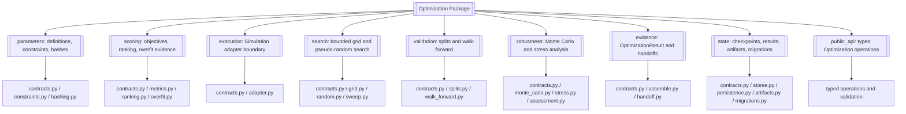
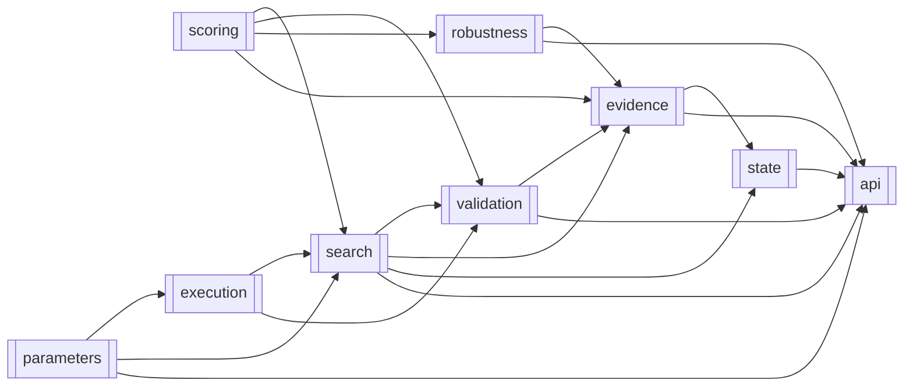
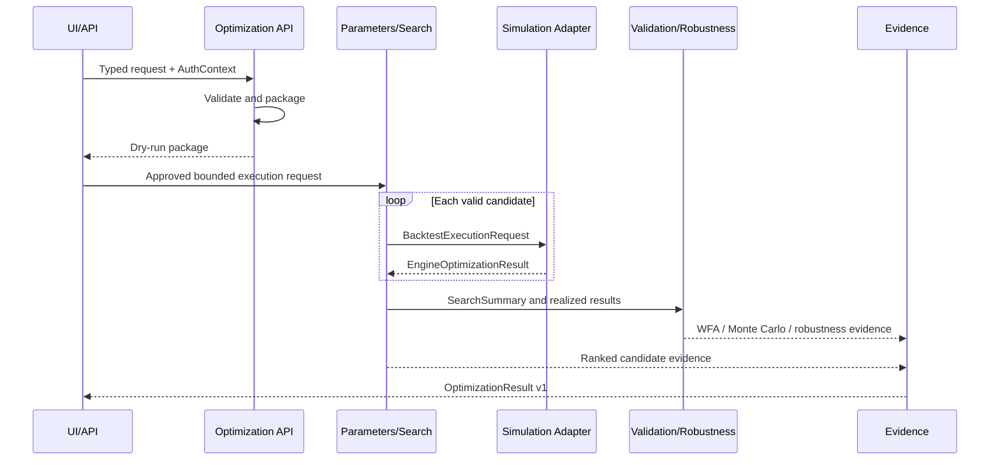

# Optimization

> **Package:** `app/services/optimization`
> **Status:** `Completed`
> **Last updated:** `2026-07-13`

> This README is the package's **single source of truth** for requirements, final structure, implementation sequence, progress, usage examples, and tests.
> Update this file before changing the code.

---

## 1. Purpose and Boundary

### Purpose

Optimization orchestrates bounded, reproducible searches over approved strategy parameter spaces by using Simulation for candidate execution and Analytics for externally owned performance evidence. It validates parameter spaces, generates candidates, scores and ranks results, performs leakage-aware walk-forward and robustness analysis, and produces advisory `OptimizationResult` evidence. It never places trades, promotes strategies, or treats optimization success as live-trading approval.

### Owns

- Validated parameter definitions, conditional activation, safe constraints, and canonical provenance hashes.
- Bounded lazy grid search and seeded pseudo-random search orchestration.
- Candidate Cartesian expansion belongs to Optimization and is implemented lazily under approved caps; Optimization must not import a parameter-combination helper from Utils.
- The optimization-internal, versioned backtest adapter port (`BacktestExecutionAdapter`); it is not a cross-domain contract. Simulation supplies its production implementation, which submits the Simulation-owned `SimulationBacktestRequestV1` and returns `SimulationResult v1`.
- Core optimization scoring, deterministic ranking, Deflated Sharpe Ratio evidence, and baseline overfit warnings.
- Rolling and anchored/expanding time-series splits, purge/embargo evidence, and one walk-forward workflow.
- Trade-sequence Monte Carlo, parametric simulation, execution-cost stress calculations, and robustness summaries.
- Versioned `OptimizationResult` evidence, chart-ready data, and report packages.
- Optimization-owned checkpoint/result tables, artifact schemas, store contracts, and migration definitions executed through approved Data infrastructure.
- A narrow typed public API over bounded search, validation, robustness, and evidence capabilities.

### Does not own

- Strategy design, signal logic, parameter-schema registration, lifecycle promotion, or automatic parameter mutation; Strategy owns these.
- Market-data acquisition, normalization, provider access, or market-data quality truth; Data owns these.
- Backtest execution, simulated fills, or `SimulationResult`; Simulation owns these.
- General performance metric contracts or `PerformanceReport`; Analytics owns these.
- Risk approval, portfolio construction/allocation, portfolio risk budgets, capacity calculation, prop-firm policy, kill-switch policy, or live readiness. Portfolio owns initial fixed/equal/inverse-volatility construction; Risk owns authoritative budgets.
- Order creation, broker access, execution, reconciliation, or broker credentials.
- API transport, authentication, UI rendering, chart rendering, or WebSocket behavior.
- Shared database connections, locking, or migration execution; Data owns that infrastructure.
- Background scheduling, parallel/distributed orchestration, pruning, cancellation, or repository-backed run lifecycle in the initial implementation.
- Bayesian, genetic, Sobol, Latin Hypercube, Optuna, scikit-optimize, CPCV, PBO, topology, or specialized scenario execution in the initial implementation.
- Arbitrary strategy-file loading, direct report rendering, or claims that a result was persisted when only a request was packaged.

### Shared contracts

Contract definitions match the name, version, and owner recorded in `docs/PROJECT.md`.

**Owned by this domain** — defined authoritatively here:

| Status | Contract | Version | Counterparty | Purpose |
|---|---|---|---|---|
| Completed | `OptimizationResult` | `v1` | Produced for `UI/API` | Advisory result containing `search_id`, `reproducibility_hash`, deterministically ranked candidates, diagnostics, warnings, chart-ready data, audit references, and a canonical final decision. Invalid or unbounded input is rejected before search; incomplete evidence is labeled rather than presented as live-ready. |

**Consumed from other domains** — referenced only, never redefined:

| Contract | Version | Owner | Used for |
|---|---|---|---|
| `MarketDataset` | `v1` | Data | Validated historical input and provenance for optimization and walk-forward requests. |
| `SimulationResult` | `v1` | Simulation | Deterministic per-candidate execution outcomes supplied through the adapter. |
| `PerformanceReport` | `v1` | Analytics | Externally owned metrics and caveats used when scoring or assembling evidence. |
| `AuthContext` | `v1` | Utils | Authenticated principal, request, correlation, and trace context at governed boundaries. |
| `AuditEvent` common envelope | `v1` | Utils | Redacted optimization audit events persisted through Data. |

Strategy registry references and parameter schemas are consumed through Strategy's documented public API; Optimization must not copy or mutate Strategy-owned registry state.

### Persisted state

The top-level data-ownership table assigns optimization checkpoints and results to Optimization. The `state/` module owns the `optimization_results` and `optimization_checkpoints` logical tables, additive migration definitions, injected store contract, and deterministic artifact paths under `${DATA_DIR}/optimization/results/<search_id>/` and `${DATA_DIR}/optimization/checkpoints/<search_id>/`. Data supplies connection, locking, transaction, and migration-execution infrastructure without owning these records.

| Status | State / Store | Read access (via contract) | Migration definitions |
|---|---|---|---|
| Completed | Optimization results and ranked-candidate evidence | `UI/API` through `OptimizationResult v1` | `app/services/optimization/state/migrations.py` |
| Completed | Optimization checkpoints and reproducibility artifacts | Optimization only until a versioned public result is complete | `app/services/optimization/state/migrations.py` |

No caller writes either store directly. A public operation that produces durable search state uses an injected Optimization-owned `OptimizationStateStore` and returns persistence success only after the store confirms the atomic write.

### Four-level structure

| Code level | Represents |
|---|---|
| **Package** | Optimization domain |
| **Module folder** | One approved optimization capability |
| **File** | One use case or focused responsibility |
| **Class / function / method** | Observable functional requirement behavior |

```text
Package
└── Module folder
    └── File
        └── Class / Function / Method
```

### Package capability map



---

## 2. Final Package Structure

Folders and files are ordered from lowest dependency to highest dependency; this is also the implementation sequence.

### Feature Registry

The feature ordinals follow the required numbered usage programs. Detailed
signatures, contracts, failure behavior, and requirement evidence are defined
once in the referenced Section 4 specifications.

| Status | Feature | Owning module | Public API and contracts | Requirements | Usage evidence |
|---|---|---|---|---|---|
| Completed | `FEAT-OPT-01` Parameter Space and Provenance | `parameters/` | Exact declarations: Section 4.1 | Section 4.1 functional requirements | `tests/optimization/usage/01_parameters.py` |
| Completed | `FEAT-OPT-02` Objectives, Ranking, and Overfit Evidence | `scoring/` | Exact declarations: Section 4.2 | Section 4.2 functional requirements | `tests/optimization/usage/02_scoring.py` |
| Completed | `FEAT-OPT-03` Bounded Candidate Search | `search/` | Exact declarations: Section 4.4 | Section 4.4 functional requirements | `tests/optimization/usage/03_search.py` |
| Completed | `FEAT-OPT-04` Simulation Execution Boundary | `execution/` | Exact declarations and execution contracts: Section 4.3 | Section 4.3 functional requirements | `tests/optimization/usage/04_execution.py` |
| Completed | `FEAT-OPT-05` Monte Carlo and Stress Analysis | `robustness/` | Exact declarations: Section 4.6 | Section 4.6 functional requirements | `tests/optimization/usage/05_robustness.py` |
| Completed | `FEAT-OPT-06` Optimization-Owned Durable State | `state/` | Exact declarations and state contracts: Section 4.8 | Section 4.8 functional requirements | `tests/optimization/usage/06_state.py` |
| Completed | `FEAT-OPT-07` Versioned Results and Handoffs | `evidence/` | Exact declarations and evidence contracts: Section 4.7 | Section 4.7 functional requirements | `tests/optimization/usage/07_evidence.py` |
| Completed | `FEAT-OPT-08` Time-Series Validation | `validation/` | Exact declarations: Section 4.5 | Section 4.5 functional requirements | `tests/optimization/usage/08_validation.py` |
| Completed | `FEAT-OPT-09` Typed Optimization Boundary | `public_api/` | Exact declarations and package API: Section 4.9 | Section 4.9 functional requirements | `tests/optimization/usage/09_public_api.py` |

```text
optimization/
├── __init__.py                         # Approved domain-level public API only
├── README.md
├── errors.py                           # Controlled domain failures
├── parameters/                         # Feature: parameter space and provenance
│   ├── __init__.py
│   ├── contracts.py
│   ├── constraints.py
│   └── hashing.py
├── scoring/                            # Feature: objectives, ranking, overfit evidence
│   ├── __init__.py
│   ├── contracts.py
│   ├── metrics.py
│   ├── ranking.py
│   └── overfit.py
├── execution/                          # Feature: Simulation execution boundary
│   ├── __init__.py
│   ├── contracts.py
│   └── adapter.py
├── search/                             # Feature: bounded candidate search
│   ├── __init__.py
│   ├── contracts.py
│   ├── grid.py
│   ├── random.py
│   └── sweep.py
├── validation/                         # Feature: time-series validation
│   ├── __init__.py
│   ├── contracts.py
│   ├── splits.py
│   └── walk_forward.py
├── robustness/                         # Feature: Monte Carlo and stress analysis
│   ├── __init__.py
│   ├── contracts.py
│   ├── monte_carlo.py
│   ├── stress.py
│   └── assessment.py
├── evidence/                           # Feature: result, report, and handoff evidence
│   ├── __init__.py
│   ├── contracts.py
│   ├── assemble.py
│   └── handoff.py
├── state/                              # Feature: Optimization-owned durable state
│   ├── __init__.py
│   ├── contracts.py
│   ├── stores.py
│   ├── persistence.py
│   ├── artifacts.py
│   └── migrations.py
└── public_api/                         # Feature: typed Optimization operations
    ├── __init__.py
    ├── contracts.py
    ├── operations.py
    └── validation.py
```

Task managers, parallel executors, and algorithm-specific folders are absent from the architecture. Persistence is limited to the typed `state/` capability and injected Data infrastructure.

### Module dependency diagram



### Structure rules

- No module imports `api/`; `api/` is the highest dependency and only delegates downward.
- Public feature contracts are colocated with their capability; no monolithic `models.py` or generic `helpers.py` exists.
- Search engines are internal domain capabilities reached through typed public operations.
- Optional optimizer, sampler, dataframe, broker, database, and provider objects cannot cross the public boundary.
- Every `__init__.py` uses explicit imports and `__all__`; lazy attribute resolution and compatibility magic are prohibited.
- Compatibility aliases are prohibited in the initial package; the caller audit found no production caller.

---

## 3. Workflows

### Status values

| Status | Meaning |
|---|---|
| **Missing** | Not implemented or not verified |
| **Partial** | Useful V1 behavior exists, but final contracts, structure, validation, or tests are incomplete |
| **Completed** | Final behavior is implemented, tested, and verified |

### Workflow scope values

| Scope | Meaning |
|---|---|
| **Internal** | The complete workflow occurs inside Optimization. |
| **Cross-domain** | Optimization receives input from or returns output to another domain. |

| Status | Workflow ID | Scope | Workflow | Trigger / Input boundary | Final outcome / Output boundary | Requirement sequence |
|---|---|---|---|---|---|---|
| Completed | `WF-OPT-001` | Cross-domain | Run an optimization or robustness request | UI/API typed request plus `AuthContext` | `OptimizationResult v1` or `OptimizationError` | `FR-OPT-021 → FR-OPT-024 → FR-OPT-044` |
| Completed | `WF-OPT-002` | Cross-domain | Execute a bounded parameter sweep | Approved `SearchRequest`, Strategy reference, Data provenance, and Simulation adapter | `SearchSummary` and candidate evidence; no trade authority | `FR-OPT-003 → FR-OPT-025 → FR-OPT-026 → FR-OPT-020 → FR-OPT-027` |
| Completed | `WF-OPT-003` | Internal | Score, rank, and assess overfit evidence | Supplied candidate/trade evidence | Deterministically ranked candidates with DSR and caveats | `FR-OPT-010 → FR-OPT-011 → FR-OPT-012 → FR-OPT-013 → FR-OPT-015` |
| Completed | `WF-OPT-004` | Cross-domain | Run walk-forward validation | Approved `WalkForwardRequest` and Simulation adapter | Fold, degradation, WFE, purge, and embargo evidence | `FR-OPT-032 → FR-OPT-027 → FR-OPT-020 → FR-OPT-033` |
| Completed | `WF-OPT-005` | Internal | Run Monte Carlo and robustness analysis | Supplied realized results and deterministic seed | Monte Carlo distributions, stress results, ruin evidence, and caveats | `FR-OPT-038 → FR-OPT-039 → FR-OPT-040 → FR-OPT-042 → FR-OPT-043` |
| Completed | `WF-OPT-006` | Cross-domain | Build and persist versioned evidence and handoffs | Completed or explicitly incomplete search/WFA/robustness evidence | Durable `OptimizationResult v1` and report package for downstream review | `FR-OPT-047 → FR-OPT-048 → FR-OPT-053 → FR-OPT-049` |

### `WF-OPT-001` — Package an Optimization or Robustness Request

**Scope:** `Cross-domain`

**System workflow:** `SYS-WF-003`

**Input boundary:** UI/API or an approved internal caller supplies typed request data and `AuthContext`.

**Output boundary:** Optimization returns its typed result or `OptimizationError`; no trade occurs.

The result is advisory. UI/API may present it for explicit user selection and, after
approval, construct the Strategy-owned `StrategyParameterUpdateRequest`. Strategy alone
validates and persists the new immutable configuration. Optimization never submits the
request or mutates Strategy state.

1. `validate_optimization_request()` validates shape, bounds, provenance, and supported capability.
2. The applicable public operation separates context fields from business data and defaults omitted `dry_run` to `True`.
3. The operation serializes a deterministic package and performs no external or trading side effect.

**Failure behaviour:** Invalid input, non-JSON-safe data, missing approved limits, or unsupported behavior returns a structured `OPT_*` error; no exception crosses the public boundary.

**Integration test:**

`tests/optimization/integration/test_request_packaging.py::test_request_packaging_has_no_side_effects()`

### `WF-OPT-002` — Execute a Bounded Parameter Sweep

**Scope:** `Cross-domain`

**System workflow:** `SYS-WF-003`

**Input boundary:** An approved execution caller supplies a bounded `SearchRequest`, Strategy registry reference, Data provenance, and Simulation-owned adapter.

**Output boundary:** Optimization returns `SearchSummary`; Simulation retains ownership of execution and `SimulationResult`.

1. `validate_parameter_space()` rejects invalid, cyclic, unsafe, unbounded, or oversized spaces.
2. `iter_grid_candidates()` or `sample_random_candidates()` yields executable candidates without materializing an unbounded product.
3. Constraint failures are recorded and never sent to Simulation.
4. `execute_candidate()` calls only the version-compatible adapter.
5. `run_bounded_search()` scores, deduplicates, ranks, and returns deterministic evidence.

**Failure behaviour:** Missing limits or adapter incompatibility blocks the workflow; a candidate failure is recorded without being converted to score zero; leakage or resource-cap failure aborts fail-closed.

**Integration test:**

`tests/optimization/integration/test_bounded_sweep.py::test_bounded_sweep_uses_simulation_adapter()`

### `WF-OPT-003` — Score, Rank, and Assess Overfit Evidence

**Scope:** `Internal`

**System workflow:** `None`

**Input boundary:** Internal supplied candidate outcomes and Analytics-owned metric evidence.

**Output boundary:** Internal typed scores, deterministic ranking, DSR/trial evidence, and explicit caveats.

1. `calculate_candidate_score()` evaluates only an enabled objective.
2. `calculate_deflated_sharpe()` and `count_nominal_trials()` produce baseline multiple-testing evidence when inputs are sufficient.
3. `rank_candidates()` resolves ties by score descending, present trade count descending, then candidate hash ascending.
4. `assess_overfit_evidence()` labels IS/OOS degradation and independence limitations without declaring live readiness.

**Failure behaviour:** Missing, non-finite, or insufficient evidence produces an explicit unavailable result or validation error; another objective is never substituted silently.

**Integration test:**

`tests/optimization/integration/test_scoring_workflow.py::test_scoring_ranking_and_overfit_evidence()`

### `WF-OPT-004` — Run Walk-Forward Validation

**Scope:** `Cross-domain`

**System workflow:** `SYS-WF-003`

**Input boundary:** An approved `WalkForwardRequest` and Simulation adapter.

**Output boundary:** Optimization returns fold-level and aggregate walk-forward evidence.

1. `build_time_series_splits()` creates rolling or anchored/expanding folds with UTC boundaries.
2. Effective embargo is at least the supplied average trade duration when that duration is valid.
3. `run_bounded_search()` selects train-window candidates and `execute_candidate()` evaluates them out of sample.
4. `run_walk_forward_validation()` emits fold pass rate, parameter drift, OOS retention, WFE, and leakage-prevention evidence.

**Failure behaviour:** Invalid/overlapping windows, insufficient data, missing embargo provenance, or adapter failure returns a structured failure; folds are not replaced with zero scores.

**Integration test:**

`tests/optimization/integration/test_walk_forward.py::test_walk_forward_enforces_purge_and_embargo()`

### `WF-OPT-005` — Run Monte Carlo and Robustness Analysis

**Scope:** `Internal`

**System workflow:** `None`

**Input boundary:** Supplied realized outcomes or validated parametric inputs and deterministic seed.

**Output boundary:** Monte Carlo and robustness evidence; no broker or Simulation call.

1. `run_monte_carlo()` performs shuffle, empirical resample, or block-bootstrap analysis with deterministic sub-seeds.
2. `calculate_probability_of_ruin()` and `calculate_confidence_intervals()` summarize distributions.
3. `apply_execution_cost_stress()` applies explicit spread, slippage, or commission assumptions.
4. `assess_strategy_robustness()` combines applicable evidence and caveats without claiming certainty.

**Failure behaviour:** Empty inputs, invalid counts, non-finite values, missing seed, or exceeded simulation caps fail before work begins; malformed outcomes never disappear silently.

**Integration test:**

`tests/optimization/integration/test_robustness.py::test_seeded_robustness_is_reproducible()`

### `WF-OPT-006` — Build Versioned Evidence and Handoffs

**Scope:** `Cross-domain`

**System workflow:** `SYS-WF-003`

**Input boundary:** Optimization-owned results plus optional evidence explicitly supplied by owning domains.

**Output boundary:** Durably recorded `OptimizationResult v1` plus a chart-ready report package; UI/API decides, renders, or submits downstream commands.

1. `build_optimization_evidence()` assembles provenance, ranked candidates, diagnostics, warnings, and audit references without recomputation.
2. `build_report_package()` returns chart-ready series/tables without rendering.
3. `persist_optimization_result()` atomically records the result and ranked-candidate evidence through the injected Optimization store.
4. `build_optimization_handoff()` returns the typed advisory `OptimizationResult v1` without trade or Strategy-mutation authority.

**Failure behaviour:** Missing required provenance yields `validation_needed`, `research_only`, or a structured failure; Optimization never creates a Strategy update or live approval.

**Integration test:**

`tests/optimization/integration/test_evidence_handoff.py::test_evidence_handoff_preserves_domain_ownership()`

#### End-to-end workflow diagram



---

## 4. Module and Requirement Specifications

This section is the implementation plan. Status reflects V1 evidence against the final structure and contracts, not similarly named legacy symbols.

### 4.0 `errors.py` — Controlled Domain Failures

#### Files

| Status | File | Responsibility | Key exports | Dependencies |
|---|---|---|---|---|
| Completed | `errors.py` | Define cataloged, redacted Optimization failures | `OptimizationError` | **Standard library:** `collections.abc`, `types`<br>**Required third-party:** None<br>**Local:** `app.utils → HaruQuantError, logger, redact_mapping_value` |

#### Functional requirements

| Status | Requirement ID | Responsibility | Class / Function / Method | Side Effects | Raises | Usage / Test |
|---|---|---|---|---|---|---|
| Completed | `FR-OPT-016` | The system shall expose one domain exception carrying a cataloged deterministic `OPT_*` code, symbolic safe detail, and redacted JSON-safe details. | `OptimizationError(code: str, detail: str = "UNSPECIFIED", *, safe_details: Mapping[str, object] | None = None) -> OptimizationError` | None | `ValueError`: code/detail is invalid; `TypeError`: details cannot be represented as a mapping | **Usage:** `tests/optimization/usage/04_execution.py`<br>**Unit:** `tests/optimization/unit/test_errors.py::test_optimization_error_builds_redacted_payload()` |

---

### 4.1 `parameters/` — Parameter Space and Provenance

**Purpose:** Define bounded parameter spaces, safely evaluate constraints, select executable conditional parameters, and produce canonical hashes.

**Module flow:**

```text
parameter definitions → validation/constraints → executable parameters → provenance hashes
```

#### Files

| Status | File | Responsibility | Key exports | Dependencies |
|---|---|---|---|---|
| Completed | `contracts.py` | Typed parameter range and space contracts | `ParameterRange`, `ParameterSpace` | **Standard library:** `decimal`, `typing`<br>**Required third-party:** `pydantic>=2.13.4`<br>**Local:** None |
| Completed | `constraints.py` | Validate spaces and evaluate approved constraint expressions | `validate_parameter_space`, `evaluate_constraints`, `get_executable_parameters` | **Standard library:** `ast`, `collections.abc`, `decimal`<br>**Required third-party:** None<br>**Local:** `contracts.py → ParameterRange, ParameterSpace` |
| Completed | `hashing.py` | Canonical parameter-space and candidate provenance hashes | `parameter_space_hash`, `candidate_hash` | **Standard library:** `decimal`, `hashlib`<br>**Required third-party:** None<br>**Local:** `app.utils.standard → canonical_json`; `contracts.py → ParameterSpace`; `constraints.py → get_executable_parameters` |
| Completed | `__init__.py` | Expose the supported public parameter API | All exports above | **Standard library:** None<br>**Required third-party:** None<br>**Local:** Explicit imports from module files |

#### Configuration and Limits Manifest

| Status | Setting / Limit | Type | Default | Required | Used by | Description |
|---|---|---|---|---|---|---|
| Completed | `hash_decimal_places` | `int` | `8` | Yes | `parameter_space_hash()`, `candidate_hash()` | Decimal normalization precision; invalid precision rejects hashing. |
| Completed | `max_parameter_space_expansion` | `int` | `50000` | Yes for execution | `validate_parameter_space()` | Maximum possible lazy expansion; exceeded value blocks execution. |
| Completed | `max_constraint_count` | `int` | `20` | Yes for execution | `validate_parameter_space()` | Bounds constraint evaluation; exceeded value blocks execution. |

#### `contracts.py` — Parameter Contracts

| Status | Requirement ID | Responsibility | Class / Function / Method | Side Effects | Raises | Usage / Test |
|---|---|---|---|---|---|---|
| Completed | `FR-OPT-001` | The system shall model one float, integer, categorical, boolean, or fixed parameter with validated bounds, step/options, and an optional orthogonal activation condition; `conditional` is not a separate value kind. | `ParameterRange(name: str, kind: ParameterKind, *, minimum: Decimal | None = None, maximum: Decimal | None = None, step: Decimal | None = None, choices: tuple[ParameterValue, ...] = (), fixed_value: ParameterValue | None = None, active_when: str | None = None) -> ParameterRange` | None | `pydantic.ValidationError`: definition is incomplete, contradictory, non-finite, or has invalid bounds/step/options | **Usage:** `tests/optimization/usage/01_parameters.py`<br>**Unit:** `tests/optimization/unit/test_parameter_contracts.py::test_parameter_range_rejects_invalid_bounds()` |
| Completed | `FR-OPT-002` | The system shall model a uniquely named collection of parameter ranges and constraints without accepting an empty or duplicate definition. | `ParameterSpace(parameters: tuple[ParameterRange, ...], constraints: tuple[str, ...] = ()) -> ParameterSpace` | None | `pydantic.ValidationError`: parameters are empty, duplicate, or structurally invalid | **Usage:** `tests/optimization/usage/01_parameters.py`<br>**Unit:** `tests/optimization/unit/test_parameter_contracts.py::test_parameter_space_rejects_duplicate_names()` |

#### `constraints.py` — Validation and Constraints

| Status | Requirement ID | Responsibility | Class / Function / Method | Side Effects | Raises | Usage / Test |
|---|---|---|---|---|---|---|
| Completed | `FR-OPT-003` | The system shall validate parameter types, conditional cycles, constraints, expansion bounds, and configured limits before candidate generation. | `validate_parameter_space(space: ParameterSpace, *, max_expansion: int, max_constraints: int) -> None` | None | `ValueError`: space is invalid, cyclic, unsafe, unbounded, or exceeds a configured limit | **Usage:** `tests/optimization/usage/01_parameters.py`<br>**Unit:** `tests/optimization/unit/test_constraints.py::test_validate_parameter_space_fails_closed()` |
| Completed | `FR-OPT-004` | The system shall evaluate only allowlisted expression nodes and names, returning false for a valid violated constraint and blocking unsafe expressions. | `evaluate_constraints(parameters: Mapping[str, object], constraints: Sequence[str]) -> bool` | None | `ValueError`: expression contains unsafe syntax, unknown names, calls, attributes, or invalid operations | **Usage:** `tests/optimization/usage/01_parameters.py`<br>**Unit:** `tests/optimization/unit/test_constraints.py::test_evaluate_constraints_blocks_unsafe_ast()` |
| Completed | `FR-OPT-005` | The system shall exclude inactive conditional parameters from execution while retaining the original definition for metadata and audit evidence. | `get_executable_parameters(parameters: Mapping[str, object], space: ParameterSpace) -> dict[str, object]` | None | `ValueError`: a condition is cyclic, ambiguous, or references an unknown parameter | **Usage:** `tests/optimization/usage/01_parameters.py`<br>**Unit:** `tests/optimization/unit/test_constraints.py::test_get_executable_parameters_excludes_inactive_values()` |

#### `hashing.py` — Provenance Hashes

| Status | Requirement ID | Responsibility | Class / Function / Method | Side Effects | Raises | Usage / Test |
|---|---|---|---|---|---|---|
| Completed | `FR-OPT-006` | The system shall compute an order-invariant SHA-256 parameter-space hash from canonical definitions and constraints using normalized decimals. | `parameter_space_hash(space: ParameterSpace, *, decimal_places: int = 8) -> str` | None | `ValueError`: space or precision cannot be canonically represented | **Usage:** `tests/optimization/usage/01_parameters.py`<br>**Unit:** `tests/optimization/unit/test_hashing.py::test_parameter_space_hash_is_order_invariant()` |
| Completed | `FR-OPT-007` | The system shall compute the candidate source-of-truth hash from strategy/data/cost/realism/objective/engine/module/space provenance and executable parameters only. | `candidate_hash(*, strategy_hash: str, data_hash: str, cost_model_hash: str, realism_hash: str, objective_hash: str, engine_type: str, engine_version: str, module_version: str, space_hash: str, executable_parameters: Mapping[str, object], decimal_places: int = 8) -> str` | None | `ValueError`: required provenance is blank or data is not canonicalizable | **Usage:** `tests/optimization/usage/01_parameters.py`<br>**Unit:** `tests/optimization/unit/test_hashing.py::test_candidate_hash_excludes_inactive_parameters()` |

**Rules and implementation notes:**

- Reuse V1 validation, AST allowlisting, conditional filtering, and hashing behavior, but remove generic helper placement.
- No `eval()` over unrestricted syntax, non-finite decimal, hidden fallback, or provider object is permitted.
- Hash changes invalidate candidate reuse; canonical JSON is owned by Utils and must be consumed rather than reimplemented.

**Feature usage examples:** `tests/optimization/usage/01_parameters.py` contains one `test_usage_*` function per requirement above.

---

### 4.2 `scoring/` — Objectives, Ranking, and Overfit Evidence

**Purpose:** Calculate approved optimization scores, deterministic ranking, Pareto evidence, and baseline multiple-testing/overfit diagnostics.

**Module flow:**

```text
candidate outcomes → objective score → DSR/trial evidence → deterministic ranking → overfit caveats
```

#### Files

| Status | File | Responsibility | Key exports | Dependencies |
|---|---|---|---|---|
| Completed | `contracts.py` | Typed objective and score evidence | `ObjectiveName`, `CandidateScore` | **Standard library:** `enum`, `typing`<br>**Required third-party:** `pydantic>=2.13.4`<br>**Local:** None |
| Completed | `metrics.py` | Calculate approved objectives and DSR evidence | `calculate_candidate_score`, `calculate_deflated_sharpe`, `count_nominal_trials` | **Standard library:** `math`, `statistics`, `collections.abc`<br>**Required third-party:** None<br>**Local:** `contracts.py → ObjectiveName, CandidateScore` |
| Completed | `ranking.py` | Deterministically rank candidates and select a Pareto front | `rank_candidates`, `select_pareto_candidates` | **Standard library:** `collections.abc`<br>**Required third-party:** None<br>**Local:** `contracts.py → CandidateScore` |
| Completed | `overfit.py` | Build IS/OOS, trial-independence, and evidence-adequacy diagnostics | `assess_overfit_evidence` | **Standard library:** `collections.abc`<br>**Required third-party:** None<br>**Local:** `contracts.py → CandidateScore`; `metrics.py → calculate_deflated_sharpe, count_nominal_trials` |
| Completed | `__init__.py` | Expose the supported public scoring API | All exports above | **Standard library:** None<br>**Required third-party:** None<br>**Local:** Explicit imports from module files |

#### Configuration and Limits Manifest

| Status | Setting / Limit | Type | Default | Required | Used by | Description |
|---|---|---|---|---|---|---|
| Completed | `objective_whitelist` | `frozenset[ObjectiveName]` | Explicit caller-supplied subset of `net_pnl`, `profit_factor`, `sharpe_ratio`, `sortino_ratio`, `calmar_ratio`, `max_drawdown` | Yes for execution | `calculate_candidate_score()` | Names match Analytics `PerformanceReport` metric keys exactly; unknown objectives block scoring. |
| Completed | `minimum_trade_count` | `int` | `30` | Yes for gate decisions | `assess_overfit_evidence()` | Evidence below the limit is labeled insufficient, never silently accepted. |

#### `contracts.py` — Score Contracts

| Status | Requirement ID | Responsibility | Class / Function / Method | Side Effects | Raises | Usage / Test |
|---|---|---|---|---|---|---|
| Completed | `FR-OPT-008` | The system shall enumerate the Analytics-aligned metric keys `net_pnl`, `profit_factor`, `sharpe_ratio`, `sortino_ratio`, `calmar_ratio`, and `max_drawdown`; production enablement remains caller-controlled by the whitelist. | `ObjectiveName: type[StrEnum]` | None | None | **Usage:** `tests/optimization/usage/02_scoring.py`<br>**Unit:** `tests/optimization/unit/test_scoring_contracts.py::test_objective_name_values_are_canonical()` |
| Completed | `FR-OPT-009` | The system shall represent a candidate score with availability, raw value, objective, trade count, metric evidence, and caveats without substituting another metric. | `CandidateScore(candidate_hash: str, objective: ObjectiveName, value: float | None, available: bool, trade_count: int | None, metrics: Mapping[str, float | None], caveats: tuple[str, ...]) -> CandidateScore` | None | `pydantic.ValidationError`: score is non-finite or fields are inconsistent | **Usage:** `tests/optimization/usage/02_scoring.py`<br>**Unit:** `tests/optimization/unit/test_scoring_contracts.py::test_candidate_score_rejects_non_finite_value()` |

#### `metrics.py` — Objectives and Trial Evidence

| Status | Requirement ID | Responsibility | Class / Function / Method | Side Effects | Raises | Usage / Test |
|---|---|---|---|---|---|---|
| Completed | `FR-OPT-010` | The system shall project the selected enabled core objective from an Analytics-owned `PerformanceReport` and return explicit unavailable evidence when inputs are insufficient, without recalculating Analytics metrics. | `calculate_candidate_score(report: PerformanceReport, *, candidate_hash: str, objective: ObjectiveName, enabled_objectives: frozenset[ObjectiveName]) -> CandidateScore` | None | `ValueError`: report evidence, candidate identity, or objective policy is invalid | **Usage:** `tests/optimization/usage/02_scoring.py`<br>**Unit:** `tests/optimization/unit/test_metrics.py::test_calculate_candidate_score_rejects_unknown_objective()` |
| Completed | `FR-OPT-011` | The system shall calculate Deflated Sharpe evidence only from validated Sharpe, sample moments, sample count, and nominal-trial evidence. | `calculate_deflated_sharpe(*, sharpe: float, variance: float, skewness: float, kurtosis: float, sample_count: int, nominal_trials: int) -> float | None` | None | `ValueError`: input is non-finite, outside its valid domain, or contradictory | **Usage:** `tests/optimization/usage/02_scoring.py`<br>**Unit:** `tests/optimization/unit/test_metrics.py::test_calculate_deflated_sharpe_handles_insufficient_data()` |
| Completed | `FR-OPT-012` | The system shall count unique executable candidate hashes after constraint rejection and deduplication and label the count nominal rather than independent. | `count_nominal_trials(candidate_hashes: Sequence[str]) -> int` | None | `ValueError`: a candidate hash is blank or malformed | **Usage:** `tests/optimization/usage/02_scoring.py`<br>**Unit:** `tests/optimization/unit/test_metrics.py::test_count_nominal_trials_deduplicates_hashes()` |

#### `ranking.py` — Deterministic Selection

| Status | Requirement ID | Responsibility | Class / Function / Method | Side Effects | Raises | Usage / Test |
|---|---|---|---|---|---|---|
| Completed | `FR-OPT-013` | The system shall rank candidates by explicit objective direction, then present trade count descending and candidate hash ascending, without mutating input records. | `rank_candidates(candidates: Sequence[CandidateScore]) -> tuple[CandidateScore, ...]` | None | `ValueError`: a required candidate hash, direction, or available score is invalid | **Usage:** `tests/optimization/usage/02_scoring.py`<br>**Unit:** `tests/optimization/unit/test_ranking.py::test_rank_candidates_uses_canonical_tie_breakers()` |
| Completed | `FR-OPT-014` | The system shall return a deterministic non-dominated candidate set for explicitly supplied objectives without choosing an unapproved knee point. | `select_pareto_candidates(candidates: Sequence[Mapping[str, float]], objectives: Sequence[str]) -> tuple[int, ...]` | None | `ValueError`: objectives are empty, missing, or non-finite | **Usage:** `tests/optimization/usage/02_scoring.py`<br>**Unit:** `tests/optimization/unit/test_ranking.py::test_select_pareto_candidates_is_deterministic()` |

#### `overfit.py` — Overfit Evidence

| Status | Requirement ID | Responsibility | Class / Function / Method | Side Effects | Raises | Usage / Test |
|---|---|---|---|---|---|---|
| Completed | `FR-OPT-015` | The system shall assess IS/OOS degradation, DSR availability, nominal-trial caveats, trade-count adequacy, and cost/MC evidence; PBO and topology gates are not part of the design. | `assess_overfit_evidence(*, in_sample: CandidateScore, out_of_sample: CandidateScore, nominal_trials: int, deflated_sharpe: float | None, minimum_trade_count: int, extra_evidence: Mapping[str, object] | None = None) -> dict[str, object]` | None | `ValueError`: scores, threshold, or trial evidence is missing or contradictory | **Usage:** `tests/optimization/usage/02_scoring.py`<br>**Unit:** `tests/optimization/unit/test_overfit.py::test_assess_overfit_evidence_reports_insufficient_data()` |

**Rules and implementation notes:**

- Reuse validated V1 metric, DSR, ranking, and Pareto concepts; remove unknown-objective fallback and invalid timestamp substitution.
- Analytics-owned metrics may be consumed as evidence but are not recalculated or redefined here.
- Hard-coded composite weights, PBO thresholds, effective-trial estimation, topology gates, and production signoff are excluded.

**Feature usage examples:** `tests/optimization/usage/02_scoring.py`.

---

### 4.3 `execution/` — Simulation Adapter Boundary

**Purpose:** Define and enforce the sole versioned boundary through which Optimization requests deterministic candidate execution from Simulation.

**Module flow:**

```text
validated candidate + provenance → adapter compatibility checks → Simulation-owned execution → optimization-facing result
```

#### Files

| Status | File | Responsibility | Key exports | Dependencies |
|---|---|---|---|---|
| Completed | `contracts.py` | Versioned adapter, immutable execution context/request, and Analytics-bearing result contracts | `BacktestExecutionContext`, `BacktestExecutionAdapter`, `BacktestExecutionRequest`, `EngineOptimizationResult` | **Standard library:** `datetime`, `decimal`, `typing`<br>**Required third-party:** `pydantic>=2.13.4`<br>**Local:** `app.services.analytics → PerformanceReport`; `app.services.optimization.parameters → ParameterValue` |
| Completed | `adapter.py` | Validate and invoke the injected adapter for one candidate | `execute_candidate` | **Standard library:** `time`<br>**Required third-party:** None<br>**Local:** `contracts.py → all execution contracts`; `app.services.optimization.parameters → get_executable_parameters, candidate_hash` |
| Completed | `__init__.py` | Expose the supported execution boundary | All exports above | **Standard library:** None<br>**Required third-party:** None<br>**Local:** Explicit imports from module files |

#### Configuration and Limits Manifest

| Status | Setting / Limit | Type | Default | Required | Used by | Description |
|---|---|---|---|---|---|---|
| Completed | `required_backtest_adapter_version` | `str` | `v1` (tracks `SimulationBacktestRequestV1`) | Yes | `execute_candidate()` | Exact compatible adapter port version; missing/mismatch blocks execution before Simulation is called. |
| Completed | `deterministic_only` | `bool` | `True` | Yes | `execute_candidate()` | Blocks stochastic realism with `OPT_NOISY_OBJECTIVE_NOT_ALLOWED` unless a future approved repeated-evaluation policy exists. |

#### `contracts.py` — Execution Contracts

| Status | Requirement ID | Responsibility | Class / Function / Method | Side Effects | Raises | Usage / Test |
|---|---|---|---|---|---|---|
| Completed | `FR-OPT-017` | The system shall define a versioned protocol implemented by the Simulation/Analytics boundary and accepting only an Optimization execution request. | `BacktestExecutionAdapter.execute(request: BacktestExecutionRequest) -> EngineOptimizationResult` | External API call | `OptimizationError`: Simulation cannot execute or convert the request | **Usage:** `tests/optimization/usage/04_execution.py`<br>**Unit:** `tests/optimization/unit/test_execution_contracts.py::test_adapter_protocol_contract()` |
| Completed | `FR-OPT-018` | The system shall model one executable candidate with approved strategy reference, `MarketDataset` reference/provenance, executable parameters, seed, costs, realism, engine identity, and trace context. | `BacktestExecutionRequest(strategy_ref: str, market_data_ref: str, executable_parameters: Mapping[str, object], candidate_hash: str, seed: int, cost_model_hash: str, realism_hash: str, engine_type: str, required_adapter_version: str, request_id: str | None = None) -> BacktestExecutionRequest` | None | `pydantic.ValidationError`: required execution or provenance data is missing/invalid | **Usage:** `tests/optimization/usage/04_execution.py`<br>**Unit:** `tests/optimization/unit/test_execution_contracts.py::test_execution_request_rejects_missing_provenance()` |
| Completed | `FR-OPT-019` | The system shall expose an optimization-facing immutable result converted from `SimulationResult` without leaking simulator internals. | `EngineOptimizationResult(candidate_hash: str, score_inputs: Mapping[str, object], trade_count: int, equity_points: tuple[Decimal, ...], processed_records: int, engine_version: str, realism_hash: str, warnings: tuple[str, ...] = ()) -> EngineOptimizationResult` | None | `pydantic.ValidationError`: result is incomplete, inconsistent, non-finite, or contains provider objects | **Usage:** `tests/optimization/usage/04_execution.py`<br>**Unit:** `tests/optimization/unit/test_execution_contracts.py::test_engine_result_rejects_inconsistent_candidate_hash()` |

#### `adapter.py` — Candidate Execution

| Status | Requirement ID | Responsibility | Class / Function / Method | Side Effects | Raises | Usage / Test |
|---|---|---|---|---|---|---|
| Completed | `FR-OPT-020` | The system shall validate adapter version, engine type, deterministic seed, cost/realism evidence, strategy compatibility, and required data before invoking Simulation once. | `execute_candidate(request: BacktestExecutionRequest, adapter: BacktestExecutionAdapter, *, deterministic_only: bool = True) -> EngineOptimizationResult` | External API call | `OptimizationError`: adapter mismatch, unsupported realism, invalid request, unavailable engine, symbol setup failure, or candidate execution failure | **Usage:** `tests/optimization/usage/04_execution.py`<br>**Unit:** `tests/optimization/unit/test_adapter.py::test_execute_candidate_fails_closed_on_version_mismatch()` |

**Rules and implementation notes:**

- Replace V1 direct imports and hard-coded adapter version; never import a Simulation orchestrator implementation.
- Arbitrary file paths, strategy-class loading, broker objects, and raw Simulation internals are prohibited.
- No broad exception may convert an integration failure into score zero.

**Feature usage examples:** `tests/optimization/usage/04_execution.py` uses a deterministic fake adapter.

---

### 4.4 `search/` — Bounded Candidate Search

**Purpose:** Generate, deduplicate, execute, score, and summarize candidates for lazy grid and seeded pseudo-random searches.

**Module flow:**

```text
SearchRequest → candidate iterator → constraints/hash → adapter execution → score/rank → SearchSummary
```

#### Files

| Status | File | Responsibility | Key exports | Dependencies |
|---|---|---|---|---|
| Completed | `contracts.py` | Search request, candidate result, and summary contracts | `SearchMethod`, `SearchRequest`, `CandidateResult`, `SearchSummary` | **Standard library:** `datetime`, `decimal`, `enum`, `typing`<br>**Required third-party:** `pydantic>=2.13.4`<br>**Local:** `app.services.optimization.parameters → ParameterSpace`; `app.services.optimization.scoring → ObjectiveName, CandidateScore` |
| Completed | `grid.py` | Lazily generate bounded grid candidates | `iter_grid_candidates` | **Standard library:** `itertools`, `collections.abc`<br>**Required third-party:** None<br>**Local:** `contracts.py → SearchRequest`; `app.services.optimization.parameters → validate_parameter_space, evaluate_constraints, get_executable_parameters` |
| Completed | `random.py` | Generate unique deterministic pseudo-random candidates | `sample_random_candidates` | **Standard library:** `random`, `collections.abc`, `decimal`<br>**Required third-party:** None<br>**Local:** `contracts.py → SearchRequest`; `app.services.optimization.parameters → evaluate_constraints, get_executable_parameters` |
| Completed | `sweep.py` | Execute and summarize a bounded sequential search | `run_bounded_search`, `select_top_candidates` | **Standard library:** `time`, `collections.abc`<br>**Required third-party:** None<br>**Local:** `contracts.py → all search contracts`; `app.services.optimization.execution → BacktestExecutionAdapter, execute_candidate`; `app.services.optimization.parameters → candidate_hash`; `app.services.optimization.scoring → calculate_candidate_score, rank_candidates` |
| Completed | `__init__.py` | Expose the supported internal search API | All exports above | **Standard library:** None<br>**Required third-party:** None<br>**Local:** Explicit imports from module files |

#### Configuration and Limits Manifest

| Status | Setting / Limit | Type | Default | Required | Used by | Description |
|---|---|---|---|---|---|---|
| Completed | `max_candidates` | `int` | `5000` evaluated candidates | Yes | `iter_grid_candidates()`, `sample_random_candidates()`, `run_bounded_search()` | Exceeding the limit blocks search. |
| Completed | `max_runtime_seconds` | `float` | `21600` | Yes | `run_bounded_search()` | Exceeding the six-hour cap aborts search with structured evidence. |
| Completed | `enabled_objectives` | `frozenset[ObjectiveName]` | Explicit caller-supplied Analytics-aligned subset | Yes | `run_bounded_search()` | Unknown or disabled objectives are rejected. |
| Completed | `seed` | `int` | No implicit default | Required for random | `sample_random_candidates()` | Required deterministic seed; omission rejects randomized search. |

#### `contracts.py` — Search Contracts

| Status | Requirement ID | Responsibility | Class / Function / Method | Side Effects | Raises | Usage / Test |
|---|---|---|---|---|---|---|
| Completed | `FR-OPT-021` | The system shall support only `grid` and `random` search. | `SearchMethod: type[StrEnum]` | None | None | **Usage:** `tests/optimization/usage/03_search.py`<br>**Unit:** `tests/optimization/unit/test_search_contracts.py::test_search_method_allows_only_grid_and_random()` |
| Completed | `FR-OPT-022` | The system shall model a bounded search with strategy/data provenance, parameter space, objective, method, seed, and approved resource caps. | `SearchRequest(strategy_ref: str, market_data_ref: str, parameter_space: ParameterSpace, objective: ObjectiveName, method: SearchMethod, seed: int | None, max_candidates: int, max_runtime_seconds: float, provenance: Mapping[str, str], request_id: str | None = None) -> SearchRequest` | None | `pydantic.ValidationError`: required field/cap/provenance is missing or invalid | **Usage:** `tests/optimization/usage/03_search.py`<br>**Unit:** `tests/optimization/unit/test_search_contracts.py::test_search_request_requires_seed_for_random()` |
| Completed | `FR-OPT-023` | The system shall represent one accepted, rejected, or failed candidate with executable parameters, hash, score/evidence, and structured reason. | `CandidateResult(candidate_hash: str, executable_parameters: Mapping[str, object], state: str, score: CandidateScore | None, reason_code: str | None = None, evidence: Mapping[str, object] | None = None) -> CandidateResult` | None | `pydantic.ValidationError`: state and score/reason fields are inconsistent | **Usage:** `tests/optimization/usage/03_search.py`<br>**Unit:** `tests/optimization/unit/test_search_contracts.py::test_candidate_result_requires_failure_reason()` |
| Completed | `FR-OPT-024` | The system shall represent a completed bounded search with deterministic candidate order, best candidate, runtime, objective, method, provenance, and warnings. | `SearchSummary(search_id: str, request_hash: str, method: SearchMethod, objective: ObjectiveName, candidates: tuple[CandidateResult, ...], best_candidate_hash: str | None, runtime_ms: float, warnings: tuple[str, ...]) -> SearchSummary` | None | `pydantic.ValidationError`: ordering, best candidate, runtime, or provenance is inconsistent | **Usage:** `tests/optimization/usage/03_search.py`<br>**Unit:** `tests/optimization/unit/test_search_contracts.py::test_search_summary_validates_best_candidate()` |

#### `grid.py`, `random.py`, and `sweep.py` — Search Behavior

| Status | Requirement ID | Responsibility | Class / Function / Method | Side Effects | Raises | Usage / Test |
|---|---|---|---|---|---|---|
| Completed | `FR-OPT-025` | The system shall lazily yield valid grid candidates without materializing the full Cartesian product and shall fail before yielding partial evidence when the valid-candidate cap is exceeded. | `iter_grid_candidates(space: ParameterSpace, *, max_candidates: int, max_expansion: int, max_constraints: int) -> Iterator[dict[str, ParameterValue]]` | None | `ValueError`: space is invalid, yields zero candidates, or exceeds a configured cap | **Usage:** `tests/optimization/usage/03_search.py`<br>**Unit:** `tests/optimization/unit/test_grid.py::test_iter_grid_candidates_is_lazy_and_bounded()` |
| Completed | `FR-OPT-026` | The system shall generate unique pseudo-random candidates deterministically without replacement from validated ranges and a required seed, without claiming Sobol or LHS behavior. | `sample_random_candidates(space: ParameterSpace, *, candidate_count: int, seed: int, max_expansion: int, max_constraints: int) -> tuple[dict[str, ParameterValue], ...]` | Local state mutation | `ValueError`: seed/distribution is invalid, uniqueness cannot satisfy count, or no candidate is valid | **Usage:** `tests/optimization/usage/03_search.py`<br>**Unit:** `tests/optimization/unit/test_random_search.py::test_sample_random_candidates_is_seeded()` |
| Completed | `FR-OPT-027` | The system shall evaluate each unique valid candidate through the injected adapter, retain structured failures, score successful results, checkpoint terminal candidates when requested, and return deterministic ranking within caps. | `run_bounded_search(request: SearchRequest, adapter: BacktestExecutionAdapter, *, deterministic_only: bool = True, checkpoint: CheckpointCallback | None = None) -> SearchSummary` | External API call; optional checkpoint callback | `ValueError`: required policy/cap/objective is missing; `OptimizationError`: adapter workflow cannot proceed | **Usage:** `tests/optimization/usage/03_search.py`<br>**Unit:** `tests/optimization/unit/test_sweep.py::test_run_bounded_search_preserves_failed_candidates()` |
| Completed | `FR-OPT-028` | The system shall return the first N candidates from an already deterministic summary without dataframe conversion or input mutation. | `select_top_candidates(summary: SearchSummary, limit: int) -> tuple[CandidateResult, ...]` | None | `ValueError`: limit is not positive | **Usage:** `tests/optimization/usage/03_search.py`<br>**Unit:** `tests/optimization/unit/test_sweep.py::test_select_top_candidates_preserves_order()` |

**Rules and implementation notes:**

- Reuse V1 lazy grid and seeded pseudo-random generation; remove fake empty-trade dry-run scoring.
- Candidate execution is sequential; parallelism, pruning, task IDs, and background execution are not part of the architecture.
- Candidate failures remain evidence and never disappear or become fabricated performance values.

**Feature usage examples:** `tests/optimization/usage/03_search.py`.

---

### 4.5 `validation/` — Time-Series Splits and Walk-Forward

**Purpose:** Build leakage-aware rolling or anchored/expanding splits and run one canonical walk-forward validation workflow.

**Module flow:**

```text
WalkForwardRequest → UTC folds + purge/embargo → train search → OOS execution → WalkForwardResult
```

#### Files

| Status | File | Responsibility | Key exports | Dependencies |
|---|---|---|---|---|
| Completed | `contracts.py` | Split mode, fold, request, and result contracts | `SplitMode`, `TimeSeriesSplit`, `WalkForwardRequest`, `WalkForwardResult` | **Standard library:** `datetime`, `enum`, `typing`<br>**Required third-party:** `pydantic>=2.13.4`<br>**Local:** `app.services.optimization.search → SearchRequest, SearchSummary` |
| Completed | `splits.py` | Build deterministic rolling or anchored/expanding folds | `build_time_series_splits` | **Standard library:** `datetime`<br>**Required third-party:** None<br>**Local:** `contracts.py → SplitMode, TimeSeriesSplit, WalkForwardRequest` |
| Completed | `walk_forward.py` | Execute the single walk-forward workflow | `run_walk_forward_validation` | **Standard library:** `statistics`<br>**Required third-party:** None<br>**Local:** `contracts.py → WalkForwardRequest, WalkForwardResult`; `splits.py → build_time_series_splits`; `app.services.optimization.execution → BacktestExecutionAdapter, execute_candidate`; `app.services.optimization.search → run_bounded_search`; `app.services.optimization.scoring → assess_overfit_evidence` |
| Completed | `__init__.py` | Expose the supported validation API | All exports above | **Standard library:** None<br>**Required third-party:** None<br>**Local:** Explicit imports from module files |

#### Configuration and Limits Manifest

| Status | Setting / Limit | Type | Default | Required | Used by | Description |
|---|---|---|---|---|---|---|
| Completed | `purge_bars` | `int` | `0` | No | `build_time_series_splits()` | Removes observations adjacent to fold boundaries; negative values reject the request. |
| Completed | `embargo_bars` | `int` | `0` | No | `build_time_series_splits()` | Gap after training; effective value is raised to supplied average trade duration where required. |
| Completed | `minimum_fold_count` | `int` | `3` | Yes for WFA gate decisions | `run_walk_forward_validation()` | Insufficient folds label evidence incomplete and block readiness claims. |

#### `contracts.py` — Validation Contracts

| Status | Requirement ID | Responsibility | Class / Function / Method | Side Effects | Raises | Usage / Test |
|---|---|---|---|---|---|---|
| Completed | `FR-OPT-029` | The system shall support `rolling`, `anchored`, and `expanding` modes; anchored and expanding have equivalent growing-train semantics. | `SplitMode: type[StrEnum]` | None | None | **Usage:** `tests/optimization/usage/08_validation.py`<br>**Unit:** `tests/optimization/unit/test_validation_contracts.py::test_split_mode_excludes_custom_and_cpcv()` |
| Completed | `FR-OPT-030` | The system shall represent one UTC train/test fold with explicit purge, embargo, and leakage-prevention evidence. | `TimeSeriesSplit(fold_id: str, train_start: datetime, train_end: datetime, test_start: datetime, test_end: datetime, purge_bars: int, embargo_bars: int, leakage_prevented: bool) -> TimeSeriesSplit` | None | `pydantic.ValidationError`: boundaries are naive, overlap, reversed, or inconsistent | **Usage:** `tests/optimization/usage/08_validation.py`<br>**Unit:** `tests/optimization/unit/test_validation_contracts.py::test_time_series_split_rejects_overlap()` |
| Completed | `FR-OPT-031` | The system shall model one WFA request with a bounded search, equally spaced UTC observation index, mode, windows, purge/embargo, optional average trade duration, and minimum fold count. | `WalkForwardRequest(search: SearchRequest, mode: SplitMode, observation_times: tuple[datetime, ...], train_bars: int, test_bars: int, step_bars: int, purge_bars: int = 0, embargo_bars: int = 0, average_trade_duration_bars: int | None = None, minimum_fold_count: int = 3) -> WalkForwardRequest` | None | `pydantic.ValidationError`: observation/window/leakage values are invalid | **Usage:** `tests/optimization/usage/08_validation.py`<br>**Unit:** `tests/optimization/unit/test_validation_contracts.py::test_walk_forward_request_validates_windows()` |
| Completed | `FR-OPT-032` | The system shall represent fold results, selected parameters, train/OOS scores, degradation, pass rate, drift, retention, WFE, and leakage evidence. | `WalkForwardResult(folds: tuple[Mapping[str, object], ...], fold_pass_rate: float | None, parameter_drift_score: float | None, oos_retention_score: float | None, walk_forward_efficiency: float | None, status: str, warnings: tuple[str, ...]) -> WalkForwardResult` | None | `pydantic.ValidationError`: evidence is non-finite or inconsistent with fold results | **Usage:** `tests/optimization/usage/08_validation.py`<br>**Unit:** `tests/optimization/unit/test_validation_contracts.py::test_walk_forward_result_rejects_invalid_rate()` |

#### `splits.py` and `walk_forward.py` — Validation Behavior

| Status | Requirement ID | Responsibility | Class / Function / Method | Side Effects | Raises | Usage / Test |
|---|---|---|---|---|---|---|
| Completed | `FR-OPT-033` | The system shall construct deterministic folds in chronological order, enforce purge/embargo, and reject insufficient or invalid ranges. | `build_time_series_splits(request: WalkForwardRequest) -> tuple[TimeSeriesSplit, ...]` | None | `ValueError`: dates/windows are invalid, data is insufficient, folds overlap, or minimum fold count is not met | **Usage:** `tests/optimization/usage/08_validation.py`<br>**Unit:** `tests/optimization/unit/test_splits.py::test_build_time_series_splits_enforces_trade_duration_embargo()` |
| Completed | `FR-OPT-034` | The system shall optimize each train fold, evaluate the selected candidate OOS through Simulation, and aggregate evidence without replacing failures with zero. | `run_walk_forward_validation(request: WalkForwardRequest, adapter: BacktestExecutionAdapter, *, deterministic_only: bool = True) -> WalkForwardResult` | External API call | `ValueError`: split/policy evidence is invalid; `OptimizationError`: candidate execution fails | **Usage:** `tests/optimization/usage/08_validation.py`<br>**Unit:** `tests/optimization/unit/test_walk_forward.py::test_walk_forward_runs_train_and_out_of_sample()` |

**Rules and implementation notes:**

- Merge both V1 WFA implementations into this single workflow.
- Market calendars and data-quality truth remain Data-owned; Optimization validates only received UTC boundaries and provenance.
- Custom folds, CPCV, PBO, and plotting are not part of the architecture.

**Feature usage examples:** `tests/optimization/usage/08_validation.py`.

---

### 4.6 `robustness/` — Monte Carlo and Stress Analysis

**Purpose:** Produce deterministic, caveated Monte Carlo and execution-cost robustness evidence from supplied outcomes.

**Module flow:**

```text
validated outcomes + seed → Monte Carlo/stress paths → distribution summaries → robustness assessment
```

#### Files

| Status | File | Responsibility | Key exports | Dependencies |
|---|---|---|---|---|
| Completed | `contracts.py` | Monte Carlo and stress request/result contracts | `MonteCarloMethod`, `MonteCarloRequest`, `MonteCarloResult`, `ExecutionStressRequest` | **Standard library:** `decimal`, `enum`, `typing`<br>**Required third-party:** `pydantic>=2.13.4`<br>**Local:** None |
| Completed | `monte_carlo.py` | Run core seeded Monte Carlo and parametric calculations | `run_monte_carlo`, `calculate_probability_of_ruin`, `calculate_confidence_intervals`, `run_parametric_simulation` | **Standard library:** `math`, `random`, `statistics`, `collections.abc`, `decimal`<br>**Required third-party:** None<br>**Local:** `contracts.py → MonteCarloMethod, MonteCarloRequest, MonteCarloResult` |
| Completed | `stress.py` | Apply explicit spread, slippage, commission, and skip-trade assumptions | `apply_execution_cost_stress` | **Standard library:** `random`, `collections.abc`, `decimal`<br>**Required third-party:** None<br>**Local:** `contracts.py → ExecutionStressRequest` |
| Completed | `assessment.py` | Combine available MC and stress evidence with caveats | `assess_strategy_robustness` | **Standard library:** `collections.abc`<br>**Required third-party:** None<br>**Local:** `contracts.py → MonteCarloResult`; `monte_carlo.py → calculate_probability_of_ruin, calculate_confidence_intervals`; `stress.py → apply_execution_cost_stress` |
| Completed | `__init__.py` | Expose the supported robustness API | All exports above | **Standard library:** None<br>**Required third-party:** None<br>**Local:** Explicit imports from module files |

#### Configuration and Limits Manifest

| Status | Setting / Limit | Type | Default | Required | Used by | Description |
|---|---|---|---|---|---|---|
| Completed | `max_monte_carlo_simulations` | `int` | `2000` | Yes | `run_monte_carlo()`, `run_parametric_simulation()` | Exceeding the path limit blocks simulation. |
| Completed | `seed` | `int` | No implicit default | Yes | Randomized robustness functions | Required for reproducibility; omission rejects the request. |
| Completed | `confidence_level` | `float` | No default | Yes when intervals requested | `calculate_confidence_intervals()` | Must be supplied in `(0, 1)`; invalid values reject calculation. |
| Completed | `ruin_threshold` | `Decimal` | No default | Yes when ruin evidence requested | `calculate_probability_of_ruin()` | Explicit drawdown/equity threshold; invalid values reject calculation. |

#### `contracts.py` — Robustness Contracts

| Status | Requirement ID | Responsibility | Class / Function / Method | Side Effects | Raises | Usage / Test |
|---|---|---|---|---|---|---|
| Completed | `FR-OPT-035` | The system shall support `shuffle_trades`, `resample_returns`, and `block_bootstrap` Monte Carlo methods in the initial implementation. | `MonteCarloMethod: type[StrEnum]` | None | None | **Usage:** `tests/optimization/usage/05_robustness.py`<br>**Unit:** `tests/optimization/unit/test_robustness_contracts.py::test_monte_carlo_method_values()` |
| Completed | `FR-OPT-036` | The system shall model bounded Monte Carlo inputs with supplied outcomes, balance, method, simulations, seed, block size, and optional thresholds. | `MonteCarloRequest(outcomes: tuple[Decimal, ...], initial_balance: Decimal, method: MonteCarloMethod, simulations: int, seed: int, block_size: int | None = None, ruin_threshold: Decimal | None = None, confidence_level: float | None = None) -> MonteCarloRequest` | None | `pydantic.ValidationError`: inputs are empty, non-finite, non-positive, or incompatible | **Usage:** `tests/optimization/usage/05_robustness.py`<br>**Unit:** `tests/optimization/unit/test_robustness_contracts.py::test_monte_carlo_request_rejects_empty_outcomes()` |
| Completed | `FR-OPT-037` | The system shall represent reproducible path summaries, equity/drawdown percentiles, ruin probability, streak/return evidence, seed provenance, and caveats. | `MonteCarloResult(method: MonteCarloMethod, simulations: int, seed: int, sub_seed_policy: str, final_equity: tuple[Decimal, ...], max_drawdowns: tuple[Decimal, ...], percentiles: Mapping[str, Decimal | None], ruin_probability: float | None, warnings: tuple[str, ...]) -> MonteCarloResult` | None | `pydantic.ValidationError`: distributions, counts, or probabilities are inconsistent | **Usage:** `tests/optimization/usage/05_robustness.py`<br>**Unit:** `tests/optimization/unit/test_robustness_contracts.py::test_monte_carlo_result_validates_path_count()` |
| Completed | `FR-OPT-038` | The system shall model explicit spread, slippage, commission, or skip-trade stress without hidden unit conversion. | `ExecutionStressRequest(kind: str, value: Decimal, seed: int | None = None) -> ExecutionStressRequest` | None | `pydantic.ValidationError`: kind/value/seed is invalid | **Usage:** `tests/optimization/usage/05_robustness.py`<br>**Unit:** `tests/optimization/unit/test_robustness_contracts.py::test_execution_stress_request_requires_seed_for_skip()` |

#### `monte_carlo.py`, `stress.py`, and `assessment.py` — Robustness Behavior

| Status | Requirement ID | Responsibility | Class / Function / Method | Side Effects | Raises | Usage / Test |
|---|---|---|---|---|---|---|
| Completed | `FR-OPT-039` | The system shall run the selected core Monte Carlo method with deterministic run/candidate/phase sub-seeds and within the approved cap. | `run_monte_carlo(request: MonteCarloRequest, *, max_simulations: int) -> MonteCarloResult` | Local state mutation | `ValueError`: request/cap/method is invalid or exceeded | **Usage:** `tests/optimization/usage/05_robustness.py`<br>**Unit:** `tests/optimization/unit/test_monte_carlo.py::test_run_monte_carlo_repeats_with_same_seed()` |
| Completed | `FR-OPT-040` | The system shall calculate the fraction of supplied drawdowns or equity paths that cross an explicit ruin threshold. | `calculate_probability_of_ruin(values: Sequence[Decimal], *, ruin_threshold: Decimal) -> float` | None | `ValueError`: values are empty/non-finite or threshold is invalid | **Usage:** `tests/optimization/usage/05_robustness.py`<br>**Unit:** `tests/optimization/unit/test_monte_carlo.py::test_calculate_probability_of_ruin_known_fixture()` |
| Completed | `FR-OPT-041` | The system shall calculate deterministic empirical confidence intervals for validated finite metric samples at a caller-supplied confidence level. | `calculate_confidence_intervals(values: Sequence[Decimal], *, confidence_level: float) -> tuple[Decimal, Decimal]` | None | `ValueError`: sample is empty/non-finite or confidence level is outside `(0, 1)` | **Usage:** `tests/optimization/usage/05_robustness.py`<br>**Unit:** `tests/optimization/unit/test_monte_carlo.py::test_calculate_confidence_intervals_known_fixture()` |
| Completed | `FR-OPT-042` | The system shall simulate compounding outcomes from validated win rate, reward/risk, risk per trade, trade count, path count, balance, and seed without claiming certainty. | `run_parametric_simulation(*, win_rate: Decimal, reward_risk: Decimal, risk_per_trade: Decimal, trade_count: int, simulations: int, initial_balance: Decimal, seed: int, max_simulations: int) -> MonteCarloResult` | Local state mutation | `ValueError`: probability/risk/count/balance/cap is invalid | **Usage:** `tests/optimization/usage/05_robustness.py`<br>**Unit:** `tests/optimization/unit/test_monte_carlo.py::test_parametric_simulation_handles_all_win_and_all_loss()` |
| Completed | `FR-OPT-043` | The system shall return copied stressed outcomes for an explicit execution-cost or skip-trade assumption without mutating inputs. | `apply_execution_cost_stress(outcomes: Sequence[Mapping[str, object]], request: ExecutionStressRequest) -> tuple[dict[str, object], ...]` | Local state mutation | `ValueError`: outcomes, units, stress value, or required seed is invalid | **Usage:** `tests/optimization/usage/05_robustness.py`<br>**Unit:** `tests/optimization/unit/test_stress.py::test_apply_execution_cost_stress_does_not_mutate_input()` |
| Completed | `FR-OPT-044` | The system shall combine only supplied/applicable MC and stress checks into a robustness percentage, warnings, and evidence-availability summary. | `assess_strategy_robustness(*, monte_carlo: MonteCarloResult | None, stress_checks: Sequence[Mapping[str, object]], additional_evidence: Mapping[str, object] | None = None) -> dict[str, object]` | None | `ValueError`: check records are empty, malformed, contradictory, or non-finite | **Usage:** `tests/optimization/usage/05_robustness.py`<br>**Unit:** `tests/optimization/unit/test_assessment.py::test_assess_strategy_robustness_reports_missing_evidence()` |

**Rules and implementation notes:**

- Reuse V1 shuffle/resample/bootstrap, parametric, drawdown, stress, and ruin behavior after validation hardening.
- Randomized outputs always record seed provenance and uncertainty caveats.
- Specialized sizing, losing-streak, target, random-pair, multi-entry, cross-market execution, and prop-firm evaluation are not part of the architecture.

**Feature usage examples:** `tests/optimization/usage/05_robustness.py`.

---

### 4.7 `evidence/` — Versioned Results and Handoffs

**Purpose:** Assemble Optimization-owned evidence into `OptimizationResult v1` and produce report or persistence-request packages without recomputation or hidden side effects.

**Module flow:**

```text
search/WFA/robustness evidence → completeness and decision labels → OptimizationResult v1 → report/storage handoff packages
```

#### Files

| Status | File | Responsibility | Key exports | Dependencies |
|---|---|---|---|---|
| Completed | `contracts.py` | Final decision, assembly request, and owned `OptimizationResult` contract | `FinalDecision`, `EvidenceAssemblyRequest`, `OptimizationResult` | **Standard library:** `enum`, `typing`<br>**Required third-party:** `pydantic>=2.13.4`<br>**Local:** `app.services.optimization.search → SearchSummary`; `app.services.optimization.validation → WalkForwardResult`; `app.services.optimization.robustness → MonteCarloResult` |
| Completed | `assemble.py` | Validate and assemble versioned evidence without recomputation | `build_optimization_evidence` | **Standard library:** `hashlib`<br>**Required third-party:** None<br>**Local:** `app.utils.standard → canonical_json`; `contracts.py → EvidenceAssemblyRequest, OptimizationResult` |
| Completed | `handoff.py` | Build chart-ready report packages | `build_report_package` | **Standard library:** `collections.abc`<br>**Required third-party:** None<br>**Local:** `contracts.py → OptimizationResult` |
| Completed | `__init__.py` | Expose the supported evidence API | All exports above | **Standard library:** None<br>**Required third-party:** None<br>**Local:** Explicit imports from module files |

#### Configuration and Limits Manifest

| Status | Setting / Limit | Type | Default | Required | Used by | Description |
|---|---|---|---|---|---|---|
| Completed | `optimization_result_contract_version` | `str` | `v1` | Yes | `OptimizationResult`, `build_optimization_evidence()` | Top-level owned contract version; mismatch fails compatibility validation. |
| Completed | `required_evidence_fields` | `frozenset[str]` | Baseline fields in `OptimizationResult v1` | Yes | `build_optimization_evidence()` | Missing baseline fields prevent `ready_for_risk_review`; optional externally owned fields remain labeled. |

#### `contracts.py` — Evidence Contracts

| Status | Requirement ID | Responsibility | Class / Function / Method | Side Effects | Raises | Usage / Test |
|---|---|---|---|---|---|---|
| Completed | `FR-OPT-045` | The system shall use only `ready_for_risk_review`, `validation_needed`, `research_only`, `rejected`, or `failed` as synchronous final decisions; no background-job cancellation lifecycle exists. | `FinalDecision: type[StrEnum]` | None | None | **Usage:** `tests/optimization/usage/07_evidence.py`<br>**Unit:** `tests/optimization/unit/test_evidence_contracts.py::test_final_decision_values_are_canonical()` |
| Completed | `FR-OPT-046` | The system shall model the supplied search, WFA, MC, robustness, warnings, audit references, chart data, and optional externally owned evidence needed for assembly. | `EvidenceAssemblyRequest(search: SearchSummary, walk_forward: WalkForwardResult | None = None, monte_carlo: MonteCarloResult | None = None, robustness: Mapping[str, object] | None = None, analytics_evidence: Mapping[str, object] | None = None, risk_evidence: Mapping[str, object] | None = None, chart_data: Mapping[str, object] | None = None, audit_references: tuple[str, ...] = ()) -> EvidenceAssemblyRequest` | None | `pydantic.ValidationError`: evidence is malformed, non-JSON-safe, or contradicts source results | **Usage:** `tests/optimization/usage/07_evidence.py`<br>**Unit:** `tests/optimization/unit/test_evidence_contracts.py::test_evidence_request_rejects_non_json_data()` |
| Completed | `FR-OPT-047` | The system shall define advisory `OptimizationResult v1` with separate compatibility/schema identity, search ID, reproducibility hash, ranked candidates, diagnostics, warnings, chart-ready data, audit references, and final decision, without trade or Strategy-mutation authority. | `OptimizationResult(contract_version: Literal["v1"], schema_id: Literal["optimization.result.v1"], search_id: str, reproducibility_hash: str, ranked_candidates: tuple[Mapping[str, object], ...], diagnostics: Mapping[str, object], warnings: tuple[str, ...], chart_data: Mapping[str, object], audit_references: tuple[str, ...], final_decision: FinalDecision) -> OptimizationResult` | None | `pydantic.ValidationError`: owned contract is incomplete, non-canonical, or claims authority | **Usage:** `tests/optimization/usage/07_evidence.py`<br>**Unit:** `tests/optimization/unit/test_evidence_contracts.py::test_optimization_result_is_advisory()` |

#### `assemble.py` and `handoff.py` — Evidence Behavior

| Status | Requirement ID | Responsibility | Class / Function / Method | Side Effects | Raises | Usage / Test |
|---|---|---|---|---|---|---|
| Completed | `FR-OPT-048` | The system shall assemble versioned baseline evidence and reproducibility hash from supplied results without recomputing metrics or external decisions. | `build_optimization_evidence(request: EvidenceAssemblyRequest) -> OptimizationResult` | None | `ValueError`: provenance/evidence is missing, inconsistent, or not canonicalizable | **Usage:** `tests/optimization/usage/07_evidence.py`<br>**Unit:** `tests/optimization/unit/test_assemble.py::test_build_evidence_labels_missing_sections()` |
| Completed | `FR-OPT-049` | The system shall package chart-ready series and tables from `OptimizationResult` without rendering or recomputation. | `build_report_package(result: OptimizationResult) -> dict[str, object]` | None | `ValueError`: result version or chart data is invalid | **Usage:** `tests/optimization/usage/07_evidence.py`<br>**Unit:** `tests/optimization/unit/test_handoff.py::test_report_package_uses_existing_evidence()` |

**Rules and implementation notes:**

- Base `OptimizationResult v1` fields are required; capacity, portfolio, prop-firm, and governance evidence is optional and may only be carried when supplied by its owner.
- Report generation is a transformation of existing evidence, not a metric calculation or renderer.
- An Optimization result is advisory and cannot directly create or submit
  `StrategyParameterUpdateRequest`; UI/API constructs the Strategy-owned request only
  from an explicitly user-approved selection.

**Feature usage examples:** `tests/optimization/usage/07_evidence.py`.

---

### 4.8 `state/` — Optimization-Owned Durable State

**Purpose:** Persist and recover Optimization-owned checkpoints, results, ranked-candidate evidence, and reproducibility artifacts through injected Data infrastructure without exposing database or filesystem objects.

**Module flow:** `validated checkpoint/result → deterministic artifact location → atomic Optimization store write → durable receipt or typed failure`

#### Files

| Status | File | Responsibility | Key exports | Dependencies |
|---|---|---|---|---|
| Completed | `contracts.py` | Define immutable checkpoint, durable receipt, and store-port contracts | `OptimizationCheckpoint`, `OptimizationPersistenceReceipt`, `OptimizationStateStore` | **Standard library:** `datetime`, `typing`<br>**Required third-party:** `pydantic>=2.13.4`<br>**Local:** parameter/search/evidence contracts |
| Completed | `stores.py` | Validate and invoke only the injected Optimization-owned checkpoint operations | `save_search_checkpoint`, `load_search_checkpoint` | **Standard library:** None<br>**Required third-party:** None<br>**Local:** `contracts.py`; injected Data-backed provider |
| Completed | `persistence.py` | Coordinate atomic result and ranked-evidence persistence | `persist_optimization_result` | **Standard library:** None<br>**Required third-party:** None<br>**Local:** `contracts.py`, `stores.py`; evidence contracts |
| Completed | `artifacts.py` | Build traversal-safe deterministic artifact paths below the approved root | `build_optimization_artifact_path` | **Standard library:** `pathlib`<br>**Required third-party:** None<br>**Local:** parameter hashing and state contracts |
| Completed | `migrations.py` | Declare Optimization-owned additive schema definitions | `OPTIMIZATION_SCHEMA_VERSION`, `get_optimization_migrations` | **Standard library:** `hashlib`<br>**Required third-party:** None<br>**Local:** `app.services.data.contracts → MigrationStep` |
| Completed | `__init__.py` | Expose the supported state API | All key exports above | **Standard library:** None<br>**Required third-party:** None<br>**Local:** explicit imports from files above |

#### Configuration and Limits Manifest

| Status | Setting / Limit | Type | Default | Required | Used by | Description |
|---|---|---|---|---|---|---|
| Completed | `OPTIMIZATION_SCHEMA_VERSION` | `str` | `v1` | Yes | state contracts/migrations | Schema identity must match stored checkpoints and results. |
| Completed | Optimization artifact root | path | `${DATA_DIR}/optimization` | Yes | `artifacts.py`, persistence | Results use `results/<search_id>/`; checkpoints use `checkpoints/<search_id>/`; normalized paths must remain below this root. |
| Completed | Checkpoint cadence | policy | Every completed candidate | Yes | bounded search persistence | Each completed candidate advances one atomic checkpoint; failed candidates are recorded without corrupting the prior durable checkpoint. |

#### Functional requirements

| Status | Requirement ID | Responsibility | Class / Function / Method | Side Effects | Raises | Usage / Test |
|---|---|---|---|---|---|---|
| Completed | `FR-OPT-050` | The system shall define an injected store port limited to Optimization-owned checkpoint/result reads and atomic writes. | `OptimizationStateStore` | Read-only; persistence write | `OptimizationError`: unavailable store, version conflict, or failed write | **Usage:** `tests/optimization/usage/06_state.py`<br>**Unit:** `tests/optimization/unit/test_state_contracts.py::test_store_port_exposes_only_owned_state()` |
| Completed | `FR-OPT-051` | The system shall define immutable checkpoint evidence with schema version, search ID, reproducibility hash, completed-candidate position, deterministic RNG state where applicable, evidence references, and UTC timestamp. | `OptimizationCheckpoint` | None | `pydantic.ValidationError`: malformed, incomplete, or incompatible checkpoint | **Usage:** `tests/optimization/usage/06_state.py`<br>**Unit:** `tests/optimization/unit/test_state_contracts.py::test_checkpoint_requires_reproducibility_identity()` |
| Completed | `FR-OPT-052` | The system shall atomically save each completed-candidate checkpoint and recover only an exact schema/search/reproducibility match. | `save_search_checkpoint`, `load_search_checkpoint` | Read-only; persistence write | `OptimizationError`: stale version, identity mismatch, or store failure | **Usage:** `tests/optimization/usage/06_state.py`<br>**Unit:** `tests/optimization/unit/test_state_stores.py::test_checkpoint_recovery_requires_exact_hash()` |
| Completed | `FR-OPT-053` | The system shall atomically persist one canonical `OptimizationResult v1` with its ranked-candidate evidence before reporting durable success. | `persist_optimization_result(result: OptimizationResult, store: OptimizationStateStore) -> OptimizationPersistenceReceipt` | Persistence write | `OptimizationError`: schema mismatch, conflicting result, or store failure | **Usage:** `tests/optimization/usage/06_state.py`<br>**Unit:** `tests/optimization/unit/test_state_persistence.py::test_result_success_requires_atomic_receipt()` |
| Completed | `FR-OPT-054` | The system shall build artifact locations only beneath the approved result/checkpoint roots from validated search and reproducibility identifiers. | `build_optimization_artifact_path(...) -> Path` | None | `OptimizationError`: invalid identifier or traversal attempt | **Usage:** `tests/optimization/usage/06_state.py`<br>**Unit:** `tests/optimization/unit/test_state_artifacts.py::test_artifact_path_cannot_escape_root()` |
| Completed | `FR-OPT-055` | The system shall expose ordered additive Optimization migration definitions for `optimization_results` and `optimization_checkpoints` through Data's public migration contract without opening a database. | `get_optimization_migrations() -> tuple[MigrationStep, ...]` | None | `OptimizationError`: invalid or non-additive definition | **Usage:** `tests/optimization/usage/06_state.py`<br>**Unit:** `tests/optimization/unit/test_state_migrations.py::test_migrations_are_owned_additive_and_ordered()` |

**Rules and implementation notes:**

- Data executes connection, transaction, locking, and migration infrastructure; Optimization owns record semantics, schemas, table definitions, artifact paths, and store operations.
- No raw database session, filesystem handle, or provider object crosses the Optimization boundary.
- A persistence conflict or unavailable required store fails closed; an operation never labels an unconfirmed write durable.

**Feature usage examples:** `tests/optimization/usage/06_state.py`.

---

### 4.9 `public_api/` — Typed Optimization Boundary

Optimization exposes typed operations that delegate to the owning parameter, search,
validation, robustness, evidence, and state modules. Public operations accept Optimization-
owned request contracts, return Optimization-owned results, and surface
`OptimizationError` failures. No registry, metadata catalog, wrapper envelope,
packaging-only façade, or parallel business logic exists.

#### Files

| Status | File | Responsibility | Key exports | Dependencies |
|---|---|---|---|---|
| Completed | `contracts.py` | Define typed stress, robustness, comparison, stability, overfit, and score evidence | Operation result/request DTOs | **Standard library:** `collections.abc`, `math`<br>**Required third-party:** `pydantic>=2.13.4`<br>**Local:** robustness contracts; `app.utils → canonical_json, logger` |
| Completed | `validation.py` | Validate optional trace IDs, bounded WFA matrices, and compatible result sequences | `validate_request_id`, `validate_walk_forward_matrix`, `validate_compatible_results` | **Standard library:** `collections.abc`<br>**Required third-party:** None<br>**Local:** evidence and validation contracts |
| Completed | `operations.py` | Delegate the ten official operations to owning capabilities | All official operation functions | **Standard library:** `collections.abc`, `math`<br>**Required third-party:** None<br>**Local:** search, validation, robustness, scoring, evidence, execution |
| Completed | `__init__.py` | Expose only approved operations and the official tool catalog | `OFFICIAL_OPTIMIZATION_TOOLS`; all official operations | **Standard library:** None<br>**Required third-party:** None<br>**Local:** explicit imports from `operations.py` |

#### Functional requirements

| Status | Requirement ID | Responsibility | Class / Function / Method | Side Effects | Raises | Usage / Test |
|---|---|---|---|---|---|---|
| Completed | `FR-OPT-056` | The system shall run one bounded parameter sweep through the injected adapter and assemble advisory baseline evidence. | `run_parameter_sweep(request: SearchRequest, adapter: BacktestExecutionAdapter, *, request_id: str | None = None) -> OptimizationResult` | External API call | `OptimizationError`, `ValueError`: delegated search, execution, or evidence validation fails | **Usage:** `tests/optimization/usage/09_public_api.py`<br>**Unit:** `tests/optimization/unit/test_public_api_operations.py::test_run_parameter_sweep_returns_advisory_result()` |
| Completed | `FR-OPT-057` | The system shall run one walk-forward optimization or a caller-bounded compatible matrix through the canonical WFA workflow. | `run_walk_forward_optimization(...) -> OptimizationResult`; `run_walk_forward_matrix(..., max_requests: int, ...) -> tuple[OptimizationResult, ...]` | External API call | `OptimizationError`, `ValueError`: matrix, search, execution, or WFA validation fails | **Usage:** `tests/optimization/usage/09_public_api.py`, `test_usage_run_walk_forward_matrix()`<br>**Unit:** `tests/optimization/unit/test_public_api_operations.py::test_run_walk_forward_optimization_returns_fold_evidence()`, `test_run_walk_forward_matrix_is_bounded_and_ordered()` |
| Completed | `FR-OPT-058` | The system shall run exactly one typed Monte Carlo or explicit same-unit execution-stress analysis. | `run_robustness_analysis(request: RobustnessRequest, *, max_simulations: int = 2000, request_id: str | None = None) -> RobustnessAnalysisResult` | Local state mutation for seeded simulation only | `ValueError`: request, cap, outcomes, or trace is invalid | **Usage:** `tests/optimization/usage/09_public_api.py`<br>**Unit:** `tests/optimization/unit/test_public_api_operations.py::test_run_robustness_analysis_supports_both_request_forms()` |
| Completed | `FR-OPT-059` | The system shall compare only non-empty schema-compatible result sequences without recomputing evidence. | `compare_optimization_runs(results: Sequence[OptimizationResult], *, request_id: str | None = None) -> OptimizationComparison` | None | `ValueError`: results are empty, duplicated, or incompatible | **Usage:** `tests/optimization/usage/09_public_api.py`<br>**Unit:** `tests/optimization/unit/test_public_api_operations.py::test_compare_optimization_runs_preserves_existing_decisions()` |
| Completed | `FR-OPT-060` | The system shall calculate exact-match stability from non-empty ranked executable-parameter evidence. | `calculate_parameter_stability(ranked_candidates: Sequence[Mapping[str, object]], *, request_id: str | None = None) -> ParameterStabilityEvidence` | None | `ValueError`: candidates or parameter names are empty/incompatible | **Usage:** `tests/optimization/usage/09_public_api.py`<br>**Unit:** `tests/optimization/unit/test_public_api_operations.py::test_calculate_parameter_stability_uses_exact_values()` |
| Completed | `FR-OPT-061` | The system shall report parameter-level IS/OOS degradation against a caller-supplied non-negative threshold. | `detect_overfit_parameters(in_sample: Mapping[str, float], out_of_sample: Mapping[str, float], *, threshold: float, request_id: str | None = None) -> OverfitParameterEvidence` | None | `ValueError`: keys, values, threshold, or trace is invalid | **Usage:** `tests/optimization/usage/09_public_api.py`<br>**Unit:** `tests/optimization/unit/test_public_api_operations.py::test_detect_overfit_parameters_uses_explicit_threshold()` |
| Completed | `FR-OPT-062` | The system shall delegate public candidate ranking to the canonical direction-aware ranking policy. | `rank_parameter_sets(candidates: Sequence[CandidateScore], *, request_id: str | None = None) -> tuple[CandidateScore, ...]` | None | `ValueError`: score evidence or trace is invalid | **Usage:** `tests/optimization/usage/09_public_api.py`<br>**Unit:** `tests/optimization/unit/test_public_api_operations.py::test_rank_parameter_sets_delegates_canonical_ranking()` |
| Completed | `FR-OPT-063` | The system shall calculate a typed percentage over a non-empty sequence of applicable Boolean checks. | `calculate_robustness_score(checks: Sequence[bool], *, request_id: str | None = None) -> RobustnessScore` | None | `ValueError`: no applicable check or invalid trace is supplied | **Usage:** `tests/optimization/usage/09_public_api.py`<br>**Unit:** `tests/optimization/unit/test_public_api_operations.py::test_calculate_robustness_score_counts_applicable_checks()` |
| Completed | `FR-OPT-064` | The system shall build the canonical advisory handoff solely from supplied assembly evidence. | `build_optimization_handoff(request: EvidenceAssemblyRequest, *, request_id: str | None = None) -> OptimizationResult` | None | `ValueError`: evidence or trace is invalid | **Usage:** `tests/optimization/usage/09_public_api.py`<br>**Unit:** `tests/optimization/unit/test_public_api_operations.py::test_build_optimization_handoff_delegates_canonical_assembly()` |

Every operation accepts an optional request ID for trace propagation. UI/API alone
maps domain results and errors to external transport responses.
---

## 5. Package-Wide Requirements and Shared Configuration

### Shared configuration

| Status | Setting / Limit | Type | Default | Required | Used by | Description |
|---|---|---|---|---|---|---|
| Completed | `DATABASE_URL` / `DATA_DIR` | `str` / path | System configuration | Yes | checkpoints, results, and artifacts | Data owns connection, locking, and migration execution infrastructure; Optimization owns its schemas and records. |

### Non-functional requirements

| Status | Requirement ID | Type | Responsibility | Verification |
|---|---|---|---|---|
| Completed | `NFR-OPT-001` | Architecture | Other domains shall use only documented public contracts; Optimization shall not import another domain's internals. | Import/dependency test |
| Completed | `NFR-OPT-002` | Determinism | Identical deterministic inputs shall produce identical candidates, hashes, ordering, scores, and evidence. | Replay test |
| Completed | `NFR-OPT-003` | Safety | Optimization shall never place or close trades, access live brokers, mutate Strategy state, or return live approval. | Production safety test |
| Completed | `NFR-OPT-004` | Reliability | Missing policy, resource caps, provenance, adapter compatibility, or required evidence shall fail closed before expensive work. | Failure-path tests |
| Completed | `NFR-OPT-005` | Security | Logs, errors, events, reports, and packages shall redact credentials, authorization data, private payloads, sensitive paths, and environment variables. | Security/redaction tests |
| Completed | `NFR-OPT-006` | Serialization | Every public result shall be JSON-safe and reject unsupported provider/backend objects with structured errors. | Golden serialization tests |
| Completed | `NFR-OPT-007` | Import safety | Importing the package shall perform no broker/database/network/multiprocessing/heavy-dependency initialization. | Import side-effect test |
| Completed | `NFR-OPT-008` | Observability | Governed workflows shall carry request/correlation IDs and emit redacted events containing validation failures, cap rejections, duration, and candidate counts. | Event inspection/integration test |
| Completed | `NFR-OPT-009` | Time | All cross-domain times and split boundaries shall be timezone-aware UTC; timeouts use a monotonic clock. | UTC and clock tests |
| Completed | `NFR-OPT-010` | Compatibility | Breaking changes to the approved public API or `OptimizationResult v1` require a version bump. | Contract compatibility tests |
| Completed | `NFR-OPT-011` | Persistence truth | Packaging/report functions shall never imply persistence; any public durable-success claim requires an `OptimizationPersistenceReceipt` from the injected Optimization store. | Side-effect tests |
| Completed | `NFR-OPT-012` | Testing | Every public requirement shall have a unit test and runnable usage example; package statement coverage shall be at least 80%. | Traceability and coverage audit |

The explicit feature limits above are binding safety bounds. Other production performance targets remain informational until measured evidence supports a numeric gate.

---

## 6. Open Decisions

No open decisions.

---

## 7. Tests and Definition of Done

### Test and usage locations

```text
tests/optimization/
├── unit/                         # Every FR-OPT-* symbol and failure path
├── integration/                  # WF-OPT-* collaboration and Simulation adapter contract
└── usage/                        # One runnable test_usage_* example per FR-OPT-*

tests/system/integration/
└── test_optimization.py          # SYS-WF-003 end-to-end contract
```

### Commands

```bash
uv run ruff check app/services/optimization
uv run ruff format --check app/services/optimization
uv run mypy app/services/optimization

uv run pytest -o addopts="" --import-mode=importlib tests/optimization/unit
uv run pytest -o addopts="" --import-mode=importlib tests/optimization/integration
uv run pytest -o addopts="" --import-mode=importlib tests/optimization/usage

uv run pytest -o addopts="" --import-mode=importlib tests/optimization --cov=app/services/optimization --cov-branch --cov-report=term-missing --cov-fail-under=80
```

The explicit pytest option reset isolates the domain gate from repository-wide
coverage defaults while retaining importlib collection for duplicate unit and
integration test basenames. Run targeted files during implementation; run the
domain-wide commands only for final verification.

### Required test levels

- **Unit:** Verify every `FR-OPT-*`, documented error, validation boundary, deterministic fixture, and side-effect classification.
- **Integration:** Verify each `WF-OPT-*`, the Simulation adapter contract, consumed shared contracts, and failure propagation.
- **Usage:** Execute every documented `test_usage_*` against only public feature APIs.
- **System:** Verify `SYS-WF-003` from Optimization through Strategy, Simulation, Analytics, and back to `OptimizationResult v1`.

### Package completion checklist

- [X] The actual package tree matches Section 2. Evidence: `app/services/optimization/__init__.py:1`.
- [X] Module and file order matches the dependency diagram. Evidence: `app/services/optimization/public_api/operations.py:1`.
- [X] Every module represents one approved capability and every file has one focused responsibility. Evidence: `app/services/optimization/errors.py:1`.
- [X] Every `FR-OPT-*`, workflow, configuration, and `NFR-OPT-*` row is `Completed`. Evidence: `tests/optimization/integration/test_nonfunctional.py:157`.
- [X] Root `__all__` and `OFFICIAL_OPTIMIZATION_TOOLS` contain only the approved official functions. Evidence: `app/services/optimization/__init__.py:16`.
- [X] `OptimizationResult v1` matches `docs/PROJECT.md` and passes producer-consumer compatibility tests. Evidence: `app/services/optimization/evidence/contracts.py:63`.
- [X] Persisted state and migrations match the top-level ownership table; no other domain's state is written. Evidence: `app/services/optimization/state/migrations.py:31`.
- [X] Every public symbol has exactly one requirement row, usage example, and unit test. Evidence: `tests/optimization/integration/test_nonfunctional.py:157`.
- [X] Every collaborative workflow has an integration test. Evidence: `tests/optimization/integration/test_request_workflow.py:13`, `tests/optimization/integration/test_bounded_sweep.py:8`, `tests/optimization/integration/test_scoring_workflow.py:15`, `tests/optimization/integration/test_walk_forward.py:8`, `tests/optimization/integration/test_robustness_workflow.py:14`, `tests/optimization/integration/test_persistence_handoff_workflow.py:10`.
- [X] No removed or rejected capability appears in the architecture or implementation. Evidence: `tests/optimization/integration/test_nonfunctional.py:30`.
- [X] No raw Simulation, Analytics, Data, provider, dataframe, database-session, or broker object crosses the boundary. Evidence: `app/services/optimization/execution/contracts.py:197`.
- [X] No unresolved open decision affects a `Completed` requirement. Evidence: `tests/optimization/integration/test_nonfunctional.py:70`.
- [X] Tests and quality checks pass with at least 80% package coverage. Evidence: `tests/optimization/integration/test_nonfunctional.py:157`.

---

## 8. Change Process

For every future change:

```text
1. Update this README first.
2. Confirm ownership and the affected SYS-WF/WF-OPT workflows.
3. Resolve or record any decision that would otherwise require guessing.
4. Add or change the functional requirement row, signature, side effect, error, usage, and unit test.
5. Update contracts, file exports, dependencies, configuration ownership, and diagrams.
6. Reorder modules or files if dependency order changes.
7. Implement the smallest code change.
8. Add or update the usage and targeted tests.
9. Run targeted validation, then final domain verification.
10. Change status to Completed only after implementation and evidence pass.
```

This keeps requirements, domain ownership, dependency order, implementation, examples, and tests aligned.


---

## Appendix P — Provisional Component Requirements (roadmap-promoted)

These IDs were minted by the agile delivery roadmap (`docs/dev/AGILE_ROADMAP.md`) and are promoted here to authoritative status. Each `P-OPT-NNN` authorizes establishment of the named package seam under `app/services/optimization/` — its public port, package `__init__`, and error/DTO surface — as a stable component that hosts the same-named module and its `FR-OPT-*` behavior defined in §4 (Module and Requirement Specifications). Acceptance = the named package exists with its public seam fixed, typed, logged, tested, and passing the domain quality gates. "First phase" is the delivery phase in the roadmap; the seam is defined no later than that phase and deepened behind it.

| Requirement ID | Component / package | First phase | Hosts |
|---|---|---|---|
| `P-OPT-001` | `app/services/optimization/parameters/` | 1 | `parameters` module + its `FR-OPT-*` behavior (§4) |
| `P-OPT-003` | `app/services/optimization/execution/` | 1 | `execution` module + its `FR-OPT-*` behavior (§4) |
| `P-OPT-004` | `app/services/optimization/search/` | 1 | `search` module + its `FR-OPT-*` behavior (§4) |
| `P-OPT-007` | `app/services/optimization/evidence/` | 1 | `evidence` module + its `FR-OPT-*` behavior (§4) |
| `P-OPT-009` | `app/services/optimization/public_api/` | 1 | `public_api` module + its `FR-OPT-*` behavior (§4) |
| `P-OPT-002` | `app/services/optimization/scoring/` | 8 | `scoring` module + its `FR-OPT-*` behavior (§4) |
| `P-OPT-005` | `app/services/optimization/validation/` | 8 | `validation` module + its `FR-OPT-*` behavior (§4) |
| `P-OPT-006` | `app/services/optimization/robustness/` | 8 | `robustness` module + its `FR-OPT-*` behavior (§4) |
| `P-OPT-008` | `app/services/optimization/state/` | 8 | `state` module + its `FR-OPT-*` behavior (§4) |
