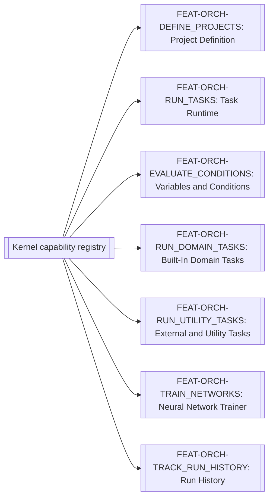

# Orchestration

> **Package:** `app/services/orchestration/`
> **Status:** `Missing`
> **Last updated:** `2026-08-23`
> **Domain ID:** `D-ORCH`

> This README is the domain package's **single source of truth** for domain boundaries, composable feature capabilities, architecture invariants, implementation sequence, progress, usage examples, and tests.
> Update this document before modifying or adding code.

---

## Code-Aligned Implementation Convention

This README is the sole current target registry for this domain's feature IDs and statuses, functional requirements, domain-local workflows, semantic contract ownership, persisted-state model, acceptance evidence, and deletion behavior. `PROJECT.md` owns system scope, cross-domain behavior, system NFRs, and release gates; `ARCHITECTURE.md` owns universal package and runtime constraints. Feature-local READMEs, manifests, contract definitions, migrations, and tests provide current implementation evidence without silently changing this target registry.

Implementation uses the repository's existing feature substrate: each feature lives directly at `app/services/<domain>/<feature>/`, is discovered through the `haruquantai.features` Python entry-point group, and declares one immutable `FeatureSpec` in `manifest.py`. There are no domain or feature YAML manifests.

Every implemented feature also contains a mandatory runtime-validated `README.md`, pure `__init__.py`, strict `config.py`, lifecycle `feature.py`, and focused implementation modules. Dependencies and effects flow through `FeatureContext`/`FeatureScope`; cross-feature implementation imports are forbidden. Persistent state is declared by `FeatureSpec.state`; any migrations and storage adapters remain with the owning feature. Capability keys use `<domain>.<name>@<major>`. FR IDs remain product, acceptance, and test-trace identities rather than one runtime registration per FR. A requirement `Depends` cell expresses product sequencing, traceability, or acceptance evidence only; runtime dependencies are declared separately with exact keys in `FeatureSpec.requires` or `FeatureSpec.optional`.

Feature-level automated tests live at `tests/services/orchestration/<feature>/`. Usage examples never live under `tests/`; they belong to each feature's designated primary domain-logic module. Broader automated verification retains its documented architecture, composition, API, integration, or system test location. The code-backed procedure is the [Feature Implementation Pipeline](../../../docs/dev/feature_implementation_pipeline.md).

## 1. Purpose and Boundary

### Purpose

The Orchestration domain delivers project graphs, task lifecycles, leases, checkpoints, variables, conditions, adapters, and history. Its public feature capabilities are registered and remain independent of package-import order. Removing the domain produces the degradation defined below rather than preventing the shared substrate or unrelated domains from starting.

### Owns

- `FEAT-ORCH-DEFINE_PROJECTS` — Project Definition.
- `FEAT-ORCH-RUN_TASKS` — Task Runtime.
- `FEAT-ORCH-EVALUATE_CONDITIONS` — Variables and Conditions.
- `FEAT-ORCH-RUN_DOMAIN_TASKS` — Built-In Domain Tasks.
- `FEAT-ORCH-RUN_UTILITY_TASKS` — External and Utility Tasks.
- `FEAT-ORCH-TRAIN_NETWORKS` — Neural Network Trainer.
- `FEAT-ORCH-TRACK_RUN_HISTORY` — Run History.

### Does not own

- Business algorithms owned by Data, Strategy, Simulator, Analytics, Research, or Portfolio; it coordinates through public capabilities.
- Feature discovery, activation, dependency reconciliation, configuration reload, or transactional replacement; `app/composition/` owns those generic runtime operations. Orchestration owns user-defined project graphs and durable domain-task execution.
- Composition lifecycle, dependency resolution, effect reversal, and transactional replacement; those belong to the non-domain shared substrate (`app/contracts/`, `app/kernel/`, and `app/composition/`).
- **Deletion boundary:** deleting `app/services/orchestration/` means Custom Projects and scheduled workflows disappear; direct domain commands and all committed artifacts remain. The kernel and unrelated domains shall remain healthy.

### Shared Contracts

This domain semantically owns the contracts listed below, but their sole physical definitions live in `app/contracts/orchestration/` and wire schemas in `app/contracts/orchestration/wire/`. `app/services/orchestration/` contains implementations only and shall not define or re-export substitute public contract types. Contract versions and semantic owners must agree with `PROJECT.md` and this README. Feature IDs and FR IDs are documentation, lifecycle, acceptance, and traceability identities; runtime bindings use exact versioned `CapabilityKey` declarations in contracts and `FeatureSpec`. The exact public records and capability bundles are listed in the [Shared Contracts README](../../contracts/README.md#49-appcontractsorchestration).

Rows labelled `FEAT-* capability surface` describe planned semantic contract bundles, not literal runtime capability keys. A listed counterparty may produce, consume, or observe the bundle and does not establish package-import or runtime dependency direction.

**Owned by this domain**

| Status | Contract | Version | Counterparty | Purpose |
|---|---|---|---|---|
| Missing | `FEAT-ORCH-DEFINE_PROJECTS` capability surface | `v1` | Analytics, Data, Interfaces, Plugins, Research, Strategy, Workspace | Project Definition. |
| Missing | `FEAT-ORCH-RUN_TASKS` capability surface | `v1` | Analytics, Data, Interfaces, Plugins, Research, Strategy, Workspace | Task Runtime. |
| Missing | `FEAT-ORCH-EVALUATE_CONDITIONS` capability surface | `v1` | Analytics, Data, Interfaces, Plugins, Research, Strategy, Workspace | Variables and Conditions. |
| Missing | `FEAT-ORCH-RUN_DOMAIN_TASKS` capability surface | `v1` | Analytics, Data, Interfaces, Plugins, Research, Strategy, Workspace | Built-In Domain Tasks. |
| Missing | `FEAT-ORCH-RUN_UTILITY_TASKS` capability surface | `v1` | Analytics, Data, Interfaces, Plugins, Research, Strategy, Workspace | External and Utility Tasks. |
| Missing | `FEAT-ORCH-TRAIN_NETWORKS` capability surface | `v1` | Analytics, Data, Interfaces, Plugins, Research, Strategy, Workspace | Neural Network Trainer. |
| Missing | `FEAT-ORCH-TRACK_RUN_HISTORY` capability surface | `v1` | Analytics, Data, Interfaces, Plugins, Research, Strategy, Workspace | Run History. |

**Cross-domain requirement references (not runtime dependencies)**

The rows below summarize foreign owner tokens found in FR `Depends` cells. They express product sequencing, traceability, or acceptance-evidence relationships only. Actual runtime consumption must name an exact versioned capability key in the consuming feature's `FeatureSpec.requires` or `FeatureSpec.optional` and must follow the dependency direction in `PROJECT.md` and `ARCHITECTURE.md`.

| Referenced domain set | Documentation version | Owner | Meaning |
|---|---|---|---|
| `D-ANA` public capability set | `v1` | Analytics | Requirements whose `Depends` cell names `ANA-*`. |
| `D-DATA` public capability set | `v1` | Data | Requirements whose `Depends` cell names `DATA-*`. |
| `D-IFACE` public capability set | `v1` | Interfaces | Requirements whose `Depends` cell names `IFACE-*`. |
| `D-PLUG` public capability set | `v1` | Plugins | Requirements whose `Depends` cell names `PLUG-*`. |
| `D-RES` public capability set | `v1` | Research | Requirements whose `Depends` cell names `RES-*`. |
| `D-STRAT` public capability set | `v1` | Strategy | Requirements whose `Depends` cell names `STRAT-*`. |
| `D-WS` public capability set | `v1` | Workspace | Requirements whose `Depends` cell names `WS-*`. |

### Persisted State Ownership

| Status | State / Store | Read access (via contract) | Migration definitions |
|---|---|---|---|
| Missing | projects, project_versions, project_runs, task_runs, task_attempts, variable_assignments | Other domains through `D-ORCH` public capabilities only | The owning feature's `StateDeclaration` and migration/storage adapter |

### Four-Level Structural Hierarchy

| Code level | Represents | This package |
|---|---|---|
| **Package** | Domain | `app/services/orchestration/` / `D-ORCH` |
| **Module folder** | Feature / capability | One folder for each of: Project Definition, Task Runtime, Variables and Conditions, Built-In Domain Tasks, External and Utility Tasks, Neural Network Trainer, Run History |
| **File** | Use case or focused responsibility | Exactly the responsibility file named in each module specification |
| **Class / function / method** | Functional requirement behavior | Exactly one registered `fr_*` behavior per `FR-*` row |

```text
Package (Domain)
└── Module folder (Feature)
    └── File (Responsibility)
        └── Registered function (Functional requirement behavior)
```

### Domain Capability Map

```mermaid
flowchart TD
    DOMAIN[[D-ORCH: Orchestration]]
    DOMAIN --> FEAT_ORCH_DEFINE_PROJECTS[[FEAT-ORCH-DEFINE_PROJECTS: Project Definition]]
    FEAT_ORCH_DEFINE_PROJECTS --> FEAT_ORCH_DEFINE_PROJECTS_FILE[project_definition.py: RESP-ORCH-01-01]
    DOMAIN --> FEAT_ORCH_RUN_TASKS[[FEAT-ORCH-RUN_TASKS: Task Runtime]]
    FEAT_ORCH_RUN_TASKS --> FEAT_ORCH_RUN_TASKS_FILE[task_runtime.py: RESP-ORCH-02-01]
    DOMAIN --> FEAT_ORCH_EVALUATE_CONDITIONS[[FEAT-ORCH-EVALUATE_CONDITIONS: Variables and Conditions]]
    FEAT_ORCH_EVALUATE_CONDITIONS --> FEAT_ORCH_EVALUATE_CONDITIONS_FILE[project_variables_conditions.py: RESP-ORCH-03-01]
    DOMAIN --> FEAT_ORCH_RUN_DOMAIN_TASKS[[FEAT-ORCH-RUN_DOMAIN_TASKS: Built-In Domain Tasks]]
    FEAT_ORCH_RUN_DOMAIN_TASKS --> FEAT_ORCH_RUN_DOMAIN_TASKS_FILE[built_in_domain_tasks.py: RESP-ORCH-04-01]
    DOMAIN --> FEAT_ORCH_RUN_UTILITY_TASKS[[FEAT-ORCH-RUN_UTILITY_TASKS: External and Utility Tasks]]
    FEAT_ORCH_RUN_UTILITY_TASKS --> FEAT_ORCH_RUN_UTILITY_TASKS_FILE[external_utility_tasks.py: RESP-ORCH-05-01]
    FEAT_ORCH_RUN_UTILITY_TASKS --> FEAT_ORCH_RUN_UTILITY_TASKS_NOTIFY[notification_delivery.py: RESP-ORCH-05-02]
    DOMAIN --> FEAT_ORCH_TRAIN_NETWORKS[[FEAT-ORCH-TRAIN_NETWORKS: Neural Network Trainer]]
    FEAT_ORCH_TRAIN_NETWORKS --> FEAT_ORCH_TRAIN_NETWORKS_FILE[neural_network_trainer.py: RESP-ORCH-06-01]
    DOMAIN --> FEAT_ORCH_TRACK_RUN_HISTORY[[FEAT-ORCH-TRACK_RUN_HISTORY: Run History]]
    FEAT_ORCH_TRACK_RUN_HISTORY --> FEAT_ORCH_TRACK_RUN_HISTORY_FILE[project_run_history.py: RESP-ORCH-07-01]
```



---

## 2. Final Package Structure and Feature Independence

```text
orchestration/
├── README.md
├── __init__.py
├── project_definition/                    # FEAT-ORCH-DEFINE_PROJECTS: Project Definition
│   ├── README.md
│   ├── __init__.py
│   ├── manifest.py
│   ├── config.py
│   ├── feature.py
│   └── project_definition.py              # RESP-ORCH-01-01
├── task_runtime/                    # FEAT-ORCH-RUN_TASKS: Task Runtime
│   ├── README.md
│   ├── __init__.py
│   ├── manifest.py
│   ├── config.py
│   ├── feature.py
│   └── task_runtime.py              # RESP-ORCH-02-01
├── project_variables_conditions/                    # FEAT-ORCH-EVALUATE_CONDITIONS: Variables and Conditions
│   ├── README.md
│   ├── __init__.py
│   ├── manifest.py
│   ├── config.py
│   ├── feature.py
│   └── project_variables_conditions.py              # RESP-ORCH-03-01
├── built_in_domain_tasks/                    # FEAT-ORCH-RUN_DOMAIN_TASKS: Built-In Domain Tasks
│   ├── README.md
│   ├── __init__.py
│   ├── manifest.py
│   ├── config.py
│   ├── feature.py
│   └── built_in_domain_tasks.py              # RESP-ORCH-04-01
├── external_utility_tasks/                    # FEAT-ORCH-RUN_UTILITY_TASKS: External and Utility Tasks
│   ├── README.md
│   ├── __init__.py
│   ├── manifest.py
│   ├── config.py
│   ├── feature.py
│   ├── external_utility_tasks.py              # RESP-ORCH-05-01
│   └── notification_delivery.py               # RESP-ORCH-05-02
├── neural_network_trainer/                    # FEAT-ORCH-TRAIN_NETWORKS: Neural Network Trainer
│   ├── README.md
│   ├── __init__.py
│   ├── manifest.py
│   ├── config.py
│   ├── feature.py
│   └── neural_network_trainer.py              # RESP-ORCH-06-01
└── project_run_history/                    # FEAT-ORCH-TRACK_RUN_HISTORY: Run History
    ├── README.md
    ├── __init__.py
    ├── manifest.py
    ├── config.py
    ├── feature.py
    └── project_run_history.py              # RESP-ORCH-07-01
```

### Module dependency diagram

Feature modules do not import one another's private files. Runtime dependencies resolve through kernel capabilities obtained from `FeatureContext`; composition selects providers and reconciles changes, so reciprocal workflow participation cannot create a package-import cycle.



### Structure rules

- The package root contains `README.md`, import-pure `__init__.py`, and one direct folder per feature; discovery uses the `haruquantai.features` entry-point group.
- Each feature folder contains mandatory `README.md`, pure `__init__.py`, `manifest.py`, `config.py`, `feature.py`, and focused responsibility modules.
- `FR-*`/`fr_*` names provide product, implementation, and test traceability inside the feature; they are not separate runtime registrations or capability keys.
- Cross-feature and cross-domain behavior is injected by capability key. Direct private-file imports are prohibited.
- Every core capability module documents Python and CLI usage; exactly one designated primary domain-logic module owns the feature's executable `__main__` demonstration. Usage examples never live under `tests/`.

---

## 3. Workflows

| Status | Workflow ID | Scope | Workflow | Trigger / Input boundary | Final outcome / Output boundary | Requirement sequence |
|---|---|---|---|---|---|---|
| Missing | `WF-ORCH-001` | Cross-domain | Project Definition | Validated command/query and required capability bindings | Requirement-defined result, artifact, event, or degradation | `FR-ORCH-DEFINE_PROJECT_GRAPHS` → `FR-ORCH-DECLARE_TASK_CONTRACTS` → `FR-ORCH-DEFINE_TASK_TRANSITIONS` → `FR-ORCH-PIN_PROJECT_RUNS` |
| Missing | `WF-ORCH-002` | Cross-domain | Task Runtime | Validated command/query and required capability bindings | Requirement-defined result, artifact, event, or degradation | `FR-ORCH-DEFINE_TASK_STATES` → `FR-ORCH-RETRY_TASKS_IDEMPOTENTLY` → `FR-ORCH-FENCE_TASK_LEASES` → `FR-ORCH-VERSION_TASK_ATTEMPTS` → `FR-ORCH-VERSION_TASK_CHECKPOINTS` → `FR-ORCH-COMMIT_TASK_OUTPUTS` → `FR-ORCH-SCOPE_PROJECT_VARIABLES` → `FR-ORCH-REPORT_PROJECT_PROGRESS` |
| Missing | `WF-ORCH-003` | Internal | Variables and Conditions | Validated command/query and required capability bindings | Requirement-defined result, artifact, event, or degradation | `FR-ORCH-TYPE_PROJECT_VARIABLES` → `FR-ORCH-EVALUATE_PROJECT_EXPRESSIONS` |
| Missing | `WF-ORCH-004` | Cross-domain | Built-In Domain Tasks | Validated command/query and required capability bindings | Requirement-defined result, artifact, event, or degradation | `FR-ORCH-DELEGATE_DOMAIN_TASKS` → `FR-ORCH-PIN_TASK_SELECTIONS` → `FR-ORCH-SYNC_PROJECT_DATA` → `FR-ORCH-PIN_PORTFOLIO_INPUTS` → `FR-ORCH-COMPILE_CONTROL_TRANSITIONS` |
| Missing | `WF-ORCH-005` | Cross-domain | External and Utility Tasks | Validated command/query and required capability bindings | Requirement-defined result, artifact, event, or degradation | Utility branch: `FR-ORCH-RUN_APPROVED_EXECUTABLES` / `FR-ORCH-MANAGE_WORKSPACE_TASKS` / `FR-ORCH-EVALUATE_DURATION_CONDITIONS`; notification branch: `FR-ORCH-CONFIGURE_NOTIFICATION_CHANNELS` → `FR-ORCH-MANAGE_NOTIFICATION_SESSIONS` → `FR-ORCH-RENDER_NOTIFICATION_TEMPLATES` → `FR-ORCH-ENFORCE_NOTIFICATION_LIMITS` → `FR-ORCH-SEND_PROJECT_NOTIFICATIONS` |
| Missing | `WF-ORCH-006` | Cross-domain | Neural Network Trainer | Validated command/query and required capability bindings | Requirement-defined result, artifact, event, or degradation | `FR-ORCH-TRAIN_NEURAL_NETWORKS` |
| Missing | `WF-ORCH-007` | Internal | Run History | Validated command/query and required capability bindings | Requirement-defined result, artifact, event, or degradation | `FR-ORCH-RETAIN_PROJECT_HISTORY` |

### `WF-ORCH-001` — Project Definition

**Scope:** `Cross-domain` when the request requires another domain capability; otherwise `Internal`.

**System workflow:** `SYS-WF-008`

**Input boundary:** A validated request/query plus an immutable capability snapshot and provider bindings.

**Output boundary:** The result/artifact/event defined by the participating `FR-*` rows, or their exact structured failure/degradation outcome.

1. `Feature.mount()` resolves its declared required capabilities through `FeatureContext`.
2. `project_definition.py` executes `fr_orch_define_project_graphs`, `fr_orch_declare_task_contracts`, `fr_orch_define_task_transitions`, `fr_orch_pin_project_runs` in the requirement-defined order.
3. Scoped effects are committed or reversed under `FR-KERN-DEFINE_REQUIREMENT_BEHAVIOR, FR-KERN-DEFINE_LIFECYCLE_CONTEXT, FR-KERN-DECLARE_BEHAVIOR_DEPENDENCIES, FR-KERN-REGISTER_FEATURE_MODULES, FR-KERN-DEFINE_RESPONSIBILITY_FILES, FR-KERN-IMPLEMENT_REQUIREMENT_FUNCTIONS, FR-KERN-DEPEND_PUBLIC_PORTS, FR-KERN-NAMESPACE_CAPABILITY_KEYS, FR-KERN-DECLARE_DEPENDENCY_RULES, FR-KERN-REEVALUATE_DEPENDENCIES, FR-KERN-DEFINE_SCOPE_HIERARCHY, FR-KERN-PASS_EFFECT_SCOPES, FR-KERN-REGISTER_EFFECT_REVERSALS, FR-KERN-REVERSE_EFFECTS_LIFO, FR-KERN-ROLLBACK_FAILED_ACTIVATION, FR-KERN-MANAGE_COMPONENT_LIFECYCLE, FR-KERN-COMMIT_CAPABILITY_SWAP, FR-KERN-QUIESCE_DEPENDENT_WORK, FR-KERN-REMOVE_DEPENDENT_COMPONENTS, FR-KERN-ISOLATE_DISPOSAL_FAILURES, FR-KERN-RECONCILE_DESIRED_STATE, FR-KERN-REPLACE_COMPONENTS_TRANSACTIONALLY, FR-KERN-PROVIDE_SCOPED_REGISTRARS, FR-KERN-DRAIN_REMOVED_BEHAVIORS, FR-KERN-CLASSIFY_COMPONENT_EFFECTS, FR-KERN-NAMESPACE_COMPONENT_STATE, FR-KERN-REGISTER_EXTENSION_POINTS, FR-KERN-EMIT_CAUSAL_EVENTS, FR-KERN-REJECT_DEPENDENCY_CYCLES, FR-KERN-PIN_CAPABILITY_SNAPSHOTS, FR-KERN-TEST_COMPONENT_REMOVAL, FR-KERN-VERIFY_EXACT_REMOVAL, FR-KERN-ROUTE_MULTIPLE_PROVIDERS`.
4. The feature returns or publishes only the documented output boundary.

**Failure behaviour:**

- Feature unavailable → project creation/execution is unavailable; direct operations remain. Requests requiring a removed feature capability return `CAPABILITY_UNAVAILABLE`; the domain continues loading.
- Missing/incompatible required capability → `CAPABILITY_UNAVAILABLE` or `CAPABILITY_INCOMPATIBLE`; no partial mutation.

**Integration test:**
`tests/services/orchestration/integration/test_project_definition.py::test_project_definition_workflow()`


---

## 4. Composable Feature Specifications

Implement module sections from top to bottom. Requirement `Depends` cells define product and implementation ordering; runtime capability dependencies must be declared separately in the owning `FeatureSpec`.

---

### 4.1 `project_definition/` — Project Definition

**Feature ID:** `FEAT-ORCH-DEFINE_PROJECTS`

**Purpose:** Version project graphs, task contracts, bounds, and manifests.

**Deletion contract:** project creation/execution is unavailable; direct operations remain. Requests requiring a removed feature capability return `CAPABILITY_UNAVAILABLE`; the domain continues loading.

**Module flow:**

```text
validated input and capability bindings
  → project_definition.py
  → fr_orch_define_project_graphs, fr_orch_declare_task_contracts, fr_orch_define_task_transitions, fr_orch_pin_project_runs
  → requirement-defined output or structured failure
```

#### Files

| Status | File | Responsibility | Key exports | Dependencies |
|---|---|---|---|---|
| Missing | `project_definition.py` | Version project graphs, task contracts, bounds, and manifests | `fr_orch_define_project_graphs`, `fr_orch_declare_task_contracts`, `fr_orch_define_task_transitions`, `fr_orch_pin_project_runs` | **Standard library:** selected per implementation and recorded before code<br>**Required third-party:** only libraries mandated by `PROJECT.md` or the requirement boundary<br>**Local:** capabilities declared by the owning `FeatureSpec`; no private cross-feature import |
| Missing | `feature.py` | Mount `FEAT-ORCH-DEFINE_PROJECTS` through `FeatureContext` and stage its declared providers/effects | `FEAT-ORCH-DEFINE_PROJECTS` `Feature.mount` | **Standard library:** None<br>**Required third-party:** None<br>**Local:** `manifest.py`, `config.py`, and focused responsibility modules |
| Missing | `manifest.py` | Define the immutable `FEAT-ORCH-DEFINE_PROJECTS` `FeatureSpec`: identity, domain, provided/required/optional capabilities, conflicts, state, and configuration keys | `FEAT-ORCH-DEFINE_PROJECTS` `FeatureSpec` | **Standard library:** None<br>**Required third-party:** None<br>**Local:** `app.kernel.feature.FeatureSpec` |

#### Configuration and Limits Manifest

| Status | Setting / Limit | Type | Default | Required | Used by | Description |
|---|---|---|---|---|---|---|
| Missing | `FEAT-ORCH-DEFINE_PROJECTS.configuration` | Versioned schema | No implicit defaults | Yes when referenced | `project_definition.py` | Exact fields, defaults, limits, and failure rules are those stated by the requirements and the normative technical appendices in `PROJECT.md`; unspecified values are rejected under Project §6. |

#### `project_definition.py` — Version project graphs, task contracts, bounds, and manifests

**File responsibility:** Version project graphs, task contracts, bounds, and manifests.

| Status | Requirement ID | Class | Pri | Responsibility | Class / Function / Method | Side Effects | Raises / failure | Depends | Source / confidence | Usage / Test |
|---|---|---|---|---|---|---|---|---|---|---|
| Missing | `FR-ORCH-DEFINE_PROJECT_GRAPHS` | Target | P0 | A project shall have immutable executable versions containing task instances, typed settings, transitions, resource references, and project inputs. | `fr_orch_define_project_graphs` implementation trace | None | Editing a project creates a new version and cannot alter a running or historical run. | FR-WS-FENCE_WORKSPACE_WRITERS, FR-STRAT-DEFINE_STRATEGY_TEMPLATES | Orchestration baseline | **Usage:** `app/services/orchestration/project_definition/project_definition.py::__main__` scenario `FR-ORCH-DEFINE_PROJECT_GRAPHS`<br>**Unit:** `tests/services/orchestration/project_definition/test_project_definition.py::test_orch_define_project_graphs()` |
| Missing | `FR-ORCH-DECLARE_TASK_CONTRACTS` | Target | P0 | Every task type shall declare input/output ports, schema versions, capabilities, checkpoint support, cancellation behavior, permissions, and resource estimator. | `fr_orch_declare_task_contracts` implementation trace | Persistence write | Invalid edges or missing capabilities fail project validation. | FR-ORCH-DEFINE_PROJECT_GRAPHS, FR-RES-DESCRIBE_RESEARCH_METHODS | Orchestration baseline | **Usage:** `app/services/orchestration/project_definition/project_definition.py::__main__` scenario `FR-ORCH-DECLARE_TASK_CONTRACTS`<br>**Unit:** `tests/services/orchestration/project_definition/test_project_definition.py::test_orch_declare_task_contracts()` |
| Missing | `FR-ORCH-DEFINE_TASK_TRANSITIONS` | Target | P0 | The runtime shall support ordered transitions, condition branches, and cycles only when each possible cycle has an enforced count, duration, result, budget, or operator-stop bound. | `fr_orch_define_task_transitions` implementation trace | Read-only | A graph containing an unbounded reachable cycle is rejected. | FR-ORCH-DEFINE_PROJECT_GRAPHS | Orchestration baseline | **Usage:** `app/services/orchestration/project_definition/project_definition.py::__main__` scenario `FR-ORCH-DEFINE_TASK_TRANSITIONS`<br>**Unit:** `tests/services/orchestration/project_definition/test_project_definition.py::test_orch_define_task_transitions()` |
| Missing | `FR-ORCH-PIN_PROJECT_RUNS` | Target | P0 | A project run shall pin project version, all referenced object versions, effective settings, seeds, resource policy, and initiator. | `fr_orch_pin_project_runs` implementation trace | None | A run manifest is complete before the first task is queued. | FR-ORCH-DEFINE_PROJECT_GRAPHS, FR-WS-RECOVER_WORKSPACE_STATE | Orchestration baseline | **Usage:** `app/services/orchestration/project_definition/project_definition.py::__main__` scenario `FR-ORCH-PIN_PROJECT_RUNS`<br>**Unit:** `tests/services/orchestration/project_definition/test_project_definition.py::test_orch_pin_project_runs()` |

**Rules:**

- project creation/execution is unavailable; direct operations remain. Requests requiring a removed feature capability return `CAPABILITY_UNAVAILABLE`; the domain continues loading.
- no business-domain dependency is resolved at package import; the owning `FeatureSpec` declares runtime dependencies once and this behavior consumes only that committed feature context.
- Each `FR-*` row maps to focused implementation and acceptance evidence inside this feature; removal occurs at feature-package granularity.
- Every effect must be scoped and classified under `FR-KERN-CLASSIFY_COMPONENT_EFFECTS`; the inferred table label must be corrected before implementation if the concrete adapter requires a narrower or additional effect class.

**Implementation notes:**

- Preserve the requirement statement, acceptance/failure behavior, dependencies, and source confidence as one indivisible implementation contract.
- Reuse public capability contracts; never copy another feature's or domain's business logic.
- Add private helpers only when needed by these public behaviors; helpers do not become new requirements.

#### Feature usage examples

The primary domain-logic module `app/services/orchestration/project_definition/project_definition.py` owns the executable `__main__` usage harness, with one named scenario per requirement listed above.

---

### 4.2 `task_runtime/` — Task Runtime

**Feature ID:** `FEAT-ORCH-RUN_TASKS`

**Purpose:** Run task state machines, commands, leases, retries, commits, resources, and progress.

**Deletion contract:** project task execution stops cleanly; domain services remain callable. Requests requiring a removed feature capability return `CAPABILITY_UNAVAILABLE`; the domain continues loading.

**Module flow:**

```text
validated input and capability bindings
  → task_runtime.py
  → fr_orch_define_task_states, fr_orch_retry_tasks_idempotently, fr_orch_fence_task_leases, fr_orch_version_task_attempts, fr_orch_version_task_checkpoints, fr_orch_commit_task_outputs, fr_orch_scope_project_variables, fr_orch_report_project_progress
  → requirement-defined output or structured failure
```

#### Files

| Status | File | Responsibility | Key exports | Dependencies |
|---|---|---|---|---|
| Missing | `task_runtime.py` | Run task state machines, commands, leases, retries, commits, resources, and progress | `fr_orch_define_task_states`, `fr_orch_retry_tasks_idempotently`, `fr_orch_fence_task_leases`, `fr_orch_version_task_attempts`, `fr_orch_version_task_checkpoints`, `fr_orch_commit_task_outputs`, `fr_orch_scope_project_variables`, `fr_orch_report_project_progress` | **Standard library:** selected per implementation and recorded before code<br>**Required third-party:** only libraries mandated by `PROJECT.md` or the requirement boundary<br>**Local:** capabilities declared by the owning `FeatureSpec`; no private cross-feature import |
| Missing | `feature.py` | Mount `FEAT-ORCH-RUN_TASKS` through `FeatureContext` and stage its declared providers/effects | `FEAT-ORCH-RUN_TASKS` `Feature.mount` | **Standard library:** None<br>**Required third-party:** None<br>**Local:** `manifest.py`, `config.py`, and focused responsibility modules |
| Missing | `manifest.py` | Define the immutable `FEAT-ORCH-RUN_TASKS` `FeatureSpec`: identity, domain, provided/required/optional capabilities, conflicts, state, and configuration keys | `FEAT-ORCH-RUN_TASKS` `FeatureSpec` | **Standard library:** None<br>**Required third-party:** None<br>**Local:** `app.kernel.feature.FeatureSpec` |

#### Configuration and Limits Manifest

| Status | Setting / Limit | Type | Default | Required | Used by | Description |
|---|---|---|---|---|---|---|
| Missing | `FEAT-ORCH-RUN_TASKS.configuration` | Versioned schema | No implicit defaults | Yes when referenced | `task_runtime.py` | Exact fields, defaults, limits, and failure rules are those stated by the requirements and the normative technical appendices in `PROJECT.md`; unspecified values are rejected under Project §6. |

#### `task_runtime.py` — Run task state machines, commands, leases, retries, commits, resources, and progress

**File responsibility:** Run task state machines, commands, leases, retries, commits, resources, and progress.

| Status | Requirement ID | Class | Pri | Responsibility | Class / Function / Method | Side Effects | Raises / failure | Depends | Source / confidence | Usage / Test |
|---|---|---|---|---|---|---|---|---|---|---|
| Missing | `FR-ORCH-DEFINE_TASK_STATES` | Target | P0 | Task runs shall follow the canonical queued/running/pausing/paused/resuming/stopping and terminal state model. | `fr_orch_define_task_states` implementation trace | Persistence write | Invalid transitions return stable conflict errors and create no effects. | Job lifecycle §5.1 | Orchestration baseline | **Usage:** `app/services/orchestration/task_runtime/task_runtime.py::__main__` scenario `FR-ORCH-DEFINE_TASK_STATES`<br>**Unit:** `tests/services/orchestration/task_runtime/test_task_runtime.py::test_orch_define_task_states()` |
| Missing | `FR-ORCH-RETRY_TASKS_IDEMPOTENTLY` | Target | P0 | Start, pause, resume, stop, cancel, and retry commands shall be idempotent and persist command outcomes. | `fr_orch_retry_tasks_idempotently` implementation trace | Persistence write | Lost responses and retries do not duplicate attempts or committed outputs. | FR-ORCH-DEFINE_TASK_STATES, FR-IFACE-DEDUPLICATE_MUTATIONS | Orchestration baseline | **Usage:** `app/services/orchestration/task_runtime/task_runtime.py::__main__` scenario `FR-ORCH-RETRY_TASKS_IDEMPOTENTLY`<br>**Unit:** `tests/services/orchestration/task_runtime/test_task_runtime.py::test_orch_retry_tasks_idempotently()` |
| Missing | `FR-ORCH-FENCE_TASK_LEASES` | Target | P0 | Workers shall acquire expiring leases, heartbeat, and lose commit authority after lease expiry or fencing-token replacement. | `fr_orch_fence_task_leases` implementation trace | Persistence write | A stale worker cannot commit after reassignment. | FR-RES-PREVIEW_RESEARCH_INPUTS, FR-RES-CLASSIFY_RESEARCH_FAILURES | Orchestration durability | **Usage:** `app/services/orchestration/task_runtime/task_runtime.py::__main__` scenario `FR-ORCH-FENCE_TASK_LEASES`<br>**Unit:** `tests/services/orchestration/task_runtime/test_task_runtime.py::test_orch_fence_task_leases()` |
| Missing | `FR-ORCH-VERSION_TASK_ATTEMPTS` | Target | P0 | A retry shall create a new attempt linked to the same logical task run and shall apply a versioned retry/backoff policy. | `fr_orch_version_task_attempts` implementation trace | Persistence write | Attempt history, failure cause, and selected recovery point remain visible. | FR-ORCH-RETRY_TASKS_IDEMPOTENTLY, FR-ORCH-FENCE_TASK_LEASES | Orchestration baseline | **Usage:** `app/services/orchestration/task_runtime/task_runtime.py::__main__` scenario `FR-ORCH-VERSION_TASK_ATTEMPTS`<br>**Unit:** `tests/services/orchestration/task_runtime/test_task_runtime.py::test_orch_version_task_attempts()` |
| Missing | `FR-ORCH-VERSION_TASK_CHECKPOINTS` | Target | P0 | Checkpoints shall be immutable, schema-versioned, content-addressed, and valid only for a compatible task implementation and manifest. | `fr_orch_version_task_checkpoints` implementation trace | Event publication; Persistence write | Incompatible or corrupt checkpoints are rejected without falling back silently. | FR-RES-COMMIT_RESEARCH_RESULTS, FR-ORCH-VERSION_TASK_ATTEMPTS | Orchestration durability | **Usage:** `app/services/orchestration/task_runtime/task_runtime.py::__main__` scenario `FR-ORCH-VERSION_TASK_CHECKPOINTS`<br>**Unit:** `tests/services/orchestration/task_runtime/test_task_runtime.py::test_orch_version_task_checkpoints()` |
| Missing | `FR-ORCH-COMMIT_TASK_OUTPUTS` | Target | P0 | Task outputs shall commit atomically before downstream transitions become eligible. | `fr_orch_commit_task_outputs` implementation trace | Persistence write | Fault injection never exposes partially committed output to a successor. | Artifact lifecycle §5.2 | Orchestration durability | **Usage:** `app/services/orchestration/task_runtime/task_runtime.py::__main__` scenario `FR-ORCH-COMMIT_TASK_OUTPUTS`<br>**Unit:** `tests/services/orchestration/task_runtime/test_task_runtime.py::test_orch_commit_task_outputs()` |
| Missing | `FR-ORCH-SCOPE_PROJECT_VARIABLES` | Target | P1 | Concurrency controls shall include global, project, task-type, worker-pool, CPU, memory, and artifact-I/O limits. | `fr_orch_scope_project_variables` implementation trace | None | Scheduler tests never exceed configured limits under retries and cancellation. | FR-WS-BUILD_DIAGNOSTIC_BUNDLE, FR-ORCH-FENCE_TASK_LEASES | Orchestration baseline | **Usage:** `app/services/orchestration/task_runtime/task_runtime.py::__main__` scenario `FR-ORCH-SCOPE_PROJECT_VARIABLES`<br>**Unit:** `tests/services/orchestration/task_runtime/test_task_runtime.py::test_orch_scope_project_variables()` |
| Missing | `FR-ORCH-REPORT_PROJECT_PROGRESS` | Target | P1 | Progress shall be monotonic within an attempt, permit indeterminate phases, and distinguish logical progress from retry attempts. | `fr_orch_report_project_progress` implementation trace | None | UI/CLI reconnect reconstructs current progress from durable state and retained events. | FR-IFACE-REPLAY_INTERFACE_EVENTS, FR-ORCH-VERSION_TASK_ATTEMPTS | Orchestration observability | **Usage:** `app/services/orchestration/task_runtime/task_runtime.py::__main__` scenario `FR-ORCH-REPORT_PROJECT_PROGRESS`<br>**Unit:** `tests/services/orchestration/task_runtime/test_task_runtime.py::test_orch_report_project_progress()` |

**Rules:**

- project task execution stops cleanly; domain services remain callable. Requests requiring a removed feature capability return `CAPABILITY_UNAVAILABLE`; the domain continues loading.
- no business-domain dependency is resolved at package import; the owning `FeatureSpec` declares runtime dependencies once and this behavior consumes only that committed feature context.
- Each `FR-*` row maps to focused implementation and acceptance evidence inside this feature; removal occurs at feature-package granularity.
- Every effect must be scoped and classified under `FR-KERN-CLASSIFY_COMPONENT_EFFECTS`; the inferred table label must be corrected before implementation if the concrete adapter requires a narrower or additional effect class.

**Implementation notes:**

- Preserve the requirement statement, acceptance/failure behavior, dependencies, and source confidence as one indivisible implementation contract.
- Reuse public capability contracts; never copy another feature's or domain's business logic.
- Add private helpers only when needed by these public behaviors; helpers do not become new requirements.

#### Feature usage examples

The primary domain-logic module `app/services/orchestration/task_runtime/task_runtime.py` owns the executable `__main__` usage harness, with one named scenario per requirement listed above.

---

### 4.3 `project_variables_conditions/` — Variables and Conditions

**Feature ID:** `FEAT-ORCH-EVALUATE_CONDITIONS`

**Purpose:** Resolve typed variables and deterministic branches.

**Deletion contract:** conditional/dataflow projects are unavailable; linear direct operations remain. Requests requiring a removed feature capability return `CAPABILITY_UNAVAILABLE`; the domain continues loading.

**Module flow:**

```text
validated input and capability bindings
  → project_variables_conditions.py
  → fr_orch_type_project_variables, fr_orch_evaluate_project_expressions
  → requirement-defined output or structured failure
```

#### Files

| Status | File | Responsibility | Key exports | Dependencies |
|---|---|---|---|---|
| Missing | `project_variables_conditions.py` | Resolve typed variables and deterministic branches | `fr_orch_type_project_variables`, `fr_orch_evaluate_project_expressions` | **Standard library:** selected per implementation and recorded before code<br>**Required third-party:** only libraries mandated by `PROJECT.md` or the requirement boundary<br>**Local:** capabilities declared by the owning `FeatureSpec`; no private cross-feature import |
| Missing | `feature.py` | Mount `FEAT-ORCH-EVALUATE_CONDITIONS` through `FeatureContext` and stage its declared providers/effects | `FEAT-ORCH-EVALUATE_CONDITIONS` `Feature.mount` | **Standard library:** None<br>**Required third-party:** None<br>**Local:** `manifest.py`, `config.py`, and focused responsibility modules |
| Missing | `manifest.py` | Define the immutable `FEAT-ORCH-EVALUATE_CONDITIONS` `FeatureSpec`: identity, domain, provided/required/optional capabilities, conflicts, state, and configuration keys | `FEAT-ORCH-EVALUATE_CONDITIONS` `FeatureSpec` | **Standard library:** None<br>**Required third-party:** None<br>**Local:** `app.kernel.feature.FeatureSpec` |

#### Configuration and Limits Manifest

| Status | Setting / Limit | Type | Default | Required | Used by | Description |
|---|---|---|---|---|---|---|
| Missing | `FEAT-ORCH-EVALUATE_CONDITIONS.configuration` | Versioned schema | No implicit defaults | Yes when referenced | `project_variables_conditions.py` | Exact fields, defaults, limits, and failure rules are those stated by the requirements and the normative technical appendices in `PROJECT.md`; unspecified values are rejected under Project §6. |

#### `project_variables_conditions.py` — Resolve typed variables and deterministic branches

**File responsibility:** Resolve typed variables and deterministic branches.

| Status | Requirement ID | Class | Pri | Responsibility | Class / Function / Method | Side Effects | Raises / failure | Depends | Source / confidence | Usage / Test |
|---|---|---|---|---|---|---|---|---|---|---|
| Missing | `FR-ORCH-TYPE_PROJECT_VARIABLES` | Target | P1 | Project variables shall be typed, scoped, immutable per assignment record, and resolved explicitly from project inputs or predecessor outputs. | `fr_orch_type_project_variables` implementation trace | Persistence write | Missing, ambiguous, or incompatible values fail before task execution. | FR-ORCH-DECLARE_TASK_CONTRACTS | Orchestration baseline | **Usage:** `app/services/orchestration/project_variables_conditions/project_variables_conditions.py::__main__` scenario `FR-ORCH-TYPE_PROJECT_VARIABLES`<br>**Unit:** `tests/services/orchestration/project_variables_conditions/test_project_variables_conditions.py::test_orch_type_project_variables()` |
| Missing | `FR-ORCH-EVALUATE_PROJECT_EXPRESSIONS` | Target | P1 | Conditions shall use a sandboxed deterministic expression language over declared task results, counters, and variables. | `fr_orch_evaluate_project_expressions` implementation trace | Read-only | Conditions cannot access filesystem, network, clock, or undeclared values. | FR-ORCH-TYPE_PROJECT_VARIABLES | Orchestration safety | **Usage:** `app/services/orchestration/project_variables_conditions/project_variables_conditions.py::__main__` scenario `FR-ORCH-EVALUATE_PROJECT_EXPRESSIONS`<br>**Unit:** `tests/services/orchestration/project_variables_conditions/test_project_variables_conditions.py::test_orch_evaluate_project_expressions()` |

**Rules:**

- conditional/dataflow projects are unavailable; linear direct operations remain. Requests requiring a removed feature capability return `CAPABILITY_UNAVAILABLE`; the domain continues loading.
- no business-domain dependency is resolved at package import; the owning `FeatureSpec` declares runtime dependencies once and this behavior consumes only that committed feature context.
- Each `FR-*` row maps to focused implementation and acceptance evidence inside this feature; removal occurs at feature-package granularity.
- Every effect must be scoped and classified under `FR-KERN-CLASSIFY_COMPONENT_EFFECTS`; the inferred table label must be corrected before implementation if the concrete adapter requires a narrower or additional effect class.

**Implementation notes:**

- Preserve the requirement statement, acceptance/failure behavior, dependencies, and source confidence as one indivisible implementation contract.
- Reuse public capability contracts; never copy another feature's or domain's business logic.
- Add private helpers only when needed by these public behaviors; helpers do not become new requirements.

#### Feature usage examples

The primary domain-logic module `app/services/orchestration/project_variables_conditions/project_variables_conditions.py` owns the executable `__main__` usage harness, with one named scenario per requirement listed above.

---

### 4.4 `built_in_domain_tasks/` — Built-In Domain Tasks

**Feature ID:** `FEAT-ORCH-RUN_DOMAIN_TASKS`

**Purpose:** Delegate research/data/databank/portfolio task types.

**Deletion contract:** removed task types disappear from the editor; their owning domains remain. Requests requiring a removed feature capability return `CAPABILITY_UNAVAILABLE`; the domain continues loading.

**Module flow:**

```text
validated input and capability bindings
  → built_in_domain_tasks.py
  → fr_orch_delegate_domain_tasks, fr_orch_pin_task_selections, fr_orch_sync_project_data, fr_orch_pin_portfolio_inputs, fr_orch_compile_control_transitions
  → requirement-defined output or structured failure
```

#### Files

| Status | File | Responsibility | Key exports | Dependencies |
|---|---|---|---|---|
| Missing | `built_in_domain_tasks.py` | Delegate research/data/databank/portfolio task types | `fr_orch_delegate_domain_tasks`, `fr_orch_pin_task_selections`, `fr_orch_sync_project_data`, `fr_orch_pin_portfolio_inputs`, `fr_orch_compile_control_transitions` | **Standard library:** selected per implementation and recorded before code<br>**Required third-party:** only libraries mandated by `PROJECT.md` or the requirement boundary<br>**Local:** capabilities declared by the owning `FeatureSpec`; no private cross-feature import |
| Missing | `feature.py` | Mount `FEAT-ORCH-RUN_DOMAIN_TASKS` through `FeatureContext` and stage its declared providers/effects | `FEAT-ORCH-RUN_DOMAIN_TASKS` `Feature.mount` | **Standard library:** None<br>**Required third-party:** None<br>**Local:** `manifest.py`, `config.py`, and focused responsibility modules |
| Missing | `manifest.py` | Define the immutable `FEAT-ORCH-RUN_DOMAIN_TASKS` `FeatureSpec`: identity, domain, provided/required/optional capabilities, conflicts, state, and configuration keys | `FEAT-ORCH-RUN_DOMAIN_TASKS` `FeatureSpec` | **Standard library:** None<br>**Required third-party:** None<br>**Local:** `app.kernel.feature.FeatureSpec` |

#### Configuration and Limits Manifest

| Status | Setting / Limit | Type | Default | Required | Used by | Description |
|---|---|---|---|---|---|---|
| Missing | `FEAT-ORCH-RUN_DOMAIN_TASKS.configuration` | Versioned schema | No implicit defaults | Yes when referenced | `built_in_domain_tasks.py` | Exact fields, defaults, limits, and failure rules are those stated by the requirements and the normative technical appendices in `PROJECT.md`; unspecified values are rejected under Project §6. |

#### `built_in_domain_tasks.py` — Delegate research/data/databank/portfolio task types

**File responsibility:** Delegate research/data/databank/portfolio task types.

| Status | Requirement ID | Class | Pri | Responsibility | Class / Function / Method | Side Effects | Raises / failure | Depends | Source / confidence | Usage / Test |
|---|---|---|---|---|---|---|---|---|---|---|
| Missing | `FR-ORCH-DELEGATE_DOMAIN_TASKS` | Target | P0 | Build, Retest, Optimize, Filtering, Custom Analysis, Create Portfolio, Automatic Portfolio Builder, and Automatic Retest tasks shall delegate to the corresponding application services. | `fr_orch_delegate_domain_tasks` implementation trace | Persistence write | Task output equals the equivalent direct API operation for the same manifest. | RES, ANA, PORT | Verified task catalogue | **Usage:** `app/services/orchestration/built_in_domain_tasks/built_in_domain_tasks.py::__main__` scenario `FR-ORCH-DELEGATE_DOMAIN_TASKS`<br>**Unit:** `tests/services/orchestration/built_in_domain_tasks/test_built_in_domain_tasks.py::test_orch_delegate_domain_tasks()` |
| Missing | `FR-ORCH-PIN_TASK_SELECTIONS` | Target | P1 | Apply Mass Config, Clear Databanks, Load From Files, and Save To Files tasks shall operate on pinned selections with dry-run/impact records where destructive. | `fr_orch_pin_task_selections` implementation trace | Persistence write | Retry does not broaden selection or duplicate effects. | FR-ANA-PIN_BULK_SELECTION, FR-UI-CONFIRM_IMPACT | Verified task catalogue | **Usage:** `app/services/orchestration/built_in_domain_tasks/built_in_domain_tasks.py::__main__` scenario `FR-ORCH-PIN_TASK_SELECTIONS`<br>**Unit:** `tests/services/orchestration/built_in_domain_tasks/test_built_in_domain_tasks.py::test_orch_pin_task_selections()` |
| Missing | `FR-ORCH-SYNC_PROJECT_DATA` | Target | P1 | Update Data shall invoke a versioned connector synchronization plan and publish the committed data version as output. | `fr_orch_sync_project_data` implementation trace | Event publication; Persistence write | Downstream tasks cannot observe staged data. | FR-DATA-IMPLEMENT_CONNECTOR_LIFECYCLE, FR-ORCH-COMMIT_TASK_OUTPUTS | Verified task catalogue | **Usage:** `app/services/orchestration/built_in_domain_tasks/built_in_domain_tasks.py::__main__` scenario `FR-ORCH-SYNC_PROJECT_DATA`<br>**Unit:** `tests/services/orchestration/built_in_domain_tasks/test_built_in_domain_tasks.py::test_orch_sync_project_data()` |
| Missing | `FR-ORCH-PIN_PORTFOLIO_INPUTS` | Target | P1 | Log Databank Stats shall capture a pinned membership snapshot and selected versioned metrics as a run artifact/event. | `fr_orch_pin_portfolio_inputs` implementation trace | None | Logged counts and aggregates reconcile with the snapshot. | FR-ANA-DEFINE_MEMBERSHIP_POLICY, FR-ORCH-COMMIT_TASK_OUTPUTS | Verified task catalogue | **Usage:** `app/services/orchestration/built_in_domain_tasks/built_in_domain_tasks.py::__main__` scenario `FR-ORCH-PIN_PORTFOLIO_INPUTS`<br>**Unit:** `tests/services/orchestration/built_in_domain_tasks/test_built_in_domain_tasks.py::test_orch_pin_portfolio_inputs()` |
| Missing | `FR-ORCH-COMPILE_CONTROL_TRANSITIONS` | Target | P1 | Go To Task and Stop And Start shall compile to explicit bounded transitions rather than hidden scheduler control. | `fr_orch_compile_control_transitions` implementation trace | None | Static validation accounts for their cycle and restart bounds. | FR-ORCH-DEFINE_TASK_TRANSITIONS | Verified task catalogue | **Usage:** `app/services/orchestration/built_in_domain_tasks/built_in_domain_tasks.py::__main__` scenario `FR-ORCH-COMPILE_CONTROL_TRANSITIONS`<br>**Unit:** `tests/services/orchestration/built_in_domain_tasks/test_built_in_domain_tasks.py::test_orch_compile_control_transitions()` |

**Rules:**

- removed task types disappear from the editor; their owning domains remain. Requests requiring a removed feature capability return `CAPABILITY_UNAVAILABLE`; the domain continues loading.
- no business-domain dependency is resolved at package import; the owning `FeatureSpec` declares runtime dependencies once and this behavior consumes only that committed feature context.
- Each `FR-*` row maps to focused implementation and acceptance evidence inside this feature; removal occurs at feature-package granularity.
- Every effect must be scoped and classified under `FR-KERN-CLASSIFY_COMPONENT_EFFECTS`; the inferred table label must be corrected before implementation if the concrete adapter requires a narrower or additional effect class.

**Implementation notes:**

- Preserve the requirement statement, acceptance/failure behavior, dependencies, and source confidence as one indivisible implementation contract.
- Reuse public capability contracts; never copy another feature's or domain's business logic.
- Add private helpers only when needed by these public behaviors; helpers do not become new requirements.

#### Feature usage examples

The primary domain-logic module `app/services/orchestration/built_in_domain_tasks/built_in_domain_tasks.py` owns the executable `__main__` usage harness, with one named scenario per requirement listed above.

---

### 4.5 `external_utility_tasks/` — External and Utility Tasks

**Feature ID:** `FEAT-ORCH-RUN_UTILITY_TASKS`

**Purpose:** Run scripts, controlled deletion, bounded waits, and notifications.

**Deletion contract:** utility task types disappear without affecting core domain tasks. Requests requiring a removed feature capability return `CAPABILITY_UNAVAILABLE`; the domain continues loading.

**Module flow:**

```text
validated input and capability bindings
  → external_utility_tasks.py or notification_delivery.py
  → one independently registered fr_orch_* behavior
  → requirement-defined output or structured failure
```

#### Files

| Status | File | Responsibility | Key exports | Dependencies |
|---|---|---|---|---|
| Missing | `external_utility_tasks.py` | Run scripts, controlled deletion, bounded waits, and notifications | `fr_orch_run_approved_executables`, `fr_orch_manage_workspace_tasks`, `fr_orch_evaluate_duration_conditions`, `fr_orch_send_project_notifications` | **Standard library:** selected per implementation and recorded before code<br>**Required third-party:** only libraries mandated by `PROJECT.md` or the requirement boundary<br>**Local:** capabilities declared by the owning `FeatureSpec`; no private cross-feature import |
| Missing | `notification_delivery.py` | Configure and operate the supported notification channels without owning credentials or message policy | `fr_orch_configure_notification_channels`, `fr_orch_deliver_desktop_notifications`, `fr_orch_deliver_email_notifications`, `fr_orch_deliver_telegram_notifications`, `fr_orch_deliver_sms_notifications`, `fr_orch_manage_notification_sessions`, `fr_orch_enforce_notification_limits`, `fr_orch_render_notification_templates` | **Standard library:** selected per implementation and recorded before code<br>**Required third-party:** channel SDKs only when the corresponding adapter is enabled and declared<br>**Local:** Workspace configuration/secret-reference capabilities, Plugin isolation/redaction contracts, and Orchestration task contracts |
| Missing | `feature.py` | Mount `FEAT-ORCH-RUN_UTILITY_TASKS` through `FeatureContext` and stage its declared providers/effects | `FEAT-ORCH-RUN_UTILITY_TASKS` `Feature.mount` | **Standard library:** None<br>**Required third-party:** None<br>**Local:** `manifest.py`, `config.py`, and focused responsibility modules |
| Missing | `manifest.py` | Define the immutable `FEAT-ORCH-RUN_UTILITY_TASKS` `FeatureSpec`: identity, domain, provided/required/optional capabilities, conflicts, state, and configuration keys | `FEAT-ORCH-RUN_UTILITY_TASKS` `FeatureSpec` | **Standard library:** None<br>**Required third-party:** None<br>**Local:** `app.kernel.feature.FeatureSpec` |

#### Configuration and Limits Manifest

| Status | Setting / Limit | Type | Default | Required | Used by | Description |
|---|---|---|---|---|---|---|
| Missing | `FEAT-ORCH-RUN_UTILITY_TASKS.configuration` | Versioned schema | All outbound channels disabled | Yes when referenced | `external_utility_tasks.py`, `notification_delivery.py` | Declares the master switch, independently enabled channels, opaque Workspace-owned secret references, destination references, TLS/format policy, per-channel rate limits, template versions, and adapter timeouts. No credential or message payload is persisted in this feature configuration. |

#### `external_utility_tasks.py` — Run scripts, controlled deletion, bounded waits, and notifications

**File responsibility:** Run scripts, controlled deletion, bounded waits, and notifications.

| Status | Requirement ID | Class | Pri | Responsibility | Class / Function / Method | Side Effects | Raises / failure | Depends | Source / confidence | Usage / Test |
|---|---|---|---|---|---|---|---|---|---|---|
| Missing | `FR-ORCH-RUN_APPROVED_EXECUTABLES` | Adapter | P1 | Call External Script shall run an allowlisted executable in an isolated process with explicit arguments, working directory, environment, timeout, input artifacts, and output contract. | `fr_orch_run_approved_executables` implementation trace | External API call | Shell interpolation is not used; timeout/nonzero exit/schema failure is captured. | FR-PLUG-ISOLATE_PLUGIN_EXECUTION, NFR-ISO-003 | Verified task catalogue | **Usage:** `app/services/orchestration/external_utility_tasks/external_utility_tasks.py::__main__` scenario `FR-ORCH-RUN_APPROVED_EXECUTABLES`<br>**Unit:** `tests/services/orchestration/external_utility_tasks/test_external_utility_tasks.py::test_orch_run_approved_executables()` |
| Missing | `FR-ORCH-MANAGE_WORKSPACE_TASKS` | Target | P1 | Delete File shall accept only workspace-managed artifact/temp handles and shall enforce containment, reference, retention, and recovery policy. | `fr_orch_manage_workspace_tasks` implementation trace | Persistence write | Raw arbitrary paths and referenced committed artifacts are rejected. | FR-WS-REPORT_SYSTEM_READINESS, FR-IFACE-VALIDATE_ARTIFACT_DOWNLOADS | Verified task catalogue | **Usage:** `app/services/orchestration/external_utility_tasks/external_utility_tasks.py::__main__` scenario `FR-ORCH-MANAGE_WORKSPACE_TASKS`<br>**Unit:** `tests/services/orchestration/external_utility_tasks/test_external_utility_tasks.py::test_orch_manage_workspace_tasks()` |
| Missing | `FR-ORCH-EVALUATE_DURATION_CONDITIONS` | Target | P1 | Wait For shall use a bounded duration or condition timeout and remain checkpointable/cancellable. | `fr_orch_evaluate_duration_conditions` implementation trace | Persistence write | No wait task can block a worker indefinitely. | FR-ORCH-DEFINE_TASK_TRANSITIONS, FR-ORCH-VERSION_TASK_CHECKPOINTS | Verified task catalogue | **Usage:** `app/services/orchestration/external_utility_tasks/external_utility_tasks.py::__main__` scenario `FR-ORCH-EVALUATE_DURATION_CONDITIONS`<br>**Unit:** `tests/services/orchestration/external_utility_tasks/test_external_utility_tasks.py::test_orch_evaluate_duration_conditions()` |
| Missing | `FR-ORCH-SEND_PROJECT_NOTIFICATIONS` | Adapter | P1 | Notification shall emit a versioned event through the selected configured adapter using a redacted rendered template and stable delivery identity. | `fr_orch_send_project_notifications` implementation trace | External API call; Event publication | A definitely failed, not-dispatched attempt may follow the declared retry policy; an uncertain outcome is never retried automatically unless the adapter proves deduplication. Stop/continue behavior remains explicit. | `FR-ORCH-CONFIGURE_NOTIFICATION_CHANNELS`, `FR-ORCH-MANAGE_NOTIFICATION_SESSIONS`, `FR-ORCH-ENFORCE_NOTIFICATION_LIMITS`, `FR-ORCH-RENDER_NOTIFICATION_TEMPLATES` | Task catalogue plus notification behavior | **Usage:** `app/services/orchestration/external_utility_tasks/external_utility_tasks.py::__main__` scenario `FR-ORCH-SEND_PROJECT_NOTIFICATIONS`<br>**Unit:** `tests/services/orchestration/external_utility_tasks/test_external_utility_tasks.py::test_orch_send_project_notifications()` |

#### `notification_delivery.py` — Configure and Operate Notification Channels

**File responsibility:** Provide business-neutral notification delivery while callers retain message intent, recipients, authorization, and workflow policy.

| Status | Requirement ID | Class | Pri | Responsibility | Class / Function / Method | Side Effects | Raises / failure | Depends | Source / confidence | Usage / Test |
|---|---|---|---|---|---|---|---|---|---|---|
| Missing | `FR-ORCH-CONFIGURE_NOTIFICATION_CHANNELS` | Adapter | P1 | The system shall build strictly validated opaque configurations for desktop, SMTP email, Telegram Bot API, and Twilio SMS from Workspace-owned settings and in-memory secret references; Orchestration shall not read persistence or expose credential values. | `fr_orch_configure_notification_channels` implementation trace | Read-only secret resolution | Unknown fields, missing destinations, invalid TLS/channel policy, or unresolved secrets leave the channel disabled without partial activation. | `FR-WS-CONFIGURE_WORKSPACE`, `FR-PLUG-RESTRICT_PLUGIN_SECRETS` | Notification configuration | **Usage:** `app/services/orchestration/notification_delivery/notification_delivery.py::__main__` scenario `FR-ORCH-CONFIGURE_NOTIFICATION_CHANNELS`<br>**Unit:** `tests/services/orchestration/notification_delivery/test_notification_delivery.py::test_orch_configure_notification_channels()` |
| Missing | `FR-ORCH-DELIVER_DESKTOP_NOTIFICATIONS` | Adapter | P1 | A configured desktop channel shall deliver an OS-native notification only on a supported runtime and shall retain a stable delivery receipt without embedding the message payload. | `fr_orch_deliver_desktop_notifications` implementation trace | External OS call; Event publication | Unsupported runtime, unavailable desktop session, or delivery failure returns a classified outcome and does not fall back to another channel implicitly. | `FR-ORCH-CONFIGURE_NOTIFICATION_CHANNELS`, `FR-WS-PUBLISH_RUNTIME_SUPPORT` | Desktop notifications | **Usage:** `app/services/orchestration/notification_delivery/notification_delivery.py::__main__` scenario `FR-ORCH-DELIVER_DESKTOP_NOTIFICATIONS`<br>**Unit:** `tests/services/orchestration/notification_delivery/test_notification_delivery.py::test_orch_deliver_desktop_notifications()` |
| Missing | `FR-ORCH-DELIVER_EMAIL_NOTIFICATIONS` | Adapter | P1 | A configured email channel shall deliver bounded plain-text and optional HTML content through SMTP using an explicit `DISABLED`, `STARTTLS`, or `TLS` transport policy and validated sender/recipient references. | `fr_orch_deliver_email_notifications` implementation trace | External API call; Event publication | TLS negotiation, authentication, recipient, or provider failure is classified without logging credentials or message content; no weaker transport is substituted. | `FR-ORCH-CONFIGURE_NOTIFICATION_CHANNELS`, `FR-ORCH-RENDER_NOTIFICATION_TEMPLATES` | Email notifications | **Usage:** `app/services/orchestration/notification_delivery/notification_delivery.py::__main__` scenario `FR-ORCH-DELIVER_EMAIL_NOTIFICATIONS`<br>**Unit:** `tests/services/orchestration/notification_delivery/test_notification_delivery.py::test_orch_deliver_email_notifications()` |
| Missing | `FR-ORCH-DELIVER_TELEGRAM_NOTIFICATIONS` | Adapter | P1 | A configured Telegram channel shall deliver bounded escaped HTML to one or more validated chat references through the Telegram Bot API. | `fr_orch_deliver_telegram_notifications` implementation trace | External API call; Event publication | Invalid markup/chat references, provider rejection, timeout, or uncertain outcome is classified and cannot expose the bot token or message payload. | `FR-ORCH-CONFIGURE_NOTIFICATION_CHANNELS`, `FR-ORCH-RENDER_NOTIFICATION_TEMPLATES` | Telegram notifications | **Usage:** `app/services/orchestration/notification_delivery/notification_delivery.py::__main__` scenario `FR-ORCH-DELIVER_TELEGRAM_NOTIFICATIONS`<br>**Unit:** `tests/services/orchestration/notification_delivery/test_notification_delivery.py::test_orch_deliver_telegram_notifications()` |
| Missing | `FR-ORCH-DELIVER_SMS_NOTIFICATIONS` | Adapter | P1 | A configured SMS channel shall deliver bounded text through Twilio using validated sender and destination references and shall reject content exceeding the declared segment/character policy. | `fr_orch_deliver_sms_notifications` implementation trace | External API call; Event publication | Invalid numbers, oversized content, provider rejection, timeout, or uncertain outcome is classified and cannot expose credentials or message payload. | `FR-ORCH-CONFIGURE_NOTIFICATION_CHANNELS`, `FR-ORCH-RENDER_NOTIFICATION_TEMPLATES` | SMS notifications | **Usage:** `app/services/orchestration/notification_delivery/notification_delivery.py::__main__` scenario `FR-ORCH-DELIVER_SMS_NOTIFICATIONS`<br>**Unit:** `tests/services/orchestration/notification_delivery/test_notification_delivery.py::test_orch_deliver_sms_notifications()` |
| Missing | `FR-ORCH-MANAGE_NOTIFICATION_SESSIONS` | Adapter | P1 | Notification engines shall initialize at most once per thread-safe manager session, expose redacted channel readiness, and close every client, timer, and secret handle through the owning effect scope. | `fr_orch_manage_notification_sessions` implementation trace | Local state mutation; External API call | Concurrent initialization yields one active engine per channel; close is idempotent and removal leaves no client, thread, timer, callback, or secret handle. | `FR-ORCH-CONFIGURE_NOTIFICATION_CHANNELS`, `FR-KERN-REVERSE_EFFECTS_LIFO` | Notification manager | **Usage:** `app/services/orchestration/notification_delivery/notification_delivery.py::__main__` scenario `FR-ORCH-MANAGE_NOTIFICATION_SESSIONS`<br>**Unit:** `tests/services/orchestration/notification_delivery/test_notification_delivery.py::test_orch_manage_notification_sessions()` |
| Missing | `FR-ORCH-ENFORCE_NOTIFICATION_LIMITS` | Target | P0 | Outbound notification delivery shall be disabled by default and shall require both the master switch and selected channel switch; each channel shall enforce a declared bounded rate limit before any external call. | `fr_orch_enforce_notification_limits` implementation trace | Local state mutation | A disabled, missing, or rate-limited channel produces a structured no-delivery outcome; it cannot queue an unbounded backlog or silently route through another channel. | `FR-ORCH-CONFIGURE_NOTIFICATION_CHANNELS`, `FR-ORCH-RETRY_TASKS_IDEMPOTENTLY` | Notification safety | **Usage:** `app/services/orchestration/notification_delivery/notification_delivery.py::__main__` scenario `FR-ORCH-ENFORCE_NOTIFICATION_LIMITS`<br>**Unit:** `tests/services/orchestration/notification_delivery/test_notification_delivery.py::test_orch_enforce_notification_limits()` |
| Missing | `FR-ORCH-RENDER_NOTIFICATION_TEMPLATES` | Target | P1 | Notification rendering shall use versioned built-in templates for trading, position, system, connection, error, performance, market, news, risk, custom, and test messages plus session-local custom templates, with channel-specific escaping and bounded redacted variables. | `fr_orch_render_notification_templates` implementation trace | None | Unknown templates, missing variables, unsupported channel formatting, unsafe markup, secret-bearing values, or output over the channel bound reject before delivery. | `FR-PLUG-RESTRICT_PLUGIN_SECRETS` | Notification templates | **Usage:** `app/services/orchestration/notification_delivery/notification_delivery.py::__main__` scenario `FR-ORCH-RENDER_NOTIFICATION_TEMPLATES`<br>**Unit:** `tests/services/orchestration/notification_delivery/test_notification_delivery.py::test_orch_render_notification_templates()` |

**Rules:**

- utility task types disappear without affecting core domain tasks. Requests requiring a removed feature capability return `CAPABILITY_UNAVAILABLE`; the domain continues loading.
- no business-domain dependency is resolved at package import; the owning `FeatureSpec` declares runtime dependencies once and this behavior consumes only that committed feature context.
- Each `FR-*` row maps to focused implementation and acceptance evidence inside this feature; removal occurs at feature-package granularity.
- Every effect must be scoped and classified under `FR-KERN-CLASSIFY_COMPONENT_EFFECTS`; the inferred table label must be corrected before implementation if the concrete adapter requires a narrower or additional effect class.

**Implementation notes:**

- Preserve the requirement statement, acceptance/failure behavior, dependencies, and source confidence as one indivisible implementation contract.
- Reuse public capability contracts; never copy another feature's or domain's business logic.
- Add private helpers only when needed by these public behaviors; helpers do not become new requirements.

#### Feature usage examples

The primary domain-logic module `app/services/orchestration/external_utility_tasks/external_utility_tasks.py` owns the executable `__main__` usage harness, with one named scenario per requirement listed above.

---

### 4.6 `neural_network_trainer/` — Neural Network Trainer

**Feature ID:** `FEAT-ORCH-TRAIN_NETWORKS`

**Purpose:** Train versioned leakage-controlled neural artifacts.

**Deletion contract:** neural tasks remain unavailable; other tasks remain. Requests requiring a removed feature capability return `CAPABILITY_UNAVAILABLE`; the domain continues loading.

**Module flow:**

```text
validated input and capability bindings
  → neural_network_trainer.py
  → fr_orch_train_neural_networks
  → requirement-defined output or structured failure
```

#### Files

| Status | File | Responsibility | Key exports | Dependencies |
|---|---|---|---|---|
| Missing | `neural_network_trainer.py` | Train versioned leakage-controlled neural artifacts | `fr_orch_train_neural_networks` | **Standard library:** selected per implementation and recorded before code<br>**Required third-party:** only libraries mandated by `PROJECT.md` or the requirement boundary<br>**Local:** capabilities declared by the owning `FeatureSpec`; no private cross-feature import |
| Missing | `feature.py` | Mount `FEAT-ORCH-TRAIN_NETWORKS` through `FeatureContext` and stage its declared providers/effects | `FEAT-ORCH-TRAIN_NETWORKS` `Feature.mount` | **Standard library:** None<br>**Required third-party:** None<br>**Local:** `manifest.py`, `config.py`, and focused responsibility modules |
| Missing | `manifest.py` | Define the immutable `FEAT-ORCH-TRAIN_NETWORKS` `FeatureSpec`: identity, domain, provided/required/optional capabilities, conflicts, state, and configuration keys | `FEAT-ORCH-TRAIN_NETWORKS` `FeatureSpec` | **Standard library:** None<br>**Required third-party:** None<br>**Local:** `app.kernel.feature.FeatureSpec` |

#### Configuration and Limits Manifest

| Status | Setting / Limit | Type | Default | Required | Used by | Description |
|---|---|---|---|---|---|---|
| Missing | `FEAT-ORCH-TRAIN_NETWORKS.configuration` | Versioned schema | No implicit defaults | Yes when referenced | `neural_network_trainer.py` | Exact fields, defaults, limits, and failure rules are those stated by the requirements and the normative technical appendices in `PROJECT.md`; unspecified values are rejected under Project §6. |

#### `neural_network_trainer.py` — Train versioned leakage-controlled neural artifacts

**File responsibility:** Train versioned leakage-controlled neural artifacts.

| Status | Requirement ID | Class | Pri | Responsibility | Class / Function / Method | Side Effects | Raises / failure | Depends | Source / confidence | Usage / Test |
|---|---|---|---|---|---|---|---|---|---|---|
| Missing | `FR-ORCH-TRAIN_NEURAL_NETWORKS` | Experimental | P2 | Neural Network Trainer shall implement the dataset, leakage prevention, preprocessing, model, training, validation, artifact, reproducibility, and inference contract in §21.3. | `fr_orch_train_neural_networks` implementation trace | External API call | Enabling requires the §21.3 conformance and resource gates; no other specification is required. | FR-ORCH-DECLARE_TASK_CONTRACTS, FR-RES-DESCRIBE_RESEARCH_METHODS | Catalogue verified; specified §21.3 | **Usage:** `app/services/orchestration/neural_network_trainer/neural_network_trainer.py::__main__` scenario `FR-ORCH-TRAIN_NEURAL_NETWORKS`<br>**Unit:** `tests/services/orchestration/neural_network_trainer/test_neural_network_trainer.py::test_orch_train_neural_networks()` |

**Rules:**

- neural tasks remain unavailable; other tasks remain. Requests requiring a removed feature capability return `CAPABILITY_UNAVAILABLE`; the domain continues loading.
- no business-domain dependency is resolved at package import; the owning `FeatureSpec` declares runtime dependencies once and this behavior consumes only that committed feature context.
- Each `FR-*` row maps to focused implementation and acceptance evidence inside this feature; removal occurs at feature-package granularity.
- Every effect must be scoped and classified under `FR-KERN-CLASSIFY_COMPONENT_EFFECTS`; the inferred table label must be corrected before implementation if the concrete adapter requires a narrower or additional effect class.

**Implementation notes:**

- Preserve the requirement statement, acceptance/failure behavior, dependencies, and source confidence as one indivisible implementation contract.
- Reuse public capability contracts; never copy another feature's or domain's business logic.
- Add private helpers only when needed by these public behaviors; helpers do not become new requirements.

#### Feature usage examples

The primary domain-logic module `app/services/orchestration/neural_network_trainer/neural_network_trainer.py` owns the executable `__main__` usage harness, with one named scenario per requirement listed above.

---

### 4.7 `project_run_history/` — Run History

**Feature ID:** `FEAT-ORCH-TRACK_RUN_HISTORY`

**Purpose:** Retain complete causal project history.

**Deletion contract:** history UI/query disappears; underlying audit artifacts remain. Requests requiring a removed feature capability return `CAPABILITY_UNAVAILABLE`; the domain continues loading.

**Module flow:**

```text
validated input and capability bindings
  → project_run_history.py
  → fr_orch_retain_project_history
  → requirement-defined output or structured failure
```

#### Files

| Status | File | Responsibility | Key exports | Dependencies |
|---|---|---|---|---|
| Missing | `project_run_history.py` | Retain complete causal project history | `fr_orch_retain_project_history` | **Standard library:** selected per implementation and recorded before code<br>**Required third-party:** only libraries mandated by `PROJECT.md` or the requirement boundary<br>**Local:** capabilities declared by the owning `FeatureSpec`; no private cross-feature import |
| Missing | `feature.py` | Mount `FEAT-ORCH-TRACK_RUN_HISTORY` through `FeatureContext` and stage its declared providers/effects | `FEAT-ORCH-TRACK_RUN_HISTORY` `Feature.mount` | **Standard library:** None<br>**Required third-party:** None<br>**Local:** `manifest.py`, `config.py`, and focused responsibility modules |
| Missing | `manifest.py` | Define the immutable `FEAT-ORCH-TRACK_RUN_HISTORY` `FeatureSpec`: identity, domain, provided/required/optional capabilities, conflicts, state, and configuration keys | `FEAT-ORCH-TRACK_RUN_HISTORY` `FeatureSpec` | **Standard library:** None<br>**Required third-party:** None<br>**Local:** `app.kernel.feature.FeatureSpec` |

#### Configuration and Limits Manifest

| Status | Setting / Limit | Type | Default | Required | Used by | Description |
|---|---|---|---|---|---|---|
| Missing | `FEAT-ORCH-TRACK_RUN_HISTORY.configuration` | Versioned schema | No implicit defaults | Yes when referenced | `project_run_history.py` | Exact fields, defaults, limits, and failure rules are those stated by the requirements and the normative technical appendices in `PROJECT.md`; unspecified values are rejected under Project §6. |

#### `project_run_history.py` — Retain complete causal project history

**File responsibility:** Retain complete causal project history.

| Status | Requirement ID | Class | Pri | Responsibility | Class / Function / Method | Side Effects | Raises / failure | Depends | Source / confidence | Usage / Test |
|---|---|---|---|---|---|---|---|---|---|---|
| Missing | `FR-ORCH-RETAIN_PROJECT_HISTORY` | Target | P1 | Run history shall retain project/task state transitions, attempts, commands, checkpoints, logs, resource usage, outputs, and causal links. | `fr_orch_retain_project_history` implementation trace | Persistence write | An operator can reconstruct why every task ran, skipped, retried, or stopped. | FR-ORCH-PIN_PROJECT_RUNS, NFR-OBS-002 | Orchestration baseline | **Usage:** `app/services/orchestration/project_run_history/project_run_history.py::__main__` scenario `FR-ORCH-RETAIN_PROJECT_HISTORY`<br>**Unit:** `tests/services/orchestration/project_run_history/test_project_run_history.py::test_orch_retain_project_history()` |

**Rules:**

- history UI/query disappears; underlying audit artifacts remain. Requests requiring a removed feature capability return `CAPABILITY_UNAVAILABLE`; the domain continues loading.
- no business-domain dependency is resolved at package import; the owning `FeatureSpec` declares runtime dependencies once and this behavior consumes only that committed feature context.
- Each `FR-*` row maps to focused implementation and acceptance evidence inside this feature; removal occurs at feature-package granularity.
- Every effect must be scoped and classified under `FR-KERN-CLASSIFY_COMPONENT_EFFECTS`; the inferred table label must be corrected before implementation if the concrete adapter requires a narrower or additional effect class.

**Implementation notes:**

- Preserve the requirement statement, acceptance/failure behavior, dependencies, and source confidence as one indivisible implementation contract.
- Reuse public capability contracts; never copy another feature's or domain's business logic.
- Add private helpers only when needed by these public behaviors; helpers do not become new requirements.

#### Feature usage examples

The primary domain-logic module `app/services/orchestration/project_run_history/project_run_history.py` owns the executable `__main__` usage harness, with one named scenario per requirement listed above.

---

## 5. Package-Wide Requirements, Configuration, and Architecture Invariants

### Persistence - Database

The domain-owned table namespace is `orchestration_`. The authoritative logical entities are: projects, project_versions, project_runs, task_runs, task_attempts, variable_assignments. Universal representation and persistence rules are owned by `app/contracts/README.md` §§15 and 23.12; Orchestration-specific storage semantics remain here.

Migration definitions shall live in The owning feature's `StateDeclaration` and migration/storage adapter. Only this domain may write its tables; other domains use the public capability contracts in Section 1.

### Shared Configuration

| Status | Setting / Limit | Type | Default | Required | Used by | Description |
|---|---|---|---|---|---|---|
| Missing | `[features.FEAT-*].config` | Strict TOML feature configuration | Feature-owned defaults only | Per feature | The owning feature | Accepted keys match `FeatureSpec.config_keys` and `config.py`; provider choice belongs in `[providers]`. |

### Non-Functional Requirements

No domain-private NFR IDs are introduced. The following project-owned requirements apply without duplication:

| Status | Requirement ID | Type | Responsibility | Verification |
|---|---|---|---|---|
| Missing | `FR-KERN-DEFINE_REQUIREMENT_BEHAVIOR, FR-KERN-DEFINE_LIFECYCLE_CONTEXT, FR-KERN-DECLARE_BEHAVIOR_DEPENDENCIES, FR-KERN-REGISTER_FEATURE_MODULES, FR-KERN-DEFINE_RESPONSIBILITY_FILES, FR-KERN-IMPLEMENT_REQUIREMENT_FUNCTIONS, FR-KERN-DEPEND_PUBLIC_PORTS, FR-KERN-NAMESPACE_CAPABILITY_KEYS, FR-KERN-DECLARE_DEPENDENCY_RULES, FR-KERN-REEVALUATE_DEPENDENCIES, FR-KERN-DEFINE_SCOPE_HIERARCHY, FR-KERN-PASS_EFFECT_SCOPES, FR-KERN-REGISTER_EFFECT_REVERSALS, FR-KERN-REVERSE_EFFECTS_LIFO, FR-KERN-ROLLBACK_FAILED_ACTIVATION, FR-KERN-MANAGE_COMPONENT_LIFECYCLE, FR-KERN-COMMIT_CAPABILITY_SWAP, FR-KERN-QUIESCE_DEPENDENT_WORK, FR-KERN-REMOVE_DEPENDENT_COMPONENTS, FR-KERN-ISOLATE_DISPOSAL_FAILURES, FR-KERN-RECONCILE_DESIRED_STATE, FR-KERN-REPLACE_COMPONENTS_TRANSACTIONALLY, FR-KERN-PROVIDE_SCOPED_REGISTRARS, FR-KERN-DRAIN_REMOVED_BEHAVIORS, FR-KERN-CLASSIFY_COMPONENT_EFFECTS, FR-KERN-NAMESPACE_COMPONENT_STATE, FR-KERN-REGISTER_EXTENSION_POINTS, FR-KERN-EMIT_CAUSAL_EVENTS, FR-KERN-REJECT_DEPENDENCY_CYCLES, FR-KERN-PIN_CAPABILITY_SNAPSHOTS, FR-KERN-TEST_COMPONENT_REMOVAL, FR-KERN-VERIFY_EXACT_REMOVAL, FR-KERN-ROUTE_MULTIPLE_PROVIDERS` | Architecture | Spatiotemporal composition, deletion, lifecycle, dependency, HMR, effect, and fixture guarantees. | Composition/deletion matrix |
| Missing | `NFR-DET-*` | Determinism | Applicable deterministic behavior reproduces under pinned inputs and versions. | Determinism corpus |
| Missing | `NFR-DUR-*` | Durability | Committed state, recovery, leases, checkpoints, and retained metadata follow system rules. | Fault/recovery corpus |
| Missing | `NFR-PERF-*` | Performance | Applicable latency, throughput, memory, and benchmark gates pass. | Named performance corpus |
| Missing | `NFR-ISO-*` | Isolation | Processes, permissions, paths, secrets, and workspace boundaries remain isolated. | Security/isolation corpus |
| Missing | `NFR-OBS-*` | Observability | Operations emit causal, redacted logs/events/metrics/traces. | Lineage reconstruction |
| Missing | `NFR-COMP-*` | Compatibility | Public contracts, schemas, packages, and providers evolve through declared compatibility rules. | Compatibility corpus |

---

## 6. Open Decisions

None. Any behavior not specified by this README and the normative project appendices is unsupported and must fail capability validation rather than be guessed.

---

## 7. Tests and Definition of Done

### Test and usage locations

```text
tests/services/orchestration/
└── <feature>/                 # feature automated verification
```

### Commands

```bash
uv run ruff check app/services/orchestration
uv run ruff format --check app/services/orchestration
uv run mypy app/services/orchestration
uv run pytest tests/services/orchestration/<feature>/
uv run pytest tests/orchestration --cov=app/services/orchestration --cov-fail-under=80
```

### Required test levels

- **Unit:** Verify every `FR-*` behavior and every failure path.
- **Integration:** Verify internal feature workflows, capability binding, disable/re-enable, physical removal, replacement where applicable, and leak freedom.
- **Usage:** Execute each feature's designated primary domain-logic module and verify every named FR scenario.

### Package completion checklist

- [ ] The actual package tree matches Section 2.
- [ ] Modules and files remain arranged in documented implementation order.
- [ ] Every module represents one feature and every file one focused responsibility.
- [ ] Every requirement, workflow, manifest, configuration, and test row is `Implemented`.
- [ ] Every public export, dependency, effect, error, owned state, and contract is documented.
- [ ] Every requirement maps to a named scenario in the primary module's executable usage harness and has focused automated verification; collaborating behaviors have integration tests where applicable.
- [ ] Feature disable/re-enable, physical removal, failed activation/cleanup, transactional replacement where applicable, and leak tests pass.
- [ ] No private cross-feature/domain import or duplicated business logic exists.
- [ ] No unresolved decision affects implementation.
- [ ] All quality, security, determinism, durability, performance, observability, and compatibility gates pass.

---

## 8. Change Process

```text
1. Update this README first.
2. Update owned/consumed contracts and affected project workflows.
3. Resolve or record any decision that would otherwise require guessing.
4. Add or change the functional requirement row, effect, failure behavior, and dependency.
5. Update files, exports, manifests, configuration, and implementation order.
6. Implement the smallest code change through public capability boundaries.
7. Update and execute the primary-module usage harness; add or update unit, integration, deletion, and fault tests.
8. Change status to `Implemented` only after every relevant gate passes.
```

This keeps documentation, composition boundaries, implementation, usage examples, and verification aligned.

---

## 9. Normative Domain Specification

The stable `§x.y` labels below are preserved for cross-document references. They are authoritative here and no longer identify sections in `docs/PROJECT.md`.

### §21 — Complete orchestration, plugin, Codegen, and specialized-module contracts

### §21.1 — Custom Project document and expression language

A project version is canonical JSON with `schema_version`, `project_id`, `version`, `inputs[]`, `variables[]`, `tasks[]`, `transitions[]`, `limits`, and `content_hash`. Inputs/variables declare stable name, one of `BOOL|INT|DECIMAL|STRING|ENUM|TIMESTAMP|DURATION|OBJECT_REF|ARTIFACT_REF|METRIC_VALUE|LIST<T>`, nullable flag, default, and validation. A task has unique stable key, task type/version, typed settings, input-port bindings, output declarations, retry policy, timeout, resource request, and `continue_on_failure`. A transition has source, target, ordinal, and optional condition. Multiple true outgoing transitions are followed in ascending ordinal. A task with no incoming edge is a start; multiple starts are queued in task-key order subject to limits.

The condition language grammar is `literal | variable | metric(task,key) | status(task) | counter(name) | unary | binary | function(args)`. Unary operators are `NOT` and numeric minus. Binary operators are `AND OR == != < <= > >= + - * /`. Functions are `isNull`, `coalesce`, `abs`, `min`, `max`, `round`, `contains`, `startsWith`, and `endsWith`. Evaluation uses typed decimal arithmetic and §19.2 three-valued Boolean logic. It cannot read clock, random source, filesystem, environment, database, or network. A statically reachable cycle must contain a task/transition `maxIterations`, project deadline, or decreasing integer counter with a proven lower bound; otherwise validation fails.

### §21.2 — Task-type catalogue

| Task type | Inputs → outputs and exact effect |
| --- | --- |
| `Build` | SearchSpace + data/settings → ResearchRun + accepted StrategyVersions; §19.2. |
| `Retest` | pinned strategies + simulation settings → Results; stable strategy order, independent manifests. |
| `Optimize` | strategy + domains/settings → OptimizationRun/variants; §19.5. |
| `Filtering` | pinned databank selection + filter → accepted/rejected selections and per-item decisions; §19.2 logic. |
| `CustomAnalysis` | results + named built-in/plugin analysis → immutable analysis artifacts. |
| `CreatePortfolio` | pinned strategies/results + weights/policy → PortfolioVersion/Result; §19.10. |
| `AutomaticPortfolioBuilder` | candidate set + constraints/objective/budget → ranked PortfolioVersions; deterministic enumeration or seeded search declared in settings. |
| `AutomaticRetest` | candidate set + ordered retest/robustness stages → surviving selection and all stage decisions. |
| `ApplyMassConfig` | pinned strategies + typed JSON Patch allow-list → new StrategyVersions; all validate before any commit. |
| `ClearDatabanks` | pinned databanks/selection → removal decision artifact; one transaction, no strategy/result artifact deletion. |
| `LoadFromFiles` | workspace artifact handles + importer → staged validation then committed objects and import report. |
| `SaveToFiles` | pinned objects + format/destination artifact collection → content-addressed files and export manifest. |
| `CallExternalScript` | executable allow-list ID + literal argument array + input handles → captured stdout/stderr/exit code and schema-validated output handles; no shell. |
| `DeleteFile` | workspace temporary/unreferenced export handle → tombstone and recoverable trash move; committed referenced CAS blobs are rejected. |
| `WaitFor` | bounded duration or condition polling interval/timeout → completion timestamp/reason; consumes no worker between checks. |
| `UpdateData` | ConnectorSyncPlan → committed DataSeriesVersion and reconciliation report. |
| `Notification` | adapter ID + redacted template/data → delivery record; idempotency is projectRun/taskRun/attempt. |
| `LogDatabankStats` | pinned membership + metric IDs → count, null count, min/max/mean/median per metric artifact. |
| `GoToTask` | bounded transition to named task; increments the associated cycle counter before enqueue. |
| `StopAndStart` | stops named active task with checkpoint, then starts named target when terminal; both names and max restarts mandatory. |
| `NeuralNetworkTrainer` | dataset specification + model/training specification → model/preprocessing/training-report artifacts per §21.3. |

All mutating tasks first create an impact preview hash. Admission pins that hash; if the pinned selection or inputs changed, execution fails `PRECONDITION_CHANGED`. Retry creates a new attempt but can commit each logical output only once. `continueOnFailure` makes outgoing conditions eligible with failed status; it does not convert failure to success.
