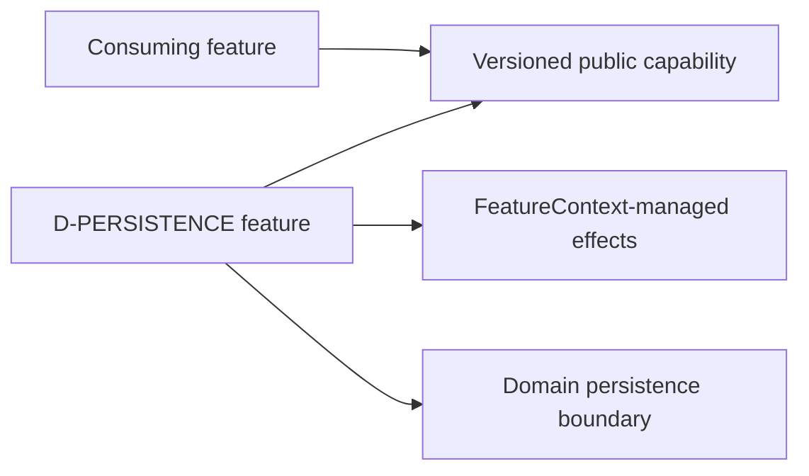

# Persistence

> **Package:** `app/services/persistence/`
> **Status:** `Missing`
> **Last updated:** `2026-09-18`
> **Domain ID:** `D-PERSISTENCE`

This README is the domain's single source of truth for its boundary, feature and FR registry,
domain-local workflows, semantic contract ownership, persisted-state model, acceptance evidence,
and deletion behavior. Reference-product evidence is a requirement source, never implementation
evidence.

`PROJECT.md` owns system scope and cross-domain behavior. `ARCHITECTURE.md` owns universal
structure and runtime constraints. `AGENTS.md` owns contributor workflow. The
[Feature Implementation Pipeline](../../../docs/dev/feature_implementation_pipeline.md) owns the
complete single-file feature delivery checklist.

## Code-aligned implementation convention

Backend features use the simplified modular-monolith layout:

```text
app/services/persistence/
|-- README.md
|-- __init__.py
|-- database.py
|-- artifacts.py
|-- databanks.py
|-- migrations.py
`-- retention.py

app/contracts/persistence.py
app/services/persistence/persistence.py
tests/services/persistence/<feature>/
tests/examples/02_persistence.py
```

Each feature module is one cohesive physical removal unit. It contains typed configuration,
service behavior, lifecycle wiring, immutable `SPEC`, and a zero-argument factory. Registration
is explicit in `app/registry.py`; import-time discovery and ambient singletons are forbidden.
Cross-boundary DTOs, protocols, events, errors, and capability keys live in
`app/contracts/persistence.py`. Features resolve dependencies through `FeatureContext` and
never import sibling implementations.

All schema, parameterized SQL, and transactions for this domain live in
`app/services/persistence/persistence.py`. A feature may be stateless, but it never accepts an
unrestricted database connection. Every completed feature contributes a deterministic, offline,
secret-safe example to `tests/examples/02_persistence.py`.

---

## 1. Purpose and boundary

### Purpose

Own durable mechanics, SQLite schemas and transactions, immutable artifact catalog/lineage, databanks, memberships, ranking storage, and retention.

### Owns

- SQLite WAL control-plane mechanics and forward migrations.
- Artifact catalog, hashes, lineage, staging and atomic publication.
- Databank membership, annotations, copy/move/clear, deterministic ranking, and explicit retention.

### Does not own

- Metric definitions, strategy quality policy, or task scheduling.
- Domain semantic decisions merely because their rows are stored.

### Shared contracts

The public boundary is `app/contracts/persistence.py`. Counterparty status never authorizes a
private implementation import.

| Status | Capability or event | Protocol / DTO symbol | Version | Purpose |
| --- | --- | --- | --- | --- |
| Missing | `persistence.database@1` | `DatabaseService` | `1` | SQLite lifecycle and transactions |
| Missing | `persistence.artifacts@1` | `ArtifactStore` | `1` | Immutable artifact catalog and lineage |
| Missing | `persistence.databanks@1` | `DatabankStore` | `1` | Databanks, memberships, annotations, and ranking |
| Missing | `persistence.migrations@1` | `MigrationService` | `1` | Forward schema migration and compatibility |
| Missing | `persistence.retention@1` | `RetentionService` | `1` | Reference-safe retention and purge planning |

### Persisted-state ownership

Semantic state remains feature-owned although database mechanics are centralized.

| Status | Namespace | Owning feature | Driver | Retention | Public read boundary |
| --- | --- | --- | --- | --- | --- |
| Missing | `persistence.v1` | `FEAT-PERSISTENCE-DATABASE` and registry peers | `sqlite` | Retain versioned records until explicit policy permits purge | `persistence.database@1` |

---

## 2. Feature registry and dependency direction

| Feature | Delivered value | Owner module | Provides | Required capabilities | Status |
| --- | --- | --- | --- | --- | --- |
| `FEAT-PERSISTENCE-DATABASE` | SQLite lifecycle and transactions | `app/services/persistence/database.py` | `persistence.database@1` | None | Missing |
| `FEAT-PERSISTENCE-ARTIFACTS` | Immutable artifact catalog and lineage | `app/services/persistence/artifacts.py` | `persistence.artifacts@1` | `persistence.database@1` | Missing |
| `FEAT-PERSISTENCE-DATABANKS` | Databanks, memberships, annotations, and ranking | `app/services/persistence/databanks.py` | `persistence.databanks@1` | `persistence.database@1` | Missing |
| `FEAT-PERSISTENCE-MIGRATIONS` | Forward schema migration and compatibility | `app/services/persistence/migrations.py` | `persistence.migrations@1` | `persistence.database@1` | Missing |
| `FEAT-PERSISTENCE-RETENTION` | Reference-safe retention and purge planning | `app/services/persistence/retention.py` | `persistence.retention@1` | `persistence.artifacts@1` | Missing |

Dependencies point to public contracts, never implementation modules:



Removing one module and registry entry withdraws only its capability. Required consumers become
attributed `BLOCKED`; operation-gated consumers refuse only the affected operation. Retained
state is never purged implicitly.

---

## 3. Domain workflows

### `WF-PERSISTENCE-PUBLISH` — Atomically publish and catalog an artifact

- **Lead owner:** `FEAT-PERSISTENCE-ARTIFACTS`
- **Participants:** Domain producer, database, artifact filesystem, and lineage catalog.
- **Input boundary:** Contained staged payload, schema/media type, producer/run metadata, and parent identities.
- **Output boundary:** Validated immutable artifact identity and catalog receipt.
- **Failure boundary:** Validation/hash/promotion/catalog failure rolls back visibility; staged data remains quarantined or is safely cleaned.
- **Acceptance:** `ATW-PERSISTENCE-PUBLISH-001`

---

## 4. Feature specifications

The following contract applies to every registered feature; domain-specific semantics are in
Section 9.

### `database.py` — `FEAT-PERSISTENCE-DATABASE`

> **Feature ID:** `FEAT-PERSISTENCE-DATABASE` (representative registry entry)
> **Status:** `Missing`
> **Owner module:** `app/services/persistence/database.py`

#### Purpose

Provide sqlite lifecycle and transactions. Other registry entries follow the same lifecycle and
evidence obligations without merging their responsibilities into this module.

#### Capability declarations

- **Provides:** `persistence.database@1`
- **Requires:** None
- **Optional / operation-gated:** only capabilities explicitly declared by the feature; absence
  returns a typed unavailable result and does not silently substitute behavior.

#### Configuration and limits

Each owner module defines a slotted immutable `<Feature>Config`. No reference sample value is
promoted to a default without product approval.

| Status | Setting | Type / unit | Default | Validation and failure |
| --- | --- | --- | --- | --- |
| Missing | `schema_version` | positive integer | `1` | Reject unknown/incompatible versions |
| Missing | `operation_timeout_s` | finite seconds | operation-specific | Must be positive and bounded |
| Missing | `resource_limit` | positive integer | deployment-specific | Reject nonpositive/unbounded values |

#### Runtime effects and cleanup

| Effect | Acquisition | Cleanup / failure behavior |
| --- | --- | --- |
| Capability publication | `FeatureContext.provide(...)` | Withdrawn with feature scope |
| Tasks/subscriptions/resources | Managed `FeatureContext` API | Cancel/close in reverse order; failed start unwinds all effects |
| Durable mutation | Focused persistence protocol | Transaction rollback; partial output remains unpublished |

#### Persistent state

- **Domain persistence module:** `app/services/persistence/persistence.py`
- **Namespace:** `persistence.v1`
- **Schema version:** `1` initially; forward migrations only
- **Retention and purge:** retain lineage-bearing records; purge only by explicit, reference-safe policy

#### Single-file structure and symbols

| Status | Owner | Responsibility | Symbols |
| --- | --- | --- | --- |
| Missing | `database.py` | SQLite lifecycle and transactions; config, service, lifecycle, `SPEC`, factory | `DatabaseService` |
| Missing | `artifacts.py` | Immutable artifact catalog and lineage; config, service, lifecycle, `SPEC`, factory | `ArtifactStore` |
| Missing | `databanks.py` | Databanks, memberships, annotations, and ranking; config, service, lifecycle, `SPEC`, factory | `DatabankStore` |
| Missing | `migrations.py` | Forward schema migration and compatibility; config, service, lifecycle, `SPEC`, factory | `MigrationService` |
| Missing | `retention.py` | Reference-safe retention and purge planning; config, service, lifecycle, `SPEC`, factory | `RetentionService` |
| Missing | `tests/examples/02_persistence.py` | Offline primary-purpose evidence | one `example_<NN>_<feature_slug>()` per completed feature |

#### Functional requirements

| Status | Requirement ID | Observable behavior | Evidence |
| --- | --- | --- | --- |
| Missing | `FR-PERSISTENCE-001` | Repeated insertion by canonical content identity is idempotent under concurrency. | Concurrent insert test |
| Missing | `FR-PERSISTENCE-002` | Copy adds membership; move atomically adds target and removes source without duplicating content. | Rollback fixtures |
| Missing | `FR-PERSISTENCE-003` | Ranking defines metric/version/scope/nulls/ties/capacity and is deterministic. | Golden admission table |
| Missing | `FR-PERSISTENCE-004` | Purge refuses referenced content and requires an explicit audited operation. | Reference graph test |

#### Removal behavior

Physical removal withdraws the feature's capability and cancels its managed effects. Stored
artifacts remain readable by schema-aware tooling; operations requiring the missing capability
return an attributed unavailable result. Reinstall may resume only after schema and version checks.

---

## 5. Domain-wide requirements and invariants

| Status | Requirement ID | Rule | Verification |
| --- | --- | --- | --- |
| Missing | `ARCH-001` | `__init__.py` is docstring-only. | `scripts/architecture_check.py` |
| Missing | `ARCH-002` | Tasks and resources are managed through `FeatureContext`. | Lifecycle tests |
| Missing | `ARCH-003` | Logging uses `app.kernel.logging`; no service configures handlers. | Architecture/logging tests |
| Missing | `ARCH-004` | Public contracts live in `app/contracts/persistence.py`. | Import/contract checks |
| Missing | `ARCH-005` | Feature modules never import sibling implementations. | Import checks |
| Missing | `ARCH-006` | SQL/schema operations live in `app/services/persistence/persistence.py`. | Architecture/schema checks |

---

## 6. Decisions and open evidence

| Status | Decision ID | Decision or missing evidence | Scope | Required closure |
| --- | --- | --- | --- | --- |
| Accepted | `DEC-PERSISTENCE-001` | SQLite WAL stores control-plane metadata; Parquet/Zstd stores large immutable columns. | Storage topology | Owner-ratified E-T01 |
| Open | `DEC-PERSISTENCE-002` | Proprietary .sqx/.cfx byte compatibility is not claimed. | Interoperability | Legal versioned fixtures |

Evidence IDs resolve through `docs/PROJECT.md`. Unknowns remain explicit; a filename, bundled
sample value, or third-party function name is not proof of runtime semantics.

---

## 7. Tests and definition of done

```text
tests/services/persistence/<feature>/
|-- test_config.py
|-- test_<feature>.py
|-- test_lifecycle.py
|-- test_removal.py
`-- test_persistence.py       # when applicable

tests/examples/02_persistence.py
```

Editing uses explicit affected paths with `--no-cov`; the full candidate gate remains
`uv run python scripts/ci_check.py`.

- [ ] Stable feature and requirement IDs have one owner.
- [ ] Public contracts and exact `FeatureSpec` dependencies exist.
- [ ] Registration is explicit; imports have no runtime effects.
- [ ] Happy, invalid, boundary, unavailable, lifecycle, persistence, and removal tests pass.
- [ ] Numerical or stateful behavior has deterministic golden/fault fixtures.
- [ ] One offline usage example exists per completed feature.
- [ ] Domain status reflects repository evidence, not reference-product evidence.
- [ ] Architecture and full qualification gates pass.

---

## 8. Change process

1. Update this README and identify the exact feature/requirement scope.
2. Update `app/contracts/persistence.py` first when the public boundary changes.
3. Implement one cohesive owner module and immutable `SPEC`.
4. Change `app/services/persistence/persistence.py` only for database mechanics.
5. Update explicit registry, consolidated examples, and focused tests.
6. Verify feature removal and affected consumers.
7. Run the repository-prescribed candidate gate and record actual results.

---

## 9. Normative domain specification

Enable foreign keys, a bounded busy timeout, and short transactions. Raw connections never escape. Artifact writes stage inside an approved root, close and validate, hash, atomically promote, then catalog. Copy/move changes membership, not immutable strategy content. A reference similarity example compares trade count, net profit, and drawdown within ±5% and retains higher fitness; implement it only as a named configurable profile (E-O07), never as a universal constant. Database reset/drop/truncate is not recovery.
