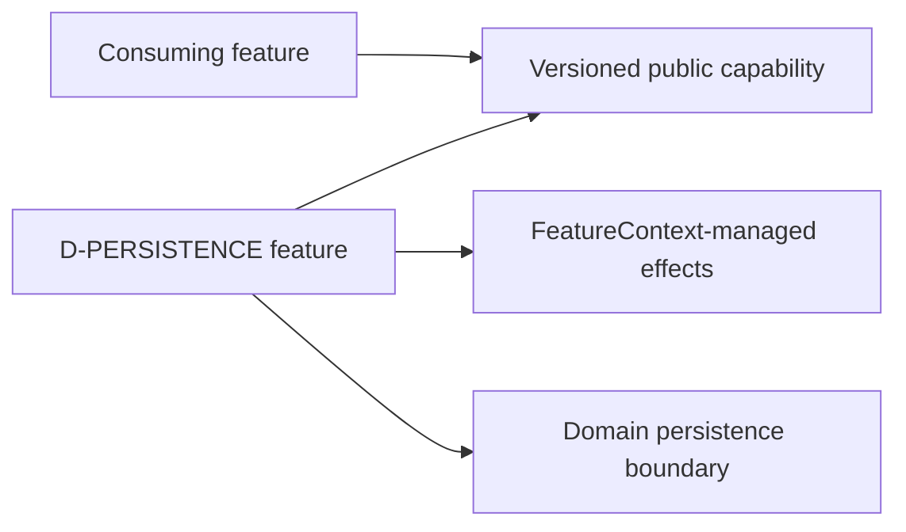

# Persistence

> **Package:** `app/services/persistence/`
> **Status:** `Completed`
> **Last updated:** `2026-09-20`
> **Domain ID:** `D-PERSISTENCE`

This README is the domain's single source of truth for its boundary, feature and FR registry,
domain-local workflows, semantic contract ownership, persisted-state model, acceptance evidence,
and deletion behavior. Reference-product evidence is a requirement source, never implementation
evidence.

`PROJECT.md` owns system scope and cross-domain behavior. `ARCHITECTURE.md` owns universal
structure and runtime constraints. `AGENTS.md` owns contributor workflow. The
[Feature Implementation Pipeline](../../../docs/dev/feature_implementation_pipeline.md) owns the
complete single-file feature delivery checklist.

## Code-aligned implementation convention

Backend features use the simplified modular-monolith layout:

```text
app/services/persistence/
|-- README.md
|-- __init__.py
|-- workspace.py
|-- database.py
|-- artifacts.py
|-- databanks.py
|-- migrations.py
|-- retention.py
|-- parquet_store.py
`-- snapshots.py

app/contracts/persistence.py
app/services/persistence/persistence.py
tests/services/persistence/
tests/examples/02_persistence.py
```

Each feature module is one cohesive physical removal unit. It contains typed configuration,
service behavior, lifecycle wiring, immutable `SPEC`, and a zero-argument factory. Registration
is explicit in `app/registry.py`; import-time discovery and ambient singletons are forbidden.
Cross-boundary DTOs, protocols, events, errors, and capability keys live in
`app/contracts/persistence.py`. Features resolve dependencies through `FeatureContext` and
never import sibling implementations.

The domain layout follows a two-tier architectural structure:
1. **Core Persistence Services:** Modules implementing core storage infrastructure for artifacts, databanks, forward migrations, retention policies, partitioned columnar Parquet series, snapshots, and SQLite database lifecycles (`database.py`, `artifacts.py`, `databanks.py`, `migrations.py`, `retention.py`, `parquet_store.py`, `snapshots.py`). All schema, parameterized SQL, and transactions for this domain live in `app/services/persistence/persistence.py`.
2. **Domain-Specific Persistence Drivers:** In accordance with `ARCHITECTURE.md` Rule 7 (*"SQL/schema/transactions live only in app/services/persistence/<domain>.py"*), persistence modules serving other domains (such as `app/services/persistence/workspace.py` providing `persistence.workspace@1`) encapsulate consuming domain SQL schemas, transactions, atomic CAS transitions, and test isolation via `HARUQUANTAI_DB_PATH`.

A feature may be stateless, but it never accepts an unrestricted database connection. Every completed feature contributes a deterministic, offline, secret-safe example to `tests/examples/02_persistence.py`.

---

## 1. Purpose and boundary

### Purpose

Own durable mechanics, SQLite control-plane schemas and transactions, immutable artifact catalog/lineage, portable artifact package bundles, databanks, memberships, ranking storage, similarity deduplication, persisted column views, partitioned columnar Parquet time-series, and reference-safe retention.

### Owns

- SQLite WAL control-plane mechanics, foreign keys, busy timeouts, and forward migrations.
- Artifact catalog, content hashes (SHA-256), lineage graphs, staging, atomic publication, and portable package bundles (`.zip` container format with manifest and checksum integrity).
- Databank membership, annotations, copy/move/clear, deterministic ranking, bounded capacity admission/eviction, similar-strategy dismissal filtering, and persisted column view configurations (`.vw` projection schemas).
- Partitioned columnar market data time-series engine (Parquet/Zstd).
- Point-in-time database hot snapshots and backups (`VACUUM INTO`).
- Reference-safe retention and purge planning.

### Does not own

- Metric mathematical formulas, strategy quality policy, or task scheduling.
- Domain semantic decisions merely because their rows are stored.
- Direct UI layout rendering or transport protocols (owned by UI / Gateway).

### Shared contracts

The public boundary is `app/contracts/persistence.py`. Counterparty status never authorizes a
private implementation import.

| Status | Capability or event | Protocol / DTO symbol | Version | Purpose |
| --- | --- | --- | --- | --- |
| Completed | `persistence.database@1` | `DatabaseService` | `1` | SQLite lifecycle and transactions |
| Completed | `persistence.artifacts@1` | `ArtifactStore` | `1` | Immutable artifact catalog and lineage |
| Completed | `persistence.databanks@1` | `DatabankStore` | `1` | Databanks, memberships, annotations, and ranking |
| Completed | `persistence.migrations@1` | `MigrationService` | `1` | Forward schema migration and compatibility |
| Completed | `persistence.retention@1` | `RetentionService` | `1` | Reference-safe retention and purge planning |
| Completed | `persistence.parquet@1` | `ParquetStoreService` | `1` | Partitioned columnar market data storage engine |
| Completed | `persistence.snapshots@1` | `SnapshotService` | `1` | Atomic point-in-time database hot snapshots and backups |
| Completed | `gateway.persistence@1` | `GatewayPersistenceService` | `1` | Durable gateway settings, API tokens, and idempotency responses |

### Persisted-state ownership

Semantic state remains feature-owned although database mechanics are centralized.

| Status | Namespace | Owning feature | Driver | Retention | Public read boundary |
| --- | --- | --- | --- | --- | --- |
| Completed | `persistence.v1` | `FEAT-PERSISTENCE-DATABASE` and registry peers | `sqlite` | Retain versioned records until explicit policy permits purge | `persistence.database@1` |
| Completed | `gateway.v1` | `FEAT-PERSISTENCE-GATEWAY` | `sqlite` | Expired idempotency keys pruned; settings and tokens durable | `gateway.persistence@1` |

---

## 2. Feature registry and dependency direction

| Feature | Delivered value | Owner module | Provides | Required capabilities | Status |
| --- | --- | --- | --- | --- | --- |
| `FEAT-PERSISTENCE-DATABASE` | SQLite lifecycle and transactions | `app/services/persistence/database.py` | `persistence.database@1` | None | Completed |
| `FEAT-PERSISTENCE-ARTIFACTS` | Immutable artifact catalog, lineage, and packaging | `app/services/persistence/artifacts.py` | `persistence.artifacts@1` | `persistence.database@1` | Completed |
| `FEAT-PERSISTENCE-DATABANKS` | Databanks, memberships, annotations, ranking, similarity dismissal, and column views | `app/services/persistence/databanks.py` | `persistence.databanks@1` | `persistence.database@1`, `persistence.artifacts@1` | Completed |
| `FEAT-PERSISTENCE-MIGRATIONS` | Forward schema migration and compatibility | `app/services/persistence/migrations.py` | `persistence.migrations@1` | `persistence.database@1` | Completed |
| `FEAT-PERSISTENCE-RETENTION` | Reference-safe retention and purge planning | `app/services/persistence/retention.py` | `persistence.retention@1` | `persistence.database@1`, `persistence.artifacts@1` | Completed |
| `FEAT-PERSISTENCE-PARQUET` | Partitioned columnar market data store | `app/services/persistence/parquet_store.py` | `persistence.parquet@1` | None | Completed |
| `FEAT-PERSISTENCE-SNAPSHOTS` | Point-in-time database hot snapshots and backups | `app/services/persistence/snapshots.py` | `persistence.snapshots@1` | `persistence.database@1` | Completed |
| `FEAT-PERSISTENCE-GATEWAY` | Gateway durable settings, API tokens, and idempotency responses | `app/services/persistence/gateway.py` | `gateway.persistence@1` | `persistence.database@1` | Completed |

> **Note on Domain Persistence Drivers:** Physical modules implementing cross-domain persistence (such as `app/services/persistence/workspace.py` providing `persistence.workspace@1`) are registered under their consuming domain's capability lifecycle while executing within the persistence physical boundary.

Dependencies point to public contracts, never implementation modules:


```mermaid
flowchart LR
    Consumer["Consuming feature"] --> Contract["Versioned public capability"]
    Provider["D-PERSISTENCE feature"] --> Contract
    Provider --> Context["FeatureContext-managed effects"]
    Provider --> Persistence["Domain persistence boundary"]
```

Removing one module and registry entry withdraws only its capability. Required consumers become
attributed `BLOCKED`; operation-gated consumers refuse only the affected operation. Retained
state is never purged implicitly.

---

## 3. Domain workflows

### `WF-PERSISTENCE-PUBLISH` — Atomically publish and catalog an artifact

- **Lead owner:** `FEAT-PERSISTENCE-ARTIFACTS`
- **Participants:** Domain producer, database, artifact filesystem, and lineage catalog.
- **Input boundary:** Contained staged payload, schema/media type, producer/run metadata, and parent identities.
- **Output boundary:** Validated immutable artifact identity and catalog receipt.
- **Failure boundary:** Validation/hash/promotion/catalog failure rolls back visibility; staged data remains quarantined or is safely cleaned.
- **Acceptance:** `ATW-PERSISTENCE-PUBLISH-001`

---

## 4. Feature specifications

The following contract applies to every registered feature; domain-specific semantics are in
Section 9.

### `database.py` — `FEAT-PERSISTENCE-DATABASE`

> **Feature ID:** `FEAT-PERSISTENCE-DATABASE` (representative registry entry)
> **Status:** `Completed`
> **Owner module:** `app/services/persistence/database.py`

#### Purpose

Provide sqlite lifecycle and transactions. Other registry entries follow the same lifecycle and
evidence obligations without merging their responsibilities into this module.

#### Capability declarations

- **Provides:** `persistence.database@1`
- **Requires:** None
- **Optional / operation-gated:** only capabilities explicitly declared by the feature; absence
  returns a typed unavailable result and does not silently substitute behavior.

#### Configuration and limits

Each owner module defines a slotted immutable `<Feature>Config`. No reference sample value is
promoted to a default without product approval.

| Feature Config | Setting | Type / unit | Default | Validation and failure |
| --- | --- | --- | --- | --- |
| `DatabaseConfig` | `database_path` | `Path` | `data/database/haruquantai.db` | Directory created if missing |
| `DatabaseConfig` | `timeout_s` | `float` | `5.0` | Must be > 0 |
| `DatabaseConfig` | `busy_timeout_ms` | `int` | `5000` | Must be > 0 |
| `DatabaseConfig` | `wal_mode` | `bool` | `True` | Configures WAL pragma |
| `ArtifactConfig` | `artifacts_dir` | `Path` | `data/artifacts` | Directory created if missing |
| `ArtifactConfig` | `staging_dir` | `Path` | `data/staging` | Directory created if missing |
| `DatabankConfig` | `default_capacity` | `int` | `1000` | Must be > 0 |
| `MigrationConfig` | `migrations_dir` | `Path \| None` | `None` | Optional SQL directory |
| `MigrationConfig` | `custom_migrations` | `tuple` | `()` | Sequence of custom migrations |
| `RetentionConfig` | `artifacts_dir` | `Path` | `data/artifacts` | Target directory for managed payload removal |
| `SnapshotConfig` | `snapshot_dir` | `Path` | `data/snapshots` | Target directory for hot backup files |
| `ParquetConfig` | `market_dir` | `Path` | `data/market` | Root directory for partitioned columnar store |

#### Runtime effects and cleanup

| Effect | Acquisition | Cleanup / failure behavior |
| --- | --- | --- |
| Capability publication | `FeatureContext.provide(...)` | Withdrawn with feature scope |
| Tasks/subscriptions/resources | Managed `FeatureContext` API | Cancel/close in reverse order; failed start unwinds all effects |
| Durable mutation | Focused persistence protocol | Transaction rollback; partial output remains unpublished |

#### Persistent state

- **Domain persistence module:** `app/services/persistence/persistence.py`
- **Namespace:** `persistence.v1`
- **Schema version:** `1` initially (authoritative `0001_initial_schema` applied via forward migration ledger; manager initialization is idempotent)
- **Retention and purge:** retain lineage-bearing records; purge only by explicit, reference-safe policy re-validated at execution time

#### Single-file structure and symbols

| Status | Owner | Responsibility | Symbols |
| --- | --- | --- | --- |
| Completed | `database.py` | SQLite lifecycle and transactions; config, service, lifecycle, `SPEC`, factory | `DatabaseService` |
| Completed | `artifacts.py` | Immutable artifact catalog, lineage, and packaging; config, service, lifecycle, `SPEC`, factory | `ArtifactStore` |
| Completed | `databanks.py` | Databanks, memberships, annotations, ranking, similarity, and views; config, service, lifecycle, `SPEC`, factory | `DatabankStore` |
| Completed | `migrations.py` | Forward schema migration and compatibility; config, service, lifecycle, `SPEC`, factory | `MigrationService` |
| Completed | `retention.py` | Reference-safe retention and purge planning; config, service, lifecycle, `SPEC`, factory | `RetentionService` |
| Completed | `parquet_store.py` | Partitioned columnar market data time-series engine; config, service, lifecycle, `SPEC`, factory | `ParquetStoreService` |
| Completed | `snapshots.py` | Point-in-time database hot snapshots and backups; config, service, lifecycle, `SPEC`, factory | `SnapshotService` |
| Completed | `tests/examples/02_persistence.py` | Offline primary-purpose evidence | one `example_<NN>_<feature_slug>()` per completed feature |

#### Functional requirements

| Status | Requirement ID | Observable behavior | Evidence |
| --- | --- | --- | --- |
| Completed | `FR-PERSISTENCE-CONCURRENCY_INSERT` | Repeated insertion by canonical content identity is idempotent under concurrency without constraint errors. | `tests/services/persistence/test_artifacts.py` |
| Completed | `FR-PERSISTENCE-COPY_MOVE` | Copy adds membership; move atomically adds target and removes source in a single transaction without duplicating content. | `tests/services/persistence/test_databanks.py` |
| Completed | `FR-PERSISTENCE-DETERMINISTIC_RANKING` | Ranking defines metric/version/scope/nulls/ties and evaluates deterministically. | `tests/services/persistence/test_databanks.py` |
| Completed | `FR-PERSISTENCE-SAFE_PURGE` | Purge refuses referenced content, re-validates references at execution time, and requires an explicit audited operation. | `tests/services/persistence/test_retention.py` |
| Completed | `FR-PERSISTENCE-SIMILARITY_FILTER` | Configurable similarity filtering compares candidate strategy metrics against databank members and dismisses redundant candidates or replaces lower-fitness members. | `tests/services/persistence/test_databanks.py` (`SQX144-EV-000006`) |
| Completed | `FR-PERSISTENCE-CAPACITY_EVICTION` | Bounded databank capacity enforces deterministic admission gating and evicts the lowest-ranked strategy when capacity is exceeded and candidate fitness is superior. | `tests/services/persistence/test_databanks.py` |
| Completed | `FR-PERSISTENCE-PARQUET_STORE` | Partitioned columnar Parquet store provides partitioned storage (`symbol/timeframe/year.parquet`), idempotent upserts, and time-bounded range reads for bars and tick streams. | `tests/services/persistence/test_parquet_store.py` |
| Completed | `FR-PERSISTENCE-PACKAGE_BUNDLE` | Artifact store provides packaging and unpacking of portable strategy bundles with manifest verification, checksum integrity, and lineage preservation. | `tests/services/persistence/test_artifacts.py` |
| Completed | `FR-PERSISTENCE-COLUMN_VIEWS` | Persisted column views configure visible metric projections, sample scopes (IS, OOS, Full), sub-results, and display formats for databank inspection. | `tests/services/persistence/test_databanks.py` |

#### Removal behavior

Physical removal withdraws the feature's capability and cancels its managed effects. Stored
artifacts remain readable by schema-aware tooling; operations requiring the missing capability
return an attributed unavailable result. Reinstall may resume only after schema and version checks.

---

## 5. Domain-wide requirements and invariants

| Status | Requirement ID | Rule | Verification |
| --- | --- | --- | --- |
| Completed | `ARCH-001` | `__init__.py` is docstring-only. | `scripts/architecture_check.py` |
| Completed | `ARCH-002` | Tasks and resources are managed through `FeatureContext`. | Lifecycle tests |
| Completed | `ARCH-003` | Logging uses `app.kernel.logging`; no service configures handlers. | Architecture/logging tests |
| Completed | `ARCH-004` | Public contracts live in `app/contracts/persistence.py`. | Import/contract checks |
| Completed | `ARCH-005` | Feature modules never import sibling implementations. | Import checks |
| Completed | `ARCH-006` | SQL/schema operations live in `app/services/persistence/persistence.py`. | Architecture/schema checks |

---

## 6. Decisions and open evidence

| Status | Decision ID | Decision or missing evidence | Scope | Required closure |
| --- | --- | --- | --- | --- |
| Accepted | `DEC-PERSISTENCE-001` | SQLite WAL stores control-plane metadata; Parquet/Zstd stores large immutable columns. | Storage topology | Owner-ratified E-T01 |
| Open | `DEC-PERSISTENCE-002` | Proprietary .sqx/.cfx byte compatibility is not claimed; open portable artifact bundles are supported. | Interoperability | Legal versioned fixtures |
| Accepted | `DEC-PERSISTENCE-003` | Similar-strategy dismissal evaluates configurable percentage tolerances on Net Profit, Trades, and Drawdown, retaining higher fitness. | Databank deduplication | Grounded in `SQX144-EV-000006` and E-O07 |

Evidence IDs resolve through `docs/PROJECT.md`. Unknowns remain explicit; a filename, bundled
sample value, or third-party function name is not proof of runtime semantics.

---

## 7. Tests and definition of done

```text
tests/services/persistence/
|-- test_database.py
|-- test_migrations.py
|-- test_snapshots.py
|-- test_artifacts.py
|-- test_retention.py
|-- test_databanks.py
|-- test_parquet_store.py
|-- test_composition.py
`-- test_workspace_persistence.py

tests/examples/02_persistence.py
```

### Acceptance Evidence Ledger

| Feature ID | Manifest | Test Target | Canonical Example | Workflow Bound | Status |
| --- | --- | --- | --- | --- | --- |
| `FEAT-PERSISTENCE-DATABASE` | [acceptance.json](../../../docs/dev/evidence/features/FEAT-PERSISTENCE-DATABASE/acceptance.json) | `test_database.py` | `example_02_database` | — | ACCEPTED |
| `FEAT-PERSISTENCE-MIGRATIONS` | [acceptance.json](../../../docs/dev/evidence/features/FEAT-PERSISTENCE-MIGRATIONS/acceptance.json) | `test_migrations.py` | `example_02_migrations` | — | ACCEPTED |
| `FEAT-PERSISTENCE-SNAPSHOTS` | [acceptance.json](../../../docs/dev/evidence/features/FEAT-PERSISTENCE-SNAPSHOTS/acceptance.json) | `test_snapshots.py` | `example_02_snapshots` | — | ACCEPTED |
| `FEAT-PERSISTENCE-ARTIFACTS` | [acceptance.json](../../../docs/dev/evidence/features/FEAT-PERSISTENCE-ARTIFACTS/acceptance.json) | `test_artifacts.py` | `example_02_artifacts` | `ATW-PERSISTENCE-PUBLISH-001` | ACCEPTED |
| `FEAT-PERSISTENCE-RETENTION` | [acceptance.json](../../../docs/dev/evidence/features/FEAT-PERSISTENCE-RETENTION/acceptance.json) | `test_retention.py` | `example_02_retention` | — | ACCEPTED |
| `FEAT-PERSISTENCE-DATABANKS` | [acceptance.json](../../../docs/dev/evidence/features/FEAT-PERSISTENCE-DATABANKS/acceptance.json) | `test_databanks.py` | `example_02_databanks` | — | ACCEPTED |
| `FEAT-PERSISTENCE-PARQUET` | [acceptance.json](../../../docs/dev/evidence/features/FEAT-PERSISTENCE-PARQUET/acceptance.json) | `test_parquet_store.py` | `example_02_parquet_store` | — | ACCEPTED |

Editing uses explicit affected paths with `--no-cov`; the full candidate gate remains
`uv run python scripts/ci_check.py`.

- [x] Stable feature and requirement IDs have one owner.
- [x] Public contracts and exact `FeatureSpec` dependencies exist.
- [x] Registration is explicit; imports have no runtime effects.
- [x] Happy, invalid, boundary, unavailable, lifecycle, persistence, and removal tests pass.
- [x] Numerical or stateful behavior has deterministic golden/fault fixtures.
- [x] One real-world usage example exists per completed feature.
- [x] Domain status reflects repository evidence, not reference-product evidence.
- [x] Architecture and full qualification gates pass.

---

## 8. Change process

1. Update this README and identify the exact feature/requirement scope.
2. Update `app/contracts/persistence.py` first when the public boundary changes.
3. Implement one cohesive owner module and immutable `SPEC`.
4. Change `app/services/persistence/persistence.py` only for database mechanics.
5. Update explicit registry, consolidated examples, and focused tests.
6. Verify feature removal and affected consumers.
7. Run the repository-prescribed candidate gate and record actual results.

---

## 9. Normative domain specification

Enable foreign keys, a bounded busy timeout, and short transactions. Raw connections never escape. Artifact writes stage inside an approved root, close and validate, hash, atomically promote, then catalog (`FR-PERSISTENCE-CONCURRENCY_INSERT`, `FR-PERSISTENCE-PACKAGE_BUNDLE`). Copy/move changes membership, not immutable strategy content (`FR-PERSISTENCE-COPY_MOVE`). Databank admission strictly enforces bounded capacity (`FR-PERSISTENCE-CAPACITY_EVICTION`) and deterministic ranking (`FR-PERSISTENCE-DETERMINISTIC_RANKING`). Configurable similarity dismissal compares trade count, net profit, and drawdown within specified tolerances (e.g. ±5%) and retains higher fitness (`FR-PERSISTENCE-SIMILARITY_FILTER`, `SQX144-EV-000006`); it is implemented only as a named configurable profile (E-O07), never as a universal constant. Market data time-series are stored in partitioned columnar Parquet files with Zstd compression (`FR-PERSISTENCE-PARQUET_STORE`, `DEC-PERSISTENCE-001`). Databank views persist column projections, metrics, and sample scopes independently of underlying rows (`FR-PERSISTENCE-COLUMN_VIEWS`). Database reset/drop/truncate is not recovery.
