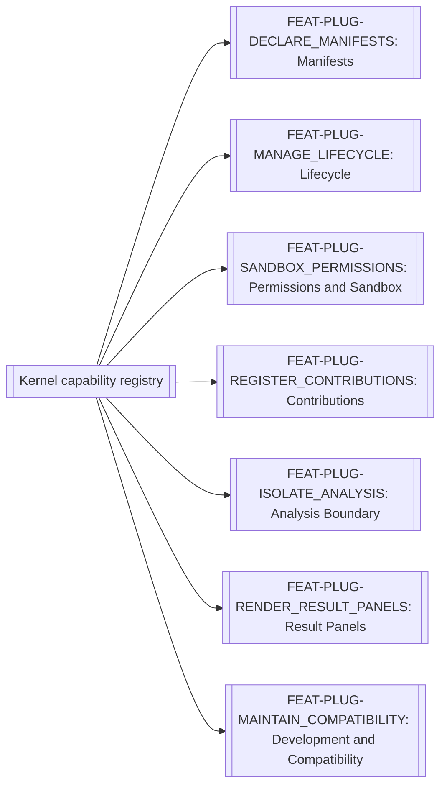
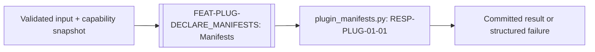

# Plugins

> **Package:** `app/services/plugins/`
> **Status:** `Missing`
> **Last updated:** `2026-08-23`
> **Domain ID:** `D-PLUG`

> This README is the domain package's **single source of truth** for domain boundaries, composable feature capabilities, architecture invariants, implementation sequence, progress, usage examples, and tests.
> Update this document before modifying or adding code.

---

## Code-Aligned Implementation Convention

This README is the sole current target registry for this domain's feature IDs and statuses, functional requirements, domain-local workflows, semantic contract ownership, persisted-state model, acceptance evidence, and deletion behavior. `PROJECT.md` owns system scope, cross-domain behavior, system NFRs, and release gates; `ARCHITECTURE.md` owns universal package and runtime constraints. Feature-local READMEs, manifests, contract definitions, migrations, and tests provide current implementation evidence without silently changing this target registry.

Implementation uses the repository's existing feature substrate: each feature lives directly at `app/services/<domain>/<feature>/`, is discovered through the `haruquantai.features` Python entry-point group, and declares one immutable `FeatureSpec` in `manifest.py`. There are no domain or feature YAML manifests.

Every implemented feature also contains a mandatory runtime-validated `README.md`, pure `__init__.py`, strict `config.py`, lifecycle `feature.py`, and focused implementation modules. Dependencies and effects flow through `FeatureContext`/`FeatureScope`; cross-feature implementation imports are forbidden. Persistent state is declared by `FeatureSpec.state`; any migrations and storage adapters remain with the owning feature. Capability keys use `<domain>.<name>@<major>`. FR IDs remain product, acceptance, and test-trace identities rather than one runtime registration per FR. A requirement `Depends` cell expresses product sequencing, traceability, or acceptance evidence only; runtime dependencies are declared separately with exact keys in `FeatureSpec.requires` or `FeatureSpec.optional`.

Feature-level automated tests live at `tests/services/plugins/<feature>/`. Usage examples never live under `tests/`; they belong to each feature's designated primary domain-logic module. Broader automated verification retains its documented architecture, composition, API, integration, or system test location. The code-backed procedure is the [Feature Implementation Pipeline](../../../docs/dev/feature_implementation_pipeline.md).

## 1. Purpose and Boundary

### Purpose

The Plugins domain delivers third-party payload manifests, installation and lifecycle, permissions, isolation, contribution registration, compatibility, and development conformance. Built-in code generation belongs to D-STRAT; `app/kernel/` owns generic feature lifecycle/effect primitives and `app/composition/` orchestrates them. Its public feature capabilities are registered and remain independent of package-import order. Removing the domain produces the degradation defined below rather than preventing the shared substrate or unrelated domains from starting.

### Owns

- `FEAT-PLUG-DECLARE_MANIFESTS` — Manifests.
- `FEAT-PLUG-MANAGE_LIFECYCLE` — Lifecycle.
- `FEAT-PLUG-SANDBOX_PERMISSIONS` — Permissions and Sandbox.
- `FEAT-PLUG-REGISTER_CONTRIBUTIONS` — Contributions.
- `FEAT-PLUG-ISOLATE_ANALYSIS` — Analysis Boundary.
- `FEAT-PLUG-RENDER_RESULT_PANELS` — Result Panels.
- `FEAT-PLUG-MAINTAIN_COMPATIBILITY` — Development and Compatibility.

### Does not own

- Built-in business capabilities, built-in Codegen, or generic `app/composition/` lifecycle/effect cleanup.
- Composition lifecycle, dependency resolution, effect reversal, and transactional replacement; those belong to the non-domain shared substrate (`app/contracts/`, `app/kernel/`, and `app/composition/`).
- **Deletion boundary:** deleting `app/services/plugins/` means all third-party capability providers disappear; built-in strategy authoring, code generation, simulation, data, and analytics remain. Plugin-owned data stays opaque with schema metadata for inspection or reinstallation. The kernel and unrelated domains shall remain healthy.

### Shared Contracts

This domain semantically owns the contracts listed below, but their sole physical definitions live in `app/contracts/plugins/` and wire schemas in `app/contracts/plugins/wire/`. `app/services/plugins/` contains implementations only and shall not define or re-export substitute public contract types. Contract versions and semantic owners must agree with `PROJECT.md` and this README. Feature IDs and FR IDs are documentation, lifecycle, acceptance, and traceability identities; runtime bindings use exact versioned `CapabilityKey` declarations in contracts and `FeatureSpec`. The exact public records and capability bundles are listed in the [Shared Contracts README](../../contracts/README.md#411-appcontractsplugins).

Rows labelled `FEAT-* capability surface` describe planned semantic contract bundles, not literal runtime capability keys. A listed counterparty may produce, consume, or observe the bundle and does not establish package-import or runtime dependency direction.

**Owned by this domain**

| Status | Contract | Version | Counterparty | Purpose |
|---|---|---|---|---|
| Implemented | `FEAT-PLUG-DECLARE_MANIFESTS` capability surface | `v1` | Workspace | Manifests. |
| Implemented | `FEAT-PLUG-MANAGE_LIFECYCLE` capability surface | `v1` | Workspace | Lifecycle. |
| Implemented | `FEAT-PLUG-SANDBOX_PERMISSIONS` capability surface | `v1` | Workspace | Permissions and Sandbox. |
| Implemented | `FEAT-PLUG-REGISTER_CONTRIBUTIONS` capability surface | `v1` | Workspace | Contributions. |
| Implemented | `FEAT-PLUG-ISOLATE_ANALYSIS` capability surface | `v1` | Workspace | Analysis Boundary. |
| Implemented | `FEAT-PLUG-RENDER_RESULT_PANELS` capability surface | `v1` | Workspace | Result Panels. |
| Implemented | `FEAT-PLUG-MAINTAIN_COMPATIBILITY` capability surface | `v1` | Workspace | Development and Compatibility. |

**Cross-domain requirement references (not runtime dependencies)**

The rows below summarize foreign owner tokens found in FR `Depends` cells. They express product sequencing, traceability, or acceptance-evidence relationships only. Actual runtime consumption must name an exact versioned capability key in the consuming feature's `FeatureSpec.requires` or `FeatureSpec.optional` and must follow the dependency direction in `PROJECT.md` and `ARCHITECTURE.md`.

| Referenced domain set | Documentation version | Owner | Meaning |
|---|---|---|---|
| `D-WS` public capability set | `v1` | Workspace | Requirements whose `Depends` cell names `WS-*`. |

#### Ratified v1 public records (13)

Physical-layer reconciliation rules (apply to every record below): Workspace physical-layer rules apply. Plugin stable IDs are external-origin string identifiers `^[a-z0-9][a-z0-9._-]{0,127}$` (v1 `id: str` preserved), the documented exception to `Uuid7` for this namespace. v1 `Any` positions take `JsonObject` per the ratified JSON refinement; v1 float resource limits take `DecimalValue`.

| # | Record | Exact wire fields | Producer → consumers | FRs / lifecycle |
|---|---|---|---|---|
| R1 | `PluginRef` (wire-native) | `plugin_id: plugin stable-ID pattern`; `schema_version: Literal[1] = 1`. | Plugins → Strategy, Research, Analytics, Data, Workspace | FR-PLUG-DECLARE_PLUGIN_MANIFESTS. |
| R2 | `PluginVersion` (wire-native) | `plugin_id: stable-ID`; `version: semver str`; `api_range: nonempty range str`; `types: tuple[Literal[BLOCK,INDICATOR,METRIC,FILTER,FITNESS,RESEARCH_METHOD,DATA_CONNECTOR,PROJECT_TASK,SOURCE_EMITTER,RESULT_PANEL], ...] = ()`; `manifest_hash: ContentHash`; `package_hash: ContentHash`; `capabilities: tuple[CapabilityIdentifier, ...] = ()`; `permissions: PluginPermissionWire`; `resources: PluginResourceLimitsWire`; `content_hash: ContentHash`; `schema_version: Literal[1] = 1`. Uniqueness `(plugin_id,version)`; immutable. | Plugins → Workspace, Strategy, Interfaces | FR-PLUG-DECLARE_PLUGIN_MANIFESTS, FR-PLUG-DECLARE_PLUGIN_COMPATIBILITY. |
| R3 | `PluginManifest` (`PluginManifestWire`) | v1 fields kept: `id: stable-ID`; `version: semver str`; `api_range: nonempty str`; `types` (R2 literal tuple) `= ()`; `entry_point: relative path = "main.py"`; `schemas: dict[str, JsonObject] = {}`; `capabilities: tuple[CapabilityIdentifier, ...] = ()`; `permissions: PluginPermissionWire` = (`filesystem_read: tuple[str,...] = ()`, `filesystem_write: tuple[str,...] = ()`, `network_endpoints: tuple[str,...] = ()`, `subprocess_allow: bool = False`, `secrets: tuple[nonempty str,...] = ()` — Workspace `SecretRef` names); `resources: PluginResourceLimitsWire` = (`cpu_limit_cores: DecimalValue > 0 = "1"`, `memory_limit_mb: int >= 1 = 512`, `timeout_seconds: DecimalValue > 0 = "30"`); `sha256_by_file: dict[relative path, ContentHash] = {}`; `signature: str | None = None`; plus `schema_version: Literal[1] = 1`. | FEAT-PLUG-DECLARE_MANIFESTS → Workspace, all plugin consumers | FR-PLUG-DECLARE_PLUGIN_MANIFESTS. Malformed, incompatible, or altered packages never load. |
| R4 | `PluginCompatibility` (wire-native) | `plugin_api_version: semver str`; `supported_range: nonempty range str`; `is_deprecated: bool = False`; `deprecation_diagnostic: str = ""`; `migration_guide_ref: str | None = None`; `conformance_suite: nonempty str` (conformance-test kit identity); `schema_version: Literal[1] = 1`. | FEAT-PLUG-MAINTAIN_COMPATIBILITY → plugin authors, Workspace | FR-PLUG-DECLARE_PLUGIN_COMPATIBILITY. A supported older plugin runs unchanged or is rejected before activation with a precise reason. |
| R5 | `PluginPermissionSet` (wire-native) | `plugin_id: stable-ID`; `workspace_id: Uuid7`; `version: semver str`; `filesystem_read/filesystem_write/network_endpoints/subprocess_allow/secrets` as in `PluginPermissionWire`; `cpu_limit_cores: DecimalValue > 0 = "1"`; `memory_limit_mb: int >= 1 = 1024`; `timeout_seconds: DecimalValue > 0 = "60"`; `max_output_mb: int >= 1 = 64`; `schema_version: Literal[1] = 1`. Constraint: effective grants never exceed declared manifest permissions (narrowing only); no network unless the manifest grants it; only declared endpoints/credentials are supplied (§15.7 defaults). | FEAT-PLUG-SANDBOX_PERMISSIONS → Workspace, Interfaces | FR-PLUG-ISOLATE_PLUGIN_EXECUTION, FR-PLUG-RESTRICT_PLUGIN_SECRETS. |
| R6 | `PluginActivation` (wire-native) | `plugin_id: stable-ID`; `workspace_id: Uuid7`; `installed_version: semver str`; `previous_version: semver str | None = None`; `state: Literal[INSTALLED,ENABLED,DISABLED]`; `enabled_at: UtcTimestamp | None = None`; `disabled_at: UtcTimestamp | None = None`; `row_version: int >= 1 = 1`; `created_at: UtcTimestamp`; `updated_at: UtcTimestamp`; `schema_version: Literal[1] = 1`. Uniqueness `(plugin_id,workspace_id)` (`plugin_activations`); a failed upgrade preserves the previous usable version and dependent objects remain diagnosable. | FEAT-PLUG-MANAGE_LIFECYCLE → Workspace, Strategy | FR-PLUG-REPLACE_PLUGINS_TRANSACTIONALLY. |
| R7 | `PluginLifecycleState` (wire-native) | `plugin_id: stable-ID`; `workspace_id: Uuid7`; `execution_state: Literal[LOADED,STARTED,RUNNING,TIMED_OUT,CRASHED,STOPPED]`; `entered_at: UtcTimestamp`; `last_heartbeat_at: UtcTimestamp | None = None`; `exit_reason: str = ""`; `schema_version: Literal[1] = 1`. Constraint: kill/timeout/crash leaves the API and committed inputs intact; append-only observational state. | FEAT-PLUG-SANDBOX_PERMISSIONS → Workspace diagnostics | FR-PLUG-ISOLATE_PLUGIN_EXECUTION. |
| R8 | `PluginContribution` (wire-native; v1 `PluginContributionDescriptor` remains the process type) | `contribution_id: nonempty str`; `plugin_id: stable-ID`; `plugin_type: R2 type literal`; `name: nonempty str`; `description: str = ""`; `schema_ref: nonempty str | None = None`; `metadata: JsonObject = {}`; `registered_at: UtcTimestamp`; `is_enabled: bool = True`; `schema_version: Literal[1] = 1`. | FEAT-PLUG-REGISTER_CONTRIBUTIONS → Strategy, Research, Analytics, Data, UI | FR-PLUG-REGISTER_PLUGIN_CONTRIBUTIONS. Each type passes its contract-test kit before stable enablement. |
| R9 | `PluginAnalysisRequest` (wire-native) | `request_id: Uuid7`; `plugin_id: stable-ID`; `contribution_id: nonempty str`; `input_handles: tuple[PluginInputHandle, ...] = ()` where `PluginInputHandle(artifact_id: Uuid7, content_hash: ContentHash, media_type: nonempty str, read_only: Literal[True] = True)`; `parameters: JsonObject = {}`; `schema_version: Literal[1] = 1`. Constraint: handles are immutable; direct database or artifact mutation is impossible through the plugin contract. | FEAT-PLUG-ISOLATE_ANALYSIS → Analytics, Research | FR-PLUG-PASS_ARTIFACT_HANDLES. |
| R10 | `PluginAnalysisResult` (wire-native) | `request_id: Uuid7`; `contribution_id: nonempty str`; `status: Literal[SUCCEEDED,FAILED]`; `staged_artifact_id: Uuid7 | None = None` (§5.2 `STAGED` output, schema-validated); `errors: tuple[ValidationIssue, ...] = ()`; `schema_version: Literal[1] = 1`. Constraint: output is staged only and never committed by the plugin boundary. | FEAT-PLUG-ISOLATE_ANALYSIS → Analytics, Research | FR-PLUG-PASS_ARTIFACT_HANDLES. |
| R11 | `ResultPanelDescriptor` (wire-native) | `panel_id: nonempty str`; `contribution_id: nonempty str`; `plugin_id: stable-ID`; `title: nonempty str`; `bridge_operations: tuple[Literal[READ_RESULTS,QUERY_DATA,RECEIVE_MESSAGES], ...] = ()`; `content_source: nonempty str` (sandboxed content origin); `schema_version: Literal[1] = 1`. Constraint: sandboxed browser boundary with a narrow read/query/message bridge; no control-plane credentials; undeclared navigation and commands are blocked. | FEAT-PLUG-RENDER_RESULT_PANELS → UI | FR-PLUG-SANDBOX_RESULT_PANELS. |
| R12 | `PluginValidationReport` (wire-native) | `report_id: Uuid7`; `plugin_id: stable-ID`; `version: semver str`; `manifest_checks: tuple[ValidationIssue, ...] = ()`; `contract_fixture_results: tuple[ContributionTestResultWire, ...] = ()` (`contribution_id`, `plugin_type`, `passed: bool`, `details: str = ""`, `errors: tuple[str,...] = ()`); `permission_simulation_findings: tuple[nonempty str, ...] = ()`; `captured_log_counts: dict[nonempty str, int >= 0] = {}`; `package_hash: ContentHash`; `is_valid: bool`; `schema_version: Literal[1] = 1`. Constraint: a reference plugin passes identically in CI and the local harness. | FEAT-PLUG-MAINTAIN_COMPATIBILITY → plugin authors | FR-PLUG-VALIDATE_PLUGIN_PACKAGES. |
| R13 | `PluginPackageReceipt` (wire-native) | `receipt_id: Uuid7`; `plugin_id: stable-ID`; `version: semver str`; `package_hash: ContentHash`; `manifest_hash: ContentHash`; `files: tuple[PluginFileEntryWire, ...] = ()` (`path: relative path`, `sha256_hash: ContentHash`, `size_bytes: int >= 0 = 0`); `signature_verified: bool = False`; `installed_at: UtcTimestamp`; `schema_version: Literal[1] = 1`. | FEAT-PLUG-DECLARE_MANIFESTS / MANAGE_LIFECYCLE → Workspace | FR-PLUG-DECLARE_PLUGIN_MANIFESTS, FR-PLUG-REPLACE_PLUGINS_TRANSACTIONALLY. |

Cross-owner references used by these records (never copied): common aliases/envelopes; Workspace `SecretRef` names; `ArtifactManifest`-addressed staged outputs by `Uuid7`. Names match `app/contracts/README.md` §4.12 exactly. v1 helper classes (`PluginType`, `PluginPermission`, `PluginResourceLimits`, `PluginFileEntry`, `PluginPackageValidation`, `PluginPackageRef`, `PluginContributionDescriptor`, `ContributionTestResult`, `ContributionRegistrationResult`) remain process types; `PluginPackageValidation`/`PluginPackageRef` wire facts are carried by `PluginPackageReceipt`.

#### Ratified v1 capabilities and operation envelopes

Frozen v1 bundles (synchronous; process-local inputs `raw: str|bytes|dict`, `Path` packages, implementation objects never cross wires):

| Key / port | Frozen method set | Provider → consumers | FRs |
|---|---|---|---|
| `plugins.declare-manifests@1` / `DeclareManifestsCapability` | `parse_manifest`, `validate_manifest`, `validate_package`, `compute_package_hash` | FEAT-PLUG-DECLARE_MANIFESTS → Workspace | FR-PLUG-DECLARE_PLUGIN_MANIFESTS |
| `plugins.register-contributions@1` / `RegisterContributionsCapability` | `register_contributions`, `unregister_contributions`, `get_contributions`, `get_contribution`, `run_contract_test` | FEAT-PLUG-REGISTER_CONTRIBUTIONS → Workspace, Strategy, Research, Analytics, Data, UI | FR-PLUG-REGISTER_PLUGIN_CONTRIBUTIONS |

New bundles (universal new-port rule; requests carry `request_id`, `capability_snapshot_id`, `schema_version`; no subscriptions — no FR requires live/stream/replay):

1. **`plugins.manage-lifecycle@1` / `ManageLifecycleCapability`** — `async def manage_lifecycle(request) -> ManageLifecycleSuccess | PluginFailure`. Operations `Literal[INSTALL,ENABLE,DISABLE,UPGRADE,REMOVE]`: INSTALL/UPGRADE require `receipt: PluginPackageReceipt`; ENABLE/DISABLE/REMOVE require `plugin_id` and `workspace_id`; UPGRADE additionally accepts `version: semver | None`. Success: `activation: PluginActivation | None`; `lifecycle: PluginLifecycleState | None`. FR: FR-PLUG-REPLACE_PLUGINS_TRANSACTIONALLY. Event union empty.
2. **`plugins.sandbox-permissions@1` / `SandboxPermissionsCapability`** — `async def sandbox_permissions(request)`. Operations `Literal[GRANT,INSPECT,EXECUTE]`: GRANT requires versioned addressors, immutable manifest, package hash, requested permission record, and requested limits; INSPECT requires exact versioned addressors; EXECUTE requires exact addressors and bounded `JsonObject` input. Success returns the effective permission set, `GRANTED|INSPECTED|EXECUTED` lifecycle state, and validated `JsonObject | None` output. Package roots and secret values remain process-local. FRs: FR-PLUG-ISOLATE_PLUGIN_EXECUTION, FR-PLUG-RESTRICT_PLUGIN_SECRETS. Event union empty.
3. **`plugins.isolate-analysis@1` / `IsolateAnalysisCapability`** — `async def isolate_analysis(request)`. Operations `Literal[ANALYZE]`: requires `analysis: PluginAnalysisRequest`. Success: `result: PluginAnalysisResult | None`. FR: FR-PLUG-PASS_ARTIFACT_HANDLES. Event union empty.
4. **`plugins.render-result-panels@1` / `RenderResultPanelsCapability`** — `async def render_result_panels(request)`. Operations `Literal[DESCRIBE_PANELS,RESOLVE_PANEL]`: DESCRIBE_PANELS accepts `contribution_id | None`; RESOLVE_PANEL requires `panel_id`. Success: `panels: tuple[ResultPanelDescriptor, ...] = ()`. FR: FR-PLUG-SANDBOX_RESULT_PANELS. Event union empty.
5. **`plugins.maintain-compatibility@1` / `MaintainCompatibilityCapability`** — `async def maintain_compatibility(request)`. Operations `Literal[PUBLISH,CHECK]`: PUBLISH requires `compatibility: PluginCompatibility`; CHECK requires `plugin_id` and `version`. Success: `compatibility: PluginCompatibility | None`; `verdict: Literal[SUPPORTED,DEPRECATED,UNSUPPORTED] | None = None`. FR: FR-PLUG-DECLARE_PLUGIN_COMPATIBILITY; publication is observational Kernel `PUBLISH` (no subscription).

`PluginFailure` (shared by the five new capabilities): `outcome: Literal["FAILURE"] = "FAILURE"`; `request_id: Uuid7`; `code: Literal[PLUGIN_VALIDATION_FAILED,PLUGIN_MANIFEST_INVALID,PLUGIN_PACKAGE_INVALID,PLUGIN_SIGNATURE_INVALID,PLUGIN_CONTRIBUTION_INVALID,PLUGIN_CONTRACT_TEST_FAILED,PLUGIN_PERMISSION_DENIED,PLUGIN_SECRET_FORBIDDEN,PLUGIN_INCOMPATIBLE,PLUGIN_LIFECYCLE_CONFLICT,CAPABILITY_UNAVAILABLE]`; `problem: ProblemDetails`; `schema_version: Literal[1] = 1`.

### Persisted State Ownership

| Status | State / Store | Read access (via contract) | Migration definitions |
|---|---|---|---|
| Implemented | plugins, plugin_versions, plugin_activations | Other domains through `D-PLUG` public capabilities only | `FEAT-PLUG-MANAGE_LIFECYCLE` `StateDeclaration` and SQLite storage adapter |

### Four-Level Structural Hierarchy

| Code level | Represents | This package |
|---|---|---|
| **Package** | Domain | `app/services/plugins/` / `D-PLUG` |
| **Module folder** | Feature / capability | One folder for each of: Manifests, Lifecycle, Permissions and Sandbox, Contributions, Analysis Boundary, Result Panels, Development and Compatibility |
| **File** | Use case or focused responsibility | Exactly the responsibility file named in each module specification |
| **Class / function / method** | Functional requirement behavior | Exactly one registered `fr_*` behavior per `FR-*` row |

```text
Package (Domain)
└── Module folder (Feature)
    └── File (Responsibility)
        └── Registered function (Functional requirement behavior)
```

### Domain Capability Map

```mermaid
flowchart TD
    DOMAIN[[D-PLUG: Plugins]]
    DOMAIN --> FEAT_PLUG_DECLARE_MANIFESTS[[FEAT-PLUG-DECLARE_MANIFESTS: Manifests]]
    FEAT_PLUG_DECLARE_MANIFESTS --> FEAT_PLUG_DECLARE_MANIFESTS_FILE[plugin_manifests.py: RESP-PLUG-01-01]
    DOMAIN --> FEAT_PLUG_MANAGE_LIFECYCLE[[FEAT-PLUG-MANAGE_LIFECYCLE: Lifecycle]]
    FEAT_PLUG_MANAGE_LIFECYCLE --> FEAT_PLUG_MANAGE_LIFECYCLE_FILE[plugin_lifecycle.py: RESP-PLUG-02-01]
    DOMAIN --> FEAT_PLUG_SANDBOX_PERMISSIONS[[FEAT-PLUG-SANDBOX_PERMISSIONS: Permissions and Sandbox]]
    FEAT_PLUG_SANDBOX_PERMISSIONS --> FEAT_PLUG_SANDBOX_PERMISSIONS_FILE[plugin_permissions_sandbox.py: RESP-PLUG-03-01]
    DOMAIN --> FEAT_PLUG_REGISTER_CONTRIBUTIONS[[FEAT-PLUG-REGISTER_CONTRIBUTIONS: Contributions]]
    FEAT_PLUG_REGISTER_CONTRIBUTIONS --> FEAT_PLUG_REGISTER_CONTRIBUTIONS_FILE[plugin_contributions.py: RESP-PLUG-04-01]
    DOMAIN --> FEAT_PLUG_ISOLATE_ANALYSIS[[FEAT-PLUG-ISOLATE_ANALYSIS: Analysis Boundary]]
    FEAT_PLUG_ISOLATE_ANALYSIS --> FEAT_PLUG_ISOLATE_ANALYSIS_FILE[plugin_analysis_boundary.py: RESP-PLUG-05-01]
    DOMAIN --> FEAT_PLUG_RENDER_RESULT_PANELS[[FEAT-PLUG-RENDER_RESULT_PANELS: Result Panels]]
    FEAT_PLUG_RENDER_RESULT_PANELS --> FEAT_PLUG_RENDER_RESULT_PANELS_FILE[plugin_result_panels.py: RESP-PLUG-06-01]
    DOMAIN --> FEAT_PLUG_MAINTAIN_COMPATIBILITY[[FEAT-PLUG-MAINTAIN_COMPATIBILITY: Development and Compatibility]]
    FEAT_PLUG_MAINTAIN_COMPATIBILITY --> FEAT_PLUG_MAINTAIN_COMPATIBILITY_FILE[plugin_development_compatibility.py: RESP-PLUG-07-01]
```



---

## 2. Final Package Structure and Feature Independence

```text
plugins/
├── README.md
├── __init__.py
├── manifests/                    # FEAT-PLUG-DECLARE_MANIFESTS: Manifests
│   ├── README.md
│   ├── __init__.py
│   ├── manifest.py
│   ├── config.py
│   ├── feature.py
│   └── plugin_manifests.py              # RESP-PLUG-01-01
├── lifecycle/                    # FEAT-PLUG-MANAGE_LIFECYCLE: Lifecycle
│   ├── README.md
│   ├── __init__.py
│   ├── manifest.py
│   ├── config.py
│   ├── feature.py
│   └── plugin_lifecycle.py              # RESP-PLUG-02-01
├── permissions_sandbox/                    # FEAT-PLUG-SANDBOX_PERMISSIONS: Permissions and Sandbox
│   ├── README.md
│   ├── __init__.py
│   ├── manifest.py
│   ├── config.py
│   ├── feature.py
│   └── plugin_permissions_sandbox.py              # RESP-PLUG-03-01
├── contributions/                    # FEAT-PLUG-REGISTER_CONTRIBUTIONS: Contributions
│   ├── README.md
│   ├── __init__.py
│   ├── manifest.py
│   ├── config.py
│   ├── feature.py
│   └── plugin_contributions.py              # RESP-PLUG-04-01
├── analysis_boundary/                    # FEAT-PLUG-ISOLATE_ANALYSIS: Analysis Boundary
│   ├── README.md
│   ├── __init__.py
│   ├── manifest.py
│   ├── config.py
│   ├── feature.py
│   └── plugin_analysis_boundary.py              # RESP-PLUG-05-01
├── result_panels/                    # FEAT-PLUG-RENDER_RESULT_PANELS: Result Panels
│   ├── README.md
│   ├── __init__.py
│   ├── manifest.py
│   ├── config.py
│   ├── feature.py
│   └── plugin_result_panels.py              # RESP-PLUG-06-01
└── development_compatibility/                    # FEAT-PLUG-MAINTAIN_COMPATIBILITY: Development and Compatibility
    ├── README.md
    ├── __init__.py
    ├── manifest.py
    ├── config.py
    ├── feature.py
    └── plugin_development_compatibility.py              # RESP-PLUG-07-01
```

### Module dependency diagram

Feature modules do not import one another's private files. Runtime dependencies resolve through kernel capabilities obtained from `FeatureContext`; composition selects providers and reconciles changes, so reciprocal workflow participation cannot create a package-import cycle.



### Structure rules

- The package root contains `README.md`, import-pure `__init__.py`, and one direct folder per feature; discovery uses the `haruquantai.features` entry-point group.
- Each feature folder contains mandatory `README.md`, pure `__init__.py`, `manifest.py`, `config.py`, `feature.py`, and focused responsibility modules.
- `FR-*`/`fr_*` names provide product, implementation, and test traceability inside the feature; they are not separate runtime registrations or capability keys.
- Cross-feature and cross-domain behavior is injected by capability key. Direct private-file imports are prohibited.
- Every core capability module documents Python and CLI usage; exactly one designated primary domain-logic module owns the feature's executable `__main__` demonstration. Usage examples never live under `tests/`.

---

## 3. Workflows

| Status | Workflow ID | Scope | Workflow | Trigger / Input boundary | Final outcome / Output boundary | Requirement sequence |
|---|---|---|---|---|---|---|
| Implemented | `WF-PLUG-001` | Internal | Manifests | Validated command/query and required capability bindings | Requirement-defined result, artifact, event, or degradation | `FR-PLUG-DECLARE_PLUGIN_MANIFESTS` |
| Implemented | `WF-PLUG-002` | Cross-domain | Lifecycle | Validated command/query and required capability bindings | Requirement-defined result, artifact, event, or degradation | `FR-PLUG-REPLACE_PLUGINS_TRANSACTIONALLY` |
| Implemented | `WF-PLUG-003` | Cross-domain | Permissions and Sandbox | Manifest-narrowed grant followed by isolated execution | Validated canonical JSON or typed secret-safe failure | `FR-PLUG-ISOLATE_PLUGIN_EXECUTION` → `FR-PLUG-RESTRICT_PLUGIN_SECRETS` |
| Implemented | `WF-PLUG-004` | Internal | Contributions | Validated command/query and required capability bindings | Requirement-defined result, artifact, event, or degradation | `FR-PLUG-REGISTER_PLUGIN_CONTRIBUTIONS` |
| Implemented | `WF-PLUG-005` | Internal | Analysis Boundary | Validated command/query and required capability bindings | Requirement-defined result, artifact, event, or degradation | `FR-PLUG-PASS_ARTIFACT_HANDLES` |
| Implemented | `WF-PLUG-006` | Internal | Result Panels | Validated command/query and required capability bindings | Requirement-defined result, artifact, event, or degradation | `FR-PLUG-SANDBOX_RESULT_PANELS` |
| Implemented | `WF-PLUG-007` | Internal | Development and Compatibility | Package/conformance report and global compatibility publication/check | `PluginValidationReport` or precise `PluginFailure` | `FR-PLUG-VALIDATE_PLUGIN_PACKAGES` → `FR-PLUG-DECLARE_PLUGIN_COMPATIBILITY` |

### `WF-PLUG-001` — Manifests

**Scope:** `Cross-domain` when the request requires another domain capability; otherwise `Internal`.

**System workflow:** `SYS-WF-009`

**Input boundary:** A validated request/query plus an immutable capability snapshot and provider bindings.

**Output boundary:** The result/artifact/event defined by the participating `FR-*` rows, or their exact structured failure/degradation outcome.

1. `Feature.mount()` resolves its declared required capabilities through `FeatureContext`.
2. `plugin_manifests.py` executes `fr_plug_declare_plugin_manifests` in the requirement-defined order.
3. Scoped effects are committed or reversed under `FR-KERN-DEFINE_REQUIREMENT_BEHAVIOR, FR-KERN-DEFINE_LIFECYCLE_CONTEXT, FR-KERN-DECLARE_BEHAVIOR_DEPENDENCIES, FR-KERN-REGISTER_FEATURE_MODULES, FR-KERN-DEFINE_RESPONSIBILITY_FILES, FR-KERN-IMPLEMENT_REQUIREMENT_FUNCTIONS, FR-KERN-DEPEND_PUBLIC_PORTS, FR-KERN-NAMESPACE_CAPABILITY_KEYS, FR-KERN-DECLARE_DEPENDENCY_RULES, FR-KERN-REEVALUATE_DEPENDENCIES, FR-KERN-DEFINE_SCOPE_HIERARCHY, FR-KERN-PASS_EFFECT_SCOPES, FR-KERN-REGISTER_EFFECT_REVERSALS, FR-KERN-REVERSE_EFFECTS_LIFO, FR-KERN-ROLLBACK_FAILED_ACTIVATION, FR-KERN-MANAGE_COMPONENT_LIFECYCLE, FR-KERN-COMMIT_CAPABILITY_SWAP, FR-KERN-QUIESCE_DEPENDENT_WORK, FR-KERN-REMOVE_DEPENDENT_COMPONENTS, FR-KERN-ISOLATE_DISPOSAL_FAILURES, FR-KERN-RECONCILE_DESIRED_STATE, FR-KERN-REPLACE_COMPONENTS_TRANSACTIONALLY, FR-KERN-PROVIDE_SCOPED_REGISTRARS, FR-KERN-DRAIN_REMOVED_BEHAVIORS, FR-KERN-CLASSIFY_COMPONENT_EFFECTS, FR-KERN-NAMESPACE_COMPONENT_STATE, FR-KERN-REGISTER_EXTENSION_POINTS, FR-KERN-EMIT_CAUSAL_EVENTS, FR-KERN-REJECT_DEPENDENCY_CYCLES, FR-KERN-PIN_CAPABILITY_SNAPSHOTS, FR-KERN-TEST_COMPONENT_REMOVAL, FR-KERN-VERIFY_EXACT_REMOVAL, FR-KERN-ROUTE_MULTIPLE_PROVIDERS`.
4. The feature returns or publishes only the documented output boundary.

**Failure behaviour:**

- Feature unavailable → plugin packages cannot be admitted or described; already retained package bytes remain inert and diagnosable. Requests requiring a removed feature capability return `CAPABILITY_UNAVAILABLE`; the domain continues loading.
- Missing/incompatible required capability → `CAPABILITY_UNAVAILABLE` or `CAPABILITY_INCOMPATIBLE`; no partial mutation.

**Integration test:**
`tests/services/plugins/integration/test_manifests.py::test_manifests_workflow()`



---

## 4. Composable Feature Specifications

Implement module sections from top to bottom. Requirement `Depends` cells define product and implementation ordering; runtime capability dependencies must be declared separately in the owning `FeatureSpec`.

---

### 4.1 `manifests/` — Manifests

**Feature ID:** `FEAT-PLUG-DECLARE_MANIFESTS`

**Purpose:** Validate plugin identity, package integrity, compatibility, capabilities, and resource declarations.

**Deletion contract:** plugin packages cannot be admitted or described; already retained package bytes remain inert and diagnosable. Requests requiring a removed feature capability return `CAPABILITY_UNAVAILABLE`; the domain continues loading.

**Module flow:**

```text
validated input and capability bindings
  → plugin_manifests.py
  → fr_plug_declare_plugin_manifests
  → requirement-defined output or structured failure
```

#### Files

| Status | File | Responsibility | Key exports | Dependencies |
|---|---|---|---|---|
| Implemented | `plugin_manifests.py` | Validate plugin identity, package integrity, compatibility, capabilities, and resource declarations | `fr_plug_declare_plugin_manifests` | **Standard library:** `dataclasses`, `typing`, `pathlib`, `json`, `hashlib`, `re`, `zipfile`<br>**Required third-party:** None<br>**Local:** capabilities declared by the owning `FeatureSpec`; no private cross-feature import |
| Implemented | `feature.py` | Mount `FEAT-PLUG-DECLARE_MANIFESTS` through `FeatureContext` and stage its declared providers/effects | `FEAT-PLUG-DECLARE_MANIFESTS` `Feature.mount` | **Standard library:** None<br>**Required third-party:** None<br>**Local:** `manifest.py`, `config.py`, and focused responsibility modules |
| Implemented | `manifest.py` | Define the immutable `FEAT-PLUG-DECLARE_MANIFESTS` `FeatureSpec`: identity, domain, provided/required/optional capabilities, conflicts, state, and configuration keys | `FEAT-PLUG-DECLARE_MANIFESTS` `FeatureSpec` | **Standard library:** None<br>**Required third-party:** None<br>**Local:** `app.kernel.feature.FeatureSpec` |

#### Configuration and Limits Manifest

| Status | Setting / Limit | Type | Default | Required | Used by | Description |
|---|---|---|---|---|---|---|
| Implemented | `FEAT-PLUG-DECLARE_MANIFESTS.configuration` | Versioned schema | No implicit defaults | Yes when referenced | `plugin_manifests.py` | Exact fields, defaults, limits, and failure rules are those stated by the requirements and the normative technical appendices in `PROJECT.md`; unspecified values are rejected under Project §6. |

#### `plugin_manifests.py` — Validate plugin identity, package integrity, compatibility, capabilities, and resource declarations

**File responsibility:** Validate plugin identity, package integrity, compatibility, capabilities, and resource declarations.

| Status | Requirement ID | Class | Pri | Responsibility | Class / Function / Method | Side Effects | Raises / failure | Depends | Source / confidence | Usage / Test |
|---|---|---|---|---|---|---|---|---|---|---|
| Implemented | `FR-PLUG-DECLARE_PLUGIN_MANIFESTS` | Target | P0 | A plugin manifest shall declare stable identity, version, plugin API range, type, entry point, schemas, capabilities, permissions, resources, and package hash/signature metadata. | `fr_plug_declare_plugin_manifests` implementation trace | Read-only | Malformed, incompatible, or altered packages do not load. | FR-PLUG-ISOLATE_PLUGIN_EXECUTION | Plugin baseline | **Usage:** `app/services/plugins/manifests/plugin_manifests.py::__main__` scenario `FR-PLUG-DECLARE_PLUGIN_MANIFESTS`<br>**Unit:** `tests/services/plugins/manifests/test_plugin_manifests.py::test_plug_declare_plugin_manifests()` |

**Rules:**

- plugin packages cannot be admitted or described; already retained package bytes remain inert and diagnosable. Requests requiring a removed feature capability return `CAPABILITY_UNAVAILABLE`; the domain continues loading.
- no business-domain dependency is resolved at package import; the owning `FeatureSpec` declares runtime dependencies once and this behavior consumes only that committed feature context.
- Each `FR-*` row maps to focused implementation and acceptance evidence inside this feature; removal occurs at feature-package granularity.
- Every effect must be scoped and classified under `FR-KERN-CLASSIFY_COMPONENT_EFFECTS`; the inferred table label must be corrected before implementation if the concrete adapter requires a narrower or additional effect class.

**Implementation notes:**

- Preserve the requirement statement, acceptance/failure behavior, dependencies, and source confidence as one indivisible implementation contract.
- Reuse public capability contracts; never copy another feature's or domain's business logic.
- Add private helpers only when needed by these public behaviors; helpers do not become new requirements.

#### Feature usage examples

The primary domain-logic module `app/services/plugins/manifests/plugin_manifests.py` owns the executable `__main__` usage harness, with one named scenario per requirement listed above.

---

### 4.2 `lifecycle/` — Lifecycle

**Feature ID:** `FEAT-PLUG-MANAGE_LIFECYCLE`

**Purpose:** Apply transactional plugin installation and lifecycle changes.

**Deletion contract:** plugin installation, activation, upgrade, disablement, and removal are unavailable; the last committed state remains retained and inactive components stay diagnosable. Requests requiring a removed feature capability return `CAPABILITY_UNAVAILABLE`; the domain continues loading.

**Module flow:**

```text
validated input and capability bindings
  → plugin_lifecycle.py
  → fr_plug_replace_plugins_transactionally
  → requirement-defined output or structured failure
```

#### Files

| Status | File | Responsibility | Key exports | Dependencies |
|---|---|---|---|---|
| Implemented | `plugin_lifecycle.py` | Apply transactional plugin installation and lifecycle changes | `PluginLifecycleService`, `fr_plug_replace_plugins_transactionally` | **Standard library:** `sqlite3`, `json`, `hashlib`, `datetime`, `tempfile`<br>**Required third-party:** None<br>**Local:** public plugin contracts only; no private cross-feature import |
| Implemented | `feature.py` | Mount `FEAT-PLUG-MANAGE_LIFECYCLE` through `FeatureContext` and stage its declared providers/effects | `PluginLifecycleFeature` `Feature.mount` | **Standard library:** None<br>**Required third-party:** None<br>**Local:** `manifest.py`, `config.py`, and focused responsibility modules |
| Implemented | `manifest.py` | Define the immutable `FEAT-PLUG-MANAGE_LIFECYCLE` `FeatureSpec`: identity, domain, provided/required/optional capabilities, conflicts, state, and configuration keys | `FEAT-PLUG-MANAGE_LIFECYCLE` `FeatureSpec` | **Standard library:** None<br>**Required third-party:** None<br>**Local:** `app.kernel.feature.FeatureSpec` |

#### Configuration and Limits Manifest

| Status | Setting / Limit | Type | Default | Required | Used by | Description |
|---|---|---|---|---|---|---|
| Implemented | `database_path` | non-blank string path | No default | Yes | `plugin_lifecycle.py` | Required explicit SQLite database file. Unknown, missing, blank, and non-string configuration values are rejected without filesystem I/O. |

#### `plugin_lifecycle.py` — Apply transactional plugin installation and lifecycle changes

**File responsibility:** Apply transactional plugin installation and lifecycle changes.

| Status | Requirement ID | Class | Pri | Responsibility | Class / Function / Method | Side Effects | Raises / failure | Depends | Source / confidence | Usage / Test |
|---|---|---|---|---|---|---|---|---|---|---|
| Implemented | `FR-PLUG-REPLACE_PLUGINS_TRANSACTIONALLY` | Target | P0 | Plugin installation, enabling, disabling, upgrading, and removal are transactional and recorded. | `fr_plug_replace_plugins_transactionally` | SQLite persistence write | Failed upgrade rolls back the new version and preserves the previous usable activation. | FR-PLUG-DECLARE_PLUGIN_MANIFESTS, FR-WS-REPORT_SYSTEM_READINESS | Plugin baseline | **Usage:** `uv run python -m app.services.plugins.lifecycle.plugin_lifecycle`<br>**Tests:** `tests/services/plugins/lifecycle/test_plugin_lifecycle.py` |

**Rules:**

- plugin installation, activation, upgrade, disablement, and removal are unavailable; the last committed state remains retained and inactive components stay diagnosable. Requests requiring a removed feature capability return `CAPABILITY_UNAVAILABLE`; the domain continues loading.
- no business-domain dependency is resolved at package import; the owning `FeatureSpec` declares runtime dependencies once and this behavior consumes only that committed feature context.
- Each `FR-*` row maps to focused implementation and acceptance evidence inside this feature; removal occurs at feature-package granularity.
- Every effect must be scoped and classified under `FR-KERN-CLASSIFY_COMPONENT_EFFECTS`; the inferred table label must be corrected before implementation if the concrete adapter requires a narrower or additional effect class.

**Implementation notes:**

- Preserve the requirement statement, acceptance/failure behavior, dependencies, and source confidence as one indivisible implementation contract.
- Reuse public capability contracts; never copy another feature's or domain's business logic.
- Add private helpers only when needed by these public behaviors; helpers do not become new requirements.

#### Feature usage examples

The primary domain-logic module `app/services/plugins/lifecycle/plugin_lifecycle.py` owns the executable `__main__` usage harness, with one named scenario per requirement listed above.

---

### 4.3 `permissions_sandbox/` — Permissions and Sandbox

**Feature ID:** `FEAT-PLUG-SANDBOX_PERMISSIONS`

**Purpose:** Isolate plugin execution and enforce resource, endpoint, credential, and redaction policies.

**Deletion contract:** nonbuilt-in executable code and network-capable plugins cannot run; package metadata remains inspectable and built-in capabilities continue. Requests requiring a removed feature capability return `CAPABILITY_UNAVAILABLE`; the domain continues loading.

**Module flow:**

```text
validated input and capability bindings
  → plugin_permissions_sandbox.py
  → fr_plug_isolate_plugin_execution, fr_plug_restrict_plugin_secrets
  → requirement-defined output or structured failure
```

#### Files

| Status | File | Responsibility | Key exports | Dependencies |
|---|---|---|---|---|
| Implemented | `plugin_permissions_sandbox.py` | Manifest-narrowed grant/inspect/execute, parent protocol validation, cleanup, and redaction | `fr_plug_isolate_plugin_execution`, `fr_plug_restrict_plugin_secrets` | **Standard library:** asyncio, subprocess, tempfile, pathlib, json<br>**Required third-party:** None<br>**Local:** public Plugins contracts plus feature-local config/process adapter |
| Implemented | `feature.py` | Mount the provider through `FeatureContext`, register grant cleanup, and rely on scope withdrawal | `FEAT-PLUG-SANDBOX_PERMISSIONS` `Feature.mount` | **Standard library:** None<br>**Required third-party:** None<br>**Local:** `manifest.py`, `config.py`, primary service |
| Implemented | `manifest.py` | Immutable stateless FeatureSpec providing only `plugins.sandbox-permissions@1` | `FEAT-PLUG-SANDBOX_PERMISSIONS` `FeatureSpec` | **Standard library:** None<br>**Required third-party:** None<br>**Local:** `app.kernel.feature.FeatureSpec` |

#### Configuration and Limits Manifest

| Status | Setting / Limit | Type | Default | Required | Used by | Description |
|---|---|---|---|---|---|---|
| Implemented | `package_roots`, `secret_env_names`, `ceilings`, `max_protocol_bytes`, `enforcement_mode` | Strict process-local mapping/limits | deny permissions; 1 CPU; 1024 MiB; 60 s; 64 MiB; 1 MiB protocol; current platform | Package roots required for grants; secret bindings required only when granted | service, worker, process adapter | Unknown keys, unsafe paths/names, non-positive limits, and unsupported modes fail before publication. |

#### `plugin_permissions_sandbox.py` — Isolate plugin execution and enforce resource, endpoint, credential, and redaction policies

**File responsibility:** Isolate plugin execution and enforce resource, endpoint, credential, and redaction policies.

| Status | Requirement ID | Class | Pri | Responsibility | Class / Function / Method | Side Effects | Raises / failure | Depends | Source / confidence | Usage / Test |
|---|---|---|---|---|---|---|---|---|---|---|
| Implemented | `FR-PLUG-ISOLATE_PLUGIN_EXECUTION` | Target | P0 | Execute nonbuilt-in pure-Python code in a separate isolated process with manifest-narrowed CPU, memory, elapsed, filesystem, endpoint, subprocess, protocol, and output bounds. | `PluginPermissionsSandboxService`, `ProcessLimits`, `sandbox_worker` | Real child process and temporary output root | Timeout/crash/protocol faults kill the job/group and return `PLUGIN_SANDBOX_EXECUTION_FAILED`. | NFR-ISO-003 | Plugin baseline | **Usage:** `python -m app.services.plugins.permissions_sandbox.plugin_permissions_sandbox` scenario `FR-PLUG-ISOLATE_PLUGIN_EXECUTION`<br>**Tests:** `tests/services/plugins/permissions_sandbox/test_plugin_permissions_sandbox.py`, `test_process_limits.py` |
| Implemented | `FR-PLUG-RESTRICT_PLUGIN_SECRETS` | Adapter | P1 | Supply only manifest/request/ceiling-approved endpoint and SecretRef bindings; read host values only at execution and redact canaries before constructing output or diagnostics. | `PluginPermissionsSandboxService._resolve_secrets`, worker audit/redaction | Child-only minimized environment | Missing binding denies; raw values never enter wire/state and canary tests scan returned models. | FR-PLUG-ISOLATE_PLUGIN_EXECUTION, FR-WS-CONFIGURE_WORKSPACE | Plugin safety | **Usage:** same module scenario `FR-PLUG-RESTRICT_PLUGIN_SECRETS`<br>**Tests:** `test_secret_canary_is_redacted_from_result` and failure corpus |

**Rules:**

- nonbuilt-in executable code and network-capable plugins cannot run; package metadata remains inspectable and built-in capabilities continue. Requests requiring a removed feature capability return `CAPABILITY_UNAVAILABLE`; the domain continues loading.
- no business-domain dependency is resolved at package import; the owning `FeatureSpec` declares runtime dependencies once and this behavior consumes only that committed feature context.
- Each `FR-*` row maps to focused implementation and acceptance evidence inside this feature; removal occurs at feature-package granularity.
- Every effect must be scoped and classified under `FR-KERN-CLASSIFY_COMPONENT_EFFECTS`; the inferred table label must be corrected before implementation if the concrete adapter requires a narrower or additional effect class.

**Implementation notes:**

- Preserve the requirement statement, acceptance/failure behavior, dependencies, and source confidence as one indivisible implementation contract.
- Reuse public capability contracts; never copy another feature's or domain's business logic.
- Add private helpers only when needed by these public behaviors; helpers do not become new requirements.

#### Feature usage examples

The primary domain-logic module `app/services/plugins/permissions_sandbox/permissions_sandbox.py` owns the executable `__main__` usage harness, with one named scenario per requirement listed above.

---

### 4.4 `contributions/` — Contributions

**Feature ID:** `FEAT-PLUG-REGISTER_CONTRIBUTIONS`

**Purpose:** Register typed plugin contribution capabilities.

**Deletion contract:** third-party blocks, indicators, metrics, filters, fitness/research methods, connectors, tasks, source emitters, and result panels are withdrawn; their consuming domains and built-in providers continue. Requests requiring a removed feature capability return `CAPABILITY_UNAVAILABLE`; the domain continues loading.

**Module flow:**

```text
validated input and capability bindings
  → plugin_contributions.py
  → fr_plug_register_plugin_contributions
  → requirement-defined output or structured failure
```

#### Files

| Status | File | Responsibility | Key exports | Dependencies |
|---|---|---|---|---|
| Implemented | `plugin_contributions.py` | Register typed plugin contribution capabilities | `fr_plug_register_plugin_contributions` | **Standard library:** `typing`, `enum`<br>**Required third-party:** None<br>**Local:** capabilities declared by the owning `FeatureSpec`; no private cross-feature import |
| Implemented | `feature.py` | Mount `FEAT-PLUG-REGISTER_CONTRIBUTIONS` through `FeatureContext` and stage its declared providers/effects | `FEAT-PLUG-REGISTER_CONTRIBUTIONS` `Feature.mount` | **Standard library:** None<br>**Required third-party:** None<br>**Local:** `manifest.py`, `config.py`, and focused responsibility modules |
| Implemented | `manifest.py` | Define the immutable `FEAT-PLUG-REGISTER_CONTRIBUTIONS` `FeatureSpec`: identity, domain, provided/required/optional capabilities, conflicts, state, and configuration keys | `FEAT-PLUG-REGISTER_CONTRIBUTIONS` `FeatureSpec` | **Standard library:** None<br>**Required third-party:** None<br>**Local:** `app.kernel.feature.FeatureSpec` |

#### Configuration and Limits Manifest

| Status | Setting / Limit | Type | Default | Required | Used by | Description |
|---|---|---|---|---|---|---|
| Implemented | `FEAT-PLUG-REGISTER_CONTRIBUTIONS.configuration` | Versioned schema | No implicit defaults | Yes when referenced | `plugin_contributions.py` | Exact fields, defaults, limits, and failure rules are those stated by the requirements and the normative technical appendices in `PROJECT.md`; unspecified values are rejected under Project §6. |

#### `plugin_contributions.py` — Register typed plugin contribution capabilities

**File responsibility:** Register typed plugin contribution capabilities.

| Status | Requirement ID | Class | Pri | Responsibility | Class / Function / Method | Side Effects | Raises / failure | Depends | Source / confidence | Usage / Test |
|---|---|---|---|---|---|---|---|---|---|---|
| Implemented | `FR-PLUG-REGISTER_PLUGIN_CONTRIBUTIONS` | Target | P0 | Plugin types shall include blocks, indicators, metrics, filters, fitness methods, research methods, data connectors, tasks, source emitters, and Results panels. | `fr_plug_register_plugin_contributions` implementation trace | Event publication | Each type passes a contract-test kit before stable enablement. | FR-PLUG-DECLARE_PLUGIN_MANIFESTS | Plugin baseline | **Usage:** `app/services/plugins/contributions/plugin_contributions.py::__main__` scenario `FR-PLUG-REGISTER_PLUGIN_CONTRIBUTIONS`<br>**Unit:** `tests/services/plugins/contributions/test_plugin_contributions.py::test_plug_register_plugin_contributions()` |

**Rules:**

- third-party blocks, indicators, metrics, filters, fitness/research methods, connectors, tasks, source emitters, and result panels are withdrawn; their consuming domains and built-in providers continue. Requests requiring a removed feature capability return `CAPABILITY_UNAVAILABLE`; the domain continues loading.
- no business-domain dependency is resolved at package import; the owning `FeatureSpec` declares runtime dependencies once and this behavior consumes only that committed feature context.
- Each `FR-*` row maps to focused implementation and acceptance evidence inside this feature; removal occurs at feature-package granularity.
- Every effect must be scoped and classified under `FR-KERN-CLASSIFY_COMPONENT_EFFECTS`; the inferred table label must be corrected before implementation if the concrete adapter requires a narrower or additional effect class.

**Implementation notes:**

- Preserve the requirement statement, acceptance/failure behavior, dependencies, and source confidence as one indivisible implementation contract.
- Reuse public capability contracts; never copy another feature's or domain's business logic.
- Add private helpers only when needed by these public behaviors; helpers do not become new requirements.

#### Feature usage examples

The primary domain-logic module `app/services/plugins/contributions/plugin_contributions.py` owns the executable `__main__` usage harness, with one named scenario per requirement listed above.

---

### 4.5 `analysis_boundary/` — Analysis Boundary

**Feature ID:** `FEAT-PLUG-ISOLATE_ANALYSIS`

**Purpose:** Constrain plugin analysis inputs and staged outputs.

**Deletion contract:** plugin-provided analysis, metric, and filter execution is unavailable; built-in Analytics behavior and source results remain. Requests requiring a removed feature capability return `CAPABILITY_UNAVAILABLE`; the domain continues loading.

**Module flow:**

```text
validated input and capability bindings
  → plugin_analysis_boundary.py
  → fr_plug_pass_artifact_handles
  → requirement-defined output or structured failure
```

#### Files

| Status | File | Responsibility | Key exports | Dependencies |
|---|---|---|---|---|
| Implemented | `plugin_analysis_boundary.py` | Constrain plugin analysis inputs and staged outputs | `fr_plug_pass_artifact_handles`, `IsolateAnalysisService` | **Standard library:** `typing`, `dataclasses`, `uuid`, `json`, `asyncio`<br>**Required third-party:** None<br>**Local:** `app.contracts.plugins.*`, `app.services.plugins.analysis_boundary.config` |
| Implemented | `feature.py` | Mount `FEAT-PLUG-ISOLATE_ANALYSIS` through `FeatureContext` and stage its declared providers/effects | `FEAT-PLUG-ISOLATE_ANALYSIS` `Feature.mount` | **Standard library:** None<br>**Required third-party:** None<br>**Local:** `manifest.py`, `config.py`, and focused responsibility modules |
| Implemented | `manifest.py` | Define the immutable `FEAT-PLUG-ISOLATE_ANALYSIS` `FeatureSpec`: identity, domain, provided/required/optional capabilities, conflicts, state, and configuration keys | `FEAT-PLUG-ISOLATE_ANALYSIS` `FeatureSpec` | **Standard library:** None<br>**Required third-party:** None<br>**Local:** `app.kernel.feature.FeatureSpec` |

#### Configuration and Limits Manifest

| Status | Setting / Limit | Type | Default | Required | Used by | Description |
|---|---|---|---|---|---|---|
| Missing | `FEAT-PLUG-ISOLATE_ANALYSIS.configuration` | Versioned schema | No implicit defaults | Yes when referenced | `plugin_analysis_boundary.py` | Exact fields, defaults, limits, and failure rules are those stated by the requirements and the normative technical appendices in `PROJECT.md`; unspecified values are rejected under Project §6. |

#### `plugin_analysis_boundary.py` — Constrain plugin analysis inputs and staged outputs

**File responsibility:** Constrain plugin analysis inputs and staged outputs.

| Status | Requirement ID | Class | Pri | Responsibility | Class / Function / Method | Side Effects | Raises / failure | Depends | Source / confidence | Usage / Test |
|---|---|---|---|---|---|---|---|---|---|---|
| Implemented | `FR-PLUG-PASS_ARTIFACT_HANDLES` | Target | P1 | Analysis/metric/filter plugins shall receive immutable input handles and return schema-validated staged output only. | `fr_plug_pass_artifact_handles` implementation trace | Read-only | Direct database or artifact mutation is impossible through the plugin contract. | FR-PLUG-ISOLATE_PLUGIN_EXECUTION | Plugin baseline | **Usage:** `app/services/plugins/analysis_boundary/plugin_analysis_boundary.py::__main__` scenario `FR-PLUG-PASS_ARTIFACT_HANDLES`<br>**Unit:** `tests/services/plugins/analysis_boundary/test_plugin_analysis_boundary.py::test_plug_pass_artifact_handles` |

**Rules:**

- plugin-provided analysis, metric, and filter execution is unavailable; built-in Analytics behavior and source results remain. Requests requiring a removed feature capability return `CAPABILITY_UNAVAILABLE`; the domain continues loading.
- no business-domain dependency is resolved at package import; the owning `FeatureSpec` declares runtime dependencies once and this behavior consumes only that committed feature context.
- Each `FR-*` row maps to focused implementation and acceptance evidence inside this feature; removal occurs at feature-package granularity.
- Every effect must be scoped and classified under `FR-KERN-CLASSIFY_COMPONENT_EFFECTS`; the inferred table label must be corrected before implementation if the concrete adapter requires a narrower or additional effect class.

**Implementation notes:**

- Preserve the requirement statement, acceptance/failure behavior, dependencies, and source confidence as one indivisible implementation contract.
- Reuse public capability contracts; never copy another feature's or domain's business logic.
- Add private helpers only when needed by these public behaviors; helpers do not become new requirements.

#### Feature usage examples

The primary domain-logic module `app/services/plugins/analysis_boundary/plugin_analysis_boundary.py` owns the executable `__main__` usage harness, with one named scenario per requirement listed above.

---

### 4.6 `result_panels/` — Result Panels

**Feature ID:** `FEAT-PLUG-RENDER_RESULT_PANELS`

**Purpose:** Isolate result-panel frontend bundles behind a narrow read-only bridge.

**Deletion contract:** plugin-provided Results panels disappear; built-in Analytics views and immutable result records remain. Requests requiring a removed feature capability return `CAPABILITY_UNAVAILABLE`; the domain continues loading.

**Module flow:**

```text
validated input and capability bindings
  → plugin_result_panels.py
  → fr_plug_sandbox_result_panels
  → requirement-defined output or structured failure
```

#### Files

| Status | File | Responsibility | Key exports | Dependencies |
|---|---|---|---|---|
| Implemented | `plugin_result_panels.py` | Isolate result-panel frontend bundles behind a narrow read-only bridge | `fr_plug_sandbox_result_panels` | **Standard library:** selected per implementation and recorded before code<br>**Required third-party:** only libraries mandated by `PROJECT.md` or the requirement boundary<br>**Local:** capabilities declared by the owning `FeatureSpec`; no private cross-feature import |
| Implemented | `feature.py` | Mount `FEAT-PLUG-RENDER_RESULT_PANELS` through `FeatureContext` and stage its declared providers/effects | `FEAT-PLUG-RENDER_RESULT_PANELS` `Feature.mount` | **Standard library:** None<br>**Required third-party:** None<br>**Local:** `manifest.py`, `config.py`, and focused responsibility modules |
| Implemented | `manifest.py` | Define the immutable `FEAT-PLUG-RENDER_RESULT_PANELS` `FeatureSpec`: identity, domain, provided/required/optional capabilities, conflicts, state, and configuration keys | `FEAT-PLUG-RENDER_RESULT_PANELS` `FeatureSpec` | **Standard library:** None<br>**Required third-party:** None<br>**Local:** `app.kernel.feature.FeatureSpec` |

#### Configuration and Limits Manifest

| Status | Setting / Limit | Type | Default | Required | Used by | Description |
|---|---|---|---|---|---|---|
| Implemented | `FEAT-PLUG-RENDER_RESULT_PANELS.configuration` | Versioned schema | No implicit defaults | Yes when referenced | `plugin_result_panels.py` | Exact fields, defaults, limits, and failure rules are those stated by the requirements and the normative technical appendices in `PROJECT.md`; unspecified values are rejected under Project §6. |

#### `plugin_result_panels.py` — Isolate result-panel frontend bundles behind a narrow read-only bridge

**File responsibility:** Isolate result-panel frontend bundles behind a narrow read-only bridge.

| Status | Requirement ID | Class | Pri | Responsibility | Class / Function / Method | Side Effects | Raises / failure | Depends | Source / confidence | Usage / Test |
|---|---|---|---|---|---|---|---|---|---|---|
| Implemented | `FR-PLUG-SANDBOX_RESULT_PANELS` | Target | P1 | Results panels shall run in a sandboxed browser boundary with a narrow read/query/message bridge and no control-plane credentials. | `fr_plug_sandbox_result_panels` implementation trace | Read-only | Content-security and bridge tests block undeclared navigation and commands. | FR-PLUG-DECLARE_PLUGIN_MANIFESTS | Phase 3 plugin baseline | **Usage:** `app/services/plugins/result_panels/plugin_result_panels.py::__main__` scenario `FR-PLUG-SANDBOX_RESULT_PANELS`<br>**Unit:** `tests/services/plugins/result_panels/test_plugin_result_panels.py::test_plug_sandbox_result_panels()` |

**Rules:**

- plugin-provided Results panels disappear; built-in Analytics views and immutable result records remain. Requests requiring a removed feature capability return `CAPABILITY_UNAVAILABLE`; the domain continues loading.
- no business-domain dependency is resolved at package import; the owning `FeatureSpec` declares runtime dependencies once and this behavior consumes only that committed feature context.
- Each `FR-*` row maps to focused implementation and acceptance evidence inside this feature; removal occurs at feature-package granularity.
- Every effect must be scoped and classified under `FR-KERN-CLASSIFY_COMPONENT_EFFECTS`; the inferred table label must be corrected before implementation if the concrete adapter requires a narrower or additional effect class.

**Implementation notes:**

- Preserve the requirement statement, acceptance/failure behavior, dependencies, and source confidence as one indivisible implementation contract.
- Reuse public capability contracts; never copy another feature's or domain's business logic.
- Add private helpers only when needed by these public behaviors; helpers do not become new requirements.

#### Feature usage examples

The primary domain-logic module `app/services/plugins/result_panels/result_panels.py` owns the executable `__main__` usage harness, with one named scenario per requirement listed above.

---

### 4.7 `development_compatibility/` — Development and Compatibility

**Feature ID:** `FEAT-PLUG-MAINTAIN_COMPATIBILITY`

**Purpose:** Test, package, version, deprecate, and migrate plugin APIs.

**Deletion contract:** plugin development/conformance tooling and compatibility migration guidance disappear; installed compatible plugins may remain active under their pinned contracts. Requests requiring a removed feature capability return `CAPABILITY_UNAVAILABLE`; the domain continues loading.

**Module flow:**

```text
validated input and capability bindings
  → plugin_development_compatibility.py
  → fr_plug_validate_plugin_packages, fr_plug_declare_plugin_compatibility
  → requirement-defined output or structured failure
```

#### Files

| Status | File | Responsibility | Key exports | Dependencies |
|---|---|---|---|---|
| Implemented | `plugin_development_compatibility.py` | Validate supplied package/conformance fixtures and maintain one global in-memory compatibility policy | `fr_plug_validate_plugin_packages`, `fr_plug_declare_plugin_compatibility` | **Standard library:** `re`, `zipfile`, and `uuid` for local validation only<br>**Required third-party:** None<br>**Local:** declared public manifest/contribution capabilities; no private cross-feature import |
| Implemented | `feature.py` | Mount `FEAT-PLUG-MAINTAIN_COMPATIBILITY` through `FeatureContext`, require manifest/contribution capabilities, and scope provider cleanup | `FEAT-PLUG-MAINTAIN_COMPATIBILITY` `Feature.mount` | **Standard library:** None<br>**Required third-party:** None<br>**Local:** `manifest.py`, `config.py`, and focused responsibility modules |
| Implemented | `manifest.py` | Define the immutable `FEAT-PLUG-MAINTAIN_COMPATIBILITY` `FeatureSpec` and exact capability dependencies | `FEAT-PLUG-MAINTAIN_COMPATIBILITY` `FeatureSpec` | **Standard library:** None<br>**Required third-party:** None<br>**Local:** `app.kernel.feature.FeatureSpec` |

#### Configuration and Limits Manifest

| Status | Setting / Limit | Type | Default | Required | Used by | Description |
|---|---|---|---|---|---|---|
| Implemented | `FEAT-PLUG-MAINTAIN_COMPATIBILITY.configuration` | Strict empty schema | No defaults or keys | No | `plugin_development_compatibility.py` | The feature has no tunable settings; any supplied key is rejected. |

#### `plugin_development_compatibility.py` — Test, package, version, deprecate, and migrate plugin APIs

**File responsibility:** Test, package, version, deprecate, and migrate plugin APIs.

| Status | Requirement ID | Class | Pri | Responsibility | Class / Function / Method | Side Effects | Raises / failure | Depends | Source / confidence | Usage / Test |
|---|---|---|---|---|---|---|---|---|---|---|
| Implemented | `FR-PLUG-VALIDATE_PLUGIN_PACKAGES` | Target | P1 | A plugin development harness shall validate manifests/schemas, run contract fixtures, simulate permissions, capture logs, and package a reproducible artifact. | `fr_plug_validate_plugin_packages` implementation trace | Read-only | A reference plugin passes identically in CI and the local harness. | FR-PLUG-DECLARE_PLUGIN_MANIFESTS, FR-PLUG-REGISTER_PLUGIN_CONTRIBUTIONS | Phase 3 baseline | **Usage:** `app/services/plugins/development_compatibility/plugin_development_compatibility.py::__main__` scenario `FR-PLUG-VALIDATE_PLUGIN_PACKAGES`<br>**Unit:** `tests/services/plugins/development_compatibility/test_plugin_development_compatibility.py::test_plug_validate_plugin_packages()` |
| Implemented | `FR-PLUG-DECLARE_PLUGIN_COMPATIBILITY` | Target | P1 | Plugin API evolution publishes one global in-memory compatibility range, deprecation diagnostic, migration guide, and conformance-suite identity. | `fr_plug_declare_plugin_compatibility` implementation trace | Observational publication | A supported older plugin runs unchanged; no policy or an unsupported version is rejected with a precise `PLUGIN_INCOMPATIBLE` reason. | FR-PLUG-DECLARE_PLUGIN_MANIFESTS, NFR-COMP-004 | Owner resolution for Task 3.7 | **Usage:** `app/services/plugins/development_compatibility/plugin_development_compatibility.py::__main__` scenario `FR-PLUG-DECLARE_PLUGIN_COMPATIBILITY`<br>**Unit:** `tests/services/plugins/development_compatibility/test_plugin_development_compatibility.py::test_plug_declare_plugin_compatibility()` |

**Rules:**

- plugin development/conformance tooling and compatibility migration guidance disappear; installed compatible plugins may remain active under their pinned contracts. Requests requiring a removed feature capability return `CAPABILITY_UNAVAILABLE`; the domain continues loading.
- no business-domain dependency is resolved at package import; the owning `FeatureSpec` declares runtime dependencies once and this behavior consumes only that committed feature context.
- Each `FR-*` row maps to focused implementation and acceptance evidence inside this feature; removal occurs at feature-package granularity.
- Every effect must be scoped and classified under `FR-KERN-CLASSIFY_COMPONENT_EFFECTS`; the inferred table label must be corrected before implementation if the concrete adapter requires a narrower or additional effect class.

**Implementation notes:**

- Preserve the requirement statement, acceptance/failure behavior, dependencies, and source confidence as one indivisible implementation contract.
- Reuse public capability contracts; never copy another feature's or domain's business logic.
- Add private helpers only when needed by these public behaviors; helpers do not become new requirements.

#### Feature usage examples

The primary domain-logic module `app/services/plugins/development_compatibility/plugin_development_compatibility.py` owns the executable `__main__` usage harness, with one named scenario per requirement listed above. It accepts comma- or whitespace-separated AND comparator sets using only `>`, `>=`, `<`, `<=`, and `=` SemVer 2 comparators; build metadata has no precedence effect and prerelease matches require an explicit prerelease comparator. Publication replaces the sole active global policy; `CHECK` uses its plugin ID only for precise diagnostics.

---

## 5. Package-Wide Requirements, Configuration, and Architecture Invariants

### Persistence - Database

The domain-owned table namespace is `plugins_`. The authoritative logical entities are: plugins, plugin_versions, plugin_activations. Universal representation and persistence rules are owned by `app/contracts/README.md` §§15 and 23.12; Plugins-specific storage semantics remain here.

Migration definitions shall live in The owning feature's `StateDeclaration` and migration/storage adapter. Only this domain may write its tables; other domains use the public capability contracts in Section 1.

### Shared Configuration

| Status | Setting / Limit | Type | Default | Required | Used by | Description |
|---|---|---|---|---|---|---|
| Missing | `[features.FEAT-*].config` | Strict TOML feature configuration | Feature-owned defaults only | Per feature | The owning feature | Accepted keys match `FeatureSpec.config_keys` and `config.py`; provider choice belongs in `[providers]`. |

### Non-Functional Requirements

No domain-private NFR IDs are introduced. The following project-owned requirements apply without duplication:

| Status | Requirement ID | Type | Responsibility | Verification |
|---|---|---|---|---|
| Missing | `FR-KERN-DEFINE_REQUIREMENT_BEHAVIOR, FR-KERN-DEFINE_LIFECYCLE_CONTEXT, FR-KERN-DECLARE_BEHAVIOR_DEPENDENCIES, FR-KERN-REGISTER_FEATURE_MODULES, FR-KERN-DEFINE_RESPONSIBILITY_FILES, FR-KERN-IMPLEMENT_REQUIREMENT_FUNCTIONS, FR-KERN-DEPEND_PUBLIC_PORTS, FR-KERN-NAMESPACE_CAPABILITY_KEYS, FR-KERN-DECLARE_DEPENDENCY_RULES, FR-KERN-REEVALUATE_DEPENDENCIES, FR-KERN-DEFINE_SCOPE_HIERARCHY, FR-KERN-PASS_EFFECT_SCOPES, FR-KERN-REGISTER_EFFECT_REVERSALS, FR-KERN-REVERSE_EFFECTS_LIFO, FR-KERN-ROLLBACK_FAILED_ACTIVATION, FR-KERN-MANAGE_COMPONENT_LIFECYCLE, FR-KERN-COMMIT_CAPABILITY_SWAP, FR-KERN-QUIESCE_DEPENDENT_WORK, FR-KERN-REMOVE_DEPENDENT_COMPONENTS, FR-KERN-ISOLATE_DISPOSAL_FAILURES, FR-KERN-RECONCILE_DESIRED_STATE, FR-KERN-REPLACE_COMPONENTS_TRANSACTIONALLY, FR-KERN-PROVIDE_SCOPED_REGISTRARS, FR-KERN-DRAIN_REMOVED_BEHAVIORS, FR-KERN-CLASSIFY_COMPONENT_EFFECTS, FR-KERN-NAMESPACE_COMPONENT_STATE, FR-KERN-REGISTER_EXTENSION_POINTS, FR-KERN-EMIT_CAUSAL_EVENTS, FR-KERN-REJECT_DEPENDENCY_CYCLES, FR-KERN-PIN_CAPABILITY_SNAPSHOTS, FR-KERN-TEST_COMPONENT_REMOVAL, FR-KERN-VERIFY_EXACT_REMOVAL, FR-KERN-ROUTE_MULTIPLE_PROVIDERS` | Architecture | Spatiotemporal composition, deletion, lifecycle, dependency, HMR, effect, and fixture guarantees. | Composition/deletion matrix |
| Missing | `NFR-DET-*` | Determinism | Applicable deterministic behavior reproduces under pinned inputs and versions. | Determinism corpus |
| Missing | `NFR-DUR-*` | Durability | Committed state, recovery, leases, checkpoints, and retained metadata follow system rules. | Fault/recovery corpus |
| Missing | `NFR-PERF-*` | Performance | Applicable latency, throughput, memory, and benchmark gates pass. | Named performance corpus |
| Missing | `NFR-ISO-*` | Isolation | Processes, permissions, paths, secrets, and workspace boundaries remain isolated. | Security/isolation corpus |
| Missing | `NFR-OBS-*` | Observability | Operations emit causal, redacted logs/events/metrics/traces. | Lineage reconstruction |
| Missing | `NFR-COMP-*` | Compatibility | Public contracts, schemas, packages, and providers evolve through declared compatibility rules. | Compatibility corpus |

---

## 6. Open Decisions

None. Any behavior not specified by this README and the normative project appendices is unsupported and must fail capability validation rather than be guessed.

---

## 7. Tests and Definition of Done

### Test and usage locations

```text
tests/services/plugins/
└── <feature>/                 # feature automated verification
```

### Commands

```bash
uv run ruff check app/services/plugins
uv run ruff format --check app/services/plugins
uv run mypy app/services/plugins
uv run pytest tests/services/plugins/<feature>/
uv run pytest tests/plugins --cov=app/services/plugins --cov-fail-under=80
```

### Required test levels

- **Unit:** Verify every `FR-*` behavior and every failure path.
- **Integration:** Verify internal feature workflows, capability binding, disable/re-enable, physical removal, replacement where applicable, and leak freedom.
- **Usage:** Execute each feature's designated primary domain-logic module and verify every named FR scenario.

### Package completion checklist

- [ ] The actual package tree matches Section 2.
- [ ] Modules and files remain arranged in documented implementation order.
- [ ] Every module represents one feature and every file one focused responsibility.
- [ ] Every requirement, workflow, manifest, configuration, and test row is `Implemented`.
- [ ] Every public export, dependency, effect, error, owned state, and contract is documented.
- [ ] Every requirement maps to a named scenario in the primary module's executable usage harness and has focused automated verification; collaborating behaviors have integration tests where applicable.
- [ ] Feature disable/re-enable, physical removal, failed activation/cleanup, transactional replacement where applicable, and leak tests pass.
- [ ] No private cross-feature/domain import or duplicated business logic exists.
- [ ] No unresolved decision affects implementation.
- [ ] All quality, security, determinism, durability, performance, observability, and compatibility gates pass.

---

## 8. Change Process

```text
1. Update this README first.
2. Update owned/consumed contracts and affected project workflows.
3. Resolve or record any decision that would otherwise require guessing.
4. Add or change the functional requirement row, effect, failure behavior, and dependency.
5. Update files, exports, manifests, configuration, and implementation order.
6. Implement the smallest code change through public capability boundaries.
7. Update and execute the primary-module usage harness; add or update unit, integration, deletion, and fault tests.
8. Change status to `Implemented` only after every relevant gate passes.
```

This keeps documentation, composition boundaries, implementation, usage examples, and verification aligned.

---

## 9. Normative Domain Specification

The stable `§x.y` labels below are preserved for cross-document references. They are authoritative here and no longer identify sections in `docs/PROJECT.md`.

### §21.4 — Plugin package and runtime

A plugin ZIP contains `plugin.json`, payload files, schemas, and optional detached signature. `plugin.json` fields are `id` (reverse-DNS), semver `version`, `apiRange`, `type[]`, `entryPoint`, `capabilities[]`, `permissions`, `resources`, `sha256ByFile`, and `signature`. Paths must be normalized relative paths with no `..`, drive, absolute, symlink, duplicate, or case-fold collision. Package hash is SHA-256 over canonical manifest plus ordered `(path,fileHash)` entries.

Plugin types are `BLOCK`, `INDICATOR`, `METRIC`, `FILTER`, `FITNESS`, `RESEARCH_METHOD`, `DATA_CONNECTOR`, `PROJECT_TASK`, `SOURCE_EMITTER`, and `RESULT_PANEL`. Runtime plugins execute in a separate process/container using length-prefixed canonical JSON messages: `HELLO`, `DESCRIBE`, `VALIDATE`, `EXECUTE`, `CANCEL`, `HEARTBEAT`, `RESULT`, `ERROR`. Each request has protocol version, request ID, deadline, immutable input handles, permitted output staging handle, and trace ID. Undeclared filesystem/network/subprocess access is denied. A timeout terminates the process; staged output is discarded unless schema/hash validation succeeds.

Result panels receive only a read-only query bridge for their declared result/artifact types. Browser policy is `default-src 'none'; script-src` packaged hashes; `style-src` packaged hashes; `img-src data: blob:`; no remote navigation, top-level access, downloads, eval, or control commands. Installation is transactional; upgrade activates only after manifest, permission, conformance, and migration checks pass.
