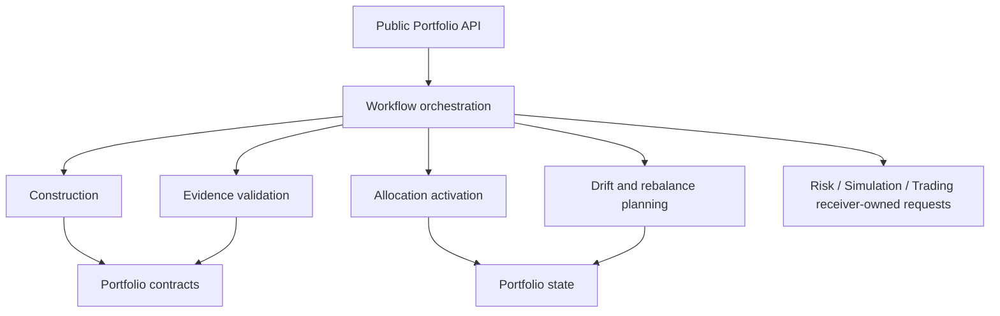
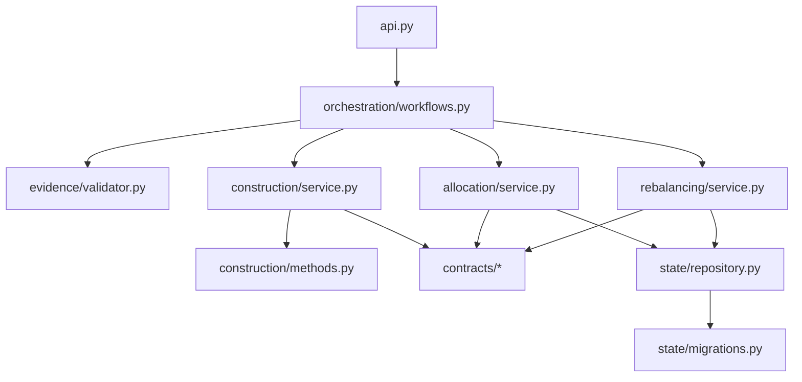
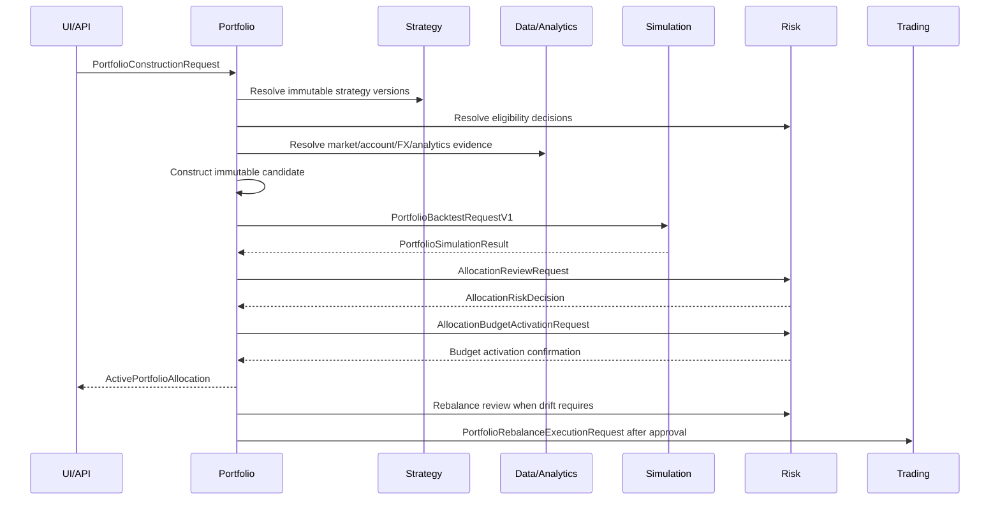

# Portfolio

| Field | Value |
| --- | --- |
| **Package path** | `app/services/portfolio` |
| **Domain ID** | `PORT` |
| **Status** | Missing |
| **Last updated** | 2026-07-14 |
| **System workflows** | `SYS-WF-006`, `SYS-WF-007`, `SYS-WF-008` |

## 1. Purpose and Boundary

### Purpose

Portfolio owns the deterministic construction, versioning, activation, drift assessment, and governed rebalance planning of multi-strategy portfolios. It turns eligible immutable Strategy versions and registered evidence into allocation proposals, but it never grants operational permission, approves risk, sizes final orders, or mutates a broker.

### Owns

- Portfolio definitions, objectives, scopes, and immutable versions.
- Fixed-weight, equal-weight, and inverse-volatility construction.
- Target capital weights and proposed risk-budget weights as construction metadata.
- `PortfolioConstructionRequest v1`, `PortfolioConstructionResult v1`, `ActivePortfolioAllocation v1`, and `PortfolioRebalancePlan v1`.
- Activation state after Simulation validation, human approval where required, and Risk authorization.
- Drift calculation, reduce-only planning for existing over-budget exposure, and rollback as a new governed version.
- Portfolio-owned tables, migrations, artifacts, audit payloads, and public service API.

### Does not own

- Strategy validation, registration, parameter schemas, or runtime evaluation: Strategy owns them.
- Operational eligibility, allocation approval/capping/rejection, authoritative risk budgets, approval tokens, or kill switches: Risk owns them.
- Market/account/FX truth: Data owns the registered evidence.
- Metrics or portfolio evidence: Analytics owns them.
- Backtest fill/state logic or portfolio simulation results: Simulation owns them.
- Order construction, final order sizing, execution, reconciliation, or broker mutation: Trading owns them.
- Broker/provider connectivity: Brokers owns it.
- Authentication, HTTP/WebSocket presentation, or human-approval capture: UI/API owns them.
- Advanced allocation methods such as mean-variance optimization, Black-Litterman, or CVaR optimization.

### Shared contracts

| Direction | Contract | Owner | Purpose |
| --- | --- | --- | --- |
| In | `StrategyOperationalEligibilityDecision v1` | Risk | Prove operational eligibility for every strategy/version and scope |
| In | `AllocationRiskDecision v1` | Risk | Authorize, cap, condition, expire, or reject an allocation/rebalance |
| In | `AccountStateSnapshot v1` | Data | Supply actual balances, positions, and margin state |
| In | `MarketDataset v1` | Data | Supply normalized construction evidence |
| In | `FXConversionEvidence v1` | Data | Supply direct or synthesized conversion truth |
| In | `PerformanceReport v1` / `PortfolioAllocationEvidence v1` | Analytics | Supply component and portfolio evidence without approval authority |
| In | `PortfolioSimulationResult v1` | Simulation | Supply deterministic portfolio validation |
| In | `TradeRecord v1` / `ExecutionReceipt v1` | Trading | Supply actual rebalance and reconciliation outcomes |
| Owned input | `PortfolioConstructionRequest v1` | Portfolio | Receive an authenticated construction command |
| Owned output | `PortfolioConstructionResult v1` | Portfolio | Publish an immutable candidate allocation |
| Owned output | `ActivePortfolioAllocation v1` | Portfolio | Publish the canonical active allocation version |
| Owned output | `PortfolioRebalancePlan v1` | Portfolio | Publish immutable drift and proposed-action lineage |
| Submitted | `AllocationReviewRequest v1` / `AllocationBudgetActivationRequest v1` | Risk | Ask Risk to review and activate its authoritative budget projection |
| Submitted | `PortfolioBacktestRequestV1` | Simulation | Ask Simulation to validate a candidate |
| Submitted | `PortfolioRebalanceExecutionRequest v1` | Trading | Ask Trading to execute an authorized plan |

Receiver-owned requests are imported from their receiving domains. Portfolio never redefines them.

### Persisted state

| State | Owner | Writer | Read boundary | Rule |
| --- | --- | --- | --- | --- |
| Portfolio definitions and objectives | Portfolio | Portfolio | Portfolio public API | Immutable identity; updates create versions |
| Construction results | Portfolio | Portfolio | `PortfolioConstructionResult` | Publish only complete deterministic results |
| Active allocation versions | Portfolio | Portfolio | `ActivePortfolioAllocation` | One active version per scope; optimistic concurrency |
| Drift assessments and rebalance plans | Portfolio | Portfolio | `PortfolioRebalancePlan` | Evidence- and target-version bound |
| Portfolio audit payloads | Portfolio | Portfolio | Utils `AuditEvent` persisted by Data | Redacted; full decision lineage |

Risk separately persists the authoritative risk-budget projection. Portfolio stores only the Risk decision and budget-projection references needed for lineage.

### Four-level structure

| Level | Package area | Responsibility |
| --- | --- | --- |
| 1 | `contracts/`, `state/` | Domain schemas, enums, repositories, migrations |
| 2 | `evidence/`, `construction/` | Validate inputs and deterministically construct candidates |
| 3 | `allocation/`, `rebalancing/` | Govern activation, versions, drift, and rebalance plans |
| 4 | `orchestration/`, `api.py` | Coordinate receiver-owned requests and expose the public API |

### Package capability map



## 2. Final Package Structure

```text
app/services/portfolio/
├── __init__.py
├── README.md
├── exceptions.py
├── contracts/
│   ├── __init__.py
│   ├── requests.py
│   ├── results.py
│   └── allocations.py
├── evidence/
│   ├── __init__.py
│   └── validator.py
├── construction/
│   ├── __init__.py
│   ├── methods.py
│   └── service.py
├── state/
│   ├── __init__.py
│   ├── repository.py
│   └── migrations.py
├── allocation/
│   ├── __init__.py
│   └── service.py
├── rebalancing/
│   ├── __init__.py
│   └── service.py
├── orchestration/
│   ├── __init__.py
│   └── workflows.py
└── api.py
```

### Module dependency diagram



### Structure rules

- Dependencies point downward; contracts and state never import orchestration or API modules.
- Cross-domain imports use documented public APIs or owner modules, never deep implementation paths.
- No Risk, Simulation, Trading, Analytics, Data, or Strategy implementation object is stored in a Portfolio contract.
- Every public function has explicit types and a Google-style docstring.
- Portfolio calculations are deterministic for identical versioned inputs and explicit configuration.
- No provider SDK, network client, broker mutation, or hidden configuration default exists here.

## 3. Workflows

| Status | Workflow ID | Scope | System workflow | Workflow | Trigger / Input boundary | Final outcome / Output boundary | Requirement sequence |
| --- | --- | --- | --- | --- | --- | --- | --- |
| Missing | `WF-PORT-001` | Cross-domain | `SYS-WF-006`, `SYS-WF-007` | Validate construction evidence | Construction request | Validated immutable input set or structured rejection | `FR-PORT-006 → FR-PORT-009` |
| Missing | `WF-PORT-002` | Internal | `SYS-WF-007` | Construct allocation candidate | Validated input set | `PortfolioConstructionResult` | `FR-PORT-010 → FR-PORT-014` |
| Missing | `WF-PORT-003` | Cross-domain | `SYS-WF-007` | Coordinate simulation and Risk review | Complete construction result | Current Simulation result and Risk decision | `FR-PORT-025 → FR-PORT-029` |
| Missing | `WF-PORT-004` | Cross-domain | `SYS-WF-007` | Activate allocation version | All gates current | `ActivePortfolioAllocation` | `FR-PORT-015 → FR-PORT-019` |
| Missing | `WF-PORT-005` | Cross-domain | `SYS-WF-008` | Detect drift and plan rebalance | Schedule or threshold | `PortfolioRebalancePlan` | `FR-PORT-020 → FR-PORT-024` |
| Missing | `WF-PORT-006` | Cross-domain | `SYS-WF-008` | Submit authorized rebalance | Current Risk approval | Trading-owned execution request | `FR-PORT-025 → FR-PORT-029` |
| Missing | `WF-PORT-007` | Internal | `SYS-WF-007` | Roll back allocation | Authorized rollback request | New governed allocation version | `FR-PORT-018 → FR-PORT-019` |

### Status values

| Status | Meaning |
|---|---|
| **Missing** | Not implemented or not verified |
| **Missing** | Partly implemented or tests are incomplete |
| **Missing** | Implemented, tested, and verified |

### Workflow scope values

| Scope | Meaning |
|---|---|
| **Internal** | The complete workflow occurs within Portfolio. |
| **Cross-domain** | Portfolio receives input from or sends output to another domain; the applicable `SYS-WF-*` ID is recorded in the workflow detail. |

### `WF-PORT-002` — Construct Allocation Candidate

1. Validate strategy/version uniqueness and current Risk eligibility for the requested scope.
2. Validate evidence versions, UTC times, freshness, currency coverage, and required configuration.
3. Apply exactly one approved method: fixed weights, equal weights, or inverse volatility.
4. Normalize using the request-supplied tolerance and validate finite bounds and total.
5. Record capital weights separately from proposed risk-budget weights.
6. Hash the full configuration and evidence lineage, then publish one immutable result.

**Failure behaviour:** any missing, stale, non-finite, unbounded, incompatible, or non-deterministic input returns a structured error and publishes nothing.

### `WF-PORT-004` — Activate Allocation Version

1. Re-read the candidate and expected current allocation version.
2. Revalidate every eligibility decision, Simulation result, Risk decision, approval attestation where required, expiry, and kill-switch state.
3. Submit `AllocationBudgetActivationRequest` to Risk.
4. Atomically activate one Portfolio allocation version only after Risk confirms its budget projection.
5. Emit a redacted audit event with complete references.

Simulation activation is automatic within simulation policy. Paper/live activation requires explicit human approval and current Risk authorization.

### `WF-PORT-005` — Detect Drift and Plan Rebalance

1. Resolve actual exposure using fresh account and FX evidence.
2. Compare actual risk-budget exposure to the active target using explicit threshold and schedule configuration.
3. Create proposed reductions or reallocations bound to the active version.
4. Mark existing over-budget exposure reduce-only.
5. Never open a position solely to make actual holdings match target weights.
6. Submit the immutable plan to Risk; only an approved plan may be adapted into Trading's request.

#### End-to-end workflow diagram



## 4. Module and Requirement Specifications

### 4.1 `contracts/` — Portfolio Boundary Schemas

**Purpose:** Define strict versioned Portfolio-owned request, result, allocation, and plan models.

**Inputs/outputs:** primitive validated fields and immutable cross-domain references in; versioned Portfolio contracts out.

**Module flow:** untrusted boundary data → strict schema validation → immutable Portfolio contract.

#### Files

| Status | File | Responsibility | Key exports | Dependencies |
|---|---|---|---|---|
| Missing | `requests.py` | Validate the Portfolio-owned construction command. | `PortfolioConstructionRequest` | **Standard library:** `datetime`, `decimal`<br>**Required third-party:** `pydantic`<br>**Local:** None |
| Missing | `results.py` | Define immutable construction output. | `PortfolioConstructionResult` | **Standard library:** `datetime`, `decimal`<br>**Required third-party:** `pydantic`<br>**Local:** `requests.py` → identifiers |
| Missing | `allocations.py` | Define active allocation and rebalance-plan contracts. | `ActivePortfolioAllocation`, `PortfolioRebalancePlan` | **Standard library:** `datetime`, `decimal`<br>**Required third-party:** `pydantic`<br>**Local:** `results.py` → result references |
| Missing | `__init__.py` | Expose the supported contract API. | All contracts above | **Standard library:** None<br>**Required third-party:** None<br>**Local:** contract files above |

#### Configuration and Limits Manifest

No defaults. Schema versions and IDs are constants; every numeric bound/tolerance is supplied by validated package configuration or the request where the contract assigns it.

| ID | Requirement | Verification |
| --- | --- | --- |
| FR-PORT-001 | Reject unknown fields and unsafe runtime objects. | Contract unit tests |
| FR-PORT-002 | Separate `contract_version` from namespaced `schema_id`. | Serialization tests |
| FR-PORT-003 | Require UTC timestamps, trace IDs, immutable owner references, and finite numbers. | Validation tests |
| FR-PORT-004 | Represent capital weights separately from Risk-authoritative budget projection references. | Schema tests |
| FR-PORT-005 | Version breaking contract changes and update every producer/consumer document together. | Review |

### 4.2 `evidence/` — Evidence and Eligibility Validation

**Purpose:** Resolve and validate references without calculating Analytics metrics or synthesizing Data evidence.

**Module flow:** owner references → compatibility/freshness/eligibility checks → validated immutable evidence set.

| Status | File | Responsibility | Key exports | Dependencies |
|---|---|---|---|---|
| Missing | `validator.py` | Validate Strategy registration, Risk eligibility, evidence freshness/compatibility, FX coverage, and lineage. | `validate_construction_evidence`, `revalidate_activation_evidence` | **Standard library:** `datetime`<br>**Required third-party:** None<br>**Local:** `contracts`; public owner contracts |
| Missing | `__init__.py` | Expose the evidence-validation API. | Validation functions above | **Standard library:** None<br>**Required third-party:** None<br>**Local:** `validator.py` |

| ID | Requirement | Verification |
| --- | --- | --- |
| FR-PORT-006 | Require a current approving eligibility decision for every exact strategy/version/scope. | Eligibility tests |
| FR-PORT-007 | Fail closed on missing, stale, incompatible, cyclic, or unverifiable FX evidence. | FX tests |
| FR-PORT-008 | Never synthesize rates, metrics, registrations, or approvals. | Negative tests |
| FR-PORT-009 | Detect a reference/version change before publication or activation. | Concurrency tests |

### 4.3 `construction/` — Deterministic Construction

**Purpose:** Produce allocation candidates using only the approved initial methods.

**Module flow:** validated evidence → approved pure method → bounded deterministic construction result.

| Status | File | Responsibility | Key exports | Dependencies |
|---|---|---|---|---|
| Missing | `methods.py` | Pure fixed-weight, equal-weight, and inverse-volatility calculations. | `fixed_weights`, `equal_weights`, `inverse_volatility_weights` | **Standard library:** `decimal`<br>**Required third-party:** None<br>**Local:** None |
| Missing | `service.py` | Select method, validate output, hash lineage, and produce result. | `ConstructionService` | **Standard library:** `hashlib`<br>**Required third-party:** None<br>**Local:** `methods.py`; `contracts` |
| Missing | `__init__.py` | Expose the construction API. | `ConstructionService` | **Standard library:** None<br>**Required third-party:** None<br>**Local:** `service.py` |

| Status | Setting / Limit | Type | Default | Required | Used by | Description |
|---|---|---|---|---|---|---|
| Missing | `PORTFOLIO_WEIGHT_SUM_TOLERANCE` | `Decimal` | None | Yes | Construction validation | Explicit positive tolerance; missing blocks construction |
| Missing | `PORTFOLIO_MIN_WEIGHT` / `PORTFOLIO_MAX_WEIGHT` | `Decimal` | None | Yes | Construction validation | Explicit finite bounds; violation rejects result |
| Missing | `PORTFOLIO_MAX_STRATEGIES` | `int` | None | Yes | Request validation | Explicit positive request bound |
| Missing | `PORTFOLIO_MIN_EVIDENCE_OBSERVATIONS` | `int` | None | Yes | Inverse-volatility method | Explicit positive observation minimum |
| Missing | `PORTFOLIO_MAX_EVIDENCE_AGE_SECONDS` | `int` | None | Yes | Evidence validator | Explicit positive freshness limit |

| ID | Requirement | Verification |
| --- | --- | --- |
| FR-PORT-010 | Support fixed, equal, and inverse-volatility methods only. | Method tests |
| FR-PORT-011 | Reject zero/negative volatility, insufficient observations, non-finite values, and invalid weight totals. | Edge-case tests |
| FR-PORT-012 | Return identical bytes and hash for identical inputs/configuration. | Reproducibility test |
| FR-PORT-013 | Exclude MVO, Black-Litterman, CVaR, and implicit optimizer delegation. | Import/API review |
| FR-PORT-014 | Publish nothing on partial construction failure. | Failure tests |

### 4.4 `state/` — Portfolio Persistence

**Purpose:** Persist Portfolio-owned immutable history on Data's shared infrastructure.

**Module flow:** validated Portfolio state transition → atomic owner repository → immutable version/history read model.

| Status | File | Responsibility | Key exports | Dependencies |
|---|---|---|---|---|
| Missing | `migrations.py` | Define Portfolio-owned migrations executed by Data infrastructure. | `PORTFOLIO_MIGRATIONS` | **Standard library:** None<br>**Required third-party:** None<br>**Local:** Data migration protocol |
| Missing | `repository.py` | Atomic repositories, version checks, and read models. | `PortfolioRepository` | **Standard library:** `collections.abc`<br>**Required third-party:** None<br>**Local:** `contracts`, `migrations.py` |
| Missing | `__init__.py` | Expose state interfaces. | `PortfolioRepository`, `PORTFOLIO_MIGRATIONS` | **Standard library:** None<br>**Required third-party:** None<br>**Local:** state files above |

| ID | Requirement | Verification |
| --- | --- | --- |
| FR-PORT-030 | Prevent direct writes by other domains. | Boundary tests |
| FR-PORT-031 | Preserve every superseded and rolled-back version. | History tests |
| FR-PORT-032 | Use atomic activation and deterministic idempotency keys. | Transaction tests |
| FR-PORT-033 | Store references, hashes, and decisions needed to reproduce lineage. | Persistence tests |

### 4.5 `allocation/` — Version and Activation Governance

**Purpose:** Activate exactly one immutable allocation version after all external gates succeed.

**Module flow:** candidate and current gates → Risk budget activation → atomic Portfolio version activation.

| Status | File | Responsibility | Key exports | Dependencies |
|---|---|---|---|---|
| Missing | `service.py` | Validate gates, coordinate Risk budget activation, and atomically activate versions. | `AllocationService` | **Standard library:** `datetime`<br>**Required third-party:** None<br>**Local:** `contracts`, `state.repository`; Risk public contracts |
| Missing | `__init__.py` | Expose allocation activation API. | `AllocationService` | **Standard library:** None<br>**Required third-party:** None<br>**Local:** `service.py` |

| Status | Setting / Limit | Type | Default | Required | Used by | Description |
|---|---|---|---|---|---|---|
| Missing | `PORTFOLIO_ALLOCATION_DECISION_TTL_SECONDS` | `int` | None | Yes | `AllocationService` | Explicit positive maximum decision age |
| Missing | `PORTFOLIO_ACTIVATION_APPROVAL_POLICY` | policy reference | None | Yes | `AllocationService` | Required per runtime scope; missing blocks activation |

| ID | Requirement | Verification |
| --- | --- | --- |
| FR-PORT-015 | Require Simulation validation and current Risk authorization before activation. | Gate tests |
| FR-PORT-016 | Require explicit human approval for paper/live; allow automatic simulation activation only within simulation policy. | Profile tests |
| FR-PORT-017 | Block activation while any applicable kill switch is active. | Kill-switch tests |
| FR-PORT-018 | Use optimistic concurrency and one active version per scope. | Repository tests |
| FR-PORT-019 | Implement rollback only as a new governed version. | History tests |

### 4.6 `rebalancing/` — Drift and Rebalance Planning

**Purpose:** Produce deterministic plans without executing orders.

**Module flow:** target plus actual exposure → drift/classification → immutable Risk-reviewable plan.

| Status | File | Responsibility | Key exports | Dependencies |
|---|---|---|---|---|
| Missing | `service.py` | Resolve drift, classify increases/reductions, and create immutable plans. | `RebalancingService` | **Standard library:** `datetime`, `decimal`<br>**Required third-party:** None<br>**Local:** `contracts`, `state.repository` |
| Missing | `__init__.py` | Expose rebalance-planning API. | `RebalancingService` | **Standard library:** None<br>**Required third-party:** None<br>**Local:** `service.py` |

| Status | Setting / Limit | Type | Default | Required | Used by | Description |
|---|---|---|---|---|---|---|
| Missing | `PORTFOLIO_REBALANCE_DRIFT_THRESHOLD` | `Decimal` | None | Yes | `RebalancingService` | Explicit finite non-negative threshold |
| Missing | `PORTFOLIO_REBALANCE_SCHEDULE` | UTC schedule | None | Yes | `RebalancingService` | Explicit schedule; no implicit cadence |

| ID | Requirement | Verification |
| --- | --- | --- |
| FR-PORT-020 | Bind drift to an active allocation version and fresh actual-exposure evidence. | Drift tests |
| FR-PORT-021 | Route every plan through Risk review before Trading submission. | Workflow tests |
| FR-PORT-022 | Make existing over-budget correction reduce-only unless a separately authorized risk increase exists. | Safety tests |
| FR-PORT-023 | Never open solely to match target weights. | Negative tests |
| FR-PORT-024 | Block planning/submission on kill switch, expiry, stale evidence, or target-version change. | Fail-closed tests |

### 4.7 `orchestration/` — Cross-Domain Workflow Coordination

**Purpose:** Coordinate registered contracts while preserving ownership boundaries.

**Module flow:** public command → Portfolio feature APIs and receiver-owned requests → traced workflow outcome.

| Status | File | Responsibility | Key exports | Dependencies |
|---|---|---|---|---|
| Missing | `workflows.py` | Implement `WF-PORT-001` through `WF-PORT-007`. | `PortfolioWorkflowService` | **Standard library:** `datetime`<br>**Required third-party:** None<br>**Local:** Portfolio feature APIs; public owner contracts |
| Missing | `__init__.py` | Expose workflow coordination API. | `PortfolioWorkflowService` | **Standard library:** None<br>**Required third-party:** None<br>**Local:** `workflows.py` |

| ID | Requirement | Verification |
| --- | --- | --- |
| FR-PORT-025 | Submit only receiver-owned Risk, Simulation, and Trading request contracts. | Contract tests |
| FR-PORT-026 | Revalidate every mutable/expiring gate immediately before side effects. | Race tests |
| FR-PORT-027 | Propagate request/correlation/causation IDs end to end. | Trace tests |
| FR-PORT-028 | Emit redacted audit events for requests, decisions, activation, rollback, and submission. | Audit tests |
| FR-PORT-029 | Never retry a potentially accepted mutation without receiver-provided idempotency semantics. | Failure tests |

### 4.8 `api.py` — Public Portfolio API

**Purpose:** Expose typed application operations to UI/API without HTTP concerns.

**Module flow:** authenticated typed call → workflow service → structured Portfolio result/error.

| Status | File | Responsibility | Key exports | Dependencies |
|---|---|---|---|---|
| Missing | `api.py` | Expose the typed Portfolio application boundary. | `PortfolioService` | **Standard library:** None<br>**Required third-party:** None<br>**Local:** `orchestration.workflows`, Portfolio contracts |
| Missing | `__init__.py` | Expose supported package API only. | `PortfolioService` and public contracts | **Standard library:** None<br>**Required third-party:** None<br>**Local:** `api.py`, `contracts` |

| ID | Requirement | Verification |
| --- | --- | --- |
| FR-PORT-034 | Expose construction, status, activation, drift/rebalance, rollback, and history operations. | API tests |
| FR-PORT-035 | Accept `AuthContext` and `request_id: str \| None = None` on governed entry points. | Signature tests |
| FR-PORT-036 | Return structured success/error envelopes; never `None` or raw exceptions. | Contract tests |
| FR-PORT-037 | Keep authentication and presentation logic outside Portfolio. | Import review |

### Feature usage examples

```python
from app.services.portfolio import PortfolioService
from app.services.portfolio.contracts import PortfolioConstructionRequest

request = PortfolioConstructionRequest(
    contract_version="v1",
    # All strategy, eligibility, evidence, method, limit, and trace fields are explicit.
)
result = portfolio_service.construct(request=request, auth_context=auth_context)
```

The concrete constructor fields are intentionally not invented here; implementation must match the ratified `v1` schema in `docs/PROJECT.md` and this README.

## 5. Package-Wide Requirements and Shared Configuration

| ID | Requirement | Verification |
| --- | --- | --- |
| NFR-PORT-001 | Google Python Style, complete types, Google docstrings, absolute imports, and no `print`. | Ruff/mypy/review |
| NFR-PORT-002 | Deterministic output for identical versioned inputs and explicit configuration. | Reproducibility tests |
| NFR-PORT-003 | Fail closed on missing evidence, authorization, policy, configuration, or ownership ambiguity. | Negative tests |
| NFR-PORT-004 | Never log secrets, raw approval tokens, credentials, or unredacted account data. | Security tests |
| NFR-PORT-005 | Maintain at least 80% package test coverage. | Coverage report |
| NFR-PORT-006 | No live side effect originates in Portfolio; Trading remains the sole execution authority. | Dependency/integration tests |
| NFR-PORT-007 | All money, rates, weights, and tolerances use documented decimal/precision rules; no binary-float ambiguity at boundaries. | Numeric tests |
| NFR-PORT-008 | All timestamps are timezone-aware UTC. | Validation tests |
| NFR-PORT-009 | No hidden numeric defaults; every cap, threshold, tolerance, schedule, expiry, and observation minimum is required configuration. | Configuration tests |
| NFR-PORT-010 | Package errors extend Utils canonical exceptions and map to structured Portfolio codes. | Error tests |

Shared settings consumed from `docs/PROJECT.md`: `ENVIRONMENT`, `RUNTIME_PROFILE`, `EXECUTION_ROUTE`, `ALLOW_LIVE_MUTATIONS`, `DATABASE_URL / DATA_DIR`, UTC policy, and trace-ID policy. Portfolio-specific settings above remain owned here.

## 6. Open Decisions

No open decisions.

## 7. Tests and Definition of Done

### Test and usage locations

| Location | Purpose |
| --- | --- |
| `tests/portfolio/unit/` | Package unit tests |
| `tests/portfolio/integration/` | Package and owner-contract integration tests |
| `tests/portfolio/usage/` | Runnable public usage examples |
| `tests/system/integration/test_strategy_eligibility.py` | `SYS-WF-006` compatibility |
| `tests/system/integration/test_portfolio_activation.py` | `SYS-WF-007` activation chain |
| `tests/system/integration/test_portfolio_rebalance.py` | `SYS-WF-008` rebalance chain |

### Commands

```powershell
uv run pytest tests/portfolio/unit
uv run pytest tests/portfolio/integration
uv run pytest tests/portfolio/usage
uv run pytest tests/portfolio --cov=app/services/portfolio --cov-fail-under=80
uv run pytest tests/system/integration/test_strategy_eligibility.py
uv run pytest tests/system/integration/test_portfolio_activation.py
uv run pytest tests/system/integration/test_portfolio_rebalance.py
uv run ruff check app/services/portfolio
uv run ruff format --check app/services/portfolio
uv run mypy app/services/portfolio
```

### Required test levels

- Contract validation and version compatibility.
- Pure method unit tests and property-based weight invariants.
- Repository transaction/concurrency tests.
- Cross-domain producer-consumer compatibility tests.
- Fail-closed, authorization, kill-switch, stale-evidence, and uncertain-outcome tests.
- End-to-end system workflow tests with broker mutations replaced by deterministic fakes.

### Package completion checklist

- [ ] Final package structure exists and matches this README.
- [ ] All `FR-PORT-*` and `NFR-PORT-*` requirements have passing tests.
- [ ] Fixed/equal/inverse-volatility output is deterministic and bounded.
- [ ] Advanced allocation methods are absent.
- [ ] Strategy registration and Risk eligibility remain separate.
- [ ] Risk owns approval and authoritative budgets.
- [ ] Trading remains the sole execution authority.
- [ ] Activation, rollback, and rebalance semantics match Sections 3–5 and `docs/PROJECT.md`.
- [ ] No hidden numeric defaults or live side effects exist.
- [ ] Targeted tests, Ruff, formatting, mypy, and 80% coverage pass.
- [ ] Service status is updated from `Missing` only when evidence supports it.

## 8. Change Process

1. Update `docs/PROJECT.md` first for any cross-domain ownership, workflow, or contract change.
2. Update this README and every affected producer/consumer README in the same change.
3. Add or amend Portfolio-owned migrations for state changes; Data only executes the shared migration mechanism.
4. Add targeted unit, compatibility, and system tests before changing status.
5. Record implementation progress and decisions in `docs/CHANGELOG.md`.
6. Breaking contracts require a new version and explicit deprecation/migration plan.
7. New construction methods, risk semantics, live behavior, or hidden/defaulted trading limits require a new approved architecture decision before implementation.
