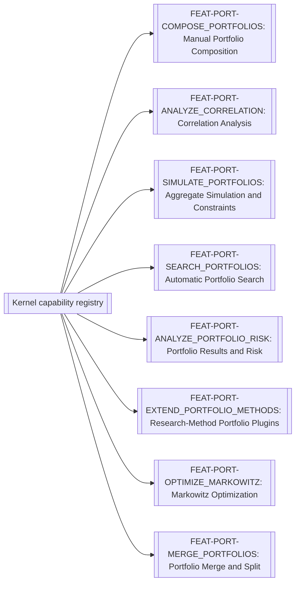
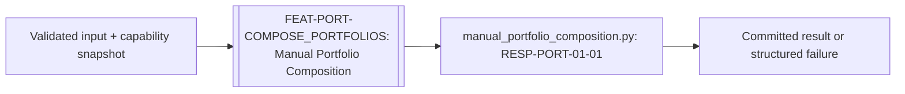

# Portfolio

> **Package:** `app/services/portfolio/`
> **Status:** `Missing`
> **Last updated:** `2026-08-23`
> **Domain ID:** `D-PORT`

> This README is the domain package's **single source of truth** for domain boundaries, composable feature capabilities, architecture invariants, implementation sequence, progress, usage examples, and tests.
> Update this document before modifying or adding code.

---

## Code-Aligned Implementation Convention

This README is the sole current target registry for this domain's feature IDs and statuses, functional requirements, domain-local workflows, semantic contract ownership, persisted-state model, acceptance evidence, and deletion behavior. `PROJECT.md` owns system scope, cross-domain behavior, system NFRs, and release gates; `ARCHITECTURE.md` owns universal package and runtime constraints. Feature-local READMEs, manifests, contract definitions, migrations, and tests provide current implementation evidence without silently changing this target registry.

Implementation uses the repository's existing feature substrate: each feature lives directly at `app/services/<domain>/<feature>/`, is discovered through the `haruquantai.features` Python entry-point group, and declares one immutable `FeatureSpec` in `manifest.py`. There are no domain or feature YAML manifests.

Every implemented feature also contains a mandatory runtime-validated `README.md`, pure `__init__.py`, strict `config.py`, lifecycle `feature.py`, and focused implementation modules. Dependencies and effects flow through `FeatureContext`/`FeatureScope`; cross-feature implementation imports are forbidden. Persistent state is declared by `FeatureSpec.state`; any migrations and storage adapters remain with the owning feature. Capability keys use `<domain>.<name>@<major>`. FR IDs remain product, acceptance, and test-trace identities rather than one runtime registration per FR. A requirement `Depends` cell expresses product sequencing, traceability, or acceptance evidence only; runtime dependencies are declared separately with exact keys in `FeatureSpec.requires` or `FeatureSpec.optional`.

Feature-level automated tests live at `tests/services/portfolio/<feature>/`. Usage examples never live under `tests/`; they belong to each feature's designated primary domain-logic module. Broader automated verification retains its documented architecture, composition, API, integration, or system test location. The code-backed procedure is the [Feature Implementation Pipeline](../../../docs/dev/feature_implementation_pipeline.md).

## 1. Purpose and Boundary

### Purpose

The Portfolio domain delivers portfolio versions, correlation, aggregate simulation, allocation, constraints, search, risk, comparison, merge, and split. Its public feature capabilities are registered and remain independent of package-import order. Removing the domain produces the degradation defined below rather than preventing the shared substrate or unrelated domains from starting.

### Owns

- `FEAT-PORT-COMPOSE_PORTFOLIOS` — Manual Portfolio Composition.
- `FEAT-PORT-ANALYZE_CORRELATION` — Correlation Analysis.
- `FEAT-PORT-SIMULATE_PORTFOLIOS` — Aggregate Simulation and Constraints.
- `FEAT-PORT-SEARCH_PORTFOLIOS` — Automatic Portfolio Search.
- `FEAT-PORT-ANALYZE_PORTFOLIO_RISK` — Portfolio Results and Risk.
- `FEAT-PORT-EXTEND_PORTFOLIO_METHODS` — Research-Method Portfolio Plugins.
- `FEAT-PORT-OPTIMIZE_MARKOWITZ` — Markowitz Optimization.
- `FEAT-PORT-MERGE_PORTFOLIOS` — Portfolio Merge and Split.

### Does not own

- Individual simulation semantics, strategy authoring, result-store ownership, or project orchestration.
- Composition lifecycle, dependency resolution, effect reversal, and transactional replacement; those belong to the non-domain shared substrate (`app/contracts/`, `app/kernel/`, and `app/composition/`).
- **Deletion boundary:** deleting `app/services/portfolio/` means portfolio composition, simulation, and search disappear; constituent strategies/results remain unchanged. The kernel and unrelated domains shall remain healthy.

### Shared Contracts

This domain semantically owns the contracts listed below, but their sole physical definitions live in `app/contracts/portfolio/` and wire schemas in `app/contracts/portfolio/wire/`. `app/services/portfolio/` contains implementations only and shall not define or re-export substitute public contract types. Contract versions and semantic owners must agree with `PROJECT.md` and this README. Feature IDs and FR IDs are documentation, lifecycle, acceptance, and traceability identities; runtime bindings use exact versioned `CapabilityKey` declarations in contracts and `FeatureSpec`. The exact public records and capability bundles are listed in the [Shared Contracts README](../../contracts/README.md#48-appcontractsportfolio).

Rows labelled `FEAT-* capability surface` describe planned semantic contract bundles, not literal runtime capability keys. A listed counterparty may produce, consume, or observe the bundle and does not establish package-import or runtime dependency direction.

**Owned by this domain**

| Status | Contract | Version | Counterparty | Purpose |
|---|---|---|---|---|
| Missing | `FEAT-PORT-COMPOSE_PORTFOLIOS` capability surface | `v1` | Analytics, Catalogue, Data, Interfaces, Research, Simulator, Strategy | Manual Portfolio Composition. |
| Missing | `FEAT-PORT-ANALYZE_CORRELATION` capability surface | `v1` | Analytics, Catalogue, Data, Interfaces, Research, Simulator, Strategy | Correlation Analysis. |
| Missing | `FEAT-PORT-SIMULATE_PORTFOLIOS` capability surface | `v1` | Analytics, Catalogue, Data, Interfaces, Research, Simulator, Strategy | Aggregate Simulation and Constraints. |
| Missing | `FEAT-PORT-SEARCH_PORTFOLIOS` capability surface | `v1` | Analytics, Catalogue, Data, Interfaces, Research, Simulator, Strategy | Automatic Portfolio Search. |
| Missing | `FEAT-PORT-ANALYZE_PORTFOLIO_RISK` capability surface | `v1` | Analytics, Catalogue, Data, Interfaces, Research, Simulator, Strategy | Portfolio Results and Risk. |
| Missing | `FEAT-PORT-EXTEND_PORTFOLIO_METHODS` capability surface | `v1` | Analytics, Catalogue, Data, Interfaces, Research, Simulator, Strategy | Research-Method Portfolio Plugins. |
| Missing | `FEAT-PORT-OPTIMIZE_MARKOWITZ` capability surface | `v1` | Analytics, Catalogue, Data, Interfaces, Research, Simulator, Strategy | Markowitz Optimization. |
| Missing | `FEAT-PORT-MERGE_PORTFOLIOS` capability surface | `v1` | Analytics, Catalogue, Data, Interfaces, Research, Simulator, Strategy | Portfolio Merge and Split. |

**Cross-domain requirement references (not runtime dependencies)**

The rows below summarize foreign owner tokens found in FR `Depends` cells. They express product sequencing, traceability, or acceptance-evidence relationships only. Actual runtime consumption must name an exact versioned capability key in the consuming feature's `FeatureSpec.requires` or `FeatureSpec.optional` and must follow the dependency direction in `PROJECT.md` and `ARCHITECTURE.md`.

| Referenced domain set | Documentation version | Owner | Meaning |
|---|---|---|---|
| `D-ANA` public capability set | `v1` | Analytics | Requirements whose `Depends` cell names `ANA-*`. |
| `D-CAT` public capability set | `v1` | Catalogue | Requirements whose `Depends` cell names `CAT-*`. |
| `D-DATA` public capability set | `v1` | Data | Requirements whose `Depends` cell names `DATA-*`. |
| `D-IFACE` public capability set | `v1` | Interfaces | Requirements whose `Depends` cell names `IFACE-*`. |
| `D-RES` public capability set | `v1` | Research | Requirements whose `Depends` cell names `RES-*`. |
| `D-SIM` public capability set | `v1` | Simulator | Requirements whose `Depends` cell names `SIM-*`. |
| `D-STRAT` public capability set | `v1` | Strategy | Requirements whose `Depends` cell names `STRAT-*`. |

### Persisted State Ownership

| Status | State / Store | Read access (via contract) | Migration definitions |
|---|---|---|---|
| Missing | portfolios, portfolio_versions, portfolio_results, correlation_matrices, portfolio_search_artifacts | Other domains through `D-PORT` public capabilities only | The owning feature's `StateDeclaration` and migration/storage adapter |

### Four-Level Structural Hierarchy

| Code level | Represents | This package |
|---|---|---|
| **Package** | Domain | `app/services/portfolio/` / `D-PORT` |
| **Module folder** | Feature / capability | One folder for each of: Manual Portfolio Composition, Correlation Analysis, Aggregate Simulation and Constraints, Automatic Portfolio Search, Portfolio Results and Risk, Research-Method Portfolio Plugins, Markowitz Optimization, Portfolio Merge and Split |
| **File** | Use case or focused responsibility | Exactly the responsibility file named in each module specification |
| **Class / function / method** | Functional requirement behavior | Exactly one registered `fr_*` behavior per `FR-*` row |

```text
Package (Domain)
└── Module folder (Feature)
    └── File (Responsibility)
        └── Registered function (Functional requirement behavior)
```

### Domain Capability Map


```mermaid
flowchart TD
    DOMAIN[[D-PORT: Portfolio]]
    DOMAIN --> FEAT_PORT_COMPOSE_PORTFOLIOS[[FEAT-PORT-COMPOSE_PORTFOLIOS: Manual Portfolio Composition]]
    FEAT_PORT_COMPOSE_PORTFOLIOS --> FEAT_PORT_COMPOSE_PORTFOLIOS_FILE[manual_portfolio_composition.py: RESP-PORT-01-01]
    DOMAIN --> FEAT_PORT_ANALYZE_CORRELATION[[FEAT-PORT-ANALYZE_CORRELATION: Correlation Analysis]]
    FEAT_PORT_ANALYZE_CORRELATION --> FEAT_PORT_ANALYZE_CORRELATION_FILE[portfolio_correlation.py: RESP-PORT-02-01]
    DOMAIN --> FEAT_PORT_SIMULATE_PORTFOLIOS[[FEAT-PORT-SIMULATE_PORTFOLIOS: Aggregate Simulation and Constraints]]
    FEAT_PORT_SIMULATE_PORTFOLIOS --> FEAT_PORT_SIMULATE_PORTFOLIOS_FILE[portfolio_aggregate_simulation.py: RESP-PORT-03-01]
    DOMAIN --> FEAT_PORT_SEARCH_PORTFOLIOS[[FEAT-PORT-SEARCH_PORTFOLIOS: Automatic Portfolio Search]]
    FEAT_PORT_SEARCH_PORTFOLIOS --> FEAT_PORT_SEARCH_PORTFOLIOS_FILE[portfolio_search.py: RESP-PORT-04-01]
    DOMAIN --> FEAT_PORT_ANALYZE_PORTFOLIO_RISK[[FEAT-PORT-ANALYZE_PORTFOLIO_RISK: Portfolio Results and Risk]]
    FEAT_PORT_ANALYZE_PORTFOLIO_RISK --> FEAT_PORT_ANALYZE_PORTFOLIO_RISK_FILE[portfolio_results_risk.py: RESP-PORT-05-01]
    DOMAIN --> FEAT_PORT_EXTEND_PORTFOLIO_METHODS[[FEAT-PORT-EXTEND_PORTFOLIO_METHODS: Research-Method Portfolio Plugins]]
    FEAT_PORT_EXTEND_PORTFOLIO_METHODS --> FEAT_PORT_EXTEND_PORTFOLIO_METHODS_FILE[portfolio_method_extensions.py: RESP-PORT-06-01]
    DOMAIN --> FEAT_PORT_OPTIMIZE_MARKOWITZ[[FEAT-PORT-OPTIMIZE_MARKOWITZ: Markowitz Optimization]]
    FEAT_PORT_OPTIMIZE_MARKOWITZ --> FEAT_PORT_OPTIMIZE_MARKOWITZ_FILE[markowitz_optimization.py: RESP-PORT-07-01]
    DOMAIN --> FEAT_PORT_MERGE_PORTFOLIOS[[FEAT-PORT-MERGE_PORTFOLIOS: Portfolio Merge and Split]]
    FEAT_PORT_MERGE_PORTFOLIOS --> FEAT_PORT_MERGE_PORTFOLIOS_FILE[portfolio_merge_split.py: RESP-PORT-08-01]
```

---

## 2. Final Package Structure and Feature Independence

```text
portfolio/
├── README.md
├── __init__.py
├── manual_portfolio_composition/                    # FEAT-PORT-COMPOSE_PORTFOLIOS: Manual Portfolio Composition
│   ├── README.md
│   ├── __init__.py
│   ├── manifest.py
│   ├── config.py
│   ├── feature.py
│   └── manual_portfolio_composition.py              # RESP-PORT-01-01
├── portfolio_correlation/                    # FEAT-PORT-ANALYZE_CORRELATION: Correlation Analysis
│   ├── README.md
│   ├── __init__.py
│   ├── manifest.py
│   ├── config.py
│   ├── feature.py
│   └── portfolio_correlation.py              # RESP-PORT-02-01
├── portfolio_aggregate_simulation/                    # FEAT-PORT-SIMULATE_PORTFOLIOS: Aggregate Simulation and Constraints
│   ├── README.md
│   ├── __init__.py
│   ├── manifest.py
│   ├── config.py
│   ├── feature.py
│   └── portfolio_aggregate_simulation.py              # RESP-PORT-03-01
├── portfolio_search/                    # FEAT-PORT-SEARCH_PORTFOLIOS: Automatic Portfolio Search
│   ├── README.md
│   ├── __init__.py
│   ├── manifest.py
│   ├── config.py
│   ├── feature.py
│   └── portfolio_search.py              # RESP-PORT-04-01
├── portfolio_results_risk/                    # FEAT-PORT-ANALYZE_PORTFOLIO_RISK: Portfolio Results and Risk
│   ├── README.md
│   ├── __init__.py
│   ├── manifest.py
│   ├── config.py
│   ├── feature.py
│   └── portfolio_results_risk.py              # RESP-PORT-05-01
├── portfolio_method_extensions/                    # FEAT-PORT-EXTEND_PORTFOLIO_METHODS: Research-Method Portfolio Plugins
│   ├── README.md
│   ├── __init__.py
│   ├── manifest.py
│   ├── config.py
│   ├── feature.py
│   └── portfolio_method_extensions.py              # RESP-PORT-06-01
├── markowitz_optimization/                    # FEAT-PORT-OPTIMIZE_MARKOWITZ: Markowitz Optimization
│   ├── README.md
│   ├── __init__.py
│   ├── manifest.py
│   ├── config.py
│   ├── feature.py
│   └── markowitz_optimization.py              # RESP-PORT-07-01
└── portfolio_merge_split/                    # FEAT-PORT-MERGE_PORTFOLIOS: Portfolio Merge and Split
    ├── README.md
    ├── __init__.py
    ├── manifest.py
    ├── config.py
    ├── feature.py
    └── portfolio_merge_split.py              # RESP-PORT-08-01
```

### Module dependency diagram

Feature modules do not import one another's private files. Runtime dependencies resolve through kernel capabilities obtained from `FeatureContext`; composition selects providers and reconciles changes, so reciprocal workflow participation cannot create a package-import cycle.


```mermaid
flowchart LR
    K[[Kernel capability registry]]
    K --> FEAT_PORT_COMPOSE_PORTFOLIOS[[FEAT-PORT-COMPOSE_PORTFOLIOS: Manual Portfolio Composition]]
    K --> FEAT_PORT_ANALYZE_CORRELATION[[FEAT-PORT-ANALYZE_CORRELATION: Correlation Analysis]]
    K --> FEAT_PORT_SIMULATE_PORTFOLIOS[[FEAT-PORT-SIMULATE_PORTFOLIOS: Aggregate Simulation and Constraints]]
    K --> FEAT_PORT_SEARCH_PORTFOLIOS[[FEAT-PORT-SEARCH_PORTFOLIOS: Automatic Portfolio Search]]
    K --> FEAT_PORT_ANALYZE_PORTFOLIO_RISK[[FEAT-PORT-ANALYZE_PORTFOLIO_RISK: Portfolio Results and Risk]]
    K --> FEAT_PORT_EXTEND_PORTFOLIO_METHODS[[FEAT-PORT-EXTEND_PORTFOLIO_METHODS: Research-Method Portfolio Plugins]]
    K --> FEAT_PORT_OPTIMIZE_MARKOWITZ[[FEAT-PORT-OPTIMIZE_MARKOWITZ: Markowitz Optimization]]
    K --> FEAT_PORT_MERGE_PORTFOLIOS[[FEAT-PORT-MERGE_PORTFOLIOS: Portfolio Merge and Split]]
```

### Structure rules

- The package root contains `README.md`, import-pure `__init__.py`, and one direct folder per feature; discovery uses the `haruquantai.features` entry-point group.
- Each feature folder contains mandatory `README.md`, pure `__init__.py`, `manifest.py`, `config.py`, `feature.py`, and focused responsibility modules.
- `FR-*`/`fr_*` names provide product, implementation, and test traceability inside the feature; they are not separate runtime registrations or capability keys.
- Cross-feature and cross-domain behavior is injected by capability key. Direct private-file imports are prohibited.
- Every core capability module documents Python and CLI usage; exactly one designated primary domain-logic module owns the feature's executable `__main__` demonstration. Usage examples never live under `tests/`.

---

## 3. Workflows

| Status | Workflow ID | Scope | Workflow | Trigger / Input boundary | Final outcome / Output boundary | Requirement sequence |
|---|---|---|---|---|---|---|
| Missing | `WF-PORT-001` | Cross-domain | Manual Portfolio Composition | Validated command/query and required capability bindings | Requirement-defined result, artifact, event, or degradation | `FR-PORT-VERSION_PORTFOLIOS` → `FR-PORT-VALIDATE_PORTFOLIO_ADMISSION` → `FR-PORT-COMPOSE_PORTFOLIOS_MANUALLY` |
| Missing | `WF-PORT-002` | Cross-domain | Correlation Analysis | Validated command/query and required capability bindings | Requirement-defined result, artifact, event, or degradation | `FR-PORT-VERSION_CORRELATION_INPUTS` → `FR-PORT-COMPUTE_CORRELATION_MATRICES` |
| Missing | `WF-PORT-003` | Cross-domain | Aggregate Simulation and Constraints | Validated command/query and required capability bindings | Requirement-defined result, artifact, event, or degradation | `FR-PORT-SIMULATE_AGGREGATE_PORTFOLIOS` → `FR-PORT-CONVERT_PORTFOLIO_CURRENCIES` → `FR-PORT-APPLY_ALLOCATION_METHODS` → `FR-PORT-SCHEDULE_REBALANCING` → `FR-PORT-ENFORCE_EXPOSURE_LIMITS` → `FR-PORT-RESOLVE_SHARED_INSTRUMENTS` |
| Missing | `WF-PORT-004` | Cross-domain | Automatic Portfolio Search | Validated command/query and required capability bindings | Requirement-defined result, artifact, event, or degradation | `FR-PORT-DEFINE_PORTFOLIO_SEARCH` → `FR-PORT-REJECT_INFEASIBLE_SEARCHES` → `FR-PORT-OPTIMIZE_PORTFOLIO_OBJECTIVES` → `FR-PORT-CHECKPOINT_PORTFOLIO_SEARCH` → `FR-PORT-VERSION_PORTFOLIO_CHANGES` |
| Missing | `WF-PORT-005` | Cross-domain | Portfolio Results and Risk | Validated command/query and required capability bindings | Requirement-defined result, artifact, event, or degradation | `FR-PORT-REPORT_PORTFOLIO_RESULTS` → `FR-PORT-DEFINE_PORTFOLIO_METRICS` → `FR-PORT-EXPORT_PORTFOLIO_RESULTS` → `FR-PORT-CALCULATE_PORTFOLIO_RISK` |
| Missing | `WF-PORT-006` | Cross-domain | Research-Method Portfolio Plugins | Validated command/query and required capability bindings | Requirement-defined result, artifact, event, or degradation | `FR-PORT-REGISTER_PORTFOLIO_METHODS` |
| Missing | `WF-PORT-007` | Internal | Markowitz Optimization | Validated command/query and required capability bindings | Requirement-defined result, artifact, event, or degradation | `FR-PORT-OPTIMIZE_MARKOWITZ_PORTFOLIOS` |
| Missing | `WF-PORT-008` | Cross-domain | Portfolio Merge and Split | Validated command/query and required capability bindings | Requirement-defined result, artifact, event, or degradation | `FR-PORT-MERGE_PORTFOLIO_STRATEGIES` → `FR-PORT-SPLIT_PORTFOLIO_STRATEGIES` |

### `WF-PORT-001` — Manual Portfolio Composition

**Scope:** `Cross-domain` when the request requires another domain capability; otherwise `Internal`.

**System workflow:** `SYS-WF-007`

**Input boundary:** A validated request/query plus an immutable capability snapshot and provider bindings.

**Output boundary:** The result/artifact/event defined by the participating `FR-*` rows, or their exact structured failure/degradation outcome.

1. `Feature.mount()` resolves its declared required capabilities through `FeatureContext`.
2. `manual_portfolio_composition.py` executes `fr_port_version_portfolios`, `fr_port_validate_portfolio_admission`, `fr_port_compose_portfolios_manually` in the requirement-defined order.
3. Scoped effects are committed or reversed under `FR-KERN-DEFINE_REQUIREMENT_BEHAVIOR, FR-KERN-DEFINE_LIFECYCLE_CONTEXT, FR-KERN-DECLARE_BEHAVIOR_DEPENDENCIES, FR-KERN-REGISTER_FEATURE_MODULES, FR-KERN-DEFINE_RESPONSIBILITY_FILES, FR-KERN-IMPLEMENT_REQUIREMENT_FUNCTIONS, FR-KERN-DEPEND_PUBLIC_PORTS, FR-KERN-NAMESPACE_CAPABILITY_KEYS, FR-KERN-DECLARE_DEPENDENCY_RULES, FR-KERN-REEVALUATE_DEPENDENCIES, FR-KERN-DEFINE_SCOPE_HIERARCHY, FR-KERN-PASS_EFFECT_SCOPES, FR-KERN-REGISTER_EFFECT_REVERSALS, FR-KERN-REVERSE_EFFECTS_LIFO, FR-KERN-ROLLBACK_FAILED_ACTIVATION, FR-KERN-MANAGE_COMPONENT_LIFECYCLE, FR-KERN-COMMIT_CAPABILITY_SWAP, FR-KERN-QUIESCE_DEPENDENT_WORK, FR-KERN-REMOVE_DEPENDENT_COMPONENTS, FR-KERN-ISOLATE_DISPOSAL_FAILURES, FR-KERN-RECONCILE_DESIRED_STATE, FR-KERN-REPLACE_COMPONENTS_TRANSACTIONALLY, FR-KERN-PROVIDE_SCOPED_REGISTRARS, FR-KERN-DRAIN_REMOVED_BEHAVIORS, FR-KERN-CLASSIFY_COMPONENT_EFFECTS, FR-KERN-NAMESPACE_COMPONENT_STATE, FR-KERN-REGISTER_EXTENSION_POINTS, FR-KERN-EMIT_CAUSAL_EVENTS, FR-KERN-REJECT_DEPENDENCY_CYCLES, FR-KERN-PIN_CAPABILITY_SNAPSHOTS, FR-KERN-TEST_COMPONENT_REMOVAL, FR-KERN-VERIFY_EXACT_REMOVAL, FR-KERN-ROUTE_MULTIPLE_PROVIDERS`.
4. The feature returns or publishes only the documented output boundary.

**Failure behaviour:**

- Feature unavailable → manual portfolio authoring disappears; constituents remain. Requests requiring a removed feature capability return `CAPABILITY_UNAVAILABLE`; the domain continues loading.
- Missing/incompatible required capability → `CAPABILITY_UNAVAILABLE` or `CAPABILITY_INCOMPATIBLE`; no partial mutation.

**Integration test:**
`tests/services/portfolio/integration/test_manual_portfolio_composition.py::test_manual_portfolio_composition_workflow()`


```mermaid
flowchart LR
    INPUT[Validated input + capability snapshot]
    FEATURE[[FEAT-PORT-COMPOSE_PORTFOLIOS: Manual Portfolio Composition]]
    FILE[manual_portfolio_composition.py: RESP-PORT-01-01]
    OUTPUT[Committed result or structured failure]
    INPUT --> FEATURE --> FILE --> OUTPUT
```

---

## 4. Composable Feature Specifications

Implement module sections from top to bottom. Requirement `Depends` cells define product and implementation ordering; runtime capability dependencies must be declared separately in the owning `FeatureSpec`.

---

### 4.1 `manual_portfolio_composition/` — Manual Portfolio Composition

**Feature ID:** `FEAT-PORT-COMPOSE_PORTFOLIOS`

**Purpose:** Version, validate, and edit portfolio constituents.

**Deletion contract:** manual portfolio authoring disappears; constituents remain. Requests requiring a removed feature capability return `CAPABILITY_UNAVAILABLE`; the domain continues loading.

**Module flow:**

```text
validated input and capability bindings
  → manual_portfolio_composition.py
  → fr_port_version_portfolios, fr_port_validate_portfolio_admission, fr_port_compose_portfolios_manually
  → requirement-defined output or structured failure
```

#### Files

| Status | File | Responsibility | Key exports | Dependencies |
|---|---|---|---|---|
| Missing | `manual_portfolio_composition.py` | Version, validate, and edit portfolio constituents | `fr_port_version_portfolios`, `fr_port_validate_portfolio_admission`, `fr_port_compose_portfolios_manually` | **Standard library:** selected per implementation and recorded before code<br>**Required third-party:** only libraries mandated by `PROJECT.md` or the requirement boundary<br>**Local:** capabilities declared by the owning `FeatureSpec`; no private cross-feature import |
| Missing | `feature.py` | Mount `FEAT-PORT-COMPOSE_PORTFOLIOS` through `FeatureContext` and stage its declared providers/effects | `FEAT-PORT-COMPOSE_PORTFOLIOS` `Feature.mount` | **Standard library:** None<br>**Required third-party:** None<br>**Local:** `manifest.py`, `config.py`, and focused responsibility modules |
| Missing | `manifest.py` | Define the immutable `FEAT-PORT-COMPOSE_PORTFOLIOS` `FeatureSpec`: identity, domain, provided/required/optional capabilities, conflicts, state, and configuration keys | `FEAT-PORT-COMPOSE_PORTFOLIOS` `FeatureSpec` | **Standard library:** None<br>**Required third-party:** None<br>**Local:** `app.kernel.feature.FeatureSpec` |

#### Configuration and Limits Manifest

| Status | Setting / Limit | Type | Default | Required | Used by | Description |
|---|---|---|---|---|---|---|
| Missing | `FEAT-PORT-COMPOSE_PORTFOLIOS.configuration` | Versioned schema | No implicit defaults | Yes when referenced | `manual_portfolio_composition.py` | Exact fields, defaults, limits, and failure rules are those stated by the requirements and the normative technical appendices in `PROJECT.md`; unspecified values are rejected under Project §6. |

#### `manual_portfolio_composition.py` — Version, validate, and edit portfolio constituents

**File responsibility:** Version, validate, and edit portfolio constituents.

| Status | Requirement ID | Class | Pri | Responsibility | Class / Function / Method | Side Effects | Raises / failure | Depends | Source / confidence | Usage / Test |
|---|---|---|---|---|---|---|---|---|---|---|
| Missing | `FR-PORT-VERSION_PORTFOLIOS` | Target | P0 | A portfolio version shall reference immutable constituent strategy versions, eligible result/data manifests, weights or sizing rules, currency policy, capital, and validity range. | `fr_port_version_portfolios` implementation trace | None | Saving a portfolio creates an immutable version with a canonical hash. | FR-STRAT-DEFINE_STRATEGY_TEMPLATES, FR-ANA-CREATE_DATABANK | Portfolio baseline | **Usage:** `app/services/portfolio/manual_portfolio_composition/manual_portfolio_composition.py::__main__` scenario `FR-PORT-VERSION_PORTFOLIOS`<br>**Unit:** `tests/services/portfolio/manual_portfolio_composition/test_manual_portfolio_composition.py::test_port_version_portfolios()` |
| Missing | `FR-PORT-VALIDATE_PORTFOLIO_ADMISSION` | Target | P0 | Portfolio admission shall validate date overlap, result compatibility, required currencies, duplicate exposure, and constituent availability. | `fr_port_validate_portfolio_admission` implementation trace | Read-only | Invalid portfolios are rejected before simulation with constituent-level diagnostics. | FR-PORT-VERSION_PORTFOLIOS, FR-CAT-CONVERT_CURRENCIES | Portfolio baseline | **Usage:** `app/services/portfolio/manual_portfolio_composition/manual_portfolio_composition.py::__main__` scenario `FR-PORT-VALIDATE_PORTFOLIO_ADMISSION`<br>**Unit:** `tests/services/portfolio/manual_portfolio_composition/test_manual_portfolio_composition.py::test_port_validate_portfolio_admission()` |
| Missing | `FR-PORT-COMPOSE_PORTFOLIOS_MANUALLY` | Target | P0 | Manual Portfolio Composer shall add/remove/version constituents, edit policies, validate, simulate, compare, and promote a portfolio. | `fr_port_compose_portfolios_manually` implementation trace | Persistence write; Local state mutation | A complete keyboard/API workflow produces the same manifest. | FR-PORT-VERSION_PORTFOLIOS, FEAT-UI-ENSURE_ACCESS | Phase 3 baseline | **Usage:** `app/services/portfolio/manual_portfolio_composition/manual_portfolio_composition.py::__main__` scenario `FR-PORT-COMPOSE_PORTFOLIOS_MANUALLY`<br>**Unit:** `tests/services/portfolio/manual_portfolio_composition/test_manual_portfolio_composition.py::test_port_compose_portfolios_manually()` |

**Rules:**

- manual portfolio authoring disappears; constituents remain. Requests requiring a removed feature capability return `CAPABILITY_UNAVAILABLE`; the domain continues loading.
- no business-domain dependency is resolved at package import; the owning `FeatureSpec` declares runtime dependencies once and this behavior consumes only that committed feature context.
- Each `FR-*` row maps to focused implementation and acceptance evidence inside this feature; removal occurs at feature-package granularity.
- Every effect must be scoped and classified under `FR-KERN-CLASSIFY_COMPONENT_EFFECTS`; the inferred table label must be corrected before implementation if the concrete adapter requires a narrower or additional effect class.

**Implementation notes:**

- Preserve the requirement statement, acceptance/failure behavior, dependencies, and source confidence as one indivisible implementation contract.
- Reuse public capability contracts; never copy another feature's or domain's business logic.
- Add private helpers only when needed by these public behaviors; helpers do not become new requirements.

#### Feature usage examples

The primary domain-logic module `app/services/portfolio/manual_portfolio_composition/manual_portfolio_composition.py` owns the executable `__main__` usage harness, with one named scenario per requirement listed above.

---

### 4.2 `portfolio_correlation/` — Correlation Analysis

**Feature ID:** `FEAT-PORT-ANALYZE_CORRELATION`

**Purpose:** Compute immutable correlation policies and matrices.

**Deletion contract:** correlation views/filters disappear; portfolio versions remain. Requests requiring a removed feature capability return `CAPABILITY_UNAVAILABLE`; the domain continues loading.

**Module flow:**

```text
validated input and capability bindings
  → portfolio_correlation.py
  → fr_port_version_correlation_inputs, fr_port_compute_correlation_matrices
  → requirement-defined output or structured failure
```

#### Files

| Status | File | Responsibility | Key exports | Dependencies |
|---|---|---|---|---|
| Missing | `portfolio_correlation.py` | Compute immutable correlation policies and matrices | `fr_port_version_correlation_inputs`, `fr_port_compute_correlation_matrices` | **Standard library:** selected per implementation and recorded before code<br>**Required third-party:** only libraries mandated by `PROJECT.md` or the requirement boundary<br>**Local:** capabilities declared by the owning `FeatureSpec`; no private cross-feature import |
| Missing | `feature.py` | Mount `FEAT-PORT-ANALYZE_CORRELATION` through `FeatureContext` and stage its declared providers/effects | `FEAT-PORT-ANALYZE_CORRELATION` `Feature.mount` | **Standard library:** None<br>**Required third-party:** None<br>**Local:** `manifest.py`, `config.py`, and focused responsibility modules |
| Missing | `manifest.py` | Define the immutable `FEAT-PORT-ANALYZE_CORRELATION` `FeatureSpec`: identity, domain, provided/required/optional capabilities, conflicts, state, and configuration keys | `FEAT-PORT-ANALYZE_CORRELATION` `FeatureSpec` | **Standard library:** None<br>**Required third-party:** None<br>**Local:** `app.kernel.feature.FeatureSpec` |

#### Configuration and Limits Manifest

| Status | Setting / Limit | Type | Default | Required | Used by | Description |
|---|---|---|---|---|---|---|
| Missing | `FEAT-PORT-ANALYZE_CORRELATION.configuration` | Versioned schema | No implicit defaults | Yes when referenced | `portfolio_correlation.py` | Exact fields, defaults, limits, and failure rules are those stated by the requirements and the normative technical appendices in `PROJECT.md`; unspecified values are rejected under Project §6. |

#### `portfolio_correlation.py` — Compute immutable correlation policies and matrices

**File responsibility:** Compute immutable correlation policies and matrices.

| Status | Requirement ID | Class | Pri | Responsibility | Class / Function / Method | Side Effects | Raises / failure | Depends | Source / confidence | Usage / Test |
|---|---|---|---|---|---|---|---|---|---|---|
| Missing | `FR-PORT-VERSION_CORRELATION_INPUTS` | Target | P0 | Correlation analysis shall version source series, return definition, frequency, alignment, overlap, missing-data policy, minimum observations, and correlation method. | `fr_port_version_correlation_inputs` implementation trace | None | Independent matrix fixtures match and insufficient pairs remain null. | FR-ANA-MODIFY_DATABANK_ITEMS, FR-DATA-DEFINE_ALIGNMENT_POLICY | Portfolio baseline | **Usage:** `app/services/portfolio/portfolio_correlation/portfolio_correlation.py::__main__` scenario `FR-PORT-VERSION_CORRELATION_INPUTS`<br>**Unit:** `tests/services/portfolio/portfolio_correlation/test_portfolio_correlation.py::test_port_version_correlation_inputs()` |
| Missing | `FR-PORT-COMPUTE_CORRELATION_MATRICES` | Target | P1 | Correlation matrices shall be immutable artifacts linked to the exact portfolio candidate set and policy. | `fr_port_compute_correlation_matrices` implementation trace | None | Changing any constituent or policy produces a different matrix identity. | FR-PORT-VERSION_CORRELATION_INPUTS | Portfolio baseline | **Usage:** `app/services/portfolio/portfolio_correlation/portfolio_correlation.py::__main__` scenario `FR-PORT-COMPUTE_CORRELATION_MATRICES`<br>**Unit:** `tests/services/portfolio/portfolio_correlation/test_portfolio_correlation.py::test_port_compute_correlation_matrices()` |

**Rules:**

- correlation views/filters disappear; portfolio versions remain. Requests requiring a removed feature capability return `CAPABILITY_UNAVAILABLE`; the domain continues loading.
- no business-domain dependency is resolved at package import; the owning `FeatureSpec` declares runtime dependencies once and this behavior consumes only that committed feature context.
- Each `FR-*` row maps to focused implementation and acceptance evidence inside this feature; removal occurs at feature-package granularity.
- Every effect must be scoped and classified under `FR-KERN-CLASSIFY_COMPONENT_EFFECTS`; the inferred table label must be corrected before implementation if the concrete adapter requires a narrower or additional effect class.

**Implementation notes:**

- Preserve the requirement statement, acceptance/failure behavior, dependencies, and source confidence as one indivisible implementation contract.
- Reuse public capability contracts; never copy another feature's or domain's business logic.
- Add private helpers only when needed by these public behaviors; helpers do not become new requirements.

#### Feature usage examples

The primary domain-logic module `app/services/portfolio/portfolio_correlation/portfolio_correlation.py` owns the executable `__main__` usage harness, with one named scenario per requirement listed above.

---

### 4.3 `portfolio_aggregate_simulation/` — Aggregate Simulation and Constraints

**Feature ID:** `FEAT-PORT-SIMULATE_PORTFOLIOS`

**Purpose:** Merge cash flows, convert currency, allocate, rebalance, and enforce exposures.

**Deletion contract:** aggregate simulation is unavailable; constituent results remain. Requests requiring a removed feature capability return `CAPABILITY_UNAVAILABLE`; the domain continues loading.

**Module flow:**

```text
validated input and capability bindings
  → portfolio_aggregate_simulation.py
  → fr_port_simulate_aggregate_portfolios, fr_port_convert_portfolio_currencies, fr_port_apply_allocation_methods, fr_port_schedule_rebalancing, fr_port_enforce_exposure_limits, fr_port_resolve_shared_instruments
  → requirement-defined output or structured failure
```

#### Files

| Status | File | Responsibility | Key exports | Dependencies |
|---|---|---|---|---|
| Missing | `portfolio_aggregate_simulation.py` | Merge cash flows, convert currency, allocate, rebalance, and enforce exposures | `fr_port_simulate_aggregate_portfolios`, `fr_port_convert_portfolio_currencies`, `fr_port_apply_allocation_methods`, `fr_port_schedule_rebalancing`, `fr_port_enforce_exposure_limits`, `fr_port_resolve_shared_instruments` | **Standard library:** selected per implementation and recorded before code<br>**Required third-party:** only libraries mandated by `PROJECT.md` or the requirement boundary<br>**Local:** capabilities declared by the owning `FeatureSpec`; no private cross-feature import |
| Missing | `feature.py` | Mount `FEAT-PORT-SIMULATE_PORTFOLIOS` through `FeatureContext` and stage its declared providers/effects | `FEAT-PORT-SIMULATE_PORTFOLIOS` `Feature.mount` | **Standard library:** None<br>**Required third-party:** None<br>**Local:** `manifest.py`, `config.py`, and focused responsibility modules |
| Missing | `manifest.py` | Define the immutable `FEAT-PORT-SIMULATE_PORTFOLIOS` `FeatureSpec`: identity, domain, provided/required/optional capabilities, conflicts, state, and configuration keys | `FEAT-PORT-SIMULATE_PORTFOLIOS` `FeatureSpec` | **Standard library:** None<br>**Required third-party:** None<br>**Local:** `app.kernel.feature.FeatureSpec` |

#### Configuration and Limits Manifest

| Status | Setting / Limit | Type | Default | Required | Used by | Description |
|---|---|---|---|---|---|---|
| Missing | `FEAT-PORT-SIMULATE_PORTFOLIOS.configuration` | Versioned schema | No implicit defaults | Yes when referenced | `portfolio_aggregate_simulation.py` | Exact fields, defaults, limits, and failure rules are those stated by the requirements and the normative technical appendices in `PROJECT.md`; unspecified values are rejected under Project §6. |

#### `portfolio_aggregate_simulation.py` — Merge cash flows, convert currency, allocate, rebalance, and enforce exposures

**File responsibility:** Merge cash flows, convert currency, allocate, rebalance, and enforce exposures.

| Status | Requirement ID | Class | Pri | Responsibility | Class / Function / Method | Side Effects | Raises / failure | Depends | Source / confidence | Usage / Test |
|---|---|---|---|---|---|---|---|---|---|---|
| Missing | `FR-PORT-SIMULATE_AGGREGATE_PORTFOLIOS` | Target | P0 | Aggregate simulation shall merge constituent cash flows and exposures on a canonical event timeline without using future information. | `fr_port_simulate_aggregate_portfolios` implementation trace | None | Hand-worked asynchronous-series fixtures reconcile event order, cash, and equity. | FR-PORT-VERSION_PORTFOLIOS, FR-SIM-PROCESS_EVENT_STREAM | Portfolio baseline | **Usage:** `app/services/portfolio/portfolio_aggregate_simulation/portfolio_aggregate_simulation.py::__main__` scenario `FR-PORT-SIMULATE_AGGREGATE_PORTFOLIOS`<br>**Unit:** `tests/services/portfolio/portfolio_aggregate_simulation/test_portfolio_aggregate_simulation.py::test_port_simulate_aggregate_portfolios()` |
| Missing | `FR-PORT-CONVERT_PORTFOLIO_CURRENCIES` | Target | P0 | Currency conversion shall use only rates visible at each event timestamp and the versioned conversion policy. | `fr_port_convert_portfolio_currencies` implementation trace | None | Missing-rate behavior follows fail, carry, or explicit fallback policy and is reported. | FR-PORT-SIMULATE_AGGREGATE_PORTFOLIOS, FR-CAT-CONVERT_CURRENCIES | Portfolio baseline | **Usage:** `app/services/portfolio/portfolio_aggregate_simulation/portfolio_aggregate_simulation.py::__main__` scenario `FR-PORT-CONVERT_PORTFOLIO_CURRENCIES`<br>**Unit:** `tests/services/portfolio/portfolio_aggregate_simulation/test_portfolio_aggregate_simulation.py::test_port_convert_portfolio_currencies()` |
| Missing | `FR-PORT-APPLY_ALLOCATION_METHODS` | Target | P0 | Capital allocation shall support fixed weight, fixed notional, volatility-scaled, and declared custom policies with normalization and rounding rules. | `fr_port_apply_allocation_methods` implementation trace | Read-only | Allocation fixtures reconcile requested and executable quantities. | FR-PORT-SIMULATE_AGGREGATE_PORTFOLIOS | Portfolio baseline | **Usage:** `app/services/portfolio/portfolio_aggregate_simulation/portfolio_aggregate_simulation.py::__main__` scenario `FR-PORT-APPLY_ALLOCATION_METHODS`<br>**Unit:** `tests/services/portfolio/portfolio_aggregate_simulation/test_portfolio_aggregate_simulation.py::test_port_apply_allocation_methods()` |
| Missing | `FR-PORT-SCHEDULE_REBALANCING` | Target | P1 | Rebalancing shall declare schedule, trigger, tolerance bands, turnover costs, execution timing, and unresolved-order behavior. | `fr_port_schedule_rebalancing` implementation trace | Read-only | Rebalance fixtures reconcile orders, costs, cash, and post-rebalance weights. | FR-PORT-APPLY_ALLOCATION_METHODS | Portfolio baseline | **Usage:** `app/services/portfolio/portfolio_aggregate_simulation/portfolio_aggregate_simulation.py::__main__` scenario `FR-PORT-SCHEDULE_REBALANCING`<br>**Unit:** `tests/services/portfolio/portfolio_aggregate_simulation/test_portfolio_aggregate_simulation.py::test_port_schedule_rebalancing()` |
| Missing | `FR-PORT-ENFORCE_EXPOSURE_LIMITS` | Target | P0 | Exposure constraints shall support gross, net, per-instrument, per-currency, per-market, per-strategy, and concurrent-position limits. | `fr_port_enforce_exposure_limits` implementation trace | Read-only | Breaches are prevented or resolved according to a deterministic priority policy. | FR-PORT-SIMULATE_AGGREGATE_PORTFOLIOS | Portfolio baseline | **Usage:** `app/services/portfolio/portfolio_aggregate_simulation/portfolio_aggregate_simulation.py::__main__` scenario `FR-PORT-ENFORCE_EXPOSURE_LIMITS`<br>**Unit:** `tests/services/portfolio/portfolio_aggregate_simulation/test_portfolio_aggregate_simulation.py::test_port_enforce_exposure_limits()` |
| Missing | `FR-PORT-RESOLVE_SHARED_INSTRUMENTS` | Target | P1 | Constituent overlap policy shall define behavior when multiple strategies trade the same instrument and side. | `fr_port_resolve_shared_instruments` implementation trace | None | Net, independent, and reject policies produce distinct reproducible fixtures. | FR-PORT-SIMULATE_AGGREGATE_PORTFOLIOS, FR-PORT-ENFORCE_EXPOSURE_LIMITS | Portfolio baseline | **Usage:** `app/services/portfolio/portfolio_aggregate_simulation/portfolio_aggregate_simulation.py::__main__` scenario `FR-PORT-RESOLVE_SHARED_INSTRUMENTS`<br>**Unit:** `tests/services/portfolio/portfolio_aggregate_simulation/test_portfolio_aggregate_simulation.py::test_port_resolve_shared_instruments()` |

**Rules:**

- aggregate simulation is unavailable; constituent results remain. Requests requiring a removed feature capability return `CAPABILITY_UNAVAILABLE`; the domain continues loading.
- no business-domain dependency is resolved at package import; the owning `FeatureSpec` declares runtime dependencies once and this behavior consumes only that committed feature context.
- Each `FR-*` row maps to focused implementation and acceptance evidence inside this feature; removal occurs at feature-package granularity.
- Every effect must be scoped and classified under `FR-KERN-CLASSIFY_COMPONENT_EFFECTS`; the inferred table label must be corrected before implementation if the concrete adapter requires a narrower or additional effect class.

**Implementation notes:**

- Preserve the requirement statement, acceptance/failure behavior, dependencies, and source confidence as one indivisible implementation contract.
- Reuse public capability contracts; never copy another feature's or domain's business logic.
- Add private helpers only when needed by these public behaviors; helpers do not become new requirements.

#### Feature usage examples

The primary domain-logic module `app/services/portfolio/portfolio_aggregate_simulation/portfolio_aggregate_simulation.py` owns the executable `__main__` usage harness, with one named scenario per requirement listed above.

---

### 4.4 `portfolio_search/` — Automatic Portfolio Search

**Feature ID:** `FEAT-PORT-SEARCH_PORTFOLIOS`

**Purpose:** Search, checkpoint, select, and promote portfolios.

**Deletion contract:** automatic search disappears; manual composition remains. Requests requiring a removed feature capability return `CAPABILITY_UNAVAILABLE`; the domain continues loading.

**Module flow:**

```text
validated input and capability bindings
  → portfolio_search.py
  → fr_port_define_portfolio_search, fr_port_reject_infeasible_searches, fr_port_optimize_portfolio_objectives, fr_port_checkpoint_portfolio_search, fr_port_version_portfolio_changes
  → requirement-defined output or structured failure
```

#### Files

| Status | File | Responsibility | Key exports | Dependencies |
|---|---|---|---|---|
| Missing | `portfolio_search.py` | Search, checkpoint, select, and promote portfolios | `fr_port_define_portfolio_search`, `fr_port_reject_infeasible_searches`, `fr_port_optimize_portfolio_objectives`, `fr_port_checkpoint_portfolio_search`, `fr_port_version_portfolio_changes` | **Standard library:** selected per implementation and recorded before code<br>**Required third-party:** only libraries mandated by `PROJECT.md` or the requirement boundary<br>**Local:** capabilities declared by the owning `FeatureSpec`; no private cross-feature import |
| Missing | `feature.py` | Mount `FEAT-PORT-SEARCH_PORTFOLIOS` through `FeatureContext` and stage its declared providers/effects | `FEAT-PORT-SEARCH_PORTFOLIOS` `Feature.mount` | **Standard library:** None<br>**Required third-party:** None<br>**Local:** `manifest.py`, `config.py`, and focused responsibility modules |
| Missing | `manifest.py` | Define the immutable `FEAT-PORT-SEARCH_PORTFOLIOS` `FeatureSpec`: identity, domain, provided/required/optional capabilities, conflicts, state, and configuration keys | `FEAT-PORT-SEARCH_PORTFOLIOS` `FeatureSpec` | **Standard library:** None<br>**Required third-party:** None<br>**Local:** `app.kernel.feature.FeatureSpec` |

#### Configuration and Limits Manifest

| Status | Setting / Limit | Type | Default | Required | Used by | Description |
|---|---|---|---|---|---|---|
| Missing | `FEAT-PORT-SEARCH_PORTFOLIOS.configuration` | Versioned schema | No implicit defaults | Yes when referenced | `portfolio_search.py` | Exact fields, defaults, limits, and failure rules are those stated by the requirements and the normative technical appendices in `PROJECT.md`; unspecified values are rejected under Project §6. |

#### `portfolio_search.py` — Search, checkpoint, select, and promote portfolios

**File responsibility:** Search, checkpoint, select, and promote portfolios.

| Status | Requirement ID | Class | Pri | Responsibility | Class / Function / Method | Side Effects | Raises / failure | Depends | Source / confidence | Usage / Test |
|---|---|---|---|---|---|---|---|---|---|---|
| Missing | `FR-PORT-DEFINE_PORTFOLIO_SEARCH` | Target | P0 | Automatic portfolio construction shall declare candidate set, objective vector, constraints, search method, budget, seeds, and deterministic tie-breaker. | `fr_port_define_portfolio_search` implementation trace | Read-only | Identical inputs select the same portfolio or same Pareto set ordering. | FR-PORT-VALIDATE_PORTFOLIO_ADMISSION, FR-PORT-VERSION_CORRELATION_INPUTS | Automatic portfolio baseline | **Usage:** `app/services/portfolio/portfolio_search/portfolio_search.py::__main__` scenario `FR-PORT-DEFINE_PORTFOLIO_SEARCH`<br>**Unit:** `tests/services/portfolio/portfolio_search/test_portfolio_search.py::test_port_define_portfolio_search()` |
| Missing | `FR-PORT-REJECT_INFEASIBLE_SEARCHES` | Target | P0 | Automatic construction shall reject infeasible configurations before search where feasibility can be determined statically. | `fr_port_reject_infeasible_searches` implementation trace | None | Diagnostics name conflicting constraints and minimum relaxation candidates. | FR-PORT-DEFINE_PORTFOLIO_SEARCH | Automatic portfolio baseline | **Usage:** `app/services/portfolio/portfolio_search/portfolio_search.py::__main__` scenario `FR-PORT-REJECT_INFEASIBLE_SEARCHES`<br>**Unit:** `tests/services/portfolio/portfolio_search/test_portfolio_search.py::test_port_reject_infeasible_searches()` |
| Missing | `FR-PORT-OPTIMIZE_PORTFOLIO_OBJECTIVES` | Target | P1 | Search shall support single-objective ranking and explicit multi-objective/Pareto selection without silently scalarizing objectives. | `fr_port_optimize_portfolio_objectives` implementation trace | Read-only | Pareto membership matches an independent fixture. | FR-PORT-DEFINE_PORTFOLIO_SEARCH | Automatic portfolio baseline | **Usage:** `app/services/portfolio/portfolio_search/portfolio_search.py::__main__` scenario `FR-PORT-OPTIMIZE_PORTFOLIO_OBJECTIVES`<br>**Unit:** `tests/services/portfolio/portfolio_search/test_portfolio_search.py::test_port_optimize_portfolio_objectives()` |
| Missing | `FR-PORT-CHECKPOINT_PORTFOLIO_SEARCH` | Target | P1 | Portfolio search checkpoints shall persist frontier/population, evaluated candidates, cache keys, budget counters, and RNG state. | `fr_port_checkpoint_portfolio_search` implementation trace | Persistence write | Resume is equivalent to uninterrupted execution. | FR-PORT-DEFINE_PORTFOLIO_SEARCH, FR-RES-COMMIT_RESEARCH_RESULTS | Portfolio durability | **Usage:** `app/services/portfolio/portfolio_search/portfolio_search.py::__main__` scenario `FR-PORT-CHECKPOINT_PORTFOLIO_SEARCH`<br>**Unit:** `tests/services/portfolio/portfolio_search/test_portfolio_search.py::test_port_checkpoint_portfolio_search()` |
| Missing | `FR-PORT-VERSION_PORTFOLIO_CHANGES` | Target | P1 | Promoting an automatic-search result shall create a new portfolio version preserving search lineage and selected candidate rank. | `fr_port_version_portfolio_changes` implementation trace | Persistence write | Search artifacts may be archived without breaking promoted lineage. | FR-PORT-DEFINE_PORTFOLIO_SEARCH, FR-PORT-VERSION_PORTFOLIOS | Portfolio baseline | **Usage:** `app/services/portfolio/portfolio_search/portfolio_search.py::__main__` scenario `FR-PORT-VERSION_PORTFOLIO_CHANGES`<br>**Unit:** `tests/services/portfolio/portfolio_search/test_portfolio_search.py::test_port_version_portfolio_changes()` |

**Rules:**

- automatic search disappears; manual composition remains. Requests requiring a removed feature capability return `CAPABILITY_UNAVAILABLE`; the domain continues loading.
- no business-domain dependency is resolved at package import; the owning `FeatureSpec` declares runtime dependencies once and this behavior consumes only that committed feature context.
- Each `FR-*` row maps to focused implementation and acceptance evidence inside this feature; removal occurs at feature-package granularity.
- Every effect must be scoped and classified under `FR-KERN-CLASSIFY_COMPONENT_EFFECTS`; the inferred table label must be corrected before implementation if the concrete adapter requires a narrower or additional effect class.

**Implementation notes:**

- Preserve the requirement statement, acceptance/failure behavior, dependencies, and source confidence as one indivisible implementation contract.
- Reuse public capability contracts; never copy another feature's or domain's business logic.
- Add private helpers only when needed by these public behaviors; helpers do not become new requirements.

#### Feature usage examples

The primary domain-logic module `app/services/portfolio/portfolio_search/portfolio_search.py` owns the executable `__main__` usage harness, with one named scenario per requirement listed above.

---

### 4.5 `portfolio_results_risk/` — Portfolio Results and Risk

**Feature ID:** `FEAT-PORT-ANALYZE_PORTFOLIO_RISK`

**Purpose:** Persist, interpret, compare, export, and calculate risk/objectives.

**Deletion contract:** portfolio analysis/export disappears; portfolio versions remain. Requests requiring a removed feature capability return `CAPABILITY_UNAVAILABLE`; the domain continues loading.

**Module flow:**

```text
validated input and capability bindings
  → portfolio_results_risk.py
  → fr_port_report_portfolio_results, fr_port_define_portfolio_metrics, fr_port_export_portfolio_results, fr_port_calculate_portfolio_risk
  → requirement-defined output or structured failure
```

#### Files

| Status | File | Responsibility | Key exports | Dependencies |
|---|---|---|---|---|
| Missing | `portfolio_results_risk.py` | Persist, interpret, compare, export, and calculate risk/objectives | `fr_port_report_portfolio_results`, `fr_port_define_portfolio_metrics`, `fr_port_export_portfolio_results`, `fr_port_calculate_portfolio_risk` | **Standard library:** selected per implementation and recorded before code<br>**Required third-party:** only libraries mandated by `PROJECT.md` or the requirement boundary<br>**Local:** capabilities declared by the owning `FeatureSpec`; no private cross-feature import |
| Missing | `feature.py` | Mount `FEAT-PORT-ANALYZE_PORTFOLIO_RISK` through `FeatureContext` and stage its declared providers/effects | `FEAT-PORT-ANALYZE_PORTFOLIO_RISK` `Feature.mount` | **Standard library:** None<br>**Required third-party:** None<br>**Local:** `manifest.py`, `config.py`, and focused responsibility modules |
| Missing | `manifest.py` | Define the immutable `FEAT-PORT-ANALYZE_PORTFOLIO_RISK` `FeatureSpec`: identity, domain, provided/required/optional capabilities, conflicts, state, and configuration keys | `FEAT-PORT-ANALYZE_PORTFOLIO_RISK` `FeatureSpec` | **Standard library:** None<br>**Required third-party:** None<br>**Local:** `app.kernel.feature.FeatureSpec` |

#### Configuration and Limits Manifest

| Status | Setting / Limit | Type | Default | Required | Used by | Description |
|---|---|---|---|---|---|---|
| Missing | `FEAT-PORT-ANALYZE_PORTFOLIO_RISK.configuration` | Versioned schema | No implicit defaults | Yes when referenced | `portfolio_results_risk.py` | Exact fields, defaults, limits, and failure rules are those stated by the requirements and the normative technical appendices in `PROJECT.md`; unspecified values are rejected under Project §6. |

#### `portfolio_results_risk.py` — Persist, interpret, compare, export, and calculate risk/objectives

**File responsibility:** Persist, interpret, compare, export, and calculate risk/objectives.

| Status | Requirement ID | Class | Pri | Responsibility | Class / Function / Method | Side Effects | Raises / failure | Depends | Source / confidence | Usage / Test |
|---|---|---|---|---|---|---|---|---|---|---|
| Missing | `FR-PORT-REPORT_PORTFOLIO_RESULTS` | Target | P1 | Portfolio results shall include aggregate trades/cash flows, equity/drawdown, exposure timeline, constituent attribution, turnover, correlation, and constraint events. | `fr_port_report_portfolio_results` implementation trace | None | Aggregate totals reconcile to constituent attribution and cash. | FR-PORT-SIMULATE_AGGREGATE_PORTFOLIOS, FR-ANA-MODIFY_DATABANK_ITEMS | Portfolio analysis | **Usage:** `app/services/portfolio/portfolio_results_risk/portfolio_results_risk.py::__main__` scenario `FR-PORT-REPORT_PORTFOLIO_RESULTS`<br>**Unit:** `tests/services/portfolio/portfolio_results_risk/test_portfolio_results_risk.py::test_port_report_portfolio_results()` |
| Missing | `FR-PORT-DEFINE_PORTFOLIO_METRICS` | Target | P1 | Portfolio metrics shall declare whether they use aggregate equity, constituent returns, allocated capital, or exposure-adjusted capital. | `fr_port_define_portfolio_metrics` implementation trace | Read-only | Metric metadata removes ambiguity and fixtures match formulas. | FR-PORT-REPORT_PORTFOLIO_RESULTS, FR-ANA-QUERY_RESULTS_TABLE | Portfolio analysis | **Usage:** `app/services/portfolio/portfolio_results_risk/portfolio_results_risk.py::__main__` scenario `FR-PORT-DEFINE_PORTFOLIO_METRICS`<br>**Unit:** `tests/services/portfolio/portfolio_results_risk/test_portfolio_results_risk.py::test_port_define_portfolio_metrics()` |
| Missing | `FR-PORT-EXPORT_PORTFOLIO_RESULTS` | Target | P1 | Portfolio comparison/export shall preserve constituent identities, policies, metrics, artifacts, and reproducibility manifests. | `fr_port_export_portfolio_results` implementation trace | Persistence write | Export/import round-trip yields the same canonical portfolio and result hashes. | FR-PORT-VERSION_PORTFOLIOS, FR-ANA-CATALOG_METRICS | Portfolio portability | **Usage:** `app/services/portfolio/portfolio_results_risk/portfolio_results_risk.py::__main__` scenario `FR-PORT-EXPORT_PORTFOLIO_RESULTS`<br>**Unit:** `tests/services/portfolio/portfolio_results_risk/test_portfolio_results_risk.py::test_port_export_portfolio_results()` |
| Missing | `FR-PORT-CALCULATE_PORTFOLIO_RISK` | Parity | P0 | Portfolio analysis shall compute daily expected return, daily volatility, parametric VaR at declared confidence/horizon, expected shortfall/CVaR with declared method, Sharpe using a versioned risk-free rate, Return/Max-Drawdown, CAGR/Max-Drawdown, and CAGR/Average-Drawdown objectives as specified in §9.2. | `fr_port_calculate_portfolio_risk` implementation trace | Read-only | Hand-worked normal and nonnormal return fixtures match formula versions and null policies; changing confidence, horizon, or risk-free rate changes the manifest and result identity. | FR-PORT-REPORT_PORTFOLIO_RESULTS, FR-PORT-DEFINE_PORTFOLIO_METRICS, FR-ANA-CALCULATE_METRICS | [Automatic portfolio construction](https://strategyquant.com/doc/strategyquant/automatic-portfolio-construction/); Verified documentation | **Usage:** `app/services/portfolio/portfolio_results_risk/portfolio_results_risk.py::__main__` scenario `FR-PORT-CALCULATE_PORTFOLIO_RISK`<br>**Unit:** `tests/services/portfolio/portfolio_results_risk/test_portfolio_results_risk.py::test_port_calculate_portfolio_risk()` |

**Rules:**

- portfolio analysis/export disappears; portfolio versions remain. Requests requiring a removed feature capability return `CAPABILITY_UNAVAILABLE`; the domain continues loading.
- no business-domain dependency is resolved at package import; the owning `FeatureSpec` declares runtime dependencies once and this behavior consumes only that committed feature context.
- Each `FR-*` row maps to focused implementation and acceptance evidence inside this feature; removal occurs at feature-package granularity.
- Every effect must be scoped and classified under `FR-KERN-CLASSIFY_COMPONENT_EFFECTS`; the inferred table label must be corrected before implementation if the concrete adapter requires a narrower or additional effect class.

**Implementation notes:**

- Preserve the requirement statement, acceptance/failure behavior, dependencies, and source confidence as one indivisible implementation contract.
- Reuse public capability contracts; never copy another feature's or domain's business logic.
- Add private helpers only when needed by these public behaviors; helpers do not become new requirements.

#### Feature usage examples

The primary domain-logic module `app/services/portfolio/portfolio_results_risk/portfolio_results_risk.py` owns the executable `__main__` usage harness, with one named scenario per requirement listed above.

---

### 4.6 `portfolio_method_extensions/` — Research-Method Portfolio Plugins

**Feature ID:** `FEAT-PORT-EXTEND_PORTFOLIO_METHODS`

**Purpose:** Admit conforming additional construction methods.

**Deletion contract:** plugin methods disappear; built-in methods remain. Requests requiring a removed feature capability return `CAPABILITY_UNAVAILABLE`; the domain continues loading.

**Module flow:**

```text
validated input and capability bindings
  → portfolio_method_extensions.py
  → fr_port_register_portfolio_methods
  → requirement-defined output or structured failure
```

#### Files

| Status | File | Responsibility | Key exports | Dependencies |
|---|---|---|---|---|
| Missing | `portfolio_method_extensions.py` | Admit conforming additional construction methods | `fr_port_register_portfolio_methods` | **Standard library:** selected per implementation and recorded before code<br>**Required third-party:** only libraries mandated by `PROJECT.md` or the requirement boundary<br>**Local:** capabilities declared by the owning `FeatureSpec`; no private cross-feature import |
| Missing | `feature.py` | Mount `FEAT-PORT-EXTEND_PORTFOLIO_METHODS` through `FeatureContext` and stage its declared providers/effects | `FEAT-PORT-EXTEND_PORTFOLIO_METHODS` `Feature.mount` | **Standard library:** None<br>**Required third-party:** None<br>**Local:** `manifest.py`, `config.py`, and focused responsibility modules |
| Missing | `manifest.py` | Define the immutable `FEAT-PORT-EXTEND_PORTFOLIO_METHODS` `FeatureSpec`: identity, domain, provided/required/optional capabilities, conflicts, state, and configuration keys | `FEAT-PORT-EXTEND_PORTFOLIO_METHODS` `FeatureSpec` | **Standard library:** None<br>**Required third-party:** None<br>**Local:** `app.kernel.feature.FeatureSpec` |

#### Configuration and Limits Manifest

| Status | Setting / Limit | Type | Default | Required | Used by | Description |
|---|---|---|---|---|---|---|
| Missing | `FEAT-PORT-EXTEND_PORTFOLIO_METHODS.configuration` | Versioned schema | No implicit defaults | Yes when referenced | `portfolio_method_extensions.py` | Exact fields, defaults, limits, and failure rules are those stated by the requirements and the normative technical appendices in `PROJECT.md`; unspecified values are rejected under Project §6. |

#### `portfolio_method_extensions.py` — Admit conforming additional construction methods

**File responsibility:** Admit conforming additional construction methods.

| Status | Requirement ID | Class | Pri | Responsibility | Class / Function / Method | Side Effects | Raises / failure | Depends | Source / confidence | Usage / Test |
|---|---|---|---|---|---|---|---|---|---|---|
| Missing | `FR-PORT-REGISTER_PORTFOLIO_METHODS` | Experimental | P2 | Additional Portfolio Master algorithms may be added only as §21.4 research-method plugins with complete schemas, resource bounds, deterministic seeds, and conformance vectors. | `fr_port_register_portfolio_methods` implementation trace | None | A plugin method cannot be a stable dependency until enabled and cannot alter built-in §19.10 behavior. | FR-PORT-DEFINE_PORTFOLIO_SEARCH, FR-RES-DESCRIBE_RESEARCH_METHODS | Explicit plugin boundary | **Usage:** `app/services/portfolio/portfolio_method_extensions/portfolio_method_extensions.py::__main__` scenario `FR-PORT-REGISTER_PORTFOLIO_METHODS`<br>**Unit:** `tests/services/portfolio/portfolio_method_extensions/test_portfolio_method_extensions.py::test_port_register_portfolio_methods()` |

**Rules:**

- plugin methods disappear; built-in methods remain. Requests requiring a removed feature capability return `CAPABILITY_UNAVAILABLE`; the domain continues loading.
- no business-domain dependency is resolved at package import; the owning `FeatureSpec` declares runtime dependencies once and this behavior consumes only that committed feature context.
- Each `FR-*` row maps to focused implementation and acceptance evidence inside this feature; removal occurs at feature-package granularity.
- Every effect must be scoped and classified under `FR-KERN-CLASSIFY_COMPONENT_EFFECTS`; the inferred table label must be corrected before implementation if the concrete adapter requires a narrower or additional effect class.

**Implementation notes:**

- Preserve the requirement statement, acceptance/failure behavior, dependencies, and source confidence as one indivisible implementation contract.
- Reuse public capability contracts; never copy another feature's or domain's business logic.
- Add private helpers only when needed by these public behaviors; helpers do not become new requirements.

#### Feature usage examples

The primary domain-logic module `app/services/portfolio/portfolio_method_extensions/portfolio_method_extensions.py` owns the executable `__main__` usage harness, with one named scenario per requirement listed above.

---

### 4.7 `markowitz_optimization/` — Markowitz Optimization

**Feature ID:** `FEAT-PORT-OPTIMIZE_MARKOWITZ`

**Purpose:** Compute frontier, maximum-sharpe, and minimum-risk selections.

**Deletion contract:** Markowitz disappears; other installed search methods remain. Requests requiring a removed feature capability return `CAPABILITY_UNAVAILABLE`; the domain continues loading.

**Module flow:**

```text
validated input and capability bindings
  → markowitz_optimization.py
  → fr_port_optimize_markowitz_portfolios
  → requirement-defined output or structured failure
```

#### Files

| Status | File | Responsibility | Key exports | Dependencies |
|---|---|---|---|---|
| Missing | `markowitz_optimization.py` | Compute frontier, maximum-sharpe, and minimum-risk selections | `fr_port_optimize_markowitz_portfolios` | **Standard library:** selected per implementation and recorded before code<br>**Required third-party:** only libraries mandated by `PROJECT.md` or the requirement boundary<br>**Local:** capabilities declared by the owning `FeatureSpec`; no private cross-feature import |
| Missing | `feature.py` | Mount `FEAT-PORT-OPTIMIZE_MARKOWITZ` through `FeatureContext` and stage its declared providers/effects | `FEAT-PORT-OPTIMIZE_MARKOWITZ` `Feature.mount` | **Standard library:** None<br>**Required third-party:** None<br>**Local:** `manifest.py`, `config.py`, and focused responsibility modules |
| Missing | `manifest.py` | Define the immutable `FEAT-PORT-OPTIMIZE_MARKOWITZ` `FeatureSpec`: identity, domain, provided/required/optional capabilities, conflicts, state, and configuration keys | `FEAT-PORT-OPTIMIZE_MARKOWITZ` `FeatureSpec` | **Standard library:** None<br>**Required third-party:** None<br>**Local:** `app.kernel.feature.FeatureSpec` |

#### Configuration and Limits Manifest

| Status | Setting / Limit | Type | Default | Required | Used by | Description |
|---|---|---|---|---|---|---|
| Missing | `FEAT-PORT-OPTIMIZE_MARKOWITZ.configuration` | Versioned schema | No implicit defaults | Yes when referenced | `markowitz_optimization.py` | Exact fields, defaults, limits, and failure rules are those stated by the requirements and the normative technical appendices in `PROJECT.md`; unspecified values are rejected under Project §6. |

#### `markowitz_optimization.py` — Compute frontier, maximum-sharpe, and minimum-risk selections

**File responsibility:** Compute frontier, maximum-sharpe, and minimum-risk selections.

| Status | Requirement ID | Class | Pri | Responsibility | Class / Function / Method | Side Effects | Raises / failure | Depends | Source / confidence | Usage / Test |
|---|---|---|---|---|---|---|---|---|---|---|
| Missing | `FR-PORT-OPTIMIZE_MARKOWITZ_PORTFOLIOS` | Parity | P0 | Automatic construction shall implement a versioned Markowitz method over aligned daily constituent returns, expected-return vector, sample covariance matrix, weight constraints, simulation/frontier budget, and deterministic tie-breaker, producing the efficient frontier, maximum-Sharpe portfolio, and minimum-risk portfolio. | `fr_port_optimize_markowitz_portfolios` implementation trace | None | Independent matrix calculations reproduce weights, expected return, volatility, frontier dominance, maximum-Sharpe, and minimum-risk selections within §10 tolerance. | FR-PORT-VERSION_CORRELATION_INPUTS, FR-PORT-APPLY_ALLOCATION_METHODS, FR-PORT-DEFINE_PORTFOLIO_SEARCH, FR-PORT-REJECT_INFEASIBLE_SEARCHES, FR-PORT-OPTIMIZE_PORTFOLIO_OBJECTIVES | [Automatic portfolio construction](https://strategyquant.com/doc/strategyquant/automatic-portfolio-construction/); Verified documentation | **Usage:** `app/services/portfolio/markowitz_optimization/markowitz_optimization.py::__main__` scenario `FR-PORT-OPTIMIZE_MARKOWITZ_PORTFOLIOS`<br>**Unit:** `tests/services/portfolio/markowitz_optimization/test_markowitz_optimization.py::test_port_optimize_markowitz_portfolios()` |

**Rules:**

- Markowitz disappears; other installed search methods remain. Requests requiring a removed feature capability return `CAPABILITY_UNAVAILABLE`; the domain continues loading.
- no business-domain dependency is resolved at package import; the owning `FeatureSpec` declares runtime dependencies once and this behavior consumes only that committed feature context.
- Each `FR-*` row maps to focused implementation and acceptance evidence inside this feature; removal occurs at feature-package granularity.
- Every effect must be scoped and classified under `FR-KERN-CLASSIFY_COMPONENT_EFFECTS`; the inferred table label must be corrected before implementation if the concrete adapter requires a narrower or additional effect class.

**Implementation notes:**

- Preserve the requirement statement, acceptance/failure behavior, dependencies, and source confidence as one indivisible implementation contract.
- Reuse public capability contracts; never copy another feature's or domain's business logic.
- Add private helpers only when needed by these public behaviors; helpers do not become new requirements.

#### Feature usage examples

The primary domain-logic module `app/services/portfolio/markowitz_optimization/markowitz_optimization.py` owns the executable `__main__` usage harness, with one named scenario per requirement listed above.

---

### 4.8 `portfolio_merge_split/` — Portfolio Merge and Split

**Feature ID:** `FEAT-PORT-MERGE_PORTFOLIOS`

**Purpose:** Split portfolios and merge strategies under explicit modes.

**Deletion contract:** merge/split disappears; independent constituents remain. Requests requiring a removed feature capability return `CAPABILITY_UNAVAILABLE`; the domain continues loading.

**Module flow:**

```text
validated input and capability bindings
  → portfolio_merge_split.py
  → fr_port_merge_portfolio_strategies, fr_port_split_portfolio_strategies
  → requirement-defined output or structured failure
```

#### Files

| Status | File | Responsibility | Key exports | Dependencies |
|---|---|---|---|---|
| Missing | `portfolio_merge_split.py` | Split portfolios and merge strategies under explicit modes | `fr_port_merge_portfolio_strategies`, `fr_port_split_portfolio_strategies` | **Standard library:** selected per implementation and recorded before code<br>**Required third-party:** only libraries mandated by `PROJECT.md` or the requirement boundary<br>**Local:** capabilities declared by the owning `FeatureSpec`; no private cross-feature import |
| Missing | `feature.py` | Mount `FEAT-PORT-MERGE_PORTFOLIOS` through `FeatureContext` and stage its declared providers/effects | `FEAT-PORT-MERGE_PORTFOLIOS` `Feature.mount` | **Standard library:** None<br>**Required third-party:** None<br>**Local:** `manifest.py`, `config.py`, and focused responsibility modules |
| Missing | `manifest.py` | Define the immutable `FEAT-PORT-MERGE_PORTFOLIOS` `FeatureSpec`: identity, domain, provided/required/optional capabilities, conflicts, state, and configuration keys | `FEAT-PORT-MERGE_PORTFOLIOS` `FeatureSpec` | **Standard library:** None<br>**Required third-party:** None<br>**Local:** `app.kernel.feature.FeatureSpec` |

#### Configuration and Limits Manifest

| Status | Setting / Limit | Type | Default | Required | Used by | Description |
|---|---|---|---|---|---|---|
| Missing | `FEAT-PORT-MERGE_PORTFOLIOS.configuration` | Versioned schema | No implicit defaults | Yes when referenced | `portfolio_merge_split.py` | Exact fields, defaults, limits, and failure rules are those stated by the requirements and the normative technical appendices in `PROJECT.md`; unspecified values are rejected under Project §6. |

#### `portfolio_merge_split.py` — Split portfolios and merge strategies under explicit modes

**File responsibility:** Split portfolios and merge strategies under explicit modes.

| Status | Requirement ID | Class | Pri | Responsibility | Class / Function / Method | Side Effects | Raises / failure | Depends | Source / confidence | Usage / Test |
|---|---|---|---|---|---|---|---|---|---|---|
| Missing | `FR-PORT-MERGE_PORTFOLIO_STRATEGIES` | Target | P1 | Portfolio split shall create independently versioned constituent strategies/results from a supported compound portfolio while preserving allocation and lineage; merge shall declare `SIMULATED_PORTFOLIO`, `PARALLEL_COMPOUND`, or `FUZZY_ENSEMBLE` mode and validate constituent compatibility. | `fr_port_merge_portfolio_strategies` implementation trace | Persistence write | Split→merge preserves supported constituent identities and policies; unsupported state-sharing or target semantics block conversion with itemized diagnostics. | FR-PORT-VERSION_PORTFOLIOS, FR-PORT-SIMULATE_AGGREGATE_PORTFOLIOS, FR-STRAT-DEFINE_STRATEGY_ARCHITECTURES | [Merge/Split Portfolio](https://strategyquant.com/doc/strategyquant/merge-split-portfolio/); Documentation alignment | **Usage:** `app/services/portfolio/portfolio_merge_split/portfolio_merge_split.py::__main__` scenario `FR-PORT-MERGE_PORTFOLIO_STRATEGIES`<br>**Unit:** `tests/services/portfolio/portfolio_merge_split/test_portfolio_merge_split.py::test_port_merge_portfolio_strategies()` |
| Missing | `FR-PORT-SPLIT_PORTFOLIO_STRATEGIES` | Experimental | P2 | `PARALLEL_COMPOUND` and `FUZZY_ENSEMBLE` merge modes shall implement §21.9 signal aggregation, conflict resolution, capital sharing, order identity, lineage, and target-lowering rules; `SIMULATED_PORTFOLIO` uses §19.10. | `fr_port_split_portfolio_strategies` implementation trace | None | Each mode is advertised only after §21.9 conformance and §23.13 target parity pass and remains visibly distinguished from simulated portfolios. | FR-PORT-MERGE_PORTFOLIO_STRATEGIES, FR-SIM-TRACK_ENTRY_IDENTITIES, FR-STRAT-DESCRIBE_EMITTER_CAPABILITIES | [Merge/Split Portfolio](https://strategyquant.com/doc/strategyquant/merge-split-portfolio/); specified §21.9 | **Usage:** `app/services/portfolio/portfolio_merge_split/portfolio_merge_split.py::__main__` scenario `FR-PORT-SPLIT_PORTFOLIO_STRATEGIES`<br>**Unit:** `tests/services/portfolio/portfolio_merge_split/test_portfolio_merge_split.py::test_port_split_portfolio_strategies()` |

**Rules:**

- merge/split disappears; independent constituents remain. Requests requiring a removed feature capability return `CAPABILITY_UNAVAILABLE`; the domain continues loading.
- no business-domain dependency is resolved at package import; the owning `FeatureSpec` declares runtime dependencies once and this behavior consumes only that committed feature context.
- Each `FR-*` row maps to focused implementation and acceptance evidence inside this feature; removal occurs at feature-package granularity.
- Every effect must be scoped and classified under `FR-KERN-CLASSIFY_COMPONENT_EFFECTS`; the inferred table label must be corrected before implementation if the concrete adapter requires a narrower or additional effect class.

**Implementation notes:**

- Preserve the requirement statement, acceptance/failure behavior, dependencies, and source confidence as one indivisible implementation contract.
- Reuse public capability contracts; never copy another feature's or domain's business logic.
- Add private helpers only when needed by these public behaviors; helpers do not become new requirements.

#### Feature usage examples

The primary domain-logic module `app/services/portfolio/portfolio_merge_split/portfolio_merge_split.py` owns the executable `__main__` usage harness, with one named scenario per requirement listed above.

---

## 5. Package-Wide Requirements, Configuration, and Architecture Invariants

### Persistence - Database

The domain-owned table namespace is `portfolio_`. The authoritative logical entities are: portfolios, portfolio_versions, portfolio_results, correlation_matrices, portfolio_search_artifacts. Universal representation and persistence rules are owned by `app/contracts/README.md` §§15 and 23.12; Portfolio-specific storage semantics remain here.

Migration definitions shall live in The owning feature's `StateDeclaration` and migration/storage adapter. Only this domain may write its tables; other domains use the public capability contracts in Section 1.

### Shared Configuration

| Status | Setting / Limit | Type | Default | Required | Used by | Description |
|---|---|---|---|---|---|---|
| Missing | `[features.FEAT-*].config` | Strict TOML feature configuration | Feature-owned defaults only | Per feature | The owning feature | Accepted keys match `FeatureSpec.config_keys` and `config.py`; provider choice belongs in `[providers]`. |

### Non-Functional Requirements

No domain-private NFR IDs are introduced. The following project-owned requirements apply without duplication:

| Status | Requirement ID | Type | Responsibility | Verification |
|---|---|---|---|---|
| Missing | `FR-KERN-DEFINE_REQUIREMENT_BEHAVIOR, FR-KERN-DEFINE_LIFECYCLE_CONTEXT, FR-KERN-DECLARE_BEHAVIOR_DEPENDENCIES, FR-KERN-REGISTER_FEATURE_MODULES, FR-KERN-DEFINE_RESPONSIBILITY_FILES, FR-KERN-IMPLEMENT_REQUIREMENT_FUNCTIONS, FR-KERN-DEPEND_PUBLIC_PORTS, FR-KERN-NAMESPACE_CAPABILITY_KEYS, FR-KERN-DECLARE_DEPENDENCY_RULES, FR-KERN-REEVALUATE_DEPENDENCIES, FR-KERN-DEFINE_SCOPE_HIERARCHY, FR-KERN-PASS_EFFECT_SCOPES, FR-KERN-REGISTER_EFFECT_REVERSALS, FR-KERN-REVERSE_EFFECTS_LIFO, FR-KERN-ROLLBACK_FAILED_ACTIVATION, FR-KERN-MANAGE_COMPONENT_LIFECYCLE, FR-KERN-COMMIT_CAPABILITY_SWAP, FR-KERN-QUIESCE_DEPENDENT_WORK, FR-KERN-REMOVE_DEPENDENT_COMPONENTS, FR-KERN-ISOLATE_DISPOSAL_FAILURES, FR-KERN-RECONCILE_DESIRED_STATE, FR-KERN-REPLACE_COMPONENTS_TRANSACTIONALLY, FR-KERN-PROVIDE_SCOPED_REGISTRARS, FR-KERN-DRAIN_REMOVED_BEHAVIORS, FR-KERN-CLASSIFY_COMPONENT_EFFECTS, FR-KERN-NAMESPACE_COMPONENT_STATE, FR-KERN-REGISTER_EXTENSION_POINTS, FR-KERN-EMIT_CAUSAL_EVENTS, FR-KERN-REJECT_DEPENDENCY_CYCLES, FR-KERN-PIN_CAPABILITY_SNAPSHOTS, FR-KERN-TEST_COMPONENT_REMOVAL, FR-KERN-VERIFY_EXACT_REMOVAL, FR-KERN-ROUTE_MULTIPLE_PROVIDERS` | Architecture | Spatiotemporal composition, deletion, lifecycle, dependency, HMR, effect, and fixture guarantees. | Composition/deletion matrix |
| Missing | `NFR-DET-*` | Determinism | Applicable deterministic behavior reproduces under pinned inputs and versions. | Determinism corpus |
| Missing | `NFR-DUR-*` | Durability | Committed state, recovery, leases, checkpoints, and retained metadata follow system rules. | Fault/recovery corpus |
| Missing | `NFR-PERF-*` | Performance | Applicable latency, throughput, memory, and benchmark gates pass. | Named performance corpus |
| Missing | `NFR-ISO-*` | Isolation | Processes, permissions, paths, secrets, and workspace boundaries remain isolated. | Security/isolation corpus |
| Missing | `NFR-OBS-*` | Observability | Operations emit causal, redacted logs/events/metrics/traces. | Lineage reconstruction |
| Missing | `NFR-COMP-*` | Compatibility | Public contracts, schemas, packages, and providers evolve through declared compatibility rules. | Compatibility corpus |

---

## 6. Open Decisions

None. Any behavior not specified by this README and the normative project appendices is unsupported and must fail capability validation rather than be guessed.

---

## 7. Tests and Definition of Done

### Test and usage locations

```text
tests/services/portfolio/
└── <feature>/                 # feature automated verification
```

### Commands

```bash
uv run ruff check app/services/portfolio
uv run ruff format --check app/services/portfolio
uv run mypy app/services/portfolio
uv run pytest tests/services/portfolio/<feature>/
uv run pytest tests/portfolio --cov=app/services/portfolio --cov-fail-under=80
```

### Required test levels

- **Unit:** Verify every `FR-*` behavior and every failure path.
- **Integration:** Verify internal feature workflows, capability binding, disable/re-enable, physical removal, replacement where applicable, and leak freedom.
- **Usage:** Execute each feature's designated primary domain-logic module and verify every named FR scenario.

### Package completion checklist

- [ ] The actual package tree matches Section 2.
- [ ] Modules and files remain arranged in documented implementation order.
- [ ] Every module represents one feature and every file one focused responsibility.
- [ ] Every requirement, workflow, manifest, configuration, and test row is `Implemented`.
- [ ] Every public export, dependency, effect, error, owned state, and contract is documented.
- [ ] Every requirement maps to a named scenario in the primary module's executable usage harness and has focused automated verification; collaborating behaviors have integration tests where applicable.
- [ ] Feature disable/re-enable, physical removal, failed activation/cleanup, transactional replacement where applicable, and leak tests pass.
- [ ] No private cross-feature/domain import or duplicated business logic exists.
- [ ] No unresolved decision affects implementation.
- [ ] All quality, security, determinism, durability, performance, observability, and compatibility gates pass.

---

## 8. Change Process

```text
1. Update this README first.
2. Update owned/consumed contracts and affected project workflows.
3. Resolve or record any decision that would otherwise require guessing.
4. Add or change the functional requirement row, effect, failure behavior, and dependency.
5. Update files, exports, manifests, configuration, and implementation order.
6. Implement the smallest code change through public capability boundaries.
7. Update and execute the primary-module usage harness; add or update unit, integration, deletion, and fault tests.
8. Change status to `Implemented` only after every relevant gate passes.
```

This keeps documentation, composition boundaries, implementation, usage examples, and verification aligned.

---

## 9. Normative Domain Specification

The stable `§x.y` labels below are preserved for cross-document references. They are authoritative here and no longer identify sections in `docs/PROJECT.md`.

### §19.10 — Portfolio research, correlation, and ranking

Portfolio simulation merges immutable strategy trade/order streams into the §18 ledger, ordered by timestamp, instrument ID, strategy UUID, and event ID. It re-evaluates shared cash, margin, exposure, correlation, and allocation constraints at each entry; therefore portfolio results are not the arithmetic sum of isolated equity curves. Rejected entries retain reason and hypothetical requested exposure.

Correlation series choices are daily net return, trade P/L aligned by close date, or fixed-interval equity return. Pairwise Pearson uses only common nonnull samples and requires at least three; zero variance yields null. Spearman uses average ranks for ties. The correlation matrix is symmetric with diagonal 1 for nonconstant series. Candidate fitness options are `NetProfit`, `PctStagnation`, and `ReturnDD`; correlation constraint observables are `Loss`, `NumberOfClosedPositions`, `NumberOfClosedTrades`, `NumberOfOpenPositions`, `NumberOfOpenTrades`, and `ProfitLoss`. A candidate-plus-existing-portfolio test performs a full merged replay and applies the declared fitness/filter total order. Rank ties use strategy UUID.

### §19.11 — Portfolio allocation, rebalance, constraints, and Markowitz search

Allocation policies are: `FIXED_WEIGHT`, whose nonnegative weights must total 1 within `1e-12`; `FIXED_NOTIONAL`, which reserves the named account-currency amount per constituent; and `VOLATILITY_SCALED`, whose raw weight is `target_i/max(annualized_volatility_i,vol_floor)` and is then normalized. A custom policy is supported only as a §21.4 typed deterministic plugin and must return target notionals through the same rounding/constraint path. Missing volatility follows explicit EXCLUDE or FAIL. Requested notional becomes quantity through instrument price/multiplier and §15.3 floor rounding. Residual cash is retained. Rebalance schedules are session/date rules; a constituent trades only when absolute current-minus-target weight exceeds its inclusive tolerance. Sells execute before buys, then buys by largest weight deficit and strategy UUID. Pending rebalance orders are CANCEL, CARRY, or REPLACE at the next rebalance.

Constraints are evaluated on projected post-fill exposure: gross `sum(abs(exposure))`, net signed exposure, and per-instrument/currency/market/strategy/concurrent-position limits. Policy `REJECT` refuses the candidate action; `CLIP` floors quantity to the largest permitted step; `REDUCE_LOWEST_PRIORITY` first closes/reduces existing exposures by ascending configured priority, then worst objective contribution, then UUID. Constituent overlap is `INDEPENDENT` (virtual positions preserved), `NET` (orders enter the shared net position with FIFO attribution), or `REJECT_NEW`. Every constraint decision is an immutable event.

Built-in Markowitz uses aligned daily arithmetic returns. `mu_i` is sample mean and covariance is `sum((r_ti-mu_i)*(r_tj-mu_j))/(n-1)` on the common complete-case dates; at least two are required. Candidate weights lie on a declared decimal simplex lattice `weight_step` (default .01), satisfy `sum(w)=1`, per-weight bounds, group bounds, and optional no-short rule, and are enumerated lexicographically with the last weight as residual. A combination budget smaller than the complete lattice evaluates the first budget combinations after a §15.5 seeded Fisher–Yates permutation of their mixed-radix indexes. Invalid covariance (nonfinite or materially non-positive-semidefinite below eigenvalue `-1e-12`) rejects admission; eigenvalues in `[-1e-12,0)` are clipped to zero only for volatility calculation and recorded.

For each weight, expected daily return is `w^T mu`, variance `w^T Sigma w`, volatility its nonnegative square root, and Sharpe `(252*expected-rf_annual)/(sqrt(252)*volatility)`. Efficient-frontier membership means no other evaluated candidate has return >= and volatility <= with one strict, using unrounded values. Maximum Sharpe selects greatest Sharpe, then greater return, lower risk, canonical weight vector. Minimum risk selects lowest volatility, then greater return, canonical vector. General multi-objective Pareto uses the same dominance rule per declared maximize/minimize direction; infeasible candidates never enter the frontier. Checkpoints store evaluated indexes/results, frontier, RNG state, and next enumeration position.


### §21.9 — Merge and split portfolio modes

`SIMULATED_PORTFOLIO` keeps constituent strategies immutable and merges their event streams through §19.10. `PARALLEL_COMPOUND` creates one composite StrategyVersion whose charts are the ordered union of constituent charts and whose event handler invokes constituents by `(priority default 0, constituent UUID)`. Each child retains a namespace-prefixed node/entry identity. All orders share the §18 account, margin, exposure, and collision pipeline; an exit may select only its own namespace unless explicitly configured global. Duplicate charts with identical bindings are shared, but indicator state remains keyed by normalized expression plus parameters. Splitting recovers byte-identical constituent ASTs and their settings from the composite lineage artifact.

`FUZZY_ENSEMBLE` converts each constituent decision at an event to signed signal `s_i`: long entry +1, short entry -1, no entry 0; simultaneous long/short from one constituent resolves to 0 and records conflict. Settings declare nonnegative decimal weights `w_i`, long/short thresholds in `(0,1]`, minimum active weight, and `EXIT_ON_OPPOSITE|HOLD|CHILD_EXITS`. Compute `score=sum(w_i*s_i)/sum(w_i for observable i)` when observable weight meets the minimum. Enter long when score `>=long_threshold`, short when score `<=-short_threshold`; otherwise no entry. At most one ensemble entry occurs per event. Quantity is the declared composite sizing method, not a sum of child sizes. `EXIT_ON_OPPOSITE` closes when the opposite threshold is reached, `HOLD` uses composite exits only, and `CHILD_EXITS` closes when the same weighted calculation over child exit votes reaches its exit threshold. Ties/conflicts yield no action.

Both executable merge modes store source strategy/version hashes, namespace map, chart map, weights/policies, generated composite AST, and reversible lineage. Target generation is permitted only if every constituent block and the merge arbitration have an exact target mapping; otherwise it fails `CAPABILITY_UNSUPPORTED`. Composite and simulated portfolio results are different result kinds and cannot be compared or substituted without an explicit view.


### §23.10 — Walk-forward and portfolio

For rolling calendar windows anchored 2020-01-01, IS 4 days, OOS 2 days, step 2 days, the first two windows are IS `[Jan1,Jan5)`, OOS `[Jan5,Jan7)` and IS `[Jan3,Jan7)`, OOS `[Jan7,Jan9)`. No OOS timestamp is visible to its selection. For two OOS runs of 2 and 4 eligible days with additive IS results 20/40 and OOS results 8/24: `rate_IS=60/6=10`, `rate_OOS=32/6`, `WF_STABILITY=53.33333333333333%`, and `WF_OOS_IS_RATIO=.5333333333333333`.

For aligned returns A `[.01,.02,-.01]` and B `[.02,.04,-.02]`, Pearson correlation is exactly 1. With weights .5/.5, portfolio returns are `[.015,.03,-.015]`. An entry rejected by shared margin is absent from realized portfolio P/L but remains in the rejection artifact.
