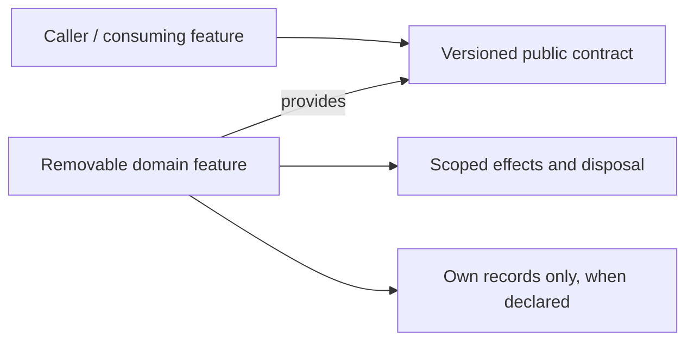

# Portfolio

> **Package:** `app/services/portfolio/`
> **Status:** `Partial` — documentary target; runtime acceptance is **NOT_REVALIDATED**.
> **Last updated:** `2026-09-06`
> **Domain ID:** `D-POR`

> This README is the domain target registry for boundaries, composable feature capabilities, requirements, ownership, workflows, acceptance, and removal. Update it before changing the affected implementation. It does not certify that a target package, contract, test, usage demonstration or provider is already implemented.

**Selected scope:** 7 features · 20 owned functional requirements · 7 feature-local non-functional requirements. All original feature and requirement IDs are retained. These selected workbench obligations do **not** delete unrelated existing domain behavior. This document must be merged with current evidence and any out-of-scope entries before replacing an existing domain registry.

**Sources:** [Unified Specification](../../../docs/dev/SQX/HaruQuantAI_Unified_Specification.md) · [Feature–Requirement Traceability Register](../../../docs/dev/HaruQuantAI_Feature_Requirement_Traceability_Register.md) · [Phased Feature Implementation Plan](../../../docs/dev/HaruQuantAI_Phased_Feature_Implementation_Plan.md) · [README template](../../../docs/templates/README.md). Source fingerprints and unresolved bindings are recorded in §6 and §9. The feature cards below reproduce owned requirements and acceptance oracles; their scoped shared-NFR, catalogue, original-ID and operation-gate tables remain binding through the linked source card.

---

## Code-Aligned Implementation Convention

This domain README defines target behavior; `PROJECT.md` retains system scope, cross-domain policy, system NFRs and release gates, and `ARCHITECTURE.md` retains universal package/runtime constraints. Feature-local READMEs, manifests, contracts, migrations and evidence mirror rather than silently redefine this target. For focused work, load §1, the affected §4 card, applicable §5 and §9 rules, and §7. Follow the [Feature Implementation Pipeline](../../../docs/dev/feature_implementation_pipeline.md).

Implement one feature directly in its selected owner folder and discover it through the `haruquantai.features` Python entry-point group. Declare one immutable `SPEC = FeatureSpec(...)` in `manifest.py`; do not introduce a domain registry or YAML manifest. The feature contains pure `__init__.py`, a runtime-validated `README.md`, strict `config.py` with `.from_dict()`, lifecycle `feature.py`, focused logic modules and required `_usage.py`. Add `_persistence.py` only when the feature performs database operations. Effects and dependencies flow through `FeatureContext` and `FeatureScope`; durable state is declared by `FeatureSpec.state`. Existing compatible public contracts and owners are reused, not copied into a parallel implementation.

Each core logic module documents its public API. Every service feature has one required `_usage.py` containing its bounded offline `if __name__ == "__main__":` scenarios; production logic modules do not contain demonstrations. Optional `_persistence.py` owns all feature-local database operations when durable state is required. The paths below are documentary targets pending current-code reconciliation, not claims of executable files. Tests verify the scenarios independently.

FR and acceptance IDs are trace identities, not runtime registrations. Required-provider keys below reproduce the register’s required graph. Optional providers are operation-gated: they must be declared and tested without making an absent future extension a universal startup dependency. The plan’s P1–P16 execution phases are distinct from specification U0–U13 release milestones; a U label is not proof of readiness or a new feature task.

## 1. Purpose and Boundary

### Purpose

Construct reproducible multi-strategy compositions and evaluate their dependence, capital interactions and risk. Make weighting methods, compatibility assumptions and infeasibility inspectable before a portfolio is accepted.

### Owns

Versioned portfolio compositions; correlation/dependence evidence; weight optimization; bounded portfolio search; explicit aggregation versus shared-capital simulation; portfolio risk analysis; safe composition merging.

### Does not own

Live allocation approval, broker execution, metric reimplementation, universe ownership and Agentic mutation authority. Portfolio research is not a permission to rebalance an account.

### Shared Contracts

**Owned by this domain.** Status is an evidence state. Contract modules are selected public boundaries; an unbound symbol/DTO must be reconciled before implementing its production consumer. Do not infer a callable signature from the English title.

| Evidence | Capability | Protocol / DTO / contract target | Major | Purpose |
| --- | --- | --- | --- | --- |
| NOT_REVALIDATED | `portfolio.compose-portfolios@1` | Public operation/DTO symbols in the selected contract; literal binding remains open.<br>[`app/contracts/portfolio/compose_portfolios.py`](../../contracts/portfolio/compose_portfolios.py) | 1 | Version portfolio composition and capital policy |
| NOT_REVALIDATED | `portfolio.analyze-correlation@1` | Public operation/DTO symbols in the selected contract; literal binding remains open.<br>[`app/contracts/portfolio/analyze_correlation.py`](../../contracts/portfolio/analyze_correlation.py) | 1 | Compute aligned correlation and covariance |
| NOT_REVALIDATED | `portfolio.optimize-weights@1` | Public operation/DTO symbols in the selected contract; literal binding remains open.<br>[`app/contracts/portfolio/optimize_weights.py`](../../contracts/portfolio/optimize_weights.py) | 1 | Allocate portfolio weights with declared objectives |
| NOT_REVALIDATED | `portfolio.search-portfolios@1` | Public operation/DTO symbols in the selected contract; literal binding remains open.<br>[`app/contracts/portfolio/search_portfolios.py`](../../contracts/portfolio/search_portfolios.py) | 1 | Search constrained portfolio combinations |
| NOT_REVALIDATED | `portfolio.simulate-portfolios@1` | Public operation/DTO symbols in the selected contract; literal binding remains open.<br>[`app/contracts/portfolio/simulate_portfolios.py`](../../contracts/portfolio/simulate_portfolios.py) | 1 | Evaluate combined portfolio capital and execution |
| NOT_REVALIDATED | `portfolio.analyze-portfolio-risk@1` | Public operation/DTO symbols in the selected contract; literal binding remains open.<br>[`app/contracts/portfolio/analyze_portfolio_risk.py`](../../contracts/portfolio/analyze_portfolio_risk.py) | 1 | Explain diversification, exposure and portfolio scenarios |
| NOT_REVALIDATED | `portfolio.merge-portfolios@1` | Public operation/DTO symbols in the selected contract; literal binding remains open.<br>[`app/contracts/portfolio/merge_portfolios.py`](../../contracts/portfolio/merge_portfolios.py) | 1 | Merge and split portfolio definitions with lineage |

**Consumed from other domains — required providers.** Runtime resolution is through the exact key; the provider’s implementation folder is not an import target. Same-domain edges are listed in the owning feature card.

| Capability | Owner | Binding | Consuming feature | Used for |
| --- | --- | --- | --- | --- |
| `workspace.persistence@1` | Workspace | Required | [`FEAT-POR-COMPOSE_PORTFOLIOS`](#feat-por-compose-portfolios) | Execute bounded feature-owned transactions |
| `catalogue.convert-currencies@1` | Catalogue | Required | [`FEAT-POR-COMPOSE_PORTFOLIOS`](#feat-por-compose-portfolios) | Resolve causal currency conversion paths |
| `catalogue.define-sessions@1` | Catalogue | Required | [`FEAT-POR-COMPOSE_PORTFOLIOS`](#feat-por-compose-portfolios) | Define market sessions and calendar availability |
| `analytics.query-results@1` | Analytics | Required | [`FEAT-POR-COMPOSE_PORTFOLIOS`](#feat-por-compose-portfolios) | Query bounded result and trade collections |
| `analytics.project-series@1` | Analytics | Required | [`FEAT-POR-ANALYZE_CORRELATION`](#feat-por-analyze-correlation) | Provide exact and bounded visual result series |
| `data.align-series@1` | Data | Required | [`FEAT-POR-ANALYZE_CORRELATION`](#feat-por-analyze-correlation) | Align external series without look-ahead |
| `orchestration.resource-admission@1` | Orchestration | Required | [`FEAT-POR-ANALYZE_CORRELATION`](#feat-por-analyze-correlation) | Admit finite work under one resource ledger |
| `orchestration.manage-jobs@1` | Orchestration | Required | [`FEAT-POR-OPTIMIZE_WEIGHTS`](#feat-por-optimize-weights) | Persist and control shared jobs and attempts |
| `orchestration.manage-jobs@1` | Orchestration | Required | [`FEAT-POR-SEARCH_PORTFOLIOS`](#feat-por-search-portfolios) | Persist and control shared jobs and attempts |
| `analytics.compute-metrics@1` | Analytics | Required | [`FEAT-POR-SEARCH_PORTFOLIOS`](#feat-por-search-portfolios) | Compute versioned canonical performance and risk metrics |
| `simulator.execute-ticks@1` | Simulator | Required | [`FEAT-POR-SIMULATE_PORTFOLIOS`](#feat-por-simulate-portfolios) | Execute the native chronological backtest |
| `simulator.commit-results@1` | Simulator | Required | [`FEAT-POR-SIMULATE_PORTFOLIOS`](#feat-por-simulate-portfolios) | Publish complete simulation result evidence |
| `analytics.compute-metrics@1` | Analytics | Required | [`FEAT-POR-SIMULATE_PORTFOLIOS`](#feat-por-simulate-portfolios) | Compute versioned canonical performance and risk metrics |
| `analytics.compute-metrics@1` | Analytics | Required | [`FEAT-POR-ANALYZE_PORTFOLIO_RISK`](#feat-por-analyze-portfolio-risk) | Compute versioned canonical performance and risk metrics |

**Operation-gated providers.** For each §4 feature, its linked source card’s complete “Operation-gated providers” table defines applicability, exact provider identity and absence behavior. This is scoped incorporation, not permission to treat all 233 register-wide operation edges as optional for every feature. Resolve those provider IDs to their primary capability keys in the corresponding domain README; bind actual operations in the acceptance record. An omitted local duplicate table does not waive a source dependency.

### Persisted State Ownership

Immutable constituent/weight/capital compositions, compatibility decisions, correlation/weight/search artifacts, simulation/risk references and merge receipts.

| Evidence | Owning feature | Partition / ownership class | Driver binding | Retention / read boundary |
| --- | --- | --- | --- | --- |
| BINDING_PENDING | [`FEAT-POR-COMPOSE_PORTFOLIOS`](#feat-por-compose-portfolios) | Feature-owned semantic state | Existing declared driver; no new database selected. | Retain committed evidence across deactivate/reactivate; purge only through explicit authorization, dependency/reference checks and recorded disposition. |
| BINDING_PENDING | [`FEAT-POR-ANALYZE_CORRELATION`](#feat-por-analyze-correlation) | Feature-owned semantic state | Existing declared driver; no new database selected. | Retain committed evidence across deactivate/reactivate; purge only through explicit authorization, dependency/reference checks and recorded disposition. |
| BINDING_PENDING | [`FEAT-POR-OPTIMIZE_WEIGHTS`](#feat-por-optimize-weights) | Feature-owned semantic state | Existing declared driver; no new database selected. | Retain committed evidence across deactivate/reactivate; purge only through explicit authorization, dependency/reference checks and recorded disposition. |
| BINDING_PENDING | [`FEAT-POR-SEARCH_PORTFOLIOS`](#feat-por-search-portfolios) | Feature-owned semantic state | Existing declared driver; no new database selected. | Retain committed evidence across deactivate/reactivate; purge only through explicit authorization, dependency/reference checks and recorded disposition. |
| BINDING_PENDING | [`FEAT-POR-SIMULATE_PORTFOLIOS`](#feat-por-simulate-portfolios) | Feature-owned semantic state | Existing declared driver; no new database selected. | Retain committed evidence across deactivate/reactivate; purge only through explicit authorization, dependency/reference checks and recorded disposition. |
| BINDING_PENDING | [`FEAT-POR-ANALYZE_PORTFOLIO_RISK`](#feat-por-analyze-portfolio-risk) | Feature-owned semantic state | Existing declared driver; no new database selected. | Retain committed evidence across deactivate/reactivate; purge only through explicit authorization, dependency/reference checks and recorded disposition. |
| BINDING_PENDING | [`FEAT-POR-MERGE_PORTFOLIOS`](#feat-por-merge-portfolios) | Feature-owned semantic state | Existing declared driver; no new database selected. | Retain committed evidence across deactivate/reactivate; purge only through explicit authorization, dependency/reference checks and recorded disposition. |

A feature’s exact durable namespace, schema version and migrations are taken from its reconciled manifest and contract, not guessed from its folder name. External consumers access semantic state only through the owner capability. Workspace persistence/artifact custody never acquires that semantic ownership.

### Four-Level Structural Hierarchy

| Code level | Represents | Domain example |
| --- | --- | --- |
| Package | Domain boundary | `app/services/portfolio/` |
| Module folder | Composable feature owner | `app/services/portfolio/compose_portfolios/` — [`FEAT-POR-COMPOSE_PORTFOLIOS`](#feat-por-compose-portfolios) |
| File | Manifest, strict configuration, lifecycle or focused use case | `manifest.py`, `config.py`, `feature.py`, focused logic module |
| Class / function / method | One or more traced requirement behaviors | `FR-TRC-POR-COMPOSE_PORTFOLIOS-001` and its acceptance oracle |

### Domain Capability Map

The table in §2 is the complete domain capability map. Edges below illustrate dependency direction, not a new orchestrator or private import relationship.


```mermaid
flowchart LR
    Caller["Caller / consuming feature"] --> Contract["Versioned public contract"]
    Provider["Removable domain feature"] -->|provides| Contract
    Provider --> Scope["Scoped effects and disposal"]
    Provider --> State["Own records only, when declared"]
```

## 2. Final Package Structure and Feature Independence

Feature owners are independent and physically removable. The selected package is a target binding: reconcile known current aliases and preserve compatible existing identities before creating a folder. Folder absence does not prove behavior absence. Removing a feature withdraws its contributions; it does not delete another feature’s source or retained evidence.

| Feature | Delivered value | Selected owner package | First U gate | FRs | Local NFRs | Evidence |
| --- | --- | --- | --- | --- | --- | --- |
| [`FEAT-POR-COMPOSE_PORTFOLIOS`](#feat-por-compose-portfolios) | Version portfolio composition and capital policy | `app/services/portfolio/compose_portfolios/` | U7 | 3 | 1 | NOT_REVALIDATED |
| [`FEAT-POR-ANALYZE_CORRELATION`](#feat-por-analyze-correlation) | Compute aligned correlation and covariance | `app/services/portfolio/analyze_correlation/` | U7 | 3 | 1 | NOT_REVALIDATED |
| [`FEAT-POR-OPTIMIZE_WEIGHTS`](#feat-por-optimize-weights) | Allocate portfolio weights with declared objectives | `app/services/portfolio/optimize_weights/` | U7 | 3 | 1 | NOT_REVALIDATED |
| [`FEAT-POR-SEARCH_PORTFOLIOS`](#feat-por-search-portfolios) | Search constrained portfolio combinations | `app/services/portfolio/search_portfolios/` | U7 | 3 | 1 | NOT_REVALIDATED |
| [`FEAT-POR-SIMULATE_PORTFOLIOS`](#feat-por-simulate-portfolios) | Evaluate combined portfolio capital and execution | `app/services/portfolio/simulate_portfolios/` | U7 | 3 | 1 | NOT_REVALIDATED |
| [`FEAT-POR-ANALYZE_PORTFOLIO_RISK`](#feat-por-analyze-portfolio-risk) | Explain diversification, exposure and portfolio scenarios | `app/services/portfolio/analyze_portfolio_risk/` | U7 | 3 | 1 | NOT_REVALIDATED |
| [`FEAT-POR-MERGE_PORTFOLIOS`](#feat-por-merge-portfolios) | Merge and split portfolio definitions with lineage | `app/services/portfolio/merge_portfolios/` | U7 | 2 | 1 | NOT_REVALIDATED |

```text
app/services/portfolio/
├── README.md  # this domain target registry
├── __init__.py  # docstring only
├── compose_portfolios/  # FEAT-POR-COMPOSE_PORTFOLIOS
├── analyze_correlation/  # FEAT-POR-ANALYZE_CORRELATION
├── optimize_weights/  # FEAT-POR-OPTIMIZE_WEIGHTS
├── search_portfolios/  # FEAT-POR-SEARCH_PORTFOLIOS
├── simulate_portfolios/  # FEAT-POR-SIMULATE_PORTFOLIOS
├── analyze_portfolio_risk/  # FEAT-POR-ANALYZE_PORTFOLIO_RISK
└── merge_portfolios/  # FEAT-POR-MERGE_PORTFOLIOS
```

Every feature folder contains `README.md`, docstring-only `__init__.py`, `manifest.py`, `config.py`, `feature.py` and its focused logic modules. Shared contract definitions live outside those removable packages. The primary logic-module designation in §4 is a target for usage ownership; adapt a compatible existing module rather than duplicate its service.

### Feature Capability Dependency Direction

A required edge means “consumer requires the provider’s public capability.” It never means “import the provider package.” Optional operation closure is resolved by the composition/runtime boundary and rechecked at invocation. Physical removal must cause the declared unavailable or blocked state while unrelated capabilities remain usable.

## 3. Workflows

Workflows connect existing features; they do not create additional feature owners. “Internal” means all participating behavior is domain-local. “Cross-Domain” means collaboration through public contracts. Participant lists below are **not** a substitute for the plan’s execution schedule or the workflow’s validated operation graph.

### Domain-local reading sequence — Compose and evaluate a portfolio

**Input boundary:** Exact constituents, currencies/calendars, weights, capital assumptions and selected evaluation mode.

**Output boundary:** Versioned composition and compatible risk/performance evidence with explicit limitations.

**Capabilities to inspect:** [`FEAT-POR-COMPOSE_PORTFOLIOS`](#feat-por-compose-portfolios) → [`FEAT-POR-ANALYZE_CORRELATION`](#feat-por-analyze-correlation) → [`FEAT-POR-OPTIMIZE_WEIGHTS`](#feat-por-optimize-weights) → [`FEAT-POR-SIMULATE_PORTFOLIOS`](#feat-por-simulate-portfolios) → [`FEAT-POR-ANALYZE_PORTFOLIO_RISK`](#feat-por-analyze-portfolio-risk).

This is a domain-oriented explanation, not an additional canonical `WF-*` identity. Apply every FR of the participating operation, not only its first validation step. Validate scope and immutable references, resolve admitted providers, perform owner work, verify the owner receipt, and then expose the result. Invalid input, provider absence, stale revision and cancellation retain separate typed outcomes.

| Evidence | Workflow | Scope | Lead | First U gate | Acceptance |
| --- | --- | --- | --- | --- | --- |
| PENDING | [`WF-WB-PORTFOLIO`](#wf-wb-portfolio) | Cross-Domain | [`FEAT-POR-COMPOSE_PORTFOLIOS`](#feat-por-compose-portfolios) | U7 | `ATW-WB-PORTFOLIO` |
| PENDING | [`WF-WB-PROJECT`](#wf-wb-project) | Cross-Domain | [`FEAT-ORCH-RUN_PROJECTS`](../orchestration/README.md#feat-orch-run-projects) | U8 | `ATW-WB-PROJECT` |
| PENDING | [`WF-AGT-ADVISE_PORTFOLIO`](#wf-agt-advise-portfolio) | Cross-Domain | [`FEAT-AGT-ADVISE_PORTFOLIO`](../agentic/README.md#feat-agt-advise-portfolio) | U7 | `ATW-AGT-ADVISE_PORTFOLIO` |

<a id="wf-wb-portfolio"></a>
### `WF-WB-PORTFOLIO` — Compose and evaluate a portfolio

**Lead owner:** [`FEAT-POR-COMPOSE_PORTFOLIOS`](#feat-por-compose-portfolios). **Release gate:** U7. **State:** PENDING.

**Participants:** [`FEAT-POR-COMPOSE_PORTFOLIOS`](#feat-por-compose-portfolios), [`FEAT-POR-ANALYZE_CORRELATION`](#feat-por-analyze-correlation), [`FEAT-POR-OPTIMIZE_WEIGHTS`](#feat-por-optimize-weights), [`FEAT-POR-SEARCH_PORTFOLIOS`](#feat-por-search-portfolios), [`FEAT-POR-SIMULATE_PORTFOLIOS`](#feat-por-simulate-portfolios), [`FEAT-POR-ANALYZE_PORTFOLIO_RISK`](#feat-por-analyze-portfolio-risk), [`FEAT-UI-PORTFOLIO_COMPOSER`](../../ui/README.md#feat-ui-portfolio-composer), [`FEAT-UI-PORTFOLIO_BUILDER`](../../ui/README.md#feat-ui-portfolio-builder), [`FEAT-ANA-DATABANK_MEMBERSHIP`](../analytics/README.md#feat-ana-databank-membership).

**This domain contributes:** [`FEAT-POR-COMPOSE_PORTFOLIOS`](#feat-por-compose-portfolios), [`FEAT-POR-ANALYZE_CORRELATION`](#feat-por-analyze-correlation), [`FEAT-POR-OPTIMIZE_WEIGHTS`](#feat-por-optimize-weights), [`FEAT-POR-SEARCH_PORTFOLIOS`](#feat-por-search-portfolios), [`FEAT-POR-SIMULATE_PORTFOLIOS`](#feat-por-simulate-portfolios), [`FEAT-POR-ANALYZE_PORTFOLIO_RISK`](#feat-por-analyze-portfolio-risk). Every participating feature’s scoped FR/local-NFR obligations remain binding.

**Input/output and acceptance contract:** `ATW-WB-PORTFOLIO` — Resolve cash/calendar/currency/sample/size compatibility; manual/qualified weights; shared-capital interactions use ordered ticks; save exact constituents, weights, result and benchmark provenance.

**Failure boundary:** required evidence or provider absence yields the declared refusal/unavailable/partial result; it never implies a pass, silently substitutes a provider or grants live authority. [Canonical workflow definition](../../../docs/dev/HaruQuantAI_Feature_Requirement_Traceability_Register.md#wf-wb-portfolio).

<a id="wf-wb-project"></a>
### `WF-WB-PROJECT` — Automate a research project

**Lead owner:** [`FEAT-ORCH-RUN_PROJECTS`](../orchestration/README.md#feat-orch-run-projects). **Release gate:** U8. **State:** PENDING.

**Participants:** [`FEAT-ORCH-RUN_PROJECTS`](../orchestration/README.md#feat-orch-run-projects), [`FEAT-ORCH-DEFINE_PROJECTS`](../orchestration/README.md#feat-orch-define-projects), [`FEAT-ORCH-MANAGE_JOBS`](../orchestration/README.md#feat-orch-manage-jobs), [`FEAT-ORCH-EXECUTE_UTILITIES`](../orchestration/README.md#feat-orch-execute-utilities), [`FEAT-ORCH-DELIVER_NOTIFICATIONS`](../orchestration/README.md#feat-orch-deliver-notifications), [`FEAT-RES-RUN_RESEARCH`](../research/README.md#feat-res-run-research), [`FEAT-OPT-SEARCH_PARAMETERS`](../optimization/README.md#feat-opt-search-parameters), [`FEAT-POR-SIMULATE_PORTFOLIOS`](#feat-por-simulate-portfolios), [`FEAT-UI-PROJECT_EDITOR`](../../ui/README.md#feat-ui-project-editor).

**This domain contributes:** [`FEAT-POR-SIMULATE_PORTFOLIOS`](#feat-por-simulate-portfolios). Every participating feature’s scoped FR/local-NFR obligations remain binding.

**Input/output and acceptance contract:** `ATW-WB-PROJECT` — Validate bounded typed graph; whole/from-here/only preview; crash after child commit reconciles one receipt; retries append attempts and lineage navigates both directions.

**Failure boundary:** required evidence or provider absence yields the declared refusal/unavailable/partial result; it never implies a pass, silently substitutes a provider or grants live authority. [Canonical workflow definition](../../../docs/dev/HaruQuantAI_Feature_Requirement_Traceability_Register.md#wf-wb-project).

<a id="wf-agt-advise-portfolio"></a>
### `WF-AGT-ADVISE_PORTFOLIO` — Portfolio and Risk Advisory

**Lead owner:** [`FEAT-AGT-ADVISE_PORTFOLIO`](../agentic/README.md#feat-agt-advise-portfolio). **Release gate:** U7. **State:** PENDING.

**Participants:** [`FEAT-AGT-ADVISE_PORTFOLIO`](../agentic/README.md#feat-agt-advise-portfolio), [`FEAT-POR-COMPOSE_PORTFOLIOS`](#feat-por-compose-portfolios), [`FEAT-POR-ANALYZE_PORTFOLIO_RISK`](#feat-por-analyze-portfolio-risk), [`FEAT-RSK-ASSESS_RESEARCH_RISK`](../risk/README.md#feat-rsk-assess-research-risk), [`FEAT-AGT-DELIBERATE_RESEARCH`](../agentic/README.md#feat-agt-deliberate-research), [`FEAT-AGT-GOVERN_TOOL_CALLS`](../agentic/README.md#feat-agt-govern-tool-calls).

**This domain contributes:** [`FEAT-POR-COMPOSE_PORTFOLIOS`](#feat-por-compose-portfolios), [`FEAT-POR-ANALYZE_PORTFOLIO_RISK`](#feat-por-analyze-portfolio-risk). Every participating feature’s scoped FR/local-NFR obligations remain binding.

**Input/output and acceptance contract:** `ATW-AGT-ADVISE_PORTFOLIO` — Fresh account/portfolio evidence and independent risk challenge; strictly expiring non-binding output cannot encode executable quantities or Risk approval.

**Failure boundary:** required evidence or provider absence yields the declared refusal/unavailable/partial result; it never implies a pass, silently substitutes a provider or grants live authority. [Canonical workflow definition](../../../docs/dev/HaruQuantAI_Feature_Requirement_Traceability_Register.md#wf-agt-advise-portfolio).

## 4. Composable Feature Specifications

Each card is one permanent feature/task slot. Its owned FRs, local NFRs and expected acceptance outcomes are reproduced below. All acceptance states are PENDING / NOT_REVALIDATED. Contract targets and intended tests do not prove runtime support. `Binding pending` prohibits executor invention: resolve the exact compatible contract, configuration, state and fixture before production use. The plan’s one-feature task rule includes all registered variants; future-provider qualification is not permission to leave owned adapter behavior unimplemented.

<a id="feat-por-compose-portfolios"></a>
### 4.1 `compose_portfolios/` — `FEAT-POR-COMPOSE_PORTFOLIOS`

> **Feature ID:** `FEAT-POR-COMPOSE_PORTFOLIOS`
> **Domain:** `portfolio`
> **Status:** `Partial` — target documented; full-scope implementation evidence **NOT_REVALIDATED**.
> **Selected owner:** `app/services/portfolio/compose_portfolios/`
> **First release milestone:** `U7`; execution order remains in the [Phased Feature Implementation Plan](../../../docs/dev/HaruQuantAI_Phased_Feature_Implementation_Plan.md).

#### Purpose

Version portfolio composition and capital policy. Deliver the bounded behaviors in the FR table through this feature’s declared public capability; retain the domain boundary in §1.

#### Capability Declarations

**Provides:** `portfolio.compose-portfolios@1`.

**Required capabilities:**

`workspace.persistence@1` — [`FEAT-WS-EXECUTE_PERSISTENCE`](../workspace/README.md#feat-ws-execute-persistence)<br>`catalogue.convert-currencies@1` — [`FEAT-CAT-CONVERT_CURRENCIES`](../catalogue/README.md#feat-cat-convert-currencies)<br>`catalogue.define-sessions@1` — [`FEAT-CAT-DEFINE_SESSIONS`](../catalogue/README.md#feat-cat-define-sessions)<br>`analytics.query-results@1` — [`FEAT-ANA-QUERY_RESULTS`](../analytics/README.md#feat-ana-query-results).

**Optional / operation-gated capabilities:** the complete scoped provider table in the [source feature card](../../../docs/dev/HaruQuantAI_Feature_Requirement_Traceability_Register.md#feat-por-compose-portfolios) is normative. Declare each applicable key separately from required startup dependencies. Absence must affect only the operations requiring it, with the exact recorded denial/unavailable behavior.

**Public contract target:** [`app/contracts/portfolio/compose_portfolios.py`](../../contracts/portfolio/compose_portfolios.py). **Literal protocol/DTO/operation symbols:** bind to the compatible selected contract before implementation; no alternate signature is invented here.

**Input boundary:** validated typed operation data, current authenticated scope where applicable, and immutable owner references; numerical operations accept validated bounded buffers. **Output boundary:** the owned FRs and acceptance oracles below. Preserve typed invalid, denied, unavailable, stale/conflict, partial, cancelled and failed outcomes wherever the selected contract defines them; do not create a second generic error vocabulary.

#### Feature Configuration & Limits Manifest

| Binding state | Setting / limit source | Type / default | Required | Validation / ownership |
| --- | --- | --- | --- | --- |
| BINDING_PENDING | Exact accepted feature config keys in reconciled config.py / manifest.py / feature README | Owner-declared types and defaults only; none fabricated by this README. | As declared by the owner. | Unknown keys and invalid values fail validation; manifest/config/README key parity is mandatory. |
| NORMATIVE | Operation parameters, immutable profile references and policy limits in the FRs below | Use the selected request/profile schema; no implicit coercion or default substitution. | All prerequisites of the selected operation. | Do not confuse a request parameter, historical profile value or user-visible setting with a new feature config key. |
| NORMATIVE | Resource, security, retention and version requirements in local/shared NFRs | Finite admitted values; stricter applicable owner policy wins. | Before the affected operation. | Pin effective values/revisions in evidence; never alter a historical run by editing current settings. |

**Feature-specific parameter/limit obligations:** `FR-TRC-POR-COMPOSE_PORTFOLIOS-001`, `FR-TRC-POR-COMPOSE_PORTFOLIOS-003`. Their full text and test oracles below are binding; this list is an index, not a reduced schema.

#### Runtime Effects & Scope Disposal

| Effect | Owner | Disposal mechanism |
| --- | --- | --- |
| Capability binding `portfolio.compose-portfolios@1` | FEAT-POR-COMPOSE_PORTFOLIOS | Unregister when the reconciler closes the feature scope. |
| Tasks, listeners, requests, workers, leases or buffers actually created by this feature | FEAT-POR-COMPOSE_PORTFOLIOS | Register exact disposers; cancel/await/release on failure or removal. A pure provider must not create unnecessary effects. |
| Accepted owner work and committed records | Their declared semantic owner | Observation cleanup does not secretly cancel accepted work or purge committed evidence; use explicit owner commands. |

Teardown is idempotent. Failed mount unwinds partial effects. Dependency replacement/removal must not leave stale registrations, jobs, subscriptions, source buffers or credential references usable by the removed scope.

#### Persistent State Ownership

**Ownership class:** Feature-owned semantic state.

**Records:** Only records/artifact references required by the functional requirements below; Immutable constituent/weight/capital compositions, compatibility decisions, correlation/weight/search artifacts, simulation/risk references and merge receipts.

**Retention and deletion:** Retain committed evidence across deactivate/reactivate; purge only through explicit authorization, dependency/reference checks and recorded disposition.

**Namespace / schema / driver binding:** Literal namespace, existing schema version, migrations and driver binding must be reconciled with the current feature manifest. No table ownership is transferred to Workspace merely because it executes persistence. A missing literal binding is an explicit §6 precondition, not permission to choose a schema version or table name during execution.

#### Feature Package Structure & Files

| Target file within owner package | Responsibility | Exports / dependency boundary |
| --- | --- | --- |
| __init__.py | Pure package description | Docstring only. |
| README.md | Runtime-validated mirror of this feature scope | Document exact keys, paths and evidence. |
| manifest.py | Immutable identity, capabilities, config keys and optional state declaration | SPEC : FeatureSpec; metadata only. |
| config.py | Strict typed configuration with unknown-key validation | Compatible FeatureConfig.from_dict() binding; no invented accepted keys. |
| feature.py | Scoped mount adapter and zero-argument factory | create_feature(); mount through FeatureContext/FeatureScope. |
| compose_portfolios.py | Focused production domain-logic module | Compatible contract operation binding. |
| _persistence.py | Optional owner of all feature-local database operations when durable state is required | Declared storage operations through public Workspace persistence contracts; no raw connection, policy, authorization or orchestration. |
| _usage.py | Required bounded offline usage scenarios and executable __main__ harness | _run_usage_example(); scenarios map to every applicable FR without owning business logic. |

These are documentary ownership targets, not a claim that files or symbols already exist. Reconcile a compatible existing filename/symbol once in the feature’s path-binding receipt rather than creating duplicate logic. Public contract files remain outside the removable backend owner.

#### Functional Requirements (FR)

| Status | Requirement ID | Responsibility / required behavior | Acceptance ID | Expected result |
| --- | --- | --- | --- | --- |
| PENDING | `FR-TRC-POR-COMPOSE_PORTFOLIOS-001` | Add/remove/reorder stable Strategy/result references, exposing duplicate/missing/sample/currency/shared-capital incompatibilities. | `AT-POR-COMPOSE_PORTFOLIOS-001` | Reordering changes presentation only unless a named model declares order sensitivity; missing constituents block computation. |
| PENDING | `FR-TRC-POR-COMPOSE_PORTFOLIOS-002` | Validate raw and normalized weights, cash, capital/leverage, sizing consistency, fees, calendar and rebalance policy. | `AT-POR-COMPOSE_PORTFOLIOS-002` | Both raw/normalized values remain visible; invalid sums or ambiguous mixed sizing fail instead of silent normalization/relaxation. |
| PENDING | `FR-TRC-POR-COMPOSE_PORTFOLIOS-003` | Save immutable portfolio revisions and separately version an explicitly labelled Buy & Hold benchmark. | `AT-POR-COMPOSE_PORTFOLIOS-003` | Benchmark series/instrument/sample/currency/fees are pinned; saving never overwrites an existing result. |

**Implementing-symbol and side-effect binding:** bind each requirement to the actual operation in the selected public contract and its focused implementation module before acceptance. For each FR, the acceptance receipt records actual symbol, side effects, typed error/exception branch, usage scenario and test location. Do not replace a specified typed failure with a guessed `ValueError`, or treat its absence from this summary as success.

#### Non-Functional Requirements (Local)

| Status | Requirement ID | Quality / removal constraint | Acceptance ID | Expected result |
| --- | --- | --- | --- | --- |
| PENDING | `NFR-TRC-POR-COMPOSE_PORTFOLIOS-001` | Removing FEAT-POR-COMPOSE_PORTFOLIOS withdraws only its declared contribution; no dependent operation may silently select a substitute provider. | `ATN-POR-COMPOSE_PORTFOLIOS-001` | Disable and physically remove compose_portfolios; its operation is unavailable, unrelated capabilities remain usable, and retained source objects are unchanged. |

#### Applicable Shared NFRs, Catalogue and Source Bindings

[source feature card](../../../docs/dev/HaruQuantAI_Feature_Requirement_Traceability_Register.md#feat-por-compose-portfolios): the exact “Applicable shared NFRs,” “Detailed catalogue families,” “Catalogue entries, algorithms and controls delivered,” “Source scope / Original source IDs,” and operation-gated provider sections are incorporated for **this feature only**. These sections remain normative; an acceptance manifest must enumerate the actual linked IDs/entries and evidence, not just cite this paragraph. No source algorithm, control, permission or release condition is weakened by this domain projection.

#### Acceptance Tests and Evidence

| Acceptance family | Intended test owner | Required evidence state |
| --- | --- | --- |
| Every AT ID in this card | `tests/services/portfolio/compose_portfolios/test_traceability.py` | PENDING: bind an actual named test and assertion to each oracle. |
| Every ATN ID in this card | `tests/services/portfolio/compose_portfolios/test_lifecycle.py` | PENDING: lifecycle/resource/numerical evidence as applicable. |
| Contract → provider → composition → Interfaces → UI → end-to-end | `docs/dev/SQX/evidence/features/FEAT-POR-COMPOSE_PORTFOLIOS/acceptance.json` | All six stages NOT_REVALIDATED; justify each genuinely inapplicable stage. |

Intended test paths may be mapped to a compatible current test owner; they are not assertions of existing files. Full oracle coverage, shared requirements, catalogue entries, original source mappings and actual-provider operation qualification must be included in the final acceptance record. A contract fixture cannot certify actual provider integration.

#### Feature Usage Examples

**Required `_usage.py` command - planned, not executed:**

```powershell
uv run --frozen python -m app.services.portfolio.compose_portfolios._usage
```

`_usage.py` uses bounded deterministic offline inputs and composes production behavior through public contracts or this feature's focused modules. It demonstrates a useful accepted operation, the appropriate invalid/unavailable/refusal case, and exact cleanup without owning business logic. Map each FR above to a named scenario; the expected observations are its acceptance oracles, not invented console output. Do not import sibling implementations, require live credentials/network by default, or put the public example under tests. Before marking it runnable, bind concrete fixture values and record its actual command, output and exit code.

#### Removal Behaviour

Disable and physically remove the actual reconciled owner of `FEAT-POR-COMPOSE_PORTFOLIOS`. Withdraw `portfolio.compose-portfolios@1` and all its scoped contributions. Required dependents become BLOCKED/unavailable through their declared contract; operation-gated consumers disable only affected operations. Retain committed source objects and evidence; no cross-provider substitute or implicit purge is permitted. Exercise the local ATN oracles and §7 gates before restoring the feature.

---

<a id="feat-por-analyze-correlation"></a>
### 4.2 `analyze_correlation/` — `FEAT-POR-ANALYZE_CORRELATION`

> **Feature ID:** `FEAT-POR-ANALYZE_CORRELATION`
> **Domain:** `portfolio`
> **Status:** `Partial` — target documented; full-scope implementation evidence **NOT_REVALIDATED**.
> **Selected owner:** `app/services/portfolio/analyze_correlation/`
> **First release milestone:** `U7`; execution order remains in the [Phased Feature Implementation Plan](../../../docs/dev/HaruQuantAI_Phased_Feature_Implementation_Plan.md).

#### Purpose

Compute aligned correlation and covariance. Deliver the bounded behaviors in the FR table through this feature’s declared public capability; retain the domain boundary in §1.

#### Capability Declarations

**Provides:** `portfolio.analyze-correlation@1`.

**Required capabilities:**

`analytics.project-series@1` — [`FEAT-ANA-PROJECT_SERIES`](../analytics/README.md#feat-ana-project-series)<br>`data.align-series@1` — [`FEAT-DATA-ALIGN_SERIES`](../data/README.md#feat-data-align-series)<br>`orchestration.resource-admission@1` — [`FEAT-ORCH-RESERVE_RESOURCES`](../orchestration/README.md#feat-orch-reserve-resources).

**Optional / operation-gated capabilities:** the complete scoped provider table in the [source feature card](../../../docs/dev/HaruQuantAI_Feature_Requirement_Traceability_Register.md#feat-por-analyze-correlation) is normative. Declare each applicable key separately from required startup dependencies. Absence must affect only the operations requiring it, with the exact recorded denial/unavailable behavior.

**Public contract target:** [`app/contracts/portfolio/analyze_correlation.py`](../../contracts/portfolio/analyze_correlation.py). **Literal protocol/DTO/operation symbols:** bind to the compatible selected contract before implementation; no alternate signature is invented here.

**Input boundary:** validated typed operation data, current authenticated scope where applicable, and immutable owner references; numerical operations accept validated bounded buffers. **Output boundary:** the owned FRs and acceptance oracles below. Preserve typed invalid, denied, unavailable, stale/conflict, partial, cancelled and failed outcomes wherever the selected contract defines them; do not create a second generic error vocabulary.

#### Feature Configuration & Limits Manifest

| Binding state | Setting / limit source | Type / default | Required | Validation / ownership |
| --- | --- | --- | --- | --- |
| BINDING_PENDING | Exact accepted feature config keys in reconciled config.py / manifest.py / feature README | Owner-declared types and defaults only; none fabricated by this README. | As declared by the owner. | Unknown keys and invalid values fail validation; manifest/config/README key parity is mandatory. |
| NORMATIVE | Operation parameters, immutable profile references and policy limits in the FRs below | Use the selected request/profile schema; no implicit coercion or default substitution. | All prerequisites of the selected operation. | Do not confuse a request parameter, historical profile value or user-visible setting with a new feature config key. |
| NORMATIVE | Resource, security, retention and version requirements in local/shared NFRs | Finite admitted values; stricter applicable owner policy wins. | Before the affected operation. | Pin effective values/revisions in evidence; never alter a historical run by editing current settings. |

**Feature-specific parameter/limit obligations:** `FR-TRC-POR-ANALYZE_CORRELATION-001`, `FR-TRC-POR-ANALYZE_CORRELATION-002`. Their full text and test oracles below are binding; this list is an index, not a reduced schema.

#### Runtime Effects & Scope Disposal

| Effect | Owner | Disposal mechanism |
| --- | --- | --- |
| Capability binding `portfolio.analyze-correlation@1` | FEAT-POR-ANALYZE_CORRELATION | Unregister when the reconciler closes the feature scope. |
| Tasks, listeners, requests, workers, leases or buffers actually created by this feature | FEAT-POR-ANALYZE_CORRELATION | Register exact disposers; cancel/await/release on failure or removal. A pure provider must not create unnecessary effects. |
| Accepted owner work and committed records | Their declared semantic owner | Observation cleanup does not secretly cancel accepted work or purge committed evidence; use explicit owner commands. |

Teardown is idempotent. Failed mount unwinds partial effects. Dependency replacement/removal must not leave stale registrations, jobs, subscriptions, source buffers or credential references usable by the removed scope.

#### Persistent State Ownership

**Ownership class:** Feature-owned semantic state.

**Records:** Only records/artifact references required by the functional requirements below; Immutable constituent/weight/capital compositions, compatibility decisions, correlation/weight/search artifacts, simulation/risk references and merge receipts.

**Retention and deletion:** Retain committed evidence across deactivate/reactivate; purge only through explicit authorization, dependency/reference checks and recorded disposition.

**Namespace / schema / driver binding:** Literal namespace, existing schema version, migrations and driver binding must be reconciled with the current feature manifest. No table ownership is transferred to Workspace merely because it executes persistence. A missing literal binding is an explicit §6 precondition, not permission to choose a schema version or table name during execution.

#### Feature Package Structure & Files

| Target file within owner package | Responsibility | Exports / dependency boundary |
| --- | --- | --- |
| __init__.py | Pure package description | Docstring only. |
| README.md | Runtime-validated mirror of this feature scope | Document exact keys, paths and evidence. |
| manifest.py | Immutable identity, capabilities, config keys and optional state declaration | SPEC : FeatureSpec; metadata only. |
| config.py | Strict typed configuration with unknown-key validation | Compatible FeatureConfig.from_dict() binding; no invented accepted keys. |
| feature.py | Scoped mount adapter and zero-argument factory | create_feature(); mount through FeatureContext/FeatureScope. |
| analyze_correlation.py | Focused production domain-logic module | Compatible contract operation binding. |
| _persistence.py | Optional owner of all feature-local database operations when durable state is required | Declared storage operations through public Workspace persistence contracts; no raw connection, policy, authorization or orchestration. |
| _usage.py | Required bounded offline usage scenarios and executable __main__ harness | _run_usage_example(); scenarios map to every applicable FR without owning business logic. |

These are documentary ownership targets, not a claim that files or symbols already exist. Reconcile a compatible existing filename/symbol once in the feature’s path-binding receipt rather than creating duplicate logic. Public contract files remain outside the removable backend owner.

#### Functional Requirements (FR)

| Status | Requirement ID | Responsibility / required behavior | Acceptance ID | Expected result |
| --- | --- | --- | --- | --- |
| PENDING | `FR-TRC-POR-ANALYZE_CORRELATION-001` | Pin return frequency, currency, calendar, weighting, missing/zero-period policy, minimum overlap and method. | `AT-POR-ANALYZE_CORRELATION-001` | Core Pearson requires at least two pairs and nonzero variance; undefined coefficients remain typed unavailable. |
| PENDING | `FR-TRC-POR-ANALYZE_CORRELATION-002` | Compute blocked/tiled matrices and bounded pair drilldowns without changing the population or precision policy. | `AT-POR-ANALYZE_CORRELATION-002` | 100/1,000-strategy fixtures respect matrix/solver memory reservations; a cell detail uses the same aligned sample as the matrix. |
| PENDING | `FR-TRC-POR-ANALYZE_CORRELATION-003` | Expose negative-correlation handling and overlapping-trade rules as explicit policies rather than display shortcuts. | `AT-POR-ANALYZE_CORRELATION-003` | Changing negative/missing handling changes a named analysis identity; no silent zero fill creates artificial diversification. |

**Implementing-symbol and side-effect binding:** bind each requirement to the actual operation in the selected public contract and its focused implementation module before acceptance. For each FR, the acceptance receipt records actual symbol, side effects, typed error/exception branch, usage scenario and test location. Do not replace a specified typed failure with a guessed `ValueError`, or treat its absence from this summary as success.

#### Non-Functional Requirements (Local)

| Status | Requirement ID | Quality / removal constraint | Acceptance ID | Expected result |
| --- | --- | --- | --- | --- |
| PENDING | `NFR-TRC-POR-ANALYZE_CORRELATION-001` | Removing FEAT-POR-ANALYZE_CORRELATION withdraws only its declared contribution; no dependent operation may silently select a substitute provider. | `ATN-POR-ANALYZE_CORRELATION-001` | Disable and physically remove analyze_correlation; its operation is unavailable, unrelated capabilities remain usable, and retained source objects are unchanged. |

#### Applicable Shared NFRs, Catalogue and Source Bindings

[source feature card](../../../docs/dev/HaruQuantAI_Feature_Requirement_Traceability_Register.md#feat-por-analyze-correlation): the exact “Applicable shared NFRs,” “Detailed catalogue families,” “Catalogue entries, algorithms and controls delivered,” “Source scope / Original source IDs,” and operation-gated provider sections are incorporated for **this feature only**. These sections remain normative; an acceptance manifest must enumerate the actual linked IDs/entries and evidence, not just cite this paragraph. No source algorithm, control, permission or release condition is weakened by this domain projection.

#### Acceptance Tests and Evidence

| Acceptance family | Intended test owner | Required evidence state |
| --- | --- | --- |
| Every AT ID in this card | `tests/services/portfolio/analyze_correlation/test_traceability.py` | PENDING: bind an actual named test and assertion to each oracle. |
| Every ATN ID in this card | `tests/services/portfolio/analyze_correlation/test_lifecycle.py` | PENDING: lifecycle/resource/numerical evidence as applicable. |
| Contract → provider → composition → Interfaces → UI → end-to-end | `docs/dev/SQX/evidence/features/FEAT-POR-ANALYZE_CORRELATION/acceptance.json` | All six stages NOT_REVALIDATED; justify each genuinely inapplicable stage. |

Intended test paths may be mapped to a compatible current test owner; they are not assertions of existing files. Full oracle coverage, shared requirements, catalogue entries, original source mappings and actual-provider operation qualification must be included in the final acceptance record. A contract fixture cannot certify actual provider integration.

#### Feature Usage Examples

**Required `_usage.py` command - planned, not executed:**

```powershell
uv run --frozen python -m app.services.portfolio.analyze_correlation._usage
```

`_usage.py` uses bounded deterministic offline inputs and composes production behavior through public contracts or this feature's focused modules. It demonstrates a useful accepted operation, the appropriate invalid/unavailable/refusal case, and exact cleanup without owning business logic. Map each FR above to a named scenario; the expected observations are its acceptance oracles, not invented console output. Do not import sibling implementations, require live credentials/network by default, or put the public example under tests. Before marking it runnable, bind concrete fixture values and record its actual command, output and exit code.

#### Removal Behaviour

Disable and physically remove the actual reconciled owner of `FEAT-POR-ANALYZE_CORRELATION`. Withdraw `portfolio.analyze-correlation@1` and all its scoped contributions. Required dependents become BLOCKED/unavailable through their declared contract; operation-gated consumers disable only affected operations. Retain committed source objects and evidence; no cross-provider substitute or implicit purge is permitted. Exercise the local ATN oracles and §7 gates before restoring the feature.

---

<a id="feat-por-optimize-weights"></a>
### 4.3 `optimize_weights/` — `FEAT-POR-OPTIMIZE_WEIGHTS`

> **Feature ID:** `FEAT-POR-OPTIMIZE_WEIGHTS`
> **Domain:** `portfolio`
> **Status:** `Partial` — target documented; full-scope implementation evidence **NOT_REVALIDATED**.
> **Selected owner:** `app/services/portfolio/optimize_weights/`
> **First release milestone:** `U7`; execution order remains in the [Phased Feature Implementation Plan](../../../docs/dev/HaruQuantAI_Phased_Feature_Implementation_Plan.md).

#### Purpose

Allocate portfolio weights with declared objectives. Deliver the bounded behaviors in the FR table through this feature’s declared public capability; retain the domain boundary in §1.

#### Capability Declarations

**Provides:** `portfolio.optimize-weights@1`.

**Required capabilities:**

`portfolio.compose-portfolios@1` — [`FEAT-POR-COMPOSE_PORTFOLIOS`](#feat-por-compose-portfolios)<br>`portfolio.analyze-correlation@1` — [`FEAT-POR-ANALYZE_CORRELATION`](#feat-por-analyze-correlation)<br>`orchestration.manage-jobs@1` — [`FEAT-ORCH-MANAGE_JOBS`](../orchestration/README.md#feat-orch-manage-jobs).

**Optional / operation-gated capabilities:** the complete scoped provider table in the [source feature card](../../../docs/dev/HaruQuantAI_Feature_Requirement_Traceability_Register.md#feat-por-optimize-weights) is normative. Declare each applicable key separately from required startup dependencies. Absence must affect only the operations requiring it, with the exact recorded denial/unavailable behavior.

**Public contract target:** [`app/contracts/portfolio/optimize_weights.py`](../../contracts/portfolio/optimize_weights.py). **Literal protocol/DTO/operation symbols:** bind to the compatible selected contract before implementation; no alternate signature is invented here.

**Input boundary:** validated typed operation data, current authenticated scope where applicable, and immutable owner references; numerical operations accept validated bounded buffers. **Output boundary:** the owned FRs and acceptance oracles below. Preserve typed invalid, denied, unavailable, stale/conflict, partial, cancelled and failed outcomes wherever the selected contract defines them; do not create a second generic error vocabulary.

#### Feature Configuration & Limits Manifest

| Binding state | Setting / limit source | Type / default | Required | Validation / ownership |
| --- | --- | --- | --- | --- |
| BINDING_PENDING | Exact accepted feature config keys in reconciled config.py / manifest.py / feature README | Owner-declared types and defaults only; none fabricated by this README. | As declared by the owner. | Unknown keys and invalid values fail validation; manifest/config/README key parity is mandatory. |
| NORMATIVE | Operation parameters, immutable profile references and policy limits in the FRs below | Use the selected request/profile schema; no implicit coercion or default substitution. | All prerequisites of the selected operation. | Do not confuse a request parameter, historical profile value or user-visible setting with a new feature config key. |
| NORMATIVE | Resource, security, retention and version requirements in local/shared NFRs | Finite admitted values; stricter applicable owner policy wins. | Before the affected operation. | Pin effective values/revisions in evidence; never alter a historical run by editing current settings. |

**Feature-specific parameter/limit obligations:** `FR-TRC-POR-OPTIMIZE_WEIGHTS-002`. Their full text and test oracles below are binding; this list is an index, not a reduced schema.

#### Runtime Effects & Scope Disposal

| Effect | Owner | Disposal mechanism |
| --- | --- | --- |
| Capability binding `portfolio.optimize-weights@1` | FEAT-POR-OPTIMIZE_WEIGHTS | Unregister when the reconciler closes the feature scope. |
| Tasks, listeners, requests, workers, leases or buffers actually created by this feature | FEAT-POR-OPTIMIZE_WEIGHTS | Register exact disposers; cancel/await/release on failure or removal. A pure provider must not create unnecessary effects. |
| Accepted owner work and committed records | Their declared semantic owner | Observation cleanup does not secretly cancel accepted work or purge committed evidence; use explicit owner commands. |

Teardown is idempotent. Failed mount unwinds partial effects. Dependency replacement/removal must not leave stale registrations, jobs, subscriptions, source buffers or credential references usable by the removed scope.

#### Persistent State Ownership

**Ownership class:** Feature-owned semantic state.

**Records:** Only records/artifact references required by the functional requirements below; Immutable constituent/weight/capital compositions, compatibility decisions, correlation/weight/search artifacts, simulation/risk references and merge receipts.

**Retention and deletion:** Retain committed evidence across deactivate/reactivate; purge only through explicit authorization, dependency/reference checks and recorded disposition.

**Namespace / schema / driver binding:** Literal namespace, existing schema version, migrations and driver binding must be reconciled with the current feature manifest. No table ownership is transferred to Workspace merely because it executes persistence. A missing literal binding is an explicit §6 precondition, not permission to choose a schema version or table name during execution.

#### Feature Package Structure & Files

| Target file within owner package | Responsibility | Exports / dependency boundary |
| --- | --- | --- |
| __init__.py | Pure package description | Docstring only. |
| README.md | Runtime-validated mirror of this feature scope | Document exact keys, paths and evidence. |
| manifest.py | Immutable identity, capabilities, config keys and optional state declaration | SPEC : FeatureSpec; metadata only. |
| config.py | Strict typed configuration with unknown-key validation | Compatible FeatureConfig.from_dict() binding; no invented accepted keys. |
| feature.py | Scoped mount adapter and zero-argument factory | create_feature(); mount through FeatureContext/FeatureScope. |
| optimize_weights.py | Focused production domain-logic module | Compatible contract operation binding. |
| _persistence.py | Optional owner of all feature-local database operations when durable state is required | Declared storage operations through public Workspace persistence contracts; no raw connection, policy, authorization or orchestration. |
| _usage.py | Required bounded offline usage scenarios and executable __main__ harness | _run_usage_example(); scenarios map to every applicable FR without owning business logic. |

These are documentary ownership targets, not a claim that files or symbols already exist. Reconcile a compatible existing filename/symbol once in the feature’s path-binding receipt rather than creating duplicate logic. Public contract files remain outside the removable backend owner.

#### Functional Requirements (FR)

| Status | Requirement ID | Responsibility / required behavior | Acceptance ID | Expected result |
| --- | --- | --- | --- | --- |
| PENDING | `FR-TRC-POR-OPTIMIZE_WEIGHTS-001` | Implement core weighting with explicit cash, normalization, metric nonnegative transform and zero-total-score fallback. | `AT-POR-OPTIMIZE_WEIGHTS-001` | A zero-score population follows the recorded fallback; negative raw scores are not treated as valid weights without a transform. |
| PENDING | `FR-TRC-POR-OPTIMIZE_WEIGHTS-002` | Implement U10 constrained methods with pinned covariance/estimation window/risk-free/currency, weight/exposure/turnover/leverage/group caps and rebalance costs. | `AT-POR-OPTIMIZE_WEIGHTS-002` | Infeasible constraints return diagnostics, not silent relaxation; solver convergence status and provider version remain visible. |
| PENDING | `FR-TRC-POR-OPTIMIZE_WEIGHTS-003` | Publish before/after weights, objective and contribution evidence against the same input snapshot. | `AT-POR-OPTIMIZE_WEIGHTS-003` | An optimized result cannot mutate the saved portfolio until a separate revision acceptance succeeds. |

**Implementing-symbol and side-effect binding:** bind each requirement to the actual operation in the selected public contract and its focused implementation module before acceptance. For each FR, the acceptance receipt records actual symbol, side effects, typed error/exception branch, usage scenario and test location. Do not replace a specified typed failure with a guessed `ValueError`, or treat its absence from this summary as success.

#### Non-Functional Requirements (Local)

| Status | Requirement ID | Quality / removal constraint | Acceptance ID | Expected result |
| --- | --- | --- | --- | --- |
| PENDING | `NFR-TRC-POR-OPTIMIZE_WEIGHTS-001` | Removing FEAT-POR-OPTIMIZE_WEIGHTS withdraws only its declared contribution; no dependent operation may silently select a substitute provider. | `ATN-POR-OPTIMIZE_WEIGHTS-001` | Disable and physically remove optimize_weights; its operation is unavailable, unrelated capabilities remain usable, and retained source objects are unchanged. |

#### Applicable Shared NFRs, Catalogue and Source Bindings

[source feature card](../../../docs/dev/HaruQuantAI_Feature_Requirement_Traceability_Register.md#feat-por-optimize-weights): the exact “Applicable shared NFRs,” “Detailed catalogue families,” “Catalogue entries, algorithms and controls delivered,” “Source scope / Original source IDs,” and operation-gated provider sections are incorporated for **this feature only**. These sections remain normative; an acceptance manifest must enumerate the actual linked IDs/entries and evidence, not just cite this paragraph. No source algorithm, control, permission or release condition is weakened by this domain projection.

#### Acceptance Tests and Evidence

| Acceptance family | Intended test owner | Required evidence state |
| --- | --- | --- |
| Every AT ID in this card | `tests/services/portfolio/optimize_weights/test_traceability.py` | PENDING: bind an actual named test and assertion to each oracle. |
| Every ATN ID in this card | `tests/services/portfolio/optimize_weights/test_lifecycle.py` | PENDING: lifecycle/resource/numerical evidence as applicable. |
| Contract → provider → composition → Interfaces → UI → end-to-end | `docs/dev/SQX/evidence/features/FEAT-POR-OPTIMIZE_WEIGHTS/acceptance.json` | All six stages NOT_REVALIDATED; justify each genuinely inapplicable stage. |

Intended test paths may be mapped to a compatible current test owner; they are not assertions of existing files. Full oracle coverage, shared requirements, catalogue entries, original source mappings and actual-provider operation qualification must be included in the final acceptance record. A contract fixture cannot certify actual provider integration.

#### Feature Usage Examples

**Required `_usage.py` command - planned, not executed:**

```powershell
uv run --frozen python -m app.services.portfolio.optimize_weights._usage
```

`_usage.py` uses bounded deterministic offline inputs and composes production behavior through public contracts or this feature's focused modules. It demonstrates a useful accepted operation, the appropriate invalid/unavailable/refusal case, and exact cleanup without owning business logic. Map each FR above to a named scenario; the expected observations are its acceptance oracles, not invented console output. Do not import sibling implementations, require live credentials/network by default, or put the public example under tests. Before marking it runnable, bind concrete fixture values and record its actual command, output and exit code.

#### Removal Behaviour

Disable and physically remove the actual reconciled owner of `FEAT-POR-OPTIMIZE_WEIGHTS`. Withdraw `portfolio.optimize-weights@1` and all its scoped contributions. Required dependents become BLOCKED/unavailable through their declared contract; operation-gated consumers disable only affected operations. Retain committed source objects and evidence; no cross-provider substitute or implicit purge is permitted. Exercise the local ATN oracles and §7 gates before restoring the feature.

---

<a id="feat-por-search-portfolios"></a>
### 4.4 `search_portfolios/` — `FEAT-POR-SEARCH_PORTFOLIOS`

> **Feature ID:** `FEAT-POR-SEARCH_PORTFOLIOS`
> **Domain:** `portfolio`
> **Status:** `Partial` — target documented; full-scope implementation evidence **NOT_REVALIDATED**.
> **Selected owner:** `app/services/portfolio/search_portfolios/`
> **First release milestone:** `U7`; execution order remains in the [Phased Feature Implementation Plan](../../../docs/dev/HaruQuantAI_Phased_Feature_Implementation_Plan.md).

#### Purpose

Search constrained portfolio combinations. Deliver the bounded behaviors in the FR table through this feature’s declared public capability; retain the domain boundary in §1.

#### Capability Declarations

**Provides:** `portfolio.search-portfolios@1`.

**Required capabilities:**

`portfolio.compose-portfolios@1` — [`FEAT-POR-COMPOSE_PORTFOLIOS`](#feat-por-compose-portfolios)<br>`portfolio.analyze-correlation@1` — [`FEAT-POR-ANALYZE_CORRELATION`](#feat-por-analyze-correlation)<br>`portfolio.optimize-weights@1` — [`FEAT-POR-OPTIMIZE_WEIGHTS`](#feat-por-optimize-weights)<br>`orchestration.manage-jobs@1` — [`FEAT-ORCH-MANAGE_JOBS`](../orchestration/README.md#feat-orch-manage-jobs)<br>`analytics.compute-metrics@1` — [`FEAT-ANA-COMPUTE_METRICS`](../analytics/README.md#feat-ana-compute-metrics).

**Optional / operation-gated capabilities:** the complete scoped provider table in the [source feature card](../../../docs/dev/HaruQuantAI_Feature_Requirement_Traceability_Register.md#feat-por-search-portfolios) is normative. Declare each applicable key separately from required startup dependencies. Absence must affect only the operations requiring it, with the exact recorded denial/unavailable behavior.

**Public contract target:** [`app/contracts/portfolio/search_portfolios.py`](../../contracts/portfolio/search_portfolios.py). **Literal protocol/DTO/operation symbols:** bind to the compatible selected contract before implementation; no alternate signature is invented here.

**Input boundary:** validated typed operation data, current authenticated scope where applicable, and immutable owner references; numerical operations accept validated bounded buffers. **Output boundary:** the owned FRs and acceptance oracles below. Preserve typed invalid, denied, unavailable, stale/conflict, partial, cancelled and failed outcomes wherever the selected contract defines them; do not create a second generic error vocabulary.

#### Feature Configuration & Limits Manifest

| Binding state | Setting / limit source | Type / default | Required | Validation / ownership |
| --- | --- | --- | --- | --- |
| BINDING_PENDING | Exact accepted feature config keys in reconciled config.py / manifest.py / feature README | Owner-declared types and defaults only; none fabricated by this README. | As declared by the owner. | Unknown keys and invalid values fail validation; manifest/config/README key parity is mandatory. |
| NORMATIVE | Operation parameters, immutable profile references and policy limits in the FRs below | Use the selected request/profile schema; no implicit coercion or default substitution. | All prerequisites of the selected operation. | Do not confuse a request parameter, historical profile value or user-visible setting with a new feature config key. |
| NORMATIVE | Resource, security, retention and version requirements in local/shared NFRs | Finite admitted values; stricter applicable owner policy wins. | Before the affected operation. | Pin effective values/revisions in evidence; never alter a historical run by editing current settings. |

**Feature-specific parameter/limit obligations:** `FR-TRC-POR-SEARCH_PORTFOLIOS-001`, `FR-TRC-POR-SEARCH_PORTFOLIOS-002`. Their full text and test oracles below are binding; this list is an index, not a reduced schema.

#### Runtime Effects & Scope Disposal

| Effect | Owner | Disposal mechanism |
| --- | --- | --- |
| Capability binding `portfolio.search-portfolios@1` | FEAT-POR-SEARCH_PORTFOLIOS | Unregister when the reconciler closes the feature scope. |
| Tasks, listeners, requests, workers, leases or buffers actually created by this feature | FEAT-POR-SEARCH_PORTFOLIOS | Register exact disposers; cancel/await/release on failure or removal. A pure provider must not create unnecessary effects. |
| Accepted owner work and committed records | Their declared semantic owner | Observation cleanup does not secretly cancel accepted work or purge committed evidence; use explicit owner commands. |

Teardown is idempotent. Failed mount unwinds partial effects. Dependency replacement/removal must not leave stale registrations, jobs, subscriptions, source buffers or credential references usable by the removed scope.

#### Persistent State Ownership

**Ownership class:** Feature-owned semantic state.

**Records:** Only records/artifact references required by the functional requirements below; Immutable constituent/weight/capital compositions, compatibility decisions, correlation/weight/search artifacts, simulation/risk references and merge receipts.

**Retention and deletion:** Retain committed evidence across deactivate/reactivate; purge only through explicit authorization, dependency/reference checks and recorded disposition.

**Namespace / schema / driver binding:** Literal namespace, existing schema version, migrations and driver binding must be reconciled with the current feature manifest. No table ownership is transferred to Workspace merely because it executes persistence. A missing literal binding is an explicit §6 precondition, not permission to choose a schema version or table name during execution.

#### Feature Package Structure & Files

| Target file within owner package | Responsibility | Exports / dependency boundary |
| --- | --- | --- |
| __init__.py | Pure package description | Docstring only. |
| README.md | Runtime-validated mirror of this feature scope | Document exact keys, paths and evidence. |
| manifest.py | Immutable identity, capabilities, config keys and optional state declaration | SPEC : FeatureSpec; metadata only. |
| config.py | Strict typed configuration with unknown-key validation | Compatible FeatureConfig.from_dict() binding; no invented accepted keys. |
| feature.py | Scoped mount adapter and zero-argument factory | create_feature(); mount through FeatureContext/FeatureScope. |
| search_portfolios.py | Focused production domain-logic module | Compatible contract operation binding. |
| _persistence.py | Optional owner of all feature-local database operations when durable state is required | Declared storage operations through public Workspace persistence contracts; no raw connection, policy, authorization or orchestration. |
| _usage.py | Required bounded offline usage scenarios and executable __main__ harness | _run_usage_example(); scenarios map to every applicable FR without owning business logic. |

These are documentary ownership targets, not a claim that files or symbols already exist. Reconcile a compatible existing filename/symbol once in the feature’s path-binding receipt rather than creating duplicate logic. Public contract files remain outside the removable backend owner.

#### Functional Requirements (FR)

| Status | Requirement ID | Responsibility / required behavior | Acceptance ID | Expected result |
| --- | --- | --- | --- | --- |
| PENDING | `FR-TRC-POR-SEARCH_PORTFOLIOS-001` | Resolve an immutable databank/query universe and validate min/max constituent count, symbols/sectors/groups/sample/currency/capital/correlation constraints. | `AT-POR-SEARCH_PORTFOLIOS-001` | The accepted population is explicit; impossible eligibility yields reasons before combinatorial allocation. |
| PENDING | `FR-TRC-POR-SEARCH_PORTFOLIOS-002` | Estimate and lazily execute finite brute-force/evolutionary work under candidate/result/evaluation/time budgets and seeds. | `AT-POR-SEARCH_PORTFOLIOS-002` | Maximum portfolio count and stop rules are enforced; no full power set is held in memory. |
| PENDING | `FR-TRC-POR-SEARCH_PORTFOLIOS-003` | Rank using registered portfolio metrics and atomically commit selected candidates to a target set/bank with all lineage. | `AT-POR-SEARCH_PORTFOLIOS-003` | Intermediate candidates are distinguishable from committed membership; retry publishes no duplicate accepted candidate. |

**Implementing-symbol and side-effect binding:** bind each requirement to the actual operation in the selected public contract and its focused implementation module before acceptance. For each FR, the acceptance receipt records actual symbol, side effects, typed error/exception branch, usage scenario and test location. Do not replace a specified typed failure with a guessed `ValueError`, or treat its absence from this summary as success.

#### Non-Functional Requirements (Local)

| Status | Requirement ID | Quality / removal constraint | Acceptance ID | Expected result |
| --- | --- | --- | --- | --- |
| PENDING | `NFR-TRC-POR-SEARCH_PORTFOLIOS-001` | Removing FEAT-POR-SEARCH_PORTFOLIOS withdraws only its declared contribution; no dependent operation may silently select a substitute provider. | `ATN-POR-SEARCH_PORTFOLIOS-001` | Disable and physically remove search_portfolios; its operation is unavailable, unrelated capabilities remain usable, and retained source objects are unchanged. |

#### Applicable Shared NFRs, Catalogue and Source Bindings

[source feature card](../../../docs/dev/HaruQuantAI_Feature_Requirement_Traceability_Register.md#feat-por-search-portfolios): the exact “Applicable shared NFRs,” “Detailed catalogue families,” “Catalogue entries, algorithms and controls delivered,” “Source scope / Original source IDs,” and operation-gated provider sections are incorporated for **this feature only**. These sections remain normative; an acceptance manifest must enumerate the actual linked IDs/entries and evidence, not just cite this paragraph. No source algorithm, control, permission or release condition is weakened by this domain projection.

#### Acceptance Tests and Evidence

| Acceptance family | Intended test owner | Required evidence state |
| --- | --- | --- |
| Every AT ID in this card | `tests/services/portfolio/search_portfolios/test_traceability.py` | PENDING: bind an actual named test and assertion to each oracle. |
| Every ATN ID in this card | `tests/services/portfolio/search_portfolios/test_lifecycle.py` | PENDING: lifecycle/resource/numerical evidence as applicable. |
| Contract → provider → composition → Interfaces → UI → end-to-end | `docs/dev/SQX/evidence/features/FEAT-POR-SEARCH_PORTFOLIOS/acceptance.json` | All six stages NOT_REVALIDATED; justify each genuinely inapplicable stage. |

Intended test paths may be mapped to a compatible current test owner; they are not assertions of existing files. Full oracle coverage, shared requirements, catalogue entries, original source mappings and actual-provider operation qualification must be included in the final acceptance record. A contract fixture cannot certify actual provider integration.

#### Feature Usage Examples

**Required `_usage.py` command - planned, not executed:**

```powershell
uv run --frozen python -m app.services.portfolio.search_portfolios._usage
```

`_usage.py` uses bounded deterministic offline inputs and composes production behavior through public contracts or this feature's focused modules. It demonstrates a useful accepted operation, the appropriate invalid/unavailable/refusal case, and exact cleanup without owning business logic. Map each FR above to a named scenario; the expected observations are its acceptance oracles, not invented console output. Do not import sibling implementations, require live credentials/network by default, or put the public example under tests. Before marking it runnable, bind concrete fixture values and record its actual command, output and exit code.

#### Removal Behaviour

Disable and physically remove the actual reconciled owner of `FEAT-POR-SEARCH_PORTFOLIOS`. Withdraw `portfolio.search-portfolios@1` and all its scoped contributions. Required dependents become BLOCKED/unavailable through their declared contract; operation-gated consumers disable only affected operations. Retain committed source objects and evidence; no cross-provider substitute or implicit purge is permitted. Exercise the local ATN oracles and §7 gates before restoring the feature.

---

<a id="feat-por-simulate-portfolios"></a>
### 4.5 `simulate_portfolios/` — `FEAT-POR-SIMULATE_PORTFOLIOS`

> **Feature ID:** `FEAT-POR-SIMULATE_PORTFOLIOS`
> **Domain:** `portfolio`
> **Status:** `Partial` — target documented; full-scope implementation evidence **NOT_REVALIDATED**.
> **Selected owner:** `app/services/portfolio/simulate_portfolios/`
> **First release milestone:** `U7`; execution order remains in the [Phased Feature Implementation Plan](../../../docs/dev/HaruQuantAI_Phased_Feature_Implementation_Plan.md).

#### Purpose

Evaluate combined portfolio capital and execution. Deliver the bounded behaviors in the FR table through this feature’s declared public capability; retain the domain boundary in §1.

#### Capability Declarations

**Provides:** `portfolio.simulate-portfolios@1`.

**Required capabilities:**

`portfolio.compose-portfolios@1` — [`FEAT-POR-COMPOSE_PORTFOLIOS`](#feat-por-compose-portfolios)<br>`simulator.execute-ticks@1` — [`FEAT-SIM-EXECUTE_TICKS`](../simulator/README.md#feat-sim-execute-ticks)<br>`simulator.commit-results@1` — [`FEAT-SIM-COMMIT_RESULTS`](../simulator/README.md#feat-sim-commit-results)<br>`analytics.compute-metrics@1` — [`FEAT-ANA-COMPUTE_METRICS`](../analytics/README.md#feat-ana-compute-metrics).

**Optional / operation-gated capabilities:** the complete scoped provider table in the [source feature card](../../../docs/dev/HaruQuantAI_Feature_Requirement_Traceability_Register.md#feat-por-simulate-portfolios) is normative. Declare each applicable key separately from required startup dependencies. Absence must affect only the operations requiring it, with the exact recorded denial/unavailable behavior.

**Public contract target:** [`app/contracts/portfolio/simulate_portfolios.py`](../../contracts/portfolio/simulate_portfolios.py). **Literal protocol/DTO/operation symbols:** bind to the compatible selected contract before implementation; no alternate signature is invented here.

**Input boundary:** validated typed operation data, current authenticated scope where applicable, and immutable owner references; numerical operations accept validated bounded buffers. **Output boundary:** the owned FRs and acceptance oracles below. Preserve typed invalid, denied, unavailable, stale/conflict, partial, cancelled and failed outcomes wherever the selected contract defines them; do not create a second generic error vocabulary.

#### Feature Configuration & Limits Manifest

| Binding state | Setting / limit source | Type / default | Required | Validation / ownership |
| --- | --- | --- | --- | --- |
| BINDING_PENDING | Exact accepted feature config keys in reconciled config.py / manifest.py / feature README | Owner-declared types and defaults only; none fabricated by this README. | As declared by the owner. | Unknown keys and invalid values fail validation; manifest/config/README key parity is mandatory. |
| NORMATIVE | Operation parameters, immutable profile references and policy limits in the FRs below | Use the selected request/profile schema; no implicit coercion or default substitution. | All prerequisites of the selected operation. | Do not confuse a request parameter, historical profile value or user-visible setting with a new feature config key. |
| NORMATIVE | Resource, security, retention and version requirements in local/shared NFRs | Finite admitted values; stricter applicable owner policy wins. | Before the affected operation. | Pin effective values/revisions in evidence; never alter a historical run by editing current settings. |

**Feature-specific parameter/limit obligations:** `FR-TRC-POR-SIMULATE_PORTFOLIOS-002`. Their full text and test oracles below are binding; this list is an index, not a reduced schema.

#### Runtime Effects & Scope Disposal

| Effect | Owner | Disposal mechanism |
| --- | --- | --- |
| Capability binding `portfolio.simulate-portfolios@1` | FEAT-POR-SIMULATE_PORTFOLIOS | Unregister when the reconciler closes the feature scope. |
| Tasks, listeners, requests, workers, leases or buffers actually created by this feature | FEAT-POR-SIMULATE_PORTFOLIOS | Register exact disposers; cancel/await/release on failure or removal. A pure provider must not create unnecessary effects. |
| Accepted owner work and committed records | Their declared semantic owner | Observation cleanup does not secretly cancel accepted work or purge committed evidence; use explicit owner commands. |

Teardown is idempotent. Failed mount unwinds partial effects. Dependency replacement/removal must not leave stale registrations, jobs, subscriptions, source buffers or credential references usable by the removed scope.

#### Persistent State Ownership

**Ownership class:** Feature-owned semantic state.

**Records:** Only records/artifact references required by the functional requirements below; Immutable constituent/weight/capital compositions, compatibility decisions, correlation/weight/search artifacts, simulation/risk references and merge receipts.

**Retention and deletion:** Retain committed evidence across deactivate/reactivate; purge only through explicit authorization, dependency/reference checks and recorded disposition.

**Namespace / schema / driver binding:** Literal namespace, existing schema version, migrations and driver binding must be reconciled with the current feature manifest. No table ownership is transferred to Workspace merely because it executes persistence. A missing literal binding is an explicit §6 precondition, not permission to choose a schema version or table name during execution.

#### Feature Package Structure & Files

| Target file within owner package | Responsibility | Exports / dependency boundary |
| --- | --- | --- |
| __init__.py | Pure package description | Docstring only. |
| README.md | Runtime-validated mirror of this feature scope | Document exact keys, paths and evidence. |
| manifest.py | Immutable identity, capabilities, config keys and optional state declaration | SPEC : FeatureSpec; metadata only. |
| config.py | Strict typed configuration with unknown-key validation | Compatible FeatureConfig.from_dict() binding; no invented accepted keys. |
| feature.py | Scoped mount adapter and zero-argument factory | create_feature(); mount through FeatureContext/FeatureScope. |
| simulate_portfolios.py | Focused production domain-logic module | Compatible contract operation binding. |
| _persistence.py | Optional owner of all feature-local database operations when durable state is required | Declared storage operations through public Workspace persistence contracts; no raw connection, policy, authorization or orchestration. |
| _usage.py | Required bounded offline usage scenarios and executable __main__ harness | _run_usage_example(); scenarios map to every applicable FR without owning business logic. |

These are documentary ownership targets, not a claim that files or symbols already exist. Reconcile a compatible existing filename/symbol once in the feature’s path-binding receipt rather than creating duplicate logic. Public contract files remain outside the removable backend owner.

#### Functional Requirements (FR)

| Status | Requirement ID | Responsibility / required behavior | Acceptance ID | Expected result |
| --- | --- | --- | --- | --- |
| PENDING | `FR-TRC-POR-SIMULATE_PORTFOLIOS-001` | Require an explicit fixed-ledger aggregation or interacting-capital tick-resimulation mode with capital, leverage, sizing, fees and rebalance policy. | `AT-POR-SIMULATE_PORTFOLIOS-001` | Independent ledger summation cannot be labelled equivalent when cross-symbol signals/cash/risk alter fills. |
| PENDING | `FR-TRC-POR-SIMULATE_PORTFOLIOS-002` | Execute shared-capital simulations through the same native tick engine and retain all constituent versions and accepted result references. | `AT-POR-SIMULATE_PORTFOLIOS-002` | Cross-symbol equal-time/gap/cash fixtures match the chronological reference; worker scheduling does not change allocation or results. |
| PENDING | `FR-TRC-POR-SIMULATE_PORTFOLIOS-003` | Publish asynchronous result/progress/warnings and per-strategy/combined metrics without changing portfolio definitions. | `AT-POR-SIMULATE_PORTFOLIOS-003` | Cancelled runs retain partial evidence; recomputation produces a new immutable result. |

**Implementing-symbol and side-effect binding:** bind each requirement to the actual operation in the selected public contract and its focused implementation module before acceptance. For each FR, the acceptance receipt records actual symbol, side effects, typed error/exception branch, usage scenario and test location. Do not replace a specified typed failure with a guessed `ValueError`, or treat its absence from this summary as success.

#### Non-Functional Requirements (Local)

| Status | Requirement ID | Quality / removal constraint | Acceptance ID | Expected result |
| --- | --- | --- | --- | --- |
| PENDING | `NFR-TRC-POR-SIMULATE_PORTFOLIOS-001` | Removing FEAT-POR-SIMULATE_PORTFOLIOS withdraws only its declared contribution; no dependent operation may silently select a substitute provider. | `ATN-POR-SIMULATE_PORTFOLIOS-001` | Disable and physically remove simulate_portfolios; its operation is unavailable, unrelated capabilities remain usable, and retained source objects are unchanged. |

#### Applicable Shared NFRs, Catalogue and Source Bindings

[source feature card](../../../docs/dev/HaruQuantAI_Feature_Requirement_Traceability_Register.md#feat-por-simulate-portfolios): the exact “Applicable shared NFRs,” “Detailed catalogue families,” “Catalogue entries, algorithms and controls delivered,” “Source scope / Original source IDs,” and operation-gated provider sections are incorporated for **this feature only**. These sections remain normative; an acceptance manifest must enumerate the actual linked IDs/entries and evidence, not just cite this paragraph. No source algorithm, control, permission or release condition is weakened by this domain projection.

#### Acceptance Tests and Evidence

| Acceptance family | Intended test owner | Required evidence state |
| --- | --- | --- |
| Every AT ID in this card | `tests/services/portfolio/simulate_portfolios/test_traceability.py` | PENDING: bind an actual named test and assertion to each oracle. |
| Every ATN ID in this card | `tests/services/portfolio/simulate_portfolios/test_lifecycle.py` | PENDING: lifecycle/resource/numerical evidence as applicable. |
| Contract → provider → composition → Interfaces → UI → end-to-end | `docs/dev/SQX/evidence/features/FEAT-POR-SIMULATE_PORTFOLIOS/acceptance.json` | All six stages NOT_REVALIDATED; justify each genuinely inapplicable stage. |

Intended test paths may be mapped to a compatible current test owner; they are not assertions of existing files. Full oracle coverage, shared requirements, catalogue entries, original source mappings and actual-provider operation qualification must be included in the final acceptance record. A contract fixture cannot certify actual provider integration.

#### Feature Usage Examples

**Required `_usage.py` command - planned, not executed:**

```powershell
uv run --frozen python -m app.services.portfolio.simulate_portfolios._usage
```

`_usage.py` uses bounded deterministic offline inputs and composes production behavior through public contracts or this feature's focused modules. It demonstrates a useful accepted operation, the appropriate invalid/unavailable/refusal case, and exact cleanup without owning business logic. Map each FR above to a named scenario; the expected observations are its acceptance oracles, not invented console output. Do not import sibling implementations, require live credentials/network by default, or put the public example under tests. Before marking it runnable, bind concrete fixture values and record its actual command, output and exit code.

#### Removal Behaviour

Disable and physically remove the actual reconciled owner of `FEAT-POR-SIMULATE_PORTFOLIOS`. Withdraw `portfolio.simulate-portfolios@1` and all its scoped contributions. Required dependents become BLOCKED/unavailable through their declared contract; operation-gated consumers disable only affected operations. Retain committed source objects and evidence; no cross-provider substitute or implicit purge is permitted. Exercise the local ATN oracles and §7 gates before restoring the feature.

---

<a id="feat-por-analyze-portfolio-risk"></a>
### 4.6 `analyze_portfolio_risk/` — `FEAT-POR-ANALYZE_PORTFOLIO_RISK`

> **Feature ID:** `FEAT-POR-ANALYZE_PORTFOLIO_RISK`
> **Domain:** `portfolio`
> **Status:** `Partial` — target documented; full-scope implementation evidence **NOT_REVALIDATED**.
> **Selected owner:** `app/services/portfolio/analyze_portfolio_risk/`
> **First release milestone:** `U7`; execution order remains in the [Phased Feature Implementation Plan](../../../docs/dev/HaruQuantAI_Phased_Feature_Implementation_Plan.md).

#### Purpose

Explain diversification, exposure and portfolio scenarios. Deliver the bounded behaviors in the FR table through this feature’s declared public capability; retain the domain boundary in §1.

#### Capability Declarations

**Provides:** `portfolio.analyze-portfolio-risk@1`.

**Required capabilities:**

`portfolio.compose-portfolios@1` — [`FEAT-POR-COMPOSE_PORTFOLIOS`](#feat-por-compose-portfolios)<br>`portfolio.analyze-correlation@1` — [`FEAT-POR-ANALYZE_CORRELATION`](#feat-por-analyze-correlation)<br>`analytics.compute-metrics@1` — [`FEAT-ANA-COMPUTE_METRICS`](../analytics/README.md#feat-ana-compute-metrics).

**Optional / operation-gated capabilities:** the complete scoped provider table in the [source feature card](../../../docs/dev/HaruQuantAI_Feature_Requirement_Traceability_Register.md#feat-por-analyze-portfolio-risk) is normative. Declare each applicable key separately from required startup dependencies. Absence must affect only the operations requiring it, with the exact recorded denial/unavailable behavior.

**Public contract target:** [`app/contracts/portfolio/analyze_portfolio_risk.py`](../../contracts/portfolio/analyze_portfolio_risk.py). **Literal protocol/DTO/operation symbols:** bind to the compatible selected contract before implementation; no alternate signature is invented here.

**Input boundary:** validated typed operation data, current authenticated scope where applicable, and immutable owner references; numerical operations accept validated bounded buffers. **Output boundary:** the owned FRs and acceptance oracles below. Preserve typed invalid, denied, unavailable, stale/conflict, partial, cancelled and failed outcomes wherever the selected contract defines them; do not create a second generic error vocabulary.

#### Feature Configuration & Limits Manifest

| Binding state | Setting / limit source | Type / default | Required | Validation / ownership |
| --- | --- | --- | --- | --- |
| BINDING_PENDING | Exact accepted feature config keys in reconciled config.py / manifest.py / feature README | Owner-declared types and defaults only; none fabricated by this README. | As declared by the owner. | Unknown keys and invalid values fail validation; manifest/config/README key parity is mandatory. |
| NORMATIVE | Operation parameters, immutable profile references and policy limits in the FRs below | Use the selected request/profile schema; no implicit coercion or default substitution. | All prerequisites of the selected operation. | Do not confuse a request parameter, historical profile value or user-visible setting with a new feature config key. |
| NORMATIVE | Resource, security, retention and version requirements in local/shared NFRs | Finite admitted values; stricter applicable owner policy wins. | Before the affected operation. | Pin effective values/revisions in evidence; never alter a historical run by editing current settings. |

**Feature-specific parameter/limit obligations:** `FR-TRC-POR-ANALYZE_PORTFOLIO_RISK-001`. Their full text and test oracles below are binding; this list is an index, not a reduced schema.

#### Runtime Effects & Scope Disposal

| Effect | Owner | Disposal mechanism |
| --- | --- | --- |
| Capability binding `portfolio.analyze-portfolio-risk@1` | FEAT-POR-ANALYZE_PORTFOLIO_RISK | Unregister when the reconciler closes the feature scope. |
| Tasks, listeners, requests, workers, leases or buffers actually created by this feature | FEAT-POR-ANALYZE_PORTFOLIO_RISK | Register exact disposers; cancel/await/release on failure or removal. A pure provider must not create unnecessary effects. |
| Accepted owner work and committed records | Their declared semantic owner | Observation cleanup does not secretly cancel accepted work or purge committed evidence; use explicit owner commands. |

Teardown is idempotent. Failed mount unwinds partial effects. Dependency replacement/removal must not leave stale registrations, jobs, subscriptions, source buffers or credential references usable by the removed scope.

#### Persistent State Ownership

**Ownership class:** Feature-owned semantic state.

**Records:** Only records/artifact references required by the functional requirements below; Immutable constituent/weight/capital compositions, compatibility decisions, correlation/weight/search artifacts, simulation/risk references and merge receipts.

**Retention and deletion:** Retain committed evidence across deactivate/reactivate; purge only through explicit authorization, dependency/reference checks and recorded disposition.

**Namespace / schema / driver binding:** Literal namespace, existing schema version, migrations and driver binding must be reconciled with the current feature manifest. No table ownership is transferred to Workspace merely because it executes persistence. A missing literal binding is an explicit §6 precondition, not permission to choose a schema version or table name during execution.

#### Feature Package Structure & Files

| Target file within owner package | Responsibility | Exports / dependency boundary |
| --- | --- | --- |
| __init__.py | Pure package description | Docstring only. |
| README.md | Runtime-validated mirror of this feature scope | Document exact keys, paths and evidence. |
| manifest.py | Immutable identity, capabilities, config keys and optional state declaration | SPEC : FeatureSpec; metadata only. |
| config.py | Strict typed configuration with unknown-key validation | Compatible FeatureConfig.from_dict() binding; no invented accepted keys. |
| feature.py | Scoped mount adapter and zero-argument factory | create_feature(); mount through FeatureContext/FeatureScope. |
| analyze_portfolio_risk.py | Focused production domain-logic module | Compatible contract operation binding. |
| _persistence.py | Optional owner of all feature-local database operations when durable state is required | Declared storage operations through public Workspace persistence contracts; no raw connection, policy, authorization or orchestration. |
| _usage.py | Required bounded offline usage scenarios and executable __main__ harness | _run_usage_example(); scenarios map to every applicable FR without owning business logic. |

These are documentary ownership targets, not a claim that files or symbols already exist. Reconcile a compatible existing filename/symbol once in the feature’s path-binding receipt rather than creating duplicate logic. Public contract files remain outside the removable backend owner.

#### Functional Requirements (FR)

| Status | Requirement ID | Responsibility / required behavior | Acceptance ID | Expected result |
| --- | --- | --- | --- | --- |
| PENDING | `FR-TRC-POR-ANALYZE_PORTFOLIO_RISK-001` | Project contribution, concentration, gross/net exposure, currency/group risks and declared scenarios from pinned constituents/weights. | `AT-POR-ANALYZE_PORTFOLIO_RISK-001` | Missing or stale inputs yield explicit incomplete evidence rather than a clean risk verdict. |
| PENDING | `FR-TRC-POR-ANALYZE_PORTFOLIO_RISK-002` | Compute diversification ratio separately from Sharpe change using sum(w_i*sigma_i)/sqrt(w^T*cov*w) for the declared long-only convention. | `AT-POR-ANALYZE_PORTFOLIO_RISK-002` | Zero portfolio volatility is undefined; short/cash variants require a separately named definition. |
| PENDING | `FR-TRC-POR-ANALYZE_PORTFOLIO_RISK-003` | Return scoped expiring evidence/review projections for Portfolio/Risk/Agentic consumers without order or approval fields. | `AT-POR-ANALYZE_PORTFOLIO_RISK-003` | A model advisory cannot mutate this evidence or authorize a portfolio allocation. |

**Implementing-symbol and side-effect binding:** bind each requirement to the actual operation in the selected public contract and its focused implementation module before acceptance. For each FR, the acceptance receipt records actual symbol, side effects, typed error/exception branch, usage scenario and test location. Do not replace a specified typed failure with a guessed `ValueError`, or treat its absence from this summary as success.

#### Non-Functional Requirements (Local)

| Status | Requirement ID | Quality / removal constraint | Acceptance ID | Expected result |
| --- | --- | --- | --- | --- |
| PENDING | `NFR-TRC-POR-ANALYZE_PORTFOLIO_RISK-001` | Removing FEAT-POR-ANALYZE_PORTFOLIO_RISK withdraws only its declared contribution; no dependent operation may silently select a substitute provider. | `ATN-POR-ANALYZE_PORTFOLIO_RISK-001` | Disable and physically remove analyze_portfolio_risk; its operation is unavailable, unrelated capabilities remain usable, and retained source objects are unchanged. |

#### Applicable Shared NFRs, Catalogue and Source Bindings

[source feature card](../../../docs/dev/HaruQuantAI_Feature_Requirement_Traceability_Register.md#feat-por-analyze-portfolio-risk): the exact “Applicable shared NFRs,” “Detailed catalogue families,” “Catalogue entries, algorithms and controls delivered,” “Source scope / Original source IDs,” and operation-gated provider sections are incorporated for **this feature only**. These sections remain normative; an acceptance manifest must enumerate the actual linked IDs/entries and evidence, not just cite this paragraph. No source algorithm, control, permission or release condition is weakened by this domain projection.

#### Acceptance Tests and Evidence

| Acceptance family | Intended test owner | Required evidence state |
| --- | --- | --- |
| Every AT ID in this card | `tests/services/portfolio/analyze_portfolio_risk/test_traceability.py` | PENDING: bind an actual named test and assertion to each oracle. |
| Every ATN ID in this card | `tests/services/portfolio/analyze_portfolio_risk/test_lifecycle.py` | PENDING: lifecycle/resource/numerical evidence as applicable. |
| Contract → provider → composition → Interfaces → UI → end-to-end | `docs/dev/SQX/evidence/features/FEAT-POR-ANALYZE_PORTFOLIO_RISK/acceptance.json` | All six stages NOT_REVALIDATED; justify each genuinely inapplicable stage. |

Intended test paths may be mapped to a compatible current test owner; they are not assertions of existing files. Full oracle coverage, shared requirements, catalogue entries, original source mappings and actual-provider operation qualification must be included in the final acceptance record. A contract fixture cannot certify actual provider integration.

#### Feature Usage Examples

**Required `_usage.py` command - planned, not executed:**

```powershell
uv run --frozen python -m app.services.portfolio.analyze_portfolio_risk._usage
```

`_usage.py` uses bounded deterministic offline inputs and composes production behavior through public contracts or this feature's focused modules. It demonstrates a useful accepted operation, the appropriate invalid/unavailable/refusal case, and exact cleanup without owning business logic. Map each FR above to a named scenario; the expected observations are its acceptance oracles, not invented console output. Do not import sibling implementations, require live credentials/network by default, or put the public example under tests. Before marking it runnable, bind concrete fixture values and record its actual command, output and exit code.

#### Removal Behaviour

Disable and physically remove the actual reconciled owner of `FEAT-POR-ANALYZE_PORTFOLIO_RISK`. Withdraw `portfolio.analyze-portfolio-risk@1` and all its scoped contributions. Required dependents become BLOCKED/unavailable through their declared contract; operation-gated consumers disable only affected operations. Retain committed source objects and evidence; no cross-provider substitute or implicit purge is permitted. Exercise the local ATN oracles and §7 gates before restoring the feature.

---

<a id="feat-por-merge-portfolios"></a>
### 4.7 `merge_portfolios/` — `FEAT-POR-MERGE_PORTFOLIOS`

> **Feature ID:** `FEAT-POR-MERGE_PORTFOLIOS`
> **Domain:** `portfolio`
> **Status:** `Partial` — target documented; full-scope implementation evidence **NOT_REVALIDATED**.
> **Selected owner:** `app/services/portfolio/merge_portfolios/`
> **First release milestone:** `U7`; execution order remains in the [Phased Feature Implementation Plan](../../../docs/dev/HaruQuantAI_Phased_Feature_Implementation_Plan.md).

#### Purpose

Merge and split portfolio definitions with lineage. Deliver the bounded behaviors in the FR table through this feature’s declared public capability; retain the domain boundary in §1.

#### Capability Declarations

**Provides:** `portfolio.merge-portfolios@1`.

**Required capabilities:**

`portfolio.compose-portfolios@1` — [`FEAT-POR-COMPOSE_PORTFOLIOS`](#feat-por-compose-portfolios).

**Optional / operation-gated capabilities:** the complete scoped provider table in the [source feature card](../../../docs/dev/HaruQuantAI_Feature_Requirement_Traceability_Register.md#feat-por-merge-portfolios) is normative. Declare each applicable key separately from required startup dependencies. Absence must affect only the operations requiring it, with the exact recorded denial/unavailable behavior.

**Public contract target:** [`app/contracts/portfolio/merge_portfolios.py`](../../contracts/portfolio/merge_portfolios.py). **Literal protocol/DTO/operation symbols:** bind to the compatible selected contract before implementation; no alternate signature is invented here.

**Input boundary:** validated typed operation data, current authenticated scope where applicable, and immutable owner references; numerical operations accept validated bounded buffers. **Output boundary:** the owned FRs and acceptance oracles below. Preserve typed invalid, denied, unavailable, stale/conflict, partial, cancelled and failed outcomes wherever the selected contract defines them; do not create a second generic error vocabulary.

#### Feature Configuration & Limits Manifest

| Binding state | Setting / limit source | Type / default | Required | Validation / ownership |
| --- | --- | --- | --- | --- |
| BINDING_PENDING | Exact accepted feature config keys in reconciled config.py / manifest.py / feature README | Owner-declared types and defaults only; none fabricated by this README. | As declared by the owner. | Unknown keys and invalid values fail validation; manifest/config/README key parity is mandatory. |
| NORMATIVE | Operation parameters, immutable profile references and policy limits in the FRs below | Use the selected request/profile schema; no implicit coercion or default substitution. | All prerequisites of the selected operation. | Do not confuse a request parameter, historical profile value or user-visible setting with a new feature config key. |
| NORMATIVE | Resource, security, retention and version requirements in local/shared NFRs | Finite admitted values; stricter applicable owner policy wins. | Before the affected operation. | Pin effective values/revisions in evidence; never alter a historical run by editing current settings. |

**Feature-specific parameter/limit obligations:** `FR-TRC-POR-MERGE_PORTFOLIOS-001`. Their full text and test oracles below are binding; this list is an index, not a reduced schema.

#### Runtime Effects & Scope Disposal

| Effect | Owner | Disposal mechanism |
| --- | --- | --- |
| Capability binding `portfolio.merge-portfolios@1` | FEAT-POR-MERGE_PORTFOLIOS | Unregister when the reconciler closes the feature scope. |
| Tasks, listeners, requests, workers, leases or buffers actually created by this feature | FEAT-POR-MERGE_PORTFOLIOS | Register exact disposers; cancel/await/release on failure or removal. A pure provider must not create unnecessary effects. |
| Accepted owner work and committed records | Their declared semantic owner | Observation cleanup does not secretly cancel accepted work or purge committed evidence; use explicit owner commands. |

Teardown is idempotent. Failed mount unwinds partial effects. Dependency replacement/removal must not leave stale registrations, jobs, subscriptions, source buffers or credential references usable by the removed scope.

#### Persistent State Ownership

**Ownership class:** Feature-owned semantic state.

**Records:** Only records/artifact references required by the functional requirements below; Immutable constituent/weight/capital compositions, compatibility decisions, correlation/weight/search artifacts, simulation/risk references and merge receipts.

**Retention and deletion:** Retain committed evidence across deactivate/reactivate; purge only through explicit authorization, dependency/reference checks and recorded disposition.

**Namespace / schema / driver binding:** Literal namespace, existing schema version, migrations and driver binding must be reconciled with the current feature manifest. No table ownership is transferred to Workspace merely because it executes persistence. A missing literal binding is an explicit §6 precondition, not permission to choose a schema version or table name during execution.

#### Feature Package Structure & Files

| Target file within owner package | Responsibility | Exports / dependency boundary |
| --- | --- | --- |
| __init__.py | Pure package description | Docstring only. |
| README.md | Runtime-validated mirror of this feature scope | Document exact keys, paths and evidence. |
| manifest.py | Immutable identity, capabilities, config keys and optional state declaration | SPEC : FeatureSpec; metadata only. |
| config.py | Strict typed configuration with unknown-key validation | Compatible FeatureConfig.from_dict() binding; no invented accepted keys. |
| feature.py | Scoped mount adapter and zero-argument factory | create_feature(); mount through FeatureContext/FeatureScope. |
| merge_portfolios.py | Focused production domain-logic module | Compatible contract operation binding. |
| _persistence.py | Optional owner of all feature-local database operations when durable state is required | Declared storage operations through public Workspace persistence contracts; no raw connection, policy, authorization or orchestration. |
| _usage.py | Required bounded offline usage scenarios and executable __main__ harness | _run_usage_example(); scenarios map to every applicable FR without owning business logic. |

These are documentary ownership targets, not a claim that files or symbols already exist. Reconcile a compatible existing filename/symbol once in the feature’s path-binding receipt rather than creating duplicate logic. Public contract files remain outside the removable backend owner.

#### Functional Requirements (FR)

| Status | Requirement ID | Responsibility / required behavior | Acceptance ID | Expected result |
| --- | --- | --- | --- | --- |
| PENDING | `FR-TRC-POR-MERGE_PORTFOLIOS-001` | Preview exact constituent/weight/capital/currency/sample conflicts for merge/split operations. | `AT-POR-MERGE_PORTFOLIOS-001` | Overlapping capital or duplicate strategy references are explicit and cannot be silently combined. |
| PENDING | `FR-TRC-POR-MERGE_PORTFOLIOS-002` | Commit accepted operations as new immutable portfolio revisions with source lineage. | `AT-POR-MERGE_PORTFOLIOS-002` | Old portfolios/results remain unchanged; native exchange round-trips the merged/split references and weighting semantics. |

**Implementing-symbol and side-effect binding:** bind each requirement to the actual operation in the selected public contract and its focused implementation module before acceptance. For each FR, the acceptance receipt records actual symbol, side effects, typed error/exception branch, usage scenario and test location. Do not replace a specified typed failure with a guessed `ValueError`, or treat its absence from this summary as success.

#### Non-Functional Requirements (Local)

| Status | Requirement ID | Quality / removal constraint | Acceptance ID | Expected result |
| --- | --- | --- | --- | --- |
| PENDING | `NFR-TRC-POR-MERGE_PORTFOLIOS-001` | Removing FEAT-POR-MERGE_PORTFOLIOS withdraws only its declared contribution; no dependent operation may silently select a substitute provider. | `ATN-POR-MERGE_PORTFOLIOS-001` | Disable and physically remove merge_portfolios; its operation is unavailable, unrelated capabilities remain usable, and retained source objects are unchanged. |

#### Applicable Shared NFRs, Catalogue and Source Bindings

[source feature card](../../../docs/dev/HaruQuantAI_Feature_Requirement_Traceability_Register.md#feat-por-merge-portfolios): the exact “Applicable shared NFRs,” “Detailed catalogue families,” “Catalogue entries, algorithms and controls delivered,” “Source scope / Original source IDs,” and operation-gated provider sections are incorporated for **this feature only**. These sections remain normative; an acceptance manifest must enumerate the actual linked IDs/entries and evidence, not just cite this paragraph. No source algorithm, control, permission or release condition is weakened by this domain projection.

#### Acceptance Tests and Evidence

| Acceptance family | Intended test owner | Required evidence state |
| --- | --- | --- |
| Every AT ID in this card | `tests/services/portfolio/merge_portfolios/test_traceability.py` | PENDING: bind an actual named test and assertion to each oracle. |
| Every ATN ID in this card | `tests/services/portfolio/merge_portfolios/test_lifecycle.py` | PENDING: lifecycle/resource/numerical evidence as applicable. |
| Contract → provider → composition → Interfaces → UI → end-to-end | `docs/dev/SQX/evidence/features/FEAT-POR-MERGE_PORTFOLIOS/acceptance.json` | All six stages NOT_REVALIDATED; justify each genuinely inapplicable stage. |

Intended test paths may be mapped to a compatible current test owner; they are not assertions of existing files. Full oracle coverage, shared requirements, catalogue entries, original source mappings and actual-provider operation qualification must be included in the final acceptance record. A contract fixture cannot certify actual provider integration.

#### Feature Usage Examples

**Required `_usage.py` command - planned, not executed:**

```powershell
uv run --frozen python -m app.services.portfolio.merge_portfolios._usage
```

`_usage.py` uses bounded deterministic offline inputs and composes production behavior through public contracts or this feature's focused modules. It demonstrates a useful accepted operation, the appropriate invalid/unavailable/refusal case, and exact cleanup without owning business logic. Map each FR above to a named scenario; the expected observations are its acceptance oracles, not invented console output. Do not import sibling implementations, require live credentials/network by default, or put the public example under tests. Before marking it runnable, bind concrete fixture values and record its actual command, output and exit code.

#### Removal Behaviour

Disable and physically remove the actual reconciled owner of `FEAT-POR-MERGE_PORTFOLIOS`. Withdraw `portfolio.merge-portfolios@1` and all its scoped contributions. Required dependents become BLOCKED/unavailable through their declared contract; operation-gated consumers disable only affected operations. Retain committed source objects and evidence; no cross-provider substitute or implicit purge is permitted. Exercise the local ATN oracles and §7 gates before restoring the feature.

---

## 5. Package-Wide Requirements, Configuration, and Architecture Invariants

| ID | Category | Rule / architectural constraint | Verification |
| --- | --- | --- | --- |
| ARCH-001 | Init purity | All backend __init__.py files contain only docstrings; no imports, registration or I/O. | Architecture check and AST review. |
| ARCH-002 | Managed tasks | Spawn asynchronous service work through FeatureContext.spawn(); own all effects in FeatureScope. | Architecture check; lifecycle, failure and cancellation tests. |
| ARCH-003 | Logging hygiene | No root logging.basicConfig() in service packages; preserve scoped structured redaction. | Static checks and secret/redaction fixtures. |
| ARCH-004 | Contract purity | Public backend contracts live in app/contracts/ and depend on no removable service implementation. | Import Linter and AST checks. |
| ARCH-005 | Interfaces purity | Gateways use contracts and declared capabilities; no service imports, business computations or business persistence. | Import/architecture checks and real-owner parity tests. |
| ARCH-006 | Feature independence | A feature never imports another feature’s implementation, including siblings in the same domain. | Import Linter, physical removal and startup tests. |

| Policy | Binding requirement | Verification |
| --- | --- | --- |
| Focused responsibility | Each file has one focused responsibility; feature identity is not split by algorithm variant, workflow, role or test. | Review and module/ownership checks. |
| Type safety | Follow the template’s Python 3.14 strict-typing target and reconcile the actual repository/lockfile runtime in Phase 0; no type-ignore bypasses. UI follows the existing strict TypeScript build. | mypy / TypeScript checks against the ratified environment. |
| Coverage | At least 80% line and branch coverage, retaining any stronger applicable repository or owner floor. | Actual coverage reports at the approved quality boundary. |
| Configuration parity | Exact accepted keys agree between strict config, manifest and feature-local README; request/profile controls do not become implicit feature settings. | Positive/negative parsing and parity fixtures. |
| Numerical / resource truth | Use the domain-specific §9 rules, exact source algorithms, finite admission and explicit measurement fixtures. Targets are not measurements. | Golden, causal, overflow, bounded-memory and native/reference evidence where applicable. |
| Scope and authority | Identity, environment, account, dataset, approval and receiver boundaries are rechecked by their actual owners. | Wrong-scope, stale, refusal, idempotency and removal tests. |
| Shared NFR applicability | Apply only the exact shared-NFR bindings of each source feature card; all applicable requirements remain mandatory. | Expanded per-feature acceptance mapping, not a blanket global pass. |

## 6. Open Decisions

The following are explicit documentary/implementation-entry gaps, not deferred permission to invent a design. Resolve the affected binding before production use. This documentation delivery does not close Preparation 0.03 or certify Phase 1 entry.

| State | Decision / evidence label | Required resolution | Constraints | Impact |
| --- | --- | --- | --- | --- |
| OPEN | SOURCE-RECONCILIATION | Reconcile clause-level differences among the register’s source specification, the plan’s inspected specification and the current fetched specification. | Retain the supplied 205-feature identity set unless explicitly changed; differing hashes are not a semantic diff. | All source-dependent behavior. |
| OPEN | EVD-CONTRACT-01 | Bind exact current protocol/DTO symbols, callable signatures, error branches, accepted config keys/defaults and literal state namespace/schema/driver. | Reuse compatible existing public contracts; no duplicate owner or invented field. Source-selected capability keys and target modules are retained here. | Each affected feature before its production consumer. |
| OPEN | CURRENT-OWNER-BINDING | Reconcile selected target paths, compatible existing aliases, unrelated domain scope and actual implementation progress. | No automatic rename, overwrite of unrelated README entries or assumption that a missing target folder means missing behavior. | All target owners; especially legacy semantic folders and permanent UI IDs. |
| OPEN | FIXTURE-AND-USAGE-BINDING | Pin concrete deterministic request/response fixtures, intended test symbols and runnable `_usage.py` or UI examples. | Use every existing acceptance oracle; a planned command or path is not a passing example. | Every feature acceptance bundle. |
| OPEN | NUMERICAL-AND-EXTERNAL-EVIDENCE | Ratify exact algorithm/version, golden fixture, supported format/provider/target and runtime/toolchain evidence for the affected operation. | Do not invent production generated-tick paths, donor binary formats, licenses, toolchain results or numerical pass measurements. | Only the affected numerical/external operation; retain release gates. |
| OPEN | OPERATION-QUALIFICATION | Expand applicable shared-NFR/catalogue/source/operation tables into the actual per-feature evidence manifest and qualify real providers. | Complete registered adapter behavior once; an absent later provider gates only affected operations. Contract stubs are not real-provider evidence. | Applicable later-operation and release claims. |
| CLOSED — documentary scope | IDENTITY-AND-BOUNDARY | Use the register feature/FR/local-NFR identities and exact primary-capability / required-provider bindings. | No additional feature for roles, algorithms, workflows, tests, performance or later UI integration. | The selected features in §2. |

## 7. Tests and Definition of Done

### Test Suite Structure

Focused feature tests live at the intended owners named in §4. Add config, manifest, lifecycle, failure, boundary, numerical and replay coverage where applicable. Cross-feature contract, composition, Interfaces, browser, accessibility, physical-removal and leak evidence remains independent of feature unit tests. Do not mislabel an offline fixture as production integration.

### Commands

The following are target verification recipes. Bind actual paths and runner scripts before use; none is reported as executed by this documentation delivery.

```powershell
uv run --frozen pytest --no-cov tests/services/portfolio/compose_portfolios
uv run --frozen ruff format --check .
uv run --frozen ruff check .
uv run --frozen mypy
uv run --frozen lint-imports
uv run --frozen python scripts/architecture_check.py
uv run --frozen python scripts/validate_feature_docs.py
uv run --frozen python scripts/verify_feature_removal.py --feature FEAT-POR-COMPOSE_PORTFOLIOS --report removal-report.json
```

The first test/removal command illustrates this domain’s first feature; use the affected feature’s exact owner path and ID for other cards. The full `scripts/ci_check.py` and coverage gate run at the approved pre-commit/CI/release boundary, not as a substitute for focused iterative checks.

### Acceptance evidence model

For each feature, retain `docs/dev/SQX/evidence/features/<FEAT-ID>/acceptance.json` with source/README hashes, actual tested tree/commit, paths and symbols, FR/local/shared-NFR/catalogue/source/acceptance mappings, fixture hashes, environment, exact commands and exit codes, reports, usage transcript or browser trace, operation-qualification state, lifecycle/removal results and independent review. No credentials or private raw data enter this evidence. The final accepted commit is recorded after creation to avoid a self-referential hash.

| Stage | Current README evidence state | What closes it |
| --- | --- | --- |
| Contract | NOT_REVALIDATED | Exact compatible schema, operation, config and error bindings plus contract tests. |
| Provider | NOT_REVALIDATED | Actual implementation satisfies every owned FR/local NFR and applicable numerical/resource rule. |
| Composition | NOT_REVALIDATED | Real registration, dependency closure, mount rollback and physical removal. |
| Interfaces | NOT_REVALIDATED | Typed authenticated owner routing and parity; justify genuine nonapplicability. |
| UI | NOT_REVALIDATED | Reachable truthful interaction, accessibility, cleanup and owner outcome. |
| End-to-end | NOT_REVALIDATED | Real-provider workflow with canonical receipts and complete acceptance oracles. |

### Feature Definition of Done Checklist

- [ ] 1. Stable feature ID: retain the registered identity, including permanent numeric UI IDs.
- [ ] 2. Single domain ownership: each feature has exactly one semantic owner and one implementation task.
- [ ] 3. Cohesive capability: implement the complete registered behavior, not merely an adapter-shaped stub.
- [ ] 4. External contracts: reuse compatible public contracts outside removable implementation packages; UI contribution contracts consume the generated wire boundary.
- [ ] 5. Declared dependencies: manifest provides/requires/optional keys agree with the resolved public contracts and operation gates.
- [ ] 6. Zero private feature imports: use public contracts and context-resolved capabilities only.
- [ ] 7. Zero import-time I/O or registration: initialization remains pure.
- [ ] 8. Scoped runtime effects: bindings, tasks, listeners, requests, workers and buffers have exact owners and disposers.
- [ ] 9. Mount rollback: injected mount failure releases every partial contribution.
- [ ] 10. Idempotent teardown: repeated scope closure is safe and leaves no orphan runtime effect.
- [ ] 11. Required-dependency loss: absent/removed required providers block only dependent behavior and yield the declared failure state.
- [ ] 12. Optional-dependency loss: affected operations fail explicitly; no substitute provider, fabricated data or silently reduced semantics.
- [ ] 13. Persistent state: literal namespace/schema/driver/retention/purge and migrations are bound where state is owned; otherwise explicitly none.
- [ ] 14. Irreversible-action safety: exact scope, idempotency, receiver reconciliation and retained audit are tested.
- [ ] 15. Starts feature-absent: deleting the feature physically does not break unrelated startup and capabilities.
- [ ] 16. Interfaces/UI degradation: typed unavailable/denied/partial states remain usable and truthful.
- [ ] 17. README parity: feature-local documentation, this domain entry, manifests, configuration and contracts agree.
- [ ] 18. Module usage: focused capability modules document public Python/API or interactive UI use and failure cases.
- [ ] 19. Usage evidence: every backend feature has one required `_usage.py` with the bounded offline `__main__` scenarios; UI has real interaction evidence instead.
- [ ] 20. Quality and acceptance: mapped FR/local/shared NFR, catalogue, source, workflow, removal and actual-provider evidence passes all applicable gates; no target is reported as a measurement.

The ordinary ≥80% coverage floor is not proof of semantic completeness. Repeated enable/disable, failed mount, dependency loss/replacement and physical removal must demonstrate exact cleanup; use 100-cycle tests where specified. Stronger owner-specific limits and evaluation thresholds take precedence. Missing mandatory evidence prevents acceptance; a future optional provider must remain explicitly OPERATION_NOT_QUALIFIED.

## 8. Change Process

Update this domain card first, then reconcile the contract and source scope. A breaking public change bumps the capability major rather than shadowing an existing contract. Keep manifest declarations, strict configuration, feature-local README and state migrations aligned. Implement only the selected feature’s cohesive behavior, update its required `_usage.py` scenarios or UI workflow, and add the exact acceptance and failure assertions. Verify dependency/removal behavior and actual provider integration, then run the approved quality gates and independent review.

Maintain one feature task and its accepted implementation commit in the existing Planner → Executor → Reviewer workflow. A verified existing feature keeps its slot and evidence; do not force a rewrite or empty commit. The phase’s last feature owns its cross-feature checkpoint, not a new feature. Later providers add real integration evidence to the already complete consumer adapter; they do not authorize unnoticed extra implementation scope. Record progress in the tracker and receipts, never by declaring all targets Implemented in this README. Preserve unrelated current domain entries when merging this selected scope.

## 9. Normative Domain Specification

The following domain-specific rules explain the source requirements and ownership boundaries. Stable labels here are navigation labels, **not newly counted FR/NFR or feature IDs**. The feature FR/local-NFR tables and exact linked source semantics remain binding; these explanations never replace an algorithm definition, contract schema, catalogue entry or release qualification gate.

<a id="por-compatibility"></a>
### 9.1 POR-COMPATIBILITY

Pin constituent identities, sample, currency, calendar, capital and sizing conventions. Raw and normalized weights remain distinct. Infeasible restrictions yield diagnostics; do not silently relax constraints or normalize away a materially different capital interpretation.

<a id="por-dependence"></a>
### 9.2 POR-DEPENDENCE

Dependence calculations use aligned eligible samples and the declared measure. Pearson correlation requires sufficient paired observations and nonconstant inputs; undefined values stay null with reasons. Large matrices use admitted/tiled computation and retain pair-specific sample evidence.

<a id="por-modes"></a>
### 9.3 POR-MODES

Fixed-ledger aggregation is valid only for its declared non-interacting interpretation. Shared capital, competing orders, dynamic sizing or execution interactions require chronological tick re-simulation through Simulator. A weighted sum of independent equity curves is not advertised as equivalent.

<a id="por-weights"></a>
### 9.4 POR-WEIGHTS

Weight methods expose inputs, constraints, covariance conventions, convergence and infeasibility. Preserve the registered long-only diversification-ratio definition sum(w_i×sigma_i)/sqrt(w^T×covariance×w); do not substitute a Sharpe change or an undocumented ratio.

<a id="por-lineage"></a>
### 9.5 POR-LINEAGE

Search and merge preserve exact constituent identity, source results and benchmark provenance. Deduplication must not double-count the same capital or conceal constituent overlap. Save only the explicitly selected compatible composition.

<a id="por-advisory"></a>
### 9.6 POR-ADVISORY

Portfolio/Risk evidence may support expiring non-binding Agentic advice, but only the existing authorized economic owner can approve and enact live allocations. Feature removal withdraws the affected analysis without changing existing account positions.

### Normative source and acceptance binding

Each §4 source-card link incorporates only that feature’s shared NFR applicability, operation-gated dependencies, detailed catalogue entries, original source-ID relationships and source clauses. Open the linked entry, not a similarly named legacy feature. The register-wide inventories contain 66 shared NFRs, 646 catalogue entries, 389 original requirement-ID mappings and 233 operation-time dependency edges. Those inventories are **retained by scoped reference**, not reproduced or independently expanded in this delivery. The actual acceptance manifest must enumerate their applicable members before scope can be signed off.

### Source fingerprint record

| Source | Git blob identity | Role |
| --- | --- | --- |
| [`docs/dev/SQX/HaruQuantAI_Unified_Specification.md`](../../../docs/dev/SQX/HaruQuantAI_Unified_Specification.md) | `f805dff20c0f7bb00ed897f112a73e853ccf91a3` | Product and domain semantics; current fetched identity; differences from the register baseline remain unresolved. |
| [`docs/dev/HaruQuantAI_Feature_Requirement_Traceability_Register.md`](../../../docs/dev/HaruQuantAI_Feature_Requirement_Traceability_Register.md) | `32d7ff8ea18784c66b479beae822f17744462044` | Selected feature identities, owned FRs/local NFRs, capability and dependency targets, catalogues, source mappings, and workflow scope. |
| [`docs/dev/HaruQuantAI_Phased_Feature_Implementation_Plan.md`](../../../docs/dev/HaruQuantAI_Phased_Feature_Implementation_Plan.md) | `ffe9b7d3a3a29b32f7a6559122f32d73258709f8` | One task per feature; execution phases, evidence states, readiness and acceptance procedure. |
| [`docs/templates/README.md`](../../../docs/templates/README.md) | `8d6fb9075784113e95857555c17f7182996f7cc3` | README structure and code-aligned conventions. |

The register records specification blob `7b592a2c25276ceae7cf7011f0a4f98eabe9c7fd` at commit `c06456fe2c03bc89f52edad1a0a8428118287377`. The phased plan records inspected specification blob `d69bef59cb981350cd6f2ebdccc31b231a4e0950` at commit `a3c81dff4e5b903e749259ff463b8d9280d6fc26`. The fetched specification identity above differs from both. This delivery records the mismatch but does not claim a clause-level reconciliation or authorize a silent change to the 205-feature scope.

### Delivery evidence boundary

This is a documentation projection and proposed domain-registry update. Generated-document checks may establish identity/count/graph/anchor consistency; they do not establish current code parity, external-provider licensing/support, native throughput, model eligibility, browser behavior, successful live connectivity or Phase 0 completion. No application suite or live operation was executed as part of authoring this README.
