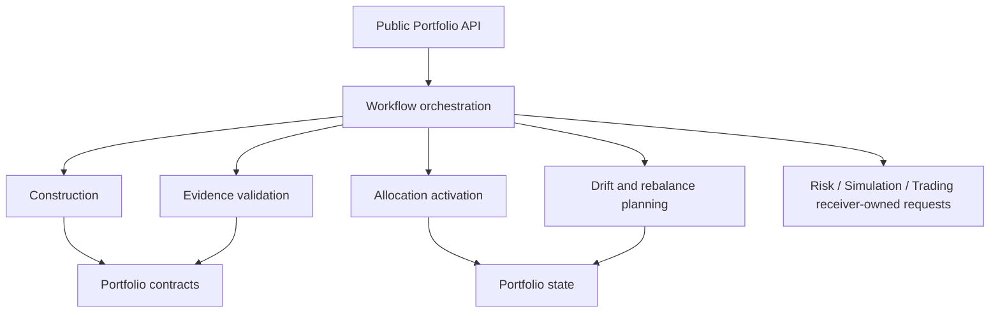
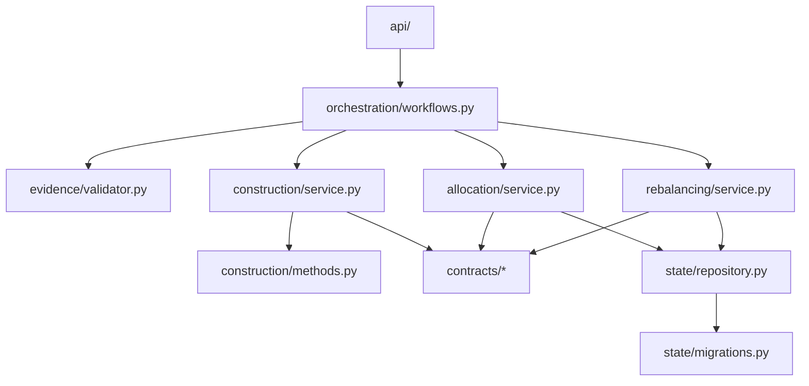
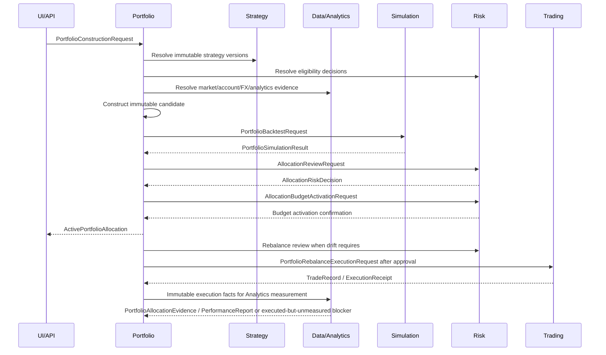

# Portfolio

> **API-BE-003 runtime seam:** `api/factories.py` constructs the opaque
> Portfolio application handle from owner workflow and repository handles; UI/API
> may invoke only allow-listed package-root operations. `state/runtime.py`
> supplies the Data-backed direct-relational Portfolio state port.

| Field                | Value                                                                                                      |
| -------------------- | ---------------------------------------------------------------------------------------------------------- |
| **Package path**     | `app/services/portfolio`                                                                                   |
| **Domain ID**        | `PORT`                                                                                                     |
| **Status**           | Complete — all 12 registered features are implemented. |
| **Last updated**     | 2026-08-08                                                                                                 |
| **System workflows** | `SYS-WF-006`, `SYS-WF-007`, `SYS-WF-008`                                                                   |

## 1. Purpose and Boundary

### Purpose

Portfolio owns the deterministic construction, versioning, activation, drift assessment, and governed rebalance planning of multi-strategy portfolios. It turns eligible immutable Strategy versions and registered evidence into allocation proposals, but it never grants operational permission, approves risk, sizes final orders, or mutates a broker.

### Owns

- Portfolio definitions, objectives, scopes, and immutable versions.
- Fixed-weight, equal-weight, and inverse-volatility construction.
- Target capital weights and proposed risk-budget weights as construction metadata.
- `PortfolioDefinition v1`, `PortfolioConstructionRequest v1`, `PortfolioConstructionResult v1`, `ActivePortfolioAllocation v1`, and `PortfolioRebalancePlan v1`.
- Activation state after Simulation validation, human approval where required, and Risk authorization.
- Drift calculation, reduce-only planning for existing over-budget exposure, and rollback as a new governed version.
- Portfolio-owned tables, migrations, artifacts, audit payloads, and public service API.

### Does not own

- Strategy validation, registration, parameter schemas, or runtime evaluation: Strategy owns them.
- Operational eligibility, allocation approval/capping/rejection, authoritative risk budgets, approval tokens, or kill switches: Risk owns them.
- Market/account/FX truth: Data owns the registered evidence.
- Metrics or portfolio evidence: Analytics owns them.
- Backtest fill/state logic or portfolio simulation results: Simulation owns them.
- Order construction, final order sizing, execution, reconciliation, or broker mutation: Trading owns them.
- Broker/provider connectivity: Brokers owns it.
- Authentication, HTTP/WebSocket presentation, or human-approval capture: UI/API owns them.
- Advanced allocation methods such as mean-variance optimization, Black-Litterman, or CVaR optimization.

### Shared contracts

| Direction    | Contract                                                              | Owner      | Purpose                                                                             |
| ------------ | --------------------------------------------------------------------- | ---------- | ----------------------------------------------------------------------------------- |
| In           | `StrategyOperationalEligibilityDecision v1`                           | Risk       | Prove operational eligibility for every strategy/version and scope                  |
| In           | `AllocationRiskDecision v1`                                           | Risk       | Authorize, cap, condition, expire, or reject an allocation/rebalance                |
| In           | `AccountStateSnapshot v1`                                             | Data       | Supply actual balances, positions, and margin state                                 |
| In           | `MarketDataset v1`                                                    | Data       | Supply normalized construction evidence                                             |
| In           | `FXConversionEvidence v1`                                             | Data       | Supply direct or synthesized conversion truth                                       |
| In           | `PerformanceReport v1` / `PortfolioAllocationEvidence v1`             | Analytics  | Supply component and portfolio evidence without approval authority                  |
| In           | `PortfolioSimulationResult v1`                                        | Simulation | Supply deterministic portfolio validation                                           |
| In           | Redacted reconciled `StandardTradingEnvelope` facts                   | Trading    | Supply immutable rebalance execution truth for receiver-owned Analytics measurement |
| Owned input  | `PortfolioConstructionRequest v1`                                     | Portfolio  | Receive an authenticated construction command                                       |
| Owned state  | `PortfolioDefinition v1`                                              | Portfolio  | Register and read exact immutable definition versions                               |
| Owned output | `PortfolioConstructionResult v1`                                      | Portfolio  | Publish an immutable candidate allocation                                           |
| Owned output | `ActivePortfolioAllocation v1`                                        | Portfolio  | Publish the canonical active allocation version                                     |
| Owned output | `PortfolioRebalancePlan v1`                                           | Portfolio  | Publish immutable drift and proposed-action lineage                                 |
| Submitted    | `AllocationReviewRequest v1` / `AllocationBudgetActivationRequest v1` | Risk       | Ask Risk to review and activate its authoritative budget projection                 |
| Submitted    | `PortfolioBacktestRequest`                                            | Simulation | Ask Simulation to validate a candidate                                              |
| Submitted    | `PortfolioRebalanceExecutionRequest v1`                               | Trading    | Ask Trading to execute an authorized plan                                           |
| Submitted    | `PortfolioRebalanceMeasurementRequest v1`                             | Analytics  | Ask Analytics to measure redacted hash-bound reconciled Trading facts               |

Receiver-owned requests are imported from their receiving domains. Portfolio never
redefines them. `AllocationReviewRequest v1` and `PortfolioBacktestRequest` are
self-contained receiver projections built from Portfolio facts: scalar values,
ordered components, identifiers, versions, references, and hashes only. Neither
request embeds a Portfolio-owned contract or causes Risk/Simulation to import one.
Simulation requests also contain Simulation-owned component backtest requests,
seed, balance, and policy material that Portfolio does not own; callers therefore
supply the fully formed `PortfolioBacktestRequest`, and Portfolio validates its
trace, candidate, component-weight, profile, and route bindings before submission.

### Persisted state

| State                                 | Owner     | Writer    | Read boundary                        | Rule                                                 |
| ------------------------------------- | --------- | --------- | ------------------------------------ | ---------------------------------------------------- |
| Portfolio definitions and objectives  | Portfolio | Portfolio | Portfolio public API                 | Immutable identity; updates create versions          |
| Construction results                  | Portfolio | Portfolio | `PortfolioConstructionResult`        | Publish only complete deterministic results          |
| Active allocation versions            | Portfolio | Portfolio | `ActivePortfolioAllocation`          | One active version per scope; optimistic concurrency |
| Drift assessments and rebalance plans | Portfolio | Portfolio | `PortfolioRebalancePlan`             | Evidence- and target-version bound                   |
| Portfolio audit payloads              | Portfolio | Portfolio | Utils `AuditEvent` persisted by Data | Redacted; full decision lineage                      |

Risk separately persists the authoritative risk-budget projection. Portfolio stores only the Risk decision and budget-projection references needed for lineage.

### Four-level structure

| Level | Package area                  | Responsibility                                               |
| ----- | ----------------------------- | ------------------------------------------------------------ |
| 1     | `contracts/`, `state/`        | Domain schemas, enums, repositories, migrations              |
| 2     | `evidence/`, `construction/`  | Validate inputs and deterministically construct candidates   |
| 3     | `allocation/`, `rebalancing/` | Govern activation, versions, drift, and rebalance plans      |
| 4     | `orchestration/`, `api/`      | Coordinate receiver-owned requests behind the root function API |

### Package capability map


```mermaid
flowchart TD
    API["Public Portfolio API"] --> ORCH["Workflow orchestration"]
    ORCH --> EVID["Evidence validation"]
    ORCH --> CONS["Construction"]
    ORCH --> ALLOC["Allocation activation"]
    ORCH --> REBAL["Drift and rebalance planning"]
    CONS --> CONT["Portfolio contracts"]
    ALLOC --> STATE["Portfolio state"]
    REBAL --> STATE
    EVID --> CONT
    ORCH --> EXT["Risk / Simulation / Trading receiver-owned requests"]
```

## 2. Final Package Structure

### Feature Registry

| Status    | Feature                                            | Owning module    | Public API and contracts                                | Requirements                        | Usage evidence                                       |
| --------- | -------------------------------------------------- | ---------------- | ------------------------------------------------------- | ----------------------------------- | ---------------------------------------------------- |
| Completed | `FEAT-PORT-01` Portfolio Boundary Contracts        | `contracts/`     | Exact declarations and contract fields: Section 4.1     | Section 4.1 functional requirements | `tests/portfolio/usage/features/01_contracts.py`     |
| Completed | `FEAT-PORT-02` Evidence and Eligibility Validation | `evidence/`      | Exact declarations: Section 4.2                         | Section 4.2 functional requirements | `tests/portfolio/usage/features/02_evidence.py`      |
| Completed | `FEAT-PORT-03` Deterministic Construction          | `construction/`  | Exact declarations: Section 4.3                         | Section 4.3 functional requirements | `tests/portfolio/usage/features/03_construction.py`  |
| Completed | `FEAT-PORT-04` Portfolio Persistence               | `state/`         | Exact declarations and state contracts: Section 4.4     | Section 4.4 functional requirements | `tests/portfolio/usage/features/04_state.py`         |
| Completed | `FEAT-PORT-05` Version and Activation Governance   | `allocation/`    | Exact declarations: Section 4.5                         | Section 4.5 functional requirements | `tests/portfolio/usage/features/05_allocation.py`    |
| Completed | `FEAT-PORT-06` Drift and Rebalance Planning        | `rebalancing/`   | Exact declarations and rebalance contracts: Section 4.6 | Section 4.6 functional requirements | `tests/portfolio/usage/features/06_rebalancing.py`   |
| Completed | `FEAT-PORT-07` Cross-Domain Workflow Coordination  | `orchestration/` | Exact declarations: Section 4.7                         | Section 4.7 functional requirements | `tests/portfolio/usage/features/07_orchestration.py` |
| Completed | `FEAT-PORT-08` Public Portfolio API                | `api/`           | Exact declarations and package API: Section 4.8         | Section 4.8 functional requirements | `tests/portfolio/usage/features/08_public_api.py`    |
| Completed | `FEAT-PORT-09` Balanced Double-Entry Ledger and Accounts | `ledger/` | `LedgerEntry v1`, `PostingBatch v1`, and `LedgerAccount v1`; balanced postings, exactly-once economic-event ingestion, settled/unsettled cash, and snapshot/rebuild validation | `FR-PORT-049`..`FR-PORT-055` | `tests/portfolio/usage/features/09_ledger.py` |
| Completed | `FEAT-PORT-10` Valuation and P&L | `valuation/` | `calculate_portfolio_valuation`; `ValuationPolicy v1`, Decimal P&L, lot matching, Data-owned FX evidence | `FR-PORT-056`..`FR-PORT-060` | `tests/portfolio/usage/features/10_valuation.py` |
| Completed | `FEAT-PORT-11` Margin, Buying Power, and Risk Health | `margin/` | `calculate_margin_view`, `build_portfolio_risk_health`; `PortfolioMarginView v1`, `PortfolioRiskHealth v1` | `FR-PORT-061`..`FR-PORT-066` | `tests/portfolio/usage/features/11_margin.py` |
| Completed | `FEAT-PORT-12` Broker Reconciliation and Corporate Actions | `reconciliation/` | `reconcile_portfolio`, `build_lifecycle_postings`; unknown/recovery evidence and balanced idempotent postings | `FR-PORT-067`..`FR-PORT-069` | `tests/portfolio/usage/features/12_reconciliation.py` |

The completed requirements are: `FR-PORT-056` versioned valuation-source policy;
`057` side-aware current/stale/unknown pricing; `058` explicit FIFO,
weighted-average, or venue-netting lot policy; `059` Decimal realized/unrealized P&L
with cost lineage; `060` snapshot FX evidence or explicit unknown; `061` used,
available, reserved, and maintenance margin; `062` buying-power, reserve, leverage,
and liquidation policy; `063` Risk-compatible `PortfolioMarginView v1`; `064`
drawdown references and high-water marks; `065` explicit VaR/CVaR model,
confidence, window, and observations; `066` stress aggregation; `067` broker-truth
reconciliation with tolerance, unknown, and recovery evidence; `068` balanced,
idempotent corporate-action and settlement postings; and `069` append-only
incidents and corrections. Evidence is in `tests/portfolio/unit/test_operations.py`
and the numbered usage programs.

The package root, `app.services.portfolio`, is the sole public import boundary.
Its `__all__` contains standalone functions only. Contract values and stateful
services are opaque: callers construct them with `create_portfolio_value()` or
`create_portfolio_handle()`, inspect values with `get_portfolio_value_field()` or
`dump_portfolio_value()`, and invoke an allow-listed handle operation with
`execute_portfolio_handle_operation()`. Internal classes, constants, protocols,
enums, settings models, error classes, and subpackage exports are not public.

```text
app/services/portfolio/
├── __init__.py
├── README.md
├── _settings.py
├── contracts/
│   ├── __init__.py
│   ├── errors.py
│   ├── definitions.py
│   ├── requests.py
│   ├── results.py
│   └── allocations.py
├── evidence/
│   ├── __init__.py
│   └── validator.py
├── construction/
│   ├── __init__.py
│   ├── methods.py
│   └── service.py
├── state/
│   ├── __init__.py
│   ├── repository.py
│   ├── runtime.py
├── migrations/
│   ├── __init__.py
│   ├── definitions.py
│   └── runner.py
├── persistence/
│   ├── __init__.py
│   ├── create.py
│   ├── read.py
│   ├── update.py
│   └── delete.py
├── allocation/
│   ├── __init__.py
│   └── service.py
├── rebalancing/
│   ├── __init__.py
│   └── service.py
├── ledger/
│   ├── __init__.py
│   ├── contracts.py
│   ├── postings.py
│   ├── ingestion.py
│   ├── balances.py
│   ├── snapshots.py
│   └── service.py
├── orchestration/
│   ├── __init__.py
│   └── workflows.py
└── api/
    ├── __init__.py
    ├── factories.py
    └── service.py
```

### Module dependency diagram


```mermaid
flowchart TD
    API["api/"] --> WF["orchestration/workflows.py"]
    WF --> EV["evidence/validator.py"]
    WF --> CS["construction/service.py"]
    WF --> AS["allocation/service.py"]
    WF --> RS["rebalancing/service.py"]
    CS --> CM["construction/methods.py"]
    CS --> C["contracts/*"]
    AS --> C
    RS --> C
    AS --> ST["state/repository.py"]
    RS --> ST
    ST --> MIG["state/migrations.py"]
```

### Structure rules

- Dependencies point downward; contracts and state never import orchestration or API modules.
- The documented non-feature `persistence/` package constructs Portfolio-owned relational statements and delegates their execution to Data's public transaction functions; atomic state-plus-event transitions stay in one CRUD function.
- Every external consumer imports only standalone functions from `app.services.portfolio`.
- Cross-domain imports use each owner package root and never a deep implementation path.
- No Risk, Simulation, Trading, Analytics, Data, or Strategy implementation object is stored in a Portfolio contract.
- Every public function has explicit types and a Google-style docstring.
- Portfolio calculations are deterministic for identical versioned inputs and explicit configuration.
- No provider SDK, network client, broker mutation, or hidden configuration default exists here.

### Binding complete-domain build order

Appendix P records the historical phase in which each stable seam was scheduled; it
does not override dependency order. The complete domain is built exactly in this
order: `_settings.py` and `contracts/errors.py`; `contracts/`; `evidence/`;
`construction/`; `state/`; `allocation/`; `rebalancing/`; `orchestration/`;
`api/`; package `__init__.py`. Exports are updated only after their implementation
exists.

## 3. Workflows

> **Workflow Usage Evidence**: Each active workflow has one standalone program in
> `tests/portfolio/usage/workflows/`; `run_all.py` executes them in registry order.

### Workflow rank values

| Rank | Identifier | Meaning |
|---|---|---|
| **Primary** | `WF-PORT-PRI` | The workflow this domain exists to serve. |
| **Secondary** | `WF-PORT-SEC` | The next most load-bearing workflow. |
| **Tertiary** | `WF-PORT-TER` | The third-ranked workflow. |
| **Supporting** | `WF-PORT-0NN` | Every remaining registered workflow. |

### Retired identifiers

`WF-PORT-002`, `WF-PORT-004`, and `WF-PORT-005` were absorbed into `WF-PORT-PRI`,
`WF-PORT-SEC`, and `WF-PORT-TER` respectively. Absorbed numbers are retired and are
never reused. New workflows continue from `WF-PORT-008`.

Evidence programs:

- `WF-PORT-PRI`: `tests/portfolio/usage/workflows/wf_port_pri_construct_allocation_candidate.py`
- `WF-PORT-SEC`: `tests/portfolio/usage/workflows/wf_port_sec_activate_allocation_version.py`
- `WF-PORT-TER`: `tests/portfolio/usage/workflows/wf_port_ter_detect_drift_plan_rebalance.py`
- `WF-PORT-001`: `tests/portfolio/usage/workflows/wf_port_001_validate_construction_evidence.py`
- `WF-PORT-003`: `tests/portfolio/usage/workflows/wf_port_003_coordinate_simulation_risk_review.py`
- `WF-PORT-006`: `tests/portfolio/usage/workflows/wf_port_006_submit_measure_rebalance.py`
- `WF-PORT-007`: `tests/portfolio/usage/workflows/wf_port_007_rollback_allocation.py`
- `WF-PORT-008`: `tests/portfolio/usage/workflows/wf_port_008_assess_common_mode_exposure.py`

| Status    | Rank | Workflow ID   | Scope        | System workflow            | Workflow                                | Trigger / Input boundary     | Final outcome / Output boundary                                                                   | Requirement sequence                      |
| --------- | ---- | ------------- | ------------ | -------------------------- | --------------------------------------- | ---------------------------- | ------------------------------------------------------------------------------------------------- | ----------------------------------------- |
| Completed | Primary | `WF-PORT-PRI` | Internal     | `SYS-WF-007`               | Construct allocation candidate          | Validated input set          | `PortfolioConstructionResult`                                                                     | `FR-PORT-010 → FR-PORT-014`               |
| Completed | Secondary | `WF-PORT-SEC` | Cross-domain | `SYS-WF-007`               | Activate allocation version             | All gates current            | `ActivePortfolioAllocation`                                                                       | `FR-PORT-015 → FR-PORT-019`               |
| Completed | Tertiary | `WF-PORT-TER` | Cross-domain | `SYS-WF-008`               | Detect drift and plan rebalance         | Schedule or threshold        | `PortfolioRebalancePlan`                                                                          | `FR-PORT-020 → FR-PORT-024`               |
| Completed | Supporting | `WF-PORT-001` | Cross-domain | `SYS-WF-006`, `SYS-WF-007` | Validate construction evidence          | Construction request         | Validated immutable input set or structured rejection                                             | `FR-PORT-006 → FR-PORT-009`               |
| Completed | Supporting | `WF-PORT-003` | Cross-domain | `SYS-WF-007`               | Coordinate simulation and Risk review   | Complete construction result | Current Simulation result and Risk decision                                                       | `FR-PORT-025 → FR-PORT-029`               |
| Completed | Supporting | `WF-PORT-006` | Cross-domain | `SYS-WF-008`               | Submit and measure authorized rebalance | Current Risk approval        | Trading execution truth followed by Analytics evidence, or explicit executed-but-unmeasured state | `FR-PORT-025 → FR-PORT-029 → FR-PORT-038` |
| Completed | Supporting | `WF-PORT-007` | Internal     | `SYS-WF-007`               | Roll back allocation                    | Authorized rollback request  | New governed allocation version                                                                   | `FR-PORT-018 → FR-PORT-019`               |
| Completed | Supporting | `WF-PORT-008` | Cross-domain | `SYS-WF-007`, `SYS-WF-008` | Assess common-mode exposure and cross-account correlation | Active allocation plus account and FX evidence across every managed account | Common-mode exposure report and cross-account correlation measurement for Risk review | `FR-PORT-039 → FR-PORT-040` |

### Workflow scope values

| Scope            | Meaning                                                                                                                           |
| ---------------- | --------------------------------------------------------------------------------------------------------------------------------- |
| **Internal**     | The complete workflow occurs within Portfolio.                                                                                    |
| **Cross-domain** | Portfolio receives input from or sends output to another domain; the applicable `SYS-WF-*` ID is recorded in the workflow detail. |

### `WF-PORT-001` — Validate Construction Evidence

1. Receive one typed `PortfolioConstructionRequest` —
   `portfolio.PortfolioService.validate_construction()`.
2. Resolve immutable Strategy references and current Risk eligibility decisions —
   `strategy.validate_strategy_ref()`, `risk.review_strategy_admission()`.
3. Resolve Data-owned account, market, and FX evidence plus Analytics evidence —
   `data.get_account_state_snapshot()`, `data.get_fx_conversion_evidence()`,
   `analytics.build_performance_report()`.
4. Validate exact versions, hashes, UTC freshness, coverage, observations, and
   request configuration — `utils.canonical_digest()`, `utils.is_fresh()`.
5. Return one immutable `ValidatedConstructionEvidence` bundle without publishing
   a candidate — `portfolio.PortfolioService.validate_construction()`.

**Failure behaviour:** missing, stale, incompatible, hash-mismatched, or ineligible
evidence returns a structured Portfolio error and creates no state.

### `WF-PORT-PRI` — Construct Allocation Candidate

1. Validate strategy/version uniqueness and current Risk eligibility for the
   requested scope — `strategy.list_strategy_versions()`,
   `risk.review_strategy_admission()`.
2. Validate evidence versions, UTC times, freshness, currency coverage, and required
   configuration — `portfolio.PortfolioService.validate_construction()`,
   `utils.is_fresh()`.
3. Apply exactly one approved method: fixed weights, equal weights, or inverse
   volatility — `portfolio.PortfolioService.construct()`.
4. Normalize using the request-supplied tolerance and validate finite bounds and
   total — `portfolio.PortfolioService.construct()`.
5. Record capital weights separately from proposed risk-budget weights —
   `portfolio.PortfolioService.construct()`.
6. Hash the full configuration and evidence lineage, then publish one immutable
   result — `utils.canonical_json()`, `utils.canonical_digest()`.

**Failure behaviour:** any missing, stale, non-finite, unbounded, incompatible, or non-deterministic input returns a structured error and publishes nothing.

### `WF-PORT-003` — Coordinate Simulation and Risk Review

1. Receive the complete immutable construction result, its validated evidence, and a
   receiver-owned `PortfolioBacktestRequest` —
   `portfolio.PortfolioService.coordinate_review()`.
2. Revalidate the Simulation request against the candidate and evidence lineage —
   `utils.canonical_digest()`.
3. Submit the receiver-owned request to Simulation and verify the returned result —
   `simulator.run_portfolio_backtest()`, `simulator.unwrap_simulation_response()`.
4. Build and submit the receiver-owned Risk review request —
   `risk.review_allocation_proposal()`.
5. Return `PortfolioReviewResult` containing current Simulation and Risk truth,
   preserving trace IDs and redacted audit evidence —
   `utils.redact_mapping_value()`, `utils.create_audit_event()`.

**Failure behaviour:** stale or mismatched lineage, incomplete Simulation evidence,
Risk rejection, receiver incompatibility, or audit failure blocks activation.

### `WF-PORT-SEC` — Activate Allocation Version

1. Re-read the candidate and expected current allocation version —
   `portfolio.PortfolioService.get_active_allocation()`.
2. Revalidate every eligibility decision, Simulation result, Risk decision, approval
   attestation where required, expiry, and kill-switch state —
   `risk.revalidate_risk_decision()`, `risk.check_risk_kill_switch()`.
3. Submit the budget activation request to Risk —
   `risk.activate_allocation_budget()`.
4. Atomically activate one Portfolio allocation version only after Risk confirms its
   budget projection — `portfolio.PortfolioService.activate()`,
   `data.execute_transaction()`.
5. Emit a redacted audit event with complete references —
   `utils.create_audit_event()`, `data.persist_audit_event()`.

Simulation activation is automatic within simulation policy. Demo/live activation requires explicit human approval and current Risk authorization.

### `WF-PORT-TER` — Detect Drift and Plan Rebalance

1. Resolve actual exposure using fresh account and FX evidence —
   `data.get_account_state_snapshot()`, `data.get_fx_conversion_evidence()`.
2. Compare actual risk-budget exposure to the active target using explicit threshold
   and schedule configuration — `portfolio.RebalancingService.detect_drift()`.
3. Create proposed reductions or reallocations bound to the active version —
   `portfolio.RebalancingService.plan_rebalance()`.
4. Mark existing over-budget exposure reduce-only, and never open a position solely
   to make actual holdings match target weights —
   `portfolio.RebalancingService.plan_rebalance()`.
5. Submit the immutable plan to Risk; only an approved plan may be adapted into
   Trading's request — `risk.review_allocation_proposal()`.
6. After Trading reconciliation, submit the redacted hash-bound immutable execution
   facts and receive measurement evidence —
   `trading.build_trading_report()`,
   `analytics.build_portfolio_rebalance_measurement()`.
7. If measurement fails, preserve execution truth as `executed-but-unmeasured` and
   retry deterministically from the same immutable execution/FX/version inputs —
   `utils.canonical_digest()`.

### `WF-PORT-006` — Submit and Measure Authorized Rebalance

1. Receive one current immutable reduce-only plan and current owner-evidence
   references — `portfolio.PortfolioService.submit_rebalance()`.
2. Revalidate the active allocation, current Risk decision, expiry, route, approval
   references, and idempotency material — `risk.revalidate_risk_decision()`,
   `risk.check_risk_kill_switch()`.
3. Adapt the plan into the receiver-owned Trading request without changing approved
   quantities — `portfolio.PortfolioService.submit_rebalance()`.
4. Submit once through Trading and persist reconciled execution truth —
   `trading.execute_portfolio_rebalance()`, `trading.build_trading_report()`.
5. Submit immutable Trading facts through the Analytics-owned measurement request —
   `analytics.build_portfolio_rebalance_measurement()`.
6. Return a measured plan; if Analytics fails, return and persist
   `executed_unmeasured` — `data.execute_transaction()`.
7. Retry measurement from the same immutable execution facts without invoking Trading
   again — `portfolio.PortfolioService.recompute_measurement()`.

**Failure behaviour:** missing authorization or stale evidence blocks before Trading;
an ambiguous Trading outcome is never retried blindly; Analytics failure never erases
execution truth.

### `WF-PORT-007` — Roll Back Allocation

1. Receive the approved prior candidate, validated evidence, current review, and
   exact allocation version to reverse — `portfolio.PortfolioService.rollback()`.
2. Revalidate approval policy, current Risk authorization, expiry, kill-switch, and
   expected predecessor/revision — `risk.revalidate_risk_decision()`,
   `risk.check_risk_kill_switch()`.
3. Submit the Risk-owned activation request for the rollback projection —
   `risk.activate_allocation_budget()`.
4. Atomically activate a new governed allocation version linked by
   `rollback_of_version` — `portfolio.PortfolioService.activate()`,
   `data.execute_transaction()`.
5. Return the new `ActivePortfolioAllocation` and emit redacted audit evidence —
   `utils.create_audit_event()`, `data.persist_audit_event()`.

**Failure behaviour:** rollback never mutates history; stale revision, missing
authorization, or failed Risk activation returns a structured error without changing
the active allocation.

### `WF-PORT-008` — Assess Common-Mode Exposure and Cross-Account Correlation

**Scope:** `Cross-domain`
**System workflow:** `SYS-WF-007`, `SYS-WF-008`
**Input boundary:** the active allocation plus account, position, and FX evidence
for every managed account in scope.
**Output boundary:** a common-mode exposure report and a cross-account correlation
measurement supplied to Risk as evidence. Neither is an approval, and neither
authorizes a rebalance.

1. Resolve the active allocation and the accounts it spans —
   `portfolio.PortfolioService.get_active_allocation()`.
2. Read current account and position evidence for every account in scope —
   `data.get_account_state_snapshot()`.
3. Normalize every exposure into one comparison currency —
   `data.get_fx_conversion_evidence()`.
4. Identify exposure that is nominally diversified but moves as a single risk —
   `portfolio.assess_common_mode_exposure()`.
5. Measure realized correlation of returns across accounts —
   `portfolio.measure_cross_account_correlation()`.
6. Supply both reports to Risk, which alone decides whether they constrain
   allocation — `risk.review_allocation_proposal()`,
   `risk.evaluate_portfolio_limits()`.

**Failure behaviour:** missing or stale account evidence for any in-scope account
fails closed rather than reporting lower common-mode exposure than actually exists.
Insufficient overlapping return history returns explicit missingness rather than a
correlation computed from a short or misaligned window.

**Integration test:** `tests/portfolio/integration/test_usage_scripts.py` executes the stage-labelled workflow program, while unit correlation and common-mode tests verify deterministic calculations and fail-closed evidence handling.

#### End-to-end workflow diagram


```mermaid
sequenceDiagram
    participant UI as UI/API
    participant P as Portfolio
    participant S as Strategy
    participant D as Data/Analytics
    participant Sim as Simulation
    participant R as Risk
    participant T as Trading
    UI->>P: PortfolioConstructionRequest
    P->>S: Resolve immutable strategy versions
    P->>R: Resolve eligibility decisions
    P->>D: Resolve market/account/FX/analytics evidence
    P->>P: Construct immutable candidate
    P->>Sim: PortfolioBacktestRequest
    Sim-->>P: PortfolioSimulationResult
    P->>R: AllocationReviewRequest
    R-->>P: AllocationRiskDecision
    P->>R: AllocationBudgetActivationRequest
    R-->>P: Budget activation confirmation
    P-->>UI: ActivePortfolioAllocation
    P->>R: Rebalance review when drift requires
    P->>T: PortfolioRebalanceExecutionRequest after approval
    T-->>P: TradeRecord / ExecutionReceipt
    P->>D: Immutable execution facts for Analytics measurement
    D-->>P: PortfolioAllocationEvidence / PerformanceReport or executed-but-unmeasured blocker
```

## 4. Module and Requirement Specifications

### 4.1 `contracts/` — Portfolio Boundary Schemas

**Purpose:** Define strict versioned Portfolio-owned request, result, allocation, and plan models.

**Inputs/outputs:** primitive validated fields and immutable cross-domain references in; versioned Portfolio contracts out.

**Module flow:** untrusted boundary data → strict schema validation → immutable Portfolio contract.

#### Files

| Status    | File             | Responsibility                                                                         | Key exports                                                        | Dependencies                                                                                                                               |
| --------- | ---------------- | -------------------------------------------------------------------------------------- | ------------------------------------------------------------------ | ------------------------------------------------------------------------------------------------------------------------------------------ |
| Completed | `contracts/errors.py` | Define the internal immutable Portfolio error catalogue and structured domain error. | Internal error types; public access uses catalogue/payload functions | **Standard library:** `dataclasses`, `time`, `types`, `typing`; **Required third-party:** None; **Local:** `app.utils` |
| Completed | `_settings.py`   | Define internal Portfolio settings and the deterministic UTC rebalance schedule. | Internal settings values; public construction uses `create_portfolio_value` | **Standard library:** `datetime`, `decimal`; **Required third-party:** `pydantic`; **Local:** `app.utils.AppSettings`; `contracts/errors.py` |
| Completed | `requests.py`    | Validate the Portfolio-owned construction command.                                     | `PortfolioConstructionRequest`                                     | **Standard library:** `datetime`, `decimal`; **Required third-party:** `pydantic`; **Local:** None                                     |
| Completed | `results.py`     | Define immutable construction output.                                                  | `PortfolioConstructionResult`                                      | **Standard library:** `datetime`, `decimal`; **Required third-party:** `pydantic`; **Local:** `requests.py` → identifiers              |
| Completed | `allocations.py` | Define active allocation and rebalance-plan contracts.                                 | `ActivePortfolioAllocation`, `PortfolioRebalancePlan`              | **Standard library:** `datetime`, `decimal`; **Required third-party:** `pydantic`; **Local:** `results.py` → result references         |
| Completed | `__init__.py`    | Expose the supported contract API.                                                     | All contracts above                                                | **Standard library:** None; **Required third-party:** None; **Local:** contract files above                                            |

#### Ratified v1 schema manifest

All Portfolio models use `ConfigDict(extra="forbid", frozen=True, strict=True,
allow_inf_nan=False)`. Every timestamp is timezone-aware UTC. Every digest is
lowercase SHA-256 hexadecimal. Decimal values are accepted only as `Decimal`, are
finite, and serialize into canonical hash material as strings. Supporting value rows
remain internal. External callers create and inspect registered opaque values through
the package-root factory, getter, predicate, and dump functions. Governed application
operations use Utils `StandardResponse[T]`; Portfolio DTOs remain direct response data.

| Model                          | Exact fields                                                                                                                                                                                                                                                                                                                                                                                                                                                                                          |
| ------------------------------ | ----------------------------------------------------------------------------------------------------------------------------------------------------------------------------------------------------------------------------------------------------------------------------------------------------------------------------------------------------------------------------------------------------------------------------------------------------------------------------------------------------- |
| `StrategyAllocationRef`        | `component_id`, `strategy_id`, `strategy_version`, `registry_record_hash`, `eligibility_decision_id`                                                                                                                                                                                                                                                                                                                                                                                                  |
| `EvidenceReferenceSet`         | `account_snapshot_id`, `account_snapshot_hash`, `account_snapshot_as_of`, `market_dataset_id`, `market_dataset_hash`, `market_dataset_as_of`, `analytics_evidence_id`, `analytics_evidence_hash`, `analytics_evidence_as_of`, ordered `fx_evidence_ids`, ordered `fx_evidence_hashes`                                                                                                                                                                                                                 |
| `FixedWeightInput`             | `component_id`, `capital_weight`, `proposed_risk_budget_weight`                                                                                                                                                                                                                                                                                                                                                                                                                                       |
| `PortfolioComponentWeight`     | `component_id`, `strategy_id`, `strategy_version`, `capital_weight`, `proposed_risk_budget_weight`                                                                                                                                                                                                                                                                                                                                                                                                    |
| `PortfolioConstructionRequest` | fixed `contract_version="v1"`, fixed `schema_id="portfolio.construction_request.v1"`, `request_id`, `workflow_id`, `correlation_id`, optional `causation_id`, `portfolio_id`, explicit `portfolio_version`, non-empty `scope`, ordered `components`, `method` (`fixed`, `equal`, or `inverse_volatility`), ordered `fixed_weights`, `evidence`, `measurement_start`, `measurement_end`, `base_currency`, `runtime_profile`, compatible `execution_route`, `simulation_policy_version`, `requested_at` |
| `PortfolioConstructionResult`  | fixed version/schema, `result_id`, `portfolio_id`, `portfolio_version`, `scope`, `status="constructed"`, ordered `component_weights`, `method`, `config_hash`, `evidence_hash`, `strategy_lineage_hash`, `canonical_hash`, `created_at`, request/workflow/correlation/causation IDs                                                                                                                                                                                                                   |
| `ActivePortfolioAllocation`    | fixed version/schema, `allocation_id`, `portfolio_id`, `allocation_version`, `scope`, `construction_result_id`, `construction_result_hash`, ordered component weights, `simulation_result_id`, `simulation_result_hash`, `risk_decision_id`, `risk_budget_projection_ref`, optional `approval_attestation_id`, optional `predecessor_version`, optional `rollback_of_version`, `activated_at`, `expires_at`, `idempotency_key`, `canonical_hash`, request/workflow/correlation IDs, `audit_ref`       |
| `DriftObservation`             | `component_id`, `target_risk_budget`, `actual_risk_budget`, signed `drift`, `threshold_breached`                                                                                                                                                                                                                                                                                                                                                                                                      |
| `PortfolioRebalanceAction`     | `action_id`, `component_id`, `action="reduce_exposure"`, `reduce_only=True`, `current_exposure`, `target_exposure`, `reduction_amount`, `eligibility_decision_id`                                                                                                                                                                                                                                                                                                                                     |
| `PortfolioRebalancePlan`       | fixed version/schema, `plan_id`, `plan_version`, `portfolio_id`, `allocation_version`, `scope`, ordered observations/actions, `status` (`no_action`, `review_required`, `blocked`, `executed`, `executed_unmeasured`, `measured`), `block_reasons`, evidence/config/canonical hashes, `observed_at`, `created_at`, optional Risk/Trading/Analytics references, request/workflow/correlation IDs                                                                                                       |

`fixed_weights` is non-empty and complete only for `method="fixed"`; it is empty for
the other methods. Equal weighting proposes equal capital and risk-budget metadata.
Inverse volatility consumes only resolved Analytics evidence, never request-supplied
volatility. Component and reference ordering is lexicographic by immutable identity
before hashing.

#### Configuration and Limits Manifest

No defaults. `PortfolioSettings` inherits `app.utils.AppSettings`; every field below
is required and validated before a service is constructed. `PORTFOLIO_REBALANCE_SCHEDULE`
is a `RebalanceSchedule(anchor_at: UTC datetime, interval_seconds: positive int)`.
Schema versions and IDs are the only constants with defaults. These values are
internal and are created or inspected only through package-root functions.

| ID          | Requirement                                                                                | Verification        |
| ----------- | ------------------------------------------------------------------------------------------ | ------------------- |
| FR-PORT-001 | Reject unknown fields and unsafe runtime objects.                                          | Contract unit tests |
| FR-PORT-002 | Separate `contract_version` from namespaced `schema_id`.                                   | Serialization tests |
| FR-PORT-003 | Require UTC timestamps, trace IDs, immutable owner references, and finite numbers.         | Validation tests    |
| FR-PORT-004 | Represent capital weights separately from Risk-authoritative budget projection references. | Schema tests        |
| FR-PORT-005 | Version breaking contract changes and update every producer/consumer document together.    | Review              |

### 4.2 `evidence/` — Evidence and Eligibility Validation

**Purpose:** Resolve and validate references without calculating Analytics metrics or synthesizing Data evidence.

**Module flow:** owner references → compatibility/freshness/eligibility checks → validated immutable evidence set.

| Status    | File           | Responsibility                                                                                                | Key exports                                                        | Dependencies                                                                                                         |
| --------- | -------------- | ------------------------------------------------------------------------------------------------------------- | ------------------------------------------------------------------ | -------------------------------------------------------------------------------------------------------------------- |
| Completed | `validator.py` | Validate Strategy registration, Risk eligibility, evidence freshness/compatibility, FX coverage, and lineage. | `validate_construction_evidence`, `revalidate_activation_evidence` | **Standard library:** `datetime`; **Required third-party:** None; **Local:** `contracts`; public owner contracts |
| Completed | `__init__.py`  | Expose the evidence-validation API.                                                                           | Validation functions above                                         | **Standard library:** None; **Required third-party:** None; **Local:** `validator.py`                            |

| ID          | Requirement                                                                              | Verification      |
| ----------- | ---------------------------------------------------------------------------------------- | ----------------- |
| FR-PORT-006 | Require a current approving eligibility decision for every exact strategy/version/scope. | Eligibility tests |
| FR-PORT-007 | Fail closed on missing, stale, incompatible, cyclic, or unverifiable FX evidence.        | FX tests          |
| FR-PORT-008 | Never synthesize rates, metrics, registrations, or approvals.                            | Negative tests    |
| FR-PORT-009 | Detect a reference/version change before publication or activation.                      | Concurrency tests |

### 4.3 `construction/` — Deterministic Construction

**Purpose:** Produce allocation candidates using only the approved initial methods.

**Module flow:** validated evidence → approved pure method → bounded deterministic construction result.

| Status    | File          | Responsibility                                                        | Key exports                                                    | Dependencies                                                                                              |
| --------- | ------------- | --------------------------------------------------------------------- | -------------------------------------------------------------- | --------------------------------------------------------------------------------------------------------- |
| Completed | `methods.py`  | Pure fixed-weight, equal-weight, and inverse-volatility calculations. | `fixed_weights`, `equal_weights`, `inverse_volatility_weights` | **Standard library:** `decimal`; **Required third-party:** None; **Local:** None                      |
| Completed | `service.py`  | Select method, validate output, hash lineage, and produce result.     | `ConstructionService`                                          | **Standard library:** `hashlib`; **Required third-party:** None; **Local:** `methods.py`; `contracts` |
| Completed | `__init__.py` | Expose the construction API.                                          | `ConstructionService`                                          | **Standard library:** None; **Required third-party:** None; **Local:** `service.py`                   |

| Status    | Setting / Limit                                 | Type      | Default | Required | Used by                   | Description                                              |
| --------- | ----------------------------------------------- | --------- | ------- | -------- | ------------------------- | -------------------------------------------------------- |
| Completed | `PORTFOLIO_WEIGHT_SUM_TOLERANCE`                | `Decimal` | None    | Yes      | Construction validation   | Explicit positive tolerance; missing blocks construction |
| Completed | `PORTFOLIO_MIN_WEIGHT` / `PORTFOLIO_MAX_WEIGHT` | `Decimal` | None    | Yes      | Construction validation   | Explicit finite bounds; violation rejects result         |
| Completed | `PORTFOLIO_MAX_STRATEGIES`                      | `int`     | None    | Yes      | Request validation        | Explicit positive request bound                          |
| Completed | `PORTFOLIO_MIN_EVIDENCE_OBSERVATIONS`           | `int`     | None    | Yes      | Inverse-volatility method | Explicit positive observation minimum                    |
| Completed | `PORTFOLIO_MAX_EVIDENCE_AGE_SECONDS`            | `int`     | None    | Yes      | Evidence validator        | Explicit positive freshness limit                        |

| ID          | Requirement                                                                                               | Verification         |
| ----------- | --------------------------------------------------------------------------------------------------------- | -------------------- |
| FR-PORT-010 | Support fixed, equal, and inverse-volatility methods only.                                                | Method tests         |
| FR-PORT-011 | Reject zero/negative volatility, insufficient observations, non-finite values, and invalid weight totals. | Edge-case tests      |
| FR-PORT-012 | Return identical bytes and hash for identical inputs/configuration.                                       | Reproducibility test |
| FR-PORT-013 | Exclude MVO, Black-Litterman, CVaR, and implicit optimizer delegation.                                    | Import/API review    |
| FR-PORT-014 | Publish nothing on partial construction failure.                                                          | Failure tests        |

### 4.4 `state/` — Portfolio Persistence

**Purpose:** Persist Portfolio-owned immutable history on Data's shared infrastructure.

**Module flow:** validated Portfolio state transition → atomic owner repository → immutable version/history read model.

| Status    | File            | Responsibility                                                     | Key exports                                   | Dependencies                                                                                                         |
| --------- | --------------- | ------------------------------------------------------------------ | --------------------------------------------- | -------------------------------------------------------------------------------------------------------------------- |
| Completed | `../migrations/` | Define and run the complete Portfolio-owned migration manifest through Data infrastructure. | `get_portfolio_migrations`, `run_portfolio_migrations` | **Local:** Data package-root migration request and runner functions |
| Completed | `repository.py` | Atomic repositories, definition/version checks, and read models.              | `PortfolioRepository`                         | **Standard library:** `collections.abc`; **Required third-party:** None; **Local:** `contracts`, `../migrations/` |
| Completed | `runtime.py` | Retain Portfolio codecs, validation, conflict policy, and opaque state-store dispatch while delegating CRUD. | `build_portfolio_state_store`, `execute_portfolio_state_store_operation` | **Standard library:** `json`, `typing`; **Required third-party:** Pydantic; **Local:** `contracts`, private `persistence/` |
| Completed | `../persistence/` | Build construction/plan creates, active-allocation CAS updates, idempotency bindings, audit-outbox writes, and bounded reads against Portfolio-owned relational tables. | Private standalone CRUD functions | **Local:** Data package-root statement-plan and transaction functions |
| Completed | `__init__.py`   | Expose internal state interfaces.                                  | `PortfolioRepository`                         | **Standard library:** None; **Required third-party:** None; **Local:** state files above                         |

`PortfolioRepository` coordinates an injected `PortfolioStateStore` port. Portfolio
never opens SQLite or imports Data storage internals. Migrations define immutable
definition, construction-result, allocation-version, rebalance-plan, idempotency,
and audit-outbox tables plus a mutable active-scope pointer. Activation is one
compare-and-swap transaction over the caller-supplied expected predecessor and
revision. Reusing an idempotency key with identical canonical material returns the
stored result; different material raises `PORT_IDEMPOTENCY_CONFLICT`. State and its
redacted audit-outbox record commit atomically. The private persistence package
classifies construction and plan transitions as creates and allocation activation as
an update; each state-plus-event transition remains one Data transaction and is never
split across CRUD files.

The runtime writes `portfolio_construction_results`,
`portfolio_allocation_versions`, `portfolio_active_scopes`,
`portfolio_idempotency`, `portfolio_rebalance_plans`, and
`portfolio_audit_outbox` directly. Immutable `portfolio_definitions` rows are
registered and read through the public Portfolio service; registration commits the
definition and its audit-outbox event atomically and rejects conflicting replays.

| ID          | Requirement                                                          | Verification      |
| ----------- | -------------------------------------------------------------------- | ----------------- |
| FR-PORT-030 | Prevent direct writes by other domains.                              | Boundary tests    |
| FR-PORT-031 | Preserve every superseded and rolled-back version.                   | History tests     |
| FR-PORT-032 | Use atomic activation and deterministic idempotency keys.            | Transaction tests |
| FR-PORT-033 | Store references, hashes, and decisions needed to reproduce lineage. | Persistence tests |
| FR-PORT-044 | Persist runtime state directly in Portfolio-owned relational tables while Data retains connection, locking, and transaction execution ownership. | Relational integration and boundary tests |
| FR-PORT-045 | Commit construction-plus-outbox, plan-plus-outbox, and allocation-plus-idempotency-plus-active-scope-plus-outbox transitions atomically; conflicts and stale revisions fail closed without partial rows. | Atomicity, conflict, and rollback tests |
| FR-PORT-046 | Register one immutable, hash-bound Portfolio definition version through the public boundary and atomically persist its audit event. | API and relational integration tests |
| FR-PORT-047 | Read one exact Portfolio definition version through the public boundary without exposing persistence internals. | API and relational integration tests |
| FR-PORT-048 | Apply the complete checksummed Portfolio migration manifest through Data's ledger verification, write lock, and transactional runner. | Migration and startup tests |

### 4.5 `allocation/` — Version and Activation Governance

**Purpose:** Activate exactly one immutable allocation version after all external gates succeed.

**Module flow:** candidate and current gates → Risk budget activation → atomic Portfolio version activation.

| Status    | File          | Responsibility                                                                       | Key exports         | Dependencies                                                                                                                            |
| --------- | ------------- | ------------------------------------------------------------------------------------ | ------------------- | --------------------------------------------------------------------------------------------------------------------------------------- |
| Completed | `service.py`  | Validate gates, coordinate Risk budget activation, and atomically activate versions. | `AllocationService` | **Standard library:** `datetime`; **Required third-party:** None; **Local:** `contracts`, `state.repository`; Risk public contracts |
| Completed | `__init__.py` | Expose allocation activation API.                                                    | `AllocationService` | **Standard library:** None; **Required third-party:** None; **Local:** `service.py`                                                 |

| Status    | Setting / Limit                             | Type             | Default | Required | Used by             | Description                                           |
| --------- | ------------------------------------------- | ---------------- | ------- | -------- | ------------------- | ----------------------------------------------------- |
| Completed | `PORTFOLIO_ALLOCATION_DECISION_TTL_SECONDS` | `int`            | None    | Yes      | `AllocationService` | Explicit positive maximum decision age                |
| Completed | `PORTFOLIO_ACTIVATION_APPROVAL_POLICY`      | policy reference | None    | Yes      | `AllocationService` | Required per runtime scope; missing blocks activation |

| ID          | Requirement                                                                                                          | Verification      |
| ----------- | -------------------------------------------------------------------------------------------------------------------- | ----------------- |
| FR-PORT-015 | Require Simulation validation and current Risk authorization before activation.                                      | Gate tests        |
| FR-PORT-016 | Require explicit human approval for demo/live; allow automatic simulation activation only within simulation policy. | Profile tests     |
| FR-PORT-017 | Block activation while any applicable kill switch is active.                                                         | Kill-switch tests |
| FR-PORT-018 | Use optimistic concurrency and one active version per scope.                                                         | Repository tests  |
| FR-PORT-019 | Implement rollback only as a new governed version.                                                                   | History tests     |

### 4.6 `rebalancing/` — Drift and Rebalance Planning

**Purpose:** Produce deterministic plans without executing orders.

**Module flow:** target plus actual exposure → drift/classification → immutable Risk-reviewable plan.

| Status    | File          | Responsibility                                                            | Key exports          | Dependencies                                                                                                                |
| --------- | ------------- | ------------------------------------------------------------------------- | -------------------- | --------------------------------------------------------------------------------------------------------------------------- |
| Completed | `service.py`  | Resolve drift, classify increases/reductions, and create immutable plans. | `RebalancingService` | **Standard library:** `datetime`, `decimal`; **Required third-party:** None; **Local:** `contracts`, `state.repository` |
| Completed | `__init__.py` | Expose rebalance-planning API.                                            | `RebalancingService` | **Standard library:** None; **Required third-party:** None; **Local:** `service.py`                                     |

| Status    | Setting / Limit                       | Type         | Default | Required | Used by              | Description                            |
| --------- | ------------------------------------- | ------------ | ------- | -------- | -------------------- | -------------------------------------- |
| Completed | `PORTFOLIO_REBALANCE_DRIFT_THRESHOLD` | `Decimal`    | None    | Yes      | `RebalancingService` | Explicit finite non-negative threshold |
| Completed | `PORTFOLIO_REBALANCE_SCHEDULE`        | UTC schedule | None    | Yes      | `RebalancingService` | Explicit schedule; no implicit cadence |
| Completed | `PORTFOLIO_CROSS_ACCOUNT_CORRELATION_WINDOW` | `int`     | `20`    | Yes      | `RebalancingService` | Rolling window in sessions for cross-account correlation |
| Completed | `PORTFOLIO_CROSS_ACCOUNT_CORRELATION_ALERT`  | `Decimal` | `0.60`  | Yes      | `RebalancingService` | Alert above this correlation; alert only, never an automatic size change |

| Status | ID | Requirement | Verification |
|---|---|---|---|
| Completed | FR-PORT-020 | Bind drift to an active allocation version and fresh actual-exposure evidence. | Drift tests |
| Completed | FR-PORT-021 | Route every plan through Risk review before Trading submission. | Workflow tests |
| Completed | FR-PORT-022 | Make existing over-budget correction reduce-only unless a separately authorized risk increase exists. | Safety tests |
| Completed | FR-PORT-023 | Never open solely to match target weights. | Negative tests |
| Completed | FR-PORT-024 | Block planning/submission on kill switch, expiry, stale evidence, or target-version change. | Fail-closed tests |
| Completed | FR-PORT-039 | Compute rolling cross-account return correlation and cross-account decision correlation over a configured window, across accounts held at different counterparties, and raise a deterministic alert above the configured threshold. | Correlation tests |
| Completed | FR-PORT-040 | Report aggregate exposure across all accounts in loss-at-stop amounts mapped to risk factors rather than nominal size, identify which accounts would breach under a shared adverse scenario, and record shared software and signal dependencies. | Common-mode tests |
| Completed | FR-PORT-041 | Portfolio migration definitions shall reside in `app/services/portfolio/migrations/`, keeping schema evolution outside the private CRUD package. Portfolio owns exactly one checksummed step covering all seven durable tables. | Schema definition only |
| Completed | FR-PORT-042 | `portfolio_definitions` and `portfolio_rebalance_plans` shall key on a composite `(id, version)` primary key so history is immutable: a change appends a version and never rewrites a prior row. `portfolio_active_scopes` shall carry the current-version pointer under a `revision` compare-and-swap guard, keeping at most one active allocation per scope. | Schema definition only |
| Completed | FR-PORT-043 | Every Portfolio table shall carry `created_at`, `request_id`, and `correlation_id`, and the audit outbox shall additionally track `publication_state`, `attempts`, and `published_at` so an undelivered notification is visible rather than lost. | Schema definition only |

V1 execution submission is reduce-only because Trading's registered receiver
contract accepts only `action="reduce_exposure"` and `reduce_only=True`. Negative
drift (under-target exposure) is recorded as blocked advisory evidence; Portfolio
never emits an order or opens exposure to match a target. Future risk-increasing rebalance behavior requires
a new approved Trading receiver contract.

### 4.7 `orchestration/` — Cross-Domain Workflow Coordination

**Purpose:** Coordinate registered contracts while preserving ownership boundaries.

**Module flow:** public command → Portfolio feature APIs and receiver-owned requests → traced workflow outcome.

| Status    | File           | Responsibility                                 | Key exports                | Dependencies                                                                                                                                                                                                                                                |
| --------- | -------------- | ---------------------------------------------- | -------------------------- | ----------------------------------------------------------------------------------------------------------------------------------------------------------------------------------------------------------------------------------------------------------- |
| Completed | `workflows.py` | Implement `WF-PORT-001` through `WF-PORT-007`. | Internal `PortfolioWorkflowService` | **Standard library:** `collections.abc`, `dataclasses`, `datetime`, `decimal`, `hashlib`, `typing`; **Required third-party:** None; **Local:** Portfolio feature APIs; Analytics, Data, Risk, Simulation, Strategy, Trading, and Utils package-root functions |
| Completed | `__init__.py`  | Provide internal workflow composition exports. | Internal only | **Standard library:** None; **Required third-party:** None; **Local:** `workflows.py` |

| ID          | Requirement                                                                                                                                                                                                              | Verification                   |
| ----------- | ------------------------------------------------------------------------------------------------------------------------------------------------------------------------------------------------------------------------ | ------------------------------ |
| FR-PORT-025 | Submit only receiver-owned Risk, Simulation, and Trading request contracts.                                                                                                                                              | Contract tests                 |
| FR-PORT-026 | Revalidate every mutable/expiring gate immediately before side effects.                                                                                                                                                  | Race tests                     |
| FR-PORT-027 | Propagate request/correlation/causation IDs end to end.                                                                                                                                                                  | Trace tests                    |
| FR-PORT-028 | Emit redacted audit events for requests, decisions, activation, rollback, and submission.                                                                                                                                | Audit tests                    |
| FR-PORT-029 | Never retry a potentially accepted mutation without receiver-provided idempotency semantics.                                                                                                                             | Failure tests                  |
| FR-PORT-038 | After reconciled execution, request Analytics measurement from immutable Trading facts; preserve executed-but-unmeasured truth on Analytics failure and support deterministic recomputation without rewriting execution. | `SYS-WF-008` integration tests |

The internal `PortfolioWorkflowDependencies` value is the only cross-domain
composition bundle. External composition creates it as an opaque handle through
`create_portfolio_handle()`. It
contains typed callables for Strategy reference resolution, Data evidence resolution,
Simulation execution, Risk review and budget activation, Trading rebalance execution,
Analytics measurement, audit persistence, and an injected UTC clock. Callables
exchange owner-public contracts only. A potentially accepted receiver mutation is
never called again unless its owner contract explicitly declares idempotent replay.

### 4.8 `api/` — Public Portfolio API

**Purpose:** Expose typed application operations to UI/API without HTTP concerns.

**Module flow:** authenticated typed call → workflow service → structured Portfolio result/error.

| Status    | File           | Responsibility                                   | Key exports                             | Dependencies                                                                                                                                                                                             |
| --------- | -------------- | ------------------------------------------------ | --------------------------------------- | -------------------------------------------------------------------------------------------------------------------------------------------------------------------------------------------------------- |
| Completed | `api/service.py` | Implement the typed application operations behind standalone wrappers. | Internal `PortfolioService` | **Standard library:** `collections.abc`, `datetime`, `decimal`, `typing`; **Required third-party:** None; **Local:** `orchestration.workflows`, Portfolio contracts, Risk and Utils package roots |
| Completed | `api/factories.py` | Create/inspect opaque values and handles; expose catalogue/payload access. | Standalone factory/getter/predicate/dispatcher functions | **Standard library:** `collections.abc`, `dataclasses`, `inspect`, `types`, `typing`; **Required third-party:** `pydantic`; **Local:** Portfolio internals |
| Completed | `__init__.py`   | Re-export the approved root function surface. | Standalone functions only | **Standard library:** None; **Required third-party:** None; **Local:** `api/service.py`, `api/factories.py` |

| ID          | Requirement                                                                                 | Verification    |
| ----------- | ------------------------------------------------------------------------------------------- | --------------- |
| FR-PORT-034 | Expose definition registration/read, construction, status, activation, drift/rebalance, rollback, and history operations. | API tests       |
| FR-PORT-035 | Accept `AuthContext` and `request_id: str \| None = None` on governed entry points.         | Signature tests |
| FR-PORT-036 | Return Utils `StandardResponse[T]` envelopes; never `None` or raw exceptions cross the public boundary. | Contract tests |
| FR-PORT-037 | Keep authentication and presentation logic outside Portfolio.                               | Import review   |

The root functions `construct_portfolio`, `get_portfolio_status`,
`activate_portfolio`, `assess_portfolio_drift`, `submit_portfolio_rebalance`,
`recompute_portfolio_measurement`, `rollback_portfolio`, and
`get_portfolio_history`, `register_portfolio_definition`, and
`get_portfolio_definition` delegate to an internal service handle. Every governed
function accepts `AuthContext` and `request_id: str | None = None`; a supplied
request ID must equal any ID carried by the command. Every function returns
`StandardResponse[T]` with the raw Portfolio DTO directly in `data`, canonical
trace identifiers in `metadata`, and known domain/dependency failures mapped to
the immutable Portfolio error catalogue. `PortfolioError.to_payload` returns
`StandardResponse[PortfolioErrorPayload]` with the payload directly in `data`.

| Operation | Public return type |
| --------- | ------------------ |
| `construct` | `StandardResponse[PortfolioConstructionResult]` |
| `status` | `StandardResponse[ActivePortfolioAllocation]` |
| `activate` | `StandardResponse[ActivePortfolioAllocation]` |
| `assess_drift` | `StandardResponse[PortfolioRebalancePlan]` |
| `submit_rebalance` | `StandardResponse[PortfolioRebalancePlan]` |
| `recompute_measurement` | `StandardResponse[PortfolioRebalancePlan]` |
| `rollback` | `StandardResponse[ActivePortfolioAllocation]` |
| `history` | `StandardResponse[tuple[ActivePortfolioAllocation, ...]]` |
| `register_definition` | `StandardResponse[PortfolioDefinition]` |
| `definition` | `StandardResponse[PortfolioDefinition]` |
| `PortfolioError.to_payload` | `StandardResponse[PortfolioErrorPayload]` |

#### Exact package-root public API

| Category | Standalone functions |
| --- | --- |
| Governed application operations | `construct_portfolio`, `get_portfolio_status`, `activate_portfolio`, `assess_portfolio_drift`, `submit_portfolio_rebalance`, `recompute_portfolio_measurement`, `rollback_portfolio`, `get_portfolio_history`, `register_portfolio_definition`, `get_portfolio_definition` |
| Opaque values and handles | `create_portfolio_value`, `dump_portfolio_value`, `get_portfolio_value_field`, `is_portfolio_value`, `create_portfolio_handle`, `execute_portfolio_handle_operation`, `is_portfolio_handle` |
| Evidence and deterministic reports | `validate_construction_evidence`, `assess_common_mode_exposure`, `measure_cross_account_correlation` |
| Errors and migrations | `get_portfolio_error_catalog`, `to_portfolio_error_payload`, `get_portfolio_migrations`, `run_portfolio_migrations` |
| Ledger contracts (D-1 transport) | `build_ledger_entry`, `parse_ledger_entry`, `build_posting_batch`, `parse_posting_batch`, `build_ledger_account`, `parse_ledger_account` |

Registered value names are `ActivePortfolioAllocation`,
`CommonModeExposureReport`, `ConstructionEvidenceInputs`,
`CrossAccountCorrelationReport`, `DriftObservation`, `EvidenceReferenceSet`,
`FixedWeightInput`, `PortfolioComponentWeight`, `PortfolioConstructionRequest`, `PortfolioDefinition`,
`PortfolioConstructionResult`, `PortfolioRebalanceAction`,
`PortfolioRebalancePlan`, `PortfolioReviewResult`, `PortfolioSettings`,
`RebalanceSchedule`, `StrategyAllocationRef`, and
`ValidatedConstructionEvidence`. Registered handle names are
`AllocationService`, `ConstructionService`, `PortfolioRepository`,
`PortfolioService`, `PortfolioWorkflowDependencies`,
`PortfolioWorkflowService`, and `RebalancingService`. Names register opaque
construction only; none of the named classes is a public import.

### Feature usage examples

```python
from app.services.portfolio import (
    construct_portfolio,
    create_portfolio_value,
)

request = create_portfolio_value(
    "PortfolioConstructionRequest",
    # All strategy, eligibility, evidence, method, limit, and trace fields are explicit.
)
result = construct_portfolio(
    portfolio_service,
    request=request,
    auth_context=auth_context,
)
```

The concrete constructor fields are intentionally not invented here; implementation must match the ratified `v1` schema in `docs/PROJECT.md` and this README.

### 4.9 `ledger/` — Balanced Double-Entry Ledger and Accounts

**Purpose:** Build the application's foundational financial authority: a balanced
double-entry ledger with a chart of accounts, exactly-once economic-event
ingestion, settled/unsettled cash, reproducible balance rebuild, append-only
reversal corrections, and snapshot accelerators validated against canonical truth.

**Module flow:** economic event → exactly-once ingestion → balanced posting batch →
deterministic account/cash balances (with snapshot acceleration).

| Status    | File           | Responsibility                                                                                                | Key exports                                                                                                                                                                                                | Dependencies                                                                                                                               |
| --------- | -------------- | ------------------------------------------------------------------------------------------------------------- | ---------------------------------------------------------------------------------------------------------------------------------------------------------------------------------------------------------- | ------------------------------------------------------------------------------------------------------------------------------------------ |
| Completed | `contracts.py` | Versioned `LedgerEntry v1`, `PostingBatch v1`, `LedgerAccount v1` JSON-safe `build_*`/`parse_*` pairs.        | `build_ledger_entry`/`parse_ledger_entry`, `build_posting_batch`/`parse_posting_batch`, `build_ledger_account`/`parse_ledger_account`                                                                       | **Standard library:** `datetime`, `decimal`; **Required third-party:** `pydantic`; **Local:** `app.utils`                                  |
| Completed | `postings.py`  | Deterministic balanced double-entry posting, balance rebuild, reversal batch builder.                        | `is_balanced`, `recompute_balances`, `total_entries`, `account_balance`, `build_reversal_batch`, `balance_from_models`, `batch_from_mapping`                                                              | **Standard library:** `decimal`; **Required third-party:** None; **Local:** `contracts`, `app.utils`                                       |
| Completed | `ingestion.py` | Exactly-once economic-event ingestion via `(source_event_id, source_sequence)` invariants.                   | `ingest_event`, `event_identity`, `material_hash`, `detect_sequence_gap`                                                                                                                                   | **Standard library:** None; **Required third-party:** None; **Local:** `contracts`, `app.utils`                                            |
| Completed | `balances.py`  | Settled/unsettled cash, accrued income/costs, reproducible cash-balance view.                                | `cash_balance`, `settled_balance`, `unsettled_balance`, `accrued_income`, `accrued_cost`, `all_account_balances`, `CashBalance`                                                                            | **Standard library:** `decimal`; **Required third-party:** None; **Local:** `postings`, `app.utils`                                        |
| Completed | `snapshots.py` | Snapshot accelerators validated against canonical rebuild (never alternative truth).                         | `build_snapshot`, `validate_snapshot`, `LedgerSnapshot`                                                                                                                                                    | **Standard library:** `decimal`; **Required third-party:** None; **Local:** `postings`, `app.utils`                                        |
| Completed | `service.py`   | Stateless coordinator over ingestion, posting, balance, and snapshot operations.                             | `LedgerService`, `create_ledger_service`                                                                                                                                                                   | **Standard library:** `datetime`, `decimal`; **Required third-party:** None; **Local:** `balances`, `ingestion`, `postings`, `snapshots`   |
| Completed | `__init__.py`  | Expose the internal ledger feature API.                                                                      | All ledger functions above                                                                                                                                                                                 | **Standard library:** None; **Required third-party:** None; **Local:** ledger files above                                                   |

| ID          | Requirement                                                                                                          | Verification                       |
| ----------- | -------------------------------------------------------------------------------------------------------------------- | ---------------------------------- |
| FR-PORT-049 | Every posting batch must balance to zero in every currency (double-entry invariant).                                 | `tests/portfolio/unit/test_ledger.py` |
| FR-PORT-050 | Economic events are ingested exactly once: identical-material replay is idempotent; differing-material replay is rejected. | `tests/portfolio/unit/test_ledger.py`, `tests/portfolio/integration/test_ledger_persistence.py` |
| FR-PORT-051 | Cash balances split settled from unsettled and accrue income and costs reproducibly.                                 | `tests/portfolio/unit/test_ledger.py` |
| FR-PORT-052 | Balance rebuild from ordered legs is deterministic for identical input.                                              | `tests/portfolio/unit/test_ledger.py` |
| FR-PORT-053 | Corrections are append-only reversal postings referencing `reversal_of`; no historical row is ever edited.           | `tests/portfolio/unit/test_ledger.py` |
| FR-PORT-054 | Snapshots are accelerators that must validate against a rebuild or be treated as stale.                               | `tests/portfolio/unit/test_ledger.py` |
| FR-PORT-055 | Identical versioned inputs produce identical contract output (QUANT determinism).                                    | `tests/portfolio/unit/test_ledger.py` |

## 5. Package-Wide Requirements and Shared Configuration

### Persistence - Database

This section is the canonical current-state and target database specification for this domain. Executable schema remains owned by the domain migration manifest; applied migration-ledger steps describe the live database when they differ from this target. The domain-owned table namespace is `portfolio_`.

> **This domain follows the live implementation, not an independent design.**
> An earlier draft proposed a normalised Portfolio with `portfolio_definition_versions`,
> `portfolio_positions`, and `portfolio_cash_balances`, on the belief that
> `portfolio_definitions` keyed on `portfolio_id` alone and that child foreign keys
> blocked composite-key versioning. **Both premises were wrong.** The shipped table
> already keys on `(portfolio_id, portfolio_version)`, so definition history is
> immutable without a second table, and **no Portfolio table declares a foreign key** —
> version rows must survive independently, so references are soft and validated in the
> owning feature modules. Decision D14 is withdrawn on that basis.

Migration `003_portfolio_operations_schema` adds the current operational evidence
tables `portfolio_valuation_policies`, `position_lots`, `valuation_snapshots`,
`margin_risk_snapshots`, `reconciliation_incidents`, and `lifecycle_events`.
Each stores an immutable `record_id`, `portfolio_id`, version, canonical JSON/hash,
event time, and creation time. Data-owned FX evidence is referenced, never copied;
reconciliation and lifecycle corrections append new evidence rather than rewriting
prior economic history.

#### `portfolio_definitions`

Immutable versioned definitions. A change appends a new `portfolio_version`; rows are
never updated.

```sql
CREATE TABLE portfolio_definitions (
    portfolio_id     TEXT    NOT NULL,
    portfolio_version TEXT   NOT NULL,
    scope_key        TEXT    NOT NULL,
    definition_json  TEXT    NOT NULL,
    canonical_hash   TEXT    NOT NULL,
    request_id       TEXT    NOT NULL,
    correlation_id   TEXT    NOT NULL,
    created_at       TEXT    NOT NULL,
    PRIMARY KEY (portfolio_id, portfolio_version)
) STRICT;

CREATE INDEX idx_portfolio_defs_scope ON portfolio_definitions(portfolio_id, scope_key);
```

The composite primary key **is** the immutable-history mechanism required by
`docs/PROJECT.md` §5: *"rollback creates a new governed version and never rewrites
history."* `canonical_hash` makes a definition tamper-evident.

Per the hybrid rule (D9) only the identity, scope, and hash are normalised; the
configuration itself stays in `definition_json`, so a new portfolio parameter needs no
migration.

#### `portfolio_construction_results`

```sql
CREATE TABLE portfolio_construction_results (
    result_id        TEXT    PRIMARY KEY,
    portfolio_id     TEXT    NOT NULL,
    portfolio_version TEXT   NOT NULL,
    canonical_hash   TEXT    NOT NULL,
    result_json      TEXT    NOT NULL,
    request_id       TEXT    NOT NULL,
    correlation_id   TEXT    NOT NULL,
    created_at       TEXT    NOT NULL
) STRICT;

CREATE INDEX idx_portfolio_results_portfolio
    ON portfolio_construction_results(portfolio_id, created_at DESC);
```

`canonical_hash` binds a construction result to the exact definition version that
produced it, so a result can be re-derived against the inputs that actually applied.

#### `portfolio_allocation_versions`

```sql
CREATE TABLE portfolio_allocation_versions (
    allocation_id    TEXT    PRIMARY KEY,
    portfolio_id     TEXT    NOT NULL,
    allocation_version TEXT  NOT NULL,
    scope_key        TEXT    NOT NULL,
    canonical_hash   TEXT    NOT NULL,
    allocation_json  TEXT    NOT NULL,
    activated_at     TEXT    NOT NULL,
    request_id       TEXT    NOT NULL,
    correlation_id   TEXT    NOT NULL,
    created_at       TEXT    NOT NULL,
    UNIQUE (portfolio_id, allocation_version)
) STRICT;
```

Append-only. Which allocation is *current* is not a flag on this table — it is the
pointer in `portfolio_active_scopes`, so activation is one write to one row rather than
a two-row flag swap that can interleave.

#### `portfolio_active_scopes`

The current-version pointer, one row per `(portfolio_id, scope_key)`.

```sql
CREATE TABLE portfolio_active_scopes (
    portfolio_id     TEXT    NOT NULL,
    scope_key        TEXT    NOT NULL,
    allocation_version TEXT  NOT NULL,
    revision         INTEGER NOT NULL,
    request_id       TEXT    NOT NULL,
    correlation_id   TEXT    NOT NULL,
    created_at       TEXT    NOT NULL,
    updated_at       TEXT    NOT NULL,
    PRIMARY KEY (portfolio_id, scope_key)
) STRICT;
```

`revision` is the compare-and-swap guard: an activation passes its expected revision
and fails rather than clobbering a concurrent change. The primary key guarantees **at
most one active allocation per scope** — the invariant an earlier draft tried to
enforce with a partial unique index on an `is_active` flag.

#### `portfolio_rebalance_plans`

```sql
CREATE TABLE portfolio_rebalance_plans (
    plan_id          TEXT    NOT NULL,
    plan_version     TEXT    NOT NULL,
    portfolio_id     TEXT    NOT NULL,
    allocation_version TEXT  NOT NULL,
    canonical_hash   TEXT    NOT NULL,
    plan_json        TEXT    NOT NULL,
    created_at       TEXT    NOT NULL,
    request_id       TEXT    NOT NULL,
    correlation_id   TEXT    NOT NULL,
    PRIMARY KEY (plan_id, plan_version)
) STRICT;

CREATE INDEX idx_portfolio_plans_portfolio
    ON portfolio_rebalance_plans(portfolio_id, created_at DESC);
```

Versioned like definitions: a revised plan is a new `plan_version`, never an update.

#### `portfolio_idempotency`

```sql
CREATE TABLE portfolio_idempotency (
    idempotency_key  TEXT    PRIMARY KEY,
    material_hash    TEXT    NOT NULL,
    result_type      TEXT    NOT NULL,
    result_id        TEXT    NOT NULL,
    created_at       TEXT    NOT NULL,
    request_id       TEXT    NOT NULL,
    correlation_id   TEXT    NOT NULL
) STRICT;
```

`material_hash` guards against key reuse with different contents: a replayed key
carrying changed material must fail rather than silently returning the prior result.

#### `portfolio_audit_outbox`

Transactional outbox — the state change and its notification commit together.

```sql
CREATE TABLE portfolio_audit_outbox (
    event_id         TEXT    PRIMARY KEY,
    event_type       TEXT    NOT NULL,
    aggregate_id     TEXT    NOT NULL,
    request_id       TEXT    NOT NULL,
    correlation_id   TEXT    NOT NULL,
    payload_json     TEXT    NOT NULL,
    occurred_at      TEXT    NOT NULL,
    publication_state TEXT   NOT NULL DEFAULT 'pending',
    attempts         INTEGER NOT NULL DEFAULT 0,
    published_at     TEXT,
    created_at       TEXT    NOT NULL
) STRICT;

CREATE INDEX idx_portfolio_outbox_pending ON portfolio_audit_outbox(occurred_at)
    WHERE publication_state = 'pending';
```

The partial index is empty once the outbox drains, so the publisher's poll costs an
empty-B-tree probe.

#### Ledger tables (`FEAT-PORT-09`)

The balanced double-entry ledger owns five append-only tables created by migration
step `002_portfolio_ledger_schema`. Financial records are never edited; corrections
are reversal postings (`posting_type='correction'`, `reversal_of=<batch_id>`).

```sql
CREATE TABLE portfolio_ledger_accounts (
    account_id TEXT PRIMARY KEY,
    portfolio_id TEXT NOT NULL,
    currency TEXT NOT NULL,
    normal_balance TEXT NOT NULL,
    category TEXT NOT NULL,
    account_json TEXT NOT NULL,
    registered_at TEXT NOT NULL,
    request_id TEXT NOT NULL,
    correlation_id TEXT NOT NULL,
    created_at TEXT NOT NULL,
    UNIQUE (portfolio_id, account_id)
) STRICT;
```

```sql
CREATE TABLE portfolio_ledger_posting_batches (
    batch_id TEXT PRIMARY KEY,
    source_event_id TEXT NOT NULL,
    source_sequence INTEGER NOT NULL,
    entry_sequence INTEGER NOT NULL,
    reversal_of TEXT,
    posted_at TEXT NOT NULL,
    canonical_hash TEXT NOT NULL,
    batch_json TEXT NOT NULL,
    request_id TEXT NOT NULL,
    correlation_id TEXT NOT NULL,
    created_at TEXT NOT NULL,
    UNIQUE (source_event_id, source_sequence)
) STRICT;
```

The `(source_event_id, source_sequence)` unique key is the exactly-once
ingestion invariant: a replayed event with identical material
is idempotent; a replay with different material is rejected.

```sql
CREATE TABLE portfolio_ledger_entries (
    entry_id TEXT NOT NULL,
    batch_id TEXT NOT NULL,
    entry_sequence INTEGER NOT NULL,
    account_id TEXT NOT NULL,
    side TEXT NOT NULL CHECK (side IN ('debit', 'credit')),
    amount_decimal TEXT NOT NULL,
    currency TEXT NOT NULL,
    posting_type TEXT NOT NULL,
    posted_at TEXT NOT NULL,
    request_id TEXT NOT NULL,
    correlation_id TEXT NOT NULL,
    created_at TEXT NOT NULL,
    PRIMARY KEY (entry_id, batch_id)
) STRICT;
```

```sql
CREATE TABLE portfolio_ledger_balances (
    balance_id TEXT PRIMARY KEY,
    portfolio_id TEXT NOT NULL,
    account_id TEXT NOT NULL,
    currency TEXT NOT NULL,
    settled_decimal TEXT NOT NULL,
    unsettled_decimal TEXT NOT NULL,
    accrued_income_decimal TEXT NOT NULL,
    accrued_cost_decimal TEXT NOT NULL,
    as_of TEXT NOT NULL,
    request_id TEXT NOT NULL,
    correlation_id TEXT NOT NULL,
    created_at TEXT NOT NULL,
    UNIQUE (account_id, currency, as_of)
) STRICT;
```

```sql
CREATE TABLE portfolio_ledger_snapshots (
    snapshot_id TEXT PRIMARY KEY,
    entry_range_start INTEGER NOT NULL,
    entry_range_end INTEGER NOT NULL,
    balances_json TEXT NOT NULL,
    material_hash TEXT NOT NULL,
    request_id TEXT NOT NULL,
    correlation_id TEXT NOT NULL,
    created_at TEXT NOT NULL
) STRICT;
```

Snapshots are accelerators only: canonical state is always
rebuilt from `portfolio_ledger_entries`, and a snapshot must validate against a
rebuild or it is treated as stale. `REACH`: `portfolio_ledger_entries` is written
by `save_ledger_batch`; `portfolio_ledger_accounts` by `save_ledger_account`.

---

#### Target-only tables

No live counterpart; not built. Tier B work with no conformance obligation.

##### `portfolio_positions`

```sql
CREATE TABLE portfolio_positions (
    portfolio_position_id TEXT PRIMARY KEY,
    portfolio_id     TEXT    NOT NULL,
    symbol_id        TEXT    NOT NULL,
    account_id       TEXT    NOT NULL,
    net_quantity_decimal TEXT NOT NULL,
    notional_decimal     TEXT NOT NULL,
    weight_decimal       TEXT NOT NULL,
    target_weight_decimal TEXT NOT NULL,
    drift_decimal        TEXT NOT NULL,
    unrealized_pnl_decimal TEXT NOT NULL DEFAULT '0',
    observed_at      TEXT    NOT NULL,
    created_at       TEXT    NOT NULL,
    updated_at       TEXT    NOT NULL,
    UNIQUE (portfolio_id, symbol_id, account_id)
) STRICT;

CREATE INDEX idx_portfolio_pos_drift ON portfolio_positions(portfolio_id, drift_decimal DESC);
```

`drift_decimal` stored rather than computed on read, so the threshold rebalance trigger
is one indexed scan.

##### `portfolio_cash_balances`

```sql
CREATE TABLE portfolio_cash_balances (
    balance_id       TEXT    PRIMARY KEY,
    portfolio_id     TEXT    NOT NULL,
    account_id       TEXT    NOT NULL,
    currency         TEXT    NOT NULL,
    balance_decimal  TEXT    NOT NULL,
    available_decimal TEXT   NOT NULL,
    reserved_decimal TEXT    NOT NULL DEFAULT '0',
    fx_rate_to_base_decimal TEXT NOT NULL DEFAULT '1',
    base_value_decimal      TEXT NOT NULL,
    fx_rate_source   TEXT    NOT NULL DEFAULT '',
    fx_rate_at       TEXT,
    observed_at      TEXT    NOT NULL,
    created_at       TEXT    NOT NULL,
    updated_at       TEXT    NOT NULL,
    UNIQUE (portfolio_id, account_id, currency)
) STRICT;
```

`fx_rate_source` and `fx_rate_at` are mandatory companions to the rate: a converted
balance without a timestamped, attributed rate cannot be reconciled.

| ID           | Requirement                                                                                                                       | Verification                 |
| ------------ | --------------------------------------------------------------------------------------------------------------------------------- | ---------------------------- |
| NFR-PORT-001 | Google Python Style, complete types, Google docstrings, absolute imports, and no `print`.                                         | Ruff/mypy/review             |
| NFR-PORT-002 | Deterministic output for identical versioned inputs and explicit configuration.                                                   | Reproducibility tests        |
| NFR-PORT-003 | Fail closed on missing evidence, authorization, policy, configuration, or ownership ambiguity.                                    | Negative tests               |
| NFR-PORT-004 | Never log secrets, raw approval tokens, credentials, or unredacted account data.                                                  | Security tests               |
| NFR-PORT-005 | Maintain at least 80% package test coverage and one standalone README-aligned usage program for every active workflow.             | `tests/portfolio/unit/test_workflow_usage_parity.py`, direct workflow runner, coverage report |
| NFR-PORT-006 | No live side effect originates in Portfolio; Trading remains the sole execution authority.                                        | Dependency/integration tests |
| NFR-PORT-007 | All money, rates, weights, and tolerances use documented decimal/precision rules; no binary-float ambiguity at boundaries.        | Numeric tests                |
| NFR-PORT-008 | All timestamps are timezone-aware UTC.                                                                                            | Validation tests             |
| NFR-PORT-009 | No hidden numeric defaults; every cap, threshold, tolerance, schedule, expiry, and observation minimum is required configuration. | Configuration tests          |
| NFR-PORT-010 | Package errors extend Utils canonical exceptions and map to structured Portfolio codes.                                           | Error tests                  |

Shared settings consumed from `docs/PROJECT.md`: `ENVIRONMENT`, `RUNTIME_PROFILE`, `EXECUTION_ROUTE`, `ALLOW_LIVE_MUTATIONS`, `DATABASE_URL / DATA_DIR`, UTC policy, and trace-ID policy. Portfolio-specific settings above remain owned here.

## 6. Open Decisions

These are unresolved owner choices raised by the approved capability audit. They are recorded here, not resolved by this documentation task.

- **OD-PORT-01 — FX conversion authority consolidation.** FX authority is split across Data (`evidence/fx_contracts.py::FXConversionRequest`/`FXRateLeg`/`FXConversionEvidence`, `fx_conversion.py::FXRateProvider`) and Simulator (`accounting/calculations.py::ValidatedFXConversionEvidence`). Portfolio owns neither today. The feature model assigns FX conversion authority to Portfolio, with caller migration. The concrete migration path (reclaim names vs. distinct Portfolio-owned names) is an implementation-phase decision; this documentation records the consolidation direction and does not relocate code.
- **OD-PORT-02 — `PortfolioState` authoritative ownership.** Risk defines `PortfolioState` as an input contract while Portfolio owns a differently shaped `PortfolioStateStore`. The owner must decide whether Portfolio reclaims the `PortfolioState` name and Risk migrates callers, or Portfolio publishes its authoritative account/equity/drawdown projection under a distinct name.

### Resolved decisions (folded into requirements)


## 7. Tests and Definition of Done

### Test and usage locations

| Location                                                | Purpose                                      |
| ------------------------------------------------------- | -------------------------------------------- |
| `tests/portfolio/unit/`                                 | Package unit tests                           |
| `tests/portfolio/integration/`                          | Package and owner-contract integration tests |
| `tests/portfolio/usage/`                                | Runnable public usage examples               |
| `tests/system/integration/test_strategy_eligibility.py` | `SYS-WF-006` compatibility                   |
| `tests/system/integration/test_portfolio_activation.py` | `SYS-WF-007` activation chain                |
| `tests/system/integration/test_portfolio_rebalance.py`  | `SYS-WF-008` rebalance chain                 |

### Exact implementation test manifest

No Portfolio test file outside this list may be created during the initial build.

```text
tests/portfolio/conftest.py
tests/portfolio/unit/test_contracts.py
tests/portfolio/unit/test_config_and_errors.py
tests/portfolio/unit/test_evidence.py
tests/portfolio/unit/test_methods.py
tests/portfolio/unit/test_construction_service.py
tests/portfolio/unit/test_repository.py
tests/portfolio/unit/test_allocation.py
tests/portfolio/unit/test_rebalancing.py
tests/portfolio/unit/test_workflows.py
tests/portfolio/unit/test_api_and_quality.py
tests/portfolio/unit/test_ledger.py
tests/portfolio/integration/test_construction_workflow.py
tests/portfolio/integration/test_activation_workflow.py
tests/portfolio/integration/test_rebalance_workflow.py
tests/portfolio/integration/test_owner_contract_compatibility.py
tests/portfolio/integration/test_ledger_persistence.py
tests/portfolio/usage/features/01_contracts.py
tests/portfolio/usage/features/02_evidence.py
tests/portfolio/usage/features/03_construction.py
tests/portfolio/usage/features/04_state.py
tests/portfolio/usage/features/05_allocation.py
tests/portfolio/usage/features/06_rebalancing.py
tests/portfolio/usage/features/07_orchestration.py
tests/portfolio/usage/features/08_public_api.py
tests/portfolio/usage/features/09_ledger.py
tests/portfolio/usage/features/features.py
tests/portfolio/integration/test_usage_scripts.py
tests/system/integration/test_strategy_eligibility.py
tests/system/integration/test_portfolio_activation.py
tests/system/integration/test_portfolio_rebalance.py
```

### Commands

```powershell
uv run pytest tests/portfolio/unit
uv run pytest tests/portfolio/integration
uv run pytest tests/portfolio/usage
uv run pytest tests/portfolio --cov=app/services/portfolio --cov-fail-under=80
uv run pytest tests/system/integration/test_strategy_eligibility.py
uv run pytest tests/system/integration/test_portfolio_activation.py
uv run pytest tests/system/integration/test_portfolio_rebalance.py
uv run ruff check app/services/portfolio
uv run ruff format --check app/services/portfolio
uv run mypy app/services/portfolio
```

### Required test levels

- Contract validation and version compatibility.
- Pure method unit tests and property-based weight invariants.
- Repository transaction/concurrency tests.
- Cross-domain producer-consumer compatibility tests.
- Fail-closed, authorization, kill-switch, stale-evidence, and uncertain-outcome tests.
- End-to-end system workflow tests with broker mutations replaced by deterministic fakes.

### Package completion checklist

- [x] Final package structure exists and matches this README. `app/services/portfolio/__init__.py:1`
- [x] All `FR-PORT-*` and `NFR-PORT-*` requirements have passing tests. `tests/portfolio/unit/test_api_and_quality.py:71`
- [x] Fixed/equal/inverse-volatility output is deterministic and bounded. `tests/portfolio/unit/test_methods.py:20`
- [x] Advanced allocation methods are absent. `tests/portfolio/unit/test_methods.py:116`
- [x] Strategy registration and Risk eligibility remain separate. `tests/system/integration/test_strategy_eligibility.py:27`
- [x] Risk owns approval and authoritative budgets. `app/services/portfolio/orchestration/workflows.py:426`
- [x] Trading remains the sole execution authority. `app/services/portfolio/orchestration/workflows.py:981`
- [x] Activation, rollback, and rebalance semantics match Sections 3–5 and `docs/PROJECT.md`. `tests/system/integration/test_portfolio_activation.py:25`
- [x] No hidden numeric defaults or live side effects exist. `app/services/portfolio/_settings.py:80`
- [x] Targeted tests, Ruff, formatting, mypy, and 80% coverage pass. `tests/portfolio/unit/test_api_and_quality.py:188`
- [x] Service status is `Completed` only when evidence supports it. `app/services/portfolio/README.md:7`

## 8. Change Process

1. Update `docs/PROJECT.md` first for any cross-domain ownership, workflow, or contract change.
2. Update this README and every affected producer/consumer README in the same change.
3. Add or amend Portfolio-owned migrations for state changes; Data only executes the shared migration mechanism.
4. Add targeted unit, compatibility, and system tests before changing status.
5. Record implementation progress and decisions in `docs/CHANGELOG.md`.
6. Breaking contracts require a new version and explicit deprecation/migration plan.
7. New construction methods, risk semantics, live behavior, or hidden/defaulted trading limits require a new approved architecture decision before implementation.

---

## Appendix P — Provisional Component Requirements (roadmap-promoted)

These IDs were minted by the agile delivery roadmap (`docs/dev/AGILE_ROADMAP.md`) and are promoted here to authoritative status. Each `P-PORT-NNN` authorizes establishment of the named package seam under `app/services/portfolio/` — its public port, package `__init__`, and error/DTO surface — as a stable component that hosts the same-named module and its `FR-PORT-*` behavior defined in §4 (Module and Requirement Specifications). Acceptance = the named package exists with its public seam fixed, typed, logged, tested, and passing the domain quality gates. "First phase" is the delivery phase in the roadmap; the seam is defined no later than that phase and deepened behind it.

| Requirement ID | Component / package                     | First phase | Hosts                                                  |
| -------------- | --------------------------------------- | ----------- | ------------------------------------------------------ |
| `P-PORT-001`   | `app/services/portfolio/contracts/`     | 1           | `contracts` module + its `FR-PORT-*` behavior (§4)     |
| `P-PORT-003`   | `app/services/portfolio/construction/`  | 1           | `construction` module + its `FR-PORT-*` behavior (§4)  |
| `P-PORT-008`   | `app/services/portfolio/api/`           | 1           | `api` module + its `FR-PORT-*` behavior (§4)           |
| `P-PORT-002`   | `app/services/portfolio/evidence/`      | 9           | `evidence` module + its `FR-PORT-*` behavior (§4)      |
| `P-PORT-004`   | `app/services/portfolio/state/`         | 9           | `state` module + its `FR-PORT-*` behavior (§4)         |
| `P-PORT-005`   | `app/services/portfolio/allocation/`    | 9           | `allocation` module + its `FR-PORT-*` behavior (§4)    |
| `P-PORT-006`   | `app/services/portfolio/rebalancing/`   | 9           | `rebalancing` module + its `FR-PORT-*` behavior (§4)   |
| `P-PORT-007`   | `app/services/portfolio/orchestration/` | 9           | `orchestration` module + its `FR-PORT-*` behavior (§4) |
