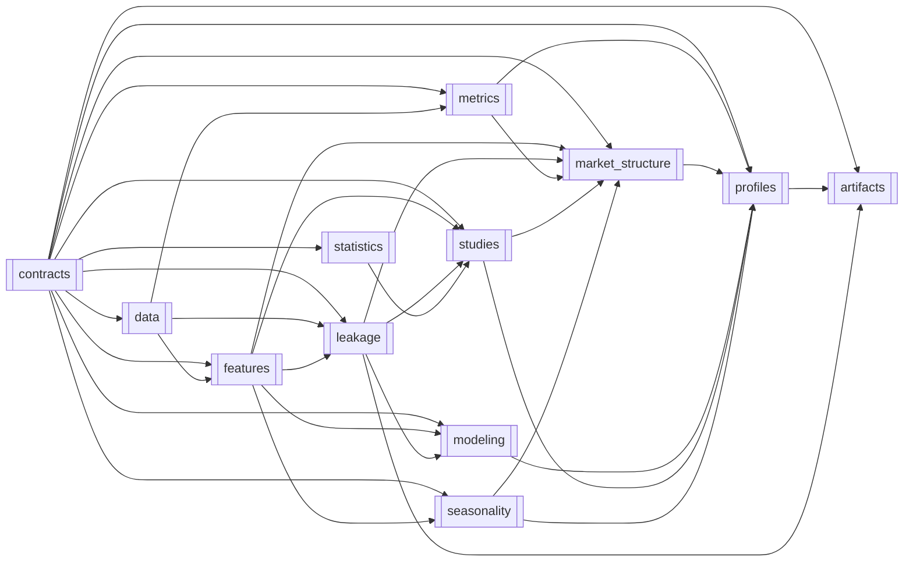
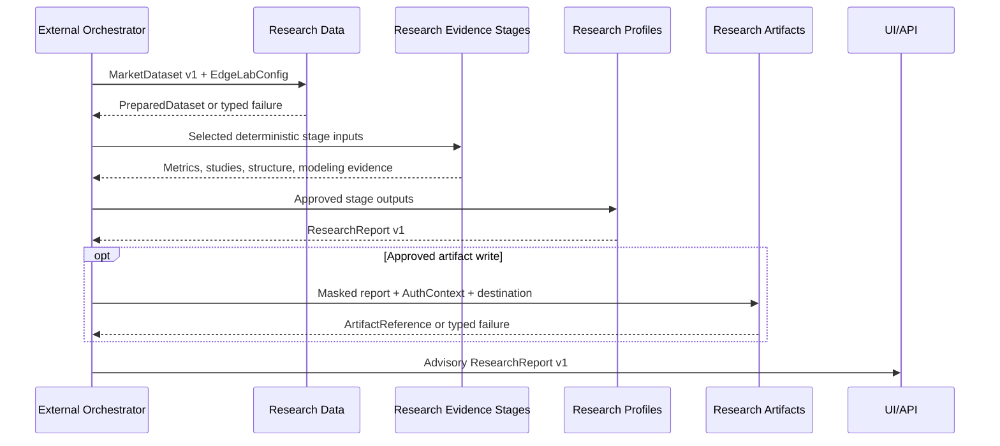

# Research

> **Package:** `app/services/research`
> **Status:** `Missing`
> **Last updated:** `2026-07-13`

> This README is the package's **single source of truth** for requirements, final structure, implementation sequence, progress, usage examples, and tests.
> Update this file before changing the code.

---

## 1. Purpose and Boundary

### Purpose

Research provides a sandboxed, leakage-gated environment for exploring research-ready market data and evaluating hypotheses. It produces reproducible, versioned, advisory-only evidence—including prepared datasets, edge studies, market-structure profiles, unsupervised insights, scorecards, snapshots, and `ResearchReport v1` artifacts—without authorizing or mutating live trading, strategy, or risk state.

Research consumes trusted `MarketDataset v1` inputs from Data, pure indicator
evidence through the Indicators package root, and public `PerformanceReport v1`
evidence from Analytics. Data/provider acquisition, cross-domain scheduling,
database infrastructure, and strategy registration remain outside this package.

### Owns

- Research configurations and immutable result contracts.
- Deterministic research-only cleaning, validation, enrichment, and quality evidence.
- Research-specific returns, Hurst, forward outcomes, excursions, feature-frame assembly, and all deterministic historical labeling; Research owns this capability.
- Chronological splitting, leakage evidence, and recursive artifact masking.
- Core research metric profiles and their bounded calculator registry.
- Seeded bootstrap, permutation, null-model, threshold, and multiple-testing computations.
- Mean-reversion, trend-persistence, and session edge studies with one confirmation policy.
- Timezone-aware session tagging and seasonality opportunity analysis.
- Market-structure profiles, opt-in stability/robustness, forward validation, consolidated calibration, and advisory strategy fit.
- Deterministic PCA/K-Means evidence and unsupervised insight generation.
- Deterministic scorecards, profile snapshots, report rendering, and comparisons.
- Research artifact schemas, migration definitions, and safe masked artifact persistence.
- `ResearchReport v1` and the explicit classified Research public API.

### Does not own

- Market-data or external-feed acquisition, provider connections, caching, or provider retries; Data owns production provider contracts.
- Generic indicator formulas or Analytics ratios; Research imports SMA, EMA, ATR,
  Bollinger Bands, RSI, and ADR only from the Indicators package root and consumes
  Analytics only through `PerformanceReport v1`. Research does not re-export or
  deep-import either owning domain.
- Backtest or optimization orchestration.
- Strategy registration, promotion, runtime state, or production signal execution.
- Risk policy, position sizing, exposure limits, approval, or kill-switch state.
- Broker reads or mutations, order execution, reconciliation, or live controls.
- API routes, authentication, scheduling, cross-domain workflow coordination, or database connection/migration execution infrastructure.
- Guarantees of profitability, compliance, or production-grade performance before resource targets are approved and verified.

### Glossary

| Term | Meaning |
|---|---|
| **Edge Lab** | The progressive, externally orchestrated sequence of approved Research stages that produces an advisory profile and `ResearchReport`. |
| **Null baseline** | A seeded reference distribution matched to the observed study's side, sample, horizon, and declared null method. |
| **Profile snapshot** | A versioned, normalized record of approved stage outputs, provenance, warnings, readiness reasons, and advisory status. |
| **Advisory evidence** | Research output that may inform review but never authorizes strategy registration, risk approval, or execution. |
| **Leakage report** | Structured evidence about suspected lookahead fields, declared forward columns, severity, and required action. |
| **Research artifact** | A masked, versioned JSON or Markdown representation persisted by Research under an approved storage policy. |

### Shared contracts

Contract definitions match `docs/PROJECT.md`. Commands and requests are owned by their receiver; results are owned by their producer.

**Owned by this domain**—defined authoritatively here:

| Status | Contract | Version | Counterparty | Purpose |
|---|---|---|---|---|
| Missing | `ResearchReport` | `v1` | `UI/API` | Return advisory research evidence and hypothesis results; leakage-gate failure blocks publication. |

`ResearchReport` is the only registered cross-domain Research result in the initial
build. Prepared datasets, stage profiles/results, scorecards, snapshots, warnings, and
artifact references are Research-internal assembly types or are nested inside the
report; another domain must not consume them directly until separately registered.

#### `ResearchReport v1` schema

`ResearchReport` is an immutable, JSON-serializable result. Unknown fields are rejected at construction; breaking field or semantic changes require a new contract version.

| Field | Type | Required | Contract |
|---|---|---|---|
| `contract_version` | `Literal["v1"]` | Yes | Compatibility version; always `v1`. |
| `schema_id` | `Literal["research.report.v1"]` | Yes | Stable namespaced schema identity; never parsed for compatibility. |
| `report_id` | `str` | Yes | Non-empty Research-owned identifier. |
| `hypothesis` | `str` | Yes | The tested question or declared research objective. |
| `evidence` | `Mapping[str, JSONValue]` | Yes | Versioned stage evidence; observations and assumptions remain distinguishable. |
| `seeds` | `Mapping[str, int]` | Yes | Effective seed for every stochastic stage; empty only when no stochastic stage ran. |
| `configuration_hash` | `str` | Yes | Lowercase SHA-256 of canonical effective configuration. |
| `dataset_hash` | `str` | Yes | Lowercase SHA-256 of the canonical input identity/snapshot. |
| `source_references` | `tuple[str, ...]` | Yes | Data/report identifiers used as evidence; never provider SDK objects. |
| `warnings` | `tuple[ResearchWarning, ...]` | Yes | Structured caveats, insufficiency, masking, and partial-stage evidence. |
| `generated_at` | `datetime` | Yes | Timezone-aware UTC timestamp serialized with `Z`. |
| `dependency_versions` | `Mapping[str, str]` | Yes | Versions required to reproduce the result. |
| `duration_ms` | `float` | Yes | Non-negative monotonic execution duration. |
| `advisory_only` | `Literal[True]` | Yes | Always true; any other value is invalid. |

**Consumed from other domains—referenced only, never redefined:**

| Contract | Version | Owner | Used for |
|---|---|---|---|
| `MarketDataset` | `v1` | `Data` | Canonical research-ready OHLCV/OHLCVS records, availability metadata, provenance, and dataset identity. |
| `PerformanceReport` | `v1` | `Analytics` | Read-only metric evidence used by scorecards/reports without reimplementing Analytics ratios. |
| `AuthContext` | `v1` | `Utils` | Principal and trace context for governed artifact publication. |
| `AuditEvent` | `v1` | `Utils` | Redacted audit envelope emitted for governed artifact writes; Data persists it. |

### Persisted state

Data owns the shared database connection, locking, and migration execution framework. Research alone owns and writes its artifact schemas and migration definitions; other domains read through `ResearchReport v1`.

| Status | State / Store | Read access (via contract) | Migration definitions |
|---|---|---|---|
| Missing | Research artifact metadata and versioned JSON/Markdown artifacts | `UI/API` via `ResearchReport v1` | `{DATA_DIR}/artifacts/research/` plus `research_artifacts` metadata table; migrations at `app/services/research/artifacts/migrations.py`. |

### Four-level structure

| Code level | Represents |
|---|---|
| **Package** | Research domain |
| **Module folder** | Feature / capability |
| **File** | Use case or focused responsibility |
| **Class / function / method** | Functional requirement behaviour |

```text
Package
└── Module folder
    └── File
        └── Class / Function / Method
```

### Package capability map

```mermaid
flowchart TD
    RES[[Research Package]]
    RES --> CON[[contracts]]
    RES --> DAT[[data]]
    RES --> FEA[[features]]
    RES --> LEA[[leakage]]
    RES --> MET[[metrics]]
    RES --> STA[[statistics]]
    RES --> STU[[studies]]
    RES --> SEA[[seasonality]]
    RES --> MKS[[market_structure]]
    RES --> MOD[[modeling]]
    RES --> PRO[[profiles]]
    RES --> ART[[artifacts]]

    CON --> CON1[configurations.py]
    CON --> CON2[results.py]
    CON --> CON3[api.py]
    DAT --> DAT1[validation.py]
    DAT --> DAT2[preparation.py]
    FEA --> FEA1[calculations.py]
    FEA --> FEA2[frame.py]
    LEA --> LEA1[validation.py]
    LEA --> LEA2[splitting.py]
    LEA --> LEA3[masking.py]
    MET --> MET1[registry.py]
    MET --> MET2[profile.py]
    STA --> STA1[resampling.py]
    STA --> STA2[null_models.py]
    STA --> STA3[corrections.py]
    STU --> STU1[null_baseline.py]
    STU --> STU2[edge_studies.py]
    STU --> STU3[classification.py]
    SEA --> SEA1[sessions.py]
    SEA --> SEA2[analysis.py]
    MKS --> MKS1[profile.py]
    MKS --> MKS2[quality.py]
    MKS --> MKS3[validation.py]
    MKS --> MKS4[calibration.py]
    MKS --> MKS5[fit.py]
    MOD --> MOD1[decomposition.py]
    MOD --> MOD2[clustering.py]
    MOD --> MOD3[insights.py]
    MOD --> MOD4[workflow.py]
    PRO --> PRO1[scorecard.py]
    PRO --> PRO2[snapshot.py]
    PRO --> PRO3[rendering.py]
    PRO --> PRO4[workflow.py]
    ART --> ART1[migrations.py]
    ART --> ART2[persistence.py]
```



---

## 2. Final Package Structure

Folders and files are ordered from lowest dependency to highest dependency; this is the implementation sequence.

### Feature Registry

The Research domain remains `Missing`. Existing numbered teaching programs are
not completion evidence until the corresponding Section 4 feature, unit tests,
integration workflow, and package boundary satisfy Section 7.

| Status | Feature | Owning module | Public API and contracts | Requirements | Usage evidence |
|---|---|---|---|---|---|
| Missing | `FEAT-RES-01` Versioned Contracts and Configuration | `contracts/` | Planned declarations and contract fields: Section 4.1 | Section 4.1 functional requirements | `tests/research/usage/01_contracts.py` exists; completion unverified |
| Missing | `FEAT-RES-02` Deterministic Dataset Preparation | `data/` | Planned declarations: Section 4.2 | Section 4.2 functional requirements | `tests/research/usage/02_data.py` exists; completion unverified |
| Missing | `FEAT-RES-03` Research-Specific Features | `features/` | Planned declarations: Section 4.3 | Section 4.3 functional requirements | `tests/research/usage/03_features.py` exists; completion unverified |
| Missing | `FEAT-RES-04` Leakage Evidence, Splits, and Masking | `leakage/` | Planned declarations: Section 4.4 | Section 4.4 functional requirements | `tests/research/usage/04_leakage.py` exists; completion unverified |
| Missing | `FEAT-RES-05` Core Metric Profile | `metrics/` | Planned declarations: Section 4.5 | Section 4.5 functional requirements | `tests/research/usage/05_metrics.py` exists; completion unverified |
| Missing | `FEAT-RES-06` Seeded Statistical Validation | `statistics/` | Planned declarations: Section 4.6 | Section 4.6 functional requirements | `tests/research/usage/06_statistics.py` exists; completion unverified |
| Missing | `FEAT-RES-07` Edge Discovery and Confirmation | `studies/` | Planned declarations: Section 4.7 | Section 4.7 functional requirements | Missing |
| Missing | `FEAT-RES-08` Sessions and Seasonality | `seasonality/` | Planned declarations: Section 4.8 | Section 4.8 functional requirements | Missing |
| Missing | `FEAT-RES-09` Market Structure Analysis | `market_structure/` | Planned declarations: Section 4.9 | Section 4.9 functional requirements | Missing |
| Missing | `FEAT-RES-10` Deterministic Unsupervised Insights | `modeling/` | Planned declarations: Section 4.10 | Section 4.10 functional requirements | Missing |
| Missing | `FEAT-RES-11` Scorecards, Snapshots, and Edge Lab Profiles | `profiles/` | Planned declarations: Section 4.11 | Section 4.11 functional requirements | Missing |
| Missing | `FEAT-RES-12` Safe Research Artifact Persistence | `artifacts/` | Planned declarations and artifact contracts: Section 4.12 | Section 4.12 functional requirements | Missing |

```text
research/
├── __init__.py                         # Explicit classified lazy domain API only
├── README.md
├── contracts/                          # Versioned configurations and result contracts
│   ├── __init__.py
│   ├── configurations.py
│   ├── results.py
│   └── api.py
├── data/                               # Deterministic preparation and quality evidence
│   ├── __init__.py
│   ├── validation.py
│   └── preparation.py
├── features/                           # Research-specific calculations and feature frames
│   ├── __init__.py
│   ├── calculations.py
│   └── frame.py
├── leakage/                            # Leakage evidence, splits, and masking
│   ├── __init__.py
│   ├── validation.py
│   ├── splitting.py
│   └── masking.py
├── metrics/                            # Core metric registry and profile
│   ├── __init__.py
│   ├── registry.py
│   └── profile.py
├── statistics/                         # Seeded resampling and statistical controls
│   ├── __init__.py
│   ├── resampling.py
│   ├── null_models.py
│   └── corrections.py
├── studies/                            # Edge studies and confirmation
│   ├── __init__.py
│   ├── null_baseline.py
│   ├── edge_studies.py
│   └── classification.py
├── seasonality/                        # Unified sessions and seasonality analysis
│   ├── __init__.py
│   ├── sessions.py
│   └── analysis.py
├── market_structure/                   # Profiles, quality, validation, calibration, fit
│   ├── __init__.py
│   ├── profile.py
│   ├── quality.py
│   ├── validation.py
│   ├── calibration.py
│   └── fit.py
├── modeling/                           # Stateless PCA/K-Means insight workflow
│   ├── __init__.py
│   ├── decomposition.py
│   ├── clustering.py
│   ├── insights.py
│   └── workflow.py
├── profiles/                           # Scorecard, snapshot, rendering, Edge Lab stages
│   ├── __init__.py
│   ├── scorecard.py
│   ├── snapshot.py
│   ├── rendering.py
│   └── workflow.py
└── artifacts/                          # Safe masked artifact persistence
    ├── __init__.py
    └── persistence.py
```

Usage examples are outside production:

```text
tests/research/usage/
├── test_usage_contracts.py
├── test_usage_data.py
├── test_usage_features.py
├── test_usage_leakage.py
├── test_usage_metrics.py
├── test_usage_statistics.py
├── test_usage_studies.py
├── test_usage_seasonality.py
├── test_usage_market_structure.py
├── test_usage_modeling.py
├── test_usage_profiles.py
└── test_usage_artifacts.py
```

### Module dependency diagram

Arrows point from required module to consuming module.



### Structure rules

- The package root contains no business implementation.
- Each module folder owns one approved capability.
- Files contain one focused responsibility and expose only symbols listed in Section 4.
- Common Indicators and Analytics calculations are imported through documented owning-domain APIs; no compatibility re-exports exist.
- Incremental feature computation, provider adapters, cluster signal adaptation, console printing, generic helpers/services/managers, and database orchestration are absent.
- Module `__init__.py` files expose only their approved feature APIs; package `__init__.py` exposes only stable domain APIs and `PUBLIC_API_CLASSIFICATIONS`.
- No module imports `profiles` or `artifacts` from a lower layer; circular imports are prohibited.

---

## 3. Workflows

### Status values

| Status | Meaning |
|---|---|
| **Missing** | Not implemented, conflicting with the final contract, or not verified. |
| **Partial** | Valuable V1 behavior exists, but relocation, contracts, validation, errors, or tests remain. |
| **Completed** | Final behavior, structure, runtime use, and tests are verified. |

### Workflow scope values

| Scope | Meaning |
|---|---|
| **Internal** | The complete workflow occurs within Research. |
| **Cross-domain** | Research receives input from or produces output for another domain. |

| Status | Workflow ID | Scope | Workflow | Trigger / Input boundary | Final outcome / Output boundary | Requirement sequence |
|---|---|---|---|---|---|---|
| Missing | `WF-RES-001` | Cross-domain | Prepare Research Dataset | `MarketDataset v1` from Data | Research-internal `PreparedDataset`; never returned across the boundary | `FR-RES-027 → 030` |
| Missing | `WF-RES-002` | Internal | Build Core Metric Profile | `PreparedDataset` | `CoreMetricProfile` | `FR-RES-042 → 049` |
| Missing | `WF-RES-003` | Internal | Build Leakage-Safe Feature Frame and Time Splits | Prepared data + feature config | Feature frame + `LeakageReport` + `TimeSplitResult` | `FR-RES-031 → 041` |
| Missing | `WF-RES-004` | Internal | Analyze Session and Seasonality Opportunity | Prepared OHLCVS + approved session policy | Advisory seasonality summaries | `FR-RES-069 → 074` |
| Missing | `WF-RES-005` | Internal | Run Edge Study Against Null Evidence | Split data + study/statistical config | Advisory `EdgeResult` | `FR-RES-050 → 068` |
| Missing | `WF-RES-006` | Internal | Build Market-Structure Profile | Prepared data + market-structure config | `MarketStructureProfile` + advisory fit | `FR-RES-075 → 076, 080` |
| Missing | `WF-RES-007` | Internal | Forward Validate and Calibrate Market Structure | Persisted prediction + later approved dataset already supplied to the run | Research-internal validation/calibration evidence nested only in `ResearchReport v1` | `FR-RES-077 → 079` |
| Missing | `WF-RES-008` | Internal | Run Unsupervised Market-Structure Research | Leakage-safe feature frame + seed | `UnsupervisedResearchResult` | `FR-RES-081 → 088` |
| Missing | `WF-RES-009` | Internal | Build Research Scorecard and Profile Snapshot | Approved stage outputs | `ResearchScorecard` + `ResearchProfileSnapshot` | `FR-RES-089 → 092` |
| Missing | `WF-RES-010` | Internal | Render and Persist Research Artifact | Masked result + approved Research-owned output location | Research-internal `ArtifactReference` or typed failure; UI/API receives only `ResearchReport v1` | `FR-RES-093 → 095, 097` |
| Missing | `WF-RES-011` | Cross-domain | Run Complete Edge Lab Profile | Run request and `MarketDataset v1` from external orchestrator | `ResearchReport v1` to UI/API; orchestration/persistence remain external | `FR-RES-096` plus selected stage requirements |

### `WF-RES-001` — Prepare Research Dataset

**Scope:** `Cross-domain`
**System workflow:** `SYS-WF-004`

**Input boundary:** Data supplies `MarketDataset v1` and provenance; Research performs no provider read.
**Output boundary:** Research retains `PreparedDataset` as internal stage evidence;
only the final `ResearchReport v1` may expose its bounded lineage/result projection.

1. `validate_dataset()` produces fatal/warning quality evidence.
2. `clean_dataset()` applies only explicit approved actions to a copy.
3. `enrich_dataset()` adds research-owned price, return-label, and calendar fields.
4. `prepare_research_dataset()` returns the versioned dataset, hashes, and report.

**Failure behaviour:**

- Fatal schema/OHLC/time issue → typed validation failure; no prepared dataset.
- Unapproved or absent data-changing default → configuration failure; no implicit fill/drop.
- Row/duration limit exceeded → typed resource-limit failure.

**Integration test:** `tests/research/integration/test_prepare_dataset.py::test_prepare_dataset_from_market_dataset()`

### `WF-RES-002` — Build Core Metric Profile

**Scope:** `Internal`
**System workflow:** None.

`PreparedDataset → immutable MetricRegistry → seven metric families → CoreMetricProfile`

Undefined metrics remain explicit with warnings and units; they are not silently coerced.

**Integration test:** `tests/research/integration/test_core_metric_profile.py::test_build_core_metric_profile_with_provenance()`

### `WF-RES-003` — Build Leakage-Safe Feature Frame and Time Splits

**Scope:** `Internal`
**System workflow:** None.

`PreparedDataset → build_research_feature_frame() → validate_no_lookahead_features() → enforce_time_split()`

High/critical leakage evidence blocks downstream claims. Forward columns remain explicitly declared and excluded from feature inputs.

**Integration test:** `tests/research/integration/test_feature_leakage.py::test_feature_frame_is_split_without_lookahead()`

### `WF-RES-004` — Analyze Session and Seasonality Opportunity

**Scope:** `Internal`
**System workflow:** None.

`PreparedDataset + SessionConfig → tag_sessions() → run_seasonality() → advisory opportunity summaries`

Sparse buckets, overlaps, DST transitions, and unmatched hours produce structured warnings. UTC is authoritative, with Sydney 21:00–06:00, Tokyo 00:00–09:00, London 07:00–16:00, New York 12:00–21:00, and overlap precedence `london > new_york > tokyo > sydney`; DST is not modeled in v1.

**Integration test:** `tests/research/integration/test_seasonality.py::test_seasonality_uses_canonical_sessions()`

### `WF-RES-005` — Run Edge Study Against Null Evidence

**Scope:** `Internal`
**System workflow:** None.

`Split data + seed → matching null baseline → selected study → compare/classify → EdgeResult`

Isolated study failures may be reported and other independent studies continued only when `StudyConfig.continue_on_study_error` is explicitly true. Mixed/BUY/SELL samples use matching null direction; one confirmation policy drives results, profiles, and reports.

**Integration test:** `tests/research/integration/test_edge_study.py::test_edge_study_uses_matching_seeded_null()`

### `WF-RES-006` — Build Market-Structure Profile

**Scope:** `Internal`
**System workflow:** None.

`PreparedDataset → structure profile → optional bounded quality evaluation → advisory strategy fit`

Quality layers are opt-in and bounded. The canonical profile scorer is also used by calibration.

**Integration test:** `tests/research/integration/test_market_structure_profile.py::test_profile_and_fit_share_canonical_score()`

### `WF-RES-007` — Forward Validate and Calibrate Market Structure

**Scope:** `Internal`
**System workflow:** Internal contribution to `SYS-WF-004`.

**Input boundary:** The Research run receives an approved persisted prediction and a
later research-ready dataset through its existing Data input boundary.
**Output boundary:** Labeling, validation, stability, and calibration evidence remains
Research-internal and may cross only as bounded fields in `ResearchReport v1`.

The validation horizon is expressed in bars of the study timeframe; realized forward outcome at that horizon is calibration truth, ranked by calibration error and then sample size.

**Integration test:** `tests/research/integration/test_market_structure_validation.py::test_forward_validation_returns_ranked_evidence()`

### `WF-RES-008` — Run Unsupervised Market-Structure Research

**Scope:** `Internal`
**System workflow:** None.

`Leakage-safe feature frame + seed → PCA → K-Means → factor/cluster evidence → UnsupervisedResearchResult`

Preprocessing, selected/dropped columns, scaler behavior, effective seed, model parameters, and diagnostics are recorded. Signal adaptation is absent.

**Integration test:** `tests/research/integration/test_unsupervised_research.py::test_unsupervised_workflow_is_seeded_and_advisory()`

### `WF-RES-009` — Build Research Scorecard and Profile Snapshot

**Scope:** `Internal`
**System workflow:** None.

`Approved stage outputs → ResearchScorecard → ResearchProfileSnapshot`

The scorecard and snapshot use one confirmation/fit policy and preserve uncertainty, readiness reasons, versions, hashes, warnings, and advisory status.

**Integration test:** `tests/research/integration/test_profile_snapshot.py::test_scorecard_snapshot_is_deterministic()`

### `WF-RES-010` — Render and Persist Research Artifact

**Scope:** `Internal`
**System workflow:** Internal governed persistence contribution to `SYS-WF-004`.

**Input boundary:** A caller supplies a versioned result/snapshot, `AuthContext v1`, and approved destination.
**Output boundary:** `ArtifactReference` remains Research-internal. Research emits the
registered redacted `AuditEvent v1`; UI/API receives only `ResearchReport v1`.

Masking precedes serialization; traversal, disallowed root, overwrite conflict, permission failure, non-serializable input, and unsupported atomic replacement fail explicitly.

**Integration test:** `tests/research/integration/test_artifact_persistence.py::test_persist_masked_artifact_atomically()`

### `WF-RES-011` — Run Complete Edge Lab Profile

**Scope:** `Cross-domain`
**System workflow:** `SYS-WF-004`

**Input boundary:** External UI/API orchestration supplies a run request, `MarketDataset v1`, and optional `PerformanceReport v1`.
**Output boundary:** Research returns `ResearchReport v1`. UI/API owns human approval and any `StrategyRegistrationRequest` submission.

Research executes only selected deterministic stages. External code owns triggering, scheduling, provider reads, caching, and database orchestration.

**Integration test:** `tests/research/integration/test_edge_lab_profile.py::test_edge_lab_returns_advisory_research_report()`

#### End-to-end workflow diagram



---

## 4. Module and Requirement Specifications

This section is the implementation plan. Statuses reflect V1 audit evidence, not intention. `Partial` means reusable V1 behavior exists but the final structure/contracts/tests are not complete.

### Owner-resolved implementation policy

The following policy is authoritative for every Section 4 requirement. Public
boundaries map third-party and Data failures to shared Utils errors with redacted
symbolic details:

| Error class | Approved Research codes |
|---|---|
| `ConfigurationError` | `RES_CONFIGURATION_INVALID`, `RES_STAGE_DEPENDENCY_INVALID` |
| `ValidationError` | `RES_INPUT_INVALID`, `RES_INSUFFICIENT_DATA`, `RES_NONFINITE_DATA`, `RES_RESOURCE_LIMIT_EXCEEDED`, `RES_VERSION_INCOMPATIBLE`, `RES_MODEL_FIT_FAILED` |
| `SecurityError` | `RES_PERMISSION_DENIED`, `RES_LEAKAGE_DETECTED`, `RES_ARTIFACT_PATH_REJECTED`, `RES_SENSITIVE_OUTPUT_REJECTED` |
| `HaruQuantError` | `RES_ARTIFACT_CONFLICT`, `RES_ARTIFACT_TOO_LARGE`, `RES_ARTIFACT_ATOMICITY_UNAVAILABLE`, `RES_ARTIFACT_WRITE_FAILED`, `RES_AUDIT_PERSISTENCE_FAILED` |

Exact hard bounds are 500,000 rows, 600 seconds per heavy operation, 50 MiB per
serialized artifact, 1–10,000 resampling/null iterations, 1–128 calibration
candidates, at most 32 distinct quality windows, and at most 100 reports in one
multi-symbol rendering. ADR uses 14 bars. Hurst requires at least 20 finite
observations. K-Means uses 2–64 clusters; PCA components may not exceed
`min(feature_count, usable_rows - 1)`; modeling requires at least
`max(20, 10 * clusters, 2 * pca_components)` usable rows. A supplied memory budget
is enforced against measured frame memory before heavy work.

Study mappings are closed schemas and reject unknown keys. Mean reversion uses a
rolling close-price z-score with explicit lookback, entry threshold, side, and hold
horizon. Trend persistence compares an explicit lookback log-return direction with
an explicit forward horizon/minimum move. Session studies group forward returns
under `SessionConfig`. Benjamini–Hochberg covers every successfully evaluated
hypothesis. `confirmed` requires the minimum sample, a directionally correct 95%
confidence interval excluding zero, adjusted p-value at or below `q`, and observed
evidence beyond the matched directional null quantile. A directionally opposite
interval excluding zero is `contradicted`; all other evidence is `inconclusive`.

Market-structure validation horizons are positive integer bars. Confirmed pivots
become available only after their confirmation window. The canonical score is
`100 * (0.60 * Kaufman efficiency ratio + 0.40 * directional persistence)`;
scores at least 65 are `trending`, scores at most 35 are `ranging`, and others are
`mixed`. Calibration receives an explicit candidate grid and ranks ascending Brier
error, descending validation sample, then canonical configuration hash.

The scorecard measures evidence quality, never trading merit. Input quality,
leakage safety, statistical confirmation, out-of-sample validation, and
reproducibility each contribute 0, 10, or 20 points. Readiness is `BLOCKED` for a
fatal data issue, high-severity leakage, or incompatible version; `REVIEW_READY`
requires at least 80 points and nonzero evidence in every row; otherwise it is
`INSUFFICIENT_EVIDENCE`. Trading-readiness language is prohibited.

### 4.1 `contracts/` — Versioned Contracts and Configuration

**Purpose:** Define immutable configuration, result, warning, resource, and API-classification contracts shared by Research modules.

**Module flow:** `validated configuration + stage evidence → immutable versioned contracts`

### Files

| Status | File | Responsibility | Key exports | Dependencies |
|---|---|---|---|---|
| Missing | `configurations.py` | Define immutable, validated Research configuration contracts without hidden data-changing defaults. | `ResearchResourceLimits`, `CleaningConfig`, `EnrichmentConfig`, `FeatureConfig`, `StatisticalConfig`, `StudyConfig`, `SessionConfig`, `MarketStructureConfig`, `UnsupervisedResearchConfig`, `ArtifactWriteConfig`, `EdgeLabConfig` | **Standard library:** dataclasses, datetime, pathlib, typing<br>**Required third-party:** None<br>**Local:** approved shared Utils errors in the owner-resolved policy above |
| Missing | `results.py` | Define versioned immutable Research results and the owned `ResearchReport v1` contract. | `PreparedDataset`, `DataQualityReport`, `LeakageReport`, `TimeSplitResult`, `CoreMetricProfile`, `EdgeResult`, `MarketStructureProfile`, `MarketStructureQualityReport`, `UnsupervisedResearchResult`, `ResearchScorecard`, `ResearchProfileSnapshot`, `ResearchWarning`, `ResearchReport`, `ArtifactReference` | **Standard library:** dataclasses, datetime, pathlib, typing<br>**Required third-party:** pandas<br>**Local:** configurations.py → configuration types; app.services.data public API → `MarketDataset` reference |
| Missing | `api.py` | Define the explicit unique classification map used by the package lazy facade. | `PUBLIC_API_CLASSIFICATIONS` | **Standard library:** types, typing<br>**Required third-party:** None<br>**Local:** None |
| Missing | `__init__.py` | Expose the approved public contract API. | All key exports above | **Standard library:** None<br>**Required third-party:** None<br>**Local:** configurations.py, results.py, api.py → listed exports |

### Configuration and Limits Manifest

| Status | Setting / Limit | Type | Default | Required | Used by | Description |
|---|---|---|---|---|---|---|
| Missing | `max_rows` | `int` | `500000` advisory | Yes | All frame-consuming public functions | Hard row ceiling; excess raises the pending resource-limit error before heavy work. |
| Missing | `max_duration_seconds` | `float` | `600.0` advisory | Yes | Heavy studies, quality, modeling, Edge Lab workflow | Runtime budget; excess stops safely with no publication. |
| Missing | `max_artifact_bytes` | `int` | `52428800` (50 MB advisory, the applicable Research specification) | Yes | `write_research_artifact` | Maximum serialized artifact size; excess is rejected, never silently truncated. |
| Missing | `memory_budget_mb` | `int \| None` | `None` | No | Heavy workflows | Advisory/measured guard only; Research does not claim portable hard memory enforcement. |
| Missing | internal result `schema_version` | `Literal["v1"]` | `"v1"` | Yes | Research-internal stage/result types only | Structural version for internal/nested evidence; the registered `ResearchReport` uses separate `contract_version` and `schema_id`. |

#### `configurations.py` — Immutable Configuration Contracts

| Status | Requirement ID | Responsibility | Class / Function / Method | Side Effects | Raises | Usage / Test |
|---|---|---|---|---|---|---|
| Missing | `FR-RES-001` | The system shall define bounded row, duration, artifact-size, and advisory memory budgets without claiming unverified production performance. | `ResearchResourceLimits(max_rows: int, max_duration_seconds: float, max_artifact_bytes: int, memory_budget_mb: int \| None = None)` | None | invalid/non-positive limit; invalid or non-positive approved limits | **Usage:** `test_usage_contracts.py::test_usage_configurations_resource_limits`<br>**Unit:** `test_configurations.py::test_resource_limits_reject_non_positive` |
| Missing | `FR-RES-002` | The system shall require explicit timestamp, duplicate, missing-bar, non-trading-period, and spread-cleaning policies and shall never silently fill or drop data. | `CleaningConfig(timezone: str, duplicate_strategy: str, missing_bar_strategy: str, non_trading_period_strategy: str, spread_strategy: str)` | None | unsupported or absent policy | **Usage:** `test_usage_contracts.py::test_usage_configurations_cleaning`<br>**Unit:** `test_configurations.py::test_cleaning_requires_explicit_data_actions` |
| Missing | `FR-RES-003` | The system shall define explicit pip, geometry, return-label, and calendar enrichment selections; canonical session tagging remains owned by `seasonality/`. | `EnrichmentConfig(symbol: str, include_geometry: bool, include_returns: bool, include_forward_labels: bool, include_calendar: bool)` | None | malformed symbol or incompatible selection | **Usage:** `test_usage_contracts.py::test_usage_configurations_enrichment`<br>**Unit:** `test_configurations.py::test_enrichment_rejects_incompatible_fields` |
| Missing | `FR-RES-004` | The system shall define feature windows, declared forward columns, warm-up/NaN policy, and non-mutation behavior. | `FeatureConfig(windows: Mapping[str, int], forward_horizons: tuple[int,...], allowed_forward_columns: tuple[str,...], nan_policy: str)` | None | invalid window/horizon/policy | **Usage:** `test_usage_contracts.py::test_usage_configurations_features`<br>**Unit:** `test_configurations.py::test_feature_config_rejects_invalid_window` |
| Missing | `FR-RES-005` | The system shall define bootstrap, permutation, null, correction, effective-seed, and bounded-iteration settings in one statistical contract. | `StatisticalConfig(seed: int, bootstrap_samples: int, permutation_samples: int, block_size: int, null_samples: int, correction: str \| None)` | None | invalid seed, count, block, correction, or resource request | **Usage:** `test_usage_contracts.py::test_usage_configurations_statistics`<br>**Unit:** `test_configurations.py::test_statistics_rejects_invalid_block_size` |
| Missing | `FR-RES-006` | The system shall define mean-reversion, trend-persistence, session-study, confirmation, and explicit isolated-failure policy. | `StudyConfig(mean_reversion: Mapping[str, JSONValue], trend_persistence: Mapping[str, JSONValue], session: Mapping[str, JSONValue], continue_on_study_error: bool = False)` | None | unsupported study/confirmation setting | **Usage:** `test_usage_contracts.py::test_usage_configurations_studies`<br>**Unit:** `test_configurations.py::test_study_config_fails_closed_by_default` |
| Missing | `FR-RES-007` | The system shall define one timezone-aware set of named windows and deterministic overlap precedence for all session consumers. | `SessionConfig(timezone: str, windows: Mapping[str, tuple[time, time]], overlap_precedence: tuple[str,...])` | None | session policy unresolved or invalid | **Usage:** `test_usage_contracts.py::test_usage_configurations_sessions`<br>**Unit:** `test_configurations.py::test_session_config_requires_overlap_precedence` |
| Missing | `FR-RES-008` | The system shall define bounded structure detection, canonical scoring, quality, validation, and calibration settings. | `MarketStructureConfig(profile: Mapping[str, JSONValue], enable_quality: bool, quality_windows: tuple[int,...], calibration_candidates: int, validation_horizon: int)` | None | invalid validation or calibration policy | **Usage:** `test_usage_contracts.py::test_usage_configurations_market_structure`<br>**Unit:** `test_configurations.py::test_market_structure_bounds_candidates` |
| Missing | `FR-RES-009` | The system shall define selected features, preprocessing, PCA components, cluster count, minimum sample, and effective seed. | `UnsupervisedResearchConfig(feature_columns: tuple[str,...], scale: bool, pca_components: int, clusters: int, minimum_samples: int, seed: int)` | None | invalid dimension/sample/seed | **Usage:** `test_usage_contracts.py::test_usage_configurations_modeling`<br>**Unit:** `test_configurations.py::test_unsupervised_config_rejects_excess_clusters` |
| Missing | `FR-RES-010` | The system shall define an allowed root, format, encoding, overwrite, masking, and atomic-write policy for artifacts. | `ArtifactWriteConfig(allowed_root: Path, format: Literal["json", "markdown"], overwrite: bool = False, encoding: str = "utf-8", require_atomic: bool = True)` | None | root or ownership invalid | **Usage:** `test_usage_contracts.py::test_usage_configurations_artifacts`<br>**Unit:** `test_configurations.py::test_artifact_config_rejects_relative_root` |
| Missing | `FR-RES-011` | The system shall aggregate explicit stage configs, selected stages, and resource limits without supplying hidden trading/data policies. | `EdgeLabConfig(cleaning: CleaningConfig, enrichment: EnrichmentConfig, features: FeatureConfig, statistics: StatisticalConfig, studies: StudyConfig, sessions: SessionConfig, market_structure: MarketStructureConfig, modeling: UnsupervisedResearchConfig, artifacts: ArtifactWriteConfig, limits: ResearchResourceLimits, selected_stages: tuple[str,...])` | None | absent/incompatible configuration | **Usage:** `test_usage_contracts.py::test_usage_configurations_edge_lab`<br>**Unit:** `test_configurations.py::test_edge_lab_config_requires_stage_dependencies` |

#### `results.py` — Versioned Result Contracts

| Status | Requirement ID | Responsibility | Class / Function / Method | Side Effects | Raises | Usage / Test |
|---|---|---|---|---|---|---|
| Missing | `FR-RES-012` | The system shall carry prepared records, canonical schema metadata, quality evidence, dataset/config hashes, and provenance without provider objects. | `PreparedDataset(data: DataFrame, schema_version: str, quality: DataQualityReport, dataset_hash: str, configuration_hash: str, source_references: tuple[str,...])` | None | invalid schema/hash/frame | **Usage:** `test_usage_contracts.py::test_usage_results_prepared_dataset`<br>**Unit:** `test_results.py::test_prepared_dataset_rejects_provider_object` |
| Missing | `FR-RES-013` | The system shall distinguish fatal issues, warnings, checks, and explicit cleaning actions with machine-readable codes. | `DataQualityReport(fatal_issues: tuple[Mapping[str, JSONValue],...], warnings: tuple[ResearchWarning,...], checks: tuple[str,...], cleaning_actions: tuple[Mapping[str, JSONValue],...])` | None | invalid severity/code/details | **Usage:** `test_usage_contracts.py::test_usage_results_quality_report`<br>**Unit:** `test_results.py::test_quality_report_distinguishes_fatal_warning` |
| Missing | `FR-RES-014` | The system shall identify suspected lookahead columns, severity, evidence, recommendation, allowed forward columns, target, and source metadata. | `LeakageReport(suspected_columns: tuple[str,...], severity: str, evidence: Mapping[str, JSONValue], recommendation: str, allowed_forward_columns: tuple[str,...], target_column: str \| None, source_references: tuple[str,...])` | None | invalid severity/evidence | **Usage:** `test_usage_contracts.py::test_usage_results_leakage_report`<br>**Unit:** `test_results.py::test_leakage_report_requires_evidence` |
| Missing | `FR-RES-015` | The system shall represent deterministic chronological train/validation/test partitions and boundary identities. | `TimeSplitResult(train: DataFrame, validation: DataFrame, test: DataFrame, boundaries: Mapping[str, datetime], split_hash: str)` | None | overlapping/invalid partitions | **Usage:** `test_usage_contracts.py::test_usage_results_time_split`<br>**Unit:** `test_results.py::test_time_split_rejects_overlap` |
| Missing | `FR-RES-016` | The system shall represent seven-family metric values with units, sample size, undefined-value reason, warnings, and reproducibility metadata. | `CoreMetricProfile(schema_version: str, metrics: Mapping[str, JSONValue], quality: DataQualityReport, dataset_hash: str, configuration_hash: str, warnings: tuple[ResearchWarning,...])` | None | invalid metric/metadata schema | **Usage:** `test_usage_contracts.py::test_usage_results_core_metric_profile`<br>**Unit:** `test_results.py::test_metric_profile_requires_units` |
| Missing | `FR-RES-017` | The system shall represent one advisory edge study with sample, rule/config, split identity, null evidence, uncertainty, confirmation, seed, warnings, and provenance. | `EdgeResult(schema_version: str, study: str, statistics: Mapping[str, JSONValue], null_evidence: Mapping[str, JSONValue], classification: str, seed: int, warnings: tuple[ResearchWarning,...], advisory_only: Literal[True])` | None | invalid or contradictory result | **Usage:** `test_usage_contracts.py::test_usage_results_edge_result`<br>**Unit:** `test_results.py::test_edge_result_is_advisory` |
| Missing | `FR-RES-018` | The system shall represent reproducible swings, legs, distributions, regimes, canonical score, verdict, and advisory fit evidence. | `MarketStructureProfile(schema_version: str, structure: Mapping[str, JSONValue], score: float, verdict: str, strategy_fit: Mapping[str, JSONValue], warnings: tuple[ResearchWarning,...])` | None | invalid score/profile | **Usage:** `test_usage_contracts.py::test_usage_results_market_structure`<br>**Unit:** `test_results.py::test_market_structure_uses_canonical_score` |
| Missing | `FR-RES-019` | The system shall represent opt-in stability, robustness, validation, calibration candidates, ranking criteria, windows, duration, and warnings. | `MarketStructureQualityReport(schema_version: str, stability: Mapping[str, JSONValue], robustness: Mapping[str, JSONValue], calibration: Mapping[str, JSONValue], duration_ms: float, warnings: tuple[ResearchWarning,...])` | None | invalid validation truth | **Usage:** `test_usage_contracts.py::test_usage_results_market_quality`<br>**Unit:** `test_results.py::test_quality_report_records_windows` |
| Missing | `FR-RES-020` | The system shall represent preprocessing, features, dropped columns, scaler, PCA, clusters, factor/cluster evidence, seed, parameters, diagnostics, and advisory status. | `UnsupervisedResearchResult(schema_version: str, preprocessing: Mapping[str, JSONValue], pca: Mapping[str, JSONValue], clusters: Mapping[str, JSONValue], insights: Mapping[str, JSONValue], seed: int, warnings: tuple[ResearchWarning,...], advisory_only: Literal[True])` | None | invalid model metadata | **Usage:** `test_usage_contracts.py::test_usage_results_unsupervised`<br>**Unit:** `test_results.py::test_unsupervised_result_records_seed` |
| Missing | `FR-RES-021` | The system shall represent deterministic score rows, uncertainty, final score, readiness reasons, versions, and advisory status. | `ResearchScorecard(schema_version: str, score_rows: tuple[Mapping[str, JSONValue],...], final_score: float, readiness: str, reasons: tuple[str,...], warnings: tuple[ResearchWarning,...], advisory_only: Literal[True])` | None | invalid score/readiness schema | **Usage:** `test_usage_contracts.py::test_usage_results_scorecard`<br>**Unit:** `test_results.py::test_scorecard_readiness_has_reasons` |
| Missing | `FR-RES-022` | The system shall normalize approved stage outputs into one versioned snapshot with hashes, versions, warnings, and advisory status. | `ResearchProfileSnapshot(schema_version: str, stages: Mapping[str, JSONValue], scorecard: ResearchScorecard, dataset_hash: str, configuration_hash: str, generated_at: datetime, warnings: tuple[ResearchWarning,...], advisory_only: Literal[True])` | None | missing required stage/version/hash | **Usage:** `test_usage_contracts.py::test_usage_results_snapshot`<br>**Unit:** `test_results.py::test_snapshot_rejects_unversioned_stage` |
| Missing | `FR-RES-023` | The system shall expose bounded structured warnings with code, message, severity, optional field path, and bounded details. | `ResearchWarning(code: str, message: str, severity: str, field_path: str \| None = None, details: Mapping[str, JSONValue] \| None = None)` | None | invalid warning vocabulary | **Usage:** `test_usage_contracts.py::test_usage_results_warning`<br>**Unit:** `test_results.py::test_warning_details_are_bounded` |
| Missing | `FR-RES-024` | The system shall produce the fully defined `ResearchReport v1` contract in Section 1 with `advisory_only=True` and complete reproducibility metadata. | `ResearchReport(...)` | None | contract validation; pending leakage gate: unsafe evidence blocks construction/publication | **Usage:** `test_usage_contracts.py::test_usage_results_research_report`<br>**Unit:** `test_results.py::test_research_report_v1_contract` |
| Missing | `FR-RES-025` | The system shall return a safe artifact reference containing relative location, format, byte size, content hash, atomicity, schema version, and audit identity. | `ArtifactReference(relative_path: Path, format: str, size_bytes: int, sha256: str, atomic: bool, schema_version: str, audit_event_id: str)` | None | invalid/out-of-root reference | **Usage:** `test_usage_contracts.py::test_usage_results_artifact_reference`<br>**Unit:** `test_results.py::test_artifact_reference_is_relative` |

#### `api.py` — Classified Public API

| Status | Requirement ID | Responsibility | Class / Function / Method | Side Effects | Raises | Usage / Test |
|---|---|---|---|---|---|---|
| Missing | `FR-RES-026` | The system shall expose a unique immutable mapping for every `__all__` name with `stable` classification and lazy import target, without recursive scanning or callable wrapping. | `PUBLIC_API_CLASSIFICATIONS: Mapping[str, Literal["stable"]]` | None | None | **Usage:** `test_usage_contracts.py::test_usage_api_classifications()`<br>**Unit:** `test_api.py::test_public_api_is_unique_resolvable_and_side_effect_free()` |

**Rules:**

- Contracts are immutable, reject unknown fields, and serialize deterministically.
- Research exceptions extend the Utils-owned shared base hierarchy, use Research-specific codes, and map failures at the Research public boundary.
- Internal-support models may be imported only by their module path and are excluded from package `__all__`.
- No class is added merely to wrap stateless functions.

**Implementation notes:**

- Refactor useful V1 dataclass fields, but do not preserve accidental public surface or mixed errors.
- Use Utils-owned UTC, canonical JSON, hashing, redaction, and shared base-error contracts; Research defines and maps its own focused errors.

### Feature usage examples

`tests/research/usage/test_usage_contracts.py` contains one `test_usage_*` function named in each row above.

---

### 4.2 `data/` — Deterministic Dataset Preparation

**Purpose:** Convert `MarketDataset v1` into a validated, explicitly cleaned and enriched `PreparedDataset` with machine-readable quality evidence.

**Module flow:** `MarketDataset → validate_dataset() → clean_dataset() → enrich_dataset() → prepare_research_dataset()`

### Files

| Status | File | Responsibility | Key exports | Dependencies |
|---|---|---|---|---|
| Missing | `validation.py` | Validate canonical schema, timestamps, continuity, OHLC, spread, and volume. | `validate_dataset` | **Standard library:** typing<br>**Required third-party:** numpy, pandas<br>**Local:** contracts.results → `DataQualityReport`; Data public API → `MarketDataset` |
| Missing | `preparation.py` | Apply explicit cleaning/enrichment and assemble the prepared contract. | `clean_dataset`, `enrich_dataset`, `prepare_research_dataset` | **Standard library:** time, typing<br>**Required third-party:** numpy, pandas<br>**Local:** contracts.configurations → configs/limits; contracts.results → prepared/quality contracts; validation.py → `validate_dataset` |
| Missing | `__init__.py` | Expose the supported data-preparation API. | Four functions above | **Standard library:** None<br>**Required third-party:** None<br>**Local:** validation.py, preparation.py → listed exports |

### Configuration and Limits Manifest

| Status | Setting / Limit | Type | Default | Required | Used by | Description |
|---|---|---|---|---|---|---|
| Missing | `missing_bar_strategy` | `str` | `none` or `drop` only | Yes | `clean_dataset` | Controls missing bars; no fill/drop occurs without an explicit approved value and recorded action. |
| Missing | `non_trading_period_strategy` | `str` | `keep_warn` default | Yes | `clean_dataset` | Controls weekends, holidays, synthetic bars, and provider gaps; unresolved cases block cleaning. |
| Missing | `timezone` | `str` | `UTC` | Yes | All data functions | Canonical timezone basis; invalid/naive/mixed timestamps fail or warn exactly as the approved policy defines. |
| Missing | `max_rows` | `int` | `500000` advisory | Yes | All data functions | Enforced before copying/processing; excess raises resource-limit failure. |

#### Functional requirements

| Status | Requirement ID | Responsibility | Class / Function / Method | Side Effects | Raises | Usage / Test |
|---|---|---|---|---|---|---|
| Missing | `FR-RES-027` | The system shall validate required columns, UTC/time ordering, duplicates, gaps, OHLC consistency, spread quality, volume, finite values, and source metadata without mutating input. | `validate_dataset(dataset: MarketDataset, *, limits: ResearchResourceLimits) -> DataQualityReport` | Read-only | invalid input/schema/resource limit | **Usage:** `test_usage_data.py::test_usage_validation_validate_dataset`<br>**Unit:** `test_validation.py::test_validate_dataset_reports_fatal_ohlc_issue` |
| Missing | `FR-RES-028` | The system shall clean a copy using only explicit approved strategies and record every action and unresolved warning. | `clean_dataset(dataset: MarketDataset, *, config: CleaningConfig, report: DataQualityReport, limits: ResearchResourceLimits) -> tuple[DataFrame, DataQualityReport]` | Local state mutation | unsupported/absent policy or invalid data | **Usage:** `test_usage_data.py::test_usage_preparation_clean_dataset`<br>**Unit:** `test_preparation.py::test_clean_dataset_never_fills_implicitly` |
| Missing | `FR-RES-029` | The system shall enrich a copy with selected pip/geometry/return-label/calendar fields, label forward fields as research-only, and preserve row alignment; session tagging is a later `seasonality/` operation. | `enrich_dataset(data: DataFrame, *, config: EnrichmentConfig, report: DataQualityReport) -> tuple[DataFrame, DataQualityReport]` | Local state mutation | missing structural inputs or incompatible enrichment | **Usage:** `test_usage_data.py::test_usage_preparation_enrich_dataset`<br>**Unit:** `test_preparation.py::test_enrich_dataset_labels_forward_columns` |
| Missing | `FR-RES-030` | The system shall execute validate → clean → revalidate → enrich deterministically and return hashes, provenance, and quality evidence, never fetching provider data. | `prepare_research_dataset(dataset: MarketDataset, *, cleaning: CleaningConfig, enrichment: EnrichmentConfig, limits: ResearchResourceLimits) -> PreparedDataset` | Read-only | fatal validation/config/resource failure | **Usage:** `test_usage_data.py::test_usage_preparation_prepare_research_dataset`<br>**Unit:** `test_preparation.py::test_prepare_dataset_is_deterministic_and_provider_free` |

**Rules:**

- Fatal issues block output; warnings remain machine-readable.
- Raw provider objects, hidden fallback sources, and implicit fill/drop are prohibited.
- V1 preparation logic is reusable only after provider fetching and propagated SDK errors are removed.

### Feature usage examples

`tests/research/usage/test_usage_data.py` contains the four mapped examples.

---

### 4.3 `features/` — Research-Specific Features

**Purpose:** Compute research-owned returns, Hurst, forward outcomes, excursions, and one timestamp-aligned feature frame while consuming—not duplicating—shared Indicator/Analytics formulas.

**Module flow:** `PreparedDataset + FeatureConfig → calculations → build_research_feature_frame()`

### Files

| Status | File | Responsibility | Key exports | Dependencies |
|---|---|---|---|---|
| Missing | `calculations.py` | Provide pure research-specific scalar/series calculations. | `log_returns`, `simple_returns`, `hurst_exponent`, `rolling_hurst`, `forward_returns`, `forward_max_favorable_excursion`, `forward_max_adverse_excursion` | **Standard library:** math, typing<br>**Required third-party:** numpy, pandas<br>**Local:** contracts.configurations → `FeatureConfig` |
| Missing | `frame.py` | Assemble one canonical feature frame and metadata using shared formulas. | `build_research_feature_frame` | **Standard library:** typing<br>**Required third-party:** numpy, pandas<br>**Local:** contracts → configs/results; calculations.py → research functions; Indicators/Analytics public APIs → documented Indicators and Analytics public contracts |
| Missing | `__init__.py` | Expose only the approved feature API. | Eight functions above | **Standard library:** None<br>**Required third-party:** None<br>**Local:** calculations.py, frame.py → listed exports |

### Configuration and Limits Manifest

| Status | Setting / Limit | Type | Default | Required | Used by | Description |
|---|---|---|---|---|---|---|
| Missing | `forward_horizons` | `tuple[int, ...]` | None | Yes when forward outcomes requested | Forward functions/frame builder | Positive bounded horizons; unavailable trailing rows are explicit NaN research labels, never feature inputs. |
| Missing | `nan_policy` | `str` | None | Yes | `build_research_feature_frame()` | Defines warm-up and missing behavior; hidden filling is forbidden. |
| Missing | `shared_formula_contracts` | documented imports | direct documented contracts only | Yes | `build_research_feature_frame` | Exact Indicators/Analytics symbols must be approved before duplicate V1 formulas are removed. |

#### Functional requirements

| Status | Requirement ID | Responsibility | Class / Function / Method | Side Effects | Raises | Usage / Test |
|---|---|---|---|---|---|---|
| Missing | `FR-RES-031` | Compute one-period log returns without mutating input and preserve index alignment. | `log_returns(close: Series) -> Series` | Read-only | non-finite/non-positive/insufficient input | **Usage:** `test_usage_features.py::test_usage_calculations_log_returns`<br>**Unit:** `test_calculations.py::test_log_returns_preserves_alignment` |
| Missing | `FR-RES-032` | Compute arithmetic returns without mutating input and preserve index alignment. | `simple_returns(close: Series) -> Series` | Read-only | invalid/insufficient input | **Usage:** `test_usage_features.py::test_usage_calculations_simple_returns`<br>**Unit:** `test_calculations.py::test_simple_returns_constant_series` |
| Missing | `FR-RES-033` | Estimate Hurst exponent with explicit minimum sample and finite-value validation. | `hurst_exponent(values: Series, *, minimum_samples: int) -> float` | Read-only | insufficient/non-finite/constant sample | **Usage:** `test_usage_features.py::test_usage_calculations_hurst_exponent`<br>**Unit:** `test_calculations.py::test_hurst_rejects_insufficient_sample` |
| Missing | `FR-RES-034` | Compute rolling Hurst values with documented warm-up NaNs and stable alignment. | `rolling_hurst(values: Series, *, window: int, minimum_samples: int) -> Series` | Read-only | invalid window/sample | **Usage:** `test_usage_features.py::test_usage_calculations_rolling_hurst`<br>**Unit:** `test_calculations.py::test_rolling_hurst_has_declared_warmup` |
| Missing | `FR-RES-035` | Compute one canonical horizon-aligned forward return in log or simple mode and mark it research-only. | `forward_returns(close: Series, *, horizon: int, mode: Literal["log", "simple"], output_label: str) -> Series` | Read-only | invalid horizon/mode/label | **Usage:** `test_usage_features.py::test_usage_calculations_forward_returns`<br>**Unit:** `test_calculations.py::test_forward_returns_never_used_as_feature` |
| Missing | `FR-RES-036` | Compute forward maximum favorable excursion for declared side/horizon with trailing unavailability explicit. | `forward_max_favorable_excursion(data: DataFrame, *, horizon: int, side: Literal["buy", "sell"]) -> Series` | Read-only | invalid side/horizon/OHLC | **Usage:** `test_usage_features.py::test_usage_calculations_forward_mfe`<br>**Unit:** `test_calculations.py::test_forward_mfe_buy_sell_direction` |
| Missing | `FR-RES-037` | Compute forward maximum adverse excursion for declared side/horizon with trailing unavailability explicit. | `forward_max_adverse_excursion(data: DataFrame, *, horizon: int, side: Literal["buy", "sell"]) -> Series` | Read-only | invalid side/horizon/OHLC | **Usage:** `test_usage_features.py::test_usage_calculations_forward_mae`<br>**Unit:** `test_calculations.py::test_forward_mae_buy_sell_direction` |
| Missing | `FR-RES-038` | Build a new feature frame with declared lineage, warm-up/NaN behavior, caller-supplied public `IndicatorResult v1` inputs, research-only forward columns, and no input mutation. | `build_research_feature_frame(prepared: PreparedDataset, *, indicator_results: Mapping[str, IndicatorResult], config: FeatureConfig, limits: ResearchResourceLimits) -> tuple[DataFrame, Mapping[str, JSONValue]]` | Read-only | invalid feature/shared dependency/resource | **Usage:** `test_usage_features.py::test_usage_frame_build_research_feature_frame`<br>**Unit:** `test_feature_frame.py::test_feature_frame_records_lineage_and_forward_columns` |

**Implementation notes:**

- Reuse V1 return/Hurst/forward logic after validating parity.
- Shared SMA, EMA, ATR, Bollinger, RSI, and equivalent generic formulas are
  caller-supplied `IndicatorResult v1` values created through the Indicators package
  root. This preserves the original `MarketDataset` checksum and prevents Research
  from reconstructing or duplicating indicator formulas.
- Incremental feature computation is excluded.

### Feature usage examples

`tests/research/usage/test_usage_features.py` contains the eight mapped examples.

---

### 4.4 `leakage/` — Leakage Evidence, Splits, and Masking

**Purpose:** Detect declared/structural lookahead risk, enforce deterministic chronological partitions, and recursively mask sensitive/research-only fields.

**Module flow:** `feature frame → leakage report → chronological split; artifact → masked artifact`

### Files

| Status | File | Responsibility | Key exports | Dependencies |
|---|---|---|---|---|
| Missing | `validation.py` | Produce structured leakage evidence without false certification. | `validate_no_lookahead_features` | **Standard library:** typing<br>**Required third-party:** pandas<br>**Local:** contracts → `FeatureConfig`, `LeakageReport` |
| Missing | `splitting.py` | Produce deterministic chronological train/validation/test partitions. | `enforce_time_split` | **Standard library:** datetime, typing<br>**Required third-party:** pandas<br>**Local:** contracts.results → `TimeSplitResult` |
| Missing | `masking.py` | Recursively redact sensitive and forbidden research fields in memory. | `mask_research_artifact` | **Standard library:** collections.abc, typing<br>**Required third-party:** None<br>**Local:** app.utils.security → redaction primitives |
| Missing | `__init__.py` | Expose the supported leakage API. | Three functions above | **Standard library:** None<br>**Required third-party:** None<br>**Local:** validation.py, splitting.py, masking.py |

### Configuration and Limits Manifest

| Status | Setting / Limit | Type | Default | Required | Used by | Description |
|---|---|---|---|---|---|---|
| Missing | `train_fraction / validation_fraction` | `float` | None | Yes | `enforce_time_split()` | Positive fractions with non-empty remainder; invalid/insufficient splits fail. |
| Missing | `allowed_forward_columns` | `tuple[str, ...]` | `()` | Yes | `validate_no_lookahead_features()` | Explicit exceptions remain reported and cannot enter training features. |
| Missing | `mask_keys` | `frozenset[str]` | Utils security policy | Yes | `mask_research_artifact()` | Recursive denylist; missed nested sensitive fields fail security tests. |

#### Functional requirements

| Status | Requirement ID | Responsibility | Class / Function / Method | Side Effects | Raises | Usage / Test |
|---|---|---|---|---|---|---|
| Missing | `FR-RES-039` | Inspect feature metadata, names, targets, horizons, and declarations and return evidence/severity/recommendation without claiming proof of no leakage. | `validate_no_lookahead_features(data: DataFrame, *, feature_metadata: Mapping[str, JSONValue], target_column: str \| None, allowed_forward_columns: tuple[str,...] = ()) -> LeakageReport` | Read-only | `ValidationError(RES_INPUT_INVALID)` | **Usage:** `test_usage_leakage.py::test_usage_validation_validate_no_lookahead`<br>**Unit:** `test_leakage_validation.py::test_leakage_report_detects_forward_target` |
| Missing | `FR-RES-040` | Split chronologically into non-overlapping train/validation/test frames with deterministic boundaries and split hash. | `enforce_time_split(data: DataFrame, *, train_fraction: float, validation_fraction: float, gap_rows: int = 0) -> TimeSplitResult` | Read-only | invalid fractions/gap/insufficient rows | **Usage:** `test_usage_leakage.py::test_usage_splitting_enforce_time_split`<br>**Unit:** `test_splitting.py::test_time_split_is_chronological_and_gapped` |
| Missing | `FR-RES-041` | Recursively mask sensitive, broker/account, and forbidden forward fields before sharing or serialization without mutating input. | `mask_research_artifact(artifact: JSONValue, *, extra_sensitive_keys: frozenset[str] = frozenset()) -> JSONValue` | Read-only | `SecurityError(RES_SENSITIVE_OUTPUT_REJECTED)` | **Usage:** `test_usage_leakage.py::test_usage_masking_mask_research_artifact`<br>**Unit:** `test_leakage_masking.py::test_masking_covers_nested_sensitive_fields` |

### Feature usage examples

`tests/research/usage/test_usage_leakage.py` contains the three mapped examples.

---

### 4.5 `metrics/` — Core Metric Profile

**Purpose:** Build a schema-aware seven-family metric profile through a bounded registry with explicit units, undefined values, warnings, and provenance.

**Module flow:** `PreparedDataset → MetricRegistry → calculators → build_core_metric_profile()`

### Files

| Status | File | Responsibility | Key exports | Dependencies |
|---|---|---|---|---|
| Missing | `registry.py` | Define the calculator protocol and immutable calculator membership. | `MetricCalculator`, `MetricRegistry`, `build_default_registry` | **Standard library:** collections.abc, typing<br>**Required third-party:** None<br>**Local:** contracts.results → internal metric context/value contracts |
| Missing | `profile.py` | Execute calculators and assemble the versioned profile. | `build_core_metric_profile` | **Standard library:** math, time, typing<br>**Required third-party:** numpy, pandas<br>**Local:** contracts → prepared/profile/limits; registry.py → registry/protocol; Analytics public API → documented Indicators and Analytics public contracts |
| Missing | `__init__.py` | Expose the supported metric API. | Four exports above | **Standard library:** None<br>**Required third-party:** None<br>**Local:** registry.py, profile.py |

### Configuration and Limits Manifest

| Status | Setting / Limit | Type | Default | Required | Used by | Description |
|---|---|---|---|---|---|---|
| Missing | `metric_families` | `tuple[str, ...]` | `returns, roc, candles, ranges, volatility, spread, activity` | Yes | `build_default_registry()` | Exact seven retained V1 families; duplicate family names fail. |
| Missing | `undefined_value_policy` | `str` | `explicit` | Yes | `build_core_metric_profile()` | Non-computable metrics carry reason/warning; Infinity is invalid and no silent zero is used. |

#### Functional requirements

| Status | Requirement ID | Responsibility | Class / Function / Method | Side Effects | Raises | Usage / Test |
|---|---|---|---|---|---|---|
| Missing | `FR-RES-042` | Define the read-only contract implemented by one named metric-family calculator. | `class MetricCalculator(Protocol)` | None | None | **Usage:** `test_usage_metrics.py::test_usage_registry_metric_calculator()`<br>**Unit:** `test_registry.py::test_calculator_protocol_contract()` |
| Missing | `FR-RES-043` | Compute normalized values for one family from an immutable metric context. | `MetricCalculator.compute(context: MetricContext) -> tuple[MetricValue,...]` | Read-only | invalid/missing metric input | **Usage:** `test_usage_metrics.py::test_usage_registry_compute`<br>**Unit:** `test_registry.py::test_calculator_returns_normalized_values` |
| Missing | `FR-RES-044` | Own unique bounded calculator membership without global mutable defaults. | `MetricRegistry` | Local state mutation | duplicate/invalid calculator | **Usage:** `test_usage_metrics.py::test_usage_registry_metric_registry`<br>**Unit:** `test_registry.py::test_registry_rejects_duplicate_family` |
| Missing | `FR-RES-045` | Construct an isolated registry from a bounded calculator iterable. | `MetricRegistry.from_calculators(calculators: Iterable[MetricCalculator]) -> MetricRegistry` | Local state mutation | duplicate/empty/invalid calculators | **Usage:** `test_usage_metrics.py::test_usage_registry_from_calculators`<br>**Unit:** `test_registry.py::test_from_calculators_is_isolated` |
| Missing | `FR-RES-046` | Resolve a calculator by exact family name. | `MetricRegistry.resolve(family: str) -> MetricCalculator` | Read-only | family not found | **Usage:** `test_usage_metrics.py::test_usage_registry_resolve`<br>**Unit:** `test_registry.py::test_resolve_missing_family` |
| Missing | `FR-RES-047` | Return calculators in deterministic registration order without exposing mutable storage. | `MetricRegistry.all() -> tuple[MetricCalculator, ...]` | Read-only | None | **Usage:** `test_usage_metrics.py::test_usage_registry_all()`<br>**Unit:** `test_registry.py::test_all_is_immutable_and_ordered()` |
| Missing | `FR-RES-048` | Build a new default registry containing the seven retained metric families. | `build_default_registry() -> MetricRegistry` | Local state mutation | `ValidationError(RES_INPUT_INVALID)` | **Usage:** `test_usage_metrics.py::test_usage_registry_build_default`<br>**Unit:** `test_metric_registry.py::test_default_registry_has_seven_families` |
| Missing | `FR-RES-049` | Build a deterministic profile with units, samples, undefined reasons, hashes, warnings, and duration from a prepared dataset. | `build_core_metric_profile(prepared: PreparedDataset, *, registry: MetricRegistry \| None = None, limits: ResearchResourceLimits) -> CoreMetricProfile` | Read-only | invalid data/dependency/resource | **Usage:** `test_usage_metrics.py::test_usage_profile_build_core_metric_profile`<br>**Unit:** `test_profile.py::test_profile_contains_units_hashes_and_warnings` |

**Implementation notes:**

- Refactor V1 registry and seven calculator families; remove mutable `DEFAULT_CALCULATORS`.
- Research does not re-export Analytics ratios.

### Feature usage examples

`tests/research/usage/test_usage_metrics.py` contains the eight mapped examples.

---

### 4.6 `statistics/` — Seeded Statistical Validation

**Purpose:** Provide deterministic, bounded resampling, matched null distributions, percentiles/thresholds, and multiple-testing corrections.

**Module flow:** `observed sample + StatisticalConfig → resampling/null/correction evidence`

### Files

| Status | File | Responsibility | Key exports | Dependencies |
|---|---|---|---|---|
| Missing | `resampling.py` | Bootstrap and permutation computations. | `block_bootstrap_distribution`, `block_bootstrap_ci`, `permutation_test` | **Standard library:** collections.abc, typing<br>**Required third-party:** numpy<br>**Local:** contracts.configurations → `StatisticalConfig` |
| Missing | `null_models.py` | Generate matched nulls and summarize/compare them. | `random_entry_null`, `r_space_null`, `session_randomized_null`, `shuffle_returns_null`, `compute_null_percentile`, `null_distribution_stats`, `exceeds_null_threshold` | **Standard library:** typing<br>**Required third-party:** numpy, pandas<br>**Local:** contracts.configurations → `StatisticalConfig` |
| Missing | `corrections.py` | Apply multiple-comparison corrections. | `benjamini_hochberg`, `holm_bonferroni` | **Standard library:** typing<br>**Required third-party:** numpy<br>**Local:** None |
| Missing | `__init__.py` | Expose the supported statistical API. | Twelve functions above | **Standard library:** None<br>**Required third-party:** None<br>**Local:** three files above |

### Configuration and Limits Manifest

| Status | Setting / Limit | Type | Default | Required | Used by | Description |
|---|---|---|---|---|---|---|
| Missing | `seed` | `int` | Required explicit master seed | Yes | All stochastic functions | Derive sub-seeds deterministically as SHA-256 of the master seed plus stage name; explicit stage overrides are recorded in `ResearchReport.seeds`. |
| Missing | `bootstrap_samples / permutation_samples / null_samples` | `int` | explicit per run; advisory caps per the applicable Research specification | Yes | Resampling/null functions | Positive bounded iteration counts; excess fails before allocation. |
| Missing | `block_size` | `int` | None | Conditional | Bootstrap/shuffle null | Must not exceed sample length; invalid sizes fail. |

#### Functional requirements

| Status | Requirement ID | Responsibility | Class / Function / Method | Side Effects | Raises | Usage / Test |
|---|---|---|---|---|---|---|
| Missing | `FR-RES-050` | Generate a seeded block-bootstrap statistic distribution and record the effective parameters. | `block_bootstrap_distribution(values: NDArray, *, statistic: Callable[[NDArray], float], config: StatisticalConfig) -> NDArray` | Read-only | invalid/insufficient/non-finite sample or limit | **Usage:** `test_usage_statistics.py::test_usage_resampling_distribution`<br>**Unit:** `test_resampling.py::test_distribution_is_seed_reproducible` |
| Missing | `FR-RES-051` | Compute a block-bootstrap confidence interval from the seeded distribution. | `block_bootstrap_ci(values: NDArray, *, statistic: Callable[[NDArray], float], confidence: float, config: StatisticalConfig) -> tuple[float, float]` | Read-only | Pending taxonomy: invalid confidence/sample/statistic | **Usage:** `test_usage_statistics.py::test_usage_resampling_ci()`<br>**Unit:** `test_resampling.py::test_ci_rejects_non_finite_statistic()` |
| Missing | `FR-RES-052` | Compute an empirical permutation p-value with declared alternative and seed. | `permutation_test(observed: float, samples: NDArray, *, alternative: str, config: StatisticalConfig) -> float` | Read-only | Pending taxonomy: invalid observed/empty sample/alternative | **Usage:** `test_usage_statistics.py::test_usage_resampling_permutation()`<br>**Unit:** `test_resampling.py::test_permutation_rejects_empty_sample()` |
| Missing | `FR-RES-053` | Generate a side- and horizon-matched random-entry null in log-return space. | `random_entry_null(data: DataFrame, *, side: Literal["buy", "sell", "mixed"], hold_bars: int, config: StatisticalConfig) -> NDArray` | Read-only | Pending taxonomy: invalid side/horizon/OHLC/sample | **Usage:** `test_usage_statistics.py::test_usage_null_models_random_entry()`<br>**Unit:** `test_null_models.py::test_random_entry_null_matches_side()` |
| Missing | `FR-RES-054` | Generate a seeded null distribution in R-multiple space from declared trade assumptions. | `r_space_null(samples: NDArray, *, config: StatisticalConfig) -> NDArray` | Read-only | Pending taxonomy: empty/non-finite/invalid config | **Usage:** `test_usage_statistics.py::test_usage_null_models_r_space()`<br>**Unit:** `test_null_models.py::test_r_space_null_rejects_non_finite()` |
| Missing | `FR-RES-055` | Generate a seeded null by shuffling entries only within the same configured session. | `session_randomized_null(data: DataFrame, *, session_column: str, config: StatisticalConfig) -> NDArray` | Read-only | invalid session/sample/config | **Usage:** `test_usage_statistics.py::test_usage_null_models_session_randomized`<br>**Unit:** `test_null_models.py::test_session_null_preserves_session_groups` |
| Missing | `FR-RES-056` | Generate a seeded null by shuffling return blocks while preserving declared block length. | `shuffle_returns_null(returns: Series, *, config: StatisticalConfig) -> NDArray` | Read-only | Pending taxonomy: invalid block/sample/non-finite values | **Usage:** `test_usage_statistics.py::test_usage_null_models_shuffle_returns()`<br>**Unit:** `test_null_models.py::test_shuffle_null_rejects_large_block()` |
| Missing | `FR-RES-057` | Compute the observed percentile within a finite non-empty null distribution. | `compute_null_percentile(observed: float, distribution: NDArray) -> float` | Read-only | Pending taxonomy: non-finite observed/empty/non-finite distribution | **Usage:** `test_usage_statistics.py::test_usage_null_models_percentile()`<br>**Unit:** `test_null_models.py::test_percentile_outside_sample_range()` |
| Missing | `FR-RES-058` | Return finite count, location, dispersion, and declared quantiles for a null distribution. | `null_distribution_stats(distribution: NDArray) -> Mapping[str, float]` | Read-only | Pending taxonomy: empty/non-finite distribution | **Usage:** `test_usage_statistics.py::test_usage_null_models_stats()`<br>**Unit:** `test_null_models.py::test_null_stats_reject_empty()` |
| Missing | `FR-RES-059` | Determine threshold exceedance under an explicit upper/lower/two-sided rule. | `exceeds_null_threshold(observed: float, distribution: NDArray, *, quantile: float, alternative: str) -> bool` | Read-only | Pending taxonomy: invalid quantile/alternative/distribution | **Usage:** `test_usage_statistics.py::test_usage_null_models_threshold()`<br>**Unit:** `test_null_models.py::test_threshold_direction_is_explicit()` |
| Missing | `FR-RES-060` | Apply Benjamini-Hochberg FDR correction to finite p-values in original order. | `benjamini_hochberg(p_values: Sequence[float], *, q: float) -> NDArray` | Read-only | Pending taxonomy: empty/invalid p-values/q | **Usage:** `test_usage_statistics.py::test_usage_corrections_bh()`<br>**Unit:** `test_corrections.py::test_bh_preserves_original_order()` |
| Missing | `FR-RES-061` | Apply Holm-Bonferroni family-wise correction to finite p-values in original order. | `holm_bonferroni(p_values: Sequence[float], *, alpha: float) -> NDArray` | Read-only | Pending taxonomy: empty/invalid p-values/alpha | **Usage:** `test_usage_statistics.py::test_usage_corrections_holm()`<br>**Unit:** `test_corrections.py::test_holm_rejects_invalid_p_value()` |

### Feature usage examples

`tests/research/usage/test_usage_statistics.py` contains the twelve mapped examples.

---

### 4.7 `studies/` — Edge Discovery and Confirmation

**Purpose:** Run null, mean-reversion, trend-persistence, and session studies against declared splits and apply one confirmation/classification policy.

**Module flow:** `split data + configs → null baseline → study → comparison → classification → EdgeResult`

### Files

| Status | File | Responsibility | Key exports | Dependencies |
|---|---|---|---|---|
| Missing | `null_baseline.py` | Build and compare matched null evidence. | `run_eds_null_baseline`, `compare_to_null`, `get_acceptance_criteria` | **Standard library:** typing<br>**Required third-party:** numpy, pandas<br>**Local:** contracts; statistics public API |
| Missing | `edge_studies.py` | Execute three approved edge-study families; session studies consume an already tagged frame and do not define/tag sessions. | `run_eds_mean_reversion`, `run_eds_trend_persistence`, `run_eds_session` | **Standard library:** time, typing<br>**Required third-party:** numpy, pandas<br>**Local:** contracts; features; leakage; statistics |
| Missing | `classification.py` | Apply the single versioned confirmation/classification policy. | `classify_symbol` | **Standard library:** typing<br>**Required third-party:** None<br>**Local:** contracts.results → `EdgeResult` |
| Missing | `__init__.py` | Expose the supported study API. | Seven functions above | **Standard library:** None<br>**Required third-party:** None<br>**Local:** three files above |

### Configuration and Limits Manifest

| Status | Setting / Limit | Type | Default | Required | Used by | Description |
|---|---|---|---|---|---|---|
| Missing | `confirmation_policy_version` | `str` | None | Yes | All study/classification/report consumers | One truth table for status, classification, profiles, scorecards, and reports. |
| Missing | `minimum_samples` | `Mapping[str, int]` | explicit per study; advisory per the applicable Research specification | Yes | Study functions | Per-study evidence threshold; insufficiency never becomes a confirmed edge. |

#### Functional requirements

| Status | Requirement ID | Responsibility | Class / Function / Method | Side Effects | Raises | Usage / Test |
|---|---|---|---|---|---|---|
| Missing | `FR-RES-062` | Build seeded random-entry, R-space, and shuffled-return baselines with recorded data/split/config identity. | `run_eds_null_baseline(data: DataFrame, *, split: TimeSplitResult, statistics: StatisticalConfig, study: StudyConfig) -> EdgeResult` | Read-only | Pending taxonomy: invalid/insufficient data/config | **Usage:** `test_usage_studies.py::test_usage_null_baseline_run()`<br>**Unit:** `test_null_baseline.py::test_baseline_records_seed_and_split()` |
| Missing | `FR-RES-063` | Compare observed evidence to the correctly matched null and return percentile, threshold, p-value, and warnings. | `compare_to_null(observed: EdgeResult, baseline: EdgeResult) -> Mapping[str, JSONValue]` | Read-only | Pending taxonomy: incompatible/malformed results | **Usage:** `test_usage_studies.py::test_usage_null_baseline_compare()`<br>**Unit:** `test_null_baseline.py::test_compare_rejects_mismatched_side()` |
| Missing | `FR-RES-064` | Extract versioned acceptance criteria from baseline evidence without hard-coded direction drift. | `get_acceptance_criteria(baseline: EdgeResult) -> Mapping[str, JSONValue]` | Read-only | Pending taxonomy: absent/incompatible baseline | **Usage:** `test_usage_studies.py::test_usage_null_baseline_criteria()`<br>**Unit:** `test_null_baseline.py::test_criteria_follow_confirmation_policy()` |
| Missing | `FR-RES-065` | Evaluate compression/z-score fade mean reversion on declared split data and return advisory uncertainty evidence. | `run_eds_mean_reversion(data: DataFrame, *, split: TimeSplitResult, study: StudyConfig, statistics: StatisticalConfig, limits: ResearchResourceLimits) -> EdgeResult` | Read-only | Pending taxonomy: invalid/insufficient/resource/statistical failure | **Usage:** `test_usage_studies.py::test_usage_edge_studies_mean_reversion()`<br>**Unit:** `test_edge_studies.py::test_mean_reversion_uses_matched_null()` |
| Missing | `FR-RES-066` | Evaluate high-volatility breakout follow-through on declared split data and return advisory uncertainty evidence. | `run_eds_trend_persistence(data: DataFrame, *, split: TimeSplitResult, study: StudyConfig, statistics: StatisticalConfig, limits: ResearchResourceLimits) -> EdgeResult` | Read-only | Pending taxonomy: invalid/insufficient/resource/statistical failure | **Usage:** `test_usage_studies.py::test_usage_edge_studies_trend()`<br>**Unit:** `test_edge_studies.py::test_trend_study_records_rule_config()` |
| Missing | `FR-RES-067` | Evaluate breakout/fade hypotheses on a frame already tagged by `seasonality.tag_sessions` and apply multiple-testing correction without redefining session windows. | `run_eds_session(tagged_data: DataFrame, *, split: TimeSplitResult, study: StudyConfig, statistics: StatisticalConfig, limits: ResearchResourceLimits) -> EdgeResult` | Read-only | missing/invalid canonical session tags, validation, or resource failure | **Usage:** `test_usage_studies.py::test_usage_edge_studies_session`<br>**Unit:** `test_edge_studies.py::test_session_study_applies_fdr` |
| Missing | `FR-RES-068` | Classify mean-reversion and trend evidence using one versioned confirmation policy and preserve uncertainty/advisory status. | `classify_symbol(mean_reversion: EdgeResult, trend_persistence: EdgeResult, *, policy_version: str) -> Mapping[str, JSONValue]` | Read-only | Pending taxonomy: incompatible result/policy | **Usage:** `test_usage_studies.py::test_usage_classification_classify_symbol()`<br>**Unit:** `test_classification.py::test_classification_matches_report_policy()` |

**Implementation notes:**

- Keep session statistics and breakout/fade simulation as private helpers.
- Reuse V1 study mechanics only after correcting BUY-side null assumptions and confirmation drift.

### Feature usage examples

`tests/research/usage/test_usage_studies.py` contains the seven mapped examples.

---

### 4.8 `seasonality/` — Sessions and Seasonality

**Purpose:** Provide one timezone-aware session authority and calendar/session/hour opportunity analysis.

**Module flow:** `timestamp/session config → session tags → run_seasonality()`

### Files

| Status | File | Responsibility | Key exports | Dependencies |
|---|---|---|---|---|
| Missing | `sessions.py` | Resolve, describe, and tag canonical sessions. | `active_sessions_for_hour`, `session_label_for_hour`, `session_hours_payload`, `tag_sessions` | **Standard library:** datetime, typing<br>**Required third-party:** pandas<br>**Local:** contracts.configurations → `SessionConfig` |
| Missing | `analysis.py` | Compute seasonality summaries under the canonical session policy. | `SeasonalityFilters`, `run_seasonality` | **Standard library:** dataclasses, typing<br>**Required third-party:** numpy, pandas<br>**Local:** contracts; sessions.py |
| Missing | `__init__.py` | Expose the supported session/seasonality API. | Six exports above | **Standard library:** None<br>**Required third-party:** None<br>**Local:** sessions.py, analysis.py |

### Configuration and Limits Manifest

| Status | Setting / Limit | Type | Default | Required | Used by | Description |
|---|---|---|---|---|---|---|
| Missing | `session timezone/windows/precedence` | `SessionConfig` | UTC windows; `london > new_york > tokyo > sydney` | Yes | All module symbols | One authority across enrichment, session studies, heatmaps, and summaries. |
| Missing | `adr_period` | `int` | `14` | Yes | `run_seasonality()` | Positive window; too-short data produces documented insufficiency. |

#### Functional requirements

| Status | Requirement ID | Responsibility | Class / Function / Method | Side Effects | Raises | Usage / Test |
|---|---|---|---|---|---|---|
| Missing | `FR-RES-069` | Return every configured session active for a timezone-aware hour using canonical overlap precedence. | `active_sessions_for_hour(hour: int, *, config: SessionConfig) -> tuple[str,...]` | Read-only | invalid hour/session policy | **Usage:** `test_usage_seasonality.py::test_usage_sessions_active`<br>**Unit:** `test_sessions.py::test_active_sessions_handles_overlap` |
| Missing | `FR-RES-070` | Return the deterministic primary session label for an hour while preserving overlap evidence. | `session_label_for_hour(hour: int, *, config: SessionConfig) -> str` | Read-only | unmatched/invalid hour | **Usage:** `test_usage_seasonality.py::test_usage_sessions_label`<br>**Unit:** `test_sessions.py::test_session_label_uses_precedence` |
| Missing | `FR-RES-071` | Return a machine-readable payload of timezone, windows, order, overlaps, and schema version. | `session_hours_payload(*, config: SessionConfig) -> Mapping[str, JSONValue]` | Read-only | invalid policy | **Usage:** `test_usage_seasonality.py::test_usage_sessions_payload`<br>**Unit:** `test_sessions.py::test_session_payload_is_versioned` |
| Missing | `FR-RES-072` | Add session labels to a copied timezone-aware frame and record DST/unmatched warnings without changing row order. | `tag_sessions(data: DataFrame, *, config: SessionConfig) -> tuple[DataFrame, tuple[ResearchWarning,...]]` | Read-only | invalid index/timezone/policy | **Usage:** `test_usage_seasonality.py::test_usage_sessions_tag`<br>**Unit:** `test_sessions.py::test_tag_sessions_handles_cross_midnight` |
| Missing | `FR-RES-073` | Define immutable optional calendar, session, symbol, and hour filters without embedding session definitions. | `SeasonalityFilters(years: tuple[int, ...] = (), months: tuple[int, ...] = (), weekdays: tuple[int, ...] = (), hours: tuple[int, ...] = (), sessions: tuple[str, ...] = ())` | None | Pending taxonomy: invalid range/filter | **Usage:** `test_usage_seasonality.py::test_usage_analysis_filters()`<br>**Unit:** `test_analysis.py::test_filters_reject_invalid_month()` |
| Missing | `FR-RES-074` | Compute calendar/session/hour summaries, sparse-bucket warnings, opportunity windows, and extremes from supplied data and filters. | `run_seasonality(prepared: PreparedDataset, *, sessions: SessionConfig, filters: SeasonalityFilters, limits: ResearchResourceLimits) -> Mapping[str, JSONValue]` | Read-only | invalid session/data/resource | **Usage:** `test_usage_seasonality.py::test_usage_analysis_run_seasonality`<br>**Unit:** `test_analysis.py::test_seasonality_warns_sparse_bucket` |

### Feature usage examples

`tests/research/usage/test_usage_seasonality.py` contains the six mapped examples.

---

### 4.9 `market_structure/` — Structure, Quality, Validation, Calibration, and Fit

**Purpose:** Produce one reproducible directional profile and optionally evaluate bounded quality, later outcomes, consolidated calibration, and advisory fit.

**Module flow:** `PreparedDataset → profile → optional quality/validation/calibration → advisory fit`

### Files

| Status | File | Responsibility | Key exports | Dependencies |
|---|---|---|---|---|
| Missing | `profile.py` | Detect swings/legs/ranges/distributions/regimes and apply canonical scoring. | `build_market_structure_profile` | **Standard library:** time, typing<br>**Required third-party:** numpy, pandas<br>**Local:** contracts; features; metrics; studies; seasonality |
| Missing | `quality.py` | Run bounded opt-in stability and robustness evaluation using the canonical builder. | `evaluate_market_structure_quality` | **Standard library:** typing<br>**Required third-party:** numpy, pandas<br>**Local:** contracts; profile.py |
| Missing | `validation.py` | Label later behavior and summarize prediction evidence. | `label_realized_market_behavior`, `build_validation_summary` | **Standard library:** typing<br>**Required third-party:** numpy, pandas<br>**Local:** contracts |
| Missing | `calibration.py` | Rank bounded candidates using the same canonical score and explicit validation truth. | `calibrate_market_structure` | **Standard library:** itertools, typing<br>**Required third-party:** numpy<br>**Local:** contracts; profile.py; validation.py |
| Missing | `fit.py` | Convert research evidence into advisory strategy-archetype fit only. | `build_strategy_fit` | **Standard library:** typing<br>**Required third-party:** None<br>**Local:** contracts.results → `MarketStructureProfile` |
| Missing | `__init__.py` | Expose the supported market-structure API. | Six functions above | **Standard library:** None<br>**Required third-party:** None<br>**Local:** five files above |

### Configuration and Limits Manifest

| Status | Setting / Limit | Type | Default | Required | Used by | Description |
|---|---|---|---|---|---|---|
| Missing | `validation_horizon` | `int` | explicit positive bars | Yes | Validation/calibration | Defines realized truth; no heuristic default is allowed. |
| Missing | `max_calibration_candidates` | `int` | `128` hard maximum | Yes | `calibrate_market_structure` | Candidate grids are caller-supplied; excess is rejected before evaluation. |
| Missing | `enable_quality` | `bool` | `False` | No | `evaluate_market_structure_quality()` | Stability/robustness are explicitly opt-in due cost. |

#### Functional requirements

| Status | Requirement ID | Responsibility | Class / Function / Method | Side Effects | Raises | Usage / Test |
|---|---|---|---|---|---|---|
| Missing | `FR-RES-075` | Build swings, directional legs, range/distribution/excursion/regime evidence, canonical score/verdict, warnings, hashes, and advisory fit. | `build_market_structure_profile(prepared: PreparedDataset, *, config: MarketStructureConfig, limits: ResearchResourceLimits) -> MarketStructureProfile` | Read-only | Pending taxonomy/resource: invalid/insufficient data or limit | **Usage:** `test_usage_market_structure.py::test_usage_profile_build()`<br>**Unit:** `test_profile.py::test_profile_reuses_canonical_score()` |
| Missing | `FR-RES-076` | Run bounded temporal stability and parameter robustness only when enabled and record windows, variants, duration, and warnings. | `evaluate_market_structure_quality(prepared: PreparedDataset, *, config: MarketStructureConfig, limits: ResearchResourceLimits) -> MarketStructureQualityReport` | Read-only | Pending taxonomy/resource: disabled/invalid/budget exceeded | **Usage:** `test_usage_market_structure.py::test_usage_quality_evaluate()`<br>**Unit:** `test_quality.py::test_quality_is_opt_in_and_bounded()` |
| Missing | `FR-RES-077` | Label later bars as trend/reversion/mixed under one approved horizon/truth policy and return insufficiency as structured evidence. | `label_realized_market_behavior(data: DataFrame, *, symbol: str, timeframe: str, config: MarketStructureConfig) -> Mapping[str, JSONValue]` | Read-only | invalid truth policy or data | **Usage:** `test_usage_market_structure.py::test_usage_validation_label_behavior`<br>**Unit:** `test_validation.py::test_label_behavior_uses_approved_horizon` |
| Missing | `FR-RES-078` | Aggregate prediction evidence by confidence, verdict, symbol, and timeframe with sample counts and warnings. | `build_validation_summary(rows: Sequence[Mapping[str, JSONValue]]) -> Mapping[str, JSONValue]` | Read-only | Pending taxonomy: malformed/insufficient rows | **Usage:** `test_usage_market_structure.py::test_usage_validation_summary()`<br>**Unit:** `test_validation.py::test_summary_preserves_sample_counts()` |
| Missing | `FR-RES-079` | Build and rank a bounded candidate grid against approved validation truth using the same canonical score, recording parameters, criteria, window, stability, and warnings. | `calibrate_market_structure(run_rows: Sequence[Mapping[str, JSONValue]], validation_rows: Sequence[Mapping[str, JSONValue]], *, config: MarketStructureConfig, limits: ResearchResourceLimits) -> Mapping[str, JSONValue]` | Read-only | invalid truth/candidate/resource | **Usage:** `test_usage_market_structure.py::test_usage_calibration_calibrate`<br>**Unit:** `test_calibration.py::test_calibration_uses_profile_score` |
| Missing | `FR-RES-080` | Rank advisory strategy archetypes from profile evidence without mutating or approving Strategy, Risk, or Trading state. | `build_strategy_fit(profile: MarketStructureProfile) -> Mapping[str, JSONValue]` | Read-only | Pending taxonomy: malformed/insufficient profile | **Usage:** `test_usage_market_structure.py::test_usage_fit_build_strategy_fit()`<br>**Unit:** `test_fit.py::test_strategy_fit_is_advisory_only()` |

**Implementation notes:**

- Split the V1 large market-structure file; keep focused private swing/leg/range helpers.
- Replace three calibration implementations with `calibrate_market_structure()`.
- `build_market_structure_research_profile()` and mutable profile override tables do not survive as public APIs.

### Feature usage examples

`tests/research/usage/test_usage_market_structure.py` contains the six mapped examples.

---

### 4.10 `modeling/` — Deterministic Unsupervised Insights

**Purpose:** Produce seeded PCA/K-Means evidence and descriptive cluster insights through stateless functions.

**Module flow:** `leakage-safe frame + config → PCA → K-Means → insights → UnsupervisedResearchResult`

### Files

| Status | File | Responsibility | Key exports | Dependencies |
|---|---|---|---|---|
| Missing | `decomposition.py` | Scale selected numeric features and compute PCA evidence. | `run_pca` | **Standard library:** typing<br>**Required third-party:** numpy, pandas, scikit-learn<br>**Local:** contracts |
| Missing | `clustering.py` | Compute deterministic K-Means labels and attach them to a copy. | `cluster_feature_space`, `attach_cluster_labels` | **Standard library:** typing<br>**Required third-party:** numpy, pandas, scikit-learn<br>**Local:** contracts |
| Missing | `insights.py` | Summarize investment data, factors, cluster forward evidence, and the complete insight payload. | `summarize_investment_data`, `identify_pca_risk_factors`, `analyze_cluster_outperformance`, `build_unsupervised_insight_report` | **Standard library:** typing<br>**Required third-party:** numpy, pandas<br>**Local:** contracts; features → `forward_returns`; decomposition/clustering |
| Missing | `workflow.py` | Validate prerequisites and execute the complete stateless workflow. | `run_unsupervised_research` | **Standard library:** time, typing<br>**Required third-party:** pandas<br>**Local:** contracts; three files above |
| Missing | `__init__.py` | Expose the supported modeling API. | Eight functions above | **Standard library:** None<br>**Required third-party:** None<br>**Local:** four files above |

### Configuration and Limits Manifest

| Status | Setting / Limit | Type | Default | Required | Used by | Description |
|---|---|---|---|---|---|---|
| Missing | `seed` | `int` | required explicit master seed | Yes | Clustering/workflow | Effective seed recorded; fixed inputs/config/dependencies must reproduce labels. |
| Missing | `minimum_samples` | `int` | explicit; advisory per the applicable Research specification | Yes | All modeling functions | Too-few rows produce typed insufficiency, not ambiguous `SKIPPED`. |
| Missing | `pca_components / clusters` | `int` | None | Yes | PCA/K-Means | Must be positive and supported by usable rows/features. |

#### Functional requirements

| Status | Requirement ID | Responsibility | Class / Function / Method | Side Effects | Raises | Usage / Test |
|---|---|---|---|---|---|---|
| Missing | `FR-RES-081` | Scale selected finite numeric features and return PCA scores, loadings, variance, preprocessing, and diagnostics without mutation. | `run_pca(features: DataFrame, *, config: UnsupervisedResearchConfig) -> Mapping[str, JSONValue]` | Read-only | Pending taxonomy: invalid/constant/missing/insufficient dimensions | **Usage:** `test_usage_modeling.py::test_usage_decomposition_run_pca()`<br>**Unit:** `test_decomposition.py::test_pca_records_preprocessing()` |
| Missing | `FR-RES-082` | Cluster finite feature rows with deterministic K-Means under the effective seed and return labels/centers/diagnostics. | `cluster_feature_space(features: DataFrame, *, config: UnsupervisedResearchConfig) -> Mapping[str, JSONValue]` | Read-only | Pending taxonomy: invalid cluster/sample/seed/data | **Usage:** `test_usage_modeling.py::test_usage_clustering_cluster()`<br>**Unit:** `test_clustering.py::test_clusters_reproduce_with_seed()` |
| Missing | `FR-RES-083` | Attach aligned labels to a copied feature frame without mutating input or changing row order. | `attach_cluster_labels(features: DataFrame, labels: Series, *, column: str = "cluster") -> DataFrame` | Read-only | Pending taxonomy: misaligned labels/duplicate column | **Usage:** `test_usage_modeling.py::test_usage_clustering_attach_labels()`<br>**Unit:** `test_clustering.py::test_attach_labels_does_not_mutate()` |
| Missing | `FR-RES-084` | Return descriptive finite-value, missingness, duplicate, return, and correlation evidence for investment data. | `summarize_investment_data(data: DataFrame) -> Mapping[str, JSONValue]` | Read-only | Pending taxonomy: empty/invalid data | **Usage:** `test_usage_modeling.py::test_usage_insights_summarize()`<br>**Unit:** `test_insights.py::test_summary_handles_constant_columns()` |
| Missing | `FR-RES-085` | Extract the largest absolute PCA loadings as interpretable factors with component/feature/sign/magnitude evidence. | `identify_pca_risk_factors(pca: Mapping[str, JSONValue], *, top_count: int) -> tuple[Mapping[str, JSONValue], ...]` | Read-only | Pending taxonomy: malformed PCA/non-positive count | **Usage:** `test_usage_modeling.py::test_usage_insights_identify_factors()`<br>**Unit:** `test_insights.py::test_factors_rank_absolute_loadings()` |
| Missing | `FR-RES-086` | Compare clusters using canonical forward returns, sample counts, uncertainty, and semantic advisory names without adapting signals. | `analyze_cluster_outperformance(data: DataFrame, labels: Series, *, horizon: int) -> tuple[Mapping[str, JSONValue], ...]` | Read-only | Pending taxonomy: invalid/misaligned/insufficient data | **Usage:** `test_usage_modeling.py::test_usage_insights_cluster_outperformance()`<br>**Unit:** `test_insights.py::test_cluster_outperformance_records_sample_size()` |
| Missing | `FR-RES-087` | Combine descriptive, PCA, cluster, factor, and forward evidence with warnings and diagnostics; omit all signal-adaptation behavior. | `build_unsupervised_insight_report(features: DataFrame, *, config: UnsupervisedResearchConfig) -> Mapping[str, JSONValue]` | Read-only | Pending taxonomy: nested model/validation failure | **Usage:** `test_usage_modeling.py::test_usage_insights_build_report()`<br>**Unit:** `test_insights.py::test_insight_report_has_no_signal_control()` |
| Missing | `FR-RES-088` | Execute the stateless bounded modeling workflow and return complete reproducibility metadata and advisory status. | `run_unsupervised_research(features: DataFrame, *, config: UnsupervisedResearchConfig, limits: ResearchResourceLimits) -> UnsupervisedResearchResult` | Read-only | invalid/insufficient/resource/model failure | **Usage:** `test_usage_modeling.py::test_usage_workflow_run_unsupervised`<br>**Unit:** `test_workflow.py::test_workflow_is_stateless_seeded_and_advisory` |

**Implementation notes:**

- Replace V1 `UnsupervisedResearchService` with `run_unsupervised_research()`.
- Merge V1 `compute_forward_returns` into `features.forward_returns`.
- Exclude `SignalAdaptationResult` and `adapt_signals_by_cluster`.

### Feature usage examples

`tests/research/usage/test_usage_modeling.py` contains the eight mapped examples.

---

### 4.11 `profiles/` — Scorecards, Snapshots, Rendering, and Edge Lab Stages

**Purpose:** Build the canonical deterministic evidence view, render it without I/O, and expose pure stage sequencing for external orchestration.

**Module flow:** `stage outputs → scorecard → snapshot → render/report → ResearchReport v1`

### Files

| Status | File | Responsibility | Key exports | Dependencies |
|---|---|---|---|---|
| Missing | `scorecard.py` | Build one deterministic advisory scorecard. | `build_research_scorecard` | **Standard library:** typing<br>**Required third-party:** None<br>**Local:** contracts; metrics; studies; seasonality; market_structure; Analytics `PerformanceReport` |
| Missing | `snapshot.py` | Normalize approved versioned stage outputs. | `build_research_profile_snapshot`, `build_profile_summary`, `build_dashboard_summary` | **Standard library:** datetime, typing<br>**Required third-party:** None<br>**Local:** contracts; scorecard.py |
| Missing | `rendering.py` | Render JSON-compatible, Markdown, comparison, and multi-symbol reports without writing. | `render_research_report`, `render_profile_comparison`, `generate_multi_symbol_report` | **Standard library:** json, typing<br>**Required third-party:** None<br>**Local:** contracts; snapshot.py |
| Missing | `workflow.py` | Execute selected deterministic Research stages and construct `ResearchReport v1` for an external orchestrator. | `run_edge_lab_profile` | **Standard library:** time, typing<br>**Required third-party:** None<br>**Local:** all lower Research feature APIs; Data `MarketDataset`; Analytics `PerformanceReport` |
| Missing | `__init__.py` | Expose the supported profiles API. | Eight functions above | **Standard library:** None<br>**Required third-party:** None<br>**Local:** four files above |

### Configuration and Limits Manifest

| Status | Setting / Limit | Type | Default | Required | Used by | Description |
|---|---|---|---|---|---|---|
| Missing | `scorecard_schema_version` | `str` | `v1` | Yes | Scorecard/snapshot/report | Versioned confirmation/readiness semantics. |
| Missing | `selected_stages` | `tuple[str, ...]` | None | Yes | `run_edge_lab_profile()` | Explicit stages only; dependencies validated and external orchestration retained. |

#### Functional requirements

| Status | Requirement ID | Responsibility | Class / Function / Method | Side Effects | Raises | Usage / Test |
|---|---|---|---|---|---|---|
| Missing | `FR-RES-089` | Build deterministic score rows, final score, uncertainty, readiness/reasons, versions, warnings, and advisory status from approved evidence. | `build_research_scorecard(*, metric_profile: CoreMetricProfile, seasonality: Mapping[str, JSONValue] \| None, edges: Sequence[EdgeResult], market_structure: MarketStructureProfile \| None, modeling: UnsupervisedResearchResult \| None, performance: PerformanceReport \| None = None) -> ResearchScorecard` | Read-only | Pending taxonomy/dependency: absent prerequisite or incompatible versions | **Usage:** `test_usage_profiles.py::test_usage_scorecard_build()`<br>**Unit:** `test_scorecard.py::test_scorecard_is_deterministic_and_advisory()` |
| Missing | `FR-RES-090` | Build one canonical versioned snapshot from approved stage outputs and reject route-specific/unversioned payloads. | `build_research_profile_snapshot(*, stages: Mapping[str, JSONValue], scorecard: ResearchScorecard, dataset_hash: str, configuration_hash: str) -> ResearchProfileSnapshot` | Read-only | Pending taxonomy: missing/incompatible stage/hash | **Usage:** `test_usage_profiles.py::test_usage_snapshot_build()`<br>**Unit:** `test_snapshot.py::test_snapshot_rejects_unversioned_stage()` |
| Missing | `FR-RES-091` | Return a concise observation/uncertainty/readiness summary from a canonical snapshot. | `build_profile_summary(snapshot: ResearchProfileSnapshot) -> Mapping[str, JSONValue]` | Read-only | Pending taxonomy: invalid snapshot | **Usage:** `test_usage_profiles.py::test_usage_snapshot_profile_summary()`<br>**Unit:** `test_snapshot.py::test_profile_summary_preserves_warnings()` |
| Missing | `FR-RES-092` | Return a bounded UI-ready block from a canonical snapshot without presentation-side calculation. | `build_dashboard_summary(snapshot: ResearchProfileSnapshot) -> Mapping[str, JSONValue]` | Read-only | Pending taxonomy/resource: invalid/oversized snapshot | **Usage:** `test_usage_profiles.py::test_usage_snapshot_dashboard()`<br>**Unit:** `test_snapshot.py::test_dashboard_summary_is_bounded()` |
| Missing | `FR-RES-093` | Render a canonical report as JSON-compatible data or Markdown with UTC metadata and no persistence side effect. | `render_research_report(report: ResearchReport, *, format: Literal["json", "markdown"]) -> JSONValue \| str` | Read-only | Pending taxonomy: unsupported format/non-serializable report | **Usage:** `test_usage_profiles.py::test_usage_rendering_report()`<br>**Unit:** `test_rendering.py::test_render_report_uses_utc_and_no_io()` |
| Missing | `FR-RES-094` | Render a Markdown comparison of two compatible snapshots while exposing schema/config/dataset differences. | `render_profile_comparison(left: ResearchProfileSnapshot, right: ResearchProfileSnapshot) -> str` | Read-only | Pending taxonomy: incompatible schema/snapshot | **Usage:** `test_usage_profiles.py::test_usage_rendering_comparison()`<br>**Unit:** `test_rendering.py::test_comparison_rejects_incompatible_schema()` |
| Missing | `FR-RES-095` | Render per-symbol and combined advisory summaries in memory while preserving individual failures/warnings; it shall not write files. | `generate_multi_symbol_report(reports: Mapping[str, ResearchReport], *, format: Literal["json", "markdown"]) -> JSONValue \| str` | Read-only | Pending taxonomy/resource: empty/invalid/oversized report set | **Usage:** `test_usage_profiles.py::test_usage_rendering_multi_symbol()`<br>**Unit:** `test_rendering.py::test_multi_symbol_preserves_partial_warnings()` |
| Missing | `FR-RES-096` | Execute selected deterministic stage APIs over supplied contracts and return `ResearchReport v1` while leaving provider reads, cache, scheduling, database writes, and strategy submission external. | `run_edge_lab_profile(dataset: MarketDataset, *, config: EdgeLabConfig, performance: PerformanceReport \| None = None) -> ResearchReport` | Read-only | stage config/data/dependency/resource failure | **Usage:** `test_usage_profiles.py::test_usage_workflow_run_edge_lab`<br>**Unit:** `test_workflow.py::test_edge_lab_has_no_external_or_live_side_effects` |

**Implementation notes:**

- Merge V1 scorecard/snapshot/reporting behavior around one schema.
- `print_result_summary` and separate save functions are removed.
- `run_edge_lab_profile()` is stage orchestration only; UI/API remains the cross-domain coordinator.

### Feature usage examples

`tests/research/usage/test_usage_profiles.py` contains the eight mapped examples.

---

### 4.12 `artifacts/` — Safe Research Artifact Persistence

**Purpose:** Mask, serialize, validate, and atomically persist approved Research artifacts under an approved root.

**Module flow:** `ResearchReport/snapshot → mask → render → path/size/overwrite checks → atomic replace → ArtifactReference + AuditEvent`

### Files

| Status | File | Responsibility | Key exports | Dependencies |
|---|---|---|---|---|
| Missing | `persistence.py` | Perform the single approved Research persistence side effect. | `write_research_artifact` | **Standard library:** hashlib, os, pathlib, tempfile, typing<br>**Required third-party:** None<br>**Local:** contracts; leakage.masking; profiles.rendering; Utils `AuthContext`/`AuditEvent`/security; Data migration/connection public API through Data's documented migration and connection API |
| Missing | `migrations.py` | Define the immutable Research-owned artifact metadata migration for Data's shared executor. | `build_research_migration_request` | **Standard library:** hashlib<br>**Required third-party:** None<br>**Local:** Data `MigrationRequest`/`MigrationStep` contracts |
| Missing | `__init__.py` | Expose the supported artifact API. | `write_research_artifact` | **Standard library:** None<br>**Required third-party:** None<br>**Local:** persistence.py → `write_research_artifact` |

### Configuration and Limits Manifest

| Status | Setting / Limit | Type | Default | Required | Used by | Description |
|---|---|---|---|---|---|---|
| Missing | `allowed_root` | `Path` | `{DATA_DIR}/artifacts/research/` | Yes | `write_research_artifact` | Resolved destination must remain under this root; traversal fails. |
| Missing | `overwrite` | `bool` | `False` | Yes | `write_research_artifact()` | Existing destination fails unless explicitly true. |
| Missing | `require_atomic` | `bool` | `True` | Yes | `write_research_artifact()` | Temporary write + atomic replace required; unsupported behavior returns typed failure or disclosed non-atomic result only if policy explicitly permits. |
| Missing | `max_artifact_bytes` | `int` | `52428800` (50 MB advisory, the applicable Research specification) | Yes | `write_research_artifact` | Oversized artifact rejected before final write; no silent truncation. |

#### Functional requirements

| Status | Requirement ID | Responsibility | Class / Function / Method | Side Effects | Raises | Usage / Test |
|---|---|---|---|---|---|---|
| Missing | `FR-RES-097` | Mask and render an approved artifact, enforce allowed root/overwrite/encoding/size/atomic policy, write via temporary replacement, emit a redacted audit event, and return `ArtifactReference`. | `write_research_artifact(artifact: ResearchReport \| ResearchProfileSnapshot, destination: Path, *, config: ArtifactWriteConfig, auth: AuthContext, limits: ResearchResourceLimits) -> ArtifactReference` | Persistence write; event publication | invalid path, traversal, conflict, permission, serialization, size, atomicity, audit failure | **Usage:** `test_usage_artifacts.py::test_usage_persistence_write_research_artifact`<br>**Unit:** `test_persistence.py::test_write_artifact_masks_and_replaces_atomically` |
| Missing | `FR-RES-098` | Return the deterministic Research-owned `001_research_artifacts_v1` metadata migration for execution through Data's migration framework. | `build_research_migration_request(request_id: str) -> MigrationRequest` | None | `ConfigurationError(RES_CONFIGURATION_INVALID)` | **Usage:** `test_usage_artifacts.py::test_usage_artifact_migration_request`<br>**Unit:** `test_artifact_migrations.py::test_research_migration_is_stable_and_owned` |

**Rules:**

- Database snapshots are not written directly by Research stage functions.
- Masking occurs before bytes are generated; warnings/audit metadata are also redacted.
- Same-path concurrent writes obey Data's shared path-lock contract and surface conflicts.

### Feature usage examples

`tests/research/usage/test_usage_artifacts.py` contains `test_usage_persistence_write_research_artifact()`.

---

## 5. Package-Wide Requirements and Shared Configuration

Shared settings are consumed from `docs/PROJECT.md` and not redefined: `ENVIRONMENT`, `RUNTIME_PROFILE=research`, `DATABASE_URL/DATA_DIR`, UTC time policy, trace identifiers, secret redaction, and `LOG_LEVEL`. Research accepts only `RUNTIME_PROFILE=research` and performs no live mutation regardless of global toggles.

| Status | Requirement ID | Type | Responsibility | Verification |
|---|---|---|---|---|
| Missing | `NFR-RES-001` | Safety | Research shall remain advisory and shall never place, modify, cancel, route, approve, or block live orders or mutate Strategy/Risk/Trading state. | `tests/research/integration/test_advisory_boundary.py` |
| Missing | `NFR-RES-002` | Reliability | Any attempted live-state mutation or governance bypass shall fail closed before side effects. | Boundary failure-path test |
| Missing | `NFR-RES-003` | Reproducibility | Fixed data, effective config, seed, dependency versions, and schema version shall produce equivalent outputs; hashes and effective seeds are recorded. | Seeded replay tests |
| Missing | `NFR-RES-004` | Leakage | Forward-looking fields shall be declared, detectable, excluded from feature inputs, and gated before publication. | Generated-case leakage tests |
| Missing | `NFR-RES-005` | Statistical quality | Results shall expose relevant uncertainty and multiple-comparison controls, sample sizes, null assumptions, and warnings. | Statistical contract tests |
| Missing | `NFR-RES-006` | API boundary | Other domains shall use only documented package exports; `__all__` and classifications are unique, resolvable, and stable. | Import/API audit |
| Missing | `NFR-RES-007` | Import safety | Importing Research shall perform no network, disk write, provider/credential initialization, live-state read, or heavy computation. | Import-time safety test |
| Missing | `NFR-RES-008` | Security | Secrets, credentials, broker/account identifiers, private fields, and forbidden forward fields shall not appear in artifacts, warnings, logs, errors, or audit metadata. | Nested masking/security tests |
| Missing | `NFR-RES-009` | Persistence safety | Artifact writes shall prevent traversal and accidental overwrite, enforce size/encoding/root policy, and use atomic replacement where approved. | Persistence/concurrency tests |
| Missing | `NFR-RES-010` | Resource safety | Heavy operations shall enforce approved row/iteration/duration/artifact bounds and fail explicitly rather than attempt unbounded work. | Resource tests against the explicit resource limits |
| Missing | `NFR-RES-011` | Observability | Validation failures, cleaning actions, masking, insufficiency, partial stages, and duration shall emit structured redacted warnings/logs with trace identifiers. | Observability tests |
| Missing | `NFR-RES-012` | Platform | Deterministic library behavior and safe persistence shall work on the project's supported Python 3.14 Windows baseline; platform atomicity differences are explicit. | Windows CI |
| Missing | `NFR-RES-013` | Maintainability | No recursive facade scan, duplicate formula wrapper, generic helper/service/manager, mutable global registry, or cross-domain internal import shall exist. | Structure/dependency audit |
| Missing | `NFR-RES-014` | Testing | Every `FR-RES-*` shall have its mapped usage and unit test; every collaborative workflow shall have its mapped integration test; coverage shall be at least 80%. | Traceability/coverage audit |
| Missing | `NFR-RES-015` | Documentation | Every module, class, function, and method shall use Google-style docstrings and every public DataFrame contract shall document columns, index, timezone, alignment, NaNs, and mutation. | Documentation contract tests |

---

## 6. Open Decisions

No open decisions. The error taxonomy, dependency boundaries, statistical policy,
market-structure score, scorecard readiness, resource ceilings, artifact migration,
and persistence policy are resolved in the owner-resolved implementation policy.

## Explicit Exclusions

- ForexFactory/news/calendar/sentiment acquisition, provider caching/retry/rate-limit/envelopes.
- Cluster-based signal adaptation.
- Incremental feature computation.
- Production performance claims beyond the advisory budgets specified in Section 4.

---

## 7. Tests and Definition of Done

### Test and usage locations

```text
tests/research/
├── unit/                         # Every public symbol and failure path
├── integration/                  # Module and workflow collaboration
└── usage/                        # One runnable example per FR
```

### Commands

```bash
uv run ruff check app/services/research tests/research
uv run ruff format --check app/services/research tests/research
uv run mypy app/services/research

uv run pytest tests/research/unit
uv run pytest tests/research/integration
uv run pytest tests/research/usage

uv run pytest tests/research --cov=app.services.research --cov-branch --cov-fail-under=80
```

Only targeted Research tests are run during iterative development. The full repository suite is reserved for final integration verification.

### Required test levels

- **Unit:** Every `FR-RES-*` success path, validation, documented error, side effect, edge case, and retained V1 parity behavior.
- **Integration:** Every `WF-RES-*` collaboration, `SYS-WF-004` Research boundary, no-live-side-effect boundary, contract compatibility, and artifact safety.
- **Usage:** Every mapped `test_usage_*` example imports only documented public feature APIs and runs under pytest.
- **Security/concurrency:** Nested masking, import safety, same-path writes, immutable registry reads, and parallel seeded reproducibility.
- **Resource:** Approved maximum rows/iterations/duration/artifact size against the explicit resource limits.

### Package completion checklist

- [ ] The actual package tree matches Section 2.
- [ ] Module sections and files remain in dependency order with no circular imports.
- [ ] Every approved reconciliation capability has its final destination.
- [ ] Removed, rejected, and excluded behavior is absent from the package/API.
- [ ] Every module folder represents one coherent capability and every file one focused responsibility.
- [ ] Every requirement and workflow has status `Completed`.
- [ ] `ResearchReport v1` matches `docs/PROJECT.md` and producer/consumer compatibility tests pass.
- [ ] Research artifact ownership/migrations match the top-level data ownership table.
- [ ] Every public export is listed once, classified `stable`, and mapped to exactly one `FR-RES-*` row.
- [ ] Every `FR-RES-*` has its typed signature, side effect, exact resolved error, usage example, and unit test.
- [ ] Every collaborative workflow has its integration test.
- [ ] DataFrame contracts document columns, index, timezone, alignment, NaNs, and mutation.
- [ ] V1 parity tests cover preparation, seven metric families, studies, seasonality, structure, quality/calibration, modeling, scorecard, and Edge Lab sequence.
- [ ] No provider SDK object, DataFrame, database session, or mutable cross-domain object leaks through `ResearchReport v1`.
- [ ] No live/broker/risk/strategy side effect is reachable from Research.
- [ ] No secret or sensitive nested field appears in output, warning, error, log, or audit metadata.
- [X] No open decision remains; no affected implementation was guessed.
- [ ] Ruff, formatting, mypy, targeted tests, usage tests, integration tests, and ≥80% coverage pass.

Current completion evidence:

- [X] Final requirements, boundaries, structure, workflows, dependencies, side effects, tests, and open decisions are documented.
- [X] Approved V1 behaviors have final destinations and rejected/excluded behavior is absent.
- [ ] Final package implementation and tests match this README.

---

## 8. Change Process

For every future change:

```text
1. Update this README first.
2. Add or change the workflow when system behaviour changes.
3. Resolve or record any decision that would otherwise require guessing.
4. Add or change the functional requirement row, including Side Effects and exact errors.
5. Update the file's key exports and dependencies.
6. Reorder modules or files if dependency order changes.
7. Implement the smallest code change.
8. Add or update the usage example.
9. Add or update targeted unit/integration tests.
10. Change Status to Completed only after runtime use and verification pass.
```

This keeps requirements, dependency order, implementation, examples, tests, and documentation aligned in one authoritative domain specification.


---

## Appendix P — Provisional Component Requirements (roadmap-promoted)

These IDs were minted by the agile delivery roadmap (`docs/dev/AGILE_ROADMAP.md`) and are promoted here to authoritative status. Each `P-RES-NNN` authorizes establishment of the named package seam under `app/services/research/` — its public port, package `__init__`, and error/DTO surface — as a stable component that hosts the same-named module and its `FR-RES-*` behavior defined in §4 (Module and Requirement Specifications). Acceptance = the named package exists with its public seam fixed, typed, logged, tested, and passing the domain quality gates. "First phase" is the delivery phase in the roadmap; the seam is defined no later than that phase and deepened behind it.

| Requirement ID | Component / package | First phase | Hosts |
|---|---|---|---|
| `P-RES-001` | `app/services/research/contracts/` | 1 | `contracts` module + its `FR-RES-*` behavior (§4) |
| `P-RES-002` | `app/services/research/data/` | 1 | `data` module + its `FR-RES-*` behavior (§4) |
| `P-RES-005` | `app/services/research/metrics/` | 1 | `metrics` module + its `FR-RES-*` behavior (§4) |
| `P-RES-011` | `app/services/research/profiles/` | 1 | `profiles` module + its `FR-RES-*` behavior (§4) |
| `P-RES-003` | `app/services/research/features/` | 10 | `features` module + its `FR-RES-*` behavior (§4) |
| `P-RES-004` | `app/services/research/leakage/` | 10 | `leakage` module + its `FR-RES-*` behavior (§4) |
| `P-RES-006` | `app/services/research/statistics/` | 10 | `statistics` module + its `FR-RES-*` behavior (§4) |
| `P-RES-007` | `app/services/research/studies/` | 10 | `studies` module + its `FR-RES-*` behavior (§4) |
| `P-RES-008` | `app/services/research/seasonality/` | 10 | `seasonality` module + its `FR-RES-*` behavior (§4) |
| `P-RES-009` | `app/services/research/market_structure/` | 10 | `market_structure` module + its `FR-RES-*` behavior (§4) |
| `P-RES-010` | `app/services/research/modeling/` | 10 | `modeling` module + its `FR-RES-*` behavior (§4) |
| `P-RES-012` | `app/services/research/artifacts/` | 10 | `artifacts` module + its `FR-RES-*` behavior (§4) |
