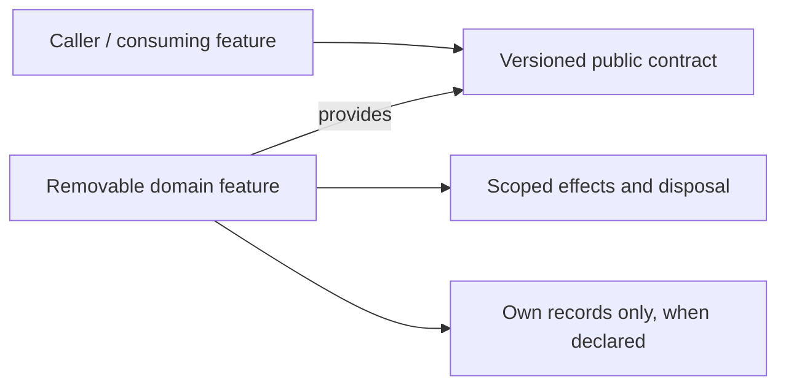

# Research

> **Package:** `app/services/research/`
> **Status:** `Partial` — documentary target; runtime acceptance is **NOT_REVALIDATED**.
> **Last updated:** `2026-09-06`
> **Domain ID:** `D-RES`

> This README is the domain target registry for boundaries, composable feature capabilities, requirements, ownership, workflows, acceptance, and removal. Update it before changing the affected implementation. It does not certify that a target package, contract, test, usage demonstration or provider is already implemented.

**Selected scope:** 15 features · 47 owned functional requirements · 15 feature-local non-functional requirements. All original feature and requirement IDs are retained. These selected workbench obligations do **not** delete unrelated existing domain behavior. This document must be merged with current evidence and any out-of-scope entries before replacing an existing domain registry.

**Sources:** [Unified Specification](../../../docs/dev/evidence/specification-drift.md) · [Feature–Requirement Traceability Register](../../../docs/dev/Feature_Requirement_Traceability_Register.md) · [Phased Feature Implementation Plan](../../../docs/dev/Phased_Feature_Implementation_Plan.md) · [README template](../../../docs/templates/README.md). Source fingerprints and Phase 0 bindings are recorded in §6 and §9. The feature cards below reproduce owned requirements and acceptance oracles; their scoped shared-NFR, catalogue, original-ID and operation-gate tables remain binding through the linked source card.

---

## Code-Aligned Implementation Convention

This domain README defines target behavior; `PROJECT.md` retains system scope, cross-domain policy, system NFRs and release gates, and `ARCHITECTURE.md` retains universal package/runtime constraints. Feature-local READMEs, manifests, contracts, migrations and evidence mirror rather than silently redefine this target. For focused work, load §1, the affected §4 card, applicable §5 and §9 rules, and §7. Follow the [Feature Implementation Pipeline](../../../docs/dev/feature_implementation_pipeline.md).

Implement one feature directly in its selected owner folder and discover it through the `haruquantai.features` Python entry-point group. Declare one immutable `SPEC = FeatureSpec(...)` in `manifest.py`; do not introduce a domain registry or YAML manifest. The feature contains pure `__init__.py`, a runtime-validated `README.md`, strict `config.py` with `.from_dict()`, lifecycle `feature.py`, focused logic modules and required `_usage.py`. Add `_persistence.py` only when the feature performs database operations. Effects and dependencies flow through `FeatureContext` and `FeatureScope`; durable state is declared by `FeatureSpec.state`. Existing compatible public contracts and owners are reused, not copied into a parallel implementation.

Each core logic module documents its public API. Every service feature has one required `_usage.py` containing its bounded offline `if __name__ == "__main__":` scenarios; production logic modules do not contain demonstrations. Optional `_persistence.py` owns all feature-local database operations when durable state is required. The paths below are documentary targets pending current-code reconciliation, not claims of executable files. Tests verify the scenarios independently.

FR and acceptance IDs are trace identities, not runtime registrations. Required-provider keys below reproduce the register’s required graph. Optional providers are operation-gated: they must be declared and tested without making an absent future extension a universal startup dependency. The plan’s P1–P16 execution phases are distinct from specification U0–U13 release milestones; a U label is not proof of readiness or a new feature task.

## 1. Purpose and Boundary

### Purpose

Own the scientific and economic validity of strategy research, not merely its successful computation. Tie protocols, campaigns, search, holdout use, all attempted outcomes and qualification to reproducible evidence.

### Owns

Campaign/family lineage; test protocols; sealed holdout governance; research execution; strategy generation/evolution/ranking; robustness stages; qualification; neural dataset preparation, labels, training, validation, explanations and inference.

### Does not own

A second tick engine, ungoverned parameter search, metric reimplementation, browser training, live allocation approval and Agentic self-qualification. A profitable result or successful training job is not research acceptance.

### Shared Contracts

**Owned by this domain.** Status is an evidence state. Contract modules are selected public boundaries; an unbound symbol/DTO must be reconciled before implementing its production consumer. Do not infer a callable signature from the English title.

| Evidence | Capability | Protocol / DTO / contract target | Major | Purpose |
| --- | --- | --- | --- | --- |
| DOCUMENTARY_BOUND | `research.campaigns@1` | Selected public operation/DTO surface; exact existing symbols are inventoried in the Phase 0 contract-binding projection.<br>[`app/contracts/research/campaigns.py`](../../contracts/research/campaigns.py) | 1 | Account for research campaigns and hypothesis families |
| DOCUMENTARY_BOUND | `research.protocols@1` | Selected public operation/DTO surface; exact existing symbols are inventoried in the Phase 0 contract-binding projection.<br>[`app/contracts/research/protocols.py`](../../contracts/research/protocols.py) | 1 | Preregister research samples and evaluation protocols |
| DOCUMENTARY_BOUND | `research.holdout@1` | Selected public operation/DTO surface; exact existing symbols are inventoried in the Phase 0 contract-binding projection.<br>[`app/contracts/research/holdout.py`](../../contracts/research/holdout.py) | 1 | Reserve scarce holdout access atomically |
| DOCUMENTARY_BOUND | `research.run-research@1` | Selected public operation/DTO surface; exact existing symbols are inventoried in the Phase 0 contract-binding projection.<br>[`app/contracts/research/run_research.py`](../../contracts/research/run_research.py) | 1 | Execute authorized research and retest campaigns |
| DOCUMENTARY_BOUND | `research.generate-strategies@1` | Selected public operation/DTO surface; exact existing symbols are inventoried in the Phase 0 contract-binding projection.<br>[`app/contracts/research/generate_strategies.py`](../../contracts/research/generate_strategies.py) | 1 | Construct random and seeded valid candidates |
| DOCUMENTARY_BOUND | `research.evolve-strategies@1` | Selected public operation/DTO surface; exact existing symbols are inventoried in the Phase 0 contract-binding projection.<br>[`app/contracts/research/evolve_strategies.py`](../../contracts/research/evolve_strategies.py) | 1 | Evolve bounded island populations |
| DOCUMENTARY_BOUND | `research.rank-candidates@1` | Selected public operation/DTO surface; exact existing symbols are inventoried in the Phase 0 contract-binding projection.<br>[`app/contracts/research/rank_candidates.py`](../../contracts/research/rank_candidates.py) | 1 | Apply hard eligibility and versioned fitness selection |
| DOCUMENTARY_BOUND | `research.test-robustness@1` | Selected public operation/DTO surface; exact existing symbols are inventoried in the Phase 0 contract-binding projection.<br>[`app/contracts/research/test_robustness.py`](../../contracts/research/test_robustness.py) | 1 | Define and run ordered robustness pipelines |
| DOCUMENTARY_BOUND | `research.accept-research@1` | Selected public operation/DTO surface; exact existing symbols are inventoried in the Phase 0 contract-binding projection.<br>[`app/contracts/research/qualification.py`](../../contracts/research/qualification.py) | 1 | Issue evidence-bound research qualification |
| DOCUMENTARY_BOUND | `research.neural-datasets@1` | Selected public operation/DTO surface; exact existing symbols are inventoried in the Phase 0 contract-binding projection.<br>[`app/contracts/research/neural_datasets.py`](../../contracts/research/neural_datasets.py) | 1 | Fit causal neural feature pipelines |
| DOCUMENTARY_BOUND | `research.neural-labels@1` | Selected public operation/DTO surface; exact existing symbols are inventoried in the Phase 0 contract-binding projection.<br>[`app/contracts/research/neural_labels.py`](../../contracts/research/neural_labels.py) | 1 | Construct directional and forward-return labels |
| DOCUMENTARY_BOUND | `research.train-models@1` | Selected public operation/DTO surface; exact existing symbols are inventoried in the Phase 0 contract-binding projection.<br>[`app/contracts/research/model_training.py`](../../contracts/research/model_training.py) | 1 | Train bounded causal model providers |
| DOCUMENTARY_BOUND | `research.model-validation@1` | Selected public operation/DTO surface; exact existing symbols are inventoried in the Phase 0 contract-binding projection.<br>[`app/contracts/research/model_validation.py`](../../contracts/research/model_validation.py) | 1 | Qualify models and publish model cards |
| DOCUMENTARY_BOUND | `research.explain-models@1` | Selected public operation/DTO surface; exact existing symbols are inventoried in the Phase 0 contract-binding projection.<br>[`app/contracts/research/model_explanations.py`](../../contracts/research/model_explanations.py) | 1 | Explain bounded model behavior without causal overclaims |
| DOCUMENTARY_BOUND | `research.model-inference@1` | Selected public operation/DTO surface; exact existing symbols are inventoried in the Phase 0 contract-binding projection.<br>[`app/contracts/research/model_inference.py`](../../contracts/research/model_inference.py) | 1 | Execute qualified lightweight model inference |

**Consumed from other domains — required providers.** Runtime resolution is through the exact key; the provider’s implementation folder is not an import target. Same-domain edges are listed in the owning feature card.

| Capability | Owner | Binding | Consuming feature | Used for |
| --- | --- | --- | --- | --- |
| `workspace.persistence@1` | Workspace | Required | [`FEAT-RES-GOVERN_CAMPAIGNS`](#feat-res-govern-campaigns) | Execute bounded feature-owned transactions |
| `workspace.manage-accounts@1` | Workspace | Required | [`FEAT-RES-GOVERN_CAMPAIGNS`](#feat-res-govern-campaigns) | Verify accounts, principals and sessions |
| `data.bind-run-data@1` | Data | Required | [`FEAT-RES-DEFINE_PROTOCOLS`](#feat-res-define-protocols) | Bind exact eligible inputs to a run |
| `workspace.persistence@1` | Workspace | Required | [`FEAT-RES-GOVERN_HOLDOUTS`](#feat-res-govern-holdouts) | Execute bounded feature-owned transactions |
| `orchestration.manage-jobs@1` | Orchestration | Required | [`FEAT-RES-RUN_RESEARCH`](#feat-res-run-research) | Persist and control shared jobs and attempts |
| `simulator.execute-ticks@1` | Simulator | Required | [`FEAT-RES-RUN_RESEARCH`](#feat-res-run-research) | Execute the native chronological backtest |
| `simulator.commit-results@1` | Simulator | Required | [`FEAT-RES-RUN_RESEARCH`](#feat-res-run-research) | Publish complete simulation result evidence |
| `analytics.compute-metrics@1` | Analytics | Required | [`FEAT-RES-RUN_RESEARCH`](#feat-res-run-research) | Compute versioned canonical performance and risk metrics |
| `strategy.define-search-spaces@1` | Strategy | Required | [`FEAT-RES-GENERATE_STRATEGIES`](#feat-res-generate-strategies) | Define legal strategy construction spaces |
| `strategy.compile-strategies@1` | Strategy | Required | [`FEAT-RES-GENERATE_STRATEGIES`](#feat-res-generate-strategies) | Compile HSL to reusable target-neutral execution plans |
| `analytics.compute-metrics@1` | Analytics | Required | [`FEAT-RES-RANK_CANDIDATES`](#feat-res-rank-candidates) | Compute versioned canonical performance and risk metrics |
| `analytics.analyze-distributions@1` | Analytics | Required | [`FEAT-RES-TEST_ROBUSTNESS`](#feat-res-test-robustness) | Calculate statistical and ledger-based robustness evidence |
| `simulator.perturb-inputs@1` | Simulator | Required | [`FEAT-RES-TEST_ROBUSTNESS`](#feat-res-test-robustness) | Evaluate explicitly modeled execution perturbations |
| `analytics.compute-metrics@1` | Analytics | Required | [`FEAT-RES-QUALIFY_RESEARCH`](#feat-res-qualify-research) | Compute versioned canonical performance and risk metrics |
| `data.bind-run-data@1` | Data | Required | [`FEAT-RES-PREPARE_NEURAL_DATASETS`](#feat-res-prepare-neural-datasets) | Bind exact eligible inputs to a run |
| `data.align-series@1` | Data | Required | [`FEAT-RES-PREPARE_NEURAL_DATASETS`](#feat-res-prepare-neural-datasets) | Align external series without look-ahead |
| `indicators.transform-series@1` | Indicators | Required | [`FEAT-RES-PREPARE_NEURAL_DATASETS`](#feat-res-prepare-neural-datasets) | Calculate typed rolling and fitted series transforms |
| `data.bind-run-data@1` | Data | Required | [`FEAT-RES-LABEL_NEURAL_DATA`](#feat-res-label-neural-data) | Bind exact eligible inputs to a run |
| `indicators.calculate-volatility@1` | Indicators | Required | [`FEAT-RES-LABEL_NEURAL_DATA`](#feat-res-label-neural-data) | Calculate causal volatility and channel series |
| `orchestration.local-workers@1` | Orchestration | Required | [`FEAT-RES-TRAIN_MODELS`](#feat-res-train-models) | Execute isolated spawn-safe local work units |
| `analytics.compute-metrics@1` | Analytics | Required | [`FEAT-RES-VALIDATE_MODELS`](#feat-res-validate-models) | Compute versioned canonical performance and risk metrics |
| `orchestration.manage-jobs@1` | Orchestration | Required | [`FEAT-RES-EXPLAIN_MODELS`](#feat-res-explain-models) | Persist and control shared jobs and attempts |
| `workspace.artifacts@1` | Workspace | Required | [`FEAT-RES-INFER_MODELS`](#feat-res-infer-models) | Publish and retain immutable artifact bytes |

**Operation-gated providers.** For each §4 feature, its linked source card’s complete “Operation-gated providers” table defines applicability, exact provider identity and absence behavior. This is scoped incorporation, not permission to treat all 233 register-wide operation edges as optional for every feature. Resolve those provider IDs to their primary capability keys in the corresponding domain README; bind actual operations in the acceptance record. An omitted local duplicate table does not waive a source dependency.

### Persisted State Ownership

Immutable protocols/campaign identities; atomic holdout reservations and receipts; complete trial lineage/outcomes; qualification records; pinned datasets/fit artifacts/model cards, model weights and validation/explanation artifacts.

| Evidence | Owning feature | Partition / ownership class | Driver binding | Retention / read boundary |
| --- | --- | --- | --- | --- |
| PHASE0_BOUND | [`FEAT-RES-GOVERN_CAMPAIGNS`](#feat-res-govern-campaigns) | Feature-owned semantic state | Existing declared driver; no new database selected. | Retain committed evidence across deactivate/reactivate; purge only through explicit authorization, dependency/reference checks and recorded disposition. |
| PHASE0_BOUND | [`FEAT-RES-DEFINE_PROTOCOLS`](#feat-res-define-protocols) | Feature-owned semantic state | Existing declared driver; no new database selected. | Retain committed evidence across deactivate/reactivate; purge only through explicit authorization, dependency/reference checks and recorded disposition. |
| PHASE0_BOUND | [`FEAT-RES-GOVERN_HOLDOUTS`](#feat-res-govern-holdouts) | Feature-owned semantic state | Existing declared driver; no new database selected. | Retain committed evidence across deactivate/reactivate; purge only through explicit authorization, dependency/reference checks and recorded disposition. |
| PHASE0_BOUND | [`FEAT-RES-RUN_RESEARCH`](#feat-res-run-research) | Feature-owned semantic state | Existing declared driver; no new database selected. | Retain committed evidence across deactivate/reactivate; purge only through explicit authorization, dependency/reference checks and recorded disposition. |
| PHASE0_BOUND | [`FEAT-RES-GENERATE_STRATEGIES`](#feat-res-generate-strategies) | Feature-owned semantic state | Existing declared driver; no new database selected. | Retain committed evidence across deactivate/reactivate; purge only through explicit authorization, dependency/reference checks and recorded disposition. |
| PHASE0_BOUND | [`FEAT-RES-EVOLVE_STRATEGIES`](#feat-res-evolve-strategies) | Feature-owned semantic state | Existing declared driver; no new database selected. | Retain committed evidence across deactivate/reactivate; purge only through explicit authorization, dependency/reference checks and recorded disposition. |
| PHASE0_BOUND | [`FEAT-RES-RANK_CANDIDATES`](#feat-res-rank-candidates) | Feature-owned semantic state | Existing declared driver; no new database selected. | Retain committed evidence across deactivate/reactivate; purge only through explicit authorization, dependency/reference checks and recorded disposition. |
| PHASE0_BOUND | [`FEAT-RES-TEST_ROBUSTNESS`](#feat-res-test-robustness) | Feature-owned semantic state | Existing declared driver; no new database selected. | Retain committed evidence across deactivate/reactivate; purge only through explicit authorization, dependency/reference checks and recorded disposition. |
| PHASE0_BOUND | [`FEAT-RES-QUALIFY_RESEARCH`](#feat-res-qualify-research) | Feature-owned semantic state | Existing declared driver; no new database selected. | Retain committed evidence across deactivate/reactivate; purge only through explicit authorization, dependency/reference checks and recorded disposition. |
| PHASE0_BOUND | [`FEAT-RES-PREPARE_NEURAL_DATASETS`](#feat-res-prepare-neural-datasets) | Feature-owned semantic state | Existing declared driver; no new database selected. | Retain committed evidence across deactivate/reactivate; purge only through explicit authorization, dependency/reference checks and recorded disposition. |
| PHASE0_BOUND | [`FEAT-RES-LABEL_NEURAL_DATA`](#feat-res-label-neural-data) | Feature-owned semantic state | Existing declared driver; no new database selected. | Retain committed evidence across deactivate/reactivate; purge only through explicit authorization, dependency/reference checks and recorded disposition. |
| PHASE0_BOUND | [`FEAT-RES-TRAIN_MODELS`](#feat-res-train-models) | Feature-owned semantic state | Existing declared driver; no new database selected. | Retain committed evidence across deactivate/reactivate; purge only through explicit authorization, dependency/reference checks and recorded disposition. |
| PHASE0_BOUND | [`FEAT-RES-VALIDATE_MODELS`](#feat-res-validate-models) | Feature-owned semantic state | Existing declared driver; no new database selected. | Retain committed evidence across deactivate/reactivate; purge only through explicit authorization, dependency/reference checks and recorded disposition. |
| PHASE0_BOUND | [`FEAT-RES-EXPLAIN_MODELS`](#feat-res-explain-models) | Feature-owned semantic state | Existing declared driver; no new database selected. | Retain committed evidence across deactivate/reactivate; purge only through explicit authorization, dependency/reference checks and recorded disposition. |
| PHASE0_BOUND | [`FEAT-RES-INFER_MODELS`](#feat-res-infer-models) | Feature-owned semantic state | Existing declared driver; no new database selected. | Retain committed evidence across deactivate/reactivate; purge only through explicit authorization, dependency/reference checks and recorded disposition. |

A feature’s exact durable namespace, schema version and migrations are taken from its reconciled manifest and contract, not guessed from its folder name. External consumers access semantic state only through the owner capability. Workspace persistence/artifact custody never acquires that semantic ownership.

### Four-Level Structural Hierarchy

| Code level | Represents | Domain example |
| --- | --- | --- |
| Package | Domain boundary | `app/services/research/` |
| Module folder | Composable feature owner | `app/services/research/govern_campaigns/` — [`FEAT-RES-GOVERN_CAMPAIGNS`](#feat-res-govern-campaigns) |
| File | Manifest, strict configuration, lifecycle or focused use case | `manifest.py`, `config.py`, `feature.py`, focused logic module |
| Class / function / method | One or more traced requirement behaviors | `FR-TRC-RES-GOVERN_CAMPAIGNS-001` and its acceptance oracle |

### Domain Capability Map

The table in §2 is the complete domain capability map. Edges below illustrate dependency direction, not a new orchestrator or private import relationship.


```mermaid
flowchart LR
    Caller["Caller / consuming feature"] --> Contract["Versioned public contract"]
    Provider["Removable domain feature"] -->|provides| Contract
    Provider --> Scope["Scoped effects and disposal"]
    Provider --> State["Own records only, when declared"]
```

## 2. Final Package Structure and Feature Independence

Feature owners are independent and physically removable. The selected package is a target binding: reconcile known current aliases and preserve compatible existing identities before creating a folder. Folder absence does not prove behavior absence. Removing a feature withdraws its contributions; it does not delete another feature’s source or retained evidence.

| Feature | Delivered value | Selected owner package | First U gate | FRs | Local NFRs | Evidence |
| --- | --- | --- | --- | --- | --- | --- |
| [`FEAT-RES-GOVERN_CAMPAIGNS`](#feat-res-govern-campaigns) | Account for research campaigns and hypothesis families | `app/services/research/govern_campaigns/` | U3 | 3 | 1 | NOT_REVALIDATED |
| [`FEAT-RES-DEFINE_PROTOCOLS`](#feat-res-define-protocols) | Preregister research samples and evaluation protocols | `app/services/research/define_protocols/` | U3 | 3 | 1 | NOT_REVALIDATED |
| [`FEAT-RES-GOVERN_HOLDOUTS`](#feat-res-govern-holdouts) | Reserve scarce holdout access atomically | `app/services/research/govern_holdouts/` | U3 | 3 | 1 | NOT_REVALIDATED |
| [`FEAT-RES-RUN_RESEARCH`](#feat-res-run-research) | Execute authorized research and retest campaigns | `app/services/research/run_research/` | U3 | 4 | 1 | NOT_REVALIDATED |
| [`FEAT-RES-GENERATE_STRATEGIES`](#feat-res-generate-strategies) | Construct random and seeded valid candidates | `app/services/research/generate_strategies/` | U5 | 3 | 1 | NOT_REVALIDATED |
| [`FEAT-RES-EVOLVE_STRATEGIES`](#feat-res-evolve-strategies) | Evolve bounded island populations | `app/services/research/evolve_strategies/` | U5 | 5 | 1 | NOT_REVALIDATED |
| [`FEAT-RES-RANK_CANDIDATES`](#feat-res-rank-candidates) | Apply hard eligibility and versioned fitness selection | `app/services/research/rank_candidates/` | U5 | 3 | 1 | NOT_REVALIDATED |
| [`FEAT-RES-TEST_ROBUSTNESS`](#feat-res-test-robustness) | Define and run ordered robustness pipelines | `app/services/research/test_robustness/` | U4 | 3 | 1 | NOT_REVALIDATED |
| [`FEAT-RES-QUALIFY_RESEARCH`](#feat-res-qualify-research) | Issue evidence-bound research qualification | `app/services/research/qualify_research/` | U4 | 3 | 1 | NOT_REVALIDATED |
| [`FEAT-RES-PREPARE_NEURAL_DATASETS`](#feat-res-prepare-neural-datasets) | Fit causal neural feature pipelines | `app/services/research/prepare_neural_datasets/` | U11 | 3 | 1 | NOT_REVALIDATED |
| [`FEAT-RES-LABEL_NEURAL_DATA`](#feat-res-label-neural-data) | Construct directional and forward-return labels | `app/services/research/label_neural_data/` | U11 | 3 | 1 | NOT_REVALIDATED |
| [`FEAT-RES-TRAIN_MODELS`](#feat-res-train-models) | Train bounded causal model providers | `app/services/research/train_models/` | U11 | 3 | 1 | NOT_REVALIDATED |
| [`FEAT-RES-VALIDATE_MODELS`](#feat-res-validate-models) | Qualify models and publish model cards | `app/services/research/validate_models/` | U11 | 3 | 1 | NOT_REVALIDATED |
| [`FEAT-RES-EXPLAIN_MODELS`](#feat-res-explain-models) | Explain bounded model behavior without causal overclaims | `app/services/research/explain_models/` | U11 | 2 | 1 | NOT_REVALIDATED |
| [`FEAT-RES-INFER_MODELS`](#feat-res-infer-models) | Execute qualified lightweight model inference | `app/services/research/infer_models/` | U11 | 3 | 1 | NOT_REVALIDATED |

```text
app/services/research/
├── README.md  # this domain target registry
├── __init__.py  # docstring only
├── govern_campaigns/  # FEAT-RES-GOVERN_CAMPAIGNS
├── define_protocols/  # FEAT-RES-DEFINE_PROTOCOLS
├── govern_holdouts/  # FEAT-RES-GOVERN_HOLDOUTS
├── run_research/  # FEAT-RES-RUN_RESEARCH
├── generate_strategies/  # FEAT-RES-GENERATE_STRATEGIES
├── evolve_strategies/  # FEAT-RES-EVOLVE_STRATEGIES
├── rank_candidates/  # FEAT-RES-RANK_CANDIDATES
├── test_robustness/  # FEAT-RES-TEST_ROBUSTNESS
├── qualify_research/  # FEAT-RES-QUALIFY_RESEARCH
├── prepare_neural_datasets/  # FEAT-RES-PREPARE_NEURAL_DATASETS
├── label_neural_data/  # FEAT-RES-LABEL_NEURAL_DATA
├── train_models/  # FEAT-RES-TRAIN_MODELS
├── validate_models/  # FEAT-RES-VALIDATE_MODELS
├── explain_models/  # FEAT-RES-EXPLAIN_MODELS
└── infer_models/  # FEAT-RES-INFER_MODELS
```

Every feature folder contains `README.md`, docstring-only `__init__.py`, `manifest.py`, `config.py`, `feature.py` and its focused logic modules. Shared contract definitions live outside those removable packages. The primary logic-module designation in §4 is a target for usage ownership; adapt a compatible existing module rather than duplicate its service.

### Feature Capability Dependency Direction

A required edge means “consumer requires the provider’s public capability.” It never means “import the provider package.” Optional operation closure is resolved by the composition/runtime boundary and rechecked at invocation. Physical removal must cause the declared unavailable or blocked state while unrelated capabilities remain usable.

## 3. Workflows

Workflows connect existing features; they do not create additional feature owners. “Internal” means all participating behavior is domain-local. “Cross-Domain” means collaboration through public contracts. Participant lists below are **not** a substitute for the plan’s execution schedule or the workflow’s validated operation graph.

### Domain-local reading sequence — Govern and qualify an experiment

**Input boundary:** Falsifiable question, campaign/family identity, immutable data/sample policy and finite budget.

**Output boundary:** A qualified/rejected/inconclusive research record with complete trial and holdout evidence.

**Capabilities to inspect:** [`FEAT-RES-GOVERN_CAMPAIGNS`](#feat-res-govern-campaigns) → [`FEAT-RES-DEFINE_PROTOCOLS`](#feat-res-define-protocols) → [`FEAT-RES-GOVERN_HOLDOUTS`](#feat-res-govern-holdouts) → [`FEAT-RES-RUN_RESEARCH`](#feat-res-run-research) → [`FEAT-RES-QUALIFY_RESEARCH`](#feat-res-qualify-research).

This is a domain-oriented explanation, not an additional canonical `WF-*` identity. Apply every FR of the participating operation, not only its first validation step. Validate scope and immutable references, resolve admitted providers, perform owner work, verify the owner receipt, and then expose the result. Invalid input, provider absence, stale revision and cancellation retain separate typed outcomes.

| Evidence | Workflow | Scope | Lead | First U gate | Acceptance |
| --- | --- | --- | --- | --- | --- |
| PENDING | [`WF-WB-GENERATE_QUALIFY`](#wf-wb-generate-qualify) | Cross-Domain | [`FEAT-RES-RUN_RESEARCH`](#feat-res-run-research) | U5 | `ATW-WB-GENERATE_QUALIFY` |
| PENDING | [`WF-WB-RETEST`](#wf-wb-retest) | Cross-Domain | [`FEAT-RES-TEST_ROBUSTNESS`](#feat-res-test-robustness) | U4 | `ATW-WB-RETEST` |
| PENDING | [`WF-WB-OPTIMIZE_PROMOTE`](#wf-wb-optimize-promote) | Cross-Domain | [`FEAT-OPT-SEARCH_PARAMETERS`](../optimization/README.md#feat-opt-search-parameters) | U6 | `ATW-WB-OPTIMIZE_PROMOTE` |
| PENDING | [`WF-WB-PROJECT`](#wf-wb-project) | Cross-Domain | [`FEAT-ORCH-RUN_PROJECTS`](../orchestration/README.md#feat-orch-run-projects) | U8 | `ATW-WB-PROJECT` |
| PENDING | [`WF-WB-IDEA_TO_STRATEGY`](#wf-wb-idea-to-strategy) | Cross-Domain | [`FEAT-AGT-COMPOSE_STRATEGY_SPECS`](../agentic/README.md#feat-agt-compose-strategy-specs) | U3 | `ATW-WB-IDEA_TO_STRATEGY` |
| PENDING | [`WF-AGT-DESIGN_RESEARCH`](#wf-agt-design-research) | Cross-Domain | [`FEAT-AGT-DESIGN_RESEARCH`](../agentic/README.md#feat-agt-design-research) | U3 | `ATW-AGT-DESIGN_RESEARCH` |
| PENDING | [`WF-AGT-GOVERNED_SEARCH`](#wf-agt-governed-search) | Cross-Domain | [`FEAT-AGT-GOVERN_RESEARCH_SEARCH`](../agentic/README.md#feat-agt-govern-research-search) | U6 | `ATW-AGT-GOVERNED_SEARCH` |

<a id="wf-wb-generate-qualify"></a>
### `WF-WB-GENERATE_QUALIFY` — Generate and qualify strategies

**Lead owner:** [`FEAT-RES-RUN_RESEARCH`](#feat-res-run-research). **Release gate:** U5. **State:** PENDING.

**Participants:** [`FEAT-RES-RUN_RESEARCH`](#feat-res-run-research), [`FEAT-UI-01`](../../ui/README.md#feat-ui-01), [`FEAT-DATA-BIND_RUN_DATA`](../data/README.md#feat-data-bind-run-data), [`FEAT-STRAT-DEFINE_SEARCH_SPACES`](../strategy/README.md#feat-strat-define-search-spaces), [`FEAT-RES-GENERATE_STRATEGIES`](#feat-res-generate-strategies), [`FEAT-RES-EVOLVE_STRATEGIES`](#feat-res-evolve-strategies), [`FEAT-SIM-EXECUTE_TICKS`](../simulator/README.md#feat-sim-execute-ticks), [`FEAT-ANA-COMPUTE_METRICS`](../analytics/README.md#feat-ana-compute-metrics), [`FEAT-RES-TEST_ROBUSTNESS`](#feat-res-test-robustness), [`FEAT-RES-QUALIFY_RESEARCH`](#feat-res-qualify-research), [`FEAT-ANA-DATABANK_MEMBERSHIP`](../analytics/README.md#feat-ana-databank-membership), [`FEAT-UI-32`](../../ui/README.md#feat-ui-32).

**This domain contributes:** [`FEAT-RES-RUN_RESEARCH`](#feat-res-run-research), [`FEAT-RES-GENERATE_STRATEGIES`](#feat-res-generate-strategies), [`FEAT-RES-EVOLVE_STRATEGIES`](#feat-res-evolve-strategies), [`FEAT-RES-TEST_ROBUSTNESS`](#feat-res-test-robustness), [`FEAT-RES-QUALIFY_RESEARCH`](#feat-res-qualify-research). Every participating feature’s scoped FR/local-NFR obligations remain binding.

**Input/output and acceptance contract:** `ATW-WB-GENERATE_QUALIFY` — Pinned source/space/seed; one accepted research run; each candidate has actual simulation, filters and stage history; only qualified committed result references enter the destination databank.

**Failure boundary:** required evidence or provider absence yields the declared refusal/unavailable/partial result; it never implies a pass, silently substitutes a provider or grants live authority. [Canonical workflow definition](../../../docs/dev/Feature_Requirement_Traceability_Register.md#wf-wb-generate-qualify).

<a id="wf-wb-retest"></a>
### `WF-WB-RETEST` — Retest robustness

**Lead owner:** [`FEAT-RES-TEST_ROBUSTNESS`](#feat-res-test-robustness). **Release gate:** U4. **State:** PENDING.

**Participants:** [`FEAT-RES-TEST_ROBUSTNESS`](#feat-res-test-robustness), [`FEAT-RES-RUN_RESEARCH`](#feat-res-run-research), [`FEAT-SIM-PERTURB_INPUTS`](../simulator/README.md#feat-sim-perturb-inputs), [`FEAT-SIM-CONFIGURE_ENGINE`](../simulator/README.md#feat-sim-configure-engine), [`FEAT-SIM-EXECUTE_TICKS`](../simulator/README.md#feat-sim-execute-ticks), [`FEAT-ANA-COMPARE_RESULTS`](../analytics/README.md#feat-ana-compare-results), [`FEAT-ANA-DATABANK_MEMBERSHIP`](../analytics/README.md#feat-ana-databank-membership), [`FEAT-UI-STRATEGY_RETESTER`](../../ui/README.md#feat-ui-strategy-retester).

**This domain contributes:** [`FEAT-RES-TEST_ROBUSTNESS`](#feat-res-test-robustness), [`FEAT-RES-RUN_RESEARCH`](#feat-res-run-research). Every participating feature’s scoped FR/local-NFR obligations remain binding.

**Input/output and acceptance contract:** `ATW-WB-RETEST` — Resolve immutable strategies and baseline; retain source hashes; ordered explicit scenarios, paired metric deltas and typed cancellation; atomic membership has complete passed/failed reasons.

**Failure boundary:** required evidence or provider absence yields the declared refusal/unavailable/partial result; it never implies a pass, silently substitutes a provider or grants live authority. [Canonical workflow definition](../../../docs/dev/Feature_Requirement_Traceability_Register.md#wf-wb-retest).

<a id="wf-wb-optimize-promote"></a>
### `WF-WB-OPTIMIZE_PROMOTE` — Optimize and explicitly promote

**Lead owner:** [`FEAT-OPT-SEARCH_PARAMETERS`](../optimization/README.md#feat-opt-search-parameters). **Release gate:** U6. **State:** PENDING.

**Participants:** [`FEAT-OPT-SEARCH_PARAMETERS`](../optimization/README.md#feat-opt-search-parameters), [`FEAT-OPT-VALIDATE_WALK_FORWARD`](../optimization/README.md#feat-opt-validate-walk-forward), [`FEAT-OPT-PERMUTE_PARAMETERS`](../optimization/README.md#feat-opt-permute-parameters), [`FEAT-RES-GOVERN_HOLDOUTS`](#feat-res-govern-holdouts), [`FEAT-RES-QUALIFY_RESEARCH`](#feat-res-qualify-research), [`FEAT-SIM-EXECUTE_TICKS`](../simulator/README.md#feat-sim-execute-ticks), [`FEAT-ANA-QUERY_RESULTS`](../analytics/README.md#feat-ana-query-results), [`FEAT-STRAT-VERSION_STRATEGIES`](../strategy/README.md#feat-strat-version-strategies), [`FEAT-UI-PARAMETER_OPTIMIZER`](../../ui/README.md#feat-ui-parameter-optimizer).

**This domain contributes:** [`FEAT-RES-GOVERN_HOLDOUTS`](#feat-res-govern-holdouts), [`FEAT-RES-QUALIFY_RESEARCH`](#feat-res-qualify-research). Every participating feature’s scoped FR/local-NFR obligations remain binding.

**Input/output and acceptance contract:** `ATW-WB-OPTIMIZE_PROMOTE` — Finite legal parameter lattice/folds and all trial outcomes; untouched holdout protected; promotion creates a new revision only after exact review; base remains unchanged.

**Failure boundary:** required evidence or provider absence yields the declared refusal/unavailable/partial result; it never implies a pass, silently substitutes a provider or grants live authority. [Canonical workflow definition](../../../docs/dev/Feature_Requirement_Traceability_Register.md#wf-wb-optimize-promote).

<a id="wf-wb-project"></a>
### `WF-WB-PROJECT` — Automate a research project

**Lead owner:** [`FEAT-ORCH-RUN_PROJECTS`](../orchestration/README.md#feat-orch-run-projects). **Release gate:** U8. **State:** PENDING.

**Participants:** [`FEAT-ORCH-RUN_PROJECTS`](../orchestration/README.md#feat-orch-run-projects), [`FEAT-ORCH-DEFINE_PROJECTS`](../orchestration/README.md#feat-orch-define-projects), [`FEAT-ORCH-MANAGE_JOBS`](../orchestration/README.md#feat-orch-manage-jobs), [`FEAT-ORCH-EXECUTE_UTILITIES`](../orchestration/README.md#feat-orch-execute-utilities), [`FEAT-ORCH-DELIVER_NOTIFICATIONS`](../orchestration/README.md#feat-orch-deliver-notifications), [`FEAT-RES-RUN_RESEARCH`](#feat-res-run-research), [`FEAT-OPT-SEARCH_PARAMETERS`](../optimization/README.md#feat-opt-search-parameters), [`FEAT-POR-SIMULATE_PORTFOLIOS`](../portfolio/README.md#feat-por-simulate-portfolios), [`FEAT-UI-PROJECT_EDITOR`](../../ui/README.md#feat-ui-project-editor).

**This domain contributes:** [`FEAT-RES-RUN_RESEARCH`](#feat-res-run-research). Every participating feature’s scoped FR/local-NFR obligations remain binding.

**Input/output and acceptance contract:** `ATW-WB-PROJECT` — Validate bounded typed graph; whole/from-here/only preview; crash after child commit reconciles one receipt; retries append attempts and lineage navigates both directions.

**Failure boundary:** required evidence or provider absence yields the declared refusal/unavailable/partial result; it never implies a pass, silently substitutes a provider or grants live authority. [Canonical workflow definition](../../../docs/dev/Feature_Requirement_Traceability_Register.md#wf-wb-project).

<a id="wf-wb-idea-to-strategy"></a>
### `WF-WB-IDEA_TO_STRATEGY` — Research idea to reviewed strategy

**Lead owner:** [`FEAT-AGT-COMPOSE_STRATEGY_SPECS`](../agentic/README.md#feat-agt-compose-strategy-specs). **Release gate:** U3. **State:** PENDING.

**Participants:** [`FEAT-AGT-COMPOSE_STRATEGY_SPECS`](../agentic/README.md#feat-agt-compose-strategy-specs), [`FEAT-AGT-ASSIST_OPERATOR`](../agentic/README.md#feat-agt-assist-operator), [`FEAT-AGT-DESIGN_RESEARCH`](../agentic/README.md#feat-agt-design-research), [`FEAT-RES-GOVERN_CAMPAIGNS`](#feat-res-govern-campaigns), [`FEAT-RES-DEFINE_PROTOCOLS`](#feat-res-define-protocols), [`FEAT-STRAT-DEFINE_AST`](../strategy/README.md#feat-strat-define-ast), [`FEAT-STRAT-CATALOG_BLOCKS`](../strategy/README.md#feat-strat-catalog-blocks), [`FEAT-STRAT-VERSION_STRATEGIES`](../strategy/README.md#feat-strat-version-strategies), [`FEAT-IFACE-AGENTIC_GATEWAY`](../interfaces/README.md#feat-iface-agentic-gateway), [`FEAT-UI-CHAT_BOT`](../../ui/README.md#feat-ui-chat-bot), [`FEAT-UI-STRATEGY_STUDIO`](../../ui/README.md#feat-ui-strategy-studio), [`FEAT-SIM-EXECUTE_TICKS`](../simulator/README.md#feat-sim-execute-ticks).

**This domain contributes:** [`FEAT-RES-GOVERN_CAMPAIGNS`](#feat-res-govern-campaigns), [`FEAT-RES-DEFINE_PROTOCOLS`](#feat-res-define-protocols). Every participating feature’s scoped FR/local-NFR obligations remain binding.

**Input/output and acceptance contract:** `ATW-WB-IDEA_TO_STRATEGY` — Draft with explicit unvalidated assumptions; validate, bounded repair, exact patch closure review and CAS acceptance; separately authorize a bounded tick backtest; no save/holdout/live authority implied by prose.

**Failure boundary:** required evidence or provider absence yields the declared refusal/unavailable/partial result; it never implies a pass, silently substitutes a provider or grants live authority. [Canonical workflow definition](../../../docs/dev/Feature_Requirement_Traceability_Register.md#wf-wb-idea-to-strategy).

<a id="wf-agt-design-research"></a>
### `WF-AGT-DESIGN_RESEARCH` — Hypothesis to Receiver Request

**Lead owner:** [`FEAT-AGT-DESIGN_RESEARCH`](../agentic/README.md#feat-agt-design-research). **Release gate:** U3. **State:** PENDING.

**Participants:** [`FEAT-AGT-DESIGN_RESEARCH`](../agentic/README.md#feat-agt-design-research), [`FEAT-RES-GOVERN_CAMPAIGNS`](#feat-res-govern-campaigns), [`FEAT-RES-DEFINE_PROTOCOLS`](#feat-res-define-protocols), [`FEAT-AGT-GOVERN_RESEARCH_SEARCH`](../agentic/README.md#feat-agt-govern-research-search), [`FEAT-AGT-SYNTHESIZE_RESEARCH`](../agentic/README.md#feat-agt-synthesize-research), [`FEAT-AGT-GOVERN_TOOL_CALLS`](../agentic/README.md#feat-agt-govern-tool-calls).

**This domain contributes:** [`FEAT-RES-GOVERN_CAMPAIGNS`](#feat-res-govern-campaigns), [`FEAT-RES-DEFINE_PROTOCOLS`](#feat-res-define-protocols). Every participating feature’s scoped FR/local-NFR obligations remain binding.

**Input/output and acceptance contract:** `ATW-AGT-DESIGN_RESEARCH` — Falsifiable hypothesis, explicit sample/cost/seed/baseline, strict owner schema and separate execution authority.

**Failure boundary:** required evidence or provider absence yields the declared refusal/unavailable/partial result; it never implies a pass, silently substitutes a provider or grants live authority. [Canonical workflow definition](../../../docs/dev/Feature_Requirement_Traceability_Register.md#wf-agt-design-research).

<a id="wf-agt-governed-search"></a>
### `WF-AGT-GOVERNED_SEARCH` — Bounded Optimization Design

**Lead owner:** [`FEAT-AGT-GOVERN_RESEARCH_SEARCH`](../agentic/README.md#feat-agt-govern-research-search). **Release gate:** U6. **State:** PENDING.

**Participants:** [`FEAT-AGT-GOVERN_RESEARCH_SEARCH`](../agentic/README.md#feat-agt-govern-research-search), [`FEAT-AGT-DESIGN_RESEARCH`](../agentic/README.md#feat-agt-design-research), [`FEAT-RES-GOVERN_CAMPAIGNS`](#feat-res-govern-campaigns), [`FEAT-RES-GOVERN_HOLDOUTS`](#feat-res-govern-holdouts), [`FEAT-OPT-SEARCH_PARAMETERS`](../optimization/README.md#feat-opt-search-parameters), [`FEAT-AGT-GOVERN_TOOL_CALLS`](../agentic/README.md#feat-agt-govern-tool-calls), [`FEAT-AGT-SYNTHESIZE_RESEARCH`](../agentic/README.md#feat-agt-synthesize-research).

**This domain contributes:** [`FEAT-RES-GOVERN_CAMPAIGNS`](#feat-res-govern-campaigns), [`FEAT-RES-GOVERN_HOLDOUTS`](#feat-res-govern-holdouts). Every participating feature’s scoped FR/local-NFR obligations remain binding.

**Input/output and acceptance contract:** `ATW-AGT-GOVERNED_SEARCH` — Same-family variants and receiver retries reconcile accepted attempts/actual costs; authoritative holdout receipt and all outcomes retained.

**Failure boundary:** required evidence or provider absence yields the declared refusal/unavailable/partial result; it never implies a pass, silently substitutes a provider or grants live authority. [Canonical workflow definition](../../../docs/dev/Feature_Requirement_Traceability_Register.md#wf-agt-governed-search).

## 4. Composable Feature Specifications

Each card is one permanent feature/task slot. Its owned FRs, local NFRs and expected acceptance outcomes are reproduced below. All acceptance states are PENDING / NOT_REVALIDATED. Contract targets and intended tests do not prove runtime support. `Binding pending` prohibits executor invention: resolve the exact compatible contract, configuration, state and fixture before production use. The plan’s one-feature task rule includes all registered variants; future-provider qualification is not permission to leave owned adapter behavior unimplemented.

<a id="feat-res-govern-campaigns"></a>
### 4.1 `govern_campaigns/` — `FEAT-RES-GOVERN_CAMPAIGNS`

> **Feature ID:** `FEAT-RES-GOVERN_CAMPAIGNS`
> **Domain:** `research`
> **Status:** `Partial` — target documented; full-scope implementation evidence **NOT_REVALIDATED**.
> **Selected owner:** `app/services/research/govern_campaigns/`
> **First release milestone:** `U3`; execution order remains in the [Phased Feature Implementation Plan](../../../docs/dev/Phased_Feature_Implementation_Plan.md).

#### Purpose

Account for research campaigns and hypothesis families. Deliver the bounded behaviors in the FR table through this feature’s declared public capability; retain the domain boundary in §1.

#### Capability Declarations

**Provides:** `research.campaigns@1`.

**Required capabilities:**

`workspace.persistence@1` — [`FEAT-WS-EXECUTE_PERSISTENCE`](../workspace/README.md#feat-ws-execute-persistence)<br>`workspace.manage-accounts@1` — [`FEAT-WS-MANAGE_ACCOUNTS`](../workspace/README.md#feat-ws-manage-accounts).

**Optional / operation-gated capabilities:** the complete scoped provider table in the [source feature card](../../../docs/dev/Feature_Requirement_Traceability_Register.md#feat-res-govern-campaigns) is normative. Declare each applicable key separately from required startup dependencies. Absence must affect only the operations requiring it, with the exact recorded denial/unavailable behavior.

**Public contract target:** [`app/contracts/research/campaigns.py`](../../contracts/research/campaigns.py). **Literal protocol/DTO/operation symbols:** the selected target, operation scope, request/result union and typed failure semantics in this card are frozen; exact existing symbols are inventoried in `docs/dev/evidence/contract-bindings.json`, and a planned contract retains this binding without claiming runtime certification.

**Input boundary:** validated typed operation data, current authenticated scope where applicable, and immutable owner references; numerical operations accept validated bounded buffers. **Output boundary:** the owned FRs and acceptance oracles below. Preserve typed invalid, denied, unavailable, stale/conflict, partial, cancelled and failed outcomes wherever the selected contract defines them; do not create a second generic error vocabulary.

#### Feature Configuration & Limits Manifest

| Binding state | Setting / limit source | Type / default | Required | Validation / ownership |
| --- | --- | --- | --- | --- |
| PHASE0_BOUND | Existing registered `FeatureSpec.config_keys`, or no feature configuration for a planned owner unless this card explicitly declares a key. | Exact selected types/defaults only; request and profile fields are not implicit feature configuration. | As declared by the owner card. | Unknown keys and invalid values fail closed; implementation records manifest/config/README parity before COMPLETE. |
| NORMATIVE | Operation parameters, immutable profile references and policy limits in the FRs below | Use the selected request/profile schema; no implicit coercion or default substitution. | All prerequisites of the selected operation. | Do not confuse a request parameter, historical profile value or user-visible setting with a new feature config key. |
| NORMATIVE | Resource, security, retention and version requirements in local/shared NFRs | Finite admitted values; stricter applicable owner policy wins. | Before the affected operation. | Pin effective values/revisions in evidence; never alter a historical run by editing current settings. |

**Feature-specific parameter/limit obligations:** `FR-TRC-RES-GOVERN_CAMPAIGNS-001`, `FR-TRC-RES-GOVERN_CAMPAIGNS-002`. Their full text and test oracles below are binding; this list is an index, not a reduced schema.

#### Runtime Effects & Scope Disposal

| Effect | Owner | Disposal mechanism |
| --- | --- | --- |
| Capability binding `research.campaigns@1` | FEAT-RES-GOVERN_CAMPAIGNS | Unregister when the reconciler closes the feature scope. |
| Tasks, listeners, requests, workers, leases or buffers actually created by this feature | FEAT-RES-GOVERN_CAMPAIGNS | Register exact disposers; cancel/await/release on failure or removal. A pure provider must not create unnecessary effects. |
| Accepted owner work and committed records | Their declared semantic owner | Observation cleanup does not secretly cancel accepted work or purge committed evidence; use explicit owner commands. |

Teardown is idempotent. Failed mount unwinds partial effects. Dependency replacement/removal must not leave stale registrations, jobs, subscriptions, source buffers or credential references usable by the removed scope.

#### Persistent State Ownership

**Ownership class:** Feature-owned semantic state.

**Records:** Only records/artifact references required by the functional requirements below; Immutable protocols/campaign identities; atomic holdout reservations and receipts; complete trial lineage/outcomes; qualification records; pinned datasets/fit artifacts/model cards, model weights and validation/explanation artifacts.

**Retention and deletion:** Retain committed evidence across deactivate/reactivate; purge only through explicit authorization, dependency/reference checks and recorded disposition.

**Namespace / schema / driver binding:** Literal namespace, existing schema version, migrations and driver binding must be reconciled with the current feature manifest. No table ownership is transferred to Workspace merely because it executes persistence. A missing literal binding is an explicit §6 precondition, not permission to choose a schema version or table name during execution.

#### Feature Package Structure & Files

| Target file within owner package | Responsibility | Exports / dependency boundary |
| --- | --- | --- |
| __init__.py | Pure package description | Docstring only. |
| README.md | Runtime-validated mirror of this feature scope | Document exact keys, paths and evidence. |
| manifest.py | Immutable identity, capabilities, config keys and optional state declaration | SPEC : FeatureSpec; metadata only. |
| config.py | Strict typed configuration with unknown-key validation | Compatible FeatureConfig.from_dict() binding; no invented accepted keys. |
| feature.py | Scoped mount adapter and zero-argument factory | create_feature(); mount through FeatureContext/FeatureScope. |
| govern_campaigns.py | Focused production domain-logic module | Compatible contract operation binding. |
| _persistence.py | Optional owner of all feature-local database operations when durable state is required | Declared storage operations through public Workspace persistence contracts; no raw connection, policy, authorization or orchestration. |
| _usage.py | Required bounded offline usage scenarios and executable __main__ harness | _run_usage_example(); scenarios map to every applicable FR without owning business logic. |

These are documentary ownership targets, not a claim that files or symbols already exist. Reconcile a compatible existing filename/symbol once in the feature’s path-binding receipt rather than creating duplicate logic. Public contract files remain outside the removable backend owner.

#### Functional Requirements (FR)

| Status | Requirement ID | Responsibility / required behavior | Acceptance ID | Expected result |
| --- | --- | --- | --- | --- |
| PENDING | `FR-TRC-RES-GOVERN_CAMPAIGNS-001` | Register immutable campaign purpose, hypothesis families, dataset families, search/compute budget and preregistration before generated variants run. | `AT-RES-GOVERN_CAMPAIGNS-001` | A generated candidate without a canonical owner receipt is refused; a new chat/model/name does not create a fresh budget. |
| PENDING | `FR-TRC-RES-GOVERN_CAMPAIGNS-002` | Classify exact/near duplicates from mechanism, scope/horizon/universe, lineage, HSL semantic fingerprint and parameter/feature changes under versioned deterministic policy. | `AT-RES-GOVERN_CAMPAIGNS-002` | Unproven independence conservatively shares the existing family; reclassification preserves already charged usage and exposure. |
| PENDING | `FR-TRC-RES-GOVERN_CAMPAIGNS-003` | Conserve accepted_attempts = active + completed + failed + cancelled + invalid + refused and retain pre-admission denials/repairs/retries separately. | `AT-RES-GOVERN_CAMPAIGNS-003` | At closure active is zero; negative/null outcomes remain completed evidence and actual retry cost is not erased. |

**Implementing-symbol and side-effect binding:** bind each requirement to the actual operation in the selected public contract and its focused implementation module before acceptance. For each FR, the acceptance receipt records actual symbol, side effects, typed error/exception branch, usage scenario and test location. Do not replace a specified typed failure with a guessed `ValueError`, or treat its absence from this summary as success.

#### Non-Functional Requirements (Local)

| Status | Requirement ID | Quality / removal constraint | Acceptance ID | Expected result |
| --- | --- | --- | --- | --- |
| PENDING | `NFR-TRC-RES-GOVERN_CAMPAIGNS-001` | Removing FEAT-RES-GOVERN_CAMPAIGNS withdraws only its declared contribution; no dependent operation may silently select a substitute provider. | `ATN-RES-GOVERN_CAMPAIGNS-001` | Disable and physically remove govern_campaigns; its operation is unavailable, unrelated capabilities remain usable, and retained source objects are unchanged. |

#### Applicable Shared NFRs, Catalogue and Source Bindings

[source feature card](../../../docs/dev/Feature_Requirement_Traceability_Register.md#feat-res-govern-campaigns): the exact “Applicable shared NFRs,” “Detailed catalogue families,” “Catalogue entries, algorithms and controls delivered,” “Source scope / Original source IDs,” and operation-gated provider sections are incorporated for **this feature only**. These sections remain normative; an acceptance manifest must enumerate the actual linked IDs/entries and evidence, not just cite this paragraph. No source algorithm, control, permission or release condition is weakened by this domain projection.

#### Acceptance Tests and Evidence

| Acceptance family | Intended test owner | Required evidence state |
| --- | --- | --- |
| Every AT ID in this card | `tests/services/research/govern_campaigns/test_traceability.py` | PENDING: bind an actual named test and assertion to each oracle. |
| Every ATN ID in this card | `tests/services/research/govern_campaigns/test_lifecycle.py` | PENDING: lifecycle/resource/numerical evidence as applicable. |
| Contract → provider → composition → Interfaces → UI → end-to-end | `docs/dev/SQX/evidence/features/FEAT-RES-GOVERN_CAMPAIGNS/acceptance.json` | All six stages NOT_REVALIDATED; justify each genuinely inapplicable stage. |

Intended test paths may be mapped to a compatible current test owner; they are not assertions of existing files. Full oracle coverage, shared requirements, catalogue entries, original source mappings and actual-provider operation qualification must be included in the final acceptance record. A contract fixture cannot certify actual provider integration.

#### Feature Usage Examples

**Required `_usage.py` command - planned, not executed:**

```powershell
uv run --frozen python -m app.services.research.govern_campaigns._usage
```

`_usage.py` uses bounded deterministic offline inputs and composes production behavior through public contracts or this feature's focused modules. It demonstrates a useful accepted operation, the appropriate invalid/unavailable/refusal case, and exact cleanup without owning business logic. Map each FR above to a named scenario; the expected observations are its acceptance oracles, not invented console output. Do not import sibling implementations, require live credentials/network by default, or put the public example under tests. Before marking it runnable, bind concrete fixture values and record its actual command, output and exit code.

#### Removal Behaviour

Disable and physically remove the actual reconciled owner of `FEAT-RES-GOVERN_CAMPAIGNS`. Withdraw `research.campaigns@1` and all its scoped contributions. Required dependents become BLOCKED/unavailable through their declared contract; operation-gated consumers disable only affected operations. Retain committed source objects and evidence; no cross-provider substitute or implicit purge is permitted. Exercise the local ATN oracles and §7 gates before restoring the feature.

---

<a id="feat-res-define-protocols"></a>
### 4.2 `define_protocols/` — `FEAT-RES-DEFINE_PROTOCOLS`

> **Feature ID:** `FEAT-RES-DEFINE_PROTOCOLS`
> **Domain:** `research`
> **Status:** `Partial` — target documented; full-scope implementation evidence **NOT_REVALIDATED**.
> **Selected owner:** `app/services/research/define_protocols/`
> **First release milestone:** `U3`; execution order remains in the [Phased Feature Implementation Plan](../../../docs/dev/Phased_Feature_Implementation_Plan.md).

#### Purpose

Preregister research samples and evaluation protocols. Deliver the bounded behaviors in the FR table through this feature’s declared public capability; retain the domain boundary in §1.

#### Capability Declarations

**Provides:** `research.protocols@1`.

**Required capabilities:**

`research.campaigns@1` — [`FEAT-RES-GOVERN_CAMPAIGNS`](#feat-res-govern-campaigns)<br>`data.bind-run-data@1` — [`FEAT-DATA-BIND_RUN_DATA`](../data/README.md#feat-data-bind-run-data).

**Optional / operation-gated capabilities:** the complete scoped provider table in the [source feature card](../../../docs/dev/Feature_Requirement_Traceability_Register.md#feat-res-define-protocols) is normative. Declare each applicable key separately from required startup dependencies. Absence must affect only the operations requiring it, with the exact recorded denial/unavailable behavior.

**Public contract target:** [`app/contracts/research/protocols.py`](../../contracts/research/protocols.py). **Literal protocol/DTO/operation symbols:** the selected target, operation scope, request/result union and typed failure semantics in this card are frozen; exact existing symbols are inventoried in `docs/dev/evidence/contract-bindings.json`, and a planned contract retains this binding without claiming runtime certification.

**Input boundary:** validated typed operation data, current authenticated scope where applicable, and immutable owner references; numerical operations accept validated bounded buffers. **Output boundary:** the owned FRs and acceptance oracles below. Preserve typed invalid, denied, unavailable, stale/conflict, partial, cancelled and failed outcomes wherever the selected contract defines them; do not create a second generic error vocabulary.

#### Feature Configuration & Limits Manifest

| Binding state | Setting / limit source | Type / default | Required | Validation / ownership |
| --- | --- | --- | --- | --- |
| PHASE0_BOUND | Existing registered `FeatureSpec.config_keys`, or no feature configuration for a planned owner unless this card explicitly declares a key. | Exact selected types/defaults only; request and profile fields are not implicit feature configuration. | As declared by the owner card. | Unknown keys and invalid values fail closed; implementation records manifest/config/README parity before COMPLETE. |
| NORMATIVE | Operation parameters, immutable profile references and policy limits in the FRs below | Use the selected request/profile schema; no implicit coercion or default substitution. | All prerequisites of the selected operation. | Do not confuse a request parameter, historical profile value or user-visible setting with a new feature config key. |
| NORMATIVE | Resource, security, retention and version requirements in local/shared NFRs | Finite admitted values; stricter applicable owner policy wins. | Before the affected operation. | Pin effective values/revisions in evidence; never alter a historical run by editing current settings. |

**Feature-specific parameter/limit obligations:** `FR-TRC-RES-DEFINE_PROTOCOLS-001`. Their full text and test oracles below are binding; this list is an index, not a reduced schema.

#### Runtime Effects & Scope Disposal

| Effect | Owner | Disposal mechanism |
| --- | --- | --- |
| Capability binding `research.protocols@1` | FEAT-RES-DEFINE_PROTOCOLS | Unregister when the reconciler closes the feature scope. |
| Tasks, listeners, requests, workers, leases or buffers actually created by this feature | FEAT-RES-DEFINE_PROTOCOLS | Register exact disposers; cancel/await/release on failure or removal. A pure provider must not create unnecessary effects. |
| Accepted owner work and committed records | Their declared semantic owner | Observation cleanup does not secretly cancel accepted work or purge committed evidence; use explicit owner commands. |

Teardown is idempotent. Failed mount unwinds partial effects. Dependency replacement/removal must not leave stale registrations, jobs, subscriptions, source buffers or credential references usable by the removed scope.

#### Persistent State Ownership

**Ownership class:** Feature-owned semantic state.

**Records:** Only records/artifact references required by the functional requirements below; Immutable protocols/campaign identities; atomic holdout reservations and receipts; complete trial lineage/outcomes; qualification records; pinned datasets/fit artifacts/model cards, model weights and validation/explanation artifacts.

**Retention and deletion:** Retain committed evidence across deactivate/reactivate; purge only through explicit authorization, dependency/reference checks and recorded disposition.

**Namespace / schema / driver binding:** Literal namespace, existing schema version, migrations and driver binding must be reconciled with the current feature manifest. No table ownership is transferred to Workspace merely because it executes persistence. A missing literal binding is an explicit §6 precondition, not permission to choose a schema version or table name during execution.

#### Feature Package Structure & Files

| Target file within owner package | Responsibility | Exports / dependency boundary |
| --- | --- | --- |
| __init__.py | Pure package description | Docstring only. |
| README.md | Runtime-validated mirror of this feature scope | Document exact keys, paths and evidence. |
| manifest.py | Immutable identity, capabilities, config keys and optional state declaration | SPEC : FeatureSpec; metadata only. |
| config.py | Strict typed configuration with unknown-key validation | Compatible FeatureConfig.from_dict() binding; no invented accepted keys. |
| feature.py | Scoped mount adapter and zero-argument factory | create_feature(); mount through FeatureContext/FeatureScope. |
| define_protocols.py | Focused production domain-logic module | Compatible contract operation binding. |
| _persistence.py | Optional owner of all feature-local database operations when durable state is required | Declared storage operations through public Workspace persistence contracts; no raw connection, policy, authorization or orchestration. |
| _usage.py | Required bounded offline usage scenarios and executable __main__ harness | _run_usage_example(); scenarios map to every applicable FR without owning business logic. |

These are documentary ownership targets, not a claim that files or symbols already exist. Reconcile a compatible existing filename/symbol once in the feature’s path-binding receipt rather than creating duplicate logic. Public contract files remain outside the removable backend owner.

#### Functional Requirements (FR)

| Status | Requirement ID | Responsibility / required behavior | Acceptance ID | Expected result |
| --- | --- | --- | --- | --- |
| PENDING | `FR-TRC-RES-DEFINE_PROTOCOLS-001` | Version hypothesis/mechanism/confounders/falsifier/rejection criterion plus data, costs, seed, baseline, metrics and finite budgets. | `AT-RES-DEFINE_PROTOCOLS-001` | Missing material sample/cost/baseline/stop fields produces validation diagnostics, not permissive defaults. |
| PENDING | `FR-TRC-RES-DEFINE_PROTOCOLS-002` | Define nonoverlapping half-open training/development/final-test intervals with exact timestamps, timezone, warm-up and exposure policy. | `AT-RES-DEFINE_PROTOCOLS-002` | Insufficient history cannot create overlapping partitions; final OOS never enters fit, parent selection or threshold tuning. |
| PENDING | `FR-TRC-RES-DEFINE_PROTOCOLS-003` | Allow research_draft hypotheses with explicit unvalidated assumptions while preventing them from claiming supported performance or qualification. | `AT-RES-DEFINE_PROTOCOLS-003` | A draft can be authored/tested without prior profitability; an unknown claim cannot pass a stronger downstream gate. |

**Implementing-symbol and side-effect binding:** bind each requirement to the actual operation in the selected public contract and its focused implementation module before acceptance. For each FR, the acceptance receipt records actual symbol, side effects, typed error/exception branch, usage scenario and test location. Do not replace a specified typed failure with a guessed `ValueError`, or treat its absence from this summary as success.

#### Non-Functional Requirements (Local)

| Status | Requirement ID | Quality / removal constraint | Acceptance ID | Expected result |
| --- | --- | --- | --- | --- |
| PENDING | `NFR-TRC-RES-DEFINE_PROTOCOLS-001` | Removing FEAT-RES-DEFINE_PROTOCOLS withdraws only its declared contribution; no dependent operation may silently select a substitute provider. | `ATN-RES-DEFINE_PROTOCOLS-001` | Disable and physically remove define_protocols; its operation is unavailable, unrelated capabilities remain usable, and retained source objects are unchanged. |

#### Applicable Shared NFRs, Catalogue and Source Bindings

[source feature card](../../../docs/dev/Feature_Requirement_Traceability_Register.md#feat-res-define-protocols): the exact “Applicable shared NFRs,” “Detailed catalogue families,” “Catalogue entries, algorithms and controls delivered,” “Source scope / Original source IDs,” and operation-gated provider sections are incorporated for **this feature only**. These sections remain normative; an acceptance manifest must enumerate the actual linked IDs/entries and evidence, not just cite this paragraph. No source algorithm, control, permission or release condition is weakened by this domain projection.

#### Acceptance Tests and Evidence

| Acceptance family | Intended test owner | Required evidence state |
| --- | --- | --- |
| Every AT ID in this card | `tests/services/research/define_protocols/test_traceability.py` | PENDING: bind an actual named test and assertion to each oracle. |
| Every ATN ID in this card | `tests/services/research/define_protocols/test_lifecycle.py` | PENDING: lifecycle/resource/numerical evidence as applicable. |
| Contract → provider → composition → Interfaces → UI → end-to-end | `docs/dev/SQX/evidence/features/FEAT-RES-DEFINE_PROTOCOLS/acceptance.json` | All six stages NOT_REVALIDATED; justify each genuinely inapplicable stage. |

Intended test paths may be mapped to a compatible current test owner; they are not assertions of existing files. Full oracle coverage, shared requirements, catalogue entries, original source mappings and actual-provider operation qualification must be included in the final acceptance record. A contract fixture cannot certify actual provider integration.

#### Feature Usage Examples

**Required `_usage.py` command - planned, not executed:**

```powershell
uv run --frozen python -m app.services.research.define_protocols._usage
```

`_usage.py` uses bounded deterministic offline inputs and composes production behavior through public contracts or this feature's focused modules. It demonstrates a useful accepted operation, the appropriate invalid/unavailable/refusal case, and exact cleanup without owning business logic. Map each FR above to a named scenario; the expected observations are its acceptance oracles, not invented console output. Do not import sibling implementations, require live credentials/network by default, or put the public example under tests. Before marking it runnable, bind concrete fixture values and record its actual command, output and exit code.

#### Removal Behaviour

Disable and physically remove the actual reconciled owner of `FEAT-RES-DEFINE_PROTOCOLS`. Withdraw `research.protocols@1` and all its scoped contributions. Required dependents become BLOCKED/unavailable through their declared contract; operation-gated consumers disable only affected operations. Retain committed source objects and evidence; no cross-provider substitute or implicit purge is permitted. Exercise the local ATN oracles and §7 gates before restoring the feature.

---

<a id="feat-res-govern-holdouts"></a>
### 4.3 `govern_holdouts/` — `FEAT-RES-GOVERN_HOLDOUTS`

> **Feature ID:** `FEAT-RES-GOVERN_HOLDOUTS`
> **Domain:** `research`
> **Status:** `Partial` — target documented; full-scope implementation evidence **NOT_REVALIDATED**.
> **Selected owner:** `app/services/research/govern_holdouts/`
> **First release milestone:** `U3`; execution order remains in the [Phased Feature Implementation Plan](../../../docs/dev/Phased_Feature_Implementation_Plan.md).

#### Purpose

Reserve scarce holdout access atomically. Deliver the bounded behaviors in the FR table through this feature’s declared public capability; retain the domain boundary in §1.

#### Capability Declarations

**Provides:** `research.holdout@1`.

**Required capabilities:**

`research.campaigns@1` — [`FEAT-RES-GOVERN_CAMPAIGNS`](#feat-res-govern-campaigns)<br>`research.protocols@1` — [`FEAT-RES-DEFINE_PROTOCOLS`](#feat-res-define-protocols)<br>`workspace.persistence@1` — [`FEAT-WS-EXECUTE_PERSISTENCE`](../workspace/README.md#feat-ws-execute-persistence).

**Optional / operation-gated capabilities:** the complete scoped provider table in the [source feature card](../../../docs/dev/Feature_Requirement_Traceability_Register.md#feat-res-govern-holdouts) is normative. Declare each applicable key separately from required startup dependencies. Absence must affect only the operations requiring it, with the exact recorded denial/unavailable behavior.

**Public contract target:** [`app/contracts/research/holdout.py`](../../contracts/research/holdout.py). **Literal protocol/DTO/operation symbols:** the selected target, operation scope, request/result union and typed failure semantics in this card are frozen; exact existing symbols are inventoried in `docs/dev/evidence/contract-bindings.json`, and a planned contract retains this binding without claiming runtime certification.

**Input boundary:** validated typed operation data, current authenticated scope where applicable, and immutable owner references; numerical operations accept validated bounded buffers. **Output boundary:** the owned FRs and acceptance oracles below. Preserve typed invalid, denied, unavailable, stale/conflict, partial, cancelled and failed outcomes wherever the selected contract defines them; do not create a second generic error vocabulary.

#### Feature Configuration & Limits Manifest

| Binding state | Setting / limit source | Type / default | Required | Validation / ownership |
| --- | --- | --- | --- | --- |
| PHASE0_BOUND | Existing registered `FeatureSpec.config_keys`, or no feature configuration for a planned owner unless this card explicitly declares a key. | Exact selected types/defaults only; request and profile fields are not implicit feature configuration. | As declared by the owner card. | Unknown keys and invalid values fail closed; implementation records manifest/config/README parity before COMPLETE. |
| NORMATIVE | Operation parameters, immutable profile references and policy limits in the FRs below | Use the selected request/profile schema; no implicit coercion or default substitution. | All prerequisites of the selected operation. | Do not confuse a request parameter, historical profile value or user-visible setting with a new feature config key. |
| NORMATIVE | Resource, security, retention and version requirements in local/shared NFRs | Finite admitted values; stricter applicable owner policy wins. | Before the affected operation. | Pin effective values/revisions in evidence; never alter a historical run by editing current settings. |

#### Runtime Effects & Scope Disposal

| Effect | Owner | Disposal mechanism |
| --- | --- | --- |
| Capability binding `research.holdout@1` | FEAT-RES-GOVERN_HOLDOUTS | Unregister when the reconciler closes the feature scope. |
| Tasks, listeners, requests, workers, leases or buffers actually created by this feature | FEAT-RES-GOVERN_HOLDOUTS | Register exact disposers; cancel/await/release on failure or removal. A pure provider must not create unnecessary effects. |
| Accepted owner work and committed records | Their declared semantic owner | Observation cleanup does not secretly cancel accepted work or purge committed evidence; use explicit owner commands. |

Teardown is idempotent. Failed mount unwinds partial effects. Dependency replacement/removal must not leave stale registrations, jobs, subscriptions, source buffers or credential references usable by the removed scope.

#### Persistent State Ownership

**Ownership class:** Feature-owned semantic state.

**Records:** Only records/artifact references required by the functional requirements below; Immutable protocols/campaign identities; atomic holdout reservations and receipts; complete trial lineage/outcomes; qualification records; pinned datasets/fit artifacts/model cards, model weights and validation/explanation artifacts.

**Retention and deletion:** Retain committed evidence across deactivate/reactivate; purge only through explicit authorization, dependency/reference checks and recorded disposition.

**Namespace / schema / driver binding:** Literal namespace, existing schema version, migrations and driver binding must be reconciled with the current feature manifest. No table ownership is transferred to Workspace merely because it executes persistence. A missing literal binding is an explicit §6 precondition, not permission to choose a schema version or table name during execution.

#### Feature Package Structure & Files

| Target file within owner package | Responsibility | Exports / dependency boundary |
| --- | --- | --- |
| __init__.py | Pure package description | Docstring only. |
| README.md | Runtime-validated mirror of this feature scope | Document exact keys, paths and evidence. |
| manifest.py | Immutable identity, capabilities, config keys and optional state declaration | SPEC : FeatureSpec; metadata only. |
| config.py | Strict typed configuration with unknown-key validation | Compatible FeatureConfig.from_dict() binding; no invented accepted keys. |
| feature.py | Scoped mount adapter and zero-argument factory | create_feature(); mount through FeatureContext/FeatureScope. |
| govern_holdouts.py | Focused production domain-logic module | Compatible contract operation binding. |
| _persistence.py | Optional owner of all feature-local database operations when durable state is required | Declared storage operations through public Workspace persistence contracts; no raw connection, policy, authorization or orchestration. |
| _usage.py | Required bounded offline usage scenarios and executable __main__ harness | _run_usage_example(); scenarios map to every applicable FR without owning business logic. |

These are documentary ownership targets, not a claim that files or symbols already exist. Reconcile a compatible existing filename/symbol once in the feature’s path-binding receipt rather than creating duplicate logic. Public contract files remain outside the removable backend owner.

#### Functional Requirements (FR)

| Status | Requirement ID | Responsibility / required behavior | Acceptance ID | Expected result |
| --- | --- | --- | --- | --- |
| PENDING | `FR-TRC-RES-GOVERN_HOLDOUTS-001` | Reserve exact campaign/family/dataset/holdout/protocol/request/principal/purpose/expiry against expected revision and idempotency. | `AT-RES-GOVERN_HOLDOUTS-001` | Concurrent requests cannot both spend the final available look; retries return the same reservation. |
| PENDING | `FR-TRC-RES-GOVERN_HOLDOUTS-002` | Reconcile dispatch/receiver receipt before refunding unused reservations; consumed information and actual compute are never refunded by cancellation. | `AT-RES-GOVERN_HOLDOUTS-002` | A failed run that exposed holdout information consumes the applicable look; an uncertain call stays pending until reconciled. |
| PENDING | `FR-TRC-RES-GOVERN_HOLDOUTS-003` | Record every exposure/amendment and invalidate untouched-OOS claims after adaptive inspection. | `AT-RES-GOVERN_HOLDOUTS-003` | Renaming, changing prompt/model or parameter hash cannot make observed test data untouched again. |

**Implementing-symbol and side-effect binding:** bind each requirement to the actual operation in the selected public contract and its focused implementation module before acceptance. For each FR, the acceptance receipt records actual symbol, side effects, typed error/exception branch, usage scenario and test location. Do not replace a specified typed failure with a guessed `ValueError`, or treat its absence from this summary as success.

#### Non-Functional Requirements (Local)

| Status | Requirement ID | Quality / removal constraint | Acceptance ID | Expected result |
| --- | --- | --- | --- | --- |
| PENDING | `NFR-TRC-RES-GOVERN_HOLDOUTS-001` | Removing FEAT-RES-GOVERN_HOLDOUTS withdraws only its declared contribution; no dependent operation may silently select a substitute provider. | `ATN-RES-GOVERN_HOLDOUTS-001` | Disable and physically remove govern_holdouts; its operation is unavailable, unrelated capabilities remain usable, and retained source objects are unchanged. |

#### Applicable Shared NFRs, Catalogue and Source Bindings

[source feature card](../../../docs/dev/Feature_Requirement_Traceability_Register.md#feat-res-govern-holdouts): the exact “Applicable shared NFRs,” “Detailed catalogue families,” “Catalogue entries, algorithms and controls delivered,” “Source scope / Original source IDs,” and operation-gated provider sections are incorporated for **this feature only**. These sections remain normative; an acceptance manifest must enumerate the actual linked IDs/entries and evidence, not just cite this paragraph. No source algorithm, control, permission or release condition is weakened by this domain projection.

#### Acceptance Tests and Evidence

| Acceptance family | Intended test owner | Required evidence state |
| --- | --- | --- |
| Every AT ID in this card | `tests/services/research/govern_holdouts/test_traceability.py` | PENDING: bind an actual named test and assertion to each oracle. |
| Every ATN ID in this card | `tests/services/research/govern_holdouts/test_lifecycle.py` | PENDING: lifecycle/resource/numerical evidence as applicable. |
| Contract → provider → composition → Interfaces → UI → end-to-end | `docs/dev/SQX/evidence/features/FEAT-RES-GOVERN_HOLDOUTS/acceptance.json` | All six stages NOT_REVALIDATED; justify each genuinely inapplicable stage. |

Intended test paths may be mapped to a compatible current test owner; they are not assertions of existing files. Full oracle coverage, shared requirements, catalogue entries, original source mappings and actual-provider operation qualification must be included in the final acceptance record. A contract fixture cannot certify actual provider integration.

#### Feature Usage Examples

**Required `_usage.py` command - planned, not executed:**

```powershell
uv run --frozen python -m app.services.research.govern_holdouts._usage
```

`_usage.py` uses bounded deterministic offline inputs and composes production behavior through public contracts or this feature's focused modules. It demonstrates a useful accepted operation, the appropriate invalid/unavailable/refusal case, and exact cleanup without owning business logic. Map each FR above to a named scenario; the expected observations are its acceptance oracles, not invented console output. Do not import sibling implementations, require live credentials/network by default, or put the public example under tests. Before marking it runnable, bind concrete fixture values and record its actual command, output and exit code.

#### Removal Behaviour

Disable and physically remove the actual reconciled owner of `FEAT-RES-GOVERN_HOLDOUTS`. Withdraw `research.holdout@1` and all its scoped contributions. Required dependents become BLOCKED/unavailable through their declared contract; operation-gated consumers disable only affected operations. Retain committed source objects and evidence; no cross-provider substitute or implicit purge is permitted. Exercise the local ATN oracles and §7 gates before restoring the feature.

---

<a id="feat-res-run-research"></a>
### 4.4 `run_research/` — `FEAT-RES-RUN_RESEARCH`

> **Feature ID:** `FEAT-RES-RUN_RESEARCH`
> **Domain:** `research`
> **Status:** `Partial` — target documented; full-scope implementation evidence **NOT_REVALIDATED**.
> **Selected owner:** `app/services/research/run_research/`
> **First release milestone:** `U3`; execution order remains in the [Phased Feature Implementation Plan](../../../docs/dev/Phased_Feature_Implementation_Plan.md).

#### Purpose

Execute authorized research and retest campaigns. Deliver the bounded behaviors in the FR table through this feature’s declared public capability; retain the domain boundary in §1.

#### Capability Declarations

**Provides:** `research.run-research@1`.

**Required capabilities:**

`research.protocols@1` — [`FEAT-RES-DEFINE_PROTOCOLS`](#feat-res-define-protocols)<br>`research.holdout@1` — [`FEAT-RES-GOVERN_HOLDOUTS`](#feat-res-govern-holdouts)<br>`orchestration.manage-jobs@1` — [`FEAT-ORCH-MANAGE_JOBS`](../orchestration/README.md#feat-orch-manage-jobs)<br>`simulator.execute-ticks@1` — [`FEAT-SIM-EXECUTE_TICKS`](../simulator/README.md#feat-sim-execute-ticks)<br>`simulator.commit-results@1` — [`FEAT-SIM-COMMIT_RESULTS`](../simulator/README.md#feat-sim-commit-results)<br>`analytics.compute-metrics@1` — [`FEAT-ANA-COMPUTE_METRICS`](../analytics/README.md#feat-ana-compute-metrics).

**Optional / operation-gated capabilities:** the complete scoped provider table in the [source feature card](../../../docs/dev/Feature_Requirement_Traceability_Register.md#feat-res-run-research) is normative. Declare each applicable key separately from required startup dependencies. Absence must affect only the operations requiring it, with the exact recorded denial/unavailable behavior.

**Public contract target:** [`app/contracts/research/run_research.py`](../../contracts/research/run_research.py). **Literal protocol/DTO/operation symbols:** the selected target, operation scope, request/result union and typed failure semantics in this card are frozen; exact existing symbols are inventoried in `docs/dev/evidence/contract-bindings.json`, and a planned contract retains this binding without claiming runtime certification.

**Input boundary:** validated typed operation data, current authenticated scope where applicable, and immutable owner references; numerical operations accept validated bounded buffers. **Output boundary:** the owned FRs and acceptance oracles below. Preserve typed invalid, denied, unavailable, stale/conflict, partial, cancelled and failed outcomes wherever the selected contract defines them; do not create a second generic error vocabulary.

#### Feature Configuration & Limits Manifest

| Binding state | Setting / limit source | Type / default | Required | Validation / ownership |
| --- | --- | --- | --- | --- |
| PHASE0_BOUND | Existing registered `FeatureSpec.config_keys`, or no feature configuration for a planned owner unless this card explicitly declares a key. | Exact selected types/defaults only; request and profile fields are not implicit feature configuration. | As declared by the owner card. | Unknown keys and invalid values fail closed; implementation records manifest/config/README parity before COMPLETE. |
| NORMATIVE | Operation parameters, immutable profile references and policy limits in the FRs below | Use the selected request/profile schema; no implicit coercion or default substitution. | All prerequisites of the selected operation. | Do not confuse a request parameter, historical profile value or user-visible setting with a new feature config key. |
| NORMATIVE | Resource, security, retention and version requirements in local/shared NFRs | Finite admitted values; stricter applicable owner policy wins. | Before the affected operation. | Pin effective values/revisions in evidence; never alter a historical run by editing current settings. |

**Feature-specific parameter/limit obligations:** `FR-TRC-RES-RUN_RESEARCH-001`, `FR-TRC-RES-RUN_RESEARCH-002`, `FR-TRC-RES-RUN_RESEARCH-004`. Their full text and test oracles below are binding; this list is an index, not a reduced schema.

#### Runtime Effects & Scope Disposal

| Effect | Owner | Disposal mechanism |
| --- | --- | --- |
| Capability binding `research.run-research@1` | FEAT-RES-RUN_RESEARCH | Unregister when the reconciler closes the feature scope. |
| Tasks, listeners, requests, workers, leases or buffers actually created by this feature | FEAT-RES-RUN_RESEARCH | Register exact disposers; cancel/await/release on failure or removal. A pure provider must not create unnecessary effects. |
| Accepted owner work and committed records | Their declared semantic owner | Observation cleanup does not secretly cancel accepted work or purge committed evidence; use explicit owner commands. |

Teardown is idempotent. Failed mount unwinds partial effects. Dependency replacement/removal must not leave stale registrations, jobs, subscriptions, source buffers or credential references usable by the removed scope.

#### Persistent State Ownership

**Ownership class:** Feature-owned semantic state.

**Records:** Only records/artifact references required by the functional requirements below; Immutable protocols/campaign identities; atomic holdout reservations and receipts; complete trial lineage/outcomes; qualification records; pinned datasets/fit artifacts/model cards, model weights and validation/explanation artifacts.

**Retention and deletion:** Retain committed evidence across deactivate/reactivate; purge only through explicit authorization, dependency/reference checks and recorded disposition.

**Namespace / schema / driver binding:** Literal namespace, existing schema version, migrations and driver binding must be reconciled with the current feature manifest. No table ownership is transferred to Workspace merely because it executes persistence. A missing literal binding is an explicit §6 precondition, not permission to choose a schema version or table name during execution.

#### Feature Package Structure & Files

| Target file within owner package | Responsibility | Exports / dependency boundary |
| --- | --- | --- |
| __init__.py | Pure package description | Docstring only. |
| README.md | Runtime-validated mirror of this feature scope | Document exact keys, paths and evidence. |
| manifest.py | Immutable identity, capabilities, config keys and optional state declaration | SPEC : FeatureSpec; metadata only. |
| config.py | Strict typed configuration with unknown-key validation | Compatible FeatureConfig.from_dict() binding; no invented accepted keys. |
| feature.py | Scoped mount adapter and zero-argument factory | create_feature(); mount through FeatureContext/FeatureScope. |
| run_research.py | Focused production domain-logic module | Compatible contract operation binding. |
| _persistence.py | Optional owner of all feature-local database operations when durable state is required | Declared storage operations through public Workspace persistence contracts; no raw connection, policy, authorization or orchestration. |
| _usage.py | Required bounded offline usage scenarios and executable __main__ harness | _run_usage_example(); scenarios map to every applicable FR without owning business logic. |

These are documentary ownership targets, not a claim that files or symbols already exist. Reconcile a compatible existing filename/symbol once in the feature’s path-binding receipt rather than creating duplicate logic. Public contract files remain outside the removable backend owner.

#### Functional Requirements (FR)

| Status | Requirement ID | Responsibility / required behavior | Acceptance ID | Expected result |
| --- | --- | --- | --- | --- |
| PENDING | `FR-TRC-RES-RUN_RESEARCH-001` | Resolve immutable strategy/databank/query inputs, effective configuration, alternate contexts, output membership policy and budgets before idempotent start. | `AT-RES-RUN_RESEARCH-001` | A changed query cannot alter an active population; duplicate start returns one Research run. |
| PENDING | `FR-TRC-RES-RUN_RESEARCH-002` | Submit lazily bounded simulation/retest work through public owners and reconcile every complete/failed/invalid/refused/cancelled/cache-hit outcome. | `AT-RES-RUN_RESEARCH-002` | A parameter space or genome population is not materialized as unbounded futures; no hidden winner-only result ledger exists. |
| PENDING | `FR-TRC-RES-RUN_RESEARCH-003` | Route accepted/rejected results under explicit atomic membership policy and preserve originals, baseline comparisons and failure reasons. | `AT-RES-RUN_RESEARCH-003` | Cancellation between stages labels partial evidence; moving passing members never overwrites source strategies/results. |
| PENDING | `FR-TRC-RES-RUN_RESEARCH-004` | Recover checkpoints using exact input/provider/policy versions and receiver idempotency before resubmission. | `AT-RES-RUN_RESEARCH-004` | Crash after receiver commitment yields one accepted trial/receipt and preserved actual usage. |

**Implementing-symbol and side-effect binding:** bind each requirement to the actual operation in the selected public contract and its focused implementation module before acceptance. For each FR, the acceptance receipt records actual symbol, side effects, typed error/exception branch, usage scenario and test location. Do not replace a specified typed failure with a guessed `ValueError`, or treat its absence from this summary as success.

#### Non-Functional Requirements (Local)

| Status | Requirement ID | Quality / removal constraint | Acceptance ID | Expected result |
| --- | --- | --- | --- | --- |
| PENDING | `NFR-TRC-RES-RUN_RESEARCH-001` | Removing FEAT-RES-RUN_RESEARCH withdraws only its declared contribution; no dependent operation may silently select a substitute provider. | `ATN-RES-RUN_RESEARCH-001` | Disable and physically remove run_research; its operation is unavailable, unrelated capabilities remain usable, and retained source objects are unchanged. |

#### Applicable Shared NFRs, Catalogue and Source Bindings

[source feature card](../../../docs/dev/Feature_Requirement_Traceability_Register.md#feat-res-run-research): the exact “Applicable shared NFRs,” “Detailed catalogue families,” “Catalogue entries, algorithms and controls delivered,” “Source scope / Original source IDs,” and operation-gated provider sections are incorporated for **this feature only**. These sections remain normative; an acceptance manifest must enumerate the actual linked IDs/entries and evidence, not just cite this paragraph. No source algorithm, control, permission or release condition is weakened by this domain projection.

#### Acceptance Tests and Evidence

| Acceptance family | Intended test owner | Required evidence state |
| --- | --- | --- |
| Every AT ID in this card | `tests/services/research/run_research/test_traceability.py` | PENDING: bind an actual named test and assertion to each oracle. |
| Every ATN ID in this card | `tests/services/research/run_research/test_lifecycle.py` | PENDING: lifecycle/resource/numerical evidence as applicable. |
| Contract → provider → composition → Interfaces → UI → end-to-end | `docs/dev/SQX/evidence/features/FEAT-RES-RUN_RESEARCH/acceptance.json` | All six stages NOT_REVALIDATED; justify each genuinely inapplicable stage. |

Intended test paths may be mapped to a compatible current test owner; they are not assertions of existing files. Full oracle coverage, shared requirements, catalogue entries, original source mappings and actual-provider operation qualification must be included in the final acceptance record. A contract fixture cannot certify actual provider integration.

#### Feature Usage Examples

**Required `_usage.py` command - planned, not executed:**

```powershell
uv run --frozen python -m app.services.research.run_research._usage
```

`_usage.py` uses bounded deterministic offline inputs and composes production behavior through public contracts or this feature's focused modules. It demonstrates a useful accepted operation, the appropriate invalid/unavailable/refusal case, and exact cleanup without owning business logic. Map each FR above to a named scenario; the expected observations are its acceptance oracles, not invented console output. Do not import sibling implementations, require live credentials/network by default, or put the public example under tests. Before marking it runnable, bind concrete fixture values and record its actual command, output and exit code.

#### Removal Behaviour

Disable and physically remove the actual reconciled owner of `FEAT-RES-RUN_RESEARCH`. Withdraw `research.run-research@1` and all its scoped contributions. Required dependents become BLOCKED/unavailable through their declared contract; operation-gated consumers disable only affected operations. Retain committed source objects and evidence; no cross-provider substitute or implicit purge is permitted. Exercise the local ATN oracles and §7 gates before restoring the feature.

---

<a id="feat-res-generate-strategies"></a>
### 4.5 `generate_strategies/` — `FEAT-RES-GENERATE_STRATEGIES`

> **Feature ID:** `FEAT-RES-GENERATE_STRATEGIES`
> **Domain:** `research`
> **Status:** `Partial` — target documented; full-scope implementation evidence **NOT_REVALIDATED**.
> **Selected owner:** `app/services/research/generate_strategies/`
> **First release milestone:** `U5`; execution order remains in the [Phased Feature Implementation Plan](../../../docs/dev/Phased_Feature_Implementation_Plan.md).

#### Purpose

Construct random and seeded valid candidates. Deliver the bounded behaviors in the FR table through this feature’s declared public capability; retain the domain boundary in §1.

#### Capability Declarations

**Provides:** `research.generate-strategies@1`.

**Required capabilities:**

`strategy.define-search-spaces@1` — [`FEAT-STRAT-DEFINE_SEARCH_SPACES`](../strategy/README.md#feat-strat-define-search-spaces)<br>`strategy.compile-strategies@1` — [`FEAT-STRAT-COMPILE_STRATEGIES`](../strategy/README.md#feat-strat-compile-strategies)<br>`research.campaigns@1` — [`FEAT-RES-GOVERN_CAMPAIGNS`](#feat-res-govern-campaigns).

**Optional / operation-gated capabilities:** the complete scoped provider table in the [source feature card](../../../docs/dev/Feature_Requirement_Traceability_Register.md#feat-res-generate-strategies) is normative. Declare each applicable key separately from required startup dependencies. Absence must affect only the operations requiring it, with the exact recorded denial/unavailable behavior.

**Public contract target:** [`app/contracts/research/generate_strategies.py`](../../contracts/research/generate_strategies.py). **Literal protocol/DTO/operation symbols:** the selected target, operation scope, request/result union and typed failure semantics in this card are frozen; exact existing symbols are inventoried in `docs/dev/evidence/contract-bindings.json`, and a planned contract retains this binding without claiming runtime certification.

**Input boundary:** validated typed operation data, current authenticated scope where applicable, and immutable owner references; numerical operations accept validated bounded buffers. **Output boundary:** the owned FRs and acceptance oracles below. Preserve typed invalid, denied, unavailable, stale/conflict, partial, cancelled and failed outcomes wherever the selected contract defines them; do not create a second generic error vocabulary.

#### Feature Configuration & Limits Manifest

| Binding state | Setting / limit source | Type / default | Required | Validation / ownership |
| --- | --- | --- | --- | --- |
| PHASE0_BOUND | Existing registered `FeatureSpec.config_keys`, or no feature configuration for a planned owner unless this card explicitly declares a key. | Exact selected types/defaults only; request and profile fields are not implicit feature configuration. | As declared by the owner card. | Unknown keys and invalid values fail closed; implementation records manifest/config/README parity before COMPLETE. |
| NORMATIVE | Operation parameters, immutable profile references and policy limits in the FRs below | Use the selected request/profile schema; no implicit coercion or default substitution. | All prerequisites of the selected operation. | Do not confuse a request parameter, historical profile value or user-visible setting with a new feature config key. |
| NORMATIVE | Resource, security, retention and version requirements in local/shared NFRs | Finite admitted values; stricter applicable owner policy wins. | Before the affected operation. | Pin effective values/revisions in evidence; never alter a historical run by editing current settings. |

**Feature-specific parameter/limit obligations:** `FR-TRC-RES-GENERATE_STRATEGIES-001`, `FR-TRC-RES-GENERATE_STRATEGIES-002`. Their full text and test oracles below are binding; this list is an index, not a reduced schema.

#### Runtime Effects & Scope Disposal

| Effect | Owner | Disposal mechanism |
| --- | --- | --- |
| Capability binding `research.generate-strategies@1` | FEAT-RES-GENERATE_STRATEGIES | Unregister when the reconciler closes the feature scope. |
| Tasks, listeners, requests, workers, leases or buffers actually created by this feature | FEAT-RES-GENERATE_STRATEGIES | Register exact disposers; cancel/await/release on failure or removal. A pure provider must not create unnecessary effects. |
| Accepted owner work and committed records | Their declared semantic owner | Observation cleanup does not secretly cancel accepted work or purge committed evidence; use explicit owner commands. |

Teardown is idempotent. Failed mount unwinds partial effects. Dependency replacement/removal must not leave stale registrations, jobs, subscriptions, source buffers or credential references usable by the removed scope.

#### Persistent State Ownership

**Ownership class:** Feature-owned semantic state.

**Records:** Only records/artifact references required by the functional requirements below; Immutable protocols/campaign identities; atomic holdout reservations and receipts; complete trial lineage/outcomes; qualification records; pinned datasets/fit artifacts/model cards, model weights and validation/explanation artifacts.

**Retention and deletion:** Retain committed evidence across deactivate/reactivate; purge only through explicit authorization, dependency/reference checks and recorded disposition.

**Namespace / schema / driver binding:** Literal namespace, existing schema version, migrations and driver binding must be reconciled with the current feature manifest. No table ownership is transferred to Workspace merely because it executes persistence. A missing literal binding is an explicit §6 precondition, not permission to choose a schema version or table name during execution.

#### Feature Package Structure & Files

| Target file within owner package | Responsibility | Exports / dependency boundary |
| --- | --- | --- |
| __init__.py | Pure package description | Docstring only. |
| README.md | Runtime-validated mirror of this feature scope | Document exact keys, paths and evidence. |
| manifest.py | Immutable identity, capabilities, config keys and optional state declaration | SPEC : FeatureSpec; metadata only. |
| config.py | Strict typed configuration with unknown-key validation | Compatible FeatureConfig.from_dict() binding; no invented accepted keys. |
| feature.py | Scoped mount adapter and zero-argument factory | create_feature(); mount through FeatureContext/FeatureScope. |
| generate_strategies.py | Focused production domain-logic module | Compatible contract operation binding. |
| _persistence.py | Optional owner of all feature-local database operations when durable state is required | Declared storage operations through public Workspace persistence contracts; no raw connection, policy, authorization or orchestration. |
| _usage.py | Required bounded offline usage scenarios and executable __main__ harness | _run_usage_example(); scenarios map to every applicable FR without owning business logic. |

These are documentary ownership targets, not a claim that files or symbols already exist. Reconcile a compatible existing filename/symbol once in the feature’s path-binding receipt rather than creating duplicate logic. Public contract files remain outside the removable backend owner.

#### Functional Requirements (FR)

| Status | Requirement ID | Responsibility / required behavior | Acceptance ID | Expected result |
| --- | --- | --- | --- | --- |
| PENDING | `FR-TRC-RES-GENERATE_STRATEGIES-001` | Generate bounded candidates from weighted enabled blocks and typed depth/node/lookback/parameter/lock constraints using pinned PRNG streams. | `AT-RES-GENERATE_STRATEGIES-001` | Impossible grammar/depth returns unsatisfied constraints within the attempt budget; no circular or invalid accepted tree is generated. |
| PENDING | `FR-TRC-RES-GENERATE_STRATEGIES-002` | Implement Full/Grow/ramped-half-and-half and explicit seeded retain/replace/extend behavior with immutable parent provenance. | `AT-RES-GENERATE_STRATEGIES-002` | Fixed seed yields the same population/lineage; locked subtrees and parent bytes remain unchanged. |
| PENDING | `FR-TRC-RES-GENERATE_STRATEGIES-003` | Apply static validation and safe identity dedup before evaluation, retaining separate AST-attempt and fully evaluated counters. | `AT-RES-GENERATE_STRATEGIES-003` | A rejected duplicate or invalid AST does not masquerade as a completed simulation or a passing decimation candidate. |

**Implementing-symbol and side-effect binding:** bind each requirement to the actual operation in the selected public contract and its focused implementation module before acceptance. For each FR, the acceptance receipt records actual symbol, side effects, typed error/exception branch, usage scenario and test location. Do not replace a specified typed failure with a guessed `ValueError`, or treat its absence from this summary as success.

#### Non-Functional Requirements (Local)

| Status | Requirement ID | Quality / removal constraint | Acceptance ID | Expected result |
| --- | --- | --- | --- | --- |
| PENDING | `NFR-TRC-RES-GENERATE_STRATEGIES-001` | Removing FEAT-RES-GENERATE_STRATEGIES withdraws only its declared contribution; no dependent operation may silently select a substitute provider. | `ATN-RES-GENERATE_STRATEGIES-001` | Disable and physically remove generate_strategies; its operation is unavailable, unrelated capabilities remain usable, and retained source objects are unchanged. |

#### Applicable Shared NFRs, Catalogue and Source Bindings

[source feature card](../../../docs/dev/Feature_Requirement_Traceability_Register.md#feat-res-generate-strategies): the exact “Applicable shared NFRs,” “Detailed catalogue families,” “Catalogue entries, algorithms and controls delivered,” “Source scope / Original source IDs,” and operation-gated provider sections are incorporated for **this feature only**. These sections remain normative; an acceptance manifest must enumerate the actual linked IDs/entries and evidence, not just cite this paragraph. No source algorithm, control, permission or release condition is weakened by this domain projection.

#### Acceptance Tests and Evidence

| Acceptance family | Intended test owner | Required evidence state |
| --- | --- | --- |
| Every AT ID in this card | `tests/services/research/generate_strategies/test_traceability.py` | PENDING: bind an actual named test and assertion to each oracle. |
| Every ATN ID in this card | `tests/services/research/generate_strategies/test_lifecycle.py` | PENDING: lifecycle/resource/numerical evidence as applicable. |
| Contract → provider → composition → Interfaces → UI → end-to-end | `docs/dev/SQX/evidence/features/FEAT-RES-GENERATE_STRATEGIES/acceptance.json` | All six stages NOT_REVALIDATED; justify each genuinely inapplicable stage. |

Intended test paths may be mapped to a compatible current test owner; they are not assertions of existing files. Full oracle coverage, shared requirements, catalogue entries, original source mappings and actual-provider operation qualification must be included in the final acceptance record. A contract fixture cannot certify actual provider integration.

#### Feature Usage Examples

**Required `_usage.py` command - planned, not executed:**

```powershell
uv run --frozen python -m app.services.research.generate_strategies._usage
```

`_usage.py` uses bounded deterministic offline inputs and composes production behavior through public contracts or this feature's focused modules. It demonstrates a useful accepted operation, the appropriate invalid/unavailable/refusal case, and exact cleanup without owning business logic. Map each FR above to a named scenario; the expected observations are its acceptance oracles, not invented console output. Do not import sibling implementations, require live credentials/network by default, or put the public example under tests. Before marking it runnable, bind concrete fixture values and record its actual command, output and exit code.

#### Removal Behaviour

Disable and physically remove the actual reconciled owner of `FEAT-RES-GENERATE_STRATEGIES`. Withdraw `research.generate-strategies@1` and all its scoped contributions. Required dependents become BLOCKED/unavailable through their declared contract; operation-gated consumers disable only affected operations. Retain committed source objects and evidence; no cross-provider substitute or implicit purge is permitted. Exercise the local ATN oracles and §7 gates before restoring the feature.

---

<a id="feat-res-evolve-strategies"></a>
### 4.6 `evolve_strategies/` — `FEAT-RES-EVOLVE_STRATEGIES`

> **Feature ID:** `FEAT-RES-EVOLVE_STRATEGIES`
> **Domain:** `research`
> **Status:** `Partial` — target documented; full-scope implementation evidence **NOT_REVALIDATED**.
> **Selected owner:** `app/services/research/evolve_strategies/`
> **First release milestone:** `U5`; execution order remains in the [Phased Feature Implementation Plan](../../../docs/dev/Phased_Feature_Implementation_Plan.md).

#### Purpose

Evolve bounded island populations. Deliver the bounded behaviors in the FR table through this feature’s declared public capability; retain the domain boundary in §1.

#### Capability Declarations

**Provides:** `research.evolve-strategies@1`.

**Required capabilities:**

`research.generate-strategies@1` — [`FEAT-RES-GENERATE_STRATEGIES`](#feat-res-generate-strategies)<br>`research.run-research@1` — [`FEAT-RES-RUN_RESEARCH`](#feat-res-run-research)<br>`research.rank-candidates@1` — [`FEAT-RES-RANK_CANDIDATES`](#feat-res-rank-candidates).

**Optional / operation-gated capabilities:** the complete scoped provider table in the [source feature card](../../../docs/dev/Feature_Requirement_Traceability_Register.md#feat-res-evolve-strategies) is normative. Declare each applicable key separately from required startup dependencies. Absence must affect only the operations requiring it, with the exact recorded denial/unavailable behavior.

**Public contract target:** [`app/contracts/research/evolve_strategies.py`](../../contracts/research/evolve_strategies.py). **Literal protocol/DTO/operation symbols:** the selected target, operation scope, request/result union and typed failure semantics in this card are frozen; exact existing symbols are inventoried in `docs/dev/evidence/contract-bindings.json`, and a planned contract retains this binding without claiming runtime certification.

**Input boundary:** validated typed operation data, current authenticated scope where applicable, and immutable owner references; numerical operations accept validated bounded buffers. **Output boundary:** the owned FRs and acceptance oracles below. Preserve typed invalid, denied, unavailable, stale/conflict, partial, cancelled and failed outcomes wherever the selected contract defines them; do not create a second generic error vocabulary.

#### Feature Configuration & Limits Manifest

| Binding state | Setting / limit source | Type / default | Required | Validation / ownership |
| --- | --- | --- | --- | --- |
| PHASE0_BOUND | Existing registered `FeatureSpec.config_keys`, or no feature configuration for a planned owner unless this card explicitly declares a key. | Exact selected types/defaults only; request and profile fields are not implicit feature configuration. | As declared by the owner card. | Unknown keys and invalid values fail closed; implementation records manifest/config/README parity before COMPLETE. |
| NORMATIVE | Operation parameters, immutable profile references and policy limits in the FRs below | Use the selected request/profile schema; no implicit coercion or default substitution. | All prerequisites of the selected operation. | Do not confuse a request parameter, historical profile value or user-visible setting with a new feature config key. |
| NORMATIVE | Resource, security, retention and version requirements in local/shared NFRs | Finite admitted values; stricter applicable owner policy wins. | Before the affected operation. | Pin effective values/revisions in evidence; never alter a historical run by editing current settings. |

**Feature-specific parameter/limit obligations:** `FR-TRC-RES-EVOLVE_STRATEGIES-002`, `FR-TRC-RES-EVOLVE_STRATEGIES-004`, `FR-TRC-RES-EVOLVE_STRATEGIES-005`. Their full text and test oracles below are binding; this list is an index, not a reduced schema.

#### Runtime Effects & Scope Disposal

| Effect | Owner | Disposal mechanism |
| --- | --- | --- |
| Capability binding `research.evolve-strategies@1` | FEAT-RES-EVOLVE_STRATEGIES | Unregister when the reconciler closes the feature scope. |
| Tasks, listeners, requests, workers, leases or buffers actually created by this feature | FEAT-RES-EVOLVE_STRATEGIES | Register exact disposers; cancel/await/release on failure or removal. A pure provider must not create unnecessary effects. |
| Accepted owner work and committed records | Their declared semantic owner | Observation cleanup does not secretly cancel accepted work or purge committed evidence; use explicit owner commands. |

Teardown is idempotent. Failed mount unwinds partial effects. Dependency replacement/removal must not leave stale registrations, jobs, subscriptions, source buffers or credential references usable by the removed scope.

#### Persistent State Ownership

**Ownership class:** Feature-owned semantic state.

**Records:** Only records/artifact references required by the functional requirements below; Immutable protocols/campaign identities; atomic holdout reservations and receipts; complete trial lineage/outcomes; qualification records; pinned datasets/fit artifacts/model cards, model weights and validation/explanation artifacts.

**Retention and deletion:** Retain committed evidence across deactivate/reactivate; purge only through explicit authorization, dependency/reference checks and recorded disposition.

**Namespace / schema / driver binding:** Literal namespace, existing schema version, migrations and driver binding must be reconciled with the current feature manifest. No table ownership is transferred to Workspace merely because it executes persistence. A missing literal binding is an explicit §6 precondition, not permission to choose a schema version or table name during execution.

#### Feature Package Structure & Files

| Target file within owner package | Responsibility | Exports / dependency boundary |
| --- | --- | --- |
| __init__.py | Pure package description | Docstring only. |
| README.md | Runtime-validated mirror of this feature scope | Document exact keys, paths and evidence. |
| manifest.py | Immutable identity, capabilities, config keys and optional state declaration | SPEC : FeatureSpec; metadata only. |
| config.py | Strict typed configuration with unknown-key validation | Compatible FeatureConfig.from_dict() binding; no invented accepted keys. |
| feature.py | Scoped mount adapter and zero-argument factory | create_feature(); mount through FeatureContext/FeatureScope. |
| evolve_strategies.py | Focused production domain-logic module | Compatible contract operation binding. |
| _persistence.py | Optional owner of all feature-local database operations when durable state is required | Declared storage operations through public Workspace persistence contracts; no raw connection, policy, authorization or orchestration. |
| _usage.py | Required bounded offline usage scenarios and executable __main__ harness | _run_usage_example(); scenarios map to every applicable FR without owning business logic. |

These are documentary ownership targets, not a claim that files or symbols already exist. Reconcile a compatible existing filename/symbol once in the feature’s path-binding receipt rather than creating duplicate logic. Public contract files remain outside the removable backend owner.

#### Functional Requirements (FR)

| Status | Requirement ID | Responsibility / required behavior | Acceptance ID | Expected result |
| --- | --- | --- | --- | --- |
| PENDING | `FR-TRC-RES-EVOLVE_STRATEGIES-001` | Initialize K×M×N unique filter-passing fully evaluated candidates, rank them and allocate M×N survivors by deterministic round-robin. | `AT-RES-EVOLVE_STRATEGIES-001` | Insufficient eligible candidates returns INSUFFICIENT_ELIGIBLE_CANDIDATES with counts; raw AST attempts and duplicates do not satisfy the target. |
| PENDING | `FR-TRC-RES-EVOLVE_STRATEGIES-002` | Apply tournament-without-replacement selection, immutable elites, type/unit/clock-compatible one/two-point crossover and bounded mutation respecting locks. | `AT-RES-EVOLVE_STRATEGIES-002` | Two crossover points are disjoint; a missing compatible swap yields a recorded bounded no-op/retry, never an invalid child. |
| PENDING | `FR-TRC-RES-EVOLVE_STRATEGIES-003` | Run elite → offspring/evaluation → rank → simultaneous directed-ring migration → duplicate/refill → fresh blood → checkpoint/termination. | `AT-RES-EVOLVE_STRATEGIES-003` | Migration takes floor(N×rate), including zero; arrival order cannot alter replacements, and elite/finite budget constraints survive restarts. |
| PENDING | `FR-TRC-RES-EVOLVE_STRATEGIES-004` | Use versioned Mersenne Twister state and SHA-256 length-prefixed seed derivation over purpose/generation/island/candidate/operator/attempt. | `AT-RES-EVOLVE_STRATEGIES-004` | Changing worker count/schedule does not change candidate identity, operator stream or tie-breaks; restart restores the exact PRNG state. |
| PENDING | `FR-TRC-RES-EVOLVE_STRATEGIES-005` | Add U10 rank/roulette, real crossover/Gaussian/polynomial/SBX and structure/phenotype diversity as registered operators with explicit equations/parameters. | `AT-RES-EVOLVE_STRATEGIES-005` | All-zero roulette scores use a recorded uniform warning; Gaussian snapping ties go to the lower legal lattice index; undefined operators are unavailable, not substituted. |

**Implementing-symbol and side-effect binding:** bind each requirement to the actual operation in the selected public contract and its focused implementation module before acceptance. For each FR, the acceptance receipt records actual symbol, side effects, typed error/exception branch, usage scenario and test location. Do not replace a specified typed failure with a guessed `ValueError`, or treat its absence from this summary as success.

#### Non-Functional Requirements (Local)

| Status | Requirement ID | Quality / removal constraint | Acceptance ID | Expected result |
| --- | --- | --- | --- | --- |
| PENDING | `NFR-TRC-RES-EVOLVE_STRATEGIES-001` | Removing FEAT-RES-EVOLVE_STRATEGIES withdraws only its declared contribution; no dependent operation may silently select a substitute provider. | `ATN-RES-EVOLVE_STRATEGIES-001` | Disable and physically remove evolve_strategies; its operation is unavailable, unrelated capabilities remain usable, and retained source objects are unchanged. |

#### Applicable Shared NFRs, Catalogue and Source Bindings

[source feature card](../../../docs/dev/Feature_Requirement_Traceability_Register.md#feat-res-evolve-strategies): the exact “Applicable shared NFRs,” “Detailed catalogue families,” “Catalogue entries, algorithms and controls delivered,” “Source scope / Original source IDs,” and operation-gated provider sections are incorporated for **this feature only**. These sections remain normative; an acceptance manifest must enumerate the actual linked IDs/entries and evidence, not just cite this paragraph. No source algorithm, control, permission or release condition is weakened by this domain projection.

#### Acceptance Tests and Evidence

| Acceptance family | Intended test owner | Required evidence state |
| --- | --- | --- |
| Every AT ID in this card | `tests/services/research/evolve_strategies/test_traceability.py` | PENDING: bind an actual named test and assertion to each oracle. |
| Every ATN ID in this card | `tests/services/research/evolve_strategies/test_lifecycle.py` | PENDING: lifecycle/resource/numerical evidence as applicable. |
| Contract → provider → composition → Interfaces → UI → end-to-end | `docs/dev/SQX/evidence/features/FEAT-RES-EVOLVE_STRATEGIES/acceptance.json` | All six stages NOT_REVALIDATED; justify each genuinely inapplicable stage. |

Intended test paths may be mapped to a compatible current test owner; they are not assertions of existing files. Full oracle coverage, shared requirements, catalogue entries, original source mappings and actual-provider operation qualification must be included in the final acceptance record. A contract fixture cannot certify actual provider integration.

#### Feature Usage Examples

**Required `_usage.py` command - planned, not executed:**

```powershell
uv run --frozen python -m app.services.research.evolve_strategies._usage
```

`_usage.py` uses bounded deterministic offline inputs and composes production behavior through public contracts or this feature's focused modules. It demonstrates a useful accepted operation, the appropriate invalid/unavailable/refusal case, and exact cleanup without owning business logic. Map each FR above to a named scenario; the expected observations are its acceptance oracles, not invented console output. Do not import sibling implementations, require live credentials/network by default, or put the public example under tests. Before marking it runnable, bind concrete fixture values and record its actual command, output and exit code.

#### Removal Behaviour

Disable and physically remove the actual reconciled owner of `FEAT-RES-EVOLVE_STRATEGIES`. Withdraw `research.evolve-strategies@1` and all its scoped contributions. Required dependents become BLOCKED/unavailable through their declared contract; operation-gated consumers disable only affected operations. Retain committed source objects and evidence; no cross-provider substitute or implicit purge is permitted. Exercise the local ATN oracles and §7 gates before restoring the feature.

---

<a id="feat-res-rank-candidates"></a>
### 4.7 `rank_candidates/` — `FEAT-RES-RANK_CANDIDATES`

> **Feature ID:** `FEAT-RES-RANK_CANDIDATES`
> **Domain:** `research`
> **Status:** `Partial` — target documented; full-scope implementation evidence **NOT_REVALIDATED**.
> **Selected owner:** `app/services/research/rank_candidates/`
> **First release milestone:** `U5`; execution order remains in the [Phased Feature Implementation Plan](../../../docs/dev/Phased_Feature_Implementation_Plan.md).

#### Purpose

Apply hard eligibility and versioned fitness selection. Deliver the bounded behaviors in the FR table through this feature’s declared public capability; retain the domain boundary in §1.

#### Capability Declarations

**Provides:** `research.rank-candidates@1`.

**Required capabilities:**

`analytics.compute-metrics@1` — [`FEAT-ANA-COMPUTE_METRICS`](../analytics/README.md#feat-ana-compute-metrics)<br>`research.protocols@1` — [`FEAT-RES-DEFINE_PROTOCOLS`](#feat-res-define-protocols).

**Optional / operation-gated capabilities:** the complete scoped provider table in the [source feature card](../../../docs/dev/Feature_Requirement_Traceability_Register.md#feat-res-rank-candidates) is normative. Declare each applicable key separately from required startup dependencies. Absence must affect only the operations requiring it, with the exact recorded denial/unavailable behavior.

**Public contract target:** [`app/contracts/research/rank_candidates.py`](../../contracts/research/rank_candidates.py). **Literal protocol/DTO/operation symbols:** the selected target, operation scope, request/result union and typed failure semantics in this card are frozen; exact existing symbols are inventoried in `docs/dev/evidence/contract-bindings.json`, and a planned contract retains this binding without claiming runtime certification.

**Input boundary:** validated typed operation data, current authenticated scope where applicable, and immutable owner references; numerical operations accept validated bounded buffers. **Output boundary:** the owned FRs and acceptance oracles below. Preserve typed invalid, denied, unavailable, stale/conflict, partial, cancelled and failed outcomes wherever the selected contract defines them; do not create a second generic error vocabulary.

#### Feature Configuration & Limits Manifest

| Binding state | Setting / limit source | Type / default | Required | Validation / ownership |
| --- | --- | --- | --- | --- |
| PHASE0_BOUND | Existing registered `FeatureSpec.config_keys`, or no feature configuration for a planned owner unless this card explicitly declares a key. | Exact selected types/defaults only; request and profile fields are not implicit feature configuration. | As declared by the owner card. | Unknown keys and invalid values fail closed; implementation records manifest/config/README parity before COMPLETE. |
| NORMATIVE | Operation parameters, immutable profile references and policy limits in the FRs below | Use the selected request/profile schema; no implicit coercion or default substitution. | All prerequisites of the selected operation. | Do not confuse a request parameter, historical profile value or user-visible setting with a new feature config key. |
| NORMATIVE | Resource, security, retention and version requirements in local/shared NFRs | Finite admitted values; stricter applicable owner policy wins. | Before the affected operation. | Pin effective values/revisions in evidence; never alter a historical run by editing current settings. |

**Feature-specific parameter/limit obligations:** `FR-TRC-RES-RANK_CANDIDATES-001`. Their full text and test oracles below are binding; this list is an index, not a reduced schema.

#### Runtime Effects & Scope Disposal

| Effect | Owner | Disposal mechanism |
| --- | --- | --- |
| Capability binding `research.rank-candidates@1` | FEAT-RES-RANK_CANDIDATES | Unregister when the reconciler closes the feature scope. |
| Tasks, listeners, requests, workers, leases or buffers actually created by this feature | FEAT-RES-RANK_CANDIDATES | Register exact disposers; cancel/await/release on failure or removal. A pure provider must not create unnecessary effects. |
| Accepted owner work and committed records | Their declared semantic owner | Observation cleanup does not secretly cancel accepted work or purge committed evidence; use explicit owner commands. |

Teardown is idempotent. Failed mount unwinds partial effects. Dependency replacement/removal must not leave stale registrations, jobs, subscriptions, source buffers or credential references usable by the removed scope.

#### Persistent State Ownership

**Ownership class:** Feature-owned semantic state.

**Records:** Only records/artifact references required by the functional requirements below; Immutable protocols/campaign identities; atomic holdout reservations and receipts; complete trial lineage/outcomes; qualification records; pinned datasets/fit artifacts/model cards, model weights and validation/explanation artifacts.

**Retention and deletion:** Retain committed evidence across deactivate/reactivate; purge only through explicit authorization, dependency/reference checks and recorded disposition.

**Namespace / schema / driver binding:** Literal namespace, existing schema version, migrations and driver binding must be reconciled with the current feature manifest. No table ownership is transferred to Workspace merely because it executes persistence. A missing literal binding is an explicit §6 precondition, not permission to choose a schema version or table name during execution.

#### Feature Package Structure & Files

| Target file within owner package | Responsibility | Exports / dependency boundary |
| --- | --- | --- |
| __init__.py | Pure package description | Docstring only. |
| README.md | Runtime-validated mirror of this feature scope | Document exact keys, paths and evidence. |
| manifest.py | Immutable identity, capabilities, config keys and optional state declaration | SPEC : FeatureSpec; metadata only. |
| config.py | Strict typed configuration with unknown-key validation | Compatible FeatureConfig.from_dict() binding; no invented accepted keys. |
| feature.py | Scoped mount adapter and zero-argument factory | create_feature(); mount through FeatureContext/FeatureScope. |
| rank_candidates.py | Focused production domain-logic module | Compatible contract operation binding. |
| _persistence.py | Optional owner of all feature-local database operations when durable state is required | Declared storage operations through public Workspace persistence contracts; no raw connection, policy, authorization or orchestration. |
| _usage.py | Required bounded offline usage scenarios and executable __main__ harness | _run_usage_example(); scenarios map to every applicable FR without owning business logic. |

These are documentary ownership targets, not a claim that files or symbols already exist. Reconcile a compatible existing filename/symbol once in the feature’s path-binding receipt rather than creating duplicate logic. Public contract files remain outside the removable backend owner.

#### Functional Requirements (FR)

| Status | Requirement ID | Responsibility / required behavior | Acceptance ID | Expected result |
| --- | --- | --- | --- | --- |
| PENDING | `FR-TRC-RES-RANK_CANDIDATES-001` | Apply versioned metric/sample/operator/threshold/unit/null hard rules before fitness and retain every dismissal reason. | `AT-RES-RANK_CANDIDATES-001` | An undefined required metric fails eligibility even when another objective is high; zero-trade candidates are rejected where the declared protocol requires it. |
| PENDING | `FR-TRC-RES-RANK_CANDIDATES-002` | Rank scalar or weighted normalized metrics with nonnegative weights summing to one and development-fitted transforms. | `AT-RES-RANK_CANDIDATES-002` | Raw currency profit, Sharpe and drawdown percent are not added without normalization; final OOS cannot fit a transform. |
| PENDING | `FR-TRC-RES-RANK_CANDIDATES-003` | Implement U10 Pareto/NSGA-II fronts and crowding with direction normalization, undefined exclusion and stable hash ties. | `AT-RES-RANK_CANDIDATES-003` | Dominance is no-worse in every objective and strictly-better in one; equal/zero-range columns contribute zero crowding span. |

**Implementing-symbol and side-effect binding:** bind each requirement to the actual operation in the selected public contract and its focused implementation module before acceptance. For each FR, the acceptance receipt records actual symbol, side effects, typed error/exception branch, usage scenario and test location. Do not replace a specified typed failure with a guessed `ValueError`, or treat its absence from this summary as success.

#### Non-Functional Requirements (Local)

| Status | Requirement ID | Quality / removal constraint | Acceptance ID | Expected result |
| --- | --- | --- | --- | --- |
| PENDING | `NFR-TRC-RES-RANK_CANDIDATES-001` | Removing FEAT-RES-RANK_CANDIDATES withdraws only its declared contribution; no dependent operation may silently select a substitute provider. | `ATN-RES-RANK_CANDIDATES-001` | Disable and physically remove rank_candidates; its operation is unavailable, unrelated capabilities remain usable, and retained source objects are unchanged. |

#### Applicable Shared NFRs, Catalogue and Source Bindings

[source feature card](../../../docs/dev/Feature_Requirement_Traceability_Register.md#feat-res-rank-candidates): the exact “Applicable shared NFRs,” “Detailed catalogue families,” “Catalogue entries, algorithms and controls delivered,” “Source scope / Original source IDs,” and operation-gated provider sections are incorporated for **this feature only**. These sections remain normative; an acceptance manifest must enumerate the actual linked IDs/entries and evidence, not just cite this paragraph. No source algorithm, control, permission or release condition is weakened by this domain projection.

#### Acceptance Tests and Evidence

| Acceptance family | Intended test owner | Required evidence state |
| --- | --- | --- |
| Every AT ID in this card | `tests/services/research/rank_candidates/test_traceability.py` | PENDING: bind an actual named test and assertion to each oracle. |
| Every ATN ID in this card | `tests/services/research/rank_candidates/test_lifecycle.py` | PENDING: lifecycle/resource/numerical evidence as applicable. |
| Contract → provider → composition → Interfaces → UI → end-to-end | `docs/dev/SQX/evidence/features/FEAT-RES-RANK_CANDIDATES/acceptance.json` | All six stages NOT_REVALIDATED; justify each genuinely inapplicable stage. |

Intended test paths may be mapped to a compatible current test owner; they are not assertions of existing files. Full oracle coverage, shared requirements, catalogue entries, original source mappings and actual-provider operation qualification must be included in the final acceptance record. A contract fixture cannot certify actual provider integration.

#### Feature Usage Examples

**Required `_usage.py` command - planned, not executed:**

```powershell
uv run --frozen python -m app.services.research.rank_candidates._usage
```

`_usage.py` uses bounded deterministic offline inputs and composes production behavior through public contracts or this feature's focused modules. It demonstrates a useful accepted operation, the appropriate invalid/unavailable/refusal case, and exact cleanup without owning business logic. Map each FR above to a named scenario; the expected observations are its acceptance oracles, not invented console output. Do not import sibling implementations, require live credentials/network by default, or put the public example under tests. Before marking it runnable, bind concrete fixture values and record its actual command, output and exit code.

#### Removal Behaviour

Disable and physically remove the actual reconciled owner of `FEAT-RES-RANK_CANDIDATES`. Withdraw `research.rank-candidates@1` and all its scoped contributions. Required dependents become BLOCKED/unavailable through their declared contract; operation-gated consumers disable only affected operations. Retain committed source objects and evidence; no cross-provider substitute or implicit purge is permitted. Exercise the local ATN oracles and §7 gates before restoring the feature.

---

<a id="feat-res-test-robustness"></a>
### 4.8 `test_robustness/` — `FEAT-RES-TEST_ROBUSTNESS`

> **Feature ID:** `FEAT-RES-TEST_ROBUSTNESS`
> **Domain:** `research`
> **Status:** `Partial` — target documented; full-scope implementation evidence **NOT_REVALIDATED**.
> **Selected owner:** `app/services/research/test_robustness/`
> **First release milestone:** `U4`; execution order remains in the [Phased Feature Implementation Plan](../../../docs/dev/Phased_Feature_Implementation_Plan.md).

#### Purpose

Define and run ordered robustness pipelines. Deliver the bounded behaviors in the FR table through this feature’s declared public capability; retain the domain boundary in §1.

#### Capability Declarations

**Provides:** `research.test-robustness@1`.

**Required capabilities:**

`research.run-research@1` — [`FEAT-RES-RUN_RESEARCH`](#feat-res-run-research)<br>`analytics.analyze-distributions@1` — [`FEAT-ANA-ANALYZE_DISTRIBUTIONS`](../analytics/README.md#feat-ana-analyze-distributions)<br>`simulator.perturb-inputs@1` — [`FEAT-SIM-PERTURB_INPUTS`](../simulator/README.md#feat-sim-perturb-inputs).

**Optional / operation-gated capabilities:** the complete scoped provider table in the [source feature card](../../../docs/dev/Feature_Requirement_Traceability_Register.md#feat-res-test-robustness) is normative. Declare each applicable key separately from required startup dependencies. Absence must affect only the operations requiring it, with the exact recorded denial/unavailable behavior.

**Public contract target:** [`app/contracts/research/test_robustness.py`](../../contracts/research/test_robustness.py). **Literal protocol/DTO/operation symbols:** the selected target, operation scope, request/result union and typed failure semantics in this card are frozen; exact existing symbols are inventoried in `docs/dev/evidence/contract-bindings.json`, and a planned contract retains this binding without claiming runtime certification.

**Input boundary:** validated typed operation data, current authenticated scope where applicable, and immutable owner references; numerical operations accept validated bounded buffers. **Output boundary:** the owned FRs and acceptance oracles below. Preserve typed invalid, denied, unavailable, stale/conflict, partial, cancelled and failed outcomes wherever the selected contract defines them; do not create a second generic error vocabulary.

#### Feature Configuration & Limits Manifest

| Binding state | Setting / limit source | Type / default | Required | Validation / ownership |
| --- | --- | --- | --- | --- |
| PHASE0_BOUND | Existing registered `FeatureSpec.config_keys`, or no feature configuration for a planned owner unless this card explicitly declares a key. | Exact selected types/defaults only; request and profile fields are not implicit feature configuration. | As declared by the owner card. | Unknown keys and invalid values fail closed; implementation records manifest/config/README parity before COMPLETE. |
| NORMATIVE | Operation parameters, immutable profile references and policy limits in the FRs below | Use the selected request/profile schema; no implicit coercion or default substitution. | All prerequisites of the selected operation. | Do not confuse a request parameter, historical profile value or user-visible setting with a new feature config key. |
| NORMATIVE | Resource, security, retention and version requirements in local/shared NFRs | Finite admitted values; stricter applicable owner policy wins. | Before the affected operation. | Pin effective values/revisions in evidence; never alter a historical run by editing current settings. |

**Feature-specific parameter/limit obligations:** `FR-TRC-RES-TEST_ROBUSTNESS-001`, `FR-TRC-RES-TEST_ROBUSTNESS-003`. Their full text and test oracles below are binding; this list is an index, not a reduced schema.

#### Runtime Effects & Scope Disposal

| Effect | Owner | Disposal mechanism |
| --- | --- | --- |
| Capability binding `research.test-robustness@1` | FEAT-RES-TEST_ROBUSTNESS | Unregister when the reconciler closes the feature scope. |
| Tasks, listeners, requests, workers, leases or buffers actually created by this feature | FEAT-RES-TEST_ROBUSTNESS | Register exact disposers; cancel/await/release on failure or removal. A pure provider must not create unnecessary effects. |
| Accepted owner work and committed records | Their declared semantic owner | Observation cleanup does not secretly cancel accepted work or purge committed evidence; use explicit owner commands. |

Teardown is idempotent. Failed mount unwinds partial effects. Dependency replacement/removal must not leave stale registrations, jobs, subscriptions, source buffers or credential references usable by the removed scope.

#### Persistent State Ownership

**Ownership class:** Feature-owned semantic state.

**Records:** Only records/artifact references required by the functional requirements below; Immutable protocols/campaign identities; atomic holdout reservations and receipts; complete trial lineage/outcomes; qualification records; pinned datasets/fit artifacts/model cards, model weights and validation/explanation artifacts.

**Retention and deletion:** Retain committed evidence across deactivate/reactivate; purge only through explicit authorization, dependency/reference checks and recorded disposition.

**Namespace / schema / driver binding:** Literal namespace, existing schema version, migrations and driver binding must be reconciled with the current feature manifest. No table ownership is transferred to Workspace merely because it executes persistence. A missing literal binding is an explicit §6 precondition, not permission to choose a schema version or table name during execution.

#### Feature Package Structure & Files

| Target file within owner package | Responsibility | Exports / dependency boundary |
| --- | --- | --- |
| __init__.py | Pure package description | Docstring only. |
| README.md | Runtime-validated mirror of this feature scope | Document exact keys, paths and evidence. |
| manifest.py | Immutable identity, capabilities, config keys and optional state declaration | SPEC : FeatureSpec; metadata only. |
| config.py | Strict typed configuration with unknown-key validation | Compatible FeatureConfig.from_dict() binding; no invented accepted keys. |
| feature.py | Scoped mount adapter and zero-argument factory | create_feature(); mount through FeatureContext/FeatureScope. |
| test_robustness.py | Focused production domain-logic module | Compatible contract operation binding. |
| _persistence.py | Optional owner of all feature-local database operations when durable state is required | Declared storage operations through public Workspace persistence contracts; no raw connection, policy, authorization or orchestration. |
| _usage.py | Required bounded offline usage scenarios and executable __main__ harness | _run_usage_example(); scenarios map to every applicable FR without owning business logic. |

These are documentary ownership targets, not a claim that files or symbols already exist. Reconcile a compatible existing filename/symbol once in the feature’s path-binding receipt rather than creating duplicate logic. Public contract files remain outside the removable backend owner.

#### Functional Requirements (FR)

| Status | Requirement ID | Responsibility / required behavior | Acceptance ID | Expected result |
| --- | --- | --- | --- | --- |
| PENDING | `FR-TRC-RES-TEST_ROBUSTNESS-001` | Version ordered Monte Carlo ledger/retest, what-if, additional-markets, higher-fidelity, WFO/WFM, SPP and sequential stages with budgets/sample/seed/pass rules. | `AT-RES-TEST_ROBUSTNESS-001` | Reorder/save/load preserves semantics; a U6-only missing provider blocks only the selected dependent operation rather than producing mock evidence. |
| PENDING | `FR-TRC-RES-TEST_ROBUSTNESS-002` | Delegate each stage to its semantic owner and preserve the evidence class, baseline, actual trial count and partial/refusal status. | `AT-RES-TEST_ROBUSTNESS-002` | A reshuffled ledger is not called a backtest; higher-fidelity means an explicitly selected method, not a hidden replacement. |
| PENDING | `FR-TRC-RES-TEST_ROBUSTNESS-003` | Stop/checkpoint at declared stage boundaries and preserve failures and incomplete stages for the qualification owner. | `AT-RES-TEST_ROBUSTNESS-003` | Cancellation cannot label unexecuted stages passed; exact output membership policy is retained. |

**Implementing-symbol and side-effect binding:** bind each requirement to the actual operation in the selected public contract and its focused implementation module before acceptance. For each FR, the acceptance receipt records actual symbol, side effects, typed error/exception branch, usage scenario and test location. Do not replace a specified typed failure with a guessed `ValueError`, or treat its absence from this summary as success.

#### Non-Functional Requirements (Local)

| Status | Requirement ID | Quality / removal constraint | Acceptance ID | Expected result |
| --- | --- | --- | --- | --- |
| PENDING | `NFR-TRC-RES-TEST_ROBUSTNESS-001` | Removing FEAT-RES-TEST_ROBUSTNESS withdraws only its declared contribution; no dependent operation may silently select a substitute provider. | `ATN-RES-TEST_ROBUSTNESS-001` | Disable and physically remove test_robustness; its operation is unavailable, unrelated capabilities remain usable, and retained source objects are unchanged. |

#### Applicable Shared NFRs, Catalogue and Source Bindings

[source feature card](../../../docs/dev/Feature_Requirement_Traceability_Register.md#feat-res-test-robustness): the exact “Applicable shared NFRs,” “Detailed catalogue families,” “Catalogue entries, algorithms and controls delivered,” “Source scope / Original source IDs,” and operation-gated provider sections are incorporated for **this feature only**. These sections remain normative; an acceptance manifest must enumerate the actual linked IDs/entries and evidence, not just cite this paragraph. No source algorithm, control, permission or release condition is weakened by this domain projection.

#### Acceptance Tests and Evidence

| Acceptance family | Intended test owner | Required evidence state |
| --- | --- | --- |
| Every AT ID in this card | `tests/services/research/test_robustness/test_traceability.py` | PENDING: bind an actual named test and assertion to each oracle. |
| Every ATN ID in this card | `tests/services/research/test_robustness/test_lifecycle.py` | PENDING: lifecycle/resource/numerical evidence as applicable. |
| Contract → provider → composition → Interfaces → UI → end-to-end | `docs/dev/SQX/evidence/features/FEAT-RES-TEST_ROBUSTNESS/acceptance.json` | All six stages NOT_REVALIDATED; justify each genuinely inapplicable stage. |

Intended test paths may be mapped to a compatible current test owner; they are not assertions of existing files. Full oracle coverage, shared requirements, catalogue entries, original source mappings and actual-provider operation qualification must be included in the final acceptance record. A contract fixture cannot certify actual provider integration.

#### Feature Usage Examples

**Required `_usage.py` command - planned, not executed:**

```powershell
uv run --frozen python -m app.services.research.test_robustness._usage
```

`_usage.py` uses bounded deterministic offline inputs and composes production behavior through public contracts or this feature's focused modules. It demonstrates a useful accepted operation, the appropriate invalid/unavailable/refusal case, and exact cleanup without owning business logic. Map each FR above to a named scenario; the expected observations are its acceptance oracles, not invented console output. Do not import sibling implementations, require live credentials/network by default, or put the public example under tests. Before marking it runnable, bind concrete fixture values and record its actual command, output and exit code.

#### Removal Behaviour

Disable and physically remove the actual reconciled owner of `FEAT-RES-TEST_ROBUSTNESS`. Withdraw `research.test-robustness@1` and all its scoped contributions. Required dependents become BLOCKED/unavailable through their declared contract; operation-gated consumers disable only affected operations. Retain committed source objects and evidence; no cross-provider substitute or implicit purge is permitted. Exercise the local ATN oracles and §7 gates before restoring the feature.

---

<a id="feat-res-qualify-research"></a>
### 4.9 `qualify_research/` — `FEAT-RES-QUALIFY_RESEARCH`

> **Feature ID:** `FEAT-RES-QUALIFY_RESEARCH`
> **Domain:** `research`
> **Status:** `Partial` — target documented; full-scope implementation evidence **NOT_REVALIDATED**.
> **Selected owner:** `app/services/research/qualify_research/`
> **First release milestone:** `U4`; execution order remains in the [Phased Feature Implementation Plan](../../../docs/dev/Phased_Feature_Implementation_Plan.md).

#### Purpose

Issue evidence-bound research qualification. Deliver the bounded behaviors in the FR table through this feature’s declared public capability; retain the domain boundary in §1.

#### Capability Declarations

**Provides:** `research.accept-research@1`.

**Required capabilities:**

`research.protocols@1` — [`FEAT-RES-DEFINE_PROTOCOLS`](#feat-res-define-protocols)<br>`research.holdout@1` — [`FEAT-RES-GOVERN_HOLDOUTS`](#feat-res-govern-holdouts)<br>`analytics.compute-metrics@1` — [`FEAT-ANA-COMPUTE_METRICS`](../analytics/README.md#feat-ana-compute-metrics).

**Optional / operation-gated capabilities:** the complete scoped provider table in the [source feature card](../../../docs/dev/Feature_Requirement_Traceability_Register.md#feat-res-qualify-research) is normative. Declare each applicable key separately from required startup dependencies. Absence must affect only the operations requiring it, with the exact recorded denial/unavailable behavior.

**Public contract target:** [`app/contracts/research/qualification.py`](../../contracts/research/qualification.py). **Literal protocol/DTO/operation symbols:** the selected target, operation scope, request/result union and typed failure semantics in this card are frozen; exact existing symbols are inventoried in `docs/dev/evidence/contract-bindings.json`, and a planned contract retains this binding without claiming runtime certification.

**Input boundary:** validated typed operation data, current authenticated scope where applicable, and immutable owner references; numerical operations accept validated bounded buffers. **Output boundary:** the owned FRs and acceptance oracles below. Preserve typed invalid, denied, unavailable, stale/conflict, partial, cancelled and failed outcomes wherever the selected contract defines them; do not create a second generic error vocabulary.

#### Feature Configuration & Limits Manifest

| Binding state | Setting / limit source | Type / default | Required | Validation / ownership |
| --- | --- | --- | --- | --- |
| PHASE0_BOUND | Existing registered `FeatureSpec.config_keys`, or no feature configuration for a planned owner unless this card explicitly declares a key. | Exact selected types/defaults only; request and profile fields are not implicit feature configuration. | As declared by the owner card. | Unknown keys and invalid values fail closed; implementation records manifest/config/README parity before COMPLETE. |
| NORMATIVE | Operation parameters, immutable profile references and policy limits in the FRs below | Use the selected request/profile schema; no implicit coercion or default substitution. | All prerequisites of the selected operation. | Do not confuse a request parameter, historical profile value or user-visible setting with a new feature config key. |
| NORMATIVE | Resource, security, retention and version requirements in local/shared NFRs | Finite admitted values; stricter applicable owner policy wins. | Before the affected operation. | Pin effective values/revisions in evidence; never alter a historical run by editing current settings. |

#### Runtime Effects & Scope Disposal

| Effect | Owner | Disposal mechanism |
| --- | --- | --- |
| Capability binding `research.accept-research@1` | FEAT-RES-QUALIFY_RESEARCH | Unregister when the reconciler closes the feature scope. |
| Tasks, listeners, requests, workers, leases or buffers actually created by this feature | FEAT-RES-QUALIFY_RESEARCH | Register exact disposers; cancel/await/release on failure or removal. A pure provider must not create unnecessary effects. |
| Accepted owner work and committed records | Their declared semantic owner | Observation cleanup does not secretly cancel accepted work or purge committed evidence; use explicit owner commands. |

Teardown is idempotent. Failed mount unwinds partial effects. Dependency replacement/removal must not leave stale registrations, jobs, subscriptions, source buffers or credential references usable by the removed scope.

#### Persistent State Ownership

**Ownership class:** Feature-owned semantic state.

**Records:** Only records/artifact references required by the functional requirements below; Immutable protocols/campaign identities; atomic holdout reservations and receipts; complete trial lineage/outcomes; qualification records; pinned datasets/fit artifacts/model cards, model weights and validation/explanation artifacts.

**Retention and deletion:** Retain committed evidence across deactivate/reactivate; purge only through explicit authorization, dependency/reference checks and recorded disposition.

**Namespace / schema / driver binding:** Literal namespace, existing schema version, migrations and driver binding must be reconciled with the current feature manifest. No table ownership is transferred to Workspace merely because it executes persistence. A missing literal binding is an explicit §6 precondition, not permission to choose a schema version or table name during execution.

#### Feature Package Structure & Files

| Target file within owner package | Responsibility | Exports / dependency boundary |
| --- | --- | --- |
| __init__.py | Pure package description | Docstring only. |
| README.md | Runtime-validated mirror of this feature scope | Document exact keys, paths and evidence. |
| manifest.py | Immutable identity, capabilities, config keys and optional state declaration | SPEC : FeatureSpec; metadata only. |
| config.py | Strict typed configuration with unknown-key validation | Compatible FeatureConfig.from_dict() binding; no invented accepted keys. |
| feature.py | Scoped mount adapter and zero-argument factory | create_feature(); mount through FeatureContext/FeatureScope. |
| qualify_research.py | Focused production domain-logic module | Compatible contract operation binding. |
| _persistence.py | Optional owner of all feature-local database operations when durable state is required | Declared storage operations through public Workspace persistence contracts; no raw connection, policy, authorization or orchestration. |
| _usage.py | Required bounded offline usage scenarios and executable __main__ harness | _run_usage_example(); scenarios map to every applicable FR without owning business logic. |

These are documentary ownership targets, not a claim that files or symbols already exist. Reconcile a compatible existing filename/symbol once in the feature’s path-binding receipt rather than creating duplicate logic. Public contract files remain outside the removable backend owner.

#### Functional Requirements (FR)

| Status | Requirement ID | Responsibility / required behavior | Acceptance ID | Expected result |
| --- | --- | --- | --- | --- |
| PENDING | `FR-TRC-RES-QUALIFY_RESEARCH-001` | Evaluate complete baseline/robustness/sample/holdout/metric evidence under the pinned acceptance policy. | `AT-RES-QUALIFY_RESEARCH-001` | Missing mandatory stages, sealed-sample violations, undefined metrics or stale evidence produce failed/insufficient outcomes rather than implied consent. |
| PENDING | `FR-TRC-RES-QUALIFY_RESEARCH-002` | Classify walk-forward stability using explicit neighborhood/threshold/overlap and metric definitions; retain all windows and rejected trials. | `AT-RES-QUALIFY_RESEARCH-002` | A visible plateau or best cell alone cannot satisfy qualification; chosen/unused windows remain inspectable. |
| PENDING | `FR-TRC-RES-QUALIFY_RESEARCH-003` | Return a research decision artifact and reviewed promotion recommendation to Strategy/Portfolio without economic execution authority. | `AT-RES-QUALIFY_RESEARCH-003` | A passing research result cannot create an order, Risk approval or live strategy activation. |

**Implementing-symbol and side-effect binding:** bind each requirement to the actual operation in the selected public contract and its focused implementation module before acceptance. For each FR, the acceptance receipt records actual symbol, side effects, typed error/exception branch, usage scenario and test location. Do not replace a specified typed failure with a guessed `ValueError`, or treat its absence from this summary as success.

#### Non-Functional Requirements (Local)

| Status | Requirement ID | Quality / removal constraint | Acceptance ID | Expected result |
| --- | --- | --- | --- | --- |
| PENDING | `NFR-TRC-RES-QUALIFY_RESEARCH-001` | Removing FEAT-RES-QUALIFY_RESEARCH withdraws only its declared contribution; no dependent operation may silently select a substitute provider. | `ATN-RES-QUALIFY_RESEARCH-001` | Disable and physically remove qualify_research; its operation is unavailable, unrelated capabilities remain usable, and retained source objects are unchanged. |

#### Applicable Shared NFRs, Catalogue and Source Bindings

[source feature card](../../../docs/dev/Feature_Requirement_Traceability_Register.md#feat-res-qualify-research): the exact “Applicable shared NFRs,” “Detailed catalogue families,” “Catalogue entries, algorithms and controls delivered,” “Source scope / Original source IDs,” and operation-gated provider sections are incorporated for **this feature only**. These sections remain normative; an acceptance manifest must enumerate the actual linked IDs/entries and evidence, not just cite this paragraph. No source algorithm, control, permission or release condition is weakened by this domain projection.

#### Acceptance Tests and Evidence

| Acceptance family | Intended test owner | Required evidence state |
| --- | --- | --- |
| Every AT ID in this card | `tests/services/research/qualify_research/test_traceability.py` | PENDING: bind an actual named test and assertion to each oracle. |
| Every ATN ID in this card | `tests/services/research/qualify_research/test_lifecycle.py` | PENDING: lifecycle/resource/numerical evidence as applicable. |
| Contract → provider → composition → Interfaces → UI → end-to-end | `docs/dev/SQX/evidence/features/FEAT-RES-QUALIFY_RESEARCH/acceptance.json` | All six stages NOT_REVALIDATED; justify each genuinely inapplicable stage. |

Intended test paths may be mapped to a compatible current test owner; they are not assertions of existing files. Full oracle coverage, shared requirements, catalogue entries, original source mappings and actual-provider operation qualification must be included in the final acceptance record. A contract fixture cannot certify actual provider integration.

#### Feature Usage Examples

**Required `_usage.py` command - planned, not executed:**

```powershell
uv run --frozen python -m app.services.research.qualify_research._usage
```

`_usage.py` uses bounded deterministic offline inputs and composes production behavior through public contracts or this feature's focused modules. It demonstrates a useful accepted operation, the appropriate invalid/unavailable/refusal case, and exact cleanup without owning business logic. Map each FR above to a named scenario; the expected observations are its acceptance oracles, not invented console output. Do not import sibling implementations, require live credentials/network by default, or put the public example under tests. Before marking it runnable, bind concrete fixture values and record its actual command, output and exit code.

#### Removal Behaviour

Disable and physically remove the actual reconciled owner of `FEAT-RES-QUALIFY_RESEARCH`. Withdraw `research.accept-research@1` and all its scoped contributions. Required dependents become BLOCKED/unavailable through their declared contract; operation-gated consumers disable only affected operations. Retain committed source objects and evidence; no cross-provider substitute or implicit purge is permitted. Exercise the local ATN oracles and §7 gates before restoring the feature.

---

<a id="feat-res-prepare-neural-datasets"></a>
### 4.10 `prepare_neural_datasets/` — `FEAT-RES-PREPARE_NEURAL_DATASETS`

> **Feature ID:** `FEAT-RES-PREPARE_NEURAL_DATASETS`
> **Domain:** `research`
> **Status:** `Partial` — target documented; full-scope implementation evidence **NOT_REVALIDATED**.
> **Selected owner:** `app/services/research/prepare_neural_datasets/`
> **First release milestone:** `U11`; execution order remains in the [Phased Feature Implementation Plan](../../../docs/dev/Phased_Feature_Implementation_Plan.md).

#### Purpose

Fit causal neural feature pipelines. Deliver the bounded behaviors in the FR table through this feature’s declared public capability; retain the domain boundary in §1.

#### Capability Declarations

**Provides:** `research.neural-datasets@1`.

**Required capabilities:**

`data.bind-run-data@1` — [`FEAT-DATA-BIND_RUN_DATA`](../data/README.md#feat-data-bind-run-data)<br>`data.align-series@1` — [`FEAT-DATA-ALIGN_SERIES`](../data/README.md#feat-data-align-series)<br>`indicators.transform-series@1` — [`FEAT-IND-TRANSFORM_SERIES`](../indicators/README.md#feat-ind-transform-series).

**Optional / operation-gated capabilities:** the complete scoped provider table in the [source feature card](../../../docs/dev/Feature_Requirement_Traceability_Register.md#feat-res-prepare-neural-datasets) is normative. Declare each applicable key separately from required startup dependencies. Absence must affect only the operations requiring it, with the exact recorded denial/unavailable behavior.

**Public contract target:** [`app/contracts/research/neural_datasets.py`](../../contracts/research/neural_datasets.py). **Literal protocol/DTO/operation symbols:** the selected target, operation scope, request/result union and typed failure semantics in this card are frozen; exact existing symbols are inventoried in `docs/dev/evidence/contract-bindings.json`, and a planned contract retains this binding without claiming runtime certification.

**Input boundary:** validated typed operation data, current authenticated scope where applicable, and immutable owner references; numerical operations accept validated bounded buffers. **Output boundary:** the owned FRs and acceptance oracles below. Preserve typed invalid, denied, unavailable, stale/conflict, partial, cancelled and failed outcomes wherever the selected contract defines them; do not create a second generic error vocabulary.

#### Feature Configuration & Limits Manifest

| Binding state | Setting / limit source | Type / default | Required | Validation / ownership |
| --- | --- | --- | --- | --- |
| PHASE0_BOUND | Existing registered `FeatureSpec.config_keys`, or no feature configuration for a planned owner unless this card explicitly declares a key. | Exact selected types/defaults only; request and profile fields are not implicit feature configuration. | As declared by the owner card. | Unknown keys and invalid values fail closed; implementation records manifest/config/README parity before COMPLETE. |
| NORMATIVE | Operation parameters, immutable profile references and policy limits in the FRs below | Use the selected request/profile schema; no implicit coercion or default substitution. | All prerequisites of the selected operation. | Do not confuse a request parameter, historical profile value or user-visible setting with a new feature config key. |
| NORMATIVE | Resource, security, retention and version requirements in local/shared NFRs | Finite admitted values; stricter applicable owner policy wins. | Before the affected operation. | Pin effective values/revisions in evidence; never alter a historical run by editing current settings. |

**Feature-specific parameter/limit obligations:** `FR-TRC-RES-PREPARE_NEURAL_DATASETS-001`, `FR-TRC-RES-PREPARE_NEURAL_DATASETS-003`. Their full text and test oracles below are binding; this list is an index, not a reduced schema.

#### Runtime Effects & Scope Disposal

| Effect | Owner | Disposal mechanism |
| --- | --- | --- |
| Capability binding `research.neural-datasets@1` | FEAT-RES-PREPARE_NEURAL_DATASETS | Unregister when the reconciler closes the feature scope. |
| Tasks, listeners, requests, workers, leases or buffers actually created by this feature | FEAT-RES-PREPARE_NEURAL_DATASETS | Register exact disposers; cancel/await/release on failure or removal. A pure provider must not create unnecessary effects. |
| Accepted owner work and committed records | Their declared semantic owner | Observation cleanup does not secretly cancel accepted work or purge committed evidence; use explicit owner commands. |

Teardown is idempotent. Failed mount unwinds partial effects. Dependency replacement/removal must not leave stale registrations, jobs, subscriptions, source buffers or credential references usable by the removed scope.

#### Persistent State Ownership

**Ownership class:** Feature-owned semantic state.

**Records:** Only records/artifact references required by the functional requirements below; Immutable protocols/campaign identities; atomic holdout reservations and receipts; complete trial lineage/outcomes; qualification records; pinned datasets/fit artifacts/model cards, model weights and validation/explanation artifacts.

**Retention and deletion:** Retain committed evidence across deactivate/reactivate; purge only through explicit authorization, dependency/reference checks and recorded disposition.

**Namespace / schema / driver binding:** Literal namespace, existing schema version, migrations and driver binding must be reconciled with the current feature manifest. No table ownership is transferred to Workspace merely because it executes persistence. A missing literal binding is an explicit §6 precondition, not permission to choose a schema version or table name during execution.

#### Feature Package Structure & Files

| Target file within owner package | Responsibility | Exports / dependency boundary |
| --- | --- | --- |
| __init__.py | Pure package description | Docstring only. |
| README.md | Runtime-validated mirror of this feature scope | Document exact keys, paths and evidence. |
| manifest.py | Immutable identity, capabilities, config keys and optional state declaration | SPEC : FeatureSpec; metadata only. |
| config.py | Strict typed configuration with unknown-key validation | Compatible FeatureConfig.from_dict() binding; no invented accepted keys. |
| feature.py | Scoped mount adapter and zero-argument factory | create_feature(); mount through FeatureContext/FeatureScope. |
| prepare_neural_datasets.py | Focused production domain-logic module | Compatible contract operation binding. |
| _persistence.py | Optional owner of all feature-local database operations when durable state is required | Declared storage operations through public Workspace persistence contracts; no raw connection, policy, authorization or orchestration. |
| _usage.py | Required bounded offline usage scenarios and executable __main__ harness | _run_usage_example(); scenarios map to every applicable FR without owning business logic. |

These are documentary ownership targets, not a claim that files or symbols already exist. Reconcile a compatible existing filename/symbol once in the feature’s path-binding receipt rather than creating duplicate logic. Public contract files remain outside the removable backend owner.

#### Functional Requirements (FR)

| Status | Requirement ID | Responsibility / required behavior | Acceptance ID | Expected result |
| --- | --- | --- | --- | --- |
| PENDING | `FR-TRC-RES-PREPARE_NEURAL_DATASETS-001` | Version ordered features, units, input shapes, missing/zero-variance policy, categorical mappings and exact fit window. | `AT-RES-PREPARE_NEURAL_DATASETS-001` | A validation/test timestamp in a fit request is rejected; validation reuses the original fitted scaler/imputer/encoder/selector. |
| PENDING | `FR-TRC-RES-PREPARE_NEURAL_DATASETS-002` | Deliver price/stationarity, oscillator, trend, volatility, volume/profile and observable context feature families. | `AT-RES-PREPARE_NEURAL_DATASETS-002` | Each feature exposes provider/version/availability; absent feed volume or profile support is unavailable rather than imputed by a model. |
| PENDING | `FR-TRC-RES-PREPARE_NEURAL_DATASETS-003` | Provide finite fractional-differencing truncation/weight tolerance with d=0.4 template and bounded 0.35–0.65 search interval. | `AT-RES-PREPARE_NEURAL_DATASETS-003` | The transform excludes future observations; stationarity diagnostics do not claim predictive usefulness. |

**Implementing-symbol and side-effect binding:** bind each requirement to the actual operation in the selected public contract and its focused implementation module before acceptance. For each FR, the acceptance receipt records actual symbol, side effects, typed error/exception branch, usage scenario and test location. Do not replace a specified typed failure with a guessed `ValueError`, or treat its absence from this summary as success.

#### Non-Functional Requirements (Local)

| Status | Requirement ID | Quality / removal constraint | Acceptance ID | Expected result |
| --- | --- | --- | --- | --- |
| PENDING | `NFR-TRC-RES-PREPARE_NEURAL_DATASETS-001` | Removing FEAT-RES-PREPARE_NEURAL_DATASETS withdraws only its declared contribution; no dependent operation may silently select a substitute provider. | `ATN-RES-PREPARE_NEURAL_DATASETS-001` | Disable and physically remove prepare_neural_datasets; its operation is unavailable, unrelated capabilities remain usable, and retained source objects are unchanged. |

#### Applicable Shared NFRs, Catalogue and Source Bindings

[source feature card](../../../docs/dev/Feature_Requirement_Traceability_Register.md#feat-res-prepare-neural-datasets): the exact “Applicable shared NFRs,” “Detailed catalogue families,” “Catalogue entries, algorithms and controls delivered,” “Source scope / Original source IDs,” and operation-gated provider sections are incorporated for **this feature only**. These sections remain normative; an acceptance manifest must enumerate the actual linked IDs/entries and evidence, not just cite this paragraph. No source algorithm, control, permission or release condition is weakened by this domain projection.

#### Acceptance Tests and Evidence

| Acceptance family | Intended test owner | Required evidence state |
| --- | --- | --- |
| Every AT ID in this card | `tests/services/research/prepare_neural_datasets/test_traceability.py` | PENDING: bind an actual named test and assertion to each oracle. |
| Every ATN ID in this card | `tests/services/research/prepare_neural_datasets/test_lifecycle.py` | PENDING: lifecycle/resource/numerical evidence as applicable. |
| Contract → provider → composition → Interfaces → UI → end-to-end | `docs/dev/SQX/evidence/features/FEAT-RES-PREPARE_NEURAL_DATASETS/acceptance.json` | All six stages NOT_REVALIDATED; justify each genuinely inapplicable stage. |

Intended test paths may be mapped to a compatible current test owner; they are not assertions of existing files. Full oracle coverage, shared requirements, catalogue entries, original source mappings and actual-provider operation qualification must be included in the final acceptance record. A contract fixture cannot certify actual provider integration.

#### Feature Usage Examples

**Required `_usage.py` command - planned, not executed:**

```powershell
uv run --frozen python -m app.services.research.prepare_neural_datasets._usage
```

`_usage.py` uses bounded deterministic offline inputs and composes production behavior through public contracts or this feature's focused modules. It demonstrates a useful accepted operation, the appropriate invalid/unavailable/refusal case, and exact cleanup without owning business logic. Map each FR above to a named scenario; the expected observations are its acceptance oracles, not invented console output. Do not import sibling implementations, require live credentials/network by default, or put the public example under tests. Before marking it runnable, bind concrete fixture values and record its actual command, output and exit code.

#### Removal Behaviour

Disable and physically remove the actual reconciled owner of `FEAT-RES-PREPARE_NEURAL_DATASETS`. Withdraw `research.neural-datasets@1` and all its scoped contributions. Required dependents become BLOCKED/unavailable through their declared contract; operation-gated consumers disable only affected operations. Retain committed source objects and evidence; no cross-provider substitute or implicit purge is permitted. Exercise the local ATN oracles and §7 gates before restoring the feature.

---

<a id="feat-res-label-neural-data"></a>
### 4.11 `label_neural_data/` — `FEAT-RES-LABEL_NEURAL_DATA`

> **Feature ID:** `FEAT-RES-LABEL_NEURAL_DATA`
> **Domain:** `research`
> **Status:** `Partial` — target documented; full-scope implementation evidence **NOT_REVALIDATED**.
> **Selected owner:** `app/services/research/label_neural_data/`
> **First release milestone:** `U11`; execution order remains in the [Phased Feature Implementation Plan](../../../docs/dev/Phased_Feature_Implementation_Plan.md).

#### Purpose

Construct directional and forward-return labels. Deliver the bounded behaviors in the FR table through this feature’s declared public capability; retain the domain boundary in §1.

#### Capability Declarations

**Provides:** `research.neural-labels@1`.

**Required capabilities:**

`data.bind-run-data@1` — [`FEAT-DATA-BIND_RUN_DATA`](../data/README.md#feat-data-bind-run-data)<br>`indicators.calculate-volatility@1` — [`FEAT-IND-CALCULATE_VOLATILITY`](../indicators/README.md#feat-ind-calculate-volatility).

**Optional / operation-gated capabilities:** the complete scoped provider table in the [source feature card](../../../docs/dev/Feature_Requirement_Traceability_Register.md#feat-res-label-neural-data) is normative. Declare each applicable key separately from required startup dependencies. Absence must affect only the operations requiring it, with the exact recorded denial/unavailable behavior.

**Public contract target:** [`app/contracts/research/neural_labels.py`](../../contracts/research/neural_labels.py). **Literal protocol/DTO/operation symbols:** the selected target, operation scope, request/result union and typed failure semantics in this card are frozen; exact existing symbols are inventoried in `docs/dev/evidence/contract-bindings.json`, and a planned contract retains this binding without claiming runtime certification.

**Input boundary:** validated typed operation data, current authenticated scope where applicable, and immutable owner references; numerical operations accept validated bounded buffers. **Output boundary:** the owned FRs and acceptance oracles below. Preserve typed invalid, denied, unavailable, stale/conflict, partial, cancelled and failed outcomes wherever the selected contract defines them; do not create a second generic error vocabulary.

#### Feature Configuration & Limits Manifest

| Binding state | Setting / limit source | Type / default | Required | Validation / ownership |
| --- | --- | --- | --- | --- |
| PHASE0_BOUND | Existing registered `FeatureSpec.config_keys`, or no feature configuration for a planned owner unless this card explicitly declares a key. | Exact selected types/defaults only; request and profile fields are not implicit feature configuration. | As declared by the owner card. | Unknown keys and invalid values fail closed; implementation records manifest/config/README parity before COMPLETE. |
| NORMATIVE | Operation parameters, immutable profile references and policy limits in the FRs below | Use the selected request/profile schema; no implicit coercion or default substitution. | All prerequisites of the selected operation. | Do not confuse a request parameter, historical profile value or user-visible setting with a new feature config key. |
| NORMATIVE | Resource, security, retention and version requirements in local/shared NFRs | Finite admitted values; stricter applicable owner policy wins. | Before the affected operation. | Pin effective values/revisions in evidence; never alter a historical run by editing current settings. |

**Feature-specific parameter/limit obligations:** `FR-TRC-RES-LABEL_NEURAL_DATA-002`. Their full text and test oracles below are binding; this list is an index, not a reduced schema.

#### Runtime Effects & Scope Disposal

| Effect | Owner | Disposal mechanism |
| --- | --- | --- |
| Capability binding `research.neural-labels@1` | FEAT-RES-LABEL_NEURAL_DATA | Unregister when the reconciler closes the feature scope. |
| Tasks, listeners, requests, workers, leases or buffers actually created by this feature | FEAT-RES-LABEL_NEURAL_DATA | Register exact disposers; cancel/await/release on failure or removal. A pure provider must not create unnecessary effects. |
| Accepted owner work and committed records | Their declared semantic owner | Observation cleanup does not secretly cancel accepted work or purge committed evidence; use explicit owner commands. |

Teardown is idempotent. Failed mount unwinds partial effects. Dependency replacement/removal must not leave stale registrations, jobs, subscriptions, source buffers or credential references usable by the removed scope.

#### Persistent State Ownership

**Ownership class:** Feature-owned semantic state.

**Records:** Only records/artifact references required by the functional requirements below; Immutable protocols/campaign identities; atomic holdout reservations and receipts; complete trial lineage/outcomes; qualification records; pinned datasets/fit artifacts/model cards, model weights and validation/explanation artifacts.

**Retention and deletion:** Retain committed evidence across deactivate/reactivate; purge only through explicit authorization, dependency/reference checks and recorded disposition.

**Namespace / schema / driver binding:** Literal namespace, existing schema version, migrations and driver binding must be reconciled with the current feature manifest. No table ownership is transferred to Workspace merely because it executes persistence. A missing literal binding is an explicit §6 precondition, not permission to choose a schema version or table name during execution.

#### Feature Package Structure & Files

| Target file within owner package | Responsibility | Exports / dependency boundary |
| --- | --- | --- |
| __init__.py | Pure package description | Docstring only. |
| README.md | Runtime-validated mirror of this feature scope | Document exact keys, paths and evidence. |
| manifest.py | Immutable identity, capabilities, config keys and optional state declaration | SPEC : FeatureSpec; metadata only. |
| config.py | Strict typed configuration with unknown-key validation | Compatible FeatureConfig.from_dict() binding; no invented accepted keys. |
| feature.py | Scoped mount adapter and zero-argument factory | create_feature(); mount through FeatureContext/FeatureScope. |
| label_neural_data.py | Focused production domain-logic module | Compatible contract operation binding. |
| _persistence.py | Optional owner of all feature-local database operations when durable state is required | Declared storage operations through public Workspace persistence contracts; no raw connection, policy, authorization or orchestration. |
| _usage.py | Required bounded offline usage scenarios and executable __main__ harness | _run_usage_example(); scenarios map to every applicable FR without owning business logic. |

These are documentary ownership targets, not a claim that files or symbols already exist. Reconcile a compatible existing filename/symbol once in the feature’s path-binding receipt rather than creating duplicate logic. Public contract files remain outside the removable backend owner.

#### Functional Requirements (FR)

| Status | Requirement ID | Responsibility / required behavior | Acceptance ID | Expected result |
| --- | --- | --- | --- | --- |
| PENDING | `FR-TRC-RES-LABEL_NEURAL_DATA-001` | Implement ATR-at-t0 additive triple barriers, forward-return regression and a separately named return-volatility multiplicative barrier variant. | `AT-RES-LABEL_NEURAL_DATA-001` | The variants retain different method IDs/units; p0±k×ATR is never silently substituted for p0×(1±k×sigma). |
| PENDING | `FR-TRC-RES-LABEL_NEURAL_DATA-002` | Pin price side, horizon clock/inclusivity, session/gaps/costs/missing policy and class order; require positive explicit multipliers and record H=24 template. | `AT-RES-LABEL_NEURAL_DATA-002` | Both barriers inside an unresolved OHLC bar yields ambiguous exclusion; missing horizon coverage yields unavailable, not neutral. |
| PENDING | `FR-TRC-RES-LABEL_NEURAL_DATA-003` | Use tick ordering only when a registered tick-resolved labeler can prove first touch and preserve target-only future access. | `AT-RES-LABEL_NEURAL_DATA-003` | Future input perturbations may change labels but cannot change the feature vector at t0. |

**Implementing-symbol and side-effect binding:** bind each requirement to the actual operation in the selected public contract and its focused implementation module before acceptance. For each FR, the acceptance receipt records actual symbol, side effects, typed error/exception branch, usage scenario and test location. Do not replace a specified typed failure with a guessed `ValueError`, or treat its absence from this summary as success.

#### Non-Functional Requirements (Local)

| Status | Requirement ID | Quality / removal constraint | Acceptance ID | Expected result |
| --- | --- | --- | --- | --- |
| PENDING | `NFR-TRC-RES-LABEL_NEURAL_DATA-001` | Removing FEAT-RES-LABEL_NEURAL_DATA withdraws only its declared contribution; no dependent operation may silently select a substitute provider. | `ATN-RES-LABEL_NEURAL_DATA-001` | Disable and physically remove label_neural_data; its operation is unavailable, unrelated capabilities remain usable, and retained source objects are unchanged. |

#### Applicable Shared NFRs, Catalogue and Source Bindings

[source feature card](../../../docs/dev/Feature_Requirement_Traceability_Register.md#feat-res-label-neural-data): the exact “Applicable shared NFRs,” “Detailed catalogue families,” “Catalogue entries, algorithms and controls delivered,” “Source scope / Original source IDs,” and operation-gated provider sections are incorporated for **this feature only**. These sections remain normative; an acceptance manifest must enumerate the actual linked IDs/entries and evidence, not just cite this paragraph. No source algorithm, control, permission or release condition is weakened by this domain projection.

#### Acceptance Tests and Evidence

| Acceptance family | Intended test owner | Required evidence state |
| --- | --- | --- |
| Every AT ID in this card | `tests/services/research/label_neural_data/test_traceability.py` | PENDING: bind an actual named test and assertion to each oracle. |
| Every ATN ID in this card | `tests/services/research/label_neural_data/test_lifecycle.py` | PENDING: lifecycle/resource/numerical evidence as applicable. |
| Contract → provider → composition → Interfaces → UI → end-to-end | `docs/dev/SQX/evidence/features/FEAT-RES-LABEL_NEURAL_DATA/acceptance.json` | All six stages NOT_REVALIDATED; justify each genuinely inapplicable stage. |

Intended test paths may be mapped to a compatible current test owner; they are not assertions of existing files. Full oracle coverage, shared requirements, catalogue entries, original source mappings and actual-provider operation qualification must be included in the final acceptance record. A contract fixture cannot certify actual provider integration.

#### Feature Usage Examples

**Required `_usage.py` command - planned, not executed:**

```powershell
uv run --frozen python -m app.services.research.label_neural_data._usage
```

`_usage.py` uses bounded deterministic offline inputs and composes production behavior through public contracts or this feature's focused modules. It demonstrates a useful accepted operation, the appropriate invalid/unavailable/refusal case, and exact cleanup without owning business logic. Map each FR above to a named scenario; the expected observations are its acceptance oracles, not invented console output. Do not import sibling implementations, require live credentials/network by default, or put the public example under tests. Before marking it runnable, bind concrete fixture values and record its actual command, output and exit code.

#### Removal Behaviour

Disable and physically remove the actual reconciled owner of `FEAT-RES-LABEL_NEURAL_DATA`. Withdraw `research.neural-labels@1` and all its scoped contributions. Required dependents become BLOCKED/unavailable through their declared contract; operation-gated consumers disable only affected operations. Retain committed source objects and evidence; no cross-provider substitute or implicit purge is permitted. Exercise the local ATN oracles and §7 gates before restoring the feature.

---

<a id="feat-res-train-models"></a>
### 4.12 `train_models/` — `FEAT-RES-TRAIN_MODELS`

> **Feature ID:** `FEAT-RES-TRAIN_MODELS`
> **Domain:** `research`
> **Status:** `Partial` — target documented; full-scope implementation evidence **NOT_REVALIDATED**.
> **Selected owner:** `app/services/research/train_models/`
> **First release milestone:** `U11`; execution order remains in the [Phased Feature Implementation Plan](../../../docs/dev/Phased_Feature_Implementation_Plan.md).

#### Purpose

Train bounded causal model providers. Deliver the bounded behaviors in the FR table through this feature’s declared public capability; retain the domain boundary in §1.

#### Capability Declarations

**Provides:** `research.train-models@1`.

**Required capabilities:**

`research.neural-datasets@1` — [`FEAT-RES-PREPARE_NEURAL_DATASETS`](#feat-res-prepare-neural-datasets)<br>`research.neural-labels@1` — [`FEAT-RES-LABEL_NEURAL_DATA`](#feat-res-label-neural-data)<br>`orchestration.local-workers@1` — [`FEAT-ORCH-EXECUTE_LOCAL_WORK`](../orchestration/README.md#feat-orch-execute-local-work).

**Optional / operation-gated capabilities:** the complete scoped provider table in the [source feature card](../../../docs/dev/Feature_Requirement_Traceability_Register.md#feat-res-train-models) is normative. Declare each applicable key separately from required startup dependencies. Absence must affect only the operations requiring it, with the exact recorded denial/unavailable behavior.

**Public contract target:** [`app/contracts/research/model_training.py`](../../contracts/research/model_training.py). **Literal protocol/DTO/operation symbols:** the selected target, operation scope, request/result union and typed failure semantics in this card are frozen; exact existing symbols are inventoried in `docs/dev/evidence/contract-bindings.json`, and a planned contract retains this binding without claiming runtime certification.

**Input boundary:** validated typed operation data, current authenticated scope where applicable, and immutable owner references; numerical operations accept validated bounded buffers. **Output boundary:** the owned FRs and acceptance oracles below. Preserve typed invalid, denied, unavailable, stale/conflict, partial, cancelled and failed outcomes wherever the selected contract defines them; do not create a second generic error vocabulary.

#### Feature Configuration & Limits Manifest

| Binding state | Setting / limit source | Type / default | Required | Validation / ownership |
| --- | --- | --- | --- | --- |
| PHASE0_BOUND | Existing registered `FeatureSpec.config_keys`, or no feature configuration for a planned owner unless this card explicitly declares a key. | Exact selected types/defaults only; request and profile fields are not implicit feature configuration. | As declared by the owner card. | Unknown keys and invalid values fail closed; implementation records manifest/config/README parity before COMPLETE. |
| NORMATIVE | Operation parameters, immutable profile references and policy limits in the FRs below | Use the selected request/profile schema; no implicit coercion or default substitution. | All prerequisites of the selected operation. | Do not confuse a request parameter, historical profile value or user-visible setting with a new feature config key. |
| NORMATIVE | Resource, security, retention and version requirements in local/shared NFRs | Finite admitted values; stricter applicable owner policy wins. | Before the affected operation. | Pin effective values/revisions in evidence; never alter a historical run by editing current settings. |

#### Runtime Effects & Scope Disposal

| Effect | Owner | Disposal mechanism |
| --- | --- | --- |
| Capability binding `research.train-models@1` | FEAT-RES-TRAIN_MODELS | Unregister when the reconciler closes the feature scope. |
| Tasks, listeners, requests, workers, leases or buffers actually created by this feature | FEAT-RES-TRAIN_MODELS | Register exact disposers; cancel/await/release on failure or removal. A pure provider must not create unnecessary effects. |
| Accepted owner work and committed records | Their declared semantic owner | Observation cleanup does not secretly cancel accepted work or purge committed evidence; use explicit owner commands. |

Teardown is idempotent. Failed mount unwinds partial effects. Dependency replacement/removal must not leave stale registrations, jobs, subscriptions, source buffers or credential references usable by the removed scope.

#### Persistent State Ownership

**Ownership class:** Feature-owned semantic state.

**Records:** Only records/artifact references required by the functional requirements below; Immutable protocols/campaign identities; atomic holdout reservations and receipts; complete trial lineage/outcomes; qualification records; pinned datasets/fit artifacts/model cards, model weights and validation/explanation artifacts.

**Retention and deletion:** Retain committed evidence across deactivate/reactivate; purge only through explicit authorization, dependency/reference checks and recorded disposition.

**Namespace / schema / driver binding:** Literal namespace, existing schema version, migrations and driver binding must be reconciled with the current feature manifest. No table ownership is transferred to Workspace merely because it executes persistence. A missing literal binding is an explicit §6 precondition, not permission to choose a schema version or table name during execution.

#### Feature Package Structure & Files

| Target file within owner package | Responsibility | Exports / dependency boundary |
| --- | --- | --- |
| __init__.py | Pure package description | Docstring only. |
| README.md | Runtime-validated mirror of this feature scope | Document exact keys, paths and evidence. |
| manifest.py | Immutable identity, capabilities, config keys and optional state declaration | SPEC : FeatureSpec; metadata only. |
| config.py | Strict typed configuration with unknown-key validation | Compatible FeatureConfig.from_dict() binding; no invented accepted keys. |
| feature.py | Scoped mount adapter and zero-argument factory | create_feature(); mount through FeatureContext/FeatureScope. |
| train_models.py | Focused production domain-logic module | Compatible contract operation binding. |
| _persistence.py | Optional owner of all feature-local database operations when durable state is required | Declared storage operations through public Workspace persistence contracts; no raw connection, policy, authorization or orchestration. |
| _usage.py | Required bounded offline usage scenarios and executable __main__ harness | _run_usage_example(); scenarios map to every applicable FR without owning business logic. |

These are documentary ownership targets, not a claim that files or symbols already exist. Reconcile a compatible existing filename/symbol once in the feature’s path-binding receipt rather than creating duplicate logic. Public contract files remain outside the removable backend owner.

#### Functional Requirements (FR)

| Status | Requirement ID | Responsibility / required behavior | Acceptance ID | Expected result |
| --- | --- | --- | --- | --- |
| PENDING | `FR-TRC-RES-TRAIN_MODELS-001` | Deliver MLP first, causal TCN second, then LSTM/GRU under declared task, shape/dtype, sequence length, receptive field, device and resource contracts. | `AT-RES-TRAIN_MODELS-001` | Future padding is rejected; actual TCN graph/repeats determine receptive field; sequence reset/truncation/state persistence are explicit. |
| PENDING | `FR-TRC-RES-TRAIN_MODELS-002` | Provide reproducible CPU MLP template: Leaky-ReLU 0.01, dropout 0.2, AdamW learning rate 1e-3, weight decay 1e-4, max 100 epochs, patience 15; optional focal gamma 2. | `AT-RES-TRAIN_MODELS-002` | Architecture widths, sequence/batch size, seed and finite budget must be supplied; the template makes no expected-performance claim. |
| PENDING | `FR-TRC-RES-TRAIN_MODELS-003` | Checkpoint optimizer/schedule/weights/preprocessing/runtime identity and terminate/resume within the declared compatibility policy. | `AT-RES-TRAIN_MODELS-003` | Interrupted training resumes only compatible state; cancellation releases CPU/GPU/memory reservations and no arbitrary pickle loader executes. |

**Implementing-symbol and side-effect binding:** bind each requirement to the actual operation in the selected public contract and its focused implementation module before acceptance. For each FR, the acceptance receipt records actual symbol, side effects, typed error/exception branch, usage scenario and test location. Do not replace a specified typed failure with a guessed `ValueError`, or treat its absence from this summary as success.

#### Non-Functional Requirements (Local)

| Status | Requirement ID | Quality / removal constraint | Acceptance ID | Expected result |
| --- | --- | --- | --- | --- |
| PENDING | `NFR-TRC-RES-TRAIN_MODELS-001` | Removing FEAT-RES-TRAIN_MODELS withdraws only its declared contribution; no dependent operation may silently select a substitute provider. | `ATN-RES-TRAIN_MODELS-001` | Disable and physically remove train_models; its operation is unavailable, unrelated capabilities remain usable, and retained source objects are unchanged. |

#### Applicable Shared NFRs, Catalogue and Source Bindings

[source feature card](../../../docs/dev/Feature_Requirement_Traceability_Register.md#feat-res-train-models): the exact “Applicable shared NFRs,” “Detailed catalogue families,” “Catalogue entries, algorithms and controls delivered,” “Source scope / Original source IDs,” and operation-gated provider sections are incorporated for **this feature only**. These sections remain normative; an acceptance manifest must enumerate the actual linked IDs/entries and evidence, not just cite this paragraph. No source algorithm, control, permission or release condition is weakened by this domain projection.

#### Acceptance Tests and Evidence

| Acceptance family | Intended test owner | Required evidence state |
| --- | --- | --- |
| Every AT ID in this card | `tests/services/research/train_models/test_traceability.py` | PENDING: bind an actual named test and assertion to each oracle. |
| Every ATN ID in this card | `tests/services/research/train_models/test_lifecycle.py` | PENDING: lifecycle/resource/numerical evidence as applicable. |
| Contract → provider → composition → Interfaces → UI → end-to-end | `docs/dev/SQX/evidence/features/FEAT-RES-TRAIN_MODELS/acceptance.json` | All six stages NOT_REVALIDATED; justify each genuinely inapplicable stage. |

Intended test paths may be mapped to a compatible current test owner; they are not assertions of existing files. Full oracle coverage, shared requirements, catalogue entries, original source mappings and actual-provider operation qualification must be included in the final acceptance record. A contract fixture cannot certify actual provider integration.

#### Feature Usage Examples

**Required `_usage.py` command - planned, not executed:**

```powershell
uv run --frozen python -m app.services.research.train_models._usage
```

`_usage.py` uses bounded deterministic offline inputs and composes production behavior through public contracts or this feature's focused modules. It demonstrates a useful accepted operation, the appropriate invalid/unavailable/refusal case, and exact cleanup without owning business logic. Map each FR above to a named scenario; the expected observations are its acceptance oracles, not invented console output. Do not import sibling implementations, require live credentials/network by default, or put the public example under tests. Before marking it runnable, bind concrete fixture values and record its actual command, output and exit code.

#### Removal Behaviour

Disable and physically remove the actual reconciled owner of `FEAT-RES-TRAIN_MODELS`. Withdraw `research.train-models@1` and all its scoped contributions. Required dependents become BLOCKED/unavailable through their declared contract; operation-gated consumers disable only affected operations. Retain committed source objects and evidence; no cross-provider substitute or implicit purge is permitted. Exercise the local ATN oracles and §7 gates before restoring the feature.

---

<a id="feat-res-validate-models"></a>
### 4.13 `validate_models/` — `FEAT-RES-VALIDATE_MODELS`

> **Feature ID:** `FEAT-RES-VALIDATE_MODELS`
> **Domain:** `research`
> **Status:** `Partial` — target documented; full-scope implementation evidence **NOT_REVALIDATED**.
> **Selected owner:** `app/services/research/validate_models/`
> **First release milestone:** `U11`; execution order remains in the [Phased Feature Implementation Plan](../../../docs/dev/Phased_Feature_Implementation_Plan.md).

#### Purpose

Qualify models and publish model cards. Deliver the bounded behaviors in the FR table through this feature’s declared public capability; retain the domain boundary in §1.

#### Capability Declarations

**Provides:** `research.model-validation@1`.

**Required capabilities:**

`research.train-models@1` — [`FEAT-RES-TRAIN_MODELS`](#feat-res-train-models)<br>`research.protocols@1` — [`FEAT-RES-DEFINE_PROTOCOLS`](#feat-res-define-protocols)<br>`research.holdout@1` — [`FEAT-RES-GOVERN_HOLDOUTS`](#feat-res-govern-holdouts)<br>`analytics.compute-metrics@1` — [`FEAT-ANA-COMPUTE_METRICS`](../analytics/README.md#feat-ana-compute-metrics).

**Optional / operation-gated capabilities:** the complete scoped provider table in the [source feature card](../../../docs/dev/Feature_Requirement_Traceability_Register.md#feat-res-validate-models) is normative. Declare each applicable key separately from required startup dependencies. Absence must affect only the operations requiring it, with the exact recorded denial/unavailable behavior.

**Public contract target:** [`app/contracts/research/model_validation.py`](../../contracts/research/model_validation.py). **Literal protocol/DTO/operation symbols:** the selected target, operation scope, request/result union and typed failure semantics in this card are frozen; exact existing symbols are inventoried in `docs/dev/evidence/contract-bindings.json`, and a planned contract retains this binding without claiming runtime certification.

**Input boundary:** validated typed operation data, current authenticated scope where applicable, and immutable owner references; numerical operations accept validated bounded buffers. **Output boundary:** the owned FRs and acceptance oracles below. Preserve typed invalid, denied, unavailable, stale/conflict, partial, cancelled and failed outcomes wherever the selected contract defines them; do not create a second generic error vocabulary.

#### Feature Configuration & Limits Manifest

| Binding state | Setting / limit source | Type / default | Required | Validation / ownership |
| --- | --- | --- | --- | --- |
| PHASE0_BOUND | Existing registered `FeatureSpec.config_keys`, or no feature configuration for a planned owner unless this card explicitly declares a key. | Exact selected types/defaults only; request and profile fields are not implicit feature configuration. | As declared by the owner card. | Unknown keys and invalid values fail closed; implementation records manifest/config/README parity before COMPLETE. |
| NORMATIVE | Operation parameters, immutable profile references and policy limits in the FRs below | Use the selected request/profile schema; no implicit coercion or default substitution. | All prerequisites of the selected operation. | Do not confuse a request parameter, historical profile value or user-visible setting with a new feature config key. |
| NORMATIVE | Resource, security, retention and version requirements in local/shared NFRs | Finite admitted values; stricter applicable owner policy wins. | Before the affected operation. | Pin effective values/revisions in evidence; never alter a historical run by editing current settings. |

**Feature-specific parameter/limit obligations:** `FR-TRC-RES-VALIDATE_MODELS-003`. Their full text and test oracles below are binding; this list is an index, not a reduced schema.

#### Runtime Effects & Scope Disposal

| Effect | Owner | Disposal mechanism |
| --- | --- | --- |
| Capability binding `research.model-validation@1` | FEAT-RES-VALIDATE_MODELS | Unregister when the reconciler closes the feature scope. |
| Tasks, listeners, requests, workers, leases or buffers actually created by this feature | FEAT-RES-VALIDATE_MODELS | Register exact disposers; cancel/await/release on failure or removal. A pure provider must not create unnecessary effects. |
| Accepted owner work and committed records | Their declared semantic owner | Observation cleanup does not secretly cancel accepted work or purge committed evidence; use explicit owner commands. |

Teardown is idempotent. Failed mount unwinds partial effects. Dependency replacement/removal must not leave stale registrations, jobs, subscriptions, source buffers or credential references usable by the removed scope.

#### Persistent State Ownership

**Ownership class:** Feature-owned semantic state.

**Records:** Only records/artifact references required by the functional requirements below; Immutable protocols/campaign identities; atomic holdout reservations and receipts; complete trial lineage/outcomes; qualification records; pinned datasets/fit artifacts/model cards, model weights and validation/explanation artifacts.

**Retention and deletion:** Retain committed evidence across deactivate/reactivate; purge only through explicit authorization, dependency/reference checks and recorded disposition.

**Namespace / schema / driver binding:** Literal namespace, existing schema version, migrations and driver binding must be reconciled with the current feature manifest. No table ownership is transferred to Workspace merely because it executes persistence. A missing literal binding is an explicit §6 precondition, not permission to choose a schema version or table name during execution.

#### Feature Package Structure & Files

| Target file within owner package | Responsibility | Exports / dependency boundary |
| --- | --- | --- |
| __init__.py | Pure package description | Docstring only. |
| README.md | Runtime-validated mirror of this feature scope | Document exact keys, paths and evidence. |
| manifest.py | Immutable identity, capabilities, config keys and optional state declaration | SPEC : FeatureSpec; metadata only. |
| config.py | Strict typed configuration with unknown-key validation | Compatible FeatureConfig.from_dict() binding; no invented accepted keys. |
| feature.py | Scoped mount adapter and zero-argument factory | create_feature(); mount through FeatureContext/FeatureScope. |
| validate_models.py | Focused production domain-logic module | Compatible contract operation binding. |
| _persistence.py | Optional owner of all feature-local database operations when durable state is required | Declared storage operations through public Workspace persistence contracts; no raw connection, policy, authorization or orchestration. |
| _usage.py | Required bounded offline usage scenarios and executable __main__ harness | _run_usage_example(); scenarios map to every applicable FR without owning business logic. |

These are documentary ownership targets, not a claim that files or symbols already exist. Reconcile a compatible existing filename/symbol once in the feature’s path-binding receipt rather than creating duplicate logic. Public contract files remain outside the removable backend owner.

#### Functional Requirements (FR)

| Status | Requirement ID | Responsibility / required behavior | Acceptance ID | Expected result |
| --- | --- | --- | --- | --- |
| PENDING | `FR-TRC-RES-VALIDATE_MODELS-001` | Use time-ordered folds, overlap purging and embargo derived from actual information horizons, with final OOS sealed. | `AT-RES-VALIDATE_MODELS-001` | Any training feature/label interval overlapping evaluation is excluded under the recorded rule; tuning never sees the final test interval. |
| PENDING | `FR-TRC-RES-VALIDATE_MODELS-002` | Compare against class-frequency/neutral, prior/zero-return and deterministic Strategy baselines; report predictive and net simulated performance separately. | `AT-RES-VALIDATE_MODELS-002` | Unsupported class metrics or small samples are unavailable; a good training score alone cannot qualify a strategy. |
| PENDING | `FR-TRC-RES-VALIDATE_MODELS-003` | Publish a safe immutable graph/operator/weights/preprocessing/class-order/threshold/runtime bundle and model card with coverage, exposures, limitations and golden vectors. | `AT-RES-VALIDATE_MODELS-003` | Arbitrary object deserialization is refused; nondeterministic devices are labelled under a repeatability protocol, not advertised as exact replay. |

**Implementing-symbol and side-effect binding:** bind each requirement to the actual operation in the selected public contract and its focused implementation module before acceptance. For each FR, the acceptance receipt records actual symbol, side effects, typed error/exception branch, usage scenario and test location. Do not replace a specified typed failure with a guessed `ValueError`, or treat its absence from this summary as success.

#### Non-Functional Requirements (Local)

| Status | Requirement ID | Quality / removal constraint | Acceptance ID | Expected result |
| --- | --- | --- | --- | --- |
| PENDING | `NFR-TRC-RES-VALIDATE_MODELS-001` | Removing FEAT-RES-VALIDATE_MODELS withdraws only its declared contribution; no dependent operation may silently select a substitute provider. | `ATN-RES-VALIDATE_MODELS-001` | Disable and physically remove validate_models; its operation is unavailable, unrelated capabilities remain usable, and retained source objects are unchanged. |

#### Applicable Shared NFRs, Catalogue and Source Bindings

[source feature card](../../../docs/dev/Feature_Requirement_Traceability_Register.md#feat-res-validate-models): the exact “Applicable shared NFRs,” “Detailed catalogue families,” “Catalogue entries, algorithms and controls delivered,” “Source scope / Original source IDs,” and operation-gated provider sections are incorporated for **this feature only**. These sections remain normative; an acceptance manifest must enumerate the actual linked IDs/entries and evidence, not just cite this paragraph. No source algorithm, control, permission or release condition is weakened by this domain projection.

#### Acceptance Tests and Evidence

| Acceptance family | Intended test owner | Required evidence state |
| --- | --- | --- |
| Every AT ID in this card | `tests/services/research/validate_models/test_traceability.py` | PENDING: bind an actual named test and assertion to each oracle. |
| Every ATN ID in this card | `tests/services/research/validate_models/test_lifecycle.py` | PENDING: lifecycle/resource/numerical evidence as applicable. |
| Contract → provider → composition → Interfaces → UI → end-to-end | `docs/dev/SQX/evidence/features/FEAT-RES-VALIDATE_MODELS/acceptance.json` | All six stages NOT_REVALIDATED; justify each genuinely inapplicable stage. |

Intended test paths may be mapped to a compatible current test owner; they are not assertions of existing files. Full oracle coverage, shared requirements, catalogue entries, original source mappings and actual-provider operation qualification must be included in the final acceptance record. A contract fixture cannot certify actual provider integration.

#### Feature Usage Examples

**Required `_usage.py` command - planned, not executed:**

```powershell
uv run --frozen python -m app.services.research.validate_models._usage
```

`_usage.py` uses bounded deterministic offline inputs and composes production behavior through public contracts or this feature's focused modules. It demonstrates a useful accepted operation, the appropriate invalid/unavailable/refusal case, and exact cleanup without owning business logic. Map each FR above to a named scenario; the expected observations are its acceptance oracles, not invented console output. Do not import sibling implementations, require live credentials/network by default, or put the public example under tests. Before marking it runnable, bind concrete fixture values and record its actual command, output and exit code.

#### Removal Behaviour

Disable and physically remove the actual reconciled owner of `FEAT-RES-VALIDATE_MODELS`. Withdraw `research.model-validation@1` and all its scoped contributions. Required dependents become BLOCKED/unavailable through their declared contract; operation-gated consumers disable only affected operations. Retain committed source objects and evidence; no cross-provider substitute or implicit purge is permitted. Exercise the local ATN oracles and §7 gates before restoring the feature.

---

<a id="feat-res-explain-models"></a>
### 4.14 `explain_models/` — `FEAT-RES-EXPLAIN_MODELS`

> **Feature ID:** `FEAT-RES-EXPLAIN_MODELS`
> **Domain:** `research`
> **Status:** `Partial` — target documented; full-scope implementation evidence **NOT_REVALIDATED**.
> **Selected owner:** `app/services/research/explain_models/`
> **First release milestone:** `U11`; execution order remains in the [Phased Feature Implementation Plan](../../../docs/dev/Phased_Feature_Implementation_Plan.md).

#### Purpose

Explain bounded model behavior without causal overclaims. Deliver the bounded behaviors in the FR table through this feature’s declared public capability; retain the domain boundary in §1.

#### Capability Declarations

**Provides:** `research.explain-models@1`.

**Required capabilities:**

`research.model-validation@1` — [`FEAT-RES-VALIDATE_MODELS`](#feat-res-validate-models)<br>`orchestration.manage-jobs@1` — [`FEAT-ORCH-MANAGE_JOBS`](../orchestration/README.md#feat-orch-manage-jobs).

**Optional / operation-gated capabilities:** the complete scoped provider table in the [source feature card](../../../docs/dev/Feature_Requirement_Traceability_Register.md#feat-res-explain-models) is normative. Declare each applicable key separately from required startup dependencies. Absence must affect only the operations requiring it, with the exact recorded denial/unavailable behavior.

**Public contract target:** [`app/contracts/research/model_explanations.py`](../../contracts/research/model_explanations.py). **Literal protocol/DTO/operation symbols:** the selected target, operation scope, request/result union and typed failure semantics in this card are frozen; exact existing symbols are inventoried in `docs/dev/evidence/contract-bindings.json`, and a planned contract retains this binding without claiming runtime certification.

**Input boundary:** validated typed operation data, current authenticated scope where applicable, and immutable owner references; numerical operations accept validated bounded buffers. **Output boundary:** the owned FRs and acceptance oracles below. Preserve typed invalid, denied, unavailable, stale/conflict, partial, cancelled and failed outcomes wherever the selected contract defines them; do not create a second generic error vocabulary.

#### Feature Configuration & Limits Manifest

| Binding state | Setting / limit source | Type / default | Required | Validation / ownership |
| --- | --- | --- | --- | --- |
| PHASE0_BOUND | Existing registered `FeatureSpec.config_keys`, or no feature configuration for a planned owner unless this card explicitly declares a key. | Exact selected types/defaults only; request and profile fields are not implicit feature configuration. | As declared by the owner card. | Unknown keys and invalid values fail closed; implementation records manifest/config/README parity before COMPLETE. |
| NORMATIVE | Operation parameters, immutable profile references and policy limits in the FRs below | Use the selected request/profile schema; no implicit coercion or default substitution. | All prerequisites of the selected operation. | Do not confuse a request parameter, historical profile value or user-visible setting with a new feature config key. |
| NORMATIVE | Resource, security, retention and version requirements in local/shared NFRs | Finite admitted values; stricter applicable owner policy wins. | Before the affected operation. | Pin effective values/revisions in evidence; never alter a historical run by editing current settings. |

**Feature-specific parameter/limit obligations:** `FR-TRC-RES-EXPLAIN_MODELS-001`. Their full text and test oracles below are binding; this list is an index, not a reduced schema.

#### Runtime Effects & Scope Disposal

| Effect | Owner | Disposal mechanism |
| --- | --- | --- |
| Capability binding `research.explain-models@1` | FEAT-RES-EXPLAIN_MODELS | Unregister when the reconciler closes the feature scope. |
| Tasks, listeners, requests, workers, leases or buffers actually created by this feature | FEAT-RES-EXPLAIN_MODELS | Register exact disposers; cancel/await/release on failure or removal. A pure provider must not create unnecessary effects. |
| Accepted owner work and committed records | Their declared semantic owner | Observation cleanup does not secretly cancel accepted work or purge committed evidence; use explicit owner commands. |

Teardown is idempotent. Failed mount unwinds partial effects. Dependency replacement/removal must not leave stale registrations, jobs, subscriptions, source buffers or credential references usable by the removed scope.

#### Persistent State Ownership

**Ownership class:** Feature-owned semantic state.

**Records:** Only records/artifact references required by the functional requirements below; Immutable protocols/campaign identities; atomic holdout reservations and receipts; complete trial lineage/outcomes; qualification records; pinned datasets/fit artifacts/model cards, model weights and validation/explanation artifacts.

**Retention and deletion:** Retain committed evidence across deactivate/reactivate; purge only through explicit authorization, dependency/reference checks and recorded disposition.

**Namespace / schema / driver binding:** Literal namespace, existing schema version, migrations and driver binding must be reconciled with the current feature manifest. No table ownership is transferred to Workspace merely because it executes persistence. A missing literal binding is an explicit §6 precondition, not permission to choose a schema version or table name during execution.

#### Feature Package Structure & Files

| Target file within owner package | Responsibility | Exports / dependency boundary |
| --- | --- | --- |
| __init__.py | Pure package description | Docstring only. |
| README.md | Runtime-validated mirror of this feature scope | Document exact keys, paths and evidence. |
| manifest.py | Immutable identity, capabilities, config keys and optional state declaration | SPEC : FeatureSpec; metadata only. |
| config.py | Strict typed configuration with unknown-key validation | Compatible FeatureConfig.from_dict() binding; no invented accepted keys. |
| feature.py | Scoped mount adapter and zero-argument factory | create_feature(); mount through FeatureContext/FeatureScope. |
| explain_models.py | Focused production domain-logic module | Compatible contract operation binding. |
| _persistence.py | Optional owner of all feature-local database operations when durable state is required | Declared storage operations through public Workspace persistence contracts; no raw connection, policy, authorization or orchestration. |
| _usage.py | Required bounded offline usage scenarios and executable __main__ harness | _run_usage_example(); scenarios map to every applicable FR without owning business logic. |

These are documentary ownership targets, not a claim that files or symbols already exist. Reconcile a compatible existing filename/symbol once in the feature’s path-binding receipt rather than creating duplicate logic. Public contract files remain outside the removable backend owner.

#### Functional Requirements (FR)

| Status | Requirement ID | Responsibility / required behavior | Acceptance ID | Expected result |
| --- | --- | --- | --- | --- |
| PENDING | `FR-TRC-RES-EXPLAIN_MODELS-001` | Run permutation importance and separately registered SHAP providers with bounded samples/background chosen from training-only reference data. | `AT-RES-EXPLAIN_MODELS-001` | A validation/test-selected background is rejected; unsupported model/provider combinations return unavailable. |
| PENDING | `FR-TRC-RES-EXPLAIN_MODELS-002` | Report applicable ROC/PR/AUC, confusion, calibration, sensitivity and sample support alongside explanation metadata. | `AT-RES-EXPLAIN_MODELS-002` | Missing classes or inadequate support never produce a fabricated AUC; model importance is not labelled a causal effect. |

**Implementing-symbol and side-effect binding:** bind each requirement to the actual operation in the selected public contract and its focused implementation module before acceptance. For each FR, the acceptance receipt records actual symbol, side effects, typed error/exception branch, usage scenario and test location. Do not replace a specified typed failure with a guessed `ValueError`, or treat its absence from this summary as success.

#### Non-Functional Requirements (Local)

| Status | Requirement ID | Quality / removal constraint | Acceptance ID | Expected result |
| --- | --- | --- | --- | --- |
| PENDING | `NFR-TRC-RES-EXPLAIN_MODELS-001` | Removing FEAT-RES-EXPLAIN_MODELS withdraws only its declared contribution; no dependent operation may silently select a substitute provider. | `ATN-RES-EXPLAIN_MODELS-001` | Disable and physically remove explain_models; its operation is unavailable, unrelated capabilities remain usable, and retained source objects are unchanged. |

#### Applicable Shared NFRs, Catalogue and Source Bindings

[source feature card](../../../docs/dev/Feature_Requirement_Traceability_Register.md#feat-res-explain-models): the exact “Applicable shared NFRs,” “Detailed catalogue families,” “Catalogue entries, algorithms and controls delivered,” “Source scope / Original source IDs,” and operation-gated provider sections are incorporated for **this feature only**. These sections remain normative; an acceptance manifest must enumerate the actual linked IDs/entries and evidence, not just cite this paragraph. No source algorithm, control, permission or release condition is weakened by this domain projection.

#### Acceptance Tests and Evidence

| Acceptance family | Intended test owner | Required evidence state |
| --- | --- | --- |
| Every AT ID in this card | `tests/services/research/explain_models/test_traceability.py` | PENDING: bind an actual named test and assertion to each oracle. |
| Every ATN ID in this card | `tests/services/research/explain_models/test_lifecycle.py` | PENDING: lifecycle/resource/numerical evidence as applicable. |
| Contract → provider → composition → Interfaces → UI → end-to-end | `docs/dev/SQX/evidence/features/FEAT-RES-EXPLAIN_MODELS/acceptance.json` | All six stages NOT_REVALIDATED; justify each genuinely inapplicable stage. |

Intended test paths may be mapped to a compatible current test owner; they are not assertions of existing files. Full oracle coverage, shared requirements, catalogue entries, original source mappings and actual-provider operation qualification must be included in the final acceptance record. A contract fixture cannot certify actual provider integration.

#### Feature Usage Examples

**Required `_usage.py` command - planned, not executed:**

```powershell
uv run --frozen python -m app.services.research.explain_models._usage
```

`_usage.py` uses bounded deterministic offline inputs and composes production behavior through public contracts or this feature's focused modules. It demonstrates a useful accepted operation, the appropriate invalid/unavailable/refusal case, and exact cleanup without owning business logic. Map each FR above to a named scenario; the expected observations are its acceptance oracles, not invented console output. Do not import sibling implementations, require live credentials/network by default, or put the public example under tests. Before marking it runnable, bind concrete fixture values and record its actual command, output and exit code.

#### Removal Behaviour

Disable and physically remove the actual reconciled owner of `FEAT-RES-EXPLAIN_MODELS`. Withdraw `research.explain-models@1` and all its scoped contributions. Required dependents become BLOCKED/unavailable through their declared contract; operation-gated consumers disable only affected operations. Retain committed source objects and evidence; no cross-provider substitute or implicit purge is permitted. Exercise the local ATN oracles and §7 gates before restoring the feature.

---

<a id="feat-res-infer-models"></a>
### 4.15 `infer_models/` — `FEAT-RES-INFER_MODELS`

> **Feature ID:** `FEAT-RES-INFER_MODELS`
> **Domain:** `research`
> **Status:** `Partial` — target documented; full-scope implementation evidence **NOT_REVALIDATED**.
> **Selected owner:** `app/services/research/infer_models/`
> **First release milestone:** `U11`; execution order remains in the [Phased Feature Implementation Plan](../../../docs/dev/Phased_Feature_Implementation_Plan.md).

#### Purpose

Execute qualified lightweight model inference. Deliver the bounded behaviors in the FR table through this feature’s declared public capability; retain the domain boundary in §1.

#### Capability Declarations

**Provides:** `research.model-inference@1`.

**Required capabilities:**

`workspace.artifacts@1` — [`FEAT-WS-MANAGE_ARTIFACTS`](../workspace/README.md#feat-ws-manage-artifacts).

**Optional / operation-gated capabilities:** the complete scoped provider table in the [source feature card](../../../docs/dev/Feature_Requirement_Traceability_Register.md#feat-res-infer-models) is normative. Declare each applicable key separately from required startup dependencies. Absence must affect only the operations requiring it, with the exact recorded denial/unavailable behavior.

**Public contract target:** [`app/contracts/research/model_inference.py`](../../contracts/research/model_inference.py). **Literal protocol/DTO/operation symbols:** the selected target, operation scope, request/result union and typed failure semantics in this card are frozen; exact existing symbols are inventoried in `docs/dev/evidence/contract-bindings.json`, and a planned contract retains this binding without claiming runtime certification.

**Input boundary:** validated typed operation data, current authenticated scope where applicable, and immutable owner references; numerical operations accept validated bounded buffers. **Output boundary:** the owned FRs and acceptance oracles below. Preserve typed invalid, denied, unavailable, stale/conflict, partial, cancelled and failed outcomes wherever the selected contract defines them; do not create a second generic error vocabulary.

#### Feature Configuration & Limits Manifest

| Binding state | Setting / limit source | Type / default | Required | Validation / ownership |
| --- | --- | --- | --- | --- |
| PHASE0_BOUND | Existing registered `FeatureSpec.config_keys`, or no feature configuration for a planned owner unless this card explicitly declares a key. | Exact selected types/defaults only; request and profile fields are not implicit feature configuration. | As declared by the owner card. | Unknown keys and invalid values fail closed; implementation records manifest/config/README parity before COMPLETE. |
| NORMATIVE | Operation parameters, immutable profile references and policy limits in the FRs below | Use the selected request/profile schema; no implicit coercion or default substitution. | All prerequisites of the selected operation. | Do not confuse a request parameter, historical profile value or user-visible setting with a new feature config key. |
| NORMATIVE | Resource, security, retention and version requirements in local/shared NFRs | Finite admitted values; stricter applicable owner policy wins. | Before the affected operation. | Pin effective values/revisions in evidence; never alter a historical run by editing current settings. |

**Feature-specific parameter/limit obligations:** `FR-TRC-RES-INFER_MODELS-003`. Their full text and test oracles below are binding; this list is an index, not a reduced schema.

#### Runtime Effects & Scope Disposal

| Effect | Owner | Disposal mechanism |
| --- | --- | --- |
| Capability binding `research.model-inference@1` | FEAT-RES-INFER_MODELS | Unregister when the reconciler closes the feature scope. |
| Tasks, listeners, requests, workers, leases or buffers actually created by this feature | FEAT-RES-INFER_MODELS | Register exact disposers; cancel/await/release on failure or removal. A pure provider must not create unnecessary effects. |
| Accepted owner work and committed records | Their declared semantic owner | Observation cleanup does not secretly cancel accepted work or purge committed evidence; use explicit owner commands. |

Teardown is idempotent. Failed mount unwinds partial effects. Dependency replacement/removal must not leave stale registrations, jobs, subscriptions, source buffers or credential references usable by the removed scope.

#### Persistent State Ownership

**Ownership class:** Feature-owned semantic state.

**Records:** Only records/artifact references required by the functional requirements below; Immutable protocols/campaign identities; atomic holdout reservations and receipts; complete trial lineage/outcomes; qualification records; pinned datasets/fit artifacts/model cards, model weights and validation/explanation artifacts.

**Retention and deletion:** Retain committed evidence across deactivate/reactivate; purge only through explicit authorization, dependency/reference checks and recorded disposition.

**Namespace / schema / driver binding:** Literal namespace, existing schema version, migrations and driver binding must be reconciled with the current feature manifest. No table ownership is transferred to Workspace merely because it executes persistence. A missing literal binding is an explicit §6 precondition, not permission to choose a schema version or table name during execution.

#### Feature Package Structure & Files

| Target file within owner package | Responsibility | Exports / dependency boundary |
| --- | --- | --- |
| __init__.py | Pure package description | Docstring only. |
| README.md | Runtime-validated mirror of this feature scope | Document exact keys, paths and evidence. |
| manifest.py | Immutable identity, capabilities, config keys and optional state declaration | SPEC : FeatureSpec; metadata only. |
| config.py | Strict typed configuration with unknown-key validation | Compatible FeatureConfig.from_dict() binding; no invented accepted keys. |
| feature.py | Scoped mount adapter and zero-argument factory | create_feature(); mount through FeatureContext/FeatureScope. |
| infer_models.py | Focused production domain-logic module | Compatible contract operation binding. |
| _persistence.py | Optional owner of all feature-local database operations when durable state is required | Declared storage operations through public Workspace persistence contracts; no raw connection, policy, authorization or orchestration. |
| _usage.py | Required bounded offline usage scenarios and executable __main__ harness | _run_usage_example(); scenarios map to every applicable FR without owning business logic. |

These are documentary ownership targets, not a claim that files or symbols already exist. Reconcile a compatible existing filename/symbol once in the feature’s path-binding receipt rather than creating duplicate logic. Public contract files remain outside the removable backend owner.

#### Functional Requirements (FR)

| Status | Requirement ID | Responsibility / required behavior | Acceptance ID | Expected result |
| --- | --- | --- | --- | --- |
| PENDING | `FR-TRC-RES-INFER_MODELS-001` | Load only safe declared graph/tensor formats with immutable model/preprocessing hashes, ordered inputs and supported operators. | `AT-RES-INFER_MODELS-001` | Unknown operator/dtype or malformed weights fail preflight; arbitrary Python/Java object deserialization is impossible. |
| PENDING | `FR-TRC-RES-INFER_MODELS-002` | Implement qualified feedforward NumPy/native inference and compatible causal sequence kernels with explicit reset, normalization, activation and output semantics. | `AT-RES-INFER_MODELS-002` | Golden predictions on normal/boundary/missing/sequence-reset vectors match authoritative inference within recorded tolerances; no unconditional ReLU/class-order substitution occurs. |
| PENDING | `FR-TRC-RES-INFER_MODELS-003` | Apply the versioned classification decision policy: initial directional max probability must exceed 0.55, otherwise neutral; ties are neutral. | `AT-RES-INFER_MODELS-003` | A tied maximum or probability exactly 0.55 yields neutral; changing threshold/class order creates a new policy/package revision. |

**Implementing-symbol and side-effect binding:** bind each requirement to the actual operation in the selected public contract and its focused implementation module before acceptance. For each FR, the acceptance receipt records actual symbol, side effects, typed error/exception branch, usage scenario and test location. Do not replace a specified typed failure with a guessed `ValueError`, or treat its absence from this summary as success.

#### Non-Functional Requirements (Local)

| Status | Requirement ID | Quality / removal constraint | Acceptance ID | Expected result |
| --- | --- | --- | --- | --- |
| PENDING | `NFR-TRC-RES-INFER_MODELS-001` | Removing FEAT-RES-INFER_MODELS withdraws only its declared contribution; no dependent operation may silently select a substitute provider. | `ATN-RES-INFER_MODELS-001` | Disable and physically remove infer_models; its operation is unavailable, unrelated capabilities remain usable, and retained source objects are unchanged. |

#### Applicable Shared NFRs, Catalogue and Source Bindings

[source feature card](../../../docs/dev/Feature_Requirement_Traceability_Register.md#feat-res-infer-models): the exact “Applicable shared NFRs,” “Detailed catalogue families,” “Catalogue entries, algorithms and controls delivered,” “Source scope / Original source IDs,” and operation-gated provider sections are incorporated for **this feature only**. These sections remain normative; an acceptance manifest must enumerate the actual linked IDs/entries and evidence, not just cite this paragraph. No source algorithm, control, permission or release condition is weakened by this domain projection.

#### Acceptance Tests and Evidence

| Acceptance family | Intended test owner | Required evidence state |
| --- | --- | --- |
| Every AT ID in this card | `tests/services/research/infer_models/test_traceability.py` | PENDING: bind an actual named test and assertion to each oracle. |
| Every ATN ID in this card | `tests/services/research/infer_models/test_lifecycle.py` | PENDING: lifecycle/resource/numerical evidence as applicable. |
| Contract → provider → composition → Interfaces → UI → end-to-end | `docs/dev/SQX/evidence/features/FEAT-RES-INFER_MODELS/acceptance.json` | All six stages NOT_REVALIDATED; justify each genuinely inapplicable stage. |

Intended test paths may be mapped to a compatible current test owner; they are not assertions of existing files. Full oracle coverage, shared requirements, catalogue entries, original source mappings and actual-provider operation qualification must be included in the final acceptance record. A contract fixture cannot certify actual provider integration.

#### Feature Usage Examples

**Required `_usage.py` command - planned, not executed:**

```powershell
uv run --frozen python -m app.services.research.infer_models._usage
```

`_usage.py` uses bounded deterministic offline inputs and composes production behavior through public contracts or this feature's focused modules. It demonstrates a useful accepted operation, the appropriate invalid/unavailable/refusal case, and exact cleanup without owning business logic. Map each FR above to a named scenario; the expected observations are its acceptance oracles, not invented console output. Do not import sibling implementations, require live credentials/network by default, or put the public example under tests. Before marking it runnable, bind concrete fixture values and record its actual command, output and exit code.

#### Removal Behaviour

Disable and physically remove the actual reconciled owner of `FEAT-RES-INFER_MODELS`. Withdraw `research.model-inference@1` and all its scoped contributions. Required dependents become BLOCKED/unavailable through their declared contract; operation-gated consumers disable only affected operations. Retain committed source objects and evidence; no cross-provider substitute or implicit purge is permitted. Exercise the local ATN oracles and §7 gates before restoring the feature.

---

## 5. Package-Wide Requirements, Configuration, and Architecture Invariants

| ID | Category | Rule / architectural constraint | Verification |
| --- | --- | --- | --- |
| ARCH-001 | Init purity | All backend __init__.py files contain only docstrings; no imports, registration or I/O. | Architecture check and AST review. |
| ARCH-002 | Managed tasks | Spawn asynchronous service work through FeatureContext.spawn(); own all effects in FeatureScope. | Architecture check; lifecycle, failure and cancellation tests. |
| ARCH-003 | Logging hygiene | No root logging.basicConfig() in service packages; preserve scoped structured redaction. | Static checks and secret/redaction fixtures. |
| ARCH-004 | Contract purity | Public backend contracts live in app/contracts/ and depend on no removable service implementation. | The repository AST architecture check. |
| ARCH-005 | Interfaces purity | Gateways use contracts and declared capabilities; no service imports, business computations or business persistence. | Import/architecture checks and real-owner parity tests. |
| ARCH-006 | Feature independence | A feature never imports another feature’s implementation, including siblings in the same domain. | The repository AST architecture check, physical removal and startup tests. |

| Policy | Binding requirement | Verification |
| --- | --- | --- |
| Focused responsibility | Each file has one focused responsibility; feature identity is not split by algorithm variant, workflow, role or test. | Review and module/ownership checks. |
| Type safety | Follow the template’s Python 3.14 strict-typing target and reconcile the actual repository/lockfile runtime in Phase 0; no type-ignore bypasses. UI follows the existing strict TypeScript build. | mypy / TypeScript checks against the ratified environment. |
| Coverage | At least 80% line and branch coverage, retaining any stronger applicable repository or owner floor. | Actual coverage reports at the approved quality boundary. |
| Configuration parity | Exact accepted keys agree between strict config, manifest and feature-local README; request/profile controls do not become implicit feature settings. | Positive/negative parsing and parity fixtures. |
| Numerical / resource truth | Use the domain-specific §9 rules, exact source algorithms, finite admission and explicit measurement fixtures. Targets are not measurements. | Golden, causal, overflow, bounded-memory and native/reference evidence where applicable. |
| Scope and authority | Identity, environment, account, dataset, approval and receiver boundaries are rechecked by their actual owners. | Wrong-scope, stale, refusal, idempotency and removal tests. |
| Shared NFR applicability | Apply only the exact shared-NFR bindings of each source feature card; all applicable requirements remain mandatory. | Expanded per-feature acceptance mapping, not a blanket global pass. |

## 6. Open Decisions

The following are explicit documentary/implementation-entry gaps, not deferred permission to invent a design. Resolve the affected binding before production use. This documentation delivery does not close Preparation 0.03 or certify Phase 1 entry.

| State | Decision / evidence label | Required resolution | Constraints | Impact |
| --- | --- | --- | --- | --- |
| OPEN | SOURCE-RECONCILIATION | Reconcile clause-level differences among the register’s source specification, the plan’s inspected specification and the current fetched specification. | Retain the supplied 205-feature identity set unless explicitly changed; differing hashes are not a semantic diff. | All source-dependent behavior. |
| OPEN | EVD-CONTRACT-01 | Bind exact current protocol/DTO symbols, callable signatures, error branches, accepted config keys/defaults and literal state namespace/schema/driver. | Reuse compatible existing public contracts; no duplicate owner or invented field. Source-selected capability keys and target modules are retained here. | Each affected feature before its production consumer. |
| OPEN | CURRENT-OWNER-BINDING | Reconcile selected target paths, compatible existing aliases, unrelated domain scope and actual implementation progress. | No automatic rename, overwrite of unrelated README entries or assumption that a missing target folder means missing behavior. | All target owners; especially legacy semantic folders and permanent UI IDs. |
| OPEN | FIXTURE-AND-USAGE-BINDING | Pin concrete deterministic request/response fixtures, intended test symbols and runnable `_usage.py` or UI examples. | Use every existing acceptance oracle; a planned command or path is not a passing example. | Every feature acceptance bundle. |
| OPEN | NUMERICAL-AND-EXTERNAL-EVIDENCE | Ratify exact algorithm/version, golden fixture, supported format/provider/target and runtime/toolchain evidence for the affected operation. | Do not invent production generated-tick paths, donor binary formats, licenses, toolchain results or numerical pass measurements. | Only the affected numerical/external operation; retain release gates. |
| OPEN | OPERATION-QUALIFICATION | Expand applicable shared-NFR/catalogue/source/operation tables into the actual per-feature evidence manifest and qualify real providers. | Complete registered adapter behavior once; an absent later provider gates only affected operations. Contract stubs are not real-provider evidence. | Applicable later-operation and release claims. |
| CLOSED — documentary scope | IDENTITY-AND-BOUNDARY | Use the register feature/FR/local-NFR identities and exact primary-capability / required-provider bindings. | No additional feature for roles, algorithms, workflows, tests, performance or later UI integration. | The selected features in §2. |

## 7. Tests and Definition of Done

### Test Suite Structure

Focused feature tests live at the intended owners named in §4. Add config, manifest, lifecycle, failure, boundary, numerical and replay coverage where applicable. Cross-feature contract, composition, Interfaces, browser, accessibility, physical-removal and leak evidence remains independent of feature unit tests. Do not mislabel an offline fixture as production integration.

### Commands

The following are target verification recipes. Bind actual paths and runner scripts before use; none is reported as executed by this documentation delivery.

```powershell
uv run --frozen pytest --no-cov tests/services/research/govern_campaigns
uv run --frozen ruff format --check .
uv run --frozen ruff check .
uv run --frozen mypy
uv run --frozen python scripts/architecture_check.py
uv run --frozen python scripts/validate_feature_docs.py
uv run --frozen python scripts/verify_feature_removal.py --feature FEAT-RES-GOVERN_CAMPAIGNS --report removal-report.json
```

The first test/removal command illustrates this domain’s first feature; use the affected feature’s exact owner path and ID for other cards. The full `scripts/ci_check.py` and coverage gate run at the approved pre-commit/CI/release boundary, not as a substitute for focused iterative checks.

### Acceptance evidence model

For each feature, retain `docs/dev/SQX/evidence/features/<FEAT-ID>/acceptance.json` with source/README hashes, actual tested tree/commit, paths and symbols, FR/local/shared-NFR/catalogue/source/acceptance mappings, fixture hashes, environment, exact commands and exit codes, reports, usage transcript or browser trace, operation-qualification state, lifecycle/removal results and independent review. No credentials or private raw data enter this evidence. The final accepted commit is recorded after creation to avoid a self-referential hash.

| Stage | Current README evidence state | What closes it |
| --- | --- | --- |
| Contract | NOT_REVALIDATED | Exact compatible schema, operation, config and error bindings plus contract tests. |
| Provider | NOT_REVALIDATED | Actual implementation satisfies every owned FR/local NFR and applicable numerical/resource rule. |
| Composition | NOT_REVALIDATED | Real registration, dependency closure, mount rollback and physical removal. |
| Interfaces | NOT_REVALIDATED | Typed authenticated owner routing and parity; justify genuine nonapplicability. |
| UI | NOT_REVALIDATED | Reachable truthful interaction, accessibility, cleanup and owner outcome. |
| End-to-end | NOT_REVALIDATED | Real-provider workflow with canonical receipts and complete acceptance oracles. |

### Feature Definition of Done Checklist

- [ ] 1. Stable feature ID: retain the registered identity, including permanent numeric UI IDs.
- [ ] 2. Single domain ownership: each feature has exactly one semantic owner and one implementation task.
- [ ] 3. Cohesive capability: implement the complete registered behavior, not merely an adapter-shaped stub.
- [ ] 4. External contracts: reuse compatible public contracts outside removable implementation packages; UI contribution contracts consume the generated wire boundary.
- [ ] 5. Declared dependencies: manifest provides/requires/optional keys agree with the resolved public contracts and operation gates.
- [ ] 6. Zero private feature imports: use public contracts and context-resolved capabilities only.
- [ ] 7. Zero import-time I/O or registration: initialization remains pure.
- [ ] 8. Scoped runtime effects: bindings, tasks, listeners, requests, workers and buffers have exact owners and disposers.
- [ ] 9. Mount rollback: injected mount failure releases every partial contribution.
- [ ] 10. Idempotent teardown: repeated scope closure is safe and leaves no orphan runtime effect.
- [ ] 11. Required-dependency loss: absent/removed required providers block only dependent behavior and yield the declared failure state.
- [ ] 12. Optional-dependency loss: affected operations fail explicitly; no substitute provider, fabricated data or silently reduced semantics.
- [ ] 13. Persistent state: literal namespace/schema/driver/retention/purge and migrations are bound where state is owned; otherwise explicitly none.
- [ ] 14. Irreversible-action safety: exact scope, idempotency, receiver reconciliation and retained audit are tested.
- [ ] 15. Starts feature-absent: deleting the feature physically does not break unrelated startup and capabilities.
- [ ] 16. Interfaces/UI degradation: typed unavailable/denied/partial states remain usable and truthful.
- [ ] 17. README parity: feature-local documentation, this domain entry, manifests, configuration and contracts agree.
- [ ] 18. Module usage: focused capability modules document public Python/API or interactive UI use and failure cases.
- [ ] 19. Usage evidence: every backend feature has one required `_usage.py` with the bounded offline `__main__` scenarios; UI has real interaction evidence instead.
- [ ] 20. Quality and acceptance: mapped FR/local/shared NFR, catalogue, source, workflow, removal and actual-provider evidence passes all applicable gates; no target is reported as a measurement.

The ordinary ≥80% coverage floor is not proof of semantic completeness. Repeated enable/disable, failed mount, dependency loss/replacement and physical removal must demonstrate exact cleanup; use 100-cycle tests where specified. Stronger owner-specific limits and evaluation thresholds take precedence. Missing mandatory evidence prevents acceptance; a future optional provider must remain explicitly OPERATION_NOT_QUALIFIED.

## 8. Change Process

Update this domain card first, then reconcile the contract and source scope. A breaking public change bumps the capability major rather than shadowing an existing contract. Keep manifest declarations, strict configuration, feature-local README and state migrations aligned. Implement only the selected feature’s cohesive behavior, update its required `_usage.py` scenarios or UI workflow, and add the exact acceptance and failure assertions. Verify dependency/removal behavior and actual provider integration, then run the approved quality gates and independent review.

Maintain one feature task and its accepted implementation commit in the existing Planner → Executor → Reviewer workflow. A verified existing feature keeps its slot and evidence; do not force a rewrite or empty commit. The phase’s last feature owns its cross-feature checkpoint, not a new feature. Later providers add real integration evidence to the already complete consumer adapter; they do not authorize unnoticed extra implementation scope. Record progress in the tracker and receipts, never by declaring all targets Implemented in this README. Preserve unrelated current domain entries when merging this selected scope.

## 9. Normative Domain Specification

The following domain-specific rules explain the source requirements and ownership boundaries. Stable labels here are navigation labels, **not newly counted FR/NFR or feature IDs**. The feature FR/local-NFR tables and exact linked source semantics remain binding; these explanations never replace an algorithm definition, contract schema, catalogue entry or release qualification gate.

<a id="res-governance"></a>
### 9.1 RES-GOVERNANCE

Human, Builder and Agentic attempts share the same canonical campaign/family/search identity. Renaming, rehashing, retrying or starting another conversation cannot reset scrutiny or holdout allowance. Conserve accepted attempts across active, completed, failed, cancelled, invalid and refused outcomes.

<a id="res-samples"></a>
### 9.2 RES-SAMPLES

Protocols pin hypothesis, baseline, falsifier, sample, costs, seed, metrics and stop rules. Keep in-sample/development/final-test boundaries explicit and half-open where specified. Seal final out-of-sample data against search, preprocessing fit and unrecorded peeking; reservations remain atomic across concurrency and uncertain receiver outcomes.

<a id="res-generation"></a>
### 9.3 RES-GENERATION

Generate only legal typed strategies from accepted finite spaces. Retain K×M×N evaluation/accounting obligations where configured. Deterministic island evolution pins PRNG derivation, operator order, selection, migration and restart state; migration floor(N×rate) may be zero and must not be forced to one.

<a id="res-ranking"></a>
### 9.4 RES-RANKING

A score cannot override failed constraints, undefined metrics or contaminated samples. Preserve all outcomes, discard reasons, duplicates and lineage. Advanced Pareto or robustness variants remain tied to their provider/release qualifications; no best-only reporting.

<a id="res-neural-data"></a>
### 9.5 RES-NEURAL-DATA

Fit transformations only on the training window; retain ordered shapes, missingness and causal availability. Label horizons determine purge/embargo exclusions. Registered additive ATR-scaled triple barriers use the pinned starting-time scale; a bar touching both barriers without ordering evidence is ambiguous, not arbitrarily long, short or neutral.

<a id="res-models"></a>
### 9.6 RES-MODELS

Preserve selected model-family support and validated hyperparameter presets rather than promise every architecture. Train under admitted finite budgets, pin seeds/checkpoints/environment, and keep prediction metrics distinct from net strategy outcomes. Store safe verified weight formats, not executable untrusted pickles.

<a id="res-inference"></a>
### 9.7 RES-INFERENCE

Model inference uses pinned eligible artifacts and causal buffers without importing the training stack into every tick. In the specified probability-threshold policy, a decision requires the strict threshold and unambiguous class; ties remain neutral. Record model-card limitations, repeatability and export/target support.

<a id="res-qualification"></a>
### 9.8 RES-QUALIFICATION

Only the deterministic qualification owner accepts evidence against the recorded protocol. Incomplete robustness, unsupported providers, contaminated holdout or failed acceptance is visible. Qualified research is still not Risk approval, a live trade or deployment authority.

### Normative source and acceptance binding

Each §4 source-card link incorporates only that feature’s shared NFR applicability, operation-gated dependencies, detailed catalogue entries, original source-ID relationships and source clauses. Open the linked entry, not a similarly named legacy feature. The register-wide inventories contain 66 shared NFRs, 646 catalogue entries, 389 original requirement-ID mappings and 233 operation-time dependency edges. Those inventories are **retained by scoped reference**, not reproduced or independently expanded in this delivery. The actual acceptance manifest must enumerate their applicable members before scope can be signed off.

### Source fingerprint record

| Source | Git blob identity | Role |
| --- | --- | --- |
| [`docs/dev/evidence/specification-drift.md`](../../../docs/dev/evidence/specification-drift.md) | `f805dff20c0f7bb00ed897f112a73e853ccf91a3` | Product and domain semantics; current fetched identity; differences from the register baseline remain unresolved. |
| [`docs/dev/Feature_Requirement_Traceability_Register.md`](../../../docs/dev/Feature_Requirement_Traceability_Register.md) | `402c3cfa45ee77146789b6136bbe713c74773e00` | Selected feature identities, owned FRs/local NFRs, capability and dependency targets, catalogues, source mappings, and workflow scope. |
| [`docs/dev/Phased_Feature_Implementation_Plan.md`](../../../docs/dev/Phased_Feature_Implementation_Plan.md) | `03cd112418df0368003ed5fcd5f301d9fa2dd7c3` | One task per feature; execution phases, evidence states, readiness and acceptance procedure. |
| [`docs/templates/README.md`](../../../docs/templates/README.md) | `8d6fb9075784113e95857555c17f7182996f7cc3` | README structure and code-aligned conventions. |

The historical specification blobs and their clause-level disposition are reconciled in `docs/dev/evidence/specification-drift.md`; the normalized 205-feature register and complete dependency graph are hash-pinned by `docs/dev/evidence/baseline-manifest.json`. Documentary binding does not claim runtime acceptance for an unimplemented feature.

### Delivery evidence boundary

This is a documentation projection and proposed domain-registry update. Generated-document checks may establish identity/count/graph/anchor consistency; they do not establish current code parity, external-provider licensing/support, native throughput, model eligibility, browser behavior, successful live connectivity or Phase 0 completion. No application suite or live operation was executed as part of authoring this README.
