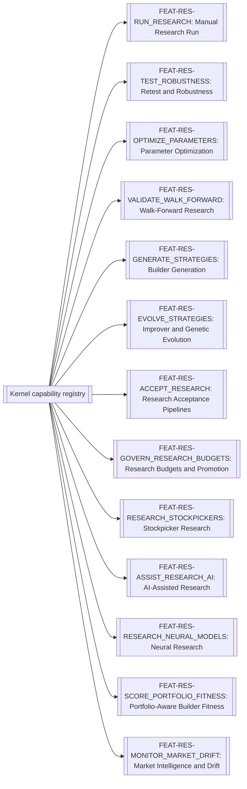

# Research

> **Package:** `app/services/research/`
> **Status:** `Missing`
> **Last updated:** `2026-08-23`
> **Domain ID:** `D-RES`

> This README is the domain package's **single source of truth** for domain boundaries, composable feature capabilities, architecture invariants, implementation sequence, progress, usage examples, and tests.
> Update this document before modifying or adding code.

---

## Code-Aligned Implementation Convention

This README is the sole current target registry for this domain's feature IDs and statuses, functional requirements, domain-local workflows, semantic contract ownership, persisted-state model, acceptance evidence, and deletion behavior. `PROJECT.md` owns system scope, cross-domain behavior, system NFRs, and release gates; `ARCHITECTURE.md` owns universal package and runtime constraints. Feature-local READMEs, manifests, contract definitions, migrations, and tests provide current implementation evidence without silently changing this target registry.

Implementation uses the repository's existing feature substrate: each feature lives directly at `app/services/<domain>/<feature>/`, is discovered through the `haruquantai.features` Python entry-point group, and declares one immutable `FeatureSpec` in `manifest.py`. There are no domain or feature YAML manifests.

Every implemented feature also contains a mandatory runtime-validated `README.md`, pure `__init__.py`, strict `config.py`, lifecycle `feature.py`, and focused implementation modules. Dependencies and effects flow through `FeatureContext`/`FeatureScope`; cross-feature implementation imports are forbidden. Persistent state is declared by `FeatureSpec.state`; any migrations and storage adapters remain with the owning feature. Capability keys use `<domain>.<name>@<major>`. FR IDs remain product, acceptance, and test-trace identities rather than one runtime registration per FR. A requirement `Depends` cell expresses product sequencing, traceability, or acceptance evidence only; runtime dependencies are declared separately with exact keys in `FeatureSpec.requires` or `FeatureSpec.optional`.

Feature-level automated tests live at `tests/services/research/<feature>/`. Usage examples never live under `tests/`; they belong to each feature's designated primary domain-logic module. Broader automated verification retains its documented architecture, composition, API, integration, or system test location. The code-backed procedure is the [Feature Implementation Pipeline](../../../docs/dev/feature_implementation_pipeline.md).

## 1. Purpose and Boundary

### Purpose

The Research domain delivers manual and automated research execution, retesting, robustness, optimization, Builder, Improver, genetic search, walk-forward, specialized research, point-in-time market intelligence, and performance-drift evidence. Its public feature capabilities are registered and remain independent of package-import order. Removing the domain produces the degradation defined below rather than preventing the shared substrate or unrelated domains from starting.

### Owns

- `FEAT-RES-RUN_RESEARCH` — Manual Research Run.
- `FEAT-RES-TEST_ROBUSTNESS` — Retest and Robustness.
- `FEAT-RES-OPTIMIZE_PARAMETERS` — Parameter Optimization.
- `FEAT-RES-VALIDATE_WALK_FORWARD` — Walk-Forward Research.
- `FEAT-RES-GENERATE_STRATEGIES` — Builder Generation.
- `FEAT-RES-EVOLVE_STRATEGIES` — Improver and Genetic Evolution.
- `FEAT-RES-ACCEPT_RESEARCH` — Research Acceptance Pipelines.
- `FEAT-RES-GOVERN_RESEARCH_BUDGETS` — Research Budgets and Promotion.
- `FEAT-RES-RESEARCH_STOCKPICKERS` — Stockpicker Research.
- `FEAT-RES-ASSIST_RESEARCH_AI` — AI-Assisted Research.
- `FEAT-RES-RESEARCH_NEURAL_MODELS` — Neural Research.
- `FEAT-RES-SCORE_PORTFOLIO_FITNESS` — Portfolio-Aware Builder Fitness.
- `FEAT-RES-MONITOR_MARKET_DRIFT` — Market Intelligence and Drift.

### Does not own

- Canonical strategy/data/result ownership, portfolio definition, project orchestration, or transport adapters.
- Portfolio loading, construction, allocation, or aggregate-risk policy. Portfolio-aware fitness accepts an immutable caller-supplied portfolio snapshot/reference and does not create a reverse runtime dependency on the Portfolio implementation.
- Composition lifecycle, dependency resolution, effect reversal, and transactional replacement; those belong to the non-domain shared substrate (`app/contracts/`, `app/kernel/`, and `app/composition/`).
- **Deletion boundary:** deleting `app/services/research/` means research execution disappears; strategy, data, result, and portfolio records remain readable through their owning domains. The kernel and unrelated domains shall remain healthy.

### Shared Contracts

This domain semantically owns the contracts listed below, but their sole physical definitions live in `app/contracts/research/` and wire schemas in `app/contracts/research/wire/`. `app/services/research/` contains implementations only and shall not define or re-export substitute public contract types. Contract versions and semantic owners must agree with `PROJECT.md` and this README. Feature IDs and FR IDs are documentation, lifecycle, acceptance, and traceability identities; runtime bindings use exact versioned `CapabilityKey` declarations in contracts and `FeatureSpec`. The exact public records and capability bundles are listed in the [Shared Contracts README](../../contracts/README.md#47-appcontractsresearch).

Rows labelled `FEAT-* capability surface` describe planned semantic contract bundles, not literal runtime capability keys. A listed counterparty may produce, consume, or observe the bundle and does not establish package-import or runtime dependency direction.

**Owned by this domain**

| Status | Contract | Version | Counterparty | Purpose |
|---|---|---|---|---|
| Missing | `FEAT-RES-RUN_RESEARCH` capability surface | `v1` | Analytics, Catalogue, Orchestration, Plugins, Portfolio, Simulator, Strategy, Workspace | Manual Research Run. |
| Missing | `FEAT-RES-TEST_ROBUSTNESS` capability surface | `v1` | Analytics, Catalogue, Orchestration, Plugins, Portfolio, Simulator, Strategy, Workspace | Retest and Robustness. |
| Missing | `FEAT-RES-OPTIMIZE_PARAMETERS` capability surface | `v1` | Analytics, Catalogue, Orchestration, Plugins, Portfolio, Simulator, Strategy, Workspace | Parameter Optimization. |
| Missing | `FEAT-RES-VALIDATE_WALK_FORWARD` capability surface | `v1` | Analytics, Catalogue, Orchestration, Plugins, Portfolio, Simulator, Strategy, Workspace | Walk-Forward Research. |
| Missing | `FEAT-RES-GENERATE_STRATEGIES` capability surface | `v1` | Analytics, Catalogue, Orchestration, Plugins, Portfolio, Simulator, Strategy, Workspace | Builder Generation. |
| Missing | `FEAT-RES-EVOLVE_STRATEGIES` capability surface | `v1` | Analytics, Catalogue, Orchestration, Plugins, Portfolio, Simulator, Strategy, Workspace | Improver and Genetic Evolution. |
| Missing | `FEAT-RES-ACCEPT_RESEARCH` capability surface | `v1` | Analytics, Catalogue, Orchestration, Plugins, Portfolio, Simulator, Strategy, Workspace | Research Acceptance Pipelines. |
| Missing | `FEAT-RES-GOVERN_RESEARCH_BUDGETS` capability surface | `v1` | Analytics, Catalogue, Orchestration, Plugins, Portfolio, Simulator, Strategy, Workspace | Research Budgets and Promotion. |
| Missing | `FEAT-RES-RESEARCH_STOCKPICKERS` capability surface | `v1` | Analytics, Catalogue, Orchestration, Plugins, Portfolio, Simulator, Strategy, Workspace | Stockpicker Research. |
| Missing | `FEAT-RES-ASSIST_RESEARCH_AI` capability surface | `v1` | Analytics, Catalogue, Orchestration, Plugins, Portfolio, Simulator, Strategy, Workspace | AI-Assisted Research. |
| Missing | `FEAT-RES-RESEARCH_NEURAL_MODELS` capability surface | `v1` | Analytics, Catalogue, Orchestration, Plugins, Portfolio, Simulator, Strategy, Workspace | Neural Research. |
| Missing | `FEAT-RES-SCORE_PORTFOLIO_FITNESS` capability surface | `v1` | Analytics, Catalogue, Orchestration, Plugins, Portfolio, Simulator, Strategy, Workspace | Portfolio-Aware Builder Fitness. |
| Missing | `FEAT-RES-MONITOR_MARKET_DRIFT` capability surface | `v1` | Analytics, Catalogue, Data, Interfaces, Strategy, Workspace | Market Intelligence and Drift. |

**Cross-domain requirement references (not runtime dependencies)**

The rows below summarize foreign owner tokens found in FR `Depends` cells. They express product sequencing, traceability, or acceptance-evidence relationships only. Actual runtime consumption must name an exact versioned capability key in the consuming feature's `FeatureSpec.requires` or `FeatureSpec.optional` and must follow the dependency direction in `PROJECT.md` and `ARCHITECTURE.md`.

| Referenced domain set | Documentation version | Owner | Meaning |
|---|---|---|---|
| `D-ANA` public capability set | `v1` | Analytics | Requirements whose `Depends` cell names `ANA-*`. |
| `D-CAT` public capability set | `v1` | Catalogue | Requirements whose `Depends` cell names `CAT-*`. |
| `D-ORCH` public capability set | `v1` | Orchestration | Requirements whose `Depends` cell names `ORCH-*`. |
| `D-PLUG` public capability set | `v1` | Plugins | Requirements whose `Depends` cell names `PLUG-*`. |
| `D-PORT` public capability set | `v1` | Portfolio | Requirements whose `Depends` cell names `PORT-*`. |
| `D-SIM` public capability set | `v1` | Simulator | Requirements whose `Depends` cell names `SIM-*`. |
| `D-STRAT` public capability set | `v1` | Strategy | Requirements whose `Depends` cell names `STRAT-*`. |
| `D-WS` public capability set | `v1` | Workspace | Requirements whose `Depends` cell names `WS-*`. |

#### Ratified v1 public records (27)

Table anchors: `research_runs(manifest_id UNIQUE)`, `simulations(research_run_id,ordinal UNIQUE)`, `optimization_variants(research_run_id,combination_index UNIQUE)`, `wf_windows(research_run_id,ordinal UNIQUE)`, `checkpoints(research_run_id,sequence UNIQUE)`. `AIProposal` persistence anchor (`ai_proposals(input_hash,provider_request_id UNIQUE)`) backs the two AI records.

| # | Record | Exact wire fields | FRs / rules |
|---|---|---|---|
| R1 | `ResearchRunRef` | `run_id: Uuid7`; `job_id: Uuid7`; `manifest_id: Uuid7`; `method: nonempty str`; `state: Literal[QUEUED,RUNNING,PAUSED,STOPPING,STOPPED,COMPLETED,FAILED,CANCELLED]`; `derived_from_run_id: Uuid7 | None = None`; `schema_version: Literal[1] = 1`. Start/pause/resume/stop/cancel/status are idempotent; repeated commands create one effective transition. | FR-RES-CONTROL_RESEARCH_RUNS, DUPLICATE_RESEARCH_SETTINGS. |
| R2 | `ResearchManifest` | `manifest_id: Uuid7`; `method: nonempty str`; `method_version: int >= 1`; `run_manifest_ids: tuple[Uuid7, ...] = ()` (Simulator manifests for member backtests); `capability_snapshot_id: Uuid7`; `inputs: JsonObject` (resolved charts, data versions, date/segments, precision, costs, sizing, engine profile); `estimated_resource_use: JsonObject = {}`; `seed_set: tuple[nonempty str, ...] = ()`; `budgets: ResearchBudget`; `content_hash: ContentHash`; `schema_version: Literal[1] = 1`. One manifest hash per equivalent request from every entry point; the approved preview hash must match at admission. | FR-RES-RUN_MANUAL_BACKTEST, PREVIEW_RESEARCH_INPUTS, PIN_RUN_INPUTS (§22.5 preview/admission rule). |
| R3 | `ResearchStatus` | `run_id: Uuid7`; `state: Literal[QUEUED,RUNNING,PAUSED,STOPPING,STOPPED,COMPLETED,FAILED,CANCELLED]`; `processed_units: int >= 0 = 0`; `total_units: int >= 0 | None = None`; `simulation_time: UtcTimestamp | None = None`; `speed_units_per_second: DecimalValue | None = None`; `elapsed_seconds: int >= 0 = 0`; `estimated_remaining_seconds: int >= 0 | None = None`; `memory_mb: int >= 0 | None = None`; `warnings: tuple[nonempty str, ...] = ()`; `accepted_artifact_ids: tuple[Uuid7, ...] = ()`; `checkpoint_sequence: int >= 0 = 0`; `classified_error: nonempty str | None = None`; `retry_eligible: bool = False`; `committed_partial_artifact_ids: tuple[Uuid7, ...] = ()`; `schema_version: Literal[1] = 1`. Failed runs retain classified error, checkpoint, diagnostics, partial artifacts, and retry eligibility without log parsing. | FR-RES-REPORT_RESEARCH_PROGRESS, CLASSIFY_RESEARCH_FAILURES. |
| R4 | `RobustnessPlan` | `plan_id: Uuid7`; `strategy_version_ids: nonempty tuple[Uuid7, ...]`; `retest_profile_version: int >= 1`; `precision_upgrade: Literal[NONE,DECLARED] = "NONE"` (no silent upgrade; divergence inspectable); `market_matrix: tuple[MarketMatrixCell, ...] = ()` where `MarketMatrixCell(market: InstrumentRef, broker: BrokerRef | None, data_version_id: Uuid7)`; `aggregation_policy: nonempty str`; `monte_carlo: MonteCarloSpec | None = None` where `MonteCarloSpec(methods: tuple[Literal[REORDER,SKIP,PL_PERTURB,TRADE_COST_PERTURB,PARAMETER,DATA,SPREAD,SLIPPAGE,EXECUTION_DELAY], ...], distributions: JsonObject, seeds: tuple[nonempty str, ...], sample_count: int >= 1, percentile_method: nonempty str, confidence: DecimalValue in (0,1), failure_handling: nonempty str, acceptance_rule: nonempty str)`; `permutation_domains: tuple[ParameterDefinition-ref, ...] = ()` (Strategy-owned); `content_hash: ContentHash`; `schema_version: Literal[1] = 1`. Input membership cannot change mid-run; every candidate yields an accepted result or structured rejection; simulation 0 reproduces the baseline. | FR-RES-PIN_RETEST_INPUTS, UPGRADE_RETEST_PRECISION, TEST_ADDITIONAL_MARKETS, PERTURB_TRADE_HISTORY, PERTURB_SIMULATION_INPUTS, SUMMARIZE_MONTE_CARLO, RUN_SCENARIO_ANALYSIS, PERMUTE_SYSTEM_PARAMETERS. |
| R5 | `RobustnessResult` | `result_id: Uuid7`; `plan_id: Uuid7`; `simulations: tuple[RobustnessSimulation, ...] = ()` where `RobustnessSimulation(ordinal: int >= 1, method: nonempty str, sampled_values: JsonObject, source_stream: nonempty str, result_id: Uuid7 | None, failure: nonempty str | None = None)`; `percentiles: JsonObject`; `divergence_first_event: JsonObject | None = None`; `scenario_variants: tuple[Uuid7, ...] = ()` (provenance identifies every excluded/changed trade); `permutation_coverage: JsonObject = {}`; `content_hash: ContentHash`; `schema_version: Literal[1] = 1`. | Same FRs as R4. |
| R6 | `ParameterSpace` | `space_id: Uuid7`; `parameters: nonempty tuple[SpaceDimension, ...]` where `SpaceDimension(name: nonempty str, domain: Literal[FIXED,DISCRETE,RANGE_STEP,GRID,WEIGHTED], values: tuple[JsonValue, ...] = (), range_min/range_max: DecimalValue | None, step: DecimalValue > 0 | None)`; `cardinality: int >= 1 | None = None`; `content_hash: ContentHash`; `schema_version: Literal[1] = 1`. | FR-RES-OPTIMIZE_SIMPLE_PARAMETERS, OPTIMIZE_PARAMETER_GRID. |
| R7 | `OptimizationPlan` | `plan_id: Uuid7`; `mode: Literal[SIMPLE,GRID,SEQUENTIAL]`; `parameter_space: ParameterSpace`; `objective: nonempty str`; `objective_version: int >= 1`; `stages: tuple[SequentialStage, ...] = ()` where `SequentialStage(parameter_name: nonempty str, objective: nonempty str, retained_values: int >= 1, stopping_rule: nonempty str, tie_breaker: nonempty str)`; `projected_evaluations: int >= 1`; `estimated_storage_mb: int >= 0 = 0`; `budget_limit: bool = False`; `content_hash: ContentHash`; `schema_version: Literal[1] = 1`. Admission reports projected count/storage; over-policy domains reject unless budget-limited; duplicate vectors execute at most once per compatible manifest; replay selects the same final vector. | FR-RES-OPTIMIZE_SEQUENTIALLY, OPTIMIZE_SIMPLE_PARAMETERS, OPTIMIZE_PARAMETER_GRID. |
| R8 | `OptimizationVariant` | `variant_id: Uuid7`; `run_id: Uuid7`; `combination_index: int >= 1`; `parameter_vector: JsonObject`; `vector_hash: ContentHash`; `result_id: Uuid7 | None = None`; `objective_values: dict[nonempty str, DecimalValue] = {}`; `is_feasible: bool = True`; `rank: int >= 1 | None = None`; `pareto_status: Literal[DOMINATED,NON_DOMINATED,UNRANKED] = "UNRANKED"`; `schema_version: Literal[1] = 1`. | FR-RES-OPTIMIZE_* (variant pairing preserved). |
| R9 | `OptimizationResult` | `result_id: Uuid7`; `plan_id: Uuid7`; `run_id: Uuid7`; `variants: tuple[OptimizationVariant, ...] = ()`; `selected_variant_id: Uuid7 | None = None`; `evaluated_count: int >= 0`; `domain_cardinality: int >= 1 | None = None`; `content_hash: ContentHash`; `schema_version: Literal[1] = 1`. | FR-RES-OPTIMIZE_*; COMPARE_RESEARCH_BATCHES. |
| R10 | `WalkForwardPlan` | `plan_id: Uuid7`; `scheme: Literal[ANCHORED,ROLLING]`; `window_config: JsonObject`; `train_interval: SeriesInterval`; `selection_interval: SeriesInterval`; `oos_interval: SeriesInterval`; `stitch_policy: nonempty str` (§19.9); `matrix: tuple[JsonObject, ...] = ()`; `score: nonempty str`; `score_version: int >= 1`; `tie_breaker: nonempty str`; `content_hash: ContentHash`; `schema_version: Literal[1] = 1`. No timestamp overlap violating the scheme; selection-only data visibility enforced. | FR-RES-DEFINE_WALKFORWARD_WINDOWS, EVALUATE_WALKFORWARD_MATRIX. |
| R11 | `WalkForwardWindow` | `window_id: Uuid7`; `run_id: Uuid7`; `ordinal: int >= 1`; `train_from/train_to: UtcTimestamp`; `selection_from/selection_to: UtcTimestamp`; `oos_from/oos_to: UtcTimestamp`; `is_metrics: JsonObject`; `selected_variant_id: Uuid7`; `oos_result_id: Uuid7 | None = None`; `eligible_days: JsonObject`; `failed_cell_reason: nonempty str | None = None`; `schema_version: Literal[1] = 1`. Every OOS segment links to one selection decision and inputs; failed cells remain visible. | FR-RES-EXECUTE_WALK_FORWARD, EVALUATE_WALKFORWARD_MATRIX. |
| R12 | `WalkForwardResult` | `result_id: Uuid7`; `plan_id: Uuid7`; `run_id: Uuid7`; `windows: tuple[WalkForwardWindow, ...] = ()`; `stitched_equity_artifact_id: Uuid7 | None = None`; `wf_metrics: dict[nonempty str, DecimalValue | None] = {}` (§9.1 set: WF result, day-normalized OOS/IS stability, WF-to-original score, max drawdown and % drawdown); `matrix_ranking: JsonObject = {}`; `content_hash: ContentHash`; `schema_version: Literal[1] = 1`. §19.9 stitching rules reconcile segment and aggregate equity. | FR-RES-STITCH_WALKFORWARD_RESULTS, CALCULATE_WALKFORWARD_METRICS. |
| R13 | `BuilderPlan` | `plan_id: Uuid7`; `block_registry_version: int >= 1`; `block_weights: JsonObject`; `parameter_domains: tuple[ParameterDefinition-ref, ...]`; `template_id: Uuid7 | None`; `random_group_version_ids: tuple[Uuid7, ...] = ()`; `evolution_policy: Literal[STRICT_GROUPS,REFERENCE_RELAXED] | None = None`; `direction: Literal[LONG,SHORT,BOTH]`; `markets: tuple[MarketMatrixCell, ...]`; `engine_profile_id: Uuid7`; `filters: JsonObject`; `seeds: tuple[nonempty str, ...]`; `content_hash: ContentHash`; `schema_version: Literal[1] = 1`. The complete search is reproducible from one manifest; only type-valid strategies satisfying grammar/resource/complexity/required-block constraints are emitted; semantic duplicates detected by normalized fingerprints with declared scope/collision policy. | FR-RES-GENERATE_VALID_STRATEGIES, DEFINE_BUILDER_SEARCH, CALIBRATE_PARAMETER_RANGES, DETECT_STRATEGY_DUPLICATES, CONSTRAIN_RANDOM_GROUPS. |
| R14 | `StrategyCandidate` | `candidate_id: Uuid7`; `run_id: Uuid7`; `strategy_version_id: Uuid7`; `result_id: Uuid7 | None = None`; `fingerprint: ContentHash`; `edit_operations: tuple[JsonObject, ...] = ()`; `parent_strategy_version_id: Uuid7 | None = None`; `atm_only_mutation: bool = False`; `schema_version: Literal[1] = 1`. Every candidate names its exact edit operations and parent. | FR-RES-IMPROVE_STRATEGY_AST, MUTATE_ATM_ONLY. |
| R15 | `EvolutionPlan` | `plan_id: Uuid7`; `population_size: int >= 1`; `islands: int >= 1`; `initialization: JsonObject`; `fitness: nonempty str`; `fitness_version: int >= 1`; `selection: JsonObject`; `crossover: JsonObject`; `mutation: JsonObject`; `elitism: JsonObject`; `migration: JsonObject`; `restart: JsonObject`; `decimation: JsonObject`; `fresh_blood: JsonObject`; `termination: JsonObject`; `content_hash: ContentHash`; `schema_version: Literal[1] = 1`. Checkpoints contain generation/island populations, fitness, duplicate index, counters, and every named RNG stream state (§15.5/§23.1); resume after each checkpoint reproduces identical evolution. | FR-RES-CONFIGURE_GENETIC_SEARCH, CHECKPOINT_GENETIC_SEARCH. |
| R16 | `AcceptancePipeline` | `pipeline_id: Uuid7`; `version: int >= 1`; `stages: nonempty ordered tuple[AcceptanceStage, ...]` where `AcceptanceStage(stage: nonempty str, rule: nonempty str, rule_version: int >= 1, budget: JsonObject, concurrency: int >= 1, stop_on_failure: bool)`; `content_hash: ContentHash`; `schema_version: Literal[1] = 1`. Higher-cost stages receive only candidates allowed by earlier stages. | FR-RES-DEFINE_ACCEPTANCE_PIPELINE. |
| R17 | `AcceptanceDecision` | `decision_id: Uuid7`; `candidate_id: Uuid7`; `pipeline_id: Uuid7`; `stage: nonempty str`; `rule: nonempty str`; `rule_version: int >= 1`; `observed_value: DecimalValue | None`; `threshold: DecimalValue | None`; `segment: Literal[FULL,IS,VALIDATION,OOS,NO_TRADE]`; `direction: Literal[LONG,SHORT,BOTH]`; `outcome: Literal[PASSED,REJECTED]`; `diagnostic_context: JsonObject = {}`; `schema_version: Literal[1] = 1`. Rejection totals reconcile exactly with candidate counts. | FR-RES-RECORD_CANDIDATE_REJECTIONS. |
| R18 | `ResearchBudget` | `budget_id: Uuid7`; `max_candidates: int >= 1 | None = None`; `max_evaluations: int >= 1 | None = None`; `max_elapsed_seconds: int >= 1 | None = None`; `max_cpu_seconds: int >= 1 | None = None`; `max_memory_mb: int >= 1 | None = None`; `max_artifact_storage_mb: int >= 1 | None = None`; `schema_version: Literal[1] = 1`. Bound exhaustion ends in a defined partial terminal result without accepting further work. | FR-RES-ENFORCE_RESEARCH_BUDGETS. |
| R19 | `PromotionDecision` | `decision_id: Uuid7`; `candidate_id: Uuid7`; `selected_result_id: Uuid7`; `new_strategy_version_id: Uuid7`; `promoted_at: UtcTimestamp`; `schema_version: Literal[1] = 1`. Creates a new immutable strategy version linked to source candidate and result; never overwrites parents; lineage traversable afterwards. | FR-RES-PROMOTE_RESEARCH_CANDIDATES. |
| R20 | `StockpickerResearchPlan` | `plan_id: Uuid7`; `universe: UniverseRef`; `universe_version: int >= 1`; `ranking_expression: nonempty str`; `rebalance_schedule: nonempty str`; `selection_count: int >= 1`; `allocation_policy: JsonObject`; `cost_policy: JsonObject`; `validation_partitions: tuple[SeriesInterval, ...] = ()`; `content_hash: ContentHash`; `schema_version: Literal[1] = 1`. Repeated runs select identical historical constituents. | FR-RES-RESEARCH_STOCKPICKER. |
| R21 | `AiResearchDraft` | `draft_id: Uuid7`; `input_hash: ContentHash`; `provider_request_id: nonempty str`; `adapter: nonempty str`; `model: nonempty str`; `redacted_input: JsonObject`; `proposed_ast: StrategyAst | None = None`; `validation: StrategyValidationReport | None = None`; `proposal_state: Literal[PROPOSED,VALIDATED,REJECTED,APPROVED]`; `schema_version: Literal[1] = 1`. Experimental: proposed ASTs pass the same registry/schema validation as the editor; never executable by themselves; AI inputs minimized/redacted; disabling the adapter leaves all stable workflows functional. | FR-RES-DRAFT_AI_STRATEGIES, PROTECT_AI_INPUTS. |
| R22 | `AiImprovementProposal` | `proposal_id: Uuid7`; `draft_id: Uuid7`; `parent_strategy_version_id: Uuid7`; `edit_operations: nonempty tuple[JsonObject, ...]`; `proposal_state: Literal[PROPOSED,REJECTED,APPROVED]`; `schema_version: Literal[1] = 1`. Experimental: may not run, promote, overwrite, or delete strategies without an explicit approved research action. | FR-RES-GOVERN_AI_IMPROVEMENTS. |
| R23 | `NeuralResearchPlan` | `plan_id: Uuid7`; `trainer_artifact_id: Uuid7` (§21.3); `inference_artifact_id: Uuid7 | None = None`; `hyperparameters: JsonObject`; `seeds: tuple[nonempty str, ...]`; `feature_refs: tuple[Uuid7, ...] = ()`; `content_hash: ContentHash`; `schema_version: Literal[1] = 1`. Experimental and feature-flagged until its §21.3 gates pass. | FR-RES-GOVERN_NEURAL_RESEARCH. |
| R24 | `PortfolioFitnessScore` | `score_id: Uuid7`; `candidate_strategy_version_id: Uuid7`; `existing_portfolio_version_id: Uuid7`; `snapshot_mode: Literal[SNAPSHOT,REFERENCE]`; `combined_result_id: Uuid7`; `fitness: DecimalValue`; `fitness_version: int >= 1`; `score_components: JsonObject`; `schema_version: Literal[1] = 1`. Phase 3 Builder option; caller-supplied immutable pinned portfolio version only. | FR-RES-SCORE_PORTFOLIO_FITNESS. |
| R25 | `MarketIntelligenceObservation` | `observation_id: Uuid7`; `study_kind: Literal[FUNDAMENTAL,SENTIMENT,SEASONALITY,MARKET_STRUCTURE]`; `source_refs: tuple[Uuid7, ...]` (Data point-in-time evidence); `visibility_time: UtcTimestamp`; `revision_policy: nonempty str`; `entity_instrument_mapping: JsonObject`; `language_model_version: str | None = None`; `missingness_policy: nonempty str`; `multiple_comparison_correction: str | None = None` (seasonality); `definitions: JsonObject = {}` (versioned observable definitions; descriptive evidence distinguished from executable rules); `outputs_artifact_id: Uuid7`; `content_hash: ContentHash`; `schema_version: Literal[1] = 1`. Consumes only Data-owned point-in-time evidence. | FR-RES-CONSUME_MARKET_INTELLIGENCE, ANALYZE_SEASONALITY, ANALYZE_MARKET_STRUCTURE, RECORD_INTELLIGENCE_LINEAGE. |
| R26 | `DriftState` | `evaluation_id: Uuid7`; `subject: Uuid7` (strategy or portfolio version identity); `state: Literal[STABLE,WATCH,DEGRADED,BREACHED,INSUFFICIENT_EVIDENCE,INVALID_COMPARISON]`; `as_of: UtcTimestamp`; `schema_version: Literal[1] = 1`. Advisory until a separate acceptance or Risk policy consumes it. | FR-RES-CLASSIFY_DRIFT_STATE. |
| R27 | `DriftReport` | `report_id: Uuid7`; `subject: Uuid7`; `reference_profile_id: Uuid7`; `metric: nonempty str`; `window: SeriesInterval`; `baseline: DecimalValue | None`; `observed: DecimalValue | None`; `threshold: DecimalValue | None`; `uncertainty: DecimalValue | None`; `missing_data_policy: nonempty str`; `state: DriftState`; `lineage: JsonObject`; `content_hash: ContentHash`; `schema_version: Literal[1] = 1`. Pinned accepted expectancy vs later OOS/operational evidence. | FR-RES-DETECT_PERFORMANCE_DRIFT, RECORD_INTELLIGENCE_LINEAGE. |

#### Ratified v1 capabilities and operation envelopes

All new (universal rule; shared `ResearchFailure` with `code: Literal[RESEARCH_VALIDATION_FAILED, RESEARCH_NOT_FOUND, RESEARCH_STATE_CONFLICT, RESEARCH_BUDGET_EXCEEDED, RESEARCH_METHOD_INCOMPATIBLE, RESEARCH_PREVIEW_MISMATCH, PARAMETER_DOMAIN_INVALID, AI_PROPOSAL_INVALID, CAPABILITY_UNAVAILABLE]`; no subscriptions — progress is bounded observational publication):

1. `research.run-research@1` / `RunResearchCapability` / `run_research` — ops `PREVIEW, START, PAUSE, RESUME, STOP, CANCEL, STATUS, COMMIT, DUPLICATE, SUBMIT_BATCH`. Success: `manifest: ResearchManifest | None`; `run: ResearchRunRef | None`; `status: ResearchStatus | None`; `committed_result_id: Uuid7 | None = None`. One committed result per completed execution, optionally admitted to a databank in the same logical acceptance. FRs: RUN_MANUAL_BACKTEST…SUBMIT_RESEARCH_BATCHES, COMMIT_RESEARCH_RESULTS, DESCRIBE_RESEARCH_METHODS, COMPARE_RESEARCH_BATCHES.
2. `research.test-robustness@1` / `TestRobustnessCapability` / `test_robustness` — ops `PLAN, EXECUTE, SUMMARIZE, RUN_SCENARIO, PERMUTE_SYSTEM`. Success: `plan: RobustnessPlan | None`; `result: RobustnessResult | None`. FRs: PIN_RETEST_INPUTS…PERMUTE_SYSTEM_PARAMETERS.
3. `research.optimize-parameters@1` / `OptimizeParametersCapability` / `optimize_parameters` — ops `PLAN, EXECUTE`. Success: `plan: OptimizationPlan | None`; `result: OptimizationResult | None`. FRs: OPTIMIZE_* rows.
4. `research.validate-walk-forward@1` / `ValidateWalkForwardCapability` / `validate_walk_forward` — ops `PLAN, EXECUTE, EVALUATE_MATRIX`. Success: `plan: WalkForwardPlan | None`; `result: WalkForwardResult | None`. FRs: DEFINE_WALKFORWARD_WINDOWS…CALCULATE_WALKFORWARD_METRICS.
5. `research.generate-strategies@1` / `GenerateStrategiesCapability` / `generate_strategies` — ops `PLAN, GENERATE, CALIBRATE, DETECT_DUPLICATES`. Success: `plan: BuilderPlan | None`; `candidates: tuple[StrategyCandidate, ...] = ()`. FRs: GENERATE_VALID_STRATEGIES…CONSTRAIN_RANDOM_GROUPS.
6. `research.evolve-strategies@1` / `EvolveStrategiesCapability` / `evolve_strategies` — ops `PLAN, EVOLVE, CHECKPOINT, RESUME, IMPROVE`. Success: `plan: EvolutionPlan | None`; `candidates: tuple[StrategyCandidate, ...] = ()`. FRs: IMPROVE_STRATEGY_AST, CONFIGURE_GENETIC_SEARCH, CHECKPOINT_GENETIC_SEARCH, MUTATE_ATM_ONLY.
7. `research.accept-research@1` / `AcceptResearchCapability` / `accept_research` — ops `DEFINE_PIPELINE, EVALUATE, PROMOTE`. Success: `pipeline: AcceptancePipeline | None`; `decision: AcceptanceDecision | None`; `promotion: PromotionDecision | None`. FRs: DEFINE_ACCEPTANCE_PIPELINE, RECORD_CANDIDATE_REJECTIONS, PROMOTE_RESEARCH_CANDIDATES.
8. `research.govern-research-budgets@1` / `GovernResearchBudgetsCapability` / `govern_research_budgets` — ops `DEFINE, CHECK, ENFORCE`. Success: `budget: ResearchBudget | None`. FRs: ENFORCE_RESEARCH_BUDGETS.
9. `research.research-stockpickers@1` / `ResearchStockpickersCapability` / `research_stockpickers` — ops `PLAN, EXECUTE`. Success: `plan: StockpickerResearchPlan | None`; `result_id: Uuid7 | None = None`. FRs: RESEARCH_STOCKPICKER.
10. `research.assist-research-ai@1` / `AssistResearchAiCapability` / `assist_research_ai` — ops `DRAFT, VALIDATE_DRAFT, PROPOSE_IMPROVEMENT` (Experimental gating; external AI failure never impairs non-AI workflows). Success: `draft: AiResearchDraft | None`; `proposal: AiImprovementProposal | None`. FRs: DRAFT_AI_STRATEGIES, GOVERN_AI_IMPROVEMENTS, PROTECT_AI_INPUTS.
11. `research.research-neural-models@1` / `ResearchNeuralModelsCapability` / `research_neural_models` — ops `PLAN, TRAIN` (Experimental; §21.3 trainer/inference artifacts only). Success: `plan: NeuralResearchPlan | None`. FRs: GOVERN_NEURAL_RESEARCH.
12. `research.score-portfolio-fitness@1` / `ScorePortfolioFitnessCapability` / `score_portfolio_fitness` — ops `SCORE`. Success: `score: PortfolioFitnessScore | None`. FRs: SCORE_PORTFOLIO_FITNESS.
13. `research.monitor-market-drift@1` / `MonitorMarketDriftCapability` / `monitor_market_drift` — ops `OBSERVE, EVALUATE_DRIFT`. Success: `observation: MarketIntelligenceObservation | None`; `report: DriftReport | None`. FRs: CONSUME_MARKET_INTELLIGENCE…RECORD_INTELLIGENCE_LINEAGE.

Cross-owner references: `InstrumentRef`, `BrokerRef`, `UniverseRef` (Catalogue); `StrategyAst`, `StrategyValidationReport`, `ParameterDefinition`, `StrategyVersion` IDs (Strategy); Simulator run manifests/results; Analytics databank acceptance; `MarketNewsObservation` point-in-time evidence (Data); RNG rules (§15.5).

### Persisted State Ownership

| Status | State / Store | Read access (via contract) | Migration definitions |
|---|---|---|---|
| Missing | research_runs, simulations, optimization_variants, wf_windows, checkpoints | Other domains through `D-RES` public capabilities only | The owning feature's `StateDeclaration` and migration/storage adapter |

### Four-Level Structural Hierarchy

| Code level | Represents | This package |
|---|---|---|
| **Package** | Domain | `app/services/research/` / `D-RES` |
| **Module folder** | Feature / capability | One folder for each of: Manual Research Run, Retest and Robustness, Parameter Optimization, Walk-Forward Research, Builder Generation, Improver and Genetic Evolution, Research Acceptance Pipelines, Research Budgets and Promotion, Stockpicker Research, AI-Assisted Research, Neural Research, Portfolio-Aware Builder Fitness, Market Intelligence and Drift |
| **File** | Use case or focused responsibility | Exactly the responsibility file named in each module specification |
| **Class / function / method** | Functional requirement behavior | Exactly one registered `fr_*` behavior per `FR-*` row |

```text
Package (Domain)
└── Module folder (Feature)
    └── File (Responsibility)
        └── Registered function (Functional requirement behavior)
```

### Domain Capability Map


```mermaid
flowchart TD
    DOMAIN[[D-RES: Research]]
    DOMAIN --> FEAT_RES_RUN_RESEARCH[[FEAT-RES-RUN_RESEARCH: Manual Research Run]]
    FEAT_RES_RUN_RESEARCH --> FEAT_RES_RUN_RESEARCH_FILE[manual_research_run.py: RESP-RES-01-01]
    DOMAIN --> FEAT_RES_TEST_ROBUSTNESS[[FEAT-RES-TEST_ROBUSTNESS: Retest and Robustness]]
    FEAT_RES_TEST_ROBUSTNESS --> FEAT_RES_TEST_ROBUSTNESS_FILE[retest_robustness.py: RESP-RES-02-01]
    DOMAIN --> FEAT_RES_OPTIMIZE_PARAMETERS[[FEAT-RES-OPTIMIZE_PARAMETERS: Parameter Optimization]]
    FEAT_RES_OPTIMIZE_PARAMETERS --> FEAT_RES_OPTIMIZE_PARAMETERS_FILE[parameter_optimization.py: RESP-RES-03-01]
    DOMAIN --> FEAT_RES_VALIDATE_WALK_FORWARD[[FEAT-RES-VALIDATE_WALK_FORWARD: Walk-Forward Research]]
    FEAT_RES_VALIDATE_WALK_FORWARD --> FEAT_RES_VALIDATE_WALK_FORWARD_FILE[walk_forward_research.py: RESP-RES-04-01]
    DOMAIN --> FEAT_RES_GENERATE_STRATEGIES[[FEAT-RES-GENERATE_STRATEGIES: Builder Generation]]
    FEAT_RES_GENERATE_STRATEGIES --> FEAT_RES_GENERATE_STRATEGIES_FILE[builder_generation.py: RESP-RES-05-01]
    DOMAIN --> FEAT_RES_EVOLVE_STRATEGIES[[FEAT-RES-EVOLVE_STRATEGIES: Improver and Genetic Evolution]]
    FEAT_RES_EVOLVE_STRATEGIES --> FEAT_RES_EVOLVE_STRATEGIES_FILE[improver_genetic.py: RESP-RES-06-01]
    DOMAIN --> FEAT_RES_ACCEPT_RESEARCH[[FEAT-RES-ACCEPT_RESEARCH: Research Acceptance Pipelines]]
    FEAT_RES_ACCEPT_RESEARCH --> FEAT_RES_ACCEPT_RESEARCH_FILE[research_acceptance.py: RESP-RES-07-01]
    DOMAIN --> FEAT_RES_GOVERN_RESEARCH_BUDGETS[[FEAT-RES-GOVERN_RESEARCH_BUDGETS: Research Budgets and Promotion]]
    FEAT_RES_GOVERN_RESEARCH_BUDGETS --> FEAT_RES_GOVERN_RESEARCH_BUDGETS_FILE[research_budget_promotion.py: RESP-RES-08-01]
    DOMAIN --> FEAT_RES_RESEARCH_STOCKPICKERS[[FEAT-RES-RESEARCH_STOCKPICKERS: Stockpicker Research]]
    FEAT_RES_RESEARCH_STOCKPICKERS --> FEAT_RES_RESEARCH_STOCKPICKERS_FILE[stockpicker_research.py: RESP-RES-09-01]
    DOMAIN --> FEAT_RES_ASSIST_RESEARCH_AI[[FEAT-RES-ASSIST_RESEARCH_AI: AI-Assisted Research]]
    FEAT_RES_ASSIST_RESEARCH_AI --> FEAT_RES_ASSIST_RESEARCH_AI_FILE[ai_assisted_research.py: RESP-RES-10-01]
    DOMAIN --> FEAT_RES_RESEARCH_NEURAL_MODELS[[FEAT-RES-RESEARCH_NEURAL_MODELS: Neural Research]]
    FEAT_RES_RESEARCH_NEURAL_MODELS --> FEAT_RES_RESEARCH_NEURAL_MODELS_FILE[neural_research.py: RESP-RES-11-01]
    DOMAIN --> FEAT_RES_SCORE_PORTFOLIO_FITNESS[[FEAT-RES-SCORE_PORTFOLIO_FITNESS: Portfolio-Aware Builder Fitness]]
    FEAT_RES_SCORE_PORTFOLIO_FITNESS --> FEAT_RES_SCORE_PORTFOLIO_FITNESS_FILE[portfolio_aware_fitness.py: RESP-RES-12-01]
    DOMAIN --> FEAT_RES_MONITOR_MARKET_DRIFT[[FEAT-RES-MONITOR_MARKET_DRIFT: Market Intelligence and Drift]]
    FEAT_RES_MONITOR_MARKET_DRIFT --> FEAT_RES_MONITOR_MARKET_DRIFT_FILE[market_intelligence_drift.py: RESP-RES-13-01]
```

---

## 2. Final Package Structure and Feature Independence

```text
research/
├── README.md
├── __init__.py
├── manual_research_run/                    # FEAT-RES-RUN_RESEARCH: Manual Research Run
│   ├── README.md
│   ├── __init__.py
│   ├── manifest.py
│   ├── config.py
│   ├── feature.py
│   └── manual_research_run.py              # RESP-RES-01-01
├── retest_robustness/                    # FEAT-RES-TEST_ROBUSTNESS: Retest and Robustness
│   ├── README.md
│   ├── __init__.py
│   ├── manifest.py
│   ├── config.py
│   ├── feature.py
│   └── retest_robustness.py              # RESP-RES-02-01
├── parameter_optimization/                    # FEAT-RES-OPTIMIZE_PARAMETERS: Parameter Optimization
│   ├── README.md
│   ├── __init__.py
│   ├── manifest.py
│   ├── config.py
│   ├── feature.py
│   └── parameter_optimization.py              # RESP-RES-03-01
├── walk_forward_research/                    # FEAT-RES-VALIDATE_WALK_FORWARD: Walk-Forward Research
│   ├── README.md
│   ├── __init__.py
│   ├── manifest.py
│   ├── config.py
│   ├── feature.py
│   └── walk_forward_research.py              # RESP-RES-04-01
├── builder_generation/                    # FEAT-RES-GENERATE_STRATEGIES: Builder Generation
│   ├── README.md
│   ├── __init__.py
│   ├── manifest.py
│   ├── config.py
│   ├── feature.py
│   └── builder_generation.py              # RESP-RES-05-01
├── improver_genetic/                    # FEAT-RES-EVOLVE_STRATEGIES: Improver and Genetic Evolution
│   ├── README.md
│   ├── __init__.py
│   ├── manifest.py
│   ├── config.py
│   ├── feature.py
│   └── improver_genetic.py              # RESP-RES-06-01
├── research_acceptance/                    # FEAT-RES-ACCEPT_RESEARCH: Research Acceptance Pipelines
│   ├── README.md
│   ├── __init__.py
│   ├── manifest.py
│   ├── config.py
│   ├── feature.py
│   └── research_acceptance.py              # RESP-RES-07-01
├── research_budget_promotion/                    # FEAT-RES-GOVERN_RESEARCH_BUDGETS: Research Budgets and Promotion
│   ├── README.md
│   ├── __init__.py
│   ├── manifest.py
│   ├── config.py
│   ├── feature.py
│   └── research_budget_promotion.py              # RESP-RES-08-01
├── stockpicker_research/                    # FEAT-RES-RESEARCH_STOCKPICKERS: Stockpicker Research
│   ├── README.md
│   ├── __init__.py
│   ├── manifest.py
│   ├── config.py
│   ├── feature.py
│   └── stockpicker_research.py              # RESP-RES-09-01
├── ai_assisted_research/                    # FEAT-RES-ASSIST_RESEARCH_AI: AI-Assisted Research
│   ├── README.md
│   ├── __init__.py
│   ├── manifest.py
│   ├── config.py
│   ├── feature.py
│   └── ai_assisted_research.py              # RESP-RES-10-01
├── neural_research/                    # FEAT-RES-RESEARCH_NEURAL_MODELS: Neural Research
│   ├── README.md
│   ├── __init__.py
│   ├── manifest.py
│   ├── config.py
│   ├── feature.py
│   └── neural_research.py              # RESP-RES-11-01
├── portfolio_aware_fitness/                    # FEAT-RES-SCORE_PORTFOLIO_FITNESS: Portfolio-Aware Builder Fitness
│   ├── README.md
│   ├── __init__.py
│   ├── manifest.py
│   ├── config.py
│   ├── feature.py
│   └── portfolio_aware_fitness.py              # RESP-RES-12-01
└── market_intelligence_drift/                  # FEAT-RES-MONITOR_MARKET_DRIFT
    ├── README.md
    ├── __init__.py
    ├── manifest.py
    ├── config.py
    ├── feature.py
    └── market_intelligence_drift.py
```

### Module dependency diagram

Feature modules do not import one another's private files. Runtime dependencies resolve through kernel capabilities obtained from `FeatureContext`; composition selects providers and reconciles changes, so reciprocal workflow participation cannot create a package-import cycle.


```mermaid
flowchart LR
    K[[Kernel capability registry]]
    K --> FEAT_RES_RUN_RESEARCH[[FEAT-RES-RUN_RESEARCH: Manual Research Run]]
    K --> FEAT_RES_TEST_ROBUSTNESS[[FEAT-RES-TEST_ROBUSTNESS: Retest and Robustness]]
    K --> FEAT_RES_OPTIMIZE_PARAMETERS[[FEAT-RES-OPTIMIZE_PARAMETERS: Parameter Optimization]]
    K --> FEAT_RES_VALIDATE_WALK_FORWARD[[FEAT-RES-VALIDATE_WALK_FORWARD: Walk-Forward Research]]
    K --> FEAT_RES_GENERATE_STRATEGIES[[FEAT-RES-GENERATE_STRATEGIES: Builder Generation]]
    K --> FEAT_RES_EVOLVE_STRATEGIES[[FEAT-RES-EVOLVE_STRATEGIES: Improver and Genetic Evolution]]
    K --> FEAT_RES_ACCEPT_RESEARCH[[FEAT-RES-ACCEPT_RESEARCH: Research Acceptance Pipelines]]
    K --> FEAT_RES_GOVERN_RESEARCH_BUDGETS[[FEAT-RES-GOVERN_RESEARCH_BUDGETS: Research Budgets and Promotion]]
    K --> FEAT_RES_RESEARCH_STOCKPICKERS[[FEAT-RES-RESEARCH_STOCKPICKERS: Stockpicker Research]]
    K --> FEAT_RES_ASSIST_RESEARCH_AI[[FEAT-RES-ASSIST_RESEARCH_AI: AI-Assisted Research]]
    K --> FEAT_RES_RESEARCH_NEURAL_MODELS[[FEAT-RES-RESEARCH_NEURAL_MODELS: Neural Research]]
    K --> FEAT_RES_SCORE_PORTFOLIO_FITNESS[[FEAT-RES-SCORE_PORTFOLIO_FITNESS: Portfolio-Aware Builder Fitness]]
    K --> FEAT_RES_MONITOR_MARKET_DRIFT[[FEAT-RES-MONITOR_MARKET_DRIFT: Market Intelligence and Drift]]
```

### Structure rules

- The package root contains `README.md`, import-pure `__init__.py`, and one direct folder per feature; discovery uses the `haruquantai.features` entry-point group.
- Each feature folder contains mandatory `README.md`, pure `__init__.py`, `manifest.py`, `config.py`, `feature.py`, and focused responsibility modules.
- `FR-*`/`fr_*` names provide product, implementation, and test traceability inside the feature; they are not separate runtime registrations or capability keys.
- Cross-feature and cross-domain behavior is injected by capability key. Direct private-file imports are prohibited.
- Every core capability module documents Python and CLI usage; exactly one designated primary domain-logic module owns the feature's executable `__main__` demonstration. Usage examples never live under `tests/`.

---

## 3. Workflows

| Status | Workflow ID | Scope | Workflow | Trigger / Input boundary | Final outcome / Output boundary | Requirement sequence |
|---|---|---|---|---|---|---|
| Missing | `WF-RES-001` | Cross-domain | Manual Research Run | Validated command/query and required capability bindings | Requirement-defined result, artifact, event, or degradation | `FR-RES-RUN_MANUAL_BACKTEST` → `FR-RES-PREVIEW_RESEARCH_INPUTS` → `FR-RES-CONTROL_RESEARCH_RUNS` → `FR-RES-REPORT_RESEARCH_PROGRESS` → `FR-RES-COMMIT_RESEARCH_RESULTS` → `FR-RES-DUPLICATE_RESEARCH_SETTINGS` → `FR-RES-CLASSIFY_RESEARCH_FAILURES` → `FR-RES-SUBMIT_RESEARCH_BATCHES` |
| Missing | `WF-RES-002` | Cross-domain | Retest and Robustness | Validated command/query and required capability bindings | Requirement-defined result, artifact, event, or degradation | `FR-RES-PIN_RETEST_INPUTS` → `FR-RES-UPGRADE_RETEST_PRECISION` → `FR-RES-TEST_ADDITIONAL_MARKETS` → `FR-RES-PERTURB_TRADE_HISTORY` → `FR-RES-PERTURB_SIMULATION_INPUTS` → `FR-RES-SUMMARIZE_MONTE_CARLO` → `FR-RES-RUN_SCENARIO_ANALYSIS` → `FR-RES-PERMUTE_SYSTEM_PARAMETERS` |
| Missing | `WF-RES-003` | Cross-domain | Parameter Optimization | Validated command/query and required capability bindings | Requirement-defined result, artifact, event, or degradation | `FR-RES-OPTIMIZE_SEQUENTIALLY` → `FR-RES-OPTIMIZE_SIMPLE_PARAMETERS` → `FR-RES-OPTIMIZE_PARAMETER_GRID` |
| Missing | `WF-RES-004` | Cross-domain | Walk-Forward Research | Validated command/query and required capability bindings | Requirement-defined result, artifact, event, or degradation | `FR-RES-DEFINE_WALKFORWARD_WINDOWS` → `FR-RES-EXECUTE_WALK_FORWARD` → `FR-RES-STITCH_WALKFORWARD_RESULTS` → `FR-RES-EVALUATE_WALKFORWARD_MATRIX` → `FR-RES-CALCULATE_WALKFORWARD_METRICS` |
| Missing | `WF-RES-005` | Cross-domain | Builder Generation | Validated command/query and required capability bindings | Requirement-defined result, artifact, event, or degradation | `FR-RES-GENERATE_VALID_STRATEGIES` → `FR-RES-DEFINE_BUILDER_SEARCH` → `FR-RES-CALIBRATE_PARAMETER_RANGES` → `FR-RES-DETECT_STRATEGY_DUPLICATES` → `FR-RES-CONSTRAIN_RANDOM_GROUPS` |
| Missing | `WF-RES-006` | Cross-domain | Improver and Genetic Evolution | Validated command/query and required capability bindings | Requirement-defined result, artifact, event, or degradation | `FR-RES-IMPROVE_STRATEGY_AST` → `FR-RES-CONFIGURE_GENETIC_SEARCH` → `FR-RES-CHECKPOINT_GENETIC_SEARCH` → `FR-RES-MUTATE_ATM_ONLY` |
| Missing | `WF-RES-007` | Cross-domain | Research Acceptance Pipelines | Validated command/query and required capability bindings | Requirement-defined result, artifact, event, or degradation | `FR-RES-DEFINE_ACCEPTANCE_PIPELINE` → `FR-RES-RECORD_CANDIDATE_REJECTIONS` |
| Missing | `WF-RES-008` | Cross-domain | Research Budgets and Promotion | Validated command/query and required capability bindings | Requirement-defined result, artifact, event, or degradation | `FR-RES-ENFORCE_RESEARCH_BUDGETS` → `FR-RES-PROMOTE_RESEARCH_CANDIDATES` → `FR-RES-DESCRIBE_RESEARCH_METHODS` → `FR-RES-COMPARE_RESEARCH_BATCHES` |
| Missing | `WF-RES-009` | Cross-domain | Stockpicker Research | Validated command/query and required capability bindings | Requirement-defined result, artifact, event, or degradation | `FR-RES-RESEARCH_STOCKPICKER` |
| Missing | `WF-RES-010` | Cross-domain | AI-Assisted Research | Validated command/query and required capability bindings | Requirement-defined result, artifact, event, or degradation | `FR-RES-DRAFT_AI_STRATEGIES` → `FR-RES-GOVERN_AI_IMPROVEMENTS` → `FR-RES-PROTECT_AI_INPUTS` |
| Missing | `WF-RES-011` | Cross-domain | Neural Research | Validated command/query and required capability bindings | Requirement-defined result, artifact, event, or degradation | `FR-RES-GOVERN_NEURAL_RESEARCH` |
| Missing | `WF-RES-012` | Cross-domain | Portfolio-Aware Builder Fitness | Validated command/query and required capability bindings | Requirement-defined result, artifact, event, or degradation | `FR-RES-SCORE_PORTFOLIO_FITNESS` |
| Missing | `WF-RES-013` | Cross-domain | Market Intelligence and Drift | Pinned Data/Catalogue/Strategy evidence plus admitted study policy | Immutable intelligence observations and promotion-neutral drift report | `FR-RES-CONSUME_MARKET_INTELLIGENCE` → `FR-RES-ANALYZE_SEASONALITY` → `FR-RES-ANALYZE_MARKET_STRUCTURE` → `FR-RES-DETECT_PERFORMANCE_DRIFT` → `FR-RES-CLASSIFY_DRIFT_STATE` → `FR-RES-RECORD_INTELLIGENCE_LINEAGE` |

### `WF-RES-001` — Manual Research Run

**Scope:** `Cross-domain` when the request requires another domain capability; otherwise `Internal`.

**System workflow:** `SYS-WF-006`

**Input boundary:** A validated request/query plus an immutable capability snapshot and provider bindings.

**Output boundary:** The result/artifact/event defined by the participating `FR-*` rows, or their exact structured failure/degradation outcome.

1. `Feature.mount()` resolves its declared required capabilities through `FeatureContext`.
2. `manual_research_run.py` executes `fr_res_run_manual_backtest`, `fr_res_preview_research_inputs`, `fr_res_control_research_runs`, `fr_res_report_research_progress`, `fr_res_commit_research_results`, `fr_res_duplicate_research_settings`, `fr_res_classify_research_failures`, `fr_res_submit_research_batches` in the requirement-defined order.
3. Scoped effects are committed or reversed under `FR-KERN-DEFINE_REQUIREMENT_BEHAVIOR, FR-KERN-DEFINE_LIFECYCLE_CONTEXT, FR-KERN-DECLARE_BEHAVIOR_DEPENDENCIES, FR-KERN-REGISTER_FEATURE_MODULES, FR-KERN-DEFINE_RESPONSIBILITY_FILES, FR-KERN-IMPLEMENT_REQUIREMENT_FUNCTIONS, FR-KERN-DEPEND_PUBLIC_PORTS, FR-KERN-NAMESPACE_CAPABILITY_KEYS, FR-KERN-DECLARE_DEPENDENCY_RULES, FR-KERN-REEVALUATE_DEPENDENCIES, FR-KERN-DEFINE_SCOPE_HIERARCHY, FR-KERN-PASS_EFFECT_SCOPES, FR-KERN-REGISTER_EFFECT_REVERSALS, FR-KERN-REVERSE_EFFECTS_LIFO, FR-KERN-ROLLBACK_FAILED_ACTIVATION, FR-KERN-MANAGE_COMPONENT_LIFECYCLE, FR-KERN-COMMIT_CAPABILITY_SWAP, FR-KERN-QUIESCE_DEPENDENT_WORK, FR-KERN-REMOVE_DEPENDENT_COMPONENTS, FR-KERN-ISOLATE_DISPOSAL_FAILURES, FR-KERN-RECONCILE_DESIRED_STATE, FR-KERN-REPLACE_COMPONENTS_TRANSACTIONALLY, FR-KERN-PROVIDE_SCOPED_REGISTRARS, FR-KERN-DRAIN_REMOVED_BEHAVIORS, FR-KERN-CLASSIFY_COMPONENT_EFFECTS, FR-KERN-NAMESPACE_COMPONENT_STATE, FR-KERN-REGISTER_EXTENSION_POINTS, FR-KERN-EMIT_CAUSAL_EVENTS, FR-KERN-REJECT_DEPENDENCY_CYCLES, FR-KERN-PIN_CAPABILITY_SNAPSHOTS, FR-KERN-TEST_COMPONENT_REMOVAL, FR-KERN-VERIFY_EXACT_REMOVAL, FR-KERN-ROUTE_MULTIPLE_PROVIDERS`.
4. The feature returns or publishes only the documented output boundary.

**Failure behaviour:**

- Feature unavailable → manual execution UI/API is unavailable; backtest engine may remain callable by other installed features. Requests requiring a removed feature capability return `CAPABILITY_UNAVAILABLE`; the domain continues loading.
- Missing/incompatible required capability → `CAPABILITY_UNAVAILABLE` or `CAPABILITY_INCOMPATIBLE`; no partial mutation.

**Integration test:**
`tests/services/research/integration/test_manual_research_run.py::test_manual_research_run_workflow()`


```mermaid
flowchart LR
    INPUT[Validated input + capability snapshot]
    FEATURE[[FEAT-RES-RUN_RESEARCH: Manual Research Run]]
    FILE[manual_research_run.py: RESP-RES-01-01]
    OUTPUT[Committed result or structured failure]
    INPUT --> FEATURE --> FILE --> OUTPUT
```

---

## 4. Composable Feature Specifications

Implement module sections from top to bottom. Requirement `Depends` cells define product and implementation ordering; runtime capability dependencies must be declared separately in the owning `FeatureSpec`.

---

### 4.1 `manual_research_run/` — Manual Research Run

**Feature ID:** `FEAT-RES-RUN_RESEARCH`

**Purpose:** Resolve, submit, control, report, commit, duplicate, fail, and bulk manual runs.

**Deletion contract:** manual execution UI/API is unavailable; backtest engine may remain callable by other installed features. Requests requiring a removed feature capability return `CAPABILITY_UNAVAILABLE`; the domain continues loading.

**Module flow:**

```text
validated input and capability bindings
  → manual_research_run.py
  → fr_res_run_manual_backtest, fr_res_preview_research_inputs, fr_res_control_research_runs, fr_res_report_research_progress, fr_res_commit_research_results, fr_res_duplicate_research_settings, fr_res_classify_research_failures, fr_res_submit_research_batches
  → requirement-defined output or structured failure
```

#### Files

| Status | File | Responsibility | Key exports | Dependencies |
|---|---|---|---|---|
| Missing | `manual_research_run.py` | Resolve, submit, control, report, commit, duplicate, fail, and bulk manual runs | `fr_res_run_manual_backtest`, `fr_res_preview_research_inputs`, `fr_res_control_research_runs`, `fr_res_report_research_progress`, `fr_res_commit_research_results`, `fr_res_duplicate_research_settings`, `fr_res_classify_research_failures`, `fr_res_submit_research_batches` | **Standard library:** selected per implementation and recorded before code<br>**Required third-party:** only libraries mandated by `PROJECT.md` or the requirement boundary<br>**Local:** capabilities declared by the owning `FeatureSpec`; no private cross-feature import |
| Missing | `feature.py` | Mount `FEAT-RES-RUN_RESEARCH` through `FeatureContext` and stage its declared providers/effects | `FEAT-RES-RUN_RESEARCH` `Feature.mount` | **Standard library:** None<br>**Required third-party:** None<br>**Local:** `manifest.py`, `config.py`, and focused responsibility modules |
| Missing | `manifest.py` | Define the immutable `FEAT-RES-RUN_RESEARCH` `FeatureSpec`: identity, domain, provided/required/optional capabilities, conflicts, state, and configuration keys | `FEAT-RES-RUN_RESEARCH` `FeatureSpec` | **Standard library:** None<br>**Required third-party:** None<br>**Local:** `app.kernel.feature.FeatureSpec` |

#### Configuration and Limits Manifest

| Status | Setting / Limit | Type | Default | Required | Used by | Description |
|---|---|---|---|---|---|---|
| Missing | `FEAT-RES-RUN_RESEARCH.configuration` | Versioned schema | No implicit defaults | Yes when referenced | `manual_research_run.py` | Exact fields, defaults, limits, and failure rules are those stated by the requirements and the normative technical appendices in `PROJECT.md`; unspecified values are rejected under Project §6. |

#### `manual_research_run.py` — Resolve, submit, control, report, commit, duplicate, fail, and bulk manual runs

**File responsibility:** Resolve, submit, control, report, commit, duplicate, fail, and bulk manual runs.

| Status | Requirement ID | Class | Pri | Responsibility | Class / Function / Method | Side Effects | Raises / failure | Depends | Source / confidence | Usage / Test |
|---|---|---|---|---|---|---|---|---|---|---|
| Missing | `FR-RES-RUN_MANUAL_BACKTEST` | Target | P0 | The system shall run one manual strategy backtest from editor, strategy detail, API, or CLI using the same command handler. | `fr_res_run_manual_backtest` implementation trace | Local state mutation | All entry points produce the same manifest hash for equivalent input. | FR-STRAT-SNAPSHOT_BACKTEST_DRAFT, FR-SIM-BUILD_RUN_MANIFEST | Target | **Usage:** `app/services/research/manual_research_run/manual_research_run.py::__main__` scenario `FR-RES-RUN_MANUAL_BACKTEST`<br>**Unit:** `tests/services/research/manual_research_run/test_manual_research_run.py::test_res_run_manual_backtest()` |
| Missing | `FR-RES-PREVIEW_RESEARCH_INPUTS` | Target | P0 | Before queueing, the system shall resolve and display effective charts, data versions, date/segments, precision, costs, sizing, engine profile, and estimated resource use. | `fr_res_preview_research_inputs` implementation trace | Persistence write | User/API receives a normalized preview; any unresolved input blocks queueing. | FR-SIM-BUILD_RUN_MANIFEST, FR-SIM-PIN_RUN_INPUTS, FR-SIM-PROCESS_EVENT_STREAM, FR-SIM-ENFORCE_CLOSED_INPUTS, FR-SIM-DEFINE_ENGINE_SEMANTICS | Target | **Usage:** `app/services/research/manual_research_run/manual_research_run.py::__main__` scenario `FR-RES-PREVIEW_RESEARCH_INPUTS`<br>**Unit:** `tests/services/research/manual_research_run/test_manual_research_run.py::test_res_preview_research_inputs()` |
| Missing | `FR-RES-CONTROL_RESEARCH_RUNS` | Target | P1 | The system shall permit start, pause, resume, stop, cancel, and status commands with idempotent semantics. | `fr_res_control_research_runs` implementation trace | None | Repeated commands create one effective transition and stable response. | Job lifecycle | Reference controls; Verified concept | **Usage:** `app/services/research/manual_research_run/manual_research_run.py::__main__` scenario `FR-RES-CONTROL_RESEARCH_RUNS`<br>**Unit:** `tests/services/research/manual_research_run/test_manual_research_run.py::test_res_control_research_runs()` |
| Missing | `FR-RES-REPORT_RESEARCH_PROGRESS` | Target | P1 | Progress shall report job state, processed/total events where known, simulation time, speed, elapsed time, estimated remaining time, memory, warnings, and accepted artifacts. | `fr_res_report_research_progress` implementation trace | Event publication | Updates follow the job/SSE schemas in §22.5. | API event stream | Specified §22.5 | **Usage:** `app/services/research/manual_research_run/manual_research_run.py::__main__` scenario `FR-RES-REPORT_RESEARCH_PROGRESS`<br>**Unit:** `tests/services/research/manual_research_run/test_manual_research_run.py::test_res_report_research_progress()` |
| Missing | `FR-RES-COMMIT_RESEARCH_RESULTS` | Target | P0 | Completed execution shall create exactly one committed result and optionally insert it into a selected databank in the same logical acceptance operation. | `fr_res_commit_research_results` implementation trace | Persistence write | Crash between result and databank steps recovers to exactly-once membership. | FR-SIM-COMMIT_SIMULATION_RESULT, FR-ANA-CREATE_DATABANK | Target | **Usage:** `app/services/research/manual_research_run/manual_research_run.py::__main__` scenario `FR-RES-COMMIT_RESEARCH_RESULTS`<br>**Unit:** `tests/services/research/manual_research_run/test_manual_research_run.py::test_res_commit_research_results()` |
| Missing | `FR-RES-DUPLICATE_RESEARCH_SETTINGS` | Target | P1 | The user shall be able to duplicate settings into a new run without mutating the completed result manifest. | `fr_res_duplicate_research_settings` implementation trace | None | Rerun creates a new manifest and links `derived_from_run_id`. | FR-SIM-PIN_RUN_INPUTS | Target | **Usage:** `app/services/research/manual_research_run/manual_research_run.py::__main__` scenario `FR-RES-DUPLICATE_RESEARCH_SETTINGS`<br>**Unit:** `tests/services/research/manual_research_run/test_manual_research_run.py::test_res_duplicate_research_settings()` |
| Missing | `FR-RES-CLASSIFY_RESEARCH_FAILURES` | Target | P1 | A failed run shall retain classified error, last checkpoint, diagnostic references, committed partial artifacts, and retry eligibility. | `fr_res_classify_research_failures` implementation trace | Persistence write | Failure page requires no log parsing to identify stage and cause. | FR-WS-BUILD_DIAGNOSTIC_BUNDLE, FR-SIM-CHECKPOINT_SIMULATION | Target | **Usage:** `app/services/research/manual_research_run/manual_research_run.py::__main__` scenario `FR-RES-CLASSIFY_RESEARCH_FAILURES`<br>**Unit:** `tests/services/research/manual_research_run/test_manual_research_run.py::test_res_classify_research_failures()` |
| Missing | `FR-RES-SUBMIT_RESEARCH_BATCHES` | Target | P1 | Phase 1 shall support bulk submission only as independent manual-backtest jobs; ranking and Retester pipeline behavior remain Phase 2. | `fr_res_submit_research_batches` implementation trace | Read-only | Bulk submission preserves per-strategy validation/errors and does not merge manifests. | FR-RES-RUN_MANUAL_BACKTEST | Scope decision | **Usage:** `app/services/research/manual_research_run/manual_research_run.py::__main__` scenario `FR-RES-SUBMIT_RESEARCH_BATCHES`<br>**Unit:** `tests/services/research/manual_research_run/test_manual_research_run.py::test_res_submit_research_batches()` |

**Rules:**

- manual execution UI/API is unavailable; backtest engine may remain callable by other installed features. Requests requiring a removed feature capability return `CAPABILITY_UNAVAILABLE`; the domain continues loading.
- no business-domain dependency is resolved at package import; the owning `FeatureSpec` declares runtime dependencies once and this behavior consumes only that committed feature context.
- Each `FR-*` row maps to focused implementation and acceptance evidence inside this feature; removal occurs at feature-package granularity.
- Every effect must be scoped and classified under `FR-KERN-CLASSIFY_COMPONENT_EFFECTS`; the inferred table label must be corrected before implementation if the concrete adapter requires a narrower or additional effect class.

**Implementation notes:**

- Preserve the requirement statement, acceptance/failure behavior, dependencies, and source confidence as one indivisible implementation contract.
- Reuse public capability contracts; never copy another feature's or domain's business logic.
- Add private helpers only when needed by these public behaviors; helpers do not become new requirements.

#### Feature usage examples

The primary domain-logic module `app/services/research/manual_research_run/manual_research_run.py` owns the executable `__main__` usage harness, with one named scenario per requirement listed above.

---

### 4.2 `retest_robustness/` — Retest and Robustness

**Feature ID:** `FEAT-RES-TEST_ROBUSTNESS`

**Purpose:** Retest batches, pipeline checks, and seeded robustness simulations.

**Deletion contract:** retest/robustness methods disappear; other research methods remain. Requests requiring a removed feature capability return `CAPABILITY_UNAVAILABLE`; the domain continues loading.

**Module flow:**

```text
validated input and capability bindings
  → retest_robustness.py
  → fr_res_pin_retest_inputs, fr_res_upgrade_retest_precision, fr_res_test_additional_markets, fr_res_perturb_trade_history, fr_res_perturb_simulation_inputs, fr_res_summarize_monte_carlo, fr_res_run_scenario_analysis, fr_res_permute_system_parameters
  → requirement-defined output or structured failure
```

#### Files

| Status | File | Responsibility | Key exports | Dependencies |
|---|---|---|---|---|
| Missing | `retest_robustness.py` | Retest batches, pipeline checks, and seeded robustness simulations | `fr_res_pin_retest_inputs`, `fr_res_upgrade_retest_precision`, `fr_res_test_additional_markets`, `fr_res_perturb_trade_history`, `fr_res_perturb_simulation_inputs`, `fr_res_summarize_monte_carlo`, `fr_res_run_scenario_analysis`, `fr_res_permute_system_parameters` | **Standard library:** selected per implementation and recorded before code<br>**Required third-party:** only libraries mandated by `PROJECT.md` or the requirement boundary<br>**Local:** capabilities declared by the owning `FeatureSpec`; no private cross-feature import |
| Missing | `feature.py` | Mount `FEAT-RES-TEST_ROBUSTNESS` through `FeatureContext` and stage its declared providers/effects | `FEAT-RES-TEST_ROBUSTNESS` `Feature.mount` | **Standard library:** None<br>**Required third-party:** None<br>**Local:** `manifest.py`, `config.py`, and focused responsibility modules |
| Missing | `manifest.py` | Define the immutable `FEAT-RES-TEST_ROBUSTNESS` `FeatureSpec`: identity, domain, provided/required/optional capabilities, conflicts, state, and configuration keys | `FEAT-RES-TEST_ROBUSTNESS` `FeatureSpec` | **Standard library:** None<br>**Required third-party:** None<br>**Local:** `app.kernel.feature.FeatureSpec` |

#### Configuration and Limits Manifest

| Status | Setting / Limit | Type | Default | Required | Used by | Description |
|---|---|---|---|---|---|---|
| Missing | `FEAT-RES-TEST_ROBUSTNESS.configuration` | Versioned schema | No implicit defaults | Yes when referenced | `retest_robustness.py` | Exact fields, defaults, limits, and failure rules are those stated by the requirements and the normative technical appendices in `PROJECT.md`; unspecified values are rejected under Project §6. |

#### `retest_robustness.py` — Retest batches, pipeline checks, and seeded robustness simulations

**File responsibility:** Retest batches, pipeline checks, and seeded robustness simulations.

| Status | Requirement ID | Class | Pri | Responsibility | Class / Function / Method | Side Effects | Raises / failure | Depends | Source / confidence | Usage / Test |
|---|---|---|---|---|---|---|---|---|---|---|
| Missing | `FR-RES-PIN_RETEST_INPUTS` | Target | P0 | Retester shall accept a pinned set of strategy versions and one versioned retest profile. | `fr_res_pin_retest_inputs` implementation trace | None | Every candidate produces an accepted result or a structured rejection; input membership cannot change mid-run. | FR-RES-RUN_MANUAL_BACKTEST, FR-ANA-DEFINE_MEMBERSHIP_POLICY | Phase 2 baseline | **Usage:** `app/services/research/retest_robustness/retest_robustness.py::__main__` scenario `FR-RES-PIN_RETEST_INPUTS`<br>**Unit:** `tests/services/research/retest_robustness/test_retest_robustness.py::test_res_pin_retest_inputs()` |
| Missing | `FR-RES-UPGRADE_RETEST_PRECISION` | Target | P0 | Retester shall support a declared higher-precision engine profile and record baseline-to-retest divergence. | `fr_res_upgrade_retest_precision` implementation trace | Persistence write | No precision upgrade occurs silently; first divergence is inspectable. | FR-SIM-ENFORCE_CLOSED_INPUTS, FR-RES-PIN_RETEST_INPUTS | Phase 2 baseline | **Usage:** `app/services/research/retest_robustness/retest_robustness.py::__main__` scenario `FR-RES-UPGRADE_RETEST_PRECISION`<br>**Unit:** `tests/services/research/retest_robustness/test_retest_robustness.py::test_res_upgrade_retest_precision()` |
| Missing | `FR-RES-TEST_ADDITIONAL_MARKETS` | Target | P0 | Additional-market testing shall evaluate the unchanged strategy over a pinned market/broker/data matrix. | `fr_res_test_additional_markets` implementation trace | None | Results retain per-market manifests and an explicit aggregation policy. | FR-RES-PIN_RETEST_INPUTS, FR-CAT-VERSION_UNIVERSES | Phase 2 baseline | **Usage:** `app/services/research/retest_robustness/retest_robustness.py::__main__` scenario `FR-RES-TEST_ADDITIONAL_MARKETS`<br>**Unit:** `tests/services/research/retest_robustness/test_retest_robustness.py::test_res_test_additional_markets()` |
| Missing | `FR-RES-PERTURB_TRADE_HISTORY` | Target | P0 | Monte Carlo trade manipulation shall provide versioned methods for reorder, skip, P/L perturbation, and trade-cost perturbation with named distributions and seeds. | `fr_res_perturb_trade_history` implementation trace | None | Simulation 0 reproduces baseline; repeated seeded runs reproduce percentile artifacts. | FR-SIM-PERTURB_SIMULATION | Phase 2 robustness | **Usage:** `app/services/research/retest_robustness/retest_robustness.py::__main__` scenario `FR-RES-PERTURB_TRADE_HISTORY`<br>**Unit:** `tests/services/research/retest_robustness/test_retest_robustness.py::test_res_perturb_trade_history()` |
| Missing | `FR-RES-PERTURB_SIMULATION_INPUTS` | Target | P0 | Monte Carlo retest shall provide versioned parameter, data, spread, slippage, and execution-delay perturbations within validated bounds. | `fr_res_perturb_simulation_inputs` implementation trace | Read-only | Each simulation records sampled values and source RNG stream. | FR-SIM-PERTURB_SIMULATION, FR-STRAT-DEFINE_SEARCH_PARAMETERS | Phase 2 robustness | **Usage:** `app/services/research/retest_robustness/retest_robustness.py::__main__` scenario `FR-RES-PERTURB_SIMULATION_INPUTS`<br>**Unit:** `tests/services/research/retest_robustness/test_retest_robustness.py::test_res_perturb_simulation_inputs()` |
| Missing | `FR-RES-SUMMARIZE_MONTE_CARLO` | Target | P1 | Monte Carlo summaries shall define sample count, percentile method, confidence statistics, failure handling, and acceptance rule. | `fr_res_summarize_monte_carlo` implementation trace | None | A hand-worked distribution fixture matches reported percentiles. | FR-RES-PERTURB_TRADE_HISTORY, FR-RES-PERTURB_SIMULATION_INPUTS | Phase 2 robustness | **Usage:** `app/services/research/retest_robustness/retest_robustness.py::__main__` scenario `FR-RES-SUMMARIZE_MONTE_CARLO`<br>**Unit:** `tests/services/research/retest_robustness/test_retest_robustness.py::test_res_summarize_monte_carlo()` |
| Missing | `FR-RES-RUN_SCENARIO_ANALYSIS` | Target | P1 | What-if analysis shall derive filtered or transformed result variants from a baseline trade set without mutating the baseline. | `fr_res_run_scenario_analysis` implementation trace | None | Variant provenance identifies every excluded/changed trade and recalculates metrics. | FR-ANA-MODIFY_DATABANK_ITEMS, FR-SIM-ENFORCE_TRADE_RESTRICTIONS | Phase 2 baseline | **Usage:** `app/services/research/retest_robustness/retest_robustness.py::__main__` scenario `FR-RES-RUN_SCENARIO_ANALYSIS`<br>**Unit:** `tests/services/research/retest_robustness/test_retest_robustness.py::test_res_run_what_if_analysis()` |
| Missing | `FR-RES-PERMUTE_SYSTEM_PARAMETERS` | Target | P1 | System-parameter permutation shall enumerate or budget-sample a typed domain and preserve each vector/result pairing. | `fr_res_permute_system_parameters` implementation trace | None | Domain cardinality and evaluated coverage are reported before and after execution. | FR-STRAT-DEFINE_SEARCH_PARAMETERS, FR-SIM-CACHE_EVALUATIONS | Phase 2 optimization | **Usage:** `app/services/research/retest_robustness/retest_robustness.py::__main__` scenario `FR-RES-PERMUTE_SYSTEM_PARAMETERS`<br>**Unit:** `tests/services/research/retest_robustness/test_retest_robustness.py::test_res_permute_system_parameters()` |

**Rules:**

- retest/robustness methods disappear; other research methods remain. Requests requiring a removed feature capability return `CAPABILITY_UNAVAILABLE`; the domain continues loading.
- no business-domain dependency is resolved at package import; the owning `FeatureSpec` declares runtime dependencies once and this behavior consumes only that committed feature context.
- Each `FR-*` row maps to focused implementation and acceptance evidence inside this feature; removal occurs at feature-package granularity.
- Every effect must be scoped and classified under `FR-KERN-CLASSIFY_COMPONENT_EFFECTS`; the inferred table label must be corrected before implementation if the concrete adapter requires a narrower or additional effect class.

**Implementation notes:**

- Preserve the requirement statement, acceptance/failure behavior, dependencies, and source confidence as one indivisible implementation contract.
- Reuse public capability contracts; never copy another feature's or domain's business logic.
- Add private helpers only when needed by these public behaviors; helpers do not become new requirements.

#### Feature usage examples

The primary domain-logic module `app/services/research/retest_robustness/retest_robustness.py` owns the executable `__main__` usage harness, with one named scenario per requirement listed above.

---

### 4.3 `parameter_optimization/` — Parameter Optimization

**Feature ID:** `FEAT-RES-OPTIMIZE_PARAMETERS`

**Purpose:** Materialize domains, optimize, and bound grid evaluation.

**Deletion contract:** optimization is unavailable; fixed-parameter execution remains. Requests requiring a removed feature capability return `CAPABILITY_UNAVAILABLE`; the domain continues loading.

**Module flow:**

```text
validated input and capability bindings
  → parameter_optimization.py
  → fr_res_optimize_sequentially, fr_res_optimize_simple_parameters, fr_res_optimize_parameter_grid
  → requirement-defined output or structured failure
```

#### Files

| Status | File | Responsibility | Key exports | Dependencies |
|---|---|---|---|---|
| Missing | `parameter_optimization.py` | Materialize domains, optimize, and bound grid evaluation | `fr_res_optimize_sequentially`, `fr_res_optimize_simple_parameters`, `fr_res_optimize_parameter_grid` | **Standard library:** selected per implementation and recorded before code<br>**Required third-party:** only libraries mandated by `PROJECT.md` or the requirement boundary<br>**Local:** capabilities declared by the owning `FeatureSpec`; no private cross-feature import |
| Missing | `feature.py` | Mount `FEAT-RES-OPTIMIZE_PARAMETERS` through `FeatureContext` and stage its declared providers/effects | `FEAT-RES-OPTIMIZE_PARAMETERS` `Feature.mount` | **Standard library:** None<br>**Required third-party:** None<br>**Local:** `manifest.py`, `config.py`, and focused responsibility modules |
| Missing | `manifest.py` | Define the immutable `FEAT-RES-OPTIMIZE_PARAMETERS` `FeatureSpec`: identity, domain, provided/required/optional capabilities, conflicts, state, and configuration keys | `FEAT-RES-OPTIMIZE_PARAMETERS` `FeatureSpec` | **Standard library:** None<br>**Required third-party:** None<br>**Local:** `app.kernel.feature.FeatureSpec` |

#### Configuration and Limits Manifest

| Status | Setting / Limit | Type | Default | Required | Used by | Description |
|---|---|---|---|---|---|---|
| Missing | `FEAT-RES-OPTIMIZE_PARAMETERS.configuration` | Versioned schema | No implicit defaults | Yes when referenced | `parameter_optimization.py` | Exact fields, defaults, limits, and failure rules are those stated by the requirements and the normative technical appendices in `PROJECT.md`; unspecified values are rejected under Project §6. |

#### `parameter_optimization.py` — Materialize domains, optimize, and bound grid evaluation

**File responsibility:** Materialize domains, optimize, and bound grid evaluation.

| Status | Requirement ID | Class | Pri | Responsibility | Class / Function / Method | Side Effects | Raises / failure | Depends | Source / confidence | Usage / Test |
|---|---|---|---|---|---|---|---|---|---|---|
| Missing | `FR-RES-OPTIMIZE_SEQUENTIALLY` | Target | P1 | Sequential optimization shall declare parameter order, per-stage objective, retained values, stopping rule, and tie-breaker. | `fr_res_optimize_sequentially` implementation trace | Read-only | Replay follows the same sequence and selects the same final vector. | FR-RES-PERMUTE_SYSTEM_PARAMETERS | Phase 2 optimization | **Usage:** `app/services/research/parameter_optimization/parameter_optimization.py::__main__` scenario `FR-RES-OPTIMIZE_SEQUENTIALLY`<br>**Unit:** `tests/services/research/parameter_optimization/test_parameter_optimization.py::test_res_optimize_sequentially()` |
| Missing | `FR-RES-OPTIMIZE_SIMPLE_PARAMETERS` | Target | P0 | Simple optimization shall evaluate a finite or explicitly budgeted parameter domain with deterministic enumeration/sampling. | `fr_res_optimize_simple_parameters` implementation trace | None | Duplicate vectors execute at most once per compatible manifest. | FR-STRAT-DEFINE_SEARCH_PARAMETERS, FR-SIM-CACHE_EVALUATIONS | Phase 2 optimization | **Usage:** `app/services/research/parameter_optimization/parameter_optimization.py::__main__` scenario `FR-RES-OPTIMIZE_SIMPLE_PARAMETERS`<br>**Unit:** `tests/services/research/parameter_optimization/test_parameter_optimization.py::test_res_optimize_simple_parameters()` |
| Missing | `FR-RES-OPTIMIZE_PARAMETER_GRID` | Target | P0 | Grid optimization shall validate the Cartesian domain and reject a projected evaluation count above policy unless explicitly budget-limited. | `fr_res_optimize_parameter_grid` implementation trace | Read-only | Admission reports projected count, estimated storage, and configured bound. | FR-RES-OPTIMIZE_SIMPLE_PARAMETERS | Phase 2 optimization | **Usage:** `app/services/research/parameter_optimization/parameter_optimization.py::__main__` scenario `FR-RES-OPTIMIZE_PARAMETER_GRID`<br>**Unit:** `tests/services/research/parameter_optimization/test_parameter_optimization.py::test_res_optimize_parameter_grid()` |

**Rules:**

- optimization is unavailable; fixed-parameter execution remains. Requests requiring a removed feature capability return `CAPABILITY_UNAVAILABLE`; the domain continues loading.
- no business-domain dependency is resolved at package import; the owning `FeatureSpec` declares runtime dependencies once and this behavior consumes only that committed feature context.
- Each `FR-*` row maps to focused implementation and acceptance evidence inside this feature; removal occurs at feature-package granularity.
- Every effect must be scoped and classified under `FR-KERN-CLASSIFY_COMPONENT_EFFECTS`; the inferred table label must be corrected before implementation if the concrete adapter requires a narrower or additional effect class.

**Implementation notes:**

- Preserve the requirement statement, acceptance/failure behavior, dependencies, and source confidence as one indivisible implementation contract.
- Reuse public capability contracts; never copy another feature's or domain's business logic.
- Add private helpers only when needed by these public behaviors; helpers do not become new requirements.

#### Feature usage examples

The primary domain-logic module `app/services/research/parameter_optimization/parameter_optimization.py` owns the executable `__main__` usage harness, with one named scenario per requirement listed above.

---

### 4.4 `walk_forward_research/` — Walk-Forward Research

**Feature ID:** `FEAT-RES-VALIDATE_WALK_FORWARD`

**Purpose:** Construct, select, stitch, rank, and analyze walk-forward runs.

**Deletion contract:** walk-forward features disappear; ordinary optimization remains. Requests requiring a removed feature capability return `CAPABILITY_UNAVAILABLE`; the domain continues loading.

**Module flow:**

```text
validated input and capability bindings
  → walk_forward_research.py
  → fr_res_define_walkforward_windows, fr_res_execute_walk_forward, fr_res_stitch_walkforward_results, fr_res_evaluate_walkforward_matrix, fr_res_calculate_walkforward_metrics
  → requirement-defined output or structured failure
```

#### Files

| Status | File | Responsibility | Key exports | Dependencies |
|---|---|---|---|---|
| Missing | `walk_forward_research.py` | Construct, select, stitch, rank, and analyze walk-forward runs | `fr_res_define_walkforward_windows`, `fr_res_execute_walk_forward`, `fr_res_stitch_walkforward_results`, `fr_res_evaluate_walkforward_matrix`, `fr_res_calculate_walkforward_metrics` | **Standard library:** selected per implementation and recorded before code<br>**Required third-party:** only libraries mandated by `PROJECT.md` or the requirement boundary<br>**Local:** capabilities declared by the owning `FeatureSpec`; no private cross-feature import |
| Missing | `feature.py` | Mount `FEAT-RES-VALIDATE_WALK_FORWARD` through `FeatureContext` and stage its declared providers/effects | `FEAT-RES-VALIDATE_WALK_FORWARD` `Feature.mount` | **Standard library:** None<br>**Required third-party:** None<br>**Local:** `manifest.py`, `config.py`, and focused responsibility modules |
| Missing | `manifest.py` | Define the immutable `FEAT-RES-VALIDATE_WALK_FORWARD` `FeatureSpec`: identity, domain, provided/required/optional capabilities, conflicts, state, and configuration keys | `FEAT-RES-VALIDATE_WALK_FORWARD` `FeatureSpec` | **Standard library:** None<br>**Required third-party:** None<br>**Local:** `app.kernel.feature.FeatureSpec` |

#### Configuration and Limits Manifest

| Status | Setting / Limit | Type | Default | Required | Used by | Description |
|---|---|---|---|---|---|---|
| Missing | `FEAT-RES-VALIDATE_WALK_FORWARD.configuration` | Versioned schema | No implicit defaults | Yes when referenced | `walk_forward_research.py` | Exact fields, defaults, limits, and failure rules are those stated by the requirements and the normative technical appendices in `PROJECT.md`; unspecified values are rejected under Project §6. |

#### `walk_forward_research.py` — Construct, select, stitch, rank, and analyze walk-forward runs

**File responsibility:** Construct, select, stitch, rank, and analyze walk-forward runs.

| Status | Requirement ID | Class | Pri | Responsibility | Class / Function / Method | Side Effects | Raises / failure | Depends | Source / confidence | Usage / Test |
|---|---|---|---|---|---|---|---|---|---|---|
| Missing | `FR-RES-DEFINE_WALKFORWARD_WINDOWS` | Target | P0 | Walk-forward optimization shall construct versioned train/selection and OOS windows with no timestamp overlap that violates the declared scheme. | `fr_res_define_walkforward_windows` implementation trace | Read-only | Window fixtures prove no future/OOS access during selection. | FR-SIM-APPLY_DYNAMIC_EXITS, FR-RES-OPTIMIZE_SIMPLE_PARAMETERS | Phase 2 walk-forward | **Usage:** `app/services/research/walk_forward_research/walk_forward_research.py::__main__` scenario `FR-RES-DEFINE_WALKFORWARD_WINDOWS`<br>**Unit:** `tests/services/research/walk_forward_research/test_walk_forward_research.py::test_res_define_walk_forward_windows()` |
| Missing | `FR-RES-EXECUTE_WALK_FORWARD` | Target | P0 | Walk-forward execution shall select a variant using training-only results and evaluate that frozen variant on the corresponding OOS window. | `fr_res_execute_walk_forward` implementation trace | None | Every OOS segment links to one selection decision and input window. | FR-RES-DEFINE_WALKFORWARD_WINDOWS | Phase 2 walk-forward | **Usage:** `app/services/research/walk_forward_research/walk_forward_research.py::__main__` scenario `FR-RES-EXECUTE_WALK_FORWARD`<br>**Unit:** `tests/services/research/walk_forward_research/test_walk_forward_research.py::test_res_execute_walk_forward()` |
| Missing | `FR-RES-STITCH_WALKFORWARD_RESULTS` | Target | P1 | Walk-forward stitching shall use §19.9 capital continuity, boundary-position, overlap, cost, and aggregation rules. | `fr_res_stitch_walkforward_results` implementation trace | None | Hand-worked stitched fixtures reconcile segment and aggregate equity. | FR-RES-EXECUTE_WALK_FORWARD | Specified §19.9 | **Usage:** `app/services/research/walk_forward_research/walk_forward_research.py::__main__` scenario `FR-RES-STITCH_WALKFORWARD_RESULTS`<br>**Unit:** `tests/services/research/walk_forward_research/test_walk_forward_research.py::test_res_stitch_walk_forward_results()` |
| Missing | `FR-RES-EVALUATE_WALKFORWARD_MATRIX` | Target | P1 | Walk-forward matrix shall evaluate a bounded matrix of window configurations and rank cells with a versioned score and tie-breaker. | `fr_res_evaluate_walkforward_matrix` implementation trace | None | Matrix cells are reproducible and failed cells remain visible. | FR-RES-DEFINE_WALKFORWARD_WINDOWS, FR-RES-STITCH_WALKFORWARD_RESULTS | Phase 2 baseline | **Usage:** `app/services/research/walk_forward_research/walk_forward_research.py::__main__` scenario `FR-RES-EVALUATE_WALKFORWARD_MATRIX`<br>**Unit:** `tests/services/research/walk_forward_research/test_walk_forward_research.py::test_res_evaluate_walk_forward_matrix()` |
| Missing | `FR-RES-CALCULATE_WALKFORWARD_METRICS` | Parity | P0 | Walk-forward analysis shall compute the versioned metrics in §9.1 for the selected base metric: WF result, day-normalized OOS/IS stability, WF-to-original score, maximum drawdown and percentage drawdown in any run, maximum run profit and its share of total, maximum stagnation, minimum trades in a run, and percentage of profitable runs. | `fr_res_calculate_walkforward_metrics` implementation trace | None | Hand-worked unequal-duration windows match every formula and null rule; values are available to filters, rankings, databanks, API, and export with the same metric version. | FR-RES-DEFINE_WALKFORWARD_WINDOWS, FR-RES-EXECUTE_WALK_FORWARD, FR-RES-STITCH_WALKFORWARD_RESULTS, FR-RES-EVALUATE_WALKFORWARD_MATRIX, FR-ANA-CALCULATE_METRICS | [Advanced walk-forward values](https://strategyquant.com/doc/strategyquant/description-advanced-walk-forward-values-can-used-filters-databank/); Verified documentation | **Usage:** `app/services/research/walk_forward_research/walk_forward_research.py::__main__` scenario `FR-RES-CALCULATE_WALKFORWARD_METRICS`<br>**Unit:** `tests/services/research/walk_forward_research/test_walk_forward_research.py::test_res_calculate_walkforward_metrics()` |

**Rules:**

- walk-forward features disappear; ordinary optimization remains. Requests requiring a removed feature capability return `CAPABILITY_UNAVAILABLE`; the domain continues loading.
- no business-domain dependency is resolved at package import; the owning `FeatureSpec` declares runtime dependencies once and this behavior consumes only that committed feature context.
- Each `FR-*` row maps to focused implementation and acceptance evidence inside this feature; removal occurs at feature-package granularity.
- Every effect must be scoped and classified under `FR-KERN-CLASSIFY_COMPONENT_EFFECTS`; the inferred table label must be corrected before implementation if the concrete adapter requires a narrower or additional effect class.

**Implementation notes:**

- Preserve the requirement statement, acceptance/failure behavior, dependencies, and source confidence as one indivisible implementation contract.
- Reuse public capability contracts; never copy another feature's or domain's business logic.
- Add private helpers only when needed by these public behaviors; helpers do not become new requirements.

#### Feature usage examples

The primary domain-logic module `app/services/research/walk_forward_research/walk_forward_research.py` owns the executable `__main__` usage harness, with one named scenario per requirement listed above.

---

### 4.5 `builder_generation/` — Builder Generation

**Feature ID:** `FEAT-RES-GENERATE_STRATEGIES`

**Purpose:** Generate typed strategies, configure search spaces, calibrate, deduplicate, and enforce random groups.

**Deletion contract:** Builder is unavailable; existing strategies remain. Requests requiring a removed feature capability return `CAPABILITY_UNAVAILABLE`; the domain continues loading.

**Module flow:**

```text
validated input and capability bindings
  → builder_generation.py
  → fr_res_generate_valid_strategies, fr_res_define_builder_search, fr_res_calibrate_parameter_ranges, fr_res_detect_strategy_duplicates, fr_res_constrain_random_groups
  → requirement-defined output or structured failure
```

#### Files

| Status | File | Responsibility | Key exports | Dependencies |
|---|---|---|---|---|
| Missing | `builder_generation.py` | Generate typed strategies, configure search spaces, calibrate, deduplicate, and enforce random groups | `fr_res_generate_valid_strategies`, `fr_res_define_builder_search`, `fr_res_calibrate_parameter_ranges`, `fr_res_detect_strategy_duplicates`, `fr_res_constrain_random_groups` | **Standard library:** selected per implementation and recorded before code<br>**Required third-party:** only libraries mandated by `PROJECT.md` or the requirement boundary<br>**Local:** capabilities declared by the owning `FeatureSpec`; no private cross-feature import |
| Missing | `feature.py` | Mount `FEAT-RES-GENERATE_STRATEGIES` through `FeatureContext` and stage its declared providers/effects | `FEAT-RES-GENERATE_STRATEGIES` `Feature.mount` | **Standard library:** None<br>**Required third-party:** None<br>**Local:** `manifest.py`, `config.py`, and focused responsibility modules |
| Missing | `manifest.py` | Define the immutable `FEAT-RES-GENERATE_STRATEGIES` `FeatureSpec`: identity, domain, provided/required/optional capabilities, conflicts, state, and configuration keys | `FEAT-RES-GENERATE_STRATEGIES` `FeatureSpec` | **Standard library:** None<br>**Required third-party:** None<br>**Local:** `app.kernel.feature.FeatureSpec` |

#### Configuration and Limits Manifest

| Status | Setting / Limit | Type | Default | Required | Used by | Description |
|---|---|---|---|---|---|---|
| Missing | `FEAT-RES-GENERATE_STRATEGIES.configuration` | Versioned schema | No implicit defaults | Yes when referenced | `builder_generation.py` | Exact fields, defaults, limits, and failure rules are those stated by the requirements and the normative technical appendices in `PROJECT.md`; unspecified values are rejected under Project §6. |

#### `builder_generation.py` — Generate typed strategies, configure search spaces, calibrate, deduplicate, and enforce random groups

**File responsibility:** Generate typed strategies, configure search spaces, calibrate, deduplicate, and enforce random groups.

| Status | Requirement ID | Class | Pri | Responsibility | Class / Function / Method | Side Effects | Raises / failure | Depends | Source / confidence | Usage / Test |
|---|---|---|---|---|---|---|---|---|---|---|
| Missing | `FR-RES-GENERATE_VALID_STRATEGIES` | Target | P0 | Random generation shall emit only type-valid strategies satisfying grammar, resource, complexity, and required-block constraints. | `fr_res_generate_valid_strategies` implementation trace | Event publication | Property tests produce no invalid AST across the release seed corpus. | FR-STRAT-CONSTRAIN_TEMPLATE_GRAMMAR | Builder baseline | **Usage:** `app/services/research/builder_generation/builder_generation.py::__main__` scenario `FR-RES-GENERATE_VALID_STRATEGIES`<br>**Unit:** `tests/services/research/builder_generation/test_builder_generation.py::test_res_generate_valid_strategies()` |
| Missing | `FR-RES-DEFINE_BUILDER_SEARCH` | Target | P0 | Builder search spaces shall pin block-registry version, weights, parameter domains, templates, direction, markets, engine profile, filters, and seeds. | `fr_res_define_builder_search` implementation trace | None | The complete search is reproducible from one manifest. | FR-RES-GENERATE_VALID_STRATEGIES, FR-STRAT-DEFINE_PARAMETER_DOMAINS | Builder baseline | **Usage:** `app/services/research/builder_generation/builder_generation.py::__main__` scenario `FR-RES-DEFINE_BUILDER_SEARCH`<br>**Unit:** `tests/services/research/builder_generation/test_builder_generation.py::test_res_define_builder_search()` |
| Missing | `FR-RES-CALIBRATE_PARAMETER_RANGES` | Target | P1 | Calibration shall derive admissible parameter ranges only from its declared calibration partition and record the method and observations. | `fr_res_calibrate_parameter_ranges` implementation trace | Persistence write | A sentinel in future/OOS data cannot change calibrated ranges. | FR-RES-DEFINE_BUILDER_SEARCH, FR-SIM-APPLY_DYNAMIC_EXITS | Builder baseline | **Usage:** `app/services/research/builder_generation/builder_generation.py::__main__` scenario `FR-RES-CALIBRATE_PARAMETER_RANGES`<br>**Unit:** `tests/services/research/builder_generation/test_builder_generation.py::test_res_calibrate_parameter_ranges()` |
| Missing | `FR-RES-DETECT_STRATEGY_DUPLICATES` | Target | P0 | Semantic duplicate detection shall use normalized strategy fingerprints and a declared scope and collision policy. | `fr_res_detect_strategy_duplicates` implementation trace | Read-only | Presentation-only AST changes remain duplicates; semantic changes do not. | FR-STRAT-DEFINE_SERIES_SHIFTS | Search baseline | **Usage:** `app/services/research/builder_generation/builder_generation.py::__main__` scenario `FR-RES-DETECT_STRATEGY_DUPLICATES`<br>**Unit:** `tests/services/research/builder_generation/test_builder_generation.py::test_res_detect_strategy_duplicates()` |
| Missing | `FR-RES-CONSTRAIN_RANDOM_GROUPS` | Target | P1 | Genetic search using Random Groups shall declare `STRICT_GROUPS` or `REFERENCE_RELAXED` evolution policy. Strict mode shall constrain initialization, crossover, and mutation to the template/group grammar; reference-relaxed mode may deviate after the initial population but shall warn, record every out-of-group node, and preserve reproducibility. | `fr_res_constrain_random_groups` implementation trace | Persistence write | Strict-mode property tests never emit an out-of-group node; reference-relaxed lineage identifies the first operation that introduced each deviation. | FR-RES-CONFIGURE_GENETIC_SEARCH, FR-STRAT-DEFINE_RANDOM_GROUPS | [Random Groups genetic limitation](https://strategyquant.com/doc/strategyquant/random-groups/); Explicit target policy | **Usage:** `app/services/research/builder_generation/builder_generation.py::__main__` scenario `FR-RES-CONSTRAIN_RANDOM_GROUPS`<br>**Unit:** `tests/services/research/builder_generation/test_builder_generation.py::test_res_constrain_random_groups()` |

**Rules:**

- Builder is unavailable; existing strategies remain. Requests requiring a removed feature capability return `CAPABILITY_UNAVAILABLE`; the domain continues loading.
- no business-domain dependency is resolved at package import; the owning `FeatureSpec` declares runtime dependencies once and this behavior consumes only that committed feature context.
- Each `FR-*` row maps to focused implementation and acceptance evidence inside this feature; removal occurs at feature-package granularity.
- Every effect must be scoped and classified under `FR-KERN-CLASSIFY_COMPONENT_EFFECTS`; the inferred table label must be corrected before implementation if the concrete adapter requires a narrower or additional effect class.

**Implementation notes:**

- Preserve the requirement statement, acceptance/failure behavior, dependencies, and source confidence as one indivisible implementation contract.
- Reuse public capability contracts; never copy another feature's or domain's business logic.
- Add private helpers only when needed by these public behaviors; helpers do not become new requirements.

#### Feature usage examples

The primary domain-logic module `app/services/research/builder_generation/builder_generation.py` owns the executable `__main__` usage harness, with one named scenario per requirement listed above.

---

### 4.6 `improver_genetic/` — Improver and Genetic Evolution

**Feature ID:** `FEAT-RES-EVOLVE_STRATEGIES`

**Purpose:** Apply bounded ast edits, evolve populations, checkpoint, and isolate atm mutations.

**Deletion contract:** Improver/genetic search is unavailable; other research methods remain. Requests requiring a removed feature capability return `CAPABILITY_UNAVAILABLE`; the domain continues loading.

**Module flow:**

```text
validated input and capability bindings
  → improver_genetic.py
  → fr_res_improve_strategy_ast, fr_res_configure_genetic_search, fr_res_checkpoint_genetic_search, fr_res_mutate_atm_only
  → requirement-defined output or structured failure
```

#### Files

| Status | File | Responsibility | Key exports | Dependencies |
|---|---|---|---|---|
| Missing | `improver_genetic.py` | Apply bounded ast edits, evolve populations, checkpoint, and isolate atm mutations | `fr_res_improve_strategy_ast`, `fr_res_configure_genetic_search`, `fr_res_checkpoint_genetic_search`, `fr_res_mutate_atm_only` | **Standard library:** selected per implementation and recorded before code<br>**Required third-party:** only libraries mandated by `PROJECT.md` or the requirement boundary<br>**Local:** capabilities declared by the owning `FeatureSpec`; no private cross-feature import |
| Missing | `feature.py` | Mount `FEAT-RES-EVOLVE_STRATEGIES` through `FeatureContext` and stage its declared providers/effects | `FEAT-RES-EVOLVE_STRATEGIES` `Feature.mount` | **Standard library:** None<br>**Required third-party:** None<br>**Local:** `manifest.py`, `config.py`, and focused responsibility modules |
| Missing | `manifest.py` | Define the immutable `FEAT-RES-EVOLVE_STRATEGIES` `FeatureSpec`: identity, domain, provided/required/optional capabilities, conflicts, state, and configuration keys | `FEAT-RES-EVOLVE_STRATEGIES` `FeatureSpec` | **Standard library:** None<br>**Required third-party:** None<br>**Local:** `app.kernel.feature.FeatureSpec` |

#### Configuration and Limits Manifest

| Status | Setting / Limit | Type | Default | Required | Used by | Description |
|---|---|---|---|---|---|---|
| Missing | `FEAT-RES-EVOLVE_STRATEGIES.configuration` | Versioned schema | No implicit defaults | Yes when referenced | `improver_genetic.py` | Exact fields, defaults, limits, and failure rules are those stated by the requirements and the normative technical appendices in `PROJECT.md`; unspecified values are rejected under Project §6. |

#### `improver_genetic.py` — Apply bounded ast edits, evolve populations, checkpoint, and isolate atm mutations

**File responsibility:** Apply bounded ast edits, evolve populations, checkpoint, and isolate atm mutations.

| Status | Requirement ID | Class | Pri | Responsibility | Class / Function / Method | Side Effects | Raises / failure | Depends | Source / confidence | Usage / Test |
|---|---|---|---|---|---|---|---|---|---|---|
| Missing | `FR-RES-IMPROVE_STRATEGY_AST` | Target | P1 | Improver shall generate bounded AST edits from a declared operator set and preserve parent-child lineage. | `fr_res_improve_strategy_ast` implementation trace | Local state mutation | Every candidate names its exact edit operations and parent strategy version. | FR-STRAT-DEFINE_STRATEGY_TEMPLATES, FR-RES-GENERATE_VALID_STRATEGIES | Improver baseline | **Usage:** `app/services/research/improver_genetic/improver_genetic.py::__main__` scenario `FR-RES-IMPROVE_STRATEGY_AST`<br>**Unit:** `tests/services/research/improver_genetic/test_improver_genetic.py::test_res_improve_strategy_ast()` |
| Missing | `FR-RES-CONFIGURE_GENETIC_SEARCH` | Target | P0 | Genetic search shall version population size, islands, initialization, fitness, selection, crossover, mutation, elitism, migration, restart, decimation, fresh blood, and termination. | `fr_res_configure_genetic_search` implementation trace | None | Invalid or unbounded configurations fail admission. | FR-RES-DEFINE_BUILDER_SEARCH | Genetic baseline | **Usage:** `app/services/research/improver_genetic/improver_genetic.py::__main__` scenario `FR-RES-CONFIGURE_GENETIC_SEARCH`<br>**Unit:** `tests/services/research/improver_genetic/test_improver_genetic.py::test_res_configure_genetic_search()` |
| Missing | `FR-RES-CHECKPOINT_GENETIC_SEARCH` | Target | P0 | Genetic checkpoints shall contain generation/island populations, fitness values, duplicate index, counters, and every named RNG stream state. | `fr_res_checkpoint_genetic_search` implementation trace | Persistence write | Resume after each checkpoint produces the uninterrupted final hashes. | FR-RES-CONFIGURE_GENETIC_SEARCH, FR-RES-COMMIT_RESEARCH_RESULTS | Genetic baseline | **Usage:** `app/services/research/improver_genetic/improver_genetic.py::__main__` scenario `FR-RES-CHECKPOINT_GENETIC_SEARCH`<br>**Unit:** `tests/services/research/improver_genetic/test_improver_genetic.py::test_res_checkpoint_genetic_search()` |
| Missing | `FR-RES-MUTATE_ATM_ONLY` | Parity | P1 | Improver shall allow ATM to be the only enabled mutation part, preserving the non-ATM AST exactly, or to be combined explicitly with entry/exit mutation parts. | `fr_res_mutate_atm_only` implementation trace | Persistence write | In ATM-only mode every child has the parent's normalized non-ATM subtree hash and records only ATM edit operations; an unavailable ATM capability rejects the run. | FR-RES-IMPROVE_STRATEGY_AST, FR-SIM-GENERATE_ATM_SCENARIOS | [Multiple exits/ATM](https://strategyquant.com/doc/strategyquant/multiple-exits-generation-scale-out-atm/); Verified documentation | **Usage:** `app/services/research/improver_genetic/improver_genetic.py::__main__` scenario `FR-RES-MUTATE_ATM_ONLY`<br>**Unit:** `tests/services/research/improver_genetic/test_improver_genetic.py::test_res_mutate_atm_only()` |

**Rules:**

- Improver/genetic search is unavailable; other research methods remain. Requests requiring a removed feature capability return `CAPABILITY_UNAVAILABLE`; the domain continues loading.
- no business-domain dependency is resolved at package import; the owning `FeatureSpec` declares runtime dependencies once and this behavior consumes only that committed feature context.
- Each `FR-*` row maps to focused implementation and acceptance evidence inside this feature; removal occurs at feature-package granularity.
- Every effect must be scoped and classified under `FR-KERN-CLASSIFY_COMPONENT_EFFECTS`; the inferred table label must be corrected before implementation if the concrete adapter requires a narrower or additional effect class.

**Implementation notes:**

- Preserve the requirement statement, acceptance/failure behavior, dependencies, and source confidence as one indivisible implementation contract.
- Reuse public capability contracts; never copy another feature's or domain's business logic.
- Add private helpers only when needed by these public behaviors; helpers do not become new requirements.

#### Feature usage examples

The primary domain-logic module `app/services/research/improver_genetic/improver_genetic.py` owns the executable `__main__` usage harness, with one named scenario per requirement listed above.

---

### 4.7 `research_acceptance/` — Research Acceptance Pipelines

**Feature ID:** `FEAT-RES-ACCEPT_RESEARCH`

**Purpose:** Apply staged acceptance and preserve decision evidence.

**Deletion contract:** automatic acceptance is unavailable; raw candidates/results remain reviewable. Requests requiring a removed feature capability return `CAPABILITY_UNAVAILABLE`; the domain continues loading.

**Module flow:**

```text
validated input and capability bindings
  → research_acceptance.py
  → fr_res_define_acceptance_pipeline, fr_res_record_candidate_rejections
  → requirement-defined output or structured failure
```

#### Files

| Status | File | Responsibility | Key exports | Dependencies |
|---|---|---|---|---|
| Missing | `research_acceptance.py` | Apply staged acceptance and preserve decision evidence | `fr_res_define_acceptance_pipeline`, `fr_res_record_candidate_rejections` | **Standard library:** selected per implementation and recorded before code<br>**Required third-party:** only libraries mandated by `PROJECT.md` or the requirement boundary<br>**Local:** capabilities declared by the owning `FeatureSpec`; no private cross-feature import |
| Missing | `feature.py` | Mount `FEAT-RES-ACCEPT_RESEARCH` through `FeatureContext` and stage its declared providers/effects | `FEAT-RES-ACCEPT_RESEARCH` `Feature.mount` | **Standard library:** None<br>**Required third-party:** None<br>**Local:** `manifest.py`, `config.py`, and focused responsibility modules |
| Missing | `manifest.py` | Define the immutable `FEAT-RES-ACCEPT_RESEARCH` `FeatureSpec`: identity, domain, provided/required/optional capabilities, conflicts, state, and configuration keys | `FEAT-RES-ACCEPT_RESEARCH` `FeatureSpec` | **Standard library:** None<br>**Required third-party:** None<br>**Local:** `app.kernel.feature.FeatureSpec` |

#### Configuration and Limits Manifest

| Status | Setting / Limit | Type | Default | Required | Used by | Description |
|---|---|---|---|---|---|---|
| Missing | `FEAT-RES-ACCEPT_RESEARCH.configuration` | Versioned schema | No implicit defaults | Yes when referenced | `research_acceptance.py` | Exact fields, defaults, limits, and failure rules are those stated by the requirements and the normative technical appendices in `PROJECT.md`; unspecified values are rejected under Project §6. |

#### `research_acceptance.py` — Apply staged acceptance and preserve decision evidence

**File responsibility:** Apply staged acceptance and preserve decision evidence.

| Status | Requirement ID | Class | Pri | Responsibility | Class / Function / Method | Side Effects | Raises / failure | Depends | Source / confidence | Usage / Test |
|---|---|---|---|---|---|---|---|---|---|---|
| Missing | `FR-RES-DEFINE_ACCEPTANCE_PIPELINE` | Target | P0 | Cross-check pipelines shall be ordered, versioned stage graphs with per-stage budget, acceptance rule, concurrency, and stop-on-failure policy. | `fr_res_define_acceptance_pipeline` implementation trace | None | Higher-cost stages receive only candidates allowed by predecessor outcomes. | FR-RES-PIN_RETEST_INPUTS, FR-RES-PERTURB_TRADE_HISTORY | Phase 2 pipeline baseline | **Usage:** `app/services/research/research_acceptance/research_acceptance.py::__main__` scenario `FR-RES-DEFINE_ACCEPTANCE_PIPELINE`<br>**Unit:** `tests/services/research/research_acceptance/test_research_acceptance.py::test_res_define_acceptance_pipeline()` |
| Missing | `FR-RES-RECORD_CANDIDATE_REJECTIONS` | Target | P0 | Every rejected candidate shall persist stage, rule/version, observed value, threshold, segment, direction, and diagnostic context. | `fr_res_record_candidate_rejections` implementation trace | Persistence write | Rejection totals reconcile exactly with candidates entering each stage. | FR-RES-DEFINE_ACCEPTANCE_PIPELINE, FR-ANA-APPLY_RESULT_SCOPE | Phase 2 baseline | **Usage:** `app/services/research/research_acceptance/research_acceptance.py::__main__` scenario `FR-RES-RECORD_CANDIDATE_REJECTIONS`<br>**Unit:** `tests/services/research/research_acceptance/test_research_acceptance.py::test_res_record_candidate_rejections()` |

**Rules:**

- automatic acceptance is unavailable; raw candidates/results remain reviewable. Requests requiring a removed feature capability return `CAPABILITY_UNAVAILABLE`; the domain continues loading.
- no business-domain dependency is resolved at package import; the owning `FeatureSpec` declares runtime dependencies once and this behavior consumes only that committed feature context.
- Each `FR-*` row maps to focused implementation and acceptance evidence inside this feature; removal occurs at feature-package granularity.
- Every effect must be scoped and classified under `FR-KERN-CLASSIFY_COMPONENT_EFFECTS`; the inferred table label must be corrected before implementation if the concrete adapter requires a narrower or additional effect class.

**Implementation notes:**

- Preserve the requirement statement, acceptance/failure behavior, dependencies, and source confidence as one indivisible implementation contract.
- Reuse public capability contracts; never copy another feature's or domain's business logic.
- Add private helpers only when needed by these public behaviors; helpers do not become new requirements.

#### Feature usage examples

The primary domain-logic module `app/services/research/research_acceptance/research_acceptance.py` owns the executable `__main__` usage harness, with one named scenario per requirement listed above.

---

### 4.8 `research_budget_promotion/` — Research Budgets and Promotion

**Feature ID:** `FEAT-RES-GOVERN_RESEARCH_BUDGETS`

**Purpose:** Enforce resources, promote candidates, declare methods, and compare batches.

**Deletion contract:** affected automation is unavailable without changing committed outputs. Requests requiring a removed feature capability return `CAPABILITY_UNAVAILABLE`; the domain continues loading.

**Module flow:**

```text
validated input and capability bindings
  → research_budget_promotion.py
  → fr_res_enforce_research_budgets, fr_res_promote_research_candidates, fr_res_describe_research_methods, fr_res_compare_research_batches
  → requirement-defined output or structured failure
```

#### Files

| Status | File | Responsibility | Key exports | Dependencies |
|---|---|---|---|---|
| Missing | `research_budget_promotion.py` | Enforce resources, promote candidates, declare methods, and compare batches | `fr_res_enforce_research_budgets`, `fr_res_promote_research_candidates`, `fr_res_describe_research_methods`, `fr_res_compare_research_batches` | **Standard library:** selected per implementation and recorded before code<br>**Required third-party:** only libraries mandated by `PROJECT.md` or the requirement boundary<br>**Local:** capabilities declared by the owning `FeatureSpec`; no private cross-feature import |
| Missing | `feature.py` | Mount `FEAT-RES-GOVERN_RESEARCH_BUDGETS` through `FeatureContext` and stage its declared providers/effects | `FEAT-RES-GOVERN_RESEARCH_BUDGETS` `Feature.mount` | **Standard library:** None<br>**Required third-party:** None<br>**Local:** `manifest.py`, `config.py`, and focused responsibility modules |
| Missing | `manifest.py` | Define the immutable `FEAT-RES-GOVERN_RESEARCH_BUDGETS` `FeatureSpec`: identity, domain, provided/required/optional capabilities, conflicts, state, and configuration keys | `FEAT-RES-GOVERN_RESEARCH_BUDGETS` `FeatureSpec` | **Standard library:** None<br>**Required third-party:** None<br>**Local:** `app.kernel.feature.FeatureSpec` |

#### Configuration and Limits Manifest

| Status | Setting / Limit | Type | Default | Required | Used by | Description |
|---|---|---|---|---|---|---|
| Missing | `FEAT-RES-GOVERN_RESEARCH_BUDGETS.configuration` | Versioned schema | No implicit defaults | Yes when referenced | `research_budget_promotion.py` | Exact fields, defaults, limits, and failure rules are those stated by the requirements and the normative technical appendices in `PROJECT.md`; unspecified values are rejected under Project §6. |

#### `research_budget_promotion.py` — Enforce resources, promote candidates, declare methods, and compare batches

**File responsibility:** Enforce resources, promote candidates, declare methods, and compare batches.

| Status | Requirement ID | Class | Pri | Responsibility | Class / Function / Method | Side Effects | Raises / failure | Depends | Source / confidence | Usage / Test |
|---|---|---|---|---|---|---|---|---|---|---|
| Missing | `FR-RES-ENFORCE_RESEARCH_BUDGETS` | Target | P0 | Search and robustness jobs shall enforce candidate, evaluation, elapsed-time, CPU, memory, and artifact-storage budgets. | `fr_res_enforce_research_budgets` implementation trace | None | Bound exhaustion ends in a defined partial terminal result without accepting unevaluated candidates. | FR-RES-REPORT_RESEARCH_PROGRESS, FR-WS-BUILD_DIAGNOSTIC_BUNDLE | Phase 2 safety | **Usage:** `app/services/research/research_budget_promotion/research_budget_promotion.py::__main__` scenario `FR-RES-ENFORCE_RESEARCH_BUDGETS`<br>**Unit:** `tests/services/research/research_budget_promotion/test_research_budget_promotion.py::test_res_enforce_research_budgets()` |
| Missing | `FR-RES-PROMOTE_RESEARCH_CANDIDATES` | Target | P1 | Candidate promotion shall create a new immutable strategy version linked to the source candidate and selected result; it shall not overwrite parents. | `fr_res_promote_research_candidates` implementation trace | Persistence write | Lineage remains traversable after source databank cleanup. | FR-STRAT-DEFINE_STRATEGY_TEMPLATES, FR-ANA-CREATE_DATABANK | Phase 2 baseline | **Usage:** `app/services/research/research_budget_promotion/research_budget_promotion.py::__main__` scenario `FR-RES-PROMOTE_RESEARCH_CANDIDATES`<br>**Unit:** `tests/services/research/research_budget_promotion/test_research_budget_promotion.py::test_res_promote_research_candidates()` |
| Missing | `FR-RES-DESCRIBE_RESEARCH_METHODS` | Target | P1 | Research methods shall expose capability metadata describing required data, engine features, determinism, checkpoint support, and resource estimation. | `fr_res_describe_research_methods` implementation trace | Persistence write | Admission rejects incompatible methods before worker allocation. | FR-RES-CONTROL_RESEARCH_RUNS, FR-PLUG-REGISTER_PLUGIN_CONTRIBUTIONS | Phase 2/3 extensibility | **Usage:** `app/services/research/research_budget_promotion/research_budget_promotion.py::__main__` scenario `FR-RES-DESCRIBE_RESEARCH_METHODS`<br>**Unit:** `tests/services/research/research_budget_promotion/test_research_budget_promotion.py::test_res_describe_research_methods()` |
| Missing | `FR-RES-COMPARE_RESEARCH_BATCHES` | Target | P1 | Batch comparison shall expose baseline/candidate/retest deltas using one metric-formula version and explicit null handling. | `fr_res_compare_research_batches` implementation trace | Read-only | Comparison export reproduces the UI table from immutable inputs. | FR-RES-PIN_RETEST_INPUTS, FR-ANA-QUERY_RESULTS_TABLE | Phase 2 analysis | **Usage:** `app/services/research/research_budget_promotion/research_budget_promotion.py::__main__` scenario `FR-RES-COMPARE_RESEARCH_BATCHES`<br>**Unit:** `tests/services/research/research_budget_promotion/test_research_budget_promotion.py::test_res_compare_research_batches()` |

**Rules:**

- affected automation is unavailable without changing committed outputs. Requests requiring a removed feature capability return `CAPABILITY_UNAVAILABLE`; the domain continues loading.
- no business-domain dependency is resolved at package import; the owning `FeatureSpec` declares runtime dependencies once and this behavior consumes only that committed feature context.
- Each `FR-*` row maps to focused implementation and acceptance evidence inside this feature; removal occurs at feature-package granularity.
- Every effect must be scoped and classified under `FR-KERN-CLASSIFY_COMPONENT_EFFECTS`; the inferred table label must be corrected before implementation if the concrete adapter requires a narrower or additional effect class.

**Implementation notes:**

- Preserve the requirement statement, acceptance/failure behavior, dependencies, and source confidence as one indivisible implementation contract.
- Reuse public capability contracts; never copy another feature's or domain's business logic.
- Add private helpers only when needed by these public behaviors; helpers do not become new requirements.

#### Feature usage examples

The primary domain-logic module `app/services/research/research_budget_promotion/research_budget_promotion.py` owns the executable `__main__` usage harness, with one named scenario per requirement listed above.

---

### 4.9 `stockpicker_research/` — Stockpicker Research

**Feature ID:** `FEAT-RES-RESEARCH_STOCKPICKERS`

**Purpose:** Configure stockpicker research.

**Deletion contract:** Stockpicker research is unavailable; other methods remain. Requests requiring a removed feature capability return `CAPABILITY_UNAVAILABLE`; the domain continues loading.

**Module flow:**

```text
validated input and capability bindings
  → stockpicker_research.py
  → fr_res_research_stockpicker
  → requirement-defined output or structured failure
```

#### Files

| Status | File | Responsibility | Key exports | Dependencies |
|---|---|---|---|---|
| Missing | `stockpicker_research.py` | Configure stockpicker research | `fr_res_research_stockpicker` | **Standard library:** selected per implementation and recorded before code<br>**Required third-party:** only libraries mandated by `PROJECT.md` or the requirement boundary<br>**Local:** capabilities declared by the owning `FeatureSpec`; no private cross-feature import |
| Missing | `feature.py` | Mount `FEAT-RES-RESEARCH_STOCKPICKERS` through `FeatureContext` and stage its declared providers/effects | `FEAT-RES-RESEARCH_STOCKPICKERS` `Feature.mount` | **Standard library:** None<br>**Required third-party:** None<br>**Local:** `manifest.py`, `config.py`, and focused responsibility modules |
| Missing | `manifest.py` | Define the immutable `FEAT-RES-RESEARCH_STOCKPICKERS` `FeatureSpec`: identity, domain, provided/required/optional capabilities, conflicts, state, and configuration keys | `FEAT-RES-RESEARCH_STOCKPICKERS` `FeatureSpec` | **Standard library:** None<br>**Required third-party:** None<br>**Local:** `app.kernel.feature.FeatureSpec` |

#### Configuration and Limits Manifest

| Status | Setting / Limit | Type | Default | Required | Used by | Description |
|---|---|---|---|---|---|---|
| Missing | `FEAT-RES-RESEARCH_STOCKPICKERS.configuration` | Versioned schema | No implicit defaults | Yes when referenced | `stockpicker_research.py` | Exact fields, defaults, limits, and failure rules are those stated by the requirements and the normative technical appendices in `PROJECT.md`; unspecified values are rejected under Project §6. |

#### `stockpicker_research.py` — Configure stockpicker research

**File responsibility:** Configure stockpicker research.

| Status | Requirement ID | Class | Pri | Responsibility | Class / Function / Method | Side Effects | Raises / failure | Depends | Source / confidence | Usage / Test |
|---|---|---|---|---|---|---|---|---|---|---|
| Missing | `FR-RES-RESEARCH_STOCKPICKER` | Target | P1 | Phase 4 Stockpicker research shall version universe, ranking expression, rebalance schedule, selection count, allocation, costs, and validation partitions. | `fr_res_research_stockpicker` implementation trace | None | Repeated runs select identical historical constituents and produce no survivorship look-ahead. | FR-SIM-SIMULATE_STOCKPICKER, FR-CAT-TIMEBOUND_UNIVERSE_MEMBERS | Specialized module baseline | **Usage:** `app/services/research/stockpicker_research/stockpicker_research.py::__main__` scenario `FR-RES-RESEARCH_STOCKPICKER`<br>**Unit:** `tests/services/research/stockpicker_research/test_stockpicker_research.py::test_res_research_stockpicker()` |

**Rules:**

- Stockpicker research is unavailable; other methods remain. Requests requiring a removed feature capability return `CAPABILITY_UNAVAILABLE`; the domain continues loading.
- no business-domain dependency is resolved at package import; the owning `FeatureSpec` declares runtime dependencies once and this behavior consumes only that committed feature context.
- Each `FR-*` row maps to focused implementation and acceptance evidence inside this feature; removal occurs at feature-package granularity.
- Every effect must be scoped and classified under `FR-KERN-CLASSIFY_COMPONENT_EFFECTS`; the inferred table label must be corrected before implementation if the concrete adapter requires a narrower or additional effect class.

**Implementation notes:**

- Preserve the requirement statement, acceptance/failure behavior, dependencies, and source confidence as one indivisible implementation contract.
- Reuse public capability contracts; never copy another feature's or domain's business logic.
- Add private helpers only when needed by these public behaviors; helpers do not become new requirements.

#### Feature usage examples

The primary domain-logic module `app/services/research/stockpicker_research/stockpicker_research.py` owns the executable `__main__` usage harness, with one named scenario per requirement listed above.

---

### 4.10 `ai_assisted_research/` — AI-Assisted Research

**Feature ID:** `FEAT-RES-ASSIST_RESEARCH_AI`

**Purpose:** Propose validated, bounded, redacted ai edits.

**Deletion contract:** AI actions disappear with complete non-AI operation preserved. Requests requiring a removed feature capability return `CAPABILITY_UNAVAILABLE`; the domain continues loading.

**Module flow:**

```text
validated input and capability bindings
  → ai_assisted_research.py
  → fr_res_draft_ai_strategies, fr_res_govern_ai_improvements, fr_res_protect_ai_inputs
  → requirement-defined output or structured failure
```

#### Files

| Status | File | Responsibility | Key exports | Dependencies |
|---|---|---|---|---|
| Missing | `ai_assisted_research.py` | Propose validated, bounded, redacted ai edits | `fr_res_draft_ai_strategies`, `fr_res_govern_ai_improvements`, `fr_res_protect_ai_inputs` | **Standard library:** selected per implementation and recorded before code<br>**Required third-party:** only libraries mandated by `PROJECT.md` or the requirement boundary<br>**Local:** capabilities declared by the owning `FeatureSpec`; no private cross-feature import |
| Missing | `feature.py` | Mount `FEAT-RES-ASSIST_RESEARCH_AI` through `FeatureContext` and stage its declared providers/effects | `FEAT-RES-ASSIST_RESEARCH_AI` `Feature.mount` | **Standard library:** None<br>**Required third-party:** None<br>**Local:** `manifest.py`, `config.py`, and focused responsibility modules |
| Missing | `manifest.py` | Define the immutable `FEAT-RES-ASSIST_RESEARCH_AI` `FeatureSpec`: identity, domain, provided/required/optional capabilities, conflicts, state, and configuration keys | `FEAT-RES-ASSIST_RESEARCH_AI` `FeatureSpec` | **Standard library:** None<br>**Required third-party:** None<br>**Local:** `app.kernel.feature.FeatureSpec` |

#### Configuration and Limits Manifest

| Status | Setting / Limit | Type | Default | Required | Used by | Description |
|---|---|---|---|---|---|---|
| Missing | `FEAT-RES-ASSIST_RESEARCH_AI.configuration` | Versioned schema | No implicit defaults | Yes when referenced | `ai_assisted_research.py` | Exact fields, defaults, limits, and failure rules are those stated by the requirements and the normative technical appendices in `PROJECT.md`; unspecified values are rejected under Project §6. |

#### `ai_assisted_research.py` — Propose validated, bounded, redacted ai edits

**File responsibility:** Propose validated, bounded, redacted ai edits.

| Status | Requirement ID | Class | Pri | Responsibility | Class / Function / Method | Side Effects | Raises / failure | Depends | Source / confidence | Usage / Test |
|---|---|---|---|---|---|---|---|---|---|---|
| Missing | `FR-RES-DRAFT_AI_STRATEGIES` | Experimental | P2 | AI-assisted drafting may propose a typed strategy AST only through the same registry/schema validation used by the editor. | `fr_res_draft_ai_strategies` implementation trace | Local state mutation | Invalid nodes, unknown blocks, or unsupported capabilities are rejected before persistence. | FR-STRAT-DEFINE_AST_NODES, FR-STRAT-CATALOG_BUILTIN_BLOCKS | Phase 4 bounded AI | **Usage:** `app/services/research/ai_assisted_research/ai_assisted_research.py::__main__` scenario `FR-RES-DRAFT_AI_STRATEGIES`<br>**Unit:** `tests/services/research/ai_assisted_research/test_ai_assisted_research.py::test_res_draft_ai_strategies()` |
| Missing | `FR-RES-GOVERN_AI_IMPROVEMENTS` | Experimental | P2 | AI-assisted improvement may propose bounded edit operations but shall not run, promote, overwrite, or delete strategies without an explicit approved research action. | `fr_res_govern_ai_improvements` implementation trace | Persistence write; Local state mutation | Every proposal records model/provider/configuration, prompt/input hashes, edits, and user/system approval. | FR-RES-IMPROVE_STRATEGY_AST, FR-RES-DRAFT_AI_STRATEGIES | Phase 4 bounded AI | **Usage:** `app/services/research/ai_assisted_research/ai_assisted_research.py::__main__` scenario `FR-RES-GOVERN_AI_IMPROVEMENTS`<br>**Unit:** `tests/services/research/ai_assisted_research/test_ai_assisted_research.py::test_res_govern_ai_improvements()` |
| Missing | `FR-RES-PROTECT_AI_INPUTS` | Experimental | P2 | AI inputs shall be minimized and redacted, and remote AI failure shall not impair non-AI research workflows. | `fr_res_protect_ai_inputs` implementation trace | External API call | Disabling the AI adapter leaves all stable Phase 0–3 workflows functional. | FR-PLUG-ISOLATE_PLUGIN_EXECUTION, FR-WS-CONFIGURE_WORKSPACE | Phase 4 optional adapter | **Usage:** `app/services/research/ai_assisted_research/ai_assisted_research.py::__main__` scenario `FR-RES-PROTECT_AI_INPUTS`<br>**Unit:** `tests/services/research/ai_assisted_research/test_ai_assisted_research.py::test_res_protect_ai_inputs()` |

**Rules:**

- AI actions disappear with complete non-AI operation preserved. Requests requiring a removed feature capability return `CAPABILITY_UNAVAILABLE`; the domain continues loading.
- no business-domain dependency is resolved at package import; the owning `FeatureSpec` declares runtime dependencies once and this behavior consumes only that committed feature context.
- Each `FR-*` row maps to focused implementation and acceptance evidence inside this feature; removal occurs at feature-package granularity.
- Every effect must be scoped and classified under `FR-KERN-CLASSIFY_COMPONENT_EFFECTS`; the inferred table label must be corrected before implementation if the concrete adapter requires a narrower or additional effect class.

**Implementation notes:**

- Preserve the requirement statement, acceptance/failure behavior, dependencies, and source confidence as one indivisible implementation contract.
- Reuse public capability contracts; never copy another feature's or domain's business logic.
- Add private helpers only when needed by these public behaviors; helpers do not become new requirements.

#### Feature usage examples

The primary domain-logic module `app/services/research/ai_assisted_research/ai_assisted_research.py` owns the executable `__main__` usage harness, with one named scenario per requirement listed above.

---

### 4.11 `neural_research/` — Neural Research

**Feature ID:** `FEAT-RES-RESEARCH_NEURAL_MODELS`

**Purpose:** Consume promoted neural training/inference artifacts.

**Deletion contract:** neural research remains disabled; non-neural research remains. Requests requiring a removed feature capability return `CAPABILITY_UNAVAILABLE`; the domain continues loading.

**Module flow:**

```text
validated input and capability bindings
  → neural_research.py
  → fr_res_govern_neural_research
  → requirement-defined output or structured failure
```

#### Files

| Status | File | Responsibility | Key exports | Dependencies |
|---|---|---|---|---|
| Missing | `neural_research.py` | Consume promoted neural training/inference artifacts | `fr_res_govern_neural_research` | **Standard library:** selected per implementation and recorded before code<br>**Required third-party:** only libraries mandated by `PROJECT.md` or the requirement boundary<br>**Local:** capabilities declared by the owning `FeatureSpec`; no private cross-feature import |
| Missing | `feature.py` | Mount `FEAT-RES-RESEARCH_NEURAL_MODELS` through `FeatureContext` and stage its declared providers/effects | `FEAT-RES-RESEARCH_NEURAL_MODELS` `Feature.mount` | **Standard library:** None<br>**Required third-party:** None<br>**Local:** `manifest.py`, `config.py`, and focused responsibility modules |
| Missing | `manifest.py` | Define the immutable `FEAT-RES-RESEARCH_NEURAL_MODELS` `FeatureSpec`: identity, domain, provided/required/optional capabilities, conflicts, state, and configuration keys | `FEAT-RES-RESEARCH_NEURAL_MODELS` `FeatureSpec` | **Standard library:** None<br>**Required third-party:** None<br>**Local:** `app.kernel.feature.FeatureSpec` |

#### Configuration and Limits Manifest

| Status | Setting / Limit | Type | Default | Required | Used by | Description |
|---|---|---|---|---|---|---|
| Missing | `FEAT-RES-RESEARCH_NEURAL_MODELS.configuration` | Versioned schema | No implicit defaults | Yes when referenced | `neural_research.py` | Exact fields, defaults, limits, and failure rules are those stated by the requirements and the normative technical appendices in `PROJECT.md`; unspecified values are rejected under Project §6. |

#### `neural_research.py` — Consume promoted neural training/inference artifacts

**File responsibility:** Consume promoted neural training/inference artifacts.

| Status | Requirement ID | Class | Pri | Responsibility | Class / Function / Method | Side Effects | Raises / failure | Depends | Source / confidence | Usage / Test |
|---|---|---|---|---|---|---|---|---|---|---|
| Missing | `FR-RES-GOVERN_NEURAL_RESEARCH` | Experimental | P2 | Neural-network research shall use only the trainer and promoted inference artifacts defined in §21.3 and remains feature-flagged until its listed gates pass. | `fr_res_govern_neural_research` implementation trace | External API call | No stable schema or project may depend on an unpromoted or disabled neural-network output. | FR-ORCH-TRAIN_NEURAL_NETWORKS | Specialized module; specified §21.3 | **Usage:** `app/services/research/neural_research/neural_research.py::__main__` scenario `FR-RES-GOVERN_NEURAL_RESEARCH`<br>**Unit:** `tests/services/research/neural_research/test_neural_research.py::test_res_govern_neural_research()` |

**Rules:**

- neural research remains disabled; non-neural research remains. Requests requiring a removed feature capability return `CAPABILITY_UNAVAILABLE`; the domain continues loading.
- no business-domain dependency is resolved at package import; the owning `FeatureSpec` declares runtime dependencies once and this behavior consumes only that committed feature context.
- Each `FR-*` row maps to focused implementation and acceptance evidence inside this feature; removal occurs at feature-package granularity.
- Every effect must be scoped and classified under `FR-KERN-CLASSIFY_COMPONENT_EFFECTS`; the inferred table label must be corrected before implementation if the concrete adapter requires a narrower or additional effect class.

**Implementation notes:**

- Preserve the requirement statement, acceptance/failure behavior, dependencies, and source confidence as one indivisible implementation contract.
- Reuse public capability contracts; never copy another feature's or domain's business logic.
- Add private helpers only when needed by these public behaviors; helpers do not become new requirements.

#### Feature usage examples

The primary domain-logic module `app/services/research/neural_research/neural_research.py` owns the executable `__main__` usage harness, with one named scenario per requirement listed above.

---

### 4.12 `portfolio_aware_fitness/` — Portfolio-Aware Builder Fitness

**Feature ID:** `FEAT-RES-SCORE_PORTFOLIO_FITNESS`

**Purpose:** Score candidates against an immutable caller-supplied existing-portfolio snapshot without loading or mutating Portfolio-owned state.

**Deletion contract:** portfolio-aware fitness disappears; ordinary Builder fitness remains. Requests requiring a removed feature capability return `CAPABILITY_UNAVAILABLE`; the domain continues loading.

**Module flow:**

```text
validated input and capability bindings
  → portfolio_aware_fitness.py
  → fr_res_score_portfolio_fitness
  → requirement-defined output or structured failure
```

#### Files

| Status | File | Responsibility | Key exports | Dependencies |
|---|---|---|---|---|
| Missing | `portfolio_aware_fitness.py` | Score candidates with an existing portfolio | `fr_res_score_portfolio_fitness` | **Standard library:** selected per implementation and recorded before code<br>**Required third-party:** only libraries mandated by `PROJECT.md` or the requirement boundary<br>**Local:** capabilities declared by the owning `FeatureSpec`; no private cross-feature import |
| Missing | `feature.py` | Mount `FEAT-RES-SCORE_PORTFOLIO_FITNESS` through `FeatureContext` and stage its declared providers/effects | `FEAT-RES-SCORE_PORTFOLIO_FITNESS` `Feature.mount` | **Standard library:** None<br>**Required third-party:** None<br>**Local:** `manifest.py`, `config.py`, and focused responsibility modules |
| Missing | `manifest.py` | Define the immutable `FEAT-RES-SCORE_PORTFOLIO_FITNESS` `FeatureSpec`: identity, domain, provided/required/optional capabilities, conflicts, state, and configuration keys | `FEAT-RES-SCORE_PORTFOLIO_FITNESS` `FeatureSpec` | **Standard library:** None<br>**Required third-party:** None<br>**Local:** `app.kernel.feature.FeatureSpec` |

#### Configuration and Limits Manifest

| Status | Setting / Limit | Type | Default | Required | Used by | Description |
|---|---|---|---|---|---|---|
| Missing | `FEAT-RES-SCORE_PORTFOLIO_FITNESS.configuration` | Versioned schema | No implicit defaults | Yes when referenced | `portfolio_aware_fitness.py` | Exact fields, defaults, limits, and failure rules are those stated by the requirements and the normative technical appendices in `PROJECT.md`; unspecified values are rejected under Project §6. |

#### `portfolio_aware_fitness.py` — Score candidates with an existing portfolio

**File responsibility:** Score candidates with an existing portfolio.

| Status | Requirement ID | Class | Pri | Responsibility | Class / Function / Method | Side Effects | Raises / failure | Depends | Source / confidence | Usage / Test |
|---|---|---|---|---|---|---|---|---|---|---|
| Missing | `FR-RES-SCORE_PORTFOLIO_FITNESS` | Parity | P0 | Beginning in Phase 3, Builder shall optionally score a candidate by simulating the candidate together with a caller-supplied immutable snapshot/reference of a pinned existing-portfolio version and shall optionally reject it when its declared return/equity correlation over the selected period exceeds a threshold. Research shall not load or mutate Portfolio state. | `fr_res_score_portfolio_fitness` implementation trace | Read-only | Fitness, correlation series, period, alignment, threshold, portfolio version, and accept/reject decision are persisted; an unchanged candidate scored against two portfolio versions produces independently traceable results. | FR-RES-DEFINE_BUILDER_SEARCH, FR-PORT-VERSION_CORRELATION_INPUTS, FR-PORT-SIMULATE_AGGREGATE_PORTFOLIOS | [Fit to existing portfolio](https://strategyquant.com/doc/strategyquant/fit-strategy-to-existing-portfolio/); Verified documentation | **Usage:** `app/services/research/portfolio_aware_fitness/portfolio_aware_fitness.py::__main__` scenario `FR-RES-SCORE_PORTFOLIO_FITNESS`<br>**Unit:** `tests/services/research/portfolio_aware_fitness/test_portfolio_aware_fitness.py::test_res_score_portfolio_fitness()` |

**Rules:**

- portfolio-aware fitness disappears; ordinary Builder fitness remains. Requests requiring a removed feature capability return `CAPABILITY_UNAVAILABLE`; the domain continues loading.
- no business-domain dependency is resolved at package import; the owning `FeatureSpec` declares runtime dependencies once and this behavior consumes only that committed feature context.
- Each `FR-*` row maps to focused implementation and acceptance evidence inside this feature; removal occurs at feature-package granularity.
- Every effect must be scoped and classified under `FR-KERN-CLASSIFY_COMPONENT_EFFECTS`; the inferred table label must be corrected before implementation if the concrete adapter requires a narrower or additional effect class.

**Implementation notes:**

- Preserve the requirement statement, acceptance/failure behavior, dependencies, and source confidence as one indivisible implementation contract.
- Reuse public capability contracts; never copy another feature's or domain's business logic.
- Add private helpers only when needed by these public behaviors; helpers do not become new requirements.

#### Feature usage examples

The primary domain-logic module `app/services/research/portfolio_aware_fitness/portfolio_aware_fitness.py` owns the executable `__main__` usage harness, with one named scenario per requirement listed above.

---

---

### 4.13 `market_intelligence_drift/` — Market Intelligence and Drift

**Feature ID:** `FEAT-RES-MONITOR_MARKET_DRIFT`

**Purpose:** Produce point-in-time fundamental, sentiment, seasonality, and market-structure observations and compare accepted research expectancy with later evidence.

**Deletion contract:** Intelligence and drift studies become unavailable; core research continues.

This feature does not duplicate Retest and Robustness, Walk-Forward, Builder, Improver, AI-Assisted Research, or Analytics result interpretation.

#### Workflow `WF-RES-013`

An admitted study pins Data/Catalogue/Strategy versions, point-in-time visibility policy, sample and comparison windows, hypotheses, metrics, multiple-testing policy, seed where applicable, and budget. It returns immutable observations and a promotion-neutral drift report. It never mutates a Strategy, promotes a candidate, or places an order.

| Status | Requirement ID | Class | Pri | Responsibility | Side Effects | Failure / acceptance | Depends | Source / confidence |
|---|---|---|---|---|---|---|---|---|
| Missing | `FR-RES-CONSUME_MARKET_INTELLIGENCE` | Target | P1 | Fundamental and sentiment studies shall consume only Data-owned point-in-time evidence and declare source, visibility time, revision policy, entity/instrument mapping, language/model version, missingness, and licensing limits. | Persistence write | Lookahead/revision fixtures prove no future evidence enters a sample. | FR-DATA-RECORD_NEWS_OBSERVATIONS, FR-DATA-VERSION_NEWS_REVISIONS, FR-DATA-QUERY_MARKET_NEWS, FR-DATA-PROJECT_TRADE_RESTRICTIONS, FR-DATA-GOVERN_NETWORK_IMPORTS, CAT | Research intelligence |
| Missing | `FR-RES-ANALYZE_SEASONALITY` | Target | P1 | Seasonality studies shall declare timezone, session/calendar versions, event basis, bucket definitions, sample/holdout windows, sparse-bucket policy, and multiple-comparison correction. | None | Independent aggregation fixtures reconcile counts and estimates across DST and overnight sessions. | DATA, CAT, ANA | Research seasonality |
| Missing | `FR-RES-ANALYZE_MARKET_STRUCTURE` | Target | P1 | Market-structure studies shall use versioned observable definitions for pivots, levels, gaps, breakouts, regime, liquidity, and order-flow proxies and shall distinguish descriptive evidence from executable signals. | None | Every observation retains definition/version and required warmup/confirmation timing. | FR-STRAT-NORMALIZE_STRATEGY_AST, DATA | Market structure and indicator ownership |
| Missing | `FR-RES-DETECT_PERFORMANCE_DRIFT` | Target | P1 | Drift review shall compare a pinned accepted expectancy/reference profile with later out-of-sample or operational evidence using declared metric, window, baseline, threshold, uncertainty, and missing-data policy. | Persistence write | Repeated evaluation yields the same classification and evidence hash. | FR-RES-RECORD_CANDIDATE_REJECTIONS, FR-RES-ENFORCE_RESEARCH_BUDGETS, FR-RES-PROMOTE_RESEARCH_CANDIDATES, FR-RES-DESCRIBE_RESEARCH_METHODS, FR-RES-COMPARE_RESEARCH_BATCHES, ANA | Performance drift |
| Missing | `FR-RES-CLASSIFY_DRIFT_STATE` | Target | P1 | Drift states shall distinguish stable, watch, degraded, breached, insufficient evidence, and invalid comparison; they are advisory until a separate acceptance or Risk policy consumes them. | Event publication | A drift report cannot silently disable, promote, or modify a strategy. | FR-RES-DETECT_PERFORMANCE_DRIFT | Drift governance |
| Missing | `FR-RES-RECORD_INTELLIGENCE_LINEAGE` | Target | P1 | Intelligence/drift artifacts shall pin all inputs, mappings, algorithms/models, prompts where applicable, seeds, costs, outputs, caveats, and canonical hashes and follow Research budget/checkpoint/cancel rules. | Persistence write | Incomplete, over-budget, cancelled, or non-reproducible work publishes no accepted artifact. | FR-RES-RUN_MANUAL_BACKTEST, FR-RES-PREVIEW_RESEARCH_INPUTS, FR-RES-CONTROL_RESEARCH_RUNS, FR-RES-REPORT_RESEARCH_PROGRESS, FR-RES-COMMIT_RESEARCH_RESULTS, FR-RES-DUPLICATE_RESEARCH_SETTINGS, FR-RES-CLASSIFY_RESEARCH_FAILURES, FR-RES-SUBMIT_RESEARCH_BATCHES, WS, PLUG | Intelligence and research controls |

#### Feature usage examples

The primary domain-logic module `app/services/research/market_intelligence_drift/market_intelligence_drift.py` owns the executable `__main__` usage harness, with one named scenario per requirement listed above.

Verification requires focused automated tests and named primary-module usage scenarios for `FR-RES-CONSUME_MARKET_INTELLIGENCE, FR-RES-ANALYZE_SEASONALITY, FR-RES-ANALYZE_MARKET_STRUCTURE, FR-RES-DETECT_PERFORMANCE_DRIFT, FR-RES-CLASSIFY_DRIFT_STATE, FR-RES-RECORD_INTELLIGENCE_LINEAGE`, point-in-time leakage fixtures, independent aggregation/drift calculations, deletion tests, and proof that this feature cannot mutate Strategy, Risk, Trading, or Broker state.

---

## 5. Package-Wide Requirements, Configuration, and Architecture Invariants

### Persistence - Database

The domain-owned table namespace is `research_`. The authoritative logical entities are: research_runs, simulations, optimization_variants, wf_windows, checkpoints. Universal representation and persistence rules are owned by `app/contracts/README.md` §§15 and 23.12; Research-specific storage semantics remain here.

Migration definitions shall live in The owning feature's `StateDeclaration` and migration/storage adapter. Only this domain may write its tables; other domains use the public capability contracts in Section 1.

### Shared Configuration

| Status | Setting / Limit | Type | Default | Required | Used by | Description |
|---|---|---|---|---|---|---|
| Missing | `[features.FEAT-*].config` | Strict TOML feature configuration | Feature-owned defaults only | Per feature | The owning feature | Accepted keys match `FeatureSpec.config_keys` and `config.py`; provider choice belongs in `[providers]`. |

### Non-Functional Requirements

No domain-private NFR IDs are introduced. The following project-owned requirements apply without duplication:

| Status | Requirement ID | Type | Responsibility | Verification |
|---|---|---|---|---|
| Missing | `FR-KERN-DEFINE_REQUIREMENT_BEHAVIOR, FR-KERN-DEFINE_LIFECYCLE_CONTEXT, FR-KERN-DECLARE_BEHAVIOR_DEPENDENCIES, FR-KERN-REGISTER_FEATURE_MODULES, FR-KERN-DEFINE_RESPONSIBILITY_FILES, FR-KERN-IMPLEMENT_REQUIREMENT_FUNCTIONS, FR-KERN-DEPEND_PUBLIC_PORTS, FR-KERN-NAMESPACE_CAPABILITY_KEYS, FR-KERN-DECLARE_DEPENDENCY_RULES, FR-KERN-REEVALUATE_DEPENDENCIES, FR-KERN-DEFINE_SCOPE_HIERARCHY, FR-KERN-PASS_EFFECT_SCOPES, FR-KERN-REGISTER_EFFECT_REVERSALS, FR-KERN-REVERSE_EFFECTS_LIFO, FR-KERN-ROLLBACK_FAILED_ACTIVATION, FR-KERN-MANAGE_COMPONENT_LIFECYCLE, FR-KERN-COMMIT_CAPABILITY_SWAP, FR-KERN-QUIESCE_DEPENDENT_WORK, FR-KERN-REMOVE_DEPENDENT_COMPONENTS, FR-KERN-ISOLATE_DISPOSAL_FAILURES, FR-KERN-RECONCILE_DESIRED_STATE, FR-KERN-REPLACE_COMPONENTS_TRANSACTIONALLY, FR-KERN-PROVIDE_SCOPED_REGISTRARS, FR-KERN-DRAIN_REMOVED_BEHAVIORS, FR-KERN-CLASSIFY_COMPONENT_EFFECTS, FR-KERN-NAMESPACE_COMPONENT_STATE, FR-KERN-REGISTER_EXTENSION_POINTS, FR-KERN-EMIT_CAUSAL_EVENTS, FR-KERN-REJECT_DEPENDENCY_CYCLES, FR-KERN-PIN_CAPABILITY_SNAPSHOTS, FR-KERN-TEST_COMPONENT_REMOVAL, FR-KERN-VERIFY_EXACT_REMOVAL, FR-KERN-ROUTE_MULTIPLE_PROVIDERS` | Architecture | Spatiotemporal composition, deletion, lifecycle, dependency, HMR, effect, and fixture guarantees. | Composition/deletion matrix |
| Missing | `NFR-DET-*` | Determinism | Applicable deterministic behavior reproduces under pinned inputs and versions. | Determinism corpus |
| Missing | `NFR-DUR-*` | Durability | Committed state, recovery, leases, checkpoints, and retained metadata follow system rules. | Fault/recovery corpus |
| Missing | `NFR-PERF-*` | Performance | Applicable latency, throughput, memory, and benchmark gates pass. | Named performance corpus |
| Missing | `NFR-ISO-*` | Isolation | Processes, permissions, paths, secrets, and workspace boundaries remain isolated. | Security/isolation corpus |
| Missing | `NFR-OBS-*` | Observability | Operations emit causal, redacted logs/events/metrics/traces. | Lineage reconstruction |
| Missing | `NFR-COMP-*` | Compatibility | Public contracts, schemas, packages, and providers evolve through declared compatibility rules. | Compatibility corpus |

---

## 6. Open Decisions

None. Any behavior not specified by this README and the normative project appendices is unsupported and must fail capability validation rather than be guessed.

---

## 7. Tests and Definition of Done

### Test and usage locations

```text
tests/services/research/
└── <feature>/                 # feature automated verification
```

### Commands

```bash
uv run ruff check app/services/research
uv run ruff format --check app/services/research
uv run mypy app/services/research
uv run pytest tests/services/research/<feature>/
uv run pytest tests/research --cov=app/services/research --cov-fail-under=80
```

### Required test levels

- **Unit:** Verify every `FR-*` behavior and every failure path.
- **Integration:** Verify internal feature workflows, capability binding, disable/re-enable, physical removal, replacement where applicable, and leak freedom.
- **Usage:** Execute each feature's designated primary domain-logic module and verify every named FR scenario.

### Package completion checklist

- [ ] The actual package tree matches Section 2.
- [ ] Modules and files remain arranged in documented implementation order.
- [ ] Every module represents one feature and every file one focused responsibility.
- [ ] Every requirement, workflow, manifest, configuration, and test row is `Implemented`.
- [ ] Every public export, dependency, effect, error, owned state, and contract is documented.
- [ ] Every requirement maps to a named scenario in the primary module's executable usage harness and has focused automated verification; collaborating behaviors have integration tests where applicable.
- [ ] Feature disable/re-enable, physical removal, failed activation/cleanup, transactional replacement where applicable, and leak tests pass.
- [ ] No private cross-feature/domain import or duplicated business logic exists.
- [ ] No unresolved decision affects implementation.
- [ ] All quality, security, determinism, durability, performance, observability, and compatibility gates pass.

---

## 8. Change Process

```text
1. Update this README first.
2. Update owned/consumed contracts and affected project workflows.
3. Resolve or record any decision that would otherwise require guessing.
4. Add or change the functional requirement row, effect, failure behavior, and dependency.
5. Update files, exports, manifests, configuration, and implementation order.
6. Implement the smallest code change through public capability boundaries.
7. Update and execute the primary-module usage harness; add or update unit, integration, deletion, and fault tests.
8. Change status to `Implemented` only after every relevant gate passes.
```

This keeps documentation, composition boundaries, implementation, usage examples, and verification aligned.

---

---

## 9. Normative Domain Specification

The stable `§x.y` labels below are preserved for cross-document references. They are authoritative here and no longer identify sections in `docs/PROJECT.md`.

### §19 — Complete research and search algorithms

### §19.1 — Search-space document and materialization

A `SearchSpaceVersion` is immutable and contains: UUID, schema version, parent UUID, creation timestamp, enabled architecture styles, direction policy, typed block allow-list, per-block parameter domains, maximum tree depth, maximum node count, required/forbidden blocks, Random Groups, symmetry policy, entry/exit count ranges, SL/PT/ATM ranges, money-management choices, market/context references, and SHA-256 canonical hash. Parameter domains are exactly one of: integer/decimal closed interval with positive step; finite enum; weighted finite values; boolean; or a deterministic expression dependent on an already materialized parameter. Empty domains, nonintegral step counts, circular dependencies, and an impossible grammar reject admission.

Materialization traverses the grammar depth-first and left-to-right. At each choice, filter candidates by output type, remaining depth/nodes, constraints, and group rules; sort by stable ID; select by §15.6 weighted sampling. Materialize parameters in schema order. Retry a failed local choice at most `local_retry_limit=32`; retry a complete invalid strategy at most `strategy_retry_limit=1000`. Exhaustion produces `SEARCH_SPACE_EXHAUSTED`, never a relaxed strategy. Normalization constant-folds pure nodes, orders commutative children by subtree hash, removes double negation, flattens associative boolean/arithmetic nodes, canonicalizes decimals/enums, and removes unreachable actions. The normalized AST hash is the semantic identity.

Random Groups consist of named, ordered grammar fragments with a positive selection weight and optional min/max uses. `STRICT_GROUPS` constrains initialization and every later edit to complete group fragments. `REFERENCE_RELAXED` constrains initialization only and records the first lineage operation that introduces each node outside its source group. A group reference is expanded before node/depth accounting. Recursive group references and a group that cannot yield a terminal tree are invalid.

### §19.2 — Builder pipeline

Builder processes candidates through these stages: `GENERATE → NORMALIZE → DUPLICATE_CHECK → FAST_BACKTEST → PRE_FILTER → FULL_BACKTEST → ROBUSTNESS(optional) → ACCEPTANCE_FILTER → RANK → DATABANK`. Each stage persists start/end time, input/output hashes, worker/build ID, seed stream, decision, and stable failure reason. The default candidate budget is 100,000 generated strategies; the project must set at least one of candidate budget, wall-clock budget, accepted-count target, or explicit external cancellation.

Duplicate policies are independently selectable: normalized AST hash, parameterized source hash per target, and result fingerprint. The result fingerprint is SHA-256 of the ordered tuple `(instrument,timeframe,trade_count, rounded_net_profit, rounded_drawdown, ordered_entry_time/exit_time/direction/rounded_pl)` using the project fingerprint precision. `SKIP` is default; `KEEP_AND_LINK` retains a duplicate with its canonical parent; `REJECT_RUN` stops the run. Duplicate indexes are checkpointed.

Filters are typed expression trees over metrics, properties, validation results, and Boolean operators. They use three-valued logic: comparisons with null yield `UNKNOWN`; `TRUE AND UNKNOWN=UNKNOWN`, `FALSE AND UNKNOWN=FALSE`, `TRUE OR UNKNOWN=TRUE`, `FALSE OR UNKNOWN=UNKNOWN`, and NOT preserves UNKNOWN. A stage passes only on TRUE unless its explicit `unknown_policy=PASS`. Filters are evaluated left-to-right only for audit; short-circuiting cannot suppress already-required metric computation. Ranking keys declare metric/version, ASC/DESC, null placement, and rounding; ties use normalized AST hash ascending. Databank capacity keeps the best N by this total order.

### §19.3 — Improver

Improver starts from an immutable parent version and enumerates bounded edits from: replace block with type-compatible block; change one parameter to another domain value; insert/delete a Boolean clause; insert/delete an entry or exit action; change direction architecture; add/change/remove SL, PT, trailing, BE, time exit, money management, trading option, or ATM template. An edit script is applied in listed order and must normalize to a valid AST. Default limits are one edit per child, 1,000 attempted children, and no tree deeper/larger than its search space. Identical normalized hashes are discarded.

`ATM_ONLY` permits only ATM edits from §18.7 and requires the canonical hash of the AST with ATM nodes removed to equal the parent's corresponding hash. `SELECTED_PARTS` names the permitted edit categories. Each child stores parent UUID, ordered edit script with old/new canonical values, RNG stream state, pre/post hashes, evaluation runs, and promotion decision.

### §19.4 — Genetic search

Default genetic configuration is: population 100, one island, tournament size 3, elitism 5%, crossover probability 0.70, mutation probability 0.25, reproduction probability 0.05, maximum 100 generations, fresh-blood fraction 10% every 10 generations, migration disabled for one island or 5% in a ring every 10 generations, duplicate retry 32, and stagnation termination after 25 generations without a strictly better rounded primary fitness. Probabilities must sum to 1 after decimal normalization.

Initialization uses §19.1. Fitness is the project's lexicographically ordered objective vector after filters; infeasible individuals rank below feasible individuals, then by fewest violated constraints and smallest normalized violation. Tournament selection samples without replacement and selects the best total-order member. Crossover selects uniformly among pairs of type-compatible subtree paths, swaps them, validates limits, and retries 32 pairs; failure clones the fitter parent and records `CROSSOVER_NO_VALID_PAIR`. Mutation selects uniformly from applicable Improver operators and valid paths/values. Elites are copied unchanged. Fresh blood replaces the worst nonelites. In an N-island ring, island i sends its best nonelite migrants to `(i+1) mod N`, replacing that island's worst nonelites after its generation completes.

All islands in generation g evaluate against the same frozen input versions. Completion order never affects selection. Migration occurs only after all islands checkpoint generation g. A checkpoint contains complete ordered populations/ASTs, objective values, constraint results, lineage, duplicate index, generation/island counters, budgets, and every RNG stream's 128-bit state. Resume verifies every referenced hash and proceeds bit-for-bit. `decimation` retains the configured top fraction using the same total order; `restart` preserves global elites and regenerates the rest. Termination conditions are checked after ranking in this order: cancellation, accepted target, candidate/evaluation budget, wall time, max generations, stagnation.

### §19.5 — Optimization

An optimization parameter is a stable AST parameter path plus an ordered domain. Grid optimization enumerates the Cartesian product with the rightmost parameter changing fastest. `combination_index` is zero-based mixed-radix encoding. Invalid dependent combinations remain visible as `INVALID_COMBINATION` and do not consume a backtest slot unless configured. Sequential optimization starts from the declared base vector; for each parameter in declared order it evaluates all values while freezing prior winners, chooses the best by the objective total order, and repeats passes until a pass makes no change or `max_passes` is reached. Random optimization samples combinations without replacement using a deterministic Fisher–Yates permutation of grid indexes.

Every variant stores parameter vector, AST hash, result hash, status, objective/filter values, and parent optimization ID. Sensitivity output is based on the complete evaluated neighborhood; missing/failed cells are not interpolated. A promoted variant is a new immutable strategy version, never a mutation of the source.

### §19.6 — Monte Carlo trade manipulation

Simulation zero is the unmodified baseline. Simulations 1..N each use stream `mc/trades/{simulation}/{method}` and apply enabled methods in this order:

1. `RandomizeTradesOrder`: `SHUFFLE` performs Fisher–Yates on complete records without replacement; reference `RESAMPLING` draws exactly n independent bounded indexes from the n baseline trades with replacement. Clones receive `(source_trade_id,occurrence)` identity. Duration/P&L travel with the record; equity timing uses cumulative sampled durations unless `preserve_timestamps=true` (allowed only for shuffle).
2. `MACHRBlockRandomization`: moving-block bootstrap with positive block length L. Repeatedly draw a start index uniformly, append up to L cyclic consecutive trades, and truncate to n total. It is mutually exclusive with `RandomizeTradesOrder`.
3. `RandomlySkipTrades`: independently remove each current trade when uniform `u<p`; p is `[0,1]`. At least one must remain or the simulation is invalid.
4. `RandomlyDegradeExecution`: add an adverse money amount per trade drawn from the declared fixed/uniform/normal/triangular/empirical distribution, scaled by quantity when `per_unit=true`; it can never improve net P/L.
5. `SimulateParameterJitter`: multiply gross P/L by `1+x`, with x from the declared distribution and optional direction-specific parameters; sign change is allowed only when explicitly true.
6. `PL_PERTURB` and `COST_PERTURB`: the generic aliases respectively apply the same jitter operation to gross P/L or to spread/slippage/commission/swap components independently and then recompute net P/L.

Distribution parameters, units, clipping bounds, and sampled values are stored. Normal samples use §15.5 Box–Muller; empirical/bootstrap selection uses stable input ordering and uniform integer sampling. Invalid simulations remain in the denominator for failure-rate reporting but are excluded from numeric percentiles. Acceptance specifies minimum valid simulations and a Boolean condition over percentile metrics/failure rate.

### §19.7 — Monte Carlo retest

Each retest simulation runs the canonical backtester and applies enabled methods in this fixed order:

| Stable method | Exact perturbation |
| --- | --- |
| `RandomizeStrategyParameters` / `Customizable` | Independently select each eligible parameter with probability p, add a signed domain-step change bounded by `max_change` percent of domain width, snap/clamp to its legal domain; `symmetric=true` applies the same transformed value to mapped long/short parameters. |
| `RandomizeHistoryData` | For every return, with probabilities `probability_up/down`, multiply positive/negative magnitude by `1+u*max_change_up/down`; otherwise retain; reconstruct OHLC below. |
| `RandomizeHistoryDataOHLC` | Independently jitter open/high/low/close by configured tick/percent draws, then expand high and lower low as necessary to restore OHLC invariants. |
| `RandomizeHistoryDataFixedRange` | Add one uniform `[-range,+range]` price displacement to close return per sample, reconstructing O/H/L/C while preserving original nonnegative upper/lower wick distances. |
| bar/tick deletion | Remove each sample with probability p before aggregation; never synthesize a replacement. |
| `RandomizeMinDistance` | Draw the run's broker minimum order/SL/PT distance uniformly from inclusive configured ticks `[min,max]`. |
| `RandomizeSpread` | Draw nonnegative spread per run or event as configured from `[min,max]` ticks. |
| `RandomizeSlippage` | Draw adverse slippage per fill from `[min,max]` ticks. |
| execution delay | Move order eligibility by a sampled nonnegative integer ticks/bars without looking ahead. |
| `RandomizeStartingBar` | Draw integer d in `[0,max_change]`; advance inclusive test start by d source samples and keep end fixed. |

Return reconstruction sets open to prior perturbed close unless the method explicitly perturbs open; close follows the perturbed return; high is `max(open,close)+original_upper_wick`, low `min(open,close)-original_lower_wick`, then tick-rounded outward. Volume is unchanged except deleted rows and never negative. Every sampled run/event value is retained.

Percentile p uses sorted valid values and linear interpolation at index `(p/100)*(n-1)`; p=0/100 selects endpoints. Report p5, p25, p50, p75, p95, mean, population standard deviation, valid/invalid counts, failure rate, and baseline percentile rank `100*count(x<=baseline)/n`. No percentile is produced with fewer than the declared `min_valid`, default `max(30,ceil(0.8*N))`.

### §19.8 — What-If catalogue

What-If transforms operate on a copy of the baseline journal before metrics are recomputed. They never alter the baseline:

| Stable ID | Exact transform |
| --- | --- |
| `ByDays` | retain trades whose entry local ISO weekday has its Boolean enabled; all seven default true |
| `ByHours` | retain trades whose entry local hour 0..23 is enabled; all default true |
| `ByMonths` | retain trades whose entry local month is enabled; all 12 default true |
| `ExcludePctTradesWithBiggestPl` | remove `ceil(n*p/100)` highest net-P/L trades; default p=5 |
| `ExcludePctTradesWithLowestPl` | remove `ceil(n*p/100)` lowest net-P/L trades; default p=5 |
| `ExcludeShortTrades` | remove every short trade |
| `ExcludeTradesWithBiggestPl` | remove N highest net-P/L trades; default 2 |
| `ExcludeTradesWithLowestPl` | remove N lowest net-P/L trades; default 2 |
| `ExludeOverlappingTrades` | stable-sort by entry time/ID; retain a trade only when its entry is not before the prior retained exit |
| `RemoveBalanceTransactions` | remove deposits/withdrawals and recompute balance from initial deposit and trading ledger |
| `RemovePendingTrades` | remove unfilled/cancelled/expired pending-order records; completed trades are unchanged |
| `Swap` | replace direction-specific daily swap by configured values (defaults long 10, short -10) and recompute net P/L |
| `TakeEverySecondTrade` | after chronological sort retain indexes 0,2,4,... |
| `TakeMaxTradesPerDay` | retain first N entries per session trading date, ordered by entry time/ID; default 2 |
| `UseFixedLots` | replace each entry size by configured size (default 0.1), scale all size-linear P/L/cost fields, and recompute metrics |

When selection removes one leg of an overlapping/netted trade structure, the transform first expands the baseline into independently attributable virtual trades. Ties for P/L removal use entry time then trade ID.

### §19.9 — Walk-forward optimization and matrix

A window scheme declares anchor, IS length, OOS length, step, expanding or rolling IS, calendar or eligible-trading-day units, and incomplete-final-window policy. Windows are half-open UTC intervals. Training uses only IS data; the selected variant and all preprocessing state are frozen before OOS starts. If multiple variants tie, use the optimization total order then parameter-vector canonical JSON ascending.

At a boundary, `FORCE_CLOSE` closes at the last IS executable quote and starts OOS flat; `CARRY` preserves positions and their frozen entry/exit state while OOS metrics include only ledger changes effective in OOS; `REPLAY_WARMUP` replays prior data solely to initialize indicators and must begin OOS flat. Stitched OOS segments use one continuous account ledger in chronological order. Overlapping OOS intervals are invalid. Gaps preserve balance without synthetic returns. Costs are charged once at their actual event.

WF Matrix enumerates each declared `(IS_length,OOS_length,step,scheme)` cell in row-major declared order. Failed cells remain with failure reason. Ranking uses the project objective total order followed by smaller total IS length, smaller OOS length, and cell index. Metrics and exact formula rules are in §9.1; no display may silently select a cell.


### §19.12 — Retester, calibration, cross-checks, and similarity

Retester snapshots input membership in databank rank then strategy UUID order and runs every `(strategy,profile)` pair in that order; workers may finish out of order but outputs are sorted by input ordinal. A higher-precision retest changes only the named engine/data precision and records the baseline and first divergent signal/order/fill/trade event. Additional-market retest binds the same strategy chart roles to an ordered list of instrument/data bindings, creates one result per binding, and optionally an aggregate acceptance decision; it never tunes parameters per market unless a separate optimization stage is declared.

A cross-check pipeline is an acyclic ordered stage graph whose stage names one direct service operation, input selection, settings, budget, TRUE-only acceptance filter, concurrency, and `STOP_CANDIDATE|STOP_PIPELINE|CONTINUE` failure policy. Only accepted immutable predecessor outputs can enter a successor. When multiple predecessors feed a stage, inputs are the set intersection or union explicitly named, de-duplicated by strategy version and sorted by upstream ordinal then UUID. Progressive-cost pipelines conventionally order selected-timeframe, M1, tick, additional markets, trade Monte Carlo, retest Monte Carlo, and WF, but the manifest order is authoritative.

Calibration observes only its declared partition. For each optimizable numeric parameter, the built-in `OBSERVED_QUANTILE` method gathers finite values of the parameter's referenced source/indicator at every eligible decision, sorts them, computes lower/upper percentiles by §19.7 interpolation, intersects with the declared global domain, snaps inward to its step, and fails if empty. `VOLATILITY_SCALE` multiplies a base range by `ATR/price` median over the partition and snaps similarly. Enum calibration retains values that produce at least `min_occurrences` eligible evaluations. The output is an immutable SearchSpaceVersion with observations/count/percentiles and no OOS inputs.

Result-fingerprint similarity compares number of trades, net profit, and drawdown. For a configured tolerance `tau` (default .05), decimal values a/b match when `abs(a-b) <= tau*max(abs(a),abs(b),unit_floor)`, where unit floor is 1 trade, one currency minor unit, or one currency minor unit respectively. All three must match. A candidate matching multiple databank items is linked to the best by databank rank then AST hash; survivor policy `KEEP_EXISTING`, `KEEP_BETTER`, or `KEEP_BOTH_LINKED` is explicit, with better determined by §19.2 total order.


### §21.3 — Neural-network trainer

The supported trainer is a deterministic fully connected feed-forward network for supervised regression or binary/multiclass classification. Dataset rows are produced only from pinned canonical series/results. Each feature declares source series/indicator/field, shift `>=1` for market features at decision time, lookback, transform, missing policy, and fitted preprocessing scope. Label declares target, horizon `>0`, class thresholds if any, and timestamp attribution. Purged chronological partitions are `[train][embargo][validation][embargo][test]`; embargo is at least the maximum feature lookback plus label horizon. Preprocessing (median imputation, mean/std standardization, and optional winsor bounds) is fitted on train only and frozen.

Model schema declares input order, 1–5 hidden layers of 1–4096 units, activation `RELU|TANH|SIGMOID`, dropout `[0,0.8)`, and output/loss: linear/MSE, sigmoid/binary cross entropy, or softmax/categorical cross entropy. Training uses mini-batch Adam with explicit learning rate, beta1 default .9, beta2 .999, epsilon `1e-8`, batch size, L2, maximum epochs, gradient-norm clipping, root seed, and early stopping patience/min-delta on validation loss. Rows are shuffled each epoch by `nn/epoch/{e}`; CPU reference execution is required for bit-reproducible fixtures. Best validation-loss weights are retained; ties select earlier epoch. NaN/Inf loss fails the run.

Outputs are canonical model graph/weights, preprocessing state, feature/label schemas, dataset row hashes and partition boundaries, epoch metrics, confusion matrix or regression error metrics, seed/build identity, and inference test vectors. An inference block is usable only after explicit promotion and exposes typed output lines. It may use only the frozen preprocessing/model, returns null for an unrecoverable missing feature, and is subject to the same shift/no-look-ahead rules as every indicator.


### §21.8 — AI proposal adapter

AI functionality is limited to proposals. Request includes redacted immutable input hash, provider/model/config ID, response schema, and deadline. Output must be a canonical AST or ordered Improver edit script that passes the same validator as human input. It cannot start work, execute code, access secrets, promote, overwrite, or delete. Approval creates an ordinary draft/research command with approver/timestamp and proposal hash. Provider failure, malformed output, or disabled adapter has no effect on non-AI workflows.


### §23.8 — Search, normalization, optimization, and genetic ordering

Normalization of `AND(B,AND(A,TRUE))`, where A/B are pure Boolean leaves and hash(A)<hash(B), yields `AND(A,B)`. `NOT(NOT(A))` yields A. `ADD(2,ADD(1,3))` yields constant 6. Two raw trees producing these same normalized structures are semantic duplicates.

For domains `p=[1,2]`, `q=[10,20,30]`, grid order is `(1,10),(1,20),(1,30),(2,10),(2,20),(2,30)` with indexes 0..5. Sequential optimization starting `(1,10)`, parameter order p then q, and objective `p*q` maximized selects p=2 then q=30 and stops after the next unchanged pass. A fitness tie resolves by normalized AST hash ascending. Tournament sampling never depends on worker completion order.

### §23.9 — Monte Carlo, percentiles, and What-If

For sorted valid simulation metric values `[1,2,10,20]`, p25 uses index .75 and equals 1.75; p50 index 1.5 equals 6; p95 index 2.85 equals 18.5. With N=5 and one invalid simulation, failure rate is 20%; the numeric distribution uses only the four valid values. Simulation zero is unchanged baseline.

For baseline trade IDs `[A,B,C]`, a `RandomizeTradesOrder(RESAMPLING)` bounded-index draw sequence `[2,2,0]` produces `[C#1,C#2,A#1]`; shuffle can never duplicate an ID. A moving-block bootstrap of `[A,B,C,D]`, L=2, sampled starts `[3,1]` produces `[D,A,B,C]` because blocks wrap cyclically and truncate to n.

For chronological trades IDs A `[09:00,10:00,+5]`, B `[09:30,09:45,+2]`, C `[10:00,11:00,-1]`, `ExludeOverlappingTrades` retains A and C because B enters before A exits and C entry equals A exit. `TakeMaxTradesPerDay(2)` retains A/B. `UseFixedLots(0.5)` applied to original size 1 scales P/L to `+2.5,+1,-0.5` when all costs are size-linear.
