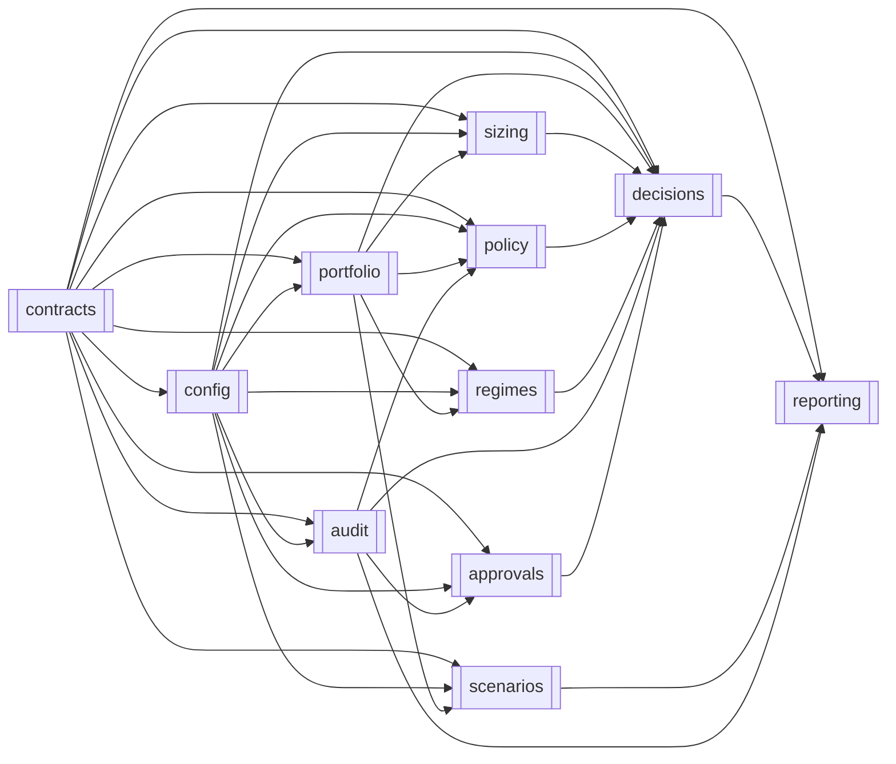

# Risk

> **Package:** `app/services/risk`
> **Status:** `Completed`
> **Last updated:** `2026-07-19`

> This README is the package's **single source of truth** for requirements, final structure, implementation sequence, progress, usage examples, and tests.
> Update this file before changing the code.

---

## 1. Purpose and Boundary

### Purpose

Risk is HaruQuantAI's independent, deterministic master gate for risk-increasing actions. It converts immutable point-in-time evidence and policy into reproducible portfolio measurements, sizing recommendations, risk decisions, approval-token results, kill-switch state, scenarios, audit records, and focused explanations. Missing, stale, invalid, or unverifiable safety evidence fails closed; Risk never executes a trade.

### Owns

- Interception and deterministic review of every `TradeIntent` before execution.
- Final approved or capped position size, safety limits, exposure, concentration, drawdown, margin, leverage, historical VaR/CVaR, and correlation-impact evaluation.
- Risk policy/profile validation, stable configuration hashes, fixed decision precedence, and canonical reason/error codes.
- Canonical `RiskDecision` production through the concrete `RiskDecisionPackage` v1 schema.
- Kill-switch policy, `global > portfolio > strategy > symbol` hierarchy, canonical active state,
  block-state evaluation, clearance, and recovery eligibility.
- Approval-attestation validation, action-policy verdicts, approval-token issuance,
  validation, revocation, scope binding, expiry, and atomic durable single-use reservation.
- Strategy operational-eligibility decisions for exact registered versions/scopes, without owning technical registration.
- Allocation approval/capping/rejection, authoritative portfolio risk-budget projections, and budget activation, without constructing or executing allocations.
- Deterministic regime assessment, advisory scenario/what-if analysis, risk summaries, and risk-owned audit-chain records.

### Does not own

- Market, broker, account, position, pending-order, calendar, session, liquidity, or execution-state acquisition.
- Strategy signal generation or registry mutation; Portfolio-owned construction, allocation versioning, drift detection, or rebalance planning; portfolio execution, broker submission, fills, reconciliation, or emergency execution mutation.
- MT5 connections, provider SDK objects, broker credentials, database connection/locking infrastructure, broad performance reporting, cost reporting, incident management, or enterprise audit services.
- Full replay/timeline/cockpit infrastructure, ranked recommendation engines, parametric VaR, exit-liquidity stress, or graduated step-down controls in the initial build.
- Live approval from unverified text or any override of deterministic policy or kill-switch state.

### Shared contracts

Contract names, versions, and owners follow `docs/PROJECT.md`. The package path is `app/services/risk`, matching the top-level registry.

**Owned by this domain** — defined authoritatively here:
| Status | Contract | Version | Counterparty | Purpose |
|---|---|---|---|---|
| Completed | `RiskDecision`, represented by `RiskDecisionPackage` | `v1` | Trading, UI/API, Simulation | Return an independent verdict, approved size, reasons, evidence/config provenance, expiry, and optional approval token. |
| Completed | `ActionPolicyVerdict` | `v1` | Trading, UI/API | Return a Risk-owned allowed/denied action classification bound to approval, policy version, scope, and expiry. |
| Completed | `KillSwitchCommand` | `v1` | UI/API | Request authorized activation or clearance of Risk's canonical kill-switch state. |
| Completed | `KillSwitchState` | `v1` | Trading, UI/API | Publish canonical active/inactive state, scope, reason, version, and update time. |
| Completed | `ApprovalAttestation` | `v1` | UI/API | Authenticated human approval evidence containing action/scope, policy reference/version, issue/expiry times, principal, and trace IDs. |
| Completed | `StrategyOperationalEligibilityRequest` | `v1` | UI/API, Portfolio submit; Risk receives | Request deterministic operational review of an exact registered strategy version and scope. |
| Completed | `StrategyOperationalEligibilityDecision` | `v1` | Portfolio, Trading, UI/API | Publish scoped approval, conditions, suspension, expiry, or rejection without altering Strategy registration. |
| Completed | `AllocationReviewRequest` | `v1` | Portfolio submits; Risk receives | Request independent review of a Portfolio construction result or rebalance plan. |
| Completed | `AllocationRiskDecision` | `v1` | Portfolio, Trading, UI/API | Publish approval/caps/conditions/rejection and the authoritative risk-budget projection. |
| Completed | `PortfolioBudgetExecutionVerdict` | `v1` | Trading | Publish a current Risk-owned allow/block verdict bound to one portfolio allocation, rebalance plan/hash, budget unit, and expiry without delegating calculation to Trading. |
| Completed | `AllocationBudgetActivationRequest` | `v1` | Portfolio submits; Risk receives | Activate the Risk-owned budget projection for one approved immutable allocation version. |
| Completed | `ScenarioResult` | `v1` | UI/API, Research | Publish a bounded deterministic advisory comparison that cannot grant execution approval. |

Each registered Risk contract carries `contract_version="v1"` and a separate
stable `risk.<contract_name>.v1` `schema_id`, including the eligibility,
allocation-review, and budget-activation family above. Compatibility is evaluated
only from `contract_version`.

**Consumed from other domains** — referenced only:

| Contract | Version | Owner | Used for |
|---|---|---|---|
| `TradeIntent` | `v1` | Strategy | Embedded unchanged inside the Risk-owned `ProposedTrade` receiver contract; Risk validates the complete public Strategy contract plus additional valuation and stop evidence. |
| `AccountStateSnapshot` | `v1` | Data | Read-only account, position, margin, and snapshot-time evidence. |
| `MarketContextEvidence` | `v1` | Data | Normalized session, calendar, spread, liquidity, volatility, correlation, crisis, freshness, provenance, and missingness evidence. |
| `FXConversionEvidence` | `v1` | Data | Fresh Data-owned conversion path/rate evidence; Risk never synthesizes rates. |
| Strategy registry reference | `v1` | Strategy | Verify exact immutable technical registration before operational eligibility review. |
| `PortfolioAllocationEvidence` | `v1` | Analytics | Consume non-binding performance/dependence/concentration evidence without delegating policy. Referenced by ID/hash inside `AllocationReviewRequest`; Risk does not import the Analytics contract object, so allocation review does not require the Analytics implementation to be present. |
| `AuthContext` | `v1` | Utils | Authenticated principal, roles/scopes, workflow, request, and correlation context. |
| `AuditEvent` | `v1` | Utils | Redacted common envelope through which Risk submits audit payloads to Data's durable audit storage. |

No raw DataFrame, provider object, socket, database session, or broker client may cross the Risk boundary.

### Persisted state

Data owns database connections, locking, and migration execution. Risk owns the following schemas and is their only semantic writer; concrete persistence occurs through injected narrow interfaces.

| Status | State / Store | Read access (via contract) | Migration definitions |
|---|---|---|---|
| Completed | Risk policy versions and configuration hashes | Risk; UI/API through approved policy views | `app/services/risk/audit/migrations.py` |
| Completed | Canonical kill-switch state | Trading and UI/API through `KillSwitchState` v1 | `app/services/risk/audit/migrations.py` |
| Completed | Approval-token issuance, revocation, nonce, and atomic reservation/consumption state | Risk validation only; validation result returned to caller | `app/services/risk/audit/migrations.py` |
| Completed | Decision audit chain, including `previous_hash` and `record_hash` | Trading/UI/API through `RiskDecision` and audit views through `AuditEvent` | `app/services/risk/audit/migrations.py` |
| Completed | Operational-eligibility decisions and suspension/expiry history | Portfolio, Trading, UI/API through `StrategyOperationalEligibilityDecision` | `app/services/risk/audit/migrations.py` |
| Completed | Allocation decisions and active authoritative risk-budget projections | Portfolio, Trading, UI/API through `AllocationRiskDecision` and approved Risk views | `app/services/risk/audit/migrations.py` |
| Completed | Optional decision/snapshot records enabled by an approved profile | Callers through Risk-owned result contracts only | `app/services/risk/audit/migrations.py` |

### Four-level structure

| Code level | Represents |
|---|---|
| **Package** | Risk domain |
| **Module folder** | One Risk feature/capability |
| **File** | One use case or focused responsibility |
| **Class / function / method** | Observable functional requirement |

```text
Risk package
└── Capability module
    └── Focused file
        └── Public class / function / method / constant
```

### Package capability map

```mermaid
flowchart TD
    RISK[[Risk Package]]
    RISK --> CONTRACTS[[contracts]]
    RISK --> CONFIG[[config]]
    RISK --> PORTFOLIO[[portfolio]]
    RISK --> SIZING[[sizing]]
    RISK --> POLICY[[policy]]
    RISK --> REGIMES[[regimes]]
    RISK --> AUDIT[[audit]]
    RISK --> APPROVALS[[approvals]]
    RISK --> DECISIONS[[decisions]]
    RISK --> SCENARIOS[[scenarios]]
    RISK --> REPORTING[[reporting]]

    CONTRACTS --> CFILES[Enums, errors, evidence, requests, results]
    CONFIG --> CFGFILES[Profiles and config hashes]
    PORTFOLIO --> PFILES[Evidence normalization and snapshot]
    SIZING --> SFILES[Position sizing]
    POLICY --> POFILES[Limits, market context, admission, allocation]
    REGIMES --> RFILES[Regime assessment]
    AUDIT --> AFILES[Hash chain, persistence interface, migrations]
    APPROVALS --> APFILES[Token lifecycle and state interface]
    DECISIONS --> DFILES[Governor, validity, kill switch]
    SCENARIOS --> SCFILES[Scenario and what-if analysis]
    REPORTING --> RPFILES[Markdown and JSON summaries]
```



---

## 2. Final Package Structure

Modules and files are ordered from lowest dependency to highest dependency. Private helpers may be added inside the listed focused files; they are not public requirements.

```text
risk/
├── __init__.py                         # Strict domain-level exports
├── README.md
├── contracts/                          # Versioned public contracts and errors
│   ├── __init__.py
│   ├── enums.py
│   ├── errors.py
│   ├── evidence.py
│   ├── requests.py
│   └── results.py
├── config/                             # Validated profiles and stable hashes
│   ├── __init__.py
│   └── profiles.py
├── portfolio/                          # Evidence normalization and risk snapshot
│   ├── __init__.py
│   └── snapshot.py
├── sizing/                             # Position sizing recommendations
│   ├── __init__.py
│   └── calculator.py
├── audit/                              # Risk audit chain and persistence boundary
│   ├── __init__.py
│   ├── chain.py
│   ├── storage.py
│   └── migrations.py
├── policy/                             # Limits and non-trade risk gates
│   ├── __init__.py
│   ├── limits.py
│   ├── admission.py
│   └── allocation.py
├── regimes/                            # Regime assessment and tightening
│   ├── __init__.py
│   └── assessment.py
├── approvals/                          # Approval-token lifecycle
│   ├── __init__.py
│   ├── state.py
│   └── tokens.py
├── decisions/                          # Canonical governor and block-state decisions
│   ├── __init__.py
│   ├── governor.py
│   ├── validity.py
│   └── kill_switch.py
├── scenarios/                          # Advisory scenario and what-if analysis
│   ├── __init__.py
│   └── analysis.py
└── reporting/                          # Focused Risk summaries
    ├── __init__.py
    └── reports.py
```

### Module dependency diagram

Arrows point from a required module to its consumer.



### Structure rules

- Package and feature `__init__.py` files contain explicit imports and `__all__` only.
- Root `__all__` exposes only versioned public contracts and typed domain operations; it exposes no calculator, persistence backend, signer, repository, or provider object.
- Functions are preferred for stateless behavior. `RiskGovernor`, `ApprovalTokenService`, and `RiskAuditChain` are classes because they own injected dependencies and coordinated state.
- `core/`, `api/`, `models/`, `simulation/`, `safety/`, generic `storage/`, generic `validators/`, and `workflows/` compatibility layers are not part of the target.
- No module imports Trading, MT5, a broker adapter, Data internals, or another domain's persistence implementation.
- Usage examples live only under `tests/risk/usage/`.
- Section 2 dependency order governs implementation sequencing; Appendix P delivery phases do not override intra-module dependency order. A type or constructor is never implemented after its methods or consumers (e.g., `RiskConfig` precedes `load_risk_config`; `RiskAuditChain`/`ApprovalTokenService` constructors precede their methods). When only a phase slice is built, each prerequisite requirement is pulled into the same slice as its dependents.
- Section 4 Files tables are exhaustive only for production files below `app/services/risk/`. The exact Section 7 Risk test manifest, test-package `__init__.py` files, this README, `docs/CHANGELOG.md`, `pyproject.toml`, and `uv.lock` are approved supporting files.

---

## 3. Workflows

### Status values

| Status | Meaning |
|---|---|
| **Missing** | Not implemented, incompatible with the target, or not verified. |
| **Partial** | Useful V1 behavior exists but contracts, relocation, validation, persistence, or tests remain. |
| **Completed** | Target behavior, location, callers, tests, and boundaries are all verified. |

### Workflow scope values

| Scope | Meaning |
|---|---|
| **Internal** | Complete inside Risk. |
| **Cross-domain** | Risk receives or returns a documented cross-domain contract. |

| Status | Workflow ID | Scope | Workflow | Trigger / Input boundary | Final outcome / Output boundary | Requirement sequence |
|---|---|---|---|---|---|---|
| Completed | `WF-RISK-001` | Internal with Data input | Build portfolio risk snapshot | Data/account and bounded market evidence | Risk-internal immutable `PortfolioRiskSnapshot` | `FR-RISK-004 → FR-RISK-005 → FR-RISK-025` |
| Completed | `WF-RISK-002` | Cross-domain | Calculate position size | Sizing request plus portfolio/symbol evidence | `PositionSizingResult`; never approval | `FR-RISK-007 → FR-RISK-008 → FR-RISK-026` |
| Completed | `WF-RISK-003` | Cross-domain | Assess risk regime | Bounded external market/context evidence | `RegimeAssessment` and limit modifiers | `FR-RISK-011 → FR-RISK-031` |
| Completed | `WF-RISK-004` | Cross-domain | Review proposed trade risk | Risk-owned `ProposedTrade` embedding exact `TradeIntent v1`, fresh evidence, config, governance state | `RiskDecision` v1 / `RiskDecisionPackage` | `FR-RISK-006 → FR-RISK-027 → FR-RISK-031 → FR-RISK-040` |
| Completed | `WF-RISK-005` | Cross-domain | Run current portfolio governor | Current snapshot, config, kill-switch evidence | Current-state `RiskDecisionPackage`; caller remediates | `FR-RISK-005 → FR-RISK-044 → FR-RISK-041` |
| Completed | `WF-RISK-006` | Cross-domain | Review strategy operational eligibility | Exact registered strategy/version, evidence, policy, route/profile, approval context | `StrategyOperationalEligibilityDecision v1` | `FR-RISK-010 → FR-RISK-029` |
| Completed | `WF-RISK-007` | Cross-domain | Review/activate allocation risk | Portfolio construction/rebalance reference plus fresh evidence and approval context | `AllocationRiskDecision v1` and budget activation result | `FR-RISK-009 → FR-RISK-030 → FR-RISK-051` |
| Completed | `WF-RISK-008` | Cross-domain | Validate approval token | Token, expected scope/action/config, injected time | Durable validation/consumption result | `FR-RISK-015 → FR-RISK-020 → FR-RISK-037` |
| Completed | `WF-RISK-009` | Cross-domain | Apply/check kill-switch state | Authorized command or current state and scope | Canonical state or block/recovery decision | `FR-RISK-016 → FR-RISK-043 → FR-RISK-017 → FR-RISK-044` |
| Completed | `WF-RISK-010` | Cross-domain | Run scenario or what-if analysis | Immutable snapshot and scenario definitions | Advisory `ScenarioResult` | `FR-RISK-012 → FR-RISK-013 → FR-RISK-045` |
| Completed | `WF-RISK-011` | Internal/Cross-domain | Generate risk decision summary | Snapshot, decision, or scenario result | Markdown/JSON `RiskReport` | `FR-RISK-019 → FR-RISK-046` |
| Completed | `WF-RISK-012` | Cross-domain | Persist risk audit and token state | Material decision/token event | Durable hash-chain/token state or fail-closed result | `FR-RISK-018 → FR-RISK-033 → FR-RISK-037` |
| Completed | `WF-RISK-014` | Cross-domain | Revalidate decision/evidence before reuse | Prior decision/token plus current evidence/config/time | Reuse validity result; refresh or block | `FR-RISK-042 → FR-RISK-037` |

### Workflow details

#### `WF-RISK-001` — Build portfolio risk snapshot

**System workflow:** Internal contribution to `SYS-WF-001` and `SYS-WF-002`.
**Input boundary:** `AccountStateSnapshot` v1 plus explicit position, pending-order, symbol, return-history, FX-conversion, and provenance evidence supplied by owning domains.
**Output boundary:** immutable `PortfolioRiskSnapshot` retained inside Risk for sizing,
limits, regime assessment, decision synthesis, scenarios, and reporting. Cross-domain
callers receive registered `RiskDecision` contracts or UI/API-owned views, never the
snapshot directly.

1. Validate contract versions, timestamps, numeric finiteness, and profile/config hash.
2. Normalize evidence without inventing missing values or mutating inputs.
3. Include pending exposure and calculate base-currency exposure, drawdown, margin/leverage, historical VaR/CVaR, correlation, and contributions where evidence is sufficient.
4. Return calculations, assumptions, coverage, missing-evidence markers, and provenance.

**Failure behaviour:** invalid input raises `RiskDomainError(INVALID_PORTFOLIO_STATE)`; missing material conversion/metadata remains explicit and blocks live-sensitive consumers; calculation failure never creates a synthetic safe value.
**Integration test:** `tests/risk/integration/test_build_portfolio_snapshot.py::test_build_portfolio_snapshot_from_external_evidence()`

#### `WF-RISK-002` — Calculate position size

**System workflow:** Internal contribution to `SYS-WF-001` and `SYS-WF-002`.
**Input boundary:** `PositionSizingRequest` (a Risk-internal type, not a registered cross-domain contract) plus portfolio, symbol, stop, broker-constraint, volatility/correlation, and performance evidence.
**Output boundary:** `PositionSizingResult` only (Risk-internal; cross-domain consumers receive sizing outcomes only inside `RiskDecision v1`).

The calculator supports fixed-lot, fixed-risk, milestone, fractional-Kelly, volatility, and fixed-fractional methods; it clamps or rejects against supplied constraints and never returns the V1 `0.1`-lot failure fallback. Missing stop distance, zero equity, insufficient volatility/Kelly evidence, or unapproved full Kelly produces a deterministic failure or an explicitly configured fixed-risk fallback.

**Integration test:** `tests/risk/integration/test_position_sizing.py::test_position_sizing_requires_governor_after_result()`

#### `WF-RISK-003` — Assess risk regime

**System workflow:** `SYS-WF-001`, `SYS-WF-002`
**Input boundary:** external volatility, liquidity, correlation, drawdown, crisis, news, and session evidence.
**Output boundary:** `RegimeAssessment` with transition evidence and configured tightening modifiers.

Unknown or required-missing regime evidence fails closed for live-sensitive workflows. Data supplies `MarketContextEvidence v1`; Risk profiles interpret it using a default stressed lookback of 252 trading days and named UTC crisis windows, without fetching or extrapolating evidence.

**Integration test:** `tests/risk/integration/test_regime_assessment.py::test_high_risk_regime_tightens_limits()`

#### `WF-RISK-004` — Review proposed trade risk

**System workflow:** `SYS-WF-001`, `SYS-WF-002`
**Input boundary:** Risk-owned `ProposedTrade` containing the exact immutable
Strategy `TradeIntent v1`, additional current valuation and stop evidence, Data
`AccountStateSnapshot`, external market/governance evidence, `AuthContext`, and
validated config, plus the complete applicable typed `KillSwitchState` hierarchy.
Risk rejects a version mismatch or conflicting duplicated fact;
the complete embedded `TradeIntent` is retained for lineage.
**Output boundary:** `RiskDecision` v1, concretely serialized as `RiskDecisionPackage`.


The fixed precedence is validation/config → kill switch → missing/stale evidence → hard limits → policy restrictions → approval requirement → final verdict. Every material result includes `primary_failure_limit` and ordered `composite_breach_flags`. No forced/manual override is accepted.

**Failure behaviour:** any unknown safety state, unavailable mandatory audit/token state, or unresolved live double-spend protection blocks approval.
**Integration test:** `tests/risk/integration/test_trade_review.py::test_trade_review_uses_fixed_precedence_and_fails_closed()`

#### `WF-RISK-005` — Run current portfolio governor

**System workflow:** `SYS-WF-001`, `SYS-WF-002`, `SYS-WF-005`
**Input boundary:** current snapshot, config, regime, complete applicable typed
`KillSwitchState` hierarchy, and governance evidence.
**Output boundary:** current-state compliance `RiskDecisionPackage`; Trading/UI/API owns remediation.

Risk detects breaches and recommends block/reduction/review without cancelling orders, closing positions, or changing execution controls.

**Integration test:** `tests/risk/integration/test_portfolio_governor.py::test_portfolio_governor_has_no_execution_side_effect()`

#### `WF-RISK-006` — Review strategy admission

**System workflow:** `SYS-WF-006`
**Input boundary:** `StrategyOperationalEligibilityRequest v1`, exact Strategy
registration reference, required Data evidence, policy, route/profile, and approval
context.
**Output boundary:** `StrategyOperationalEligibilityDecision v1`.

Risk approves, conditions, expires, suspends, or rejects operational use without
altering Strategy's registry. Registration alone never authorizes allocation or
execution; missing or stale evidence fails closed.

**Integration test:** `tests/risk/integration/test_strategy_admission.py::test_operational_eligibility_fails_closed()`

#### `WF-RISK-007` — Review allocation proposal

**System workflows:** `SYS-WF-007`, `SYS-WF-008`
**Input boundary:** `AllocationReviewRequest v1` carries a self-contained
Risk-owned projection of the immutable candidate or rebalance plan plus current
eligibility, account, market, FX, Analytics, policy, and approval evidence. The
projection contains only scalar values, ordered components, identifiers, versions,
references, and hashes; it never embeds or imports a Portfolio-owned contract.
**Output boundary:** `AllocationRiskDecision v1` and, after a valid
`AllocationBudgetActivationRequest v1`, the active authoritative risk-budget
projection.

Risk may approve, cap, condition, expire, or reject. It never constructs Portfolio
weights, activates Portfolio state, or executes a rebalance. Capital weights remain
Portfolio metadata; the Risk budget projection is the binding control.

**Integration test:** `tests/risk/integration/test_allocation_review.py::test_allocation_review_and_budget_activation()`

#### `WF-RISK-008` — Validate approval token

**System workflow:** `SYS-WF-002`
**Input boundary:** token plus expected decision, action, account, strategy, symbol,
config, Risk-owned and UI/API-produced `ApprovalAttestation`, audit requirement, and injected time.
**Output boundary:** `ApprovalValidationResult`; caller proceeds only when valid and durably consumed.

Schema, HMAC-or-stronger signature, scope, decision/config binding, expiry,
revocation, nonce, single use, authorized attestation, and mandatory audit write are
checked atomically. Risk reserves token + workflow + action scope + expiry before a
live-success path; concurrent or conflicting reservation fails closed.

**Integration test:** `tests/risk/integration/test_approval_tokens.py::test_live_token_is_consumed_once_durably()`

#### `WF-RISK-009` — Apply or check kill-switch state

**System workflow:** `SYS-WF-005`
**Input boundary:** UI/API `KillSwitchCommand` with explicit scope level
(`global`, `portfolio`, `strategy`, or `symbol`) and applicable identifiers, plus a
separate `AuthContext`. Clearance also requires a matching current
`ApprovalAttestation`; activation does not.
**Output boundary:** canonical `KillSwitchState` and deterministic block/recovery decision consumed by Trading/UI/API.

Active or unknown state blocks live risk increase. `global` state overrides
`portfolio`, which overrides `strategy`, which overrides `symbol`; an inactive child cannot override an active
parent. Risk persists canonical state and revokes affected approvals; only Trading
mutates execution controls. Clearance requires a valid Risk-owned, UI/API-produced
`ApprovalAttestation`, and Trading resumes only after all applicable scopes are
inactive and reconciliation succeeds.

**Integration test:** `tests/risk/integration/test_kill_switch.py::test_kill_switch_command_blocks_trading_without_execution_mutation()`

#### `WF-RISK-010` — Run scenario or what-if analysis

**System workflow:** Cross-domain advisory result; no execution workflow is registered.
**Input boundary:** immutable snapshot plus bounded `ScenarioDefinition` values.
**Output boundary:** registered `ScenarioResult v1` advisory baseline/projected comparison.

No live state changes. Scenario output cannot claim approval and must pass through the canonical governor before any action.

**Integration test:** `tests/risk/integration/test_scenario_analysis.py::test_scenario_analysis_is_deterministic_and_advisory()`

#### `WF-RISK-011` — Generate risk decision summary

**System workflow:** `SYS-WF-001`, `SYS-WF-002`, `SYS-WF-005`
**Input boundary:** completed snapshot, decision, or scenario result.
**Output boundary:** focused Markdown/JSON `RiskReport`.

Evidence, calculations, assumptions, warnings, decisions, and recommendations are separated. Rejections/blocks identify the primary failure first. Live approval is claimed only when a valid decision and token are present.

**Integration test:** `tests/risk/integration/test_risk_reporting.py::test_report_separates_evidence_and_decision()`

#### `WF-RISK-012` — Persist risk audit and token state

**System workflow:** `SYS-WF-002`, `SYS-WF-005`
**Input boundary:** material decision, kill-switch, audit, or token event.
**Output boundary:** Risk-owned record persisted through Data-owned infrastructure or a fail-closed live result.

Canonical JSON and SHA-256-or-stronger hashing bind each record to `previous_hash`; genesis defaults to 64 zeroes unless deployment config specifies another constant. Partial writes, tamper, or mandatory-store unavailability block live-sensitive success.

**Integration test:** `tests/risk/integration/test_risk_persistence.py::test_audit_and_token_state_fail_closed_atomically()`

#### `WF-RISK-014` — Revalidate decision/evidence before reuse

**System workflow:** `SYS-WF-001`, `SYS-WF-002`
**Input boundary:** prior decision/token plus current proposal, evidence, config, and injected time.
**Output boundary:** reusable/refresh-required/blocked validation result.

Material scope change, expiry, clock skew, stale evidence, config mismatch, in-flight reconciliation expiry, revoked token, or consumed token invalidates reuse.

**Integration test:** `tests/risk/integration/test_decision_revalidation.py::test_material_change_requires_new_decision()`

---

## 4. Module and Requirement Specifications

Requirements are ordered by implementation dependency. Each public symbol appears in exactly one `FR-RISK-*` row.
Manifest identifiers are configuration fields or private implementation constants unless a file's `Key exports` explicitly lists them; they do not create additional public symbols.
Shortened test references are relative to the module's documented `tests/risk/usage/test_usage_*.py` file or to `tests/risk/unit/`; together with the module's `Usage file` line they identify one exact pytest node.

The corrected implementation sequence is `4.1 contracts → 4.2 config → 4.3
portfolio → 4.4 sizing → 4.7 audit → 4.5 policy → 4.6 regimes → 4.8
approvals → 4.9 decisions → 4.10 scenarios → 4.11 reporting`. Audit precedes
the persistent policy gates so those gates can use Risk-owned audit semantics while
all concrete database infrastructure remains injected and Data-owned.

### 4.1 `contracts/` — Versioned Contracts and Deterministic Errors

**Purpose:** Define strict Pydantic V2 contracts, exact Decimal serialization, canonical enums, and one coded domain exception without business I/O.

**Module flow:** `untrusted mapping → strict contract/version/finite-value validation → immutable typed value or coded error`

#### Files

| Status | File | Responsibility | Key exports | Dependencies |
|---|---|---|---|---|
| Completed | `enums.py` | Canonical stable enum values | `DecisionState`, `LimitStatus`, `RiskErrorCode` | **Standard library:** enum<br>**Required third-party:** None<br>**Local:** None |
| Completed | `errors.py` | Coded domain exception | `RiskDomainError` | **Standard library:** None<br>**Required third-party:** None<br>**Local:** `enums.py → RiskErrorCode` |
| Completed | `evidence.py` | Immutable normalized portfolio evidence and compatibility validation for Data-owned account, FX-conversion, and market-context evidence | `PortfolioState`, `PortfolioRiskSnapshot`, `validate_market_context_evidence` | **Standard library:** datetime, decimal<br>**Required third-party:** pydantic 2.13.4<br>**Local:** `enums.py → LimitStatus`; `app.services.data.contracts → AccountStateSnapshot, FXConversionEvidence, MarketContextEvidence` |
| Completed | `requests.py` | Versioned Risk-owned request contracts | `ProposedTrade`, `PositionSizingRequest`, `AllocationReviewRequest`, `AllocationBudgetActivationRequest`, `StrategyOperationalEligibilityRequest`, `ApprovalAttestation`, `ScenarioDefinition`, `KillSwitchCommand` | **Standard library:** datetime, decimal<br>**Required third-party:** pydantic 2.13.4<br>**Local:** `enums.py → DecisionState`; `app.services.strategy → TradeIntent` |
| Completed | `results.py` | Versioned Risk-owned result/state contracts | `RiskLimitResult`, `PositionSizingResult`, `RegimeAssessment`, `ScenarioResult`, `RiskDecisionPackage`, `ActionPolicyVerdict`, `RiskApprovalToken`, `KillSwitchState`, `RiskAuditRecord`, `RiskReport`, `ApprovalValidationResult`, `DecisionReuseValidationResult`, `StrategyOperationalEligibilityDecision`, `AllocationRiskDecision`, `PortfolioBudgetExecutionVerdict` | **Standard library:** datetime, decimal<br>**Required third-party:** pydantic 2.13.4<br>**Local:** `enums.py`, `evidence.py`, `requests.py` |
| Completed | `__init__.py` | Expose the approved contract API | All symbols above | **Standard library:** None<br>**Required third-party:** None<br>**Local:** files above |

#### Configuration and Limits Manifest

| Status | Setting / Limit | Type | Default | Required | Used by | Description |
|---|---|---|---|---|---|---|
| Completed | `SCHEMA_VERSION` | `str` | `v1` | Yes | Every public model | Reject unsupported breaking contract versions. |
| Completed | `DECIMAL_ROUNDING` | rounding mode | `ROUND_HALF_EVEN` | Yes | Monetary/sizing validators | Different mode requires an approved profile. |
| Completed | `ALLOW_INF_NAN` | `bool` | `False` | Yes | Every public model | Non-finite values are rejected. |

#### Functional requirements

| Status | Requirement ID | Responsibility | Class / Function / Method | Side Effects | Raises | Usage / Test |
|---|---|---|---|---|---|---|
| Completed | `FR-RISK-001` | Define `approve`, `warn`, `needs_approval`, `needs_more_evidence`, `reject`, `block`, and `error` exactly. | `DecisionState` | None | None | **Usage:** `tests/risk/usage/test_usage_contracts.py::test_usage_enums_decision_state()`<br>**Unit:** `tests/risk/unit/test_enums.py::test_decision_state_values_are_stable()` |
| Completed | `FR-RISK-002` | Define `pass`, `warn`, `needs_more_evidence`, `fail`, and `blocked` exactly. | `LimitStatus` | None | None | **Usage:** `test_usage_contracts.py::test_usage_enums_limit_status()`<br>**Unit:** `test_enums.py::test_limit_status_values_are_stable()` |
| Completed | `FR-RISK-003` | Define exactly `INVALID_INPUT`, `VALIDATION_FAILED`, `INVALID_PORTFOLIO_STATE`, `INVALID_RISK_CONFIG`, `MISSING_EVIDENCE`, `STALE_EVIDENCE`, `LIMIT_FAILED`, `POLICY_BLOCKED`, `PERMISSION_DENIED`, `KILL_SWITCH_ACTIVE`, `KILL_SWITCH_UNKNOWN`, `APPROVAL_REQUIRED`, `APPROVAL_TOKEN_INVALID`, `APPROVAL_TOKEN_EXPIRED`, `APPROVAL_TOKEN_REVOKED`, `APPROVAL_TOKEN_CONSUMED`, `CONFIG_VERSION_MISMATCH`, `PENDING_APPROVAL_DOUBLE_SPEND_BLOCKED`, `PAYLOAD_TOO_LARGE`, `MISSING_STOP_LOSS`, `INSUFFICIENT_VOLATILITY_EVIDENCE`, `INSUFFICIENT_K_EVIDENCE`, `LIVE_STATE_STALE`, `IN_FLIGHT_TOLERANCE_EXCEEDED`, `IN_FLIGHT_RECONCILIATION_EXPIRED`, `AUDIT_CHAIN_TAMPER_DETECTED`, `CALCULATION_FAILED`, `SNAPSHOT_BUILD_FAILED`, `GOVERNOR_DECISION_FAILED`, `REPORT_GENERATION_FAILED`, `STORAGE_ERROR`, `TOOL_EXECUTION_FAILED`, and `UNKNOWN_ERROR`; historical VaR/CVaR is the sole supported VaR method. | `RiskErrorCode` | None | None | **Usage:** `test_usage_contracts.py::test_usage_errors_codes()`<br>**Unit:** `test_errors.py::test_error_code_catalog()` |
| Completed | `FR-RISK-004` | Carry exact immutable Data-owned `AccountStateSnapshot v1` and `FXConversionEvidence v1` values plus peak/day-start/inception equity, symbol mark prices, contract sizes, quote currencies, exposure dimensions, aligned timestamped per-symbol return histories, explicit pair correlations, UTC `as_of`, provenance, missingness, and schema version. Open `AccountOrder.quantity` is the full remaining pending quantity for Risk exposure. | `PortfolioState` | None | `ValidationError`: invalid version, naive or unaligned time, non-finite Decimal, missing valuation/FX metadata, malformed correlation key, or malformed evidence | **Usage:** `test_usage_contracts.py::test_usage_evidence_portfolio_state()`<br>**Unit:** `test_evidence.py::test_portfolio_state_preserves_missingness()` |
| Completed | `FR-RISK-005` | Carry reproducible base-currency equity, daily/total loss, exposure, drawdown, margin/leverage, historical tail-risk, volatility/correlation/contribution metrics, limit results, assumptions, coverage, regime, request/workflow IDs, evidence refs, and config hash. | `PortfolioRiskSnapshot` | None | `ValidationError`: invalid or non-finite result | **Usage:** `test_usage_contracts.py::test_usage_evidence_portfolio_snapshot()`<br>**Unit:** `test_evidence.py::test_snapshot_serializes_decimal_exactly()` |
| Completed | `FR-RISK-058` | Validate the consumed Data-owned `MarketContextEvidence v1` version, UTC freshness, provenance, bounded values, and explicit missingness without redefining or fetching it. | `validate_market_context_evidence(evidence: MarketContextEvidence, *, now: datetime) -> None` | None | `RiskDomainError(MISSING_EVIDENCE, STALE_EVIDENCE, VALIDATION_FAILED)`: incompatible, stale, or malformed evidence | **Usage:** `test_usage_contracts.py::test_usage_evidence_market_context()`<br>**Unit:** `test_evidence.py::test_market_context_uses_data_owned_contract()` |
| Completed | `FR-RISK-059` | Return `ActionPolicyVerdict v1` bound to action, scope, policy version, approval attestation, decision, reservation, expiry, reasons, and trace IDs. | `ActionPolicyVerdict` | None | `ValidationError`: inconsistent, unbound, or non-UTC verdict | **Usage:** `test_usage_contracts.py::test_usage_results_action_policy()`<br>**Unit:** `test_results.py::test_action_policy_verdict_requires_reservation()` |
| Completed | `FR-RISK-060` | Carry one ordered limit result with status, observed/threshold values, reason code, evidence refs, and precedence without granting approval. | `RiskLimitResult` | None | `ValidationError`: inconsistent status/reason or non-finite value | **Usage:** `test_usage_contracts.py::test_usage_results_limit()`<br>**Unit:** `test_results.py::test_limit_result_invariants()` |
| Completed | `FR-RISK-006` | Define the Risk-owned receiver contract for one non-executable review. It embeds the complete immutable Strategy `TradeIntent v1` unchanged and adds current valuation, stop-distance, account/portfolio scope, evidence timestamps, provenance references/hashes, and requested Risk profile. Risk rejects an incompatible intent version, conflicting duplicated fact, invalid scope/size, or absent required stop evidence. | `ProposedTrade` | None | `ValidationError`: incompatible intent, conflicting evidence, invalid size/scope, or required stop evidence absent | **Usage:** `test_usage_contracts.py::test_usage_requests_proposed_trade()`<br>**Unit:** `test_requests.py::test_proposed_trade_requires_fixed_risk_stop()` |
| Completed | `FR-RISK-007` | Represent one of six sizing methods and its complete evidence/config references. | `PositionSizingRequest` | None | `ValidationError`: unknown method or incomplete method evidence | **Usage:** `test_usage_contracts.py::test_usage_requests_sizing()`<br>**Unit:** `test_requests.py::test_sizing_request_is_method_strict()` |
| Completed | `FR-RISK-008` | Return exact requested/normalized size, constraints applied, evidence gaps, fallback disclosure, and no approval claim. | `PositionSizingResult` | None | `ValidationError`: non-finite result | **Usage:** `test_usage_contracts.py::test_usage_results_sizing()`<br>**Unit:** `test_results.py::test_sizing_result_cannot_claim_approval()` |
| Completed | `FR-RISK-009` | Define `AllocationReviewRequest v1` carrying a self-contained Risk-owned projection (projection kind, portfolio/result/plan IDs and versions, ordered weights or actions, eligibility decisions, account/market/FX evidence references and hashes, runtime scope, approval references); it never embeds or imports a Portfolio-owned contract. | `AllocationReviewRequest` | None | `ValidationError`: non-self-contained, incompatible, or non-UTC request | **Usage:** `test_usage_contracts.py::test_usage_requests_allocation_review()`<br>**Unit:** `test_requests.py::test_allocation_review_request_is_self_contained()` |
| Completed | `FR-RISK-010` | Define `StrategyOperationalEligibilityRequest v1` for an exact registered strategy/version and scope (strategy/version, runtime profile, route, policy/evidence/approval references, requested scope). | `StrategyOperationalEligibilityRequest` | None | `ValidationError`: incompatible scope, missing references, or non-UTC request | **Usage:** `test_usage_contracts.py::test_usage_requests_strategy_eligibility()`<br>**Unit:** `test_requests.py::test_strategy_eligibility_request_binds_exact_version()` |
| Completed | `FR-RISK-011` | Return classified volatility/liquidity/correlation/drawdown/crisis/news/session states, transition evidence, modifiers, and missingness. | `RegimeAssessment` | None | `ValidationError`: invalid regime value | **Usage:** `test_usage_contracts.py::test_usage_results_regime()`<br>**Unit:** `test_results.py::test_regime_assessment_carries_transition()` |
| Completed | `FR-RISK-012` | Define a bounded immutable advisory scenario with deterministic shocks and optional explicit seed. | `ScenarioDefinition` | None | `ValidationError`: unsupported/non-finite shock or unseeded randomness | **Usage:** `test_usage_contracts.py::test_usage_requests_scenario()`<br>**Unit:** `test_requests.py::test_scenario_requires_seed_if_randomized()` |
| Completed | `FR-RISK-013` | Return baseline/projected risk comparison and state that the output is advisory and not approved. | `ScenarioResult` | None | `ValidationError`: invalid projection | **Usage:** `test_usage_contracts.py::test_usage_results_scenario()`<br>**Unit:** `test_results.py::test_scenario_result_is_advisory()` |
| Completed | `FR-RISK-014` | Implement `RiskDecision` v1 with verdict, trade-only approved size, ordered checks, primary/composite reasons, provenance, expiry, concurrency disclosure, and optional token. A current-state compliance approval has no intent and no invented trade size. | `RiskDecisionPackage` | None | `ValidationError`: inconsistent verdict/token or missing provenance | **Usage:** `test_usage_contracts.py::test_usage_results_decision()`<br>**Unit:** `test_results.py::test_decision_package_invariants()` |
| Completed | `FR-RISK-015` | Carry signed token scope, decision/config hashes, approver, expiry, nonce, schema version, and no secret key. | `RiskApprovalToken` | None | `ValidationError`: incomplete or non-UTC token | **Usage:** `test_usage_contracts.py::test_usage_results_token()`<br>**Unit:** `test_results.py::test_token_contract_has_required_bindings()` |
| Completed | `FR-RISK-016` | Implement `KillSwitchCommand v1` with action, explicit scope level, applicable portfolio/strategy/symbol identifiers, reason, UTC timestamp, request/workflow/correlation IDs, and schema identity. Principal authorization remains in the separate `AuthContext`; clearance requires a separate matching current `ApprovalAttestation`. | `KillSwitchCommand` | None | `ValidationError`: invalid action, scope, identifiers, time, or trace identity | **Usage:** `test_usage_contracts.py::test_usage_requests_kill_switch()`<br>**Unit:** `test_requests.py::test_kill_switch_command_requires_scope_and_reason()` |
| Completed | `FR-RISK-017` | Implement `KillSwitchState` v1 with scope, active/unknown state, reason, version, and UTC update time. | `KillSwitchState` | None | `ValidationError`: invalid transition data | **Usage:** `test_usage_contracts.py::test_usage_results_kill_switch()`<br>**Unit:** `test_results.py::test_kill_switch_unknown_is_representable()` |
| Completed | `FR-RISK-018` | Carry canonical redacted audit payload and evidence/config/decision provenance in either an explicitly unsealed append input (`sealed=False`, null sequence/hashes) or a sealed result (`sealed=True`, complete sequence, previous hash, and record hash). Persisted or cross-domain audit results must be sealed. | `RiskAuditRecord` | None | `ValidationError`: secret-like field, invalid sealed/unsealed state, invalid hash, or incomplete provenance | **Usage:** `test_usage_contracts.py::test_usage_results_audit()`<br>**Unit:** `test_results.py::test_audit_record_redacts_secrets()` |
| Completed | `FR-RISK-019` | Carry Markdown or exact JSON summary with separated evidence, assumptions, warnings, decision, and recommendations. | `RiskReport` | None | `ValidationError`: invalid format or false approval state | **Usage:** `test_usage_contracts.py::test_usage_results_report()`<br>**Unit:** `test_results.py::test_report_contract_separates_sections()` |
| Completed | `FR-RISK-020` | Return token validity, consumption state, reason code, audit reference, and an optional `ActionPolicyVerdict`; the verdict is present and allowed only after successful atomic reservation/consumption and is absent on every failure, without exposing secrets. | `ApprovalValidationResult` | None | `ValidationError`: inconsistent valid/reason/verdict state | **Usage:** `test_usage_contracts.py::test_usage_results_token_validation()`<br>**Unit:** `test_results.py::test_validation_result_invariants()` |
| Completed | `FR-RISK-021` | Raise one redacted domain exception carrying a `RiskErrorCode` and safe details for boundary mapping. | `RiskDomainError(code: RiskErrorCode, details: str)` | None | None | **Usage:** `test_usage_contracts.py::test_usage_errors_domain_error()`<br>**Unit:** `test_errors.py::test_domain_error_redacts_details()` |
| Completed | `FR-RISK-047` | Define `ApprovalAttestation v1` authenticated human approval evidence (principal, action, scope, policy reference/version, issue/expiry times, trace IDs); it carries no secret and is never execution authority by itself. | `ApprovalAttestation` | None | `ValidationError`: missing binding, non-UTC time, or secret-like field | **Usage:** `test_usage_contracts.py::test_usage_requests_approval_attestation()`<br>**Unit:** `test_requests.py::test_approval_attestation_requires_scope_and_expiry()` |
| Completed | `FR-RISK-048` | Define `AllocationBudgetActivationRequest v1` (allocation and decision references, scope, effective time, predecessor, trace IDs) to activate the Risk-owned budget projection for one approved allocation version. | `AllocationBudgetActivationRequest` | None | `ValidationError`: missing references, invalid scope, or non-UTC time | **Usage:** `test_usage_contracts.py::test_usage_requests_budget_activation()`<br>**Unit:** `test_requests.py::test_budget_activation_request_binds_decision_and_version()` |
| Completed | `FR-RISK-049` | Define `StrategyOperationalEligibilityDecision v1` (decision ID, strategy/version, scope, verdict, conditions, policy version, issue/expiry times, evidence lineage) without altering Strategy registration. | `StrategyOperationalEligibilityDecision` | None | `ValidationError`: inconsistent verdict/scope or non-UTC time | **Usage:** `test_usage_contracts.py::test_usage_results_strategy_eligibility_decision()`<br>**Unit:** `test_results.py::test_strategy_eligibility_decision_invariants()` |
| Completed | `FR-RISK-050` | Define `AllocationRiskDecision v1` (decision ID, reviewed version, verdict, capped weights, authoritative risk-budget projection, conditions, issue/expiry times, policy/evidence lineage). | `AllocationRiskDecision` | None | `ValidationError`: inconsistent verdict or non-finite projection | **Usage:** `test_usage_contracts.py::test_usage_results_allocation_decision()`<br>**Unit:** `test_results.py::test_allocation_risk_decision_invariants()` |
| Completed | `FR-RISK-061` | Define `PortfolioBudgetExecutionVerdict v1` as the sole execution-time budget result: it binds the current allocation decision, portfolio/allocation version, plan ID/hash, budget unit, allowed state, reasons, and UTC validity. Trading validates this result and never calculates budget consumption. | `PortfolioBudgetExecutionVerdict` | None | `ValidationError`: incomplete binding, inconsistent verdict, or invalid UTC lifetime | **Usage:** `tests/risk/usage/test_usage_contracts.py::test_usage_results_portfolio_budget_execution_verdict()`<br>**Unit:** `tests/risk/unit/test_results.py::test_budget_execution_verdict_requires_exact_plan_binding()` |

**Rules and implementation notes:**

- Pydantic models use strict mode, `extra="forbid"`, `allow_inf_nan=False`, UTC-aware timestamps, immutable public results, and exact Decimal-to-string JSON serialization.
- Define contract semantics from this specification; merge any duplicate model types into one canonical type; no compatibility namespace is canonical.
- The `FR-RISK-003` list is the exhaustive V1 error-code catalog; no alias or unlisted code is accepted.
- `PortfolioState.return_timestamps` is strictly increasing. Every `return_history`
  series has exactly the same length and index alignment. Correlation keys are
  canonical lexical pairs in the exact form `SYMBOL_A|SYMBOL_B`, where
  `SYMBOL_A < SYMBOL_B`; values are in `[-1, 1]`. Each symbol referenced by an
  account position, open order, return history, or correlation has an exact mark
  price, contract size, quote currency, and exposure-dimension entry. Quote-to-base
  conversion uses one matching unexpired Data-owned `FXConversionEvidence v1`,
  except when quote currency already equals the account base currency.

**Usage file:** `tests/risk/usage/test_usage_contracts.py`

### 4.2 `config/` — Risk Profiles and Stable Configuration

**Purpose:** Load, validate, select, and hash profile-driven Risk configuration without inventing trading thresholds.

**Module flow:** `configs/risk/*.yaml → strict RiskConfig → canonical JSON → config hash`

| Status | File | Responsibility | Key exports | Dependencies |
|---|---|---|---|---|
| Completed | `profiles.py` | Profile contract, load/validation, and hashing | `RiskConfig`, `load_risk_config`, `compute_config_hash` | **Standard library:** datetime, decimal, hashlib, json, pathlib<br>**Required third-party:** pydantic 2.13.4; PyYAML 6.0.3<br>**Local:** `contracts` |
| Completed | `__init__.py` | Expose config API | symbols above | **Standard library:** None<br>**Required third-party:** None<br>**Local:** `profiles.py` |

#### Configuration and Limits Manifest

| Status | Setting / Limit | Type | Default | Required | Used by | Description |
|---|---|---|---|---|---|---|
| Completed | `RISK_PROFILE` | `str` | `research` | Yes | `load_risk_config()` | Selects an approved profile; missing live profile fails closed. |
| Completed | `CONFIG_ROOT` | `Path` | `configs/risk` | Yes | `load_risk_config()` | Path is bounded and may not escape the approved root. |
| Completed | `PENDING_ORDER_EXPOSURE_POLICY` | enum | None | Live: Yes | snapshot/governor | Missing policy with pending orders blocks review. |
| Completed | `EVIDENCE_MAX_AGE_SECONDS` | mapping | None | Live: Yes | snapshot/governor/token validity | No default is invented; stale evidence fails closed. |
| Completed | `CLOCK_SKEW_TOLERANCE_SECONDS` | `Decimal` | None | Live: Yes | validity/token checks | Exceeding tolerance invalidates evidence/token. |
| Completed | `AUDIT_PERSISTENCE_REQUIRED` | `bool` | `True` for live | Yes | governor/audit/token | Mandatory-store failure blocks live success. |

#### Normative `RiskConfig v1` field schema

`RiskConfig` is one frozen strict Pydantic model. Names below are the exact Python
field names and YAML keys. Mapping keys are non-empty trimmed strings; every Decimal
is finite; ratios are in `[0, 1]` unless the row states otherwise. A conditional
field may be `None` only when its enforcing capability is disabled or inapplicable.
No environment variable, hidden value, or unlisted field participates in policy.

| Field | Type | Default | Required / invariant |
|---|---|---|---|
| `schema_version` | `Literal["v1"]` | `v1` | Always. |
| `profile` | `Literal["research", "simulation", "paper", "live"]` | None | Always; must match `execution_route`. |
| `execution_route` | `Literal["none", "sim", "paper", "live"]` | None | Always; exact system profile/route matrix. |
| `policy_version` | `str` | None | Always; non-empty immutable policy identity. |
| `base_currency` | `str` | None | Always. |
| `decimal_rounding` | `Literal["ROUND_HALF_EVEN"]` | `ROUND_HALF_EVEN` | V1 supports no other mode. |
| `pending_order_exposure_policy` | `Literal["include_full_remaining_exposure", "block"]` | None | Always; unverifiable remaining exposure blocks. |
| `evidence_max_age_seconds` | `Mapping[str, int]` | None | Non-empty; each value positive; every consumed evidence kind must have a key. |
| `clock_skew_tolerance_seconds` | `Decimal` | None | Non-negative; live required. |
| `audit_persistence_required` | `bool` | `True` | Must be `True` for live. |
| `var_method` | `Literal["historical"]` | `historical` | V1 supports no parametric method. |
| `var_confidence` | `Decimal` | `0.95` | Strictly between zero and one. |
| `var_min_observations` | `int` | None | Positive; live required. |
| `var_lookback` | `int` | None | Positive and not below `var_min_observations`. |
| `max_correlation` | `Decimal` | `0.50` | Between zero and one. |
| `psd_policy` | `Literal["reject"]` | `reject` | V1 rejects non-PSD input; sanitization is deferred. |
| `min_kelly_trades` | `int` | `30` | Positive. |
| `fractional_kelly_multiplier` | `Decimal` | None | Required when fractional Kelly is used; `(0, 1]`. |
| `allow_full_kelly` | `bool` | `False` | `True` requires an approved profile. |
| `kelly_insufficient_evidence_mode` | `Literal["reject", "fixed_risk_fallback"]` | None | Required when Kelly is allowed; fallback also requires complete fixed-risk inputs. |
| `correlation_size_penalty` | `Decimal | None` | None | When set, `(0, 1]`; missing correlation then blocks its use. |
| `max_daily_loss` | `Decimal` | `0.05` | Positive ratio. |
| `max_total_loss` | `Decimal` | `0.10` | Positive ratio and not below `max_daily_loss`. |
| `max_drawdown` | `Decimal` | `0.10` | Positive ratio; configurable operational baseline. |
| `max_historical_var_ratio` | `Decimal` | `0.02` | Positive equity ratio; configurable operational baseline. |
| `max_historical_cvar_ratio` | `Decimal` | `0.03` | Positive equity ratio and not below the VaR ratio; configurable operational baseline. |
| `max_symbol_concentration` | `Decimal` | `0.10` | Maximum absolute symbol exposure divided by gross exposure. |
| `max_dimension_concentration` | `Decimal` | `0.25` | Maximum absolute non-symbol exposure dimension divided by gross exposure. |
| `monthly_target` | `Decimal | None` | `0.10` | Advisory only; excluded from public snapshot and production limits. |
| `max_margin_utilization` | `Decimal | None` | `0.50` | Configurable operational baseline; `(0, 1]`; `None` disables only outside live. |
| `max_effective_leverage` | `Decimal | None` | `10` | Conservative cross-asset operational baseline; positive and may exceed one. |
| `max_spread` | `Mapping[str, Decimal]` | empty | Keys are exact `<symbol>@<unit>` or `*@<unit>`; no unit conversion. Empty disables spread caps. |
| `news_blackout_before_minutes` | `int` | `10` | Non-negative. |
| `news_blackout_after_minutes` | `int` | `10` | Non-negative. |
| `missing_calendar_mode` | `Literal["ignore", "warn", "needs_more_evidence", "block"]` | None | Live required when calendar rules are enabled. |
| `session_timezone` | `str | None` | None | Valid IANA name when session rules are enabled. |
| `allowed_session_states` | `tuple[str, ...]` | `("open",)` | Exact normalized states allowed when session policy is enabled. |
| `blocked_calendar_states` | `tuple[str, ...]` | `("blackout_before", "event", "blackout_after")` | Exact normalized calendar states that block. |
| `allocation_caps` | `Mapping[str, Decimal]` | empty | Allocation review requires explicit applicable `portfolio`, `strategy`, `symbol`, and `cluster` keys; positive ratios. |
| `regime_assessment_enabled` | `bool` | None | Always explicit. |
| `regime_thresholds` | `Mapping[str, Decimal]` | volatility `0.02/0.04`, correlation `0.50/0.75`, drawdown `0.05/0.10` | Exactly `<dimension>_elevated/high` for those three dimensions; ordered and configurable. |
| `regime_modifiers` | `Mapping[str, Decimal]` | elevated `0.75`, high `0.50` | Exact state keys; `(0, 1]`; high cannot be looser than elevated. |
| `stressed_lookback_days` | `int | None` | None | Crisis-live required and positive. |
| `crisis_windows_utc` | `Mapping[str, tuple[datetime, datetime]]` | empty | Crisis-live required; aware UTC ordered windows. |
| `audit_hash_algorithm` | `Literal["sha256"]` | `sha256` | V1 minimum. |
| `audit_genesis_hash` | `str` | 64 zeroes | Exactly 64 lowercase hexadecimal characters. |
| `audit_timeout_seconds` | `Decimal | None` | None | Live required and positive. |
| `audit_retry_attempts` | `int` | `0` | Non-negative; only idempotent append may retry. |
| `approval_token_ttl_seconds` | `Decimal` | None | Positive. |
| `approval_signing_key_ref` | `str` | None | Required secret reference; never resolved or serialized into a result. |
| `approval_signing_algorithm` | `Literal["hmac-sha256"]` | `hmac-sha256` | No weaker algorithm. |
| `token_state_timeout_seconds` | `Decimal | None` | None | Live required and positive. |
| `compatible_config_hashes` | `Mapping[str, tuple[str, ...]]` | empty | Exact current-hash to approved-hash pairs only; default deny. |
| `decision_ttl_seconds` | `Decimal` | None | Positive. |
| `in_flight_tolerance` | `Decimal | None` | None | Live required when in-flight capacity is used; non-negative. |
| `in_flight_grace_seconds` | `Decimal | None` | None | Live required when in-flight capacity is used; positive. |
| `double_spend_owner` | `Literal["risk_store", "capacity_guard"] | None` | None | Live required. |
| `kill_switch_activation_permissions` | `tuple[str, ...]` | None | Non-empty. |
| `kill_switch_clearance_permissions` | `tuple[str, ...]` | None | Non-empty. |
| `max_scenarios_per_run` | `int` | `100` | Positive and at most 100. |
| `max_positions_per_scenario_run` | `int` | `500` | Positive and at most 500. |
| `risk_report_format` | `Literal["markdown", "json"]` | `markdown` | Always. |
| `report_timeout_seconds` | `Decimal` | None | Positive. |
| `dependency_timeouts_seconds` | `Mapping[str, Decimal]` | empty | Every configured value positive; live requires every invoked dependency. |

No production profile YAML is shipped by this domain build. The composition root
supplies an approved bounded `config_root`; tests use temporary roots. The model
defaults are documented functional baselines and every figure remains overridable
by the selected profile. Missing paper/live configuration still fails closed.

| Status | Requirement ID | Responsibility | Class / Function / Method | Side Effects | Raises | Usage / Test |
|---|---|---|---|---|---|---|
| Completed | `FR-RISK-022` | Define strict profile fields, thresholds, modes, freshness, rounding, concurrency, audit, and dependency timeouts with stable schema version. | `RiskConfig` | None | `ValidationError`: missing/invalid values | **Usage:** `tests/risk/usage/test_usage_config.py::test_usage_profiles_config()`<br>**Unit:** `tests/risk/unit/test_profiles.py::test_live_profile_requires_all_safety_values()` |
| Completed | `FR-RISK-023` | Load only the selected YAML profile from the bounded root and fail closed on missing/invalid live configuration. | `load_risk_config(profile: str, config_root: Path) -> RiskConfig` | Read-only | `RiskDomainError(INVALID_RISK_CONFIG)`: file/schema/path failure | **Usage:** `test_usage_config.py::test_usage_profiles_load()`<br>**Unit:** `test_profiles.py::test_missing_live_profile_fails_closed()` |
| Completed | `FR-RISK-024` | Hash canonical exact serialization so any material config change changes the SHA-256 hash. | `compute_config_hash(config: RiskConfig) -> str` | None | `RiskDomainError(INVALID_RISK_CONFIG)`: canonicalization failure | **Usage:** `test_usage_config.py::test_usage_profiles_hash()`<br>**Unit:** `test_profiles.py::test_config_hash_is_stable_and_sensitive()` |

**Rules and implementation notes:**

- Implement threshold/hash logic from this specification; use no hidden defaults and no direct environment/provider reads.
- Numeric risk limits are owner policy. The defaults are configurable starting
  points for functional validation, not promises of suitability or regulatory
  compliance. The 5% daily/10% total-loss guardrails reflect common proprietary
  trading practice; leverage, tail-risk, and concentration baselines are deliberately
  conservative operational values informed by ESMA leverage controls, Basel tail-risk
  principles, and SEC diversification limits.

**Usage file:** `tests/risk/usage/test_usage_config.py`

### 4.3 `portfolio/` — Evidence Normalization and Portfolio Risk Snapshot

**Purpose:** Produce one immutable, reproducible snapshot from supplied evidence using private deterministic calculators.

**Module flow:** `PortfolioState + RiskConfig → validate/normalize → exposure/drawdown/margin/historical tail risk/correlation → PortfolioRiskSnapshot`

| Status | File | Responsibility | Key exports | Dependencies |
|---|---|---|---|---|
| Completed | `snapshot.py` | Normalize evidence and calculate the canonical snapshot | `build_portfolio_risk_snapshot` | **Standard library:** datetime, decimal, math, statistics<br>**Required third-party:** None<br>**Local:** `contracts`, `config` |
| Completed | `__init__.py` | Expose snapshot API | `build_portfolio_risk_snapshot` | **Standard library:** None<br>**Required third-party:** None<br>**Local:** `snapshot.py` |

#### Configuration and Limits Manifest

| Status | Setting / Limit | Type | Default | Required | Used by | Description |
|---|---|---|---|---|---|---|
| Completed | `VAR_METHOD` | enum | `historical` | Yes | `build_portfolio_risk_snapshot()` | Parametric methods are excluded initially. |
| Completed | `VAR_CONFIDENCE` | `Decimal` | `0.95` | Yes | snapshot | Outside (0,1) is invalid. |
| Completed | `VAR_MIN_OBSERVATIONS` | `int` | None | Live: Yes | snapshot | Insufficient data returns missing evidence; missing live config is invalid. |
| Completed | `VAR_LOOKBACK` | `int` | None | Yes | snapshot | Must be documented in assumptions/coverage. |
| Completed | `MAX_CORRELATION` | `Decimal` | `0.50` FX baseline | Yes | snapshot/policy | Breach becomes an ordered limit result. |
| Completed | `PSD_POLICY` | enum | None | Yes | snapshot | Deterministically sanitize or reject a non-PSD matrix. |

| Status | Requirement ID | Responsibility | Class / Function / Method | Side Effects | Raises | Usage / Test |
|---|---|---|---|---|---|---|
| Completed | `FR-RISK-025` | Build an immutable snapshot containing pending-order-aware gross/net exposure by dimension, account-currency conversions, drawdown/loss state, margin/leverage, volatility, historical VaR/CVaR, pair/portfolio correlation, incremental contribution, assumptions, coverage, and explicit gaps. | `build_portfolio_risk_snapshot(state: PortfolioState, config: RiskConfig, *, now: datetime) -> PortfolioRiskSnapshot` | None | `RiskDomainError(INVALID_PORTFOLIO_STATE, MISSING_EVIDENCE, SNAPSHOT_BUILD_FAILED)`: corresponding condition | **Usage:** `tests/risk/usage/test_usage_portfolio.py::test_usage_snapshot_build()`<br>**Unit:** `tests/risk/unit/test_snapshot.py::test_snapshot_includes_pending_and_conversion_evidence()` |

**Rules and implementation notes:**

- Implement state normalization, exposure, drawdown, margin, historical VaR/CVaR, covariance, contribution math, and decision-relevant metric/score aggregation from this specification using Decimal; merge scores into snapshot/decision summaries without a public registry or recommendation engine.
- Never fetch broker/market data, infer contract size/pip value/conversion rates, return infinity, or mutate source evidence.
- Monthly-target fields are excluded from the public Risk contract; stressed crisis calculations fail closed rather than using ordinary lookbacks.
- For each position or pending order, signed base-currency exposure is side sign
  (`LONG`/`BUY` = `+1`, `SHORT`/`SELL` = `-1`) × quantity × mark price × contract
  size × the exact quote-to-base composite FX rate. With
  `include_full_remaining_exposure`, every open `AccountOrder.quantity` is included
  in full; with `block`, any open order yields `MISSING_EVIDENCE`.
- Gross exposure is the sum of absolute signed item exposure; net exposure is the
  signed sum. `exposure_by_dimension` sums absolute base-currency exposure for
  `symbol:<symbol>`, `currency:<quote_currency>`, and every explicitly supplied
  dimension label. Daily and total loss are `max(0, reference_equity - current_equity)`
  using explicit day-start and inception equity. Drawdown is
  `max(0, peak_equity - current_equity) / peak_equity`; margin utilization is
  `margin_used / equity`; effective leverage is `gross_exposure / equity`.
- Symbol portfolio weights are signed symbol exposure divided by gross exposure.
  Aligned portfolio returns are the sum of each symbol return times its signed
  weight. Historical loss observations are `-portfolio_return × equity`. Historical
  VaR is the ascending-loss nearest-rank observation at
  `ceil(var_confidence × n) - 1`; historical CVaR is the arithmetic mean of all
  loss observations greater than or equal to VaR. V1 volatility is the sample
  standard deviation of aligned portfolio returns.
- Pair covariance uses the sample denominator `n - 1`. When portfolio variance is
  positive, each symbol contribution is
  `weight × covariance(symbol, portfolio) / portfolio_variance`; otherwise the
  contribution is explicitly unavailable. `portfolio_correlation` is the maximum
  absolute value among supplied canonical pair correlations. Non-PSD correlation
  evidence is rejected under the V1 `psd_policy="reject"`; no sanitization occurs.
  To preserve the O(n²) pre-trade bound, V1 certifies PSD using symmetric unit
  diagonal plus weak diagonal dominance (`sum(abs(off_diagonal_row)) <= 1`) in
  O(n²). A complete matrix that cannot satisfy this sufficient certificate is
  rejected fail-closed even if a more expensive decomposition might accept it.

**Usage file:** `tests/risk/usage/test_usage_portfolio.py`

### 4.4 `sizing/` — Position Sizing Recommendations

**Purpose:** Calculate deterministic, evidence-driven position sizing without granting trade approval.

**Module flow:** `PositionSizingRequest + snapshot + constraints → method calculation → normalization/caps → PositionSizingResult`

| Status | File | Responsibility | Key exports | Dependencies |
|---|---|---|---|---|
| Completed | `calculator.py` | Execute the six approved sizing methods | `calculate_position_size` | **Standard library:** decimal<br>**Required third-party:** None<br>**Local:** `contracts`, `config`, `portfolio` |
| Completed | `__init__.py` | Expose sizing API | `calculate_position_size` | **Standard library:** None<br>**Required third-party:** None<br>**Local:** `calculator.py` |

#### Configuration and Limits Manifest

| Status | Setting / Limit | Type | Default | Required | Used by | Description |
|---|---|---|---|---|---|---|
| Completed | `MIN_KELLY_TRADES` | `int` | `30` | Kelly: Yes | `calculate_position_size()` | Fewer observations emit `INSUFFICIENT_K_EVIDENCE`. |
| Completed | `FRACTIONAL_KELLY_MULTIPLIER` | `Decimal` | None | Kelly: Yes | calculator | Every approved profile must provide an explicit value; no system default exists. |
| Completed | `ALLOW_FULL_KELLY` | `bool` | `False` | Yes | calculator | Full Kelly requires a documented waiver. |
| Completed | `KELLY_INSUFFICIENT_EVIDENCE_MODE` | enum | None | Kelly: Yes | calculator | Either reject or explicit fixed-risk fallback. |
| Completed | `CORRELATION_SIZE_PENALTY` | enum/config | None | If enabled | calculator | Missing correlation evidence cannot silently apply no penalty. |

| Status | Requirement ID | Responsibility | Class / Function / Method | Side Effects | Raises | Usage / Test |
|---|---|---|---|---|---|---|
| Completed | `FR-RISK-026` | Calculate fixed-lot, fixed-risk, milestone, fractional-Kelly, volatility, or fixed-fractional size using the retained migration-evidenced formulas; enforce stop/equity/evidence rules; disclose fallback/correlation adjustment; normalize against explicit broker and risk constraints; return no non-zero failure fallback and no approval. | `calculate_position_size(request: PositionSizingRequest, snapshot: PortfolioRiskSnapshot, config: RiskConfig) -> PositionSizingResult` | None | `RiskDomainError(MISSING_STOP_LOSS, MISSING_EVIDENCE, INSUFFICIENT_VOLATILITY_EVIDENCE, INSUFFICIENT_K_EVIDENCE, CALCULATION_FAILED)`: corresponding condition | **Usage:** `tests/risk/usage/test_usage_sizing.py::test_usage_calculator_position_size()`<br>**Unit:** `tests/risk/unit/test_calculator.py::test_all_six_methods_and_no_point_one_fallback()` |

**Implementation notes:** The retained formulas are migration-evidenced by the
owner-supplied V1 `sizing/calculators.py` and `sizing/normalization.py`; unsafe V1
defaults, compatibility routing, inferred provider metadata, and advisory/live
aliases are not retained.

- `fixed_lot`: raw size is the explicit `fixed_lot`.
- `fixed_risk`: raw size is explicit monetary `risk_amount /
  (stop_distance × unit_value)`; no risk amount is inferred.
- `fixed_fractional`: raw size is `snapshot.equity × risk_fraction /
  (stop_distance × unit_value)`.
- `milestone`: raw size is explicit `fixed_lot × milestone_multiplier`; Risk does
  not determine milestone eligibility or invent a schedule.
- `fractional_kelly`: full Kelly is
  `max(0, win_rate - (1 - win_rate) / payoff_ratio)`, multiplied by the explicit
  configured `fractional_kelly_multiplier`, then converted to size as
  `snapshot.equity × applied_fraction / (stop_distance × unit_value)`. Full Kelly
  is forbidden unless `allow_full_kelly=True`. Insufficient trade evidence either
  raises `INSUFFICIENT_K_EVIDENCE` or uses the configured fixed-risk fallback only
  when complete `risk_amount`, stop, and unit-value evidence is present.
- `volatility`: volatility stop distance is `asset_volatility ×
  volatility_multiplier`; raw size is `snapshot.equity × risk_fraction /
  (volatility_stop_distance × unit_value)`. Missing or non-positive volatility
  evidence raises `INSUFFICIENT_VOLATILITY_EVIDENCE`.
- When `correlation_size_penalty` is configured and portfolio correlation exceeds
  `max_correlation`, multiply raw size by that explicit penalty and disclose it.
  Missing correlation evidence blocks this configured adjustment.
- Cap raw size at the explicit broker maximum, then floor to an exact integer
  multiple of `broker_size_step`, matching the migrated normalizer. A normalized
  size below `broker_min_size` returns exact zero with `below_broker_minimum`; it
  never returns the legacy catch-all `0.1`. Every result remains a recommendation
  with `approved=False` and performs no provider read.

**Usage file:** `tests/risk/usage/test_usage_sizing.py`

### 4.5 `policy/` — Limits, Market Context, Admission, and Allocation Gates

**Purpose:** Evaluate deterministic configured constraints and return ordered results without execution or lifecycle authority.

**Module flow:** `typed evidence + config → focused checks → ordered limit/decision package`

| Status | File | Responsibility | Key exports | Dependencies |
|---|---|---|---|---|
| Completed | `limits.py` | Portfolio and external market-context limit evaluation | `evaluate_portfolio_limits`, `evaluate_market_context` | **Standard library:** datetime, decimal<br>**Required third-party:** None<br>**Local:** `contracts`, `config`, `portfolio` |
| Completed | `admission.py` | Strategy admission/demotion risk gate | `review_strategy_admission` | **Standard library:** datetime, time<br>**Required third-party:** None<br>**Local:** `contracts`, `config`, `portfolio`, `audit`; `app.services.strategy → StrategyEnvironment, StrategyLifecycleStatus, ValidatedStrategyRef` |
| Completed | `allocation.py` | Allocation constraint review and budget activation | `review_allocation_proposal`, `activate_allocation_budget` | **Standard library:** collections.abc, datetime, decimal, time<br>**Required third-party:** None<br>**Local:** `contracts`, `config`, `portfolio`, `audit` |
| Completed | `__init__.py` | Expose policy API | symbols above | **Standard library:** None<br>**Required third-party:** None<br>**Local:** files above |

#### Configuration and Limits Manifest

| Status | Setting / Limit | Type | Default | Required | Used by | Description |
|---|---|---|---|---|---|---|
| Completed | `MAX_DAILY_LOSS` | `Decimal` | `0.05` baseline | Yes | portfolio limits | Equity base must be explicit; breach fails. |
| Completed | `MAX_TOTAL_LOSS` | `Decimal` | `0.10` baseline | Yes | portfolio limits | Breach fails/blocks by profile. |
| Completed | `MAX_DRAWDOWN` | `Decimal` | `0.10` baseline | Yes | portfolio limits | Peak-to-current equity ratio; breach fails. |
| Completed | `MAX_HISTORICAL_VAR_RATIO` / `CVAR_RATIO` | `Decimal` | `0.02` / `0.03` baseline | Yes | portfolio limits | Historical loss divided by current equity; missing measurement needs evidence. |
| Completed | `MAX_SYMBOL_CONCENTRATION` / `DIMENSION_CONCENTRATION` | `Decimal` | `0.10` / `0.25` baseline | Yes | portfolio limits | Absolute exposure divided by gross exposure; exact `allocation_caps` keys override the applicable baseline. |
| Completed | `MONTHLY_TARGET` | `Decimal` | `0.10` baseline | Optional | portfolio limits | Non-production until reset/accounting semantics resolve. |
| Completed | `MAX_MARGIN_UTILIZATION` | `Decimal` | `0.50` baseline | Live: Yes | portfolio limits | Missing metadata/config blocks live review. |
| Completed | `MAX_EFFECTIVE_LEVERAGE` | `Decimal` | `10` baseline | Live: Yes | portfolio limits | Breach fails. |
| Completed | `MAX_SPREAD` | mapping | empty | Profile-defined | market context | Exact `<symbol>@<unit>` or `*@<unit>` cap; no conversion. |
| Completed | `NEWS_BLACKOUT_BEFORE_MINUTES` / `AFTER` | `int` | `10` / `10` baseline | If enabled | market context | Applies only to supplied calendar evidence. |
| Completed | `MISSING_CALENDAR_MODE` | enum | None | Live if rule enabled | market context | `ignore`, `warn`, `needs_more_evidence`, or `block`. |
| Completed | `SESSION_TIMEZONE` | IANA timezone | None | If enabled | market context | Conversion failure blocks live review. |
| Completed | `ALLOWED_SESSION_STATES` | text tuple | `open` | If enabled | market context | Any other supplied state blocks; unknown/missing needs evidence. |
| Completed | `BLOCKED_CALENDAR_STATES` | text tuple | `blackout_before`, `event`, `blackout_after` | If enabled | market context | Matching supplied state blocks. |
| Completed | Allocation/strategy/symbol/cluster caps | `Decimal` mappings | None | Allocation review: Yes | allocation | Configured or documented baseline caps apply deterministically. |

| Status | Requirement ID | Responsibility | Class / Function / Method | Side Effects | Raises | Usage / Test |
|---|---|---|---|---|---|---|
| Completed | `FR-RISK-027` | Evaluate daily/total loss, drawdown state, consistency, exposure/concentration, margin/leverage, historical tail risk, correlation, and freshness in deterministic precedence, returning primary and composite failures. | `evaluate_portfolio_limits(snapshot: PortfolioRiskSnapshot, config: RiskConfig, *, now: datetime) -> tuple[RiskLimitResult, ...]` | None | `RiskDomainError(INVALID_RISK_CONFIG, MISSING_EVIDENCE, LIMIT_FAILED)` | **Usage:** `tests/risk/usage/test_usage_policy.py::test_usage_limits_portfolio()`<br>**Unit:** `tests/risk/unit/test_limits.py::test_limit_order_and_composite_failures()` |
| Completed | `FR-RISK-028` | Evaluate supplied spread, liquidity availability, session, and normalized calendar state without external fetches, hidden unit conversion, or naive/aware datetime comparison. Slippage is excluded because `MarketContextEvidence v1` does not carry it and execution slippage is receiver-owned post-trade evidence. | `evaluate_market_context(evidence: MarketContextEvidence, config: RiskConfig, *, now: datetime) -> tuple[RiskLimitResult, ...]` | None | `RiskDomainError(MISSING_EVIDENCE, STALE_EVIDENCE, POLICY_BLOCKED)` | **Usage:** `test_usage_policy.py::test_usage_limits_market_context()`<br>**Unit:** `test_limits.py::test_timezone_failure_blocks_live()` |
| Completed | `FR-RISK-029` | Validate a public Strategy `ValidatedStrategyRef` against the exact request, produce and atomically persist `StrategyOperationalEligibilityDecision v1` with scope, conditions, evidence/policy lineage, issue/expiry, and suspension semantics, then append its Risk audit record; never mutate Strategy state. | `review_strategy_admission(request: StrategyOperationalEligibilityRequest, registration: ValidatedStrategyRef, market: MarketContextEvidence, config: RiskConfig, store: _EligibilityDecisionStore, audit: RiskAuditChain, *, now: datetime) -> StrategyOperationalEligibilityDecision` | Risk decision/audit stores | `RiskDomainError(MISSING_EVIDENCE, POLICY_BLOCKED, STORAGE_ERROR)`: registration/evidence/policy/persistence failure | **Usage:** `test_usage_policy.py::test_usage_admission_review()`<br>**Unit:** `tests/risk/unit/test_admission.py::test_admission_never_mutates_strategy_state()` |
| Completed | `FR-RISK-030` | Produce and atomically persist `AllocationRiskDecision v1`, enforce caps for the exact reviewed Portfolio version, and append its Risk audit record without constructing or applying a Portfolio allocation. | `review_allocation_proposal(request: AllocationReviewRequest, snapshot: PortfolioRiskSnapshot, market: MarketContextEvidence, config: RiskConfig, store: _AllocationDecisionStore, audit: RiskAuditChain, *, now: datetime) -> AllocationRiskDecision` | Risk decision/audit stores | `RiskDomainError(MISSING_EVIDENCE, POLICY_BLOCKED, STORAGE_ERROR)`: missing/stale/incompatible evidence or persistence failure | **Usage:** `test_usage_policy.py::test_usage_allocation_review()`<br>**Unit:** `tests/risk/unit/test_allocation.py::test_allocation_review_enforces_caps()` |
| Completed | `FR-RISK-051` | Atomically compare-and-swap the authoritative risk-budget projection only for the exact approved allocation version and predecessor; version, expiry, active/unknown kill-switch, or concurrency conflict blocks activation, and success is audit-chained. | `activate_allocation_budget(request: AllocationBudgetActivationRequest, decision: AllocationRiskDecision, kill_switch_states: Sequence[KillSwitchState], config: RiskConfig, store: _AllocationDecisionStore, audit: RiskAuditChain, *, now: datetime) -> AllocationRiskDecision` | Risk budget/audit stores | `RiskDomainError(POLICY_BLOCKED, STORAGE_ERROR)`: version/expiry/kill-switch/concurrency conflict | **Usage:** `test_usage_policy.py::test_usage_budget_activation()`<br>**Unit:** `tests/risk/unit/test_allocation.py::test_budget_activation_is_version_exact_and_atomic()` |

**Implementation notes:** Implement limit/policy calculations from this specification; introduce no root check wrappers, `AllocationService`, lifecycle mutation, forced decisions, or policy-manager layers.

Portfolio checks use this exact precedence: freshness, snapshot consistency, daily
loss, total loss, drawdown, symbol concentration, other-dimension concentration,
margin utilization, effective leverage, historical VaR, historical CVaR, and
correlation. The first non-pass/non-warn result is the primary failure; every such
result is a composite breach. Daily loss ratio is `daily_loss / (equity +
daily_loss)` and total loss ratio is `total_loss / (equity + total_loss)`, preserving
the explicit day-start and inception bases embedded by snapshot construction.
Historical VaR/CVaR ratios use current equity. Concentration uses absolute dimension
exposure divided by gross exposure; `symbol:*` uses the symbol baseline, all other
dimensions use the dimension baseline, and an exact `allocation_caps` key overrides
that baseline. Zero gross exposure yields zero concentration. Freshness uses the
required `evidence_max_age_seconds["portfolio"]` key and rejects future snapshots.
Snapshot gaps and precomputed failed/blocked statuses produce the consistency
failure; missing optional measurements produce `needs_more_evidence` rather than a
fabricated pass.

Market checks use this exact precedence: freshness, timezone/session, calendar,
spread, then liquidity availability. Session policy is enabled only when
`session_timezone` is configured; the evidence timezone must match it and the state
must be in `allowed_session_states`. Calendar policy is enabled only when
`missing_calendar_mode` is configured. Its normalized state is compared with
`blocked_calendar_states`; the evidence provenance values
`blackout_before_minutes` and `blackout_after_minutes` must exactly match config.
Missing/unknown calendar evidence follows the configured `ignore`, `warn`,
`needs_more_evidence`, or `block` mode. Spread caps match `<symbol>@<spread_unit>`
then `*@<spread_unit>` and never convert units. Because V1 liquidity has no unit,
Risk validates only explicit availability and non-negative bounded evidence; no
numeric liquidity trading rule is invented.

Allocation `ordered_components` use exactly `{"component_id": <text>,
"dimension": "<kind>:<identity>", "weight": <canonical decimal text>}` where
`kind` is `portfolio`, `strategy`, `symbol`, or `cluster`. Component IDs and
dimensions are unique and requested weights are non-negative with a total not above
one. Caps use the exact dimension key; absent `symbol:*` caps use
`max_symbol_concentration`, absent strategy/cluster caps use
`max_dimension_concentration`, and a portfolio component defaults to one. A cap
breach rejects the reviewed proposal and records the safely capped projection; Risk
never constructs or applies the Portfolio allocation. Activation accepts only an
unexpired approved decision whose decision/portfolio/reviewed/predecessor bindings
exactly match the request and durable active version. Any applicable active or
unknown kill-switch state blocks. The durable compare-and-swap is the activation
authority; an audit append follows successful persistence and any failure is surfaced.

Baseline rationale is informational: [FTMO trading objectives](https://ftmo.com/en/trading-objectives/)
demonstrate common 5% daily and 10% total-loss guardrails; [ESMA CFD controls](https://www.esma.europa.eu/press-news/esma-news/esma-renew-restriction-cfds-further-three-months)
use asset-dependent leverage limits; the [Basel market-risk framework](https://www.bis.org/basel_framework/chapter/MAR/33.htm)
emphasizes daily expected-shortfall tail-risk measurement; and the [SEC diversification
report](https://www.sec.gov/files/staff-report-threshold-limits-diversified-funds.pdf)
provides conservative concentration context. These sources do not make the chosen
cross-asset defaults universally suitable.

**Usage file:** `tests/risk/usage/test_usage_policy.py`

### 4.6 `regimes/` — Regime Assessment and Limit Tightening

**Purpose:** Classify supplied market/risk context and derive deterministic stricter limit modifiers.

**Module flow:** `PortfolioRiskSnapshot + MarketContextEvidence + RiskConfig → classify/transition → RegimeAssessment`

| Status | File | Responsibility | Key exports | Dependencies |
|---|---|---|---|---|
| Completed | `assessment.py` | Regime classification, transitions, and modifiers | `assess_risk_regime` | **Standard library:** datetime, decimal<br>**Required third-party:** None<br>**Local:** `contracts`, `config`, `portfolio` |
| Completed | `__init__.py` | Expose regime API | `assess_risk_regime` | **Standard library:** None<br>**Required third-party:** None<br>**Local:** `assessment.py` |

#### Configuration and Limits Manifest

| Status | Setting / Limit | Type | Default | Required | Used by | Description |
|---|---|---|---|---|---|---|
| Completed | `REGIME_ASSESSMENT_ENABLED` | `bool` | Profile-defined | Yes | `assess_risk_regime()` | Disabled state is explicit. |
| Completed | Regime thresholds/modifiers | mapping | Documented baselines | If enabled | assessment | High-risk modifiers may only tighten limits. |
| Completed | Stressed evidence/lookback policy | contract/config | No shared default | Crisis live: Yes | Every crisis-live profile must supply and validate an explicit stressed evidence/lookback policy; omission blocks assessment. |

| Status | Requirement ID | Responsibility | Class / Function / Method | Side Effects | Raises | Usage / Test |
|---|---|---|---|---|---|---|
| Completed | `FR-RISK-031` | Classify volatility, liquidity, correlation, drawdown, crisis, news, and session regimes; record deterministic transitions/evidence; return only equal-or-stricter modifiers; fail closed on required missing/unknown live evidence. | `assess_risk_regime(snapshot: PortfolioRiskSnapshot, evidence: MarketContextEvidence, config: RiskConfig, *, now: datetime) -> RegimeAssessment` | None | `RiskDomainError(MISSING_EVIDENCE, STALE_EVIDENCE, CALCULATION_FAILED)` | **Usage:** `tests/risk/usage/test_usage_regimes.py::test_usage_assessment_regime()`<br>**Unit:** `tests/risk/unit/test_assessment.py::test_high_risk_modifiers_only_tighten()` |

**Implementation notes:** Implement regime detectors/transition logic from this specification; do not silently use ordinary lookbacks where stressed evidence is required.

Enabled V1 policy uses exact threshold keys `volatility_elevated/high`,
`correlation_elevated/high`, and `drawdown_elevated/high`; comparisons are
`normal < elevated threshold`, `elevated < high threshold`, otherwise `high`.
Volatility is the maximum available supplied portfolio/market volatility and
correlation is the maximum absolute supplied portfolio/market correlation.
Liquidity is `unknown` when missing, `high` at exact zero, otherwise `normal`
because V1 supplies no liquidity unit. Any crisis flag or configured current crisis
window is `high`; normalized blocked calendar states make news `high`; allowed
session states are `normal`, other supplied states `high`, and missing/unknown values
remain `unknown`. Previous per-dimension state is `unknown` because V1 accepts no
prior assessment; transitions explicitly record `dimension:unknown->state`.
Each elevated/high dimension receives the matching configured modifier. Disabled
assessment returns all dimensions `unknown`, no modifiers, and explicit
`assessment_disabled`. Unknown required evidence blocks live assessment; live
enabled policy also requires explicit stressed lookback and crisis windows.

**Usage file:** `tests/risk/usage/test_usage_regimes.py`

### 4.7 `audit/` — Tamper-Evident Risk Audit Boundary

**Purpose:** Canonically serialize, hash-chain, verify, and persist Risk-owned records through Data-owned infrastructure.

**Module flow:** `material Risk event → redaction/canonical JSON → previous-hash chain → durable append/verification`

| Status | File | Responsibility | Key exports | Dependencies |
|---|---|---|---|---|
| Completed | `storage.py` | Private injected Risk persistence Protocols for audit, eligibility, allocation-budget, and kill-switch state; no public export | None | **Standard library:** decimal, typing<br>**Required third-party:** None<br>**Local:** `contracts`; `app.utils → logger` |
| Completed | `chain.py` | Stateful audit-chain coordination | `RiskAuditChain`, `RiskAuditChain.append`, `RiskAuditChain.verify` | **Standard library:** collections.abc, datetime, hashlib, threading<br>**Required third-party:** None<br>**Local:** `contracts`, `config`, private storage port; `app.utils → redaction` |
| Completed | `migrations.py` | Risk-owned table/index migration definitions for execution by Data infrastructure | None | **Standard library:** hashlib<br>**Required third-party:** None<br>**Local:** `app.services.data.contracts → MigrationStep`; `app.utils → logger` |
| Completed | `__init__.py` | Expose audit coordinator only | `RiskAuditChain` | **Standard library:** None<br>**Required third-party:** None<br>**Local:** `chain.py` |

#### Configuration and Limits Manifest

| Status | Setting / Limit | Type | Default | Required | Used by | Description |
|---|---|---|---|---|---|---|
| Completed | `AUDIT_HASH_ALGORITHM` | `str` | `sha256` | Yes | `RiskAuditChain` | Must be SHA-256 or stronger. |
| Completed | `AUDIT_GENESIS_HASH` | `str` | 64 zeroes | Yes | chain | Deterministic deployment constant. |
| Completed | `AUDIT_TIMEOUT_SECONDS` | `Decimal` | None | Live: Yes | append/verify | Timeout blocks mandatory live persistence. |
| Completed | `AUDIT_RETRY_POLICY` | config | None | Yes | append | Only idempotent writes retry; exhaustion is surfaced. |

| Status | Requirement ID | Responsibility | Class / Function / Method | Side Effects | Raises | Usage / Test |
|---|---|---|---|---|---|---|
| Completed | `FR-RISK-032` | Own injected canonical serializer, clock, storage port, and deterministic chain configuration without owning database infrastructure. | `RiskAuditChain(config: RiskConfig, store: _RiskAuditStore, clock: Callable[[], datetime], serializer: Callable[[object], str])` | Local state mutation | `RiskDomainError(INVALID_RISK_CONFIG)` | **Usage:** `tests/risk/usage/test_usage_audit.py::test_usage_chain_create()`<br>**Unit:** `tests/risk/unit/test_chain.py::test_chain_requires_deterministic_genesis()` |
| Completed | `FR-RISK-033` | Accept only an unsealed record, redact, canonicalize, assign sequence/previous hash, calculate the record hash, and durably append the resulting sealed record with previous-hash continuity. | `RiskAuditChain.append(record: RiskAuditRecord) -> RiskAuditRecord` | Persistence write | `RiskDomainError(STORAGE_ERROR)`: sealed input, partial/unavailable/permission failure | **Usage:** `test_usage_audit.py::test_usage_chain_append()`<br>**Unit:** `test_chain.py::test_append_hashes_and_fails_closed()` |
| Completed | `FR-RISK-034` | Verify genesis, sequence, previous hash, and record hash; identify tamper deterministically. | `RiskAuditChain.verify(records: Sequence[RiskAuditRecord]) -> bool` | Read-only | `RiskDomainError(AUDIT_CHAIN_TAMPER_DETECTED, STORAGE_ERROR)` | **Usage:** `test_usage_audit.py::test_usage_chain_verify()`<br>**Unit:** `test_chain.py::test_verify_detects_tamper()` |

**Implementation notes:** Implement focused audit/signature behavior from this specification (no V1 artifact exists in the repository); include no generic repository hierarchy and no broad audit/report ownership.

The private persistence ports are exact and synchronous. `timeout_seconds` is the
configured positive `Decimal` or `None` only where the selected non-live profile
permits it. A returned `False` or `"conflict"` means an atomic compare-and-swap
conflict. An exception means unavailable, permission, timeout, or storage failure
and maps to `RiskDomainError(STORAGE_ERROR)`; callers never infer success.

- `_RiskAuditStore.read_head(*, timeout_seconds) -> RiskAuditRecord | None` returns
  the latest sealed record.
- `_RiskAuditStore.append_atomic(record, *, expected_sequence,
  expected_previous_hash, timeout_seconds) -> Literal["appended",
  "already_appended", "conflict"]` atomically enforces sequence, previous hash,
  and record-ID idempotency. `already_appended` is successful only when the current
  head has the same record ID and hash. Conflict may be retried up to
  `audit_retry_attempts`; exhaustion fails closed.
- `_RiskAuditStore.read_all(*, timeout_seconds) -> tuple[RiskAuditRecord, ...]`
  returns sealed records in ascending sequence order.
- `_EligibilityDecisionStore.save_if_absent(decision, *, timeout_seconds) -> bool`
  is idempotent only for the exact decision ID and value.
- `_AllocationDecisionStore.save_review_if_absent(decision, *, timeout_seconds)
  -> bool`, `get_active(portfolio_id, *, timeout_seconds) -> AllocationRiskDecision
  | None`, and `activate_compare_and_swap(decision, *, expected_predecessor_version,
  timeout_seconds) -> bool` own exact allocation-version concurrency.
- `_KillSwitchStateStore.compare_and_swap(state, *, expected_version,
  timeout_seconds) -> bool` owns canonical kill-switch version concurrency.
- `_TokenStateStore.save_issued(token, *, timeout_seconds) -> Literal["saved",
  "already_saved", "conflict"]` durably creates one exact signed token;
  `already_saved` succeeds only for the identical token ID and value.
- `_TokenStateStore.consume_if_active(token_id, *, expected_signature,
  reservation_id, workflow_id, action, scope, now, timeout_seconds) ->
  Literal["consumed", "missing", "expired", "revoked", "already_consumed",
  "conflict"]` atomically binds and consumes one active token. Exactly one
  concurrent reservation may return `consumed`; all competing reservations
  return `already_consumed` or `conflict` and fail closed.
- `_TokenStateStore.revoke_intersecting(scope, *, reason, revoked_at,
  timeout_seconds) -> int` atomically revokes every unconsumed token whose
  global/portfolio/strategy/symbol scope intersects the supplied scope.

**Usage file:** `tests/risk/usage/test_usage_audit.py`

### 4.8 `approvals/` — Durable Approval-Token Lifecycle

**Purpose:** Issue, validate, consume, revoke, and invalidate signed scoped tokens through durable state.

**Module flow:** `eligible decision + authenticated approver → signed/scoped token → durable state/audit → atomic validation/consumption or revocation`

| Status | File | Responsibility | Key exports | Dependencies |
|---|---|---|---|---|
| Completed | `state.py` | Private durable token-state Protocol; no public export | None | **Standard library:** typing<br>**Required third-party:** None<br>**Local:** `contracts` |
| Completed | `tokens.py` | Coordinated signing and durable lifecycle | `ApprovalTokenService` and its public methods | **Standard library:** collections.abc, datetime, hashlib, hmac, secrets, time<br>**Required third-party:** None<br>**Local:** `contracts`, `config`, `audit`, private state port |
| Completed | `__init__.py` | Expose token coordinator | `ApprovalTokenService` | **Standard library:** None<br>**Required third-party:** None<br>**Local:** `tokens.py` |

#### Configuration and Limits Manifest

| Status | Setting / Limit | Type | Default | Required | Used by | Description |
|---|---|---|---|---|---|---|
| Completed | `APPROVAL_TOKEN_TTL_SECONDS` | `Decimal` | None | Yes | issue/validate | Expired tokens fail deterministically. |
| Completed | `APPROVAL_SIGNING_KEY_REF` | secret reference | None | Yes | issue/validate | Secret value is never logged or serialized. |
| Completed | `APPROVAL_SIGNING_ALGORITHM` | `str` | HMAC-SHA-256 minimum | Yes | service | Weaker algorithms are invalid. |
| Completed | `TOKEN_STATE_TIMEOUT_SECONDS` | `Decimal` | None | Live: Yes | validate/revoke | Unavailable backend fails closed. |
| Completed | Config compatibility policy | exact hash-pair/scope/expiry rules | deny | Yes | validate | Unapproved config mismatch fails closed. |

| Status | Requirement ID | Responsibility | Class / Function / Method | Side Effects | Raises | Usage / Test |
|---|---|---|---|---|---|---|
| Completed | `FR-RISK-035` | Own internal HMAC signing plus an injected secret resolver, clock, durable state port, authorization verifier, and audit chain. | `ApprovalTokenService(config: RiskConfig, state: _TokenStateStore, audit: RiskAuditChain, clock: Callable[[], datetime], secret_resolver: Callable[[str], bytes], authorization_verifier: Callable[[ApprovalAttestation], bool])` | Local state mutation | `RiskDomainError(INVALID_RISK_CONFIG, STORAGE_ERROR)` | **Usage:** `tests/risk/usage/test_usage_approvals.py::test_usage_tokens_create_service()`<br>**Unit:** `tests/risk/unit/test_tokens.py::test_service_never_exposes_key()` |
| Completed | `FR-RISK-036` | Validate Risk-owned, UI/API-produced `ApprovalAttestation v1`, then issue a tamper-evident token only for an eligible decision, binding request/workflow/action/account/strategy/symbol/config/decision/approver/expiry/nonce and writing audit/state durably. | `ApprovalTokenService.issue(decision: RiskDecisionPackage, attestation: ApprovalAttestation, *, now: datetime) -> RiskApprovalToken` | Persistence write | `RiskDomainError(APPROVAL_REQUIRED, PERMISSION_DENIED, STORAGE_ERROR)` | **Usage:** `test_usage_approvals.py::test_usage_tokens_issue()`<br>**Unit:** `test_tokens.py::test_issue_requires_valid_ui_approval_attestation()` |
| Completed | `FR-RISK-037` | Atomically verify schema/signature/scope/hashes/attestation/time/revocation/nonce, reserve token + workflow + action scope + expiry, persist single-use consumption before live success, create the allowed `ActionPolicyVerdict`, include it in `ApprovalValidationResult`, and audit the result. No failed validation contains an allowed verdict. | `ApprovalTokenService.validate_reserve_and_consume(token: RiskApprovalToken, attestation: ApprovalAttestation, expected: Mapping[str, str], *, now: datetime) -> ApprovalValidationResult` | Persistence write | `RiskDomainError(APPROVAL_TOKEN_INVALID, APPROVAL_TOKEN_EXPIRED, APPROVAL_TOKEN_REVOKED, APPROVAL_TOKEN_CONSUMED, PENDING_APPROVAL_DOUBLE_SPEND_BLOCKED, CONFIG_VERSION_MISMATCH, STORAGE_ERROR)` | **Usage:** `test_usage_approvals.py::test_usage_tokens_validate()`<br>**Unit:** `test_tokens.py::test_concurrent_reservation_succeeds_once()` |
| Completed | `FR-RISK-038` | Revoke every outstanding token intersecting an activated global/portfolio/strategy/symbol scope and write a material audit event. | `ApprovalTokenService.revoke_scope(scope: Mapping[str, str], reason: str, *, now: datetime) -> int` | Persistence write | `RiskDomainError(STORAGE_ERROR, PERMISSION_DENIED)` | **Usage:** `test_usage_approvals.py::test_usage_tokens_revoke_scope()`<br>**Unit:** `test_tokens.py::test_kill_switch_revokes_affected_scope()` |

**Implementation notes:** Implement signing/material-change/expiry logic from this
specification; use no hard-coded identity or process-global replay sets. UI/API owns approval attestation;
Risk owns validation, token issuance, reservation, consumption, and action-policy
verdicts under the registered market-context, approval-attestation, reservation, and execution-governance contracts.
The exact signed material is the canonical JSON representation of every token
field except `signature`, plus `attestation_id` and `policy_ref`. The attestation
must match the decision request/workflow/correlation IDs, current policy version,
decision config hash, action, and scope. Validation `expected` contains exactly
`action`, `decision_id`, `config_hash`, `request_id`, `workflow_id`,
`correlation_id`, and every token-scope key/value. A current config hash accepts
only itself or an explicitly listed prior hash in
`compatible_config_hashes[current_hash]`. Revocation callers are trusted Risk
policy coordinators; empty scope or reason is denied.

**Usage file:** `tests/risk/usage/test_usage_approvals.py`

### 4.9 `decisions/` — Canonical Governor, Validity, and Kill Switch

**Purpose:** Produce one fixed-order decision path and canonical Risk-owned kill-switch state.

**Module flow:** `proposal/current state + config/evidence → validity/kill switch/regime/limits/capacity/approval → audited RiskDecisionPackage`

| Status | File | Responsibility | Key exports | Dependencies |
|---|---|---|---|---|
| Completed | `governor.py` | Pre-trade and current-state decision orchestration | `RiskGovernor`, `RiskGovernor.review_trade_risk`, `RiskGovernor.run_portfolio_risk_governor` | **Standard library:** collections.abc, datetime, time<br>**Required third-party:** None<br>**Local:** `contracts`, `config`, `portfolio`, `sizing`, `policy`, `regimes`, `audit`, `approvals`; `app.utils → AuthContext` |
| Completed | `validity.py` | Decision/evidence/config reuse checks | `revalidate_risk_decision` | **Standard library:** datetime, time<br>**Required third-party:** None<br>**Local:** `contracts`, `config` |
| Completed | `kill_switch.py` | Apply authorized commands and evaluate block/recovery state | `apply_kill_switch_command`, `check_risk_kill_switch` | **Standard library:** collections.abc, datetime, time<br>**Required third-party:** None<br>**Local:** `contracts`, `config`, `audit`, `approvals`, `audit.storage → _KillSwitchStateStore`; `app.utils → AuthContext` |
| Completed | `__init__.py` | Expose decisions API | symbols above | **Standard library:** None<br>**Required third-party:** None<br>**Local:** files above |

#### Configuration and Limits Manifest

| Status | Setting / Limit | Type | Default | Required | Used by | Description |
|---|---|---|---|---|---|---|
| Completed | `DECISION_TTL_SECONDS` | `Decimal` | None | Yes | governor/validity | Expired decisions require refresh. |
| Completed | `IN_FLIGHT_TOLERANCE` | config | None | Live if used | governor | Exceeding buffer blocks; use is disclosed. |
| Completed | `IN_FLIGHT_GRACE_SECONDS` | `Decimal` | None | Live if used | validity | Expiry forces state refresh. |
| Completed | `DOUBLE_SPEND_OWNER` | enum | None | Live: Yes | governor | No owner causes `PENDING_APPROVAL_DOUBLE_SPEND_BLOCKED`. |
| Completed | Kill-switch trigger/recovery policy | config | None | Yes | kill-switch | Unknown state blocks; recovery follows external authority policy. |

| Status | Requirement ID | Responsibility | Class / Function / Method | Side Effects | Raises | Usage / Test |
|---|---|---|---|---|---|---|
| Completed | `FR-RISK-039` | Own immutable config plus injected token, audit, clock, and optional configured concurrency protection dependencies. | `RiskGovernor(config: RiskConfig, approvals: ApprovalTokenService, audit: RiskAuditChain, clock: Callable[[], datetime], capacity_guard: _CapacityGuard | None = None)` | Local state mutation | `RiskDomainError(INVALID_RISK_CONFIG)` | **Usage:** `tests/risk/usage/test_usage_decisions.py::test_usage_governor_create()`<br>**Unit:** `tests/risk/unit/test_governor.py::test_governor_requires_live_dependencies()` |
| Completed | `FR-RISK-040` | Validate and review one proposed trade in fixed precedence, include regime/projected risks/final capped size/concurrency disclosure, attach a token only when eligible and a valid optional attestation is supplied, and audit the decision. Missing attestation yields `needs_approval`, never synthetic approval. | `RiskGovernor.review_trade_risk(proposal: ProposedTrade, snapshot: PortfolioRiskSnapshot, market: MarketContextEvidence, regime: RegimeAssessment, kill_switch_states: Sequence[KillSwitchState], auth: AuthContext, *, attestation: ApprovalAttestation | None = None, now: datetime) -> RiskDecisionPackage` | Persistence write | `RiskDomainError(GOVERNOR_DECISION_FAILED, STORAGE_ERROR)` | **Usage:** `test_usage_decisions.py::test_usage_governor_trade_review()`<br>**Unit:** `test_governor.py::test_trade_review_truth_table_and_precedence()` |
| Completed | `FR-RISK-041` | Evaluate current portfolio compliance and return a remediation recommendation without changing execution state. | `RiskGovernor.run_portfolio_risk_governor(snapshot: PortfolioRiskSnapshot, market: MarketContextEvidence, regime: RegimeAssessment, kill_switch_states: Sequence[KillSwitchState], auth: AuthContext, *, now: datetime) -> RiskDecisionPackage` | Persistence write | `RiskDomainError(GOVERNOR_DECISION_FAILED, STORAGE_ERROR)` | **Usage:** `test_usage_decisions.py::test_usage_governor_portfolio()`<br>**Unit:** `test_governor.py::test_portfolio_governor_no_execution_mutation()` |
| Completed | `FR-RISK-042` | Compare proposal/evidence/config/time with a prior decision and invalidate material changes, expiry, skew, stale state, config mismatch, or reconciliation expiry without granting action authority. | `revalidate_risk_decision(decision: RiskDecisionPackage, proposal: ProposedTrade, snapshot: PortfolioRiskSnapshot, config: RiskConfig, *, now: datetime) -> DecisionReuseValidationResult` | None | `RiskDomainError(STALE_EVIDENCE, CONFIG_VERSION_MISMATCH, IN_FLIGHT_RECONCILIATION_EXPIRED)` | **Usage:** `test_usage_decisions.py::test_usage_validity_revalidate()`<br>**Unit:** `tests/risk/unit/test_validity.py::test_material_change_invalidates()` |
| Completed | `FR-RISK-043` | Apply an authorized, version-checked activation/clearance under `global > portfolio > strategy > symbol` precedence, compare-and-swap canonical state in the injected store, revoke affected approvals on activation, append the Risk audit record, and never mutate execution controls. Activation requires an authorized `AuthContext`; clearance additionally requires a matching current `ApprovalAttestation v1`. Active config is explicit so permission, timeout, policy reference, and audit hashing never use implicit state. | `apply_kill_switch_command(command: KillSwitchCommand, current: KillSwitchState, auth: AuthContext, approvals: ApprovalTokenService, audit: RiskAuditChain, store: _KillSwitchStateStore, config: RiskConfig, *, attestation: ApprovalAttestation | None = None, now: datetime) -> KillSwitchState` | Persistence write | `RiskDomainError(PERMISSION_DENIED, POLICY_BLOCKED, STORAGE_ERROR)` | **Usage:** `test_usage_decisions.py::test_usage_kill_switch_apply()`<br>**Unit:** `tests/risk/unit/test_kill_switch.py::test_child_clear_cannot_override_active_parent()` |
| Completed | `FR-RISK-044` | Return deterministic block/recovery eligibility; active or unknown applicable state blocks live risk increase, and recovery requires all applicable scopes inactive plus Trading reconciliation. Config and authenticated trace context are required so the returned canonical decision contains no invented policy or trace identity. | `check_risk_kill_switch(states: Sequence[KillSwitchState], scope: Mapping[str, str], config: RiskConfig, auth: AuthContext, *, reconciled: bool, now: datetime) -> RiskDecisionPackage` | None | `RiskDomainError(KILL_SWITCH_ACTIVE, KILL_SWITCH_UNKNOWN, POLICY_BLOCKED)` | **Usage:** `test_usage_decisions.py::test_usage_kill_switch_check()`<br>**Unit:** `test_kill_switch.py::test_recovery_requires_clear_hierarchy_and_reconciliation()` |

**Implementation notes:** Implement the governor from this specification (no V1 `GovernanceEngine`/`RiskGovernor` artifact exists in the repository); enforce validity and entry-block logic, and allow no forced/manual decisions, broker reads, synthetic approvals, or execution-control mutation.
`DecisionReuseValidationResult v1` is the non-authorizing reuse result: it carries
reusable/refresh state, reason, evidence, config, decision, time, and trace IDs,
and deliberately has no token-consumption or action-policy-verdict fields.

**Usage file:** `tests/risk/usage/test_usage_decisions.py`

### 4.10 `scenarios/` — Advisory Scenario and What-If Analysis

**Purpose:** Project bounded immutable scenarios without live mutation or approval authority.

**Module flow:** `immutable snapshot + bounded scenario definitions → projected snapshot metrics → advisory comparisons`

| Status | File | Responsibility | Key exports | Dependencies |
|---|---|---|---|---|
| Completed | `analysis.py` | Baseline/projected scenario comparison | `run_risk_scenario_analysis` | **Standard library:** datetime<br>**Required third-party:** None<br>**Local:** `contracts`, `config`, `portfolio` |
| Completed | `__init__.py` | Expose scenario API | `run_risk_scenario_analysis` | **Standard library:** None<br>**Required third-party:** None<br>**Local:** `analysis.py` |

#### Configuration and Limits Manifest

| Status | Setting / Limit | Type | Default | Required | Used by | Description |
|---|---|---|---|---|---|---|
| Completed | `MAX_SCENARIOS_PER_RUN` | `int` | `100` supported baseline | Yes | scenario analysis | Excess is rejected before calculation. |
| Completed | `MAX_POSITIONS_PER_SCENARIO_RUN` | `int` | `500` supported baseline | Yes | scenario analysis | Excess is rejected or bounded. |

| Status | Requirement ID | Responsibility | Class / Function / Method | Side Effects | Raises | Usage / Test |
|---|---|---|---|---|---|---|
| Completed | `FR-RISK-045` | Deterministically apply bounded scenarios to immutable snapshot evidence, return baseline/projected risk differences, preserve explicit seed, and mark every result advisory. | `run_risk_scenario_analysis(snapshot: PortfolioRiskSnapshot, scenarios: Sequence[ScenarioDefinition], config: RiskConfig, *, now: datetime) -> tuple[ScenarioResult, ...]` | None | `RiskDomainError(PAYLOAD_TOO_LARGE, CALCULATION_FAILED)` | **Usage:** `tests/risk/usage/test_usage_scenarios.py::test_usage_analysis_scenarios()`<br>**Unit:** `tests/risk/unit/test_analysis.py::test_analysis_is_immutable_and_deterministic()` |

**Implementation notes:** Implement scenario/what-if behavior from this specification (no V1 `WhatIfEngine` artifact exists in the repository); exclude replay clock/timeline/cockpit/recommendation infrastructure.
V1 scenario shock keys are exactly `equity`, `gross_exposure`, `net_exposure`,
`historical_var`, `historical_cvar`, `drawdown`, `margin_utilization`,
`volatility`, and `portfolio_correlation`. Monetary/exposure/tail values use a
relative delta (`baseline * (1 + shock)`); bounded ratio values use an absolute
delta and are clamped to `[0, 1]`. A randomized definition still applies its
declared bounded shocks exactly and preserves its required seed as provenance;
Risk does not invent an unstated distribution or synthetic path.

**Usage file:** `tests/risk/usage/test_usage_scenarios.py`

### 4.11 `reporting/` — Focused Risk Decision Summaries

**Purpose:** Render Risk-owned Markdown/JSON explanations, not broad portfolio performance reports.

**Module flow:** `snapshot/decision/scenario result → deterministic sectioned renderer → RiskReport`

| Status | File | Responsibility | Key exports | Dependencies |
|---|---|---|---|---|
| Completed | `reports.py` | Focused deterministic summary rendering | `generate_risk_report` | **Standard library:** collections.abc, datetime, json, time, typing<br>**Required third-party:** None<br>**Local:** `contracts`, `config`, `audit`, `decisions`, `scenarios` |
| Completed | `__init__.py` | Expose reporting API | `generate_risk_report` | **Standard library:** None<br>**Required third-party:** None<br>**Local:** `reports.py` |

#### Configuration and Limits Manifest

| Status | Setting / Limit | Type | Default | Required | Used by | Description |
|---|---|---|---|---|---|---|
| Completed | `RISK_REPORT_FORMAT` | enum | `markdown` | Yes | `generate_risk_report()` | Supported: Markdown or exact JSON. |
| Completed | `REPORT_TIMEOUT_SECONDS` | `Decimal` | None | Yes | report generation | Failure is surfaced and never hides the decision. |

| Status | Requirement ID | Responsibility | Class / Function / Method | Side Effects | Raises | Usage / Test |
|---|---|---|---|---|---|---|
| Completed | `FR-RISK-046` | Render evidence, calculations, assumptions, warnings, decision, and recommendations separately; show primary failure first; never claim live approval without valid decision/token evidence. Active config and explicit time are required so format/timeout policy and generated time are deterministic. | `generate_risk_report(source: PortfolioRiskSnapshot | RiskDecisionPackage | Sequence[ScenarioResult], format: Literal["markdown", "json"], config: RiskConfig, *, now: datetime) -> RiskReport` | None | `RiskDomainError(REPORT_GENERATION_FAILED)` | **Usage:** `tests/risk/usage/test_usage_reporting.py::test_usage_reports_generate()`<br>**Unit:** `tests/risk/unit/test_reports.py::test_report_has_no_false_approval_claim()` |

**Implementation notes:** Implement focused Markdown/JSON renderers from this specification; include no filesystem saving and no broad performance/reporting infrastructure in Risk.

**Usage file:** `tests/risk/usage/test_usage_reporting.py`

### 4.12 Public Risk API

Risk exposes only the typed domain operations defined by the owning capability
modules. Public operations accept Risk-owned contracts, return Risk-owned results,
and surface `RiskDomainError` failures. No wrapper-only API, metadata catalog, or
parallel payload-mapping layer exists. UI/API alone adapts Risk results to external
transport responses.
---

## 5. Package-Wide Requirements and Shared Configuration

### Shared configuration

| Status | Setting / Limit | Type | Default | Required | Used by | Description |
|---|---|---|---|---|---|---|
| Completed | `RUNTIME_PROFILE` | enum | `research` | Yes | config, governor, public API | Consumed from Utils; live requires complete safety configuration. |
| Completed | `EXECUTION_ROUTE` | enum | `none` | Yes | governor | Consumed from Trading; incompatible profile/route fails closed. |
| Completed | `DATABASE_URL` / `DATA_DIR` | `str` / path | System configuration | Yes | audit, approval, and Risk state persistence | Data owns connection, locking, and migration execution infrastructure; Risk owns its schemas and records. |
| Completed | UTC-first time policy | policy | ISO 8601 `Z` | Yes | all time-sensitive symbols | Naive time is invalid. |
| Completed | Decimal precision | context | ≥28 digits | Yes | all financial calculations | Exact Decimal, documented quantization, half-even default. |
| Completed | Correlation/trace IDs | policy | prefixed UUID4 | Yes | all material workflows | Propagated into decisions, logs, audits, and public results. |
| Completed | Secret redaction | policy | denylist-first, case-insensitive | Yes | all outputs | Applied before logs, errors, metrics, reports, and audit persistence. |

### Non-functional requirements

| Status | Requirement ID | Type | Responsibility | Verification |
|---|---|---|---|---|
| Completed | `NFR-RISK-001` | API boundary | Cross-domain callers use only documented versioned contracts; root `__all__` is explicit and contains only approved contracts and public operations. | Import/API tests |
| Completed | `NFR-RISK-002` | Determinism | Identical inputs, config hash, explicit time, seed, and dependency versions produce identical exact results and decision packages. | Reproduction tests |
| Completed | `NFR-RISK-003` | Precision | All broker-critical money/size/exposure/tail-risk fields use strict finite Decimal and exact JSON serialization. | Contract/property tests |
| Completed | `NFR-RISK-004` | Reliability | Invalid input, missing/stale mandatory evidence, unknown approval/kill-switch state, calculation failure, or mandatory persistence failure never yields approval. | Failure-path tests |
| Completed | `NFR-RISK-005` | Concurrency | Stateless calculations are thread-safe; shared token/audit/capacity state is synchronized and tested; concurrent requests cannot collectively overspend stale capacity. | Concurrent integration tests |
| Completed | `NFR-RISK-006` | Security | HMAC-or-stronger signing, least privilege, scope binding, payload guards, and redaction prevent prompt/token/payload bypass and secret exposure. | Security tests |
| Completed | `NFR-RISK-007` | Observability | Every material decision logs request/workflow/correlation IDs, verdict, reason codes, latency, evidence/config refs, and emits a serializable redacted audit record. | Log/audit inspection |
| Completed | `NFR-RISK-008` | Performance | Support 500 positions, 100 strategies, 5,000 return points, and 100 scenarios; normal pre-trade work is no worse than O(n²). Exact p95 gates remain proposed until baselined. | Representative benchmarks |
| Completed | `NFR-RISK-009` | Maintainability | Python ≥3.14, Google-style module/public docstrings, explicit type hints, focused files, no generic layer without demonstrated need, and project logging/result conventions. | Ruff/mypy/structure review |
| Completed | `NFR-RISK-010` | Testing | Every public symbol has one usage example and unit coverage; every collaborative workflow has an integration test; package coverage is at least 80%. | Test/traceability audit |
| Completed | `NFR-RISK-011` | Persistence | Risk owns schemas/semantics while Data owns connection/locking/migration execution; retries are idempotent and exhaustion is surfaced. | Persistence contract tests |
| Completed | `NFR-RISK-012` | Safety | Risk operations never place or close trades, mutate broker state, or override execution controls; only deterministic approved commands can authorize live actions or clear the kill switch. | Permission/side-effect tests |

The V2 timing observations—100 ms pre-trade, 250 ms snapshot, 50 ms prepared governor, 25 ms sizing, 50 ms correlation sizing, 5 s scenario, 1 s report, and 2 s/10,000-record chain verification—are diagnostic benchmark references, not acceptance gates. Benchmarks must record hardware, Python/dependency versions, data shape, cache state, and variance.

---

## 6. Open Decisions

No open decisions.

---

## 7. Tests and Definition of Done

### Test and usage locations

```text
tests/risk/
├── unit/
├── integration/
└── usage/
```

The approved supporting-file manifest is exact:

```text
tests/risk/__init__.py
tests/risk/unit/__init__.py
tests/risk/unit/test_enums.py
tests/risk/unit/test_errors.py
tests/risk/unit/test_evidence.py
tests/risk/unit/test_requests.py
tests/risk/unit/test_results.py
tests/risk/unit/test_profiles.py
tests/risk/unit/test_snapshot.py
tests/risk/unit/test_calculator.py
tests/risk/unit/test_chain.py
tests/risk/unit/test_migrations.py
tests/risk/unit/test_limits.py
tests/risk/unit/test_admission.py
tests/risk/unit/test_allocation.py
tests/risk/unit/test_assessment.py
tests/risk/unit/test_tokens.py
tests/risk/unit/test_governor.py
tests/risk/unit/test_validity.py
tests/risk/unit/test_kill_switch.py
tests/risk/unit/test_analysis.py
tests/risk/unit/test_reports.py
tests/risk/unit/test_public_api.py
tests/risk/integration/__init__.py
tests/risk/integration/test_contract_compatibility.py
tests/risk/integration/test_import_boundaries.py
tests/risk/integration/test_security.py
tests/risk/integration/test_performance.py
tests/risk/integration/test_build_portfolio_snapshot.py
tests/risk/integration/test_position_sizing.py
tests/risk/integration/test_regime_assessment.py
tests/risk/integration/test_trade_review.py
tests/risk/integration/test_portfolio_governor.py
tests/risk/integration/test_strategy_admission.py
tests/risk/integration/test_allocation_review.py
tests/risk/integration/test_approval_tokens.py
tests/risk/integration/test_kill_switch.py
tests/risk/integration/test_scenario_analysis.py
tests/risk/integration/test_risk_reporting.py
tests/risk/integration/test_risk_persistence.py
tests/risk/integration/test_decision_revalidation.py
tests/risk/usage/__init__.py
tests/risk/usage/test_usage_contracts.py
tests/risk/usage/test_usage_config.py
tests/risk/usage/test_usage_portfolio.py
tests/risk/usage/test_usage_sizing.py
tests/risk/usage/test_usage_audit.py
tests/risk/usage/test_usage_policy.py
tests/risk/usage/test_usage_regimes.py
tests/risk/usage/test_usage_approvals.py
tests/risk/usage/test_usage_decisions.py
tests/risk/usage/test_usage_scenarios.py
tests/risk/usage/test_usage_reporting.py
```

### Commands

```bash
uv run ruff check app/services/risk tests/risk
uv run ruff format --check app/services/risk tests/risk
uv run mypy app/services/risk

uv run pytest tests/risk/unit
uv run pytest tests/risk/integration
uv run pytest tests/risk/usage

uv run pytest tests/risk --cov=app/services/risk --cov-fail-under=80
```

During iterative implementation, run only the specific changed test files. Run the complete Risk package command at the verification milestone.

### Required test levels

- **Unit:** success, validation, exact errors, side effects, boundaries, retained V1 math, concurrency primitives, and all `FR-RISK-*` rows.
- **Integration:** all thirteen `WF-RISK-*` workflows, persistence failure, producer/consumer compatibility, and no broker/execution side effects.
- **Usage:** one independently runnable `test_usage_*` function per public symbol, importing only the documented feature API.
- **Security:** payload limits, secret redaction, prompt/argument bypass, token tamper/replay/scope, and kill-switch non-bypass.
- **Performance:** representative baselines before any proposed p95 value becomes a hard gate.

### Package completion checklist

- [X] The actual package tree matches Section 2 in dependency order. Evidence: `app/services/risk/__init__.py:1`.
- [X] Every module is one coherent capability and every file one focused responsibility. Evidence: `app/services/risk/audit/chain.py:58`.
- [X] Every workflow and every `FR-RISK-*` / `NFR-RISK-*` row is `Completed` with mapped tests. Evidence: `tests/risk/integration/test_trade_review.py:9`.
- [X] Every public export appears in exactly one requirement row and root `__all__` is exact. Evidence: `tests/risk/unit/test_public_api.py:6`.
- [X] Owned/consumed contracts match PROJECT names, versions, and ownership. Evidence: `tests/risk/integration/test_contract_compatibility.py:13`.
- [X] Risk-owned persisted state uses Data-owned infrastructure through narrow interfaces. Evidence: `app/services/risk/audit/storage.py:19`.
- [X] Every setting/limit has an owner, enforcement symbol, and exceeded behavior. Evidence: `app/services/risk/config/profiles.py:203`.
- [X] No broker/provider/database-session object crosses the boundary. Evidence: `tests/risk/integration/test_import_boundaries.py:9`.
- [X] No removed or rejected capability appears in the architecture or implementation. Evidence: `tests/risk/integration/test_import_boundaries.py:32`.
- [X] No unresolved decision affects a completed requirement. Evidence: `app/services/risk/README.md:1191`.
- [X] Google style, types, docstrings, logging, exact Decimal policy, and ≥80% coverage pass. Evidence: `tests/risk/unit/test_governor.py:76`.
- [X] Targeted tests and final Risk quality commands pass. Evidence: `tests/risk/integration/test_risk_persistence.py:109`.

### README specification validation

- [X] Domain boundary and system contracts were reconciled against PROJECT. Evidence: `tests/risk/integration/test_contract_compatibility.py:13`.
- [X] All approved reconciliation capabilities have a destination. Evidence: `app/services/risk/__init__.py:56`.
- [X] All thirteen approved workflows are represented. Evidence: `tests/risk/integration/test_build_portfolio_snapshot.py:8`.
- [X] Removed or rejected behavior is absent from the architecture. Evidence: `tests/risk/integration/test_import_boundaries.py:9`.
- [X] Every intended public symbol has one typed functional-requirement row. Evidence: `tests/risk/unit/test_public_api.py:6`.
- [X] Every functional requirement maps to usage and unit-test locations. Evidence: `tests/risk/usage/test_usage_contracts.py:185`.
- [X] Every collaborative workflow maps to an integration-test location. Evidence: `tests/risk/integration/test_trade_review.py:9`.
- [X] Diagrams, tree, module order, and dependency direction agree. Evidence: `app/services/risk/__init__.py:1`.
- [X] No unresolved specification conflict remains; the configurable Policy
  baselines and V1 market-context semantics are authoritative. Evidence: `app/services/risk/config/profiles.py:203`.

---

## 8. Change Process

For every future change:

```text
1. Update this README first.
2. Update the workflow and cross-domain contract when behavior changes.
3. Resolve or record decisions that would otherwise require guessing.
4. Add or change exactly one functional requirement per public symbol.
5. Update key exports, dependencies, configuration, side effects, and errors.
6. Reorder modules/files if dependency order changes.
7. Implement the smallest approved change.
8. Add or update the usage example and targeted tests.
9. Run targeted verification, then the Risk package quality gate.
10. Mark Completed only after implementation, callers, tests, and boundaries are verified.
```

This keeps Risk's requirements, implementation sequence, contracts, safety boundary, examples, tests, and evidence-based status aligned.


---

## Appendix P — Provisional Component Requirements (roadmap-promoted)

These IDs were minted by the agile delivery roadmap (`docs/dev/AGILE_ROADMAP.md`) and are promoted here to authoritative status. Each `P-RISK-NNN` authorizes establishment of the named package seam under `app/services/risk/` — its public port, package `__init__`, and error/DTO surface — as a stable component that hosts the same-named module and its `FR-RISK-*` behavior defined in §4 (Module and Requirement Specifications). Acceptance = the named package exists with its public seam fixed, typed, logged, tested, and passing the domain quality gates. "First phase" is the delivery phase in the roadmap; the seam is defined no later than that phase and deepened behind it.

| Requirement ID | Component / package | First phase | Hosts |
|---|---|---|---|
| `P-RISK-001` | `app/services/risk/contracts/` | 1 | `contracts` module + its `FR-RISK-*` behavior (§4) |
| `P-RISK-002` | `app/services/risk/config/` | 1 | `config` module + its `FR-RISK-*` behavior (§4) |
| `P-RISK-004` | `app/services/risk/sizing/` | 1 | `sizing` module + its `FR-RISK-*` behavior (§4) |
| `P-RISK-005` | `app/services/risk/policy/` | 1 | `policy` module + its `FR-RISK-*` behavior (§4) |
| `P-RISK-007` | `app/services/risk/audit/` | 1 | `audit` module + its `FR-RISK-*` behavior (§4) |
| `P-RISK-008` | `app/services/risk/approvals/` | 1 | `approvals` module + its `FR-RISK-*` behavior (§4) |
| `P-RISK-009` | `app/services/risk/decisions/` | 1 | `decisions` module + its `FR-RISK-*` behavior (§4) |
| `P-RISK-003` | `app/services/risk/portfolio/` | 4 | `portfolio` module + its `FR-RISK-*` behavior (§4) |
| `P-RISK-006` | `app/services/risk/regimes/` | 4 | `regimes` module + its `FR-RISK-*` behavior (§4) |
| `P-RISK-010` | `app/services/risk/scenarios/` | 4 | `scenarios` module + its `FR-RISK-*` behavior (§4) |
| `P-RISK-011` | `app/services/risk/reporting/` | 4 | `reporting` module + its `FR-RISK-*` behavior (§4) |
