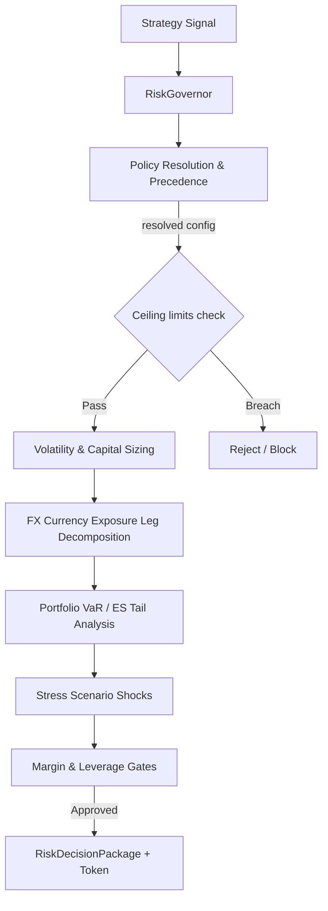

# Risk Governance Service

The `app/services/risk/` package is the core **Layer 4 (Trading/Risk/Strategy Layer)** module responsible for pre-trade risk checks, stateless position sizing, stress scenario evaluations, policy-as-code resolution, and execution-risk gating.

---

## 1. System Architecture & Flow

The service acts as the single deterministic gatekeeper before order generation or execution. All signals must pass through the `RiskGovernor` to be approved, reduced, rejected, or blocked.



---

## 1.1 Core Models & Serialization

Canonical risk models, enums, Pydantic contracts, and serialization helpers are organized as a modular package under `app/services/risk/models/`:
* **`enums.py`**: Defines all risk enums (`RiskDecisionStatus`, `RiskMode`, `RiskAction`, `RiskSeverity`, `RiskReasonCode`, `KillSwitchStateEnum`, `KillSwitchReason`).
* **`contracts.py`**: Defines Pydantic model schemas for all inputs, outputs, snapshots, and tokens (e.g. `ProposedTrade`, `PortfolioState`, `RiskConfig`, `RiskApprovalToken`, `RiskDecisionPackage`). Enforces finite Decimal validation and handles bi-directional field-syncing validators.
* **`serialization.py`**: Implements JSON-safe type coercion and round-trip verification helpers.

---

## 2. Configuration Profiles (`configs/`)

Risk profiles are stored as JSON configurations under `app/services/risk/configs/`. Each profile defines defaults for daily loss, total loss, effective leverage, and live execution authorization.

* **`default.json`**: Safe defaults for local testing and simulations. Live execution disabled.
* **`prop_firm_default.json`**: Conservative limits adhering to standard prop-firm constraints.
* **`paper.json`**: Standard limits for paper-trading environments.
* **`live_conservative.json`**: Stricter limits with `allow_live_execution` set to `true`.

> [!IMPORTANT]
> All default values in these configuration profiles are conservative safety baselines designed to protect capital and enforce safe operational boundaries. They are not optimized for trading performance, and should not be interpreted as optimized target parameters or performance promises.


---

## 3. Hard Safety Ceilings & Live Profile Guardrails

To prevent accidental overrides from setting extreme or dangerous limits, the configuration parser validates all values against hard-coded global ceilings defined in [schema.py](file:///c:/Users/rharu/AppDev/HaruquantAI/app/services/risk/config/schema.py):

| Limit Parameter | Hard Ceiling Value | Description |
| :--- | :--- | :--- |
| `max_daily_loss_pct` | `0.20` (20%) | Absolute limit on daily drawdown before halt. |
| `max_total_loss_pct` | `0.50` (50%) | Absolute lifetime drawdown threshold. |
| `max_margin_utilization_pct` | `1.00` (100%) | Capped margin usage. |
| `max_effective_leverage` | `500.0` | Capped account leverage. |
| `max_risk_per_trade` | `0.10` (10%) | Maximum capital risk allocation for a single trade. |

Any override rule or profile value exceeding these ceilings triggers an immediate `ValidationError` or evaluates to a `REJECT` state.

### Live Profile Guardrails
For live configurations (`allow_live_execution` set to `true`), the following additional constraints are enforced strictly during validation:
1. **Prop-Firm Drawdown Limits**: Live profiles daily loss limit must remain strictly below `0.04` (4.0%) daily drawdown and total loss limit below `0.08` (8.0%) total drawdown to comply with standard external prop-firm limits.
2. **Owner/Admin Approval for Increased Limits**: Any increase of risk parameters above conservative default baselines (defined by `CONSERVATIVE_DEFAULTS`, e.g. `max_risk_per_trade` > `0.002` or `max_effective_leverage` > `5.0`) requires explicit owner or admin role signatures within `operator_approval_fields.operator_id`.


---

## 4. Configuration Hashing

Configuration models support deterministic, stable cryptographic hashing.
* Instantiation timestamps (`created_at`) are normalized during config loading to ensure identical configurations yield the exact same SHA256 signature.
* Config signatures are embedded in all emitted `RiskDecisionToken` structures for audit trails, ensuring executing modules cannot run under altered settings.

---

## 5. Policy-as-Code Resolution & Precedence

Scoped overrides are specified as `PolicyRule` configurations containing matching scopes and target limit overrides. When resolving active policies for an execution context, rules are matched and sorted based on specificity scoring:

```text
Precedence Score = (workflow_id * 10000)
                 + (symbol * 1000)
                 + (strategy_id * 100)
                 + (account_id * 10)
                 + (currency * 5)
                 + (operator_role * 2)
                 + (mode * 1)
                 + (environment * 1)
```

Rules are sorted by ascending specificity score. The most general rules (lowest scores) are applied first, and the most specific rules (highest scores) are applied last, overwriting more general limits (e.g., a symbol-specific override overrides a strategy-level or account-level limit).

### Live sensitive fail-closed behavior
* If the context matches a live environment/mode (e.g. `full_live`), and the resolved configuration has `allow_live_execution: false`, the policy resolution automatically fails closed with a `BLOCK` status.
* If a request lacks a resolved policy or default configuration, the gate fails closed by default.

---

## 6. Override Token Verification

Ad-hoc limit overrides require cryptographically signed `RiskApprovalToken` structures. Token validation enforces:
1. **Time-bounded Expiration**: Rejects expired tokens.
2. **Configuration Compatibility**: Checks that the token's `config_hash` matches the current active `RiskConfig` hash to prevent applying old overrides to new profiles.
3. **Scope Alignment**: Validates that scope parameters (like `symbol` or `strategy_id`) match the target execution context.
4. **Authority Checks**: Live staging/production overrides require an authorized approver role (`risk_manager`, `admin`, or `compliance_officer`). Lower privilege roles (like `strategy_developer`) are blocked.

---

## 7. Market Regime Gate

The Market Regime Gate package (`app/services/risk/regime/`) validates current market conditions against historic baselines and calendar events, blocking or rejecting proposals when conditions are unsafe. It is composed of the following files:

* **`assessor.py`**: Implements pure assessors for spread, volatility, news calendar, and rollover blackout classifications, including `assess_risk_regime` (supporting V1 & V2 signatures), `RegimeRiskEngine`, `classify_spread_regime`, `classify_volatility_regime`, `is_rollover_blackout`, and `validate_market_freshness`.
* **`validation.py`**: Implements input validation checks (`validate_regime_inputs`) and stable reason code builders (`build_regime_reason_codes`).

### Classification Categories
1. **Spread Regime (`SpreadRegime`)**: Classifies current spread as `NORMAL`, `WIDE`, or `EXTREME` based on rolling spread statistics and z-score thresholds. `EXTREME` breaches fail the gate with `RiskDecisionStatus.REJECT` and reason code `SPREAD_BREACH`.
2. **Volatility Regime (`VolatilityRegime`)**: Uses short and long rolling standard deviation windows to detect low volatility (`LOW`), normal (`NORMAL`), high volatility (`HIGH`), or an abnormal volatility spike (`SPIKE`). `SPIKE` outcomes reject the trade with reason code `DAILY_LOSS_BREACH`.
3. **Liquidity Regime (`LiquidityRegime`)**: Checks quote age, tick frequency, and missing bars. Stale, thin, or illiquid states resolve to `ILLIQUID` or `THIN`. Illiquidity rejects execution with reason code `STALE_EVIDENCE`.
4. **Session Regime (`SessionRegime`)**: Rejects trades if the target market session is `CLOSED` or symbol is `SUSPENDED`.
5. **Rollover Regime (`RolloverRegime`)**: Enforces blackout windows surrounding broker midnight. Active rollover windows reject the trade with reason code `ROLLOVER_BLACKOUT`.
6. **News Regime (`NewsRegime`)**: Parses high-impact news calendar schedules. High impact news within the blackout range triggers a blackout regime, rejecting the proposal with reason code `NEWS_BLACKOUT`.

### Live Fail-Closed Calendars
In live-sensitive environments, the engine enforces strict news calendar checks. If a live profile requires news calendar coverage and the calendar evidence is missing or empty, the gate fails closed with a `BLOCK` decision and reason code `STALE_EVIDENCE` to prevent trading into unmonitored macro events.

---

## 8. Pre-Trade Deterministic Limits & Aggregation

The deterministic limits engine is organized as a modular package under [limits/](file:///c:/Users/rharu/AppDev/HaruquantAI/app/services/risk/limits/) and evaluates candidate execution payloads sequentially against 20 configured limits.

* **`contracts.py`**: Defines `LimitResult` (single check outcome), `LimitCheck` (typed limit-name/required-evidence/severity/precedence/evaluator registry entry), `LimitAssessment` (aggregated outcome), and the `LimitContext`/`LimitPrecedence` type aliases.
* **`checks.py`**: Pure evaluators for every limit (kill-switch, evidence freshness, loss, exposure, tail-risk, margin, session, execution, frequency), plus a canonical V2 surface (`check_kill_switch`, `check_evidence_freshness`, `check_daily_loss`, `check_total_drawdown`, `check_exposure_limits`, `check_tail_risk_limits`, `check_execution_limits`) operating on typed snapshots (`PortfolioRiskSnapshot`, `VaRSnapshot`, `ExpectedShortfallSnapshot`, `StressSummary`, `ExecutionRiskSnapshot`) and an `EffectiveRiskPolicy` instead of a raw `market_context` dict.
* **`engine.py`**: Assembles `ORDERED_LIMIT_CHECKS` (the immutable `tuple[LimitCheck, ...]` registry — built here rather than in `contracts.py` to avoid a circular import back into `checks.py`), `LimitEngine`, `run_limit_checks`/`check_risk_limits` (V1 orchestration), and the V2 `evaluate_ordered_limits`/`select_primary_failure`/`build_composite_breach_flags` pure aggregation functions.

### Execution Sequence Precedence
Limit checks are ordered strictly as follows:
1. **Governance & Switch Gates**: `kill_switch_state` -> `stale_evidence` -> `max_drawdown_limit` -> `daily_loss_limit` -> `strategy_loss_limit` -> `news_blackout` -> `rollover_blackout`
2. **Execution Feasibility Gates**: `spread_limit` -> `slippage_limit` -> `trade_frequency_limit` -> `pending_order_limit`
3. **Exposure & Concentration Gates**: `portfolio_exposure_limit` -> `symbol_exposure_limit` -> `currency_exposure_limit` -> `correlated_cluster_limit`
4. **Tail-Risk & Financial Leverage Gates**: `var_limit` -> `expected_shortfall_limit` -> `stress_loss_limit` -> `leverage_limit` -> `margin_limit`

### Breach Decision Aggregation
When multiple limits fail simultaneously:
* The consolidated status uses the highest severity precedence: `BLOCK > REJECT > NEEDS_MORE_EVIDENCE > NEEDS_APPROVAL > REDUCE_SIZE > APPROVE`.
* The `primary_failure_limit` reports the first limit breached according to the deterministic check sequence.
* A sorted composite list of `composite_breach_flags` lists all triggered limit violations.
* The V2 `evaluate_ordered_limits(context)` returns a single `LimitAssessment` combining the same `results`, an aggregated `status`, a `primary_failure` (`LimitResult | None`, selected via `select_primary_failure` against `DEFAULT_LIMIT_PRECEDENCE`), and `composite_breach_flags` as a `frozenset[RiskReasonCode]` (rather than limit-name strings).

---

## 9. Testing & Quality Assurance

All risk components implement strict static type annotations checked with Mypy, and Ruff formatting/lint guidelines.

To run verification checks:
```bash
# Run unit tests
.venv\Scripts\pytest tests/unit/app/services/risk/

# Run Ruff check
.venv\Scripts\ruff check app/services/risk/

# Run Mypy checks
.venv\Scripts\mypy .
```

---

## 10. Position Sizing Engine

The Position Sizing Engine calculates safe, risk-budgeted position volumes under [sizing/](file:///c:/Users/rharu/AppDev/HaruquantAI/app/services/risk/sizing/).

### Sizing Methods (`SizingMethod`)
1. **Fixed Lot (`fixed_lot`)**: Returns a fixed trade volume.
2. **Fixed Risk (`fixed_risk`)**: Sizes volume based on a target risk capital amount (or percentage of equity) and the stop loss distance.
3. **Fixed Fractional (`fixed_fractional`)**: Sizes volume as a fixed fraction of total portfolio equity.
4. **Volatility Adjusted (`volatility_adjusted`)**: Uses rolling ATR or M1 standard deviation volatility measurements to dynamically size the stop distance and resulting position.
5. **Correlation Adjusted (`correlation_adjusted`)**: Reduces position size dynamically based on the proposed asset's correlation to the active portfolio.
6. **Milestone (`milestone`)**: Gradually scales down sizing based on trade/milestone targets.
7. **Kelly Sizing (`kelly`)**: Computes the optimal statistical sizing fraction based on historical win rates and win-loss ratios. Enforced as advisory-only if trade history count is below the configured threshold (default 30).

### Verification and Constraints
* **Lot Step Formatting**: Sizing outputs are formatted to match broker-specific minimums, maximums, and step increments.
* **Risk Budget Ceilings**: Sizing respects global and policy-specific risk percent boundaries before rounding.
* **Reductions**: Applies step-down multipliers for active drawdown states, currency exposure concentrations, and correlation cluster risks prior to final sizing.
* **Rejection Conditions**: Zero or negative stop distance, missing symbol metadata, or calculated sizes below broker minimums result in a rejection or zero lot volume.

---

## 11. FX Currency Exposure Engine

The FX Currency Exposure Engine decomposes portfolios, pending orders, and proposed trades into their underlying base and quote currency legs to calculate gross and net currency exposures, as well as account-currency equivalent exposures. It is organized as a modular package under `app/services/risk/exposure/`:

* **`fx_legs.py`**: Decomposes trade proposals and positions into their base and quote currency components. Implements pure, stateless symbol parsing.
* **`aggregation.py`**: Aggregates exposures at the portfolio level, implements pending-order exposure policies, and evaluates hidden USD or major currency concentrations.
* **`__init__.py`**: Exposes the public functional facade and orchestrator engines.

### Key Components & Functions

1. **Symbol Parsing & Leg Decomposition (`fx_legs.py`)**:
   * **`parse_fx_symbol`**: Decomposes standard (e.g. `EURUSD`, `USDJPY`) and custom FX symbols to identify base/quote currency codes.
   * **`decompose_fx_trade`**: Purely decomposes a trade proposal into signed base and quote leg amounts.
     * *Buy Trade*: Base Leg gets `+ quantity * contract_size`; Quote Leg gets `- quantity * contract_size * price`.
     * *Sell Trade*: Base Leg gets `- quantity * contract_size`; Quote Leg gets `+ quantity * contract_size * price`.
   * **`validate_currency_conversion_requirements`**: Rejects validation if any of the target currency legs lack a corresponding rate to convert back to the account base currency.

2. **Exposure Aggregation & Policies (`aggregation.py`)**:
   * **`calculate_currency_exposure`**: Aggregates total exposure from positions, pending orders, and proposed trades under the configured pending order policy:
     * `ignore`: Pending and in-flight orders are ignored.
     * `full-potential`: Pending orders are aggregated at 100% potential.
     * `near-market-only`: Includes pending orders only if their distance to current market price is below a threshold.
     * `probability-weighted`: Pending orders are weighted by their historical fill probability (defaulting to 0.50).
   * **`detect_hidden_concentration`**: Scans active positions and trade proposals to detect hidden short USD exposure concentrations across multiple quote-USD currency pairs (e.g., EURUSD, GBPUSD, AUDUSD, NZDUSD).
   * **Live fail-closed checks**: Rejects calculations if the portfolio is unreconciled or quote status is unknown in live mode.


---

## 12. Correlation and Cluster Risk Engine

The Correlation and Cluster Risk Engine computes price returns, aligns timeseries across multiple assets, calculates Pearson correlation matrices, detects correlation spikes, groups assets into connected-component clusters, and determines sizing multipliers or threshold-based rejections for proposed trades. It is organized as a modular package under `app/services/risk/correlation/`:

* **`returns.py`**: Handles return construction, timestamp alignment, and input eligibility checks.
  * **`build_return_series`**: Derives log, close-to-close, open-to-close, or σ-normalized returns from closed-bar series.
  * **`align_return_series`**: Aligns multiple return series by matching opening timestamps (supporting intersection alignment). Also provides V1 dual signature compatibility.
  * **`validate_correlation_inputs`**: Rejects or flags aligned arrays if sample counts are insufficient.
* **`fallbacks.py`**: Implements fail-closed checks and conservative correlation matrices when sample sizes are inadequate.
  * **`should_fail_closed_for_missing_correlation`**: Determines if missing historical correlation must reject/block.
  * **`build_conservative_correlation_snapshot`**: Generates a matrix with perfect self-correlation (1.0) and policy-governed assumed correlation for cross-asset entries.
  * **`resolve_correlation_fallback`**: Rejects execution under live fail-closed policies or returns a conservative fallback matrix.
* **`engine.py`**: Computes correlation snapshots, groups assets, analyzes exposures, and calculates marginal contributions.
  * **`calculate_correlation_matrix`**: Computes pairwise Pearson correlation matrices (supporting V1 & V2 signatures).
  * **`build_correlation_clusters`**: Performs connected-component graph clustering based on absolute correlation thresholds.
  * **`calculate_cluster_exposure`**: Computes aggregate gross portfolio exposures per correlated cluster.
  * **`calculate_component_risk_contribution`**: Analyzes the marginal and component risk contributions from covariance matrix and portfolio weights.
  * **`evaluate_proposed_trade_correlation`**: Recommends `APPROVE`, `REDUCE_SIZE`, or `REJECT` status based on marginal correlation thresholds.


---

## 13. Value-at-Risk (VaR) and Expected Shortfall (ES) Engine

The Value-at-Risk (VaR) and Expected Shortfall (ES) Engine computes portfolio tail-risk metrics and is organized as a modular package under [tail_risk/](file:///c:/Users/rharu/AppDev/HaruquantAI/app/services/risk/tail_risk/):

* **`contracts.py`**: Defines the data models for tail-risk estimation.
  * **`VaRCalculationRequest`**: Carries inputs for VaR estimation (portfolio state, market context, confidence, method, lookback).
  * **`ExpectedShortfallRequest`**: Carries inputs for Expected Shortfall estimation.
  * **`VaRResult` & `ExpectedShortfallResult`**: Encapsulate legacy V1 result parameters.
* **`var.py`**: Handles Value-at-Risk estimation, component risk contributions, and covariance mathematics.
  * **`calculate_parametric_var`**: Computes covariance/volatility-based parametric VaR.
  * **`calculate_historical_var`**: Computes empirical return-based historical VaR.
  * **`calculate_portfolio_volatility`**: Calculates portfolio volatility from covariance matrix and weights.
  * **`calculate_var_component_contribution`**: Decomposes total portfolio tail risk into asset-level Component Risk Contributions (CRC).
  * **`PortfolioVaREngine`**: Wrapper class façade for VaR estimation.
* **`expected_shortfall.py`**: Handles Expected Shortfall (CVaR) calculations and validation of tail assumptions.
  * **`calculate_expected_shortfall`**: Computes average loss in the tail beyond the VaR threshold.
  * **`select_tail_losses`**: Filters and returns worst-performing returns in the tail.
  * **`validate_tail_risk_assumptions`**: Validates tail-risk relations and rejects insufficient return windows.
  * **`ExpectedShortfallEngine`**: Wrapper class façade for Expected Shortfall estimation.

### Role in Limits & Approvals
- **VaR Limit**: Evaluated as a warning or hard block based on profile settings.
- **Expected Shortfall Limit**: Acts as a hard tail-risk approval gate for live trading profiles, ensuring potential average tail losses are capped.


## 14. Stress Testing Engine

The Stress Testing Engine is organized as a modular package under [stress/](file:///c:/Users/rharu/AppDev/HaruquantAI/app/services/risk/stress/) and evaluates portfolio and candidate trade resilience under extreme macro shocks and execution failures.

* **`contracts.py`**: Defines Pydantic model schemas for declarative stress scenarios, execution contexts, projected portfolios, and summary results (`StressScenario`, `ProjectedPortfolio`, `StressScenarioResult`, etc.).
* **`registry.py`**: Manages the scenario registry, validation checks, and lookup facades (`StressScenarioRegistry`).
* **`engine.py`**: Implements the V2 stress calculation logic, standard stress loss, GBP volatility calculations, and threshold comparisons (`evaluate_stress_scenarios`).
* **`__init__.py`**: Exposes legacy compatibility wrappers (e.g. `PriceShockScenario`, `USDShockScenario`, `evaluate_portfolio`, `validate_custom_scenario`) to support version 1 interfaces.

### Default Scenarios
The default registry contains 13 pre-loaded scenarios:
1. **USD Shock Up / Down**: Shocks USD exchange rates by $\pm 10\%$.
2. **JPY Risk-Off**: Appreciation of JPY by $10\%$ against other currencies.
3. **GBP Volatility Shock**: Doubling of GBP spreads and $\pm 15\%$ worst-case price shocks.
4. **Spread Widening 5x**: Multiplies spreads by $5$ to evaluate liquidity stress.
5. **Slippage Shock 50 pips**: Assesses slippage impact on proposed executions.
6. **Correlation to One**: Simulates tail risk under perfect asset correlation.
7. **News Candle 5% Shock**: Instant $5\%$ unfavorable price movement against all positions.
8. **Rollover Liquidity Shock**: Widens spreads by $10\text{x}$ to check rollover risk.
9. **Margin Requirement Spike 2x**: Broker doubles margin requirements, checking for shortfall.
10. **Platform Disconnect**: Fail-closed scenario simulating terminal disconnection.
11. **Stale Quote Check**: Blocks proposals when incoming quotes are stale ($>120\text{s}$).
12. **Forced Liquidation Proximity**: Verifies stop-out safety margins.
13. **JPY Risk-Off (V2)**: Specific JPY risk-off scenario matching version 2 requirements.

### Optimized Performance
To meet the strict performance boundary (< 50.0ms for 100 scenarios across 500 positions under heavy load), the engine employs the following optimizations:
1. **`QuickProjectedPortfolio`**: A lightweight plain-Python container class that bypasses Pydantic's slow schema validation and default value resolution checks inside the scenario loop.
2. **Pre-calculated Multipliers**: Caches quantity, contract size, currency conversion rates, and position direction sign values to the portfolio state, saving nested loop calculation overhead.
3. **Pre-allocated Decimal Constants**: Reuses module-level pre-allocated Decimal constants (`_DECIMAL_ZERO`, `_DECIMAL_ONE`) to eliminate heavy Decimal string-parsing overhead.
4. **Log Suppression**: Suppresses Loguru frame-inspection overhead for large portfolio runs.

### Custom Scenarios & Safety
Custom scenarios can be dynamically parsed and validated using `validate_custom_scenario(config)`. The configuration restricts inputs to numeric percentage shocks within $\pm 100\%$ boundaries, preventing any arbitrary code execution or out-of-bounds inputs.

Stress test results evaluate against the configuration's `max_total_loss_pct_advisory` threshold to determine pass/fail status.


## 15. Margin, Drawdown, and Execution Feasibility Gates

The Margin, Drawdown, and Execution Feasibility Gates evaluate capital requirements, account-level performance drawdowns, and broker-level execution constraints prior to trade execution. They are organized as a modular package under [feasibility/](file:///c:/Users/rharu/AppDev/HaruquantAI/app/services/risk/feasibility/) and never perform broker account queries or order mutation.

Each file exposes two calculation surfaces:
* A **V1 surface** operating on `PortfolioState`/`ProposedTrade`/`market_context: dict`/`RiskConfig` — the original, richer calculation path preserved for the `RiskGovernor` orchestration flow and backward-compatible callers.
* A **V2 pure surface** operating on the canonical typed snapshots (`AccountRiskSnapshot`, `PortfolioRiskSnapshot`, `EffectiveRiskPolicy`, `DrawdownState`, `MarketRiskSnapshot`, `BrokerConstraintSnapshot`) matching the architecture's `Target Class/Function` contracts.

### Key Components

1. **Margin Governance (`feasibility/margin.py`)**:
   - **Current & Projected Margin**: Computes active margin requirements and projects margin usage after executing proposed candidate trades (`calculate_current_margin`, `calculate_projected_margin`, `evaluate_margin_governance`).
   - **Free Margin After Orders**: Calculates remaining free margin while accounting for pending orders under different policies (`ignore`, `full-potential`, `near-market-only`, `probability-weighted`).
   - **Margin & Leverage Limits**: Rejects trades if projected margin utilization breaches the account threshold (`max_margin_utilization_pct`) or if effective leverage exceeds the cap (`max_effective_leverage`).
   - **Exit Liquidity Stress Check**: Simulates cost impact of selling all active positions under spread spikes (e.g., 5x spread shock) to ensure account solvency.
   - **V2 canonical API**: `calculate_current_margin_usage`, `calculate_projected_margin_usage`, and `calculate_free_margin_after_reservations` operate directly on `AccountRiskSnapshot`/`PortfolioRiskSnapshot`/`PendingOrderRiskSnapshot` evidence; `check_margin_limits` evaluates a `MarginRiskSnapshot` against an `EffectiveRiskPolicy` and returns ordered `LimitResult` tuples for account margin and leverage caps.

2. **Drawdown Governor (`feasibility/drawdown.py`)**:
   - **Drawdown Metrics**: Computes daily drawdown, lifetime total drawdown, and strategy-specific drawdown.
   - **Throttling Transitions**: Automatically maps drawdown levels to throttling states:
     - `NORMAL` (drawdown < 50% of soft limit): Multiplier `1.0`.
     - `CAUTION` (drawdown >= 50% of soft limit): Multiplier `0.8`.
     - `DEFENSIVE` (drawdown >= soft limit): Multiplier `0.5`.
     - `RECOVERY_ONLY` (drawdown >= 80% of hard limit): Multiplier `0.2`.
     - `HALTED` (drawdown >= hard limit): Multiplier `0.0` (trading blocked).
   - **State Persistence**: Serializes and restores drawdown states to/from local JSON storage to survive restarts, handling corruption gracefully.
   - **Revenge Trading Check**: Rejects trades whose volumes exceed drawdown-scaled average volumes.
   - **V2 canonical API**: `determine_drawdown_state(snapshot, prior, policy)` classifies a `PortfolioRiskSnapshot` against an `EffectiveRiskPolicy`; `calculate_drawdown_multiplier` resolves the approved step-down multiplier. `apply_drawdown_throttle` is dual-dispatch: called with `(portfolio_state, proposed_trade, market_context, config)` it runs the full V1 `LimitResult` sequence; called with `(size, state, policy)` (a bare `Decimal` first argument) it returns the throttled `Decimal` size directly.

3. **Execution Feasibility Gate (`feasibility/execution_gate.py`)**:
   - **Spread & Slippage Checks**: Validates that current spreads or slippage thresholds do not exceed multipliers of rolling volatility standard deviations.
   - **Stop Compliance Check**: Ensures that proposed stop-loss and take-profit distances are outside broker minimum stop levels (`stop_level`) and modification freeze levels (`freeze_level`).
   - **Volume Check**: Verifies that proposed lot volume sizes fall within broker minimum and maximum limits, and align with the broker lot step size.
   - **Session Status**: Blocks execution if the symbol's market session is closed or trading is suspended.
   - **Frequency Check**: Limits trades per strategy over a lookback window (e.g., max 5 trades per minute) to prevent runaway automated trading loops.
   - **V2 canonical API**: `assess_execution_feasibility(trade, market, metadata, policy)` builds an `ExecutionRiskSnapshot` from a `MarketRiskSnapshot` and `BrokerConstraintSnapshot`; `validate_stop_and_freeze_levels` returns a `ValidationResult`; `validate_micro_scalping_costs(execution, sigma, policy)` enforces the M1 spread/slippage-to-sigma ratio filter as a `LimitResult`.


## 16. Allocation and Lifecycle Governance

Allocation and Lifecycle Governance manages the capital budget distributed to strategies and controls the stage progression of strategies from backtesting up to live execution. Non-trade governance workflows (allocation review, lifecycle gating, and kill switches) are organized as a modular package under [governance/](file:///c:/Users/rharu/AppDev/HaruquantAI/app/services/risk/governance/).

Each file exposes two calculation surfaces:
* A **V1 surface** operating on the original request envelopes (`AllocationReviewRequest`, positional `strategy_id`/`evidence`/`config` arguments) — the richer path preserved for `RiskGovernor` orchestration and backward-compatible callers.
* A **V2 pure surface** operating on canonical typed contracts (`ProposedAllocation`/`PortfolioRiskSnapshot`/`EffectiveRiskPolicy`, `StrategyAdmissionRequest`/`LiveReadinessRequest`, `AllocatableRisk`/`AllocationPlan`, `LifecycleEvidence`/`LifecycleAssessment`) matching the architecture's `Target Class/Function` contracts.

### Capital Allocation Governance (`governance/allocation.py`)
1. **Allocation Parity Methods**:
   - **Equal-Risk Allocation**: Equally divides capital budgets among active strategies (`equal_risk_allocation`; canonical `calculate_equal_risk_allocation` operates on `AllocatableRisk` items and returns a normalized `AllocationPlan`).
   - **Volatility Parity Allocation**: Allocates budgets inversely proportional to strategy rolling volatilities (`volatility_parity_allocation`; canonical `calculate_volatility_parity_allocation`).
   - **Correlation-Adjusted Parity Allocation**: Volatility parity weights adjusted by the mean correlation of strategy returns (`correlation_adjusted_risk_parity_allocation`; canonical `calculate_correlation_adjusted_allocation`).
2. **Multipliers & Adjustments**:
   - **Regime Weighting**: Scales allocations based on market regimes (`apply_regime_weighting`).
   - **Drawdown Adjustments**: Scales allocations down individually using strategy-specific drawdown multipliers (`apply_drawdown_adjustment`; combined canonical helper `apply_regime_and_drawdown_adjustments`).
3. **Allocation Limits Gate**:
   - `review_allocation_proposal` is dual-dispatch: called with an `AllocationReviewRequest` it runs the full V1 `RiskAllocator` review (portfolio/strategy/symbol/currency budget, correlation cluster, VaR/ES, stress, margin, drawdown, and performance-evidence checks) and returns an `AllocationReviewResult`; called with `(proposal: ProposedAllocation, portfolio: PortfolioRiskSnapshot, policy: EffectiveRiskPolicy)` it checks proposed weights directly against the resolved policy's `risk.max_total_open_risk` and `max_strategy_allocation_pct` caps and returns an `AllocationAssessment` (a type alias of `AllocationReviewResult`).
   - Requires historic performance evidence (Sharpe ratio and trade count) before allowing any strategy allocation increase (V1 path).
   - Requires a valid governed approval token if the allocation increase exceeds `max_allocation_increase_pct` (V1 path).

### Lifecycle Staging and Promotion (`governance/lifecycle.py`)
1. **Sequential Stages**: Defines standard progression sequence: `backtest` -> `walk-forward` -> `simulation` -> `paper` -> `shadow` -> `micro-live` -> `full-live`. The canonical `RiskLifecycleState`/`StrategyLifecycleState` enum exposes the newer `research` -> `simulation` -> `paper` -> `shadow` -> `live-read-only` -> `micro-live` -> `full-live` naming for V2 callers.
2. **Promotion Gate Verification**:
   - `review_strategy_admission` is dual-dispatch: called with `(strategy_id, evidence, config)` it delegates to the V1 `RiskLifecycleGate.admit_strategy` and returns a `StrategyAdmissionReview`; called with `(request: StrategyAdmissionRequest, policy: EffectiveRiskPolicy)` it merges the request's evidence buckets and returns a canonical `LifecycleAssessment`.
   - `validate_lifecycle_transition(current, target, evidence: LifecycleEvidence)` runs the same skip-gate, high-risk-approval, and per-stage evidence checks as the V1 gate against a typed `LifecycleEvidence` bundle, returning a `ValidationResult`.
   - `requires_lifecycle_approval(assessment, policy)` reports whether a `LifecycleAssessment` requires a governed approval token (`status == NEEDS_APPROVAL`).
   - Prevents skipping stages; validates that promotion evidence (e.g. Sharpe ratio, trade count, duration, out-of-sample performance, or tracking error) meets profile-configured minimum requirements for each transition step.
3. **Live Readiness Gate**:
   - `review_live_readiness` is dual-dispatch: called with `(strategy_id, proposed_stage, market_context, config)` it delegates to the V1 `RiskLifecycleGate.check_readiness` and returns a `LiveReadinessReview`; called with `(request: LiveReadinessRequest, policy: EffectiveRiskPolicy)` it returns a canonical `LifecycleAssessment`.
   - Validates that live-sensitive stages (`shadow`, `micro-live`, `full-live`) meet system integration requirements:
     - Audit persistence must be active (`audit_persistence_active`).
     - Kill switch must be configured (`kill_switch_configured`).
     - Reconciliation and idempotency checks must be active (`portfolio_reconciliation_active`, `idempotency_evidence_present`).


## 17. Safety Kill Switches

The Safety Kill Switches engine under [governance/kill_switch.py](file:///c:/Users/rharu/AppDev/HaruquantAI/app/services/risk/governance/kill_switch.py) implements fail-closed trading halts, persistent tracking, and governed resume deactivation limits. It exposes both the original V1 manager API and a canonical V2 surface (`KillSwitchState`, `KillSwitchAssessment`, `KillSwitchService`) built on the same `KillSwitchManager` singleton and `RiskStateStore` persistence port.

### V1/V2 Dual API Surface
* `check_risk_kill_switch` is dual-dispatch: called with `(scope: str, target: str)` it returns a plain `bool` (True if blocked), delegating to the global `KillSwitchManager` singleton; called with `(scope: KillSwitchScope, state: KillSwitchState)` it evaluates an already-resolved state snapshot against the canonical `_BLOCKING_STATES` set (`ACTIVE`, `LOCKED`, `TRIGGERED`, `PENDING_RESUME`, `UNKNOWN`) and returns a `KillSwitchAssessment`. `UNKNOWN` always fails closed.
* `request_kill_switch_trigger(request: KillSwitchTriggerRequest) -> KillSwitchState` and `clear_kill_switch_after_approval(request: KillSwitchResumeRequest, approval: ApprovalContext | None) -> KillSwitchState` provide canonical typed entry points over `trigger_kill_switch`/`resume_after_kill_switch`.
* `validate_resume_request(request, approval) -> bool` checks whether a resume request carries the operator role required to clear the current blocking state (`compliance`/`admin` for `locked`, any operator role otherwise).
* `KillSwitchService(store: RiskStateStore)` is a thin object-oriented facade (`check`, `trigger`, `resume`) over the module-level functions, for callers that inject a `RiskStateStore` port directly instead of relying on the global singleton/local-JSON persistence path.

### Hierarchical Scopes
Trading blocks are evaluated in a hierarchical sequence where higher-level switches block lower-level targets:
* **`global`**: Halts all system execution across all accounts and strategies.
* **`portfolio`**: Halts all executions on a target account/portfolio.
* **`strategy`**: Halts all orders originating from a specific strategy ID.
* **`symbol`**: Halts execution for a specific asset (e.g. `EURUSD`), or if base/quote currency legs of that asset are halted.
* **`currency`**: Halts trading for any symbols containing the currency leg (e.g. halting `EUR` blocks `EURUSD` and `EURGBP` but not `GBPUSD`).

### Switch States
* **`inactive`**: Normal operation. Trading is authorized.
* **`active`**: Halted/blocked. Trading is blocked. Requires administrative operator credentials or a valid approval token to resume.
* **`locked`**: Critical state. Triggered by severe failures (e.g. persistence corruption or audit-chain failure). Resuming is locked and strictly requires an explicit operator role of `compliance` or `admin` (cannot be bypassed by approval token alone).

### Persistence & Fail-Closed Behavior
* States are written to local JSON storage (by default `data/risk/kill_switch_state.json`).
* If the persistence file is missing or corrupted at launch, the system **fails closed**, transitioning to a `locked` global active state to block any trade submissions.

### Automated Trigger Events
The `evaluate_triggers` function statelessly parses pre-trade assessment requests and limit results, pulling kill switches automatically on:
1. **Daily Loss Breach**: Global active state.
2. **Drawdown Breach**: Global active state.
3. **Audit-Chain Failure**: Global locked state.
4. **Extreme Spread Widening**: Symbol active state.
5. **Portfolio Reconciliation Failure**: Portfolio active state.
6. **Broker Terminal Disconnect**: Global active state (in live mode).
7. **Margin Emergency**: Portfolio active state.
8. **Manual Operator Halt**: Global active state.

---

## 18. Risk Reporting & Observability (Sprint 5.16)

The reporting module provides structured, JSON-safe compilation of risk assessments, breaches, and historical decisions without recomputing or fabricating evidence. Observability metrics track calculation performance, decision distributions, and safety gate states.

### Risk Report Builder (`reports.py`)
* **Data Sources**: Generates consolidated reports exclusively from stored decisions, snapshots, and audit events.
* **Redaction Policy**: Strips private account numbers, credentials, and raw broker response packets.
* **Path Traversal Guard**: Gated write-to-path operations reject outputs directed outside the workspace directory or temporary system directories.

### Recorded Observability Metrics (`RISK_METRICS_REGISTRY`)
The governor records metrics to a thread-safe local registry exported to Prometheus:
* `haruquant_risk_governor_latency_ms`: p95 latency tracking for pre-trade reviews.
* `haruquant_risk_var_es_latency_ms` & `haruquant_risk_stress_latency_ms`: Latency of complex portfolio evaluations.
* `haruquant_risk_decision_total`: Counters of approvals, reductions, and rejections.
* `haruquant_risk_stale_evidence_failures_total`: Counter for fail-closed stale context halts.
* `haruquant_risk_kill_switch_state`: Gauges for global/portfolio/symbol kill switches.
* `haruquant_risk_audit_persistence_health`: Gauge representing cryptographic audit-chain integrity.

---

## 19. Storage Architecture & Persistence (Sprint 5.17)

The risk governance storage layer is structured as a dedicated package under `app/services/risk/storage/` which decouples the persistence layer from the core business logic using explicit ports and interfaces.

### Key Components

1. **Storage Ports (`ports.py`)**:
   - **`RiskStateStore`**: Repository protocol for saving and retrieving strategy drawdown states, active kill switches, and cryptographic tokens.
   - **`RiskAuditSink`**: Repository protocol for recording sequential blockchain-style audit blocks.
   - **`RiskPolicyStore`**: Interface for persisting active risk rules and policy-as-code parameter overrides.
   - **`RiskDecisionStore`**: Interface for persisting and performing compound-key idempotency checks on pre-trade governor decisions.
   - **Idempotency Key Checks (`persist_risk_decision`)**: Idempotently persists decisions using a compound key `(request_id, workflow_id, signal_id, decision_material_hash)` to protect against double-spend or duplicate executions.
   - **Schema & Live Guards**:
     - `validate_storage_schema_compatibility`: Verifies major-version schema matching (expects major version 1) to prevent serialization mismatches.
     - `require_live_audit_persistence`: Enforces fail-closed rules where live trading mode is active but the target storage engine lacks durability or audit-trail support.

2. **In-Memory Implementation (`in_memory.py`)**:
   - **`InMemoryRiskStateStore`**: Thread-safe repository implementing all four storage protocols using local python dicts protected by re-entrant locks (`threading.RLock`).
   - **Fault Injection (`simulate_storage_failure`)**: Exposes simulated failure interfaces to test domain-level fail-closed robustness against database/file storage outages.

---

## 20. Readiness and Delivery Plan Validation (Sprint 5.18)

The readiness module proves that readiness verification starts only with canonical dependencies, explicit scope boundaries, safe fixtures, documented mode behavior, and an auditable delivery plan. It is a pre-runtime governance boundary and never evaluates a trade.

### Key Components

1. **Dependency Status Mapping (`validate_phase_dependencies`)**:
   Verifies that required dependencies (e.g. storage ports, policy engines, and calculators) are implemented, importable, side-effect safe, and covered by tests.
2. **Trading Mode Matrix (`validate_risk_mode_matrix`)**:
   Enforces that the implementation covers all safety and operational environments (offline, simulation, paper, shadow, read-only live, micro-live, full-live).
3. **Delivery Plan Validation (`validate_delivery_plan`)**:
   Verifies requirements traceability, restricts fixtures to synthetic-only datasets, checks for deterministic seeds, and enforces fail-closed policies for live-sensitive staging.
4. **Dry-Run Compilation (`build_readiness_dry_run`)**:
   Takes a validated manifest and outputs a detailed `DryRunReport` detailing the files to read, files to change, planned commands, active scopes, blockers, and rollback boundaries.

---

## 21. Governor & Decision Synthesis (Sprint 5.15)

The governor package orchestrates the pre-trade risk evaluation, capital allocation, strategy admission, and live readiness checks. The final decision status and parameters are synthesized into a single package.

### Key Components

1. **Decision Synthesis (`decision_synthesis.py`)**:
   - **`synthesize_decision(context)`**: Synthesizes the final `RiskDecisionPackage` from the ordered list of gate results without performing state mutations or audit writes.
   - **`determine_decision_status(results, policy)`**: Implements precedence rules for decision status (e.g. `HALT_ALL` > `HALT_STRATEGY` > `BLOCK` > `REJECT` > `NEEDS_MORE_EVIDENCE` > `NEEDS_APPROVAL` > `REDUCE_SIZE` > `APPROVE`).
   - **`select_primary_risk_reason(results)`**: Deterministically selects the primary warning or failure reason code based on status and severity rank.
   - **`aggregate_reductions(results)`**: Combines lot size reductions suggested across sizing, correlation, exposure, drawdown, and stress testing gates into a unified plan.
   - **`is_decision_token_eligible(decision)`**: Validates if a synthesized decision is eligible to receive a cryptographic approval token.


---

## 22. Cryptographic Audit Layer (Phase 16)

The Cryptographic Audit Layer provides a blockchain-style, cryptographically secure trail of all pre-trade decisions, ensuring complete transparency and preventing unauthorized signal execution. The code is organized under `app/services/risk/audit/`:

### Core Components & Modules

1. **Audit Event Sanitization & Redaction (`events.py`)**:
   - **`AuditRedactionPolicy`**: Statelessly redacts sensitive parameters (like API keys, passwords, client secrets) before serialization to protect user privacy.
   - **`build_canonical_audit_payload`**: Generates a deterministic, stable JSON representation of decision metadata to ensure hash consistency.
   - **`create_risk_audit_event`**: Compiles decision logs and signs them with a parent hash. Automatically exposes fallback handlers for legacy V1 audits.

2. **Blockchain-style Hash Chaining (`hash_chain.py`)**:
   - **`build_genesis_hash`**: Generates the initial seed hash for an empty state.
   - **`append_audit_hash`**: Links a new event to the tail of the existing chain by computing `SHA256(payload + previous_hash)`.
   - **`verify_risk_audit_chain`**: Scans audit blocks to detect any modification or deletion of past decisions.
   - **`require_valid_audit_chain`**: A fail-closed integrity gate. In live trading modes, any detected tampering automatically triggers a global locked kill switch.

3. **Cryptographic Tokens & Scope Boundaries (`tokens.py`)**:
   - **`RiskDecisionTokenSigner`**: Signs decision payloads with HMAC-SHA256. Dual-mode instantiation supports V2 structures and transient V1 keys.
   - **`create_risk_decision_token`**: Signs eligible approvals. Maps requests dynamically to V2 `RiskDecisionToken` or V1 `RiskApprovalToken`.
   - **`validate_risk_approval_token`**: Checks tokens for expiration, configuration/policy hash compatibility, scope alignment, and signature verification. Supports `@overload` signatures for clean static analysis compatibility.


